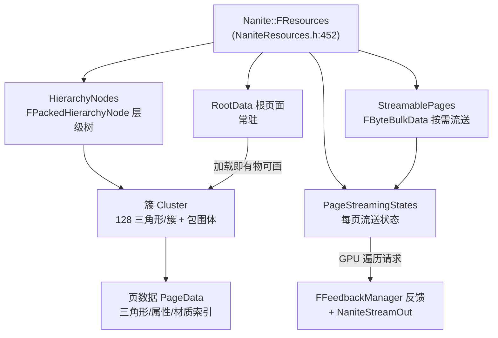
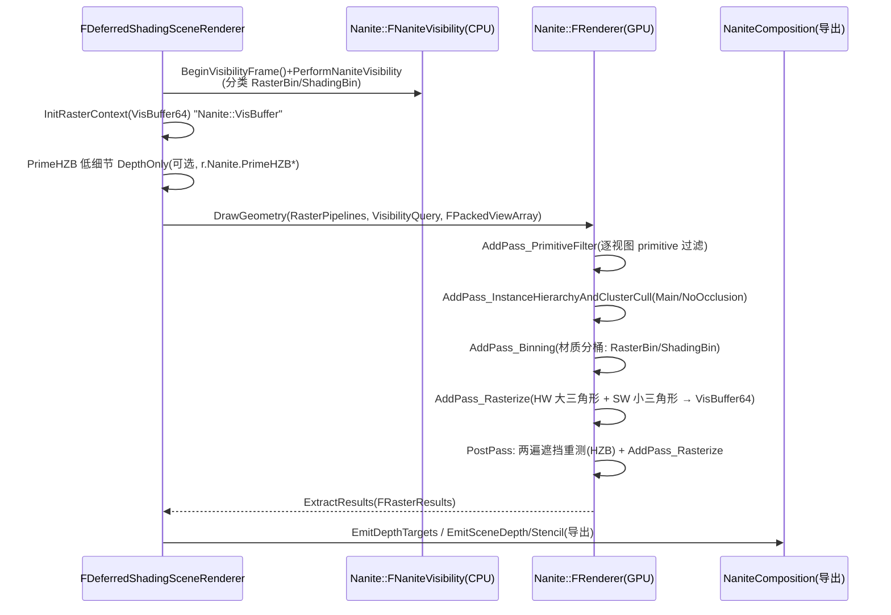
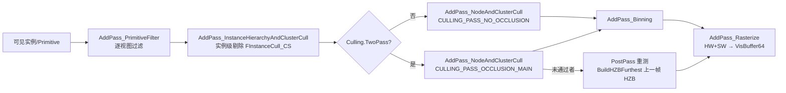
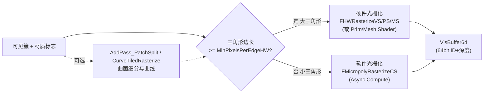

# Nanite 渲染系统源码（UE5.8）

> 以本机 UE5.8 源码锚点解释 Nanite 虚拟化几何体系统如何在 GPU 上完成
> "层级裁剪 → 簇栅格化 → Visibility Buffer → 材质着色"的完整链路，
> 覆盖运行时数据结构、渲染 Pass 调度、软/硬件栅格化、材质分类、流送与调试观测。

## 元数据

- 版本基线：UE5.8.0 / CL55116800 / ++UE5+Release-5.8
- 适用范围：Nanite 渲染系统的源码阅读：
  运行时数据布局（`Nanite::FResources`）、渲染入口与 Pass 调度（`FDeferredShadingSceneRenderer::RenderNanite`、
  `Nanite::IRenderer`/`FRenderer`）、剔除与实例化、软/硬件栅格化、Visibility Buffer 与深度导出、
  材质分类与着色流水线、与 Lumen/VSM 协同、流送反馈、调试 CVar 与统计。
- 事实边界：本文只引用本机已核对的 UE 源码文件与其中命中的符号；行号来自本机当前源码快照，
  引擎补丁可能移动行号。**5.8 的 Nanite 源码布局与 5.1-5.4 差异较大**：本机不存在旧版
  `NaniteRender.cpp`/`NaniteCullRasterize.cpp` 文件（任务大纲中的文件名未命中），实际文件为
  `NaniteCullRaster.cpp`（剔除+栅格化）、`NaniteVisibility.cpp`（CPU 可见性分类）、
  `NaniteShading.cpp`（着色流水线）、`NaniteComposition.cpp`（深度/模板导出）等；
  `Nanite::FResources` 位于 `Engine\Source\Runtime\Engine\Public\Rendering\NaniteResources.h`
  （约 452 行），不在 Renderer 目录。本文以实际命中的符号为准。
- 事实边界：项目工程是否启用 Nanite、材质与网格是否支持 Nanite 需项目现场核对；
  本文不声称任何项目模块存在；`ENaniteMeshPass` 枚举定义位置未在本机命中（使用点见
  `ScenePrivate.h` 约 1663-1670 行），按"待核对"标注。
- 官方参考：https://dev.epicgames.com/documentation/en-us/unreal-engine
- 最后更新：2026-08-07

## 概述

Nanite 是 UE5 的虚拟化几何体（Virtualized Geometry）系统：网格在离线阶段被切成
**簇（Cluster）**并构建**层级（Hierarchy）**，运行时把几何数据当作可流送资源，
每帧在 GPU 上只展开"当前视角下贡献像素"的簇，避免逐三角形 CPU 提交。

其渲染思路可拆成四条主线：

1. **数据即资源**：`Nanite::FResources` 描述"根页面 + 可流送页面 + 层级节点 + 页面状态"，
   与虚拟纹理类似地按需流送（`NaniteStreamOut.cpp` 的 StreamOut 遍历 + `FFeedbackManager` 反馈）。
2. **GPU 驱动剔除**：`NaniteCullRaster.cpp` 里的 `AddPass_NodeAndClusterCull` /
   `AddPass_InstanceHierarchyAndClusterCull` 在 GPU 上做视锥、距离、HZB 遮挡、两遍遮挡剔除，
   输出"可见簇列表"。
3. **混合栅格化**：大三角形走硬件光栅化（`FHWRasterizeVS/PS/MS`），小三角形走软件光栅化
   （`FMicropolyRasterizeCS`），共同写入 64 位 **Visibility Buffer**（像素存簇/实例引用+深度）。
4. **延迟着色解耦**：Visibility Buffer 拿到后，材质分类（binning）与着色
   （`FNaniteShadingPipelines`）在后续 Pass 按"可见即着色"执行，BasePass 里出现
   `NaniteBasePass` GPU 统计。

阅读顺序建议：先看数据布局（`FResources`）→ 再看渲染入口（`RenderNanite`）→
然后看剔除与栅格化（`FRenderer::DrawGeometry`）→ 最后看材质分类与导出。

## 证据边界与源码锚点

| 文件（本机绝对路径） | 关键符号 | 约行号 |
|---|---|---|
| `...\Renderer\Private\DeferredShadingRenderer.cpp` | `FDeferredShadingSceneRenderer::RenderNanite`、`ShouldRenderNanite`、PrimeHZB、`NaniteVisibility.BeginVisibilityFrame` | 1449 / 556 / 1660-1700 / 1987 |
| `...\Renderer\Private\Nanite\NaniteCullRaster.cpp` | `class FRenderer`、`AddPass_PrimitiveFilter/NodeAndClusterCull/InstanceHierarchyAndClusterCull/Binning/Rasterize/PatchSplit`、`FInstanceCull_CS`、CVar 块、`STAT_NaniteCullingContexts` | 3361 / 4237-6328 / 904 / 51-420 / 39 |
| `...\Renderer\Private\Nanite\NaniteCullRaster.h` | `IRenderer`、`FSharedContext`、`FRasterContext`、`FRasterResults`、`FConfiguration`、`ERasterScheduling`、`EOutputBufferMode`、PSO 收集 | 约 30-230 |
| `...\Renderer\Private\Nanite\NaniteShared.h` | `FGlobalResources`、`ERasterHardwarePath`、`ERasterPipeline`、`FPackedView(Array/Params)`、`FHWRasterizePS/VS/MS`、`FMicropolyRasterizeCS`、`FNaniteRasterPipeline/Bin/Pipelines`、`FNaniteShadingBin/Pipeline`、`FNaniteRaster/ShadingUniformParameters` | 59-993 |
| `...\Renderer\Private\Nanite\NaniteShared.cpp` | `ShouldRenderNanite`、`WouldRenderNanite`、`GetRasterHardwarePath`、容量 CVar（MaxNodes/MaxCandidateClusters/...）、`bDrawSceneViewsInOneNanitePass` | 572 / 589 / 158 / 40-80 / 438 |
| `...\Renderer\Private\Nanite\NaniteVisibility.h/.cpp` | `FNaniteVisibility`、`FNaniteVisibilityResults`、`FNaniteVisibilityQuery`、`BeginVisibilityFrame`、`PerformNaniteVisibility` | 81 / 331 / 268 |
| `...\Renderer\Private\Nanite\NaniteShading.cpp` | `ShadingBinBuildCS/ShadingGroupCS/ShadingBinReserveCS/ShadingBinValidateCS/ClearCMaskRectCS`、`BuildShadingCommands`、`LoadBasePassPipeline`、`LoadTranslucencyPassPipeline`、`r.Nanite.ShadeBinningMode` | 467-633 / 654 / 1054 / 842 / 209 |
| `...\Renderer\Private\Nanite\NaniteComposition.cpp` | `EmitDepthTargets`、`EmitCustomDepthStencilTargets`、`FinalizeCustomDepthStencil`、`MarkSceneStencilRects`、`FEmitSceneDepthPS/FEmitSceneStencilPS/FNaniteMarkStencilPS` | 256 / 582 / 709 / 738 / 58-186 |
| `...\Renderer\Private\Nanite\NaniteMaterials.h` | `FNaniteMaterialSlot`（Triangle/Voxel/Curve ShadingBin + RasterBin + FallbackRasterBin） | 全文约 60 行 |
| `...\Renderer\Private\Nanite\NaniteDrawList.h` | `FNaniteMaterialListContext`（`AddRasterBin`/`AddShadingBin`） | 全文约 60 行 |
| `...\Renderer\Private\Nanite\NaniteStreamOut.cpp` | `AddPass_StreamOutTraversal`、`AddPass_InitNode/ClusterCullArgs` | 259 / 438 / 183-184 |
| `...\Renderer\Private\Nanite\Nanite.cpp` | `r.Nanite.StatsFilter`、`NaniteStats List` 命令、`GNaniteStatsFilter` | 23-86 |
| `...\Renderer\Private\Nanite\Nanite.h` | `EmitShadowMap`、`EmitCubemapShadow`、`PrintStats`、`ExtractShadingDebug` | 全文约 40 行 |
| `...\Renderer\Private\BasePassRendering.cpp` | `DEFINE_GPU_STAT(NaniteBasePass)` | 249 |
| `...\Renderer\Private\ScenePrivate.h` | `NaniteRasterPipelines/NaniteShadingPipelines/NaniteVisibility[ENaniteMeshPass::Num]` | 1663-1670 |
| `...\Engine\Public\Rendering\NaniteResources.h` | `struct FResources`（RootData/StreamablePages/HierarchyNodes/PageStreamingStates/...） | 452 |
| `...\Engine\Public\NaniteSceneProxy.h` | `FMaterialAuditEntry`/`FMaterialAudit`（材质支持审计） | 约 50-90 |
| `...\Engine\Shaders\Private\Nanite\` | `NaniteRasterizer.usf`、`NaniteClusterCulling.usf`、`NaniteHierarchyTraversal.ush`、`NaniteInstanceCulling.usf`、`NaniteExportGBuffer.usf`、`NaniteDepthExport.usf`、`NaniteEmitShadow.usf` 等 | 目录 30+ 文件 |

> 路径前缀 `...` 均指本机引擎根 `C:\Program Files\Epic Games\UE_5.8\Engine\Source\Runtime\`。

## 核心概念表

| 概念 | 含义 | 关键符号/位置 |
|---|---|---|
| 簇（Cluster） | 几何被离线切成的 128 三角形小块，带包围体、LOD 层级、属性页 | `FResources::NumClusters`、`FClusterPageData` |
| 层级（Hierarchy/BVH） | 簇与页面组成的 GPU 遍历树，每帧按视角展开 | `FResources::HierarchyNodes`（`FPackedHierarchyNode`） |
| 页面（Page） | 流送单元：根页面常驻，其余按需 | `FResources::RootData`/`StreamablePages`/`PageStreamingStates` |
| Visibility Buffer | 64 位/像素缓冲：簇+实例引用与打包深度 | `FRasterParameters::OutVisBuffer64`、`EOutputBufferMode::VisBuffer` |
| 软件光栅化 | 小三角形用 Compute 逐微多边形光栅化 | `FMicropolyRasterizeCS`（NaniteShared.h:614） |
| 硬件光栅化 | 大三角形走 VS/PS 或 Mesh Shader | `FHWRasterizeVS/PS/MS`（NaniteShared.h:611-613） |
| 可编程光栅 | 光栅化时对像素做材质求值（Masked/WPO/PDO） | `r.Nanite.ProgrammableRaster`、`FNaniteRasterPipeline` |
| 材质分桶（Binning） | 按可见簇使用的材质把栅格化/着色分组 | `FNaniteMaterialSlot`、`AddPass_Binning`、`FShadingBin` |
| 两遍遮挡剔除 | 上一帧 HZB 先测，未通过者 PostPass 重测 | `r.Nanite.Culling.TwoPass`、`CULLING_PASS_OCCLUSION_MAIN/POST` |
| 网格 Pass（MeshPass） | 同一套 Nanite 管线服务 BasePass/阴影/Lumen 等用途 | `Scene->NaniteShadingPipelines[ENaniteMeshPass::BasePass]` |
| 流送反馈 | GPU 流送遍历把缺失页面回报 CPU 流送器 | `AddPass_StreamOutTraversal`、`FFeedbackManager` |

## 原理详解

### 1. 资产与运行时数据结构（`FResources`）

`Nanite::FResources`（`Engine\Public\Rendering\NaniteResources.h` 约 452 行）是 Nanite 网格的
运行时数据容器，分为**持久状态**与**运行时状态**两部分：

- 持久状态：`RootData`（根页面，资源加载即常驻，保证任何时刻可画）、`StreamablePages`
  （`FByteBulkData`，按需流送的页面）、`HierarchyNodes`（`FPackedHierarchyNode` 数组，GPU 遍历树）、
  `HierarchyRootOffsets`、`PageStreamingStates`（每页状态：驻留/请求/距离）、`PageDependencies`、
  `AssemblyTransforms`（装配体/骨骼附加）、`BoneIndices`、`PageRangeLookup`（流送请求与修复用字典）、
  `MeshBounds`、`NumRootPages`、精度字段（`PositionPrecision`/`NormalPrecision`/`TangentPrecision`）、
  输入统计（`NumInputTriangles`/`NumInputCurves`/`NumInputVertices`）、`NumClusters`、`ResourceFlags`、
  `VoxelMaterialsMask`。
- 运行时状态：`RuntimeResourceID`、`HierarchyOffset`、`AssemblyTransformOffset`、`RootPageIndex`、
  `NumHierarchyNodes`/`NumHierarchyDwords`、`NumResidentClusters`（当前驻留簇数）、`NumAssemblyTransforms`、
  `PersistentHash`；编辑器侧还有 DDC 重建状态机（`DDCKeyHash`/`DDCRawHash`/`DDCRebuildState`）。

网格体侧（`Engine\Public\NaniteSceneProxy.h`）在代理创建时做**材质支持审计**：
`FMaterialAuditEntry` 用一组位标志记录问题（`bHasWorldPositionOffset`、`bHasPixelDepthOffset`、
`bHasUnsupportedShadingModel`、`bHasTranslucency`、`bHasTessellationEnabled`、`bHasVertexInterpolator`、
`bHasVertexUVs`、`bHasPerInstanceRandomID`、`bHasPerInstanceCustomData`、`bHasInvalidUsage`），
配 `FallbackMaterial` 兜底——这就是"某材质不支持 Nanite 时回退传统渲染"的判定来源。

```cpp
// 节选：Engine\Public\Rendering\NaniteResources.h（约 452 行起，FResources 头部）
struct FResources
{
    TArray< uint8 >                 RootData;           // 根页面常驻
    FByteBulkData                   StreamablePages;    // 其余页面按需流送
    TArray< FPackedHierarchyNode >  HierarchyNodes;     // GPU 遍历层级
    TArray< FPageStreamingState >   PageStreamingStates;
    uint32                          NumClusters;        // 簇总数
    uint32                          NumResidentClusters;// 已驻留簇数
    // ...
};
```



图释：`FResources` 把几何拆成"根页面（常驻）+ 可流送页面"；`HierarchyNodes` 是 GPU 每帧遍历的
层级树，遍历时通过 `PageStreamingStates` 知道哪些页面已驻留，缺失页面的访问会被
`AddPass_StreamOutTraversal`（`NaniteStreamOut.cpp` 约 259/438 行）回报给 CPU 流送器
（`Nanite::GStreamingManager`，见 `NaniteShared.cpp` 约 576 行 `ShouldRenderNanite` 的检查）。

### 2. 渲染入口与整体调度（`RenderNanite`）

主入口是 `FDeferredShadingSceneRenderer::RenderNanite`（`DeferredShadingRenderer.cpp` 约 1449 行），
每帧由延迟着色渲染器调用（阴影/自定义深度/Lumen 等用途也复用同一套 `Nanite::IRenderer`）。
关键步骤：

1. **共享可见性结果**：把上一帧/前一 Pass 的 `FNaniteBasePassVisibility.Query` 挂到各视图的
   `FRasterResults`，并统计 `STAT_NaniteBasePassTotalRasterBins/VisibleRasterBins` 与
   `STAT_NaniteBasePassTotalShadingBins/VisibleShadingBins`（约 1472-1482 行）。
2. **初始化上下文**：`FSharedContext{ FeatureLevel, ShaderMap, Pipeline = ERasterPipeline::Primary }`；
   `InitRasterContext`（`NaniteCullRaster.h`）创建 `VisBuffer64`/`DepthBuffer` 等目标，
   RDG 事件名为 `Nanite::VisBuffer`（用 `r.Nanite.FastVisBufferClear` 快速清屏）。
3. **PrimeHZB（可选）**：`bRenderNanitePrimeHZBPass`（约 1660 行）用低分辨率
   `DepthOnly` 光栅化先"种"一版 HZB，供本帧 HZB 遮挡测试使用；相关 CVar 为
   `r.Nanite.PrimeHZB*`（`CVarNanitePrimeHZBMode`/`RenderSizeBias`/`MPPE`/`OnlyRTFarField`），
   打包视图标志 `NANITE_VIEW_FLAG_HZBTEST | NANITE_VIEW_FLAG_NEAR_CLIP`。
4. **构建视图数组**：`CreateViewParamsFromViewInfo` 生成 `FPackedView`（`NaniteShared.h:59/131/175`），
   携带 `MaxPixelsPerEdgeMultipler`、HZB 测试矩形等。
5. **DrawGeometry**：`Nanite::IRenderer::Create` 工厂（`NaniteCullRaster.h`）创建实际实现
   `FRenderer`（`NaniteCullRaster.cpp` 约 3361 行），执行剔除与栅格化（见下节）。
6. **结果回读**：`ExtractResults` 填充 `FRasterResults`（页面常量、可见簇数、`VisBuffer64`、
   `ShadingMask`、`VisibilityQuery`、`TranslucencyContext` 等），供后续 BasePass/Lumen 使用。



图释：CPU 侧只做"材质 bin 分类与可见性帧管理"（`FNaniteVisibility`），真正的几何处理全部在
GPU 侧由 `FRenderer` 完成；`RenderNanite` 只负责搭 RDG 依赖、喂视图参数、取回结果。

### 3. CPU 侧可见性分类（`FNaniteVisibility`）

`NaniteVisibility.cpp` 提供面向"材质分类"的 CPU 可见性帧：

- `FNaniteVisibility::BeginVisibilityFrame`（约 331 行）/ `FinishVisibilityFrame`（约 338 行）
  由渲染器在每帧调用（`DeferredShadingRenderer.cpp` 约 1987 行）。
- `PerformNaniteVisibility`（约 268 行）把每个可见 primitive 的材质槽归入两类 bin：
  `FRasterBin`（固定函数光栅）与 `FShadingBin`（可编程着色），结果挂在
  `FNaniteVisibilityQuery` 上，GPU 侧可直接读取（`FNaniteVisibilityResults::IsRasterBinVisible`/
  `IsShadingBinVisible`，约 164/169 行）。
- 场景按网格 Pass 各维护一组：`ScenePrivate.h` 约 1663-1670 行的
  `NaniteRasterPipelines[ENaniteMeshPass::Num]`、`NaniteShadingPipelines[ENaniteMeshPass::Num]`、
  `NaniteVisibility[ENaniteMeshPass::Num]`。

注意：这里的"可见性"指**材质 bin 可见性**（决定后续着色用哪些管线变体），
与 GPU 侧的"几何剔除"（视锥/HZB）是两个层次。

### 4. 剔除流水线：PrimitiveFilter → 节点/簇剔除 → 实例层级剔除

`FRenderer::DrawGeometry` 的主干（`NaniteCullRaster.cpp` 约 6880-7120 行）：

1. **缓冲准备**：候选节点/簇缓冲（`Nanite.CandidatesNodesBuffer`、`Nanite.ClusterBatches`、
   `Nanite.CandidateClustersBuffer`），容量来自 `FGlobalResources::GetMaxNodes()/
   GetMaxCandidateClusters()/GetMaxVisibleClusters()`（由 `NaniteShared.cpp` 约 40-80 行的
   `r.Nanite.MaxNodes/MaxCandidateClusters/MaxVisibleClusters/MaxCandidatePatches/
   MaxVisiblePatches/MaxVisibleAssemblyParts` 驱动；`MaxVisibleClusters <= MAX_CLUSTERS` 有
   `checkf` 断言，约 500 行）。可见簇记录按 96/64 位打包（`FVisibleCluster` 字段位宽自检）。
   曲面细分启用时另建 patch 缓冲（`Nanite.SplitWorkQueue`、`Nanite.VisiblePatches` 等）。
2. **`AddPass_PrimitiveFilter`**（约 6970 行）：按视图过滤 primitive（`r.Nanite.FilterPrimitives=1`）。
3. **`AddPass_InstanceHierarchyAndClusterCull`**（约 4626 行）：实例级剔除——先剔除实例
   （视锥/距离/HZB），再对剩余实例的簇做节点与簇剔除；`FInstanceCull_CS`
   （约 904 行，`/Engine/Private/Nanite/NaniteInstanceCulling.usf` 的 `InstanceCull`）负责实例剔除，
   `NaniteInstanceHierarchyCulling.usf` 负责实例层级遍历。实例剔除结果可来自
   `FSceneInstanceCullingQuery`（`IRenderer::DrawGeometry` 的可选参数，`NaniteCullRaster.h`），
   与渲染器通用实例剔除（`FInstanceCullingContext`）打通；`r.Nanite.StaticGeometryInstanceCull`
   （默认 false）启用"静态实例专用剔除置换"以省寄存器。
4. **`AddPass_NodeAndClusterCull`**（约 4442/4500 行）：节点/簇粗粒度剔除，两个 `CullingPass`
   变体：`CULLING_PASS_NO_OCCLUSION` 与两遍遮挡的 `CULLING_PASS_OCCLUSION_MAIN`；
   `AddPass_InitNodeCullArgs/InitClusterCullArgs`（约 4387/4413 行）初始化间接参数。
5. **两遍遮挡 PostPass**（约 7040-7090 行）：`r.Nanite.Culling.TwoPass=1`（`GNaniteCullingTwoPass`）
   时，用上一帧深度构建 `Nanite.PreviousOccluderHZB`（`BuildHZBFurthest`；VSM 场景则用
   `VirtualShadowMapArray->UpdateHZB`），对 MainPass 未通过者执行
   `CULLING_PASS_OCCLUSION_POST` 重测并补渲。

可独立开关的剔除项（`NaniteCullRaster.cpp` 约 250-320 行，全部默认 1）：
`r.Nanite.Culling.HZB`（遮挡）、`r.Nanite.Culling.Frustum`（视锥）、
`r.Nanite.Culling.GlobalClipPlane`（全局裁剪面）、`r.Nanite.Culling.DrawDistance`（实例绘制距离）、
`r.Nanite.Culling.MinLOD`（簇组 MinLOD）、`r.Nanite.Culling.SkinnedNodeBounds`（骨骼包围）、
`r.Nanite.Culling.WPODisableDistance`、`r.Nanite.Culling.ShowAssemblyParts`。



图释：几何剔除全部在 GPU 上以间接分发（indirect dispatch）进行；两遍遮挡把"上一帧不可见、
本帧新出现"的几何延迟到 PostPass 重测，避免每帧全量 HZB 测试。

### 5. 栅格化：硬件路径与软件路径

栅格化由 `AddPass_Rasterize`（`NaniteCullRaster.cpp` 约 6042 行）执行，内部按
`ERasterScheduling`（`NaniteCullRaster.h`）选择调度：

- `HardwareOnly`：全部走固定功能硬件。
- `HardwareThenSoftware`：大三角形先硬件，小三角形软件（Compute）。
- `HardwareAndSoftwareOverlap`：硬件与软件异步重叠执行（默认路径，配合
  `r.Nanite.AsyncRasterization=1` 的异步计算）。

硬件路径由 `GetRasterHardwarePath`（`NaniteShared.cpp` 约 158 行）按平台选择
`ERasterHardwarePath`：`VertexShader` / `PrimitiveShader` / `MeshShaderWrapped` /
`MeshShaderNV` / `MeshShader`；软件路径固定为 `FMicropolyRasterizeCS`
（`NaniteShared.h` 约 614 行，Compute 逐微多边形光栅化）。

关键 CVar 与默认值（`NaniteCullRaster.cpp` 约 79-243 行）：

| CVar | 默认 | 含义 |
|---|---|---|
| `r.Nanite.MaxPixelsPerEdge` | 1.0 | 目标三角形边长（像素），越小越精细 |
| `r.Nanite.MinPixelsPerEdgeHW` | 32.0 | 边长达到此像素开始走硬件光栅化 |
| `r.Nanite.ComputeRasterization` | 1 | 允许软件（Compute）光栅化；0 则全硬件 |
| `r.Nanite.ProgrammableRaster` | 1 | 允许像素可编程光栅（Masked/WPO/PDO）；0 则固定函数 |
| `r.Nanite.AsyncRasterization` | 1 | 软件光栅化跑异步计算（阴影/自定义深度/Lumen 卡片各 0/1/0） |
| `r.Nanite.RasterSort` | 1 | 栅格化分发与绘制排序 |
| `r.Nanite.Bundle.Raster(.SW/.HW)` | 0/1/1 | Shader Bundle 分发（WorkGraph）开关 |
| `r.Nanite.FastVisBufferClear` | 1 | VisBuffer 快速清屏（2 = tile clear） |
| `r.Nanite.DepthBucketing` | 1 | 深度分桶优化（MinZ=1000/MaxZ=100000） |
| `r.Nanite.PersistentThreadsCulling` | 0 | 合并剔除 kernel 的持久线程模式（不建议非固定硬件） |
| `r.Nanite.PrimaryRaster.PixelsPerEdgeScaling` | 30 | 超预算时 MPPE 最低可缩放到的百分比 |
| `r.Nanite.PrimaryRaster.TimeBudgetMs` | 禁用 | 主光栅帧预算（动态渲染缩放） |

材质求值标志（`bPerPixelEval` 系列）在 `PackMaterialBitFlags_GameThread/RenderThread`
（约 1489/1502 行）中打包进 `FNaniteRasterPipeline`：`bPixelDiscard`（Masked）、
`bPixelDepthOffset`、`bWorldPositionOffset`、`bDisplacement`（曲面细分位移）、`bSplineMesh`、
`bSkinnedMesh`、`bTwoSided`、`bCastShadow`、`bTranslucent`——这些决定光栅化时
"逐像素丢弃/偏移"等可编程行为。

5.8 还包含**运行时曲面细分**：`r.Nanite.Tessellation=1`（`ECVF_Scalability`）、
`r.Nanite.DicingRate=2.0`，`AddPass_PatchSplit`（约 6328 行）与 `AddPass_CurveTiledRasterize`
（约 6254 行，曲线/样条几何，`NaniteCurveRaster.inl`）在栅格化前对 patch 细分；
`TessellationTable.cpp` 提供细分查找表。



图释：三角形按屏幕投影边长分流——大三角形交给固定功能硬件（顶点/像素或 Mesh Shader），
小三角形交给 Compute 软件光栅化；两者都写入同一份 64 位 Visibility Buffer。

### 6. Visibility Buffer 与深度导出

- **VisBuffer64**：`FRasterParameters::OutVisBuffer64`（`RWTexture2D<UlongType>`，
  `NaniteCullRaster.h`）每像素 64 位，编码"簇/实例引用 + 深度"；另有 `OutDepthBuffer`
  （32 位深度）用于 `EOutputBufferMode::DepthOnly`（阴影、PrimeHZB 等不关心 ID 的用途）。
- **清屏优化**：`r.Nanite.FastVisBufferClear`（1=像素清屏，2=tile clear）配合
  `NaniteFastClear.usf`；`r.Nanite.FastTileVis`/`FastTileClear.SubTiles` 等微调项。
- **深度导出**：BasePass 前需要把 Nanite 深度写进场景深度/模板。`NaniteComposition.cpp`
  的 `EmitDepthTargets`（约 256 行，`DepthExport` Compute，`NaniteDepthExport.usf`）、
  `FEmitSceneDepthPS`/`FEmitSceneStencilPS`（约 113/145 行）、`MarkSceneStencilRects`
  （约 738 行）、`EmitCustomDepthStencilTargets`/`FinalizeCustomDepthStencil`
  （约 582/709 行，`NaniteExportGBuffer.usf`）。是否用 Compute 导出由
  `UseComputeDepthExport()`（`NaniteShared.cpp` 约 620 行）决定：
  `GRHISupportsDepthUAV && GRHISupportsExplicitHTile && r.Nanite.ExportDepth != 0`。
- 深度在 VisBuffer 内是**分桶压缩**存储（`r.Nanite.DepthBucketing`、`r.Nanite.DecompressDepth`），
  导出时才解压成常规场景深度。

### 7. 材质分类与着色（binning → 着色流水线）

材质侧的关键在于"可见簇 → 材质变体"的分类：

1. **槽位 bin 索引**：`FNaniteMaterialSlot`（`NaniteMaterials.h`）每个材质槽持有
   `TriangleShadingBin`/`VoxelShadingBin`/`CurveShadingBin`/`RasterBin`/`FallbackRasterBin`
   五个 uint16 索引（三角形/体素/曲线三类着色 bin + 固定函数栅格 bin + 兜底 bin），
   打包进 4 个 uint32（`Pack()`）；`FNaniteMaterialListContext`（`NaniteDrawList.h`）
   通过 `AddRasterBin`/`AddShadingBin` 把新材质写入 `FNaniteMaterialSlot`。
2. **GPU binning**：`AddPass_Binning`（`NaniteCullRaster.cpp` 约 4895 行）按可见簇引用的
   材质把簇分进 RasterBin（固定函数）与 ShadingBin（可编程）；着色侧
   `NaniteShading.cpp` 的 `ShadingBinBuildCS`/`ShadingGroupCS`/`ShadingBinReserveCS`/
   `ShadingBinValidateCS`/`ClearCMaskRectCS`（约 467-633 行，
   `/Engine/Private/Nanite/NaniteShadeBinning.usf`）负责构建/分组/校验 shading bin；
   `r.Nanite.ShadeBinningMode`（约 209 行，0/1/2 三种策略）与
   `r.Nanite.Debug.ValidateShadeBinning` 用于调试。
3. **着色流水线**：`Scene->NaniteShadingPipelines[ENaniteMeshPass::BasePass]`
   （`DeferredShadingRenderer.cpp` 约 1985 行）持有本帧可用的 `FNaniteShadingPipelines`；
   `LoadBasePassPipeline`（约 1054 行）/`LoadTranslucencyPassPipeline`（约 842 行）按材质
   编译/加载着色变体；`BuildShadingCommands`（约 654 行）生成着色间接命令。
   着色输入统一走 `FNaniteShadingUniformParameters`（`NaniteShared.h`：`VisBuffer64`、
   `ShadingMask`、`ShadingBinData`、`ThreadGroupData`、`MultiView*` 等）。
4. **BasePass 集成**：`BasePassRendering.cpp` 约 249 行 `DEFINE_GPU_STAT(NaniteBasePass)`，
   Nanite 与普通网格共享 BasePass 渲染器，但 Nanite 侧以"分类后间接分发"绘制；
   `r.Nanite.ParallelBasePassBuild` 控制并行构建。
5. **体素/曲线专用管线**：`FNaniteMaterialSlot` 的 Voxel/Curve bin 对应
   `Voxel.h` 的 `DrawVisibleBricks`（体素可视化/体素化用途）与曲线着色管线，
   表明 5.8 的 Nanite 不止处理三角形网格。

> 说明：5.8 的"两遍"不再指经典的"材质深度预Pass + 着色Pass"结构，而是
> **剔除两遍（MainPass/PostPass）** 与 **光栅 bin/着色 bin 分类**；材质深度写入发生在
> 栅格化阶段（可编程光栅逐像素求值）与 `NaniteComposition` 导出阶段。

### 8. 渲染 Pass 与调度汇总

一次 BasePass 视角下 Nanite 相关的 RDG 事件/Pass（以本机核对为准）：

| 阶段 | RDG 事件/Pass | 位置 |
|---|---|---|
| 清屏 | `Nanite::VisBuffer` | DeferredShadingRenderer.cpp 约 1500-1540 |
| 预 HZB | `Nanite::PrimeHZB` | 约 1666 |
| 过滤 | `AddPass_PrimitiveFilter` | NaniteCullRaster.cpp 4237 |
| 剔除 | `AddPass_InstanceHierarchyAndClusterCull` / `NodeAndClusterCull` | 4626 / 4442 |
| 分桶 | `AddPass_Binning` | 4895 |
| 栅格化 | `AddPass_Rasterize`（HW/SW，可异步） | 6042 |
| 重测 | PostPass（两遍遮挡） | 7040-7090 |
| 导出 | `DepthExport`/`EmitSceneDepth`/`EmitCustomDepthStencil` | NaniteComposition.cpp 256/582 |
| 着色 | `NaniteBasePass`（GPU stat） | BasePassRendering.cpp 249 |

多视图：`r.Nanite.MultipleSceneViewsInOnePass`（`NaniteMaterials.cpp` 约 35 行声明；
`NaniteShared.cpp` 约 438 行读取为 `CVarDrawSceneViewsInOneNanitePass`）允许一次
DrawGeometry 处理多个视图（`MultiView*` 参数、`InViewDrawRanges`）。

### 9. 与 Lumen / VSM 协同

- **虚拟阴影贴图（VSM）**：`Nanite.h` 暴露 `EmitShadowMap`/`EmitCubemapShadow`
  （把可见簇光栅化进 VSM 页深度）；`r.Nanite.ShadowRaster.PixelsPerEdgeScaling`（默认 100%）
  与 `r.Nanite.ShadowRaster.TimeBudgetMs` 控制阴影栅格化的 LOD 缩放；
  `r.Nanite.AsyncRasterization.ShadowDepths`（默认 0）控制阴影深度异步计算；
  `r.Nanite.VSMInvalidateOnLODDelta`（默认 0，实验）在流送未跟上 LOD 时触发 VSM 失效重渲；
  `FConfiguration::bIsShadowPass`/`bExtractVSMPerformanceFeedback` 标记阴影用途与反馈。
- **Lumen**：`ERasterPipeline::Lumen`（`NaniteShared.h` 约 365 行）与
  `FConfiguration::bIsLumenCapture` 标记 Lumen 捕获用途；`r.Nanite.AsyncRasterization.LumenMeshCards`
  （默认 0）控制 Lumen 网格卡片光栅化是否异步；`NaniteShading.cpp` 约 3292 行
  `BuildLumenMeshCaptureMaterialPasses` 构建 Lumen 捕获材质 Pass。
- 协同边界详见《[30-Lumen与MegaLights源码.md](30-Lumen与MegaLights源码.md)》：
  本篇只覆盖 Nanite 自身，Lumen 的追踪/采样不在此展开。

### 10. 流送与反馈

- **页流送遍历**：`AddPass_StreamOutTraversal`（`NaniteStreamOut.cpp` 约 259/438 行）
  在 GPU 遍历层级时收集"被访问但未驻留"的页面，写回请求队列；
  `r.Nanite.StreamOut.CacheTraversalData` 缓存遍历数据。
- **反馈管理器**：`FFeedbackManager`（`NaniteShared.h` 约 56 行前向声明；`FGlobalResources`
  持有时为 `!UE_BUILD_SHIPPING`）汇总反馈给 CPU 流送器；`NaniteFeedback.cpp` 实现反馈通道。
- **渲染开关依赖流送**：`ShouldRenderNanite`（`NaniteShared.cpp` 约 572 行）要求
  `Nanite::GStreamingManager.HasResourceEntries()` 为真——没有任何 Nanite 资源注册时
  整条管线直接跳过。

## 验证命令

```powershell
# 1) 统计：stat Nanite（STATGROUP_Nanite，含 STAT_NaniteCullingContexts 等）
stat Nanite

# 2) 逐 Pass 统计捕获（r.Nanite.StatsFilter + NaniteStats 命令，Nanite.cpp:23-86）
NaniteStats List
r.Nanite.StatsFilter "Primary"
r.Nanite.ShowStats 1

# 3) GPU 分析：profilegpu 里看 NaniteBasePass / Nanite::VisBuffer / Nanite::PrimeHZB
profilegpu

# 4) 逐项开关剔除/栅格化做 A/B 定位
r.Nanite.Culling.HZB 0      # 关 HZB 遮挡
r.Nanite.Culling.TwoPass 0  # 关两遍遮挡
r.Nanite.ComputeRasterization 0  # 强制全硬件光栅
r.Nanite.ProgrammableRaster 0    # 强制固定函数
r.Nanite.MaxPixelsPerEdge 2.0    # 降低精度找性能拐点

# 5) 可视化模式（NaniteVisualize.cpp，r.Nanite.Visualize.*）
r.Nanite.Visualize.Composite 1
# 编辑器视口 "Nanite" 可视化模式：Overview / Overdraw / Clusters / Triangles / Materials ...
```

## 失败路径

| 现象 | 原因/源码依据 | 排查 |
|---|---|---|
| Nanite 完全不渲染 | `ShouldRenderNanite` 要求：平台支持（`UseNanite` + 64 位图像原子）、`GStreamingManager.HasResourceEntries()`、`EngineShowFlags.NaniteMeshes`（NaniteShared.cpp:572） | 检查平台/工程设置/ShowFlag/是否有 Nanite 网格注册 |
| 控制台报 `MaxVisibleClusters must be <= MAX_CLUSTERS` | `checkf`（NaniteShared.cpp:500） | 调小 `r.Nanite.MaxVisibleClusters` 或网格超限 |
| 材质表现异常（无 WPO/位移/半透明） | `FMaterialAuditEntry` 审计位：`bHasWorldPositionOffset`/`bHasUnsupportedShadingModel` 等（NaniteSceneProxy.h） | 检查材质是否支持 Nanite，必要时走 Fallback |
| 阴影/自定义深度缺失 | `r.Nanite.AsyncRasterization.ShadowDepths` 默认 0；深度导出依赖 `GRHISupportsDepthUAV && GRHISupportsExplicitHTile`（NaniteShared.cpp:620） | 平台能力核对 + CVar 验证 |
| 流送卡顿/弹出现象 | 页面未驻留时只有根几何（`RootData`）；`r.Nanite.VSMInvalidateOnLODDelta=0` | 观察 `NaniteStats` 的流送统计，调流送预算 |
| 移动端无法启用 | `FNaniteGlobalShader::ShouldCompilePermutation` 用 `DoesPlatformSupportNanite`（NaniteShared.h:441）门控；本机未在移动平台验证 | 以官方文档与目标平台实测为准（待核对） |

## 最佳实践

1. **先看统计再调参**：`stat Nanite` + `NaniteStats List` 看可见簇/候选簇比例，
   用 `r.Nanite.Culling.*` 逐项开关定位瓶颈是剔除还是光栅。
2. **MPPE 是精度-性能主旋钮**：`r.Nanite.MaxPixelsPerEdge` 默认 1.0；配合
   `r.Nanite.PrimaryRaster.PixelsPerEdgeScaling`（默认 30%）做动态缩放，
   阴影侧用 `r.Nanite.ShadowRaster.*` 独立控制。
3. **容量按需调**：`r.Nanite.MaxNodes/MaxCandidateClusters/MaxVisibleClusters` 影响
   缓冲与显存，不要盲目放大；超限会触发断言（NaniteShared.cpp:500）。
4. **材质分类是性能放大器**：尽量让同簇材质变体少；Masked/WPO/PDO 走可编程光栅
   （`r.Nanite.ProgrammableRaster`），能转固定函数就转（`FNaniteRasterPipeline` 标志位）。
5. **两遍遮挡默认开启**：`r.Nanite.Culling.TwoPass=1` 是"上一帧 HZB + PostPass 重测"
   的经典组合，覆盖大世界时收益显著；配合 PrimeHZB 使用。
6. **异步光栅化按用途开**：主视图 `r.Nanite.AsyncRasterization=1`；阴影默认 0——
   需先确认异步计算队列与依赖（`r.Nanite.AsyncRasterization.ShadowDepths`）。
7. **流送是"第二性能系统"**：`RootData` 保证兜底可画；关注 `PageStreamingStates` 与
   `AddPass_StreamOutTraversal` 反馈，配合世界分区做预流送。
8. **PSO 预缓存**：`CollectRasterPSOInitializers`/`CollectRasterPSOInitializersForRasterPipeline`
   （`NaniteCullRaster.h`）把 Nanite 栅格化 PSO 纳入预缓存管线，避免运行时编译卡顿。
9. **移动端立项前验证**：本机 5.8 的 Nanite 平台门控在 `DoesPlatformSupportNanite`；
   移动端支持状态以官方文档/真机为准（本文标注待核对）。
10. **调试可视化**：`r.Nanite.Visualize.*` 的 Overdraw/Cluster/Material 模式配合
    `r.Nanite.Debug.ValidateShadeBinning` 快速定位材质分桶问题。

## FAQ

1. **Q：Nanite 是"免 LOD"吗？** A：不是。Nanite 运行时仍按像素误差（`r.Nanite.MaxPixelsPerEdge`）
   在 GPU 层级里选簇（相当于逐簇 LOD），只是把 LOD 选择从 CPU 烘焙变成 GPU 实时。
2. **Q：VisBuffer64 里存了什么？** A：每像素 64 位：簇/实例引用 + 分桶压缩深度；
   深度在导出阶段解压（`r.Nanite.DecompressDepth`、`EmitDepthTargets`）。
3. **Q：软件光栅化为什么存在？** A：小三角形在固定功能硬件上顶点开销占比高，
   Compute 软件光栅化（`FMicropolyRasterizeCS`）按 2x2 微多边形批量处理更高效；
   `r.Nanite.MinPixelsPerEdgeHW=32` 是分流阈值。
4. **Q：`r.Nanite.Culling.TwoPass` 的"两遍"指什么？** A：MainPass 用上一帧 HZB 测试 +
   PostPass 对未通过者重测（`CULLING_PASS_OCCLUSION_MAIN/POST`），与材质两遍无关。
5. **Q：Nanite 网格的材质有什么限制？** A：由 `FMaterialAuditEntry` 审计位决定——
   WPO/PDO/位移/Masked 需要可编程光栅；不支持的混合模式/着色模型回退
   `FallbackMaterial`（NaniteSceneProxy.h）。
6. **Q：`r.Nanite.MultipleSceneViewsInOnePass` 有什么用？** A：多视图（如分屏/多相机）
   合并进一次 Nanite DrawGeometry，共享剔除与栅格化开销（`MultiView*` 参数）。
7. **Q：Nanite 与 Lumen 的关系？** A：Nanite 提供几何与深度（含 `ERasterPipeline::Lumen`
   捕获光栅），Lumen 在其上做全局光照追踪/采样；VSM 则复用 Nanite 光栅化阴影深度
   （`EmitShadowMap`）。详见《[30-Lumen与MegaLights源码.md](30-Lumen与MegaLights源码.md)》。
8. **Q：如何看 Nanite 每帧花了多少？** A：`stat Nanite`（CPU 统计组）、
   `profilegpu` 的 `NaniteBasePass`/`Nanite::VisBuffer` 等 RDG 事件、
   `r.Nanite.ShowStats`+`NaniteStats List`（逐 Pass 捕获）。
9. **Q：Nanite 与流送（World Partition）如何配合？** A：`FResources` 的页面流送由
   `Nanite::GStreamingManager` 管理，GPU 侧 `AddPass_StreamOutTraversal` 回报缺失页；
   与 WP 的单元流送相互独立但可协同预流送。
10. **Q：5.8 的 Nanite 源码与旧版本差异大吗？** A：大。旧版 `NaniteRender.cpp`/
    `NaniteCullRasterize.cpp` 已拆分为 `NaniteCullRaster.cpp`/`NaniteVisibility.cpp`/
    `NaniteShading.cpp`/`NaniteComposition.cpp`，并引入 `IRenderer` 抽象、
    Shader Bundle/WorkGraph 分发、运行时曲面细分（`r.Nanite.Tessellation`）与曲线几何；
    网上旧版文章的行号/符号需谨慎对照。

## 关联阅读

- [30-Lumen与MegaLights源码.md](30-Lumen与MegaLights源码.md)：Lumen/MegaLights 源码（本篇只讲 Nanite 自身，协同边界见第 9 节）。
- [10-渲染线程与RHI源码.md](10-渲染线程与RHI源码.md)：渲染线程模型与 RHI 抽象（RDG/Compute/异步队列是理解本篇 Pass 调度的前置）。
- [04-Nanite与Lumen.md](../02-渲染与图形/04-Nanite与Lumen.md)：Nanite 与 Lumen 的概念层/使用层（本篇是源码层对照）。

## 更新日志

- 2026-08-07：初稿。以本机 UE5.8.0（CL55116800）核对全部符号与行号；
  纠正任务大纲中不存在的 `NaniteRender.cpp`/`NaniteCullRasterize.cpp` 文件名，
  标注 `ENaniteMeshPass` 定义位置与移动端支持状态为"待核对"。
