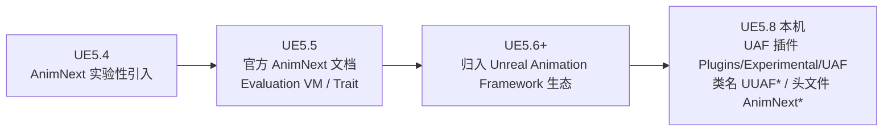
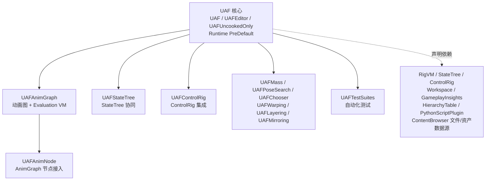
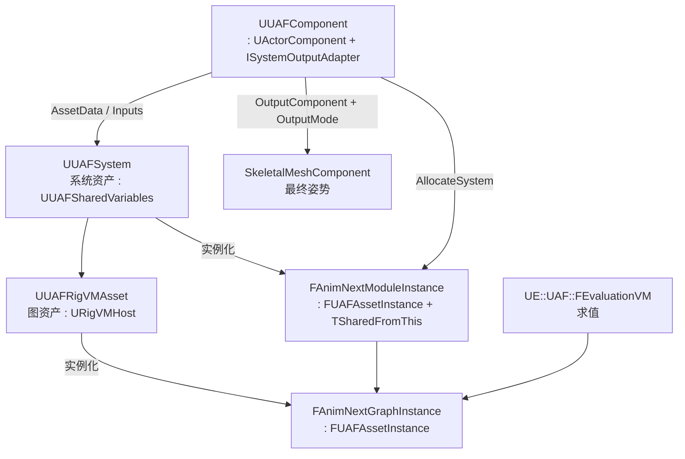
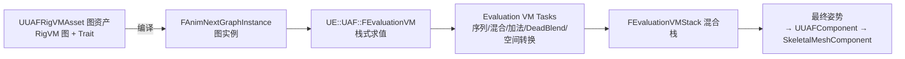
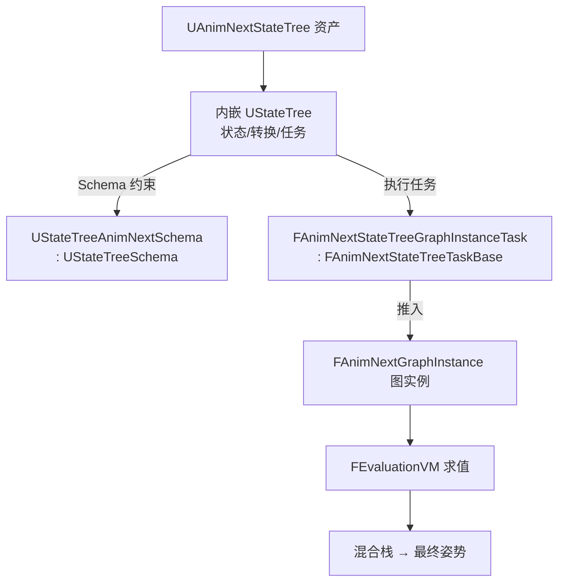

# 36 AnimNext 与 UAF 源码剖析（UE5.8）

> 以本机 UE5.8 源码锚点解释 AnimNext 新一代动画框架在 5.8 的实际载体——UAF（Unreal Animation
> Framework）插件：插件定位与版本边界、资产与运行时对象模型（`UUAFRigVMAsset`/`UUAFSystem`/
> `UUAFComponent`）、图数据与求值（`FAnimNextGraphInstance`/`UE::UAF::FEvaluationVM`/Trait）、
> StateTree 协同（`UAnimNextStateTree`/`UStateTreeAnimNextSchema`）、与 AnimInstance/ControlRig
> 的关系、迁移影响、调试与限制。

## 元数据

- 版本基线：UE5.8.0 / CL55116800 / ++UE5+Release-5.8
- 适用范围：UAF 插件（`Engine\Plugins\Experimental\UAF`）的源码阅读：AnimNext 生态的 5.8 形态、
  运行时对象模型、图数据与求值模型、StateTree 协同、与经典 AnimInstance/ControlRig 的关系、
  迁移影响、验证命令与限制。
- 事实边界：本机 5.8 **不存在独立 AnimNext 插件**（`Engine\Plugins\Animation\AnimNext` 与
  `Engine\Plugins\Experimental\Animation\AnimNext` 实测均不存在），AnimNext 生态以 **UAF 插件**
  （`Engine\Plugins\Experimental\UAF`，FriendlyName "Unreal Animation Framework (UAF)"）提供：
  运行时头文件仍大量使用 `AnimNext*` 命名（`AnimNextRigVMAsset.h`、`AnimNextComponent.h`、
  `AnimNextModule.h`、`AnimNextStats.h` 等），但运行时类名多数为 `UUAF*`（`UUAFRigVMAsset`、
  `UUAFSystem`、`UUAFComponent`），编辑器类多为 `UAnimNext*`（`UAnimNextEdGraph`、
  `UAnimNextControllerBase`、`UAnimNextWorkspaceSchema` 等）；`UAnimNextComponent` 在 5.8 已标记
  弃用（`UE_DEPRECATED(5.8, "UAnimNextComponent::Asset is replaced by AssetData")`，
  `AnimNextComponent.h` 约 312 行）。本文只引用本机已核对的源码文件与命中的符号；行号来自当前
  源码快照，引擎补丁可能移动行号；凡未命中或无法核实的内容一律标注"**待核对**"。
- 官方参考：https://dev.epicgames.com/documentation/en-us/unreal-engine
- 最后更新：2026-08-07

## 概述

AnimNext 是虚幻引擎官方的新一代动画框架：把"动画决策"与"动画数据"解耦，用**图资产
（Graph Asset）+ Trait（特质）+ 数据接口（Data Interface）+ 求值虚拟机（Evaluation VM）**
取代传统 Animation Blueprint 的"EventGraph + AnimGraph"模型。它在 5.8 的工程形态是
**UAF 插件**——一个更大的动画生态（Unreal Animation Framework），由核心模块与 12 个
生态子插件（AnimGraph/AnimNode/StateTree/ControlRig/Mass/PoseSearch/Chooser/Warping/
Layering/Mirroring/SharedAssets/TestSuites）组成。

本文是**源码篇**：聚焦 5.8 本机 UAF 源码中"对象是什么、怎么组织、怎么求值、怎么与
StateTree 协同"的可核对事实；与《[04-动画系统/05-AnimNext动画框架.md](../04-动画系统/05-AnimNext动画框架.md)》
（使用层/概念层）互补，后者讲"怎么用"，本篇讲"源码里是什么"。

阅读顺序建议：先看定位与版本边界（为什么是 UAF 而不是 AnimNext 插件）→ 再看对象模型
（资产/系统/组件）→ 然后看求值模型（图实例/Evaluation VM/Trait）→ 最后看 StateTree
协同与迁移影响。

与既有源码篇的关系：《[11-动画系统求值源码.md](11-动画系统求值源码.md)》讲经典
AnimInstance 求值管线，本篇是它的"新一代对照物"；《[18-RigVM与ControlRig源码.md](18-RigVM与ControlRig源码.md)》
提供 RigVM 图与执行的基础；《[21-Mass与StateTree源码.md](21-Mass与StateTree源码.md)》提供
StateTree 基础；《[34-ReplicationGraph源码.md](34-ReplicationGraph源码.md)》同为本机核对型
源码篇的写作范式参考。

## 1. 证据边界与源码锚点

本篇只引用以下本机已核对文件（引擎根 `C:\Program Files\Epic Games\UE_5.8\Engine`）。

| 编号 | 本机真实源码路径 | 已核对符号（行号为"约 N 行"） |
| --- | --- | --- |
| 1 | `Engine\Build\Build.version` | 5.8.0 / CL 55116800 / `++UE5+Release-5.8` |
| 2 | `Plugins\Experimental\UAF\UAF\UAF.uplugin` | FriendlyName "Unreal Animation Framework (UAF)"、VersionName 0.1、`IsExperimentalVersion: true`、`EnabledByDefault: false`；依赖 RigVM/Workspace/PythonScriptPlugin/HierarchyTable/HierarchyTableAnimation/GameplayInsights/PropertyBindingUtils/ContentBrowserAssetDataSource/ContentBrowserFileDataSource/EditorScriptingUtilities；模块 `UAF`(Runtime, PreDefault)/`UAFEditor`/`UAFUncookedOnly`/`UAFTestData` |
| 3 | `Plugins\Experimental\UAF\`（根目录） | 13 个生态子插件目录：UAF、UAFAnimGraph、UAFAnimNode、UAFChooser、UAFControlRig、UAFLayering、UAFMass、UAFMirroring、UAFPoseSearch、UAFSharedAssets、UAFStateTree、UAFTestSuites、UAFWarping（各自 `.uplugin` 均实验性、默认关闭） |
| 4 | `...\UAF\Source\UAF\Public\AnimNextRigVMAsset.h` | `class UUAFRigVMAsset : public URigVMHost`（61） |
| 5 | `...\UAF\Source\UAF\Public\Component\AnimNextComponent.h` | `class UUAFComponent : public UActorComponent, public UE::UAF::ISystemOutputAdapter`；`UE_DEPRECATED(5.8, "UAnimNextComponent::Asset is replaced by AssetData")`（约 312）；`AssetData : TInstancedStruct<FUAFSystemFactoryAsset>`（约 317）；`Module_DEPRECATED`（约 322）；`Inputs : TArray<FUAFComponentInputDesc>`（约 328）；`OutputComponent : FComponentReference`（约 336）；`SkeletalMeshComponentOutputMode`（约 340） |
| 6 | `...\UAF\Source\UAF\Public\Module\AnimNextModule.h` | `class UUAFSystem : public UUAFSharedVariables`（49）；前向声明区含 `UAnimGraphNode_AnimNextGraph`/`FAnimNode_AnimNextGraph`/`FRigUnit_AnimNextGraphEvaluator`/`FAnimNextGraphInstance`/`FAnimNextModuleInstance`（约 17-25） |
| 7 | `...\UAF\Source\UAF\Internal\Module\AnimNextModuleInstance.h` | `struct FAnimNextModuleInstance : public FUAFAssetInstance`（61，另继承 `TSharedFromThis`）；构造函数 `(const UUAFSystem*, EAnimNextModuleInitMethod)`（约 71-79）；`FRigUnit_AnimNextRunAnimationGraph_v1/_v2`、`FRigUnit_UAFRunAsset`（约 24-26） |
| 8 | `...\UAFAnimGraph\Source\UAFAnimGraph\Public\Graph\AnimNextGraphInstance.h` | `struct FAnimNextGraphInstance : public FUAFAssetInstance`（60） |
| 9 | `...\UAFAnimGraph\Source\UAFAnimGraph\Public\EvaluationVM\EvaluationVM.h` | `struct FEvaluationVM`（152）、`struct FEvaluationVMStack`（116）、`struct FEvaluationVMStackName`（69） |
| 10 | `...\UAFAnimGraph\Source\UAFAnimGraph\Public\TraitCore\TraitMode.h` | `enum class ETraitMode`（14） |
| 11 | `...\UAF\Source\UAF\Internal\Graph\RigVMTrait_AnimNextPublicVariables.h` | `struct FRigVMTrait_AnimNextPublicVariables : public FRigVMTrait`（17） |
| 12 | Evaluation VM 任务（多个 cpp） | `FAnimNextApplyAdditiveKeyframeTask::Execute(UE::UAF::FEvaluationVM&)`（ApplyAdditiveKeyframe.cpp 31）、`FAnimNextBlendTwoKeyframesTask`（BlendKeyframes.cpp 34）、`FAnimNextDeadBlendingTransitionTask`（DeadBlending.cpp 483）、`FAnimNextExecuteProgramTask`（ExecuteProgram.cpp 17）、`FAnimNextAnimSequenceKeyframeTask`（PushAnimSequenceKeyframe.cpp 33）、`FUAFMakeDynamicAdditiveTask`（MakeDynamicAdditive.cpp 17）、`FPushNamedSetTask`（ApplyNamedSetTask.cpp 18）等（完整清单见第 5 节） |
| 13 | `...\UAFStateTree\Source\UAFStateTree\Internal\AnimNextStateTree.h` | `class UAFSTATETREE_API UAnimNextStateTree : public UUAFAnimGraph`（38）；`UPROPERTY TObjectPtr<UStateTree> StateTree`（48） |
| 14 | `...\UAFStateTree\Source\UAFStateTree\Internal\AnimNextStateTreeSchema.h` | `class UAFSTATETREE_API UStateTreeAnimNextSchema : public UStateTreeSchema`（11） |
| 15 | `...\UAFStateTree\Source\UAFStateTree\Internal\Tasks\AnimNextStateTreeGraphInstanceTask.h` | `struct FAnimNextStateTreeGraphInstanceTask : public FAnimNextStateTreeTaskBase`（116）、`FAnimNextGraphInstanceTaskInstanceData`（20） |
| 16 | `...\UAFStateTree\Source\UAFStateTree\Internal\` 其余 | `Tasks\AnimNextStateTreeRigVMTaskBase.h`、`Conditions\AnimNextStateTreeRigVMConditionBase.h`、`Tasks\UAFStateTreeSetVariableTask.h`、`AnimNode\UAFStateTreeNode.h`、`AnimStateTreeTrait.h`、`IAnimNextStateTreeModule.h` |
| 17 | `...\UAFStateTree\Source\UAFStateTreeEditor\Private\StateTreeAssetCompilationHandler.h` | StateTree 资产编译接入；`UAFStateTreeEditorSchema`（`Editor\Public\UAFStateTreeEditorSchema.h`） |
| 18 | 模块注册 | `IMPLEMENT_MODULE(UE::UAF::FAnimNextModuleImpl, UAF)`（AnimNextModuleImpl.cpp 198）、`FAnimNextStateTreeModule`（AnimNextStateTreeModule.cpp 47）、`FAnimNextControlRigModule`（AnimNextControlRigModule.cpp 162）、`FAnimNextAnimGraphModule`（AnimNextAnimGraphModule.cpp 516）、`FUAFMassModule` 等 |
| 19 | CVar（cpp） | `a.AnimNext.GCCleanupTimeBudget`（DataRegistry.cpp 24）、`a.AnimNextForceAnimBP`（AnimNode_AnimNextGraph.cpp 26）、`a.AnimNext.EnableSyncLog`/`a.AnimNext.SyncGroupMode`（SyncGroup_GraphInstanceComponent.cpp 139/145）、`ControlRig.DisableExecutionInAnimNext`（ControlRigTask.cpp 21）、`a.UAF.OffsetRootBone.Enable`（OffsetRootBoneTrait.cpp 14）、`a.StateTree.LogPropertyBindingMemoryPtrInfo`（AnimStateTreeTrait.cpp 30） |
| 20 | `...\UAF\Source\UAF\Private\Component\AnimNextComponent.cpp` | `UUAFComponent::OnRegister`（26）、`AllocateSystem`（50）、`OnUnregister`（60）、`BeginPlay`（69）、`EndPlay`（83）、`Serialize`（90）、`Activate`（492）、`Deactivate`（502） |
| 21 | 相关引擎插件 | `Plugins\Runtime\StateTree` ✓、`Plugins\Animation\ControlRig` ✓、`Plugins\Runtime\RigVM` ✓；`StateTreeTrace.cpp` 251 注释"模式与 AnimNextTrace 相同" |
| 22 | 不存在的路径（证据） | `Plugins\Animation\AnimNext` → False；`Plugins\Experimental\Animation\AnimNext` → False；`Plugins\Experimental\Animation` 实际含 19 个目录（AnimationLayering/AnimDatabase/AnimGen/ContextualAnimation/CurveExpression/DirectMeshControl/HierarchyTable/HierarchyTableAnimation/Locomotor/MLDeformer/MotionTrajectory/Optimus/RelativeIKOp/RigMapper/RigMapperOp/Scribble/SkeletalMeshMorphTargetEditingTools/TrajectoryTools），无 AnimNext |

> 说明：官方旧文档中的 `AnimNextModule` 资产概念在本机对应 **`UUAFSystem`**（工厂类为
> `UUAFSystemFactory`，见 `UAF\Source\UAF\Public\Factory\` 与 `AnimNextModuleFactory.h`）；
> 官方 Python API 中的 `AnimNextComponent` 对应本机 **`UUAFComponent`**（旧名已弃用）。
> 行号用于快速定位；长期证据是文件路径与符号名。

## 2. 核心概念表

| 概念 | 英文/源码符号 | 职责 | 本机锚点 | 常见误区 |
| --- | --- | --- | --- | --- |
| UAF 插件 | Unreal Animation Framework（`Plugins\Experimental\UAF`） | 5.8 中 AnimNext 生态的载体：核心模块 + 12 个生态子插件 | `UAF.uplugin` | 以为要启用名为 AnimNext 的插件 |
| 动画图资产 | `UUAFRigVMAsset` | 图驱动求值的根资产：RigVM 图为底（继承 `URigVMHost`） | `AnimNextRigVMAsset.h` 61 | 与 AnimBlueprint 资产混淆 |
| 运行时系统 | `UUAFSystem` | "一组动画行为"的运行时容器（模块根），继承共享变量 | `AnimNextModule.h` 49 | 以为它叫 `UAnimNextModule` |
| 系统实例 | `FAnimNextModuleInstance` | 一个 UAF 系统的运行时实例（资产实例 + 引用计数） | `AnimNextModuleInstance.h` 61 | 与资产对象混为一谈 |
| 图实例 | `FAnimNextGraphInstance` | 单个图资产的运行时实例（编译后求值状态） | `AnimNextGraphInstance.h` 60 | 以为图实例就是资产 |
| 运行时组件 | `UUAFComponent` | 挂在 Actor 上驱动 UAF 求值的组件，输出到骨骼网格 | `AnimNextComponent.h` | 以为挂在骨骼网格组件上就自动求值 |
| 求值虚拟机 | `UE::UAF::FEvaluationVM` | 栈式求值 VM：任务（Task）的 `Execute(VM&)` 入口 | `EvaluationVM.h` 152 | 以为还是蓝图 VM |
| 求值任务 | `FAnimNext*Task::Execute` | VM 上的原子求值操作（序列/混合/加法/DeadBlend…） | 第 5 节任务表 | 以为任务=AnimGraph 节点 |
| 特质 | Trait（`FRigVMTrait_AnimNextPublicVariables : FRigVMTrait`、`ETraitMode`） | 可组合行为单元：基于 RigVM Trait 体系扩展 | `RigVMTrait_AnimNextPublicVariables.h` 17、`TraitMode.h` 14 | 以为 Trait 是图节点 |
| 状态树协同 | `UAnimNextStateTree` / `UStateTreeAnimNextSchema` | 让 StateTree 驱动动画图：资产内嵌 `UStateTree`，Schema 专属 | `AnimNextStateTree.h` 38、`AnimNextStateTreeSchema.h` 11 | 与普通 StateTree Schema 混淆 |
| 图实例任务 | `FAnimNextStateTreeGraphInstanceTask` | StateTree 任务：把图实例推入求值/混合栈 | `AnimNextStateTreeGraphInstanceTask.h` 116 | 以为任务直接播放动画 |
| 共享变量 | `UUAFSharedVariables` | 跨图/跨模块共享的变量容器（`UUAFSystem` 的基类） | `AnimNextSharedVariables.h` | 以为只能通过函数参数传值 |
| 世界库/引擎子系统 | `UAnimNextWorldLibrary` / `UUAFEngineSubsystem` | 世界级查询 API 与全局子系统 | `AnimNextWorldLibrary.h`、`SystemReference.h` | 忽略全局生命周期管理 |
| 混合蒙版/轮廓 | `UUAFBlendMask` / `UUAFBlendProfile` | 混合辅助资产（骨骼级/轨迹级） | `UAFBlendMask.h`、`UAFBlendProfile.h` | 与 AnimInstance 的 BlendProfile 混用 |
| 运行图单元 | `FRigUnit_AnimNextRunAnimationGraph_v1/_v2`、`FRigUnit_UAFRunAsset` | 从 RigVM 图内"运行"动画图/资产实例的 RigUnit 入口 | `AnimNextModuleInstance.h` 24-26 | 以为动画求值与 RigVM 无关 |

## 3. 定位与版本边界

### 3.1 AnimNext 是什么

AnimNext 的目标是重新设计"动画逻辑的组织与求值方式"：用**功能数据流（Functional Data Flow）**
组织动画图，用 **Evaluation VM** 栈式执行编译后的求值程序，用 **Trait** 声明式组合行为，
并把"状态选择"交给 **StateTree**。概念与工作流细节见
《[04-动画系统/05-AnimNext动画框架.md](../04-动画系统/05-AnimNext动画框架.md)》，本篇不再重复。

### 3.2 版本演进（官方口径 + 本机事实）



**图释**：AnimNext 从实验性特性逐步收敛进 UAF 生态；5.8 的工程载体是 UAF 插件，而非
独立 AnimNext 插件。旧教程（5.5/5.6）中的类名/资产名在 5.8 可能已改名（见 3.3）。

### 3.3 5.8 形态：UAF 插件（本机核对）

| 核对项 | 本机 5.8 结果 |
| --- | --- |
| 独立 AnimNext 插件 | `Plugins\Animation\AnimNext`、`Plugins\Experimental\Animation\AnimNext` **均不存在** |
| UAF 插件 | `Plugins\Experimental\UAF`，13 个子插件目录；`IsExperimentalVersion: true`、`EnabledByDefault: false`、VersionName "0.1" |
| 运行时类名 | `UUAF*` 为主：`UUAFRigVMAsset`/`UUAFSystem`/`UUAFComponent`/`UUAFSharedVariables`/`UUAFEngineSubsystem`/`UUAFBlendMask`/`UUAFBlendProfile`/`UUAFSkeletonUserData`/`UUAFTemplateDataAsset` |
| 仍为 `UAnimNext*` 的运行时类 | `UAnimNextConfig`、`UAnimNextWorldLibrary`、`UAnimNextVariableSettings`、`UAnimNextStateTree`、`UAnimNextDataInterface` 等 |
| 编辑器类 | `UAnimNext*` 为主：`UAnimNextEdGraph`/`UAnimNextEdGraphNode`/`UAnimNextEdGraphSchema`/`UAnimNextControllerBase`/`UAnimNextEventGraphEntry`/`UAnimNextVariableEntry`/`UAnimNextWorkspaceSchema`/`UAnimNextCategoryEntry` 等 |
| 头文件命名 | 仍为 `AnimNext*`：`AnimNextRigVMAsset.h`/`AnimNextComponent.h`/`AnimNextModule.h`/`AnimNextStats.h`/`AnimNextFunctionHandle.h`/`AnimNextFunctionReference.h`/`AnimNextPoolHandle.h` |
| 弃用标注 | `AnimNextComponent.h` 约 312 行：`UE_DEPRECATED(5.8, "UAnimNextComponent::Asset is replaced by AssetData")`；约 322 行 `Module_DEPRECATED` |
| 官方集成示例插件 | `Plugins\Experimental\MoverAnimNext`（Mover × UAF）、`Plugins\Experimental\RigLogicUAF`（RigLogic × UAF） |

### 3.4 模块地图



**图释**：`UAF` 核心模块（Runtime，LoadingPhase PreDefault）承担资产与运行时对象；
`UAFAnimGraph` 提供图与求值（Evaluation VM 在该模块）；`UAFAnimNode` 把 UAF 接入传统
AnimGraph 节点；`UAFStateTree` 提供 StateTree 协同；其余子插件是生态集成（Mass/PoseSearch/
Chooser/Warping/Layering/Mirroring）。依赖关系全部来自各 `.uplugin` 的 `Plugins` 声明。
## 4. 资产与运行时对象模型

本机 5.8 的 UAF 运行时对象模型由"**资产（Asset）→ 系统（System）→ 实例（Instance）→
组件（Component）→ 输出（SkeletalMeshComponent）**"五层组成。下面按源码逐个拆解。

### 4.1 动画图资产：UUAFRigVMAsset（: URigVMHost）

`AnimNextRigVMAsset.h` 61 行：

```cpp
// 节选：UAF\Source\UAF\Public\AnimNextRigVMAsset.h（仅示意关键声明形态）
class UUAFRigVMAsset : public URigVMHost
```

- 它**直接继承 `URigVMHost`**：动画图本身就是一个 RigVM 图宿主，图的编译/执行基础设施
  复用 RigVM（`Engine\Plugins\Runtime\RigVM`，详见
  《[18-RigVM与ControlRig源码.md](18-RigVM与ControlRig源码.md)》）。
- 资产内部持有 RigVM 图数据（函数/连边/变量），编辑器侧由 `UAnimNextRigVMAssetEditorData`
  承载可编辑图数据（`AnimNextRigVMAssetEditorData.h`）。
- 与 ControlRig 资产（`UControlRig`，同样继承 `URigVMHost`）是"同基类、不同用途"：
  ControlRig 强调程序化姿势/IK 的逐帧执行，UAF 图强调"动画行为数据流"的组织与组合。

### 4.2 运行时系统：UUAFSystem（: UUAFSharedVariables）

`Module\AnimNextModule.h` 49 行：

```cpp
// 节选：UAF\Source\UAF\Public\Module\AnimNextModule.h
class UUAFSystem : public UUAFSharedVariables
```

- **`UUAFSystem` 就是旧文档"AnimNextModule（动画模块资产）"在 5.8 的实现**：一个
  "一组动画行为"的运行时容器，把多个图/变量/子模块组织成一个可实例化的系统。
- 它继承 `UUAFSharedVariables`：系统级共享变量（跨图、跨组件输入）是系统的内建能力。
- 编辑器工厂为 `UUAFSystemFactory`（`AnimNextModuleFactory.h`），资产定义类为
  `UAssetDefinition_AnimNextModule`——命名残留印证了"Module"到"System"的改名过程。
- 组件注释（`AnimNextComponent.h` 322 行附近）中的 `Module_DEPRECATED` 同样说明旧属性
  名为 "Module"。

### 4.3 运行时组件：UUAFComponent（: UActorComponent + ISystemOutputAdapter）

`Component\AnimNextComponent.h`：

```cpp
// 节选：UAF\Source\UAF\Public\Component\AnimNextComponent.h
class UUAFComponent : public UActorComponent, public UE::UAF::ISystemOutputAdapter
```

- **双继承**：既是 `UActorComponent`（挂到 Actor 上、随 Actor 生命周期），又实现
  `UE::UAF::ISystemOutputAdapter`（"系统输出适配器"：把系统求值结果输出给外部）。
- **资产配置字段**（约 310-344 行）：
  - `Asset_DEPRECATED`：`UE_DEPRECATED(5.8, "UAnimNextComponent::Asset is replaced by AssetData")`
    （约 312）——旧 `UAnimNextComponent::Asset` 属性在 5.8 改名；
  - `AssetData : TInstancedStruct<FUAFSystemFactoryAsset>`（约 317）：新式资产配置；
  - `Inputs : TArray<FUAFComponentInputDesc>`（约 328）：组件输入（映射其他 UAF 组件的输出）；
  - `OutputComponent : FComponentReference`（约 336）：目标 `SkeletalMeshComponent`；
  - `SkeletalMeshComponentOutputMode`（约 340，默认 `WriteToSkeletalMeshComponentPose`）：
    输出写入模式。
- **源码注释原文关键句**（约 333-334）："setting this does not necessarily mean that the
  mesh's pose will be written by the UAF system, only that the output value will match the
  skeletal mesh component's 'shape'"——即 `OutputComponent` 只决定输出值匹配哪个骨骼网格的
  "形状"，**是否把姿势写回网格由 `SkeletalMeshComponentOutputMode` 决定**。
- **生命周期方法**（`AnimNextComponent.cpp`）：`OnRegister`（26）→ `AllocateSystem`（50）
  → `BeginPlay`（69）→ `EndPlay`（83）→ `OnUnregister`（60）→ `Serialize`（90）→
  `Activate`（492）/`Deactivate`（502）；蓝图接口 `BlueprintSetVariable`（143）、
  `BlueprintSetVariableReference`（238）、`BlueprintGetVariableReference`（243）。
  可见系统分配（`AllocateSystem`）发生在注册期，与 Actor 生命周期绑定。

### 4.4 系统实例与图实例

- `FAnimNextModuleInstance : public FUAFAssetInstance`（`Internal\Module\AnimNextModuleInstance.h`
  61，另继承 `TSharedFromThis`）：一个 UAF 系统的运行时实例，构造函数接收
  `const UUAFSystem* InModule` 与 `EAnimNextModuleInitMethod`（约 71-79）——实例从资产创建，
  引用计数管理。
- `FAnimNextGraphInstance : public FUAFAssetInstance`（`UAFAnimGraph\...\Public\Graph\AnimNextGraphInstance.h`
  60）：单个图资产的运行时实例（编译后求值状态），是"图资产 → 可执行实例"的关键桥。
- 运行入口：`FRigUnit_AnimNextRunAnimationGraph_v1/_v2`、`FRigUnit_UAFRunAsset`
  （`AnimNextModuleInstance.h` 24-26）——RigVM 图内通过 RigUnit 触发动画图/资产实例运行，
  这是"RigVM 与动画求值打通"的直接证据；`FRigUnit_AnimNextInitializeEvent`、
  `FRigUnit_CopyModuleProxyVariables` 等负责初始化与变量代理。

### 4.5 对象模型总览



**图释**：资产层（`UUAFRigVMAsset`/`UUAFSystem`）→ 实例层（`FAnimNextGraphInstance`/
`FAnimNextModuleInstance`，均基于 `FUAFAssetInstance`）→ 组件层（`UUAFComponent` 分配系统、
接收输入、输出姿势）。类名与继承关系均为本机源码核对结果。

## 5. 图数据与求值模型

### 5.1 图数据：RigVM 图 + Trait

- 图资产（`UUAFRigVMAsset`）直接继承 `URigVMHost`，图数据就是 RigVM 图（单元节点、连边、
  变量、函数库）；编辑器使用 `UAnimNextEdGraph`/`UAnimNextEdGraphSchema`/
  `UAnimNextControllerBase`（编辑器类）编辑该图。
- **Trait 基于 RigVM Trait 体系**：`Internal\Graph\RigVMTrait_AnimNextPublicVariables.h` 17 行
  `struct FRigVMTrait_AnimNextPublicVariables : public FRigVMTrait`——公开变量作为 Trait 存在，
  可被图节点附加/组合；`UAFAnimGraph\Public\TraitCore\TraitMode.h` 14 行
  `enum class ETraitMode`（官方文档口径的 Base/Additive 模式，具体枚举值以该头文件为准）。
- 函数句柄/引用/池句柄：`AnimNextFunctionHandle.h`、`AnimNextFunctionReference.h`、
  `AnimNextPoolHandle.h`（Public 顶层）——图内函数引用与对象池化句柄，支撑运行时复用。

### 5.2 求值虚拟机：UE::UAF::FEvaluationVM

`UAFAnimGraph\Source\UAFAnimGraph\Public\EvaluationVM\EvaluationVM.h`：`struct FEvaluationVM`
（152 行）、`FEvaluationVMStack`（116 行）、`FEvaluationVMStackName`（69 行）；
`EvaluationProgram.h`（17 行）与 `EvaluationTask.h`（11 行）前向声明。任务统一签名：

```cpp
// 节选（真实签名）：FAnimNextApplyAdditiveKeyframeTask::Execute —— ApplyAdditiveKeyframe.cpp 31 行
void FAnimNextApplyAdditiveKeyframeTask::Execute(UE::UAF::FEvaluationVM& VM) const
```

**已核对的 Evaluation VM 任务清单**（本机 5.8，文件:行 + 任务名）：

| 功能域 | 任务（文件:行） |
| --- | --- |
| 序列播放 | `FAnimNextAnimSequenceKeyframeTask`（PushAnimSequenceKeyframe.cpp 33） |
| 混合 | `FAnimNextBlendTwoKeyframesTask`（BlendKeyframes.cpp 34）、`FAnimNextBlendOverwriteKeyframeWithScaleTask`（215）、`FAnimNextBlendAddKeyframeWithScaleTask`（276）、`FAnimNextBlendOverwriteKeyframePerBoneWithScaleTask`（BlendKeyframesPerBone.cpp 244）、`FAnimNextBlendAddKeyframePerBoneWithScaleTask`（350）、`FAnimNextBlendKeyframePerBoneWithScaleTask`（508） |
| 加法应用 | `FAnimNextApplyAdditiveKeyframeTask`（ApplyAdditiveKeyframe.cpp 31）、`FUAFApplyAdditiveKeyframePerBoneTask`（ApplyAdditiveKeyframePerBone.cpp 39）、`FUAFApplyAdditiveKeyframeWithBlendMaskTask`（244）、`FUAFMakeDynamicAdditiveTask`（MakeDynamicAdditive.cpp 17） |
| 死混合/过渡 | `FAnimNextDeadBlendingTransitionTask`（DeadBlending.cpp 483）、`FAnimNextDeadBlendingApplyTask`（558） |
| 程序执行 | `FAnimNextExecuteProgramTask`（ExecuteProgram.cpp 17） |
| 命名集栈 | `FPushNamedSetTask`（ApplyNamedSetTask.cpp 18）、`FPopNamedSetTask`（39） |
| 空间转换 | `FAnimNextConvertRotationsToLocalSpaceTask`（ConvertRotationsToLocalSpace.cpp 23）、`FAnimNextConvertRotationsToMeshSpaceTask`（ConvertRotationsToMeshSpace.cpp 23）、`FAnimNextNormalizeKeyframeRotationsTask`（NormalizeRotations.cpp 13）、`FAnimNextCopyBonesComponentSpaceTask`（CopyBones.cpp 17） |

> 任务清单非穷举（按检索前 20 条整理）；更完整清单可在目标版本
> `UAFAnimGraph\Source\UAFAnimGraph\Private\EvaluationVM\Tasks\` 目录（或等价目录）核对。

### 5.3 求值流水线与经典 AnimInstance 对照



**图释**：图资产编译为图实例，`FEvaluationVM` 按求值程序逐任务执行，结果写入混合栈，
最终由 `UUAFComponent` 输出到骨骼网格。与经典 AnimInstance 管线的差异见下表
（经典侧细节见《[11-动画系统求值源码.md](11-动画系统求值源码.md)》）：

| 维度 | AnimInstance（经典） | UAF/AnimNext（5.8） |
| --- | --- | --- |
| 逻辑载体 | AnimBlueprint：EventGraph + AnimGraph | 图资产（RigVM 图）+ Trait + Evaluation VM 程序 |
| 宿主对象 | `UAnimInstance` / `FAnimInstanceProxy` | `UUAFRigVMAsset`(资产) + `FAnimNextGraphInstance`(实例) + `UUAFComponent`(挂载) |
| 状态选择 | 状态机内联/蓝图逻辑 | StateTree（`UAnimNextStateTree`） |
| 执行模型 | 蓝图 VM 每帧解释事件图 | 编译后求值程序，栈式 VM 执行任务 |
| 混合 | 混合节点树 | 混合栈（`FEvaluationVMStack`）+ 混合任务 |
| 输出 | AnimInstance 直接写骨骼 | `UUAFComponent` 经 `ISystemOutputAdapter` 输出 |

## 6. StateTree 协同（UAFStateTree 插件）

### 6.1 资产与 Schema

```cpp
// 节选（真实签名）：UAFStateTree\Source\UAFStateTree\Internal\AnimNextStateTree.h 38 行
class UAFSTATETREE_API UAnimNextStateTree : public UUAFAnimGraph
{
    // ...
    UPROPERTY()
    TObjectPtr<UStateTree> StateTree;   // 48 行：资产内嵌一个 StateTree
    virtual void PostLoad() override;   // 53 行
};

// 节选（真实签名）：...\Internal\AnimNextStateTreeSchema.h 11 行
class UAFSTATETREE_API UStateTreeAnimNextSchema : public UStateTreeSchema
```

- `UAnimNextStateTree` 是"动画状态树"资产：继承 `UUAFAnimGraph`（动画图资产基类），
  内嵌 `TObjectPtr<UStateTree>`——**状态树数据直接存在动画资产里**。
- `UStateTreeAnimNextSchema` 继承 `UStateTreeSchema`：为该资产内的 StateTree 提供专属
  Schema（决定该状态树可用哪些任务/条件/评估器）。
- 编辑器接入：`UAnimNextStateTreeTreeEditorData : UStateTreeEditorData`
  （`UAFStateTreeUncookedOnly\Public\AnimNextStateTreeEditorData.h` 14）、
  `UUAFStateTreeEditorSchema : UStateTreeEditorSchema`（`UAFStateTreeEditor\Public\UAFStateTreeEditorSchema.h`
  10）、`StateTreeAssetCompilationHandler`（`UAFStateTreeEditor\Private\`）负责 StateTree
  资产的编译期接入。

### 6.2 任务体系：图实例任务与 RigVM 任务基类

```cpp
// 节选（真实签名）：...\Internal\Tasks\AnimNextStateTreeGraphInstanceTask.h 116 行
struct UAFSTATETREE_API FAnimNextStateTreeGraphInstanceTask : public FAnimNextStateTreeTaskBase
```

- `FAnimNextStateTreeGraphInstanceTask`：StateTree 任务——把 `FAnimNextGraphInstance` 接入
  求值（官方文档口径的"graph-instance 任务推图入混合栈"在源码层的对应物）；
  其 `FAnimNextGraphInstanceTaskInstanceData`（20 行）是任务实例数据。
- 任务/条件基类：`Tasks\AnimNextStateTreeRigVMTaskBase.h`（`FAnimNextStateTreeRigVMTaskBase`，
  基于 RigVM 的 StateTree 任务基类）、`Conditions\AnimNextStateTreeRigVMConditionBase.h`
  （RigVM 条件基类，引用 `URigVMGraph`）、`Tasks\UAFStateTreeSetVariableTask.h`
  （设置变量任务）、`AnimNode\UAFStateTreeNode.h`（状态树节点）。
- `AnimStateTreeTrait.h`：状态树场景的 Trait 形态（对应 CVar
  `a.StateTree.LogPropertyBindingMemoryPtrInfo`，`AnimStateTreeTrait.cpp` 30）。

### 6.3 协同时序



**图释**：状态选择（StateTree）与姿势求值（图实例/Evaluation VM）分层解耦——状态树决定
"当前该做什么"，图实例任务把对应图接入求值栈；Schema 限定状态树内可用的任务/条件类型。

### 6.4 调试与 Trace

- `StateTreeTrace.cpp` 251 行注释："Note this pattern is the same as AnimNextTrace; both
  should be updated if a change/fix is needed"——StateTree 与 UAF 的 Trace 模式保持一致，
  说明 UAF 有独立 Trace（RewindDebugger 目录 `UAFTrace.h` 26 行亦引用
  `FAnimNextGraphInstance`）；`UAF\Source\UAF\Public\RewindDebugger\` 与
  `AnimNextTraceModule.cpp`（Editor 侧）是本机命中的 Trace/回放调试入口。
- `UAF.uplugin` 声明依赖 `GameplayInsights`：UAF 与引擎 Insights 体系打通。
## 7. 与 ControlRig / Mass / PoseSearch / Chooser 等的关系

UAF 生态子插件与既有系统的集成关系（全部来自本机 `.uplugin` 声明与模块注册）：

| 子插件 | 依赖（uplugin 声明） | 模块注册（IMPLEMENT_MODULE） | 角色 |
| --- | --- | --- | --- |
| UAFAnimGraph | UAF、RigVM | `UE::UAF::AnimGraph::FAnimNextAnimGraphModule`（AnimNextAnimGraphModule.cpp 516） | 动画图 + Evaluation VM（本篇第 5 节主体） |
| UAFAnimNode | UAF、UAFAnimGraph、ControlRig、RigVM | `UE::UAF::AnimNode::FModule`（Module.cpp 51） | 传统 AnimGraph 节点接入（`FAnimNode_AnimNextGraph`，见 AnimNextModule.h 前向声明） |
| UAFStateTree | StateTree、Workspace、UAF、UAFAnimGraph、UAFAnimNode | `FAnimNextStateTreeModule`（AnimNextStateTreeModule.cpp 47） | 本篇第 6 节主体 |
| UAFControlRig | ControlRig、UAF、UAFAnimGraph | `UE::UAF::ControlRig::FAnimNextControlRigModule`（AnimNextControlRigModule.cpp 162） | ControlRig 集成（CVar `ControlRig.DisableExecutionInAnimNext`） |
| UAFMass | MassGameplay、UAF、UAFAnimGraph | `FUAFMassModule`（UAFMassModule.cpp 21） | Mass 人群动画（与《[21-Mass与StateTree源码.md](21-Mass与StateTree源码.md)》衔接） |
| UAFPoseSearch | Chooser、EvaluationNotifies、PoseSearch、UAF、UAFAnimGraph、UAFAnimNode | `UE::UAF::PoseSearch::FModule`（Module.cpp 69） | Motion Matching（PoseSearch）集成 |
| UAFChooser | UAF、UAFAnimGraph、UAFAnimNode、Chooser、ControlRig | `UE::UAF::Chooser::FModule`（Module.cpp 93） | Chooser 选择器集成 |
| UAFWarping | UAF、UAFAnimGraph、UAFAnimNode、RigVM | `UE::UAF::Warping::FModule`（Module.cpp 49） | 动画/姿势扭曲 |
| UAFLayering | Workspace、UAF、UAFAnimGraph | `FUAFLayeringModule`（UAFLayeringModule.cpp 29） | 分层设置 |
| UAFMirroring | UAF、UAFAnimGraph、RigVM | `UE::UAF::Mirroring::FModule`（Module.cpp 41） | 关键帧镜像 |

**与 ControlRig 的本质关系**：二者同根（`URigVMHost`），但定位不同——ControlRig 是
"程序化姿势/IK 的逐帧执行单元"（详见《[18-RigVM与ControlRig源码.md](18-RigVM与ControlRig源码.md)》），
UAF 图是"动画行为数据流"；`UAFAnimNode`/`UAFControlRig` 子插件让两者在同一 UAF 系统内
互操作（CVar `ControlRig.DisableExecutionInAnimNext` 控制 ControlRig 在 AnimNext 求值中的
执行开关）。

## 8. 迁移影响

1. **不要再找 AnimNext 插件**：5.8 启用入口是 UAF（`Plugins\Experimental\UAF`，实验性、
   默认关闭）；工程需在 `.uproject` 中启用 UAF 及所需子插件（UAFAnimGraph/UAFStateTree 等），
   并满足其依赖（RigVM/StateTree/Workspace/PythonScriptPlugin/GameplayInsights 等）。
2. **类名/API 已换代**：旧文档的 `AnimNextModule` → `UUAFSystem`、`AnimNextComponent` →
   `UUAFComponent`（`Asset` 属性 → `AssetData`，`UE_DEPRECATED(5.8, ...)`）；按 5.5/5.6
   教程直接写代码会编译失败。
3. **与 AnimInstance 并存**：UAF 不要求全局替换——`UAFAnimNode` 提供 `FAnimNode_AnimNextGraph`
   节点，可在传统 AnimGraph 内嵌入 UAF 图（`a.AnimNextForceAnimBP` CVar 与此接入相关），
   适合渐进式试点。
4. **网络复制/预测影响：待核对**——本篇未核对 UAF 在复制/预测下的行为；联机项目落地前
   必须核对目标版本的网络边界（官方文档与测试套件 `UAFTestSuites` 可作线索）。
5. **实验性代价**：VersionName "0.1"、`IsExperimentalVersion: true`，接口可能随版本变动，
   迁移成本需计入排期。

## 9. 调试与验证命令

### 9.1 本机只读核对（本文写作所用，PowerShell 节选）

```powershell
$eng = "C:\Program Files\Epic Games\UE_5.8\Engine"
# 1) 无独立 AnimNext 插件的证据
Test-Path "$eng\Plugins\Animation\AnimNext"                # False
Test-Path "$eng\Plugins\Experimental\Animation\AnimNext"   # False
# 2) UAF 插件形态
Get-ChildItem "$eng\Plugins\Experimental\UAF" -Directory | Select-Object Name   # 13 个子插件
Get-Content "$eng\Plugins\Experimental\UAF\UAF\UAF.uplugin"                     # 模块/依赖/实验性标记
# 3) 符号检索（跳过 generated 头）
Get-ChildItem "$eng\Plugins\Experimental\UAF" -Recurse -Include *.h,*.cpp |
  Where-Object { $_.Name -notlike '*.generated.h' } |
  Select-String -Pattern 'class UUAFComponent :|class UUAFSystem :|struct FEvaluationVM'
```

### 9.2 运行时 CVar（已核对清单）

| CVar | 文件:行 | 类型/含义（以源码注释为准） |
| --- | --- | --- |
| `a.AnimNext.GCCleanupTimeBudget` | DataRegistry.cpp 24 | float：GC 清理时间预算（毫秒级） |
| `a.AnimNextForceAnimBP` | AnimNode_AnimNextGraph.cpp 26 | int32："If != 0, then we use the input..."（强制走 AnimBP 输入路径） |
| `a.AnimNext.EnableSyncLog` | SyncGroup_GraphInstanceComponent.cpp 139 | bool：同步组调试日志开关 |
| `a.AnimNext.SyncGroupMode` | SyncGroup_GraphInstanceComponent.cpp 145 | int32：同步组跟随模式（调试用） |
| `ControlRig.DisableExecutionInAnimNext` | ControlRigTask.cpp 21 | int32：关闭 ControlRig 在 AnimNext 内的执行 |
| `a.UAF.OffsetRootBone.Enable` | OffsetRootBoneTrait.cpp 14 | int32：Offset Root Bone Trait 开关 |
| `a.StateTree.LogPropertyBindingMemoryPtrInfo` | AnimStateTreeTrait.cpp 30 | bool：属性绑定内存指针调试日志 |

> `stat`/`Profile` 等运行时分析命令、UAF 专用 debug 命令未在本轮核对到，标"**待核对**"；
> 建议结合 GameplayInsights/AnimNextTrace（RewindDebugger 入口）与 `UAFTestSuites` 测试套件
> 在目标版本现场验证。

## 10. 限制

1. **实验性**：`IsExperimentalVersion: true`、VersionName "0.1"、`EnabledByDefault: false`；
   不保证 API 稳定。
2. **命名不一致**：头文件 `AnimNext*` vs 类名 `UUAF*` vs 编辑器类 `UAnimNext*`，跨版本
   教程/API 参考极易混淆；必须以目标版本源码为准。
3. **编辑器依赖重**：UAF.uplugin 依赖 Workspace、PythonScriptPlugin、ContentBrowser
   文件/资产数据源、EditorScriptingUtilities——纯运行时构建/自动化流程需注意这些依赖。
4. **平台与性能结论未核对**：本文未核对平台支持矩阵、求值性能基准、内存预算；
   `AnimNextStats.h` 存在（统计宏），但具体指标需现场测量。
5. **网络/复制边界未核对**：见第 8 节第 4 条。
6. **文档与源码漂移**：官方文档（5.5/5.6）与 5.8 源码存在类名差异（如
   `UAnimNextComponent` → `UUAFComponent`），阅读旧文档必须交叉核对。

## 失败路径（读者常见坑）

| 失败现象 | 根因 | 对策 |
| --- | --- | --- |
| 找不到 AnimNext 插件/类 | 5.8 中 AnimNext 生态 = UAF 插件，类名多为 `UUAF*` | 用第 9.1 节命令核对本机形态 |
| `UAnimNextComponent` 编译报错 | 5.8 已弃用/改名 | 改用 `UUAFComponent` + `AssetData` |
| 启用 UAF 后编译缺模块 | 未启用依赖插件（RigVM/Workspace/PythonScriptPlugin/GameplayInsights 等） | 按 `UAF.uplugin` 的 `Plugins` 声明逐个启用 |
| 按 5.5 教程写 Trait/节点 API 不匹配 | 版本演进改名 | 以目标版本 `UAFAnimGraph\...\TraitCore\` 源码为准 |
| 组件不写骨骼网格 | `OutputComponent` 只匹配形状，写回由 `SkeletalMeshComponentOutputMode` 决定 | 检查组件 Output 设置（`AnimNextComponent.h` 约 340 行） |
| 状态树任务不生效 | Schema 限定任务类型 | 使用 `UStateTreeAnimNextSchema`/`UUAFStateTreeEditorSchema` 创建状态树 |
| 把 UAF 当全局替代 AnimInstance | UAF 支持并存（`FAnimNode_AnimNextGraph`） | 渐进式试点，见第 8 节 |

## 最佳实践

1. **先核对目标版本源码**：UAF 是 0.1 版实验插件，任何 API 使用前用只读检索确认符号存在
   （方法见 9.1）。
2. **从小范围试点开始**：用 `FAnimNode_AnimNextGraph` 在既有 AnimGraph 中嵌入单个 UAF 图，
   与 AnimInstance 并存，逐步扩大。
3. **利用官方集成示例**：`Plugins\Experimental\MoverAnimNext`（Mover 角色运动 × UAF）与
   `RigLogicUAF` 是官方形态参考，先读它们的 `.uplugin` 与模块结构再动手。
4. **测试先行**：`UAFTestSuites` 提供自动化测试套件（含 `UAFCQTestSuite`/`UAFTestSuite`/
   `UAFAnimGraphTestSuite` 模块），接入 CI 前先跑通。
5. **关注 Trace**：UAF 与 StateTree 的 Trace 模式一致（`StateTreeTrace.cpp` 251 注释），
   联调异常时优先从 RewindDebugger/GameplayInsights 抓取动画与状态树通道。
6. **记录版本差异**：在工程文档中记录"目标版本类名 ↔ 官方文档旧名"对照表，降低团队
   认知成本（本文 3.3 节可作模板）。

## FAQ

**Q1：UE5.8 有 AnimNext 插件吗？**
没有。本机核对 `Plugins\Animation\AnimNext` 与 `Plugins\Experimental\Animation\AnimNext`
均不存在；AnimNext 生态以 **UAF 插件**（`Plugins\Experimental\UAF`）提供。

**Q2：UAF 和 AnimNext 是什么关系？**
UAF（Unreal Animation Framework）是 AnimNext 演进后的生态容器：核心模块 + 12 个子插件
（AnimGraph/AnimNode/StateTree/ControlRig/Mass/PoseSearch/Chooser/Warping/Layering/
Mirroring/SharedAssets/TestSuites）。5.8 的 AnimNext 能力主要由 `UAF`+`UAFAnimGraph` 模块承载。

**Q3：为什么类名是 `UUAF*`，头文件却是 `AnimNext*`？**
改名过程的"半成品"：运行时类已更名为 `UUAF*`（`UUAFRigVMAsset`/`UUAFSystem`/`UUAFComponent`），
但头文件与编辑器类仍保留 `AnimNext*` 命名；`UE_DEPRECATED(5.8, ...)` 标注了旧名
（`AnimNextComponent.h` 约 312 行）。

**Q4：`UAnimNextModule` / `AnimNextComponent`（官方旧文档 API）在 5.8 对应什么？**
`UUAFSystem`（继承 `UUAFSharedVariables`，工厂 `UUAFSystemFactory`）与 `UUAFComponent`
（`Asset` 属性 → `AssetData`）。旧 API 直接使用会编译失败。

**Q5：动画图数据到底是什么格式？**
RigVM 图。`UUAFRigVMAsset : public URigVMHost`（`AnimNextRigVMAsset.h` 61），图/变量/
连边/函数均以 RigVM 数据模型承载；Trait 也是 RigVM Trait 的扩展
（`FRigVMTrait_AnimNextPublicVariables : FRigVMTrait`）。

**Q6：Evaluation VM 与蓝图 VM 有何区别？**
`UE::UAF::FEvaluationVM`（`EvaluationVM.h` 152）是专为动画求值设计的栈式 VM：执行编译后的
求值程序（`FAnimNextExecuteProgramTask`），任务签名统一为 `Execute(FEvaluationVM&)`；而蓝图
VM 是通用脚本 VM。UAF 图经编译生成程序，不在运行时解释执行蓝图事件图。

**Q7：StateTree 怎么驱动动画？**
`UAnimNextStateTree` 资产内嵌 `UStateTree`（`AnimNextStateTree.h` 48），Schema 为
`UStateTreeAnimNextSchema`；状态内通过 `FAnimNextStateTreeGraphInstanceTask` 把
`FAnimNextGraphInstance` 接入求值栈，状态选择与姿势求值分层解耦。

**Q8：UAF 能完全替代 AnimInstance 吗？**
不是"二选一"：`UAFAnimNode` 提供 `FAnimNode_AnimNextGraph`，可在传统 AnimGraph 中嵌入
UAF 图并存运行；官方也保留蒙太奇等既有资产体系。替代程度取决于项目形态与版本成熟度。

**Q9：怎么验证我的工程里 UAF 是否生效？**
① 确认 `.uproject` 启用了 UAF（及所需子插件）；② 用 CVar 观察（`a.AnimNext.EnableSyncLog`、
`a.AnimNext.SyncGroupMode`）；③ 用 GameplayInsights/RewindDebugger 的 Trace 通道；
④ 跑 `UAFTestSuites` 测试套件。更细的 stat 命令标"待核对"。

**Q10：联机游戏能用 UAF 做动画吗？**
网络复制/预测下的 UAF 行为本文**未核对**（待核对项）；建议先对照官方文档的 AnimNext 网络
说明，并在目标版本做最小联机原型验证后再决策。

## 关联阅读

- [11-动画系统求值源码.md](11-动画系统求值源码.md)（同目录）：经典 AnimInstance 求值管线
- [18-RigVM与ControlRig源码.md](18-RigVM与ControlRig源码.md)（同目录）：RigVM 图与执行基础
- [21-Mass与StateTree源码.md](21-Mass与StateTree源码.md)（同目录）：StateTree 基础与 Mass 协同
- [34-ReplicationGraph源码.md](34-ReplicationGraph源码.md)（同目录）：本机核对型源码篇范式
- [04-动画系统/05-AnimNext动画框架.md](../04-动画系统/05-AnimNext动画框架.md)：AnimNext/UAF 使用层（概念与工作流）

## 更新日志

- 2026-08-07：创建。本机 UE5.8（CL 55116800）源码核对：确认无独立 AnimNext 插件、UAF 插件
  形态、`UUAF*`/`AnimNext*` 命名分裂、`UAnimNextComponent` 弃用、`FEvaluationVM` 任务清单、
  `UAnimNextStateTree`/`UStateTreeAnimNextSchema`/`FAnimNextStateTreeGraphInstanceTask`
  StateTree 协同链路、7 个运行时 CVar；未核对项已标注"待核对"。