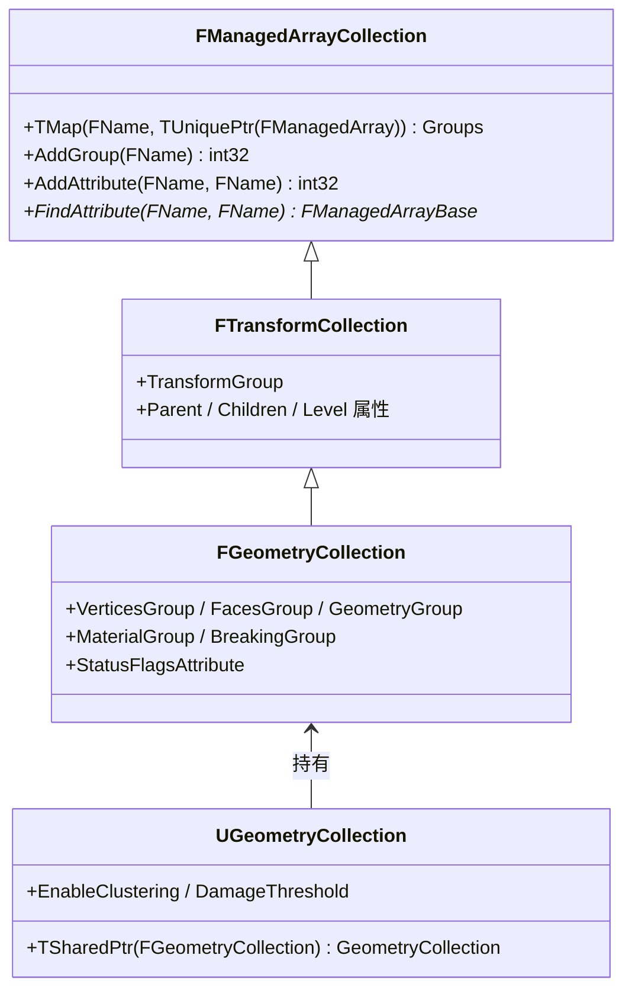
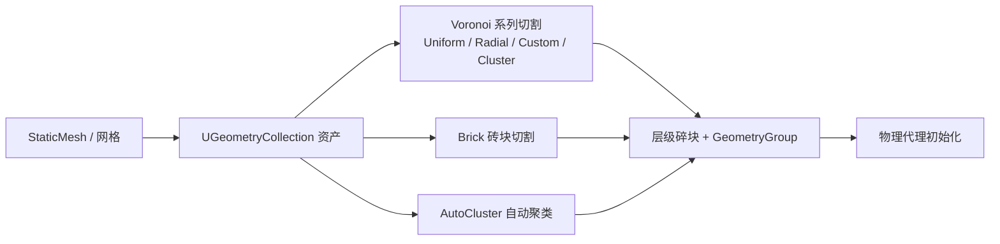
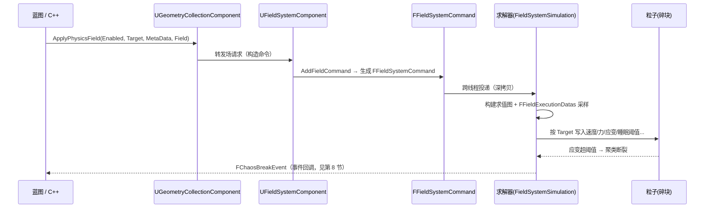
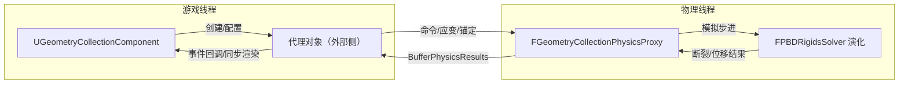

# 37 Chaos 破坏系统与 Field System 源码分析

## 元数据

- **版本基线**：UE5.8.0（CL 55116800，++UE5+Release-5.8），本机引擎路径 `C:\Program Files\Epic Games\UE_5.8\Engine`
- **适用范围**：Chaos 破坏系统（Geometry Collection）与 Field System（场系统）的引擎源码分析；面向需要阅读引擎源码、定位破坏/场相关 Bug、做二次开发或定制破坏管线的开发者；纯玩法使用层请配合 [../09-物理系统/05-Chaos破坏系统与Field.md](../09-物理系统/05-Chaos破坏系统与Field.md)。
- **事实边界**：本篇引用的类 / 结构体 / 函数 / CVar 均于 2026-08-07 在本机引擎以只读方式核对命中（见"证据边界与源码锚点"）；无法命中的条目一律标注 **待核对** 或 **示意**，未虚构任何符号。UE5.8 的破坏相关模块组织相较 5.3~5.5 有较大变化（详见 1.2 模块地图），引用路径以本机为准。
- **官方参考**：[Unreal Engine 文档 - Geometry Collection](https://dev.epicgames.com/documentation/en-us/unreal-engine/geometry-collection-reference-in-unreal-engine)（注意官方文档按版本分支，符号以源码为准）
- **最后更新**：2026-08-07

## 概述

### 1.1 破坏系统三件套

Chaos 破坏系统（Geometry Collection Destruction）在源码层由三部分协作完成：

| 层 | 职责 | 源码载体（本机核对） |
|---|---|---|
| 数据 / 资产层 | 存储可破坏网格的层级碎块数据 | `FManagedArrayCollection` → `FTransformCollection` → `FGeometryCollection`；资产壳 `UGeometryCollection` |
| 驱动层 | 用场（Field）节点图施加力 / 应变 / 速度等 | `UFieldNodeBase` 节点族 → `FFieldSystemCommand` → `FFieldExecutionDatas` |
| 求解层 | 碎块刚体模拟、聚类断裂、事件产出 | `FGeometryCollectionPhysicsProxy` + `FPBDRigidsSolver`（`AChaosSolverActor` 提供配置） |

三者关系：**资产提供数据，场提供驱动，求解器产出结果与事件**。玩法层只通过 `UGeometryCollectionComponent` 的 API 与事件委托接触这三层。

### 1.2 UE5.8 模块地图（本机核对）

> 与旧版本（5.3~5.5）差异较大，网上旧文章路径常失效，先看这里。

- `GeometryCollectionCore` / `GeometryCollectionSimulationCore`：**在 UE5.8 中已并入 `Chaos` 模块**——数据层在 `Engine\Source\Runtime\Experimental\Chaos\Public\GeometryCollection\`，物理代理在 `Chaos\Public\PhysicsProxy\GeometryCollectionPhysicsProxy.h`；
- `FieldSystemCore` / `FieldSystemSimulationCore`：本机无独立模块；场运行时在 `Chaos\Public\Field\`（`FieldSystem.h`、`FieldSystemTypes.h`），引擎侧组件在 `Engine\Source\Runtime\Experimental\FieldSystem\Source\FieldSystemEngine\Public\Field\`（注意多了一层 `Source\FieldSystemEngine`）；
- `GeometryCollectionEngine`：仍为独立运行时模块（组件 / 资产 / 缓存 / 调试绘制）；
- `ChaosSolverEngine`：独立模块，提供 `AChaosSolverActor` 与求解配置；
- 编辑器工具：`Engine\Plugins\Experimental\ChaosEditor\Source\FractureEditor\`（Fracture 模式工具所在模块，注意模块名不是 ChaosEditor）。

### 1.3 与概念层文档的关系

[../09-物理系统/05-Chaos破坏系统与Field.md](../09-物理系统/05-Chaos破坏系统与Field.md)（09-05）是**使用层**：讲怎么建资产、怎么在蓝图里接线、性能预算与 FAQ；本篇是**源码层**：讲数据怎么组织、命令怎么流转、事件怎么产生。两篇相互引用，建议先读 09-05 建立全景，再读本篇深入实现。

## 证据边界与源码锚点

### 2.1 已核对符号表（本机 UE5.8 / CL 55116800）

| 模块 / 文件（相对 Engine） | 关键符号（行号为本机实测） |
|---|---|
| `Source\Runtime\Experimental\Chaos\Public\GeometryCollection\GeometryCollection.h` | `FGeometryCollection`（L29，继承 `FTransformCollection`、`FGeometryCollectionConvexPropertiesInterface`、`FGeometryCollectionProximityPropertiesInterface`）、`BreakingGroup`（L102）、`StatusFlagsAttribute`（L107） |
| `...\GeometryCollection\GeometryCollectionBoneNode.h` | `FGeometryCollectionBoneNode`（L7，头注释标注 `UE_DEPRECATED(4.22)`）、`ENodeFlags::FS_Geometry`（L15）/ `FS_Clustered`（L18）、`IsGeometry()`/`IsClustered()`（L51-52） |
| `...\GeometryCollection\TransformCollection.h` | `FTransformCollection`（L16，继承 `FManagedArrayCollection`，存储 Transform 层级） |
| `...\GeometryCollection\GeometryCollectionAlgo.h` | `BuildTransformGroupToGeometryGroupMap`（L64） |
| `Source\Runtime\Experimental\GeometryCollectionEngine\Public\GeometryCollection\GeometryCollectionObject.h` | `FGeometryCollectionSizeSpecificData`（L232，`DamageThreshold` L308）、`UGeometryCollection`（L388）、`GetGeometryCollection()`（L421-422）、`EnableClustering`（L557）、`DamageThreshold`（L573）、`bUseSizeSpecificDamageThreshold`（L577）、`ClusterConnectionType`（L595） |
| `...\GeometryCollectionComponent.h` | 委托 `FOnChaosBreakEvent`（L53）/ `FOnChaosRemovalEvent`（L55）/ `FOnChaosCrumblingEvent`（L57）；API `ApplyExternalStrain`（L714）、`ApplyInternalStrain`（L726）、`CrumbleCluster`（L733）、`SetAnchoredByBox`（L752）、`RemoveAllAnchors`（L764）、`SetDamageThreshold`（L1036）、`ApplyPhysicsField`（L1141）；`NotifyBreak`（L1263）、`OnChaosBreakEvent`（L1269）、`OnRootBreakEvent`（L1278）、`DispatchBreakEvent`（L1286）、`OnChaosCrumblingEvent`（L1275）、`OnChaosPhysicsCollision`（L1436）、`ReceivePhysicsCollision`（L1439） |
| `Source\Runtime\Experimental\ChaosSolverEngine\Public\Chaos\ChaosSolverActor.h` | `EClusterConnectionTypeEnum`（L33，头注释标注 **Legacy**）、`AChaosSolverActor`（L107，继承 `AActor, IDataflowPhysicsSolverInterface`）、`FChaosSolverConfiguration Properties`（L114） |
| `Source\Runtime\Experimental\Chaos\Public\ChaosSolverConfiguration.h` | `FChaosSolverDestructionSettings`（L21）、`FChaosSolverConfiguration`（L51）、`PositionIterations`（L62）、`VelocityIterations`（L66）、`ProjectionIterations`（L70）、`ClusterConnectionFactor`（L106）、`DestructionSettings`（L112）、`Iterations_DEPRECATED`（L136）/ `PushOutIterations_DEPRECATED`（L140） |
| `Source\Runtime\Engine\Public\Physics\Experimental\ChaosEventType.h` | `FChaosBreakEvent`（L83：Component / Location / Orientation / Velocity / AngularVelocity / Extents / Mass / Index / bFromCrumble）、`FChaosRemovalEvent`、`FChaosCrumblingEvent` |
| `Source\Runtime\Experimental\FieldSystem\Source\FieldSystemEngine\Public\Field\FieldSystemObjects.h` | 元数据 `UFieldSystemMetaData`（L23）+ `Iteration`（L37）/ `ProcessingResolution`（L63）/ `Filter`（L88）；基类 `UFieldNodeBase`（L125）、`UFieldNodeInt`（L141）/ `UFieldNodeFloat`（L154）/ `UFieldNodeVector`（L167）；节点类见 6.1 清单（L180~L954 共 20 个节点类） |
| `...\Field\FieldSystemComponent.h` | `UFieldSystemComponent`（L37，继承 `UPrimitiveComponent`）、`AddFieldCommand`（L259，BlueprintCallable）、`ResetFieldSystem`、`GetConstructionFields` |
| `Source\Runtime\Experimental\Chaos\Public\Field\FieldSystem.h` | `FFieldExecutionDatas`（L75）、`FFieldContext`（L241）、`FFieldNodeBase`（L403，含 `EFieldType` 与 `ESerializationType`）、`FFieldSystemCommand`（L522，字段与深拷贝语义见 6.4） |
| `...\Field\FieldSystemTypes.h` | `EFieldPhysicsType : int`（L148，21 个值含 `Field_None`/`Field_PhysicsType_Max`） |
| `...\GeometryCollection\GeometryCollectionSimulationTypes.h` | `EGeometryCollectionPhysicsTypeEnum`（L46，13 个值）、`GetGeometryCollectionPhysicsType`（L66，枚举→`EFieldPhysicsType` 静态映射表） |
| `...\PhysicsProxy\GeometryCollectionPhysicsProxy.h` | `FGeometryCollectionPhysicsProxy`（L142，`TPhysicsProxy<..., FStubGeometryCollectionData, FGeometryCollectionProxyTimestamp>` 特化）、`Initialize`（L197）、`InitializeBodiesPT`（L207）、`InitializeDynamicCollection`（L212）、`BufferPhysicsResults_Internal`（L230）/ `_External`（L233）、`SetAnchoredByIndex_External`（L502）、`SetAnchoredByTransformedBox_External`（L503）、`SetEnableDamageFromCollision_External`（L518） |
| `...\PBDRigidsSolver.h` | `FPBDRigidsSolver`（L87，继承 `FPhysicsSolverBase`） |
| `...\EventManager.h` | `FEventManager` 相关（L455 出现 `friend class FPBDRigidsSolver`） |
| `...\GeometryCollection\GeometryCollectionCache.h` | `UGeometryCollectionCache`（L15，继承 `UObject`）、`SetFromRawTrack`（L30）、`SetFromTrack`（L33）、`GetData`（L45）、`RecordedData`（L63，类型 `FRecordedTransformTrack`） |
| `...\GeometryCollection\GeometryCollectionDebugDrawActor.h` | 存在（调试绘制 Actor） |
| `...\GeometryCollection\GeometryCollectionISMPoolComponent.h` | 存在（碎块 ISM 池化组件） |
| `Plugins\Experimental\ChaosEditor\Source\FractureEditor\` | `UFractureToolVoronoiCutterBase`（`Private\FractureToolCutter.h` L367）、`UFractureToolUniform`（L35）、`UFractureToolRadial`（L83）、`UFractureToolCustomVoronoi`（L119）、`UFractureToolClusterCutter`（L66）、`UFractureToolBrick`（L81）、`UFractureToolAutoCluster`（L116） |
| CVar（`GeometryCollectionEngine\Private\GeometryCollection\GeometryCollectionComponent.cpp`） | `p.Chaos.BoxCalcBounds.ISPC`（L113）、`p.Chaos.GC.UseCustomRenderer`（L117）、`p.Chaos.GC.InitConstantDataUseParallelFor`（L120）、`p.Chaos.GC.MaxGeometryCollectionAsyncPhysicsTickIdleTimeMs`（L126）、`p.Chaos.GC.RemovalTimerMultiplier`（L129）、`p.Chaos.GC.EmitRootBreakingEvent`（L133）、`p.Chaos.GC.CreatePhysicsStateInEditor`（L136）、`p.Chaos.GC.UseReplicationV2`（L139）、`p.Chaos.GC.NetAwakeningMode`（L142）、`p.Chaos.GC.DestroyProxyOnSetSimulatePhysicsFalse`（L148）、`p.Chaos.GC.RemoveOnBreakDecayFix`（L153）、`p.GeometryCollectionNavigationSizeThreshold`（L490）、`p.GeometryCollectionSingleThreadedBoundsCalculation`（L494）、复制类（L2625-2646，见 10 节） |
| CVar（`ChaosSolverEngine\Private\Chaos\ChaosDebugDrawComponent.cpp`） | `p.Chaos.DebugDraw.Enabled`（L29）、`.MaxLines`（L32）、`.Radius`（L35）、`.SeeThrough`（L38）、`.SingleActor`（L41）、`.ShowPIEServer`（L50） |

### 2.2 未能命中 / 待核对清单

| 条目 | 状态 | 说明 |
|---|---|---|
| `Chaos::FractureEngine` 命名空间 | **待核对** | 本机 `Engine\Source` 全量检索未命中（旧版 5.2+ 曾位于 `ChaosFractureEngine` 模块，本机无此模块）；5.8 的破碎算法入口疑似随模块重组迁移，建议在对应源码中重新定位 |
| `FieldSystemSimulationCore` 独立模块 | 不存在 | 本机无此模块；场求值相关代码在 `Chaos\Public\Field\` 与 `FieldSystemEngine` 内 |
| `FCacheEventTrack` | **待核对** | 本机 `Engine\Source` 的 `*.h` 中未命中（旧版本缓存事件轨道类型），缓存回放的事件行为以本机源码为准 |
| `FGeometryCollectionGroup` | **待核对** | 本机 `Chaos\Public\GeometryCollection` 未命中该结构体（旧版本存在于 GeometryCollectionCore） |
| 组件侧缓存播放属性（`CachePlayback` 等） | **待核对** | 本机未逐项核对，请在 `GeometryCollectionComponent.h` 中检索 "Cache" |
| 场命令在求解器侧的最终应用入口 | **待核对** | 已确认命令结构与求值缓冲，但 `EFieldPhysicsType` → 粒子属性的最终写入点未在本轮展开 |
## 核心概念表

| 概念 | 源码载体 | 一句话说明 |
|---|---|---|
| 托管数组集合 | `FManagedArrayCollection` | 按"组（Group）"组织的属性化 `TArray` 容器，是所有 Collection 的基座 |
| Transform 层级 | `FTransformCollection` | 在集合上增加 Transform 父子层级（Parent / Children / Level） |
| 几何集合 | `FGeometryCollection` | 破坏系统的核心数据：顶点 / 面 / 几何 / 材质 / 断裂 等组 |
| 骨骼节点 | `FGeometryCollectionBoneNode` | 旧式节点结构（4.22 起弃用），标志 `FS_Geometry` / `FS_Clustered` |
| 资产壳 | `UGeometryCollection` | UE 资产（UObject），持有 `TSharedPtr<FGeometryCollection>` |
| 场景组件 | `UGeometryCollectionComponent` | 物理 / 渲染 / 事件入口，破坏玩法主要交互面 |
| 物理代理 | `FGeometryCollectionPhysicsProxy` | 连接游戏侧组件与物理线程求解器的桥（`TPhysicsProxy` 特化） |
| 场节点图 | `UFieldNodeBase` 节点族 | 蓝图可编辑的场表达式树（Int / Float / Vector 三类） |
| 场命令 | `FFieldSystemCommand` | 跨线程传递的求值请求（含根节点深拷贝与元数据） |
| 求值缓冲 | `FFieldExecutionDatas` | 场求值期间复用分配的采样 / 结果缓冲 |
| 场目标类型 | `EFieldPhysicsType` / `EGeometryCollectionPhysicsTypeEnum` | 命令要写入的物理量（速度 / 力 / 应变 / 睡眠阈值…） |
| 求解器 | `FPBDRigidsSolver` / `AChaosSolverActor` | 物理线程求解器；Actor 提供 `FChaosSolverConfiguration` 配置 |
| 求解配置 | `FChaosSolverConfiguration` | 迭代次数、聚类连接系数、破坏节流设置 |
| 事件结构体 | `FChaosBreakEvent` 等 | 断裂 / 移除 / 粉碎 / 碰撞事件的数据载荷 |

## 原理详解

### 1. 数据层：FManagedArrayCollection → FTransformCollection → FGeometryCollection

#### 1.1 类继承链



**图释**：`FManagedArrayCollection` 提供"组 + 属性"的容器模型；`FTransformCollection` 在其上定义 Transform 层级；`FGeometryCollection` 增加几何与断裂相关组；`UGeometryCollection` 是资产的 UE 对象壳，持有共享指针。本机 `GeometryCollection.h` L29 确认 `FGeometryCollection : public FTransformCollection`，且额外继承 `FGeometryCollectionConvexPropertiesInterface` 与 `FGeometryCollectionProximityPropertiesInterface`（凸包 / 邻近属性接口）。

#### 1.2 组（Group）与属性（Attribute）

数据全部存放在命名的**组**内，每个组内是若干命名的 `TManagedArray` 属性。`GeometryCollection.h` 头部注释给出了各组的关键属性（本机 L50-91 原文整理）：

| 组 | 关键属性（GetAttribute<类型>("属性名", 组)） |
|---|---|
| TransformGroup（基类定义） | Transform（FTransform）、Parent / Children / Level、StatusFlags、SimulationType |
| VerticesGroup | Vertex（FVector3f）、BoneMap（Int32，指向 Transform 组）、Normal / UVs / TangentU / TangentV / Color（材质组派生） |
| FacesGroup | Indices（FIntVector）、Visible（bool）、MaterialIndex / MaterialID（Int32） |
| GeometryGroup | TransformIndex、BoundingBox（FBox）、FaceStart / FaceCount、VertexStart / VertexCount |
| MaterialGroup | 材质相关（Normal / UVs / Tangent / Color 等顶点材质属性） |
| BreakingGroup | 断裂相关属性（`BreakingGroup` 常量在 L102 确认） |
| Proximity | 由 `FGeometryCollectionProximityPropertiesInterface` 提供（具体组名待核对） |

**图释**：一个碎块（Transform）引用一个 Geometry 条目，Geometry 通过 FaceStart/FaceCount 与 VertexStart/VertexCount 索引到自己的面与顶点区间——这是"层级碎块 + 共享几何缓冲"的实现基础。

#### 1.3 骨骼节点与标志

`FGeometryCollectionBoneNode.h`（本机 L7 起）定义了节点与标志：

```cpp
// 节选：GeometryCollectionBoneNode.h（本机 L15-18）
FS_Geometry = 0x00000001,   // 几何节点（叶子，有网格）
FS_Clustered = 0x00000002,  // 聚类节点（父级，无网格，由子节点聚合）
```

- 该结构体头注释标注 **`UE_DEPRECATED(4.22)`**：层级信息已改为 TransformGroup 内的托管数组（Parent / Children / Level），业务代码**不应**再依赖 `FGeometryCollectionBoneNode`；
- 但 `StatusFlags` 属性仍存在（`StatusFlagsAttribute`，L107），`IsGeometry()` / `IsClustered()` 的语义继续用于区分叶子与聚类。

### 2. 资产与组件：UGeometryCollection 与 UGeometryCollectionComponent

#### 2.1 资产侧关键属性（GeometryCollectionObject.h）

| 属性 | 行号 | 说明 |
|---|---|---|
| `EnableClustering` | L557 | 是否启用聚类（碎块按层级聚合为父节点） |
| `DamageThreshold`（TArray<float>） | L573 | 每层级断裂伤害阈值（用户定义模型） |
| `bUseSizeSpecificDamageThreshold` | L577 | 是否按尺寸分级阈值（`FGeometryCollectionSizeSpecificData`） |
| `ClusterConnectionType` | L595 | 聚类连接类型（`EClusterConnectionTypeEnum`，legacy） |
| `SizeSpecificData` | L822 | 按 `FGeometryCollectionSizeSpecificData`（L232，含 `DamageThreshold` L308）分级配置 |

#### 2.2 组件侧 API 分组（GeometryCollectionComponent.h）

```cpp
// 节选：GeometryCollectionComponent.h（本机 L1141-1145）
UFUNCTION(BlueprintCallable, Category = "Field", DisplayName = "Add Physics Field")
GEOMETRYCOLLECTIONENGINE_API void ApplyPhysicsField(
    UPARAM(DisplayName = "Enable Field") bool Enabled,
    UPARAM(DisplayName = "Physics Type") EGeometryCollectionPhysicsTypeEnum Target,
    UPARAM(DisplayName = "Meta Data") UFieldSystemMetaData* MetaData,
    UPARAM(DisplayName = "Field Node") UFieldNodeBase* Field);
```

| 分组 | API（本机行号） | 用途 |
|---|---|---|
| 场 | `ApplyPhysicsField`（L1141） | 施加任意场（力 / 速度 / 应变…），蓝图主入口 |
| 应变 | `ApplyExternalStrain`（L714）、`ApplyInternalStrain`（L726） | 便捷应变 API（外部 / 内部应变，超过阈值即断裂） |
| 粉碎 | `CrumbleCluster`（L733） | 直接粉碎指定聚类节点 |
| 锚定 | `SetAnchoredByBox`（L752）、`RemoveAllAnchors`（L764） | 按包围盒锚定 / 解除全部锚定（固定碎块） |
| 伤害 | `SetDamageThreshold`（L1036） | 运行时覆盖伤害阈值 |
| 事件 | `OnChaosBreakEvent`（L1269）、`OnRootBreakEvent`（L1278）、`OnChaosCrumblingEvent`（L1275）、`OnChaosPhysicsCollision`（L1436） | 玩法回调（详见第 8 节） |
| 状态 | `NotifyGeometryCollectionPhysicsStateChange`（L1150） | 物理状态变化通知 |

### 3. 破碎工具链：FractureEditor（ChaosEditor 插件）

- 模块：`Plugins\Experimental\ChaosEditor\Source\FractureEditor`（注意模块名是 **FractureEditor**，不是 ChaosEditor）；
- 工具类层级（本机核对）：`UFractureToolCutterBase` → `UFractureToolVoronoiCutterBase`（`FractureToolCutter.h` L367）→ `UFractureToolUniform`（L35）、`UFractureToolRadial`（L83）、`UFractureToolCustomVoronoi`（L119）、`UFractureToolClusterCutter`（L66）；另有 `UFractureToolBrick`（L81）、`UFractureToolAutoCluster`（L116，继承 `UFractureModalTool`）。



**图释**：Fracture 模式的所有切割工具最终都作用于 `UGeometryCollection` 资产内的 `FGeometryCollection` 数据，产出"层级碎块"（叶子几何 + 聚类父节点）。`Chaos::FractureEngine` 命名空间（旧版算法层）在本机 5.8 未命中，具体算法入口**待核对**。

### 4. Field System 数据流（核心）

#### 4.1 节点族（FieldSystemObjects.h，本机 L23-954）

场是一棵**节点图**，蓝图节点是 `UFieldNodeBase` 的派生，运行时对应 `FFieldNodeBase` 求值节点。节点按输出类型分三类：

| 类型 | 节点类（本机行号） |
|---|---|
| Int | `UUniformInteger`（L180）、`URadialIntMask`（L211）、`UToIntegerField`（L847） |
| Float | `UUniformScalar`（L272）、`UWaveScalar`（L303）、`URadialFalloff`（L371）、`UPlaneFalloff`（L443）、`UBoxFalloff`（L523）、`UNoiseField`（L590）、`UToFloatField`（L877） |
| Vector | `UUniformVector`（L635）、`URadialVector`（L673）、`URotatedRadialVector`（L710）、`URandomVector`（L762） |
| 组合 / 控制 | `UOperatorField`（L793）、`UCullingField`（L907）、`UReturnResultsTerminal`（L954） |

元数据类（`UFieldSystemMetaData` 派系）：`UFieldSystemMetaDataIteration`（迭代次数）、`UFieldSystemMetaDataProcessingResolution`（采样分辨率）、`UFieldSystemMetaDataFilter`（按组过滤采样）。

#### 4.2 命令：FFieldSystemCommand（FieldSystem.h L522）

```cpp
// 节选：FieldSystem.h（本机 L522 起，字段整理）
class FFieldSystemCommand
{
    FName TargetAttribute;          // 目标属性名（如 "ExternalClusterStrain"）
    FFieldNodeBase* RootNode;       // 求值图根节点
    TMap<EMetaType, TUniquePtr<FFieldSystemMetaData>> MetaData; // 迭代/分辨率/过滤
    FString CommandName;
    double TimeCreation;
    FBox BoundingBox;               // 默认 ±FLT_MAX（全场景）
    EFieldPhysicsType PhysicsType;  // 目标物理量类型
    float MaxMagnitude;             // 最大幅值（默认 1.0）
    FVector CenterPosition;
};
```

头注释明确说明：**命令在游戏线程发出、触发一次完整求值；命令在跨线程移动时整体深拷贝（`NewCopy()` 复制根节点与元数据）**——这要求自定义场节点必须正确实现运行时节点的拷贝语义，否则跨线程传输会丢数据。

#### 4.3 求值缓冲：FFieldExecutionDatas（FieldSystem.h L75）

```cpp
// 节选：FieldSystem.h（本机 L75 起，字段整理）
struct FFieldExecutionDatas
{
    TArray<FVector> SamplePositions;                        // 采样位置
    TArray<FFieldContextIndex> SampleIndices;               // 采样索引
    TArray<FGeometryParticleHandle*> ParticleHandles[...];  // 参与粒子句柄
    TArray<FVector> FieldOutputs[...];                      // 目标输出
    TArray<FVector> VectorResults[...];                     // 向量结果
    TArray<float> ScalarResults[...];                       // 标量结果
    TArray<int32> IntegerResults[...];                      // 整数结果
    TArray<FFieldContextIndex> IndexResults[...];           // 索引结果
};
```

注释表明这些缓冲在求值期间**复用避免反复分配**——高频场（每帧爆炸力）的性能关键点。

#### 4.4 目标类型与映射

- `EGeometryCollectionPhysicsTypeEnum`（`GeometryCollectionSimulationTypes.h` L46）：蓝图侧 13 个目标（AngularVelocity / DynamicState / LinearVelocity / InitialAngularVelocity / InitialLinearVelocity / CollisionGroup / LinearForce / AngularTorque / DisableThreshold / SleepingThreshold / ExternalClusterStrain / InternalClusterStrain / LinearImpulse）；
- `GetGeometryCollectionPhysicsType`（L66）将其映射为 `EFieldPhysicsType`（`FieldSystemTypes.h` L148，含 `Field_Kill`、`Field_PositionStatic` 等 21 值）——**映射表按枚举顺序静态配对，改动枚举必须同步该表**。

#### 4.5 完整数据流



**图释**：玩法层只调用组件 API；命令在游戏线程构造、深拷贝到物理线程求值；结果写入粒子属性；断裂结果再以事件回到游戏线程。`UGeometryCollectionComponent::ApplyPhysicsField` 与 `UFieldSystemComponent::AddFieldCommand`（L259）签名同构（前者用 `EGeometryCollectionPhysicsTypeEnum`，后者用 `EFieldPhysicsType`）。
### 5. 求解层：FGeometryCollectionPhysicsProxy 与 FPBDRigidsSolver

#### 5.1 物理代理

`FGeometryCollectionPhysicsProxy`（`PhysicsProxy\GeometryCollectionPhysicsProxy.h` L142）是 `TPhysicsProxy<FGeometryCollectionPhysicsProxy, FStubGeometryCollectionData, FGeometryCollectionProxyTimestamp>` 的特化——每个 `UGeometryCollectionComponent` 的物理状态在物理线程对应一个代理，代理是游戏侧与求解器之间的桥。

```cpp
// 节选：GeometryCollectionPhysicsProxy.h（本机 L197-233，方法整理）
void Initialize(Chaos::FPBDRigidsEvolutionBase* Evolution);   // 初始化（接入演化）
void InitializeBodiesPT(...);                                 // 物理线程初始化刚体
void BufferPhysicsResults_Internal(FPBDRigidsSolver*, FDirtyGeometryCollectionData&); // 物理线程写结果
void BufferPhysicsResults_External(FDirtyGeometryCollectionData&);                     // 游戏线程读结果
```

#### 5.2 双缓冲同步



**图释**：命令与外力从游戏线程进入，模拟在物理线程进行，结果通过 `BufferPhysicsResults_*` 双缓冲回读；破坏事件经物理线程事件系统派发回游戏线程。`SetAnchoredByIndex_External`（L502）、`SetEnableDamageFromCollision_External`（L518）等 `_External` 后缀方法即游戏线程侧的"投递式"入口。

#### 5.3 求解器与配置

- `AChaosSolverActor`（`ChaosSolverActor.h` L107）持有 `FChaosSolverConfiguration Properties`（L114），并实现 `IDataflowPhysicsSolverInterface`；
- `FChaosSolverConfiguration`（`ChaosSolverConfiguration.h` L51）：`PositionIterations`（L62）、`VelocityIterations`（L66）、`ProjectionIterations`（L70）、`ClusterConnectionFactor`（L106，聚类连接强度系数）、`DestructionSettings`（L112，`FChaosSolverDestructionSettings` 破坏节流：L21）；
- 旧字段 `Iterations` / `PushOutIterations` 已标记 `_DEPRECATED`（L136/140）——**5.8 使用新的三分迭代配置**；
- `EClusterConnectionTypeEnum`（L33）头注释明确标注 **Legacy**（为旧配置保留，将随旧属性移除）：`Chaos_PointImplicit`、`Chaos_DelaunayTriangulation`、`Chaos_MinimalSpanningSubsetDelaunayTriangulation`、`Chaos_PointImplicitAugmentedWithMinimalDelaunay`、`Chaos_BoundsOverlapFilteredDelaunayTriangulation`、`Chaos_None`。

### 6. 破坏事件与回调

#### 6.1 事件结构体

`FChaosBreakEvent`（`Engine\Public\Physics\Experimental\ChaosEventType.h` L83）是断裂事件的数据载荷：

| 字段 | 类型 | 说明 |
|---|---|---|
| `Component` | `TObjectPtr<UPrimitiveComponent>` | 发生断裂的组件 |
| `Location` / `Orientation` | `FVector` / `FQuat` | 断裂碎块的世界位置 / 朝向 |
| `Velocity` / `AngularVelocity` | `FVector` | 线性 / 角速度 |
| `Extents` | `FVector` | 碎块局部包围盒尺寸 |
| `Mass` | `float` | 碎块质量 |
| `Index` | `int32` | 断裂骨索引（≥0 时有效） |
| `bFromCrumble` | `bool` | 是否来自粉碎（Crumble）流程 |

同文件还定义了 `FChaosRemovalEvent`（移除）、`FChaosCrumblingEvent`（粉碎）等结构体。

#### 6.2 委托族与分发（GeometryCollectionComponent.h）

```cpp
// 节选：GeometryCollectionComponent.h（本机 L53-61）
DECLARE_DYNAMIC_MULTICAST_DELEGATE_OneParam(FOnChaosBreakEvent, const FChaosBreakEvent&, BreakEvent);
DECLARE_DYNAMIC_MULTICAST_DELEGATE_OneParam(FOnChaosRemovalEvent, const FChaosRemovalEvent&, RemovalEvent);
DECLARE_DYNAMIC_MULTICAST_DELEGATE_OneParam(FOnChaosCrumblingEvent, const FChaosCrumblingEvent&, CrumbleEvent);
DECLARE_DYNAMIC_MULTICAST_DELEGATE(FOnGeometryCollectionFullyDecayedEvent);     // 全部碎块衰亡
DECLARE_DYNAMIC_MULTICAST_DELEGATE(FOnGeometryCollectionRootMovedEvent);        // 根节点移动
```

- 分发路径：物理线程断裂 → 代理收集 → `DispatchBreakEvent`（L1286）→ `OnChaosBreakEvent`（L1269）与虚函数 `NotifyBreak`（L1263，供 C++ 子类覆写）；另有 `OnRootBreakEvent`（L1278）单独回传根节点断裂；
- 碰撞事件：`FOnChaosPhysicsCollision OnChaosPhysicsCollision`（L1436）+ `ReceivePhysicsCollision`（L1439，接收 `FChaosPhysicsCollisionInfo`）；
- 根节点断裂事件默认受 `p.Chaos.GC.EmitRootBreakingEvent`（L133，默认关闭）控制——**收不到根节点断裂事件时先查该 CVar**。

### 7. 缓存与回放：UGeometryCollectionCache

- `UGeometryCollectionCache`（`GeometryCollectionCache.h` L15）持有 `FRecordedTransformTrack RecordedData`（L63），提供 `SetFromRawTrack`（L30）/ `SetFromTrack`（L33）/ `GetData`（L45）与 `ProcessRawRecordedDataInternal`（L59）；
- 用途：录制一次破坏模拟的变换轨道，用于**确定性回放 / 演示 / 观战同步**（录制时消耗一次模拟，回放时不再实时求解）；
- 限制：`FCacheEventTrack` 在本机 5.8 未命中，缓存回放期间是否复现 Break 事件**待核对**；组件侧播放开关属性**待核对**（检索 `GeometryCollectionComponent.h` 中 "Cache"）。

### 8. 调试与观测：CVar 与 DebugDraw

#### 8.1 已核对 CVar（GeometryCollectionComponent.cpp 行号实测）

| CVar | 行号 | 用途 |
|---|---|---|
| `p.Chaos.BoxCalcBounds.ISPC` | L113 | 包围盒计算是否用 ISPC |
| `p.Chaos.GC.UseCustomRenderer` | L117 | 自定义渲染器开关 |
| `p.Chaos.GC.InitConstantDataUseParallelFor` / `InitConstantDataParallelForBatchSize` | L120/123 | 初始化常量数据的并行化 |
| `p.Chaos.GC.MaxGeometryCollectionAsyncPhysicsTickIdleTimeMs` | L126 | 异步物理 tick 空闲关闭时间 |
| `p.Chaos.GC.RemovalTimerMultiplier` | L129 | 碎块移除计时倍率（>1 更快移除） |
| `p.Chaos.GC.EmitRootBreakingEvent` | L133 | 根节点断裂也发事件（默认关） |
| `p.Chaos.GC.CreatePhysicsStateInEditor` | L136 | 编辑器中（非 PIE）创建物理状态 |
| `p.Chaos.GC.UseReplicationV2` | L139 | 复制数据模型 V2 开关 |
| `p.Chaos.GC.NetAwakeningMode` | L142 | GC 所有者网络唤醒模式（0=ForceDormancyAwake，1=FlushNetDormancy） |
| `p.Chaos.GC.DestroyProxyOnSetSimulatePhysicsFalse` | L148 | SetSimulatePhysics(false) 时销毁物理代理 |
| `p.Chaos.GC.RemoveOnBreakDecayFix` | L153 | 修复"断裂衰亡时子块消失数帧"的问题 |
| `p.GeometryCollectionNavigationSizeThreshold` | L490 | 参与导航导出的叶子尺寸阈值 |
| `p.GeometryCollectionSingleThreadedBoundsCalculation` | L494 | 单线程包围盒计算（调试） |
| `p.GeometryCollectionRepLinearMatchStrength` / `RepAngularMatchTime` / `RepMaxExtrapolationTime` | L2625-2631 | 复制插值 / 外推参数 |
| `p.Chaos.DebugDraw.GeometryCollectionReplication` | L2634 | 复制状态调试绘制 |

物理调试绘制（`ChaosDebugDrawComponent.cpp` L29-50）：`p.Chaos.DebugDraw.Enabled` / `.MaxLines` / `.Radius` / `.SeeThrough` / `.SingleActor` / `.ShowPIEServer`（PIE 时显示服务器侧绘制）。

#### 8.2 调试 Actor

- `GeometryCollectionDebugDrawActor`：场景中放置后可可视化碎块层级 / 连接 / 事件（本机确认头文件存在）；
- `GeometryCollectionISMPoolComponent`：碎块 ISM 池化（大量碎块渲染性能）。

## 验证命令

| 命令 | 用途 | 来源 |
|---|---|---|
| `p.Chaos.DebugDraw.Enabled 1` | 打开物理调试绘制总开关 | ChaosDebugDrawComponent.cpp L29 |
| `p.Chaos.DebugDraw.MaxLines 1000` / `.Radius 5000` / `.SeeThrough 1` | 限制与显示调试线 | L32-38 |
| `p.Chaos.DebugDraw.ShowPIEServer 1` | PIE 下同时显示服务器调试绘制 | L50 |
| `p.Chaos.GC.EmitRootBreakingEvent 1` | 让根节点断裂触发 `OnRootBreakEvent` | GeometryCollectionComponent.cpp L133 |
| `p.Chaos.GC.RemovalTimerMultiplier 2` | 加速碎块移除（验证移除逻辑） | L129 |
| `p.Chaos.DebugDraw.GeometryCollectionReplication 1` | 显示 GC 复制状态 | L2634 |
| `p.Chaos.GC.UseReplicationV2 1` | 切换复制数据模型（联机排查） | L139 |
| `stat chaos` / `stat Physics` | 物理线程统计（命令名**待核对**） | 待核对 |

## 失败路径

1. **按旧版本路径找模块**：5.8 中 `GeometryCollectionCore` / `FieldSystemCore` 已不存在（并入 `Chaos` 与 `FieldSystem\Source\FieldSystemEngine`），直接看 1.2 模块地图；
2. **依赖 `FGeometryCollectionBoneNode`**：4.22 起弃用，新代码用 TransformGroup 的 Parent / Children / Level 托管数组；
3. **改枚举不同步映射表**：`GetGeometryCollectionPhysicsType`（SimulationTypes.h L66）按顺序静态映射，增删 `EGeometryCollectionPhysicsTypeEnum` 必须同步，否则静默错位；
4. **自定义场节点不实现深拷贝**：`FFieldSystemCommand` 跨线程整体 `NewCopy()`，节点缺拷贝实现会导致命令到物理线程后数据丢失；
5. **根节点断裂没事件**：先查 `p.Chaos.GC.EmitRootBreakingEvent`（默认关）与 `OnRootBreakEvent` 绑定；
6. **旧配置字段失效**：`Iterations` / `PushOutIterations` 已弃用（用 `PositionIterations` / `VelocityIterations` / `ProjectionIterations`），`EClusterConnectionTypeEnum` 标记 Legacy；
7. **缓存回放当实时模拟用**：回放不经过实时求解，事件行为与实时模式可能不同（具体差异**待核对**）。

## 最佳实践

1. **定位问题顺序**：先 `p.Chaos.DebugDraw.Enabled 1` + `GeometryCollectionDebugDrawActor` 看求解层，再查事件是否到达组件（打断点于 `DispatchBreakEvent` L1286），最后查玩法层绑定；
2. **自定义场节点**：继承 `UFieldNodeFloat/Int/Vector` 实现蓝图节点，并实现对应 `FFieldNodeBase` 求值类的 `Evaluate` 与 `NewCopy`（示意：参考 `URadialFalloff` 的成对实现）；
3. **伤害模型**：优先 `SizeSpecificData` 按层级配 `DamageThreshold`（资产侧），运行时微调用 `SetDamageThreshold` / `ApplyExternalStrain`；
4. **性能**：大量碎块用 `GeometryCollectionISMPoolComponent`；调节 `p.Chaos.GC.RemovalTimerMultiplier` 与异步 tick 空闲时间（L126）控制持续开销；避免每帧构造重型场命令（复用 `FFieldExecutionDatas` 缓冲）；
5. **网络**：破坏权威在服务器，客户端只回放表现；联机异常先对比 `p.Chaos.GC.UseReplicationV2` 与 `NetAwakeningMode` 两个 CVar 的组合行为；
6. **确定性**：需要可复现的破坏演出用 `UGeometryCollectionCache` 录制回放，不要依赖实时求解的随机性。

## 常见问题 FAQ

### Q1：FGeometryCollection 与 UGeometryCollection 是什么关系？
前者是运行时核心数据结构（`Chaos\Public\GeometryCollection\GeometryCollection.h`），后者是 UE 资产对象壳（`GeometryCollectionObject.h` L388），持有 `TSharedPtr<FGeometryCollection>`（L421）。编辑器 Fracture 工具与运行时物理都操作前者，资产序列化走后者。

### Q2：5.8 里 GeometryCollectionCore 模块去哪了？
已并入 `Chaos` 模块：数据层在 `Chaos\Public\GeometryCollection\`，物理代理在 `Chaos\Public\PhysicsProxy\`。网上旧文章路径（Engine\Source\Runtime\Experimental\GeometryCollectionCore）在 5.8 失效。

### Q3：为什么 FFieldSystemCommand 要深拷贝？
命令在游戏线程构造、跨线程投递到物理线程（FieldSystem.h L522 头注释明确说明）。根节点与元数据用 `NewCopy()` 深拷贝，避免线程间共享可变内存。

### Q4：OnChaosBreakEvent 收不到根节点断裂怎么办？
根节点断裂默认不发事件：CVar `p.Chaos.GC.EmitRootBreakingEvent`（L133）默认关闭，打开后 `OnRootBreakEvent`（L1278）才会触发。

### Q5：FChaosBreakEvent.Index 是什么？
断裂骨在集合中的索引（≥0 有效），可反查 TransformGroup / GeometryGroup 定位碎块；`bFromCrumble` 标识是否来自 CrumbleCluster 流程。

### Q6：场节点怎么选（Int / Float / Vector）？
按目标物理量类型：应变阈值 / 掩码用 Int 节点（`URadialIntMask`），标量场（衰减 / 噪声 / 波）用 Float 节点（`URadialFalloff` / `UWaveScalar` / `UNoiseField`），速度 / 力用 Vector 节点（`UUniformVector` / `URadialVector`）；组合用 `UOperatorField`，裁剪用 `UCullingField`。

### Q7：ApplyPhysicsField 与 AddFieldCommand 有什么区别？
`UGeometryCollectionComponent::ApplyPhysicsField`（L1141）是 GC 组件上的蓝图入口，目标类型用 `EGeometryCollectionPhysicsTypeEnum`；`UFieldSystemComponent::AddFieldCommand`（L259）是场组件上的底层入口，目标类型用 `EFieldPhysicsType`。前者面向破坏玩法，后者面向通用场。

### Q8：缓存回放会触发破坏事件吗？
`UGeometryCollectionCache` 记录的是变换轨道（`FRecordedTransformTrack`，L63）；`FCacheEventTrack` 在本机 5.8 未命中，回放期间的事件行为**待核对**——设计上不要把回放当作实时模拟的等价物。

### Q9：物理线程和游戏线程的数据怎么同步？
通过代理双缓冲：物理线程 `BufferPhysicsResults_Internal`（L230）写结果，游戏线程 `BufferPhysicsResults_External`（L233）读结果；外部命令（锚定 / 应变 / 场）通过 `_External` 后缀入口投递。

### Q10：EClusterConnectionTypeEnum 还能用吗？
能用但已标记 Legacy（ChaosSolverActor.h L33 头注释），为旧配置属性保留，最终会被移除。新项目优先使用 `FChaosSolverConfiguration`（L51）中未弃用的连接 / 破坏配置。

## 关联阅读

- [15-物理系统源码.md](15-物理系统源码.md)（Chaos 物理场景 / 碰撞求解器源码，本篇的求解层延伸）
- [17-Niagara源码.md](17-Niagara源码.md)（ChaosNiagara 联动：碎块事件驱动粒子，与破坏事件配套）
- [../09-物理系统/05-Chaos破坏系统与Field.md](../09-物理系统/05-Chaos破坏系统与Field.md)（使用层：资产创建、蓝图接线、性能预算）

## 更新日志

- 2026-08-07：创建。版本基线 UE5.8.0（CL 55116800）；所有符号经本机引擎只读核对；标注 6 项待核对条目（FractureEngine 命名空间、FCacheEventTrack、FGeometryCollectionGroup、组件缓存播放属性、场应用最终入口、stat 命令名）。