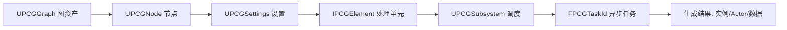
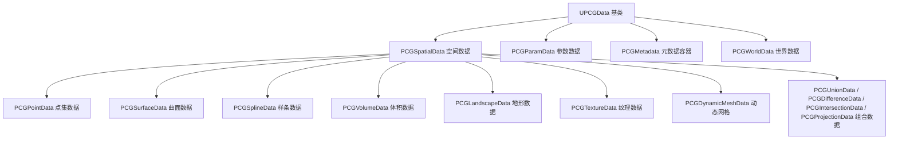
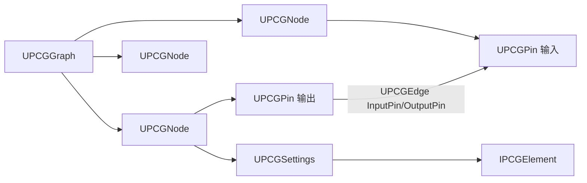
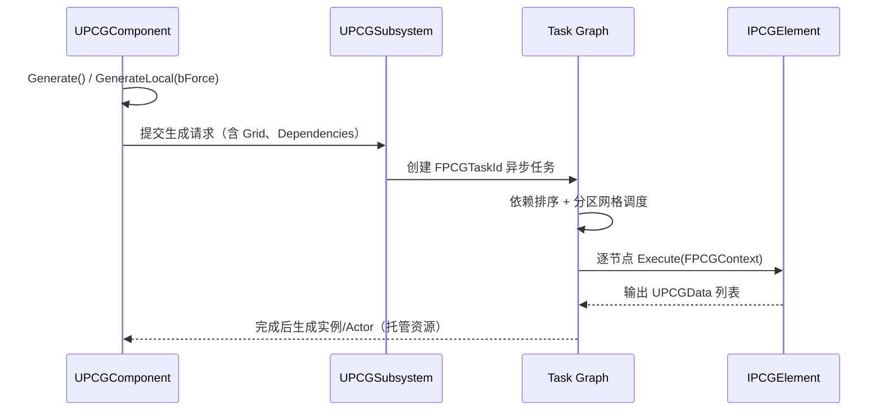
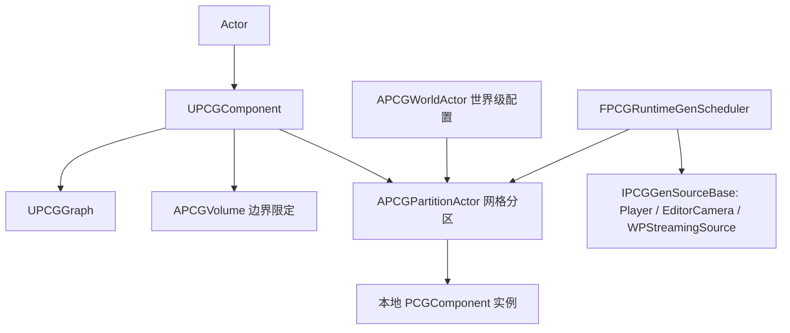
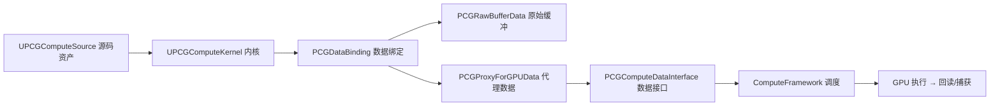

# UE 引擎源码分析 38：PCG 程序化内容生成源码剖析

> 本文为 `12-引擎源码分析` 系列第 38 篇，聚焦 **PCG（Procedural Content Generation Framework，程序化内容生成框架）** 的引擎侧实现：数据模型、图资产结构、执行引擎、Component/Volume/WorldPartition 集成、确定性保证与 PCGCompute 并行计算。

## 元数据

| 项目 | 内容 |
|---|---|
| 版本基线 | UE5.8.0 / CL55116800 / `++UE5+Release-5.8` |
| 适用范围 | PCG 源码阅读；自定义节点（`IPCGElement`）开发；图执行流程与性能分析；GPU 计算（PCGCompute）接入；确定性测试 |
| 事实边界 | 本文全部符号均经本机引擎 `C:\Program Files\Epic Games\UE_5.8\Engine\Plugins\PCG` 源码核对（2026-08-07）；无法在本机验证的内容一律标注「待核对」 |
| 官方参考 | [PCG 官方文档](https://dev.epicgames.com/documentation/en-us/unreal-engine/procedural-content-generation--framework-in-unreal-engine/) |
| 最后更新 | 2026-08-07 |

## 概述

PCG 是 UE5 内置的**可视化脚本式程序化内容生成框架**，可在编辑器、烘焙（Cook）与运行时三个阶段用图（Graph）驱动数据流，生成点位、实例、Actor 等内容。使用层（图编辑、节点速查、工作流）由 `13-世界构建与过场\04-PCG程序化内容生成.md` 覆盖，本篇只讲**引擎实现**：

- PCG 不是单一类，而是一整套 **UObject 资产体系 + 执行调度器 + 分区/运行时生成子系统 + GPU 计算模块**；
- 图（`UPCGGraph`）只是**声明**，真正的处理单元是节点持有的 **Settings → Element** 工厂链；
- 执行入口 `UPCGComponent::Generate()` 返回 `FPCGTaskId`，底层经由 `UPCGSubsystem` 的**任务图（Task Graph）**异步调度；
- 确定性由「Seed 体系 + `FPCGCrc` 链式哈希 + 原生确定性测试框架」三层保证；
- 5.8 中 **PCGCompute 已并入 PCG 插件**（Runtime 模块，`LoadingPhase: PostConfigInit`），基于 ComputeFramework 提供 GPU 图执行能力。



## 证据边界与源码锚点

以下锚点均为本机 `Engine\Plugins\PCG\Source\PCG\` 实测命中（`PCG.uplugin` 声明 Version 8 / VersionName "1.0"）：

| 文件（相对 `Source\PCG\Public`） | 命中符号 |
|---|---|
| `PCGComponent.h` | `UPCGComponent : public UActorComponent, public IPCGGraphExecutionSource`；`Generate()` / `GenerateLocal(bool)` / `GenerateLocal(EPCGComponentGenerationTrigger, bool, uint32 Grid, const TArray<FPCGTaskId>&)` / `GenerateLocalGetTaskId()` / `Cleanup()` / `CleanupLocal(bool)` |
| `PCGData.h` | `UPCGData : public UObject`（UCLASS BlueprintType）；`UPCGDataFunctionLibrary` |
| `PCGSettings.h` | `UPCGSettingsInterface : public UPCGData`；`UPCGSettings : public UPCGSettingsInterface`；`GetElement()` → `FPCGElementPtr`；`UseSeed()`；`GetSeed(const IPCGGraphExecutionSource*)`；`int Seed = 0xC35A9631`（默认随机素数，新类按类名哈希覆盖） |
| `PCGElement.h` | `IPCGElement`（注释：节点/设置的处理位）；`CanExecuteOnlyOnMainThread(FPCGContext*)`；`EPCGElementExecutionLoopMode`；`EPCGCachingStatus` |
| `PCGGraph.h` | `UPCGGraphInterface : public UObject`；`UPCGGraph : public UPCGGraphInterface`；`AddNode(UPCGSettingsInterface*)` / `AddNodeOfType(TSubclassOf<UPCGSettings>)` / `AddNodeInstance(UPCGSettings*)`；「图是否可在 PCG actor 上下文之外执行（资产/关卡工作流）」开关 |
| `PCGNode.h` | `UPCGNode : public UObject`；`GetNodeTitle(EPCGNodeTitleType)` / `HasAuthoredTitle()` / `SetNodeTitle()`；`GetSettingsInterface()` / `GetSettings()`；`GetInputPins()` |
| `PCGEdge.h` | `UPCGEdge : public UObject`；`InputPin` / `OutputPin`；`GetInputPinLabel()` / `GetOutputPinLabel()` |
| `PCGPin.h` | `FPCGPinProperties`（Label、必填/高级引脚语义、循环子图引脚语义） |
| `PCGPoint.h` | `struct FPCGPoint`：`FTransform Transform`、`float Density = 1.0f`、`FPCGPoint(const FTransform&, float InDensity, int32 InSeed)`；`PCGPointHelpers::GetDensityBounds / GetScaledExtents` |
| `Metadata\PCGMetadata.h` | `UPCGMetadata : public UObject`（属性元数据容器） |
| `PCGCrc.h` | `struct FPCGCrc`（带有效标志的 CRC）；`Combine(const FPCGCrc&)` 链式组合 |
| `Grid\PCGPartitionActor.h` | `APCGPartitionActor : public APartitionActor`；`GetDefaultGridSize(UWorld*)` / `GetPCGGridSize()` / `AddGraphInstance(UPCGComponent*)` / `RemapGraphInstance` / `RemoveGraphInstance` / `HasLocalPCGComponents()` |
| `PCGVolume.h` / `PCGWorldActor.h` | `APCGVolume` / `APCGWorldActor`（均存在） |
| `Compute\PCGComputeKernel.h` | `UPCGComputeKernel : public UComputeKernel`（Abstract） |
| `Compute\PCGComputeSource.h` | `UPCGComputeSource : public UComputeSource, public IPCGCodeEditorTextProvider` |
| `RuntimeGen\PCGRuntimeGenScheduler.h` | `FPCGRuntimeGenScheduler` / `FPCGGenSourceManager` / `IPCGGenSourceBase` / `UPCGGenSourceComponent`（GenSource 含 Player / EditorCamera / WPStreamingSource） |
| `Tests\Determinism\` | `PCGDeterminismNativeTests.h` / `PCGDeterminismSettings.h` / `PCGDeterminismTestBlueprintBase.h` / `PCGDifferenceDeterminismTest.h` |
| `Graph\IPCGGraphCache.h` / `PCGGraphPerExecutionCache.h` | 图执行缓存接口与按执行缓存 |
| `Private\PCGModule.cpp` | `IMPLEMENT_MODULE(FPCGModule, PCG)`；`PCG_API DEFINE_LOG_CATEGORY(LogPCG)` |

> **事实边界说明**：`UPCGSubsystem::Generate` 的精确重载签名、`FPCGRuntimeGenScheduler` 的公开成员（该类位于 Private 实现）、PCGCompute 图编译器的内部 Pass 顺序，本机无法完整核对，文中以「待核对」标注，仅引用已命中的公开符号。

## 核心概念表

| 概念 | 英文 | 源码位置 | 一句话说明 |
|---|---|---|---|
| 图资产 | `UPCGGraph` | `PCGGraph.h` | PCG 数据流图，节点 + 边 + 参数集合 |
| 节点 | `UPCGNode` | `PCGNode.h` | 图中的一个可执行单元，持有 Settings |
| 设置 | `UPCGSettings` | `PCGSettings.h` | 节点的配置数据，`GetElement()` 产出处理单元 |
| 处理单元 | `IPCGElement` | `PCGElement.h` | 真正的执行逻辑（可缓存、可多线程） |
| 数据 | `UPCGData` | `PCGData.h` | 图内流动的数据基类（点位/曲面/参数/纹理…） |
| 点 | `FPCGPoint` | `PCGPoint.h` | 最小空间单元：Transform + Density + Seed |
| 元数据 | `UPCGMetadata` | `Metadata\PCGMetadata.h` | 附加到点集/数据的属性表 |
| 组件 | `UPCGComponent` | `PCGComponent.h` | 挂在世界中的生成入口（执行源） |
| 分区 Actor | `APCGPartitionActor` | `Grid\PCGPartitionActor.h` | 大世界按网格拆分的执行容器 |
| 运行时生成 | `FPCGRuntimeGenScheduler` | `RuntimeGen\` | 运行时按玩家位置调度生成/清理 |
| 哈希 | `FPCGCrc` | `PCGCrc.h` | 图/设置哈希链，确定性判定基础 |
| GPU 计算 | `UPCGComputeKernel` | `Compute\` | 基于 ComputeFramework 的 GPU 内核 |

## 原理详解

### 1. 模块与插件结构

`Plugins\PCG\PCG.uplugin`（本机实测）：

```json
// 节选：PCG.uplugin
{
	"Version": 8,
	"VersionName": "1.0",
	"FriendlyName": "Procedural Content Generation Framework (PCG)",
	"Modules": [
		{ "Name": "PCG", "Type": "Runtime", "LoadingPhase": "Default" },
		{ "Name": "PCGEditor", "Type": "Editor", "LoadingPhase": "Default" },
		{ "Name": "PCGCompute", "Type": "Runtime", "LoadingPhase": "PostConfigInit" }
	],
	"Plugins": [
		{ "Name": "EditorScriptingUtilities", "Enabled": true },
		{ "Name": "ComputeFramework", "Enabled": true },
		{ "Name": "GeometryProcessing", "Enabled": true },
		{ "Name": "MeshModelingToolset", "Enabled": true }
	]
}
```

要点：
- **PCGCompute 不是独立插件**，而是 PCG 插件内的 Runtime 模块（`UnrealEditor-PCGCompute.dll`），且 `LoadingPhase: PostConfigInit` 早于默认阶段，保证 GPU 计算能力先于普通模块就绪；
- 依赖 ComputeFramework（计算框架）/ GeometryProcessing / MeshModelingToolset，说明图内网格处理与 GPU 内核均复用引擎公共设施；
- `Private\PCGModule.cpp`：`IMPLEMENT_MODULE(FPCGModule, PCG)`，日志类别 `LogPCG`。

### 2. PCG 数据模型与类型体系

所有在图中流动的数据都继承自 `UPCGData : public UObject`。本机 `Public\Data\` 目录实测存在以下派生族：



**`FPCGPoint`**（`PCGPoint.h`）是最小空间单元，本机节选：

```cpp
// 节选：PCGPoint.h
struct FPCGPoint
{
	FTransform Transform;      // 位置/旋转/缩放
	float Density = 1.0f;      // 密度（0~1），下游节点据此过滤/混合
	int32 Seed = 0;            // 该点的独立种子，随机性局部化
	// …Steepness、Bounds 等成员
};
```

每个点自带 **Seed**，使随机数在点粒度上可复现——这是确定性在空间域的关键设计。点集（`PCGPointData`）上可附加 `UPCGMetadata`（属性表），实现「位置 + 密度 + 自定义属性」的完整数据面。

**类型注册表**（`Data\Registry\PCGDataTypeRegistry.h`、`PCGDataType.h`）：5.8 引入数据视图（DataView）与数据类型注册机制，支撑按类型路由、CSV 转换（`DataView\PCGDataViewCSVConverter.h`）与 GPU 数据描述（`Compute\PCGDataDescription.h`）。

### 3. 图资产结构

图（`UPCGGraph : public UPCGGraphInterface`）由节点（`UPCGNode`）、引脚（`UPCGPin`/`FPCGPinProperties`）、边（`UPCGEdge`）与图参数组成：



- `UPCGNode::GetSettings()` 返回节点持有的 Settings（`UPCGSettingsInterface`，可指向子图/实例数据）；
- `UPCGSettings::GetElement()` 是**工厂方法**：每个设置类产出对应的 `IPCGElement` 处理单元（`FPCGElementPtr`）；
- 引脚属性 `FPCGPinProperties` 支持**必填引脚**、**高级引脚**（默认隐藏）以及**循环子图语义**（Loop 节点内分离数据/反馈数据）；
- 图接口上存在「能否脱离 PCG actor 上下文执行（资产/关卡工作流）」开关（`PCGGraph.h` 注释原文），这是 PCG 资产化（PCG Asset）与关卡级执行的基础；
- 编辑期结构：`AddNode` / `AddNodeOfType` / `AddNodeInstance` 是图资产的构造 API，蓝图/Python 脚本可据此程序化建图。

### 4. 执行引擎：Generate → Execute

执行入口是 `UPCGComponent`（实现 `IPCGGraphExecutionSource`），时序如下：



本机命中的关键 API：

```cpp
// 节选：PCGComponent.h
UE_API void Generate();
UE_API void GenerateLocal(bool bForce);
UE_API void GenerateLocal(EPCGComponentGenerationTrigger RequestedGenerationTrigger, bool bForce,
	uint32 Grid = PCGHiGenGrid::UninitializedGridSize(), const TArray<FPCGTaskId>& Dependencies = {});
UE_API FPCGTaskId GenerateLocalGetTaskId(bool bForce);
UE_API void Cleanup();                          // 全量清理
UE_API void CleanupLocal(bool bRemoveComponents);
```

要点：
- **`GenerateLocal` 是核心**：`Generate` 是其便捷包装；`EPCGComponentGenerationTrigger` 区分「编辑器/运行时」触发来源；`Grid` 参数指定高精网格（HiGen Grid）粒度；
- **返回 `FPCGTaskId`**：生成是异步的，调用方可通过任务依赖（`Dependencies`）串联多个生成请求，保证顺序与可见性；
- **缓存**：`IPCGGraphCache` / `PCGGraphPerExecutionCache` 提供按执行缓存的图结果缓存（命中时跳过重复计算）；
- **执行源抽象**：`IPCGGraphExecutionSource` 让 Component、World Actor、编辑器工具都能作为图的执行上下文（与「图可在 actor 上下文外执行」呼应）；
- 节点执行体 `IPCGElement::Execute` 接收 `FPCGContext`（`PCGContext.h`），产出 `TArray<UPCGData*>`；`CanExecuteOnlyOnMainThread` 控制哪些元素必须回主线程（如生成 Actor 的节点）。

### 5. Component、Volume 与 WorldPartition 集成



- **Volume 限定**：`APCGVolume` 圈定生成范围；`PCGVolumeData` 将体积转为图内数据；
- **网格分区（HiGen Grid）**：大世界中 `APCGPartitionActor : public APartitionActor` 按网格大小（`GetPCGGridSize()`）拆分，每个分区持有**本地化**的 PCGComponent（`HasLocalPCGComponents()`）；原组件通过 `AddGraphInstance` / `RemapGraphInstance` / `RemoveGraphInstance` 管理分区实例映射；
- **世界级配置**：`APCGWorldActor` 存放大世界全局设置（默认网格大小、分区参数），`pcg.DeletePCGWorldActor` 等命令可删除/重建；
- **运行时生成（Runtime Gen）**：`FPCGRuntimeGenScheduler` + `FPCGGenSourceManager` 按 **GenSource**（玩家 `UPCGGenSourceComponent`、编辑器相机、`WPStreamingSource` 世界分区流送源）动态调度生成/清理，`CVarTimeBetweenTicks` 控制调度节拍，`pcg.RuntimeGen.Refresh` 手动刷新。

### 6. 确定性保证

PCG 的确定性由三层机制构成（源码证据均在）：

1. **Seed 体系**（`PCGSettings.h`）：
   - 默认 `int Seed = 0xC35A9631`（注释：默认随机素数，新建设置类按类名哈希覆盖，保证不同节点类型默认种子不同）；
   - `GetSeed(const IPCGGraphExecutionSource* InExecutionSource)`：将设置种子与**执行源种子**组合，使同一图挂在不同组件上也能按组件种子区分。
2. **哈希链**（`PCGCrc.h` + `Hash\` 目录）：
   - `FPCGCrc` 是带有效标志的 CRC，`Combine()` 链式组合——图哈希 = 节点拓扑 + 设置属性 + 种子的组合哈希；
   - `Hash\PCGObjectHash.h` / `PCGGraphHashContext.h` / `PCGSettingsHashContext.h` 提供对象/图/设置三级哈希上下文；控制台命令 `pcg.CalculatePCGObjectHash` 可对选中对象计算哈希用于对比。
3. **确定性测试框架**（`Tests\Determinism\`）：
   - `PCGDeterminismNativeTests.h`：原生 C++ 确定性测试（如 `PCGDifferenceDeterminismTest`）；
   - `PCGDeterminismSettings.h` + `PCGDeterminismTestBlueprintBase.h`：可配置的确定性测试设置与蓝图基类，供自动化测试对同一图多次执行并比对输出哈希。

### 7. PCGCompute：GPU 并行计算

PCGCompute 模块（Runtime / PostConfigInit）把图执行下沉到 GPU：



本机命中的符号与要点：
- `UPCGComputeKernel : public UComputeKernel`（Abstract）：GPU 内核资产，声明输入/输出数据接口；
- `UPCGComputeSource : public UComputeSource, public IPCGCodeEditorTextProvider`：内核源码（HLSL）资产，编辑器内提供代码文本；
- 数据面：`PCGDataBinding`（图数据→GPU 绑定的映射）、`PCGDataDescription`（数据布局描述）、`PCGRawBufferData`（原始缓冲）、`PCGProxyForGPUData`（GPU 侧数据代理）、`Compute\DataInterfaces\PCGComputeDataInterface.h`；
- 图内元素：`Elements\PCGDownloadFromGPU.h`（GPU 结果回读 CPU）、`PCGCopyPointsKernel.h` / `PCGCopyPointsAnalysisKernel.h`（示例性 GPU 内核节点）；
- 调试 CVar（`Private` 实测）：`CVarTriggerGPUCapture` / `CVarTriggerGPUCaptureDispatchIndex` / `CVarTriggerReadbackCapture`——触发 GPU 捕获与回读捕获，配合 RenderDoc/PIX 分析。

> **待核对**：PCGCompute 图编译器的 Pass 顺序、内核执行状态机、以及哪些内置节点已支持 GPU 路径，本机无法从头文件完整确认。

### 8. 调试命令与工具

`Private` 源码中实测的控制台命令（命令名前缀均为 `pcg.`，下文以实际注册名为准，部分为源码变量名推导）：

| 命令/CVar（源码变量名） | 用途 |
|---|---|
| `CalculatePCGObjectHashCommand` | 计算选中 PCG 对象哈希，对比确定性 |
| `CResetCacheStatsCommand` / `CLogCacheStatsCommand` / `CommandFlushCache` | 图执行缓存统计重置/输出/清空 |
| `CommandRefreshRuntimeGen` | 手动刷新运行时生成调度 |
| `CommandBuildLandscapeCache` / `CommandClearLandscapeCache` | 构建/清空地形缓存 |
| `CommandDeleteCurrentPCGWorldActor` / `CommandDeleteAllPCGWorldActors` | 删除世界级 PCG 配置 |
| `CommandFlushActorPool` | 刷新实例池 |
| `CVarPCGLogProfilingData` | 输出执行性能数据（LogPCG） |
| `CVarUseSplineCurves` | 样条曲线求值模式开关 |

> **待核对**：上述命令的实际控制台字符串（如 `pcg.Cache.LogStats`）以 `PCGModule.cpp` / 各 `FAutoConsoleCommand` 注册名为准；`Utils\PCGNodeVisualLogs.h` 提供节点级可视化日志支持。

### 9. 限制与边界

- **多线程限制**：`CanExecuteOnlyOnMainThread` 说明部分元素必须主线程执行，图并行度受其约束；
- **GPU 路径覆盖面**：并非所有节点都有 GPU 内核，混合 CPU/GPU 图存在数据回读/上传开销；
- **确定性边界**：蓝图节点、外部查询（地形采样、随机世界状态）需显式管理种子，否则破坏确定性；
- **内存**：高密度点集 + 元数据表是主要内存消耗，需要分区（HiGen Grid）与缓存配合；
- **版本敏感**：PCG 是快速演进模块（本机 Version 8），类/API 跨版本变动频繁，迁移需对照版本说明。

## 验证命令

以下命令可在编辑器控制台/命令行执行验证本文结论（前两项为本机已确认存在，后三项待核对）：

```powershell
# 1) 检查插件版本与模块（本机确认：Version 8 / 三模块）
Get-Content "$env:ProgramFiles\Epic Games\UE_5.8\Engine\Plugins\PCG\PCG.uplugin"

# 2) 源码锚点存在性（本机确认）
Test-Path "$env:ProgramFiles\Epic Games\UE_5.8\Engine\Plugins\PCG\Source\PCG\Public\PCGComponent.h"
Test-Path "$env:ProgramFiles\Epic Games\UE_5.8\Engine\Plugins\PCG\Source\PCG\Public\Compute\PCGComputeKernel.h"

# 3) 编辑器控制台（待核对）
# pcg.Cache.LogStats        → 输出图缓存统计
# pcg.RuntimeGen.Refresh    → 刷新运行时生成
# pcg.CalculatePCGObjectHash → 计算对象哈希（配合确定性测试）
```

## 失败路径

| 现象 | 根因定位 | 排查方向 |
|---|---|---|
| 生成结果与预期不符/随机 | 种子未生效或执行源种子变化 | 检查 `UseSeed()` 与 `GetSeed(ExecutionSource)` 链路；`pcg.CalculatePCGObjectHash` 对比两次执行 |
| 图执行死锁/长期不返回 | 任务依赖环（`FPCGTaskId` Dependencies 成环） | 检查子图/循环节点依赖；确认无跨图循环引用 |
| GPU 节点无输出 | 内核数据接口与数据绑定不匹配 | 核对 `PCGDataBinding`/`PCGDataDescription`；`CVarTriggerGPUCapture` 抓帧 |
| 运行时生成延迟高 | 分区网格过细或 GenSource 更新过频 | 调 `CVarTimeBetweenTicks`；检查 `WPStreamingSource` 流送距离 |
| 确定性测试失败 | 节点使用了未种子化的随机源 | 用 `PCGDeterminismSettings` 圈定节点做二分定位 |

## 最佳实践

1. **依赖执行源种子**：自定义 `UPCGSettings` 时实现 `UseSeed()` 并让随机逻辑走 `GetSeed(ExecutionSource)`，保证组件级复现；
2. **善用任务依赖**：多组件生成需要顺序时，用 `GenerateLocalGetTaskId` 拿到 `FPCGTaskId` 并作为依赖传入后续生成；
3. **缓存友好**：只读图（无外部状态）优先命中 `IPCGGraphCache`；避免在 Element 内持有可变静态状态；
4. **主线程敏感操作隔离**：生成 Actor/组件类的 Element 实现 `CanExecuteOnlyOnMainThread`，其余逻辑保持纯函数；
5. **GPU 优先于大规模批处理**：点位变换/密度过滤等数据并行操作优先走 PCGCompute 内核（如 `PCGCopyPointsKernel` 模式），回读（`PCGDownloadFromGPU`）按需使用；
6. **确定性入 CI**：为关键图接入 `PCGDeterminismTestBlueprintBase` 自动化测试，把 `pcg.CalculatePCGObjectHash` 纳入回归；
7. **分区先行**：大世界项目先定 HiGen Grid 粒度与 `APCGWorldActor` 配置，再写图，避免后期迁移成本；
8. **版本锁定**：PCG API 跨版本变化大，升级引擎时对照 `PCGCustomVersion.h` 与版本说明。

## FAQ

1. **Q：`Generate()` 和 `GenerateLocal()` 有什么区别？**
   A：`Generate()` 是便捷入口，`GenerateLocal` 是核心实现，支持指定触发源、HiGen Grid 与任务依赖；二者最终都经 `UPCGSubsystem` 异步调度。
2. **Q：为什么每个 `FPCGPoint` 都有 Seed？**
   A：点粒度种子让随机数在空间上局部化且可复现，是确定性在空间域的基础。
3. **Q：`UPCGSettings` 和 `IPCGElement` 的关系？**
   A：Settings 是数据（可序列化、可编辑），`GetElement()` 工厂产出执行体 Element（逻辑、可缓存）；一个 Settings 类对应一个 Element 类。
4. **Q：PCG 图在运行时能执行吗？**
   A：可以。`UPCGComponent` 支持运行时生成（Runtime Gen），`FPCGRuntimeGenScheduler` 按 GenSource（玩家/流送源）动态调度；编辑器与 Cook 阶段另有执行路径。
5. **Q：PCGCompute 是独立插件吗？**
   A：不是。它是 PCG 插件内的 Runtime 模块（`LoadingPhase: PostConfigInit`），依赖引擎 ComputeFramework。
6. **Q：确定性如何保证？**
   A：Seed 体系（设置种子 × 执行源种子）+ `FPCGCrc` 链式哈希（图拓扑与属性）+ 原生确定性测试框架三层保证。
7. **Q：`APCGPartitionActor` 的职责？**
   A：大世界网格分区的执行容器，持有分区本地 PCGComponent，通过 `AddGraphInstance` 等管理与原组件的映射。
8. **Q：自定义节点要继承什么？**
   A：新建 `UPCGSettings` 子类 + `IPCGElement` 子类（或直接 `UPCGElement` 蓝图基类，待核对），实现 `Execute(FPCGContext*)` 返回 `TArray<UPCGData*>`。
9. **Q：图缓存命中条件？**
   A：图拓扑、设置属性、种子、执行源数据均未变化（由哈希链判定）时命中 `IPCGGraphCache`；外部依赖会破坏缓存。
10. **Q：5.8 与早期版本最大差异？**
    A：数据视图/类型注册机制（`Data\Registry\`）、PCGCompute 并入主插件、Runtime Gen 调度器完善；具体以 `PCGCustomVersion.h` 与版本说明为准（部分待核对）。

## 关联阅读

- [22-WorldPartition与WorldStreaming源码](22-WorldPartition与WorldStreaming源码.md)（同目录，分区/流送基础）
- [23-Landscape与Foliage源码](23-Landscape与Foliage源码.md)（同目录，地形数据源）
- [31-ProceduralVegetationEditor源码](31-ProceduralVegetationEditor源码.md)（同目录，过程化植被编辑器）
- [04-PCG程序化内容生成](../13-世界构建与过场/04-PCG程序化内容生成.md)（概念层/使用层，与本篇互补）
- [19-高优先级源码覆盖路线图](19-高优先级源码覆盖路线图.md)（源码覆盖登记）

## 更新日志

- 2026-08-07：初稿。基于本机 UE5.8.0/CL55116800 源码核对撰写；确认 PCG.uplugin v8、三模块结构、核心类层次、Generate/GenerateLocal 执行链、PartitionActor/RuntimeGen 集成、FPCGCrc 确定性体系、PCGCompute GPU 数据流与调试命令。
