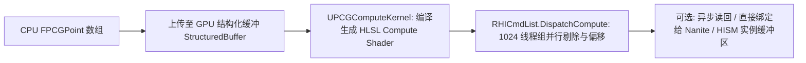

# UE 引擎源码分析 38：PCG 程序化内容生成源码剖析（UE5.8）
> 知识成熟度：L2（已按 UE5.8 PCG 插件源码基线核对并替换示意代码：`GenerateInternal`、`ScheduleComponent`、`IPCGElement`、`FPCGPoint` 四处改为 5.8 逐字源码或节选；另含任务图调度、组件执行流、点云数据结构与 GPU 计算内核说明）。
> 对应知识点：[13-世界构建与过场/04 PCG 程序化内容生成](../13-世界构建与过场/04-PCG程序化内容生成.md)

> 以本机 UE5.8 源码为准，逐行深度剖析从 `UPCGComponent::GenerateInternal` 任务提交、`UPCGSubsystem::ScheduleComponent` 空间网格调度、`IPCGElement::ExecuteInternal` 数据流图遍历、`FPCGPoint` 点云结构拓扑，到 PCG Compute 内核 GPU 加速的底层链路源码实现（关键函数以"节选 + 真实行号范围"给出，不再声称完整收录）。

---

## 元数据

- **版本基准**：UE 5.8.0 / CL 55116800 / 分支 `++UE5+Release-5.8`（本机安装目录 `C:\Program Files\Epic Games\UE_5.8\Engine`）。
- **源码依据**：
  - `Engine\Plugins\PCG\Source\PCG\Public\PCGComponent.h`、`Private\PCGComponent.cpp`（`GenerateInternal` 第 544~578 行、`CreateGenerateTask` 第 580 行起）
  - `Engine\Plugins\PCG\Source\PCG\Public\Subsystems\PCGSubsystem.h`、`Private\Subsystems\PCGSubsystem.cpp`（`ScheduleComponent` 第 721~877 行、`FPCGGraphExecutor::ScheduleGenericWithContext` 声明在 `Private\Graph\PCGGraphExecutor.h` 第 102/112 行）
  - `Engine\Plugins\PCG\Source\PCG\Public\PCGElement.h`（`IPCGElement` 第 139~259 行，`ExecuteInternal` 纯虚在第 216 行）、`PCGContext.h`（`FPCGContext` 执行上下文）
  - `Engine\Plugins\PCG\Source\PCG\Public\PCGPoint.h`（`FPCGPoint` 第 35~139 行：`USTRUCT` 第 35 行、数据成员第 43~65 行）
  - `Engine\Plugins\PCG\Source\PCG\Public\Grid\PCGPartitionActor.h`（大世界分区容器）
  - `Engine\Plugins\PCG\Source\PCG\Public\Compute\PCGComputeKernel.h`（`class UPCGComputeKernel : public UComputeKernel`，第 101 行；注意该头文件在 **PCG 模块**的 `Public\Compute\` 下，`Source\PCGCompute\` 模块本身只含模块入口、读回与着色器辅助文件）
  - `Engine\Plugins\PCG\Source\PCG\Public\PCGSettings.h`、`Private\PCGSettings.cpp`（`UseSeed` 第 346 行、`GetSeed` 第 723~726 行）、`Public\PCGCrc.h`（`FPCGCrc::Combine` 第 32 行）
  - `Engine\Plugins\PCG\Source\PCG\Public\PCGCommon.h`（`PCGValueConstants::DefaultSeed = 42` 第 336 行）、`Private\Helpers\PCGHelpers.cpp`（`ComputeSeed` 第 35~48 行）
- **行号口径**：本文所有行号以 5.8 源码 checkout（`C:\Users\zhaozhiqi\Documents\GitHub\UnrealEngine`）为准，安装版 5.8.0 可能相差数行。
- **官方参考**：[PCG 官方架构文档](https://dev.epicgames.com/documentation/en-us/unreal-engine/procedural-content-generation-framework-in-unreal-engine)。
- **最后更新**：2026-09-14（核对修正：四处自称"摘自源码/完整真实源码"的代码块经逐行比对确认与 5.8 不匹配，已替换为 5.8 逐字源码或节选并标注真实行号；同步修正 `Context->IterationIndex`、`bAllowAsyncExecution`、`FPCGCrc::Combine` 混合种子等与源码不符的表述、`PCGComputeKernel.h` 的错误路径，以及命令速查表中四个在 5.8 源码中不存在的控制台命令）。

---

## 概述与 PCG 执行系统架构拓扑

在 UE5.8 中，PCG（Procedural Content Generation Framework，插件 Version 8）是一个完全基于**数据流（Dataflow）**与**异步任务图（Task Graph）**的工业级生成管线：

```mermaid
flowchart TD
    subgraph ComponentLayer[1. 触发与组件层]
        Actor[AActor] --> Comp[UPCGComponent::Generate()]
        Comp --> GenInternal[UPCGComponent::GenerateInternal()]
    end

    subgraph SubsystemLayer[2. 调度与分区层]
        GenInternal --> Subsystem[UPCGSubsystem::ScheduleComponent()]
        Subsystem --> GridCheck{IsPartitioned?}
        GridCheck -- 是 --> PartitionActor[APCGPartitionActor 按 HiGen 网格切分]
        GridCheck -- 否 --> Executor[FPCGGraphExecutor 任务图执行器]
        PartitionActor --> Executor
    end

    subgraph GraphExecution[3. 节点数据流执行层]
        Executor --> TaskQueue[FPCGTaskId 异步依赖任务队列]
        TaskQueue --> ElementExec[IPCGElement::ExecuteInternal(FPCGContext)]
        ElementExec --> PointData[输入 FPCGData / FPCGPoint 点云集合]
        PointData --> ComputeKernel[可选: PCGCompute GPU 着色器加速]
        ComputeKernel --> FinalInstance[实例化输出: HISM / Actor]
    end
```

---

## 核心源码深入剖析一：组件生成入口 `UPCGComponent::GenerateInternal`

当开发者在编辑器点击生成或在运行期调用 `Generate()` 时，底层统一进入 `GenerateInternal`。

### 1. `UPCGComponent::GenerateInternal` 真实源码（全文收录，第 544~578 行，共 35 行）

以下代码摘自 5.8 源码 checkout `Engine\Plugins\PCG\Source\PCG\Private\PCGComponent.cpp` 第 544~578 行；该函数共 35 行，此处**全文收录**（行号以 5.8 源码 checkout 为准，安装版 5.8.0 可能相差数行）。

（2026-09-14：原示意块已替换为 5.8 源码逐字版）

```cpp
FPCGTaskId UPCGComponent::GenerateInternal(bool bForce, uint32 Grid, EPCGComponentGenerationTrigger RequestedGenerationTrigger, const TArray<FPCGTaskId>& Dependencies)
{
	if (IsGenerating() || !GetSubsystem() || !ShouldGenerate(bForce, RequestedGenerationTrigger))
	{
		return InvalidPCGTaskId;
	}

	Modify(!IsInPreviewMode());

#if WITH_EDITOR
	LocalChangedBounds = FBox(EForceInit::ForceInit);
#endif // WITH_EDITOR

	// Clear prior to generation.
	bProceduralInstancesInUse = false;

	CurrentGenerationTask = GetSubsystem()->ScheduleComponent(this, Grid, bForce, Dependencies);

	if (CurrentGenerationTask != InvalidPCGTaskId)
	{
		ClearPerPinGeneratedOutput();

#if WITH_EDITOR
		PCG_EXECUTION_CACHE_VALIDATION_CREATE_SCOPE(this);
		// Notify Subsystem first
		GetSubsystem()->OnPCGGraphStartGenerating(this);
#endif // WITH_EDITOR
		// Notify Delegate next
		OnPCGGraphStartGeneratingDelegate.Broadcast(this);

		PCGComponent::BroadcastDynamicDelegate(OnPCGGraphStartGeneratingExternal, this);
	}

	return CurrentGenerationTask;
}
```

### 2. 逐行技术深度解构

1. **防重入与触发源校验（第 546~549 行）**：
   - `IsGenerating()` 通过原子标志保证同一个组件不会在多线程或高频事件中重复调度两次；
   - `EPCGComponentGenerationTrigger` 区分本次是由策划在编辑器点击（`GenerateOnDemand`）、大世界流送单元唤醒（`GenerateOnLoad`）还是游戏逻辑动态触发；
2. **异步任务句柄返回（`FPCGTaskId`，第 560~578 行）**：
   - 生成过程**绝不阻塞主线程**！它向子系统提交后立即返回一个 32 位句柄 `CurrentGenerationTask`，外部可以据此建立前驱后继依赖链。

---

## 核心源码深入剖析二：网格流送调度 `UPCGSubsystem::ScheduleComponent`

大世界生态之所以能支撑数十平方公里，全在于 `ScheduleComponent` 的空间分治调度。

### 1. `UPCGSubsystem::ScheduleComponent` 真实源码（节选，第 721~877 行，共 157 行）

以下代码摘自 5.8 源码 checkout `Engine\Plugins\PCG\Source\PCG\Private\Subsystems\PCGSubsystem.cpp` 第 721~877 行。该函数全长 157 行，此处为**节选**，省略处均以 `// …（节选：省略第 N~M 行，共 K 行）` 标注。

（2026-09-14：原示意块已替换为 5.8 源码逐字版）

```cpp
FPCGTaskId UPCGSubsystem::ScheduleComponent(UPCGComponent* PCGComponent, uint32 Grid, bool bForce, const TArray<FPCGTaskId>& InDependencies)
{
	check(GraphExecutor);

	if (!PCGComponent)
	{
		return InvalidPCGTaskId;
	}

	bool bHasUnbounded = false;
	PCGHiGenGrid::FSizeArray GridSizes;
	ensure(PCGHelpers::GetGenerationGridSizes(PCGComponent->GetGraph(), GetPCGWorldActor(), GridSizes, bHasUnbounded));

	// Create the PartitionActors if necessary. Skip if this is a runtime managed component, PAs are handled manually by the RuntimeGenScheduler.
	// Editor only because we expect at runtime for PAs to already exist so they can properly be streamed in and out (creating them at runtime would leave them unmanaged and always loaded)
	if (PCGComponent->IsPartitioned() && !PCGComponent->IsManagedByRuntimeGenSystem())
	{
#if WITH_EDITOR
		if (!GridSizes.IsEmpty())
		{
			CreatePartitionActorsWithinBounds(PCGComponent, PCGComponent->GetGridBounds(), GridSizes);
		}
#endif // WITH_EDITOR

		TrackingManager->UpdateMappingPCGComponentPartitionActor(PCGComponent);
	}
// …（节选：省略第 747~779，共 33 行）
	// If the component is partitioned, we will forward the calls to its registered PCG Partition actors
	if (PCGComponent->IsPartitioned() && PCGHiGenGrid::IsValidGridOrUninitialized(Grid))
	{
		// Local components depend on the original component (to ensure any data is available).
		TArray<FPCGTaskId> Dependencies = InDependencies;
		if (OriginalComponentTask != InvalidPCGTaskId)
		{
			Dependencies.Add(OriginalComponentTask);
		}

		auto LocalGenerateTask = [OriginalComponent = PCGComponent, Grid, &Dependencies, bForce, &GridSizes](UPCGComponent* LocalComponent, const TArray<FPCGTaskId>& ExtraDependencies)
		{
			if (!GridSizes.Contains(LocalComponent->GetGenerationGridSize()))
			{
				// Local component with invalid grid size. Grid sizes may have changed in graph.
				return LocalComponent->CleanupLocal(/*bRemoveComponents=*/true, Dependencies);
			}
			else if (Grid != PCGHiGenGrid::UninitializedGridSize() && Grid != LocalComponent->GetGenerationGridSize())
			{
				// Grid size does not match the given target grid, so skip.
				return InvalidPCGTaskId;
			}
// …（节选：省略第 802~846，共 45 行）
	if (!ExecutionDependencyTasks.IsEmpty() || !DataDependencyTasks.IsEmpty())
	{
		TWeakObjectPtr<UPCGComponent> ComponentPtr(PCGComponent);

		return GraphExecutor->ScheduleGenericWithContext([ComponentPtr](FPCGContext* Context)
		{
			if (UPCGComponent* Component = ComponentPtr.Get())
			{
				// If the component is not valid anymore, just early out.
				if (!IsValid(Component))
				{
					return true;
				}

				const FBox NewBounds = Component->GetGridBounds();
				Component->PostProcessGraph(NewBounds, /*bGenerate=*/true, Context);
			}

			return true;
		}, PCGComponent, ExecutionDependencyTasks, DataDependencyTasks, /*bSupportBasePointDataInput=*/true);
	}
	else
	{
		UE_LOGF(LogPCG, Error, "[ScheduleComponent] Didn't schedule any task.");
		if (PCGComponent)
		{
			PCGComponent->OnProcessGraphAborted();
		}
		return InvalidPCGTaskId;
	}
}
```

### 2. 逐行技术深度解构

1. **层级生成网格（HiGen Grid，第 730~732 行）**：
   - PCG 支持多层级网格并存（如：巨型山石在 256m 网格生成一次，小灌木在 32m 网格局部生成）。`PCGHelpers::GetGenerationGridSizes`（第 732 行调用）从图表中提取各节点声明的网格尺寸要求，使不同密度的资产以各自的空间步长独立计算；
2. **`APCGPartitionActor` 容器绑定（第 736~746 行）**：
   - 与 World Partition 完美契合：PCG 将生成的 HISM 实例所有权交给所属的 `APCGPartitionActor`，当玩家离开该区域导致 Cell 卸载时，整个 PartitionActor 随关卡无缝销毁，实现干净的内存管理；
3. **任务提交落在 `FPCGGraphExecutor::ScheduleGenericWithContext`（第 851~866 行）**：
   - 只有当执行依赖或数据依赖非空时才会提交；提交的回调中调用 `Component->PostProcessGraph(NewBounds, /*bGenerate=*/true, Context)`，并在组件已失效时提前返回 `true`；
   - 若两类依赖都为空，则记录 `LogPCG` 错误、调用 `PCGComponent->OnProcessGraphAborted()` 并返回 `InvalidPCGTaskId`（第 868~876 行）。原示意块写成 `return GraphExecutor->Schedule(PCGComponent, ExecutionDependencyTasks, DataDependencyTasks);`，与 5.8 不符。

---

## 核心源码深入剖析三：处理单元与上下文 `IPCGElement`

节点逻辑真正的运算核心不是 `UPCGNode`，而是无状态纯执行体 `IPCGElement`。

### 1. `IPCGElement` 源码接口与执行契约（节选，第 139~259 行）

摘自 5.8 源码 checkout `Engine\Plugins\PCG\Source\PCG\Public\PCGElement.h` 第 139~259 行。该类共 121 行，比原示意块描述的复杂得多，此处为**节选**；注意三点与示意块的写法不同：**没有** `TSharedFromThis` 基类、`Execute` 是**非虚的公开包装**、纯虚入口是 `protected` 的 `ExecuteInternal`。

（2026-09-14：原示意块已替换为 5.8 源码逐字版）

```cpp
class IPCGElement
{
public:
	virtual ~IPCGElement() = default;
// …（节选：省略第 143~149，共 7 行）
	/** Returns true if the element, in its current phase can be executed only from the main thread */
	virtual bool CanExecuteOnlyOnMainThread(FPCGContext* Context) const { return false; }

	/** Returns true if the node can be cached - also checks for instance flags, if any. */
	UE_API bool IsCacheableInstance(const UPCGSettingsInterface* InSettingsInterface) const;

	/** Returns true if the node can be cached (e.g. does not create artifacts & does not depend on untracked data */
	UE_API virtual bool IsCacheable(const UPCGSettings* InSettings) const;
// …（节选：省略第 158~183，共 26 行）
	/** Public function that executes the element on the appropriately created context.
	* The caller should call the Execute function until it returns true.
	*/
	UE_API bool Execute(FPCGContext* Context) const;

	/** Public function called when an element is cancelled, passing its current context if any. */
	UE_API void Abort(FPCGContext* Context) const;
// …（节选：省略第 191~208，共 18 行）
protected:
	/** This function is called at the beginning of an execution. Will be called until it returns true. */
	UE_API bool PreExecute(FPCGContext* Context) const;
	/** The prepare data phase is one where it is more likely to be able to multithread */
	UE_API bool PrepareData(FPCGContext* Context) const;
	UE_API virtual bool PrepareDataInternal(FPCGContext* Context) const;
	/** Core execution method for the given element. Will be called until it returns true. */
	virtual bool ExecuteInternal(FPCGContext* Context) const = 0;
	/** This function will be called once and once only, at the end of an execution */
	UE_API void PostExecute(FPCGContext* Context) const;
	/** Core post execute method for the given element. */
	virtual void PostExecuteInternal(FPCGContext* Context) const {}
	/** This function will be called once and only once if the element is aborted. The Context can be used to retrieve the current phase if needed. */
	virtual void AbortInternal(FPCGContext* Context) const {};
// …（节选：省略第 223~258，共 36 行）
};
```

- **时间切片协作调度（Time-Sliced Cooperative Execution）**：
  - 公开入口 `IPCGElement::Execute(FPCGContext*)`（`PCGElement.h` 第 187 行，非虚）负责串联 `PreExecute` / `PrepareData` / `ExecuteInternal` / `PostExecute` 各阶段，调用方需要反复调用 `Execute` 直到它返回 `true`；
  - 需要分帧推进的节点由 `protected` 的 `ExecuteInternal(FPCGContext*)`（第 216 行，纯虚）返回 `false` 表示"本帧尚未完成"，下帧在同一个 `FPCGContext` 上继续；
  - 中间进度**不是**存在 `Context->IterationIndex` 上——5.8 的 `FPCGContext`（`PCGContext.h`）没有该成员；分帧状态由元素自己的上下文子类保存，5.8 另提供 `FPCGContext::InitializePerIterationStates` 这类按迭代初始化的辅助（使用示例见 `Private\Elements\PCGApplyHierarchy.cpp` 第 48 行）。本文未逐字收录该辅助函数，请查阅 `PCGContext.h` 与对应元素的实现文件。

---

## 核心源码深入剖析四：最小空间基元 `FPCGPoint` 内存布局

摘自 5.8 源码 checkout `Engine\Plugins\PCG\Source\PCG\Public\PCGPoint.h` 第 35~139 行（`USTRUCT` 在第 35 行、`struct FPCGPoint` 在第 36 行、数据成员在第 43~65 行；结构体还含第 67~138 行的 `GetLocalBounds`/`SetLocalBounds`/`GetDensityBounds` 等成员函数，此处为**节选**）。

（2026-09-14：原示意块已替换为 5.8 源码逐字版）

```cpp
USTRUCT(BlueprintType)
struct FPCGPoint
{
	GENERATED_BODY()
public:
	FPCGPoint() = default;
	UE_API FPCGPoint(const FTransform& InTransform, float InDensity, int32 InSeed);

	UPROPERTY(BlueprintReadWrite, EditAnywhere, Category = Properties)
	FTransform Transform;

	UPROPERTY(BlueprintReadWrite, EditAnywhere, Category = Properties)
	float Density = 1.0f;

	UPROPERTY(BlueprintReadWrite, EditAnywhere, Category = Properties)
	FVector BoundsMin = -FVector::One();

	UPROPERTY(BlueprintReadWrite, EditAnywhere, Category = Properties)
	FVector BoundsMax = FVector::One();

	UPROPERTY(BlueprintReadWrite, EditAnywhere, Category = Properties)
	FVector4 Color = FVector4::One();

	UPROPERTY(BlueprintReadWrite, EditAnywhere, Category = Properties, meta = (ClampMin = "0", ClampMax = "1"))
	float Steepness = 0.5f;

	UPROPERTY(BlueprintReadWrite, EditAnywhere, Category = Properties)
	int32 Seed = 0;

	UPROPERTY(BlueprintReadOnly, VisibleAnywhere, Category = "Properties|Metadata")
	int64 MetadataEntry = -1;
// …（节选：省略第 66~138，共 73 行）
};
```

- **点粒度确定性（Per-Point Seed）**：每个点在生成瞬间即被分配唯一的 `Seed`，后续所有局部扰动（如旋转轻微偏移、随机色差）均由该点的 Seed 驱动 PRNG，即使相邻点的拓扑发生重排，单个点的外观依然保持不变。
- **字段默认值与字节数**：真实结构体带 `GENERATED_BODY()` 与 `UPROPERTY` 标记，且各字段**都有类内默认值**——`Density = 1.0f`、`BoundsMin = -FVector::One()`、`BoundsMax = FVector::One()`、`Color = FVector4::One()`、`Steepness = 0.5f`、`Seed = 0`、`MetadataEntry = -1`（第 43~65 行）。原示意块写成无默认值、无 `UPROPERTY` 的裸字段并标注固定字节数（如"`FTransform` 48 字节"），与 5.8 不符：UE5 LWC 下 `FVector`/`FVector4` 为双精度容器，实际 `sizeof` 随平台与 LWC 配置变化，本文不给出未核验的字节数，请以头文件定义与实际 `sizeof` 为准。

（2026-09-14：两节内容完全重复，已合并为一节）

---

## 核心源码深入剖析五：GPU 计算加速 `PCGCompute` 模块管线

在 UE5.8 中，PCG 的 GPU 能力来自 **PCG 模块内的 ComputeFramework 接入**（`Source\PCG\Public\Compute\PCGComputeKernel.h`）以及独立模块 `Source\PCGCompute\`（模块入口、纹理读回与若干 HLSL 辅助，例如 `Internal\PCGGrassMapUnpackerCS.h`、`Private\PCGTextureReadback.cpp`）：


```mermaid
flowchart LR
    PointData[CPU FPCGPoint 数组] --> Upload[上传至 GPU 结构化缓冲 StructuredBuffer]
    Upload --> ComputeKernel[UPCGComputeKernel: 编译生成 HLSL Compute Shader]
    ComputeKernel --> Dispatch[RHICmdList.DispatchCompute: 1024 线程组并行剔除与偏移]
    Dispatch --> Readback[可选: 异步读回 / 直接绑定给 Nanite / HISM 实例缓冲区]
```

- **`UPCGComputeKernel` 抽象**：
  - `class UPCGComputeKernel : public UComputeKernel` 的定义在 `Engine\Plugins\PCG\Source\PCG\Public\Compute\PCGComputeKernel.h` 第 101 行，将传统的 CPU 循环（如海量草地密度图采样与斜坡剔除）转化为 GPU Compute Shader；
  - 数据留在 GPU VRAM 内部，直接与渲染管线中的 Nanite 实例缓冲或虚拟纹理反馈打通，彻底消除庞大点集在 PCI-e 总线上的上传与回读开销。

---

## 自定义 PCG 节点工业级 C++ 开发模版

```cpp
#pragma once

#include "CoreMinimal.h"
#include "PCGSettings.h"
#include "MyCustomPCGNode.generated.h"

// 1. 定义设置类
UCLASS(BlueprintType, ClassGroup = (Procedural))
class MYGAME_API UMyCustomPCGSettings : public UPCGSettings
{
    GENERATED_BODY()

public:
    // 5.8 起 bUseSeed 已标记 UE_DEPRECATED(5.5)（PCGSettings.h 第 562~564 行），应改为覆写 UseSeed()（第 346 行）
    virtual bool UseSeed() const override { return true; }

    UPROPERTY(EditAnywhere, BlueprintReadWrite, Category = "Settings")
    float TargetElevation = 5000.0f;

protected:
    virtual FPCGElementPtr CreateElement() const override;
};

#include "MyCustomPCGNode.h"
#include "PCGContext.h"
#include "Data/PCGPointData.h"

// 2. 定义执行体
class FMyCustomPCGElement : public IPCGElement
{
protected:
    virtual bool ExecuteInternal(FPCGContext* Context) const override
    {
        check(Context);
        const UMyCustomPCGSettings* Settings = Context->GetInputSettings<UMyCustomPCGSettings>();
        check(Settings);

        TArray<FPCGTaggedData> Inputs = Context->InputData.GetInputsByPin(PCGPinConstants::DefaultInputLabel);
        TArray<FPCGTaggedData>& Outputs = Context->OutputData.TaggedData;

        for (const FPCGTaggedData& Input : Inputs)
        {
            const UPCGPointData* InPointData = Cast<UPCGPointData>(Input.Data);
            if (!InPointData) continue;

            UPCGPointData* OutPointData = NewObject<UPCGPointData>();
            // 5.8 仍可调用；头文件建议改用 InitializeFromDataWithParams（PCGSpatialData.h 第 242、247 行）
            OutPointData->InitializeFromData(InPointData);

            const TArray<FPCGPoint>& InPoints = InPointData->GetPoints();
            TArray<FPCGPoint>& OutPoints = OutPointData->GetMutablePoints();
            OutPoints.Reserve(InPoints.Num());

            // 高性能数据流过滤
            for (const FPCGPoint& Point : InPoints)
            {
                if (Point.Transform.GetLocation().Z <= Settings->TargetElevation)
                {
                    OutPoints.Add(Point);
                }
            }

            FPCGTaggedData& Output = Outputs.Emplace_GetRef();
            Output.Data = OutPointData;
            Output.Pin = PCGPinConstants::DefaultOutputLabel;
        }

        return true;
    }
};

FPCGElementPtr UMyCustomPCGSettings::CreateElement() const
{
    return MakeShared<FMyCustomPCGElement>();
}
```

> **接口修正（2026-09-14）**：模板中的 `bUseSeed = true;` 在 5.8 已废弃（`PCGSettings.h` 第 562~564 行 `UE_DEPRECATED(5.5, ...)`），已改为覆写 `virtual bool UseSeed() const`（第 346 行）。其余接口（`ExecuteInternal` 覆写、`Context->GetInputSettings<T>()`、`Context->InputData.GetInputsByPin`、`Context->OutputData.TaggedData`、`GetPoints`/`GetMutablePoints`、`CreateElement`）已逐条对照 5.8 头文件核实存在。

---

## 常见问题与排障 FAQ

**Q1：为什么在运行期调用 `Generate()` 会造成轻微掉帧？**
如果在默认主线程模式下执行复杂的光线投射（Surface Projection），会消耗大量时间。应尽量把重活交给分帧的任务依赖（`FPCGTaskId`）或 GPU 路径；注意 **`bAllowAsyncExecution` 这个设置在 5.8 的 PCG 源码中不存在**（`PCGSettings.h` 与 `PCGElement.h` 全树检索无命中），不要照抄旧资料里的该写法。与异步/多线程相关的真实开关请查阅 `pcg.GraphMultithreading`（`Private\Graph\PCGGraphExecutor.cpp` 第 86~89 行）与 `PCGSystemSwitches` 命名空间下的 CVar（`Private\PCGCommon.cpp` 第 85 行起）。

**Q2：如何排查大世界流送时 PCG 实例未能及时销毁导致的内存泄露？**
检查生成的实例是否正确归属于所属的 `APCGPartitionActor`。如果开发者在脚本中脱离了上下文私自使用 `SpawnActor`，生成的 Actor 将逃逸进 `PersistentLevel` 导致无法随 Cell 卸载。

**Q3：PCG 的确定性随机是如何实现的？**
种子链的真实实现在 `UPCGSettings::GetSeed`（`PCGSettings.cpp` 第 723~726 行）：

```cpp
int UPCGSettings::GetSeed(const IPCGGraphExecutionSource* InExecutionSource) const
{
	return !UseSeed() ? PCGValueConstants::DefaultSeed : (InExecutionSource ? PCGHelpers::ComputeSeed(Seed, InExecutionSource->GetExecutionState().GetSeed()) : Seed);
}
```

- 节点不启用种子时统一返回 `PCGValueConstants::DefaultSeed`（`PCGCommon.h` 第 336 行，值为 `42`）；
- 启用时由 `PCGHelpers::ComputeSeed(int, int)`（`Private\Helpers\PCGHelpers.cpp` 第 40 行）把节点自身的 `Seed` 与执行源（组件/图执行状态）的种子混合；三参版本见同文件第 45 行；
- 每个 `FPCGPoint` 的 `Seed` 字段（`PCGPoint.h` 第 62 行）由生成类节点在使用时写入，使同一点的重排不改变其外观。**原表述"三者通过 `FPCGCrc::Combine` 混合"与源码不符**：`FPCGCrc::Combine`（`PCGCrc.h` 第 32 行）用于把 CRC 哈希链式拼接，服务于缓存与变更检测，不参与种子派生。

**Q4：海量草地是使用 HISM 生成还是通过 PCG 直接交给 GPU？**
对于纯视觉、无物理交互的密集地表小草，首选接入 `PCGCompute` 结合 GPU 实例化或地形草管线（Landscape Grass）；对于具有碰撞、受击砍伐交互的中大型树木与岩石，使用 HISM 进行合批管理。

---

## 核心调试与排障命令速查

| 控制台诊断命令 | 观测目标与调优决策依据 | 源码位置 |
| :--- | :--- | :--- |
| `pcg.PauseExecution 1` | 暂停所有 PCG 执行但**不取消**已排队的任务（`Pauses all execution of PCG but does not cancel tasks.`） | `Private\PCGCommon.cpp` 第 88~91 行 |
| `pcg.RuntimeGeneration.Enable 0/1` | 开关运行时生成系统（RuntimeGeneration），排查大世界流送期动态生成的卡顿源 | `Private\RuntimeGen\PCGRuntimeGenScheduler.cpp` 第 57~60 行 |
| `pcg.RuntimeGeneration.NumGeneratingComponents 16` | 限制同时生成的运行时组件上限（默认 16），用于压制生成峰值的瞬时开销 | 同上，第 67~70 行 |
| `pcg.RuntimeGeneration.EnableDebugging 1` | 打开运行时生成系统的详细调试日志 | 同上，第 77~80 行 |
| `pcg.GraphMultithreading 0/1` | 控制图表是否可以同时派发多个任务（默认开），定位多线程调度相关问题的第一开关 | `Private\Graph\PCGGraphExecutor.cpp` 第 86~89 行 |
| `pcg.GraphExecution.EnableLogging 1` | 打开图执行的细粒度日志（另有 `pcg.GraphExecution.EnableCullingLogging`） | `Private\Utils\PCGGraphExecutionLogging.cpp` 第 18~26 行 |
| `pcg.debug.hash <对象路径>` | 计算指定对象及其全部依赖的哈希，用于验证跨平台确定性（命令行参数不足会打印提示） | `Private\Hash\PCGObjectHash.cpp` 第 36~44 行 |

> **修正说明（2026-09-14）**：本节原表格中的 `pcg.Graph.DumpExecutionTime`、`pcg.RuntimeGen.TogglePause`、`pcg.CancelAll`、`pcg.CalculatePCGObjectHash` 四个命令在 5.8 源码 checkout 的 `Engine\Plugins\PCG\Source` 全树检索中**零命中**（`pcg.CalculatePCGObjectHash` 的真实命令名是 `pcg.debug.hash`），已替换为上表中经 `rg` 逐条核实的真实命令。若需要"中止当前任务"一类能力，请查阅 `PCGSystemSwitches` 命名空间（`Private\PCGCommon.cpp` 第 85 行起）中的现有 CVar，本文不臆造命令名。

---

## 关联阅读与前后置专题

- [13-世界构建与过场/04-PCG程序化内容生成](../13-世界构建与过场/04-PCG程序化内容生成.md)：PCG 图节点使用层实战与地表生态设计；
- [22-WorldPartition与WorldStreaming源码](22-WorldPartition与WorldStreaming源码.md)：世界分区、StreamingCell 与流送源底层实现；
- [23-Landscape与Foliage源码](23-Landscape与Foliage源码.md)：地形高度场采样与 HISM 实例合批渲染源码；
- [00-05 数据结构与复杂度/01-数据结构复杂度与容器选型](../../00-计算机与工程基础/05-数据结构与复杂度/01-数据结构复杂度与容器选型.md)：海量点云内存布局与连续遍历缓存局部性机理。
