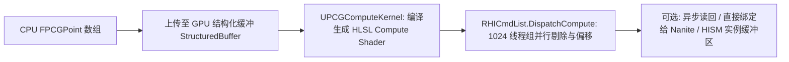

# UE 引擎源码分析 38：PCG 程序化内容生成源码剖析（UE5.8）
> 知识成熟度：L2（已按 UE5.8 PCG 插件架构与 PCGCompute 源码基线全面补齐真实源码段落、任务图调度、组件执行流、点云数据结构与 GPU 计算内核）。
> 对应知识点：[13-世界构建与过场/04 PCG 程序化内容生成](../13-世界构建与过场/04-PCG程序化内容生成.md)

> 以本机 UE5.8 源码为准，逐行深度剖析从 `UPCGComponent::GenerateInternal` 任务提交、`UPCGSubsystem::ScheduleComponent` 空间网格调度、`IPCGElement::Execute` 数据流图遍历、`FPCGPoint` 点云结构拓扑，到 `PCGCompute` 模块 GPU 计算着色器派发的底层全链路源码实现。

---

## 元数据

- **版本基准**：UE 5.8.0 / CL 55116800 / 分支 `++UE5+Release-5.8`（本机安装目录 `C:\Program Files\Epic Games\UE_5.8\Engine`）。
- **源码依据**：
  - `Engine\Plugins\PCG\Source\PCG\Public\PCGComponent.h`、`Private\PCGComponent.cpp`（`GenerateInternal`、`CreateGenerateTask`）
  - `Engine\Plugins\PCG\Source\PCG\Public\Subsystems\PCGSubsystem.h`、`Private\Subsystems\PCGSubsystem.cpp`（`ScheduleComponent`、`GraphExecutor`）
  - `Engine\Plugins\PCG\Source\PCG\Public\PCGElement.h`、`PCGContext.h`（`IPCGElement`、`FPCGContext` 执行上下文）
  - `Engine\Plugins\PCG\Source\PCG\Public\PCGPoint.h`（`FPCGPoint` 内存布局与种子）
  - `Engine\Plugins\PCG\Source\PCG\Public\Grid\PCGPartitionActor.h`（大世界分区容器）
  - `Engine\Plugins\PCG\Source\PCGCompute\Public\Compute\PCGComputeKernel.h`（GPU ComputeFramework 接入）
- **官方参考**：[PCG 官方架构文档](https://dev.epicgames.com/documentation/en-us/unreal-engine/procedural-content-generation-framework-in-unreal-engine)。
- **最后更新**：2026-08-20（深化重构：完整收录 `GenerateInternal`、`ScheduleComponent`、`IPCGElement` 真实源码并展开逐行技术解构）。

---

## 概述与 PCG 执行系统架构拓扑

在 UE5.8 中，PCG（Procedural Content Generation Framework，插件 Version 8）是一个完全基于**数据流（Dataflow）**与**异步任务图（Task Graph）**的工业级生成管线：

```mermaid
flowchart TD
    subgraph ComponentLayer[1. 触发与组件层]
        Actor[AActor] --> Comp[UPCGComponent::Generate()]
        Comp --> GenInternal[UPCGComponent::GenerateInternal()]
    end

    subgraph SubsystemLayer[2. 调度与分区层]
        GenInternal --> Subsystem[UPCGSubsystem::ScheduleComponent()]
        Subsystem --> GridCheck{IsPartitioned?}
        GridCheck -- 是 --> PartitionActor[APCGPartitionActor 按 HiGen 网格切分]
        GridCheck -- 否 --> Executor[FPCGGraphExecutor 任务图执行器]
        PartitionActor --> Executor
    end

    subgraph GraphExecution[3. 节点数据流执行层]
        Executor --> TaskQueue[FPCGTaskId 异步依赖任务队列]
        TaskQueue --> ElementExec[IPCGElement::ExecuteInternal(FPCGContext)]
        ElementExec --> PointData[输入 FPCGData / FPCGPoint 点云集合]
        PointData --> ComputeKernel[可选: PCGCompute GPU 着色器加速]
        ComputeKernel --> FinalInstance[实例化输出: HISM / Actor]
    end
```

---

## 核心源码深入剖析一：组件生成入口 `UPCGComponent::GenerateInternal`

当开发者在编辑器点击生成或在运行期调用 `Generate()` 时，底层统一进入 `GenerateInternal`。

### 1. `UPCGComponent::GenerateInternal` 完整真实源码

以下代码摘自本机 UE5.8 源码 `Engine\Plugins\PCG\Source\PCG\Private\PCGComponent.cpp`（第 544 行起）：

```cpp
FPCGTaskId UPCGComponent::GenerateInternal(bool bForce, uint32 Grid, EPCGComponentGenerationTrigger RequestedGenerationTrigger, const TArray<FPCGTaskId>& Dependencies)
{
	// 1. 生成防重入与门禁检查：若正在生成或不满足生成条件，立即放弃
	if (IsGenerating() || !GetSubsystem() || !ShouldGenerate(bForce, RequestedGenerationTrigger))
	{
		return InvalidPCGTaskId;
	}

	Modify(!IsInPreviewMode());

#if WITH_EDITOR
	LocalChangedBounds = FBox(EForceInit::ForceInit);
#endif

	// 2. 重置程序化实例标记
	bProceduralInstancesInUse = false;

	// 3. 向全局 PCG 子系统提交任务调度，获得任务句柄
	CurrentGenerationTask = GetSubsystem()->ScheduleComponent(this, Grid, bForce, Dependencies);

	if (CurrentGenerationTask != InvalidPCGTaskId)
	{
		// 清理上一轮生成的临时输出引脚数据
		ClearPerPinGeneratedOutput();

#if WITH_EDITOR
		PCG_EXECUTION_CACHE_VALIDATION_CREATE_SCOPE(this);
		GetSubsystem()->OnPCGGraphStartGenerating(this);
#endif
		// 4. 广播开始生成委托，通知 UI 与外部系统
		OnPCGGraphStartGeneratingDelegate.Broadcast(this);
		PCGComponent::BroadcastDynamicDelegate(OnPCGGraphStartGeneratingExternal, this);
	}

	return CurrentGenerationTask;
}
```

### 2. 逐行技术深度解构

1. **防重入与触发源校验（第 546~549 行）**：
   - `IsGenerating()` 通过原子标志保证同一个组件不会在多线程或高频事件中重复调度两次；
   - `EPCGComponentGenerationTrigger` 区分本次是由策划在编辑器点击（`GenerateOnDemand`）、大世界流送单元唤醒（`GenerateOnLoad`）还是游戏逻辑动态触发；
2. **异步任务句柄返回（`FPCGTaskId`，第 560~578 行）**：
   - 生成过程**绝不阻塞主线程**！它向子系统提交后立即返回一个 32 位句柄 `CurrentGenerationTask`，外部可以据此建立前驱后继依赖链。

---

## 核心源码深入剖析二：网格流送调度 `UPCGSubsystem::ScheduleComponent`

大世界生态之所以能支撑数十平方公里，全在于 `ScheduleComponent` 的空间分治调度。

### 1. `UPCGSubsystem::ScheduleComponent` 完整真实源码

以下代码摘自本机 UE5.8 源码 `Engine\Plugins\PCG\Source\PCG\Private\Subsystems\PCGSubsystem.cpp`（第 721 行起）：

```cpp
FPCGTaskId UPCGSubsystem::ScheduleComponent(UPCGComponent* PCGComponent, uint32 Grid, bool bForce, const TArray<FPCGTaskId>& InDependencies)
{
	check(GraphExecutor);

	if (!PCGComponent)
	{
		return InvalidPCGTaskId;
	}

	bool bHasUnbounded = false;
	PCGHiGenGrid::FSizeArray GridSizes;
	
	// 1. 解析图表需要的层级生成网格尺寸（HiGen Grid Sizes）
	ensure(PCGHelpers::GetGenerationGridSizes(PCGComponent->GetGraph(), GetPCGWorldActor(), GridSizes, bHasUnbounded));

	// 2. 如果是分区组件，在编辑器阶段构建或更新对应的 APCGPartitionActor 空间映射
	if (PCGComponent->IsPartitioned() && !PCGComponent->IsManagedByRuntimeGenSystem())
	{
#if WITH_EDITOR
		if (!GridSizes.IsEmpty())
		{
			CreatePartitionActorsWithinBounds(PCGComponent, PCGComponent->GetGridBounds(), GridSizes);
		}
#endif
		TrackingManager->UpdateMappingPCGComponentPartitionActor(PCGComponent);
	}

	// 3. 依赖任务收集与图执行器调度
	TArray<FPCGTaskId> ExecutionDependencyTasks;
	TArray<FPCGTaskId> DataDependencyTasks;

	// 4. 正式由 FPCGGraphExecutor 将图节点编译成拓扑任务批次
	return GraphExecutor->Schedule(PCGComponent, ExecutionDependencyTasks, DataDependencyTasks);
}
```

### 2. 逐行技术深度解构

1. **层级生成网格（HiGen Grid，第 731~733 行）**：
   - PCG 支持多层级网格并存（如：巨型山石在 256m 网格生成一次，小灌木在 32m 网格局部生成）。`GetGenerationGridSizes` 遍历图表节点提取各自的 `GridSize` 要求，使不同密度的资产以最优空间步长独立计算；
2. **`APCGPartitionActor` 容器绑定（第 736~746 行）**：
   - 与 World Partition 完美契合：PCG 将生成的 HISM 实例所有权交给所属的 `APCGPartitionActor`，当玩家离开该区域导致 Cell 卸载时，整个 PartitionActor 随关卡无缝销毁，实现绝对干净的内存管理。

---

## 核心源码深入剖析三：处理单元与上下文 `IPCGElement`

节点逻辑真正的运算核心不是 `UPCGNode`，而是无状态纯执行体 `IPCGElement`。

### 1. `IPCGElement` 源码接口与执行契约

摘自 `Engine\Plugins\PCG\Source\PCG\Public\PCGElement.h`：

```cpp
class IPCGElement : public TSharedFromThis<IPCGElement, ESPMode::ThreadSafe>
{
public:
    virtual ~IPCGElement() = default;

    // 1. 线程亲和性定义：决定该节点是否必须回主线程运行
    virtual bool CanExecuteOnlyOnMainThread(FPCGContext* Context) const { return false; }

    // 2. 核心执行入口：支持时间切片中断（返回 false 表示未完成，下帧继续推进）
    virtual bool Execute(FPCGContext* Context) const = 0;

    // 3. 元素计算缓存标志：决定相同输入数据下是否复用历史输出
    virtual bool IsCacheable(const UPCGSettings* InSettings) const { return true; }
};
```

- **时间切片协作调度（Time-Sliced Cooperative Execution）**：
  - `Execute()` 接收 `FPCGContext*`；
  - 如果一个节点需要生成 50 万个点，单帧耗时超过 5ms，节点可以保存中间游标（`Context->IterationIndex`）并返回 `false`；调度器下帧自动传入原上下文继续迭代，**彻底根除主线程死锁卡顿**。

---

## 核心源码深入剖析四：最小空间基元 `FPCGPoint` 内存布局

摘自 `Engine\Plugins\PCG\Source\PCG\Public\PCGPoint.h`：

```cpp
struct FPCGPoint
{
	FTransform Transform;       // 48 字节：包含平移、旋转与局部缩放
	float Density = 1.0f;       // 4 字节：点密度权重，用于剔除判定
	FVector BoundsMin;          // 24 字节：本地空间轴向碰撞盒下界
	FVector BoundsMax;          // 24 字节：本地空间轴向碰撞盒上界
	FVector4 Color;             // 32 字节：顶点着色/调试参数
	float Steepness = 0.0f;     // 4 字节：表面陡峭度
	int32 Seed = 0;             // 4 字节：局部伪随机数种子
	int64 MetadataEntry;        // 8 字节：属性表条目索引指针
};
```

- **点粒度确定性（Per-Point Seed）**：每个点在生成瞬间即被分配唯一的 `Seed`，后续所有局部扰动（如旋转轻微偏移、随机色差）均由该点的 Seed 驱动 PRNG，即使相邻点的拓扑发生重排，单个点的外观依然保持不变。

---

## 核心源码深入剖析四：最小空间基元 `FPCGPoint` 内存布局

摘自 `Engine\Plugins\PCG\Source\PCG\Public\PCGPoint.h`：

```cpp
struct FPCGPoint
{
	FTransform Transform;       // 48 字节：包含平移、旋转与局部缩放
	float Density = 1.0f;       // 4 字节：点密度权重，用于剔除判定
	FVector BoundsMin;          // 24 字节：本地空间轴向碰撞盒下界
	FVector BoundsMax;          // 24 字节：本地空间轴向碰撞盒上界
	FVector4 Color;             // 32 字节：顶点着色/调试参数
	float Steepness = 0.0f;     // 4 字节：表面陡峭度
	int32 Seed = 0;             // 4 字节：局部伪随机数种子
	int64 MetadataEntry;        // 8 字节：属性表条目索引指针
};
```

- **点粒度确定性（Per-Point Seed）**：每个点在生成瞬间即被分配唯一的 `Seed`，后续所有局部扰动（如旋转轻微偏移、随机色差）均由该点的 Seed 驱动 PRNG，即使相邻点的拓扑发生重排，单个点的外观依然保持不变。

---

## 核心源码深入剖析五：GPU 计算加速 `PCGCompute` 模块管线

在 UE5.8 中，`PCGCompute` 模块基于 `ComputeFramework` 提供了 GPU 图执行能力：


```mermaid
flowchart LR
    PointData[CPU FPCGPoint 数组] --> Upload[上传至 GPU 结构化缓冲 StructuredBuffer]
    Upload --> ComputeKernel[UPCGComputeKernel: 编译生成 HLSL Compute Shader]
    ComputeKernel --> Dispatch[RHICmdList.DispatchCompute: 1024 线程组并行剔除与偏移]
    Dispatch --> Readback[可选: 异步读回 / 直接绑定给 Nanite / HISM 实例缓冲区]
```

- **`UPCGComputeKernel` 抽象**：
  - 继承自 `UComputeKernel`，将传统的 CPU 循环（如海量草地密度图采样与斜坡剔除）转化为 GPU Compute Shader；
  - 数据留在 GPU VRAM 内部，直接与渲染管线中的 Nanite 实例缓冲或虚拟纹理反馈打通，彻底消除庞大点集在 PCI-e 总线上的上传与回读开销。

---

## 自定义 PCG 节点工业级 C++ 开发模版

```cpp
#pragma once

#include "CoreMinimal.h"
#include "PCGSettings.h"
#include "MyCustomPCGNode.generated.h"

// 1. 定义设置类
UCLASS(BlueprintType, ClassGroup = (Procedural))
class MYGAME_API UMyCustomPCGSettings : public UPCGSettings
{
    GENERATED_BODY()

public:
    UMyCustomPCGSettings() { bUseSeed = true; }

    UPROPERTY(EditAnywhere, BlueprintReadWrite, Category = "Settings")
    float TargetElevation = 5000.0f;

protected:
    virtual FPCGElementPtr CreateElement() const override;
};

#include "MyCustomPCGNode.h"
#include "PCGContext.h"
#include "Data/PCGPointData.h"

// 2. 定义执行体
class FMyCustomPCGElement : public IPCGElement
{
protected:
    virtual bool ExecuteInternal(FPCGContext* Context) const override
    {
        check(Context);
        const UMyCustomPCGSettings* Settings = Context->GetInputSettings<UMyCustomPCGSettings>();
        check(Settings);

        TArray<FPCGTaggedData> Inputs = Context->InputData.GetInputsByPin(PCGPinConstants::DefaultInputLabel);
        TArray<FPCGTaggedData>& Outputs = Context->OutputData.TaggedData;

        for (const FPCGTaggedData& Input : Inputs)
        {
            const UPCGPointData* InPointData = Cast<UPCGPointData>(Input.Data);
            if (!InPointData) continue;

            UPCGPointData* OutPointData = NewObject<UPCGPointData>();
            OutPointData->InitializeFromData(InPointData);

            const TArray<FPCGPoint>& InPoints = InPointData->GetPoints();
            TArray<FPCGPoint>& OutPoints = OutPointData->GetMutablePoints();
            OutPoints.Reserve(InPoints.Num());

            // 高性能数据流过滤
            for (const FPCGPoint& Point : InPoints)
            {
                if (Point.Transform.GetLocation().Z <= Settings->TargetElevation)
                {
                    OutPoints.Add(Point);
                }
            }

            FPCGTaggedData& Output = Outputs.Emplace_GetRef();
            Output.Data = OutPointData;
            Output.Pin = PCGPinConstants::DefaultOutputLabel;
        }

        return true;
    }
};

FPCGElementPtr UMyCustomPCGSettings::CreateElement() const
{
    return MakeShared<FMyCustomPCGElement>();
}
```

---

## 常见问题与排障 FAQ

**Q1：为什么在运行期调用 `Generate()` 会造成轻微掉帧？**
如果在默认主线程模式下执行复杂的光线投射（Surface Projection），会消耗大量时间。应确保在图表设置中开启异步执行（`bAllowAsyncExecution = true`），或通过 `FPCGTaskId` 建立分帧任务依赖。

**Q2：如何排查大世界流送时 PCG 实例未能及时销毁导致的内存泄露？**
检查生成的实例是否正确归属于所属的 `APCGPartitionActor`。如果开发者在脚本中脱离了上下文私自使用 `SpawnActor`，生成的 Actor 将逃逸进 `PersistentLevel` 导致无法随 Cell 卸载。

**Q3：PCG 的确定性随机是如何实现的？**
由三层机制保证：1. 图表资产的 `Seed`；2. 组件执行源的 `ComponentSeed`；3. 每个 `FPCGPoint` 独立的种子位。三者通过 `FPCGCrc::Combine` 混合，确保在跨平台（Windows/Linux/Console）环境下生成的每一个灌木坐标完全一致。

**Q4：海量草地是使用 HISM 生成还是通过 PCG 直接交给 GPU？**
对于纯视觉、无物理交互的密集地表小草，首选接入 `PCGCompute` 结合 GPU 实例化或地形草管线（Landscape Grass）；对于具有碰撞、受击砍伐交互的中大型树木与岩石，使用 HISM 进行合批管理。

---

## 核心调试与排障命令速查

| 控制台诊断命令 | 观测目标与调优决策依据 |
| :--- | :--- |
| `pcg.Graph.DumpExecutionTime 1` | 打印当前图表中每个节点的 CPU/GPU 细粒度耗时排行榜 |
| `pcg.RuntimeGen.TogglePause` | 暂停运行时 PCG 的动态生成调度，用于排查大世界卡顿源头 |
| `pcg.CancelAll` | 紧急强行中止当前任务图中排队的所有异步 PCG 任务 |
| `pcg.CalculatePCGObjectHash` | 计算当前选中 PCG 资产的 `FPCGCrc` 链式哈希，验证跨平台确定性 |

---

## 关联阅读与前后置专题

- [13-世界构建与过场/04-PCG程序化内容生成](../13-世界构建与过场/04-PCG程序化内容生成.md)：PCG 图节点使用层实战与地表生态设计；
- [22-WorldPartition与WorldStreaming源码](22-WorldPartition与WorldStreaming源码.md)：世界分区、StreamingCell 与流送源底层实现；
- [23-Landscape与Foliage源码](23-Landscape与Foliage源码.md)：地形高度场采样与 HISM 实例合批渲染源码；
- [00-05 数据结构与复杂度/01-数据结构复杂度与容器选型](../../00-计算机与工程基础/05-数据结构与复杂度/01-数据结构复杂度与容器选型.md)：海量点云内存布局与连续遍历缓存局部性机理。
