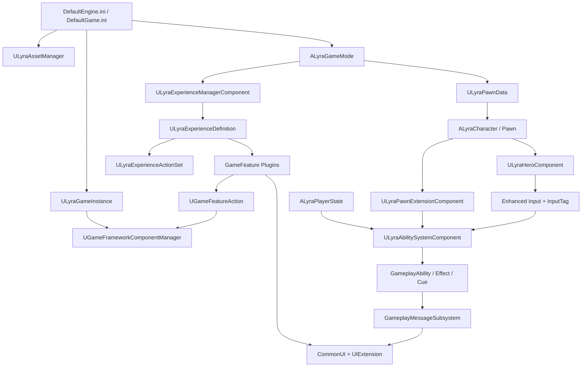
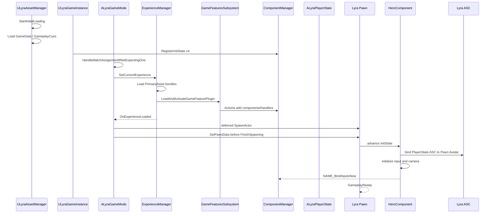

# UE5.8 Lyra 源码解析 39：架构总览与阅读路线

> Lyra 最值得学习的不是某一个“射击游戏功能”，而是它如何把资产、插件、网络、角色、能力、输入和 UI 组织成可装配、可卸载、可多人同步的项目骨架。
> 本篇先建立全局地图，再给出一条可以逐断点复现的阅读路线；40-48 篇深入基础调用链，49-52 篇覆盖 UI、设置、GAS 扩展与交互，53-56 篇补齐生成/移动、复制/模块化引擎、输入重映射/AimAssist 与 ShooterCore 核心玩法。
> 知识成熟度：L2（本机 UE 5.8 与 Lyra 5.8 源码、配置已静态核对；运行实验作为后续验证步骤）。

## 元数据

| 项目 | 内容 |
| --- | --- |
| 版本基线 | UE 5.8.0 / CL 55116800 / `++UE5+Release-5.8` |
| Lyra 基线 | 本机 `LyraStarterGame.uproject` 的 `EngineAssociation` 为 `5.8`，样例部署于 `C:\Users\zhaozhiqi\Documents\Unreal Projects\LyraStarterGame` |
| 引擎证据 | `C:\Program Files\Epic Games\UE_5.8\Engine`，只读核对 |
| 项目证据 | 本机 Lyra 5.8 的 `Source/`、`Plugins/`、`Config/` 与资产文件名，写作期间只读核对 |
| 适用范围 | 理解 Lyra 项目架构、确定源码入口、设计自己的模块化 UE 多人项目 |
| 知识成熟度 | L2：源码与配置静态核对完成；本文不把未执行的 PIE、联机和打包步骤描述成运行结果 |
| 官方参考 | [Lyra Sample Game](https://dev.epicgames.com/documentation/en-us/unreal-engine/lyra-sample-game-in-unreal-engine)、[Game Framework Component Manager](https://dev.epicgames.com/documentation/en-us/unreal-engine/game-framework-component-manager-in-unreal-engine) |
| 最后更新 | 2026-08-18 |

## 一、教程集交付什么

本教程不是对目录逐文件翻译，而是围绕十八个可以跟踪的专题组织。

| 篇号 | 主题 | 要回答的问题 | 主验证入口 |
| --- | --- | --- | --- |
| 39 | 架构总览与阅读路线 | Lyra 为什么这样分层，先读什么、后读什么 | `.uproject`、`DefaultEngine.ini`、`LyraGame.Build.cs` |
| 40 | Experience 与 GameFeature | 一张地图如何选择玩法，插件何时激活，玩家为何延迟出生 | `ALyraGameMode`、`ULyraExperienceManagerComponent` |
| 41 | Pawn 初始化与模块化组件 | 复制乱序时，PawnData、PlayerState、ASC、输入如何安全会合 | `ULyraPawnExtensionComponent`、`ULyraHeroComponent` |
| 42 | 输入、GAS 与武器战斗 | 按键如何变成 InputTag，再激活能力并产生权威伤害 | `ULyraInputComponent`、`ULyraAbilitySystemComponent`、武器 GA |
| 43 | 背包、装备、消息与 UI | 物品、装备、表现 Actor、HUD 如何解耦并增量复制 | Inventory/Equipment FastArray、GameplayMessage、UIExtension |
| 44 | 前端、会话、网络、测试与扩展 | 登录、建房、旅行、加载屏、测试和产品化改造如何串联 | CommonUser/CommonSession、ControlFlow、ShooterTests |
| 45 | 相机、音频与游戏阶段 | 摄像机模式栈如何求值，阶段如何用能力表达 | `ULyraCameraModeStack`、`ULyraGamePhaseSubsystem`、音频混合子系统 |
| 46 | AI 机器人与队伍 | 机器人如何补位，队伍如何决定伤害和展示 | Bot 创建组件、PlayerBotController、Team Subsystem |
| 47 | 调试工具与扩展 | Cheat、开发者设置、编辑器验证和插件如何支撑开发 | `ULyraCheatManager`、LyraEditor 校验器、扩展插件 |
| 48 | 扩展插件 | 8 个扩展插件各自解决什么问题，如何与主项目解耦 | AsyncMixin、PocketWorlds、GameSubtitles、加载屏等 |
| 49 | UI 控件与表现 | Lyra 自有 UI 控件族如何组织与渲染（补 LYRA-COV-01 缺口） | `ULyraHUD`/`ULyraHUDLayout`、Foundation 控件、IndicatorSystem、武器 UI |
| 50 | 设置系统 | 设置从定义到 UI 的完整链路（补 LYRA-COV-02 缺口） | GameSettings 插件、`ULyraSettingsLocal/Shared`、`ULyraSettingScreen` |
| 51 | GAS 扩展与能力费用 | AbilityCost 如何按装备/背包/标签扣费，Lyra 属性集、伤害执行与全局能力路由如何落地（补 LYRA 批次 1 GAS 缺口） | `ULyraAbilityCost` 三实现、`ULyraAttributeSet/CombatSet`、`ULyraHealExecution`、`ULyraGlobalAbilitySystem` |
| 52 | 交互系统 | 可交互目标如何被查询、授予并执行（补 LYRA 批次 2 Interaction 缺口） | `IInteractableTarget`、`AbilityTask_GrantNearbyInteraction`、`ULyraGameplayAbility_Interact` |
| 53 | 核心生成、移动与状态 | GameState、出生点、Pawn、移动组件如何形成可复核的对局状态链 | `ALyraGameState`、`ULyraPlayerSpawningManagerComponent`、`ALyraPlayerStart`、`ULyraCharacterMovementComponent` |
| 54 | 网络复制与模块化引擎 | Lyra ReplicationGraph 如何选驱动，GameFeatures 如何通过组件管理器落到 Actor | `ConditionalCreateReplicationDriver`、`RouteAddNetworkActorToNodes`、`AddComponentRequest` |
| 55 | 输入重映射与辅助瞄准 | 设置如何进入 Enhanced Input，ShooterCore 如何筛选并修正瞄准目标 | `LyraInputModifiers`、`LyraPlayerInput`、`AimAssistTargetManager` |
| 56 | ShooterCore 核心玩法与淘汰消息 | TDM 选点、伤害/淘汰消息如何派生助攻、连杀、连胜和 Accolade | `TDM_PlayerSpawningManagmentComponent`、`AssistProcessor`、`ElimStreakProcessor` |

建议按 39 → 40 → 41 → 42 → 43 → 44 → 45 → 46 → 47 → 48 → 49 → 50 → 51 → 52 → 53 → 54 → 55 → 56 顺序阅读。

如果只排查角色初始化，先读 40 的玩家出生门控，再直接读 41。

如果只改武器，必须先掌握 41 的 ASC Owner/Avatar，再读 42 和 43。

## 二、事实边界与证据分级

本文使用三类证据，避免把印象当事实。

| 等级 | 含义 | 示例 |
| --- | --- | --- |
| A | 本机 Lyra 5.8 项目源码或配置直接命中 | `Source/LyraGame/GameModes/LyraGameMode.cpp` |
| B | 本机 UE 5.8 引擎源码直接命中 | `Engine/Plugins/Runtime/GameFeatures/...` |
| C | Epic UE 5.8 官方文档确认设计意图 | Lyra 是持续随 UE 更新的模块化样例 |

行号只适合当前安装副本，教程以“相对路径 + 类型/函数名”为长期锚点。

Blueprint 资产是二进制 `.uasset`。

本文可以确认资产存在和命名，但不会仅凭文件名虚构其内部属性值。

需要查看资产配置时，应在编辑器中打开对应资产，并与 C++ 声明对照。

## 三、先看真实项目边界

Lyra 5.8 的顶层不是一个单体 `Source/LyraGame`。

```text
LyraStarterGame/
├─ Config/                         项目、AssetManager、输入、网络与平台配置
├─ Content/                        基础内容、前端、通用 UI、默认体验
├─ Source/
│  ├─ LyraGame/                    项目运行时核心模块
│  └─ LyraEditor/                  编辑器扩展模块
└─ Plugins/
   ├─ CommonGame/                  通用 GameInstance、UI 布局等（44 篇深挖）
   ├─ CommonUser/                  登录、权限、会话与 OSS 抽象（44 篇深挖）
   ├─ CommonLoadingScreen/         通用加载屏管理（44 篇深挖）
   ├─ CommonStartupLoadingScreen/  启动早期加载屏（48 篇收录）
   ├─ GameplayMessageRouter/       按 GameplayTag 路由结构化消息（43 篇深挖）
   ├─ GameSettings/                设置数据模型与界面支持（50 篇深挖）
   ├─ GameSubtitles/               字幕显示子系统（48 篇深挖）
   ├─ UIExtension/                 UI 扩展点注册与动态注入（43 篇深挖）
   ├─ AsyncMixin/                  异步加载生命周期混合（48 篇深挖）
   ├─ PocketWorlds/                按 LocalPlayer 流送的独立小世界（48 篇深挖）
   ├─ ModularGameplayActors/       模块化 Gameplay Actor 基类（41 篇使用、48 篇收录）
   ├─ LyraExtTool/                 编辑器批量工具（48 篇深挖）
   ├─ RedRoom/                     测试房间（仅资产 + uplugin，48 篇记录）
   ├─ GreenRoom/                   测试房间（仅资产 + uplugin，48 篇记录）
   ├─ LyraExampleContent/          示例内容资产
   └─ GameFeatures/
      ├─ ShooterCore/              射击规则、能力、组件与 UI
      ├─ ShooterMaps/              射击地图和展示内容
      ├─ TopDownArena/             俯视玩法
      ├─ ShooterTests/             自动化射击测试内容（44 篇深挖）
      └─ ShooterExplorer/          实验与探索内容
```

这个布局表达了第一条架构规则：

> 稳定、跨玩法的基础设施放主模块；可选择、可组合的玩法内容放 GameFeature 插件。

`LyraStarterGame.uproject` 明确启用了：

- `GameplayAbilities`；
- `GameFeatures`；
- `ModularGameplay` 与 `ModularGameplayActors`；
- `EnhancedInput`；
- `CommonUI`、`CommonGame`、`CommonUser`；
- `GameplayMessageRouter` 与 `UIExtension`；
- `ReplicationGraph`；
- `ShooterCore`、`ShooterMaps`、`TopDownArena` 等样例插件。

插件“存在于构建”与“当前 Experience 已激活”不是同一件事。

这一区分贯穿后续所有文章。

## 四、从配置找到第一个 C++ 入口

`Config/DefaultEngine.ini` 是最短入口之一。

当前 5.8 样例声明了以下项目替换类：

| 配置键 | Lyra 类型 | 作用 |
| --- | --- | --- |
| `GameEngine` | `ULyraGameEngine` | 项目级 Engine 扩展 |
| `AssetManagerClassName` | `ULyraAssetManager` | Primary Asset 扫描与启动加载 |
| `WorldSettingsClassName` | `ALyraWorldSettings` | 地图默认 Experience |
| `LocalPlayerClassName` | `ULyraLocalPlayer` | 本地玩家与设置/UI 关联 |
| `GameUserSettingsClassName` | `ULyraSettingsLocal` | 本地画质、输入等设置 |
| `GameInstanceClass` | Blueprint `B_LyraGameInstance` | 最终继承 `ULyraGameInstance` |
| `GlobalDefaultGameMode` | Blueprint `B_LyraGameMode` | 最终继承 `ALyraGameMode` |

`Config/DefaultInput.ini` 继续替换：

| 配置键 | Lyra 类型 |
| --- | --- |
| `DefaultPlayerInputClass` | `ULyraPlayerInput` |
| `DefaultInputComponentClass` | `ULyraInputComponent` |
| `UserSettingsClass` | `ULyraInputUserSettings` |
| `DefaultPlayerMappableKeyProfileClass` | `ULyraPlayerMappableKeyProfile` |

`Config/DefaultGame.ini` 再定义：

- `AbilitySystemGlobalsClassName=/Script/LyraGame.LyraAbilitySystemGlobals`；
- `GlobalGameplayCueManagerClass=/Script/LyraGame.LyraGameplayCueManager`；
- `GameFeaturesManagerClassName=/Script/LyraGame.LyraGameFeaturePolicy`；
- `LyraGameDataPath=/Game/DefaultGameData.DefaultGameData`；
- `LyraExperienceDefinition`、`LyraExperienceActionSet` 等 Primary Asset 扫描规则；
- `bDisableReplicationGraph=True`，同时保留 `DefaultReplicationGraphClass=/Script/LyraGame.LyraReplicationGraph` 作为可选实现类。

因此阅读配置不是准备工作，而是源码分析的一部分。

## 五、核心模块依赖说明了设计重心

`Source/LyraGame/LyraGame.Build.cs` 的公开依赖包括：

- `GameplayTags`、`GameplayTasks`、`GameplayAbilities`；
- `ModularGameplay`、`ModularGameplayActors`；
- `GameFeatures`；
- `ReplicationGraph`；
- `CommonLoadingScreen`；
- `ControlFlows`。

私有依赖包括：

- `EnhancedInput`；
- `CommonUI`、`CommonInput`；
- `CommonGame`、`CommonUser`；
- `GameplayMessageRuntime`；
- `UIExtension`；
- `NetworkReplayStreaming`；
- `Gauntlet`。

这份依赖表比“Lyra 是一个射击游戏”更准确地描述了它：

Lyra 是一个以数据驱动玩法装配、网络生命周期和跨平台前端为中心的参考架构。

`SetupIrisSupport(Target)` 也出现在 `LyraGame.Build.cs`。

当前 `DefaultGame.ini` 明确把 Lyra 的旧 `ReplicationGraph` 创建路径关掉；`ULyraReplicationGraphSettings` 的 C++ 默认值也为禁用，`ConditionalCreateReplicationDriver` 读取该设置后直接返回空。项目同时保留 ReplicationGraph 类配置、Iris 编译支持和 Iris 相关配置，但这些都不能单独证明当前会话实际使用哪套复制系统；最终仍要检查具体 NetDriver 配置、启动参数与运行日志。

## 六、全局对象地图



必须记住三个所有权关系：

1. Experience Manager 是 `GameStateComponent`，因此服务器和客户端都能观察 Experience；
2. 玩家 ASC 属于 `ALyraPlayerState`，Pawn 只是 Avatar；
3. 输入和摄像机属于本地控制 Pawn 的 HeroComponent 初始化职责。

这三点解释了大部分看似“绕”的间接层。

## 七、启动到可操作角色的完整主链

以下顺序来自本机 Lyra 5.8 源码静态核对。



### 7.1 AssetManager 先建立全局数据

`ULyraAssetManager::StartInitialLoading` 先调用父类扫描，再初始化 Gameplay Cue Manager，并加载 `ULyraGameData`。

Dedicated Server 直接顺序执行启动任务。

非 Dedicated 进程按权重更新启动进度。

### 7.2 GameInstance 注册共享初始化状态

`ULyraGameInstance::Init` 注册四个 GameplayTag 状态：

1. `InitState.Spawned`；
2. `InitState.DataAvailable`；
3. `InitState.DataInitialized`；
4. `InitState.GameplayReady`。

这些是全局线性顺序，不是角色战斗状态机。

### 7.3 GameMode 只在服务器选择 Experience

`ALyraGameMode::HandleMatchAssignmentIfNotExpectingOne` 决定 Experience PrimaryAssetId。

`OnMatchAssignmentGiven` 把结果交给 GameState 上的 Experience Manager。

### 7.4 Experience Manager 装配玩法

`ULyraExperienceManagerComponent` 加载 Experience 和 ActionSet 的资产 Bundle。

随后解析 GameFeature 插件名，转为 URL，并异步激活。

插件完成后执行 Experience 自身和各 ActionSet 的 Actions。

最后依次广播高、普通、低优先级 Experience Loaded 委托。

### 7.5 玩家出生故意被门控

`ALyraGameMode::HandleStartingNewPlayer_Implementation` 只有在 Experience 已加载时才调用父实现。

已经连接但尚无 Pawn 的玩家，在 `OnExperienceLoaded` 中被重新检查并 `RestartPlayer`。

### 7.6 PawnData 在 FinishSpawning 前注入

`SpawnDefaultPawnAtTransform_Implementation` 使用 deferred spawn。

它先找到 `ULyraPawnExtensionComponent` 并调用 `SetPawnData`，再执行 `FinishSpawning`。

这不是风格偏好，而是时序不变量：组件开始初始化前必须有角色定义数据。

### 7.7 HeroComponent 让输入、ASC 和摄像机在同一门槛会合

HeroComponent 等待 PlayerState、Controller、本地玩家和 InputComponent。

PawnExtension 等待 PawnData、Controller，并协调所有 Feature 到达 DataAvailable。

在 DataInitialized 过渡中，HeroComponent 才初始化 ASC、输入和摄像机模式委托。

## 八、Experience 不是 GameMode 的改名

GameMode 仍负责服务器权威规则入口、玩家登录和生成。

Experience 负责声明一次玩法会话需要哪些数据和可装配功能。

二者分工如下：

| 问题 | GameMode | Experience |
| --- | --- | --- |
| 是否服务器专有 | 是 | 定义会复制到客户端并由两端加载相应 Bundle |
| 玩家出生 | 负责调用 Restart/Spawn | 提供默认 PawnData，完成前阻止出生 |
| 玩法插件 | 不直接硬编码所有插件 | `GameFeaturesToEnable` 声明 |
| UI/输入/组件注入 | 不直接创建全部对象 | Actions 与 ActionSets 装配 |
| 地图选择 | 接收旅行后的世界 | 可由 WorldSettings 或 Travel URL 选择 |

如果把所有玩法重新塞回 GameMode，Lyra 的可组合边界就会消失。

## 九、六种数据对象不要混淆

| 类型 | 主要职责 | 生命周期/作用域 |
| --- | --- | --- |
| `ULyraGameData` | 全局错误 Tag、消息类等项目级数据 | 应用启动后常驻 |
| `ULyraExperienceDefinition` | 一次玩法体验的插件、PawnData、Actions | 当前世界/会话 |
| `ULyraExperienceActionSet` | 可复用的 Experience 行为组合 | 被一个或多个 Experience 引用 |
| `ULyraPawnData` | PawnClass、AbilitySets、输入、相机、Tag 关系 | 角色类型定义 |
| `ULyraAbilitySet` | 一组 Ability、Effect、AttributeSet 授予规则 | 授予 ASC，可记录句柄撤销 |
| `ULyraInputConfig` | InputAction 与 InputTag 的对应关系 | 本地输入绑定 |

数据资产的价值不是“少写 C++”，而是把组合关系从类型继承中抽离。

## 十、推荐的源码阅读方法

### 10.1 第一遍只画边界

只读以下文件：

1. `LyraStarterGame.uproject`；
2. `Config/DefaultEngine.ini`；
3. `Config/DefaultGame.ini`；
4. `Source/LyraGame/LyraGame.Build.cs`；
5. `Source/LyraGame/GameModes/LyraExperienceDefinition.h`；
6. `Source/LyraGame/Character/LyraPawnData.h`。

第一遍不要钻进武器散射数学。

目标是能解释模块、插件、数据资产和运行时对象的边界。

### 10.2 第二遍跟一条 Happy Path

从 `ALyraGameMode::InitGame` 开始。

依次跟：

```text
InitGame
→ HandleMatchAssignmentIfNotExpectingOne
→ OnMatchAssignmentGiven
→ SetCurrentExperience
→ StartExperienceLoad
→ OnExperienceLoadComplete
→ OnExperienceFullLoadCompleted
→ OnExperienceLoaded
→ RestartPlayer
→ SpawnDefaultPawnAtTransform_Implementation
```

只记录状态变化和异步回调，不在第一轮展开每个 Action。

### 10.3 第三遍跟一个 Pawn

从 deferred spawn 的 `SetPawnData` 开始。

跟踪 PawnExtension 与 HeroComponent 的四段 InitState。

记录每个 `CanChangeInitState` 的否决条件。

### 10.4 第四遍跟一次开火

从 `IA_Weapon_Fire` 资产名开始。

跟到 InputConfig、InputTag、AbilitySpec、`ProcessAbilityInput` 和武器 Ability。

再跟到伤害 Execution、HealthSet 和死亡 Ability。

### 10.5 第五遍跟一次前端建房

从 `ULyraUserFacingExperienceDefinition::CreateHostingRequest` 开始。

观察 `Experience` 参数如何进入 Travel URL。

服务器打开新地图后，回到 Experience 选择主链。

## 十一、静态索引命令

以下命令只读，可快速重建教程中的源码地图。

```powershell
$Lyra = 'C:\Users\zhaozhiqi\Documents\Unreal Projects\LyraStarterGame'
$UE = 'C:\Program Files\Epic Games\UE_5.8\Engine'

Get-Content -Raw "$Lyra\LyraStarterGame.uproject"
Get-Content -Raw "$UE\Build\Build.version"

rg -n "SetCurrentExperience|StartExperienceLoad|OnExperienceFullLoadCompleted" `
  "$Lyra\Source\LyraGame\GameModes"

rg -n "CheckDefaultInitialization|CanChangeInitState|HandleChangeInitState" `
  "$Lyra\Source\LyraGame\Character"

rg -n "AbilityInputTagPressed|ProcessAbilityInput|GiveToAbilitySystem" `
  "$Lyra\Source\LyraGame\AbilitySystem"

rg -n "LoadAndActivateGameFeaturePlugin|AddComponentRequest" `
  "$UE\Plugins\Runtime\GameFeatures\Source" `
  "$UE\Plugins\Runtime\ModularGameplay\Source"
```

静态命中证明文件和符号存在，不等于运行时路径已实际执行。

## 十二、建议断点集合

### 12.1 Experience 断点

- `ALyraGameMode::HandleMatchAssignmentIfNotExpectingOne`；
- `ALyraGameMode::OnMatchAssignmentGiven`；
- `ULyraExperienceManagerComponent::StartExperienceLoad`；
- `ULyraExperienceManagerComponent::OnExperienceLoadComplete`；
- `ULyraExperienceManagerComponent::OnExperienceFullLoadCompleted`；
- `ALyraGameMode::OnExperienceLoaded`。

### 12.2 Pawn 断点

- `ALyraGameMode::SpawnDefaultPawnAtTransform_Implementation`；
- `ULyraPawnExtensionComponent::SetPawnData`；
- 两个组件的 `CanChangeInitState`；
- `ULyraHeroComponent::HandleChangeInitState`；
- `ULyraPawnExtensionComponent::InitializeAbilitySystem`。

### 12.3 输入和能力断点

- `ULyraHeroComponent::InitializePlayerInput`；
- `ULyraAbilitySystemComponent::AbilityInputTagPressed`；
- `ULyraAbilitySystemComponent::ProcessAbilityInput`；
- `UAbilitySystemComponent::TryActivateAbility`。

### 12.4 会话断点

- `ULyraUserFacingExperienceDefinition::CreateHostingRequest`；
- `UCommonSession_HostSessionRequest::ConstructTravelURL`；
- `UCommonSessionSubsystem::HostSession`；
- `UCommonSessionSubsystem::FinishSessionCreation`。

## 十三、日志与可观测性

Experience 主链使用 `LogLyraExperience`。

项目通用路径使用 `LogLyra`。

GAS 使用 `LogLyraAbilitySystem` 和引擎 AbilitySystem 日志。

GameFeature 引擎层使用 `LogGameFeatures`。

Modular Gameplay 使用 `LogModularGameplay`。

Gameplay Message 可通过 `GameplayMessageSubsystem.LogMessages` 控制台变量记录广播。

推荐一次只提高一到两个分类的 Verbosity，避免多人 PIE 日志互相淹没。

日志必须同时记录 NetMode、LocalRole、RemoteRole、Controller 和 PlayerState，单看对象名很容易误判客户端/服务端实例。

## 十四、六个递进实验

这些是建议执行项，不在本文中声称已经运行。

### 实验 1：只观察 Experience

1. 打开默认编辑器概览图；
2. 在 Experience 选择和 LoadState 变化处下断点；
3. 记录最终来源是 URL、PIE Override、命令行、WorldSettings 还是默认值；
4. 验证玩家是否在 Loaded 前保持无 Pawn。

### 实验 2：人为延迟 Experience

使用源码中提供的 Experience 加载随机延迟控制变量。

观察加载屏是否持续、玩家是否仍不提前生成。

### 实验 3：观察双端 InitState

使用 1 个 Listen Server + 1 个客户端 PIE。

记录 PawnExtension/Hero 在两个进程视角下的状态推进顺序。

### 实验 4：追踪一个 InputTag

选 `InputTag.Weapon.Fire` 对应资产。

从 InputAction 一直跟到 AbilitySpec Handle。

### 实验 5：追踪一次装备切换

观察 QuickBar ActiveSlot 变化、Equipment FastArray、装备 Actor 和 AbilitySet 的授予/撤销。

### 实验 6：追踪一次建房旅行

观察 HostRequest 中 `MapID` 与 `ExperienceID` 如何生成 `?listen?Experience=...`。

旅行后确认新世界再次从 URL 解析 Experience。

## 十五、常见误读

### 误读 1：Experience 就是新 GameMode

错误。

GameMode 仍是服务器权威入口；Experience 是跨端加载和玩法装配描述。

### 误读 2：插件在 `.uproject` Enabled 就代表玩法已激活

错误。

构建/发现、加载、激活是不同状态。

### 误读 3：ASC 应该放在 Character

对某些游戏可以，但 Lyra 玩家 ASC 放在 PlayerState，以跨死亡和换 Pawn 保留状态。

### 误读 4：InputAction 直接调用 GameplayAbility

错误。

Lyra 经 InputTag 和 AbilitySpec 动态来源标签匹配，再由 ASC 每帧统一处理激活策略。

### 误读 5：UI 直接绑定所有 Gameplay Component

并非主设计。

Lyra 大量使用 Gameplay Message、UI Extension 和 CommonUI 激活栈降低依赖。

### 误读 6：FastArray 自动解决一切复制问题

错误。

服务器修改、脏标记、子对象复制、回调幂等和 Owner 条件仍需正确设计。

### 误读 7：复制回调顺序固定

错误。

Lyra 的 InitState 正是为跨 Actor 引用乱序和延迟而存在。

## 十六、架构不变量清单

阅读或改造 Lyra 时，先保护这些不变量：

1. Experience 未 Loaded，不生成依赖该 Experience 的玩家 Pawn；
2. PawnData 在 Pawn 完成生成前设置；
3. PlayerState 是玩家 ASC Owner，当前 Pawn 是 Avatar；
4. 本地输入只有在 LocalPlayer、Controller、InputComponent 和 PawnData 都就绪后绑定；
5. GameFeature Action 的注册句柄必须存活，卸载时必须释放；
6. AbilitySet 授予句柄需要可追踪，临时来源在卸载/卸装时撤销；
7. Inventory 表示持有，Equipment 表示当前使用，两者生命周期不同；
8. UI 消费结构化消息或扩展点，不反向拥有玩法对象；
9. 服务器产生权威结果，客户端预测必须有校正路径；
10. 所有异步加载和会话流程都有失败、取消和世界销毁路径。

## 十七、如何迁移到自己的项目

不要整包复制所有 Lyra 类。

先选择要保留的架构问题：

- 是否需要多个 Experience；
- 是否需要运行时 GameFeature；
- 玩家是否频繁换 Pawn；
- 是否使用 GAS；
- 是否需要跨平台登录与会话；
- UI 是否需要插件扩展。

推荐迁移顺序：

1. 先建立 Project AssetManager 与 Primary Asset 规则；
2. 再建立 Experience Definition 与最小加载状态机；
3. 接入 Modular Gameplay 和四段 InitState；
4. 决定 ASC Owner/Avatar；
5. 接入 InputTag 到 Ability 的桥；
6. 最后引入 UI Extension、CommonUser 和完整前端。

每一步都应保留一个最小可运行 Experience，避免一次性复制形成不可定位的启动失败。

## 十八、静态验证矩阵

| 结论 | 项目证据 | 引擎证据/官方证据 |
| --- | --- | --- |
| 样例对应 UE 5.8 | `LyraStarterGame.uproject` | `Engine/Build/Build.version` |
| Experience 是 Primary Asset | `LyraExperienceDefinition.h` | AssetManager 文档与引擎实现 |
| GameFeature 激活是状态迁移 | `LyraExperienceManagerComponent.cpp` | `GameFeaturesSubsystem.cpp` |
| 组件可动态追加 | Lyra GameFeature Actions | `GameFeatureAction_AddComponents.cpp` |
| Pawn 使用四段初始化 | PawnExtension/Hero 源码 | ModularGameplay InitState 实现 |
| ASC Owner/Avatar 分离 | PlayerState + PawnExtension | GAS `InitAbilityActorInfo` |
| 输入经 Tag 路由 | InputConfig/InputComponent/ASC | Enhanced Input + GAS |
| UI 可扩展 | AddWidget + UIExtension | CommonUI/UIExtension 插件 |
| 会话把 Experience 放进 URL | UserFacingExperience + CommonSession | UE Travel/GameMode URL 解析 |

## 十九、关联阅读

- [04-Gameplay框架与登录流程源码](04-Gameplay框架与登录流程源码.md)：引擎原生登录与 Possess 前置知识。
- [05-GAS能力系统源码](05-GAS能力系统源码.md)：Lyra ASC 的引擎底层。
- [25-EnhancedInput与GameplayTags源码](25-EnhancedInput与GameplayTags源码.md)：输入和标签底层。
- [26-CommonUI源码](26-CommonUI源码.md)：CommonUI 激活与输入路由。
- [34-ReplicationGraph源码](34-ReplicationGraph源码.md)：Lyra 保留但在当前样例配置中禁用的旧复制图路径，以及启用它时的引擎底层。
- [08-ModularGameplay模块化玩法](../03-游戏玩法编程/08-ModularGameplay模块化玩法.md)：使用层概念。
- [45-Lyra-相机音频与游戏阶段源码](45-Lyra-相机音频与游戏阶段源码.md)：相机模式栈、音频与阶段的表现和流程细节。
- [48-Lyra扩展插件源码](48-Lyra扩展插件源码.md)：AsyncMixin、PocketWorlds、GameSubtitles 与加载屏等扩展插件。

## 二十、权威来源

- [Lyra Sample Game](https://dev.epicgames.com/documentation/en-us/unreal-engine/lyra-sample-game-in-unreal-engine)
- [Game Framework Component Manager](https://dev.epicgames.com/documentation/en-us/unreal-engine/game-framework-component-manager-in-unreal-engine)
- [Abilities in Lyra](https://dev.epicgames.com/documentation/en-us/unreal-engine/abilities-in-lyra-in-unreal-engine)
- [Lyra Input Settings](https://dev.epicgames.com/documentation/en-us/unreal-engine/lyra-input-settings-in-unreal-engine)
- [Lyra Inventory and Equipment](https://dev.epicgames.com/documentation/en-us/unreal-engine/lyra-inventory-and-equipment-in-unreal-engine)
- [Common User Plugin](https://dev.epicgames.com/documentation/en-us/unreal-engine/common-user-plugin-in-unreal-engine-for-lyra-sample-game)


## 附录：核心文件完整源码

> 收录原则：本附录把正文直接分析的 LyraStarterGame 5.8 项目源码文件逐字完整收录（未删改，保留 Epic 版权头），正文中的"节选"负责解释调用链，本附录提供全文，二者配合阅读。引擎层（`Engine/`）文件体量过大且不属于项目教程主体，仍按正文的路径+符号检索方式引用，不在此收录；`.uasset/.umap` 资产也不在收录范围。
> 版权提示：以下代码来自 Epic Games 的 LyraStarterGame 样例（UE 5.8），随 Unreal Engine EULA 的样例代码条款提供，仅作本地学习收录；对外发布前请自行核对许可条款。

| # | 文件（相对 LyraStarterGame 根） | 行数 |
| --- | --- | --- |
| 1 | `LyraStarterGame.uproject` | 391 |
| 2 | `Source\LyraGame\LyraGame.Build.cs` | 117 |
| 3 | `Config\DefaultEngine.ini` | 435 |
| 4 | `Config\DefaultGame.ini` | 243 |
| 5 | `Config\DefaultGameplayTags.ini` | 109 |
| 6 | `Source\LyraGame\System\LyraAssetManager.h` | 175 |
| 7 | `Source\LyraGame\System\LyraAssetManager.cpp` | 273 |
| 8 | `Source\LyraGame\System\LyraGameInstance.h` | 42 |
| 9 | `Source\LyraGame\System\LyraGameInstance.cpp` | 339 |
| 10 | `Source\LyraGame\GameModes\LyraGameMode.h` | 89 |
| 11 | `Source\LyraGame\GameModes\LyraGameMode.cpp` | 522 |
| 12 | `Source\LyraGame\GameModes\LyraExperienceManagerComponent.h` | 106 |
| 13 | `Source\LyraGame\GameModes\LyraExperienceManagerComponent.cpp` | 467 |
| 14 | `Source\LyraGame\Character\LyraPawnData.h` | 56 |

### 附录文件 1：`LyraStarterGame.uproject`

> 完整源码（本机 Lyra 5.8 样例，逐字收录，未删改）。

```json
{
	"FileVersion": 3,
	"EngineAssociation": "5.8",
	"Category": "Samples",
	"Description": "",
	"Modules": [
		{
			"Name": "LyraGame",
			"Type": "Runtime",
			"LoadingPhase": "Default",
			"AdditionalDependencies": [
				"DeveloperSettings",
				"Engine"
			]
		},
		{
			"Name": "LyraEditor",
			"Type": "Editor",
			"LoadingPhase": "Default"
		}
	],
	"Plugins": [
		{
			"Name": "ActorPalette",
			"Enabled": true
		},
		{
			"Name": "AESGCMHandlerComponent",
			"Enabled": true
		},
		{
			"Name": "DTLSHandlerComponent",
			"Enabled": true
		},
		{
			"Name": "GameplayAbilities",
			"Enabled": true
		},
		{
			"Name": "Gauntlet",
			"Enabled": true
		},
		{
			"Name": "CommonLoadingScreen",
			"Enabled": true
		},
		{
			"Name": "CommonStartupLoadingScreen",
			"Enabled": true
		},
		{
			"Name": "CommonConversation",
			"Enabled": true
		},
		{
			"Name": "GameFeatures",
			"Enabled": true
		},
		{
			"Name": "ModularGameplay",
			"Enabled": true
		},
		{
			"Name": "ModularGameplayActors",
			"Enabled": true
		},
		{
			"Name": "EnhancedInput",
			"Enabled": true
		},
		{
			"Name": "WinDualShock",
			"Enabled": true,
			"SupportedTargetPlatforms": [
				"Win64"
			]
		},
		{
			"Name": "Volumetrics",
			"Enabled": true
		},
		{
			"Name": "DataRegistry",
			"Enabled": true
		},
		{
			"Name": "ReplicationGraph",
			"Enabled": true
		},
		{
			"Name": "SignificanceManager",
			"Enabled": true
		},
		{
			"Name": "Niagara",
			"Enabled": true
		},
		{
			"Name": "Water",
			"Enabled": true
		},
		{
			"Name": "CommonUI",
			"Enabled": true
		},
		{
			"Name": "ControlFlows",
			"Enabled": true
		},
		{
			"Name": "GameSettings",
			"Enabled": true
		},
		{
			"Name": "CommonUser",
			"Enabled": true
		},
		{
			"Name": "CommonGame",
			"Enabled": true
		},
		{
			"Name": "GameSubtitles",
			"Enabled": true
		},
		{
			"Name": "PocketWorlds",
			"Enabled": true
		},
		{
			"Name": "UIExtension",
			"Enabled": true
		},
		{
			"Name": "AsyncMixin",
			"Enabled": true
		},
		{
			"Name": "Metasound",
			"Enabled": true
		},
		{
			"Name": "MagicLeap",
			"Enabled": false
		},
		{
			"Name": "MagicLeapMedia",
			"Enabled": false
		},
		{
			"Name": "MagicLeapPassableWorld",
			"Enabled": false
		},
		{
			"Name": "OpenXREyeTracker",
			"Enabled": false
		},
		{
			"Name": "OpenXRHandTracking",
			"Enabled": false
		},
		{
			"Name": "OpenXRHMD",
			"Enabled": false
		},
		{
			"Name": "SteamVR",
			"Enabled": false
		},
		{
			"Name": "GearVR",
			"Enabled": false
		},
		{
			"Name": "MLSDK",
			"Enabled": false
		},
		{
			"Name": "OnlineFramework",
			"Enabled": true
		},
		{
			"Name": "PlayFabParty",
			"Enabled": true,
			"PlatformAllowList": [
				"XB1",
				"XSX",
				"WinGDK"
			],
			"SupportedTargetPlatforms": [
				"XB1",
				"XSX",
				"WinGDK"
			]
		},
		{
			"Name": "OnlineServicesNull",
			"Enabled": true
		},
		{
			"Name": "OnlineServicesOSSAdapter",
			"Enabled": true
		},
		{
			"Name": "OnlineSubsystemSteam",
			"Enabled": true
		},
		{
			"Name": "SocketSubsystemSteamIP",
			"Enabled": true
		},
		{
			"Name": "GameplayMessageRouter",
			"Enabled": true
		},
		{
			"Name": "SteamSockets",
			"Enabled": true
		},
		{
			"Name": "AssetReferenceRestrictions",
			"Enabled": true
		},
		{
			"Name": "ModelingToolsEditorMode",
			"Enabled": true
		},
		{
			"Name": "GeometryScripting",
			"Enabled": true
		},
		{
			"Name": "AnimationLocomotionLibrary",
			"Enabled": true
		},
		{
			"Name": "AudioModulation",
			"Enabled": true
		},
		{
			"Name": "AudioGameplayVolume",
			"Enabled": true
		},
		{
			"Name": "AudioGameplay",
			"Enabled": true
		},
		{
			"Name": "SoundUtilities",
			"Enabled": true
		},
		{
			"Name": "AnimationWarping",
			"Enabled": true
		},
		{
			"Name": "MovieRenderPipeline",
			"Enabled": true,
			"TargetAllowList": [
				"Editor"
			]
		},
		{
			"Name": "MoviePipelineMaskRenderPass",
			"Enabled": true,
			"TargetAllowList": [
				"Editor"
			]
		},
		{
			"Name": "AssetSearch",
			"Enabled": true
		},
		{
			"Name": "GameplayInsights",
			"Enabled": true
		},
		{
			"Name": "ResonanceAudio",
			"Enabled": false
		},
		{
			"Name": "RuntimePhysXCooking",
			"Enabled": false
		},
		{
			"Name": "Spatialization",
			"Enabled": true
		},
		{
			"Name": "ShooterCore",
			"Enabled": true
		},
		{
			"Name": "ShooterMaps",
			"Enabled": true
		},
		{
			"Name": "TopDownArena",
			"Enabled": true
		},
		{
			"Name": "FunctionalTestingEditor",
			"Enabled": true
		},
		{
			"Name": "ShooterExplorer",
			"Enabled": true
		},
		{
			"Name": "ShooterTests",
			"Enabled": true
		},
		{
			"Name": "GameplayInteractions",
			"Enabled": true
		},
		{
			"Name": "SmartObjects",
			"Enabled": true
		},
		{
			"Name": "ContextualAnimation",
			"Enabled": true
		},
		{
			"Name": "GameplayBehaviorSmartObjects",
			"Enabled": true
		},
		{
			"Name": "GameplayStateTree",
			"Enabled": true
		},
		{
			"Name": "GameplayBehaviors",
			"Enabled": true
		},
		{
			"Name": "RuntimeTests",
			"Enabled": true
		},
		{
			"Name": "AutomatedPerfTesting",
			"Enabled": true
		},
		{
			"Name": "Reflex",
			"Enabled": true
		},
		{
			"Name": "XInputDevice",
			"Enabled": true,
			"SupportedTargetPlatforms": [
				"Win64",
				"WinGDK"
			]
		},
		{
			"Name": "GameInputWindows",
			"Enabled": true,
			"SupportedTargetPlatforms": [
				"Win64",
				"WinGDK"
			]
		},
		{
			"Name": "AIAssistant",
			"Enabled": true
		},
		{
			"Name": "ToolsetRegistry",
			"Enabled": true
		},
		{
			"Name": "AllToolsets",
			"Enabled": true
		},
		{
			"Name": "PlayerInputDebugger",
			"Enabled": true,
			"TargetAllowList": [
				"Editor"
			]
		},
		{
			"Name": "PlatformDLC",
			"Enabled": true
		}
	],
	"EpicSampleNameHash": "451731683"
}
```

### 附录文件 2：`Source\LyraGame\LyraGame.Build.cs`

> 完整源码（本机 Lyra 5.8 样例，逐字收录，未删改）。

```csharp
// Copyright Epic Games, Inc. All Rights Reserved.

using UnrealBuildTool;

public class LyraGame : ModuleRules
{
	public LyraGame(ReadOnlyTargetRules Target) : base(Target)
	{
		PCHUsage = PCHUsageMode.UseExplicitOrSharedPCHs;

		PublicIncludePaths.AddRange(
			new string[] {
				"LyraGame"
			}
		);

		PrivateIncludePaths.AddRange(
			new string[] {
			}
		);

		PublicDependencyModuleNames.AddRange(
			new string[] {
				"Core",
				"CoreOnline",
				"CoreUObject",
				"ApplicationCore",
				"Engine",
				"PhysicsCore",
				"GameplayTags",
				"GameplayTasks",
				"GameplayAbilities",
				"AIModule",
				"ModularGameplay",
				"ModularGameplayActors",
				"DataRegistry",
				"ReplicationGraph",
				"GameFeatures",
				"SignificanceManager",
				"Hotfix",
				"CommonLoadingScreen",
				"Niagara",
				"AsyncMixin",
				"ControlFlows",
				"PropertyPath"
			}
		);

		PrivateDependencyModuleNames.AddRange(
			new string[] {
				"InputCore",
				"Slate",
				"SlateCore",
				"RenderCore",
				"DeveloperSettings",
				"EnhancedInput",
				"NetCore",
				"RHI",
				"Projects",
				"Gauntlet",
				"UMG",
				"CommonUI",
				"CommonInput",
				"GameSettings",
				"CommonGame",
				"CommonUser",
				"GameSubtitles",
				"GameplayMessageRuntime",
				"AudioMixer",
				"NetworkReplayStreaming",
				"UIExtension",
				"ClientPilot",
				"AudioModulation",
				"EngineSettings",
				"DTLSHandlerComponent",
				"Json",
			"PlatformDLC",
			}
		);

		DynamicallyLoadedModuleNames.AddRange(
			new string[] {
			}
		);

		// Generate compile errors if using DrawDebug functions in test/shipping builds.
		PublicDefinitions.Add("SHIPPING_DRAW_DEBUG_ERROR=1");

		// Basic setup for External RPC Framework.
		// Functionality within framework will be stripped in shipping to remove vulnerabilities.
		PrivateDependencyModuleNames.Add("ExternalRpcRegistry");
		PrivateDependencyModuleNames.Add("HTTPServer"); // Dependency for ExternalRpcRegistry
		if (Target.Configuration == UnrealTargetConfiguration.Shipping)
		{
			PublicDefinitions.Add("WITH_RPC_REGISTRY=0");
			PublicDefinitions.Add("WITH_HTTPSERVER_LISTENERS=0");
			PublicDefinitions.Add("WITH_AUTOMATION_DRIVER=0");
		}
		else
		{
			if (!Target.bIsEngineInstalled)
			{
				PrivateDependencyModuleNames.Add("AutomationDriver");
				PublicDefinitions.Add("WITH_AUTOMATION_DRIVER=1");
			}
			else
			{
				PublicDefinitions.Add("WITH_AUTOMATION_DRIVER=0");
			}
			PublicDefinitions.Add("WITH_RPC_REGISTRY=1");
			PublicDefinitions.Add("WITH_HTTPSERVER_LISTENERS=1");
		}

		SetupGameplayDebuggerSupport(Target);
		SetupIrisSupport(Target);
	}
}
```

### 附录文件 3：`Config\DefaultEngine.ini`

> 完整源码（本机 Lyra 5.8 样例，逐字收录，未删改）。

```ini
; Config file for config variables tied to general engine features

; Include the GameInput redist files on windows targets.
; This will include the GameInputRedist.msi and run it as a part of BootstrapPackagedGame when "-prereqs" is set in UAT
[GameInput]
IncludeRedistFiles=True

[CoreUObject.UninitializedScriptStructMembersCheck]
EngineModuleReflectedUninitializedPropertyVerbosity=Error
ProjectModuleReflectedUninitializedPropertyVerbosity=Error
ObjectReferenceReflectedUninitializedPropertyVerbosity=Error

[DistillSettings]
+FilesToAlwaysDistill="Audio/*"
+FilesToAlwaysDistill="Effects/*"
+FilesToAlwaysDistill="Characters/*"
+FilesToAlwaysDistill="Legal/*"
+FilesToAlwaysDistill="Tools/*"
+FilesToAlwaysDistill="UI/*"
+FilesToAlwaysDistill="Weapons/*"
+FilesToAlwaysDistill="Editor/*"

[CoreRedirects]

[/Script/Engine.Engine]
DurationOfErrorsAndWarningsOnHUD=3.0
GameEngine=/Script/LyraGame.LyraGameEngine
UnrealEdEngine=/Script/LyraEditor.LyraEditorEngine
EditorEngine=/Script/LyraEditor.LyraEditorEngine
GameViewportClientClassName=/Script/LyraGame.LyraGameViewportClient
AssetManagerClassName=/Script/LyraGame.LyraAssetManager
WorldSettingsClassName=/Script/LyraGame.LyraWorldSettings
LocalPlayerClassName=/Script/LyraGame.LyraLocalPlayer
GameUserSettingsClassName=/Script/LyraGame.LyraSettingsLocal
NearClipPlane=3.000000

[/Script/BuildSettings.BuildSettings]
DefaultGameTarget=LyraGame

;Iris - begin Iris Configuration for LyraGame

[/Script/IrisCore.ReplicationStateDescriptorConfig]
+SupportsStructNetSerializerList=(StructName=LyraGameplayAbilityTargetData_SingleTargetHit)

[/Script/IrisCore.ObjectReplicationBridgeConfig]
; Filters
DefaultSpatialFilterName=Spatial
; Clear all filters
!FilterConfigs=ClearArray
+FilterConfigs=(ClassName=/Script/Engine.LevelScriptActor, DynamicFilterName=NotRouted) ; Not needed
+FilterConfigs=(ClassName=/Script/Engine.Actor, DynamicFilterName=None))

; Info types aren't supposed to have physical representation
+FilterConfigs=(ClassName=/Script/Engine.Info, DynamicFilterName=None)
+FilterConfigs=(ClassName=/Script/Engine.PlayerState, DynamicFilterName=None)
; Pawns can be spatially filtered
+FilterConfigs=(ClassName=/Script/Engine.Pawn, DynamicFilterName=Spatial))
+FilterConfigs=(ClassName=/Script/EntityActor.SimObject, DynamicFilterName=None))

;Iris - end

[PacketHandlerComponents]
; Enable this entry when testing the encrypted network traffic flow (Lyra.TestEncryption)
;EncryptionComponent=AESGCMHandlerComponent
;EncryptionComponent=DTLSHandlerComponent

[Kismet]
ScriptStackOnWarnings=true

[/Script/EngineSettings.GameMapsSettings]
GlobalDefaultGameMode=/Game/B_LyraGameMode.B_LyraGameMode_C
GameInstanceClass=/Game/B_LyraGameInstance.B_LyraGameInstance_C
GameDefaultMap=/Game/System/FrontEnd/Maps/L_LyraFrontEnd.L_LyraFrontEnd
EditorStartupMap=/Game/System/DefaultEditorMap/L_DefaultEditorOverview.L_DefaultEditorOverview
;TransitionMap=/Game/System/TransitionMap.TransitionMap ; Enable a real seamless travel transition map if needed to delay loading

[/Script/Hotfix.OnlineHotfixManager]
HotfixManagerClassName=/Script/LyraGame.LyraHotfixManager

[/Script/Engine.GarbageCollectionSettings]
gc.GarbageEliminationEnabled=False

[Core.Log]
; This can be used to change the default log level for engine logs to help with debugging
;LogEOSSDK=VeryVerbose
;LogEOSShared=VeryVerbose
;LogHandshake=VeryVerbose
LogHotfixManager=Log

[/Script/Engine.Player]
; These numbers should match TotalNetBandwidth
ConfiguredInternetSpeed=200000
ConfiguredLanSpeed=200000

[/Script/OnlineSubsystemUtils.IpNetDriver]
MaxClientRate=200000
MaxInternetClientRate=200000

[OnlineServices]
DefaultServices=Null

[/Script/Engine.AutomationTestSettings]
+MapsToPIETest=/Game/System/DefaultEditorMap/L_DefaultEditorOverview.L_DefaultEditorOverview
+MapsToPIETest=/Game/System/FrontEnd/Maps/L_LyraFrontEnd.L_LyraFrontEnd
+MapsToPIETest=/ShooterMaps/Maps/L_Expanse.L_Expanse

[/Script/Engine.RendererSettings]
r.SkinCache.CompileShaders=True
r.DefaultFeature.AutoExposure.ExtendDefaultLuminanceRange=True
r.VirtualTextures=True
r.VirtualTexturedLightmaps=False
r.SupportMaterialLayers=True
r.GPUSkin.Support16BitBoneIndex=True
r.CustomDepth=3
r.GenerateMeshDistanceFields=True
r.AllowStaticLighting=False
r.ClearCoatNormal=True
r.Shadow.Virtual.Enable=1
r.AntiAliasingMethod=4
r.DefaultFeature.MotionBlur=True
r.SupportSkyAtmosphereAffectsHeightFog=True
r.ReflectionMethod=1
r.DynamicGlobalIlluminationMethod=1
r.NumBufferedOcclusionQueries=2
r.InstanceCulling.OcclusionCull=0
r.Lumen.TranslucencyReflections.Enable=1
r.ReflectionCaptureResolution=256
r.RayTracing=True
r.Lumen.HardwareRayTracing=True
r.RayTracing.Shadows=False
r.RayTracing.Skylight=False
r.GPUScene.ParallelUpdate=1
r.GPUSkin.Support16BitBoneIndex=True
r.GPUSkin.UnlimitedBoneInfluences=True
r.SkinCache.DefaultBehavior=0
r.Mobile.EnableStaticAndCSMShadowReceivers=False
r.Mobile.FloatPrecisionMode=2
r.Mobile.AllowDistanceFieldShadows=False
r.Mobile.DisableVertexFog=True
r.MeshStreaming=True

r.RayTracing.Geometry.NiagaraMeshes=0
r.RayTracing.Geometry.NiagaraRibbons=0
r.RayTracing.Geometry.NiagaraSprites=0

;Substrate Settings 
r.Substrate.ProjectGBufferFormat=0
r.Substrate=1

[/Script/HardwareTargeting.HardwareTargetingSettings]
TargetedHardwareClass=Desktop
AppliedTargetedHardwareClass=Desktop
DefaultGraphicsPerformance=Maximum
AppliedDefaultGraphicsPerformance=Maximum

[ConsoleVariables]
net.MaxRPCPerNetUpdate=10
net.PingExcludeFrameTime=1
net.AllowAsyncLoading=1
net.DelayUnmappedRPCs=1
net.AllowPIESeamlessTravel=1
a.EnableQueuedAnimEventsOnServer=1
gpad.DefaultLeftStickInnerDeadZone=0.24
gpad.DefaultRightStickInnerDeadZone=0.27
demo.RecordHz=60.0
demo.RecordHzWhenNotRelevant=10.0
tick.AllowBatchedTicks=1
tick.CreateTaskSyncManager=1
ini.UseNewDynamicLayers=1
r.AllowHDR=1

[/Script/MacTargetPlatform.XcodeProjectSettings]
bUseModernXcode=true
bUseSwiftUIMain=false

[SystemSettings]
net.SubObjects.DefaultUseSubObjectReplicationList=1

[/Script/Engine.CollisionProfile]
-Profiles=(Name="NoCollision",CollisionEnabled=NoCollision,ObjectTypeName="WorldStatic",CustomResponses=((Channel="Visibility",Response=ECR_Ignore),(Channel="Camera",Response=ECR_Ignore)),HelpMessage="No collision",bCanModify=False)
-Profiles=(Name="BlockAll",CollisionEnabled=QueryAndPhysics,ObjectTypeName="WorldStatic",CustomResponses=,HelpMessage="WorldStatic object that blocks all actors by default. All new custom channels will use its own default response. ",bCanModify=False)
-Profiles=(Name="OverlapAll",CollisionEnabled=QueryOnly,ObjectTypeName="WorldStatic",CustomResponses=((Channel="WorldStatic",Response=ECR_Overlap),(Channel="Pawn",Response=ECR_Overlap),(Channel="Visibility",Response=ECR_Overlap),(Channel="WorldDynamic",Response=ECR_Overlap),(Channel="Camera",Response=ECR_Overlap),(Channel="PhysicsBody",Response=ECR_Overlap),(Channel="Vehicle",Response=ECR_Overlap),(Channel="Destructible",Response=ECR_Overlap)),HelpMessage="WorldStatic object that overlaps all actors by default. All new custom channels will use its own default response. ",bCanModify=False)
-Profiles=(Name="BlockAllDynamic",CollisionEnabled=QueryAndPhysics,ObjectTypeName="WorldDynamic",CustomResponses=,HelpMessage="WorldDynamic object that blocks all actors by default. All new custom channels will use its own default response. ",bCanModify=False)
-Profiles=(Name="OverlapAllDynamic",CollisionEnabled=QueryOnly,ObjectTypeName="WorldDynamic",CustomResponses=((Channel="WorldStatic",Response=ECR_Overlap),(Channel="Pawn",Response=ECR_Overlap),(Channel="Visibility",Response=ECR_Overlap),(Channel="WorldDynamic",Response=ECR_Overlap),(Channel="Camera",Response=ECR_Overlap),(Channel="PhysicsBody",Response=ECR_Overlap),(Channel="Vehicle",Response=ECR_Overlap),(Channel="Destructible",Response=ECR_Overlap)),HelpMessage="WorldDynamic object that overlaps all actors by default. All new custom channels will use its own default response. ",bCanModify=False)
-Profiles=(Name="IgnoreOnlyPawn",CollisionEnabled=QueryOnly,ObjectTypeName="WorldDynamic",CustomResponses=((Channel="Pawn",Response=ECR_Ignore),(Channel="Vehicle",Response=ECR_Ignore)),HelpMessage="WorldDynamic object that ignores Pawn and Vehicle. All other channels will be set to default.",bCanModify=False)
-Profiles=(Name="OverlapOnlyPawn",CollisionEnabled=QueryOnly,ObjectTypeName="WorldDynamic",CustomResponses=((Channel="Pawn",Response=ECR_Overlap),(Channel="Vehicle",Response=ECR_Overlap),(Channel="Camera",Response=ECR_Ignore)),HelpMessage="WorldDynamic object that overlaps Pawn, Camera, and Vehicle. All other channels will be set to default. ",bCanModify=False)
-Profiles=(Name="Pawn",CollisionEnabled=QueryAndPhysics,ObjectTypeName="Pawn",CustomResponses=((Channel="Visibility",Response=ECR_Ignore)),HelpMessage="Pawn object. Can be used for capsule of any playerable character or AI. ",bCanModify=False)
-Profiles=(Name="Spectator",CollisionEnabled=QueryOnly,ObjectTypeName="Pawn",CustomResponses=((Channel="WorldStatic",Response=ECR_Block),(Channel="Pawn",Response=ECR_Ignore),(Channel="Visibility",Response=ECR_Ignore),(Channel="WorldDynamic",Response=ECR_Ignore),(Channel="Camera",Response=ECR_Ignore),(Channel="PhysicsBody",Response=ECR_Ignore),(Channel="Vehicle",Response=ECR_Ignore),(Channel="Destructible",Response=ECR_Ignore)),HelpMessage="Pawn object that ignores all other actors except WorldStatic.",bCanModify=False)
-Profiles=(Name="CharacterMesh",CollisionEnabled=QueryOnly,ObjectTypeName="Pawn",CustomResponses=((Channel="Pawn",Response=ECR_Ignore),(Channel="Vehicle",Response=ECR_Ignore),(Channel="Visibility",Response=ECR_Ignore)),HelpMessage="Pawn object that is used for Character Mesh. All other channels will be set to default.",bCanModify=False)
-Profiles=(Name="PhysicsActor",CollisionEnabled=QueryAndPhysics,ObjectTypeName="PhysicsBody",CustomResponses=,HelpMessage="Simulating actors",bCanModify=False)
-Profiles=(Name="Destructible",CollisionEnabled=QueryAndPhysics,ObjectTypeName="Destructible",CustomResponses=,HelpMessage="Destructible actors",bCanModify=False)
-Profiles=(Name="InvisibleWall",CollisionEnabled=QueryAndPhysics,ObjectTypeName="WorldStatic",CustomResponses=((Channel="Visibility",Response=ECR_Ignore)),HelpMessage="WorldStatic object that is invisible.",bCanModify=False)
-Profiles=(Name="InvisibleWallDynamic",CollisionEnabled=QueryAndPhysics,ObjectTypeName="WorldDynamic",CustomResponses=((Channel="Visibility",Response=ECR_Ignore)),HelpMessage="WorldDynamic object that is invisible.",bCanModify=False)
-Profiles=(Name="Trigger",CollisionEnabled=QueryOnly,ObjectTypeName="WorldDynamic",CustomResponses=((Channel="WorldStatic",Response=ECR_Overlap),(Channel="Pawn",Response=ECR_Overlap),(Channel="Visibility",Response=ECR_Ignore),(Channel="WorldDynamic",Response=ECR_Overlap),(Channel="Camera",Response=ECR_Overlap),(Channel="PhysicsBody",Response=ECR_Overlap),(Channel="Vehicle",Response=ECR_Overlap),(Channel="Destructible",Response=ECR_Overlap)),HelpMessage="WorldDynamic object that is used for trigger. All other channels will be set to default.",bCanModify=False)
-Profiles=(Name="Ragdoll",CollisionEnabled=QueryAndPhysics,ObjectTypeName="PhysicsBody",CustomResponses=((Channel="Pawn",Response=ECR_Ignore),(Channel="Visibility",Response=ECR_Ignore)),HelpMessage="Simulating Skeletal Mesh Component. All other channels will be set to default.",bCanModify=False)
-Profiles=(Name="Vehicle",CollisionEnabled=QueryAndPhysics,ObjectTypeName="Vehicle",CustomResponses=,HelpMessage="Vehicle object that blocks Vehicle, WorldStatic, and WorldDynamic. All other channels will be set to default.",bCanModify=False)
-Profiles=(Name="UI",CollisionEnabled=QueryOnly,ObjectTypeName="WorldDynamic",CustomResponses=((Channel="WorldStatic",Response=ECR_Overlap),(Channel="Pawn",Response=ECR_Overlap),(Channel="Visibility",Response=ECR_Block),(Channel="WorldDynamic",Response=ECR_Overlap),(Channel="Camera",Response=ECR_Overlap),(Channel="PhysicsBody",Response=ECR_Overlap),(Channel="Vehicle",Response=ECR_Overlap),(Channel="Destructible",Response=ECR_Overlap)),HelpMessage="WorldStatic object that overlaps all actors by default. All new custom channels will use its own default response. ",bCanModify=False)
+Profiles=(Name="NoCollision",CollisionEnabled=NoCollision,bCanModify=False,ObjectTypeName="WorldStatic",CustomResponses=((Channel="Visibility",Response=ECR_Ignore),(Channel="Camera",Response=ECR_Ignore)),HelpMessage="No collision")
+Profiles=(Name="BlockAll",CollisionEnabled=QueryAndPhysics,bCanModify=False,ObjectTypeName="WorldStatic",CustomResponses=,HelpMessage="WorldStatic object that blocks all actors by default. All new custom channels will use its own default response. ")
+Profiles=(Name="OverlapAll",CollisionEnabled=QueryOnly,bCanModify=False,ObjectTypeName="WorldStatic",CustomResponses=((Channel="WorldStatic",Response=ECR_Overlap),(Channel="Pawn",Response=ECR_Overlap),(Channel="Visibility",Response=ECR_Overlap),(Channel="WorldDynamic",Response=ECR_Overlap),(Channel="Camera",Response=ECR_Overlap),(Channel="PhysicsBody",Response=ECR_Overlap),(Channel="Vehicle",Response=ECR_Overlap),(Channel="Destructible",Response=ECR_Overlap)),HelpMessage="WorldStatic object that overlaps all actors by default. All new custom channels will use its own default response. ")
+Profiles=(Name="BlockAllDynamic",CollisionEnabled=QueryAndPhysics,bCanModify=False,ObjectTypeName="WorldDynamic",CustomResponses=,HelpMessage="WorldDynamic object that blocks all actors by default. All new custom channels will use its own default response. ")
+Profiles=(Name="OverlapAllDynamic",CollisionEnabled=QueryOnly,bCanModify=False,ObjectTypeName="WorldDynamic",CustomResponses=((Channel="WorldStatic",Response=ECR_Overlap),(Channel="Pawn",Response=ECR_Overlap),(Channel="Visibility",Response=ECR_Overlap),(Channel="WorldDynamic",Response=ECR_Overlap),(Channel="Camera",Response=ECR_Overlap),(Channel="PhysicsBody",Response=ECR_Overlap),(Channel="Vehicle",Response=ECR_Overlap),(Channel="Destructible",Response=ECR_Overlap)),HelpMessage="WorldDynamic object that overlaps all actors by default. All new custom channels will use its own default response. ")
+Profiles=(Name="IgnoreOnlyPawn",CollisionEnabled=QueryOnly,bCanModify=False,ObjectTypeName="WorldDynamic",CustomResponses=((Channel="Pawn",Response=ECR_Ignore),(Channel="Vehicle",Response=ECR_Ignore)),HelpMessage="WorldDynamic object that ignores Pawn and Vehicle. All other channels will be set to default.")
+Profiles=(Name="OverlapOnlyPawn",CollisionEnabled=QueryOnly,bCanModify=False,ObjectTypeName="WorldDynamic",CustomResponses=((Channel="Pawn",Response=ECR_Overlap),(Channel="Vehicle",Response=ECR_Overlap),(Channel="Camera",Response=ECR_Ignore)),HelpMessage="WorldDynamic object that overlaps Pawn, Camera, and Vehicle. All other channels will be set to default. ")
+Profiles=(Name="Pawn",CollisionEnabled=QueryAndPhysics,bCanModify=False,ObjectTypeName="Pawn",CustomResponses=((Channel="Visibility",Response=ECR_Ignore)),HelpMessage="Pawn object. Can be used for capsule of any playerable character or AI. ")
+Profiles=(Name="Spectator",CollisionEnabled=QueryOnly,bCanModify=False,ObjectTypeName="Pawn",CustomResponses=((Channel="WorldStatic"),(Channel="Pawn",Response=ECR_Ignore),(Channel="Visibility",Response=ECR_Ignore),(Channel="WorldDynamic",Response=ECR_Ignore),(Channel="Camera",Response=ECR_Ignore),(Channel="PhysicsBody",Response=ECR_Ignore),(Channel="Vehicle",Response=ECR_Ignore),(Channel="Destructible",Response=ECR_Ignore)),HelpMessage="Pawn object that ignores all other actors except WorldStatic.")
+Profiles=(Name="CharacterMesh",CollisionEnabled=QueryOnly,bCanModify=False,ObjectTypeName="Pawn",CustomResponses=((Channel="Pawn",Response=ECR_Ignore),(Channel="Vehicle",Response=ECR_Ignore),(Channel="Visibility",Response=ECR_Ignore)),HelpMessage="Pawn object that is used for Character Mesh. All other channels will be set to default.")
+Profiles=(Name="PhysicsActor",CollisionEnabled=QueryAndPhysics,bCanModify=False,ObjectTypeName="PhysicsBody",CustomResponses=,HelpMessage="Simulating actors")
+Profiles=(Name="Destructible",CollisionEnabled=QueryAndPhysics,bCanModify=False,ObjectTypeName="Destructible",CustomResponses=,HelpMessage="Destructible actors")
+Profiles=(Name="InvisibleWall",CollisionEnabled=QueryAndPhysics,bCanModify=False,ObjectTypeName="WorldStatic",CustomResponses=((Channel="Visibility",Response=ECR_Ignore)),HelpMessage="WorldStatic object that is invisible.")
+Profiles=(Name="InvisibleWallDynamic",CollisionEnabled=QueryAndPhysics,bCanModify=False,ObjectTypeName="WorldDynamic",CustomResponses=((Channel="Visibility",Response=ECR_Ignore)),HelpMessage="WorldDynamic object that is invisible.")
+Profiles=(Name="Trigger",CollisionEnabled=QueryOnly,bCanModify=False,ObjectTypeName="WorldDynamic",CustomResponses=((Channel="WorldStatic",Response=ECR_Overlap),(Channel="Pawn",Response=ECR_Overlap),(Channel="Visibility",Response=ECR_Ignore),(Channel="WorldDynamic",Response=ECR_Overlap),(Channel="Camera",Response=ECR_Overlap),(Channel="PhysicsBody",Response=ECR_Overlap),(Channel="Vehicle",Response=ECR_Overlap),(Channel="Destructible",Response=ECR_Overlap)),HelpMessage="WorldDynamic object that is used for trigger. All other channels will be set to default.")
+Profiles=(Name="Ragdoll",CollisionEnabled=QueryAndPhysics,bCanModify=False,ObjectTypeName="PhysicsBody",CustomResponses=((Channel="Pawn",Response=ECR_Ignore),(Channel="Visibility",Response=ECR_Ignore)),HelpMessage="Simulating Skeletal Mesh Component. All other channels will be set to default.")
+Profiles=(Name="Vehicle",CollisionEnabled=QueryAndPhysics,bCanModify=False,ObjectTypeName="Vehicle",CustomResponses=,HelpMessage="Vehicle object that blocks Vehicle, WorldStatic, and WorldDynamic. All other channels will be set to default.")
+Profiles=(Name="UI",CollisionEnabled=QueryOnly,bCanModify=False,ObjectTypeName="WorldDynamic",CustomResponses=((Channel="WorldStatic",Response=ECR_Overlap),(Channel="Pawn",Response=ECR_Overlap),(Channel="Visibility"),(Channel="WorldDynamic",Response=ECR_Overlap),(Channel="Camera",Response=ECR_Overlap),(Channel="PhysicsBody",Response=ECR_Overlap),(Channel="Vehicle",Response=ECR_Overlap),(Channel="Destructible",Response=ECR_Overlap)),HelpMessage="WorldStatic object that overlaps all actors by default. All new custom channels will use its own default response. ")
+Profiles=(Name="WaterBodyCollision",CollisionEnabled=QueryOnly,bCanModify=False,ObjectTypeName="",CustomResponses=((Channel="WorldDynamic",Response=ECR_Overlap),(Channel="Pawn",Response=ECR_Overlap),(Channel="Visibility",Response=ECR_Ignore),(Channel="Camera",Response=ECR_Ignore),(Channel="PhysicsBody",Response=ECR_Overlap),(Channel="Vehicle",Response=ECR_Overlap),(Channel="Destructible",Response=ECR_Overlap)),HelpMessage="Default Water Collision Profile (Created by Water Plugin)")
+Profiles=(Name="LyraPawnMesh",CollisionEnabled=QueryOnly,bCanModify=True,ObjectTypeName="Pawn",CustomResponses=((Channel="WorldStatic",Response=ECR_Ignore),(Channel="Pawn",Response=ECR_Ignore),(Channel="Camera",Response=ECR_Ignore),(Channel="PhysicsBody",Response=ECR_Ignore),(Channel="Vehicle",Response=ECR_Ignore),(Channel="Destructible",Response=ECR_Ignore),(Channel="Lyra_TraceChannel_Weapon_Multi",Response=ECR_Overlap),(Channel="Lyra_TraceChannel_Weapon")),HelpMessage="Collision with a Lyra character mesh")
+Profiles=(Name="LyraPawnCapsule",CollisionEnabled=QueryOnly,bCanModify=True,ObjectTypeName="Pawn",CustomResponses=((Channel="Camera",Response=ECR_Ignore),(Channel="Destructible",Response=ECR_Ignore),(Channel="Lyra_TraceChannel_Weapon_Capsule"),(Channel="Lyra_TraceChannel_Weapon_Multi",Response=ECR_Overlap)),HelpMessage="Collision with a Lyra character capsule")
+Profiles=(Name="Interactable_OverlapDynamic",CollisionEnabled=QueryOnly,bCanModify=True,ObjectTypeName="PhysicsBody",CustomResponses=((Channel="Pawn",Response=ECR_Overlap),(Channel="Visibility",Response=ECR_Ignore),(Channel="Camera",Response=ECR_Ignore),(Channel="PhysicsBody",Response=ECR_Ignore),(Channel="Vehicle",Response=ECR_Ignore),(Channel="Destructible",Response=ECR_Ignore),(Channel="Lyra_TraceChannel_Interaction",Response=ECR_Overlap),(Channel="Lyra_TraceChannel_Weapon_Multi",Response=ECR_Ignore)),HelpMessage="")
+Profiles=(Name="Interactable_BlockDynamic",CollisionEnabled=QueryAndPhysics,bCanModify=True,ObjectTypeName="WorldDynamic",CustomResponses=((Channel="Lyra_TraceChannel_Interaction",Response=ECR_Overlap)),HelpMessage="")
+Profiles=(Name="AimAssist_OverlapDynamic",CollisionEnabled=QueryOnly,bCanModify=True,ObjectTypeName="PhysicsBody",CustomResponses=((Channel="WorldStatic",Response=ECR_Ignore),(Channel="WorldDynamic",Response=ECR_Ignore),(Channel="Pawn",Response=ECR_Ignore),(Channel="Visibility",Response=ECR_Ignore),(Channel="Camera",Response=ECR_Ignore),(Channel="PhysicsBody",Response=ECR_Ignore),(Channel="Vehicle",Response=ECR_Ignore),(Channel="Destructible",Response=ECR_Ignore),(Channel="Lyra_TraceChannel_AimAssist",Response=ECR_Overlap)),HelpMessage="")
+DefaultChannelResponses=(Channel=ECC_GameTraceChannel1,DefaultResponse=ECR_Ignore,bTraceType=True,bStaticObject=False,Name="Lyra_TraceChannel_Interaction")
+DefaultChannelResponses=(Channel=ECC_GameTraceChannel2,DefaultResponse=ECR_Ignore,bTraceType=True,bStaticObject=False,Name="Lyra_TraceChannel_Weapon")
+DefaultChannelResponses=(Channel=ECC_GameTraceChannel3,DefaultResponse=ECR_Ignore,bTraceType=True,bStaticObject=False,Name="Lyra_TraceChannel_Weapon_Capsule")
+DefaultChannelResponses=(Channel=ECC_GameTraceChannel4,DefaultResponse=ECR_Ignore,bTraceType=True,bStaticObject=False,Name="Lyra_TraceChannel_Weapon_Multi")
+DefaultChannelResponses=(Channel=ECC_GameTraceChannel5,DefaultResponse=ECR_Ignore,bTraceType=True,bStaticObject=False,Name="Lyra_TraceChannel_AimAssist")
+EditProfiles=(Name="BlockAll",CustomResponses=((Channel="Lyra_TraceChannel_Interaction"),(Channel="Lyra_TraceChannel_Weapon"),(Channel="Lyra_TraceChannel_Weapon_Capsule"),(Channel="Lyra_TraceChannel_Weapon_Multi")))
+EditProfiles=(Name="BlockAllDynamic",CustomResponses=((Channel="Lyra_TraceChannel_Interaction"),(Channel="Lyra_TraceChannel_Weapon"),(Channel="Lyra_TraceChannel_Weapon_Capsule"),(Channel="Lyra_TraceChannel_Weapon_Multi")))
+EditProfiles=(Name="InvisibleWall",CustomResponses=((Channel="Lyra_TraceChannel_Interaction"),(Channel="Lyra_TraceChannel_Weapon"),(Channel="Lyra_TraceChannel_Weapon_Capsule"),(Channel="Lyra_TraceChannel_Weapon_Multi")))
+EditProfiles=(Name="InvisibleWallDynamic",CustomResponses=((Channel="Lyra_TraceChannel_Interaction"),(Channel="Lyra_TraceChannel_Weapon"),(Channel="Lyra_TraceChannel_Weapon_Capsule"),(Channel="Lyra_TraceChannel_Weapon_Multi")))
-ProfileRedirects=(OldName="BlockingVolume",NewName="InvisibleWall")
-ProfileRedirects=(OldName="InterpActor",NewName="IgnoreOnlyPawn")
-ProfileRedirects=(OldName="StaticMeshComponent",NewName="BlockAllDynamic")
-ProfileRedirects=(OldName="SkeletalMeshActor",NewName="PhysicsActor")
-ProfileRedirects=(OldName="InvisibleActor",NewName="InvisibleWallDynamic")
+ProfileRedirects=(OldName="BlockingVolume",NewName="InvisibleWall")
+ProfileRedirects=(OldName="InterpActor",NewName="IgnoreOnlyPawn")
+ProfileRedirects=(OldName="StaticMeshComponent",NewName="BlockAllDynamic")
+ProfileRedirects=(OldName="SkeletalMeshActor",NewName="PhysicsActor")
+ProfileRedirects=(OldName="InvisibleActor",NewName="InvisibleWallDynamic")
-CollisionChannelRedirects=(OldName="Static",NewName="WorldStatic")
-CollisionChannelRedirects=(OldName="Dynamic",NewName="WorldDynamic")
-CollisionChannelRedirects=(OldName="VehicleMovement",NewName="Vehicle")
-CollisionChannelRedirects=(OldName="PawnMovement",NewName="Pawn")
+CollisionChannelRedirects=(OldName="Static",NewName="WorldStatic")
+CollisionChannelRedirects=(OldName="Dynamic",NewName="WorldDynamic")
+CollisionChannelRedirects=(OldName="VehicleMovement",NewName="Vehicle")
+CollisionChannelRedirects=(OldName="PawnMovement",NewName="Pawn")

[/Script/Engine.UserInterfaceSettings]
RenderFocusRule=Never
HardwareCursors=()
SoftwareCursors=((Default, "/Game/UI/Foundation/SoftwareCursors/W_ArrowCursor.W_ArrowCursor_C"),(TextEditBeam, "/Game/UI/Foundation/SoftwareCursors/W_ArrowCursor.W_ArrowCursor_C"),(ResizeLeftRight, "/Game/UI/Foundation/SoftwareCursors/W_ArrowCursor.W_ArrowCursor_C"),(ResizeUpDown, "/Game/UI/Foundation/SoftwareCursors/W_ArrowCursor.W_ArrowCursor_C"),(ResizeSouthEast, "/Game/UI/Foundation/SoftwareCursors/W_ArrowCursor.W_ArrowCursor_C"),(ResizeSouthWest, "/Game/UI/Foundation/SoftwareCursors/W_ArrowCursor.W_ArrowCursor_C"),(CardinalCross, "/Game/UI/Foundation/SoftwareCursors/W_ArrowCursor.W_ArrowCursor_C"),(Crosshairs, "/Game/UI/Foundation/SoftwareCursors/W_ArrowCursor.W_ArrowCursor_C"),(Hand, "/Game/UI/Foundation/SoftwareCursors/W_ArrowCursor.W_ArrowCursor_C"),(GrabHand, "/Game/UI/Foundation/SoftwareCursors/W_ArrowCursor.W_ArrowCursor_C"),(GrabHandClosed, "/Game/UI/Foundation/SoftwareCursors/W_ArrowCursor.W_ArrowCursor_C"),(SlashedCircle, "/Game/UI/Foundation/SoftwareCursors/W_ArrowCursor.W_ArrowCursor_C"),(EyeDropper, "/Game/UI/Foundation/SoftwareCursors/W_ArrowCursor.W_ArrowCursor_C"))
ApplicationScale=1.000000
UIScaleRule=ScaleToFit
CustomScalingRuleClass=None
UIScaleCurve=(EditorCurveData=(Keys=((Time=480.000000,Value=0.444000),(Time=720.000000,Value=0.666000),(Time=1080.000000,Value=1.000000),(Time=8640.000000,Value=8.000000)),DefaultValue=340282346638528859811704183484516925440.000000,PreInfinityExtrap=RCCE_Constant,PostInfinityExtrap=RCCE_Constant),ExternalCurve=None)
bAllowHighDPIInGameMode=True
DesignScreenSize=(X=1920,Y=1080)
bLoadWidgetsOnDedicatedServer=True

[/Script/Engine.AudioSettings]
DefaultSoundClassName=/Game/Audio/Classes/Overall.Overall
DefaultMediaSoundClassName=/Game/Audio/Classes/RenderedCinematics.RenderedCinematics
DefaultSoundConcurrencyName=/Game/Audio/Concurrency/SCon_Default.SCon_Default
DefaultBaseSoundMix=None
VoiPSoundClass=/Game/Audio/Classes/VoiceChat.VoiceChat
MasterSubmix=/Game/Audio/Submixes/MainSubmix.MainSubmix
BaseDefaultSubmix=None
ReverbSubmix=/Engine/EngineSounds/Submixes/MasterReverbSubmixDefault.MasterReverbSubmixDefault
EQSubmix=/Engine/EngineSounds/Submixes/MasterEQSubmixDefault.MasterEQSubmixDefault
VoiPSampleRate=Low16000Hz
MaximumConcurrentStreams=2
GlobalMinPitchScale=0.250000
GlobalMaxPitchScale=4.000000
+QualityLevels=(DisplayName=NSLOCTEXT("AudioSettings", "DefaultSettingsName", "Default"),MaxChannels=64)
bAllowPlayWhenSilent=True
bDisableMasterEQ=True
bAllowCenterChannel3DPanning=False
NumStoppingSources=8
PanningMethod=EqualPower
MonoChannelUpmixMethod=EqualPower
DialogueFilenameFormat="{DialogueGuid}_{ContextId}"

[/Script/LuminRuntimeSettings.LuminRuntimeSettings]
IconModelPath=(Path="")
IconPortalPath=(Path="")

[/Script/Engine.TextureEncodingProjectSettings]
bFinalUsesRDO=True
bSharedLinearTextureEncoding=True

[EnumRemap]
; Entries can be added to this section of DefaultEngine.ini to remap metadata for engine enums to game-specific display values
TEXTUREGROUP_Project01.DisplayName="UI With MIPs"

[/Script/AndroidRuntimeSettings.AndroidRuntimeSettings]
bPackageDataInsideApk=True
bSupportsVulkan=True
bEnableMulticastSupport=True
bSaveSymbols=True

[/Script/Engine.EditorStreamingSettings]
s.AsyncLoadingThreadEnabled=True
s.AllowMultithreadedLoading=True
s.NoCommandletAsyncLoading=True
s.NoCommandletMultithreadedLoading=True

[/Script/Engine.LocalPlayer]
AspectRatioAxisConstraint=AspectRatio_MaintainYFOV

[/Script/SignificanceManager.SignificanceManager]
SignificanceManagerClassName=/Script/LyraGame.LyraSignificanceManager

[/Script/WindowsTargetPlatform.WindowsTargetSettings]
DefaultGraphicsRHI=DefaultGraphicsRHI_DX12
-D3D12TargetedShaderFormats=PCD3D_SM5
+D3D12TargetedShaderFormats=PCD3D_SM6
-D3D11TargetedShaderFormats=PCD3D_SM5
+D3D11TargetedShaderFormats=PCD3D_SM5
+VulkanTargetedShaderFormats=SF_VULKAN_SM6
Compiler=Default
AudioSampleRate=48000
AudioCallbackBufferFrameSize=256
AudioNumBuffersToEnqueue=7
AudioMaxChannels=0
AudioNumSourceWorkers=4
SpatializationPlugin=Simple ITD
SourceDataOverridePlugin=
ReverbPlugin=Built-in Reverb
OcclusionPlugin=Built-in Occlusion
CompressionOverrides=(bOverrideCompressionTimes=False,DurationThreshold=5.000000,MaxNumRandomBranches=0,SoundCueQualityIndex=0)
CacheSizeKB=65536
MaxChunkSizeOverrideKB=0
bResampleForDevice=False
MaxSampleRate=48000.000000
HighSampleRate=32000.000000
MedSampleRate=24000.000000
LowSampleRate=12000.000000
MinSampleRate=8000.000000
CompressionQualityModifier=1.000000
AutoStreamingThreshold=0.000000
SoundCueCookQualityIndex=-1

[/Script/Engine.PhysicsSettings]
PhysicErrorCorrection=(PingExtrapolation=0.100000,PingLimit=100.000000,ErrorPerLinearDifference=1.000000,ErrorPerAngularDifference=1.000000,MaxRestoredStateError=1.000000,MaxLinearHardSnapDistance=400.000000,PositionLerp=0.000000,AngleLerp=0.400000,LinearVelocityCoefficient=100.000000,AngularVelocityCoefficient=10.000000,ErrorAccumulationSeconds=0.500000,ErrorAccumulationDistanceSq=15.000000,ErrorAccumulationSimilarity=100.000000)
DefaultDegreesOfFreedom=Full3D
bSuppressFaceRemapTable=False
bSupportUVFromHitResults=False
bDisableActiveActors=False
bDisableKinematicStaticPairs=False
bDisableKinematicKinematicPairs=False
bDisableCCD=False
bEnableEnhancedDeterminism=False
AnimPhysicsMinDeltaTime=0.000000
bSimulateAnimPhysicsAfterReset=False
MinPhysicsDeltaTime=0.000000
MaxPhysicsDeltaTime=0.033333
bSubstepping=False
bSubsteppingAsync=False
bTickPhysicsAsync=False
AsyncFixedTimeStepSize=0.033333
MaxSubstepDeltaTime=0.016667
MaxSubsteps=6
SyncSceneSmoothingFactor=0.000000
InitialAverageFrameRate=0.016667
PhysXTreeRebuildRate=10
+PhysicalSurfaces=(Type=SurfaceType1,Name="Character")
+PhysicalSurfaces=(Type=SurfaceType2,Name="Concrete")
+PhysicalSurfaces=(Type=SurfaceType3,Name="Glass")
DefaultBroadphaseSettings=(bUseMBPOnClient=False,bUseMBPOnServer=False,bUseMBPOuterBounds=False,MBPBounds=(Min=(X=0.000000,Y=0.000000,Z=0.000000),Max=(X=0.000000,Y=0.000000,Z=0.000000),IsValid=0),MBPOuterBounds=(Min=(X=0.000000,Y=0.000000,Z=0.000000),Max=(X=0.000000,Y=0.000000,Z=0.000000),IsValid=0),MBPNumSubdivs=2)
MinDeltaVelocityForHitEvents=0.000000
ChaosSettings=(DefaultThreadingModel=TaskGraph,DedicatedThreadTickMode=VariableCappedWithTarget,DedicatedThreadBufferMode=Double)

[ForwardShadingQuality_SF_VULKAN_SM5_ANDROID ShaderPlatformQualitySettings]
QualityOverrides[0]=(bDiscardQualityDuringCook=False,bEnableOverride=False,bForceFullyRough=False,bForceNonMetal=False,bForceDisableLMDirectionality=False,bForceLQReflections=False,bForceDisablePreintegratedGF=False,bDisableMaterialNormalCalculation=False,MobileShadowQuality=PCF_3x3)
QualityOverrides[1]=(bDiscardQualityDuringCook=False,bEnableOverride=True,bForceFullyRough=False,bForceNonMetal=False,bForceDisableLMDirectionality=False,bForceLQReflections=False,bForceDisablePreintegratedGF=False,bDisableMaterialNormalCalculation=False,MobileShadowQuality=PCF_3x3)
QualityOverrides[2]=(bDiscardQualityDuringCook=False,bEnableOverride=True,bForceFullyRough=False,bForceNonMetal=False,bForceDisableLMDirectionality=False,bForceLQReflections=False,bForceDisablePreintegratedGF=False,bDisableMaterialNormalCalculation=False,MobileShadowQuality=PCF_3x3)
QualityOverrides[3]=(bDiscardQualityDuringCook=False,bEnableOverride=False,bForceFullyRough=False,bForceNonMetal=False,bForceDisableLMDirectionality=False,bForceLQReflections=False,bForceDisablePreintegratedGF=False,bDisableMaterialNormalCalculation=False,MobileShadowQuality=PCF_3x3)

[Internationalization]
+LocalizationPaths=%GAMEDIR%Content/Localization/EngineOverrides

[CrashReportClient]
bAgreeToCrashUpload=true

[/Script/AndroidFileServerEditor.AndroidFileServerRuntimeSettings]
bEnablePlugin=True
bAllowNetworkConnection=True
SecurityToken=1E34FAD14FB6811576827AA0EEB85D69
bIncludeInShipping=False
bAllowExternalStartInShipping=False
bCompileAFSProject=False
bUseCompression=False
bLogFiles=False
bReportStats=False
ConnectionType=USBOnly
bUseManualIPAddress=False
ManualIPAddress=

[/Script/LinuxTargetPlatform.LinuxTargetSettings]
SpatializationPlugin=
SourceDataOverridePlugin=
ReverbPlugin=
OcclusionPlugin=
SoundCueCookQualityIndex=-1
-TargetedRHIs=SF_VULKAN_SM5
+TargetedRHIs=SF_VULKAN_SM6

[/Script/CommonUser.CommonSessionSubsystem]
; This tells it to use player hosted lobbies, if you want to use sessions instead which may be required for dedicated server hosting set it to false
bUseLobbiesDefault=true
bUseLobbiesVoiceChatDefault=true

[/Script/AutomationController.AutomationControllerSettings]
bSuppressLogWarnings=true
bElevateLogWarningsToErrors=false
+Groups=(Name="Project", Filters=((Contains="Project.", MatchFromStart=true, Exclude=((Contains="Project.Maps.Cycle", MatchFromStart=true)))))

[AutomationTestExcludelist]
+ExcludeTest=(Map="",Test="Project.Maps.Cycle",Reason="Disabling as this test will warn about an active GameplayCue that is tied to the player. The test finishes before the player can fully spawn into the map.",RHIs=(),Warn=False)

[/Script/OnlineSubsystemUtils.PartyBeaconHost]
bIsValidationStrRequired = false

[CsvProfiler]
+EnabledCategories=LyraPerformance

[/Script/AutomatedPerfTesting.AutomatedReplayPerfTestProjectSettings]
+ReplaysToTest=(FilePath="Build/Replays/LyraSample.replay")
CSVOutputMode=Separate

[/Script/Engine.TaskSyncManagerSettings]
+RegisteredSyncPoints=(RegisteredName="TestSync",EventType=SimpleEvent,ActivationRules=AlwaysActivate,FirstPossibleTickGroup=TG_PrePhysics,LastPossibleTickGroup=TG_LastDemotable,PrerequisiteSyncGroups=)

```

### 附录文件 4：`Config\DefaultGame.ini`

> 完整源码（本机 Lyra 5.8 样例，逐字收录，未删改）。

```ini
; Config file for config variables tied to gameplay

[/Script/EngineSettings.GeneralProjectSettings]
ProjectID=0537642E459369628A8717AB63363CBF
Description=Sample starter game for Unreal Engine 5
ProjectName=Lyra

[/Script/LyraGame.LyraPlayerController]
InputYawScale=1.0
InputPitchScale=1.0
InputRollScale=1.0
ForceFeedbackScale=1.0

[/Script/GameplayAbilities.AbilitySystemGlobals]
AbilitySystemGlobalsClassName=/Script/LyraGame.LyraAbilitySystemGlobals
bUseDebugTargetFromHud=True
GlobalAttributeMetaDataTableName=None
GlobalGameplayCueManagerClass=/Script/LyraGame.LyraGameplayCueManager
GlobalGameplayCueManagerName=None
+GameplayCueNotifyPaths=/Game/GameplayCueNotifies
+GameplayCueNotifyPaths=/Game/GameplayCues
GlobalCurveTableName=None
PredictTargetGameplayEffects=False
ReplicateActivationOwnedTags=True
ActivateFailCooldownTag=(TagName="Ability.ActivateFail.Cooldown")
ActivateFailCostTag=(TagName="Ability.ActivateFail.Cost")
ActivateFailNetworkingTag=(TagName="Ability.ActivateFail.Networking")
ActivateFailTagsBlockedTag=(TagName="Ability.ActivateFail.TagsBlocked")
ActivateFailTagsMissingTag=(TagName="Ability.ActivateFail.TagsMissing")
GameplayTagResponseTableName=None
bAllowGameplayModEvaluationChannels=False
DefaultGameplayModEvaluationChannel=Channel0
GameplayModEvaluationChannelAliases[0]=None
GameplayModEvaluationChannelAliases[1]=None
GameplayModEvaluationChannelAliases[2]=None
GameplayModEvaluationChannelAliases[3]=None
GameplayModEvaluationChannelAliases[4]=None
GameplayModEvaluationChannelAliases[5]=None
GameplayModEvaluationChannelAliases[6]=None
GameplayModEvaluationChannelAliases[7]=None
GameplayModEvaluationChannelAliases[8]=None
GameplayModEvaluationChannelAliases[9]=None
MinimalReplicationTagCountBits=5

[/Script/Engine.GameNetworkManager]
; Increase from the base bandwidth, numbers need to match ConfiguredInternetSpeed in DefaultEngine
TotalNetBandwidth=200000
MaxDynamicBandwidth=40000
MinDynamicBandwidth=20000

[/Script/GameFeatures.GameFeaturesSubsystemSettings]
GameFeaturesManagerClassName=/Script/LyraGame.LyraGameFeaturePolicy

[/Script/LyraGame.LyraAssetManager]
LyraGameDataPath=/Game/DefaultGameData.DefaultGameData
DefaultPawnData=/Game/Characters/Heroes/EmptyPawnData/DefaultPawnData_EmptyPawn.DefaultPawnData_EmptyPawn

[/Script/Engine.AssetManagerSettings]
-PrimaryAssetTypesToScan=(PrimaryAssetType="Map",AssetBaseClass=/Script/Engine.World,bHasBlueprintClasses=False,bIsEditorOnly=True,Directories=((Path="/Game/Maps")),SpecificAssets=,Rules=(Priority=-1,ChunkId=-1,bApplyRecursively=True,CookRule=Unknown))
-PrimaryAssetTypesToScan=(PrimaryAssetType="PrimaryAssetLabel",AssetBaseClass=/Script/Engine.PrimaryAssetLabel,bHasBlueprintClasses=False,bIsEditorOnly=True,Directories=((Path="/Game")),SpecificAssets=,Rules=(Priority=-1,ChunkId=-1,bApplyRecursively=True,CookRule=Unknown))
+PrimaryAssetTypesToScan=(PrimaryAssetType="Map",AssetBaseClass="/Script/Engine.World",bHasBlueprintClasses=False,bIsEditorOnly=False,Directories=((Path="/Game/Maps")),SpecificAssets=("/Game/System/FrontEnd/Maps/L_LyraFrontEnd.L_LyraFrontEnd", "/Game/System/DefaultEditorMap/L_DefaultEditorOverview.L_DefaultEditorOverview"),Rules=(Priority=-1,ChunkId=-1,bApplyRecursively=True,CookRule=AlwaysCook))
+PrimaryAssetTypesToScan=(PrimaryAssetType="LyraGameData",AssetBaseClass="/Script/LyraGame.LyraGameData",bHasBlueprintClasses=False,bIsEditorOnly=False,Directories=,SpecificAssets=("/Game/DefaultGameData.DefaultGameData"),Rules=(Priority=-1,ChunkId=-1,bApplyRecursively=True,CookRule=AlwaysCook))
+PrimaryAssetTypesToScan=(PrimaryAssetType="PrimaryAssetLabel",AssetBaseClass="/Script/Engine.PrimaryAssetLabel",bHasBlueprintClasses=False,bIsEditorOnly=True,Directories=((Path="/Game")),SpecificAssets=,Rules=(Priority=-1,ChunkId=-1,bApplyRecursively=True,CookRule=Unknown))
+PrimaryAssetTypesToScan=(PrimaryAssetType="GameFeatureData",AssetBaseClass="/Script/GameFeatures.GameFeatureData",bHasBlueprintClasses=False,bIsEditorOnly=False,Directories=((Path="/Game/Unused")),SpecificAssets=,Rules=(Priority=-1,ChunkId=-1,bApplyRecursively=True,CookRule=AlwaysCook))
+PrimaryAssetTypesToScan=(PrimaryAssetType="LyraExperienceDefinition",AssetBaseClass="/Script/LyraGame.LyraExperienceDefinition",bHasBlueprintClasses=True,bIsEditorOnly=False,Directories=((Path="/Game/System/Experiences")),SpecificAssets=("/Game/System/FrontEnd/B_LyraFrontEnd_Experience.B_LyraFrontEnd_Experience"),Rules=(Priority=-1,ChunkId=-1,bApplyRecursively=True,CookRule=AlwaysCook))
+PrimaryAssetTypesToScan=(PrimaryAssetType="LyraUserFacingExperienceDefinition",AssetBaseClass="/Script/LyraGame.LyraUserFacingExperienceDefinition",bHasBlueprintClasses=False,bIsEditorOnly=False,Directories=((Path="/Game/UI/Temp"),(Path="/Game/System/Playlists")),SpecificAssets=,Rules=(Priority=-1,ChunkId=-1,bApplyRecursively=True,CookRule=AlwaysCook))
+PrimaryAssetTypesToScan=(PrimaryAssetType="LyraLobbyBackground",AssetBaseClass="/Script/LyraGame.LyraLobbyBackground",bHasBlueprintClasses=False,bIsEditorOnly=False,Directories=,SpecificAssets=,Rules=(Priority=-1,ChunkId=-1,bApplyRecursively=True,CookRule=AlwaysCook))
+PrimaryAssetTypesToScan=(PrimaryAssetType="LyraExperienceActionSet",AssetBaseClass="/Script/LyraGame.LyraExperienceActionSet",bHasBlueprintClasses=False,bIsEditorOnly=False,Directories=,SpecificAssets=,Rules=(Priority=-1,ChunkId=-1,bApplyRecursively=True,CookRule=AlwaysCook))
bOnlyCookProductionAssets=False
bShouldManagerDetermineTypeAndName=False
bShouldGuessTypeAndNameInEditor=True
bShouldAcquireMissingChunksOnLoad=False
bShouldWarnAboutInvalidAssets=True
MetaDataTagsForAssetRegistry=()

[/Script/LyraGame.LyraUIManagerSubsystem]
DefaultUIPolicyClass=/Game/UI/B_LyraUIPolicy.B_LyraUIPolicy_C

[/Script/LyraGame.LyraUIMessaging]
ConfirmationDialogClass=/Game/UI/Foundation/Dialogs/W_ConfirmationDefault.W_ConfirmationDefault_C
ErrorDialogClass=/Game/UI/Foundation/Dialogs/W_ConfirmationError.W_ConfirmationError_C

[/Script/CommonLoadingScreen.CommonLoadingScreenSettings]
LoadingScreenWidget=/Game/UI/Foundation/LoadingScreen/W_LoadingScreen_Host.W_LoadingScreen_Host_C
ForceTickLoadingScreenEvenInEditor=False

[/Script/CommonInput.CommonInputSettings]
InputData=/Game/UI/B_CommonInputData.B_CommonInputData_C
bEnableInputMethodThrashingProtection=True
InputMethodThrashingLimit=30
InputMethodThrashingWindowInSeconds=3.000000
InputMethodThrashingCooldownInSeconds=1.000000
bAllowOutOfFocusDeviceInput=True

[/Script/CommonUI.CommonUISettings]
DefaultThrobberMaterial=/Game/UI/Foundation/Materials/M_UI_Throbber_Base.M_UI_Throbber_Base
DefaultRichTextDataClass=/Game/UI/Foundation/RichTextData/CommonUIRichTextData.CommonUIRichTextData_C

[/Script/UnrealEd.ProjectPackagingSettings]
Build=IfProjectHasCode
BuildConfiguration=PPBC_Development
BuildTarget=LyraGame
LaunchOnTarget=
StagingDirectory=(Path="")
FullRebuild=False
ForDistribution=False
IncludeDebugFiles=False
UsePakFile=True
bMakeBinaryConfig=False
bGenerateChunks=true
bGenerateNoChunks=False
bChunkHardReferencesOnly=False
bForceOneChunkPerFile=False
MaxChunkSize=0
bBuildHttpChunkInstallData=False
HttpChunkInstallDataDirectory=(Path="")
bCompressed=True
PackageCompressionFormat=Oodle
bForceUseProjectCompressionFormatIgnoreHardwareOverride=False
PackageAdditionalCompressionOptions=
PackageCompressionMethod=Kraken
PackageCompressionLevel_DebugDevelopment=4
PackageCompressionLevel_TestShipping=5
PackageCompressionLevel_Distribution=7
PackageCompressionMinBytesSaved=1024
PackageCompressionMinPercentSaved=5
bPackageCompressionEnableDDC=False
PackageCompressionMinSizeToConsiderDDC=0
HttpChunkInstallDataVersion=
IncludePrerequisites=True
IncludeAppLocalPrerequisites=False
bShareMaterialShaderCode=True
bDeterministicShaderCodeOrder=False
bSharedMaterialNativeLibraries=False
ApplocalPrerequisitesDirectory=(Path="")
IncludeCrashReporter=False
InternationalizationPreset=All
-CulturesToStage=en
+CulturesToStage=en
+CulturesToStage=ar
+CulturesToStage=es
+CulturesToStage=es-419
+CulturesToStage=fr
+CulturesToStage=it
+CulturesToStage=ja
+CulturesToStage=pl
+CulturesToStage=pt-BR
+CulturesToStage=ru
+CulturesToStage=tr
+CulturesToStage=zh-Hans
+CulturesToStage=ko
+CulturesToStage=de
LocalizationTargetCatchAllChunkId=0
bCookAll=False
bCookMapsOnly=False
bSkipEditorContent=False
bSkipMovies=False
-IniKeyDenylist=KeyStorePassword
-IniKeyDenylist=KeyPassword
-IniKeyDenylist=rsa.privateexp
-IniKeyDenylist=rsa.modulus
-IniKeyDenylist=rsa.publicexp
-IniKeyDenylist=aes.key
-IniKeyDenylist=SigningPublicExponent
-IniKeyDenylist=SigningModulus
-IniKeyDenylist=SigningPrivateExponent
-IniKeyDenylist=EncryptionKey
-IniKeyDenylist=DevCenterUsername
-IniKeyDenylist=DevCenterPassword
-IniKeyDenylist=IOSTeamID
-IniKeyDenylist=SigningCertificate
-IniKeyDenylist=MobileProvision
-IniKeyDenylist=IniKeyDenylist
-IniKeyDenylist=IniSectionDenylist
+IniKeyDenylist=KeyStorePassword
+IniKeyDenylist=KeyPassword
+IniKeyDenylist=rsa.privateexp
+IniKeyDenylist=rsa.modulus
+IniKeyDenylist=rsa.publicexp
+IniKeyDenylist=aes.key
+IniKeyDenylist=SigningPublicExponent
+IniKeyDenylist=SigningModulus
+IniKeyDenylist=SigningPrivateExponent
+IniKeyDenylist=EncryptionKey
+IniKeyDenylist=DevCenterUsername
+IniKeyDenylist=DevCenterPassword
+IniKeyDenylist=IOSTeamID
+IniKeyDenylist=SigningCertificate
+IniKeyDenylist=MobileProvision
+IniKeyDenylist=IniKeyDenylist
+IniKeyDenylist=IniSectionDenylist
-IniSectionDenylist=StorageServers
+IniSectionDenylist=StorageServers
+MapsToCook=(FilePath="/Game/System/FrontEnd/Maps/L_LyraFrontEnd")
+DirectoriesToAlwaysStageAsNonUFS=(Path="Legal")
+DirectoriesToAlwaysStageAsNonUFS=(Path="UI/Foundation/Fonts/Orbitron/Raw")
+DirectoriesToAlwaysStageAsNonUFS=(Path="DTLS")
PerPlatformBuildConfig=()
PerPlatformTargetFlavorName=()
PerPlatformBuildTarget=()
WriteBackMetadataToAssetRegistry=OriginalFile


[CheatScript.DebugAsyncLoading]
; Running CheatScript DebugAsyncLoading would execute these commands
+Cmd="Log LogAsyncMixin VeryVerbose"
+Cmd="Log LogAssetManager VeryVerbose"
+Cmd="Log LogStreaming VeryVerbose"

[CheatScript.DebugUI]
+Cmd="Log LogSlate VeryVerbose"
+Cmd="Log LogUMG VeryVerbose"
+Cmd="Log LogCommonUI VeryVerbose"
+Cmd="Log LogCommonInput VeryVerbose"
+Cmd="Log LogUIActionRouter VeryVerbose"
+Cmd="SlateDebugger.Start"

[/Script/LyraGame.LyraContextEffectsSettings]
SurfaceTypeToContextMap=((SurfaceType3, (TagName="SurfaceType.Glass")),(SurfaceType2, (TagName="SurfaceType.Concrete")),(SurfaceType1, (TagName="SurfaceType.Character")),(SurfaceType_Default, (TagName="SurfaceType.Default")))

[/Script/ShooterCoreRuntime.ShooterCoreRuntimeSettings]
AimAssistCollisionChannel=ECC_GameTraceChannel5

[/Script/LyraGame.LyraAudioSettings]
DefaultControlBusMix=/Game/Audio/Modulation/ControlBusMixes/CBM_BaseMix.CBM_BaseMix
UserSettingsControlBusMix=/Game/Audio/Modulation/ControlBusMixes/CBM_UserMix.CBM_UserMix
OverallVolumeControlBus=/Game/Audio/Modulation/ControlBuses/CB_Main.CB_Main
MusicVolumeControlBus=/Game/Audio/Modulation/ControlBuses/CB_Music.CB_Music
SoundFXVolumeControlBus=/Game/Audio/Modulation/ControlBuses/CB_SFX.CB_SFX
DialogueVolumeControlBus=/Game/Audio/Modulation/ControlBuses/CB_Dialogue.CB_Dialogue
VoiceChatVolumeControlBus=/Game/Audio/Modulation/ControlBuses/CB_VoiceChat.CB_VoiceChat
+HDRAudioSubmixEffectChain=(Submix="/Game/Audio/Submixes/MainSubmix.MainSubmix",SubmixEffectChain=("/Game/Audio/Effects/SubmixEffects/DYN_MainDynamics.DYN_MainDynamics"))
+LDRAudioSubmixEffectChain=(Submix="/Game/Audio/Submixes/MainSubmix.MainSubmix",SubmixEffectChain=("/Game/Audio/DYN_LowMultibandDynamics.DYN_LowMultibandDynamics","/Game/Audio/Effects/SubmixEffects/DYN_LowDynamics.DYN_LowDynamics"))
LoadingScreenControlBusMix=/Game/Audio/Modulation/ControlBusMixes/CBM_LoadingScreenMix.CBM_LoadingScreenMix

[/Script/LyraGame.LyraReplicationGraphSettings]
bDisableReplicationGraph=True
DefaultReplicationGraphClass=/Script/LyraGame.LyraReplicationGraph
+ClassSettings=(ActorClass="/Script/Engine.PlayerState",bAddClassRepInfoToMap=True,ClassNodeMapping=NotRouted,bAddToRPC_Multicast_OpenChannelForClassMap=False,bRPC_Multicast_OpenChannelForClass=True)
+ClassSettings=(ActorClass="/Script/Engine.LevelScriptActor",bAddClassRepInfoToMap=True,ClassNodeMapping=NotRouted,bAddToRPC_Multicast_OpenChannelForClassMap=False,bRPC_Multicast_OpenChannelForClass=True)
+ClassSettings=(ActorClass="/Script/ReplicationGraph.ReplicationGraphDebugActor",bAddClassRepInfoToMap=True,ClassNodeMapping=NotRouted,bAddToRPC_Multicast_OpenChannelForClassMap=False,bRPC_Multicast_OpenChannelForClass=True)
+ClassSettings=(ActorClass="/Script/LyraGame.LyraPlayerController",bAddClassRepInfoToMap=True,ClassNodeMapping=NotRouted,bAddToRPC_Multicast_OpenChannelForClassMap=False,bRPC_Multicast_OpenChannelForClass=True)

```

### 附录文件 5：`Config\DefaultGameplayTags.ini`

> 完整源码（本机 Lyra 5.8 样例，逐字收录，未删改）。

```ini
[/Script/GameplayTags.GameplayTagsSettings]
ImportTagsFromConfig=True
WarnOnInvalidTags=True
FastReplication=True
InvalidTagCharacters="\"\',"
+GameplayTagTableList=/Game/ContextEffects/DT_AnimEffectTags.DT_AnimEffectTags
+GameplayTagTableList=/Game/ContextEffects/DT_SurfaceTypes.DT_SurfaceTypes
NumBitsForContainerSize=6
NetIndexFirstBitSegment=16
+GameplayTagList=(Tag="Ability.Dash.Duration.Message",DevComment="Dash Cooldown Duration")
+GameplayTagList=(Tag="Ability.Grenade.Duration.Message",DevComment="Cooldown Grenade")
+GameplayTagList=(Tag="Ability.Interaction.Activate",DevComment="")
+GameplayTagList=(Tag="Ability.Respawn.Completed.Message",DevComment="Message tag broadcast when a respawn process is completed.")
+GameplayTagList=(Tag="Ability.Respawn.Duration.Message",DevComment="")
+GameplayTagList=(Tag="Ability.Type",DevComment="Applied to Gameplay Abilities to indicate a functional category")
+GameplayTagList=(Tag="Ability.Type.Action",DevComment="Action type abilities cause the avatar to perform an action in the game world, possibly involving equipment such as a weapon")
+GameplayTagList=(Tag="Ability.Type.Action.ADS",DevComment="")
+GameplayTagList=(Tag="Ability.Type.Action.Dash",DevComment="")
+GameplayTagList=(Tag="Ability.Type.Action.Drop",DevComment="")
+GameplayTagList=(Tag="Ability.Type.Action.Emote",DevComment="")
+GameplayTagList=(Tag="Ability.Type.Action.Grenade",DevComment="")
+GameplayTagList=(Tag="Ability.Type.Action.Jump",DevComment="")
+GameplayTagList=(Tag="Ability.Type.Action.Melee",DevComment="")
+GameplayTagList=(Tag="Ability.Type.Action.Reload",DevComment="")
+GameplayTagList=(Tag="Ability.Type.Action.WeaponFire",DevComment="")
+GameplayTagList=(Tag="Ability.Type.Info",DevComment="Info abilities are used to summon information for the players, and do not directly affect gameplay")
+GameplayTagList=(Tag="Ability.Type.Info.ShowLeaderboard",DevComment="")
+GameplayTagList=(Tag="Ability.Type.Passive",DevComment="Passive abilities are always active on the owner")
+GameplayTagList=(Tag="Ability.Type.Passive.AutoReload",DevComment="Polls for active weapon to be empty, triggers reload input if enough time has elapsed")
+GameplayTagList=(Tag="Ability.Type.Passive.AutoRespawn",DevComment="Passive ability that listens for a player\'s pawn to die or otherwise be removed from play, and automatically respawns.")
+GameplayTagList=(Tag="Ability.Type.Passive.ChangeQuickbarSlot",DevComment="Handles requests for any type of slot change, whether directly indexed or cycling forward/backward")
+GameplayTagList=(Tag="Ability.Type.StatusChange",DevComment="Abilities of this type are used when a status if imposed on the avatar or owner, such as death or spawning")
+GameplayTagList=(Tag="Ability.Type.StatusChange.Death",DevComment="Covers the transition period when health goes to 0 until the avatar is removed from the world")
+GameplayTagList=(Tag="Ability.Type.StatusChange.Spawning",DevComment="Covers the time when a new hero is created, spawning into the world, and when it\'s actively controllable")
+GameplayTagList=(Tag="Cosmetic",DevComment="")
+GameplayTagList=(Tag="Cosmetic.AnimationStyle.Feminine",DevComment="")
+GameplayTagList=(Tag="Cosmetic.AnimationStyle.Masculine",DevComment="")
+GameplayTagList=(Tag="Cosmetic.BodyStyle.Medium",DevComment="")
+GameplayTagList=(Tag="Gameplay.Zone.WeakSpot",DevComment="")
+GameplayTagList=(Tag="GameplayCue.Character.DamageTaken",DevComment="")
+GameplayTagList=(Tag="GameplayCue.Character.Dash",DevComment="")
+GameplayTagList=(Tag="GameplayCue.Character.Dash.Cooldown",DevComment="Cooldown for character dash")
+GameplayTagList=(Tag="GameplayCue.Character.Death",DevComment="")
+GameplayTagList=(Tag="GameplayCue.Character.Heal",DevComment="")
+GameplayTagList=(Tag="GameplayCue.Character.Melee.Cooldown",DevComment="")
+GameplayTagList=(Tag="GameplayCue.Test.Burst",DevComment="")
+GameplayTagList=(Tag="GameplayCue.Test.BurstLatent",DevComment="")
+GameplayTagList=(Tag="GameplayCue.Test.Looping",DevComment="")
+GameplayTagList=(Tag="GameplayCue.Weapon.Grenade.Cooldown",DevComment="")
+GameplayTagList=(Tag="GameplayCue.Weapon.Grenade.Detonate",DevComment="Grenade Explosion")
+GameplayTagList=(Tag="GameplayCue.Weapon.Melee.Hit",DevComment="hit melee CS, placed on default as the GCN is there -needs to move to Shooter")
+GameplayTagList=(Tag="GameplayCue.Weapon.Melee.Impact",DevComment="Cue triggering on target when hit by a melee attack")
+GameplayTagList=(Tag="GameplayCue.Weapon.Pistol.Fire",DevComment="")
+GameplayTagList=(Tag="GameplayCue.Weapon.Rifle.Fire",DevComment="")
+GameplayTagList=(Tag="GameplayCue.Weapon.Rifle.Impact",DevComment="")
+GameplayTagList=(Tag="GameplayCue.Weapon.Shotgun.Fire",DevComment="")
+GameplayTagList=(Tag="GameplayCue.World.Launcher.Activate",DevComment="Fires when Launcher (Up or Forward) activates")
+GameplayTagList=(Tag="GameplayCue.World.Teleporter.Activate",DevComment="Triggered when teleporter is activated")
+GameplayTagList=(Tag="GameplayEffect.DamageTrait.Instant",DevComment="")
+GameplayTagList=(Tag="GameplayEffect.DamageTrait.Periodic",DevComment="")
+GameplayTagList=(Tag="GameplayEffect.DamageType.Basic",DevComment="")
+GameplayTagList=(Tag="GameplayEffect.DamageType.Grenade",DevComment="Damage effect coming from a grenade explosion")
+GameplayTagList=(Tag="GameplayEffect.DamageType.Melee",DevComment="Damage effect coming from a melee strike")
+GameplayTagList=(Tag="GameplayEffect.DamageType.Pistol",DevComment="Damage effect coming from a pistol bullet")
+GameplayTagList=(Tag="GameplayEffect.DamageType.Rifle",DevComment="Damage effect coming from a rifle bullet")
+GameplayTagList=(Tag="GameplayEffect.DamageType.Shotgun",DevComment="Damage effect coming from shotgun pellets")
+GameplayTagList=(Tag="GameplayEffect.Heal.Instant",DevComment="")
+GameplayTagList=(Tag="GameplayEffect.Heal.Periodic",DevComment="")
+GameplayTagList=(Tag="GameplayEvent.MeleeHit",DevComment="")
+GameplayTagList=(Tag="GameSettings.Action.EditSafeZone",DevComment="")
+GameplayTagList=(Tag="HUD.Slot.ExtraEquipment",DevComment="")
+GameplayTagList=(Tag="HUD.Slot.InfrequentAbilities",DevComment="")
+GameplayTagList=(Tag="HUD.Slot.LeftSideTouchInputs",DevComment="")
+GameplayTagList=(Tag="HUD.Slot.LeftSideTouchRegion",DevComment="")
+GameplayTagList=(Tag="HUD.Slot.RespawnTimer",DevComment="")
+GameplayTagList=(Tag="HUD.Slot.RightSideTouchInputs",DevComment="")
+GameplayTagList=(Tag="HUD.Slot.RightSideTouchRegion",DevComment="")
+GameplayTagList=(Tag="InputTag.Ability.Dash",DevComment="")
+GameplayTagList=(Tag="InputTag.Ability.Heal",DevComment="")
+GameplayTagList=(Tag="InputTag.Ability.Melee",DevComment="Melee Input")
+GameplayTagList=(Tag="InputTag.Ability.Quickslot.Drop",DevComment="")
+GameplayTagList=(Tag="InputTag.Jump",DevComment="")
+GameplayTagList=(Tag="InputTag.Weapon.ADS",DevComment="")
+GameplayTagList=(Tag="InputTag.Weapon.Fire",DevComment="")
+GameplayTagList=(Tag="InputTag.Weapon.FireAuto",DevComment="")
+GameplayTagList=(Tag="InputTag.Weapon.Grenade",DevComment="")
+GameplayTagList=(Tag="InputTag.Weapon.Reload",DevComment="")
+GameplayTagList=(Tag="Lyra.Damage.Taken.Message",DevComment="")
+GameplayTagList=(Tag="Lyra.HUD.PlayerHUD",DevComment="")
+GameplayTagList=(Tag="Lyra.HUD.TempTopWidgets",DevComment="")
+GameplayTagList=(Tag="Lyra.Player",DevComment="")
+GameplayTagList=(Tag="Platform.Trait.BinauralSettingControlledByOS",DevComment="")
+GameplayTagList=(Tag="Platform.Trait.CanExitApplication",DevComment="Can we show a quit option to exit the application?")
+GameplayTagList=(Tag="Platform.Trait.Input.PrimarlyController",DevComment="")
+GameplayTagList=(Tag="Platform.Trait.Input.HasStrictControllerPairing",DevComment="True on platforms which will ignore input from devices not mapped to a user.")
+GameplayTagList=(Tag="Platform.Trait.Input.PrimarlyTouchScreen",DevComment="")
+GameplayTagList=(Tag="Platform.Trait.Input.SupportsMouseAndKeyboard",DevComment="")
+GameplayTagList=(Tag="Platform.Trait.Input.HardwareCursor",DevComment="Does this platform use a hardware mouse cursor?")
+GameplayTagList=(Tag="Platform.Trait.SupportsBackgroundAudio",DevComment="")
+GameplayTagList=(Tag="Platform.Trait.SupportsChangingAudioOutputDevice",DevComment="")
+GameplayTagList=(Tag="Platform.Trait.SupportsWindowedMode",DevComment="Can we switch between fullscreen and windowed modes?")
+GameplayTagList=(Tag="ShooterGame.GamePhase.MatchBeginCountdown",DevComment="When this tag is used in a gameplay message, an expected duration is included in the payload.")
+GameplayTagList=(Tag="Status.SpawningIn",DevComment="Covers the time when the pawn is created until it is controlled and unlocked for play")
+GameplayTagList=(Tag="UI.Action.Back",DevComment="")
+GameplayTagList=(Tag="UI.Layer.Game",DevComment="")
+GameplayTagList=(Tag="UI.Layer.GameMenu",DevComment="")
+GameplayTagList=(Tag="UI.Layer.Menu",DevComment="")
+GameplayTagList=(Tag="UI.Layer.Modal",DevComment="")

```

### 附录文件 6：`Source\LyraGame\System\LyraAssetManager.h`

> 完整源码（本机 Lyra 5.8 样例，逐字收录，未删改）。

```cpp
// Copyright Epic Games, Inc. All Rights Reserved.

#pragma once

#include "Engine/AssetManager.h"
#include "LyraAssetManagerStartupJob.h"
#include "Templates/SubclassOf.h"
#include "LyraAssetManager.generated.h"

#define UE_API LYRAGAME_API

class UPrimaryDataAsset;

class ULyraGameData;
class ULyraPawnData;

struct FLyraBundles
{
	static const FName Equipped;
};


/**
 * ULyraAssetManager
 *
 *	Game implementation of the asset manager that overrides functionality and stores game-specific types.
 *	It is expected that most games will want to override AssetManager as it provides a good place for game-specific loading logic.
 *	This class is used by setting 'AssetManagerClassName' in DefaultEngine.ini.
 */
UCLASS(MinimalAPI, Config = Game)
class ULyraAssetManager : public UAssetManager
{
	GENERATED_BODY()

public:

	UE_API ULyraAssetManager();

	// Returns the AssetManager singleton object.
	static UE_API ULyraAssetManager& Get();

	// Returns the asset referenced by a TSoftObjectPtr.  This will synchronously load the asset if it's not already loaded.
	template<typename AssetType>
	static AssetType* GetAsset(const TSoftObjectPtr<AssetType>& AssetPointer, bool bKeepInMemory = true);

	// Returns the subclass referenced by a TSoftClassPtr.  This will synchronously load the asset if it's not already loaded.
	template<typename AssetType>
	static TSubclassOf<AssetType> GetSubclass(const TSoftClassPtr<AssetType>& AssetPointer, bool bKeepInMemory = true);

	// Logs all assets currently loaded and tracked by the asset manager.
	static UE_API void DumpLoadedAssets();

	UE_API const ULyraGameData& GetGameData();
	UE_API const ULyraPawnData* GetDefaultPawnData() const;

protected:
	template <typename GameDataClass>
	const GameDataClass& GetOrLoadTypedGameData(const TSoftObjectPtr<GameDataClass>& DataPath)
	{
		if (TObjectPtr<UPrimaryDataAsset> const * pResult = GameDataMap.Find(GameDataClass::StaticClass()))
		{
			return *CastChecked<GameDataClass>(*pResult);
		}

		// Does a blocking load if needed
		return *CastChecked<const GameDataClass>(LoadGameDataOfClass(GameDataClass::StaticClass(), DataPath, GameDataClass::StaticClass()->GetFName()));
	}


	static UE_API UObject* SynchronousLoadAsset(const FSoftObjectPath& AssetPath);
	static UE_API bool ShouldLogAssetLoads();

	// Thread safe way of adding a loaded asset to keep in memory.
	UE_API void AddLoadedAsset(const UObject* Asset);

	//~UAssetManager interface
	UE_API virtual void StartInitialLoading() override;
#if WITH_EDITOR
	UE_API virtual void PreBeginPIE(bool bStartSimulate) override;
#endif
	//~End of UAssetManager interface

	UE_API UPrimaryDataAsset* LoadGameDataOfClass(TSubclassOf<UPrimaryDataAsset> DataClass, const TSoftObjectPtr<UPrimaryDataAsset>& DataClassPath, FPrimaryAssetType PrimaryAssetType);

protected:

	// Global game data asset to use.
	UPROPERTY(Config)
	TSoftObjectPtr<ULyraGameData> LyraGameDataPath;

	// Loaded version of the game data
	UPROPERTY(Transient)
	TMap<TObjectPtr<UClass>, TObjectPtr<UPrimaryDataAsset>> GameDataMap;

	// Pawn data used when spawning player pawns if there isn't one set on the player state.
	UPROPERTY(Config)
	TSoftObjectPtr<ULyraPawnData> DefaultPawnData;

private:
	// Flushes the StartupJobs array. Processes all startup work.
	UE_API void DoAllStartupJobs();

	// Sets up the ability system
	UE_API void InitializeGameplayCueManager();

	// Called periodically during loads, could be used to feed the status to a loading screen
	UE_API void UpdateInitialGameContentLoadPercent(float GameContentPercent);

	// The list of tasks to execute on startup. Used to track startup progress.
	TArray<FLyraAssetManagerStartupJob> StartupJobs;

private:
	
	// Assets loaded and tracked by the asset manager.
	UPROPERTY()
	TSet<TObjectPtr<const UObject>> LoadedAssets;

	// Used for a scope lock when modifying the list of load assets.
	FCriticalSection LoadedAssetsCritical;
};


template<typename AssetType>
AssetType* ULyraAssetManager::GetAsset(const TSoftObjectPtr<AssetType>& AssetPointer, bool bKeepInMemory)
{
	AssetType* LoadedAsset = nullptr;

	const FSoftObjectPath& AssetPath = AssetPointer.ToSoftObjectPath();

	if (AssetPath.IsValid())
	{
		LoadedAsset = AssetPointer.Get();
		if (!LoadedAsset)
		{
			LoadedAsset = Cast<AssetType>(SynchronousLoadAsset(AssetPath));
			ensureAlwaysMsgf(LoadedAsset, TEXT("Failed to load asset [%s]"), *AssetPointer.ToString());
		}

		if (LoadedAsset && bKeepInMemory)
		{
			// Added to loaded asset list.
			Get().AddLoadedAsset(Cast<UObject>(LoadedAsset));
		}
	}

	return LoadedAsset;
}

template<typename AssetType>
TSubclassOf<AssetType> ULyraAssetManager::GetSubclass(const TSoftClassPtr<AssetType>& AssetPointer, bool bKeepInMemory)
{
	TSubclassOf<AssetType> LoadedSubclass;

	const FSoftObjectPath& AssetPath = AssetPointer.ToSoftObjectPath();

	if (AssetPath.IsValid())
	{
		LoadedSubclass = AssetPointer.Get();
		if (!LoadedSubclass)
		{
			LoadedSubclass = Cast<UClass>(SynchronousLoadAsset(AssetPath));
			ensureAlwaysMsgf(LoadedSubclass, TEXT("Failed to load asset class [%s]"), *AssetPointer.ToString());
		}

		if (LoadedSubclass && bKeepInMemory)
		{
			// Added to loaded asset list.
			Get().AddLoadedAsset(Cast<UObject>(LoadedSubclass));
		}
	}

	return LoadedSubclass;
}

#undef UE_API
```

### 附录文件 7：`Source\LyraGame\System\LyraAssetManager.cpp`

> 完整源码（本机 Lyra 5.8 样例，逐字收录，未删改）。

```cpp
// Copyright Epic Games, Inc. All Rights Reserved.

#include "LyraAssetManager.h"
#include "LyraLogChannels.h"
#include "LyraGameplayTags.h"
#include "LyraGameData.h"
#include "AbilitySystemGlobals.h"
#include "Character/LyraPawnData.h"
#include "Misc/App.h"
#include "Stats/StatsMisc.h"
#include "Engine/Engine.h"
#include "AbilitySystem/LyraGameplayCueManager.h"
#include "Misc/ScopedSlowTask.h"
#include "System/LyraAssetManagerStartupJob.h"

#include UE_INLINE_GENERATED_CPP_BY_NAME(LyraAssetManager)

const FName FLyraBundles::Equipped("Equipped");

//////////////////////////////////////////////////////////////////////

static FAutoConsoleCommand CVarDumpLoadedAssets(
	TEXT("Lyra.DumpLoadedAssets"),
	TEXT("Shows all assets that were loaded via the asset manager and are currently in memory."),
	FConsoleCommandDelegate::CreateStatic(ULyraAssetManager::DumpLoadedAssets)
);

//////////////////////////////////////////////////////////////////////

#define STARTUP_JOB_WEIGHTED(JobFunc, JobWeight) StartupJobs.Add(FLyraAssetManagerStartupJob(#JobFunc, [this](const FLyraAssetManagerStartupJob& StartupJob, TSharedPtr<FStreamableHandle>& LoadHandle){JobFunc;}, JobWeight))
#define STARTUP_JOB(JobFunc) STARTUP_JOB_WEIGHTED(JobFunc, 1.f)

//////////////////////////////////////////////////////////////////////

ULyraAssetManager::ULyraAssetManager()
{
	DefaultPawnData = nullptr;
}

ULyraAssetManager& ULyraAssetManager::Get()
{
	check(GEngine);

	if (ULyraAssetManager* Singleton = Cast<ULyraAssetManager>(GEngine->AssetManager))
	{
		return *Singleton;
	}

	UE_LOG(LogLyra, Fatal, TEXT("Invalid AssetManagerClassName in DefaultEngine.ini.  It must be set to LyraAssetManager!"));

	// Fatal error above prevents this from being called.
	return *NewObject<ULyraAssetManager>();
}

UObject* ULyraAssetManager::SynchronousLoadAsset(const FSoftObjectPath& AssetPath)
{
	if (AssetPath.IsValid())
	{
		TUniquePtr<FScopeLogTime> LogTimePtr;

		if (ShouldLogAssetLoads())
		{
			LogTimePtr = MakeUnique<FScopeLogTime>(*FString::Printf(TEXT("Synchronously loaded asset [%s]"), *AssetPath.ToString()), nullptr, FScopeLogTime::ScopeLog_Seconds);
		}

		if (UAssetManager::IsInitialized())
		{
			return UAssetManager::GetStreamableManager().LoadSynchronous(AssetPath, false);
		}

		// Use LoadObject if asset manager isn't ready yet.
		return AssetPath.TryLoad();
	}

	return nullptr;
}

bool ULyraAssetManager::ShouldLogAssetLoads()
{
	static bool bLogAssetLoads = FParse::Param(FCommandLine::Get(), TEXT("LogAssetLoads"));
	return bLogAssetLoads;
}

void ULyraAssetManager::AddLoadedAsset(const UObject* Asset)
{
	if (ensureAlways(Asset))
	{
		FScopeLock LoadedAssetsLock(&LoadedAssetsCritical);
		LoadedAssets.Add(Asset);
	}
}

void ULyraAssetManager::DumpLoadedAssets()
{
	UE_LOG(LogLyra, Log, TEXT("========== Start Dumping Loaded Assets =========="));

	for (const UObject* LoadedAsset : Get().LoadedAssets)
	{
		UE_LOG(LogLyra, Log, TEXT("  %s"), *GetNameSafe(LoadedAsset));
	}

	UE_LOG(LogLyra, Log, TEXT("... %d assets in loaded pool"), Get().LoadedAssets.Num());
	UE_LOG(LogLyra, Log, TEXT("========== Finish Dumping Loaded Assets =========="));
}

void ULyraAssetManager::StartInitialLoading()
{
	SCOPED_BOOT_TIMING("ULyraAssetManager::StartInitialLoading");

	// This does all of the scanning, need to do this now even if loads are deferred
	Super::StartInitialLoading();

	STARTUP_JOB(InitializeGameplayCueManager());

	{
		// Load base game data asset
		STARTUP_JOB_WEIGHTED(GetGameData(), 25.f);
	}

	// Run all the queued up startup jobs
	DoAllStartupJobs();
}

void ULyraAssetManager::InitializeGameplayCueManager()
{
	SCOPED_BOOT_TIMING("ULyraAssetManager::InitializeGameplayCueManager");

	ULyraGameplayCueManager* GCM = ULyraGameplayCueManager::Get();
	check(GCM);
	GCM->LoadAlwaysLoadedCues();
}


const ULyraGameData& ULyraAssetManager::GetGameData()
{
	return GetOrLoadTypedGameData<ULyraGameData>(LyraGameDataPath);
}

const ULyraPawnData* ULyraAssetManager::GetDefaultPawnData() const
{
	return GetAsset(DefaultPawnData);
}

UPrimaryDataAsset* ULyraAssetManager::LoadGameDataOfClass(TSubclassOf<UPrimaryDataAsset> DataClass, const TSoftObjectPtr<UPrimaryDataAsset>& DataClassPath, FPrimaryAssetType PrimaryAssetType)
{
	UPrimaryDataAsset* Asset = nullptr;

	DECLARE_SCOPE_CYCLE_COUNTER(TEXT("Loading GameData Object"), STAT_GameData, STATGROUP_LoadTime);
	if (!DataClassPath.IsNull())
	{
#if WITH_EDITOR
		FScopedSlowTask SlowTask(0, FText::Format(NSLOCTEXT("LyraEditor", "BeginLoadingGameDataTask", "Loading GameData {0}"), FText::FromName(DataClass->GetFName())));
		const bool bShowCancelButton = false;
		const bool bAllowInPIE = true;
		SlowTask.MakeDialog(bShowCancelButton, bAllowInPIE);
#endif
		UE_LOG(LogLyra, Log, TEXT("Loading GameData: %s ..."), *DataClassPath.ToString());
		SCOPE_LOG_TIME_IN_SECONDS(TEXT("    ... GameData loaded!"), nullptr);

		// This can be called recursively in the editor because it is called on demand from PostLoad so force a sync load for primary asset and async load the rest in that case
		if (GIsEditor)
		{
			Asset = DataClassPath.LoadSynchronous();
			LoadPrimaryAssetsWithType(PrimaryAssetType);
		}
		else
		{
			TSharedPtr<FStreamableHandle> Handle = LoadPrimaryAssetsWithType(PrimaryAssetType);
			if (Handle.IsValid())
			{
				Handle->WaitUntilComplete(0.0f, false);

				// This should always work
				Asset = Cast<UPrimaryDataAsset>(Handle->GetLoadedAsset());
			}
		}
	}

	if (Asset)
	{
		GameDataMap.Add(DataClass, Asset);
	}
	else
	{
		// It is not acceptable to fail to load any GameData asset. It will result in soft failures that are hard to diagnose.
		UE_LOG(LogLyra, Fatal, TEXT("Failed to load GameData asset at %s. Type %s. This is not recoverable and likely means you do not have the correct data to run %s."), *DataClassPath.ToString(), *PrimaryAssetType.ToString(), FApp::GetProjectName());
	}

	return Asset;
}


void ULyraAssetManager::DoAllStartupJobs()
{
	SCOPED_BOOT_TIMING("ULyraAssetManager::DoAllStartupJobs");
	const double AllStartupJobsStartTime = FPlatformTime::Seconds();

	if (IsRunningDedicatedServer())
	{
		// No need for periodic progress updates, just run the jobs
		for (const FLyraAssetManagerStartupJob& StartupJob : StartupJobs)
		{
			StartupJob.DoJob();
		}
	}
	else
	{
		if (StartupJobs.Num() > 0)
		{
			float TotalJobValue = 0.0f;
			for (const FLyraAssetManagerStartupJob& StartupJob : StartupJobs)
			{
				TotalJobValue += StartupJob.JobWeight;
			}

			float AccumulatedJobValue = 0.0f;
			for (FLyraAssetManagerStartupJob& StartupJob : StartupJobs)
			{
				const float JobValue = StartupJob.JobWeight;
				StartupJob.SubstepProgressDelegate.BindLambda([This = this, AccumulatedJobValue, JobValue, TotalJobValue](float NewProgress)
					{
						const float SubstepAdjustment = FMath::Clamp(NewProgress, 0.0f, 1.0f) * JobValue;
						const float OverallPercentWithSubstep = (AccumulatedJobValue + SubstepAdjustment) / TotalJobValue;

						This->UpdateInitialGameContentLoadPercent(OverallPercentWithSubstep);
					});

				StartupJob.DoJob();

				StartupJob.SubstepProgressDelegate.Unbind();

				AccumulatedJobValue += JobValue;

				UpdateInitialGameContentLoadPercent(AccumulatedJobValue / TotalJobValue);
			}
		}
		else
		{
			UpdateInitialGameContentLoadPercent(1.0f);
		}
	}

	StartupJobs.Empty();

	UE_LOG(LogLyra, Display, TEXT("All startup jobs took %.2f seconds to complete"), FPlatformTime::Seconds() - AllStartupJobsStartTime);
}

void ULyraAssetManager::UpdateInitialGameContentLoadPercent(float GameContentPercent)
{
	// Could route this to the early startup loading screen
}

#if WITH_EDITOR
void ULyraAssetManager::PreBeginPIE(bool bStartSimulate)
{
	Super::PreBeginPIE(bStartSimulate);

	{
		FScopedSlowTask SlowTask(0, NSLOCTEXT("LyraEditor", "BeginLoadingPIEData", "Loading PIE Data"));
		const bool bShowCancelButton = false;
		const bool bAllowInPIE = true;
		SlowTask.MakeDialog(bShowCancelButton, bAllowInPIE);

		const ULyraGameData& LocalGameDataCommon = GetGameData();

		// Intentionally after GetGameData to avoid counting GameData time in this timer
		SCOPE_LOG_TIME_IN_SECONDS(TEXT("PreBeginPIE asset preloading complete"), nullptr);

		// You could add preloading of anything else needed for the experience we'll be using here
		// (e.g., by grabbing the default experience from the world settings + the experience override in developer settings)
	}
}
#endif
```

### 附录文件 8：`Source\LyraGame\System\LyraGameInstance.h`

> 完整源码（本机 Lyra 5.8 样例，逐字收录，未删改）。

```cpp
// Copyright Epic Games, Inc. All Rights Reserved.

#pragma once

#include "CommonGameInstance.h"

#include "LyraGameInstance.generated.h"

#define UE_API LYRAGAME_API

class ALyraPlayerController;
class UObject;

UCLASS(MinimalAPI, Config = Game)
class ULyraGameInstance : public UCommonGameInstance
{
	GENERATED_BODY()

public:

	UE_API ULyraGameInstance(const FObjectInitializer& ObjectInitializer = FObjectInitializer::Get());

	UE_API ALyraPlayerController* GetPrimaryPlayerController() const;
	
	UE_API virtual bool CanJoinRequestedSession() const override;
	UE_API virtual void HandlerUserInitialized(const UCommonUserInfo* UserInfo, bool bSuccess, FText Error, ECommonUserPrivilege RequestedPrivilege, ECommonUserOnlineContext OnlineContext) override;

	UE_API virtual void ReceivedNetworkEncryptionToken(const FString& EncryptionToken, const FOnEncryptionKeyResponse& Delegate) override;
	UE_API virtual void ReceivedNetworkEncryptionAck(const FOnEncryptionKeyResponse& Delegate) override;

protected:

	UE_API virtual void Init() override;
	UE_API virtual void Shutdown() override;

	UE_API void OnPreClientTravelToSession(FString& URL);

	/** A hard-coded encryption key used to try out the encryption code. This is NOT SECURE, do not use this technique in production! */
	TArray<uint8> DebugTestEncryptionKey;
};

#undef UE_API
```

### 附录文件 9：`Source\LyraGame\System\LyraGameInstance.cpp`

> 完整源码（本机 Lyra 5.8 样例，逐字收录，未删改）。

```cpp
// Copyright Epic Games, Inc. All Rights Reserved.

#include "LyraGameInstance.h"

#include "CommonSessionSubsystem.h"
#include "CommonUserSubsystem.h"
#include "Components/GameFrameworkComponentManager.h"
#include "HAL/IConsoleManager.h"
#include "LyraGameplayTags.h"
#include "Misc/Paths.h"
#include "Player/LyraPlayerController.h"
#include "Player/LyraLocalPlayer.h"
#include "GameFramework/PlayerState.h"

#if UE_WITH_DTLS
#include "DTLSCertStore.h"
#include "DTLSHandlerComponent.h"
#include "Misc/FileHelper.h"
#endif // UE_WITH_DTLS

#include UE_INLINE_GENERATED_CPP_BY_NAME(LyraGameInstance)

namespace Lyra
{
	static bool bTestEncryption = false;
	static FAutoConsoleVariableRef CVarLyraTestEncryption(
		TEXT("Lyra.TestEncryption"),
		bTestEncryption,
		TEXT("If true, clients will send an encryption token with their request to join the server and attempt to encrypt the connection using a debug key. This is NOT SECURE and for demonstration purposes only."),
		ECVF_Default);

#if UE_WITH_DTLS
	static bool bUseDTLSEncryption = false;
	static FAutoConsoleVariableRef CVarLyraUseDTLSEncryption(
		TEXT("Lyra.UseDTLSEncryption"),
		bUseDTLSEncryption,
		TEXT("Set to true if using Lyra.TestEncryption and the DTLS packet handler."),
		ECVF_Default);

	/* Intended for testing with multiple game instances on the same device (desktop builds) */
	static bool bTestDTLSFingerprint = false;
	static FAutoConsoleVariableRef CVarLyraTestDTLSFingerprint(
		TEXT("Lyra.TestDTLSFingerprint"),
		bTestDTLSFingerprint,
		TEXT("If true and using DTLS encryption, generate unique cert per connection and fingerprint will be written to file to simulate passing through an online service."),
		ECVF_Default);

#if !UE_BUILD_SHIPPING
	static FAutoConsoleCommandWithWorldAndArgs CmdGenerateDTLSCertificate(
		TEXT("GenerateDTLSCertificate"),
		TEXT("Generate a DTLS self-signed certificate for testing and export to PEM."),
		FConsoleCommandWithWorldAndArgsDelegate::CreateLambda([](const TArray<FString>& InArgs, UWorld* InWorld)
			{
				if (InArgs.Num() == 1)
				{
					const FString& CertName = InArgs[0];

					FTimespan CertExpire = FTimespan::FromDays(365);
					TSharedPtr<FDTLSCertificate> Cert = FDTLSCertStore::Get().CreateCert(CertExpire, CertName);
					if (Cert.IsValid())
					{
						const FString CertPath = FPaths::ProjectContentDir() / TEXT("DTLS") / FPaths::MakeValidFileName(FString::Printf(TEXT("%s.pem"), *CertName));

						if (!Cert->ExportCertificate(CertPath))
						{
							UE_LOG(LogTemp, Error, TEXT("GenerateDTLSCertificate: Failed to export certificate."));
						}
					}
					else
					{
						UE_LOG(LogTemp, Error, TEXT("GenerateDTLSCertificate: Failed to generate certificate."));
					}
				}
				else
				{
					UE_LOG(LogTemp, Error, TEXT("GenerateDTLSCertificate: Invalid argument(s)."));
				}
			}));
#endif // UE_BUILD_SHIPPING
#endif // UE_WITH_DTLS
};

ULyraGameInstance::ULyraGameInstance(const FObjectInitializer& ObjectInitializer)
	: Super(ObjectInitializer)
{
}

void ULyraGameInstance::Init()
{
	Super::Init();

	// Register our custom init states
	UGameFrameworkComponentManager* ComponentManager = GetSubsystem<UGameFrameworkComponentManager>(this);

	if (ensure(ComponentManager))
	{
		ComponentManager->RegisterInitState(LyraGameplayTags::InitState_Spawned, false, FGameplayTag());
		ComponentManager->RegisterInitState(LyraGameplayTags::InitState_DataAvailable, false, LyraGameplayTags::InitState_Spawned);
		ComponentManager->RegisterInitState(LyraGameplayTags::InitState_DataInitialized, false, LyraGameplayTags::InitState_DataAvailable);
		ComponentManager->RegisterInitState(LyraGameplayTags::InitState_GameplayReady, false, LyraGameplayTags::InitState_DataInitialized);
	}

	// Initialize the debug key with a set value for AES256. This is not secure and for example purposes only.
	DebugTestEncryptionKey.SetNum(32);

	for (int32 i = 0; i < DebugTestEncryptionKey.Num(); ++i)
	{
		DebugTestEncryptionKey[i] = uint8(i);
	}

	if (UCommonSessionSubsystem* SessionSubsystem = GetSubsystem<UCommonSessionSubsystem>())
	{
		SessionSubsystem->OnPreClientTravelEvent.AddUObject(this, &ULyraGameInstance::OnPreClientTravelToSession);
	}
}

void ULyraGameInstance::Shutdown()
{
	if (UCommonSessionSubsystem* SessionSubsystem = GetSubsystem<UCommonSessionSubsystem>())
	{
		SessionSubsystem->OnPreClientTravelEvent.RemoveAll(this);
	}

	Super::Shutdown();
}

ALyraPlayerController* ULyraGameInstance::GetPrimaryPlayerController() const
{
	return Cast<ALyraPlayerController>(Super::GetPrimaryPlayerController(false));
}

bool ULyraGameInstance::CanJoinRequestedSession() const
{
	// Temporary first pass:  Always return true
	// This will be fleshed out to check the player's state
	if (!Super::CanJoinRequestedSession())
	{
		return false;
	}
	return true;
}

void ULyraGameInstance::HandlerUserInitialized(const UCommonUserInfo* UserInfo, bool bSuccess, FText Error, ECommonUserPrivilege RequestedPrivilege, ECommonUserOnlineContext OnlineContext)
{
	Super::HandlerUserInitialized(UserInfo, bSuccess, Error, RequestedPrivilege, OnlineContext);

	// If login succeeded, tell the local player to load their settings
	if (bSuccess && ensure(UserInfo))
	{
		ULyraLocalPlayer* LocalPlayer = Cast<ULyraLocalPlayer>(GetLocalPlayerByIndex(UserInfo->LocalPlayerIndex));

		// There will not be a local player attached to the dedicated server user
		if (LocalPlayer)
		{
			LocalPlayer->LoadSharedSettingsFromDisk();
		}
	}
}

void ULyraGameInstance::ReceivedNetworkEncryptionToken(const FString& EncryptionToken, const FOnEncryptionKeyResponse& Delegate)
{
	// This is a simple implementation to demonstrate using encryption for game traffic using a hardcoded key.
	// For a complete implementation, you would likely want to retrieve the encryption key from a secure source,
	// such as from a web service over HTTPS. This could be done in this function, even asynchronously - just
	// call the response delegate passed in once the key is known. The contents of the EncryptionToken is up to the user,
	// but it will generally contain information used to generate a unique encryption key, such as a user and/or session ID.

	FEncryptionKeyResponse Response(EEncryptionResponse::Failure, TEXT("Unknown encryption failure"));

	if (EncryptionToken.IsEmpty())
	{
		Response.Response = EEncryptionResponse::InvalidToken;
		Response.ErrorMsg = TEXT("Encryption token is empty.");
	}
	else
	{
#if UE_WITH_DTLS
		if (Lyra::bUseDTLSEncryption)
		{
			TSharedPtr<FDTLSCertificate> Cert;

			if (Lyra::bTestDTLSFingerprint)
			{
				// Generate server cert for this identifier, post the fingerprint
				FTimespan CertExpire = FTimespan::FromHours(4);
				Cert = FDTLSCertStore::Get().CreateCert(CertExpire, EncryptionToken);
			}
			else
			{
				// Load cert from disk for testing purposes (never in production)
				const FString CertPath = FPaths::ProjectContentDir() / TEXT("DTLS") / TEXT("LyraTest.pem");

				Cert = FDTLSCertStore::Get().GetCert(EncryptionToken);

				if (!Cert.IsValid())
				{
					Cert = FDTLSCertStore::Get().ImportCert(CertPath, EncryptionToken);
				}
			}

			if (Cert.IsValid())
			{
				if (Lyra::bTestDTLSFingerprint)
				{
					// Fingerprint should be posted to a secure web service for discovery
					// Writing to disk for local testing
					TArrayView<const uint8> Fingerprint = Cert->GetFingerprint();

					FString DebugFile = FPaths::Combine(*FPaths::ProjectSavedDir(), TEXT("DTLS")) / FPaths::MakeValidFileName(EncryptionToken) + TEXT("_server.txt");

					FString FingerprintStr = BytesToHex(Fingerprint.GetData(), Fingerprint.Num());
					FFileHelper::SaveStringToFile(FingerprintStr, *DebugFile);
				}

				// Server currently only needs the identifier
				Response.EncryptionData.Identifier = EncryptionToken;
				Response.EncryptionData.Key = DebugTestEncryptionKey;

				Response.Response = EEncryptionResponse::Success;
			}
			else
			{
				Response.Response = EEncryptionResponse::Failure;
				Response.ErrorMsg = TEXT("Unable to obtain certificate.");
			}
		}
		else
#endif // UE_WITH_DTLS
		{
			Response.Response = EEncryptionResponse::Success;
			Response.EncryptionData.Key = DebugTestEncryptionKey;
		}
	}

	Delegate.ExecuteIfBound(Response);
}

void ULyraGameInstance::ReceivedNetworkEncryptionAck(const FOnEncryptionKeyResponse& Delegate)
{
	// This is a simple implementation to demonstrate using encryption for game traffic using a hardcoded key.
	// For a complete implementation, you would likely want to retrieve the encryption key from a secure source,
	// such as from a web service over HTTPS. This could be done in this function, even asynchronously - just
	// call the response delegate passed in once the key is known.

	FEncryptionKeyResponse Response;

#if UE_WITH_DTLS
	if (Lyra::bUseDTLSEncryption)
	{
		Response.Response = EEncryptionResponse::Failure;

		APlayerController* const PlayerController = GetFirstLocalPlayerController();

		if (PlayerController && PlayerController->PlayerState && PlayerController->PlayerState->GetUniqueId().IsValid())
		{
			const FUniqueNetIdRepl& PlayerUniqueId = PlayerController->PlayerState->GetUniqueId();

			// Ideally the encryption token is passed in directly rather than having to attempt to rebuild it
			const FString EncryptionToken = PlayerUniqueId.ToString();

			Response.EncryptionData.Identifier = EncryptionToken;

			// Server's fingerprint should be pulled from a secure service
			if (Lyra::bTestDTLSFingerprint)
			{
				// But for testing purposes...
				FString DebugFile = FPaths::Combine(*FPaths::ProjectSavedDir(), TEXT("DTLS")) / FPaths::MakeValidFileName(EncryptionToken) + TEXT("_server.txt");
				FString FingerprintStr;
				FFileHelper::LoadFileToString(FingerprintStr, *DebugFile);

				Response.EncryptionData.Fingerprint.AddUninitialized(FingerprintStr.Len() / 2);
				HexToBytes(FingerprintStr, Response.EncryptionData.Fingerprint.GetData());
			}
			else
			{
				// Pulling expected fingerprint from disk for testing, this should come from a secure service
				const FString CertPath = FPaths::ProjectContentDir() / TEXT("DTLS") / TEXT("LyraTest.pem");

				TSharedPtr<FDTLSCertificate> Cert = FDTLSCertStore::Get().GetCert(EncryptionToken);
				if (!Cert.IsValid())
				{
					Cert = FDTLSCertStore::Get().ImportCert(CertPath, EncryptionToken);
				}

				if (Cert.IsValid())
				{
					TArrayView<const uint8> Fingerprint = Cert->GetFingerprint();

					Response.EncryptionData.Fingerprint = Fingerprint;
				}
				else
				{
					Response.Response = EEncryptionResponse::Failure;
					Response.ErrorMsg = TEXT("Unable to obtain certificate.");
				}
			}

			Response.EncryptionData.Key = DebugTestEncryptionKey;

			Response.Response = EEncryptionResponse::Success;
		}
	}
	else
#endif // UE_WITH_DTLS
	{
		Response.Response = EEncryptionResponse::Success;
		Response.EncryptionData.Key = DebugTestEncryptionKey;
	}

	Delegate.ExecuteIfBound(Response);
}

void ULyraGameInstance::OnPreClientTravelToSession(FString& URL)
{
	// Add debug encryption token if desired.
	if (Lyra::bTestEncryption)
	{
#if UE_WITH_DTLS
		if (Lyra::bUseDTLSEncryption)
		{
			APlayerController* const PlayerController = GetFirstLocalPlayerController();

			if (PlayerController && PlayerController->PlayerState && PlayerController->PlayerState->GetUniqueId().IsValid())
			{
				const FUniqueNetIdRepl& PlayerUniqueId = PlayerController->PlayerState->GetUniqueId();
				const FString EncryptionToken = PlayerUniqueId.ToString();

				URL += TEXT("?EncryptionToken=") + EncryptionToken;
			}
		}
		else
#endif // UE_WITH_DTLS
		{
			// This is just a value for testing/debugging, the server will use the same key regardless of the token value.
			// But the token could be a user ID and/or session ID that would be used to generate a unique key per user and/or session, if desired.
			URL += TEXT("?EncryptionToken=1");
		}
	}
}
```

### 附录文件 10：`Source\LyraGame\GameModes\LyraGameMode.h`

> 完整源码（本机 Lyra 5.8 样例，逐字收录，未删改）。

```cpp
// Copyright Epic Games, Inc. All Rights Reserved.

#pragma once

#include "ModularGameMode.h"

#include "LyraGameMode.generated.h"

#define UE_API LYRAGAME_API

class AActor;
class AController;
class AGameModeBase;
class APawn;
class APlayerController;
class UClass;
class ULyraExperienceDefinition;
class ULyraPawnData;
class UObject;
struct FFrame;
struct FPrimaryAssetId;
enum class ECommonSessionOnlineMode : uint8;

/**
 * Post login event, triggered when a player or bot joins the game as well as after seamless and non seamless travel
 *
 * This is called after the player has finished initialization
 */
DECLARE_MULTICAST_DELEGATE_TwoParams(FOnLyraGameModePlayerInitialized, AGameModeBase* /*GameMode*/, AController* /*NewPlayer*/);

/**
 * ALyraGameMode
 *
 *	The base game mode class used by this project.
 */
UCLASS(MinimalAPI, Config = Game, Meta = (ShortTooltip = "The base game mode class used by this project."))
class ALyraGameMode : public AModularGameModeBase
{
	GENERATED_BODY()

public:

	UE_API ALyraGameMode(const FObjectInitializer& ObjectInitializer = FObjectInitializer::Get());

	UFUNCTION(BlueprintCallable, Category = "Lyra|Pawn")
	UE_API const ULyraPawnData* GetPawnDataForController(const AController* InController) const;

	//~AGameModeBase interface
	UE_API virtual void InitGame(const FString& MapName, const FString& Options, FString& ErrorMessage) override;
	UE_API virtual UClass* GetDefaultPawnClassForController_Implementation(AController* InController) override;
	UE_API virtual APawn* SpawnDefaultPawnAtTransform_Implementation(AController* NewPlayer, const FTransform& SpawnTransform) override;
	UE_API virtual bool ShouldSpawnAtStartSpot(AController* Player) override;
	UE_API virtual void HandleStartingNewPlayer_Implementation(APlayerController* NewPlayer) override;
	UE_API virtual AActor* ChoosePlayerStart_Implementation(AController* Player) override;
	UE_API virtual void FinishRestartPlayer(AController* NewPlayer, const FRotator& StartRotation) override;
	UE_API virtual bool PlayerCanRestart_Implementation(APlayerController* Player) override;
	UE_API virtual void InitGameState() override;
	UE_API virtual bool UpdatePlayerStartSpot(AController* Player, const FString& Portal, FString& OutErrorMessage) override;
	UE_API virtual void GenericPlayerInitialization(AController* NewPlayer) override;
	UE_API virtual void FailedToRestartPlayer(AController* NewPlayer) override;
	//~End of AGameModeBase interface

	// Restart (respawn) the specified player or bot next frame
	// - If bForceReset is true, the controller will be reset this frame (abandoning the currently possessed pawn, if any)
	UFUNCTION(BlueprintCallable)
	UE_API void RequestPlayerRestartNextFrame(AController* Controller, bool bForceReset = false);

	// Agnostic version of PlayerCanRestart that can be used for both player bots and players
	UE_API virtual bool ControllerCanRestart(AController* Controller);

	// Delegate called on player initialization, described above 
	FOnLyraGameModePlayerInitialized OnGameModePlayerInitialized;

protected:	
	UE_API void OnExperienceLoaded(const ULyraExperienceDefinition* CurrentExperience);
	UE_API bool IsExperienceLoaded() const;

	UE_API void OnMatchAssignmentGiven(FPrimaryAssetId ExperienceId, const FString& ExperienceIdSource);

	UE_API void HandleMatchAssignmentIfNotExpectingOne();

	UE_API bool TryDedicatedServerLogin();
	UE_API void HostDedicatedServerMatch(ECommonSessionOnlineMode OnlineMode);

	UFUNCTION()
	UE_API void OnUserInitializedForDedicatedServer(const UCommonUserInfo* UserInfo, bool bSuccess, FText Error, ECommonUserPrivilege RequestedPrivilege, ECommonUserOnlineContext OnlineContext);
};

#undef UE_API
```

### 附录文件 11：`Source\LyraGame\GameModes\LyraGameMode.cpp`

> 完整源码（本机 Lyra 5.8 样例，逐字收录，未删改）。

```cpp
// Copyright Epic Games, Inc. All Rights Reserved.

#include "LyraGameMode.h"
#include "AssetRegistry/AssetData.h"
#include "Engine/GameInstance.h"
#include "Engine/World.h"
#include "LyraLogChannels.h"
#include "Misc/CommandLine.h"
#include "System/LyraAssetManager.h"
#include "LyraGameState.h"
#include "System/LyraGameSession.h"
#include "Player/LyraPlayerController.h"
#include "Player/LyraPlayerBotController.h"
#include "Player/LyraPlayerState.h"
#include "Character/LyraCharacter.h"
#include "UI/LyraHUD.h"
#include "Character/LyraPawnExtensionComponent.h"
#include "Character/LyraPawnData.h"
#include "GameModes/LyraWorldSettings.h"
#include "GameModes/LyraExperienceDefinition.h"
#include "GameModes/LyraExperienceManagerComponent.h"
#include "GameModes/LyraUserFacingExperienceDefinition.h"
#include "Kismet/GameplayStatics.h"
#include "Development/LyraDeveloperSettings.h"
#include "Player/LyraPlayerSpawningManagerComponent.h"
#include "CommonUserSubsystem.h"
#include "CommonSessionSubsystem.h"
#include "TimerManager.h"
#include "GameMapsSettings.h"

#include UE_INLINE_GENERATED_CPP_BY_NAME(LyraGameMode)

ALyraGameMode::ALyraGameMode(const FObjectInitializer& ObjectInitializer)
	: Super(ObjectInitializer)
{
	GameStateClass = ALyraGameState::StaticClass();
	GameSessionClass = ALyraGameSession::StaticClass();
	PlayerControllerClass = ALyraPlayerController::StaticClass();
	ReplaySpectatorPlayerControllerClass = ALyraReplayPlayerController::StaticClass();
	PlayerStateClass = ALyraPlayerState::StaticClass();
	DefaultPawnClass = ALyraCharacter::StaticClass();
	HUDClass = ALyraHUD::StaticClass();
}

const ULyraPawnData* ALyraGameMode::GetPawnDataForController(const AController* InController) const
{
	// See if pawn data is already set on the player state
	if (InController != nullptr)
	{
		if (const ALyraPlayerState* LyraPS = InController->GetPlayerState<ALyraPlayerState>())
		{
			if (const ULyraPawnData* PawnData = LyraPS->GetPawnData<ULyraPawnData>())
			{
				return PawnData;
			}
		}
	}

	// If not, fall back to the the default for the current experience
	check(GameState);
	ULyraExperienceManagerComponent* ExperienceComponent = GameState->FindComponentByClass<ULyraExperienceManagerComponent>();
	check(ExperienceComponent);

	if (ExperienceComponent->IsExperienceLoaded())
	{
		const ULyraExperienceDefinition* Experience = ExperienceComponent->GetCurrentExperienceChecked();
		if (Experience->DefaultPawnData != nullptr)
		{
			return Experience->DefaultPawnData;
		}

		// Experience is loaded and there's still no pawn data, fall back to the default for now
		return ULyraAssetManager::Get().GetDefaultPawnData();
	}

	// Experience not loaded yet, so there is no pawn data to be had
	return nullptr;
}

void ALyraGameMode::InitGame(const FString& MapName, const FString& Options, FString& ErrorMessage)
{
	Super::InitGame(MapName, Options, ErrorMessage);

	// Wait for the next frame to give time to initialize startup settings
	GetWorld()->GetTimerManager().SetTimerForNextTick(this, &ThisClass::HandleMatchAssignmentIfNotExpectingOne);
}

void ALyraGameMode::HandleMatchAssignmentIfNotExpectingOne()
{
	FPrimaryAssetId ExperienceId;
	FString ExperienceIdSource;

	// Precedence order (highest wins)
	//  - Matchmaking assignment (if present)
	//  - URL Options override
	//  - Developer Settings (PIE only)
	//  - Command Line override
	//  - World Settings
	//  - Dedicated server
	//  - Default experience

	UWorld* World = GetWorld();

	if (!ExperienceId.IsValid() && UGameplayStatics::HasOption(OptionsString, TEXT("Experience")))
	{
		const FString ExperienceFromOptions = UGameplayStatics::ParseOption(OptionsString, TEXT("Experience"));
		ExperienceId = FPrimaryAssetId(FPrimaryAssetType(ULyraExperienceDefinition::StaticClass()->GetFName()), FName(*ExperienceFromOptions));
		ExperienceIdSource = TEXT("OptionsString");
	}

	if (!ExperienceId.IsValid() && World->IsPlayInEditor())
	{
		ExperienceId = GetDefault<ULyraDeveloperSettings>()->ExperienceOverride;
		ExperienceIdSource = TEXT("DeveloperSettings");
	}

	// see if the command line wants to set the experience
	if (!ExperienceId.IsValid())
	{
		FString ExperienceFromCommandLine;
		if (FParse::Value(FCommandLine::Get(), TEXT("Experience="), ExperienceFromCommandLine))
		{
			ExperienceId = FPrimaryAssetId::ParseTypeAndName(ExperienceFromCommandLine);
			if (!ExperienceId.PrimaryAssetType.IsValid())
			{
				ExperienceId = FPrimaryAssetId(FPrimaryAssetType(ULyraExperienceDefinition::StaticClass()->GetFName()), FName(*ExperienceFromCommandLine));
			}
			ExperienceIdSource = TEXT("CommandLine");
		}
	}

	// see if the world settings has a default experience
	if (!ExperienceId.IsValid())
	{
		if (ALyraWorldSettings* TypedWorldSettings = Cast<ALyraWorldSettings>(GetWorldSettings()))
		{
			ExperienceId = TypedWorldSettings->GetDefaultGameplayExperience();
			ExperienceIdSource = TEXT("WorldSettings");
		}
	}

	ULyraAssetManager& AssetManager = ULyraAssetManager::Get();
	FAssetData Dummy;
	if (ExperienceId.IsValid() && !AssetManager.GetPrimaryAssetData(ExperienceId, /*out*/ Dummy))
	{
		UE_LOG(LogLyraExperience, Error, TEXT("EXPERIENCE: Wanted to use %s but couldn't find it, falling back to the default)"), *ExperienceId.ToString());
		ExperienceId = FPrimaryAssetId();
	}

	// Final fallback to the default experience
	if (!ExperienceId.IsValid())
	{
		if (TryDedicatedServerLogin())
		{
			// This will start to host as a dedicated server
			return;
		}

		//@TODO: Pull this from a config setting or something
		ExperienceId = FPrimaryAssetId(FPrimaryAssetType("LyraExperienceDefinition"), FName("B_LyraDefaultExperience"));
		ExperienceIdSource = TEXT("Default");
	}

	OnMatchAssignmentGiven(ExperienceId, ExperienceIdSource);
}

bool ALyraGameMode::TryDedicatedServerLogin()
{
	// Some basic code to register as an active dedicated server, this would be heavily modified by the game
	FString DefaultMap = UGameMapsSettings::GetGameDefaultMap();
	UWorld* World = GetWorld();
	UGameInstance* GameInstance = GetGameInstance();
	if (GameInstance && World && World->GetNetMode() == NM_DedicatedServer && World->URL.Map == DefaultMap)
	{
		// Only register if this is the default map on a dedicated server
		UCommonUserSubsystem* UserSubsystem = GameInstance->GetSubsystem<UCommonUserSubsystem>();

		// Dedicated servers may need to do an online login
		UserSubsystem->OnUserInitializeComplete.AddDynamic(this, &ALyraGameMode::OnUserInitializedForDedicatedServer);

		// There are no local users on dedicated server, but index 0 means the default platform user which is handled by the online login code
		if (!UserSubsystem->TryToLoginForOnlinePlay(0))
		{
			OnUserInitializedForDedicatedServer(nullptr, false, FText(), ECommonUserPrivilege::CanPlayOnline, ECommonUserOnlineContext::Default);
		}

		return true;
	}

	return false;
}

void ALyraGameMode::HostDedicatedServerMatch(ECommonSessionOnlineMode OnlineMode)
{
	FPrimaryAssetType UserExperienceType = ULyraUserFacingExperienceDefinition::StaticClass()->GetFName();
	
	// Figure out what UserFacingExperience to load
	FPrimaryAssetId UserExperienceId;
	FString UserExperienceFromCommandLine;
	if (FParse::Value(FCommandLine::Get(), TEXT("UserExperience="), UserExperienceFromCommandLine) ||
		FParse::Value(FCommandLine::Get(), TEXT("Playlist="), UserExperienceFromCommandLine))
	{
		UserExperienceId = FPrimaryAssetId::ParseTypeAndName(UserExperienceFromCommandLine);
		if (!UserExperienceId.PrimaryAssetType.IsValid())
		{
			UserExperienceId = FPrimaryAssetId(FPrimaryAssetType(UserExperienceType), FName(*UserExperienceFromCommandLine));
		}
	}

	// Search for the matching experience, it's fine to force load them because we're in dedicated server startup
	ULyraAssetManager& AssetManager = ULyraAssetManager::Get();
	TSharedPtr<FStreamableHandle> Handle = AssetManager.LoadPrimaryAssetsWithType(UserExperienceType);
	if (ensure(Handle.IsValid()))
	{
		Handle->WaitUntilComplete();
	}

	TArray<UObject*> UserExperiences;
	AssetManager.GetPrimaryAssetObjectList(UserExperienceType, UserExperiences);
	ULyraUserFacingExperienceDefinition* FoundExperience = nullptr;
	ULyraUserFacingExperienceDefinition* DefaultExperience = nullptr;

	for (UObject* Object : UserExperiences)
	{
		ULyraUserFacingExperienceDefinition* UserExperience = Cast<ULyraUserFacingExperienceDefinition>(Object);
		if (ensure(UserExperience))
		{
			if (UserExperience->GetPrimaryAssetId() == UserExperienceId)
			{
				FoundExperience = UserExperience;
				break;
			}
			
			if (UserExperience->bIsDefaultExperience && DefaultExperience == nullptr)
			{
				DefaultExperience = UserExperience;
			}
		}
	}

	if (FoundExperience == nullptr)
	{
		FoundExperience = DefaultExperience;
	}
	
	UGameInstance* GameInstance = GetGameInstance();
	if (ensure(FoundExperience && GameInstance))
	{
		// Actually host the game
		UCommonSession_HostSessionRequest* HostRequest = FoundExperience->CreateHostingRequest(this);
		if (ensure(HostRequest))
		{
			HostRequest->OnlineMode = OnlineMode;

			// TODO override other parameters?

			UCommonSessionSubsystem* SessionSubsystem = GameInstance->GetSubsystem<UCommonSessionSubsystem>();
			SessionSubsystem->HostSession(nullptr, HostRequest);
			
			// This will handle the map travel
		}
	}

}

void ALyraGameMode::OnUserInitializedForDedicatedServer(const UCommonUserInfo* UserInfo, bool bSuccess, FText Error, ECommonUserPrivilege RequestedPrivilege, ECommonUserOnlineContext OnlineContext)
{
	UGameInstance* GameInstance = GetGameInstance();
	if (GameInstance)
	{
		// Unbind
		UCommonUserSubsystem* UserSubsystem = GameInstance->GetSubsystem<UCommonUserSubsystem>();
		UserSubsystem->OnUserInitializeComplete.RemoveDynamic(this, &ALyraGameMode::OnUserInitializedForDedicatedServer);

		// Dedicated servers do not require user login, but some online subsystems may expect it
		if (bSuccess && ensure(UserInfo))
		{
			UE_LOG(LogLyraExperience, Log, TEXT("Dedicated server user login succeeded for id %s, starting online server"), *UserInfo->GetNetId().ToString());
		}
		else
		{
			UE_LOG(LogLyraExperience, Log, TEXT("Dedicated server user login unsuccessful, starting online server as login is not required"));
		}
		
		HostDedicatedServerMatch(ECommonSessionOnlineMode::Online);
	}
}

void ALyraGameMode::OnMatchAssignmentGiven(FPrimaryAssetId ExperienceId, const FString& ExperienceIdSource)
{
	if (ExperienceId.IsValid())
	{
		UE_LOG(LogLyraExperience, Log, TEXT("Identified experience %s (Source: %s)"), *ExperienceId.ToString(), *ExperienceIdSource);

		ULyraExperienceManagerComponent* ExperienceComponent = GameState->FindComponentByClass<ULyraExperienceManagerComponent>();
		check(ExperienceComponent);
		ExperienceComponent->SetCurrentExperience(ExperienceId);
	}
	else
	{
		UE_LOG(LogLyraExperience, Error, TEXT("Failed to identify experience, loading screen will stay up forever"));
	}
}

void ALyraGameMode::OnExperienceLoaded(const ULyraExperienceDefinition* CurrentExperience)
{
	// Spawn any players that are already attached
	//@TODO: Here we're handling only *player* controllers, but in GetDefaultPawnClassForController_Implementation we skipped all controllers
	// GetDefaultPawnClassForController_Implementation might only be getting called for players anyways
	for (FConstPlayerControllerIterator Iterator = GetWorld()->GetPlayerControllerIterator(); Iterator; ++Iterator)
	{
		APlayerController* PC = Cast<APlayerController>(*Iterator);
		if ((PC != nullptr) && (PC->GetPawn() == nullptr))
		{
			if (PlayerCanRestart(PC))
			{
				RestartPlayer(PC);
			}
		}
	}
}

bool ALyraGameMode::IsExperienceLoaded() const
{
	check(GameState);
	ULyraExperienceManagerComponent* ExperienceComponent = GameState->FindComponentByClass<ULyraExperienceManagerComponent>();
	check(ExperienceComponent);

	return ExperienceComponent->IsExperienceLoaded();
}

UClass* ALyraGameMode::GetDefaultPawnClassForController_Implementation(AController* InController)
{
	if (const ULyraPawnData* PawnData = GetPawnDataForController(InController))
	{
		if (PawnData->PawnClass)
		{
			return PawnData->PawnClass;
		}
	}

	return Super::GetDefaultPawnClassForController_Implementation(InController);
}

APawn* ALyraGameMode::SpawnDefaultPawnAtTransform_Implementation(AController* NewPlayer, const FTransform& SpawnTransform)
{
	FActorSpawnParameters SpawnInfo;
	SpawnInfo.Instigator = GetInstigator();
	SpawnInfo.ObjectFlags |= RF_Transient;	// Never save the default player pawns into a map.
	SpawnInfo.bDeferConstruction = true;

	if (UClass* PawnClass = GetDefaultPawnClassForController(NewPlayer))
	{
		if (APawn* SpawnedPawn = GetWorld()->SpawnActor<APawn>(PawnClass, SpawnTransform, SpawnInfo))
		{
			if (ULyraPawnExtensionComponent* PawnExtComp = ULyraPawnExtensionComponent::FindPawnExtensionComponent(SpawnedPawn))
			{
				if (const ULyraPawnData* PawnData = GetPawnDataForController(NewPlayer))
				{
					PawnExtComp->SetPawnData(PawnData);
				}
				else
				{
					UE_LOG(LogLyra, Error, TEXT("Game mode was unable to set PawnData on the spawned pawn [%s]."), *GetNameSafe(SpawnedPawn));
				}
			}

			SpawnedPawn->FinishSpawning(SpawnTransform);

			return SpawnedPawn;
		}
		else
		{
			UE_LOG(LogLyra, Error, TEXT("Game mode was unable to spawn Pawn of class [%s] at [%s]."), *GetNameSafe(PawnClass), *SpawnTransform.ToHumanReadableString());
		}
	}
	else
	{
		UE_LOG(LogLyra, Error, TEXT("Game mode was unable to spawn Pawn due to NULL pawn class."));
	}

	return nullptr;
}

bool ALyraGameMode::ShouldSpawnAtStartSpot(AController* Player)
{
	// We never want to use the start spot, always use the spawn management component.
	return false;
}

void ALyraGameMode::HandleStartingNewPlayer_Implementation(APlayerController* NewPlayer)
{
	// Delay starting new players until the experience has been loaded
	// (players who log in prior to that will be started by OnExperienceLoaded)
	if (IsExperienceLoaded())
	{
		Super::HandleStartingNewPlayer_Implementation(NewPlayer);
	}
}

AActor* ALyraGameMode::ChoosePlayerStart_Implementation(AController* Player)
{
	if (ULyraPlayerSpawningManagerComponent* PlayerSpawningComponent = GameState->FindComponentByClass<ULyraPlayerSpawningManagerComponent>())
	{
		return PlayerSpawningComponent->ChoosePlayerStart(Player);
	}
	
	return Super::ChoosePlayerStart_Implementation(Player);
}

void ALyraGameMode::FinishRestartPlayer(AController* NewPlayer, const FRotator& StartRotation)
{
	if (ULyraPlayerSpawningManagerComponent* PlayerSpawningComponent = GameState->FindComponentByClass<ULyraPlayerSpawningManagerComponent>())
	{
		PlayerSpawningComponent->FinishRestartPlayer(NewPlayer, StartRotation);
	}

	Super::FinishRestartPlayer(NewPlayer, StartRotation);
}

bool ALyraGameMode::PlayerCanRestart_Implementation(APlayerController* Player)
{
	return ControllerCanRestart(Player);
}

bool ALyraGameMode::ControllerCanRestart(AController* Controller)
{
	if (APlayerController* PC = Cast<APlayerController>(Controller))
	{	
		if (!Super::PlayerCanRestart_Implementation(PC))
		{
			return false;
		}
	}
	else
	{
		// Bot version of Super::PlayerCanRestart_Implementation
		if ((Controller == nullptr) || Controller->IsPendingKillPending())
		{
			return false;
		}
	}

	if (ULyraPlayerSpawningManagerComponent* PlayerSpawningComponent = GameState->FindComponentByClass<ULyraPlayerSpawningManagerComponent>())
	{
		return PlayerSpawningComponent->ControllerCanRestart(Controller);
	}

	return true;
}

void ALyraGameMode::InitGameState()
{
	Super::InitGameState();

	// Listen for the experience load to complete	
	ULyraExperienceManagerComponent* ExperienceComponent = GameState->FindComponentByClass<ULyraExperienceManagerComponent>();
	check(ExperienceComponent);
	ExperienceComponent->CallOrRegister_OnExperienceLoaded(FOnLyraExperienceLoaded::FDelegate::CreateUObject(this, &ThisClass::OnExperienceLoaded));
}

void ALyraGameMode::GenericPlayerInitialization(AController* NewPlayer)
{
	Super::GenericPlayerInitialization(NewPlayer);

	OnGameModePlayerInitialized.Broadcast(this, NewPlayer);
}

void ALyraGameMode::RequestPlayerRestartNextFrame(AController* Controller, bool bForceReset)
{
	if (bForceReset && (Controller != nullptr))
	{
		Controller->Reset();
	}

	if (APlayerController* PC = Cast<APlayerController>(Controller))
	{
		GetWorldTimerManager().SetTimerForNextTick(PC, &APlayerController::ServerRestartPlayer_Implementation);
	}
	else if (ALyraPlayerBotController* BotController = Cast<ALyraPlayerBotController>(Controller))
	{
		GetWorldTimerManager().SetTimerForNextTick(BotController, &ALyraPlayerBotController::ServerRestartController);
	}
}

bool ALyraGameMode::UpdatePlayerStartSpot(AController* Player, const FString& Portal, FString& OutErrorMessage)
{
	// Do nothing, we'll wait until PostLogin when we try to spawn the player for real.
	// Doing anything right now is no good, systems like team assignment haven't even occurred yet.
	return true;
}

void ALyraGameMode::FailedToRestartPlayer(AController* NewPlayer)
{
	Super::FailedToRestartPlayer(NewPlayer);

	// If we tried to spawn a pawn and it failed, lets try again *note* check if there's actually a pawn class
	// before we try this forever.
	if (UClass* PawnClass = GetDefaultPawnClassForController(NewPlayer))
	{
		if (APlayerController* NewPC = Cast<APlayerController>(NewPlayer))
		{
			// If it's a player don't loop forever, maybe something changed and they can no longer restart if so stop trying.
			if (PlayerCanRestart(NewPC))
			{
				RequestPlayerRestartNextFrame(NewPlayer, false);			
			}
			else
			{
				UE_LOG(LogLyra, Verbose, TEXT("FailedToRestartPlayer(%s) and PlayerCanRestart returned false, so we're not going to try again."), *GetPathNameSafe(NewPlayer));
			}
		}
		else
		{
			RequestPlayerRestartNextFrame(NewPlayer, false);
		}
	}
	else
	{
		UE_LOG(LogLyra, Verbose, TEXT("FailedToRestartPlayer(%s) but there's no pawn class so giving up."), *GetPathNameSafe(NewPlayer));
	}
}
```

### 附录文件 12：`Source\LyraGame\GameModes\LyraExperienceManagerComponent.h`

> 完整源码（本机 Lyra 5.8 样例，逐字收录，未删改）。

```cpp
// Copyright Epic Games, Inc. All Rights Reserved.

#pragma once

#include "Components/GameStateComponent.h"
#include "LoadingProcessInterface.h"

#include "LyraExperienceManagerComponent.generated.h"

#define UE_API LYRAGAME_API

namespace UE::GameFeatures { struct FResult; }

class ULyraExperienceDefinition;

DECLARE_MULTICAST_DELEGATE_OneParam(FOnLyraExperienceLoaded, const ULyraExperienceDefinition* /*Experience*/);

enum class ELyraExperienceLoadState
{
	Unloaded,
	Loading,
	LoadingGameFeatures,
	LoadingChaosTestingDelay,
	ExecutingActions,
	Loaded,
	Deactivating
};

UCLASS(MinimalAPI)
class ULyraExperienceManagerComponent final : public UGameStateComponent, public ILoadingProcessInterface
{
	GENERATED_BODY()

public:

	UE_API ULyraExperienceManagerComponent(const FObjectInitializer& ObjectInitializer = FObjectInitializer::Get());

	//~UActorComponent interface
	UE_API virtual void EndPlay(const EEndPlayReason::Type EndPlayReason) override;
	//~End of UActorComponent interface

	//~ILoadingProcessInterface interface
	UE_API virtual bool ShouldShowLoadingScreen(FString& OutReason) const override;
	//~End of ILoadingProcessInterface

	// Tries to set the current experience, either a UI or gameplay one
	UE_API void SetCurrentExperience(FPrimaryAssetId ExperienceId);

	// Ensures the delegate is called once the experience has been loaded,
	// before others are called.
	// However, if the experience has already loaded, calls the delegate immediately.
	UE_API void CallOrRegister_OnExperienceLoaded_HighPriority(FOnLyraExperienceLoaded::FDelegate&& Delegate);

	// Ensures the delegate is called once the experience has been loaded
	// If the experience has already loaded, calls the delegate immediately
	UE_API void CallOrRegister_OnExperienceLoaded(FOnLyraExperienceLoaded::FDelegate&& Delegate);

	// Ensures the delegate is called once the experience has been loaded
	// If the experience has already loaded, calls the delegate immediately
	UE_API void CallOrRegister_OnExperienceLoaded_LowPriority(FOnLyraExperienceLoaded::FDelegate&& Delegate);

	// This returns the current experience if it is fully loaded, asserting otherwise
	// (i.e., if you called it too soon)
	UE_API const ULyraExperienceDefinition* GetCurrentExperienceChecked() const;

	// Returns true if the experience is fully loaded
	UE_API bool IsExperienceLoaded() const;

private:
	UFUNCTION()
	void OnRep_CurrentExperience();

	void StartExperienceLoad();
	void OnExperienceLoadComplete();
	void OnGameFeaturePluginLoadComplete(const UE::GameFeatures::FResult& Result);
	void OnExperienceFullLoadCompleted();

	void OnActionDeactivationCompleted();
	void OnAllActionsDeactivated();

private:
	UPROPERTY(ReplicatedUsing=OnRep_CurrentExperience)
	TObjectPtr<const ULyraExperienceDefinition> CurrentExperience;

	ELyraExperienceLoadState LoadState = ELyraExperienceLoadState::Unloaded;

	int32 NumGameFeaturePluginsLoading = 0;
	TArray<FString> GameFeaturePluginURLs;

	int32 NumObservedPausers = 0;
	int32 NumExpectedPausers = 0;

	/**
	 * Delegate called when the experience has finished loading just before others
	 * (e.g., subsystems that set up for regular gameplay)
	 */
	FOnLyraExperienceLoaded OnExperienceLoaded_HighPriority;

	/** Delegate called when the experience has finished loading */
	FOnLyraExperienceLoaded OnExperienceLoaded;

	/** Delegate called when the experience has finished loading */
	FOnLyraExperienceLoaded OnExperienceLoaded_LowPriority;
};

#undef UE_API
```

### 附录文件 13：`Source\LyraGame\GameModes\LyraExperienceManagerComponent.cpp`

> 完整源码（本机 Lyra 5.8 样例，逐字收录，未删改）。

```cpp
// Copyright Epic Games, Inc. All Rights Reserved.

#include "LyraExperienceManagerComponent.h"
#include "Engine/World.h"
#include "Net/UnrealNetwork.h"
#include "LyraExperienceDefinition.h"
#include "LyraExperienceActionSet.h"
#include "LyraExperienceManager.h"
#include "GameFeaturesSubsystem.h"
#include "System/LyraAssetManager.h"
#include "GameFeatureAction.h"
#include "GameFeaturesSubsystemSettings.h"
#include "TimerManager.h"
#include "Settings/LyraSettingsLocal.h"
#include "LyraLogChannels.h"

#include UE_INLINE_GENERATED_CPP_BY_NAME(LyraExperienceManagerComponent)

//@TODO: Async load the experience definition itself
//@TODO: Handle failures explicitly (go into a 'completed but failed' state rather than check()-ing)
//@TODO: Do the action phases at the appropriate times instead of all at once
//@TODO: Support deactivating an experience and do the unloading actions
//@TODO: Think about what deactivation/cleanup means for preloaded assets
//@TODO: Handle deactivating game features, right now we 'leak' them enabled
// (for a client moving from experience to experience we actually want to diff the requirements and only unload some, not unload everything for them to just be immediately reloaded)
//@TODO: Handle both built-in and URL-based plugins (search for colon?)

namespace LyraConsoleVariables
{
	static float ExperienceLoadRandomDelayMin = 0.0f;
	static FAutoConsoleVariableRef CVarExperienceLoadRandomDelayMin(
		TEXT("lyra.chaos.ExperienceDelayLoad.MinSecs"),
		ExperienceLoadRandomDelayMin,
		TEXT("This value (in seconds) will be added as a delay of load completion of the experience (along with the random value lyra.chaos.ExperienceDelayLoad.RandomSecs)"),
		ECVF_Default);

	static float ExperienceLoadRandomDelayRange = 0.0f;
	static FAutoConsoleVariableRef CVarExperienceLoadRandomDelayRange(
		TEXT("lyra.chaos.ExperienceDelayLoad.RandomSecs"),
		ExperienceLoadRandomDelayRange,
		TEXT("A random amount of time between 0 and this value (in seconds) will be added as a delay of load completion of the experience (along with the fixed value lyra.chaos.ExperienceDelayLoad.MinSecs)"),
		ECVF_Default);

	float GetExperienceLoadDelayDuration()
	{
		return FMath::Max(0.0f, ExperienceLoadRandomDelayMin + FMath::FRand() * ExperienceLoadRandomDelayRange);
	}
}

ULyraExperienceManagerComponent::ULyraExperienceManagerComponent(const FObjectInitializer& ObjectInitializer)
	: Super(ObjectInitializer)
{
	SetIsReplicatedByDefault(true);
}

void ULyraExperienceManagerComponent::SetCurrentExperience(FPrimaryAssetId ExperienceId)
{
	ULyraAssetManager& AssetManager = ULyraAssetManager::Get();
	FSoftObjectPath AssetPath = AssetManager.GetPrimaryAssetPath(ExperienceId);
	TSubclassOf<ULyraExperienceDefinition> AssetClass = Cast<UClass>(AssetPath.TryLoad());
	check(AssetClass);
	const ULyraExperienceDefinition* Experience = GetDefault<ULyraExperienceDefinition>(AssetClass);

	check(Experience != nullptr);
	check(CurrentExperience == nullptr);
	CurrentExperience = Experience;
	StartExperienceLoad();
}

void ULyraExperienceManagerComponent::CallOrRegister_OnExperienceLoaded_HighPriority(FOnLyraExperienceLoaded::FDelegate&& Delegate)
{
	if (IsExperienceLoaded())
	{
		Delegate.Execute(CurrentExperience);
	}
	else
	{
		OnExperienceLoaded_HighPriority.Add(MoveTemp(Delegate));
	}
}

void ULyraExperienceManagerComponent::CallOrRegister_OnExperienceLoaded(FOnLyraExperienceLoaded::FDelegate&& Delegate)
{
	if (IsExperienceLoaded())
	{
		Delegate.Execute(CurrentExperience);
	}
	else
	{
		OnExperienceLoaded.Add(MoveTemp(Delegate));
	}
}

void ULyraExperienceManagerComponent::CallOrRegister_OnExperienceLoaded_LowPriority(FOnLyraExperienceLoaded::FDelegate&& Delegate)
{
	if (IsExperienceLoaded())
	{
		Delegate.Execute(CurrentExperience);
	}
	else
	{
		OnExperienceLoaded_LowPriority.Add(MoveTemp(Delegate));
	}
}

const ULyraExperienceDefinition* ULyraExperienceManagerComponent::GetCurrentExperienceChecked() const
{
	check(LoadState == ELyraExperienceLoadState::Loaded);
	check(CurrentExperience != nullptr);
	return CurrentExperience;
}

bool ULyraExperienceManagerComponent::IsExperienceLoaded() const
{
	return (LoadState == ELyraExperienceLoadState::Loaded) && (CurrentExperience != nullptr);
}

void ULyraExperienceManagerComponent::OnRep_CurrentExperience()
{
	StartExperienceLoad();
}

void ULyraExperienceManagerComponent::StartExperienceLoad()
{
	check(CurrentExperience != nullptr);
	check(LoadState == ELyraExperienceLoadState::Unloaded);

	UE_LOG(LogLyraExperience, Log, TEXT("EXPERIENCE: StartExperienceLoad(CurrentExperience = %s, %s)"),
		*CurrentExperience->GetPrimaryAssetId().ToString(),
		*GetClientServerContextString(this));

	LoadState = ELyraExperienceLoadState::Loading;

	ULyraAssetManager& AssetManager = ULyraAssetManager::Get();

	TSet<FPrimaryAssetId> BundleAssetList;
	TSet<FSoftObjectPath> RawAssetList;

	BundleAssetList.Add(CurrentExperience->GetPrimaryAssetId());
	for (const TObjectPtr<ULyraExperienceActionSet>& ActionSet : CurrentExperience->ActionSets)
	{
		if (ActionSet != nullptr)
		{
			BundleAssetList.Add(ActionSet->GetPrimaryAssetId());
		}
	}

	// Load assets associated with the experience

	TArray<FName> BundlesToLoad;
	BundlesToLoad.Add(FLyraBundles::Equipped);

	//@TODO: Centralize this client/server stuff into the LyraAssetManager
	const ENetMode OwnerNetMode = GetOwner()->GetNetMode();
	const bool bLoadClient = GIsEditor || (OwnerNetMode != NM_DedicatedServer);
	const bool bLoadServer = GIsEditor || (OwnerNetMode != NM_Client);
	if (bLoadClient)
	{
		BundlesToLoad.Add(UGameFeaturesSubsystemSettings::LoadStateClient);
	}
	if (bLoadServer)
	{
		BundlesToLoad.Add(UGameFeaturesSubsystemSettings::LoadStateServer);
	}

	TSharedPtr<FStreamableHandle> BundleLoadHandle = nullptr;
	if (BundleAssetList.Num() > 0)
	{
		BundleLoadHandle = AssetManager.ChangeBundleStateForPrimaryAssets(BundleAssetList.Array(), BundlesToLoad, {}, false, FStreamableDelegate(), FStreamableManager::AsyncLoadHighPriority);
	}

	TSharedPtr<FStreamableHandle> RawLoadHandle = nullptr;
	if (RawAssetList.Num() > 0)
	{
		RawLoadHandle = AssetManager.LoadAssetList(RawAssetList.Array(), FStreamableDelegate(), FStreamableManager::AsyncLoadHighPriority, TEXT("StartExperienceLoad()"));
	}

	// If both async loads are running, combine them
	TSharedPtr<FStreamableHandle> Handle = nullptr;
	if (BundleLoadHandle.IsValid() && RawLoadHandle.IsValid())
	{
		Handle = AssetManager.GetStreamableManager().CreateCombinedHandle({ BundleLoadHandle, RawLoadHandle });
	}
	else
	{
		Handle = BundleLoadHandle.IsValid() ? BundleLoadHandle : RawLoadHandle;
	}

	FStreamableDelegate OnAssetsLoadedDelegate = FStreamableDelegate::CreateUObject(this, &ThisClass::OnExperienceLoadComplete);
	if (!Handle.IsValid() || Handle->HasLoadCompleted())
	{
		// Assets were already loaded, call the delegate now
		FStreamableHandle::ExecuteDelegate(OnAssetsLoadedDelegate);
	}
	else
	{
		Handle->BindCompleteDelegate(OnAssetsLoadedDelegate);

		Handle->BindCancelDelegate(FStreamableDelegate::CreateLambda([OnAssetsLoadedDelegate]()
			{
				OnAssetsLoadedDelegate.ExecuteIfBound();
			}));
	}

	// This set of assets gets preloaded, but we don't block the start of the experience based on it
	TSet<FPrimaryAssetId> PreloadAssetList;
	//@TODO: Determine assets to preload (but not blocking-ly)
	if (PreloadAssetList.Num() > 0)
	{
		AssetManager.ChangeBundleStateForPrimaryAssets(PreloadAssetList.Array(), BundlesToLoad, {});
	}
}

void ULyraExperienceManagerComponent::OnExperienceLoadComplete()
{
	check(LoadState == ELyraExperienceLoadState::Loading);
	check(CurrentExperience != nullptr);

	UE_LOG(LogLyraExperience, Log, TEXT("EXPERIENCE: OnExperienceLoadComplete(CurrentExperience = %s, %s)"),
		*CurrentExperience->GetPrimaryAssetId().ToString(),
		*GetClientServerContextString(this));

	// find the URLs for our GameFeaturePlugins - filtering out dupes and ones that don't have a valid mapping
	GameFeaturePluginURLs.Reset();

	auto CollectGameFeaturePluginURLs = [This=this](const UPrimaryDataAsset* Context, const TArray<FString>& FeaturePluginList)
	{
		for (const FString& PluginName : FeaturePluginList)
		{
			FString PluginURL;
			if (UGameFeaturesSubsystem::Get().GetPluginURLByName(PluginName, /*out*/ PluginURL))
			{
				This->GameFeaturePluginURLs.AddUnique(PluginURL);
			}
			else
			{
				ensureMsgf(false, TEXT("OnExperienceLoadComplete failed to find plugin URL from PluginName %s for experience %s - fix data, ignoring for this run"), *PluginName, *Context->GetPrimaryAssetId().ToString());
			}
		}

		// 		// Add in our extra plugin
		// 		if (!CurrentPlaylistData->GameFeaturePluginToActivateUntilDownloadedContentIsPresent.IsEmpty())
		// 		{
		// 			FString PluginURL;
		// 			if (UGameFeaturesSubsystem::Get().GetPluginURLByName(CurrentPlaylistData->GameFeaturePluginToActivateUntilDownloadedContentIsPresent, PluginURL))
		// 			{
		// 				GameFeaturePluginURLs.AddUnique(PluginURL);
		// 			}
		// 		}
	};

	CollectGameFeaturePluginURLs(CurrentExperience, CurrentExperience->GameFeaturesToEnable);
	for (const TObjectPtr<ULyraExperienceActionSet>& ActionSet : CurrentExperience->ActionSets)
	{
		if (ActionSet != nullptr)
		{
			CollectGameFeaturePluginURLs(ActionSet, ActionSet->GameFeaturesToEnable);
		}
	}

	// Load and activate the features	
	NumGameFeaturePluginsLoading = GameFeaturePluginURLs.Num();
	if (NumGameFeaturePluginsLoading > 0)
	{
		LoadState = ELyraExperienceLoadState::LoadingGameFeatures;
		for (const FString& PluginURL : GameFeaturePluginURLs)
		{
			ULyraExperienceManager::NotifyOfPluginActivation(PluginURL);
			UGameFeaturesSubsystem::Get().LoadAndActivateGameFeaturePlugin(PluginURL, FGameFeaturePluginLoadComplete::CreateUObject(this, &ThisClass::OnGameFeaturePluginLoadComplete));
		}
	}
	else
	{
		OnExperienceFullLoadCompleted();
	}
}

void ULyraExperienceManagerComponent::OnGameFeaturePluginLoadComplete(const UE::GameFeatures::FResult& Result)
{
	// decrement the number of plugins that are loading
	NumGameFeaturePluginsLoading--;

	if (NumGameFeaturePluginsLoading == 0)
	{
		OnExperienceFullLoadCompleted();
	}
}

void ULyraExperienceManagerComponent::OnExperienceFullLoadCompleted()
{
	check(LoadState != ELyraExperienceLoadState::Loaded);

	// Insert a random delay for testing (if configured)
	if (LoadState != ELyraExperienceLoadState::LoadingChaosTestingDelay)
	{
		const float DelaySecs = LyraConsoleVariables::GetExperienceLoadDelayDuration();
		if (DelaySecs > 0.0f)
		{
			FTimerHandle DummyHandle;

			LoadState = ELyraExperienceLoadState::LoadingChaosTestingDelay;
			GetWorld()->GetTimerManager().SetTimer(DummyHandle, this, &ThisClass::OnExperienceFullLoadCompleted, DelaySecs, /*bLooping=*/ false);

			return;
		}
	}

	LoadState = ELyraExperienceLoadState::ExecutingActions;

	// Execute the actions
	FGameFeatureActivatingContext Context;

	// Only apply to our specific world context if set
	const FWorldContext* ExistingWorldContext = GEngine->GetWorldContextFromWorld(GetWorld());
	if (ExistingWorldContext)
	{
		Context.SetRequiredWorldContextHandle(ExistingWorldContext->ContextHandle);
	}

	auto ActivateListOfActions = [&Context](const TArray<UGameFeatureAction*>& ActionList)
	{
		for (UGameFeatureAction* Action : ActionList)
		{
			if (Action != nullptr)
			{
				//@TODO: The fact that these don't take a world are potentially problematic in client-server PIE
				// The current behavior matches systems like gameplay tags where loading and registering apply to the entire process,
				// but actually applying the results to actors is restricted to a specific world
				Action->OnGameFeatureRegistering();
				Action->OnGameFeatureLoading();
				Action->OnGameFeatureActivating(Context);
			}
		}
	};

	ActivateListOfActions(CurrentExperience->Actions);
	for (const TObjectPtr<ULyraExperienceActionSet>& ActionSet : CurrentExperience->ActionSets)
	{
		if (ActionSet != nullptr)
		{
			ActivateListOfActions(ActionSet->Actions);
		}
	}

	LoadState = ELyraExperienceLoadState::Loaded;

	OnExperienceLoaded_HighPriority.Broadcast(CurrentExperience);
	OnExperienceLoaded_HighPriority.Clear();

	OnExperienceLoaded.Broadcast(CurrentExperience);
	OnExperienceLoaded.Clear();

	OnExperienceLoaded_LowPriority.Broadcast(CurrentExperience);
	OnExperienceLoaded_LowPriority.Clear();

	// Apply any necessary scalability settings
#if !UE_SERVER
	ULyraSettingsLocal::Get()->OnExperienceLoaded();
#endif
}

void ULyraExperienceManagerComponent::OnActionDeactivationCompleted()
{
	check(IsInGameThread());
	++NumObservedPausers;

	if (NumObservedPausers == NumExpectedPausers)
	{
		OnAllActionsDeactivated();
	}
}

void ULyraExperienceManagerComponent::GetLifetimeReplicatedProps(TArray<FLifetimeProperty>& OutLifetimeProps) const
{
	Super::GetLifetimeReplicatedProps(OutLifetimeProps);

	DOREPLIFETIME(ThisClass, CurrentExperience);
}

void ULyraExperienceManagerComponent::EndPlay(const EEndPlayReason::Type EndPlayReason)
{
	Super::EndPlay(EndPlayReason);

	// deactivate any features this experience loaded
	//@TODO: This should be handled FILO as well
	for (const FString& PluginURL : GameFeaturePluginURLs)
	{
		if (ULyraExperienceManager::RequestToDeactivatePlugin(PluginURL))
		{
			UGameFeaturesSubsystem::Get().DeactivateGameFeaturePlugin(PluginURL);
		}
	}

	//@TODO: Ensure proper handling of a partially-loaded state too
	if (LoadState == ELyraExperienceLoadState::Loaded)
	{
		LoadState = ELyraExperienceLoadState::Deactivating;

		// Make sure we won't complete the transition prematurely if someone registers as a pauser but fires immediately
		NumExpectedPausers = INDEX_NONE;
		NumObservedPausers = 0;

		// Deactivate and unload the actions
		FGameFeatureDeactivatingContext Context(TEXT(""), [this](FStringView) { this->OnActionDeactivationCompleted(); });

		const FWorldContext* ExistingWorldContext = GEngine->GetWorldContextFromWorld(GetWorld());
		if (ExistingWorldContext)
		{
			Context.SetRequiredWorldContextHandle(ExistingWorldContext->ContextHandle);
		}

		auto DeactivateListOfActions = [&Context](const TArray<UGameFeatureAction*>& ActionList)
		{
			for (UGameFeatureAction* Action : ActionList)
			{
				if (Action)
				{
					Action->OnGameFeatureDeactivating(Context);
					Action->OnGameFeatureUnregistering();
				}
			}
		};

		DeactivateListOfActions(CurrentExperience->Actions);
		for (const TObjectPtr<ULyraExperienceActionSet>& ActionSet : CurrentExperience->ActionSets)
		{
			if (ActionSet != nullptr)
			{
				DeactivateListOfActions(ActionSet->Actions);
			}
		}

		NumExpectedPausers = Context.GetNumPausers();

		if (NumExpectedPausers > 0)
		{
			UE_LOG(LogLyraExperience, Error, TEXT("Actions that have asynchronous deactivation aren't fully supported yet in Lyra experiences"));
		}

		if (NumExpectedPausers == NumObservedPausers)
		{
			OnAllActionsDeactivated();
		}
	}
}

bool ULyraExperienceManagerComponent::ShouldShowLoadingScreen(FString& OutReason) const
{
	if (LoadState != ELyraExperienceLoadState::Loaded)
	{
		OutReason = TEXT("Experience still loading");
		return true;
	}
	else
	{
		return false;
	}
}

void ULyraExperienceManagerComponent::OnAllActionsDeactivated()
{
	//@TODO: We actually only deactivated and didn't fully unload...
	LoadState = ELyraExperienceLoadState::Unloaded;
	CurrentExperience = nullptr;
	//@TODO:	GEngine->ForceGarbageCollection(true);
}

```

### 附录文件 14：`Source\LyraGame\Character\LyraPawnData.h`

> 完整源码（本机 Lyra 5.8 样例，逐字收录，未删改）。

```cpp
// Copyright Epic Games, Inc. All Rights Reserved.

#pragma once

#include "Engine/DataAsset.h"

#include "LyraPawnData.generated.h"

#define UE_API LYRAGAME_API

class APawn;
class ULyraAbilitySet;
class ULyraAbilityTagRelationshipMapping;
class ULyraCameraMode;
class ULyraInputConfig;
class UObject;


/**
 * ULyraPawnData
 *
 *	Non-mutable data asset that contains properties used to define a pawn.
 */
UCLASS(MinimalAPI, BlueprintType, Const, Meta = (DisplayName = "Lyra Pawn Data", ShortTooltip = "Data asset used to define a Pawn."))
class ULyraPawnData : public UPrimaryDataAsset
{
	GENERATED_BODY()

public:

	UE_API ULyraPawnData(const FObjectInitializer& ObjectInitializer);

public:

	// Class to instantiate for this pawn (should usually derive from ALyraPawn or ALyraCharacter).
	UPROPERTY(EditDefaultsOnly, BlueprintReadOnly, Category = "Lyra|Pawn")
	TSubclassOf<APawn> PawnClass;

	// Ability sets to grant to this pawn's ability system.
	UPROPERTY(EditDefaultsOnly, BlueprintReadOnly, Category = "Lyra|Abilities")
	TArray<TObjectPtr<ULyraAbilitySet>> AbilitySets;

	// What mapping of ability tags to use for actions taking by this pawn
	UPROPERTY(EditDefaultsOnly, BlueprintReadOnly, Category = "Lyra|Abilities")
	TObjectPtr<ULyraAbilityTagRelationshipMapping> TagRelationshipMapping;

	// Input configuration used by player controlled pawns to create input mappings and bind input actions.
	UPROPERTY(EditDefaultsOnly, BlueprintReadOnly, Category = "Lyra|Input")
	TObjectPtr<ULyraInputConfig> InputConfig;

	// Default camera mode used by player controlled pawns.
	UPROPERTY(EditDefaultsOnly, BlueprintReadOnly, Category = "Lyra|Camera")
	TSubclassOf<ULyraCameraMode> DefaultCameraMode;
};

#undef UE_API
```

## 更新日志
- 2026-08-13：按用户要求补入核心文件完整源码附录（共 14 个文件，逐字收录），正文分析不变。

- 2026-08-13：基于本机 UE 5.8.0 / CL 55116800 与 EngineAssociation 5.8 的 LyraStarterGame，建立六篇教程总入口、完整运行主链、证据边界、断点集与递进实验。
- 2026-08-13：系列扩展至 39-47，总览同步九条运行链与 45-47 阅读顺序，并在关联阅读补入三篇新教程。
- 2026-08-13：47 拆分出 48 扩展插件篇，总览同步十条运行链与 39-48 阅读顺序。
- 2026-08-14：系列扩展至 39-51（新增 49 UI 控件与表现、50 设置系统、51 GAS 扩展与能力费用），并为 42 武器实例/生成器、43 VerbMessage 消息协议、49 NumberPop/ContextEffects 补深挖；总览同步系列表与阅读顺序。
- 2026-08-14：批次 2 落地——系列扩展至 39-52（新增 52 交互系统），并为 40 GameFeatureAction 家族、41 动画实例基类、49 CommonGame UI 管理层补深挖；总览同步系列表与阅读顺序。
- 2026-08-17：源码证据补全——40/41/42/43/44/45/46/47/49/50/51/52 将原先正文仅概述、路径指引或伪代码的缺口改为真实 C++ 片段，并在 19 号路线图登记代码入口与剩余覆盖边界；39-52 仍不宣称穷举 Lyra 全部源码文件。
- 2026-08-18：系列扩展至 39-56——新增 53 核心生成/移动/状态、54 网络复制与模块化引擎、55 输入重映射/辅助瞄准、56 ShooterCore 核心玩法与淘汰消息；同步 README、19 路线图和 L0-L3 覆盖矩阵，仍明确静态证据与运行态验证边界。
