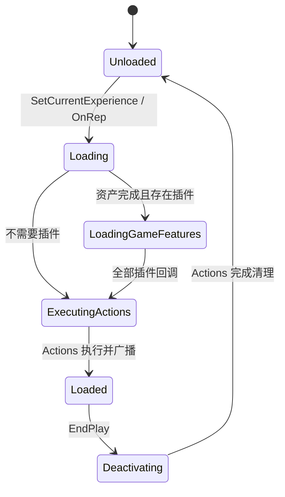

# UE5.8 Lyra 源码解析 40：Experience 与 GameFeature 玩法装配

> 本篇沿着 `ALyraGameMode → ULyraExperienceManagerComponent → UGameFeaturesSubsystem → UGameFeatureAction` 精读一次玩法装配。
> 核心目标是解释：地图、会话参数和 Experience 如何决定当前玩法；插件、Actions 与玩家出生为何必须按顺序完成。
> 知识成熟度：L2（本机 UE 5.8 与 Lyra 5.8 源码、配置已静态核对；运行实验作为后续验证步骤）。

## 元数据

| 项目 | 内容 |
| --- | --- |
| 版本基线 | UE 5.8.0 / CL 55116800 / `++UE5+Release-5.8` |
| Lyra 基线 | 本机 `LyraStarterGame.uproject`：`EngineAssociation=5.8` |
| 项目源码根 | `C:\Users\zhaozhiqi\Documents\Unreal Projects\LyraStarterGame` |
| 引擎源码根 | `C:\Program Files\Epic Games\UE_5.8\Engine` |
| 适用范围 | Experience 设计、GameFeature 动态激活、玩法插件拆分、加载屏和玩家出生门控 |
| 知识成熟度 | L2：项目/引擎源码静态核对完成；运行实验作为明确步骤提供 |
| 官方参考 | [Lyra Sample Game](https://dev.epicgames.com/documentation/en-us/unreal-engine/lyra-sample-game-in-unreal-engine)、[Game Features and Modular Gameplay](https://dev.epicgames.com/documentation/en-us/unreal-engine/game-features-and-modular-gameplay-in-unreal-engine) |
| 最后更新 | 2026-08-13 |

## 一、先给结论

Lyra 的 Experience 是“一次玩法会话的装配描述”。

它不是世界本身，不是 GameMode 子类，也不是单个 GameFeature 插件。

它把四类信息组合在一起：

1. 要激活的 GameFeature 插件名；
2. 默认 `ULyraPawnData`；
3. 直接执行的 `UGameFeatureAction`；
4. 可复用的 `ULyraExperienceActionSet`。

运行时由 GameState 上的 Experience Manager 负责加载和复制当前 Experience。

GameMode 在 Experience 完成前故意不生成玩家 Pawn。

因此 Experience Loaded 是玩法世界真正可交互的屏障。

## 二、核心文件地图

| 文件 | 关键类型/函数 | 阅读目的 |
| --- | --- | --- |
| `GameModes/LyraExperienceDefinition.h` | `ULyraExperienceDefinition` | Experience 数据结构 |
| `GameModes/LyraExperienceActionSet.h` | `ULyraExperienceActionSet` | 可复用 Actions 与插件依赖 |
| `GameModes/LyraExperienceManagerComponent.h/.cpp` | `ELyraExperienceLoadState`、加载回调 | 运行时状态机 |
| `GameModes/LyraGameMode.cpp` | Experience 选择、出生门控 | 服务器入口 |
| `GameModes/LyraWorldSettings.cpp` | `GetDefaultGameplayExperience` | 地图默认值 |
| `GameModes/LyraUserFacingExperienceDefinition.cpp` | `CreateHostingRequest` | 前端到 Travel URL |
| `GameFeatures/LyraGameFeaturePolicy.cpp` | Policy 与观察者 | 项目级插件策略 |
| 引擎 `GameFeaturesSubsystem.cpp` | 目标状态迁移 | 插件底层状态机 |
| 引擎 `GameFeatureAction_AddComponents.cpp` | 动态组件注入 | Action 与 ModularGameplay 桥梁 |

## 三、Experience 的真实数据结构

本机 5.8 的 `ULyraExperienceDefinition` 继承 `UPrimaryDataAsset`。

它的运行时字段只有四组：

```cpp
// 按本机 5.8 声明重排，省略 UPROPERTY 元数据。
TArray<FString> GameFeaturesToEnable;
TObjectPtr<const ULyraPawnData> DefaultPawnData;
TArray<TObjectPtr<UGameFeatureAction>> Actions;
TArray<TObjectPtr<ULyraExperienceActionSet>> ActionSets;
```

注意 `DefaultPawnData` 当前仍是硬对象指针，源码旁有“Make soft?”注释。

Experience 本身通过 AssetManager Bundle 管理它引用的资产。

`ULyraExperienceActionSet` 同样是 `UPrimaryDataAsset`，包含：

```cpp
TArray<TObjectPtr<UGameFeatureAction>> Actions;
TArray<FString> GameFeaturesToEnable;
```

ActionSet 的目的不是形成另一层继承，而是复用一组装配片段。

本机资产可见三个典型 ActionSet：

- `/ShooterCore/Experiences/LAS_ShooterGame_SharedInput`；
- `/ShooterCore/Experiences/LAS_ShooterGame_StandardComponents`；
- `/ShooterCore/Experiences/LAS_ShooterGame_StandardHUD`。

资产存在可静态确认；内部字段应在 UE 编辑器中打开验证。

## 四、Experience 是如何被选中的

入口是 `ALyraGameMode::HandleMatchAssignmentIfNotExpectingOne`。

本机 5.8 的选择优先级如下：

1. Travel/URL Options 中的 `Experience`；
2. PIE 的 `ULyraDeveloperSettings::ExperienceOverride`；
3. 命令行 `Experience=`；
4. `ALyraWorldSettings::DefaultGameplayExperience`；
5. 最终默认 `B_LyraDefaultExperience`。

### 4.1 URL 参数

GameMode 使用 `UGameplayStatics::HasOption` 和 `ParseOption` 读取 OptionsString。

只给资产名时，它构造：

```text
PrimaryAssetType = LyraExperienceDefinition
PrimaryAssetName = <URL 中的值>
```

前端建房会把该参数写入 Travel URL，因此前端选择和服务器地图启动在这里闭环。

### 4.2 PIE Override

PIE 下可以由 DeveloperSettings 强制某个 Experience。

这是开发便利入口，不应成为 Shipping 的隐式规则。

### 4.3 命令行

命令行既接受完整 `Type:Name`，也接受只有 Name 的形式。

没有类型时同样补成 `LyraExperienceDefinition`。

### 4.4 WorldSettings

`ALyraWorldSettings::GetDefaultGameplayExperience` 把软类路径转换为 PrimaryAssetId。

转换失败会记录 `LogLyraExperience` 错误。

这通常意味着 AssetManager 扫描规则未覆盖该插件或目录。

### 4.5 最终回退

若所有来源都无效，非 Dedicated 特殊路径最终使用 `B_LyraDefaultExperience`。

在调用 `OnMatchAssignmentGiven` 前，代码还使用 `GetPrimaryAssetData` 验证 ID 确实可发现。

## 五、为什么 Experience Manager 放在 GameState

`ULyraExperienceManagerComponent` 继承 `UGameStateComponent`。

这带来三个效果：

1. 服务器由 GameMode 选择 Experience；
2. `CurrentExperience` 作为 GameState 组件属性复制给客户端；
3. 两端按各自 NetMode 加载 Client/Server Bundle 并执行对应 Action。

构造函数调用 `SetIsReplicatedByDefault(true)`。

`CurrentExperience` 使用 `ReplicatedUsing=OnRep_CurrentExperience`。

服务器 `SetCurrentExperience` 后直接调用 `StartExperienceLoad`。

客户端收到复制后由 `OnRep_CurrentExperience` 调同一入口。

这是“权威选择、各端装配”的典型模式。

## 六、加载状态机

本机 5.8 定义七个状态：

```text
Unloaded
→ Loading
→ LoadingGameFeatures
→ LoadingChaosTestingDelay（仅测试延迟时）
→ ExecutingActions
→ Loaded
→ Deactivating
→ Unloaded
```



`LoadingChaosTestingDelay` 是故意制造乱序/等待的测试状态，不是业务需求。

## 七、SetCurrentExperience 的边界

`SetCurrentExperience` 接收 `FPrimaryAssetId`。

它执行：

1. `ULyraAssetManager::Get()`；
2. `GetPrimaryAssetPath(ExperienceId)`；
3. 对资产路径 `TryLoad()` 得到 Experience Blueprint Class；
4. `GetDefault<ULyraExperienceDefinition>(AssetClass)` 取得 CDO；
5. 写入 `CurrentExperience`；
6. 调 `StartExperienceLoad()`。

这里有两个重要约束：

- `check(CurrentExperience == nullptr)`：一个组件实例不支持无清理地覆盖当前 Experience；
- 使用的是 Blueprint Class 的 CDO，不是任意运行时可变实例。

因此 Experience 应被视为只读定义。

## 八、第一阶段：加载 Primary Asset Bundle

`StartExperienceLoad` 首先把当前 Experience 和所有非空 ActionSet 的 PrimaryAssetId 放入集合。

它总是加载 `FLyraBundles::Equipped`。

然后按 NetMode 追加：

| 进程 | Bundle |
| --- | --- |
| Editor | Client + Server |
| Dedicated Server | Server，不加载 Client |
| Client | Client，不加载 Server |
| Listen/Standalone | 根据非 Dedicated、非 ClientOnly 条件加载两侧需要的数据 |

实际调用是：

```cpp
AssetManager.ChangeBundleStateForPrimaryAssets(
    BundleAssetList.Array(),
    BundlesToLoad,
    {},
    false,
    FStreamableDelegate(),
    FStreamableManager::AsyncLoadHighPriority);
```

若 Bundle 和 Raw Asset 两种 Handle 同时存在，使用 `CreateCombinedHandle`。

当前源码的 `RawAssetList` 初始化为空，保留了扩展位置。

Handle 已完成或无效时立即执行回调。

否则绑定 Complete 和 Cancel；Cancel 也进入同一收口回调。

取消回调进入收口不代表加载成功，项目扩展时要根据自己的错误模型补充结果判断。

## 九、第二阶段：收集并激活 GameFeature

`OnExperienceLoadComplete` 清空 `GameFeaturePluginURLs`。

随后遍历：

- Experience 的 `GameFeaturesToEnable`；
- 每个 ActionSet 的 `GameFeaturesToEnable`。

每个插件名经：

```cpp
UGameFeaturesSubsystem::Get().GetPluginURLByName(PluginName, PluginURL)
```

转换为 URL。

URL 使用 `AddUnique` 去重。

解析失败会触发 ensure，并忽略本轮无效项。

因此一个拼错的插件名可能造成“Experience 仍继续，但少了一块玩法”的软失败。

项目应在内容校验阶段提前阻断这种情况。

### 9.1 并行激活计数

`NumGameFeaturePluginsLoading` 设为 URL 数量。

每个 URL 调用：

```cpp
UGameFeaturesSubsystem::Get().LoadAndActivateGameFeaturePlugin(
    PluginURL,
    FGameFeaturePluginLoadComplete::CreateUObject(
        this,
        &ThisClass::OnGameFeaturePluginLoadComplete));
```

回调每次递减计数。

降到零才进入 `OnExperienceFullLoadCompleted`。

本机实现没有在该回调中根据 `Result` 中止 Experience。

产品项目通常需要定义“关键插件失败即失败”或“可选插件降级”的策略。

## 十、引擎层：LoadAndActivate 到底做什么

本机 UE 5.8 引擎中：

```cpp
void UGameFeaturesSubsystem::LoadAndActivateGameFeaturePlugin(...)
{
    ChangeGameFeatureTargetState(
        PluginURL,
        EGameFeatureTargetState::Active,
        CompleteDelegate);
}
```

所以“加载并激活”是把插件状态机目标设为 Active 的便捷接口。

底层位于：

- `Engine/Plugins/Runtime/GameFeatures/Source/GameFeatures/Private/GameFeaturesSubsystem.cpp`；
- `.../Private/GameFeaturePluginStateMachine.cpp`；
- `.../Private/GameFeaturePluginStateMachine.h`。

插件状态机负责协议 URL、下载/挂载、注册、加载和激活等阶段。

不要在 Lyra Experience Manager 中寻找全部插件装载细节，它只编排目标状态和完成回调。

## 十一、第三阶段：执行 Experience Actions

所有插件回调完成后，LoadState 变为 `ExecutingActions`。

Experience Manager 创建 `FGameFeatureActivatingContext`。

若能取得当前 WorldContext，则写入 RequiredWorldContextHandle。

这对多世界 PIE 很重要：Action 的结果应限制到当前世界。

每个 Action 依次收到：

```text
OnGameFeatureRegistering
→ OnGameFeatureLoading
→ OnGameFeatureActivating(Context)
```

执行顺序是：

1. Experience 自身 Actions；
2. 按 ActionSets 数组顺序；
3. 每个 ActionSet 内按 Actions 数组顺序。

这里没有自动拓扑排序。

若 Actions 有隐式先后依赖，应把依赖显式化或合并为一个能自我管理的 Action。

## 十二、Action 如何动态增加组件

Lyra 的 ShooterCore 会使用引擎 `UGameFeatureAction_AddComponents`。

本机 UE 5.8 中该 Action 激活后针对 Game World 工作。

它最终调用：

```cpp
UGameFrameworkComponentManager::AddComponentRequest(
    Entry.ActorClass,
    ComponentClass,
    AdditionFlags);
```

请求句柄被保存在 Context Handles 中。

句柄生命周期就是注册生命周期。

丢失句柄会取消扩展请求，这不是无关紧要的返回值。

`AddComponentRequest` 同时覆盖：

- 已存在并已注册为 Receiver 的 Actor；
- 之后才出现的 Receiver Actor。

这让插件可以在不修改基础 Actor 构造函数的情况下追加组件。

## 十三、Action 与 Extension Event

并非所有扩展都适合直接加组件。

Lyra 也使用 `AddExtensionHandler` 监听 Actor 扩展事件。

引擎 Component Manager 提供典型事件：

- `ReceiverAdded`；
- `ReceiverRemoved`；
- `ExtensionAdded`；
- `ExtensionRemoved`；
- `GameActorReady`。

Lyra 另定义 `NAME_BindInputsNow`。

HeroComponent 完成基础输入初始化后，对 PlayerController 和 Pawn 发送该事件。

GameFeature 的输入绑定 Action 因而可以“晚加入”，又不会早于基础输入系统就绪。

## 十四、Loaded 屏障与三档委托

所有 Actions 执行后：

```cpp
LoadState = ELyraExperienceLoadState::Loaded;
```

然后依次广播：

1. `OnExperienceLoaded_HighPriority`；
2. `OnExperienceLoaded`；
3. `OnExperienceLoaded_LowPriority`。

每组广播后立即 Clear。

`CallOrRegister_*` 的语义是：

- 已 Loaded：立即执行传入 Delegate；
- 未 Loaded：加入对应队列，Loaded 时执行一次。

这避免调用方自己写“先判断，再绑定”产生竞态窗口。

高低优先级仍是一种弱顺序约定。

不要让系统之间形成跨优先级循环依赖。

## 十五、加载屏为什么能自动等待

Experience Manager 实现 `ILoadingProcessInterface`。

`ShouldShowLoadingScreen` 在 LoadState 不是 Loaded 时：

- 返回 `true`；
- 原因写为 `Experience still loading`。

CommonLoadingScreen 会聚合实现该接口的对象。

因此加载屏不是在 GameMode 里手工 Show/Hide。

这是可组合的“还有谁没准备好”投票模型。

44 篇会继续展开前端 ControlFlow 的另一票加载原因。

## 十六、玩家出生门控

`ALyraGameMode::HandleStartingNewPlayer_Implementation` 的逻辑非常短：

```cpp
if (IsExperienceLoaded())
{
    Super::HandleStartingNewPlayer_Implementation(NewPlayer);
}
```

未 Loaded 时不调用父实现。

这意味着玩家可以完成连接和 PlayerController/PlayerState 创建，但暂时没有 Pawn。

`OnExperienceLoaded` 遍历当前 PlayerController：

- Controller 有效；
- 当前没有 Pawn；
- `PlayerCanRestart` 返回 true；
- 调 `RestartPlayer`。

这个设计避免默认 PawnClass、PawnData 或动态组件尚未可用时提前出生。

## 十七、PawnData 的选择顺序

`ALyraGameMode::GetPawnDataForController` 按以下顺序取定义：

1. Controller 的 `ALyraPlayerState` 已有 PawnData；
2. 当前 Loaded Experience 的 `DefaultPawnData`；
3. `ULyraAssetManager::GetDefaultPawnData()`；
4. Experience 未 Loaded 时返回空。

PlayerState 级 PawnData 可用于玩家/机器人差异或运行期角色选择。

Experience Default 是本玩法的通用角色定义。

AssetManager Default 是最后兜底。

## 十八、deferred spawn 保证配置先到

`SpawnDefaultPawnAtTransform_Implementation` 设置：

```cpp
SpawnInfo.bDeferConstruction = true;
```

创建 Pawn 后先：

```cpp
PawnExtComp->SetPawnData(PawnData);
```

然后：

```cpp
SpawnedPawn->FinishSpawning(SpawnTransform);
```

这条顺序是后续 InitState 的基础。

如果改回普通 Spawn，再在 BeginPlay 后补 PawnData，会重新引入初始化竞态。

## 十九、从前端到 Experience 的闭环

`ULyraUserFacingExperienceDefinition` 包含：

- `MapID`；
- `ExperienceID`；
- `ExtraArgs`；
- 最大玩家数；
- 展示、加载屏和回放选项。

`CreateHostingRequest` 把 `ExperienceID.PrimaryAssetName` 写入：

```text
ExtraArgs["Experience"]
```

`UCommonSession_HostSessionRequest::ConstructTravelURL` 生成类似：

```text
/ShooterMaps/Maps/L_Expanse?listen?Experience=B_ShooterGame_Elimination
```

实际地图和 Experience 名应以资产配置为准，上例只展示结构。

新世界启动时 GameMode 从 URL Options 读回 Experience。

于是前端选择不需要硬编码一个 GameMode 子类。

## 二十、GameFeature Policy 的项目职责

`Config/DefaultGame.ini` 把 GameFeatures Manager 指向 `ULyraGameFeaturePolicy`。

本机实现继承 `UDefaultGameFeaturesProjectPolicies`。

它在初始化时注册两个观察者：

1. `ULyraGameFeature_HotfixManager`；
2. `ULyraGameFeature_AddGameplayCuePaths`。

前者在插件 Loading 时请求热修配置资源。

后者在插件注册/注销时动态增加或移除 GameplayCue 搜索路径，并刷新运行时 Cue 库。

这解决了一个常见问题：GameFeature 中的 Cue 不应要求基础游戏预先硬编码全部目录。

Policy 还按运行模式返回 Client/Server 数据加载选择。

## 二十一、构建时与运行时不是一回事

`LyraGame.Target.cs::ConfigureGameFeaturePlugins` 扫描 `Plugins/GameFeatures` 描述文件。

它检查：

- `ExplicitlyLoaded`；
- `EditorOnly`；
- `RestrictToBranch`；
- `NeverBuild`；
- 插件依赖引用。

构建目标决定插件是否进入产物。

Experience 决定已进入产物、可发现的插件何时运行时激活。

不能用运行时激活补救“插件根本没打进包”。

也不能因插件已打包就假设它已 Active。

## 二十二、卸载与 EndPlay

Experience Manager 的 `EndPlay` 先遍历本 Experience 激活过的插件 URL。

`ULyraExperienceManager::RequestToDeactivatePlugin` 用引用计数式协调判断是否真的停用。

允许时调用 `DeactivateGameFeaturePlugin`。

若 LoadState 已 Loaded，还会把状态切到 Deactivating。

Actions 的反向调用是：

```text
OnGameFeatureDeactivating(Context)
→ OnGameFeatureUnregistering
```

当前 5.8 源码明确记录两个限制：

- Actions 并未按严格 FILO 反向顺序处理；
- 异步 Action deactivation 尚未被完整支持。

这两个限制在产品化热切换 Experience 时必须评估。

最后 `OnAllActionsDeactivated` 清空 CurrentExperience，并把状态设回 Unloaded。

## 二十三、失败模式与定位

| 现象 | 最可能断点 | 常见原因 |
| --- | --- | --- |
| 加载屏永久不消失 | `OnMatchAssignmentGiven` | ExperienceId 无效 |
| 日志称找不到 Experience | AssetManager `GetPrimaryAssetData` | 扫描目录/PrimaryAssetType 错 |
| 某玩法组件不存在 | `OnExperienceLoadComplete` | 插件名无法转 URL，或 Action 未配置 |
| GameFeature 已加载但 Actor 未扩展 | `AddComponentRequest` | Actor 未注册 Receiver、WorldContext 不匹配 |
| 玩家连接成功但没 Pawn | `HandleStartingNewPlayer` / `OnExperienceLoaded` | Experience 未 Loaded 或 PlayerCanRestart=false |
| Dedicated 加载客户端资产 | `StartExperienceLoad` Bundle 计算 | NetMode 判断被改坏 |
| 退出世界残留组件/委托 | Action deactivation | 注册句柄未保存或清理不对称 |
| PIE 多窗口互相污染 | ActivatingContext | Action 忽略 RequiredWorldContextHandle |

## 二十四、推荐断点时序

按下面顺序设置断点，能够一次看到完整装配：

1. `ALyraGameMode::HandleMatchAssignmentIfNotExpectingOne`；
2. `ALyraGameMode::OnMatchAssignmentGiven`；
3. `ULyraExperienceManagerComponent::SetCurrentExperience`；
4. `StartExperienceLoad`；
5. `OnExperienceLoadComplete`；
6. 引擎 `UGameFeaturesSubsystem::ChangeGameFeatureTargetState`；
7. 引擎 `UGameFeatureAction_AddComponents::OnGameFeatureActivating`；
8. `OnExperienceFullLoadCompleted`；
9. `ALyraGameMode::OnExperienceLoaded`；
10. `SpawnDefaultPawnAtTransform_Implementation`。

每次停下记录：

- World 名；
- NetMode；
- Experience PrimaryAssetId；
- LoadState；
- 尚未完成插件数；
- PlayerController 是否已有 Pawn。

## 二十五、静态验证命令

```powershell
$Lyra = 'C:\Users\zhaozhiqi\Documents\Unreal Projects\LyraStarterGame'
$UE = 'C:\Program Files\Epic Games\UE_5.8\Engine'

rg -n "GameFeaturesToEnable|DefaultPawnData|ActionSets" `
  "$Lyra\Source\LyraGame\GameModes\LyraExperienceDefinition.h" `
  "$Lyra\Source\LyraGame\GameModes\LyraExperienceActionSet.h"

rg -n "SetCurrentExperience|StartExperienceLoad|OnExperienceLoadComplete|OnExperienceFullLoadCompleted" `
  "$Lyra\Source\LyraGame\GameModes\LyraExperienceManagerComponent.cpp"

rg -n "HandleStartingNewPlayer|SpawnDefaultPawnAtTransform|SetPawnData|FinishSpawning" `
  "$Lyra\Source\LyraGame\GameModes\LyraGameMode.cpp"

rg -n "LoadAndActivateGameFeaturePlugin|ChangeGameFeatureTargetState" `
  "$UE\Plugins\Runtime\GameFeatures\Source\GameFeatures"

rg -n "AddComponentRequest" `
  "$UE\Plugins\Runtime\GameFeatures\Source\GameFeatures" `
  "$UE\Plugins\Runtime\ModularGameplay\Source\ModularGameplay"
```

## 二十六、扩展一个新 Experience 的安全步骤

### 步骤 1：确定稳定层与 Feature 层

把跨所有玩法都需要的基础类留在 LyraGame 等稳定模块。

把可选玩法组件、能力、UI 和地图放入新的 GameFeature 插件。

### 步骤 2：配置插件描述

确认插件能被构建目标发现。

对于运行时显式激活的 GameFeature，保持描述与 Lyra Target 规则一致。

### 步骤 3：创建 GameFeatureData

配置需要的 Actions，例如增加组件、能力、输入或 Widget。

每个 Action 都要设计反向清理。

### 步骤 4：创建 ActionSet

把可跨多个 Experience 复用的输入、标准组件和 HUD 分组。

避免复制三份几乎相同的 Actions。

### 步骤 5：创建 Experience Definition

选择 DefaultPawnData、插件名和 ActionSets。

确保资产位于 AssetManager 扫描范围。

### 步骤 6：连接地图或 UserFacingExperience

地图可通过 WorldSettings 指定默认 Experience。

前端 Playlist 则通过 UserFacingExperience 把 Experience 写进旅行参数。

### 步骤 7：验证双端和卸载

至少检查 Standalone、Listen Server + Client、Dedicated Server。

退出世界后检查动态组件、委托、输入映射和 UI 是否被清理。

## 二十七、设计取舍

### 27.1 为什么用插件名字符串

Experience 记录插件名，再由 GameFeaturesSubsystem 转 URL。

优点是协议/安装来源可以变化，Experience 不绑定磁盘路径。

代价是拼写错误需要数据校验才能尽早发现。

### 27.2 为什么并行激活插件

多个独立 GameFeature 可以同时向 Active 迁移，缩短等待。

代价是插件之间不能依赖隐式完成顺序。

### 27.3 为什么 Actions 在插件后执行

Actions 引用的类型和资产可能由插件提供。

先保证插件 Active，再执行 Experience 组合，边界更清晰。

### 27.4 为什么 Loaded 后才生成 Pawn

PawnClass、PawnData、动态组件、能力和输入都可能来自 Experience/Feature。

提前生成会把“资源未到”和“网络复制未到”混成难复现竞态。

## 二十八、常见反模式

1. 在 GameMode 构造函数硬编码所有可选组件；
2. 在 BeginPlay 用固定 Delay 等待 GameFeature；
3. 把 Experience 对象当运行时可变状态容器；
4. Action 注册后不保存 Handle；
5. 不区分 Client/Server Asset Bundle；
6. 用插件 Enabled 状态代替 Active 状态；
7. 在 Action 中遍历 `GWorld`，忽略 Context 的目标 World；
8. Experience 加载失败仍悄悄使用一半玩法；
9. 在 Experience Loaded 前手工 Spawn 玩家；
10. 卸载时只删 Actor，不撤销输入、能力、委托和 UI 扩展。

## 二十九、验证实验

### 实验 A：验证选择优先级

分别用 WorldSettings、PIE Override 和 `?Experience=` 指定不同 Experience。

在 `OnMatchAssignmentGiven` 记录 `ExperienceIdSource`。

确认 URL 优先于 PIE/命令行/WorldSettings。

### 实验 B：制造加载延迟

启用源码提供的 Experience Load Delay 控制变量。

确认加载屏仍显示、PlayerController 暂无 Pawn、Loaded 后才 Restart。

### 实验 C：缺失插件名

在实验副本中配置一个不存在的插件名。

预期看到 URL 解析 ensure；记录当前样例是否仍进入 Loaded。

实验结束后恢复资产，不把错误配置提交。

### 实验 D：动态组件清理

用 AddComponents Action 增加一个可识别测试组件。

进入/退出世界，确认 ComponentRequestHandle 生命周期与组件销毁对称。

## 三十、验收清单

- [ ] 能说出 Experience 的四组字段；
- [ ] 能说出 Experience 选择优先级；
- [ ] 能画出七个 LoadState；
- [ ] 能解释 Asset Bundle 与 GameFeature 激活的先后；
- [ ] 能解释 GameFeature “构建、加载、激活”的差别；
- [ ] 能解释 Actions 和 ActionSets 的组合顺序；
- [ ] 能解释 Experience Loaded 如何控制加载屏；
- [ ] 能解释玩家为什么延迟出生；
- [ ] 能指出 deferred spawn 中 SetPawnData 的位置；
- [ ] 能列出卸载路径的两个已知限制。

## 三十一、关联阅读

- [39-Lyra源码总览与阅读路线](39-Lyra源码总览与阅读路线.md)：教程总入口。
- [41-Lyra-Pawn初始化与模块化组件源码](41-Lyra-Pawn初始化与模块化组件源码.md)：Loaded 之后的 Pawn 状态机。
- [13-资源加载与异步加载源码](13-资源加载与异步加载源码.md)：AssetManager 与 StreamableHandle 底层。
- [03-Actor与Component生命周期源码](03-Actor与Component生命周期源码.md)：deferred spawn 和组件生命周期。
- [08-ModularGameplay模块化玩法](../03-游戏玩法编程/08-ModularGameplay模块化玩法.md)：使用层概念。
- [45-Lyra-相机音频与游戏阶段源码](45-Lyra-相机音频与游戏阶段源码.md)：GamePhase 阶段能力如何承接 Experience 之后的玩法流程。
- [46-Lyra-AI队伍与调试源码](46-Lyra-AI队伍与调试源码.md)：队伍归属与 Bot 补位如何配合 Experience 玩法。

## 三十二、权威来源

- [Lyra Sample Game](https://dev.epicgames.com/documentation/en-us/unreal-engine/lyra-sample-game-in-unreal-engine)
- [Game Features and Modular Gameplay](https://dev.epicgames.com/documentation/en-us/unreal-engine/game-features-and-modular-gameplay-in-unreal-engine)
- [Game Framework Component Manager](https://dev.epicgames.com/documentation/en-us/unreal-engine/game-framework-component-manager-in-unreal-engine)
- [Asset Management](https://dev.epicgames.com/documentation/en-us/unreal-engine/asset-management-in-unreal-engine)


## 附录：核心文件完整源码

> 收录原则：本附录把正文直接分析的 LyraStarterGame 5.8 项目源码文件逐字完整收录（未删改，保留 Epic 版权头），正文中的“节选”负责解释调用链，本附录提供全文，二者配合阅读。引擎层（`Engine/`）文件体量过大且不属于项目教程主体，仍按正文的路径+符号检索方式引用，不在此收录；`.uasset/.umap` 资产也不在收录范围。
> 版权提示：以下代码来自 Epic Games 的 LyraStarterGame 样例（UE 5.8），随 Unreal Engine EULA 的样例代码条款提供，仅作本地学习收录；对外发布前请自行核对许可条款。

| # | 文件（相对 LyraStarterGame 根） | 行数 |
| --- | --- | --- || 1 | `Source\LyraGame\GameModes\LyraExperienceDefinition.h` | 52 |
| 2 | `Source\LyraGame\GameModes\LyraExperienceDefinition.cpp` | 82 |
| 3 | `Source\LyraGame\GameModes\LyraExperienceActionSet.h` | 41 |
| 4 | `Source\LyraGame\GameModes\LyraExperienceActionSet.cpp` | 60 |
| 5 | `Source\LyraGame\GameModes\LyraExperienceManagerComponent.h` | 106 |
| 6 | `Source\LyraGame\GameModes\LyraExperienceManagerComponent.cpp` | 467 |
| 7 | `Source\LyraGame\GameModes\LyraGameMode.h` | 89 |
| 8 | `Source\LyraGame\GameModes\LyraGameMode.cpp` | 522 |
| 9 | `Source\LyraGame\GameModes\LyraWorldSettings.h` | 47 |
| 10 | `Source\LyraGame\GameModes\LyraWorldSettings.cpp` | 54 |
| 11 | `Source\LyraGame\GameModes\LyraUserFacingExperienceDefinition.h` | 75 |
| 12 | `Source\LyraGame\GameModes\LyraUserFacingExperienceDefinition.cpp` | 53 |
| 13 | `Source\LyraGame\GameFeatures\LyraGameFeaturePolicy.h` | 63 |
| 14 | `Source\LyraGame\GameFeatures\LyraGameFeaturePolicy.cpp` | 159 |

### 附录文件 1：`Source\LyraGame\GameModes\LyraExperienceDefinition.h`

> 完整源码（本机 Lyra 5.8 样例，逐字收录，未删改）。

```cpp
// Copyright Epic Games, Inc. All Rights Reserved.

#pragma once

#include "Engine/DataAsset.h"
#include "LyraExperienceDefinition.generated.h"

class UGameFeatureAction;
class ULyraPawnData;
class ULyraExperienceActionSet;

/**
 * Definition of an experience
 */
UCLASS(BlueprintType, Const)
class ULyraExperienceDefinition : public UPrimaryDataAsset
{
	GENERATED_BODY()

public:
	ULyraExperienceDefinition();

	//~UObject interface
#if WITH_EDITOR
	virtual EDataValidationResult IsDataValid(class FDataValidationContext& Context) const override;
#endif
	//~End of UObject interface

	//~UPrimaryDataAsset interface
#if WITH_EDITORONLY_DATA
	virtual void UpdateAssetBundleData() override;
#endif
	//~End of UPrimaryDataAsset interface

public:
	// List of Game Feature Plugins this experience wants to have active
	UPROPERTY(EditDefaultsOnly, Category = Gameplay)
	TArray<FString> GameFeaturesToEnable;

	/** The default pawn class to spawn for players */
	//@TODO: Make soft?
	UPROPERTY(EditDefaultsOnly, Category=Gameplay)
	TObjectPtr<const ULyraPawnData> DefaultPawnData;

	// List of actions to perform as this experience is loaded/activated/deactivated/unloaded
	UPROPERTY(EditDefaultsOnly, Instanced, Category="Actions")
	TArray<TObjectPtr<UGameFeatureAction>> Actions;

	// List of additional action sets to compose into this experience
	UPROPERTY(EditDefaultsOnly, Category=Gameplay)
	TArray<TObjectPtr<ULyraExperienceActionSet>> ActionSets;
};
```

### 附录文件 2：`Source\LyraGame\GameModes\LyraExperienceDefinition.cpp`

> 完整源码（本机 Lyra 5.8 样例，逐字收录，未删改）。

```cpp
// Copyright Epic Games, Inc. All Rights Reserved.

#include "LyraExperienceDefinition.h"
#include "GameFeatureAction.h"

#if WITH_EDITOR
#include "Misc/DataValidation.h"
#endif

#include UE_INLINE_GENERATED_CPP_BY_NAME(LyraExperienceDefinition)

#define LOCTEXT_NAMESPACE "LyraSystem"

ULyraExperienceDefinition::ULyraExperienceDefinition()
{
}

#if WITH_EDITOR
EDataValidationResult ULyraExperienceDefinition::IsDataValid(FDataValidationContext& Context) const
{
	EDataValidationResult Result = CombineDataValidationResults(Super::IsDataValid(Context), EDataValidationResult::Valid);

	int32 EntryIndex = 0;
	for (const UGameFeatureAction* Action : Actions)
	{
		if (Action)
		{
			EDataValidationResult ChildResult = Action->IsDataValid(Context);
			Result = CombineDataValidationResults(Result, ChildResult);
		}
		else
		{
			Result = EDataValidationResult::Invalid;
			Context.AddError(FText::Format(LOCTEXT("ActionEntryIsNull", "Null entry at index {0} in Actions"), FText::AsNumber(EntryIndex)));
		}

		++EntryIndex;
	}

	// Make sure users didn't subclass from a BP of this (it's fine and expected to subclass once in BP, just not twice)
	if (!GetClass()->IsNative())
	{
		const UClass* ParentClass = GetClass()->GetSuperClass();

		// Find the native parent
		const UClass* FirstNativeParent = ParentClass;
		while ((FirstNativeParent != nullptr) && !FirstNativeParent->IsNative())
		{
			FirstNativeParent = FirstNativeParent->GetSuperClass();
		}

		if (FirstNativeParent != ParentClass)
		{
			Context.AddError(FText::Format(LOCTEXT("ExperienceInheritenceIsUnsupported", "Blueprint subclasses of Blueprint experiences is not currently supported (use composition via ActionSets instead). Parent class was {0} but should be {1}."), 
				FText::AsCultureInvariant(GetPathNameSafe(ParentClass)),
				FText::AsCultureInvariant(GetPathNameSafe(FirstNativeParent))
			));
			Result = EDataValidationResult::Invalid;
		}
	}

	return Result;
}
#endif

#if WITH_EDITORONLY_DATA
void ULyraExperienceDefinition::UpdateAssetBundleData()
{
	Super::UpdateAssetBundleData();

	for (UGameFeatureAction* Action : Actions)
	{
		if (Action)
		{
			Action->AddAdditionalAssetBundleData(AssetBundleData);
		}
	}
}
#endif // WITH_EDITORONLY_DATA

#undef LOCTEXT_NAMESPACE

```

### 附录文件 3：`Source\LyraGame\GameModes\LyraExperienceActionSet.h`

> 完整源码（本机 Lyra 5.8 样例，逐字收录，未删改）。

```cpp
// Copyright Epic Games, Inc. All Rights Reserved.

#pragma once

#include "Engine/DataAsset.h"
#include "LyraExperienceActionSet.generated.h"

class UGameFeatureAction;

/**
 * Definition of a set of actions to perform as part of entering an experience
 */
UCLASS(BlueprintType, NotBlueprintable)
class ULyraExperienceActionSet : public UPrimaryDataAsset
{
	GENERATED_BODY()

public:
	ULyraExperienceActionSet();

	//~UObject interface
#if WITH_EDITOR
	virtual EDataValidationResult IsDataValid(class FDataValidationContext& Context) const override;
#endif
	//~End of UObject interface

	//~UPrimaryDataAsset interface
#if WITH_EDITORONLY_DATA
	virtual void UpdateAssetBundleData() override;
#endif
	//~End of UPrimaryDataAsset interface

public:
	// List of actions to perform as this experience is loaded/activated/deactivated/unloaded
	UPROPERTY(EditAnywhere, Instanced, Category="Actions to Perform")
	TArray<TObjectPtr<UGameFeatureAction>> Actions;

	// List of Game Feature Plugins this experience wants to have active
	UPROPERTY(EditAnywhere, Category="Feature Dependencies")
	TArray<FString> GameFeaturesToEnable;
};
```

### 附录文件 4：`Source\LyraGame\GameModes\LyraExperienceActionSet.cpp`

> 完整源码（本机 Lyra 5.8 样例，逐字收录，未删改）。

```cpp
// Copyright Epic Games, Inc. All Rights Reserved.

#include "LyraExperienceActionSet.h"
#include "GameFeatureAction.h"

#if WITH_EDITOR
#include "Misc/DataValidation.h"
#endif

#include UE_INLINE_GENERATED_CPP_BY_NAME(LyraExperienceActionSet)

#define LOCTEXT_NAMESPACE "LyraSystem"

ULyraExperienceActionSet::ULyraExperienceActionSet()
{
}

#if WITH_EDITOR
EDataValidationResult ULyraExperienceActionSet::IsDataValid(FDataValidationContext& Context) const
{
	EDataValidationResult Result = CombineDataValidationResults(Super::IsDataValid(Context), EDataValidationResult::Valid);

	int32 EntryIndex = 0;
	for (const UGameFeatureAction* Action : Actions)
	{
		if (Action)
		{
			EDataValidationResult ChildResult = Action->IsDataValid(Context);
			Result = CombineDataValidationResults(Result, ChildResult);
		}
		else
		{
			Result = EDataValidationResult::Invalid;
			Context.AddError(FText::Format(LOCTEXT("ActionEntryIsNull", "Null entry at index {0} in Actions"), FText::AsNumber(EntryIndex)));
		}

		++EntryIndex;
	}

	return Result;
}
#endif

#if WITH_EDITORONLY_DATA
void ULyraExperienceActionSet::UpdateAssetBundleData()
{
	Super::UpdateAssetBundleData();

	for (UGameFeatureAction* Action : Actions)
	{
		if (Action)
		{
			Action->AddAdditionalAssetBundleData(AssetBundleData);
		}
	}
}
#endif // WITH_EDITORONLY_DATA

#undef LOCTEXT_NAMESPACE

```

### 附录文件 5：`Source\LyraGame\GameModes\LyraExperienceManagerComponent.h`

> 完整源码（本机 Lyra 5.8 样例，逐字收录，未删改）。

```cpp
// Copyright Epic Games, Inc. All Rights Reserved.

#pragma once

#include "Components/GameStateComponent.h"
#include "LoadingProcessInterface.h"

#include "LyraExperienceManagerComponent.generated.h"

#define UE_API LYRAGAME_API

namespace UE::GameFeatures { struct FResult; }

class ULyraExperienceDefinition;

DECLARE_MULTICAST_DELEGATE_OneParam(FOnLyraExperienceLoaded, const ULyraExperienceDefinition* /*Experience*/);

enum class ELyraExperienceLoadState
{
	Unloaded,
	Loading,
	LoadingGameFeatures,
	LoadingChaosTestingDelay,
	ExecutingActions,
	Loaded,
	Deactivating
};

UCLASS(MinimalAPI)
class ULyraExperienceManagerComponent final : public UGameStateComponent, public ILoadingProcessInterface
{
	GENERATED_BODY()

public:

	UE_API ULyraExperienceManagerComponent(const FObjectInitializer& ObjectInitializer = FObjectInitializer::Get());

	//~UActorComponent interface
	UE_API virtual void EndPlay(const EEndPlayReason::Type EndPlayReason) override;
	//~End of UActorComponent interface

	//~ILoadingProcessInterface interface
	UE_API virtual bool ShouldShowLoadingScreen(FString& OutReason) const override;
	//~End of ILoadingProcessInterface

	// Tries to set the current experience, either a UI or gameplay one
	UE_API void SetCurrentExperience(FPrimaryAssetId ExperienceId);

	// Ensures the delegate is called once the experience has been loaded,
	// before others are called.
	// However, if the experience has already loaded, calls the delegate immediately.
	UE_API void CallOrRegister_OnExperienceLoaded_HighPriority(FOnLyraExperienceLoaded::FDelegate&& Delegate);

	// Ensures the delegate is called once the experience has been loaded
	// If the experience has already loaded, calls the delegate immediately
	UE_API void CallOrRegister_OnExperienceLoaded(FOnLyraExperienceLoaded::FDelegate&& Delegate);

	// Ensures the delegate is called once the experience has been loaded
	// If the experience has already loaded, calls the delegate immediately
	UE_API void CallOrRegister_OnExperienceLoaded_LowPriority(FOnLyraExperienceLoaded::FDelegate&& Delegate);

	// This returns the current experience if it is fully loaded, asserting otherwise
	// (i.e., if you called it too soon)
	UE_API const ULyraExperienceDefinition* GetCurrentExperienceChecked() const;

	// Returns true if the experience is fully loaded
	UE_API bool IsExperienceLoaded() const;

private:
	UFUNCTION()
	void OnRep_CurrentExperience();

	void StartExperienceLoad();
	void OnExperienceLoadComplete();
	void OnGameFeaturePluginLoadComplete(const UE::GameFeatures::FResult& Result);
	void OnExperienceFullLoadCompleted();

	void OnActionDeactivationCompleted();
	void OnAllActionsDeactivated();

private:
	UPROPERTY(ReplicatedUsing=OnRep_CurrentExperience)
	TObjectPtr<const ULyraExperienceDefinition> CurrentExperience;

	ELyraExperienceLoadState LoadState = ELyraExperienceLoadState::Unloaded;

	int32 NumGameFeaturePluginsLoading = 0;
	TArray<FString> GameFeaturePluginURLs;

	int32 NumObservedPausers = 0;
	int32 NumExpectedPausers = 0;

	/**
	 * Delegate called when the experience has finished loading just before others
	 * (e.g., subsystems that set up for regular gameplay)
	 */
	FOnLyraExperienceLoaded OnExperienceLoaded_HighPriority;

	/** Delegate called when the experience has finished loading */
	FOnLyraExperienceLoaded OnExperienceLoaded;

	/** Delegate called when the experience has finished loading */
	FOnLyraExperienceLoaded OnExperienceLoaded_LowPriority;
};

#undef UE_API
```

### 附录文件 6：`Source\LyraGame\GameModes\LyraExperienceManagerComponent.cpp`

> 完整源码（本机 Lyra 5.8 样例，逐字收录，未删改）。

```cpp
// Copyright Epic Games, Inc. All Rights Reserved.

#include "LyraExperienceManagerComponent.h"
#include "Engine/World.h"
#include "Net/UnrealNetwork.h"
#include "LyraExperienceDefinition.h"
#include "LyraExperienceActionSet.h"
#include "LyraExperienceManager.h"
#include "GameFeaturesSubsystem.h"
#include "System/LyraAssetManager.h"
#include "GameFeatureAction.h"
#include "GameFeaturesSubsystemSettings.h"
#include "TimerManager.h"
#include "Settings/LyraSettingsLocal.h"
#include "LyraLogChannels.h"

#include UE_INLINE_GENERATED_CPP_BY_NAME(LyraExperienceManagerComponent)

//@TODO: Async load the experience definition itself
//@TODO: Handle failures explicitly (go into a 'completed but failed' state rather than check()-ing)
//@TODO: Do the action phases at the appropriate times instead of all at once
//@TODO: Support deactivating an experience and do the unloading actions
//@TODO: Think about what deactivation/cleanup means for preloaded assets
//@TODO: Handle deactivating game features, right now we 'leak' them enabled
// (for a client moving from experience to experience we actually want to diff the requirements and only unload some, not unload everything for them to just be immediately reloaded)
//@TODO: Handle both built-in and URL-based plugins (search for colon?)

namespace LyraConsoleVariables
{
	static float ExperienceLoadRandomDelayMin = 0.0f;
	static FAutoConsoleVariableRef CVarExperienceLoadRandomDelayMin(
		TEXT("lyra.chaos.ExperienceDelayLoad.MinSecs"),
		ExperienceLoadRandomDelayMin,
		TEXT("This value (in seconds) will be added as a delay of load completion of the experience (along with the random value lyra.chaos.ExperienceDelayLoad.RandomSecs)"),
		ECVF_Default);

	static float ExperienceLoadRandomDelayRange = 0.0f;
	static FAutoConsoleVariableRef CVarExperienceLoadRandomDelayRange(
		TEXT("lyra.chaos.ExperienceDelayLoad.RandomSecs"),
		ExperienceLoadRandomDelayRange,
		TEXT("A random amount of time between 0 and this value (in seconds) will be added as a delay of load completion of the experience (along with the fixed value lyra.chaos.ExperienceDelayLoad.MinSecs)"),
		ECVF_Default);

	float GetExperienceLoadDelayDuration()
	{
		return FMath::Max(0.0f, ExperienceLoadRandomDelayMin + FMath::FRand() * ExperienceLoadRandomDelayRange);
	}
}

ULyraExperienceManagerComponent::ULyraExperienceManagerComponent(const FObjectInitializer& ObjectInitializer)
	: Super(ObjectInitializer)
{
	SetIsReplicatedByDefault(true);
}

void ULyraExperienceManagerComponent::SetCurrentExperience(FPrimaryAssetId ExperienceId)
{
	ULyraAssetManager& AssetManager = ULyraAssetManager::Get();
	FSoftObjectPath AssetPath = AssetManager.GetPrimaryAssetPath(ExperienceId);
	TSubclassOf<ULyraExperienceDefinition> AssetClass = Cast<UClass>(AssetPath.TryLoad());
	check(AssetClass);
	const ULyraExperienceDefinition* Experience = GetDefault<ULyraExperienceDefinition>(AssetClass);

	check(Experience != nullptr);
	check(CurrentExperience == nullptr);
	CurrentExperience = Experience;
	StartExperienceLoad();
}

void ULyraExperienceManagerComponent::CallOrRegister_OnExperienceLoaded_HighPriority(FOnLyraExperienceLoaded::FDelegate&& Delegate)
{
	if (IsExperienceLoaded())
	{
		Delegate.Execute(CurrentExperience);
	}
	else
	{
		OnExperienceLoaded_HighPriority.Add(MoveTemp(Delegate));
	}
}

void ULyraExperienceManagerComponent::CallOrRegister_OnExperienceLoaded(FOnLyraExperienceLoaded::FDelegate&& Delegate)
{
	if (IsExperienceLoaded())
	{
		Delegate.Execute(CurrentExperience);
	}
	else
	{
		OnExperienceLoaded.Add(MoveTemp(Delegate));
	}
}

void ULyraExperienceManagerComponent::CallOrRegister_OnExperienceLoaded_LowPriority(FOnLyraExperienceLoaded::FDelegate&& Delegate)
{
	if (IsExperienceLoaded())
	{
		Delegate.Execute(CurrentExperience);
	}
	else
	{
		OnExperienceLoaded_LowPriority.Add(MoveTemp(Delegate));
	}
}

const ULyraExperienceDefinition* ULyraExperienceManagerComponent::GetCurrentExperienceChecked() const
{
	check(LoadState == ELyraExperienceLoadState::Loaded);
	check(CurrentExperience != nullptr);
	return CurrentExperience;
}

bool ULyraExperienceManagerComponent::IsExperienceLoaded() const
{
	return (LoadState == ELyraExperienceLoadState::Loaded) && (CurrentExperience != nullptr);
}

void ULyraExperienceManagerComponent::OnRep_CurrentExperience()
{
	StartExperienceLoad();
}

void ULyraExperienceManagerComponent::StartExperienceLoad()
{
	check(CurrentExperience != nullptr);
	check(LoadState == ELyraExperienceLoadState::Unloaded);

	UE_LOG(LogLyraExperience, Log, TEXT("EXPERIENCE: StartExperienceLoad(CurrentExperience = %s, %s)"),
		*CurrentExperience->GetPrimaryAssetId().ToString(),
		*GetClientServerContextString(this));

	LoadState = ELyraExperienceLoadState::Loading;

	ULyraAssetManager& AssetManager = ULyraAssetManager::Get();

	TSet<FPrimaryAssetId> BundleAssetList;
	TSet<FSoftObjectPath> RawAssetList;

	BundleAssetList.Add(CurrentExperience->GetPrimaryAssetId());
	for (const TObjectPtr<ULyraExperienceActionSet>& ActionSet : CurrentExperience->ActionSets)
	{
		if (ActionSet != nullptr)
		{
			BundleAssetList.Add(ActionSet->GetPrimaryAssetId());
		}
	}

	// Load assets associated with the experience

	TArray<FName> BundlesToLoad;
	BundlesToLoad.Add(FLyraBundles::Equipped);

	//@TODO: Centralize this client/server stuff into the LyraAssetManager
	const ENetMode OwnerNetMode = GetOwner()->GetNetMode();
	const bool bLoadClient = GIsEditor || (OwnerNetMode != NM_DedicatedServer);
	const bool bLoadServer = GIsEditor || (OwnerNetMode != NM_Client);
	if (bLoadClient)
	{
		BundlesToLoad.Add(UGameFeaturesSubsystemSettings::LoadStateClient);
	}
	if (bLoadServer)
	{
		BundlesToLoad.Add(UGameFeaturesSubsystemSettings::LoadStateServer);
	}

	TSharedPtr<FStreamableHandle> BundleLoadHandle = nullptr;
	if (BundleAssetList.Num() > 0)
	{
		BundleLoadHandle = AssetManager.ChangeBundleStateForPrimaryAssets(BundleAssetList.Array(), BundlesToLoad, {}, false, FStreamableDelegate(), FStreamableManager::AsyncLoadHighPriority);
	}

	TSharedPtr<FStreamableHandle> RawLoadHandle = nullptr;
	if (RawAssetList.Num() > 0)
	{
		RawLoadHandle = AssetManager.LoadAssetList(RawAssetList.Array(), FStreamableDelegate(), FStreamableManager::AsyncLoadHighPriority, TEXT("StartExperienceLoad()"));
	}

	// If both async loads are running, combine them
	TSharedPtr<FStreamableHandle> Handle = nullptr;
	if (BundleLoadHandle.IsValid() && RawLoadHandle.IsValid())
	{
		Handle = AssetManager.GetStreamableManager().CreateCombinedHandle({ BundleLoadHandle, RawLoadHandle });
	}
	else
	{
		Handle = BundleLoadHandle.IsValid() ? BundleLoadHandle : RawLoadHandle;
	}

	FStreamableDelegate OnAssetsLoadedDelegate = FStreamableDelegate::CreateUObject(this, &ThisClass::OnExperienceLoadComplete);
	if (!Handle.IsValid() || Handle->HasLoadCompleted())
	{
		// Assets were already loaded, call the delegate now
		FStreamableHandle::ExecuteDelegate(OnAssetsLoadedDelegate);
	}
	else
	{
		Handle->BindCompleteDelegate(OnAssetsLoadedDelegate);

		Handle->BindCancelDelegate(FStreamableDelegate::CreateLambda([OnAssetsLoadedDelegate]()
			{
				OnAssetsLoadedDelegate.ExecuteIfBound();
			}));
	}

	// This set of assets gets preloaded, but we don't block the start of the experience based on it
	TSet<FPrimaryAssetId> PreloadAssetList;
	//@TODO: Determine assets to preload (but not blocking-ly)
	if (PreloadAssetList.Num() > 0)
	{
		AssetManager.ChangeBundleStateForPrimaryAssets(PreloadAssetList.Array(), BundlesToLoad, {});
	}
}

void ULyraExperienceManagerComponent::OnExperienceLoadComplete()
{
	check(LoadState == ELyraExperienceLoadState::Loading);
	check(CurrentExperience != nullptr);

	UE_LOG(LogLyraExperience, Log, TEXT("EXPERIENCE: OnExperienceLoadComplete(CurrentExperience = %s, %s)"),
		*CurrentExperience->GetPrimaryAssetId().ToString(),
		*GetClientServerContextString(this));

	// find the URLs for our GameFeaturePlugins - filtering out dupes and ones that don't have a valid mapping
	GameFeaturePluginURLs.Reset();

	auto CollectGameFeaturePluginURLs = [This=this](const UPrimaryDataAsset* Context, const TArray<FString>& FeaturePluginList)
	{
		for (const FString& PluginName : FeaturePluginList)
		{
			FString PluginURL;
			if (UGameFeaturesSubsystem::Get().GetPluginURLByName(PluginName, /*out*/ PluginURL))
			{
				This->GameFeaturePluginURLs.AddUnique(PluginURL);
			}
			else
			{
				ensureMsgf(false, TEXT("OnExperienceLoadComplete failed to find plugin URL from PluginName %s for experience %s - fix data, ignoring for this run"), *PluginName, *Context->GetPrimaryAssetId().ToString());
			}
		}

		// 		// Add in our extra plugin
		// 		if (!CurrentPlaylistData->GameFeaturePluginToActivateUntilDownloadedContentIsPresent.IsEmpty())
		// 		{
		// 			FString PluginURL;
		// 			if (UGameFeaturesSubsystem::Get().GetPluginURLByName(CurrentPlaylistData->GameFeaturePluginToActivateUntilDownloadedContentIsPresent, PluginURL))
		// 			{
		// 				GameFeaturePluginURLs.AddUnique(PluginURL);
		// 			}
		// 		}
	};

	CollectGameFeaturePluginURLs(CurrentExperience, CurrentExperience->GameFeaturesToEnable);
	for (const TObjectPtr<ULyraExperienceActionSet>& ActionSet : CurrentExperience->ActionSets)
	{
		if (ActionSet != nullptr)
		{
			CollectGameFeaturePluginURLs(ActionSet, ActionSet->GameFeaturesToEnable);
		}
	}

	// Load and activate the features	
	NumGameFeaturePluginsLoading = GameFeaturePluginURLs.Num();
	if (NumGameFeaturePluginsLoading > 0)
	{
		LoadState = ELyraExperienceLoadState::LoadingGameFeatures;
		for (const FString& PluginURL : GameFeaturePluginURLs)
		{
			ULyraExperienceManager::NotifyOfPluginActivation(PluginURL);
			UGameFeaturesSubsystem::Get().LoadAndActivateGameFeaturePlugin(PluginURL, FGameFeaturePluginLoadComplete::CreateUObject(this, &ThisClass::OnGameFeaturePluginLoadComplete));
		}
	}
	else
	{
		OnExperienceFullLoadCompleted();
	}
}

void ULyraExperienceManagerComponent::OnGameFeaturePluginLoadComplete(const UE::GameFeatures::FResult& Result)
{
	// decrement the number of plugins that are loading
	NumGameFeaturePluginsLoading--;

	if (NumGameFeaturePluginsLoading == 0)
	{
		OnExperienceFullLoadCompleted();
	}
}

void ULyraExperienceManagerComponent::OnExperienceFullLoadCompleted()
{
	check(LoadState != ELyraExperienceLoadState::Loaded);

	// Insert a random delay for testing (if configured)
	if (LoadState != ELyraExperienceLoadState::LoadingChaosTestingDelay)
	{
		const float DelaySecs = LyraConsoleVariables::GetExperienceLoadDelayDuration();
		if (DelaySecs > 0.0f)
		{
			FTimerHandle DummyHandle;

			LoadState = ELyraExperienceLoadState::LoadingChaosTestingDelay;
			GetWorld()->GetTimerManager().SetTimer(DummyHandle, this, &ThisClass::OnExperienceFullLoadCompleted, DelaySecs, /*bLooping=*/ false);

			return;
		}
	}

	LoadState = ELyraExperienceLoadState::ExecutingActions;

	// Execute the actions
	FGameFeatureActivatingContext Context;

	// Only apply to our specific world context if set
	const FWorldContext* ExistingWorldContext = GEngine->GetWorldContextFromWorld(GetWorld());
	if (ExistingWorldContext)
	{
		Context.SetRequiredWorldContextHandle(ExistingWorldContext->ContextHandle);
	}

	auto ActivateListOfActions = [&Context](const TArray<UGameFeatureAction*>& ActionList)
	{
		for (UGameFeatureAction* Action : ActionList)
		{
			if (Action != nullptr)
			{
				//@TODO: The fact that these don't take a world are potentially problematic in client-server PIE
				// The current behavior matches systems like gameplay tags where loading and registering apply to the entire process,
				// but actually applying the results to actors is restricted to a specific world
				Action->OnGameFeatureRegistering();
				Action->OnGameFeatureLoading();
				Action->OnGameFeatureActivating(Context);
			}
		}
	};

	ActivateListOfActions(CurrentExperience->Actions);
	for (const TObjectPtr<ULyraExperienceActionSet>& ActionSet : CurrentExperience->ActionSets)
	{
		if (ActionSet != nullptr)
		{
			ActivateListOfActions(ActionSet->Actions);
		}
	}

	LoadState = ELyraExperienceLoadState::Loaded;

	OnExperienceLoaded_HighPriority.Broadcast(CurrentExperience);
	OnExperienceLoaded_HighPriority.Clear();

	OnExperienceLoaded.Broadcast(CurrentExperience);
	OnExperienceLoaded.Clear();

	OnExperienceLoaded_LowPriority.Broadcast(CurrentExperience);
	OnExperienceLoaded_LowPriority.Clear();

	// Apply any necessary scalability settings
#if !UE_SERVER
	ULyraSettingsLocal::Get()->OnExperienceLoaded();
#endif
}

void ULyraExperienceManagerComponent::OnActionDeactivationCompleted()
{
	check(IsInGameThread());
	++NumObservedPausers;

	if (NumObservedPausers == NumExpectedPausers)
	{
		OnAllActionsDeactivated();
	}
}

void ULyraExperienceManagerComponent::GetLifetimeReplicatedProps(TArray<FLifetimeProperty>& OutLifetimeProps) const
{
	Super::GetLifetimeReplicatedProps(OutLifetimeProps);

	DOREPLIFETIME(ThisClass, CurrentExperience);
}

void ULyraExperienceManagerComponent::EndPlay(const EEndPlayReason::Type EndPlayReason)
{
	Super::EndPlay(EndPlayReason);

	// deactivate any features this experience loaded
	//@TODO: This should be handled FILO as well
	for (const FString& PluginURL : GameFeaturePluginURLs)
	{
		if (ULyraExperienceManager::RequestToDeactivatePlugin(PluginURL))
		{
			UGameFeaturesSubsystem::Get().DeactivateGameFeaturePlugin(PluginURL);
		}
	}

	//@TODO: Ensure proper handling of a partially-loaded state too
	if (LoadState == ELyraExperienceLoadState::Loaded)
	{
		LoadState = ELyraExperienceLoadState::Deactivating;

		// Make sure we won't complete the transition prematurely if someone registers as a pauser but fires immediately
		NumExpectedPausers = INDEX_NONE;
		NumObservedPausers = 0;

		// Deactivate and unload the actions
		FGameFeatureDeactivatingContext Context(TEXT(""), [this](FStringView) { this->OnActionDeactivationCompleted(); });

		const FWorldContext* ExistingWorldContext = GEngine->GetWorldContextFromWorld(GetWorld());
		if (ExistingWorldContext)
		{
			Context.SetRequiredWorldContextHandle(ExistingWorldContext->ContextHandle);
		}

		auto DeactivateListOfActions = [&Context](const TArray<UGameFeatureAction*>& ActionList)
		{
			for (UGameFeatureAction* Action : ActionList)
			{
				if (Action)
				{
					Action->OnGameFeatureDeactivating(Context);
					Action->OnGameFeatureUnregistering();
				}
			}
		};

		DeactivateListOfActions(CurrentExperience->Actions);
		for (const TObjectPtr<ULyraExperienceActionSet>& ActionSet : CurrentExperience->ActionSets)
		{
			if (ActionSet != nullptr)
			{
				DeactivateListOfActions(ActionSet->Actions);
			}
		}

		NumExpectedPausers = Context.GetNumPausers();

		if (NumExpectedPausers > 0)
		{
			UE_LOG(LogLyraExperience, Error, TEXT("Actions that have asynchronous deactivation aren't fully supported yet in Lyra experiences"));
		}

		if (NumExpectedPausers == NumObservedPausers)
		{
			OnAllActionsDeactivated();
		}
	}
}

bool ULyraExperienceManagerComponent::ShouldShowLoadingScreen(FString& OutReason) const
{
	if (LoadState != ELyraExperienceLoadState::Loaded)
	{
		OutReason = TEXT("Experience still loading");
		return true;
	}
	else
	{
		return false;
	}
}

void ULyraExperienceManagerComponent::OnAllActionsDeactivated()
{
	//@TODO: We actually only deactivated and didn't fully unload...
	LoadState = ELyraExperienceLoadState::Unloaded;
	CurrentExperience = nullptr;
	//@TODO:	GEngine->ForceGarbageCollection(true);
}

```

### 附录文件 7：`Source\LyraGame\GameModes\LyraGameMode.h`

> 完整源码（本机 Lyra 5.8 样例，逐字收录，未删改）。

```cpp
// Copyright Epic Games, Inc. All Rights Reserved.

#pragma once

#include "ModularGameMode.h"

#include "LyraGameMode.generated.h"

#define UE_API LYRAGAME_API

class AActor;
class AController;
class AGameModeBase;
class APawn;
class APlayerController;
class UClass;
class ULyraExperienceDefinition;
class ULyraPawnData;
class UObject;
struct FFrame;
struct FPrimaryAssetId;
enum class ECommonSessionOnlineMode : uint8;

/**
 * Post login event, triggered when a player or bot joins the game as well as after seamless and non seamless travel
 *
 * This is called after the player has finished initialization
 */
DECLARE_MULTICAST_DELEGATE_TwoParams(FOnLyraGameModePlayerInitialized, AGameModeBase* /*GameMode*/, AController* /*NewPlayer*/);

/**
 * ALyraGameMode
 *
 *	The base game mode class used by this project.
 */
UCLASS(MinimalAPI, Config = Game, Meta = (ShortTooltip = "The base game mode class used by this project."))
class ALyraGameMode : public AModularGameModeBase
{
	GENERATED_BODY()

public:

	UE_API ALyraGameMode(const FObjectInitializer& ObjectInitializer = FObjectInitializer::Get());

	UFUNCTION(BlueprintCallable, Category = "Lyra|Pawn")
	UE_API const ULyraPawnData* GetPawnDataForController(const AController* InController) const;

	//~AGameModeBase interface
	UE_API virtual void InitGame(const FString& MapName, const FString& Options, FString& ErrorMessage) override;
	UE_API virtual UClass* GetDefaultPawnClassForController_Implementation(AController* InController) override;
	UE_API virtual APawn* SpawnDefaultPawnAtTransform_Implementation(AController* NewPlayer, const FTransform& SpawnTransform) override;
	UE_API virtual bool ShouldSpawnAtStartSpot(AController* Player) override;
	UE_API virtual void HandleStartingNewPlayer_Implementation(APlayerController* NewPlayer) override;
	UE_API virtual AActor* ChoosePlayerStart_Implementation(AController* Player) override;
	UE_API virtual void FinishRestartPlayer(AController* NewPlayer, const FRotator& StartRotation) override;
	UE_API virtual bool PlayerCanRestart_Implementation(APlayerController* Player) override;
	UE_API virtual void InitGameState() override;
	UE_API virtual bool UpdatePlayerStartSpot(AController* Player, const FString& Portal, FString& OutErrorMessage) override;
	UE_API virtual void GenericPlayerInitialization(AController* NewPlayer) override;
	UE_API virtual void FailedToRestartPlayer(AController* NewPlayer) override;
	//~End of AGameModeBase interface

	// Restart (respawn) the specified player or bot next frame
	// - If bForceReset is true, the controller will be reset this frame (abandoning the currently possessed pawn, if any)
	UFUNCTION(BlueprintCallable)
	UE_API void RequestPlayerRestartNextFrame(AController* Controller, bool bForceReset = false);

	// Agnostic version of PlayerCanRestart that can be used for both player bots and players
	UE_API virtual bool ControllerCanRestart(AController* Controller);

	// Delegate called on player initialization, described above 
	FOnLyraGameModePlayerInitialized OnGameModePlayerInitialized;

protected:	
	UE_API void OnExperienceLoaded(const ULyraExperienceDefinition* CurrentExperience);
	UE_API bool IsExperienceLoaded() const;

	UE_API void OnMatchAssignmentGiven(FPrimaryAssetId ExperienceId, const FString& ExperienceIdSource);

	UE_API void HandleMatchAssignmentIfNotExpectingOne();

	UE_API bool TryDedicatedServerLogin();
	UE_API void HostDedicatedServerMatch(ECommonSessionOnlineMode OnlineMode);

	UFUNCTION()
	UE_API void OnUserInitializedForDedicatedServer(const UCommonUserInfo* UserInfo, bool bSuccess, FText Error, ECommonUserPrivilege RequestedPrivilege, ECommonUserOnlineContext OnlineContext);
};

#undef UE_API
```

### 附录文件 8：`Source\LyraGame\GameModes\LyraGameMode.cpp`

> 完整源码（本机 Lyra 5.8 样例，逐字收录，未删改）。

```cpp
// Copyright Epic Games, Inc. All Rights Reserved.

#include "LyraGameMode.h"
#include "AssetRegistry/AssetData.h"
#include "Engine/GameInstance.h"
#include "Engine/World.h"
#include "LyraLogChannels.h"
#include "Misc/CommandLine.h"
#include "System/LyraAssetManager.h"
#include "LyraGameState.h"
#include "System/LyraGameSession.h"
#include "Player/LyraPlayerController.h"
#include "Player/LyraPlayerBotController.h"
#include "Player/LyraPlayerState.h"
#include "Character/LyraCharacter.h"
#include "UI/LyraHUD.h"
#include "Character/LyraPawnExtensionComponent.h"
#include "Character/LyraPawnData.h"
#include "GameModes/LyraWorldSettings.h"
#include "GameModes/LyraExperienceDefinition.h"
#include "GameModes/LyraExperienceManagerComponent.h"
#include "GameModes/LyraUserFacingExperienceDefinition.h"
#include "Kismet/GameplayStatics.h"
#include "Development/LyraDeveloperSettings.h"
#include "Player/LyraPlayerSpawningManagerComponent.h"
#include "CommonUserSubsystem.h"
#include "CommonSessionSubsystem.h"
#include "TimerManager.h"
#include "GameMapsSettings.h"

#include UE_INLINE_GENERATED_CPP_BY_NAME(LyraGameMode)

ALyraGameMode::ALyraGameMode(const FObjectInitializer& ObjectInitializer)
	: Super(ObjectInitializer)
{
	GameStateClass = ALyraGameState::StaticClass();
	GameSessionClass = ALyraGameSession::StaticClass();
	PlayerControllerClass = ALyraPlayerController::StaticClass();
	ReplaySpectatorPlayerControllerClass = ALyraReplayPlayerController::StaticClass();
	PlayerStateClass = ALyraPlayerState::StaticClass();
	DefaultPawnClass = ALyraCharacter::StaticClass();
	HUDClass = ALyraHUD::StaticClass();
}

const ULyraPawnData* ALyraGameMode::GetPawnDataForController(const AController* InController) const
{
	// See if pawn data is already set on the player state
	if (InController != nullptr)
	{
		if (const ALyraPlayerState* LyraPS = InController->GetPlayerState<ALyraPlayerState>())
		{
			if (const ULyraPawnData* PawnData = LyraPS->GetPawnData<ULyraPawnData>())
			{
				return PawnData;
			}
		}
	}

	// If not, fall back to the the default for the current experience
	check(GameState);
	ULyraExperienceManagerComponent* ExperienceComponent = GameState->FindComponentByClass<ULyraExperienceManagerComponent>();
	check(ExperienceComponent);

	if (ExperienceComponent->IsExperienceLoaded())
	{
		const ULyraExperienceDefinition* Experience = ExperienceComponent->GetCurrentExperienceChecked();
		if (Experience->DefaultPawnData != nullptr)
		{
			return Experience->DefaultPawnData;
		}

		// Experience is loaded and there's still no pawn data, fall back to the default for now
		return ULyraAssetManager::Get().GetDefaultPawnData();
	}

	// Experience not loaded yet, so there is no pawn data to be had
	return nullptr;
}

void ALyraGameMode::InitGame(const FString& MapName, const FString& Options, FString& ErrorMessage)
{
	Super::InitGame(MapName, Options, ErrorMessage);

	// Wait for the next frame to give time to initialize startup settings
	GetWorld()->GetTimerManager().SetTimerForNextTick(this, &ThisClass::HandleMatchAssignmentIfNotExpectingOne);
}

void ALyraGameMode::HandleMatchAssignmentIfNotExpectingOne()
{
	FPrimaryAssetId ExperienceId;
	FString ExperienceIdSource;

	// Precedence order (highest wins)
	//  - Matchmaking assignment (if present)
	//  - URL Options override
	//  - Developer Settings (PIE only)
	//  - Command Line override
	//  - World Settings
	//  - Dedicated server
	//  - Default experience

	UWorld* World = GetWorld();

	if (!ExperienceId.IsValid() && UGameplayStatics::HasOption(OptionsString, TEXT("Experience")))
	{
		const FString ExperienceFromOptions = UGameplayStatics::ParseOption(OptionsString, TEXT("Experience"));
		ExperienceId = FPrimaryAssetId(FPrimaryAssetType(ULyraExperienceDefinition::StaticClass()->GetFName()), FName(*ExperienceFromOptions));
		ExperienceIdSource = TEXT("OptionsString");
	}

	if (!ExperienceId.IsValid() && World->IsPlayInEditor())
	{
		ExperienceId = GetDefault<ULyraDeveloperSettings>()->ExperienceOverride;
		ExperienceIdSource = TEXT("DeveloperSettings");
	}

	// see if the command line wants to set the experience
	if (!ExperienceId.IsValid())
	{
		FString ExperienceFromCommandLine;
		if (FParse::Value(FCommandLine::Get(), TEXT("Experience="), ExperienceFromCommandLine))
		{
			ExperienceId = FPrimaryAssetId::ParseTypeAndName(ExperienceFromCommandLine);
			if (!ExperienceId.PrimaryAssetType.IsValid())
			{
				ExperienceId = FPrimaryAssetId(FPrimaryAssetType(ULyraExperienceDefinition::StaticClass()->GetFName()), FName(*ExperienceFromCommandLine));
			}
			ExperienceIdSource = TEXT("CommandLine");
		}
	}

	// see if the world settings has a default experience
	if (!ExperienceId.IsValid())
	{
		if (ALyraWorldSettings* TypedWorldSettings = Cast<ALyraWorldSettings>(GetWorldSettings()))
		{
			ExperienceId = TypedWorldSettings->GetDefaultGameplayExperience();
			ExperienceIdSource = TEXT("WorldSettings");
		}
	}

	ULyraAssetManager& AssetManager = ULyraAssetManager::Get();
	FAssetData Dummy;
	if (ExperienceId.IsValid() && !AssetManager.GetPrimaryAssetData(ExperienceId, /*out*/ Dummy))
	{
		UE_LOG(LogLyraExperience, Error, TEXT("EXPERIENCE: Wanted to use %s but couldn't find it, falling back to the default)"), *ExperienceId.ToString());
		ExperienceId = FPrimaryAssetId();
	}

	// Final fallback to the default experience
	if (!ExperienceId.IsValid())
	{
		if (TryDedicatedServerLogin())
		{
			// This will start to host as a dedicated server
			return;
		}

		//@TODO: Pull this from a config setting or something
		ExperienceId = FPrimaryAssetId(FPrimaryAssetType("LyraExperienceDefinition"), FName("B_LyraDefaultExperience"));
		ExperienceIdSource = TEXT("Default");
	}

	OnMatchAssignmentGiven(ExperienceId, ExperienceIdSource);
}

bool ALyraGameMode::TryDedicatedServerLogin()
{
	// Some basic code to register as an active dedicated server, this would be heavily modified by the game
	FString DefaultMap = UGameMapsSettings::GetGameDefaultMap();
	UWorld* World = GetWorld();
	UGameInstance* GameInstance = GetGameInstance();
	if (GameInstance && World && World->GetNetMode() == NM_DedicatedServer && World->URL.Map == DefaultMap)
	{
		// Only register if this is the default map on a dedicated server
		UCommonUserSubsystem* UserSubsystem = GameInstance->GetSubsystem<UCommonUserSubsystem>();

		// Dedicated servers may need to do an online login
		UserSubsystem->OnUserInitializeComplete.AddDynamic(this, &ALyraGameMode::OnUserInitializedForDedicatedServer);

		// There are no local users on dedicated server, but index 0 means the default platform user which is handled by the online login code
		if (!UserSubsystem->TryToLoginForOnlinePlay(0))
		{
			OnUserInitializedForDedicatedServer(nullptr, false, FText(), ECommonUserPrivilege::CanPlayOnline, ECommonUserOnlineContext::Default);
		}

		return true;
	}

	return false;
}

void ALyraGameMode::HostDedicatedServerMatch(ECommonSessionOnlineMode OnlineMode)
{
	FPrimaryAssetType UserExperienceType = ULyraUserFacingExperienceDefinition::StaticClass()->GetFName();
	
	// Figure out what UserFacingExperience to load
	FPrimaryAssetId UserExperienceId;
	FString UserExperienceFromCommandLine;
	if (FParse::Value(FCommandLine::Get(), TEXT("UserExperience="), UserExperienceFromCommandLine) ||
		FParse::Value(FCommandLine::Get(), TEXT("Playlist="), UserExperienceFromCommandLine))
	{
		UserExperienceId = FPrimaryAssetId::ParseTypeAndName(UserExperienceFromCommandLine);
		if (!UserExperienceId.PrimaryAssetType.IsValid())
		{
			UserExperienceId = FPrimaryAssetId(FPrimaryAssetType(UserExperienceType), FName(*UserExperienceFromCommandLine));
		}
	}

	// Search for the matching experience, it's fine to force load them because we're in dedicated server startup
	ULyraAssetManager& AssetManager = ULyraAssetManager::Get();
	TSharedPtr<FStreamableHandle> Handle = AssetManager.LoadPrimaryAssetsWithType(UserExperienceType);
	if (ensure(Handle.IsValid()))
	{
		Handle->WaitUntilComplete();
	}

	TArray<UObject*> UserExperiences;
	AssetManager.GetPrimaryAssetObjectList(UserExperienceType, UserExperiences);
	ULyraUserFacingExperienceDefinition* FoundExperience = nullptr;
	ULyraUserFacingExperienceDefinition* DefaultExperience = nullptr;

	for (UObject* Object : UserExperiences)
	{
		ULyraUserFacingExperienceDefinition* UserExperience = Cast<ULyraUserFacingExperienceDefinition>(Object);
		if (ensure(UserExperience))
		{
			if (UserExperience->GetPrimaryAssetId() == UserExperienceId)
			{
				FoundExperience = UserExperience;
				break;
			}
			
			if (UserExperience->bIsDefaultExperience && DefaultExperience == nullptr)
			{
				DefaultExperience = UserExperience;
			}
		}
	}

	if (FoundExperience == nullptr)
	{
		FoundExperience = DefaultExperience;
	}
	
	UGameInstance* GameInstance = GetGameInstance();
	if (ensure(FoundExperience && GameInstance))
	{
		// Actually host the game
		UCommonSession_HostSessionRequest* HostRequest = FoundExperience->CreateHostingRequest(this);
		if (ensure(HostRequest))
		{
			HostRequest->OnlineMode = OnlineMode;

			// TODO override other parameters?

			UCommonSessionSubsystem* SessionSubsystem = GameInstance->GetSubsystem<UCommonSessionSubsystem>();
			SessionSubsystem->HostSession(nullptr, HostRequest);
			
			// This will handle the map travel
		}
	}

}

void ALyraGameMode::OnUserInitializedForDedicatedServer(const UCommonUserInfo* UserInfo, bool bSuccess, FText Error, ECommonUserPrivilege RequestedPrivilege, ECommonUserOnlineContext OnlineContext)
{
	UGameInstance* GameInstance = GetGameInstance();
	if (GameInstance)
	{
		// Unbind
		UCommonUserSubsystem* UserSubsystem = GameInstance->GetSubsystem<UCommonUserSubsystem>();
		UserSubsystem->OnUserInitializeComplete.RemoveDynamic(this, &ALyraGameMode::OnUserInitializedForDedicatedServer);

		// Dedicated servers do not require user login, but some online subsystems may expect it
		if (bSuccess && ensure(UserInfo))
		{
			UE_LOG(LogLyraExperience, Log, TEXT("Dedicated server user login succeeded for id %s, starting online server"), *UserInfo->GetNetId().ToString());
		}
		else
		{
			UE_LOG(LogLyraExperience, Log, TEXT("Dedicated server user login unsuccessful, starting online server as login is not required"));
		}
		
		HostDedicatedServerMatch(ECommonSessionOnlineMode::Online);
	}
}

void ALyraGameMode::OnMatchAssignmentGiven(FPrimaryAssetId ExperienceId, const FString& ExperienceIdSource)
{
	if (ExperienceId.IsValid())
	{
		UE_LOG(LogLyraExperience, Log, TEXT("Identified experience %s (Source: %s)"), *ExperienceId.ToString(), *ExperienceIdSource);

		ULyraExperienceManagerComponent* ExperienceComponent = GameState->FindComponentByClass<ULyraExperienceManagerComponent>();
		check(ExperienceComponent);
		ExperienceComponent->SetCurrentExperience(ExperienceId);
	}
	else
	{
		UE_LOG(LogLyraExperience, Error, TEXT("Failed to identify experience, loading screen will stay up forever"));
	}
}

void ALyraGameMode::OnExperienceLoaded(const ULyraExperienceDefinition* CurrentExperience)
{
	// Spawn any players that are already attached
	//@TODO: Here we're handling only *player* controllers, but in GetDefaultPawnClassForController_Implementation we skipped all controllers
	// GetDefaultPawnClassForController_Implementation might only be getting called for players anyways
	for (FConstPlayerControllerIterator Iterator = GetWorld()->GetPlayerControllerIterator(); Iterator; ++Iterator)
	{
		APlayerController* PC = Cast<APlayerController>(*Iterator);
		if ((PC != nullptr) && (PC->GetPawn() == nullptr))
		{
			if (PlayerCanRestart(PC))
			{
				RestartPlayer(PC);
			}
		}
	}
}

bool ALyraGameMode::IsExperienceLoaded() const
{
	check(GameState);
	ULyraExperienceManagerComponent* ExperienceComponent = GameState->FindComponentByClass<ULyraExperienceManagerComponent>();
	check(ExperienceComponent);

	return ExperienceComponent->IsExperienceLoaded();
}

UClass* ALyraGameMode::GetDefaultPawnClassForController_Implementation(AController* InController)
{
	if (const ULyraPawnData* PawnData = GetPawnDataForController(InController))
	{
		if (PawnData->PawnClass)
		{
			return PawnData->PawnClass;
		}
	}

	return Super::GetDefaultPawnClassForController_Implementation(InController);
}

APawn* ALyraGameMode::SpawnDefaultPawnAtTransform_Implementation(AController* NewPlayer, const FTransform& SpawnTransform)
{
	FActorSpawnParameters SpawnInfo;
	SpawnInfo.Instigator = GetInstigator();
	SpawnInfo.ObjectFlags |= RF_Transient;	// Never save the default player pawns into a map.
	SpawnInfo.bDeferConstruction = true;

	if (UClass* PawnClass = GetDefaultPawnClassForController(NewPlayer))
	{
		if (APawn* SpawnedPawn = GetWorld()->SpawnActor<APawn>(PawnClass, SpawnTransform, SpawnInfo))
		{
			if (ULyraPawnExtensionComponent* PawnExtComp = ULyraPawnExtensionComponent::FindPawnExtensionComponent(SpawnedPawn))
			{
				if (const ULyraPawnData* PawnData = GetPawnDataForController(NewPlayer))
				{
					PawnExtComp->SetPawnData(PawnData);
				}
				else
				{
					UE_LOG(LogLyra, Error, TEXT("Game mode was unable to set PawnData on the spawned pawn [%s]."), *GetNameSafe(SpawnedPawn));
				}
			}

			SpawnedPawn->FinishSpawning(SpawnTransform);

			return SpawnedPawn;
		}
		else
		{
			UE_LOG(LogLyra, Error, TEXT("Game mode was unable to spawn Pawn of class [%s] at [%s]."), *GetNameSafe(PawnClass), *SpawnTransform.ToHumanReadableString());
		}
	}
	else
	{
		UE_LOG(LogLyra, Error, TEXT("Game mode was unable to spawn Pawn due to NULL pawn class."));
	}

	return nullptr;
}

bool ALyraGameMode::ShouldSpawnAtStartSpot(AController* Player)
{
	// We never want to use the start spot, always use the spawn management component.
	return false;
}

void ALyraGameMode::HandleStartingNewPlayer_Implementation(APlayerController* NewPlayer)
{
	// Delay starting new players until the experience has been loaded
	// (players who log in prior to that will be started by OnExperienceLoaded)
	if (IsExperienceLoaded())
	{
		Super::HandleStartingNewPlayer_Implementation(NewPlayer);
	}
}

AActor* ALyraGameMode::ChoosePlayerStart_Implementation(AController* Player)
{
	if (ULyraPlayerSpawningManagerComponent* PlayerSpawningComponent = GameState->FindComponentByClass<ULyraPlayerSpawningManagerComponent>())
	{
		return PlayerSpawningComponent->ChoosePlayerStart(Player);
	}
	
	return Super::ChoosePlayerStart_Implementation(Player);
}

void ALyraGameMode::FinishRestartPlayer(AController* NewPlayer, const FRotator& StartRotation)
{
	if (ULyraPlayerSpawningManagerComponent* PlayerSpawningComponent = GameState->FindComponentByClass<ULyraPlayerSpawningManagerComponent>())
	{
		PlayerSpawningComponent->FinishRestartPlayer(NewPlayer, StartRotation);
	}

	Super::FinishRestartPlayer(NewPlayer, StartRotation);
}

bool ALyraGameMode::PlayerCanRestart_Implementation(APlayerController* Player)
{
	return ControllerCanRestart(Player);
}

bool ALyraGameMode::ControllerCanRestart(AController* Controller)
{
	if (APlayerController* PC = Cast<APlayerController>(Controller))
	{	
		if (!Super::PlayerCanRestart_Implementation(PC))
		{
			return false;
		}
	}
	else
	{
		// Bot version of Super::PlayerCanRestart_Implementation
		if ((Controller == nullptr) || Controller->IsPendingKillPending())
		{
			return false;
		}
	}

	if (ULyraPlayerSpawningManagerComponent* PlayerSpawningComponent = GameState->FindComponentByClass<ULyraPlayerSpawningManagerComponent>())
	{
		return PlayerSpawningComponent->ControllerCanRestart(Controller);
	}

	return true;
}

void ALyraGameMode::InitGameState()
{
	Super::InitGameState();

	// Listen for the experience load to complete	
	ULyraExperienceManagerComponent* ExperienceComponent = GameState->FindComponentByClass<ULyraExperienceManagerComponent>();
	check(ExperienceComponent);
	ExperienceComponent->CallOrRegister_OnExperienceLoaded(FOnLyraExperienceLoaded::FDelegate::CreateUObject(this, &ThisClass::OnExperienceLoaded));
}

void ALyraGameMode::GenericPlayerInitialization(AController* NewPlayer)
{
	Super::GenericPlayerInitialization(NewPlayer);

	OnGameModePlayerInitialized.Broadcast(this, NewPlayer);
}

void ALyraGameMode::RequestPlayerRestartNextFrame(AController* Controller, bool bForceReset)
{
	if (bForceReset && (Controller != nullptr))
	{
		Controller->Reset();
	}

	if (APlayerController* PC = Cast<APlayerController>(Controller))
	{
		GetWorldTimerManager().SetTimerForNextTick(PC, &APlayerController::ServerRestartPlayer_Implementation);
	}
	else if (ALyraPlayerBotController* BotController = Cast<ALyraPlayerBotController>(Controller))
	{
		GetWorldTimerManager().SetTimerForNextTick(BotController, &ALyraPlayerBotController::ServerRestartController);
	}
}

bool ALyraGameMode::UpdatePlayerStartSpot(AController* Player, const FString& Portal, FString& OutErrorMessage)
{
	// Do nothing, we'll wait until PostLogin when we try to spawn the player for real.
	// Doing anything right now is no good, systems like team assignment haven't even occurred yet.
	return true;
}

void ALyraGameMode::FailedToRestartPlayer(AController* NewPlayer)
{
	Super::FailedToRestartPlayer(NewPlayer);

	// If we tried to spawn a pawn and it failed, lets try again *note* check if there's actually a pawn class
	// before we try this forever.
	if (UClass* PawnClass = GetDefaultPawnClassForController(NewPlayer))
	{
		if (APlayerController* NewPC = Cast<APlayerController>(NewPlayer))
		{
			// If it's a player don't loop forever, maybe something changed and they can no longer restart if so stop trying.
			if (PlayerCanRestart(NewPC))
			{
				RequestPlayerRestartNextFrame(NewPlayer, false);			
			}
			else
			{
				UE_LOG(LogLyra, Verbose, TEXT("FailedToRestartPlayer(%s) and PlayerCanRestart returned false, so we're not going to try again."), *GetPathNameSafe(NewPlayer));
			}
		}
		else
		{
			RequestPlayerRestartNextFrame(NewPlayer, false);
		}
	}
	else
	{
		UE_LOG(LogLyra, Verbose, TEXT("FailedToRestartPlayer(%s) but there's no pawn class so giving up."), *GetPathNameSafe(NewPlayer));
	}
}
```

### 附录文件 9：`Source\LyraGame\GameModes\LyraWorldSettings.h`

> 完整源码（本机 Lyra 5.8 样例，逐字收录，未删改）。

```cpp
// Copyright Epic Games, Inc. All Rights Reserved.

#pragma once

#include "GameFramework/WorldSettings.h"
#include "LyraWorldSettings.generated.h"

#define UE_API LYRAGAME_API

class ULyraExperienceDefinition;

/**
 * The default world settings object, used primarily to set the default gameplay experience to use when playing on this map
 */
UCLASS(MinimalAPI)
class ALyraWorldSettings : public AWorldSettings
{
	GENERATED_BODY()

public:

	UE_API ALyraWorldSettings(const FObjectInitializer& ObjectInitializer);

#if WITH_EDITOR
	UE_API virtual void CheckForErrors() override;
#endif

public:
	// Returns the default experience to use when a server opens this map if it is not overridden by the user-facing experience
	UE_API FPrimaryAssetId GetDefaultGameplayExperience() const;

protected:
	// The default experience to use when a server opens this map if it is not overridden by the user-facing experience
	UPROPERTY(EditDefaultsOnly, Category=GameMode)
	TSoftClassPtr<ULyraExperienceDefinition> DefaultGameplayExperience;

public:

#if WITH_EDITORONLY_DATA
	// Is this level part of a front-end or other standalone experience?
	// When set, the net mode will be forced to Standalone when you hit Play in the editor
	UPROPERTY(EditDefaultsOnly, Category=PIE)
	bool ForceStandaloneNetMode = false;
#endif
};

#undef UE_API
```

### 附录文件 10：`Source\LyraGame\GameModes\LyraWorldSettings.cpp`

> 完整源码（本机 Lyra 5.8 样例，逐字收录，未删改）。

```cpp
// Copyright Epic Games, Inc. All Rights Reserved.

#include "LyraWorldSettings.h"
#include "GameFramework/PlayerStart.h"
#include "EngineUtils.h"
#include "Misc/UObjectToken.h"
#include "Logging/MessageLog.h"
#include "LyraLogChannels.h"
#include "Engine/AssetManager.h"

#include UE_INLINE_GENERATED_CPP_BY_NAME(LyraWorldSettings)

ALyraWorldSettings::ALyraWorldSettings(const FObjectInitializer& ObjectInitializer)
	: Super(ObjectInitializer)
{
}

FPrimaryAssetId ALyraWorldSettings::GetDefaultGameplayExperience() const
{
	FPrimaryAssetId Result;
	if (!DefaultGameplayExperience.IsNull())
	{
		Result = UAssetManager::Get().GetPrimaryAssetIdForPath(DefaultGameplayExperience.ToSoftObjectPath());

		if (!Result.IsValid())
		{
			UE_LOG(LogLyraExperience, Error, TEXT("%s.DefaultGameplayExperience is %s but that failed to resolve into an asset ID (you might need to add a path to the Asset Rules in your game feature plugin or project settings"),
				*GetPathNameSafe(this), *DefaultGameplayExperience.ToString());
		}
	}
	return Result;
}

#if WITH_EDITOR
void ALyraWorldSettings::CheckForErrors()
{
	Super::CheckForErrors();

	FMessageLog MapCheck("MapCheck");

	for (TActorIterator<APlayerStart> PlayerStartIt(GetWorld()); PlayerStartIt; ++PlayerStartIt)
	{
		APlayerStart* PlayerStart = *PlayerStartIt;
		if (IsValid(PlayerStart) && PlayerStart->GetClass() == APlayerStart::StaticClass())
		{
			MapCheck.Warning()
				->AddToken(FUObjectToken::Create(PlayerStart))
				->AddToken(FTextToken::Create(FText::FromString("is a normal APlayerStart, replace with ALyraPlayerStart.")));
		}
	}

	//@TODO: Make sure the soft object path is something that can actually be turned into a primary asset ID (e.g., is not pointing to an experience in an unscanned directory)
}
#endif
```

### 附录文件 11：`Source\LyraGame\GameModes\LyraUserFacingExperienceDefinition.h`

> 完整源码（本机 Lyra 5.8 样例，逐字收录，未删改）。

```cpp
// Copyright Epic Games, Inc. All Rights Reserved.

#pragma once

#include "Engine/DataAsset.h"

#include "LyraUserFacingExperienceDefinition.generated.h"

class FString;
class UCommonSession_HostSessionRequest;
class UObject;
class UTexture2D;
class UUserWidget;
struct FFrame;

/** Description of settings used to display experiences in the UI and start a new session */
UCLASS(BlueprintType)
class ULyraUserFacingExperienceDefinition : public UPrimaryDataAsset
{
	GENERATED_BODY()

public:
	/** The specific map to load */
	UPROPERTY(BlueprintReadWrite, EditAnywhere, Category=Experience, meta=(AllowedTypes="Map"))
	FPrimaryAssetId MapID;

	/** The gameplay experience to load */
	UPROPERTY(BlueprintReadWrite, EditAnywhere, Category=Experience, meta=(AllowedTypes="LyraExperienceDefinition"))
	FPrimaryAssetId ExperienceID;

	/** Extra arguments passed as URL options to the game */
	UPROPERTY(BlueprintReadWrite, EditAnywhere, Category=Experience)
	TMap<FString, FString> ExtraArgs;

	/** Primary title in the UI */
	UPROPERTY(BlueprintReadWrite, EditAnywhere, Category=Experience)
	FText TileTitle;

	/** Secondary title */
	UPROPERTY(BlueprintReadWrite, EditAnywhere, Category=Experience)
	FText TileSubTitle;

	/** Full description */
	UPROPERTY(BlueprintReadWrite, EditAnywhere, Category=Experience)
	FText TileDescription;

	/** Icon used in the UI */
	UPROPERTY(BlueprintReadWrite, EditAnywhere, Category=Experience)
	TObjectPtr<UTexture2D> TileIcon;

	/** The loading screen widget to show when loading into (or back out of) a given experience */
	UPROPERTY(BlueprintReadWrite, EditAnywhere, Category=LoadingScreen)
	TSoftClassPtr<UUserWidget> LoadingScreenWidget;

	/** If true, this is a default experience that should be used for quick play and given priority in the UI */
	UPROPERTY(BlueprintReadWrite, EditAnywhere, Category=Experience)
	bool bIsDefaultExperience = false;

	/** If true, this will show up in the experiences list in the front-end */
	UPROPERTY(BlueprintReadWrite, EditAnywhere, Category=Experience)
	bool bShowInFrontEnd = true;

	/** If true, a replay will be recorded of the game */
	UPROPERTY(BlueprintReadWrite, EditAnywhere, Category=Experience)
	bool bRecordReplay = false;

	/** Max number of players for this session */
	UPROPERTY(BlueprintReadWrite, EditAnywhere, Category=Experience)
	int32 MaxPlayerCount = 16;

public:
	/** Create a request object that is used to actually start a session with these settings */
	UFUNCTION(BlueprintCallable, BlueprintPure=false, meta = (WorldContext = "WorldContextObject"))
	UCommonSession_HostSessionRequest* CreateHostingRequest(const UObject* WorldContextObject) const;
};
```

### 附录文件 12：`Source\LyraGame\GameModes\LyraUserFacingExperienceDefinition.cpp`

> 完整源码（本机 Lyra 5.8 样例，逐字收录，未删改）。

```cpp
// Copyright Epic Games, Inc. All Rights Reserved.

#include "LyraUserFacingExperienceDefinition.h"
#include "CommonSessionSubsystem.h"
#include "Containers/UnrealString.h"
#include "UObject/NameTypes.h"
#include "Engine/GameInstance.h"
#include "Engine/Engine.h"
#include "Replays/LyraReplaySubsystem.h"

#include UE_INLINE_GENERATED_CPP_BY_NAME(LyraUserFacingExperienceDefinition)

UCommonSession_HostSessionRequest* ULyraUserFacingExperienceDefinition::CreateHostingRequest(const UObject* WorldContextObject) const
{
	const FString ExperienceName = ExperienceID.PrimaryAssetName.ToString();
	const FString UserFacingExperienceName = GetPrimaryAssetId().PrimaryAssetName.ToString();

	UWorld* World = GEngine->GetWorldFromContextObject(WorldContextObject, EGetWorldErrorMode::ReturnNull);
	UGameInstance* GameInstance = World ? World->GetGameInstance() : nullptr;
	UCommonSession_HostSessionRequest* Result = nullptr;
	
	if (UCommonSessionSubsystem* Subsystem = GameInstance ? GameInstance->GetSubsystem<UCommonSessionSubsystem>() : nullptr)
	{
		Result = Subsystem->CreateOnlineHostSessionRequest();
	}

	if (!Result)
	{
		// Couldn't use the subsystem so create one
		Result = NewObject<UCommonSession_HostSessionRequest>();
		Result->OnlineMode = ECommonSessionOnlineMode::Online;
		Result->bUseLobbies = true;
		Result->bUseLobbiesVoiceChat = false;
		// We always enable presence on this session because it is the primary session used for matchmaking. For online systems that care about presence, only the primary session should have presence enabled
		Result->bUsePresence = !IsRunningDedicatedServer();
	}
	Result->MapID = MapID;
	Result->ModeNameForAdvertisement = UserFacingExperienceName;
	Result->ExtraArgs = ExtraArgs;
	Result->ExtraArgs.Add(TEXT("Experience"), ExperienceName);
	Result->MaxPlayerCount = MaxPlayerCount;

	if (ULyraReplaySubsystem::DoesPlatformSupportReplays())
	{
		if (bRecordReplay)
		{
			Result->ExtraArgs.Add(TEXT("DemoRec"), FString());
		}
	}

	return Result;
}

```

### 附录文件 13：`Source\LyraGame\GameFeatures\LyraGameFeaturePolicy.h`

> 完整源码（本机 Lyra 5.8 样例，逐字收录，未删改）。

```cpp
// Copyright Epic Games, Inc. All Rights Reserved.

#pragma once

#include "GameFeatureStateChangeObserver.h"
#include "GameFeaturesProjectPolicies.h"

#include "LyraGameFeaturePolicy.generated.h"

class FName;
class UGameFeatureData;
struct FPrimaryAssetId;

/**
 * Manager to keep track of the state machines that bring a game feature plugin into memory and active
 * This class discovers plugins either that are built-in and distributed with the game or are reported externally (i.e. by a web service or other endpoint)
 */
UCLASS(MinimalAPI, Config = Game)
class ULyraGameFeaturePolicy : public UDefaultGameFeaturesProjectPolicies
{
	GENERATED_BODY()

public:
	LYRAGAME_API static ULyraGameFeaturePolicy& Get();

	ULyraGameFeaturePolicy(const FObjectInitializer& ObjectInitializer);

	//~UGameFeaturesProjectPolicies interface
	virtual void InitGameFeatureManager() override;
	virtual void ShutdownGameFeatureManager() override;
	virtual TArray<FPrimaryAssetId> GetPreloadAssetListForGameFeature(const UGameFeatureData* GameFeatureToLoad, bool bIncludeLoadedAssets = false) const override;
	virtual bool IsPluginAllowed(const FString& PluginURL, FString* OutReason) const override;
	virtual const TArray<FName> GetPreloadBundleStateForGameFeature() const override;
	virtual void GetGameFeatureLoadingMode(bool& bLoadClientData, bool& bLoadServerData) const override;
	//~End of UGameFeaturesProjectPolicies interface

private:
	UPROPERTY(Transient)
	TArray<TObjectPtr<UObject>> Observers;
};


// checked
UCLASS()
class ULyraGameFeature_HotfixManager : public UObject, public IGameFeatureStateChangeObserver
{
	GENERATED_BODY()

public:
	virtual void OnGameFeatureLoading(const UGameFeatureData* GameFeatureData, const FString& PluginURL) override;
};

// checked
UCLASS()
class ULyraGameFeature_AddGameplayCuePaths : public UObject, public IGameFeatureStateChangeObserver
{
	GENERATED_BODY()

public:
	virtual void OnGameFeatureRegistering(const UGameFeatureData* GameFeatureData, const FString& PluginName, const FString& PluginURL) override;
	virtual void OnGameFeatureUnregistering(const UGameFeatureData* GameFeatureData, const FString& PluginName, const FString& PluginURL) override;
};
```

### 附录文件 14：`Source\LyraGame\GameFeatures\LyraGameFeaturePolicy.cpp`

> 完整源码（本机 Lyra 5.8 样例，逐字收录，未删改）。

```cpp
// Copyright Epic Games, Inc. All Rights Reserved.

#include "GameFeatures/LyraGameFeaturePolicy.h"

#include "AbilitySystem/LyraGameplayCueManager.h"
#include "GameFeatureData.h"
#include "GameplayCueSet.h"

ULyraGameFeaturePolicy::ULyraGameFeaturePolicy(const FObjectInitializer& ObjectInitializer)
	: Super(ObjectInitializer)
{
}

ULyraGameFeaturePolicy& ULyraGameFeaturePolicy::Get()
{
	return UGameFeaturesSubsystem::Get().GetPolicy<ULyraGameFeaturePolicy>();
}

void ULyraGameFeaturePolicy::InitGameFeatureManager()
{
	Observers.Add(NewObject<ULyraGameFeature_HotfixManager>());
	Observers.Add(NewObject<ULyraGameFeature_AddGameplayCuePaths>());

	UGameFeaturesSubsystem& Subsystem = UGameFeaturesSubsystem::Get();
	for (UObject* Observer : Observers)
	{
		Subsystem.AddObserver(Observer, UGameFeaturesSubsystem::EObserverPluginStateUpdateMode::CurrentAndFuture);
	}

	Super::InitGameFeatureManager();
}

void ULyraGameFeaturePolicy::ShutdownGameFeatureManager()
{
	Super::ShutdownGameFeatureManager();

	UGameFeaturesSubsystem& Subsystem = UGameFeaturesSubsystem::Get();
	for (UObject* Observer : Observers)
	{
		Subsystem.RemoveObserver(Observer);
	}
	Observers.Empty();
}

TArray<FPrimaryAssetId> ULyraGameFeaturePolicy::GetPreloadAssetListForGameFeature(const UGameFeatureData* GameFeatureToLoad, bool bIncludeLoadedAssets) const
{
	return Super::GetPreloadAssetListForGameFeature(GameFeatureToLoad, bIncludeLoadedAssets);
}

const TArray<FName> ULyraGameFeaturePolicy::GetPreloadBundleStateForGameFeature() const
{
	return Super::GetPreloadBundleStateForGameFeature();
}

void ULyraGameFeaturePolicy::GetGameFeatureLoadingMode(bool& bLoadClientData, bool& bLoadServerData) const
{
	// Editor will load both, this can cause hitching as the bundles are set to not preload in editor
	bLoadClientData = !IsRunningDedicatedServer();
	bLoadServerData = !IsRunningClientOnly();
}

bool ULyraGameFeaturePolicy::IsPluginAllowed(const FString& PluginURL, FString* OutReason) const
{
	return Super::IsPluginAllowed(PluginURL, OutReason);
}

//////////////////////////////////////////////////////////////////////
//

#include "Hotfix/LyraHotfixManager.h"

void ULyraGameFeature_HotfixManager::OnGameFeatureLoading(const UGameFeatureData* GameFeatureData, const FString& PluginURL)
{
	if (ULyraHotfixManager* HotfixManager = Cast<ULyraHotfixManager>(UOnlineHotfixManager::Get(nullptr)))
	{
		HotfixManager->RequestPatchAssetsFromIniFiles();
	}
}

//////////////////////////////////////////////////////////////////////
//

#include "AbilitySystemGlobals.h"
#include "GameFeatureAction_AddGameplayCuePath.h"

#include UE_INLINE_GENERATED_CPP_BY_NAME(LyraGameFeaturePolicy)

class FName;
struct FPrimaryAssetId;

void ULyraGameFeature_AddGameplayCuePaths::OnGameFeatureRegistering(const UGameFeatureData* GameFeatureData, const FString& PluginName, const FString& PluginURL)
{
	TRACE_CPUPROFILER_EVENT_SCOPE(ULyraGameFeature_AddGameplayCuePaths::OnGameFeatureRegistering);
	
	const FString PluginRootPath = TEXT("/") + PluginName;
	for (const UGameFeatureAction* Action : GameFeatureData->GetActions())
	{
		if (const UGameFeatureAction_AddGameplayCuePath* AddGameplayCueGFA = Cast<UGameFeatureAction_AddGameplayCuePath>(Action))
		{
			const TArray<FDirectoryPath>& DirsToAdd = AddGameplayCueGFA->GetDirectoryPathsToAdd();
			
			if (ULyraGameplayCueManager* GCM = ULyraGameplayCueManager::Get())
			{
				UGameplayCueSet* RuntimeGameplayCueSet = GCM->GetRuntimeCueSet();
				const int32 PreInitializeNumCues = RuntimeGameplayCueSet ? RuntimeGameplayCueSet->GameplayCueData.Num() : 0;

				for (const FDirectoryPath& Directory : DirsToAdd)
				{
					FString MutablePath = Directory.Path;
					UGameFeaturesSubsystem::FixPluginPackagePath(MutablePath, PluginRootPath, false);
					GCM->AddGameplayCueNotifyPath(MutablePath, /** bShouldRescanCueAssets = */ false);	
				}
				
				// Rebuild the runtime library with these new paths
				if (!DirsToAdd.IsEmpty())
				{
					GCM->InitializeRuntimeObjectLibrary();	
				}

				const int32 PostInitializeNumCues = RuntimeGameplayCueSet ? RuntimeGameplayCueSet->GameplayCueData.Num() : 0;
				if (PreInitializeNumCues != PostInitializeNumCues)
				{
					GCM->RefreshGameplayCuePrimaryAsset();
				}
			}
		}
	}
}

void ULyraGameFeature_AddGameplayCuePaths::OnGameFeatureUnregistering(const UGameFeatureData* GameFeatureData, const FString& PluginName, const FString& PluginURL)
{
	const FString PluginRootPath = TEXT("/") + PluginName;
	for (const UGameFeatureAction* Action : GameFeatureData->GetActions())
	{
		if (const UGameFeatureAction_AddGameplayCuePath* AddGameplayCueGFA = Cast<UGameFeatureAction_AddGameplayCuePath>(Action))
		{
			const TArray<FDirectoryPath>& DirsToAdd = AddGameplayCueGFA->GetDirectoryPathsToAdd();
			
			if (UGameplayCueManager* GCM = UAbilitySystemGlobals::Get().GetGameplayCueManager())
			{
				int32 NumRemoved = 0;
				for (const FDirectoryPath& Directory : DirsToAdd)
				{
					FString MutablePath = Directory.Path;
					UGameFeaturesSubsystem::FixPluginPackagePath(MutablePath, PluginRootPath, false);
					NumRemoved += GCM->RemoveGameplayCueNotifyPath(MutablePath, /** bShouldRescanCueAssets = */ false);
				}

				ensure(NumRemoved == DirsToAdd.Num());
				
				// Rebuild the runtime library only if there is a need to
				if (NumRemoved > 0)
				{
					GCM->InitializeRuntimeObjectLibrary();	
				}			
			}
	}
	}
}
```


## 更新日志
- 2026-08-13：按用户要求补入核心文件完整源码附录（共 14 个文件，逐字收录），正文分析不变。

- 2026-08-13：基于本机 Lyra 5.8 与 UE 5.8 源码，核对 Experience 选择优先级、资产 Bundle、GameFeature 激活、Actions、Loaded 屏障、玩家出生和卸载路径。
- 2026-08-13：关联阅读补充 45-47 系列篇目。
