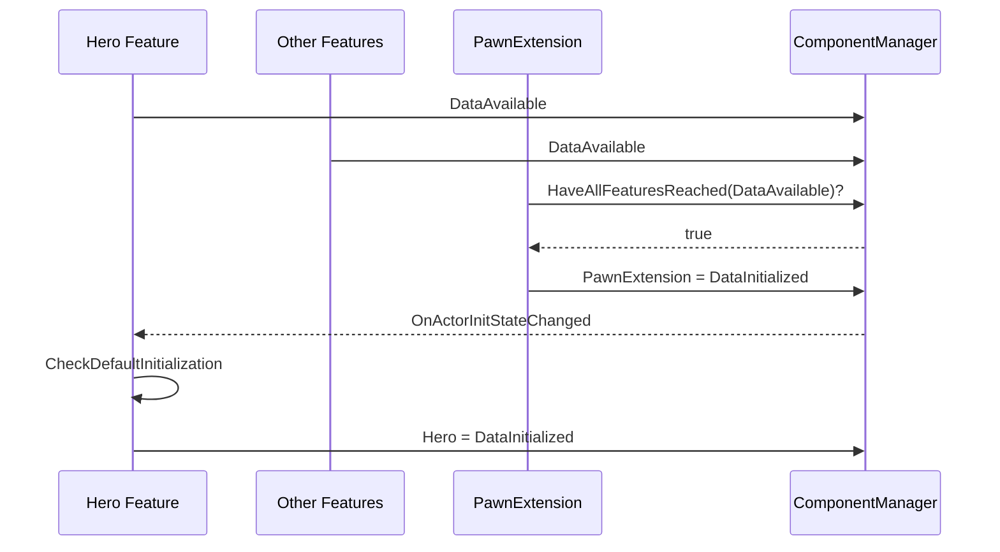
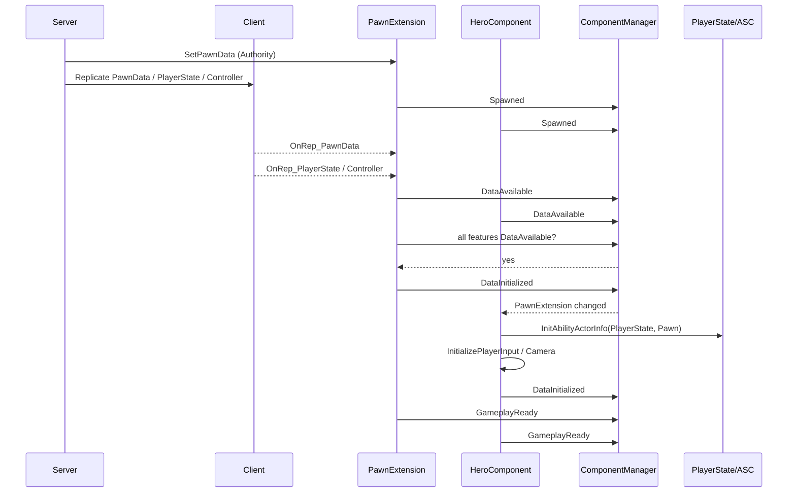

# UE5.8 Lyra 源码解析 41：Pawn 初始化与模块化组件状态机

> Lyra 角色初始化最难的不是某个 API，而是多个复制对象和动态组件可能以不同顺序到达。
> 本篇从 `ULyraPawnExtensionComponent` 与 `ULyraHeroComponent` 出发，解释四段 InitState 如何替代 Delay、Tick 轮询和脆弱的 BeginPlay 假设。
> 知识成熟度：L2（本机 UE 5.8 与 Lyra 5.8 源码、配置已静态核对；运行实验作为后续验证步骤）。

## 元数据

| 项目 | 内容 |
| --- | --- |
| 版本基线 | UE 5.8.0 / CL 55116800 / `++UE5+Release-5.8` |
| Lyra 基线 | 本机 `LyraStarterGame.uproject`：`EngineAssociation=5.8` |
| 项目源码根 | `C:\Users\zhaozhiqi\Documents\Unreal Projects\LyraStarterGame` |
| 引擎源码根 | `C:\Program Files\Epic Games\UE_5.8\Engine` |
| 适用范围 | 多人 Pawn 初始化、PlayerState ASC、模块化组件、重生/换 Pawn、复制乱序排障 |
| 知识成熟度 | L2：项目与引擎源码静态核对完成；双端 PIE 实验步骤明确列出但未宣称已执行 |
| 官方参考 | [Game Framework Component Manager](https://dev.epicgames.com/documentation/en-us/unreal-engine/game-framework-component-manager-in-unreal-engine)、[Abilities in Lyra](https://dev.epicgames.com/documentation/en-us/unreal-engine/abilities-in-lyra-in-unreal-engine) |
| 最后更新 | 2026-08-17（补入 ALyraCharacter 与 GameFeatureAction_AddAbilities 实际源码分析） |

## 一、问题模型：为什么 BeginPlay 不够

一个可操作的网络 Pawn 至少依赖：

- Pawn 自身已经生成并开始游戏；
- 服务器已经选择并设置 `ULyraPawnData`；
- Controller 已 Possess；
- PlayerState 已创建或复制；
- PlayerState 与 Controller 的 Owner 关系正确；
- 本地玩家侧已有 `InputComponent` 和 `ULocalPlayer`；
- GameFeature 动态追加的组件已注册；
- 其他 Feature 已拿到自己的必要数据；
- ASC 的 Owner/Avatar 已初始化；
- 输入、摄像机和扩展输入已经绑定。

这些事件在服务器、Autonomous Proxy 和 Simulated Proxy 上顺序不同。

因此“在 Pawn BeginPlay 一次性初始化全部系统”没有可靠前提。

Lyra 的答案是：每个 Feature 报告自己的线性初始化状态，由 PawnExtension 协调所有 Feature 的会合点。

## 二、核心文件地图

| 文件 | 关键内容 |
| --- | --- |
| `System/LyraGameInstance.cpp` | 注册四段全局 InitState 顺序 |
| `Character/LyraPawnData.h` | PawnClass、AbilitySets、InputConfig、相机、Tag 关系 |
| `Character/LyraPawnExtensionComponent.h/.cpp` | 总协调器、PawnData 复制、ASC Owner/Avatar 绑定 |
| `Character/LyraHeroComponent.h/.cpp` | 玩家控制输入、摄像机和 Hero Feature 状态机 |
| `Character/LyraCharacter.h/.cpp` | Controller/PlayerState/Input 回调转发 |
| `Player/LyraPlayerState.h/.cpp` | ASC Owner、PawnData 和持久能力 |
| `AbilitySystem/LyraAbilitySet.h/.cpp` | Ability/Effect/Attribute 授予与撤销句柄 |
| `GameFeatures/GameFeatureAction_AddAbilities.cpp` | 插件按 Actor 动态授予能力与组件 |
| `GameFeatures/GameFeatureAction_AddInputBinding.cpp` | `NAME_BindInputsNow` 扩展输入 |
| 引擎 `GameFrameworkInitStateInterface.cpp` | `TryToChangeInitState`、`ContinueInitStateChain` |
| 引擎 `GameFrameworkComponentManager.cpp` | Feature 状态存储、通知和扩展句柄 |

## 三、四段状态在哪里注册

`ULyraGameInstance::Init` 取得 `UGameFrameworkComponentManager`，按顺序注册：

```text
InitState.Spawned
→ InitState.DataAvailable
→ InitState.DataInitialized
→ InitState.GameplayReady
```

注册调用指定“插在某状态前/后”的顺序关系。

这四个 Tag 属于整个 GameInstance 的共享状态字典。

它们不是每个组件自行发明的一套状态。

共享顺序使 Component Manager 能判断“已达到该状态或更晚状态”。

## 四、InitState 不是通用玩法状态机

InitState 的特征是：

- 全局注册；
- 线性前进；
- 以 Feature 为单位；
- 主要协调对象生命周期和数据可用性；
- 支持监听另一个 Feature 到达某状态。

它不适合表达：

- 站立/奔跑/跳跃；
- 武器 Idle/Fire/Reload；
- 回合 Warmup/Playing/PostGame；
- AI Patrol/Chase/Attack。

这些应使用动画状态机、Gameplay Ability、Game Phase 或 StateTree 等系统。

## 五、Feature 的身份是什么

一个 Actor 可以拥有多个命名 Feature。

实现 `IGameFrameworkInitStateInterface` 的对象通过 `GetFeatureName` 返回身份。

本机 Lyra 5.8 中：

| 实现 | FeatureName | 职责 |
| --- | --- | --- |
| `ULyraPawnExtensionComponent` | `PawnExtension` | 总协调、PawnData、ASC 桥接 |
| `ULyraHeroComponent` | `Hero` | 玩家输入、摄像机和本地控制 |

其他 GameFeature 动态组件也可实现自己的 Feature。

PawnExtension 不需要知道所有具体组件类型，只需要问 Component Manager：“所有 Feature 是否至少 DataAvailable？”

## 六、底层接口如何推进状态

引擎 `IGameFrameworkInitStateInterface::TryToChangeInitState` 的核心语义：

1. 找到 Actor 和 Component Manager；
2. 查询当前 Feature 状态；
3. 调实现方 `CanChangeInitState`；
4. 允许时把新状态报告给 Manager；
5. 调 `HandleChangeInitState` 执行该过渡的副作用。

`ContinueInitStateChain` 接受一个 Tag 数组。

它从当前状态的下一项开始，连续尝试推进。

遇到第一个 `CanChangeInitState=false` 就停止。

后续某个复制回调或 Feature 通知再次调用 `CheckDefaultInitialization`，链条继续。

这就是事件驱动重试，而不是每帧轮询。

## 七、PawnExtension 是无 Tick 协调器

构造函数明确设置：

```cpp
PrimaryComponentTick.bStartWithTickEnabled = false;
PrimaryComponentTick.bCanEverTick = false;
SetIsReplicatedByDefault(true);
```

因此它不是靠 Tick 检查依赖。

它依赖下列事件重试：

- `BeginPlay`；
- `OnRep_PawnData`；
- Controller 变化；
- PlayerState 复制；
- InputComponent 完成设置；
- 其他 Feature 状态变化。

## 八、PawnExtension 生命周期

### 8.1 OnRegister

`OnRegister` 先确认 Owner 是 Pawn。

随后检查同一个 Pawn 上只能有一个 PawnExtension。

最后调用 `RegisterInitStateFeature`。

注册发生得早，但此时不强行设置 Spawned。

### 8.2 BeginPlay

`BeginPlay` 执行：

```cpp
void ULyraPawnExtensionComponent::BeginPlay()
{
	Super::BeginPlay();

	BindOnActorInitStateChanged(NAME_None, FGameplayTag(), false);
	ensure(TryToChangeInitState(LyraGameplayTags::InitState_Spawned));
	CheckDefaultInitialization();
}
```

监听 `NAME_None` 表示关心该 Actor 上所有 Feature。

### 8.3 EndPlay

`EndPlay` 先 `UninitializeAbilitySystem`，再 `UnregisterInitStateFeature`。

清理顺序保证 Pawn 不再作为 ASC Avatar，且 Feature 委托被解绑。

## 九、PawnData 是角色装配说明

`ULyraPawnData` 是只读 PrimaryDataAsset，包含：

```cpp
TSubclassOf<APawn> PawnClass;
TArray<TObjectPtr<ULyraAbilitySet>> AbilitySets;
TObjectPtr<ULyraAbilityTagRelationshipMapping> TagRelationshipMapping;
TObjectPtr<ULyraInputConfig> InputConfig;
TSubclassOf<ULyraCameraMode> DefaultCameraMode;
```

它回答五个问题：

1. 生成哪种 Pawn；
2. 该角色基础授予哪些能力集合；
3. Ability Tag 之间如何阻塞/取消；
4. 本地输入如何映射；
5. 默认摄像机模式是什么。

它不保存单个玩家的运行时血量、弹药或会话状态。

## 十、PawnData 的写入规则

`ULyraPawnExtensionComponent::SetPawnData` 有三条硬边界：

1. 输入不得为空；
2. 只有 `ROLE_Authority` 可以设置；
3. 已存在 PawnData 时拒绝覆盖并记录错误。

设置后执行：

```text
PawnData = InPawnData
→ Pawn->ForceNetUpdate()
→ CheckDefaultInitialization()
```

客户端通过 `OnRep_PawnData` 重试状态推进。

“一次设置”让初始化定义保持稳定。

如果产品需要运行中换职业，应设计明确的换 Pawn 或重新装配协议，而不是直接覆盖该字段。

## 十一、Spawned → DataAvailable：PawnExtension 门槛

PawnExtension 的 `CanChangeInitState` 在该过渡检查：

- PawnData 必须存在；
- 若 Pawn 有 Authority 或本地控制，Controller 必须存在；
- Simulated Proxy 不要求本地 Controller。

角色矩阵如下：

| 视角 | PawnData | Controller | 原因 |
| --- | --- | --- | --- |
| 服务器 Authority Pawn | 必须 | 必须 | 权威生成和能力归属 |
| Autonomous Proxy | 必须 | 必须 | 本地输入和 PlayerState 配对 |
| Simulated Proxy | 必须 | 不要求本地 Controller | 远端代理不拥有输入 |

这正是不能写一个统一 `if (Controller == nullptr) return` 的原因。

## 十二、DataAvailable → DataInitialized：全 Feature 会合

PawnExtension 调用：

```cpp
Manager->HaveAllFeaturesReachedInitState(
    Pawn,
    InitState_DataAvailable);
```

只有所有已注册 Feature 都至少到达 DataAvailable，协调器才进入 DataInitialized。

这个屏障允许 GameFeature 动态增加新 Feature。

基础 Pawn 不需要硬编码它们的类名。

但也带来一条排障规则：任何 Feature 卡住都会让整个 PawnExtension 卡住。

## 十三、DataInitialized → GameplayReady

PawnExtension 当前直接允许该过渡。

它的 `HandleChangeInitState` 在 DataInitialized 没有执行主要副作用。

真正的 ASC、输入和摄像机初始化由监听该状态的 HeroComponent 完成。

这体现“协调器宣布屏障，具体 Feature 执行职责”的分工。

## 十四、HeroComponent 的职责边界

源码注释把 HeroComponent 定位为：

> 为玩家控制 Pawn（以及模拟玩家的机器人）设置输入和摄像机，并依赖 PawnExtension 协调初始化。

它不负责：

- 选择 Experience；
- 创建 PlayerState；
- 保存 ASC；
- 执行最终伤害；
- 保存 Inventory。

它负责：

- 判断本地输入依赖是否齐全；
- 把 PlayerState ASC 与 Pawn Avatar 对接；
- 建立基础输入映射和 Ability InputTag 绑定；
- 发送 `NAME_BindInputsNow` 让插件追加输入；
- 绑定默认/能力覆盖的摄像机模式。

## 十五、Hero 的 Spawned → DataAvailable 门槛

HeroComponent 检查：

1. `ALyraPlayerState` 必须存在；
2. 非 Simulated Proxy 必须有 Controller；
3. Controller 必须拥有对应 PlayerState；
4. 本地控制且非 Bot 时，必须有 InputComponent；
5. 必须是 `ALyraPlayerController`；
6. PlayerController 必须有 LocalPlayer。

这组门槛同时处理服务器、拥有客户端和远端代理。

### 15.1 为什么检查 PlayerState Owner

只判断 `Controller->PlayerState != nullptr` 不够。

Hero 还检查：

```text
Controller->PlayerState->GetOwner() == Controller
```

这确保 Controller/PlayerState 配对已经完成，不是暂时看到一个尚未正确归属的对象。

### 15.2 为什么 Bot 不需要 LocalPlayer

Bot 可以使用玩家式 Hero 组件和能力，但没有真实本地设备与 LocalPlayer。

所以本地输入门槛显式排除 Bot。

## 十六、Hero 的 DataAvailable → DataInitialized 门槛

Hero 等待：

- `ALyraPlayerState` 有效；
- PawnExtension Feature 已达到 `DataInitialized`。

这看起来像循环：PawnExtension 又在等待所有 Feature DataAvailable。

实际顺序是：

1. Hero 到 DataAvailable；
2. 其他 Feature 到 DataAvailable；
3. PawnExtension 发现全部 DataAvailable，进入 DataInitialized；
4. Hero 收到 PawnExtension 状态通知；
5. Hero 才进入自己的 DataInitialized。



## 十七、DataInitialized 过渡执行什么

HeroComponent 在 `DataAvailable → DataInitialized` 中执行核心装配。

### 17.1 取 Pawn 和 PlayerState

两者都必须有效，否则提前返回。

### 17.2 从 PawnExtension 取 PawnData

Hero 不保存自己的重复 PawnData 指针。

它通过协调器取得同一事实源。

### 17.3 初始化 ASC

调用：

```cpp
PawnExtComp->InitializeAbilitySystem(
    LyraPS->GetLyraAbilitySystemComponent(),
    LyraPS);
```

这里：

- ASC 实例来自 PlayerState；
- OwnerActor 是 PlayerState；
- AvatarActor 是当前 Pawn。

### 17.4 初始化本地输入

有 `ALyraPlayerController` 且 Pawn InputComponent 有效时，调用 `InitializePlayerInput`。

远端 Simulated Proxy 不执行本地输入绑定。

### 17.5 绑定摄像机模式

若 PawnData 有效并能找到 `ULyraCameraComponent`，将 DetermineCameraMode Delegate 绑定到 Hero。

## 十八、为什么 ASC 放 PlayerState

`ALyraPlayerState` 构造时创建 `ULyraAbilitySystemComponent`。

ASC 开启复制，并使用 `EGameplayEffectReplicationMode::Mixed`。

PlayerState 还持有基础 AttributeSet。

设计收益：

- Pawn 死亡时 ASC 可以继续存在；
- 重生后只更换 Avatar；
- 切换 Pawn 时保留玩家级能力、属性或效果；
- PlayerState 本来就是多人玩家持久复制身份。

设计代价：

- 每次 Possess/UnPossess 都要正确更新 Avatar；
- Pawn 专属能力必须能撤销；
- 客户端可能短暂同时看到旧 Pawn 和新 Pawn；
- 获取 ASC 不能只在 Pawn 上 FindComponent。

## 十九、InitializeAbilitySystem 的精确语义

`ULyraPawnExtensionComponent::InitializeAbilitySystem` 执行：

1. 校验 ASC 和 OwnerActor；
2. 相同 ASC 已初始化则直接返回；
3. 当前有其他 ASC 时先反初始化；
4. 读取 ASC 当前 Avatar；
5. 若旧 Avatar 是另一个 Pawn，处理客户端延迟重叠；
6. 缓存新 ASC；
7. `InitAbilityActorInfo(InOwnerActor, Pawn)`；
8. 从 PawnData 设置 TagRelationshipMapping；
9. 广播 `OnAbilitySystemInitialized`。

### 19.1 旧 Avatar 重叠

源码明确说明一种客户端延迟场景：

新 Pawn 已生成并被 Possess，但死亡的旧 Pawn 还没被移除。

如果 ASC 仍指向旧 Avatar，代码找到旧 PawnExtension 并调用 `UninitializeAbilitySystem`。

它断言旧 Avatar 不应有 Authority。

服务器权威侧不应出现两个 Pawn 争用同一 ASC Avatar 的状态。

## 二十、UninitializeAbilitySystem 的边界

只有当前组件 Owner 仍是 ASC Avatar 时才执行完整清理。

清理包括：

1. 取消能力，但忽略带 `Ability.Behavior.SurvivesDeath` 的类型；
2. 清空能力输入缓存；
3. 移除所有 Gameplay Cues；
4. OwnerActor 仍有效时只把 Avatar 设空；
5. OwnerActor 无效时清空整个 ActorInfo；
6. 广播 Uninitialized；
7. 清空组件缓存指针。

“SurvivesDeath”体现了 Owner/Avatar 分离的价值：

一些 PlayerState 级能力可以跨 Pawn 死亡存活。

## 二十一、ALyraCharacter 如何转发生命周期事件

Character 不自己复制一套初始化状态机。

它把关键事件转给 PawnExtension：

| Character 回调 | PawnExtension 动作 |
| --- | --- |
| `PossessedBy` | `HandleControllerChanged` |
| `UnPossessed` | Controller 变化/ASC 清理相关路径 |
| `OnRep_Controller` | `HandleControllerChanged` |
| `OnRep_PlayerState` | `HandlePlayerStateReplicated` |
| `SetupPlayerInputComponent` | `SetupPlayerInputComponent` |

这样无论服务器本地回调还是客户端 OnRep，最终都回到同一个 `CheckDefaultInitialization`。

### 21.1 源码补全：角色本体的转发、死亡和快速复制

前文不能只把 `ALyraCharacter` 当成“回调转发器”。它还承担死亡收尾、移动模式 Tag 和 FastSharedReplication 三类实际职责。下面直接展开本机 `LyraCharacter.cpp` 的关键实现：

```cpp
void ALyraCharacter::PossessedBy(AController* NewController)
{
	const FGenericTeamId OldTeamID = MyTeamID;

	Super::PossessedBy(NewController);
	PawnExtComponent->HandleControllerChanged();

	if (ILyraTeamAgentInterface* ControllerAsTeamProvider = Cast<ILyraTeamAgentInterface>(NewController))
	{
		MyTeamID = ControllerAsTeamProvider->GetGenericTeamId();
		ControllerAsTeamProvider->GetTeamChangedDelegateChecked().AddDynamic(this, &ThisClass::OnControllerChangedTeam);
	}
	ConditionalBroadcastTeamChanged(this, OldTeamID, MyTeamID);
}

void ALyraCharacter::OnRep_PlayerState()
{
	Super::OnRep_PlayerState();
	PawnExtComponent->HandlePlayerStateReplicated();
}

void ALyraCharacter::SetupPlayerInputComponent(UInputComponent* PlayerInputComponent)
{
	Super::SetupPlayerInputComponent(PlayerInputComponent);
	PawnExtComponent->SetupPlayerInputComponent();
}
```

这段代码说明：服务器 `PossessedBy`、客户端 `OnRep_PlayerState` 和输入组件建立并不是三套初始化逻辑；它们都把事件交给 `PawnExtComponent`，由同一套 InitState 门控继续推进。`PossessedBy` 还同步 Controller 的队伍委托，避免 Pawn 自己维护一份会漂移的队伍来源。

死亡路径也不是简单 `Destroy()`。先禁用输入、碰撞和移动，再等下一帧触发蓝图事件，最后只在自己仍是 ASC Avatar 时解绑：

```cpp
void ALyraCharacter::OnDeathStarted(AActor*)
{
	DisableMovementAndCollision();
}

void ALyraCharacter::OnDeathFinished(AActor*)
{
	GetWorld()->GetTimerManager().SetTimerForNextTick(this, &ThisClass::DestroyDueToDeath);
}

void ALyraCharacter::UninitAndDestroy()
{
	if (GetLocalRole() == ROLE_Authority)
	{
		DetachFromControllerPendingDestroy();
		SetLifeSpan(0.1f);
	}

	if (ULyraAbilitySystemComponent* LyraASC = GetLyraAbilitySystemComponent())
	{
		if (LyraASC->GetAvatarActor() == this)
		{
			PawnExtComponent->UninitializeAbilitySystem();
		}
	}

	SetActorHiddenInGame(true);
}
```

这里的 `GetAvatarActor() == this` 是关键保护：如果同一个 PlayerState 已经把 ASC 切换到新 Pawn，旧 Pawn 的 EndPlay 不能把新 Avatar 一起清掉。移动模式 Tag 和共享移动复制也由角色本体实际执行，而不是文档中的抽象名：

```cpp
void ALyraCharacter::SetMovementModeTag(EMovementMode MovementMode, uint8 CustomMovementMode, bool bTagEnabled)
{
	if (ULyraAbilitySystemComponent* LyraASC = GetLyraAbilitySystemComponent())
	{
		const FGameplayTag* MovementModeTag = nullptr;
		if (MovementMode == MOVE_Custom)
		{
			MovementModeTag = LyraGameplayTags::CustomMovementModeTagMap.Find(CustomMovementMode);
		}
		else
		{
			MovementModeTag = LyraGameplayTags::MovementModeTagMap.Find(MovementMode);
		}

		if (MovementModeTag && MovementModeTag->IsValid())
		{
			LyraASC->SetLooseGameplayTagCount(*MovementModeTag, bTagEnabled ? 1 : 0);
		}
	}
}

bool ALyraCharacter::UpdateSharedReplication()
{
	if (GetLocalRole() == ROLE_Authority)
	{
		FSharedRepMovement SharedMovement;
		if (SharedMovement.FillForCharacter(this))
		{
			if (!SharedMovement.Equals(LastSharedReplication, this))
			{
				LastSharedReplication = SharedMovement;
				SetReplicatedMovementMode(SharedMovement.RepMovementMode);
				FastSharedReplication(SharedMovement);
			}
			return true;
		}
	}
	return false;
}
```

因此 41 篇的实际覆盖现在包括：状态机事件转发、死亡解绑、移动 Tag 写入和“仅变化才快速复制”的服务器路径；附录中的完整文件不再只是供读者自行回读的指针。

## 二十二、PlayerState 的 PawnData 与能力授予

`ALyraPlayerState` 在 Experience Loaded 后由 GameMode 取得对应 PawnData，并调用 `SetPawnData`。

该操作只应在 Authority 执行，且 PawnData 不应重复覆盖。

PlayerState 遍历 PawnData 的 `AbilitySets`，调用：

```cpp
AbilitySet->GiveToAbilitySystem(
    AbilitySystemComponent,
    nullptr);
```

这些更偏“玩家角色定义随 PlayerState 持有”的能力。

GameFeature 或 Equipment 临时授予通常会保存 `FLyraAbilitySet_GrantedHandles`，以便卸载时撤销。

是否保存句柄取决于授予来源生命周期。

## 二十三、AbilitySet 为什么保存三类句柄

`FLyraAbilitySet_GrantedHandles` 记录：

- `FGameplayAbilitySpecHandle`；
- `FActiveGameplayEffectHandle`；
- 动态创建的 AttributeSet 指针。

`TakeFromAbilitySystem` 只能在 Owner Authority 执行。

它依次：

1. `ClearAbility`；
2. `RemoveActiveGameplayEffect`；
3. `RemoveSpawnedAttribute`；
4. 清空本地句柄数组。

这是一种明确的“资源获取即登记，生命周期结束即释放”模式。

## 二十四、基础输入初始化

Hero 的 `InitializePlayerInput` 先取得：

- Pawn；
- PlayerController；
- `ULyraLocalPlayer`；
- `UEnhancedInputLocalPlayerSubsystem`。

随后调用 `Subsystem->ClearAllMappings()`。

然后从 PawnData 取 `ULyraInputConfig`。

对 Hero 自身的 DefaultInputMappings：

- 软加载 MappingContext；
- 可选注册到 Enhanced Input UserSettings；
- `AddMappingContext(IMC, Priority, Options)`。

最后使用 `ULyraInputComponent` 绑定 Ability Actions 和原生 Move/Look/Crouch/AutoRun。

## 二十五、NAME_BindInputsNow 为什么必要

Hero 完成基础输入后：

```text
bReadyToBindInputs = true
→ 向 PlayerController 发送 BindInputsNow
→ 向 Pawn 发送 BindInputsNow
```

GameFeature 输入 Action 可能：

- 在 Pawn 出现前已激活；
- 在 Pawn 出现后才激活；
- 在基础输入准备前收到 ExtensionAdded；
- 在基础输入准备后收到 BindInputsNow。

`UGameFeatureAction_AddInputBinding::HandlePawnExtension` 同时处理：

- `ExtensionAdded`；
- `BindInputsNow`；
- `ExtensionRemoved`；
- `ReceiverRemoved`。

这使早到和晚到两种顺序都能收敛。

## 二十六、扩展输入的清理

AddInputBinding Action 按 ChangeContext 保存：

- ExtensionRequestHandles；
- 已增加输入的 Pawn 弱引用。

停用时 `Reset`：

1. 清空扩展句柄；
2. 遍历 Pawn；
3. 调 Hero `RemoveAdditionalInputConfig`；
4. 从活动集合移除。

输入追加与移除必须对称，否则切换 Experience 后会残留重复绑定。

## 二十七、角色初始化时序图



图中复制事件顺序不是保证顺序，只展示所有门槛最终会合。

## 二十八、角色视角矩阵

| 初始化事项 | Authority | Autonomous Proxy | Simulated Proxy |
| --- | --- | --- | --- |
| 设置 PawnData | 是 | 否，接收复制 | 否，接收复制 |
| 要求 Controller | 是 | 是 | 否 |
| 要求 LocalPlayer/Input | Dedicated 无；Listen 本地玩家需要 | 是 | 否 |
| 初始化 ASC ActorInfo | 是 | 是 | 是，用于复制表现/标签 |
| 绑定本地输入 | Listen 本地玩家可能 | 是 | 否 |
| 权威授予 AbilitySet | 是 | 否 | 否 |
| 摄像机控制 | 本地视角时 | 是 | 通常否 |

不要把“客户端”视为单一角色。

Autonomous Proxy 和 Simulated Proxy 的初始化条件不同。

## 二十九、为什么不用 Tick 或 Delay

固定 Delay 有四个问题：

1. 网络环境变化时不可靠；
2. 快机器白等，慢机器仍失败；
3. 无法说明究竟缺哪个依赖；
4. 多个组件各自 Delay 会形成组合竞态。

Tick 轮询虽然最终可能成功，但：

- 每帧浪费检查；
- 依赖隐式；
- 初始化完成后还需正确禁用；
- 很难处理 Feature 动态增加和移除。

InitState 把依赖门槛写在 `CanChangeInitState`，把副作用写在 `HandleChangeInitState`，把重试绑定到真实事件。

## 三十、排障：状态卡在哪里

### 30.1 卡在 Spawned 前

检查：

- 组件是否位于 Game World；
- `OnRegister` 是否成功；
- Owner 是否是 Pawn；
- BeginPlay 是否执行。

### 30.2 PawnExtension 卡在 Spawned

检查：

- PawnData 是否为空；
- Authority 是否调用 SetPawnData；
- Autonomous/Authority 是否已有 Controller。

### 30.3 Hero 卡在 Spawned

检查：

- PlayerState 是否复制；
- Controller 与 PlayerState Owner 是否配对；
- 本地玩家是否已有 InputComponent、LyraPlayerController 和 LocalPlayer。

### 30.4 PawnExtension 卡在 DataAvailable

枚举 Actor 上所有已注册 Feature。

找到尚未 DataAvailable 的 Feature，再检查它自己的门槛。

不要只盯 PawnExtension。

### 30.5 Hero 卡在 DataAvailable

检查 PawnExtension 是否已经 DataInitialized。

若没有，回到上一项找卡住的其他 Feature。

### 30.6 到 GameplayReady 但无输入

检查：

- `DefaultInputComponentClass` 是否仍为 `ULyraInputComponent`；
- PawnData InputConfig 是否有效；
- `InitializePlayerInput` 是否执行；
- `bReadyToBindInputs` 是否变为 true；
- `NAME_BindInputsNow` 是否被发送；
- MappingContext 的平台条件。

## 三十一、建议日志字段

每次状态变化至少打印：

```text
World
NetMode
Actor
LocalRole / RemoteRole
IsLocallyControlled
FeatureName
CurrentState → DesiredState
PawnData
Controller
PlayerState
InputComponent
ASC Owner / Avatar
```

只打印“初始化失败”没有排障价值。

## 三十二、静态验证命令

```powershell
$Lyra = 'C:\Users\zhaozhiqi\Documents\Unreal Projects\LyraStarterGame'
$UE = 'C:\Program Files\Epic Games\UE_5.8\Engine'

rg -n "RegisterInitState" "$Lyra\Source\LyraGame\System\LyraGameInstance.cpp"

rg -n "SetPawnData|OnRep_PawnData|CanChangeInitState|HaveAllFeaturesReachedInitState|InitializeAbilitySystem" `
  "$Lyra\Source\LyraGame\Character\LyraPawnExtensionComponent.cpp"

rg -n "CanChangeInitState|HandleChangeInitState|InitializePlayerInput|NAME_BindInputsNow" `
  "$Lyra\Source\LyraGame\Character\LyraHeroComponent.cpp"

rg -n "ContinueInitStateChain|TryToChangeInitState" `
  "$UE\Plugins\Runtime\ModularGameplay\Source\ModularGameplay"

rg -n "GiveToAbilitySystem|TakeFromAbilitySystem" `
  "$Lyra\Source\LyraGame\AbilitySystem\LyraAbilitySet.cpp"
```

## 三十三、断点实验

### 实验 A：Listen Server + 1 Client

在两端的两个 `CanChangeInitState` 下断点。

分别记录 Authority、Autonomous Proxy、Simulated Proxy 的否决条件。

不要假设两端状态到达顺序一致。

### 实验 B：延迟 PlayerState

使用网络模拟增加延迟。

观察 Hero 停在 Spawned，`OnRep_PlayerState` 后再次推进。

### 实验 C：重生时旧 Avatar 重叠

在 `InitializeAbilitySystem` 的 ExistingAvatar 分支下断点。

观察客户端是否先看到新 Pawn，再移除旧 Pawn。

### 实验 D：动态 Feature

创建一个实现 InitState 接口的测试组件，由 GameFeature AddComponents 注入。

让它暂时拒绝 DataAvailable，确认 PawnExtension 也停下。

解除门槛并主动 `CheckDefaultInitialization`，确认整条链继续。

## 三十四、扩展一个新 Feature 的模板

新组件应：

1. 继承合适的 GameFrameworkComponent/PawnComponent；
2. 实现 `IGameFrameworkInitStateInterface`；
3. 返回稳定唯一的 FeatureName；
4. `OnRegister` 调 `RegisterInitStateFeature`；
5. `BeginPlay` 进入 Spawned 并检查默认初始化；
6. 在复制回调、依赖通知中重试；
7. `CanChangeInitState` 只判断门槛，不执行大副作用；
8. `HandleChangeInitState` 执行对应过渡副作用；
9. `EndPlay` 撤销资源并 Unregister；
10. 不用 Tick 等待其他 Feature。

```cpp
void ULyraPawnExtensionComponent::CheckDefaultInitialization()
{
	// Before checking our progress, try progressing any other features we might depend on
	CheckDefaultInitializationForImplementers();

	static const TArray<FGameplayTag> StateChain = { LyraGameplayTags::InitState_Spawned, LyraGameplayTags::InitState_DataAvailable, LyraGameplayTags::InitState_DataInitialized, LyraGameplayTags::InitState_GameplayReady };

	// This will try to progress from spawned (which is only set in BeginPlay) through the data initialization stages until it gets to gameplay ready
	ContinueInitStateChain(StateChain);
}
```

这是项目 `LyraPawnExtensionComponent.cpp` 的真实实现：它先推进依赖的实现者，再用四个 Native GameplayTag 调 `ContinueInitStateChain`；新组件不能照抄不存在的 `UMyPawnFeature` 或自造 Tag。

## 三十五、反模式

1. 在 BeginPlay 假设 PlayerState 已复制；
2. 用 0.2 秒 Delay 等 Controller；
3. 在 Simulated Proxy 强制要求本地 Controller；
4. 在 `CanChangeInitState` 创建对象或授予能力；
5. 修改状态却不向 Component Manager 报告；
6. FeatureName 随对象实例变化；
7. 覆盖 PawnData 而不重建角色；
8. ASC 放 PlayerState，却忘记更新 Avatar；
9. 新 Pawn 接管 ASC 时不清理旧 Avatar；
10. 动态输入只添加不移除；
11. 临时 AbilitySet 不保存撤销句柄；
12. EndPlay 先销毁依赖，再解绑回调。

## 三十六、验收清单

- [ ] 能解释为什么 BeginPlay 不足以完成网络 Pawn 初始化；
- [ ] 能说出四段 InitState；
- [ ] 能区分 PawnExtension 与 Hero 的职责；
- [ ] 能列出两个组件进入 DataAvailable 的不同门槛；
- [ ] 能解释 `HaveAllFeaturesReachedInitState` 屏障；
- [ ] 能解释 PlayerState ASC 的 Owner 与 Pawn Avatar；
- [ ] 能解释旧 Avatar 重叠处理；
- [ ] 能列出 ASC 反初始化动作；
- [ ] 能解释 `NAME_BindInputsNow` 的早到/晚到兼容；
- [ ] 能设计一个不使用 Tick/Delay 的新 Feature。

## 三十七、动画实例基类与 Tag 属性映射（LYRA 批次 2 补深挖）

> 本篇批次 2 补深挖两件小事，但它们解释了 Lyra 的一条复用范式：GAS 的 Gameplay Tag 应该如何驱动动画蓝图层。
> 覆盖 `Source\LyraGame\Animation\` 下仅有的两个文件 `LyraAnimInstance.h`（46 行）与 `LyraAnimInstance.cpp`（65 行），全文见附录文件 19/20。
> 知识成熟度：L2。本行源布局与调用链基于本机 Lyra 5.8 + UE 5.8 源码静态核对（A 级来源）；动画资产内的具体 Tag 接线为引擎运行态行为，需在真实动画蓝图层中验证（待验证）。

### 37.1 为什么需要这个基类

动画蓝图层通常需要知道一叠“当前状态”才能挑姿态：

- 是否活着 / 是否受控；
- 移动模式（行走/飞行/游泳）与地面距离；
- 是否蹲伏、是否在状态 Tag 覆盖中。

Lyra 的做法不是让每个动画蓝图层手动去 `GetAbilitySystemComponent` 再查 Tag，而是用 `ULyraAnimInstance` 作统一基类，把“GAS Tag → 动画属性”的桥放在一个可复用的位置。

它只做两件确定的事：

1. 用一个 `FGameplayTagBlueprintPropertyMap` 把 Gameplay Tag 映射到动画蓝图层属性；
2. 每帧从 `ULyraCharacterMovementComponent` 拉取 `GroundDistance`。

### 37.2 桥：FGameplayTagBlueprintPropertyMap

`ULyraAnimInstance.h` 声明（节选）：

```cpp
// Gameplay tags that can be mapped to blueprint variables. The variables will automatically update as the tags are added or removed.
// These should be used instead of manually querying for the gameplay tags.
UPROPERTY(EditDefaultsOnly, Category = "GameplayTags")
FGameplayTagBlueprintPropertyMap GameplayTagPropertyMap;

UPROPERTY(BlueprintReadOnly, Category = "Character State Data")
float GroundDistance = -1.0f;
```

`FGameplayTagBlueprintPropertyMap` 是引擎（UE 5.8，`GameplayEffectTypes.h` 约 1480 行）提供的映射容器：

- 每一项 `FGameplayTagBlueprintPropertyMapping` 记录一个 `TagToMap` 与要写入的蓝图层属性；
- 仅支持 **bool / int / float** 三种属性类型；
- `Initialize(Owner, ASC)` 后会在 ASC 上绑定委托，Tag 计数变化时自动把新计数写入对应属性，无需动画蓝图层每帧查询；
- 它内含裸委托句柄指针，不能放进 `TArray` 等会搬移地址的容器。

这套机制把“Tag 存在/计数”变成动画蓝图层可直接读的布尔或数值属性，正是“GAS 状态 → 动画表现”的标准桥。

### 37.3 InitializeWithAbilitySystem 调用链

`NativeInitializeAnimation` 首次初始化动画时自动探测 ASC（`LyraAnimInstance.cpp`）：

```cpp
void ULyraAnimInstance::NativeInitializeAnimation()
{
	Super::NativeInitializeAnimation();

	if (AActor* OwningActor = GetOwningActor())
	{
		if (UAbilitySystemComponent* ASC = UAbilitySystemGlobals::GetAbilitySystemComponentFromActor(OwningActor))
		{
			InitializeWithAbilitySystem(ASC);
		}
	}
}
```

`UAbilitySystemGlobals::GetAbilitySystemComponentFromActor` 通过 `IAbilitySystemInterface`（并回退到 FindComponent）自动找 Ownership Actor 上的 ASC，因此动画实例基类**无需手动接线**，只要 Owner Pawn 有 ASC 即可触发。随后送入：

```cpp
void ULyraAnimInstance::InitializeWithAbilitySystem(UAbilitySystemComponent* ASC)
{
	check(ASC);

	GameplayTagPropertyMap.Initialize(this, ASC);
}
```

这里 `Initialize` 完成属性映射与 ASC 委托的绑定。

**与 41 篇 ASC 初始化屏障的关系**：`NativeInitializeAnimation` 是被动探测路径。另一条主动路径在 `ULyraAbilitySystemComponent::InitAbilityActorInfo` 内——当 Pawn avatar 变化（`bHasNewPawnAvatar`）时，代码对 `ActorInfo->GetAnimInstance()` 做 `Cast<ULyraAnimInstance>` 后直接调用 `InitializeWithAbilitySystem`（本机 `LyraAbilitySystemComponent.cpp` 第 76–79 行）：

```cpp
if (ULyraAnimInstance* LyraAnimInst = Cast<ULyraAnimInstance>(ActorInfo->GetAnimInstance()))
{
	LyraAnimInst->InitializeWithAbilitySystem(this);
}
```

这条路径由 41 篇主角事件串联：Hero 在 `DataAvailable → DataInitialized` 调 `PawnExtComp->InitializeAbilitySystem(ASC, PlayerState)`（见第十七、十九、二十部分），其中 PawnExtension 对 ASC 调 `InitAbilityActorInfo(OwnerActor, Pawn)`，进入上面的 AnimInstance 桥接。即动画蓝图层之所以“一 Possess 就有 Tag 属性”，实质建在四段 InitState 的会合点上。

### 37.4 NativeUpdateAnimation：GroundDistance

每帧更新只负责一小块表现数据：

```cpp
void ULyraAnimInstance::NativeUpdateAnimation(float DeltaSeconds)
{
	Super::NativeUpdateAnimation(DeltaSeconds);

	const ALyraCharacter* Character = Cast<ALyraCharacter>(GetOwningActor());
	if (!Character)
	{
		return;
	}

	ULyraCharacterMovementComponent* CharMoveComp = CastChecked<ULyraCharacterMovementComponent>(Character->GetCharacterMovement());
	const FLyraCharacterGroundInfo& GroundInfo = CharMoveComp->GetGroundInfo();
	GroundDistance = GroundInfo.GroundDistance;
}
```

- Owner 不是 `ALyraCharacter`（如载具）则直接返回，不假设任何角色；
- `GetGroundInfo` 来自 `ULyraCharacterMovementComponent`，返回带 `LastUpdateFrame` 缓存的 `FLyraCharacterGroundInfo`（内含 `GroundDistance` 与一次 `GroundHitResult`），只在需要时刷新，避免每帧重复物理查询；
- `GroundDistance` 初值 `-1.0f`，未更新前即可作为“未知/无效距离”的哨兵值。

### 37.5 WITH_EDITOR 下的资产校验

编辑器构建里重写 `IsDataValid`，把 Tag→属性映射的配置错误提前暴露：

```cpp
EDataValidationResult ULyraAnimInstance::IsDataValid(FDataValidationContext& Context) const
{
	Super::IsDataValid(Context);

	GameplayTagPropertyMap.IsDataValid(this, Context);

	return ((Context.GetNumErrors() > 0) ? EDataValidationResult::Invalid : EDataValidationResult::Valid);
}
```

`GameplayTagPropertyMap.IsDataValid(this, Context)` 会校验每个映射的 Tag 是否有效、目标属性是否存在且类型合法。错误被写入 `FDataValidationContext`，最终反馈为 `Invalid`。

这正是 **UObject::IsDataValid 资产校验链**上的一环，与 47 篇的 LyraEditor 校验器互补：47 篇的 `UEditorValidator`（`LyraEditor` 模块）面向项目级/批处理（P4 变更集、`EDataValidationUsecase::Commandlet`）的资产集合；这里的 `IsDataValid` 是单资产在编辑器内保存/校验时由 `DataValidation` 子系统调用的资产内建校验。两者归入同一引擎校验生态。

### 37.6 分工边界声明

动画蓝图层（资产侧）与 C++ 基类的边界明确：

| 侧 | 负责 | 不负责 |
| --- | --- | --- |
| `ULyraAnimInstance`（C++ 基类） | 探测 ASC、绑 Tag→属性桥、维护数据来源 | 具体姿态逻辑、混合权重、状态机节点 |
| 动画蓝图层（资产） | 用映射出来的 bool/float 属性挑选/混合姿态 | 查询 Tag、拉取 ASC、每帧地面查询 |

基类只保证“数据以可读属性形式存在”，动画蓝图层只消费属性，不碰 GAS 查询细节。

### 源码补全：GameFeatureAction_AddAbilities 的注册、授予与回收

`GameFeatureAction_AddAbilities` 也不再只以附录形式存在。它的核心不是“配置表里有 GrantedAbilities”，而是把 Actor 扩展事件接到授予和回收两个对称路径：

```cpp
void UGameFeatureAction_AddAbilities::AddToWorld(
	const FWorldContext& WorldContext,
	const FGameFeatureStateChangeContext& ChangeContext)
{
	UWorld* World = WorldContext.World();
	UGameInstance* GameInstance = WorldContext.OwningGameInstance;
	FPerContextData& ActiveData = ContextData.FindOrAdd(ChangeContext);

	if (GameInstance && World && World->IsGameWorld())
	{
		if (UGameFrameworkComponentManager* ComponentMan =
			UGameInstance::GetSubsystem<UGameFrameworkComponentManager>(GameInstance))
		{
			int32 EntryIndex = 0;
			for (const FGameFeatureAbilitiesEntry& Entry : AbilitiesList)
			{
				if (!Entry.ActorClass.IsNull())
				{
					UGameFrameworkComponentManager::FExtensionHandlerDelegate Delegate =
						UGameFrameworkComponentManager::FExtensionHandlerDelegate::CreateUObject(
							this, &UGameFeatureAction_AddAbilities::HandleActorExtension,
							EntryIndex, ChangeContext);
					ActiveData.ComponentRequests.Add(
						ComponentMan->AddExtensionHandler(Entry.ActorClass, Delegate));
					++EntryIndex;
				}
			}
		}
	}
}
```

收到 `ExtensionAdded` 或 `LyraAbilityReady` 后，真正的授予只在 Authority 执行，并且用 `ActiveExtensions` 防止同一 Actor 重复授予：

```cpp
void UGameFeatureAction_AddAbilities::AddActorAbilities(
	AActor* Actor,
	const FGameFeatureAbilitiesEntry& AbilitiesEntry,
	FPerContextData& ActiveData)
{
	check(Actor);
	if (!Actor->HasAuthority() || ActiveData.ActiveExtensions.Find(Actor))
	{
		return;
	}

	if (UAbilitySystemComponent* ASC =
		FindOrAddComponentForActor<UAbilitySystemComponent>(Actor, AbilitiesEntry, ActiveData))
	{
		FActorExtensions AddedExtensions;
		for (const FLyraAbilityGrant& Ability : AbilitiesEntry.GrantedAbilities)
		{
			if (!Ability.AbilityType.IsNull())
			{
				AddedExtensions.Abilities.Add(
					ASC->GiveAbility(FGameplayAbilitySpec(Ability.AbilityType.LoadSynchronous())));
			}
		}

		for (const FLyraAttributeSetGrant& Grant : AbilitiesEntry.GrantedAttributes)
		{
			if (TSubclassOf<UAttributeSet> SetType = Grant.AttributeSetType.LoadSynchronous())
			{
				UAttributeSet* NewSet = NewObject<UAttributeSet>(ASC->GetOwner(), SetType);
				if (UDataTable* InitData = Grant.InitializationData.LoadSynchronous())
				{
					NewSet->InitFromMetaDataTable(InitData);
				}
				AddedExtensions.Attributes.Add(NewSet);
				ASC->AddAttributeSetSubobject(NewSet);
			}
		}

		ULyraAbilitySystemComponent* LyraASC = CastChecked<ULyraAbilitySystemComponent>(ASC);
		for (const TSoftObjectPtr<const ULyraAbilitySet>& SetPtr : AbilitiesEntry.GrantedAbilitySets)
		{
			if (const ULyraAbilitySet* Set = SetPtr.Get())
			{
				Set->GiveToAbilitySystem(LyraASC,
					&AddedExtensions.AbilitySetHandles.AddDefaulted_GetRef());
			}
		}
		ActiveData.ActiveExtensions.Add(Actor, AddedExtensions);
	}
}
```

停用时 `RemoveActorAbilities` 按同一批句柄清理 Ability、AttributeSet 和 AbilitySet。这样 GameFeature 的生命周期才真正闭合：扩展注册不是永久副作用，配置错误也不会在重复激活时叠加。

### 37.7 复用范式小结：为什么桥放在 AnimInstance 基类

- **一处接线，多处复用**：所有继承 `ULyraAnimInstance` 的动画蓝图层自动获得 Tag 属性映射能力，不需要各自写探测代码；
- **资产编辑器可见**：`EditDefaultsOnly` + 编辑器校验让美术/动画在蓝图层里直接配置 Tag 映射并得到反馈；
- **与 GAS 生命周期对齐**：桥的绑定与 ASC 初始化/新 Pawn avatar 绑定同源，避免动画蓝图层在 ASC 尚未就绪时拿到空指针或漏读 Tag；
- **表现与逻辑解耦**：GAS 负责状态语义，动画消费标量/布尔，两者只通过 Tag 映射（配置）和 `GroundDistance`（C++ 属性）衔接。

## 三十八、术语速查

| 术语 | 含义 |
| --- | --- |
| AnimInstance | 动画蓝图层实例，驱动骨骼网格的动画状态机 |
| GameplayTagBlueprintPropertyMap | GAS 把 Gameplay Tag 映射到蓝图动画属性（bool/int/float）的引擎容器 |
| GameplayTagBlueprintPropertyMapping | 上述容器中的单条 Tag→属性映射条目 |
| InitializeWithAbilitySystem | ULyraAnimInstance 把 GameplayTagPropertyMap 绑定到 ASC 的入口 |
| NativeInitializeAnimation | AnimInstance 首次初始化回调，本文用它经 UAbilitySystemGlobals 探测 ASC |
| NativeUpdateAnimation | AnimInstance 每帧更新回调，本文用它拉取 GroundDistance |
| GroundDistance | 角色到地面的距离，供动画蓝图层做落地/悬空姿态 |
| FLyraCharacterGroundInfo | LyraCharacterMovementComponent 的带缓存地面信息结构（LastUpdateFrame + GroundHitResult + GroundDistance） |
| IsDataValid | UObject 编辑器资产校验钩子，编辑器校验子系统在保存/校验时调用 |

## 三十九、关联阅读

- [39-Lyra源码总览与阅读路线](39-Lyra源码总览与阅读路线.md)：教程入口。
- [40-Lyra-Experience与GameFeature源码](40-Lyra-Experience与GameFeature源码.md)：Pawn 出生前的装配屏障。
- [42-Lyra-输入GAS与武器战斗源码](42-Lyra-输入GAS与武器战斗源码.md)：初始化完成后的输入和能力链。
- [03-Actor与Component生命周期源码](03-Actor与Component生命周期源码.md)：Pawn/Component 底层生命周期。
- [05-GAS能力系统源码](05-GAS能力系统源码.md)：ASC ActorInfo 与能力底层。
- [08-ModularGameplay模块化玩法](../03-游戏玩法编程/08-ModularGameplay模块化玩法.md)：概念层实践。
- [45-Lyra-相机音频与游戏阶段源码](45-Lyra-相机音频与游戏阶段源码.md)：Hero 绑定摄像机模式的模式栈实现。
- [46-Lyra-AI机器人与队伍源码](46-Lyra-AI机器人与队伍源码.md)：Bot 不需要 LocalPlayer 的控制器与队伍实现。
- [47-Lyra-调试工具与扩展源码](47-Lyra-调试工具与扩展源码.md)：Pawn/组件调试与开发者设置入口。
- [48-Lyra扩展插件源码](48-Lyra扩展插件源码.md)：ModularGameplayActors 等扩展插件实现（模块化组件概念的插件侧）。

## 四十、权威来源

- [Game Framework Component Manager](https://dev.epicgames.com/documentation/en-us/unreal-engine/game-framework-component-manager-in-unreal-engine)
- [Abilities in Lyra](https://dev.epicgames.com/documentation/en-us/unreal-engine/abilities-in-lyra-in-unreal-engine)
- [Gameplay Ability System](https://dev.epicgames.com/documentation/en-us/unreal-engine/gameplay-ability-system-for-unreal-engine)


## 附录：核心文件完整源码

> 收录原则：本附录把正文直接分析的 LyraStarterGame 5.8 项目源码文件逐字完整收录（未删改，保留 Epic 版权头），正文中的"节选"负责解释调用链，本附录提供全文，二者配合阅读。引擎层（`Engine/`）文件体量过大且不属于项目教程主体，仍按正文的路径+符号检索方式引用，不在此收录；`.uasset/.umap` 资产也不在收录范围。
> 覆盖补全（2026-08-17）：附录 `ALyraCharacter.h/.cpp`（682+231 行）与 `GameFeatureAction_AddAbilities.h/.cpp`（425 行）仍全文收录；正文已补入角色回调转发、死亡解绑、移动 Tag、FastSharedReplication，以及 GameFeature 扩展注册、Authority 授予、AttributeSet/AbilitySet 句柄回收的实际 C++ 片段与分析，不再把这两组文件仅作为“自行精读”的路径指引。
> 版权提示：以下代码来自 Epic Games 的 LyraStarterGame 样例（UE 5.8），随 Unreal Engine EULA 的样例代码条款提供，仅作本地学习收录；对外发布前请自行核对许可条款。

| # | 文件（相对 LyraStarterGame 根） | 行数 |
| --- | --- | --- |
| 1 | `Source\LyraGame\System\LyraGameInstance.h` | 42 |
| 2 | `Source\LyraGame\System\LyraGameInstance.cpp` | 339 |
| 3 | `Source\LyraGame\Character\LyraPawnData.h` | 56 |
| 4 | `Source\LyraGame\Character\LyraPawnData.cpp` | 14 |
| 5 | `Source\LyraGame\Character\LyraPawnExtensionComponent.h` | 106 |
| 6 | `Source\LyraGame\Character\LyraPawnExtensionComponent.cpp` | 312 |
| 7 | `Source\LyraGame\Character\LyraHeroComponent.h` | 108 |
| 8 | `Source\LyraGame\Character\LyraHeroComponent.cpp` | 512 |
| 9 | `Source\LyraGame\Character\LyraCharacter.h` | 231 |
| 10 | `Source\LyraGame\Character\LyraCharacter.cpp` | 682 |
| 11 | `Source\LyraGame\Player\LyraPlayerState.h` | 188 |
| 12 | `Source\LyraGame\Player\LyraPlayerState.cpp` | 300 |
| 13 | `Source\LyraGame\AbilitySystem\LyraAbilitySet.h` | 149 |
| 14 | `Source\LyraGame\AbilitySystem\LyraAbilitySet.cpp` | 148 |
| 15 | `Source\LyraGame\GameFeatures\GameFeatureAction_AddAbilities.h` | 127 |
| 16 | `Source\LyraGame\GameFeatures\GameFeatureAction_AddAbilities.cpp` | 298 |
| 17 | `Source\LyraGame\GameFeatures\GameFeatureAction_AddInputBinding.h` | 59 |
| 18 | `Source\LyraGame\GameFeatures\GameFeatureAction_AddInputBinding.cpp` | 175 |
| 19 | `Source\LyraGame\Animation\LyraAnimInstance.h` | 46 |
| 20 | `Source\LyraGame\Animation\LyraAnimInstance.cpp` | 65 |

### 附录文件 1：`Source\LyraGame\System\LyraGameInstance.h`

> 完整源码（本机 Lyra 5.8 样例，逐字收录，未删改）。

```cpp
// Copyright Epic Games, Inc. All Rights Reserved.

#pragma once

#include "CommonGameInstance.h"

#include "LyraGameInstance.generated.h"

#define UE_API LYRAGAME_API

class ALyraPlayerController;
class UObject;

UCLASS(MinimalAPI, Config = Game)
class ULyraGameInstance : public UCommonGameInstance
{
	GENERATED_BODY()

public:

	UE_API ULyraGameInstance(const FObjectInitializer& ObjectInitializer = FObjectInitializer::Get());

	UE_API ALyraPlayerController* GetPrimaryPlayerController() const;
	
	UE_API virtual bool CanJoinRequestedSession() const override;
	UE_API virtual void HandlerUserInitialized(const UCommonUserInfo* UserInfo, bool bSuccess, FText Error, ECommonUserPrivilege RequestedPrivilege, ECommonUserOnlineContext OnlineContext) override;

	UE_API virtual void ReceivedNetworkEncryptionToken(const FString& EncryptionToken, const FOnEncryptionKeyResponse& Delegate) override;
	UE_API virtual void ReceivedNetworkEncryptionAck(const FOnEncryptionKeyResponse& Delegate) override;

protected:

	UE_API virtual void Init() override;
	UE_API virtual void Shutdown() override;

	UE_API void OnPreClientTravelToSession(FString& URL);

	/** A hard-coded encryption key used to try out the encryption code. This is NOT SECURE, do not use this technique in production! */
	TArray<uint8> DebugTestEncryptionKey;
};

#undef UE_API
```

### 附录文件 2：`Source\LyraGame\System\LyraGameInstance.cpp`

> 完整源码（本机 Lyra 5.8 样例，逐字收录，未删改）。

```cpp
// Copyright Epic Games, Inc. All Rights Reserved.

#include "LyraGameInstance.h"

#include "CommonSessionSubsystem.h"
#include "CommonUserSubsystem.h"
#include "Components/GameFrameworkComponentManager.h"
#include "HAL/IConsoleManager.h"
#include "LyraGameplayTags.h"
#include "Misc/Paths.h"
#include "Player/LyraPlayerController.h"
#include "Player/LyraLocalPlayer.h"
#include "GameFramework/PlayerState.h"

#if UE_WITH_DTLS
#include "DTLSCertStore.h"
#include "DTLSHandlerComponent.h"
#include "Misc/FileHelper.h"
#endif // UE_WITH_DTLS

#include UE_INLINE_GENERATED_CPP_BY_NAME(LyraGameInstance)

namespace Lyra
{
	static bool bTestEncryption = false;
	static FAutoConsoleVariableRef CVarLyraTestEncryption(
		TEXT("Lyra.TestEncryption"),
		bTestEncryption,
		TEXT("If true, clients will send an encryption token with their request to join the server and attempt to encrypt the connection using a debug key. This is NOT SECURE and for demonstration purposes only."),
		ECVF_Default);

#if UE_WITH_DTLS
	static bool bUseDTLSEncryption = false;
	static FAutoConsoleVariableRef CVarLyraUseDTLSEncryption(
		TEXT("Lyra.UseDTLSEncryption"),
		bUseDTLSEncryption,
		TEXT("Set to true if using Lyra.TestEncryption and the DTLS packet handler."),
		ECVF_Default);

	/* Intended for testing with multiple game instances on the same device (desktop builds) */
	static bool bTestDTLSFingerprint = false;
	static FAutoConsoleVariableRef CVarLyraTestDTLSFingerprint(
		TEXT("Lyra.TestDTLSFingerprint"),
		bTestDTLSFingerprint,
		TEXT("If true and using DTLS encryption, generate unique cert per connection and fingerprint will be written to file to simulate passing through an online service."),
		ECVF_Default);

#if !UE_BUILD_SHIPPING
	static FAutoConsoleCommandWithWorldAndArgs CmdGenerateDTLSCertificate(
		TEXT("GenerateDTLSCertificate"),
		TEXT("Generate a DTLS self-signed certificate for testing and export to PEM."),
		FConsoleCommandWithWorldAndArgsDelegate::CreateLambda([](const TArray<FString>& InArgs, UWorld* InWorld)
			{
				if (InArgs.Num() == 1)
				{
					const FString& CertName = InArgs[0];

					FTimespan CertExpire = FTimespan::FromDays(365);
					TSharedPtr<FDTLSCertificate> Cert = FDTLSCertStore::Get().CreateCert(CertExpire, CertName);
					if (Cert.IsValid())
					{
						const FString CertPath = FPaths::ProjectContentDir() / TEXT("DTLS") / FPaths::MakeValidFileName(FString::Printf(TEXT("%s.pem"), *CertName));

						if (!Cert->ExportCertificate(CertPath))
						{
							UE_LOG(LogTemp, Error, TEXT("GenerateDTLSCertificate: Failed to export certificate."));
						}
					}
					else
					{
						UE_LOG(LogTemp, Error, TEXT("GenerateDTLSCertificate: Failed to generate certificate."));
					}
				}
				else
				{
					UE_LOG(LogTemp, Error, TEXT("GenerateDTLSCertificate: Invalid argument(s)."));
				}
			}));
#endif // UE_BUILD_SHIPPING
#endif // UE_WITH_DTLS
};

ULyraGameInstance::ULyraGameInstance(const FObjectInitializer& ObjectInitializer)
	: Super(ObjectInitializer)
{
}

void ULyraGameInstance::Init()
{
	Super::Init();

	// Register our custom init states
	UGameFrameworkComponentManager* ComponentManager = GetSubsystem<UGameFrameworkComponentManager>(this);

	if (ensure(ComponentManager))
	{
		ComponentManager->RegisterInitState(LyraGameplayTags::InitState_Spawned, false, FGameplayTag());
		ComponentManager->RegisterInitState(LyraGameplayTags::InitState_DataAvailable, false, LyraGameplayTags::InitState_Spawned);
		ComponentManager->RegisterInitState(LyraGameplayTags::InitState_DataInitialized, false, LyraGameplayTags::InitState_DataAvailable);
		ComponentManager->RegisterInitState(LyraGameplayTags::InitState_GameplayReady, false, LyraGameplayTags::InitState_DataInitialized);
	}

	// Initialize the debug key with a set value for AES256. This is not secure and for example purposes only.
	DebugTestEncryptionKey.SetNum(32);

	for (int32 i = 0; i < DebugTestEncryptionKey.Num(); ++i)
	{
		DebugTestEncryptionKey[i] = uint8(i);
	}

	if (UCommonSessionSubsystem* SessionSubsystem = GetSubsystem<UCommonSessionSubsystem>())
	{
		SessionSubsystem->OnPreClientTravelEvent.AddUObject(this, &ULyraGameInstance::OnPreClientTravelToSession);
	}
}

void ULyraGameInstance::Shutdown()
{
	if (UCommonSessionSubsystem* SessionSubsystem = GetSubsystem<UCommonSessionSubsystem>())
	{
		SessionSubsystem->OnPreClientTravelEvent.RemoveAll(this);
	}

	Super::Shutdown();
}

ALyraPlayerController* ULyraGameInstance::GetPrimaryPlayerController() const
{
	return Cast<ALyraPlayerController>(Super::GetPrimaryPlayerController(false));
}

bool ULyraGameInstance::CanJoinRequestedSession() const
{
	// Temporary first pass:  Always return true
	// This will be fleshed out to check the player's state
	if (!Super::CanJoinRequestedSession())
	{
		return false;
	}
	return true;
}

void ULyraGameInstance::HandlerUserInitialized(const UCommonUserInfo* UserInfo, bool bSuccess, FText Error, ECommonUserPrivilege RequestedPrivilege, ECommonUserOnlineContext OnlineContext)
{
	Super::HandlerUserInitialized(UserInfo, bSuccess, Error, RequestedPrivilege, OnlineContext);

	// If login succeeded, tell the local player to load their settings
	if (bSuccess && ensure(UserInfo))
	{
		ULyraLocalPlayer* LocalPlayer = Cast<ULyraLocalPlayer>(GetLocalPlayerByIndex(UserInfo->LocalPlayerIndex));

		// There will not be a local player attached to the dedicated server user
		if (LocalPlayer)
		{
			LocalPlayer->LoadSharedSettingsFromDisk();
		}
	}
}

void ULyraGameInstance::ReceivedNetworkEncryptionToken(const FString& EncryptionToken, const FOnEncryptionKeyResponse& Delegate)
{
	// This is a simple implementation to demonstrate using encryption for game traffic using a hardcoded key.
	// For a complete implementation, you would likely want to retrieve the encryption key from a secure source,
	// such as from a web service over HTTPS. This could be done in this function, even asynchronously - just
	// call the response delegate passed in once the key is known. The contents of the EncryptionToken is up to the user,
	// but it will generally contain information used to generate a unique encryption key, such as a user and/or session ID.

	FEncryptionKeyResponse Response(EEncryptionResponse::Failure, TEXT("Unknown encryption failure"));

	if (EncryptionToken.IsEmpty())
	{
		Response.Response = EEncryptionResponse::InvalidToken;
		Response.ErrorMsg = TEXT("Encryption token is empty.");
	}
	else
	{
#if UE_WITH_DTLS
		if (Lyra::bUseDTLSEncryption)
		{
			TSharedPtr<FDTLSCertificate> Cert;

			if (Lyra::bTestDTLSFingerprint)
			{
				// Generate server cert for this identifier, post the fingerprint
				FTimespan CertExpire = FTimespan::FromHours(4);
				Cert = FDTLSCertStore::Get().CreateCert(CertExpire, EncryptionToken);
			}
			else
			{
				// Load cert from disk for testing purposes (never in production)
				const FString CertPath = FPaths::ProjectContentDir() / TEXT("DTLS") / TEXT("LyraTest.pem");

				Cert = FDTLSCertStore::Get().GetCert(EncryptionToken);

				if (!Cert.IsValid())
				{
					Cert = FDTLSCertStore::Get().ImportCert(CertPath, EncryptionToken);
				}
			}

			if (Cert.IsValid())
			{
				if (Lyra::bTestDTLSFingerprint)
				{
					// Fingerprint should be posted to a secure web service for discovery
					// Writing to disk for local testing
					TArrayView<const uint8> Fingerprint = Cert->GetFingerprint();

					FString DebugFile = FPaths::Combine(*FPaths::ProjectSavedDir(), TEXT("DTLS")) / FPaths::MakeValidFileName(EncryptionToken) + TEXT("_server.txt");

					FString FingerprintStr = BytesToHex(Fingerprint.GetData(), Fingerprint.Num());
					FFileHelper::SaveStringToFile(FingerprintStr, *DebugFile);
				}

				// Server currently only needs the identifier
				Response.EncryptionData.Identifier = EncryptionToken;
				Response.EncryptionData.Key = DebugTestEncryptionKey;

				Response.Response = EEncryptionResponse::Success;
			}
			else
			{
				Response.Response = EEncryptionResponse::Failure;
				Response.ErrorMsg = TEXT("Unable to obtain certificate.");
			}
		}
		else
#endif // UE_WITH_DTLS
		{
			Response.Response = EEncryptionResponse::Success;
			Response.EncryptionData.Key = DebugTestEncryptionKey;
		}
	}

	Delegate.ExecuteIfBound(Response);
}

void ULyraGameInstance::ReceivedNetworkEncryptionAck(const FOnEncryptionKeyResponse& Delegate)
{
	// This is a simple implementation to demonstrate using encryption for game traffic using a hardcoded key.
	// For a complete implementation, you would likely want to retrieve the encryption key from a secure source,
	// such as from a web service over HTTPS. This could be done in this function, even asynchronously - just
	// call the response delegate passed in once the key is known.

	FEncryptionKeyResponse Response;

#if UE_WITH_DTLS
	if (Lyra::bUseDTLSEncryption)
	{
		Response.Response = EEncryptionResponse::Failure;

		APlayerController* const PlayerController = GetFirstLocalPlayerController();

		if (PlayerController && PlayerController->PlayerState && PlayerController->PlayerState->GetUniqueId().IsValid())
		{
			const FUniqueNetIdRepl& PlayerUniqueId = PlayerController->PlayerState->GetUniqueId();

			// Ideally the encryption token is passed in directly rather than having to attempt to rebuild it
			const FString EncryptionToken = PlayerUniqueId.ToString();

			Response.EncryptionData.Identifier = EncryptionToken;

			// Server's fingerprint should be pulled from a secure service
			if (Lyra::bTestDTLSFingerprint)
			{
				// But for testing purposes...
				FString DebugFile = FPaths::Combine(*FPaths::ProjectSavedDir(), TEXT("DTLS")) / FPaths::MakeValidFileName(EncryptionToken) + TEXT("_server.txt");
				FString FingerprintStr;
				FFileHelper::LoadFileToString(FingerprintStr, *DebugFile);

				Response.EncryptionData.Fingerprint.AddUninitialized(FingerprintStr.Len() / 2);
				HexToBytes(FingerprintStr, Response.EncryptionData.Fingerprint.GetData());
			}
			else
			{
				// Pulling expected fingerprint from disk for testing, this should come from a secure service
				const FString CertPath = FPaths::ProjectContentDir() / TEXT("DTLS") / TEXT("LyraTest.pem");

				TSharedPtr<FDTLSCertificate> Cert = FDTLSCertStore::Get().GetCert(EncryptionToken);
				if (!Cert.IsValid())
				{
					Cert = FDTLSCertStore::Get().ImportCert(CertPath, EncryptionToken);
				}

				if (Cert.IsValid())
				{
					TArrayView<const uint8> Fingerprint = Cert->GetFingerprint();

					Response.EncryptionData.Fingerprint = Fingerprint;
				}
				else
				{
					Response.Response = EEncryptionResponse::Failure;
					Response.ErrorMsg = TEXT("Unable to obtain certificate.");
				}
			}

			Response.EncryptionData.Key = DebugTestEncryptionKey;

			Response.Response = EEncryptionResponse::Success;
		}
	}
	else
#endif // UE_WITH_DTLS
	{
		Response.Response = EEncryptionResponse::Success;
		Response.EncryptionData.Key = DebugTestEncryptionKey;
	}

	Delegate.ExecuteIfBound(Response);
}

void ULyraGameInstance::OnPreClientTravelToSession(FString& URL)
{
	// Add debug encryption token if desired.
	if (Lyra::bTestEncryption)
	{
#if UE_WITH_DTLS
		if (Lyra::bUseDTLSEncryption)
		{
			APlayerController* const PlayerController = GetFirstLocalPlayerController();

			if (PlayerController && PlayerController->PlayerState && PlayerController->PlayerState->GetUniqueId().IsValid())
			{
				const FUniqueNetIdRepl& PlayerUniqueId = PlayerController->PlayerState->GetUniqueId();
				const FString EncryptionToken = PlayerUniqueId.ToString();

				URL += TEXT("?EncryptionToken=") + EncryptionToken;
			}
		}
		else
#endif // UE_WITH_DTLS
		{
			// This is just a value for testing/debugging, the server will use the same key regardless of the token value.
			// But the token could be a user ID and/or session ID that would be used to generate a unique key per user and/or session, if desired.
			URL += TEXT("?EncryptionToken=1");
		}
	}
}
```

### 附录文件 3：`Source\LyraGame\Character\LyraPawnData.h`

> 完整源码（本机 Lyra 5.8 样例，逐字收录，未删改）。

```cpp
// Copyright Epic Games, Inc. All Rights Reserved.

#pragma once

#include "Engine/DataAsset.h"

#include "LyraPawnData.generated.h"

#define UE_API LYRAGAME_API

class APawn;
class ULyraAbilitySet;
class ULyraAbilityTagRelationshipMapping;
class ULyraCameraMode;
class ULyraInputConfig;
class UObject;


/**
 * ULyraPawnData
 *
 *	Non-mutable data asset that contains properties used to define a pawn.
 */
UCLASS(MinimalAPI, BlueprintType, Const, Meta = (DisplayName = "Lyra Pawn Data", ShortTooltip = "Data asset used to define a Pawn."))
class ULyraPawnData : public UPrimaryDataAsset
{
	GENERATED_BODY()

public:

	UE_API ULyraPawnData(const FObjectInitializer& ObjectInitializer);

public:

	// Class to instantiate for this pawn (should usually derive from ALyraPawn or ALyraCharacter).
	UPROPERTY(EditDefaultsOnly, BlueprintReadOnly, Category = "Lyra|Pawn")
	TSubclassOf<APawn> PawnClass;

	// Ability sets to grant to this pawn's ability system.
	UPROPERTY(EditDefaultsOnly, BlueprintReadOnly, Category = "Lyra|Abilities")
	TArray<TObjectPtr<ULyraAbilitySet>> AbilitySets;

	// What mapping of ability tags to use for actions taking by this pawn
	UPROPERTY(EditDefaultsOnly, BlueprintReadOnly, Category = "Lyra|Abilities")
	TObjectPtr<ULyraAbilityTagRelationshipMapping> TagRelationshipMapping;

	// Input configuration used by player controlled pawns to create input mappings and bind input actions.
	UPROPERTY(EditDefaultsOnly, BlueprintReadOnly, Category = "Lyra|Input")
	TObjectPtr<ULyraInputConfig> InputConfig;

	// Default camera mode used by player controlled pawns.
	UPROPERTY(EditDefaultsOnly, BlueprintReadOnly, Category = "Lyra|Camera")
	TSubclassOf<ULyraCameraMode> DefaultCameraMode;
};

#undef UE_API
```

### 附录文件 4：`Source\LyraGame\Character\LyraPawnData.cpp`

> 完整源码（本机 Lyra 5.8 样例，逐字收录，未删改）。

```cpp
// Copyright Epic Games, Inc. All Rights Reserved.

#include "LyraPawnData.h"

#include UE_INLINE_GENERATED_CPP_BY_NAME(LyraPawnData)

ULyraPawnData::ULyraPawnData(const FObjectInitializer& ObjectInitializer)
	: Super(ObjectInitializer)
{
	PawnClass = nullptr;
	InputConfig = nullptr;
	DefaultCameraMode = nullptr;
}

```

### 附录文件 5：`Source\LyraGame\Character\LyraPawnExtensionComponent.h`

> 完整源码（本机 Lyra 5.8 样例，逐字收录，未删改）。

```cpp
// Copyright Epic Games, Inc. All Rights Reserved.

#pragma once

#include "Components/GameFrameworkInitStateInterface.h"
#include "Components/PawnComponent.h"

#include "LyraPawnExtensionComponent.generated.h"

#define UE_API LYRAGAME_API

namespace EEndPlayReason { enum Type : int; }

class UGameFrameworkComponentManager;
class ULyraAbilitySystemComponent;
class ULyraPawnData;
class UObject;
struct FActorInitStateChangedParams;
struct FFrame;
struct FGameplayTag;

/**
 * Component that adds functionality to all Pawn classes so it can be used for characters/vehicles/etc.
 * This coordinates the initialization of other components.
 */
UCLASS(MinimalAPI)
class ULyraPawnExtensionComponent : public UPawnComponent, public IGameFrameworkInitStateInterface
{
	GENERATED_BODY()

public:

	UE_API ULyraPawnExtensionComponent(const FObjectInitializer& ObjectInitializer);

	/** The name of this overall feature, this one depends on the other named component features */
	static UE_API const FName NAME_ActorFeatureName;

	//~ Begin IGameFrameworkInitStateInterface interface
	virtual FName GetFeatureName() const override { return NAME_ActorFeatureName; }
	UE_API virtual bool CanChangeInitState(UGameFrameworkComponentManager* Manager, FGameplayTag CurrentState, FGameplayTag DesiredState) const override;
	UE_API virtual void HandleChangeInitState(UGameFrameworkComponentManager* Manager, FGameplayTag CurrentState, FGameplayTag DesiredState) override;
	UE_API virtual void OnActorInitStateChanged(const FActorInitStateChangedParams& Params) override;
	UE_API virtual void CheckDefaultInitialization() override;
	//~ End IGameFrameworkInitStateInterface interface

	/** Returns the pawn extension component if one exists on the specified actor. */
	UFUNCTION(BlueprintPure, Category = "Lyra|Pawn")
	static ULyraPawnExtensionComponent* FindPawnExtensionComponent(const AActor* Actor) { return (Actor ? Actor->FindComponentByClass<ULyraPawnExtensionComponent>() : nullptr); }

	/** Gets the pawn data, which is used to specify pawn properties in data */
	template <class T>
	const T* GetPawnData() const { return Cast<T>(PawnData); }

	/** Sets the current pawn data */
	UE_API void SetPawnData(const ULyraPawnData* InPawnData);

	/** Gets the current ability system component, which may be owned by a different actor */
	UFUNCTION(BlueprintPure, Category = "Lyra|Pawn")
	ULyraAbilitySystemComponent* GetLyraAbilitySystemComponent() const { return AbilitySystemComponent; }

	/** Should be called by the owning pawn to become the avatar of the ability system. */
	UE_API void InitializeAbilitySystem(ULyraAbilitySystemComponent* InASC, AActor* InOwnerActor);

	/** Should be called by the owning pawn to remove itself as the avatar of the ability system. */
	UE_API void UninitializeAbilitySystem();

	/** Should be called by the owning pawn when the pawn's controller changes. */
	UE_API void HandleControllerChanged();

	/** Should be called by the owning pawn when the player state has been replicated. */
	UE_API void HandlePlayerStateReplicated();

	/** Should be called by the owning pawn when the input component is setup. */
	UE_API void SetupPlayerInputComponent();

	/** Register with the OnAbilitySystemInitialized delegate and broadcast if our pawn has been registered with the ability system component */
	UE_API void OnAbilitySystemInitialized_RegisterAndCall(FSimpleMulticastDelegate::FDelegate Delegate);

	/** Register with the OnAbilitySystemUninitialized delegate fired when our pawn is removed as the ability system's avatar actor */
	UE_API void OnAbilitySystemUninitialized_Register(FSimpleMulticastDelegate::FDelegate Delegate);

protected:

	UE_API virtual void OnRegister() override;
	UE_API virtual void BeginPlay() override;
	UE_API virtual void EndPlay(const EEndPlayReason::Type EndPlayReason) override;

	UFUNCTION()
	UE_API void OnRep_PawnData();

	/** Delegate fired when our pawn becomes the ability system's avatar actor */
	FSimpleMulticastDelegate OnAbilitySystemInitialized;

	/** Delegate fired when our pawn is removed as the ability system's avatar actor */
	FSimpleMulticastDelegate OnAbilitySystemUninitialized;

	/** Pawn data used to create the pawn. Specified from a spawn function or on a placed instance. */
	UPROPERTY(EditInstanceOnly, ReplicatedUsing = OnRep_PawnData, Category = "Lyra|Pawn")
	TObjectPtr<const ULyraPawnData> PawnData;

	/** Pointer to the ability system component that is cached for convenience. */
	UPROPERTY(Transient)
	TObjectPtr<ULyraAbilitySystemComponent> AbilitySystemComponent;
};

#undef UE_API
```

### 附录文件 6：`Source\LyraGame\Character\LyraPawnExtensionComponent.cpp`

> 完整源码（本机 Lyra 5.8 样例，逐字收录，未删改）。

```cpp
// Copyright Epic Games, Inc. All Rights Reserved.

#include "LyraPawnExtensionComponent.h"

#include "AbilitySystem/LyraAbilitySystemComponent.h"
#include "Components/GameFrameworkComponentDelegates.h"
#include "Components/GameFrameworkComponentManager.h"
#include "GameFramework/Controller.h"
#include "GameFramework/Pawn.h"
#include "LyraGameplayTags.h"
#include "LyraLogChannels.h"
#include "LyraPawnData.h"
#include "Net/UnrealNetwork.h"

#include UE_INLINE_GENERATED_CPP_BY_NAME(LyraPawnExtensionComponent)

class FLifetimeProperty;
class UActorComponent;

const FName ULyraPawnExtensionComponent::NAME_ActorFeatureName("PawnExtension");

ULyraPawnExtensionComponent::ULyraPawnExtensionComponent(const FObjectInitializer& ObjectInitializer)
	: Super(ObjectInitializer)
{
	PrimaryComponentTick.bStartWithTickEnabled = false;
	PrimaryComponentTick.bCanEverTick = false;

	SetIsReplicatedByDefault(true);

	PawnData = nullptr;
	AbilitySystemComponent = nullptr;
}

void ULyraPawnExtensionComponent::GetLifetimeReplicatedProps(TArray<FLifetimeProperty>& OutLifetimeProps) const
{
	Super::GetLifetimeReplicatedProps(OutLifetimeProps);

	DOREPLIFETIME(ULyraPawnExtensionComponent, PawnData);
}

void ULyraPawnExtensionComponent::OnRegister()
{
	Super::OnRegister();

	const APawn* Pawn = GetPawn<APawn>();
	ensureAlwaysMsgf((Pawn != nullptr), TEXT("LyraPawnExtensionComponent on [%s] can only be added to Pawn actors."), *GetNameSafe(GetOwner()));

	TArray<UActorComponent*> PawnExtensionComponents;
	Pawn->GetComponents(ULyraPawnExtensionComponent::StaticClass(), PawnExtensionComponents);
	ensureAlwaysMsgf((PawnExtensionComponents.Num() == 1), TEXT("Only one LyraPawnExtensionComponent should exist on [%s]."), *GetNameSafe(GetOwner()));

	// Register with the init state system early, this will only work if this is a game world
	RegisterInitStateFeature();
}

void ULyraPawnExtensionComponent::BeginPlay()
{
	Super::BeginPlay();

	// Listen for changes to all features
	BindOnActorInitStateChanged(NAME_None, FGameplayTag(), false);
	
	// Notifies state manager that we have spawned, then try rest of default initialization
	ensure(TryToChangeInitState(LyraGameplayTags::InitState_Spawned));
	CheckDefaultInitialization();
}

void ULyraPawnExtensionComponent::EndPlay(const EEndPlayReason::Type EndPlayReason)
{
	UninitializeAbilitySystem();
	UnregisterInitStateFeature();

	Super::EndPlay(EndPlayReason);
}

void ULyraPawnExtensionComponent::SetPawnData(const ULyraPawnData* InPawnData)
{
	check(InPawnData);

	APawn* Pawn = GetPawnChecked<APawn>();

	if (Pawn->GetLocalRole() != ROLE_Authority)
	{
		return;
	}

	if (PawnData)
	{
		UE_LOG(LogLyra, Error, TEXT("Trying to set PawnData [%s] on pawn [%s] that already has valid PawnData [%s]."), *GetNameSafe(InPawnData), *GetNameSafe(Pawn), *GetNameSafe(PawnData));
		return;
	}

	PawnData = InPawnData;

	Pawn->ForceNetUpdate();

	CheckDefaultInitialization();
}

void ULyraPawnExtensionComponent::OnRep_PawnData()
{
	CheckDefaultInitialization();
}

void ULyraPawnExtensionComponent::InitializeAbilitySystem(ULyraAbilitySystemComponent* InASC, AActor* InOwnerActor)
{
	check(InASC);
	check(InOwnerActor);

	if (AbilitySystemComponent == InASC)
	{
		// The ability system component hasn't changed.
		return;
	}

	if (AbilitySystemComponent)
	{
		// Clean up the old ability system component.
		UninitializeAbilitySystem();
	}

	APawn* Pawn = GetPawnChecked<APawn>();
	AActor* ExistingAvatar = InASC->GetAvatarActor();

	UE_LOG(LogLyra, Verbose, TEXT("Setting up ASC [%s] on pawn [%s] owner [%s], existing [%s] "), *GetNameSafe(InASC), *GetNameSafe(Pawn), *GetNameSafe(InOwnerActor), *GetNameSafe(ExistingAvatar));

	if ((ExistingAvatar != nullptr) && (ExistingAvatar != Pawn))
	{
		UE_LOG(LogLyra, Log, TEXT("Existing avatar (authority=%d)"), ExistingAvatar->HasAuthority() ? 1 : 0);

		// There is already a pawn acting as the ASC's avatar, so we need to kick it out
		// This can happen on clients if they're lagged: their new pawn is spawned + possessed before the dead one is removed
		ensure(!ExistingAvatar->HasAuthority());

		if (ULyraPawnExtensionComponent* OtherExtensionComponent = FindPawnExtensionComponent(ExistingAvatar))
		{
			OtherExtensionComponent->UninitializeAbilitySystem();
		}
	}

	AbilitySystemComponent = InASC;
	AbilitySystemComponent->InitAbilityActorInfo(InOwnerActor, Pawn);

	if (ensure(PawnData))
	{
		InASC->SetTagRelationshipMapping(PawnData->TagRelationshipMapping);
	}

	OnAbilitySystemInitialized.Broadcast();
}

void ULyraPawnExtensionComponent::UninitializeAbilitySystem()
{
	if (!AbilitySystemComponent)
	{
		return;
	}

	// Uninitialize the ASC if we're still the avatar actor (otherwise another pawn already did it when they became the avatar actor)
	if (AbilitySystemComponent->GetAvatarActor() == GetOwner())
	{
		FGameplayTagContainer AbilityTypesToIgnore;
		AbilityTypesToIgnore.AddTag(LyraGameplayTags::Ability_Behavior_SurvivesDeath);

		AbilitySystemComponent->CancelAbilities(nullptr, &AbilityTypesToIgnore);
		AbilitySystemComponent->ClearAbilityInput();
		AbilitySystemComponent->RemoveAllGameplayCues();

		if (AbilitySystemComponent->GetOwnerActor() != nullptr)
		{
			AbilitySystemComponent->SetAvatarActor(nullptr);
		}
		else
		{
			// If the ASC doesn't have a valid owner, we need to clear *all* actor info, not just the avatar pairing
			AbilitySystemComponent->ClearActorInfo();
		}

		OnAbilitySystemUninitialized.Broadcast();
	}

	AbilitySystemComponent = nullptr;
}

void ULyraPawnExtensionComponent::HandleControllerChanged()
{
	if (AbilitySystemComponent && (AbilitySystemComponent->GetAvatarActor() == GetPawnChecked<APawn>()))
	{
		ensure(AbilitySystemComponent->AbilityActorInfo->OwnerActor == AbilitySystemComponent->GetOwnerActor());
		if (AbilitySystemComponent->GetOwnerActor() == nullptr)
		{
			UninitializeAbilitySystem();
		}
		else
		{
			AbilitySystemComponent->RefreshAbilityActorInfo();
		}
	}

	CheckDefaultInitialization();
}

void ULyraPawnExtensionComponent::HandlePlayerStateReplicated()
{
	CheckDefaultInitialization();
}

void ULyraPawnExtensionComponent::SetupPlayerInputComponent()
{
	CheckDefaultInitialization();
}

void ULyraPawnExtensionComponent::CheckDefaultInitialization()
{
	// Before checking our progress, try progressing any other features we might depend on
	CheckDefaultInitializationForImplementers();

	static const TArray<FGameplayTag> StateChain = { LyraGameplayTags::InitState_Spawned, LyraGameplayTags::InitState_DataAvailable, LyraGameplayTags::InitState_DataInitialized, LyraGameplayTags::InitState_GameplayReady };

	// This will try to progress from spawned (which is only set in BeginPlay) through the data initialization stages until it gets to gameplay ready
	ContinueInitStateChain(StateChain);
}

bool ULyraPawnExtensionComponent::CanChangeInitState(UGameFrameworkComponentManager* Manager, FGameplayTag CurrentState, FGameplayTag DesiredState) const
{
	check(Manager);

	APawn* Pawn = GetPawn<APawn>();
	if (!CurrentState.IsValid() && DesiredState == LyraGameplayTags::InitState_Spawned)
	{
		// As long as we are on a valid pawn, we count as spawned
		if (Pawn)
		{
			return true;
		}
	}
	if (CurrentState == LyraGameplayTags::InitState_Spawned && DesiredState == LyraGameplayTags::InitState_DataAvailable)
	{
		// Pawn data is required.
		if (!PawnData)
		{
			return false;
		}

		const bool bHasAuthority = Pawn->HasAuthority();
		const bool bIsLocallyControlled = Pawn->IsLocallyControlled();

		if (bHasAuthority || bIsLocallyControlled)
		{
			// Check for being possessed by a controller.
			if (!GetController<AController>())
			{
				return false;
			}
		}

		return true;
	}
	else if (CurrentState == LyraGameplayTags::InitState_DataAvailable && DesiredState == LyraGameplayTags::InitState_DataInitialized)
	{
		// Transition to initialize if all features have their data available
		return Manager->HaveAllFeaturesReachedInitState(Pawn, LyraGameplayTags::InitState_DataAvailable);
	}
	else if (CurrentState == LyraGameplayTags::InitState_DataInitialized && DesiredState == LyraGameplayTags::InitState_GameplayReady)
	{
		return true;
	}

	return false;
}

void ULyraPawnExtensionComponent::HandleChangeInitState(UGameFrameworkComponentManager* Manager, FGameplayTag CurrentState, FGameplayTag DesiredState)
{
	if (DesiredState == LyraGameplayTags::InitState_DataInitialized)
	{
		// This is currently all handled by other components listening to this state change
	}
}

void ULyraPawnExtensionComponent::OnActorInitStateChanged(const FActorInitStateChangedParams& Params)
{
	// If another feature is now in DataAvailable, see if we should transition to DataInitialized
	if (Params.FeatureName != NAME_ActorFeatureName)
	{
		if (Params.FeatureState == LyraGameplayTags::InitState_DataAvailable)
		{
			CheckDefaultInitialization();
		}
	}
}

void ULyraPawnExtensionComponent::OnAbilitySystemInitialized_RegisterAndCall(FSimpleMulticastDelegate::FDelegate Delegate)
{
	if (!OnAbilitySystemInitialized.IsBoundToObject(Delegate.GetUObject()))
	{
		OnAbilitySystemInitialized.Add(Delegate);
	}

	if (AbilitySystemComponent)
	{
		Delegate.Execute();
	}
}

void ULyraPawnExtensionComponent::OnAbilitySystemUninitialized_Register(FSimpleMulticastDelegate::FDelegate Delegate)
{
	if (!OnAbilitySystemUninitialized.IsBoundToObject(Delegate.GetUObject()))
	{
		OnAbilitySystemUninitialized.Add(Delegate);
	}
}

```

### 附录文件 7：`Source\LyraGame\Character\LyraHeroComponent.h`

> 完整源码（本机 Lyra 5.8 样例，逐字收录，未删改）。

```cpp
// Copyright Epic Games, Inc. All Rights Reserved.

#pragma once

#include "Components/GameFrameworkInitStateInterface.h"
#include "Components/PawnComponent.h"
#include "GameFeatures/GameFeatureAction_AddInputContextMapping.h"
#include "GameplayAbilitySpecHandle.h"
#include "LyraHeroComponent.generated.h"

#define UE_API LYRAGAME_API

namespace EEndPlayReason { enum Type : int; }
struct FLoadedMappableConfigPair;
struct FMappableConfigPair;

class UGameFrameworkComponentManager;
class UInputComponent;
class ULyraCameraMode;
class ULyraInputConfig;
class UObject;
struct FActorInitStateChangedParams;
struct FFrame;
struct FGameplayTag;
struct FInputActionValue;

/**
 * Component that sets up input and camera handling for player controlled pawns (or bots that simulate players).
 * This depends on a PawnExtensionComponent to coordinate initialization.
 */
UCLASS(MinimalAPI, Blueprintable, Meta=(BlueprintSpawnableComponent))
class ULyraHeroComponent : public UPawnComponent, public IGameFrameworkInitStateInterface
{
	GENERATED_BODY()

public:

	UE_API ULyraHeroComponent(const FObjectInitializer& ObjectInitializer);

	/** Returns the hero component if one exists on the specified actor. */
	UFUNCTION(BlueprintPure, Category = "Lyra|Hero")
	static ULyraHeroComponent* FindHeroComponent(const AActor* Actor) { return (Actor ? Actor->FindComponentByClass<ULyraHeroComponent>() : nullptr); }

	/** Overrides the camera from an active gameplay ability */
	UE_API void SetAbilityCameraMode(TSubclassOf<ULyraCameraMode> CameraMode, const FGameplayAbilitySpecHandle& OwningSpecHandle);

	/** Clears the camera override if it is set */
	UE_API void ClearAbilityCameraMode(const FGameplayAbilitySpecHandle& OwningSpecHandle);

	/** Adds mode-specific input config */
	UE_API void AddAdditionalInputConfig(const ULyraInputConfig* InputConfig);

	/** Removes a mode-specific input config if it has been added */
	UE_API void RemoveAdditionalInputConfig(const ULyraInputConfig* InputConfig);

	/** True if this is controlled by a real player and has progressed far enough in initialization where additional input bindings can be added */
	UE_API bool IsReadyToBindInputs() const;
	
	/** The name of the extension event sent via UGameFrameworkComponentManager when ability inputs are ready to bind */
	static UE_API const FName NAME_BindInputsNow;

	/** The name of this component-implemented feature */
	static UE_API const FName NAME_ActorFeatureName;

	//~ Begin IGameFrameworkInitStateInterface interface
	virtual FName GetFeatureName() const override { return NAME_ActorFeatureName; }
	UE_API virtual bool CanChangeInitState(UGameFrameworkComponentManager* Manager, FGameplayTag CurrentState, FGameplayTag DesiredState) const override;
	UE_API virtual void HandleChangeInitState(UGameFrameworkComponentManager* Manager, FGameplayTag CurrentState, FGameplayTag DesiredState) override;
	UE_API virtual void OnActorInitStateChanged(const FActorInitStateChangedParams& Params) override;
	UE_API virtual void CheckDefaultInitialization() override;
	//~ End IGameFrameworkInitStateInterface interface

protected:

	UE_API virtual void OnRegister() override;
	UE_API virtual void BeginPlay() override;
	UE_API virtual void EndPlay(const EEndPlayReason::Type EndPlayReason) override;

	UE_API virtual void InitializePlayerInput(UInputComponent* PlayerInputComponent);

	UE_API void Input_AbilityInputTagPressed(FGameplayTag InputTag);
	UE_API void Input_AbilityInputTagReleased(FGameplayTag InputTag);

	UE_API void Input_Move(const FInputActionValue& InputActionValue);
	UE_API void Input_LookMouse(const FInputActionValue& InputActionValue);
	UE_API void Input_LookStick(const FInputActionValue& InputActionValue);
	UE_API void Input_Crouch(const FInputActionValue& InputActionValue);
	UE_API void Input_AutoRun(const FInputActionValue& InputActionValue);

	UE_API TSubclassOf<ULyraCameraMode> DetermineCameraMode() const;

protected:
	
	UPROPERTY(EditAnywhere)
	TArray<FInputMappingContextAndPriority> DefaultInputMappings;
	
	/** Camera mode set by an ability. */
	UPROPERTY()
	TSubclassOf<ULyraCameraMode> AbilityCameraMode;

	/** Spec handle for the last ability to set a camera mode. */
	FGameplayAbilitySpecHandle AbilityCameraModeOwningSpecHandle;

	/** True when player input bindings have been applied, will never be true for non - players */
	bool bReadyToBindInputs;
};

#undef UE_API
```

### 附录文件 8：`Source\LyraGame\Character\LyraHeroComponent.cpp`

> 完整源码（本机 Lyra 5.8 样例，逐字收录，未删改）。

```cpp
// Copyright Epic Games, Inc. All Rights Reserved.

#include "LyraHeroComponent.h"
#include "Components/GameFrameworkComponentDelegates.h"
#include "Logging/MessageLog.h"
#include "LyraLogChannels.h"
#include "EnhancedInputSubsystems.h"
#include "Player/LyraPlayerController.h"
#include "Player/LyraPlayerState.h"
#include "Player/LyraLocalPlayer.h"
#include "Character/LyraPawnExtensionComponent.h"
#include "Character/LyraPawnData.h"
#include "Character/LyraCharacter.h"
#include "AbilitySystem/LyraAbilitySystemComponent.h"
#include "Input/LyraInputConfig.h"
#include "Input/LyraInputComponent.h"
#include "Camera/LyraCameraComponent.h"
#include "LyraGameplayTags.h"
#include "Components/GameFrameworkComponentManager.h"
#include "PlayerMappableInputConfig.h"
#include "Camera/LyraCameraMode.h"
#include "UserSettings/EnhancedInputUserSettings.h"
#include "InputMappingContext.h"

#include UE_INLINE_GENERATED_CPP_BY_NAME(LyraHeroComponent)

#if WITH_EDITOR
#include "Misc/UObjectToken.h"
#endif	// WITH_EDITOR

namespace LyraHero
{
	static const float LookYawRate = 300.0f;
	static const float LookPitchRate = 165.0f;
};

const FName ULyraHeroComponent::NAME_BindInputsNow("BindInputsNow");
const FName ULyraHeroComponent::NAME_ActorFeatureName("Hero");

ULyraHeroComponent::ULyraHeroComponent(const FObjectInitializer& ObjectInitializer)
	: Super(ObjectInitializer)
{
	AbilityCameraMode = nullptr;
	bReadyToBindInputs = false;
}

void ULyraHeroComponent::OnRegister()
{
	Super::OnRegister();

	if (!GetPawn<APawn>())
	{
		UE_LOG(LogLyra, Error, TEXT("[ULyraHeroComponent::OnRegister] This component has been added to a blueprint whose base class is not a Pawn. To use this component, it MUST be placed on a Pawn Blueprint."));

#if WITH_EDITOR
		if (GIsEditor)
		{
			static const FText Message = NSLOCTEXT("LyraHeroComponent", "NotOnPawnError", "has been added to a blueprint whose base class is not a Pawn. To use this component, it MUST be placed on a Pawn Blueprint. This will cause a crash if you PIE!");
			static const FName HeroMessageLogName = TEXT("LyraHeroComponent");
			
			FMessageLog(HeroMessageLogName).Error()
				->AddToken(FUObjectToken::Create(this, FText::FromString(GetNameSafe(this))))
				->AddToken(FTextToken::Create(Message));
				
			FMessageLog(HeroMessageLogName).Open();
		}
#endif
	}
	else
	{
		// Register with the init state system early, this will only work if this is a game world
		RegisterInitStateFeature();
	}
}

bool ULyraHeroComponent::CanChangeInitState(UGameFrameworkComponentManager* Manager, FGameplayTag CurrentState, FGameplayTag DesiredState) const
{
	check(Manager);

	APawn* Pawn = GetPawn<APawn>();

	if (!CurrentState.IsValid() && DesiredState == LyraGameplayTags::InitState_Spawned)
	{
		// As long as we have a real pawn, let us transition
		if (Pawn)
		{
			return true;
		}
	}
	else if (CurrentState == LyraGameplayTags::InitState_Spawned && DesiredState == LyraGameplayTags::InitState_DataAvailable)
	{
		// The player state is required.
		if (!GetPlayerState<ALyraPlayerState>())
		{
			return false;
		}

		// If we're authority or autonomous, we need to wait for a controller with registered ownership of the player state.
		if (Pawn->GetLocalRole() != ROLE_SimulatedProxy)
		{
			AController* Controller = GetController<AController>();

			const bool bHasControllerPairedWithPS = (Controller != nullptr) && \
				(Controller->PlayerState != nullptr) && \
				(Controller->PlayerState->GetOwner() == Controller);

			if (!bHasControllerPairedWithPS)
			{
				return false;
			}
		}

		const bool bIsLocallyControlled = Pawn->IsLocallyControlled();
		const bool bIsBot = Pawn->IsBotControlled();

		if (bIsLocallyControlled && !bIsBot)
		{
			ALyraPlayerController* LyraPC = GetController<ALyraPlayerController>();

			// The input component and local player is required when locally controlled.
			if (!Pawn->InputComponent || !LyraPC || !LyraPC->GetLocalPlayer())
			{
				return false;
			}
		}

		return true;
	}
	else if (CurrentState == LyraGameplayTags::InitState_DataAvailable && DesiredState == LyraGameplayTags::InitState_DataInitialized)
	{
		// Wait for player state and extension component
		ALyraPlayerState* LyraPS = GetPlayerState<ALyraPlayerState>();

		return LyraPS && Manager->HasFeatureReachedInitState(Pawn, ULyraPawnExtensionComponent::NAME_ActorFeatureName, LyraGameplayTags::InitState_DataInitialized);
	}
	else if (CurrentState == LyraGameplayTags::InitState_DataInitialized && DesiredState == LyraGameplayTags::InitState_GameplayReady)
	{
		// TODO add ability initialization checks?
		return true;
	}

	return false;
}

void ULyraHeroComponent::HandleChangeInitState(UGameFrameworkComponentManager* Manager, FGameplayTag CurrentState, FGameplayTag DesiredState)
{
	if (CurrentState == LyraGameplayTags::InitState_DataAvailable && DesiredState == LyraGameplayTags::InitState_DataInitialized)
	{
		APawn* Pawn = GetPawn<APawn>();
		ALyraPlayerState* LyraPS = GetPlayerState<ALyraPlayerState>();
		if (!ensure(Pawn && LyraPS))
		{
			return;
		}

		const ULyraPawnData* PawnData = nullptr;

		if (ULyraPawnExtensionComponent* PawnExtComp = ULyraPawnExtensionComponent::FindPawnExtensionComponent(Pawn))
		{
			PawnData = PawnExtComp->GetPawnData<ULyraPawnData>();

			// The player state holds the persistent data for this player (state that persists across deaths and multiple pawns).
			// The ability system component and attribute sets live on the player state.
			PawnExtComp->InitializeAbilitySystem(LyraPS->GetLyraAbilitySystemComponent(), LyraPS);
		}

		if (ALyraPlayerController* LyraPC = GetController<ALyraPlayerController>())
		{
			if (Pawn->InputComponent != nullptr)
			{
				InitializePlayerInput(Pawn->InputComponent);
			}
		}

		// Hook up the delegate for all pawns, in case we spectate later
		if (PawnData)
		{
			if (ULyraCameraComponent* CameraComponent = ULyraCameraComponent::FindCameraComponent(Pawn))
			{
				CameraComponent->DetermineCameraModeDelegate.BindUObject(this, &ThisClass::DetermineCameraMode);
			}
		}
	}
}

void ULyraHeroComponent::OnActorInitStateChanged(const FActorInitStateChangedParams& Params)
{
	if (Params.FeatureName == ULyraPawnExtensionComponent::NAME_ActorFeatureName)
	{
		if (Params.FeatureState == LyraGameplayTags::InitState_DataInitialized)
		{
			// If the extension component says all all other components are initialized, try to progress to next state
			CheckDefaultInitialization();
		}
	}
}

void ULyraHeroComponent::CheckDefaultInitialization()
{
	static const TArray<FGameplayTag> StateChain = { LyraGameplayTags::InitState_Spawned, LyraGameplayTags::InitState_DataAvailable, LyraGameplayTags::InitState_DataInitialized, LyraGameplayTags::InitState_GameplayReady };

	// This will try to progress from spawned (which is only set in BeginPlay) through the data initialization stages until it gets to gameplay ready
	ContinueInitStateChain(StateChain);
}

void ULyraHeroComponent::BeginPlay()
{
	Super::BeginPlay();

	// Listen for when the pawn extension component changes init state
	BindOnActorInitStateChanged(ULyraPawnExtensionComponent::NAME_ActorFeatureName, FGameplayTag(), false);

	// Notifies that we are done spawning, then try the rest of initialization
	ensure(TryToChangeInitState(LyraGameplayTags::InitState_Spawned));
	CheckDefaultInitialization();
}

void ULyraHeroComponent::EndPlay(const EEndPlayReason::Type EndPlayReason)
{
	UnregisterInitStateFeature();

	Super::EndPlay(EndPlayReason);
}

void ULyraHeroComponent::InitializePlayerInput(UInputComponent* PlayerInputComponent)
{
	check(PlayerInputComponent);

	const APawn* Pawn = GetPawn<APawn>();
	if (!Pawn)
	{
		return;
	}

	const APlayerController* PC = GetController<APlayerController>();
	check(PC);

	const ULyraLocalPlayer* LP = Cast<ULyraLocalPlayer>(PC->GetLocalPlayer());
	check(LP);

	UEnhancedInputLocalPlayerSubsystem* Subsystem = LP->GetSubsystem<UEnhancedInputLocalPlayerSubsystem>();
	check(Subsystem);

	Subsystem->ClearAllMappings();

	if (const ULyraPawnExtensionComponent* PawnExtComp = ULyraPawnExtensionComponent::FindPawnExtensionComponent(Pawn))
	{
		if (const ULyraPawnData* PawnData = PawnExtComp->GetPawnData<ULyraPawnData>())
		{
			if (const ULyraInputConfig* InputConfig = PawnData->InputConfig)
			{
				for (const FInputMappingContextAndPriority& Mapping : DefaultInputMappings)
				{
					if (UInputMappingContext* IMC = Mapping.InputMapping.LoadSynchronous())
					{
						if (Mapping.bRegisterWithSettings)
						{
							if (UEnhancedInputUserSettings* Settings = Subsystem->GetUserSettings())
							{
								Settings->RegisterInputMappingContext(IMC);
							}
							
							FModifyContextOptions Options = {};
							Options.bIgnoreAllPressedKeysUntilRelease = false;
							// Actually add the config to the local player							
							Subsystem->AddMappingContext(IMC, Mapping.Priority, Options);
						}
					}
				}

				// The Lyra Input Component has some additional functions to map Gameplay Tags to an Input Action.
				// If you want this functionality but still want to change your input component class, make it a subclass
				// of the ULyraInputComponent or modify this component accordingly.
				ULyraInputComponent* LyraIC = Cast<ULyraInputComponent>(PlayerInputComponent);
				if (ensureMsgf(LyraIC, TEXT("Unexpected Input Component class! The Gameplay Abilities will not be bound to their inputs. Change the input component to ULyraInputComponent or a subclass of it.")))
				{
					// Add the key mappings that may have been set by the player
					LyraIC->AddInputMappings(InputConfig, Subsystem);

					// This is where we actually bind and input action to a gameplay tag, which means that Gameplay Ability Blueprints will
					// be triggered directly by these input actions Triggered events. 
					TArray<uint32> BindHandles;
					LyraIC->BindAbilityActions(InputConfig, this, &ThisClass::Input_AbilityInputTagPressed, &ThisClass::Input_AbilityInputTagReleased, /*out*/ BindHandles);

					LyraIC->BindNativeAction(InputConfig, LyraGameplayTags::InputTag_Move, ETriggerEvent::Triggered, this, &ThisClass::Input_Move, /*bLogIfNotFound=*/ false);
					LyraIC->BindNativeAction(InputConfig, LyraGameplayTags::InputTag_Look_Mouse, ETriggerEvent::Triggered, this, &ThisClass::Input_LookMouse, /*bLogIfNotFound=*/ false);
					LyraIC->BindNativeAction(InputConfig, LyraGameplayTags::InputTag_Look_Stick, ETriggerEvent::Triggered, this, &ThisClass::Input_LookStick, /*bLogIfNotFound=*/ false);
					LyraIC->BindNativeAction(InputConfig, LyraGameplayTags::InputTag_Crouch, ETriggerEvent::Triggered, this, &ThisClass::Input_Crouch, /*bLogIfNotFound=*/ false);
					LyraIC->BindNativeAction(InputConfig, LyraGameplayTags::InputTag_AutoRun, ETriggerEvent::Triggered, this, &ThisClass::Input_AutoRun, /*bLogIfNotFound=*/ false);
				}
			}
		}
	}

	if (ensure(!bReadyToBindInputs))
	{
		bReadyToBindInputs = true;
	}
 
	UGameFrameworkComponentManager::SendGameFrameworkComponentExtensionEvent(const_cast<APlayerController*>(PC), NAME_BindInputsNow);
	UGameFrameworkComponentManager::SendGameFrameworkComponentExtensionEvent(const_cast<APawn*>(Pawn), NAME_BindInputsNow);
}

void ULyraHeroComponent::AddAdditionalInputConfig(const ULyraInputConfig* InputConfig)
{
	TArray<uint32> BindHandles;

	const APawn* Pawn = GetPawn<APawn>();
	if (!Pawn)
	{
		return;
	}
	
	const APlayerController* PC = GetController<APlayerController>();
	check(PC);

	const ULocalPlayer* LP = PC->GetLocalPlayer();
	check(LP);

	UEnhancedInputLocalPlayerSubsystem* Subsystem = LP->GetSubsystem<UEnhancedInputLocalPlayerSubsystem>();
	check(Subsystem);

	if (const ULyraPawnExtensionComponent* PawnExtComp = ULyraPawnExtensionComponent::FindPawnExtensionComponent(Pawn))
	{
		ULyraInputComponent* LyraIC = Pawn->FindComponentByClass<ULyraInputComponent>();
		if (ensureMsgf(LyraIC, TEXT("Unexpected Input Component class! The Gameplay Abilities will not be bound to their inputs. Change the input component to ULyraInputComponent or a subclass of it.")))
		{
			LyraIC->BindAbilityActions(InputConfig, this, &ThisClass::Input_AbilityInputTagPressed, &ThisClass::Input_AbilityInputTagReleased, /*out*/ BindHandles);
		}
	}
}

void ULyraHeroComponent::RemoveAdditionalInputConfig(const ULyraInputConfig* InputConfig)
{
	//@TODO: Implement me!
}

bool ULyraHeroComponent::IsReadyToBindInputs() const
{
	return bReadyToBindInputs;
}

void ULyraHeroComponent::Input_AbilityInputTagPressed(FGameplayTag InputTag)
{
	if (const APawn* Pawn = GetPawn<APawn>())
	{
		if (const ULyraPawnExtensionComponent* PawnExtComp = ULyraPawnExtensionComponent::FindPawnExtensionComponent(Pawn))
		{
			if (ULyraAbilitySystemComponent* LyraASC = PawnExtComp->GetLyraAbilitySystemComponent())
			{
				LyraASC->AbilityInputTagPressed(InputTag);
			}
		}	
	}
}

void ULyraHeroComponent::Input_AbilityInputTagReleased(FGameplayTag InputTag)
{
	const APawn* Pawn = GetPawn<APawn>();
	if (!Pawn)
	{
		return;
	}

	if (const ULyraPawnExtensionComponent* PawnExtComp = ULyraPawnExtensionComponent::FindPawnExtensionComponent(Pawn))
	{
		if (ULyraAbilitySystemComponent* LyraASC = PawnExtComp->GetLyraAbilitySystemComponent())
		{
			LyraASC->AbilityInputTagReleased(InputTag);
		}
	}
}

void ULyraHeroComponent::Input_Move(const FInputActionValue& InputActionValue)
{
	APawn* Pawn = GetPawn<APawn>();
	AController* Controller = Pawn ? Pawn->GetController() : nullptr;

	// If the player has attempted to move again then cancel auto running
	if (ALyraPlayerController* LyraController = Cast<ALyraPlayerController>(Controller))
	{
		LyraController->SetIsAutoRunning(false);
	}
	
	if (Controller)
	{
		const FVector2D Value = InputActionValue.Get<FVector2D>();
		const FRotator MovementRotation(0.0f, Controller->GetControlRotation().Yaw, 0.0f);

		if (Value.X != 0.0f)
		{
			const FVector MovementDirection = MovementRotation.RotateVector(FVector::RightVector);
			Pawn->AddMovementInput(MovementDirection, Value.X);
		}

		if (Value.Y != 0.0f)
		{
			const FVector MovementDirection = MovementRotation.RotateVector(FVector::ForwardVector);
			Pawn->AddMovementInput(MovementDirection, Value.Y);
		}
	}
}

void ULyraHeroComponent::Input_LookMouse(const FInputActionValue& InputActionValue)
{
	APawn* Pawn = GetPawn<APawn>();

	if (!Pawn)
	{
		return;
	}
	
	const FVector2D Value = InputActionValue.Get<FVector2D>();

	if (Value.X != 0.0f)
	{
		Pawn->AddControllerYawInput(Value.X);
	}

	if (Value.Y != 0.0f)
	{
		Pawn->AddControllerPitchInput(Value.Y);
	}
}

void ULyraHeroComponent::Input_LookStick(const FInputActionValue& InputActionValue)
{
	APawn* Pawn = GetPawn<APawn>();

	if (!Pawn)
	{
		return;
	}
	
	const FVector2D Value = InputActionValue.Get<FVector2D>();

	const UWorld* World = GetWorld();
	check(World);

	if (Value.X != 0.0f)
	{
		Pawn->AddControllerYawInput(Value.X * LyraHero::LookYawRate * World->GetDeltaSeconds());
	}

	if (Value.Y != 0.0f)
	{
		Pawn->AddControllerPitchInput(Value.Y * LyraHero::LookPitchRate * World->GetDeltaSeconds());
	}
}

void ULyraHeroComponent::Input_Crouch(const FInputActionValue& InputActionValue)
{
	if (ALyraCharacter* Character = GetPawn<ALyraCharacter>())
	{
		Character->ToggleCrouch();
	}
}

void ULyraHeroComponent::Input_AutoRun(const FInputActionValue& InputActionValue)
{
	if (APawn* Pawn = GetPawn<APawn>())
	{
		if (ALyraPlayerController* Controller = Cast<ALyraPlayerController>(Pawn->GetController()))
		{
			// Toggle auto running
			Controller->SetIsAutoRunning(!Controller->GetIsAutoRunning());
		}	
	}
}

TSubclassOf<ULyraCameraMode> ULyraHeroComponent::DetermineCameraMode() const
{
	if (AbilityCameraMode)
	{
		return AbilityCameraMode;
	}

	const APawn* Pawn = GetPawn<APawn>();
	if (!Pawn)
	{
		return nullptr;
	}

	if (ULyraPawnExtensionComponent* PawnExtComp = ULyraPawnExtensionComponent::FindPawnExtensionComponent(Pawn))
	{
		if (const ULyraPawnData* PawnData = PawnExtComp->GetPawnData<ULyraPawnData>())
		{
			return PawnData->DefaultCameraMode;
		}
	}

	return nullptr;
}

void ULyraHeroComponent::SetAbilityCameraMode(TSubclassOf<ULyraCameraMode> CameraMode, const FGameplayAbilitySpecHandle& OwningSpecHandle)
{
	if (CameraMode)
	{
		AbilityCameraMode = CameraMode;
		AbilityCameraModeOwningSpecHandle = OwningSpecHandle;
	}
}

void ULyraHeroComponent::ClearAbilityCameraMode(const FGameplayAbilitySpecHandle& OwningSpecHandle)
{
	if (AbilityCameraModeOwningSpecHandle == OwningSpecHandle)
	{
		AbilityCameraMode = nullptr;
		AbilityCameraModeOwningSpecHandle = FGameplayAbilitySpecHandle();
	}
}

```

### 附录文件 9：`Source\LyraGame\Character\LyraCharacter.h`

> 完整源码（本机 Lyra 5.8 样例，逐字收录，未删改）。

```cpp
// Copyright Epic Games, Inc. All Rights Reserved.

#pragma once

#include "AbilitySystemInterface.h"
#include "GameplayCueInterface.h"
#include "GameplayTagAssetInterface.h"
#include "ModularCharacter.h"
#include "Teams/LyraTeamAgentInterface.h"

#include "LyraCharacter.generated.h"

#define UE_API LYRAGAME_API

class AActor;
class AController;
class ALyraPlayerController;
class ALyraPlayerState;
class FLifetimeProperty;
class IRepChangedPropertyTracker;
class UAbilitySystemComponent;
class UInputComponent;
class ULyraAbilitySystemComponent;
class ULyraCameraComponent;
class ULyraHealthComponent;
class ULyraPawnExtensionComponent;
class UObject;
struct FFrame;
struct FGameplayTag;
struct FGameplayTagContainer;


/**
 * FLyraReplicatedAcceleration: Compressed representation of acceleration
 */
USTRUCT()
struct FLyraReplicatedAcceleration
{
	GENERATED_BODY()

	UPROPERTY()
	uint8 AccelXYRadians = 0;	// Direction of XY accel component, quantized to represent [0, 2*pi]

	UPROPERTY()
	uint8 AccelXYMagnitude = 0;	//Accel rate of XY component, quantized to represent [0, MaxAcceleration]

	UPROPERTY()
	int8 AccelZ = 0;	// Raw Z accel rate component, quantized to represent [-MaxAcceleration, MaxAcceleration]
};

/** The type we use to send FastShared movement updates. */
USTRUCT()
struct FSharedRepMovement
{
	GENERATED_BODY()

	FSharedRepMovement();

	bool FillForCharacter(ACharacter* Character);
	bool Equals(const FSharedRepMovement& Other, ACharacter* Character) const;

	bool NetSerialize(FArchive& Ar, class UPackageMap* Map, bool& bOutSuccess);

	UPROPERTY(Transient)
	FRepMovement RepMovement;

	UPROPERTY(Transient)
	float RepTimeStamp = 0.0f;

	UPROPERTY(Transient)
	uint8 RepMovementMode = 0;

	UPROPERTY(Transient)
	bool bProxyIsJumpForceApplied = false;

	UPROPERTY(Transient)
	bool bIsCrouched = false;
};

template<>
struct TStructOpsTypeTraits<FSharedRepMovement> : public TStructOpsTypeTraitsBase2<FSharedRepMovement>
{
	enum
	{
		WithNetSerializer = true,
		WithNetSharedSerialization = true,
	};
};

/**
 * ALyraCharacter
 *
 *	The base character pawn class used by this project.
 *	Responsible for sending events to pawn components.
 *	New behavior should be added via pawn components when possible.
 */
UCLASS(MinimalAPI, Config = Game, Meta = (ShortTooltip = "The base character pawn class used by this project."))
class ALyraCharacter : public AModularCharacter, public IAbilitySystemInterface, public IGameplayCueInterface, public IGameplayTagAssetInterface, public ILyraTeamAgentInterface
{
	GENERATED_BODY()

public:

	UE_API ALyraCharacter(const FObjectInitializer& ObjectInitializer = FObjectInitializer::Get());

	UFUNCTION(BlueprintCallable, Category = "Lyra|Character")
	UE_API ALyraPlayerController* GetLyraPlayerController() const;

	UFUNCTION(BlueprintCallable, Category = "Lyra|Character")
	UE_API ALyraPlayerState* GetLyraPlayerState() const;

	UFUNCTION(BlueprintCallable, Category = "Lyra|Character")
	UE_API ULyraAbilitySystemComponent* GetLyraAbilitySystemComponent() const;
	UE_API virtual UAbilitySystemComponent* GetAbilitySystemComponent() const override;

	UE_API virtual void GetOwnedGameplayTags(FGameplayTagContainer& TagContainer) const override;
	UE_API virtual bool HasMatchingGameplayTag(FGameplayTag TagToCheck) const override;
	UE_API virtual bool HasAllMatchingGameplayTags(const FGameplayTagContainer& TagContainer) const override;
	UE_API virtual bool HasAnyMatchingGameplayTags(const FGameplayTagContainer& TagContainer) const override;

	UE_API void ToggleCrouch();

	//~AActor interface
	UE_API virtual void PreInitializeComponents() override;
	UE_API virtual void BeginPlay() override;
	UE_API virtual void EndPlay(const EEndPlayReason::Type EndPlayReason) override;
	UE_API virtual void Reset() override;
	UE_API virtual void GetLifetimeReplicatedProps(TArray<FLifetimeProperty>& OutLifetimeProps) const override;
	UE_API virtual void PreReplication(IRepChangedPropertyTracker& ChangedPropertyTracker) override;
	//~End of AActor interface

	//~APawn interface
	UE_API virtual void NotifyControllerChanged() override;
	//~End of APawn interface

	//~ILyraTeamAgentInterface interface
	UE_API virtual void SetGenericTeamId(const FGenericTeamId& NewTeamID) override;
	UE_API virtual FGenericTeamId GetGenericTeamId() const override;
	UE_API virtual FOnLyraTeamIndexChangedDelegate* GetOnTeamIndexChangedDelegate() override;
	//~End of ILyraTeamAgentInterface interface

	/** RPCs that is called on frames when default property replication is skipped. This replicates a single movement update to everyone. */
	UFUNCTION(NetMulticast, unreliable)
	UE_API void FastSharedReplication(const FSharedRepMovement& SharedRepMovement);

	// Last FSharedRepMovement we sent, to avoid sending repeatedly.
	FSharedRepMovement LastSharedReplication;

	UE_API virtual bool UpdateSharedReplication();

protected:

	UE_API virtual void OnAbilitySystemInitialized();
	UE_API virtual void OnAbilitySystemUninitialized();

	UE_API virtual void PossessedBy(AController* NewController) override;
	UE_API virtual void UnPossessed() override;

	UE_API virtual void OnRep_Controller() override;
	UE_API virtual void OnRep_PlayerState() override;

	UE_API virtual void SetupPlayerInputComponent(UInputComponent* PlayerInputComponent) override;

	UE_API void InitializeGameplayTags();

	UE_API virtual void FellOutOfWorld(const class UDamageType& dmgType) override;

	// Begins the death sequence for the character (disables collision, disables movement, etc...)
	UFUNCTION()
	UE_API virtual void OnDeathStarted(AActor* OwningActor);

	// Ends the death sequence for the character (detaches controller, destroys pawn, etc...)
	UFUNCTION()
	UE_API virtual void OnDeathFinished(AActor* OwningActor);

	UE_API void DisableMovementAndCollision();
	UE_API void DestroyDueToDeath();
	UE_API void UninitAndDestroy();

	// Called when the death sequence for the character has completed
	UFUNCTION(BlueprintImplementableEvent, meta=(DisplayName="OnDeathFinished"))
	UE_API void K2_OnDeathFinished();

	UE_API virtual void OnMovementModeChanged(EMovementMode PrevMovementMode, uint8 PreviousCustomMode) override;
	UE_API void SetMovementModeTag(EMovementMode MovementMode, uint8 CustomMovementMode, bool bTagEnabled);

	UE_API virtual void OnStartCrouch(float HalfHeightAdjust, float ScaledHalfHeightAdjust) override;
	UE_API virtual void OnEndCrouch(float HalfHeightAdjust, float ScaledHalfHeightAdjust) override;

	UE_API virtual bool CanJumpInternal_Implementation() const;

private:

	UPROPERTY(VisibleAnywhere, BlueprintReadOnly, Category = "Lyra|Character", Meta = (AllowPrivateAccess = "true"))
	TObjectPtr<ULyraPawnExtensionComponent> PawnExtComponent;

	UPROPERTY(VisibleAnywhere, BlueprintReadOnly, Category = "Lyra|Character", Meta = (AllowPrivateAccess = "true"))
	TObjectPtr<ULyraHealthComponent> HealthComponent;

	UPROPERTY(VisibleAnywhere, BlueprintReadOnly, Category = "Lyra|Character", Meta = (AllowPrivateAccess = "true"))
	TObjectPtr<ULyraCameraComponent> CameraComponent;

	UPROPERTY(Transient, ReplicatedUsing = OnRep_ReplicatedAcceleration)
	FLyraReplicatedAcceleration ReplicatedAcceleration;

	UPROPERTY(ReplicatedUsing = OnRep_MyTeamID)
	FGenericTeamId MyTeamID;

	UPROPERTY()
	FOnLyraTeamIndexChangedDelegate OnTeamChangedDelegate;

protected:
	// Called to determine what happens to the team ID when possession ends
	virtual FGenericTeamId DetermineNewTeamAfterPossessionEnds(FGenericTeamId OldTeamID) const
	{
		// This could be changed to return, e.g., OldTeamID if you want to keep it assigned afterwards, or return an ID for some neutral faction, or etc...
		return FGenericTeamId::NoTeam;
	}

private:
	UFUNCTION()
	UE_API void OnControllerChangedTeam(UObject* TeamAgent, int32 OldTeam, int32 NewTeam);

	UFUNCTION()
	UE_API void OnRep_ReplicatedAcceleration();

	UFUNCTION()
	UE_API void OnRep_MyTeamID(FGenericTeamId OldTeamID);
};

#undef UE_API
```

### 附录文件 10：`Source\LyraGame\Character\LyraCharacter.cpp`

> 完整源码（本机 Lyra 5.8 样例，逐字收录，未删改）。

```cpp
// Copyright Epic Games, Inc. All Rights Reserved.

#include "LyraCharacter.h"

#include "AbilitySystem/LyraAbilitySystemComponent.h"
#include "Camera/LyraCameraComponent.h"
#include "Character/LyraHealthComponent.h"
#include "Character/LyraPawnExtensionComponent.h"
#include "Components/CapsuleComponent.h"
#include "Components/SkeletalMeshComponent.h"
#include "LyraCharacterMovementComponent.h"
#include "LyraGameplayTags.h"
#include "LyraLogChannels.h"
#include "Net/UnrealNetwork.h"
#include "Player/LyraPlayerController.h"
#include "Player/LyraPlayerState.h"
#include "System/LyraSignificanceManager.h"
#include "TimerManager.h"

#include UE_INLINE_GENERATED_CPP_BY_NAME(LyraCharacter)

class AActor;
class FLifetimeProperty;
class IRepChangedPropertyTracker;
class UInputComponent;

static FName NAME_LyraCharacterCollisionProfile_Capsule(TEXT("LyraPawnCapsule"));
static FName NAME_LyraCharacterCollisionProfile_Mesh(TEXT("LyraPawnMesh"));

ALyraCharacter::ALyraCharacter(const FObjectInitializer& ObjectInitializer)
	: Super(ObjectInitializer.SetDefaultSubobjectClass<ULyraCharacterMovementComponent>(ACharacter::CharacterMovementComponentName))
{
	// Avoid ticking characters if possible.
	PrimaryActorTick.bCanEverTick = false;
	PrimaryActorTick.bStartWithTickEnabled = false;

	SetNetCullDistanceSquared(900000000.0f);

	UCapsuleComponent* CapsuleComp = GetCapsuleComponent();
	check(CapsuleComp);
	CapsuleComp->InitCapsuleSize(40.0f, 90.0f);
	CapsuleComp->SetCollisionProfileName(NAME_LyraCharacterCollisionProfile_Capsule);

	USkeletalMeshComponent* MeshComp = GetMesh();
	check(MeshComp);
	MeshComp->SetRelativeRotation(FRotator(0.0f, -90.0f, 0.0f));  // Rotate mesh to be X forward since it is exported as Y forward.
	MeshComp->SetCollisionProfileName(NAME_LyraCharacterCollisionProfile_Mesh);

	ULyraCharacterMovementComponent* LyraMoveComp = CastChecked<ULyraCharacterMovementComponent>(GetCharacterMovement());
	LyraMoveComp->GravityScale = 1.0f;
	LyraMoveComp->MaxAcceleration = 2400.0f;
	LyraMoveComp->BrakingFrictionFactor = 1.0f;
	LyraMoveComp->BrakingFriction = 6.0f;
	LyraMoveComp->GroundFriction = 8.0f;
	LyraMoveComp->BrakingDecelerationWalking = 1400.0f;
	LyraMoveComp->bUseControllerDesiredRotation = false;
	LyraMoveComp->bOrientRotationToMovement = false;
	LyraMoveComp->RotationRate = FRotator(0.0f, 720.0f, 0.0f);
	LyraMoveComp->bAllowPhysicsRotationDuringAnimRootMotion = false;
	LyraMoveComp->GetNavAgentPropertiesRef().bCanCrouch = true;
	LyraMoveComp->bCanWalkOffLedgesWhenCrouching = true;
	LyraMoveComp->SetCrouchedHalfHeight(65.0f);

	PawnExtComponent = CreateDefaultSubobject<ULyraPawnExtensionComponent>(TEXT("PawnExtensionComponent"));
	PawnExtComponent->OnAbilitySystemInitialized_RegisterAndCall(FSimpleMulticastDelegate::FDelegate::CreateUObject(this, &ThisClass::OnAbilitySystemInitialized));
	PawnExtComponent->OnAbilitySystemUninitialized_Register(FSimpleMulticastDelegate::FDelegate::CreateUObject(this, &ThisClass::OnAbilitySystemUninitialized));

	HealthComponent = CreateDefaultSubobject<ULyraHealthComponent>(TEXT("HealthComponent"));
	HealthComponent->OnDeathStarted.AddDynamic(this, &ThisClass::OnDeathStarted);
	HealthComponent->OnDeathFinished.AddDynamic(this, &ThisClass::OnDeathFinished);

	CameraComponent = CreateDefaultSubobject<ULyraCameraComponent>(TEXT("CameraComponent"));
	CameraComponent->SetRelativeLocation(FVector(-300.0f, 0.0f, 75.0f));

	bUseControllerRotationPitch = false;
	bUseControllerRotationYaw = true;
	bUseControllerRotationRoll = false;

	BaseEyeHeight = 80.0f;
	CrouchedEyeHeight = 50.0f;
}

void ALyraCharacter::PreInitializeComponents()
{
	Super::PreInitializeComponents();
}

void ALyraCharacter::BeginPlay()
{
	Super::BeginPlay();

	UWorld* World = GetWorld();

	const bool bRegisterWithSignificanceManager = !IsNetMode(NM_DedicatedServer);
	if (bRegisterWithSignificanceManager)
	{
		if (ULyraSignificanceManager* SignificanceManager = USignificanceManager::Get<ULyraSignificanceManager>(World))
		{
//@TODO: SignificanceManager->RegisterObject(this, (EFortSignificanceType)SignificanceType);
		}
	}
}

void ALyraCharacter::EndPlay(const EEndPlayReason::Type EndPlayReason)
{
	Super::EndPlay(EndPlayReason);

	UWorld* World = GetWorld();

	const bool bRegisterWithSignificanceManager = !IsNetMode(NM_DedicatedServer);
	if (bRegisterWithSignificanceManager)
	{
		if (ULyraSignificanceManager* SignificanceManager = USignificanceManager::Get<ULyraSignificanceManager>(World))
		{
			SignificanceManager->UnregisterObject(this);
		}
	}
}

void ALyraCharacter::Reset()
{
	DisableMovementAndCollision();

	K2_OnReset();

	UninitAndDestroy();
}

void ALyraCharacter::GetLifetimeReplicatedProps(TArray< FLifetimeProperty >& OutLifetimeProps) const
{
	Super::GetLifetimeReplicatedProps(OutLifetimeProps);

	DOREPLIFETIME_CONDITION(ThisClass, ReplicatedAcceleration, COND_SimulatedOnly);
	DOREPLIFETIME(ThisClass, MyTeamID)
}

void ALyraCharacter::PreReplication(IRepChangedPropertyTracker& ChangedPropertyTracker)
{
	Super::PreReplication(ChangedPropertyTracker);

	if (UCharacterMovementComponent* MovementComponent = GetCharacterMovement())
	{
		// Compress Acceleration: XY components as direction + magnitude, Z component as direct value
		const double MaxAccel = MovementComponent->MaxAcceleration;
		const FVector CurrentAccel = MovementComponent->GetCurrentAcceleration();
		double AccelXYRadians, AccelXYMagnitude;
		FMath::CartesianToPolar(CurrentAccel.X, CurrentAccel.Y, AccelXYMagnitude, AccelXYRadians);

		ReplicatedAcceleration.AccelXYRadians   = FMath::FloorToInt((AccelXYRadians / TWO_PI) * 255.0);     // [0, 2PI] -> [0, 255]
		ReplicatedAcceleration.AccelXYMagnitude = FMath::FloorToInt((AccelXYMagnitude / MaxAccel) * 255.0);	// [0, MaxAccel] -> [0, 255]
		ReplicatedAcceleration.AccelZ           = FMath::FloorToInt((CurrentAccel.Z / MaxAccel) * 127.0);   // [-MaxAccel, MaxAccel] -> [-127, 127]
	}
}

void ALyraCharacter::NotifyControllerChanged()
{
	const FGenericTeamId OldTeamId = GetGenericTeamId();

	Super::NotifyControllerChanged();

	// Update our team ID based on the controller
	if (HasAuthority() && (GetController() != nullptr))
	{
		if (ILyraTeamAgentInterface* ControllerWithTeam = Cast<ILyraTeamAgentInterface>(GetController()))
		{
			MyTeamID = ControllerWithTeam->GetGenericTeamId();
			ConditionalBroadcastTeamChanged(this, OldTeamId, MyTeamID);
		}
	}
}

ALyraPlayerController* ALyraCharacter::GetLyraPlayerController() const
{
	return Cast<ALyraPlayerController>(GetController());
}

ALyraPlayerState* ALyraCharacter::GetLyraPlayerState() const
{
	return CastChecked<ALyraPlayerState>(GetPlayerState(), ECastCheckedType::NullAllowed);
}

ULyraAbilitySystemComponent* ALyraCharacter::GetLyraAbilitySystemComponent() const
{
	return Cast<ULyraAbilitySystemComponent>(GetAbilitySystemComponent());
}

UAbilitySystemComponent* ALyraCharacter::GetAbilitySystemComponent() const
{
	if (PawnExtComponent == nullptr)
	{
		return nullptr;
	}

	return PawnExtComponent->GetLyraAbilitySystemComponent();
}

void ALyraCharacter::OnAbilitySystemInitialized()
{
	ULyraAbilitySystemComponent* LyraASC = GetLyraAbilitySystemComponent();
	check(LyraASC);

	HealthComponent->InitializeWithAbilitySystem(LyraASC);

	InitializeGameplayTags();
}

void ALyraCharacter::OnAbilitySystemUninitialized()
{
	HealthComponent->UninitializeFromAbilitySystem();
}

void ALyraCharacter::PossessedBy(AController* NewController)
{
	const FGenericTeamId OldTeamID = MyTeamID;

	Super::PossessedBy(NewController);

	PawnExtComponent->HandleControllerChanged();

	// Grab the current team ID and listen for future changes
	if (ILyraTeamAgentInterface* ControllerAsTeamProvider = Cast<ILyraTeamAgentInterface>(NewController))
	{
		MyTeamID = ControllerAsTeamProvider->GetGenericTeamId();
		ControllerAsTeamProvider->GetTeamChangedDelegateChecked().AddDynamic(this, &ThisClass::OnControllerChangedTeam);
	}
	ConditionalBroadcastTeamChanged(this, OldTeamID, MyTeamID);
}

void ALyraCharacter::UnPossessed()
{
	AController* const OldController = GetController();

	// Stop listening for changes from the old controller
	const FGenericTeamId OldTeamID = MyTeamID;
	if (ILyraTeamAgentInterface* ControllerAsTeamProvider = Cast<ILyraTeamAgentInterface>(OldController))
	{
		ControllerAsTeamProvider->GetTeamChangedDelegateChecked().RemoveAll(this);
	}

	Super::UnPossessed();

	PawnExtComponent->HandleControllerChanged();

	// Determine what the new team ID should be afterwards
	MyTeamID = DetermineNewTeamAfterPossessionEnds(OldTeamID);
	ConditionalBroadcastTeamChanged(this, OldTeamID, MyTeamID);
}

void ALyraCharacter::OnRep_Controller()
{
	Super::OnRep_Controller();

	PawnExtComponent->HandleControllerChanged();
}

void ALyraCharacter::OnRep_PlayerState()
{
	Super::OnRep_PlayerState();

	PawnExtComponent->HandlePlayerStateReplicated();
}

void ALyraCharacter::SetupPlayerInputComponent(UInputComponent* PlayerInputComponent)
{
	Super::SetupPlayerInputComponent(PlayerInputComponent);

	PawnExtComponent->SetupPlayerInputComponent();
}

void ALyraCharacter::InitializeGameplayTags()
{
	// Clear tags that may be lingering on the ability system from the previous pawn.
	if (ULyraAbilitySystemComponent* LyraASC = GetLyraAbilitySystemComponent())
	{
		for (const TPair<uint8, FGameplayTag>& TagMapping : LyraGameplayTags::MovementModeTagMap)
		{
			if (TagMapping.Value.IsValid())
			{
				LyraASC->SetLooseGameplayTagCount(TagMapping.Value, 0);
			}
		}

		for (const TPair<uint8, FGameplayTag>& TagMapping : LyraGameplayTags::CustomMovementModeTagMap)
		{
			if (TagMapping.Value.IsValid())
			{
				LyraASC->SetLooseGameplayTagCount(TagMapping.Value, 0);
			}
		}

		ULyraCharacterMovementComponent* LyraMoveComp = CastChecked<ULyraCharacterMovementComponent>(GetCharacterMovement());
		SetMovementModeTag(LyraMoveComp->MovementMode, LyraMoveComp->CustomMovementMode, true);
	}
}

void ALyraCharacter::GetOwnedGameplayTags(FGameplayTagContainer& TagContainer) const
{
	if (const ULyraAbilitySystemComponent* LyraASC = GetLyraAbilitySystemComponent())
	{
		LyraASC->GetOwnedGameplayTags(TagContainer);
	}
}

bool ALyraCharacter::HasMatchingGameplayTag(FGameplayTag TagToCheck) const
{
	if (const ULyraAbilitySystemComponent* LyraASC = GetLyraAbilitySystemComponent())
	{
		return LyraASC->HasMatchingGameplayTag(TagToCheck);
	}

	return false;
}

bool ALyraCharacter::HasAllMatchingGameplayTags(const FGameplayTagContainer& TagContainer) const
{
	if (const ULyraAbilitySystemComponent* LyraASC = GetLyraAbilitySystemComponent())
	{
		return LyraASC->HasAllMatchingGameplayTags(TagContainer);
	}

	return false;
}

bool ALyraCharacter::HasAnyMatchingGameplayTags(const FGameplayTagContainer& TagContainer) const
{
	if (const ULyraAbilitySystemComponent* LyraASC = GetLyraAbilitySystemComponent())
	{
		return LyraASC->HasAnyMatchingGameplayTags(TagContainer);
	}

	return false;
}

void ALyraCharacter::FellOutOfWorld(const class UDamageType& dmgType)
{
	HealthComponent->DamageSelfDestruct(/*bFellOutOfWorld=*/ true);
}

void ALyraCharacter::OnDeathStarted(AActor*)
{
	DisableMovementAndCollision();
}

void ALyraCharacter::OnDeathFinished(AActor*)
{
	GetWorld()->GetTimerManager().SetTimerForNextTick(this, &ThisClass::DestroyDueToDeath);
}


void ALyraCharacter::DisableMovementAndCollision()
{
	if (GetController())
	{
		GetController()->SetIgnoreMoveInput(true);
	}

	UCapsuleComponent* CapsuleComp = GetCapsuleComponent();
	check(CapsuleComp);
	CapsuleComp->SetCollisionEnabled(ECollisionEnabled::NoCollision);
	CapsuleComp->SetCollisionResponseToAllChannels(ECR_Ignore);

	ULyraCharacterMovementComponent* LyraMoveComp = CastChecked<ULyraCharacterMovementComponent>(GetCharacterMovement());
	LyraMoveComp->StopMovementImmediately();
	LyraMoveComp->DisableMovement();
}

void ALyraCharacter::DestroyDueToDeath()
{
	K2_OnDeathFinished();

	UninitAndDestroy();
}


void ALyraCharacter::UninitAndDestroy()
{
	if (GetLocalRole() == ROLE_Authority)
	{
		DetachFromControllerPendingDestroy();
		SetLifeSpan(0.1f);
	}

	// Uninitialize the ASC if we're still the avatar actor (otherwise another pawn already did it when they became the avatar actor)
	if (ULyraAbilitySystemComponent* LyraASC = GetLyraAbilitySystemComponent())
	{
		if (LyraASC->GetAvatarActor() == this)
		{
			PawnExtComponent->UninitializeAbilitySystem();
		}
	}

	SetActorHiddenInGame(true);
}

void ALyraCharacter::OnMovementModeChanged(EMovementMode PrevMovementMode, uint8 PreviousCustomMode)
{
	Super::OnMovementModeChanged(PrevMovementMode, PreviousCustomMode);

	ULyraCharacterMovementComponent* LyraMoveComp = CastChecked<ULyraCharacterMovementComponent>(GetCharacterMovement());

	SetMovementModeTag(PrevMovementMode, PreviousCustomMode, false);
	SetMovementModeTag(LyraMoveComp->MovementMode, LyraMoveComp->CustomMovementMode, true);
}

void ALyraCharacter::SetMovementModeTag(EMovementMode MovementMode, uint8 CustomMovementMode, bool bTagEnabled)
{
	if (ULyraAbilitySystemComponent* LyraASC = GetLyraAbilitySystemComponent())
	{
		const FGameplayTag* MovementModeTag = nullptr;
		if (MovementMode == MOVE_Custom)
		{
			MovementModeTag = LyraGameplayTags::CustomMovementModeTagMap.Find(CustomMovementMode);
		}
		else
		{
			MovementModeTag = LyraGameplayTags::MovementModeTagMap.Find(MovementMode);
		}

		if (MovementModeTag && MovementModeTag->IsValid())
		{
			LyraASC->SetLooseGameplayTagCount(*MovementModeTag, (bTagEnabled ? 1 : 0));
		}
	}
}

void ALyraCharacter::ToggleCrouch()
{
	const ULyraCharacterMovementComponent* LyraMoveComp = CastChecked<ULyraCharacterMovementComponent>(GetCharacterMovement());

	if (IsCrouched() || LyraMoveComp->bWantsToCrouch)
	{
		UnCrouch();
	}
	else if (LyraMoveComp->IsMovingOnGround())
	{
		Crouch();
	}
}

void ALyraCharacter::OnStartCrouch(float HalfHeightAdjust, float ScaledHalfHeightAdjust)
{
	if (ULyraAbilitySystemComponent* LyraASC = GetLyraAbilitySystemComponent())
	{
		LyraASC->SetLooseGameplayTagCount(LyraGameplayTags::Status_Crouching, 1);
	}


	Super::OnStartCrouch(HalfHeightAdjust, ScaledHalfHeightAdjust);
}

void ALyraCharacter::OnEndCrouch(float HalfHeightAdjust, float ScaledHalfHeightAdjust)
{
	if (ULyraAbilitySystemComponent* LyraASC = GetLyraAbilitySystemComponent())
	{
		LyraASC->SetLooseGameplayTagCount(LyraGameplayTags::Status_Crouching, 0);
	}

	Super::OnEndCrouch(HalfHeightAdjust, ScaledHalfHeightAdjust);
}

bool ALyraCharacter::CanJumpInternal_Implementation() const
{
	// same as ACharacter's implementation but without the crouch check
	return JumpIsAllowedInternal();
}

void ALyraCharacter::OnRep_ReplicatedAcceleration()
{
	if (ULyraCharacterMovementComponent* LyraMovementComponent = Cast<ULyraCharacterMovementComponent>(GetCharacterMovement()))
	{
		// Decompress Acceleration
		const double MaxAccel         = LyraMovementComponent->MaxAcceleration;
		const double AccelXYMagnitude = double(ReplicatedAcceleration.AccelXYMagnitude) * MaxAccel / 255.0; // [0, 255] -> [0, MaxAccel]
		const double AccelXYRadians   = double(ReplicatedAcceleration.AccelXYRadians) * TWO_PI / 255.0;     // [0, 255] -> [0, 2PI]

		FVector UnpackedAcceleration(FVector::ZeroVector);
		FMath::PolarToCartesian(AccelXYMagnitude, AccelXYRadians, UnpackedAcceleration.X, UnpackedAcceleration.Y);
		UnpackedAcceleration.Z = double(ReplicatedAcceleration.AccelZ) * MaxAccel / 127.0; // [-127, 127] -> [-MaxAccel, MaxAccel]

		LyraMovementComponent->SetReplicatedAcceleration(UnpackedAcceleration);
	}
}

void ALyraCharacter::SetGenericTeamId(const FGenericTeamId& NewTeamID)
{
	if (GetController() == nullptr)
	{
		if (HasAuthority())
		{
			const FGenericTeamId OldTeamID = MyTeamID;
			MyTeamID = NewTeamID;
			ConditionalBroadcastTeamChanged(this, OldTeamID, MyTeamID);
		}
		else
		{
			UE_LOG(LogLyraTeams, Error, TEXT("You can't set the team ID on a character (%s) except on the authority"), *GetPathNameSafe(this));
		}
	}
	else
	{
		UE_LOG(LogLyraTeams, Error, TEXT("You can't set the team ID on a possessed character (%s); it's driven by the associated controller"), *GetPathNameSafe(this));
	}
}

FGenericTeamId ALyraCharacter::GetGenericTeamId() const
{
	return MyTeamID;
}

FOnLyraTeamIndexChangedDelegate* ALyraCharacter::GetOnTeamIndexChangedDelegate()
{
	return &OnTeamChangedDelegate;
}

void ALyraCharacter::OnControllerChangedTeam(UObject* TeamAgent, int32 OldTeam, int32 NewTeam)
{
	const FGenericTeamId MyOldTeamID = MyTeamID;
	MyTeamID = IntegerToGenericTeamId(NewTeam);
	ConditionalBroadcastTeamChanged(this, MyOldTeamID, MyTeamID);
}

void ALyraCharacter::OnRep_MyTeamID(FGenericTeamId OldTeamID)
{
	ConditionalBroadcastTeamChanged(this, OldTeamID, MyTeamID);
}

bool ALyraCharacter::UpdateSharedReplication()
{
	if (GetLocalRole() == ROLE_Authority)
	{
		FSharedRepMovement SharedMovement;
		if (SharedMovement.FillForCharacter(this))
		{
			// Only call FastSharedReplication if data has changed since the last frame.
			// Skipping this call will cause replication to reuse the same bunch that we previously
			// produced, but not send it to clients that already received. (But a new client who has not received
			// it, will get it this frame)
			if (!SharedMovement.Equals(LastSharedReplication, this))
			{
				LastSharedReplication = SharedMovement;
				SetReplicatedMovementMode(SharedMovement.RepMovementMode);

				FastSharedReplication(SharedMovement);
			}
			return true;
		}
	}

	// We cannot fastrep right now. Don't send anything.
	return false;
}

void ALyraCharacter::FastSharedReplication_Implementation(const FSharedRepMovement& SharedRepMovement)
{
	if (GetWorld()->IsPlayingReplay())
	{
		return;
	}

	// Timestamp is checked to reject old moves.
	if (GetLocalRole() == ROLE_SimulatedProxy)
	{
		// Timestamp
		SetReplicatedServerLastTransformUpdateTimeStamp(SharedRepMovement.RepTimeStamp);

		// Movement mode
		if (GetReplicatedMovementMode() != SharedRepMovement.RepMovementMode)
		{
			SetReplicatedMovementMode(SharedRepMovement.RepMovementMode);
			GetCharacterMovement()->bNetworkMovementModeChanged = true;
			GetCharacterMovement()->bNetworkUpdateReceived = true;
		}

		// Location, Rotation, Velocity, etc.
		FRepMovement& MutableRepMovement = GetReplicatedMovement_Mutable();
		MutableRepMovement = SharedRepMovement.RepMovement;

		// This also sets LastRepMovement
		OnRep_ReplicatedMovement();

		// Jump force
		SetProxyIsJumpForceApplied(SharedRepMovement.bProxyIsJumpForceApplied);

		// Crouch
		if (IsCrouched() != SharedRepMovement.bIsCrouched)
		{
			SetIsCrouched(SharedRepMovement.bIsCrouched);
			OnRep_IsCrouched();
		}
	}
}

FSharedRepMovement::FSharedRepMovement()
{
	RepMovement.LocationQuantizationLevel = EVectorQuantization::RoundTwoDecimals;
}

bool FSharedRepMovement::FillForCharacter(ACharacter* Character)
{
	if (USceneComponent* PawnRootComponent = Character->GetRootComponent())
	{
		UCharacterMovementComponent* CharacterMovement = Character->GetCharacterMovement();

		RepMovement.Location = FRepMovement::RebaseOntoZeroOrigin(PawnRootComponent->GetComponentLocation(), Character);
		RepMovement.Rotation = PawnRootComponent->GetComponentRotation();
		RepMovement.LinearVelocity = CharacterMovement->Velocity;
		RepMovementMode = CharacterMovement->PackNetworkMovementMode();
		bProxyIsJumpForceApplied = Character->GetProxyIsJumpForceApplied() || (Character->JumpForceTimeRemaining > 0.0f);
		bIsCrouched = Character->IsCrouched();

		// Timestamp is sent as zero if unused
		if ((CharacterMovement->NetworkSmoothingMode == ENetworkSmoothingMode::Linear) || CharacterMovement->bNetworkAlwaysReplicateTransformUpdateTimestamp)
		{
			RepTimeStamp = CharacterMovement->GetServerLastTransformUpdateTimeStamp();
		}
		else
		{
			RepTimeStamp = 0.f;
		}

		return true;
	}
	return false;
}

bool FSharedRepMovement::Equals(const FSharedRepMovement& Other, ACharacter* Character) const
{
	if (RepMovement.Location != Other.RepMovement.Location)
	{
		return false;
	}

	if (RepMovement.Rotation != Other.RepMovement.Rotation)
	{
		return false;
	}

	if (RepMovement.LinearVelocity != Other.RepMovement.LinearVelocity)
	{
		return false;
	}

	if (RepMovementMode != Other.RepMovementMode)
	{
		return false;
	}

	if (bProxyIsJumpForceApplied != Other.bProxyIsJumpForceApplied)
	{
		return false;
	}

	if (bIsCrouched != Other.bIsCrouched)
	{
		return false;
	}

	return true;
}

bool FSharedRepMovement::NetSerialize(FArchive& Ar, class UPackageMap* Map, bool& bOutSuccess)
{
	bOutSuccess = true;
	RepMovement.NetSerialize(Ar, Map, bOutSuccess);
	Ar << RepMovementMode;
	Ar << bProxyIsJumpForceApplied;
	Ar << bIsCrouched;

	// Timestamp, if non-zero.
	uint8 bHasTimeStamp = (RepTimeStamp != 0.f);
	Ar.SerializeBits(&bHasTimeStamp, 1);
	if (bHasTimeStamp)
	{
		Ar << RepTimeStamp;
	}
	else
	{
		RepTimeStamp = 0.f;
	}

	return true;
}
```

### 附录文件 11：`Source\LyraGame\Player\LyraPlayerState.h`

> 完整源码（本机 Lyra 5.8 样例，逐字收录，未删改）。

```cpp
// Copyright Epic Games, Inc. All Rights Reserved.

#pragma once

#include "AbilitySystemInterface.h"
#include "ModularPlayerState.h"
#include "System/GameplayTagStack.h"
#include "Teams/LyraTeamAgentInterface.h"

#include "LyraPlayerState.generated.h"

#define UE_API LYRAGAME_API

struct FLyraVerbMessage;

class AController;
class ALyraPlayerController;
class APlayerState;
class FName;
class UAbilitySystemComponent;
class ULyraAbilitySystemComponent;
class ULyraExperienceDefinition;
class ULyraPawnData;
class UObject;
struct FFrame;
struct FGameplayTag;

/** Defines the types of client connected */
UENUM()
enum class ELyraPlayerConnectionType : uint8
{
	// An active player
	Player = 0,

	// Spectator connected to a running game
	LiveSpectator,

	// Spectating a demo recording offline
	ReplaySpectator,

	// A deactivated player (disconnected)
	InactivePlayer
};

/**
 * ALyraPlayerState
 *
 *	Base player state class used by this project.
 */
UCLASS(MinimalAPI, Config = Game)
class ALyraPlayerState : public AModularPlayerState, public IAbilitySystemInterface, public ILyraTeamAgentInterface
{
	GENERATED_BODY()

public:
	UE_API ALyraPlayerState(const FObjectInitializer& ObjectInitializer = FObjectInitializer::Get());

	UFUNCTION(BlueprintCallable, Category = "Lyra|PlayerState")
	UE_API ALyraPlayerController* GetLyraPlayerController() const;

	UFUNCTION(BlueprintCallable, Category = "Lyra|PlayerState")
	ULyraAbilitySystemComponent* GetLyraAbilitySystemComponent() const { return AbilitySystemComponent; }
	UE_API virtual UAbilitySystemComponent* GetAbilitySystemComponent() const override;

	template <class T>
	const T* GetPawnData() const { return Cast<T>(PawnData); }

	UE_API void SetPawnData(const ULyraPawnData* InPawnData);

	//~AActor interface
	UE_API virtual void PreInitializeComponents() override;
	UE_API virtual void PostInitializeComponents() override;
	//~End of AActor interface

	//~APlayerState interface
	UE_API virtual void Reset() override;
	UE_API virtual void ClientInitialize(AController* C) override;
	UE_API virtual void CopyProperties(APlayerState* PlayerState) override;
	UE_API virtual void OnDeactivated() override;
	UE_API virtual void OnReactivated() override;
	//~End of APlayerState interface

	//~ILyraTeamAgentInterface interface
	UE_API virtual void SetGenericTeamId(const FGenericTeamId& NewTeamID) override;
	UE_API virtual FGenericTeamId GetGenericTeamId() const override;
	UE_API virtual FOnLyraTeamIndexChangedDelegate* GetOnTeamIndexChangedDelegate() override;
	//~End of ILyraTeamAgentInterface interface

	static UE_API const FName NAME_LyraAbilityReady;

	UE_API void SetPlayerConnectionType(ELyraPlayerConnectionType NewType);
	ELyraPlayerConnectionType GetPlayerConnectionType() const { return MyPlayerConnectionType; }

	/** Returns the Squad ID of the squad the player belongs to. */
	UFUNCTION(BlueprintCallable)
	int32 GetSquadId() const
	{
		return MySquadID;
	}

	/** Returns the Team ID of the team the player belongs to. */
	UFUNCTION(BlueprintCallable)
	int32 GetTeamId() const
	{
		return GenericTeamIdToInteger(MyTeamID);
	}

	UE_API void SetSquadID(int32 NewSquadID);

	// Adds a specified number of stacks to the tag (does nothing if StackCount is below 1)
	UFUNCTION(BlueprintCallable, BlueprintAuthorityOnly, Category=Teams)
	UE_API void AddStatTagStack(FGameplayTag Tag, int32 StackCount);

	// Removes a specified number of stacks from the tag (does nothing if StackCount is below 1)
	UFUNCTION(BlueprintCallable, BlueprintAuthorityOnly, Category=Teams)
	UE_API void RemoveStatTagStack(FGameplayTag Tag, int32 StackCount);

	// Returns the stack count of the specified tag (or 0 if the tag is not present)
	UFUNCTION(BlueprintCallable, Category=Teams)
	UE_API int32 GetStatTagStackCount(FGameplayTag Tag) const;

	// Returns true if there is at least one stack of the specified tag
	UFUNCTION(BlueprintCallable, Category=Teams)
	UE_API bool HasStatTag(FGameplayTag Tag) const;

	// Send a message to just this player
	// (use only for client notifications like accolades, quest toasts, etc... that can handle being occasionally lost)
	UFUNCTION(Client, Unreliable, BlueprintCallable, Category = "Lyra|PlayerState")
	UE_API void ClientBroadcastMessage(const FLyraVerbMessage Message);

	// Gets the replicated view rotation of this player, used for spectating
	UE_API FRotator GetReplicatedViewRotation() const;

	// Sets the replicated view rotation, only valid on the server
	UE_API void SetReplicatedViewRotation(const FRotator& NewRotation);

private:
	UE_API void OnExperienceLoaded(const ULyraExperienceDefinition* CurrentExperience);

protected:
	UFUNCTION()
	UE_API void OnRep_PawnData();

protected:

	UPROPERTY(ReplicatedUsing = OnRep_PawnData)
	TObjectPtr<const ULyraPawnData> PawnData;

private:

	// The ability system component sub-object used by player characters.
	UPROPERTY(VisibleAnywhere, Category = "Lyra|PlayerState")
	TObjectPtr<ULyraAbilitySystemComponent> AbilitySystemComponent;

	// Health attribute set used by this actor.
	UPROPERTY()
	TObjectPtr<const class ULyraHealthSet> HealthSet;
	// Combat attribute set used by this actor.
	UPROPERTY()
	TObjectPtr<const class ULyraCombatSet> CombatSet;

	UPROPERTY(Replicated)
	ELyraPlayerConnectionType MyPlayerConnectionType;

	UPROPERTY()
	FOnLyraTeamIndexChangedDelegate OnTeamChangedDelegate;

	UPROPERTY(ReplicatedUsing=OnRep_MyTeamID)
	FGenericTeamId MyTeamID;

	UPROPERTY(ReplicatedUsing=OnRep_MySquadID)
	int32 MySquadID;

	UPROPERTY(Replicated)
	FGameplayTagStackContainer StatTags;

	UPROPERTY(Replicated)
	FRotator ReplicatedViewRotation;

private:
	UFUNCTION()
	UE_API void OnRep_MyTeamID(FGenericTeamId OldTeamID);

	UFUNCTION()
	UE_API void OnRep_MySquadID();
};

#undef UE_API
```

### 附录文件 12：`Source\LyraGame\Player\LyraPlayerState.cpp`

> 完整源码（本机 Lyra 5.8 样例，逐字收录，未删改）。

```cpp
// Copyright Epic Games, Inc. All Rights Reserved.

#include "LyraPlayerState.h"

#include "AbilitySystem/Attributes/LyraCombatSet.h"
#include "AbilitySystem/Attributes/LyraHealthSet.h"
#include "AbilitySystem/LyraAbilitySet.h"
#include "AbilitySystem/LyraAbilitySystemComponent.h"
#include "Character/LyraPawnData.h"
#include "Character/LyraPawnExtensionComponent.h"
#include "Components/GameFrameworkComponentManager.h"
#include "Engine/World.h"
#include "GameFramework/GameplayMessageSubsystem.h"
#include "GameModes/LyraExperienceManagerComponent.h"
//@TODO: Would like to isolate this a bit better to get the pawn data in here without this having to know about other stuff
#include "GameModes/LyraGameMode.h"
#include "LyraLogChannels.h"
#include "LyraPlayerController.h"
#include "Messages/LyraVerbMessage.h"
#include "Net/UnrealNetwork.h"

#include UE_INLINE_GENERATED_CPP_BY_NAME(LyraPlayerState)

class AController;
class APlayerState;
class FLifetimeProperty;

const FName ALyraPlayerState::NAME_LyraAbilityReady("LyraAbilitiesReady");

ALyraPlayerState::ALyraPlayerState(const FObjectInitializer& ObjectInitializer)
	: Super(ObjectInitializer)
	, MyPlayerConnectionType(ELyraPlayerConnectionType::Player)
{
	AbilitySystemComponent = ObjectInitializer.CreateDefaultSubobject<ULyraAbilitySystemComponent>(this, TEXT("AbilitySystemComponent"));
	AbilitySystemComponent->SetIsReplicated(true);
	AbilitySystemComponent->SetReplicationMode(EGameplayEffectReplicationMode::Mixed);

	// These attribute sets will be detected by AbilitySystemComponent::InitializeComponent. Keeping a reference so that the sets don't get garbage collected before that.
	HealthSet = CreateDefaultSubobject<ULyraHealthSet>(TEXT("HealthSet"));
	CombatSet = CreateDefaultSubobject<ULyraCombatSet>(TEXT("CombatSet"));

	// AbilitySystemComponent needs to be updated at a high frequency.
	SetNetUpdateFrequency(100.0f);

	MyTeamID = FGenericTeamId::NoTeam;
	MySquadID = INDEX_NONE;
}

void ALyraPlayerState::PreInitializeComponents()
{
	Super::PreInitializeComponents();
}

void ALyraPlayerState::Reset()
{
	Super::Reset();
}

void ALyraPlayerState::ClientInitialize(AController* C)
{
	Super::ClientInitialize(C);

	if (ULyraPawnExtensionComponent* PawnExtComp = ULyraPawnExtensionComponent::FindPawnExtensionComponent(GetPawn()))
	{
		PawnExtComp->CheckDefaultInitialization();
	}
}

void ALyraPlayerState::CopyProperties(APlayerState* PlayerState)
{
	Super::CopyProperties(PlayerState);

	//@TODO: Copy stats
}

void ALyraPlayerState::OnDeactivated()
{
	bool bDestroyDeactivatedPlayerState = false;

	switch (GetPlayerConnectionType())
	{
		case ELyraPlayerConnectionType::Player:
		case ELyraPlayerConnectionType::InactivePlayer:
			//@TODO: Ask the experience if we should destroy disconnecting players immediately or leave them around
			// (e.g., for long running servers where they might build up if lots of players cycle through)
			bDestroyDeactivatedPlayerState = true;
			break;
		default:
			bDestroyDeactivatedPlayerState = true;
			break;
	}
	
	SetPlayerConnectionType(ELyraPlayerConnectionType::InactivePlayer);

	if (bDestroyDeactivatedPlayerState)
	{
		Destroy();
	}
}

void ALyraPlayerState::OnReactivated()
{
	if (GetPlayerConnectionType() == ELyraPlayerConnectionType::InactivePlayer)
	{
		SetPlayerConnectionType(ELyraPlayerConnectionType::Player);
	}
}

void ALyraPlayerState::OnExperienceLoaded(const ULyraExperienceDefinition* /*CurrentExperience*/)
{
	if (ALyraGameMode* LyraGameMode = GetWorld()->GetAuthGameMode<ALyraGameMode>())
	{
		if (const ULyraPawnData* NewPawnData = LyraGameMode->GetPawnDataForController(GetOwningController()))
		{
			SetPawnData(NewPawnData);
		}
		else
		{
			UE_LOG(LogLyra, Error, TEXT("ALyraPlayerState::OnExperienceLoaded(): Unable to find PawnData to initialize player state [%s]!"), *GetNameSafe(this));
		}
	}
}

void ALyraPlayerState::GetLifetimeReplicatedProps(TArray<FLifetimeProperty>& OutLifetimeProps) const
{
	Super::GetLifetimeReplicatedProps(OutLifetimeProps);

	FDoRepLifetimeParams SharedParams;
	SharedParams.bIsPushBased = true;

	DOREPLIFETIME_WITH_PARAMS_FAST(ThisClass, PawnData, SharedParams);
	DOREPLIFETIME_WITH_PARAMS_FAST(ThisClass, MyPlayerConnectionType, SharedParams)
	DOREPLIFETIME_WITH_PARAMS_FAST(ThisClass, MyTeamID, SharedParams);
	DOREPLIFETIME_WITH_PARAMS_FAST(ThisClass, MySquadID, SharedParams);

	SharedParams.Condition = ELifetimeCondition::COND_SkipOwner;
	DOREPLIFETIME_WITH_PARAMS_FAST(ThisClass, ReplicatedViewRotation, SharedParams);

	DOREPLIFETIME(ThisClass, StatTags);	
}

FRotator ALyraPlayerState::GetReplicatedViewRotation() const
{
	// Could replace this with custom replication
	return ReplicatedViewRotation;
}

void ALyraPlayerState::SetReplicatedViewRotation(const FRotator& NewRotation)
{
	if (NewRotation != ReplicatedViewRotation)
	{
		MARK_PROPERTY_DIRTY_FROM_NAME(ThisClass, ReplicatedViewRotation, this);
		ReplicatedViewRotation = NewRotation;
	}
}

ALyraPlayerController* ALyraPlayerState::GetLyraPlayerController() const
{
	return Cast<ALyraPlayerController>(GetOwner());
}

UAbilitySystemComponent* ALyraPlayerState::GetAbilitySystemComponent() const
{
	return GetLyraAbilitySystemComponent();
}

void ALyraPlayerState::PostInitializeComponents()
{
	Super::PostInitializeComponents();

	check(AbilitySystemComponent);
	AbilitySystemComponent->InitAbilityActorInfo(this, GetPawn());

	UWorld* World = GetWorld();
	if (World && World->IsGameWorld() && World->GetNetMode() != NM_Client)
	{
		AGameStateBase* GameState = GetWorld()->GetGameState();
		check(GameState);
		ULyraExperienceManagerComponent* ExperienceComponent = GameState->FindComponentByClass<ULyraExperienceManagerComponent>();
		check(ExperienceComponent);
		ExperienceComponent->CallOrRegister_OnExperienceLoaded(FOnLyraExperienceLoaded::FDelegate::CreateUObject(this, &ThisClass::OnExperienceLoaded));
	}
}

void ALyraPlayerState::SetPawnData(const ULyraPawnData* InPawnData)
{
	check(InPawnData);

	if (GetLocalRole() != ROLE_Authority)
	{
		return;
	}

	if (PawnData)
	{
		UE_LOG(LogLyra, Error, TEXT("Trying to set PawnData [%s] on player state [%s] that already has valid PawnData [%s]."), *GetNameSafe(InPawnData), *GetNameSafe(this), *GetNameSafe(PawnData));
		return;
	}

	MARK_PROPERTY_DIRTY_FROM_NAME(ThisClass, PawnData, this);
	PawnData = InPawnData;

	for (const ULyraAbilitySet* AbilitySet : PawnData->AbilitySets)
	{
		if (AbilitySet)
		{
			AbilitySet->GiveToAbilitySystem(AbilitySystemComponent, nullptr);
		}
	}

	UGameFrameworkComponentManager::SendGameFrameworkComponentExtensionEvent(this, NAME_LyraAbilityReady);
	
	ForceNetUpdate();
}

void ALyraPlayerState::OnRep_PawnData()
{
}

void ALyraPlayerState::SetPlayerConnectionType(ELyraPlayerConnectionType NewType)
{
	MARK_PROPERTY_DIRTY_FROM_NAME(ThisClass, MyPlayerConnectionType, this);
	MyPlayerConnectionType = NewType;
}

void ALyraPlayerState::SetSquadID(int32 NewSquadId)
{
	if (HasAuthority())
	{
		MARK_PROPERTY_DIRTY_FROM_NAME(ThisClass, MySquadID, this);

		MySquadID = NewSquadId;
	}
}

void ALyraPlayerState::SetGenericTeamId(const FGenericTeamId& NewTeamID)
{
	if (HasAuthority())
	{
		const FGenericTeamId OldTeamID = MyTeamID;

		MARK_PROPERTY_DIRTY_FROM_NAME(ThisClass, MyTeamID, this);
		MyTeamID = NewTeamID;
		ConditionalBroadcastTeamChanged(this, OldTeamID, NewTeamID);
	}
	else
	{
		UE_LOG(LogLyraTeams, Error, TEXT("Cannot set team for %s on non-authority"), *GetPathName(this));
	}
}

FGenericTeamId ALyraPlayerState::GetGenericTeamId() const
{
	return MyTeamID;
}

FOnLyraTeamIndexChangedDelegate* ALyraPlayerState::GetOnTeamIndexChangedDelegate()
{
	return &OnTeamChangedDelegate;
}

void ALyraPlayerState::OnRep_MyTeamID(FGenericTeamId OldTeamID)
{
	ConditionalBroadcastTeamChanged(this, OldTeamID, MyTeamID);
}

void ALyraPlayerState::OnRep_MySquadID()
{
	//@TODO: Let the squad subsystem know (once that exists)
}

void ALyraPlayerState::AddStatTagStack(FGameplayTag Tag, int32 StackCount)
{
	StatTags.AddStack(Tag, StackCount);
}

void ALyraPlayerState::RemoveStatTagStack(FGameplayTag Tag, int32 StackCount)
{
	StatTags.RemoveStack(Tag, StackCount);
}

int32 ALyraPlayerState::GetStatTagStackCount(FGameplayTag Tag) const
{
	return StatTags.GetStackCount(Tag);
}

bool ALyraPlayerState::HasStatTag(FGameplayTag Tag) const
{
	return StatTags.ContainsTag(Tag);
}

void ALyraPlayerState::ClientBroadcastMessage_Implementation(const FLyraVerbMessage Message)
{
	// This check is needed to prevent running the action when in standalone mode
	if (GetNetMode() == NM_Client)
	{
		UGameplayMessageSubsystem::Get(this).BroadcastMessage(Message.Verb, Message);
	}
}

```

### 附录文件 13：`Source\LyraGame\AbilitySystem\LyraAbilitySet.h`

> 完整源码（本机 Lyra 5.8 样例，逐字收录，未删改）。

```cpp
// Copyright Epic Games, Inc. All Rights Reserved.

#pragma once

#include "ActiveGameplayEffectHandle.h"
#include "Engine/DataAsset.h"
#include "AttributeSet.h"
#include "GameplayTagContainer.h"

#include "GameplayAbilitySpecHandle.h"
#include "LyraAbilitySet.generated.h"

class UAttributeSet;
class UGameplayEffect;
class ULyraAbilitySystemComponent;
class ULyraGameplayAbility;
class UObject;


/**
 * FLyraAbilitySet_GameplayAbility
 *
 *	Data used by the ability set to grant gameplay abilities.
 */
USTRUCT(BlueprintType)
struct FLyraAbilitySet_GameplayAbility
{
	GENERATED_BODY()

public:

	// Gameplay ability to grant.
	UPROPERTY(EditDefaultsOnly)
	TSubclassOf<ULyraGameplayAbility> Ability;

	// Level of ability to grant.
	UPROPERTY(EditDefaultsOnly)
	int32 AbilityLevel = 1;

	// Tag used to process input for the ability.
	UPROPERTY(EditDefaultsOnly, Meta = (Categories = "InputTag"))
	FGameplayTag InputTag;
};


/**
 * FLyraAbilitySet_GameplayEffect
 *
 *	Data used by the ability set to grant gameplay effects.
 */
USTRUCT(BlueprintType)
struct FLyraAbilitySet_GameplayEffect
{
	GENERATED_BODY()

public:

	// Gameplay effect to grant.
	UPROPERTY(EditDefaultsOnly)
	TSubclassOf<UGameplayEffect> GameplayEffect;

	// Level of gameplay effect to grant.
	UPROPERTY(EditDefaultsOnly)
	float EffectLevel = 1.0f;
};

/**
 * FLyraAbilitySet_AttributeSet
 *
 *	Data used by the ability set to grant attribute sets.
 */
USTRUCT(BlueprintType)
struct FLyraAbilitySet_AttributeSet
{
	GENERATED_BODY()

public:
	// Gameplay effect to grant.
	UPROPERTY(EditDefaultsOnly)
	TSubclassOf<UAttributeSet> AttributeSet;

};

/**
 * FLyraAbilitySet_GrantedHandles
 *
 *	Data used to store handles to what has been granted by the ability set.
 */
USTRUCT(BlueprintType)
struct FLyraAbilitySet_GrantedHandles
{
	GENERATED_BODY()

public:

	void AddAbilitySpecHandle(const FGameplayAbilitySpecHandle& Handle);
	void AddGameplayEffectHandle(const FActiveGameplayEffectHandle& Handle);
	void AddAttributeSet(UAttributeSet* Set);

	void TakeFromAbilitySystem(ULyraAbilitySystemComponent* LyraASC);

protected:

	// Handles to the granted abilities.
	UPROPERTY()
	TArray<FGameplayAbilitySpecHandle> AbilitySpecHandles;

	// Handles to the granted gameplay effects.
	UPROPERTY()
	TArray<FActiveGameplayEffectHandle> GameplayEffectHandles;

	// Pointers to the granted attribute sets
	UPROPERTY()
	TArray<TObjectPtr<UAttributeSet>> GrantedAttributeSets;
};


/**
 * ULyraAbilitySet
 *
 *	Non-mutable data asset used to grant gameplay abilities and gameplay effects.
 */
UCLASS(BlueprintType, Const)
class ULyraAbilitySet : public UPrimaryDataAsset
{
	GENERATED_BODY()

public:

	ULyraAbilitySet(const FObjectInitializer& ObjectInitializer = FObjectInitializer::Get());

	// Grants the ability set to the specified ability system component.
	// The returned handles can be used later to take away anything that was granted.
	void GiveToAbilitySystem(ULyraAbilitySystemComponent* LyraASC, FLyraAbilitySet_GrantedHandles* OutGrantedHandles, UObject* SourceObject = nullptr) const;

protected:

	// Gameplay abilities to grant when this ability set is granted.
	UPROPERTY(EditDefaultsOnly, Category = "Gameplay Abilities", meta=(TitleProperty=Ability))
	TArray<FLyraAbilitySet_GameplayAbility> GrantedGameplayAbilities;

	// Gameplay effects to grant when this ability set is granted.
	UPROPERTY(EditDefaultsOnly, Category = "Gameplay Effects", meta=(TitleProperty=GameplayEffect))
	TArray<FLyraAbilitySet_GameplayEffect> GrantedGameplayEffects;

	// Attribute sets to grant when this ability set is granted.
	UPROPERTY(EditDefaultsOnly, Category = "Attribute Sets", meta=(TitleProperty=AttributeSet))
	TArray<FLyraAbilitySet_AttributeSet> GrantedAttributes;
};
```

### 附录文件 14：`Source\LyraGame\AbilitySystem\LyraAbilitySet.cpp`

> 完整源码（本机 Lyra 5.8 样例，逐字收录，未删改）。

```cpp
// Copyright Epic Games, Inc. All Rights Reserved.

#include "LyraAbilitySet.h"

#include "AbilitySystem/Abilities/LyraGameplayAbility.h"
#include "LyraAbilitySystemComponent.h"
#include "LyraLogChannels.h"

#include UE_INLINE_GENERATED_CPP_BY_NAME(LyraAbilitySet)

void FLyraAbilitySet_GrantedHandles::AddAbilitySpecHandle(const FGameplayAbilitySpecHandle& Handle)
{
	if (Handle.IsValid())
	{
		AbilitySpecHandles.Add(Handle);
	}
}

void FLyraAbilitySet_GrantedHandles::AddGameplayEffectHandle(const FActiveGameplayEffectHandle& Handle)
{
	if (Handle.IsValid())
	{
		GameplayEffectHandles.Add(Handle);
	}
}

void FLyraAbilitySet_GrantedHandles::AddAttributeSet(UAttributeSet* Set)
{
	GrantedAttributeSets.Add(Set);
}

void FLyraAbilitySet_GrantedHandles::TakeFromAbilitySystem(ULyraAbilitySystemComponent* LyraASC)
{
	check(LyraASC);

	if (!LyraASC->IsOwnerActorAuthoritative())
	{
		// Must be authoritative to give or take ability sets.
		return;
	}

	for (const FGameplayAbilitySpecHandle& Handle : AbilitySpecHandles)
	{
		if (Handle.IsValid())
		{
			LyraASC->ClearAbility(Handle);
		}
	}

	for (const FActiveGameplayEffectHandle& Handle : GameplayEffectHandles)
	{
		if (Handle.IsValid())
		{
			LyraASC->RemoveActiveGameplayEffect(Handle);
		}
	}

	for (UAttributeSet* Set : GrantedAttributeSets)
	{
		LyraASC->RemoveSpawnedAttribute(Set);
	}

	AbilitySpecHandles.Reset();
	GameplayEffectHandles.Reset();
	GrantedAttributeSets.Reset();
}

ULyraAbilitySet::ULyraAbilitySet(const FObjectInitializer& ObjectInitializer)
	: Super(ObjectInitializer)
{
}

void ULyraAbilitySet::GiveToAbilitySystem(ULyraAbilitySystemComponent* LyraASC, FLyraAbilitySet_GrantedHandles* OutGrantedHandles, UObject* SourceObject) const
{
	check(LyraASC);

	if (!LyraASC->IsOwnerActorAuthoritative())
	{
		// Must be authoritative to give or take ability sets.
		return;
	}
	
	// Grant the attribute sets.
	for (int32 SetIndex = 0; SetIndex < GrantedAttributes.Num(); ++SetIndex)
	{
		const FLyraAbilitySet_AttributeSet& SetToGrant = GrantedAttributes[SetIndex];

		if (!IsValid(SetToGrant.AttributeSet))
		{
			UE_LOG(LogLyraAbilitySystem, Error, TEXT("GrantedAttributes[%d] on ability set [%s] is not valid"), SetIndex, *GetNameSafe(this));
			continue;
		}

		UAttributeSet* NewSet = NewObject<UAttributeSet>(LyraASC->GetOwner(), SetToGrant.AttributeSet);
		LyraASC->AddAttributeSetSubobject(NewSet);

		if (OutGrantedHandles)
		{
			OutGrantedHandles->AddAttributeSet(NewSet);
		}
	}

	// Grant the gameplay abilities.
	for (int32 AbilityIndex = 0; AbilityIndex < GrantedGameplayAbilities.Num(); ++AbilityIndex)
	{
		const FLyraAbilitySet_GameplayAbility& AbilityToGrant = GrantedGameplayAbilities[AbilityIndex];

		if (!IsValid(AbilityToGrant.Ability))
		{
			UE_LOG(LogLyraAbilitySystem, Error, TEXT("GrantedGameplayAbilities[%d] on ability set [%s] is not valid."), AbilityIndex, *GetNameSafe(this));
			continue;
		}

		ULyraGameplayAbility* AbilityCDO = AbilityToGrant.Ability->GetDefaultObject<ULyraGameplayAbility>();

		FGameplayAbilitySpec AbilitySpec(AbilityCDO, AbilityToGrant.AbilityLevel);
		AbilitySpec.SourceObject = SourceObject;
		AbilitySpec.GetDynamicSpecSourceTags().AddTag(AbilityToGrant.InputTag);

		const FGameplayAbilitySpecHandle AbilitySpecHandle = LyraASC->GiveAbility(AbilitySpec);

		if (OutGrantedHandles)
		{
			OutGrantedHandles->AddAbilitySpecHandle(AbilitySpecHandle);
		}
	}

	// Grant the gameplay effects.
	for (int32 EffectIndex = 0; EffectIndex < GrantedGameplayEffects.Num(); ++EffectIndex)
	{
		const FLyraAbilitySet_GameplayEffect& EffectToGrant = GrantedGameplayEffects[EffectIndex];

		if (!IsValid(EffectToGrant.GameplayEffect))
		{
			UE_LOG(LogLyraAbilitySystem, Error, TEXT("GrantedGameplayEffects[%d] on ability set [%s] is not valid"), EffectIndex, *GetNameSafe(this));
			continue;
		}

		const UGameplayEffect* GameplayEffect = EffectToGrant.GameplayEffect->GetDefaultObject<UGameplayEffect>();
		const FActiveGameplayEffectHandle GameplayEffectHandle = LyraASC->ApplyGameplayEffectToSelf(GameplayEffect, EffectToGrant.EffectLevel, LyraASC->MakeEffectContext());

		if (OutGrantedHandles)
		{
			OutGrantedHandles->AddGameplayEffectHandle(GameplayEffectHandle);
		}
	}
}

```

### 附录文件 15：`Source\LyraGame\GameFeatures\GameFeatureAction_AddAbilities.h`

> 完整源码（本机 Lyra 5.8 样例，逐字收录，未删改）。

```cpp
// Copyright Epic Games, Inc. All Rights Reserved.

#pragma once

#include "GameFeatureAction_WorldActionBase.h"
#include "Abilities/GameplayAbility.h"
#include "AbilitySystem/LyraAbilitySet.h"

#include "GameFeatureAction_AddAbilities.generated.h"

struct FWorldContext;
class UInputAction;
class UAttributeSet;
class UDataTable;
struct FComponentRequestHandle;
class ULyraAbilitySet;

USTRUCT(BlueprintType)
struct FLyraAbilityGrant
{
	GENERATED_BODY()

	// Type of ability to grant
	UPROPERTY(EditAnywhere, BlueprintReadOnly, meta=(AssetBundles="Client,Server"))
	TSoftClassPtr<UGameplayAbility> AbilityType;

	// Input action to bind the ability to, if any (can be left unset)
// 	UPROPERTY(EditAnywhere, BlueprintReadOnly)
// 	TSoftObjectPtr<UInputAction> InputAction;
};

USTRUCT(BlueprintType)
struct FLyraAttributeSetGrant
{
	GENERATED_BODY()

	// Ability set to grant
	UPROPERTY(EditAnywhere, BlueprintReadOnly, meta=(AssetBundles="Client,Server"))
	TSoftClassPtr<UAttributeSet> AttributeSetType;

	// Data table referent to initialize the attributes with, if any (can be left unset)
	UPROPERTY(EditAnywhere, BlueprintReadOnly, meta=(AssetBundles="Client,Server"))
	TSoftObjectPtr<UDataTable> InitializationData;
};

USTRUCT()
struct FGameFeatureAbilitiesEntry
{
	GENERATED_BODY()

	// The base actor class to add to
	UPROPERTY(EditAnywhere, Category="Abilities")
	TSoftClassPtr<AActor> ActorClass;

	// List of abilities to grant to actors of the specified class
	UPROPERTY(EditAnywhere, Category="Abilities")
	TArray<FLyraAbilityGrant> GrantedAbilities;

	// List of attribute sets to grant to actors of the specified class 
	UPROPERTY(EditAnywhere, Category="Attributes")
	TArray<FLyraAttributeSetGrant> GrantedAttributes;

	// List of ability sets to grant to actors of the specified class
	UPROPERTY(EditAnywhere, Category="Attributes", meta=(AssetBundles="Client,Server"))
	TArray<TSoftObjectPtr<const ULyraAbilitySet>> GrantedAbilitySets;
};

//////////////////////////////////////////////////////////////////////
// UGameFeatureAction_AddAbilities

/**
 * GameFeatureAction responsible for granting abilities (and attributes) to actors of a specified type.
 */
UCLASS(MinimalAPI, meta = (DisplayName = "Add Abilities"))
class UGameFeatureAction_AddAbilities final : public UGameFeatureAction_WorldActionBase
{
	GENERATED_BODY()

public:
	//~ Begin UGameFeatureAction interface
	virtual void OnGameFeatureActivating(FGameFeatureActivatingContext& Context) override;
	virtual void OnGameFeatureDeactivating(FGameFeatureDeactivatingContext& Context) override;
	//~ End UGameFeatureAction interface

	//~ Begin UObject interface
#if WITH_EDITOR
	virtual EDataValidationResult IsDataValid(class FDataValidationContext& Context) const override;
#endif
	//~ End UObject interface

	/**  */
	UPROPERTY(EditAnywhere, Category="Abilities", meta=(TitleProperty="ActorClass", ShowOnlyInnerProperties))
	TArray<FGameFeatureAbilitiesEntry> AbilitiesList;

private:
	struct FActorExtensions
	{
		TArray<FGameplayAbilitySpecHandle> Abilities;
		TArray<UAttributeSet*> Attributes;
		TArray<FLyraAbilitySet_GrantedHandles> AbilitySetHandles;
	};

	struct FPerContextData
	{
		TMap<AActor*, FActorExtensions> ActiveExtensions;
		TArray<TSharedPtr<FComponentRequestHandle>> ComponentRequests;
	};
	
	TMap<FGameFeatureStateChangeContext, FPerContextData> ContextData;	

	//~ Begin UGameFeatureAction_WorldActionBase interface
	virtual void AddToWorld(const FWorldContext& WorldContext, const FGameFeatureStateChangeContext& ChangeContext) override;
	//~ End UGameFeatureAction_WorldActionBase interface

	void Reset(FPerContextData& ActiveData);
	void HandleActorExtension(AActor* Actor, FName EventName, int32 EntryIndex, FGameFeatureStateChangeContext ChangeContext);
	void AddActorAbilities(AActor* Actor, const FGameFeatureAbilitiesEntry& AbilitiesEntry, FPerContextData& ActiveData);
	void RemoveActorAbilities(AActor* Actor, FPerContextData& ActiveData);

	template<class ComponentType>
	ComponentType* FindOrAddComponentForActor(AActor* Actor, const FGameFeatureAbilitiesEntry& AbilitiesEntry, FPerContextData& ActiveData)
	{
		//@TODO: Just find, no add?
		return Cast<ComponentType>(FindOrAddComponentForActor(ComponentType::StaticClass(), Actor, AbilitiesEntry, ActiveData));
	}
	UActorComponent* FindOrAddComponentForActor(UClass* ComponentType, AActor* Actor, const FGameFeatureAbilitiesEntry& AbilitiesEntry, FPerContextData& ActiveData);
};
```

### 附录文件 16：`Source\LyraGame\GameFeatures\GameFeatureAction_AddAbilities.cpp`

> 完整源码（本机 Lyra 5.8 样例，逐字收录，未删改）。

```cpp
// Copyright Epic Games, Inc. All Rights Reserved.

#include "GameFeatureAction_AddAbilities.h"
#include "Engine/GameInstance.h"
#include "Components/GameFrameworkComponentManager.h"
#include "AbilitySystem/LyraAbilitySystemComponent.h"
#include "Engine/World.h"
#include "Player/LyraPlayerState.h" //@TODO: For the fname
#include "GameFeatures/GameFeatureAction_WorldActionBase.h"

#if WITH_EDITOR
#include "Misc/DataValidation.h"
#endif

#include UE_INLINE_GENERATED_CPP_BY_NAME(GameFeatureAction_AddAbilities)

#define LOCTEXT_NAMESPACE "GameFeatures"

//////////////////////////////////////////////////////////////////////
// UGameFeatureAction_AddAbilities

void UGameFeatureAction_AddAbilities::OnGameFeatureActivating(FGameFeatureActivatingContext& Context)
{
	FPerContextData& ActiveData = ContextData.FindOrAdd(Context);

	if (!ensureAlways(ActiveData.ActiveExtensions.IsEmpty()) ||
		!ensureAlways(ActiveData.ComponentRequests.IsEmpty()))
	{
		Reset(ActiveData);
	}
	Super::OnGameFeatureActivating(Context);
}

void UGameFeatureAction_AddAbilities::OnGameFeatureDeactivating(FGameFeatureDeactivatingContext& Context)
{
	Super::OnGameFeatureDeactivating(Context);
	FPerContextData* ActiveData = ContextData.Find(Context);

	if (ensure(ActiveData))
	{
		Reset(*ActiveData);
	}
}

#if WITH_EDITOR
EDataValidationResult UGameFeatureAction_AddAbilities::IsDataValid(FDataValidationContext& Context) const
{
	EDataValidationResult Result = CombineDataValidationResults(Super::IsDataValid(Context), EDataValidationResult::Valid);

	int32 EntryIndex = 0;
	for (const FGameFeatureAbilitiesEntry& Entry : AbilitiesList)
	{
		if (Entry.ActorClass.IsNull())
		{
			Result = EDataValidationResult::Invalid;
			Context.AddError(FText::Format(LOCTEXT("EntryHasNullActor", "Null ActorClass at index {0} in AbilitiesList"), FText::AsNumber(EntryIndex)));
		}

		if (Entry.GrantedAbilities.IsEmpty() && Entry.GrantedAttributes.IsEmpty() && Entry.GrantedAbilitySets.IsEmpty())
		{
			Result = EDataValidationResult::Invalid;
			Context.AddError(FText::Format(LOCTEXT("EntryHasNoAddOns", "Index {0} in AbilitiesList will do nothing (no granted abilities, attributes, or ability sets)"), FText::AsNumber(EntryIndex)));
		}

		int32 AbilityIndex = 0;
		for (const FLyraAbilityGrant& Ability : Entry.GrantedAbilities)
		{
			if (Ability.AbilityType.IsNull())
			{
				Result = EDataValidationResult::Invalid;
				Context.AddError(FText::Format(LOCTEXT("EntryHasNullAbility", "Null AbilityType at index {0} in AbilitiesList[{1}].GrantedAbilities"), FText::AsNumber(AbilityIndex), FText::AsNumber(EntryIndex)));
			}
			++AbilityIndex;
		}

		int32 AttributesIndex = 0;
		for (const FLyraAttributeSetGrant& Attributes : Entry.GrantedAttributes)
		{
			if (Attributes.AttributeSetType.IsNull())
			{
				Result = EDataValidationResult::Invalid;
				Context.AddError(FText::Format(LOCTEXT("EntryHasNullAttributeSet", "Null AttributeSetType at index {0} in AbilitiesList[{1}].GrantedAttributes"), FText::AsNumber(AttributesIndex), FText::AsNumber(EntryIndex)));
			}
			++AttributesIndex;
		}

		int32 AttributeSetIndex = 0;
		for (const TSoftObjectPtr<const ULyraAbilitySet>& AttributeSetPtr : Entry.GrantedAbilitySets)
		{
			if (AttributeSetPtr.IsNull())
			{
				Result = EDataValidationResult::Invalid;
				Context.AddError(FText::Format(LOCTEXT("EntryHasNullAttributeSet", "Null AbilitySet at index {0} in AbilitiesList[{1}].GrantedAbilitySets"), FText::AsNumber(AttributeSetIndex), FText::AsNumber(EntryIndex)));
			}
			++AttributeSetIndex;
		}
		++EntryIndex;
	}

	return Result;
}
#endif

void UGameFeatureAction_AddAbilities::AddToWorld(const FWorldContext& WorldContext, const FGameFeatureStateChangeContext& ChangeContext)
{
	UWorld* World = WorldContext.World();
	UGameInstance* GameInstance = WorldContext.OwningGameInstance;
	FPerContextData& ActiveData = ContextData.FindOrAdd(ChangeContext);

	if ((GameInstance != nullptr) && (World != nullptr) && World->IsGameWorld())
	{
		if (UGameFrameworkComponentManager* ComponentMan = UGameInstance::GetSubsystem<UGameFrameworkComponentManager>(GameInstance))
		{			
			int32 EntryIndex = 0;
			for (const FGameFeatureAbilitiesEntry& Entry : AbilitiesList)
			{
				if (!Entry.ActorClass.IsNull())
				{
					UGameFrameworkComponentManager::FExtensionHandlerDelegate AddAbilitiesDelegate = UGameFrameworkComponentManager::FExtensionHandlerDelegate::CreateUObject(
						this, &UGameFeatureAction_AddAbilities::HandleActorExtension, EntryIndex, ChangeContext);
					TSharedPtr<FComponentRequestHandle> ExtensionRequestHandle = ComponentMan->AddExtensionHandler(Entry.ActorClass, AddAbilitiesDelegate);

					ActiveData.ComponentRequests.Add(ExtensionRequestHandle);
					EntryIndex++;
				}
			}
		}
	}
}

void UGameFeatureAction_AddAbilities::Reset(FPerContextData& ActiveData)
{
	while (!ActiveData.ActiveExtensions.IsEmpty())
	{
		auto ExtensionIt = ActiveData.ActiveExtensions.CreateIterator();
		RemoveActorAbilities(ExtensionIt->Key, ActiveData);
	}

	ActiveData.ComponentRequests.Empty();
}

void UGameFeatureAction_AddAbilities::HandleActorExtension(AActor* Actor, FName EventName, int32 EntryIndex, FGameFeatureStateChangeContext ChangeContext)
{
	FPerContextData* ActiveData = ContextData.Find(ChangeContext);
	if (AbilitiesList.IsValidIndex(EntryIndex) && ActiveData)
	{
		const FGameFeatureAbilitiesEntry& Entry = AbilitiesList[EntryIndex];
		if ((EventName == UGameFrameworkComponentManager::NAME_ExtensionRemoved) || (EventName == UGameFrameworkComponentManager::NAME_ReceiverRemoved))
		{
			RemoveActorAbilities(Actor, *ActiveData);
		}
		else if ((EventName == UGameFrameworkComponentManager::NAME_ExtensionAdded) || (EventName == ALyraPlayerState::NAME_LyraAbilityReady))
		{
			AddActorAbilities(Actor, Entry, *ActiveData);
		}
	}
}

void UGameFeatureAction_AddAbilities::AddActorAbilities(AActor* Actor, const FGameFeatureAbilitiesEntry& AbilitiesEntry, FPerContextData& ActiveData)
{
	check(Actor);
	if (!Actor->HasAuthority())
	{
		return;
	}

	// early out if Actor already has ability extensions applied
	if (ActiveData.ActiveExtensions.Find(Actor) != nullptr)
	{
		return;	
	}

	if (UAbilitySystemComponent* AbilitySystemComponent = FindOrAddComponentForActor<UAbilitySystemComponent>(Actor, AbilitiesEntry, ActiveData))
	{
		FActorExtensions AddedExtensions;
		AddedExtensions.Abilities.Reserve(AbilitiesEntry.GrantedAbilities.Num());
		AddedExtensions.Attributes.Reserve(AbilitiesEntry.GrantedAttributes.Num());
		AddedExtensions.AbilitySetHandles.Reserve(AbilitiesEntry.GrantedAbilitySets.Num());

		for (const FLyraAbilityGrant& Ability : AbilitiesEntry.GrantedAbilities)
		{
			if (!Ability.AbilityType.IsNull())
			{
				FGameplayAbilitySpec NewAbilitySpec(Ability.AbilityType.LoadSynchronous());
				FGameplayAbilitySpecHandle AbilityHandle = AbilitySystemComponent->GiveAbility(NewAbilitySpec);

				AddedExtensions.Abilities.Add(AbilityHandle);
			}
		}

		for (const FLyraAttributeSetGrant& Attributes : AbilitiesEntry.GrantedAttributes)
		{
			if (!Attributes.AttributeSetType.IsNull())
			{
				TSubclassOf<UAttributeSet> SetType = Attributes.AttributeSetType.LoadSynchronous();
				if (SetType)
				{
					UAttributeSet* NewSet = NewObject<UAttributeSet>(AbilitySystemComponent->GetOwner(), SetType);
					if (!Attributes.InitializationData.IsNull())
					{
						UDataTable* InitData = Attributes.InitializationData.LoadSynchronous();
						if (InitData)
						{
							NewSet->InitFromMetaDataTable(InitData);
						}
					}

					AddedExtensions.Attributes.Add(NewSet);
					AbilitySystemComponent->AddAttributeSetSubobject(NewSet);
				}
			}
		}

		ULyraAbilitySystemComponent* LyraASC = CastChecked<ULyraAbilitySystemComponent>(AbilitySystemComponent);
		for (const TSoftObjectPtr<const ULyraAbilitySet>& SetPtr : AbilitiesEntry.GrantedAbilitySets)
		{
			if (const ULyraAbilitySet* Set = SetPtr.Get())
			{
				Set->GiveToAbilitySystem(LyraASC, &AddedExtensions.AbilitySetHandles.AddDefaulted_GetRef());
			}
		}

		ActiveData.ActiveExtensions.Add(Actor, AddedExtensions);
	}
	else
	{
		UE_LOG(LogGameFeatures, Error, TEXT("Failed to find/add an ability component to '%s'. Abilities will not be granted."), *Actor->GetPathName());
	}
}

void UGameFeatureAction_AddAbilities::RemoveActorAbilities(AActor* Actor, FPerContextData& ActiveData)
{
	if (FActorExtensions* ActorExtensions = ActiveData.ActiveExtensions.Find(Actor))
	{
		if (UAbilitySystemComponent* AbilitySystemComponent = Actor->FindComponentByClass<UAbilitySystemComponent>())
		{
			for (UAttributeSet* AttribSetInstance : ActorExtensions->Attributes)
			{
				AbilitySystemComponent->RemoveSpawnedAttribute(AttribSetInstance);
			}

			for (FGameplayAbilitySpecHandle AbilityHandle : ActorExtensions->Abilities)
			{
				AbilitySystemComponent->SetRemoveAbilityOnEnd(AbilityHandle);
			}

			ULyraAbilitySystemComponent* LyraASC = CastChecked<ULyraAbilitySystemComponent>(AbilitySystemComponent);
			for (FLyraAbilitySet_GrantedHandles& SetHandle : ActorExtensions->AbilitySetHandles)
			{
				SetHandle.TakeFromAbilitySystem(LyraASC);
			}
		}

		ActiveData.ActiveExtensions.Remove(Actor);
	}
}

UActorComponent* UGameFeatureAction_AddAbilities::FindOrAddComponentForActor(UClass* ComponentType, AActor* Actor, const FGameFeatureAbilitiesEntry& AbilitiesEntry, FPerContextData& ActiveData)
{
	UActorComponent* Component = Actor->FindComponentByClass(ComponentType);
	
	bool bMakeComponentRequest = (Component == nullptr);
	if (Component)
	{
		// Check to see if this component was created from a different `UGameFrameworkComponentManager` request.
		// `Native` is what `CreationMethod` defaults to for dynamically added components.
		if (Component->CreationMethod == EComponentCreationMethod::Native)
		{
			// Attempt to tell the difference between a true native component and one created by the GameFrameworkComponent system.
			// If it is from the UGameFrameworkComponentManager, then we need to make another request (requests are ref counted).
			UObject* ComponentArchetype = Component->GetArchetype();
			bMakeComponentRequest = ComponentArchetype->HasAnyFlags(RF_ClassDefaultObject);
		}
	}

	if (bMakeComponentRequest)
	{
		UWorld* World = Actor->GetWorld();
		UGameInstance* GameInstance = World->GetGameInstance();

		if (UGameFrameworkComponentManager* ComponentMan = UGameInstance::GetSubsystem<UGameFrameworkComponentManager>(GameInstance))
		{
			TSharedPtr<FComponentRequestHandle> RequestHandle = ComponentMan->AddComponentRequest(AbilitiesEntry.ActorClass, ComponentType);
			ActiveData.ComponentRequests.Add(RequestHandle);
		}

		if (!Component)
		{
			Component = Actor->FindComponentByClass(ComponentType);
			ensureAlways(Component);
		}
	}

	return Component;
}

#undef LOCTEXT_NAMESPACE

```

### 附录文件 17：`Source\LyraGame\GameFeatures\GameFeatureAction_AddInputBinding.h`

> 完整源码（本机 Lyra 5.8 样例，逐字收录，未删改）。

```cpp
// Copyright Epic Games, Inc. All Rights Reserved.

#pragma once

#include "GameFeatureAction_WorldActionBase.h"
#include "UObject/SoftObjectPtr.h"
#include "GameFeatureAction_AddInputBinding.generated.h"

class AActor;
class UInputMappingContext;
class UPlayer;
class APlayerController;
struct FComponentRequestHandle;
class ULyraInputConfig;

/**
 * Adds InputMappingContext to local players' EnhancedInput system. 
 * Expects that local players are set up to use the EnhancedInput system.
 */
UCLASS(MinimalAPI, meta = (DisplayName = "Add Input Binds"))
class UGameFeatureAction_AddInputBinding final : public UGameFeatureAction_WorldActionBase
{
	GENERATED_BODY()

public:
	//~ Begin UGameFeatureAction interface
	virtual void OnGameFeatureActivating(FGameFeatureActivatingContext& Context) override;
	virtual void OnGameFeatureDeactivating(FGameFeatureDeactivatingContext& Context) override;
	//~ End UGameFeatureAction interface

	//~ Begin UObject interface
#if WITH_EDITOR
	virtual EDataValidationResult IsDataValid(class FDataValidationContext& Context) const override;
#endif
	//~ End UObject interface

	UPROPERTY(EditAnywhere, Category="Input", meta=(AssetBundles="Client,Server"))
	TArray<TSoftObjectPtr<const ULyraInputConfig>> InputConfigs;

private:
	struct FPerContextData
	{
		TArray<TSharedPtr<FComponentRequestHandle>> ExtensionRequestHandles;
		TArray<TWeakObjectPtr<APawn>> PawnsAddedTo;
	};

	TMap<FGameFeatureStateChangeContext, FPerContextData> ContextData;

	//~ Begin UGameFeatureAction_WorldActionBase interface
	virtual void AddToWorld(const FWorldContext& WorldContext, const FGameFeatureStateChangeContext& ChangeContext) override;
	//~ End UGameFeatureAction_WorldActionBase interface

	void Reset(FPerContextData& ActiveData);
	void HandlePawnExtension(AActor* Actor, FName EventName, FGameFeatureStateChangeContext ChangeContext);
	void AddInputMappingForPlayer(APawn* Pawn, FPerContextData& ActiveData);
	void RemoveInputMapping(APawn* Pawn, FPerContextData& ActiveData);


};
```

### 附录文件 18：`Source\LyraGame\GameFeatures\GameFeatureAction_AddInputBinding.cpp`

> 完整源码（本机 Lyra 5.8 样例，逐字收录，未删改）。

```cpp
// Copyright Epic Games, Inc. All Rights Reserved.

#include "GameFeatureAction_AddInputBinding.h"
#include "Components/GameFrameworkComponentManager.h"
#include "Engine/GameInstance.h"
#include "GameFramework/PlayerController.h"
#include "Engine/World.h"
#include "GameFramework/Pawn.h"
#include "EnhancedInputSubsystems.h"
#include "Engine/LocalPlayer.h"
#include "Character/LyraHeroComponent.h"
#include "GameFeatures/GameFeatureAction_WorldActionBase.h"
#include "Input/LyraInputConfig.h"

#if WITH_EDITOR
#include "Misc/DataValidation.h"
#endif

#include UE_INLINE_GENERATED_CPP_BY_NAME(GameFeatureAction_AddInputBinding)

#define LOCTEXT_NAMESPACE "GameFeatures"

//////////////////////////////////////////////////////////////////////
// UGameFeatureAction_AddInputBinding

void UGameFeatureAction_AddInputBinding::OnGameFeatureActivating(FGameFeatureActivatingContext& Context)
{
	FPerContextData& ActiveData = ContextData.FindOrAdd(Context);
	if (!ensure(ActiveData.ExtensionRequestHandles.IsEmpty()) ||
		!ensure(ActiveData.PawnsAddedTo.IsEmpty()))
	{
		Reset(ActiveData);
	}
	Super::OnGameFeatureActivating(Context);
}

void UGameFeatureAction_AddInputBinding::OnGameFeatureDeactivating(FGameFeatureDeactivatingContext& Context)
{
	Super::OnGameFeatureDeactivating(Context);
	FPerContextData* ActiveData = ContextData.Find(Context);

	if (ensure(ActiveData))
	{
		Reset(*ActiveData);
	}
}

#if WITH_EDITOR
EDataValidationResult UGameFeatureAction_AddInputBinding::IsDataValid(FDataValidationContext& Context) const
{
	EDataValidationResult Result = CombineDataValidationResults(Super::IsDataValid(Context), EDataValidationResult::Valid);

	int32 Index = 0;

	for (const TSoftObjectPtr<const ULyraInputConfig>& Entry : InputConfigs)
	{
		if (Entry.IsNull())
		{
			Result = EDataValidationResult::Invalid;
			Context.AddError(FText::Format(LOCTEXT("NullInputConfig", "Null InputConfig at index {0}."), Index));
		}
		++Index;
	}

	return Result;
}
#endif

void UGameFeatureAction_AddInputBinding::AddToWorld(const FWorldContext& WorldContext, const FGameFeatureStateChangeContext& ChangeContext)
{
	UWorld* World = WorldContext.World();
	UGameInstance* GameInstance = WorldContext.OwningGameInstance;
	FPerContextData& ActiveData = ContextData.FindOrAdd(ChangeContext);

	if ((GameInstance != nullptr) && (World != nullptr) && World->IsGameWorld())
	{
		if (UGameFrameworkComponentManager* ComponentManager = UGameInstance::GetSubsystem<UGameFrameworkComponentManager>(GameInstance))
		{
			UGameFrameworkComponentManager::FExtensionHandlerDelegate AddAbilitiesDelegate =
				UGameFrameworkComponentManager::FExtensionHandlerDelegate::CreateUObject(this, &ThisClass::HandlePawnExtension, ChangeContext);
			TSharedPtr<FComponentRequestHandle> ExtensionRequestHandle =
				ComponentManager->AddExtensionHandler(APawn::StaticClass(), AddAbilitiesDelegate);

			ActiveData.ExtensionRequestHandles.Add(ExtensionRequestHandle);
		}
	}
}

void UGameFeatureAction_AddInputBinding::Reset(FPerContextData& ActiveData)
{
	ActiveData.ExtensionRequestHandles.Empty();

	while (!ActiveData.PawnsAddedTo.IsEmpty())
	{
		TWeakObjectPtr<APawn> PawnPtr = ActiveData.PawnsAddedTo.Top();
		if (PawnPtr.IsValid())
		{
			RemoveInputMapping(PawnPtr.Get(), ActiveData);
		}
		else
		{
			ActiveData.PawnsAddedTo.Pop();
		}
	}
}

void UGameFeatureAction_AddInputBinding::HandlePawnExtension(AActor* Actor, FName EventName, FGameFeatureStateChangeContext ChangeContext)
{
	APawn* AsPawn = CastChecked<APawn>(Actor);
	FPerContextData& ActiveData = ContextData.FindOrAdd(ChangeContext);

	if ((EventName == UGameFrameworkComponentManager::NAME_ExtensionRemoved) || (EventName == UGameFrameworkComponentManager::NAME_ReceiverRemoved))
	{
		RemoveInputMapping(AsPawn, ActiveData);
	}
	else if ((EventName == UGameFrameworkComponentManager::NAME_ExtensionAdded) || (EventName == ULyraHeroComponent::NAME_BindInputsNow))
	{
		AddInputMappingForPlayer(AsPawn, ActiveData);
	}
}

void UGameFeatureAction_AddInputBinding::AddInputMappingForPlayer(APawn* Pawn, FPerContextData& ActiveData)
{
	APlayerController* PlayerController = Cast<APlayerController>(Pawn->GetController());

	if (ULocalPlayer* LocalPlayer = PlayerController ? PlayerController->GetLocalPlayer() : nullptr)
	{
		if (UEnhancedInputLocalPlayerSubsystem* InputSystem = LocalPlayer->GetSubsystem<UEnhancedInputLocalPlayerSubsystem>())
		{
			ULyraHeroComponent* HeroComponent = Pawn->FindComponentByClass<ULyraHeroComponent>();
			if (HeroComponent && HeroComponent->IsReadyToBindInputs())
			{
				for (const TSoftObjectPtr<const ULyraInputConfig>& Entry : InputConfigs)
				{
					if (const ULyraInputConfig* BindSet = Entry.Get())
					{
						HeroComponent->AddAdditionalInputConfig(BindSet);
					}
				}
			}
			ActiveData.PawnsAddedTo.AddUnique(Pawn);
		}
		else
		{
			UE_LOG(LogGameFeatures, Error, TEXT("Failed to find `UEnhancedInputLocalPlayerSubsystem` for local player. Input mappings will not be added. Make sure you're set to use the EnhancedInput system via config file."));
		}
	}
}

void UGameFeatureAction_AddInputBinding::RemoveInputMapping(APawn* Pawn, FPerContextData& ActiveData)
{
	APlayerController* PlayerController = Cast<APlayerController>(Pawn->GetController());

	if (ULocalPlayer* LocalPlayer = PlayerController ? PlayerController->GetLocalPlayer() : nullptr)
	{
		if (UEnhancedInputLocalPlayerSubsystem* InputSystem = LocalPlayer->GetSubsystem<UEnhancedInputLocalPlayerSubsystem>())
		{
			if (ULyraHeroComponent* HeroComponent = Pawn->FindComponentByClass<ULyraHeroComponent>())
			{
				for (const TSoftObjectPtr<const ULyraInputConfig>& Entry : InputConfigs)
				{
					if (const ULyraInputConfig* InputConfig = Entry.Get())
					{
						HeroComponent->RemoveAdditionalInputConfig(InputConfig);
					}
				}
			}
		}
	}

	ActiveData.PawnsAddedTo.Remove(Pawn);
}

#undef LOCTEXT_NAMESPACE

```

### 附录文件 19：`Source\LyraGame\Animation\LyraAnimInstance.h`

> 完整源码（本机 Lyra 5.8 样例，逐字收录，未删改）。

```cpp
// Copyright Epic Games, Inc. All Rights Reserved.

#pragma once

#include "Animation/AnimInstance.h"
#include "GameplayEffectTypes.h"
#include "LyraAnimInstance.generated.h"

class UAbilitySystemComponent;


/**
 * ULyraAnimInstance
 *
 *	The base game animation instance class used by this project.
 */
UCLASS(Config = Game)
class ULyraAnimInstance : public UAnimInstance
{
	GENERATED_BODY()

public:

	ULyraAnimInstance(const FObjectInitializer& ObjectInitializer);

	virtual void InitializeWithAbilitySystem(UAbilitySystemComponent* ASC);

protected:

#if WITH_EDITOR
	virtual EDataValidationResult IsDataValid(class FDataValidationContext& Context) const override;
#endif // WITH_EDITOR

	virtual void NativeInitializeAnimation() override;
	virtual void NativeUpdateAnimation(float DeltaSeconds) override;

protected:

	// Gameplay tags that can be mapped to blueprint variables. The variables will automatically update as the tags are added or removed.
	// These should be used instead of manually querying for the gameplay tags.
	UPROPERTY(EditDefaultsOnly, Category = "GameplayTags")
	FGameplayTagBlueprintPropertyMap GameplayTagPropertyMap;

	UPROPERTY(BlueprintReadOnly, Category = "Character State Data")
	float GroundDistance = -1.0f;
};
```

### 附录文件 20：`Source\LyraGame\Animation\LyraAnimInstance.cpp`

> 完整源码（本机 Lyra 5.8 样例，逐字收录，未删改）。

```cpp
// Copyright Epic Games, Inc. All Rights Reserved.

#include "LyraAnimInstance.h"
#include "AbilitySystemGlobals.h"
#include "Character/LyraCharacter.h"
#include "Character/LyraCharacterMovementComponent.h"

#if WITH_EDITOR
#include "Misc/DataValidation.h"
#endif

#include UE_INLINE_GENERATED_CPP_BY_NAME(LyraAnimInstance)


ULyraAnimInstance::ULyraAnimInstance(const FObjectInitializer& ObjectInitializer)
	: Super(ObjectInitializer)
{
}

void ULyraAnimInstance::InitializeWithAbilitySystem(UAbilitySystemComponent* ASC)
{
	check(ASC);

	GameplayTagPropertyMap.Initialize(this, ASC);
}

#if WITH_EDITOR
EDataValidationResult ULyraAnimInstance::IsDataValid(FDataValidationContext& Context) const
{
	Super::IsDataValid(Context);

	GameplayTagPropertyMap.IsDataValid(this, Context);

	return ((Context.GetNumErrors() > 0) ? EDataValidationResult::Invalid : EDataValidationResult::Valid);
}
#endif // WITH_EDITOR

void ULyraAnimInstance::NativeInitializeAnimation()
{
	Super::NativeInitializeAnimation();

	if (AActor* OwningActor = GetOwningActor())
	{
		if (UAbilitySystemComponent* ASC = UAbilitySystemGlobals::GetAbilitySystemComponentFromActor(OwningActor))
		{
			InitializeWithAbilitySystem(ASC);
		}
	}
}

void ULyraAnimInstance::NativeUpdateAnimation(float DeltaSeconds)
{
	Super::NativeUpdateAnimation(DeltaSeconds);

	const ALyraCharacter* Character = Cast<ALyraCharacter>(GetOwningActor());
	if (!Character)
	{
		return;
	}

	ULyraCharacterMovementComponent* CharMoveComp = CastChecked<ULyraCharacterMovementComponent>(Character->GetCharacterMovement());
	const FLyraCharacterGroundInfo& GroundInfo = CharMoveComp->GetGroundInfo();
	GroundDistance = GroundInfo.GroundDistance;
}

```

## 更新日志
- 2026-08-14（LYRA 批次 2：动画实例基类补深挖）：新增正文"三十七、动画实例基类与 Tag 属性映射"与"三十八、术语速查"，覆盖 `Source\LyraGame\Animation\` 的 `LyraAnimInstance.h`、`LyraAnimInstance.cpp`，并把两个文件逐字收录进附录（附录文件 19/20，本批次新增 2 个文件）；同步附录清单表（18→20 个文件）与"最后更新"。（原"三十七、关联阅读""三十八、权威来源"顺延为"三十九、四十"。）

- 2026-08-13：按用户要求补入核心文件完整源码附录（共 18 个文件，逐字收录），正文分析不变。

- 2026-08-13：基于本机 Lyra 5.8 源码核对 PawnData、PawnExtension/Hero 四段 InitState、角色视角门槛、PlayerState ASC Owner/Avatar、扩展输入和卸载清理。
- 2026-08-13：关联阅读补充 45-47 系列篇目。
- 2026-08-14：关联阅读补链 47（Pawn/组件调试）与 48（ModularGameplayActors 插件），同步 47 拆分出 48 的系列变更（R4-LYRA）。
