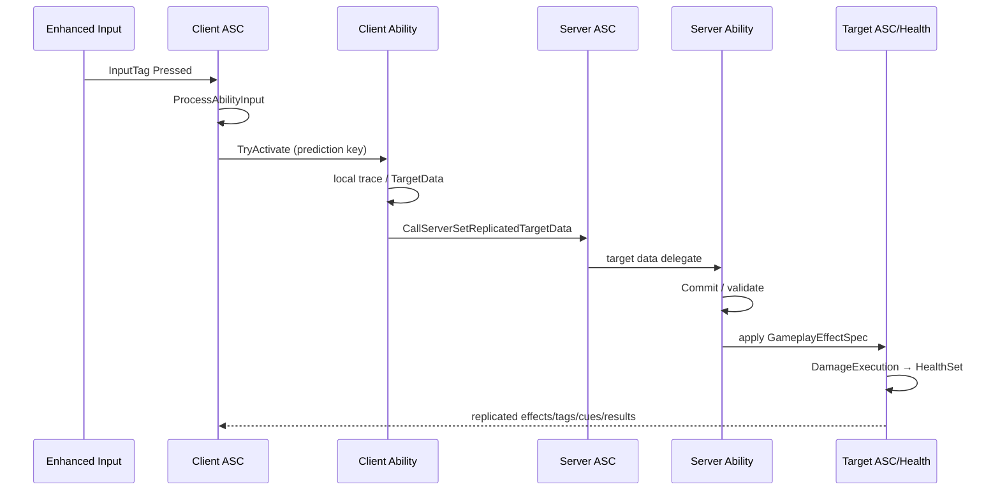

# UE5.8 Lyra 源码解析 42：输入、GAS 与武器战斗调用链

> 本篇追踪一次“按下开火键”的完整路径：Enhanced Input → InputTag → AbilitySpec → 本地预测 → TargetData → 服务器权威效果 → Health/Death。
> 重点不是复制某把枪，而是理解 Lyra 如何把输入配置、能力授权、装备来源和网络预测分层。
> 知识成熟度：L2（本机 UE 5.8 与 Lyra 5.8 源码、配置已静态核对；运行实验作为后续验证步骤）。

## 元数据

| 项目 | 内容 |
| --- | --- |
| 版本基线 | UE 5.8.0 / CL 55116800 / `++UE5+Release-5.8` |
| Lyra 基线 | 本机 `LyraStarterGame.uproject`：`EngineAssociation=5.8` |
| 项目源码根 | `C:\Users\zhaozhiqi\Documents\Unreal Projects\LyraStarterGame` |
| 适用范围 | Enhanced Input、Lyra GAS 扩展、武器能力、预测 TargetData、伤害和死亡排障 |
| 知识成熟度 | L2：C++、配置和资产存在性静态核对完成；蓝图能力内部图需在编辑器中逐节点复核 |
| 官方参考 | [Abilities in Lyra](https://dev.epicgames.com/documentation/en-us/unreal-engine/abilities-in-lyra-in-unreal-engine)、[Lyra Input Settings](https://dev.epicgames.com/documentation/en-us/unreal-engine/lyra-input-settings-in-unreal-engine) |
| 最后更新 | 2026-08-17（补充武器实例与生成器源码章节及附录） |

## 一、完整链路先览

```mermaid
flowchart LR
    Key["Key / Gamepad"] --> IMC["Input Mapping Context"]
    IMC --> IA["UInputAction"]
    IA --> IC["ULyraInputConfig: InputTag"]
    IC --> Hero["ULyraHeroComponent callbacks"]
    Hero --> ASC["AbilityInputTagPressed/Released"]
    Set["ULyraAbilitySet"] --> Spec["FGameplayAbilitySpec + Dynamic Source Tag"]
    ASC --> Match["match InputTag to AbilitySpec"]
    Spec --> Match
    Match --> Process["ProcessAbilityInput"]
    Process --> GA["TryActivateAbility"]
    GA --> Target["Local TargetData"]
    Target --> Server["PredictionKey + Server TargetData"]
    Server --> GE["GameplayEffect / DamageExecution"]
    GE --> Health["LyraHealthSet"]
    Health --> Death["Death GameplayEvent / Ability"]
    Death --> UI["GameplayMessage / Cue / UI"]
```



核心不变量：

> InputAction 和 GameplayAbility 不直接互相引用；二者通过 InputTag 与 AbilitySpec 动态来源标签会合。

## 二、核心文件地图

| 文件 | 关键职责 |
| --- | --- |
| `Input/LyraInputConfig.h/.cpp` | InputAction ↔ InputTag 配置查询 |
| `Input/LyraInputComponent.h/.cpp` | Enhanced Input 绑定辅助 |
| `Character/LyraHeroComponent.cpp` | 初始 MappingContext、原生输入和能力输入绑定 |
| `AbilitySystem/LyraAbilitySet.h/.cpp` | 授予 AbilitySpec 并写动态 InputTag |
| `AbilitySystem/LyraAbilitySystemComponent.cpp` | 输入缓存、激活策略、ActivationGroup |
| `AbilitySystem/Abilities/LyraGameplayAbility.h/.cpp` | Lyra Ability 基类、策略、成本和失败消息 |
| `Player/LyraPlayerController.cpp` | `PostProcessInput` 调 ASC 每帧输入处理 |
| `Weapons/LyraGameplayAbility_RangedWeapon.cpp` | 本地瞄准、TargetData、预测和提交 |
| `Weapons/LyraRangedWeaponInstance.cpp` | 散布、射程和武器实例状态 |
| `AbilitySystem/Executions/LyraDamageExecution.cpp` | 服务器伤害 Execution |
| `AbilitySystem/Attributes/LyraHealthSet.cpp` | Damage 元属性转 Health、OutOfHealth |
| `Character/LyraHealthComponent.cpp` | DeathState、死亡消息和委托 |
| `AbilitySystem/Abilities/LyraGameplayAbility_Death.cpp` | 死亡能力生命周期 |

## 三、资产层实例

本机 Lyra 5.8 可见以下相关资产：

- `/Game/Input/Actions/IA_Weapon_Fire`；
- `/Game/Input/InputData_Hero`；
- `/Game/Weapons/GA_Weapon_Fire`；
- `/ShooterCore/Input/Mappings/IMC_ShooterGame`；
- `/ShooterCore/Weapons/Rifle/GA_Weapon_Fire_Rifle_Auto`；
- `/ShooterCore/Weapons/Rifle/GE_Damage_RifleAuto`；
- `/ShooterCore/Weapons/Rifle/AbilitySet_ShooterRifle`；
- `/ShooterCore/Weapons/Rifle/WID_Rifle`；
- `/ShooterCore/Weapons/Rifle/ID_Rifle`。

资产存在和路径已静态确认。

具体蓝图父类、节点与属性值需要在编辑器中打开资产复核。

教程只把 C++ 可确认的框架行为写成源码事实。

## 四、输入配置的两类 Action

`ULyraInputConfig` 保存两组 `FLyraInputAction`：

- Native Input Actions；
- Ability Input Actions。

每项是：

```cpp
TObjectPtr<const UInputAction> InputAction;
FGameplayTag InputTag;
```

Native Action 用于 Move、Look、Crouch、AutoRun 等直接 C++ 行为。

Ability Action 用于 Jump、Fire、Reload、Dash 等需要 GAS 生命周期和网络语义的行为。

两类都用 GameplayTag 查找，但绑定目标不同。

## 五、Hero 如何建立基础输入

41 篇已解释 Hero 只在 DataInitialized 过渡初始化本地输入。

`InitializePlayerInput` 执行：

1. 取得 LocalPlayer 的 `UEnhancedInputLocalPlayerSubsystem`；
2. `ClearAllMappings()`；
3. 加载 Hero `DefaultInputMappings`；
4. 可选注册到 EnhancedInput UserSettings；
5. 按 Priority 添加 MappingContext；
6. 从 PawnData 取得 `ULyraInputConfig`；
7. 让 `ULyraInputComponent` 绑定 Ability Actions；
8. 绑定原生 Move/Look/Crouch/AutoRun；
9. 标记 Ready；
10. 发送 `NAME_BindInputsNow`。

基础 InputConfig 与 GameFeature 追加 InputConfig 可以叠加。

## 六、ULyraInputComponent 的模板绑定

`BindAbilityActions` 遍历 `InputConfig->AbilityInputActions`。

对有效 Action 与 Tag：

```text
Triggered → PressedFunc(InputTag)
Completed → ReleasedFunc(InputTag)
```

本机实现使用 `BindAction`，并把 `InputTag` 作为额外绑定参数传给回调。

因此回调收到的是语义 Tag，而不是硬件 Key 或 InputAction 名。

绑定句柄被收集到数组，方便后续移除。

### 6.1 Triggered 而不是 Started

Lyra 对能力按下使用 `ETriggerEvent::Triggered`。

这意味着触发器配置会影响回调频率。

能力侧再用 `AddUnique` 和每帧统一处理避免重复 Handle 激活。

不能把 Enhanced Input Trigger 的语义与 Ability ActivationPolicy 混为一层。

## 七、AbilitySet 把 InputTag 写到 AbilitySpec

`FLyraAbilitySet_GameplayAbility` 包含：

- Ability Class；
- AbilityLevel；
- InputTag。

`ULyraAbilitySet::GiveToAbilitySystem` 在 Authority 上创建：

```cpp
FGameplayAbilitySpec AbilitySpec(AbilityCDO, AbilityLevel);
AbilitySpec.SourceObject = SourceObject;
AbilitySpec.GetDynamicSpecSourceTags().AddTag(InputTag);
LyraASC->GiveAbility(AbilitySpec);
```

输入 Tag 不直接写进 Ability CDO。

它写入这一份授予实例的动态来源标签。

同一个 Ability Class 因而可以由不同 AbilitySet 以不同 InputTag 或 SourceObject 授予。

## 八、输入按下如何匹配 AbilitySpec

Hero 的回调调用 ASC：

```text
Input_AbilityInputTagPressed
→ AbilityInputTagPressed(InputTag)
```

ASC 遍历 `ActivatableAbilities.Items`。

对每个 AbilitySpec 检查：

```cpp
AbilitySpec.GetDynamicSpecSourceTags().HasTagExact(InputTag)
```

命中后：

- 加入 `InputPressedSpecHandles`；
- 加入 `InputHeldSpecHandles`。

使用 Exact Match，父 Tag 不自动匹配子 Tag。

## 九、输入释放如何缓存

释放回调同样遍历 AbilitySpec。

命中后：

- 加入 `InputReleasedSpecHandles`；
- 从 `InputHeldSpecHandles` 移除。

Pressed/Released 是本帧队列。

Held 跨帧保留，直到释放或显式 Clear。

## 十、谁调用 ProcessAbilityInput

`ALyraPlayerController::PostProcessInput` 取得当前 Lyra ASC 并调用：

```cpp
LyraASC->ProcessAbilityInput(DeltaTime, bGamePaused);
```

随后才调用父类 `PostProcessInput`。

这说明输入事件先由 Enhanced Input 收集，再在 PlayerController 的输入后处理阶段统一转成 GAS 激活。

它不是每个 InputAction 回调里直接 `TryActivateAbility`。

## 十一、输入阻塞 Tag

`ProcessAbilityInput` 首先检查：

```text
Gameplay.AbilityInputBlocked
```

命中时调用 `ClearAbilityInput()` 并返回。

Clear 会清空 Pressed、Released 和 Held 三组句柄。

因此解除阻塞后，玩家必须重新按键；旧的 Held 不会自动恢复。

这适合菜单、死亡或控制锁定场景，避免解锁瞬间触发旧输入。

## 十二、三种 ActivationPolicy

`ULyraGameplayAbility` 定义：

| Policy | 行为 |
| --- | --- |
| `OnInputTriggered` | 本帧按下且尚未 Active 时尝试激活 |
| `WhileInputActive` | Held 期间只要未 Active 就持续尝试 |
| `OnSpawn` | Avatar 设置且网络策略允许时自动尝试 |

默认是 `OnInputTriggered`。

默认 Ability 还使用：

- `InstancedPerActor`；
- `LocalPredicted`；
- `ClientOrServer`；
- `Independent` ActivationGroup。

具体子类/蓝图可以覆盖这些默认值。

## 十三、ProcessAbilityInput 的真实顺序

函数先准备一个 `AbilitiesToActivate` 临时数组。

### 13.1 Held

遍历 Held Handles。

Ability 未 Active 且 Policy 为 `WhileInputActive` 时加入激活数组。

### 13.2 Pressed

遍历 Pressed Handles。

设置 `AbilitySpec->InputPressed=true`。

若 Ability 已 Active，调用 `AbilitySpecInputPressed` 转发输入事件。

若未 Active 且 Policy 为 `OnInputTriggered`，加入激活数组。

### 13.3 集中激活

统一遍历 `AbilitiesToActivate` 调 `TryActivateAbility`。

集中处理避免 Held 先激活后，Pressed 又被当作“已 Active 的额外输入事件”重复传递。

### 13.4 Released

设置 `InputPressed=false`。

若 Ability Active，调用 `AbilitySpecInputReleased`。

### 13.5 收尾

清空 Pressed 和 Released。

Held 保留到实际释放。

## 十四、Lyra 不使用直接输入复制

Lyra ASC 源码明确不支持依赖 `UGameplayAbility::bReplicateInputDirectly` 的方案。

Active Ability 的 Press/Release 使用 Generic Replicated Event。

这样 `WaitInputPress`、`WaitInputRelease` 等 AbilityTask 可以围绕预测键和 AbilitySpec 事件工作。

直接把每次硬件输入 RPC 到服务器会破坏 GAS 已有预测模型。

## 十五、Ability 激活前还要过哪些门

`ULyraGameplayAbility::CanActivateAbility` 先调用父类检查：

- Owner/Avatar；
- Cooldown；
- Cost；
- Required/Blocked Tags；
- 网络执行策略等。

然后检查 Lyra ActivationGroup 是否被阻塞。

失败时可追加 `Ability.ActivateFail.ActivationGroup` Tag。

Lyra ASC 还会通过 `ULyraAbilityTagRelationshipMapping` 增加全局式 Required/Blocked/Cancel 关系。

## 十六、ActivationGroup 解决互斥

三组语义：

| Group | 行为 |
| --- | --- |
| `Independent` | 与其他能力独立运行 |
| `Exclusive_Replaceable` | 可被其他独占能力取消替换 |
| `Exclusive_Blocking` | 阻止其他独占能力激活 |

ASC 记录每组当前 Active 数量。

Ability 激活/结束通知时增加或减少计数。

Blocking Ability 激活时可取消 Replaceable Ability。

这比每个 Ability 两两硬编码互斥更可维护。

## 十七、AdditionalCosts

Lyra Ability 在标准 GAS Cost 之外维护 `AdditionalCosts`。

`CheckCost` 先执行父类，再逐个调用 `ULyraAbilityCost::CheckCost`。

`ApplyCost` 对应应用额外成本。

现有实现包括：

- Inventory Item 数量；
- Item Tag Stack；
- Player Tag Stack。

武器弹匣弹药可作为 Item Tag Stack，而不必为每发子弹创建复杂 GameplayEffect。

成本的最终权威提交仍必须在服务器可验证路径中完成。

## 十八、装备如何成为 Ability SourceObject

Equipment 的 AbilitySet 授予时可以传 `ULyraEquipmentInstance` 为 SourceObject。

`ULyraGameplayAbility_FromEquipment` 通过 AbilitySpec SourceObject 取得当前 EquipmentInstance。

远程武器 Ability 再 Cast 为 `ULyraRangedWeaponInstance`。

因此能力类不需要在 Pawn 上搜索“当前是哪把枪”。

授予来源已随 Spec 一起传入。

## 十九、远程武器 Ability 激活

`ULyraGameplayAbility_RangedWeapon::ActivateAbility`：

1. 取得当前 ASC；
2. 对当前 SpecHandle + PredictionKey 注册 TargetData Delegate；
3. 更新武器最后开火时间；
4. 调父类激活。

结束时：

1. 若 AbilityList 正被锁，延迟 End；
2. 移除 TargetData Delegate；
3. 消费 Client Replicated TargetData；
4. 调父类 EndAbility。

Delegate 的注册和移除必须严格对称。

## 二十、本地瞄准为什么只在 LocallyControlled 执行

`PerformLocalTargeting` 只有在：

- Avatar 是 Pawn；
- Pawn `IsLocallyControlled()`；
- WeaponData 有效；

才生成 FiringInput 并执行 Trace。

玩家摄像机、准星和本地延迟决定瞄准体验。

客户端先算 TargetData，服务器再接收并产生权威结果，是 Local Predicted 武器的常见结构。

这不代表服务器无条件信任客户端命中。

## 二十一、单发弹丸与一个 Cartridge

`TraceBulletsInCartridge` 读取：

- BulletsPerCartridge；
- 当前 Spread Angle；
- Spread Exponent；
- MaxDamageRange；
- BulletTraceSweepRadius。

每颗弹丸：

1. 依据圆锥分布生成 BulletDir；
2. 计算 EndTrace；
3. 调 `DoSingleBulletTrace`；
4. 收集 HitResult。

Shotgun 一次 Ability 激活可以产生多个 HitResult，并为同一 Cartridge 赋共同标识。

## 二十二、Ray 与 Sweep 的选择

`DoSingleBulletTrace` 先执行主 Trace。

当 SweepRadius 大于零且射线没有得到合适 Pawn 命中时，可用 Sweep 辅助瞄准。

实现还会在多个命中中优先处理 Pawn 命中，并保留影响表现的 HitResult。

这属于命中容错，不应被误解为服务器权威验证已自动完成。

## 二十三、StartRangedWeaponTargeting

该函数：

1. 取得 Avatar、ASC 和 Controller；
2. 找 WeaponStateComponent；
3. `PerformLocalTargeting`；
4. 为每个 HitResult 创建 TargetData；
5. 给同一发 Cartridge 设置共同 CartridgeID；
6. 登记未确认服务器 HitMarker；
7. 立即调用 `OnTargetDataReadyCallback`。

本地数据不经多余一帧等待即可进入预测窗口。

## 二十四、TargetData 如何送服务器

`OnTargetDataReadyCallback` 创建 `FScopedPredictionWindow`。

它取得 TargetData 所有权，避免回调重入导致数据失效。

若当前是 LocallyControlled 但不是 NetAuthority：

```cpp
CallServerSetReplicatedTargetData(
    CurrentSpecHandle,
    ActivationPredictionKey,
    LocalTargetDataHandle,
    ApplicationTag,
    ScopedPredictionKey);
```

服务器用 SpecHandle 和原始 PredictionKey 把数据路由回对应 Ability 实例。

## 二十五、CommitAbility 是分水岭

TargetData 有效且 `CommitAbility` 成功后：

- 应用标准 Cost/Cooldown；
- 应用 Lyra AdditionalCosts；
- 武器实例增加 Spread；
- 调 BlueprintImplementableEvent `OnRangedWeaponTargetDataReady`。

若 Commit 失败，Ability 结束。

这保证“已经本地瞄准”不等于“已经合法开火”。

弹药、冷却或其他成本可能在最终提交时失败。

## 二十六、C++ 与 Blueprint 的边界

远程武器 C++ 基类负责：

- 输入/Ability 生命周期；
- 本地目标采集；
- Trace 和散布；
- TargetData 预测传输；
- Commit；
- Delegate 清理。

`OnRangedWeaponTargetDataReady` 是 BlueprintImplementableEvent。

具体武器 Ability 资产可在此：

- 构造伤害 GameplayEffectSpec；
- 对 TargetData 应用 Effect；
- 触发 Montage、Cue 或消息；
- 处理武器差异。

因此不能只读 C++ 就声称掌握某把 Rifle Blueprint 的全部效果逻辑。

## 二十七、伤害 Execution 的服务器边界

`ULyraDamageExecution::Execute_Implementation` 主体位于 `#if WITH_SERVER_CODE`。

它捕获 Source 的 `ULyraCombatSet::BaseDamage`。

执行时取得：

- GameplayEffectSpec；
- `FLyraGameplayEffectContext`；
- Source/Target Aggregated Tags；
- Instigator/EffectCauser；
- Team Subsystem；
- AbilitySource 衰减接口等。

最终把合法伤害写入目标 `ULyraHealthSet::Damage` 元属性。

客户端表现不应自行决定最终 Health。

## 二十八、Team Damage 过滤

DamageExecution 使用 `ULyraTeamSubsystem` 判断伤害关系。

友军、自伤或敌对关系会影响伤害是否允许及倍率。

具体规则由 Team Subsystem 与配置共同决定。

因此“HitResult 命中”只是几何事实，不等于“应该扣血”。

## 二十九、Damage 元属性为什么不直接复制成 Health

`ULyraHealthSet` 区分：

- Health；
- MaxHealth；
- Healing；
- Damage。

Damage/Healing 是执行过程中的元属性。

在 `PostGameplayEffectExecute` 中再转换为 Health 变化并清零/消费。

这样 Execution 可以先汇总护甲、队伍、倍率和来源信息，再统一触发 Health 事件。

## 三十、OutOfHealth 到 Death Ability

Health 降到零时，HealthSet 广播 OutOfHealth。

`ULyraHealthComponent` 监听后在 Authority 路径构造 GameplayEventData，并向 ASC 发送死亡 Gameplay Event。

带对应 Trigger 的 `ULyraGameplayAbility_Death` 被激活。

Death Ability：

- 通常不能被取消；
- 激活时调用 HealthComponent `StartDeath`；
- 结束时调用 `FinishDeath`；
- 通过 ActivationGroup/Tags 取消或阻塞其他动作能力。

Death 不是简单在 HealthSet 中直接 Destroy Actor。

## 三十一、DeathState 的两阶段

`ULyraHealthComponent` 使用：

```text
NotDead
→ DeathStarted
→ DeathFinished
```

`StartDeath`：

- 改状态；
- 更新死亡相关 GameplayTag；
- 广播 OnDeathStarted；
- `ForceNetUpdate`。

`FinishDeath`：

- 只允许从 DeathStarted 进入；
- 改为 DeathFinished；
- 更新 Tag；
- 广播完成；
- 强制网络更新。

两阶段给死亡动画、输入封锁、掉落和最终销毁留下明确边界。

## 三十二、预测、权威和表现三层

| 层 | 典型职责 | 不应负责 |
| --- | --- | --- |
| 本地预测 | 输入响应、瞄准 Trace、TargetData、即时动画/准星反馈 | 最终 Health |
| 服务器权威 | Ability 合法性、成本、队伍过滤、伤害、死亡状态 | 本地设备输入 |
| 复制/表现 | HitMarker 确认、GameplayCue、UI 消息、远端动画 | 重算权威规则 |

把三层写在一个 Blueprint 事件里会让作弊、回滚和排障边界模糊。

## 三十三、命中标记确认

`ULyraWeaponStateComponent` 记录未确认的服务器 HitMarker 数量。

TargetData 带 UniqueId/命中信息，服务器处理后可以确认或拒绝。

这允许 UI 先保持响应，又能根据服务器结果校正。

具体 HitMarker RPC/消息应继续在 WeaponStateComponent 中逐函数跟踪。

不要把本地十字准线命中颜色当作权威伤害证据。

## 三十四、Ability 失败消息

Lyra Ability 可把失败 Tag 映射为：

- 用户可见文本；
- 失败 Montage。

Ability 激活失败时，Lyra ASC 处理失败原因。

对于远端控制玩家，服务器可通过 Client RPC 通知失败。

本地再通过 GameplayMessageSubsystem 广播简单失败或 Montage 失败消息。

UI 因此不需要直接耦合每个 Ability 类。

## 三十五、摄像机与 Ability

Lyra Ability 可以 `SetCameraMode`。

HeroComponent 保存：

- 当前 AbilityCameraMode；
- 拥有该覆盖的 AbilitySpecHandle。

Ability 结束时基类自动 `ClearCameraMode`。

用 SpecHandle 作为所有权令牌，避免一个 Ability 结束时误清除另一个 Ability 后设置的相机模式。

## 三十六、网络角色时序



具体 Ability 是否 LocalPredicted、ServerInitiated 或 ServerOnly 由其 NetExecutionPolicy 决定。

## 三十七、静态验证命令

```powershell
$Lyra = 'C:\Users\zhaozhiqi\Documents\Unreal Projects\LyraStarterGame'

rg -n "BindAbilityActions|BindNativeAction" `
  "$Lyra\Source\LyraGame\Input\LyraInputComponent.h" `
  "$Lyra\Source\LyraGame\Character\LyraHeroComponent.cpp"

rg -n "GetDynamicSpecSourceTags|AbilityInputTagPressed|ProcessAbilityInput" `
  "$Lyra\Source\LyraGame\AbilitySystem"

rg -n "PostProcessInput|ProcessAbilityInput" `
  "$Lyra\Source\LyraGame\Player\LyraPlayerController.cpp"

rg -n "StartRangedWeaponTargeting|PerformLocalTargeting|OnTargetDataReadyCallback|CallServerSetReplicatedTargetData|CommitAbility" `
  "$Lyra\Source\LyraGame\Weapons\LyraGameplayAbility_RangedWeapon.cpp"

rg -n "Execute_Implementation|BaseDamage|Damage|OnOutOfHealth|StartDeath|FinishDeath" `
  "$Lyra\Source\LyraGame\AbilitySystem" `
  "$Lyra\Source\LyraGame\Character\LyraHealthComponent.cpp"
```

## 三十八、断点实验：一次 Rifle 开火

建议按顺序断点：

1. `ULyraHeroComponent::Input_AbilityInputTagPressed`；
2. `ULyraAbilitySystemComponent::AbilityInputTagPressed`；
3. `ALyraPlayerController::PostProcessInput`；
4. `ULyraAbilitySystemComponent::ProcessAbilityInput`；
5. `UAbilitySystemComponent::TryActivateAbility`；
6. `ULyraGameplayAbility_RangedWeapon::StartRangedWeaponTargeting`；
7. `PerformLocalTargeting`；
8. `OnTargetDataReadyCallback`；
9. 服务器同名回调；
10. `ULyraDamageExecution::Execute_Implementation`；
11. `ULyraHealthSet::PostGameplayEffectExecute`；
12. `ULyraHealthComponent::StartDeath`。

每个断点记录：

- NetMode/LocalRole；
- SpecHandle；
- PredictionKey；
- SourceObject；
- InputTag；
- TargetData 数量；
- Commit 结果；
- 伤害前后 Health。

## 三十九、失败模式

| 现象 | 入口 | 常见原因 |
| --- | --- | --- |
| 按键完全无回调 | Enhanced Input Debugger | IMC 未添加、平台条件不满足 |
| Native Move 可用但 Ability 不触发 | `BindAbilityActions` | InputConfig Ability Action 缺 Tag |
| ASC 找不到 Spec | `AbilityInputTagPressed` | AbilitySet 未授予或 Dynamic Tag 不匹配 |
| 按下触发多次 | Input Trigger + Bind | Triggered 频率与 Policy 组合错误 |
| Ability 反复尝试但不成功 | `CanActivateAbility` | WhileInputActive 且成本/Tag 阻塞 |
| 客户端有枪声但服务器不扣血 | TargetData/Commit | 预测数据未送达、Commit 失败、Effect 未应用 |
| 服务器扣血但无 HitMarker | WeaponState | 确认消息/UniqueId 路径错误 |
| 同队也扣血 | DamageExecution | Team 过滤配置或 TeamId 未就绪 |
| Health 到 0 不死亡 | OutOfHealth | HealthComponent 未绑定 ASC 或死亡 Event Tag 不匹配 |
| 重生后不能输入 | ClearAbilityInput/InitState | Hero 未重新绑定或 InputBlocked Tag 残留 |

## 四十、设计一个新武器的正确分层

### 40.1 ItemDefinition

描述背包中的物品与 Fragments。

### 40.2 EquipmentDefinition

描述装备实例类型、要生成的表现 Actor、装备时授予的 AbilitySets。

### 40.3 WeaponInstance

保存当前武器实例级散布、射程、热度或装备时间状态。

### 40.4 AbilitySet

授予 Fire/Reload 等 Ability，并为每个 Spec 写 InputTag。

### 40.5 GameplayAbility

管理激活、预测、TargetData、成本和结束。

### 40.6 GameplayEffect/Execution

管理权威伤害、治疗、Buff 或 Debuff。

### 40.7 GameplayCue/Message/UI

管理表现和观察，不决定权威数值。

把这七层压成一个 Weapon Actor 会失去 Lyra 的生命周期优势。

## 四十一、反作弊边界

Lyra 是样例，不是完整商业反作弊方案。

产品项目至少应考虑：

- 服务器重建或校验射击起点；
- 校验射程、射速、弹药和时间戳；
- 校验 Target Actor 可见性与队伍关系；
- 限制客户端 TargetData 大小和频率；
- 处理延迟补偿与历史碰撞；
- 记录异常 PredictionKey/Cartridge；
- 防止 Blueprint 只在客户端应用关键 Effect。

不能因使用 GAS Prediction 就自动获得反作弊。

## 四十二、性能边界

### 42.1 每次 Tag 输入遍历 AbilitySpec

`AbilityInputTagPressed/Released` 当前遍历 ActivatableAbilities。

普通玩家能力数量通常可控。

若单个 ASC 有成百上千可输入 Spec，应测量并考虑索引。

### 42.2 多弹丸 Trace

Shotgun 的 BulletsPerCartridge 会线性增加 Trace。

Sweep 辅助又可能增加查询。

应按武器频率、玩家数和服务器 Tick 做容量测试。

### 42.3 GameplayCue 与消息

表现事件应避免广播过大 Payload 或无界生成 Niagara/Widget。

对象池和相关性过滤仍然必要。

## 四十三、常见反模式

1. InputAction 直接在 Pawn 中调用伤害函数；
2. 用整数 InputID 代替语义 InputTag，又在各处硬编码；
3. Client RPC 直接告诉服务器“扣目标 100 血”；
4. AbilitySet 授予时不设置 SourceObject；
5. 临时装备 Ability 不保存撤销句柄；
6. `Triggered` 每帧回调里直接重复激活；
7. 忽略 AbilityInputBlocked 后 Held 被清空的语义；
8. 只在客户端 Commit 弹药；
9. 把 Trace 命中当作最终伤害许可；
10. Health 到零立即 Destroy，绕过死亡 Ability 和复制阶段；
11. Blueprint Ability End 时不清理 TargetData Delegate；
12. UI 通过轮询 Health/Ammo 代替事件和消息。

## 四十四、验证矩阵

| 场景 | 客户端预期 | 服务器预期 | 校正观察 |
| --- | --- | --- | --- |
| 正常开火 | 即时动画/Trace | Commit、扣弹、伤害 | HitMarker 确认 |
| 无弹药 | 可有按键反馈 | Commit/Cost 失败 | 失败消息、无伤害 |
| AbilityInputBlocked | 不激活，Held 清空 | 无开火 | 解锁后需重按 |
| 高延迟命中 | 本地先预测 | 延迟收到 TargetData | 确认或拒绝 |
| 友军命中 | 可有几何 Hit | Team 规则过滤 | 无伤害或特定倍率 |
| 致死命中 | 本地表现开始 | Health=0，触发 Death | DeathState 复制 |
| 重生 | 重新绑定 Avatar/Input | ASC Owner 保留 | 旧 Avatar 清理 |

## 四十五、验收清单

- [ ] 能解释 InputAction 与 Ability 为什么不直接引用；
- [ ] 能指出 InputTag 写入 AbilitySpec 的位置；
- [ ] 能说出 Pressed/Released/Held 三组缓存；
- [ ] 能复述 `ProcessAbilityInput` 的处理顺序；
- [ ] 能区分 Enhanced Input Trigger 与 Ability ActivationPolicy；
- [ ] 能解释 PlayerController 为什么在 PostProcessInput 调 ASC；
- [ ] 能解释 Equipment SourceObject；
- [ ] 能画出本地 TargetData 到服务器的预测链；
- [ ] 能解释 CommitAbility 的分水岭；
- [ ] 能区分 Trace 命中、DamageExecution 和 Health 扣减；
- [ ] 能解释 DeathState 两阶段；
- [ ] 能列出至少五项服务器校验。

## 四十六、武器实例与生成器（LYRA 批次 1 补深挖）

> 本批次（R4-LYRA-COVERAGE，2026-08-14）针对 `Source/LyraGame/Weapons` 目录内"实例数据与表现配置"一侧补深析。前三章（十九~二十六）讲的是**能力与命中验证**（Ability/TargetData/Commit/执行），本篇改讲**背负实例与表现层**：`ULyraWeaponInstance` 的装备生命周期、`ULyraRangedWeaponInstance` 的 Spread（散布）模型与距离衰减、`ALyraWeaponSpawner` 的地图拾取生成器，以及两个调试辅助类。成熟度口径同前（L2，本机静态核对，未断言运行时实测）。

### 46.1 三类武器实例的分层关系

Weapons 目录里武器实例不是单一类，而是三层继承：

- `ULyraEquipmentInstance`（Equipment 层，见 43 篇）——装备实例基类，承担"装备即对外发消息"的生命周期。
- `ULyraWeaponInstance`（继承上者，见附录文件 27）——武器这一"装备种类"的通用状态：动画层选择、输入设备属性、最近装备/开火时间。
- `ULyraRangedWeaponInstance`（继承上者并实现 `ILyraAbilitySourceInterface`，头/实现在附录文件 17/18）——远程武器的具体数值模型：散布、热度、伤害距离衰减、物理材质倍率。

能力侧（`ULyraGameplayAbility_RangedWeapon`，附录文件 15/16）通过 `SourceObject` 拿到的是 `ULyraRangedWeaponInstance`（第十九章已述）。也就是说：**"这把枪现在散布多大、能打多远"由实例回答，"开火是否合法、命中怎么结算"由能力回答**。两侧分工明确。

### 46.2 装备生命周期：OnEquipped / OnUnequipped

`ULyraWeaponInstance` 只薄薄包一层 Equipment 生命周期：

```cpp
void ULyraWeaponInstance::OnEquipped()
{
	Super::OnEquipped();

	UWorld* World = GetWorld();
	check(World);
	TimeLastEquipped = World->GetTimeSeconds();

	ApplyDeviceProperties();
}

void ULyraWeaponInstance::OnUnequipped()
{
	Super::OnUnequipped();

	RemoveDeviceProperties();
}
```

以上是 `LyraWeaponInstance.cpp` 的实际实现。其余同文件代码也明确：

- 构造函数里，仅对**玩家控制的 Pawn** 订阅 `ULyraHealthComponent` 的 `OnDeathStarted`，死后 `RemoveDeviceProperties` 兜底——因为死了未必走正常卸下路径。AI/非玩家不订阅（客户端没有输入设备）。
- `UpdateFiringTime()` 被远程武器能力在激活时调用（见第十九章第 3 步），记录 `TimeLastFired`。
- `GetTimeSinceLastInteractedWith()` 返回"离最近一次装备或开火"的经过秒数，取两者中更近者（`FMath::Min`）。
- 输入设备属性（`ApplicableDeviceProperties`）由 `UInputDeviceSubsystem` 以 Looping 方式激活，句柄存 `DevicePropertyHandles`，装备期间持续生效，直到卸下/死亡才移除。这属于"手感反馈"（如触觉扳机），与服务端权威无关。
- 动画层选择：`PickBestAnimLayer` 依据 `EquippedAnimSet`/`UneuippedAnimSet` 与外观 GameplayTag 选出 `UAnimInstance` 子类，供上层（Hero 动画层，见 41 篇）使用。

### 46.3 与 Inventory 装备 Fragment 的关系（衔接 43 篇）

`ULyraWeaponInstance.is-a ULyraEquipmentInstance`，因此**它不是一个单独的新体系，而是 43 篇 Equipment 在"武器"子类上的落点**：

1. `InventoryItemDefinition`（背包定义）上挂 Fragment 描述能力侧与表现侧（如 `InventoryFragment_ReticleConfig` 指定准星 Widget，见本目录同名的 `.h`）。
2. `EquipmentDefinition` 决定生成哪种表现 Actor、以及**授予哪套 AbilitySet**。
3. `EquipmentInstance` 被创建/授予时，武器实例 `OnEquipped/OnUnequipped` 随装备消息链触发。

远程武器 Ability 通过 `Cast<ULyraRangedWeaponInstance>(SourceObject)` 取得实例，因此**不需要在 Pawn 上搜索当前枪支**（第十八章结论）。装备侧与能力侧以"装备实例即 SourceObject"这一约定耦合，`Inventory` 侧只决定"能否/何时装备"，不直接参与散布结算。

### 46.4 ULyraRangedWeaponInstance 深析：Spread 散布模型（补空心覆盖）

> 本文件头/正文已在附录文件 17/18 全文收录，但旧正文仅在 40.3 用一句话概括。本节补逐函数深析，填充该覆盖空白。

#### 46.4.1 Heat（热度）是中间状态，Spread（散布角）是导出量

远程武器不开"散布变量直接涨落"，而是维护一个**Heat 热度**，再由曲线把它翻译成散布角：

- 内存状态：`LastFireTime`、`CurrentHeat`、`CurrentSpreadAngle`、`CurrentSpreadAngleMultiplier`，以及四个次级倍率（瞄准/静止/跳跃坠落/下蹲）。
- 三条 `FRuntimeFloatCurve` 全是"Heat→某量"：`HeatToSpreadCurve`（热度→散布角）、`HeatToHeatPerShotCurve`（当前热度→每发增加的热度）、`HeatToCoolDownPerSecondCurve`（当前热度→每秒冷却热速）。
- 热度上下限由三条曲线 **X 轴时间范围求并集**得到（`ComputeHeatRange`）；散布角的上下限由 `HeatToSpreadCurve` 的 **Y 轴值范围**得到（`ComputeSpreadRange`）。构造函数实际给 `HeatToHeatPerShotCurve` 打 `(0,1)` 点、给冷却曲线打 `(0,2)` 点。

#### 46.4.2 开火/冷却的时序

`AddSpread()`（能力 Commit 成功后由 Ability 调用，呼应第二十五章"武器实例增加 Spread"）：

```cpp
void ULyraRangedWeaponInstance::AddSpread()
{
	// Sample the heat up curve
	const float HeatPerShot = HeatToHeatPerShotCurve.GetRichCurveConst()->Eval(CurrentHeat);
	CurrentHeat = ClampHeat(CurrentHeat + HeatPerShot);

	// Map the heat to the spread angle
	CurrentSpreadAngle = HeatToSpreadCurve.GetRichCurveConst()->Eval(CurrentHeat);

#if WITH_EDITOR
	UpdateDebugVisualization();
#endif
}
```

按帧冷却 `UpdateSpread(DeltaSeconds)`：

```cpp
bool ULyraRangedWeaponInstance::UpdateSpread(float DeltaSeconds)
{
	const float TimeSinceFired = GetWorld()->TimeSince(LastFireTime);

	if (TimeSinceFired > SpreadRecoveryCooldownDelay)
	{
		const float CooldownRate = HeatToCoolDownPerSecondCurve.GetRichCurveConst()->Eval(CurrentHeat);
		CurrentHeat = ClampHeat(CurrentHeat - (CooldownRate * DeltaSeconds));
		CurrentSpreadAngle = HeatToSpreadCurve.GetRichCurveConst()->Eval(CurrentHeat);
	}

	float MinSpread;
	float MaxSpread;
	ComputeSpreadRange(/*out*/ MinSpread, /*out*/ MaxSpread);

	return FMath::IsNearlyEqual(CurrentSpreadAngle, MinSpread, KINDA_SMALL_NUMBER);
}
```

即**每开一枪热度上升→散布变大；停止开火经过 `SpreadRecoveryCooldownDelay` 后热度按当前热度对应的速率回落**。曲线是"非线性发散/惩罚"的开关——把升温曲线或冷却曲线做成非平坦形状，就能实现"过热后越来越热"或"高温恢复变慢"这类手感。

#### 46.4.3 First Shot Accuracy：首枪精准

`Tick` 里把"散布到达最小"与"全部倍率到达最小"两个布尔相与：

```cpp
void ULyraRangedWeaponInstance::Tick(float DeltaSeconds)
{
	APawn* Pawn = GetPawn();
	check(Pawn != nullptr);

	const bool bMinSpread = UpdateSpread(DeltaSeconds);
	const bool bMinMultipliers = UpdateMultipliers(DeltaSeconds);

	bHasFirstShotAccuracy = bAllowFirstShotAccuracy && bMinMultipliers && bMinSpread;

#if WITH_EDITOR
	UpdateDebugVisualization();
#endif
}
```

`GetCalculatedSpreadAngleMultiplier()` 在 `bHasFirstShotAccuracy` 时返回 `0.0f`，即**弹道完全收拢到中心线**，配合 `HasFirstShotAccuracy()` 供视线表现（如准星收束）。这是可选能力，由 `bAllowFirstShotAccuracy` 开关。

#### 46.4.4 玩家状态对散布的倍率

`UpdateMultipliers(DeltaSeconds)` 汇总四路倍率，全部用 `FInterpTo` 平滑过渡：

| 倍率 | 触发方式 | 平滑速率 |
| --- | --- | --- |
| `SpreadAngleMultiplier_StandingStill` | Pawn 速度经 `StandingStillSpeedThreshold` 与 `StandingStillToMovingSpeedRange` 做映射（≤阈值取倍率，跨过区间线性回到 1.0） | `TransitionRate_StandingStill` |
| `SpreadAngleMultiplier_Crouching` | `UCharacterMovementComponent::IsCrouching()` | `TransitionRate_Crouching` |
| `SpreadAngleMultiplier_JumpingOrFalling` | `IsFalling()`（跳跃坠落加重散布） | `TransitionRate_JumpingOrFalling` |
| `SpreadAngleMultiplier_Aiming` | 通过 `ULyraCameraComponent::GetBlendInfo` 读当前顶相机 Tag 是否 `Lyra.Weapon.SteadyAimingCamera`，用其权重做瞄镜插入量 | 由相机混合权重给出 |

最终产品倍率 = 四者相乘，存入 `CurrentSpreadAngleMultiplier`；`Tick` 由此推导 `bHasFirstShotAccuracy`。注意瞄准与 45 篇摄像机模式栈直接联动（沿用 `SteadyAimingCamera` 这一 Tag）。

#### 46.4.5 距离衰减与物理材质倍率（ILyraAbilitySourceInterface）

`ULyraRangedWeaponInstance` 实现 `ILyraAbilitySourceInterface`，向 `ULyraDamageExecution`（第二十七~二十八章）提供两种倍率，**在伤害执行层相乘**：

```cpp
float ULyraRangedWeaponInstance::GetDistanceAttenuation(
	float Distance, const FGameplayTagContainer* SourceTags,
	const FGameplayTagContainer* TargetTags) const
{
	const FRichCurve* Curve = DistanceDamageFalloff.GetRichCurveConst();
	return Curve->HasAnyData() ? Curve->Eval(Distance) : 1.0f;
}

float ULyraRangedWeaponInstance::GetPhysicalMaterialAttenuation(
	const UPhysicalMaterial* PhysicalMaterial,
	const FGameplayTagContainer* SourceTags,
	const FGameplayTagContainer* TargetTags) const
{
	float CombinedMultiplier = 1.0f;
	if (const UPhysicalMaterialWithTags* PhysMatWithTags =
		Cast<const UPhysicalMaterialWithTags>(PhysicalMaterial))
	{
		for (const FGameplayTag MaterialTag : PhysMatWithTags->Tags)
		{
			if (const float* pTagMultiplier = MaterialDamageMultiplier.Find(MaterialTag))
			{
				CombinedMultiplier *= *pTagMultiplier;
			}
		}
	}

	return CombinedMultiplier;
}
```

- `DistanceDamageFalloff`：一条"距离(cm)→伤害倍率"曲线，无数据视为不随距离衰减。
- `MaterialDamageMultiplier`：`TMap<FGameplayTag,float>`，命中物的 `PhysicalMaterialWithTags` 上的 Tag 逐一查倍率**累乘**。多个命中 Tag 时倍率相乘，构成"爆头/弱点"这类材质特化伤害。
- 两者都在 DamageExecution 的服务器代码路径里被用作 BaseDamage 的倍率（见 27 篇），**客户端散不散、倍率对不对由服务器权威结算**。

`Tick` 还维护 `Debug_*`（`#if WITH_EDITOR` 可见）用于编辑器内可视化当前热度/散布角/倍率（`UpdateDebugVisualization`）。

### 46.5 ALyraWeaponSpawner：地图拾取生成器（与实例解耦的表现层）

`ALyraWeaponSpawner` 是 `AActor`，**与 `ULyraWeaponInstance` 不共享出生/生命周期**，只负责"地图上摆一把可拾取的武器"的表现与发放逻辑（头/实现在附录文件 28/29）：

- 三个组件：`CollisionVolume`（`UCapsuleComponent`，触发 Overlap）、`PadMesh`（台座网格）、`WeaponMesh`（漂浮的武器展示网格，Tick 里绕 Y 轴自转）。
- 静态网格/音效/Niagara：都从 `ULyraWeaponPickupDefinition` 数据资产读——`DisplayMesh`（构造时 `OnConstruction` 设置 `WeaponMesh`）、`PickedUpSound/Effect`、`RespawnedSound/Effect`（见 `PlayPickupEffects/PlayRespawnEffects_Implementation`）。
- 授予流程：`OnOverlapBegin`（仅 `ROLE_Authority` 且 `bIsWeaponAvailable`）→ `AttemptPickUpWeapon` → 蓝图 `GiveWeapon`（把对应 `ULyraInventoryItemDefinition` 类交给接受者背包）。成功后 `bIsWeaponAvailable=false`、收起网格、播拾取效果、进入冷却。
- 复现：只有 `bIsWeaponAvailable` 一个变量 `DOREPLIFETIME`；`OnRep_WeaponAvailability` 在客户端切换可见/效果，`CheckExistingOverlapsDelay` 用于"重生后那一下本地 ON 动画还没收盘就有人站着"的边界（延迟检查已有重叠）。
- 冷却驱动 `CoolDownPercentage` 供 UI 显示重生进度；`GetDefaultStatFromItemDef` 从 ItemDef 的 `InventoryFragment_SetStats` 读统计值（接背包 Fragment）。

它在实例体系里的定位：**制造者/投放者，不持有武器数值**。拿到手后武器真正玩法仍落在 `ULyraRangedWeaponInstance` 上。

### 46.6 调试辅助：实际源码如何记录伤害和控制弹道可视化

- `ULyraDamageLogDebuggerComponent`（附录文件 31）：`UActorComponent`，订阅 `GameplayMessageSubsystem` 的伤害消息通道，按帧聚合 `FFrameDamageEntry`（命中数/累计伤害/首击时间），`SecondsBetweenDamageBeforeLogging` 控制多久内的伤害合并记录。属于观察/诊断，不参与结算。
- `ULyraWeaponDebugSettings`（附录文件 30）：`UDeveloperSettingsBackedByCVars`，暴露三个 CVar——`lyra.Weapon.DrawBulletTraceDuration`、`lyra.Weapon.DrawBulletHitDuration`、`lyra.Weapon.DrawBulletHitRadius`（单位 s/s/cm）。用于编辑器里可视化弹道与命中调试，与 47 篇调试命令配套。

下面是两段实际实现。伤害调试器在 `BeginPlay` 注册消息，在 `EndPlay` 注销；收到消息时只接收自己的 Actor，并按全局帧号聚合，避免把一次爆炸的多次命中误判为多个独立 DPS 样本：

```cpp
void ULyraDamageLogDebuggerComponent::BeginPlay()
{
	Super::BeginPlay();

	UGameplayMessageSubsystem& MessageSubsystem = UGameplayMessageSubsystem::Get(this);
	ListenerHandle = MessageSubsystem.RegisterListener(
		TAG_Lyra_Damage_Message, this, &ThisClass::OnDamageMessage);
}

void ULyraDamageLogDebuggerComponent::OnDamageMessage(
	FGameplayTag Channel, const FLyraVerbMessage& Payload)
{
	if (Payload.Target == GetOwner())
	{
		FFrameDamageEntry& LogEntry = DamageLog.FindOrAdd(GFrameCounter);
		if (LogEntry.TimeOfFirstHit == 0.0)
		{
			LogEntry.TimeOfFirstHit = GetWorld()->GetTimeSeconds();
			LastDamageEntryTime = LogEntry.TimeOfFirstHit;
		}
		++LogEntry.NumImpacts;
		LogEntry.SumDamage += -Payload.Magnitude;
	}
}
```

达到合并窗口后，`TickComponent` 把帧桶排序、汇总冲击数与伤害，并输出间隔和 DPS；它完全是观测链，不会回写 Health 或改变 Execution：

```cpp
if ((TimeSinceDamage >= SecondsBetweenDamageBeforeLogging) && (DamageLog.Num() > 0))
{
	TArray<FFrameDamageEntry> Entries;
	DamageLog.GenerateValueArray(Entries);
	DamageLog.Reset();
	Entries.Sort([](const FFrameDamageEntry& A, const FFrameDamageEntry& B)
	{
		return A.TimeOfFirstHit < B.TimeOfFirstHit;
	});

	double TotalDamage = 0.0;
	int32 NumImpacts = 0;
	for (int32 i = 0; i < Entries.Num(); ++i)
	{
		NumImpacts += Entries[i].NumImpacts;
		TotalDamage += Entries[i].SumDamage;
	}
	UE_LOG(LogLyra, Warning, TEXT("%d impacts in %d distinct frames did %.2f damage"),
		NumImpacts, Entries.Num(), TotalDamage);
}
```

弹道调试配置也是真实的 `UPROPERTY` 到 CVar 映射，而不是“有几个命令”的概念描述：

```cpp
UCLASS(config=EditorPerProjectUserSettings)
class ULyraWeaponDebugSettings : public UDeveloperSettingsBackedByCVars
{
	GENERATED_BODY()

public:
	UPROPERTY(config, EditAnywhere, Category=General,
		meta=(ConsoleVariable="lyra.Weapon.DrawBulletTraceDuration", ForceUnits=s))
	float DrawBulletTraceDuration;

	UPROPERTY(config, EditAnywhere, Category=General,
		meta=(ConsoleVariable="lyra.Weapon.DrawBulletHitDuration", ForceUnits=s))
	float DrawBulletHitDuration;

	UPROPERTY(config, EditAnywhere, Category=General,
		meta=(ConsoleVariable="lyra.Weapon.DrawBulletHitRadius", ForceUnits=cm))
	float DrawBulletHitRadius;
};
```

同理，`ALyraWeaponSpawner::OnOverlapBegin` 与 `AttemptPickUpWeapon_Implementation` 的实际权限边界是“服务器、可用、Pawn 有 ASC”，成功授予后才关闭拾取、启动冷却：

```cpp
void ALyraWeaponSpawner::OnOverlapBegin(
	UPrimitiveComponent* OverlappedComponent,
	AActor* OtherActor,
	UPrimitiveComponent* OtherComp,
	int32 OtherBodyIndex,
	bool bFromSweep,
	const FHitResult& SweepHitResult)
{
	APawn* OverlappingPawn = Cast<APawn>(OtherActor);
	if (GetLocalRole() == ROLE_Authority && bIsWeaponAvailable && OverlappingPawn)
	{
		AttemptPickUpWeapon(OverlappingPawn);
	}
}

void ALyraWeaponSpawner::AttemptPickUpWeapon_Implementation(APawn* Pawn)
{
	if (GetLocalRole() == ROLE_Authority && bIsWeaponAvailable &&
		UAbilitySystemBlueprintLibrary::GetAbilitySystemComponent(Pawn))
	{
		TSubclassOf<ULyraInventoryItemDefinition> ItemDefinition =
			WeaponDefinition ? WeaponDefinition->InventoryItemDefinition : nullptr;
		if (ItemDefinition && GiveWeapon(ItemDefinition, Pawn))
		{
			bIsWeaponAvailable = false;
			SetWeaponPickupVisibility(false);
			PlayPickupEffects();
			StartCoolDown();
		}
	}
}
```

### 46.7 本节与 42 篇既有内容的关系

- 能力与命中验证（十九~二十六）讲"怎么合法开火"，本节讲"实例存什么、怎么从数据配置算出当前散布/伤害倍率、装备生命周期怎么搭"。
- 41 篇（Hero 动画层）消费 `PickBestAnimLayer`；43 篇（Equipment）是三个武器实例的上级框架；45 篇（摄像机模式栈）通过 `SteadyAimingCamera` Tag 喂给瞄准倍率；27~28 篇（DamageExecution/Team）消费 `ILyraAbilitySourceInterface` 的两种 Attenuation。
- 新补附录文件 27~31 使"武器表现一侧"也有全文可查；RangedWeaponInstance 的深析补上了旧 40.3 的空心覆盖。

## 四十七、关联阅读

- [39-Lyra源码总览与阅读路线](39-Lyra源码总览与阅读路线.md)：系列总览、项目插件地图与阅读路线。
- [41-Lyra-Pawn初始化与模块化组件源码](41-Lyra-Pawn初始化与模块化组件源码.md)：ASC Owner/Avatar 与输入准备。
- [43-Lyra-背包装备消息与UI源码](43-Lyra-背包装备消息与UI源码.md)：Equipment 如何授予武器 Ability。
- [05-GAS能力系统源码](05-GAS能力系统源码.md)：GAS 引擎底层调用链。
- [25-EnhancedInput与GameplayTags源码](25-EnhancedInput与GameplayTags源码.md)：输入与 Tag 底层。
- [09-网络复制与RPC源码](09-网络复制与RPC源码.md)：RPC 与预测基础。
- [13-背包与装备系统](../03-游戏玩法编程/13-背包与装备系统.md)：使用层建模。
- [45-Lyra-相机音频与游戏阶段源码](45-Lyra-相机音频与游戏阶段源码.md)：摄像机与能力联动的模式栈细节。
- [46-Lyra-AI机器人与队伍源码](46-Lyra-AI机器人与队伍源码.md)：Team 伤害过滤的 `CanCauseDamage` 实现。
- [47-Lyra-调试工具与扩展源码](../../知识/08-工程实践与质量/调试与性能分析/47-Lyra-调试工具与扩展源码.md)：武器/伤害相关调试命令入口。
- [48-Lyra扩展插件源码](48-Lyra扩展插件源码.md)：战斗相关扩展插件（GameplayMessageRouter/UIExtension 等）实现。

## 四十八、权威来源

- [Abilities in Lyra](https://dev.epicgames.com/documentation/en-us/unreal-engine/abilities-in-lyra-in-unreal-engine)
- [Lyra Input Settings](https://dev.epicgames.com/documentation/en-us/unreal-engine/lyra-input-settings-in-unreal-engine)
- [Gameplay Ability System](https://dev.epicgames.com/documentation/en-us/unreal-engine/gameplay-ability-system-for-unreal-engine)
- [Enhanced Input](https://dev.epicgames.com/documentation/en-us/unreal-engine/enhanced-input-in-unreal-engine)


## 附录：核心文件完整源码

> 收录原则：本附录把正文直接分析的 LyraStarterGame 5.8 项目源码内容完整收录（代码字符、注释、条件编译和文件尾换行未删改；仅统一代码围栏内的行尾及缩进空白，保留 Epic 版权头），正文中的"节选"负责解释调用链，本附录提供全文，二者配合阅读。引擎层（`Engine/`）文件体量过大且不属于项目教程主体，仍按正文的路径+符号检索方式引用，不在此收录；`.uasset/.umap` 资产也不在收录范围。
> 覆盖补全（2026-08-17）：附录 `LyraRangedWeaponInstance.h/.cpp`（468 行）与 `LyraPlayerController.h/.cpp`（792 行）仍全文收录；正文 46.4 已展开 Heat→Spread、距离衰减、首枪精准与玩家倍率，46.6 又补入 WeaponDebugSettings、DamageLogDebugger 和 WeaponSpawner 的实际 C++ 片段；`ULyraWeaponStateComponent` 的 HitMarker RPC 细节仍由 49 篇 UI 表现侧承接。
> 覆盖边界补充（2026-08-14，LYRA 批次 1）：`LyraRangedWeaponInstance.h/.cpp` 的"正文仅概述"空白已在正文 46.4 逐函数深析补齐（Heat→Spread 曲线、升温/冷却时序、首枪精准、四路玩家倍率、距离/物理材质 Attenuation）；本批次另在附录追加文件 27~31（`LyraWeaponInstance.h/.cpp`、`LyraWeaponSpawner.h`、`LyraWeaponDebugSettings.h`、`LyraDamageLogDebuggerComponent.h`），把"武器实例与表现配置"一侧也纳入全文可查。正文 46.6 已给出调试类的覆盖说明。
> 版权提示：以下代码来自 Epic Games 的 LyraStarterGame 样例（UE 5.8），随 Unreal Engine EULA 的样例代码条款提供，仅作本地学习收录；对外发布前请自行核对许可条款。

| # | 文件（相对 LyraStarterGame 根） | 行数 |
| --- | --- | --- |
| 1 | `Source/LyraGame/Input/LyraInputConfig.h` | 61 |
| 2 | `Source/LyraGame/Input/LyraInputConfig.cpp` | 48 |
| 3 | `Source/LyraGame/Input/LyraInputComponent.h` | 72 |
| 4 | `Source/LyraGame/Input/LyraInputComponent.cpp` | 40 |
| 5 | `Source/LyraGame/Character/LyraHeroComponent.h` | 108 |
| 6 | `Source/LyraGame/Character/LyraHeroComponent.cpp` | 512 |
| 7 | `Source/LyraGame/AbilitySystem/LyraAbilitySet.h` | 149 |
| 8 | `Source/LyraGame/AbilitySystem/LyraAbilitySet.cpp` | 148 |
| 9 | `Source/LyraGame/AbilitySystem/LyraAbilitySystemComponent.h` | 110 |
| 10 | `Source/LyraGame/AbilitySystem/LyraAbilitySystemComponent.cpp` | 528 |
| 11 | `Source/LyraGame/AbilitySystem/Abilities/LyraGameplayAbility.h` | 221 |
| 12 | `Source/LyraGame/AbilitySystem/Abilities/LyraGameplayAbility.cpp` | 545 |
| 13 | `Source/LyraGame/Player/LyraPlayerController.h` | 168 |
| 14 | `Source/LyraGame/Player/LyraPlayerController.cpp` | 624 |
| 15 | `Source/LyraGame/Weapons/LyraGameplayAbility_RangedWeapon.h` | 123 |
| 16 | `Source/LyraGame/Weapons/LyraGameplayAbility_RangedWeapon.cpp` | 596 |
| 17 | `Source/LyraGame/Weapons/LyraRangedWeaponInstance.h` | 250 |
| 18 | `Source/LyraGame/Weapons/LyraRangedWeaponInstance.cpp` | 218 |
| 19 | `Source/LyraGame/AbilitySystem/Executions/LyraDamageExecution.h` | 29 |
| 20 | `Source/LyraGame/AbilitySystem/Executions/LyraDamageExecution.cpp` | 140 |
| 21 | `Source/LyraGame/AbilitySystem/Attributes/LyraHealthSet.h` | 101 |
| 22 | `Source/LyraGame/AbilitySystem/Attributes/LyraHealthSet.cpp` | 234 |
| 23 | `Source/LyraGame/Character/LyraHealthComponent.h` | 135 |
| 24 | `Source/LyraGame/Character/LyraHealthComponent.cpp` | 312 |
| 25 | `Source/LyraGame/AbilitySystem/Abilities/LyraGameplayAbility_Death.h` | 48 |
| 26 | `Source/LyraGame/AbilitySystem/Abilities/LyraGameplayAbility_Death.cpp` | 91 |
| 27 | `Source/LyraGame/Weapons/LyraWeaponInstance.h` | 92 |
| 28 | `Source/LyraGame/Weapons/LyraWeaponInstance.cpp` | 139 |
| 29 | `Source/LyraGame/Weapons/LyraWeaponSpawner.h` | 118 |
| 30 | `Source/LyraGame/Weapons/LyraWeaponDebugSettings.h` | 38 |
| 31 | `Source/LyraGame/Weapons/LyraDamageLogDebuggerComponent.h` | 47 |

### 附录文件 1：`Source/LyraGame/Input/LyraInputConfig.h`

> 完整源码（本机 Lyra 5.8 样例，内容完整收录；代码围栏内的行尾及缩进空白已统一，其余内容未删改）。

```cpp
// Copyright Epic Games, Inc. All Rights Reserved.

#pragma once

#include "Engine/DataAsset.h"
#include "GameplayTagContainer.h"

#include "LyraInputConfig.generated.h"

class UInputAction;
class UObject;
struct FFrame;

/**
 * FLyraInputAction
 *
 *	Struct used to map a input action to a gameplay input tag.
 */
USTRUCT(BlueprintType)
struct FLyraInputAction
{
	GENERATED_BODY()

public:

	UPROPERTY(EditDefaultsOnly, BlueprintReadOnly)
	TObjectPtr<const UInputAction> InputAction = nullptr;

	UPROPERTY(EditDefaultsOnly, BlueprintReadOnly, Meta = (Categories = "InputTag"))
	FGameplayTag InputTag;
};

/**
 * ULyraInputConfig
 *
 *	Non-mutable data asset that contains input configuration properties.
 */
UCLASS(BlueprintType, Const)
class ULyraInputConfig : public UDataAsset
{
	GENERATED_BODY()

public:

	ULyraInputConfig(const FObjectInitializer& ObjectInitializer);

	UFUNCTION(BlueprintCallable, Category = "Lyra|Pawn")
	const UInputAction* FindNativeInputActionForTag(const FGameplayTag& InputTag, bool bLogNotFound = true) const;

	UFUNCTION(BlueprintCallable, Category = "Lyra|Pawn")
	const UInputAction* FindAbilityInputActionForTag(const FGameplayTag& InputTag, bool bLogNotFound = true) const;

public:
	// List of input actions used by the owner.  These input actions are mapped to a gameplay tag and must be manually bound.
	UPROPERTY(EditDefaultsOnly, BlueprintReadOnly, Meta = (TitleProperty = "InputAction"))
	TArray<FLyraInputAction> NativeInputActions;

	// List of input actions used by the owner.  These input actions are mapped to a gameplay tag and are automatically bound to abilities with matching input tags.
	UPROPERTY(EditDefaultsOnly, BlueprintReadOnly, Meta = (TitleProperty = "InputAction"))
	TArray<FLyraInputAction> AbilityInputActions;
};
```

### 附录文件 2：`Source/LyraGame/Input/LyraInputConfig.cpp`

> 完整源码（本机 Lyra 5.8 样例，内容完整收录；代码围栏内的行尾及缩进空白已统一，其余内容未删改）。

```cpp
// Copyright Epic Games, Inc. All Rights Reserved.

#include "LyraInputConfig.h"

#include "LyraLogChannels.h"

#include UE_INLINE_GENERATED_CPP_BY_NAME(LyraInputConfig)


ULyraInputConfig::ULyraInputConfig(const FObjectInitializer& ObjectInitializer)
{
}

const UInputAction* ULyraInputConfig::FindNativeInputActionForTag(const FGameplayTag& InputTag, bool bLogNotFound) const
{
	for (const FLyraInputAction& Action : NativeInputActions)
	{
		if (Action.InputAction && (Action.InputTag == InputTag))
		{
			return Action.InputAction;
		}
	}

	if (bLogNotFound)
	{
		UE_LOG(LogLyra, Error, TEXT("Can't find NativeInputAction for InputTag [%s] on InputConfig [%s]."), *InputTag.ToString(), *GetNameSafe(this));
	}

	return nullptr;
}

const UInputAction* ULyraInputConfig::FindAbilityInputActionForTag(const FGameplayTag& InputTag, bool bLogNotFound) const
{
	for (const FLyraInputAction& Action : AbilityInputActions)
	{
		if (Action.InputAction && (Action.InputTag == InputTag))
		{
			return Action.InputAction;
		}
	}

	if (bLogNotFound)
	{
		UE_LOG(LogLyra, Error, TEXT("Can't find AbilityInputAction for InputTag [%s] on InputConfig [%s]."), *InputTag.ToString(), *GetNameSafe(this));
	}

	return nullptr;
}
```

### 附录文件 3：`Source/LyraGame/Input/LyraInputComponent.h`

> 完整源码（本机 Lyra 5.8 样例，内容完整收录；代码围栏内的行尾及缩进空白已统一，其余内容未删改）。

```cpp
// Copyright Epic Games, Inc. All Rights Reserved.

#pragma once

#include "EnhancedInputComponent.h"
#include "LyraInputConfig.h"

#include "LyraInputComponent.generated.h"

class UEnhancedInputLocalPlayerSubsystem;
class UInputAction;
class UObject;


/**
 * ULyraInputComponent
 *
 *	Component used to manage input mappings and bindings using an input config data asset.
 */
UCLASS(Config = Input)
class ULyraInputComponent : public UEnhancedInputComponent
{
	GENERATED_BODY()

public:

	ULyraInputComponent(const FObjectInitializer& ObjectInitializer);

	void AddInputMappings(const ULyraInputConfig* InputConfig, UEnhancedInputLocalPlayerSubsystem* InputSubsystem) const;
	void RemoveInputMappings(const ULyraInputConfig* InputConfig, UEnhancedInputLocalPlayerSubsystem* InputSubsystem) const;

	template<class UserClass, typename FuncType>
	void BindNativeAction(const ULyraInputConfig* InputConfig, const FGameplayTag& InputTag, ETriggerEvent TriggerEvent, UserClass* Object, FuncType Func, bool bLogIfNotFound);

	template<class UserClass, typename PressedFuncType, typename ReleasedFuncType>
	void BindAbilityActions(const ULyraInputConfig* InputConfig, UserClass* Object, PressedFuncType PressedFunc, ReleasedFuncType ReleasedFunc, TArray<uint32>& BindHandles);

	void RemoveBinds(TArray<uint32>& BindHandles);
};


template<class UserClass, typename FuncType>
void ULyraInputComponent::BindNativeAction(const ULyraInputConfig* InputConfig, const FGameplayTag& InputTag, ETriggerEvent TriggerEvent, UserClass* Object, FuncType Func, bool bLogIfNotFound)
{
	check(InputConfig);
	if (const UInputAction* IA = InputConfig->FindNativeInputActionForTag(InputTag, bLogIfNotFound))
	{
		BindAction(IA, TriggerEvent, Object, Func);
	}
}

template<class UserClass, typename PressedFuncType, typename ReleasedFuncType>
void ULyraInputComponent::BindAbilityActions(const ULyraInputConfig* InputConfig, UserClass* Object, PressedFuncType PressedFunc, ReleasedFuncType ReleasedFunc, TArray<uint32>& BindHandles)
{
	check(InputConfig);

	for (const FLyraInputAction& Action : InputConfig->AbilityInputActions)
	{
		if (Action.InputAction && Action.InputTag.IsValid())
		{
			if (PressedFunc)
			{
				BindHandles.Add(BindAction(Action.InputAction, ETriggerEvent::Triggered, Object, PressedFunc, Action.InputTag).GetHandle());
			}

			if (ReleasedFunc)
			{
				BindHandles.Add(BindAction(Action.InputAction, ETriggerEvent::Completed, Object, ReleasedFunc, Action.InputTag).GetHandle());
			}
		}
	}
}
```

### 附录文件 4：`Source/LyraGame/Input/LyraInputComponent.cpp`

> 完整源码（本机 Lyra 5.8 样例，内容完整收录；代码围栏内的行尾及缩进空白已统一，其余内容未删改）。

```cpp
// Copyright Epic Games, Inc. All Rights Reserved.

#include "LyraInputComponent.h"

#include "EnhancedInputSubsystems.h"
#include "Player/LyraLocalPlayer.h"
#include "Settings/LyraSettingsLocal.h"

#include UE_INLINE_GENERATED_CPP_BY_NAME(LyraInputComponent)

class ULyraInputConfig;

ULyraInputComponent::ULyraInputComponent(const FObjectInitializer& ObjectInitializer)
{
}

void ULyraInputComponent::AddInputMappings(const ULyraInputConfig* InputConfig, UEnhancedInputLocalPlayerSubsystem* InputSubsystem) const
{
	check(InputConfig);
	check(InputSubsystem);

	// Here you can handle any custom logic to add something from your input config if required
}

void ULyraInputComponent::RemoveInputMappings(const ULyraInputConfig* InputConfig, UEnhancedInputLocalPlayerSubsystem* InputSubsystem) const
{
	check(InputConfig);
	check(InputSubsystem);

	// Here you can handle any custom logic to remove input mappings that you may have added above
}

void ULyraInputComponent::RemoveBinds(TArray<uint32>& BindHandles)
{
	for (uint32 Handle : BindHandles)
	{
		RemoveBindingByHandle(Handle);
	}
	BindHandles.Reset();
}
```

### 附录文件 5：`Source/LyraGame/Character/LyraHeroComponent.h`

> 完整源码（本机 Lyra 5.8 样例，内容完整收录；代码围栏内的行尾及缩进空白已统一，其余内容未删改）。

```cpp
// Copyright Epic Games, Inc. All Rights Reserved.

#pragma once

#include "Components/GameFrameworkInitStateInterface.h"
#include "Components/PawnComponent.h"
#include "GameFeatures/GameFeatureAction_AddInputContextMapping.h"
#include "GameplayAbilitySpecHandle.h"
#include "LyraHeroComponent.generated.h"

#define UE_API LYRAGAME_API

namespace EEndPlayReason { enum Type : int; }
struct FLoadedMappableConfigPair;
struct FMappableConfigPair;

class UGameFrameworkComponentManager;
class UInputComponent;
class ULyraCameraMode;
class ULyraInputConfig;
class UObject;
struct FActorInitStateChangedParams;
struct FFrame;
struct FGameplayTag;
struct FInputActionValue;

/**
 * Component that sets up input and camera handling for player controlled pawns (or bots that simulate players).
 * This depends on a PawnExtensionComponent to coordinate initialization.
 */
UCLASS(MinimalAPI, Blueprintable, Meta=(BlueprintSpawnableComponent))
class ULyraHeroComponent : public UPawnComponent, public IGameFrameworkInitStateInterface
{
	GENERATED_BODY()

public:

	UE_API ULyraHeroComponent(const FObjectInitializer& ObjectInitializer);

	/** Returns the hero component if one exists on the specified actor. */
	UFUNCTION(BlueprintPure, Category = "Lyra|Hero")
	static ULyraHeroComponent* FindHeroComponent(const AActor* Actor) { return (Actor ? Actor->FindComponentByClass<ULyraHeroComponent>() : nullptr); }

	/** Overrides the camera from an active gameplay ability */
	UE_API void SetAbilityCameraMode(TSubclassOf<ULyraCameraMode> CameraMode, const FGameplayAbilitySpecHandle& OwningSpecHandle);

	/** Clears the camera override if it is set */
	UE_API void ClearAbilityCameraMode(const FGameplayAbilitySpecHandle& OwningSpecHandle);

	/** Adds mode-specific input config */
	UE_API void AddAdditionalInputConfig(const ULyraInputConfig* InputConfig);

	/** Removes a mode-specific input config if it has been added */
	UE_API void RemoveAdditionalInputConfig(const ULyraInputConfig* InputConfig);

	/** True if this is controlled by a real player and has progressed far enough in initialization where additional input bindings can be added */
	UE_API bool IsReadyToBindInputs() const;

	/** The name of the extension event sent via UGameFrameworkComponentManager when ability inputs are ready to bind */
	static UE_API const FName NAME_BindInputsNow;

	/** The name of this component-implemented feature */
	static UE_API const FName NAME_ActorFeatureName;

	//~ Begin IGameFrameworkInitStateInterface interface
	virtual FName GetFeatureName() const override { return NAME_ActorFeatureName; }
	UE_API virtual bool CanChangeInitState(UGameFrameworkComponentManager* Manager, FGameplayTag CurrentState, FGameplayTag DesiredState) const override;
	UE_API virtual void HandleChangeInitState(UGameFrameworkComponentManager* Manager, FGameplayTag CurrentState, FGameplayTag DesiredState) override;
	UE_API virtual void OnActorInitStateChanged(const FActorInitStateChangedParams& Params) override;
	UE_API virtual void CheckDefaultInitialization() override;
	//~ End IGameFrameworkInitStateInterface interface

protected:

	UE_API virtual void OnRegister() override;
	UE_API virtual void BeginPlay() override;
	UE_API virtual void EndPlay(const EEndPlayReason::Type EndPlayReason) override;

	UE_API virtual void InitializePlayerInput(UInputComponent* PlayerInputComponent);

	UE_API void Input_AbilityInputTagPressed(FGameplayTag InputTag);
	UE_API void Input_AbilityInputTagReleased(FGameplayTag InputTag);

	UE_API void Input_Move(const FInputActionValue& InputActionValue);
	UE_API void Input_LookMouse(const FInputActionValue& InputActionValue);
	UE_API void Input_LookStick(const FInputActionValue& InputActionValue);
	UE_API void Input_Crouch(const FInputActionValue& InputActionValue);
	UE_API void Input_AutoRun(const FInputActionValue& InputActionValue);

	UE_API TSubclassOf<ULyraCameraMode> DetermineCameraMode() const;

protected:

	UPROPERTY(EditAnywhere)
	TArray<FInputMappingContextAndPriority> DefaultInputMappings;

	/** Camera mode set by an ability. */
	UPROPERTY()
	TSubclassOf<ULyraCameraMode> AbilityCameraMode;

	/** Spec handle for the last ability to set a camera mode. */
	FGameplayAbilitySpecHandle AbilityCameraModeOwningSpecHandle;

	/** True when player input bindings have been applied, will never be true for non - players */
	bool bReadyToBindInputs;
};

#undef UE_API
```

### 附录文件 6：`Source/LyraGame/Character/LyraHeroComponent.cpp`

> 完整源码（本机 Lyra 5.8 样例，内容完整收录；代码围栏内的行尾及缩进空白已统一，其余内容未删改）。

```cpp
// Copyright Epic Games, Inc. All Rights Reserved.

#include "LyraHeroComponent.h"
#include "Components/GameFrameworkComponentDelegates.h"
#include "Logging/MessageLog.h"
#include "LyraLogChannels.h"
#include "EnhancedInputSubsystems.h"
#include "Player/LyraPlayerController.h"
#include "Player/LyraPlayerState.h"
#include "Player/LyraLocalPlayer.h"
#include "Character/LyraPawnExtensionComponent.h"
#include "Character/LyraPawnData.h"
#include "Character/LyraCharacter.h"
#include "AbilitySystem/LyraAbilitySystemComponent.h"
#include "Input/LyraInputConfig.h"
#include "Input/LyraInputComponent.h"
#include "Camera/LyraCameraComponent.h"
#include "LyraGameplayTags.h"
#include "Components/GameFrameworkComponentManager.h"
#include "PlayerMappableInputConfig.h"
#include "Camera/LyraCameraMode.h"
#include "UserSettings/EnhancedInputUserSettings.h"
#include "InputMappingContext.h"

#include UE_INLINE_GENERATED_CPP_BY_NAME(LyraHeroComponent)

#if WITH_EDITOR
#include "Misc/UObjectToken.h"
#endif	// WITH_EDITOR

namespace LyraHero
{
	static const float LookYawRate = 300.0f;
	static const float LookPitchRate = 165.0f;
};

const FName ULyraHeroComponent::NAME_BindInputsNow("BindInputsNow");
const FName ULyraHeroComponent::NAME_ActorFeatureName("Hero");

ULyraHeroComponent::ULyraHeroComponent(const FObjectInitializer& ObjectInitializer)
	: Super(ObjectInitializer)
{
	AbilityCameraMode = nullptr;
	bReadyToBindInputs = false;
}

void ULyraHeroComponent::OnRegister()
{
	Super::OnRegister();

	if (!GetPawn<APawn>())
	{
		UE_LOG(LogLyra, Error, TEXT("[ULyraHeroComponent::OnRegister] This component has been added to a blueprint whose base class is not a Pawn. To use this component, it MUST be placed on a Pawn Blueprint."));

#if WITH_EDITOR
		if (GIsEditor)
		{
			static const FText Message = NSLOCTEXT("LyraHeroComponent", "NotOnPawnError", "has been added to a blueprint whose base class is not a Pawn. To use this component, it MUST be placed on a Pawn Blueprint. This will cause a crash if you PIE!");
			static const FName HeroMessageLogName = TEXT("LyraHeroComponent");

			FMessageLog(HeroMessageLogName).Error()
				->AddToken(FUObjectToken::Create(this, FText::FromString(GetNameSafe(this))))
				->AddToken(FTextToken::Create(Message));

			FMessageLog(HeroMessageLogName).Open();
		}
#endif
	}
	else
	{
		// Register with the init state system early, this will only work if this is a game world
		RegisterInitStateFeature();
	}
}

bool ULyraHeroComponent::CanChangeInitState(UGameFrameworkComponentManager* Manager, FGameplayTag CurrentState, FGameplayTag DesiredState) const
{
	check(Manager);

	APawn* Pawn = GetPawn<APawn>();

	if (!CurrentState.IsValid() && DesiredState == LyraGameplayTags::InitState_Spawned)
	{
		// As long as we have a real pawn, let us transition
		if (Pawn)
		{
			return true;
		}
	}
	else if (CurrentState == LyraGameplayTags::InitState_Spawned && DesiredState == LyraGameplayTags::InitState_DataAvailable)
	{
		// The player state is required.
		if (!GetPlayerState<ALyraPlayerState>())
		{
			return false;
		}

		// If we're authority or autonomous, we need to wait for a controller with registered ownership of the player state.
		if (Pawn->GetLocalRole() != ROLE_SimulatedProxy)
		{
			AController* Controller = GetController<AController>();

			const bool bHasControllerPairedWithPS = (Controller != nullptr) && \
				(Controller->PlayerState != nullptr) && \
				(Controller->PlayerState->GetOwner() == Controller);

			if (!bHasControllerPairedWithPS)
			{
				return false;
			}
		}

		const bool bIsLocallyControlled = Pawn->IsLocallyControlled();
		const bool bIsBot = Pawn->IsBotControlled();

		if (bIsLocallyControlled && !bIsBot)
		{
			ALyraPlayerController* LyraPC = GetController<ALyraPlayerController>();

			// The input component and local player is required when locally controlled.
			if (!Pawn->InputComponent || !LyraPC || !LyraPC->GetLocalPlayer())
			{
				return false;
			}
		}

		return true;
	}
	else if (CurrentState == LyraGameplayTags::InitState_DataAvailable && DesiredState == LyraGameplayTags::InitState_DataInitialized)
	{
		// Wait for player state and extension component
		ALyraPlayerState* LyraPS = GetPlayerState<ALyraPlayerState>();

		return LyraPS && Manager->HasFeatureReachedInitState(Pawn, ULyraPawnExtensionComponent::NAME_ActorFeatureName, LyraGameplayTags::InitState_DataInitialized);
	}
	else if (CurrentState == LyraGameplayTags::InitState_DataInitialized && DesiredState == LyraGameplayTags::InitState_GameplayReady)
	{
		// TODO add ability initialization checks?
		return true;
	}

	return false;
}

void ULyraHeroComponent::HandleChangeInitState(UGameFrameworkComponentManager* Manager, FGameplayTag CurrentState, FGameplayTag DesiredState)
{
	if (CurrentState == LyraGameplayTags::InitState_DataAvailable && DesiredState == LyraGameplayTags::InitState_DataInitialized)
	{
		APawn* Pawn = GetPawn<APawn>();
		ALyraPlayerState* LyraPS = GetPlayerState<ALyraPlayerState>();
		if (!ensure(Pawn && LyraPS))
		{
			return;
		}

		const ULyraPawnData* PawnData = nullptr;

		if (ULyraPawnExtensionComponent* PawnExtComp = ULyraPawnExtensionComponent::FindPawnExtensionComponent(Pawn))
		{
			PawnData = PawnExtComp->GetPawnData<ULyraPawnData>();

			// The player state holds the persistent data for this player (state that persists across deaths and multiple pawns).
			// The ability system component and attribute sets live on the player state.
			PawnExtComp->InitializeAbilitySystem(LyraPS->GetLyraAbilitySystemComponent(), LyraPS);
		}

		if (ALyraPlayerController* LyraPC = GetController<ALyraPlayerController>())
		{
			if (Pawn->InputComponent != nullptr)
			{
				InitializePlayerInput(Pawn->InputComponent);
			}
		}

		// Hook up the delegate for all pawns, in case we spectate later
		if (PawnData)
		{
			if (ULyraCameraComponent* CameraComponent = ULyraCameraComponent::FindCameraComponent(Pawn))
			{
				CameraComponent->DetermineCameraModeDelegate.BindUObject(this, &ThisClass::DetermineCameraMode);
			}
		}
	}
}

void ULyraHeroComponent::OnActorInitStateChanged(const FActorInitStateChangedParams& Params)
{
	if (Params.FeatureName == ULyraPawnExtensionComponent::NAME_ActorFeatureName)
	{
		if (Params.FeatureState == LyraGameplayTags::InitState_DataInitialized)
		{
			// If the extension component says all all other components are initialized, try to progress to next state
			CheckDefaultInitialization();
		}
	}
}

void ULyraHeroComponent::CheckDefaultInitialization()
{
	static const TArray<FGameplayTag> StateChain = { LyraGameplayTags::InitState_Spawned, LyraGameplayTags::InitState_DataAvailable, LyraGameplayTags::InitState_DataInitialized, LyraGameplayTags::InitState_GameplayReady };

	// This will try to progress from spawned (which is only set in BeginPlay) through the data initialization stages until it gets to gameplay ready
	ContinueInitStateChain(StateChain);
}

void ULyraHeroComponent::BeginPlay()
{
	Super::BeginPlay();

	// Listen for when the pawn extension component changes init state
	BindOnActorInitStateChanged(ULyraPawnExtensionComponent::NAME_ActorFeatureName, FGameplayTag(), false);

	// Notifies that we are done spawning, then try the rest of initialization
	ensure(TryToChangeInitState(LyraGameplayTags::InitState_Spawned));
	CheckDefaultInitialization();
}

void ULyraHeroComponent::EndPlay(const EEndPlayReason::Type EndPlayReason)
{
	UnregisterInitStateFeature();

	Super::EndPlay(EndPlayReason);
}

void ULyraHeroComponent::InitializePlayerInput(UInputComponent* PlayerInputComponent)
{
	check(PlayerInputComponent);

	const APawn* Pawn = GetPawn<APawn>();
	if (!Pawn)
	{
		return;
	}

	const APlayerController* PC = GetController<APlayerController>();
	check(PC);

	const ULyraLocalPlayer* LP = Cast<ULyraLocalPlayer>(PC->GetLocalPlayer());
	check(LP);

	UEnhancedInputLocalPlayerSubsystem* Subsystem = LP->GetSubsystem<UEnhancedInputLocalPlayerSubsystem>();
	check(Subsystem);

	Subsystem->ClearAllMappings();

	if (const ULyraPawnExtensionComponent* PawnExtComp = ULyraPawnExtensionComponent::FindPawnExtensionComponent(Pawn))
	{
		if (const ULyraPawnData* PawnData = PawnExtComp->GetPawnData<ULyraPawnData>())
		{
			if (const ULyraInputConfig* InputConfig = PawnData->InputConfig)
			{
				for (const FInputMappingContextAndPriority& Mapping : DefaultInputMappings)
				{
					if (UInputMappingContext* IMC = Mapping.InputMapping.LoadSynchronous())
					{
						if (Mapping.bRegisterWithSettings)
						{
							if (UEnhancedInputUserSettings* Settings = Subsystem->GetUserSettings())
							{
								Settings->RegisterInputMappingContext(IMC);
							}

							FModifyContextOptions Options = {};
							Options.bIgnoreAllPressedKeysUntilRelease = false;
							// Actually add the config to the local player
							Subsystem->AddMappingContext(IMC, Mapping.Priority, Options);
						}
					}
				}

				// The Lyra Input Component has some additional functions to map Gameplay Tags to an Input Action.
				// If you want this functionality but still want to change your input component class, make it a subclass
				// of the ULyraInputComponent or modify this component accordingly.
				ULyraInputComponent* LyraIC = Cast<ULyraInputComponent>(PlayerInputComponent);
				if (ensureMsgf(LyraIC, TEXT("Unexpected Input Component class! The Gameplay Abilities will not be bound to their inputs. Change the input component to ULyraInputComponent or a subclass of it.")))
				{
					// Add the key mappings that may have been set by the player
					LyraIC->AddInputMappings(InputConfig, Subsystem);

					// This is where we actually bind and input action to a gameplay tag, which means that Gameplay Ability Blueprints will
					// be triggered directly by these input actions Triggered events.
					TArray<uint32> BindHandles;
					LyraIC->BindAbilityActions(InputConfig, this, &ThisClass::Input_AbilityInputTagPressed, &ThisClass::Input_AbilityInputTagReleased, /*out*/ BindHandles);

					LyraIC->BindNativeAction(InputConfig, LyraGameplayTags::InputTag_Move, ETriggerEvent::Triggered, this, &ThisClass::Input_Move, /*bLogIfNotFound=*/ false);
					LyraIC->BindNativeAction(InputConfig, LyraGameplayTags::InputTag_Look_Mouse, ETriggerEvent::Triggered, this, &ThisClass::Input_LookMouse, /*bLogIfNotFound=*/ false);
					LyraIC->BindNativeAction(InputConfig, LyraGameplayTags::InputTag_Look_Stick, ETriggerEvent::Triggered, this, &ThisClass::Input_LookStick, /*bLogIfNotFound=*/ false);
					LyraIC->BindNativeAction(InputConfig, LyraGameplayTags::InputTag_Crouch, ETriggerEvent::Triggered, this, &ThisClass::Input_Crouch, /*bLogIfNotFound=*/ false);
					LyraIC->BindNativeAction(InputConfig, LyraGameplayTags::InputTag_AutoRun, ETriggerEvent::Triggered, this, &ThisClass::Input_AutoRun, /*bLogIfNotFound=*/ false);
				}
			}
		}
	}

	if (ensure(!bReadyToBindInputs))
	{
		bReadyToBindInputs = true;
	}

	UGameFrameworkComponentManager::SendGameFrameworkComponentExtensionEvent(const_cast<APlayerController*>(PC), NAME_BindInputsNow);
	UGameFrameworkComponentManager::SendGameFrameworkComponentExtensionEvent(const_cast<APawn*>(Pawn), NAME_BindInputsNow);
}

void ULyraHeroComponent::AddAdditionalInputConfig(const ULyraInputConfig* InputConfig)
{
	TArray<uint32> BindHandles;

	const APawn* Pawn = GetPawn<APawn>();
	if (!Pawn)
	{
		return;
	}

	const APlayerController* PC = GetController<APlayerController>();
	check(PC);

	const ULocalPlayer* LP = PC->GetLocalPlayer();
	check(LP);

	UEnhancedInputLocalPlayerSubsystem* Subsystem = LP->GetSubsystem<UEnhancedInputLocalPlayerSubsystem>();
	check(Subsystem);

	if (const ULyraPawnExtensionComponent* PawnExtComp = ULyraPawnExtensionComponent::FindPawnExtensionComponent(Pawn))
	{
		ULyraInputComponent* LyraIC = Pawn->FindComponentByClass<ULyraInputComponent>();
		if (ensureMsgf(LyraIC, TEXT("Unexpected Input Component class! The Gameplay Abilities will not be bound to their inputs. Change the input component to ULyraInputComponent or a subclass of it.")))
		{
			LyraIC->BindAbilityActions(InputConfig, this, &ThisClass::Input_AbilityInputTagPressed, &ThisClass::Input_AbilityInputTagReleased, /*out*/ BindHandles);
		}
	}
}

void ULyraHeroComponent::RemoveAdditionalInputConfig(const ULyraInputConfig* InputConfig)
{
	//@TODO: Implement me!
}

bool ULyraHeroComponent::IsReadyToBindInputs() const
{
	return bReadyToBindInputs;
}

void ULyraHeroComponent::Input_AbilityInputTagPressed(FGameplayTag InputTag)
{
	if (const APawn* Pawn = GetPawn<APawn>())
	{
		if (const ULyraPawnExtensionComponent* PawnExtComp = ULyraPawnExtensionComponent::FindPawnExtensionComponent(Pawn))
		{
			if (ULyraAbilitySystemComponent* LyraASC = PawnExtComp->GetLyraAbilitySystemComponent())
			{
				LyraASC->AbilityInputTagPressed(InputTag);
			}
		}
	}
}

void ULyraHeroComponent::Input_AbilityInputTagReleased(FGameplayTag InputTag)
{
	const APawn* Pawn = GetPawn<APawn>();
	if (!Pawn)
	{
		return;
	}

	if (const ULyraPawnExtensionComponent* PawnExtComp = ULyraPawnExtensionComponent::FindPawnExtensionComponent(Pawn))
	{
		if (ULyraAbilitySystemComponent* LyraASC = PawnExtComp->GetLyraAbilitySystemComponent())
		{
			LyraASC->AbilityInputTagReleased(InputTag);
		}
	}
}

void ULyraHeroComponent::Input_Move(const FInputActionValue& InputActionValue)
{
	APawn* Pawn = GetPawn<APawn>();
	AController* Controller = Pawn ? Pawn->GetController() : nullptr;

	// If the player has attempted to move again then cancel auto running
	if (ALyraPlayerController* LyraController = Cast<ALyraPlayerController>(Controller))
	{
		LyraController->SetIsAutoRunning(false);
	}

	if (Controller)
	{
		const FVector2D Value = InputActionValue.Get<FVector2D>();
		const FRotator MovementRotation(0.0f, Controller->GetControlRotation().Yaw, 0.0f);

		if (Value.X != 0.0f)
		{
			const FVector MovementDirection = MovementRotation.RotateVector(FVector::RightVector);
			Pawn->AddMovementInput(MovementDirection, Value.X);
		}

		if (Value.Y != 0.0f)
		{
			const FVector MovementDirection = MovementRotation.RotateVector(FVector::ForwardVector);
			Pawn->AddMovementInput(MovementDirection, Value.Y);
		}
	}
}

void ULyraHeroComponent::Input_LookMouse(const FInputActionValue& InputActionValue)
{
	APawn* Pawn = GetPawn<APawn>();

	if (!Pawn)
	{
		return;
	}

	const FVector2D Value = InputActionValue.Get<FVector2D>();

	if (Value.X != 0.0f)
	{
		Pawn->AddControllerYawInput(Value.X);
	}

	if (Value.Y != 0.0f)
	{
		Pawn->AddControllerPitchInput(Value.Y);
	}
}

void ULyraHeroComponent::Input_LookStick(const FInputActionValue& InputActionValue)
{
	APawn* Pawn = GetPawn<APawn>();

	if (!Pawn)
	{
		return;
	}

	const FVector2D Value = InputActionValue.Get<FVector2D>();

	const UWorld* World = GetWorld();
	check(World);

	if (Value.X != 0.0f)
	{
		Pawn->AddControllerYawInput(Value.X * LyraHero::LookYawRate * World->GetDeltaSeconds());
	}

	if (Value.Y != 0.0f)
	{
		Pawn->AddControllerPitchInput(Value.Y * LyraHero::LookPitchRate * World->GetDeltaSeconds());
	}
}

void ULyraHeroComponent::Input_Crouch(const FInputActionValue& InputActionValue)
{
	if (ALyraCharacter* Character = GetPawn<ALyraCharacter>())
	{
		Character->ToggleCrouch();
	}
}

void ULyraHeroComponent::Input_AutoRun(const FInputActionValue& InputActionValue)
{
	if (APawn* Pawn = GetPawn<APawn>())
	{
		if (ALyraPlayerController* Controller = Cast<ALyraPlayerController>(Pawn->GetController()))
		{
			// Toggle auto running
			Controller->SetIsAutoRunning(!Controller->GetIsAutoRunning());
		}
	}
}

TSubclassOf<ULyraCameraMode> ULyraHeroComponent::DetermineCameraMode() const
{
	if (AbilityCameraMode)
	{
		return AbilityCameraMode;
	}

	const APawn* Pawn = GetPawn<APawn>();
	if (!Pawn)
	{
		return nullptr;
	}

	if (ULyraPawnExtensionComponent* PawnExtComp = ULyraPawnExtensionComponent::FindPawnExtensionComponent(Pawn))
	{
		if (const ULyraPawnData* PawnData = PawnExtComp->GetPawnData<ULyraPawnData>())
		{
			return PawnData->DefaultCameraMode;
		}
	}

	return nullptr;
}

void ULyraHeroComponent::SetAbilityCameraMode(TSubclassOf<ULyraCameraMode> CameraMode, const FGameplayAbilitySpecHandle& OwningSpecHandle)
{
	if (CameraMode)
	{
		AbilityCameraMode = CameraMode;
		AbilityCameraModeOwningSpecHandle = OwningSpecHandle;
	}
}

void ULyraHeroComponent::ClearAbilityCameraMode(const FGameplayAbilitySpecHandle& OwningSpecHandle)
{
	if (AbilityCameraModeOwningSpecHandle == OwningSpecHandle)
	{
		AbilityCameraMode = nullptr;
		AbilityCameraModeOwningSpecHandle = FGameplayAbilitySpecHandle();
	}
}

```

### 附录文件 7：`Source/LyraGame/AbilitySystem/LyraAbilitySet.h`

> 完整源码（本机 Lyra 5.8 样例，内容完整收录；代码围栏内的行尾及缩进空白已统一，其余内容未删改）。

```cpp
// Copyright Epic Games, Inc. All Rights Reserved.

#pragma once

#include "ActiveGameplayEffectHandle.h"
#include "Engine/DataAsset.h"
#include "AttributeSet.h"
#include "GameplayTagContainer.h"

#include "GameplayAbilitySpecHandle.h"
#include "LyraAbilitySet.generated.h"

class UAttributeSet;
class UGameplayEffect;
class ULyraAbilitySystemComponent;
class ULyraGameplayAbility;
class UObject;


/**
 * FLyraAbilitySet_GameplayAbility
 *
 *	Data used by the ability set to grant gameplay abilities.
 */
USTRUCT(BlueprintType)
struct FLyraAbilitySet_GameplayAbility
{
	GENERATED_BODY()

public:

	// Gameplay ability to grant.
	UPROPERTY(EditDefaultsOnly)
	TSubclassOf<ULyraGameplayAbility> Ability;

	// Level of ability to grant.
	UPROPERTY(EditDefaultsOnly)
	int32 AbilityLevel = 1;

	// Tag used to process input for the ability.
	UPROPERTY(EditDefaultsOnly, Meta = (Categories = "InputTag"))
	FGameplayTag InputTag;
};


/**
 * FLyraAbilitySet_GameplayEffect
 *
 *	Data used by the ability set to grant gameplay effects.
 */
USTRUCT(BlueprintType)
struct FLyraAbilitySet_GameplayEffect
{
	GENERATED_BODY()

public:

	// Gameplay effect to grant.
	UPROPERTY(EditDefaultsOnly)
	TSubclassOf<UGameplayEffect> GameplayEffect;

	// Level of gameplay effect to grant.
	UPROPERTY(EditDefaultsOnly)
	float EffectLevel = 1.0f;
};

/**
 * FLyraAbilitySet_AttributeSet
 *
 *	Data used by the ability set to grant attribute sets.
 */
USTRUCT(BlueprintType)
struct FLyraAbilitySet_AttributeSet
{
	GENERATED_BODY()

public:
	// Gameplay effect to grant.
	UPROPERTY(EditDefaultsOnly)
	TSubclassOf<UAttributeSet> AttributeSet;

};

/**
 * FLyraAbilitySet_GrantedHandles
 *
 *	Data used to store handles to what has been granted by the ability set.
 */
USTRUCT(BlueprintType)
struct FLyraAbilitySet_GrantedHandles
{
	GENERATED_BODY()

public:

	void AddAbilitySpecHandle(const FGameplayAbilitySpecHandle& Handle);
	void AddGameplayEffectHandle(const FActiveGameplayEffectHandle& Handle);
	void AddAttributeSet(UAttributeSet* Set);

	void TakeFromAbilitySystem(ULyraAbilitySystemComponent* LyraASC);

protected:

	// Handles to the granted abilities.
	UPROPERTY()
	TArray<FGameplayAbilitySpecHandle> AbilitySpecHandles;

	// Handles to the granted gameplay effects.
	UPROPERTY()
	TArray<FActiveGameplayEffectHandle> GameplayEffectHandles;

	// Pointers to the granted attribute sets
	UPROPERTY()
	TArray<TObjectPtr<UAttributeSet>> GrantedAttributeSets;
};


/**
 * ULyraAbilitySet
 *
 *	Non-mutable data asset used to grant gameplay abilities and gameplay effects.
 */
UCLASS(BlueprintType, Const)
class ULyraAbilitySet : public UPrimaryDataAsset
{
	GENERATED_BODY()

public:

	ULyraAbilitySet(const FObjectInitializer& ObjectInitializer = FObjectInitializer::Get());

	// Grants the ability set to the specified ability system component.
	// The returned handles can be used later to take away anything that was granted.
	void GiveToAbilitySystem(ULyraAbilitySystemComponent* LyraASC, FLyraAbilitySet_GrantedHandles* OutGrantedHandles, UObject* SourceObject = nullptr) const;

protected:

	// Gameplay abilities to grant when this ability set is granted.
	UPROPERTY(EditDefaultsOnly, Category = "Gameplay Abilities", meta=(TitleProperty=Ability))
	TArray<FLyraAbilitySet_GameplayAbility> GrantedGameplayAbilities;

	// Gameplay effects to grant when this ability set is granted.
	UPROPERTY(EditDefaultsOnly, Category = "Gameplay Effects", meta=(TitleProperty=GameplayEffect))
	TArray<FLyraAbilitySet_GameplayEffect> GrantedGameplayEffects;

	// Attribute sets to grant when this ability set is granted.
	UPROPERTY(EditDefaultsOnly, Category = "Attribute Sets", meta=(TitleProperty=AttributeSet))
	TArray<FLyraAbilitySet_AttributeSet> GrantedAttributes;
};
```

### 附录文件 8：`Source/LyraGame/AbilitySystem/LyraAbilitySet.cpp`

> 完整源码（本机 Lyra 5.8 样例，内容完整收录；代码围栏内的行尾及缩进空白已统一，其余内容未删改）。

```cpp
// Copyright Epic Games, Inc. All Rights Reserved.

#include "LyraAbilitySet.h"

#include "AbilitySystem/Abilities/LyraGameplayAbility.h"
#include "LyraAbilitySystemComponent.h"
#include "LyraLogChannels.h"

#include UE_INLINE_GENERATED_CPP_BY_NAME(LyraAbilitySet)

void FLyraAbilitySet_GrantedHandles::AddAbilitySpecHandle(const FGameplayAbilitySpecHandle& Handle)
{
	if (Handle.IsValid())
	{
		AbilitySpecHandles.Add(Handle);
	}
}

void FLyraAbilitySet_GrantedHandles::AddGameplayEffectHandle(const FActiveGameplayEffectHandle& Handle)
{
	if (Handle.IsValid())
	{
		GameplayEffectHandles.Add(Handle);
	}
}

void FLyraAbilitySet_GrantedHandles::AddAttributeSet(UAttributeSet* Set)
{
	GrantedAttributeSets.Add(Set);
}

void FLyraAbilitySet_GrantedHandles::TakeFromAbilitySystem(ULyraAbilitySystemComponent* LyraASC)
{
	check(LyraASC);

	if (!LyraASC->IsOwnerActorAuthoritative())
	{
		// Must be authoritative to give or take ability sets.
		return;
	}

	for (const FGameplayAbilitySpecHandle& Handle : AbilitySpecHandles)
	{
		if (Handle.IsValid())
		{
			LyraASC->ClearAbility(Handle);
		}
	}

	for (const FActiveGameplayEffectHandle& Handle : GameplayEffectHandles)
	{
		if (Handle.IsValid())
		{
			LyraASC->RemoveActiveGameplayEffect(Handle);
		}
	}

	for (UAttributeSet* Set : GrantedAttributeSets)
	{
		LyraASC->RemoveSpawnedAttribute(Set);
	}

	AbilitySpecHandles.Reset();
	GameplayEffectHandles.Reset();
	GrantedAttributeSets.Reset();
}

ULyraAbilitySet::ULyraAbilitySet(const FObjectInitializer& ObjectInitializer)
	: Super(ObjectInitializer)
{
}

void ULyraAbilitySet::GiveToAbilitySystem(ULyraAbilitySystemComponent* LyraASC, FLyraAbilitySet_GrantedHandles* OutGrantedHandles, UObject* SourceObject) const
{
	check(LyraASC);

	if (!LyraASC->IsOwnerActorAuthoritative())
	{
		// Must be authoritative to give or take ability sets.
		return;
	}

	// Grant the attribute sets.
	for (int32 SetIndex = 0; SetIndex < GrantedAttributes.Num(); ++SetIndex)
	{
		const FLyraAbilitySet_AttributeSet& SetToGrant = GrantedAttributes[SetIndex];

		if (!IsValid(SetToGrant.AttributeSet))
		{
			UE_LOG(LogLyraAbilitySystem, Error, TEXT("GrantedAttributes[%d] on ability set [%s] is not valid"), SetIndex, *GetNameSafe(this));
			continue;
		}

		UAttributeSet* NewSet = NewObject<UAttributeSet>(LyraASC->GetOwner(), SetToGrant.AttributeSet);
		LyraASC->AddAttributeSetSubobject(NewSet);

		if (OutGrantedHandles)
		{
			OutGrantedHandles->AddAttributeSet(NewSet);
		}
	}

	// Grant the gameplay abilities.
	for (int32 AbilityIndex = 0; AbilityIndex < GrantedGameplayAbilities.Num(); ++AbilityIndex)
	{
		const FLyraAbilitySet_GameplayAbility& AbilityToGrant = GrantedGameplayAbilities[AbilityIndex];

		if (!IsValid(AbilityToGrant.Ability))
		{
			UE_LOG(LogLyraAbilitySystem, Error, TEXT("GrantedGameplayAbilities[%d] on ability set [%s] is not valid."), AbilityIndex, *GetNameSafe(this));
			continue;
		}

		ULyraGameplayAbility* AbilityCDO = AbilityToGrant.Ability->GetDefaultObject<ULyraGameplayAbility>();

		FGameplayAbilitySpec AbilitySpec(AbilityCDO, AbilityToGrant.AbilityLevel);
		AbilitySpec.SourceObject = SourceObject;
		AbilitySpec.GetDynamicSpecSourceTags().AddTag(AbilityToGrant.InputTag);

		const FGameplayAbilitySpecHandle AbilitySpecHandle = LyraASC->GiveAbility(AbilitySpec);

		if (OutGrantedHandles)
		{
			OutGrantedHandles->AddAbilitySpecHandle(AbilitySpecHandle);
		}
	}

	// Grant the gameplay effects.
	for (int32 EffectIndex = 0; EffectIndex < GrantedGameplayEffects.Num(); ++EffectIndex)
	{
		const FLyraAbilitySet_GameplayEffect& EffectToGrant = GrantedGameplayEffects[EffectIndex];

		if (!IsValid(EffectToGrant.GameplayEffect))
		{
			UE_LOG(LogLyraAbilitySystem, Error, TEXT("GrantedGameplayEffects[%d] on ability set [%s] is not valid"), EffectIndex, *GetNameSafe(this));
			continue;
		}

		const UGameplayEffect* GameplayEffect = EffectToGrant.GameplayEffect->GetDefaultObject<UGameplayEffect>();
		const FActiveGameplayEffectHandle GameplayEffectHandle = LyraASC->ApplyGameplayEffectToSelf(GameplayEffect, EffectToGrant.EffectLevel, LyraASC->MakeEffectContext());

		if (OutGrantedHandles)
		{
			OutGrantedHandles->AddGameplayEffectHandle(GameplayEffectHandle);
		}
	}
}

```

### 附录文件 9：`Source/LyraGame/AbilitySystem/LyraAbilitySystemComponent.h`

> 完整源码（本机 Lyra 5.8 样例，内容完整收录；代码围栏内的行尾及缩进空白已统一，其余内容未删改）。

```cpp
// Copyright Epic Games, Inc. All Rights Reserved.

#pragma once

#include "Abilities/LyraGameplayAbility.h"
#include "AbilitySystemComponent.h"
#include "NativeGameplayTags.h"

#include "LyraAbilitySystemComponent.generated.h"

#define UE_API LYRAGAME_API

class AActor;
class UGameplayAbility;
class ULyraAbilityTagRelationshipMapping;
class UObject;
struct FFrame;
struct FGameplayAbilityTargetDataHandle;

LYRAGAME_API UE_DECLARE_GAMEPLAY_TAG_EXTERN(TAG_Gameplay_AbilityInputBlocked);

/**
 * ULyraAbilitySystemComponent
 *
 *	Base ability system component class used by this project.
 */
UCLASS(MinimalAPI)
class ULyraAbilitySystemComponent : public UAbilitySystemComponent
{
	GENERATED_BODY()

public:

	UE_API ULyraAbilitySystemComponent(const FObjectInitializer& ObjectInitializer = FObjectInitializer::Get());

	//~UActorComponent interface
	UE_API virtual void EndPlay(const EEndPlayReason::Type EndPlayReason) override;
	//~End of UActorComponent interface

	UE_API virtual void InitAbilityActorInfo(AActor* InOwnerActor, AActor* InAvatarActor) override;

	typedef TFunctionRef<bool(const ULyraGameplayAbility* LyraAbility, FGameplayAbilitySpecHandle Handle)> TShouldCancelAbilityFunc;
	UE_API void CancelAbilitiesByFunc(TShouldCancelAbilityFunc ShouldCancelFunc, bool bReplicateCancelAbility);

	UE_API void CancelInputActivatedAbilities(bool bReplicateCancelAbility);

	UE_API void AbilityInputTagPressed(const FGameplayTag& InputTag);
	UE_API void AbilityInputTagReleased(const FGameplayTag& InputTag);

	UE_API void ProcessAbilityInput(float DeltaTime, bool bGamePaused);
	UE_API void ClearAbilityInput();

	UE_API bool IsActivationGroupBlocked(ELyraAbilityActivationGroup Group) const;
	UE_API void AddAbilityToActivationGroup(ELyraAbilityActivationGroup Group, ULyraGameplayAbility* LyraAbility);
	UE_API void RemoveAbilityFromActivationGroup(ELyraAbilityActivationGroup Group, ULyraGameplayAbility* LyraAbility);
	UE_API void CancelActivationGroupAbilities(ELyraAbilityActivationGroup Group, ULyraGameplayAbility* IgnoreLyraAbility, bool bReplicateCancelAbility);

	// Uses a gameplay effect to add the specified dynamic granted tag.
	UE_API void AddDynamicTagGameplayEffect(const FGameplayTag& Tag);

	// Removes all active instances of the gameplay effect that was used to add the specified dynamic granted tag.
	UE_API void RemoveDynamicTagGameplayEffect(const FGameplayTag& Tag);

	/** Gets the ability target data associated with the given ability handle and activation info */
	UE_API void GetAbilityTargetData(const FGameplayAbilitySpecHandle AbilityHandle, FGameplayAbilityActivationInfo ActivationInfo, FGameplayAbilityTargetDataHandle& OutTargetDataHandle);

	/** Sets the current tag relationship mapping, if null it will clear it out */
	UE_API void SetTagRelationshipMapping(ULyraAbilityTagRelationshipMapping* NewMapping);

	/** Looks at ability tags and gathers additional required and blocking tags */
	UE_API void GetAdditionalActivationTagRequirements(const FGameplayTagContainer& AbilityTags, FGameplayTagContainer& OutActivationRequired, FGameplayTagContainer& OutActivationBlocked) const;

	UE_API void TryActivateAbilitiesOnSpawn();

protected:

	UE_API virtual void AbilitySpecInputPressed(FGameplayAbilitySpec& Spec) override;
	UE_API virtual void AbilitySpecInputReleased(FGameplayAbilitySpec& Spec) override;

	UE_API virtual void NotifyAbilityActivated(const FGameplayAbilitySpecHandle Handle, UGameplayAbility* Ability) override;
	UE_API virtual void NotifyAbilityFailed(const FGameplayAbilitySpecHandle Handle, UGameplayAbility* Ability, const FGameplayTagContainer& FailureReason) override;
	UE_API virtual void NotifyAbilityEnded(FGameplayAbilitySpecHandle Handle, UGameplayAbility* Ability, bool bWasCancelled) override;
	UE_API virtual void ApplyAbilityBlockAndCancelTags(const FGameplayTagContainer& AbilityTags, UGameplayAbility* RequestingAbility, bool bEnableBlockTags, const FGameplayTagContainer& BlockTags, bool bExecuteCancelTags, const FGameplayTagContainer& CancelTags) override;
	UE_API virtual void HandleChangeAbilityCanBeCanceled(const FGameplayTagContainer& AbilityTags, UGameplayAbility* RequestingAbility, bool bCanBeCanceled) override;

	/** Notify client that an ability failed to activate */
	UFUNCTION(Client, Unreliable)
	UE_API void ClientNotifyAbilityFailed(const UGameplayAbility* Ability, const FGameplayTagContainer& FailureReason);

	UE_API void HandleAbilityFailed(const UGameplayAbility* Ability, const FGameplayTagContainer& FailureReason);
protected:

	// If set, this table is used to look up tag relationships for activate and cancel
	UPROPERTY()
	TObjectPtr<ULyraAbilityTagRelationshipMapping> TagRelationshipMapping;

	// Handles to abilities that had their input pressed this frame.
	TArray<FGameplayAbilitySpecHandle> InputPressedSpecHandles;

	// Handles to abilities that had their input released this frame.
	TArray<FGameplayAbilitySpecHandle> InputReleasedSpecHandles;

	// Handles to abilities that have their input held.
	TArray<FGameplayAbilitySpecHandle> InputHeldSpecHandles;

	// Number of abilities running in each activation group.
	int32 ActivationGroupCounts[(uint8)ELyraAbilityActivationGroup::MAX];
};

#undef UE_API
```

### 附录文件 10：`Source/LyraGame/AbilitySystem/LyraAbilitySystemComponent.cpp`

> 完整源码（本机 Lyra 5.8 样例，内容完整收录；代码围栏内的行尾及缩进空白已统一，其余内容未删改）。

```cpp
// Copyright Epic Games, Inc. All Rights Reserved.

#include "LyraAbilitySystemComponent.h"

#include "AbilitySystem/Abilities/LyraGameplayAbility.h"
#include "AbilitySystem/LyraAbilityTagRelationshipMapping.h"
#include "Animation/LyraAnimInstance.h"
#include "Engine/World.h"
#include "GameFramework/Pawn.h"
#include "LyraGlobalAbilitySystem.h"
#include "LyraLogChannels.h"
#include "System/LyraAssetManager.h"
#include "System/LyraGameData.h"

#include UE_INLINE_GENERATED_CPP_BY_NAME(LyraAbilitySystemComponent)

UE_DEFINE_GAMEPLAY_TAG(TAG_Gameplay_AbilityInputBlocked, "Gameplay.AbilityInputBlocked");

ULyraAbilitySystemComponent::ULyraAbilitySystemComponent(const FObjectInitializer& ObjectInitializer)
	: Super(ObjectInitializer)
{
	InputPressedSpecHandles.Reset();
	InputReleasedSpecHandles.Reset();
	InputHeldSpecHandles.Reset();

	FMemory::Memset(ActivationGroupCounts, 0, sizeof(ActivationGroupCounts));
}

void ULyraAbilitySystemComponent::EndPlay(const EEndPlayReason::Type EndPlayReason)
{
	if (ULyraGlobalAbilitySystem* GlobalAbilitySystem = UWorld::GetSubsystem<ULyraGlobalAbilitySystem>(GetWorld()))
	{
		GlobalAbilitySystem->UnregisterASC(this);
	}

	Super::EndPlay(EndPlayReason);
}

void ULyraAbilitySystemComponent::InitAbilityActorInfo(AActor* InOwnerActor, AActor* InAvatarActor)
{
	FGameplayAbilityActorInfo* ActorInfo = AbilityActorInfo.Get();
	check(ActorInfo);
	check(InOwnerActor);

	const bool bHasNewPawnAvatar = Cast<APawn>(InAvatarActor) && (InAvatarActor != ActorInfo->AvatarActor);

	Super::InitAbilityActorInfo(InOwnerActor, InAvatarActor);

	if (bHasNewPawnAvatar)
	{
		// Notify all abilities that a new pawn avatar has been set
		for (const FGameplayAbilitySpec& AbilitySpec : ActivatableAbilities.Items)
		{
PRAGMA_DISABLE_DEPRECATION_WARNINGS
			ensureMsgf(AbilitySpec.Ability && AbilitySpec.Ability->GetInstancingPolicy() != EGameplayAbilityInstancingPolicy::NonInstanced, TEXT("InitAbilityActorInfo: All Abilities should be Instanced (NonInstanced is being deprecated due to usability issues)."));
PRAGMA_ENABLE_DEPRECATION_WARNINGS

			TArray<UGameplayAbility*> Instances = AbilitySpec.GetAbilityInstances();
			for (UGameplayAbility* AbilityInstance : Instances)
			{
				ULyraGameplayAbility* LyraAbilityInstance = Cast<ULyraGameplayAbility>(AbilityInstance);
				if (LyraAbilityInstance)
				{
					// Ability instances may be missing for replays
					LyraAbilityInstance->OnPawnAvatarSet();
				}
			}
		}

		// Register with the global system once we actually have a pawn avatar. We wait until this time since some globally-applied effects may require an avatar.
		if (ULyraGlobalAbilitySystem* GlobalAbilitySystem = UWorld::GetSubsystem<ULyraGlobalAbilitySystem>(GetWorld()))
		{
			GlobalAbilitySystem->RegisterASC(this);
		}

		if (ULyraAnimInstance* LyraAnimInst = Cast<ULyraAnimInstance>(ActorInfo->GetAnimInstance()))
		{
			LyraAnimInst->InitializeWithAbilitySystem(this);
		}

		TryActivateAbilitiesOnSpawn();
	}
}

void ULyraAbilitySystemComponent::TryActivateAbilitiesOnSpawn()
{
	ABILITYLIST_SCOPE_LOCK();
	for (const FGameplayAbilitySpec& AbilitySpec : ActivatableAbilities.Items)
	{
		if (const ULyraGameplayAbility* LyraAbilityCDO = Cast<ULyraGameplayAbility>(AbilitySpec.Ability))
		{
			LyraAbilityCDO->TryActivateAbilityOnSpawn(AbilityActorInfo.Get(), AbilitySpec);
		}
	}
}

void ULyraAbilitySystemComponent::CancelAbilitiesByFunc(TShouldCancelAbilityFunc ShouldCancelFunc, bool bReplicateCancelAbility)
{
	ABILITYLIST_SCOPE_LOCK();
	for (const FGameplayAbilitySpec& AbilitySpec : ActivatableAbilities.Items)
	{
		if (!AbilitySpec.IsActive())
		{
			continue;
		}

		ULyraGameplayAbility* LyraAbilityCDO = Cast<ULyraGameplayAbility>(AbilitySpec.Ability);
		if (!LyraAbilityCDO)
		{
			UE_LOG(LogLyraAbilitySystem, Error, TEXT("CancelAbilitiesByFunc: Non-LyraGameplayAbility %s was Granted to ASC. Skipping."), *AbilitySpec.Ability.GetName());
			continue;
		}

PRAGMA_DISABLE_DEPRECATION_WARNINGS
		ensureMsgf(AbilitySpec.Ability->GetInstancingPolicy() != EGameplayAbilityInstancingPolicy::NonInstanced, TEXT("CancelAbilitiesByFunc: All Abilities should be Instanced (NonInstanced is being deprecated due to usability issues)."));
PRAGMA_ENABLE_DEPRECATION_WARNINGS

		// Cancel all the spawned instances.
		TArray<UGameplayAbility*> Instances = AbilitySpec.GetAbilityInstances();
		for (UGameplayAbility* AbilityInstance : Instances)
		{
			ULyraGameplayAbility* LyraAbilityInstance = CastChecked<ULyraGameplayAbility>(AbilityInstance);

			if (ShouldCancelFunc(LyraAbilityInstance, AbilitySpec.Handle))
			{
				if (LyraAbilityInstance->CanBeCanceled())
				{
					LyraAbilityInstance->CancelAbility(AbilitySpec.Handle, AbilityActorInfo.Get(), LyraAbilityInstance->GetCurrentActivationInfo(), bReplicateCancelAbility);
				}
				else
				{
					UE_LOG(LogLyraAbilitySystem, Error, TEXT("CancelAbilitiesByFunc: Can't cancel ability [%s] because CanBeCanceled is false."), *LyraAbilityInstance->GetName());
				}
			}
		}
	}
}

void ULyraAbilitySystemComponent::CancelInputActivatedAbilities(bool bReplicateCancelAbility)
{
	auto ShouldCancelFunc = [this](const ULyraGameplayAbility* LyraAbility, FGameplayAbilitySpecHandle Handle)
	{
		const ELyraAbilityActivationPolicy ActivationPolicy = LyraAbility->GetActivationPolicy();
		return ((ActivationPolicy == ELyraAbilityActivationPolicy::OnInputTriggered) || (ActivationPolicy == ELyraAbilityActivationPolicy::WhileInputActive));
	};

	CancelAbilitiesByFunc(ShouldCancelFunc, bReplicateCancelAbility);
}

void ULyraAbilitySystemComponent::AbilitySpecInputPressed(FGameplayAbilitySpec& Spec)
{
	Super::AbilitySpecInputPressed(Spec);

	// We don't support UGameplayAbility::bReplicateInputDirectly.
	// Use replicated events instead so that the WaitInputPress ability task works.
	if (Spec.IsActive())
	{
PRAGMA_DISABLE_DEPRECATION_WARNINGS
		const UGameplayAbility* Instance = Spec.GetPrimaryInstance();
		FPredictionKey OriginalPredictionKey = Instance ? Instance->GetCurrentActivationInfo().GetActivationPredictionKey() : Spec.ActivationInfo.GetActivationPredictionKey();
PRAGMA_ENABLE_DEPRECATION_WARNINGS

		// Invoke the InputPressed event. This is not replicated here. If someone is listening, they may replicate the InputPressed event to the server.
		InvokeReplicatedEvent(EAbilityGenericReplicatedEvent::InputPressed, Spec.Handle, OriginalPredictionKey);
	}
}

void ULyraAbilitySystemComponent::AbilitySpecInputReleased(FGameplayAbilitySpec& Spec)
{
	Super::AbilitySpecInputReleased(Spec);

	// We don't support UGameplayAbility::bReplicateInputDirectly.
	// Use replicated events instead so that the WaitInputRelease ability task works.
	if (Spec.IsActive())
	{
PRAGMA_DISABLE_DEPRECATION_WARNINGS
		const UGameplayAbility* Instance = Spec.GetPrimaryInstance();
		FPredictionKey OriginalPredictionKey = Instance ? Instance->GetCurrentActivationInfo().GetActivationPredictionKey() : Spec.ActivationInfo.GetActivationPredictionKey();
PRAGMA_ENABLE_DEPRECATION_WARNINGS

		// Invoke the InputReleased event. This is not replicated here. If someone is listening, they may replicate the InputReleased event to the server.
		InvokeReplicatedEvent(EAbilityGenericReplicatedEvent::InputReleased, Spec.Handle, OriginalPredictionKey);
	}
}

void ULyraAbilitySystemComponent::AbilityInputTagPressed(const FGameplayTag& InputTag)
{
	if (InputTag.IsValid())
	{
		for (const FGameplayAbilitySpec& AbilitySpec : ActivatableAbilities.Items)
		{
			if (AbilitySpec.Ability && (AbilitySpec.GetDynamicSpecSourceTags().HasTagExact(InputTag)))
			{
				InputPressedSpecHandles.AddUnique(AbilitySpec.Handle);
				InputHeldSpecHandles.AddUnique(AbilitySpec.Handle);
			}
		}
	}
}

void ULyraAbilitySystemComponent::AbilityInputTagReleased(const FGameplayTag& InputTag)
{
	if (InputTag.IsValid())
	{
		for (const FGameplayAbilitySpec& AbilitySpec : ActivatableAbilities.Items)
		{
			if (AbilitySpec.Ability && (AbilitySpec.GetDynamicSpecSourceTags().HasTagExact(InputTag)))
			{
				InputReleasedSpecHandles.AddUnique(AbilitySpec.Handle);
				InputHeldSpecHandles.Remove(AbilitySpec.Handle);
			}
		}
	}
}

void ULyraAbilitySystemComponent::ProcessAbilityInput(float DeltaTime, bool bGamePaused)
{
	if (HasMatchingGameplayTag(TAG_Gameplay_AbilityInputBlocked))
	{
		ClearAbilityInput();
		return;
	}

	static TArray<FGameplayAbilitySpecHandle> AbilitiesToActivate;
	AbilitiesToActivate.Reset();

	//@TODO: See if we can use FScopedServerAbilityRPCBatcher ScopedRPCBatcher in some of these loops

	//
	// Process all abilities that activate when the input is held.
	//
	for (const FGameplayAbilitySpecHandle& SpecHandle : InputHeldSpecHandles)
	{
		if (const FGameplayAbilitySpec* AbilitySpec = FindAbilitySpecFromHandle(SpecHandle))
		{
			if (AbilitySpec->Ability && !AbilitySpec->IsActive())
			{
				const ULyraGameplayAbility* LyraAbilityCDO = Cast<ULyraGameplayAbility>(AbilitySpec->Ability);
				if (LyraAbilityCDO && LyraAbilityCDO->GetActivationPolicy() == ELyraAbilityActivationPolicy::WhileInputActive)
				{
					AbilitiesToActivate.AddUnique(AbilitySpec->Handle);
				}
			}
		}
	}

	//
	// Process all abilities that had their input pressed this frame.
	//
	for (const FGameplayAbilitySpecHandle& SpecHandle : InputPressedSpecHandles)
	{
		if (FGameplayAbilitySpec* AbilitySpec = FindAbilitySpecFromHandle(SpecHandle))
		{
			if (AbilitySpec->Ability)
			{
				AbilitySpec->InputPressed = true;

				if (AbilitySpec->IsActive())
				{
					// Ability is active so pass along the input event.
					AbilitySpecInputPressed(*AbilitySpec);
				}
				else
				{
					const ULyraGameplayAbility* LyraAbilityCDO = Cast<ULyraGameplayAbility>(AbilitySpec->Ability);

					if (LyraAbilityCDO && LyraAbilityCDO->GetActivationPolicy() == ELyraAbilityActivationPolicy::OnInputTriggered)
					{
						AbilitiesToActivate.AddUnique(AbilitySpec->Handle);
					}
				}
			}
		}
	}

	//
	// Try to activate all the abilities that are from presses and holds.
	// We do it all at once so that held inputs don't activate the ability
	// and then also send a input event to the ability because of the press.
	//
	for (const FGameplayAbilitySpecHandle& AbilitySpecHandle : AbilitiesToActivate)
	{
		TryActivateAbility(AbilitySpecHandle);
	}

	//
	// Process all abilities that had their input released this frame.
	//
	for (const FGameplayAbilitySpecHandle& SpecHandle : InputReleasedSpecHandles)
	{
		if (FGameplayAbilitySpec* AbilitySpec = FindAbilitySpecFromHandle(SpecHandle))
		{
			if (AbilitySpec->Ability)
			{
				AbilitySpec->InputPressed = false;

				if (AbilitySpec->IsActive())
				{
					// Ability is active so pass along the input event.
					AbilitySpecInputReleased(*AbilitySpec);
				}
			}
		}
	}

	//
	// Clear the cached ability handles.
	//
	InputPressedSpecHandles.Reset();
	InputReleasedSpecHandles.Reset();
}

void ULyraAbilitySystemComponent::ClearAbilityInput()
{
	InputPressedSpecHandles.Reset();
	InputReleasedSpecHandles.Reset();
	InputHeldSpecHandles.Reset();
}

void ULyraAbilitySystemComponent::NotifyAbilityActivated(const FGameplayAbilitySpecHandle Handle, UGameplayAbility* Ability)
{
	Super::NotifyAbilityActivated(Handle, Ability);

	if (ULyraGameplayAbility* LyraAbility = Cast<ULyraGameplayAbility>(Ability))
	{
		AddAbilityToActivationGroup(LyraAbility->GetActivationGroup(), LyraAbility);
	}
}

void ULyraAbilitySystemComponent::NotifyAbilityFailed(const FGameplayAbilitySpecHandle Handle, UGameplayAbility* Ability, const FGameplayTagContainer& FailureReason)
{
	Super::NotifyAbilityFailed(Handle, Ability, FailureReason);

	if (APawn* Avatar = Cast<APawn>(GetAvatarActor()))
	{
		if (!Avatar->IsLocallyControlled() && Ability->IsSupportedForNetworking())
		{
			ClientNotifyAbilityFailed(Ability, FailureReason);
			return;
		}
	}

	HandleAbilityFailed(Ability, FailureReason);
}

void ULyraAbilitySystemComponent::NotifyAbilityEnded(FGameplayAbilitySpecHandle Handle, UGameplayAbility* Ability, bool bWasCancelled)
{
	Super::NotifyAbilityEnded(Handle, Ability, bWasCancelled);

	if (ULyraGameplayAbility* LyraAbility = Cast<ULyraGameplayAbility>(Ability))
	{
		RemoveAbilityFromActivationGroup(LyraAbility->GetActivationGroup(), LyraAbility);
	}
}

void ULyraAbilitySystemComponent::ApplyAbilityBlockAndCancelTags(const FGameplayTagContainer& AbilityTags, UGameplayAbility* RequestingAbility, bool bEnableBlockTags, const FGameplayTagContainer& BlockTags, bool bExecuteCancelTags, const FGameplayTagContainer& CancelTags)
{
	FGameplayTagContainer ModifiedBlockTags = BlockTags;
	FGameplayTagContainer ModifiedCancelTags = CancelTags;

	if (TagRelationshipMapping)
	{
		// Use the mapping to expand the ability tags into block and cancel tag
		TagRelationshipMapping->GetAbilityTagsToBlockAndCancel(AbilityTags, &ModifiedBlockTags, &ModifiedCancelTags);
	}

	Super::ApplyAbilityBlockAndCancelTags(AbilityTags, RequestingAbility, bEnableBlockTags, ModifiedBlockTags, bExecuteCancelTags, ModifiedCancelTags);

	//@TODO: Apply any special logic like blocking input or movement
}

void ULyraAbilitySystemComponent::HandleChangeAbilityCanBeCanceled(const FGameplayTagContainer& AbilityTags, UGameplayAbility* RequestingAbility, bool bCanBeCanceled)
{
	Super::HandleChangeAbilityCanBeCanceled(AbilityTags, RequestingAbility, bCanBeCanceled);

	//@TODO: Apply any special logic like blocking input or movement
}

void ULyraAbilitySystemComponent::GetAdditionalActivationTagRequirements(const FGameplayTagContainer& AbilityTags, FGameplayTagContainer& OutActivationRequired, FGameplayTagContainer& OutActivationBlocked) const
{
	if (TagRelationshipMapping)
	{
		TagRelationshipMapping->GetRequiredAndBlockedActivationTags(AbilityTags, &OutActivationRequired, &OutActivationBlocked);
	}
}

void ULyraAbilitySystemComponent::SetTagRelationshipMapping(ULyraAbilityTagRelationshipMapping* NewMapping)
{
	TagRelationshipMapping = NewMapping;
}

void ULyraAbilitySystemComponent::ClientNotifyAbilityFailed_Implementation(const UGameplayAbility* Ability, const FGameplayTagContainer& FailureReason)
{
	HandleAbilityFailed(Ability, FailureReason);
}

void ULyraAbilitySystemComponent::HandleAbilityFailed(const UGameplayAbility* Ability, const FGameplayTagContainer& FailureReason)
{
	//UE_LOG(LogLyraAbilitySystem, Warning, TEXT("Ability %s failed to activate (tags: %s)"), *GetPathNameSafe(Ability), *FailureReason.ToString());

	if (const ULyraGameplayAbility* LyraAbility = Cast<const ULyraGameplayAbility>(Ability))
	{
		LyraAbility->OnAbilityFailedToActivate(FailureReason);
	}
}

bool ULyraAbilitySystemComponent::IsActivationGroupBlocked(ELyraAbilityActivationGroup Group) const
{
	bool bBlocked = false;

	switch (Group)
	{
	case ELyraAbilityActivationGroup::Independent:
		// Independent abilities are never blocked.
		bBlocked = false;
		break;

	case ELyraAbilityActivationGroup::Exclusive_Replaceable:
	case ELyraAbilityActivationGroup::Exclusive_Blocking:
		// Exclusive abilities can activate if nothing is blocking.
		bBlocked = (ActivationGroupCounts[(uint8)ELyraAbilityActivationGroup::Exclusive_Blocking] > 0);
		break;

	default:
		checkf(false, TEXT("IsActivationGroupBlocked: Invalid ActivationGroup [%d]\n"), (uint8)Group);
		break;
	}

	return bBlocked;
}

void ULyraAbilitySystemComponent::AddAbilityToActivationGroup(ELyraAbilityActivationGroup Group, ULyraGameplayAbility* LyraAbility)
{
	check(LyraAbility);
	check(ActivationGroupCounts[(uint8)Group] < INT32_MAX);

	ActivationGroupCounts[(uint8)Group]++;

	const bool bReplicateCancelAbility = false;

	switch (Group)
	{
	case ELyraAbilityActivationGroup::Independent:
		// Independent abilities do not cancel any other abilities.
		break;

	case ELyraAbilityActivationGroup::Exclusive_Replaceable:
	case ELyraAbilityActivationGroup::Exclusive_Blocking:
		CancelActivationGroupAbilities(ELyraAbilityActivationGroup::Exclusive_Replaceable, LyraAbility, bReplicateCancelAbility);
		break;

	default:
		checkf(false, TEXT("AddAbilityToActivationGroup: Invalid ActivationGroup [%d]\n"), (uint8)Group);
		break;
	}

	const int32 ExclusiveCount = ActivationGroupCounts[(uint8)ELyraAbilityActivationGroup::Exclusive_Replaceable] + ActivationGroupCounts[(uint8)ELyraAbilityActivationGroup::Exclusive_Blocking];
	if (!ensure(ExclusiveCount <= 1))
	{
		UE_LOG(LogLyraAbilitySystem, Error, TEXT("AddAbilityToActivationGroup: Multiple exclusive abilities are running."));
	}
}

void ULyraAbilitySystemComponent::RemoveAbilityFromActivationGroup(ELyraAbilityActivationGroup Group, ULyraGameplayAbility* LyraAbility)
{
	check(LyraAbility);
	check(ActivationGroupCounts[(uint8)Group] > 0);

	ActivationGroupCounts[(uint8)Group]--;
}

void ULyraAbilitySystemComponent::CancelActivationGroupAbilities(ELyraAbilityActivationGroup Group, ULyraGameplayAbility* IgnoreLyraAbility, bool bReplicateCancelAbility)
{
	auto ShouldCancelFunc = [this, Group, IgnoreLyraAbility](const ULyraGameplayAbility* LyraAbility, FGameplayAbilitySpecHandle Handle)
	{
		return ((LyraAbility->GetActivationGroup() == Group) && (LyraAbility != IgnoreLyraAbility));
	};

	CancelAbilitiesByFunc(ShouldCancelFunc, bReplicateCancelAbility);
}

void ULyraAbilitySystemComponent::AddDynamicTagGameplayEffect(const FGameplayTag& Tag)
{
	const TSubclassOf<UGameplayEffect> DynamicTagGE = ULyraAssetManager::GetSubclass(ULyraGameData::Get().DynamicTagGameplayEffect);
	if (!DynamicTagGE)
	{
		UE_LOG(LogLyraAbilitySystem, Warning, TEXT("AddDynamicTagGameplayEffect: Unable to find DynamicTagGameplayEffect [%s]."), *ULyraGameData::Get().DynamicTagGameplayEffect.GetAssetName());
		return;
	}

	const FGameplayEffectSpecHandle SpecHandle = MakeOutgoingSpec(DynamicTagGE, 1.0f, MakeEffectContext());
	FGameplayEffectSpec* Spec = SpecHandle.Data.Get();

	if (!Spec)
	{
		UE_LOG(LogLyraAbilitySystem, Warning, TEXT("AddDynamicTagGameplayEffect: Unable to make outgoing spec for [%s]."), *GetNameSafe(DynamicTagGE));
		return;
	}

	Spec->DynamicGrantedTags.AddTag(Tag);

	ApplyGameplayEffectSpecToSelf(*Spec);
}

void ULyraAbilitySystemComponent::RemoveDynamicTagGameplayEffect(const FGameplayTag& Tag)
{
	const TSubclassOf<UGameplayEffect> DynamicTagGE = ULyraAssetManager::GetSubclass(ULyraGameData::Get().DynamicTagGameplayEffect);
	if (!DynamicTagGE)
	{
		UE_LOG(LogLyraAbilitySystem, Warning, TEXT("RemoveDynamicTagGameplayEffect: Unable to find gameplay effect [%s]."), *ULyraGameData::Get().DynamicTagGameplayEffect.GetAssetName());
		return;
	}

	FGameplayEffectQuery Query = FGameplayEffectQuery::MakeQuery_MatchAnyOwningTags(FGameplayTagContainer(Tag));
	Query.EffectDefinition = DynamicTagGE;

	RemoveActiveEffects(Query);
}

void ULyraAbilitySystemComponent::GetAbilityTargetData(const FGameplayAbilitySpecHandle AbilityHandle, FGameplayAbilityActivationInfo ActivationInfo, FGameplayAbilityTargetDataHandle& OutTargetDataHandle)
{
	TSharedPtr<FAbilityReplicatedDataCache> ReplicatedData = AbilityTargetDataMap.Find(FGameplayAbilitySpecHandleAndPredictionKey(AbilityHandle, ActivationInfo.GetActivationPredictionKey()));
	if (ReplicatedData.IsValid())
	{
		OutTargetDataHandle = ReplicatedData->TargetData;
	}
}

```

### 附录文件 11：`Source/LyraGame/AbilitySystem/Abilities/LyraGameplayAbility.h`

> 完整源码（本机 Lyra 5.8 样例，内容完整收录；代码围栏内的行尾及缩进空白已统一，其余内容未删改）。

```cpp
// Copyright Epic Games, Inc. All Rights Reserved.

#pragma once

#include "Abilities/GameplayAbility.h"

#include "LyraGameplayAbility.generated.h"

#define UE_API LYRAGAME_API

struct FGameplayAbilityActivationInfo;
struct FGameplayAbilitySpec;
struct FGameplayAbilitySpecHandle;

class AActor;
class AController;
class ALyraCharacter;
class ALyraPlayerController;
class APlayerController;
class FText;
class ILyraAbilitySourceInterface;
class UAnimMontage;
class ULyraAbilityCost;
class ULyraAbilitySystemComponent;
class ULyraCameraMode;
class ULyraHeroComponent;
class UObject;
struct FFrame;
struct FGameplayAbilityActorInfo;
struct FGameplayEffectSpec;
struct FGameplayEventData;

/**
 * ELyraAbilityActivationPolicy
 *
 *	Defines how an ability is meant to activate.
 */
UENUM(BlueprintType)
enum class ELyraAbilityActivationPolicy : uint8
{
	// Try to activate the ability when the input is triggered.
	OnInputTriggered,

	// Continually try to activate the ability while the input is active.
	WhileInputActive,

	// Try to activate the ability when an avatar is assigned.
	OnSpawn
};


/**
 * ELyraAbilityActivationGroup
 *
 *	Defines how an ability activates in relation to other abilities.
 */
UENUM(BlueprintType)
enum class ELyraAbilityActivationGroup : uint8
{
	// Ability runs independently of all other abilities.
	Independent,

	// Ability is canceled and replaced by other exclusive abilities.
	Exclusive_Replaceable,

	// Ability blocks all other exclusive abilities from activating.
	Exclusive_Blocking,

	MAX	UMETA(Hidden)
};

/** Failure reason that can be used to play an animation montage when a failure occurs */
USTRUCT(BlueprintType)
struct FLyraAbilityMontageFailureMessage
{
	GENERATED_BODY()

public:
	// Player controller that failed to activate the ability, if the AbilitySystemComponent was player owned
	UPROPERTY(BlueprintReadWrite)
	TObjectPtr<APlayerController> PlayerController = nullptr;

	// Avatar actor that failed to activate the ability
	UPROPERTY(BlueprintReadWrite)
	TObjectPtr<AActor> AvatarActor = nullptr;

	// All the reasons why this ability has failed
	UPROPERTY(BlueprintReadWrite)
	FGameplayTagContainer FailureTags;

	UPROPERTY(BlueprintReadWrite)
	TObjectPtr<UAnimMontage> FailureMontage = nullptr;
};

/**
 * ULyraGameplayAbility
 *
 *	The base gameplay ability class used by this project.
 */
UCLASS(MinimalAPI, Abstract, HideCategories = Input, Meta = (ShortTooltip = "The base gameplay ability class used by this project."))
class ULyraGameplayAbility : public UGameplayAbility
{
	GENERATED_BODY()
	friend class ULyraAbilitySystemComponent;

public:

	UE_API ULyraGameplayAbility(const FObjectInitializer& ObjectInitializer = FObjectInitializer::Get());

	UFUNCTION(BlueprintCallable, Category = "Lyra|Ability")
	UE_API ULyraAbilitySystemComponent* GetLyraAbilitySystemComponentFromActorInfo() const;

	UFUNCTION(BlueprintCallable, Category = "Lyra|Ability")
	UE_API ALyraPlayerController* GetLyraPlayerControllerFromActorInfo() const;

	UFUNCTION(BlueprintCallable, Category = "Lyra|Ability")
	UE_API AController* GetControllerFromActorInfo() const;

	UFUNCTION(BlueprintCallable, Category = "Lyra|Ability")
	UE_API ALyraCharacter* GetLyraCharacterFromActorInfo() const;

	UFUNCTION(BlueprintCallable, Category = "Lyra|Ability")
	UE_API ULyraHeroComponent* GetHeroComponentFromActorInfo() const;

	ELyraAbilityActivationPolicy GetActivationPolicy() const { return ActivationPolicy; }
	ELyraAbilityActivationGroup GetActivationGroup() const { return ActivationGroup; }

	UE_API void TryActivateAbilityOnSpawn(const FGameplayAbilityActorInfo* ActorInfo, const FGameplayAbilitySpec& Spec) const;

	// Returns true if the requested activation group is a valid transition.
	UFUNCTION(BlueprintCallable, BlueprintPure = false, Category = "Lyra|Ability", Meta = (ExpandBoolAsExecs = "ReturnValue"))
	UE_API bool CanChangeActivationGroup(ELyraAbilityActivationGroup NewGroup) const;

	// Tries to change the activation group.  Returns true if it successfully changed.
	UFUNCTION(BlueprintCallable, BlueprintPure = false, Category = "Lyra|Ability", Meta = (ExpandBoolAsExecs = "ReturnValue"))
	UE_API bool ChangeActivationGroup(ELyraAbilityActivationGroup NewGroup);

	// Sets the ability's camera mode.
	UFUNCTION(BlueprintCallable, Category = "Lyra|Ability")
	UE_API void SetCameraMode(TSubclassOf<ULyraCameraMode> CameraMode);

	// Clears the ability's camera mode.  Automatically called if needed when the ability ends.
	UFUNCTION(BlueprintCallable, Category = "Lyra|Ability")
	UE_API void ClearCameraMode();

	void OnAbilityFailedToActivate(const FGameplayTagContainer& FailedReason) const
	{
		NativeOnAbilityFailedToActivate(FailedReason);
		ScriptOnAbilityFailedToActivate(FailedReason);
	}

protected:

	// Called when the ability fails to activate
	UE_API virtual void NativeOnAbilityFailedToActivate(const FGameplayTagContainer& FailedReason) const;

	// Called when the ability fails to activate
	UFUNCTION(BlueprintImplementableEvent)
	UE_API void ScriptOnAbilityFailedToActivate(const FGameplayTagContainer& FailedReason) const;

	//~UGameplayAbility interface
	UE_API virtual bool CanActivateAbility(const FGameplayAbilitySpecHandle Handle, const FGameplayAbilityActorInfo* ActorInfo, const FGameplayTagContainer* SourceTags, const FGameplayTagContainer* TargetTags, FGameplayTagContainer* OptionalRelevantTags) const override;
	UE_API virtual void SetCanBeCanceled(bool bCanBeCanceled) override;
	UE_API virtual void OnGiveAbility(const FGameplayAbilityActorInfo* ActorInfo, const FGameplayAbilitySpec& Spec) override;
	UE_API virtual void OnRemoveAbility(const FGameplayAbilityActorInfo* ActorInfo, const FGameplayAbilitySpec& Spec) override;
	UE_API virtual void ActivateAbility(const FGameplayAbilitySpecHandle Handle, const FGameplayAbilityActorInfo* ActorInfo, const FGameplayAbilityActivationInfo ActivationInfo, const FGameplayEventData* TriggerEventData) override;
	UE_API virtual void EndAbility(const FGameplayAbilitySpecHandle Handle, const FGameplayAbilityActorInfo* ActorInfo, const FGameplayAbilityActivationInfo ActivationInfo, bool bReplicateEndAbility, bool bWasCancelled) override;
	UE_API virtual bool CheckCost(const FGameplayAbilitySpecHandle Handle, const FGameplayAbilityActorInfo* ActorInfo, OUT FGameplayTagContainer* OptionalRelevantTags = nullptr) const override;
	UE_API virtual void ApplyCost(const FGameplayAbilitySpecHandle Handle, const FGameplayAbilityActorInfo* ActorInfo, const FGameplayAbilityActivationInfo ActivationInfo) const override;
	UE_API virtual FGameplayEffectContextHandle MakeEffectContext(const FGameplayAbilitySpecHandle Handle, const FGameplayAbilityActorInfo* ActorInfo) const override;
	UE_API virtual void ApplyAbilityTagsToGameplayEffectSpec(FGameplayEffectSpec& Spec, FGameplayAbilitySpec* AbilitySpec) const override;
	UE_API virtual bool DoesAbilitySatisfyTagRequirements(const UAbilitySystemComponent& AbilitySystemComponent, const FGameplayTagContainer* SourceTags = nullptr, const FGameplayTagContainer* TargetTags = nullptr, OUT FGameplayTagContainer* OptionalRelevantTags = nullptr) const override;
	//~End of UGameplayAbility interface

	UE_API virtual void OnPawnAvatarSet();

	UE_API virtual void GetAbilitySource(FGameplayAbilitySpecHandle Handle, const FGameplayAbilityActorInfo* ActorInfo, float& OutSourceLevel, const ILyraAbilitySourceInterface*& OutAbilitySource, AActor*& OutEffectCauser) const;

	/** Called when this ability is granted to the ability system component. */
	UFUNCTION(BlueprintImplementableEvent, Category = Ability, DisplayName = "OnAbilityAdded")
	UE_API void K2_OnAbilityAdded();

	/** Called when this ability is removed from the ability system component. */
	UFUNCTION(BlueprintImplementableEvent, Category = Ability, DisplayName = "OnAbilityRemoved")
	UE_API void K2_OnAbilityRemoved();

	/** Called when the ability system is initialized with a pawn avatar. */
	UFUNCTION(BlueprintImplementableEvent, Category = Ability, DisplayName = "OnPawnAvatarSet")
	UE_API void K2_OnPawnAvatarSet();

protected:

	// Defines how this ability is meant to activate.
	UPROPERTY(EditDefaultsOnly, BlueprintReadOnly, Category = "Lyra|Ability Activation")
	ELyraAbilityActivationPolicy ActivationPolicy;

	// Defines the relationship between this ability activating and other abilities activating.
	UPROPERTY(EditDefaultsOnly, BlueprintReadOnly, Category = "Lyra|Ability Activation")
	ELyraAbilityActivationGroup ActivationGroup;

	// Additional costs that must be paid to activate this ability
	UPROPERTY(EditDefaultsOnly, Instanced, Category = Costs)
	TArray<TObjectPtr<ULyraAbilityCost>> AdditionalCosts;

	// Map of failure tags to simple error messages
	UPROPERTY(EditDefaultsOnly, Category = "Advanced")
	TMap<FGameplayTag, FText> FailureTagToUserFacingMessages;

	// Map of failure tags to anim montages that should be played with them
	UPROPERTY(EditDefaultsOnly, Category = "Advanced")
	TMap<FGameplayTag, TObjectPtr<UAnimMontage>> FailureTagToAnimMontage;

	// If true, extra information should be logged when this ability is canceled. This is temporary, used for tracking a bug.
	UPROPERTY(EditDefaultsOnly, Category = "Advanced")
	bool bLogCancelation;

	// Current camera mode set by the ability.
	TSubclassOf<ULyraCameraMode> ActiveCameraMode;
};

#undef UE_API
```

### 附录文件 12：`Source/LyraGame/AbilitySystem/Abilities/LyraGameplayAbility.cpp`

> 完整源码（本机 Lyra 5.8 样例，内容完整收录；代码围栏内的行尾及缩进空白已统一，其余内容未删改）。

```cpp
// Copyright Epic Games, Inc. All Rights Reserved.

#include "LyraGameplayAbility.h"
#include "LyraLogChannels.h"
#include "AbilitySystem/LyraAbilitySystemComponent.h"
#include "AbilitySystemLog.h"
#include "Player/LyraPlayerController.h"
#include "Character/LyraCharacter.h"
#include "LyraGameplayTags.h"
#include "LyraAbilityCost.h"
#include "Character/LyraHeroComponent.h"
#include "AbilitySystemBlueprintLibrary.h"
#include "AbilitySystemGlobals.h"
#include "LyraAbilitySimpleFailureMessage.h"
#include "GameFramework/GameplayMessageSubsystem.h"
#include "AbilitySystem/LyraAbilitySourceInterface.h"
#include "AbilitySystem/LyraGameplayEffectContext.h"
#include "Physics/PhysicalMaterialWithTags.h"
#include "GameFramework/PlayerState.h"
#include "Camera/LyraCameraMode.h"

#include UE_INLINE_GENERATED_CPP_BY_NAME(LyraGameplayAbility)

#define ENSURE_ABILITY_IS_INSTANTIATED_OR_RETURN(FunctionName, ReturnValue)																				\
{																																						\
	if (!ensure(IsInstantiated()))																														\
	{																																					\
		ABILITY_LOG(Error, TEXT("%s: " #FunctionName " cannot be called on a non-instanced ability. Check the instancing policy."), *GetPathName());	\
		return ReturnValue;																																\
	}																																					\
}

UE_DEFINE_GAMEPLAY_TAG(TAG_ABILITY_SIMPLE_FAILURE_MESSAGE, "Ability.UserFacingSimpleActivateFail.Message");
UE_DEFINE_GAMEPLAY_TAG(TAG_ABILITY_PLAY_MONTAGE_FAILURE_MESSAGE, "Ability.PlayMontageOnActivateFail.Message");

ULyraGameplayAbility::ULyraGameplayAbility(const FObjectInitializer& ObjectInitializer)
	: Super(ObjectInitializer)
{
	ReplicationPolicy = EGameplayAbilityReplicationPolicy::ReplicateNo;
	InstancingPolicy = EGameplayAbilityInstancingPolicy::InstancedPerActor;
	NetExecutionPolicy = EGameplayAbilityNetExecutionPolicy::LocalPredicted;
	NetSecurityPolicy = EGameplayAbilityNetSecurityPolicy::ClientOrServer;

	ActivationPolicy = ELyraAbilityActivationPolicy::OnInputTriggered;
	ActivationGroup = ELyraAbilityActivationGroup::Independent;

	bLogCancelation = false;

	ActiveCameraMode = nullptr;
}

ULyraAbilitySystemComponent* ULyraGameplayAbility::GetLyraAbilitySystemComponentFromActorInfo() const
{
	return (CurrentActorInfo ? Cast<ULyraAbilitySystemComponent>(CurrentActorInfo->AbilitySystemComponent.Get()) : nullptr);
}

ALyraPlayerController* ULyraGameplayAbility::GetLyraPlayerControllerFromActorInfo() const
{
	return (CurrentActorInfo ? Cast<ALyraPlayerController>(CurrentActorInfo->PlayerController.Get()) : nullptr);
}

AController* ULyraGameplayAbility::GetControllerFromActorInfo() const
{
	if (CurrentActorInfo)
	{
		if (AController* PC = CurrentActorInfo->PlayerController.Get())
		{
			return PC;
		}

		// Look for a player controller or pawn in the owner chain.
		AActor* TestActor = CurrentActorInfo->OwnerActor.Get();
		while (TestActor)
		{
			if (AController* C = Cast<AController>(TestActor))
			{
				return C;
			}

			if (APawn* Pawn = Cast<APawn>(TestActor))
			{
				return Pawn->GetController();
			}

			TestActor = TestActor->GetOwner();
		}
	}

	return nullptr;
}

ALyraCharacter* ULyraGameplayAbility::GetLyraCharacterFromActorInfo() const
{
	return (CurrentActorInfo ? Cast<ALyraCharacter>(CurrentActorInfo->AvatarActor.Get()) : nullptr);
}

ULyraHeroComponent* ULyraGameplayAbility::GetHeroComponentFromActorInfo() const
{
	return (CurrentActorInfo ? ULyraHeroComponent::FindHeroComponent(CurrentActorInfo->AvatarActor.Get()) : nullptr);
}

void ULyraGameplayAbility::NativeOnAbilityFailedToActivate(const FGameplayTagContainer& FailedReason) const
{
	bool bSimpleFailureFound = false;
	for (FGameplayTag Reason : FailedReason)
	{
		if (!bSimpleFailureFound)
		{
			if (const FText* pUserFacingMessage = FailureTagToUserFacingMessages.Find(Reason))
			{
				FLyraAbilitySimpleFailureMessage Message;
				Message.PlayerController = GetActorInfo().PlayerController.Get();
				Message.FailureTags = FailedReason;
				Message.UserFacingReason = *pUserFacingMessage;

				UGameplayMessageSubsystem& MessageSystem = UGameplayMessageSubsystem::Get(GetWorld());
				MessageSystem.BroadcastMessage(TAG_ABILITY_SIMPLE_FAILURE_MESSAGE, Message);
				bSimpleFailureFound = true;
			}
		}

		if (UAnimMontage* pMontage = FailureTagToAnimMontage.FindRef(Reason))
		{
			FLyraAbilityMontageFailureMessage Message;
			Message.PlayerController = GetActorInfo().PlayerController.Get();
			Message.AvatarActor = GetActorInfo().AvatarActor.Get();
			Message.FailureTags = FailedReason;
			Message.FailureMontage = pMontage;

			UGameplayMessageSubsystem& MessageSystem = UGameplayMessageSubsystem::Get(GetWorld());
			MessageSystem.BroadcastMessage(TAG_ABILITY_PLAY_MONTAGE_FAILURE_MESSAGE, Message);
		}
	}
}

bool ULyraGameplayAbility::CanActivateAbility(const FGameplayAbilitySpecHandle Handle, const FGameplayAbilityActorInfo* ActorInfo, const FGameplayTagContainer* SourceTags, const FGameplayTagContainer* TargetTags, FGameplayTagContainer* OptionalRelevantTags) const
{
	if (!ActorInfo || !ActorInfo->AbilitySystemComponent.IsValid())
	{
		return false;
	}

	if (!Super::CanActivateAbility(Handle, ActorInfo, SourceTags, TargetTags, OptionalRelevantTags))
	{
		return false;
	}

	//@TODO Possibly remove after setting up tag relationships
	ULyraAbilitySystemComponent* LyraASC = CastChecked<ULyraAbilitySystemComponent>(ActorInfo->AbilitySystemComponent.Get());
	if (LyraASC->IsActivationGroupBlocked(ActivationGroup))
	{
		if (OptionalRelevantTags)
		{
			OptionalRelevantTags->AddTag(LyraGameplayTags::Ability_ActivateFail_ActivationGroup);
		}
		return false;
	}

	return true;
}

void ULyraGameplayAbility::SetCanBeCanceled(bool bCanBeCanceled)
{
	// The ability can not block canceling if it's replaceable.
	if (!bCanBeCanceled && (ActivationGroup == ELyraAbilityActivationGroup::Exclusive_Replaceable))
	{
		UE_LOG(LogLyraAbilitySystem, Error, TEXT("SetCanBeCanceled: Ability [%s] can not block canceling because its activation group is replaceable."), *GetName());
		return;
	}

	Super::SetCanBeCanceled(bCanBeCanceled);
}

void ULyraGameplayAbility::OnGiveAbility(const FGameplayAbilityActorInfo* ActorInfo, const FGameplayAbilitySpec& Spec)
{
	Super::OnGiveAbility(ActorInfo, Spec);

	K2_OnAbilityAdded();

	TryActivateAbilityOnSpawn(ActorInfo, Spec);
}

void ULyraGameplayAbility::OnRemoveAbility(const FGameplayAbilityActorInfo* ActorInfo, const FGameplayAbilitySpec& Spec)
{
	K2_OnAbilityRemoved();

	Super::OnRemoveAbility(ActorInfo, Spec);
}

void ULyraGameplayAbility::ActivateAbility(const FGameplayAbilitySpecHandle Handle, const FGameplayAbilityActorInfo* ActorInfo, const FGameplayAbilityActivationInfo ActivationInfo, const FGameplayEventData* TriggerEventData)
{
	Super::ActivateAbility(Handle, ActorInfo, ActivationInfo, TriggerEventData);
}

void ULyraGameplayAbility::EndAbility(const FGameplayAbilitySpecHandle Handle, const FGameplayAbilityActorInfo* ActorInfo, const FGameplayAbilityActivationInfo ActivationInfo, bool bReplicateEndAbility, bool bWasCancelled)
{
	ClearCameraMode();

	Super::EndAbility(Handle, ActorInfo, ActivationInfo, bReplicateEndAbility, bWasCancelled);
}

bool ULyraGameplayAbility::CheckCost(const FGameplayAbilitySpecHandle Handle, const FGameplayAbilityActorInfo* ActorInfo, OUT FGameplayTagContainer* OptionalRelevantTags) const
{
	if (!Super::CheckCost(Handle, ActorInfo, OptionalRelevantTags) || !ActorInfo)
	{
		return false;
	}

	// Verify we can afford any additional costs
	for (const TObjectPtr<ULyraAbilityCost>& AdditionalCost : AdditionalCosts)
	{
		if (AdditionalCost != nullptr)
		{
			if (!AdditionalCost->CheckCost(this, Handle, ActorInfo, /*inout*/ OptionalRelevantTags))
			{
				return false;
			}
		}
	}

	return true;
}

void ULyraGameplayAbility::ApplyCost(const FGameplayAbilitySpecHandle Handle, const FGameplayAbilityActorInfo* ActorInfo, const FGameplayAbilityActivationInfo ActivationInfo) const
{
	Super::ApplyCost(Handle, ActorInfo, ActivationInfo);

	check(ActorInfo);

	// Used to determine if the ability actually hit a target (as some costs are only spent on successful attempts)
	auto DetermineIfAbilityHitTarget = [&]()
	{
		if (ActorInfo->IsNetAuthority())
		{
			if (ULyraAbilitySystemComponent* ASC = Cast<ULyraAbilitySystemComponent>(ActorInfo->AbilitySystemComponent.Get()))
			{
				FGameplayAbilityTargetDataHandle TargetData;
				ASC->GetAbilityTargetData(Handle, ActivationInfo, TargetData);
				for (int32 TargetDataIdx = 0; TargetDataIdx < TargetData.Data.Num(); ++TargetDataIdx)
				{
					if (UAbilitySystemBlueprintLibrary::TargetDataHasHitResult(TargetData, TargetDataIdx))
					{
						return true;
					}
				}
			}
		}

		return false;
	};

	// Pay any additional costs
	bool bAbilityHitTarget = false;
	bool bHasDeterminedIfAbilityHitTarget = false;
	for (const TObjectPtr<ULyraAbilityCost>& AdditionalCost : AdditionalCosts)
	{
		if (AdditionalCost != nullptr)
		{
			if (AdditionalCost->ShouldOnlyApplyCostOnHit())
			{
				if (!bHasDeterminedIfAbilityHitTarget)
				{
					bAbilityHitTarget = DetermineIfAbilityHitTarget();
					bHasDeterminedIfAbilityHitTarget = true;
				}

				if (!bAbilityHitTarget)
				{
					continue;
				}
			}

			AdditionalCost->ApplyCost(this, Handle, ActorInfo, ActivationInfo);
		}
	}
}

FGameplayEffectContextHandle ULyraGameplayAbility::MakeEffectContext(const FGameplayAbilitySpecHandle Handle, const FGameplayAbilityActorInfo* ActorInfo) const
{
	FGameplayEffectContextHandle ContextHandle = Super::MakeEffectContext(Handle, ActorInfo);

	FLyraGameplayEffectContext* EffectContext = FLyraGameplayEffectContext::ExtractEffectContext(ContextHandle);
	check(EffectContext);

	check(ActorInfo);

	AActor* EffectCauser = nullptr;
	const ILyraAbilitySourceInterface* AbilitySource = nullptr;
	float SourceLevel = 0.0f;
	GetAbilitySource(Handle, ActorInfo, /*out*/ SourceLevel, /*out*/ AbilitySource, /*out*/ EffectCauser);

	UObject* SourceObject = GetSourceObject(Handle, ActorInfo);

	AActor* Instigator = ActorInfo ? ActorInfo->OwnerActor.Get() : nullptr;

	EffectContext->SetAbilitySource(AbilitySource, SourceLevel);
	EffectContext->AddInstigator(Instigator, EffectCauser);
	EffectContext->AddSourceObject(SourceObject);

	return ContextHandle;
}

void ULyraGameplayAbility::ApplyAbilityTagsToGameplayEffectSpec(FGameplayEffectSpec& Spec, FGameplayAbilitySpec* AbilitySpec) const
{
	Super::ApplyAbilityTagsToGameplayEffectSpec(Spec, AbilitySpec);

	if (const FHitResult* HitResult = Spec.GetContext().GetHitResult())
	{
		if (const UPhysicalMaterialWithTags* PhysMatWithTags = Cast<const UPhysicalMaterialWithTags>(HitResult->PhysMaterial.Get()))
		{
			Spec.CapturedTargetTags.GetSpecTags().AppendTags(PhysMatWithTags->Tags);
		}
	}
}

bool ULyraGameplayAbility::DoesAbilitySatisfyTagRequirements(const UAbilitySystemComponent& AbilitySystemComponent, const FGameplayTagContainer* SourceTags, const FGameplayTagContainer* TargetTags, OUT FGameplayTagContainer* OptionalRelevantTags) const
{
	// Specialized version to handle death exclusion and AbilityTags expansion via ASC

	bool bBlocked = false;
	bool bMissing = false;

	UAbilitySystemGlobals& AbilitySystemGlobals = UAbilitySystemGlobals::Get();
	const FGameplayTag& BlockedTag = AbilitySystemGlobals.ActivateFailTagsBlockedTag;
	const FGameplayTag& MissingTag = AbilitySystemGlobals.ActivateFailTagsMissingTag;

	// Check if any of this ability's tags are currently blocked
	if (AbilitySystemComponent.AreAbilityTagsBlocked(GetAssetTags()))
	{
		bBlocked = true;
	}

	const ULyraAbilitySystemComponent* LyraASC = Cast<ULyraAbilitySystemComponent>(&AbilitySystemComponent);
	static FGameplayTagContainer AllRequiredTags;
	static FGameplayTagContainer AllBlockedTags;

	AllRequiredTags = ActivationRequiredTags;
	AllBlockedTags = ActivationBlockedTags;

	// Expand our ability tags to add additional required/blocked tags
	if (LyraASC)
	{
		LyraASC->GetAdditionalActivationTagRequirements(GetAssetTags(), AllRequiredTags, AllBlockedTags);
	}

	// Check to see the required/blocked tags for this ability
	if (AllBlockedTags.Num() || AllRequiredTags.Num())
	{
		static FGameplayTagContainer AbilitySystemComponentTags;

		AbilitySystemComponentTags.Reset();
		AbilitySystemComponent.GetOwnedGameplayTags(AbilitySystemComponentTags);

		if (AbilitySystemComponentTags.HasAny(AllBlockedTags))
		{
			if (OptionalRelevantTags && AbilitySystemComponentTags.HasTag(LyraGameplayTags::Status_Death))
			{
				// If player is dead and was rejected due to blocking tags, give that feedback
				OptionalRelevantTags->AddTag(LyraGameplayTags::Ability_ActivateFail_IsDead);
			}

			bBlocked = true;
		}

		if (!AbilitySystemComponentTags.HasAll(AllRequiredTags))
		{
			bMissing = true;
		}
	}

	if (SourceTags != nullptr)
	{
		if (SourceBlockedTags.Num() || SourceRequiredTags.Num())
		{
			if (SourceTags->HasAny(SourceBlockedTags))
			{
				bBlocked = true;
			}

			if (!SourceTags->HasAll(SourceRequiredTags))
			{
				bMissing = true;
			}
		}
	}

	if (TargetTags != nullptr)
	{
		if (TargetBlockedTags.Num() || TargetRequiredTags.Num())
		{
			if (TargetTags->HasAny(TargetBlockedTags))
			{
				bBlocked = true;
			}

			if (!TargetTags->HasAll(TargetRequiredTags))
			{
				bMissing = true;
			}
		}
	}

	if (bBlocked)
	{
		if (OptionalRelevantTags && BlockedTag.IsValid())
		{
			OptionalRelevantTags->AddTag(BlockedTag);
		}
		return false;
	}
	if (bMissing)
	{
		if (OptionalRelevantTags && MissingTag.IsValid())
		{
			OptionalRelevantTags->AddTag(MissingTag);
		}
		return false;
	}

	return true;
}

void ULyraGameplayAbility::OnPawnAvatarSet()
{
	K2_OnPawnAvatarSet();
}

void ULyraGameplayAbility::GetAbilitySource(FGameplayAbilitySpecHandle Handle, const FGameplayAbilityActorInfo* ActorInfo, float& OutSourceLevel, const ILyraAbilitySourceInterface*& OutAbilitySource, AActor*& OutEffectCauser) const
{
	OutSourceLevel = 0.0f;
	OutAbilitySource = nullptr;
	OutEffectCauser = nullptr;

	OutEffectCauser = ActorInfo->AvatarActor.Get();

	// If we were added by something that's an ability info source, use it
	UObject* SourceObject = GetSourceObject(Handle, ActorInfo);

	OutAbilitySource = Cast<ILyraAbilitySourceInterface>(SourceObject);
}

void ULyraGameplayAbility::TryActivateAbilityOnSpawn(const FGameplayAbilityActorInfo* ActorInfo, const FGameplayAbilitySpec& Spec) const
{
	// Try to activate if activation policy is on spawn.
	if (ActorInfo && !Spec.IsActive() && (ActivationPolicy == ELyraAbilityActivationPolicy::OnSpawn))
	{
		UAbilitySystemComponent* ASC = ActorInfo->AbilitySystemComponent.Get();
		const AActor* AvatarActor = ActorInfo->AvatarActor.Get();

		// If avatar actor is torn off or about to die, don't try to activate until we get the new one.
		if (ASC && AvatarActor && !AvatarActor->GetTearOff() && (AvatarActor->GetLifeSpan() <= 0.0f))
		{
			const bool bIsLocalExecution = (NetExecutionPolicy == EGameplayAbilityNetExecutionPolicy::LocalPredicted) || (NetExecutionPolicy == EGameplayAbilityNetExecutionPolicy::LocalOnly);
			const bool bIsServerExecution = (NetExecutionPolicy == EGameplayAbilityNetExecutionPolicy::ServerOnly) || (NetExecutionPolicy == EGameplayAbilityNetExecutionPolicy::ServerInitiated);

			const bool bClientShouldActivate = ActorInfo->IsLocallyControlled() && bIsLocalExecution;
			const bool bServerShouldActivate = ActorInfo->IsNetAuthority() && bIsServerExecution;

			if (bClientShouldActivate || bServerShouldActivate)
			{
				ASC->TryActivateAbility(Spec.Handle);
			}
		}
	}
}

bool ULyraGameplayAbility::CanChangeActivationGroup(ELyraAbilityActivationGroup NewGroup) const
{
	if (!IsInstantiated() || !IsActive())
	{
		return false;
	}

	if (ActivationGroup == NewGroup)
	{
		return true;
	}

	ULyraAbilitySystemComponent* LyraASC = GetLyraAbilitySystemComponentFromActorInfo();
	check(LyraASC);

	if ((ActivationGroup != ELyraAbilityActivationGroup::Exclusive_Blocking) && LyraASC->IsActivationGroupBlocked(NewGroup))
	{
		// This ability can't change groups if it's blocked (unless it is the one doing the blocking).
		return false;
	}

	if ((NewGroup == ELyraAbilityActivationGroup::Exclusive_Replaceable) && !CanBeCanceled())
	{
		// This ability can't become replaceable if it can't be canceled.
		return false;
	}

	return true;
}

bool ULyraGameplayAbility::ChangeActivationGroup(ELyraAbilityActivationGroup NewGroup)
{
	ENSURE_ABILITY_IS_INSTANTIATED_OR_RETURN(ChangeActivationGroup, false);

	if (!CanChangeActivationGroup(NewGroup))
	{
		return false;
	}

	if (ActivationGroup != NewGroup)
	{
		ULyraAbilitySystemComponent* LyraASC = GetLyraAbilitySystemComponentFromActorInfo();
		check(LyraASC);

		LyraASC->RemoveAbilityFromActivationGroup(ActivationGroup, this);
		LyraASC->AddAbilityToActivationGroup(NewGroup, this);

		ActivationGroup = NewGroup;
	}

	return true;
}

void ULyraGameplayAbility::SetCameraMode(TSubclassOf<ULyraCameraMode> CameraMode)
{
	ENSURE_ABILITY_IS_INSTANTIATED_OR_RETURN(SetCameraMode, );

	if (ULyraHeroComponent* HeroComponent = GetHeroComponentFromActorInfo())
	{
		HeroComponent->SetAbilityCameraMode(CameraMode, CurrentSpecHandle);
		ActiveCameraMode = CameraMode;
	}
}

void ULyraGameplayAbility::ClearCameraMode()
{
	ENSURE_ABILITY_IS_INSTANTIATED_OR_RETURN(ClearCameraMode, );

	if (ActiveCameraMode)
	{
		if (ULyraHeroComponent* HeroComponent = GetHeroComponentFromActorInfo())
		{
			HeroComponent->ClearAbilityCameraMode(CurrentSpecHandle);
		}

		ActiveCameraMode = nullptr;
	}
}

```

### 附录文件 13：`Source/LyraGame/Player/LyraPlayerController.h`

> 完整源码（本机 Lyra 5.8 样例，内容完整收录；代码围栏内的行尾及缩进空白已统一，其余内容未删改）。

```cpp
// Copyright Epic Games, Inc. All Rights Reserved.

#pragma once

#include "Camera/LyraCameraAssistInterface.h"
#include "CommonPlayerController.h"
#include "Teams/LyraTeamAgentInterface.h"

#include "LyraPlayerController.generated.h"

#define UE_API LYRAGAME_API

struct FGenericTeamId;

class ALyraHUD;
class ALyraPlayerState;
class APawn;
class APlayerState;
class FPrimitiveComponentId;
class IInputInterface;
class ULyraAbilitySystemComponent;
class ULyraSettingsShared;
class UObject;
class UPlayer;
struct FFrame;

/**
 * ALyraPlayerController
 *
 *	The base player controller class used by this project.
 */
UCLASS(MinimalAPI, Config = Game, Meta = (ShortTooltip = "The base player controller class used by this project."))
class ALyraPlayerController : public ACommonPlayerController, public ILyraCameraAssistInterface, public ILyraTeamAgentInterface
{
	GENERATED_BODY()

public:

	UE_API ALyraPlayerController(const FObjectInitializer& ObjectInitializer = FObjectInitializer::Get());

	UFUNCTION(BlueprintCallable, Category = "Lyra|PlayerController")
	UE_API ALyraPlayerState* GetLyraPlayerState() const;

	UFUNCTION(BlueprintCallable, Category = "Lyra|PlayerController")
	UE_API ULyraAbilitySystemComponent* GetLyraAbilitySystemComponent() const;

	UFUNCTION(BlueprintCallable, Category = "Lyra|PlayerController")
	UE_API ALyraHUD* GetLyraHUD() const;

	// Call from game state logic to start recording an automatic client replay if ShouldRecordClientReplay returns true
	UFUNCTION(BlueprintCallable, Category = "Lyra|PlayerController")
	UE_API bool TryToRecordClientReplay();

	// Call to see if we should record a replay, subclasses could change this
	UE_API virtual bool ShouldRecordClientReplay();

	// Run a cheat command on the server.
	UFUNCTION(Reliable, Server, WithValidation)
	UE_API void ServerCheat(const FString& Msg);

	// Run a cheat command on the server for all players.
	UFUNCTION(Reliable, Server, WithValidation)
	UE_API void ServerCheatAll(const FString& Msg);

	//~AActor interface
	UE_API virtual void PreInitializeComponents() override;
	UE_API virtual void BeginPlay() override;
	UE_API virtual void EndPlay(const EEndPlayReason::Type EndPlayReason) override;
	UE_API virtual void GetLifetimeReplicatedProps(TArray<FLifetimeProperty>& OutLifetimeProps) const override;
	//~End of AActor interface

	//~AController interface
	UE_API virtual void OnPossess(APawn* InPawn) override;
	UE_API virtual void OnUnPossess() override;
	UE_API virtual void InitPlayerState() override;
	UE_API virtual void CleanupPlayerState() override;
	UE_API virtual void OnRep_PlayerState() override;
	//~End of AController interface

	//~APlayerController interface
	UE_API virtual void ReceivedPlayer() override;
	UE_API virtual void PlayerTick(float DeltaTime) override;
	UE_API virtual void SetPlayer(UPlayer* InPlayer) override;
	UE_API virtual void AddCheats(bool bForce) override;
	UE_API virtual void UpdateForceFeedback(IInputInterface* InputInterface, const int32 ControllerId) override;
	UE_API virtual void UpdateHiddenComponents(const FVector& ViewLocation, TSet<FPrimitiveComponentId>& OutHiddenComponents) override;
	UE_API virtual void PreProcessInput(const float DeltaTime, const bool bGamePaused) override;
	UE_API virtual void PostProcessInput(const float DeltaTime, const bool bGamePaused) override;
	//~End of APlayerController interface

	//~ILyraCameraAssistInterface interface
	UE_API virtual void OnCameraPenetratingTarget() override;
	//~End of ILyraCameraAssistInterface interface

	//~ILyraTeamAgentInterface interface
	UE_API virtual void SetGenericTeamId(const FGenericTeamId& NewTeamID) override;
	UE_API virtual FGenericTeamId GetGenericTeamId() const override;
	UE_API virtual FOnLyraTeamIndexChangedDelegate* GetOnTeamIndexChangedDelegate() override;
	//~End of ILyraTeamAgentInterface interface

	UFUNCTION(BlueprintCallable, Category = "Lyra|Character")
	UE_API void SetIsAutoRunning(const bool bEnabled);

	UFUNCTION(BlueprintCallable, Category = "Lyra|Character")
	UE_API bool GetIsAutoRunning() const;

private:
	UPROPERTY()
	FOnLyraTeamIndexChangedDelegate OnTeamChangedDelegate;

	UPROPERTY()
	TObjectPtr<APlayerState> LastSeenPlayerState;

private:
	UFUNCTION()
	void OnPlayerStateChangedTeam(UObject* TeamAgent, int32 OldTeam, int32 NewTeam);

protected:
	// Called when the player state is set or cleared
	UE_API virtual void OnPlayerStateChanged();

private:
	void BroadcastOnPlayerStateChanged();

protected:

	//~APlayerController interface

	//~End of APlayerController interface

	UE_API void OnSettingsChanged(ULyraSettingsShared* Settings);

	UE_API void OnStartAutoRun();
	UE_API void OnEndAutoRun();

	UFUNCTION(BlueprintImplementableEvent, meta=(DisplayName="OnStartAutoRun"))
	UE_API void K2_OnStartAutoRun();

	UFUNCTION(BlueprintImplementableEvent, meta=(DisplayName="OnEndAutoRun"))
	UE_API void K2_OnEndAutoRun();

	bool bHideViewTargetPawnNextFrame = false;
};


// A player controller used for replay capture and playback
UCLASS()
class ALyraReplayPlayerController : public ALyraPlayerController
{
	GENERATED_BODY()

	virtual void Tick(float DeltaSeconds) override;
	virtual void SmoothTargetViewRotation(APawn* TargetPawn, float DeltaSeconds) override;
	virtual bool ShouldRecordClientReplay() override;

	// Callback for when the game state's RecorderPlayerState gets replicated during replay playback
	void RecorderPlayerStateUpdated(APlayerState* NewRecorderPlayerState);

	// Callback for when the followed player state changes pawn
	UFUNCTION()
	void OnPlayerStatePawnSet(APlayerState* ChangedPlayerState, APawn* NewPlayerPawn, APawn* OldPlayerPawn);

	// The player state we are currently following */
	UPROPERTY(Transient)
	TObjectPtr<APlayerState> FollowedPlayerState;
};

#undef UE_API
```

### 附录文件 14：`Source/LyraGame/Player/LyraPlayerController.cpp`

> 完整源码（本机 Lyra 5.8 样例，内容完整收录；代码围栏内的行尾及缩进空白已统一，其余内容未删改）。

```cpp
// Copyright Epic Games, Inc. All Rights Reserved.

#include "LyraPlayerController.h"
#include "CommonInputTypeEnum.h"
#include "Components/PrimitiveComponent.h"
#include "LyraLogChannels.h"
#include "LyraCheatManager.h"
#include "LyraPlayerState.h"
#include "Camera/LyraPlayerCameraManager.h"
#include "UI/LyraHUD.h"
#include "AbilitySystem/LyraAbilitySystemComponent.h"
#include "EngineUtils.h"
#include "LyraGameplayTags.h"
#include "GameFramework/Pawn.h"
#include "Net/UnrealNetwork.h"
#include "Engine/GameInstance.h"
#include "AbilitySystemGlobals.h"
#include "CommonInputSubsystem.h"
#include "LyraLocalPlayer.h"
#include "GameModes/LyraGameState.h"
#include "Settings/LyraSettingsLocal.h"
#include "Settings/LyraSettingsShared.h"
#include "Replays/LyraReplaySubsystem.h"
#include "ReplaySubsystem.h"
#include "Development/LyraDeveloperSettings.h"
#include "GameMapsSettings.h"
#if WITH_RPC_REGISTRY
#include "Tests/LyraGameplayRpcRegistrationComponent.h"
#include "HttpServerModule.h"
#endif

#include UE_INLINE_GENERATED_CPP_BY_NAME(LyraPlayerController)

namespace Lyra
{
	namespace Input
	{
		static int32 ShouldAlwaysPlayForceFeedback = 0;
		static FAutoConsoleVariableRef CVarShouldAlwaysPlayForceFeedback(TEXT("LyraPC.ShouldAlwaysPlayForceFeedback"),
			ShouldAlwaysPlayForceFeedback,
			TEXT("Should force feedback effects be played, even if the last input device was not a gamepad?"));
	}
}

ALyraPlayerController::ALyraPlayerController(const FObjectInitializer& ObjectInitializer)
	: Super(ObjectInitializer)
{
	PlayerCameraManagerClass = ALyraPlayerCameraManager::StaticClass();

#if USING_CHEAT_MANAGER
	CheatClass = ULyraCheatManager::StaticClass();
#endif // #if USING_CHEAT_MANAGER
}

void ALyraPlayerController::PreInitializeComponents()
{
	Super::PreInitializeComponents();
}

void ALyraPlayerController::BeginPlay()
{
	Super::BeginPlay();
	#if WITH_RPC_REGISTRY
	int32 RpcPort = 0;
	if (FParse::Value(FCommandLine::Get(), TEXT("rpcport="), RpcPort))
	{
		ULyraGameplayRpcRegistrationComponent* ObjectInstance = ULyraGameplayRpcRegistrationComponent::GetInstance();
		if (ObjectInstance && ObjectInstance->IsValidLowLevel())
		{
			ObjectInstance->RegisterAlwaysOnHttpCallbacks();
			ObjectInstance->RegisterInMatchHttpCallbacks();
		}
	}
	#endif
	SetActorHiddenInGame(false);
}

void ALyraPlayerController::EndPlay(const EEndPlayReason::Type EndPlayReason)
{
	Super::EndPlay(EndPlayReason);
}

void ALyraPlayerController::GetLifetimeReplicatedProps(TArray<FLifetimeProperty>& OutLifetimeProps) const
{
	Super::GetLifetimeReplicatedProps(OutLifetimeProps);

	// Disable replicating the PC target view as it doesn't work well for replays or client-side spectating.
	// The engine TargetViewRotation is only set in APlayerController::TickActor if the server knows ahead of time that
	// a specific pawn is being spectated and it only replicates down for COND_OwnerOnly.
	// In client-saved replays, COND_OwnerOnly is never true and the target pawn is not always known at the time of recording.
	// To support client-saved replays, the replication of this was moved to ReplicatedViewRotation and updated in PlayerTick.
	DISABLE_REPLICATED_PROPERTY(APlayerController, TargetViewRotation);
}

void ALyraPlayerController::ReceivedPlayer()
{
	Super::ReceivedPlayer();
}

void ALyraPlayerController::PlayerTick(float DeltaTime)
{
	Super::PlayerTick(DeltaTime);

	// If we are auto running then add some player input
	if (GetIsAutoRunning())
	{
		if (APawn* CurrentPawn = GetPawn())
		{
			const FRotator MovementRotation(0.0f, GetControlRotation().Yaw, 0.0f);
			const FVector MovementDirection = MovementRotation.RotateVector(FVector::ForwardVector);
			CurrentPawn->AddMovementInput(MovementDirection, 1.0f);
		}
	}

	ALyraPlayerState* LyraPlayerState = GetLyraPlayerState();

	if (PlayerCameraManager && LyraPlayerState)
	{
		APawn* TargetPawn = PlayerCameraManager->GetViewTargetPawn();

		if (TargetPawn)
		{
			// Update view rotation on the server so it replicates
			if (HasAuthority() || TargetPawn->IsLocallyControlled())
			{
				LyraPlayerState->SetReplicatedViewRotation(TargetPawn->GetViewRotation());
			}

			// Update the target view rotation if the pawn isn't locally controlled
			if (!TargetPawn->IsLocallyControlled())
			{
				LyraPlayerState = TargetPawn->GetPlayerState<ALyraPlayerState>();
				if (LyraPlayerState)
				{
					// Get it from the spectated pawn's player state, which may not be the same as the PC's playerstate
					TargetViewRotation = LyraPlayerState->GetReplicatedViewRotation();
				}
			}
		}
	}
}

ALyraPlayerState* ALyraPlayerController::GetLyraPlayerState() const
{
	return CastChecked<ALyraPlayerState>(PlayerState, ECastCheckedType::NullAllowed);
}

ULyraAbilitySystemComponent* ALyraPlayerController::GetLyraAbilitySystemComponent() const
{
	const ALyraPlayerState* LyraPS = GetLyraPlayerState();
	return (LyraPS ? LyraPS->GetLyraAbilitySystemComponent() : nullptr);
}

ALyraHUD* ALyraPlayerController::GetLyraHUD() const
{
	return CastChecked<ALyraHUD>(GetHUD(), ECastCheckedType::NullAllowed);
}

bool ALyraPlayerController::TryToRecordClientReplay()
{
	// See if we should record a replay
	if (ShouldRecordClientReplay())
	{
		if (ULyraReplaySubsystem* ReplaySubsystem = GetGameInstance()->GetSubsystem<ULyraReplaySubsystem>())
		{
			APlayerController* FirstLocalPlayerController = GetGameInstance()->GetFirstLocalPlayerController();
			if (FirstLocalPlayerController == this)
			{
				// If this is the first player, update the spectator player for local replays and then record
				if (ALyraGameState* GameState = Cast<ALyraGameState>(GetWorld()->GetGameState()))
				{
					GameState->SetRecorderPlayerState(PlayerState);

					ReplaySubsystem->RecordClientReplay(this);
					return true;
				}
			}
		}
	}
	return false;
}

bool ALyraPlayerController::ShouldRecordClientReplay()
{
	UWorld* World = GetWorld();
	UGameInstance* GameInstance = GetGameInstance();
	if (GameInstance != nullptr &&
		World != nullptr &&
		!World->IsPlayingReplay() &&
		!World->IsRecordingClientReplay() &&
		NM_DedicatedServer != GetNetMode() &&
		IsLocalPlayerController())
	{
		FString DefaultMap = UGameMapsSettings::GetGameDefaultMap();
		FString CurrentMap = World->URL.Map;

#if WITH_EDITOR
		CurrentMap = UWorld::StripPIEPrefixFromPackageName(CurrentMap, World->StreamingLevelsPrefix);
#endif
		if (CurrentMap == DefaultMap)
		{
			// Never record demos on the default frontend map, this could be replaced with a better check for being in the main menu
			return false;
		}

		if (UReplaySubsystem* ReplaySubsystem = GameInstance->GetSubsystem<UReplaySubsystem>())
		{
			if (ReplaySubsystem->IsRecording() || ReplaySubsystem->IsPlaying())
			{
				// Only one at a time
				return false;
			}
		}

		// If this is possible, now check the settings
		if (const ULyraLocalPlayer* LyraLocalPlayer = Cast<ULyraLocalPlayer>(GetLocalPlayer()))
		{
			if (LyraLocalPlayer->GetLocalSettings()->ShouldAutoRecordReplays())
			{
				return true;
			}
		}
	}
	return false;
}

void ALyraPlayerController::OnPlayerStateChangedTeam(UObject* TeamAgent, int32 OldTeam, int32 NewTeam)
{
	ConditionalBroadcastTeamChanged(this, IntegerToGenericTeamId(OldTeam), IntegerToGenericTeamId(NewTeam));
}

void ALyraPlayerController::OnPlayerStateChanged()
{
	// Empty, place for derived classes to implement without having to hook all the other events
}

void ALyraPlayerController::BroadcastOnPlayerStateChanged()
{
	OnPlayerStateChanged();

	// Unbind from the old player state, if any
	FGenericTeamId OldTeamID = FGenericTeamId::NoTeam;
	if (LastSeenPlayerState != nullptr)
	{
		if (ILyraTeamAgentInterface* PlayerStateTeamInterface = Cast<ILyraTeamAgentInterface>(LastSeenPlayerState))
		{
			OldTeamID = PlayerStateTeamInterface->GetGenericTeamId();
			PlayerStateTeamInterface->GetTeamChangedDelegateChecked().RemoveAll(this);
		}
	}

	// Bind to the new player state, if any
	FGenericTeamId NewTeamID = FGenericTeamId::NoTeam;
	if (PlayerState != nullptr)
	{
		if (ILyraTeamAgentInterface* PlayerStateTeamInterface = Cast<ILyraTeamAgentInterface>(PlayerState))
		{
			NewTeamID = PlayerStateTeamInterface->GetGenericTeamId();
			PlayerStateTeamInterface->GetTeamChangedDelegateChecked().AddDynamic(this, &ThisClass::OnPlayerStateChangedTeam);
		}
	}

	// Broadcast the team change (if it really has)
	ConditionalBroadcastTeamChanged(this, OldTeamID, NewTeamID);

	LastSeenPlayerState = PlayerState;
}

void ALyraPlayerController::InitPlayerState()
{
	Super::InitPlayerState();
	BroadcastOnPlayerStateChanged();
}

void ALyraPlayerController::CleanupPlayerState()
{
	Super::CleanupPlayerState();
	BroadcastOnPlayerStateChanged();
}

void ALyraPlayerController::OnRep_PlayerState()
{
	Super::OnRep_PlayerState();
	BroadcastOnPlayerStateChanged();

	// When we're a client connected to a remote server, the player controller may replicate later than the PlayerState and AbilitySystemComponent.
	// However, TryActivateAbilitiesOnSpawn depends on the player controller being replicated in order to check whether on-spawn abilities should
	// execute locally. Therefore once the PlayerController exists and has resolved the PlayerState, try once again to activate on-spawn abilities.
	// On other net modes the PlayerController will never replicate late, so LyraASC's own TryActivateAbilitiesOnSpawn calls will succeed. The handling
	// here is only for when the PlayerState and ASC replicated before the PC and incorrectly thought the abilities were not for the local player.
	if (GetWorld()->IsNetMode(NM_Client))
	{
		if (ALyraPlayerState* LyraPS = GetPlayerState<ALyraPlayerState>())
		{
			if (ULyraAbilitySystemComponent* LyraASC = LyraPS->GetLyraAbilitySystemComponent())
			{
				LyraASC->RefreshAbilityActorInfo();
				LyraASC->TryActivateAbilitiesOnSpawn();
			}
		}
	}
}

void ALyraPlayerController::SetPlayer(UPlayer* InPlayer)
{
	Super::SetPlayer(InPlayer);

	if (const ULyraLocalPlayer* LyraLocalPlayer = Cast<ULyraLocalPlayer>(InPlayer))
	{
		ULyraSettingsShared* UserSettings = LyraLocalPlayer->GetSharedSettings();
		UserSettings->OnSettingChanged.AddUObject(this, &ThisClass::OnSettingsChanged);

		OnSettingsChanged(UserSettings);
	}
}

void ALyraPlayerController::OnSettingsChanged(ULyraSettingsShared* InSettings)
{
	bForceFeedbackEnabled = InSettings->GetForceFeedbackEnabled();
}

void ALyraPlayerController::AddCheats(bool bForce)
{
#if USING_CHEAT_MANAGER
	Super::AddCheats(true);
#else //#if USING_CHEAT_MANAGER
	Super::AddCheats(bForce);
#endif // #else //#if USING_CHEAT_MANAGER
}

void ALyraPlayerController::ServerCheat_Implementation(const FString& Msg)
{
#if USING_CHEAT_MANAGER
	if (CheatManager)
	{
		UE_LOG(LogLyra, Warning, TEXT("ServerCheat: %s"), *Msg);
		ClientMessage(ConsoleCommand(Msg));
	}
#endif // #if USING_CHEAT_MANAGER
}

bool ALyraPlayerController::ServerCheat_Validate(const FString& Msg)
{
	return true;
}

void ALyraPlayerController::ServerCheatAll_Implementation(const FString& Msg)
{
#if USING_CHEAT_MANAGER
	if (CheatManager)
	{
		UE_LOG(LogLyra, Warning, TEXT("ServerCheatAll: %s"), *Msg);
		for (TActorIterator<ALyraPlayerController> It(GetWorld()); It; ++It)
		{
			ALyraPlayerController* LyraPC = (*It);
			if (LyraPC)
			{
				LyraPC->ClientMessage(LyraPC->ConsoleCommand(Msg));
			}
		}
	}
#endif // #if USING_CHEAT_MANAGER
}

bool ALyraPlayerController::ServerCheatAll_Validate(const FString& Msg)
{
	return true;
}

void ALyraPlayerController::PreProcessInput(const float DeltaTime, const bool bGamePaused)
{
	Super::PreProcessInput(DeltaTime, bGamePaused);
}

void ALyraPlayerController::PostProcessInput(const float DeltaTime, const bool bGamePaused)
{
	if (ULyraAbilitySystemComponent* LyraASC = GetLyraAbilitySystemComponent())
	{
		LyraASC->ProcessAbilityInput(DeltaTime, bGamePaused);
	}

	Super::PostProcessInput(DeltaTime, bGamePaused);
}

void ALyraPlayerController::OnCameraPenetratingTarget()
{
	bHideViewTargetPawnNextFrame = true;
}

void ALyraPlayerController::OnPossess(APawn* InPawn)
{
	Super::OnPossess(InPawn);

#if WITH_SERVER_CODE && WITH_EDITOR
	if (GIsEditor && (InPawn != nullptr) && (GetPawn() == InPawn))
	{
		for (const FLyraCheatToRun& CheatRow : GetDefault<ULyraDeveloperSettings>()->CheatsToRun)
		{
			if (CheatRow.Phase == ECheatExecutionTime::OnPlayerPawnPossession)
			{
				ConsoleCommand(CheatRow.Cheat, /*bWriteToLog=*/ true);
			}
		}
	}
#endif

	SetIsAutoRunning(false);
}

void ALyraPlayerController::SetIsAutoRunning(const bool bEnabled)
{
	const bool bIsAutoRunning = GetIsAutoRunning();
	if (bEnabled != bIsAutoRunning)
	{
		if (!bEnabled)
		{
			OnEndAutoRun();
		}
		else
		{
			OnStartAutoRun();
		}
	}
}

bool ALyraPlayerController::GetIsAutoRunning() const
{
	bool bIsAutoRunning = false;
	if (const ULyraAbilitySystemComponent* LyraASC = GetLyraAbilitySystemComponent())
	{
		bIsAutoRunning = LyraASC->GetTagCount(LyraGameplayTags::Status_AutoRunning) > 0;
	}
	return bIsAutoRunning;
}

void ALyraPlayerController::OnStartAutoRun()
{
	if (ULyraAbilitySystemComponent* LyraASC = GetLyraAbilitySystemComponent())
	{
		LyraASC->SetLooseGameplayTagCount(LyraGameplayTags::Status_AutoRunning, 1);
		K2_OnStartAutoRun();
	}
}

void ALyraPlayerController::OnEndAutoRun()
{
	if (ULyraAbilitySystemComponent* LyraASC = GetLyraAbilitySystemComponent())
	{
		LyraASC->SetLooseGameplayTagCount(LyraGameplayTags::Status_AutoRunning, 0);
		K2_OnEndAutoRun();
	}
}

void ALyraPlayerController::UpdateForceFeedback(IInputInterface* InputInterface, const int32 ControllerId)
{
	if (bForceFeedbackEnabled)
	{
		if (const UCommonInputSubsystem* CommonInputSubsystem = UCommonInputSubsystem::Get(GetLocalPlayer()))
		{
			const ECommonInputType CurrentInputType = CommonInputSubsystem->GetCurrentInputType();
			if (Lyra::Input::ShouldAlwaysPlayForceFeedback || CurrentInputType == ECommonInputType::Gamepad || CurrentInputType == ECommonInputType::Touch)
			{
				InputInterface->SetForceFeedbackChannelValues(ControllerId, ForceFeedbackValues);
				return;
			}
		}
	}

	InputInterface->SetForceFeedbackChannelValues(ControllerId, FForceFeedbackValues());
}

void ALyraPlayerController::UpdateHiddenComponents(const FVector& ViewLocation, TSet<FPrimitiveComponentId>& OutHiddenComponents)
{
	Super::UpdateHiddenComponents(ViewLocation, OutHiddenComponents);

	if (bHideViewTargetPawnNextFrame)
	{
		AActor* const ViewTargetPawn = PlayerCameraManager ? Cast<AActor>(PlayerCameraManager->GetViewTarget()) : nullptr;
		if (ViewTargetPawn)
		{
			// internal helper func to hide all the components
			auto AddToHiddenComponents = [&OutHiddenComponents](const TInlineComponentArray<UPrimitiveComponent*>& InComponents)
			{
				// add every component and all attached children
				for (UPrimitiveComponent* Comp : InComponents)
				{
					if (Comp->IsRegistered())
					{
						OutHiddenComponents.Add(Comp->GetPrimitiveSceneId());

						for (USceneComponent* AttachedChild : Comp->GetAttachChildren())
						{
							static FName NAME_NoParentAutoHide(TEXT("NoParentAutoHide"));
							UPrimitiveComponent* AttachChildPC = Cast<UPrimitiveComponent>(AttachedChild);
							if (AttachChildPC && AttachChildPC->IsRegistered() && !AttachChildPC->ComponentTags.Contains(NAME_NoParentAutoHide))
							{
								OutHiddenComponents.Add(AttachChildPC->GetPrimitiveSceneId());
							}
						}
					}
				}
			};

			//TODO Solve with an interface.  Gather hidden components or something.
			//TODO Hiding isn't awesome, sometimes you want the effect of a fade out over a proximity, needs to bubble up to designers.

			// hide pawn's components
			TInlineComponentArray<UPrimitiveComponent*> PawnComponents;
			ViewTargetPawn->GetComponents(PawnComponents);
			AddToHiddenComponents(PawnComponents);

			//// hide weapon too
			//if (ViewTargetPawn->CurrentWeapon)
			//{
			//	TInlineComponentArray<UPrimitiveComponent*> WeaponComponents;
			//	ViewTargetPawn->CurrentWeapon->GetComponents(WeaponComponents);
			//	AddToHiddenComponents(WeaponComponents);
			//}
		}

		// we consumed it, reset for next frame
		bHideViewTargetPawnNextFrame = false;
	}
}

void ALyraPlayerController::SetGenericTeamId(const FGenericTeamId& NewTeamID)
{
	UE_LOG(LogLyraTeams, Error, TEXT("You can't set the team ID on a player controller (%s); it's driven by the associated player state"), *GetPathNameSafe(this));
}

FGenericTeamId ALyraPlayerController::GetGenericTeamId() const
{
	if (const ILyraTeamAgentInterface* PSWithTeamInterface = Cast<ILyraTeamAgentInterface>(PlayerState))
	{
		return PSWithTeamInterface->GetGenericTeamId();
	}
	return FGenericTeamId::NoTeam;
}

FOnLyraTeamIndexChangedDelegate* ALyraPlayerController::GetOnTeamIndexChangedDelegate()
{
	return &OnTeamChangedDelegate;
}

void ALyraPlayerController::OnUnPossess()
{
	// Make sure the pawn that is being unpossessed doesn't remain our ASC's avatar actor
	if (APawn* PawnBeingUnpossessed = GetPawn())
	{
		const APlayerState* ThePlayerState = PlayerState.Get();
		if (IsValid(ThePlayerState))
		{
			if (UAbilitySystemComponent* ASC = UAbilitySystemGlobals::GetAbilitySystemComponentFromActor(ThePlayerState))
			{
				if (ASC->GetAvatarActor() == PawnBeingUnpossessed)
				{
					ASC->SetAvatarActor(nullptr);
				}
			}
		}
	}

	Super::OnUnPossess();
}

//////////////////////////////////////////////////////////////////////
// ALyraReplayPlayerController

void ALyraReplayPlayerController::Tick(float DeltaSeconds)
{
	Super::Tick(DeltaSeconds);

	// The state may go invalid at any time due to scrubbing during a replay
	if (!IsValid(FollowedPlayerState))
	{
		UWorld* World = GetWorld();

		// Listen for changes for both recording and playback
		if (ALyraGameState* GameState = Cast<ALyraGameState>(World->GetGameState()))
		{
			if (!GameState->OnRecorderPlayerStateChangedEvent.IsBoundToObject(this))
			{
				GameState->OnRecorderPlayerStateChangedEvent.AddUObject(this, &ThisClass::RecorderPlayerStateUpdated);
			}
			if (APlayerState* RecorderState = GameState->GetRecorderPlayerState())
			{
				RecorderPlayerStateUpdated(RecorderState);
			}
		}
	}
}

void ALyraReplayPlayerController::SmoothTargetViewRotation(APawn* TargetPawn, float DeltaSeconds)
{
	// Default behavior is to interpolate to TargetViewRotation which is set from APlayerController::TickActor but it's not very smooth

	Super::SmoothTargetViewRotation(TargetPawn, DeltaSeconds);
}

bool ALyraReplayPlayerController::ShouldRecordClientReplay()
{
	return false;
}

void ALyraReplayPlayerController::RecorderPlayerStateUpdated(APlayerState* NewRecorderPlayerState)
{
	if (NewRecorderPlayerState)
	{
		FollowedPlayerState = NewRecorderPlayerState;

		// Bind to when pawn changes and call now
		NewRecorderPlayerState->OnPawnSet.AddUniqueDynamic(this, &ALyraReplayPlayerController::OnPlayerStatePawnSet);
		OnPlayerStatePawnSet(NewRecorderPlayerState, NewRecorderPlayerState->GetPawn(), nullptr);
	}
}

void ALyraReplayPlayerController::OnPlayerStatePawnSet(APlayerState* ChangedPlayerState, APawn* NewPlayerPawn, APawn* OldPlayerPawn)
{
	if (ChangedPlayerState == FollowedPlayerState)
	{
		SetViewTarget(NewPlayerPawn);
	}
}

```

### 附录文件 15：`Source/LyraGame/Weapons/LyraGameplayAbility_RangedWeapon.h`

> 完整源码（本机 Lyra 5.8 样例，内容完整收录；代码围栏内的行尾及缩进空白已统一，其余内容未删改）。

```cpp
// Copyright Epic Games, Inc. All Rights Reserved.

#pragma once

#include "Equipment/LyraGameplayAbility_FromEquipment.h"

#include "LyraGameplayAbility_RangedWeapon.generated.h"

enum ECollisionChannel : int;

class APawn;
class ULyraRangedWeaponInstance;
class UObject;
struct FCollisionQueryParams;
struct FFrame;
struct FGameplayAbilityActorInfo;
struct FGameplayEventData;
struct FGameplayTag;
struct FGameplayTagContainer;

/** Defines where an ability starts its trace from and where it should face */
UENUM(BlueprintType)
enum class ELyraAbilityTargetingSource : uint8
{
	// From the player's camera towards camera focus
	CameraTowardsFocus,
	// From the pawn's center, in the pawn's orientation
	PawnForward,
	// From the pawn's center, oriented towards camera focus
	PawnTowardsFocus,
	// From the weapon's muzzle or location, in the pawn's orientation
	WeaponForward,
	// From the weapon's muzzle or location, towards camera focus
	WeaponTowardsFocus,
	// Custom blueprint-specified source location
	Custom
};


/**
 * ULyraGameplayAbility_RangedWeapon
 *
 * An ability granted by and associated with a ranged weapon instance
 */
UCLASS()
class ULyraGameplayAbility_RangedWeapon : public ULyraGameplayAbility_FromEquipment
{
	GENERATED_BODY()

public:

	ULyraGameplayAbility_RangedWeapon(const FObjectInitializer& ObjectInitializer = FObjectInitializer::Get());

	UFUNCTION(BlueprintCallable, Category="Lyra|Ability")
	ULyraRangedWeaponInstance* GetWeaponInstance() const;

	//~UGameplayAbility interface
	virtual bool CanActivateAbility(const FGameplayAbilitySpecHandle Handle, const FGameplayAbilityActorInfo* ActorInfo, const FGameplayTagContainer* SourceTags = nullptr, const FGameplayTagContainer* TargetTags = nullptr, OUT FGameplayTagContainer* OptionalRelevantTags = nullptr) const override;
	virtual void ActivateAbility(const FGameplayAbilitySpecHandle Handle, const FGameplayAbilityActorInfo* ActorInfo, const FGameplayAbilityActivationInfo ActivationInfo, const FGameplayEventData* TriggerEventData) override;
	virtual void EndAbility(const FGameplayAbilitySpecHandle Handle, const FGameplayAbilityActorInfo* ActorInfo, const FGameplayAbilityActivationInfo ActivationInfo, bool bReplicateEndAbility, bool bWasCancelled) override;
	//~End of UGameplayAbility interface

protected:
	struct FRangedWeaponFiringInput
	{
		// Start of the trace
		FVector StartTrace;

		// End of the trace if aim were perfect
		FVector EndAim;

		// The direction of the trace if aim were perfect
		FVector AimDir;

		// The weapon instance / source of weapon data
		ULyraRangedWeaponInstance* WeaponData = nullptr;

		// Can we play bullet FX for hits during this trace
		bool bCanPlayBulletFX = false;

		FRangedWeaponFiringInput()
			: StartTrace(ForceInitToZero)
			, EndAim(ForceInitToZero)
			, AimDir(ForceInitToZero)
		{
		}
	};

protected:
	static int32 FindFirstPawnHitResult(const TArray<FHitResult>& HitResults);

	// Does a single weapon trace, either sweeping or ray depending on if SweepRadius is above zero
	FHitResult WeaponTrace(const FVector& StartTrace, const FVector& EndTrace, float SweepRadius, bool bIsSimulated, OUT TArray<FHitResult>& OutHitResults) const;

	// Wrapper around WeaponTrace to handle trying to do a ray trace before falling back to a sweep trace if there were no hits and SweepRadius is above zero
	FHitResult DoSingleBulletTrace(const FVector& StartTrace, const FVector& EndTrace, float SweepRadius, bool bIsSimulated, OUT TArray<FHitResult>& OutHits) const;

	// Traces all of the bullets in a single cartridge
	void TraceBulletsInCartridge(const FRangedWeaponFiringInput& InputData, OUT TArray<FHitResult>& OutHits);

	virtual void AddAdditionalTraceIgnoreActors(FCollisionQueryParams& TraceParams) const;

	// Determine the trace channel to use for the weapon trace(s)
	virtual ECollisionChannel DetermineTraceChannel(FCollisionQueryParams& TraceParams, bool bIsSimulated) const;

	void PerformLocalTargeting(OUT TArray<FHitResult>& OutHits);

	FVector GetWeaponTargetingSourceLocation() const;
	FTransform GetTargetingTransform(APawn* SourcePawn, ELyraAbilityTargetingSource Source) const;

	void OnTargetDataReadyCallback(const FGameplayAbilityTargetDataHandle& InData, FGameplayTag ApplicationTag);

	UFUNCTION(BlueprintCallable)
	void StartRangedWeaponTargeting();

	// Called when target data is ready
	UFUNCTION(BlueprintImplementableEvent)
	void OnRangedWeaponTargetDataReady(const FGameplayAbilityTargetDataHandle& TargetData);

private:
	FDelegateHandle OnTargetDataReadyCallbackDelegateHandle;
};
```

### 附录文件 16：`Source/LyraGame/Weapons/LyraGameplayAbility_RangedWeapon.cpp`

> 完整源码（本机 Lyra 5.8 样例，内容完整收录；代码围栏内的行尾及缩进空白已统一，其余内容未删改）。

```cpp
// Copyright Epic Games, Inc. All Rights Reserved.

#include "LyraGameplayAbility_RangedWeapon.h"
#include "Weapons/LyraRangedWeaponInstance.h"
#include "Physics/LyraCollisionChannels.h"
#include "LyraLogChannels.h"
#include "AIController.h"
#include "NativeGameplayTags.h"
#include "Weapons/LyraWeaponStateComponent.h"
#include "AbilitySystemComponent.h"
#include "AbilitySystem/LyraGameplayAbilityTargetData_SingleTargetHit.h"
#include "DrawDebugHelpers.h"

#include UE_INLINE_GENERATED_CPP_BY_NAME(LyraGameplayAbility_RangedWeapon)

namespace LyraConsoleVariables
{
	static float DrawBulletTracesDuration = 0.0f;
	static FAutoConsoleVariableRef CVarDrawBulletTraceDuraton(
		TEXT("lyra.Weapon.DrawBulletTraceDuration"),
		DrawBulletTracesDuration,
		TEXT("Should we do debug drawing for bullet traces (if above zero, sets how long (in seconds))"),
		ECVF_Default);

	static float DrawBulletHitDuration = 0.0f;
	static FAutoConsoleVariableRef CVarDrawBulletHits(
		TEXT("lyra.Weapon.DrawBulletHitDuration"),
		DrawBulletHitDuration,
		TEXT("Should we do debug drawing for bullet impacts (if above zero, sets how long (in seconds))"),
		ECVF_Default);

	static float DrawBulletHitRadius = 3.0f;
	static FAutoConsoleVariableRef CVarDrawBulletHitRadius(
		TEXT("lyra.Weapon.DrawBulletHitRadius"),
		DrawBulletHitRadius,
		TEXT("When bullet hit debug drawing is enabled (see DrawBulletHitDuration), how big should the hit radius be? (in uu)"),
		ECVF_Default);
}

// Weapon fire will be blocked/canceled if the player has this tag
UE_DEFINE_GAMEPLAY_TAG_STATIC(TAG_WeaponFireBlocked, "Ability.Weapon.NoFiring");

//////////////////////////////////////////////////////////////////////

FVector VRandConeNormalDistribution(const FVector& Dir, const float ConeHalfAngleRad, const float Exponent)
{
	if (ConeHalfAngleRad > 0.f)
	{
		const float ConeHalfAngleDegrees = FMath::RadiansToDegrees(ConeHalfAngleRad);

		// consider the cone a concatenation of two rotations. one "away" from the center line, and another "around" the circle
		// apply the exponent to the away-from-center rotation. a larger exponent will cluster points more tightly around the center
		const float FromCenter = FMath::Pow(FMath::FRand(), Exponent);
		const float AngleFromCenter = FromCenter * ConeHalfAngleDegrees;
		const float AngleAround = FMath::FRand() * 360.0f;

		FRotator Rot = Dir.Rotation();
		FQuat DirQuat(Rot);
		FQuat FromCenterQuat(FRotator(0.0f, AngleFromCenter, 0.0f));
		FQuat AroundQuat(FRotator(0.0f, 0.0, AngleAround));
		FQuat FinalDirectionQuat = DirQuat * AroundQuat * FromCenterQuat;
		FinalDirectionQuat.Normalize();

		return FinalDirectionQuat.RotateVector(FVector::ForwardVector);
	}
	else
	{
		return Dir.GetSafeNormal();
	}
}


ULyraGameplayAbility_RangedWeapon::ULyraGameplayAbility_RangedWeapon(const FObjectInitializer& ObjectInitializer)
	: Super(ObjectInitializer)
{
	SourceBlockedTags.AddTag(TAG_WeaponFireBlocked);
}

ULyraRangedWeaponInstance* ULyraGameplayAbility_RangedWeapon::GetWeaponInstance() const
{
	return Cast<ULyraRangedWeaponInstance>(GetAssociatedEquipment());
}

bool ULyraGameplayAbility_RangedWeapon::CanActivateAbility(const FGameplayAbilitySpecHandle Handle, const FGameplayAbilityActorInfo* ActorInfo, const FGameplayTagContainer* SourceTags, const FGameplayTagContainer* TargetTags, FGameplayTagContainer* OptionalRelevantTags) const
{
	bool bResult = Super::CanActivateAbility(Handle, ActorInfo, SourceTags, TargetTags, OptionalRelevantTags);

	if (bResult)
	{
		if (GetWeaponInstance() == nullptr)
		{
			UE_LOG(LogLyraAbilitySystem, Error, TEXT("Weapon ability %s cannot be activated because there is no associated ranged weapon (equipment instance=%s but needs to be derived from %s)"),
				*GetPathName(),
				*GetPathNameSafe(GetAssociatedEquipment()),
				*ULyraRangedWeaponInstance::StaticClass()->GetName());
			bResult = false;
		}
	}

	return bResult;
}

int32 ULyraGameplayAbility_RangedWeapon::FindFirstPawnHitResult(const TArray<FHitResult>& HitResults)
{
	for (int32 Idx = 0; Idx < HitResults.Num(); ++Idx)
	{
		const FHitResult& CurHitResult = HitResults[Idx];
		if (CurHitResult.HitObjectHandle.DoesRepresentClass(APawn::StaticClass()))
		{
			// If we hit a pawn, we're good
			return Idx;
		}
		else
		{
			AActor* HitActor = CurHitResult.HitObjectHandle.FetchActor();
			if ((HitActor != nullptr) && (HitActor->GetAttachParentActor() != nullptr) && (Cast<APawn>(HitActor->GetAttachParentActor()) != nullptr))
			{
				// If we hit something attached to a pawn, we're good
				return Idx;
			}
		}
	}

	return INDEX_NONE;
}

void ULyraGameplayAbility_RangedWeapon::AddAdditionalTraceIgnoreActors(FCollisionQueryParams& TraceParams) const
{
	if (AActor* Avatar = GetAvatarActorFromActorInfo())
	{
		// Ignore any actors attached to the avatar doing the shooting
		TArray<AActor*> AttachedActors;
		Avatar->GetAttachedActors(/*out*/ AttachedActors);
		TraceParams.AddIgnoredActors(AttachedActors);
	}
}

ECollisionChannel ULyraGameplayAbility_RangedWeapon::DetermineTraceChannel(FCollisionQueryParams& TraceParams, bool bIsSimulated) const
{
	return Lyra_TraceChannel_Weapon;
}

FHitResult ULyraGameplayAbility_RangedWeapon::WeaponTrace(const FVector& StartTrace, const FVector& EndTrace, float SweepRadius, bool bIsSimulated, OUT TArray<FHitResult>& OutHitResults) const
{
	TArray<FHitResult> HitResults;

	FCollisionQueryParams TraceParams(SCENE_QUERY_STAT(WeaponTrace), /*bTraceComplex=*/ true, /*IgnoreActor=*/ GetAvatarActorFromActorInfo());
	TraceParams.bReturnPhysicalMaterial = true;
	AddAdditionalTraceIgnoreActors(TraceParams);
	//TraceParams.bDebugQuery = true;

	const ECollisionChannel TraceChannel = DetermineTraceChannel(TraceParams, bIsSimulated);

	if (SweepRadius > 0.0f)
	{
		GetWorld()->SweepMultiByChannel(HitResults, StartTrace, EndTrace, FQuat::Identity, TraceChannel, FCollisionShape::MakeSphere(SweepRadius), TraceParams);
	}
	else
	{
		GetWorld()->LineTraceMultiByChannel(HitResults, StartTrace, EndTrace, TraceChannel, TraceParams);
	}

	FHitResult Hit(ForceInit);
	if (HitResults.Num() > 0)
	{
		// Filter the output list to prevent multiple hits on the same actor;
		// this is to prevent a single bullet dealing damage multiple times to
		// a single actor if using an overlap trace
		for (FHitResult& CurHitResult : HitResults)
		{
			auto Pred = [&CurHitResult](const FHitResult& Other)
			{
				return Other.HitObjectHandle == CurHitResult.HitObjectHandle;
			};

			if (!OutHitResults.ContainsByPredicate(Pred))
			{
				OutHitResults.Add(CurHitResult);
			}
		}

		Hit = OutHitResults.Last();
	}
	else
	{
		Hit.TraceStart = StartTrace;
		Hit.TraceEnd = EndTrace;
	}

	return Hit;
}

FVector ULyraGameplayAbility_RangedWeapon::GetWeaponTargetingSourceLocation() const
{
	// Use Pawn's location as a base
	APawn* const AvatarPawn = Cast<APawn>(GetAvatarActorFromActorInfo());
	check(AvatarPawn);

	const FVector SourceLoc = AvatarPawn->GetActorLocation();
	const FQuat SourceRot = AvatarPawn->GetActorQuat();

	FVector TargetingSourceLocation = SourceLoc;

	//@TODO: Add an offset from the weapon instance and adjust based on pawn crouch/aiming/etc...

	return TargetingSourceLocation;
}

FTransform ULyraGameplayAbility_RangedWeapon::GetTargetingTransform(APawn* SourcePawn, ELyraAbilityTargetingSource Source) const
{
	check(SourcePawn);
	AController* SourcePawnController = SourcePawn->GetController();
	ULyraWeaponStateComponent* WeaponStateComponent = (SourcePawnController != nullptr) ? SourcePawnController->FindComponentByClass<ULyraWeaponStateComponent>() : nullptr;

	// The caller should determine the transform without calling this if the mode is custom!
	check(Source != ELyraAbilityTargetingSource::Custom);

	const FVector ActorLoc = SourcePawn->GetActorLocation();
	FQuat AimQuat = SourcePawn->GetActorQuat();
	AController* Controller = SourcePawn->GetController();
	FVector SourceLoc;

	double FocalDistance = 1024.0f;
	FVector FocalLoc;

	FVector CamLoc;
	FRotator CamRot;
	bool bFoundFocus = false;


	if ((Controller != nullptr) && ((Source == ELyraAbilityTargetingSource::CameraTowardsFocus) || (Source == ELyraAbilityTargetingSource::PawnTowardsFocus) || (Source == ELyraAbilityTargetingSource::WeaponTowardsFocus)))
	{
		// Get camera position for later
		bFoundFocus = true;

		APlayerController* PC = Cast<APlayerController>(Controller);
		if (PC != nullptr)
		{
			PC->GetPlayerViewPoint(/*out*/ CamLoc, /*out*/ CamRot);
		}
		else
		{
			SourceLoc = GetWeaponTargetingSourceLocation();
			CamLoc = SourceLoc;
			CamRot = Controller->GetControlRotation();
		}

		// Determine initial focal point to
		FVector AimDir = CamRot.Vector().GetSafeNormal();
		FocalLoc = CamLoc + (AimDir * FocalDistance);

		// Move the start and focal point up in front of pawn
		if (PC)
		{
			const FVector WeaponLoc = GetWeaponTargetingSourceLocation();
			CamLoc = FocalLoc + (((WeaponLoc - FocalLoc) | AimDir) * AimDir);
			FocalLoc = CamLoc + (AimDir * FocalDistance);
		}
		//Move the start to be the HeadPosition of the AI
		else if (AAIController* AIController = Cast<AAIController>(Controller))
		{
			CamLoc = SourcePawn->GetActorLocation() + FVector(0, 0, SourcePawn->BaseEyeHeight);
		}

		if (Source == ELyraAbilityTargetingSource::CameraTowardsFocus)
		{
			// If we're camera -> focus then we're done
			return FTransform(CamRot, CamLoc);
		}
	}

	if ((Source == ELyraAbilityTargetingSource::WeaponForward) || (Source == ELyraAbilityTargetingSource::WeaponTowardsFocus))
	{
		SourceLoc = GetWeaponTargetingSourceLocation();
	}
	else
	{
		// Either we want the pawn's location, or we failed to find a camera
		SourceLoc = ActorLoc;
	}

	if (bFoundFocus && ((Source == ELyraAbilityTargetingSource::PawnTowardsFocus) || (Source == ELyraAbilityTargetingSource::WeaponTowardsFocus)))
	{
		// Return a rotator pointing at the focal point from the source
		return FTransform((FocalLoc - SourceLoc).Rotation(), SourceLoc);
	}

	// If we got here, either we don't have a camera or we don't want to use it, either way go forward
	return FTransform(AimQuat, SourceLoc);
}

FHitResult ULyraGameplayAbility_RangedWeapon::DoSingleBulletTrace(const FVector& StartTrace, const FVector& EndTrace, float SweepRadius, bool bIsSimulated, OUT TArray<FHitResult>& OutHits) const
{
#if ENABLE_DRAW_DEBUG
	if (LyraConsoleVariables::DrawBulletTracesDuration > 0.0f)
	{
		static float DebugThickness = 1.0f;
		DrawDebugLine(GetWorld(), StartTrace, EndTrace, FColor::Red, false, LyraConsoleVariables::DrawBulletTracesDuration, 0, DebugThickness);
	}
#endif // ENABLE_DRAW_DEBUG

	FHitResult Impact;

	// Trace and process instant hit if something was hit
	// First trace without using sweep radius
	if (FindFirstPawnHitResult(OutHits) == INDEX_NONE)
	{
		Impact = WeaponTrace(StartTrace, EndTrace, /*SweepRadius=*/ 0.0f, bIsSimulated, /*out*/ OutHits);
	}

	if (FindFirstPawnHitResult(OutHits) == INDEX_NONE)
	{
		// If this weapon didn't hit anything with a line trace and supports a sweep radius, try that
		if (SweepRadius > 0.0f)
		{
			TArray<FHitResult> SweepHits;
			Impact = WeaponTrace(StartTrace, EndTrace, SweepRadius, bIsSimulated, /*out*/ SweepHits);

			// If the trace with sweep radius enabled hit a pawn, check if we should use its hit results
			const int32 FirstPawnIdx = FindFirstPawnHitResult(SweepHits);
			if (SweepHits.IsValidIndex(FirstPawnIdx))
			{
				// If we had a blocking hit in our line trace that occurs in SweepHits before our
				// hit pawn, we should just use our initial hit results since the Pawn hit should be blocked
				bool bUseSweepHits = true;
				for (int32 Idx = 0; Idx < FirstPawnIdx; ++Idx)
				{
					const FHitResult& CurHitResult = SweepHits[Idx];

					auto Pred = [&CurHitResult](const FHitResult& Other)
					{
						return Other.HitObjectHandle == CurHitResult.HitObjectHandle;
					};
					if (CurHitResult.bBlockingHit && OutHits.ContainsByPredicate(Pred))
					{
						bUseSweepHits = false;
						break;
					}
				}

				if (bUseSweepHits)
				{
					OutHits = SweepHits;
				}
			}
		}
	}

	return Impact;
}

void ULyraGameplayAbility_RangedWeapon::PerformLocalTargeting(OUT TArray<FHitResult>& OutHits)
{
	APawn* const AvatarPawn = Cast<APawn>(GetAvatarActorFromActorInfo());

	ULyraRangedWeaponInstance* WeaponData = GetWeaponInstance();
	if (AvatarPawn && AvatarPawn->IsLocallyControlled() && WeaponData)
	{
		FRangedWeaponFiringInput InputData;
		InputData.WeaponData = WeaponData;
		InputData.bCanPlayBulletFX = (AvatarPawn->GetNetMode() != NM_DedicatedServer);

		//@TODO: Should do more complicated logic here when the player is close to a wall, etc...
		const FTransform TargetTransform = GetTargetingTransform(AvatarPawn, ELyraAbilityTargetingSource::CameraTowardsFocus);
		InputData.AimDir = TargetTransform.GetUnitAxis(EAxis::X);
		InputData.StartTrace = TargetTransform.GetTranslation();

		InputData.EndAim = InputData.StartTrace + InputData.AimDir * WeaponData->GetMaxDamageRange();

#if ENABLE_DRAW_DEBUG
		if (LyraConsoleVariables::DrawBulletTracesDuration > 0.0f)
		{
			static float DebugThickness = 2.0f;
			DrawDebugLine(GetWorld(), InputData.StartTrace, InputData.StartTrace + (InputData.AimDir * 100.0f), FColor::Yellow, false, LyraConsoleVariables::DrawBulletTracesDuration, 0, DebugThickness);
		}
#endif

		TraceBulletsInCartridge(InputData, /*out*/ OutHits);
	}
}

void ULyraGameplayAbility_RangedWeapon::TraceBulletsInCartridge(const FRangedWeaponFiringInput& InputData, OUT TArray<FHitResult>& OutHits)
{
	ULyraRangedWeaponInstance* WeaponData = InputData.WeaponData;
	check(WeaponData);

	const int32 BulletsPerCartridge = WeaponData->GetBulletsPerCartridge();

	for (int32 BulletIndex = 0; BulletIndex < BulletsPerCartridge; ++BulletIndex)
	{
		const float BaseSpreadAngle = WeaponData->GetCalculatedSpreadAngle();
		const float SpreadAngleMultiplier = WeaponData->GetCalculatedSpreadAngleMultiplier();
		const float ActualSpreadAngle = BaseSpreadAngle * SpreadAngleMultiplier;

		const float HalfSpreadAngleInRadians = FMath::DegreesToRadians(ActualSpreadAngle * 0.5f);

		const FVector BulletDir = VRandConeNormalDistribution(InputData.AimDir, HalfSpreadAngleInRadians, WeaponData->GetSpreadExponent());

		const FVector EndTrace = InputData.StartTrace + (BulletDir * WeaponData->GetMaxDamageRange());
		FVector HitLocation = EndTrace;

		TArray<FHitResult> AllImpacts;

		FHitResult Impact = DoSingleBulletTrace(InputData.StartTrace, EndTrace, WeaponData->GetBulletTraceSweepRadius(), /*bIsSimulated=*/ false, /*out*/ AllImpacts);

		const AActor* HitActor = Impact.GetActor();

		if (HitActor)
		{
#if ENABLE_DRAW_DEBUG
			if (LyraConsoleVariables::DrawBulletHitDuration > 0.0f)
			{
				DrawDebugPoint(GetWorld(), Impact.ImpactPoint, LyraConsoleVariables::DrawBulletHitRadius, FColor::Red, false, LyraConsoleVariables::DrawBulletHitRadius);
			}
#endif

			if (AllImpacts.Num() > 0)
			{
				OutHits.Append(AllImpacts);
			}

			HitLocation = Impact.ImpactPoint;
		}

		// Make sure there's always an entry in OutHits so the direction can be used for tracers, etc...
		if (OutHits.Num() == 0)
		{
			if (!Impact.bBlockingHit)
			{
				// Locate the fake 'impact' at the end of the trace
				Impact.Location = EndTrace;
				Impact.ImpactPoint = EndTrace;
			}

			OutHits.Add(Impact);
		}
	}
}

void ULyraGameplayAbility_RangedWeapon::ActivateAbility(const FGameplayAbilitySpecHandle Handle, const FGameplayAbilityActorInfo* ActorInfo, const FGameplayAbilityActivationInfo ActivationInfo, const FGameplayEventData* TriggerEventData)
{
	// Bind target data callback
	UAbilitySystemComponent* MyAbilityComponent = CurrentActorInfo->AbilitySystemComponent.Get();
	check(MyAbilityComponent);

	OnTargetDataReadyCallbackDelegateHandle = MyAbilityComponent->AbilityTargetDataSetDelegate(CurrentSpecHandle, CurrentActivationInfo.GetActivationPredictionKey()).AddUObject(this, &ThisClass::OnTargetDataReadyCallback);

	// Update the last firing time
	ULyraRangedWeaponInstance* WeaponData = GetWeaponInstance();
	check(WeaponData);
	WeaponData->UpdateFiringTime();

	Super::ActivateAbility(Handle, ActorInfo, ActivationInfo, TriggerEventData);
}

void ULyraGameplayAbility_RangedWeapon::EndAbility(const FGameplayAbilitySpecHandle Handle, const FGameplayAbilityActorInfo* ActorInfo, const FGameplayAbilityActivationInfo ActivationInfo, bool bReplicateEndAbility, bool bWasCancelled)
{
	if (IsEndAbilityValid(Handle, ActorInfo))
	{
		if (ScopeLockCount > 0)
		{
			WaitingToExecute.Add(FPostLockDelegate::CreateUObject(this, &ThisClass::EndAbility, Handle, ActorInfo, ActivationInfo, bReplicateEndAbility, bWasCancelled));
			return;
		}

		UAbilitySystemComponent* MyAbilityComponent = CurrentActorInfo->AbilitySystemComponent.Get();
		check(MyAbilityComponent);

		// When ability ends, consume target data and remove delegate
		MyAbilityComponent->AbilityTargetDataSetDelegate(CurrentSpecHandle, CurrentActivationInfo.GetActivationPredictionKey()).Remove(OnTargetDataReadyCallbackDelegateHandle);
		MyAbilityComponent->ConsumeClientReplicatedTargetData(CurrentSpecHandle, CurrentActivationInfo.GetActivationPredictionKey());

		Super::EndAbility(Handle, ActorInfo, ActivationInfo, bReplicateEndAbility, bWasCancelled);
	}
}

void ULyraGameplayAbility_RangedWeapon::OnTargetDataReadyCallback(const FGameplayAbilityTargetDataHandle& InData, FGameplayTag ApplicationTag)
{
	UAbilitySystemComponent* MyAbilityComponent = CurrentActorInfo->AbilitySystemComponent.Get();
	check(MyAbilityComponent);

	if (const FGameplayAbilitySpec* AbilitySpec = MyAbilityComponent->FindAbilitySpecFromHandle(CurrentSpecHandle))
	{
		FScopedPredictionWindow	ScopedPrediction(MyAbilityComponent);

		// Take ownership of the target data to make sure no callbacks into game code invalidate it out from under us
		FGameplayAbilityTargetDataHandle LocalTargetDataHandle(MoveTemp(const_cast<FGameplayAbilityTargetDataHandle&>(InData)));

		const bool bShouldNotifyServer = CurrentActorInfo->IsLocallyControlled() && !CurrentActorInfo->IsNetAuthority();
		if (bShouldNotifyServer)
		{
			MyAbilityComponent->CallServerSetReplicatedTargetData(CurrentSpecHandle, CurrentActivationInfo.GetActivationPredictionKey(), LocalTargetDataHandle, ApplicationTag, MyAbilityComponent->ScopedPredictionKey);
		}

		const bool bIsTargetDataValid = true;

		bool bProjectileWeapon = false;

#if WITH_SERVER_CODE
		if (!bProjectileWeapon)
		{
			if (AController* Controller = GetControllerFromActorInfo())
			{
				if (Controller->GetLocalRole() == ROLE_Authority)
				{
					// Confirm hit markers
					if (ULyraWeaponStateComponent* WeaponStateComponent = Controller->FindComponentByClass<ULyraWeaponStateComponent>())
					{
						TArray<uint8> HitReplaces;
						for (uint8 i = 0; (i < LocalTargetDataHandle.Num()) && (i < 255); ++i)
						{
							if (FGameplayAbilityTargetData_SingleTargetHit* SingleTargetHit = static_cast<FGameplayAbilityTargetData_SingleTargetHit*>(LocalTargetDataHandle.Get(i)))
							{
								if (SingleTargetHit->bHitReplaced)
								{
									HitReplaces.Add(i);
								}
							}
						}

						WeaponStateComponent->ClientConfirmTargetData(LocalTargetDataHandle.UniqueId, bIsTargetDataValid, HitReplaces);
					}

				}
			}
		}
#endif //WITH_SERVER_CODE


		// See if we still have ammo
		if (bIsTargetDataValid && CommitAbility(CurrentSpecHandle, CurrentActorInfo, CurrentActivationInfo))
		{
			// We fired the weapon, add spread
			ULyraRangedWeaponInstance* WeaponData = GetWeaponInstance();
			check(WeaponData);
			WeaponData->AddSpread();

			// Let the blueprint do stuff like apply effects to the targets
			OnRangedWeaponTargetDataReady(LocalTargetDataHandle);
		}
		else
		{
			UE_LOG(LogLyraAbilitySystem, Warning, TEXT("Weapon ability %s failed to commit (bIsTargetDataValid=%d)"), *GetPathName(), bIsTargetDataValid ? 1 : 0);
			K2_EndAbility();
		}
	}

	// We've processed the data
	MyAbilityComponent->ConsumeClientReplicatedTargetData(CurrentSpecHandle, CurrentActivationInfo.GetActivationPredictionKey());
}

void ULyraGameplayAbility_RangedWeapon::StartRangedWeaponTargeting()
{
	check(CurrentActorInfo);

	AActor* AvatarActor = CurrentActorInfo->AvatarActor.Get();
	check(AvatarActor);

	UAbilitySystemComponent* MyAbilityComponent = CurrentActorInfo->AbilitySystemComponent.Get();
	check(MyAbilityComponent);

	AController* Controller = GetControllerFromActorInfo();
	check(Controller);
	ULyraWeaponStateComponent* WeaponStateComponent = Controller->FindComponentByClass<ULyraWeaponStateComponent>();

	TArray<FHitResult> FoundHits;
	PerformLocalTargeting(/*out*/ FoundHits);

	// Fill out the target data from the hit results
	FGameplayAbilityTargetDataHandle TargetData;
	TargetData.UniqueId = WeaponStateComponent ? WeaponStateComponent->GetUnconfirmedServerSideHitMarkerCount() : 0;

	if (FoundHits.Num() > 0)
	{
		const int32 CartridgeID = FMath::Rand();

		for (const FHitResult& FoundHit : FoundHits)
		{
			FLyraGameplayAbilityTargetData_SingleTargetHit* NewTargetData = new FLyraGameplayAbilityTargetData_SingleTargetHit();
			NewTargetData->HitResult = FoundHit;
			NewTargetData->CartridgeID = CartridgeID;

			TargetData.Add(NewTargetData);
		}
	}

	// Send hit marker information
	if (WeaponStateComponent != nullptr)
	{
		WeaponStateComponent->AddUnconfirmedServerSideHitMarkers(TargetData, FoundHits);
	}

	// Process the target data immediately
	OnTargetDataReadyCallback(TargetData, FGameplayTag());
}

```

### 附录文件 17：`Source/LyraGame/Weapons/LyraRangedWeaponInstance.h`

> 完整源码（本机 Lyra 5.8 样例，内容完整收录；代码围栏内的行尾及缩进空白已统一，其余内容未删改）。

```cpp
// Copyright Epic Games, Inc. All Rights Reserved.

#pragma once

#include "Curves/CurveFloat.h"

#include "LyraWeaponInstance.h"
#include "AbilitySystem/LyraAbilitySourceInterface.h"

#include "LyraRangedWeaponInstance.generated.h"

class UPhysicalMaterial;

/**
 * ULyraRangedWeaponInstance
 *
 * A piece of equipment representing a ranged weapon spawned and applied to a pawn
 */
UCLASS()
class ULyraRangedWeaponInstance : public ULyraWeaponInstance, public ILyraAbilitySourceInterface
{
	GENERATED_BODY()

public:
	ULyraRangedWeaponInstance(const FObjectInitializer& ObjectInitializer = FObjectInitializer::Get());

	virtual void PostLoad() override;

#if WITH_EDITOR
	virtual void PostEditChangeProperty(struct FPropertyChangedEvent& PropertyChangedEvent) override;

	void UpdateDebugVisualization();
#endif

	int32 GetBulletsPerCartridge() const
	{
		return BulletsPerCartridge;
	}

	/** Returns the current spread angle (in degrees, diametrical) */
	float GetCalculatedSpreadAngle() const
	{
		return CurrentSpreadAngle;
	}

	float GetCalculatedSpreadAngleMultiplier() const
	{
		return bHasFirstShotAccuracy ? 0.0f : CurrentSpreadAngleMultiplier;
	}

	bool HasFirstShotAccuracy() const
	{
		return bHasFirstShotAccuracy;
	}

	float GetSpreadExponent() const
	{
		return SpreadExponent;
	}

	float GetMaxDamageRange() const
	{
		return MaxDamageRange;
	}

	float GetBulletTraceSweepRadius() const
	{
		return BulletTraceSweepRadius;
	}

protected:
#if WITH_EDITORONLY_DATA
	UPROPERTY(VisibleAnywhere, Category = "Spread|Fire Params")
	float Debug_MinHeat = 0.0f;

	UPROPERTY(VisibleAnywhere, Category = "Spread|Fire Params")
	float Debug_MaxHeat = 0.0f;

	UPROPERTY(VisibleAnywhere, Category="Spread|Fire Params", meta=(ForceUnits=deg))
	float Debug_MinSpreadAngle = 0.0f;

	UPROPERTY(VisibleAnywhere, Category="Spread|Fire Params", meta=(ForceUnits=deg))
	float Debug_MaxSpreadAngle = 0.0f;

	UPROPERTY(VisibleAnywhere, Category="Spread Debugging")
	float Debug_CurrentHeat = 0.0f;

	UPROPERTY(VisibleAnywhere, Category="Spread Debugging", meta = (ForceUnits=deg))
	float Debug_CurrentSpreadAngle = 0.0f;

	// The current *combined* spread angle multiplier
	UPROPERTY(VisibleAnywhere, Category = "Spread Debugging", meta=(ForceUnits=x))
	float Debug_CurrentSpreadAngleMultiplier = 1.0f;

#endif

	// Spread exponent, affects how tightly shots will cluster around the center line
	// when the weapon has spread (non-perfect accuracy). Higher values will cause shots
	// to be closer to the center (default is 1.0 which means uniformly within the spread range)
	UPROPERTY(EditAnywhere, BlueprintReadOnly, meta=(ClampMin=0.1), Category="Spread|Fire Params")
	float SpreadExponent = 1.0f;

	// A curve that maps the heat to the spread angle
	// The X range of this curve typically sets the min/max heat range of the weapon
	// The Y range of this curve is used to define the min and maximum spread angle
	UPROPERTY(EditAnywhere, Category = "Spread|Fire Params")
	FRuntimeFloatCurve HeatToSpreadCurve;

	// A curve that maps the current heat to the amount a single shot will further 'heat up'
	// This is typically a flat curve with a single data point indicating how much heat a shot adds,
	// but can be other shapes to do things like punish overheating by adding progressively more heat.
	UPROPERTY(EditAnywhere, Category="Spread|Fire Params")
	FRuntimeFloatCurve HeatToHeatPerShotCurve;

	// A curve that maps the current heat to the heat cooldown rate per second
	// This is typically a flat curve with a single data point indicating how fast the heat
	// wears off, but can be other shapes to do things like punish overheating by slowing down
	// recovery at high heat.
	UPROPERTY(EditAnywhere, Category="Spread|Fire Params")
	FRuntimeFloatCurve HeatToCoolDownPerSecondCurve;

	// Time since firing before spread cooldown recovery begins (in seconds)
	UPROPERTY(EditAnywhere, Category="Spread|Fire Params", meta=(ForceUnits=s))
	float SpreadRecoveryCooldownDelay = 0.0f;

	// Should the weapon have perfect accuracy when both player and weapon spread are at their minimum value
	UPROPERTY(EditAnywhere, Category="Spread|Fire Params")
	bool bAllowFirstShotAccuracy = false;

	// Multiplier when in an aiming camera mode
	UPROPERTY(EditAnywhere, Category="Spread|Player Params", meta=(ForceUnits=x))
	float SpreadAngleMultiplier_Aiming = 1.0f;

	// Multiplier when standing still or moving very slowly
	// (starts to fade out at StandingStillSpeedThreshold, and is gone completely by StandingStillSpeedThreshold + StandingStillToMovingSpeedRange)
	UPROPERTY(EditAnywhere, BlueprintReadOnly, Category="Spread|Player Params", meta=(ForceUnits=x))
	float SpreadAngleMultiplier_StandingStill = 1.0f;

	// Rate at which we transition to/from the standing still accuracy (higher values are faster, though zero is instant; @see FInterpTo)
	UPROPERTY(EditAnywhere, BlueprintReadOnly, Category="Spread|Player Params")
	float TransitionRate_StandingStill = 5.0f;

	// Speeds at or below this are considered standing still
	UPROPERTY(EditAnywhere, BlueprintReadOnly, Category="Spread|Player Params", meta=(ForceUnits="cm/s"))
	float StandingStillSpeedThreshold = 80.0f;

	// Speeds no more than this above StandingStillSpeedThreshold are used to feather down the standing still bonus until it's back to 1.0
	UPROPERTY(EditAnywhere, BlueprintReadOnly, Category="Spread|Player Params", meta=(ForceUnits="cm/s"))
	float StandingStillToMovingSpeedRange = 20.0f;


	// Multiplier when crouching, smoothly blended to based on TransitionRate_Crouching
	UPROPERTY(EditAnywhere, BlueprintReadOnly, Category="Spread|Player Params", meta=(ForceUnits=x))
	float SpreadAngleMultiplier_Crouching = 1.0f;

	// Rate at which we transition to/from the crouching accuracy (higher values are faster, though zero is instant; @see FInterpTo)
	UPROPERTY(EditAnywhere, BlueprintReadOnly, Category="Spread|Player Params")
	float TransitionRate_Crouching = 5.0f;


	// Spread multiplier while jumping/falling, smoothly blended to based on TransitionRate_JumpingOrFalling
	UPROPERTY(EditAnywhere, BlueprintReadOnly, Category="Spread|Player Params", meta=(ForceUnits=x))
	float SpreadAngleMultiplier_JumpingOrFalling = 1.0f;

	// Rate at which we transition to/from the jumping/falling accuracy (higher values are faster, though zero is instant; @see FInterpTo)
	UPROPERTY(EditAnywhere, BlueprintReadOnly, Category="Spread|Player Params")
	float TransitionRate_JumpingOrFalling = 5.0f;

	// Number of bullets to fire in a single cartridge (typically 1, but may be more for shotguns)
	UPROPERTY(EditAnywhere, BlueprintReadOnly, Category="Weapon Config")
	int32 BulletsPerCartridge = 1;

	// The maximum distance at which this weapon can deal damage
	UPROPERTY(EditAnywhere, BlueprintReadOnly, Category="Weapon Config", meta=(ForceUnits=cm))
	float MaxDamageRange = 25000.0f;

	// The radius for bullet traces sweep spheres (0.0 will result in a line trace)
	UPROPERTY(EditAnywhere, BlueprintReadOnly, Category="Weapon Config", meta=(ForceUnits=cm))
	float BulletTraceSweepRadius = 0.0f;

	// A curve that maps the distance (in cm) to a multiplier on the base damage from the associated gameplay effect
	// If there is no data in this curve, then the weapon is assumed to have no falloff with distance
	UPROPERTY(EditAnywhere, Category = "Weapon Config")
	FRuntimeFloatCurve DistanceDamageFalloff;

	// List of special tags that affect how damage is dealt
	// These tags will be compared to tags in the physical material of the thing being hit
	// If more than one tag is present, the multipliers will be combined multiplicatively
	UPROPERTY(EditAnywhere, Category = "Weapon Config")
	TMap<FGameplayTag, float> MaterialDamageMultiplier;

private:
	// Time since this weapon was last fired (relative to world time)
	double LastFireTime = 0.0;

	// The current heat
	float CurrentHeat = 0.0f;

	// The current spread angle (in degrees, diametrical)
	float CurrentSpreadAngle = 0.0f;

	// Do we currently have first shot accuracy?
	bool bHasFirstShotAccuracy = false;

	// The current *combined* spread angle multiplier
	float CurrentSpreadAngleMultiplier = 1.0f;

	// The current standing still multiplier
	float StandingStillMultiplier = 1.0f;

	// The current jumping/falling multiplier
	float JumpFallMultiplier = 1.0f;

	// The current crouching multiplier
	float CrouchingMultiplier = 1.0f;

public:
	void Tick(float DeltaSeconds);

	//~ULyraEquipmentInstance interface
	virtual void OnEquipped();
	virtual void OnUnequipped();
	//~End of ULyraEquipmentInstance interface

	void AddSpread();

	//~ILyraAbilitySourceInterface interface
	virtual float GetDistanceAttenuation(float Distance, const FGameplayTagContainer* SourceTags = nullptr, const FGameplayTagContainer* TargetTags = nullptr) const override;
	virtual float GetPhysicalMaterialAttenuation(const UPhysicalMaterial* PhysicalMaterial, const FGameplayTagContainer* SourceTags = nullptr, const FGameplayTagContainer* TargetTags = nullptr) const override;
	//~End of ILyraAbilitySourceInterface interface

private:
	void ComputeSpreadRange(float& MinSpread, float& MaxSpread);
	void ComputeHeatRange(float& MinHeat, float& MaxHeat);

	inline float ClampHeat(float NewHeat)
	{
		float MinHeat;
		float MaxHeat;
		ComputeHeatRange(/*out*/ MinHeat, /*out*/ MaxHeat);

		return FMath::Clamp(NewHeat, MinHeat, MaxHeat);
	}

	// Updates the spread and returns true if the spread is at minimum
	bool UpdateSpread(float DeltaSeconds);

	// Updates the multipliers and returns true if they are at minimum
	bool UpdateMultipliers(float DeltaSeconds);
};
```

### 附录文件 18：`Source/LyraGame/Weapons/LyraRangedWeaponInstance.cpp`

> 完整源码（本机 Lyra 5.8 样例，内容完整收录；代码围栏内的行尾及缩进空白已统一，其余内容未删改）。

```cpp
// Copyright Epic Games, Inc. All Rights Reserved.

#include "LyraRangedWeaponInstance.h"
#include "NativeGameplayTags.h"
#include "GameFramework/Pawn.h"
#include "GameFramework/CharacterMovementComponent.h"
#include "Camera/LyraCameraComponent.h"
#include "Physics/PhysicalMaterialWithTags.h"
#include "Weapons/LyraWeaponInstance.h"

#include UE_INLINE_GENERATED_CPP_BY_NAME(LyraRangedWeaponInstance)

UE_DEFINE_GAMEPLAY_TAG_STATIC(TAG_Lyra_Weapon_SteadyAimingCamera, "Lyra.Weapon.SteadyAimingCamera");

ULyraRangedWeaponInstance::ULyraRangedWeaponInstance(const FObjectInitializer& ObjectInitializer)
	: Super(ObjectInitializer)
{
	HeatToHeatPerShotCurve.EditorCurveData.AddKey(0.0f, 1.0f);
	HeatToCoolDownPerSecondCurve.EditorCurveData.AddKey(0.0f, 2.0f);
}

void ULyraRangedWeaponInstance::PostLoad()
{
	Super::PostLoad();

#if WITH_EDITOR
	UpdateDebugVisualization();
#endif
}

#if WITH_EDITOR
void ULyraRangedWeaponInstance::PostEditChangeProperty(struct FPropertyChangedEvent& PropertyChangedEvent)
{
	Super::PostEditChangeProperty(PropertyChangedEvent);
	UpdateDebugVisualization();
}

void ULyraRangedWeaponInstance::UpdateDebugVisualization()
{
	ComputeHeatRange(/*out*/ Debug_MinHeat, /*out*/ Debug_MaxHeat);
	ComputeSpreadRange(/*out*/ Debug_MinSpreadAngle, /*out*/ Debug_MaxSpreadAngle);
	Debug_CurrentHeat = CurrentHeat;
	Debug_CurrentSpreadAngle = CurrentSpreadAngle;
	Debug_CurrentSpreadAngleMultiplier = CurrentSpreadAngleMultiplier;
}
#endif

void ULyraRangedWeaponInstance::OnEquipped()
{
	Super::OnEquipped();

	// Start heat in the middle
	float MinHeatRange;
	float MaxHeatRange;
	ComputeHeatRange(/*out*/ MinHeatRange, /*out*/ MaxHeatRange);
	CurrentHeat = (MinHeatRange + MaxHeatRange) * 0.5f;

	// Derive spread
	CurrentSpreadAngle = HeatToSpreadCurve.GetRichCurveConst()->Eval(CurrentHeat);

	// Default the multipliers to 1x
	CurrentSpreadAngleMultiplier = 1.0f;
	StandingStillMultiplier = 1.0f;
	JumpFallMultiplier = 1.0f;
	CrouchingMultiplier = 1.0f;
}

void ULyraRangedWeaponInstance::OnUnequipped()
{
	Super::OnUnequipped();
}

void ULyraRangedWeaponInstance::Tick(float DeltaSeconds)
{
	APawn* Pawn = GetPawn();
	check(Pawn != nullptr);

	const bool bMinSpread = UpdateSpread(DeltaSeconds);
	const bool bMinMultipliers = UpdateMultipliers(DeltaSeconds);

	bHasFirstShotAccuracy = bAllowFirstShotAccuracy && bMinMultipliers && bMinSpread;

#if WITH_EDITOR
	UpdateDebugVisualization();
#endif
}

void ULyraRangedWeaponInstance::ComputeHeatRange(float& MinHeat, float& MaxHeat)
{
	float Min1;
	float Max1;
	HeatToHeatPerShotCurve.GetRichCurveConst()->GetTimeRange(/*out*/ Min1, /*out*/ Max1);

	float Min2;
	float Max2;
	HeatToCoolDownPerSecondCurve.GetRichCurveConst()->GetTimeRange(/*out*/ Min2, /*out*/ Max2);

	float Min3;
	float Max3;
	HeatToSpreadCurve.GetRichCurveConst()->GetTimeRange(/*out*/ Min3, /*out*/ Max3);

	MinHeat = FMath::Min(FMath::Min(Min1, Min2), Min3);
	MaxHeat = FMath::Max(FMath::Max(Max1, Max2), Max3);
}

void ULyraRangedWeaponInstance::ComputeSpreadRange(float& MinSpread, float& MaxSpread)
{
	HeatToSpreadCurve.GetRichCurveConst()->GetValueRange(/*out*/ MinSpread, /*out*/ MaxSpread);
}

void ULyraRangedWeaponInstance::AddSpread()
{
	// Sample the heat up curve
	const float HeatPerShot = HeatToHeatPerShotCurve.GetRichCurveConst()->Eval(CurrentHeat);
	CurrentHeat = ClampHeat(CurrentHeat + HeatPerShot);

	// Map the heat to the spread angle
	CurrentSpreadAngle = HeatToSpreadCurve.GetRichCurveConst()->Eval(CurrentHeat);

#if WITH_EDITOR
	UpdateDebugVisualization();
#endif
}

float ULyraRangedWeaponInstance::GetDistanceAttenuation(float Distance, const FGameplayTagContainer* SourceTags, const FGameplayTagContainer* TargetTags) const
{
	const FRichCurve* Curve = DistanceDamageFalloff.GetRichCurveConst();
	return Curve->HasAnyData() ? Curve->Eval(Distance) : 1.0f;
}

float ULyraRangedWeaponInstance::GetPhysicalMaterialAttenuation(const UPhysicalMaterial* PhysicalMaterial, const FGameplayTagContainer* SourceTags, const FGameplayTagContainer* TargetTags) const
{
	float CombinedMultiplier = 1.0f;
	if (const UPhysicalMaterialWithTags* PhysMatWithTags = Cast<const UPhysicalMaterialWithTags>(PhysicalMaterial))
	{
		for (const FGameplayTag MaterialTag : PhysMatWithTags->Tags)
		{
			if (const float* pTagMultiplier = MaterialDamageMultiplier.Find(MaterialTag))
			{
				CombinedMultiplier *= *pTagMultiplier;
			}
		}
	}

	return CombinedMultiplier;
}

bool ULyraRangedWeaponInstance::UpdateSpread(float DeltaSeconds)
{
	const float TimeSinceFired = GetWorld()->TimeSince(LastFireTime);

	if (TimeSinceFired > SpreadRecoveryCooldownDelay)
	{
		const float CooldownRate = HeatToCoolDownPerSecondCurve.GetRichCurveConst()->Eval(CurrentHeat);
		CurrentHeat = ClampHeat(CurrentHeat - (CooldownRate * DeltaSeconds));
		CurrentSpreadAngle = HeatToSpreadCurve.GetRichCurveConst()->Eval(CurrentHeat);
	}

	float MinSpread;
	float MaxSpread;
	ComputeSpreadRange(/*out*/ MinSpread, /*out*/ MaxSpread);

	return FMath::IsNearlyEqual(CurrentSpreadAngle, MinSpread, KINDA_SMALL_NUMBER);
}

bool ULyraRangedWeaponInstance::UpdateMultipliers(float DeltaSeconds)
{
	const float MultiplierNearlyEqualThreshold = 0.05f;

	APawn* Pawn = GetPawn();
	check(Pawn != nullptr);
	UCharacterMovementComponent* CharMovementComp = Cast<UCharacterMovementComponent>(Pawn->GetMovementComponent());

	// See if we are standing still, and if so, smoothly apply the bonus
	const float PawnSpeed = Pawn->GetVelocity().Size();
	const float MovementTargetValue = FMath::GetMappedRangeValueClamped(
		/*InputRange=*/ FVector2D(StandingStillSpeedThreshold, StandingStillSpeedThreshold + StandingStillToMovingSpeedRange),
		/*OutputRange=*/ FVector2D(SpreadAngleMultiplier_StandingStill, 1.0f),
		/*Alpha=*/ PawnSpeed);
	StandingStillMultiplier = FMath::FInterpTo(StandingStillMultiplier, MovementTargetValue, DeltaSeconds, TransitionRate_StandingStill);
	const bool bStandingStillMultiplierAtMin = FMath::IsNearlyEqual(StandingStillMultiplier, SpreadAngleMultiplier_StandingStill, SpreadAngleMultiplier_StandingStill*0.1f);

	// See if we are crouching, and if so, smoothly apply the bonus
	const bool bIsCrouching = (CharMovementComp != nullptr) && CharMovementComp->IsCrouching();
	const float CrouchingTargetValue = bIsCrouching ? SpreadAngleMultiplier_Crouching : 1.0f;
	CrouchingMultiplier = FMath::FInterpTo(CrouchingMultiplier, CrouchingTargetValue, DeltaSeconds, TransitionRate_Crouching);
	const bool bCrouchingMultiplierAtTarget = FMath::IsNearlyEqual(CrouchingMultiplier, CrouchingTargetValue, MultiplierNearlyEqualThreshold);

	// See if we are in the air (jumping/falling), and if so, smoothly apply the penalty
	const bool bIsJumpingOrFalling = (CharMovementComp != nullptr) && CharMovementComp->IsFalling();
	const float JumpFallTargetValue = bIsJumpingOrFalling ? SpreadAngleMultiplier_JumpingOrFalling : 1.0f;
	JumpFallMultiplier = FMath::FInterpTo(JumpFallMultiplier, JumpFallTargetValue, DeltaSeconds, TransitionRate_JumpingOrFalling);
	const bool bJumpFallMultiplerIs1 = FMath::IsNearlyEqual(JumpFallMultiplier, 1.0f, MultiplierNearlyEqualThreshold);

	// Determine if we are aiming down sights, and apply the bonus based on how far into the camera transition we are
	float AimingAlpha = 0.0f;
	if (const ULyraCameraComponent* CameraComponent = ULyraCameraComponent::FindCameraComponent(Pawn))
	{
		float TopCameraWeight;
		FGameplayTag TopCameraTag;
		CameraComponent->GetBlendInfo(/*out*/ TopCameraWeight, /*out*/ TopCameraTag);

		AimingAlpha = (TopCameraTag == TAG_Lyra_Weapon_SteadyAimingCamera) ? TopCameraWeight : 0.0f;
	}
	const float AimingMultiplier = FMath::GetMappedRangeValueClamped(
		/*InputRange=*/ FVector2D(0.0f, 1.0f),
		/*OutputRange=*/ FVector2D(1.0f, SpreadAngleMultiplier_Aiming),
		/*Alpha=*/ AimingAlpha);
	const bool bAimingMultiplierAtTarget = FMath::IsNearlyEqual(AimingMultiplier, SpreadAngleMultiplier_Aiming, KINDA_SMALL_NUMBER);

	// Combine all the multipliers
	const float CombinedMultiplier = AimingMultiplier * StandingStillMultiplier * CrouchingMultiplier * JumpFallMultiplier;
	CurrentSpreadAngleMultiplier = CombinedMultiplier;

	// need to handle these spread multipliers indicating we are not at min spread
	return bStandingStillMultiplierAtMin && bCrouchingMultiplierAtTarget && bJumpFallMultiplerIs1 && bAimingMultiplierAtTarget;
}

```

### 附录文件 19：`Source/LyraGame/AbilitySystem/Executions/LyraDamageExecution.h`

> 完整源码（本机 Lyra 5.8 样例，内容完整收录；代码围栏内的行尾及缩进空白已统一，其余内容未删改）。

```cpp
// Copyright Epic Games, Inc. All Rights Reserved.

#pragma once

#include "GameplayEffectExecutionCalculation.h"

#include "LyraDamageExecution.generated.h"

class UObject;


/**
 * ULyraDamageExecution
 *
 *	Execution used by gameplay effects to apply damage to the health attributes.
 */
UCLASS()
class ULyraDamageExecution : public UGameplayEffectExecutionCalculation
{
	GENERATED_BODY()

public:

	ULyraDamageExecution();

protected:

	virtual void Execute_Implementation(const FGameplayEffectCustomExecutionParameters& ExecutionParams, FGameplayEffectCustomExecutionOutput& OutExecutionOutput) const override;
};
```

### 附录文件 20：`Source/LyraGame/AbilitySystem/Executions/LyraDamageExecution.cpp`

> 完整源码（本机 Lyra 5.8 样例，内容完整收录；代码围栏内的行尾及缩进空白已统一，其余内容未删改）。

```cpp
// Copyright Epic Games, Inc. All Rights Reserved.

#include "LyraDamageExecution.h"
#include "AbilitySystem/Attributes/LyraHealthSet.h"
#include "AbilitySystem/Attributes/LyraCombatSet.h"
#include "AbilitySystem/LyraGameplayEffectContext.h"
#include "AbilitySystem/LyraAbilitySourceInterface.h"
#include "Engine/World.h"
#include "LyraLogChannels.h"
#include "Teams/LyraTeamSubsystem.h"

#include UE_INLINE_GENERATED_CPP_BY_NAME(LyraDamageExecution)

struct FDamageStatics
{
	FGameplayEffectAttributeCaptureDefinition BaseDamageDef;

	FDamageStatics()
	{
		BaseDamageDef = FGameplayEffectAttributeCaptureDefinition(ULyraCombatSet::GetBaseDamageAttribute(), EGameplayEffectAttributeCaptureSource::Source, true);
	}
};

static FDamageStatics& DamageStatics()
{
	static FDamageStatics Statics;
	return Statics;
}


ULyraDamageExecution::ULyraDamageExecution()
{
	RelevantAttributesToCapture.Add(DamageStatics().BaseDamageDef);
}

void ULyraDamageExecution::Execute_Implementation(const FGameplayEffectCustomExecutionParameters& ExecutionParams, FGameplayEffectCustomExecutionOutput& OutExecutionOutput) const
{
#if WITH_SERVER_CODE
	const FGameplayEffectSpec& Spec = ExecutionParams.GetOwningSpec();
	FLyraGameplayEffectContext* TypedContext = FLyraGameplayEffectContext::ExtractEffectContext(Spec.GetContext());
	check(TypedContext);

	const FGameplayTagContainer* SourceTags = Spec.CapturedSourceTags.GetAggregatedTags();
	const FGameplayTagContainer* TargetTags = Spec.CapturedTargetTags.GetAggregatedTags();

	FAggregatorEvaluateParameters EvaluateParameters;
	EvaluateParameters.SourceTags = SourceTags;
	EvaluateParameters.TargetTags = TargetTags;

	float BaseDamage = 0.0f;
	ExecutionParams.AttemptCalculateCapturedAttributeMagnitude(DamageStatics().BaseDamageDef, EvaluateParameters, BaseDamage);

	const AActor* EffectCauser = TypedContext->GetEffectCauser();
	const FHitResult* HitActorResult = TypedContext->GetHitResult();

	AActor* HitActor = nullptr;
	FVector ImpactLocation = FVector::ZeroVector;
	FVector ImpactNormal = FVector::ZeroVector;
	FVector StartTrace = FVector::ZeroVector;
	FVector EndTrace = FVector::ZeroVector;

	// Calculation of hit actor, surface, zone, and distance all rely on whether the calculation has a hit result or not.
	// Effects just being added directly w/o having been targeted will always come in without a hit result, which must default
	// to some fallback information.
	if (HitActorResult)
	{
		const FHitResult& CurHitResult = *HitActorResult;
		HitActor = CurHitResult.HitObjectHandle.FetchActor();
		if (HitActor)
		{
			ImpactLocation = CurHitResult.ImpactPoint;
			ImpactNormal = CurHitResult.ImpactNormal;
			StartTrace = CurHitResult.TraceStart;
			EndTrace = CurHitResult.TraceEnd;
		}
	}

	// Handle case of no hit result or hit result not actually returning an actor
	UAbilitySystemComponent* TargetAbilitySystemComponent = ExecutionParams.GetTargetAbilitySystemComponent();
	if (!HitActor)
	{
		HitActor = TargetAbilitySystemComponent ? TargetAbilitySystemComponent->GetAvatarActor_Direct() : nullptr;
		if (HitActor)
		{
			ImpactLocation = HitActor->GetActorLocation();
		}
	}

	// Apply rules for team damage/self damage/etc...
	float DamageInteractionAllowedMultiplier = 0.0f;
	if (HitActor)
	{
		ULyraTeamSubsystem* TeamSubsystem = HitActor->GetWorld()->GetSubsystem<ULyraTeamSubsystem>();
		if (ensure(TeamSubsystem))
		{
			DamageInteractionAllowedMultiplier = TeamSubsystem->CanCauseDamage(EffectCauser, HitActor) ? 1.0 : 0.0;
		}
	}

	// Determine distance
	double Distance = WORLD_MAX;

	if (TypedContext->HasOrigin())
	{
		Distance = FVector::Dist(TypedContext->GetOrigin(), ImpactLocation);
	}
	else if (EffectCauser)
	{
		Distance = FVector::Dist(EffectCauser->GetActorLocation(), ImpactLocation);
	}
	else
	{
		UE_LOG(LogLyraAbilitySystem, Error, TEXT("Damage Calculation cannot deduce a source location for damage coming from %s; Falling back to WORLD_MAX dist!"), *GetPathNameSafe(Spec.Def));
	}

	// Apply ability source modifiers
	float PhysicalMaterialAttenuation = 1.0f;
	float DistanceAttenuation = 1.0f;
	if (const ILyraAbilitySourceInterface* AbilitySource = TypedContext->GetAbilitySource())
	{
		if (const UPhysicalMaterial* PhysMat = TypedContext->GetPhysicalMaterial())
		{
			PhysicalMaterialAttenuation = AbilitySource->GetPhysicalMaterialAttenuation(PhysMat, SourceTags, TargetTags);
		}

		DistanceAttenuation = AbilitySource->GetDistanceAttenuation(Distance, SourceTags, TargetTags);
	}
	DistanceAttenuation = FMath::Max(DistanceAttenuation, 0.0f);

	// Clamping is done when damage is converted to -health
	const float DamageDone = FMath::Max(BaseDamage * DistanceAttenuation * PhysicalMaterialAttenuation * DamageInteractionAllowedMultiplier, 0.0f);

	if (DamageDone > 0.0f)
	{
		// Apply a damage modifier, this gets turned into - health on the target
		OutExecutionOutput.AddOutputModifier(FGameplayModifierEvaluatedData(ULyraHealthSet::GetDamageAttribute(), EGameplayModOp::Additive, DamageDone));
	}
#endif // #if WITH_SERVER_CODE
}

```

### 附录文件 21：`Source/LyraGame/AbilitySystem/Attributes/LyraHealthSet.h`

> 完整源码（本机 Lyra 5.8 样例，内容完整收录；代码围栏内的行尾及缩进空白已统一，其余内容未删改）。

```cpp
// Copyright Epic Games, Inc. All Rights Reserved.

#pragma once

#include "AbilitySystemComponent.h"
#include "LyraAttributeSet.h"
#include "NativeGameplayTags.h"

#include "LyraHealthSet.generated.h"

#define UE_API LYRAGAME_API

class UObject;
struct FFrame;

LYRAGAME_API UE_DECLARE_GAMEPLAY_TAG_EXTERN(TAG_Gameplay_Damage);
LYRAGAME_API UE_DECLARE_GAMEPLAY_TAG_EXTERN(TAG_Gameplay_DamageImmunity);
LYRAGAME_API UE_DECLARE_GAMEPLAY_TAG_EXTERN(TAG_Gameplay_DamageSelfDestruct);
LYRAGAME_API UE_DECLARE_GAMEPLAY_TAG_EXTERN(TAG_Gameplay_FellOutOfWorld);
LYRAGAME_API UE_DECLARE_GAMEPLAY_TAG_EXTERN(TAG_Lyra_Damage_Message);

struct FGameplayEffectModCallbackData;


/**
 * ULyraHealthSet
 *
 *	Class that defines attributes that are necessary for taking damage.
 *	Attribute examples include: health, shields, and resistances.
 */
UCLASS(MinimalAPI, BlueprintType)
class ULyraHealthSet : public ULyraAttributeSet
{
	GENERATED_BODY()

public:

	UE_API ULyraHealthSet();

	ATTRIBUTE_ACCESSORS(ULyraHealthSet, Health);
	ATTRIBUTE_ACCESSORS(ULyraHealthSet, MaxHealth);
	ATTRIBUTE_ACCESSORS(ULyraHealthSet, Healing);
	ATTRIBUTE_ACCESSORS(ULyraHealthSet, Damage);

	// Delegate when health changes due to damage/healing, some information may be missing on the client
	mutable FLyraAttributeEvent OnHealthChanged;

	// Delegate when max health changes
	mutable FLyraAttributeEvent OnMaxHealthChanged;

	// Delegate to broadcast when the health attribute reaches zero
	mutable FLyraAttributeEvent OnOutOfHealth;

protected:

	UFUNCTION()
	UE_API void OnRep_Health(const FGameplayAttributeData& OldValue);

	UFUNCTION()
	UE_API void OnRep_MaxHealth(const FGameplayAttributeData& OldValue);

	UE_API virtual bool PreGameplayEffectExecute(FGameplayEffectModCallbackData& Data) override;
	UE_API virtual void PostGameplayEffectExecute(const FGameplayEffectModCallbackData& Data) override;

	UE_API virtual void PreAttributeBaseChange(const FGameplayAttribute& Attribute, float& NewValue) const override;
	UE_API virtual void PreAttributeChange(const FGameplayAttribute& Attribute, float& NewValue) override;
	UE_API virtual void PostAttributeChange(const FGameplayAttribute& Attribute, float OldValue, float NewValue) override;

	UE_API void ClampAttribute(const FGameplayAttribute& Attribute, float& NewValue) const;

private:

	// The current health attribute.  The health will be capped by the max health attribute.  Health is hidden from modifiers so only executions can modify it.
	UPROPERTY(BlueprintReadOnly, ReplicatedUsing = OnRep_Health, Category = "Lyra|Health", Meta = (HideFromModifiers, AllowPrivateAccess = true))
	FGameplayAttributeData Health;

	// The current max health attribute.  Max health is an attribute since gameplay effects can modify it.
	UPROPERTY(BlueprintReadOnly, ReplicatedUsing = OnRep_MaxHealth, Category = "Lyra|Health", Meta = (AllowPrivateAccess = true))
	FGameplayAttributeData MaxHealth;

	// Used to track when the health reaches 0.
	bool bOutOfHealth;

	// Store the health before any changes
	float MaxHealthBeforeAttributeChange;
	float HealthBeforeAttributeChange;

	// -------------------------------------------------------------------
	//	Meta Attribute (please keep attributes that aren't 'stateful' below
	// -------------------------------------------------------------------

	// Incoming healing. This is mapped directly to +Health
	UPROPERTY(BlueprintReadOnly, Category="Lyra|Health", Meta=(AllowPrivateAccess=true))
	FGameplayAttributeData Healing;

	// Incoming damage. This is mapped directly to -Health
	UPROPERTY(BlueprintReadOnly, Category="Lyra|Health", Meta=(HideFromModifiers, AllowPrivateAccess=true))
	FGameplayAttributeData Damage;
};

#undef UE_API
```

### 附录文件 22：`Source/LyraGame/AbilitySystem/Attributes/LyraHealthSet.cpp`

> 完整源码（本机 Lyra 5.8 样例，内容完整收录；代码围栏内的行尾及缩进空白已统一，其余内容未删改）。

```cpp
// Copyright Epic Games, Inc. All Rights Reserved.

#include "LyraHealthSet.h"
#include "AbilitySystem/Attributes/LyraAttributeSet.h"
#include "LyraGameplayTags.h"
#include "Net/UnrealNetwork.h"
#include "AbilitySystem/LyraAbilitySystemComponent.h"
#include "Engine/World.h"
#include "GameplayEffectExtension.h"
#include "Messages/LyraVerbMessage.h"
#include "GameFramework/GameplayMessageSubsystem.h"

#include UE_INLINE_GENERATED_CPP_BY_NAME(LyraHealthSet)

UE_DEFINE_GAMEPLAY_TAG(TAG_Gameplay_Damage, "Gameplay.Damage");
UE_DEFINE_GAMEPLAY_TAG(TAG_Gameplay_DamageImmunity, "Gameplay.DamageImmunity");
UE_DEFINE_GAMEPLAY_TAG(TAG_Gameplay_DamageSelfDestruct, "Gameplay.Damage.SelfDestruct");
UE_DEFINE_GAMEPLAY_TAG(TAG_Gameplay_FellOutOfWorld, "Gameplay.Damage.FellOutOfWorld");
UE_DEFINE_GAMEPLAY_TAG(TAG_Lyra_Damage_Message, "Lyra.Damage.Message");

ULyraHealthSet::ULyraHealthSet()
	: Health(100.0f)
	, MaxHealth(100.0f)
{
	bOutOfHealth = false;
	MaxHealthBeforeAttributeChange = 0.0f;
	HealthBeforeAttributeChange = 0.0f;
}

void ULyraHealthSet::GetLifetimeReplicatedProps(TArray<FLifetimeProperty>& OutLifetimeProps) const
{
	Super::GetLifetimeReplicatedProps(OutLifetimeProps);

	DOREPLIFETIME_CONDITION_NOTIFY(ULyraHealthSet, Health, COND_None, REPNOTIFY_Always);
	DOREPLIFETIME_CONDITION_NOTIFY(ULyraHealthSet, MaxHealth, COND_None, REPNOTIFY_Always);
}

void ULyraHealthSet::OnRep_Health(const FGameplayAttributeData& OldValue)
{
	GAMEPLAYATTRIBUTE_REPNOTIFY(ULyraHealthSet, Health, OldValue);

	// Call the change callback, but without an instigator
	// This could be changed to an explicit RPC in the future
	// These events on the client should not be changing attributes

	const float CurrentHealth = GetHealth();
	const float EstimatedMagnitude = CurrentHealth - OldValue.GetCurrentValue();

	OnHealthChanged.Broadcast(nullptr, nullptr, nullptr, EstimatedMagnitude, OldValue.GetCurrentValue(), CurrentHealth);

	if (!bOutOfHealth && CurrentHealth <= 0.0f)
	{
		OnOutOfHealth.Broadcast(nullptr, nullptr, nullptr, EstimatedMagnitude, OldValue.GetCurrentValue(), CurrentHealth);
	}

	bOutOfHealth = (CurrentHealth <= 0.0f);
}

void ULyraHealthSet::OnRep_MaxHealth(const FGameplayAttributeData& OldValue)
{
	GAMEPLAYATTRIBUTE_REPNOTIFY(ULyraHealthSet, MaxHealth, OldValue);

	// Call the change callback, but without an instigator
	// This could be changed to an explicit RPC in the future
	OnMaxHealthChanged.Broadcast(nullptr, nullptr, nullptr, GetMaxHealth() - OldValue.GetCurrentValue(), OldValue.GetCurrentValue(), GetMaxHealth());
}

bool ULyraHealthSet::PreGameplayEffectExecute(FGameplayEffectModCallbackData &Data)
{
	if (!Super::PreGameplayEffectExecute(Data))
	{
		return false;
	}

	// Handle modifying incoming normal damage
	if (Data.EvaluatedData.Attribute == GetDamageAttribute())
	{
		if (Data.EvaluatedData.Magnitude > 0.0f)
		{
			const bool bIsDamageFromSelfDestruct = Data.EffectSpec.GetDynamicAssetTags().HasTagExact(TAG_Gameplay_DamageSelfDestruct);

			if (Data.Target.HasMatchingGameplayTag(TAG_Gameplay_DamageImmunity) && !bIsDamageFromSelfDestruct)
			{
				// Do not take away any health.
				Data.EvaluatedData.Magnitude = 0.0f;
				return false;
			}

#if !UE_BUILD_SHIPPING
			// Check GodMode cheat, unlimited health is checked below
			if (Data.Target.HasMatchingGameplayTag(LyraGameplayTags::Cheat_GodMode) && !bIsDamageFromSelfDestruct)
			{
				// Do not take away any health.
				Data.EvaluatedData.Magnitude = 0.0f;
				return false;
			}
#endif // #if !UE_BUILD_SHIPPING
		}
	}

	// Save the current health
	HealthBeforeAttributeChange = GetHealth();
	MaxHealthBeforeAttributeChange = GetMaxHealth();

	return true;
}

void ULyraHealthSet::PostGameplayEffectExecute(const FGameplayEffectModCallbackData& Data)
{
	Super::PostGameplayEffectExecute(Data);

	const bool bIsDamageFromSelfDestruct = Data.EffectSpec.GetDynamicAssetTags().HasTagExact(TAG_Gameplay_DamageSelfDestruct);
	float MinimumHealth = 0.0f;

#if !UE_BUILD_SHIPPING
	// Godmode and unlimited health stop death unless it's a self destruct
	if (!bIsDamageFromSelfDestruct &&
		(Data.Target.HasMatchingGameplayTag(LyraGameplayTags::Cheat_GodMode) || Data.Target.HasMatchingGameplayTag(LyraGameplayTags::Cheat_UnlimitedHealth) ))
	{
		MinimumHealth = 1.0f;
	}
#endif // #if !UE_BUILD_SHIPPING

	const FGameplayEffectContextHandle& EffectContext = Data.EffectSpec.GetEffectContext();
	AActor* Instigator = EffectContext.GetOriginalInstigator();
	AActor* Causer = EffectContext.GetEffectCauser();

	if (Data.EvaluatedData.Attribute == GetDamageAttribute())
	{
		// Send a standardized verb message that other systems can observe
		if (Data.EvaluatedData.Magnitude > 0.0f)
		{
			FLyraVerbMessage Message;
			Message.Verb = TAG_Lyra_Damage_Message;
			Message.Instigator = Data.EffectSpec.GetEffectContext().GetEffectCauser();
			Message.InstigatorTags = *Data.EffectSpec.CapturedSourceTags.GetAggregatedTags();
			Message.Target = GetOwningActor();
			Message.TargetTags = *Data.EffectSpec.CapturedTargetTags.GetAggregatedTags();
			//@TODO: Fill out context tags, and any non-ability-system source/instigator tags
			//@TODO: Determine if it's an opposing team kill, self-own, team kill, etc...
			Message.Magnitude = Data.EvaluatedData.Magnitude;

			UGameplayMessageSubsystem& MessageSystem = UGameplayMessageSubsystem::Get(GetWorld());
			MessageSystem.BroadcastMessage(Message.Verb, Message);
		}

		// Convert into -Health and then clamp
		SetHealth(FMath::Clamp(GetHealth() - GetDamage(), MinimumHealth, GetMaxHealth()));
		SetDamage(0.0f);
	}
	else if (Data.EvaluatedData.Attribute == GetHealingAttribute())
	{
		// Convert into +Health and then clamo
		SetHealth(FMath::Clamp(GetHealth() + GetHealing(), MinimumHealth, GetMaxHealth()));
		SetHealing(0.0f);
	}
	else if (Data.EvaluatedData.Attribute == GetHealthAttribute())
	{
		// Clamp and fall into out of health handling below
		SetHealth(FMath::Clamp(GetHealth(), MinimumHealth, GetMaxHealth()));
	}
	else if (Data.EvaluatedData.Attribute == GetMaxHealthAttribute())
	{
		// TODO clamp current health?

		// Notify on any requested max health changes
		OnMaxHealthChanged.Broadcast(Instigator, Causer, &Data.EffectSpec, Data.EvaluatedData.Magnitude, MaxHealthBeforeAttributeChange, GetMaxHealth());
	}

	// If health has actually changed activate callbacks
	if (GetHealth() != HealthBeforeAttributeChange)
	{
		OnHealthChanged.Broadcast(Instigator, Causer, &Data.EffectSpec, Data.EvaluatedData.Magnitude, HealthBeforeAttributeChange, GetHealth());
	}

	if ((GetHealth() <= 0.0f) && !bOutOfHealth)
	{
		OnOutOfHealth.Broadcast(Instigator, Causer, &Data.EffectSpec, Data.EvaluatedData.Magnitude, HealthBeforeAttributeChange, GetHealth());
	}

	// Check health again in case an event above changed it.
	bOutOfHealth = (GetHealth() <= 0.0f);
}

void ULyraHealthSet::PreAttributeBaseChange(const FGameplayAttribute& Attribute, float& NewValue) const
{
	Super::PreAttributeBaseChange(Attribute, NewValue);

	ClampAttribute(Attribute, NewValue);
}

void ULyraHealthSet::PreAttributeChange(const FGameplayAttribute& Attribute, float& NewValue)
{
	Super::PreAttributeChange(Attribute, NewValue);

	ClampAttribute(Attribute, NewValue);
}

void ULyraHealthSet::PostAttributeChange(const FGameplayAttribute& Attribute, float OldValue, float NewValue)
{
	Super::PostAttributeChange(Attribute, OldValue, NewValue);

	if (Attribute == GetMaxHealthAttribute())
	{
		// Make sure current health is not greater than the new max health.
		if (GetHealth() > NewValue)
		{
			ULyraAbilitySystemComponent* LyraASC = GetLyraAbilitySystemComponent();
			check(LyraASC);

			LyraASC->ApplyModToAttribute(GetHealthAttribute(), EGameplayModOp::Override, NewValue);
		}
	}

	if (bOutOfHealth && (GetHealth() > 0.0f))
	{
		bOutOfHealth = false;
	}
}

void ULyraHealthSet::ClampAttribute(const FGameplayAttribute& Attribute, float& NewValue) const
{
	if (Attribute == GetHealthAttribute())
	{
		// Do not allow health to go negative or above max health.
		NewValue = FMath::Clamp(NewValue, 0.0f, GetMaxHealth());
	}
	else if (Attribute == GetMaxHealthAttribute())
	{
		// Do not allow max health to drop below 1.
		NewValue = FMath::Max(NewValue, 1.0f);
	}
}

```

### 附录文件 23：`Source/LyraGame/Character/LyraHealthComponent.h`

> 完整源码（本机 Lyra 5.8 样例，内容完整收录；代码围栏内的行尾及缩进空白已统一，其余内容未删改）。

```cpp
// Copyright Epic Games, Inc. All Rights Reserved.

#pragma once

#include "Components/GameFrameworkComponent.h"

#include "LyraHealthComponent.generated.h"

#define UE_API LYRAGAME_API

class ULyraHealthComponent;

class ULyraAbilitySystemComponent;
class ULyraHealthSet;
class UObject;
struct FFrame;
struct FGameplayEffectSpec;

DECLARE_DYNAMIC_MULTICAST_DELEGATE_OneParam(FLyraHealth_DeathEvent, AActor*, OwningActor);
DECLARE_DYNAMIC_MULTICAST_DELEGATE_FourParams(FLyraHealth_AttributeChanged, ULyraHealthComponent*, HealthComponent, float, OldValue, float, NewValue, AActor*, Instigator);

/**
 * ELyraDeathState
 *
 *	Defines current state of death.
 */
UENUM(BlueprintType)
enum class ELyraDeathState : uint8
{
	NotDead = 0,
	DeathStarted,
	DeathFinished
};


/**
 * ULyraHealthComponent
 *
 *	An actor component used to handle anything related to health.
 */
UCLASS(MinimalAPI, Blueprintable, Meta=(BlueprintSpawnableComponent))
class ULyraHealthComponent : public UGameFrameworkComponent
{
	GENERATED_BODY()

public:

	UE_API ULyraHealthComponent(const FObjectInitializer& ObjectInitializer);

	// Returns the health component if one exists on the specified actor.
	UFUNCTION(BlueprintPure, Category = "Lyra|Health")
	static ULyraHealthComponent* FindHealthComponent(const AActor* Actor) { return (Actor ? Actor->FindComponentByClass<ULyraHealthComponent>() : nullptr); }

	// Initialize the component using an ability system component.
	UFUNCTION(BlueprintCallable, Category = "Lyra|Health")
	UE_API void InitializeWithAbilitySystem(ULyraAbilitySystemComponent* InASC);

	// Uninitialize the component, clearing any references to the ability system.
	UFUNCTION(BlueprintCallable, Category = "Lyra|Health")
	UE_API void UninitializeFromAbilitySystem();

	// Returns the current health value.
	UFUNCTION(BlueprintCallable, Category = "Lyra|Health")
	UE_API float GetHealth() const;

	// Returns the current maximum health value.
	UFUNCTION(BlueprintCallable, Category = "Lyra|Health")
	UE_API float GetMaxHealth() const;

	// Returns the current health in the range [0.0, 1.0].
	UFUNCTION(BlueprintCallable, Category = "Lyra|Health")
	UE_API float GetHealthNormalized() const;

	UFUNCTION(BlueprintCallable, Category = "Lyra|Health")
	ELyraDeathState GetDeathState() const { return DeathState; }

	UFUNCTION(BlueprintCallable, BlueprintPure = false, Category = "Lyra|Health", Meta = (ExpandBoolAsExecs = "ReturnValue"))
	bool IsDeadOrDying() const { return (DeathState > ELyraDeathState::NotDead); }

	// Begins the death sequence for the owner.
	UE_API virtual void StartDeath();

	// Ends the death sequence for the owner.
	UE_API virtual void FinishDeath();

	// Applies enough damage to kill the owner.
	UE_API virtual void DamageSelfDestruct(bool bFellOutOfWorld = false);

public:

	// Delegate fired when the health value has changed. This is called on the client but the instigator may not be valid
	UPROPERTY(BlueprintAssignable)
	FLyraHealth_AttributeChanged OnHealthChanged;

	// Delegate fired when the max health value has changed. This is called on the client but the instigator may not be valid
	UPROPERTY(BlueprintAssignable)
	FLyraHealth_AttributeChanged OnMaxHealthChanged;

	// Delegate fired when the death sequence has started.
	UPROPERTY(BlueprintAssignable)
	FLyraHealth_DeathEvent OnDeathStarted;

	// Delegate fired when the death sequence has finished.
	UPROPERTY(BlueprintAssignable)
	FLyraHealth_DeathEvent OnDeathFinished;

protected:

	UE_API virtual void OnUnregister() override;

	UE_API void ClearGameplayTags();

	UE_API virtual void HandleHealthChanged(AActor* DamageInstigator, AActor* DamageCauser, const FGameplayEffectSpec* DamageEffectSpec, float DamageMagnitude, float OldValue, float NewValue);
	UE_API virtual void HandleMaxHealthChanged(AActor* DamageInstigator, AActor* DamageCauser, const FGameplayEffectSpec* DamageEffectSpec, float DamageMagnitude, float OldValue, float NewValue);
	UE_API virtual void HandleOutOfHealth(AActor* DamageInstigator, AActor* DamageCauser, const FGameplayEffectSpec* DamageEffectSpec, float DamageMagnitude, float OldValue, float NewValue);

	UFUNCTION()
	UE_API virtual void OnRep_DeathState(ELyraDeathState OldDeathState);

protected:

	// Ability system used by this component.
	UPROPERTY()
	TObjectPtr<ULyraAbilitySystemComponent> AbilitySystemComponent;

	// Health set used by this component.
	UPROPERTY()
	TObjectPtr<const ULyraHealthSet> HealthSet;

	// Replicated state used to handle dying.
	UPROPERTY(ReplicatedUsing = OnRep_DeathState)
	ELyraDeathState DeathState;
};

#undef UE_API
```

### 附录文件 24：`Source/LyraGame/Character/LyraHealthComponent.cpp`

> 完整源码（本机 Lyra 5.8 样例，内容完整收录；代码围栏内的行尾及缩进空白已统一，其余内容未删改）。

```cpp
// Copyright Epic Games, Inc. All Rights Reserved.

#include "Character/LyraHealthComponent.h"

#include "AbilitySystem/Attributes/LyraAttributeSet.h"
#include "LyraLogChannels.h"
#include "System/LyraAssetManager.h"
#include "System/LyraGameData.h"
#include "LyraGameplayTags.h"
#include "Net/UnrealNetwork.h"
#include "GameplayEffectExtension.h"
#include "AbilitySystem/LyraAbilitySystemComponent.h"
#include "AbilitySystem/Attributes/LyraHealthSet.h"
#include "Messages/LyraVerbMessage.h"
#include "Messages/LyraVerbMessageHelpers.h"
#include "GameFramework/GameplayMessageSubsystem.h"
#include "GameFramework/PlayerState.h"
#include "Engine/World.h"

#include UE_INLINE_GENERATED_CPP_BY_NAME(LyraHealthComponent)

UE_DEFINE_GAMEPLAY_TAG_STATIC(TAG_Lyra_Elimination_Message, "Lyra.Elimination.Message");


ULyraHealthComponent::ULyraHealthComponent(const FObjectInitializer& ObjectInitializer)
	: Super(ObjectInitializer)
{
	PrimaryComponentTick.bStartWithTickEnabled = false;
	PrimaryComponentTick.bCanEverTick = false;

	SetIsReplicatedByDefault(true);

	AbilitySystemComponent = nullptr;
	HealthSet = nullptr;
	DeathState = ELyraDeathState::NotDead;
}

void ULyraHealthComponent::GetLifetimeReplicatedProps(TArray<FLifetimeProperty>& OutLifetimeProps) const
{
	Super::GetLifetimeReplicatedProps(OutLifetimeProps);

	DOREPLIFETIME(ULyraHealthComponent, DeathState);
}

void ULyraHealthComponent::OnUnregister()
{
	UninitializeFromAbilitySystem();

	Super::OnUnregister();
}

void ULyraHealthComponent::InitializeWithAbilitySystem(ULyraAbilitySystemComponent* InASC)
{
	AActor* Owner = GetOwner();
	check(Owner);

	if (AbilitySystemComponent)
	{
		UE_LOG(LogLyra, Error, TEXT("LyraHealthComponent: Health component for owner [%s] has already been initialized with an ability system."), *GetNameSafe(Owner));
		return;
	}

	AbilitySystemComponent = InASC;
	if (!AbilitySystemComponent)
	{
		UE_LOG(LogLyra, Error, TEXT("LyraHealthComponent: Cannot initialize health component for owner [%s] with NULL ability system."), *GetNameSafe(Owner));
		return;
	}

	HealthSet = AbilitySystemComponent->GetSet<ULyraHealthSet>();
	if (!HealthSet)
	{
		UE_LOG(LogLyra, Error, TEXT("LyraHealthComponent: Cannot initialize health component for owner [%s] with NULL health set on the ability system."), *GetNameSafe(Owner));
		return;
	}

	// Register to listen for attribute changes.
	HealthSet->OnHealthChanged.AddUObject(this, &ThisClass::HandleHealthChanged);
	HealthSet->OnMaxHealthChanged.AddUObject(this, &ThisClass::HandleMaxHealthChanged);
	HealthSet->OnOutOfHealth.AddUObject(this, &ThisClass::HandleOutOfHealth);

	// TEMP: Reset attributes to default values.  Eventually this will be driven by a spread sheet.
	AbilitySystemComponent->SetNumericAttributeBase(ULyraHealthSet::GetHealthAttribute(), HealthSet->GetMaxHealth());

	ClearGameplayTags();

	OnHealthChanged.Broadcast(this, HealthSet->GetHealth(), HealthSet->GetHealth(), nullptr);
	OnMaxHealthChanged.Broadcast(this, HealthSet->GetHealth(), HealthSet->GetHealth(), nullptr);
}

void ULyraHealthComponent::UninitializeFromAbilitySystem()
{
	ClearGameplayTags();

	if (HealthSet)
	{
		HealthSet->OnHealthChanged.RemoveAll(this);
		HealthSet->OnMaxHealthChanged.RemoveAll(this);
		HealthSet->OnOutOfHealth.RemoveAll(this);
	}

	HealthSet = nullptr;
	AbilitySystemComponent = nullptr;
}

void ULyraHealthComponent::ClearGameplayTags()
{
	if (AbilitySystemComponent)
	{
		AbilitySystemComponent->SetLooseGameplayTagCount(LyraGameplayTags::Status_Death_Dying, 0);
		AbilitySystemComponent->SetLooseGameplayTagCount(LyraGameplayTags::Status_Death_Dead, 0);
	}
}

float ULyraHealthComponent::GetHealth() const
{
	return (HealthSet ? HealthSet->GetHealth() : 0.0f);
}

float ULyraHealthComponent::GetMaxHealth() const
{
	return (HealthSet ? HealthSet->GetMaxHealth() : 0.0f);
}

float ULyraHealthComponent::GetHealthNormalized() const
{
	if (HealthSet)
	{
		const float Health = HealthSet->GetHealth();
		const float MaxHealth = HealthSet->GetMaxHealth();

		return ((MaxHealth > 0.0f) ? (Health / MaxHealth) : 0.0f);
	}

	return 0.0f;
}

void ULyraHealthComponent::HandleHealthChanged(AActor* DamageInstigator, AActor* DamageCauser, const FGameplayEffectSpec* DamageEffectSpec, float DamageMagnitude, float OldValue, float NewValue)
{
	OnHealthChanged.Broadcast(this, OldValue, NewValue, DamageInstigator);
}

void ULyraHealthComponent::HandleMaxHealthChanged(AActor* DamageInstigator, AActor* DamageCauser, const FGameplayEffectSpec* DamageEffectSpec, float DamageMagnitude, float OldValue, float NewValue)
{
	OnMaxHealthChanged.Broadcast(this, OldValue, NewValue, DamageInstigator);
}

void ULyraHealthComponent::HandleOutOfHealth(AActor* DamageInstigator, AActor* DamageCauser, const FGameplayEffectSpec* DamageEffectSpec, float DamageMagnitude, float OldValue, float NewValue)
{
#if WITH_SERVER_CODE
	if (AbilitySystemComponent && DamageEffectSpec)
	{
		// Send the "GameplayEvent.Death" gameplay event through the owner's ability system.  This can be used to trigger a death gameplay ability.
		{
			FGameplayEventData Payload;
			Payload.EventTag = LyraGameplayTags::GameplayEvent_Death;
			Payload.Instigator = DamageInstigator;
			Payload.Target = AbilitySystemComponent->GetAvatarActor();
			Payload.OptionalObject = DamageEffectSpec->Def;
			Payload.ContextHandle = DamageEffectSpec->GetEffectContext();
			Payload.InstigatorTags = *DamageEffectSpec->CapturedSourceTags.GetAggregatedTags();
			Payload.TargetTags = *DamageEffectSpec->CapturedTargetTags.GetAggregatedTags();
			Payload.EventMagnitude = DamageMagnitude;

			FScopedPredictionWindow NewScopedWindow(AbilitySystemComponent, true);
			AbilitySystemComponent->HandleGameplayEvent(Payload.EventTag, &Payload);
		}

		// Send a standardized verb message that other systems can observe
		{
			FLyraVerbMessage Message;
			Message.Verb = TAG_Lyra_Elimination_Message;
			Message.Instigator = DamageInstigator;
			Message.InstigatorTags = *DamageEffectSpec->CapturedSourceTags.GetAggregatedTags();
			Message.Target = ULyraVerbMessageHelpers::GetPlayerStateFromObject(AbilitySystemComponent->GetAvatarActor());
			Message.TargetTags = *DamageEffectSpec->CapturedTargetTags.GetAggregatedTags();
			//@TODO: Fill out context tags, and any non-ability-system source/instigator tags
			//@TODO: Determine if it's an opposing team kill, self-own, team kill, etc...

			UGameplayMessageSubsystem& MessageSystem = UGameplayMessageSubsystem::Get(GetWorld());
			MessageSystem.BroadcastMessage(Message.Verb, Message);
		}

		//@TODO: assist messages (could compute from damage dealt elsewhere)?
	}

#endif // #if WITH_SERVER_CODE
}

void ULyraHealthComponent::OnRep_DeathState(ELyraDeathState OldDeathState)
{
	const ELyraDeathState NewDeathState = DeathState;

	// Revert the death state for now since we rely on StartDeath and FinishDeath to change it.
	DeathState = OldDeathState;

	if (OldDeathState > NewDeathState)
	{
		// The server is trying to set us back but we've already predicted past the server state.
		UE_LOG(LogLyra, Warning, TEXT("LyraHealthComponent: Predicted past server death state [%d] -> [%d] for owner [%s]."), (uint8)OldDeathState, (uint8)NewDeathState, *GetNameSafe(GetOwner()));
		return;
	}

	if (OldDeathState == ELyraDeathState::NotDead)
	{
		if (NewDeathState == ELyraDeathState::DeathStarted)
		{
			StartDeath();
		}
		else if (NewDeathState == ELyraDeathState::DeathFinished)
		{
			StartDeath();
			FinishDeath();
		}
		else
		{
			UE_LOG(LogLyra, Error, TEXT("LyraHealthComponent: Invalid death transition [%d] -> [%d] for owner [%s]."), (uint8)OldDeathState, (uint8)NewDeathState, *GetNameSafe(GetOwner()));
		}
	}
	else if (OldDeathState == ELyraDeathState::DeathStarted)
	{
		if (NewDeathState == ELyraDeathState::DeathFinished)
		{
			FinishDeath();
		}
		else
		{
			UE_LOG(LogLyra, Error, TEXT("LyraHealthComponent: Invalid death transition [%d] -> [%d] for owner [%s]."), (uint8)OldDeathState, (uint8)NewDeathState, *GetNameSafe(GetOwner()));
		}
	}

	ensureMsgf((DeathState == NewDeathState), TEXT("LyraHealthComponent: Death transition failed [%d] -> [%d] for owner [%s]."), (uint8)OldDeathState, (uint8)NewDeathState, *GetNameSafe(GetOwner()));
}

void ULyraHealthComponent::StartDeath()
{
	if (DeathState != ELyraDeathState::NotDead)
	{
		return;
	}

	DeathState = ELyraDeathState::DeathStarted;

	if (AbilitySystemComponent)
	{
		AbilitySystemComponent->SetLooseGameplayTagCount(LyraGameplayTags::Status_Death_Dying, 1);
	}

	AActor* Owner = GetOwner();
	check(Owner);

	OnDeathStarted.Broadcast(Owner);

	Owner->ForceNetUpdate();
}

void ULyraHealthComponent::FinishDeath()
{
	if (DeathState != ELyraDeathState::DeathStarted)
	{
		return;
	}

	DeathState = ELyraDeathState::DeathFinished;

	if (AbilitySystemComponent)
	{
		AbilitySystemComponent->SetLooseGameplayTagCount(LyraGameplayTags::Status_Death_Dead, 1);
	}

	AActor* Owner = GetOwner();
	check(Owner);

	OnDeathFinished.Broadcast(Owner);

	Owner->ForceNetUpdate();
}

void ULyraHealthComponent::DamageSelfDestruct(bool bFellOutOfWorld)
{
	if ((DeathState == ELyraDeathState::NotDead) && AbilitySystemComponent)
	{
		const TSubclassOf<UGameplayEffect> DamageGE = ULyraAssetManager::GetSubclass(ULyraGameData::Get().DamageGameplayEffect_SetByCaller);
		if (!DamageGE)
		{
			UE_LOG(LogLyra, Error, TEXT("LyraHealthComponent: DamageSelfDestruct failed for owner [%s]. Unable to find gameplay effect [%s]."), *GetNameSafe(GetOwner()), *ULyraGameData::Get().DamageGameplayEffect_SetByCaller.GetAssetName());
			return;
		}

		FGameplayEffectSpecHandle SpecHandle = AbilitySystemComponent->MakeOutgoingSpec(DamageGE, 1.0f, AbilitySystemComponent->MakeEffectContext());
		FGameplayEffectSpec* Spec = SpecHandle.Data.Get();

		if (!Spec)
		{
			UE_LOG(LogLyra, Error, TEXT("LyraHealthComponent: DamageSelfDestruct failed for owner [%s]. Unable to make outgoing spec for [%s]."), *GetNameSafe(GetOwner()), *GetNameSafe(DamageGE));
			return;
		}

		Spec->AddDynamicAssetTag(TAG_Gameplay_DamageSelfDestruct);

		if (bFellOutOfWorld)
		{
			Spec->AddDynamicAssetTag(TAG_Gameplay_FellOutOfWorld);
		}

		const float DamageAmount = GetMaxHealth();

		Spec->SetSetByCallerMagnitude(LyraGameplayTags::SetByCaller_Damage, DamageAmount);
		AbilitySystemComponent->ApplyGameplayEffectSpecToSelf(*Spec);
	}
}

```

### 附录文件 25：`Source/LyraGame/AbilitySystem/Abilities/LyraGameplayAbility_Death.h`

> 完整源码（本机 Lyra 5.8 样例，内容完整收录；代码围栏内的行尾及缩进空白已统一，其余内容未删改）。

```cpp
// Copyright Epic Games, Inc. All Rights Reserved.

#pragma once

#include "LyraGameplayAbility.h"

#include "LyraGameplayAbility_Death.generated.h"

class UObject;
struct FFrame;
struct FGameplayAbilityActorInfo;
struct FGameplayEventData;


/**
 * ULyraGameplayAbility_Death
 *
 *	Gameplay ability used for handling death.
 *	Ability is activated automatically via the "GameplayEvent.Death" ability trigger tag.
 */
UCLASS(Abstract)
class ULyraGameplayAbility_Death : public ULyraGameplayAbility
{
	GENERATED_BODY()

public:

	ULyraGameplayAbility_Death(const FObjectInitializer& ObjectInitializer = FObjectInitializer::Get());

protected:

	virtual void ActivateAbility(const FGameplayAbilitySpecHandle Handle, const FGameplayAbilityActorInfo* ActorInfo, const FGameplayAbilityActivationInfo ActivationInfo, const FGameplayEventData* TriggerEventData) override;
	virtual void EndAbility(const FGameplayAbilitySpecHandle Handle, const FGameplayAbilityActorInfo* ActorInfo, const FGameplayAbilityActivationInfo ActivationInfo, bool bReplicateEndAbility, bool bWasCancelled) override;

	// Starts the death sequence.
	UFUNCTION(BlueprintCallable, Category = "Lyra|Ability")
	void StartDeath();

	// Finishes the death sequence.
	UFUNCTION(BlueprintCallable, Category = "Lyra|Ability")
	void FinishDeath();

protected:

	// If enabled, the ability will automatically call StartDeath.  FinishDeath is always called when the ability ends if the death was started.
	UPROPERTY(EditDefaultsOnly, BlueprintReadOnly, Category = "Lyra|Death")
	bool bAutoStartDeath;
};
```

### 附录文件 26：`Source/LyraGame/AbilitySystem/Abilities/LyraGameplayAbility_Death.cpp`

> 完整源码（本机 Lyra 5.8 样例，内容完整收录；代码围栏内的行尾及缩进空白已统一，其余内容未删改）。

```cpp
// Copyright Epic Games, Inc. All Rights Reserved.

#include "LyraGameplayAbility_Death.h"

#include "AbilitySystem/Abilities/LyraGameplayAbility.h"
#include "AbilitySystem/LyraAbilitySystemComponent.h"
#include "Character/LyraHealthComponent.h"
#include "LyraGameplayTags.h"
#include "LyraLogChannels.h"
#include "Trace/Trace.inl"

#include UE_INLINE_GENERATED_CPP_BY_NAME(LyraGameplayAbility_Death)

ULyraGameplayAbility_Death::ULyraGameplayAbility_Death(const FObjectInitializer& ObjectInitializer)
	: Super(ObjectInitializer)
{
	InstancingPolicy = EGameplayAbilityInstancingPolicy::InstancedPerActor;
	NetExecutionPolicy = EGameplayAbilityNetExecutionPolicy::ServerInitiated;

	bAutoStartDeath = true;

	if (HasAnyFlags(RF_ClassDefaultObject))
	{
		// Add the ability trigger tag as default to the CDO.
		FAbilityTriggerData TriggerData;
		TriggerData.TriggerTag = LyraGameplayTags::GameplayEvent_Death;
		TriggerData.TriggerSource = EGameplayAbilityTriggerSource::GameplayEvent;
		AbilityTriggers.Add(TriggerData);
	}
}

void ULyraGameplayAbility_Death::ActivateAbility(const FGameplayAbilitySpecHandle Handle, const FGameplayAbilityActorInfo* ActorInfo, const FGameplayAbilityActivationInfo ActivationInfo, const FGameplayEventData* TriggerEventData)
{
	check(ActorInfo);

	ULyraAbilitySystemComponent* LyraASC = CastChecked<ULyraAbilitySystemComponent>(ActorInfo->AbilitySystemComponent.Get());

	FGameplayTagContainer AbilityTypesToIgnore;
	AbilityTypesToIgnore.AddTag(LyraGameplayTags::Ability_Behavior_SurvivesDeath);

	// Cancel all abilities and block others from starting.
	LyraASC->CancelAbilities(nullptr, &AbilityTypesToIgnore, this);

	SetCanBeCanceled(false);

	if (!ChangeActivationGroup(ELyraAbilityActivationGroup::Exclusive_Blocking))
	{
		UE_LOG(LogLyraAbilitySystem, Error, TEXT("ULyraGameplayAbility_Death::ActivateAbility: Ability [%s] failed to change activation group to blocking."), *GetName());
	}

	if (bAutoStartDeath)
	{
		StartDeath();
	}

	Super::ActivateAbility(Handle, ActorInfo, ActivationInfo, TriggerEventData);
}

void ULyraGameplayAbility_Death::EndAbility(const FGameplayAbilitySpecHandle Handle, const FGameplayAbilityActorInfo* ActorInfo, const FGameplayAbilityActivationInfo ActivationInfo, bool bReplicateEndAbility, bool bWasCancelled)
{
	check(ActorInfo);

	// Always try to finish the death when the ability ends in case the ability doesn't.
	// This won't do anything if the death hasn't been started.
	FinishDeath();

	Super::EndAbility(Handle, ActorInfo, ActivationInfo, bReplicateEndAbility, bWasCancelled);
}

void ULyraGameplayAbility_Death::StartDeath()
{
	if (ULyraHealthComponent* HealthComponent = ULyraHealthComponent::FindHealthComponent(GetAvatarActorFromActorInfo()))
	{
		if (HealthComponent->GetDeathState() == ELyraDeathState::NotDead)
		{
			HealthComponent->StartDeath();
		}
	}
}

void ULyraGameplayAbility_Death::FinishDeath()
{
	if (ULyraHealthComponent* HealthComponent = ULyraHealthComponent::FindHealthComponent(GetAvatarActorFromActorInfo()))
	{
		if (HealthComponent->GetDeathState() == ELyraDeathState::DeathStarted)
		{
			HealthComponent->FinishDeath();
		}
	}
}

```

### 附录文件 27：`Source/LyraGame/Weapons/LyraWeaponInstance.h`

> 完整源码（本机 Lyra 5.8 样例，内容完整收录；代码围栏内的行尾及缩进空白已统一，其余内容未删改）。正文 46.1~46.3 分析该文件。

```cpp
// Copyright Epic Games, Inc. All Rights Reserved.

#pragma once

#include "Cosmetics/LyraCosmeticAnimationTypes.h"
#include "Equipment/LyraEquipmentInstance.h"
#include "GameFramework/InputDevicePropertyHandle.h"

#include "LyraWeaponInstance.generated.h"

#define UE_API LYRAGAME_API

class UAnimInstance;
class UObject;
struct FFrame;
struct FGameplayTagContainer;
class UInputDeviceProperty;

/**
 * ULyraWeaponInstance
 *
 * A piece of equipment representing a weapon spawned and applied to a pawn
 */
UCLASS(MinimalAPI)
class ULyraWeaponInstance : public ULyraEquipmentInstance
{
	GENERATED_BODY()

public:
	UE_API ULyraWeaponInstance(const FObjectInitializer& ObjectInitializer = FObjectInitializer::Get());

	//~ULyraEquipmentInstance interface
	UE_API virtual void OnEquipped() override;
	UE_API virtual void OnUnequipped() override;
	//~End of ULyraEquipmentInstance interface

	UFUNCTION(BlueprintCallable)
	UE_API void UpdateFiringTime();

	// Returns how long it's been since the weapon was interacted with (fired or equipped)
	UFUNCTION(BlueprintPure)
	UE_API float GetTimeSinceLastInteractedWith() const;

protected:
	UPROPERTY(EditAnywhere, BlueprintReadOnly, Category=Animation)
	FLyraAnimLayerSelectionSet EquippedAnimSet;

	UPROPERTY(EditAnywhere, BlueprintReadOnly, Category=Animation)
	FLyraAnimLayerSelectionSet UneuippedAnimSet;

	/**
	 * Device properties that should be applied while this weapon is equipped.
	 * These properties will be played in with the "Looping" flag enabled, so they will
	 * play continuously until this weapon is unequipped!
	 */
	UPROPERTY(EditDefaultsOnly, Instanced, BlueprintReadOnly, Category = "Input Devices")
	TArray<TObjectPtr<UInputDeviceProperty>> ApplicableDeviceProperties;

	// Choose the best layer from EquippedAnimSet or UneuippedAnimSet based on the specified gameplay tags
	UFUNCTION(BlueprintCallable, BlueprintPure=false, Category=Animation)
	UE_API TSubclassOf<UAnimInstance> PickBestAnimLayer(bool bEquipped, const FGameplayTagContainer& CosmeticTags) const;

	/** Returns the owning Pawn's Platform User ID */
	UFUNCTION(BlueprintCallable)
	UE_API const FPlatformUserId GetOwningUserId() const;

	/** Callback for when the owning pawn of this weapon dies. Removes all spawned device properties. */
	UFUNCTION()
	UE_API void OnDeathStarted(AActor* OwningActor);

	/**
	 * Apply the ApplicableDeviceProperties to the owning pawn of this weapon.
	 * Populate the DevicePropertyHandles so that they can be removed later. This will
	 * Play the device properties in Looping mode so that they will share the lifetime of the
	 * weapon being Equipped.
	 */
	UE_API void ApplyDeviceProperties();

	/** Remove any device proeprties that were activated in ApplyDeviceProperties. */
	UE_API void RemoveDeviceProperties();

private:

	/** Set of device properties activated by this weapon. Populated by ApplyDeviceProperties */
	UPROPERTY(Transient)
	TSet<FInputDevicePropertyHandle> DevicePropertyHandles;

	double TimeLastEquipped = 0.0;
	double TimeLastFired = 0.0;
};

#undef UE_API
```

### 附录文件 28：`Source/LyraGame/Weapons/LyraWeaponInstance.cpp`

> 完整源码（本机 Lyra 5.8 样例，内容完整收录；代码围栏内的行尾及缩进空白已统一，其余内容未删改）。正文 46.2 分析该文件。

```cpp
// Copyright Epic Games, Inc. All Rights Reserved.

#include "LyraWeaponInstance.h"

#include "GameFramework/Pawn.h"
#include "Engine/World.h"
#include "Math/UnrealMathUtility.h"
#include "Misc/AssertionMacros.h"
#include "GameFramework/InputDeviceSubsystem.h"
#include "GameFramework/InputDeviceProperties.h"
#include "Character/LyraHealthComponent.h"

#include UE_INLINE_GENERATED_CPP_BY_NAME(LyraWeaponInstance)

class UAnimInstance;
struct FGameplayTagContainer;

ULyraWeaponInstance::ULyraWeaponInstance(const FObjectInitializer& ObjectInitializer)
	: Super(ObjectInitializer)
{
	// Listen for death of the owning pawn so that any device properties can be removed if we
	// die and can't unequip
	if (APawn* Pawn = GetPawn())
	{
		// We only need to do this for player controlled pawns, since AI and others won't have input devices on the client
		if (Pawn->IsPlayerControlled())
		{
			if (ULyraHealthComponent* HealthComponent = ULyraHealthComponent::FindHealthComponent(GetPawn()))
			{
				HealthComponent->OnDeathStarted.AddDynamic(this, &ThisClass::OnDeathStarted);
			}
		}
	}
}

void ULyraWeaponInstance::OnEquipped()
{
	Super::OnEquipped();

	UWorld* World = GetWorld();
	check(World);
	TimeLastEquipped = World->GetTimeSeconds();

	ApplyDeviceProperties();
}

void ULyraWeaponInstance::OnUnequipped()
{
	Super::OnUnequipped();

	RemoveDeviceProperties();
}

void ULyraWeaponInstance::UpdateFiringTime()
{
	UWorld* World = GetWorld();
	check(World);
	TimeLastFired = World->GetTimeSeconds();
}

float ULyraWeaponInstance::GetTimeSinceLastInteractedWith() const
{
	UWorld* World = GetWorld();
	check(World);
	const double WorldTime = World->GetTimeSeconds();

	double Result = WorldTime - TimeLastEquipped;

	if (TimeLastFired > 0.0)
	{
		const double TimeSinceFired = WorldTime - TimeLastFired;
		Result = FMath::Min(Result, TimeSinceFired);
	}

	return Result;
}

TSubclassOf<UAnimInstance> ULyraWeaponInstance::PickBestAnimLayer(bool bEquipped, const FGameplayTagContainer& CosmeticTags) const
{
	const FLyraAnimLayerSelectionSet& SetToQuery = (bEquipped ? EquippedAnimSet : UneuippedAnimSet);
	return SetToQuery.SelectBestLayer(CosmeticTags);
}

const FPlatformUserId ULyraWeaponInstance::GetOwningUserId() const
{
	if (const APawn* Pawn = GetPawn())
	{
		return Pawn->GetPlatformUserId();
	}
	return PLATFORMUSERID_NONE;
}

void ULyraWeaponInstance::ApplyDeviceProperties()
{
	const FPlatformUserId UserId = GetOwningUserId();

	if (UserId.IsValid())
	{
		if (UInputDeviceSubsystem* InputDeviceSubsystem = UInputDeviceSubsystem::Get())
		{
			for (TObjectPtr<UInputDeviceProperty>& DeviceProp : ApplicableDeviceProperties)
			{
				FActivateDevicePropertyParams Params = {};
				Params.UserId = UserId;

				// By default, the device property will be played on the Platform User's Primary Input Device.
				// If you want to override this and set a specific device, then you can set the DeviceId parameter.
				//Params.DeviceId = <some specific device id>;

				// Don't remove this property it was evaluated. We want the properties to be applied as long as we are holding the
				// weapon, and will remove them manually in OnUnequipped
				Params.bLooping = true;

				DevicePropertyHandles.Emplace(InputDeviceSubsystem->ActivateDeviceProperty(DeviceProp, Params));
			}
		}
	}
}

void ULyraWeaponInstance::RemoveDeviceProperties()
{
	const FPlatformUserId UserId = GetOwningUserId();

	if (UserId.IsValid() && !DevicePropertyHandles.IsEmpty())
	{
		// Remove any device properties that have been applied
		if (UInputDeviceSubsystem* InputDeviceSubsystem = UInputDeviceSubsystem::Get())
		{
			InputDeviceSubsystem->RemoveDevicePropertyHandles(DevicePropertyHandles);
			DevicePropertyHandles.Empty();
		}
	}
}

void ULyraWeaponInstance::OnDeathStarted(AActor* OwningActor)
{
	// Remove any possibly active device properties when we die to make sure that there aren't any lingering around
	RemoveDeviceProperties();
}
```

### 附录文件 29：`Source/LyraGame/Weapons/LyraWeaponSpawner.h`

> 完整源码（本机 Lyra 5.8 样例，内容完整收录；代码围栏内的行尾及缩进空白已统一，其余内容未删改）。正文 46.5 分析该文件。

```cpp
// Copyright Epic Games, Inc. All Rights Reserved.

#pragma once

#include "GameFramework/Actor.h"

#include "LyraWeaponSpawner.generated.h"

#define UE_API LYRAGAME_API

namespace EEndPlayReason { enum Type : int; }

class APawn;
class UCapsuleComponent;
class ULyraInventoryItemDefinition;
class ULyraWeaponPickupDefinition;
class UObject;
class UPrimitiveComponent;
class UStaticMeshComponent;
struct FFrame;
struct FGameplayTag;
struct FHitResult;

UCLASS(MinimalAPI, Blueprintable,BlueprintType)
class ALyraWeaponSpawner : public AActor
{
	GENERATED_BODY()

public:
	// Sets default values for this actor's properties
	UE_API ALyraWeaponSpawner();

protected:
	// Called when the game starts or when spawned
	UE_API virtual void BeginPlay() override;
	UE_API virtual void EndPlay(const EEndPlayReason::Type EndPlayReason) override;

public:
	// Called every frame
	UE_API virtual void Tick(float DeltaTime) override;

	UE_API void OnConstruction(const FTransform& Transform) override;

protected:
	//Data asset used to configure a Weapon Spawner
	UPROPERTY(EditInstanceOnly, BlueprintReadOnly, Category = "Lyra|WeaponPickup")
	TObjectPtr<ULyraWeaponPickupDefinition> WeaponDefinition;

	UPROPERTY(EditDefaultsOnly, BlueprintReadWrite, ReplicatedUsing = OnRep_WeaponAvailability, Category = "Lyra|WeaponPickup")
	bool bIsWeaponAvailable;

	//The amount of time between weapon pickup and weapon spawning in seconds
	UPROPERTY(EditDefaultsOnly, BlueprintReadOnly, Category = "Lyra|WeaponPickup")
	float CoolDownTime;

	//Delay between when the weapon is made available and when we check for a pawn standing in the spawner. Used to give the bIsWeaponAvailable OnRep time to fire and play FX.
	UPROPERTY(EditDefaultsOnly, BlueprintReadOnly, Category = "Lyra|WeaponPickup")
	float CheckExistingOverlapDelay;

	//Used to drive weapon respawn time indicators 0-1
	UPROPERTY(BlueprintReadOnly, Transient, Category = "Lyra|WeaponPickup")
	float CoolDownPercentage;

public:

	UPROPERTY(EditDefaultsOnly, BlueprintReadOnly, Category = "Lyra|WeaponPickup")
	TObjectPtr<UCapsuleComponent> CollisionVolume;

	UPROPERTY(EditDefaultsOnly, BlueprintReadOnly, Category = "Lyra|WeaponPickup")
	TObjectPtr<UStaticMeshComponent> PadMesh;

	UPROPERTY(BlueprintReadOnly, Category = "Lyra|WeaponPickup")
	TObjectPtr<UStaticMeshComponent> WeaponMesh;

	UPROPERTY(EditDefaultsOnly, BlueprintReadWrite, Category = "Lyra|WeaponPickup")
	float WeaponMeshRotationSpeed;

	FTimerHandle CoolDownTimerHandle;

	FTimerHandle CheckOverlapsDelayTimerHandle;

	UFUNCTION()
	UE_API void OnOverlapBegin(UPrimitiveComponent* OverlappedComponent, AActor* OtherActor, UPrimitiveComponent* OtherComp, int32 OtherBodyIndex, bool bFromSweep, const FHitResult& SweepHitResult);

	//Check for pawns standing on pad when the weapon is spawned.
	UE_API void CheckForExistingOverlaps();

	UFUNCTION(BlueprintNativeEvent)
	UE_API void AttemptPickUpWeapon(APawn* Pawn);

	UFUNCTION(BlueprintImplementableEvent, Category = "Lyra|WeaponPickup")
	UE_API bool GiveWeapon(TSubclassOf<ULyraInventoryItemDefinition> WeaponItemClass, APawn* ReceivingPawn);

	UE_API void StartCoolDown();

	UFUNCTION(BlueprintCallable, Category = "Lyra|WeaponPickup")
	UE_API void ResetCoolDown();

	UFUNCTION()
	UE_API void OnCoolDownTimerComplete();

	UE_API void SetWeaponPickupVisibility(bool bShouldBeVisible);

	UFUNCTION(BlueprintNativeEvent, Category = "Lyra|WeaponPickup")
	UE_API void PlayPickupEffects();

	UFUNCTION(BlueprintNativeEvent, Category = "Lyra|WeaponPickup")
	UE_API void PlayRespawnEffects();

	UFUNCTION()
	UE_API void OnRep_WeaponAvailability();

	/** Searches an item definition type for a matching stat and returns the value, or 0 if not found */
	UFUNCTION(BlueprintCallable, BlueprintPure, Category = "Lyra|WeaponPickup")
	static UE_API int32 GetDefaultStatFromItemDef(const TSubclassOf<ULyraInventoryItemDefinition> WeaponItemClass, FGameplayTag StatTag);
};

#undef UE_API
```

### 附录文件 30：`Source/LyraGame/Weapons/LyraWeaponDebugSettings.h`

> 完整源码（本机 Lyra 5.8 样例，内容完整收录；代码围栏内的行尾及缩进空白已统一，其余内容未删改）。正文 46.6 分析该文件。

```cpp
// Copyright Epic Games, Inc. All Rights Reserved.

#pragma once

#include "Engine/DeveloperSettingsBackedByCVars.h"

#include "LyraWeaponDebugSettings.generated.h"

class UObject;

/**
 * Developer debugging settings for weapons
 */
UCLASS(config=EditorPerProjectUserSettings)
class ULyraWeaponDebugSettings : public UDeveloperSettingsBackedByCVars
{
	GENERATED_BODY()

public:
	ULyraWeaponDebugSettings();

	//~UDeveloperSettings interface
	virtual FName GetCategoryName() const override;
	//~End of UDeveloperSettings interface

public:
	// Should we do debug drawing for bullet traces (if above zero, sets how long (in seconds)
	UPROPERTY(config, EditAnywhere, Category=General, meta=(ConsoleVariable="lyra.Weapon.DrawBulletTraceDuration", ForceUnits=s))
	float DrawBulletTraceDuration;

	// Should we do debug drawing for bullet impacts (if above zero, sets how long (in seconds)
	UPROPERTY(config, EditAnywhere, Category = General, meta = (ConsoleVariable = "lyra.Weapon.DrawBulletHitDuration", ForceUnits = s))
	float DrawBulletHitDuration;

	// When bullet hit debug drawing is enabled (see DrawBulletHitDuration), how big should the hit radius be? (in cm)
	UPROPERTY(config, EditAnywhere, Category = General, meta = (ConsoleVariable = "lyra.Weapon.DrawBulletHitRadius", ForceUnits=cm))
	float DrawBulletHitRadius;
};
```

### 附录文件 31：`Source/LyraGame/Weapons/LyraDamageLogDebuggerComponent.h`

> 完整源码（本机 Lyra 5.8 样例，内容完整收录；代码围栏内的行尾及缩进空白已统一，其余内容未删改）。正文 46.6 分析该文件。

```cpp
// Copyright Epic Games, Inc. All Rights Reserved.

#pragma once

#include "Components/ActorComponent.h"
#include "GameFramework/GameplayMessageSubsystem.h"

#include "LyraDamageLogDebuggerComponent.generated.h"

namespace EEndPlayReason { enum Type : int; }

class UObject;
struct FGameplayTag;
struct FLyraVerbMessage;

struct FFrameDamageEntry
{
	int32 NumImpacts = 0;
	double SumDamage = 0.0;
	double TimeOfFirstHit = 0.0;
};

UCLASS(Blueprintable, meta=(BlueprintSpawnableComponent))
class ULyraDamageLogDebuggerComponent : public UActorComponent
{
	GENERATED_BODY()

public:

	ULyraDamageLogDebuggerComponent(const FObjectInitializer& ObjectInitializer = FObjectInitializer::Get());

	virtual void BeginPlay() override;
	virtual void EndPlay(const EEndPlayReason::Type EndPlayReason) override;
	virtual void TickComponent(float DeltaTime, enum ELevelTick TickType, FActorComponentTickFunction* ThisTickFunction) override;

	UPROPERTY(EditAnywhere)
	double SecondsBetweenDamageBeforeLogging = 1.0;

private:
	FGameplayMessageListenerHandle ListenerHandle;

	double LastDamageEntryTime = 0.0;
	TMap<int64, FFrameDamageEntry> DamageLog;

private:
	void OnDamageMessage(FGameplayTag Channel, const FLyraVerbMessage& Payload);
};
```

## 更新日志
- 2026-08-13：按用户要求补入核心文件完整源码附录（共 26 个文件，逐字收录），正文分析不变。
- 2026-08-14（LYRA 批次 1）：新增正文"## 四十六、武器实例与生成器"（补深析 `ULyraRangedWeaponInstance` 空心覆盖：Heat→Spread 模型、首枪精准、四路玩家倍率、距离/物理材质 Attenuation；及 `ULyraWeaponInstance` 生命周期、`ALyraWeaponSpawner`、调试辅助）；原关联阅读/权威来源顺延为四十七/四十八；附录追加文件 27~31（Weapons 表现一侧全文，配合第 17/18 篇），更新覆盖边界声明。


- 2026-08-13：基于本机 Lyra 5.8 源码核对 InputAction→InputTag→AbilitySpec、每帧激活策略、武器 TargetData 预测、Commit、DamageExecution、HealthSet 与死亡链。
- 2026-08-13：关联阅读补充 45-47 系列篇目。
- 2026-08-14：关联阅读补链 47（武器/伤害调试命令）与 48（战斗相关扩展插件），同步 47 拆分出 48 的系列变更（R4-LYRA）。
