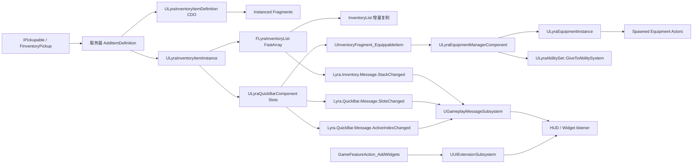

# UE5.8 Lyra 源码解析 43：背包、装备、消息与 UI

> 本篇沿着“拾取物 → Inventory ItemInstance → QuickBar → Equipment → AbilitySet → GameplayMessage → HUD/UIExtension”的链路阅读 Lyra 5.8 源码。
> 重点是对象所有权、FastArray 增量复制、客户端/服务器职责和动态 UI 装配，而不是把样例背包误解成可直接用于商业项目的完整库存服务。
> 知识成熟度：L2（本机 UE 5.8 与 Lyra 5.8 项目/插件源码已静态核对；PIE 和联机实验为可复现验证步骤）。

## 元数据

| 项目 | 内容 |
| --- | --- |
| 版本基准 | UE 5.8.0 / CL 55116800 / `++UE5+Release-5.8` |
| Lyra 基线 | 本机 `LyraStarterGame.uproject` 的 `EngineAssociation=5.8` |
| 项目源码根 | `C:\Users\zhaozhiqi\Documents\Unreal Projects\LyraStarterGame` |
| 引擎源码根 | `C:\Program Files\Epic Games\UE_5.8\Engine` |
| 适用范围 | Lyra 5.8 背包、拾取、快捷栏、装备实例、GAS 授权、GameplayMessageRouter、UIExtension |
| 运行角色 | 服务器权威写入；拥有者客户端发起输入；所有客户端读取复制结果和表现消息 |
| 知识成熟度 | L2：项目源码、插件源码和配置已静态核对；文中的 PIE/联机实验是可复现步骤，不宣称已经执行 |
| 官方参考 | [Lyra Inventory and Equipment](https://dev.epicgames.com/documentation/en-us/unreal-engine/lyra-inventory-and-equipment-in-unreal-engine)、[Lyra Sample Game](https://dev.epicgames.com/documentation/en-us/unreal-engine/lyra-sample-game-in-unreal-engine)、[Gameplay Ability System](https://dev.epicgames.com/documentation/en-us/unreal-engine/gameplay-ability-system-for-unreal-engine)、[Game Features and Modular Gameplay](https://dev.epicgames.com/documentation/en-us/unreal-engine/game-features-and-modular-gameplay-in-unreal-engine) |
| 最后更新 | 2026-08-13 |

## 一、先给结论

Lyra 把“物品是什么”和“物品当前如何工作”拆成了不同对象。

`ULyraInventoryItemDefinition` 是静态定义。

`ULyraInventoryItemFragment` 是可组合的静态片段。

`ULyraInventoryItemInstance` 是玩家拥有的可复制对象。

`FLyraInventoryList` 保存实例指针和堆叠数量。

`ULyraQuickBarComponent` 保存玩家选择的快捷栏引用。

`ULyraEquipmentDefinition` 描述装备时要生成的实例、Actor 和 AbilitySet。

`ULyraEquipmentInstance` 保存装备过程中的运行时状态和表现 Actor。

`ULyraEquipmentManagerComponent` 在服务器给 ASC 授权，并在取消装备时撤销授权。

`UGameplayMessageSubsystem` 把状态变化广播给不需要互相持有指针的观察者。

`UUIExtensionSubsystem` 把 GameFeature 提供的控件注入已经存在的 UI 插槽。

这条分层链的核心价值是“可替换、可复制、可卸载”。

这条链也有明确限制：样例背包没有容量和堆叠上限校验。

`FLyraInventoryList::AddEntry(ULyraInventoryItemInstance*)` 当前直接调用 `unimplemented()`。

`ConsumeItemsByDefinition` 的源码注释明确写出当前是 N² 搜索。

`GrantedHandles` 标记为 `NotReplicated`，只在 Authority 侧维护。

因此，本篇会同时写“样例如何工作”和“产品化时必须补上的约束”。

## 二、阅读前的事实边界

### 2.1 证据等级

| 等级 | 证据 | 本文用法 |
| --- | --- | --- |
| A | Lyra 5.8 `Source/LyraGame` 的 C++ 文件 | 作为类、函数、字段和调用顺序的直接事实 |
| B | Lyra 5.8 `Plugins` 中的插件源码 | 作为消息路由、UI 扩展和 GameFeature 行为事实 |
| C | UE 5.8 引擎源码或官方文档 | 作为 FastArray、ActorChannel、WorldSubsystem、GAS 语义的补充依据 |

本文不把 `.uasset` 文件名推断成完整的蓝图图表。

资产路径只能证明资产存在和可被引用。

蓝图父类、字段值和节点连线需要在 UE 编辑器中打开资产确认。

本文不把一次静态源码检索写成“已经通过 PIE”。

断点实验章节会给出应该看到的现象和记录字段。

### 2.2 先验证目录

```powershell
# 节选：确认项目、Inventory、Equipment 和两个插件目录存在
$Lyra = 'C:\Users\zhaozhiqi\Documents\Unreal Projects\LyraStarterGame'
Test-Path -LiteralPath "$Lyra\LyraStarterGame.uproject"
Test-Path -LiteralPath "$Lyra\Source\LyraGame\Inventory\LyraInventoryManagerComponent.cpp"
Test-Path -LiteralPath "$Lyra\Source\LyraGame\Equipment\LyraEquipmentManagerComponent.cpp"
Test-Path -LiteralPath "$Lyra\Plugins\GameplayMessageRouter\Source"
Test-Path -LiteralPath "$Lyra\Plugins\UIExtension\Source"
```

命令输出的 `True` 只说明路径存在。

源码事实仍要以文件中的真实符号为准。

### 2.3 目录地图

```text
LyraStarterGame/
├─ Source/LyraGame/Inventory/
│  ├─ LyraInventoryItemDefinition.h/.cpp
│  ├─ LyraInventoryItemInstance.h/.cpp
│  ├─ LyraInventoryManagerComponent.h/.cpp
│  ├─ InventoryFragment_*.h/.cpp
│  └─ IPickupable.h/.cpp
├─ Source/LyraGame/Equipment/
│  ├─ LyraQuickBarComponent.h/.cpp
│  ├─ LyraEquipmentDefinition.h/.cpp
│  ├─ LyraEquipmentInstance.h/.cpp
│  └─ LyraEquipmentManagerComponent.h/.cpp
├─ Source/LyraGame/AbilitySystem/
│  └─ LyraAbilitySet.h/.cpp
├─ Source/LyraGame/GameFeatures/
│  └─ GameFeatureAction_AddWidget.h/.cpp
└─ Plugins/
   ├─ GameplayMessageRouter/Source/GameplayMessageRuntime/
   └─ UIExtension/Source/
```

目录本身不是运行时调用顺序。

调用顺序要从“谁创建实例、谁拥有实例、谁广播变化”三个问题反推。

## 三、全链路总图



拾取和装备的权威写入在服务器侧完成。

客户端可以立即改变本地输入意图，但不能直接把背包状态写成可信结果。

FastArray 负责结构化状态的增量复制。

GameplayMessage 负责进程内的观察通知，不等于网络 RPC。

UIExtension 负责控件装配，不负责背包数值校验。

## 四、核心职责矩阵

| 对象 | 所在层 | 是否复制 | 主要写入端 | 主要读者 |
| --- | --- | --- | --- | --- |
| ItemDefinition CDO | 数据定义 | 否 | 编辑器/资产 | Inventory、Fragment、Equipment |
| Fragment | ItemDefinition 内嵌对象 | 随定义读取 | 编辑器/资产 | QuickBar、拾取、UI |
| ItemInstance | UObject 子对象 | 是 | 服务器 | 客户端背包、装备来源、UI |
| Inventory Entry | FastArray 条目 | 是 | 服务器 | 客户端库存列表 |
| QuickBar Slots | ControllerComponent 属性 | 是 | 服务器 RPC 实现 | 拥有者 UI、装备切换 |
| ActiveSlotIndex | ControllerComponent 属性 | 是 | 服务器 RPC 实现 | 拥有者 UI、装备切换 |
| Equipment Definition | 数据定义 | 否 | 编辑器/资产 | EquipmentManager |
| Equipment Instance | UObject 子对象 | 是 | 服务器创建 | Pawn、武器 UI、表现 |
| GrantedHandles | Equipment Entry 私有字段 | 否 | Authority | 撤销 Ability/Effect/Attribute |
| GameplayMessage | GameInstanceSubsystem 内事件 | 否 | 当前进程 | Widget、调试器、表现 |
| UIExtension Handle | WorldSubsystem 句柄 | 否 | 当前世界 | 动态 UI 清理 |

这张表要避免一个常见误读：复制的不是所有“消息”。

复制的是状态对象和数组属性。

收到复制回调后，本端才广播本地 GameplayMessage。

## 五、ItemDefinition：静态描述而非物品实例

### 5.1 类声明

文件：`Source/LyraGame/Inventory/LyraInventoryItemDefinition.h`。

`ULyraInventoryItemDefinition` 继承 `UObject`。

类标记为 `Blueprintable`、`Const`、`Abstract`。

这意味着资产或蓝图子类提供默认数据。

类本身不保存某个玩家的数量。

它的公开字段包括 `DisplayName`。

它的组合字段是 `TArray<TObjectPtr<ULyraInventoryItemFragment>> Fragments`。

`Fragments` 使用 `Instanced`，因此片段对象属于定义对象的对象层级。

### 5.2 Fragment 基类

`ULyraInventoryItemFragment` 也继承 `UObject`。

它带有 `DefaultToInstanced`、`EditInlineNew`、`Abstract`。

基类提供虚函数 `OnInstanceCreated(ULyraInventoryItemInstance* Instance) const`。

基类默认实现为空。

新增片段可以在创建 ItemInstance 时初始化实例级标签或状态。

片段不是 FastArray 条目。

片段也不是一个独立复制的 UObject。

客户端通常通过复制到达的 `ItemDef` 类 CDO 读取同一组静态片段。

### 5.3 当前样例片段

本机源码可见 `InventoryFragment_EquippableItem`。

它的字段是 `TSubclassOf<ULyraEquipmentDefinition> EquipmentDefinition`。

本机源码可见 `InventoryFragment_SetStats`。

它在 `OnInstanceCreated` 中向 ItemInstance 添加统计标签堆栈。

本机源码可见 `InventoryFragment_PickupIcon`。

它提供拾取界面使用的图标数据。

本机源码可见 `InventoryFragment_QuickBarIcon`。

它提供快捷栏图标数据。

本机源码可见 `InventoryFragment_ReticleConfig`。

它位于 `Source/LyraGame/Weapons`，用于武器准星配置。

这些片段只描述能力或表现所需的数据。

它们不应直接承担服务器交易日志和持久化职责。

### 5.4 查找 Fragment

`ULyraInventoryItemDefinition::FindFragmentByClass` 按类寻找片段。

`ULyraInventoryFunctionLibrary::FindItemDefinitionFragment` 提供蓝图查询入口。

`ULyraInventoryItemInstance::FindFragmentByClass` 会先取得 `ItemDef`。

随后把查找转发到定义的 CDO。

所以实例级查询结果来自静态定义。

如果片段需要根据随机词缀改变行为，词缀应放在 Instance 的复制字段。

不要把玩家可变值写回共享 CDO。

### 5.5 Definition 读取示意

```cpp
// 示意：不改变 CDO，不假设 Fragment 一定存在
const UInventoryFragment_EquippableItem* Equippable =
    ItemInstance->FindFragmentByClass<UInventoryFragment_EquippableItem>();
if (Equippable && Equippable->EquipmentDefinition)
{
    // 只读取装备定义，具体 EquipItem 仍由权威路径执行
}
```

这段代码的关键是空指针检查。

ItemDefinition 可能没有 Equippable 片段。

Equippable 片段也可能没有配置 EquipmentDefinition。

## 六、ItemInstance：可复制的玩家物品对象

### 6.1 网络支持

文件：`Source/LyraGame/Inventory/LyraInventoryItemInstance.h`。

类继承 `UObject`，标记为 `BlueprintType`。

重写 `IsSupportedForNetworking()` 并返回 `true`。

这使它可以作为 Actor 的 replicated subobject 发送。

`ItemDef` 使用 `UPROPERTY(Replicated)`。

`StatTags` 使用 `UPROPERTY(Replicated)`。

`StatTags` 类型是 `FGameplayTagStackContainer`。

实例不直接复制 ItemDefinition 的全部 Fragment 对象。

实例复制类引用和可变统计标签。

### 6.2 对象外层

Inventory AddEntry 创建实例时使用拥有 Actor 作为 Outer。

源码注释说明这是为了规避 UE-127172 相关对象外层问题。

Equipment AddEntry 创建 EquipmentInstance 时也使用拥有 Pawn 作为 Outer。

Outer 关系决定 `GetWorld()` 和垃圾回收可达性的重要部分。

对象外层不是网络所有权的替代品。

网络方向仍由外层 Actor 的复制通道决定。

### 6.3 属性复制片段

`LyraInventoryItemInstance.cpp` 实现 `RegisterReplicationFragments`。

函数调用 `FReplicationFragmentUtil::CreateAndRegisterFragmentsForObject`。

这说明 ItemInstance 兼容 UE 5.8 的 Iris 属性复制片段注册路径。

是否实际由 Iris 驱动仍取决于 NetDriver 和项目运行配置。

不能只因为存在该函数就断言所有运行都使用 Iris。

### 6.4 StatTag API

`AddStatTagStack` 标记为 `BlueprintAuthorityOnly`。

`RemoveStatTagStack` 也标记为 `BlueprintAuthorityOnly`。

`GetStatTagStackCount` 可以在两端读取。

`HasStatTag` 返回指定标签是否至少有一层。

服务端修改标签后由 ItemInstance 的属性复制到客户端。

客户端不应把本地标签修改当作服务器事实。

### 6.5 ItemDef 设置路径

`SetItemDef` 是私有函数。

`FLyraInventoryList` 被声明为友元。

因此只有 InventoryList 的 AddEntry 能合法设置定义。

这让创建流程集中到背包列表。

但 `AddEntry(instance)` 当前仍未实现。

后文会专门分析这个边界。

## 七、Inventory FastArray 数据结构

### 7.1 条目字段

文件：`Source/LyraGame/Inventory/LyraInventoryManagerComponent.h`。

`FLyraInventoryEntry` 继承 `FFastArraySerializerItem`。

条目保存 `TObjectPtr<ULyraInventoryItemInstance> Instance`。

条目保存 `int32 StackCount`。

条目保存 `LastObservedCount`，并标记 `NotReplicated`。

`LastObservedCount` 只用于客户端比较旧值和新值。

它不是网络协议字段。

### 7.2 列表字段

`FLyraInventoryList` 继承 `FFastArraySerializer`。

列表保存 `TArray<FLyraInventoryEntry> Entries`。

列表保存 `OwnerComponent`，并标记 `NotReplicated`。

OwnerComponent 用来找到世界和广播消息。

列表实现 `NetDeltaSerialize`。

实现调用 `FastArrayDeltaSerialize<FLyraInventoryEntry, FLyraInventoryList>`。

模板特征把 `WithNetDeltaSerializer` 设为 `true`。

### 7.3 为什么使用 FastArray

普通数组复制会让每次变化携带更多上下文。

FastArray 维护条目变更标记。

新增条目进入 AddedIndices。

移除条目进入 RemovedIndices。

修改条目进入 ChangedIndices。

网络层可以只发送变化项。

这适合背包这种条目数量有限但变化频率不均匀的数据。

FastArray 不会自动替你实现堆叠策略。

FastArray 也不验证客户端请求是否合法。

### 7.4 Mark 调用语义

新增条目调用 `MarkItemDirty(NewEntry)`。

移除条目调用 `MarkArrayDirty()`。

改变已有条目数量时也必须标记对应条目。

如果产品代码直接改 `StackCount` 而忘记标记，复制可能延迟或丢失。

标记发生在服务器权威修改路径。

客户端不应通过 Mark 函数伪造复制结果。

## 八、Inventory 的添加与移除调用链

### 8.1 AddItemDefinition

`ULyraInventoryManagerComponent::AddItemDefinition` 标记为 `BlueprintAuthorityOnly`。

函数检查 `ItemDef != nullptr`。

随后调用 `InventoryList.AddEntry(ItemDef, StackCount)`。

列表检查 OwnerComponent 和 OwnerActor。

列表检查 OwnerActor `HasAuthority()`。

列表追加默认条目。

列表创建 `ULyraInventoryItemInstance`。

列表设置 ItemDef 类。

列表遍历 ItemDef CDO 的 Fragments。

每个非空 Fragment 收到 `OnInstanceCreated`。

列表设置 `StackCount`。

列表调用 `MarkItemDirty`。

组件返回新实例。

如果使用 RegisteredSubObjectList 且组件已经 ReadyForReplication，则注册新实例。

### 8.2 AddItemInstance

`AddItemInstance` 也标记为 `BlueprintAuthorityOnly`。

组件把实例交给 `InventoryList.AddEntry(ItemInstance)`。

当前实现的列表函数只有 `unimplemented()`。

因此调用这个入口会在运行时触发未实现断言或等价失败路径。

`IPickupable::AddPickupToInventory` 会遍历 `FInventoryPickup.Instances` 调用此入口。

这意味着使用实例模板的拾取资产必须先在产品代码中补齐实现。

不能把“接口存在”当成“实例拾取已可用”。

### 8.3 RemoveItemInstance

组件调用 `InventoryList.RemoveEntry(ItemInstance)`。

列表遍历 Entries。

匹配实例后移除当前迭代器元素。

随后调用 `MarkArrayDirty()`。

组件若使用 RegisteredSubObjectList，则调用 `RemoveReplicatedSubObject`。

移除并不会自动广播 Inventory Message。

在客户端，FastArray 的 `PreReplicatedRemove` 负责广播删除变化。

### 8.4 当前 AddEntry(instance) 边界

源码事实必须单独记住：`FLyraInventoryList::AddEntry(ULyraInventoryItemInstance*)` 当前是 `unimplemented()`。

这不是注释中的设计草图，而是函数体中的真实行为。

调用方不能期待它合并同定义堆叠。

调用方不能期待它校验实例是否已经属于另一背包。

调用方不能期待它自动设置 Outer。

调用方不能期待它自动运行所有 Fragment 初始化。

产品化实现至少要定义对象所有权、重复添加、复制注册和失败回滚。

## 九、Inventory 查询和消费

### 9.1 全量查询

`GetAllItems()` 创建结果数组。

结果提前分配 Entries 数量。

函数跳过空 Instance。

函数返回实例指针数组。

返回数组是拷贝，不是对内部 Entries 的可写引用。

这适合 UI 列表刷新和调试遍历。

高频 Tick 中反复调用会产生数组分配成本。

### 9.2 按定义查找

`FindFirstItemStackByDefinition` 线性遍历 Entries。

函数先判断 Instance 有效。

函数比较 `Instance->GetItemDef()` 和目标类。

找到第一项就返回。

没有索引表。

没有按照 StackCount 排序。

“First”表示数组中的第一项，不表示数量最多。

### 9.3 总数函数的真实语义

`GetTotalItemCountByDefinition` 名称看起来像总数量。

源码循环中每匹配一项只执行 `++TotalCount`。

它没有把 `Entry.StackCount` 加入总数。

因此当前函数更接近“匹配条目数”。

教程和产品代码都不能把它当成堆叠数量总和。

这是一个需要单元测试锁定的样例边界。

### 9.4 ConsumeItemsByDefinition

函数先获取 OwnerActor。

没有 Owner 或没有 Authority 时返回 `false`。

函数使用 `TotalConsumed` 记录已删除的实例数。

循环条件是 `TotalConsumed < NumToConsume`。

每次循环调用 `FindFirstItemStackByDefinition`。

找到后删除整个 Instance 条目。

没有减少一个条目的 StackCount。

找不到时立即返回 `false`。

源码注释标明当前实现是 N squared。

原因是每次消费都重新线性扫描列表。

产品化应先验证可消费总量，再批量更新，避免部分成功。

### 9.5 交易原子性建议

调用消费前先计算真实堆叠总量。

计算不足时不要修改列表。

计算足够时记录待删除条目和待减少数量。

一次性应用变更并统一标记。

成功后写审计事件。

失败时保持原列表不变。

网络 RPC 应带请求 ID 以支持幂等。

服务器应检查调用者是否拥有该 InventoryComponent。

## 十、复制子对象的两条路径

### 10.1 RegisteredSubObjectList

组件构造函数调用 `SetIsReplicatedByDefault(true)`。

`ReadyForReplication` 遍历已有 Entries。

对每个有效 ItemInstance 调用 `AddReplicatedSubObject`。

新加实例在组件 Ready 且使用注册列表时立即注册。

移除实例时调用 `RemoveReplicatedSubObject`。

这条路径依赖引擎对注册子对象列表的支持。

### 10.2 ActorChannel 手动路径

`ReplicateSubobjects` 先调用父类实现。

然后遍历 `InventoryList.Entries`。

对每个有效实例调用 `Channel->ReplicateSubobject`。

函数返回是否写入了数据。

这条路径保证 ItemInstance 属性有明确的 ActorChannel 入口。

两条路径的使用条件由引擎复制设置决定。

产品代码不应在同一生命周期重复注册导致所有权混乱。

### 10.3 InventoryList 先于 Instance 的关系

网络接收端可能先收到列表条目再完成子对象属性。

UI 不应在只看到条目指针时立即读取所有实例字段。

需要通过有效性判断或延后一帧的异步初始化。

在 `PostReplicatedAdd` 中广播时，Instance 指针来自条目。

如果依赖的 ItemDef 尚未完成，观察者仍应防御性读取。

### 10.4 网络记录字段

调试复制时记录 `NetMode`。

记录 `LocalRole` 和 `RemoteRole`。

记录 OwnerActor 名称。

记录 ItemInstance 名称。

记录 ItemDef 类名。

记录 StackCount。

记录是否走 RegisteredSubObjectList。

记录是否触发 ActorChannel。

## 十一、FastArray 三个复制回调

### 11.1 PreReplicatedRemove

函数接收 RemovedIndices。

逐个取得被移除前的条目。

用旧 StackCount 作为 OldCount。

用零作为 NewCount。

调用 `BroadcastChangeMessage`。

把 `LastObservedCount` 写成零。

这让客户端 UI 能收到“物品消失”的状态变化。

### 11.2 PostReplicatedAdd

函数接收 AddedIndices。

新增条目的旧数量按零处理。

新数量取条目的 StackCount。

调用 `BroadcastChangeMessage`。

把 `LastObservedCount` 更新为当前数量。

客户端第一次收到库存时也会收到添加消息。

### 11.3 PostReplicatedChange

函数接收 ChangedIndices。

先检查 `LastObservedCount != INDEX_NONE`。

OldCount 使用缓存值。

NewCount 使用条目当前值。

广播后写回新的 LastObservedCount。

因此 Delta 是客户端观察到的差值。

### 11.4 BroadcastChangeMessage

消息类型是 `FLyraInventoryChangeMessage`。

`InventoryOwner` 指向 OwnerComponent。

`Instance` 指向条目实例。

`NewCount` 是新数量。

`Delta` 是 `NewCount - OldCount`。

频道 Tag 是 `Lyra.Inventory.Message.StackChanged`。

系统通过 `UGameplayMessageSubsystem::Get(OwnerComponent->GetWorld())` 获取路由器。

消息广播只发生在本地进程。

消息不会自动跨网络发送。

## 十二、GameplayMessageRouter 的设计

### 12.1 Subsystem 层级

插件文件：`Plugins/GameplayMessageRouter/Source/GameplayMessageRuntime/Public/GameFramework/GameplayMessageSubsystem.h`。

`UGameplayMessageSubsystem` 继承 `UGameInstanceSubsystem`。

可通过 `UGameplayMessageSubsystem::Get(WorldContextObject)` 获取。

同一 GameInstance 下的世界共享消息路由实例。

监听者不需要知道广播者的具体类。

广播者和监听者必须约定同一个 USTRUCT 载荷类型。

### 12.2 注册监听

`RegisterListener` 返回 `FGameplayMessageListenerHandle`。

句柄可以调用 `Unregister()`。

也可以交给 Subsystem 的 `UnregisterListener`。

成员函数注册模板使用弱对象指针。

对象失效后不会强行调用回调。

组件销毁时仍建议主动注销句柄。

### 12.3 匹配规则

`EGameplayMessageMatch::ExactMatch` 只匹配精确频道。

`PartialMatch` 可以接收子频道。

Inventory 和 QuickBar 当前使用静态频道 Tag。

观察者应使用精确匹配避免意外处理其他频道。

频道命名是协议的一部分。

重命名频道会影响所有监听代码和蓝图。

### 12.4 类型安全边界

路由器记录监听者期待的 `UScriptStruct`。

广播时会传入发送结构体类型。

频道相同但结构体不同会记录错误。

不要在同一个频道混用多个不兼容 Payload。

如果需要多种消息，创建不同子 Tag。

### 12.5 监听示意

```cpp
// 节选：在初始化阶段登记，在结束阶段解除
ListenerHandle = UGameplayMessageSubsystem::Get(this).RegisterListener<FLyraInventoryChangeMessage>(
    TAG_Lyra_Inventory_Message_StackChanged,
    this,
    &UMyInventoryWidgetController::HandleInventoryChanged);

void UMyInventoryWidgetController::HandleInventoryChanged(
    FGameplayTag Channel,
    const FLyraInventoryChangeMessage& Message)
{
    if (!Message.Instance || Message.NewCount < 0)
    {
        return;
    }
    RefreshEntry(Message.Instance, Message.NewCount, Message.Delta);
}
```

这段代码只描述消息观察。

它不应该在回调里直接给服务器发未校验的消费请求。

## 十三、拾取接口与模板

### 13.1 IPickupable

文件：`Source/LyraGame/Inventory/IPickupable.h`。

`IPickupable` 是不能在蓝图实现的接口标记。

接口声明 `GetPickupInventory()`。

返回类型是 `FInventoryPickup`。

`FInventoryPickup` 包含 `Instances` 数组。

`FInventoryPickup` 也包含 `Templates` 数组。

模板元素 `FPickupTemplate` 有 `StackCount` 和 `ItemDef`。

实例元素 `FPickupInstance` 有 `Item` 指针。

### 13.2 找到拾取接口

`GetFirstPickupableFromActor` 先检查 Actor 本身。

如果 Actor 不是接口实现，则枚举实现接口的组件。

函数返回找到的第一个组件。

这种“第一个”策略简单但不支持多物品分区。

复杂拾取规则应在交互系统另行定义。

### 13.3 添加模板

`AddPickupToInventory` 标记为 `BlueprintAuthorityOnly`。

函数遍历 `PickupInventory.Templates`。

每个模板调用 `AddItemDefinition(Template.ItemDef, Template.StackCount)`。

这条路径会创建新的 ItemInstance。

Fragment 的 `OnInstanceCreated` 会执行。

### 13.4 添加实例模板

函数随后遍历 `PickupInventory.Instances`。

每个实例调用 `AddItemInstance(Instance.Item)`。

由于列表的 `AddEntry(instance)` 当前未实现，实例模板路径不能视为可用完成链。

产品实现需要决定是否克隆实例而不是直接转移同一个 UObject 指针。

跨 Pawn 直接转移实例时要处理 Outer、复制注册和旧 Inventory 引用。

## 十四、QuickBar 数据与 RPC

### 14.1 组件位置

`ULyraQuickBarComponent` 继承 `UControllerComponent`。

它通常附着在 Controller，而不是 Pawn。

这让玩家切换 Pawn 时能保留快捷栏选择。

组件默认复制。

`NumSlots` 默认值是 3。

BeginPlay 时如果 Slots 少于 NumSlots，则补齐空槽。

### 14.2 Slots 字段

`Slots` 是 `TArray<TObjectPtr<ULyraInventoryItemInstance>>`。

字段标记 `ReplicatedUsing=OnRep_Slots`。

`ActiveSlotIndex` 标记 `ReplicatedUsing=OnRep_ActiveSlotIndex`。

默认 ActiveSlotIndex 为 -1。

`EquippedItem` 是本地组件持有的 EquipmentInstance 指针。

Slots 中保存的是 Inventory ItemInstance，不是 EquipmentInstance。

### 14.3 设置活动槽

`SetActiveSlotIndex` 是 `Server, Reliable` RPC。

实现函数先检查索引有效。

实现函数避免重复设置同一索引。

先调用 `UnequipItemInSlot()`。

再写入 `ActiveSlotIndex`。

再调用 `EquipItemInSlot()`。

最后显式调用 `OnRep_ActiveSlotIndex()`。

这说明服务器本地也需要触发 UI 消息。

客户端不能仅靠本地修改 ActiveSlotIndex 取得权威装备。

### 14.4 循环选择

前向循环从当前索引的下一个位置开始。

反向循环从当前索引的前一个位置开始。

循环跳过空槽。

如果没有任何非空槽，函数不发送 RPC。

索引采用模运算环绕。

循环函数是本地输入辅助，不等于服务器校验。

服务器仍应验证传入索引和槽位物品关系。

### 14.5 槽位添加和移除

`AddItemToSlot` 标记为 `BlueprintAuthorityOnly`。

它只在索引有效且 Item 非空时继续。

目标槽为空时才写入。

写入后显式调用 `OnRep_Slots()`。

`RemoveItemFromSlot` 如果移除当前活动槽，会先卸下装备。

它把 ActiveSlotIndex 设置为 -1。

随后清空槽位并调用 `OnRep_Slots()`。

### 14.6 QuickBar 消息

Slots 消息频道是 `Lyra.QuickBar.Message.SlotsChanged`。

Payload 是 `FLyraQuickBarSlotsChangedMessage`。

Payload 包含 Owner Actor 和 Slots 数组。

活动索引频道是 `Lyra.QuickBar.Message.ActiveIndexChanged`。

Payload 是 `FLyraQuickBarActiveIndexChangedMessage`。

Payload 包含 Owner Actor 和 ActiveIndex。

`OnRep_Slots` 和 `OnRep_ActiveSlotIndex` 都通过 GameplayMessageSubsystem 广播。

## 十五、QuickBar 到 Equipment 的桥梁

### 15.1 读取 Equippable Fragment

`EquipItemInSlot` 先检查 ActiveSlotIndex 合法。

再检查 `EquippedItem == nullptr`。

读取活动槽中的 ItemInstance。

通过 `FindFragmentByClass<UInventoryFragment_EquippableItem>()` 查询片段。

从片段取得 `EquipmentDefinition`。

没有装备定义时不会继续。

### 15.2 找到 EquipmentManager

QuickBar Owner 是 Controller。

组件把 Owner 转为 `AController`。

从 Controller 取得当前 Pawn。

从 Pawn 上查找 `ULyraEquipmentManagerComponent`。

如果 Controller 尚未 Possess Pawn，返回空。

重生期间这条链可能短暂断开。

因此 UI 和输入必须能承受装备管理器暂时不可用。

### 15.3 EquipItem 调用

找到 EquipmentManager 后调用 `EquipItem(EquipDef)`。

EquipItem 是 `BlueprintAuthorityOnly`。

服务器添加 Equipment Entry。

创建 EquipmentInstance。

授予 AbilitySet。

生成表现 Actor。

调用 EquipmentInstance 的 `OnEquipped()`。

QuickBar 把 ItemInstance 设置为 EquipmentInstance 的 Instigator。

Instigator 是来源物品引用，不是网络授权替代品。

### 15.4 卸下路径

换槽前先调用 `UnequipItemInSlot()`。

EquipmentManager 撤销 AbilitySet 句柄。

EquipmentInstance 销毁 SpawnedActors。

Equipment Entry 从 FastArray 移除。

QuickBar 清空本地 EquippedItem。

客户端通过 Equipment FastArray 回调调用 `OnUnequipped()`。

## 十六、EquipmentDefinition 与 Instance

### 16.1 EquipmentDefinition 字段

文件：`Source/LyraGame/Equipment/LyraEquipmentDefinition.h`。

`InstanceType` 决定运行时 EquipmentInstance 子类。

`AbilitySetsToGrant` 保存要授予的 `ULyraAbilitySet` 数组。

`ActorsToSpawn` 保存要生成的表现 Actor。

每个 `FLyraEquipmentActorToSpawn` 有 Actor 类。

它还有 AttachSocket。

它还有 AttachTransform。

定义是 Const 数据对象。

定义不保存某个玩家的授权句柄。

### 16.2 EquipmentInstance 字段

文件：`Source/LyraGame/Equipment/LyraEquipmentInstance.h`。

类继承 `UObject` 并支持网络。

`GetWorld()` 从外层 Pawn 获取世界。

`Instigator` 是复制字段。

`SpawnedActors` 是复制数组。

`OnEquipped` 调 BlueprintImplementableEvent `K2_OnEquipped`。

`OnUnequipped` 调 `K2_OnUnequipped`。

实例可以查询自己的 Pawn。

实例可以返回当前已生成 Actor。

### 16.3 生成表现 Actor

`SpawnEquipmentActors` 先取得拥有 Pawn。

默认附着目标是 Pawn RootComponent。

如果 Pawn 是 Character，则附着目标改为 SkeletalMesh。

每个 SpawnInfo 使用 `SpawnActorDeferred`。

随后调用 `FinishSpawning`。

设置相对变换。

按 socket 附着到组件。

将新 Actor 加入 SpawnedActors。

生成表现 Actor 不是 Ability 授权。

两者失败时要分别诊断。

### 16.4 销毁表现 Actor

`DestroyEquipmentActors` 遍历 SpawnedActors。

有效 Actor 调用 `Destroy()`。

源码没有在这里清空数组。

重复调用前应确认 Actor 状态。

产品代码可以在销毁后清理引用并记录实例 ID。

## 十七、Equipment FastArray 与复制回调

### 17.1 条目字段

`FLyraAppliedEquipmentEntry` 继承 `FFastArraySerializerItem`。

`EquipmentDefinition` 是复制字段。

`Instance` 是复制字段。

`GrantedHandles` 标记 `NotReplicated`。

GrantedHandles 只由授权方保存。

客户端不依赖 GrantedHandles 清理自己的 UI。

### 17.2 AddEntry

列表检查 EquipmentDefinition 非空。

列表检查 OwnerComponent。

列表检查 OwnerActor `HasAuthority()`。

读取 EquipmentDefinition CDO。

选择配置的 InstanceType。

未配置时使用 `ULyraEquipmentInstance::StaticClass()`。

使用 OwnerActor 作为 Outer 创建实例。

若 ASC 存在，遍历 AbilitySetsToGrant。

调用 `GiveToAbilitySystem(ASC, &GrantedHandles, Result)`。

生成 Equipment Actors。

调用 `MarkItemDirty(NewEntry)`。

### 17.3 RemoveEntry

列表按 Instance 查找条目。

取得当前 ASC。

调用 `GrantedHandles.TakeFromAbilitySystem(ASC)`。

该函数只在 ASC Owner Actor Authority 时真正撤销。

调用 Instance 的 `DestroyEquipmentActors()`。

移除当前条目。

调用 `MarkArrayDirty()`。

### 17.4 复制回调

`PreReplicatedRemove` 对有效 Instance 调用 `OnUnequipped()`。

`PostReplicatedAdd` 对有效 Instance 调用 `OnEquipped()`。

`PostReplicatedChange` 当前没有执行逻辑。

因此客户端新增装备会触发表现事件。

客户端移除装备也会触发表现事件。

已有装备的字段变化不会自动调用 `OnEquipped()`。

如果产品需要换弹等状态，应使用独立复制字段或消息。

### 17.5 组件层生命周期

`ULyraEquipmentManagerComponent` 构造时启用复制。

`EquipItem` 调用列表 AddEntry。

成功后在服务器主动调用 `Result->OnEquipped()`。

已 Ready 且使用注册子对象列表时注册实例。

`UnequipItem` 先移除注册子对象。

随后调用 `ItemInstance->OnUnequipped()`。

再交给列表移除。

`UninitializeComponent` 先拷贝所有实例，再逐个卸下。

拷贝是为了避免迭代器受移除副作用影响。

## 十八、AbilitySet 授权与撤销

### 18.1 数据结构

文件：`Source/LyraGame/AbilitySystem/LyraAbilitySet.h`。

`FLyraAbilitySet_GameplayAbility` 保存 Ability 类。

它保存 AbilityLevel。

它保存 InputTag。

`FLyraAbilitySet_GameplayEffect` 保存 GameplayEffect 类和等级。

`FLyraAbilitySet_AttributeSet` 保存 AttributeSet 类。

`ULyraAbilitySet` 继承 `UPrimaryDataAsset`。

### 18.2 GiveToAbilitySystem 的 Authority 检查

函数先检查 ASC 非空。

函数检查 `IsOwnerActorAuthoritative()`。

非 Authority 立即返回。

这就是 Equipment AbilitySet 授权的权威边界。

客户端不会因为收到 Equipment Entry 就自行 GiveAbility。

客户端通过 GAS 复制看到服务端授予的 Spec。

### 18.3 AttributeSet 授予

遍历 GrantedAttributes。

检查 AttributeSet 类有效。

使用 ASC Owner 创建新的 AttributeSet 对象。

调用 `AddAttributeSetSubobject`。

如果输出句柄非空，记录 AttributeSet。

错误类会写入 `LogLyraAbilitySystem`。

### 18.4 Ability 授予

遍历 GrantedGameplayAbilities。

检查 Ability 类有效。

取得 Ability CDO。

构造 `FGameplayAbilitySpec`。

写入 AbilityLevel。

写入 `SourceObject = SourceObject`。

把 InputTag 写入 DynamicSpecSourceTags。

调用 `LyraASC->GiveAbility`。

把返回的 SpecHandle 存到 GrantedHandles。

EquipmentInstance 作为 SourceObject 让 Ability 能反查来源。

### 18.5 Effect 授予

遍历 GrantedGameplayEffects。

检查 GameplayEffect 类有效。

取得 GameplayEffect CDO。

使用 `ApplyGameplayEffectToSelf` 应用效果。

把返回的 ActiveGameplayEffectHandle 存入 GrantedHandles。

效果可能改变生命、移动速度或其他属性。

装备移除时按句柄移除效果。

### 18.6 GrantedHandles 的 Authority only 事实

`FLyraAppliedEquipmentEntry::GrantedHandles` 明确标记为 `NotReplicated`。

AbilitySet 的 Give 和 Take 都要求 Authority。

因此客户端不能从复制到的 Equipment Entry 读取可撤销句柄。

客户端撤销表现通过 `OnUnequipped` 和复制回调完成。

服务器撤销 GameplayAbility、GameplayEffect 和 AttributeSet。

产品化时应记录服务器授权审计，不要把句柄序列化到客户端协议。

## 十九、完整的服务器权威时序

### 19.1 拾取

客户端检测到可交互物。

客户端发送受限交互请求。

服务器确认距离、归属、可拾取状态。

服务器调用 `AddItemDefinition`。

服务器创建 ItemInstance。

服务器标记 Inventory Entry dirty。

服务器注册 replicated subobject。

服务器可销毁或锁定地面拾取 Actor。

客户端收到 Entry 和 ItemInstance。

客户端触发 `PostReplicatedAdd` 消息。

### 19.2 放入快捷栏

服务器校验 ItemInstance 是否属于该玩家 Inventory。

服务器校验槽位索引有效。

服务器写入 QuickBar Slots。

服务器调用 `OnRep_Slots` 产生本地消息。

客户端收到 Slots 属性复制。

客户端调用 `OnRep_Slots`。

HUD 监听消息并刷新槽位。

### 19.3 切换活动槽

拥有者客户端调用 `SetActiveSlotIndex` RPC。

服务器验证索引和 ItemInstance 关系。

服务器卸下旧 EquipmentInstance。

服务器写入 ActiveSlotIndex。

服务器通过 Fragment 取得 EquipmentDefinition。

服务器创建新 EquipmentInstance。

服务器授予 AbilitySet。

服务器生成表现 Actor。

服务器复制 Equipment Entry 和 ActiveSlotIndex。

客户端收到复制后触发 OnEquipped 和 UI 消息。

## 二十、客户端/服务器角色矩阵

| 操作 | Dedicated Server | Autonomous Proxy | Simulated Proxy |
| --- | --- | --- | --- |
| AddItemDefinition | 执行、创建、标记 dirty | 不能直接执行 | 不能直接执行 |
| AddItemInstance | 当前入口未实现 | 不能绕过服务器 | 不能绕过服务器 |
| Inventory FastArray 写入 | 权威 | 只读复制结果 | 只读复制结果 |
| Inventory PostReplicatedAdd | 通常不作为网络接收端 | 执行本地消息 | 执行本地消息 |
| ConsumeItemsByDefinition | 执行且要求 Authority | 返回 false | 返回 false |
| QuickBar SetActiveSlotIndex | 执行 RPC 实现并校验 | 发起 Reliable RPC | 不应代表他人发起 |
| QuickBar Slots 修改 | 服务器写入 | 通过复制读取 | 通过复制读取 |
| EquipItem | 创建实例、授予 AbilitySet | 不能直接授权 | 不能直接授权 |
| Equipment PostReplicatedAdd | 服务器本地 OnEquipped | 客户端表现回调 | 客户端表现回调 |
| GrantedHandles | 保存和消费 | 不存在复制副本 | 不存在复制副本 |
| GameplayMessage | 可在服务器进程广播 | 客户端进程本地广播 | 客户端进程本地广播 |
| UIExtension | 通常不创建玩家 HUD | 本地 UI WorldSubsystem | 本地 UI WorldSubsystem |

这张矩阵解释了“服务器没有 UI”并不矛盾。

服务器可以广播消息供服务器调试器使用。

真正的 HUD 只存在本地客户端世界。

## 二十一、UIExtension 动态装配

### 21.1 GameFeatureAction_AddWidgets

文件：`Source/LyraGame/GameFeatures/GameFeatureAction_AddWidget.cpp`。

类名是 `UGameFeatureAction_AddWidgets`。

它继承 `UGameFeatureAction_WorldActionBase`。

Action 的数据包括 Layout 数组。

每个 Layout 条目有软控件类和 LayerID。

另有 Widgets 数组。

每个 Widget 条目有 WidgetClass 和 SlotID。

### 21.2 AddToWorld

Action 取得 World 和 GameInstance。

只在 GameWorld 中继续。

从 GameInstance 获取 `UGameFrameworkComponentManager`。

以 `ALyraHUD` 作为扩展处理的 Actor 类。

注册 `AddExtensionHandler`。

把句柄存入当前 GameFeature ChangeContext 的 ContextData。

这使 Action 可以按上下文拆除资源。

### 21.3 Actor 扩展事件

`HandleActorExtension` 监听 `NAME_ExtensionRemoved`。

也监听 `NAME_ReceiverRemoved`。

删除事件调用 `RemoveWidgets`。

添加事件包括 `NAME_ExtensionAdded`。

也包括 `NAME_GameActorReady`。

添加事件调用 `AddWidgets`。

事件不是每帧轮询。

它依赖 ModularGameplay 的扩展事件契约。

### 21.4 推送 Layout

`AddWidgets` 把 Actor 转为 `ALyraHUD`。

如果没有 OwningPlayerController 则直接返回。

取得 HUD 控制器的 LocalPlayer。

每个有效 Layout 类调用 `UCommonUIExtensions::PushContentToLayer_ForPlayer`。

LayerID 通常是 `UI.Layer.Menu` 等 GameplayTag。

返回的 Widget 弱指针存进 ActorData.LayoutsAdded。

Layout 是 CommonUI Layer 内容。

### 21.5 注册 Widget Extension

通过 HUD World 获取 `UUIExtensionSubsystem`。

每个 Widget 条目调用 `RegisterExtensionAsWidgetForContext`。

上下文对象是 LocalPlayer。

SlotID 决定控件要插入的扩展点。

句柄存入 ActorData.ExtensionHandles。

优先级当前传入 -1。

### 21.6 拆除

`OnGameFeatureDeactivating` 找到 ChangeContext 数据。

调用 `Reset`。

Reset 清空 ComponentRequests。

遍历每个 ActorData 的 ExtensionHandles。

每个句柄调用 `Unregister()`。

Actor 删除时先 Deactivate Layout Widget。

随后注销 UIExtension 句柄。

最后移除 ActorData。

这使 GameFeature 可以卸载而不残留控件。

## 二十二、UIExtensionSubsystem 契约

插件文件：`Plugins/UIExtension/Source/Public/UIExtensionSystem.h`。

`UUIExtensionSubsystem` 继承 `UWorldSubsystem`。

扩展点由 GameplayTag 标识。

扩展点支持 ExactMatch 和 PartialMatch。

扩展数据带 ContextObject。

扩展点可以限制 AllowedDataClasses。

注册扩展点返回 `FUIExtensionPointHandle`。

注册控件返回 `FUIExtensionHandle`。

两个句柄都提供 `Unregister()`。

Widget 插槽事件使用 `EUIExtensionAction::Added/Removed`。

UIExtension 只负责“谁可以插入哪里”。

它不负责判断库存数量是否正确。

### 22.1 UI 监听消息的边界

背包消息应驱动 Widget 数据模型刷新。

UIExtension 应驱动 Widget 实例的挂载与卸载。

两者是正交关系。

一个 Widget 可以在插入后才注册消息监听。

卸载前应注销消息句柄。

Widget 不应持有已销毁 InventoryComponent 的强引用。

### 22.2 典型 UI 数据流

HUD 创建或 GameFeature 注入 InventoryWidget。

WidgetController 取得本地 PlayerController。

Controller 查找 QuickBarComponent。

Controller 注册 SlotsChanged 监听。

收到 Payload 后更新 ViewModel。

ViewModel 再刷新 CommonUI/UMG。

ItemIcon 从 ItemInstance 查找 QuickBarIcon Fragment。

数量从消息 NewCount 获取。

控件卸载时注销监听和 UIExtension 句柄。

## 二十三、消息不是 RPC：两层通信模型

### 23.1 网络层

FastArray、ReplicatedUsing 和 ActorChannel 负责跨网络传输状态。

Server RPC 负责把客户端意图送到服务器。

AbilitySet 授权通过 GAS 的复制机制同步 Spec 和效果结果。

EquipmentInstance 是 replicated subobject。

这些路径有网络可靠性、权限和带宽语义。

### 23.2 进程内消息层

`UGameplayMessageSubsystem::BroadcastMessage` 只在当前进程调用监听者。

Inventory 回调在每个接收端本地广播一次。

QuickBar OnRep 在每个接收端本地广播一次。

消息顺序取决于复制回调顺序和监听注册时机。

消息不会为晚注册者回放历史状态。

UI 初始化后应主动读取当前 Slots/Inventory 快照。

### 23.3 设计含义

把消息当成“变化通知”，把复制属性当成“当前事实”。

Widget 只收到消息而没有快照时，可能错过创建前的变化。

Widget 只读快照而不听消息时，可能不会增量刷新。

正确组合是“初始化读取 + 消息增量更新”。

### 23.4 Lyra 的显式跨网消息桥

“GameplayMessage 只在本地广播”不等于 Lyra 完全没有跨网消息方案。

`ALyraGameState::MulticastMessageToClients` 先用 Multicast RPC 把 `FLyraVerbMessage` 发到客户端。

`ALyraPlayerState::ClientBroadcastMessage` 则用 Client RPC 定向发送，并仅在 `NM_Client` 下重新广播。

`FLyraVerbMessageReplication::RebroadcastMessage` 还会把 FastArray 收到的 VerbMessage 交给本地 `UGameplayMessageSubsystem`。

这三条路径都遵守同一原则：网络层显式传输，接收端再按 GameplayTag 做进程内分发。

它们不是 Inventory StackChanged 的自动网络能力；库存仍先复制 FastArray/子对象，再由复制回调在本地生成变化消息。

因此产品代码若要新增跨网通知，必须明确选择 RPC、复制属性或 VerbMessage 复制容器，不能期待 `BroadcastMessage` 自己越过网络。

## 二十四、源码级最小示例

### 24.1 添加定义实例

```cpp
// 节选：只在服务器调用
if (HasAuthority() && InventoryComponent && ItemDefinition)
{
    ULyraInventoryItemInstance* Instance =
        InventoryComponent->AddItemDefinition(ItemDefinition, 1);
    if (Instance)
    {
        // 服务器可将 Instance 放入 QuickBar 的空槽
    }
}
```

示例没有实现交易锁。

示例没有实现容量检查。

示例没有实现重复请求去重。

### 24.2 QuickBar 消息监听

```cpp
// 节选：注册后必须在销毁阶段注销
SlotsChangedHandle = UGameplayMessageSubsystem::Get(this)
    .RegisterListener<FLyraQuickBarSlotsChangedMessage>(
        TAG_Lyra_QuickBar_Message_SlotsChanged,
        this,
        &UMyQuickBarViewModel::OnSlotsChanged);
```

监听函数应检查 Owner 是否为当前 LocalPlayer 的 Controller。

不要在一个全局 HUD 中误处理其他玩家的 Slots 消息。

### 24.3 服务器校验槽位

```cpp
// 示意：产品服务器应验证归属关系
bool IsOwnedItem(const ULyraInventoryManagerComponent* Inventory,
                 const ULyraInventoryItemInstance* Item)
{
    if (!Inventory || !Item)
    {
        return false;
    }
    return Inventory->GetAllItems().Contains(Item);
}
```

该示例是线性检查。

生产实现可以用服务器侧索引加速。

即使使用索引，也要在移除和重生时更新索引。

## 二十五、断点实验 A：观察拾取到 FastArray

### 25.1 准备

启动 Lyra 5.8 项目并进入包含拾取物的测试地图。

使用一个服务器窗口和一个客户端窗口。

在 Visual Studio 中加载 `LyraInventoryManagerComponent.cpp`。

通过控制台变量 `GameplayMessageSubsystem.LogMessages` 打开消息日志。

在 Widget 侧准备日志监听器。

### 25.2 断点顺序

1. `UPickupableStatics::AddPickupToInventory`。
2. `ULyraInventoryManagerComponent::AddItemDefinition`。
3. `FLyraInventoryList::AddEntry(ItemDef, StackCount)`。
4. `ULyraInventoryItemFragment::OnInstanceCreated` 的具体子类。
5. `FLyraInventoryList::MarkItemDirty` 调用位置。
6. `ULyraInventoryManagerComponent::ReadyForReplication`。
7. `ULyraInventoryManagerComponent::ReplicateSubobjects`。
8. 客户端 `FLyraInventoryList::PostReplicatedAdd`。
9. `FLyraInventoryList::BroadcastChangeMessage`。
10. Inventory Widget 的消息回调。

### 25.3 每个断点记录

- NetMode。
- Actor Role。
- OwnerComponent 名称。
- ItemDef 类名。
- ItemInstance 名称。
- StackCount。
- Entries 数量。
- `LastObservedCount`。
- Message Channel。
- Message Delta。

### 25.4 预期现象

服务器先创建实例并标记条目。

客户端后收到条目和子对象。

客户端 PostReplicatedAdd 广播 NewCount。

服务器不应依赖客户端消息完成库存写入。

如果没有客户端消息，先检查条目复制和监听注册时机。

## 二十六、断点实验 B：验证 AddEntry(instance) 边界

### 26.1 实验目的

确认实例模板拾取路径不会被误认为已经完成。

构造一个 `FInventoryPickup`，只填充 `Instances`。

让服务器调用 `UPickupableStatics::AddPickupToInventory`。

在 `FLyraInventoryList::AddEntry(ULyraInventoryItemInstance*)` 设置断点。

记录进入函数后的调用栈。

### 26.2 观察点

函数体当前调用 `unimplemented()`。

没有追加 Entries。

没有 MarkItemDirty。

没有注册 replicated subobject。

没有执行克隆或 Outer 迁移。

实验结束后不要把实例指针留在两个 Inventory 中。

### 26.3 产品实现讨论

方案一是把实例克隆为新 Outer 的对象。

方案二是服务器内转移所有权并更新复制注册。

方案三是把实例模板转换为 ItemDefinition + StackCount。

方案选择取决于词缀、耐久和持久化需求。

每个方案都需要测试重连和回滚。

## 二十七、断点实验 C：验证 QuickBar 和 Equipment

### 27.1 断点顺序

1. `ULyraQuickBarComponent::SetActiveSlotIndex_Implementation`。
2. `UnequipItemInSlot`。
3. `EquipItemInSlot`。
4. `ULyraEquipmentManagerComponent::EquipItem`。
5. `FLyraEquipmentList::AddEntry`。
6. `ULyraAbilitySet::GiveToAbilitySystem`。
7. `ULyraEquipmentInstance::SpawnEquipmentActors`。
8. `ULyraEquipmentInstance::OnEquipped`。
9. 客户端 `FLyraEquipmentList::PostReplicatedAdd`。
10. QuickBar `OnRep_ActiveSlotIndex`。

### 27.2 记录字段

- ActiveSlotIndex 旧值和新值。
- Slot ItemInstance 名称。
- Equippable Fragment 地址。
- EquipmentDefinition 类名。
- EquipmentInstance 类名。
- ASC 指针和 OwnerActor。
- AbilitySet 数量。
- Granted Ability SpecHandle。
- SourceObject。
- SpawnedActors 数量。

### 27.3 预期顺序

服务器先撤销旧装备。

服务器再创建新装备实例。

服务器再授予 AbilitySet。

服务器再生成表现 Actor。

客户端收到装备条目后调用 OnEquipped。

客户端收到 ActiveIndex 变化后更新快捷栏 UI。

如果出现双倍 OnEquipped，检查服务器主动调用和客户端复制回调是否被错误合并。

## 二十八、断点实验 D：消息路由器

### 28.1 监听器断点

在 `UGameplayMessageSubsystem::RegisterListenerInternal` 设置断点。

在 `BroadcastMessageInternal` 设置断点。

在 `UnregisterListenerInternal` 设置断点。

观察 Channel、StructType 和 HandleID。

### 28.2 验证类型契约

让监听器期待 `FLyraInventoryChangeMessage`。

让广播器发送同一结构体。

记录无错误日志的路径。

再用错误结构体做负向实验。

确认路由器记录类型不匹配错误。

恢复正确结构体后再测试 UI。

### 28.3 生命周期

创建 Widget 后注册监听。

卸载 GameFeature。

确认 UIExtension 句柄被注销。

销毁 Widget。

确认 Message Handle 被注销。

再次广播消息时不应访问已销毁对象。

## 二十九、失败模式排查表

| 现象 | 首查位置 | 可能原因 | 修复方向 |
| --- | --- | --- | --- |
| 拾取后背包没有条目 | `AddItemDefinition` | 请求没有到服务器 | 检查 RPC、Authority 和交互归属 |
| 实例模板拾取崩溃 | `AddEntry(instance)` | 函数体是 `unimplemented()` | 转换为定义模板或实现克隆流程 |
| 数量显示错误 | `GetTotalItemCountByDefinition` | 函数按条目计数而非 StackCount | UI 使用消息数量或新增总堆叠函数 |
| 消费性能恶化 | `ConsumeItemsByDefinition` | 每项都线性查找，源码标注 N² | 建立索引并批量事务化 |
| 客户端没有 StackChanged | `PostReplicatedAdd` | FastArray 未复制或监听太晚 | 检查 MarkItemDirty、复制通道和初始快照 |
| 删除后 UI 仍显示 | `PreReplicatedRemove` | Widget 没处理 NewCount=0 | 删除行或刷新快照 |
| QuickBar 槽位写不进去 | `AddItemToSlot` | 不是 Authority 或槽位非空 | 服务器校验空槽和物品归属 |
| 切换槽位不装备 | `EquipItemInSlot` | Pawn/EquipmentManager 不存在 | 等待 Possess 或检查组件装配 |
| 装备没有 Ability | `GiveToAbilitySystem` | ASC 缺失或非 Authority | 确认 PlayerState ASC 和 OwnerActor |
| Ability 授予后无法撤销 | `GrantedHandles` | 句柄未保存或不在 Authority | 保持句柄只在服务器，并检查卸载路径 |
| 服务器有枪客户端没枪 | Equipment subobject | 子对象未注册/复制 | 检查 ReadyForReplication 和 ActorChannel |
| 装备表现重复生成 | `OnEquipped` | 服务器主动调用与回调逻辑混淆 | 区分本地权威表现和复制端表现 |
| Widget 注入后消失 | UIExtension | GameFeature 被卸载或 Context 不匹配 | 检查 ChangeContext、LocalPlayer 和 SlotID |
| UI 刷新其他玩家 | Message Payload | 未过滤 Owner | 按本地 Controller/Actor 过滤 |
| 消息回调访问空实例 | Inventory Message | 子对象属性尚未准备好 | 防御性检查并延迟读取 |
| 重生后快捷栏失效 | QuickBar Owner | Controller Pawn 变化 | 重建装备查找并等待 InitState |
| 客户端可伪造装备 | RPC 服务端未验证 | 只相信 Client 传来的索引/类 | 服务器从自身 Inventory 解析定义 |

## 三十、样例架构与商业背包的差距

### 30.1 当前样例未提供的能力

没有容量上限字段。

没有每种物品的堆叠上限校验。

没有重量或体积约束。

没有唯一物品 ID 协议。

没有实例模板克隆实现。

没有批量事务接口。

没有数据库持久化实现。

没有跨服务器迁移协议。

没有版本化存档迁移。

没有交易锁和并发冲突解决。

### 30.2 产品化数据模型建议

为每个实例分配服务器生成的 ItemId。

把 DefinitionId 和 InstanceId 分开。

为 StackCount 规定非负不变量。

把耐久、词缀、绑定状态放在 Instance 数据。

把静态图标和装备类放在 Definition/Fragment。

为每个变更附加 TransactionId。

让请求支持幂等重放。

将背包快照和增量日志分开存储。

### 30.3 容量和堆叠策略

先按 Definition 查找可合并条目。

再按堆叠上限分配数量。

不足部分创建新实例或拒绝。

更新所有受影响条目并统一标记。

向客户端发送每个变更的 Delta。

UI 不要通过 `GetTotalItemCountByDefinition` 猜测真实总数。

### 30.4 安全边界

客户端只发送“想拾取什么、想切换哪个槽位”。

服务器重新查询 Actor 和 Inventory。

服务器校验距离、视线、队伍和冷却。

服务器决定是否生成 ItemInstance。

服务器决定是否授予 AbilitySet。

客户端消息只能改变表现。

不要把 AbilitySet 类名作为可信客户端参数。

不要把 EquipmentDefinition 指针作为授权凭据。

## 三十一、性能与内存边界

### 31.1 FastArray 成本

FastArray 降低变化项复制开销。

它仍要序列化条目和实例引用。

实例数量过大时，初始复制仍可能昂贵。

UI 刷新应按 Delta 更新，而不是每条消息重建整棵树。

消息 Payload 中的 Slots 数组会复制数组引用列表。

大型仓库界面应使用分页或服务器查询。

### 31.2 线性查找成本

`FindFirstItemStackByDefinition` 是 O(N)。

当前 `ConsumeItemsByDefinition` 重复调用查找，最坏为 O(N²)。

`GetAllItems` 每次构造结果数组。

QuickBar 槽位数量通常很小，线性遍历成本可接受。

大规模背包应维护 Definition → Entry 索引。

索引必须在新增、移除、Definition 变更时同步维护。

### 31.3 子对象复制成本

每个 ItemInstance 都可能产生子对象复制记录。

每个 EquipmentInstance 还可能复制 SpawnedActors 引用。

只把需要被客户端读取的字段标为复制。

服务器内部审计字段不要放在 replicated UObject。

对远端不需要的实例考虑条件复制或分页协议。

### 31.4 UI 成本

GameplayMessage 回调应避免同步加载大量资产。

图标使用软引用并配合异步加载。

CommonUI Layer 中的 Widget 数量要有上限。

动态扩展句柄必须成对注销。

重建 UI 前先判断 Owner 和上下文是否仍有效。

## 三十二、常见反模式

1. 在客户端直接调用 `AddItemDefinition` 并把返回值当成服务器库存。
2. 把 `ItemDefinition` CDO 当成玩家可变实例。
3. 把 Fragment 中的静态字段写成运行时共享状态。
4. 忽略 `AddEntry(instance)` 的 `unimplemented()` 事实。
5. 把 `GetTotalItemCountByDefinition` 当作 StackCount 总和。
6. 每次消费都调用线性查找而不评估 N² 成本。
7. 直接修改 FastArray 条目而不调用 MarkItemDirty。
8. 在客户端构造新的 EquipmentInstance 试图获得能力。
9. 把 GrantedHandles 复制到客户端或暴露给客户端请求。
10. 把 GameplayMessage 当成可靠网络消息。
11. 只注册消息监听，不先读取当前状态快照。
12. UI 不过滤 Payload.Owner，误刷新其他玩家。
13. 让 Widget 持有跨世界的强引用。
14. GameFeature 卸载时不注销 UIExtension 句柄。
15. 用 Tick 轮询 QuickBar 代替 OnRep 消息。
16. 用客户端传来的 EquipmentDefinition 直接调用 EquipItem。
17. 将表现 Actor 生成和服务器权威装备状态混为一层。
18. 在 `OnEquipped` 中重复授予 AbilitySet。
19. 在 `OnUnequipped` 中只隐藏模型而不销毁 SpawnedActors。
20. 只测试单机，不测试重生、重连和复制乱序。

## 三十三、工程化改造顺序

### 33.1 第一阶段：锁定不变量

定义每个 ItemInstance 只能属于一个 Inventory。

定义所有修改必须发生在服务器。

定义 StackCount 不得为负。

定义 ActiveSlotIndex 为 -1 或有效槽位。

定义 EquipmentInstance 的来源 ItemInstance 必须仍然有效。

### 33.2 第二阶段：补齐实例拾取

选择克隆或转移语义。

为实例生成唯一 ID。

实现 Outer 和复制注册更新。

在失败时回滚原拾取物状态。

添加自动化测试覆盖重复拾取。

### 33.3 第三阶段：优化消费

实现真实堆叠总数查询。

预先检查资源是否足够。

批量修改条目。

一次事务统一广播。

用基准测试比较 O(N²) 和索引方案。

### 33.4 第四阶段：安全与审计

为 RPC 加请求序列号。

记录拒绝原因和调用者 NetId。

限制交互频率。

记录装备授予和撤销事件。

在服务端重连时从持久化快照恢复。

## 三十四、自动化测试入口

### 34.1 C++ 单元测试建议

测试 Definition 片段查找成功和失败。

测试 ItemInstance StatTag 增减。

测试 AddItemDefinition 只接受 Authority。

测试 AddEntry(instance) 的产品实现行为。

测试真实 StackCount 总和。

测试消费不足时不发生部分删除。

测试 QuickBar 跳过空槽。

测试 ActiveSlotIndex 边界。

测试 Equipment 授予 AbilitySet 后句柄数量。

测试 Unequip 清理 Ability、Effect 和 AttributeSet。

### 34.2 网络自动化测试

服务器添加物品后客户端收到 FastArray 条目。

客户端不能直接添加服务器物品。

断开重连后 Inventory 快照一致。

复制乱序时 UI 最终状态一致。

切换 Pawn 后 QuickBar 仍能找到 EquipmentManager。

装备移除后客户端收到 OnUnequipped。

消息监听者在 Widget 销毁后不再被调用。

### 34.3 ShooterTests 关联

本机 `Plugins/GameFeatures/ShooterTests` 包含测试地图和自动化资产。

`ShooterTestsRuntime` 源码和测试资产可作为网络、动画、输入与武器测试的参考入口。

这些资产存在性可通过 `rg --files` 验证。

资产内部步骤仍应在编辑器或测试运行器中确认。

不要仅根据文件名宣称所有背包场景都有覆盖。

## 三十五、日志和观测建议

### 35.1 分类日志

背包新增记录 ItemDef、StackCount 和请求 ID。

背包移除记录 InstanceId 和原因。

装备授予记录 EquipmentDefinition 和 AbilitySet。

装备撤销记录 GrantedHandles 数量。

消息路由记录 Channel 和 StructType。

UIExtension 记录 SlotID、Context 和句柄生命周期。

### 35.2 运行时控制台变量

项目开发设置声明 `GameplayMessageSubsystem.LogMessages` 控制项。

启用后观察广播和监听匹配。

复制问题仍需结合 NetDriver 日志。

不要用消息日志替代网络包捕获。

### 35.3 诊断快照

调试命令应输出 Inventory 条目数量。

输出每个 ItemInstance 的 ItemDef 和 StackCount。

输出 QuickBar Slots 和 ActiveSlotIndex。

输出 Equipment Instances 和 SpawnedActors。

输出 ASC 的 AbilitySpec 来源对象。

输出当前 UIExtension 句柄数量。

## 三十六、FAQ

### Q1：ItemDefinition 和 ItemInstance 为什么都叫 Item？

Definition 是静态类别。

Instance 是玩家拥有的对象。

数量、词缀和标签应该在 Instance。

图标、显示名和装备类通常在 Definition/Fragment。

### Q2：FastArray 会自动合并堆叠吗？

不会。

当前 AddEntry 直接新增条目并设置 StackCount。

堆叠上限和合并策略需要调用方实现。

### Q3：为什么消费一个数量会删除一个实例？

当前 ConsumeItemsByDefinition 按匹配 Instance 删除。

它没有减少 StackCount。

这正是样例和商业库存的差距之一。

### Q4：GameplayMessage 是否可靠？

它是本地进程内同步广播。

它不提供跨网络可靠传输。

跨网络状态仍依赖复制属性或 RPC。

### Q5：客户端为什么会收到 OnEquipped？

Equipment Entry 复制到客户端后触发 PostReplicatedAdd。

回调调用 Instance 的 OnEquipped。

这只负责本地表现，不在客户端授予 AbilitySet。

### Q6：GrantedHandles 为什么不复制？

它们用于服务器撤销能力、效果和属性。

客户端不应拥有撤销权。

因此字段标记为 NotReplicated。

### Q7：能否在 UI 里直接调用 EquipItem？

UI 可以发起意图。

真正的 EquipItem 是 BlueprintAuthorityOnly。

服务器应从已拥有的 ItemInstance 解析 EquipmentDefinition。

### Q8：UIExtension 和 CommonUI Layer 是一回事吗？

不是。

CommonUI Layer 管理可激活内容栈。

UIExtension 管理按 GameplayTag 注入的扩展点。

GameFeatureAction 可以同时使用两者。

### Q9：为什么消息回调里 Instance 为空？

条目和子对象属性可能分批到达。

也可能是条目刚被删除。

回调必须检查指针和 NewCount。

### Q10：为什么服务端看不到 HUD？

HUD 和 UIExtension 是客户端世界对象。

服务器只维护权威状态和服务器侧消息。

### Q11：Iris 是否一定启用？

ItemInstance 和 EquipmentInstance 注册了 Iris Replication Fragments。

这证明源码兼容 Iris 路径。

实际运行路径仍需结合 NetDriver 和配置验证。

### Q12：如何避免重连后 UI 空白？

Widget 初始化时主动读取 Inventory 和 QuickBar 快照。

再注册消息监听处理增量变化。

不要只等待一条历史消息。

## 三十七、验收清单

- [ ] 能指出 ItemDefinition、Fragment、ItemInstance 的职责边界。
- [ ] 能说出 ItemInstance 的两个复制字段。
- [ ] 能解释 FastArray Entry、List 和 NetDeltaSerialize。
- [ ] 能说明 MarkItemDirty 与 MarkArrayDirty 的用途。
- [ ] 能复述三个 Inventory 复制回调。
- [ ] 能指出 Inventory StackChanged 的频道 Tag。
- [ ] 能指出 QuickBar 两个消息频道。
- [ ] 能解释 QuickBar 为什么挂在 ControllerComponent。
- [ ] 能说出 SetActiveSlotIndex 是服务器可靠 RPC。
- [ ] 能画出 QuickBar 到 EquipmentManager 的调用链。
- [ ] 能指出 Equippable Fragment 的 EquipmentDefinition 字段。
- [ ] 能说出 EquipmentDefinition 的三类配置。
- [ ] 能解释 EquipmentInstance 如何生成和销毁 Actor。
- [ ] 能指出 Equipment PostReplicatedAdd/Remove 的表现回调。
- [ ] 能解释 AbilitySet 的 Ability、Effect、AttributeSet 三类授权。
- [ ] 能说明 SourceObject 是 EquipmentInstance。
- [ ] 能明确 GrantedHandles 是 Authority only 且 NotReplicated。
- [ ] 能区分 GameplayMessage 和网络复制。
- [ ] 能说明 Message Listener Handle 的注销要求。
- [ ] 能解释 UIExtension ChangeContext 的清理作用。
- [ ] 能复述 AddEntry(instance) 当前 `unimplemented()` 的事实。
- [ ] 能复述 ConsumeItemsByDefinition 当前 N² 的事实。
- [ ] 能列出至少五项商业背包需要新增的能力。
- [ ] 能设计一个服务器校验 QuickBar RPC 的实验。
- [ ] 能用断点记录 NetMode、Role、Instance、StackCount 和 Channel。

## 三十八、静态验证命令

### 38.1 源码符号检索

```powershell
$Lyra = 'C:\Users\zhaozhiqi\Documents\Unreal Projects\LyraStarterGame'
rg -n "unimplemented\(\)|ConsumeItemsByDefinition|FastArrayDeltaSerialize|GrantedHandles|StackChanged" `
  "$Lyra\Source\LyraGame\Inventory" "$Lyra\Source\LyraGame\Equipment"
```

### 38.2 消息和 UI 检索

```powershell
rg -n "BroadcastMessage|RegisterListener|RegisterExtensionAsWidgetForContext|PushContentToLayer_ForPlayer" `
  "$Lyra\Source\LyraGame" "$Lyra\Plugins\GameplayMessageRouter\Source" "$Lyra\Plugins\UIExtension\Source"
```

### 38.3 路径存在性

```powershell
@(
  "$Lyra\Source\LyraGame\Inventory\LyraInventoryManagerComponent.h",
  "$Lyra\Source\LyraGame\Inventory\LyraInventoryItemDefinition.h",
  "$Lyra\Source\LyraGame\Inventory\LyraInventoryItemInstance.h",
  "$Lyra\Source\LyraGame\Equipment\LyraQuickBarComponent.h",
  "$Lyra\Source\LyraGame\Equipment\LyraEquipmentManagerComponent.h",
  "$Lyra\Source\LyraGame\AbilitySystem\LyraAbilitySet.h",
  "$Lyra\Source\LyraGame\GameFeatures\GameFeatureAction_AddWidget.cpp"
) | ForEach-Object { [pscustomobject]@{Path=$_; Exists=Test-Path -LiteralPath $_} }
```

### 38.4 文档格式

```powershell
$Path = 'C:\project\git\游戏知识\12-引擎源码分析\43-Lyra-背包装备消息与UI源码.md'
$Bytes = [System.IO.File]::ReadAllBytes($Path)
$HasBom = $Bytes.Length -ge 3 -and $Bytes[0] -eq 0xEF -and $Bytes[1] -eq 0xBB -and $Bytes[2] -eq 0xBF
$Text = [System.IO.File]::ReadAllText($Path, [System.Text.UTF8Encoding]::new($false))
[pscustomobject]@{
  Lines = ($Text -split "`r?`n").Count
  UTF8Bom = $HasBom
  Fences = ([regex]::Matches($Text, '(?m)^```')).Count
}
```

预期 Lines 至少为 800。

UTF8Bom 应为 `False`。

Fences 应为偶数。

Placeholder 应为 `False`。

### 38.5 仓库门禁

```powershell
& 'C:\project\git\scripts\check_repo.ps1' -Root 'C:\project\git'
git -C 'C:\project\git' diff --check -- '游戏知识/12-引擎源码分析/43-Lyra-背包装备消息与UI源码.md'
git -C 'C:\project\git' status --short -- '游戏知识/12-引擎源码分析/43-Lyra-背包装备消息与UI源码.md'
```

本篇只允许新增目标文件。

仓库其他未提交改动属于用户现有工作，不应在本篇任务中覆盖。

## 三十九、关联阅读

- [39-Lyra源码总览与阅读路线](39-Lyra源码总览与阅读路线.md)：项目插件地图、Experience 入口和六篇阅读顺序。
- [40-Lyra-Experience与GameFeature源码](40-Lyra-Experience与GameFeature源码.md)：GameFeature 如何激活本篇的 UI Action 和组件。
- [41-Lyra-Pawn初始化与模块化组件源码](41-Lyra-Pawn初始化与模块化组件源码.md)：Pawn、PlayerState、ASC 和组件初始化会合。
- [42-Lyra-输入GAS与武器战斗源码](42-Lyra-输入GAS与武器战斗源码.md)：Equipment 授予的 Ability 如何接收输入并产生伤害。
- [05-GAS能力系统源码](05-GAS能力系统源码.md)：AbilitySpec、GameplayEffect 和 AttributeSet 的引擎底层。
- [09-网络复制与RPC源码](09-网络复制与RPC源码.md)：属性复制、RPC 和子对象生命周期。
- [20-Iris复制源码](20-Iris复制源码.md)：UE 5.8 Iris Fragment 与复制桥梁。
- [25-EnhancedInput与GameplayTags源码](25-EnhancedInput与GameplayTags源码.md)：QuickBar 输入和 GameplayTag 约定。
- [26-CommonUI源码](26-CommonUI源码.md)：Layer、ActivatableWidget 和 CommonUI 运行时。
- [27-UMGMVVM源码](27-UMGMVVM源码.md)：把消息 Payload 转换为可测试的 UI ViewModel。
- [13-背包与装备系统](../03-游戏玩法编程/13-背包与装备系统.md)：玩法层的库存建模与扩展建议。
- [46-Lyra-AI队伍与调试源码](46-Lyra-AI队伍与调试源码.md)：队伍颜色与 UI 展示数据的来源。
- [47-Lyra-调试工具与扩展源码](47-Lyra-调试工具与扩展源码.md)：生成物品与调试命令的 Cheat 入口。

## 四十、权威来源

- [Lyra Inventory and Equipment](https://dev.epicgames.com/documentation/en-us/unreal-engine/lyra-inventory-and-equipment-in-unreal-engine)
- [Lyra Sample Game](https://dev.epicgames.com/documentation/en-us/unreal-engine/lyra-sample-game-in-unreal-engine)
- [Game Features and Modular Gameplay](https://dev.epicgames.com/documentation/en-us/unreal-engine/game-features-and-modular-gameplay-in-unreal-engine)
- [Gameplay Ability System](https://dev.epicgames.com/documentation/en-us/unreal-engine/gameplay-ability-system-for-unreal-engine)
- [Networking and Multiplayer](https://dev.epicgames.com/documentation/en-us/unreal-engine/networking-and-multiplayer-in-unreal-engine)
- [Common UI](https://dev.epicgames.com/documentation/en-us/unreal-engine/common-ui-plugin-for-advanced-user-interfaces-in-unreal-engine)
- [Unreal Engine Documentation](https://dev.epicgames.com/documentation/en-us/unreal-engine)


## 附录：核心文件完整源码

> 收录原则：本附录把正文直接分析的 LyraStarterGame 5.8 项目源码文件逐字完整收录（未删改，保留 Epic 版权头），正文中的"节选"负责解释调用链，本附录提供全文，二者配合阅读。引擎层（`Engine/`）文件体量过大且不属于项目教程主体，仍按正文的路径+符号检索方式引用，不在此收录；`.uasset/.umap` 资产也不在收录范围。
> 版权提示：以下代码来自 Epic Games 的 LyraStarterGame 样例（UE 5.8），随 Unreal Engine EULA 的样例代码条款提供，仅作本地学习收录；对外发布前请自行核对许可条款。

| # | 文件（相对 LyraStarterGame 根） | 行数 |
| --- | --- | --- |
| 1 | `Source/LyraGame/Inventory/LyraInventoryItemDefinition.h` | 57 |
| 2 | `Source/LyraGame/Inventory/LyraInventoryItemDefinition.cpp` | 45 |
| 3 | `Source/LyraGame/Inventory/LyraInventoryItemInstance.h` | 77 |
| 4 | `Source/LyraGame/Inventory/LyraInventoryItemInstance.cpp` | 70 |
| 5 | `Source/LyraGame/Inventory/LyraInventoryManagerComponent.h` | 173 |
| 6 | `Source/LyraGame/Inventory/LyraInventoryManagerComponent.cpp` | 320 |
| 7 | `Source/LyraGame/Inventory/IPickupable.h` | 89 |
| 8 | `Source/LyraGame/Inventory/IPickupable.cpp` | 54 |
| 9 | `Source/LyraGame/Inventory/InventoryFragment_EquippableItem.h` | 21 |
| 10 | `Source/LyraGame/Inventory/InventoryFragment_EquippableItem.cpp` | 6 |
| 11 | `Source/LyraGame/Inventory/InventoryFragment_PickupIcon.h` | 29 |
| 12 | `Source/LyraGame/Inventory/InventoryFragment_PickupIcon.cpp` | 10 |
| 13 | `Source/LyraGame/Inventory/InventoryFragment_QuickBarIcon.h` | 26 |
| 14 | `Source/LyraGame/Inventory/InventoryFragment_QuickBarIcon.cpp` | 6 |
| 15 | `Source/LyraGame/Inventory/InventoryFragment_SetStats.h` | 27 |
| 16 | `Source/LyraGame/Inventory/InventoryFragment_SetStats.cpp` | 25 |
| 17 | `Source/LyraGame/Equipment/LyraQuickBarComponent.h` | 107 |
| 18 | `Source/LyraGame/Equipment/LyraQuickBarComponent.cpp` | 224 |
| 19 | `Source/LyraGame/Equipment/LyraEquipmentDefinition.h` | 56 |
| 20 | `Source/LyraGame/Equipment/LyraEquipmentDefinition.cpp` | 13 |
| 21 | `Source/LyraGame/Equipment/LyraEquipmentInstance.h` | 72 |
| 22 | `Source/LyraGame/Equipment/LyraEquipmentInstance.cpp` | 115 |
| 23 | `Source/LyraGame/Equipment/LyraEquipmentManagerComponent.h` | 158 |
| 24 | `Source/LyraGame/Equipment/LyraEquipmentManagerComponent.cpp` | 272 |
| 25 | `Source/LyraGame/AbilitySystem/LyraAbilitySet.h` | 149 |
| 26 | `Source/LyraGame/AbilitySystem/LyraAbilitySet.cpp` | 148 |
| 27 | `Source/LyraGame/GameFeatures/GameFeatureAction_AddWidget.h` | 103 |
| 28 | `Source/LyraGame/GameFeatures/GameFeatureAction_AddWidget.cpp` | 193 |
| 29 | `Plugins/GameplayMessageRouter/Source/GameplayMessageRuntime/Public/GameFramework/GameplayMessageSubsystem.h` | 240 |
| 30 | `Plugins/GameplayMessageRouter/Source/GameplayMessageRuntime/Private/GameFramework/GameplayMessageSubsystem.cpp` | 191 |
| 31 | `Plugins/GameplayMessageRouter/Source/GameplayMessageRuntime/Public/GameFramework/GameplayMessageTypes2.h` | 51 |
| 32 | `Plugins/GameplayMessageRouter/Source/GameplayMessageRuntime/Public/GameFramework/AsyncAction_ListenForGameplayMessage.h` | 74 |
| 33 | `Plugins/GameplayMessageRouter/Source/GameplayMessageRuntime/Private/GameFramework/AsyncAction_ListenForGameplayMessage.cpp` | 110 |
| 34 | `Plugins/UIExtension/Source/Public/UIExtensionSystem.h` | 285 |
| 35 | `Plugins/UIExtension/Source/Private/UIExtensionSystem.cpp` | 372 |
| 36 | `Plugins/UIExtension/Source/Public/Widgets/UIExtensionPointWidget.h` | 70 |
| 37 | `Plugins/UIExtension/Source/Private/Widgets/UIExtensionPointWidget.cpp` | 177 |

### 附录文件 1：`Source/LyraGame/Inventory/LyraInventoryItemDefinition.h`

> 完整源码（本机 Lyra 5.8 样例，逐字收录，未删改）。

```cpp
// Copyright Epic Games, Inc. All Rights Reserved.

#pragma once

#include "Kismet/BlueprintFunctionLibrary.h"

#include "LyraInventoryItemDefinition.generated.h"

template <typename T> class TSubclassOf;

class ULyraInventoryItemInstance;
struct FFrame;

//////////////////////////////////////////////////////////////////////

// Represents a fragment of an item definition
UCLASS(MinimalAPI, DefaultToInstanced, EditInlineNew, Abstract)
class ULyraInventoryItemFragment : public UObject
{
	GENERATED_BODY()

public:
	virtual void OnInstanceCreated(ULyraInventoryItemInstance* Instance) const {}
};

//////////////////////////////////////////////////////////////////////

/**
 * ULyraInventoryItemDefinition
 */
UCLASS(Blueprintable, Const, Abstract)
class ULyraInventoryItemDefinition : public UObject
{
	GENERATED_BODY()

public:
	ULyraInventoryItemDefinition(const FObjectInitializer& ObjectInitializer = FObjectInitializer::Get());

	UPROPERTY(EditDefaultsOnly, BlueprintReadOnly, Category=Display)
	FText DisplayName;

	UPROPERTY(EditDefaultsOnly, BlueprintReadOnly, Category=Display, Instanced)
	TArray<TObjectPtr<ULyraInventoryItemFragment>> Fragments;

public:
	const ULyraInventoryItemFragment* FindFragmentByClass(TSubclassOf<ULyraInventoryItemFragment> FragmentClass) const;
};

//@TODO: Make into a subsystem instead?
UCLASS()
class ULyraInventoryFunctionLibrary : public UBlueprintFunctionLibrary
{
	GENERATED_BODY()

	UFUNCTION(BlueprintCallable, meta=(DeterminesOutputType=FragmentClass))
	static const ULyraInventoryItemFragment* FindItemDefinitionFragment(TSubclassOf<ULyraInventoryItemDefinition> ItemDef, TSubclassOf<ULyraInventoryItemFragment> FragmentClass);
};
```

### 附录文件 2：`Source/LyraGame/Inventory/LyraInventoryItemDefinition.cpp`

> 完整源码（本机 Lyra 5.8 样例，逐字收录，未删改）。

```cpp
// Copyright Epic Games, Inc. All Rights Reserved.

#include "LyraInventoryItemDefinition.h"

#include "Templates/SubclassOf.h"
#include "UObject/ObjectPtr.h"

#include UE_INLINE_GENERATED_CPP_BY_NAME(LyraInventoryItemDefinition)

//////////////////////////////////////////////////////////////////////
// ULyraInventoryItemDefinition

ULyraInventoryItemDefinition::ULyraInventoryItemDefinition(const FObjectInitializer& ObjectInitializer)
	: Super(ObjectInitializer)
{
}

const ULyraInventoryItemFragment* ULyraInventoryItemDefinition::FindFragmentByClass(TSubclassOf<ULyraInventoryItemFragment> FragmentClass) const
{
	if (FragmentClass != nullptr)
	{
		for (ULyraInventoryItemFragment* Fragment : Fragments)
		{
			if (Fragment && Fragment->IsA(FragmentClass))
			{
				return Fragment;
			}
		}
	}

	return nullptr;
}

//////////////////////////////////////////////////////////////////////
// ULyraInventoryItemDefinition

const ULyraInventoryItemFragment* ULyraInventoryFunctionLibrary::FindItemDefinitionFragment(TSubclassOf<ULyraInventoryItemDefinition> ItemDef, TSubclassOf<ULyraInventoryItemFragment> FragmentClass)
{
	if ((ItemDef != nullptr) && (FragmentClass != nullptr))
	{
		return GetDefault<ULyraInventoryItemDefinition>(ItemDef)->FindFragmentByClass(FragmentClass);
	}
	return nullptr;
}

```

### 附录文件 3：`Source/LyraGame/Inventory/LyraInventoryItemInstance.h`

> 完整源码（本机 Lyra 5.8 样例，逐字收录，未删改）。

```cpp
// Copyright Epic Games, Inc. All Rights Reserved.

#pragma once

#include "System/GameplayTagStack.h"
#include "Templates/SubclassOf.h"

#include "LyraInventoryItemInstance.generated.h"

class FLifetimeProperty;

class ULyraInventoryItemDefinition;
class ULyraInventoryItemFragment;
struct FFrame;
struct FGameplayTag;

/**
 * ULyraInventoryItemInstance
 */
UCLASS(BlueprintType)
class ULyraInventoryItemInstance : public UObject
{
	GENERATED_BODY()

public:
	ULyraInventoryItemInstance(const FObjectInitializer& ObjectInitializer = FObjectInitializer::Get());

	//~UObject interface
	virtual bool IsSupportedForNetworking() const override { return true; }
	//~End of UObject interface

	// Adds a specified number of stacks to the tag (does nothing if StackCount is below 1)
	UFUNCTION(BlueprintCallable, BlueprintAuthorityOnly, Category=Inventory)
	void AddStatTagStack(FGameplayTag Tag, int32 StackCount);

	// Removes a specified number of stacks from the tag (does nothing if StackCount is below 1)
	UFUNCTION(BlueprintCallable, BlueprintAuthorityOnly, Category= Inventory)
	void RemoveStatTagStack(FGameplayTag Tag, int32 StackCount);

	// Returns the stack count of the specified tag (or 0 if the tag is not present)
	UFUNCTION(BlueprintCallable, Category=Inventory)
	int32 GetStatTagStackCount(FGameplayTag Tag) const;

	// Returns true if there is at least one stack of the specified tag
	UFUNCTION(BlueprintCallable, Category=Inventory)
	bool HasStatTag(FGameplayTag Tag) const;

	TSubclassOf<ULyraInventoryItemDefinition> GetItemDef() const
	{
		return ItemDef;
	}

	UFUNCTION(BlueprintCallable, BlueprintPure=false, meta=(DeterminesOutputType=FragmentClass))
	const ULyraInventoryItemFragment* FindFragmentByClass(TSubclassOf<ULyraInventoryItemFragment> FragmentClass) const;

	template <typename ResultClass>
	const ResultClass* FindFragmentByClass() const
	{
		return (ResultClass*)FindFragmentByClass(ResultClass::StaticClass());
	}

private:
	/** Register all replication fragments */
	virtual void RegisterReplicationFragments(UE::Net::FFragmentRegistrationContext& Context, UE::Net::EFragmentRegistrationFlags RegistrationFlags) override;

	void SetItemDef(TSubclassOf<ULyraInventoryItemDefinition> InDef);

	friend struct FLyraInventoryList;

private:
	UPROPERTY(Replicated)
	FGameplayTagStackContainer StatTags;

	// The item definition
	UPROPERTY(Replicated)
	TSubclassOf<ULyraInventoryItemDefinition> ItemDef;
};
```

### 附录文件 4：`Source/LyraGame/Inventory/LyraInventoryItemInstance.cpp`

> 完整源码（本机 Lyra 5.8 样例，逐字收录，未删改）。

```cpp
// Copyright Epic Games, Inc. All Rights Reserved.

#include "LyraInventoryItemInstance.h"

#include "Inventory/LyraInventoryItemDefinition.h"
#include "Net/UnrealNetwork.h"

#include "Iris/ReplicationSystem/ReplicationFragmentUtil.h"

#include UE_INLINE_GENERATED_CPP_BY_NAME(LyraInventoryItemInstance)

class FLifetimeProperty;

ULyraInventoryItemInstance::ULyraInventoryItemInstance(const FObjectInitializer& ObjectInitializer)
	: Super(ObjectInitializer)
{
}

void ULyraInventoryItemInstance::GetLifetimeReplicatedProps(TArray<FLifetimeProperty>& OutLifetimeProps) const
{
	Super::GetLifetimeReplicatedProps(OutLifetimeProps);

	DOREPLIFETIME(ThisClass, StatTags);
	DOREPLIFETIME(ThisClass, ItemDef);
}

void ULyraInventoryItemInstance::RegisterReplicationFragments(UE::Net::FFragmentRegistrationContext& Context, UE::Net::EFragmentRegistrationFlags RegistrationFlags)
{
	using namespace UE::Net;

	// Build descriptors and allocate PropertyReplicationFragments for this object
	FReplicationFragmentUtil::CreateAndRegisterFragmentsForObject(this, Context, RegistrationFlags);
}

void ULyraInventoryItemInstance::AddStatTagStack(FGameplayTag Tag, int32 StackCount)
{
	StatTags.AddStack(Tag, StackCount);
}

void ULyraInventoryItemInstance::RemoveStatTagStack(FGameplayTag Tag, int32 StackCount)
{
	StatTags.RemoveStack(Tag, StackCount);
}

int32 ULyraInventoryItemInstance::GetStatTagStackCount(FGameplayTag Tag) const
{
	return StatTags.GetStackCount(Tag);
}

bool ULyraInventoryItemInstance::HasStatTag(FGameplayTag Tag) const
{
	return StatTags.ContainsTag(Tag);
}

void ULyraInventoryItemInstance::SetItemDef(TSubclassOf<ULyraInventoryItemDefinition> InDef)
{
	ItemDef = InDef;
}

const ULyraInventoryItemFragment* ULyraInventoryItemInstance::FindFragmentByClass(TSubclassOf<ULyraInventoryItemFragment> FragmentClass) const
{
	if ((ItemDef != nullptr) && (FragmentClass != nullptr))
	{
		return GetDefault<ULyraInventoryItemDefinition>(ItemDef)->FindFragmentByClass(FragmentClass);
	}

	return nullptr;
}


```

### 附录文件 5：`Source/LyraGame/Inventory/LyraInventoryManagerComponent.h`

> 完整源码（本机 Lyra 5.8 样例，逐字收录，未删改）。

```cpp
// Copyright Epic Games, Inc. All Rights Reserved.

#pragma once

#include "Components/ActorComponent.h"
#include "Net/Serialization/FastArraySerializer.h"

#include "LyraInventoryManagerComponent.generated.h"

#define UE_API LYRAGAME_API

class ULyraInventoryItemDefinition;
class ULyraInventoryItemInstance;
class ULyraInventoryManagerComponent;
class UObject;
struct FFrame;
struct FLyraInventoryList;
struct FNetDeltaSerializeInfo;
struct FReplicationFlags;

/** A message when an item is added to the inventory */
USTRUCT(BlueprintType)
struct FLyraInventoryChangeMessage
{
	GENERATED_BODY()

	//@TODO: Tag based names+owning actors for inventories instead of directly exposing the component?
	UPROPERTY(BlueprintReadOnly, Category=Inventory)
	TObjectPtr<UActorComponent> InventoryOwner = nullptr;

	UPROPERTY(BlueprintReadOnly, Category = Inventory)
	TObjectPtr<ULyraInventoryItemInstance> Instance = nullptr;

	UPROPERTY(BlueprintReadOnly, Category=Inventory)
	int32 NewCount = 0;

	UPROPERTY(BlueprintReadOnly, Category=Inventory)
	int32 Delta = 0;
};

/** A single entry in an inventory */
USTRUCT(BlueprintType)
struct FLyraInventoryEntry : public FFastArraySerializerItem
{
	GENERATED_BODY()

	FLyraInventoryEntry()
	{}

	FString GetDebugString() const;

private:
	friend FLyraInventoryList;
	friend ULyraInventoryManagerComponent;

	UPROPERTY()
	TObjectPtr<ULyraInventoryItemInstance> Instance = nullptr;

	UPROPERTY()
	int32 StackCount = 0;

	UPROPERTY(NotReplicated)
	int32 LastObservedCount = INDEX_NONE;
};

/** List of inventory items */
USTRUCT(BlueprintType)
struct FLyraInventoryList : public FFastArraySerializer
{
	GENERATED_BODY()

	FLyraInventoryList()
		: OwnerComponent(nullptr)
	{
	}

	FLyraInventoryList(UActorComponent* InOwnerComponent)
		: OwnerComponent(InOwnerComponent)
	{
	}

	TArray<ULyraInventoryItemInstance*> GetAllItems() const;

public:
	//~FFastArraySerializer contract
	void PreReplicatedRemove(const TArrayView<int32> RemovedIndices, int32 FinalSize);
	void PostReplicatedAdd(const TArrayView<int32> AddedIndices, int32 FinalSize);
	void PostReplicatedChange(const TArrayView<int32> ChangedIndices, int32 FinalSize);
	//~End of FFastArraySerializer contract

	bool NetDeltaSerialize(FNetDeltaSerializeInfo& DeltaParms)
	{
		return FFastArraySerializer::FastArrayDeltaSerialize<FLyraInventoryEntry, FLyraInventoryList>(Entries, DeltaParms, *this);
	}

	ULyraInventoryItemInstance* AddEntry(TSubclassOf<ULyraInventoryItemDefinition> ItemClass, int32 StackCount);
	void AddEntry(ULyraInventoryItemInstance* Instance);

	void RemoveEntry(ULyraInventoryItemInstance* Instance);

private:
	void BroadcastChangeMessage(FLyraInventoryEntry& Entry, int32 OldCount, int32 NewCount);

private:
	friend ULyraInventoryManagerComponent;

private:
	// Replicated list of items
	UPROPERTY()
	TArray<FLyraInventoryEntry> Entries;

	UPROPERTY(NotReplicated)
	TObjectPtr<UActorComponent> OwnerComponent;
};

template<>
struct TStructOpsTypeTraits<FLyraInventoryList> : public TStructOpsTypeTraitsBase2<FLyraInventoryList>
{
	enum { WithNetDeltaSerializer = true };
};


/**
 * Manages an inventory
 */
UCLASS(MinimalAPI, BlueprintType)
class ULyraInventoryManagerComponent : public UActorComponent
{
	GENERATED_BODY()

public:
	UE_API ULyraInventoryManagerComponent(const FObjectInitializer& ObjectInitializer = FObjectInitializer::Get());

	UFUNCTION(BlueprintCallable, BlueprintAuthorityOnly, Category=Inventory)
	UE_API bool CanAddItemDefinition(TSubclassOf<ULyraInventoryItemDefinition> ItemDef, int32 StackCount = 1);

	UFUNCTION(BlueprintCallable, BlueprintAuthorityOnly, Category=Inventory)
	UE_API ULyraInventoryItemInstance* AddItemDefinition(TSubclassOf<ULyraInventoryItemDefinition> ItemDef, int32 StackCount = 1);

	UFUNCTION(BlueprintCallable, BlueprintAuthorityOnly, Category=Inventory)
	UE_API void AddItemInstance(ULyraInventoryItemInstance* ItemInstance);

	UFUNCTION(BlueprintCallable, BlueprintAuthorityOnly, Category=Inventory)
	UE_API void RemoveItemInstance(ULyraInventoryItemInstance* ItemInstance);

	UFUNCTION(BlueprintCallable, Category=Inventory, BlueprintPure=false)
	UE_API TArray<ULyraInventoryItemInstance*> GetAllItems() const;

	UFUNCTION(BlueprintCallable, Category=Inventory, BlueprintPure)
	UE_API ULyraInventoryItemInstance* FindFirstItemStackByDefinition(TSubclassOf<ULyraInventoryItemDefinition> ItemDef) const;

	UE_API int32 GetTotalItemCountByDefinition(TSubclassOf<ULyraInventoryItemDefinition> ItemDef) const;
	UE_API bool ConsumeItemsByDefinition(TSubclassOf<ULyraInventoryItemDefinition> ItemDef, int32 NumToConsume);

	//~UObject interface
	UE_API virtual bool ReplicateSubobjects(class UActorChannel* Channel, class FOutBunch* Bunch, FReplicationFlags* RepFlags) override;
	UE_API virtual void ReadyForReplication() override;
	//~End of UObject interface

private:
	UPROPERTY(Replicated)
	FLyraInventoryList InventoryList;
};

#undef UE_API
```

### 附录文件 6：`Source/LyraGame/Inventory/LyraInventoryManagerComponent.cpp`

> 完整源码（本机 Lyra 5.8 样例，逐字收录，未删改）。

```cpp
// Copyright Epic Games, Inc. All Rights Reserved.

#include "LyraInventoryManagerComponent.h"

#include "Engine/ActorChannel.h"
#include "Engine/World.h"
#include "GameFramework/GameplayMessageSubsystem.h"
#include "LyraInventoryItemDefinition.h"
#include "LyraInventoryItemInstance.h"
#include "NativeGameplayTags.h"
#include "Net/UnrealNetwork.h"

#include UE_INLINE_GENERATED_CPP_BY_NAME(LyraInventoryManagerComponent)

class FLifetimeProperty;
struct FReplicationFlags;

UE_DEFINE_GAMEPLAY_TAG_STATIC(TAG_Lyra_Inventory_Message_StackChanged, "Lyra.Inventory.Message.StackChanged");

//////////////////////////////////////////////////////////////////////
// FLyraInventoryEntry

FString FLyraInventoryEntry::GetDebugString() const
{
	TSubclassOf<ULyraInventoryItemDefinition> ItemDef;
	if (Instance != nullptr)
	{
		ItemDef = Instance->GetItemDef();
	}

	return FString::Printf(TEXT("%s (%d x %s)"), *GetNameSafe(Instance), StackCount, *GetNameSafe(ItemDef));
}

//////////////////////////////////////////////////////////////////////
// FLyraInventoryList

void FLyraInventoryList::PreReplicatedRemove(const TArrayView<int32> RemovedIndices, int32 FinalSize)
{
	for (int32 Index : RemovedIndices)
	{
		FLyraInventoryEntry& Stack = Entries[Index];
		BroadcastChangeMessage(Stack, /*OldCount=*/ Stack.StackCount, /*NewCount=*/ 0);
		Stack.LastObservedCount = 0;
	}
}

void FLyraInventoryList::PostReplicatedAdd(const TArrayView<int32> AddedIndices, int32 FinalSize)
{
	for (int32 Index : AddedIndices)
	{
		FLyraInventoryEntry& Stack = Entries[Index];
		BroadcastChangeMessage(Stack, /*OldCount=*/ 0, /*NewCount=*/ Stack.StackCount);
		Stack.LastObservedCount = Stack.StackCount;
	}
}

void FLyraInventoryList::PostReplicatedChange(const TArrayView<int32> ChangedIndices, int32 FinalSize)
{
	for (int32 Index : ChangedIndices)
	{
		FLyraInventoryEntry& Stack = Entries[Index];
		check(Stack.LastObservedCount != INDEX_NONE);
		BroadcastChangeMessage(Stack, /*OldCount=*/ Stack.LastObservedCount, /*NewCount=*/ Stack.StackCount);
		Stack.LastObservedCount = Stack.StackCount;
	}
}

void FLyraInventoryList::BroadcastChangeMessage(FLyraInventoryEntry& Entry, int32 OldCount, int32 NewCount)
{
	FLyraInventoryChangeMessage Message;
	Message.InventoryOwner = OwnerComponent;
	Message.Instance = Entry.Instance;
	Message.NewCount = NewCount;
	Message.Delta = NewCount - OldCount;

	UGameplayMessageSubsystem& MessageSystem = UGameplayMessageSubsystem::Get(OwnerComponent->GetWorld());
	MessageSystem.BroadcastMessage(TAG_Lyra_Inventory_Message_StackChanged, Message);
}

ULyraInventoryItemInstance* FLyraInventoryList::AddEntry(TSubclassOf<ULyraInventoryItemDefinition> ItemDef, int32 StackCount)
{
	ULyraInventoryItemInstance* Result = nullptr;

	check(ItemDef != nullptr);
 	check(OwnerComponent);

	AActor* OwningActor = OwnerComponent->GetOwner();
	check(OwningActor->HasAuthority());


	FLyraInventoryEntry& NewEntry = Entries.AddDefaulted_GetRef();
	NewEntry.Instance = NewObject<ULyraInventoryItemInstance>(OwnerComponent->GetOwner());  //@TODO: Using the actor instead of component as the outer due to UE-127172
	NewEntry.Instance->SetItemDef(ItemDef);
	for (ULyraInventoryItemFragment* Fragment : GetDefault<ULyraInventoryItemDefinition>(ItemDef)->Fragments)
	{
		if (Fragment != nullptr)
		{
			Fragment->OnInstanceCreated(NewEntry.Instance);
		}
	}
	NewEntry.StackCount = StackCount;
	Result = NewEntry.Instance;

	//const ULyraInventoryItemDefinition* ItemCDO = GetDefault<ULyraInventoryItemDefinition>(ItemDef);
	MarkItemDirty(NewEntry);

	return Result;
}

void FLyraInventoryList::AddEntry(ULyraInventoryItemInstance* Instance)
{
	unimplemented();
}

void FLyraInventoryList::RemoveEntry(ULyraInventoryItemInstance* Instance)
{
	for (auto EntryIt = Entries.CreateIterator(); EntryIt; ++EntryIt)
	{
		FLyraInventoryEntry& Entry = *EntryIt;
		if (Entry.Instance == Instance)
		{
			EntryIt.RemoveCurrent();
			MarkArrayDirty();
		}
	}
}

TArray<ULyraInventoryItemInstance*> FLyraInventoryList::GetAllItems() const
{
	TArray<ULyraInventoryItemInstance*> Results;
	Results.Reserve(Entries.Num());
	for (const FLyraInventoryEntry& Entry : Entries)
	{
		if (Entry.Instance != nullptr) //@TODO: Would prefer to not deal with this here and hide it further?
		{
			Results.Add(Entry.Instance);
		}
	}
	return Results;
}

//////////////////////////////////////////////////////////////////////
// ULyraInventoryManagerComponent

ULyraInventoryManagerComponent::ULyraInventoryManagerComponent(const FObjectInitializer& ObjectInitializer)
	: Super(ObjectInitializer)
	, InventoryList(this)
{
	SetIsReplicatedByDefault(true);
}

void ULyraInventoryManagerComponent::GetLifetimeReplicatedProps(TArray< FLifetimeProperty >& OutLifetimeProps) const
{
	Super::GetLifetimeReplicatedProps(OutLifetimeProps);

	DOREPLIFETIME(ThisClass, InventoryList);
}

bool ULyraInventoryManagerComponent::CanAddItemDefinition(TSubclassOf<ULyraInventoryItemDefinition> ItemDef, int32 StackCount)
{
	//@TODO: Add support for stack limit / uniqueness checks / etc...
	return true;
}

ULyraInventoryItemInstance* ULyraInventoryManagerComponent::AddItemDefinition(TSubclassOf<ULyraInventoryItemDefinition> ItemDef, int32 StackCount)
{
	ULyraInventoryItemInstance* Result = nullptr;
	if (ItemDef != nullptr)
	{
		Result = InventoryList.AddEntry(ItemDef, StackCount);
		
		if (IsUsingRegisteredSubObjectList() && IsReadyForReplication() && Result)
		{
			AddReplicatedSubObject(Result);
		}
	}
	return Result;
}

void ULyraInventoryManagerComponent::AddItemInstance(ULyraInventoryItemInstance* ItemInstance)
{
	InventoryList.AddEntry(ItemInstance);
	if (IsUsingRegisteredSubObjectList() && IsReadyForReplication() && ItemInstance)
	{
		AddReplicatedSubObject(ItemInstance);
	}
}

void ULyraInventoryManagerComponent::RemoveItemInstance(ULyraInventoryItemInstance* ItemInstance)
{
	InventoryList.RemoveEntry(ItemInstance);

	if (ItemInstance && IsUsingRegisteredSubObjectList())
	{
		RemoveReplicatedSubObject(ItemInstance);
	}
}

TArray<ULyraInventoryItemInstance*> ULyraInventoryManagerComponent::GetAllItems() const
{
	return InventoryList.GetAllItems();
}

ULyraInventoryItemInstance* ULyraInventoryManagerComponent::FindFirstItemStackByDefinition(TSubclassOf<ULyraInventoryItemDefinition> ItemDef) const
{
	for (const FLyraInventoryEntry& Entry : InventoryList.Entries)
	{
		ULyraInventoryItemInstance* Instance = Entry.Instance;

		if (IsValid(Instance))
		{
			if (Instance->GetItemDef() == ItemDef)
			{
				return Instance;
			}
		}
	}

	return nullptr;
}

int32 ULyraInventoryManagerComponent::GetTotalItemCountByDefinition(TSubclassOf<ULyraInventoryItemDefinition> ItemDef) const
{
	int32 TotalCount = 0;
	for (const FLyraInventoryEntry& Entry : InventoryList.Entries)
	{
		ULyraInventoryItemInstance* Instance = Entry.Instance;

		if (IsValid(Instance))
		{
			if (Instance->GetItemDef() == ItemDef)
			{
				++TotalCount;
			}
		}
	}

	return TotalCount;
}

bool ULyraInventoryManagerComponent::ConsumeItemsByDefinition(TSubclassOf<ULyraInventoryItemDefinition> ItemDef, int32 NumToConsume)
{
	AActor* OwningActor = GetOwner();
	if (!OwningActor || !OwningActor->HasAuthority())
	{
		return false;
	}

	//@TODO: N squared right now as there's no acceleration structure
	int32 TotalConsumed = 0;
	while (TotalConsumed < NumToConsume)
	{
		if (ULyraInventoryItemInstance* Instance = ULyraInventoryManagerComponent::FindFirstItemStackByDefinition(ItemDef))
		{
			InventoryList.RemoveEntry(Instance);
			++TotalConsumed;
		}
		else
		{
			return false;
		}
	}

	return TotalConsumed == NumToConsume;
}

void ULyraInventoryManagerComponent::ReadyForReplication()
{
	Super::ReadyForReplication();

	// Register existing ULyraInventoryItemInstance
	if (IsUsingRegisteredSubObjectList())
	{
		for (const FLyraInventoryEntry& Entry : InventoryList.Entries)
		{
			ULyraInventoryItemInstance* Instance = Entry.Instance;

			if (IsValid(Instance))
			{
				AddReplicatedSubObject(Instance);
			}
		}
	}
}

bool ULyraInventoryManagerComponent::ReplicateSubobjects(UActorChannel* Channel, class FOutBunch* Bunch, FReplicationFlags* RepFlags)
{
	bool WroteSomething = Super::ReplicateSubobjects(Channel, Bunch, RepFlags);

	for (FLyraInventoryEntry& Entry : InventoryList.Entries)
	{
		ULyraInventoryItemInstance* Instance = Entry.Instance;

		if (Instance && IsValid(Instance))
		{
			WroteSomething |= Channel->ReplicateSubobject(Instance, *Bunch, *RepFlags);
		}
	}

	return WroteSomething;
}

//////////////////////////////////////////////////////////////////////
//

// UCLASS(Abstract)
// class ULyraInventoryFilter : public UObject
// {
// public:
// 	virtual bool PassesFilter(ULyraInventoryItemInstance* Instance) const { return true; }
// };

// UCLASS()
// class ULyraInventoryFilter_HasTag : public ULyraInventoryFilter
// {
// public:
// 	virtual bool PassesFilter(ULyraInventoryItemInstance* Instance) const { return true; }
// };


```

### 附录文件 7：`Source/LyraGame/Inventory/IPickupable.h`

> 完整源码（本机 Lyra 5.8 样例，逐字收录，未删改）。

```cpp
// Copyright Epic Games, Inc. All Rights Reserved.

#pragma once

#include "Kismet/BlueprintFunctionLibrary.h"
#include "Templates/SubclassOf.h"
#include "UObject/Interface.h"

#include "UObject/ObjectPtr.h"
#include "IPickupable.generated.h"

template <typename InterfaceType> class TScriptInterface;

class AActor;
class ULyraInventoryItemDefinition;
class ULyraInventoryItemInstance;
class ULyraInventoryManagerComponent;
class UObject;
struct FFrame;

USTRUCT(BlueprintType)
struct FPickupTemplate
{
	GENERATED_BODY()

public:
	UPROPERTY(EditAnywhere)
	int32 StackCount = 1;

	UPROPERTY(EditAnywhere)
	TSubclassOf<ULyraInventoryItemDefinition> ItemDef;
};

USTRUCT(BlueprintType)
struct FPickupInstance
{
	GENERATED_BODY()

public:
	UPROPERTY(EditAnywhere, BlueprintReadOnly)
	TObjectPtr<ULyraInventoryItemInstance> Item = nullptr;
};

USTRUCT(BlueprintType)
struct FInventoryPickup
{
	GENERATED_BODY()

public:
	UPROPERTY(EditAnywhere, BlueprintReadOnly)
	TArray<FPickupInstance> Instances;

	UPROPERTY(EditAnywhere, BlueprintReadOnly)
	TArray<FPickupTemplate> Templates;
};

/**  */
UINTERFACE(MinimalAPI, BlueprintType, meta = (CannotImplementInterfaceInBlueprint))
class UPickupable : public UInterface
{
	GENERATED_BODY()
};

/**  */
class IPickupable
{
	GENERATED_BODY()

public:
	UFUNCTION(BlueprintCallable)
	virtual FInventoryPickup GetPickupInventory() const = 0;
};

/**  */
UCLASS()
class UPickupableStatics : public UBlueprintFunctionLibrary
{
	GENERATED_BODY()

public:
	UPickupableStatics();

public:
	UFUNCTION(BlueprintPure)
	static TScriptInterface<IPickupable> GetFirstPickupableFromActor(AActor* Actor);

	UFUNCTION(BlueprintCallable, BlueprintAuthorityOnly, meta = (WorldContext = "Ability"))
	static void AddPickupToInventory(ULyraInventoryManagerComponent* InventoryComponent, TScriptInterface<IPickupable> Pickup);
};
```

### 附录文件 8：`Source/LyraGame/Inventory/IPickupable.cpp`

> 完整源码（本机 Lyra 5.8 样例，逐字收录，未删改）。

```cpp
// Copyright Epic Games, Inc. All Rights Reserved.

#include "IPickupable.h"

#include "GameFramework/Actor.h"
#include "LyraInventoryManagerComponent.h"
#include "UObject/ScriptInterface.h"

#include UE_INLINE_GENERATED_CPP_BY_NAME(IPickupable)

class UActorComponent;

UPickupableStatics::UPickupableStatics()
	: Super(FObjectInitializer::Get())
{
}

TScriptInterface<IPickupable> UPickupableStatics::GetFirstPickupableFromActor(AActor* Actor)
{
	// If the actor is directly pickupable, return that.
	TScriptInterface<IPickupable> PickupableActor(Actor);
	if (PickupableActor)
	{
		return PickupableActor;
	}

	// If the actor isn't pickupable, it might have a component that has a pickupable interface.
	TArray<UActorComponent*> PickupableComponents = Actor ? Actor->GetComponentsByInterface(UPickupable::StaticClass()) : TArray<UActorComponent*>();
	if (PickupableComponents.Num() > 0)
	{
		// Get first pickupable, if the user needs more sophisticated pickup distinction, will need to be solved elsewhere.
		return TScriptInterface<IPickupable>(PickupableComponents[0]);
	}

	return TScriptInterface<IPickupable>();
}

void UPickupableStatics::AddPickupToInventory(ULyraInventoryManagerComponent* InventoryComponent, TScriptInterface<IPickupable> Pickup)
{
	if (InventoryComponent && Pickup)
	{
		const FInventoryPickup& PickupInventory = Pickup->GetPickupInventory();

		for (const FPickupTemplate& Template : PickupInventory.Templates)
		{
			InventoryComponent->AddItemDefinition(Template.ItemDef, Template.StackCount);
		}

		for (const FPickupInstance& Instance : PickupInventory.Instances)
		{
			InventoryComponent->AddItemInstance(Instance.Item);
		}
	}
}
```

### 附录文件 9：`Source/LyraGame/Inventory/InventoryFragment_EquippableItem.h`

> 完整源码（本机 Lyra 5.8 样例，逐字收录，未删改）。

```cpp
// Copyright Epic Games, Inc. All Rights Reserved.

#pragma once

#include "Inventory/LyraInventoryItemDefinition.h"
#include "Templates/SubclassOf.h"

#include "InventoryFragment_EquippableItem.generated.h"

class ULyraEquipmentDefinition;
class UObject;

UCLASS()
class UInventoryFragment_EquippableItem : public ULyraInventoryItemFragment
{
	GENERATED_BODY()

public:
	UPROPERTY(EditAnywhere, Category=Lyra)
	TSubclassOf<ULyraEquipmentDefinition> EquipmentDefinition;
};
```

### 附录文件 10：`Source/LyraGame/Inventory/InventoryFragment_EquippableItem.cpp`

> 完整源码（本机 Lyra 5.8 样例，逐字收录，未删改）。

```cpp
// Copyright Epic Games, Inc. All Rights Reserved.

#include "InventoryFragment_EquippableItem.h"

#include UE_INLINE_GENERATED_CPP_BY_NAME(InventoryFragment_EquippableItem)

```

### 附录文件 11：`Source/LyraGame/Inventory/InventoryFragment_PickupIcon.h`

> 完整源码（本机 Lyra 5.8 样例，逐字收录，未删改）。

```cpp
// Copyright Epic Games, Inc. All Rights Reserved.

#pragma once

#include "Inventory/LyraInventoryItemDefinition.h"
#include "UObject/ObjectPtr.h"

#include "InventoryFragment_PickupIcon.generated.h"

class UObject;
class USkeletalMesh;

UCLASS()
class UInventoryFragment_PickupIcon : public ULyraInventoryItemFragment
{
	GENERATED_BODY()

public:
	UInventoryFragment_PickupIcon();

	UPROPERTY(EditAnywhere, BlueprintReadOnly, Category=Appearance)
	TObjectPtr<USkeletalMesh> SkeletalMesh;

	UPROPERTY(EditAnywhere, BlueprintReadOnly, Category=Appearance)
	FText DisplayName;

	UPROPERTY(EditAnywhere, BlueprintReadOnly, Category=Appearance)
	FLinearColor PadColor;
};
```

### 附录文件 12：`Source/LyraGame/Inventory/InventoryFragment_PickupIcon.cpp`

> 完整源码（本机 Lyra 5.8 样例，逐字收录，未删改）。

```cpp
// Copyright Epic Games, Inc. All Rights Reserved.

#include "InventoryFragment_PickupIcon.h"

#include UE_INLINE_GENERATED_CPP_BY_NAME(InventoryFragment_PickupIcon)

UInventoryFragment_PickupIcon::UInventoryFragment_PickupIcon()
{
	PadColor = FLinearColor::Green;
}
```

### 附录文件 13：`Source/LyraGame/Inventory/InventoryFragment_QuickBarIcon.h`

> 完整源码（本机 Lyra 5.8 样例，逐字收录，未删改）。

```cpp
// Copyright Epic Games, Inc. All Rights Reserved.

#pragma once

#include "Inventory/LyraInventoryItemDefinition.h"
#include "Styling/SlateBrush.h"

#include "InventoryFragment_QuickBarIcon.generated.h"

class UObject;

UCLASS()
class UInventoryFragment_QuickBarIcon : public ULyraInventoryItemFragment
{
	GENERATED_BODY()

public:
	UPROPERTY(EditAnywhere, BlueprintReadOnly, Category=Appearance)
	FSlateBrush Brush;

	UPROPERTY(EditAnywhere, BlueprintReadOnly, Category=Appearance)
	FSlateBrush AmmoBrush;

	UPROPERTY(EditAnywhere, BlueprintReadOnly, Category=Appearance)
	FText DisplayNameWhenEquipped;
};
```

### 附录文件 14：`Source/LyraGame/Inventory/InventoryFragment_QuickBarIcon.cpp`

> 完整源码（本机 Lyra 5.8 样例，逐字收录，未删改）。

```cpp
// Copyright Epic Games, Inc. All Rights Reserved.

#include "InventoryFragment_QuickBarIcon.h"

#include UE_INLINE_GENERATED_CPP_BY_NAME(InventoryFragment_QuickBarIcon)

```

### 附录文件 15：`Source/LyraGame/Inventory/InventoryFragment_SetStats.h`

> 完整源码（本机 Lyra 5.8 样例，逐字收录，未删改）。

```cpp
// Copyright Epic Games, Inc. All Rights Reserved.

#pragma once

#include "GameplayTagContainer.h"
#include "Inventory/LyraInventoryItemDefinition.h"

#include "InventoryFragment_SetStats.generated.h"

class ULyraInventoryItemInstance;
class UObject;
struct FGameplayTag;

UCLASS()
class UInventoryFragment_SetStats : public ULyraInventoryItemFragment
{
	GENERATED_BODY()

protected:
	UPROPERTY(EditDefaultsOnly, Category=Equipment)
	TMap<FGameplayTag, int32> InitialItemStats;

public:
	virtual void OnInstanceCreated(ULyraInventoryItemInstance* Instance) const override;

	int32 GetItemStatByTag(FGameplayTag Tag) const;
};
```

### 附录文件 16：`Source/LyraGame/Inventory/InventoryFragment_SetStats.cpp`

> 完整源码（本机 Lyra 5.8 样例，逐字收录，未删改）。

```cpp
// Copyright Epic Games, Inc. All Rights Reserved.

#include "InventoryFragment_SetStats.h"

#include "Inventory/LyraInventoryItemInstance.h"

#include UE_INLINE_GENERATED_CPP_BY_NAME(InventoryFragment_SetStats)

void UInventoryFragment_SetStats::OnInstanceCreated(ULyraInventoryItemInstance* Instance) const
{
	for (const auto& KVP : InitialItemStats)
	{
		Instance->AddStatTagStack(KVP.Key, KVP.Value);
	}
}

int32 UInventoryFragment_SetStats::GetItemStatByTag(FGameplayTag Tag) const
{
	if (const int32* StatPtr = InitialItemStats.Find(Tag))
	{
		return *StatPtr;
	}

	return 0;
}
```

### 附录文件 17：`Source/LyraGame/Equipment/LyraQuickBarComponent.h`

> 完整源码（本机 Lyra 5.8 样例，逐字收录，未删改）。

```cpp
// Copyright Epic Games, Inc. All Rights Reserved.

#pragma once

#include "Components/ControllerComponent.h"
#include "Inventory/LyraInventoryItemInstance.h"

#include "LyraQuickBarComponent.generated.h"

class AActor;
class ULyraEquipmentInstance;
class ULyraEquipmentManagerComponent;
class UObject;
struct FFrame;

UCLASS(Blueprintable, meta=(BlueprintSpawnableComponent))
class ULyraQuickBarComponent : public UControllerComponent
{
	GENERATED_BODY()

public:
	ULyraQuickBarComponent(const FObjectInitializer& ObjectInitializer = FObjectInitializer::Get());

	UFUNCTION(BlueprintCallable, Category="Lyra")
	void CycleActiveSlotForward();

	UFUNCTION(BlueprintCallable, Category="Lyra")
	void CycleActiveSlotBackward();

	UFUNCTION(Server, Reliable, BlueprintCallable, Category="Lyra")
	void SetActiveSlotIndex(int32 NewIndex);

	UFUNCTION(BlueprintCallable, BlueprintPure=false)
	TArray<ULyraInventoryItemInstance*> GetSlots() const
	{
		return Slots;
	}

	UFUNCTION(BlueprintCallable, BlueprintPure=false)
	int32 GetActiveSlotIndex() const { return ActiveSlotIndex; }

	UFUNCTION(BlueprintCallable, BlueprintPure = false)
	ULyraInventoryItemInstance* GetActiveSlotItem() const;

	UFUNCTION(BlueprintCallable, BlueprintPure=false)
	int32 GetNextFreeItemSlot() const;

	UFUNCTION(BlueprintCallable, BlueprintAuthorityOnly)
	void AddItemToSlot(int32 SlotIndex, ULyraInventoryItemInstance* Item);

	UFUNCTION(BlueprintCallable, BlueprintAuthorityOnly)
	ULyraInventoryItemInstance* RemoveItemFromSlot(int32 SlotIndex);

	virtual void BeginPlay() override;

private:
	void UnequipItemInSlot();
	void EquipItemInSlot();

	ULyraEquipmentManagerComponent* FindEquipmentManager() const;

protected:
	UPROPERTY()
	int32 NumSlots = 3;

	UFUNCTION()
	void OnRep_Slots();

	UFUNCTION()
	void OnRep_ActiveSlotIndex();

private:
	UPROPERTY(ReplicatedUsing=OnRep_Slots)
	TArray<TObjectPtr<ULyraInventoryItemInstance>> Slots;

	UPROPERTY(ReplicatedUsing=OnRep_ActiveSlotIndex)
	int32 ActiveSlotIndex = -1;

	UPROPERTY()
	TObjectPtr<ULyraEquipmentInstance> EquippedItem;
};


USTRUCT(BlueprintType)
struct FLyraQuickBarSlotsChangedMessage
{
	GENERATED_BODY()

	UPROPERTY(BlueprintReadOnly, Category=Inventory)
	TObjectPtr<AActor> Owner = nullptr;

	UPROPERTY(BlueprintReadOnly, Category = Inventory)
	TArray<TObjectPtr<ULyraInventoryItemInstance>> Slots;
};


USTRUCT(BlueprintType)
struct FLyraQuickBarActiveIndexChangedMessage
{
	GENERATED_BODY()

	UPROPERTY(BlueprintReadOnly, Category=Inventory)
	TObjectPtr<AActor> Owner = nullptr;

	UPROPERTY(BlueprintReadOnly, Category=Inventory)
	int32 ActiveIndex = 0;
};
```

### 附录文件 18：`Source/LyraGame/Equipment/LyraQuickBarComponent.cpp`

> 完整源码（本机 Lyra 5.8 样例，逐字收录，未删改）。

```cpp
// Copyright Epic Games, Inc. All Rights Reserved.

#include "LyraQuickBarComponent.h"

#include "Equipment/LyraEquipmentDefinition.h"
#include "Equipment/LyraEquipmentInstance.h"
#include "Equipment/LyraEquipmentManagerComponent.h"
#include "GameFramework/GameplayMessageSubsystem.h"
#include "GameFramework/Pawn.h"
#include "Inventory/InventoryFragment_EquippableItem.h"
#include "NativeGameplayTags.h"
#include "Net/UnrealNetwork.h"

#include UE_INLINE_GENERATED_CPP_BY_NAME(LyraQuickBarComponent)

class FLifetimeProperty;
class ULyraEquipmentDefinition;

UE_DEFINE_GAMEPLAY_TAG_STATIC(TAG_Lyra_QuickBar_Message_SlotsChanged, "Lyra.QuickBar.Message.SlotsChanged");
UE_DEFINE_GAMEPLAY_TAG_STATIC(TAG_Lyra_QuickBar_Message_ActiveIndexChanged, "Lyra.QuickBar.Message.ActiveIndexChanged");

ULyraQuickBarComponent::ULyraQuickBarComponent(const FObjectInitializer& ObjectInitializer)
	: Super(ObjectInitializer)
{
	SetIsReplicatedByDefault(true);
}

void ULyraQuickBarComponent::GetLifetimeReplicatedProps(TArray< FLifetimeProperty >& OutLifetimeProps) const
{
	Super::GetLifetimeReplicatedProps(OutLifetimeProps);

	DOREPLIFETIME(ThisClass, Slots);
	DOREPLIFETIME(ThisClass, ActiveSlotIndex);
}

void ULyraQuickBarComponent::BeginPlay()
{
	if (Slots.Num() < NumSlots)
	{
		Slots.AddDefaulted(NumSlots - Slots.Num());
	}

	Super::BeginPlay();
}

void ULyraQuickBarComponent::CycleActiveSlotForward()
{
	if (Slots.Num() < 2)
	{
		return;
	}

	const int32 OldIndex = (ActiveSlotIndex < 0 ? Slots.Num()-1 : ActiveSlotIndex);
	int32 NewIndex = ActiveSlotIndex;
	do
	{
		NewIndex = (NewIndex + 1) % Slots.Num();
		if (Slots[NewIndex] != nullptr)
		{
			SetActiveSlotIndex(NewIndex);
			return;
		}
	} while (NewIndex != OldIndex);
}

void ULyraQuickBarComponent::CycleActiveSlotBackward()
{
	if (Slots.Num() < 2)
	{
		return;
	}

	const int32 OldIndex = (ActiveSlotIndex < 0 ? Slots.Num()-1 : ActiveSlotIndex);
	int32 NewIndex = ActiveSlotIndex;
	do
	{
		NewIndex = (NewIndex - 1 + Slots.Num()) % Slots.Num();
		if (Slots[NewIndex] != nullptr)
		{
			SetActiveSlotIndex(NewIndex);
			return;
		}
	} while (NewIndex != OldIndex);
}

void ULyraQuickBarComponent::EquipItemInSlot()
{
	check(Slots.IsValidIndex(ActiveSlotIndex));
	check(EquippedItem == nullptr);

	if (ULyraInventoryItemInstance* SlotItem = Slots[ActiveSlotIndex])
	{
		if (const UInventoryFragment_EquippableItem* EquipInfo = SlotItem->FindFragmentByClass<UInventoryFragment_EquippableItem>())
		{
			TSubclassOf<ULyraEquipmentDefinition> EquipDef = EquipInfo->EquipmentDefinition;
			if (EquipDef != nullptr)
			{
				if (ULyraEquipmentManagerComponent* EquipmentManager = FindEquipmentManager())
				{
					EquippedItem = EquipmentManager->EquipItem(EquipDef);
					if (EquippedItem != nullptr)
					{
						EquippedItem->SetInstigator(SlotItem);
					}
				}
			}
		}
	}
}

void ULyraQuickBarComponent::UnequipItemInSlot()
{
	if (ULyraEquipmentManagerComponent* EquipmentManager = FindEquipmentManager())
	{
		if (EquippedItem != nullptr)
		{
			EquipmentManager->UnequipItem(EquippedItem);
			EquippedItem = nullptr;
		}
	}
}

ULyraEquipmentManagerComponent* ULyraQuickBarComponent::FindEquipmentManager() const
{
	if (AController* OwnerController = Cast<AController>(GetOwner()))
	{
		if (APawn* Pawn = OwnerController->GetPawn())
		{
			return Pawn->FindComponentByClass<ULyraEquipmentManagerComponent>();
		}
	}
	return nullptr;
}

void ULyraQuickBarComponent::SetActiveSlotIndex_Implementation(int32 NewIndex)
{
	if (Slots.IsValidIndex(NewIndex) && (ActiveSlotIndex != NewIndex))
	{
		UnequipItemInSlot();

		ActiveSlotIndex = NewIndex;

		EquipItemInSlot();

		OnRep_ActiveSlotIndex();
	}
}

ULyraInventoryItemInstance* ULyraQuickBarComponent::GetActiveSlotItem() const
{
	return Slots.IsValidIndex(ActiveSlotIndex) ? Slots[ActiveSlotIndex] : nullptr;
}

int32 ULyraQuickBarComponent::GetNextFreeItemSlot() const
{
	int32 SlotIndex = 0;
	for (const TObjectPtr<ULyraInventoryItemInstance>& ItemPtr : Slots)
	{
		if (ItemPtr == nullptr)
		{
			return SlotIndex;
		}
		++SlotIndex;
	}

	return INDEX_NONE;
}

void ULyraQuickBarComponent::AddItemToSlot(int32 SlotIndex, ULyraInventoryItemInstance* Item)
{
	if (Slots.IsValidIndex(SlotIndex) && (Item != nullptr))
	{
		if (Slots[SlotIndex] == nullptr)
		{
			Slots[SlotIndex] = Item;
			OnRep_Slots();
		}
	}
}

ULyraInventoryItemInstance* ULyraQuickBarComponent::RemoveItemFromSlot(int32 SlotIndex)
{
	ULyraInventoryItemInstance* Result = nullptr;

	if (ActiveSlotIndex == SlotIndex)
	{
		UnequipItemInSlot();
		ActiveSlotIndex = -1;
	}

	if (Slots.IsValidIndex(SlotIndex))
	{
		Result = Slots[SlotIndex];

		if (Result != nullptr)
		{
			Slots[SlotIndex] = nullptr;
			OnRep_Slots();
		}
	}

	return Result;
}

void ULyraQuickBarComponent::OnRep_Slots()
{
	FLyraQuickBarSlotsChangedMessage Message;
	Message.Owner = GetOwner();
	Message.Slots = Slots;

	UGameplayMessageSubsystem& MessageSystem = UGameplayMessageSubsystem::Get(this);
	MessageSystem.BroadcastMessage(TAG_Lyra_QuickBar_Message_SlotsChanged, Message);
}

void ULyraQuickBarComponent::OnRep_ActiveSlotIndex()
{
	FLyraQuickBarActiveIndexChangedMessage Message;
	Message.Owner = GetOwner();
	Message.ActiveIndex = ActiveSlotIndex;

	UGameplayMessageSubsystem& MessageSystem = UGameplayMessageSubsystem::Get(this);
	MessageSystem.BroadcastMessage(TAG_Lyra_QuickBar_Message_ActiveIndexChanged, Message);
}

```

### 附录文件 19：`Source/LyraGame/Equipment/LyraEquipmentDefinition.h`

> 完整源码（本机 Lyra 5.8 样例，逐字收录，未删改）。

```cpp
// Copyright Epic Games, Inc. All Rights Reserved.

#pragma once

#include "Templates/SubclassOf.h"

#include "LyraEquipmentDefinition.generated.h"

class AActor;
class ULyraAbilitySet;
class ULyraEquipmentInstance;

USTRUCT()
struct FLyraEquipmentActorToSpawn
{
	GENERATED_BODY()

	FLyraEquipmentActorToSpawn()
	{}

	UPROPERTY(EditAnywhere, Category=Equipment)
	TSubclassOf<AActor> ActorToSpawn;

	UPROPERTY(EditAnywhere, Category=Equipment)
	FName AttachSocket;

	UPROPERTY(EditAnywhere, Category=Equipment)
	FTransform AttachTransform;
};


/**
 * ULyraEquipmentDefinition
 *
 * Definition of a piece of equipment that can be applied to a pawn
 */
UCLASS(Blueprintable, Const, Abstract, BlueprintType)
class ULyraEquipmentDefinition : public UObject
{
	GENERATED_BODY()

public:
	ULyraEquipmentDefinition(const FObjectInitializer& ObjectInitializer = FObjectInitializer::Get());

	// Class to spawn
	UPROPERTY(EditDefaultsOnly, Category=Equipment)
	TSubclassOf<ULyraEquipmentInstance> InstanceType;

	// Gameplay ability sets to grant when this is equipped
	UPROPERTY(EditDefaultsOnly, Category=Equipment)
	TArray<TObjectPtr<const ULyraAbilitySet>> AbilitySetsToGrant;

	// Actors to spawn on the pawn when this is equipped
	UPROPERTY(EditDefaultsOnly, Category=Equipment)
	TArray<FLyraEquipmentActorToSpawn> ActorsToSpawn;
};
```

### 附录文件 20：`Source/LyraGame/Equipment/LyraEquipmentDefinition.cpp`

> 完整源码（本机 Lyra 5.8 样例，逐字收录，未删改）。

```cpp
// Copyright Epic Games, Inc. All Rights Reserved.

#include "LyraEquipmentDefinition.h"
#include "LyraEquipmentInstance.h"

#include UE_INLINE_GENERATED_CPP_BY_NAME(LyraEquipmentDefinition)

ULyraEquipmentDefinition::ULyraEquipmentDefinition(const FObjectInitializer& ObjectInitializer)
	: Super(ObjectInitializer)
{
	InstanceType = ULyraEquipmentInstance::StaticClass();
}

```

### 附录文件 21：`Source/LyraGame/Equipment/LyraEquipmentInstance.h`

> 完整源码（本机 Lyra 5.8 样例，逐字收录，未删改）。

```cpp
// Copyright Epic Games, Inc. All Rights Reserved.

#pragma once

#include "Engine/World.h"

#include "LyraEquipmentInstance.generated.h"

class AActor;
class APawn;
struct FFrame;
struct FLyraEquipmentActorToSpawn;

/**
 * ULyraEquipmentInstance
 *
 * A piece of equipment spawned and applied to a pawn
 */
UCLASS(BlueprintType, Blueprintable)
class ULyraEquipmentInstance : public UObject
{
	GENERATED_BODY()

public:
	ULyraEquipmentInstance(const FObjectInitializer& ObjectInitializer = FObjectInitializer::Get());

	//~UObject interface
	virtual bool IsSupportedForNetworking() const override { return true; }
	virtual UWorld* GetWorld() const override final;
	//~End of UObject interface

	UFUNCTION(BlueprintPure, Category=Equipment)
	UObject* GetInstigator() const { return Instigator; }

	void SetInstigator(UObject* InInstigator) { Instigator = InInstigator; }

	UFUNCTION(BlueprintPure, Category=Equipment)
	APawn* GetPawn() const;

	UFUNCTION(BlueprintPure, Category=Equipment, meta=(DeterminesOutputType=PawnType))
	APawn* GetTypedPawn(TSubclassOf<APawn> PawnType) const;

	UFUNCTION(BlueprintPure, Category=Equipment)
	TArray<AActor*> GetSpawnedActors() const { return SpawnedActors; }

	virtual void SpawnEquipmentActors(const TArray<FLyraEquipmentActorToSpawn>& ActorsToSpawn);
	virtual void DestroyEquipmentActors();

	virtual void OnEquipped();
	virtual void OnUnequipped();

protected:
	/** Register all replication fragments */
	virtual void RegisterReplicationFragments(UE::Net::FFragmentRegistrationContext& Context, UE::Net::EFragmentRegistrationFlags RegistrationFlags) override;

	UFUNCTION(BlueprintImplementableEvent, Category=Equipment, meta=(DisplayName="OnEquipped"))
	void K2_OnEquipped();

	UFUNCTION(BlueprintImplementableEvent, Category=Equipment, meta=(DisplayName="OnUnequipped"))
	void K2_OnUnequipped();

private:
	UFUNCTION()
	void OnRep_Instigator();

private:
	UPROPERTY(ReplicatedUsing=OnRep_Instigator)
	TObjectPtr<UObject> Instigator;

	UPROPERTY(Replicated)
	TArray<TObjectPtr<AActor>> SpawnedActors;
};
```

### 附录文件 22：`Source/LyraGame/Equipment/LyraEquipmentInstance.cpp`

> 完整源码（本机 Lyra 5.8 样例，逐字收录，未删改）。

```cpp
// Copyright Epic Games, Inc. All Rights Reserved.

#include "LyraEquipmentInstance.h"

#include "Components/SkeletalMeshComponent.h"
#include "GameFramework/Character.h"
#include "LyraEquipmentDefinition.h"
#include "Net/UnrealNetwork.h"

#include "Iris/ReplicationSystem/ReplicationFragmentUtil.h"

#include UE_INLINE_GENERATED_CPP_BY_NAME(LyraEquipmentInstance)

class FLifetimeProperty;
class UClass;
class USceneComponent;

ULyraEquipmentInstance::ULyraEquipmentInstance(const FObjectInitializer& ObjectInitializer)
	: Super(ObjectInitializer)
{
}

UWorld* ULyraEquipmentInstance::GetWorld() const
{
	if (APawn* OwningPawn = GetPawn())
	{
		return OwningPawn->GetWorld();
	}
	else
	{
		return nullptr;
	}
}

void ULyraEquipmentInstance::GetLifetimeReplicatedProps(TArray<FLifetimeProperty>& OutLifetimeProps) const
{
	Super::GetLifetimeReplicatedProps(OutLifetimeProps);

	DOREPLIFETIME(ThisClass, Instigator);
	DOREPLIFETIME(ThisClass, SpawnedActors);
}

void ULyraEquipmentInstance::RegisterReplicationFragments(UE::Net::FFragmentRegistrationContext& Context, UE::Net::EFragmentRegistrationFlags RegistrationFlags)
{
	using namespace UE::Net;

	// Build descriptors and allocate PropertyReplicationFragments for this object
	FReplicationFragmentUtil::CreateAndRegisterFragmentsForObject(this, Context, RegistrationFlags);
}

APawn* ULyraEquipmentInstance::GetPawn() const
{
	return Cast<APawn>(GetOuter());
}

APawn* ULyraEquipmentInstance::GetTypedPawn(TSubclassOf<APawn> PawnType) const
{
	APawn* Result = nullptr;
	if (UClass* ActualPawnType = PawnType)
	{
		if (GetOuter()->IsA(ActualPawnType))
		{
			Result = Cast<APawn>(GetOuter());
		}
	}
	return Result;
}

void ULyraEquipmentInstance::SpawnEquipmentActors(const TArray<FLyraEquipmentActorToSpawn>& ActorsToSpawn)
{
	if (APawn* OwningPawn = GetPawn())
	{
		USceneComponent* AttachTarget = OwningPawn->GetRootComponent();
		if (ACharacter* Char = Cast<ACharacter>(OwningPawn))
		{
			AttachTarget = Char->GetMesh();
		}

		for (const FLyraEquipmentActorToSpawn& SpawnInfo : ActorsToSpawn)
		{
			AActor* NewActor = GetWorld()->SpawnActorDeferred<AActor>(SpawnInfo.ActorToSpawn, FTransform::Identity, OwningPawn);
			NewActor->FinishSpawning(FTransform::Identity, /*bIsDefaultTransform=*/ true);
			NewActor->SetActorRelativeTransform(SpawnInfo.AttachTransform);
			NewActor->AttachToComponent(AttachTarget, FAttachmentTransformRules::KeepRelativeTransform, SpawnInfo.AttachSocket);

			SpawnedActors.Add(NewActor);
		}
	}
}

void ULyraEquipmentInstance::DestroyEquipmentActors()
{
	for (AActor* Actor : SpawnedActors)
	{
		if (Actor)
		{
			Actor->Destroy();
		}
	}
}

void ULyraEquipmentInstance::OnEquipped()
{
	K2_OnEquipped();
}

void ULyraEquipmentInstance::OnUnequipped()
{
	K2_OnUnequipped();
}

void ULyraEquipmentInstance::OnRep_Instigator()
{
}

```

### 附录文件 23：`Source/LyraGame/Equipment/LyraEquipmentManagerComponent.h`

> 完整源码（本机 Lyra 5.8 样例，逐字收录，未删改）。

```cpp
// Copyright Epic Games, Inc. All Rights Reserved.

#pragma once

#include "AbilitySystem/LyraAbilitySet.h"
#include "Components/PawnComponent.h"
#include "Net/Serialization/FastArraySerializer.h"

#include "LyraEquipmentManagerComponent.generated.h"

#define UE_API LYRAGAME_API

class UActorComponent;
class ULyraAbilitySystemComponent;
class ULyraEquipmentDefinition;
class ULyraEquipmentInstance;
class ULyraEquipmentManagerComponent;
class UObject;
struct FFrame;
struct FLyraEquipmentList;
struct FNetDeltaSerializeInfo;
struct FReplicationFlags;

/** A single piece of applied equipment */
USTRUCT(BlueprintType)
struct FLyraAppliedEquipmentEntry : public FFastArraySerializerItem
{
	GENERATED_BODY()

	FLyraAppliedEquipmentEntry()
	{}

	FString GetDebugString() const;

private:
	friend FLyraEquipmentList;
	friend ULyraEquipmentManagerComponent;

	// The equipment class that got equipped
	UPROPERTY()
	TSubclassOf<ULyraEquipmentDefinition> EquipmentDefinition;

	UPROPERTY()
	TObjectPtr<ULyraEquipmentInstance> Instance = nullptr;

	// Authority-only list of granted handles
	UPROPERTY(NotReplicated)
	FLyraAbilitySet_GrantedHandles GrantedHandles;
};

/** List of applied equipment */
USTRUCT(BlueprintType)
struct FLyraEquipmentList : public FFastArraySerializer
{
	GENERATED_BODY()

	FLyraEquipmentList()
		: OwnerComponent(nullptr)
	{
	}

	FLyraEquipmentList(UActorComponent* InOwnerComponent)
		: OwnerComponent(InOwnerComponent)
	{
	}

public:
	//~FFastArraySerializer contract
	void PreReplicatedRemove(const TArrayView<int32> RemovedIndices, int32 FinalSize);
	void PostReplicatedAdd(const TArrayView<int32> AddedIndices, int32 FinalSize);
	void PostReplicatedChange(const TArrayView<int32> ChangedIndices, int32 FinalSize);
	//~End of FFastArraySerializer contract

	bool NetDeltaSerialize(FNetDeltaSerializeInfo& DeltaParms)
	{
		return FFastArraySerializer::FastArrayDeltaSerialize<FLyraAppliedEquipmentEntry, FLyraEquipmentList>(Entries, DeltaParms, *this);
	}

	ULyraEquipmentInstance* AddEntry(TSubclassOf<ULyraEquipmentDefinition> EquipmentDefinition);
	void RemoveEntry(ULyraEquipmentInstance* Instance);

private:
	ULyraAbilitySystemComponent* GetAbilitySystemComponent() const;

	friend ULyraEquipmentManagerComponent;

private:
	// Replicated list of equipment entries
	UPROPERTY()
	TArray<FLyraAppliedEquipmentEntry> Entries;

	UPROPERTY(NotReplicated)
	TObjectPtr<UActorComponent> OwnerComponent;
};

template<>
struct TStructOpsTypeTraits<FLyraEquipmentList> : public TStructOpsTypeTraitsBase2<FLyraEquipmentList>
{
	enum { WithNetDeltaSerializer = true };
};


/**
 * Manages equipment applied to a pawn
 */
UCLASS(MinimalAPI, BlueprintType, Const)
class ULyraEquipmentManagerComponent : public UPawnComponent
{
	GENERATED_BODY()

public:
	UE_API ULyraEquipmentManagerComponent(const FObjectInitializer& ObjectInitializer = FObjectInitializer::Get());

	UFUNCTION(BlueprintCallable, BlueprintAuthorityOnly)
	UE_API ULyraEquipmentInstance* EquipItem(TSubclassOf<ULyraEquipmentDefinition> EquipmentDefinition);

	UFUNCTION(BlueprintCallable, BlueprintAuthorityOnly)
	UE_API void UnequipItem(ULyraEquipmentInstance* ItemInstance);

	//~UObject interface
	UE_API virtual bool ReplicateSubobjects(class UActorChannel* Channel, class FOutBunch* Bunch, FReplicationFlags* RepFlags) override;
	//~End of UObject interface

	//~UActorComponent interface
	//virtual void EndPlay() override;
	UE_API virtual void InitializeComponent() override;
	UE_API virtual void UninitializeComponent() override;
	UE_API virtual void ReadyForReplication() override;
	//~End of UActorComponent interface

	/** Returns the first equipped instance of a given type, or nullptr if none are found */
	UFUNCTION(BlueprintCallable, BlueprintPure)
	UE_API ULyraEquipmentInstance* GetFirstInstanceOfType(TSubclassOf<ULyraEquipmentInstance> InstanceType);

 	/** Returns all equipped instances of a given type, or an empty array if none are found */
 	UFUNCTION(BlueprintCallable, BlueprintPure)
	UE_API TArray<ULyraEquipmentInstance*> GetEquipmentInstancesOfType(TSubclassOf<ULyraEquipmentInstance> InstanceType) const;

	template <typename T>
	T* GetFirstInstanceOfType()
	{
		return (T*)GetFirstInstanceOfType(T::StaticClass());
	}

private:
	UPROPERTY(Replicated)
	FLyraEquipmentList EquipmentList;
};

#undef UE_API
```

### 附录文件 24：`Source/LyraGame/Equipment/LyraEquipmentManagerComponent.cpp`

> 完整源码（本机 Lyra 5.8 样例，逐字收录，未删改）。

```cpp
// Copyright Epic Games, Inc. All Rights Reserved.

#include "LyraEquipmentManagerComponent.h"

#include "AbilitySystem/LyraAbilitySystemComponent.h"
#include "AbilitySystemGlobals.h"
#include "Engine/ActorChannel.h"
#include "LyraEquipmentDefinition.h"
#include "LyraEquipmentInstance.h"
#include "Net/UnrealNetwork.h"

#include UE_INLINE_GENERATED_CPP_BY_NAME(LyraEquipmentManagerComponent)

class FLifetimeProperty;
struct FReplicationFlags;

//////////////////////////////////////////////////////////////////////
// FLyraAppliedEquipmentEntry

FString FLyraAppliedEquipmentEntry::GetDebugString() const
{
	return FString::Printf(TEXT("%s of %s"), *GetNameSafe(Instance), *GetNameSafe(EquipmentDefinition.Get()));
}

//////////////////////////////////////////////////////////////////////
// FLyraEquipmentList

void FLyraEquipmentList::PreReplicatedRemove(const TArrayView<int32> RemovedIndices, int32 FinalSize)
{
 	for (int32 Index : RemovedIndices)
 	{
 		const FLyraAppliedEquipmentEntry& Entry = Entries[Index];
		if (Entry.Instance != nullptr)
		{
			Entry.Instance->OnUnequipped();
		}
 	}
}

void FLyraEquipmentList::PostReplicatedAdd(const TArrayView<int32> AddedIndices, int32 FinalSize)
{
	for (int32 Index : AddedIndices)
	{
		const FLyraAppliedEquipmentEntry& Entry = Entries[Index];
		if (Entry.Instance != nullptr)
		{
			Entry.Instance->OnEquipped();
		}
	}
}

void FLyraEquipmentList::PostReplicatedChange(const TArrayView<int32> ChangedIndices, int32 FinalSize)
{
// 	for (int32 Index : ChangedIndices)
// 	{
// 		const FGameplayTagStack& Stack = Stacks[Index];
// 		TagToCountMap[Stack.Tag] = Stack.StackCount;
// 	}
}

ULyraAbilitySystemComponent* FLyraEquipmentList::GetAbilitySystemComponent() const
{
	check(OwnerComponent);
	AActor* OwningActor = OwnerComponent->GetOwner();
	return Cast<ULyraAbilitySystemComponent>(UAbilitySystemGlobals::GetAbilitySystemComponentFromActor(OwningActor));
}

ULyraEquipmentInstance* FLyraEquipmentList::AddEntry(TSubclassOf<ULyraEquipmentDefinition> EquipmentDefinition)
{
	ULyraEquipmentInstance* Result = nullptr;

	check(EquipmentDefinition != nullptr);
 	check(OwnerComponent);
	check(OwnerComponent->GetOwner()->HasAuthority());
	
	const ULyraEquipmentDefinition* EquipmentCDO = GetDefault<ULyraEquipmentDefinition>(EquipmentDefinition);

	TSubclassOf<ULyraEquipmentInstance> InstanceType = EquipmentCDO->InstanceType;
	if (InstanceType == nullptr)
	{
		InstanceType = ULyraEquipmentInstance::StaticClass();
	}
	
	FLyraAppliedEquipmentEntry& NewEntry = Entries.AddDefaulted_GetRef();
	NewEntry.EquipmentDefinition = EquipmentDefinition;
	NewEntry.Instance = NewObject<ULyraEquipmentInstance>(OwnerComponent->GetOwner(), InstanceType);  //@TODO: Using the actor instead of component as the outer due to UE-127172
	Result = NewEntry.Instance;

	if (ULyraAbilitySystemComponent* ASC = GetAbilitySystemComponent())
	{
		for (const TObjectPtr<const ULyraAbilitySet>& AbilitySet : EquipmentCDO->AbilitySetsToGrant)
		{
			AbilitySet->GiveToAbilitySystem(ASC, /*inout*/ &NewEntry.GrantedHandles, Result);
		}
	}
	else
	{
		//@TODO: Warning logging?
	}

	Result->SpawnEquipmentActors(EquipmentCDO->ActorsToSpawn);


	MarkItemDirty(NewEntry);

	return Result;
}

void FLyraEquipmentList::RemoveEntry(ULyraEquipmentInstance* Instance)
{
	for (auto EntryIt = Entries.CreateIterator(); EntryIt; ++EntryIt)
	{
		FLyraAppliedEquipmentEntry& Entry = *EntryIt;
		if (Entry.Instance == Instance)
		{
			if (ULyraAbilitySystemComponent* ASC = GetAbilitySystemComponent())
			{
				Entry.GrantedHandles.TakeFromAbilitySystem(ASC);
			}

			Instance->DestroyEquipmentActors();
			

			EntryIt.RemoveCurrent();
			MarkArrayDirty();
		}
	}
}

//////////////////////////////////////////////////////////////////////
// ULyraEquipmentManagerComponent

ULyraEquipmentManagerComponent::ULyraEquipmentManagerComponent(const FObjectInitializer& ObjectInitializer)
	: Super(ObjectInitializer)
	, EquipmentList(this)
{
	SetIsReplicatedByDefault(true);
	bWantsInitializeComponent = true;
}

void ULyraEquipmentManagerComponent::GetLifetimeReplicatedProps(TArray< FLifetimeProperty >& OutLifetimeProps) const
{
	Super::GetLifetimeReplicatedProps(OutLifetimeProps);

	DOREPLIFETIME(ThisClass, EquipmentList);
}

ULyraEquipmentInstance* ULyraEquipmentManagerComponent::EquipItem(TSubclassOf<ULyraEquipmentDefinition> EquipmentClass)
{
	ULyraEquipmentInstance* Result = nullptr;
	if (EquipmentClass != nullptr)
	{
		Result = EquipmentList.AddEntry(EquipmentClass);
		if (Result != nullptr)
		{
			Result->OnEquipped();

			if (IsUsingRegisteredSubObjectList() && IsReadyForReplication())
			{
				AddReplicatedSubObject(Result);
			}
		}
	}
	return Result;
}

void ULyraEquipmentManagerComponent::UnequipItem(ULyraEquipmentInstance* ItemInstance)
{
	if (ItemInstance != nullptr)
	{
		if (IsUsingRegisteredSubObjectList())
		{
			RemoveReplicatedSubObject(ItemInstance);
		}

		ItemInstance->OnUnequipped();
		EquipmentList.RemoveEntry(ItemInstance);
	}
}

bool ULyraEquipmentManagerComponent::ReplicateSubobjects(UActorChannel* Channel, class FOutBunch* Bunch, FReplicationFlags* RepFlags)
{
	bool WroteSomething = Super::ReplicateSubobjects(Channel, Bunch, RepFlags);

	for (FLyraAppliedEquipmentEntry& Entry : EquipmentList.Entries)
	{
		ULyraEquipmentInstance* Instance = Entry.Instance;

		if (IsValid(Instance))
		{
			WroteSomething |= Channel->ReplicateSubobject(Instance, *Bunch, *RepFlags);
		}
	}

	return WroteSomething;
}

void ULyraEquipmentManagerComponent::InitializeComponent()
{
	Super::InitializeComponent();
}

void ULyraEquipmentManagerComponent::UninitializeComponent()
{
	TArray<ULyraEquipmentInstance*> AllEquipmentInstances;

	// gathering all instances before removal to avoid side effects affecting the equipment list iterator	
	for (const FLyraAppliedEquipmentEntry& Entry : EquipmentList.Entries)
	{
		AllEquipmentInstances.Add(Entry.Instance);
	}

	for (ULyraEquipmentInstance* EquipInstance : AllEquipmentInstances)
	{
		UnequipItem(EquipInstance);
	}

	Super::UninitializeComponent();
}

void ULyraEquipmentManagerComponent::ReadyForReplication()
{
	Super::ReadyForReplication();

	// Register existing LyraEquipmentInstances
	if (IsUsingRegisteredSubObjectList())
	{
		for (const FLyraAppliedEquipmentEntry& Entry : EquipmentList.Entries)
		{
			ULyraEquipmentInstance* Instance = Entry.Instance;

			if (IsValid(Instance))
			{
				AddReplicatedSubObject(Instance);
			}
		}
	}
}

ULyraEquipmentInstance* ULyraEquipmentManagerComponent::GetFirstInstanceOfType(TSubclassOf<ULyraEquipmentInstance> InstanceType)
{
	for (FLyraAppliedEquipmentEntry& Entry : EquipmentList.Entries)
	{
		if (ULyraEquipmentInstance* Instance = Entry.Instance)
		{
			if (Instance->IsA(InstanceType))
			{
				return Instance;
			}
		}
	}

	return nullptr;
}

TArray<ULyraEquipmentInstance*> ULyraEquipmentManagerComponent::GetEquipmentInstancesOfType(TSubclassOf<ULyraEquipmentInstance> InstanceType) const
{
	TArray<ULyraEquipmentInstance*> Results;
	for (const FLyraAppliedEquipmentEntry& Entry : EquipmentList.Entries)
	{
		if (ULyraEquipmentInstance* Instance = Entry.Instance)
		{
			if (Instance->IsA(InstanceType))
			{
				Results.Add(Instance);
			}
		}
	}
	return Results;
}


```

### 附录文件 25：`Source/LyraGame/AbilitySystem/LyraAbilitySet.h`

> 完整源码（本机 Lyra 5.8 样例，逐字收录，未删改）。

```cpp
// Copyright Epic Games, Inc. All Rights Reserved.

#pragma once

#include "ActiveGameplayEffectHandle.h"
#include "Engine/DataAsset.h"
#include "AttributeSet.h"
#include "GameplayTagContainer.h"

#include "GameplayAbilitySpecHandle.h"
#include "LyraAbilitySet.generated.h"

class UAttributeSet;
class UGameplayEffect;
class ULyraAbilitySystemComponent;
class ULyraGameplayAbility;
class UObject;


/**
 * FLyraAbilitySet_GameplayAbility
 *
 *	Data used by the ability set to grant gameplay abilities.
 */
USTRUCT(BlueprintType)
struct FLyraAbilitySet_GameplayAbility
{
	GENERATED_BODY()

public:

	// Gameplay ability to grant.
	UPROPERTY(EditDefaultsOnly)
	TSubclassOf<ULyraGameplayAbility> Ability;

	// Level of ability to grant.
	UPROPERTY(EditDefaultsOnly)
	int32 AbilityLevel = 1;

	// Tag used to process input for the ability.
	UPROPERTY(EditDefaultsOnly, Meta = (Categories = "InputTag"))
	FGameplayTag InputTag;
};


/**
 * FLyraAbilitySet_GameplayEffect
 *
 *	Data used by the ability set to grant gameplay effects.
 */
USTRUCT(BlueprintType)
struct FLyraAbilitySet_GameplayEffect
{
	GENERATED_BODY()

public:

	// Gameplay effect to grant.
	UPROPERTY(EditDefaultsOnly)
	TSubclassOf<UGameplayEffect> GameplayEffect;

	// Level of gameplay effect to grant.
	UPROPERTY(EditDefaultsOnly)
	float EffectLevel = 1.0f;
};

/**
 * FLyraAbilitySet_AttributeSet
 *
 *	Data used by the ability set to grant attribute sets.
 */
USTRUCT(BlueprintType)
struct FLyraAbilitySet_AttributeSet
{
	GENERATED_BODY()

public:
	// Gameplay effect to grant.
	UPROPERTY(EditDefaultsOnly)
	TSubclassOf<UAttributeSet> AttributeSet;

};

/**
 * FLyraAbilitySet_GrantedHandles
 *
 *	Data used to store handles to what has been granted by the ability set.
 */
USTRUCT(BlueprintType)
struct FLyraAbilitySet_GrantedHandles
{
	GENERATED_BODY()

public:

	void AddAbilitySpecHandle(const FGameplayAbilitySpecHandle& Handle);
	void AddGameplayEffectHandle(const FActiveGameplayEffectHandle& Handle);
	void AddAttributeSet(UAttributeSet* Set);

	void TakeFromAbilitySystem(ULyraAbilitySystemComponent* LyraASC);

protected:

	// Handles to the granted abilities.
	UPROPERTY()
	TArray<FGameplayAbilitySpecHandle> AbilitySpecHandles;

	// Handles to the granted gameplay effects.
	UPROPERTY()
	TArray<FActiveGameplayEffectHandle> GameplayEffectHandles;

	// Pointers to the granted attribute sets
	UPROPERTY()
	TArray<TObjectPtr<UAttributeSet>> GrantedAttributeSets;
};


/**
 * ULyraAbilitySet
 *
 *	Non-mutable data asset used to grant gameplay abilities and gameplay effects.
 */
UCLASS(BlueprintType, Const)
class ULyraAbilitySet : public UPrimaryDataAsset
{
	GENERATED_BODY()

public:

	ULyraAbilitySet(const FObjectInitializer& ObjectInitializer = FObjectInitializer::Get());

	// Grants the ability set to the specified ability system component.
	// The returned handles can be used later to take away anything that was granted.
	void GiveToAbilitySystem(ULyraAbilitySystemComponent* LyraASC, FLyraAbilitySet_GrantedHandles* OutGrantedHandles, UObject* SourceObject = nullptr) const;

protected:

	// Gameplay abilities to grant when this ability set is granted.
	UPROPERTY(EditDefaultsOnly, Category = "Gameplay Abilities", meta=(TitleProperty=Ability))
	TArray<FLyraAbilitySet_GameplayAbility> GrantedGameplayAbilities;

	// Gameplay effects to grant when this ability set is granted.
	UPROPERTY(EditDefaultsOnly, Category = "Gameplay Effects", meta=(TitleProperty=GameplayEffect))
	TArray<FLyraAbilitySet_GameplayEffect> GrantedGameplayEffects;

	// Attribute sets to grant when this ability set is granted.
	UPROPERTY(EditDefaultsOnly, Category = "Attribute Sets", meta=(TitleProperty=AttributeSet))
	TArray<FLyraAbilitySet_AttributeSet> GrantedAttributes;
};
```

### 附录文件 26：`Source/LyraGame/AbilitySystem/LyraAbilitySet.cpp`

> 完整源码（本机 Lyra 5.8 样例，逐字收录，未删改）。

```cpp
// Copyright Epic Games, Inc. All Rights Reserved.

#include "LyraAbilitySet.h"

#include "AbilitySystem/Abilities/LyraGameplayAbility.h"
#include "LyraAbilitySystemComponent.h"
#include "LyraLogChannels.h"

#include UE_INLINE_GENERATED_CPP_BY_NAME(LyraAbilitySet)

void FLyraAbilitySet_GrantedHandles::AddAbilitySpecHandle(const FGameplayAbilitySpecHandle& Handle)
{
	if (Handle.IsValid())
	{
		AbilitySpecHandles.Add(Handle);
	}
}

void FLyraAbilitySet_GrantedHandles::AddGameplayEffectHandle(const FActiveGameplayEffectHandle& Handle)
{
	if (Handle.IsValid())
	{
		GameplayEffectHandles.Add(Handle);
	}
}

void FLyraAbilitySet_GrantedHandles::AddAttributeSet(UAttributeSet* Set)
{
	GrantedAttributeSets.Add(Set);
}

void FLyraAbilitySet_GrantedHandles::TakeFromAbilitySystem(ULyraAbilitySystemComponent* LyraASC)
{
	check(LyraASC);

	if (!LyraASC->IsOwnerActorAuthoritative())
	{
		// Must be authoritative to give or take ability sets.
		return;
	}

	for (const FGameplayAbilitySpecHandle& Handle : AbilitySpecHandles)
	{
		if (Handle.IsValid())
		{
			LyraASC->ClearAbility(Handle);
		}
	}

	for (const FActiveGameplayEffectHandle& Handle : GameplayEffectHandles)
	{
		if (Handle.IsValid())
		{
			LyraASC->RemoveActiveGameplayEffect(Handle);
		}
	}

	for (UAttributeSet* Set : GrantedAttributeSets)
	{
		LyraASC->RemoveSpawnedAttribute(Set);
	}

	AbilitySpecHandles.Reset();
	GameplayEffectHandles.Reset();
	GrantedAttributeSets.Reset();
}

ULyraAbilitySet::ULyraAbilitySet(const FObjectInitializer& ObjectInitializer)
	: Super(ObjectInitializer)
{
}

void ULyraAbilitySet::GiveToAbilitySystem(ULyraAbilitySystemComponent* LyraASC, FLyraAbilitySet_GrantedHandles* OutGrantedHandles, UObject* SourceObject) const
{
	check(LyraASC);

	if (!LyraASC->IsOwnerActorAuthoritative())
	{
		// Must be authoritative to give or take ability sets.
		return;
	}
	
	// Grant the attribute sets.
	for (int32 SetIndex = 0; SetIndex < GrantedAttributes.Num(); ++SetIndex)
	{
		const FLyraAbilitySet_AttributeSet& SetToGrant = GrantedAttributes[SetIndex];

		if (!IsValid(SetToGrant.AttributeSet))
		{
			UE_LOG(LogLyraAbilitySystem, Error, TEXT("GrantedAttributes[%d] on ability set [%s] is not valid"), SetIndex, *GetNameSafe(this));
			continue;
		}

		UAttributeSet* NewSet = NewObject<UAttributeSet>(LyraASC->GetOwner(), SetToGrant.AttributeSet);
		LyraASC->AddAttributeSetSubobject(NewSet);

		if (OutGrantedHandles)
		{
			OutGrantedHandles->AddAttributeSet(NewSet);
		}
	}

	// Grant the gameplay abilities.
	for (int32 AbilityIndex = 0; AbilityIndex < GrantedGameplayAbilities.Num(); ++AbilityIndex)
	{
		const FLyraAbilitySet_GameplayAbility& AbilityToGrant = GrantedGameplayAbilities[AbilityIndex];

		if (!IsValid(AbilityToGrant.Ability))
		{
			UE_LOG(LogLyraAbilitySystem, Error, TEXT("GrantedGameplayAbilities[%d] on ability set [%s] is not valid."), AbilityIndex, *GetNameSafe(this));
			continue;
		}

		ULyraGameplayAbility* AbilityCDO = AbilityToGrant.Ability->GetDefaultObject<ULyraGameplayAbility>();

		FGameplayAbilitySpec AbilitySpec(AbilityCDO, AbilityToGrant.AbilityLevel);
		AbilitySpec.SourceObject = SourceObject;
		AbilitySpec.GetDynamicSpecSourceTags().AddTag(AbilityToGrant.InputTag);

		const FGameplayAbilitySpecHandle AbilitySpecHandle = LyraASC->GiveAbility(AbilitySpec);

		if (OutGrantedHandles)
		{
			OutGrantedHandles->AddAbilitySpecHandle(AbilitySpecHandle);
		}
	}

	// Grant the gameplay effects.
	for (int32 EffectIndex = 0; EffectIndex < GrantedGameplayEffects.Num(); ++EffectIndex)
	{
		const FLyraAbilitySet_GameplayEffect& EffectToGrant = GrantedGameplayEffects[EffectIndex];

		if (!IsValid(EffectToGrant.GameplayEffect))
		{
			UE_LOG(LogLyraAbilitySystem, Error, TEXT("GrantedGameplayEffects[%d] on ability set [%s] is not valid"), EffectIndex, *GetNameSafe(this));
			continue;
		}

		const UGameplayEffect* GameplayEffect = EffectToGrant.GameplayEffect->GetDefaultObject<UGameplayEffect>();
		const FActiveGameplayEffectHandle GameplayEffectHandle = LyraASC->ApplyGameplayEffectToSelf(GameplayEffect, EffectToGrant.EffectLevel, LyraASC->MakeEffectContext());

		if (OutGrantedHandles)
		{
			OutGrantedHandles->AddGameplayEffectHandle(GameplayEffectHandle);
		}
	}
}

```

### 附录文件 27：`Source/LyraGame/GameFeatures/GameFeatureAction_AddWidget.h`

> 完整源码（本机 Lyra 5.8 样例，逐字收录，未删改）。

```cpp
// Copyright Epic Games, Inc. All Rights Reserved.

#pragma once

#include "CommonActivatableWidget.h"
#include "GameFeatureAction_WorldActionBase.h"
#include "UIExtensionSystem.h"

#include "GameFeatureAction_AddWidget.generated.h"

struct FWorldContext;
struct FComponentRequestHandle;

USTRUCT()
struct FLyraHUDLayoutRequest
{
	GENERATED_BODY()

	// The layout widget to spawn
	UPROPERTY(EditAnywhere, Category=UI, meta=(AssetBundles="Client"))
	TSoftClassPtr<UCommonActivatableWidget> LayoutClass;

	// The layer to insert the widget in
	UPROPERTY(EditAnywhere, Category=UI, meta=(Categories="UI.Layer"))
	FGameplayTag LayerID;
};


USTRUCT()
struct FLyraHUDElementEntry
{
	GENERATED_BODY()

	// The widget to spawn
	UPROPERTY(EditAnywhere, Category=UI, meta=(AssetBundles="Client"))
	TSoftClassPtr<UUserWidget> WidgetClass;

	// The slot ID where we should place this widget
	UPROPERTY(EditAnywhere, Category = UI)
	FGameplayTag SlotID;
};

//////////////////////////////////////////////////////////////////////
// UGameFeatureAction_AddWidget

/**
 * GameFeatureAction responsible for adding widgets.
 */
UCLASS(MinimalAPI, meta = (DisplayName = "Add Widgets"))
class UGameFeatureAction_AddWidgets final : public UGameFeatureAction_WorldActionBase
{
	GENERATED_BODY()

public:
	//~ Begin UGameFeatureAction interface
	virtual void OnGameFeatureDeactivating(FGameFeatureDeactivatingContext& Context) override;
#if WITH_EDITORONLY_DATA
	virtual void AddAdditionalAssetBundleData(FAssetBundleData& AssetBundleData) override;
#endif
	//~ End UGameFeatureAction interface

	//~ Begin UObject interface
#if WITH_EDITOR
	virtual EDataValidationResult IsDataValid(class FDataValidationContext& Context) const override;
#endif
	//~ End UObject interface

private:
	// Layout to add to the HUD
	UPROPERTY(EditAnywhere, Category=UI, meta=(TitleProperty="{LayerID} -> {LayoutClass}"))
	TArray<FLyraHUDLayoutRequest> Layout;

	// Widgets to add to the HUD
	UPROPERTY(EditAnywhere, Category=UI, meta=(TitleProperty="{SlotID} -> {WidgetClass}"))
	TArray<FLyraHUDElementEntry> Widgets;

private:

	struct FPerActorData
	{
		TArray<TWeakObjectPtr<UCommonActivatableWidget>> LayoutsAdded;
		TArray<FUIExtensionHandle> ExtensionHandles;
	};

	struct FPerContextData
	{
		TArray<TSharedPtr<FComponentRequestHandle>> ComponentRequests;
		TMap<FObjectKey, FPerActorData> ActorData; 
	};

	TMap<FGameFeatureStateChangeContext, FPerContextData> ContextData;

	//~ Begin UGameFeatureAction_WorldActionBase interface
	virtual void AddToWorld(const FWorldContext& WorldContext, const FGameFeatureStateChangeContext& ChangeContext) override;
	//~ End UGameFeatureAction_WorldActionBase interface

	void Reset(FPerContextData& ActiveData);

	void HandleActorExtension(AActor* Actor, FName EventName, FGameFeatureStateChangeContext ChangeContext);

	void AddWidgets(AActor* Actor, FPerContextData& ActiveData);
	void RemoveWidgets(AActor* Actor, FPerContextData& ActiveData);
};
```

### 附录文件 28：`Source/LyraGame/GameFeatures/GameFeatureAction_AddWidget.cpp`

> 完整源码（本机 Lyra 5.8 样例，逐字收录，未删改）。

```cpp
// Copyright Epic Games, Inc. All Rights Reserved.

#include "GameFeatureAction_AddWidget.h"
#include "Components/GameFrameworkComponentManager.h"
#include "Engine/GameInstance.h"
#include "GameFeatures/GameFeatureAction_WorldActionBase.h"
#include "GameFeaturesSubsystemSettings.h"
#include "CommonUIExtensions.h"
#include "UI/LyraHUD.h"

#if WITH_EDITOR
#include "Misc/DataValidation.h"
#endif

#include UE_INLINE_GENERATED_CPP_BY_NAME(GameFeatureAction_AddWidget)

#define LOCTEXT_NAMESPACE "LyraGameFeatures"

//////////////////////////////////////////////////////////////////////
// UGameFeatureAction_AddWidgets

void UGameFeatureAction_AddWidgets::OnGameFeatureDeactivating(FGameFeatureDeactivatingContext& Context)
{
	Super::OnGameFeatureDeactivating(Context);

	FPerContextData* ActiveData = ContextData.Find(Context);
	if (ensure(ActiveData))
	{
		Reset(*ActiveData);
	}
}

#if WITH_EDITORONLY_DATA
void UGameFeatureAction_AddWidgets::AddAdditionalAssetBundleData(FAssetBundleData& AssetBundleData)
{
	for (const FLyraHUDElementEntry& Entry : Widgets)
	{
		AssetBundleData.AddBundleAsset(UGameFeaturesSubsystemSettings::LoadStateClient, Entry.WidgetClass.ToSoftObjectPath().GetAssetPath());
	}
}
#endif

#if WITH_EDITOR
EDataValidationResult UGameFeatureAction_AddWidgets::IsDataValid(FDataValidationContext& Context) const
{
	EDataValidationResult Result = CombineDataValidationResults(Super::IsDataValid(Context), EDataValidationResult::Valid);

	{
		int32 EntryIndex = 0;
		for (const FLyraHUDLayoutRequest& Entry : Layout)
		{
			if (Entry.LayoutClass.IsNull())
			{
				Result = EDataValidationResult::Invalid;
				Context.AddError(FText::Format(LOCTEXT("LayoutHasNullClass", "Null WidgetClass at index {0} in Layout"), FText::AsNumber(EntryIndex)));
			}

			if (!Entry.LayerID.IsValid())
			{
				Result = EDataValidationResult::Invalid;
				Context.AddError(FText::Format(LOCTEXT("LayoutHasNoTag", "LayerID is not set at index {0} in Widgets"), FText::AsNumber(EntryIndex)));
			}

			++EntryIndex;
		}
	}

	{
		int32 EntryIndex = 0;
		for (const FLyraHUDElementEntry& Entry : Widgets)
		{
			if (Entry.WidgetClass.IsNull())
			{
				Result = EDataValidationResult::Invalid;
				Context.AddError(FText::Format(LOCTEXT("EntryHasNullClass", "Null WidgetClass at index {0} in Widgets"), FText::AsNumber(EntryIndex)));
			}

			if (!Entry.SlotID.IsValid())
			{
				Result = EDataValidationResult::Invalid;
				Context.AddError(FText::Format(LOCTEXT("EntryHasNoTag", "SlotID is not set at index {0} in Widgets"), FText::AsNumber(EntryIndex)));
			}
			++EntryIndex;
		}
	}

	return Result;
}
#endif

void UGameFeatureAction_AddWidgets::AddToWorld(const FWorldContext& WorldContext, const FGameFeatureStateChangeContext& ChangeContext)
{
	UWorld* World = WorldContext.World();
	UGameInstance* GameInstance = WorldContext.OwningGameInstance;
	FPerContextData& ActiveData = ContextData.FindOrAdd(ChangeContext);

	if ((GameInstance != nullptr) && (World != nullptr) && World->IsGameWorld())
	{
		if (UGameFrameworkComponentManager* ComponentManager = UGameInstance::GetSubsystem<UGameFrameworkComponentManager>(GameInstance))
		{			
			TSoftClassPtr<AActor> HUDActorClass = ALyraHUD::StaticClass();

			TSharedPtr<FComponentRequestHandle> ExtensionRequestHandle = ComponentManager->AddExtensionHandler(
				HUDActorClass,
				UGameFrameworkComponentManager::FExtensionHandlerDelegate::CreateUObject(this, &ThisClass::HandleActorExtension, ChangeContext));
			ActiveData.ComponentRequests.Add(ExtensionRequestHandle);
		}
	}
}

void UGameFeatureAction_AddWidgets::Reset(FPerContextData& ActiveData)
{
	ActiveData.ComponentRequests.Empty();

	for (TPair<FObjectKey, FPerActorData>& Pair : ActiveData.ActorData)
	{
		for (FUIExtensionHandle& Handle : Pair.Value.ExtensionHandles)
		{
			Handle.Unregister();
		}
	}
	ActiveData.ActorData.Empty();
}

void UGameFeatureAction_AddWidgets::HandleActorExtension(AActor* Actor, FName EventName, FGameFeatureStateChangeContext ChangeContext)
{
	FPerContextData& ActiveData = ContextData.FindOrAdd(ChangeContext);
	if ((EventName == UGameFrameworkComponentManager::NAME_ExtensionRemoved) || (EventName == UGameFrameworkComponentManager::NAME_ReceiverRemoved))
	{
		RemoveWidgets(Actor, ActiveData);
	}
	else if ((EventName == UGameFrameworkComponentManager::NAME_ExtensionAdded) || (EventName == UGameFrameworkComponentManager::NAME_GameActorReady))
	{
		AddWidgets(Actor, ActiveData);
	}
}

void UGameFeatureAction_AddWidgets::AddWidgets(AActor* Actor, FPerContextData& ActiveData)
{
	ALyraHUD* HUD = CastChecked<ALyraHUD>(Actor);

	if (!HUD->GetOwningPlayerController())
	{
		return;
	}

	if (ULocalPlayer* LocalPlayer = Cast<ULocalPlayer>(HUD->GetOwningPlayerController()->Player))
	{
		FPerActorData& ActorData = ActiveData.ActorData.FindOrAdd(HUD);

		for (const FLyraHUDLayoutRequest& Entry : Layout)
		{
			if (TSubclassOf<UCommonActivatableWidget> ConcreteWidgetClass = Entry.LayoutClass.Get())
			{
				ActorData.LayoutsAdded.Add(UCommonUIExtensions::PushContentToLayer_ForPlayer(LocalPlayer, Entry.LayerID, ConcreteWidgetClass));
			}
		}

		UUIExtensionSubsystem* ExtensionSubsystem = HUD->GetWorld()->GetSubsystem<UUIExtensionSubsystem>();
		for (const FLyraHUDElementEntry& Entry : Widgets)
		{
			ActorData.ExtensionHandles.Add(ExtensionSubsystem->RegisterExtensionAsWidgetForContext(Entry.SlotID, LocalPlayer, Entry.WidgetClass.Get(), -1));
		}
	}
}

void UGameFeatureAction_AddWidgets::RemoveWidgets(AActor* Actor, FPerContextData& ActiveData)
{
	ALyraHUD* HUD = CastChecked<ALyraHUD>(Actor);

	// Only unregister if this is the same HUD actor that was registered, there can be multiple active at once on the client
	FPerActorData* ActorData = ActiveData.ActorData.Find(HUD);

	if (ActorData)
	{
		for (TWeakObjectPtr<UCommonActivatableWidget>& AddedLayout : ActorData->LayoutsAdded)
		{
			if (AddedLayout.IsValid())
			{
				AddedLayout->DeactivateWidget();
			}
		}

		for (FUIExtensionHandle& Handle : ActorData->ExtensionHandles)
		{
			Handle.Unregister();
		}
		ActiveData.ActorData.Remove(HUD);
	}
}

#undef LOCTEXT_NAMESPACE

```

### 附录文件 29：`Plugins/GameplayMessageRouter/Source/GameplayMessageRuntime/Public/GameFramework/GameplayMessageSubsystem.h`

> 完整源码（本机 Lyra 5.8 样例，逐字收录，未删改）。

```cpp
// Copyright Epic Games, Inc. All Rights Reserved.

#pragma once

#include "GameplayMessageTypes2.h"
#include "GameplayTagContainer.h"
#include "Subsystems/GameInstanceSubsystem.h"
#include "UObject/WeakObjectPtr.h"

#include "GameplayMessageSubsystem.generated.h"

#define UE_API GAMEPLAYMESSAGERUNTIME_API

class UGameplayMessageSubsystem;
struct FFrame;

GAMEPLAYMESSAGERUNTIME_API DECLARE_LOG_CATEGORY_EXTERN(LogGameplayMessageSubsystem, Log, All);

class UAsyncAction_ListenForGameplayMessage;

/**
 * An opaque handle that can be used to remove a previously registered message listener
 * @see UGameplayMessageSubsystem::RegisterListener and UGameplayMessageSubsystem::UnregisterListener
 */
USTRUCT(BlueprintType)
struct FGameplayMessageListenerHandle
{
public:
	GENERATED_BODY()

	FGameplayMessageListenerHandle() {}

	UE_API void Unregister();

	bool IsValid() const { return ID != 0; }

private:
	UPROPERTY(Transient)
	TWeakObjectPtr<UGameplayMessageSubsystem> Subsystem;

	UPROPERTY(Transient)
	FGameplayTag Channel;

	UPROPERTY(Transient)
	int32 ID = 0;

	FDelegateHandle StateClearedHandle;

	friend UGameplayMessageSubsystem;

	FGameplayMessageListenerHandle(UGameplayMessageSubsystem* InSubsystem, FGameplayTag InChannel, int32 InID) : Subsystem(InSubsystem), Channel(InChannel), ID(InID) {}
};

/** 
 * Entry information for a single registered listener
 */
USTRUCT()
struct FGameplayMessageListenerData
{
	GENERATED_BODY()

	// Callback for when a message has been received
	TFunction<void(FGameplayTag, const UScriptStruct*, const void*)> ReceivedCallback;

	int32 HandleID;
	EGameplayMessageMatch MatchType;

	// Adding some logging and extra variables around some potential problems with this
	TWeakObjectPtr<const UScriptStruct> ListenerStructType = nullptr;
	bool bHadValidType = false;
};

/**
 * This system allows event raisers and listeners to register for messages without
 * having to know about each other directly, though they must agree on the format
 * of the message (as a USTRUCT() type).
 *
 *
 * You can get to the message router from the game instance:
 *    UGameInstance::GetSubsystem<UGameplayMessageSubsystem>(GameInstance)
 * or directly from anything that has a route to a world:
 *    UGameplayMessageSubsystem::Get(WorldContextObject)
 *
 * Note that call order when there are multiple listeners for the same channel is
 * not guaranteed and can change over time!
 */
UCLASS(MinimalAPI)
class UGameplayMessageSubsystem : public UGameInstanceSubsystem
{
	GENERATED_BODY()

	friend UAsyncAction_ListenForGameplayMessage;

public:

	/**
	 * @return the message router for the game instance associated with the world of the specified object
	 */
	static UE_API UGameplayMessageSubsystem& Get(const UObject* WorldContextObject);

	/**
	 * @return true if a valid GameplayMessageRouter subsystem if active in the provided world
	 */
	static UE_API bool HasInstance(const UObject* WorldContextObject);

	//~USubsystem interface
	UE_API virtual void Deinitialize() override;
	//~End of USubsystem interface

	/**
	 * Broadcast a message on the specified channel
	 *
	 * @param Channel			The message channel to broadcast on
	 * @param Message			The message to send (must be the same type of UScriptStruct expected by the listeners for this channel, otherwise an error will be logged)
	 */
	template <typename FMessageStructType>
	void BroadcastMessage(FGameplayTag Channel, const FMessageStructType& Message)
	{
		const UScriptStruct* StructType = TBaseStructure<FMessageStructType>::Get();
		BroadcastMessageInternal(Channel, StructType, &Message);
	}

	/**
	 * Register to receive messages on a specified channel
	 *
	 * @param Channel			The message channel to listen to
	 * @param Callback			Function to call with the message when someone broadcasts it (must be the same type of UScriptStruct provided by broadcasters for this channel, otherwise an error will be logged)
	 *
	 * @return a handle that can be used to unregister this listener (either by calling Unregister() on the handle or calling UnregisterListener on the router)
	 */
	template <typename FMessageStructType>
	FGameplayMessageListenerHandle RegisterListener(FGameplayTag Channel, TFunction<void(FGameplayTag, const FMessageStructType&)>&& Callback, EGameplayMessageMatch MatchType = EGameplayMessageMatch::ExactMatch)
	{
		auto ThunkCallback = [InnerCallback = MoveTemp(Callback)](FGameplayTag ActualTag, const UScriptStruct* SenderStructType, const void* SenderPayload)
		{
			InnerCallback(ActualTag, *reinterpret_cast<const FMessageStructType*>(SenderPayload));
		};

		const UScriptStruct* StructType = TBaseStructure<FMessageStructType>::Get();
		return RegisterListenerInternal(Channel, ThunkCallback, StructType, MatchType);
	}

	/**
	 * Register to receive messages on a specified channel and handle it with a specified member function
	 * Executes a weak object validity check to ensure the object registering the function still exists before triggering the callback
	 *
	 * @param Channel			The message channel to listen to
	 * @param Object			The object instance to call the function on
	 * @param Function			Member function to call with the message when someone broadcasts it (must be the same type of UScriptStruct provided by broadcasters for this channel, otherwise an error will be logged)
	 *
	 * @return a handle that can be used to unregister this listener (either by calling Unregister() on the handle or calling UnregisterListener on the router)
	 */
	template <typename FMessageStructType, typename TOwner = UObject>
	FGameplayMessageListenerHandle RegisterListener(FGameplayTag Channel, TOwner* Object, void(TOwner::* Function)(FGameplayTag, const FMessageStructType&))
	{
		TWeakObjectPtr<TOwner> WeakObject(Object);
		return RegisterListener<FMessageStructType>(Channel,
			[WeakObject, Function](FGameplayTag Channel, const FMessageStructType& Payload)
			{
				if (TOwner* StrongObject = WeakObject.Get())
				{
					(StrongObject->*Function)(Channel, Payload);
				}
			});
	}

	/**
	 * Register to receive messages on a specified channel with extra parameters to support advanced behavior
	 * The stateful part of this logic should probably be separated out to a separate system
	 *
	 * @param Channel			The message channel to listen to
	 * @param Params			Structure containing details for advanced behavior
	 *
	 * @return a handle that can be used to unregister this listener (either by calling Unregister() on the handle or calling UnregisterListener on the router)
	 */
	template <typename FMessageStructType>
	FGameplayMessageListenerHandle RegisterListener(FGameplayTag Channel, FGameplayMessageListenerParams<FMessageStructType>& Params)
	{
		FGameplayMessageListenerHandle Handle;

		// Register to receive any future messages broadcast on this channel
		if (Params.OnMessageReceivedCallback)
		{
			auto ThunkCallback = [InnerCallback = Params.OnMessageReceivedCallback](FGameplayTag ActualTag, const UScriptStruct* SenderStructType, const void* SenderPayload)
			{
				InnerCallback(ActualTag, *reinterpret_cast<const FMessageStructType*>(SenderPayload));
			};

			const UScriptStruct* StructType = TBaseStructure<FMessageStructType>::Get();
			Handle = RegisterListenerInternal(Channel, ThunkCallback, StructType, Params.MatchType);
		}

		return Handle;
	}

	/**
	 * Remove a message listener previously registered by RegisterListener
	 *
	 * @param Handle	The handle returned by RegisterListener
	 */
	UE_API void UnregisterListener(FGameplayMessageListenerHandle Handle);

protected:
	/**
	 * Broadcast a message on the specified channel
	 *
	 * @param Channel			The message channel to broadcast on
	 * @param Message			The message to send (must be the same type of UScriptStruct expected by the listeners for this channel, otherwise an error will be logged)
	 */
	UFUNCTION(BlueprintCallable, CustomThunk, Category=Messaging, meta=(CustomStructureParam="Message", AllowAbstract="false", DisplayName="Broadcast Message"))
	UE_API void K2_BroadcastMessage(FGameplayTag Channel, const int32& Message);

	DECLARE_FUNCTION(execK2_BroadcastMessage);

private:
	// Internal helper for broadcasting a message
	UE_API void BroadcastMessageInternal(FGameplayTag Channel, const UScriptStruct* StructType, const void* MessageBytes);

	// Internal helper for registering a message listener
	UE_API FGameplayMessageListenerHandle RegisterListenerInternal(
		FGameplayTag Channel, 
		TFunction<void(FGameplayTag, const UScriptStruct*, const void*)>&& Callback,
		const UScriptStruct* StructType,
		EGameplayMessageMatch MatchType);

	UE_API void UnregisterListenerInternal(FGameplayTag Channel, int32 HandleID);

private:
	// List of all entries for a given channel
	struct FChannelListenerList
	{
		TArray<FGameplayMessageListenerData> Listeners;
		int32 HandleID = 0;
	};

private:
	TMap<FGameplayTag, FChannelListenerList> ListenerMap;
};

#undef UE_API
```

### 附录文件 30：`Plugins/GameplayMessageRouter/Source/GameplayMessageRuntime/Private/GameFramework/GameplayMessageSubsystem.cpp`

> 完整源码（本机 Lyra 5.8 样例，逐字收录，未删改）。

```cpp
// Copyright Epic Games, Inc. All Rights Reserved.

#include "GameFramework/GameplayMessageSubsystem.h"
#include "Engine/Engine.h"
#include "Engine/GameInstance.h"
#include "Engine/World.h"
#include "UObject/ScriptMacros.h"
#include "UObject/Stack.h"

#include UE_INLINE_GENERATED_CPP_BY_NAME(GameplayMessageSubsystem)

DEFINE_LOG_CATEGORY(LogGameplayMessageSubsystem);

namespace UE
{
	namespace GameplayMessageSubsystem
	{
		static int32 ShouldLogMessages = 0;
		static FAutoConsoleVariableRef CVarShouldLogMessages(TEXT("GameplayMessageSubsystem.LogMessages"),
			ShouldLogMessages,
			TEXT("Should messages broadcast through the gameplay message subsystem be logged?"));
	}
}

//////////////////////////////////////////////////////////////////////
// FGameplayMessageListenerHandle

void FGameplayMessageListenerHandle::Unregister()
{
	if (UGameplayMessageSubsystem* StrongSubsystem = Subsystem.Get())
	{
		StrongSubsystem->UnregisterListener(*this);
		Subsystem.Reset();
		Channel = FGameplayTag();
		ID = 0;
	}
}

//////////////////////////////////////////////////////////////////////
// UGameplayMessageSubsystem

UGameplayMessageSubsystem& UGameplayMessageSubsystem::Get(const UObject* WorldContextObject)
{
	UWorld* World = GEngine->GetWorldFromContextObject(WorldContextObject, EGetWorldErrorMode::Assert);
	check(World);
	UGameplayMessageSubsystem* Router = UGameInstance::GetSubsystem<UGameplayMessageSubsystem>(World->GetGameInstance());
	check(Router);
	return *Router;
}

bool UGameplayMessageSubsystem::HasInstance(const UObject* WorldContextObject)
{
	UWorld* World = GEngine->GetWorldFromContextObject(WorldContextObject, EGetWorldErrorMode::Assert);
	UGameplayMessageSubsystem* Router = World != nullptr ? UGameInstance::GetSubsystem<UGameplayMessageSubsystem>(World->GetGameInstance()) : nullptr;
	return Router != nullptr;
}

void UGameplayMessageSubsystem::Deinitialize()
{
	ListenerMap.Reset();

	Super::Deinitialize();
}

void UGameplayMessageSubsystem::BroadcastMessageInternal(FGameplayTag Channel, const UScriptStruct* StructType, const void* MessageBytes)
{
	// Log the message if enabled
	if (UE::GameplayMessageSubsystem::ShouldLogMessages != 0)
	{
		FString* pContextString = nullptr;
#if WITH_EDITOR
		if (GIsEditor)
		{
			extern ENGINE_API FString GPlayInEditorContextString;
			pContextString = &GPlayInEditorContextString;
		}
#endif

		FString HumanReadableMessage;
		StructType->ExportText(/*out*/ HumanReadableMessage, MessageBytes, /*Defaults=*/ nullptr, /*OwnerObject=*/ nullptr, PPF_None, /*ExportRootScope=*/ nullptr);
		UE_LOG(LogGameplayMessageSubsystem, Log, TEXT("BroadcastMessage(%s, %s, %s)"), pContextString ? **pContextString : *GetPathNameSafe(this), *Channel.ToString(), *HumanReadableMessage);
	}

	// Broadcast the message
	bool bOnInitialTag = true;
	for (FGameplayTag Tag = Channel; Tag.IsValid(); Tag = Tag.RequestDirectParent())
	{
		if (const FChannelListenerList* pList = ListenerMap.Find(Tag))
		{
			// Copy in case there are removals while handling callbacks
			TArray<FGameplayMessageListenerData> ListenerArray(pList->Listeners);

			for (const FGameplayMessageListenerData& Listener : ListenerArray)
			{
				if (bOnInitialTag || (Listener.MatchType == EGameplayMessageMatch::PartialMatch))
				{
					if (Listener.bHadValidType && !Listener.ListenerStructType.IsValid())
					{
						UE_LOG(LogGameplayMessageSubsystem, Warning, TEXT("Listener struct type has gone invalid on Channel %s. Removing listener from list"), *Channel.ToString());
						UnregisterListenerInternal(Channel, Listener.HandleID);
						continue;
					}

					// The receiving type must be either a parent of the sending type or completely ambiguous (for internal use)
					if (!Listener.bHadValidType || StructType->IsChildOf(Listener.ListenerStructType.Get()))
					{
						Listener.ReceivedCallback(Channel, StructType, MessageBytes);
					}
					else
					{
						UE_LOG(LogGameplayMessageSubsystem, Error, TEXT("Struct type mismatch on channel %s (broadcast type %s, listener at %s was expecting type %s)"),
							*Channel.ToString(),
							*StructType->GetPathName(),
							*Tag.ToString(),
							*Listener.ListenerStructType->GetPathName());
					}
				}
			}
		}
		bOnInitialTag = false;
	}
}

void UGameplayMessageSubsystem::K2_BroadcastMessage(FGameplayTag Channel, const int32& Message)
{
	// This will never be called, the exec version below will be hit instead
	checkNoEntry();
}

DEFINE_FUNCTION(UGameplayMessageSubsystem::execK2_BroadcastMessage)
{
	P_GET_STRUCT(FGameplayTag, Channel);

	Stack.MostRecentPropertyAddress = nullptr;
	Stack.StepCompiledIn<FStructProperty>(nullptr);
	void* MessagePtr = Stack.MostRecentPropertyAddress;
	FStructProperty* StructProp = CastField<FStructProperty>(Stack.MostRecentProperty);

	P_FINISH;

	if (ensure((StructProp != nullptr) && (StructProp->Struct != nullptr) && (MessagePtr != nullptr)))
	{
		P_THIS->BroadcastMessageInternal(Channel, StructProp->Struct, MessagePtr);
	}
}

FGameplayMessageListenerHandle UGameplayMessageSubsystem::RegisterListenerInternal(FGameplayTag Channel, TFunction<void(FGameplayTag, const UScriptStruct*, const void*)>&& Callback, const UScriptStruct* StructType, EGameplayMessageMatch MatchType)
{
	FChannelListenerList& List = ListenerMap.FindOrAdd(Channel);

	FGameplayMessageListenerData& Entry = List.Listeners.AddDefaulted_GetRef();
	Entry.ReceivedCallback = MoveTemp(Callback);
	Entry.ListenerStructType = StructType;
	Entry.bHadValidType = StructType != nullptr;
	Entry.HandleID = ++List.HandleID;
	Entry.MatchType = MatchType;

	return FGameplayMessageListenerHandle(this, Channel, Entry.HandleID);
}

void UGameplayMessageSubsystem::UnregisterListener(FGameplayMessageListenerHandle Handle)
{
	if (Handle.IsValid())
	{
		check(Handle.Subsystem == this);

		UnregisterListenerInternal(Handle.Channel, Handle.ID);
	}
	else
	{
		UE_LOG(LogGameplayMessageSubsystem, Warning, TEXT("Trying to unregister an invalid Handle."));
	}
}

void UGameplayMessageSubsystem::UnregisterListenerInternal(FGameplayTag Channel, int32 HandleID)
{
	if (FChannelListenerList* pList = ListenerMap.Find(Channel))
	{
		int32 MatchIndex = pList->Listeners.IndexOfByPredicate([ID = HandleID](const FGameplayMessageListenerData& Other) { return Other.HandleID == ID; });
		if (MatchIndex != INDEX_NONE)
		{
			pList->Listeners.RemoveAtSwap(MatchIndex);
		}

		if (pList->Listeners.Num() == 0)
		{
			ListenerMap.Remove(Channel);
		}
	}
}

```

### 附录文件 31：`Plugins/GameplayMessageRouter/Source/GameplayMessageRuntime/Public/GameFramework/GameplayMessageTypes2.h`

> 完整源码（本机 Lyra 5.8 样例，逐字收录，未删改）。

```cpp
// Copyright Epic Games, Inc. All Rights Reserved.

#pragma once

#include "GameplayTagContainer.h"
#include "Kismet/BlueprintFunctionLibrary.h"

#include "GameplayMessageTypes2.generated.h"

class UGameplayMessageRouter;

// Match rule for message listeners
UENUM(BlueprintType)
enum class EGameplayMessageMatch : uint8
{
	// An exact match will only receive messages with exactly the same channel
	// (e.g., registering for "A.B" will match a broadcast of A.B but not A.B.C)
	ExactMatch,

	// A partial match will receive any messages rooted in the same channel
	// (e.g., registering for "A.B" will match a broadcast of A.B as well as A.B.C)
	PartialMatch
};

/**
 * Struct used to specify advanced behavior when registering a listener for gameplay messages
 */
template<typename FMessageStructType>
struct FGameplayMessageListenerParams
{
	/** Whether Callback should be called for broadcasts of more derived channels or if it will only be called for exact matches. */
	EGameplayMessageMatch MatchType = EGameplayMessageMatch::ExactMatch;

	/** If bound this callback will trigger when a message is broadcast on the specified channel. */
	TFunction<void(FGameplayTag, const FMessageStructType&)> OnMessageReceivedCallback;

	/** Helper to bind weak member function to OnMessageReceivedCallback */
	template<typename TOwner = UObject>
	void SetMessageReceivedCallback(TOwner* Object, void(TOwner::* Function)(FGameplayTag, const FMessageStructType&))
	{
		TWeakObjectPtr<TOwner> WeakObject(Object);
		OnMessageReceivedCallback = [WeakObject, Function](FGameplayTag Channel, const FMessageStructType& Payload)
		{
			if (TOwner* StrongObject = WeakObject.Get())
			{
				(StrongObject->*Function)(Channel, Payload);
			}
		};
	}
};

```

### 附录文件 32：`Plugins/GameplayMessageRouter/Source/GameplayMessageRuntime/Public/GameFramework/AsyncAction_ListenForGameplayMessage.h`

> 完整源码（本机 Lyra 5.8 样例，逐字收录，未删改）。

```cpp
// Copyright Epic Games, Inc. All Rights Reserved.

#pragma once

#include "Engine/CancellableAsyncAction.h"
#include "GameplayMessageSubsystem.h"
#include "GameplayMessageTypes2.h"

#include "AsyncAction_ListenForGameplayMessage.generated.h"

#define UE_API GAMEPLAYMESSAGERUNTIME_API

class UScriptStruct;
class UWorld;
struct FFrame;

/**
 * Proxy object pin will be hidden in K2Node_GameplayMessageAsyncAction. Is used to get a reference to the object triggering the delegate for the follow up call of 'GetPayload'.
 *
 * @param ActualChannel		The actual message channel that we received Payload from (will always start with Channel, but may be more specific if partial matches were enabled)
 */
DECLARE_DYNAMIC_MULTICAST_DELEGATE_TwoParams(FAsyncGameplayMessageDelegate, UAsyncAction_ListenForGameplayMessage*, ProxyObject, FGameplayTag, ActualChannel);

UCLASS(MinimalAPI, BlueprintType, meta=(HasDedicatedAsyncNode))
class UAsyncAction_ListenForGameplayMessage : public UCancellableAsyncAction
{
	GENERATED_BODY()

public:
	/**
	 * Asynchronously waits for a gameplay message to be broadcast on the specified channel.
	 *
	 * @param Channel			The message channel to listen for
	 * @param PayloadType		The kind of message structure to use (this must match the same type that the sender is broadcasting)
	 * @param MatchType			The rule used for matching the channel with broadcasted messages
	 */
	UFUNCTION(BlueprintCallable, Category = Messaging, meta = (WorldContext = "WorldContextObject", BlueprintInternalUseOnly = "true"))
	static UE_API UAsyncAction_ListenForGameplayMessage* ListenForGameplayMessages(UObject* WorldContextObject, FGameplayTag Channel, UScriptStruct* PayloadType, EGameplayMessageMatch MatchType = EGameplayMessageMatch::ExactMatch);

	/**
	 * Attempt to copy the payload received from the broadcasted gameplay message into the specified wildcard.
	 * The wildcard's type must match the type from the received message.
	 *
	 * @param OutPayload	The wildcard reference the payload should be copied into
	 * @return				If the copy was a success
	 */
	UFUNCTION(BlueprintCallable, CustomThunk, Category = "Messaging", meta = (CustomStructureParam = "OutPayload"))
	UE_API bool GetPayload(UPARAM(ref) int32& OutPayload);

	DECLARE_FUNCTION(execGetPayload);

	UE_API virtual void Activate() override;
	UE_API virtual void SetReadyToDestroy() override;

public:
	/** Called when a message is broadcast on the specified channel. Use GetPayload() to request the message payload. */
	UPROPERTY(BlueprintAssignable)
	FAsyncGameplayMessageDelegate OnMessageReceived;

private:
	void HandleMessageReceived(FGameplayTag Channel, const UScriptStruct* StructType, const void* Payload);

private:
	const void* ReceivedMessagePayloadPtr = nullptr;

	TWeakObjectPtr<UWorld> WorldPtr;
	FGameplayTag ChannelToRegister;
	TWeakObjectPtr<UScriptStruct> MessageStructType = nullptr;
	EGameplayMessageMatch MessageMatchType = EGameplayMessageMatch::ExactMatch;

	FGameplayMessageListenerHandle ListenerHandle;
};

#undef UE_API
```

### 附录文件 33：`Plugins/GameplayMessageRouter/Source/GameplayMessageRuntime/Private/GameFramework/AsyncAction_ListenForGameplayMessage.cpp`

> 完整源码（本机 Lyra 5.8 样例，逐字收录，未删改）。

```cpp
// Copyright Epic Games, Inc. All Rights Reserved.

#include "GameFramework/AsyncAction_ListenForGameplayMessage.h"

#include "Engine/Engine.h"
#include "Engine/World.h"
#include "GameFramework/GameplayMessageSubsystem.h"
#include "UObject/ScriptMacros.h"
#include "UObject/Stack.h"

#include UE_INLINE_GENERATED_CPP_BY_NAME(AsyncAction_ListenForGameplayMessage)

UAsyncAction_ListenForGameplayMessage* UAsyncAction_ListenForGameplayMessage::ListenForGameplayMessages(UObject* WorldContextObject, FGameplayTag Channel, UScriptStruct* PayloadType, EGameplayMessageMatch MatchType)
{
	UWorld* World = GEngine->GetWorldFromContextObject(WorldContextObject, EGetWorldErrorMode::LogAndReturnNull);
	if (!World)
	{
		return nullptr;
	}

	UAsyncAction_ListenForGameplayMessage* Action = NewObject<UAsyncAction_ListenForGameplayMessage>();
	Action->WorldPtr = World;
	Action->ChannelToRegister = Channel;
	Action->MessageStructType = PayloadType;
	Action->MessageMatchType = MatchType;
	Action->RegisterWithGameInstance(World);

	return Action;
}

void UAsyncAction_ListenForGameplayMessage::Activate()
{
	if (UWorld* World = WorldPtr.Get())
	{
		if (UGameplayMessageSubsystem::HasInstance(World))
		{
			UGameplayMessageSubsystem& Router = UGameplayMessageSubsystem::Get(World);

			TWeakObjectPtr<UAsyncAction_ListenForGameplayMessage> WeakThis(this);
			ListenerHandle = Router.RegisterListenerInternal(ChannelToRegister,
				[WeakThis](FGameplayTag Channel, const UScriptStruct* StructType, const void* Payload)
				{
					if (UAsyncAction_ListenForGameplayMessage* StrongThis = WeakThis.Get())
					{
						StrongThis->HandleMessageReceived(Channel, StructType, Payload);
					}
				},
				MessageStructType.Get(),
				MessageMatchType);

			return;
		}
	}

	SetReadyToDestroy();
}

void UAsyncAction_ListenForGameplayMessage::SetReadyToDestroy()
{
	ListenerHandle.Unregister();

	Super::SetReadyToDestroy();
}

bool UAsyncAction_ListenForGameplayMessage::GetPayload(int32& OutPayload)
{
	checkNoEntry();
	return false;
}

DEFINE_FUNCTION(UAsyncAction_ListenForGameplayMessage::execGetPayload)
{
	Stack.MostRecentPropertyAddress = nullptr;
	Stack.StepCompiledIn<FStructProperty>(nullptr);
	void* MessagePtr = Stack.MostRecentPropertyAddress;
	FStructProperty* StructProp = CastField<FStructProperty>(Stack.MostRecentProperty);
	P_FINISH;

	bool bSuccess = false;

	// Make sure the type we are trying to get through the blueprint node matches the type of the message payload received.
	if ((StructProp != nullptr) && (StructProp->Struct != nullptr) && (MessagePtr != nullptr) && (StructProp->Struct == P_THIS->MessageStructType.Get()) && (P_THIS->ReceivedMessagePayloadPtr != nullptr))
	{
		StructProp->Struct->CopyScriptStruct(MessagePtr, P_THIS->ReceivedMessagePayloadPtr);
		bSuccess = true;
	}

	*(bool*)RESULT_PARAM = bSuccess;
}

void UAsyncAction_ListenForGameplayMessage::HandleMessageReceived(FGameplayTag Channel, const UScriptStruct* StructType, const void* Payload)
{
	if (!MessageStructType.Get() || (MessageStructType.Get() == StructType))
	{
		ReceivedMessagePayloadPtr = Payload;

		OnMessageReceived.Broadcast(this, Channel);

		ReceivedMessagePayloadPtr = nullptr;
	}

	if (!OnMessageReceived.IsBound())
	{
		// If the BP object that created the async node is destroyed, OnMessageReceived will be unbound after calling the broadcast.
		// In this case we can safely mark this receiver as ready for destruction.
		// Need to support a more proactive mechanism for cleanup FORT-340994
		SetReadyToDestroy();
	}
}

```

### 附录文件 34：`Plugins/UIExtension/Source/Public/UIExtensionSystem.h`

> 完整源码（本机 Lyra 5.8 样例，逐字收录，未删改）。

```cpp
// Copyright Epic Games, Inc. All Rights Reserved.

#pragma once

#include "GameplayTagContainer.h"
#include "Kismet/BlueprintFunctionLibrary.h"
#include "Subsystems/WorldSubsystem.h"

#include "UIExtensionSystem.generated.h"

#define UE_API UIEXTENSION_API

class UUIExtensionSubsystem;
struct FUIExtensionRequest;
template <typename T> class TSubclassOf;

class FSubsystemCollectionBase;
class UUserWidget;
struct FFrame;

// Match rule for extension points
UENUM(BlueprintType)
enum class EUIExtensionPointMatch : uint8
{
	// An exact match will only receive extensions with exactly the same point
	// (e.g., registering for "A.B" will match a broadcast of A.B but not A.B.C)
	ExactMatch,

	// A partial match will receive any extensions rooted in the same point
	// (e.g., registering for "A.B" will match a broadcast of A.B as well as A.B.C)
	PartialMatch
};

// Match rule for extension points
UENUM(BlueprintType)
enum class EUIExtensionAction : uint8
{
	Added,
	Removed
};

DECLARE_DELEGATE_TwoParams(FExtendExtensionPointDelegate, EUIExtensionAction Action, const FUIExtensionRequest& Request);

/*
 *
 */
struct FUIExtension : TSharedFromThis<FUIExtension>
{
public:
	/** The extension point this extension is intended for. */
	FGameplayTag ExtensionPointTag;
	int32 Priority = INDEX_NONE;
	TWeakObjectPtr<UObject> ContextObject;
	//Kept alive by UUIExtensionSubsystem::AddReferencedObjects
	TObjectPtr<UObject> Data = nullptr;
};

/**
 * 
 */
struct FUIExtensionPoint : TSharedFromThis<FUIExtensionPoint>
{
public:
	FGameplayTag ExtensionPointTag;
	TWeakObjectPtr<UObject> ContextObject;
	EUIExtensionPointMatch ExtensionPointTagMatchType = EUIExtensionPointMatch::ExactMatch;
	TArray<TObjectPtr<UClass>> AllowedDataClasses;
	FExtendExtensionPointDelegate Callback;

	// Tests if the extension and the extension point match up, if they do then this extension point should learn
	// about this extension.
	bool DoesExtensionPassContract(const FUIExtension* Extension) const;
};

/**
 * 
 */
USTRUCT(BlueprintType)
struct FUIExtensionPointHandle
{
	GENERATED_BODY()

public:
	FUIExtensionPointHandle() {}

	UE_API void Unregister();

	bool IsValid() const { return DataPtr.IsValid(); }

	bool operator==(const FUIExtensionPointHandle& Other) const { return DataPtr == Other.DataPtr; }
	bool operator!=(const FUIExtensionPointHandle& Other) const { return !operator==(Other); }

	friend uint32 GetTypeHash(const FUIExtensionPointHandle& Handle)
	{
		return PointerHash(Handle.DataPtr.Get());
	}

private:
	TWeakObjectPtr<UUIExtensionSubsystem> ExtensionSource;

	TSharedPtr<FUIExtensionPoint> DataPtr;

	friend UUIExtensionSubsystem;

	FUIExtensionPointHandle(UUIExtensionSubsystem* InExtensionSource, const TSharedPtr<FUIExtensionPoint>& InDataPtr) : ExtensionSource(InExtensionSource), DataPtr(InDataPtr) {}
};

template<>
struct TStructOpsTypeTraits<FUIExtensionPointHandle> : public TStructOpsTypeTraitsBase2<FUIExtensionPointHandle>
{
	enum
	{
		WithCopy = true,  // This ensures the opaque type is copied correctly in BPs
		WithIdenticalViaEquality = true,
	};
};

/**
 * 
 */
USTRUCT(BlueprintType)
struct FUIExtensionHandle
{
	GENERATED_BODY()

public:
	FUIExtensionHandle() {}

	UE_API void Unregister();

	bool IsValid() const { return DataPtr.IsValid(); }

	bool operator==(const FUIExtensionHandle& Other) const { return DataPtr == Other.DataPtr; }
	bool operator!=(const FUIExtensionHandle& Other) const { return !operator==(Other); }

	friend FORCEINLINE uint32 GetTypeHash(FUIExtensionHandle Handle)
	{
		return PointerHash(Handle.DataPtr.Get());
	}

private:
	TWeakObjectPtr<UUIExtensionSubsystem> ExtensionSource;

	TSharedPtr<FUIExtension> DataPtr;

	friend UUIExtensionSubsystem;

	FUIExtensionHandle(UUIExtensionSubsystem* InExtensionSource, const TSharedPtr<FUIExtension>& InDataPtr) : ExtensionSource(InExtensionSource), DataPtr(InDataPtr) {}
};

template<>
struct TStructOpsTypeTraits<FUIExtensionHandle> : public TStructOpsTypeTraitsBase2<FUIExtensionHandle>
{
	enum
	{
		WithCopy = true,  // This ensures the opaque type is copied correctly in BPs
		WithIdenticalViaEquality = true,
	};
};

/**
 * 
 */
USTRUCT(BlueprintType)
struct FUIExtensionRequest
{
	GENERATED_BODY()

public:
	UPROPERTY(EditAnywhere, BlueprintReadOnly)
	FUIExtensionHandle ExtensionHandle;

	UPROPERTY(EditAnywhere, BlueprintReadOnly)
	FGameplayTag ExtensionPointTag;

	UPROPERTY(EditAnywhere, BlueprintReadOnly)
	int32 Priority = INDEX_NONE;

	UPROPERTY(EditAnywhere, BlueprintReadOnly)
	TObjectPtr<UObject> Data = nullptr;

	UPROPERTY(EditAnywhere, BlueprintReadOnly)
	TObjectPtr<UObject> ContextObject = nullptr;
};

DECLARE_DYNAMIC_DELEGATE_TwoParams(FExtendExtensionPointDynamicDelegate, EUIExtensionAction, Action, const FUIExtensionRequest&, ExtensionRequest);

/**
 * 
 */
UCLASS(MinimalAPI)
class UUIExtensionSubsystem : public UWorldSubsystem
{
	GENERATED_BODY()

public:
	UE_API FUIExtensionPointHandle RegisterExtensionPoint(const FGameplayTag& ExtensionPointTag, EUIExtensionPointMatch ExtensionPointTagMatchType, const TArray<UClass*>& AllowedDataClasses, FExtendExtensionPointDelegate ExtensionCallback);
	UE_API FUIExtensionPointHandle RegisterExtensionPointForContext(const FGameplayTag& ExtensionPointTag, UObject* ContextObject, EUIExtensionPointMatch ExtensionPointTagMatchType, const TArray<UClass*>& AllowedDataClasses, FExtendExtensionPointDelegate ExtensionCallback);

	UE_API FUIExtensionHandle RegisterExtensionAsWidget(const FGameplayTag& ExtensionPointTag, TSubclassOf<UUserWidget> WidgetClass, int32 Priority);
	UE_API FUIExtensionHandle RegisterExtensionAsWidgetForContext(const FGameplayTag& ExtensionPointTag, UObject* ContextObject, TSubclassOf<UUserWidget> WidgetClass, int32 Priority);
	UE_API FUIExtensionHandle RegisterExtensionAsData(const FGameplayTag& ExtensionPointTag, UObject* ContextObject, UObject* Data, int32 Priority);

	UFUNCTION(BlueprintCallable, BlueprintCosmetic, Category = "UI Extension")
	UE_API void UnregisterExtension(const FUIExtensionHandle& ExtensionHandle);

	UFUNCTION(BlueprintCallable, BlueprintCosmetic, Category = "UI Extension")
	UE_API void UnregisterExtensionPoint(const FUIExtensionPointHandle& ExtensionPointHandle);

	static UE_API void AddReferencedObjects(UObject* InThis, FReferenceCollector& Collector);

protected:
	UE_API virtual void Initialize(FSubsystemCollectionBase& Collection) override;
	UE_API virtual void Deinitialize() override;

	UE_API void NotifyExtensionPointOfExtensions(TSharedPtr<FUIExtensionPoint>& ExtensionPoint);
	UE_API void NotifyExtensionPointsOfExtension(EUIExtensionAction Action, TSharedPtr<FUIExtension>& Extension);

	UFUNCTION(BlueprintCallable, BlueprintCosmetic, Category="UI Extension", meta = (DisplayName = "Register Extension Point"))
	UE_API FUIExtensionPointHandle K2_RegisterExtensionPoint(FGameplayTag ExtensionPointTag, EUIExtensionPointMatch ExtensionPointTagMatchType, const TArray<UClass*>& AllowedDataClasses, FExtendExtensionPointDynamicDelegate ExtensionCallback);
	
	UFUNCTION(BlueprintCallable, BlueprintCosmetic, Category = "UI Extension", meta = (DisplayName = "Register Extension (Widget)"))
	UE_API FUIExtensionHandle K2_RegisterExtensionAsWidget(FGameplayTag ExtensionPointTag, TSubclassOf<UUserWidget> WidgetClass, int32 Priority = -1);

	/**
	 * Registers the widget (as data) for a specific player.  This means the extension points will receive a UIExtensionForPlayer data object
	 * that they can look at to determine if it's for whatever they consider their player.
	 */
	UFUNCTION(BlueprintCallable, BlueprintCosmetic, Category = "UI Extension", meta = (DisplayName = "Register Extension (Widget For Context)"))
	UE_API FUIExtensionHandle K2_RegisterExtensionAsWidgetForContext(FGameplayTag ExtensionPointTag, TSubclassOf<UUserWidget> WidgetClass, UObject* ContextObject, int32 Priority = -1);

	/**
	 * Registers the extension as data for any extension point that can make use of it.
	 */
	UFUNCTION(BlueprintCallable, BlueprintCosmetic, Category="UI Extension", meta = (DisplayName = "Register Extension (Data)"))
	UE_API FUIExtensionHandle K2_RegisterExtensionAsData(FGameplayTag ExtensionPointTag, UObject* Data, int32 Priority = -1);

	/**
	 * Registers the extension as data for any extension point that can make use of it.
	 */
	UFUNCTION(BlueprintCallable, BlueprintCosmetic, Category="UI Extension", meta = (DisplayName = "Register Extension (Data For Context)"))
	UE_API FUIExtensionHandle K2_RegisterExtensionAsDataForContext(FGameplayTag ExtensionPointTag, UObject* ContextObject, UObject* Data, int32 Priority = -1);

	UE_API FUIExtensionRequest CreateExtensionRequest(const TSharedPtr<FUIExtension>& Extension);

private:
	typedef TArray<TSharedPtr<FUIExtensionPoint>> FExtensionPointList;
	TMap<FGameplayTag, FExtensionPointList> ExtensionPointMap;

	typedef TArray<TSharedPtr<FUIExtension>> FExtensionList;
	TMap<FGameplayTag, FExtensionList> ExtensionMap;
};


UCLASS(MinimalAPI)
class UUIExtensionHandleFunctions : public UBlueprintFunctionLibrary
{
	GENERATED_BODY()

public:
	UUIExtensionHandleFunctions() { }

	UFUNCTION(BlueprintCallable, BlueprintCosmetic, Category = "UI Extension")
	static UE_API void Unregister(UPARAM(ref) FUIExtensionHandle& Handle);

	UFUNCTION(BlueprintCallable, BlueprintCosmetic, Category = "UI Extension")
	static UE_API bool IsValid(UPARAM(ref) FUIExtensionHandle& Handle);
};

UCLASS(MinimalAPI)
class UUIExtensionPointHandleFunctions : public UBlueprintFunctionLibrary
{
	GENERATED_BODY()

public:
	UUIExtensionPointHandleFunctions() { }

	UFUNCTION(BlueprintCallable, BlueprintCosmetic, Category = "UI Extension")
	static UE_API void Unregister(UPARAM(ref) FUIExtensionPointHandle& Handle);

	UFUNCTION(BlueprintCallable, BlueprintCosmetic, Category = "UI Extension")
	static UE_API bool IsValid(UPARAM(ref) FUIExtensionPointHandle& Handle);
};

#undef UE_API
```

### 附录文件 35：`Plugins/UIExtension/Source/Private/UIExtensionSystem.cpp`

> 完整源码（本机 Lyra 5.8 样例，逐字收录，未删改）。

```cpp
// Copyright Epic Games, Inc. All Rights Reserved.

#include "UIExtensionSystem.h"

#include "Blueprint/UserWidget.h"
#include "LogUIExtension.h"
#include "UObject/Stack.h"

#include UE_INLINE_GENERATED_CPP_BY_NAME(UIExtensionSystem)

class FSubsystemCollectionBase;

//=========================================================

void FUIExtensionPointHandle::Unregister()
{
	if (UUIExtensionSubsystem* ExtensionSourcePtr = ExtensionSource.Get())
	{
		ExtensionSourcePtr->UnregisterExtensionPoint(*this);
	}
}

//=========================================================

void FUIExtensionHandle::Unregister()
{
	if (UUIExtensionSubsystem* ExtensionSourcePtr = ExtensionSource.Get())
	{
		ExtensionSourcePtr->UnregisterExtension(*this);
	}
}

//=========================================================

bool FUIExtensionPoint::DoesExtensionPassContract(const FUIExtension* Extension) const
{
	if (UObject* DataPtr = Extension->Data)
	{
		const bool bMatchesContext = 
			(ContextObject.IsExplicitlyNull() && Extension->ContextObject.IsExplicitlyNull()) ||
			ContextObject == Extension->ContextObject;

		// Make sure the contexts match.
		if (bMatchesContext)
		{
			// The data can either be the literal class of the data type, or a instance of the class type.
			const UClass* DataClass = DataPtr->IsA(UClass::StaticClass()) ? Cast<UClass>(DataPtr) : DataPtr->GetClass();
			for (const UClass* AllowedDataClass : AllowedDataClasses)
			{
				if (DataClass->IsChildOf(AllowedDataClass) || DataClass->ImplementsInterface(AllowedDataClass))
				{
					return true;
				}
			}
		}
	}

	return false;
}

//=========================================================

void UUIExtensionSubsystem::AddReferencedObjects(UObject* InThis, FReferenceCollector& Collector)
{
	Super::AddReferencedObjects(InThis, Collector);

	if (UUIExtensionSubsystem* ExtensionSubsystem = Cast<UUIExtensionSubsystem>(InThis))
	{
		for (auto MapIt = ExtensionSubsystem->ExtensionPointMap.CreateIterator(); MapIt; ++MapIt)
		{
			for (const TSharedPtr<FUIExtensionPoint>& ValueElement : MapIt.Value())
			{
				Collector.AddReferencedObjects(ValueElement->AllowedDataClasses);
			}
		}

		for (auto MapIt = ExtensionSubsystem->ExtensionMap.CreateIterator(); MapIt; ++MapIt)
		{
			for (const TSharedPtr<FUIExtension>& ValueElement : MapIt.Value())
			{
				Collector.AddReferencedObject(ValueElement->Data);
			}
		}
	}
}

void UUIExtensionSubsystem::Initialize(FSubsystemCollectionBase& Collection)
{
	Super::Initialize(Collection);
}

void UUIExtensionSubsystem::Deinitialize()
{
	Super::Deinitialize();
}

FUIExtensionPointHandle UUIExtensionSubsystem::RegisterExtensionPoint(const FGameplayTag& ExtensionPointTag, EUIExtensionPointMatch ExtensionPointTagMatchType, const TArray<UClass*>& AllowedDataClasses, FExtendExtensionPointDelegate ExtensionCallback)
{
	return RegisterExtensionPointForContext(ExtensionPointTag, nullptr, ExtensionPointTagMatchType, AllowedDataClasses, ExtensionCallback);
}

FUIExtensionPointHandle UUIExtensionSubsystem::RegisterExtensionPointForContext(const FGameplayTag& ExtensionPointTag, UObject* ContextObject, EUIExtensionPointMatch ExtensionPointTagMatchType, const TArray<UClass*>& AllowedDataClasses, FExtendExtensionPointDelegate ExtensionCallback)
{
	if (!ExtensionPointTag.IsValid())
	{
		UE_LOG(LogUIExtension, Warning, TEXT("Trying to register an invalid extension point."));
		return FUIExtensionPointHandle();
	}

	if (!ExtensionCallback.IsBound())
	{
		UE_LOG(LogUIExtension, Warning, TEXT("Trying to register an invalid extension point."));
		return FUIExtensionPointHandle();
	}

	if (AllowedDataClasses.Num() == 0)
	{
		UE_LOG(LogUIExtension, Warning, TEXT("Trying to register an invalid extension point."));
		return FUIExtensionPointHandle();
	}

	FExtensionPointList& List = ExtensionPointMap.FindOrAdd(ExtensionPointTag);

	TSharedPtr<FUIExtensionPoint>& Entry = List.Add_GetRef(MakeShared<FUIExtensionPoint>());
	Entry->ExtensionPointTag = ExtensionPointTag;
	Entry->ContextObject = ContextObject;
	Entry->ExtensionPointTagMatchType = ExtensionPointTagMatchType;
	Entry->AllowedDataClasses = AllowedDataClasses;
	Entry->Callback = MoveTemp(ExtensionCallback);

	UE_LOG(LogUIExtension, Verbose, TEXT("Extension Point [%s] Registered"), *ExtensionPointTag.ToString());

	NotifyExtensionPointOfExtensions(Entry);

	return FUIExtensionPointHandle(this, Entry);
}

FUIExtensionHandle UUIExtensionSubsystem::RegisterExtensionAsWidget(const FGameplayTag& ExtensionPointTag, TSubclassOf<UUserWidget> WidgetClass, int32 Priority)
{
	return RegisterExtensionAsData(ExtensionPointTag, nullptr, WidgetClass, Priority);
}

FUIExtensionHandle UUIExtensionSubsystem::RegisterExtensionAsWidgetForContext(const FGameplayTag& ExtensionPointTag, UObject* ContextObject, TSubclassOf<UUserWidget> WidgetClass, int32 Priority)
{
	return RegisterExtensionAsData(ExtensionPointTag, ContextObject, WidgetClass, Priority);
}

FUIExtensionHandle UUIExtensionSubsystem::RegisterExtensionAsData(const FGameplayTag& ExtensionPointTag, UObject* ContextObject, UObject* Data, int32 Priority)
{
	if (!ExtensionPointTag.IsValid())
	{
		UE_LOG(LogUIExtension, Warning, TEXT("Trying to register an invalid extension."));
		return FUIExtensionHandle();
	}

	if (!Data)
	{
		UE_LOG(LogUIExtension, Warning, TEXT("Trying to register an invalid extension."));
		return FUIExtensionHandle();
	}

	FExtensionList& List = ExtensionMap.FindOrAdd(ExtensionPointTag);

	TSharedPtr<FUIExtension>& Entry = List.Add_GetRef(MakeShared<FUIExtension>());
	Entry->ExtensionPointTag = ExtensionPointTag;
	Entry->ContextObject = ContextObject;
	Entry->Data = Data;
	Entry->Priority = Priority;

	if (ContextObject)
	{
		UE_LOG(LogUIExtension, Verbose, TEXT("Extension [%s] @ [%s] Registered"), *GetNameSafe(Data), *ExtensionPointTag.ToString());
	}
	else
	{
		UE_LOG(LogUIExtension, Verbose, TEXT("Extension [%s] for [%s] @ [%s] Registered"), *GetNameSafe(Data), *GetNameSafe(ContextObject), *ExtensionPointTag.ToString());
	}

	NotifyExtensionPointsOfExtension(EUIExtensionAction::Added, Entry);

	return FUIExtensionHandle(this, Entry);
}

void UUIExtensionSubsystem::NotifyExtensionPointOfExtensions(TSharedPtr<FUIExtensionPoint>& ExtensionPoint)
{
	for (FGameplayTag Tag = ExtensionPoint->ExtensionPointTag; Tag.IsValid(); Tag = Tag.RequestDirectParent())
	{
		if (const FExtensionList* ListPtr = ExtensionMap.Find(Tag))
		{
			// Copy in case there are removals while handling callbacks
			FExtensionList ExtensionArray(*ListPtr);

			for (const TSharedPtr<FUIExtension>& Extension : ExtensionArray)
			{
				if (ExtensionPoint->DoesExtensionPassContract(Extension.Get()))
				{
					FUIExtensionRequest Request = CreateExtensionRequest(Extension);
					ExtensionPoint->Callback.ExecuteIfBound(EUIExtensionAction::Added, Request);
				}
			}
		}

		if (ExtensionPoint->ExtensionPointTagMatchType == EUIExtensionPointMatch::ExactMatch)
		{
			break;
		}
	}
}

void UUIExtensionSubsystem::NotifyExtensionPointsOfExtension(EUIExtensionAction Action, TSharedPtr<FUIExtension>& Extension)
{
	bool bOnInitialTag = true;
	for (FGameplayTag Tag = Extension->ExtensionPointTag; Tag.IsValid(); Tag = Tag.RequestDirectParent())
	{
		if (const FExtensionPointList* ListPtr = ExtensionPointMap.Find(Tag))
		{
			// Copy in case there are removals while handling callbacks
			FExtensionPointList ExtensionPointArray(*ListPtr);

			for (const TSharedPtr<FUIExtensionPoint>& ExtensionPoint : ExtensionPointArray)
			{
				if (bOnInitialTag || (ExtensionPoint->ExtensionPointTagMatchType == EUIExtensionPointMatch::PartialMatch))
				{
					if (ExtensionPoint->DoesExtensionPassContract(Extension.Get()))
					{
						FUIExtensionRequest Request = CreateExtensionRequest(Extension);
						ExtensionPoint->Callback.ExecuteIfBound(Action, Request);
					}
				}
			}
		}
		
		bOnInitialTag = false;
	}
}

void UUIExtensionSubsystem::UnregisterExtension(const FUIExtensionHandle& ExtensionHandle)
{
	if (ExtensionHandle.IsValid())
	{
		checkf(ExtensionHandle.ExtensionSource == this, TEXT("Trying to unregister an extension that's not from this extension subsystem."));

		TSharedPtr<FUIExtension> Extension = ExtensionHandle.DataPtr;
		if (FExtensionList* ListPtr = ExtensionMap.Find(Extension->ExtensionPointTag))
		{
			if (Extension->ContextObject.IsExplicitlyNull())
			{
				UE_LOG(LogUIExtension, Verbose, TEXT("Extension [%s] @ [%s] Unregistered"), *GetNameSafe(Extension->Data), *Extension->ExtensionPointTag.ToString());
			}
			else
			{
				UE_LOG(LogUIExtension, Verbose, TEXT("Extension [%s] for [%s] @ [%s] Unregistered"), *GetNameSafe(Extension->Data), *GetNameSafe(Extension->ContextObject.Get()), *Extension->ExtensionPointTag.ToString());
			}

			NotifyExtensionPointsOfExtension(EUIExtensionAction::Removed, Extension);

			ListPtr->RemoveSwap(Extension);
			
			if (ListPtr->Num() == 0)
			{
				ExtensionMap.Remove(Extension->ExtensionPointTag);
			}
		}
	}
	else
	{
		UE_LOG(LogUIExtension, Warning, TEXT("Trying to unregister an invalid Handle."));
	}
}

void UUIExtensionSubsystem::UnregisterExtensionPoint(const FUIExtensionPointHandle& ExtensionPointHandle)
{
	if (ExtensionPointHandle.IsValid())
	{
		check(ExtensionPointHandle.ExtensionSource == this);

		const TSharedPtr<FUIExtensionPoint> ExtensionPoint = ExtensionPointHandle.DataPtr;
		if (FExtensionPointList* ListPtr = ExtensionPointMap.Find(ExtensionPoint->ExtensionPointTag))
		{
			UE_LOG(LogUIExtension, Verbose, TEXT("Extension Point [%s] Unregistered"), *ExtensionPoint->ExtensionPointTag.ToString());

			ListPtr->RemoveSwap(ExtensionPoint);
			if (ListPtr->Num() == 0)
			{
				ExtensionPointMap.Remove(ExtensionPoint->ExtensionPointTag);
			}
		}
	}
	else
	{
		UE_LOG(LogUIExtension, Warning, TEXT("Trying to unregister an invalid Handle."));
	}
}

FUIExtensionRequest UUIExtensionSubsystem::CreateExtensionRequest(const TSharedPtr<FUIExtension>& Extension)
{
	FUIExtensionRequest Request;
	Request.ExtensionHandle = FUIExtensionHandle(this, Extension);
	Request.ExtensionPointTag = Extension->ExtensionPointTag;
	Request.Priority = Extension->Priority;
	Request.Data = Extension->Data;
	Request.ContextObject = Extension->ContextObject.Get();

	return Request;
}

FUIExtensionPointHandle UUIExtensionSubsystem::K2_RegisterExtensionPoint(FGameplayTag ExtensionPointTag, EUIExtensionPointMatch ExtensionPointTagMatchType, const TArray<UClass*>& AllowedDataClasses, FExtendExtensionPointDynamicDelegate ExtensionCallback)
{
	return RegisterExtensionPoint(ExtensionPointTag, ExtensionPointTagMatchType, AllowedDataClasses, FExtendExtensionPointDelegate::CreateWeakLambda(ExtensionCallback.GetUObject(), [this, ExtensionCallback](EUIExtensionAction Action, const FUIExtensionRequest& Request) {
		ExtensionCallback.ExecuteIfBound(Action, Request);
	}));
}

FUIExtensionHandle UUIExtensionSubsystem::K2_RegisterExtensionAsWidget(FGameplayTag ExtensionPointTag, TSubclassOf<UUserWidget> WidgetClass, int32 Priority)
{
	return RegisterExtensionAsWidget(ExtensionPointTag, WidgetClass, Priority);
}

FUIExtensionHandle UUIExtensionSubsystem::K2_RegisterExtensionAsWidgetForContext(FGameplayTag ExtensionPointTag, TSubclassOf<UUserWidget> WidgetClass, UObject* ContextObject, int32 Priority)
{
	if (ContextObject)
	{
		return RegisterExtensionAsWidgetForContext(ExtensionPointTag, ContextObject, WidgetClass, Priority);
	}
	else
	{
		FFrame::KismetExecutionMessage(TEXT("A null ContextObject was passed to Register Extension (Widget For Context)"), ELogVerbosity::Error);
		return FUIExtensionHandle();
	}
}

FUIExtensionHandle UUIExtensionSubsystem::K2_RegisterExtensionAsData(FGameplayTag ExtensionPointTag, UObject* Data, int32 Priority)
{
	return RegisterExtensionAsData(ExtensionPointTag, nullptr, Data, Priority);
}

FUIExtensionHandle UUIExtensionSubsystem::K2_RegisterExtensionAsDataForContext(FGameplayTag ExtensionPointTag, UObject* ContextObject, UObject* Data, int32 Priority)
{
	if (ContextObject)
	{
		return RegisterExtensionAsData(ExtensionPointTag, ContextObject, Data, Priority);
	}
	else
	{
		FFrame::KismetExecutionMessage(TEXT("A null ContextObject was passed to Register Extension (Data For Context)"), ELogVerbosity::Error);
		return FUIExtensionHandle();
	}
}

//=========================================================

void UUIExtensionHandleFunctions::Unregister(FUIExtensionHandle& Handle)
{
	Handle.Unregister();
}

bool UUIExtensionHandleFunctions::IsValid(FUIExtensionHandle& Handle)
{
	return Handle.IsValid();
}

//=========================================================

void UUIExtensionPointHandleFunctions::Unregister(FUIExtensionPointHandle& Handle)
{
	Handle.Unregister();
}

bool UUIExtensionPointHandleFunctions::IsValid(FUIExtensionPointHandle& Handle)
{
	return Handle.IsValid();
}
```

### 附录文件 36：`Plugins/UIExtension/Source/Public/Widgets/UIExtensionPointWidget.h`

> 完整源码（本机 Lyra 5.8 样例，逐字收录，未删改）。

```cpp
// Copyright Epic Games, Inc. All Rights Reserved.

#pragma once

#include "Components/DynamicEntryBoxBase.h"
#include "UIExtensionSystem.h"

#include "UIExtensionPointWidget.generated.h"

#define UE_API UIEXTENSION_API

class IWidgetCompilerLog;

class UCommonLocalPlayer;
class APlayerState;

/**
 * A slot that defines a location in a layout, where content can be added later
 */
UCLASS(MinimalAPI)
class UUIExtensionPointWidget : public UDynamicEntryBoxBase
{
	GENERATED_BODY()

public:

	DECLARE_DYNAMIC_DELEGATE_RetVal_OneParam(TSubclassOf<UUserWidget>, FOnGetWidgetClassForData, UObject*, DataItem);
	DECLARE_DYNAMIC_DELEGATE_TwoParams(FOnConfigureWidgetForData, UUserWidget*, Widget, UObject*, DataItem);

	UE_API UUIExtensionPointWidget(const FObjectInitializer& ObjectInitializer);

	//~UWidget interface
	UE_API virtual void ReleaseSlateResources(bool bReleaseChildren) override;
	UE_API virtual TSharedRef<SWidget> RebuildWidget() override;
#if WITH_EDITOR
	UE_API virtual void ValidateCompiledDefaults(IWidgetCompilerLog& CompileLog) const override;
#endif
	//~End of UWidget interface

private:
	void ResetExtensionPoint();
	void RegisterExtensionPoint();
	void RegisterExtensionPointForPlayerState(UCommonLocalPlayer* LocalPlayer, APlayerState* PlayerState);
	void OnAddOrRemoveExtension(EUIExtensionAction Action, const FUIExtensionRequest& Request);

protected:
	/** The tag that defines this extension point */
	UPROPERTY(EditAnywhere, BlueprintReadOnly, Category = "UI Extension")
	FGameplayTag ExtensionPointTag;

	/** How exactly does the extension need to match the extension point tag. */
	UPROPERTY(EditAnywhere, BlueprintReadOnly, Category = "UI Extension")
	EUIExtensionPointMatch ExtensionPointTagMatch = EUIExtensionPointMatch::ExactMatch;

	UPROPERTY(EditAnywhere, BlueprintReadOnly, Category = "UI Extension")
	TArray<TObjectPtr<UClass>> DataClasses;

	UPROPERTY(EditAnywhere, BlueprintReadOnly, Category="UI Extension", meta=( IsBindableEvent="True" ))
	FOnGetWidgetClassForData GetWidgetClassForData;

	UPROPERTY(EditAnywhere, BlueprintReadOnly, Category="UI Extension", meta=( IsBindableEvent="True" ))
	FOnConfigureWidgetForData ConfigureWidgetForData;

	TArray<FUIExtensionPointHandle> ExtensionPointHandles;

	UPROPERTY(Transient)
	TMap<FUIExtensionHandle, TObjectPtr<UUserWidget>> ExtensionMapping;
};

#undef UE_API
```

### 附录文件 37：`Plugins/UIExtension/Source/Private/Widgets/UIExtensionPointWidget.cpp`

> 完整源码（本机 Lyra 5.8 样例，逐字收录，未删改）。

```cpp
// Copyright Epic Games, Inc. All Rights Reserved.

#include "Widgets/UIExtensionPointWidget.h"
#include "Widgets/SOverlay.h"
#include "Widgets/Text/STextBlock.h"
#include "Editor/WidgetCompilerLog.h"
#include "Misc/UObjectToken.h"
#include "CommonLocalPlayer.h"
#include "GameFramework/PlayerState.h"

#include UE_INLINE_GENERATED_CPP_BY_NAME(UIExtensionPointWidget)

#define LOCTEXT_NAMESPACE "UIExtension"

/////////////////////////////////////////////////////
// UUIExtensionPointWidget

UUIExtensionPointWidget::UUIExtensionPointWidget(const FObjectInitializer& ObjectInitializer)
	: Super(ObjectInitializer)
{

}

void UUIExtensionPointWidget::ReleaseSlateResources(bool bReleaseChildren)
{
	ResetExtensionPoint();

	Super::ReleaseSlateResources(bReleaseChildren);
}

TSharedRef<SWidget> UUIExtensionPointWidget::RebuildWidget()
{
	if (!IsDesignTime() && ExtensionPointTag.IsValid())
	{
		ResetExtensionPoint();
		RegisterExtensionPoint();

		FDelegateHandle Handle = GetOwningLocalPlayer<UCommonLocalPlayer>()->CallAndRegister_OnPlayerStateSet(
			UCommonLocalPlayer::FPlayerStateSetDelegate::FDelegate::CreateUObject(this, &UUIExtensionPointWidget::RegisterExtensionPointForPlayerState)
		);
	}

	if (IsDesignTime())
	{
		auto GetExtensionPointText = [this]()
		{
			return FText::Format(LOCTEXT("DesignTime_ExtensionPointLabel", "Extension Point\n{0}"), FText::FromName(ExtensionPointTag.GetTagName()));
		};

		TSharedRef<SOverlay> MessageBox = SNew(SOverlay);

		MessageBox->AddSlot()
			.Padding(5.0f)
			.HAlign(HAlign_Center)
			.VAlign(VAlign_Center)
			[
				SNew(STextBlock)
				.Justification(ETextJustify::Center)
				.Text_Lambda(GetExtensionPointText)
			];

		return MessageBox;
	}
	else
	{
		return Super::RebuildWidget();
	}
}

void UUIExtensionPointWidget::ResetExtensionPoint()
{
	ResetInternal();

	ExtensionMapping.Reset();
	for (FUIExtensionPointHandle& Handle : ExtensionPointHandles)
	{
		Handle.Unregister();
	}
	ExtensionPointHandles.Reset();
}

void UUIExtensionPointWidget::RegisterExtensionPoint()
{
	if (UUIExtensionSubsystem* ExtensionSubsystem = GetWorld()->GetSubsystem<UUIExtensionSubsystem>())
	{
		TArray<UClass*> AllowedDataClasses;
		AllowedDataClasses.Add(UUserWidget::StaticClass());
		AllowedDataClasses.Append(DataClasses);

		ExtensionPointHandles.Add(ExtensionSubsystem->RegisterExtensionPoint(
			ExtensionPointTag, ExtensionPointTagMatch, AllowedDataClasses,
			FExtendExtensionPointDelegate::CreateUObject(this, &ThisClass::OnAddOrRemoveExtension)
		));

		ExtensionPointHandles.Add(ExtensionSubsystem->RegisterExtensionPointForContext(
			ExtensionPointTag, GetOwningLocalPlayer(), ExtensionPointTagMatch, AllowedDataClasses,
			FExtendExtensionPointDelegate::CreateUObject(this, &ThisClass::OnAddOrRemoveExtension)
		));
	}
}

void UUIExtensionPointWidget::RegisterExtensionPointForPlayerState(UCommonLocalPlayer* LocalPlayer, APlayerState* PlayerState)
{
	if (UUIExtensionSubsystem* ExtensionSubsystem = GetWorld()->GetSubsystem<UUIExtensionSubsystem>())
	{
		TArray<UClass*> AllowedDataClasses;
		AllowedDataClasses.Add(UUserWidget::StaticClass());
		AllowedDataClasses.Append(DataClasses);

		ExtensionPointHandles.Add(ExtensionSubsystem->RegisterExtensionPointForContext(
			ExtensionPointTag, PlayerState, ExtensionPointTagMatch, AllowedDataClasses,
			FExtendExtensionPointDelegate::CreateUObject(this, &ThisClass::OnAddOrRemoveExtension)
		));
	}
}

void UUIExtensionPointWidget::OnAddOrRemoveExtension(EUIExtensionAction Action, const FUIExtensionRequest& Request)
{
	if (Action == EUIExtensionAction::Added)
	{
		UObject* Data = Request.Data;
		
		TSubclassOf<UUserWidget> WidgetClass(Cast<UClass>(Data));
		if (WidgetClass)
		{
			UUserWidget* Widget = CreateEntryInternal(WidgetClass);
			ExtensionMapping.Add(Request.ExtensionHandle, Widget);
		}
		else if (DataClasses.Num() > 0)
		{
			if (GetWidgetClassForData.IsBound())
			{
				WidgetClass = GetWidgetClassForData.Execute(Data);

				// If the data is irrelevant they can just return no widget class.
				if (WidgetClass)
				{
					if (UUserWidget* Widget = CreateEntryInternal(WidgetClass))
					{
						ExtensionMapping.Add(Request.ExtensionHandle, Widget);
						ConfigureWidgetForData.ExecuteIfBound(Widget, Data);
					}
				}
			}
		}
	}
	else
	{
		if (UUserWidget* Extension = ExtensionMapping.FindRef(Request.ExtensionHandle))
		{
			RemoveEntryInternal(Extension);
			ExtensionMapping.Remove(Request.ExtensionHandle);
		}
	}
}

#if WITH_EDITOR
void UUIExtensionPointWidget::ValidateCompiledDefaults(IWidgetCompilerLog& CompileLog) const
{
	Super::ValidateCompiledDefaults(CompileLog);

	// We don't care if the CDO doesn't have a specific tag.
	if (!HasAnyFlags(RF_ClassDefaultObject))
	{
		if (!ExtensionPointTag.IsValid())
		{
			TSharedRef<FTokenizedMessage> Message = CompileLog.Error(FText::Format(LOCTEXT("UUIExtensionPointWidget_NoTag", "{0} has no ExtensionPointTag specified - All extension points must specify a tag so they can be located."), FText::FromString(GetName())));
			Message->AddToken(FUObjectToken::Create(this));
		}
	}
}
#endif

/////////////////////////////////////////////////////

#undef LOCTEXT_NAMESPACE

```

## 四十一、更新日志
- 2026-08-13：按用户要求补入核心文件完整源码附录（共 37 个文件，逐字收录），正文分析不变。


- 2026-08-13：基于本机 UE 5.8 / Lyra 5.8 源码整理 Inventory FastArray、ItemDefinition/Fragment/Instance、QuickBar、Equipment、AbilitySet、GameplayMessageRouter、UIExtension 和客户端/服务器验证边界。
- 2026-08-13：明确记录 `FLyraInventoryList::AddEntry(ULyraInventoryItemInstance*)` 当前 `unimplemented()`、`ConsumeItemsByDefinition` 当前 N²、样例背包与商业能力的差距，以及 `GrantedHandles` 仅 Authority 保存。
- 2026-08-13：关联阅读补充 46/47 系列篇目。

## 四十二、术语速查

| 术语 | 含义 |
| --- | --- |
| Definition | 静态物品或装备定义类 |
| Fragment | 可组合的定义片段 |
| Instance | 玩家拥有的运行时 UObject |
| FastArray | 支持条目级增量复制的序列化容器 |
| StackCount | Inventory Entry 中的数量字段 |
| QuickBar | Controller 上的快捷栏槽位组件 |
| Equipment | 把物品转换为运行时能力和表现的层 |
| AbilitySet | 批量授予 Ability、Effect、AttributeSet 的数据资产 |
| SourceObject | AbilitySpec 关联的装备实例来源 |
| GrantedHandles | 服务器用于撤销授权的句柄集合 |
| GameplayMessage | 本地进程内的 Tag + USTRUCT 事件 |
| UIExtension | 按 GameplayTag 把控件注册到扩展点的系统 |
| ChangeContext | GameFeature Action 一次状态变更的清理上下文 |
| ReplicatedSubobject | 通过 Actor 复制通道同步的 UObject 子对象 |

## 四十三、最终复盘

读完本篇后，应该能从一条断点链解释背包和装备，而不是只记类名。

先问“谁拥有对象”。

再问“谁能写入对象”。

再问“如何跨网络复制”。

再问“复制回调如何通知本地观察者”。

最后问“UI 如何按 Feature 装配和拆除”。

Inventory 解决的是状态容器。

QuickBar 解决的是玩家选择。

Equipment 解决的是运行时应用。

AbilitySet 解决的是能力资源的成组授权。

GameplayMessage 解决的是本地解耦通知。

UIExtension 解决的是动态控件装配。

样例代码给出的是清晰的架构切面。

商业项目仍要补上容量、堆叠、事务、持久化、安全和性能证据。

这两个层面的结论必须同时保留，才不会把 Lyra 源码读成错误的生产承诺。
