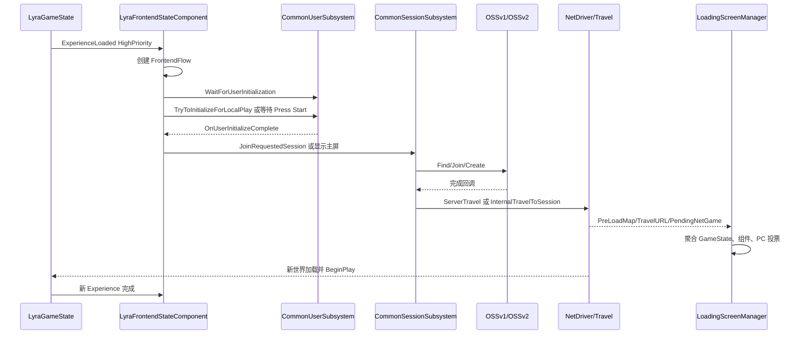

# UE5.8 Lyra 源码解析 44：前端、会话、网络与扩展闭环

> 本篇追踪 Lyra 从启动前端到进入对局的完整路径：Experience 加载完成 → CommonUser 初始化 → Press Start → 查找或创建会话 → Travel URL → 加载屏投票 → GameFeature 装配 → Dedicated Server 与测试。
> 重点是把项目源码中的异步状态机、在线服务抽象、地图旅行、目标构建和运行时验证放在同一条证据链上。
> 知识成熟度：L2（本机 UE 5.8 与 Lyra 5.8 项目/插件源码已静态核对；联机、复制驱动和后端实验为可复现验证步骤）。

## 元数据

| 项目 | 内容 |
| --- | --- |
| 版本基准 | UE 5.8.0 / CL 55116800 / `++UE5+Release-5.8` |
| Lyra 基线 | 本机 `LyraStarterGame.uproject` 的 `EngineAssociation` 为 `5.8` |
| 项目源码根 | `C:\Users\zhaozhiqi\Documents\Unreal Projects\LyraStarterGame` |
| 引擎证据根 | `C:\Program Files\Epic Games\UE_5.8\Engine`，只读核对 |
| 适用范围 | 编辑器、客户端、Listen Server、Dedicated Server、OSSv1、OSSv2、GameFeature、CommonUI 与自动化测试 |
| 知识成熟度 | L2：项目源码、引擎源码、配置和测试资产已静态核对；本篇不把未执行的联机运行结果描述成已验证事实 |
| 官方参考 | [Common User Plugin for Lyra](https://dev.epicgames.com/documentation/unreal-engine/common-user-plugin-in-unreal-engine-for-lyra-sample-game?lang=en-US)、[Lyra Sample Game](https://dev.epicgames.com/documentation/en-us/unreal-engine/lyra-sample-game-in-unreal-engine)、[Game Features](https://dev.epicgames.com/documentation/en-us/unreal-engine/game-features-and-modular-gameplay-in-unreal-engine)、[Online Services](https://dev.epicgames.com/documentation/en-us/unreal-engine/online-services-in-unreal-engine)、[Common UI](https://dev.epicgames.com/documentation/en-us/unreal-engine/common-ui-plugin-for-unreal-engine) |
| 最后更新 | 2026-08-13 |

## 一、本文要解决的工程问题

Lyra 的“进入游戏”不是一个按钮直接调用 `OpenLevel`。

它先确认当前 Experience 已经可用。

然后决定本地用户是否需要登录。

接着处理 Press Start、邀请、外部会话请求和主菜单。

选择 Quick Play 时还要在“加入已有会话”和“创建新会话”之间异步分支。

服务器完成创建后才执行 `ServerTravel`。

客户端加入后还要解析连接串、处理预约 Beacon，并执行客户端 Travel。

地图切换期间，CommonLoadingScreen 根据多个对象的投票决定是否继续遮挡世界。

进入新地图后，Experience Manager 和 GameFeature Manager 再把玩法模块装配到运行时对象。

因此排查“点击开始没有反应”时，只看 UI Widget 是不够的。

应该沿着以下边界逐段确认：

| 边界 | 主要问题 | 源码入口 |
| --- | --- | --- |
| Experience → Frontend | 前端流何时开始 | `Source/LyraGame/UI/Frontend/LyraFrontendStateComponent.cpp` |
| User → LocalPlayer | 用户是否已初始化 | `Plugins/CommonUser/Source/CommonUser/` |
| Request → URL | 地图和参数如何组合 | `UCommonSession_HostSessionRequest::ConstructTravelURL` |
| URL → Session | OSSv1/OSSv2 走哪个实现 | `UCommonSessionSubsystem::CreateOnlineSessionInternal` |
| Session → Travel | 服务器何时切图 | `FinishSessionCreation` |
| Travel → Loading | 加载屏为何仍显示 | `ULoadingScreenManager::CheckForAnyNeedToShowLoadingScreen` |
| Build → Feature | 插件是否进入目标 | `LyraGame.Target.cs::ConfigureGameFeaturePlugins` |
| Network → Replication | 运行时复制驱动是什么 | `LyraReplicationGraph.cpp`、`UNetDriver`、Iris 配置 |
| Test → Evidence | 结果如何可复现 | `ShooterTestsRuntime`、Gauntlet、回放配置 |

本文的结论先写清楚：

> Lyra 的前端和会话设计是可替换的项目骨架，不是某个在线服务商的唯一实现。

> 本机配置明确写有 `bDisableReplicationGraph=True`，所以不能把“项目存在 `LyraReplicationGraph` 类”推导成“运行时默认使用 ReplicationGraph”。

> `LyraGame.Build.cs` 调用 `SetupIrisSupport(Target)`，`DefaultEngine.ini` 也有 Iris 序列化器和 ObjectReplicationBridge 配置；编译支持、配置存在和运行时启用是三个不同问题，运行态必须用日志或 NetDriver 状态确认。

## 二、整体时序图



图中的每条箭头都是异步边界。

`ExperienceLoaded` 不是“地图已经完全可玩的信号”，它只是允许前端状态组件开始自己的控制流。

`OnUserInitializeComplete` 可能成功，也可能失败；Lyra 当前前端实现两种结果都会继续流，因此产品项目通常要增加错误屏或重试策略。

`OnJoinSessionCompleteEvent` 在 CommonSession 设计中发生于底层会话加入完成、客户端 Travel 之前。

这解释了前端代码里“成功则取消前端流”的写法：成功加入后玩家即将离开主菜单世界。

加载屏不是一个只监听地图切换的 Widget。

它会询问 GameState、GameStateComponent、外部 Processor、PlayerController 及其组件。

任何一个观察者返回 true，屏幕就继续显示。

## 三、源码地图与阅读顺序

### 3.1 Lyra 项目层

| 路径 | 阅读目标 |
| --- | --- |
| `Source/LyraGame/UI/Frontend/LyraFrontendStateComponent.h` | 前端组件字段、ControlFlow 步骤、加载屏接口 |
| `Source/LyraGame/UI/Frontend/LyraFrontendStateComponent.cpp` | 四步控制流和 Press Start 回调 |
| `Source/LyraGame/GameModes/LyraUserFacingExperienceDefinition.h` | 地图、体验 ID、人数和回放开关 |
| `Source/LyraGame/GameModes/LyraUserFacingExperienceDefinition.cpp` | Host Request 的构造和 ExtraArgs 注入 |
| `Source/LyraGame/System/LyraGameInstance.cpp` | 用户、会话、外部邀请的桥接 |
| `Source/LyraGame/LyraGame.Build.cs` | CommonUser、Gauntlet、NetworkReplayStreaming、Iris 支持 |
| `Source/LyraGame.Target.cs` | GameFeature 插件扫描和目标级编译策略 |
| `Source/LyraServer.Target.cs` | Dedicated Server 类型和 Shipping 检查 |
| `Config/DefaultGame.ini` | 复制图设置和 Lyra 项目级运行配置 |
| `Config/DefaultEngine.ini` | Iris 配置、NetDriver、带宽和回放测试设置 |

### 3.2 Common 插件层

| 路径 | 阅读目标 |
| --- | --- |
| `Plugins/CommonUser/Source/CommonUser/Public/CommonUserSubsystem.h` | 用户状态、初始化参数和委托 |
| `Plugins/CommonUser/Source/CommonUser/Private/CommonUserSubsystem.cpp` | 登录、权限和本地玩家创建流程 |
| `Plugins/CommonUser/Source/CommonUser/Public/CommonSessionSubsystem.h` | Host、Find、QuickPlay、Join API |
| `Plugins/CommonUser/Source/CommonUser/Private/CommonSessionSubsystem.cpp` | OSSv1、OSSv2、Beacon 和 Travel |
| `Plugins/CommonGame/Source/Private/CommonGameInstance.cpp` | RequestedSession 保存和重置 |
| `Plugins/CommonLoadingScreen/Source/CommonLoadingScreen/Public/LoadingScreenManager.h` | 加载屏管理器接口 |
| `Plugins/CommonLoadingScreen/Source/CommonLoadingScreen/Private/LoadingScreenManager.cpp` | 投票聚合、输入屏蔽和世界渲染 |
| `Plugins/UIExtension/Source/Public/UIExtensionSystem.h` | GameFeature UI 扩展点和句柄 |

### 3.3 测试和构建层

| 路径 | 阅读目标 |
| --- | --- |
| `Plugins/GameFeatures/ShooterTests/ShooterTests.uplugin` | Feature 的加载状态和 Shipping 限制 |
| `Plugins/GameFeatures/ShooterTests/Source/ShooterTestsRuntime/ShooterTestsRuntime.Build.cs` | CQTest、EnhancedInput、AsyncMessage 依赖 |
| `Plugins/GameFeatures/ShooterTests/Source/ShooterTestsRuntime/Private/ShooterTestsMapTests.cpp` | 地图和能力测试 |
| `Plugins/GameFeatures/ShooterTests/Source/ShooterTestsRuntime/Private/ShooterTestsActorNetworkTests.cpp` | 双 PIE 网络测试 |
| `Plugins/GameFeatures/ShooterTests/Source/ShooterTestsRuntime/Private/Utilities/ShooterTestsNetworkComponent.h` | Server/Client 状态和 latent steps |
| `Source/LyraGame/Tests/LyraTestControllerStartEliminationTest.h` | Gauntlet 启动控制器入口 |
| `Config/DefaultEngine.ini` 的 `ReplaysToTest` | AutomatedPerfTesting 回放输入 |

建议的静态阅读顺序是：

1. 先读 `LyraFrontendStateComponent.cpp`，建立四步控制流。
2. 再读 `CommonUserSubsystem.h`，确认用户状态而非只看 UI。
3. 读 `LyraUserFacingExperienceDefinition.cpp`，找到 Experience 到 Request 的转换。
4. 读 `CommonSessionSubsystem.cpp` 的 `ConstructTravelURL`、Host、QuickPlay、Join。
5. 读 `LoadingScreenManager.cpp`，理解 Travel 与显示之间的独立投票。
6. 读 Target 和 uplugin，确认“编译进去”和“运行时激活”区别。
7. 最后读 ShooterTests 和回放配置，把源码链转成证据链。

## 四、前端状态组件：四步 ControlFlow

### 4.1 组件身份

`ULyraFrontendStateComponent` 继承 `UGameStateComponent`。

它同时实现 `ILoadingProcessInterface`。

这两个基类决定了它的两个职责：

| 基类/接口 | 作用 |
| --- | --- |
| `UGameStateComponent` | 生命周期与 GameState 同步，适合观察 Experience 和网络世界状态 |
| `ILoadingProcessInterface` | 可以向 CommonLoadingScreen 投票，阻止过早显示主菜单 |

组件在 `BeginPlay` 中取得 `AGameStateBase`。

随后通过 `FindComponentByClass<ULyraExperienceManagerComponent>()` 找 Experience 管理器。

找到后调用 `CallOrRegister_OnExperienceLoaded_HighPriority`。

这个命名很关键。

若 Experience 已经完成，回调会立即执行。

若尚未完成，回调会注册，等完成后执行。

因此前端组件不需要自己轮询 Experience 状态。

`HighPriority` 说明它希望在普通 Experience Loaded 观察者之前建立前端状态。

这并不改变 GameFeature 激活的全部时序。

它只是选择一个明确的回调优先级。

### 4.2 ControlFlow 创建

`OnExperienceLoaded` 中用 `FControlFlowStatics::Create` 创建名为 `FrontendFlow` 的流。

然后按顺序调用四个 `QueueStep`：

| 顺序 | Debug 名称 | C++ 函数 |
| --- | --- | --- |
| 1 | Wait For User Initialization | `FlowStep_WaitForUserInitialization` |
| 2 | Try Show Press Start Screen | `FlowStep_TryShowPressStartScreen` |
| 3 | Try Join Requested Session | `FlowStep_TryJoinRequestedSession` |
| 4 | Try Show Main Screen | `FlowStep_TryShowMainScreen` |

`Flow.ExecuteFlow()` 启动执行。

`FrontEndFlow = Flow.AsShared()` 保存共享指针。

保存共享指针有两个用途。

第一，`ShouldShowLoadingScreen` 可以读取当前步骤的 Debug 名称。

第二，排查时可以观察流对象是否已经建立。

不要把 `Flow.ExecuteFlow()` 理解成同步执行四个步骤。

每个步骤收到 `FControlFlowNodeRef SubFlow`。

步骤必须在合适的异步回调中调用 `ContinueFlow` 或 `CancelFlow`。

### 4.3 步骤一：用户和会话清理

`FlowStep_WaitForUserInitialization` 首先读取当前 GameMode 和 GameInstance。

它检查 `GameMode->OptionsString` 是否包含 `closed`。

Lyra 把这个选项当作硬断开场景的信号。

硬断开时调用 `UCommonUserSubsystem::ResetUserState()`。

无论是否硬断开，都会调用 `UCommonSessionSubsystem::CleanUpSessions()`。

这是一条容易遗漏的产品规则：

> 用户状态和会话状态不是同一个清理动作；会话清理每次执行，用户重置只在硬断开执行。

清理完成后立即 `SubFlow->ContinueFlow()`。

这里没有异步等待 OSS 销毁完成。

所以下一步可能与在线服务的清理回调并行。

如果项目需要严格保证“销毁后才能重新登录”，应把清理完成回调包装成新的 ControlFlow 节点。

### 4.4 步骤二：已经登录时跳过 Press Start

步骤二先读取第一个本地玩家的 `UCommonUserInfo`。

如果初始化状态是 `LoggedInLocalOnly`，直接继续。

如果状态是 `LoggedInOnline`，也直接继续。

这两个状态都表示前端无需再显示 Press Start。

注意：代码检查的是 `UCommonUserInfo::InitializationState`，不是一个简单的布尔变量。

这意味着登录状态包含平台和在线上下文信息。

### 4.5 步骤二：平台需要等待 Start 时

如果 `ShouldWaitForStartInput()` 返回 true，前端会把 `PressStartScreenClass` 推到 `UI.Layer.Menu`。

实际调用是 `UPrimaryGameLayout::PushWidgetToLayerStackAsync`。

传入 `bSuspendInputUntilComplete = true`。

该标志保证屏幕加载期间输入不会落到下层菜单。

异步回调收到 `EAsyncWidgetLayerState::AfterPush` 时：

1. 设置 `bShouldShowLoadingScreen = false`。
2. 监听 Widget 的 `OnDeactivated()`。
3. Widget 停用后调用 `SubFlow->ContinueFlow()`。

如果状态是 `Canceled`，也会关闭加载屏并继续流。

这里的设计允许 Press Start Widget 自己决定何时停用。

前端组件不需要知道“按下哪一个键”。

### 4.6 步骤二：平台不需要 Press Start 时

如果 `ShouldWaitForStartInput()` 返回 false，Lyra 自动初始化本地玩家。

它先保存 `InProgressPressStartScreen = SubFlow`。

然后把 `OnUserInitializeComplete` 绑定到 `OnUserInitialized`。

随后调用 `TryToInitializeForLocalPlay(0, FInputDeviceId(), false)`。

参数含义是：

| 参数 | 值 | 含义 |
| --- | --- | --- |
| LocalPlayerIndex | `0` | 初始化主本地玩家 |
| PrimaryInputDevice | 无效 `FInputDeviceId()` | 使用默认输入设备 |
| bCanUseGuestLogin | `false` | 不以访客身份绕过真实登录 |

完成回调会继续 ControlFlow。

不要在调用后立即 `ContinueFlow`。

否则主屏可能在 LocalPlayer 和权限状态准备好之前出现。

### 4.7 用户初始化回调

`OnUserInitialized` 收到用户对象、成功标志、错误文本、请求权限和在线上下文。

它先复制 `InProgressPressStartScreen` 到局部变量。

然后移除动态委托。

最后清空成员指针。

当前 Lyra 源码对成功和失败都调用 `FlowToContinue->ContinueFlow()`。

失败分支注释说明，项目可以在此处改成错误屏。

这不是一个登录一定成功的保证。

它只是样例前端选择“失败也进入主屏”的产品策略。

产品化时可以按错误类型分流：

| 错误类别 | 更合适的动作 |
| --- | --- |
| 用户取消 | 返回 Press Start，保留重试入口 |
| 平台权限不足 | 显示权限说明并终止联网入口 |
| 网络不可用 | 允许离线模式或重试 |
| OSS 初始化失败 | 显示服务状态，不循环高频重试 |
| 账号被踢下线 | 清理 Session，回到登录状态 |

### 4.8 步骤三：外部请求会话

`FlowStep_TryJoinRequestedSession` 将 GameInstance 转型为 `UCommonGameInstance`。

然后检查 `GetRequestedSession()` 和 `CanJoinRequestedSession()`。

RequestedSession 可以来自平台邀请或外部链接。

如果条件不满足，步骤直接继续主屏。

如果条件满足，组件向 `OnJoinSessionCompleteEvent` 绑定弱 Lambda。

回调首先移除自身句柄，避免重复触发。

成功时调用 `SubFlow->CancelFlow()`。

失败时调用 `SubFlow->ContinueFlow()`，让用户进入主菜单。

成功使用 Cancel 而不是 Continue 的原因是：

> 前端流的“显示主菜单”目标已经失去意义，玩家即将进入被邀请的会话。

代码注释还指出，当前回调关注底层 Join 完成，尚未把服务器 Travel 完成纳入同一个前端等待点。

因此产品项目应继续监听 TravelFailure、PostLoadMap 和 Experience Loaded。

### 4.9 步骤四：主屏

`FlowStep_TryShowMainScreen` 和 Press Start 类似。

它取得主玩家的 `UPrimaryGameLayout`。

把 `MainScreenClass` 推到 `UI.Layer.Menu`。

AfterPush 时关闭前端加载屏并继续流。

Canceled 时也关闭并继续流。

因为主屏本身可能长时间保持激活，ControlFlow 在这里完成的是“主屏已经被推入”，不是“主屏已经退出”。

后续菜单操作由 CommonUI 的激活栈处理。

### 4.10 加载屏投票接口

在整个前端流期间，`bShouldShowLoadingScreen` 初值为 true。

`ShouldShowLoadingScreen` 返回 true 时给出原因 `Frontend Flow Pending...`。

如果流有当前步骤 Debug 名称，就用步骤名称替换原因。

这让日志可以直接显示当前阻塞点。

例如可能看到：

```text
Loading screen showing: 1. Reason: Try Show Press Start Screen
```

主屏 AfterPush 后，前端组件将自己的投票置为 false。

但这不保证加载屏立即消失。

地图 Travel、GameState、PlayerController 或其他组件仍可以投票为 true。

## 五、Press Start 与 CommonUser 登录模型

### 5.1 用户对象不是 LocalPlayer

`UCommonUserInfo` 是对平台用户的逻辑表示。

它保存输入设备、平台用户、LocalPlayer 索引、访客标志和初始化状态。

一个用户可能还没有 LocalPlayer。

一个 LocalPlayer 也可能处于登录进行中。

因此不要只用 `GameInstance->GetLocalPlayers().Num()` 判断登录完成。

应通过 `GetUserInfoForLocalPlayerIndex` 获取 `UCommonUserInfo`。

### 5.2 初始化状态

常用状态包括：

| 状态 | 解释 |
| --- | --- |
| `Invalid` | 尚未开始或已重置 |
| `DoingInitialLogin` / `DoingNetworkLogin` | 正在执行首次初始化或在线登录 |
| `LoggedInLocalOnly` | 已建立本地用户，但未完成在线上下文 |
| `LoggedInOnline` | 在线上下文和权限可用 |
| 失败状态 | 初始化流程结束但不可用 |

具体枚举值应以本机 `CommonUserTypes.h` 为准。

文章中的状态名称只引用本机头文件已出现的符号。

### 5.3 初始化参数

`FCommonUserInitializeParams` 允许调用方表达：

1. 本地玩家索引。
2. 输入设备。
3. 要求的权限级别。
4. 在线上下文。
5. 是否允许创建 LocalPlayer。
6. 是否允许访客登录。
7. 是否抑制登录错误。
8. 完成回调。

这比“按键事件里调用 Login”更适合多用户和分屏。

### 5.4 `TryToInitializeForLocalPlay`

该函数的语义是创建或更新本地玩家，并尝试完成本地登录。

它不等于完整在线匹配。

需要联网时可以继续调用 `TryToLoginForOnlinePlay`。

Lyra 前端使用本地游玩初始化函数，是为了让 Press Start 后先拿到可用的 LocalPlayer。

产品项目应根据平台权限选择 `CanPlay` 或 `CanPlayOnline`。

### 5.5 平台特征标签

`UCommonGameInstance::Init` 从 Common UI 设置读取 Platform Traits。

随后调用 `UserSubsystem->SetTraitTags(PlatformTraits)`。

前端的 `FrontendTags::TAG_PLATFORM_TRAIT_SINGLEONLINEUSER` 对应 `Platform.Trait.SingleOnlineUser`。

单在线用户平台通常不需要让玩家选择“哪个控制器按 Start”。

多用户主机则可能必须显示 Press Start。

这就是 `ShouldWaitForStartInput` 不能被一个项目内常量替代的原因。

### 5.6 失败路径

CommonUser 会广播系统消息。

`UCommonGameInstance` 默认把错误类型消息转发到 `UCommonMessagingSubsystem`。

它通过 `UCommonGameDialogDescriptor` 显示确认对话框。

权限变化也会广播 `OnUserPrivilegeChanged`。

默认实现只记录失去 `CanPlay` 权限的错误日志，并把具体返回主菜单的动作留给项目子类。

如果游戏途中权限丢失，必须清理会话和敏感玩法状态。

## 六、UserFacingExperience 到 Host Request

### 6.1 Experience 定义的角色

`ULyraUserFacingExperienceDefinition` 是面向菜单的 Experience 资产。

它把用户看到的模式、地图、人数和回放选项转换成 `UCommonSession_HostSessionRequest`。

菜单不需要直接知道 CommonSession 的底层字段。

### 6.2 `CreateHostingRequest` 字段映射

源码中的关键映射如下：

| UserFacingExperience 字段 | Request 字段 | 作用 |
| --- | --- | --- |
| `ExperienceID` | `ExtraArgs["Experience"]` | 服务器旅行后选择具体 Experience |
| `MapID` | `MapID` | 解析地图 Primary Asset |
| `GetPrimaryAssetId` | `ModeNameForAdvertisement` | 在线服务展示的模式名 |
| `ExtraArgs` | `ExtraArgs` | 业务参数透传到 Travel URL |
| `MaxPlayerCount` | `MaxPlayerCount` | 创建会话人数上限 |
| `bRecordReplay` | `ExtraArgs["DemoRec"]` | 平台支持时请求回放录制 |

`ExperienceID.PrimaryAssetName` 转为字符串。

`MapID` 保持为 Primary Asset Id。

这样地图名和玩法名可以分别用于加载和广告。

### 6.3 Dedicated Server 的默认值

当 CommonSession 子系统不可用时，Lyra 创建一个新的 `UCommonSession_HostSessionRequest`。

回退对象设置为 Online 模式。

启用 Lobby，但关闭 Lobby Voice Chat。

Presence 在非 Dedicated Server 时开启。

Dedicated Server 没有本地玩家，因此不能套用客户端的 LocalPlayer 校验。

CommonSession 的 `bIsDedicatedServer` 在初始化时从 GameInstance 判断。

### 6.4 ExtraArgs 的安全含义

`ExtraArgs` 最终会拼接进 Travel URL。

示例：

```text
/Game/Maps/L_ShooterGym?listen?Experience=ShooterGame?DemoRec
```

服务器应把 Experience 名称、规则模式和回放开关视为不可信输入。

Travel URL 不应承载密码、平台 Token 或长期凭据。

关键玩法参数必须在服务器上从允许列表解析。

### 6.5 回放开关

`ULyraReplaySubsystem::DoesPlatformSupportReplays()` 先检查平台能力。

只有平台支持且 `bRecordReplay` 为 true 时才加入 `DemoRec`。

这避免在不支持回放的平台上无条件传递参数。

回放仍需要服务器端配置、磁盘配额和隐私策略。

## 七、Travel URL 的构造与边界

### 7.1 地图解析

`UCommonSession_HostSessionRequest::GetMapName` 调用 Asset Manager 查询 `MapID` 的 Primary Asset Data。

成功时返回 PackageName。

失败时返回空字符串。

`ValidateAndLogErrors` 在 Server Code 可用时拒绝空地图名。

客户端构建默认不能主持会话。

源码明确说明客户端构建只用于连接 Dedicated Server，除非项目子类改变行为。

### 7.2 LAN 参数

当 `OnlineMode == LAN`，URL 增加 `?bIsLanMatch`。

当模式不是 Offline，URL 增加 `?listen`。

Offline 模式不会自动添加 `listen`。

额外参数逐个追加。

空值键生成 `?Key`。

非空值键生成 `?Key=Value`。

### 7.3 URL 不是会话对象

Travel URL 只表达地图和初始选项。

在线服务的 Session Id、Lobby Id、Connect String 不由 `ConstructTravelURL` 生成。

Host 时先创建在线对象，再使用 PendingTravelURL。

Join 时先加入在线对象，再解析服务返回的连接信息。

把 Session Id 直接拼进 URL 是常见反模式。

### 7.4 URL 注入风险

不能把来自聊天、命令行或远端服务的字符串原样放入 ExtraArgs。

建议做法是：

1. 只接受固定键名。
2. 对值做字符集和长度校验。
3. Experience、地图和模式只允许白名单。
4. 禁止嵌套 `?`、换行和控制字符。
5. 在服务器解析后再次校验。

### 7.5 Offline 分支

Offline Host 在客户端 NetMode 下会被拒绝。

服务器或独立进程则直接 `ServerTravel(Request->ConstructTravelURL())`。

即使是 Offline，也会发送 Session Information 更新。

如果项目有离线菜单，应明确区分“离线世界”和“没有 OSS 但仍有 Listen Server”。

## 八、CommonSession：OSSv1 与 OSSv2

### 8.1 编译开关

本机 `Plugins/CommonUser/Source/CommonUser/CommonUser.Build.cs` 将 `bUseOnlineSubsystemV1` 硬编码为 `true`，并定义 `COMMONUSER_OSSV1=1`。

因此当前 Lyra 5.8 构建实际编译的是 OSSv1 分支。

OSSv2 代码仍保留在 `#else` 分支，是备用实现，不表示本机构建会同时运行两套后端。

OSSv1 使用 `IOnlineSubsystem` 和 `IOnlineSession`。

OSSv2 使用 `IOnlineServices`、Sessions 和 Lobbies 接口。

公开 API 在两种后端之间保持相似语义，但一次构建只会选择一个宏分支。

实现细节不能混写。

### 8.2 子系统初始化

`UCommonSessionSubsystem::Initialize` 会绑定在线委托。

同时监听 `GEngine->OnTravelFailure()`。

还监听 `PostLoadMapWithWorld`。

并记录当前实例是否为 Dedicated Server。

`ShouldCreateSubsystem` 会检查是否已有游戏专用子类。

如果存在子类，基础 CommonSession 不再创建。

### 8.3 OSSv1 委托

OSSv1 绑定创建、开始、更新、结束、销毁、查找、加入和邀请等委托。

`OnJoinSessionComplete` 进入 `FinishJoinSession`。

`OnCreateSessionComplete` 进入 `FinishSessionCreation`。

OSSv1 的错误信息通常只有枚举结果。

源码在创建失败时使用通用 `GenericFailure` 兜底。

产品项目应记录平台原始错误和本地上下文。

### 8.4 OSSv2 委托

OSSv2 以异步操作句柄回调为主；只有把 `bUseOnlineSubsystemV1` 改为 false 并重新生成/编译 CommonUser，才会进入这条实现路径。

初始化时监听 UI Lobby Join Requested。

也监听 UI Session Join Requested。

创建会话使用 `FCreateSession::Params`。

创建 Lobby 使用 `FCreateLobby::Params`。

二者都写入模式名、地图名、匹配超时和模板名。

### 8.5 OSSv1 创建会话

`CreateOnlineSessionInternalOSSv1` 获取 `IOnlineSubsystem`。

然后取得 `IOnlineSessionPtr`。

本地玩家从 Preferred Unique Net Id 获取用户 ID。

Dedicated Server 使用 Dedicated Server 用户索引获取 ID。

`FCommonSession_OnlineSessionSettings` 设置 LAN、Presence 和最大人数。

还设置 `SETTING_GAMEMODE`、`SETTING_MAPNAME`、匹配超时和模板名。

最后调用 `Sessions->CreateSession`。

### 8.6 OSSv2 会话创建

当 `bUseLobbies` 为 false 时走 Sessions Interface。

当 `bUseLobbies` 为 true 时走 Lobbies Interface。

Session 分支写入 `SessionName`、Presence、Schema、最大连接数和公开 Join Policy。

Lobby 分支写入 Schema、Presence、最大成员数和公开广告策略。

两条分支都使用 `GameLobby` Schema 名称。

这是项目应该集中配置的参数，而不是在多个菜单 Widget 里复制。

### 8.7 创建完成与 ServerTravel

`FinishSessionCreation(true)` 先清空并设置成功结果。

如果启用 Beacon，就创建 Host Reservation Beacon。

随后广播 `OnCreateSessionComplete`。

最后调用 `GetWorld()->ServerTravel(PendingTravelURL)`。

顺序非常重要。

在线会话成功不等于地图已经加载。

真正的地图加载发生在 ServerTravel 之后。

### 8.8 QuickPlay

`QuickPlaySession` 创建搜索请求。

把 Presence 和 Lobby 默认值同步到 Host Request。

然后调用 `FindSessionsInternal`。

搜索完成后，如果有结果就加入第一个结果。

如果没有结果就调用 `HostSession`。

源码注释指出当前没有基于 Ping 或质量重新排序。

产品项目应提供可解释的选择器：地区、延迟、版本、模式、人数和私密性。

### 8.9 QuickPlay 的“空结果”边界

某些 OSS 层会在“没有会话”时报告失败但错误文本为空。

Lyra 用 `bSucceeded || ErrorMessage.IsEmpty()` 判断可以继续。

这是一种兼容行为，不应直接当作所有后端的正确语义。

切换 OSS 时必须记录：

| 观测 | 说明 |
| --- | --- |
| 搜索成功且结果数为零 | 正常 Host 候选 |
| 搜索失败且文本为空 | 可能是“空结果”误报 |
| 搜索失败且有文本 | 应展示错误或停止 |
| 搜索超时 | 应取消旧请求并回到稳定状态 |

### 8.10 Join Session

Join 前先更新可展示的 Session Information。

OSSv1 会强制设置 Presence 和 Lobby 可用标志。

然后调用 `IOnlineSession::JoinSession`。

OSSv2 根据 SearchResult 是否包含 Lobby 选择 JoinSession 或 JoinLobby。

成功后再进入 `InternalTravelToSession`。

### 8.11 Beacon 预约

启用 `bUseBeacons` 时，加入成功不会立即 Travel。

OSSv1 的 `FinishJoinSession` 会创建 Beacon Client。

客户端向 Host Reservation Beacon 请求预约。

预约成功后才广播 Join 成功并调用 `InternalTravelToSession`。

预约失败时清理会话并回到 OutOfGame。

Beacon 是大厅人数和服务器容量之间的保护层。

### 8.12 CleanUpSessions

清理函数设置 `bWantToDestroyPendingSession = true`。

如果启用 Beacon，先销毁预约 Beacon。

然后广播 OutOfGame。

最后根据编译分支调用 OSSv1 或 OSSv2 清理实现。

返回主菜单、硬断开和加入失败都可能触发它。

不能在多个 Widget 中各自销毁会话。

应该让 GameInstance 或 SessionSubsystem 维护唯一的清理所有权。

## 九、加载屏：从投票到输入屏蔽

### 9.1 Manager 的创建边界

`ULoadingScreenManager::ShouldCreateSubsystem` 检查 Dedicated Server。

Dedicated Server 不创建加载屏管理器。

客户端和 Listen Server 的本地客户端视图才需要它。

### 9.2 触发来源

Manager 监听 `PreLoadMapWithContext`。

也监听 `PostLoadMapWithWorld`。

每帧 Tick 时调用 `UpdateLoadingScreen`。

`CheckForAnyNeedToShowLoadingScreen` 先检查强制显示 CVar。

然后检查 WorldContext、World、GameState 和地图状态。

### 9.3 固定阻塞条件

以下任意条件都会显示加载屏：

1. 没有 WorldContext。
2. 没有 World。
3. GameState 尚未复制。
4. 正在 LoadMap。
5. TravelURL 非空。
6. PendingNetGame 非空。
7. World 尚未 BeginPlay。
8. 正在 Seamless Travel。

这些条件与 Lyra 前端流投票是并列关系。

### 9.4 接口观察者

Manager 询问 GameState 是否实现 `ILoadingProcessInterface`。

随后遍历 GameState 的组件。

再询问外部注册的 Loading Processor。

接着询问每个本地 PlayerController。

最后询问 PlayerController 的组件。

第一个返回 true 的观察者决定显示。

### 9.5 原因字符串

每个观察者都必须设置非空原因。

空原因会触发 `ensureMsgf`。

调试原因最终记录到 `LogLoadingScreen`。

建议原因包含对象和异步阶段，例如 `Frontend Flow: Try Join Requested Session`。

### 9.6 输入处理

显示加载屏时 Manager 注册 `FLoadingScreenInputPreProcessor`。

该处理器吞掉键盘、鼠标、模拟输入和触摸事件。

编辑器环境允许调试输入。

非编辑器环境默认阻止输入穿透。

因此加载屏期间不能依赖底层菜单继续接收确认键。

### 9.7 世界渲染与性能

Manager 可设置 `GameViewportClient->bDisableWorldRendering`。

额外保持时间用于让纹理 Streaming 追上来。

`CommonLoadingScreen.HoldLoadingScreenAdditionalSecs` 默认在源码中有一个秒数配置。

在编辑器中是否保持由设置控制。

产品项目应以真实设备采样，而不是盲目增加遮罩时间。

### 9.8 常用调试 CVar

`CommonLoadingScreen.AlwaysShow` 可强制显示。

`CommonLoadingScreen.LogLoadingScreenReasonEveryFrame` 可逐帧打印原因。

非 Shipping 构建支持 `-NoLoadingScreen`。

这些开关只用于诊断，不应作为发行包的逻辑依赖。

## 十、GameFeature、Target 与打包

### 10.1 编译与运行时加载的分离

GameFeature 插件可能被编译进目标，但没有被当前 Experience 激活。

也可能在编辑器可见，却被非编辑器目标禁用。

`EnabledByDefault`、`ExplicitlyLoaded` 和运行时 Feature State 各自表达不同层面。

不要用 Content Browser 中能看到插件来推断服务器已经加载它。

### 10.2 `ConfigureGameFeaturePlugins`

`LyraGame.Target.cs` 从项目 `Plugins/GameFeatures` 目录枚举插件描述文件。

每个描述文件都会被读取并验证。

目标级逻辑记录插件是否应该编译。

默认不强制启用全部 GameFeature。

编辑器、构建机和 Unique Build Environment 可以有不同策略。

### 10.3 `ExplicitlyLoaded`

源码会检查 `ExplicitlyLoaded` 是否为 true。

缺失或为 false 会产生警告。

这是因为 GameFeature 期望在项目启动后再加载。

当前 ShooterTests 的 uplugin 确实设置了 `ExplicitlyLoaded: true`。

### 10.4 `EditorOnly`

非编辑器目标会过滤标记为 EditorOnly 的 Feature。

编辑器目标可以保留这些插件供开发使用。

测试工具如果错误地依赖 EditorOnly 内容，打包后会出现资产或模块缺失。

### 10.5 `RestrictToBranch`

若插件限制到特定分支，Target 版本分支不匹配时会强制禁用。

这可用于开发分支实验功能。

发行分支必须在构建日志中确认没有意外启用实验插件。

### 10.6 `NeverBuild`

`NeverBuild` 优先级高于普通启用策略。

标记后插件不会进入编译目标。

运行时再调用加载会失败。

插件描述文件、Target 日志和打包产物应一起作为验收证据。

### 10.7 ShooterTests Feature

ShooterTests 的 uplugin：

| 字段 | 已核对值 |
| --- | --- |
| `CanContainContent` | true |
| `EnabledByDefault` | false |
| `ExplicitlyLoaded` | true |
| `BuiltInInitialFeatureState` | `Registered` |
| Runtime Module | `ShooterTestsRuntime` |
| Shipping 限制 | `TargetConfigurationDenyList: Shipping` |

这说明测试内容是可注册、按需激活的 GameFeature。

它不是默认运行时玩法。

### 10.8 Target 类型

Lyra 项目至少有 Game、Client、Server 和 Editor 目标变体。

`LyraServer.Target.cs` 设置 `Type = TargetType.Server`。

并设置 `bUseChecksInShipping = true`。

`LyraClient.Target.cs` 设置 `Type = TargetType.Client`。

EOS、Steam 和混合后端还有变体 Target 文件。

### 10.9 构建依赖

`LyraGame.Build.cs` 的公开依赖包含 `GameFeatures`、`ReplicationGraph`、`CommonLoadingScreen`、`ControlFlows`。

私有依赖包含 `CommonUI`、`CommonUser`、`Gauntlet`、`NetworkReplayStreaming`、`UIExtension`。

最后调用 `SetupIrisSupport(Target)`。

依赖声明证明模块可编译，不证明所有模块在运行时启用。

### 10.10 Shipping 安全开关

Shipping 构建关闭外部 RPC Registry 和 HTTP Server Listener 定义。

同时关闭 Automation Driver。

这体现了测试入口与发行运行时的隔离。

新功能若依赖测试模块，必须检查 Target Configuration DenyList。

## 十一、ReplicationGraph 与 Iris：必须守住事实边界

### 11.1 配置事实

本机 `Config/DefaultGame.ini` 中存在：

```ini
[/Script/LyraGame.LyraReplicationGraphSettings]
bDisableReplicationGraph=True
DefaultReplicationGraphClass=/Script/LyraGame.LyraReplicationGraph
```

这两个字段同时存在。

前者表达禁用开关。

后者保留默认类名配置。

不能只看到后者就断言运行时会实例化 `LyraReplicationGraph`。

### 11.2 Lyra 条件创建逻辑

`Source/LyraGame/System/LyraReplicationGraph.cpp` 中的 `ConditionalCreateReplicationDriver` 会读取 `LyraReplicationGraphSettings`。

当 `bDisableReplicationGraph` 为 true 时，函数记录 `Replication graph is disabled via LyraReplicationGraphSettings.` 并直接返回 `nullptr`。

只有开关为 false、World 与 NetDriver 有效且 NetDriver 名称为 `NAME_GameNetDriver` 时，函数才尝试加载 `DefaultReplicationGraphClass` 并创建对象。

它还检查创建委托是否已绑定。

`ULyraReplicationGraph` 构造函数还会绑定 `UReplicationDriver::CreateReplicationDriverDelegate()`；但该绑定不等于每个 NetDriver 都会创建对象。

最终对象是否存在仍受 NetDriver、Iris 互斥检查和运行时设置影响。

### 11.3 引擎 NetDriver 边界

UE 5.8 `UNetDriver` 保存 `ReplicationDriverClass` 和 `ReplicationDriver`。

`InitReplicationDriverClass` 负责按配置加载类。

`SetReplicationDriver` 会初始化、设置世界并注册网络 Actor。

源码明确拒绝在使用 Iris 的 NetDriver 上设置 ReplicationDriver。

这说明 ReplicationGraph 与 Iris 不是可以无条件叠加的两个默认层。

### 11.4 Iris 编译支持

`LyraGame.Build.cs` 调用 `SetupIrisSupport(Target)`。

这表示 Lyra 模块按目标配置准备 Iris 依赖和编译定义。

它不是运行态启用证明。

### 11.5 Iris 配置

`Config/DefaultEngine.ini` 的 Iris 段包含：

1. `IrisCore.ReplicationStateDescriptorConfig`。
2. `SupportsStructNetSerializerList`。
3. `IrisCore.ObjectReplicationBridgeConfig`。
4. Spatial 默认过滤器。
5. Pawn 等类的动态过滤配置。

其中 `LyraGameplayAbilityTargetData_SingleTargetHit` 被列入结构体序列化器支持。

配置存在表示项目准备了 Iris 适配点。

### 11.6 三层结论表

| 层级 | 可以写成的结论 | 不能写成的结论 |
| --- | --- | --- |
| 编译 | LyraGame 调用 `SetupIrisSupport` | 运行时一定启用 Iris |
| 配置 | DefaultEngine.ini 含 Iris 配置 | 所有 Actor 一定走 Iris |
| 项目开关 | `bDisableReplicationGraph=True` | Lyra 默认使用 ReplicationGraph |
| 运行时 | 需检查 NetDriver、日志和实际复制行为 | 仅凭类名推断复制驱动 |

### 11.7 运行验证建议

在 PIE、Listen Server 和 Dedicated Server 分别记录：

- NetDriver 类名。
- 在调试器中读取 `UNetDriver::IsUsingIrisReplication()` 状态（这是 C++ 方法，不是可直接输入的控制台命令）。
- ReplicationDriver 是否为空。
- `LogNet`、`LogIris` 和 Lyra RepGraph 日志。
- 连接建立后的复制带宽。
- Pawn、PlayerState 和 Ability TargetData 的实际序列化路径。

静态教程只能给出配置边界，不能替代这些运行记录。

## 十二、Dedicated Server 进入对局

### 12.1 Server Target

Dedicated Server 目标使用 `TargetType.Server`。

它不创建客户端 Viewport。

它不创建 LoadingScreenManager。

它仍会创建 CommonSessionSubsystem。

创建会话时可以没有 LocalPlayer。

CommonSession 使用 Dedicated Server 身份获取在线用户 ID。

### 12.2 Listen 与 Dedicated 差异

Listen Server 有一个本地玩家和服务器世界。

Dedicated Server 没有本地玩家，但承担会话和权威游戏逻辑。

Travel URL 中的 `?listen` 在在线模式下由 Host Request 添加。

Dedicated Server 的启动参数、端口、凭据和 Online Subsystem 配置由部署环境提供。

不能把客户端登录成功当作 Dedicated Server 已经就绪。

### 12.3 会话准备

Dedicated Server 应在地图和 Experience 就绪后再宣布可加入。

若 Session 创建早于 GameFeature 激活，客户端可能进入一个规则尚未装配的世界。

可以通过服务器状态、Beacon 或自定义 Ready 属性表达“可加入”。

### 12.4 退出和崩溃

服务器崩溃后，客户端可能收到 TravelFailure 或连接超时。

客户端必须清理会话信息并回到可操作的主菜单。

服务器重启后，Lobby/Session 旧记录需要按平台策略清理。

产品化时应增加健康检查、优雅停机和会话回收指标。

## 十三、ShooterTests 源码与资产

### 13.1 插件结构

ShooterTests 位于 `Plugins/GameFeatures/ShooterTests`。

C++ Runtime 模块名为 `ShooterTestsRuntime`。

模块公开依赖 LyraGame、GameplayTags、GameplayAbilities、ModularGameplay 和 AsyncMessageSystem。

编辑器目标额外依赖 EngineSettings、LevelEditor 和 UnrealEd。

私有依赖包含 CQTest 和 CQTestEnhancedInput。

### 13.2 地图和蓝图资产

本机可定位：

- `Content/Maps/L_ShooterTest_FireWeapon.umap`。
- `Content/Maps/L_ShooterTest_Basic.umap`。
- `Content/Maps/L_ShooterTest_AutoRun.umap`。
- `Content/Blueprint/B_Test_FireWeapon.uasset`。
- `Content/System/Experiences/B_AutomatedShooterTest.uasset`。
- `Content/System/Experiences/B_BasicShooterTest.uasset`。

二进制资产的内部节点需在编辑器中打开确认。

本文只把文件存在和源码引用写成静态事实。

### 13.3 CQTest 基础类

`ShooterTestsActorTest.h` 定义 Actor 测试模板。

它把地图加载、玩家 Pawn 准备和断言封装起来。

`FShooterTestsActorTestHelper` 包装 Pawn 常用状态。

`FShooterTestsActorInputTestHelper` 增加输入动作。

`FShooterTestsAnimationTestHelper` 查询动画资产和播放状态。

### 13.4 网络测试状态

`FShooterTestsNetworkState` 为 Server 和 Client 保存独立 World。

服务器 World 可以看到所有 PlayerController。

客户端 World 通常只有本地 PlayerController，其他玩家以 Pawn 形式存在。

状态对象还保存本地玩家和网络玩家的辅助对象。

### 13.5 网络测试组件

`FShooterTestsNetworkComponent` 负责创建 PIE Server/Client 会话。

它提供 `Start`、`ThenServer`、`ThenClient`、`UntilServer` 和 `UntilClient`。

测试可以把服务器断言和客户端断言串在一条 latent 命令链中。

`PrepareAndWaitForServerPlayerSpawn` 与 `PrepareAndWaitForClientPlayerSpawn` 用于等待 Pawn 准备完成。

这比固定 Sleep 更适合验证复制和异步初始化。

### 13.6 地图测试

`ShooterTestsMapTests.cpp` 包含能力生成相关的地图测试入口。

当前源码中的 `AbilitySpawnerMapTest` 使用 `TEST_CLASS_WITH_FLAGS` 宏注册，并归入 `Project.Functional Tests.ShooterTests.GameplayAbility` 路径。

地图测试可验证 Experience、AbilitySpawner 和 Pawn 能力是否正确装配。

测试名称和过滤器应从源码宏和 Automation 面板实际结果读取。

不要凭 Blueprint 文件名推断测试已经在每个目标上启用。

### 13.7 网络测试

`ShooterTestsActorNetworkTests.cpp` 验证输入、动画或 Actor 状态在 Server/Client 间同步。

当前源码中的 `InputAnimationTest` 使用 `ACTOR_ANIMATION_NETWORK_TEST` 宏，测试路径为 `Project.Functional Tests.ShooterTests.Actor.Replication`。

测试先建立双 PIE，再获取两端 Pawn。

随后通过 `ThenServer` 触发权威动作。

再通过 `UntilClient` 等待客户端观察到结果。

同目录的 `ShooterTestsActorAnimationTests.cpp` 使用 `ACTOR_ANIMATION_TEST` 和 `ACTOR_ANIMATION_TEST_WITH_FLAGS` 注册单机动画测试。

`ShooterTestsRuntimeModule.cpp` 以 `IMPLEMENT_MODULE(FShooterTestsRuntimeModule, ShooterTestsRuntime)` 注册 Runtime 模块。

### 13.8 Shipping 限制

ShooterTests Runtime 模块在 uplugin 中列入 Shipping DenyList。

这是正确的默认策略。

测试内容可能依赖编辑器、CQTest 或 Automation Driver。

发行目标不能因为编辑器中能跑测试就无条件携带测试模块。

## 十四、Gauntlet、回放与证据链

### 14.1 Gauntlet 入口

LyraGame 的私有依赖包含 `Gauntlet`。

`ULyraTestControllerStartEliminationTest` 继承 `UGauntletTestControllerBootTest`。

它重写 `IsBootProcessComplete()`。

Gauntlet 测试控制器适合描述启动完成条件和跨进程流程。

### 14.2 启动测试关注点

启动测试应记录：

1. 目标可执行文件是否启动。
2. GameInstance 是否完成初始化。
3. Frontend Flow 是否进入主屏。
4. 服务器是否监听。
5. 客户端是否完成连接。
6. Experience 是否 Loaded。
7. 无致命日志和 TravelFailure。

### 14.3 回放配置

`Config/DefaultEngine.ini` 的 `AutomatedPerfTesting.AutomatedReplayPerfTestProjectSettings` 配置包含：

```ini
+ReplaysToTest=(FilePath="Build/Replays/LyraSample.replay")
```

这为自动化回放性能测试提供输入文件。

文件必须进入测试环境可访问的构建目录。

### 14.4 回放与前端的关系

Experience Definition 通过 `DemoRec` ExtraArg 请求录制。

真正的录制能力还取决于平台、NetDriver 和回放子系统。

回放播放时部分输入、Session 和前端流程不应照搬实时对局路径。

`World->IsPlayingReplay()` 可以作为功能分支条件之一。

### 14.5 测试分层

| 层级 | 目标 | 典型入口 |
| --- | --- | --- |
| 静态 | 符号、配置、资产存在 | `rg`、`Test-Path` |
| 单元/组件 | 用户、URL、状态机 | CQTest、Automation |
| 地图 | Experience、能力、UI | ShooterTests 地图 |
| 网络 | Server/Client 复制 | `FShooterTestsNetworkComponent` |
| 启动 | Game/Server/Client 进程 | Gauntlet |
| 回放 | 长时间复制和性能 | AutomatedReplayPerfTest |

### 14.6 结果记录

每次测试应保存：

- 引擎版本和 CL。
- 目标名称和 Configuration。
- 地图与 Experience。
- OSS 后端和是否 LAN。
- Server/Client 日志。
- 失败步骤和 TravelFailure 原因。
- 测试耗时和连接数。
- 回放文件或性能结果路径。

## 十五、断点实验一：前端四步

### 15.1 准备

在编辑器构建 LyraGame Development Editor。

启用 `LogLoadingScreen` 和 CommonSession 日志类别。

将断点设置在 `OnExperienceLoaded`。

再设置在四个 `FlowStep_` 函数开头。

### 15.2 观察点

记录 `FrontEndFlow->GetCurrentStepDebugName()`。

记录 `bShouldShowLoadingScreen`。

记录第一个 `UCommonUserInfo::InitializationState`。

记录 `RequestedSession` 是否为空。

### 15.3 预期证据

首次进入前端应依次命中四个步骤。

已经登录时，Press Start 步骤应很快继续。

需要 Press Start 的平台会在 Widget AfterPush 后等待停用。

没有请求会话时，第三步直接继续。

主屏推入后，前端组件投票变为 false。

### 15.4 失败解释

没有命中 `OnExperienceLoaded`，先查 Experience Manager。

停在第一步，查 GameInstance 和 SessionSubsystem 是否可用。

停在第二步，查登录回调是否解绑。

停在第三步，查 RequestedSession 是否来自外部邀请。

停在第四步，查 MainScreenClass 是否为空或加载失败。

## 十六、断点实验二：Host Request 和 URL

### 16.1 断点位置

在 `ULyraUserFacingExperienceDefinition::CreateHostingRequest` 设置断点。

在 `UCommonSession_HostSessionRequest::GetMapName` 设置断点。

在 `ConstructTravelURL` 设置断点。

在 `HostSession` 和 `FinishSessionCreation` 设置断点。

### 16.2 检查字段

记录 `ExperienceID`。

记录 `MapID` 和返回的 PackageName。

记录 `ModeNameForAdvertisement`。

记录 `MaxPlayerCount`。

记录 `ExtraArgs` 是否含 `Experience`。

记录是否添加 `DemoRec`。

### 16.3 URL 断言

Offline URL 不应包含 `?listen`。

LAN URL 应包含 `?bIsLanMatch`。

Online URL 应包含 `?listen`。

空值 ExtraArg 应表现为 `?Key`。

非法 MapID 应在 Validate 阶段失败。

### 16.4 结果边界

`NotifyCreateSessionComplete` 成功先于 `ServerTravel`。

客户端不能仅凭该通知断言地图已加载。

应等待 `PostLoadMapWithWorld` 或新 Experience Loaded。

## 十七、断点实验三：OSSv1、OSSv2 与 Beacon

### 17.1 选择后端

确认编译时 `COMMONUSER_OSSV1` 的值。

OSSv1 查看 `IOnlineSession` 委托。

OSSv2 查看 `IOnlineServices` 异步句柄。

不要在同一份日志中混淆两个分支的回调名。

### 17.2 Host 实验

断点 `CreateOnlineSessionInternal`。

记录 `PendingTravelURL`。

在 OSSv1 观察 `CreateSession`。

在 OSSv2 观察 `CreateSession` 或 `CreateLobby`。

观察成功回调是否进入 `FinishSessionCreation`。

确认 `ServerTravel` 的 URL 与断点二一致。

### 17.3 Join 实验

断点 `JoinSessionInternal`。

记录 SearchResult 是否含 Lobby。

OSSv1 观察 `OnJoinSessionComplete`。

OSSv2 观察 JoinSession 或 JoinLobby 的异步完成。

开启 Beacon 时观察预约成功再 Travel。

### 17.4 失败实验

将会话人数设为一并尝试第二个客户端加入。

观察 `SessionIsFull` 错误。

停止服务器后尝试加入，观察 `SessionDoesNotExist` 或连接失败。

输入无效地图，观察创建前验证失败。

Travel 失败时观察 `TravelLocalSessionFailure` 和 OutOfGame 更新。

## 十八、断点实验四：加载屏投票

### 18.1 Manager 断点

在 `CheckForAnyNeedToShowLoadingScreen` 设置断点。

在 `ShouldShowLoadingScreen` 设置断点。

在 `ShowLoadingScreen` 和 `HideLoadingScreen` 设置断点。

### 18.2 观察顺序

先观察 WorldContext 和 World。

再观察 GameState 是否为空。

然后观察 TravelURL 和 PendingNetGame。

再观察 GameStateComponent。

最后观察 PlayerController 和外部 Processor。

### 18.3 前端流叠加

前端组件在第二步期间返回 true。

主屏 AfterPush 后返回 false。

若地图仍在 Travel，Manager 继续返回 true。

这证明前端投票和地图投票是独立条件。

### 18.4 输入验证

在非编辑器客户端按键。

确认加载屏处理器阻止输入穿透。

执行 `-NoLoadingScreen` 对比调试行为。

不要把调试参数带入 Shipping 验收。

## 十九、断点实验五：复制驱动事实确认

### 19.1 静态检查

执行：

```powershell
rg -n "bDisableReplicationGraph|SetupIrisSupport|ShouldUseIrisReplication|SetReplicationDriver" `
  "C:\Users\zhaozhiqi\Documents\Unreal Projects\LyraStarterGame\Config" `
  "C:\Users\zhaozhiqi\Documents\Unreal Projects\LyraStarterGame\Source" `
  "C:\Program Files\Epic Games\UE_5.8\Engine\Source\Runtime"
```

确认项目开关和引擎互斥检查均存在。

### 19.2 运行日志

在服务器启动后记录 NetDriver 名称。

记录 `GetReplicationDriver()` 是否为空。

在调试器中读取 `UNetDriver::IsUsingIrisReplication()`，并把结果与 NetDriver 日志关联；不要把函数名当作控制台命令执行。

记录 Iris ObjectReplicationBridge 的过滤日志。

记录 Lyra RepGraph 条件创建日志：禁用时应看到 `Replication graph is disabled via LyraReplicationGraphSettings.`，启用时才会看到 `Replication graph is enabled ...`。

### 19.3 结论写法

如果日志显示 Iris，写成“本次运行使用 Iris”。

如果日志显示 ReplicationDriver，写成“本次运行创建了该驱动”。

如果没有足够日志，写成“配置已核对，运行态尚未确认”。

永远不要把样例代码中的类名直接写成默认运行时事实。

## 二十、常见失败模式

### 20.1 主屏永远不出现

检查 `bShouldShowLoadingScreen` 是否仍为 true。

检查前端当前步骤名。

检查 MainScreenClass 是否有效。

检查 `UPrimaryGameLayout` 是否为 null。

检查 GameState 是否已经 BeginPlay。

### 20.2 Press Start 后没有登录

检查 `ShouldWaitForStartInput` 的平台特征。

检查 `InProgressPressStartScreen` 是否保存。

检查 `OnUserInitializeComplete` 是否触发。

检查动态委托是否被提前移除。

检查 PrimaryInputDevice 是否有效。

### 20.3 QuickPlay 总是创建房间

检查搜索请求的 OSS 后端。

检查 `bUseLobbies` 与广告属性。

检查搜索是否被上一次未完成请求占用。

检查空结果和失败文本的组合。

检查模式名、地图名和版本过滤条件。

### 20.4 Join 成功但不 Travel

检查 Beacon 是否启用。

检查 Reservation Beacon 连接串。

检查 `InternalTravelToSession` 的连接字符串。

检查 `OnPreClientTravel` 是否修改了 URL。

检查 `TravelFailure` 日志。

### 20.5 Travel 后规则缺失

检查 Experience URL 参数。

检查 Experience Manager 是否完成加载。

检查 GameFeature 是否 ExplicitlyLoaded 和 Registered。

检查目标是否编译了对应 Feature。

检查服务器与客户端 Feature 版本是否一致。

### 20.6 加载屏一直显示

打开 `CommonLoadingScreen.LogLoadingScreenReasonEveryFrame`。

查看原因是否为 Frontend Flow。

查看原因是否为 PendingNetGame。

查看是否缺少本地 PlayerController。

查看外部 Processor 是否忘记注销。

### 20.7 复制诊断误判

不要只看 `DefaultReplicationGraphClass`。

同时看 `bDisableReplicationGraph`。

再看 NetDriver 是否使用 Iris。

最后以运行日志为准。

## 二十一、产品化反模式

### 21.1 Widget 直接调用底层 OSS

菜单 Widget 直接操作 `IOnlineSession` 会导致平台分支散落。

应让 Widget 创建 Request，再交给 CommonSession。

### 21.2 把登录当同步函数

登录和权限检查是异步流程。

不能在 `TryToInitializeForLocalPlay` 后立即读取最终 NetId。

### 21.3 把 Session 成功当地图完成

Session 回调发生在 Travel 前。

应把 Travel、PostLoadMap 和 Experience Loaded 分开建模。

### 21.4 在 URL 传递秘密

Travel URL 可能出现在日志、命令行和崩溃上下文。

禁止携带 Token、密码和隐私数据。

### 21.5 用固定 Sleep 等待网络

固定延时无法覆盖低端设备和高延迟网络。

应使用 `UntilServer`、`UntilClient`、回调和超时。

### 21.6 误称默认 ReplicationGraph

项目有 ReplicationGraph 源码不代表每次运行都启用。

必须区分配置、编译和运行态。

### 21.7 测试模块进入 Shipping

ShooterTests 已配置 Shipping DenyList。

新测试插件也应显式限制目标配置。

### 21.8 不清理 Delegate

前端流程和会话回调都保存 Delegate Handle。

对象销毁前应移除委托，避免旧流继续推进。

### 21.9 忽略多本地玩家

OSSv1 的分屏注册路径在源码中有注释和条件代码。

产品需要对每个本地玩家的注册、权限和退出做明确策略。

### 21.10 把编辑器测试等同于发行验证

EditorOnly、CQTest 和 Automation Driver 不能代表 Client/Server Shipping 行为。

至少要在 Development Server、Client 和目标平台上重跑关键链路。

## 二十二、扩展设计：增加新模式

### 22.1 新 UserFacingExperience

创建新的 UserFacing Experience 资产。

设置 MapID、ExperienceID、最大人数和广告名称。

只通过 `CreateHostingRequest` 传递必要参数。

不要在菜单中硬编码地图 PackageName。

### 22.2 新 GameFeature

将模式专属组件、能力、UI 和数据放进 GameFeature 插件。

设置 `EnabledByDefault=false`。

设置 `ExplicitlyLoaded=true`。

根据目标配置决定是否加入 Shipping。

### 22.3 新 UI

使用 UIExtension 注册扩展点。

让 Feature 在激活时注册 Widget，在卸载时解除句柄。

不要在主菜单 Widget 中直接持有玩法插件对象。

### 22.4 新在线属性

为 Matchmaking 添加显式查询字段。

OSSv1 使用 QuerySettings。

OSSv2 使用 Lobby Filter 或 Schema Attribute。

两种实现都要覆盖模式、地图、版本和地区。

### 22.5 新服务器规则

从 ExtraArgs 读取体验标识后，在服务器允许列表中解析。

服务器根据 Experience CDO 决定 GameMode、PawnData 和规则。

客户端不能通过 Travel URL 强制服务器加载任意资产。

## 二十三、扩展设计：可观测性

### 23.1 日志字段

每个前端步骤日志包含 Flow 名称和步骤名。

每个会话日志包含 SessionName、ModeName 和 MapName。

每个 Travel 日志包含来源、目标和失败原因。

每次加载屏日志包含第一个阻塞观察者。

### 23.2 指标

建议记录：

- 首次可交互时间。
- Press Start 到 LocalPlayer 就绪时间。
- 搜索耗时。
- 创建会话耗时。
- Join 到 Travel 开始耗时。
- Travel 到 Experience Loaded 耗时。
- 加载屏实际显示时间。
- 连接失败率和回到主屏比例。

### 23.3 关联 ID

为一次 QuickPlay 生成本地请求 ID。

把请求 ID写入客户端日志和服务器 Travel 参数的非敏感字段。

在线服务日志使用平台 Session Id 关联。

回放元数据使用比赛 ID 关联。

### 23.4 隐私

日志不得写入平台 Token、完整 Unique Net Id 或聊天内容。

昵称应按平台政策脱敏。

回放文件应提供访问控制和删除策略。

## 二十四、安全检查清单

### 24.1 输入边界

所有 ExtraArgs 做白名单校验。

所有 MapID 从 Asset Manager 白名单解析。

所有 Experience 名称在服务器验证。

所有人数参数由服务器设置上限。

所有客户端请求都不能直接授予权限。

### 24.2 会话边界

Session 广告字段不包含秘密。

Lobby 属性不包含支付或身份凭据。

连接串只在内存和必要日志中存在。

失败后销毁旧 Session。

重连要有速率限制。

### 24.3 构建边界

测试模块不进入 Shipping。

外部 RPC Registry 在 Shipping 关闭。

不允许未经审查的命令行参数。

HTTPS 证书校验在 Shipping 开启。

服务器和客户端使用一致的 Feature 版本。

### 24.4 复制边界

确认敏感字段没有被复制。

确认 Iris Serializer 只注册可信结构。

确认 ReplicationGraph 与 Iris 不被错误同时初始化。

确认 NetDriver 日志没有异常降级。

## 二十五、最小静态验证脚本

下面命令只读检查源码事实，不启动游戏：

```powershell
$lyra = 'C:\Users\zhaozhiqi\Documents\Unreal Projects\LyraStarterGame'
$engine = 'C:\Program Files\Epic Games\UE_5.8\Engine'

Test-Path "$lyra\LyraStarterGame.uproject"
Test-Path "$engine\Build\Build.version"

rg -n 'FlowStep_WaitForUserInitialization|FlowStep_TryShowPressStartScreen|FlowStep_TryJoinRequestedSession|FlowStep_TryShowMainScreen' `
  "$lyra\Source\LyraGame\UI\Frontend"

rg -n 'ConstructTravelURL|CreateOnlineSessionInternalOSSv1|CreateOnlineSessionInternalOSSv2|QuickPlaySession|FinishSessionCreation|FinishJoinSession' `
  "$lyra\Plugins\CommonUser\Source\CommonUser"

rg -n 'bDisableReplicationGraph|DefaultReplicationGraphClass' "$lyra\Config\DefaultGame.ini"
rg -n 'SetupIrisSupport|NetworkReplayStreaming|Gauntlet' "$lyra\Source\LyraGame\LyraGame.Build.cs"

rg -n 'ReplaysToTest|AutomatedPerfTesting' "$lyra\Config\DefaultEngine.ini"
```

命令输出只能证明符号和配置存在。

它不能证明 OSS 账号可用、服务器端口可达或运行时复制驱动已选择。

## 二十六、最小运行验收矩阵

| 场景 | 客户端 | Listen Server | Dedicated Server | 观察结果 |
| --- | --- | --- | --- | --- |
| 首次启动 | 是 | 可选 | 否 | FrontendFlow 四步顺序 |
| Press Start | 多用户平台 | 可选 | 否 | 用户初始化回调 |
| Offline Host | 否 | 是 | 可选 | 直接 ServerTravel |
| LAN Host | 是 | 是 | 是 | `bIsLanMatch` 与监听 |
| OSSv1 Host | 是 | 是 | 是 | Session 委托链 |
| OSSv2 Lobby | 是 | 是 | 视后端 | Lobby 异步链 |
| Beacon Join | 是 | 是 | 是 | 预约后 Travel |
| ShooterTests | 编辑器/开发 | PIE | 视测试 | CQTest 网络断言 |
| 回放 | 播放器 | 录制端 | 录制端 | ReplaysToTest 或 DemoRec |
| Iris/RepGraph | 运行验证 | 运行验证 | 运行验证 | NetDriver 日志 |

## 二十七、验收清单

### 27.1 前端

- [ ] Experience Loaded 回调已注册。
- [ ] 四个 ControlFlow 步骤顺序正确。
- [ ] Press Start 和自动登录均有回调路径。
- [ ] 登录失败不会卡死流。
- [ ] RequestedSession 成功会取消主菜单路径。
- [ ] 主屏推入后前端投票关闭。

### 27.2 会话

- [ ] MapID 可以解析为有效 PackageName。
- [ ] ExtraArgs 只包含允许的键和值。
- [ ] Offline、LAN、Online URL 参数符合预期。
- [ ] OSSv1 和 OSSv2 分支均能清理。
- [ ] QuickPlay 空结果可以 Host。
- [ ] Join 失败会回到 OutOfGame。
- [ ] Beacon 失败会销毁资源。

### 27.3 加载屏

- [ ] PreLoadMap 和 PostLoadMap 事件已绑定。
- [ ] GameState、组件、PC 投票都有原因字符串。
- [ ] Travel 和 PendingNetGame 期间显示。
- [ ] 非编辑器加载屏阻止输入穿透。
- [ ] 外部 Processor 可注销。

### 27.4 构建

- [ ] GameFeature 描述文件设置 ExplicitlyLoaded。
- [ ] 测试插件在 Shipping 被过滤。
- [ ] Game、Client、Server 目标依赖正确。
- [ ] Shipping 安全定义生效。
- [ ] 目标日志没有意外禁用核心 Feature。

### 27.5 网络

- [ ] `bDisableReplicationGraph=True` 已被记录。
- [ ] Iris 编译支持和配置已被记录。
- [ ] 运行日志确认实际 NetDriver。
- [ ] 没有把 ReplicationGraph 写成无条件默认。
- [ ] Pawn、PlayerState 和 TargetData 的复制结果有证据。

### 27.6 测试

- [ ] ShooterTests 地图和资产存在。
- [ ] CQTest 单机测试可发现。
- [ ] 双 PIE 网络测试能等待两端 Pawn。
- [ ] Gauntlet 启动控制器能判断启动完成。
- [ ] 回放文件可在测试环境读取。
- [ ] 结果包含版本、目标和日志。

## 二十八、FAQ

### Q1：为什么 Experience Loaded 后还显示加载屏？

因为前端组件只是关闭自己的投票，Travel、GameState、PlayerController 或其他组件仍可能投票。

### Q2：为什么成功 Join 后主菜单没有继续显示？

这是设计结果。成功 Join 会取消 FrontendFlow，客户端随后进行 Travel。

### Q3：OSSv1 和 OSSv2 的公开 API 是否完全相同？

公开请求接口相近，但实现分别使用 Session 委托与 Online Services 异步操作，错误和 Lobby 语义不能混用。

### Q4：`bDisableReplicationGraph=True` 是否等于项目没有 ReplicationGraph？

不是。源码和配置仍存在，当前开关要求运行时进一步确认是否创建复制驱动。

### Q5：`SetupIrisSupport` 是否等于使用 Iris？

不是。它证明编译支持；配置和运行时 NetDriver 还需分别确认。

### Q6：客户端为什么不能 Host？

CommonSession 的默认客户端构建只用于连接 Dedicated Server，`ValidateAndLogErrors` 会拒绝 Host；项目可通过子类改变策略。

### Q7：QuickPlay 为什么把失败当作没有房间？

部分 OSS 层对空结果返回失败但错误文本为空，Lyra 用兼容逻辑继续选择 Host。切换后端需要重新验证。

### Q8：为什么要有 Beacon？

Beacon 在正式 Travel 前预约服务器容量，减少 Lobby 显示可加入但实际满员的竞态。

### Q9：ShooterTests 能否放进 Shipping？

当前插件明确禁止 Shipping；除非项目有充分理由并重审依赖和安全边界，否则应保持隔离。

### Q10：如何证明前端不是同步状态机？

在用户初始化、Widget AfterPush、Session Join 和 TravelFailure 回调设置断点，观察每个步骤通过 `ContinueFlow` 推进。

### Q11：Travel URL 可以保存登录 Token 吗？

不可以。URL 可能进入日志和诊断信息，凭据应使用受保护的会话或平台接口。

### Q12：如何定位“加入成功但看不到玩法”？

先查 Experience 参数，再查 GameFeature 目标编译和运行时激活，最后查 Pawn、Ability 和复制初始化。

## 二十九、关联阅读

- [39-Lyra源码总览与阅读路线](39-Lyra源码总览与阅读路线.md)：39-48 十篇教程的总地图和证据分级。
- [40-Lyra-Experience与GameFeature源码](40-Lyra-Experience与GameFeature源码.md)：体验选择、插件激活和玩家出生门控。
- [41-Lyra-Pawn初始化与模块化组件源码](41-Lyra-Pawn初始化与模块化组件源码.md)：网络角色、PawnExtension 和组件初始化。
- [42-Lyra-输入GAS与武器战斗源码](42-Lyra-输入GAS与武器战斗源码.md)：输入、能力授权、预测和伤害链。
- [43-Lyra-背包装备消息与UI源码](43-Lyra-背包装备消息与UI源码.md)：Inventory、Equipment、GameplayMessage 和 UIExtension。
- [32-UE Dedicated Server启动与监听源码](<32-UE Dedicated Server启动与监听源码.md>)：服务器启动、监听和部署边界。
- [33-UNetDriver与连接通道源码](33-UNetDriver与连接通道源码.md)：连接、通道和 Travel 失败排查。
- [47-Lyra-调试工具与扩展源码](47-Lyra-调试工具与扩展源码.md)：测试层/调试工具（ShooterTests/Gauntlet 深挖在 47，本篇只交叉引用）。
- [48-Lyra扩展插件源码](48-Lyra扩展插件源码.md)：加载屏等插件实现。
- [游戏服务端/05-UE Dedicated Server平台化/01-UE Dedicated Server实例生命周期与平台化](<../../游戏服务端/05-UE Dedicated Server平台化/01-UE Dedicated Server实例生命周期与平台化.md>)：就绪门禁/健康检查/优雅停机/会话回收的平台化实践（分工互指）。
- [34-ReplicationGraph源码](34-ReplicationGraph源码.md)：复制图概念和条件创建的引擎背景。
- [20-Iris复制源码](20-Iris复制源码.md)：Iris 状态描述、过滤与序列化边界。
- [26-CommonUI源码](26-CommonUI源码.md)：CommonUI 激活栈和输入路由。
- [28-UnrealInsights与Trace源码](28-UnrealInsights与Trace源码.md)：把登录、Travel、加载屏和复制事件变成可观测证据。
- [46-Lyra-AI机器人与队伍源码](46-Lyra-AI机器人与队伍源码.md)：Bot 会话与队伍规则补充。
- [47-Lyra-调试工具与扩展源码](47-Lyra-调试工具与扩展源码.md)：测试控制器与 LyraEditor 校验工具，衔接 Gauntlet 与内容验证。

## 三十、权威来源与验证命令

### 30.1 官方来源

- [Common User Plugin for Lyra](https://dev.epicgames.com/documentation/unreal-engine/common-user-plugin-in-unreal-engine-for-lyra-sample-game?lang=en-US)
- [Lyra Sample Game in Unreal Engine](https://dev.epicgames.com/documentation/en-us/unreal-engine/lyra-sample-game-in-unreal-engine)
- [Game Features and Modular Gameplay](https://dev.epicgames.com/documentation/en-us/unreal-engine/game-features-and-modular-gameplay-in-unreal-engine)
- [Online Services in Unreal Engine](https://dev.epicgames.com/documentation/en-us/unreal-engine/online-services-in-unreal-engine)
- [Common UI Plugin](https://dev.epicgames.com/documentation/en-us/unreal-engine/common-ui-plugin-for-unreal-engine)
- [Loading Screens](https://dev.epicgames.com/documentation/en-us/unreal-engine/loading-screen-in-unreal-engine)
- [Unreal Engine Networking and Multiplayer](https://dev.epicgames.com/documentation/en-us/unreal-engine/networking-and-multiplayer-in-unreal-engine)
- [Automation System](https://dev.epicgames.com/documentation/en-us/unreal-engine/automation-system-in-unreal-engine)
- [Gauntlet Automation Framework](https://dev.epicgames.com/documentation/en-us/unreal-engine/gauntlet-automation-framework-in-unreal-engine)

### 30.2 本机源码验证命令

```powershell
$root = 'C:\Users\zhaozhiqi\Documents\Unreal Projects\LyraStarterGame'

rg -n 'OnExperienceLoaded|FlowStep_|ShouldShowLoadingScreen' `
  "$root\Source\LyraGame\UI\Frontend\LyraFrontendStateComponent.cpp"

rg -n 'CreateHostingRequest|Experience|DemoRec' `
  "$root\Source\LyraGame\GameModes\LyraUserFacingExperienceDefinition.cpp"

rg -n 'ConstructTravelURL|HostSession|QuickPlaySession|FinishSessionCreation|FinishJoinSession' `
  "$root\Plugins\CommonUser\Source\CommonUser\Private\CommonSessionSubsystem.cpp"

rg -n 'CheckForAnyNeedToShowLoadingScreen|FLoadingScreenInputPreProcessor|PendingNetGame' `
  "$root\Plugins\CommonLoadingScreen\Source\CommonLoadingScreen\Private\LoadingScreenManager.cpp"

rg -n 'ConfigureGameFeaturePlugins|ExplicitlyLoaded|EditorOnly|NeverBuild' `
  "$root\Source\LyraGame.Target.cs"

rg -n 'bDisableReplicationGraph|DefaultReplicationGraphClass' `
  "$root\Config\DefaultGame.ini"

rg -n 'IrisCore|ObjectReplicationBridge|ReplaysToTest' `
  "$root\Config\DefaultEngine.ini"
```

### 30.3 事实边界复述

本文确认了源码路径、函数名、配置键和测试资产。

本文没有声称已在本机完成 OSS 登录、跨进程联机、回放性能或 Iris/ReplicationGraph 运行对比。

这些项目应通过断点、日志、Gauntlet、ShooterTests 和回放结果补足。

真正的产品结论必须带目标、配置、后端和运行证据。

## 三十一、章节小结

Lyra 前端以 Experience Loaded 为起点。

ControlFlow 将用户初始化、Press Start、外部会话和主屏串成四个可观测步骤。

CommonUser 负责本地用户、平台用户和权限状态。

UserFacingExperience 将菜单语义转成 Host Request。

CommonSession 把同一请求映射到 OSSv1 或 OSSv2。

Travel URL 只携带地图和受控选项，不是 Session 的替代物。

Beacon 可以在客户端 Travel 前保护服务器容量。

LoadingScreenManager 聚合地图、网络、GameState、组件和玩家投票。

Target 规则决定 GameFeature 是否进入构建，运行时 Feature State 决定是否激活。

Dedicated Server 不创建加载屏，但仍承担 Session 和玩法权威。

ShooterTests、Gauntlet 和回放把静态调用链转成可复现证据。

最后再次强调复制事实边界：

> 本机 Lyra 的 `DefaultGame.ini` 当前设置 `bDisableReplicationGraph=True`；项目仍保留 ReplicationGraph 代码和类配置，`LyraGame.Build.cs` 同时调用 `SetupIrisSupport(Target)`，`DefaultEngine.ini` 也存在 Iris 配置。编译、配置与运行态必须分别验证，不能写成“Lyra 默认使用 ReplicationGraph”。

## 附录：核心文件完整源码

> 收录原则：本附录把正文直接分析的 LyraStarterGame 5.8 项目源码文件逐字完整收录（未删改，保留 Epic 版权头），正文中的"节选"负责解释调用链，本附录提供全文，二者配合阅读。引擎层（`Engine/`）文件体量过大且不属于项目教程主体，仍按正文的路径+符号检索方式引用，不在此收录；`.uasset/.umap` 资产也不在收录范围。
> 版权提示：以下代码来自 Epic Games 的 LyraStarterGame 样例（UE 5.8），随 Unreal Engine EULA 的样例代码条款提供，仅作本地学习收录；对外发布前请自行核对许可条款。

| # | 文件（相对 LyraStarterGame 根） | 行数 |
| --- | --- | --- |
| 1 | `Source/LyraGame/UI/Frontend/LyraFrontendStateComponent.h` | 66 |
| 2 | `Source/LyraGame/UI/Frontend/LyraFrontendStateComponent.cpp` | 255 |
| 3 | `Source/LyraGame/GameModes/LyraUserFacingExperienceDefinition.h` | 75 |
| 4 | `Source/LyraGame/GameModes/LyraUserFacingExperienceDefinition.cpp` | 53 |
| 5 | `Source/LyraGame/System/LyraGameInstance.h` | 42 |
| 6 | `Source/LyraGame/System/LyraGameInstance.cpp` | 339 |
| 7 | `Source/LyraGame/LyraGame.Build.cs` | 117 |
| 8 | `Source/LyraGame.Target.cs` | 286 |
| 9 | `Source/LyraServer.Target.cs` | 19 |
| 10 | `Config/DefaultGame.ini` | 243 |
| 11 | `Config/DefaultEngine.ini` | 435 |
| 12 | `Plugins/CommonUser/Source/CommonUser/Public/CommonUserSubsystem.h` | 649 |
| 13 | `Plugins/CommonUser/Source/CommonUser/Private/CommonUserSubsystem.cpp` | 2684 |
| 14 | `Plugins/CommonUser/Source/CommonUser/Public/CommonSessionSubsystem.h` | 485 |
| 15 | `Plugins/CommonUser/Source/CommonUser/Private/CommonSessionSubsystem.cpp` | 1771 |
| 16 | `Plugins/CommonGame/Source/Public/CommonGameInstance.h` | 82 |
| 17 | `Plugins/CommonGame/Source/Private/CommonGameInstance.cpp` | 210 |
| 18 | `Plugins/CommonLoadingScreen/Source/CommonLoadingScreen/Public/LoadingScreenManager.h` | 133 |
| 19 | `Plugins/CommonLoadingScreen/Source/CommonLoadingScreen/Private/LoadingScreenManager.cpp` | 699 |
| 20 | `Plugins/GameFeatures/ShooterTests/ShooterTests.uplugin` | 68 |
| 21 | `Plugins/GameFeatures/ShooterTests/Source/ShooterTestsRuntime/ShooterTestsRuntime.Build.cs` | 49 |
| 22 | `Plugins/GameFeatures/ShooterTests/Source/ShooterTestsRuntime/Private/ShooterTestsMapTests.cpp` | 123 |
| 23 | `Plugins/GameFeatures/ShooterTests/Source/ShooterTestsRuntime/Private/ShooterTestsActorNetworkTests.cpp` | 117 |
| 24 | `Plugins/GameFeatures/ShooterTests/Source/ShooterTestsRuntime/Private/Utilities/ShooterTestsNetworkComponent.h` | 495 |

### 附录文件 1：`Source/LyraGame/UI/Frontend/LyraFrontendStateComponent.h`

> 完整源码（本机 Lyra 5.8 样例，逐字收录，未删改）。

```cpp
// Copyright Epic Games, Inc. All Rights Reserved.

#pragma once

#include "Components/GameStateComponent.h"
#include "ControlFlowNode.h"
#include "LoadingProcessInterface.h"

#include "LyraFrontendStateComponent.generated.h"

class FControlFlow;
class FString;
class FText;
class UObject;
struct FFrame;

enum class ECommonUserOnlineContext : uint8;
enum class ECommonUserPrivilege : uint8;
class UCommonActivatableWidget;
class UCommonUserInfo;
class ULyraExperienceDefinition;

UCLASS(Abstract)
class ULyraFrontendStateComponent : public UGameStateComponent, public ILoadingProcessInterface
{
	GENERATED_BODY()

public:

	ULyraFrontendStateComponent(const FObjectInitializer& ObjectInitializer = FObjectInitializer::Get());

	//~UActorComponent interface
	virtual void BeginPlay() override;
	virtual void EndPlay(const EEndPlayReason::Type EndPlayReason) override;
	//~End of UActorComponent interface

	//~ILoadingProcessInterface interface
	virtual bool ShouldShowLoadingScreen(FString& OutReason) const override;
	//~End of ILoadingProcessInterface

private:
	void OnExperienceLoaded(const ULyraExperienceDefinition* Experience);

	UFUNCTION()
	void OnUserInitialized(const UCommonUserInfo* UserInfo, bool bSuccess, FText Error, ECommonUserPrivilege RequestedPrivilege, ECommonUserOnlineContext OnlineContext);

	void FlowStep_WaitForUserInitialization(FControlFlowNodeRef SubFlow);
	void FlowStep_TryShowPressStartScreen(FControlFlowNodeRef SubFlow);
	void FlowStep_TryJoinRequestedSession(FControlFlowNodeRef SubFlow);
	void FlowStep_TryShowMainScreen(FControlFlowNodeRef SubFlow);

	bool bShouldShowLoadingScreen = true;

	UPROPERTY(EditAnywhere, Category = UI)
	TSoftClassPtr<UCommonActivatableWidget> PressStartScreenClass;

	UPROPERTY(EditAnywhere, Category = UI)
	TSoftClassPtr<UCommonActivatableWidget> MainScreenClass;

	TSharedPtr<FControlFlow> FrontEndFlow;
	
	// If set, this is the in-progress press start screen task
	FControlFlowNodePtr InProgressPressStartScreen;

	FDelegateHandle OnJoinSessionCompleteEventHandle;
};
```

### 附录文件 2：`Source/LyraGame/UI/Frontend/LyraFrontendStateComponent.cpp`

> 完整源码（本机 Lyra 5.8 样例，逐字收录，未删改）。

```cpp
// Copyright Epic Games, Inc. All Rights Reserved.

#include "LyraFrontendStateComponent.h"

#include "CommonGameInstance.h"
#include "CommonSessionSubsystem.h"
#include "CommonUserSubsystem.h"
#include "ControlFlowManager.h"
#include "GameModes/LyraExperienceManagerComponent.h"
#include "Kismet/GameplayStatics.h"
#include "NativeGameplayTags.h"
#include "PrimaryGameLayout.h"
#include "Widgets/CommonActivatableWidgetContainer.h"

#include UE_INLINE_GENERATED_CPP_BY_NAME(LyraFrontendStateComponent)

namespace FrontendTags
{
	UE_DEFINE_GAMEPLAY_TAG_STATIC(TAG_PLATFORM_TRAIT_SINGLEONLINEUSER, "Platform.Trait.SingleOnlineUser");
	UE_DEFINE_GAMEPLAY_TAG_STATIC(TAG_UI_LAYER_MENU, "UI.Layer.Menu");
}

ULyraFrontendStateComponent::ULyraFrontendStateComponent(const FObjectInitializer& ObjectInitializer)
	: Super(ObjectInitializer)
{
}

void ULyraFrontendStateComponent::BeginPlay()
{
	Super::BeginPlay();

	// Listen for the experience load to complete
	AGameStateBase* GameState = GetGameStateChecked<AGameStateBase>();
	ULyraExperienceManagerComponent* ExperienceComponent = GameState->FindComponentByClass<ULyraExperienceManagerComponent>();
	check(ExperienceComponent);

	// This delegate is on a component with the same lifetime as this one, so no need to unhook it in 
	ExperienceComponent->CallOrRegister_OnExperienceLoaded_HighPriority(FOnLyraExperienceLoaded::FDelegate::CreateUObject(this, &ThisClass::OnExperienceLoaded));
}

void ULyraFrontendStateComponent::EndPlay(const EEndPlayReason::Type EndPlayReason)
{
	Super::EndPlay(EndPlayReason);
}

bool ULyraFrontendStateComponent::ShouldShowLoadingScreen(FString& OutReason) const
{
	if (bShouldShowLoadingScreen)
	{
		OutReason = TEXT("Frontend Flow Pending...");
		
		if (FrontEndFlow.IsValid())
		{
			const TOptional<FString> StepDebugName = FrontEndFlow->GetCurrentStepDebugName();
			if (StepDebugName.IsSet())
			{
				OutReason = StepDebugName.GetValue();
			}
		}
		
		return true;
	}

	return false;
}

void ULyraFrontendStateComponent::OnExperienceLoaded(const ULyraExperienceDefinition* Experience)
{
	FControlFlow& Flow = FControlFlowStatics::Create(this, TEXT("FrontendFlow"))
		.QueueStep(TEXT("Wait For User Initialization"), this, &ThisClass::FlowStep_WaitForUserInitialization)
		.QueueStep(TEXT("Try Show Press Start Screen"), this, &ThisClass::FlowStep_TryShowPressStartScreen)
		.QueueStep(TEXT("Try Join Requested Session"), this, &ThisClass::FlowStep_TryJoinRequestedSession)
		.QueueStep(TEXT("Try Show Main Screen"), this, &ThisClass::FlowStep_TryShowMainScreen);

	Flow.ExecuteFlow();

	FrontEndFlow = Flow.AsShared();
}

void ULyraFrontendStateComponent::FlowStep_WaitForUserInitialization(FControlFlowNodeRef SubFlow)
{
	// If this was a hard disconnect, explicitly destroy all user and session state
	// TODO: Refactor the engine disconnect flow so it is more explicit about why it happened
	bool bWasHardDisconnect = false;
	AGameModeBase* GameMode = GetWorld()->GetAuthGameMode<AGameModeBase>();
	UGameInstance* GameInstance = UGameplayStatics::GetGameInstance(this);

	if (ensure(GameMode) && UGameplayStatics::HasOption(GameMode->OptionsString, TEXT("closed")))
	{
		bWasHardDisconnect = true;
	}

	// Only reset users on hard disconnect
	UCommonUserSubsystem* UserSubsystem = GameInstance->GetSubsystem<UCommonUserSubsystem>();
	if (ensure(UserSubsystem) && bWasHardDisconnect)
	{
		UserSubsystem->ResetUserState();
	}

	// Always reset sessions
	UCommonSessionSubsystem* SessionSubsystem = GameInstance->GetSubsystem<UCommonSessionSubsystem>();
	if (ensure(SessionSubsystem))
	{
		SessionSubsystem->CleanUpSessions();
	}

	SubFlow->ContinueFlow();
}

void ULyraFrontendStateComponent::FlowStep_TryShowPressStartScreen(FControlFlowNodeRef SubFlow)
{
	const UGameInstance* GameInstance = UGameplayStatics::GetGameInstance(this);
	UCommonUserSubsystem* UserSubsystem = GameInstance->GetSubsystem<UCommonUserSubsystem>();

	// Check to see if the first player is already logged in, if they are, we can skip the press start screen.
	if (const UCommonUserInfo* FirstUser = UserSubsystem->GetUserInfoForLocalPlayerIndex(0))
	{
		if (FirstUser->InitializationState == ECommonUserInitializationState::LoggedInLocalOnly ||
			FirstUser->InitializationState == ECommonUserInitializationState::LoggedInOnline)
		{
			SubFlow->ContinueFlow();
			return;
		}
	}

	// Check to see if the platform actually requires a 'Press Start' screen.  This is only
	// required on platforms where there can be multiple online users where depending on what player's
	// controller presses 'Start' establishes the player to actually login to the game with.
	if (!UserSubsystem->ShouldWaitForStartInput())
	{
		// Start the auto login process, this should finish quickly and will use the default input device id
		InProgressPressStartScreen = SubFlow;
		UserSubsystem->OnUserInitializeComplete.AddDynamic(this, &ULyraFrontendStateComponent::OnUserInitialized);
		UserSubsystem->TryToInitializeForLocalPlay(0, FInputDeviceId(), false);

		return;
	}

	// Add the Press Start screen, move to the next flow when it deactivates.
	if (UPrimaryGameLayout* RootLayout = UPrimaryGameLayout::GetPrimaryGameLayoutForPrimaryPlayer(this))
	{
		constexpr bool bSuspendInputUntilComplete = true;
		TWeakObjectPtr<ULyraFrontendStateComponent> WeakThis = this;
		RootLayout->PushWidgetToLayerStackAsync<UCommonActivatableWidget>(FrontendTags::TAG_UI_LAYER_MENU, bSuspendInputUntilComplete, PressStartScreenClass,
			[this, WeakThis, SubFlow](EAsyncWidgetLayerState State, UCommonActivatableWidget* Screen) 
			{
				if (WeakThis.IsValid())
				{
					switch (State)
					{
					case EAsyncWidgetLayerState::AfterPush:
						bShouldShowLoadingScreen = false;
						Screen->OnDeactivated().AddWeakLambda(this, [this, SubFlow]() {
							SubFlow->ContinueFlow();
						});
						break;
					case EAsyncWidgetLayerState::Canceled:
						bShouldShowLoadingScreen = false;
						SubFlow->ContinueFlow();
						return;
					}
				}
			}
		);
	}
}

void ULyraFrontendStateComponent::OnUserInitialized(const UCommonUserInfo* UserInfo, bool bSuccess, FText Error, ECommonUserPrivilege RequestedPrivilege, ECommonUserOnlineContext OnlineContext)
{
	FControlFlowNodePtr FlowToContinue = InProgressPressStartScreen;
	UGameInstance* GameInstance = UGameplayStatics::GetGameInstance(this);
	UCommonUserSubsystem* UserSubsystem = GameInstance->GetSubsystem<UCommonUserSubsystem>();

	if (ensure(FlowToContinue.IsValid() && UserSubsystem))
	{
		UserSubsystem->OnUserInitializeComplete.RemoveDynamic(this, &ULyraFrontendStateComponent::OnUserInitialized);
		InProgressPressStartScreen.Reset();

		if (bSuccess)
		{
			// On success continue flow normally
			FlowToContinue->ContinueFlow();
		}
		else
		{
			// TODO: Just continue for now, could go to some sort of error screen
			FlowToContinue->ContinueFlow();
		}
	}
}

void ULyraFrontendStateComponent::FlowStep_TryJoinRequestedSession(FControlFlowNodeRef SubFlow)
{
	UCommonGameInstance* GameInstance = Cast<UCommonGameInstance>(UGameplayStatics::GetGameInstance(this));
	if (GameInstance->GetRequestedSession() != nullptr && GameInstance->CanJoinRequestedSession())
	{
		UCommonSessionSubsystem* SessionSubsystem = GameInstance->GetSubsystem<UCommonSessionSubsystem>();
		if (ensure(SessionSubsystem))
		{
			// Bind to session join completion to continue or cancel the flow
			// TODO:  Need to ensure that after session join completes, the server travel completes.
			OnJoinSessionCompleteEventHandle = SessionSubsystem->OnJoinSessionCompleteEvent.AddWeakLambda(this, [this, SubFlow, SessionSubsystem](const FOnlineResultInformation& Result)
			{
				// Unbind delegate. SessionSubsystem is the object triggering this event, so it must still be valid.
				SessionSubsystem->OnJoinSessionCompleteEvent.Remove(OnJoinSessionCompleteEventHandle);
				OnJoinSessionCompleteEventHandle.Reset();

				if (Result.bWasSuccessful)
				{
					// No longer transitioning to the main menu
					SubFlow->CancelFlow();
				}
				else
				{
					// Proceed to the main menu
					SubFlow->ContinueFlow();
					return;
				}
			});
			GameInstance->JoinRequestedSession();
			return;
		}
	}
	// Skip this step if we didn't start requesting a session join
	SubFlow->ContinueFlow();
}

void ULyraFrontendStateComponent::FlowStep_TryShowMainScreen(FControlFlowNodeRef SubFlow)
{
	if (UPrimaryGameLayout* RootLayout = UPrimaryGameLayout::GetPrimaryGameLayoutForPrimaryPlayer(this))
	{
		constexpr bool bSuspendInputUntilComplete = true;
		TWeakObjectPtr<ULyraFrontendStateComponent> WeakThis = this;
		RootLayout->PushWidgetToLayerStackAsync<UCommonActivatableWidget>(FrontendTags::TAG_UI_LAYER_MENU, bSuspendInputUntilComplete, MainScreenClass,
		    [this, WeakThis, SubFlow](EAsyncWidgetLayerState State, UCommonActivatableWidget* Screen)
		    {
			    if (WeakThis.IsValid())
			    {
				    switch (State)
				    {
				    case EAsyncWidgetLayerState::AfterPush:
					    bShouldShowLoadingScreen = false;
					    SubFlow->ContinueFlow();
					    return;
				    case EAsyncWidgetLayerState::Canceled:
					    bShouldShowLoadingScreen = false;
					    SubFlow->ContinueFlow();
					    return;
				    }
			    }
		    }
		);
	}
}

```

### 附录文件 3：`Source/LyraGame/GameModes/LyraUserFacingExperienceDefinition.h`

> 完整源码（本机 Lyra 5.8 样例，逐字收录，未删改）。

```cpp
// Copyright Epic Games, Inc. All Rights Reserved.

#pragma once

#include "Engine/DataAsset.h"

#include "LyraUserFacingExperienceDefinition.generated.h"

class FString;
class UCommonSession_HostSessionRequest;
class UObject;
class UTexture2D;
class UUserWidget;
struct FFrame;

/** Description of settings used to display experiences in the UI and start a new session */
UCLASS(BlueprintType)
class ULyraUserFacingExperienceDefinition : public UPrimaryDataAsset
{
	GENERATED_BODY()

public:
	/** The specific map to load */
	UPROPERTY(BlueprintReadWrite, EditAnywhere, Category=Experience, meta=(AllowedTypes="Map"))
	FPrimaryAssetId MapID;

	/** The gameplay experience to load */
	UPROPERTY(BlueprintReadWrite, EditAnywhere, Category=Experience, meta=(AllowedTypes="LyraExperienceDefinition"))
	FPrimaryAssetId ExperienceID;

	/** Extra arguments passed as URL options to the game */
	UPROPERTY(BlueprintReadWrite, EditAnywhere, Category=Experience)
	TMap<FString, FString> ExtraArgs;

	/** Primary title in the UI */
	UPROPERTY(BlueprintReadWrite, EditAnywhere, Category=Experience)
	FText TileTitle;

	/** Secondary title */
	UPROPERTY(BlueprintReadWrite, EditAnywhere, Category=Experience)
	FText TileSubTitle;

	/** Full description */
	UPROPERTY(BlueprintReadWrite, EditAnywhere, Category=Experience)
	FText TileDescription;

	/** Icon used in the UI */
	UPROPERTY(BlueprintReadWrite, EditAnywhere, Category=Experience)
	TObjectPtr<UTexture2D> TileIcon;

	/** The loading screen widget to show when loading into (or back out of) a given experience */
	UPROPERTY(BlueprintReadWrite, EditAnywhere, Category=LoadingScreen)
	TSoftClassPtr<UUserWidget> LoadingScreenWidget;

	/** If true, this is a default experience that should be used for quick play and given priority in the UI */
	UPROPERTY(BlueprintReadWrite, EditAnywhere, Category=Experience)
	bool bIsDefaultExperience = false;

	/** If true, this will show up in the experiences list in the front-end */
	UPROPERTY(BlueprintReadWrite, EditAnywhere, Category=Experience)
	bool bShowInFrontEnd = true;

	/** If true, a replay will be recorded of the game */
	UPROPERTY(BlueprintReadWrite, EditAnywhere, Category=Experience)
	bool bRecordReplay = false;

	/** Max number of players for this session */
	UPROPERTY(BlueprintReadWrite, EditAnywhere, Category=Experience)
	int32 MaxPlayerCount = 16;

public:
	/** Create a request object that is used to actually start a session with these settings */
	UFUNCTION(BlueprintCallable, BlueprintPure=false, meta = (WorldContext = "WorldContextObject"))
	UCommonSession_HostSessionRequest* CreateHostingRequest(const UObject* WorldContextObject) const;
};
```

### 附录文件 4：`Source/LyraGame/GameModes/LyraUserFacingExperienceDefinition.cpp`

> 完整源码（本机 Lyra 5.8 样例，逐字收录，未删改）。

```cpp
// Copyright Epic Games, Inc. All Rights Reserved.

#include "LyraUserFacingExperienceDefinition.h"
#include "CommonSessionSubsystem.h"
#include "Containers/UnrealString.h"
#include "UObject/NameTypes.h"
#include "Engine/GameInstance.h"
#include "Engine/Engine.h"
#include "Replays/LyraReplaySubsystem.h"

#include UE_INLINE_GENERATED_CPP_BY_NAME(LyraUserFacingExperienceDefinition)

UCommonSession_HostSessionRequest* ULyraUserFacingExperienceDefinition::CreateHostingRequest(const UObject* WorldContextObject) const
{
	const FString ExperienceName = ExperienceID.PrimaryAssetName.ToString();
	const FString UserFacingExperienceName = GetPrimaryAssetId().PrimaryAssetName.ToString();

	UWorld* World = GEngine->GetWorldFromContextObject(WorldContextObject, EGetWorldErrorMode::ReturnNull);
	UGameInstance* GameInstance = World ? World->GetGameInstance() : nullptr;
	UCommonSession_HostSessionRequest* Result = nullptr;
	
	if (UCommonSessionSubsystem* Subsystem = GameInstance ? GameInstance->GetSubsystem<UCommonSessionSubsystem>() : nullptr)
	{
		Result = Subsystem->CreateOnlineHostSessionRequest();
	}

	if (!Result)
	{
		// Couldn't use the subsystem so create one
		Result = NewObject<UCommonSession_HostSessionRequest>();
		Result->OnlineMode = ECommonSessionOnlineMode::Online;
		Result->bUseLobbies = true;
		Result->bUseLobbiesVoiceChat = false;
		// We always enable presence on this session because it is the primary session used for matchmaking. For online systems that care about presence, only the primary session should have presence enabled
		Result->bUsePresence = !IsRunningDedicatedServer();
	}
	Result->MapID = MapID;
	Result->ModeNameForAdvertisement = UserFacingExperienceName;
	Result->ExtraArgs = ExtraArgs;
	Result->ExtraArgs.Add(TEXT("Experience"), ExperienceName);
	Result->MaxPlayerCount = MaxPlayerCount;

	if (ULyraReplaySubsystem::DoesPlatformSupportReplays())
	{
		if (bRecordReplay)
		{
			Result->ExtraArgs.Add(TEXT("DemoRec"), FString());
		}
	}

	return Result;
}

```

### 附录文件 5：`Source/LyraGame/System/LyraGameInstance.h`

> 完整源码（本机 Lyra 5.8 样例，逐字收录，未删改）。

```cpp
// Copyright Epic Games, Inc. All Rights Reserved.

#pragma once

#include "CommonGameInstance.h"

#include "LyraGameInstance.generated.h"

#define UE_API LYRAGAME_API

class ALyraPlayerController;
class UObject;

UCLASS(MinimalAPI, Config = Game)
class ULyraGameInstance : public UCommonGameInstance
{
	GENERATED_BODY()

public:

	UE_API ULyraGameInstance(const FObjectInitializer& ObjectInitializer = FObjectInitializer::Get());

	UE_API ALyraPlayerController* GetPrimaryPlayerController() const;
	
	UE_API virtual bool CanJoinRequestedSession() const override;
	UE_API virtual void HandlerUserInitialized(const UCommonUserInfo* UserInfo, bool bSuccess, FText Error, ECommonUserPrivilege RequestedPrivilege, ECommonUserOnlineContext OnlineContext) override;

	UE_API virtual void ReceivedNetworkEncryptionToken(const FString& EncryptionToken, const FOnEncryptionKeyResponse& Delegate) override;
	UE_API virtual void ReceivedNetworkEncryptionAck(const FOnEncryptionKeyResponse& Delegate) override;

protected:

	UE_API virtual void Init() override;
	UE_API virtual void Shutdown() override;

	UE_API void OnPreClientTravelToSession(FString& URL);

	/** A hard-coded encryption key used to try out the encryption code. This is NOT SECURE, do not use this technique in production! */
	TArray<uint8> DebugTestEncryptionKey;
};

#undef UE_API
```

### 附录文件 6：`Source/LyraGame/System/LyraGameInstance.cpp`

> 完整源码（本机 Lyra 5.8 样例，逐字收录，未删改）。

```cpp
// Copyright Epic Games, Inc. All Rights Reserved.

#include "LyraGameInstance.h"

#include "CommonSessionSubsystem.h"
#include "CommonUserSubsystem.h"
#include "Components/GameFrameworkComponentManager.h"
#include "HAL/IConsoleManager.h"
#include "LyraGameplayTags.h"
#include "Misc/Paths.h"
#include "Player/LyraPlayerController.h"
#include "Player/LyraLocalPlayer.h"
#include "GameFramework/PlayerState.h"

#if UE_WITH_DTLS
#include "DTLSCertStore.h"
#include "DTLSHandlerComponent.h"
#include "Misc/FileHelper.h"
#endif // UE_WITH_DTLS

#include UE_INLINE_GENERATED_CPP_BY_NAME(LyraGameInstance)

namespace Lyra
{
	static bool bTestEncryption = false;
	static FAutoConsoleVariableRef CVarLyraTestEncryption(
		TEXT("Lyra.TestEncryption"),
		bTestEncryption,
		TEXT("If true, clients will send an encryption token with their request to join the server and attempt to encrypt the connection using a debug key. This is NOT SECURE and for demonstration purposes only."),
		ECVF_Default);

#if UE_WITH_DTLS
	static bool bUseDTLSEncryption = false;
	static FAutoConsoleVariableRef CVarLyraUseDTLSEncryption(
		TEXT("Lyra.UseDTLSEncryption"),
		bUseDTLSEncryption,
		TEXT("Set to true if using Lyra.TestEncryption and the DTLS packet handler."),
		ECVF_Default);

	/* Intended for testing with multiple game instances on the same device (desktop builds) */
	static bool bTestDTLSFingerprint = false;
	static FAutoConsoleVariableRef CVarLyraTestDTLSFingerprint(
		TEXT("Lyra.TestDTLSFingerprint"),
		bTestDTLSFingerprint,
		TEXT("If true and using DTLS encryption, generate unique cert per connection and fingerprint will be written to file to simulate passing through an online service."),
		ECVF_Default);

#if !UE_BUILD_SHIPPING
	static FAutoConsoleCommandWithWorldAndArgs CmdGenerateDTLSCertificate(
		TEXT("GenerateDTLSCertificate"),
		TEXT("Generate a DTLS self-signed certificate for testing and export to PEM."),
		FConsoleCommandWithWorldAndArgsDelegate::CreateLambda([](const TArray<FString>& InArgs, UWorld* InWorld)
			{
				if (InArgs.Num() == 1)
				{
					const FString& CertName = InArgs[0];

					FTimespan CertExpire = FTimespan::FromDays(365);
					TSharedPtr<FDTLSCertificate> Cert = FDTLSCertStore::Get().CreateCert(CertExpire, CertName);
					if (Cert.IsValid())
					{
						const FString CertPath = FPaths::ProjectContentDir() / TEXT("DTLS") / FPaths::MakeValidFileName(FString::Printf(TEXT("%s.pem"), *CertName));

						if (!Cert->ExportCertificate(CertPath))
						{
							UE_LOG(LogTemp, Error, TEXT("GenerateDTLSCertificate: Failed to export certificate."));
						}
					}
					else
					{
						UE_LOG(LogTemp, Error, TEXT("GenerateDTLSCertificate: Failed to generate certificate."));
					}
				}
				else
				{
					UE_LOG(LogTemp, Error, TEXT("GenerateDTLSCertificate: Invalid argument(s)."));
				}
			}));
#endif // UE_BUILD_SHIPPING
#endif // UE_WITH_DTLS
};

ULyraGameInstance::ULyraGameInstance(const FObjectInitializer& ObjectInitializer)
	: Super(ObjectInitializer)
{
}

void ULyraGameInstance::Init()
{
	Super::Init();

	// Register our custom init states
	UGameFrameworkComponentManager* ComponentManager = GetSubsystem<UGameFrameworkComponentManager>(this);

	if (ensure(ComponentManager))
	{
		ComponentManager->RegisterInitState(LyraGameplayTags::InitState_Spawned, false, FGameplayTag());
		ComponentManager->RegisterInitState(LyraGameplayTags::InitState_DataAvailable, false, LyraGameplayTags::InitState_Spawned);
		ComponentManager->RegisterInitState(LyraGameplayTags::InitState_DataInitialized, false, LyraGameplayTags::InitState_DataAvailable);
		ComponentManager->RegisterInitState(LyraGameplayTags::InitState_GameplayReady, false, LyraGameplayTags::InitState_DataInitialized);
	}

	// Initialize the debug key with a set value for AES256. This is not secure and for example purposes only.
	DebugTestEncryptionKey.SetNum(32);

	for (int32 i = 0; i < DebugTestEncryptionKey.Num(); ++i)
	{
		DebugTestEncryptionKey[i] = uint8(i);
	}

	if (UCommonSessionSubsystem* SessionSubsystem = GetSubsystem<UCommonSessionSubsystem>())
	{
		SessionSubsystem->OnPreClientTravelEvent.AddUObject(this, &ULyraGameInstance::OnPreClientTravelToSession);
	}
}

void ULyraGameInstance::Shutdown()
{
	if (UCommonSessionSubsystem* SessionSubsystem = GetSubsystem<UCommonSessionSubsystem>())
	{
		SessionSubsystem->OnPreClientTravelEvent.RemoveAll(this);
	}

	Super::Shutdown();
}

ALyraPlayerController* ULyraGameInstance::GetPrimaryPlayerController() const
{
	return Cast<ALyraPlayerController>(Super::GetPrimaryPlayerController(false));
}

bool ULyraGameInstance::CanJoinRequestedSession() const
{
	// Temporary first pass:  Always return true
	// This will be fleshed out to check the player's state
	if (!Super::CanJoinRequestedSession())
	{
		return false;
	}
	return true;
}

void ULyraGameInstance::HandlerUserInitialized(const UCommonUserInfo* UserInfo, bool bSuccess, FText Error, ECommonUserPrivilege RequestedPrivilege, ECommonUserOnlineContext OnlineContext)
{
	Super::HandlerUserInitialized(UserInfo, bSuccess, Error, RequestedPrivilege, OnlineContext);

	// If login succeeded, tell the local player to load their settings
	if (bSuccess && ensure(UserInfo))
	{
		ULyraLocalPlayer* LocalPlayer = Cast<ULyraLocalPlayer>(GetLocalPlayerByIndex(UserInfo->LocalPlayerIndex));

		// There will not be a local player attached to the dedicated server user
		if (LocalPlayer)
		{
			LocalPlayer->LoadSharedSettingsFromDisk();
		}
	}
}

void ULyraGameInstance::ReceivedNetworkEncryptionToken(const FString& EncryptionToken, const FOnEncryptionKeyResponse& Delegate)
{
	// This is a simple implementation to demonstrate using encryption for game traffic using a hardcoded key.
	// For a complete implementation, you would likely want to retrieve the encryption key from a secure source,
	// such as from a web service over HTTPS. This could be done in this function, even asynchronously - just
	// call the response delegate passed in once the key is known. The contents of the EncryptionToken is up to the user,
	// but it will generally contain information used to generate a unique encryption key, such as a user and/or session ID.

	FEncryptionKeyResponse Response(EEncryptionResponse::Failure, TEXT("Unknown encryption failure"));

	if (EncryptionToken.IsEmpty())
	{
		Response.Response = EEncryptionResponse::InvalidToken;
		Response.ErrorMsg = TEXT("Encryption token is empty.");
	}
	else
	{
#if UE_WITH_DTLS
		if (Lyra::bUseDTLSEncryption)
		{
			TSharedPtr<FDTLSCertificate> Cert;

			if (Lyra::bTestDTLSFingerprint)
			{
				// Generate server cert for this identifier, post the fingerprint
				FTimespan CertExpire = FTimespan::FromHours(4);
				Cert = FDTLSCertStore::Get().CreateCert(CertExpire, EncryptionToken);
			}
			else
			{
				// Load cert from disk for testing purposes (never in production)
				const FString CertPath = FPaths::ProjectContentDir() / TEXT("DTLS") / TEXT("LyraTest.pem");

				Cert = FDTLSCertStore::Get().GetCert(EncryptionToken);

				if (!Cert.IsValid())
				{
					Cert = FDTLSCertStore::Get().ImportCert(CertPath, EncryptionToken);
				}
			}

			if (Cert.IsValid())
			{
				if (Lyra::bTestDTLSFingerprint)
				{
					// Fingerprint should be posted to a secure web service for discovery
					// Writing to disk for local testing
					TArrayView<const uint8> Fingerprint = Cert->GetFingerprint();

					FString DebugFile = FPaths::Combine(*FPaths::ProjectSavedDir(), TEXT("DTLS")) / FPaths::MakeValidFileName(EncryptionToken) + TEXT("_server.txt");

					FString FingerprintStr = BytesToHex(Fingerprint.GetData(), Fingerprint.Num());
					FFileHelper::SaveStringToFile(FingerprintStr, *DebugFile);
				}

				// Server currently only needs the identifier
				Response.EncryptionData.Identifier = EncryptionToken;
				Response.EncryptionData.Key = DebugTestEncryptionKey;

				Response.Response = EEncryptionResponse::Success;
			}
			else
			{
				Response.Response = EEncryptionResponse::Failure;
				Response.ErrorMsg = TEXT("Unable to obtain certificate.");
			}
		}
		else
#endif // UE_WITH_DTLS
		{
			Response.Response = EEncryptionResponse::Success;
			Response.EncryptionData.Key = DebugTestEncryptionKey;
		}
	}

	Delegate.ExecuteIfBound(Response);
}

void ULyraGameInstance::ReceivedNetworkEncryptionAck(const FOnEncryptionKeyResponse& Delegate)
{
	// This is a simple implementation to demonstrate using encryption for game traffic using a hardcoded key.
	// For a complete implementation, you would likely want to retrieve the encryption key from a secure source,
	// such as from a web service over HTTPS. This could be done in this function, even asynchronously - just
	// call the response delegate passed in once the key is known.

	FEncryptionKeyResponse Response;

#if UE_WITH_DTLS
	if (Lyra::bUseDTLSEncryption)
	{
		Response.Response = EEncryptionResponse::Failure;

		APlayerController* const PlayerController = GetFirstLocalPlayerController();

		if (PlayerController && PlayerController->PlayerState && PlayerController->PlayerState->GetUniqueId().IsValid())
		{
			const FUniqueNetIdRepl& PlayerUniqueId = PlayerController->PlayerState->GetUniqueId();

			// Ideally the encryption token is passed in directly rather than having to attempt to rebuild it
			const FString EncryptionToken = PlayerUniqueId.ToString();

			Response.EncryptionData.Identifier = EncryptionToken;

			// Server's fingerprint should be pulled from a secure service
			if (Lyra::bTestDTLSFingerprint)
			{
				// But for testing purposes...
				FString DebugFile = FPaths::Combine(*FPaths::ProjectSavedDir(), TEXT("DTLS")) / FPaths::MakeValidFileName(EncryptionToken) + TEXT("_server.txt");
				FString FingerprintStr;
				FFileHelper::LoadFileToString(FingerprintStr, *DebugFile);

				Response.EncryptionData.Fingerprint.AddUninitialized(FingerprintStr.Len() / 2);
				HexToBytes(FingerprintStr, Response.EncryptionData.Fingerprint.GetData());
			}
			else
			{
				// Pulling expected fingerprint from disk for testing, this should come from a secure service
				const FString CertPath = FPaths::ProjectContentDir() / TEXT("DTLS") / TEXT("LyraTest.pem");

				TSharedPtr<FDTLSCertificate> Cert = FDTLSCertStore::Get().GetCert(EncryptionToken);
				if (!Cert.IsValid())
				{
					Cert = FDTLSCertStore::Get().ImportCert(CertPath, EncryptionToken);
				}

				if (Cert.IsValid())
				{
					TArrayView<const uint8> Fingerprint = Cert->GetFingerprint();

					Response.EncryptionData.Fingerprint = Fingerprint;
				}
				else
				{
					Response.Response = EEncryptionResponse::Failure;
					Response.ErrorMsg = TEXT("Unable to obtain certificate.");
				}
			}

			Response.EncryptionData.Key = DebugTestEncryptionKey;

			Response.Response = EEncryptionResponse::Success;
		}
	}
	else
#endif // UE_WITH_DTLS
	{
		Response.Response = EEncryptionResponse::Success;
		Response.EncryptionData.Key = DebugTestEncryptionKey;
	}

	Delegate.ExecuteIfBound(Response);
}

void ULyraGameInstance::OnPreClientTravelToSession(FString& URL)
{
	// Add debug encryption token if desired.
	if (Lyra::bTestEncryption)
	{
#if UE_WITH_DTLS
		if (Lyra::bUseDTLSEncryption)
		{
			APlayerController* const PlayerController = GetFirstLocalPlayerController();

			if (PlayerController && PlayerController->PlayerState && PlayerController->PlayerState->GetUniqueId().IsValid())
			{
				const FUniqueNetIdRepl& PlayerUniqueId = PlayerController->PlayerState->GetUniqueId();
				const FString EncryptionToken = PlayerUniqueId.ToString();

				URL += TEXT("?EncryptionToken=") + EncryptionToken;
			}
		}
		else
#endif // UE_WITH_DTLS
		{
			// This is just a value for testing/debugging, the server will use the same key regardless of the token value.
			// But the token could be a user ID and/or session ID that would be used to generate a unique key per user and/or session, if desired.
			URL += TEXT("?EncryptionToken=1");
		}
	}
}
```

### 附录文件 7：`Source/LyraGame/LyraGame.Build.cs`

> 完整源码（本机 Lyra 5.8 样例，逐字收录，未删改）。

```csharp
// Copyright Epic Games, Inc. All Rights Reserved.

using UnrealBuildTool;

public class LyraGame : ModuleRules
{
	public LyraGame(ReadOnlyTargetRules Target) : base(Target)
	{
		PCHUsage = PCHUsageMode.UseExplicitOrSharedPCHs;

		PublicIncludePaths.AddRange(
			new string[] {
				"LyraGame"
			}
		);

		PrivateIncludePaths.AddRange(
			new string[] {
			}
		);

		PublicDependencyModuleNames.AddRange(
			new string[] {
				"Core",
				"CoreOnline",
				"CoreUObject",
				"ApplicationCore",
				"Engine",
				"PhysicsCore",
				"GameplayTags",
				"GameplayTasks",
				"GameplayAbilities",
				"AIModule",
				"ModularGameplay",
				"ModularGameplayActors",
				"DataRegistry",
				"ReplicationGraph",
				"GameFeatures",
				"SignificanceManager",
				"Hotfix",
				"CommonLoadingScreen",
				"Niagara",
				"AsyncMixin",
				"ControlFlows",
				"PropertyPath"
			}
		);

		PrivateDependencyModuleNames.AddRange(
			new string[] {
				"InputCore",
				"Slate",
				"SlateCore",
				"RenderCore",
				"DeveloperSettings",
				"EnhancedInput",
				"NetCore",
				"RHI",
				"Projects",
				"Gauntlet",
				"UMG",
				"CommonUI",
				"CommonInput",
				"GameSettings",
				"CommonGame",
				"CommonUser",
				"GameSubtitles",
				"GameplayMessageRuntime",
				"AudioMixer",
				"NetworkReplayStreaming",
				"UIExtension",
				"ClientPilot",
				"AudioModulation",
				"EngineSettings",
				"DTLSHandlerComponent",
				"Json",
			"PlatformDLC",
			}
		);

		DynamicallyLoadedModuleNames.AddRange(
			new string[] {
			}
		);

		// Generate compile errors if using DrawDebug functions in test/shipping builds.
		PublicDefinitions.Add("SHIPPING_DRAW_DEBUG_ERROR=1");

		// Basic setup for External RPC Framework.
		// Functionality within framework will be stripped in shipping to remove vulnerabilities.
		PrivateDependencyModuleNames.Add("ExternalRpcRegistry");
		PrivateDependencyModuleNames.Add("HTTPServer"); // Dependency for ExternalRpcRegistry
		if (Target.Configuration == UnrealTargetConfiguration.Shipping)
		{
			PublicDefinitions.Add("WITH_RPC_REGISTRY=0");
			PublicDefinitions.Add("WITH_HTTPSERVER_LISTENERS=0");
			PublicDefinitions.Add("WITH_AUTOMATION_DRIVER=0");
		}
		else
		{
			if (!Target.bIsEngineInstalled)
			{
				PrivateDependencyModuleNames.Add("AutomationDriver");
				PublicDefinitions.Add("WITH_AUTOMATION_DRIVER=1");
			}
			else
			{
				PublicDefinitions.Add("WITH_AUTOMATION_DRIVER=0");
			}
			PublicDefinitions.Add("WITH_RPC_REGISTRY=1");
			PublicDefinitions.Add("WITH_HTTPSERVER_LISTENERS=1");
		}

		SetupGameplayDebuggerSupport(Target);
		SetupIrisSupport(Target);
	}
}
```

### 附录文件 8：`Source/LyraGame.Target.cs`

> 完整源码（本机 Lyra 5.8 样例，逐字收录，未删改）。

```csharp
// Copyright Epic Games, Inc. All Rights Reserved.

using UnrealBuildTool;
using System;
using System.IO;
using EpicGames.Core;
using System.Collections.Generic;
using UnrealBuildBase;
using Microsoft.Extensions.Logging;

public class LyraGameTarget : TargetRules
{
	public LyraGameTarget(TargetInfo Target) : base(Target)
	{
		Type = TargetType.Game;

		ExtraModuleNames.AddRange(new string[] { "LyraGame" });

		LyraGameTarget.ApplySharedLyraTargetSettings(this);
	}

	private static bool bHasWarnedAboutShared = false;

	internal static void ApplySharedLyraTargetSettings(TargetRules Target)
	{
		ILogger Logger = Target.Logger;
		
		Target.DefaultBuildSettings = BuildSettingsVersion.V7;
		Target.IncludeOrderVersion = EngineIncludeOrderVersion.Latest;

		bool bIsTest = Target.Configuration == UnrealTargetConfiguration.Test;
		bool bIsShipping = Target.Configuration == UnrealTargetConfiguration.Shipping;
		bool bIsDedicatedServer = Target.Type == TargetType.Server;
		if (Target.BuildEnvironment == TargetBuildEnvironment.Unique)
		{
			Target.CppCompileWarningSettings.ShadowVariableWarningLevel = WarningLevel.Error;

			Target.bUseLoggingInShipping = true;
			Target.bTrackRHIResourceInfoForTest = true;

			if (bIsShipping && !bIsDedicatedServer)
			{
				// Make sure that we validate certificates for HTTPS traffic
				Target.bDisableUnverifiedCertificates = true;

				// Uncomment these lines to lock down the command line processing
				// This will only allow the specified command line arguments to be parsed
				//Target.GlobalDefinitions.Add("UE_COMMAND_LINE_USES_ALLOW_LIST=1");
				//Target.GlobalDefinitions.Add("UE_OVERRIDE_COMMAND_LINE_ALLOW_LIST=\"-space -separated -list -of -commands\"");

				// Uncomment this line to filter out sensitive command line arguments that you
				// don't want to go into the log file (e.g., if you were uploading logs)
				//Target.GlobalDefinitions.Add("FILTER_COMMANDLINE_LOGGING=\"-some_connection_id -some_other_arg\"");
			}

			if (bIsShipping || bIsTest)
			{
				// Disable reading generated/non-ufs ini files
				Target.bAllowGeneratedIniWhenCooked = false;
				Target.bAllowNonUFSIniWhenCooked = false;
			}

			if (Target.Type != TargetType.Editor)
			{
				// We don't use the path tracer at runtime, only for beauty shots, and this DLL is quite large
				Target.DisablePlugins.Add("OpenImageDenoise");

				// Reduce memory use in AssetRegistry always-loaded data, but add more cputime expensive queries
				Target.GlobalDefinitions.Add("UE_ASSETREGISTRY_INDIRECT_ASSETDATA_POINTERS=1");
			}

			LyraGameTarget.ConfigureGameFeaturePlugins(Target);
		}
		else
		{
			// !!!!!!!!!!!! WARNING !!!!!!!!!!!!!
			// Any changes in here must not affect PCH generation, or the target
			// needs to be set to TargetBuildEnvironment.Unique

			// This only works in editor or Unique build environments
			if (Target.Type == TargetType.Editor)
			{
				LyraGameTarget.ConfigureGameFeaturePlugins(Target);
			}
			else
			{
				// Shared monolithic builds cannot enable/disable plugins or change any options because it tries to re-use the installed engine binaries
				if (!bHasWarnedAboutShared)
				{
					bHasWarnedAboutShared = true;
					Logger.LogWarning("LyraGameEOS and dynamic target options are disabled when packaging from an installed version of the engine");
				}
			}
		}
	}

	static public bool ShouldEnableAllGameFeaturePlugins(TargetRules Target)
	{
		if (Target.Type == TargetType.Editor)
		{
			// With return true, editor builds will build all game feature plugins, but it may or may not load them all.
			// This is so you can enable plugins in the editor without needing to compile code.
			// return true;
		}

		bool bIsBuildMachine = Target.AdditionalProperties.GetProperty("IsBuildMachine") == "1";
		if (bIsBuildMachine)
		{
			// This could be used to enable all plugins for build machines
			// return true;
		}

		// By default use the default plugin rules as set by the plugin browser in the editor
		// This is important because this code may not be run at all for launcher-installed versions of the engine
		return false;
	}

	private static Dictionary<string, JsonObject> AllPluginRootJsonObjectsByName = new Dictionary<string, JsonObject>();

	// Configures which game feature plugins we want to have enabled
	// This is a fairly simple implementation, but you might do things like build different
	// plugins based on the target release version of the current branch, e.g., enabling 
	// work-in-progress features in main but disabling them in the current release branch.
	static public void ConfigureGameFeaturePlugins(TargetRules Target)
	{
		ILogger Logger = Target.Logger;
		Log.TraceInformationOnce("Compiling GameFeaturePlugins in branch {0}", Target.Version.BranchName);

		bool bBuildAllGameFeaturePlugins = ShouldEnableAllGameFeaturePlugins(Target);

		// Load all of the game feature .uplugin descriptors
		List<FileReference> CombinedPluginList = new List<FileReference>();

		List<DirectoryReference> GameFeaturePluginRoots = Unreal.GetExtensionDirs(Target.ProjectFile.Directory, Path.Combine("Plugins", "GameFeatures"));
		foreach (DirectoryReference SearchDir in GameFeaturePluginRoots)
		{
			CombinedPluginList.AddRange(PluginsBase.EnumeratePlugins(SearchDir));
		}

		if (CombinedPluginList.Count > 0)
		{
			Dictionary<string, List<string>> AllPluginReferencesByName = new Dictionary<string, List<string>>();

			foreach (FileReference PluginFile in CombinedPluginList)
			{
				if (PluginFile != null && FileReference.Exists(PluginFile))
				{
					bool bEnabled = false;
					bool bForceDisabled = false;
					try
					{
						JsonObject RawObject;
						lock (AllPluginRootJsonObjectsByName)
						{
							if (!AllPluginRootJsonObjectsByName.TryGetValue(PluginFile.GetFileNameWithoutExtension(), out RawObject))
							{
								RawObject = JsonObject.Read(PluginFile);
								AllPluginRootJsonObjectsByName.Add(PluginFile.GetFileNameWithoutExtension(), RawObject);
							}
						}

						// Validate that all GameFeaturePlugins are disabled by default
						// If EnabledByDefault is true and a plugin is disabled the name will be embedded in the executable
						// If this is a problem, enable this warning and change the game feature editor plugin templates to disable EnabledByDefault for new plugins
						bool bEnabledByDefault = false;
						if (!RawObject.TryGetBoolField("EnabledByDefault", out bEnabledByDefault) || bEnabledByDefault == true)
						{
							//Log.TraceWarning("GameFeaturePlugin {0}, does not set EnabledByDefault to false. This is required for built-in GameFeaturePlugins.", PluginFile.GetFileNameWithoutExtension());
						}

						// Validate that all GameFeaturePlugins are set to explicitly loaded
						// This is important because game feature plugins expect to be loaded after project startup
						bool bExplicitlyLoaded = false;
						if (!RawObject.TryGetBoolField("ExplicitlyLoaded", out bExplicitlyLoaded) || bExplicitlyLoaded == false)
						{
							Logger.LogWarning("GameFeaturePlugin {0}, does not set ExplicitlyLoaded to true. This is required for GameFeaturePlugins.", PluginFile.GetFileNameWithoutExtension());
						}

						// You could read an additional field here that is project specific, e.g.,
						//string PluginReleaseVersion;
						//if (RawObject.TryGetStringField("MyProjectReleaseVersion", out PluginReleaseVersion))
						//{
						//		bEnabled = SomeFunctionOf(PluginReleaseVersion, CurrentReleaseVersion) || bBuildAllGameFeaturePlugins;
						//}

						if (bBuildAllGameFeaturePlugins)
						{
							// We are in a mode where we want all game feature plugins, except ones we can't load or compile
							bEnabled = true;
						}

						// Prevent using editor-only feature plugins in non-editor builds
						bool bEditorOnly = false;
						if (RawObject.TryGetBoolField("EditorOnly", out bEditorOnly))
						{
							if (bEditorOnly && (Target.Type != TargetType.Editor) && !bBuildAllGameFeaturePlugins)
							{
								// The plugin is editor only and we are building a non-editor target, so it is disabled
								bForceDisabled = true;
							}
						}
						else
						{
							// EditorOnly is optional
						}

						// some plugins should only be available in certain branches
						string RestrictToBranch;
						if (RawObject.TryGetStringField("RestrictToBranch", out RestrictToBranch))
						{
							if (!Target.Version.BranchName.Equals(RestrictToBranch, StringComparison.OrdinalIgnoreCase))
							{
								// The plugin is for a specific branch, and this isn't it
								bForceDisabled = true;
								Logger.LogDebug("GameFeaturePlugin {Name} was marked as restricted to other branches. Disabling.", PluginFile.GetFileNameWithoutExtension());
							}
							else
							{
								Logger.LogDebug("GameFeaturePlugin {Name} was marked as restricted to this branch. Leaving enabled.", PluginFile.GetFileNameWithoutExtension());
							}
						}

						// Plugins can be marked as NeverBuild which overrides the above
						bool bNeverBuild = false;
						if (RawObject.TryGetBoolField("NeverBuild", out bNeverBuild) && bNeverBuild)
						{
							// This plugin was marked to never compile, so don't
							bForceDisabled = true;
							Logger.LogDebug("GameFeaturePlugin {Name} was marked as NeverBuild, disabling.", PluginFile.GetFileNameWithoutExtension());
						}

						// Keep track of plugin references for validation later
						JsonObject[] PluginReferencesArray;
						if (RawObject.TryGetObjectArrayField("Plugins", out PluginReferencesArray))
						{
							foreach (JsonObject ReferenceObject in PluginReferencesArray)
							{
								bool bRefEnabled = false;
								if (ReferenceObject.TryGetBoolField("Enabled", out bRefEnabled) && bRefEnabled == true)
								{
									string PluginReferenceName;
									if (ReferenceObject.TryGetStringField("Name", out PluginReferenceName))
									{
										string ReferencerName = PluginFile.GetFileNameWithoutExtension();
										if (!AllPluginReferencesByName.ContainsKey(ReferencerName))
										{
											AllPluginReferencesByName[ReferencerName] = new List<string>();
										}
										AllPluginReferencesByName[ReferencerName].Add(PluginReferenceName);
									}
								}
							}
						}
					}
					catch (Exception ParseException)
					{
						Logger.LogWarning("Failed to parse GameFeaturePlugin file {Name}, disabling. Exception: {1}", PluginFile.GetFileNameWithoutExtension(), ParseException.Message);
						bForceDisabled = true;
					}

					// Disabled has priority over enabled
					if (bForceDisabled)
					{
						bEnabled = false;
					}

					// Print out the final decision for this plugin
					Logger.LogDebug("ConfigureGameFeaturePlugins() has decided to {Action} feature {Name}", bEnabled ? "enable" : (bForceDisabled ? "disable" : "ignore"), PluginFile.GetFileNameWithoutExtension());

					// Enable or disable it
					if (bEnabled)
					{
						Target.EnablePlugins.Add(PluginFile.GetFileNameWithoutExtension());
					}
					else if (bForceDisabled)
					{
						Target.DisablePlugins.Add(PluginFile.GetFileNameWithoutExtension());
					}
				}
			}

			// If you use something like a release version, consider doing a reference validation to make sure
			// that plugins with sooner release versions don't depend on content with later release versions
		}
	}
}
```

### 附录文件 9：`Source/LyraServer.Target.cs`

> 完整源码（本机 Lyra 5.8 样例，逐字收录，未删改）。

```csharp
// Copyright Epic Games, Inc. All Rights Reserved.

using UnrealBuildTool;
using System.Collections.Generic;

[SupportedPlatforms(UnrealPlatformClass.Server)]
public class LyraServerTarget : TargetRules
{
	public LyraServerTarget(TargetInfo Target) : base(Target)
	{
		Type = TargetType.Server;

		ExtraModuleNames.AddRange(new string[] { "LyraGame" });

		LyraGameTarget.ApplySharedLyraTargetSettings(this);

		bUseChecksInShipping = true;
	}
}
```

### 附录文件 10：`Config/DefaultGame.ini`

> 完整源码（本机 Lyra 5.8 样例，逐字收录，未删改）。

```ini
; Config file for config variables tied to gameplay

[/Script/EngineSettings.GeneralProjectSettings]
ProjectID=0537642E459369628A8717AB63363CBF
Description=Sample starter game for Unreal Engine 5
ProjectName=Lyra

[/Script/LyraGame.LyraPlayerController]
InputYawScale=1.0
InputPitchScale=1.0
InputRollScale=1.0
ForceFeedbackScale=1.0

[/Script/GameplayAbilities.AbilitySystemGlobals]
AbilitySystemGlobalsClassName=/Script/LyraGame.LyraAbilitySystemGlobals
bUseDebugTargetFromHud=True
GlobalAttributeMetaDataTableName=None
GlobalGameplayCueManagerClass=/Script/LyraGame.LyraGameplayCueManager
GlobalGameplayCueManagerName=None
+GameplayCueNotifyPaths=/Game/GameplayCueNotifies
+GameplayCueNotifyPaths=/Game/GameplayCues
GlobalCurveTableName=None
PredictTargetGameplayEffects=False
ReplicateActivationOwnedTags=True
ActivateFailCooldownTag=(TagName="Ability.ActivateFail.Cooldown")
ActivateFailCostTag=(TagName="Ability.ActivateFail.Cost")
ActivateFailNetworkingTag=(TagName="Ability.ActivateFail.Networking")
ActivateFailTagsBlockedTag=(TagName="Ability.ActivateFail.TagsBlocked")
ActivateFailTagsMissingTag=(TagName="Ability.ActivateFail.TagsMissing")
GameplayTagResponseTableName=None
bAllowGameplayModEvaluationChannels=False
DefaultGameplayModEvaluationChannel=Channel0
GameplayModEvaluationChannelAliases[0]=None
GameplayModEvaluationChannelAliases[1]=None
GameplayModEvaluationChannelAliases[2]=None
GameplayModEvaluationChannelAliases[3]=None
GameplayModEvaluationChannelAliases[4]=None
GameplayModEvaluationChannelAliases[5]=None
GameplayModEvaluationChannelAliases[6]=None
GameplayModEvaluationChannelAliases[7]=None
GameplayModEvaluationChannelAliases[8]=None
GameplayModEvaluationChannelAliases[9]=None
MinimalReplicationTagCountBits=5

[/Script/Engine.GameNetworkManager]
; Increase from the base bandwidth, numbers need to match ConfiguredInternetSpeed in DefaultEngine
TotalNetBandwidth=200000
MaxDynamicBandwidth=40000
MinDynamicBandwidth=20000

[/Script/GameFeatures.GameFeaturesSubsystemSettings]
GameFeaturesManagerClassName=/Script/LyraGame.LyraGameFeaturePolicy

[/Script/LyraGame.LyraAssetManager]
LyraGameDataPath=/Game/DefaultGameData.DefaultGameData
DefaultPawnData=/Game/Characters/Heroes/EmptyPawnData/DefaultPawnData_EmptyPawn.DefaultPawnData_EmptyPawn

[/Script/Engine.AssetManagerSettings]
-PrimaryAssetTypesToScan=(PrimaryAssetType="Map",AssetBaseClass=/Script/Engine.World,bHasBlueprintClasses=False,bIsEditorOnly=True,Directories=((Path="/Game/Maps")),SpecificAssets=,Rules=(Priority=-1,ChunkId=-1,bApplyRecursively=True,CookRule=Unknown))
-PrimaryAssetTypesToScan=(PrimaryAssetType="PrimaryAssetLabel",AssetBaseClass=/Script/Engine.PrimaryAssetLabel,bHasBlueprintClasses=False,bIsEditorOnly=True,Directories=((Path="/Game")),SpecificAssets=,Rules=(Priority=-1,ChunkId=-1,bApplyRecursively=True,CookRule=Unknown))
+PrimaryAssetTypesToScan=(PrimaryAssetType="Map",AssetBaseClass="/Script/Engine.World",bHasBlueprintClasses=False,bIsEditorOnly=False,Directories=((Path="/Game/Maps")),SpecificAssets=("/Game/System/FrontEnd/Maps/L_LyraFrontEnd.L_LyraFrontEnd", "/Game/System/DefaultEditorMap/L_DefaultEditorOverview.L_DefaultEditorOverview"),Rules=(Priority=-1,ChunkId=-1,bApplyRecursively=True,CookRule=AlwaysCook))
+PrimaryAssetTypesToScan=(PrimaryAssetType="LyraGameData",AssetBaseClass="/Script/LyraGame.LyraGameData",bHasBlueprintClasses=False,bIsEditorOnly=False,Directories=,SpecificAssets=("/Game/DefaultGameData.DefaultGameData"),Rules=(Priority=-1,ChunkId=-1,bApplyRecursively=True,CookRule=AlwaysCook))
+PrimaryAssetTypesToScan=(PrimaryAssetType="PrimaryAssetLabel",AssetBaseClass="/Script/Engine.PrimaryAssetLabel",bHasBlueprintClasses=False,bIsEditorOnly=True,Directories=((Path="/Game")),SpecificAssets=,Rules=(Priority=-1,ChunkId=-1,bApplyRecursively=True,CookRule=Unknown))
+PrimaryAssetTypesToScan=(PrimaryAssetType="GameFeatureData",AssetBaseClass="/Script/GameFeatures.GameFeatureData",bHasBlueprintClasses=False,bIsEditorOnly=False,Directories=((Path="/Game/Unused")),SpecificAssets=,Rules=(Priority=-1,ChunkId=-1,bApplyRecursively=True,CookRule=AlwaysCook))
+PrimaryAssetTypesToScan=(PrimaryAssetType="LyraExperienceDefinition",AssetBaseClass="/Script/LyraGame.LyraExperienceDefinition",bHasBlueprintClasses=True,bIsEditorOnly=False,Directories=((Path="/Game/System/Experiences")),SpecificAssets=("/Game/System/FrontEnd/B_LyraFrontEnd_Experience.B_LyraFrontEnd_Experience"),Rules=(Priority=-1,ChunkId=-1,bApplyRecursively=True,CookRule=AlwaysCook))
+PrimaryAssetTypesToScan=(PrimaryAssetType="LyraUserFacingExperienceDefinition",AssetBaseClass="/Script/LyraGame.LyraUserFacingExperienceDefinition",bHasBlueprintClasses=False,bIsEditorOnly=False,Directories=((Path="/Game/UI/Temp"),(Path="/Game/System/Playlists")),SpecificAssets=,Rules=(Priority=-1,ChunkId=-1,bApplyRecursively=True,CookRule=AlwaysCook))
+PrimaryAssetTypesToScan=(PrimaryAssetType="LyraLobbyBackground",AssetBaseClass="/Script/LyraGame.LyraLobbyBackground",bHasBlueprintClasses=False,bIsEditorOnly=False,Directories=,SpecificAssets=,Rules=(Priority=-1,ChunkId=-1,bApplyRecursively=True,CookRule=AlwaysCook))
+PrimaryAssetTypesToScan=(PrimaryAssetType="LyraExperienceActionSet",AssetBaseClass="/Script/LyraGame.LyraExperienceActionSet",bHasBlueprintClasses=False,bIsEditorOnly=False,Directories=,SpecificAssets=,Rules=(Priority=-1,ChunkId=-1,bApplyRecursively=True,CookRule=AlwaysCook))
bOnlyCookProductionAssets=False
bShouldManagerDetermineTypeAndName=False
bShouldGuessTypeAndNameInEditor=True
bShouldAcquireMissingChunksOnLoad=False
bShouldWarnAboutInvalidAssets=True
MetaDataTagsForAssetRegistry=()

[/Script/LyraGame.LyraUIManagerSubsystem]
DefaultUIPolicyClass=/Game/UI/B_LyraUIPolicy.B_LyraUIPolicy_C

[/Script/LyraGame.LyraUIMessaging]
ConfirmationDialogClass=/Game/UI/Foundation/Dialogs/W_ConfirmationDefault.W_ConfirmationDefault_C
ErrorDialogClass=/Game/UI/Foundation/Dialogs/W_ConfirmationError.W_ConfirmationError_C

[/Script/CommonLoadingScreen.CommonLoadingScreenSettings]
LoadingScreenWidget=/Game/UI/Foundation/LoadingScreen/W_LoadingScreen_Host.W_LoadingScreen_Host_C
ForceTickLoadingScreenEvenInEditor=False

[/Script/CommonInput.CommonInputSettings]
InputData=/Game/UI/B_CommonInputData.B_CommonInputData_C
bEnableInputMethodThrashingProtection=True
InputMethodThrashingLimit=30
InputMethodThrashingWindowInSeconds=3.000000
InputMethodThrashingCooldownInSeconds=1.000000
bAllowOutOfFocusDeviceInput=True

[/Script/CommonUI.CommonUISettings]
DefaultThrobberMaterial=/Game/UI/Foundation/Materials/M_UI_Throbber_Base.M_UI_Throbber_Base
DefaultRichTextDataClass=/Game/UI/Foundation/RichTextData/CommonUIRichTextData.CommonUIRichTextData_C

[/Script/UnrealEd.ProjectPackagingSettings]
Build=IfProjectHasCode
BuildConfiguration=PPBC_Development
BuildTarget=LyraGame
LaunchOnTarget=
StagingDirectory=(Path="")
FullRebuild=False
ForDistribution=False
IncludeDebugFiles=False
UsePakFile=True
bMakeBinaryConfig=False
bGenerateChunks=true
bGenerateNoChunks=False
bChunkHardReferencesOnly=False
bForceOneChunkPerFile=False
MaxChunkSize=0
bBuildHttpChunkInstallData=False
HttpChunkInstallDataDirectory=(Path="")
bCompressed=True
PackageCompressionFormat=Oodle
bForceUseProjectCompressionFormatIgnoreHardwareOverride=False
PackageAdditionalCompressionOptions=
PackageCompressionMethod=Kraken
PackageCompressionLevel_DebugDevelopment=4
PackageCompressionLevel_TestShipping=5
PackageCompressionLevel_Distribution=7
PackageCompressionMinBytesSaved=1024
PackageCompressionMinPercentSaved=5
bPackageCompressionEnableDDC=False
PackageCompressionMinSizeToConsiderDDC=0
HttpChunkInstallDataVersion=
IncludePrerequisites=True
IncludeAppLocalPrerequisites=False
bShareMaterialShaderCode=True
bDeterministicShaderCodeOrder=False
bSharedMaterialNativeLibraries=False
ApplocalPrerequisitesDirectory=(Path="")
IncludeCrashReporter=False
InternationalizationPreset=All
-CulturesToStage=en
+CulturesToStage=en
+CulturesToStage=ar
+CulturesToStage=es
+CulturesToStage=es-419
+CulturesToStage=fr
+CulturesToStage=it
+CulturesToStage=ja
+CulturesToStage=pl
+CulturesToStage=pt-BR
+CulturesToStage=ru
+CulturesToStage=tr
+CulturesToStage=zh-Hans
+CulturesToStage=ko
+CulturesToStage=de
LocalizationTargetCatchAllChunkId=0
bCookAll=False
bCookMapsOnly=False
bSkipEditorContent=False
bSkipMovies=False
-IniKeyDenylist=KeyStorePassword
-IniKeyDenylist=KeyPassword
-IniKeyDenylist=rsa.privateexp
-IniKeyDenylist=rsa.modulus
-IniKeyDenylist=rsa.publicexp
-IniKeyDenylist=aes.key
-IniKeyDenylist=SigningPublicExponent
-IniKeyDenylist=SigningModulus
-IniKeyDenylist=SigningPrivateExponent
-IniKeyDenylist=EncryptionKey
-IniKeyDenylist=DevCenterUsername
-IniKeyDenylist=DevCenterPassword
-IniKeyDenylist=IOSTeamID
-IniKeyDenylist=SigningCertificate
-IniKeyDenylist=MobileProvision
-IniKeyDenylist=IniKeyDenylist
-IniKeyDenylist=IniSectionDenylist
+IniKeyDenylist=KeyStorePassword
+IniKeyDenylist=KeyPassword
+IniKeyDenylist=rsa.privateexp
+IniKeyDenylist=rsa.modulus
+IniKeyDenylist=rsa.publicexp
+IniKeyDenylist=aes.key
+IniKeyDenylist=SigningPublicExponent
+IniKeyDenylist=SigningModulus
+IniKeyDenylist=SigningPrivateExponent
+IniKeyDenylist=EncryptionKey
+IniKeyDenylist=DevCenterUsername
+IniKeyDenylist=DevCenterPassword
+IniKeyDenylist=IOSTeamID
+IniKeyDenylist=SigningCertificate
+IniKeyDenylist=MobileProvision
+IniKeyDenylist=IniKeyDenylist
+IniKeyDenylist=IniSectionDenylist
-IniSectionDenylist=StorageServers
+IniSectionDenylist=StorageServers
+MapsToCook=(FilePath="/Game/System/FrontEnd/Maps/L_LyraFrontEnd")
+DirectoriesToAlwaysStageAsNonUFS=(Path="Legal")
+DirectoriesToAlwaysStageAsNonUFS=(Path="UI/Foundation/Fonts/Orbitron/Raw")
+DirectoriesToAlwaysStageAsNonUFS=(Path="DTLS")
PerPlatformBuildConfig=()
PerPlatformTargetFlavorName=()
PerPlatformBuildTarget=()
WriteBackMetadataToAssetRegistry=OriginalFile


[CheatScript.DebugAsyncLoading]
; Running CheatScript DebugAsyncLoading would execute these commands
+Cmd="Log LogAsyncMixin VeryVerbose"
+Cmd="Log LogAssetManager VeryVerbose"
+Cmd="Log LogStreaming VeryVerbose"

[CheatScript.DebugUI]
+Cmd="Log LogSlate VeryVerbose"
+Cmd="Log LogUMG VeryVerbose"
+Cmd="Log LogCommonUI VeryVerbose"
+Cmd="Log LogCommonInput VeryVerbose"
+Cmd="Log LogUIActionRouter VeryVerbose"
+Cmd="SlateDebugger.Start"

[/Script/LyraGame.LyraContextEffectsSettings]
SurfaceTypeToContextMap=((SurfaceType3, (TagName="SurfaceType.Glass")),(SurfaceType2, (TagName="SurfaceType.Concrete")),(SurfaceType1, (TagName="SurfaceType.Character")),(SurfaceType_Default, (TagName="SurfaceType.Default")))

[/Script/ShooterCoreRuntime.ShooterCoreRuntimeSettings]
AimAssistCollisionChannel=ECC_GameTraceChannel5

[/Script/LyraGame.LyraAudioSettings]
DefaultControlBusMix=/Game/Audio/Modulation/ControlBusMixes/CBM_BaseMix.CBM_BaseMix
UserSettingsControlBusMix=/Game/Audio/Modulation/ControlBusMixes/CBM_UserMix.CBM_UserMix
OverallVolumeControlBus=/Game/Audio/Modulation/ControlBuses/CB_Main.CB_Main
MusicVolumeControlBus=/Game/Audio/Modulation/ControlBuses/CB_Music.CB_Music
SoundFXVolumeControlBus=/Game/Audio/Modulation/ControlBuses/CB_SFX.CB_SFX
DialogueVolumeControlBus=/Game/Audio/Modulation/ControlBuses/CB_Dialogue.CB_Dialogue
VoiceChatVolumeControlBus=/Game/Audio/Modulation/ControlBuses/CB_VoiceChat.CB_VoiceChat
+HDRAudioSubmixEffectChain=(Submix="/Game/Audio/Submixes/MainSubmix.MainSubmix",SubmixEffectChain=("/Game/Audio/Effects/SubmixEffects/DYN_MainDynamics.DYN_MainDynamics"))
+LDRAudioSubmixEffectChain=(Submix="/Game/Audio/Submixes/MainSubmix.MainSubmix",SubmixEffectChain=("/Game/Audio/DYN_LowMultibandDynamics.DYN_LowMultibandDynamics","/Game/Audio/Effects/SubmixEffects/DYN_LowDynamics.DYN_LowDynamics"))
LoadingScreenControlBusMix=/Game/Audio/Modulation/ControlBusMixes/CBM_LoadingScreenMix.CBM_LoadingScreenMix

[/Script/LyraGame.LyraReplicationGraphSettings]
bDisableReplicationGraph=True
DefaultReplicationGraphClass=/Script/LyraGame.LyraReplicationGraph
+ClassSettings=(ActorClass="/Script/Engine.PlayerState",bAddClassRepInfoToMap=True,ClassNodeMapping=NotRouted,bAddToRPC_Multicast_OpenChannelForClassMap=False,bRPC_Multicast_OpenChannelForClass=True)
+ClassSettings=(ActorClass="/Script/Engine.LevelScriptActor",bAddClassRepInfoToMap=True,ClassNodeMapping=NotRouted,bAddToRPC_Multicast_OpenChannelForClassMap=False,bRPC_Multicast_OpenChannelForClass=True)
+ClassSettings=(ActorClass="/Script/ReplicationGraph.ReplicationGraphDebugActor",bAddClassRepInfoToMap=True,ClassNodeMapping=NotRouted,bAddToRPC_Multicast_OpenChannelForClassMap=False,bRPC_Multicast_OpenChannelForClass=True)
+ClassSettings=(ActorClass="/Script/LyraGame.LyraPlayerController",bAddClassRepInfoToMap=True,ClassNodeMapping=NotRouted,bAddToRPC_Multicast_OpenChannelForClassMap=False,bRPC_Multicast_OpenChannelForClass=True)

```

### 附录文件 11：`Config/DefaultEngine.ini`

> 完整源码（本机 Lyra 5.8 样例，逐字收录，未删改）。

```ini
; Config file for config variables tied to general engine features

; Include the GameInput redist files on windows targets.
; This will include the GameInputRedist.msi and run it as a part of BootstrapPackagedGame when "-prereqs" is set in UAT
[GameInput]
IncludeRedistFiles=True

[CoreUObject.UninitializedScriptStructMembersCheck]
EngineModuleReflectedUninitializedPropertyVerbosity=Error
ProjectModuleReflectedUninitializedPropertyVerbosity=Error
ObjectReferenceReflectedUninitializedPropertyVerbosity=Error

[DistillSettings]
+FilesToAlwaysDistill="Audio/*"
+FilesToAlwaysDistill="Effects/*"
+FilesToAlwaysDistill="Characters/*"
+FilesToAlwaysDistill="Legal/*"
+FilesToAlwaysDistill="Tools/*"
+FilesToAlwaysDistill="UI/*"
+FilesToAlwaysDistill="Weapons/*"
+FilesToAlwaysDistill="Editor/*"

[CoreRedirects]

[/Script/Engine.Engine]
DurationOfErrorsAndWarningsOnHUD=3.0
GameEngine=/Script/LyraGame.LyraGameEngine
UnrealEdEngine=/Script/LyraEditor.LyraEditorEngine
EditorEngine=/Script/LyraEditor.LyraEditorEngine
GameViewportClientClassName=/Script/LyraGame.LyraGameViewportClient
AssetManagerClassName=/Script/LyraGame.LyraAssetManager
WorldSettingsClassName=/Script/LyraGame.LyraWorldSettings
LocalPlayerClassName=/Script/LyraGame.LyraLocalPlayer
GameUserSettingsClassName=/Script/LyraGame.LyraSettingsLocal
NearClipPlane=3.000000

[/Script/BuildSettings.BuildSettings]
DefaultGameTarget=LyraGame

;Iris - begin Iris Configuration for LyraGame

[/Script/IrisCore.ReplicationStateDescriptorConfig]
+SupportsStructNetSerializerList=(StructName=LyraGameplayAbilityTargetData_SingleTargetHit)

[/Script/IrisCore.ObjectReplicationBridgeConfig]
; Filters
DefaultSpatialFilterName=Spatial
; Clear all filters
!FilterConfigs=ClearArray
+FilterConfigs=(ClassName=/Script/Engine.LevelScriptActor, DynamicFilterName=NotRouted) ; Not needed
+FilterConfigs=(ClassName=/Script/Engine.Actor, DynamicFilterName=None))

; Info types aren't supposed to have physical representation
+FilterConfigs=(ClassName=/Script/Engine.Info, DynamicFilterName=None)
+FilterConfigs=(ClassName=/Script/Engine.PlayerState, DynamicFilterName=None)
; Pawns can be spatially filtered
+FilterConfigs=(ClassName=/Script/Engine.Pawn, DynamicFilterName=Spatial))
+FilterConfigs=(ClassName=/Script/EntityActor.SimObject, DynamicFilterName=None))

;Iris - end

[PacketHandlerComponents]
; Enable this entry when testing the encrypted network traffic flow (Lyra.TestEncryption)
;EncryptionComponent=AESGCMHandlerComponent
;EncryptionComponent=DTLSHandlerComponent

[Kismet]
ScriptStackOnWarnings=true

[/Script/EngineSettings.GameMapsSettings]
GlobalDefaultGameMode=/Game/B_LyraGameMode.B_LyraGameMode_C
GameInstanceClass=/Game/B_LyraGameInstance.B_LyraGameInstance_C
GameDefaultMap=/Game/System/FrontEnd/Maps/L_LyraFrontEnd.L_LyraFrontEnd
EditorStartupMap=/Game/System/DefaultEditorMap/L_DefaultEditorOverview.L_DefaultEditorOverview
;TransitionMap=/Game/System/TransitionMap.TransitionMap ; Enable a real seamless travel transition map if needed to delay loading

[/Script/Hotfix.OnlineHotfixManager]
HotfixManagerClassName=/Script/LyraGame.LyraHotfixManager

[/Script/Engine.GarbageCollectionSettings]
gc.GarbageEliminationEnabled=False

[Core.Log]
; This can be used to change the default log level for engine logs to help with debugging
;LogEOSSDK=VeryVerbose
;LogEOSShared=VeryVerbose
;LogHandshake=VeryVerbose
LogHotfixManager=Log

[/Script/Engine.Player]
; These numbers should match TotalNetBandwidth
ConfiguredInternetSpeed=200000
ConfiguredLanSpeed=200000

[/Script/OnlineSubsystemUtils.IpNetDriver]
MaxClientRate=200000
MaxInternetClientRate=200000

[OnlineServices]
DefaultServices=Null

[/Script/Engine.AutomationTestSettings]
+MapsToPIETest=/Game/System/DefaultEditorMap/L_DefaultEditorOverview.L_DefaultEditorOverview
+MapsToPIETest=/Game/System/FrontEnd/Maps/L_LyraFrontEnd.L_LyraFrontEnd
+MapsToPIETest=/ShooterMaps/Maps/L_Expanse.L_Expanse

[/Script/Engine.RendererSettings]
r.SkinCache.CompileShaders=True
r.DefaultFeature.AutoExposure.ExtendDefaultLuminanceRange=True
r.VirtualTextures=True
r.VirtualTexturedLightmaps=False
r.SupportMaterialLayers=True
r.GPUSkin.Support16BitBoneIndex=True
r.CustomDepth=3
r.GenerateMeshDistanceFields=True
r.AllowStaticLighting=False
r.ClearCoatNormal=True
r.Shadow.Virtual.Enable=1
r.AntiAliasingMethod=4
r.DefaultFeature.MotionBlur=True
r.SupportSkyAtmosphereAffectsHeightFog=True
r.ReflectionMethod=1
r.DynamicGlobalIlluminationMethod=1
r.NumBufferedOcclusionQueries=2
r.InstanceCulling.OcclusionCull=0
r.Lumen.TranslucencyReflections.Enable=1
r.ReflectionCaptureResolution=256
r.RayTracing=True
r.Lumen.HardwareRayTracing=True
r.RayTracing.Shadows=False
r.RayTracing.Skylight=False
r.GPUScene.ParallelUpdate=1
r.GPUSkin.Support16BitBoneIndex=True
r.GPUSkin.UnlimitedBoneInfluences=True
r.SkinCache.DefaultBehavior=0
r.Mobile.EnableStaticAndCSMShadowReceivers=False
r.Mobile.FloatPrecisionMode=2
r.Mobile.AllowDistanceFieldShadows=False
r.Mobile.DisableVertexFog=True
r.MeshStreaming=True

r.RayTracing.Geometry.NiagaraMeshes=0
r.RayTracing.Geometry.NiagaraRibbons=0
r.RayTracing.Geometry.NiagaraSprites=0

;Substrate Settings 
r.Substrate.ProjectGBufferFormat=0
r.Substrate=1

[/Script/HardwareTargeting.HardwareTargetingSettings]
TargetedHardwareClass=Desktop
AppliedTargetedHardwareClass=Desktop
DefaultGraphicsPerformance=Maximum
AppliedDefaultGraphicsPerformance=Maximum

[ConsoleVariables]
net.MaxRPCPerNetUpdate=10
net.PingExcludeFrameTime=1
net.AllowAsyncLoading=1
net.DelayUnmappedRPCs=1
net.AllowPIESeamlessTravel=1
a.EnableQueuedAnimEventsOnServer=1
gpad.DefaultLeftStickInnerDeadZone=0.24
gpad.DefaultRightStickInnerDeadZone=0.27
demo.RecordHz=60.0
demo.RecordHzWhenNotRelevant=10.0
tick.AllowBatchedTicks=1
tick.CreateTaskSyncManager=1
ini.UseNewDynamicLayers=1
r.AllowHDR=1

[/Script/MacTargetPlatform.XcodeProjectSettings]
bUseModernXcode=true
bUseSwiftUIMain=false

[SystemSettings]
net.SubObjects.DefaultUseSubObjectReplicationList=1

[/Script/Engine.CollisionProfile]
-Profiles=(Name="NoCollision",CollisionEnabled=NoCollision,ObjectTypeName="WorldStatic",CustomResponses=((Channel="Visibility",Response=ECR_Ignore),(Channel="Camera",Response=ECR_Ignore)),HelpMessage="No collision",bCanModify=False)
-Profiles=(Name="BlockAll",CollisionEnabled=QueryAndPhysics,ObjectTypeName="WorldStatic",CustomResponses=,HelpMessage="WorldStatic object that blocks all actors by default. All new custom channels will use its own default response. ",bCanModify=False)
-Profiles=(Name="OverlapAll",CollisionEnabled=QueryOnly,ObjectTypeName="WorldStatic",CustomResponses=((Channel="WorldStatic",Response=ECR_Overlap),(Channel="Pawn",Response=ECR_Overlap),(Channel="Visibility",Response=ECR_Overlap),(Channel="WorldDynamic",Response=ECR_Overlap),(Channel="Camera",Response=ECR_Overlap),(Channel="PhysicsBody",Response=ECR_Overlap),(Channel="Vehicle",Response=ECR_Overlap),(Channel="Destructible",Response=ECR_Overlap)),HelpMessage="WorldStatic object that overlaps all actors by default. All new custom channels will use its own default response. ",bCanModify=False)
-Profiles=(Name="BlockAllDynamic",CollisionEnabled=QueryAndPhysics,ObjectTypeName="WorldDynamic",CustomResponses=,HelpMessage="WorldDynamic object that blocks all actors by default. All new custom channels will use its own default response. ",bCanModify=False)
-Profiles=(Name="OverlapAllDynamic",CollisionEnabled=QueryOnly,ObjectTypeName="WorldDynamic",CustomResponses=((Channel="WorldStatic",Response=ECR_Overlap),(Channel="Pawn",Response=ECR_Overlap),(Channel="Visibility",Response=ECR_Overlap),(Channel="WorldDynamic",Response=ECR_Overlap),(Channel="Camera",Response=ECR_Overlap),(Channel="PhysicsBody",Response=ECR_Overlap),(Channel="Vehicle",Response=ECR_Overlap),(Channel="Destructible",Response=ECR_Overlap)),HelpMessage="WorldDynamic object that overlaps all actors by default. All new custom channels will use its own default response. ",bCanModify=False)
-Profiles=(Name="IgnoreOnlyPawn",CollisionEnabled=QueryOnly,ObjectTypeName="WorldDynamic",CustomResponses=((Channel="Pawn",Response=ECR_Ignore),(Channel="Vehicle",Response=ECR_Ignore)),HelpMessage="WorldDynamic object that ignores Pawn and Vehicle. All other channels will be set to default.",bCanModify=False)
-Profiles=(Name="OverlapOnlyPawn",CollisionEnabled=QueryOnly,ObjectTypeName="WorldDynamic",CustomResponses=((Channel="Pawn",Response=ECR_Overlap),(Channel="Vehicle",Response=ECR_Overlap),(Channel="Camera",Response=ECR_Ignore)),HelpMessage="WorldDynamic object that overlaps Pawn, Camera, and Vehicle. All other channels will be set to default. ",bCanModify=False)
-Profiles=(Name="Pawn",CollisionEnabled=QueryAndPhysics,ObjectTypeName="Pawn",CustomResponses=((Channel="Visibility",Response=ECR_Ignore)),HelpMessage="Pawn object. Can be used for capsule of any playerable character or AI. ",bCanModify=False)
-Profiles=(Name="Spectator",CollisionEnabled=QueryOnly,ObjectTypeName="Pawn",CustomResponses=((Channel="WorldStatic",Response=ECR_Block),(Channel="Pawn",Response=ECR_Ignore),(Channel="Visibility",Response=ECR_Ignore),(Channel="WorldDynamic",Response=ECR_Ignore),(Channel="Camera",Response=ECR_Ignore),(Channel="PhysicsBody",Response=ECR_Ignore),(Channel="Vehicle",Response=ECR_Ignore),(Channel="Destructible",Response=ECR_Ignore)),HelpMessage="Pawn object that ignores all other actors except WorldStatic.",bCanModify=False)
-Profiles=(Name="CharacterMesh",CollisionEnabled=QueryOnly,ObjectTypeName="Pawn",CustomResponses=((Channel="Pawn",Response=ECR_Ignore),(Channel="Vehicle",Response=ECR_Ignore),(Channel="Visibility",Response=ECR_Ignore)),HelpMessage="Pawn object that is used for Character Mesh. All other channels will be set to default.",bCanModify=False)
-Profiles=(Name="PhysicsActor",CollisionEnabled=QueryAndPhysics,ObjectTypeName="PhysicsBody",CustomResponses=,HelpMessage="Simulating actors",bCanModify=False)
-Profiles=(Name="Destructible",CollisionEnabled=QueryAndPhysics,ObjectTypeName="Destructible",CustomResponses=,HelpMessage="Destructible actors",bCanModify=False)
-Profiles=(Name="InvisibleWall",CollisionEnabled=QueryAndPhysics,ObjectTypeName="WorldStatic",CustomResponses=((Channel="Visibility",Response=ECR_Ignore)),HelpMessage="WorldStatic object that is invisible.",bCanModify=False)
-Profiles=(Name="InvisibleWallDynamic",CollisionEnabled=QueryAndPhysics,ObjectTypeName="WorldDynamic",CustomResponses=((Channel="Visibility",Response=ECR_Ignore)),HelpMessage="WorldDynamic object that is invisible.",bCanModify=False)
-Profiles=(Name="Trigger",CollisionEnabled=QueryOnly,ObjectTypeName="WorldDynamic",CustomResponses=((Channel="WorldStatic",Response=ECR_Overlap),(Channel="Pawn",Response=ECR_Overlap),(Channel="Visibility",Response=ECR_Ignore),(Channel="WorldDynamic",Response=ECR_Overlap),(Channel="Camera",Response=ECR_Overlap),(Channel="PhysicsBody",Response=ECR_Overlap),(Channel="Vehicle",Response=ECR_Overlap),(Channel="Destructible",Response=ECR_Overlap)),HelpMessage="WorldDynamic object that is used for trigger. All other channels will be set to default.",bCanModify=False)
-Profiles=(Name="Ragdoll",CollisionEnabled=QueryAndPhysics,ObjectTypeName="PhysicsBody",CustomResponses=((Channel="Pawn",Response=ECR_Ignore),(Channel="Visibility",Response=ECR_Ignore)),HelpMessage="Simulating Skeletal Mesh Component. All other channels will be set to default.",bCanModify=False)
-Profiles=(Name="Vehicle",CollisionEnabled=QueryAndPhysics,ObjectTypeName="Vehicle",CustomResponses=,HelpMessage="Vehicle object that blocks Vehicle, WorldStatic, and WorldDynamic. All other channels will be set to default.",bCanModify=False)
-Profiles=(Name="UI",CollisionEnabled=QueryOnly,ObjectTypeName="WorldDynamic",CustomResponses=((Channel="WorldStatic",Response=ECR_Overlap),(Channel="Pawn",Response=ECR_Overlap),(Channel="Visibility",Response=ECR_Block),(Channel="WorldDynamic",Response=ECR_Overlap),(Channel="Camera",Response=ECR_Overlap),(Channel="PhysicsBody",Response=ECR_Overlap),(Channel="Vehicle",Response=ECR_Overlap),(Channel="Destructible",Response=ECR_Overlap)),HelpMessage="WorldStatic object that overlaps all actors by default. All new custom channels will use its own default response. ",bCanModify=False)
+Profiles=(Name="NoCollision",CollisionEnabled=NoCollision,bCanModify=False,ObjectTypeName="WorldStatic",CustomResponses=((Channel="Visibility",Response=ECR_Ignore),(Channel="Camera",Response=ECR_Ignore)),HelpMessage="No collision")
+Profiles=(Name="BlockAll",CollisionEnabled=QueryAndPhysics,bCanModify=False,ObjectTypeName="WorldStatic",CustomResponses=,HelpMessage="WorldStatic object that blocks all actors by default. All new custom channels will use its own default response. ")
+Profiles=(Name="OverlapAll",CollisionEnabled=QueryOnly,bCanModify=False,ObjectTypeName="WorldStatic",CustomResponses=((Channel="WorldStatic",Response=ECR_Overlap),(Channel="Pawn",Response=ECR_Overlap),(Channel="Visibility",Response=ECR_Overlap),(Channel="WorldDynamic",Response=ECR_Overlap),(Channel="Camera",Response=ECR_Overlap),(Channel="PhysicsBody",Response=ECR_Overlap),(Channel="Vehicle",Response=ECR_Overlap),(Channel="Destructible",Response=ECR_Overlap)),HelpMessage="WorldStatic object that overlaps all actors by default. All new custom channels will use its own default response. ")
+Profiles=(Name="BlockAllDynamic",CollisionEnabled=QueryAndPhysics,bCanModify=False,ObjectTypeName="WorldDynamic",CustomResponses=,HelpMessage="WorldDynamic object that blocks all actors by default. All new custom channels will use its own default response. ")
+Profiles=(Name="OverlapAllDynamic",CollisionEnabled=QueryOnly,bCanModify=False,ObjectTypeName="WorldDynamic",CustomResponses=((Channel="WorldStatic",Response=ECR_Overlap),(Channel="Pawn",Response=ECR_Overlap),(Channel="Visibility",Response=ECR_Overlap),(Channel="WorldDynamic",Response=ECR_Overlap),(Channel="Camera",Response=ECR_Overlap),(Channel="PhysicsBody",Response=ECR_Overlap),(Channel="Vehicle",Response=ECR_Overlap),(Channel="Destructible",Response=ECR_Overlap)),HelpMessage="WorldDynamic object that overlaps all actors by default. All new custom channels will use its own default response. ")
+Profiles=(Name="IgnoreOnlyPawn",CollisionEnabled=QueryOnly,bCanModify=False,ObjectTypeName="WorldDynamic",CustomResponses=((Channel="Pawn",Response=ECR_Ignore),(Channel="Vehicle",Response=ECR_Ignore)),HelpMessage="WorldDynamic object that ignores Pawn and Vehicle. All other channels will be set to default.")
+Profiles=(Name="OverlapOnlyPawn",CollisionEnabled=QueryOnly,bCanModify=False,ObjectTypeName="WorldDynamic",CustomResponses=((Channel="Pawn",Response=ECR_Overlap),(Channel="Vehicle",Response=ECR_Overlap),(Channel="Camera",Response=ECR_Ignore)),HelpMessage="WorldDynamic object that overlaps Pawn, Camera, and Vehicle. All other channels will be set to default. ")
+Profiles=(Name="Pawn",CollisionEnabled=QueryAndPhysics,bCanModify=False,ObjectTypeName="Pawn",CustomResponses=((Channel="Visibility",Response=ECR_Ignore)),HelpMessage="Pawn object. Can be used for capsule of any playerable character or AI. ")
+Profiles=(Name="Spectator",CollisionEnabled=QueryOnly,bCanModify=False,ObjectTypeName="Pawn",CustomResponses=((Channel="WorldStatic"),(Channel="Pawn",Response=ECR_Ignore),(Channel="Visibility",Response=ECR_Ignore),(Channel="WorldDynamic",Response=ECR_Ignore),(Channel="Camera",Response=ECR_Ignore),(Channel="PhysicsBody",Response=ECR_Ignore),(Channel="Vehicle",Response=ECR_Ignore),(Channel="Destructible",Response=ECR_Ignore)),HelpMessage="Pawn object that ignores all other actors except WorldStatic.")
+Profiles=(Name="CharacterMesh",CollisionEnabled=QueryOnly,bCanModify=False,ObjectTypeName="Pawn",CustomResponses=((Channel="Pawn",Response=ECR_Ignore),(Channel="Vehicle",Response=ECR_Ignore),(Channel="Visibility",Response=ECR_Ignore)),HelpMessage="Pawn object that is used for Character Mesh. All other channels will be set to default.")
+Profiles=(Name="PhysicsActor",CollisionEnabled=QueryAndPhysics,bCanModify=False,ObjectTypeName="PhysicsBody",CustomResponses=,HelpMessage="Simulating actors")
+Profiles=(Name="Destructible",CollisionEnabled=QueryAndPhysics,bCanModify=False,ObjectTypeName="Destructible",CustomResponses=,HelpMessage="Destructible actors")
+Profiles=(Name="InvisibleWall",CollisionEnabled=QueryAndPhysics,bCanModify=False,ObjectTypeName="WorldStatic",CustomResponses=((Channel="Visibility",Response=ECR_Ignore)),HelpMessage="WorldStatic object that is invisible.")
+Profiles=(Name="InvisibleWallDynamic",CollisionEnabled=QueryAndPhysics,bCanModify=False,ObjectTypeName="WorldDynamic",CustomResponses=((Channel="Visibility",Response=ECR_Ignore)),HelpMessage="WorldDynamic object that is invisible.")
+Profiles=(Name="Trigger",CollisionEnabled=QueryOnly,bCanModify=False,ObjectTypeName="WorldDynamic",CustomResponses=((Channel="WorldStatic",Response=ECR_Overlap),(Channel="Pawn",Response=ECR_Overlap),(Channel="Visibility",Response=ECR_Ignore),(Channel="WorldDynamic",Response=ECR_Overlap),(Channel="Camera",Response=ECR_Overlap),(Channel="PhysicsBody",Response=ECR_Overlap),(Channel="Vehicle",Response=ECR_Overlap),(Channel="Destructible",Response=ECR_Overlap)),HelpMessage="WorldDynamic object that is used for trigger. All other channels will be set to default.")
+Profiles=(Name="Ragdoll",CollisionEnabled=QueryAndPhysics,bCanModify=False,ObjectTypeName="PhysicsBody",CustomResponses=((Channel="Pawn",Response=ECR_Ignore),(Channel="Visibility",Response=ECR_Ignore)),HelpMessage="Simulating Skeletal Mesh Component. All other channels will be set to default.")
+Profiles=(Name="Vehicle",CollisionEnabled=QueryAndPhysics,bCanModify=False,ObjectTypeName="Vehicle",CustomResponses=,HelpMessage="Vehicle object that blocks Vehicle, WorldStatic, and WorldDynamic. All other channels will be set to default.")
+Profiles=(Name="UI",CollisionEnabled=QueryOnly,bCanModify=False,ObjectTypeName="WorldDynamic",CustomResponses=((Channel="WorldStatic",Response=ECR_Overlap),(Channel="Pawn",Response=ECR_Overlap),(Channel="Visibility"),(Channel="WorldDynamic",Response=ECR_Overlap),(Channel="Camera",Response=ECR_Overlap),(Channel="PhysicsBody",Response=ECR_Overlap),(Channel="Vehicle",Response=ECR_Overlap),(Channel="Destructible",Response=ECR_Overlap)),HelpMessage="WorldStatic object that overlaps all actors by default. All new custom channels will use its own default response. ")
+Profiles=(Name="WaterBodyCollision",CollisionEnabled=QueryOnly,bCanModify=False,ObjectTypeName="",CustomResponses=((Channel="WorldDynamic",Response=ECR_Overlap),(Channel="Pawn",Response=ECR_Overlap),(Channel="Visibility",Response=ECR_Ignore),(Channel="Camera",Response=ECR_Ignore),(Channel="PhysicsBody",Response=ECR_Overlap),(Channel="Vehicle",Response=ECR_Overlap),(Channel="Destructible",Response=ECR_Overlap)),HelpMessage="Default Water Collision Profile (Created by Water Plugin)")
+Profiles=(Name="LyraPawnMesh",CollisionEnabled=QueryOnly,bCanModify=True,ObjectTypeName="Pawn",CustomResponses=((Channel="WorldStatic",Response=ECR_Ignore),(Channel="Pawn",Response=ECR_Ignore),(Channel="Camera",Response=ECR_Ignore),(Channel="PhysicsBody",Response=ECR_Ignore),(Channel="Vehicle",Response=ECR_Ignore),(Channel="Destructible",Response=ECR_Ignore),(Channel="Lyra_TraceChannel_Weapon_Multi",Response=ECR_Overlap),(Channel="Lyra_TraceChannel_Weapon")),HelpMessage="Collision with a Lyra character mesh")
+Profiles=(Name="LyraPawnCapsule",CollisionEnabled=QueryOnly,bCanModify=True,ObjectTypeName="Pawn",CustomResponses=((Channel="Camera",Response=ECR_Ignore),(Channel="Destructible",Response=ECR_Ignore),(Channel="Lyra_TraceChannel_Weapon_Capsule"),(Channel="Lyra_TraceChannel_Weapon_Multi",Response=ECR_Overlap)),HelpMessage="Collision with a Lyra character capsule")
+Profiles=(Name="Interactable_OverlapDynamic",CollisionEnabled=QueryOnly,bCanModify=True,ObjectTypeName="PhysicsBody",CustomResponses=((Channel="Pawn",Response=ECR_Overlap),(Channel="Visibility",Response=ECR_Ignore),(Channel="Camera",Response=ECR_Ignore),(Channel="PhysicsBody",Response=ECR_Ignore),(Channel="Vehicle",Response=ECR_Ignore),(Channel="Destructible",Response=ECR_Ignore),(Channel="Lyra_TraceChannel_Interaction",Response=ECR_Overlap),(Channel="Lyra_TraceChannel_Weapon_Multi",Response=ECR_Ignore)),HelpMessage="")
+Profiles=(Name="Interactable_BlockDynamic",CollisionEnabled=QueryAndPhysics,bCanModify=True,ObjectTypeName="WorldDynamic",CustomResponses=((Channel="Lyra_TraceChannel_Interaction",Response=ECR_Overlap)),HelpMessage="")
+Profiles=(Name="AimAssist_OverlapDynamic",CollisionEnabled=QueryOnly,bCanModify=True,ObjectTypeName="PhysicsBody",CustomResponses=((Channel="WorldStatic",Response=ECR_Ignore),(Channel="WorldDynamic",Response=ECR_Ignore),(Channel="Pawn",Response=ECR_Ignore),(Channel="Visibility",Response=ECR_Ignore),(Channel="Camera",Response=ECR_Ignore),(Channel="PhysicsBody",Response=ECR_Ignore),(Channel="Vehicle",Response=ECR_Ignore),(Channel="Destructible",Response=ECR_Ignore),(Channel="Lyra_TraceChannel_AimAssist",Response=ECR_Overlap)),HelpMessage="")
+DefaultChannelResponses=(Channel=ECC_GameTraceChannel1,DefaultResponse=ECR_Ignore,bTraceType=True,bStaticObject=False,Name="Lyra_TraceChannel_Interaction")
+DefaultChannelResponses=(Channel=ECC_GameTraceChannel2,DefaultResponse=ECR_Ignore,bTraceType=True,bStaticObject=False,Name="Lyra_TraceChannel_Weapon")
+DefaultChannelResponses=(Channel=ECC_GameTraceChannel3,DefaultResponse=ECR_Ignore,bTraceType=True,bStaticObject=False,Name="Lyra_TraceChannel_Weapon_Capsule")
+DefaultChannelResponses=(Channel=ECC_GameTraceChannel4,DefaultResponse=ECR_Ignore,bTraceType=True,bStaticObject=False,Name="Lyra_TraceChannel_Weapon_Multi")
+DefaultChannelResponses=(Channel=ECC_GameTraceChannel5,DefaultResponse=ECR_Ignore,bTraceType=True,bStaticObject=False,Name="Lyra_TraceChannel_AimAssist")
+EditProfiles=(Name="BlockAll",CustomResponses=((Channel="Lyra_TraceChannel_Interaction"),(Channel="Lyra_TraceChannel_Weapon"),(Channel="Lyra_TraceChannel_Weapon_Capsule"),(Channel="Lyra_TraceChannel_Weapon_Multi")))
+EditProfiles=(Name="BlockAllDynamic",CustomResponses=((Channel="Lyra_TraceChannel_Interaction"),(Channel="Lyra_TraceChannel_Weapon"),(Channel="Lyra_TraceChannel_Weapon_Capsule"),(Channel="Lyra_TraceChannel_Weapon_Multi")))
+EditProfiles=(Name="InvisibleWall",CustomResponses=((Channel="Lyra_TraceChannel_Interaction"),(Channel="Lyra_TraceChannel_Weapon"),(Channel="Lyra_TraceChannel_Weapon_Capsule"),(Channel="Lyra_TraceChannel_Weapon_Multi")))
+EditProfiles=(Name="InvisibleWallDynamic",CustomResponses=((Channel="Lyra_TraceChannel_Interaction"),(Channel="Lyra_TraceChannel_Weapon"),(Channel="Lyra_TraceChannel_Weapon_Capsule"),(Channel="Lyra_TraceChannel_Weapon_Multi")))
-ProfileRedirects=(OldName="BlockingVolume",NewName="InvisibleWall")
-ProfileRedirects=(OldName="InterpActor",NewName="IgnoreOnlyPawn")
-ProfileRedirects=(OldName="StaticMeshComponent",NewName="BlockAllDynamic")
-ProfileRedirects=(OldName="SkeletalMeshActor",NewName="PhysicsActor")
-ProfileRedirects=(OldName="InvisibleActor",NewName="InvisibleWallDynamic")
+ProfileRedirects=(OldName="BlockingVolume",NewName="InvisibleWall")
+ProfileRedirects=(OldName="InterpActor",NewName="IgnoreOnlyPawn")
+ProfileRedirects=(OldName="StaticMeshComponent",NewName="BlockAllDynamic")
+ProfileRedirects=(OldName="SkeletalMeshActor",NewName="PhysicsActor")
+ProfileRedirects=(OldName="InvisibleActor",NewName="InvisibleWallDynamic")
-CollisionChannelRedirects=(OldName="Static",NewName="WorldStatic")
-CollisionChannelRedirects=(OldName="Dynamic",NewName="WorldDynamic")
-CollisionChannelRedirects=(OldName="VehicleMovement",NewName="Vehicle")
-CollisionChannelRedirects=(OldName="PawnMovement",NewName="Pawn")
+CollisionChannelRedirects=(OldName="Static",NewName="WorldStatic")
+CollisionChannelRedirects=(OldName="Dynamic",NewName="WorldDynamic")
+CollisionChannelRedirects=(OldName="VehicleMovement",NewName="Vehicle")
+CollisionChannelRedirects=(OldName="PawnMovement",NewName="Pawn")

[/Script/Engine.UserInterfaceSettings]
RenderFocusRule=Never
HardwareCursors=()
SoftwareCursors=((Default, "/Game/UI/Foundation/SoftwareCursors/W_ArrowCursor.W_ArrowCursor_C"),(TextEditBeam, "/Game/UI/Foundation/SoftwareCursors/W_ArrowCursor.W_ArrowCursor_C"),(ResizeLeftRight, "/Game/UI/Foundation/SoftwareCursors/W_ArrowCursor.W_ArrowCursor_C"),(ResizeUpDown, "/Game/UI/Foundation/SoftwareCursors/W_ArrowCursor.W_ArrowCursor_C"),(ResizeSouthEast, "/Game/UI/Foundation/SoftwareCursors/W_ArrowCursor.W_ArrowCursor_C"),(ResizeSouthWest, "/Game/UI/Foundation/SoftwareCursors/W_ArrowCursor.W_ArrowCursor_C"),(CardinalCross, "/Game/UI/Foundation/SoftwareCursors/W_ArrowCursor.W_ArrowCursor_C"),(Crosshairs, "/Game/UI/Foundation/SoftwareCursors/W_ArrowCursor.W_ArrowCursor_C"),(Hand, "/Game/UI/Foundation/SoftwareCursors/W_ArrowCursor.W_ArrowCursor_C"),(GrabHand, "/Game/UI/Foundation/SoftwareCursors/W_ArrowCursor.W_ArrowCursor_C"),(GrabHandClosed, "/Game/UI/Foundation/SoftwareCursors/W_ArrowCursor.W_ArrowCursor_C"),(SlashedCircle, "/Game/UI/Foundation/SoftwareCursors/W_ArrowCursor.W_ArrowCursor_C"),(EyeDropper, "/Game/UI/Foundation/SoftwareCursors/W_ArrowCursor.W_ArrowCursor_C"))
ApplicationScale=1.000000
UIScaleRule=ScaleToFit
CustomScalingRuleClass=None
UIScaleCurve=(EditorCurveData=(Keys=((Time=480.000000,Value=0.444000),(Time=720.000000,Value=0.666000),(Time=1080.000000,Value=1.000000),(Time=8640.000000,Value=8.000000)),DefaultValue=340282346638528859811704183484516925440.000000,PreInfinityExtrap=RCCE_Constant,PostInfinityExtrap=RCCE_Constant),ExternalCurve=None)
bAllowHighDPIInGameMode=True
DesignScreenSize=(X=1920,Y=1080)
bLoadWidgetsOnDedicatedServer=True

[/Script/Engine.AudioSettings]
DefaultSoundClassName=/Game/Audio/Classes/Overall.Overall
DefaultMediaSoundClassName=/Game/Audio/Classes/RenderedCinematics.RenderedCinematics
DefaultSoundConcurrencyName=/Game/Audio/Concurrency/SCon_Default.SCon_Default
DefaultBaseSoundMix=None
VoiPSoundClass=/Game/Audio/Classes/VoiceChat.VoiceChat
MasterSubmix=/Game/Audio/Submixes/MainSubmix.MainSubmix
BaseDefaultSubmix=None
ReverbSubmix=/Engine/EngineSounds/Submixes/MasterReverbSubmixDefault.MasterReverbSubmixDefault
EQSubmix=/Engine/EngineSounds/Submixes/MasterEQSubmixDefault.MasterEQSubmixDefault
VoiPSampleRate=Low16000Hz
MaximumConcurrentStreams=2
GlobalMinPitchScale=0.250000
GlobalMaxPitchScale=4.000000
+QualityLevels=(DisplayName=NSLOCTEXT("AudioSettings", "DefaultSettingsName", "Default"),MaxChannels=64)
bAllowPlayWhenSilent=True
bDisableMasterEQ=True
bAllowCenterChannel3DPanning=False
NumStoppingSources=8
PanningMethod=EqualPower
MonoChannelUpmixMethod=EqualPower
DialogueFilenameFormat="{DialogueGuid}_{ContextId}"

[/Script/LuminRuntimeSettings.LuminRuntimeSettings]
IconModelPath=(Path="")
IconPortalPath=(Path="")

[/Script/Engine.TextureEncodingProjectSettings]
bFinalUsesRDO=True
bSharedLinearTextureEncoding=True

[EnumRemap]
; Entries can be added to this section of DefaultEngine.ini to remap metadata for engine enums to game-specific display values
TEXTUREGROUP_Project01.DisplayName="UI With MIPs"

[/Script/AndroidRuntimeSettings.AndroidRuntimeSettings]
bPackageDataInsideApk=True
bSupportsVulkan=True
bEnableMulticastSupport=True
bSaveSymbols=True

[/Script/Engine.EditorStreamingSettings]
s.AsyncLoadingThreadEnabled=True
s.AllowMultithreadedLoading=True
s.NoCommandletAsyncLoading=True
s.NoCommandletMultithreadedLoading=True

[/Script/Engine.LocalPlayer]
AspectRatioAxisConstraint=AspectRatio_MaintainYFOV

[/Script/SignificanceManager.SignificanceManager]
SignificanceManagerClassName=/Script/LyraGame.LyraSignificanceManager

[/Script/WindowsTargetPlatform.WindowsTargetSettings]
DefaultGraphicsRHI=DefaultGraphicsRHI_DX12
-D3D12TargetedShaderFormats=PCD3D_SM5
+D3D12TargetedShaderFormats=PCD3D_SM6
-D3D11TargetedShaderFormats=PCD3D_SM5
+D3D11TargetedShaderFormats=PCD3D_SM5
+VulkanTargetedShaderFormats=SF_VULKAN_SM6
Compiler=Default
AudioSampleRate=48000
AudioCallbackBufferFrameSize=256
AudioNumBuffersToEnqueue=7
AudioMaxChannels=0
AudioNumSourceWorkers=4
SpatializationPlugin=Simple ITD
SourceDataOverridePlugin=
ReverbPlugin=Built-in Reverb
OcclusionPlugin=Built-in Occlusion
CompressionOverrides=(bOverrideCompressionTimes=False,DurationThreshold=5.000000,MaxNumRandomBranches=0,SoundCueQualityIndex=0)
CacheSizeKB=65536
MaxChunkSizeOverrideKB=0
bResampleForDevice=False
MaxSampleRate=48000.000000
HighSampleRate=32000.000000
MedSampleRate=24000.000000
LowSampleRate=12000.000000
MinSampleRate=8000.000000
CompressionQualityModifier=1.000000
AutoStreamingThreshold=0.000000
SoundCueCookQualityIndex=-1

[/Script/Engine.PhysicsSettings]
PhysicErrorCorrection=(PingExtrapolation=0.100000,PingLimit=100.000000,ErrorPerLinearDifference=1.000000,ErrorPerAngularDifference=1.000000,MaxRestoredStateError=1.000000,MaxLinearHardSnapDistance=400.000000,PositionLerp=0.000000,AngleLerp=0.400000,LinearVelocityCoefficient=100.000000,AngularVelocityCoefficient=10.000000,ErrorAccumulationSeconds=0.500000,ErrorAccumulationDistanceSq=15.000000,ErrorAccumulationSimilarity=100.000000)
DefaultDegreesOfFreedom=Full3D
bSuppressFaceRemapTable=False
bSupportUVFromHitResults=False
bDisableActiveActors=False
bDisableKinematicStaticPairs=False
bDisableKinematicKinematicPairs=False
bDisableCCD=False
bEnableEnhancedDeterminism=False
AnimPhysicsMinDeltaTime=0.000000
bSimulateAnimPhysicsAfterReset=False
MinPhysicsDeltaTime=0.000000
MaxPhysicsDeltaTime=0.033333
bSubstepping=False
bSubsteppingAsync=False
bTickPhysicsAsync=False
AsyncFixedTimeStepSize=0.033333
MaxSubstepDeltaTime=0.016667
MaxSubsteps=6
SyncSceneSmoothingFactor=0.000000
InitialAverageFrameRate=0.016667
PhysXTreeRebuildRate=10
+PhysicalSurfaces=(Type=SurfaceType1,Name="Character")
+PhysicalSurfaces=(Type=SurfaceType2,Name="Concrete")
+PhysicalSurfaces=(Type=SurfaceType3,Name="Glass")
DefaultBroadphaseSettings=(bUseMBPOnClient=False,bUseMBPOnServer=False,bUseMBPOuterBounds=False,MBPBounds=(Min=(X=0.000000,Y=0.000000,Z=0.000000),Max=(X=0.000000,Y=0.000000,Z=0.000000),IsValid=0),MBPOuterBounds=(Min=(X=0.000000,Y=0.000000,Z=0.000000),Max=(X=0.000000,Y=0.000000,Z=0.000000),IsValid=0),MBPNumSubdivs=2)
MinDeltaVelocityForHitEvents=0.000000
ChaosSettings=(DefaultThreadingModel=TaskGraph,DedicatedThreadTickMode=VariableCappedWithTarget,DedicatedThreadBufferMode=Double)

[ForwardShadingQuality_SF_VULKAN_SM5_ANDROID ShaderPlatformQualitySettings]
QualityOverrides[0]=(bDiscardQualityDuringCook=False,bEnableOverride=False,bForceFullyRough=False,bForceNonMetal=False,bForceDisableLMDirectionality=False,bForceLQReflections=False,bForceDisablePreintegratedGF=False,bDisableMaterialNormalCalculation=False,MobileShadowQuality=PCF_3x3)
QualityOverrides[1]=(bDiscardQualityDuringCook=False,bEnableOverride=True,bForceFullyRough=False,bForceNonMetal=False,bForceDisableLMDirectionality=False,bForceLQReflections=False,bForceDisablePreintegratedGF=False,bDisableMaterialNormalCalculation=False,MobileShadowQuality=PCF_3x3)
QualityOverrides[2]=(bDiscardQualityDuringCook=False,bEnableOverride=True,bForceFullyRough=False,bForceNonMetal=False,bForceDisableLMDirectionality=False,bForceLQReflections=False,bForceDisablePreintegratedGF=False,bDisableMaterialNormalCalculation=False,MobileShadowQuality=PCF_3x3)
QualityOverrides[3]=(bDiscardQualityDuringCook=False,bEnableOverride=False,bForceFullyRough=False,bForceNonMetal=False,bForceDisableLMDirectionality=False,bForceLQReflections=False,bForceDisablePreintegratedGF=False,bDisableMaterialNormalCalculation=False,MobileShadowQuality=PCF_3x3)

[Internationalization]
+LocalizationPaths=%GAMEDIR%Content/Localization/EngineOverrides

[CrashReportClient]
bAgreeToCrashUpload=true

[/Script/AndroidFileServerEditor.AndroidFileServerRuntimeSettings]
bEnablePlugin=True
bAllowNetworkConnection=True
SecurityToken=1E34FAD14FB6811576827AA0EEB85D69
bIncludeInShipping=False
bAllowExternalStartInShipping=False
bCompileAFSProject=False
bUseCompression=False
bLogFiles=False
bReportStats=False
ConnectionType=USBOnly
bUseManualIPAddress=False
ManualIPAddress=

[/Script/LinuxTargetPlatform.LinuxTargetSettings]
SpatializationPlugin=
SourceDataOverridePlugin=
ReverbPlugin=
OcclusionPlugin=
SoundCueCookQualityIndex=-1
-TargetedRHIs=SF_VULKAN_SM5
+TargetedRHIs=SF_VULKAN_SM6

[/Script/CommonUser.CommonSessionSubsystem]
; This tells it to use player hosted lobbies, if you want to use sessions instead which may be required for dedicated server hosting set it to false
bUseLobbiesDefault=true
bUseLobbiesVoiceChatDefault=true

[/Script/AutomationController.AutomationControllerSettings]
bSuppressLogWarnings=true
bElevateLogWarningsToErrors=false
+Groups=(Name="Project", Filters=((Contains="Project.", MatchFromStart=true, Exclude=((Contains="Project.Maps.Cycle", MatchFromStart=true)))))

[AutomationTestExcludelist]
+ExcludeTest=(Map="",Test="Project.Maps.Cycle",Reason="Disabling as this test will warn about an active GameplayCue that is tied to the player. The test finishes before the player can fully spawn into the map.",RHIs=(),Warn=False)

[/Script/OnlineSubsystemUtils.PartyBeaconHost]
bIsValidationStrRequired = false

[CsvProfiler]
+EnabledCategories=LyraPerformance

[/Script/AutomatedPerfTesting.AutomatedReplayPerfTestProjectSettings]
+ReplaysToTest=(FilePath="Build/Replays/LyraSample.replay")
CSVOutputMode=Separate

[/Script/Engine.TaskSyncManagerSettings]
+RegisteredSyncPoints=(RegisteredName="TestSync",EventType=SimpleEvent,ActivationRules=AlwaysActivate,FirstPossibleTickGroup=TG_PrePhysics,LastPossibleTickGroup=TG_LastDemotable,PrerequisiteSyncGroups=)

```

### 附录文件 12：`Plugins/CommonUser/Source/CommonUser/Public/CommonUserSubsystem.h`

> 完整源码（本机 Lyra 5.8 样例，逐字收录，未删改）。

```cpp
// Copyright Epic Games, Inc. All Rights Reserved.

#pragma once

#include "CommonUserTypes.h"
#include "Engine/GameViewportClient.h"
#include "GameFramework/OnlineReplStructs.h"
#include "Subsystems/GameInstanceSubsystem.h"
#include "UObject/WeakObjectPtr.h"
#include "GameplayTagContainer.h"
#include "CommonUserSubsystem.generated.h"

#if COMMONUSER_OSSV1
#include "Interfaces/OnlineIdentityInterface.h"
#include "OnlineError.h"
#else
#include "Online/OnlineAsyncOpHandle.h"
#endif

class FNativeGameplayTag;
class IOnlineSubsystem;

/** List of tags used by the common user subsystem */
struct FCommonUserTags
{
	// General severity levels and specific system messages

	static COMMONUSER_API FNativeGameplayTag SystemMessage_Error;	// SystemMessage.Error
	static COMMONUSER_API FNativeGameplayTag SystemMessage_Warning; // SystemMessage.Warning
	static COMMONUSER_API FNativeGameplayTag SystemMessage_Display; // SystemMessage.Display

	/** All attempts to initialize a player failed, user has to do something before trying again */
	static COMMONUSER_API FNativeGameplayTag SystemMessage_Error_InitializeLocalPlayerFailed; // SystemMessage.Error.InitializeLocalPlayerFailed


	// Platform trait tags, it is expected that the game instance or other system calls SetTraitTags with these tags for the appropriate platform

	/** This tag means it is a console platform that directly maps controller IDs to different system users. If false, the same user can have multiple controllers */
	static COMMONUSER_API FNativeGameplayTag Platform_Trait_RequiresStrictControllerMapping; // Platform.Trait.RequiresStrictControllerMapping

	/** This tag means the platform has a single online user and all players use index 0 */
	static COMMONUSER_API FNativeGameplayTag Platform_Trait_SingleOnlineUser; // Platform.Trait.SingleOnlineUser
};

/** Logical representation of an individual user, one of these will exist for all initialized local players */
UCLASS(MinimalAPI, BlueprintType)
class UCommonUserInfo : public UObject
{
	GENERATED_BODY()

public:
	/** Primary controller input device for this user, they could also have additional secondary devices */
	UPROPERTY(BlueprintReadOnly, Category = UserInfo)
	FInputDeviceId PrimaryInputDevice;

	/** Specifies the logical user on the local platform, guest users will point to the primary user */
	UPROPERTY(BlueprintReadOnly, Category = UserInfo)
	FPlatformUserId PlatformUser;
	
	/** If this user is assigned a LocalPlayer, this will match the index in the GameInstance localplayers array once it is fully created */
	UPROPERTY(BlueprintReadOnly, Category = UserInfo)
	int32 LocalPlayerIndex = -1;

	/** If true, this user is allowed to be a guest */
	UPROPERTY(BlueprintReadOnly, Category = UserInfo)
	bool bCanBeGuest = false;

	/** If true, this is a guest user attached to primary user 0 */
	UPROPERTY(BlueprintReadOnly, Category = UserInfo)
	bool bIsGuest = false;

	/** Overall state of the user's initialization process */
	UPROPERTY(BlueprintReadOnly, Category = UserInfo)
	ECommonUserInitializationState InitializationState = ECommonUserInitializationState::Invalid;

	/** Returns true if this user has successfully logged in */
	UFUNCTION(BlueprintCallable, Category = UserInfo)
	COMMONUSER_API bool IsLoggedIn() const;

	/** Returns true if this user is in the middle of logging in */
	UFUNCTION(BlueprintCallable, Category = UserInfo)
	COMMONUSER_API bool IsDoingLogin() const;

	/** Returns the most recently queries result for a specific privilege, will return unknown if never queried */
	UFUNCTION(BlueprintCallable, Category = UserInfo)
	COMMONUSER_API ECommonUserPrivilegeResult GetCachedPrivilegeResult(ECommonUserPrivilege Privilege, ECommonUserOnlineContext Context = ECommonUserOnlineContext::Game) const;

	/** Ask about the general availability of a feature, this combines cached results with state */
	UFUNCTION(BlueprintCallable, Category = UserInfo)
	COMMONUSER_API ECommonUserAvailability GetPrivilegeAvailability(ECommonUserPrivilege Privilege) const;

	/** Returns the net id for the given context */
	UFUNCTION(BlueprintCallable, Category = UserInfo)
	COMMONUSER_API FUniqueNetIdRepl GetNetId(ECommonUserOnlineContext Context = ECommonUserOnlineContext::Game) const;

	/** Returns the user's human readable nickname, this will return the value that was cached during UpdateCachedNetId or SetNickname */
	UFUNCTION(BlueprintCallable, Category = UserInfo)
	COMMONUSER_API FString GetNickname(ECommonUserOnlineContext Context = ECommonUserOnlineContext::Game) const;

	/** Modify the user's human readable nickname, this can be used when setting up multiple guests but will get overwritten with the platform nickname for real users */
	UFUNCTION(BlueprintCallable, Category = UserInfo)
	COMMONUSER_API void SetNickname(const FString& NewNickname, ECommonUserOnlineContext Context = ECommonUserOnlineContext::Game);

	/** Returns an internal debug string for this player */
	UFUNCTION(BlueprintCallable, Category = UserInfo)
	COMMONUSER_API FString GetDebugString() const;

	/** Accessor for platform user id */
	COMMONUSER_API FPlatformUserId GetPlatformUserId() const;

	/** Gets the platform user index for older functions expecting an integer */
	COMMONUSER_API int32 GetPlatformUserIndex() const;

	// Internal data, only intended to be accessed by online subsystems

	/** Cached data for each online system */
	struct FCachedData
	{
		/** Cached net id per system */
		FUniqueNetIdRepl CachedNetId;

		/** Cached nickanem, updated whenever net ID might change */
		FString CachedNickname;

		/** Cached values of various user privileges */
		TMap<ECommonUserPrivilege, ECommonUserPrivilegeResult> CachedPrivileges;
	};

	/** Per context cache, game will always exist but others may not */
	TMap<ECommonUserOnlineContext, FCachedData> CachedDataMap;
	
	/** Looks up cached data using resolution rules */
	COMMONUSER_API FCachedData* GetCachedData(ECommonUserOnlineContext Context);
	COMMONUSER_API const FCachedData* GetCachedData(ECommonUserOnlineContext Context) const;

	/** Updates cached privilege results, will propagate to game if needed */
	COMMONUSER_API void UpdateCachedPrivilegeResult(ECommonUserPrivilege Privilege, ECommonUserPrivilegeResult Result, ECommonUserOnlineContext Context);

	/** Updates cached privilege results, will propagate to game if needed */
	COMMONUSER_API void UpdateCachedNetId(const FUniqueNetIdRepl& NewId, ECommonUserOnlineContext Context);

	/** Return the subsystem this is owned by */
	COMMONUSER_API class UCommonUserSubsystem* GetSubsystem() const;
};


/** Delegates when initialization processes succeed or fail */
DECLARE_DYNAMIC_MULTICAST_DELEGATE_FiveParams(FCommonUserOnInitializeCompleteMulticast, const UCommonUserInfo*, UserInfo, bool, bSuccess, FText, Error, ECommonUserPrivilege, RequestedPrivilege, ECommonUserOnlineContext, OnlineContext);
DECLARE_DYNAMIC_DELEGATE_FiveParams(FCommonUserOnInitializeComplete, const UCommonUserInfo*, UserInfo, bool, bSuccess, FText, Error, ECommonUserPrivilege, RequestedPrivilege, ECommonUserOnlineContext, OnlineContext);

/** Delegate when a system error message is sent, the game can choose to display it to the user using the type tag */
DECLARE_DYNAMIC_MULTICAST_DELEGATE_ThreeParams(FCommonUserHandleSystemMessageDelegate, FGameplayTag, MessageType, FText, TitleText, FText, BodyText);

/** Delegate when a privilege changes, this can be bound to see if online status/etc changes during gameplay */
DECLARE_DYNAMIC_MULTICAST_DELEGATE_FourParams(FCommonUserAvailabilityChangedDelegate, const UCommonUserInfo*, UserInfo, ECommonUserPrivilege, Privilege, ECommonUserAvailability, OldAvailability, ECommonUserAvailability, NewAvailability);


/** Parameter struct for initialize functions, this would normally be filled in by wrapper functions like async nodes */
USTRUCT(BlueprintType)
struct FCommonUserInitializeParams
{
	GENERATED_BODY()
	
	/** What local player index to use, can specify one above current if can create player is enabled */
	UPROPERTY(BlueprintReadWrite, EditAnywhere, Category = Default)
	int32 LocalPlayerIndex = 0;

	/** Deprecated method of selecting platform user and input device */
	UPROPERTY(BlueprintReadWrite, EditAnywhere, Category = Default)
	int32 ControllerId = -1;

	/** Primary controller input device for this user, they could also have additional secondary devices */
	UPROPERTY(BlueprintReadOnly, Category = UserInfo)
	FInputDeviceId PrimaryInputDevice;

	/** Specifies the logical user on the local platform */
	UPROPERTY(BlueprintReadOnly, Category = UserInfo)
	FPlatformUserId PlatformUser;
	
	/** Generally either CanPlay or CanPlayOnline, specifies what level of privilege is required */
	UPROPERTY(BlueprintReadWrite, EditAnywhere, Category = Default)
	ECommonUserPrivilege RequestedPrivilege = ECommonUserPrivilege::CanPlay;

	/** What specific online context to log in to, game means to login to all relevant ones */
	UPROPERTY(BlueprintReadWrite, EditAnywhere, Category = Default)
	ECommonUserOnlineContext OnlineContext = ECommonUserOnlineContext::Game;

	/** True if this is allowed to create a new local player for initial login */
	UPROPERTY(BlueprintReadWrite, EditAnywhere, Category = Default)
	bool bCanCreateNewLocalPlayer = false;

	/** True if this player can be a guest user without an actual online presence */
	UPROPERTY(BlueprintReadWrite, EditAnywhere, Category = Default)
	bool bCanUseGuestLogin = false;

	/** True if we should not show login errors, the game will be responsible for displaying them */
	UPROPERTY(BlueprintReadWrite, EditAnywhere, Category = Default)
	bool bSuppressLoginErrors = false;

	/** If bound, call this dynamic delegate at completion of login */
	UPROPERTY(BlueprintReadWrite, EditAnywhere, Category = Default)
	FCommonUserOnInitializeComplete OnUserInitializeComplete;
};

/**
 * Game subsystem that handles queries and changes to user identity and login status.
 * One subsystem is created for each game instance and can be accessed from blueprints or C++ code.
 * If a game-specific subclass exists, this base subsystem will not be created.
 */
UCLASS(MinimalAPI, BlueprintType, Config=Engine)
class UCommonUserSubsystem : public UGameInstanceSubsystem
{
	GENERATED_BODY()

public:
	UCommonUserSubsystem() { }

	COMMONUSER_API virtual void Initialize(FSubsystemCollectionBase& Collection) override;
	COMMONUSER_API virtual void Deinitialize() override;
	COMMONUSER_API virtual bool ShouldCreateSubsystem(UObject* Outer) const override;


	/** BP delegate called when any requested initialization request completes */
	UPROPERTY(BlueprintAssignable, Category = CommonUser)
	FCommonUserOnInitializeCompleteMulticast OnUserInitializeComplete;

	/** BP delegate called when the system sends an error/warning message */
	UPROPERTY(BlueprintAssignable, Category = CommonUser)
	FCommonUserHandleSystemMessageDelegate OnHandleSystemMessage;

	/** BP delegate called when privilege availability changes for a user  */
	UPROPERTY(BlueprintAssignable, Category = CommonUser)
	FCommonUserAvailabilityChangedDelegate OnUserPrivilegeChanged;

	/** Send a system message via OnHandleSystemMessage */
	UFUNCTION(BlueprintCallable, Category = CommonUser)
	COMMONUSER_API virtual void SendSystemMessage(FGameplayTag MessageType, FText TitleText, FText BodyText);

	/** Sets the maximum number of local players, will not destroy existing ones */
	UFUNCTION(BlueprintCallable, Category = CommonUser)
	COMMONUSER_API virtual void SetMaxLocalPlayers(int32 InMaxLocalPLayers);

	/** Gets the maximum number of local players */
	UFUNCTION(BlueprintPure, Category = CommonUser)
	COMMONUSER_API int32 GetMaxLocalPlayers() const;

	/** Gets the current number of local players, will always be at least 1 */
	UFUNCTION(BlueprintPure, Category = CommonUser)
	COMMONUSER_API int32 GetNumLocalPlayers() const;

	/** Returns the state of initializing the specified local player */
	UFUNCTION(BlueprintPure, Category = CommonUser)
	COMMONUSER_API ECommonUserInitializationState GetLocalPlayerInitializationState(int32 LocalPlayerIndex) const;

	/** Returns the user info for a given local player index in game instance, 0 is always valid in a running game */
	UFUNCTION(BlueprintCallable, BlueprintPure = False, Category = CommonUser)
	COMMONUSER_API const UCommonUserInfo* GetUserInfoForLocalPlayerIndex(int32 LocalPlayerIndex) const;

	/** Deprecated, use PlatformUserId when available */
	UFUNCTION(BlueprintCallable, BlueprintPure = False, Category = CommonUser)
	COMMONUSER_API const UCommonUserInfo* GetUserInfoForPlatformUserIndex(int32 PlatformUserIndex) const;

	/** Returns the primary user info for a given platform user index. Can return null */
	UFUNCTION(BlueprintCallable, BlueprintPure = False, Category = CommonUser)
	COMMONUSER_API const UCommonUserInfo* GetUserInfoForPlatformUser(FPlatformUserId PlatformUser) const;

	/** Returns the user info for a unique net id. Can return null */
	UFUNCTION(BlueprintCallable, BlueprintPure = False, Category = CommonUser)
	COMMONUSER_API const UCommonUserInfo* GetUserInfoForUniqueNetId(const FUniqueNetIdRepl& NetId) const;

	/** Deprecated, use InputDeviceId when available */
	UFUNCTION(BlueprintCallable, BlueprintPure = False, Category = CommonUser)
	COMMONUSER_API const UCommonUserInfo* GetUserInfoForControllerId(int32 ControllerId) const;

	/** Returns the user info for a given input device. Can return null */
	UFUNCTION(BlueprintCallable, BlueprintPure = False, Category = CommonUser)
	COMMONUSER_API const UCommonUserInfo* GetUserInfoForInputDevice(FInputDeviceId InputDevice) const;

	/**
	 * Tries to start the process of creating or updating a local player, including logging in and creating a player controller.
	 * When the process has succeeded or failed, it will broadcast the OnUserInitializeComplete delegate.
	 *
	 * @param LocalPlayerIndex	Desired index of LocalPlayer in Game Instance, 0 will be primary player and 1+ for local multiplayer
	 * @param PrimaryInputDevice The physical controller that should be mapped to this user, will use the default device if invalid
	 * @param bCanUseGuestLogin	If true, this player can be a guest without a real Unique Net Id
	 *
	 * @returns true if the process was started, false if it failed before properly starting
	 */
	UFUNCTION(BlueprintCallable, Category = CommonUser)
	COMMONUSER_API virtual bool TryToInitializeForLocalPlay(int32 LocalPlayerIndex, FInputDeviceId PrimaryInputDevice, bool bCanUseGuestLogin);

	/**
	 * Starts the process of taking a locally logged in user and doing a full online login including account permission checks.
	 * When the process has succeeded or failed, it will broadcast the OnUserInitializeComplete delegate.
	 *
	 * @param LocalPlayerIndex	Index of existing LocalPlayer in Game Instance
	 *
	 * @returns true if the process was started, false if it failed before properly starting
	 */
	UFUNCTION(BlueprintCallable, Category = CommonUser)
	COMMONUSER_API virtual bool TryToLoginForOnlinePlay(int32 LocalPlayerIndex);

	/**
	 * Starts a general user login and initialization process, using the params structure to determine what to log in to.
	 * When the process has succeeded or failed, it will broadcast the OnUserInitializeComplete delegate.
	 * AsyncAction_CommonUserInitialize provides several wrapper functions for using this in an Event graph.
	 *
	 * @returns true if the process was started, false if it failed before properly starting
	 */
	UFUNCTION(BlueprintCallable, Category = CommonUser)
	COMMONUSER_API virtual bool TryToInitializeUser(FCommonUserInitializeParams Params);

	/** 
	 * Starts the process of listening for user input for new and existing controllers and logging them.
	 * This will insert a key input handler on the active GameViewportClient and is turned off by calling again with empty key arrays.
	 *
	 * @param AnyUserKeys		Listen for these keys for any user, even the default user. Set this for an initial press start screen or empty to disable
	 * @param NewUserKeys		Listen for these keys for a new user without a player controller. Set this for splitscreen/local multiplayer or empty to disable
	 * @param Params			Params passed to TryToInitializeUser after detecting key input
	 */
	UFUNCTION(BlueprintCallable, Category = CommonUser)
	COMMONUSER_API virtual void ListenForLoginKeyInput(TArray<FKey> AnyUserKeys, TArray<FKey> NewUserKeys, FCommonUserInitializeParams Params);

	/** Attempts to cancel an in-progress initialization attempt, this may not work on all platforms but will disable callbacks */
	UFUNCTION(BlueprintCallable, Category = CommonUser)
	COMMONUSER_API virtual bool CancelUserInitialization(int32 LocalPlayerIndex);

	/** Logs a player out of any online systems, and optionally destroys the player entirely if it's not the first one */
	UFUNCTION(BlueprintCallable, Category = CommonUser)
	COMMONUSER_API virtual bool TryToLogOutUser(int32 LocalPlayerIndex, bool bDestroyPlayer = false);

	/** Resets the login and initialization state when returning to the main menu after an error */
	UFUNCTION(BlueprintCallable, Category = CommonUser)
	COMMONUSER_API virtual void ResetUserState();

	/** Returns true if this this could be a real platform user with a valid identity (even if not currently logged in)  */
	COMMONUSER_API virtual bool IsRealPlatformUserIndex(int32 PlatformUserIndex) const;

	/** Returns true if this this could be a real platform user with a valid identity (even if not currently logged in) */
	COMMONUSER_API virtual bool IsRealPlatformUser(FPlatformUserId PlatformUser) const;

	/** Converts index to id */
	COMMONUSER_API virtual FPlatformUserId GetPlatformUserIdForIndex(int32 PlatformUserIndex) const;

	/** Converts id to index */
	COMMONUSER_API virtual int32 GetPlatformUserIndexForId(FPlatformUserId PlatformUser) const;

	/** Gets the user for an input device */
	COMMONUSER_API virtual FPlatformUserId GetPlatformUserIdForInputDevice(FInputDeviceId InputDevice) const;

	/** Gets a user's primary input device id */
	COMMONUSER_API virtual FInputDeviceId GetPrimaryInputDeviceForPlatformUser(FPlatformUserId PlatformUser) const;

	/** Call from game code to set the cached trait tags when platform state or options changes */
	COMMONUSER_API virtual void SetTraitTags(const FGameplayTagContainer& InTags);

	/** Gets the current tags that affect feature avialability */
	const FGameplayTagContainer& GetTraitTags() const { return CachedTraitTags; }

	/** Checks if a specific platform/feature tag is enabled */
	UFUNCTION(BlueprintPure, Category=CommonUser)
	bool HasTraitTag(const FGameplayTag TraitTag) const { return CachedTraitTags.HasTag(TraitTag); }

	/** Checks to see if we should display a press start/input confirmation screen at startup. Games can call this or check the trait tags directly */
	UFUNCTION(BlueprintPure, BlueprintPure, Category=CommonUser)
	COMMONUSER_API virtual bool ShouldWaitForStartInput() const;


	// Functions for accessing low-level online system information

#if COMMONUSER_OSSV1
	/** Returns OSS interface of specific type, will return null if there is no type */
	COMMONUSER_API IOnlineSubsystem* GetOnlineSubsystem(ECommonUserOnlineContext Context = ECommonUserOnlineContext::Game) const;

	/** Returns identity interface of specific type, will return null if there is no type */
	COMMONUSER_API IOnlineIdentity* GetOnlineIdentity(ECommonUserOnlineContext Context = ECommonUserOnlineContext::Game) const;

	/** Returns human readable name of OSS system */
	COMMONUSER_API FName GetOnlineSubsystemName(ECommonUserOnlineContext Context = ECommonUserOnlineContext::Game) const;

	/** Returns the current online connection status */
	COMMONUSER_API EOnlineServerConnectionStatus::Type GetConnectionStatus(ECommonUserOnlineContext Context = ECommonUserOnlineContext::Game) const;
#else
	/** Get the services provider type, or None if there isn't one. */
	COMMONUSER_API UE::Online::EOnlineServices GetOnlineServicesProvider(ECommonUserOnlineContext Context = ECommonUserOnlineContext::Game) const;
	
	/** Returns auth interface of specific type, will return null if there is no type */
	COMMONUSER_API UE::Online::IAuthPtr GetOnlineAuth(ECommonUserOnlineContext Context = ECommonUserOnlineContext::Game) const;

	/** Returns the current online connection status */
	COMMONUSER_API UE::Online::EOnlineServicesConnectionStatus GetConnectionStatus(ECommonUserOnlineContext Context = ECommonUserOnlineContext::Game) const;
#endif

	/** Returns true if we are currently connected to backend servers */
	COMMONUSER_API bool HasOnlineConnection(ECommonUserOnlineContext Context = ECommonUserOnlineContext::Game) const;

	/** Returns the current login status for a player on the specified online system, only works for real platform users */
	COMMONUSER_API ELoginStatusType GetLocalUserLoginStatus(FPlatformUserId PlatformUser, ECommonUserOnlineContext Context = ECommonUserOnlineContext::Game) const;

	/** Returns the unique net id for a local platform user */
	COMMONUSER_API FUniqueNetIdRepl GetLocalUserNetId(FPlatformUserId PlatformUser, ECommonUserOnlineContext Context = ECommonUserOnlineContext::Game) const;

	/** Returns the nickname for a local platform user, this is cached in common user Info */
	COMMONUSER_API FString GetLocalUserNickname(FPlatformUserId PlatformUser, ECommonUserOnlineContext Context = ECommonUserOnlineContext::Game) const;

	/** Convert a user id to a debug string */
	COMMONUSER_API FString PlatformUserIdToString(FPlatformUserId UserId);

	/** Convert a context to a debug string */
	COMMONUSER_API FString ECommonUserOnlineContextToString(ECommonUserOnlineContext Context);

	/** Returns human readable string for privilege checks */
	COMMONUSER_API virtual FText GetPrivilegeDescription(ECommonUserPrivilege Privilege) const;
	COMMONUSER_API virtual FText GetPrivilegeResultDescription(ECommonUserPrivilegeResult Result) const;

	/** 
	 * Starts the process of login for an existing local user, will return false if callback was not scheduled 
	 * This activates the low level state machine and does not modify the initialization state on user info
	 */
	DECLARE_DELEGATE_FiveParams(FOnLocalUserLoginCompleteDelegate, const UCommonUserInfo* /*UserInfo*/, ELoginStatusType /*NewStatus*/, FUniqueNetIdRepl /*NetId*/, const TOptional<FOnlineErrorType>& /*Error*/, ECommonUserOnlineContext /*Type*/);
	COMMONUSER_API virtual bool LoginLocalUser(const UCommonUserInfo* UserInfo, ECommonUserPrivilege RequestedPrivilege, ECommonUserOnlineContext Context, FOnLocalUserLoginCompleteDelegate OnComplete);

	/** Assign a local player to a specific local user and call callbacks as needed */
	COMMONUSER_API virtual void SetLocalPlayerUserInfo(ULocalPlayer* LocalPlayer, const UCommonUserInfo* UserInfo);

	/** Resolves a context that has default behavior into a specific context */
	COMMONUSER_API ECommonUserOnlineContext ResolveOnlineContext(ECommonUserOnlineContext Context) const;

	/** True if there is a separate platform and service interface */
	COMMONUSER_API bool HasSeparatePlatformContext() const;

protected:
	/** Internal structure that caches status and pointers for each online context */
	struct FOnlineContextCache
	{
#if COMMONUSER_OSSV1
		/** Pointer to base subsystem, will stay valid as long as game instance does */
		IOnlineSubsystem* OnlineSubsystem = nullptr;

		/** Cached identity system, this will always be valid */
		IOnlineIdentityPtr IdentityInterface;

		/** Last connection status that was passed into the HandleNetworkConnectionStatusChanged hander */
		EOnlineServerConnectionStatus::Type	CurrentConnectionStatus = EOnlineServerConnectionStatus::Normal;
#else
		/** Online services, accessor to specific services */
		UE::Online::IOnlineServicesPtr OnlineServices;
		/** Cached auth service */
		UE::Online::IAuthPtr AuthService;
		/** Login status changed event handle */
		UE::Online::FOnlineEventDelegateHandle LoginStatusChangedHandle;
		/** Connection status changed event handle */
		UE::Online::FOnlineEventDelegateHandle ConnectionStatusChangedHandle;
		/** Last connection status that was passed into the HandleNetworkConnectionStatusChanged hander */
		UE::Online::EOnlineServicesConnectionStatus CurrentConnectionStatus = UE::Online::EOnlineServicesConnectionStatus::NotConnected;
#endif

		/** Resets state, important to clear all shared ptrs */
		void Reset()
		{
#if COMMONUSER_OSSV1
			OnlineSubsystem = nullptr;
			IdentityInterface.Reset();
			CurrentConnectionStatus = EOnlineServerConnectionStatus::Normal;
#else
			OnlineServices.Reset();
			AuthService.Reset();
			CurrentConnectionStatus = UE::Online::EOnlineServicesConnectionStatus::NotConnected;
#endif
		}
	};

	/** Internal structure to represent an in-progress login request */
	struct FUserLoginRequest : public TSharedFromThis<FUserLoginRequest>
	{
		FUserLoginRequest(UCommonUserInfo* InUserInfo, ECommonUserPrivilege InPrivilege, ECommonUserOnlineContext InContext, FOnLocalUserLoginCompleteDelegate&& InDelegate)
			: UserInfo(TWeakObjectPtr<UCommonUserInfo>(InUserInfo))
			, DesiredPrivilege(InPrivilege)
			, DesiredContext(InContext)
			, Delegate(MoveTemp(InDelegate))
			{}

		/** Which local user is trying to log on */
		TWeakObjectPtr<UCommonUserInfo> UserInfo;

		/** Overall state of login request, could come from many sources */
		ECommonUserAsyncTaskState OverallLoginState = ECommonUserAsyncTaskState::NotStarted;

		/** State of attempt to use platform auth. When started, this immediately transitions to Failed for OSSv1, as we do not support platform auth there. */
		ECommonUserAsyncTaskState TransferPlatformAuthState = ECommonUserAsyncTaskState::NotStarted;

		/** State of attempt to use AutoLogin */
		ECommonUserAsyncTaskState AutoLoginState = ECommonUserAsyncTaskState::NotStarted;

		/** State of attempt to use external login UI */
		ECommonUserAsyncTaskState LoginUIState = ECommonUserAsyncTaskState::NotStarted;

		/** Final privilege to that is requested */
		ECommonUserPrivilege DesiredPrivilege = ECommonUserPrivilege::Invalid_Count;

		/** State of attempt to request the relevant privilege */
		ECommonUserAsyncTaskState PrivilegeCheckState = ECommonUserAsyncTaskState::NotStarted;

		/** The final context to log into */
		ECommonUserOnlineContext DesiredContext = ECommonUserOnlineContext::Invalid;

		/** What online system we are currently logging into */
		ECommonUserOnlineContext CurrentContext = ECommonUserOnlineContext::Invalid;

		/** User callback for completion */
		FOnLocalUserLoginCompleteDelegate Delegate;

		/** Most recent/relevant error to display to user */
		TOptional<FOnlineErrorType> Error;
	};


	/** Create a new user info object */
	COMMONUSER_API virtual UCommonUserInfo* CreateLocalUserInfo(int32 LocalPlayerIndex);

	/** Deconst wrapper for const getters */
	FORCEINLINE UCommonUserInfo* ModifyInfo(const UCommonUserInfo* Info) { return const_cast<UCommonUserInfo*>(Info); }

	/** Refresh user info from OSS */
	COMMONUSER_API virtual void RefreshLocalUserInfo(UCommonUserInfo* UserInfo);

	/** Possibly send privilege availability notification, compares current value to cached old value */
	COMMONUSER_API virtual void HandleChangedAvailability(UCommonUserInfo* UserInfo, ECommonUserPrivilege Privilege, ECommonUserAvailability OldAvailability);

	/** Updates the cached privilege on a user and notifies delegate */
	COMMONUSER_API virtual void UpdateUserPrivilegeResult(UCommonUserInfo* UserInfo, ECommonUserPrivilege Privilege, ECommonUserPrivilegeResult Result, ECommonUserOnlineContext Context);

	/** Gets internal data for a type of online system, can return null for service */
	COMMONUSER_API const FOnlineContextCache* GetContextCache(ECommonUserOnlineContext Context = ECommonUserOnlineContext::Game) const;
	COMMONUSER_API FOnlineContextCache* GetContextCache(ECommonUserOnlineContext Context = ECommonUserOnlineContext::Game);

	/** Create and set up system objects before delegates are bound */
	COMMONUSER_API virtual void CreateOnlineContexts();
	COMMONUSER_API virtual void DestroyOnlineContexts();

	/** Bind online delegates */
	COMMONUSER_API virtual void BindOnlineDelegates();

	/** Forcibly logs out and deinitializes a single user */
	COMMONUSER_API virtual void LogOutLocalUser(FPlatformUserId PlatformUser);

	/** Performs the next step of a login request, which could include completing it. Returns true if it's done */
	COMMONUSER_API virtual void ProcessLoginRequest(TSharedRef<FUserLoginRequest> Request);

	/** Call login on OSS, with platform auth from the platform OSS. Return true if AutoLogin started */
	COMMONUSER_API virtual bool TransferPlatformAuth(FOnlineContextCache* System, TSharedRef<FUserLoginRequest> Request, FPlatformUserId PlatformUser);

	/** Call AutoLogin on OSS. Return true if AutoLogin started. */
	COMMONUSER_API virtual bool AutoLogin(FOnlineContextCache* System, TSharedRef<FUserLoginRequest> Request, FPlatformUserId PlatformUser);

	/** Call ShowLoginUI on OSS. Return true if ShowLoginUI started. */
	COMMONUSER_API virtual bool ShowLoginUI(FOnlineContextCache* System, TSharedRef<FUserLoginRequest> Request, FPlatformUserId PlatformUser);

	/** Call QueryUserPrivilege on OSS. Return true if QueryUserPrivilege started. */
	COMMONUSER_API virtual bool QueryUserPrivilege(FOnlineContextCache* System, TSharedRef<FUserLoginRequest> Request, FPlatformUserId PlatformUser);

	/** OSS-specific functions */
#if COMMONUSER_OSSV1
	COMMONUSER_API virtual ECommonUserPrivilege ConvertOSSPrivilege(EUserPrivileges::Type Privilege) const;
	COMMONUSER_API virtual EUserPrivileges::Type ConvertOSSPrivilege(ECommonUserPrivilege Privilege) const;
	COMMONUSER_API virtual ECommonUserPrivilegeResult ConvertOSSPrivilegeResult(EUserPrivileges::Type Privilege, uint32 Results) const;

	COMMONUSER_API void BindOnlineDelegatesOSSv1();
	COMMONUSER_API bool AutoLoginOSSv1(FOnlineContextCache* System, TSharedRef<FUserLoginRequest> Request, FPlatformUserId PlatformUser);
	COMMONUSER_API bool ShowLoginUIOSSv1(FOnlineContextCache* System, TSharedRef<FUserLoginRequest> Request, FPlatformUserId PlatformUser);
	COMMONUSER_API bool QueryUserPrivilegeOSSv1(FOnlineContextCache* System, TSharedRef<FUserLoginRequest> Request, FPlatformUserId PlatformUser);
#else
	COMMONUSER_API virtual ECommonUserPrivilege ConvertOnlineServicesPrivilege(UE::Online::EUserPrivileges Privilege) const;
	COMMONUSER_API virtual UE::Online::EUserPrivileges ConvertOnlineServicesPrivilege(ECommonUserPrivilege Privilege) const;
	COMMONUSER_API virtual ECommonUserPrivilegeResult ConvertOnlineServicesPrivilegeResult(UE::Online::EUserPrivileges Privilege, UE::Online::EPrivilegeResults Results) const;

	COMMONUSER_API void BindOnlineDelegatesOSSv2();
	COMMONUSER_API void CacheConnectionStatus(ECommonUserOnlineContext Context);
	COMMONUSER_API bool TransferPlatformAuthOSSv2(FOnlineContextCache* System, TSharedRef<FUserLoginRequest> Request, FPlatformUserId PlatformUser);
	COMMONUSER_API bool AutoLoginOSSv2(FOnlineContextCache* System, TSharedRef<FUserLoginRequest> Request, FPlatformUserId PlatformUser);
	COMMONUSER_API bool ShowLoginUIOSSv2(FOnlineContextCache* System, TSharedRef<FUserLoginRequest> Request, FPlatformUserId PlatformUser);
	COMMONUSER_API bool QueryUserPrivilegeOSSv2(FOnlineContextCache* System, TSharedRef<FUserLoginRequest> Request, FPlatformUserId PlatformUser);
	COMMONUSER_API TSharedPtr<UE::Online::FAccountInfo> GetOnlineServiceAccountInfo(UE::Online::IAuthPtr AuthService, FPlatformUserId InUserId) const;
#endif

	/** Callbacks for OSS functions */
#if COMMONUSER_OSSV1
	COMMONUSER_API virtual void HandleIdentityLoginStatusChanged(int32 PlatformUserIndex, ELoginStatus::Type OldStatus, ELoginStatus::Type NewStatus, const FUniqueNetId& NewId, ECommonUserOnlineContext Context);
	COMMONUSER_API virtual void HandleUserLoginCompleted(int32 PlatformUserIndex, bool bWasSuccessful, const FUniqueNetId& NetId, const FString& Error, ECommonUserOnlineContext Context);
	COMMONUSER_API virtual void HandleControllerPairingChanged(int32 PlatformUserIndex, FControllerPairingChangedUserInfo PreviousUser, FControllerPairingChangedUserInfo NewUser);
	COMMONUSER_API virtual void HandleNetworkConnectionStatusChanged(const FString& ServiceName, EOnlineServerConnectionStatus::Type LastConnectionStatus, EOnlineServerConnectionStatus::Type ConnectionStatus, ECommonUserOnlineContext Context);
	COMMONUSER_API virtual void HandleOnLoginUIClosed(TSharedPtr<const FUniqueNetId> LoggedInNetId, const int PlatformUserIndex, const FOnlineError& Error, ECommonUserOnlineContext Context);
	COMMONUSER_API virtual void HandleCheckPrivilegesComplete(const FUniqueNetId& UserId, EUserPrivileges::Type Privilege, uint32 PrivilegeResults, ECommonUserPrivilege RequestedPrivilege, TWeakObjectPtr<UCommonUserInfo> CommonUserInfo, ECommonUserOnlineContext Context);
#else
	COMMONUSER_API virtual void HandleAuthLoginStatusChanged(const UE::Online::FAuthLoginStatusChanged& EventParameters, ECommonUserOnlineContext Context);
	COMMONUSER_API virtual void HandleUserLoginCompletedV2(const UE::Online::TOnlineResult<UE::Online::FAuthLogin>& Result, FPlatformUserId PlatformUser, ECommonUserOnlineContext Context);
	COMMONUSER_API virtual void HandleOnLoginUIClosedV2(const UE::Online::TOnlineResult<UE::Online::FExternalUIShowLoginUI>& Result, FPlatformUserId PlatformUser, ECommonUserOnlineContext Context);
	COMMONUSER_API virtual void HandleNetworkConnectionStatusChanged(const UE::Online::FConnectionStatusChanged& EventParameters, ECommonUserOnlineContext Context);
	COMMONUSER_API virtual void HandleCheckPrivilegesComplete(const UE::Online::TOnlineResult<UE::Online::FQueryUserPrivilege>& Result, TWeakObjectPtr<UCommonUserInfo> CommonUserInfo, UE::Online::EUserPrivileges DesiredPrivilege, ECommonUserOnlineContext Context);
#endif

	/**
	 * Callback for when an input device (i.e. a gamepad) has been connected or disconnected. 
	 */
	COMMONUSER_API virtual void HandleInputDeviceConnectionChanged(EInputDeviceConnectionState NewConnectionState, FPlatformUserId PlatformUserId, FInputDeviceId InputDeviceId);

	COMMONUSER_API virtual void HandleLoginForUserInitialize(const UCommonUserInfo* UserInfo, ELoginStatusType NewStatus, FUniqueNetIdRepl NetId, const TOptional<FOnlineErrorType>& Error, ECommonUserOnlineContext Context, FCommonUserInitializeParams Params);
	COMMONUSER_API virtual void HandleUserInitializeFailed(FCommonUserInitializeParams Params, FText Error);
	COMMONUSER_API virtual void HandleUserInitializeSucceeded(FCommonUserInitializeParams Params);

	/** Callback for handling press start/login logic */
	COMMONUSER_API virtual bool OverrideInputKeyForLogin(FInputKeyEventArgs& EventArgs);


	/** Previous override handler, will restore on cancel */
	FOverrideInputKeyHandler WrappedInputKeyHandler;

	/** List of keys to listen for from any user */
	TArray<FKey> LoginKeysForAnyUser;

	/** List of keys to listen for a new unmapped user */
	TArray<FKey> LoginKeysForNewUser;

	/** Params to use for a key-triggered login */
	FCommonUserInitializeParams ParamsForLoginKey;

	/** Maximum number of local players */
	int32 MaxNumberOfLocalPlayers = 0;
	
	/** True if this is a dedicated server, which doesn't require a LocalPlayer */
	bool bIsDedicatedServer = false;

	/** List of current in progress login requests */
	TArray<TSharedRef<FUserLoginRequest>> ActiveLoginRequests;

	/** Information about each local user, from local player index to user */
	UPROPERTY()
	TMap<int32, TObjectPtr<UCommonUserInfo>> LocalUserInfos;
	
	/** Cached platform/mode trait tags */
	FGameplayTagContainer CachedTraitTags;

	/** Do not access this outside of initialization */
	FOnlineContextCache* DefaultContextInternal = nullptr;
	FOnlineContextCache* ServiceContextInternal = nullptr;
	FOnlineContextCache* PlatformContextInternal = nullptr;

	friend UCommonUserInfo;
};
```

### 附录文件 13：`Plugins/CommonUser/Source/CommonUser/Private/CommonUserSubsystem.cpp`

> 完整源码（本机 Lyra 5.8 样例，逐字收录，未删改）。

```cpp
// Copyright Epic Games, Inc. All Rights Reserved.

#include "CommonUserSubsystem.h"
#include "Engine/GameInstance.h"
#include "Engine/LocalPlayer.h"
#include "GameFramework/PlayerController.h"
#include "GameFramework/PlayerState.h"
#include "InputKeyEventArgs.h"
#include "NativeGameplayTags.h"
#include "TimerManager.h"

#include UE_INLINE_GENERATED_CPP_BY_NAME(CommonUserSubsystem)

#if COMMONUSER_OSSV1
#include "OnlineSubsystemNames.h"
#include "OnlineSubsystemUtils.h"
#else
#include "Online/Auth.h"
#include "Online/ExternalUI.h"
#include "Online/OnlineResult.h"
#include "Online/OnlineServices.h"
#include "Online/OnlineServicesEngineUtils.h"
#include "Online/Privileges.h"

using namespace UE::Online;
#endif

DECLARE_LOG_CATEGORY_EXTERN(LogCommonUser, Log, All);
DEFINE_LOG_CATEGORY(LogCommonUser);

UE_DEFINE_GAMEPLAY_TAG(FCommonUserTags::SystemMessage_Error, "SystemMessage.Error");
UE_DEFINE_GAMEPLAY_TAG(FCommonUserTags::SystemMessage_Warning, "SystemMessage.Warning");
UE_DEFINE_GAMEPLAY_TAG(FCommonUserTags::SystemMessage_Display, "SystemMessage.Display");
UE_DEFINE_GAMEPLAY_TAG(FCommonUserTags::SystemMessage_Error_InitializeLocalPlayerFailed, "SystemMessage.Error.InitializeLocalPlayerFailed");

UE_DEFINE_GAMEPLAY_TAG(FCommonUserTags::Platform_Trait_RequiresStrictControllerMapping, "Platform.Trait.RequiresStrictControllerMapping");
UE_DEFINE_GAMEPLAY_TAG(FCommonUserTags::Platform_Trait_SingleOnlineUser, "Platform.Trait.SingleOnlineUser");


//////////////////////////////////////////////////////////////////////
// UCommonUserInfo

UCommonUserInfo::FCachedData* UCommonUserInfo::GetCachedData(ECommonUserOnlineContext Context)
{
	// Look up directly, game has a separate cache than default
	FCachedData* FoundData = CachedDataMap.Find(Context);
	if (FoundData)
	{
		return FoundData;
	}

	// Now try system resolution
	UCommonUserSubsystem* Subsystem = GetSubsystem();

	ECommonUserOnlineContext ResolvedContext = Subsystem->ResolveOnlineContext(Context);
	return CachedDataMap.Find(ResolvedContext);
}

const UCommonUserInfo::FCachedData* UCommonUserInfo::GetCachedData(ECommonUserOnlineContext Context) const
{
	return const_cast<UCommonUserInfo*>(this)->GetCachedData(Context);
}

void UCommonUserInfo::UpdateCachedPrivilegeResult(ECommonUserPrivilege Privilege, ECommonUserPrivilegeResult Result, ECommonUserOnlineContext Context)
{
	// This should only be called with a resolved and valid type
	FCachedData* GameCache = GetCachedData(ECommonUserOnlineContext::Game);
	FCachedData* ContextCache = GetCachedData(Context);

	if (!ensure(GameCache && ContextCache))
	{
		// Should always be valid
		return;
	}

	// Update direct cache first
	ContextCache->CachedPrivileges.Add(Privilege, Result);

	if (GameCache != ContextCache)
	{
		// Look for another context to merge into game
		ECommonUserPrivilegeResult GameContextResult = Result;
		ECommonUserPrivilegeResult OtherContextResult = ECommonUserPrivilegeResult::Available;
		for (TPair<ECommonUserOnlineContext, FCachedData>& Pair : CachedDataMap)
		{
			if (&Pair.Value != ContextCache && &Pair.Value != GameCache)
			{
				ECommonUserPrivilegeResult* FoundResult = Pair.Value.CachedPrivileges.Find(Privilege);
				if (FoundResult)
				{
					OtherContextResult = *FoundResult;
				}
				else
				{
					OtherContextResult = ECommonUserPrivilegeResult::Unknown;
				}
				break;
			}
		}

		if (GameContextResult == ECommonUserPrivilegeResult::Available && OtherContextResult != ECommonUserPrivilegeResult::Available)
		{
			// Other context is worse, use that
			GameContextResult = OtherContextResult;
		}

		GameCache->CachedPrivileges.Add(Privilege, GameContextResult);
	}
}

void UCommonUserInfo::UpdateCachedNetId(const FUniqueNetIdRepl& NewId, ECommonUserOnlineContext Context)
{
	FCachedData* ContextCache = GetCachedData(Context);

	if (ensure(ContextCache))
	{
		ContextCache->CachedNetId = NewId;

		// Update the nickname
		const UCommonUserSubsystem* Subsystem = GetSubsystem();
		if (ensure(Subsystem))
		{
			if (bIsGuest)
			{
				if (ContextCache->CachedNickname.IsEmpty())
				{
					// Set a default guest name if it is empty, can be changed with SetNickname
					ContextCache->CachedNickname = NSLOCTEXT("CommonUser", "GuestNickname", "Guest").ToString();
				}
			}
			else
			{
				// Refresh with the system nickname, overrides SetNickname
				ContextCache->CachedNickname = Subsystem->GetLocalUserNickname(GetPlatformUserId(), Context);
			}
		}
	}

	// We don't merge the ids because of how guests work
}

class UCommonUserSubsystem* UCommonUserInfo::GetSubsystem() const
{
	return Cast<UCommonUserSubsystem>(GetOuter());
}

bool UCommonUserInfo::IsLoggedIn() const
{
	return (InitializationState == ECommonUserInitializationState::LoggedInLocalOnly || InitializationState == ECommonUserInitializationState::LoggedInOnline);
}

bool UCommonUserInfo::IsDoingLogin() const
{
	return (InitializationState == ECommonUserInitializationState::DoingInitialLogin || InitializationState == ECommonUserInitializationState::DoingNetworkLogin);
}

ECommonUserPrivilegeResult UCommonUserInfo::GetCachedPrivilegeResult(ECommonUserPrivilege Privilege, ECommonUserOnlineContext Context) const
{
	const FCachedData* FoundCached = GetCachedData(Context);

	if (FoundCached)
	{
		const ECommonUserPrivilegeResult* FoundResult = FoundCached->CachedPrivileges.Find(Privilege);
		if (FoundResult)
		{
			return *FoundResult;
		}
	}
	return ECommonUserPrivilegeResult::Unknown;
}

ECommonUserAvailability UCommonUserInfo::GetPrivilegeAvailability(ECommonUserPrivilege Privilege) const
{
	// Bad feature or user
	if ((int32)Privilege < 0 || (int32)Privilege >= (int32)ECommonUserPrivilege::Invalid_Count || InitializationState == ECommonUserInitializationState::Invalid)
	{
		return ECommonUserAvailability::Invalid;
	}

	ECommonUserPrivilegeResult CachedResult = GetCachedPrivilegeResult(Privilege, ECommonUserOnlineContext::Game);

	// First handle explicit failures
	switch (CachedResult)
	{
	case ECommonUserPrivilegeResult::LicenseInvalid:
	case ECommonUserPrivilegeResult::VersionOutdated:
	case ECommonUserPrivilegeResult::AgeRestricted:
		return ECommonUserAvailability::AlwaysUnavailable;

	case ECommonUserPrivilegeResult::NetworkConnectionUnavailable:
	case ECommonUserPrivilegeResult::AccountTypeRestricted:
	case ECommonUserPrivilegeResult::AccountUseRestricted:
	case ECommonUserPrivilegeResult::PlatformFailure:
		return ECommonUserAvailability::CurrentlyUnavailable;

	default:
		break;
	}

	if (bIsGuest)
	{
		// Guests can only play, cannot use online features
		if (Privilege == ECommonUserPrivilege::CanPlay)
		{
			return ECommonUserAvailability::NowAvailable;
		}
		else
		{
			return ECommonUserAvailability::AlwaysUnavailable;
		}
	}

	// Check network status
	if (Privilege == ECommonUserPrivilege::CanPlayOnline ||
		Privilege == ECommonUserPrivilege::CanUseCrossPlay ||
		Privilege == ECommonUserPrivilege::CanCommunicateViaTextOnline ||
		Privilege == ECommonUserPrivilege::CanCommunicateViaVoiceOnline)
	{
		UCommonUserSubsystem* Subsystem = GetSubsystem();
		if (ensure(Subsystem) && !Subsystem->HasOnlineConnection(ECommonUserOnlineContext::Game))
		{
			return ECommonUserAvailability::CurrentlyUnavailable;
		}
	}

	if (InitializationState == ECommonUserInitializationState::FailedtoLogin)
	{
		// Failed a prior login attempt
		return ECommonUserAvailability::CurrentlyUnavailable;
	}
	else if (InitializationState == ECommonUserInitializationState::Unknown || InitializationState == ECommonUserInitializationState::DoingInitialLogin)
	{
		// Haven't logged in yet
		return ECommonUserAvailability::PossiblyAvailable;
	}
	else if (InitializationState == ECommonUserInitializationState::LoggedInLocalOnly || InitializationState == ECommonUserInitializationState::DoingNetworkLogin)
	{
		// Local login succeeded so play checks are valid
		if (Privilege == ECommonUserPrivilege::CanPlay && CachedResult == ECommonUserPrivilegeResult::Available)
		{
			return ECommonUserAvailability::NowAvailable;
		}

		// Haven't logged in online yet
		return ECommonUserAvailability::PossiblyAvailable;
	}
	else if (InitializationState == ECommonUserInitializationState::LoggedInOnline)
	{
		// Fully logged in
		if (CachedResult == ECommonUserPrivilegeResult::Available)
		{
			return ECommonUserAvailability::NowAvailable;
		}

		// Failed for other reason
		return ECommonUserAvailability::CurrentlyUnavailable;
	}

	return ECommonUserAvailability::Unknown;
}

FUniqueNetIdRepl UCommonUserInfo::GetNetId(ECommonUserOnlineContext Context) const
{
	const FCachedData* FoundCached = GetCachedData(Context);

	if (FoundCached)
	{
		return FoundCached->CachedNetId;
	}

	return FUniqueNetIdRepl();
}

FString UCommonUserInfo::GetNickname(ECommonUserOnlineContext Context) const
{
	const FCachedData* FoundCached = GetCachedData(Context);

	if (FoundCached)
	{
		return FoundCached->CachedNickname;
	}

	// TODO maybe return unknown user here?
	return FString();
}

void UCommonUserInfo::SetNickname(const FString& NewNickname, ECommonUserOnlineContext Context)
{
	FCachedData* ContextCache = GetCachedData(Context);

	if (ensure(ContextCache))
	{
		ContextCache->CachedNickname = NewNickname;
	}
}

FString UCommonUserInfo::GetDebugString() const
{
	FUniqueNetIdRepl NetId = GetNetId();
	return NetId.ToDebugString();
}

FPlatformUserId UCommonUserInfo::GetPlatformUserId() const
{
	return PlatformUser;
}

int32 UCommonUserInfo::GetPlatformUserIndex() const
{
	// Convert our platform id to index
	const UCommonUserSubsystem* Subsystem = GetSubsystem();

	if (ensure(Subsystem))
	{
		return Subsystem->GetPlatformUserIndexForId(PlatformUser);
	}

	return INDEX_NONE;
}


//////////////////////////////////////////////////////////////////////
// UCommonUserSubsystem

void UCommonUserSubsystem::Initialize(FSubsystemCollectionBase& Collection)
{
	Super::Initialize(Collection);

	// Create our OSS wrappers
	CreateOnlineContexts();

	BindOnlineDelegates();
	
	IPlatformInputDeviceMapper& DeviceMapper = IPlatformInputDeviceMapper::Get();
	DeviceMapper.GetOnInputDeviceConnectionChange().AddUObject(this, &ThisClass::HandleInputDeviceConnectionChanged);

	// Matches the engine default
	SetMaxLocalPlayers(4);

	ResetUserState();

	UGameInstance* GameInstance = GetGameInstance();
	bIsDedicatedServer = GameInstance->IsDedicatedServerInstance();
}

void UCommonUserSubsystem::CreateOnlineContexts()
{
	// First initialize default
	DefaultContextInternal = new FOnlineContextCache();
#if COMMONUSER_OSSV1
	DefaultContextInternal->OnlineSubsystem = Online::GetSubsystem(GetWorld());
	check(DefaultContextInternal->OnlineSubsystem);
	DefaultContextInternal->IdentityInterface = DefaultContextInternal->OnlineSubsystem->GetIdentityInterface();
	check(DefaultContextInternal->IdentityInterface.IsValid());

	IOnlineSubsystem* PlatformSub = IOnlineSubsystem::GetByPlatform();

	if (PlatformSub && DefaultContextInternal->OnlineSubsystem != PlatformSub)
	{
		// Set up the optional platform service if it exists
		PlatformContextInternal = new FOnlineContextCache();
		PlatformContextInternal->OnlineSubsystem = PlatformSub;
		PlatformContextInternal->IdentityInterface = PlatformSub->GetIdentityInterface();
		check(PlatformContextInternal->IdentityInterface.IsValid());
	}
#else
	DefaultContextInternal->OnlineServices = GetServices(GetWorld(), EOnlineServices::Default);
	check(DefaultContextInternal->OnlineServices);
	DefaultContextInternal->AuthService = DefaultContextInternal->OnlineServices->GetAuthInterface();
	check(DefaultContextInternal->AuthService);

	UE::Online::IOnlineServicesPtr PlatformServices = GetServices(GetWorld(), EOnlineServices::Platform);
	if (PlatformServices && DefaultContextInternal->OnlineServices != PlatformServices)
	{
		PlatformContextInternal = new FOnlineContextCache();
		PlatformContextInternal->OnlineServices = PlatformServices;
		PlatformContextInternal->AuthService = PlatformContextInternal->OnlineServices->GetAuthInterface();
		check(PlatformContextInternal->AuthService);
	}
#endif

	// Explicit external services can be set up after if needed
}

void UCommonUserSubsystem::Deinitialize()
{
	DestroyOnlineContexts();

	IPlatformInputDeviceMapper& DeviceMapper = IPlatformInputDeviceMapper::Get();
	DeviceMapper.GetOnInputDeviceConnectionChange().RemoveAll(this);

	LocalUserInfos.Reset();
	ActiveLoginRequests.Reset();

	Super::Deinitialize();
}

void UCommonUserSubsystem::DestroyOnlineContexts()
{
	// All cached shared ptrs must be cleared here
	if (ServiceContextInternal && ServiceContextInternal != DefaultContextInternal)
	{
		delete ServiceContextInternal;
	}
	if (PlatformContextInternal && PlatformContextInternal != DefaultContextInternal)
	{
		delete PlatformContextInternal;
	}
	if (DefaultContextInternal)
	{
		delete DefaultContextInternal;
	}

	ServiceContextInternal = PlatformContextInternal = DefaultContextInternal = nullptr;
}

UCommonUserInfo* UCommonUserSubsystem::CreateLocalUserInfo(int32 LocalPlayerIndex)
{
	UCommonUserInfo* NewUser = nullptr;
	if (ensure(!LocalUserInfos.Contains(LocalPlayerIndex)))
	{
		NewUser = NewObject<UCommonUserInfo>(this);
		NewUser->LocalPlayerIndex = LocalPlayerIndex;
		NewUser->InitializationState = ECommonUserInitializationState::Unknown;

		// Always create game and default cache
		NewUser->CachedDataMap.Add(ECommonUserOnlineContext::Game, UCommonUserInfo::FCachedData());
		NewUser->CachedDataMap.Add(ECommonUserOnlineContext::Default, UCommonUserInfo::FCachedData());

		// Add platform if needed
		if (HasSeparatePlatformContext())
		{
			NewUser->CachedDataMap.Add(ECommonUserOnlineContext::Platform, UCommonUserInfo::FCachedData());
		}

		LocalUserInfos.Add(LocalPlayerIndex, NewUser);
	}
	return NewUser;
}

bool UCommonUserSubsystem::ShouldCreateSubsystem(UObject* Outer) const
{
	TArray<UClass*> ChildClasses;
	GetDerivedClasses(GetClass(), ChildClasses, false);

	// Only create an instance if there is not a game-specific subclass
	return ChildClasses.Num() == 0;
}

void UCommonUserSubsystem::BindOnlineDelegates()
{
#if COMMONUSER_OSSV1
	return BindOnlineDelegatesOSSv1();
#else
	return BindOnlineDelegatesOSSv2();
#endif
}

void UCommonUserSubsystem::LogOutLocalUser(FPlatformUserId PlatformUser)
{
	UCommonUserInfo* UserInfo = ModifyInfo(GetUserInfoForPlatformUser(PlatformUser));

	// Don't need to do anything if the user has never logged in fully or is in the process of logging in
	if (UserInfo && (UserInfo->InitializationState == ECommonUserInitializationState::LoggedInLocalOnly || UserInfo->InitializationState == ECommonUserInitializationState::LoggedInOnline))
	{
		ECommonUserAvailability OldAvailablity = UserInfo->GetPrivilegeAvailability(ECommonUserPrivilege::CanPlay);

		UserInfo->InitializationState = ECommonUserInitializationState::FailedtoLogin;

		// This will broadcast the game delegate
		HandleChangedAvailability(UserInfo, ECommonUserPrivilege::CanPlay, OldAvailablity);
	}
}

bool UCommonUserSubsystem::TransferPlatformAuth(FOnlineContextCache* System, TSharedRef<FUserLoginRequest> Request, FPlatformUserId PlatformUser)
{
#if COMMONUSER_OSSV1
	// Not supported in V1 path
	return false;
#else
	return TransferPlatformAuthOSSv2(System, Request, PlatformUser);
#endif
}

bool UCommonUserSubsystem::AutoLogin(FOnlineContextCache* System, TSharedRef<FUserLoginRequest> Request, FPlatformUserId PlatformUser)
{
	UE_LOG(LogCommonUser, Log, TEXT("Player AutoLogin requested - UserIdx:%d, Privilege:%d, Context:%d"),
		PlatformUser.GetInternalId(),
		(int32)Request->DesiredPrivilege,
		(int32)Request->DesiredContext);

#if COMMONUSER_OSSV1
	return AutoLoginOSSv1(System, Request, PlatformUser);
#else
	return AutoLoginOSSv2(System, Request, PlatformUser);
#endif
}

bool UCommonUserSubsystem::ShowLoginUI(FOnlineContextCache* System, TSharedRef<FUserLoginRequest> Request, FPlatformUserId PlatformUser)
{
	UE_LOG(LogCommonUser, Log, TEXT("Player LoginUI requested - UserIdx:%d, Privilege:%d, Context:%d"),
		PlatformUser.GetInternalId(),
		(int32)Request->DesiredPrivilege,
		(int32)Request->DesiredContext);

#if COMMONUSER_OSSV1
	return ShowLoginUIOSSv1(System, Request, PlatformUser);
#else
	return ShowLoginUIOSSv2(System, Request, PlatformUser);
#endif
}

bool UCommonUserSubsystem::QueryUserPrivilege(FOnlineContextCache* System, TSharedRef<FUserLoginRequest> Request, FPlatformUserId PlatformUser)
{
#if COMMONUSER_OSSV1
	return QueryUserPrivilegeOSSv1(System, Request, PlatformUser);
#else
	return QueryUserPrivilegeOSSv2(System, Request, PlatformUser);
#endif
}


#if COMMONUSER_OSSV1
IOnlineSubsystem* UCommonUserSubsystem::GetOnlineSubsystem(ECommonUserOnlineContext Context) const
{
	const FOnlineContextCache* System = GetContextCache(Context);

	if (System)
	{
		return System->OnlineSubsystem;
	}

	return nullptr;
}

IOnlineIdentity* UCommonUserSubsystem::GetOnlineIdentity(ECommonUserOnlineContext Context) const
{
	const FOnlineContextCache* System = GetContextCache(Context);
	if (System)
	{
		return System->IdentityInterface.Get();
	}

	return nullptr;
}

FName UCommonUserSubsystem::GetOnlineSubsystemName(ECommonUserOnlineContext Context) const
{
	IOnlineSubsystem* SubSystem = GetOnlineSubsystem(Context);
	if (SubSystem)
	{
		return SubSystem->GetSubsystemName();
	}

	return NAME_None;
}

EOnlineServerConnectionStatus::Type UCommonUserSubsystem::GetConnectionStatus(ECommonUserOnlineContext Context) const
{
	const FOnlineContextCache* System = GetContextCache(Context);
	if (System)
	{
		return System->CurrentConnectionStatus;
	}

	return EOnlineServerConnectionStatus::ServiceUnavailable;
}

void UCommonUserSubsystem::BindOnlineDelegatesOSSv1()
{
	ECommonUserOnlineContext ServiceType = ResolveOnlineContext(ECommonUserOnlineContext::ServiceOrDefault);
	ECommonUserOnlineContext PlatformType = ResolveOnlineContext(ECommonUserOnlineContext::PlatformOrDefault);
	FOnlineContextCache* ServiceContext = GetContextCache(ServiceType);
	FOnlineContextCache* PlatformContext = GetContextCache(PlatformType);
	check(ServiceContext && ServiceContext->OnlineSubsystem && PlatformContext && PlatformContext->OnlineSubsystem);
	// Connection delegates need to listen for both systems

	ServiceContext->OnlineSubsystem->AddOnConnectionStatusChangedDelegate_Handle(FOnConnectionStatusChangedDelegate::CreateUObject(this, &ThisClass::HandleNetworkConnectionStatusChanged, ServiceType));
	ServiceContext->CurrentConnectionStatus = EOnlineServerConnectionStatus::Normal;

	for (int32 PlayerIdx = 0; PlayerIdx < MAX_LOCAL_PLAYERS; PlayerIdx++)
	{
		ServiceContext->IdentityInterface->AddOnLoginStatusChangedDelegate_Handle(PlayerIdx, FOnLoginStatusChangedDelegate::CreateUObject(this, &ThisClass::HandleIdentityLoginStatusChanged, ServiceType));
		ServiceContext->IdentityInterface->AddOnLoginCompleteDelegate_Handle(PlayerIdx, FOnLoginCompleteDelegate::CreateUObject(this, &ThisClass::HandleUserLoginCompleted, ServiceType));
	}

	if (ServiceType != PlatformType)
	{
		PlatformContext->OnlineSubsystem->AddOnConnectionStatusChangedDelegate_Handle(FOnConnectionStatusChangedDelegate::CreateUObject(this, &ThisClass::HandleNetworkConnectionStatusChanged, PlatformType));
		PlatformContext->CurrentConnectionStatus = EOnlineServerConnectionStatus::Normal;

		for (int32 PlayerIdx = 0; PlayerIdx < MAX_LOCAL_PLAYERS; PlayerIdx++)
		{
			PlatformContext->IdentityInterface->AddOnLoginStatusChangedDelegate_Handle(PlayerIdx, FOnLoginStatusChangedDelegate::CreateUObject(this, &ThisClass::HandleIdentityLoginStatusChanged, PlatformType));
			PlatformContext->IdentityInterface->AddOnLoginCompleteDelegate_Handle(PlayerIdx, FOnLoginCompleteDelegate::CreateUObject(this, &ThisClass::HandleUserLoginCompleted, PlatformType));
		}
	}

	// Hardware change delegates only listen to platform
	PlatformContext->IdentityInterface->AddOnControllerPairingChangedDelegate_Handle(FOnControllerPairingChangedDelegate::CreateUObject(this, &ThisClass::HandleControllerPairingChanged));
}

bool UCommonUserSubsystem::AutoLoginOSSv1(FOnlineContextCache* System, TSharedRef<FUserLoginRequest> Request, FPlatformUserId PlatformUser)
{
	return System->IdentityInterface->AutoLogin(GetPlatformUserIndexForId(PlatformUser));
}

bool UCommonUserSubsystem::ShowLoginUIOSSv1(FOnlineContextCache* System, TSharedRef<FUserLoginRequest> Request, FPlatformUserId PlatformUser)
{
	IOnlineExternalUIPtr ExternalUI = System->OnlineSubsystem->GetExternalUIInterface();
	if (ExternalUI.IsValid())
	{
		// TODO Unclear which flags should be set
		return ExternalUI->ShowLoginUI(GetPlatformUserIndexForId(PlatformUser), false, false, FOnLoginUIClosedDelegate::CreateUObject(this, &ThisClass::HandleOnLoginUIClosed, Request->CurrentContext));
	}
	return false;
}

bool UCommonUserSubsystem::QueryUserPrivilegeOSSv1(FOnlineContextCache* System, TSharedRef<FUserLoginRequest> Request, FPlatformUserId PlatformUser)
{
	// Start query on unknown or failure
	EUserPrivileges::Type OSSPrivilege = ConvertOSSPrivilege(Request->DesiredPrivilege);

	FUniqueNetIdRepl CurrentId = GetLocalUserNetId(PlatformUser, Request->CurrentContext);
	check(CurrentId.IsValid());
	IOnlineIdentity::FOnGetUserPrivilegeCompleteDelegate Delegate = IOnlineIdentity::FOnGetUserPrivilegeCompleteDelegate::CreateUObject(this, &UCommonUserSubsystem::HandleCheckPrivilegesComplete, Request->DesiredPrivilege, Request->UserInfo, Request->CurrentContext);
	System->IdentityInterface->GetUserPrivilege(*CurrentId, OSSPrivilege, Delegate);

	// This may immediately succeed and reenter this function, so we have to return
	return true;
}

#else

UE::Online::EOnlineServices UCommonUserSubsystem::GetOnlineServicesProvider(ECommonUserOnlineContext Context) const
{
	if (const FOnlineContextCache* System = GetContextCache(Context))
	{
		return System->OnlineServices->GetServicesProvider();
	}
	return UE::Online::EOnlineServices::None;
}

UE::Online::IAuthPtr UCommonUserSubsystem::GetOnlineAuth(ECommonUserOnlineContext Context) const
{
	if (const FOnlineContextCache* System = GetContextCache(Context))
	{
		return System->AuthService;
	}
	return nullptr;
}

UE::Online::EOnlineServicesConnectionStatus UCommonUserSubsystem::GetConnectionStatus(ECommonUserOnlineContext Context) const
{
	if (const FOnlineContextCache* System = GetContextCache(Context))
	{
		return System->CurrentConnectionStatus;
	}
	return UE::Online::EOnlineServicesConnectionStatus::NotConnected;
}

void UCommonUserSubsystem::BindOnlineDelegatesOSSv2()
{
	ECommonUserOnlineContext ServiceType = ResolveOnlineContext(ECommonUserOnlineContext::ServiceOrDefault);
	ECommonUserOnlineContext PlatformType = ResolveOnlineContext(ECommonUserOnlineContext::PlatformOrDefault);
	FOnlineContextCache* ServiceContext = GetContextCache(ServiceType);
	FOnlineContextCache* PlatformContext = GetContextCache(PlatformType);
	check(ServiceContext && ServiceContext->OnlineServices && PlatformContext && PlatformContext->OnlineServices);

	ServiceContext->LoginStatusChangedHandle = ServiceContext->AuthService->OnLoginStatusChanged().Add(this, &ThisClass::HandleAuthLoginStatusChanged, ServiceType);
	if (IConnectivityPtr ConnectivityInterface = ServiceContext->OnlineServices->GetConnectivityInterface())
	{
		ServiceContext->ConnectionStatusChangedHandle = ConnectivityInterface->OnConnectionStatusChanged().Add(this, &ThisClass::HandleNetworkConnectionStatusChanged, ServiceType);
	}
	CacheConnectionStatus(ServiceType);

	if (ServiceType != PlatformType)
	{
		PlatformContext->LoginStatusChangedHandle = PlatformContext->AuthService->OnLoginStatusChanged().Add(this, &ThisClass::HandleAuthLoginStatusChanged, PlatformType);
		if (IConnectivityPtr ConnectivityInterface = PlatformContext->OnlineServices->GetConnectivityInterface())
		{
			PlatformContext->ConnectionStatusChangedHandle = ConnectivityInterface->OnConnectionStatusChanged().Add(this, &ThisClass::HandleNetworkConnectionStatusChanged, PlatformType);
		}
		CacheConnectionStatus(PlatformType);
	}
	// TODO:  Controller Pairing Changed - move out of OSS and listen to CoreDelegate directly?
}

void UCommonUserSubsystem::CacheConnectionStatus(ECommonUserOnlineContext Context)
{
	FOnlineContextCache* ContextCache = GetContextCache(Context);
	check(ContextCache);

	EOnlineServicesConnectionStatus ConnectionStatus = EOnlineServicesConnectionStatus::NotConnected;
	if (IConnectivityPtr ConnectivityInterface = ContextCache->OnlineServices->GetConnectivityInterface())
	{
		const TOnlineResult<FGetConnectionStatus> Result = ConnectivityInterface->GetConnectionStatus(FGetConnectionStatus::Params());
		if (Result.IsOk())
		{
			ConnectionStatus = Result.GetOkValue().Status;
		}
	}
	else
	{
		ConnectionStatus = EOnlineServicesConnectionStatus::Connected;
	}

	UE::Online::FConnectionStatusChanged EventParams;
	EventParams.PreviousStatus = ContextCache->CurrentConnectionStatus;
	EventParams.CurrentStatus = ConnectionStatus;
	HandleNetworkConnectionStatusChanged(EventParams, Context);
}

bool UCommonUserSubsystem::TransferPlatformAuthOSSv2(FOnlineContextCache* System, TSharedRef<FUserLoginRequest> Request, FPlatformUserId PlatformUser)
{
	IAuthPtr PlatformAuthInterface = GetOnlineAuth(ECommonUserOnlineContext::Platform);
	if (Request->CurrentContext != ECommonUserOnlineContext::Platform
		&& PlatformAuthInterface)
	{
		FAuthQueryExternalAuthToken::Params Params;
		Params.LocalAccountId = GetLocalUserNetId(PlatformUser, ECommonUserOnlineContext::Platform).GetV2();

		PlatformAuthInterface->QueryExternalAuthToken(MoveTemp(Params))
		.OnComplete(this, [this, Request](const TOnlineResult<FAuthQueryExternalAuthToken>& Result)
		{
			UCommonUserInfo* UserInfo = Request->UserInfo.Get();
			if (!UserInfo)
			{
				// User is gone, just delete this request
				ActiveLoginRequests.Remove(Request);
				return;
			}

			if (Result.IsOk())
			{
				const FAuthQueryExternalAuthToken::Result& GenerateAuthTokenResult = Result.GetOkValue();
				FAuthLogin::Params Params;
				Params.PlatformUserId = UserInfo->GetPlatformUserId();
				Params.CredentialsType = LoginCredentialsType::ExternalAuth;
				Params.CredentialsToken.Emplace<FExternalAuthToken>(GenerateAuthTokenResult.ExternalAuthToken);

				IAuthPtr PrimaryAuthInterface = GetOnlineAuth(Request->CurrentContext);
				PrimaryAuthInterface->Login(MoveTemp(Params))
				.OnComplete(this, [this, Request](const TOnlineResult<FAuthLogin>& Result)
				{
					UCommonUserInfo* UserInfo = Request->UserInfo.Get();
					if (!UserInfo)
					{
						// User is gone, just delete this request
						ActiveLoginRequests.Remove(Request);
						return;
					}

					if (Result.IsOk())
					{
						Request->TransferPlatformAuthState = ECommonUserAsyncTaskState::Done;
						Request->Error.Reset();
					}
					else
					{
						Request->TransferPlatformAuthState = ECommonUserAsyncTaskState::Failed;
						Request->Error = Result.GetErrorValue();
					}
					ProcessLoginRequest(Request);
				});
			}
			else
			{
				Request->TransferPlatformAuthState = ECommonUserAsyncTaskState::Failed;
				Request->Error = Result.GetErrorValue();
				ProcessLoginRequest(Request);
			}
		});
		return true;
	}
	return false;
}

bool UCommonUserSubsystem::AutoLoginOSSv2(FOnlineContextCache* System, TSharedRef<FUserLoginRequest> Request, FPlatformUserId PlatformUser)
{
	FAuthLogin::Params LoginParameters;
	LoginParameters.PlatformUserId = PlatformUser;
	LoginParameters.CredentialsType = LoginCredentialsType::Auto;
	// Leave other LoginParameters as default to allow the online service to determine how to try to automatically log in the user
	TOnlineAsyncOpHandle<FAuthLogin> LoginHandle = System->AuthService->Login(MoveTemp(LoginParameters));
	LoginHandle.OnComplete(this, &ThisClass::HandleUserLoginCompletedV2, PlatformUser, Request->CurrentContext);
	return true;
}

bool UCommonUserSubsystem::ShowLoginUIOSSv2(FOnlineContextCache* System, TSharedRef<FUserLoginRequest> Request, FPlatformUserId PlatformUser)
{
	IExternalUIPtr ExternalUI = System->OnlineServices->GetExternalUIInterface();
	if (ExternalUI.IsValid())
	{
		FExternalUIShowLoginUI::Params ShowLoginUIParameters;
		ShowLoginUIParameters.PlatformUserId = PlatformUser;
		TOnlineAsyncOpHandle<FExternalUIShowLoginUI> LoginHandle = ExternalUI->ShowLoginUI(MoveTemp(ShowLoginUIParameters));
		LoginHandle.OnComplete(this, &ThisClass::HandleOnLoginUIClosedV2, PlatformUser, Request->CurrentContext);
		return true;
	}
	return false;
}

bool UCommonUserSubsystem::QueryUserPrivilegeOSSv2(FOnlineContextCache* System, TSharedRef<FUserLoginRequest> Request, FPlatformUserId PlatformUser)
{
	UCommonUserInfo* UserInfo = Request->UserInfo.Get();

	if (IPrivilegesPtr PrivilegesInterface = System->OnlineServices->GetPrivilegesInterface())
	{
		const EUserPrivileges DesiredPrivilege = ConvertOnlineServicesPrivilege(Request->DesiredPrivilege);

		FQueryUserPrivilege::Params Params;
		Params.LocalAccountId = GetLocalUserNetId(PlatformUser, Request->CurrentContext).GetV2();
		Params.Privilege = DesiredPrivilege;
		TOnlineAsyncOpHandle<FQueryUserPrivilege> QueryHandle = PrivilegesInterface->QueryUserPrivilege(MoveTemp(Params));
		QueryHandle.OnComplete(this, &ThisClass::HandleCheckPrivilegesComplete, Request->UserInfo, DesiredPrivilege, Request->CurrentContext);
		return true;
	}
	else
	{
		UpdateUserPrivilegeResult(UserInfo, Request->DesiredPrivilege, ECommonUserPrivilegeResult::Available, Request->CurrentContext);
	}
	return false;
}

TSharedPtr<FAccountInfo> UCommonUserSubsystem::GetOnlineServiceAccountInfo(IAuthPtr AuthService, FPlatformUserId InUserId) const
{
	TSharedPtr<FAccountInfo> AccountInfo;
	FAuthGetLocalOnlineUserByPlatformUserId::Params GetAccountParams = { InUserId };
	TOnlineResult<FAuthGetLocalOnlineUserByPlatformUserId> GetAccountResult = AuthService->GetLocalOnlineUserByPlatformUserId(MoveTemp(GetAccountParams));
	if (GetAccountResult.IsOk())
	{
		AccountInfo = GetAccountResult.GetOkValue().AccountInfo;
	}
	return AccountInfo;
}

#endif

bool UCommonUserSubsystem::HasOnlineConnection(ECommonUserOnlineContext Context) const
{
#if COMMONUSER_OSSV1
	EOnlineServerConnectionStatus::Type ConnectionType = GetConnectionStatus(Context);

	if (ConnectionType == EOnlineServerConnectionStatus::Normal || ConnectionType == EOnlineServerConnectionStatus::Connected)
	{
		return true;
	}

	return false;
#else
	return GetConnectionStatus(Context) == UE::Online::EOnlineServicesConnectionStatus::Connected;
#endif
}

ELoginStatusType UCommonUserSubsystem::GetLocalUserLoginStatus(FPlatformUserId PlatformUser, ECommonUserOnlineContext Context) const
{
	if (!IsRealPlatformUser(PlatformUser))
	{
		return ELoginStatusType::NotLoggedIn;
	}

	const FOnlineContextCache* System = GetContextCache(Context);
	if (System)
	{
#if COMMONUSER_OSSV1
		return System->IdentityInterface->GetLoginStatus(GetPlatformUserIndexForId(PlatformUser));
#else
		if (TSharedPtr<FAccountInfo> AccountInfo = GetOnlineServiceAccountInfo(System->AuthService, PlatformUser))
		{
			return AccountInfo->LoginStatus;
		}
#endif
	}
	return ELoginStatusType::NotLoggedIn;
}

FUniqueNetIdRepl UCommonUserSubsystem::GetLocalUserNetId(FPlatformUserId PlatformUser, ECommonUserOnlineContext Context) const
{
	if (!IsRealPlatformUser(PlatformUser))
	{
		return FUniqueNetIdRepl();
	}

	const FOnlineContextCache* System = GetContextCache(Context);
	if (System)
	{
#if COMMONUSER_OSSV1
		return FUniqueNetIdRepl(System->IdentityInterface->GetUniquePlayerId(GetPlatformUserIndexForId(PlatformUser)));
#else
		// TODO:  OSSv2 FUniqueNetIdRepl wrapping FAccountId is in progress
		if (TSharedPtr<FAccountInfo> AccountInfo = GetOnlineServiceAccountInfo(System->AuthService, PlatformUser))
		{
			return FUniqueNetIdRepl(AccountInfo->AccountId);
		}
#endif
	}

	return FUniqueNetIdRepl();
}

FString UCommonUserSubsystem::GetLocalUserNickname(FPlatformUserId PlatformUser, ECommonUserOnlineContext Context) const
{
#if COMMONUSER_OSSV1
	IOnlineIdentity* Identity = GetOnlineIdentity(Context);
	if (ensure(Identity))
	{
		return Identity->GetPlayerNickname(GetPlatformUserIndexForId(PlatformUser));
	}
#else
	if (IAuthPtr AuthService = GetOnlineAuth(Context))
	{
		if (TSharedPtr<FAccountInfo> AccountInfo = GetOnlineServiceAccountInfo(AuthService, PlatformUser))
		{
			if (const FSchemaVariant* DisplayName = AccountInfo->Attributes.Find(AccountAttributeData::DisplayName))
			{
				return DisplayName->GetString();
			}
		}
	}
#endif // COMMONUSER_OSSV1

	return FString();
}

void UCommonUserSubsystem::SendSystemMessage(FGameplayTag MessageType, FText TitleText, FText BodyText)
{
	OnHandleSystemMessage.Broadcast(MessageType, TitleText, BodyText);
}

void UCommonUserSubsystem::SetMaxLocalPlayers(int32 InMaxLocalPlayers)
{
	if (ensure(InMaxLocalPlayers >= 1))
	{
		// We can have more local players than MAX_LOCAL_PLAYERS, the rest are treated as guests
		MaxNumberOfLocalPlayers = InMaxLocalPlayers;

		UGameInstance* GameInstance = GetGameInstance();
		UGameViewportClient* ViewportClient = GameInstance ? GameInstance->GetGameViewportClient() : nullptr;

		if (ViewportClient)
		{
			ViewportClient->MaxSplitscreenPlayers = MaxNumberOfLocalPlayers;
		}
	}
}

int32 UCommonUserSubsystem::GetMaxLocalPlayers() const
{
	return MaxNumberOfLocalPlayers;
}

int32 UCommonUserSubsystem::GetNumLocalPlayers() const
{
	UGameInstance* GameInstance = GetGameInstance();
	if (ensure(GameInstance))
	{
		return GameInstance->GetNumLocalPlayers();
	}
	return 1;
}

ECommonUserInitializationState UCommonUserSubsystem::GetLocalPlayerInitializationState(int32 LocalPlayerIndex) const
{
	const UCommonUserInfo* UserInfo = GetUserInfoForLocalPlayerIndex(LocalPlayerIndex);
	if (UserInfo)
	{
		return UserInfo->InitializationState;
	}

	if (LocalPlayerIndex < 0 || LocalPlayerIndex >= GetMaxLocalPlayers())
	{
		return ECommonUserInitializationState::Invalid;
	}

	return ECommonUserInitializationState::Unknown;
}

bool UCommonUserSubsystem::TryToInitializeForLocalPlay(int32 LocalPlayerIndex, FInputDeviceId PrimaryInputDevice, bool bCanUseGuestLogin)
{
	if (!PrimaryInputDevice.IsValid())
	{
		// Set to default device
		PrimaryInputDevice = IPlatformInputDeviceMapper::Get().GetDefaultInputDevice();
	}

	FCommonUserInitializeParams Params;
	Params.LocalPlayerIndex = LocalPlayerIndex;
	Params.PrimaryInputDevice = PrimaryInputDevice;
	Params.bCanUseGuestLogin = bCanUseGuestLogin;
	Params.bCanCreateNewLocalPlayer = true;
	Params.RequestedPrivilege = ECommonUserPrivilege::CanPlay;

	return TryToInitializeUser(Params);
}

bool UCommonUserSubsystem::TryToLoginForOnlinePlay(int32 LocalPlayerIndex)
{
	FCommonUserInitializeParams Params;
	Params.LocalPlayerIndex = LocalPlayerIndex;
	Params.bCanCreateNewLocalPlayer = false;
	Params.RequestedPrivilege = ECommonUserPrivilege::CanPlayOnline;

	return TryToInitializeUser(Params);
}

bool UCommonUserSubsystem::TryToInitializeUser(FCommonUserInitializeParams Params)
{
	if (Params.LocalPlayerIndex < 0 || (!Params.bCanCreateNewLocalPlayer && Params.LocalPlayerIndex >= GetNumLocalPlayers()))
	{
		if (!bIsDedicatedServer)
		{
			UE_LOG(LogCommonUser, Error, TEXT("TryToInitializeUser %d failed with current %d and max %d, invalid index"), 
				Params.LocalPlayerIndex, GetNumLocalPlayers(), GetMaxLocalPlayers());
			return false;
		}
	}

	if (Params.LocalPlayerIndex > GetNumLocalPlayers() || Params.LocalPlayerIndex >= GetMaxLocalPlayers())
	{
		UE_LOG(LogCommonUser, Error, TEXT("TryToInitializeUser %d failed with current %d and max %d, can only create in order up to max players"), 
			Params.LocalPlayerIndex, GetNumLocalPlayers(), GetMaxLocalPlayers());
		return false;
	}

	// Fill in platform user and input device if needed
	if (Params.ControllerId != INDEX_NONE && (!Params.PrimaryInputDevice.IsValid() || !Params.PlatformUser.IsValid()))
	{
		IPlatformInputDeviceMapper::Get().RemapControllerIdToPlatformUserAndDevice(Params.ControllerId, Params.PlatformUser, Params.PrimaryInputDevice);
	}

	if (Params.PrimaryInputDevice.IsValid() && !Params.PlatformUser.IsValid())
	{
		Params.PlatformUser = GetPlatformUserIdForInputDevice(Params.PrimaryInputDevice);
	}
	else if (Params.PlatformUser.IsValid() && !Params.PrimaryInputDevice.IsValid())
	{
		Params.PrimaryInputDevice = GetPrimaryInputDeviceForPlatformUser(Params.PlatformUser);
	}

	UCommonUserInfo* LocalUserInfo = ModifyInfo(GetUserInfoForLocalPlayerIndex(Params.LocalPlayerIndex));
	UCommonUserInfo* LocalUserInfoForController = ModifyInfo(GetUserInfoForInputDevice(Params.PrimaryInputDevice));

	if (LocalUserInfoForController && LocalUserInfo && LocalUserInfoForController != LocalUserInfo)
	{
		UE_LOG(LogCommonUser, Error, TEXT("TryToInitializeUser %d failed because controller %d is already assigned to player %d"),
			Params.LocalPlayerIndex, Params.PrimaryInputDevice.GetId(), LocalUserInfoForController->LocalPlayerIndex);
		return false;
	}

	if (Params.LocalPlayerIndex == 0 && Params.bCanUseGuestLogin)
	{
		UE_LOG(LogCommonUser, Error, TEXT("TryToInitializeUser failed because player 0 cannot be a guest"));
		return false;
	}

	if (!LocalUserInfo)
	{
		LocalUserInfo = CreateLocalUserInfo(Params.LocalPlayerIndex);
	}
	else
	{
		// Copy from existing user info
		if (!Params.PrimaryInputDevice.IsValid())
		{
			Params.PrimaryInputDevice = LocalUserInfo->PrimaryInputDevice;
		}

		if (!Params.PlatformUser.IsValid())
		{
			Params.PlatformUser = LocalUserInfo->PlatformUser;
		}
	}
	
	if (LocalUserInfo->InitializationState != ECommonUserInitializationState::Unknown && LocalUserInfo->InitializationState != ECommonUserInitializationState::FailedtoLogin)
	{
		// Not allowed to change parameters during login
		if (LocalUserInfo->PrimaryInputDevice != Params.PrimaryInputDevice || LocalUserInfo->PlatformUser != Params.PlatformUser || LocalUserInfo->bCanBeGuest != Params.bCanUseGuestLogin)
		{
			UE_LOG(LogCommonUser, Error, TEXT("TryToInitializeUser failed because player %d has already started the login process with diffrent settings!"), Params.LocalPlayerIndex);
			return false;
		}
	}

	// Set desired index now so if it creates a player it knows what controller to use
	LocalUserInfo->PrimaryInputDevice = Params.PrimaryInputDevice;
	LocalUserInfo->PlatformUser = Params.PlatformUser;
	LocalUserInfo->bCanBeGuest = Params.bCanUseGuestLogin;
	RefreshLocalUserInfo(LocalUserInfo);

	// Either doing an initial or network login
	if (LocalUserInfo->GetPrivilegeAvailability(ECommonUserPrivilege::CanPlay) == ECommonUserAvailability::NowAvailable && Params.RequestedPrivilege == ECommonUserPrivilege::CanPlayOnline)
	{
		LocalUserInfo->InitializationState = ECommonUserInitializationState::DoingNetworkLogin;
	}
	else
	{
		LocalUserInfo->InitializationState = ECommonUserInitializationState::DoingInitialLogin;
	}

	LoginLocalUser(LocalUserInfo, Params.RequestedPrivilege, Params.OnlineContext, FOnLocalUserLoginCompleteDelegate::CreateUObject(this, &ThisClass::HandleLoginForUserInitialize, Params));

	return true;
}

void UCommonUserSubsystem::ListenForLoginKeyInput(TArray<FKey> AnyUserKeys, TArray<FKey> NewUserKeys, FCommonUserInitializeParams Params)
{
	UGameViewportClient* ViewportClient = GetGameInstance()->GetGameViewportClient();
	if (ensure(ViewportClient))
	{
		const bool bIsMapped = LoginKeysForAnyUser.Num() > 0 || LoginKeysForNewUser.Num() > 0;
		const bool bShouldBeMapped = AnyUserKeys.Num() > 0 || NewUserKeys.Num() > 0;

		if (bIsMapped && !bShouldBeMapped)
		{
			// Set it back to wrapped handler
			ViewportClient->OnOverrideInputKey() = WrappedInputKeyHandler;
			WrappedInputKeyHandler.Unbind();
		}
		else if (!bIsMapped && bShouldBeMapped)
		{
			// Set up a wrapped handler
			WrappedInputKeyHandler = ViewportClient->OnOverrideInputKey();
			ViewportClient->OnOverrideInputKey().BindUObject(this, &UCommonUserSubsystem::OverrideInputKeyForLogin);
		}

		LoginKeysForAnyUser = AnyUserKeys;
		LoginKeysForNewUser = NewUserKeys;

		if (bShouldBeMapped)
		{
			ParamsForLoginKey = Params;
		}
		else
		{
			ParamsForLoginKey = FCommonUserInitializeParams();
		}
	}
}

bool UCommonUserSubsystem::CancelUserInitialization(int32 LocalPlayerIndex)
{
	UCommonUserInfo* LocalUserInfo = ModifyInfo(GetUserInfoForLocalPlayerIndex(LocalPlayerIndex));
	if (!LocalUserInfo)
	{
		return false;
	}

	if (!LocalUserInfo->IsDoingLogin())
	{
		return false;
	}

	// Remove from login queue
	TArray<TSharedRef<FUserLoginRequest>> RequestsCopy = ActiveLoginRequests;
	for (TSharedRef<FUserLoginRequest>& Request : RequestsCopy)
	{
		if (Request->UserInfo.IsValid() && Request->UserInfo->LocalPlayerIndex == LocalPlayerIndex)
		{
			ActiveLoginRequests.Remove(Request);
		}
	}

	// Set state with best guess
	if (LocalUserInfo->InitializationState == ECommonUserInitializationState::DoingNetworkLogin)
	{
		LocalUserInfo->InitializationState = ECommonUserInitializationState::LoggedInLocalOnly;
	}
	else
	{
		LocalUserInfo->InitializationState = ECommonUserInitializationState::FailedtoLogin;
	}

	return true;
}

bool UCommonUserSubsystem::TryToLogOutUser(int32 LocalPlayerIndex, bool bDestroyPlayer)
{
	UGameInstance* GameInstance = GetGameInstance();
	
	if (!ensure(GameInstance))
	{
		return false;
	}

	if (LocalPlayerIndex == 0 && bDestroyPlayer)
	{
		UE_LOG(LogCommonUser, Error, TEXT("TryToLogOutUser cannot destroy player 0"));
		return false;
	}

	CancelUserInitialization(LocalPlayerIndex);
	
	UCommonUserInfo* LocalUserInfo = ModifyInfo(GetUserInfoForLocalPlayerIndex(LocalPlayerIndex));
	if (!LocalUserInfo)
	{
		UE_LOG(LogCommonUser, Warning, TEXT("TryToLogOutUser failed to log out user %i because they are not logged in"), LocalPlayerIndex);
		return false;
	}

	FPlatformUserId UserId = LocalUserInfo->PlatformUser;
	if (IsRealPlatformUser(UserId))
	{
		// Currently this does not do platform logout in case they want to log back in immediately after
		UE_LOG(LogCommonUser, Log, TEXT("TryToLogOutUser succeeded for real platform user %d"), UserId.GetInternalId());

		LogOutLocalUser(UserId);
	}
	else if (ensure(LocalUserInfo->bIsGuest))
	{
		// For guest users just delete it
		UE_LOG(LogCommonUser, Log, TEXT("TryToLogOutUser succeeded for guest player index %d"), LocalPlayerIndex);

		LocalUserInfos.Remove(LocalPlayerIndex);
	}

	if (bDestroyPlayer)
	{
		ULocalPlayer* ExistingPlayer = GameInstance->FindLocalPlayerFromPlatformUserId(UserId);

		if (ExistingPlayer)
		{
			GameInstance->RemoveLocalPlayer(ExistingPlayer);
		}
	}

	return true;
}

void UCommonUserSubsystem::ResetUserState()
{
	// Manually purge existing info objects
	for (TPair<int32, UCommonUserInfo*> Pair : LocalUserInfos)
	{
		if (Pair.Value)
		{
			Pair.Value->MarkAsGarbage();
		}
	}

	LocalUserInfos.Reset();

	// Cancel in-progress logins
	ActiveLoginRequests.Reset();

	// Create player info for id 0
	UCommonUserInfo* FirstUser = CreateLocalUserInfo(0);

	FirstUser->PlatformUser = IPlatformInputDeviceMapper::Get().GetPrimaryPlatformUser();
	FirstUser->PrimaryInputDevice = IPlatformInputDeviceMapper::Get().GetPrimaryInputDeviceForUser(FirstUser->PlatformUser);

	// TODO: Schedule a refresh of player 0 for next frame?
	RefreshLocalUserInfo(FirstUser);
}

bool UCommonUserSubsystem::OverrideInputKeyForLogin(FInputKeyEventArgs& EventArgs)
{
	int32 NextLocalPlayerIndex = INDEX_NONE;

	const UCommonUserInfo* MappedUser = GetUserInfoForInputDevice(EventArgs.InputDevice);
	if (EventArgs.Event == IE_Pressed)
	{
		if (MappedUser == nullptr || !MappedUser->IsLoggedIn())
		{
			if (MappedUser)
			{
				NextLocalPlayerIndex = MappedUser->LocalPlayerIndex;
			}
			else
			{
				// Find next player
				for (int32 i = 0; i < MaxNumberOfLocalPlayers; i++)
				{
					if (GetLocalPlayerInitializationState(i) == ECommonUserInitializationState::Unknown)
					{
						NextLocalPlayerIndex = i;
						break;
					}
				}
			}

			if (NextLocalPlayerIndex != INDEX_NONE)
			{
				if (LoginKeysForAnyUser.Contains(EventArgs.Key))
				{
					// If we're in the middle of logging in just return true to ignore platform-specific input
					if (MappedUser && MappedUser->IsDoingLogin())
					{
						return true;
					}

					// Press start screen
					FCommonUserInitializeParams NewParams = ParamsForLoginKey;
					NewParams.LocalPlayerIndex = NextLocalPlayerIndex;
					NewParams.PrimaryInputDevice = EventArgs.InputDevice;

					return TryToInitializeUser(NewParams);
				}

				// See if this controller id is mapped
				MappedUser = GetUserInfoForInputDevice(EventArgs.InputDevice);

				if (!MappedUser || MappedUser->LocalPlayerIndex == INDEX_NONE)
				{
					if (LoginKeysForNewUser.Contains(EventArgs.Key))
					{
						// If we're in the middle of logging in just return true to ignore platform-specific input
						if (MappedUser && MappedUser->IsDoingLogin())
						{
							return true;
						}

						// Local multiplayer
						FCommonUserInitializeParams NewParams = ParamsForLoginKey;
						NewParams.LocalPlayerIndex = NextLocalPlayerIndex;
						NewParams.PrimaryInputDevice = EventArgs.InputDevice;

						return TryToInitializeUser(NewParams);
					}
				}
			}
		}
	}

	if (WrappedInputKeyHandler.IsBound())
	{
		return WrappedInputKeyHandler.Execute(EventArgs);
	}

	return false;
}

static inline FText GetErrorText(const FOnlineErrorType& InOnlineError)
{
#if COMMONUSER_OSSV1
	return InOnlineError.GetErrorMessage();
#else
	return InOnlineError.GetText();
#endif
}

void UCommonUserSubsystem::HandleLoginForUserInitialize(const UCommonUserInfo* UserInfo, ELoginStatusType NewStatus, FUniqueNetIdRepl NetId, const TOptional<FOnlineErrorType>& InError, ECommonUserOnlineContext Context, FCommonUserInitializeParams Params)
{
	UGameInstance* GameInstance = GetGameInstance();
	check(GameInstance);
	FTimerManager& TimerManager = GameInstance->GetTimerManager();
	TOptional<FOnlineErrorType> Error = InError; // Copy so we can reset on handled errors

	UCommonUserInfo* LocalUserInfo = ModifyInfo(UserInfo);
	UCommonUserInfo* FirstUserInfo = ModifyInfo(GetUserInfoForLocalPlayerIndex(0));

	if (!ensure(LocalUserInfo && FirstUserInfo))
	{
		return;
	}

	// Check the hard platform/service ids
	RefreshLocalUserInfo(LocalUserInfo);

	FUniqueNetIdRepl FirstPlayerId = FirstUserInfo->GetNetId(ECommonUserOnlineContext::PlatformOrDefault);

	// Check to see if we should make a guest after a login failure. Some platforms return success but reuse the first player's id, count this as a failure
	if (LocalUserInfo != FirstUserInfo && LocalUserInfo->bCanBeGuest && (NewStatus == ELoginStatusType::NotLoggedIn || NetId == FirstPlayerId))
	{
#if COMMONUSER_OSSV1
		NetId = (FUniqueNetIdRef)FUniqueNetIdString::Create(FString::Printf(TEXT("GuestPlayer%d"), LocalUserInfo->LocalPlayerIndex), NULL_SUBSYSTEM);
#else
		// TODO:  OSSv2 FUniqueNetIdRepl wrapping FAccountId is in progress
		// TODO:  OSSv2 - How to handle guest accounts?
#endif
		LocalUserInfo->bIsGuest = true;
		NewStatus = ELoginStatusType::UsingLocalProfile;
		Error.Reset();
		UE_LOG(LogCommonUser, Log, TEXT("HandleLoginForUserInitialize created guest id %s for local player %d"), *NetId.ToString(), LocalUserInfo->LocalPlayerIndex);
	}
	else
	{
		LocalUserInfo->bIsGuest = false;
	}

	ensure(LocalUserInfo->IsDoingLogin());

	if (Error.IsSet())
	{
		FText ErrorText = GetErrorText(Error.GetValue());
		TimerManager.SetTimerForNextTick(FTimerDelegate::CreateUObject(this, &UCommonUserSubsystem::HandleUserInitializeFailed, Params, ErrorText));
		return;
	}

	if (Context == ECommonUserOnlineContext::Game)
	{
		LocalUserInfo->UpdateCachedNetId(NetId, ECommonUserOnlineContext::Game);
	}
		
	ULocalPlayer* CurrentPlayer = GameInstance->GetLocalPlayerByIndex(LocalUserInfo->LocalPlayerIndex);
	if (!CurrentPlayer && Params.bCanCreateNewLocalPlayer)
	{
		FString ErrorString;
		CurrentPlayer = GameInstance->CreateLocalPlayer(LocalUserInfo->PlatformUser, ErrorString, true);

		if (!CurrentPlayer)
		{
			TimerManager.SetTimerForNextTick(FTimerDelegate::CreateUObject(this, &UCommonUserSubsystem::HandleUserInitializeFailed, Params, FText::AsCultureInvariant(ErrorString)));
			return;
		}
		ensure(GameInstance->GetLocalPlayerByIndex(LocalUserInfo->LocalPlayerIndex) == CurrentPlayer);
	}

	// Updates controller and net id if needed
	SetLocalPlayerUserInfo(CurrentPlayer, LocalUserInfo);

	// Set a delayed callback
	TimerManager.SetTimerForNextTick(FTimerDelegate::CreateUObject(this, &UCommonUserSubsystem::HandleUserInitializeSucceeded, Params));
}

void UCommonUserSubsystem::HandleUserInitializeFailed(FCommonUserInitializeParams Params, FText Error)
{
	UCommonUserInfo* LocalUserInfo = ModifyInfo(GetUserInfoForLocalPlayerIndex(Params.LocalPlayerIndex));

	if (!LocalUserInfo)
	{
		// The user info was reset since this was scheduled
		return;
	}

	UE_LOG(LogCommonUser, Warning, TEXT("TryToInitializeUser %d failed with error %s"), LocalUserInfo->LocalPlayerIndex, *Error.ToString());

	// If state is wrong, abort as we might have gotten canceled
	if (!ensure(LocalUserInfo->IsDoingLogin()))
	{
		return;
	}

	// If initial login failed or we ended up totally logged out, set to complete failure
	ELoginStatusType NewStatus = GetLocalUserLoginStatus(Params.PlatformUser, Params.OnlineContext);
	if (NewStatus == ELoginStatusType::NotLoggedIn || LocalUserInfo->InitializationState == ECommonUserInitializationState::DoingInitialLogin)
	{
		LocalUserInfo->InitializationState = ECommonUserInitializationState::FailedtoLogin;
	}
	else
	{
		LocalUserInfo->InitializationState = ECommonUserInitializationState::LoggedInLocalOnly;
	}

	FText TitleText = NSLOCTEXT("CommonUser", "LoginFailedTitle", "Login Failure");

	if (!Params.bSuppressLoginErrors)
	{
		SendSystemMessage(FCommonUserTags::SystemMessage_Error_InitializeLocalPlayerFailed, TitleText, Error);
	}
	
	// Call callbacks
	Params.OnUserInitializeComplete.ExecuteIfBound(LocalUserInfo, false, Error, Params.RequestedPrivilege, Params.OnlineContext);
	OnUserInitializeComplete.Broadcast(LocalUserInfo, false, Error, Params.RequestedPrivilege, Params.OnlineContext);
}

void UCommonUserSubsystem::HandleUserInitializeSucceeded(FCommonUserInitializeParams Params)
{
	UCommonUserInfo* LocalUserInfo = ModifyInfo(GetUserInfoForLocalPlayerIndex(Params.LocalPlayerIndex));

	if (!LocalUserInfo)
	{
		// The user info was reset since this was scheduled
		return;
	}

	// If state is wrong, abort as we might have gotten cancelled
	if (!ensure(LocalUserInfo->IsDoingLogin()))
	{
		return;
	}

	// Fix up state
	if (Params.RequestedPrivilege == ECommonUserPrivilege::CanPlayOnline)
	{
		LocalUserInfo->InitializationState = ECommonUserInitializationState::LoggedInOnline;
	}
	else
	{
		LocalUserInfo->InitializationState = ECommonUserInitializationState::LoggedInLocalOnly;
	}

	ensure(LocalUserInfo->GetPrivilegeAvailability(Params.RequestedPrivilege) == ECommonUserAvailability::NowAvailable);

	// Call callbacks
	Params.OnUserInitializeComplete.ExecuteIfBound(LocalUserInfo, true, FText(), Params.RequestedPrivilege, Params.OnlineContext);
	OnUserInitializeComplete.Broadcast(LocalUserInfo, true, FText(), Params.RequestedPrivilege, Params.OnlineContext);
}

bool UCommonUserSubsystem::LoginLocalUser(const UCommonUserInfo* UserInfo, ECommonUserPrivilege RequestedPrivilege, ECommonUserOnlineContext Context, FOnLocalUserLoginCompleteDelegate OnComplete)
{
	UCommonUserInfo* LocalUserInfo = ModifyInfo(UserInfo);
	if (!ensure(UserInfo))
	{
		return false;
	}

	TSharedRef<FUserLoginRequest> NewRequest = MakeShared<FUserLoginRequest>(LocalUserInfo, RequestedPrivilege, Context, MoveTemp(OnComplete));
	ActiveLoginRequests.Add(NewRequest);

	// This will execute callback or start login process
	ProcessLoginRequest(NewRequest);

	return true;
}

void UCommonUserSubsystem::ProcessLoginRequest(TSharedRef<FUserLoginRequest> Request)
{
	// First, see if we've fully logged in
	UCommonUserInfo* UserInfo = Request->UserInfo.Get();

	if (!UserInfo)
	{
		// User is gone, just delete this request
		ActiveLoginRequests.Remove(Request);

		return;
	}

	const FPlatformUserId PlatformUser = UserInfo->GetPlatformUserId();

	// If the platform user id is invalid because this is a guest, skip right to failure
	if (!IsRealPlatformUser(PlatformUser))
	{
#if COMMONUSER_OSSV1
		Request->Error = FOnlineError(NSLOCTEXT("CommonUser", "InvalidPlatformUser", "Invalid Platform User"));
#else
		Request->Error = UE::Online::Errors::InvalidUser();
#endif
		// Remove from active array
		ActiveLoginRequests.Remove(Request);

		// Execute delegate if bound
		Request->Delegate.ExecuteIfBound(UserInfo, ELoginStatusType::NotLoggedIn, FUniqueNetIdRepl(), Request->Error, Request->DesiredContext);

		return;
	}

	// Figure out what context to process first
	if (Request->CurrentContext == ECommonUserOnlineContext::Invalid)
	{
		// First start with platform context if this is a game login
		if (Request->DesiredContext == ECommonUserOnlineContext::Game)
		{
			Request->CurrentContext = ResolveOnlineContext(ECommonUserOnlineContext::PlatformOrDefault);
		}
		else
		{
			Request->CurrentContext = ResolveOnlineContext(Request->DesiredContext);
		}
	}

	ELoginStatusType CurrentStatus = GetLocalUserLoginStatus(PlatformUser, Request->CurrentContext);
	FUniqueNetIdRepl CurrentId = GetLocalUserNetId(PlatformUser, Request->CurrentContext);
	FOnlineContextCache* System = GetContextCache(Request->CurrentContext);

	if (!ensure(System))
	{
		return;
	}

	// Starting a new request
	if (Request->OverallLoginState == ECommonUserAsyncTaskState::NotStarted)
	{
		Request->OverallLoginState = ECommonUserAsyncTaskState::InProgress;
	}

	bool bHasRequiredStatus = (CurrentStatus == ELoginStatusType::LoggedIn);
	if (Request->DesiredPrivilege == ECommonUserPrivilege::CanPlay)
	{
		// If this is not an online required login, allow local profile to count as fully logged in
		bHasRequiredStatus |= (CurrentStatus == ELoginStatusType::UsingLocalProfile);
	}

	// Check for overall success
	if (bHasRequiredStatus && CurrentId.IsValid())
	{
		// Stall if we're waiting for the login UI to close
		if (Request->LoginUIState == ECommonUserAsyncTaskState::InProgress)
		{
			return;
		}

		Request->OverallLoginState = ECommonUserAsyncTaskState::Done;
	}
	else
	{
		// Try using platform auth to login
		if (Request->TransferPlatformAuthState == ECommonUserAsyncTaskState::NotStarted)
		{
			Request->TransferPlatformAuthState = ECommonUserAsyncTaskState::InProgress;

			if (TransferPlatformAuth(System, Request, PlatformUser))
			{
				return;
			}
			// We didn't start a login attempt, so set failure
			Request->TransferPlatformAuthState = ECommonUserAsyncTaskState::Failed;
		}

		// Next check AutoLogin
		if (Request->AutoLoginState == ECommonUserAsyncTaskState::NotStarted)
		{
			if (Request->TransferPlatformAuthState == ECommonUserAsyncTaskState::Done || Request->TransferPlatformAuthState == ECommonUserAsyncTaskState::Failed)
			{
				Request->AutoLoginState = ECommonUserAsyncTaskState::InProgress;

				// Try an auto login with default credentials, this will work on many platforms
				if (AutoLogin(System, Request, PlatformUser))
				{
					return;
				}
				// We didn't start an autologin attempt, so set failure
				Request->AutoLoginState = ECommonUserAsyncTaskState::Failed;
			}
		}

		// Next check login UI
		if (Request->LoginUIState == ECommonUserAsyncTaskState::NotStarted)
		{
			if ((Request->TransferPlatformAuthState == ECommonUserAsyncTaskState::Done || Request->TransferPlatformAuthState == ECommonUserAsyncTaskState::Failed)
				&& (Request->AutoLoginState == ECommonUserAsyncTaskState::Done || Request->AutoLoginState == ECommonUserAsyncTaskState::Failed))
			{
				Request->LoginUIState = ECommonUserAsyncTaskState::InProgress;

				if (ShowLoginUI(System, Request, PlatformUser))
				{
					return;
				}
				// We didn't show a UI, so set failure
				Request->LoginUIState = ECommonUserAsyncTaskState::Failed;
			}
		}
	}

	// Check for overall failure
	if (Request->LoginUIState == ECommonUserAsyncTaskState::Failed &&
		Request->AutoLoginState == ECommonUserAsyncTaskState::Failed &&
		Request->TransferPlatformAuthState == ECommonUserAsyncTaskState::Failed)
	{
		Request->OverallLoginState = ECommonUserAsyncTaskState::Failed;
	}
	else if (Request->OverallLoginState == ECommonUserAsyncTaskState::InProgress &&
		Request->LoginUIState != ECommonUserAsyncTaskState::InProgress &&
		Request->AutoLoginState != ECommonUserAsyncTaskState::InProgress &&
		Request->TransferPlatformAuthState != ECommonUserAsyncTaskState::InProgress)
	{
		// If none of the substates are still in progress but we haven't successfully logged in, mark this as a failure to avoid stalling forever
		Request->OverallLoginState = ECommonUserAsyncTaskState::Failed;
	}

	if (Request->OverallLoginState == ECommonUserAsyncTaskState::Done)
	{
		// Do the permissions check if needed
		if (Request->PrivilegeCheckState == ECommonUserAsyncTaskState::NotStarted)
		{
			Request->PrivilegeCheckState = ECommonUserAsyncTaskState::InProgress;

			ECommonUserPrivilegeResult CachedResult = UserInfo->GetCachedPrivilegeResult(Request->DesiredPrivilege, Request->CurrentContext);
			if (CachedResult == ECommonUserPrivilegeResult::Available)
			{
				// Use cached success value
				Request->PrivilegeCheckState = ECommonUserAsyncTaskState::Done;
			}
			else
			{
				if (QueryUserPrivilege(System, Request, PlatformUser))
				{
					return;
				}
				else
				{
#if !COMMONUSER_OSSV1
					// Temp while OSSv2 gets privileges implemented
					CachedResult = ECommonUserPrivilegeResult::Available;
					Request->PrivilegeCheckState = ECommonUserAsyncTaskState::Done;
#endif
				}
			}
		}

		if (Request->PrivilegeCheckState == ECommonUserAsyncTaskState::Failed)
		{
			// Count a privilege failure as a login failure
			Request->OverallLoginState = ECommonUserAsyncTaskState::Failed;
		}
		else if (Request->PrivilegeCheckState == ECommonUserAsyncTaskState::Done)
		{
			// If platform context done but still need to do service context, do that next
			ECommonUserOnlineContext ResolvedDesiredContext = ResolveOnlineContext(Request->DesiredContext);

			if (Request->OverallLoginState == ECommonUserAsyncTaskState::Done && Request->CurrentContext != ResolvedDesiredContext)
			{
				Request->CurrentContext = ResolvedDesiredContext;
				Request->OverallLoginState = ECommonUserAsyncTaskState::NotStarted;
				Request->PrivilegeCheckState = ECommonUserAsyncTaskState::NotStarted;
				Request->TransferPlatformAuthState = ECommonUserAsyncTaskState::NotStarted;
				Request->AutoLoginState = ECommonUserAsyncTaskState::NotStarted;
				Request->LoginUIState = ECommonUserAsyncTaskState::NotStarted;

				// Reprocess and immediately return
				ProcessLoginRequest(Request);
				return;
			}
		}
	}

	if (Request->PrivilegeCheckState == ECommonUserAsyncTaskState::InProgress)
	{
		// Stall to wait for it to finish
		return;
	}

	// If done, remove and do callback
	if (Request->OverallLoginState == ECommonUserAsyncTaskState::Done || Request->OverallLoginState == ECommonUserAsyncTaskState::Failed)
	{
		// Skip if this already happened in a nested function
		if (ActiveLoginRequests.Contains(Request))
		{
			// Add a generic error if none is set
			if (Request->OverallLoginState == ECommonUserAsyncTaskState::Failed && !Request->Error.IsSet())
			{
	#if COMMONUSER_OSSV1
				Request->Error = FOnlineError(NSLOCTEXT("CommonUser", "FailedToRequest", "Failed to Request Login"));
	#else
				Request->Error = UE::Online::Errors::RequestFailure();
	#endif
			}

			// Remove from active array
			ActiveLoginRequests.Remove(Request);

			// Execute delegate if bound
			Request->Delegate.ExecuteIfBound(UserInfo, CurrentStatus, CurrentId, Request->Error, Request->DesiredContext);
		}
	}
}

#if COMMONUSER_OSSV1
void UCommonUserSubsystem::HandleUserLoginCompleted(int32 PlatformUserIndex, bool bWasSuccessful, const FUniqueNetId& NetId, const FString& ErrorString, ECommonUserOnlineContext Context)
{
	FPlatformUserId PlatformUser = GetPlatformUserIdForIndex(PlatformUserIndex);
	ELoginStatusType NewStatus = GetLocalUserLoginStatus(PlatformUser, Context);
	FUniqueNetIdRepl NewId = FUniqueNetIdRepl(NetId);
	UE_LOG(LogCommonUser, Log, TEXT("Player login Completed - System:%s, UserIdx:%d, Successful:%d, NewStatus:%s, NewId:%s, ErrorIfAny:%s"),
		*GetOnlineSubsystemName(Context).ToString(),
		PlatformUserIndex,
		(int32)bWasSuccessful,
		ELoginStatus::ToString(NewStatus),
		*NewId.ToString(),
		*ErrorString);

	// Update any waiting login requests
	TArray<TSharedRef<FUserLoginRequest>> RequestsCopy = ActiveLoginRequests;
	for (TSharedRef<FUserLoginRequest>& Request : RequestsCopy)
	{
		UCommonUserInfo* UserInfo = Request->UserInfo.Get();

		if (!UserInfo)
		{
			// User is gone, just delete this request
			ActiveLoginRequests.Remove(Request);

			continue;
		}

		if (UserInfo->PlatformUser == PlatformUser && Request->CurrentContext == Context)
		{
			// On some platforms this gets called from the login UI with a failure
			if (Request->AutoLoginState == ECommonUserAsyncTaskState::InProgress)
			{
				Request->AutoLoginState = bWasSuccessful ? ECommonUserAsyncTaskState::Done : ECommonUserAsyncTaskState::Failed;
			}

			if (!bWasSuccessful)
			{
				Request->Error = FOnlineError(FText::FromString(ErrorString));
			}

			ProcessLoginRequest(Request);
		}
	}
}

void UCommonUserSubsystem::HandleOnLoginUIClosed(TSharedPtr<const FUniqueNetId> LoggedInNetId, const int PlatformUserIndex, const FOnlineError& Error, ECommonUserOnlineContext Context)
{
	FPlatformUserId PlatformUser = GetPlatformUserIdForIndex(PlatformUserIndex);

	// Update any waiting login requests
	TArray<TSharedRef<FUserLoginRequest>> RequestsCopy = ActiveLoginRequests;
	for (TSharedRef<FUserLoginRequest>& Request : RequestsCopy)
	{
		UCommonUserInfo* UserInfo = Request->UserInfo.Get();

		if (!UserInfo)
		{
			// User is gone, just delete this request
			ActiveLoginRequests.Remove(Request);

			continue;
		}

		// Look for first user trying to log in on this context
		if (Request->CurrentContext == Context && Request->LoginUIState == ECommonUserAsyncTaskState::InProgress)
		{
			if (LoggedInNetId.IsValid() && LoggedInNetId->IsValid() && Error.WasSuccessful())
			{
				// The platform user id that actually logged in may not be the same one who requested the UI,
				// so swap it if the returned id is actually valid
				if (UserInfo->PlatformUser != PlatformUser && PlatformUser != PLATFORMUSERID_NONE)
				{
					UserInfo->PlatformUser = PlatformUser;
				}

				Request->LoginUIState = ECommonUserAsyncTaskState::Done;
				Request->Error.Reset();
			}
			else
			{
				Request->LoginUIState = ECommonUserAsyncTaskState::Failed;
				Request->Error = Error;
			}

			ProcessLoginRequest(Request);
		}
	}
}

void UCommonUserSubsystem::HandleCheckPrivilegesComplete(const FUniqueNetId& UserId, EUserPrivileges::Type Privilege, uint32 PrivilegeResults, ECommonUserPrivilege UserPrivilege, TWeakObjectPtr<UCommonUserInfo> CommonUserInfo, ECommonUserOnlineContext Context)
{
	// Only handle if user still exists
	UCommonUserInfo* UserInfo = CommonUserInfo.Get();

	if (!UserInfo)
	{
		return;
	}

	ECommonUserPrivilegeResult UserResult = ConvertOSSPrivilegeResult(Privilege, PrivilegeResults);

	// Update the user cached value
	UpdateUserPrivilegeResult(UserInfo, UserPrivilege, UserResult, Context);

	FOnlineContextCache* ContextCache = GetContextCache(Context);
	check(ContextCache);

	// If this returns disconnected, update the connection status
	if (UserResult == ECommonUserPrivilegeResult::NetworkConnectionUnavailable)
	{
		ContextCache->CurrentConnectionStatus = EOnlineServerConnectionStatus::NoNetworkConnection;
	}
	else if (UserResult == ECommonUserPrivilegeResult::Available && UserPrivilege == ECommonUserPrivilege::CanPlayOnline)
	{
		if (ContextCache->CurrentConnectionStatus == EOnlineServerConnectionStatus::NoNetworkConnection)
		{
			ContextCache->CurrentConnectionStatus = EOnlineServerConnectionStatus::Normal;
		}
	}
		
	// See if a login request is waiting on this
	TArray<TSharedRef<FUserLoginRequest>> RequestsCopy = ActiveLoginRequests;
	for (TSharedRef<FUserLoginRequest>& Request : RequestsCopy)
	{
		if (Request->UserInfo.Get() == UserInfo && Request->CurrentContext == Context && Request->DesiredPrivilege == UserPrivilege && Request->PrivilegeCheckState == ECommonUserAsyncTaskState::InProgress)
		{
			if (UserResult == ECommonUserPrivilegeResult::Available)
			{
				Request->PrivilegeCheckState = ECommonUserAsyncTaskState::Done;
			}
			else
			{
				Request->PrivilegeCheckState = ECommonUserAsyncTaskState::Failed;

				// Forms strings in english like "(The user is not allowed) to (play the game)"
				Request->Error = FOnlineError(FText::Format(NSLOCTEXT("CommonUser", "PrivilegeFailureFormat", "{0} to {1}"), GetPrivilegeResultDescription(UserResult), GetPrivilegeDescription(UserPrivilege)));
			}

			ProcessLoginRequest(Request);
		}
	}
}
#else

void UCommonUserSubsystem::HandleUserLoginCompletedV2(const UE::Online::TOnlineResult<UE::Online::FAuthLogin>& Result, FPlatformUserId PlatformUser, ECommonUserOnlineContext Context)
{
	const bool bWasSuccessful = Result.IsOk();
	FAccountId NewId;
	if (bWasSuccessful)
	{
		NewId = Result.GetOkValue().AccountInfo->AccountId;
	}
	
	ELoginStatusType NewStatus = GetLocalUserLoginStatus(PlatformUser, Context);
	UE_LOG(LogCommonUser, Log, TEXT("Player login Completed - System:%d, UserIdx:%d, Successful:%d, NewId:%s, ErrorIfAny:%s"),
		(int32)Context,
		PlatformUser.GetInternalId(),
		(int32)Result.IsOk(),
		*ToLogString(NewId),
		Result.IsError() ? *Result.GetErrorValue().GetLogString() : TEXT(""));

	// Update any waiting login requests
	TArray<TSharedRef<FUserLoginRequest>> RequestsCopy = ActiveLoginRequests;
	for (TSharedRef<FUserLoginRequest>& Request : RequestsCopy)
	{
		UCommonUserInfo* UserInfo = Request->UserInfo.Get();

		if (!UserInfo)
		{
			// User is gone, just delete this request
			ActiveLoginRequests.Remove(Request);

			continue;
		}

		if (UserInfo->PlatformUser == PlatformUser && Request->CurrentContext == Context)
		{
			// On some platforms this gets called from the login UI with a failure
			if (Request->AutoLoginState == ECommonUserAsyncTaskState::InProgress)
			{
				Request->AutoLoginState = bWasSuccessful ? ECommonUserAsyncTaskState::Done : ECommonUserAsyncTaskState::Failed;
			}

			if (bWasSuccessful)
			{
				Request->Error.Reset();
			}
			else
			{
				Request->Error = Result.GetErrorValue();
			}

			ProcessLoginRequest(Request);
		}
	}
}

void UCommonUserSubsystem::HandleOnLoginUIClosedV2(const UE::Online::TOnlineResult<UE::Online::FExternalUIShowLoginUI>& Result, FPlatformUserId PlatformUser, ECommonUserOnlineContext Context)
{
	// Update any waiting login requests
	TArray<TSharedRef<FUserLoginRequest>> RequestsCopy = ActiveLoginRequests;
	for (TSharedRef<FUserLoginRequest>& Request : RequestsCopy)
	{
		UCommonUserInfo* UserInfo = Request->UserInfo.Get();

		if (!UserInfo)
		{
			// User is gone, just delete this request
			ActiveLoginRequests.Remove(Request);

			continue;
		}

		// Look for first user trying to log in on this context
		if (Request->CurrentContext == Context && Request->LoginUIState == ECommonUserAsyncTaskState::InProgress)
		{
			if (Result.IsOk())
			{
				// The platform user id that actually logged in may not be the same one who requested the UI,
				// so swap it if the returned id is actually valid
				if (UserInfo->PlatformUser != PlatformUser && PlatformUser != PLATFORMUSERID_NONE)
				{
					UserInfo->PlatformUser = PlatformUser;
				}

				Request->LoginUIState = ECommonUserAsyncTaskState::Done;
				Request->Error.Reset();
			}
			else
			{
				Request->LoginUIState = ECommonUserAsyncTaskState::Failed;
				Request->Error = Result.GetErrorValue();
			}

			ProcessLoginRequest(Request);
		}
	}
}

void UCommonUserSubsystem::HandleCheckPrivilegesComplete(const UE::Online::TOnlineResult<UE::Online::FQueryUserPrivilege>& Result, TWeakObjectPtr<UCommonUserInfo> CommonUserInfo, EUserPrivileges DesiredPrivilege, ECommonUserOnlineContext Context)
{
	// Only handle if user still exists
	UCommonUserInfo* UserInfo = CommonUserInfo.Get();
	if (!UserInfo)
	{
		return;
	}

	ECommonUserPrivilege UserPrivilege = ConvertOnlineServicesPrivilege(DesiredPrivilege);
	ECommonUserPrivilegeResult UserResult = ECommonUserPrivilegeResult::PlatformFailure;
	if (const FQueryUserPrivilege::Result* OkResult = Result.TryGetOkValue())
	{
		UserResult = ConvertOnlineServicesPrivilegeResult(DesiredPrivilege, OkResult->PrivilegeResult);
	}
	else
	{
		UE_LOG(LogCommonUser, Warning, TEXT("QueryUserPrivilege failed: %s"), *Result.GetErrorValue().GetLogString());
	}

	// Update the user cached value
	UserInfo->UpdateCachedPrivilegeResult(UserPrivilege, UserResult, Context);

	// See if a login request is waiting on this
	TArray<TSharedRef<FUserLoginRequest>> RequestsCopy = ActiveLoginRequests;
	for (TSharedRef<FUserLoginRequest>& Request : RequestsCopy)
	{
		if (Request->UserInfo.Get() == UserInfo && Request->CurrentContext == Context && Request->DesiredPrivilege == UserPrivilege && Request->PrivilegeCheckState == ECommonUserAsyncTaskState::InProgress)
		{
			if (UserResult == ECommonUserPrivilegeResult::Available)
			{
				Request->PrivilegeCheckState = ECommonUserAsyncTaskState::Done;
			}
			else
			{
				Request->PrivilegeCheckState = ECommonUserAsyncTaskState::Failed;
				Request->Error = Result.IsError() ? Result.GetErrorValue() : UE::Online::Errors::Unknown();
			}

			ProcessLoginRequest(Request);
		}
	}
}
#endif // COMMONUSER_OSSV1

void UCommonUserSubsystem::RefreshLocalUserInfo(UCommonUserInfo* UserInfo)
{
	if (ensure(UserInfo))
	{
		// Always update default
		UserInfo->UpdateCachedNetId(GetLocalUserNetId(UserInfo->PlatformUser, ECommonUserOnlineContext::Default), ECommonUserOnlineContext::Default);

		if (HasSeparatePlatformContext())
		{
			// Also update platform
			UserInfo->UpdateCachedNetId(GetLocalUserNetId(UserInfo->PlatformUser, ECommonUserOnlineContext::Platform), ECommonUserOnlineContext::Platform);
		}
	}
}

void UCommonUserSubsystem::HandleChangedAvailability(UCommonUserInfo* UserInfo, ECommonUserPrivilege Privilege, ECommonUserAvailability OldAvailability)
{
	ECommonUserAvailability NewAvailability = UserInfo->GetPrivilegeAvailability(Privilege);

	if (OldAvailability != NewAvailability)
	{
		OnUserPrivilegeChanged.Broadcast(UserInfo, Privilege, OldAvailability, NewAvailability);
	}
}

void UCommonUserSubsystem::UpdateUserPrivilegeResult(UCommonUserInfo* UserInfo, ECommonUserPrivilege Privilege, ECommonUserPrivilegeResult Result, ECommonUserOnlineContext Context)
{
	check(UserInfo);
	
	ECommonUserAvailability OldAvailability = UserInfo->GetPrivilegeAvailability(Privilege);

	UserInfo->UpdateCachedPrivilegeResult(Privilege, Result, Context);

	HandleChangedAvailability(UserInfo, Privilege, OldAvailability);
}

#if COMMONUSER_OSSV1
ECommonUserPrivilege UCommonUserSubsystem::ConvertOSSPrivilege(EUserPrivileges::Type Privilege) const
{
	switch (Privilege)
	{
	case EUserPrivileges::CanPlay:
		return ECommonUserPrivilege::CanPlay;
	case EUserPrivileges::CanPlayOnline:
		return ECommonUserPrivilege::CanPlayOnline;
	case EUserPrivileges::CanCommunicateOnline:
		return ECommonUserPrivilege::CanCommunicateViaTextOnline; // No good thing to do here, just mapping to text.
	case EUserPrivileges::CanUseUserGeneratedContent:
		return ECommonUserPrivilege::CanUseUserGeneratedContent;
	case EUserPrivileges::CanUserCrossPlay:
		return ECommonUserPrivilege::CanUseCrossPlay;
	default:
		return ECommonUserPrivilege::Invalid_Count;
	}
}

EUserPrivileges::Type UCommonUserSubsystem::ConvertOSSPrivilege(ECommonUserPrivilege Privilege) const
{
	switch (Privilege)
	{
	case ECommonUserPrivilege::CanPlay:
		return EUserPrivileges::CanPlay;
	case ECommonUserPrivilege::CanPlayOnline:
		return EUserPrivileges::CanPlayOnline;
	case ECommonUserPrivilege::CanCommunicateViaTextOnline:
	case ECommonUserPrivilege::CanCommunicateViaVoiceOnline:
		return EUserPrivileges::CanCommunicateOnline;
	case ECommonUserPrivilege::CanUseUserGeneratedContent:
		return EUserPrivileges::CanUseUserGeneratedContent;
	case ECommonUserPrivilege::CanUseCrossPlay:
		return EUserPrivileges::CanUserCrossPlay;
	default:
		// No failure type, return CanPlay
		return EUserPrivileges::CanPlay;
	}
}

ECommonUserPrivilegeResult UCommonUserSubsystem::ConvertOSSPrivilegeResult(EUserPrivileges::Type Privilege, uint32 Results) const
{
	// The V1 results enum is a bitfield where each platform behaves a bit differently
	if (Results == (uint32)IOnlineIdentity::EPrivilegeResults::NoFailures)
	{
		return ECommonUserPrivilegeResult::Available;
	}
	if ((Results & (uint32)IOnlineIdentity::EPrivilegeResults::UserNotFound) || (Results & (uint32)IOnlineIdentity::EPrivilegeResults::UserNotLoggedIn))
	{
		return ECommonUserPrivilegeResult::UserNotLoggedIn;
	}
	if ((Results & (uint32)IOnlineIdentity::EPrivilegeResults::RequiredPatchAvailable) || (Results & (uint32)IOnlineIdentity::EPrivilegeResults::RequiredSystemUpdate))
	{
		return ECommonUserPrivilegeResult::VersionOutdated;
	}
	if (Results & (uint32)IOnlineIdentity::EPrivilegeResults::AgeRestrictionFailure)
	{
		return ECommonUserPrivilegeResult::AgeRestricted;
	}
	if (Results & (uint32)IOnlineIdentity::EPrivilegeResults::AccountTypeFailure)
	{
		return ECommonUserPrivilegeResult::AccountTypeRestricted;
	}
	if (Results & (uint32)IOnlineIdentity::EPrivilegeResults::NetworkConnectionUnavailable)
	{
		return ECommonUserPrivilegeResult::NetworkConnectionUnavailable;
	}

	// Bucket other account failures together
	uint32 AccountUseFailures = (uint32)IOnlineIdentity::EPrivilegeResults::OnlinePlayRestricted 
		| (uint32)IOnlineIdentity::EPrivilegeResults::UGCRestriction 
		| (uint32)IOnlineIdentity::EPrivilegeResults::ChatRestriction;

	if (Results & AccountUseFailures)
	{
		return ECommonUserPrivilegeResult::AccountUseRestricted;
	}

	// If you can't play at all, this is a license failure
	if (Privilege == EUserPrivileges::CanPlay)
	{
		return ECommonUserPrivilegeResult::LicenseInvalid;
	}

	// Unknown reason
	return ECommonUserPrivilegeResult::PlatformFailure;
}
#else
ECommonUserPrivilege UCommonUserSubsystem::ConvertOnlineServicesPrivilege(EUserPrivileges Privilege) const
{
	switch (Privilege)
	{
	case EUserPrivileges::CanPlay:
		return ECommonUserPrivilege::CanPlay;
	case EUserPrivileges::CanPlayOnline:
		return ECommonUserPrivilege::CanPlayOnline;
	case EUserPrivileges::CanCommunicateViaTextOnline:
		return ECommonUserPrivilege::CanCommunicateViaTextOnline;
	case EUserPrivileges::CanCommunicateViaVoiceOnline:
		return ECommonUserPrivilege::CanCommunicateViaVoiceOnline;
	case EUserPrivileges::CanUseUserGeneratedContent:
		return ECommonUserPrivilege::CanUseUserGeneratedContent;
	case EUserPrivileges::CanCrossPlay:
		return ECommonUserPrivilege::CanUseCrossPlay;
	default:
		return ECommonUserPrivilege::Invalid_Count;
	}
}

EUserPrivileges UCommonUserSubsystem::ConvertOnlineServicesPrivilege(ECommonUserPrivilege Privilege) const
{
	switch (Privilege)
	{
	case ECommonUserPrivilege::CanPlay:
		return EUserPrivileges::CanPlay;
	case ECommonUserPrivilege::CanPlayOnline:
		return EUserPrivileges::CanPlayOnline;
	case ECommonUserPrivilege::CanCommunicateViaTextOnline:
		return EUserPrivileges::CanCommunicateViaTextOnline;
	case ECommonUserPrivilege::CanCommunicateViaVoiceOnline:
		return EUserPrivileges::CanCommunicateViaVoiceOnline;
	case ECommonUserPrivilege::CanUseUserGeneratedContent:
		return EUserPrivileges::CanUseUserGeneratedContent;
	case ECommonUserPrivilege::CanUseCrossPlay:
		return EUserPrivileges::CanCrossPlay;
	default:
		// No failure type, return CanPlay
		return EUserPrivileges::CanPlay;
	}
}

ECommonUserPrivilegeResult UCommonUserSubsystem::ConvertOnlineServicesPrivilegeResult(EUserPrivileges Privilege, EPrivilegeResults Results) const
{
	// The V1 results enum is a bitfield where each platform behaves a bit differently
	if (Results == EPrivilegeResults::NoFailures)
	{
		return ECommonUserPrivilegeResult::Available;
	}
	if (EnumHasAnyFlags(Results, EPrivilegeResults::UserNotFound | EPrivilegeResults::UserNotLoggedIn))
	{
		return ECommonUserPrivilegeResult::UserNotLoggedIn;
	}
	if (EnumHasAnyFlags(Results, EPrivilegeResults::RequiredPatchAvailable | EPrivilegeResults::RequiredSystemUpdate))
	{
		return ECommonUserPrivilegeResult::VersionOutdated;
	}
	if (EnumHasAnyFlags(Results, EPrivilegeResults::AgeRestrictionFailure))
	{
		return ECommonUserPrivilegeResult::AgeRestricted;
	}
	if (EnumHasAnyFlags(Results, EPrivilegeResults::AccountTypeFailure))
	{
		return ECommonUserPrivilegeResult::AccountTypeRestricted;
	}
	if (EnumHasAnyFlags(Results, EPrivilegeResults::NetworkConnectionUnavailable))
	{
		return ECommonUserPrivilegeResult::NetworkConnectionUnavailable;
	}

	// Bucket other account failures together
	const EPrivilegeResults AccountUseFailures = EPrivilegeResults::OnlinePlayRestricted
		| EPrivilegeResults::UGCRestriction
		| EPrivilegeResults::ChatRestriction;

	if (EnumHasAnyFlags(Results, AccountUseFailures))
	{
		return ECommonUserPrivilegeResult::AccountUseRestricted;
	}

	// If you can't play at all, this is a license failure
	if (Privilege == EUserPrivileges::CanPlay)
	{
		return ECommonUserPrivilegeResult::LicenseInvalid;
	}

	// Unknown reason
	return ECommonUserPrivilegeResult::PlatformFailure;
}
#endif // COMMONUSER_OSSV1

FString UCommonUserSubsystem::PlatformUserIdToString(FPlatformUserId UserId)
{
	if (UserId == PLATFORMUSERID_NONE)
	{
		return TEXT("None");
	}
	else
	{
		return FString::Printf(TEXT("%d"), UserId.GetInternalId());
	}
}

FString UCommonUserSubsystem::ECommonUserOnlineContextToString(ECommonUserOnlineContext Context)
{
	switch (Context)
	{
	case ECommonUserOnlineContext::Game:
		return TEXT("Game");
	case ECommonUserOnlineContext::Default:
		return TEXT("Default");
	case ECommonUserOnlineContext::Service:
		return TEXT("Service");
	case ECommonUserOnlineContext::ServiceOrDefault:
		return TEXT("Service/Default");
	case ECommonUserOnlineContext::Platform:
		return TEXT("Platform");
	case ECommonUserOnlineContext::PlatformOrDefault:
		return TEXT("Platform/Default");
	default:
		return TEXT("Invalid");
	}
}

FText UCommonUserSubsystem::GetPrivilegeDescription(ECommonUserPrivilege Privilege) const
{
	switch (Privilege)
	{
	case ECommonUserPrivilege::CanPlay:
		return NSLOCTEXT("CommonUser", "PrivilegeCanPlay", "play the game");
	case ECommonUserPrivilege::CanPlayOnline:
		return NSLOCTEXT("CommonUser", "PrivilegeCanPlayOnline", "play online");
	case ECommonUserPrivilege::CanCommunicateViaTextOnline:
		return NSLOCTEXT("CommonUser", "PrivilegeCanCommunicateViaTextOnline", "communicate with text");
	case ECommonUserPrivilege::CanCommunicateViaVoiceOnline:
		return NSLOCTEXT("CommonUser", "PrivilegeCanCommunicateViaVoiceOnline", "communicate with voice");
	case ECommonUserPrivilege::CanUseUserGeneratedContent:
		return NSLOCTEXT("CommonUser", "PrivilegeCanUseUserGeneratedContent", "access user content");
	case ECommonUserPrivilege::CanUseCrossPlay:
		return NSLOCTEXT("CommonUser", "PrivilegeCanUseCrossPlay", "play with other platforms");
	default:
		return NSLOCTEXT("CommonUser", "PrivilegeInvalid", "Invalid");
	}
}

FText UCommonUserSubsystem::GetPrivilegeResultDescription(ECommonUserPrivilegeResult Result) const
{
	// TODO these strings might have cert requirements we need to override per console
	switch (Result)
	{
	case ECommonUserPrivilegeResult::Unknown:
		return NSLOCTEXT("CommonUser", "ResultUnknown", "Unknown if the user is allowed");
	case ECommonUserPrivilegeResult::Available:
		return NSLOCTEXT("CommonUser", "ResultAvailable", "The user is allowed");
	case ECommonUserPrivilegeResult::UserNotLoggedIn:
		return NSLOCTEXT("CommonUser", "ResultUserNotLoggedIn", "The user must login");
	case ECommonUserPrivilegeResult::LicenseInvalid:
		return NSLOCTEXT("CommonUser", "ResultLicenseInvalid", "A valid game license is required");
	case ECommonUserPrivilegeResult::VersionOutdated:
		return NSLOCTEXT("CommonUser", "VersionOutdated", "The game or hardware needs to be updated");
	case ECommonUserPrivilegeResult::NetworkConnectionUnavailable:
		return NSLOCTEXT("CommonUser", "ResultNetworkConnectionUnavailable", "A network connection is required");
	case ECommonUserPrivilegeResult::AgeRestricted:
		return NSLOCTEXT("CommonUser", "ResultAgeRestricted", "This age restricted account is not allowed");
	case ECommonUserPrivilegeResult::AccountTypeRestricted:
		return NSLOCTEXT("CommonUser", "ResultAccountTypeRestricted", "This account type does not have access");
	case ECommonUserPrivilegeResult::AccountUseRestricted:
		return NSLOCTEXT("CommonUser", "ResultAccountUseRestricted", "This account is not allowed");
	case ECommonUserPrivilegeResult::PlatformFailure:
		return NSLOCTEXT("CommonUser", "ResultPlatformFailure", "Not allowed");
	default:
		return NSLOCTEXT("CommonUser", "ResultInvalid", "Invalid");

	}
}

const UCommonUserSubsystem::FOnlineContextCache* UCommonUserSubsystem::GetContextCache(ECommonUserOnlineContext Context) const
{
	return const_cast<UCommonUserSubsystem*>(this)->GetContextCache(Context);
}

UCommonUserSubsystem::FOnlineContextCache* UCommonUserSubsystem::GetContextCache(ECommonUserOnlineContext Context)
{
	switch (Context)
	{
	case ECommonUserOnlineContext::Game:
	case ECommonUserOnlineContext::Default:
		return DefaultContextInternal;

	case ECommonUserOnlineContext::Service:
		return ServiceContextInternal;
	case ECommonUserOnlineContext::ServiceOrDefault:
		return ServiceContextInternal ? ServiceContextInternal : DefaultContextInternal;

	case ECommonUserOnlineContext::Platform:
		return PlatformContextInternal;
	case ECommonUserOnlineContext::PlatformOrDefault:
		return PlatformContextInternal ? PlatformContextInternal : DefaultContextInternal;
	}

	return nullptr;
}

ECommonUserOnlineContext UCommonUserSubsystem::ResolveOnlineContext(ECommonUserOnlineContext Context) const
{
	switch (Context)
	{
	case ECommonUserOnlineContext::Game:
	case ECommonUserOnlineContext::Default:
		return ECommonUserOnlineContext::Default;

	case ECommonUserOnlineContext::Service:
		return ServiceContextInternal ? ECommonUserOnlineContext::Service : ECommonUserOnlineContext::Invalid;
	case ECommonUserOnlineContext::ServiceOrDefault:
		return ServiceContextInternal ? ECommonUserOnlineContext::Service : ECommonUserOnlineContext::Default;

	case ECommonUserOnlineContext::Platform:
		return PlatformContextInternal ? ECommonUserOnlineContext::Platform : ECommonUserOnlineContext::Invalid;
	case ECommonUserOnlineContext::PlatformOrDefault:
		return PlatformContextInternal ? ECommonUserOnlineContext::Platform : ECommonUserOnlineContext::Default;
	}

	return  ECommonUserOnlineContext::Invalid;
}

bool UCommonUserSubsystem::HasSeparatePlatformContext() const
{
	ECommonUserOnlineContext ServiceType = ResolveOnlineContext(ECommonUserOnlineContext::ServiceOrDefault);
	ECommonUserOnlineContext PlatformType = ResolveOnlineContext(ECommonUserOnlineContext::PlatformOrDefault);

	if (ServiceType != PlatformType)
	{
		return true;
	}
	return false;
}

void UCommonUserSubsystem::SetLocalPlayerUserInfo(ULocalPlayer* LocalPlayer, const UCommonUserInfo* UserInfo)
{
	if (!bIsDedicatedServer && ensure(LocalPlayer && UserInfo))
	{
		LocalPlayer->SetPlatformUserId(UserInfo->GetPlatformUserId());

		FUniqueNetIdRepl NetId = UserInfo->GetNetId(ECommonUserOnlineContext::Game);
		LocalPlayer->SetCachedUniqueNetId(NetId);

		// Also update player state if possible
		APlayerController* PlayerController = LocalPlayer->GetPlayerController(nullptr);
		if (PlayerController && PlayerController->PlayerState)
		{
			PlayerController->PlayerState->SetUniqueId(NetId);
		}
	}
}

const UCommonUserInfo* UCommonUserSubsystem::GetUserInfoForLocalPlayerIndex(int32 LocalPlayerIndex) const
{
	TObjectPtr<UCommonUserInfo> const* Found = LocalUserInfos.Find(LocalPlayerIndex);
	if (Found)
	{
		return *Found;
	}
	return nullptr;
}

const UCommonUserInfo* UCommonUserSubsystem::GetUserInfoForPlatformUserIndex(int32 PlatformUserIndex) const
{
	FPlatformUserId PlatformUser = GetPlatformUserIdForIndex(PlatformUserIndex);
	return GetUserInfoForPlatformUser(PlatformUser);
}

const UCommonUserInfo* UCommonUserSubsystem::GetUserInfoForPlatformUser(FPlatformUserId PlatformUser) const
{
	if (!IsRealPlatformUser(PlatformUser))
	{
		return nullptr;
	}

	for (TPair<int32, UCommonUserInfo*> Pair : LocalUserInfos)
	{
		// Don't include guest users in this check
		if (ensure(Pair.Value) && Pair.Value->PlatformUser == PlatformUser && !Pair.Value->bIsGuest)
		{
			return Pair.Value;
		}
	}

	return nullptr;
}

const UCommonUserInfo* UCommonUserSubsystem::GetUserInfoForUniqueNetId(const FUniqueNetIdRepl& NetId) const
{
	if (!NetId.IsValid())
	{
		// TODO do we need to handle pre-login case on mobile platforms where netID is invalid?
		return nullptr;
	}

	for (TPair<int32, UCommonUserInfo*> UserPair : LocalUserInfos)
	{
		if (ensure(UserPair.Value))
		{
			for (const TPair<ECommonUserOnlineContext, UCommonUserInfo::FCachedData>& CachedPair : UserPair.Value->CachedDataMap)
			{
				if (NetId == CachedPair.Value.CachedNetId)
				{
					return UserPair.Value;
				}
			}
		}
	}

	return nullptr;
}

const UCommonUserInfo* UCommonUserSubsystem::GetUserInfoForControllerId(int32 ControllerId) const
{
	FPlatformUserId PlatformUser;
	FInputDeviceId IgnoreDevice;

	IPlatformInputDeviceMapper::Get().RemapControllerIdToPlatformUserAndDevice(ControllerId, PlatformUser, IgnoreDevice);

	return GetUserInfoForPlatformUser(PlatformUser);
}

const UCommonUserInfo* UCommonUserSubsystem::GetUserInfoForInputDevice(FInputDeviceId InputDevice) const
{
	FPlatformUserId PlatformUser = GetPlatformUserIdForInputDevice(InputDevice);
	return GetUserInfoForPlatformUser(PlatformUser);
}

bool UCommonUserSubsystem::IsRealPlatformUserIndex(int32 PlatformUserIndex) const
{
	if (PlatformUserIndex < 0)
	{
		return false;
	}

#if COMMONUSER_OSSV1
	if (PlatformUserIndex >= MAX_LOCAL_PLAYERS)
	{
		// Check against OSS count
		return false;
	}
#else
	// TODO:  OSSv2 define MAX_LOCAL_PLAYERS?
#endif

	if (PlatformUserIndex > 0 && GetTraitTags().HasTag(FCommonUserTags::Platform_Trait_SingleOnlineUser))
	{
		return false;
	}

	return true;
}

bool UCommonUserSubsystem::IsRealPlatformUser(FPlatformUserId PlatformUser) const
{
	// Validation is done at conversion/allocation time so trust the type
	if (!PlatformUser.IsValid())
	{
		return false;
	}

	// TODO: Validate against OSS or input mapper somehow

	if (GetTraitTags().HasTag(FCommonUserTags::Platform_Trait_SingleOnlineUser))
	{
		// Only the default user is supports online functionality 
		if (PlatformUser != IPlatformInputDeviceMapper::Get().GetPrimaryPlatformUser())
		{
			return false;
		}
	}

	return true;
}

FPlatformUserId UCommonUserSubsystem::GetPlatformUserIdForIndex(int32 PlatformUserIndex) const
{
	return IPlatformInputDeviceMapper::Get().GetPlatformUserForUserIndex(PlatformUserIndex);
}

int32 UCommonUserSubsystem::GetPlatformUserIndexForId(FPlatformUserId PlatformUser) const
{
	return IPlatformInputDeviceMapper::Get().GetUserIndexForPlatformUser(PlatformUser);
}

FPlatformUserId UCommonUserSubsystem::GetPlatformUserIdForInputDevice(FInputDeviceId InputDevice) const
{
	return IPlatformInputDeviceMapper::Get().GetUserForInputDevice(InputDevice);
}

FInputDeviceId UCommonUserSubsystem::GetPrimaryInputDeviceForPlatformUser(FPlatformUserId PlatformUser) const
{
	return IPlatformInputDeviceMapper::Get().GetPrimaryInputDeviceForUser(PlatformUser);
}

void UCommonUserSubsystem::SetTraitTags(const FGameplayTagContainer& InTags)
{
	CachedTraitTags = InTags;
}

bool UCommonUserSubsystem::ShouldWaitForStartInput() const
{
	// By default, don't wait for input if this is a single user platform
	return !HasTraitTag(FCommonUserTags::Platform_Trait_SingleOnlineUser.GetTag());
}

#if COMMONUSER_OSSV1
void UCommonUserSubsystem::HandleIdentityLoginStatusChanged(int32 PlatformUserIndex, ELoginStatus::Type OldStatus, ELoginStatus::Type NewStatus, const FUniqueNetId& NewId, ECommonUserOnlineContext Context)
{
	UE_LOG(LogCommonUser, Log, TEXT("Player login status changed - System:%s, UserIdx:%d, OldStatus:%s, NewStatus:%s, NewId:%s"),
		*GetOnlineSubsystemName(Context).ToString(),
		PlatformUserIndex,
		ELoginStatus::ToString(OldStatus),
		ELoginStatus::ToString(NewStatus),
		*NewId.ToString());

	if (NewStatus == ELoginStatus::NotLoggedIn && OldStatus != ELoginStatus::NotLoggedIn)
	{
		FPlatformUserId PlatformUser = GetPlatformUserIdForIndex(PlatformUserIndex);
		LogOutLocalUser(PlatformUser);
	}
}

void UCommonUserSubsystem::HandleControllerPairingChanged(int32 PlatformUserIndex, FControllerPairingChangedUserInfo PreviousUser, FControllerPairingChangedUserInfo NewUser)
{
	UE_LOG(LogCommonUser, Log, TEXT("Player controller pairing changed - UserIdx:%d, PreviousUser:%s, NewUser:%s"),
		PlatformUserIndex,
		*ToDebugString(PreviousUser),
		*ToDebugString(NewUser));

	UGameInstance* GameInstance = GetGameInstance();
	FPlatformUserId PlatformUser = GetPlatformUserIdForIndex(PlatformUserIndex);
	ULocalPlayer* ControlledLocalPlayer = GameInstance->FindLocalPlayerFromPlatformUserId(PlatformUser);
	ULocalPlayer* NewLocalPlayer = GameInstance->FindLocalPlayerFromUniqueNetId(NewUser.User);
	const UCommonUserInfo* NewUserInfo = GetUserInfoForUniqueNetId(FUniqueNetIdRepl(NewUser.User));
	const UCommonUserInfo* PreviousUserInfo = GetUserInfoForUniqueNetId(FUniqueNetIdRepl(PreviousUser.User));

	// See if we think this is already bound to an existing player	
	if (PreviousUser.ControllersRemaining == 0 && PreviousUserInfo && PreviousUserInfo != NewUserInfo)
	{
		// This means that the user deliberately logged out using a platform interface
		if (IsRealPlatformUser(PlatformUser))
		{
			LogOutLocalUser(PlatformUser);
		}
	}

	if (ControlledLocalPlayer && ControlledLocalPlayer != NewLocalPlayer)
	{
		// TODO Currently the platforms that call this delegate do not really handle swapping controller IDs
		// SetLocalPlayerUserIndex(ControlledLocalPlayer, -1);
	}
}

void UCommonUserSubsystem::HandleNetworkConnectionStatusChanged(const FString& ServiceName, EOnlineServerConnectionStatus::Type LastConnectionStatus, EOnlineServerConnectionStatus::Type ConnectionStatus, ECommonUserOnlineContext Context)
{
	UE_LOG(LogCommonUser, Log, TEXT("HandleNetworkConnectionStatusChanged(ServiceName: %s, LastStatus: %s, ConnectionStatus: %s)"),
		*ServiceName,
		EOnlineServerConnectionStatus::ToString(LastConnectionStatus),
		EOnlineServerConnectionStatus::ToString(ConnectionStatus));

	// Cache old availablity for current users
	TMap<UCommonUserInfo*, ECommonUserAvailability> AvailabilityMap;

	for (TPair<int32, UCommonUserInfo*> Pair : LocalUserInfos)
	{
		AvailabilityMap.Add(Pair.Value, Pair.Value->GetPrivilegeAvailability(ECommonUserPrivilege::CanPlayOnline));
	}

	FOnlineContextCache* System = GetContextCache(Context);
	if (ensure(System))
	{
		// Service name is normally the same as the OSS name, but not necessarily on all platforms
		System->CurrentConnectionStatus = ConnectionStatus;
	}

	for (TPair<UCommonUserInfo*, ECommonUserAvailability> Pair : AvailabilityMap)
	{
		// Notify other systems when someone goes online/offline
		HandleChangedAvailability(Pair.Key, ECommonUserPrivilege::CanPlayOnline, Pair.Value);
	}

}
#else
void UCommonUserSubsystem::HandleAuthLoginStatusChanged(const UE::Online::FAuthLoginStatusChanged& EventParameters, ECommonUserOnlineContext Context)
{
	UE_LOG(LogCommonUser, Log, TEXT("Player login status changed - System:%d, UserId:%s, NewStatus:%s"),
		(int)Context,
		*ToLogString(EventParameters.AccountInfo->AccountId),
		LexToString(EventParameters.LoginStatus));
}

void UCommonUserSubsystem::HandleNetworkConnectionStatusChanged(const UE::Online::FConnectionStatusChanged& EventParameters, ECommonUserOnlineContext Context)
{
	UE_LOG(LogCommonUser, Log, TEXT("HandleNetworkConnectionStatusChanged(Context:%d, ServiceName:%s, OldStatus:%s, NewStatus:%s)"),
		(int)Context,
		*EventParameters.ServiceName,
		LexToString(EventParameters.PreviousStatus),
		LexToString(EventParameters.CurrentStatus));

	// Cache old availablity for current users
	TMap<UCommonUserInfo*, ECommonUserAvailability> AvailabilityMap;

	for (TPair<int32, UCommonUserInfo*> Pair : LocalUserInfos)
	{
		AvailabilityMap.Add(Pair.Value, Pair.Value->GetPrivilegeAvailability(ECommonUserPrivilege::CanPlayOnline));
	}

	FOnlineContextCache* System = GetContextCache(Context);
	if (ensure(System))
	{
		// Service name is normally the same as the OSS name, but not necessarily on all platforms
		System->CurrentConnectionStatus = EventParameters.CurrentStatus;
	}

	for (TPair<UCommonUserInfo*, ECommonUserAvailability> Pair : AvailabilityMap)
	{
		// Notify other systems when someone goes online/offline
		HandleChangedAvailability(Pair.Key, ECommonUserPrivilege::CanPlayOnline, Pair.Value);
	}
}
#endif // COMMONUSER_OSSV1

void UCommonUserSubsystem::HandleInputDeviceConnectionChanged(EInputDeviceConnectionState NewConnectionState, FPlatformUserId PlatformUserId, FInputDeviceId InputDeviceId)
{
	FString InputDeviceIDString = FString::Printf(TEXT("%d"), InputDeviceId.GetId());
	const bool bIsConnected = NewConnectionState == EInputDeviceConnectionState::Connected;
	UE_LOG(LogCommonUser, Log, TEXT("Controller connection changed - UserIdx:%s, UserID:%s, Connected:%d"), *InputDeviceIDString, *PlatformUserIdToString(PlatformUserId), bIsConnected ? 1 : 0);

	// TODO Implement for platforms that support this
}

```

### 附录文件 14：`Plugins/CommonUser/Source/CommonUser/Public/CommonSessionSubsystem.h`

> 完整源码（本机 Lyra 5.8 样例，逐字收录，未删改）。

```cpp
// Copyright Epic Games, Inc. All Rights Reserved.

#pragma once

#include "CommonUserTypes.h"
#include "Subsystems/GameInstanceSubsystem.h"
#include "UObject/ObjectPtr.h"
#include "UObject/StrongObjectPtr.h"
#include "UObject/PrimaryAssetId.h"
#include "UObject/WeakObjectPtr.h"
#include "PartyBeaconClient.h"
#include "PartyBeaconHost.h"
#include "PartyBeaconState.h"
#if! COMMONUSER_OSSV1
#include "Online/Sessions.h"
#endif


class APlayerController;
class AOnlineBeaconHost;
class ULocalPlayer;
namespace ETravelFailure { enum Type : int; }
struct FOnlineResultInformation;

#if COMMONUSER_OSSV1
#include "Interfaces/OnlineSessionInterface.h"
#include "OnlineSessionSettings.h"
#else
#include "Online/Lobbies.h"
#include "Online/OnlineAsyncOpHandle.h"
#endif // COMMONUSER_OSSV1

#include "CommonSessionSubsystem.generated.h"

class UWorld;
class FCommonSession_OnlineSessionSettings;

#if COMMONUSER_OSSV1
class FCommonOnlineSearchSettingsOSSv1;
using FCommonOnlineSearchSettings = FCommonOnlineSearchSettingsOSSv1;
#else
class FCommonOnlineSearchSettingsOSSv2;
using FCommonOnlineSearchSettings = FCommonOnlineSearchSettingsOSSv2;
#endif // COMMONUSER_OSSV1


//////////////////////////////////////////////////////////////////////
// UCommonSession_HostSessionRequest

/** Specifies the online features and connectivity that should be used for a game session */
UENUM(BlueprintType)
enum class ECommonSessionOnlineMode : uint8
{
	Offline,
	LAN,
	Online
};

/** A request object that stores the parameters used when hosting a gameplay session */
UCLASS(MinimalAPI, BlueprintType)
class UCommonSession_HostSessionRequest : public UObject
{
	GENERATED_BODY()

public:
	/** Indicates if the session is a full online session or a different type */
	UPROPERTY(BlueprintReadWrite, Category=Session)
	ECommonSessionOnlineMode OnlineMode;

	/** True if this request should create a player-hosted lobbies if available */
	UPROPERTY(BlueprintReadWrite, Category = Session)
	bool bUseLobbies;

	/** True if this request should create a lobby with enabled voice chat in available */
	UPROPERTY(BlueprintReadWrite, Category = Session)
	bool bUseLobbiesVoiceChat;

	/** True if this request should create a session that will appear in the user's presence information */
	UPROPERTY(BlueprintReadWrite, Category = Session)
	bool bUsePresence;

	/** String used during matchmaking to specify what type of game mode this is */
	UPROPERTY(BlueprintReadWrite, Category=Session)
	FString ModeNameForAdvertisement;

	/** The map that will be loaded at the start of gameplay, this needs to be a valid Primary Asset top-level map */
	UPROPERTY(BlueprintReadWrite, Category=Session, meta=(AllowedTypes="World"))
	FPrimaryAssetId MapID;

	/** Extra arguments passed as URL options to the game */
	UPROPERTY(BlueprintReadWrite, Category=Session)
	TMap<FString, FString> ExtraArgs;

	/** Maximum players allowed per gameplay session */
	UPROPERTY(BlueprintReadWrite, Category=Session)
	int32 MaxPlayerCount = 16;

public:
	/** Returns the maximum players that should actually be used, could be overridden in child classes */
	COMMONUSER_API virtual int32 GetMaxPlayers() const;

	/** Returns the full map name that will be used during gameplay */
	COMMONUSER_API virtual FString GetMapName() const;

	/** Constructs the full URL that will be passed to ServerTravel */
	COMMONUSER_API virtual FString ConstructTravelURL() const;

	/** Returns true if this request is valid, returns false and logs errors if it is not */
	COMMONUSER_API virtual bool ValidateAndLogErrors(FText& OutError) const;
};


//////////////////////////////////////////////////////////////////////
// UCommonSession_SearchResult

/** A result object returned from the online system that describes a joinable game session */
UCLASS(MinimalAPI, BlueprintType)
class UCommonSession_SearchResult : public UObject
{
	GENERATED_BODY()

public:
	/** Returns an internal description of the session, not meant to be human readable */
	UFUNCTION(BlueprintCallable, Category=Session)
	COMMONUSER_API FString GetDescription() const;

	/** Gets an arbitrary string setting, bFoundValue will be false if the setting does not exist */
	UFUNCTION(BlueprintPure, Category=Sessions)
	COMMONUSER_API void GetStringSetting(FName Key, FString& Value, bool& bFoundValue) const;

	/** Gets an arbitrary integer setting, bFoundValue will be false if the setting does not exist */
	UFUNCTION(BlueprintPure, Category = Sessions)
	COMMONUSER_API void GetIntSetting(FName Key, int32& Value, bool& bFoundValue) const;

	/** The number of private connections that are available */
	UFUNCTION(BlueprintPure, Category=Sessions)
	COMMONUSER_API int32 GetNumOpenPrivateConnections() const;

	/** The number of publicly available connections that are available */
	UFUNCTION(BlueprintPure, Category=Sessions)
	COMMONUSER_API int32 GetNumOpenPublicConnections() const;

	/** The maximum number of publicly available connections that could be available, including already filled connections */
	UFUNCTION(BlueprintPure, Category = Sessions)
	COMMONUSER_API int32 GetMaxPublicConnections() const;

	/** Ping to the search result, MAX_QUERY_PING is unreachable */
	UFUNCTION(BlueprintPure, Category=Sessions)
	COMMONUSER_API int32 GetPingInMs() const;

public:
	/** Pointer to the platform-specific implementation */
#if COMMONUSER_OSSV1
	FOnlineSessionSearchResult Result;
#else
	TSharedPtr<const UE::Online::FLobby> Lobby;

	UE::Online::FOnlineSessionId SessionID;
#endif // COMMONUSER_OSSV1

};


//////////////////////////////////////////////////////////////////////
// UCommonSession_SearchSessionRequest

/** Delegates called when a session search completes */
DECLARE_MULTICAST_DELEGATE_TwoParams(FCommonSession_FindSessionsFinished, bool bSucceeded, const FText& ErrorMessage);
DECLARE_DYNAMIC_MULTICAST_DELEGATE_TwoParams(FCommonSession_FindSessionsFinishedDynamic, bool, bSucceeded, FText, ErrorMessage);

/** Request object describing a session search, this object will be updated once the search has completed */
UCLASS(MinimalAPI, BlueprintType)
class UCommonSession_SearchSessionRequest : public UObject
{
	GENERATED_BODY()

public:
	/** Indicates if the this is looking for full online games or a different type like LAN */
	UPROPERTY(BlueprintReadWrite, Category = Session)
	ECommonSessionOnlineMode OnlineMode;

	/** True if this request should look for player-hosted lobbies if they are available, false will only search for registered server sessions */
	UPROPERTY(BlueprintReadWrite, Category = Session)
	bool bUseLobbies;

	/** List of all found sessions, will be valid when OnSearchFinished is called */
	UPROPERTY(BlueprintReadOnly, Category=Session)
	TArray<TObjectPtr<UCommonSession_SearchResult>> Results;

	/** Native Delegate called when a session search completes */
	FCommonSession_FindSessionsFinished OnSearchFinished;

	/** Called by subsystem to execute finished delegates */
	COMMONUSER_API void NotifySearchFinished(bool bSucceeded, const FText& ErrorMessage);

private:
	/** Delegate called when a session search completes */
	UPROPERTY(BlueprintAssignable, Category = "Events", meta = (DisplayName = "On Search Finished", AllowPrivateAccess = true))
	FCommonSession_FindSessionsFinishedDynamic K2_OnSearchFinished;
};


//////////////////////////////////////////////////////////////////////
// CommonSessionSubsystem Events

/**
 * Event triggered when the local user has requested to join a session from an external source, for example from a platform overlay.
 * Generally, the game should transition the player into the session.
 * @param LocalPlatformUserId the local user id that accepted the invitation. This is a platform user id because the user might not be signed in yet.
 * @param RequestedSession the requested session. Can be null if there was an error processing the request.
 * @param RequestedSessionResult result of the requested session processing
 */
DECLARE_MULTICAST_DELEGATE_ThreeParams(FCommonSessionOnUserRequestedSession, const FPlatformUserId& /*LocalPlatformUserId*/, UCommonSession_SearchResult* /*RequestedSession*/, const FOnlineResultInformation& /*RequestedSessionResult*/);
DECLARE_DYNAMIC_MULTICAST_DELEGATE_ThreeParams(FCommonSessionOnUserRequestedSession_Dynamic, const FPlatformUserId&, LocalPlatformUserId, UCommonSession_SearchResult*, RequestedSession, const FOnlineResultInformation&, RequestedSessionResult);

/**
 * Event triggered when a session join has completed, after joining the underlying session and before traveling to the server if it was successful.
 * The event parameters indicate if this was successful, or if there was an error that will stop it from traveling.
 * @param Result result of the session join
 */
DECLARE_MULTICAST_DELEGATE_OneParam(FCommonSessionOnJoinSessionComplete, const FOnlineResultInformation& /*Result*/);
DECLARE_DYNAMIC_MULTICAST_DELEGATE_OneParam(FCommonSessionOnJoinSessionComplete_Dynamic, const FOnlineResultInformation&, Result);

/**
 * Event triggered when a session creation for hosting has completed, right before it travels to the map.
 * The event parameters indicate if this was successful, or if there was an error that will stop it from traveling.
 * @param Result result of the session join
 */
DECLARE_MULTICAST_DELEGATE_OneParam(FCommonSessionOnCreateSessionComplete, const FOnlineResultInformation& /*Result*/);
DECLARE_DYNAMIC_MULTICAST_DELEGATE_OneParam(FCommonSessionOnCreateSessionComplete_Dynamic, const FOnlineResultInformation&, Result);

/**
 * Event triggered when the local user has requested to destroy a session from an external source, for example from a platform overlay.
 * The game should transition the player out of the session.
 * @param LocalPlatformUserId the local user id that made the destroy request. This is a platform user id because the user might not be signed in yet.
 * @param SessionName the name identifier for the session.
 */
DECLARE_MULTICAST_DELEGATE_TwoParams(FCommonSessionOnDestroySessionRequested, const FPlatformUserId& /*LocalPlatformUserId*/, const FName& /*SessionName*/);
DECLARE_DYNAMIC_MULTICAST_DELEGATE_TwoParams(FCommonSessionOnDestroySessionRequested_Dynamic, const FPlatformUserId&, LocalPlatformUserId, const FName&, SessionName);

/**
 * Event triggered when a session join has completed, after resolving the connect string and prior to the client traveling.
 * @param URL resolved connection string for the session with any additional arguments
 */
DECLARE_MULTICAST_DELEGATE_OneParam(FCommonSessionOnPreClientTravel, FString& /*URL*/);

/**
 * Event triggered at different points in the session ecosystem that represent a user-presentable state of the session.
 * This should not be used for online functionality (use OnCreateSessionComplete or OnJoinSessionComplete for those) but for features such as rich presence
 */
UENUM(BlueprintType)
enum class ECommonSessionInformationState : uint8
{
	OutOfGame,
	Matchmaking,
	InGame
};
DECLARE_MULTICAST_DELEGATE_ThreeParams(FCommonSessionOnSessionInformationChanged, ECommonSessionInformationState /*SessionStatus*/, const FString& /*GameMode*/, const FString& /*MapName*/);
DECLARE_DYNAMIC_MULTICAST_DELEGATE_ThreeParams(FCommonSessionOnSessionInformationChanged_Dynamic, ECommonSessionInformationState, SessionStatus, const FString&, GameMode, const FString&, MapName);

//////////////////////////////////////////////////////////////////////
// UCommonSessionSubsystem

/** 
 * Game subsystem that handles requests for hosting and joining online games.
 * One subsystem is created for each game instance and can be accessed from blueprints or C++ code.
 * If a game-specific subclass exists, this base subsystem will not be created.
 */
UCLASS(MinimalAPI, BlueprintType, Config=Engine)
class UCommonSessionSubsystem : public UGameInstanceSubsystem
{
	GENERATED_BODY()

public:
	UCommonSessionSubsystem() { }

	COMMONUSER_API virtual void Initialize(FSubsystemCollectionBase& Collection) override;
	COMMONUSER_API virtual void Deinitialize() override;
	COMMONUSER_API virtual bool ShouldCreateSubsystem(UObject* Outer) const override;

	/** Creates a host session request with default options for online games, this can be modified after creation */
	UFUNCTION(BlueprintCallable, Category = Session)
	COMMONUSER_API virtual UCommonSession_HostSessionRequest* CreateOnlineHostSessionRequest();

	/** Creates a session search object with default options to look for default online games, this can be modified after creation */
	UFUNCTION(BlueprintCallable, Category = Session)
	COMMONUSER_API virtual UCommonSession_SearchSessionRequest* CreateOnlineSearchSessionRequest();

	/** Creates a new online game using the session request information, if successful this will start a hard map transfer */
	UFUNCTION(BlueprintCallable, Category=Session)
	COMMONUSER_API virtual void HostSession(APlayerController* HostingPlayer, UCommonSession_HostSessionRequest* Request);

	/** Starts a process to look for existing sessions or create a new one if no viable sessions are found */
	UFUNCTION(BlueprintCallable, Category=Session)
	COMMONUSER_API virtual void QuickPlaySession(APlayerController* JoiningOrHostingPlayer, UCommonSession_HostSessionRequest* Request);

	/** Starts process to join an existing session, if successful this will connect to the specified server */
	UFUNCTION(BlueprintCallable, Category=Session)
	COMMONUSER_API virtual void JoinSession(APlayerController* JoiningPlayer, UCommonSession_SearchResult* Request);

	/** Queries online system for the list of joinable sessions matching the search request */
	UFUNCTION(BlueprintCallable, Category=Session)
	COMMONUSER_API virtual void FindSessions(APlayerController* SearchingPlayer, UCommonSession_SearchSessionRequest* Request);

	/** Clean up any active sessions, called from cases like returning to the main menu */
	UFUNCTION(BlueprintCallable, Category=Session)
	COMMONUSER_API virtual void CleanUpSessions();

	//////////////////////////////////////////////////////////////////////
	// Events

	/** Native Delegate when a local user has accepted an invite */
	FCommonSessionOnUserRequestedSession OnUserRequestedSessionEvent;
	/** Event broadcast when a local user has accepted an invite */
	UPROPERTY(BlueprintAssignable, Category = "Events", meta = (DisplayName = "On User Requested Session"))
	FCommonSessionOnUserRequestedSession_Dynamic K2_OnUserRequestedSessionEvent;

	/** Native Delegate when a JoinSession call has completed */
	FCommonSessionOnJoinSessionComplete OnJoinSessionCompleteEvent;
	/** Event broadcast when a JoinSession call has completed */
	UPROPERTY(BlueprintAssignable, Category = "Events", meta = (DisplayName = "On Join Session Complete"))
	FCommonSessionOnJoinSessionComplete_Dynamic K2_OnJoinSessionCompleteEvent;

	/** Native Delegate when a CreateSession call has completed */
	FCommonSessionOnCreateSessionComplete OnCreateSessionCompleteEvent;
	/** Event broadcast when a CreateSession call has completed */
	UPROPERTY(BlueprintAssignable, Category = "Events", meta = (DisplayName = "On Create Session Complete"))
	FCommonSessionOnCreateSessionComplete_Dynamic K2_OnCreateSessionCompleteEvent;

	/** Native Delegate when the presentable session information has changed */
	FCommonSessionOnSessionInformationChanged OnSessionInformationChangedEvent;
	/** Event broadcast when the presentable session information has changed */
	UPROPERTY(BlueprintAssignable, Category = "Events", meta = (DisplayName = "On Session Information Changed"))
	FCommonSessionOnSessionInformationChanged_Dynamic K2_OnSessionInformationChangedEvent;

	/** Native Delegate when a platform session destroy has been requested */
	FCommonSessionOnDestroySessionRequested OnDestroySessionRequestedEvent;
	/** Event broadcast when a platform session destroy has been requested */
	UPROPERTY(BlueprintAssignable, Category = "Events", meta = (DisplayName = "On Leave Session Requested"))
	FCommonSessionOnDestroySessionRequested_Dynamic K2_OnDestroySessionRequestedEvent;

	/** Native Delegate for modifying the connect URL prior to a client travel */
	FCommonSessionOnPreClientTravel OnPreClientTravelEvent;

	// Config settings, these can overridden in child classes or config files

	/** Sets the default value of bUseLobbies for session search and host requests */
	UPROPERTY(Config)
	bool bUseLobbiesDefault = true;

	/** Sets the default value of bUseLobbiesVoiceChat for session host requests */
	UPROPERTY(Config)
	bool bUseLobbiesVoiceChatDefault = false;

	/** Enables reservation beacon flow prior to server travel when creating or joining a game session */ 
	UPROPERTY(Config)
	bool bUseBeacons = true;

protected:
	// Functions called during the process of creating or joining a session, these can be overidden for game-specific behavior

	/** Called to fill in a session request from quick play host settings, can be overridden for game-specific behavior */
	COMMONUSER_API virtual TSharedRef<FCommonOnlineSearchSettings> CreateQuickPlaySearchSettings(UCommonSession_HostSessionRequest* Request, UCommonSession_SearchSessionRequest* QuickPlayRequest);

	/** Called when a quick play search finishes, can be overridden for game-specific behavior */
	COMMONUSER_API virtual void HandleQuickPlaySearchFinished(bool bSucceeded, const FText& ErrorMessage, TWeakObjectPtr<APlayerController> JoiningOrHostingPlayer, TStrongObjectPtr<UCommonSession_HostSessionRequest> HostRequest);

	/** Called when traveling to a session fails */
	COMMONUSER_API virtual void TravelLocalSessionFailure(UWorld* World, ETravelFailure::Type FailureType, const FString& ReasonString);

	/** Called when a new session is either created or fails to be created */
	COMMONUSER_API virtual void OnCreateSessionComplete(FName SessionName, bool bWasSuccessful);

	/** Called to finalize session creation */
	COMMONUSER_API virtual void FinishSessionCreation(bool bWasSuccessful);

	/** Called after traveling to the new hosted session map */
	COMMONUSER_API virtual void HandlePostLoadMap(UWorld* World);

protected:
	// Internal functions for initializing and handling results from the online systems

	COMMONUSER_API void BindOnlineDelegates();
	COMMONUSER_API void CreateOnlineSessionInternal(ULocalPlayer* LocalPlayer, UCommonSession_HostSessionRequest* Request);
	COMMONUSER_API void FindSessionsInternal(APlayerController* SearchingPlayer, const TSharedRef<FCommonOnlineSearchSettings>& InSearchSettings);
	COMMONUSER_API void JoinSessionInternal(ULocalPlayer* LocalPlayer, UCommonSession_SearchResult* Request);
	COMMONUSER_API void InternalTravelToSession(const FName SessionName);
	COMMONUSER_API void NotifyUserRequestedSession(const FPlatformUserId& PlatformUserId, UCommonSession_SearchResult* RequestedSession, const FOnlineResultInformation& RequestedSessionResult);
	COMMONUSER_API void NotifyJoinSessionComplete(const FOnlineResultInformation& Result);
	COMMONUSER_API void NotifyCreateSessionComplete(const FOnlineResultInformation& Result);
	COMMONUSER_API void NotifySessionInformationUpdated(ECommonSessionInformationState SessionStatusStr, const FString& GameMode = FString(), const FString& MapName = FString());
	COMMONUSER_API void NotifyDestroySessionRequested(const FPlatformUserId& PlatformUserId, const FName& SessionName);
	COMMONUSER_API void SetCreateSessionError(const FText& ErrorText);

#if COMMONUSER_OSSV1
	COMMONUSER_API void BindOnlineDelegatesOSSv1();
	COMMONUSER_API void CreateOnlineSessionInternalOSSv1(ULocalPlayer* LocalPlayer, UCommonSession_HostSessionRequest* Request);
	COMMONUSER_API void FindSessionsInternalOSSv1(ULocalPlayer* LocalPlayer);
	COMMONUSER_API void JoinSessionInternalOSSv1(ULocalPlayer* LocalPlayer, UCommonSession_SearchResult* Request);
	COMMONUSER_API TSharedRef<FCommonOnlineSearchSettings> CreateQuickPlaySearchSettingsOSSv1(UCommonSession_HostSessionRequest* Request, UCommonSession_SearchSessionRequest* QuickPlayRequest);
	COMMONUSER_API void CleanUpSessionsOSSv1();

	COMMONUSER_API void HandleSessionFailure(const FUniqueNetId& NetId, ESessionFailure::Type FailureType);
	COMMONUSER_API void HandleSessionUserInviteAccepted(const bool bWasSuccessful, const int32 LocalUserIndex, FUniqueNetIdPtr AcceptingUserId, const FOnlineSessionSearchResult& SearchResult);
	COMMONUSER_API void OnStartSessionComplete(FName SessionName, bool bWasSuccessful);
	COMMONUSER_API void OnRegisterLocalPlayerComplete_CreateSession(const FUniqueNetId& PlayerId, EOnJoinSessionCompleteResult::Type Result);
	COMMONUSER_API void OnUpdateSessionComplete(FName SessionName, bool bWasSuccessful);
	COMMONUSER_API void OnEndSessionComplete(FName SessionName, bool bWasSuccessful);
	COMMONUSER_API void OnDestroySessionComplete(FName SessionName, bool bWasSuccessful);
	COMMONUSER_API void OnDestroySessionRequested(int32 LocalUserNum, FName SessionName);
	COMMONUSER_API void OnFindSessionsComplete(bool bWasSuccessful);
	COMMONUSER_API void OnJoinSessionComplete(FName SessionName, EOnJoinSessionCompleteResult::Type Result);
	COMMONUSER_API void OnRegisterJoiningLocalPlayerComplete(const FUniqueNetId& PlayerId, EOnJoinSessionCompleteResult::Type Result);
	COMMONUSER_API void FinishJoinSession(EOnJoinSessionCompleteResult::Type Result);

#else
	COMMONUSER_API void BindOnlineDelegatesOSSv2();
	COMMONUSER_API void CreateOnlineSessionInternalOSSv2(ULocalPlayer* LocalPlayer, UCommonSession_HostSessionRequest* Request);
	COMMONUSER_API void FindSessionsInternalOSSv2(ULocalPlayer* LocalPlayer);
	COMMONUSER_API void JoinSessionInternalOSSv2(ULocalPlayer* LocalPlayer, UCommonSession_SearchResult* Request);
	COMMONUSER_API TSharedRef<FCommonOnlineSearchSettings> CreateQuickPlaySearchSettingsOSSv2(UCommonSession_HostSessionRequest* HostRequest, UCommonSession_SearchSessionRequest* SearchRequest);
	COMMONUSER_API void CleanUpSessionsOSSv2();

	/** Process a join request originating from the online service */
	COMMONUSER_API void OnLobbyJoinRequested(const UE::Online::FUILobbyJoinRequested& EventParams);

	/** Process a SESSION join request originating from the online service */
	COMMONUSER_API void OnSessionJoinRequested(const UE::Online::FUISessionJoinRequested& EventParams);

	/** Get the local user id for a given controller */
	COMMONUSER_API UE::Online::FAccountId GetAccountId(APlayerController* PlayerController) const;
	/** Get the lobby id for a given session name */
	COMMONUSER_API UE::Online::FLobbyId GetLobbyId(const FName SessionName) const;
	/** Event handle for UI lobby join requested */
	UE::Online::FOnlineEventDelegateHandle LobbyJoinRequestedHandle;

	/** Event handle for UI lobby session requested */
	UE::Online::FOnlineEventDelegateHandle SessionJoinRequestedHandle;

#endif // COMMONUSER_OSSV1

	COMMONUSER_API void CreateHostReservationBeacon();
	COMMONUSER_API void ConnectToHostReservationBeacon();
	COMMONUSER_API void DestroyHostReservationBeacon();

protected:
	/** The travel URL that will be used after session operations are complete */
	FString PendingTravelURL;

	/** Most recent result information for a session creation attempt, stored here to allow storing error codes for later */
	FOnlineResultInformation CreateSessionResult;

	/** True if we want to cancel the session after it is created */
	bool bWantToDestroyPendingSession = false;

	/** True if this is a dedicated server, which doesn't require a LocalPlayer to create a session */
	bool bIsDedicatedServer = false;

	/** Settings for the current search */
	TSharedPtr<FCommonOnlineSearchSettings> SearchSettings;

	/** General beacon listener for registering beacons with */
	UPROPERTY(Transient)
	TWeakObjectPtr<AOnlineBeaconHost> BeaconHostListener;
	/** State of the beacon host */
	UPROPERTY(Transient)
	TObjectPtr<UPartyBeaconState> ReservationBeaconHostState;
	/** Beacon controlling access to this game. */
	UPROPERTY(Transient)
	TWeakObjectPtr<APartyBeaconHost> ReservationBeaconHost;
	/** Common class object for beacon communication */
	UPROPERTY(Transient)
	TWeakObjectPtr<APartyBeaconClient> ReservationBeaconClient;

	/** Number of teams for beacon reservation */
	UPROPERTY(Config)
	int32 BeaconTeamCount = 2;
	/** Size of a team for beacon reservation */
	UPROPERTY(Config)
	int32 BeaconTeamSize = 8;
	/** Max number of beacon reservations */
	UPROPERTY(Config)
	int32 BeaconMaxReservations = 16;
};
```

### 附录文件 15：`Plugins/CommonUser/Source/CommonUser/Private/CommonSessionSubsystem.cpp`

> 完整源码（本机 Lyra 5.8 样例，逐字收录，未删改）。

```cpp
// Copyright Epic Games, Inc. All Rights Reserved.

#include "CommonSessionSubsystem.h"
#include "AssetRegistry/AssetData.h"
#include "CommonUserTypes.h"
#include "Engine/AssetManager.h"
#include "Engine/GameInstance.h"
#include "Engine/LocalPlayer.h"
#include "GameFramework/PlayerController.h"
#include "Interfaces/OnlineSessionDelegates.h"
#include "Misc/ConfigCacheIni.h"
#include "Online/OnlineSessionNames.h"
#include "OnlineBeaconHost.h"
#include "OnlineSessionSettings.h"
#include "Engine/World.h"
#include "Engine/Engine.h"

#include UE_INLINE_GENERATED_CPP_BY_NAME(CommonSessionSubsystem)

#if COMMONUSER_OSSV1
#include "Engine/World.h"
#include "OnlineSubsystemUtils.h"

FName SETTING_ONLINESUBSYSTEM_VERSION(TEXT("OSSv1"));
#else
#include "Online/OnlineSessionNames.h"
#include "Interfaces/OnlineSessionDelegates.h"
#include "Online/OnlineServicesEngineUtils.h"

FName SETTING_ONLINESUBSYSTEM_VERSION(TEXT("OSSv2"));
using namespace UE::Online;
#endif // COMMONUSER_OSSV1


DECLARE_LOG_CATEGORY_EXTERN(LogCommonSession, Log, All);
DEFINE_LOG_CATEGORY(LogCommonSession);

#define LOCTEXT_NAMESPACE "CommonUser"

//////////////////////////////////////////////////////////////////////
//UCommonSession_SearchSessionRequest

void UCommonSession_SearchSessionRequest::NotifySearchFinished(bool bSucceeded, const FText& ErrorMessage)
{
	OnSearchFinished.Broadcast(bSucceeded, ErrorMessage);
	K2_OnSearchFinished.Broadcast(bSucceeded, ErrorMessage);
}


//////////////////////////////////////////////////////////////////////
//UCommonSession_SearchResult

#if COMMONUSER_OSSV1
FString UCommonSession_SearchResult::GetDescription() const
{
	return Result.GetSessionIdStr();
}

void UCommonSession_SearchResult::GetStringSetting(FName Key, FString& Value, bool& bFoundValue) const
{
	bFoundValue = Result.Session.SessionSettings.Get<FString>(Key, /*out*/ Value);
}

void UCommonSession_SearchResult::GetIntSetting(FName Key, int32& Value, bool& bFoundValue) const
{
	bFoundValue = Result.Session.SessionSettings.Get<int32>(Key, /*out*/ Value);
}

int32 UCommonSession_SearchResult::GetNumOpenPrivateConnections() const
{
	return Result.Session.NumOpenPrivateConnections;
}

int32 UCommonSession_SearchResult::GetNumOpenPublicConnections() const
{
	return Result.Session.NumOpenPublicConnections;
}

int32 UCommonSession_SearchResult::GetMaxPublicConnections() const
{
	return Result.Session.SessionSettings.NumPublicConnections;
}

int32 UCommonSession_SearchResult::GetPingInMs() const
{
	return Result.PingInMs;
}
#else
FString UCommonSession_SearchResult::GetDescription() const
{
	return ToLogString(Lobby->LobbyId);
}

void UCommonSession_SearchResult::GetStringSetting(FName Key, FString& Value, bool& bFoundValue) const
{
	if (const FSchemaVariant* VariantValue = Lobby->Attributes.Find(Key))
	{
		bFoundValue = true;
		Value = VariantValue->GetString();
	}
	else
	{
		bFoundValue = false;
	}
}

void UCommonSession_SearchResult::GetIntSetting(FName Key, int32& Value, bool& bFoundValue) const
{
	if (const FSchemaVariant* VariantValue = Lobby->Attributes.Find(Key))
	{
		bFoundValue = true;
		Value = (int32)VariantValue->GetInt64();
	}
	else
	{
		bFoundValue = false;
	}
}

int32 UCommonSession_SearchResult::GetNumOpenPrivateConnections() const
{
	// TODO:  Private connections
	return 0;
}

int32 UCommonSession_SearchResult::GetNumOpenPublicConnections() const
{
	return Lobby->MaxMembers - Lobby->Members.Num();
}

int32 UCommonSession_SearchResult::GetMaxPublicConnections() const
{
	return Lobby->MaxMembers;
}

int32 UCommonSession_SearchResult::GetPingInMs() const
{
	// TODO:  Not a property of lobbies.  Need to implement with sessions.
	return 0;
}
#endif //COMMONUSER_OSSV1


class FCommonOnlineSearchSettingsBase : public FGCObject
{
public:
	FCommonOnlineSearchSettingsBase(UCommonSession_SearchSessionRequest* InSearchRequest)
	{
		SearchRequest = InSearchRequest;
	}

	virtual ~FCommonOnlineSearchSettingsBase() {}

	virtual void AddReferencedObjects(FReferenceCollector& Collector) override
	{
		Collector.AddReferencedObject(SearchRequest);
	}

	virtual FString GetReferencerName() const override
	{
		static const FString NameString = TEXT("FCommonOnlineSearchSettings");
		return NameString;
	}

public:
	TObjectPtr<UCommonSession_SearchSessionRequest> SearchRequest = nullptr;
};

#if COMMONUSER_OSSV1
//////////////////////////////////////////////////////////////////////
// FCommonSession_OnlineSessionSettings

class FCommonSession_OnlineSessionSettings : public FOnlineSessionSettings
{
public:

	FCommonSession_OnlineSessionSettings(bool bIsLAN = false, bool bIsPresence = false, int32 MaxNumPlayers = 4)
	{
		NumPublicConnections = MaxNumPlayers;
		if (NumPublicConnections < 0)
		{
			NumPublicConnections = 0;
		}
		NumPrivateConnections = 0;
		bIsLANMatch = bIsLAN;
		bShouldAdvertise = true;
		bAllowJoinInProgress = true;
		bAllowInvites = true;
		bUsesPresence = bIsPresence;
		bAllowJoinViaPresence = true;
		bAllowJoinViaPresenceFriendsOnly = false;
	}

	virtual ~FCommonSession_OnlineSessionSettings() {}
};

//////////////////////////////////////////////////////////////////////
// FCommonOnlineSearchSettingsOSSv1

class FCommonOnlineSearchSettingsOSSv1 : public FOnlineSessionSearch, public FCommonOnlineSearchSettingsBase
{
public:
	FCommonOnlineSearchSettingsOSSv1(UCommonSession_SearchSessionRequest* InSearchRequest)
		: FCommonOnlineSearchSettingsBase(InSearchRequest)
	{
		bIsLanQuery = (InSearchRequest->OnlineMode == ECommonSessionOnlineMode::LAN);
		MaxSearchResults = 10;
		PingBucketSize = 50;

		QuerySettings.Set(SETTING_ONLINESUBSYSTEM_VERSION, true, EOnlineComparisonOp::Equals);

		if (InSearchRequest->bUseLobbies)
		{
			QuerySettings.Set(SEARCH_LOBBIES, true, EOnlineComparisonOp::Equals);
		}
	}

	virtual ~FCommonOnlineSearchSettingsOSSv1() {}
};
#else

class FCommonOnlineSearchSettingsOSSv2 : public FCommonOnlineSearchSettingsBase
{
public:
	FCommonOnlineSearchSettingsOSSv2(UCommonSession_SearchSessionRequest* InSearchRequest)
		: FCommonOnlineSearchSettingsBase(InSearchRequest)
	{
		FindLobbyParams.MaxResults = 10;

		FindLobbyParams.Filters.Emplace(FFindLobbySearchFilter{ SETTING_ONLINESUBSYSTEM_VERSION, ESchemaAttributeComparisonOp::Equals, true });
	}
public:
	FFindLobbies::Params FindLobbyParams;
};

#endif // COMMONUSER_OSSV1

//////////////////////////////////////////////////////////////////////
// UCommonSession_HostSessionRequest

FString UCommonSession_HostSessionRequest::GetMapName() const
{
	FAssetData MapAssetData;
	if (UAssetManager::Get().GetPrimaryAssetData(MapID, /*out*/ MapAssetData))
	{
		return MapAssetData.PackageName.ToString();
	}
	else
	{
		return FString();
	}
}

FString UCommonSession_HostSessionRequest::ConstructTravelURL() const
{
	FString CombinedExtraArgs;

	if (OnlineMode == ECommonSessionOnlineMode::LAN)
	{
		CombinedExtraArgs += TEXT("?bIsLanMatch");
	}
	
	if (OnlineMode != ECommonSessionOnlineMode::Offline)
	{
		CombinedExtraArgs += TEXT("?listen");
	}

	for (const auto& KVP : ExtraArgs)
	{
		if (!KVP.Key.IsEmpty())
		{
			if (KVP.Value.IsEmpty())
			{
				CombinedExtraArgs += FString::Printf(TEXT("?%s"), *KVP.Key);
			}
			else
			{
				CombinedExtraArgs += FString::Printf(TEXT("?%s=%s"), *KVP.Key, *KVP.Value);
			}
		}
	}

	//bIsRecordingDemo ? TEXT("?DemoRec") : TEXT(""));

	return FString::Printf(TEXT("%s%s"),
		*GetMapName(),
		*CombinedExtraArgs);
}

bool UCommonSession_HostSessionRequest::ValidateAndLogErrors(FText& OutError) const
{
#if WITH_SERVER_CODE
	if (GetMapName().IsEmpty())
	{
		OutError = FText::Format(NSLOCTEXT("NetworkErrors", "InvalidMapFormat", "Can't find asset data for MapID {0}, hosting request failed."), FText::FromString(MapID.ToString()));
		return false;
	}

	return true;
#else
	// Client builds are only meant to connect to dedicated servers, they are missing the code to host a session by default
	// You can change this behavior in subclasses to handle something like a tutorial
	OutError = NSLOCTEXT("NetworkErrors", "ClientBuildCannotHost", "Client builds cannot host game sessions.");
	return false;
#endif
}

int32 UCommonSession_HostSessionRequest::GetMaxPlayers() const
{
	return MaxPlayerCount;
}

//////////////////////////////////////////////////////////////////////
// UCommonSessionSubsystem

void UCommonSessionSubsystem::Initialize(FSubsystemCollectionBase& Collection)
{
	Super::Initialize(Collection);
	BindOnlineDelegates();
	GEngine->OnTravelFailure().AddUObject(this, &UCommonSessionSubsystem::TravelLocalSessionFailure);

	FCoreUObjectDelegates::PostLoadMapWithWorld.AddUObject(this, &UCommonSessionSubsystem::HandlePostLoadMap);

	UGameInstance* GameInstance = GetGameInstance();
	bIsDedicatedServer = GameInstance->IsDedicatedServerInstance();
}

void UCommonSessionSubsystem::BindOnlineDelegates()
{
#if COMMONUSER_OSSV1
	BindOnlineDelegatesOSSv1();
#else
	BindOnlineDelegatesOSSv2();
#endif
}

#if COMMONUSER_OSSV1
void UCommonSessionSubsystem::BindOnlineDelegatesOSSv1()
{
	IOnlineSubsystem* OnlineSub = Online::GetSubsystem(GetWorld());
	check(OnlineSub);

	const IOnlineSessionPtr SessionInterface = OnlineSub->GetSessionInterface();
	check(SessionInterface.IsValid());

	SessionInterface->AddOnCreateSessionCompleteDelegate_Handle(FOnCreateSessionCompleteDelegate::CreateUObject(this, &ThisClass::OnCreateSessionComplete));
	SessionInterface->AddOnStartSessionCompleteDelegate_Handle(FOnStartSessionCompleteDelegate::CreateUObject(this, &ThisClass::OnStartSessionComplete));
	SessionInterface->AddOnUpdateSessionCompleteDelegate_Handle(FOnUpdateSessionCompleteDelegate::CreateUObject(this, &ThisClass::OnUpdateSessionComplete));
	SessionInterface->AddOnEndSessionCompleteDelegate_Handle(FOnEndSessionCompleteDelegate::CreateUObject(this, &ThisClass::OnEndSessionComplete));
	SessionInterface->AddOnDestroySessionCompleteDelegate_Handle(FOnDestroySessionCompleteDelegate::CreateUObject(this, &ThisClass::OnDestroySessionComplete));
	SessionInterface->AddOnDestroySessionRequestedDelegate_Handle(FOnDestroySessionRequestedDelegate::CreateUObject(this, &ThisClass::OnDestroySessionRequested));

//	SessionInterface->AddOnMatchmakingCompleteDelegate_Handle(FOnMatchmakingCompleteDelegate::CreateUObject(this, &ThisClass::OnMatchmakingComplete));
//	SessionInterface->AddOnCancelMatchmakingCompleteDelegate_Handle(FOnCancelMatchmakingCompleteDelegate::CreateUObject(this, &ThisClass::OnCancelMatchmakingComplete));

	SessionInterface->AddOnFindSessionsCompleteDelegate_Handle(FOnFindSessionsCompleteDelegate::CreateUObject(this, &ThisClass::OnFindSessionsComplete));
// 	SessionInterface->AddOnCancelFindSessionsCompleteDelegate_Handle(FOnCancelFindSessionsCompleteDelegate::CreateUObject(this, &ThisClass::OnCancelFindSessionsComplete));
// 	SessionInterface->AddOnPingSearchResultsCompleteDelegate_Handle(FOnPingSearchResultsCompleteDelegate::CreateUObject(this, &ThisClass::OnPingSearchResultsComplete));
	SessionInterface->AddOnJoinSessionCompleteDelegate_Handle(FOnJoinSessionCompleteDelegate::CreateUObject(this, &ThisClass::OnJoinSessionComplete));

//	TWO_PARAM(OnSessionParticipantJoined, FName, const FUniqueNetId&);
//	THREE_PARAM(OnSessionParticipantLeft, FName, const FUniqueNetId&, EOnSessionParticipantLeftReason);
//	ONE_PARAM(OnQosDataRequested, FName);
//	TWO_PARAM(OnSessionCustomDataChanged, FName, const FOnlineSessionSettings&);
//	TWO_PARAM(OnSessionSettingsUpdated, FName, const FOnlineSessionSettings&);
//	THREE_PARAM(OnSessionParticipantSettingsUpdated, FName, const FUniqueNetId&, const FOnlineSessionSettings&);
//	FOUR_PARAM(OnSessionInviteReceived, const FUniqueNetId& /*UserId*/, const FUniqueNetId& /*FromId*/, const FString& /*AppId*/, const FOnlineSessionSearchResult& /*InviteResult*/);
//	THREE_PARAM(OnRegisterPlayersComplete, FName, const TArray< FUniqueNetIdRef >&, bool);
//	THREE_PARAM(OnUnregisterPlayersComplete, FName, const TArray< FUniqueNetIdRef >&, bool);

	SessionInterface->AddOnSessionUserInviteAcceptedDelegate_Handle(FOnSessionUserInviteAcceptedDelegate::CreateUObject(this, &ThisClass::HandleSessionUserInviteAccepted));
	SessionInterface->AddOnSessionFailureDelegate_Handle(FOnSessionFailureDelegate::CreateUObject(this, &ThisClass::HandleSessionFailure));
}

#else

void UCommonSessionSubsystem::BindOnlineDelegatesOSSv2()
{
	// TODO: Bind OSSv2 delegates when they are available
	// Note that most OSSv1 delegates above are implemented as completion delegates in OSSv2 and don't need to be subscribed to
	TSharedPtr<IOnlineServices> OnlineServices = GetServices(GetWorld());
	check(OnlineServices);
	ILobbiesPtr Lobbies = OnlineServices->GetLobbiesInterface();
	if (ensure(Lobbies))
	{
		LobbyJoinRequestedHandle = Lobbies->OnUILobbyJoinRequested().Add(this, &UCommonSessionSubsystem::OnLobbyJoinRequested);
	}

	ISessionsPtr Sessions = OnlineServices->GetSessionsInterface();
	if (ensure(Sessions))
	{
		SessionJoinRequestedHandle = Sessions->OnUISessionJoinRequested().Add(this, &UCommonSessionSubsystem::OnSessionJoinRequested);
	}
}
#endif

void UCommonSessionSubsystem::Deinitialize()
{
#if COMMONUSER_OSSV1
	IOnlineSubsystem* OnlineSub = Online::GetSubsystem(GetWorld());

	if (OnlineSub)
	{
		// During shutdown this may not be valid
		const IOnlineSessionPtr SessionInterface = OnlineSub->GetSessionInterface();
		if (SessionInterface)
		{
			SessionInterface->ClearOnSessionFailureDelegates(this);
		}
	}
#endif // COMMONUSER_OSSV1

	if (GEngine)
	{
		GEngine->OnTravelFailure().RemoveAll(this);
	}

	FCoreUObjectDelegates::PostLoadMapWithWorld.RemoveAll(this);

	Super::Deinitialize();
}

bool UCommonSessionSubsystem::ShouldCreateSubsystem(UObject* Outer) const
{
	TArray<UClass*> ChildClasses;
	GetDerivedClasses(GetClass(), ChildClasses, false);

	// Only create an instance if there is not a game-specific subclass
	return ChildClasses.Num() == 0;
}

UCommonSession_HostSessionRequest* UCommonSessionSubsystem::CreateOnlineHostSessionRequest()
{
	/** Game-specific subsystems can override this or you can modify after creation */

	UCommonSession_HostSessionRequest* NewRequest = NewObject<UCommonSession_HostSessionRequest>(this);
	NewRequest->OnlineMode = ECommonSessionOnlineMode::Online;
	NewRequest->bUseLobbies = bUseLobbiesDefault;
	NewRequest->bUseLobbiesVoiceChat = bUseLobbiesVoiceChatDefault;

	// We enable presence by default in the primary session used for matchmaking. For online systems that care about presence, only the primary session should have presence enabled
	NewRequest->bUsePresence = !IsRunningDedicatedServer();

	return NewRequest;
}

UCommonSession_SearchSessionRequest* UCommonSessionSubsystem::CreateOnlineSearchSessionRequest()
{
	/** Game-specific subsystems can override this or you can modify after creation */

	UCommonSession_SearchSessionRequest* NewRequest = NewObject<UCommonSession_SearchSessionRequest>(this);
	NewRequest->OnlineMode = ECommonSessionOnlineMode::Online;

	NewRequest->bUseLobbies = bUseLobbiesDefault;

	return NewRequest;
}

void UCommonSessionSubsystem::HostSession(APlayerController* HostingPlayer, UCommonSession_HostSessionRequest* Request)
{
	if (Request == nullptr)
	{
		SetCreateSessionError(NSLOCTEXT("NetworkErrors", "InvalidRequest", "HostSession passed an invalid request."));
		OnCreateSessionComplete(NAME_None, false);
		return;
	}

	ULocalPlayer* LocalPlayer = (HostingPlayer != nullptr) ? HostingPlayer->GetLocalPlayer() : nullptr;
	if (LocalPlayer == nullptr && !bIsDedicatedServer)
	{
		SetCreateSessionError(NSLOCTEXT("NetworkErrors", "InvalidHostingPlayer", "HostingPlayer is invalid."));
		OnCreateSessionComplete(NAME_None, false);
		return;
	}

	FText OutError;
	if (!Request->ValidateAndLogErrors(OutError))
	{
		SetCreateSessionError(OutError);
		OnCreateSessionComplete(NAME_None, false);
		return;
	}

	if (Request->OnlineMode == ECommonSessionOnlineMode::Offline)
	{
		if (GetWorld()->GetNetMode() == NM_Client)
		{
			SetCreateSessionError(NSLOCTEXT("NetworkErrors", "CannotHostAsClient", "Cannot host offline game as client."));
			OnCreateSessionComplete(NAME_None, false);
			return;
		}
		else
		{
			// Offline so travel to the specified match URL immediately
			GetWorld()->ServerTravel(Request->ConstructTravelURL());
		}
	}
	else
	{
		CreateOnlineSessionInternal(LocalPlayer, Request);
	}

	NotifySessionInformationUpdated(ECommonSessionInformationState::InGame, Request->ModeNameForAdvertisement, Request->GetMapName());
}

void UCommonSessionSubsystem::CreateOnlineSessionInternal(ULocalPlayer* LocalPlayer, UCommonSession_HostSessionRequest* Request)
{
	CreateSessionResult = FOnlineResultInformation();
	PendingTravelURL = Request->ConstructTravelURL();

#if COMMONUSER_OSSV1
	CreateOnlineSessionInternalOSSv1(LocalPlayer, Request);
#else
	CreateOnlineSessionInternalOSSv2(LocalPlayer, Request);
#endif
}

#if COMMONUSER_OSSV1
void UCommonSessionSubsystem::CreateOnlineSessionInternalOSSv1(ULocalPlayer* LocalPlayer, UCommonSession_HostSessionRequest* Request)
{
	const FName SessionName(NAME_GameSession);
	const int32 MaxPlayers = Request->GetMaxPlayers();

	IOnlineSubsystem* const OnlineSub = Online::GetSubsystem(GetWorld());
	check(OnlineSub);

	IOnlineSessionPtr Sessions = OnlineSub->GetSessionInterface();
	check(Sessions);

	FUniqueNetIdPtr UserId;
	if (LocalPlayer)
	{
		UserId = LocalPlayer->GetPreferredUniqueNetId().GetUniqueNetId();
	}
	else if (bIsDedicatedServer)
	{
		UserId = OnlineSub->GetIdentityInterface()->GetUniquePlayerId(DEDICATED_SERVER_USER_INDEX);
	}

	//@TODO: You can get here on some platforms while trying to do a LAN session, does that require a valid user id?
	if (ensure(UserId.IsValid()))
	{
		FCommonSession_OnlineSessionSettings HostSettings(Request->OnlineMode == ECommonSessionOnlineMode::LAN, Request->bUsePresence, MaxPlayers);
		HostSettings.bUseLobbiesIfAvailable = Request->bUseLobbies;
		HostSettings.bUseLobbiesVoiceChatIfAvailable = Request->bUseLobbiesVoiceChat;
		HostSettings.Set(SETTING_GAMEMODE, Request->ModeNameForAdvertisement, EOnlineDataAdvertisementType::ViaOnlineService);
		HostSettings.Set(SETTING_MAPNAME, Request->GetMapName(), EOnlineDataAdvertisementType::ViaOnlineService);
		//@TODO: HostSettings.Set(SETTING_MATCHING_HOPPER, FString("TeamDeathmatch"), EOnlineDataAdvertisementType::DontAdvertise);
		HostSettings.Set(SETTING_MATCHING_TIMEOUT, 120.0f, EOnlineDataAdvertisementType::ViaOnlineService);
		HostSettings.Set(SETTING_SESSION_TEMPLATE_NAME, FString(TEXT("GameSession")), EOnlineDataAdvertisementType::ViaOnlineService);
		HostSettings.Set(SETTING_ONLINESUBSYSTEM_VERSION, true, EOnlineDataAdvertisementType::ViaOnlineService);

		Sessions->CreateSession(*UserId, SessionName, HostSettings);
		NotifySessionInformationUpdated(ECommonSessionInformationState::InGame, Request->ModeNameForAdvertisement, Request->GetMapName());
	}
	else
	{
		OnCreateSessionComplete(SessionName, false);
	}
}

#else

void UCommonSessionSubsystem::CreateOnlineSessionInternalOSSv2(ULocalPlayer* LocalPlayer, UCommonSession_HostSessionRequest* Request)
{
	const FName SessionName(NAME_GameSession);
	const int32 MaxPlayers = Request->GetMaxPlayers();
	IOnlineServicesPtr OnlineServices = GetServices(GetWorld());

	check(OnlineServices);

	FString ModeName = Request->ModeNameForAdvertisement;
	FString MapName = Request->GetMapName();

	if(!Request->bUseLobbies)
	{
		ISessionsPtr Sessions = OnlineServices->GetSessionsInterface();
		check(Sessions);
		FCreateSession::Params CreateParams;

		if (LocalPlayer)
		{
			CreateParams.LocalAccountId = LocalPlayer->GetPreferredUniqueNetId().GetV2();
		}
		else if (bIsDedicatedServer)
		{
			// TODO what should this do for v2?
		}

		CreateParams.SessionName = SessionName;
		CreateParams.bPresenceEnabled = Request->bUsePresence;
		CreateParams.SessionSettings.SchemaName = FSchemaId(TEXT("GameLobby")); // TODO: make a parameter
		CreateParams.SessionSettings.NumMaxConnections = MaxPlayers;
		CreateParams.SessionSettings.JoinPolicy = ESessionJoinPolicy::Public; // TODO: Check parameters

		CreateParams.SessionSettings.CustomSettings.Emplace(SETTING_GAMEMODE, Request->ModeNameForAdvertisement);
		CreateParams.SessionSettings.CustomSettings.Emplace(SETTING_MAPNAME, Request->GetMapName());
		//@TODO: CreateParams.CustomSettings.Emplace(SETTING_MATCHING_HOPPER, FString("TeamDeathmatch"));
		CreateParams.SessionSettings.CustomSettings.Emplace(SETTING_MATCHING_TIMEOUT, 120.0f);
		CreateParams.SessionSettings.CustomSettings.Emplace(SETTING_SESSION_TEMPLATE_NAME, FString(TEXT("GameSession")));
		CreateParams.SessionSettings.CustomSettings.Emplace(SETTING_ONLINESUBSYSTEM_VERSION, true);

		Sessions->CreateSession(MoveTemp(CreateParams)).OnComplete(this, [this, SessionName, ModeName, MapName](const TOnlineResult<FCreateSession>& CreateResult)
			{
				OnCreateSessionComplete(SessionName, CreateResult.IsOk());
				NotifySessionInformationUpdated(ECommonSessionInformationState::InGame, ModeName, MapName);
			});
	}
	else
	{
		ILobbiesPtr Lobbies = OnlineServices->GetLobbiesInterface();
		check(Lobbies);
		FCreateLobby::Params CreateParams;

		if (LocalPlayer)
		{
			CreateParams.LocalAccountId = LocalPlayer->GetPreferredUniqueNetId().GetV2();
		}
		else if (bIsDedicatedServer)
		{
			// TODO what should this do for v2?
		}

		CreateParams.LocalName = SessionName;
		CreateParams.SchemaId = FSchemaId(TEXT("GameLobby")); // TODO: make a parameter
		CreateParams.bPresenceEnabled = Request->bUsePresence;
		CreateParams.MaxMembers = MaxPlayers;
		CreateParams.JoinPolicy = ELobbyJoinPolicy::PublicAdvertised; // TODO: Check parameters

		CreateParams.Attributes.Emplace(SETTING_GAMEMODE, Request->ModeNameForAdvertisement);
		CreateParams.Attributes.Emplace(SETTING_MAPNAME, Request->GetMapName());
		//@TODO: CreateParams.Attributes.Emplace(SETTING_MATCHING_HOPPER, FString("TeamDeathmatch"));
		CreateParams.Attributes.Emplace(SETTING_MATCHING_TIMEOUT, 120.0f);
		CreateParams.Attributes.Emplace(SETTING_SESSION_TEMPLATE_NAME, FString(TEXT("GameSession")));
		CreateParams.Attributes.Emplace(SETTING_ONLINESUBSYSTEM_VERSION, true);

		CreateParams.UserAttributes.Emplace(SETTING_GAMEMODE, FString(TEXT("GameSession")));

		// TODO: Add splitscreen players

		Lobbies->CreateLobby(MoveTemp(CreateParams)).OnComplete(this, [this, SessionName, ModeName, MapName](const TOnlineResult<FCreateLobby>& CreateResult)
			{
				OnCreateSessionComplete(SessionName, CreateResult.IsOk());
				NotifySessionInformationUpdated(ECommonSessionInformationState::InGame, ModeName, MapName);
			});
	}
}

#endif

void UCommonSessionSubsystem::OnCreateSessionComplete(FName SessionName, bool bWasSuccessful)
{
	UE_LOG(LogCommonSession, Log, TEXT("OnCreateSessionComplete(SessionName: %s, bWasSuccessful: %d)"), *SessionName.ToString(), bWasSuccessful);

#if COMMONUSER_OSSV1 // OSSv2 joins splitscreen players as part of the create call
	// Add the splitscreen player if one exists
#if 0 //@TODO:
	if (bWasSuccessful && LocalPlayers.Num() > 1)
	{
		IOnlineSessionPtr Sessions = Online::GetSessionInterface(GetWorld());
		if (Sessions.IsValid() && LocalPlayers[1]->GetPreferredUniqueNetId().IsValid())
		{
			Sessions->RegisterLocalPlayer(*LocalPlayers[1]->GetPreferredUniqueNetId(), NAME_GameSession,
				FOnRegisterLocalPlayerCompleteDelegate::CreateUObject(this, &ThisClass::OnRegisterLocalPlayerComplete_CreateSession));
		}
	}
	else
#endif
#endif
	{
		// We either failed or there is only a single local user
		FinishSessionCreation(bWasSuccessful);
	}
}

#if COMMONUSER_OSSV1
void UCommonSessionSubsystem::OnRegisterLocalPlayerComplete_CreateSession(const FUniqueNetId& PlayerId, EOnJoinSessionCompleteResult::Type Result)
{
	FinishSessionCreation(Result == EOnJoinSessionCompleteResult::Success);
}

void UCommonSessionSubsystem::OnStartSessionComplete(FName SessionName, bool bWasSuccessful)
{
	UE_LOG(LogCommonSession, Log, TEXT("OnStartSessionComplete(SessionName: %s, bWasSuccessful: %d)"), *SessionName.ToString(), bWasSuccessful);

	if (bWantToDestroyPendingSession)
	{
		CleanUpSessions();
	}
}
#endif // COMMONUSER_OSSV1

void UCommonSessionSubsystem::FinishSessionCreation(bool bWasSuccessful)
{
	if (bWasSuccessful)
	{
		//@TODO Synchronize timing of this with join callbacks, modify both places and the comments if plan changes
		CreateSessionResult = FOnlineResultInformation();
		CreateSessionResult.bWasSuccessful = true;

		if (bUseBeacons)
		{
			CreateHostReservationBeacon();
		}

		NotifyCreateSessionComplete(CreateSessionResult);

		// Travel to the specified match URL
		GetWorld()->ServerTravel(PendingTravelURL);
	}
	else
	{
		if (CreateSessionResult.bWasSuccessful || CreateSessionResult.ErrorText.IsEmpty())
		{
			FString ReturnError = TEXT("GenericFailure"); // TODO: No good way to get session error codes out of OSSV1
			FText ReturnReason = NSLOCTEXT("NetworkErrors", "CreateSessionFailed", "Failed to create session.");

			CreateSessionResult.bWasSuccessful = false;
			CreateSessionResult.ErrorId = ReturnError;
			CreateSessionResult.ErrorText = ReturnReason;
		}

		UE_LOG(LogCommonSession, Error, TEXT("FinishSessionCreation(%s): %s"), *CreateSessionResult.ErrorId, *CreateSessionResult.ErrorText.ToString());

		NotifyCreateSessionComplete(CreateSessionResult);
		NotifySessionInformationUpdated(ECommonSessionInformationState::OutOfGame);
	}
}

#if COMMONUSER_OSSV1
void UCommonSessionSubsystem::OnUpdateSessionComplete(FName SessionName, bool bWasSuccessful)
{
	UE_LOG(LogCommonSession, Log, TEXT("OnUpdateSessionComplete(SessionName: %s, bWasSuccessful: %s"), *SessionName.ToString(), bWasSuccessful ? TEXT("true") : TEXT("false"));
}

void UCommonSessionSubsystem::OnEndSessionComplete(FName SessionName, bool bWasSuccessful)
{
	UE_LOG(LogCommonSession, Log, TEXT("OnEndSessionComplete(SessionName: %s, bWasSuccessful: %s)"), *SessionName.ToString(), bWasSuccessful ? TEXT("true") : TEXT("false"));
	CleanUpSessions();
}

void UCommonSessionSubsystem::OnDestroySessionComplete(FName SessionName, bool bWasSuccessful)
{
	UE_LOG(LogCommonSession, Log, TEXT("OnDestroySessionComplete(SessionName: %s, bWasSuccessful: %s)"), *SessionName.ToString(), bWasSuccessful ? TEXT("true") : TEXT("false"));
	bWantToDestroyPendingSession = false;
}

void UCommonSessionSubsystem::OnDestroySessionRequested(int32 LocalUserNum, FName SessionName)
{
	FPlatformUserId PlatformUserId = IPlatformInputDeviceMapper::Get().GetPlatformUserForUserIndex(LocalUserNum);

	NotifyDestroySessionRequested(PlatformUserId, SessionName);
}
#endif // COMMONUSER_OSSV1

void UCommonSessionSubsystem::FindSessions(APlayerController* SearchingPlayer, UCommonSession_SearchSessionRequest* Request)
{
	if (Request == nullptr)
	{
		UE_LOG(LogCommonSession, Error, TEXT("FindSessions passed a null request"));
		return;
	}

#if COMMONUSER_OSSV1
	FindSessionsInternal(SearchingPlayer, MakeShared<FCommonOnlineSearchSettingsOSSv1>(Request));
#else
	FindSessionsInternal(SearchingPlayer, MakeShared<FCommonOnlineSearchSettingsOSSv2>(Request));
#endif // COMMONUSER_OSSV1
}

void UCommonSessionSubsystem::FindSessionsInternal(APlayerController* SearchingPlayer, const TSharedRef<FCommonOnlineSearchSettings>& InSearchSettings)
{
	if (SearchSettings.IsValid())
	{
		//@TODO: This is a poor user experience for the API user, we should let the additional search piggyback and
		// just give it the same results as the currently pending one
		// (or enqueue the request and service it when the previous one finishes or fails)
		UE_LOG(LogCommonSession, Error, TEXT("A previous FindSessions call is still in progress, aborting"));
		SearchSettings->SearchRequest->NotifySearchFinished(false, LOCTEXT("Error_FindSessionAlreadyInProgress", "Session search already in progress"));
	}

	ULocalPlayer* LocalPlayer = (SearchingPlayer != nullptr) ? SearchingPlayer->GetLocalPlayer() : nullptr;
	if (LocalPlayer == nullptr)
	{
		UE_LOG(LogCommonSession, Error, TEXT("SearchingPlayer is invalid"));
		InSearchSettings->SearchRequest->NotifySearchFinished(false, LOCTEXT("Error_FindSessionBadPlayer", "Session search was not provided a local player"));
		return;
	}

	SearchSettings = InSearchSettings;
#if COMMONUSER_OSSV1
	FindSessionsInternalOSSv1(LocalPlayer);
#else
	FindSessionsInternalOSSv2(LocalPlayer);
#endif
}

#if COMMONUSER_OSSV1
void UCommonSessionSubsystem::FindSessionsInternalOSSv1(ULocalPlayer* LocalPlayer)
{
	IOnlineSubsystem* OnlineSub = Online::GetSubsystem(GetWorld());
	check(OnlineSub);
	IOnlineSessionPtr Sessions = OnlineSub->GetSessionInterface();
	check(Sessions);

	SearchSettings->QuerySettings.Set(SETTING_SESSION_TEMPLATE_NAME, FString("GameSession"), EOnlineComparisonOp::Equals);

	if (!Sessions->FindSessions(*LocalPlayer->GetPreferredUniqueNetId().GetUniqueNetId(), StaticCastSharedRef<FCommonOnlineSearchSettingsOSSv1>(SearchSettings.ToSharedRef())))
	{
		// Some session search failures will call this delegate inside the function, others will not
		OnFindSessionsComplete(false);
	}
}

#else

void UCommonSessionSubsystem::FindSessionsInternalOSSv2(ULocalPlayer* LocalPlayer)
{
	IOnlineServicesPtr OnlineServices = GetServices(GetWorld());
	check(OnlineServices);
	ILobbiesPtr Lobbies = OnlineServices->GetLobbiesInterface();
	check(Lobbies);

	FFindLobbies::Params FindLobbyParams = StaticCastSharedPtr<FCommonOnlineSearchSettingsOSSv2>(SearchSettings)->FindLobbyParams;
	FindLobbyParams.LocalAccountId = LocalPlayer->GetPreferredUniqueNetId().GetV2();

	Lobbies->FindLobbies(MoveTemp(FindLobbyParams)).OnComplete(this, [this, LocalSearchSettings = SearchSettings](const TOnlineResult<FFindLobbies>& FindResult)
	{
		if (LocalSearchSettings != SearchSettings)
		{
			// This was an abandoned search, ignore
			return;
		}
		const bool bWasSuccessful = FindResult.IsOk();
		UE_LOG(LogCommonSession, Log, TEXT("FindLobbies(bWasSuccessful: %s)"), *LexToString(bWasSuccessful));
		check(SearchSettings.IsValid());
		if (bWasSuccessful)
		{
			const FFindLobbies::Result& FindResults = FindResult.GetOkValue();
			SearchSettings->SearchRequest->Results.Reset(FindResults.Lobbies.Num());

			for (const TSharedRef<const FLobby>& Lobby : FindResults.Lobbies)
			{
				if (!Lobby->OwnerAccountId.IsValid())
				{
					UE_LOG(LogCommonSession, Verbose, TEXT("\tIgnoring Lobby with no owner (LobbyId: %s)"),
						*ToLogString(Lobby->LobbyId));
				}
				else if (Lobby->Members.Num() == 0)
				{
					UE_LOG(LogCommonSession, Verbose, TEXT("\tIgnoring Lobby with no members (UserId: %s)"),
						*ToLogString(Lobby->OwnerAccountId));
				}
				else
				{
					UCommonSession_SearchResult* Entry = NewObject<UCommonSession_SearchResult>(SearchSettings->SearchRequest);
					Entry->Lobby = Lobby;
					SearchSettings->SearchRequest->Results.Add(Entry);

					UE_LOG(LogCommonSession, Log, TEXT("\tFound lobby (UserId: %s, NumOpenConns: %d)"),
						*ToLogString(Lobby->OwnerAccountId), Lobby->MaxMembers - Lobby->Members.Num());
				}
			}
		}
		else
		{
			SearchSettings->SearchRequest->Results.Empty();
		}

		const FText ResultText = bWasSuccessful ? FText() : FindResult.GetErrorValue().GetText();

		SearchSettings->SearchRequest->NotifySearchFinished(bWasSuccessful, ResultText);
		SearchSettings.Reset();
	});
}
#endif // COMMONUSER_OSSV1

void UCommonSessionSubsystem::QuickPlaySession(APlayerController* JoiningOrHostingPlayer, UCommonSession_HostSessionRequest* HostRequest)
{
	UE_LOG(LogCommonSession, Log, TEXT("QuickPlay Requested"));

	if (HostRequest == nullptr)
	{
		UE_LOG(LogCommonSession, Error, TEXT("QuickPlaySession passed a null request"));
		return;
	}

	TStrongObjectPtr<UCommonSession_HostSessionRequest> HostRequestPtr = TStrongObjectPtr<UCommonSession_HostSessionRequest>(HostRequest);
	TWeakObjectPtr<APlayerController> JoiningOrHostingPlayerPtr = TWeakObjectPtr<APlayerController>(JoiningOrHostingPlayer);

	UCommonSession_SearchSessionRequest* QuickPlayRequest = CreateOnlineSearchSessionRequest();
	QuickPlayRequest->OnSearchFinished.AddUObject(this, &UCommonSessionSubsystem::HandleQuickPlaySearchFinished, JoiningOrHostingPlayerPtr, HostRequestPtr);

	// We enable presence by default on the primary session used for matchmaking. For online systems that care about presence, only the primary session should have presence enabled

	HostRequestPtr->bUseLobbies = bUseLobbiesDefault;
	HostRequestPtr->bUseLobbiesVoiceChat = bUseLobbiesVoiceChatDefault;
	HostRequestPtr->bUsePresence = true;
	QuickPlayRequest->bUseLobbies = bUseLobbiesDefault;

	NotifySessionInformationUpdated(ECommonSessionInformationState::Matchmaking);
	FindSessionsInternal(JoiningOrHostingPlayer, CreateQuickPlaySearchSettings(HostRequest, QuickPlayRequest));
}

TSharedRef<FCommonOnlineSearchSettings> UCommonSessionSubsystem::CreateQuickPlaySearchSettings(UCommonSession_HostSessionRequest* HostRequest, UCommonSession_SearchSessionRequest* SearchRequest)
{
#if COMMONUSER_OSSV1
	return CreateQuickPlaySearchSettingsOSSv1(HostRequest, SearchRequest);
#else
	return CreateQuickPlaySearchSettingsOSSv2(HostRequest, SearchRequest);
#endif // COMMONUSER_OSSV1
}

#if COMMONUSER_OSSV1
TSharedRef<FCommonOnlineSearchSettings> UCommonSessionSubsystem::CreateQuickPlaySearchSettingsOSSv1(UCommonSession_HostSessionRequest* HostRequest, UCommonSession_SearchSessionRequest* SearchRequest)
{
	TSharedRef<FCommonOnlineSearchSettingsOSSv1> QuickPlaySearch = MakeShared<FCommonOnlineSearchSettingsOSSv1>(SearchRequest);

	/** By default quick play does not want to include the map or game mode, games can fill this in as desired
	if (!HostRequest->ModeNameForAdvertisement.IsEmpty())
	{
		QuickPlaySearch->QuerySettings.Set(SETTING_GAMEMODE, HostRequest->ModeNameForAdvertisement, EOnlineComparisonOp::Equals);
	}

	if (!HostRequest->GetMapName().IsEmpty())
	{
		QuickPlaySearch->QuerySettings.Set(SETTING_MAPNAME, HostRequest->GetMapName(), EOnlineComparisonOp::Equals);
	} 
	*/

	// QuickPlaySearch->QuerySettings.Set(SEARCH_DEDICATED_ONLY, true, EOnlineComparisonOp::Equals);
	return QuickPlaySearch;
}

#else

TSharedRef<FCommonOnlineSearchSettings> UCommonSessionSubsystem::CreateQuickPlaySearchSettingsOSSv2(UCommonSession_HostSessionRequest* HostRequest, UCommonSession_SearchSessionRequest* SearchRequest)
{
	TSharedRef<FCommonOnlineSearchSettingsOSSv2> QuickPlaySearch = MakeShared<FCommonOnlineSearchSettingsOSSv2>(SearchRequest);

	/** By default quick play does not want to include the map or game mode, games can fill this in as desired
	if (!HostRequest->ModeNameForAdvertisement.IsEmpty())
	{
		QuickPlaySearch->FindLobbyParams.Filters.Emplace(FFindLobbySearchFilter{SETTING_GAMEMODE, ESchemaAttributeComparisonOp::Equals, HostRequest->ModeNameForAdvertisement});
	}
	if (!HostRequest->GetMapName().IsEmpty())
	{
		QuickPlaySearch->FindLobbyParams.Filters.Emplace(FFindLobbySearchFilter{SETTING_MAPNAME, ESchemaAttributeComparisonOp::Equals, HostRequest->GetMapName()});
	}
	*/

	return QuickPlaySearch;
}

#endif // COMMONUSER_OSSV1

void UCommonSessionSubsystem::HandleQuickPlaySearchFinished(bool bSucceeded, const FText& ErrorMessage, TWeakObjectPtr<APlayerController> JoiningOrHostingPlayer, TStrongObjectPtr<UCommonSession_HostSessionRequest> HostRequest)
{
	const int32 ResultCount = SearchSettings->SearchRequest->Results.Num();
	UE_LOG(LogCommonSession, Log, TEXT("QuickPlay Search Finished %s (Results %d) (Error: %s)"), bSucceeded ? TEXT("Success") : TEXT("Failed"), ResultCount, *ErrorMessage.ToString());

	//@TODO: We have to check if the error message is empty because some OSS layers report a failure just because there are no sessions.  Please fix with OSS 2.0.
	if (bSucceeded || ErrorMessage.IsEmpty())
	{
		// Join the best search result.
		if (ResultCount > 0)
		{
			//@TODO: We should probably look at ping?  maybe some other factors to find the best.  Idk if they come pre-sorted or not.
			for (UCommonSession_SearchResult* Result : SearchSettings->SearchRequest->Results)
			{
				JoinSession(JoiningOrHostingPlayer.Get(), Result);
				return;
			}
		}
		else
		{
			HostSession(JoiningOrHostingPlayer.Get(), HostRequest.Get());
		}
	}
	else
	{
		//@TODO: This sucks, need to tell someone.
		NotifySessionInformationUpdated(ECommonSessionInformationState::OutOfGame);
	}
}

void UCommonSessionSubsystem::CleanUpSessions()
{
	bWantToDestroyPendingSession = true;

	if (bUseBeacons)
	{
		DestroyHostReservationBeacon();
	}

	NotifySessionInformationUpdated(ECommonSessionInformationState::OutOfGame);
#if COMMONUSER_OSSV1
	CleanUpSessionsOSSv1();
#else
	CleanUpSessionsOSSv2();
#endif // COMMONUSER_OSSV1
}

#if COMMONUSER_OSSV1
void UCommonSessionSubsystem::CleanUpSessionsOSSv1()
{
	IOnlineSubsystem* OnlineSub = Online::GetSubsystem(GetWorld());
	check(OnlineSub);
	IOnlineSessionPtr Sessions = OnlineSub->GetSessionInterface();
	check(Sessions);

	EOnlineSessionState::Type SessionState = Sessions->GetSessionState(NAME_GameSession);
	UE_LOG(LogCommonSession, Log, TEXT("Session state is %s"), EOnlineSessionState::ToString(SessionState));

	if (EOnlineSessionState::InProgress == SessionState)
	{
		UE_LOG(LogCommonSession, Log, TEXT("Ending session because of return to front end"));
		Sessions->EndSession(NAME_GameSession);
	}
	else if (EOnlineSessionState::Ending == SessionState)
	{
		UE_LOG(LogCommonSession, Log, TEXT("Waiting for session to end on return to main menu"));
	}
	else if (EOnlineSessionState::Ended == SessionState || EOnlineSessionState::Pending == SessionState)
	{
		UE_LOG(LogCommonSession, Log, TEXT("Destroying session on return to main menu"));
		Sessions->DestroySession(NAME_GameSession);
	}
	else if (EOnlineSessionState::Starting == SessionState || EOnlineSessionState::Creating == SessionState)
	{
		UE_LOG(LogCommonSession, Log, TEXT("Waiting for session to start, and then we will end it to return to main menu"));
	}
}

#else
void UCommonSessionSubsystem::CleanUpSessionsOSSv2()
{
	IOnlineServicesPtr OnlineServices = GetServices(GetWorld());
	check(OnlineServices);
	ILobbiesPtr Lobbies = OnlineServices->GetLobbiesInterface();	
	ISessionsPtr Sessions = OnlineServices->GetSessionsInterface();
	
	FAccountId LocalPlayerId = GetAccountId(GetGameInstance()->GetFirstLocalPlayerController());
	
	if (!LocalPlayerId.IsValid())
	{
		return;
	}

	if (bUseLobbiesDefault)
	{
		FLobbyId LobbyId = GetLobbyId(NAME_GameSession);

		if (!LobbyId.IsValid())
		{
			return;
		}
		// TODO:  Include all local players leave the lobby/session
		if (ensure(Lobbies))
		{
			Lobbies->LeaveLobby({ LocalPlayerId, LobbyId });
		}
	}
	if (ensure(Sessions))
	{
		Sessions->LeaveSession({ LocalPlayerId, NAME_GameSession, false });
	}
}

#endif // COMMONUSER_OSSV1

#if COMMONUSER_OSSV1
void UCommonSessionSubsystem::OnFindSessionsComplete(bool bWasSuccessful)
{
	UE_LOG(LogCommonSession, Log, TEXT("OnFindSessionsComplete(bWasSuccessful: %s)"), bWasSuccessful ? TEXT("true") : TEXT("false"));

	if (!SearchSettings.IsValid())
	{
		// This could get called twice for failed session searches, or for a search requested by a different system
		return;
	}

	FCommonOnlineSearchSettingsOSSv1& SearchSettingsV1 = *StaticCastSharedPtr<FCommonOnlineSearchSettingsOSSv1>(SearchSettings);
	if (SearchSettingsV1.SearchState == EOnlineAsyncTaskState::InProgress)
	{
		UE_LOG(LogCommonSession, Error, TEXT("OnFindSessionsComplete called when search is still in progress!"));
		return;
	}

	if (!ensure(SearchSettingsV1.SearchRequest))
	{
		UE_LOG(LogCommonSession, Error, TEXT("OnFindSessionsComplete called with invalid search request object!"));
		return;
	}

	if (bWasSuccessful)
	{
		SearchSettingsV1.SearchRequest->Results.Reset(SearchSettingsV1.SearchResults.Num());

		for (const FOnlineSessionSearchResult& Result : SearchSettingsV1.SearchResults)
		{
			check(Result.IsValid());

			UCommonSession_SearchResult* Entry = NewObject<UCommonSession_SearchResult>(SearchSettingsV1.SearchRequest);
			Entry->Result = Result;
			SearchSettingsV1.SearchRequest->Results.Add(Entry);

			FString SessionId = TEXT("Unknown");
			if (Result.Session.SessionInfo.IsValid())
			{
				SessionId = Result.Session.SessionInfo->GetSessionId().ToString();
			}

			FString OwningUserId = TEXT("Unknown");
			if (Result.Session.OwningUserId.IsValid())
			{
				OwningUserId = Result.Session.OwningUserId->ToString();
			}

			UE_LOG(LogCommonSession, Log, TEXT("\tFound session (SessionId: %s, UserId: %s, UserName: %s, NumOpenPrivConns: %d, NumOpenPubConns: %d, Ping: %d ms"),
				*SessionId,
				*OwningUserId,
				*Result.Session.OwningUserName,
				Result.Session.NumOpenPrivateConnections,
				Result.Session.NumOpenPublicConnections,
				Result.PingInMs
				);
		}
	}
	else
	{
		SearchSettingsV1.SearchRequest->Results.Empty();
	}

	if (0)
	{
		// Fake Sessions OSSV1
		for (int i = 0; i < 10; i++)
		{
			UCommonSession_SearchResult* Entry = NewObject<UCommonSession_SearchResult>(SearchSettings->SearchRequest);
			FOnlineSessionSearchResult FakeResult;
			FakeResult.Session.OwningUserName = TEXT("Fake User");
			FakeResult.Session.SessionSettings.NumPublicConnections = 10;
			FakeResult.Session.SessionSettings.bShouldAdvertise = true;
			FakeResult.Session.SessionSettings.bAllowJoinInProgress = true;
			FakeResult.PingInMs=99;
			Entry->Result = FakeResult;
			SearchSettingsV1.SearchRequest->Results.Add(Entry);
		}
	}
	
	SearchSettingsV1.SearchRequest->NotifySearchFinished(bWasSuccessful, bWasSuccessful ? FText() : LOCTEXT("Error_FindSessionV1Failed", "Find session failed"));
	SearchSettings.Reset();
}
#endif // COMMONUSER_OSSV1

void UCommonSessionSubsystem::JoinSession(APlayerController* JoiningPlayer, UCommonSession_SearchResult* Request)
{

	if (Request == nullptr)
	{
		UE_LOG(LogCommonSession, Error, TEXT("JoinSession passed a null request"));
		return;
	}

	ULocalPlayer* LocalPlayer = (JoiningPlayer != nullptr) ? JoiningPlayer->GetLocalPlayer() : nullptr;
	if (LocalPlayer == nullptr)
	{
		UE_LOG(LogCommonSession, Error, TEXT("JoiningPlayer is invalid"));
		return;
	}

	// Update presence here since we won't have the raw game mode and map name keys after client travel. If joining/travel fails, it is reset to main menu 
	FString SessionGameMode, SessionMapName;
	bool bEmpty;
#if COMMONUSER_OSSV1
	Request->GetStringSetting(SETTING_GAMEMODE, SessionGameMode, bEmpty);
	Request->GetStringSetting(SETTING_MAPNAME, SessionMapName, bEmpty);
	NotifySessionInformationUpdated(ECommonSessionInformationState::InGame, SessionGameMode, SessionMapName);
#else
	if(Request->Lobby.IsValid())
	{
		Request->GetStringSetting(SETTING_GAMEMODE, SessionGameMode, bEmpty);
		Request->GetStringSetting(SETTING_MAPNAME, SessionMapName, bEmpty);
		NotifySessionInformationUpdated(ECommonSessionInformationState::InGame, SessionGameMode, SessionMapName);
	}
#endif // COMMONUSER_OSSV1

	JoinSessionInternal(LocalPlayer, Request);
}

void UCommonSessionSubsystem::JoinSessionInternal(ULocalPlayer* LocalPlayer, UCommonSession_SearchResult* Request)
{
#if COMMONUSER_OSSV1
	JoinSessionInternalOSSv1(LocalPlayer, Request);
#else
	JoinSessionInternalOSSv2(LocalPlayer, Request);
#endif // COMMONUSER_OSSV1
}

#if COMMONUSER_OSSV1
void UCommonSessionSubsystem::JoinSessionInternalOSSv1(ULocalPlayer* LocalPlayer, UCommonSession_SearchResult* Request)
{
	IOnlineSubsystem* OnlineSub = Online::GetSubsystem(GetWorld());
	check(OnlineSub);
	IOnlineSessionPtr Sessions = OnlineSub->GetSessionInterface();
	check(Sessions);
	
	// We need to manually set that we want this to be our presence session
	Request->Result.Session.SessionSettings.bUsesPresence = true;
	Request->Result.Session.SessionSettings.bUseLobbiesIfAvailable = bUseLobbiesDefault;

	Sessions->JoinSession(*LocalPlayer->GetPreferredUniqueNetId().GetUniqueNetId(), NAME_GameSession, Request->Result);
}

void UCommonSessionSubsystem::OnJoinSessionComplete(FName SessionName, EOnJoinSessionCompleteResult::Type Result)
{
	// Add any splitscreen players if they exist
	//@TODO:
// 	if (Result == EOnJoinSessionCompleteResult::Success && LocalPlayers.Num() > 1)
// 	{
// 		IOnlineSessionPtr Sessions = Online::GetSessionInterface(GetWorld());
// 		if (Sessions.IsValid() && LocalPlayers[1]->GetPreferredUniqueNetId().IsValid())
// 		{
// 			Sessions->RegisterLocalPlayer(*LocalPlayers[1]->GetPreferredUniqueNetId(), NAME_GameSession,
// 				FOnRegisterLocalPlayerCompleteDelegate::CreateUObject(this, &UShooterGameInstance::OnRegisterJoiningLocalPlayerComplete));
// 		}
// 	}
// 	else
 	{
		FinishJoinSession(Result);
	}
}

void UCommonSessionSubsystem::OnRegisterJoiningLocalPlayerComplete(const FUniqueNetId& PlayerId, EOnJoinSessionCompleteResult::Type Result)
{
	FinishJoinSession(Result);
}

void UCommonSessionSubsystem::ConnectToHostReservationBeacon()
{
	UWorld* const World = GetWorld();
	check(World);
	ReservationBeaconClient = World->SpawnActor<APartyBeaconClient>(APartyBeaconClient::StaticClass());
	check(ReservationBeaconClient.IsValid());

	IOnlineSubsystem* OnlineSub = Online::GetSubsystem(World);
	check(OnlineSub);
	IOnlineSessionPtr Sessions = OnlineSub->GetSessionInterface();
	check(Sessions);
	FNamedOnlineSession* Session = Sessions->GetNamedSession(NAME_GameSession);
	check(Session);
	FString SessionIdStr = Session->GetSessionIdStr();

	FString ConnectInfo;
	Sessions->GetResolvedConnectString(NAME_GameSession, ConnectInfo, NAME_BeaconPort);

	IOnlineIdentityPtr Identity = OnlineSub->GetIdentityInterface();
	check(Identity);
	FUniqueNetIdWrapper DefaultNetId = Identity->GetUniquePlayerId(0);
	check(DefaultNetId.IsValid());

	FPlayerReservation PlayerReservation;
	PlayerReservation.UniqueId = *DefaultNetId;
	PlayerReservation.Platform = OnlineSub->GetLocalPlatformName();

	ReservationBeaconClient->OnHostConnectionFailure().BindWeakLambda(this, [this]()
		{
			// We only want to react to failure calls while the connection is active, not when it closes
			if(ReservationBeaconClient->GetNetDriver())
			{
				FOnlineResultInformation JoinSessionResult;
				JoinSessionResult.bWasSuccessful = false;
				JoinSessionResult.ErrorId = TEXT("UnknownError");

				NotifyJoinSessionComplete(JoinSessionResult);
				NotifySessionInformationUpdated(ECommonSessionInformationState::OutOfGame);

				CleanUpSessions();
			}
		});

	ReservationBeaconClient->OnReservationRequestComplete().BindWeakLambda(this, [this](EPartyReservationResult::Type ReservationResponse)
		{
			if (ReservationResponse == EPartyReservationResult::ReservationAccepted || ReservationResponse == EPartyReservationResult::ReservationDuplicate)
			{
				FOnlineResultInformation JoinSessionResult;
				JoinSessionResult.bWasSuccessful = true;
				NotifyJoinSessionComplete(JoinSessionResult);

				InternalTravelToSession(NAME_GameSession);
			}
			else
			{
				FOnlineResultInformation JoinSessionResult;
				JoinSessionResult.bWasSuccessful = false;
				JoinSessionResult.ErrorId = TEXT("UnknownError");

				NotifyJoinSessionComplete(JoinSessionResult);
				NotifySessionInformationUpdated(ECommonSessionInformationState::OutOfGame);

				CleanUpSessions();
			}
		});

	ReservationBeaconClient->RequestReservation(ConnectInfo, SessionIdStr, *DefaultNetId, { PlayerReservation });
}

void UCommonSessionSubsystem::FinishJoinSession(EOnJoinSessionCompleteResult::Type Result)
{
	if (Result == EOnJoinSessionCompleteResult::Success)
	{
		if (bUseBeacons)
		{
			// InternalTravelToSession and the notification will be called by the beacon after a successful reservation. The beacon will be destroyed during travel.
			ConnectToHostReservationBeacon();
		}
		else
		{
			//@TODO Synchronize timing of this with create callbacks, modify both places and the comments if plan changes
			FOnlineResultInformation JoinSessionResult;
			JoinSessionResult.bWasSuccessful = true;
			NotifyJoinSessionComplete(JoinSessionResult);

			InternalTravelToSession(NAME_GameSession);
		}
	}
	else
	{
		FText ReturnReason;
		switch (Result)
		{
		case EOnJoinSessionCompleteResult::SessionIsFull:
			ReturnReason = NSLOCTEXT("NetworkErrors", "SessionIsFull", "Game is full.");
			break;
		case EOnJoinSessionCompleteResult::SessionDoesNotExist:
			ReturnReason = NSLOCTEXT("NetworkErrors", "SessionDoesNotExist", "Game no longer exists.");
			break;
		default:
			ReturnReason = NSLOCTEXT("NetworkErrors", "JoinSessionFailed", "Join failed.");
			break;
		}

		//@TODO: Error handling
		UE_LOG(LogCommonSession, Error, TEXT("FinishJoinSession(Failed with Result: %s)"), *ReturnReason.ToString());

		// No FOnlineError to initialize from
		FOnlineResultInformation JoinSessionResult;
		JoinSessionResult.bWasSuccessful = false;
		JoinSessionResult.ErrorId = LexToString(Result); // This is not robust but there is no extended information available
		JoinSessionResult.ErrorText = ReturnReason;
		NotifyJoinSessionComplete(JoinSessionResult);
		NotifySessionInformationUpdated(ECommonSessionInformationState::OutOfGame);

		// If the session join failed, we'll clean up the session
		CleanUpSessions();
	}
}

#else

void UCommonSessionSubsystem::JoinSessionInternalOSSv2(ULocalPlayer* LocalPlayer, UCommonSession_SearchResult* Request)
{
	const FName SessionName(NAME_GameSession);
	IOnlineServicesPtr OnlineServices = GetServices(GetWorld());
	check(OnlineServices);

	// If the request doesnt have a lobby assume it's a session
	if (!Request->Lobby.IsValid())
	{
		ISessionsPtr Sessions = OnlineServices->GetSessionsInterface();
		check(Sessions);
		FJoinSession::Params CreateParams;

		if (LocalPlayer)
		{
			CreateParams.LocalAccountId = LocalPlayer->GetPreferredUniqueNetId().GetV2();
		}
		CreateParams.SessionName = SessionName;
		CreateParams.SessionId = Request->SessionID;
		UE::Online::FOnlineSessionId SessionID = Request->SessionID;

		Sessions->JoinSession(MoveTemp(CreateParams)).OnComplete(this, [this, SessionName](const TOnlineResult<FJoinSession>& JoinResult)
			{
				if (JoinResult.IsOk())
				{
					InternalTravelToSession(SessionName);
				}
				else
				{
					//@TODO: Error handling
					UE_LOG(LogCommonSession, Error, TEXT("JoinLobby Failed with Result: %s"), *ToLogString(JoinResult.GetErrorValue()));
				}
			});
	}
	else
	{
		 	ILobbiesPtr Lobbies = OnlineServices->GetLobbiesInterface();
		 	check(Lobbies);
		 
		 	FJoinLobby::Params JoinParams;
			if (LocalPlayer)
			{
				JoinParams.LocalAccountId = LocalPlayer->GetPreferredUniqueNetId().GetV2();
			}
		 	JoinParams.LocalName = SessionName;
		 	JoinParams.LobbyId = Request->Lobby->LobbyId;
		 	JoinParams.bPresenceEnabled = true;
		 
		 	// Add any splitscreen players if they exist //@TODO: See UCommonSessionSubsystem::OnJoinSessionComplete
		 
		 	Lobbies->JoinLobby(MoveTemp(JoinParams)).OnComplete(this, [this, SessionName](const TOnlineResult<FJoinLobby>& JoinResult)
		 	{
		 		if (JoinResult.IsOk())
		 		{
		 			InternalTravelToSession(SessionName);
		 		}
		 		else
		 		{
		 			//@TODO: Error handling
		 			UE_LOG(LogCommonSession, Error, TEXT("JoinLobby Failed with Result: %s"), *ToLogString(JoinResult.GetErrorValue()));
		 		}
		 	});
	}
}

void UCommonSessionSubsystem::OnSessionJoinRequested(const UE::Online::FUISessionJoinRequested& EventParams)
{
	TSharedPtr<IOnlineServices> OnlineServices = GetServices(GetWorld());
	check(OnlineServices);
	IAuthPtr Auth = OnlineServices->GetAuthInterface();
	check(Auth);
	TOnlineResult<FAuthGetLocalOnlineUserByOnlineAccountId> Account = Auth->GetLocalOnlineUserByOnlineAccountId({ EventParams.LocalAccountId });
	if (Account.IsOk())
	{
		FPlatformUserId PlatformUserId = Account.GetOkValue().AccountInfo->PlatformUserId;
		UCommonSession_SearchResult* RequestedSession = nullptr;
		FOnlineResultInformation ResultInfo;
		if (EventParams.Result.IsOk())
		{
			RequestedSession = NewObject<UCommonSession_SearchResult>(this);
			RequestedSession->SessionID = EventParams.Result.GetOkValue();
		}
		else
		{
			ResultInfo.FromOnlineError(EventParams.Result.GetErrorValue());
		}
		NotifyUserRequestedSession(PlatformUserId, RequestedSession, ResultInfo);
	}
	else
	{
		UE_LOG(LogCommonSession, Error, TEXT("OnJoinSessionRequested: Failed to get account by local user id %s"), *UE::Online::ToLogString(EventParams.LocalAccountId));
	}
}

void UCommonSessionSubsystem::OnLobbyJoinRequested(const UE::Online::FUILobbyJoinRequested& EventParams)
{
	TSharedPtr<IOnlineServices> OnlineServices = GetServices(GetWorld());
	check(OnlineServices);
	IAuthPtr Auth = OnlineServices->GetAuthInterface();
	check(Auth);
	TOnlineResult<FAuthGetLocalOnlineUserByOnlineAccountId> Account = Auth->GetLocalOnlineUserByOnlineAccountId({ EventParams.LocalAccountId });
	if (Account.IsOk())
	{
		FPlatformUserId PlatformUserId = Account.GetOkValue().AccountInfo->PlatformUserId;
		UCommonSession_SearchResult* RequestedSession = nullptr;
		FOnlineResultInformation ResultInfo;
		if (EventParams.Result.IsOk())
		{
			RequestedSession = NewObject<UCommonSession_SearchResult>(this);
			RequestedSession->Lobby = EventParams.Result.GetOkValue();
		}
		else
		{
			ResultInfo.FromOnlineError(EventParams.Result.GetErrorValue());
		}
		NotifyUserRequestedSession(PlatformUserId, RequestedSession, ResultInfo);
	}
	else
	{
		UE_LOG(LogCommonSession, Error, TEXT("OnJoinLobbyRequested: Failed to get account by local user id %s"), *UE::Online::ToLogString(EventParams.LocalAccountId));
	}
}

UE::Online::FAccountId UCommonSessionSubsystem::GetAccountId(APlayerController* PlayerController) const
{
	if (const ULocalPlayer* const LocalPlayer = PlayerController->GetLocalPlayer())
	{
		FUniqueNetIdRepl LocalPlayerIdRepl = LocalPlayer->GetPreferredUniqueNetId();
		if (LocalPlayerIdRepl.IsValid())
		{
			return LocalPlayerIdRepl.GetV2();
		}
	}
	return FAccountId();
}

UE::Online::FLobbyId UCommonSessionSubsystem::GetLobbyId(const FName SessionName) const
{
	FAccountId LocalUserId = GetAccountId(GetGameInstance()->GetFirstLocalPlayerController());
	if (LocalUserId.IsValid())
	{
		IOnlineServicesPtr OnlineServices = GetServices(GetWorld());
		check(OnlineServices);
		ILobbiesPtr Lobbies = OnlineServices->GetLobbiesInterface();
		check(Lobbies);
		TOnlineResult<FGetJoinedLobbies> JoinedLobbies = Lobbies->GetJoinedLobbies({ LocalUserId });
		if (JoinedLobbies.IsOk())
		{
			for (const TSharedRef<const FLobby>& Lobby : JoinedLobbies.GetOkValue().Lobbies)
			{
				if (Lobby->LocalName == SessionName)
				{
					return Lobby->LobbyId;
				}
			}
		}
	}
	return FLobbyId();
}

#endif // COMMONUSER_OSSV1
void UCommonSessionSubsystem::InternalTravelToSession(const FName SessionName)
{
	//@TODO: Ideally we'd use triggering player instead of first (they're all gonna go at once so it probably doesn't matter)
	APlayerController* const PlayerController = GetGameInstance()->GetFirstLocalPlayerController();
	if (PlayerController == nullptr)
	{
		FText ReturnReason = NSLOCTEXT("NetworkErrors", "InvalidPlayerController", "Invalid Player Controller");
		UE_LOG(LogCommonSession, Error, TEXT("InternalTravelToSession(Failed due to %s)"), *ReturnReason.ToString());
		return;
	}

	FString URL;
#if COMMONUSER_OSSV1
	// travel to session
	IOnlineSubsystem* OnlineSub = Online::GetSubsystem(GetWorld());
	check(OnlineSub);

	IOnlineSessionPtr Sessions = OnlineSub->GetSessionInterface();
	check(Sessions.IsValid());

	if (!Sessions->GetResolvedConnectString(SessionName, URL))
	{
		FText FailReason = NSLOCTEXT("NetworkErrors", "TravelSessionFailed", "Travel to Session failed.");
		UE_LOG(LogCommonSession, Error, TEXT("InternalTravelToSession(%s)"), *FailReason.ToString());
		return;
	}
#else
	TSharedPtr<IOnlineServices> OnlineServices = GetServices(GetWorld(), EOnlineServices::Default);
	check(OnlineServices);

	FAccountId LocalUserId = GetAccountId(PlayerController);
	if (LocalUserId.IsValid())
	{
		TOnlineResult<FGetResolvedConnectString> Result;
		if (!bUseLobbiesDefault)
		{
			ISessionsPtr Sessions = OnlineServices->GetSessionsInterface();
			check(Sessions)
			TOnlineResult<FGetSessionByName> SessionResult = Sessions->GetSessionByName({ SessionName });

			if (SessionResult.IsOk())
			{
				Result = OnlineServices->GetResolvedConnectString({ LocalUserId, FLobbyId(), SessionResult.GetOkValue().Session->GetSessionId(), NAME_GamePort });
			}
		}
		else
		{
			Result = OnlineServices->GetResolvedConnectString({ LocalUserId, GetLobbyId(SessionName) });
		}

		if (ensure(Result.IsOk()))
		{
			URL = Result.GetOkValue().ResolvedConnectString;
		}
	}
#endif // COMMONUSER_OSSV1

	// Allow modification of the URL prior to travel
	OnPreClientTravelEvent.Broadcast(URL);

	PlayerController->ClientTravel(URL, TRAVEL_Absolute);
}

void UCommonSessionSubsystem::NotifyUserRequestedSession(const FPlatformUserId& PlatformUserId, UCommonSession_SearchResult* RequestedSession, const FOnlineResultInformation& RequestedSessionResult)
{
	OnUserRequestedSessionEvent.Broadcast(PlatformUserId, RequestedSession, RequestedSessionResult);
	K2_OnUserRequestedSessionEvent.Broadcast(PlatformUserId, RequestedSession, RequestedSessionResult);
}

void UCommonSessionSubsystem::NotifyJoinSessionComplete(const FOnlineResultInformation& Result)
{
	OnJoinSessionCompleteEvent.Broadcast(Result);
	K2_OnJoinSessionCompleteEvent.Broadcast(Result);
}

void UCommonSessionSubsystem::NotifyCreateSessionComplete(const FOnlineResultInformation& Result)
{
	OnCreateSessionCompleteEvent.Broadcast(Result);
	K2_OnCreateSessionCompleteEvent.Broadcast(Result);
}

void UCommonSessionSubsystem::NotifySessionInformationUpdated(ECommonSessionInformationState SessionStatus, const FString& GameMode, const FString& MapName)
{
	OnSessionInformationChangedEvent.Broadcast(SessionStatus, GameMode, MapName);
	K2_OnSessionInformationChangedEvent.Broadcast(SessionStatus, GameMode, MapName);
}

void UCommonSessionSubsystem::NotifyDestroySessionRequested(const FPlatformUserId& PlatformUserId, const FName& SessionName)
{
	OnDestroySessionRequestedEvent.Broadcast(PlatformUserId, SessionName);
	K2_OnDestroySessionRequestedEvent.Broadcast(PlatformUserId, SessionName);
}

void UCommonSessionSubsystem::SetCreateSessionError(const FText& ErrorText)
{
	CreateSessionResult.bWasSuccessful = false;
	CreateSessionResult.ErrorId = TEXT("InternalFailure");

	// TODO May want to replace with a generic error text in shipping builds depending on how much data you want to give users
	CreateSessionResult.ErrorText = ErrorText;
}

void UCommonSessionSubsystem::CreateHostReservationBeacon()
{
	check(!BeaconHostListener.IsValid());
	check(!ReservationBeaconHost.IsValid());

	UWorld* const World = GetWorld();
	BeaconHostListener = World->SpawnActor<AOnlineBeaconHost>(AOnlineBeaconHost::StaticClass());
	check(BeaconHostListener.IsValid());
	verify(BeaconHostListener->InitHost());

	ReservationBeaconHost = World->SpawnActor<APartyBeaconHost>(APartyBeaconHost::StaticClass());
	check(ReservationBeaconHost.IsValid());

	if (ReservationBeaconHostState)
	{
		ReservationBeaconHost->InitFromBeaconState(&*ReservationBeaconHostState);
	}
	else
	{
		// TODO: We are using the default hard-coded values for the parameters for now, but they are configurable
		ReservationBeaconHost->InitHostBeacon(BeaconTeamCount, BeaconTeamSize, BeaconMaxReservations, NAME_GameSession);
		ReservationBeaconHostState = ReservationBeaconHost->GetState();
	}

	BeaconHostListener->RegisterHost(ReservationBeaconHost.Get());
	BeaconHostListener->PauseBeaconRequests(false);
}

void UCommonSessionSubsystem::DestroyHostReservationBeacon()
{
	if (BeaconHostListener.IsValid() && ReservationBeaconHost.IsValid())
	{
		BeaconHostListener->UnregisterHost(ReservationBeaconHost->GetBeaconType());
	}
	if (BeaconHostListener.IsValid())
	{
		BeaconHostListener->Destroy();
		BeaconHostListener = nullptr;
	}
	if (ReservationBeaconHost.IsValid())
	{
		ReservationBeaconHost->Destroy();
		ReservationBeaconHost = nullptr;
	}
}

#if COMMONUSER_OSSV1
void UCommonSessionSubsystem::HandleSessionFailure(const FUniqueNetId& NetId, ESessionFailure::Type FailureType)
{
	UE_LOG(LogCommonSession, Warning, TEXT("UCommonSessionSubsystem::HandleSessionFailure(NetId: %s, FailureType: %s)"), *NetId.ToDebugString(), LexToString(FailureType));
	
	//@TODO: Probably need to do a bit more...
}

void UCommonSessionSubsystem::HandleSessionUserInviteAccepted(const bool bWasSuccessful, const int32 LocalUserIndex, FUniqueNetIdPtr AcceptingUserId, const FOnlineSessionSearchResult& SearchResult)
{
	FPlatformUserId PlatformUserId = IPlatformInputDeviceMapper::Get().GetPlatformUserForUserIndex(LocalUserIndex);

	UCommonSession_SearchResult* RequestedSession = nullptr;
	FOnlineResultInformation ResultInfo;
	if (bWasSuccessful)
	{
		RequestedSession = NewObject<UCommonSession_SearchResult>(this);
		RequestedSession->Result = SearchResult;
	}
	else
	{
		// No FOnlineError to initialize from
		ResultInfo.bWasSuccessful = false;
		ResultInfo.ErrorId = TEXT("failed"); // This is not robust but there is no extended information available
		ResultInfo.ErrorText = LOCTEXT("Error_SessionUserInviteAcceptedFailed", "Failed to handle the join request");
	}
	NotifyUserRequestedSession(PlatformUserId, RequestedSession, ResultInfo);
}

#endif // COMMONUSER_OSSV1

void UCommonSessionSubsystem::TravelLocalSessionFailure(UWorld* World, ETravelFailure::Type FailureType, const FString& ReasonString)
{
	// The delegate for this is global, but PIE can have more than one game instance, so make
	// sure it's being raised for the same world this game instance subsystem is associated with
	if (World != GetWorld())
	{
		return;
	}

	UE_LOG(LogCommonSession, Warning, TEXT("TravelLocalSessionFailure(World: %s, FailureType: %s, ReasonString: %s)"),
		*GetPathNameSafe(World),
		ETravelFailure::ToString(FailureType),
		*ReasonString);

	// TODO:  Broadcast this failure when we are also able to broadcast a success. Presently we broadcast a success before starting the travel, so a failure after a success is confusing.
	//FOnlineResultInformation JoinSessionResult;
	//JoinSessionResult.bWasSuccessful = false;
	//JoinSessionResult.ErrorId = ReasonString; // TODO:  Is this an adequate ErrorId?
	//JoinSessionResult.ErrorText = FText::FromString(ReasonString);
	//NotifyJoinSessionComplete(JoinSessionResult);
	NotifySessionInformationUpdated(ECommonSessionInformationState::OutOfGame);
}

void UCommonSessionSubsystem::HandlePostLoadMap(UWorld* World)
{
	// Ignore null worlds.
	if (!World)
	{
		return;
	}

	// Ignore any world that isn't part of this game instance, which can be the case in the editor.
	if (World->GetGameInstance() != GetGameInstance())
	{
		return;
	}

	// We don't care about updating the session unless the world type is game/pie.
	if (!(World->WorldType == EWorldType::Game || World->WorldType == EWorldType::PIE))
	{
		return;
	}

#if COMMONUSER_OSSV1
	IOnlineSubsystem* OnlineSub = Online::GetSubsystem(GetWorld());
	check(OnlineSub);

	const IOnlineSessionPtr SessionInterface = OnlineSub->GetSessionInterface();
	check(SessionInterface.IsValid());

	const FName SessionName(NAME_GameSession);
	FNamedOnlineSession* CurrentSession = SessionInterface->GetNamedSession(SessionName);

	// If we're hosting a session, update the advertised map name.
	if (CurrentSession != nullptr && CurrentSession->bHosting)
	{
		// This needs to be the full package path to match the host GetMapName function, World->GetMapName is currently the short name - update host settings
		CurrentSession->SessionSettings.Set(SETTING_MAPNAME, UWorld::RemovePIEPrefix(World->GetOutermost()->GetName()), EOnlineDataAdvertisementType::ViaOnlineService);

		SessionInterface->UpdateSession(SessionName, CurrentSession->SessionSettings, true);

		if (bUseBeacons)
		{
			CreateHostReservationBeacon();
		}
	}
#endif // COMMONUSER_OSSV1
}

#undef LOCTEXT_NAMESPACE
```

### 附录文件 16：`Plugins/CommonGame/Source/Public/CommonGameInstance.h`

> 完整源码（本机 Lyra 5.8 样例，逐字收录，未删改）。

```cpp
// Copyright Epic Games, Inc. All Rights Reserved.

#pragma once

#include "Engine/GameInstance.h"

#include "CommonGameInstance.generated.h"

#define UE_API COMMONGAME_API

enum class ECommonUserAvailability : uint8;
enum class ECommonUserPrivilege : uint8;

class FText;
class UCommonUserInfo;
class UCommonSession_SearchResult;
struct FOnlineResultInformation;
class ULocalPlayer;
class USocialManager;
class UObject;
struct FFrame;
struct FGameplayTag;

UCLASS(MinimalAPI, Abstract, Config = Game)
class UCommonGameInstance : public UGameInstance
{
	GENERATED_BODY()

public:
	UE_API UCommonGameInstance(const FObjectInitializer& ObjectInitializer);
	
	/** Handles errors/warnings from CommonUser, can be overridden per game */
	UFUNCTION()
	UE_API virtual void HandleSystemMessage(FGameplayTag MessageType, FText Title, FText Message);

	UFUNCTION()
	UE_API virtual void HandlePrivilegeChanged(const UCommonUserInfo* UserInfo, ECommonUserPrivilege Privilege, ECommonUserAvailability OldAvailability, ECommonUserAvailability NewAvailability);

	UFUNCTION()
	UE_API virtual void HandlerUserInitialized(const UCommonUserInfo* UserInfo, bool bSuccess, FText Error, ECommonUserPrivilege RequestedPrivilege, ECommonUserOnlineContext OnlineContext);

	/** Call to reset user and session state, usually because a player has been disconnected */
	UE_API virtual void ResetUserAndSessionState();

	/**
	 * Requested Session Flow
	 *   Something requests the user to join a specific session (for example, a platform overlay via OnUserRequestedSession).
	 *   This request is handled in SetRequestedSession.
	 *   Check if we can join the requested session immediately (CanJoinRequestedSession).  If we can, join the requested session (JoinRequestedSession)
	 *   If not, cache the requested session and instruct the game to get into a state where the session can be joined (ResetGameAndJoinRequestedSession)
	 */
	/** Handles user accepting a session invite from an external source (for example, a platform overlay). Intended to be overridden per game. */
	UE_API virtual void OnUserRequestedSession(const FPlatformUserId& PlatformUserId, UCommonSession_SearchResult* InRequestedSession, const FOnlineResultInformation& RequestedSessionResult);

	/** Handles OSS request that the session be destroyed */
	UE_API virtual void OnDestroySessionRequested(const FPlatformUserId& PlatformUserId, const FName& SessionName);

	/** Get the requested session */
	UCommonSession_SearchResult* GetRequestedSession() const { return RequestedSession; }
	/** Set (or clear) the requested session. When this is set, the requested session flow begins. */
	UE_API virtual void SetRequestedSession(UCommonSession_SearchResult* InRequestedSession);
	/** Checks if the requested session can be joined. Can be overridden per game. */
	UE_API virtual bool CanJoinRequestedSession() const;
	/** Join the requested session */
	UE_API virtual void JoinRequestedSession();
	/** Get the game into a state to join the requested session */
	UE_API virtual void ResetGameAndJoinRequestedSession();
	
	UE_API virtual int32 AddLocalPlayer(ULocalPlayer* NewPlayer, FPlatformUserId UserId) override;
	UE_API virtual bool RemoveLocalPlayer(ULocalPlayer* ExistingPlayer) override;
	UE_API virtual void Init() override;
	UE_API virtual void ReturnToMainMenu() override;

private:
	/** This is the primary player*/
	TWeakObjectPtr<ULocalPlayer> PrimaryPlayer;
	/** Session the player has requested to join */
	UPROPERTY()
	TObjectPtr<UCommonSession_SearchResult> RequestedSession;
};

#undef UE_API
```

### 附录文件 17：`Plugins/CommonGame/Source/Private/CommonGameInstance.cpp`

> 完整源码（本机 Lyra 5.8 样例，逐字收录，未删改）。

```cpp
// Copyright Epic Games, Inc. All Rights Reserved.

#include "CommonGameInstance.h"

#include "CommonLocalPlayer.h"
#include "CommonSessionSubsystem.h"
#include "CommonUISettings.h"
#include "CommonUserSubsystem.h"
#include "GameUIManagerSubsystem.h"
#include "ICommonUIModule.h"
#include "LogCommonGame.h"
#include "Messaging/CommonGameDialog.h"
#include "Messaging/CommonMessagingSubsystem.h"

#include UE_INLINE_GENERATED_CPP_BY_NAME(CommonGameInstance)

UCommonGameInstance::UCommonGameInstance(const FObjectInitializer& ObjectInitializer)
	: Super(ObjectInitializer)
{

}

void UCommonGameInstance::HandleSystemMessage(FGameplayTag MessageType, FText Title, FText Message)
{
	ULocalPlayer* FirstPlayer = GetFirstGamePlayer();
	// Forward severe ones to the error dialog for the first player
	if (FirstPlayer && MessageType.MatchesTag(FCommonUserTags::SystemMessage_Error))
	{
		if (UCommonMessagingSubsystem* Messaging = FirstPlayer->GetSubsystem<UCommonMessagingSubsystem>())
		{
			Messaging->ShowError(UCommonGameDialogDescriptor::CreateConfirmationOk(Title, Message));
		}
	}
}

void UCommonGameInstance::HandlePrivilegeChanged(const UCommonUserInfo* UserInfo, ECommonUserPrivilege Privilege, ECommonUserAvailability OldAvailability, ECommonUserAvailability NewAvailability)
{
	// By default show errors and disconnect if play privilege for first player is lost
	if (Privilege == ECommonUserPrivilege::CanPlay && OldAvailability == ECommonUserAvailability::NowAvailable && NewAvailability != ECommonUserAvailability::NowAvailable)
	{
		UE_LOG(LogCommonGame, Error, TEXT("HandlePrivilegeChanged: Player %d no longer has permission to play the game!"), UserInfo->LocalPlayerIndex);
		// TODO: Games can do something specific in subclass
		// ReturnToMainMenu();
	}
}

void UCommonGameInstance::HandlerUserInitialized(const UCommonUserInfo* UserInfo, bool bSuccess, FText Error, ECommonUserPrivilege RequestedPrivilege, ECommonUserOnlineContext OnlineContext)
{
	// Subclasses can override this
}

int32 UCommonGameInstance::AddLocalPlayer(ULocalPlayer* NewPlayer, FPlatformUserId UserId)
{
	int32 ReturnVal = Super::AddLocalPlayer(NewPlayer, UserId);
	if (ReturnVal != INDEX_NONE)
	{
		if (!PrimaryPlayer.IsValid())
		{
			UE_LOG(LogCommonGame, Log, TEXT("AddLocalPlayer: Set %s to Primary Player"), *NewPlayer->GetName());
			PrimaryPlayer = NewPlayer;
		}
		
		GetSubsystem<UGameUIManagerSubsystem>()->NotifyPlayerAdded(Cast<UCommonLocalPlayer>(NewPlayer));
	}
	
	return ReturnVal;
}

bool UCommonGameInstance::RemoveLocalPlayer(ULocalPlayer* ExistingPlayer)
{
	if (PrimaryPlayer == ExistingPlayer)
	{
		//TODO: do we want to fall back to another player?
		PrimaryPlayer.Reset();
		UE_LOG(LogCommonGame, Log, TEXT("RemoveLocalPlayer: Unsetting Primary Player from %s"), *ExistingPlayer->GetName());
	}
	GetSubsystem<UGameUIManagerSubsystem>()->NotifyPlayerDestroyed(Cast<UCommonLocalPlayer>(ExistingPlayer));

	return Super::RemoveLocalPlayer(ExistingPlayer);
}

void UCommonGameInstance::Init()
{
	Super::Init();

	// After subsystems are initialized, hook them together
	FGameplayTagContainer PlatformTraits = ICommonUIModule::GetSettings().GetPlatformTraits();

	UCommonUserSubsystem* UserSubsystem = GetSubsystem<UCommonUserSubsystem>();
	if (ensure(UserSubsystem))
	{
		UserSubsystem->SetTraitTags(PlatformTraits);
		UserSubsystem->OnHandleSystemMessage.AddDynamic(this, &UCommonGameInstance::HandleSystemMessage);
		UserSubsystem->OnUserPrivilegeChanged.AddDynamic(this, &UCommonGameInstance::HandlePrivilegeChanged);
		UserSubsystem->OnUserInitializeComplete.AddDynamic(this, &UCommonGameInstance::HandlerUserInitialized);
	}

	UCommonSessionSubsystem* SessionSubsystem = GetSubsystem<UCommonSessionSubsystem>();
	if (ensure(SessionSubsystem))
	{
		SessionSubsystem->OnUserRequestedSessionEvent.AddUObject(this, &UCommonGameInstance::OnUserRequestedSession);
		SessionSubsystem->OnDestroySessionRequestedEvent.AddUObject(this, &UCommonGameInstance::OnDestroySessionRequested);
	}
}

void UCommonGameInstance::ResetUserAndSessionState()
{
	UCommonUserSubsystem* UserSubsystem = GetSubsystem<UCommonUserSubsystem>();
	if (ensure(UserSubsystem))
	{
		UserSubsystem->ResetUserState();
	}

	UCommonSessionSubsystem* SessionSubsystem = GetSubsystem<UCommonSessionSubsystem>();
	if (ensure(SessionSubsystem))
	{
		SessionSubsystem->CleanUpSessions();
	}
}

void UCommonGameInstance::ReturnToMainMenu()
{
	// By default when returning to main menu we should reset everything
	ResetUserAndSessionState();

	Super::ReturnToMainMenu();
}

void UCommonGameInstance::OnUserRequestedSession(const FPlatformUserId& PlatformUserId, UCommonSession_SearchResult* InRequestedSession, const FOnlineResultInformation& RequestedSessionResult)
{
	if (InRequestedSession)
	{
		SetRequestedSession(InRequestedSession);
	}
	else
	{
		HandleSystemMessage(FCommonUserTags::SystemMessage_Error, NSLOCTEXT("CommonGame", "Warning_RequestedSessionFailed", "Requested Session Failed"), RequestedSessionResult.ErrorText);
	}
}

void UCommonGameInstance::OnDestroySessionRequested(const FPlatformUserId& PlatformUserId, const FName& SessionName)
{
	// When a session destroy is requested, please make sure that your project is in the right state to destroy the session and transition out of it

	UE_LOG(LogCommonGame, Verbose, TEXT("[%hs] PlatformUserId:%d, SessionName: %s)"), __FUNCTION__, PlatformUserId.GetInternalId(), *SessionName.ToString());

	ReturnToMainMenu();
}

void UCommonGameInstance::SetRequestedSession(UCommonSession_SearchResult* InRequestedSession)
{
	RequestedSession = InRequestedSession;
	if (RequestedSession)
	{
		if (CanJoinRequestedSession())
		{
			JoinRequestedSession();
		}
		else
		{
			ResetGameAndJoinRequestedSession();
		}
	}
}

bool UCommonGameInstance::CanJoinRequestedSession() const
{
	// Default behavior is always allow joining the requested session
	return true;
}

void UCommonGameInstance::JoinRequestedSession()
{
	if (RequestedSession)
	{
		if (ULocalPlayer* const FirstPlayer = GetFirstGamePlayer())
		{
			UCommonSessionSubsystem* SessionSubsystem = GetSubsystem<UCommonSessionSubsystem>();
			if (ensure(SessionSubsystem))
			{
				// Clear our current requested session since we are now acting on it.
				UCommonSession_SearchResult* LocalRequestedSession = RequestedSession;
				RequestedSession = nullptr;
				SessionSubsystem->JoinSession(FirstPlayer->PlayerController, LocalRequestedSession);
			}
		}
	}
}

void UCommonGameInstance::ResetGameAndJoinRequestedSession()
{
	// Default behavior is to return to the main menu.  The game must call JoinRequestedSession when the game is in a ready state.
	ReturnToMainMenu();
}


//void UCommonGameInstance::OnPreLoadMap(const FString& MapName)
//{
//	if (!IsDedicatedServerInstance())
//	{
//		if (!bWasInLoadMap)
//		{
//			UGameUIManagerSubsystem* UIManager = GetSubsystem<UGameUIManagerSubsystem>();
//			for (ULocalPlayer* LocalPlayer : LocalPlayers)
//			{
//				UIManager->NotifyPlayerAdded(Cast<UCommonLocalPlayer>(LocalPlayer));
//			}
//		}
//	}
//}
```

### 附录文件 18：`Plugins/CommonLoadingScreen/Source/CommonLoadingScreen/Public/LoadingScreenManager.h`

> 完整源码（本机 Lyra 5.8 样例，逐字收录，未删改）。

```cpp
// Copyright Epic Games, Inc. All Rights Reserved.

#pragma once

#include "Subsystems/GameInstanceSubsystem.h"
#include "Tickable.h"
#include "UObject/WeakInterfacePtr.h"

#include "LoadingScreenManager.generated.h"

#define UE_API COMMONLOADINGSCREEN_API

template <typename InterfaceType> class TScriptInterface;

class FSubsystemCollectionBase;
class IInputProcessor;
class ILoadingProcessInterface;
class SWidget;
class ULocalPlayer;
class UObject;
class UWorld;
struct FFrame;
struct FWorldContext;

/**
 * Handles showing/hiding the loading screen
 */
UCLASS(MinimalAPI)
class ULoadingScreenManager : public UGameInstanceSubsystem, public FTickableGameObject
{
	GENERATED_BODY()

public:
	//~USubsystem interface
	UE_API virtual void Initialize(FSubsystemCollectionBase& Collection) override;
	UE_API virtual void Deinitialize() override;
	UE_API virtual bool ShouldCreateSubsystem(UObject* Outer) const override;
	//~End of USubsystem interface

	//~FTickableObjectBase interface
	UE_API virtual void Tick(float DeltaTime) override;
	UE_API virtual ETickableTickType GetTickableTickType() const override;
	UE_API virtual bool IsTickable() const override;
	UE_API virtual TStatId GetStatId() const override;
	UE_API virtual UWorld* GetTickableGameObjectWorld() const override;
	//~End of FTickableObjectBase interface

	UFUNCTION(BlueprintCallable, Category=LoadingScreen)
	FString GetDebugReasonForShowingOrHidingLoadingScreen() const
	{
		return DebugReasonForShowingOrHidingLoadingScreen;
	}

	/** Returns True when the loading screen is currently being shown */
	bool GetLoadingScreenDisplayStatus() const
	{
		return bCurrentlyShowingLoadingScreen;
	}

	/** Called when the loading screen visibility changes  */
	DECLARE_MULTICAST_DELEGATE_OneParam(FOnLoadingScreenVisibilityChangedDelegate, bool);
	FORCEINLINE FOnLoadingScreenVisibilityChangedDelegate& OnLoadingScreenVisibilityChangedDelegate() { return LoadingScreenVisibilityChanged; }

	UE_API void RegisterLoadingProcessor(TScriptInterface<ILoadingProcessInterface> Interface);
	UE_API void UnregisterLoadingProcessor(TScriptInterface<ILoadingProcessInterface> Interface);
	
private:
	UE_API void HandlePreLoadMap(const FWorldContext& WorldContext, const FString& MapName);
	UE_API void HandlePostLoadMap(UWorld* World);

	/** Determines if we should show or hide the loading screen. Called every frame. */
	UE_API void UpdateLoadingScreen();

	/** Returns true if we need to be showing the loading screen. */
	UE_API bool CheckForAnyNeedToShowLoadingScreen();

	/** Returns true if we want to be showing the loading screen (if we need to or are artificially forcing it on for other reasons). */
	UE_API bool ShouldShowLoadingScreen();

	/** Returns true if we are in the initial loading flow before this screen should be used */
	UE_API bool IsShowingInitialLoadingScreen() const;

	/** Shows the loading screen. Sets up the loading screen widget on the viewport */
	UE_API void ShowLoadingScreen();

	/** Hides the loading screen. The loading screen widget will be destroyed */
	UE_API void HideLoadingScreen();

	/** Removes the widget from the viewport */
	UE_API void RemoveWidgetFromViewport();

	/** Prevents input from being used in-game while the loading screen is visible */
	UE_API void StartBlockingInput();

	/** Resumes in-game input, if blocking */
	UE_API void StopBlockingInput();

	UE_API void ChangePerformanceSettings(bool bEnabingLoadingScreen);

private:
	/** Delegate broadcast when the loading screen visibility changes */
	FOnLoadingScreenVisibilityChangedDelegate LoadingScreenVisibilityChanged;

	/** A reference to the loading screen widget we are displaying (if any) */
	TSharedPtr<SWidget> LoadingScreenWidget;
	TMap<TWeakObjectPtr<ULocalPlayer>, TSharedPtr<SWidget>> PlayersLoadingScreenWidgets;

	/** Input processor to eat all input while the loading screen is shown */
	TSharedPtr<IInputProcessor> InputPreProcessor;

	/** External loading processors, components maybe actors that delay the loading. */
	TArray<TWeakInterfacePtr<ILoadingProcessInterface>> ExternalLoadingProcessors;

	/** The reason why the loading screen is up (or not) */
	FString DebugReasonForShowingOrHidingLoadingScreen;

	/** The time when we started showing the loading screen */
	double TimeLoadingScreenShown = 0.0;

	/** The time the loading screen most recently wanted to be dismissed (might still be up due to a min display duration requirement) **/
	double TimeLoadingScreenLastDismissed = -1.0;

	/** The time until the next log for why the loading screen is still up */
	double TimeUntilNextLogHeartbeatSeconds = 0.0;

	/** True when we are between PreLoadMap and PostLoadMap */
	bool bCurrentlyInLoadMap = false;

	/** True when the loading screen is currently being shown */
	bool bCurrentlyShowingLoadingScreen = false;
};

#undef UE_API
```

### 附录文件 19：`Plugins/CommonLoadingScreen/Source/CommonLoadingScreen/Private/LoadingScreenManager.cpp`

> 完整源码（本机 Lyra 5.8 样例，逐字收录，未删改）。

```cpp
// Copyright Epic Games, Inc. All Rights Reserved.

#include "LoadingScreenManager.h"

#include "HAL/ThreadHeartBeat.h"

#include "Engine/GameInstance.h"
#include "Engine/GameViewportClient.h"
#include "Engine/Engine.h"
#include "GameFramework/GameStateBase.h"
#include "GameFramework/WorldSettings.h"
#include "Misc/CommandLine.h"
#include "Misc/ConfigCacheIni.h"

#include "LoadingProcessInterface.h"

#include "Framework/Application/IInputProcessor.h"
#include "Framework/Application/SlateApplication.h"

#include "PreLoadScreen.h"
#include "PreLoadScreenManager.h"

#include "ShaderPipelineCache.h"
#include "CommonLoadingScreenSettings.h"

//@TODO: Used as the placeholder widget in error cases, should probably create a wrapper that at least centers it/etc...
#include "Widgets/Images/SThrobber.h"
#include "Blueprint/UserWidget.h"

#include UE_INLINE_GENERATED_CPP_BY_NAME(LoadingScreenManager)

DECLARE_LOG_CATEGORY_EXTERN(LogLoadingScreen, Log, All);
DEFINE_LOG_CATEGORY(LogLoadingScreen);

//@TODO: Why can GetLocalPlayers() have nullptr entries?  Can it really?
//@TODO: Test with PIE mode set to simulate and decide how much (if any) loading screen action should occur
//@TODO: Allow other things implementing ILoadingProcessInterface besides GameState/PlayerController (and owned components) to register as interested parties
//@TODO: ChangeMusicSettings (either here or using the LoadingScreenVisibilityChanged delegate)
//@TODO: Studio analytics (FireEvent_PIEFinishedLoading / tracking PIE startup time for regressions, either here or using the LoadingScreenVisibilityChanged delegate)

// Profiling category for loading screens
CSV_DEFINE_CATEGORY(LoadingScreen, true);

//////////////////////////////////////////////////////////////////////

bool ILoadingProcessInterface::ShouldShowLoadingScreen(UObject* TestObject, FString& OutReason)
{
	if (TestObject != nullptr)
	{
		if (ILoadingProcessInterface* LoadObserver = Cast<ILoadingProcessInterface>(TestObject))
		{
			FString ObserverReason;
			if (LoadObserver->ShouldShowLoadingScreen(/*out*/ ObserverReason))
			{
				if (ensureMsgf(!ObserverReason.IsEmpty(), TEXT("%s failed to set a reason why it wants to show the loading screen"), *GetPathNameSafe(TestObject)))
				{
					OutReason = ObserverReason;
				}
				return true;
			}
		}
	}

	return false;
}

//////////////////////////////////////////////////////////////////////

namespace LoadingScreenCVars
{
	// CVars
	static float HoldLoadingScreenAdditionalSecs = 2.0f;
	static FAutoConsoleVariableRef CVarHoldLoadingScreenUpAtLeastThisLongInSecs(
		TEXT("CommonLoadingScreen.HoldLoadingScreenAdditionalSecs"),
		HoldLoadingScreenAdditionalSecs,
		TEXT("How long to hold the loading screen up after other loading finishes (in seconds) to try to give texture streaming a chance to avoid blurriness"),
		ECVF_Default | ECVF_Preview);

	static bool LogLoadingScreenReasonEveryFrame = false;
	static FAutoConsoleVariableRef CVarLogLoadingScreenReasonEveryFrame(
		TEXT("CommonLoadingScreen.LogLoadingScreenReasonEveryFrame"),
		LogLoadingScreenReasonEveryFrame,
		TEXT("When true, the reason the loading screen is shown or hidden will be printed to the log every frame."),
		ECVF_Default);

	static bool ForceLoadingScreenVisible = false;
	static FAutoConsoleVariableRef CVarForceLoadingScreenVisible(
		TEXT("CommonLoadingScreen.AlwaysShow"),
		ForceLoadingScreenVisible,
		TEXT("Force the loading screen to show."),
		ECVF_Default);
}

//////////////////////////////////////////////////////////////////////
// FLoadingScreenInputPreProcessor

// Input processor to throw in when loading screen is shown
// This will capture any inputs, so active menus under the loading screen will not interact
class FLoadingScreenInputPreProcessor : public IInputProcessor
{
public:
	FLoadingScreenInputPreProcessor() { }
	virtual ~FLoadingScreenInputPreProcessor() { }

	bool CanEatInput() const
	{
		return !GIsEditor;
	}

	//~IInputProcess interface
	virtual void Tick(const float DeltaTime, FSlateApplication& SlateApp, TSharedRef<ICursor> Cursor) override { }

	virtual bool HandleKeyDownEvent(FSlateApplication& SlateApp, const FKeyEvent& InKeyEvent) override { return CanEatInput(); }
	virtual bool HandleKeyUpEvent(FSlateApplication& SlateApp, const FKeyEvent& InKeyEvent) override { return CanEatInput(); }
	virtual bool HandleAnalogInputEvent(FSlateApplication& SlateApp, const FAnalogInputEvent& InAnalogInputEvent) override { return CanEatInput(); }
	virtual bool HandleMouseMoveEvent(FSlateApplication& SlateApp, const FPointerEvent& MouseEvent) override { return CanEatInput(); }
	virtual bool HandleMouseButtonDownEvent(FSlateApplication& SlateApp, const FPointerEvent& MouseEvent) override { return CanEatInput(); }
	virtual bool HandleMouseButtonUpEvent(FSlateApplication& SlateApp, const FPointerEvent& MouseEvent) override { return CanEatInput(); }
	virtual bool HandleMouseButtonDoubleClickEvent(FSlateApplication& SlateApp, const FPointerEvent& MouseEvent) override { return CanEatInput(); }
	virtual bool HandleMouseWheelOrGestureEvent(FSlateApplication& SlateApp, const FPointerEvent& InWheelEvent, const FPointerEvent* InGestureEvent) override { return CanEatInput(); }
	virtual bool HandleMotionDetectedEvent(FSlateApplication& SlateApp, const FMotionEvent& MotionEvent) override { return CanEatInput(); }
	//~End of IInputProcess interface
};

//////////////////////////////////////////////////////////////////////
// ULoadingScreenManager

void ULoadingScreenManager::Initialize(FSubsystemCollectionBase& Collection)
{
	FCoreUObjectDelegates::PreLoadMapWithContext.AddUObject(this, &ThisClass::HandlePreLoadMap);
	FCoreUObjectDelegates::PostLoadMapWithWorld.AddUObject(this, &ThisClass::HandlePostLoadMap);

	const UGameInstance* LocalGameInstance = GetGameInstance();
	check(LocalGameInstance);
}

void ULoadingScreenManager::Deinitialize()
{
	StopBlockingInput();

	RemoveWidgetFromViewport();

	FCoreUObjectDelegates::PreLoadMap.RemoveAll(this);
	FCoreUObjectDelegates::PostLoadMapWithWorld.RemoveAll(this);

	// We are done, so do not attempt to tick us again
	SetTickableTickType(ETickableTickType::Never);
}

bool ULoadingScreenManager::ShouldCreateSubsystem(UObject* Outer) const
{
	// Only clients have loading screens
	const UGameInstance* GameInstance = CastChecked<UGameInstance>(Outer);
	const bool bIsServerWorld = GameInstance->IsDedicatedServerInstance();	
	return !bIsServerWorld;
}

void ULoadingScreenManager::Tick(float DeltaTime)
{
	UpdateLoadingScreen();

	TimeUntilNextLogHeartbeatSeconds = FMath::Max(TimeUntilNextLogHeartbeatSeconds - DeltaTime, 0.0);
}

ETickableTickType ULoadingScreenManager::GetTickableTickType() const
{
	if (IsTemplate())
	{
		return ETickableTickType::Never;
	}
	return ETickableTickType::Conditional;
}

bool ULoadingScreenManager::IsTickable() const
{
	// Don't tick if we don't have a game viewport client, this catches cases that ShouldCreateSubsystem does not
	UGameInstance* GameInstance = GetGameInstance();
	return (GameInstance && GameInstance->GetGameViewportClient());
}

TStatId ULoadingScreenManager::GetStatId() const
{
	RETURN_QUICK_DECLARE_CYCLE_STAT(ULoadingScreenManager, STATGROUP_Tickables);
}

UWorld* ULoadingScreenManager::GetTickableGameObjectWorld() const
{
	return GetGameInstance()->GetWorld();
}

void ULoadingScreenManager::RegisterLoadingProcessor(TScriptInterface<ILoadingProcessInterface> Interface)
{
	ExternalLoadingProcessors.Add(Interface.GetObject());
}

void ULoadingScreenManager::UnregisterLoadingProcessor(TScriptInterface<ILoadingProcessInterface> Interface)
{
	ExternalLoadingProcessors.Remove(Interface.GetObject());
}

void ULoadingScreenManager::HandlePreLoadMap(const FWorldContext& WorldContext, const FString& MapName)
{
	if (WorldContext.OwningGameInstance == GetGameInstance())
	{
		bCurrentlyInLoadMap = true;

		// Update the loading screen immediately if the engine is initialized
		if (GEngine->IsInitialized())
		{
			UpdateLoadingScreen();
		}
	}
}

void ULoadingScreenManager::HandlePostLoadMap(UWorld* World)
{
	if ((World != nullptr) && (World->GetGameInstance() == GetGameInstance()))
	{
		bCurrentlyInLoadMap = false;
	}
}

void ULoadingScreenManager::UpdateLoadingScreen()
{
	bool bLogLoadingScreenStatus = LoadingScreenCVars::LogLoadingScreenReasonEveryFrame;

	if (ShouldShowLoadingScreen())
	{
		const UCommonLoadingScreenSettings* Settings = GetDefault<UCommonLoadingScreenSettings>();
		
		// If we don't make it to the specified checkpoint in the given time will trigger the hang detector so we can better determine where progress stalled.
 		FThreadHeartBeat::Get().MonitorCheckpointStart(GetFName(), Settings->LoadingScreenHeartbeatHangDuration);

		ShowLoadingScreen();

 		if ((Settings->LogLoadingScreenHeartbeatInterval > 0.0f) && (TimeUntilNextLogHeartbeatSeconds <= 0.0))
 		{
			bLogLoadingScreenStatus = true;
 			TimeUntilNextLogHeartbeatSeconds = Settings->LogLoadingScreenHeartbeatInterval;
 		}
	}
	else
	{
		HideLoadingScreen();
 
 		FThreadHeartBeat::Get().MonitorCheckpointEnd(GetFName());
	}

	if (bLogLoadingScreenStatus)
	{
		UE_LOG(LogLoadingScreen, Log, TEXT("Loading screen showing: %d. Reason: %s"), bCurrentlyShowingLoadingScreen ? 1 : 0, *DebugReasonForShowingOrHidingLoadingScreen);
	}
}

bool ULoadingScreenManager::CheckForAnyNeedToShowLoadingScreen()
{
	// Start out with 'unknown' reason in case someone forgets to put a reason when changing this in the future.
	DebugReasonForShowingOrHidingLoadingScreen = TEXT("Reason for Showing/Hiding LoadingScreen is unknown!");

	const UGameInstance* LocalGameInstance = GetGameInstance();

	if (LoadingScreenCVars::ForceLoadingScreenVisible)
	{
		DebugReasonForShowingOrHidingLoadingScreen = FString(TEXT("CommonLoadingScreen.AlwaysShow is true"));
		return true;
	}

	const FWorldContext* Context = LocalGameInstance->GetWorldContext();
	if (Context == nullptr)
	{
		// We don't have a world context right now... better show a loading screen
		DebugReasonForShowingOrHidingLoadingScreen = FString(TEXT("The game instance has a null WorldContext"));
		return true;
	}

	UWorld* World = Context->World();
	if (World == nullptr)
	{
		DebugReasonForShowingOrHidingLoadingScreen = FString(TEXT("We have no world (FWorldContext's World() is null)"));
		return true;
	}

	AGameStateBase* GameState = World->GetGameState<AGameStateBase>();
	if (GameState == nullptr)
	{
		// The game state has not yet replicated.
		DebugReasonForShowingOrHidingLoadingScreen = FString(TEXT("GameState hasn't yet replicated (it's null)"));
		return true;
	}

	if (bCurrentlyInLoadMap)
	{
		// Show a loading screen if we are in LoadMap
		DebugReasonForShowingOrHidingLoadingScreen = FString(TEXT("bCurrentlyInLoadMap is true"));
		return true;
	}

	if (!Context->TravelURL.IsEmpty())
	{
		// Show a loading screen when pending travel
		DebugReasonForShowingOrHidingLoadingScreen = FString(TEXT("We have pending travel (the TravelURL is not empty)"));
		return true;
	}

	if (Context->PendingNetGame != nullptr)
	{
		// Connecting to another server
		DebugReasonForShowingOrHidingLoadingScreen = FString(TEXT("We are connecting to another server (PendingNetGame != nullptr)"));
		return true;
	}

	if (!World->HasBegunPlay())
	{
		DebugReasonForShowingOrHidingLoadingScreen = FString(TEXT("World hasn't begun play"));
		return true;
	}

	if (World->IsInSeamlessTravel())
	{
		// Show a loading screen during seamless travel
		DebugReasonForShowingOrHidingLoadingScreen = FString(TEXT("We are in seamless travel"));
		return true;
	}

	// Ask the game state if it needs a loading screen	
	if (ILoadingProcessInterface::ShouldShowLoadingScreen(GameState, /*out*/ DebugReasonForShowingOrHidingLoadingScreen))
	{
		return true;
	}

	// Ask any game state components if they need a loading screen
	for (UActorComponent* TestComponent : GameState->GetComponents())
	{
		if (ILoadingProcessInterface::ShouldShowLoadingScreen(TestComponent, /*out*/ DebugReasonForShowingOrHidingLoadingScreen))
		{
			return true;
		}
	}

	// Ask any of the external loading processors that may have been registered.  These might be actors or components
	// that were registered by game code to tell us to keep the loading screen up while perhaps something finishes
	// streaming in.
	for (const TWeakInterfacePtr<ILoadingProcessInterface>& Processor : ExternalLoadingProcessors)
	{
		if (ILoadingProcessInterface::ShouldShowLoadingScreen(Processor.GetObject(), /*out*/ DebugReasonForShowingOrHidingLoadingScreen))
		{
			return true;
		}
	}

	// Check each local player
	bool bFoundAnyLocalPC = false;
	bool bMissingAnyLocalPC = false;

	for (ULocalPlayer* LP : LocalGameInstance->GetLocalPlayers())
	{
		if (LP != nullptr)
		{
			if (APlayerController* PC = LP->PlayerController)
			{
				bFoundAnyLocalPC = true;

				// Ask the PC itself if it needs a loading screen
				if (ILoadingProcessInterface::ShouldShowLoadingScreen(PC, /*out*/ DebugReasonForShowingOrHidingLoadingScreen))
				{
					return true;
				}

				// Ask any PC components if they need a loading screen
				for (UActorComponent* TestComponent : PC->GetComponents())
				{
					if (ILoadingProcessInterface::ShouldShowLoadingScreen(TestComponent, /*out*/ DebugReasonForShowingOrHidingLoadingScreen))
					{
						return true;
					}
				}
			}
			else
			{
				bMissingAnyLocalPC = true;
			}
		}
	}

	UGameViewportClient* GameViewportClient = LocalGameInstance->GetGameViewportClient();
	const bool bIsInSplitscreen = GameViewportClient->GetCurrentSplitscreenConfiguration() != ESplitScreenType::None;

	// In splitscreen we need all player controllers to be present
	if (bIsInSplitscreen && bMissingAnyLocalPC)
	{
		DebugReasonForShowingOrHidingLoadingScreen = FString(TEXT("At least one missing local player controller in splitscreen"));
		return true;
	}

	// And in non-splitscreen we need at least one player controller to be present
	if (!bIsInSplitscreen && !bFoundAnyLocalPC)
	{
		DebugReasonForShowingOrHidingLoadingScreen = FString(TEXT("Need at least one local player controller"));
		return true;
	}

	// Victory! The loading screen can go away now
	DebugReasonForShowingOrHidingLoadingScreen = TEXT("(nothing wants to show it anymore)");
	return false;
}

bool ULoadingScreenManager::ShouldShowLoadingScreen()
{
	const UCommonLoadingScreenSettings* Settings = GetDefault<UCommonLoadingScreenSettings>();

	// Check debugging commands that force the state one way or another
#if !UE_BUILD_SHIPPING
	static bool bCmdLineNoLoadingScreen = FParse::Param(FCommandLine::Get(), TEXT("NoLoadingScreen"));
	if (bCmdLineNoLoadingScreen)
	{
		DebugReasonForShowingOrHidingLoadingScreen = FString(TEXT("CommandLine has 'NoLoadingScreen'"));
		return false;
	}
#endif

	// Can't show a loading screen if there's no game viewport
	UGameInstance* LocalGameInstance = GetGameInstance();
	if (LocalGameInstance->GetGameViewportClient() == nullptr)
	{
		return false;
	}

	// Check for a need to show the loading screen
	const bool bNeedToShowLoadingScreen = CheckForAnyNeedToShowLoadingScreen();

	// Keep the loading screen up a bit longer if desired
	bool bWantToForceShowLoadingScreen = false;
	if (bNeedToShowLoadingScreen)
	{
		// Still need to show it
		TimeLoadingScreenLastDismissed = -1.0;
	}
	else
	{
		// Don't *need* to show the screen anymore, but might still want to for a bit
		const double CurrentTime = FPlatformTime::Seconds();
		const bool bCanHoldLoadingScreen = (!GIsEditor || Settings->HoldLoadingScreenAdditionalSecsEvenInEditor);
		const double HoldLoadingScreenAdditionalSecs = bCanHoldLoadingScreen ? LoadingScreenCVars::HoldLoadingScreenAdditionalSecs : 0.0;

		if (TimeLoadingScreenLastDismissed < 0.0)
		{
			TimeLoadingScreenLastDismissed = CurrentTime;
		}
		const double TimeSinceScreenDismissed = CurrentTime - TimeLoadingScreenLastDismissed;

		// hold for an extra X seconds, to cover up streaming
		if ((HoldLoadingScreenAdditionalSecs > 0.0) && (TimeSinceScreenDismissed < HoldLoadingScreenAdditionalSecs))
		{
			// Make sure we're rendering the world at this point, so that textures will actually stream in
			//@TODO: If bNeedToShowLoadingScreen bounces back true during this window, we won't turn this off again...
			UGameViewportClient* GameViewportClient = GetGameInstance()->GetGameViewportClient();
			GameViewportClient->bDisableWorldRendering = false;

			DebugReasonForShowingOrHidingLoadingScreen = FString::Printf(TEXT("Keeping loading screen up for an additional %.2f seconds to allow texture streaming"), HoldLoadingScreenAdditionalSecs);
			bWantToForceShowLoadingScreen = true;
		}
	}

	return bNeedToShowLoadingScreen || bWantToForceShowLoadingScreen;
}

bool ULoadingScreenManager::IsShowingInitialLoadingScreen() const
{
	FPreLoadScreenManager* PreLoadScreenManager = FPreLoadScreenManager::Get();
	return (PreLoadScreenManager != nullptr) && PreLoadScreenManager->HasValidActivePreLoadScreen();
}

void ULoadingScreenManager::ShowLoadingScreen()
{
	if (bCurrentlyShowingLoadingScreen)
	{
		return;
	}

	// Unable to show loading screen if the engine is still loading with its loading screen.
	if (FPreLoadScreenManager::Get() && FPreLoadScreenManager::Get()->HasActivePreLoadScreenType(EPreLoadScreenTypes::EngineLoadingScreen))
	{
		return;
	}

	TimeLoadingScreenShown = FPlatformTime::Seconds();

	bCurrentlyShowingLoadingScreen = true;

	CSV_EVENT(LoadingScreen, TEXT("Show"));

	const UCommonLoadingScreenSettings* Settings = GetDefault<UCommonLoadingScreenSettings>();

	if (IsShowingInitialLoadingScreen())
	{
		UE_LOG(LogLoadingScreen, Log, TEXT("Showing loading screen when 'IsShowingInitialLoadingScreen()' is true."));
		UE_LOG(LogLoadingScreen, Log, TEXT("%s"), *DebugReasonForShowingOrHidingLoadingScreen);
	}
	else
	{
		UE_LOG(LogLoadingScreen, Log, TEXT("Showing loading screen when 'IsShowingInitialLoadingScreen()' is false."));
		UE_LOG(LogLoadingScreen, Log, TEXT("%s"), *DebugReasonForShowingOrHidingLoadingScreen);

		UGameInstance* LocalGameInstance = GetGameInstance();

		// Eat input while the loading screen is displayed
		StartBlockingInput();

		LoadingScreenVisibilityChanged.Broadcast(/*bIsVisible=*/ true);

		// Create the loading screen widget
		TSubclassOf<UUserWidget> LoadingScreenWidgetClass = Settings->LoadingScreenWidget.TryLoadClass<UUserWidget>();
		UGameViewportClient* GameViewportClient = LocalGameInstance->GetGameViewportClient();

		if (GameViewportClient->bEnablePlayersSplitRT)
		{
			for (ULocalPlayer* Player : LocalGameInstance->GetLocalPlayers())
			{
				if (Player)
				{
					TSharedPtr<SWidget> PlayerWidget;

					if (UUserWidget* UserWidget = UUserWidget::CreateWidgetInstance(*LocalGameInstance, LoadingScreenWidgetClass, NAME_None))
					{
						PlayerWidget = UserWidget->TakeWidget();
					}
					else
					{
						UE_LOG(LogLoadingScreen, Error, TEXT("Failed to load the loading screen widget %s, falling back to placeholder."), *Settings->LoadingScreenWidget.ToString());
						PlayerWidget = SNew(SThrobber);
					}

					PlayersLoadingScreenWidgets.Add(Player, PlayerWidget);
					GameViewportClient->AddViewportWidgetForPlayer(Player, PlayerWidget.ToSharedRef(), Settings->LoadingScreenZOrder);
				}
			}
		}
		else
		{
			if (UUserWidget* UserWidget = UUserWidget::CreateWidgetInstance(*LocalGameInstance, LoadingScreenWidgetClass, NAME_None))
			{
				LoadingScreenWidget = UserWidget->TakeWidget();
			}
			else
			{
				UE_LOG(LogLoadingScreen, Error, TEXT("Failed to load the loading screen widget %s, falling back to placeholder."), *Settings->LoadingScreenWidget.ToString());
				LoadingScreenWidget = SNew(SThrobber);
			}

			// Add to the viewport at a high ZOrder to make sure it is on top of most things
			GameViewportClient->AddViewportWidgetContent(LoadingScreenWidget.ToSharedRef(), Settings->LoadingScreenZOrder);
		}

		ChangePerformanceSettings(/*bEnableLoadingScreen=*/ true);

		if (!GIsEditor || Settings->ForceTickLoadingScreenEvenInEditor)
		{
			// Tick Slate to make sure the loading screen is displayed immediately
			FSlateApplication::Get().Tick();
		}
	}
}

void ULoadingScreenManager::HideLoadingScreen()
{
	if (!bCurrentlyShowingLoadingScreen)
	{
		return;
	}

	StopBlockingInput();

	if (IsShowingInitialLoadingScreen())
	{
		UE_LOG(LogLoadingScreen, Log, TEXT("Hiding loading screen when 'IsShowingInitialLoadingScreen()' is true."));
		UE_LOG(LogLoadingScreen, Log, TEXT("%s"), *DebugReasonForShowingOrHidingLoadingScreen);
	}
	else
	{
		UE_LOG(LogLoadingScreen, Log, TEXT("Hiding loading screen when 'IsShowingInitialLoadingScreen()' is false."));
		UE_LOG(LogLoadingScreen, Log, TEXT("%s"), *DebugReasonForShowingOrHidingLoadingScreen);

		UE_LOG(LogLoadingScreen, Log, TEXT("Garbage Collecting before dropping load screen"));
		GEngine->ForceGarbageCollection(true);

		RemoveWidgetFromViewport();
	
		ChangePerformanceSettings(/*bEnableLoadingScreen=*/ false);

		// Let observers know that the loading screen is done
		LoadingScreenVisibilityChanged.Broadcast(/*bIsVisible=*/ false);
	}

	CSV_EVENT(LoadingScreen, TEXT("Hide"));

	const double LoadingScreenDuration = FPlatformTime::Seconds() - TimeLoadingScreenShown;
	UE_LOG(LogLoadingScreen, Log, TEXT("LoadingScreen was visible for %.2fs"), LoadingScreenDuration);

	bCurrentlyShowingLoadingScreen = false;
}

void ULoadingScreenManager::RemoveWidgetFromViewport()
{
	UGameInstance* LocalGameInstance = GetGameInstance();
	bool bUseSplitRT = false;
	UGameViewportClient* GameViewportClient = LocalGameInstance->GetGameViewportClient();

	if (GameViewportClient && GameViewportClient->bEnablePlayersSplitRT)
	{
		bUseSplitRT = true;
	}

	if (bUseSplitRT)
	{
		if (GameViewportClient)
		{
			for (auto& Pair : PlayersLoadingScreenWidgets)
			{
				if (Pair.Key.IsValid() && Pair.Value.IsValid())
				{
					GameViewportClient->RemoveViewportWidgetForPlayer(Pair.Key.Get(), Pair.Value.ToSharedRef());
				}
			}
		}
		PlayersLoadingScreenWidgets.Empty();
	}
	else
	{
		if (LoadingScreenWidget.IsValid())
		{
			if (GameViewportClient)
			{
				GameViewportClient->RemoveViewportWidgetContent(LoadingScreenWidget.ToSharedRef());
			}
			LoadingScreenWidget.Reset();
		}
	}
}

void ULoadingScreenManager::StartBlockingInput()
{
	if (!InputPreProcessor.IsValid())
	{
		InputPreProcessor = MakeShareable<FLoadingScreenInputPreProcessor>(new FLoadingScreenInputPreProcessor());
		FSlateApplication::Get().RegisterInputPreProcessor(InputPreProcessor, 0);
	}
}

void ULoadingScreenManager::StopBlockingInput()
{
	if (InputPreProcessor.IsValid())
	{
		FSlateApplication::Get().UnregisterInputPreProcessor(InputPreProcessor);
		InputPreProcessor.Reset();
	}
}

void ULoadingScreenManager::ChangePerformanceSettings(bool bEnabingLoadingScreen)
{
	UGameInstance* LocalGameInstance = GetGameInstance();
	UGameViewportClient* GameViewportClient = LocalGameInstance->GetGameViewportClient();

	FShaderPipelineCache::SetBatchMode(bEnabingLoadingScreen ? FShaderPipelineCache::BatchMode::Fast : FShaderPipelineCache::BatchMode::Background);

	// Don't bother drawing the 3D world while we're loading
	GameViewportClient->bDisableWorldRendering = bEnabingLoadingScreen;

	// Make sure to prioritize streaming in levels if the loading screen is up
	if (UWorld* ViewportWorld = GameViewportClient->GetWorld())
	{
		if (AWorldSettings* WorldSettings = ViewportWorld->GetWorldSettings(false, false))
		{
			WorldSettings->bHighPriorityLoadingLocal = bEnabingLoadingScreen;
		}
	}

	if (bEnabingLoadingScreen)
	{
		// Set a new hang detector timeout multiplier when the loading screen is visible.
		double HangDurationMultiplier;
		if (!GConfig || !GConfig->GetDouble(TEXT("Core.System"), TEXT("LoadingScreenHangDurationMultiplier"), /*out*/ HangDurationMultiplier, GEngineIni))
		{
			HangDurationMultiplier = 1.0;
		}
		FThreadHeartBeat::Get().SetDurationMultiplier(HangDurationMultiplier);

		// Do not report hitches while the loading screen is up
		FGameThreadHitchHeartBeat::Get().SuspendHeartBeat();
	}
	else
	{
		// Restore the hang detector timeout when we hide the loading screen
		FThreadHeartBeat::Get().SetDurationMultiplier(1.0);

		// Resume reporting hitches now that the loading screen is down
		FGameThreadHitchHeartBeat::Get().ResumeHeartBeat();
	}
}

```

### 附录文件 20：`Plugins/GameFeatures/ShooterTests/ShooterTests.uplugin`

> 完整源码（本机 Lyra 5.8 样例，逐字收录，未删改）。

```json
{
	"FileVersion": 3,
	"Version": 1,
	"VersionName": "1.0",
	"FriendlyName": "ShooterTests",
	"Description": "Tests for Game1 / Shooter Game",
	"Category": "Game Features",
	"CreatedBy": "Epic Games, Inc.",
	"CreatedByURL": "https://www.epicgames.com",
	"DocsURL": "",
	"MarketplaceURL": "",
	"SupportURL": "",
	"CanContainContent": true,
	"IsBetaVersion": false,
	"IsExperimentalVersion": false,
	"Installed": false,
	"EnabledByDefault": false,
	"ExplicitlyLoaded": true,
	"BuiltInInitialFeatureState": "Registered",
	"Modules": [
		{
			"Name": "ShooterTestsRuntime",
			"Type": "Runtime",
			"LoadingPhase": "Default",
			"TargetConfigurationDenyList": [
				"Shipping"
			]
		}
	],
	"Plugins": [
		{
			"Name": "ShooterCore",
			"Enabled": true
		},
		{
			"Name": "AsyncMessageSystem",
			"Enabled": true
		},
		{
			"Name": "AsyncMessageSystemTests",
			"Enabled": true
		},
		{
			"Name": "LyraExampleContent",
			"Enabled": true
		},
		{
			"Name": "GameplayAbilities",
			"Enabled": true
		},
		{
			"Name": "ModularGameplay",
			"Enabled": true
		},
		{
			"Name": "EnhancedInput",
			"Enabled": true
		},
		{
			"Name": "CQTest",
			"Enabled": true
		},
		{
			"Name": "CQTestEnhancedInput",
			"Enabled": true
		}
	]
}
```

### 附录文件 21：`Plugins/GameFeatures/ShooterTests/Source/ShooterTestsRuntime/ShooterTestsRuntime.Build.cs`

> 完整源码（本机 Lyra 5.8 样例，逐字收录，未删改）。

```csharp
// Copyright Epic Games, Inc. All Rights Reserved.

using UnrealBuildTool;

public class ShooterTestsRuntime : ModuleRules
{
	public ShooterTestsRuntime(ReadOnlyTargetRules Target) : base(Target)
	{
		PCHUsage = ModuleRules.PCHUsageMode.UseExplicitOrSharedPCHs;

		PublicDependencyModuleNames.AddRange(
			new string[]
			{
				"Core",
				"LyraGame",
				"GameplayTags",
				"GameplayAbilities",
				"ModularGameplay",
				"AsyncMessageSystem"
				// ... add other public dependencies that you statically link with here ...
			}
		);
		
		//PrivateIncludePathModuleNames.AddRange(new string[]{"AsyncMessageSystem"});

		PrivateDependencyModuleNames.AddRange(
			new string[]
			{
				"CoreUObject",
				"Engine",
				"InputCore",
				"EnhancedInput",
				"CQTest",
				"CQTestEnhancedInput",
				// ... add private dependencies that you statically link with here ...	
			}
		);

		if (Target.bBuildEditor)
		{
			PrivateDependencyModuleNames.AddRange(
				new string[] {
					"EngineSettings",
					"LevelEditor",
					"UnrealEd"
			});
		}
	}
}
```

### 附录文件 22：`Plugins/GameFeatures/ShooterTests/Source/ShooterTestsRuntime/Private/ShooterTestsMapTests.cpp`

> 完整源码（本机 Lyra 5.8 样例，逐字收录，未删改）。

```cpp
// Copyright Epic Games, Inc.All Rights Reserved.

#include "CQTest.h"

#if WITH_AUTOMATION_TESTS

#include "AbilitySystem/LyraAbilitySystemComponent.h"
#include "AbilitySystem/Attributes/LyraHealthSet.h"
#include "Character/LyraCharacter.h"
#include "Character/LyraHealthComponent.h"
#include "Components/MapTestSpawner.h"
#include "Helpers/CQTestAssetHelper.h"
#include "LyraGameplayTags.h"
#include "ObjectBuilder.h"
#include "System/LyraAssetManager.h"
#include "System/LyraGameData.h"

/**
 * Creates a standalone test object using the name from the first parameter, in the case `AbilitySpawnerMapTest`, which inherits from `TTest<Derived, AsserterType>` to provide us our testing functionality.
 * The second parameter specifies the category and subcategories used for displaying within the UI
 * The third parameter specifies the flags as to what context the test will run in and the filter to be applied for the test to appear in the UI
 * 
 * Note that this is a test which will be run in the Editor context as this test spawns objects based on Blueprints found on the local filesystem. Assets require to be cooked along the game to run in the game/client
 * 
 * The test object will test gameplay ability behaviors applied to the Player. All variables are reset after each test iteration.
 * 
 * The test makes use of the `TestCommandBuilder` to queue up latent commands to be executed on every Tick of the Engine/Editor
 * `Do` and `Then` steps will execute within a single tick
 * `StartWhen` and `Until` steps will keep executing each tick until the predicate has evaluated to true or the timeout period has elapsed. The latter will fail the test.
 * 
 * Each TEST_METHOD will register with the `AbilitySpawnerMapTest` test object and has the variables and methods from `AbilitySpawnerMapTest` available for use.
*/
TEST_CLASS_WITH_FLAGS(AbilitySpawnerMapTest, "Project.Functional Tests.ShooterTests.GameplayAbility", EAutomationTestFlags::EditorContext | EAutomationTestFlags::ProductFilter)
{
	TUniquePtr<FMapTestSpawner> Spawner;

	ALyraCharacter* Player{ nullptr };
	AActor* GameplayEffectPad{ nullptr };
	ULyraAbilitySystemComponent* AbilitySystemComponent{ nullptr };
	const ULyraHealthSet* HealthSet{ nullptr };

	// Fetches the GameplayEffect which will trigger and apply the damage specified to the player
	void DoDamageToPlayer(double Damage)
	{
		const TSubclassOf<UGameplayEffect> DamageEffect = ULyraAssetManager::GetSubclass(ULyraGameData::Get().DamageGameplayEffect_SetByCaller);
		FGameplayEffectSpecHandle SpecHandle = AbilitySystemComponent->MakeOutgoingSpec(DamageEffect, 1.0, AbilitySystemComponent->MakeEffectContext());
		ASSERT_THAT(IsTrue(SpecHandle.IsValid()));
		SpecHandle.Data->SetSetByCallerMagnitude(LyraGameplayTags::SetByCaller_Damage, Damage);
		FActiveGameplayEffectHandle Handle = AbilitySystemComponent->ApplyGameplayEffectSpecToSelf(*SpecHandle.Data.Get());
		ASSERT_THAT(IsTrue(Handle.WasSuccessfullyApplied()));
	}

	// Attempts to spawn a gameplay pad with a specified effect
	void SpawnGameplayPad(const FString& EffectName)
	{
		UClass* DesiredEffect = CQTestAssetHelper::GetBlueprintClass(EffectName);
		ASSERT_THAT(IsNotNull(DesiredEffect));

		UClass* GameplayEffectPadBp = CQTestAssetHelper::GetBlueprintClass(TEXT("BP_GameplayEffectPad"));
		ASSERT_THAT(IsNotNull(GameplayEffectPadBp));

		GameplayEffectPad = &TObjectBuilder<AActor>(*Spawner, GameplayEffectPadBp)
			.SetParam("GameplayEffectToApply", DesiredEffect)
			.Spawn(Player->GetTransform());

		ASSERT_THAT(IsNotNull(GameplayEffectPad));
	}

	// Checks to see if the player has been damaged
	bool IsPlayerDamaged()
	{
		return HealthSet->GetHealth() < HealthSet->GetMaxHealth();
	}

	/**
	 * Run before each TEST_METHOD to load our level, initialize our Player, and Player components needed for the tests before to execute successfully.
	 * If an ASSERT_THAT fails at any point, the TEST_METHODS will also fail as this means that our test prerequisites were not setup
	 */
	BEFORE_EACH()
	{
		const FString LevelName = TEXT("L_ShooterTest_Basic");

		TOptional<FString> PackagePath = CQTestAssetHelper::FindAssetPackagePathByName(LevelName);
		ASSERT_THAT(IsTrue(PackagePath.IsSet(), "Could not find the level package."));
		Spawner = MakeUnique<FMapTestSpawner>(PackagePath.GetValue(), LevelName);
		Spawner->AddWaitUntilLoadedCommand(TestRunner);

		const FTimespan LoadingScreenTimeout = FTimespan::FromSeconds(30);
		TestCommandBuilder
			.StartWhen([this]() { return nullptr != Spawner->FindFirstPlayerPawn(); }, LoadingScreenTimeout)
			.Do([this]() {
				Player = CastChecked<ALyraCharacter>(Spawner->FindFirstPlayerPawn());
				AbilitySystemComponent = Player->GetLyraAbilitySystemComponent();
				ASSERT_THAT(IsNotNull(AbilitySystemComponent));

				HealthSet = AbilitySystemComponent->GetSetChecked<ULyraHealthSet>();
				ASSERT_THAT(IsTrue(HealthSet->GetHealth() > 0));
				ASSERT_THAT(IsTrue(HealthSet->GetHealth() == HealthSet->GetMaxHealth()));
			});
	}

	// Tests to verify that the Player is able to get damaged
	TEST_METHOD(PlayerOnDamageSpawner_Eventually_LosesHealth)
	{
		TestCommandBuilder
			.StartWhen([this]() { return !AbilitySystemComponent->HasMatchingGameplayTag(TAG_Gameplay_DamageImmunity); })
			.Then([this]() { SpawnGameplayPad(TEXT("GE_GameplayEffectPad_Damage")); })
			.Until([this]() { return IsPlayerDamaged(); });
	}

	// Tests to verify that the Player is able to get recover after being damaged
	TEST_METHOD(PlayerMissingHealth_OnHealSpawner_RestoresHealth)
	{
		TestCommandBuilder
			.StartWhen([this]() { return !AbilitySystemComponent->HasMatchingGameplayTag(TAG_Gameplay_DamageImmunity); })
			.Then([this]() { DoDamageToPlayer(10.0); })
			.Until([this]() { return IsPlayerDamaged(); })
			.Then([this]() { SpawnGameplayPad(TEXT("GE_GameplayEffectPad_Heal")); })
			.Until([this]() { return !IsPlayerDamaged(); });
	}
};

#endif // WITH_AUTOMATION_TESTS
```

### 附录文件 23：`Plugins/GameFeatures/ShooterTests/Source/ShooterTestsRuntime/Private/ShooterTestsActorNetworkTests.cpp`

> 完整源码（本机 Lyra 5.8 样例，逐字收录，未删改）。

```cpp
// Copyright Epic Games, Inc.All Rights Reserved.

#include "Utilities/ShooterTestsActorNetworkTest.h"

#if ENABLE_SHOOTERTESTS_NETWORK_TEST

/**
 * Creates a standalone test object using the name from the first parameter, in the case `InputAnimationTest`, which inherits from `ShooterTestsActorAnimationNetworkTest<Derived, AsserterType, FShooterTestsActorInputTestHelper>` to provide us our testing functionality.
 * The second parameter specifies the category and subcategories used for displaying within the UI
 *
 * Note that this test uses the ACTOR_ANIMATION_NETWORK_TEST macro, which is defined in `/Utilities/ShooterTestsNetworkTest.h`, to inherit from a base class with user-defined variables and methods. Reference that document for more information.
 *
 * The test object will test animation playback during specific inputs while in a networked session. All variables are reset after each test iteration.
 *
 * The test makes use of the `TestCommandBuilder` to queue up latent commands to be executed on every Tick of the Engine/Editor
 * Because of the nature of a network session having a server and client, the `FShooterTestsNetworkComponent` handles splitting up the commands between the Server and Client PIE sessions.
 * `ThenServer` and `ThenClient` steps will execute within a single tick on the server or client
 * `UntilServer` and `UntilClient` steps will keep executing each tick on the server or client until the predicate has evaluated to true or the timeout period has elapsed. The latter will fail the test.
 *
 * Each TEST_METHOD will register with the `InputAnimationTest` test object and has the variables and methods from `InputAnimationTest` available for use.
 */

ACTOR_ANIMATION_NETWORK_TEST(InputAnimationTest, "Project.Functional Tests.ShooterTests.Actor.Replication")
{
	// Make a call to our base Constructor to set level to load
	InputAnimationTest() : ShooterTestsActorAnimationNetworkTest(TEXT("/ShooterTests/Maps/L_ShooterTest_Basic"))
	{
	}

	/**
	 * Each test is registered with the name of the type of player being tested and checks both the expected animation and the input action used to trigger the animation
	 * If a test is focusing on the Server Player, the test name will be prefixed with `ServerPlayer`. Similarly, the Client Player tests are prefixed as `ClientPlayer`
	 * If a test is set to be performed on both the Server and CLient Players, then the prefix will be `NetworkPlayers`
	 * Helper methods are provided within `ShooterTestsActorNetworkTest` to help streamline with the repeated functionality of performing inputs and fetching and testing animations on either the Server or Clients
	 */
	TEST_METHOD(NetworkPlayers_Jump)
	{
		FShooterTestsActorInputTestHelper::InputActionType Input = FShooterTestsActorInputTestHelper::InputActionType::Jump;

		// Test animation and input for the client instance
		FetchAnimationAssetForClientPlayer(FShooterTestsAnimationTestHelper::PistolJumpAnimationName);
		PerformInputOnClientPlayer(Input);
		IsClientPlayerAnimationPlayingOnAllClients();

		// Test animation and input for the server instance
		FetchAnimationAssetForServerPlayer(FShooterTestsAnimationTestHelper::PistolJumpAnimationName);
		PerformInputOnServerPlayer(Input);
		IsServerPlayerAnimationPlayingOnAllClients();
	}

	TEST_METHOD(ServerPlayer_MannyMovement)
	{
		// Map of the animations and their corresponding inputs to be tested against in the loop below.
		// Note that due to how the level is laid out, the server player spawns at the first found player location, while the client spawns to the next of them to avoid immediate collisions.
		// We take the spawn into account and have the server player test their directional movements by going left before going to the right to allow for some additional buffer before the animation starts playing.
		TMap<FString, FShooterTestsActorInputTestHelper::InputActionType> MovementAnimations
		{
			{ FShooterTestsAnimationTestHelper::MannyPistolJogForwardAnimationName, FShooterTestsActorInputTestHelper::InputActionType::MoveForward },
			{ FShooterTestsAnimationTestHelper::MannyPistolJogBackwardAnimationName, FShooterTestsActorInputTestHelper::InputActionType::MoveBackward },
			{ FShooterTestsAnimationTestHelper::MannyPistolStrafeLeftAnimationName, FShooterTestsActorInputTestHelper::InputActionType::StrafeLeft },
			{ FShooterTestsAnimationTestHelper::MannyPistolStrafeRightAnimationName, FShooterTestsActorInputTestHelper::InputActionType::StrafeRight },
		};

		for (const TPair<FString, FShooterTestsActorInputTestHelper::InputActionType>& MovementAnimation : MovementAnimations)
		{
			const FString& AnimationName = MovementAnimation.Key;
			FShooterTestsActorInputTestHelper::InputActionType Input = MovementAnimation.Value;

			FetchAnimationAssetForServerPlayer(AnimationName);
			PerformInputOnServerPlayer(Input);
			IsServerPlayerAnimationPlayingOnAllClients();
			StopAllInputsOnServerPlayer();
		}
	}

	TEST_METHOD(ClientPlayer_QuinnMovement)
	{
		// Map of the animations and their corresponding inputs to be tested against in the loop below.
		// Note that due to how the level is laid out, the server player spawns at the first found player location, while the client spawns to the next of them to avoid immediate collisions.
		// We take the spawn into account and have the client player test their directional movements by going right before going to the left to allow for some additional buffer before the animation starts playing.
		TMap<FString, FShooterTestsActorInputTestHelper::InputActionType> MovementAnimations
		{
			{ FShooterTestsAnimationTestHelper::QuinnPistolJogForwardAnimationName, FShooterTestsActorInputTestHelper::InputActionType::MoveForward },
			{ FShooterTestsAnimationTestHelper::QuinnPistolJogBackwardAnimationName, FShooterTestsActorInputTestHelper::InputActionType::MoveBackward },
			{ FShooterTestsAnimationTestHelper::QuinnPistolStrafeRightAnimationName, FShooterTestsActorInputTestHelper::InputActionType::StrafeRight },
			{ FShooterTestsAnimationTestHelper::QuinnPistolStrafeLeftAnimationName, FShooterTestsActorInputTestHelper::InputActionType::StrafeLeft },
		};

		for (const TPair<FString, FShooterTestsActorInputTestHelper::InputActionType>& MovementAnimation : MovementAnimations)
		{
			const FString& AnimationName = MovementAnimation.Key;
			FShooterTestsActorInputTestHelper::InputActionType Input = MovementAnimation.Value;

			FetchAnimationAssetForClientPlayer(AnimationName);
			PerformInputOnClientPlayer(Input);
			IsClientPlayerAnimationPlayingOnAllClients();
			StopAllInputsOnClientPlayer();
		}
	}

	TEST_METHOD(NetworkPlayers_Crouch)
	{
		FShooterTestsActorInputTestHelper::InputActionType Input = FShooterTestsActorInputTestHelper::InputActionType::Crouch;

		// Test animation and input for the client instance
		FetchAnimationAssetForClientPlayer(FShooterTestsAnimationTestHelper::PistolCrouchIdleAnimationName);
		PerformInputOnClientPlayer(Input);
		IsClientPlayerAnimationPlayingOnAllClients();
		
		// Test animation and input for the server instance
		FetchAnimationAssetForServerPlayer(FShooterTestsAnimationTestHelper::PistolCrouchIdleAnimationName);
		PerformInputOnServerPlayer(Input);
		IsServerPlayerAnimationPlayingOnAllClients();
	}
};

#endif // ENABLE_SHOOTERTESTS_NETWORK_TEST
```

### 附录文件 24：`Plugins/GameFeatures/ShooterTests/Source/ShooterTestsRuntime/Private/Utilities/ShooterTestsNetworkComponent.h`

> 完整源码（本机 Lyra 5.8 样例，逐字收录，未删改）。

```cpp
// Copyright Epic Games, Inc. All Rights Reserved.

#pragma once

#define ENABLE_SHOOTERTESTS_NETWORK_TEST WITH_EDITOR && (WITH_DEV_AUTOMATION_TESTS || WITH_PERF_AUTOMATION_TESTS)

#if ENABLE_SHOOTERTESTS_NETWORK_TEST

#include "Character/LyraCharacter.h"
#include "Commands/TestCommandBuilder.h"
#include "Editor/UnrealEdEngine.h"
#include "Engine/LocalPlayer.h"
#include "Engine/NetConnection.h"
#include "GameModes/LyraExperienceManagerComponent.h"
#include "GameModes/LyraGameMode.h"
#include "Kismet/GameplayStatics.h"
#include "LevelEditor.h"
#include "Modules/ModuleManager.h"
#include "Settings/LevelEditorPlaySettings.h"
#include "ShooterTestsActorTestHelper.h"
#include "UnrealEdGlobals.h"

class FShooterTestsActorInputTestHelper;

/**
 * Struct which handles the PIE session's world and player information.
 * Both the server and client will keep a reference to their own respective state which will be tested against.
 *
 * @see FPIENetworkComponentState
 */
template <typename NetworkActorType>
struct FShooterTestsNetworkState
{
	/** Reference to the session's world. */
	UWorld* World = nullptr;

	/** Reference to the local player in the world. */
	TUniquePtr<NetworkActorType> LocalPlayer{ nullptr };

	/** Reference to the network player in the world. */
	TUniquePtr<NetworkActorType> NetworkPlayer{ nullptr };
};

/**
 * Component which acts as a latent command manager for networked PIE sessions.
 * The component stores a FShooterTestsNetworkState object for each server and client PIE session and uses the state to access player or world information within the latent command.
 *
 * @see FPIENetworkComponent
 */
template <typename NetworkActorType = FShooterTestsActorTestHelper>
class FShooterTestsNetworkComponent
{
public:
	/**
	 * Construct the Network Component.
	 *
	 * @param InTestRunner - Pointer to the TestRunner used for test reporting.
	 * @param InCommandBuilder - Reference to the latent command manager.
	 * 
	 * @see FPIENetworkComponent
	 */
	FShooterTestsNetworkComponent(FAutomationTestBase* InTestRunner, FTestCommandBuilder& InCommandBuilder, bool bIsInitializing)
		: TestRunner(InTestRunner), CommandBuilder(&InCommandBuilder)
	{
		static_assert(std::is_convertible_v<NetworkActorType*, FShooterTestsActorTestHelper*>, "NetworkActorType must derive from FShooterTestsActorTestHelper");

		// Check if the framework is initializing to avoid premature creation of the network states
		if (bIsInitializing)
		{
			return;
		}

		ServerState = MakeUnique<FShooterTestsNetworkState<NetworkActorType>>();
		ClientState = MakeUnique<FShooterTestsNetworkState<NetworkActorType>>();
	}

	/**
	 * Initializes the network by starting PIE for both the server and client and handles setting up the network connections.
	 * 
	 * @return a reference to this
	 * 
	 * @note Must be called prior to use in order to initialize the client and server states
	 */
	FShooterTestsNetworkComponent& Start()
	{
		checkf(!bIsRunning, TEXT("Network Component cannot be started when already running."));

		CommandBuilder->Do(TEXT("Starting Network Component server"), [this] { return StartPie(); })
			.Until(TEXT("Collect PIE Worlds"), [this]() { return CollectPieWorlds(); }, LoadingScreenTimeout)
			.Until(TEXT("Await connections"), [this]() { return AwaitConnections(); })
			.Then(TEXT("Server running"), [this]() { bIsRunning = true; })
			.OnTearDown(TEXT("TearDown Network Component"), [this]() { TearDown(); });

		return *this;
	}

	/**
	 * Add a latent command to be executed on the server.
	 *
	 * @param Description - Description of the latent command
	 * @param Action - Latent command to be queued
	 * 
	 * @return a reference to this
	 */
	FShooterTestsNetworkComponent& ThenServer(const TCHAR* Description, TFunction<void(FShooterTestsNetworkState<NetworkActorType>&)> Action)
	{
		CommandBuilder->Do(Description, [this, Action] { Action(*ServerState); });
		return *this;
	}

	/**
	 * Add a latent command to be executed on the client.
	 *
	 * @param Description - Description of the latent command
	 * @param Action - Latent command to be queued
	 *
	 * @return a reference to this
	 */
	FShooterTestsNetworkComponent& ThenClient(const TCHAR* Description, TFunction<void(FShooterTestsNetworkState<NetworkActorType>&)> Action)
	{
		CommandBuilder->Do(Description, [this, Action]() { Action(*ClientState); });
		return *this;
	}

	/**
	 * Add a latent command to be executed until completion or timed out on the server.
	 *
	 * @param Description - Description of the latent command
	 * @param Action - Latent command to be queued
	 * @param Timeout - Duration that the latent command can execute before reporting an error
	 *
	 * @return a reference to this
	 */
	FShooterTestsNetworkComponent& UntilServer(const TCHAR* Description, TFunction<bool(FShooterTestsNetworkState<NetworkActorType>&)> Query, FTimespan Timeout = FTimespan::FromSeconds(10))
	{
		CommandBuilder->Until(Description, [this, Query]() { return Query(*ServerState); }, Timeout);
		return *this;
	}

	/**
	 * Add a latent command to be executed until completion or timed out on the client.
	 *
	 * @param Description - Description of the latent command
	 * @param Action - Latent command to be queued
	 * @param Timeout - Duration that the latent command can execute for before reporting an error
	 *
	 * @return a reference to this
	 */
	FShooterTestsNetworkComponent& UntilClient(const TCHAR* Description, TFunction<bool(FShooterTestsNetworkState<NetworkActorType>&)> Query, FTimespan Timeout = FTimespan::FromSeconds(10))
	{
		CommandBuilder->Until(Description, [this, Query]() { return Query(*ClientState); }, Timeout);
		return *this;
	}

	/**
	 * Finds the local player on the server and waits until the player is fully spawned in.
	 *
	 * @return a reference to this
	 */
	FShooterTestsNetworkComponent& PrepareAndWaitForServerPlayerSpawn()
	{
		WaitForLocalPlayerSpawn(*ServerState);
		return *this;
	}

	/**
	 * Finds the local player on the client and waits until the player is fully spawned in.
	 *
	 * @return a reference to this
	 */
	FShooterTestsNetworkComponent& PrepareAndWaitForClientPlayerSpawn()
	{
		WaitForLocalPlayerSpawn(*ClientState);
		return *this;
	}

	/**
	 * Finds the connected client player on the server.
	 *
	 * @return a reference to this
	 */
	FShooterTestsNetworkComponent& FetchConnectedPlayerOnServer()
	{
		CommandBuilder->Do(TEXT("Fetch the connected client pawn"), [this]() { FetchConnectedPlayer(*ServerState); });
		return *this;
	}

	/**
	 * Finds the connected server player on the client.
	 *
	 * @return a reference to this
	 */
	FShooterTestsNetworkComponent& FetchConnectedPlayerOnClient()
	{
		CommandBuilder->Do(TEXT("Fetch the connected server pawn"), [this]() { FetchConnectedPlayer(*ClientState); });
		return *this;
	}

private:
	/** Setup settings for a network session and start PIE sessions for both the server and client with the network settings applied. */
	void StartPie()
	{
		if (bIsRunning)
		{
			TestRunner->AddError(TEXT("Network Component cannot be started when already running."));
			return;
		}

		ULevelEditorPlaySettings* PlaySettings = NewObject<ULevelEditorPlaySettings>();
		PlaySettings->SetPlayNetMode(PIE_ListenServer);

		// The listen server counts as a client, so we need to add one more to get a real client as well
		PlaySettings->SetPlayNumberOfClients(ClientCount + 1);

		PlaySettings->bLaunchSeparateServer = false;
		PlaySettings->GameGetsMouseControl = false;
		PlaySettings->SetRunUnderOneProcess(true);

		FLevelEditorModule& LevelEditorModule = FModuleManager::Get().GetModuleChecked<FLevelEditorModule>(TEXT("LevelEditor"));

		FRequestPlaySessionParams SessionParams;
		SessionParams.WorldType = EPlaySessionWorldType::PlayInEditor;
		SessionParams.DestinationSlateViewport = LevelEditorModule.GetFirstActiveViewport();
		SessionParams.EditorPlaySettings = PlaySettings;
		SessionParams.GameModeOverride = ALyraGameMode::StaticClass();

		GUnrealEd->RequestPlaySession(SessionParams);
		GUnrealEd->StartQueuedPlaySessionRequest();
	}

	/**
	 * Fetch all of the worlds that will be used for the networked session.
	 *
	 * @return true if an error was encountered or if the PIE sessions were created with the correct network settings, false otherwise.
	 * 
	 * @note Method is expected to be used within the `Until` latent command to then wait until the worlds are ready for use.
	 */
	bool CollectPieWorlds()
	{
		const TIndirectArray<FWorldContext>& WorldContexts = GEngine->GetWorldContexts();
		UWorld* ServerWorld = nullptr;
		UWorld* ClientWorld = nullptr;

		for (const FWorldContext& WorldContext : WorldContexts)
		{
			if (WorldContext.WorldType != EWorldType::PIE)
			{
				continue;
			}

			UWorld* World = WorldContext.World();
			if (!IsValid(World) || !IsValid(World->GetNetDriver()))
			{
				continue;
			}

			if (World->GetNetDriver()->IsServer())
			{
				ServerWorld = World;
			}
			else if (ClientWorld == nullptr)
			{
				ClientWorld = World;
			}
			else
			{
				TestRunner->AddError(TEXT("Found extra PIE session that could impact test behavior."));
				return true;
			}
		}
		if (ServerWorld == nullptr || ClientWorld == nullptr)
		{
			return false;
		}

		const int32 ClientLocalPort = ClientWorld->GetNetDriver()->GetLocalAddr()->GetPort();
		TObjectPtr<UNetConnection>* ServerConnection = ServerWorld->GetNetDriver()->ClientConnections.FindByPredicate([ClientLocalPort](UNetConnection* ClientConnection) {
			return ClientConnection->GetRemoteAddr()->GetPort() == ClientLocalPort;
		});

		if (ServerConnection == nullptr)
		{
			TestRunner->AddError(TEXT("Connection to server was not successful."));
			return true;
		}

		ServerState->World = ServerWorld;
		ClientState->World = ClientWorld;

		return true;
	}

	/**
	 * Go through all of the client connections to make sure they are connected and ready.
	 *
	 * @return true if an error was encountered or if the connections all have a valid controller, false otherwise.
	 *
	 * @note Method is expected to be used within the `Until` latent command to then wait until the worlds are ready for use.
	 */
	bool AwaitConnections()
	{
		if (!IsValid(ServerState->World))
		{
			TestRunner->AddError(TEXT("Failed to initialize Network Component."));
			return true;
		}
		if (ServerState->World->GetNetDriver()->ClientConnections.Num() != ClientCount)
		{
			return false;
		}

		for (UNetConnection* ClientConnection : ServerState->World->GetNetDriver()->ClientConnections)
		{
			if (ClientConnection->ViewTarget == nullptr)
			{
				return false;
			}
		}

		return true;
	}

	/** Tear down the PIE sessions used by the Network Component. */
	void TearDown()
	{
		GUnrealEd->RequestEndPlayMap();
		bIsRunning = false;
	}

	/**
	 * Check to make sure that the specified world has fully loaded.
	 *
	 * @param World - Pointer to the World instance.
	 *
	 * @return true if the world has been loaded, false otherwise.
	 *
	 * @note Method is expected to be used within the `Until` latent command to then wait until the world has loaded.
	 */
	bool HasWorldLoaded(const UWorld* World)
	{
		if (!IsValid(World))
		{
			return false;
		}

		AGameStateBase* GameState = World->GetGameState();
		if (GameState == nullptr)
		{
			return false;
		}

		ULyraExperienceManagerComponent* ExperienceComponent = GameState->FindComponentByClass<ULyraExperienceManagerComponent>();
		if (ExperienceComponent == nullptr)
		{
			return false;
		}

		return ExperienceComponent->IsExperienceLoaded();
	}

	/**
	* Check to make sure that the specified world has a valid local player.
	*
	* @param World - Pointer to the World instance where the local player will be fetched from.
	*
	* @return true if the Actor associated with the local player has been loaded, false otherwise.
	*
	* @note Method is expected to be used within the `Until` latent command to then wait until the Actor has been loaded into the world.
	*/
	bool HasValidLocalPlayer(const UWorld* World)
	{
		if (!IsValid(World))
		{
			return false;
		}

		ULocalPlayer* LocalPlayer = World->GetFirstLocalPlayerFromController();
		if (!IsValid(LocalPlayer))
		{
			return false;
		}

		APlayerController* PlayerController = LocalPlayer->GetPlayerController(nullptr);
		if (PlayerController == nullptr)
		{
			return false;
		}

		return IsValid(PlayerController->GetPawn());
	}

	/**
	* Get the local player for the current World.
	*
	* @param NetworkState - Reference to the network state which will store the local Player
	* @param OutError - Reference to a string for error capturing
	*
	* @return true if the local player was found and saved within the provided NetworkState, otherwise false and the error will be provided within OutError
	*/
	bool FetchLocalPlayer(FShooterTestsNetworkState<NetworkActorType>& NetworkState, FString& OutError)
	{
		if (!IsValid(NetworkState.World))
		{
			OutError = TEXT("World for the provided network state is invalid and cannot be used to fetch a local player.");
			return false;
		}

		ULocalPlayer* LocalPlayer = NetworkState.World->GetFirstLocalPlayerFromController();
		if (!IsValid(LocalPlayer))
		{
			OutError = TEXT("Local Player was not found for the current network state.");
			return false;
		}

		APlayerController* PlayerController = LocalPlayer->GetPlayerController(nullptr);
		if (PlayerController == nullptr)
		{
			OutError = TEXT("Player Controller is not valid for the local player within the provided network state.");
			return false;
		}

		NetworkState.LocalPlayer = MakeUnique<NetworkActorType>(PlayerController->GetPawn());
		return true;
	}

	/**
	* Get the connected player for the current world
	*
	* @param NetworkState - Reference to the network state of the Local Player
	*/
	void FetchConnectedPlayer(FShooterTestsNetworkState<NetworkActorType>& NetworkState)
	{
		const ALyraCharacter* RegisteredPlayer = NetworkState.LocalPlayer->GetLyraCharacter();

		TArray<AActor*> Pawns;
		UGameplayStatics::GetAllActorsOfClass(NetworkState.World, ALyraCharacter::StaticClass(), Pawns);
		for (AActor* Pawn : Pawns)
		{
			ALyraCharacter* Player = Cast<ALyraCharacter>(Pawn);
			if (Player == nullptr)
			{
				continue;
			}
			if (Player != RegisteredPlayer && !Player->GetName().Equals(RegisteredPlayer->GetName()))
			{
				NetworkState.NetworkPlayer = MakeUnique<NetworkActorType>(Player);
				return;
			}
		}
	}

	/**
	 * Wait for the local player to be loaded and fully spawned in the level.
	 *
	 * @param NetworkState - Reference to the network state of the Local Player
	 */
	void WaitForLocalPlayerSpawn(FShooterTestsNetworkState<NetworkActorType>& NetworkState)
	{
		CommandBuilder->StartWhen(TEXT("Check if world is loaded"), [this, &NetworkState]() { return HasWorldLoaded(NetworkState.World); }, LoadingScreenTimeout)
			.Until(TEXT("Check if player is loaded"), [this, &NetworkState]() { return HasValidLocalPlayer(NetworkState.World); })
			.Then(TEXT("Prepare player"), [this, &NetworkState]() {
				FString Error;
				const bool bWasPlayerFound = FetchLocalPlayer(NetworkState, Error);
				TestRunner->AddErrorIfFalse(bWasPlayerFound, Error);
			})
			.Until(TEXT("Wait until player is fully spawned"), [this, &NetworkState]() { return NetworkState.LocalPlayer->IsPawnFullySpawned(); });
	}

	/** Running state of the Network Component. */
	bool bIsRunning = false;

	/**
	* Number of clients the Network Component will initialize for.
	* 
	* @note This does not include the listen server as part of the number of actual clients.
	*/
	const int32 ClientCount{ 1 };

	/** Duration to allow for the Lyra loading screen. */
	const FTimespan LoadingScreenTimeout = FTimespan::FromSeconds(30);

	/** Server's network state. */
	TUniquePtr<FShooterTestsNetworkState<NetworkActorType>> ServerState{ nullptr };

	/** Client's network state. */
	TUniquePtr<FShooterTestsNetworkState<NetworkActorType>> ClientState{ nullptr };

	/** Pointer to the current test. */
	FAutomationTestBase* TestRunner{ nullptr };

	/** Pointer to the latent command manager. */
	FTestCommandBuilder* CommandBuilder{ nullptr };
};

#endif // ENABLE_SHOOTERTESTS_NETWORK_TEST
```


## 更新日志

- 2026-08-13：按用户要求补入核心文件完整源码附录（共 24 个文件，逐字收录），正文分析不变。
