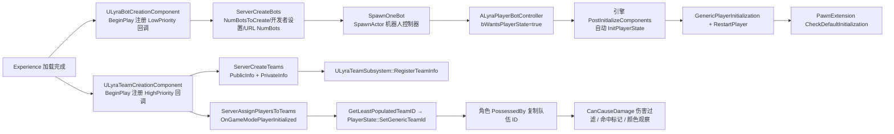
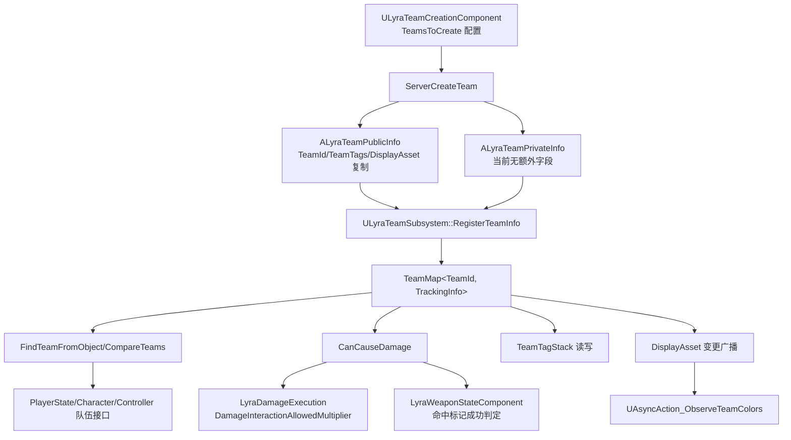

# UE5.8 Lyra 源码解析 46：AI 机器人与队伍系统

> 本篇沿两条链路阅读 Lyra 5.8 源码：一条是“Experience 加载完成 → `ULyraBotCreationComponent` 生成控制器 → `ALyraPlayerBotController` 获得 PlayerState 与 Pawn → 队伍归属跟随”；另一条是“`ULyraTeamCreationComponent` 创建队伍 → `ULyraTeamSubsystem` 注册队伍信息 → `CanCauseDamage` 过滤伤害 → DisplayAsset/异步节点驱动颜色 UI”。
> 重点是机器人数量来源、出生路径、队伍接口实现者的复制边界，以及队伍 ID 如何进入伤害执行与命中确认；机器人驱动方式以真实源码为准：本机 Lyra 项目源码中没有行为树。
> 知识成熟度：L2（本机 UE 5.8 与 Lyra 5.8 项目/插件源码已静态核对；PIE 与联机实验为可复现验证步骤）。

## 元数据

> 版本基准：UE 5.8.0（本机 `Engine/Build/Build.version`：CL 55116800，分支 `++UE5+Release-5.8`），Lyra 5.8 样例 `LyraStarterGame.uproject` 的 `EngineAssociation=5.8`。
> 源码依据：`C:\Users\zhaozhiqi\Documents\Unreal Projects\LyraStarterGame\Source\...`（项目只读引用）；引擎层以 `C:\Program Files\Epic Games\UE_5.8\Engine\...` 为准。
> 适用范围：机器人创建、队伍归属与队伍驱动链路的 Lyra 5.8 项目源码解析。
> 兼容性边界：UE 4.27/早期 UE5 仅作为历史兼容性说明。
> 官方参考：[UE 5.8 官方文档](https://dev.epicgames.com/documentation/en-us/unreal-engine)。
> 最后更新：2026-08-13
> 知识成熟度：L2

| 项目 | 内容 |
| --- | --- |
| 版本基准 | UE 5.8.0 / CL 55116800 / `++UE5+Release-5.8` |
| Lyra 基线 | 本机 `LyraStarterGame.uproject` 的 `EngineAssociation=5.8` |
| 项目源码根 | `C:\Users\zhaozhiqi\Documents\Unreal Projects\LyraStarterGame` |
| 引擎证据根 | `C:\Program Files\Epic Games\UE_5.8\Engine`，只读核对 |
| 适用范围 | 机器人创建、机器人控制器、队伍注册/创建/分配、队伍接口、伤害过滤、队伍颜色与调试命令 |
| 运行角色 | 服务器权威创建机器人/队伍并分配 TeamId；客户端读取复制结果并表现颜色 |
| 知识成熟度 | L2：项目源码、插件源码和资产存在性已静态核对；PIE/联机实验为可复现步骤 |
| 官方参考 | [UE 5.8 官方文档](https://dev.epicgames.com/documentation/en-us/unreal-engine)、[Lyra Sample Game](https://dev.epicgames.com/documentation/en-us/unreal-engine/lyra-sample-game-in-unreal-engine) |
| 最后更新 | 2026-08-13 |

## 一、先给结论

Lyra 的机器人不是独立 AI 模块，而是“玩家式控制器”的服务器侧补位对象。

`ULyraBotCreationComponent` 是挂在 GameState 上的 `UGameStateComponent`。

它监听 Experience 加载完成，再按 `NumBotsToCreate`、编辑器开发者设置、URL 选项 `NumBots` 的优先级决定机器人数量。

每个机器人由 `SpawnOneBot` 生成一个 `ALyraPlayerBotController`，随后走与玩家相同的 `GenericPlayerInitialization` 与 `RestartPlayer` 路径。

`ALyraPlayerBotController` 继承 `AModularAIController` 并实现 `ILyraTeamAgentInterface`。

它设置 `bWantsPlayerState = true`，因此引擎 `AAIController::PostInitializeComponents` 会在服务器侧自动创建 PlayerState。

机器人的队伍 ID 不由控制器自身保存：`GetGenericTeamId()` 直接读取关联 PlayerState，`SetGenericTeamId` 明确拒绝写入。

本机 Lyra 项目源码中没有任何 `RunBehaviorTree`、`UBehaviorTree` 或 BrainComponent 装配；机器人行为细节在蓝图资产里，属于本篇的验证边界。

队伍侧，`ULyraTeamSubsystem` 是世界级注册表。

`ALyraTeamInfoBase` 分成 `ALyraTeamPublicInfo`（携带复制给所有人的 DisplayAsset 与 TeamTags）和 `ALyraTeamPrivateInfo`（当前无额外私有字段，边界按设计保留）。

`ULyraTeamCreationComponent` 在 Experience 加载后以最高优先级创建队伍，并通过 `OnGameModePlayerInitialized` 为每个新玩家分配人数最少的队伍。

`CanCauseDamage(Instigator, Target, bAllowDamageToSelf)` 是 42 篇伤害过滤的实际闸门：`LyraDamageExecution` 把它换算成 `DamageInteractionAllowedMultiplier`，`LyraWeaponStateComponent` 用同一个调用判定命中标记是否成功。

队伍 ID 的传播方式是“控制器 → 角色”，并各自维护 `ReplicatedUsing` 字段与 `FOnLyraTeamIndexChangedDelegate` 广播。

颜色链路由 `ULyraTeamDisplayAsset` 提供参数表，`UAsyncAction_ObserveTeamColors` 把“队伍变化 + 显示资产变化”合并成一个蓝图异步输出。

## 二、阅读前的事实边界

### 2.1 证据等级

| 等级 | 证据 | 本文用法 |
| --- | --- | --- |
| A | Lyra 5.8 `Source/LyraGame` 的 C++ 文件 | 类、函数、字段与调用顺序的直接事实 |
| B | Lyra 5.8 `Plugins` 中的插件源码与资产存在性 | `AModularAIController` 基类、ShooterCore 机器人资产、GameFeatures 配置 |
| C | UE 5.8 引擎源码 | `UGameStateComponent`、`AAIController::PostInitializeComponents`、`FGenericTeamId` 语义 |

资产路径只能证明资产存在和可被引用。

`B_ShooterBotSpawner.uasset`、`B_AI_Controller_LyraShooter.uasset`、`B_TeamSetup_TwoTeams.uasset` 的蓝图节点连线需要在 UE 编辑器中打开确认。

本文不把一次静态源码检索写成“已经通过 PIE”。

断点实验章节给出应观察的现象与记录字段。

### 2.2 先验证目录

```powershell
# 节选：确认项目、机器人三件套与 Teams 目录存在
$Lyra = 'C:\Users\zhaozhiqi\Documents\Unreal Projects\LyraStarterGame'
Test-Path -LiteralPath "$Lyra\LyraStarterGame.uproject"
Test-Path -LiteralPath "$Lyra\Source\LyraGame\GameModes\LyraBotCreationComponent.cpp"
Test-Path -LiteralPath "$Lyra\Source\LyraGame\Player\LyraPlayerBotController.cpp"
Test-Path -LiteralPath "$Lyra\Source\LyraGame\Development\LyraBotCheats.cpp"
Test-Path -LiteralPath "$Lyra\Source\LyraGame\Teams\LyraTeamSubsystem.cpp"
```

命令输出的 `True` 只说明路径存在。

源码事实仍以文件中的真实符号为准。

### 2.3 目录地图

```text
# 示意：目录地图（存在性以 Test-Path 为准）
LyraStarterGame/
├─ Source/LyraGame/
│  ├─ GameModes/
│  │  ├─ LyraBotCreationComponent.h/.cpp      # 机器人数量与出生（UGameStateComponent）
│  │  ├─ LyraExperienceManagerComponent.h     # CallOrRegister_OnExperienceLoaded_*
│  │  ├─ LyraGameMode.h/.cpp                  # GenericPlayerInitialization、OnGameModePlayerInitialized
│  │  └─ LyraGameState.h/.cpp                 # ExperienceManagerComponent 宿主
│  ├─ Player/
│  │  ├─ LyraPlayerBotController.h/.cpp       # 机器人控制器（AModularAIController + 队伍接口）
│  │  └─ LyraPlayerState.h/.cpp               # MyTeamID 复制与队伍广播
│  ├─ Development/
│  │  ├─ LyraBotCheats.h/.cpp                 # AddPlayerBot/RemovePlayerBot
│  │  └─ LyraDeveloperSettings.h              # bOverrideBotCount/OverrideNumPlayerBotsToSpawn
│  ├─ Teams/
│  │  ├─ LyraTeamSubsystem.h/.cpp             # 世界级队伍注册表与 CanCauseDamage
│  │  ├─ LyraTeamCreationComponent.h/.cpp     # 队伍创建与分配（UGameStateComponent）
│  │  ├─ LyraTeamInfoBase.h/.cpp              # TeamId/TeamTags 复制基类
│  │  ├─ LyraTeamPublicInfo.h/.cpp            # 公开信息：DisplayAsset 复制
│  │  ├─ LyraTeamPrivateInfo.h/.cpp           # 私有信息：当前无额外字段
│  │  ├─ LyraTeamAgentInterface.h/.cpp        # 队伍接口与转换工具
│  │  ├─ LyraTeamDisplayAsset.h/.cpp          # 颜色/材质参数数据资产
│  │  ├─ LyraTeamStatics.h/.cpp               # 蓝图静态函数库
│  │  ├─ AsyncAction_ObserveTeam.h/.cpp       # 异步观察队伍
│  │  ├─ AsyncAction_ObserveTeamColors.h/.cpp # 异步观察队伍颜色
│  │  └─ LyraTeamCheats.h/.cpp                # CycleTeam/SetTeam/ListTeams
│  ├─ Character/LyraCharacter.h/.cpp          # 角色实现队伍接口并跟随控制器
│  ├─ AbilitySystem/Executions/LyraDamageExecution.cpp  # CanCauseDamage 闸门
│  └─ Weapons/LyraWeaponStateComponent.cpp    # 命中标记成功判定
└─ Plugins/
   ├─ ModularGameplayActors/Public/ModularAIController.h   # 机器人控制器基类
   └─ GameFeatures/ShooterCore/Content/Bot/…               # 机器人资产（蓝图边界）
```

## 三、全链路总图



图注：两条链都以 Experience 加载完成为起点，但优先级不同。队伍创建用 `CallOrRegister_OnExperienceLoaded_HighPriority`，机器人创建用 `LowPriority`，保证机器人出生时队伍已存在。机器人控制器在生成时由引擎自动创建 PlayerState，随后才进入 GameMode 的初始化与出生流程。

## 四、核心职责矩阵

| 对象 | 位置（`Source/LyraGame/`） | 职责 | 网络角色 |
| --- | --- | --- | --- |
| `ULyraBotCreationComponent` | `GameModes/` | 决定机器人数量并生成控制器 | 仅服务器（`WITH_SERVER_CODE`） |
| `ALyraPlayerBotController` | `Player/` | 机器人控制器、队伍接口转发 | 服务器权威，客户端同步 |
| `ULyraBotCheats` | `Development/` | `AddPlayerBot`/`RemovePlayerBot` 控制台命令 | 仅服务器代码编译 |
| `ULyraTeamSubsystem` | `Teams/` | 队伍注册、查询、伤害判定、Tag 栈 | World 级（每端各有一份） |
| `ULyraTeamCreationComponent` | `Teams/` | 创建队伍 Actor 并分配玩家 | 仅服务器逻辑 |
| `ALyraTeamPublicInfo` | `Teams/` | 公开信息：TeamId、TeamTags、DisplayAsset | 复制给所有客户端 |
| `ALyraTeamPrivateInfo` | `Teams/` | 私有信息边界（当前无额外字段） | 复制基类字段 |
| `ILyraTeamAgentInterface` | `Teams/` | 队伍 ID 读写与变化委托契约 | 接口层 |
| `ULyraTeamDisplayAsset` | `Teams/` | 队伍颜色/材质参数表 | 数据资产 |
| `ULyraTeamStatics` | `Teams/` | 蓝图侧查询与带默认值读取 | 静态函数库 |
| `UAsyncAction_ObserveTeam(Colors)` | `Teams/` | 异步观察队伍/颜色变化 | 蓝图运行时 |
| `ULyraTeamCheats` | `Teams/` | `CycleTeam`/`SetTeam`/`ListTeams` | 由 Subsystem 注册 |

## 五、机器人创建组件：ULyraBotCreationComponent

### 5.1 类声明

`ULyraBotCreationComponent` 继承 `UGameStateComponent`，声明为 `UCLASS(Blueprintable, Abstract)`。

```cpp
// 节选：Source/LyraGame/GameModes/LyraBotCreationComponent.h
UCLASS(Blueprintable, Abstract)
class ULyraBotCreationComponent : public UGameStateComponent
{
	UPROPERTY(EditDefaultsOnly, BlueprintReadOnly, Category=Gameplay)
	int32 NumBotsToCreate = 5;

	UPROPERTY(EditDefaultsOnly, BlueprintReadOnly, Category=Gameplay)
	TSubclassOf<AAIController> BotControllerClass;

	UPROPERTY(EditDefaultsOnly, BlueprintReadOnly, Category=Gameplay)
	TArray<FString> RandomBotNames;

	UPROPERTY(Transient)
	TArray<TObjectPtr<AAIController>> SpawnedBotList;

	virtual void SpawnOneBot();          // BlueprintCallable, BlueprintAuthorityOnly
	virtual void RemoveOneBot();         // BlueprintCallable, BlueprintAuthorityOnly
	UFUNCTION(BlueprintNativeEvent, BlueprintAuthorityOnly)
	void ServerCreateBots();
};
```

三个默认配置字段决定“有多少、是什么类、叫什么名字”。

`SpawnedBotList` 是服务器维护的临时控制器列表，`RemoveOneBot` 依赖它随机移除。

### 5.2 挂接点：不是 PostLogin，也不是 OnMatchStateSet

组件在 `BeginPlay` 里找到 GameState 上的 `ULyraExperienceManagerComponent`，注册低优先级回调。

```cpp
// 节选：Source/LyraGame/GameModes/LyraBotCreationComponent.cpp
void ULyraBotCreationComponent::BeginPlay()
{
	Super::BeginPlay();

	AGameStateBase* GameState = GetGameStateChecked<AGameStateBase>();
	ULyraExperienceManagerComponent* ExperienceComponent =
		GameState->FindComponentByClass<ULyraExperienceManagerComponent>();
	check(ExperienceComponent);
	ExperienceComponent->CallOrRegister_OnExperienceLoaded_LowPriority(
		FOnLyraExperienceLoaded::FDelegate::CreateUObject(this, &ThisClass::OnExperienceLoaded));
}

void ULyraBotCreationComponent::OnExperienceLoaded(const ULyraExperienceDefinition* Experience)
{
	if (HasAuthority())
	{
		ServerCreateBots();
	}
}
```

机器人创建不挂在 `PostLogin`：玩家何时登录不影响机器人数量，也不存在“按玩家槽补位”的逻辑。

`CallOrRegister_OnExperienceLoaded_LowPriority` 语义是“若已加载则立即调用，否则排在低优先级批次”，与队伍创建的高优先级形成顺序保证。

### 5.3 机器人数量来源：三级优先级

`ServerCreateBots_Implementation` 依次读取三个来源。

```cpp
// 节选：Source/LyraGame/GameModes/LyraBotCreationComponent.cpp
void ULyraBotCreationComponent::ServerCreateBots_Implementation()
{
	if (BotControllerClass == nullptr)
	{
		return;
	}

	RemainingBotNames = RandomBotNames;

	int32 EffectiveBotCount = NumBotsToCreate;

	// 编辑器内可用开发者设置覆盖
	if (GIsEditor)
	{
		const ULyraDeveloperSettings* DeveloperSettings = GetDefault<ULyraDeveloperSettings>();
		if (DeveloperSettings->bOverrideBotCount)
		{
			EffectiveBotCount = DeveloperSettings->OverrideNumPlayerBotsToSpawn;
		}
	}

	// URL 选项覆盖
	if (AGameModeBase* GameModeBase = GetGameMode<AGameModeBase>())
	{
		EffectiveBotCount = UGameplayStatics::GetIntOption(
			GameModeBase->OptionsString, TEXT("NumBots"), EffectiveBotCount);
	}

	for (int32 Count = 0; Count < EffectiveBotCount; ++Count)
	{
		SpawnOneBot();
	}
}
```

优先级从低到高：组件默认值 `NumBotsToCreate`（默认 5）→ 编辑器开发者设置 → Travel URL 的 `NumBots` 选项。

URL 覆盖在编辑器与独立服务器都生效，例如启动参数携带 `?NumBots=8`。

名字池 `RandomBotNames` 每次全量重置，`CreateBotName` 随机抽取并 `RemoveAtSwap`；池耗尽后回退为 `Tinplate <260..360>` 格式。

### 5.4 SpawnOneBot 出生路径

```cpp
// 节选：Source/LyraGame/GameModes/LyraBotCreationComponent.cpp
void ULyraBotCreationComponent::SpawnOneBot()
{
	FActorSpawnParameters SpawnInfo;
	SpawnInfo.SpawnCollisionHandlingOverride = ESpawnActorCollisionHandlingMethod::AlwaysSpawn;
	SpawnInfo.OverrideLevel = GetComponentLevel();
	SpawnInfo.ObjectFlags |= RF_Transient;
	AAIController* NewController = GetWorld()->SpawnActor<AAIController>(
		BotControllerClass, FVector::ZeroVector, FRotator::ZeroRotator, SpawnInfo);

	if (NewController != nullptr)
	{
		ALyraGameMode* GameMode = GetGameMode<ALyraGameMode>();
		check(GameMode);

		if (NewController->PlayerState != nullptr)
		{
			NewController->PlayerState->SetPlayerName(CreateBotName(NewController->PlayerState->GetPlayerId()));
		}

		GameMode->GenericPlayerInitialization(NewController);
		GameMode->RestartPlayer(NewController);

		if (NewController->GetPawn() != nullptr)
		{
			if (ULyraPawnExtensionComponent* PawnExtComponent =
					NewController->GetPawn()->FindComponentByClass<ULyraPawnExtensionComponent>())
			{
				PawnExtComponent->CheckDefaultInitialization();
			}
		}

		SpawnedBotList.Add(NewController);
	}
}
```

出生要点：

1. 控制器在原点 `FVector::ZeroVector` 生成，`AlwaysSpawn` 忽略碰撞，`RF_Transient` 标记为临时对象；
2. 名字写入 `PlayerState`，说明生成时 PlayerState 已存在（引擎侧自动创建，见 6.2）；
3. `GenericPlayerInitialization` 会触发队伍组件监听的回调（`OnGameModePlayerInitialized`），机器人因此和真人玩家走同一条队伍分配路径；
4. `RestartPlayer` 走 GameMode 的标准出生点逻辑；
5. 出生后主动调用 `CheckDefaultInitialization`，把 41 篇的 PawnExtension 初始化流程从等待状态推进一步。

### 5.5 RemoveOneBot：随机移除与自毁

```cpp
// 节选：Source/LyraGame/GameModes/LyraBotCreationComponent.cpp
void ULyraBotCreationComponent::RemoveOneBot()
{
	const int32 BotToRemoveIndex = FMath::RandRange(0, SpawnedBotList.Num() - 1);
	AAIController* BotToRemove = SpawnedBotList[BotToRemoveIndex];
	SpawnedBotList.RemoveAtSwap(BotToRemoveIndex);

	if (BotToRemove)
	{
		if (APawn* ControlledPawn = BotToRemove->GetPawn())
		{
			if (ULyraHealthComponent* HealthComponent =
					ULyraHealthComponent::FindHealthComponent(ControlledPawn))
			{
				HealthComponent->DamageSelfDestruct();
			}
			else
			{
				ControlledPawn->Destroy();
			}
		}

		BotToRemove->Destroy();
	}
}
```

源码注释明确记录了一个已知副作用：先自毁 Pawn 再销毁控制器时，PlayerState 随控制器销毁，死亡动画相关能力会被立即中断。

### 5.6 客户端编译边界

非服务器构建（`WITH_SERVER_CODE` 关闭）下，三个函数体都是 `ensureMsgf(0, ...)` 报错，不会真的生成机器人。

```cpp
// 节选：Source/LyraGame/GameModes/LyraBotCreationComponent.cpp（非服务器分支）
void ULyraBotCreationComponent::ServerCreateBots_Implementation()
{
	ensureMsgf(0, TEXT("Bot functions do not exist in LyraClient!"));
}
```

因此 LyraClient 目标不会创建机器人，行为树或决策逻辑也不应假设客户端存在机器人代码。

### 5.7 静态验证命令

```powershell
# 节选：核对机器人创建组件与数量来源
$Lyra = 'C:\Users\zhaozhiqi\Documents\Unreal Projects\LyraStarterGame'
rg -n 'NumBotsToCreate|OverrideNumPlayerBotsToSpawn|GetIntOption|SpawnOneBot|GenericPlayerInitialization|RestartPlayer' `
  "$Lyra\Source\LyraGame\GameModes\LyraBotCreationComponent.cpp"
rg -n 'CallOrRegister_OnExperienceLoaded_(HighPriority|LowPriority)' `
  "$Lyra\Source\LyraGame\GameModes\LyraExperienceManagerComponent.h"
```

## 六、机器人控制器：ALyraPlayerBotController

### 6.1 类声明

控制器继承 `AModularAIController` 并实现 `ILyraTeamAgentInterface`。

```cpp
// 节选：Source/LyraGame/Player/LyraPlayerBotController.h
UCLASS(Blueprintable)
class ALyraPlayerBotController : public AModularAIController, public ILyraTeamAgentInterface
{
	virtual void SetGenericTeamId(const FGenericTeamId& NewTeamID) override;
	virtual FGenericTeamId GetGenericTeamId() const override;
	virtual FOnLyraTeamIndexChangedDelegate* GetOnTeamIndexChangedDelegate() override;
	ETeamAttitude::Type GetTeamAttitudeTowards(const AActor& Other) const override;

	void ServerRestartController();
	void UpdateTeamAttitude(UAIPerceptionComponent* AIPerception);

	virtual void OnUnPossess() override;
	virtual void InitPlayerState() override;
	virtual void CleanupPlayerState() override;
	virtual void OnRep_PlayerState() override;
};
```

构造器只做两件事：

```cpp
// 节选：Source/LyraGame/Player/LyraPlayerBotController.cpp
ALyraPlayerBotController::ALyraPlayerBotController(const FObjectInitializer& ObjectInitializer)
	: Super(ObjectInitializer)
{
	bWantsPlayerState = true;
	bStopAILogicOnUnposses = false;
}
```

### 6.2 自动登录：引擎侧 PostInitializeComponents

`bWantsPlayerState = true` 触发引擎 `AAIController::PostInitializeComponents` 的自动 PlayerState 创建。

```cpp
// 节选：引擎 Engine/Source/Runtime/AIModule/Private/AIController.cpp
void AAIController::PostInitializeComponents()
{
	Super::PostInitializeComponents();

	if (bWantsPlayerState && IsValidChecked(this) && (GetNetMode() != NM_Client))
	{
		InitPlayerState();
	}

	if (BrainComponent == nullptr)
	{
		BrainComponent = FindComponentByClass<UBrainComponent>();
	}
	if (Blackboard == nullptr)
	{
		Blackboard = FindComponentByClass<UBlackboardComponent>();
	}

#if ENABLE_VISUAL_LOG
	for (UActorComponent* Component : GetComponents())
	{
		if (Component)
		{
			REDIRECT_OBJECT_TO_VLOG(Component, this);
		}
	}
#endif // ENABLE_VISUAL_LOG
}
```

所以机器人的“登录”是控制器生成时自动发生的，不经过 `PostLogin`，也不需要 `ULocalPlayer`。

这与 41 篇“Bot 不需要 LocalPlayer”的门槛一致：Hero 组件只在本地控制且非 Bot 时才要求 InputComponent 与 LocalPlayer。

控制器在 PlayerState 建立/清除/复制恢复三个时机都会重播队伍广播：

```cpp
// 节选：Source/LyraGame/Player/LyraPlayerBotController.cpp
void ALyraPlayerBotController::BroadcastOnPlayerStateChanged()
{
	OnPlayerStateChanged();

	FGenericTeamId OldTeamID = FGenericTeamId::NoTeam;
	if (LastSeenPlayerState != nullptr)
	{
		if (ILyraTeamAgentInterface* PSWithTeam = Cast<ILyraTeamAgentInterface>(LastSeenPlayerState))
		{
			OldTeamID = PSWithTeam->GetGenericTeamId();
			PSWithTeam->GetTeamChangedDelegateChecked().RemoveAll(this);
		}
	}

	FGenericTeamId NewTeamID = FGenericTeamId::NoTeam;
	if (PlayerState != nullptr)
	{
		if (ILyraTeamAgentInterface* PSWithTeam = Cast<ILyraTeamAgentInterface>(PlayerState))
		{
			NewTeamID = PSWithTeam->GetGenericTeamId();
			PSWithTeam->GetTeamChangedDelegateChecked().AddDynamic(this, &ThisClass::OnPlayerStateChangedTeam);
		}
	}

	ConditionalBroadcastTeamChanged(this, OldTeamID, NewTeamID);
	LastSeenPlayerState = PlayerState;
}
```

`InitPlayerState`、`CleanupPlayerState`、`OnRep_PlayerState` 三个重载都调用 `BroadcastOnPlayerStateChanged`，保证服务器端初始化和客户端复制恢复走同一套解绑/重绑逻辑。

### 6.3 队伍归属：控制器只是转发器

```cpp
// 节选：Source/LyraGame/Player/LyraPlayerBotController.cpp
void ALyraPlayerBotController::SetGenericTeamId(const FGenericTeamId& NewTeamID)
{
	UE_LOG(LogLyraTeams, Error, TEXT("You can't set the team ID on a player bot controller (%s); it's driven by the associated player state"), ...);
}

FGenericTeamId ALyraPlayerBotController::GetGenericTeamId() const
{
	if (ILyraTeamAgentInterface* PSWithTeamInterface = Cast<ILyraTeamAgentInterface>(PlayerState))
	{
		return PSWithTeamInterface->GetGenericTeamId();
	}
	return FGenericTeamId::NoTeam;
}
```

写队伍 ID 被明确禁止，读队伍 ID 永远来自 PlayerState。

`OnPlayerStateChangedTeam` 把 PlayerState 的队伍变化委托转发成控制器自己的 `ConditionalBroadcastTeamChanged`。

### 6.4 队伍态度：AIPerception 的敌我判定

```cpp
// 节选：Source/LyraGame/Player/LyraPlayerBotController.cpp
ETeamAttitude::Type ALyraPlayerBotController::GetTeamAttitudeTowards(const AActor& Other) const
{
	if (const APawn* OtherPawn = Cast<APawn>(&Other))
	{
		if (const ILyraTeamAgentInterface* TeamAgent = Cast<ILyraTeamAgentInterface>(OtherPawn->GetController()))
		{
			const FGenericTeamId OtherTeamID = TeamAgent->GetGenericTeamId();
			if (OtherTeamID.GetId() != GetGenericTeamId().GetId())
			{
				return ETeamAttitude::Hostile;
			}
			else
			{
				return ETeamAttitude::Friendly;
			}
		}
	}
	return ETeamAttitude::Neutral;
}
```

判定基准是对手的 Controller 队伍 ID，而不是 Pawn 自身。

`UpdateTeamAttitude` 调用 `UAIPerceptionComponent::RequestStimuliListenerUpdate()`，让感知系统在队伍变化后刷新敌我标签。

### 6.5 ServerRestartController 与 OnUnPossess

`ServerRestartController` 是机器人专用复活入口：客户端调用直接返回，服务器端要求当前无 Pawn 且处于 Inactive/Spectating 状态，通过 `ALyraGameMode::ControllerCanRestart` 校验后调用 `RestartPlayer`。

`OnUnPossess` 处理 ASC 头像清理：

```cpp
// 节选：Source/LyraGame/Player/LyraPlayerBotController.cpp
void ALyraPlayerBotController::OnUnPossess()
{
	if (APawn* PawnBeingUnpossessed = GetPawn())
	{
		if (UAbilitySystemComponent* ASC = UAbilitySystemGlobals::GetAbilitySystemComponentFromActor(PlayerState))
		{
			if (ASC->GetAvatarActor() == PawnBeingUnpossessed)
			{
				ASC->SetAvatarActor(nullptr);
			}
		}
	}
	Super::OnUnPossess();
}
```

避免被解除占有的 Pawn 继续作为 ASC Avatar 存活。

### 6.6 静态验证命令

```powershell
# 节选：核对机器人控制器符号
$Lyra = 'C:\Users\zhaozhiqi\Documents\Unreal Projects\LyraStarterGame'
rg -n 'bWantsPlayerState|SetGenericTeamId|GetGenericTeamId|GetTeamAttitudeTowards|ServerRestartController|OnUnPossess' `
  "$Lyra\Source\LyraGame\Player\LyraPlayerBotController.cpp"
rg -n 'bWantsPlayerState' 'C:\Program Files\Epic Games\UE_5.8\Engine\Source\Runtime\AIModule\Private\AIController.cpp'
```

## 七、“Bot 如何驱动”的事实边界

### 7.1 项目源码中没有行为树

对 `Source/LyraGame` 全量检索 `RunBehaviorTree`、`UBehaviorTree`、`BrainComponent`、`UBlackboardComponent` 均无命中。

`ALyraPlayerBotController` 没有设置任何 BrainComponent，`AModularAIController` 只是把组件生命周期转交给 Modular 框架的 `AAIController` 子类。

因此本机 Lyra 5.8 样例中，机器人“如何行动”不由项目 C++ 决策逻辑驱动。

能确认的驱动面只有：

- GAS 与玩家相同的 Pawn 初始化路径（`LyraPawnExtensionComponent`、Hero、Health）；
- 队伍态度接口供感知系统查询敌我；
- `UpdateTeamAttitude` 刷新感知监听器；
- 蓝图资产（`B_AI_Controller_LyraShooter`、`B_AI_Controller_LyraShooter_Passive` 等）中的节点连线。

### 7.2 蓝图资产的存在性证据

```powershell
# 节选：核对 ShooterCore 机器人资产存在性（不推断蓝图内容）
$Lyra = 'C:\Users\zhaozhiqi\Documents\Unreal Projects\LyraStarterGame'
Test-Path -LiteralPath "$Lyra\Plugins\GameFeatures\ShooterCore\Content\Bot\B_ShooterBotSpawner.uasset"
Test-Path -LiteralPath "$Lyra\Plugins\GameFeatures\ShooterCore\Content\Bot\B_AI_Controller_LyraShooter.uasset"
Test-Path -LiteralPath "$Lyra\Plugins\GameFeatures\ShooterCore\Content\Bot\B_AI_Controller_LyraShooter_Passive.uasset"
```

`B_ShooterBotSpawner` 资产二进制引用 `ULyraBotCreationComponent`，可以确认它是机器人创建组件的配置载体。

这些资产里是否运行行为树、如何开火，必须打开编辑器核对，属于验证边界。

### 7.3 与 12-行为树与AI源码 的关系

引擎层行为树框架（`UBrainComponent`、`UBehaviorTreeComponent`、Blackboard）与 Lyra 项目是否使用它是两件事。

本系列 12 篇讲引擎框架，本篇确认 Lyra 样例项目没有在 C++ 中装配该框架。

## 八、Bot 作弊命令与开发者设置

> 分工声明：本章从**机器人视角**看"如何用命令驱动机器人创建/移除"（机器人主题归本篇）；`ULyraBotCheats`/`ULyraDeveloperSettings` 作为**调试工具类**本身的完整实现（CDO 构造器逐字代码、自动挂接机制、编译守卫、`ULyraCosmeticCheats` 对照）见 [47-Lyra-调试工具与扩展源码](47-Lyra-调试工具与扩展源码.md) §八/§7（调试域权威章节，KD-005 调试主题归 47），本篇不复述。

### 8.1 ULyraBotCheats

```cpp
// 节选：Source/LyraGame/Development/LyraBotCheats.h
UCLASS(NotBlueprintable)
class ULyraBotCheats final : public UCheatManagerExtension
{
	UFUNCTION(Exec, BlueprintAuthorityOnly)
	void AddPlayerBot();

	UFUNCTION(Exec, BlueprintAuthorityOnly)
	void RemovePlayerBot();
};
```

构造器在类默认对象上注册全局回调，`CheatManager` 创建时自动挂载扩展（编译条件 `WITH_SERVER_CODE && UE_WITH_CHEAT_MANAGER`；CDO 构造器与挂接机制的逐字实现见 [47 篇 §八](47-Lyra-调试工具与扩展源码.md)）。

命令体通过 `GameState->FindComponentByClass<ULyraBotCreationComponent>()` 找到组件，再调用 `Cheat_AddBot()`/`Cheat_RemoveBot()`——这是机器人主题的关键：**作弊命令是机器人数量的运行时入口**，与 §五 `ULyraBotCreationComponent` 的配置驱动（`BotCreationProfile`）互补。

对应控制台命令为 `AddPlayerBot` 与 `RemovePlayerBot`。

### 8.2 ULyraDeveloperSettings

```cpp
// 节选：Source/LyraGame/Development/LyraDeveloperSettings.h
UPROPERTY(EditDefaultsOnly, config)
bool bOverrideBotCount = false;

UPROPERTY(EditDefaultsOnly, BlueprintReadOnly, config, Category=LyraBots, meta=(EditCondition=bOverrideBotCount))
int32 OverrideNumPlayerBotsToSpawn = 0;
```

仅当 `GIsEditor` 时读取，独立服务器打包不受影响；`ULyraBotCreationComponent` 读取这两个字段决定初始机器人数量（字段完整清单与读取实现见 [47 篇 §7.2/§7.4](47-Lyra-调试工具与扩展源码.md)）。

### 8.3 静态验证命令

```powershell
# 节选：核对作弊命令与开发者设置
$Lyra = 'C:\Users\zhaozhiqi\Documents\Unreal Projects\LyraStarterGame'
rg -n 'AddPlayerBot|RemovePlayerBot|RegisterForOnCheatManagerCreated|FindComponentByClass' `
  "$Lyra\Source\LyraGame\Development\LyraBotCheats.cpp"
rg -n 'bOverrideBotCount|OverrideNumPlayerBotsToSpawn' "$Lyra\Source\LyraGame\Development\LyraDeveloperSettings.h"
```

## 九、队伍总图与数据模型



图注：`ULyraTeamSubsystem` 是唯一的数据入口，所有队伍查询、伤害判定和颜色观察都经过它。队伍信息 Actor 在服务器生成后通过复制到达客户端，客户端 Subsystem 的 `OnRep` 路径（`OnRep_TeamId`、`OnRep_TeamDisplayAsset`）把本地注册补齐，因此两端的 `TeamMap` 最终一致。

## 十、ULyraTeamSubsystem：世界级队伍注册表

### 10.1 身份与生命周期

`ULyraTeamSubsystem` 是 `UWorldSubsystem`，每个 World 一份。

`Initialize` 注册 `ULyraTeamCheats` 扩展，`Deinitialize` 反注册。

```cpp
// 节选：Source/LyraGame/Teams/LyraTeamSubsystem.cpp
void ULyraTeamSubsystem::Initialize(FSubsystemCollectionBase& Collection)
{
	Super::Initialize(Collection);

	auto AddTeamCheats = [](UCheatManager* CheatManager)
	{
		CheatManager->AddCheatManagerExtension(NewObject<ULyraTeamCheats>(CheatManager));
	};
	CheatManagerRegistrationHandle =
		UCheatManager::RegisterForOnCheatManagerCreated(FOnCheatManagerCreated::FDelegate::CreateLambda(AddTeamCheats));
}
```

### 10.2 注册与反注册

`RegisterTeamInfo(ALyraTeamInfoBase*)` 以 `TeamId` 为键 `FindOrAdd` 出 `FLyraTeamTrackingInfo` 条目。

`FLyraTeamTrackingInfo::SetTeamInfo` 区分公开/私有信息：

```cpp
// 节选：Source/LyraGame/Teams/LyraTeamSubsystem.cpp
void FLyraTeamTrackingInfo::SetTeamInfo(ALyraTeamInfoBase* Info)
{
	if (ALyraTeamPublicInfo* NewPublicInfo = Cast<ALyraTeamPublicInfo>(Info))
	{
		PublicInfo = NewPublicInfo;

		ULyraTeamDisplayAsset* OldDisplayAsset = DisplayAsset;
		DisplayAsset = NewPublicInfo->GetTeamDisplayAsset();
		if (OldDisplayAsset != DisplayAsset)
		{
			OnTeamDisplayAssetChanged.Broadcast(DisplayAsset);
		}
	}
	else if (ALyraTeamPrivateInfo* NewPrivateInfo = Cast<ALyraTeamPrivateInfo>(Info))
	{
		PrivateInfo = NewPrivateInfo;
	}
}
```

公开信息到达时立即同步 DisplayAsset 并广播；私有信息只保存指针。

`UnregisterTeamInfo` 在 `EndPlay` 调用，把条目指针清空。

### 10.3 FindTeamFromObject：查找顺序

```cpp
// 节选：Source/LyraGame/Teams/LyraTeamSubsystem.cpp
int32 ULyraTeamSubsystem::FindTeamFromObject(const UObject* TestObject) const
{
	if (const ILyraTeamAgentInterface* ObjectWithTeamInterface = Cast<ILyraTeamAgentInterface>(TestObject))
	{
		return GenericTeamIdToInteger(ObjectWithTeamInterface->GetGenericTeamId());
	}

	if (const AActor* TestActor = Cast<const AActor>(TestObject))
	{
		if (const ILyraTeamAgentInterface* InstigatorWithTeamInterface =
				Cast<ILyraTeamAgentInterface>(TestActor->GetInstigator()))
		{
			return GenericTeamIdToInteger(InstigatorWithTeamInterface->GetGenericTeamId());
		}

		if (const ALyraTeamInfoBase* TeamInfo = Cast<ALyraTeamInfoBase>(TestActor))
		{
			return TeamInfo->GetTeamId();
		}

		if (const ALyraPlayerState* LyraPS = FindPlayerStateFromActor(TestActor))
		{
			return LyraPS->GetTeamId();
		}
	}

	return INDEX_NONE;
}
```

顺序：对象自身接口 → Instigator 接口 → TeamInfo 特例 → 关联 PlayerState。

`FindPlayerStateFromActor` 支持 Pawn、Controller、PlayerState 三种输入，Pawn 走 `GetPlayerState<ALyraPlayerState>()`，Controller 走 `PC->PlayerState`。

### 10.4 CompareTeams 与 CanCauseDamage

```cpp
// 节选：Source/LyraGame/Teams/LyraTeamSubsystem.cpp
bool ULyraTeamSubsystem::CanCauseDamage(const UObject* Instigator, const UObject* Target, bool bAllowDamageToSelf) const
{
	if (bAllowDamageToSelf)
	{
		if ((Instigator == Target) ||
			(FindPlayerStateFromActor(Cast<AActor>(Instigator)) == FindPlayerStateFromActor(Cast<AActor>(Target))))
		{
			return true;
		}
	}

	int32 InstigatorTeamId;
	int32 TargetTeamId;
	const ELyraTeamComparison Relationship = CompareTeams(Instigator, Target, InstigatorTeamId, TargetTeamId);
	if (Relationship == ELyraTeamComparison::DifferentTeams)
	{
		return true;
	}
	else if ((Relationship == ELyraTeamComparison::InvalidArgument) && (InstigatorTeamId != INDEX_NONE))
	{
		// 无队伍目标（如靶子）只要带 ASC 就允许伤害
		return UAbilitySystemGlobals::GetAbilitySystemComponentFromActor(Cast<const AActor>(Target)) != nullptr;
	}

	return false;
}
```

规则拆解：

| 情况 | 结果 |
| --- | --- |
| 同一对象或同一 PlayerState（默认允许自伤） | true |
| 不同队伍 | true |
| 目标无队伍但施害者有队伍 | 目标带 ASC 则 true（靶子特例） |
| 同一队伍 | false |
| 双方都无队伍 | false |

`bAllowDamageToSelf = false` 时，同 PlayerState 的两人互相伤害也被禁止，可用于友军伤害开关。

### 10.5 队伍 Tag 栈

`AddTeamTagStack`/`RemoveTeamTagStack` 是 `BlueprintAuthorityOnly`，写入 `PublicInfo->TeamTags`（`FGameplayTagStackContainer`，随 PublicInfo 复制）。

失败路径有明确日志：客户端调用、队伍信息尚未生成、未知 TeamId 三种情况分别报错。

`GetTeamTagStackCount` 返回公开与私有两个 Info 的栈计数之和；`TeamHasTag` 判断是否大于 0。

### 10.6 显示资产变更广播

```cpp
// 节选：Source/LyraGame/Teams/LyraTeamSubsystem.cpp
void ULyraTeamSubsystem::NotifyTeamDisplayAssetModified(ULyraTeamDisplayAsset* /*ModifiedAsset*/)
{
	for (const auto& KVP : TeamMap)
	{
		const FLyraTeamTrackingInfo& TrackingInfo = KVP.Value;
		TrackingInfo.OnTeamDisplayAssetChanged.Broadcast(TrackingInfo.DisplayAsset);
	}
}
```

当前实现广播所有队伍，而不是只广播被编辑的那一个；源码参数名带注释说明这是现状。

### 10.7 静态验证命令

```powershell
# 节选：核对 Subsystem 全部公开 API
$Lyra = 'C:\Users\zhaozhiqi\Documents\Unreal Projects\LyraStarterGame'
rg -n 'RegisterTeamInfo|UnregisterTeamInfo|ChangeTeamForActor|FindTeamFromObject|FindPlayerStateFromActor|CompareTeams|CanCauseDamage|TeamTagStack|GetTeamDisplayAsset' `
  "$Lyra\Source\LyraGame\Teams\LyraTeamSubsystem.h"
```

## 十一、ULyraTeamCreationComponent：服务器创建与分配

### 11.1 配置字段

```cpp
// 节选：Source/LyraGame/Teams/LyraTeamCreationComponent.h
UCLASS(Blueprintable)
class ULyraTeamCreationComponent : public UGameStateComponent
{
	UPROPERTY(EditDefaultsOnly, Category = Teams)
	TMap<uint8, TObjectPtr<ULyraTeamDisplayAsset>> TeamsToCreate;

	UPROPERTY(EditDefaultsOnly, Category=Teams)
	TSubclassOf<ALyraTeamPublicInfo> PublicTeamInfoClass;

	UPROPERTY(EditDefaultsOnly, Category=Teams)
	TSubclassOf<ALyraTeamPrivateInfo> PrivateTeamInfoClass;
};
```

构造器把两个 Info 类默认设为 Lyra 自带的 `ALyraTeamPublicInfo`/`ALyraTeamPrivateInfo`。

`TeamsToCreate` 的键是 TeamId（uint8），值是对应 DisplayAsset。

### 11.2 创建与分配时序

```cpp
// 节选：Source/LyraGame/Teams/LyraTeamCreationComponent.cpp
void ULyraTeamCreationComponent::OnExperienceLoaded(const ULyraExperienceDefinition* Experience)
{
	if (HasAuthority())
	{
		ServerCreateTeams();
		ServerAssignPlayersToTeams();
	}
}

void ULyraTeamCreationComponent::ServerCreateTeam(int32 TeamId, ULyraTeamDisplayAsset* DisplayAsset)
{
	check(HasAuthority());

	ALyraTeamPublicInfo* NewTeamPublicInfo = World->SpawnActor<ALyraTeamPublicInfo>(PublicTeamInfoClass, SpawnInfo);
	NewTeamPublicInfo->SetTeamId(TeamId);
	NewTeamPublicInfo->SetTeamDisplayAsset(DisplayAsset);

	ALyraTeamPrivateInfo* NewTeamPrivateInfo = World->SpawnActor<ALyraTeamPrivateInfo>(PrivateTeamInfoClass, SpawnInfo);
	NewTeamPrivateInfo->SetTeamId(TeamId);
}
```

分配阶段先处理已存在的玩家，再挂接新玩家回调：

```cpp
// 节选：Source/LyraGame/Teams/LyraTeamCreationComponent.cpp
void ULyraTeamCreationComponent::ServerAssignPlayersToTeams()
{
	AGameStateBase* GameState = GetGameStateChecked<AGameStateBase>();
	for (APlayerState* PS : GameState->PlayerArray)
	{
		if (ALyraPlayerState* LyraPS = Cast<ALyraPlayerState>(PS))
		{
			ServerChooseTeamForPlayer(LyraPS);
		}
	}

	ALyraGameMode* GameMode = Cast<ALyraGameMode>(GameState->AuthorityGameMode);
	check(GameMode);
	GameMode->OnGameModePlayerInitialized.AddUObject(this, &ThisClass::OnPlayerInitialized);
}
```

`OnGameModePlayerInitialized` 由 `ALyraGameMode::GenericPlayerInitialization` 广播，机器人出生也走这里，因此 bot 和真人共用同一分配逻辑。

### 11.3 分配策略

```cpp
// 节选：Source/LyraGame/Teams/LyraTeamCreationComponent.cpp
void ULyraTeamCreationComponent::ServerChooseTeamForPlayer(ALyraPlayerState* PS)
{
	if (PS->IsOnlyASpectator())
	{
		PS->SetGenericTeamId(FGenericTeamId::NoTeam);
	}
	else
	{
		const FGenericTeamId TeamID = IntegerToGenericTeamId(GetLeastPopulatedTeamID());
		PS->SetGenericTeamId(TeamID);
	}
}
```

纯观察者被剥离队伍；其余玩家进入“人数最少队伍优先，平局取小 TeamId”的 `GetLeastPopulatedTeamID` 逻辑。

统计时跳过未分配（`INDEX_NONE`）与 `IsInactive()` 的玩家。

### 11.4 静态验证命令

```powershell
# 节选：核对队伍创建与分配
$Lyra = 'C:\Users\zhaozhiqi\Documents\Unreal Projects\LyraStarterGame'
rg -n 'ServerCreateTeams|ServerAssignPlayersToTeams|ServerChooseTeamForPlayer|GetLeastPopulatedTeamID|OnGameModePlayerInitialized' `
  "$Lyra\Source\LyraGame\Teams\LyraTeamCreationComponent.cpp"
rg -n 'GenericPlayerInitialization|OnGameModePlayerInitialized.Broadcast' `
  "$Lyra\Source\LyraGame\GameModes\LyraGameMode.cpp"
```

## 十二、TeamInfo 三兄弟与复制边界

### 12.1 ALyraTeamInfoBase：复制基类

```cpp
// 节选：Source/LyraGame/Teams/LyraTeamInfoBase.h
UCLASS(Abstract)
class ALyraTeamInfoBase : public AInfo
{
public:
	int32 GetTeamId() const { return TeamId; }

	UPROPERTY(Replicated)
	FGameplayTagStackContainer TeamTags;

private:
	UPROPERTY(ReplicatedUsing=OnRep_TeamId)
	int32 TeamId;

	friend ULyraTeamCreationComponent;
};
```

复制与注册细节：

```cpp
// 节选：Source/LyraGame/Teams/LyraTeamInfoBase.cpp
ALyraTeamInfoBase::ALyraTeamInfoBase(const FObjectInitializer& ObjectInitializer)
	: Super(ObjectInitializer)
	, TeamId(INDEX_NONE)
{
	bReplicates = true;
	bAlwaysRelevant = true;
	NetPriority = 3.0f;
	SetReplicatingMovement(false);
}

void ALyraTeamInfoBase::GetLifetimeReplicatedProps(TArray<FLifetimeProperty>& OutLifetimeProps) const
{
	Super::GetLifetimeReplicatedProps(OutLifetimeProps);
	DOREPLIFETIME(ThisClass, TeamTags);
	DOREPLIFETIME_CONDITION(ThisClass, TeamId, COND_InitialOnly);
}
```

`TeamId` 是 `COND_InitialOnly`：只在初始复制时发送；`TeamTags` 全程复制。

`SetTeamId` 三个断言：仅 Authority、只能从 `INDEX_NONE` 设置一次、新值必须有效。

`BeginPlay` 与 `OnRep_TeamId` 都调用 `TryRegisterWithTeamSubsystem`，服务器与客户端各自完成注册。

### 12.2 ALyraTeamPublicInfo：公开信息的网络边界

```cpp
// 节选：Source/LyraGame/Teams/LyraTeamPublicInfo.h
UCLASS()
class ALyraTeamPublicInfo : public ALyraTeamInfoBase
{
public:
	ULyraTeamDisplayAsset* GetTeamDisplayAsset() const { return TeamDisplayAsset; }

private:
	UPROPERTY(ReplicatedUsing=OnRep_TeamDisplayAsset)
	TObjectPtr<ULyraTeamDisplayAsset> TeamDisplayAsset;
};
```

`TeamDisplayAsset` 用 `COND_InitialOnly` 复制，`SetTeamDisplayAsset` 仅 Authority 且只能设置一次。

所有客户端都能读取该队伍的显示资产与公开 Tag 栈。

### 12.3 ALyraTeamPrivateInfo：当前是空壳边界

```cpp
// 节选：Source/LyraGame/Teams/LyraTeamPrivateInfo.h
UCLASS()
class ALyraTeamPrivateInfo : public ALyraTeamInfoBase
{
public:
	ALyraTeamPrivateInfo(const FObjectInitializer& ObjectInitializer);
};
```

当前类体没有额外字段。

设计意图是给“只有服务器需要、不应复制给所有人的数据”留独立 Actor；现状是私有信息只复制基类的 TeamId/TeamTags。

不要把它描述成已经具备私有数据通道。

### 12.4 复制差异表

| 数据 | PublicInfo | PrivateInfo | 复制条件 |
| --- | --- | --- | --- |
| TeamId | 有 | 有 | `COND_InitialOnly` |
| TeamTags | 有 | 有 | 全程复制 |
| TeamDisplayAsset | 有 | 无 | `COND_InitialOnly` |
| 其他私有字段 | 无 | 无（当前） | — |
| 相关 | 是 | 是 | `bAlwaysRelevant = true` |

### 12.5 静态验证命令

```powershell
# 节选：核对三个 Info 类
$Lyra = 'C:\Users\zhaozhiqi\Documents\Unreal Projects\LyraStarterGame'
rg -n 'DOREPLIFETIME|COND_InitialOnly|bAlwaysRelevant|NetPriority|TeamTags' `
  "$Lyra\Source\LyraGame\Teams\LyraTeamInfoBase.cpp" "$Lyra\Source\LyraGame\Teams\LyraTeamPublicInfo.cpp"
rg -n 'class ALyraTeamPrivateInfo' "$Lyra\Source\LyraGame\Teams\LyraTeamPrivateInfo.h"
```

## 十三、ILyraTeamAgentInterface 与实现者

### 13.1 接口定义

接口继承引擎的 `IGenericTeamAgentInterface`，是 C++ 接口，蓝图侧标注 `CannotImplementInterfaceInBlueprint`。

```cpp
// 节选：Source/LyraGame/Teams/LyraTeamAgentInterface.h
DECLARE_DYNAMIC_MULTICAST_DELEGATE_ThreeParams(
	FOnLyraTeamIndexChangedDelegate, UObject*, ObjectChangingTeam, int32, OldTeamID, int32, NewTeamID);

inline int32 GenericTeamIdToInteger(FGenericTeamId ID)
{
	return (ID == FGenericTeamId::NoTeam) ? INDEX_NONE : (int32)ID;
}

inline FGenericTeamId IntegerToGenericTeamId(int32 ID)
{
	return (ID == INDEX_NONE) ? FGenericTeamId::NoTeam : FGenericTeamId((uint8)ID);
}

class ILyraTeamAgentInterface : public IGenericTeamAgentInterface
{
	virtual FOnLyraTeamIndexChangedDelegate* GetOnTeamIndexChangedDelegate() { return nullptr; }

	static void ConditionalBroadcastTeamChanged(
		TScriptInterface<ILyraTeamAgentInterface> This,
		FGenericTeamId OldTeamID,
		FGenericTeamId NewTeamID);

	FOnLyraTeamIndexChangedDelegate& GetTeamChangedDelegateChecked()
	{
		FOnLyraTeamIndexChangedDelegate* Result = GetOnTeamIndexChangedDelegate();
		check(Result);
		return *Result;
	}
};
```

接口本身没有新的队伍 ID 读写虚函数——`GetGenericTeamId`/`SetGenericTeamId` 来自引擎 `IGenericTeamAgentInterface`。

Lyra 层新增的是“队伍变化委托”与两个转换工具函数。

`ConditionalBroadcastTeamChanged` 是静态实现，所有实现者共用：新旧 ID 相同时不广播。

### 13.2 实现者清单与角色

| 实现者 | 队伍 ID 来源 | 复制字段 | 写入限制 |
| --- | --- | --- | --- |
| `ALyraPlayerState` | 自身 `MyTeamID` | `ReplicatedUsing=OnRep_MyTeamID` | 仅 Authority |
| `ALyraCharacter` | 跟随 Controller | `ReplicatedUsing=OnRep_MyTeamID` | 仅 Authority，且未 Possess 时 |
| `ALyraPlayerBotController` | 转发 PlayerState | 无自有字段 | 禁止写入 |
| `ALyraPlayerController` | 转发 PlayerState（同型实现） | 无自有字段 | 禁止写入 |

### 13.3 ALyraPlayerState：唯一写入点

```cpp
// 节选：Source/LyraGame/Player/LyraPlayerState.cpp
void ALyraPlayerState::SetGenericTeamId(const FGenericTeamId& NewTeamID)
{
	if (HasAuthority())
	{
		const FGenericTeamId OldTeamID = MyTeamID;
		MARK_PROPERTY_DIRTY_FROM_NAME(ThisClass, MyTeamID, this);
		MyTeamID = NewTeamID;
		ConditionalBroadcastTeamChanged(this, OldTeamID, NewTeamID);
	}
	else
	{
		UE_LOG(LogLyraTeams, Error, TEXT("Cannot set team for %s on non-authority"), *GetPathName(this));
	}
}

void ALyraPlayerState::OnRep_MyTeamID(FGenericTeamId OldTeamID)
{
	ConditionalBroadcastTeamChanged(this, OldTeamID, MyTeamID);
}
```

`GetTeamId()` 蓝图函数返回 `GenericTeamIdToInteger(MyTeamID)`，无队伍时为 `INDEX_NONE`。

`SetGenericTeamId` 是队伍写入的唯一合法入口：队伍创建组件、TeamCheats、`ChangeTeamForActor` 最终都落到这里。

### 13.4 ALyraCharacter：Possess 时跟随控制器

```cpp
// 节选：Source/LyraGame/Character/LyraCharacter.cpp
void ALyraCharacter::PossessedBy(AController* NewController)
{
	const FGenericTeamId OldTeamID = MyTeamID;
	Super::PossessedBy(NewController);
	PawnExtComponent->HandleControllerChanged();

	if (ILyraTeamAgentInterface* ControllerAsTeamProvider = Cast<ILyraTeamAgentInterface>(NewController))
	{
		MyTeamID = ControllerAsTeamProvider->GetGenericTeamId();
		ControllerAsTeamProvider->GetTeamChangedDelegateChecked().AddDynamic(this, &ThisClass::OnControllerChangedTeam);
	}
	ConditionalBroadcastTeamChanged(this, OldTeamID, MyTeamID);
}

void ALyraCharacter::UnPossessed()
{
	const FGenericTeamId OldTeamID = MyTeamID;
	if (ILyraTeamAgentInterface* ControllerAsTeamProvider = Cast<ILyraTeamAgentInterface>(GetController()))
	{
		ControllerAsTeamProvider->GetTeamChangedDelegateChecked().RemoveAll(this);
	}
	Super::UnPossessed();
	PawnExtComponent->HandleControllerChanged();
	MyTeamID = DetermineNewTeamAfterPossessionEnds(OldTeamID);
	ConditionalBroadcastTeamChanged(this, OldTeamID, MyTeamID);
}
```

`DetermineNewTeamAfterPossessionEnds` 默认返回 `FGenericTeamId::NoTeam`，头文件注释说明可以按需改成保留旧队伍或中立阵营。

`SetGenericTeamId` 对已 Possess 的角色直接报错：队伍由控制器驱动，不能单独改角色。

### 13.5 广播的三种触发来源

1. 服务器 `SetGenericTeamId`（PlayerState）；
2. 客户端 `OnRep_MyTeamID`（PlayerState/Character）；
3. 控制器转发（`OnPlayerStateChangedTeam`/`OnControllerChangedTeam`）。

所有路径最终收敛到同一个 `ConditionalBroadcastTeamChanged`，因此观察者不需要区分来源。

### 13.6 静态验证命令

```powershell
# 节选：核对接口与三个实现者
$Lyra = 'C:\Users\zhaozhiqi\Documents\Unreal Projects\LyraStarterGame'
rg -n 'ILyraTeamAgentInterface|SetGenericTeamId|GetGenericTeamId|GetOnTeamIndexChangedDelegate' `
  "$Lyra\Source\LyraGame\Teams\LyraTeamAgentInterface.h" `
  "$Lyra\Source\LyraGame\Player\LyraPlayerState.cpp" `
  "$Lyra\Source\LyraGame\Character\LyraCharacter.cpp" `
  "$Lyra\Source\LyraGame\Player\LyraPlayerBotController.cpp"
```

## 十四、ULyraTeamDisplayAsset 与队伍颜色

### 14.1 数据结构

```cpp
// 节选：Source/LyraGame/Teams/LyraTeamDisplayAsset.h
UCLASS(BlueprintType)
class ULyraTeamDisplayAsset : public UDataAsset
{
public:
	UPROPERTY(EditAnywhere, BlueprintReadOnly)
	TMap<FName, float> ScalarParameters;

	UPROPERTY(EditAnywhere, BlueprintReadOnly)
	TMap<FName, FLinearColor> ColorParameters;

	UPROPERTY(EditAnywhere, BlueprintReadOnly)
	TMap<FName, TObjectPtr<UTexture>> TextureParameters;

	UPROPERTY(EditAnywhere, BlueprintReadOnly)
	FText TeamShortName;
};
```

它不是单一“颜色”，而是参数名到值的三张表：标量、颜色、贴图。

### 14.2 应用接口

四个 `BlueprintCallable` 方法把参数表应用到不同表现目标：

- `ApplyToMaterial(UMaterialInstanceDynamic*)`；
- `ApplyToMeshComponent(UMeshComponent*)`；
- `ApplyToNiagaraComponent(UNiagaraComponent*)`；
- `ApplyToActor(AActor*, bIncludeChildActors = true)`，默认参数 `DefaultToSelf="TargetActor"`。

编辑器改动走 `PostEditChangeProperty` → `TeamSubsystem->NotifyTeamDisplayAssetModified(this)`，触发 10.6 的全量广播。

### 14.3 资产事实

```powershell
# 节选：核对队伍显示资产存在性
$Lyra = 'C:\Users\zhaozhiqi\Documents\Unreal Projects\LyraStarterGame'
Get-ChildItem "$Lyra\Content\System\Teams" | Select-Object Name
Test-Path -LiteralPath "$Lyra\Content\Characters\Cosmetics\M_TeamColorBasic.uasset"
```

`Content/System/Teams/TeamDA_Blue/Green/Red/Yellow.uasset` 四个资产存在，`M_TeamColorBasic` 是基础队伍色材质。

这些资产内的参数名与数值属于资产内容，本文只确认存在性。

### 14.4 静态验证命令

```powershell
# 节选：核对 DisplayAsset API
$Lyra = 'C:\Users\zhaozhiqi\Documents\Unreal Projects\LyraStarterGame'
rg -n 'ScalarParameters|ColorParameters|TextureParameters|ApplyToActor|NotifyTeamDisplayAssetModified' `
  "$Lyra\Source\LyraGame\Teams\LyraTeamDisplayAsset.h" "$Lyra\Source\LyraGame\Teams\LyraTeamDisplayAsset.cpp"
```

## 十五、ULyraTeamStatics：蓝图便捷层

### 15.1 静态函数清单

```cpp
// 节选：Source/LyraGame/Teams/LyraTeamStatics.h
UCLASS()
class ULyraTeamStatics : public UBlueprintFunctionLibrary
{
	static void FindTeamFromObject(const UObject* Agent,
		bool& bIsPartOfTeam, int32& TeamId,
		ULyraTeamDisplayAsset*& DisplayAsset, bool bLogIfNotSet = false);

	static ULyraTeamDisplayAsset* GetTeamDisplayAsset(const UObject* WorldContextObject, int32 TeamId);

	static float GetTeamScalarWithFallback(ULyraTeamDisplayAsset* DisplayAsset, FName ParameterName, float DefaultValue);
	static FLinearColor GetTeamColorWithFallback(ULyraTeamDisplayAsset* DisplayAsset, FName ParameterName, FLinearColor DefaultValue);
	static UTexture* GetTeamTextureWithFallback(ULyraTeamDisplayAsset* DisplayAsset, FName ParameterName, UTexture* DefaultValue);
};
```

`FindTeamFromObject` 用 `GEngine->GetWorldFromContextObject` 从任意上下文对象解析 World，再委托给 Subsystem。

`bLogIfNotSet` 打开时，找到队伍但 DisplayAsset 尚未设置会打日志——这正是“过早调用”的常见现象。

三个 `*WithFallback` 函数封装了 `TMap::Find` 判空，让蓝图不需要展开空值分支。

### 15.2 静态验证命令

```powershell
# 节选：核对 Statics 实现
$Lyra = 'C:\Users\zhaozhiqi\Documents\Unreal Projects\LyraStarterGame'
rg -n 'FindTeamFromObject|GetWorldFromContextObject|GetTeamColorWithFallback' `
  "$Lyra\Source\LyraGame\Teams\LyraTeamStatics.cpp"
```

## 十六、异步观察节点

### 16.1 UAsyncAction_ObserveTeam

两个节点都继承 `UCancellableAsyncAction`，构造后 `RegisterWithGameInstance` 托管生命周期。

```cpp
// 节选：Source/LyraGame/Teams/AsyncAction_ObserveTeam.cpp
void UAsyncAction_ObserveTeam::Activate()
{
	bool bCouldSucceed = false;
	int32 CurrentTeamIndex = INDEX_NONE;

	if (ILyraTeamAgentInterface* TeamInterface = TeamInterfacePtr.Get())
	{
		CurrentTeamIndex = GenericTeamIdToInteger(TeamInterface->GetGenericTeamId());
		TeamInterface->GetTeamChangedDelegateChecked().AddDynamic(this, &ThisClass::OnWatchedAgentChangedTeam);
		bCouldSucceed = true;
	}

	OnTeamChanged.Broadcast(CurrentTeamIndex != INDEX_NONE, CurrentTeamIndex);

	if (!bCouldSucceed)
	{
		SetReadyToDestroy();
	}
}
```

契约：立即广播一次当前状态，之后每次队伍变化再广播；对象不实现队伍接口时立即自我销毁。

`SetReadyToDestroy` 统一解绑委托，避免悬挂监听。

### 16.2 UAsyncAction_ObserveTeamColors

颜色版把“队伍变化”与“显示资产变化”合并成一路输出 `(bTeamSet, TeamId, DisplayAsset)`。

```cpp
// 节选：Source/LyraGame/Teams/AsyncAction_ObserveTeamColors.cpp
void UAsyncAction_ObserveTeamColors::Activate()
{
	ULyraTeamDisplayAsset* CurrentDisplayAsset = nullptr;
	int32 CurrentTeamIndex = INDEX_NONE;

	if (ILyraTeamAgentInterface* TeamInterface = TeamInterfacePtr.Get())
	{
		CurrentTeamIndex = GenericTeamIdToInteger(TeamInterface->GetGenericTeamId());
		TeamInterface->GetTeamChangedDelegateChecked().AddDynamic(this, &ThisClass::OnWatchedAgentChangedTeam);
	}

	if (CurrentTeamIndex != INDEX_NONE)
	{
		CurrentDisplayAsset = ULyraTeamStatics::GetTeamDisplayAsset(this, CurrentTeamIndex);
	}
	BroadcastChange(CurrentTeamIndex, CurrentDisplayAsset);
}
```

`BroadcastChange` 切换队伍时解绑旧队伍的 `GetTeamDisplayAssetChangedDelegate`，绑定新队伍，防止跨队伍串台。

### 16.3 静态验证命令

```powershell
# 节选：核对异步观察节点
$Lyra = 'C:\Users\zhaozhiqi\Documents\Unreal Projects\LyraStarterGame'
rg -n 'Activate|GetTeamChangedDelegateChecked|GetTeamDisplayAssetChangedDelegate|SetReadyToDestroy|BroadcastChange' `
  "$Lyra\Source\LyraGame\Teams\AsyncAction_ObserveTeam.cpp" `
  "$Lyra\Source\LyraGame\Teams\AsyncAction_ObserveTeamColors.cpp"
```

## 十七、ULyraTeamCheats：运行时换队

```cpp
// 节选：Source/LyraGame/Teams/LyraTeamCheats.cpp
void ULyraTeamCheats::CycleTeam()
{
	if (ULyraTeamSubsystem* TeamSubsystem = UWorld::GetSubsystem<ULyraTeamSubsystem>(GetWorld()))
	{
		APlayerController* PC = GetPlayerController();
		const int32 OldTeamId = TeamSubsystem->FindTeamFromObject(PC);
		const TArray<int32> TeamIds = TeamSubsystem->GetTeamIDs();

		if (TeamIds.Num())
		{
			const int32 IndexOfOldTeam = TeamIds.Find(OldTeamId);
			const int32 IndexToUse = (IndexOfOldTeam + 1) % TeamIds.Num();
			TeamSubsystem->ChangeTeamForActor(PC, TeamIds[IndexToUse]);
		}

		const int32 ActualNewTeamId = TeamSubsystem->FindTeamFromObject(PC);
		UE_LOG(LogConsoleResponse, Log, TEXT("Changed to team %d (from team %d)"), ActualNewTeamId, OldTeamId);
	}
}
```

`CycleTeam` 在当前队伍列表里循环；`SetTeam(TeamID)` 先 `DoesTeamExist` 校验；`ListTeams` 打印全部队伍 ID。

`ChangeTeamForActor` 内部解析到 PlayerState 后调用 `SetGenericTeamId`，所以换队同样只发生在 Authority。

```powershell
# 节选：核对 TeamCheats
$Lyra = 'C:\Users\zhaozhiqi\Documents\Unreal Projects\LyraStarterGame'
rg -n 'CycleTeam|SetTeam|ListTeams|ChangeTeamForActor' "$Lyra\Source\LyraGame\Teams\LyraTeamCheats.cpp"
```

## 十八、交叉链路：队伍 ID 如何驱动伤害、UI 与 Pawn

### 18.1 伤害过滤（42 篇的延续）

`LyraDamageExecution` 在 Exec 阶段把队伍判定换算成倍率：

```cpp
// 节选：Source/LyraGame/AbilitySystem/Executions/LyraDamageExecution.cpp
float DamageInteractionAllowedMultiplier = 0.0f;
if (HitActor)
{
	ULyraTeamSubsystem* TeamSubsystem = HitActor->GetWorld()->GetSubsystem<ULyraTeamSubsystem>();
	if (ensure(TeamSubsystem))
	{
		DamageInteractionAllowedMultiplier = TeamSubsystem->CanCauseDamage(EffectCauser, HitActor) ? 1.0 : 0.0;
	}
}
```

同队伤害被归零而不是阻止执行，这正是 42 篇“HitResult 命中不等于扣血”的源码落点。

### 18.2 命中标记（小地图/标记的事实边界）

```cpp
// 节选：Source/LyraGame/Weapons/LyraWeaponStateComponent.cpp
bool ULyraWeaponStateComponent::ShouldShowHitAsSuccess(const FHitResult& Hit) const
{
	AActor* HitActor = Hit.GetActor();
	UWorld* World = GetWorld();
	if (ULyraTeamSubsystem* TeamSubsystem = UWorld::GetSubsystem<ULyraTeamSubsystem>(GetWorld()))
	{
		return TeamSubsystem->CanCauseDamage(GetController<APlayerController>(), Hit.GetActor());
	}
	return false;
}
```

准星命中标记的成功与否直接复用队伍判定。

本机 C++ 中没有小地图/标记系统实现，`Marker` 相关符号只有武器命中标记（`FLyraServerSideHitMarkerBatch` 等）。

不要把“队伍颜色 UI、小地图、标记”写成 C++ 已有实现；它们的表现层在蓝图资产中，属于验证边界。

### 18.3 Pawn 初始化（41 篇的门槛）

机器人走 `RestartPlayer` → PawnExtension 初始化链，但 41 篇的 Hero 门槛对 Bot 豁免：

- 本地控制且非 Bot 时才要求 InputComponent；
- PlayerController 必须有 LocalPlayer，Bot 没有 LocalPlayer 也合法。

队伍分配发生在 `GenericPlayerInitialization`（在 RestartPlayer 之前广播），因此 Pawn 出生时 PlayerState 已带 TeamId，`PossessedBy` 能立即复制到角色。

### 18.4 UI 队伍颜色（43 篇的关联）

43 篇的 UI 装配基于 GameplayMessage 与 UIExtension；队伍颜色不经过消息系统，走的是复制字段 + 委托 + 异步观察节点。

```text
PlayerState::MyTeamID(复制) → OnRep → ConditionalBroadcastTeamChanged
    → 角色/控制器转发 → UAsyncAction_ObserveTeamColors
    → ULyraTeamStatics::GetTeamDisplayAsset → DisplayAsset 参数表
    → ApplyToMaterial/ApplyToActor 驱动材质
```

`Content/UI/Hud/Art/C_UI_TeamScore.uasset`、`Content/UI/Menu/Art/C_UI_TeamLogos.uasset` 等资产存在，说明 HUD/菜单有队伍色表现，但具体绑定需在编辑器中确认。

### 18.5 静态验证命令

```powershell
# 节选：核对三条交叉链路
$Lyra = 'C:\Users\zhaozhiqi\Documents\Unreal Projects\LyraStarterGame'
rg -n 'CanCauseDamage|DamageInteractionAllowedMultiplier' `
  "$Lyra\Source\LyraGame\AbilitySystem\Executions\LyraDamageExecution.cpp" `
  "$Lyra\Source\LyraGame\Weapons\LyraWeaponStateComponent.cpp"
rg -n 'ServerSideHitMarker|ShouldShowHitAsSuccess' "$Lyra\Source\LyraGame\Weapons\LyraWeaponStateComponent.h"
```

## 十九、失败模式排查表

| 现象 | 直接原因 | 排查入口 |
| --- | --- | --- |
| 机器人一个都没生成 | `BotControllerClass` 未配置，或组件没挂在 GameState 上 | `ServerCreateBots_Implementation` 开头的空指针返回 |
| 数量与配置不符 | 编辑器开发者设置或 URL `NumBots` 覆盖了默认值 | 检查 `bOverrideBotCount` 与启动参数 |
| 客户端调用机器人函数崩溃 | LyraClient 无服务器代码，函数体是 `ensureMsgf` | 确认运行目标与 `WITH_SERVER_CODE` |
| 机器人没有名字 | `RandomBotNames` 为空且没有 PlayerState | `CreateBotName` 回退分支 |
| 机器人队伍与真人不同步 | `OnPlayerStateChangedTeam` 转发未触发 | 断点 `BroadcastOnPlayerStateChanged` |
| 试图给控制器设队伍失败 | `ALyraPlayerBotController::SetGenericTeamId` 明确禁止 | 日志 `LogLyraTeams, Error` |
| 队伍信息没注册 | 队伍 Actor 生成早于 Subsystem 注册或 `TeamId` 为 `INDEX_NONE` | `TryRegisterWithTeamSubsystem` 的守卫 |
| 客户端 TeamId 缺失 | `COND_InitialOnly` 只随初始复制发送 | 检查加入时机与 SeamlessTravel 路径 |
| 同队伤害被扣血 | TeamId 未就绪时 `InvalidArgument` 分支允许带 ASC 目标 | `CanCauseDamage` 断点记录 TeamId |
| 颜色节点输出空资产 | 队伍存在但 DisplayAsset 未设置 | `ULyraTeamStatics::FindTeamFromObject` 的 `bLogIfNotSet` |
| `AddTeamTagStack` 报错 | 客户端调用、队伍未生成或 TeamId 未知 | Subsystem 的三类失败日志 |
| 换队命令无效 | 在客户端执行或 TeamId 不存在 | `ChangeTeamForActor`/`DoesTeamExist` |
| 死亡动画被中断 | 移除机器人时 PlayerState 随控制器销毁 | `RemoveOneBot` 源码注释记录的现状 |

## 二十、断点实验

### 20.1 实验 A：机器人数量与出生顺序

断点位置：

- `ULyraBotCreationComponent::ServerCreateBots_Implementation`（记录 `EffectiveBotCount`）；
- `ULyraBotCreationComponent::SpawnOneBot`（记录控制器类、`SpawnedBotList.Num()`）；
- `ULyraTeamCreationComponent::OnExperienceLoaded`（对照顺序）。

记录字段：`OptionsString`、`EffectiveBotCount`、`NewController->PlayerState->GetPlayerName()`、两个回调的相对先后。

预期：队伍创建先于机器人创建；URL 携带 `?NumBots=8` 时计数变为 8。

### 20.2 实验 B：机器人的 PlayerState 与队伍跟随

断点位置：

- `ALyraPlayerBotController::InitPlayerState` 与 `OnRep_PlayerState`；
- `BroadcastOnPlayerStateChanged`（记录新旧队伍）；
- `OnPlayerStateChangedTeam`；
- `GetTeamAttitudeTowards`（记录对手控制器队伍）。

在控制台执行 `CycleTeam` 后观察：PlayerState 队伍变化 → 控制器转发 → 感知监听器刷新。

预期：控制器 `GetGenericTeamId()` 始终等于其 PlayerState 的值。

### 20.3 实验 C：队伍创建与最少人数分配

断点位置：

- `ServerCreateTeam`（记录 TeamId 与 DisplayAsset）；
- `RegisterTeamInfo`/`SetTeamInfo`；
- `GetLeastPopulatedTeamID`（记录每个队伍人数）；
- `ServerChooseTeamForPlayer`（记录 `IsOnlyASpectator` 分支）。

用四个玩家和 `TeamsToCreate` 两张表启动，观察第四人是否进入人数较少的队伍，平局是否取小 TeamId。

### 20.4 实验 D：伤害过滤与命中标记

断点位置：

- `ULyraTeamSubsystem::CanCauseDamage`（记录 Instigator/Target 的队伍与返回值）；
- `LyraDamageExecution` 中 `DamageInteractionAllowedMultiplier` 赋值处；
- `ULyraWeaponStateComponent::ShouldShowHitAsSuccess`。

三种用例：同队射击、异队射击、射击无队伍靶子。

预期：同队倍率 0；异队倍率 1；靶子带 ASC 时允许伤害。

每轮记录 `bAllowDamageToSelf` 与两个 TeamId，作为结论证据。

## 二十一、常见反模式

### 21.1 在客户端创建机器人

`WITH_SERVER_CODE` 之外机器人函数全是 `ensureMsgf(0)`，客户端调用必然报错。

机器人创建、数量决策、出生全部是服务器职责。

### 21.2 把队伍 ID 存在机器人控制器上

`ALyraPlayerBotController::SetGenericTeamId` 直接报错，队伍由 PlayerState 驱动。

任何在控制器里复制一份 TeamId 的改法都会制造双源不一致。

### 21.3 用 PostLogin 挂钩机器人创建

机器人没有 PostLogin 流程；创建链是 `BeginPlay → Experience Loaded → ServerCreateBots`。

### 21.4 假设 Lyra 机器人有行为树

项目 C++ 中检索不到行为树装配。

描述“机器人 AI”前先确认蓝图资产，不要把引擎能力写成项目事实。

### 21.5 把 DisplayAsset 当单个颜色字段读

它是参数名到值的三张表，读取必须用参数名，`ULyraTeamStatics` 的三个 `*WithFallback` 函数才是蓝图入口。

### 21.6 在 Experience 未加载时调用队伍 API

`AddTeamTagStack` 在 PublicInfo 未生成时打印“called too early”；调用方应等 Experience 回调或先 `DoesTeamExist`。

### 21.7 自定义队伍 Info 不设复制条件

`TeamId` 使用 `COND_InitialOnly`，`bAlwaysRelevant = true`。

子类新增字段时必须显式声明复制条件，否则会出现服务器有、客户端空的数据。

### 21.8 把 PrivateInfo 当成已有私有通道

当前 `ALyraTeamPrivateInfo` 没有额外字段，只复制基类数据。

产品接入私有数据时要自己补字段与复制规则。

### 21.9 依赖“只通知被编辑队伍”的颜色刷新

`NotifyTeamDisplayAssetModified` 当前广播所有队伍。

不要在观察者里假设只收到目标队伍的变更。

### 21.10 用 FindTeamFromObject 前不检查 Subsystem

Subsystem 是 World 级对象，理论上总是存在，但过早调用（World 尚未初始化）或编辑器上下文异常时仍可能拿到空指针，应走 `ULyraTeamStatics` 的日志路径排查。

## 二十二、FAQ

### Q1：机器人需要 LocalPlayer 吗？

不需要。机器人控制器 `bWantsPlayerState = true` 让引擎在生成时自动创建 PlayerState；41 篇的 Hero 门槛对非本地 Bot 豁免 InputComponent 与 LocalPlayer 要求。

### Q2：机器人数量会跟随玩家数量变化吗？

不会。数量只由 `NumBotsToCreate`、编辑器开发者设置、URL `NumBots` 决定，与玩家槽位无关，也没有“补位”逻辑。

### Q3：为什么给机器人控制器设置队伍会报错？

`SetGenericTeamId` 的日志明确说明队伍由 PlayerState 驱动；要换队应调用 `ULyraTeamSubsystem::ChangeTeamForActor` 或 `CycleTeam`。

### Q4：Lyra 机器人的行为树在哪里？

本机 `Source/LyraGame` 中没有行为树与 BrainComponent 装配。机器人行动细节在 `B_AI_Controller_LyraShooter` 等蓝图资产里，属于验证边界。

### Q5：TeamId 为什么有时是 INDEX_NONE？

`GenericTeamIdToInteger` 把 `FGenericTeamId::NoTeam` 映射为 `INDEX_NONE`；未分配、纯观察者、解除占有后的角色都会得到它。

### Q6：同队伤害如何关闭？

`CanCauseDamage` 默认 `bAllowDamageToSelf = true`，同 PlayerState 允许自伤；把调用点改为 `bAllowDamageToSelf = false` 可禁止，但 Lyra 默认执行路径使用默认参数。

### Q7：为什么没有队伍的靶子也能被打？

`CanCauseDamage` 的 `InvalidArgument` 分支规定：施害者已有队伍时，只要目标带 ASC 就允许伤害，这是源码注释点名的临时规则。

### Q8：TeamId 用 COND_InitialOnly 复制有什么影响？

队伍信息只随 Actor 初始复制发送，之后的换队通过 `ChangeTeamForActor` 走 PlayerState 复制链路，而不是改 Info 上的 TeamId。

### Q9：观察颜色节点为什么先立即触发一次？

`UAsyncAction_ObserveTeam(Colors)` 的契约是先广播当前状态，再监听变化，避免 UI 在绑定后等不到首帧数据。

### Q10：AddTeamTagStack 在客户端为什么失败？

该函数是 `BlueprintAuthorityOnly`，且写入要求 PublicInfo 存在并有 Authority；三种失败都有独立错误日志。

### Q11：移除机器人时死亡动画为什么会被中断？

`RemoveOneBot` 先自毁 Pawn，随后销毁控制器，PlayerState 随之消失，死亡相关能力被立即打断；源码注释记录了该现状。

### Q12：ShooterTests/Gauntlet 能验证本篇哪些结论？

44 篇的 ShooterTests 覆盖双人出生与网络初始化，Gauntlet 覆盖无人值守启动；机器人数量、队伍分配与伤害过滤可以扩展成自动化断言，但本机尚未配置这类用例。

## 二十三、关联阅读

- [39-Lyra源码总览与阅读路线](39-Lyra源码总览与阅读路线.md)：项目插件地图、Experience 入口和阅读顺序。
- [40-Lyra-Experience与GameFeature源码](40-Lyra-Experience与GameFeature源码.md)：Experience 加载与回调顺序的上游机制。
- [41-Lyra-Pawn初始化与模块化组件源码](41-Lyra-Pawn初始化与模块化组件源码.md)：Hero 门槛与“Bot 不需要 LocalPlayer”的结论。
- [42-Lyra-输入GAS与武器战斗源码](42-Lyra-输入GAS与武器战斗源码.md)：DamageExecution 与 Team Damage 过滤上下文。
- [43-Lyra-背包装备消息与UI源码](43-Lyra-背包装备消息与UI源码.md)：UI 装配与消息层，队伍颜色 UI 的另一半。
- [44-Lyra-前端会话网络与扩展源码](44-Lyra-前端会话网络与扩展源码.md)：ShooterTests、Gauntlet 与网络验证边界。
- [45-Lyra-相机音频与游戏阶段源码](45-Lyra-相机音频与游戏阶段源码.md)：与本篇并行写作，覆盖相机与游戏阶段。
- [47-Lyra-调试工具与扩展源码](47-Lyra-调试工具与扩展源码.md)：与本篇并行写作，覆盖调试工具与扩展。
- [48-Lyra扩展插件源码](48-Lyra扩展插件源码.md)：ModularGameplayActors 等扩展插件实现（队伍/机器人相关的插件侧）。
- [19-高优先级源码覆盖路线图](19-高优先级源码覆盖路线图.md)：本主题在源码覆盖路线中的位置。
- [12-行为树与AI源码](12-行为树与AI源码.md)：引擎行为树框架，与 Lyra 项目未装配的现状对照。
- [05-GAS能力系统源码](05-GAS能力系统源码.md)：机器人使用的 Ability/AttributeSet 引擎底层。
- [09-网络复制与RPC源码](09-网络复制与RPC源码.md)：属性复制与 `COND_InitialOnly` 语义。
- [20-Iris复制源码](20-Iris复制源码.md)：Iris 状态描述与条件复制边界。
- [28-UnrealInsights与Trace源码](28-UnrealInsights与Trace源码.md)：把出生、队伍分配与伤害事件变成观测证据。
- [05-AI系统](../05-AI系统/README.md)：AI 系统分类总览与行为树/感知/EQS 的知识地图。
- [08-AI调试与性能分析](../05-AI系统/08-AI调试与性能分析.md)：机器人调试与性能观测的横向参考。
- [README](README.md)：本目录全部文章的导航。

## 二十四、权威来源

- [Unreal Engine Documentation](https://dev.epicgames.com/documentation/en-us/unreal-engine)
- [Lyra Sample Game](https://dev.epicgames.com/documentation/en-us/unreal-engine/lyra-sample-game-in-unreal-engine)
- [Game Features and Modular Gameplay](https://dev.epicgames.com/documentation/en-us/unreal-engine/game-features-and-modular-gameplay-in-unreal-engine)
- [Networking and Multiplayer](https://dev.epicgames.com/documentation/en-us/unreal-engine/networking-and-multiplayer-in-unreal-engine)
- [Automation System](https://dev.epicgames.com/documentation/en-us/unreal-engine/automation-system-in-unreal-engine)
- [Gauntlet Automation Framework](https://dev.epicgames.com/documentation/en-us/unreal-engine/gauntlet-automation-framework-in-unreal-engine)

## 二十五、静态验证命令

```powershell
# 节选：一次性核对本篇关键符号
$Lyra = 'C:\Users\zhaozhiqi\Documents\Unreal Projects\LyraStarterGame'

# 机器人
rg -n 'NumBotsToCreate|GetIntOption|SpawnOneBot|GenericPlayerInitialization|RestartPlayer' `
  "$Lyra\Source\LyraGame\GameModes\LyraBotCreationComponent.cpp"
rg -n 'bWantsPlayerState|GetGenericTeamId|GetTeamAttitudeTowards|ServerRestartController' `
  "$Lyra\Source\LyraGame\Player\LyraPlayerBotController.cpp"
rg -n 'AddPlayerBot|RemovePlayerBot|Cheat_AddBot|Cheat_RemoveBot' `
  "$Lyra\Source\LyraGame\Development\LyraBotCheats.cpp" `
  "$Lyra\Source\LyraGame\GameModes\LyraBotCreationComponent.h"

# 队伍
rg -n 'RegisterTeamInfo|FindTeamFromObject|CanCauseDamage|CompareTeams|GetTeamDisplayAsset' `
  "$Lyra\Source\LyraGame\Teams\LyraTeamSubsystem.h"
rg -n 'ServerCreateTeams|ServerAssignPlayersToTeams|GetLeastPopulatedTeamID' `
  "$Lyra\Source\LyraGame\Teams\LyraTeamCreationComponent.cpp"
rg -n 'DOREPLIFETIME|COND_InitialOnly|TeamDisplayAsset' `
  "$Lyra\Source\LyraGame\Teams\LyraTeamInfoBase.cpp" `
  "$Lyra\Source\LyraGame\Teams\LyraTeamPublicInfo.cpp"
rg -n 'ObserveTeam|ObserveTeamColors|OnTeamChanged' `
  "$Lyra\Source\LyraGame\Teams\AsyncAction_ObserveTeam.h" `
  "$Lyra\Source\LyraGame\Teams\AsyncAction_ObserveTeamColors.h"

# 交叉链路
rg -n 'CanCauseDamage|DamageInteractionAllowedMultiplier' `
  "$Lyra\Source\LyraGame\AbilitySystem\Executions\LyraDamageExecution.cpp" `
  "$Lyra\Source\LyraGame\Weapons\LyraWeaponStateComponent.cpp"

# 无行为树的事实
rg -n 'RunBehaviorTree|UBehaviorTree|BrainComponent' "$Lyra\Source\LyraGame" -g '*.cpp' -g '*.h'
```

```powershell
# 节选：文档门禁（行数、BOM、围栏、违禁词）
$f = 'C:\project\git\游戏知识\12-引擎源码分析\46-Lyra-AI机器人与队伍源码.md'
(Get-Content $f).Count
$b = [System.IO.File]::ReadAllBytes($f); $b[0..2] -join ','
(Get-Content $f | Where-Object { $_ -match '^```' }).Count
rg -n '预[留]|待[补]充|学习[骨]架|TOD[O]|FIXM[E]' $f
```

## 二十六、验收清单

- [ ] 机器人组件路径、数量三级来源、出生四步（生成控制器/命名/初始化/出生）与源码一致；
- [ ] 机器人控制器基类、`bWantsPlayerState` 引擎行为、队伍转发与禁写限制已核对；
- [ ] 明确写出“项目源码无行为树”并给出蓝图资产验证边界；
- [ ] 队伍 Subsystem 全部公开 API、注册顺序与 `CanCauseDamage` 三种分支已核对；
- [ ] 队伍创建组件的高优先级回调与 `OnGameModePlayerInitialized` 分配链已核对；
- [ ] PublicInfo/PrivateInfo 复制差异表与源码一致；
- [ ] 四个队伍接口实现者的写入限制与广播路径已核对；
- [ ] 42 篇伤害过滤、41 篇 Pawn 门槛、43 篇 UI 的交叉引用均指向真实小节；
- [ ] 至少 4 个断点实验、12 个 FAQ、失败模式表与反模式清单完整；
- [ ] 所有内部链接目标经 `Test-Path` 确认（45/47 为并行落盘文件）；
- [ ] 无 BOM、代码围栏成对、无违禁词、正文行数达标。


## 附录：核心文件完整源码

> 收录原则：本附录把正文直接分析的 LyraStarterGame 5.8 项目源码文件逐字完整收录（未删改，保留 Epic 版权头），正文中的"节选"负责解释调用链，本附录提供全文，二者配合阅读。引擎层（`Engine/`）文件体量过大且不属于项目教程主体，仍按正文的路径+符号检索方式引用，不在此收录；`.uasset/.umap` 资产也不在收录范围。
> 版权提示：以下代码来自 Epic Games 的 LyraStarterGame 样例（UE 5.8），随 Unreal Engine EULA 的样例代码条款提供，仅作本地学习收录；对外发布前请自行核对许可条款。

| # | 文件（相对 LyraStarterGame 根） | 行数 |
| --- | --- | --- |
| 1 | `Source\LyraGame\GameModes\LyraBotCreationComponent.h` | 63 |
| 2 | `Source\LyraGame\GameModes\LyraBotCreationComponent.cpp` | 182 |
| 3 | `Source\LyraGame\Player\LyraPlayerBotController.h` | 72 |
| 4 | `Source\LyraGame\Player\LyraPlayerBotController.cpp` | 182 |
| 5 | `Source\LyraGame\Development\LyraBotCheats.h` | 32 |
| 6 | `Source\LyraGame\Development\LyraBotCheats.cpp` | 59 |
| 7 | `Source\LyraGame\Teams\LyraTeamSubsystem.h` | 151 |
| 8 | `Source\LyraGame\Teams\LyraTeamSubsystem.cpp` | 405 |
| 9 | `Source\LyraGame\Teams\LyraTeamCreationComponent.h` | 64 |
| 10 | `Source\LyraGame\Teams\LyraTeamCreationComponent.cpp` | 190 |
| 11 | `Source\LyraGame\Teams\LyraTeamInfoBase.h` | 51 |
| 12 | `Source\LyraGame\Teams\LyraTeamInfoBase.cpp` | 85 |
| 13 | `Source\LyraGame\Teams\LyraTeamPublicInfo.h` | 35 |
| 14 | `Source\LyraGame\Teams\LyraTeamPublicInfo.cpp` | 38 |
| 15 | `Source\LyraGame\Teams\LyraTeamPrivateInfo.h` | 18 |
| 16 | `Source\LyraGame\Teams\LyraTeamPrivateInfo.cpp` | 13 |
| 17 | `Source\LyraGame\Teams\LyraTeamAgentInterface.h` | 50 |
| 18 | `Source\LyraGame\Teams\LyraTeamAgentInterface.cpp` | 28 |
| 19 | `Source\LyraGame\Teams\LyraTeamDisplayAsset.h` | 55 |
| 20 | `Source\LyraGame\Teams\LyraTeamDisplayAsset.cpp` | 119 |
| 21 | `Source\LyraGame\Teams\LyraTeamStatics.h` | 37 |
| 22 | `Source\LyraGame\Teams\LyraTeamStatics.cpp` | 95 |
| 23 | `Source\LyraGame\Teams\AsyncAction_ObserveTeam.h` | 51 |
| 24 | `Source\LyraGame\Teams\AsyncAction_ObserveTeam.cpp` | 72 |
| 25 | `Source\LyraGame\Teams\AsyncAction_ObserveTeamColors.h` | 55 |
| 26 | `Source\LyraGame\Teams\AsyncAction_ObserveTeamColors.cpp` | 109 |
| 27 | `Source\LyraGame\Teams\LyraTeamCheats.h` | 31 |
| 28 | `Source\LyraGame\Teams\LyraTeamCheats.cpp` | 65 |

### 附录文件 1：`Source\LyraGame\GameModes\LyraBotCreationComponent.h`

> 完整源码（本机 Lyra 5.8 样例，逐字收录，未删改）。

```cpp
// Copyright Epic Games, Inc. All Rights Reserved.

#pragma once

#include "Components/GameStateComponent.h"

#include "LyraBotCreationComponent.generated.h"

class ULyraExperienceDefinition;
class ULyraPawnData;
class AAIController;

UCLASS(Blueprintable, Abstract)
class ULyraBotCreationComponent : public UGameStateComponent
{
	GENERATED_BODY()

public:
	ULyraBotCreationComponent(const FObjectInitializer& ObjectInitializer = FObjectInitializer::Get());

	//~UActorComponent interface
	virtual void BeginPlay() override;
	//~End of UActorComponent interface

private:
	void OnExperienceLoaded(const ULyraExperienceDefinition* Experience);

protected:
	UPROPERTY(EditDefaultsOnly, BlueprintReadOnly, Category=Gameplay)
	int32 NumBotsToCreate = 5;

	UPROPERTY(EditDefaultsOnly, BlueprintReadOnly, Category=Gameplay)
	TSubclassOf<AAIController> BotControllerClass;

	UPROPERTY(EditDefaultsOnly, BlueprintReadOnly, Category=Gameplay)
	TArray<FString> RandomBotNames;

	TArray<FString> RemainingBotNames;

protected:
	UPROPERTY(Transient)
	TArray<TObjectPtr<AAIController>> SpawnedBotList;

	/** Always creates a single bot */
	UFUNCTION(BlueprintCallable, BlueprintAuthorityOnly, Category=Gameplay)
	virtual void SpawnOneBot();

	/** Deletes the last created bot if possible */
	UFUNCTION(BlueprintCallable, BlueprintAuthorityOnly, Category=Gameplay)
	virtual void RemoveOneBot();

	/** Spawns bots up to NumBotsToCreate */
	UFUNCTION(BlueprintNativeEvent, BlueprintAuthorityOnly, Category=Gameplay)
	void ServerCreateBots();

#if WITH_SERVER_CODE
public:
	void Cheat_AddBot() { SpawnOneBot(); }
	void Cheat_RemoveBot() { RemoveOneBot(); }

	FString CreateBotName(int32 PlayerIndex);
#endif
};
```

### 附录文件 2：`Source\LyraGame\GameModes\LyraBotCreationComponent.cpp`

> 完整源码（本机 Lyra 5.8 样例，逐字收录，未删改）。

```cpp
// Copyright Epic Games, Inc. All Rights Reserved.

#include "LyraBotCreationComponent.h"
#include "LyraGameMode.h"
#include "Engine/World.h"
#include "GameFramework/PlayerState.h"
#include "GameModes/LyraExperienceManagerComponent.h"
#include "Development/LyraDeveloperSettings.h"
#include "Character/LyraPawnExtensionComponent.h"
#include "AIController.h"
#include "Kismet/GameplayStatics.h"
#include "Character/LyraHealthComponent.h"

#include UE_INLINE_GENERATED_CPP_BY_NAME(LyraBotCreationComponent)

ULyraBotCreationComponent::ULyraBotCreationComponent(const FObjectInitializer& ObjectInitializer)
	: Super(ObjectInitializer)
{
}

void ULyraBotCreationComponent::BeginPlay()
{
	Super::BeginPlay();

	// Listen for the experience load to complete
	AGameStateBase* GameState = GetGameStateChecked<AGameStateBase>();
	ULyraExperienceManagerComponent* ExperienceComponent = GameState->FindComponentByClass<ULyraExperienceManagerComponent>();
	check(ExperienceComponent);
	ExperienceComponent->CallOrRegister_OnExperienceLoaded_LowPriority(FOnLyraExperienceLoaded::FDelegate::CreateUObject(this, &ThisClass::OnExperienceLoaded));
}

void ULyraBotCreationComponent::OnExperienceLoaded(const ULyraExperienceDefinition* Experience)
{
#if WITH_SERVER_CODE
	if (HasAuthority())
	{
		ServerCreateBots();
	}
#endif
}

#if WITH_SERVER_CODE

void ULyraBotCreationComponent::ServerCreateBots_Implementation()
{
	if (BotControllerClass == nullptr)
	{
		return;
	}

	RemainingBotNames = RandomBotNames;

	// Determine how many bots to spawn
	int32 EffectiveBotCount = NumBotsToCreate;

	// Give the developer settings a chance to override it
	if (GIsEditor)
	{
		const ULyraDeveloperSettings* DeveloperSettings = GetDefault<ULyraDeveloperSettings>();
		
		if (DeveloperSettings->bOverrideBotCount)
		{
			EffectiveBotCount = DeveloperSettings->OverrideNumPlayerBotsToSpawn;
		}
	}

	// Give the URL a chance to override it
	if (AGameModeBase* GameModeBase = GetGameMode<AGameModeBase>())
	{
		EffectiveBotCount = UGameplayStatics::GetIntOption(GameModeBase->OptionsString, TEXT("NumBots"), EffectiveBotCount);
	}

	// Create them
	for (int32 Count = 0; Count < EffectiveBotCount; ++Count)
	{
		SpawnOneBot();
	}
}

FString ULyraBotCreationComponent::CreateBotName(int32 PlayerIndex)
{
	FString Result;
	if (RemainingBotNames.Num() > 0)
	{
		const int32 NameIndex = FMath::RandRange(0, RemainingBotNames.Num() - 1);
		Result = RemainingBotNames[NameIndex];
		RemainingBotNames.RemoveAtSwap(NameIndex);
	}
	else
	{
		//@TODO: PlayerId is only being initialized for players right now
		PlayerIndex = FMath::RandRange(260, 260+100);
		Result = FString::Printf(TEXT("Tinplate %d"), PlayerIndex);
	}
	return Result;
}

void ULyraBotCreationComponent::SpawnOneBot()
{
	FActorSpawnParameters SpawnInfo;
	SpawnInfo.SpawnCollisionHandlingOverride = ESpawnActorCollisionHandlingMethod::AlwaysSpawn;
	SpawnInfo.OverrideLevel = GetComponentLevel();
	SpawnInfo.ObjectFlags |= RF_Transient;
	AAIController* NewController = GetWorld()->SpawnActor<AAIController>(BotControllerClass, FVector::ZeroVector, FRotator::ZeroRotator, SpawnInfo);

	if (NewController != nullptr)
	{
		ALyraGameMode* GameMode = GetGameMode<ALyraGameMode>();
		check(GameMode);

		if (NewController->PlayerState != nullptr)
		{
			NewController->PlayerState->SetPlayerName(CreateBotName(NewController->PlayerState->GetPlayerId()));
		}

		GameMode->GenericPlayerInitialization(NewController);
		GameMode->RestartPlayer(NewController);

		if (NewController->GetPawn() != nullptr)
		{
			if (ULyraPawnExtensionComponent* PawnExtComponent = NewController->GetPawn()->FindComponentByClass<ULyraPawnExtensionComponent>())
			{
				PawnExtComponent->CheckDefaultInitialization();
			}
		}

		SpawnedBotList.Add(NewController);
	}
}

void ULyraBotCreationComponent::RemoveOneBot()
{
	if (SpawnedBotList.Num() > 0)
	{
		// Right now this removes a random bot as they're all the same; could prefer to remove one
		// that's high skill or low skill or etc... depending on why you are removing one
		const int32 BotToRemoveIndex = FMath::RandRange(0, SpawnedBotList.Num() - 1);

		AAIController* BotToRemove = SpawnedBotList[BotToRemoveIndex];
		SpawnedBotList.RemoveAtSwap(BotToRemoveIndex);

		if (BotToRemove)
		{
			// If we can find a health component, self-destruct it, otherwise just destroy the actor
			if (APawn* ControlledPawn = BotToRemove->GetPawn())
			{
				if (ULyraHealthComponent* HealthComponent = ULyraHealthComponent::FindHealthComponent(ControlledPawn))
				{
					// Note, right now this doesn't work quite as desired: as soon as the player state goes away when
					// the controller is destroyed, the abilities like the death animation will be interrupted immediately
					HealthComponent->DamageSelfDestruct();
				}
				else
				{
					ControlledPawn->Destroy();
				}
			}

			// Destroy the controller (will cause it to Logout, etc...)
			BotToRemove->Destroy();
		}
	}
}

#else // !WITH_SERVER_CODE

void ULyraBotCreationComponent::ServerCreateBots_Implementation()
{
	ensureMsgf(0, TEXT("Bot functions do not exist in LyraClient!"));
}

void ULyraBotCreationComponent::SpawnOneBot()
{
	ensureMsgf(0, TEXT("Bot functions do not exist in LyraClient!"));
}

void ULyraBotCreationComponent::RemoveOneBot()
{
	ensureMsgf(0, TEXT("Bot functions do not exist in LyraClient!"));
}

#endif
```

### 附录文件 3：`Source\LyraGame\Player\LyraPlayerBotController.h`

> 完整源码（本机 Lyra 5.8 样例，逐字收录，未删改）。

```cpp
// Copyright Epic Games, Inc. All Rights Reserved.

#pragma once

#include "ModularAIController.h"
#include "Teams/LyraTeamAgentInterface.h"

#include "LyraPlayerBotController.generated.h"

namespace ETeamAttitude { enum Type : int; }
struct FGenericTeamId;

class APlayerState;
class UAIPerceptionComponent;
class UObject;
struct FFrame;

/**
 * ALyraPlayerBotController
 *
 *	The controller class used by player bots in this project.
 */
UCLASS(Blueprintable)
class ALyraPlayerBotController : public AModularAIController, public ILyraTeamAgentInterface
{
	GENERATED_BODY()

public:
	ALyraPlayerBotController(const FObjectInitializer& ObjectInitializer = FObjectInitializer::Get());

	//~ILyraTeamAgentInterface interface
	virtual void SetGenericTeamId(const FGenericTeamId& NewTeamID) override;
	virtual FGenericTeamId GetGenericTeamId() const override;
	virtual FOnLyraTeamIndexChangedDelegate* GetOnTeamIndexChangedDelegate() override;
	ETeamAttitude::Type GetTeamAttitudeTowards(const AActor& Other) const override;
	//~End of ILyraTeamAgentInterface interface

	// Attempts to restart this controller (e.g., to respawn it)
	void ServerRestartController();

	//Update Team Attitude for the AI
	UFUNCTION(BlueprintCallable, Category = "Lyra AI Player Controller")
	void UpdateTeamAttitude(UAIPerceptionComponent* AIPerception);

	virtual void OnUnPossess() override;


private:
	UFUNCTION()
	void OnPlayerStateChangedTeam(UObject* TeamAgent, int32 OldTeam, int32 NewTeam);

protected:
	// Called when the player state is set or cleared
	virtual void OnPlayerStateChanged();

private:
	void BroadcastOnPlayerStateChanged();

protected:	
	//~AController interface
	virtual void InitPlayerState() override;
	virtual void CleanupPlayerState() override;
	virtual void OnRep_PlayerState() override;
	//~End of AController interface

private:
	UPROPERTY()
	FOnLyraTeamIndexChangedDelegate OnTeamChangedDelegate;

	UPROPERTY()
	TObjectPtr<APlayerState> LastSeenPlayerState;
};
```

### 附录文件 4：`Source\LyraGame\Player\LyraPlayerBotController.cpp`

> 完整源码（本机 Lyra 5.8 样例，逐字收录，未删改）。

```cpp
// Copyright Epic Games, Inc. All Rights Reserved.

#include "LyraPlayerBotController.h"

#include "AbilitySystemComponent.h"
#include "AbilitySystemGlobals.h"
#include "Engine/World.h"
#include "GameFramework/PlayerState.h"
#include "GameModes/LyraGameMode.h"
#include "LyraLogChannels.h"
#include "Perception/AIPerceptionComponent.h"

#include UE_INLINE_GENERATED_CPP_BY_NAME(LyraPlayerBotController)

class UObject;

ALyraPlayerBotController::ALyraPlayerBotController(const FObjectInitializer& ObjectInitializer)
	: Super(ObjectInitializer)
{
	bWantsPlayerState = true;
	bStopAILogicOnUnposses = false;
}

void ALyraPlayerBotController::OnPlayerStateChangedTeam(UObject* TeamAgent, int32 OldTeam, int32 NewTeam)
{
	ConditionalBroadcastTeamChanged(this, IntegerToGenericTeamId(OldTeam), IntegerToGenericTeamId(NewTeam));
}

void ALyraPlayerBotController::OnPlayerStateChanged()
{
	// Empty, place for derived classes to implement without having to hook all the other events
}

void ALyraPlayerBotController::BroadcastOnPlayerStateChanged()
{
	OnPlayerStateChanged();

	// Unbind from the old player state, if any
	FGenericTeamId OldTeamID = FGenericTeamId::NoTeam;
	if (LastSeenPlayerState != nullptr)
	{
		if (ILyraTeamAgentInterface* PlayerStateTeamInterface = Cast<ILyraTeamAgentInterface>(LastSeenPlayerState))
		{
			OldTeamID = PlayerStateTeamInterface->GetGenericTeamId();
			PlayerStateTeamInterface->GetTeamChangedDelegateChecked().RemoveAll(this);
		}
	}

	// Bind to the new player state, if any
	FGenericTeamId NewTeamID = FGenericTeamId::NoTeam;
	if (PlayerState != nullptr)
	{
		if (ILyraTeamAgentInterface* PlayerStateTeamInterface = Cast<ILyraTeamAgentInterface>(PlayerState))
		{
			NewTeamID = PlayerStateTeamInterface->GetGenericTeamId();
			PlayerStateTeamInterface->GetTeamChangedDelegateChecked().AddDynamic(this, &ThisClass::OnPlayerStateChangedTeam);
		}
	}

	// Broadcast the team change (if it really has)
	ConditionalBroadcastTeamChanged(this, OldTeamID, NewTeamID);

	LastSeenPlayerState = PlayerState;
}

void ALyraPlayerBotController::InitPlayerState()
{
	Super::InitPlayerState();
	BroadcastOnPlayerStateChanged();
}

void ALyraPlayerBotController::CleanupPlayerState()
{
	Super::CleanupPlayerState();
	BroadcastOnPlayerStateChanged();
}

void ALyraPlayerBotController::OnRep_PlayerState()
{
	Super::OnRep_PlayerState();
	BroadcastOnPlayerStateChanged();
}

void ALyraPlayerBotController::SetGenericTeamId(const FGenericTeamId& NewTeamID)
{
	UE_LOG(LogLyraTeams, Error, TEXT("You can't set the team ID on a player bot controller (%s); it's driven by the associated player state"), *GetPathNameSafe(this));
}

FGenericTeamId ALyraPlayerBotController::GetGenericTeamId() const
{
	if (ILyraTeamAgentInterface* PSWithTeamInterface = Cast<ILyraTeamAgentInterface>(PlayerState))
	{
		return PSWithTeamInterface->GetGenericTeamId();
	}
	return FGenericTeamId::NoTeam;
}

FOnLyraTeamIndexChangedDelegate* ALyraPlayerBotController::GetOnTeamIndexChangedDelegate()
{
	return &OnTeamChangedDelegate;
}


void ALyraPlayerBotController::ServerRestartController()
{
	if (GetNetMode() == NM_Client)
	{
		return;
	}

	ensure((GetPawn() == nullptr) && IsInState(NAME_Inactive));

	if (IsInState(NAME_Inactive) || (IsInState(NAME_Spectating)))
	{
 		ALyraGameMode* const GameMode = GetWorld()->GetAuthGameMode<ALyraGameMode>();

		if ((GameMode == nullptr) || !GameMode->ControllerCanRestart(this))
		{
			return;
		}

		// If we're still attached to a Pawn, leave it
		if (GetPawn() != nullptr)
		{
			UnPossess();
		}

		// Re-enable input, similar to code in ClientRestart
		ResetIgnoreInputFlags();

		GameMode->RestartPlayer(this);
	}
}

ETeamAttitude::Type ALyraPlayerBotController::GetTeamAttitudeTowards(const AActor& Other) const
{
	if (const APawn* OtherPawn = Cast<APawn>(&Other)) {

		if (const ILyraTeamAgentInterface* TeamAgent = Cast<ILyraTeamAgentInterface>(OtherPawn->GetController()))
		{
			FGenericTeamId OtherTeamID = TeamAgent->GetGenericTeamId();

			//Checking Other pawn ID to define Attitude
			if (OtherTeamID.GetId() != GetGenericTeamId().GetId())
			{
				return ETeamAttitude::Hostile;
			}
			else
			{
				return ETeamAttitude::Friendly;
			}
		}
	}

	return ETeamAttitude::Neutral;
}

void ALyraPlayerBotController::UpdateTeamAttitude(UAIPerceptionComponent* AIPerception)
{
	if (AIPerception)
	{
		AIPerception->RequestStimuliListenerUpdate();
	}
}

void ALyraPlayerBotController::OnUnPossess()
{
	// Make sure the pawn that is being unpossessed doesn't remain our ASC's avatar actor
	if (APawn* PawnBeingUnpossessed = GetPawn())
	{
		if (UAbilitySystemComponent* ASC = UAbilitySystemGlobals::GetAbilitySystemComponentFromActor(PlayerState))
		{
			if (ASC->GetAvatarActor() == PawnBeingUnpossessed)
			{
				ASC->SetAvatarActor(nullptr);
			}
		}
	}

	Super::OnUnPossess();
}

```

### 附录文件 5：`Source\LyraGame\Development\LyraBotCheats.h`

> 完整源码（本机 Lyra 5.8 样例，逐字收录，未删改）。

```cpp
// Copyright Epic Games, Inc. All Rights Reserved.

#pragma once

#include "GameFramework/CheatManager.h"

#include "LyraBotCheats.generated.h"

class ULyraBotCreationComponent;
class UObject;
struct FFrame;

/** Cheats related to bots */
UCLASS(NotBlueprintable)
class ULyraBotCheats final : public UCheatManagerExtension
{
	GENERATED_BODY()

public:
	ULyraBotCheats();

	// Adds a bot player
	UFUNCTION(Exec, BlueprintAuthorityOnly)
	void AddPlayerBot();

	// Removes a random bot player
	UFUNCTION(Exec, BlueprintAuthorityOnly)
	void RemovePlayerBot();

private:
	ULyraBotCreationComponent* GetBotComponent() const;
};
```

### 附录文件 6：`Source\LyraGame\Development\LyraBotCheats.cpp`

> 完整源码（本机 Lyra 5.8 样例，逐字收录，未删改）。

```cpp
// Copyright Epic Games, Inc. All Rights Reserved.

#include "LyraBotCheats.h"
#include "Engine/World.h"
#include "GameFramework/CheatManagerDefines.h"
#include "GameModes/LyraBotCreationComponent.h"

#include UE_INLINE_GENERATED_CPP_BY_NAME(LyraBotCheats)

//////////////////////////////////////////////////////////////////////
// ULyraBotCheats

ULyraBotCheats::ULyraBotCheats()
{
#if WITH_SERVER_CODE && UE_WITH_CHEAT_MANAGER
	if (HasAnyFlags(RF_ClassDefaultObject))
	{
		UCheatManager::RegisterForOnCheatManagerCreated(FOnCheatManagerCreated::FDelegate::CreateLambda(
			[](UCheatManager* CheatManager)
			{
				CheatManager->AddCheatManagerExtension(NewObject<ThisClass>(CheatManager));
			}));
	}
#endif
}

void ULyraBotCheats::AddPlayerBot()
{
#if WITH_SERVER_CODE && UE_WITH_CHEAT_MANAGER
	if (ULyraBotCreationComponent* BotComponent = GetBotComponent())
	{
		BotComponent->Cheat_AddBot();
	}
#endif	
}

void ULyraBotCheats::RemovePlayerBot()
{
#if WITH_SERVER_CODE && UE_WITH_CHEAT_MANAGER
	if (ULyraBotCreationComponent* BotComponent = GetBotComponent())
	{
		BotComponent->Cheat_RemoveBot();
	}
#endif	
}

ULyraBotCreationComponent* ULyraBotCheats::GetBotComponent() const
{
	if (UWorld* World = GetWorld())
	{
		if (AGameStateBase* GameState = World->GetGameState())
		{
			return GameState->FindComponentByClass<ULyraBotCreationComponent>();
		}
	}

	return nullptr;
}

```

### 附录文件 7：`Source\LyraGame\Teams\LyraTeamSubsystem.h`

> 完整源码（本机 Lyra 5.8 样例，逐字收录，未删改）。

```cpp
// Copyright Epic Games, Inc. All Rights Reserved.

#pragma once

#include "Subsystems/WorldSubsystem.h"

#include "LyraTeamSubsystem.generated.h"

#define UE_API LYRAGAME_API

class AActor;
class ALyraPlayerState;
class ALyraTeamInfoBase;
class ALyraTeamPrivateInfo;
class ALyraTeamPublicInfo;
class FSubsystemCollectionBase;
class ULyraTeamDisplayAsset;
struct FFrame;
struct FGameplayTag;

DECLARE_DYNAMIC_MULTICAST_DELEGATE_OneParam(FOnLyraTeamDisplayAssetChangedDelegate, const ULyraTeamDisplayAsset*, DisplayAsset);

USTRUCT()
struct FLyraTeamTrackingInfo
{
	GENERATED_BODY()

public:
	UPROPERTY()
	TObjectPtr<ALyraTeamPublicInfo> PublicInfo = nullptr;

	UPROPERTY()
	TObjectPtr<ALyraTeamPrivateInfo> PrivateInfo = nullptr;

	UPROPERTY()
	TObjectPtr<ULyraTeamDisplayAsset> DisplayAsset = nullptr;

	UPROPERTY()
	FOnLyraTeamDisplayAssetChangedDelegate OnTeamDisplayAssetChanged;

public:
	void SetTeamInfo(ALyraTeamInfoBase* Info);
	void RemoveTeamInfo(ALyraTeamInfoBase* Info);
};

// Result of comparing the team affiliation for two actors
UENUM(BlueprintType)
enum class ELyraTeamComparison : uint8
{
	// Both actors are members of the same team
	OnSameTeam,

	// The actors are members of opposing teams
	DifferentTeams,

	// One (or both) of the actors was invalid or not part of any team
	InvalidArgument
};

/** A subsystem for easy access to team information for team-based actors (e.g., pawns or player states) */
UCLASS(MinimalAPI)
class ULyraTeamSubsystem : public UWorldSubsystem
{
	GENERATED_BODY()

public:
	UE_API ULyraTeamSubsystem();

	//~USubsystem interface
	UE_API virtual void Initialize(FSubsystemCollectionBase& Collection) override;
	UE_API virtual void Deinitialize() override;
	//~End of USubsystem interface

	// Tries to registers a new team
	UE_API bool RegisterTeamInfo(ALyraTeamInfoBase* TeamInfo);

	// Tries to unregister a team, will return false if it didn't work
	UE_API bool UnregisterTeamInfo(ALyraTeamInfoBase* TeamInfo);

	// Changes the team associated with this actor if possible
	// Note: This function can only be called on the authority
	UE_API bool ChangeTeamForActor(AActor* ActorToChange, int32 NewTeamId);

	// Returns the team this object belongs to, or INDEX_NONE if it is not part of a team
	UE_API int32 FindTeamFromObject(const UObject* TestObject) const;

	// Returns the associated player state for this actor, or INDEX_NONE if it is not associated with a player
	UE_API const ALyraPlayerState* FindPlayerStateFromActor(const AActor* PossibleTeamActor) const;

	// Returns the team this object belongs to, or INDEX_NONE if it is not part of a team
	UFUNCTION(BlueprintCallable, BlueprintPure=false, Category=Teams, meta=(Keywords="Get"))
	UE_API void FindTeamFromActor(const UObject* TestActor, bool& bIsPartOfTeam, int32& TeamId) const;

	// Compare the teams of two actors and returns a value indicating if they are on same teams, different teams, or one/both are invalid
	UFUNCTION(BlueprintCallable, BlueprintPure=false, Category=Teams, meta=(ExpandEnumAsExecs=ReturnValue))
	UE_API ELyraTeamComparison CompareTeams(const UObject* A, const UObject* B, int32& TeamIdA, int32& TeamIdB) const;

	// Compare the teams of two actors and returns a value indicating if they are on same teams, different teams, or one/both are invalid
	UE_API ELyraTeamComparison CompareTeams(const UObject* A, const UObject* B) const;

	// Returns true if the instigator can damage the target, taking into account the friendly fire settings
	UE_API bool CanCauseDamage(const UObject* Instigator, const UObject* Target, bool bAllowDamageToSelf = true) const;

	// Adds a specified number of stacks to the tag (does nothing if StackCount is below 1)
	UFUNCTION(BlueprintCallable, BlueprintAuthorityOnly, Category=Teams)
	UE_API void AddTeamTagStack(int32 TeamId, FGameplayTag Tag, int32 StackCount);

	// Removes a specified number of stacks from the tag (does nothing if StackCount is below 1)
	UFUNCTION(BlueprintCallable, BlueprintAuthorityOnly, Category=Teams)
	UE_API void RemoveTeamTagStack(int32 TeamId, FGameplayTag Tag, int32 StackCount);

	// Returns the stack count of the specified tag (or 0 if the tag is not present)
	UFUNCTION(BlueprintCallable, Category=Teams)
	UE_API int32 GetTeamTagStackCount(int32 TeamId, FGameplayTag Tag) const;

	// Returns true if there is at least one stack of the specified tag
	UFUNCTION(BlueprintCallable, Category=Teams)
	UE_API bool TeamHasTag(int32 TeamId, FGameplayTag Tag) const;

	// Returns true if the specified team exists
	UFUNCTION(BlueprintCallable, Category=Teams)
	UE_API bool DoesTeamExist(int32 TeamId) const;

	// Gets the team display asset for the specified team, from the perspective of the specified team
	// (You have to specify a viewer too, in case the game mode is in a 'local player is always blue team' sort of situation)
	UFUNCTION(BlueprintCallable, Category=Teams)
	UE_API ULyraTeamDisplayAsset* GetTeamDisplayAsset(int32 TeamId, int32 ViewerTeamId);

	// Gets the team display asset for the specified team, from the perspective of the specified team
	// (You have to specify a viewer too, in case the game mode is in a 'local player is always blue team' sort of situation)
	UFUNCTION(BlueprintCallable, Category = Teams)
	UE_API ULyraTeamDisplayAsset* GetEffectiveTeamDisplayAsset(int32 TeamId, UObject* ViewerTeamAgent);

	// Gets the list of teams
	UFUNCTION(BlueprintCallable, BlueprintPure=false, Category=Teams)
	UE_API TArray<int32> GetTeamIDs() const;

	// Called when a team display asset has been edited, causes all team color observers to update
	UE_API void NotifyTeamDisplayAssetModified(ULyraTeamDisplayAsset* ModifiedAsset);

	// Register for a team display asset notification for the specified team ID
	UE_API FOnLyraTeamDisplayAssetChangedDelegate& GetTeamDisplayAssetChangedDelegate(int32 TeamId);

private:
	UPROPERTY()
	TMap<int32, FLyraTeamTrackingInfo> TeamMap;

	FDelegateHandle CheatManagerRegistrationHandle;
};

#undef UE_API
```

### 附录文件 8：`Source\LyraGame\Teams\LyraTeamSubsystem.cpp`

> 完整源码（本机 Lyra 5.8 样例，逐字收录，未删改）。

```cpp
// Copyright Epic Games, Inc. All Rights Reserved.

#include "Teams/LyraTeamSubsystem.h"

#include "AbilitySystemGlobals.h"
#include "GameFramework/Controller.h"
#include "GameFramework/Pawn.h"
#include "LyraLogChannels.h"
#include "LyraTeamAgentInterface.h"
#include "LyraTeamCheats.h"
#include "LyraTeamPrivateInfo.h"
#include "LyraTeamPublicInfo.h"
#include "Player/LyraPlayerState.h"
#include "Teams/LyraTeamInfoBase.h"

#include UE_INLINE_GENERATED_CPP_BY_NAME(LyraTeamSubsystem)

class FSubsystemCollectionBase;

//////////////////////////////////////////////////////////////////////
// FLyraTeamTrackingInfo

void FLyraTeamTrackingInfo::SetTeamInfo(ALyraTeamInfoBase* Info)
{
	if (ALyraTeamPublicInfo* NewPublicInfo = Cast<ALyraTeamPublicInfo>(Info))
	{
		ensure((PublicInfo == nullptr) || (PublicInfo == NewPublicInfo));
		PublicInfo = NewPublicInfo;

		ULyraTeamDisplayAsset* OldDisplayAsset = DisplayAsset;
		DisplayAsset = NewPublicInfo->GetTeamDisplayAsset();

		if (OldDisplayAsset != DisplayAsset)
		{
			OnTeamDisplayAssetChanged.Broadcast(DisplayAsset);
		}
	}
	else if (ALyraTeamPrivateInfo* NewPrivateInfo = Cast<ALyraTeamPrivateInfo>(Info))
	{
		ensure((PrivateInfo == nullptr) || (PrivateInfo == NewPrivateInfo));
		PrivateInfo = NewPrivateInfo;
	}
	else
	{
		checkf(false, TEXT("Expected a public or private team info but got %s"), *GetPathNameSafe(Info))
	}
}

void FLyraTeamTrackingInfo::RemoveTeamInfo(ALyraTeamInfoBase* Info)
{
	if (PublicInfo == Info)
	{
		PublicInfo = nullptr;
	}
	else if (PrivateInfo == Info)
	{
		PrivateInfo = nullptr;
	}
	else
	{
		ensureMsgf(false, TEXT("Expected a previously registered team info but got %s"), *GetPathNameSafe(Info));
	}
}

//////////////////////////////////////////////////////////////////////
// ULyraTeamSubsystem

ULyraTeamSubsystem::ULyraTeamSubsystem()
{
}

void ULyraTeamSubsystem::Initialize(FSubsystemCollectionBase& Collection)
{
	Super::Initialize(Collection);
	
	auto AddTeamCheats = [](UCheatManager* CheatManager)
	{
		CheatManager->AddCheatManagerExtension(NewObject<ULyraTeamCheats>(CheatManager));
	};

	CheatManagerRegistrationHandle = UCheatManager::RegisterForOnCheatManagerCreated(FOnCheatManagerCreated::FDelegate::CreateLambda(AddTeamCheats));
}

void ULyraTeamSubsystem::Deinitialize()
{
	UCheatManager::UnregisterFromOnCheatManagerCreated(CheatManagerRegistrationHandle);

	Super::Deinitialize();
}

bool ULyraTeamSubsystem::RegisterTeamInfo(ALyraTeamInfoBase* TeamInfo)
{
	if (!ensure(TeamInfo))
	{
		return false;
	}

	const int32 TeamId = TeamInfo->GetTeamId();
	if (ensure(TeamId != INDEX_NONE))
	{
		FLyraTeamTrackingInfo& Entry = TeamMap.FindOrAdd(TeamId);
		Entry.SetTeamInfo(TeamInfo);

		return true;
	}

	return false;
}

bool ULyraTeamSubsystem::UnregisterTeamInfo(ALyraTeamInfoBase* TeamInfo)
{
	if (!ensure(TeamInfo))
	{
		return false;
	}

	const int32 TeamId = TeamInfo->GetTeamId();
	if (ensure(TeamId != INDEX_NONE))
	{
		FLyraTeamTrackingInfo* Entry = TeamMap.Find(TeamId);

		// If it couldn't find the entry, this is probably a leftover actor from a previous world, ignore it
		if (Entry)
		{
			Entry->RemoveTeamInfo(TeamInfo);

			return true;
		}
	}

	return false;
}

bool ULyraTeamSubsystem::ChangeTeamForActor(AActor* ActorToChange, int32 NewTeamIndex)
{
	const FGenericTeamId NewTeamID = IntegerToGenericTeamId(NewTeamIndex);
	if (ALyraPlayerState* LyraPS = const_cast<ALyraPlayerState*>(FindPlayerStateFromActor(ActorToChange)))
	{
		LyraPS->SetGenericTeamId(NewTeamID);
		return true;
	}
	else if (ILyraTeamAgentInterface* TeamActor = Cast<ILyraTeamAgentInterface>(ActorToChange))
	{
		TeamActor->SetGenericTeamId(NewTeamID);
		return true;
	}
	else
	{
		return false;
	}
}

int32 ULyraTeamSubsystem::FindTeamFromObject(const UObject* TestObject) const
{
	// See if it's directly a team agent
	if (const ILyraTeamAgentInterface* ObjectWithTeamInterface = Cast<ILyraTeamAgentInterface>(TestObject))
	{
		return GenericTeamIdToInteger(ObjectWithTeamInterface->GetGenericTeamId());
	}

	if (const AActor* TestActor = Cast<const AActor>(TestObject))
	{
		// See if the instigator is a team actor
		if (const ILyraTeamAgentInterface* InstigatorWithTeamInterface = Cast<ILyraTeamAgentInterface>(TestActor->GetInstigator()))
		{
			return GenericTeamIdToInteger(InstigatorWithTeamInterface->GetGenericTeamId());
		}

		// TeamInfo actors don't actually have the team interface, so they need a special case
		if (const ALyraTeamInfoBase* TeamInfo = Cast<ALyraTeamInfoBase>(TestActor))
		{
			return TeamInfo->GetTeamId();
		}

		// Fall back to finding the associated player state
		if (const ALyraPlayerState* LyraPS = FindPlayerStateFromActor(TestActor))
		{
			return LyraPS->GetTeamId();
		}
	}

	return INDEX_NONE;
}

const ALyraPlayerState* ULyraTeamSubsystem::FindPlayerStateFromActor(const AActor* PossibleTeamActor) const
{
	if (PossibleTeamActor != nullptr)
	{
		if (const APawn* Pawn = Cast<const APawn>(PossibleTeamActor))
		{
			//@TODO: Consider an interface instead or have team actors register with the subsystem and have it maintain a map? (or LWC style)
			if (ALyraPlayerState* LyraPS = Pawn->GetPlayerState<ALyraPlayerState>())
			{
				return LyraPS;
			}
		}
		else if (const AController* PC = Cast<const AController>(PossibleTeamActor))
		{
			if (ALyraPlayerState* LyraPS = Cast<ALyraPlayerState>(PC->PlayerState))
			{
				return LyraPS;
			}
		}
		else if (const ALyraPlayerState* LyraPS = Cast<const ALyraPlayerState>(PossibleTeamActor))
		{
			return LyraPS; 
		}

		// Try the instigator
// 		if (AActor* Instigator = PossibleTeamActor->GetInstigator())
// 		{
// 			if (ensure(Instigator != PossibleTeamActor))
// 			{
// 				return FindPlayerStateFromActor(Instigator);
// 			}
// 		}
	}

	return nullptr;
}

ELyraTeamComparison ULyraTeamSubsystem::CompareTeams(const UObject* A, const UObject* B, int32& TeamIdA, int32& TeamIdB) const
{
	TeamIdA = FindTeamFromObject(Cast<const AActor>(A));
	TeamIdB = FindTeamFromObject(Cast<const AActor>(B));

	if ((TeamIdA == INDEX_NONE) || (TeamIdB == INDEX_NONE))
	{
		return ELyraTeamComparison::InvalidArgument;
	}
	else
	{
		return (TeamIdA == TeamIdB) ? ELyraTeamComparison::OnSameTeam : ELyraTeamComparison::DifferentTeams;
	}
}

ELyraTeamComparison ULyraTeamSubsystem::CompareTeams(const UObject* A, const UObject* B) const
{
	int32 TeamIdA;
	int32 TeamIdB;
	return CompareTeams(A, B, /*out*/ TeamIdA, /*out*/ TeamIdB);
}

void ULyraTeamSubsystem::FindTeamFromActor(const UObject* TestObject, bool& bIsPartOfTeam, int32& TeamId) const
{
	TeamId = FindTeamFromObject(TestObject);
	bIsPartOfTeam = TeamId != INDEX_NONE;
}

void ULyraTeamSubsystem::AddTeamTagStack(int32 TeamId, FGameplayTag Tag, int32 StackCount)
{
	auto FailureHandler = [&](const FString& ErrorMessage)
	{
		UE_LOG(LogLyraTeams, Error, TEXT("AddTeamTagStack(TeamId: %d, Tag: %s, StackCount: %d) %s"), TeamId, *Tag.ToString(), StackCount, *ErrorMessage);
	};

	if (FLyraTeamTrackingInfo* Entry = TeamMap.Find(TeamId))
	{
		if (Entry->PublicInfo)
		{
			if (Entry->PublicInfo->HasAuthority())
			{
				Entry->PublicInfo->TeamTags.AddStack(Tag, StackCount);
			}
			else
			{
				FailureHandler(TEXT("failed because it was called on a client"));
			}
		}
		else
		{
			FailureHandler(TEXT("failed because there is no team info spawned yet (called too early, before the experience was ready)"));
		}
	}
	else
	{
		FailureHandler(TEXT("failed because it was passed an unknown team id"));
	}
}

void ULyraTeamSubsystem::RemoveTeamTagStack(int32 TeamId, FGameplayTag Tag, int32 StackCount)
{
	auto FailureHandler = [&](const FString& ErrorMessage)
	{
		UE_LOG(LogLyraTeams, Error, TEXT("RemoveTeamTagStack(TeamId: %d, Tag: %s, StackCount: %d) %s"), TeamId, *Tag.ToString(), StackCount, *ErrorMessage);
	};

	if (FLyraTeamTrackingInfo* Entry = TeamMap.Find(TeamId))
	{
		if (Entry->PublicInfo)
		{
			if (Entry->PublicInfo->HasAuthority())
			{
				Entry->PublicInfo->TeamTags.RemoveStack(Tag, StackCount);
			}
			else
			{
				FailureHandler(TEXT("failed because it was called on a client"));
			}
		}
		else
		{
			FailureHandler(TEXT("failed because there is no team info spawned yet (called too early, before the experience was ready)"));
		}
	}
	else
	{
		FailureHandler(TEXT("failed because it was passed an unknown team id"));
	}
}

int32 ULyraTeamSubsystem::GetTeamTagStackCount(int32 TeamId, FGameplayTag Tag) const
{
	if (const FLyraTeamTrackingInfo* Entry = TeamMap.Find(TeamId))
	{
		const int32 PublicStackCount = (Entry->PublicInfo != nullptr) ? Entry->PublicInfo->TeamTags.GetStackCount(Tag) : 0;
		const int32 PrivateStackCount = (Entry->PrivateInfo != nullptr) ? Entry->PrivateInfo->TeamTags.GetStackCount(Tag) : 0;
		return PublicStackCount + PrivateStackCount;
	}
	else
	{
		UE_LOG(LogLyraTeams, Verbose, TEXT("GetTeamTagStackCount(TeamId: %d, Tag: %s) failed because it was passed an unknown team id"), TeamId, *Tag.ToString());
		return 0;
	}
}

bool ULyraTeamSubsystem::TeamHasTag(int32 TeamId, FGameplayTag Tag) const
{
	return GetTeamTagStackCount(TeamId, Tag) > 0;
}

bool ULyraTeamSubsystem::DoesTeamExist(int32 TeamId) const
{
	return TeamMap.Contains(TeamId);
}

TArray<int32> ULyraTeamSubsystem::GetTeamIDs() const
{
	TArray<int32> Result;
	TeamMap.GenerateKeyArray(Result);
	Result.Sort();
	return Result;
}

bool ULyraTeamSubsystem::CanCauseDamage(const UObject* Instigator, const UObject* Target, bool bAllowDamageToSelf) const
{
	if (bAllowDamageToSelf)
	{
		if ((Instigator == Target) || (FindPlayerStateFromActor(Cast<AActor>(Instigator)) == FindPlayerStateFromActor(Cast<AActor>(Target))))
		{
			return true;
		}
	}

	int32 InstigatorTeamId;
	int32 TargetTeamId;
	const ELyraTeamComparison Relationship = CompareTeams(Instigator, Target, /*out*/ InstigatorTeamId, /*out*/ TargetTeamId);
	if (Relationship == ELyraTeamComparison::DifferentTeams)
	{
		return true;
	}
	else if ((Relationship == ELyraTeamComparison::InvalidArgument) && (InstigatorTeamId != INDEX_NONE))
	{
		// Allow damaging non-team actors for now, as long as they have an ability system component
		//@TODO: This is temporary until the target practice dummy has a team assignment
		return UAbilitySystemGlobals::GetAbilitySystemComponentFromActor(Cast<const AActor>(Target)) != nullptr;
	}

	return false;
}

ULyraTeamDisplayAsset* ULyraTeamSubsystem::GetTeamDisplayAsset(int32 TeamId, int32 ViewerTeamId)
{
	// Currently ignoring ViewerTeamId

	if (FLyraTeamTrackingInfo* Entry = TeamMap.Find(TeamId))
	{
		return Entry->DisplayAsset;
	}

	return nullptr;
}

ULyraTeamDisplayAsset* ULyraTeamSubsystem::GetEffectiveTeamDisplayAsset(int32 TeamId, UObject* ViewerTeamAgent)
{
	return GetTeamDisplayAsset(TeamId, FindTeamFromObject(ViewerTeamAgent));
}

void ULyraTeamSubsystem::NotifyTeamDisplayAssetModified(ULyraTeamDisplayAsset* /*ModifiedAsset*/)
{
	// Broadcasting to all observers when a display asset is edited right now, instead of only the edited one
	for (const auto& KVP : TeamMap)
	{
		const int32 TeamId = KVP.Key;
		const FLyraTeamTrackingInfo& TrackingInfo = KVP.Value;

		TrackingInfo.OnTeamDisplayAssetChanged.Broadcast(TrackingInfo.DisplayAsset);
	}
}

FOnLyraTeamDisplayAssetChangedDelegate& ULyraTeamSubsystem::GetTeamDisplayAssetChangedDelegate(int32 TeamId)
{
	return TeamMap.FindOrAdd(TeamId).OnTeamDisplayAssetChanged;
}

```

### 附录文件 9：`Source\LyraGame\Teams\LyraTeamCreationComponent.h`

> 完整源码（本机 Lyra 5.8 样例，逐字收录，未删改）。

```cpp
// Copyright Epic Games, Inc. All Rights Reserved.

#pragma once

#include "Components/GameStateComponent.h"

#include "LyraTeamCreationComponent.generated.h"

class ULyraExperienceDefinition;
class ALyraTeamPublicInfo;
class ALyraTeamPrivateInfo;
class ALyraPlayerState;
class AGameModeBase;
class APlayerController;
class ULyraTeamDisplayAsset;

UCLASS(Blueprintable)
class ULyraTeamCreationComponent : public UGameStateComponent
{
	GENERATED_BODY()

public:
	ULyraTeamCreationComponent(const FObjectInitializer& ObjectInitializer = FObjectInitializer::Get());

	//~UObject interface
#if WITH_EDITOR
	virtual EDataValidationResult IsDataValid(class FDataValidationContext& Context) const override;
#endif
	//~End of UObject interface

	//~UActorComponent interface
	virtual void BeginPlay() override;
	//~End of UActorComponent interface

private:
	void OnExperienceLoaded(const ULyraExperienceDefinition* Experience);

protected:
	// List of teams to create (id to display asset mapping, the display asset can be left unset if desired)
	UPROPERTY(EditDefaultsOnly, Category = Teams)
	TMap<uint8, TObjectPtr<ULyraTeamDisplayAsset>> TeamsToCreate;

	UPROPERTY(EditDefaultsOnly, Category=Teams)
	TSubclassOf<ALyraTeamPublicInfo> PublicTeamInfoClass;

	UPROPERTY(EditDefaultsOnly, Category=Teams)
	TSubclassOf<ALyraTeamPrivateInfo> PrivateTeamInfoClass;

#if WITH_SERVER_CODE
protected:
	virtual void ServerCreateTeams();
	virtual void ServerAssignPlayersToTeams();

	/** Sets the team ID for the given player state. Spectator-only player states will be stripped of any team association. */
	virtual void ServerChooseTeamForPlayer(ALyraPlayerState* PS);

private:
	void OnPlayerInitialized(AGameModeBase* GameMode, AController* NewPlayer);
	void ServerCreateTeam(int32 TeamId, ULyraTeamDisplayAsset* DisplayAsset);

	/** returns the Team ID with the fewest active players, or INDEX_NONE if there are no valid teams */
	int32 GetLeastPopulatedTeamID() const;
#endif
};
```

### 附录文件 10：`Source\LyraGame\Teams\LyraTeamCreationComponent.cpp`

> 完整源码（本机 Lyra 5.8 样例，逐字收录，未删改）。

```cpp
// Copyright Epic Games, Inc. All Rights Reserved.

#include "LyraTeamCreationComponent.h"
#include "GameModes/LyraExperienceManagerComponent.h"
#include "LyraTeamPublicInfo.h"
#include "LyraTeamPrivateInfo.h"
#include "Player/LyraPlayerState.h"
#include "Engine/World.h"
#include "GameModes/LyraGameMode.h"

#if WITH_EDITOR
#include "Misc/DataValidation.h"
#endif

#include UE_INLINE_GENERATED_CPP_BY_NAME(LyraTeamCreationComponent)

ULyraTeamCreationComponent::ULyraTeamCreationComponent(const FObjectInitializer& ObjectInitializer)
	: Super(ObjectInitializer)
{
	PublicTeamInfoClass = ALyraTeamPublicInfo::StaticClass();
	PrivateTeamInfoClass = ALyraTeamPrivateInfo::StaticClass();
}

#if WITH_EDITOR
EDataValidationResult ULyraTeamCreationComponent::IsDataValid(FDataValidationContext& Context) const
{
	EDataValidationResult Result = Super::IsDataValid(Context);

	//@TODO: TEAMS: Validate that all display assets have the same properties set!

	return Result;
}
#endif

void ULyraTeamCreationComponent::BeginPlay()
{
	Super::BeginPlay();

	// Listen for the experience load to complete
	AGameStateBase* GameState = GetGameStateChecked<AGameStateBase>();
	ULyraExperienceManagerComponent* ExperienceComponent = GameState->FindComponentByClass<ULyraExperienceManagerComponent>();
	check(ExperienceComponent);
	ExperienceComponent->CallOrRegister_OnExperienceLoaded_HighPriority(FOnLyraExperienceLoaded::FDelegate::CreateUObject(this, &ThisClass::OnExperienceLoaded));
}

void ULyraTeamCreationComponent::OnExperienceLoaded(const ULyraExperienceDefinition* Experience)
{
#if WITH_SERVER_CODE
	if (HasAuthority())
	{
		ServerCreateTeams();
		ServerAssignPlayersToTeams();
	}
#endif
}

#if WITH_SERVER_CODE

void ULyraTeamCreationComponent::ServerCreateTeams()
{
	for (const auto& KVP : TeamsToCreate)
	{
		const int32 TeamId = KVP.Key;
		ServerCreateTeam(TeamId, KVP.Value);
	}
}

void ULyraTeamCreationComponent::ServerAssignPlayersToTeams()
{
	// Assign players that already exist to teams
	AGameStateBase* GameState = GetGameStateChecked<AGameStateBase>();
	for (APlayerState* PS : GameState->PlayerArray)
	{
		if (ALyraPlayerState* LyraPS = Cast<ALyraPlayerState>(PS))
		{
			ServerChooseTeamForPlayer(LyraPS);
		}
	}

	// Listen for new players logging in
	ALyraGameMode* GameMode = Cast<ALyraGameMode>(GameState->AuthorityGameMode);
	check(GameMode);

	GameMode->OnGameModePlayerInitialized.AddUObject(this, &ThisClass::OnPlayerInitialized);
}

void ULyraTeamCreationComponent::ServerChooseTeamForPlayer(ALyraPlayerState* PS)
{
	if (PS->IsOnlyASpectator())
	{
		PS->SetGenericTeamId(FGenericTeamId::NoTeam);
	}
	else
	{
		const FGenericTeamId TeamID = IntegerToGenericTeamId(GetLeastPopulatedTeamID());
		PS->SetGenericTeamId(TeamID);
	}
}

void ULyraTeamCreationComponent::OnPlayerInitialized(AGameModeBase* GameMode, AController* NewPlayer)
{
	check(NewPlayer);
	check(NewPlayer->PlayerState);
	if (ALyraPlayerState* LyraPS = Cast<ALyraPlayerState>(NewPlayer->PlayerState))
	{
		ServerChooseTeamForPlayer(LyraPS);
	}
}

void ULyraTeamCreationComponent::ServerCreateTeam(int32 TeamId, ULyraTeamDisplayAsset* DisplayAsset)
{
	check(HasAuthority());

	//@TODO: ensure the team doesn't already exist

	UWorld* World = GetWorld();
	check(World);

	FActorSpawnParameters SpawnInfo;
	SpawnInfo.SpawnCollisionHandlingOverride = ESpawnActorCollisionHandlingMethod::AlwaysSpawn;

	ALyraTeamPublicInfo* NewTeamPublicInfo = World->SpawnActor<ALyraTeamPublicInfo>(PublicTeamInfoClass, SpawnInfo);
	checkf(NewTeamPublicInfo != nullptr, TEXT("Failed to create public team actor from class %s"), *GetPathNameSafe(*PublicTeamInfoClass));
	NewTeamPublicInfo->SetTeamId(TeamId);
	NewTeamPublicInfo->SetTeamDisplayAsset(DisplayAsset);

	ALyraTeamPrivateInfo* NewTeamPrivateInfo = World->SpawnActor<ALyraTeamPrivateInfo>(PrivateTeamInfoClass, SpawnInfo);
	checkf(NewTeamPrivateInfo != nullptr, TEXT("Failed to create private team actor from class %s"), *GetPathNameSafe(*PrivateTeamInfoClass));
	NewTeamPrivateInfo->SetTeamId(TeamId);
}

int32 ULyraTeamCreationComponent::GetLeastPopulatedTeamID() const
{
	const int32 NumTeams = TeamsToCreate.Num();
	if (NumTeams > 0)
	{
		TMap<int32, uint32> TeamMemberCounts;
		TeamMemberCounts.Reserve(NumTeams);

		for (const auto& KVP : TeamsToCreate)
		{
			const int32 TeamId = KVP.Key;
			TeamMemberCounts.Add(TeamId, 0);
		}

		AGameStateBase* GameState = GetGameStateChecked<AGameStateBase>();
		for (APlayerState* PS : GameState->PlayerArray)
		{
			if (ALyraPlayerState* LyraPS = Cast<ALyraPlayerState>(PS))
			{
				const int32 PlayerTeamID = LyraPS->GetTeamId();

				if ((PlayerTeamID != INDEX_NONE) && !LyraPS->IsInactive())	// do not count unassigned or disconnected players
				{
					check(TeamMemberCounts.Contains(PlayerTeamID))
					TeamMemberCounts[PlayerTeamID] += 1;
				}
			}
		}

		// sort by lowest team population, then by team ID
		int32 BestTeamId = INDEX_NONE;
		uint32 BestPlayerCount = TNumericLimits<uint32>::Max();
		for (const auto& KVP : TeamMemberCounts)
		{
			const int32 TestTeamId = KVP.Key;
			const uint32 TestTeamPlayerCount = KVP.Value;

			if (TestTeamPlayerCount < BestPlayerCount)
			{
				BestTeamId = TestTeamId;
				BestPlayerCount = TestTeamPlayerCount;
			}
			else if (TestTeamPlayerCount == BestPlayerCount)
			{
				if ((TestTeamId < BestTeamId) || (BestTeamId == INDEX_NONE))
				{
					BestTeamId = TestTeamId;
					BestPlayerCount = TestTeamPlayerCount;
				}
			}
		}

		return BestTeamId;
	}

	return INDEX_NONE;
}
#endif	// WITH_SERVER_CODE

```

### 附录文件 11：`Source\LyraGame\Teams\LyraTeamInfoBase.h`

> 完整源码（本机 Lyra 5.8 样例，逐字收录，未删改）。

```cpp
// Copyright Epic Games, Inc. All Rights Reserved.

#pragma once

#include "GameFramework/Info.h"
#include "System/GameplayTagStack.h"

#include "LyraTeamInfoBase.generated.h"

namespace EEndPlayReason { enum Type : int; }

class ULyraTeamCreationComponent;
class ULyraTeamSubsystem;
class UObject;
struct FFrame;

UCLASS(Abstract)
class ALyraTeamInfoBase : public AInfo
{
	GENERATED_BODY()

public:
	ALyraTeamInfoBase(const FObjectInitializer& ObjectInitializer = FObjectInitializer::Get());

	int32 GetTeamId() const { return TeamId; }

	//~AActor interface
	virtual void BeginPlay() override;
	virtual void EndPlay(const EEndPlayReason::Type EndPlayReason) override;
	//~End of AActor interface

protected:
	virtual void RegisterWithTeamSubsystem(ULyraTeamSubsystem* Subsystem);
	void TryRegisterWithTeamSubsystem();

private:
	void SetTeamId(int32 NewTeamId);

	UFUNCTION()
	void OnRep_TeamId();

public:
	friend ULyraTeamCreationComponent;

	UPROPERTY(Replicated)
	FGameplayTagStackContainer TeamTags;

private:
	UPROPERTY(ReplicatedUsing=OnRep_TeamId)
	int32 TeamId;
};
```

### 附录文件 12：`Source\LyraGame\Teams\LyraTeamInfoBase.cpp`

> 完整源码（本机 Lyra 5.8 样例，逐字收录，未删改）。

```cpp
// Copyright Epic Games, Inc. All Rights Reserved.

#include "LyraTeamInfoBase.h"

#include "Engine/World.h"
#include "Net/UnrealNetwork.h"
#include "Teams/LyraTeamSubsystem.h"

#include UE_INLINE_GENERATED_CPP_BY_NAME(LyraTeamInfoBase)

class FLifetimeProperty;

ALyraTeamInfoBase::ALyraTeamInfoBase(const FObjectInitializer& ObjectInitializer)
	: Super(ObjectInitializer)
	, TeamId(INDEX_NONE)
{
	bReplicates = true;
	bAlwaysRelevant = true;
	NetPriority = 3.0f;
	SetReplicatingMovement(false);
}

void ALyraTeamInfoBase::GetLifetimeReplicatedProps(TArray<FLifetimeProperty>& OutLifetimeProps) const
{
	Super::GetLifetimeReplicatedProps(OutLifetimeProps);

	DOREPLIFETIME(ThisClass, TeamTags);
	DOREPLIFETIME_CONDITION(ThisClass, TeamId, COND_InitialOnly);
}

void ALyraTeamInfoBase::BeginPlay()
{
	Super::BeginPlay();

	TryRegisterWithTeamSubsystem();
}

void ALyraTeamInfoBase::EndPlay(const EEndPlayReason::Type EndPlayReason)
{
	if (TeamId != INDEX_NONE)
	{
		ULyraTeamSubsystem* TeamSubsystem = GetWorld()->GetSubsystem<ULyraTeamSubsystem>();
		if (TeamSubsystem)
		{
			// EndPlay can happen at weird times where the subsystem has already been destroyed
			TeamSubsystem->UnregisterTeamInfo(this);
		}
	}

	Super::EndPlay(EndPlayReason);
}

void ALyraTeamInfoBase::RegisterWithTeamSubsystem(ULyraTeamSubsystem* Subsystem)
{
	Subsystem->RegisterTeamInfo(this);
}

void ALyraTeamInfoBase::TryRegisterWithTeamSubsystem()
{
	if (TeamId != INDEX_NONE)
	{
		ULyraTeamSubsystem* TeamSubsystem = GetWorld()->GetSubsystem<ULyraTeamSubsystem>();
		if (ensure(TeamSubsystem))
		{
			RegisterWithTeamSubsystem(TeamSubsystem);
		}
	}
}

void ALyraTeamInfoBase::SetTeamId(int32 NewTeamId)
{
	check(HasAuthority());
	check(TeamId == INDEX_NONE);
	check(NewTeamId != INDEX_NONE);

	TeamId = NewTeamId;

	TryRegisterWithTeamSubsystem();
}

void ALyraTeamInfoBase::OnRep_TeamId()
{
	TryRegisterWithTeamSubsystem();
}

```

### 附录文件 13：`Source\LyraGame\Teams\LyraTeamPublicInfo.h`

> 完整源码（本机 Lyra 5.8 样例，逐字收录，未删改）。

```cpp
// Copyright Epic Games, Inc. All Rights Reserved.

#pragma once

#include "LyraTeamInfoBase.h"

#include "LyraTeamPublicInfo.generated.h"

class ULyraTeamCreationComponent;
class ULyraTeamDisplayAsset;
class UObject;
struct FFrame;

UCLASS()
class ALyraTeamPublicInfo : public ALyraTeamInfoBase
{
	GENERATED_BODY()

	friend ULyraTeamCreationComponent;

public:
	ALyraTeamPublicInfo(const FObjectInitializer& ObjectInitializer = FObjectInitializer::Get());

	ULyraTeamDisplayAsset* GetTeamDisplayAsset() const { return TeamDisplayAsset; }

private:
	UFUNCTION()
	void OnRep_TeamDisplayAsset();

	void SetTeamDisplayAsset(TObjectPtr<ULyraTeamDisplayAsset> NewDisplayAsset);

private:
	UPROPERTY(ReplicatedUsing=OnRep_TeamDisplayAsset)
	TObjectPtr<ULyraTeamDisplayAsset> TeamDisplayAsset;
};
```

### 附录文件 14：`Source\LyraGame\Teams\LyraTeamPublicInfo.cpp`

> 完整源码（本机 Lyra 5.8 样例，逐字收录，未删改）。

```cpp
// Copyright Epic Games, Inc. All Rights Reserved.

#include "LyraTeamPublicInfo.h"

#include "Net/UnrealNetwork.h"
#include "Teams/LyraTeamInfoBase.h"

#include UE_INLINE_GENERATED_CPP_BY_NAME(LyraTeamPublicInfo)

class FLifetimeProperty;

ALyraTeamPublicInfo::ALyraTeamPublicInfo(const FObjectInitializer& ObjectInitializer)
	: Super(ObjectInitializer)
{
}

void ALyraTeamPublicInfo::GetLifetimeReplicatedProps(TArray<FLifetimeProperty>& OutLifetimeProps) const
{
	Super::GetLifetimeReplicatedProps(OutLifetimeProps);

	DOREPLIFETIME_CONDITION(ThisClass, TeamDisplayAsset, COND_InitialOnly);
}

void ALyraTeamPublicInfo::SetTeamDisplayAsset(TObjectPtr<ULyraTeamDisplayAsset> NewDisplayAsset)
{
	check(HasAuthority());
	check(TeamDisplayAsset == nullptr);

	TeamDisplayAsset = NewDisplayAsset;

	TryRegisterWithTeamSubsystem();
}

void ALyraTeamPublicInfo::OnRep_TeamDisplayAsset()
{
	TryRegisterWithTeamSubsystem();
}

```

### 附录文件 15：`Source\LyraGame\Teams\LyraTeamPrivateInfo.h`

> 完整源码（本机 Lyra 5.8 样例，逐字收录，未删改）。

```cpp
// Copyright Epic Games, Inc. All Rights Reserved.

#pragma once

#include "LyraTeamInfoBase.h"

#include "LyraTeamPrivateInfo.generated.h"

class UObject;

UCLASS()
class ALyraTeamPrivateInfo : public ALyraTeamInfoBase
{
	GENERATED_BODY()

public:
	ALyraTeamPrivateInfo(const FObjectInitializer& ObjectInitializer = FObjectInitializer::Get());
};
```

### 附录文件 16：`Source\LyraGame\Teams\LyraTeamPrivateInfo.cpp`

> 完整源码（本机 Lyra 5.8 样例，逐字收录，未删改）。

```cpp
// Copyright Epic Games, Inc. All Rights Reserved.

#include "LyraTeamPrivateInfo.h"
#include "Teams/LyraTeamInfoBase.h"

#include UE_INLINE_GENERATED_CPP_BY_NAME(LyraTeamPrivateInfo)

ALyraTeamPrivateInfo::ALyraTeamPrivateInfo(const FObjectInitializer& ObjectInitializer)
	: Super(ObjectInitializer)
{
	//@TODO: Actually make private (using replication graph)
}

```

### 附录文件 17：`Source\LyraGame\Teams\LyraTeamAgentInterface.h`

> 完整源码（本机 Lyra 5.8 样例，逐字收录，未删改）。

```cpp
// Copyright Epic Games, Inc. All Rights Reserved.

#pragma once

#include "GenericTeamAgentInterface.h"
#include "UObject/Object.h"

#include "UObject/WeakObjectPtr.h"
#include "LyraTeamAgentInterface.generated.h"

#define UE_API LYRAGAME_API

template <typename InterfaceType> class TScriptInterface;

DECLARE_DYNAMIC_MULTICAST_DELEGATE_ThreeParams(FOnLyraTeamIndexChangedDelegate, UObject*, ObjectChangingTeam, int32, OldTeamID, int32, NewTeamID);

inline int32 GenericTeamIdToInteger(FGenericTeamId ID)
{
	return (ID == FGenericTeamId::NoTeam) ? INDEX_NONE : (int32)ID;
}

inline FGenericTeamId IntegerToGenericTeamId(int32 ID)
{
	return (ID == INDEX_NONE) ? FGenericTeamId::NoTeam : FGenericTeamId((uint8)ID);
}

/** Interface for actors which can be associated with teams */
UINTERFACE(MinimalAPI, meta=(CannotImplementInterfaceInBlueprint))
class ULyraTeamAgentInterface : public UGenericTeamAgentInterface
{
	GENERATED_UINTERFACE_BODY()
};

class ILyraTeamAgentInterface : public IGenericTeamAgentInterface
{
	GENERATED_IINTERFACE_BODY()

	virtual FOnLyraTeamIndexChangedDelegate* GetOnTeamIndexChangedDelegate() { return nullptr; }

	static UE_API void ConditionalBroadcastTeamChanged(TScriptInterface<ILyraTeamAgentInterface> This, FGenericTeamId OldTeamID, FGenericTeamId NewTeamID);
	
	FOnLyraTeamIndexChangedDelegate& GetTeamChangedDelegateChecked()
	{
		FOnLyraTeamIndexChangedDelegate* Result = GetOnTeamIndexChangedDelegate();
		check(Result);
		return *Result;
	}
};

#undef UE_API
```

### 附录文件 18：`Source\LyraGame\Teams\LyraTeamAgentInterface.cpp`

> 完整源码（本机 Lyra 5.8 样例，逐字收录，未删改）。

```cpp
// Copyright Epic Games, Inc. All Rights Reserved.

#include "Teams/LyraTeamAgentInterface.h"

#include "LyraLogChannels.h"
#include "UObject/ScriptInterface.h"

#include UE_INLINE_GENERATED_CPP_BY_NAME(LyraTeamAgentInterface)

ULyraTeamAgentInterface::ULyraTeamAgentInterface(const FObjectInitializer& ObjectInitializer)
	: Super(ObjectInitializer)
{
}

void ILyraTeamAgentInterface::ConditionalBroadcastTeamChanged(TScriptInterface<ILyraTeamAgentInterface> This, FGenericTeamId OldTeamID, FGenericTeamId NewTeamID)
{
	if (OldTeamID != NewTeamID)
	{
		const int32 OldTeamIndex = GenericTeamIdToInteger(OldTeamID); 
		const int32 NewTeamIndex = GenericTeamIdToInteger(NewTeamID);

		UObject* ThisObj = This.GetObject();
		UE_LOG(LogLyraTeams, Verbose, TEXT("[%s] %s assigned team %d"), *GetClientServerContextString(ThisObj), *GetPathNameSafe(ThisObj), NewTeamIndex);

		This.GetInterface()->GetTeamChangedDelegateChecked().Broadcast(ThisObj, OldTeamIndex, NewTeamIndex);
	}
}

```

### 附录文件 19：`Source\LyraGame\Teams\LyraTeamDisplayAsset.h`

> 完整源码（本机 Lyra 5.8 样例，逐字收录，未删改）。

```cpp
// Copyright Epic Games, Inc. All Rights Reserved.

#pragma once

#include "Engine/DataAsset.h"
#include "LyraTeamDisplayAsset.generated.h"

struct FPropertyChangedEvent;

class UMaterialInstanceDynamic;
class UMeshComponent;
class UNiagaraComponent;
class AActor;
class UTexture;

// Represents the display information for team definitions (e.g., colors, display names, textures, etc...)
UCLASS(BlueprintType)
class ULyraTeamDisplayAsset : public UDataAsset
{
	GENERATED_BODY()
	
public:
	UPROPERTY(EditAnywhere, BlueprintReadOnly)
	TMap<FName, float> ScalarParameters;

	UPROPERTY(EditAnywhere, BlueprintReadOnly)
	TMap<FName, FLinearColor> ColorParameters;

	UPROPERTY(EditAnywhere, BlueprintReadOnly)
	TMap<FName, TObjectPtr<UTexture>> TextureParameters;

	UPROPERTY(EditAnywhere, BlueprintReadOnly)
	FText TeamShortName;

public:
	UFUNCTION(BlueprintCallable, Category=Teams)
	void ApplyToMaterial(UMaterialInstanceDynamic* Material);

	UFUNCTION(BlueprintCallable, Category=Teams)
	void ApplyToMeshComponent(UMeshComponent* MeshComponent);

	UFUNCTION(BlueprintCallable, Category=Teams)
	void ApplyToNiagaraComponent(UNiagaraComponent* NiagaraComponent);

	UFUNCTION(BlueprintCallable, Category=Teams, meta=(DefaultToSelf="TargetActor"))
	void ApplyToActor(AActor* TargetActor, bool bIncludeChildActors = true);

public:

	//~UObject interface
#if WITH_EDITOR
	virtual void PostEditChangeProperty(FPropertyChangedEvent& PropertyChangedEvent) override;
#endif
	//~End of UObject interface
};
```

### 附录文件 20：`Source\LyraGame\Teams\LyraTeamDisplayAsset.cpp`

> 完整源码（本机 Lyra 5.8 样例，逐字收录，未删改）。

```cpp
// Copyright Epic Games, Inc. All Rights Reserved.

#include "LyraTeamDisplayAsset.h"

#include "Components/MeshComponent.h"
#include "NiagaraComponent.h"
#include "Materials/MaterialInstanceDynamic.h"
#include "Engine/Texture.h"
#include "Teams/LyraTeamSubsystem.h"
#include "UObject/UObjectIterator.h"

#include UE_INLINE_GENERATED_CPP_BY_NAME(LyraTeamDisplayAsset)

void ULyraTeamDisplayAsset::ApplyToMaterial(UMaterialInstanceDynamic* Material)
{
	if (Material)
	{
		for (const auto& KVP : ScalarParameters)
		{
			Material->SetScalarParameterValue(KVP.Key, KVP.Value);
		}

		for (const auto& KVP : ColorParameters)
		{
			Material->SetVectorParameterValue(KVP.Key, FVector(KVP.Value));
		}

		for (const auto& KVP : TextureParameters)
		{
			Material->SetTextureParameterValue(KVP.Key, KVP.Value);
		}
	}
}

void ULyraTeamDisplayAsset::ApplyToMeshComponent(UMeshComponent* MeshComponent)
{
	if (MeshComponent)
	{
		for (const auto& KVP : ScalarParameters)
		{
			MeshComponent->SetScalarParameterValueOnMaterials(KVP.Key, KVP.Value);
		}

		for (const auto& KVP : ColorParameters)
		{
			MeshComponent->SetVectorParameterValueOnMaterials(KVP.Key, FVector(KVP.Value));
		}

		const TArray<UMaterialInterface*> MaterialInterfaces = MeshComponent->GetMaterials();
		for (int32 MaterialIndex = 0; MaterialIndex < MaterialInterfaces.Num(); ++MaterialIndex)
		{
			if (UMaterialInterface* MaterialInterface = MaterialInterfaces[MaterialIndex])
			{
				UMaterialInstanceDynamic* DynamicMaterial = Cast<UMaterialInstanceDynamic>(MaterialInterface);
				if (!DynamicMaterial)
				{
					DynamicMaterial = MeshComponent->CreateAndSetMaterialInstanceDynamic(MaterialIndex);
				}

				for (const auto& KVP : TextureParameters)
				{
					DynamicMaterial->SetTextureParameterValue(KVP.Key, KVP.Value);
				}
			}
		}
	}
}

void ULyraTeamDisplayAsset::ApplyToNiagaraComponent(UNiagaraComponent* NiagaraComponent)
{
	if (NiagaraComponent)
	{
		for (const auto& KVP : ScalarParameters)
		{
			NiagaraComponent->SetVariableFloat(KVP.Key, KVP.Value);
		}

		for (const auto& KVP : ColorParameters)
		{
			NiagaraComponent->SetVariableLinearColor(KVP.Key, KVP.Value);
		}

		for (const auto& KVP : TextureParameters)
		{
			UTexture* Texture = KVP.Value;
			NiagaraComponent->SetVariableTexture(KVP.Key, Texture);
		}
	}
}

void ULyraTeamDisplayAsset::ApplyToActor(AActor* TargetActor, bool bIncludeChildActors)
{
	if (TargetActor != nullptr)
	{
		TargetActor->ForEachComponent(bIncludeChildActors, [this](UActorComponent* InComponent)
		{
			if (UMeshComponent* MeshComponent = Cast<UMeshComponent>(InComponent))
			{
				ApplyToMeshComponent(MeshComponent);
			}
			else if (UNiagaraComponent* NiagaraComponent = Cast<UNiagaraComponent>(InComponent))
			{
				ApplyToNiagaraComponent(NiagaraComponent);
			}
		});
	}
}

#if WITH_EDITOR
void ULyraTeamDisplayAsset::PostEditChangeProperty(FPropertyChangedEvent& PropertyChangedEvent)
{
	Super::PostEditChangeProperty(PropertyChangedEvent);

	for (ULyraTeamSubsystem* TeamSubsystem : TObjectRange<ULyraTeamSubsystem>())
	{
		TeamSubsystem->NotifyTeamDisplayAssetModified(this);
	}
}
#endif
```

### 附录文件 21：`Source\LyraGame\Teams\LyraTeamStatics.h`

> 完整源码（本机 Lyra 5.8 样例，逐字收录，未删改）。

```cpp
// Copyright Epic Games, Inc. All Rights Reserved.

#pragma once

#include "Kismet/BlueprintFunctionLibrary.h"

#include "LyraTeamStatics.generated.h"

class ULyraTeamDisplayAsset;
class UObject;
class UTexture;
struct FFrame;

/** A subsystem for easy access to team information for team-based actors (e.g., pawns or player states) */
UCLASS()
class ULyraTeamStatics : public UBlueprintFunctionLibrary
{
	GENERATED_BODY()

public:

	// Returns the team this object belongs to, or INDEX_NONE if it is not part of a team
	UFUNCTION(BlueprintCallable, Category=Teams, meta=(Keywords="GetTeamFromObject", DefaultToSelf="Agent", AdvancedDisplay="bLogIfNotSet"))
	static void FindTeamFromObject(const UObject* Agent, bool& bIsPartOfTeam, int32& TeamId, ULyraTeamDisplayAsset*& DisplayAsset, bool bLogIfNotSet = false);

	UFUNCTION(BlueprintCallable, Category=Teams, meta=(WorldContext="WorldContextObject"))
	static ULyraTeamDisplayAsset* GetTeamDisplayAsset(const UObject* WorldContextObject, int32 TeamId);

	UFUNCTION(BlueprintCallable, Category = Teams)
	static float GetTeamScalarWithFallback(ULyraTeamDisplayAsset* DisplayAsset, FName ParameterName, float DefaultValue);

	UFUNCTION(BlueprintCallable, Category = Teams)
	static FLinearColor GetTeamColorWithFallback(ULyraTeamDisplayAsset* DisplayAsset, FName ParameterName, FLinearColor DefaultValue);

	UFUNCTION(BlueprintCallable, Category = Teams)
	static UTexture* GetTeamTextureWithFallback(ULyraTeamDisplayAsset* DisplayAsset, FName ParameterName, UTexture* DefaultValue);
};
```

### 附录文件 22：`Source\LyraGame\Teams\LyraTeamStatics.cpp`

> 完整源码（本机 Lyra 5.8 样例，逐字收录，未删改）。

```cpp
// Copyright Epic Games, Inc. All Rights Reserved.

#include "LyraTeamStatics.h"

#include "Engine/Engine.h"
#include "Engine/World.h"
#include "LyraLogChannels.h"
#include "Teams/LyraTeamDisplayAsset.h"
#include "Teams/LyraTeamSubsystem.h"

#include UE_INLINE_GENERATED_CPP_BY_NAME(LyraTeamStatics)

class UTexture;

//////////////////////////////////////////////////////////////////////

void ULyraTeamStatics::FindTeamFromObject(const UObject* Agent, bool& bIsPartOfTeam, int32& TeamId, ULyraTeamDisplayAsset*& DisplayAsset, bool bLogIfNotSet)
{
	bIsPartOfTeam = false;
	TeamId = INDEX_NONE;
	DisplayAsset = nullptr;

	if (UWorld* World = GEngine->GetWorldFromContextObject(Agent, EGetWorldErrorMode::LogAndReturnNull))
	{
		if (ULyraTeamSubsystem* TeamSubsystem = World->GetSubsystem<ULyraTeamSubsystem>())
		{
			TeamId = TeamSubsystem->FindTeamFromObject(Agent);
			if (TeamId != INDEX_NONE)
			{
				bIsPartOfTeam = true;

				DisplayAsset = TeamSubsystem->GetTeamDisplayAsset(TeamId, INDEX_NONE);

				if ((DisplayAsset == nullptr) && bLogIfNotSet)
				{
					UE_LOG(LogLyraTeams, Log, TEXT("FindTeamFromObject(%s) called too early (found team %d but no display asset set yet"), *GetPathNameSafe(Agent), TeamId);
				}
			}
		}
		else
		{
			UE_LOG(LogLyraTeams, Error, TEXT("FindTeamFromObject(%s) failed: Team subsystem does not exist yet"), *GetPathNameSafe(Agent));
		}
	}
}

ULyraTeamDisplayAsset* ULyraTeamStatics::GetTeamDisplayAsset(const UObject* WorldContextObject, int32 TeamId)
{
	ULyraTeamDisplayAsset* Result = nullptr;
	if (UWorld* World = GEngine->GetWorldFromContextObject(WorldContextObject, EGetWorldErrorMode::LogAndReturnNull))
	{
		if (ULyraTeamSubsystem* TeamSubsystem = World->GetSubsystem<ULyraTeamSubsystem>())
		{
			return TeamSubsystem->GetTeamDisplayAsset(TeamId, INDEX_NONE);
		}
	}
	return Result;
}

float ULyraTeamStatics::GetTeamScalarWithFallback(ULyraTeamDisplayAsset* DisplayAsset, FName ParameterName, float DefaultValue)
{
	if (DisplayAsset)
	{
		if (float* pValue = DisplayAsset->ScalarParameters.Find(ParameterName))
		{
			return *pValue;
		}
	}
	return DefaultValue;
}

FLinearColor ULyraTeamStatics::GetTeamColorWithFallback(ULyraTeamDisplayAsset* DisplayAsset, FName ParameterName, FLinearColor DefaultValue)
{
	if (DisplayAsset)
	{
		if (FLinearColor* pColor = DisplayAsset->ColorParameters.Find(ParameterName))
		{
			return *pColor;
		}
	}
	return DefaultValue;
}

UTexture* ULyraTeamStatics::GetTeamTextureWithFallback(ULyraTeamDisplayAsset* DisplayAsset, FName ParameterName, UTexture* DefaultValue)
{
	if (DisplayAsset)
	{
		if (TObjectPtr<UTexture>* pTexture = DisplayAsset->TextureParameters.Find(ParameterName))
		{
			return *pTexture;
		}
	}
	return DefaultValue;
}

```

### 附录文件 23：`Source\LyraGame\Teams\AsyncAction_ObserveTeam.h`

> 完整源码（本机 Lyra 5.8 样例，逐字收录，未删改）。

```cpp
// Copyright Epic Games, Inc. All Rights Reserved.

#pragma once

#include "Engine/CancellableAsyncAction.h"
#include "UObject/ScriptInterface.h"
#include "UObject/WeakInterfacePtr.h"

#include "AsyncAction_ObserveTeam.generated.h"

class ILyraTeamAgentInterface;
struct FFrame;

DECLARE_DYNAMIC_MULTICAST_DELEGATE_TwoParams(FTeamObservedAsyncDelegate, bool, bTeamSet, int32, TeamId);

/**
 * Watches for team changes in the specified object
 */
UCLASS()
class UAsyncAction_ObserveTeam : public UCancellableAsyncAction
{
	GENERATED_UCLASS_BODY()

public:
	// Watches for team changes on the specified team agent
	//  - It will will fire once immediately to give the current team assignment
	//  - For anything that can ever belong to a team (implements ILyraTeamAgentInterface),
	//    it will also listen for team assignment changes in the future
	UFUNCTION(BlueprintCallable, meta=(BlueprintInternalUseOnly="true", Keywords="Watch"))
	static UAsyncAction_ObserveTeam* ObserveTeam(UObject* TeamAgent);

	//~UBlueprintAsyncActionBase interface
	virtual void Activate() override;
	virtual void SetReadyToDestroy() override;
	//~End of UBlueprintAsyncActionBase interface

public:
	// Called when the team is set or changed
	UPROPERTY(BlueprintAssignable)
	FTeamObservedAsyncDelegate OnTeamChanged;

private:
	// Watches for team changes on the specified team actor
	static UAsyncAction_ObserveTeam* InternalObserveTeamChanges(TScriptInterface<ILyraTeamAgentInterface> TeamActor);

private:
	UFUNCTION()
	void OnWatchedAgentChangedTeam(UObject* TeamAgent, int32 OldTeam, int32 NewTeam);

	TWeakInterfacePtr<ILyraTeamAgentInterface> TeamInterfacePtr;
};
```

### 附录文件 24：`Source\LyraGame\Teams\AsyncAction_ObserveTeam.cpp`

> 完整源码（本机 Lyra 5.8 样例，逐字收录，未删改）。

```cpp
// Copyright Epic Games, Inc. All Rights Reserved.

#include "Teams/AsyncAction_ObserveTeam.h"

#include "Teams/LyraTeamAgentInterface.h"

#include UE_INLINE_GENERATED_CPP_BY_NAME(AsyncAction_ObserveTeam)

UAsyncAction_ObserveTeam::UAsyncAction_ObserveTeam(const FObjectInitializer& ObjectInitializer)
	: Super(ObjectInitializer)
{
}

UAsyncAction_ObserveTeam* UAsyncAction_ObserveTeam::ObserveTeam(UObject* TeamAgent)
{
	return InternalObserveTeamChanges(TeamAgent);
}

UAsyncAction_ObserveTeam* UAsyncAction_ObserveTeam::InternalObserveTeamChanges(TScriptInterface<ILyraTeamAgentInterface> TeamActor)
{
	UAsyncAction_ObserveTeam* Action = nullptr;

	if (TeamActor != nullptr)
	{
		Action = NewObject<UAsyncAction_ObserveTeam>();
		Action->TeamInterfacePtr = TeamActor;
		Action->RegisterWithGameInstance(TeamActor.GetObject());
	}

	return Action;
}

void UAsyncAction_ObserveTeam::SetReadyToDestroy()
{
	Super::SetReadyToDestroy();

	// If we're being canceled we need to unhook everything we might have tried listening to.
	if (ILyraTeamAgentInterface* TeamInterface = TeamInterfacePtr.Get())
	{
		TeamInterface->GetTeamChangedDelegateChecked().RemoveAll(this);
	}
}

void UAsyncAction_ObserveTeam::Activate()
{
	bool bCouldSucceed = false;
	int32 CurrentTeamIndex = INDEX_NONE;

	if (ILyraTeamAgentInterface* TeamInterface = TeamInterfacePtr.Get())
	{
		CurrentTeamIndex = GenericTeamIdToInteger(TeamInterface->GetGenericTeamId());

		TeamInterface->GetTeamChangedDelegateChecked().AddDynamic(this, &ThisClass::OnWatchedAgentChangedTeam);

		bCouldSucceed = true;
	}

	// Broadcast once so users get the current state
	OnTeamChanged.Broadcast(CurrentTeamIndex != INDEX_NONE, CurrentTeamIndex);

	// We weren't able to bind to a delegate so we'll never get any additional updates
	if (!bCouldSucceed)
	{
		SetReadyToDestroy();
	}
}

void UAsyncAction_ObserveTeam::OnWatchedAgentChangedTeam(UObject* TeamAgent, int32 OldTeam, int32 NewTeam)
{
	OnTeamChanged.Broadcast(NewTeam != INDEX_NONE, NewTeam);
}

```

### 附录文件 25：`Source\LyraGame\Teams\AsyncAction_ObserveTeamColors.h`

> 完整源码（本机 Lyra 5.8 样例，逐字收录，未删改）。

```cpp
// Copyright Epic Games, Inc. All Rights Reserved.

#pragma once

#include "Engine/CancellableAsyncAction.h"
#include "UObject/WeakInterfacePtr.h"

#include "AsyncAction_ObserveTeamColors.generated.h"

class ILyraTeamAgentInterface;
class ULyraTeamDisplayAsset;
struct FFrame;

DECLARE_DYNAMIC_MULTICAST_DELEGATE_ThreeParams(FTeamColorObservedAsyncDelegate, bool, bTeamSet, int32, TeamId, const ULyraTeamDisplayAsset*, DisplayAsset);

/**
 * Watches for team color changes in the specified object
 */
UCLASS()
class UAsyncAction_ObserveTeamColors : public UCancellableAsyncAction
{
	GENERATED_UCLASS_BODY()

public:
	// Watches for team changes on the specified team agent
	//  - It will will fire once immediately to give the current team assignment
	//  - For anything that can ever belong to a team (implements ILyraTeamAgentInterface),
	//    it will also listen for team assignment changes in the future
	UFUNCTION(BlueprintCallable, meta=(BlueprintInternalUseOnly="true", Keywords="Watch"))
	static UAsyncAction_ObserveTeamColors* ObserveTeamColors(UObject* TeamAgent);

	//~UBlueprintAsyncActionBase interface
	virtual void Activate() override;
	virtual void SetReadyToDestroy() override;
	//~End of UBlueprintAsyncActionBase interface

public:
	// Called when the team is set or changed
	UPROPERTY(BlueprintAssignable)
	FTeamColorObservedAsyncDelegate OnTeamChanged;

private:
	void BroadcastChange(int32 NewTeam, const ULyraTeamDisplayAsset* DisplayAsset);

	UFUNCTION()
	void OnWatchedAgentChangedTeam(UObject* TeamAgent, int32 OldTeam, int32 NewTeam);

	UFUNCTION()
	void OnDisplayAssetChanged(const ULyraTeamDisplayAsset* DisplayAsset);

	TWeakInterfacePtr<ILyraTeamAgentInterface> TeamInterfacePtr;
	TWeakObjectPtr<UObject> TeamInterfaceObj;

	int32 LastBroadcastTeamId = INDEX_NONE;
};
```

### 附录文件 26：`Source\LyraGame\Teams\AsyncAction_ObserveTeamColors.cpp`

> 完整源码（本机 Lyra 5.8 样例，逐字收录，未删改）。

```cpp
// Copyright Epic Games, Inc. All Rights Reserved.

#include "Teams/AsyncAction_ObserveTeamColors.h"

#include "Engine/Engine.h"
#include "Engine/World.h"
#include "Teams/LyraTeamAgentInterface.h"
#include "Teams/LyraTeamStatics.h"
#include "Teams/LyraTeamSubsystem.h"

#include UE_INLINE_GENERATED_CPP_BY_NAME(AsyncAction_ObserveTeamColors)

UAsyncAction_ObserveTeamColors::UAsyncAction_ObserveTeamColors(const FObjectInitializer& ObjectInitializer)
	: Super(ObjectInitializer)
{
}

UAsyncAction_ObserveTeamColors* UAsyncAction_ObserveTeamColors::ObserveTeamColors(UObject* TeamAgent)
{
	UAsyncAction_ObserveTeamColors* Action = nullptr;

	if (TeamAgent != nullptr)
	{
		Action = NewObject<UAsyncAction_ObserveTeamColors>();
		Action->TeamInterfacePtr = TWeakInterfacePtr<ILyraTeamAgentInterface>(TeamAgent);
		Action->TeamInterfaceObj = TeamAgent;
		Action->RegisterWithGameInstance(TeamAgent);
	}

	return Action;
}

void UAsyncAction_ObserveTeamColors::SetReadyToDestroy()
{
	Super::SetReadyToDestroy();

	// If we're being canceled we need to unhook everything we might have tried listening to.
	if (ILyraTeamAgentInterface* TeamInterface = TeamInterfacePtr.Get())
	{
		TeamInterface->GetTeamChangedDelegateChecked().RemoveAll(this);
	}
}

void UAsyncAction_ObserveTeamColors::Activate()
{
	bool bCouldSucceed = false;
	int32 CurrentTeamIndex = INDEX_NONE;
	ULyraTeamDisplayAsset* CurrentDisplayAsset = nullptr;

	if (ILyraTeamAgentInterface* TeamInterface = TeamInterfacePtr.Get())
	{
		if (UWorld* World = GEngine->GetWorldFromContextObject(TeamInterfaceObj.Get(), EGetWorldErrorMode::LogAndReturnNull))
		{
			// Get current team info
			CurrentTeamIndex = GenericTeamIdToInteger(TeamInterface->GetGenericTeamId());
			CurrentDisplayAsset = ULyraTeamStatics::GetTeamDisplayAsset(World, CurrentTeamIndex);

			// Listen for team changes in the future
			TeamInterface->GetTeamChangedDelegateChecked().AddDynamic(this, &ThisClass::OnWatchedAgentChangedTeam);

			bCouldSucceed = true;
		}
	}

	// Broadcast once so users get the current state
	BroadcastChange(CurrentTeamIndex, CurrentDisplayAsset);

	// We weren't able to bind to a delegate so we'll never get any additional updates
	if (!bCouldSucceed)
	{
		SetReadyToDestroy();
	}
}

void UAsyncAction_ObserveTeamColors::BroadcastChange(int32 NewTeam, const ULyraTeamDisplayAsset* DisplayAsset)
{
	UWorld* World = GEngine->GetWorldFromContextObject(TeamInterfaceObj.Get(), EGetWorldErrorMode::LogAndReturnNull);
	ULyraTeamSubsystem* TeamSubsystem = UWorld::GetSubsystem<ULyraTeamSubsystem>(World);

	const bool bTeamChanged = (LastBroadcastTeamId != NewTeam);

	// Stop listening on the old team
	if ((TeamSubsystem != nullptr) && bTeamChanged && (LastBroadcastTeamId != INDEX_NONE))
	{
		TeamSubsystem->GetTeamDisplayAssetChangedDelegate(LastBroadcastTeamId).RemoveAll(this);
	}

	// Broadcast
	LastBroadcastTeamId = NewTeam;
	OnTeamChanged.Broadcast(NewTeam != INDEX_NONE, NewTeam, DisplayAsset);

	// Start listening on the new team
	if ((TeamSubsystem != nullptr) && bTeamChanged && (NewTeam != INDEX_NONE))
	{
		TeamSubsystem->GetTeamDisplayAssetChangedDelegate(NewTeam).AddDynamic(this, &ThisClass::OnDisplayAssetChanged);
	}
}

void UAsyncAction_ObserveTeamColors::OnWatchedAgentChangedTeam(UObject* TeamAgent, int32 OldTeam, int32 NewTeam)
{
	ULyraTeamDisplayAsset* DisplayAsset = ULyraTeamStatics::GetTeamDisplayAsset(TeamAgent, NewTeam);
	BroadcastChange(NewTeam, DisplayAsset);
}

void UAsyncAction_ObserveTeamColors::OnDisplayAssetChanged(const ULyraTeamDisplayAsset* DisplayAsset)
{
	BroadcastChange(LastBroadcastTeamId, DisplayAsset);
}

```

### 附录文件 27：`Source\LyraGame\Teams\LyraTeamCheats.h`

> 完整源码（本机 Lyra 5.8 样例，逐字收录，未删改）。

```cpp
// Copyright Epic Games, Inc. All Rights Reserved.

#pragma once

#include "GameFramework/CheatManager.h"

#include "LyraTeamCheats.generated.h"

class UObject;
struct FFrame;

/** Cheats related to teams */
UCLASS()
class ULyraTeamCheats : public UCheatManagerExtension
{
	GENERATED_BODY()

public:
	// Moves this player to the next available team, wrapping around to the
	// first team if at the end of the list of teams
	UFUNCTION(Exec, BlueprintAuthorityOnly)
	virtual void CycleTeam();

	// Moves this player to the specified team
	UFUNCTION(Exec, BlueprintAuthorityOnly)
	virtual void SetTeam(int32 TeamID);

	// Prints a list of all of the teams
	UFUNCTION(Exec)
	virtual void ListTeams();
};
```

### 附录文件 28：`Source\LyraGame\Teams\LyraTeamCheats.cpp`

> 完整源码（本机 Lyra 5.8 样例，逐字收录，未删改）。

```cpp
// Copyright Epic Games, Inc. All Rights Reserved.

#include "LyraTeamCheats.h"

#include "Engine/World.h"
#include "GameFramework/PlayerController.h"
#include "HAL/IConsoleManager.h"
#include "Teams/LyraTeamSubsystem.h"

#include UE_INLINE_GENERATED_CPP_BY_NAME(LyraTeamCheats)

//////////////////////////////////////////////////////////////////////
// ULyraTeamCheats

void ULyraTeamCheats::CycleTeam()
{
	if (ULyraTeamSubsystem* TeamSubsystem = UWorld::GetSubsystem<ULyraTeamSubsystem>(GetWorld()))
	{
		APlayerController* PC = GetPlayerController();

		const int32 OldTeamId = TeamSubsystem->FindTeamFromObject(PC);
		const TArray<int32> TeamIds = TeamSubsystem->GetTeamIDs();
		
		if (TeamIds.Num())
		{
			const int32 IndexOfOldTeam = TeamIds.Find(OldTeamId);
			const int32 IndexToUse = (IndexOfOldTeam + 1) % TeamIds.Num();

			const int32 NewTeamId = TeamIds[IndexToUse];

			TeamSubsystem->ChangeTeamForActor(PC, NewTeamId);
		}

		const int32 ActualNewTeamId = TeamSubsystem->FindTeamFromObject(PC);

		UE_LOG(LogConsoleResponse, Log, TEXT("Changed to team %d (from team %d)"), ActualNewTeamId, OldTeamId);
	}
}

void ULyraTeamCheats::SetTeam(int32 TeamID)
{
	if (ULyraTeamSubsystem* TeamSubsystem = UWorld::GetSubsystem<ULyraTeamSubsystem>(GetWorld()))
	{
		if (TeamSubsystem->DoesTeamExist(TeamID))
		{
			APlayerController* PC = GetPlayerController();

			TeamSubsystem->ChangeTeamForActor(PC, TeamID);
		}
	}
}

void ULyraTeamCheats::ListTeams()
{
	if (ULyraTeamSubsystem* TeamSubsystem = UWorld::GetSubsystem<ULyraTeamSubsystem>(GetWorld()))
	{
		const TArray<int32> TeamIDs = TeamSubsystem->GetTeamIDs();

		for (const int32 TeamID : TeamIDs)
		{
			UE_LOG(LogConsoleResponse, Log, TEXT("Team ID %d"), TeamID);
		}
	}
}

```

## 二十七、更新日志
- 2026-08-13：按用户要求补入核心文件完整源码附录（共 28 个文件，逐字收录），正文分析不变。

- 2026-08-13：基于本机 UE 5.8 / Lyra 5.8 源码整理机器人创建组件、机器人控制器、队伍 Subsystem、队伍创建组件、TeamInfo 复制边界、队伍接口实现者、DisplayAsset/Statics/异步观察节点、TeamCheats 与交叉链路。
- 2026-08-13：明确记录“Lyra 项目源码无行为树”、`ALyraPlayerBotController::SetGenericTeamId` 禁写、`CanCauseDamage` 的靶子特例、`COND_InitialOnly` 复制条件、`NotifyTeamDisplayAssetModified` 全量广播与 `RemoveOneBot` 死亡动画中断等源码事实。

## 二十八、术语速查

| 术语 | 含义 |
| --- | --- |
| Bot | 由服务器生成的玩家式控制器，无 LocalPlayer |
| UGameStateComponent | 挂在 GameState 上的组件基类 |
| Experience Loaded | Experience 完成加载的事件，机器人/队伍创建的起点 |
| NumBots | Travel URL 中覆盖机器人数量的选项 |
| bWantsPlayerState | AIController 自动创建 PlayerState 的开关 |
| AModularAIController | ModularGameplayActors 插件提供的 AIController 子类 |
| FGenericTeamId | 引擎通用队伍 ID（uint8 包装） |
| TeamId | Lyra 语境下的整型队伍编号，无队伍为 INDEX_NONE |
| TeamMap | Subsystem 内 TeamId → TrackingInfo 的映射 |
| PublicInfo | 公开队伍信息 Actor（DisplayAsset/TeamTags 复制） |
| PrivateInfo | 私有队伍信息 Actor（当前无额外字段） |
| TeamTags | FGameplayTagStackContainer，随 Info 复制的队伍 Tag 栈 |
| DisplayAsset | 队伍颜色/材质参数数据资产 |
| CanCauseDamage | 队伍伤害判定闸门 |
| ObserveTeam(Colors) | 蓝图异步观察节点 |
| TeamChangedDelegate | 队伍变化动态多播委托 |
| ChangeTeamForActor | 服务器侧换队入口 |

## 二十九、最终复盘

本篇把“机器人”与“队伍”两条链合并阅读，得到三个可复用结论：

1. Lyra 的机器人是“玩家式控制器”而非独立 AI 系统，数量与出生全部在服务器侧由 GameState 组件驱动；
2. 队伍 ID 的单一事实源是 PlayerState，控制器与角色都只是转发与跟随，写入被严格限制在 Authority；
3. 队伍系统通过 `CanCauseDamage` 影响伤害、通过复制字段与委托影响表现，是跨越多篇文章的横向总线。

未验证部分（蓝图资产内容、PIE 运行时序）已按验证边界写入断点实验，等待运行证据补足。
