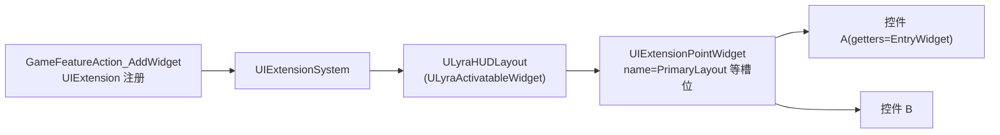
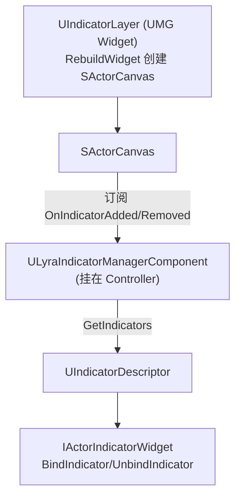
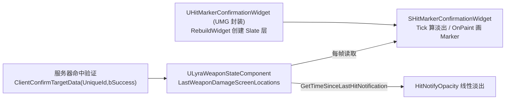
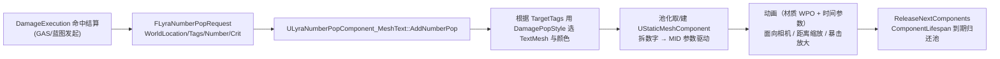

# UE5.8 Lyra 源码解析 49：UI 控件与表现源码

> 本篇聚焦 `LyraGame/UI` 模块（共 79 个文件）——把 CommonUI 的激活栈、UMG/Slate 桥接与 Lyra 的玩法状态衔接起来，回答"Lyra 的准星、命中标记、头顶指示器、加载屏、设置页这些控件到底由谁、如何驱动"。
> 重点是 UI 的**分层底座**（ActivatableWidget/GameUIPolicy/PrimaryGameLayout）、**控件族**（Foundation/IndicatorSystem/Weapons/PerformanceStats）和**表现侧数据来源**（WeaponState 命中标记、PerfStatSubsystem、Enhanced Input 模拟输入）。
> 知识成熟度：L2（本机 UE 5.8 与 Lyra 5.8 项目源码已静态核对；PIE 与联机表现为可复现验证步骤，不宣称已经执行）。

## 元数据

| 项目 | 内容 |
| --- | --- |
| 版本基准 | UE 5.8.0 / CL 55116800 / `++UE5+Release-5.8` |
| Lyra 基线 | 本机 `LyraStarterGame.uproject` 的 `EngineAssociation=5.8` |
| 项目源码根 | `C:\Users\zhaozhiqi\Documents\Unreal Projects\LyraStarterGame` |
| 源码依据 | `C:\Users\zhaozhiqi\Documents\Unreal Projects\LyraStarterGame\Source\LyraGame\UI` |
| 适用范围 | Lyra UI 分层、控件族、IndicatorSystem、Weapons UI、性能统计与移动输入控件 |
| 相关知识 | 26-CommonUI 源码、43 篇 UIExtension、42 篇 WeaponStateComponent、07-UI 与性能优化 |
| 知识成熟度 | L2：项目源码与插件源码已静态核对；PIE/联机实验是可复现步骤，不宣称已经执行 |
| 官方参考 | [CommonUI](https://dev.epicgames.com/documentation/en-us/unreal-engine/common-ui-plugin-for-advanced-user-interfaces-in-unreal-engine)、[Lyra Sample Game](https://dev.epicgames.com/documentation/en-us/unreal-engine/lyra-sample-game-in-unreal-engine)、[UMG](https://dev.epicgames.com/documentation/en-us/unreal-engine/widget-blueprint-umg-ui-designer-in-unreal-engine) |
| 最后更新 | 2026-08-14 |

## 一、先给结论

Lyra 的 UI 不是一张巨大的蓝图，而是由一条"**底座管线 → 布局壳 → 具体控件族 → 表现数据源**"的层级链构成。

- `ULyraActivatableWidget` 是所有"可激活 UI"的基类，在激活/停用时代理到 `UCommonActivatableWidget` 的输入配置。
- `ALyraHUD` 自己**几乎不画任何东西**，只做调试列表收集与 GameFrameworkComponent 接收器注册；真正的 HUD 布局由 `ULyraHUDLayout`（继承 `ULyraActivatableWidget`）承担。
- `ULyraHUDLayout` 的 `PrimaryLayout` 等插槽是被 `UIExtensionPointWidget` 填充的——这正是 43 篇 `GameFeatureAction_AddWidget` 的注入终点。
- `ULyraUIManagerSubsystem` 在每帧 Tick 里把根布局的可见性同步到 `AHUD::bShowHUD`。
- `ULyraUIMessaging` 把确认/错误对话框收敛到两个可配置的 `UCommonGameDialog` 子类。
- IndicatorSystem 用"描述符 + Slate 画布"做数据驱动的头顶指示器：`UIndicatorDescriptor` 描述，`ULyraIndicatorManagerComponent` 管理，`SActorCanvas` 负责投影与绘制。
- Weapons UI 的准星/命中标记由武器实例与 `ULyraWeaponStateComponent` 驱动：命中标记不走"UI 猜"，而是从服务器确认的屏幕空间命中位置读取。
- 移动输入族（`ULyraSimulatedInputWidget`/`ULyraJoystickWidget`/`ULyraTouchRegion`）把触摸注入 Enhanced Input 子系统。

这套分层的价值是"**UI 与玩法解耦**"，约束则是"**样例题，不做商业级校验**"（例如没有断言输入的强约束、不覆盖所有设备的 IME 等）。

## 二、阅读前的事实边界

### 2.1 证据等级

| 等级 | 证据 | 本文用法 |
| --- | --- | --- |
| A | Lyra 5.8 `Source/LyraGame/UI` 下的 C++ 文件 | 作为类、函数、字段与调用顺序的直接事实 |
| B | Lyra 5.8 `Source/LyraGame` 其他模块（Weapons/Equipment/Subsystem 等） | 作为表现数据来源（WeaponState、PerfStat、Equipment）的事实 |
| C | UE 5.8 引擎源码（CommonUI/UMG/Slate）与官方文档 | 作为 `UCommonActivatableWidget`、`GameUIPolicy`、`SLeafWidget` 语义的补充依据 |

本文**不**把 `.uasset` 文件名推断成完整蓝图图表。蓝图父类、字段值、节点连线需要在 UE 编辑器中打开资产确认。

本文**不**把一次静态源码检索写成"已经通过 PIE"。文末会给出"应该看到的现象 + 记录字段"的可复现验证事项，但本机未执行这些实验。

### 2.2 先验证目录

```powershell
# 节选：确认 UI 模块目录存在，并统计文件数
$UI = 'C:\Users\zhaozhiqi\Documents\Unreal Projects\LyraStarterGame\Source\LyraGame\UI'
Test-Path -LiteralPath "$UI\LyraHUD.h"
(Get-ChildItem -LiteralPath $UI -Recurse -File).Count   # 预期 79
Test-Path -LiteralPath "$UI\IndicatorSystem\SActorCanvas.h"
Test-Path -LiteralPath "$UI\Weapons\SHitMarkerConfirmationWidget.cpp"
```

命令输出 `True` 只说明路径存在，源码事实仍以文件中的真实符号为准。

### 2.3 目录地图

```text
Source/LyraGame/UI/
├─ LyraHUD.h/.cpp                     HUD 壳（调试列表 + 组件接收器）
├─ LyraHUDLayout.h/.cpp               HUD 布局（PrimaryLayout 插槽、控制器断开处理）
├─ LyraActivatableWidget.h/.cpp       可激活控件基类（输入模式代理）
├─ LyraGameViewportClient.h/.cpp      视口客户端
├─ LyraSettingScreen.h/.cpp           GameSettingScreen 子类（衔接 50 篇）
├─ LyraJoystickWidget.h/.cpp          虚拟摇杆
├─ LyraSimulatedInputWidget.h/.cpp    触摸→Enhanced Input 注入基类
├─ LyraTaggedWidget.h/.cpp            GameplayTag 标记控件
├─ LyraTouchRegion.h/.cpp             触摸区域
├─ Basic/                             MaterialProgressBar
├─ Common/                            BoundActionButton/ListView/Tab 系列/WidgetFactory
├─ Foundation/                        ButtonBase/ActionWidget/Confirmation/ControllerDisconnected/LoadingScreen
├─ Frontend/                          FrontendState/LobbyBackground/ApplyFrontendPerfSettings
├─ IndicatorSystem/                   IndicatorDescriptor/SActorCanvas/IndicatorLayer/Manager/IActorIndicatorWidget/IndicatorLibrary
├─ PerformanceStats/                  PerfStatWidgetBase/PerfStatContainerBase
├─ Subsystem/                         LyraUIManagerSubsystem/LyraUIMessaging
└─ Weapons/                           ReticleWidgetBase/HitMarker/WeaponUserInterface/SCircumferenceMarkerWidget
```

目录本身不是运行时调用顺序。调用顺序要从"谁创建根布局、谁填充插槽、谁提供表现数据"三个问题反推。

### 2.4 与邻篇的分工

- 26-CommonUI 源码已解释 `UCommonActivatableWidget` 栈、激活/停用与输入路由的**引擎级机制**；本篇只用其结果，重点看 Lyra 在其上加了什么。
- 43 篇解释了 `UIExtensionExtender`/`UIExtensionPointWidget` 与 `GameFeatureAction_AddWidget` 的**注入机制**；本篇把终点落在 `ULyraHUDLayout` 的 `PrimaryLayout` 槽位。
- 42 篇追踪了 `ULyraWeaponStateComponent` 的服务器命中数据（UniqueId/确认 RPC），但明确"UI 侧表现待续"；本篇补齐 `SHitMarkerConfirmationWidget` 如何消费它。

## 三、核心职责矩阵

| 类 | 归属目录 | 继承 | 一句话职责 |
| --- | --- | --- | --- |
| `ALyraHUD` | UI | `AHUD` | HUD 壳；默认不画 UI，只做调试 Actor 列表 + GameFrameworkComponent 接收器（44 行头文件） |
| `ULyraHUDLayout` | UI | `ULyraActivatableWidget` | HUD 布局；`PrimaryLayout` 等槽位由 UIExtension 填充；处理 Escape 与控制器断开（106 行头文件） |
| `ULyraActivatableWidget` | UI | `UCommonActivatableWidget` | 输入模式代理基类；`GetDesiredInputConfig` 由 `ELyraWidgetInputMode` 驱动 |
| `ULyraUIManagerSubsystem` | UI/Subsystem | `UGameUIManagerSubsystem` | 引擎 UI 管理器子类；每帧把根布局可见性同步到 `bShowHUD` |
| `ULyraUIMessaging` | UI/Subsystem | `UCommonMessagingSubsystem` | 确认/错误对话框收敛到可配置 `UCommonGameDialog` |
| `UIndicatorDescriptor` | UI/IndicatorSystem | `UObject` | 头顶指示器的纯数据描述（投影模式、对齐、优先级、自动移除） |
| `ULyraIndicatorManagerComponent` | UI/IndicatorSystem | `UControllerComponent` | 挂在 Controller 上，持有当前激活指示器集合 |
| `SActorCanvas` | UI/IndicatorSystem | `SPanel` + `FAsyncMixin` + `FGCObject` | 指示器画布：投影、按深度/优先级排序、屏幕边缘钳制与箭头 |
| `ULyraReticleWidgetBase` | UI/Weapons | `UCommonUserWidget` | 准星基类：从 `ULyraRangedWeaponInstance` 计算扩散角/屏幕扩散半径 |
| `UHitMarkerConfirmationWidget` | UI/Weapons | `UWidget` | 命中标记 UMG 封装；`SHitMarkerConfirmationWidget` 从 WeaponState 读取屏幕命中位置绘制 |
| `ULyraPerfStatWidgetBase` | UI/PerformanceStats | `UCommonUserWidget` | 单项性能统计展示（FPS/ping 等），附 `SLyraLatencyGraph` 延迟图 |
| `ULyraSimulatedInputWidget` | UI | `UCommonUserWidget` | 触摸→Enhanced Input 注入基类 |
| `ULyraJoystickWidget` | `ULyraTouchRegion` | `ULyraSimulatedInputWidget` | 虚拟摇杆 / 触摸触发区域 |
| `ULyraLoadingScreenSubsystem` | UI/Foundation | `UGameInstanceSubsystem` | 跨地图保存"当前加载屏内容 Widget 类" |
| `ULyraControllerDisconnectedScreen` | UI/Foundation | `UCommonActivatableWidget` | 控制器全部断开时的提示 + 换用户 |

**最关键的两条依赖方向**：

1. **布局被注入**：`ULyraHUDLayout` 不自己拼控件内容，`PrimaryLayout` 槽位等被 UIExtension 填充（衔接 43 篇）。
2. **表现被数据驱动**：准星读武器扩散，命中标记读 `ULyraWeaponStateComponent`，性能统计读 `ULyraPerformanceStatSubsystem`，指示器读 IndicatorDescriptor。

## 四、HUD 与布局：`ALyraHUD` / `ULyraHUDLayout`

### 4.1 `ALyraHUD` 连自己都很少画东西

`LyraHUD.h` 只有 44 行，注释明确写着"你通常不需要扩展或修改这个类，而是在 Experience 里用 Add Widget action 添加 HUD 布局和控件"。这是 Lyra 与"HUD 在 C++ 里 DrawHUD"老式写法的重要差异。

```cpp
// 节选（LyraHUD.h）
UCLASS(Config = Game)
class ALyraHUD : public AHUD
{
	GENERATED_BODY()
public:
	ALyraHUD(const FObjectInitializer& ObjectInitializer = FObjectInitializer::Get());
protected:
	virtual void PreInitializeComponents() override;
	virtual void BeginPlay() override;
	virtual void EndPlay(const EEndPlayReason::Type EndPlayReason) override;
	virtual void GetDebugActorList(TArray<AActor*>& InOutList) override;
};
```

`LyraHUD.cpp` 里的重点：

- 构造函数把 `PrimaryActorTick.bStartWithTickEnabled` 置为 `false`——HUD 默认不 Tick。
- `PreInitializeComponents`/`EndPlay` 里调用 `UGameFrameworkComponentManager::AddGameFrameworkComponentReceiver`/`RemoveGameFrameworkComponentReceiver`，让 HUD 参与 Lyra 的模块化组件事件（41 篇 InitState 体系的接收者之一）。
- `BeginPlay` 先发 `NAME_GameActorReady` 扩展事件、再 `Super::BeginPlay()`。
- `GetDebugActorList` 用 `TObjectIterator<UAbilitySystemComponent>` 收集所有带 ASC 的 Avatar/Owner 到调试列表——这是 HUD 的"主要存在价值"：供 `showdebug` 调试用。

### 4.2 `ULyraHUDLayout` 是 PrimaryLayout 的宿主

`ULyraHUDLayout`（继承 `ULyraActivatableWidget`）在 106 行头文件里声明了：

- **输入处理**：`HandleEscapeAction()`——按下 Escape/Pause 时把 `EscapeMenuClass` 推到 UI 层。
- **控制器断开流程**：由 `HandleInputDeviceConnectionChanged` / `HandleInputDevicePairingChanged` → `NotifyControllerStateChangeForDisconnectScreen` → 通过 `FTSTicker`（`RequestProcessControllerStateHandle`）延迟到下个 Tick → `ProcessControllerDevicesHavingChangedForDisconnectScreen` 检查玩家是否还有映射输入设备，没有就 `DisplayControllerDisconnectedMenu`。
- **平台 gating**：`PlatformRequiresControllerDisconnectScreen`（`FGameplayTagContainer`）+ `ShouldPlatformDisplayControllerDisconnectScreen()`，只有平台 INI 标记了对应 Tag 才会展示断开提示。

真正的"布局插槽"（`PrimaryLayout`）并不是在 HUDLayout 头文件里硬编码的——它是 `UIExtensionPointWidget` 命名的插槽，由 `GameFeatureAction_AddWidget` 注入（衔接 43 篇）。

```cpp
// 节选（LyraHUDLayout.h）——控制器断开与 Escape 菜单字段
UPROPERTY(EditDefaultsOnly)
TSoftClassPtr<UCommonActivatableWidget> EscapeMenuClass;

UPROPERTY(EditDefaultsOnly, Category="Controller Disconnect Menu")
TSubclassOf<ULyraControllerDisconnectedScreen> ControllerDisconnectedScreen;

UPROPERTY(EditDefaultsOnly, Category="Controller Disconnect Menu")
FGameplayTagContainer PlatformRequiresControllerDisconnectScreen;

UPROPERTY(Transient)
TObjectPtr<UCommonActivatableWidget> SpawnedControllerDisconnectScreen;
```

### 4.3 PrimaryLayout 槽位如何被 UIExtension 填充（衔接 43 篇）

43 篇已经讲了 `UIExtensionSystem` 的两类对象：

- `UIExtensionPoint`：一个命名的**容器插槽**，运行时是 `UIExtensionPointWidget`。
- `UIExtension`：一个命的**内容片段**，由 `GameFeatureAction_AddWidget` 在 GameFeature 激活时注册。



**图意说明**：`GameFeature_AddWidget` 在 GameFeature 激活时把某个控件类注册为 `UIExtension`；`ULyraHUDLayout` 被 UIExtension 组装时，其蓝图里的 `UIExtensionPointWidget`（如 `PrimaryLayout`）会调用 `RegisterExtensionPoint` 把自己的节点挂进 `UIExtensionSystem`；随后系统把收到的扩展控件填充成该点的子项。这样"HUD 里出现哪些控件"由对局形态（Experience/GameFeature）决定，而不是写死在 HUDLayout 里。

## 五、Foundation 控件族：通用交互控件的 Lyra 化封装

`UI/Foundation` 目录放的是可跨对局复用的"基础交互件"，它们大多只是**子类 + 少量 Lyra 定制**，真正的滑动/聚焦/输入语义来自 CommonUI。

### 5.1 `ULyraActivatableWidget`：输入模式代理

```cpp
// 节选（LyraActivatableWidget.h）
UENUM(BlueprintType)
enum class ELyraWidgetInputMode : uint8 { Default, GameAndMenu, Game, Menu };

UCLASS(Abstract, Blueprintable)
class ULyraActivatableWidget : public UCommonActivatableWidget
{
	GENERATED_BODY()
public:
	//~UCommonActivatableWidget interface
	virtual TOptional<FUIInputConfig> GetDesiredInputConfig() const override;
	//~End
protected:
	UPROPERTY(EditDefaultsOnly, Category = Input)
	ELyraWidgetInputMode InputConfig = ELyraWidgetInputMode::Default;
	UPROPERTY(EditDefaultsOnly, Category = Input)
	EMouseCaptureMode GameMouseCaptureMode = EMouseCaptureMode::CapturePermanently;
};
```

这张图很短，但它就是 Lyra 所有可激活弹层的"输入开关"：每个子类只需声明想要 `Game`/`Menu`/`GameAndMenu` 中的哪种模式，激活时自动请求对应输入配置。`WITH_EDITOR` 下还做了 `ValidateCompiledWidgetTree` 编译期校验。

### 5.2 `ULyraButtonBase` / `ULyraActionWidget`

- `ULyraButtonBase`（继承 `UCommonButtonBase`）：加了一个 `SetButtonText`/`UpdateButtonText` 的文本刷新封装，并在 `UpdateInputActionWidget`/`OnInputMethodChanged` 里跟随 CommonUI 输入方法切换（鼠标/手柄图标）。
- `ULyraActionWidget`（继承 `UCommonActionWidget`）：核心是 `GetIcon()` 被重写——不是用 CommonInputActionData 的图标，而是从 `AssociatedInputAction`（`const UInputAction*`）经 `UEnhancedInputLocalPlayerSubsystem` 查询**当前绑定按键的图标**。这连通了 Enhanced Input（25 篇）与 UI 提示。

### 5.3 `ULyraConfirmationScreen`：可复用的确认弹层

继承 `UCommonGameDialog`，通过 `SetupDialog(Descriptor, ResultCallback)`/`KillDialog()` 对外暴露。用 `BindWidget` 绑定 `Text_Title`/`RichText_Description`/`EntryBox_Buttons`/`Border_TapToCloseZone`，并提供"点击空白关闭"(`HandleTapToCloseZoneMouseButtonDown`) 与 `CancelAction` 取消键。

### 5.4 `ULyraLoadingScreenSubsystem`：跨地图的加载屏状态

这是 `UGameInstanceSubsystem`，因为要在 Travel 之间存活：

```cpp
// 节选（LyraLoadingScreenSubsystem.h）
DECLARE_DYNAMIC_MULTICAST_DELEGATE_OneParam(FLoadingScreenWidgetChangedDelegate, TSubclassOf<UUserWidget>, NewWidgetClass);
UCLASS(MinimalAPI)
class ULyraLoadingScreenSubsystem : public UGameInstanceSubsystem
{
	GENERATED_BODY()
public:
	UE_API void SetLoadingScreenContentWidget(TSubclassOf<UUserWidget> NewWidgetClass);
	UE_API TSubclassOf<UUserWidget> GetLoadingScreenContentWidget() const;
private:
	UPROPERTY(BlueprintAssignable, meta=(AllowPrivateAccess))
	FLoadingScreenWidgetChangedDelegate OnLoadingScreenWidgetChanged;
	UPROPERTY()
	TSubclassOf<UUserWidget> LoadingScreenWidgetClass;
};
```

职责是"记住当前加载屏内容 Widget 类"，并广播 `OnLoadingScreenWidgetChanged` 让加载屏宿主刷新。真正的加载屏显示由 44 篇提到的 Frontend/前置流程加载屏宿主承担。

### 5.5 `ULyraControllerDisconnectedScreen` + `ULyraHUDLayout` 联动

控制器全部断开时，HUDLayout 把 `ControllerDisconnectedScreen` 推到 Menu 层；该屏幕通过 `FPlatformUserSelectionCompleteParams` 完成"换用户"流程（`HandleChangeUserClicked` → `HandleChangeUserCompleted`），并依据 `PlatformSupportsUserChangeTags` 决定是否显示"Change User"按钮。

## 六、IndicatorSystem：头顶指示器的数据驱动与画布渲染

IndicatorSystem 一共 11 个文件，核心三元组是"**描述符（数据）→ 管理器（集合）→ Slate 画布（渲染）**"。

### 6.1 `UIndicatorDescriptor`：纯数据描述（243 行头文件）

这个类几乎不含逻辑，全部是"这段指示器长得怎样、挂在哪个点、优先级如何"：

- **绑定数据**：`DataObject`、`SceneComponent`（`USceneComponent*`）、`ComponentSocketName`、`IndicatorWidgetClass`（`TSoftClassPtr<UUserWidget>`）。
- **可见性**：`GetIsVisible()` 只有在 `SceneComponent` 有效且 `bVisible` 时才为真；`CanAutomaticallyRemove()` 在 `bAutoRemoveWhenIndicatorComponentIsNull && !IsValid(GetSceneComponent())` 时允许随组件失效自动移除。
- **投影模式**：`EActorCanvasProjectionMode { ComponentPoint, ComponentBoundingBox, ComponentScreenBoundingBox, ActorBoundingBox, ActorScreenBoundingBox }`。
- **布局**：`HAlign/VAlign`、`ClampToScreen`、`ShowClampToScreenArrow`、`WorldPositionOffset`、`ScreenSpaceOffset`、`BoundingBoxAnchor`。
- **排序**：`Priority`（深度排序后再按优先级分组的二次排序）。
- **管理引用**：`SetIndicatorManagerComponent`/`UnregisterIndicator`/`GetIndicatorManagerComponent`，`ManagerPtr` 是 `TWeakObjectPtr<ULyraIndicatorManagerComponent>`。

```cpp
// 节选（IndicatorDescriptor.h）
struct FIndicatorProjection
{
	bool Project(const UIndicatorDescriptor& IndicatorDescriptor,
		const FSceneViewProjectionData& InProjectionData,
		const FVector2f& ScreenSize, FVector& ScreenPositionWithDepth);
};
```

`FIndicatorProjection::Project` 把世界空间点（按投影模式取 component/bounding box 并附加 offset）投影到屏幕空间，产出带深度的屏幕位置 `ScreenPositionWithDepth`。`bOverrideScreenPosition` 由 `SActorCanvas` 私有读取（`friend class SActorCanvas`）。

### 6.2 `ULyraIndicatorManagerComponent`：Controller 上的集合

```cpp
// 节选（LyraIndicatorManagerComponent.h）
UCLASS(MinimalAPI, BlueprintType, Blueprintable)
class ULyraIndicatorManagerComponent : public UControllerComponent
{
	GENERATED_BODY()
public:
	UFUNCTION(BlueprintCallable, Category = Indicator)
	UE_API void AddIndicator(UIndicatorDescriptor* IndicatorDescriptor);
	UFUNCTION(BlueprintCallable, Category = Indicator)
	UE_API void RemoveIndicator(UIndicatorDescriptor* IndicatorDescriptor);

	DECLARE_EVENT_OneParam(ULyraIndicatorManagerComponent, FIndicatorEvent, UIndicatorDescriptor* Descriptor)
	FIndicatorEvent OnIndicatorAdded;
	FIndicatorEvent OnIndicatorRemoved;

	const TArray<UIndicatorDescriptor*>& GetIndicators() const { return Indicators; }
private:
	UPROPERTY()
	TArray<TObjectPtr<UIndicatorDescriptor>> Indicators;
};
```

它挂在 **Controller**（不是 Pawn）上，这让指示器集合属于"玩家视角"，跨 Pawn 切换依然存活。`AddIndicator`/`RemoveIndicator` 除了改 `Indicators` 数组，还会触发 `OnIndicatorAdded`/`OnIndicatorRemoved` 事件——`SActorCanvas` 正是订阅这两个事件来增删自身槽位。

### 6.3 `SActorCanvas`：投影、排序与钳制的 Slate 面板

`SActorCanvas` 是重头戏（254 行头文件），继承 `SPanel` + `FAsyncMixin` + `FGCObject`：

- **槽位类型** `FSlot` 保存每个指示器的 `ScreenPosition`、`Depth`、`Priority`、`bIsDirty` 等，并有 `RefreshVisibility()`（`bIsIndicatorVisible && bHasValidScreenPosition` 才 `SelfHitTestInvisible`，否则 `Collapsed`）。
- **两种子节点**：`CanvasChildren`（指示器本体）与 `ArrowChildren`（屏幕边缘钳制箭头），合并成 `AllChildren`。
- **每帧更新**：`UpdateActiveTimer()` 注册 `FActiveTimerHandle`（`UpdateCanvas`），计算每个投影。
- **排序集显**：`SetDrawElementsInOrder(bool)` 控制是否按加入顺序绘制（关闭批处理、更多 drawcall）。
- **GC 安全**：实现 `AddReferencedObjects`，确保 `UIndicatorDescriptor*` 槽不被 GC 误收；`TArray<TObjectPtr<UIndicatorDescriptor>> AllIndicators` + `InactiveIndicators`。
- **控件池**：`FUserWidgetPool IndicatorPool` 复用指示器 UserWidget 实例。

```cpp
// 节选（SActorCanvas.h）
class SActorCanvas : public SPanel, public FAsyncMixin, public FGCObject
{
public:
	class FSlot : public TSlotBase<FSlot> { /* ScreenPosition/Depth/Priority/bDirty/... */ };
	class FArrowSlot : public TSlotBase<FArrowSlot> { };
	//...
	void OnIndicatorAdded(UIndicatorDescriptor* Indicator);
	void OnIndicatorRemoved(UIndicatorDescriptor* Indicator);
	void GetOffsetAndSize(const UIndicatorDescriptor* Indicator, FVector2D& OutSize,
		FVector2D& OutOffset, FVector2D& OutPaddingMin, FVector2D& OutPaddingMax) const;
};
```

投影、按深度/优先级排序、屏幕边缘钳制（`ClampToScreen` + 边缘箭头 `ActorCanvasArrowBrush`）都发生在 Slate 的 `OnPaint`/`UpdateCanvas` 中，这是"头顶指示器"的真正渲染端。

### 6.4 装配链：`UIndicatorLayer` → `SActorCanvas` → Manager → Descriptor



**图意说明**：`UIndicatorLayer` 是 UMG 侧的"层"控件，`RebuildWidget()` 返回一个 `SActorCanvas`；`SActorCanvas` 通过 `FLocalPlayerContext` 找到玩家的 `ULyraIndicatorManagerComponent`，订阅其增删事件。游戏逻辑只需创建 `UIndicatorDescriptor` 并 `AddIndicator` 到管理器，画布就会自动建槽、投影和绘制。实现了 `IIndicatorWidgetInterface`（`BindIndicator`/`UnbindIndicator`，BlueprintNativeEvent）的控件能拿到描述符绑定自身数据。

### 6.5 `IActorIndicatorWidget` 与 `IndicatorLibrary`

- `IActorIndicatorWidget.h`：唯一接口 `IIndicatorWidgetInterface`，声明 `BindIndicator(UIndicatorDescriptor*)` / `UnbindIndicator(const UIndicatorDescriptor*)` 两个 BlueprintNativeEvent，是"指示器控件如何绑定数据"的约定。
- `IndicatorLibrary`：静态辅助（蓝图函数库），提供 `GetIndicatorManagerComponent(AController*)` 之类查询。

## 七、Weapons UI：准星与命中标记如何被武器状态驱动

`UI/Weapons` 共 12 个文件，核心是"准星扩散来自武器，命中标记来自服务器确认的屏幕位置"。

### 7.1 `ULyraReticleWidgetBase`：准星基类（49 行头文件 + 95 行 cpp）

```cpp
// 节选（LyraReticleWidgetBase.h）
UCLASS(Abstract)
class ULyraReticleWidgetBase : public UCommonUserWidget
{
	GENERATED_BODY()
public:
	UFUNCTION(BlueprintImplementableEvent) void OnWeaponInitialized();
	UFUNCTION(BlueprintCallable) void InitializeFromWeapon(ULyraWeaponInstance* InWeapon);
	UFUNCTION(BlueprintCallable, BlueprintPure) float ComputeSpreadAngle() const;
	UFUNCTION(BlueprintCallable, BlueprintPure) float ComputeMaxScreenspaceSpreadRadius() const;
	UFUNCTION(BlueprintCallable, BlueprintPure) bool HasFirstShotAccuracy() const;
protected:
	UPROPERTY(BlueprintReadOnly) TObjectPtr<ULyraWeaponInstance> WeaponInstance;
	UPROPERTY(BlueprintReadOnly) TObjectPtr<ULyraInventoryItemInstance> InventoryInstance;
};
```

`InitializeFromWeapon` 记录武器实例，并把 `InventoryInstance` 设为 `Cast<ULyraInventoryItemInstance>(WeaponInstance->GetInstigator())`（武器实例的发起者正是背包 ItemInstance，衔接 42/43 篇），再触发 `OnWeaponInitialized` 蓝图事件。

`ComputeSpreadAngle` 从 `ULyraRangedWeaponInstance` 读两条数据相乘得到实际扩散角：`GetCalculatedSpreadAngle() * GetCalculatedSpreadAngleMultiplier()`。

`ComputeMaxScreenspaceSpreadRadius` 用"圆锥在长距离处投影回屏幕"的方法：取 `LongShotDistance=10000`，`SpreadRadiusAtDistance = tan(扩散角*0.5°) * 10000`，用 `PC->ProjectWorldLocationToScreen` 把圆锥边缘点投回屏幕，测量其到屏幕中心的像素距离。这就是准星扩散半径的像素来源（可驱动 `UCircumferenceMarkerWidget` 的 `Radius`）。

`HasFirstShotAccuracy` 透传武器是否处于"首发精度"。

### 7.2 `UCircumferenceMarkerWidget` / `SCircumferenceMarkerWidget`：圆周标记

- `UCircumferenceMarkerWidget`（UMG 封装）：`MarkerList`（`TArray<FCircumferenceMarkerEntry>`）、`Radius = 48.0f`、`MarkerImage`、`bReticleCornerOutsideSpreadRadius`，提供 `SetRadius(float)`。
- `SCircumferenceMarkerWidget`（`SLeafWidget`）：`FCircumferenceMarkerEntry` 结构体含 `PositionAngle`/`ImageRotationAngle`（度）；`OnPaint` 里通过 `GetMarkerRenderTransform` 按角度把 MarkerImage 旋转、平移到圆周各点。

这是"开火扩散的准星角标"——当扩散半径随武器状态变化时，`SetRadius` 让四个角标跟着散开/收拢。

### 7.3 命中标记：从 `ULyraWeaponStateComponent` 读取（衔接 42 篇）

42 篇在"三十三、命中标记确认"里追踪了服务器端 `ULyraWeaponStateComponent`（`ClientConfirmTargetData` RPC、`UnconfirmedServerSideHitMarkers`），并注明"具体 HitMarker RPC/消息应继续在 WeaponStateComponent 中逐函数跟踪"。

本篇补 UI 侧闭环：

- `ULyraWeaponStateComponent` 暴露 `GetLastWeaponDamageScreenLocations(TArray<FLyraScreenSpaceHitLocation>&)`，返回最近确认命中的**屏幕空间位置**数组；`GetTimeSinceLastHitNotification()` 返回距上次命中的时间。
- `SHitMarkerConfirmationWidget::Tick`（`UI/Weapons/SHitMarkerConfirmationWidget.cpp`）每帧从 `APlayerController` 上 `FindComponentByClass<ULyraWeaponStateComponent>()`，用 `TimeSinceLastHitNotification < HitNotifyDuration` 计算 `HitNotifyOpacity`（线性淡出）。
- `SHitMarkerConfirmationWidget::OnPaint` 遍历 `LastWeaponDamageScreenLocations`，对每条命中按 `HitZone`（`FGameplayTag`，如弱点）在 `PerHitMarkerZoneOverrideImages` 里查覆盖图标，否则用 `PerHitMarkerImage`，在对应屏幕位置画 Marker；再画中央的 `AnyHitsMarkerImage`。

```cpp
// 节选（Weapons/LyraWeaponStateComponent.h）——UI 侧读取的接口
struct FLyraScreenSpaceHitLocation
{
	FVector2D Location;
	FGameplayTag HitZone;
	bool bShowAsSuccess = false;
};
// ...
void GetLastWeaponDamageScreenLocations(TArray<FLyraScreenSpaceHitLocation>& WeaponDamageScreenLocations)
{ WeaponDamageScreenLocations = LastWeaponDamageScreenLocations; }
double GetTimeSinceLastHitNotification() const;
```



**图意说明**：命中标记的数据流是"服务器确认 → 本地 WeaponStateComponent 缓存 → Slate 命中标记控件每帧拉取"。这是客户端 UI 不自己"猜命中"，而是消费权威/半权威结果的表现侧闭环——弥补了 42 篇未追踪完的 UI 表现部分。

### 7.4 `ULyraWeaponUserInterface`：武器 UI 宿主

`NativeTick` 里每帧从 `GetOwningPlayerPawn()` 的 `ULyraEquipmentManagerComponent` 查 `GetFirstInstanceOfType<ULyraWeaponInstance>()`，发现武器变化时调用 `RebuildWidgetFromWeapon()` 并触发 `OnWeaponChanged(OldWeapon, NewWeapon)` 蓝图事件（衔接 43 篇 Equipment）。这样准星/命中标记的宿主能跟随武器切换重建。

## 八、伤害数字弹出（NumberPop）与上下文特效（ContextEffects）：命中反馈的表现实现

本章纵深到 `LyraGame/Feedback` 模块（LYRA 批次 1：Feedback 补深挖），回答"玩家打中/被打中时，屏幕上飘起的伤害数字、脚下激起的表面特效到底由谁、如何渲染"。

> 事实边界（A 级证据）：以下均以本机 Lyra 5.8 `Source/LyraGame/Feedback` 下 `.h/.cpp` 实测为准。`FLyraNumberPopRequest` 的**调用方**（由哪个 GameplayEffect/GameplayEvent 填充并派发 `AddNumberPop`）在本模块没有 C++ 源码，实际挂在 Pawn 上的 `ULyraNumberPopComponent` 子类与伤害事件接线的调用点写在蓝图资产里，本机**不**把资产名推断成其内容，只确认反馈载体本身（详见 8.6 与 42 篇的衔接说明）。

### 8.1 Feedback 目录地图与"表现层"定位

`Source/LyraGame/Feedback/` 下有两个子目录，职责分工正交：

```text
Source/LyraGame/Feedback/
├─ NumberPops/      伤害数字弹出（本模块核心：9 个文件）
│    ├─ LyraNumberPopComponent.h/.cpp                基类 + FLyraNumberPopRequest
│    ├─ LyraDamagePopStyle.h/.cpp                    伤害数字样式（颜色/TargetTags 匹配/数字网格）
│    ├─ LyraDamagePopStyleNiagara.h                   Niagara 版样式（对照）
│    ├─ LyraNumberPopComponent_MeshText.h/.cpp        MeshText 实现（核心链路）
│    └─ LyraNumberPopComponent_NiagaraText.h/.cpp     NiagaraText 实现（对照）
└─ ContextEffects/  基于上下文的音效/粒子特效（脚部材质、表面类型）
     ├─ LyraContextEffectComponent.h/.cpp
     ├─ LyraContextEffectsSubsystem.h/.cpp
     ├─ LyraContextEffectsLibrary.h/.cpp
     ├─ LyraContextEffectsInterface.h/.cpp
     └─ AnimNotify_LyraContextEffects.h/.cpp
```

与 49 篇正文前七章的"UI 分层"相比，Feedback 是**游戏世界内的表现反馈**，不在 UMG/Slate 画布上做，而是直接在世界空间生成 Mesh/粒子/音频组件。二者共同构成"命中反馈"的完整链路：准星/命中标记（Weapons UI）告诉你"打没打中"，伤害数字/表面特效（Feedback）告诉你"造成了多少 / 打在什么材质上"。

### 8.2 `ULyraNumberPopComponent` 基类与 `FLyraNumberPopRequest`

`LyraNumberPopComponent.h`（57 行）定义了两件事：

1. **`FLyraNumberPopRequest`**：一次伤害数字弹出的**纯数据**——`WorldLocation`（弹出世界位置）、`SourceTags`/`TargetTags`（来源/目标 Tag，用于查样式）、`NumberToDisplay`（要显示的数字）、`bIsCriticalDamage`（是否暴击）。
2. **`ULyraNumberPopComponent`**：抽象基类，继承 `UControllerComponent`（挂在 Pawn/Controller 上），对外暴露唯一的虚接口方法：

```cpp
// 节选（LyraNumberPopComponent.h）——发布一条伤害数字
USTRUCT(BlueprintType)
struct FLyraNumberPopRequest
{
	GENERATED_BODY()
	// The world location to create the number pop at
	UPROPERTY(EditAnywhere, BlueprintReadWrite, Category = "Lyra|Number Pops")
	FVector WorldLocation;
	// Tags related to the source/cause of the number pop (for determining a style)
	UPROPERTY(EditAnywhere, BlueprintReadWrite, Category = "Lyra|Number Pops")
	FGameplayTagContainer SourceTags;
	// Tags related to the target of the number pop (for determining a style)
	UPROPERTY(EditAnywhere, BlueprintReadWrite, Category="Lyra|Number Pops")
	FGameplayTagContainer TargetTags;
	// The number to display
	UPROPERTY(EditAnywhere, BlueprintReadWrite, Category = "Lyra|Number Pops")
	int32 NumberToDisplay = 0;
	// Whether the number is 'critical' or not (@TODO: move to a tag)
	UPROPERTY(EditAnywhere, BlueprintReadWrite, Category = "Lyra|Number Pops")
	bool bIsCriticalDamage = false;
};

UCLASS(Abstract)
class ULyraNumberPopComponent : public UControllerComponent
{
	GENERATED_BODY()
public:
	/** Adds a damage number to the damage number list for visualization */
	UFUNCTION(BlueprintCallable, Category = Foo)
	virtual void AddNumberPop(const FLyraNumberPopRequest& NewRequest) {}
};
```

设计要点：基类方法体为空（`{}`）——它是一个**可覆写的接口型抽象类**，并不规定数值怎么显示。`AddNumberPop` 是 BlueprintCallable，意味着蓝图/能力系统可以在合适的时机（命中结算后）构造一个 `FLyraNumberPopRequest` 并调用；具体渲染由两个子类分派。基类挂在 `UControllerComponent` 而非 UI 控件上，说明伤害数字是"玩家相关的世界表现"而非"某种 HUD 控件"。

### 8.3 伤害数字样式：`ULyraDamagePopStyle` / `ULyraDamagePopStyleNiagara`

样式是 `UDataAsset`，把"什么伤害长什么样"做成可配置资产，与渲染实现解耦。

- `ULyraDamagePopStyle`（42 行，MeshText 用）：`DisplayText`、`MatchPattern`（`FGameplayTagQuery`，用 `TargetTags` 匹配该风格）、`Color`/`CriticalColor`（暴击色，仅在 `bOverrideColor=true` 时生效）、`TextMesh`（数字使用的静态网格，仅在 `bOverrideMesh=true` 时生效）。
- `ULyraDamagePopStyleNiagara`（28 行，Niagara 用）：`NiagaraArrayName`（往 Niagara 数组写入伤害信息的名字）+ `TextNiagara`（显示伤害的系统）。

```cpp
// 节选（LyraDamagePopStyle.h）——一次伤害数字的"长相"资产
UCLASS()
class ULyraDamagePopStyle : public UDataAsset
{
	GENERATED_BODY()
public:
	UPROPERTY(EditDefaultsOnly, Category="DamagePop") FString DisplayText;
	UPROPERTY(EditDefaultsOnly, Category="DamagePop") FGameplayTagQuery MatchPattern;
	UPROPERTY(EditDefaultsOnly, Category="DamagePop", meta=(EditCondition=bOverrideColor)) FLinearColor Color;
	UPROPERTY(EditDefaultsOnly, Category="DamagePop", meta=(EditCondition=bOverrideColor)) FLinearColor CriticalColor;
	UPROPERTY(EditDefaultsOnly, Category="DamagePop", meta=(EditCondition=bOverrideMesh)) TObjectPtr<UStaticMesh> TextMesh;
	UPROPERTY() bool bOverrideColor = false;
	UPROPERTY() bool bOverrideMesh = false;
};
```

关键：**匹配靠 `TargetTags`**（被打中的目标身上的 Tag，如弱点 Tag），因此"爆头/弱点伤害用不同颜色、不同网格"完全由数据资产驱动，不写死在 C++。样式数组按顺序遍历，命中的第一个生效。

### 8.4 `ULyraNumberPopComponent_MeshText`：核心实现（AddNumberPop → 池化 Mesh → 材质参数位移动画）

头文件 140 行、实现 336 行，是本模块的**核心链路**。它不用 TextRender，而是**用静态网格 `UStaticMeshComponent` + 材质参数**渲染每一位数字：

- **数字位拆解**：`AddNumberPop` 把 `NumberToDisplay` 按 base-10 拆成 `DamageNumberArray`（个位/十位…），数组最前面插一位保留给正负号；`0` 单独显示一位 `0`。
- **组件池**：`PooledComponentMap`（`TMap<UStaticMesh, FPooledNumberPopComponentList>`）按所用的 `TextMesh` 管理 `UStaticMeshComponent` 池；`FLiveNumberPopEntry` 记录"当前存活"的组件与释放时刻 `ReleaseTime`。
- **材质实例**：`CreateDynamicMaterialInstance` 生成 `UMaterialInstanceDynamic`（MID），后续一切"显示哪个数字 / 什么颜色 / 往哪移动"都通过设置 MID 的**标量/矢量参数**完成，而不是替换网格。
- **位移动画**：设置 `PositionParameterNames`/`ScaleRotationAngleParameterNames`/`DurationParameterNames`（`0a..8a`/`0b..8b`/`0c..8c`）等参数，把"数字位相对相机空间的方向/缩放/旋转/时长"注入材质；核心动画（数字喷出、旋转、淡出）实际在**材质里用 World Position Offset + 时间参数**完成。
- **朝向相机**：把 `StaticMeshComponent` 的世界变换设为"相机的旋转 + 命中点位置"（对齐相机，保证数字始终面向镜头）；并带一个小的随机偏移（`FMath::RandPointInBox`）。
- **与镜头距离缩放**：`DistanceFromCameraBeforeDoublingSize`（默认 1024）——超过该距离数字放大，保证远处伤害数字可读。
- **暴击放大**：`CriticalHitSizeMultiplier`（默认 1.7）。
- **生命周期**：`ComponentLifespan`（默认 1 秒）到期后 `ReleaseNextComponents` 把组件 `UnregisterComponent` 并归还池（或转瞬态丢弃），用 `FTimerHandle` 定时"下一次释放"，避免每帧轮询。
- **本地控制器过滤**：`AddNumberPop` 开头就检查 `PC->IsLocalController()`——**远程/镜像玩家直接丢弃**，防止 listen server 主机重复弹出。

我把这条核心链路的调用顺序整理为下图：



### 8.5 `ULyraNumberPopComponent_NiagaraText`：Niagara 对照实现

（头文件 37 行、实现 56 行）作为让"伤害数字/命中表现走上粒子系统"的对照实现：

```cpp
// 节选（LyraNumberPopComponent_NiagaraText.cpp）——把伤害信息塞进 Niagara 数组
void ULyraNumberPopComponent_NiagaraText::AddNumberPop(const FLyraNumberPopRequest& NewRequest)
{
	int32 LocalDamage = NewRequest.NumberToDisplay;
	// Change Damage to negative to differentiate Critical vs Normal hit
	if (NewRequest.bIsCriticalDamage)
	{
		LocalDamage *= -1;
	}

	// Add a NiagaraComponent if we don't already have one
	if (!NiagaraComp)
	{
		NiagaraComp = NewObject<UNiagaraComponent>(GetOwner());
		if (Style != nullptr)
		{
			NiagaraComp->SetAsset(Style->TextNiagara);
			NiagaraComp->bAutoActivate = false;
		}
		NiagaraComp->SetupAttachment(nullptr);
		check(NiagaraComp);
		NiagaraComp->RegisterComponent();
	}

	NiagaraComp->Activate(false);
	NiagaraComp->SetWorldLocation(NewRequest.WorldLocation);

	// Add Damage information to the current Niagara list - XYZ = Position, W = Damage
	TArray<FVector4> DamageList = UNiagaraDataInterfaceArrayFunctionLibrary::GetNiagaraArrayVector4(NiagaraComp, Style->NiagaraArrayName);
	DamageList.Add(FVector4(NewRequest.WorldLocation.X, NewRequest.WorldLocation.Y, NewRequest.WorldLocation.Z, LocalDamage));
	UNiagaraDataInterfaceArrayFunctionLibrary::SetNiagaraArrayVector4(NiagaraComp, Style->NiagaraArrayName, DamageList);
}
```

要点：用一个常驻的 `UNiagaraComponent`（懒创建，`bAutoActivate=false`，每次 `Activate(false)`），把伤害信息打包成 `FVector4`（XYZ=世界位置，W=伤害值，**暴击取负**用作区分标志）写入 Niagara 的 `User.FloatArray`（`Style->NiagaraArrayName`），渲染与动画完全交给 Niagara 资产。两者对照可见 Lyra 提供的**两种实现范式**：`MeshText` 走"池化网格 + 材质参数"、`NiagaraText` 走"粒子数组 + Niagara 资产"，具体用哪个由 Pawn 上挂哪个组件子类决定（资产接线，不在本模块 C++ 内）。

### 8.6 与 42 篇伤害链路、"命中反馈"闭环的关系

- **42 篇**追踪了 `ULyraWeaponStateComponent` 的服务器命中确认与 HitMarker（UI 侧到 `SHitMarkerConfirmationWidget`），本篇在 7.3 已衔接其"命中标记"数据源。
- **本篇补充的是"伤害数值"的表现落点**：真正的伤害结算（`UGameplayEffectExecutionCalculation`/DamageExecution）并不直接画数字，而是以某种方式构造 `FLyraNumberPopRequest`（`WorldLocation`、`TargetTags`、`NumberToDisplay`、`bIsCriticalDamage`）交给 Pawn 上的 `ULyraNumberPopComponent` 子类 `AddNumberPop`。
- 因此链条是：**DamageExecution 产生伤害 → DamagePopStyle 数据资产按 `TargetTags` 配置样式 → NumberPopComponent 显示**。42 篇补了"服务器命中确认→命中标记（UI）"，本篇补了"伤害数值→世界内 NumberPop（表现）"，二者都是"UI/表现不自己猜，而是消费权威结算结果"这一原则的不同侧面。
- 注意（已知缺口，A 级证据）：本模块只提供**显示载体**；把 `AddNumberPop` 真正接到伤害事件、以及样式资产的具体数值/网格，均由蓝图资产接线，本机未把 `.uasset` 内容当作事实断言（正文 2.1 证据等级约束）。

### 8.7 ContextEffects：基于上下文的音效/粒子（简析）

`ContextEffects` 子目录解决"同样的动作，打在草上/石上/水中，该放哪套声音和粒子"的问题，机制核心四件套：

- `ULyraContextEffectsSettings`（`UDeveloperSettings`，config=Game）：把物理表面类型 `EPhysicalSurface` 映射到 `FGameplayTag`（`SurfaceTypeToContextMap`），这是"脚部材质/表面类型 → 语义上下文 Tag"的桥梁。
- `ULyraContextEffectsSubsystem`（`UWorldSubsystem`）：`SpawnContextEffects(...)` 根据某个 Actor 的已加载 Effect 库，按 `Effect` + `Contexts`（TagContainer）取匹配的 `USoundBase`/`UNiagaraSystem` 并 Spawn；`GetContextFromSurfaceType` 转换表面→Tag；`LoadAndAdd/UnloadAndRemoveContextEffectsLibraries` 为各 Actor 维护"活跃特效库集合"（`ActiveActorEffectsMap`）。
- `ULyraContextEffectsLibrary`（`UObject`）：数据资产，`FLyraContextEffects` 记录 `EffectTag`/`Context`/`Effects`（软路径数组，可指向 SoundBase 或 NiagaraSystem），异步/同步加载后缓存为 `ULyraActiveContextEffects`。
- `UAnimNotify_LyraContextEffects`：**动画通知**，在动画事件点（如脚步落地）用 `FGameplayTag Effect` + `TraceProperties`（可对脚部下发 trace 取表面）构造上下文并调 Subsystem 生成特效。

**与 GameplayCue 的分工**：GameplayCue（GAS）负责"**游戏事件语义驱动的表现**"——由标记在 `GameplayEffect` 上的 Cue Tag 触发、走 `FGameplayCueParameters` 约定的参数上下文，与技能/效果生命周期强绑定；ContextEffects 则偏**纯"表面/动作"物理环境反馈**——由动画通知 + 表面类型 tag 驱动，意在复用同一套声像资产于"地面是什么"而非"发生了什么能力"。二者可以并行：需要统一事件语义（技能的命中反馈、受击反馈）用 GameplayCue；需要"脚踩泥土/跳进水里"这类按表面与动作区分的环境反馈时用 ContextEffects。本篇只做定位性说明，不深挖其字节级细节（任务范围：1-2 段简析）。

## 九、其他控件与表现

### 9.1 性能统计展示：`ULyraPerfStatWidgetBase`（194 行头文件）

```cpp
// 节选（LyraPerfStatWidgetBase.h）
class SLyraLatencyGraph : public SLeafWidget
{
public:
	SLATE_BEGIN_ARGS(SLyraLatencyGraph)
		: _DesiredSize(150, 50), _MaxLatencyToGraph(33.0), _LineColor(255,255,255,255)
		, _BackgroundColor(0,0,0,128) { _Clipping = EWidgetClipping::ClipToBounds; }
	SLATE_ARGUMENT(FVector2D, DesiredSize)
	SLATE_ARGUMENT(double, MaxLatencyToGraph)
	SLATE_ARGUMENT(FColor, LineColor)
	SLATE_ARGUMENT(FColor, BackgroundColor)
	SLATE_END_ARGS()
	void Construct(const FArguments& InArgs);
	virtual int32 OnPaint(...) const override;
	//...
};
```

- `SLyraLatencyGraph`：一个 `SLeafWidget`，参数有 `DesiredSize(150,50)`、`MaxLatencyToGraph(33.0)`（Y 轴上限毫秒）、线/背景色；`OnPaint` 调用 `DrawTotalLatency` 根据 `FSampledStatCache` 绘制折线。
- `ULyraPerfStatGraph`：UMG 封装，`SetLineColor`/`SetMaxYValue`/`SetBackgroundColor`/`UpdateGraphData`，创建并持有 `SLyraLatencyGraph`。
- `ULyraPerfStatWidgetBase`：单项统计展示基类，`GetStatToDisplay()` 返回 `ELyraDisplayablePerformanceStat`，`FetchStatValue()` 轮询未缩放统计值，`UpdateGraphData(ScaleFactor)` 刷新图。可选绑定 `PerfStatGraph` 图控件（`BindWidget, OptionalWidget=true`），并用 `ULyraPerformanceStatSubsystem`（`CachedStatSubsystem`）作为数据源。

`SLyraLatencyGraph::ComputeVolatility()` 返回 `true`、`OnPaint` 声明为 `const`——说明这是**纯每帧自绘**的叶子控件，不依赖 UMG 重构。

### 9.2 设置屏：`ULyraSettingScreen`（衔接 50 篇）

继承 `UGameSettingScreen`（`DisableNativeTick`），`CreateRegistry()` 返回 `UGameSettingRegistry*` 给设置页建立注册表。绑定 `TopSettingsTabs`（`ULyraTabListWidgetBase`）做顶部分页，并提供返回/保存应用/取消更改三类操作（`BackInputActionData`/`ApplyInputActionData`/`CancelChangesInputActionData` 为 `FDataTableRowHandle`）。`OnSettingsDirtyStateChanged_Implementation` 在脏状态变化时刷新。设置项的收集、序列化与平台 gating 属 50 篇范围（GameSettingRegistry），本篇只记录它位于 UI 模块、是设置入口的控件壳。

### 9.3 移动输入族：虚拟摇杆与触摸区域

- `ULyraSimulatedInputWidget`（基类，继承 `UCommonUserWidget`）：核心是把触摸值注入 **Enhanced Input**——`GetEnhancedInputSubsystem()` 取本地玩家子系统，`GetPlayerInput()` 取 `UEnhancedPlayerInput`，`InputKeyValue(FVector)`/`InputKeyValue2D(FVector2D)` 调 `InputKey` 模拟按键，`FlushSimulatedInput()` 冲刷。`QueryKeyToSimulate()` 根据 `AssociatedAction`（`const UInputAction*`）在增强输入里查当前映射键；控件映射重建时 `OnControlMappingsRebuilt()` 重查。`CommonVisibilityBorder`（`UCommonHardwareVisibilityBorder`）只让指定平台显示。
- `ULyraJoystickWidget`（继承 `ULyraSimulatedInputWidget`）：在 `NativeOnTouchStarted/Moved/Ended` 里计算 `StickVector`（钳制到 -1..1），`HandleTouchDelta` 移动前景 `JoystickForeground` 图像，`bNegateYAxis` 控制 Y 轴取反（移动杆常见）；产生 2D 矢量当作手柄摇杆注入。
- `ULyraTouchRegion`（继承 `ULyraSimulatedInputWidget`）：定义一个屏幕区域，按下即触发 `AssociatedAction` 输入。

这套设计让移动端 UI 与 PC/主机手柄共用 Enhanced Input 值语义，蓝色是"同一套输入管线"。

### 9.4 `ULyraTaggedWidget` 与视口

- `ULyraTaggedWidget`：用 GameplayTag 标注控件的用途/身份，供逻辑按 Tag 查找特定 UI 控件。
- `ULyraGameViewportClient`：`UGameViewportClient` 子类，处理平台级视口/输入差异。

## 十、术语速查

| 术语 | 含义 |
| --- | --- |
| ActivatableWidget | CommonUI 的"可激活控件"，进入激活栈、可输入路由（26 篇有机制细节） |
| GameUIPolicy / PrimaryGameLayout | GameUIModule 的面板：玩家根布局即 PrimaryGameLayout |
| UIExtensionPoint | 命名的插槽，运行时是 UIExtensionPointWidget（43 篇） |
| UIExtension | 命名的内容片段，由 GameFeature 注入点（43 篇） |
| IndicatorDescriptor | 头顶指示器的数据描述（投影/对齐/优先级/自动移除） |
| EActorCanvasProjectionMode | 投影取点方式（ComponentPoint/ActorBoundingBox 等 5 种） |
| FCircumferenceMarkerEntry | 圆周角标的角度/旋转条目 |
| FLyraScreenSpaceHitLocation | 服务器确认命中的屏幕空间位置 + HitZone Tag |
| ELyraDisplayablePerformanceStat | 可展示的单项性能统计枚举（FPS/ping 等） |

## 十一、落地检查清单

下面是一份供你在自己工程里套用 Lyra UI 分层时的检查表（L2 静态核对层面，运行态需 PIE 复核）：

- [ ] `ULyraActivatableWidget` 是否为所有弹层/页面基类，输入模式是否通过 `ELyraWidgetInputMode` 声明而非散落各处？
- [ ] `PrimaryLayout` 等真正的内容插槽是否用 `UIExtensionPoint` 注册、由 `GameFeatureAction_AddWidget` 注入，而不是写死在布局类里？
- [ ] 头顶指示器是否是"描述符 + Manager + SActorCanvas"三元组，而不是在某个 UserWidget 里手动投影？
- [ ] 命中标记的数据是否来自 `ULyraWeaponStateComponent::GetLastWeaponDamageScreenLocations`，而非本地直接判中后画？
- [ ] 加载屏状态是否放在 `UGameInstanceSubsystem`（跨地图存活），而非静态全局？
- [ ] 移动虚拟摇杆是否走 `ULyraSimulatedInputWidget` 注入 Enhanced Input，而非直接改 InputMode 弱处理？

## 十二、常见反模式

1. **把 HUDLayout 写成巨型蓝图**：Lyra 明确要求"每个对局形态 = 一个 UIExtension 内容"，若把所有控件写死在布局里，就失去了 Experience/GameFeature 的动态装配能力。
2. **在 UI 里自己做世界→屏幕投影**：指示器应该用 `FIndicatorProjection`/`SActorCanvas`；手写投影容易在不同视角矫正下漂移，也无法做深度排序与边缘钳制。
3. **命中标记依赖本地即时 trace**：Lyra 会把命中位置经服务器确认回填 `WeaponStateComponent`；本地直判会导致命中反馈与伤害不一致（42 篇"本地十字准线命中颜色不当作权威证据"）。
4. **把加载屏内容存进普通 UObject 静态变量**：Travel 后静态引用可能失效，应像 `ULyraLoadingScreenSubsystem` 一样放 GameInstanceSubsystem。
5. **移动 UI 绕过 Enhanced Input 直接改控制器**：应通过 `ULyraSimulatedInputWidget` 的 `InputKeyValue2D` 注入，才能与手柄输入统一处理 `InputAction` 映射。

## 十三、FAQ

**Q1：`ALyraHUD` 都不画 HUD，那 HUD 控件在哪？**
A：真正的 HUD 控件由 `ULyraHUDLayout`（`ULyraActivatableWidget`）承载，其内、外层插槽由 `GameFeatureAction_AddWidget` 通过 UIExtension 注入（43 篇）。`ALyraHUD` 只做调试 Actor 列表和 GameFrameworkComponent 接收器。

**Q2：准星扩散为什么是"角度"，命中标记却是"屏幕坐标"？**
A：`ComputeSpreadAngle()` 给出武器弹药扩散的**世界角度**（用于圆形/角标径向分布），`ComputeMaxScreenspaceSpreadRadius()` 把该角度投影成**屏幕像素半径**（用于 `UCircumferenceMarkerWidget::SetRadius`）；命中标记则直接用 `ULyraWeaponStateComponent` 里已转好的屏幕空间位置 `FLyraScreenSpaceHitLocation`（含 HitZone）。

**Q3：IndicatorSystem 的指示器为什么会自动移除？**
A：`UIndicatorDescriptor::CanAutomaticallyRemove()` 在同时满足 `bAutoRemoveWhenIndicatorComponentIsNull` 且 `SceneComponent` 无效时才成立，交给 Manager/画布按该信号移除，而不是靠逻辑手动清理每一个引用。

**Q4：命中标记"淡出"是在哪算的？**
A：`SHitMarkerConfirmationWidget::Tick` 每帧用 `GetTimeSinceLastHitNotification()` 与 `HitNotifyDuration`（默认 0.4s）算出 `HitNotifyOpacity`，`OnPaint` 用它乘在 Marker 的 Alpha 上实现线性淡出。

**Q5：移动虚拟摇杆的输入是真的进游戏的吗？**
A：是的——`ULyraSimulatedInputWidget::InputKeyValue2D` 调 `UEnhancedPlayerInput` 的 `InputKey`，把触摸矢量当作手柄摇杆注入，再由 Enhanced Input 映射到 `InputAction`（连接 25 篇）。这是"该 UI 属于输入管道"的关键。

## 十四、关联阅读

- [26-CommonUI源码.md](./26-CommonUI源码.md)：`UCommonActivatableWidget` 栈、激活/停用、输入路由的引擎机制（本篇 UI 中层底座）。
- [39-Lyra源码总览与阅读路线.md](./39-Lyra源码总览与阅读路线.md)：项目分层总览。
- [40-Lyra-Experience与GameFeature源码.md](./40-Lyra-Experience与GameFeature源码.md)：Experience 装配。
- [41-Lyra-Pawn初始化与模块化组件源码.md](./41-Lyra-Pawn初始化与模块化组件源码.md)：GameFrameworkComponentManager、InitState（`ALyraHUD` 的接收者角色）。
- [42-Lyra-输入GAS与武器战斗源码.md](./42-Lyra-输入GAS与武器战斗源码.md)：WeaponState hit marker 服务器侧（三十三章），本篇补 UI 侧。
- [43-Lyra-背包装备消息与UI源码.md](./43-Lyra-背包装备消息与UI源码.md)：UIExtension/`GameFeatureAction_AddWidget` 注入机制，本篇落终点到 `ULyraHUDLayout::PrimaryLayout`。
- [07-UI与性能优化](../07-UI与性能优化/README.md)与 [14-UMG与Slate源码.md](./14-UMG与Slate源码.md)：UMG/Slate 渲染管线、控件性能。
- [25-EnhancedInput与GameplayTags源码.md](./25-EnhancedInput与GameplayTags源码.md)：`ULyraActionWidget` 查询当前按键图标、移动输入注入的底层。
- 50 篇设置系统（future）：`ULyraSettingScreen` → `UGameSettingRegistry` 的设置注册表与平台 gating。

## 十五、可复现验证事项

以下实验**未被本机执行**，列为可复现步骤，用于把静态结论升级为运行态证据：

| # | 实验 | 预期现象 | 记录字段 |
| --- | --- | --- | --- |
| 1 | PIE 进入实战，观察 HUDLayout 的 PrimaryLayout 插槽 | 对局开始前空、GameFeature 激活后被填充 Widget | 打断点 `UIExtensionPointWidget::RegisterExtensionPoint` 与 `SActorCanvas::OnIndicatorAdded` |
| 2 | 用鼠标点周围敌人目标，观察 IndicatorDescriptor | 指示器按 ComponentPoint 投影并排序、边缘被钳制出现箭头 | `FIndicatorProjection::Project` 返回的 `ScreenPositionWithDepth`、`FSlot::Depth/Priority` |
| 3 | 开火命中敌人，观察命中标记 | 命中位置出现 Marker，0.4s 内淡出；弱点命中用覆盖图标 | `LastWeaponDamageScreenLocations` 内容、`HitNotifyOpacity` |
| 4 | 切到移动预览，拖虚拟摇杆 | 角色移动随摇杆矢量（可选 Y 取反） | `StickVector`、`InputKeyValue2D` 注入值 |
| 5 | 打开设置页 | 顶部 Tab 生效，返回/应用/取消三类操作可用 | `ULyraSettingScreen` 的 `CreateRegistry()` 返回值与 `OnSettingsDirtyStateChanged` |

## 十六、总结

Lyra 的 UI 模块几乎全部建立在 **CommonUI + UMG/Slate + Enhanced Input + GameFrameworkComponent** 之上，自己贡献的是"**把表现数据源与 UI 描述解耦**"这一层：布局靠 UIExtension 注入、命中靠 WeaponState 数据回填、指示器靠 Descriptor+Canvas 投影、输入靠模拟注入 Enhanced Input。它没有发明新的 UI 渲染原语，而是把 Lyra 的玩法状态变成 UI 可以稳定读取的信号——这与 42 篇"UI 不自己猜伤害"、43 篇"UI 不写死装配"的原则一致。

---

## 附录：核心文件完整源码

> 收录原则：本附录把正文直接分析的 LyraStarterGame 5.8 项目源码文件逐字完整收录（未删改，保留 Epic 版权头），正文中的"节选"负责解释调用链，本附录提供全文，二者配合阅读。引擎层（`Engine/`）文件体量过大且不属于项目教程主体，仍按正文的路径+符号检索方式引用，不在此收录；`.uasset/.umap` 资产也不在收录范围。**覆盖边界说明**：2026-08-14 补深挖把正文第八章新分析的 `Source/LyraGame/Feedback/NumberPops` 核心文件追加为 #12–#17——头文件逐一收录；`.cpp` 仅收纳了核心链路 `LyraNumberPopComponent_MeshText.cpp`（#16，正文第八章核心诉求），其余 `.cpp` 体量小、正文"节选"已覆盖关键逻辑，按路径+符号检索引用；Niagara/材质等资产不属于源码，不在此收录。`Feedback/ContextEffects` 因正文按 1–2 段简析定位、不逐函数深挖，同样按"路径 + 符号检索"引用，未收录全文。
> 版权提示：以下代码来自 Epic Games 的 LyraStarterGame 样例（UE 5.8），随 Unreal Engine EULA 的样例代码条款提供，仅作本地学习收录；对外发布前请自行核对许可条款。

| # | 文件（相对 LyraStarterGame 根；#1–#11 位于 `Source/LyraGame/UI` 下，#12–#17 位于 `Source/LyraGame/Feedback/NumberPops` 下） | 行数 |
| --- | --- | --- |
| 1 | `LyraHUD.h` | 44 |
| 2 | `LyraHUD.cpp` | 74 |
| 3 | `LyraHUDLayout.h` | 106 |
| 4 | `LyraActivatableWidget.h` | 47 |
| 5 | `Subsystem/LyraUIManagerSubsystem.h` | 30 |
| 6 | `Subsystem/LyraUIManagerSubsystem.cpp` | 68 |
| 7 | `IndicatorSystem/IndicatorDescriptor.h` | 243 |
| 8 | `IndicatorSystem/LyraIndicatorManagerComponent.h` | 46 |
| 9 | `Weapons/LyraReticleWidgetBase.h` | 49 |
| 10 | `Weapons/HitMarkerConfirmationWidget.h` | 53 |
| 11 | `PerformanceStats/LyraPerfStatWidgetBase.h` | 194 |
| 12 | `Feedback/NumberPops/LyraNumberPopComponent.h` | 57 |
| 13 | `Feedback/NumberPops/LyraDamagePopStyle.h` | 42 |
| 14 | `Feedback/NumberPops/LyraDamagePopStyleNiagara.h` | 28 |
| 15 | `Feedback/NumberPops/LyraNumberPopComponent_MeshText.h` | 140 |
| 16 | `Feedback/NumberPops/LyraNumberPopComponent_MeshText.cpp` | 336 |
| 17 | `Feedback/NumberPops/LyraNumberPopComponent_NiagaraText.h` | 37 |

### 附录文件 1：`Source/LyraGame/UI/LyraHUD.h`

> 完整源码（本机 Lyra 5.8 样例，逐字收录，未删改）。

```cpp
// Copyright Epic Games, Inc. All Rights Reserved.

#pragma once

#include "GameFramework/HUD.h"

#include "LyraHUD.generated.h"

namespace EEndPlayReason { enum Type : int; }

class AActor;
class UObject;

/**
 * ALyraHUD
 *
 *  Note that you typically do not need to extend or modify this class, instead you would
 *  use an "Add Widget" action in your experience to add a HUD layout and widgets to it
 * 
 *  This class exists primarily for debug rendering
 */
UCLASS(Config = Game)
class ALyraHUD : public AHUD
{
	GENERATED_BODY()

public:
	ALyraHUD(const FObjectInitializer& ObjectInitializer = FObjectInitializer::Get());

protected:

	//~UObject interface
	virtual void PreInitializeComponents() override;
	//~End of UObject interface

	//~AActor interface
	virtual void BeginPlay() override;
	virtual void EndPlay(const EEndPlayReason::Type EndPlayReason) override;
	//~End of AActor interface

	//~AHUD interface
	virtual void GetDebugActorList(TArray<AActor*>& InOutList) override;
	//~End of AHUD interface
};
```

### 附录文件 2：`Source/LyraGame/UI/LyraHUD.cpp`

> 完整源码（本机 Lyra 5.8 样例，逐字收录，未删改）。

```cpp
// Copyright Epic Games, Inc. All Rights Reserved.

#include "LyraHUD.h"

#include "AbilitySystemComponent.h"
#include "AbilitySystemGlobals.h"
#include "Async/TaskGraphInterfaces.h"
#include "Components/GameFrameworkComponentManager.h"
#include "UObject/UObjectIterator.h"

#include UE_INLINE_GENERATED_CPP_BY_NAME(LyraHUD)

class AActor;
class UWorld;

//////////////////////////////////////////////////////////////////////
// ALyraHUD

ALyraHUD::ALyraHUD(const FObjectInitializer& ObjectInitializer)
	: Super(ObjectInitializer)
{
	PrimaryActorTick.bStartWithTickEnabled = false;
}

void ALyraHUD::PreInitializeComponents()
{
	Super::PreInitializeComponents();

	UGameFrameworkComponentManager::AddGameFrameworkComponentReceiver(this);
}

void ALyraHUD::BeginPlay()
{
	UGameFrameworkComponentManager::SendGameFrameworkComponentExtensionEvent(this, UGameFrameworkComponentManager::NAME_GameActorReady);

	Super::BeginPlay();
}

void ALyraHUD::EndPlay(const EEndPlayReason::Type EndPlayReason)
{
	UGameFrameworkComponentManager::RemoveGameFrameworkComponentReceiver(this);

	Super::EndPlay(EndPlayReason);
}

void ALyraHUD::GetDebugActorList(TArray<AActor*>& InOutList)
{
	UWorld* World = GetWorld();

	Super::GetDebugActorList(InOutList);

	// Add all actors with an ability system component.
	for (TObjectIterator<UAbilitySystemComponent> It; It; ++It)
	{
		if (UAbilitySystemComponent* ASC = *It)
		{
			if (!ASC->HasAnyFlags(RF_ClassDefaultObject | RF_ArchetypeObject))
			{
				AActor* AvatarActor = ASC->GetAvatarActor();
				AActor* OwnerActor = ASC->GetOwnerActor();

				if (AvatarActor && UAbilitySystemGlobals::GetAbilitySystemComponentFromActor(AvatarActor))
				{
					AddActorToDebugList(AvatarActor, InOutList, World);
				}
				else if (OwnerActor && UAbilitySystemGlobals::GetAbilitySystemComponentFromActor(OwnerActor))
				{
					AddActorToDebugList(OwnerActor, InOutList, World);
				}
			}
		}
	}
}

```

### 附录文件 3：`Source/LyraGame/UI/LyraHUDLayout.h`

> 完整源码（本机 Lyra 5.8 样例，逐字收录，未删改）。

```cpp
// Copyright Epic Games, Inc. All Rights Reserved.

#pragma once

#include "LyraActivatableWidget.h"
#include "Containers/Ticker.h"
#include "GameplayTagContainer.h"

#include "LyraHUDLayout.generated.h"

class UCommonActivatableWidget;
class UObject;
class ULyraControllerDisconnectedScreen;

/**
 * ULyraHUDLayout
 *
 *	Widget used to lay out the player's HUD (typically specified by an Add Widgets action in the experience)
 */
UCLASS(Abstract, BlueprintType, Blueprintable, Meta = (DisplayName = "Lyra HUD Layout", Category = "Lyra|HUD"))
class ULyraHUDLayout : public ULyraActivatableWidget
{
	GENERATED_BODY()

public:

	ULyraHUDLayout(const FObjectInitializer& ObjectInitializer);

	virtual void NativeOnInitialized() override;
	virtual void NativeDestruct() override;

protected:
	void HandleEscapeAction();
	
	/** 
	* Callback for when controllers are disconnected. This will check if the player now has 
	* no mapped input devices to them, which would mean that they can't play the game.
	* 
	* If this is the case, then call DisplayControllerDisconnectedMenu.
	*/
	void HandleInputDeviceConnectionChanged(EInputDeviceConnectionState NewConnectionState, FPlatformUserId PlatformUserId, FInputDeviceId InputDeviceId);

	/**
	* Callback for when controllers change their owning platform user. We will use this to check
	* if we no longer need to display the "Controller Disconnected" menu
	*/
	void HandleInputDevicePairingChanged(FInputDeviceId InputDeviceId, FPlatformUserId NewUserPlatformId, FPlatformUserId OldUserPlatformId);
	
	/**
	* Notify this widget that the state of controllers for the player have changed. Queue a timer for next tick to 
	* process them and see if we need to show/hide the "controller disconnected" widget.
	*/
	void NotifyControllerStateChangeForDisconnectScreen();

	/**
	 * This will check the state of the connected controllers to the player. If they do not have
	 * any controllers connected to them, then we should display the Disconnect menu. If they do have
	 * controllers connected to them, then we can hide the disconnect menu if its showing.
	 */
	virtual void ProcessControllerDevicesHavingChangedForDisconnectScreen();

	/**
     * Returns true if this platform supports a "controller disconnected" screen. 
     */
    virtual bool ShouldPlatformDisplayControllerDisconnectScreen() const;
	
	/**
	* Pushes the ControllerDisconnectedMenuClass to the Menu layer (UI.Layer.Menu)
	*/
	UFUNCTION(BlueprintNativeEvent, Category="Controller Disconnect Menu")
	void DisplayControllerDisconnectedMenu();

	/**
	* Hides the controller disconnected menu if it is active.
	*/
	UFUNCTION(BlueprintNativeEvent, Category="Controller Disconnect Menu")
	void HideControllerDisconnectedMenu();
	
	/**
	 * The menu to be displayed when the user presses the "Pause" or "Escape" button 
	 */
	UPROPERTY(EditDefaultsOnly)
	TSoftClassPtr<UCommonActivatableWidget> EscapeMenuClass;

	/** 
	* The widget which should be presented to the user if all of their controllers are disconnected.
	*/
	UPROPERTY(EditDefaultsOnly, Category="Controller Disconnect Menu")
	TSubclassOf<ULyraControllerDisconnectedScreen> ControllerDisconnectedScreen;

	/**
	 * The platform tags that are required in order to show the "Controller Disconnected" screen.
	 *
	 * If these tags are not set in the INI file for this platform, then the controller disconnect screen
	 * will not ever be displayed. 
	 */
	UPROPERTY(EditDefaultsOnly, Category="Controller Disconnect Menu")
	FGameplayTagContainer PlatformRequiresControllerDisconnectScreen;

	/** Pointer to the active "Controller Disconnected" menu if there is one. */
	UPROPERTY(Transient)
	TObjectPtr<UCommonActivatableWidget> SpawnedControllerDisconnectScreen;

	/** Handle from the FSTicker for when we want to process the controller state of our player */
	FTSTicker::FDelegateHandle RequestProcessControllerStateHandle;
};
```

### 附录文件 4：`Source/LyraGame/UI/LyraActivatableWidget.h`

> 完整源码（本机 Lyra 5.8 样例，逐字收录，未删改）。

```cpp
// Copyright Epic Games, Inc. All Rights Reserved.

#pragma once

#include "CommonActivatableWidget.h"

#include "LyraActivatableWidget.generated.h"

struct FUIInputConfig;

UENUM(BlueprintType)
enum class ELyraWidgetInputMode : uint8
{
	Default,
	GameAndMenu,
	Game,
	Menu
};

// An activatable widget that automatically drives the desired input config when activated
UCLASS(Abstract, Blueprintable)
class ULyraActivatableWidget : public UCommonActivatableWidget
{
	GENERATED_BODY()

public:
	ULyraActivatableWidget(const FObjectInitializer& ObjectInitializer);
	
public:
	
	//~UCommonActivatableWidget interface
	virtual TOptional<FUIInputConfig> GetDesiredInputConfig() const override;
	//~End of UCommonActivatableWidget interface

#if WITH_EDITOR
	virtual void ValidateCompiledWidgetTree(const UWidgetTree& BlueprintWidgetTree, class IWidgetCompilerLog& CompileLog) const override;
#endif
	
protected:
	/** The desired input mode to use while this UI is activated, for example do you want key presses to still reach the game/player controller? */
	UPROPERTY(EditDefaultsOnly, Category = Input)
	ELyraWidgetInputMode InputConfig = ELyraWidgetInputMode::Default;

	/** The desired mouse behavior when the game gets input. */
	UPROPERTY(EditDefaultsOnly, Category = Input)
	EMouseCaptureMode GameMouseCaptureMode = EMouseCaptureMode::CapturePermanently;
};
```

### 附录文件 5：`Source/LyraGame/UI/Subsystem/LyraUIManagerSubsystem.h`

> 完整源码（本机 Lyra 5.8 样例，逐字收录，未删改）。

```cpp
// Copyright Epic Games, Inc. All Rights Reserved.

#pragma once

#include "Containers/Ticker.h"
#include "GameUIManagerSubsystem.h"

#include "LyraUIManagerSubsystem.generated.h"

class FSubsystemCollectionBase;
class UObject;

UCLASS()
class ULyraUIManagerSubsystem : public UGameUIManagerSubsystem
{
	GENERATED_BODY()

public:

	ULyraUIManagerSubsystem();

	virtual void Initialize(FSubsystemCollectionBase& Collection) override;
	virtual void Deinitialize() override;

private:
	bool Tick(float DeltaTime);
	void SyncRootLayoutVisibilityToShowHUD();
	
	FTSTicker::FDelegateHandle TickHandle;
};
```

### 附录文件 6：`Source/LyraGame/UI/Subsystem/LyraUIManagerSubsystem.cpp`

> 完整源码（本机 Lyra 5.8 样例，逐字收录，未删改）。

```cpp
// Copyright Epic Games, Inc. All Rights Reserved.

#include "LyraUIManagerSubsystem.h"

#include "CommonLocalPlayer.h"
#include "Engine/GameInstance.h"
#include "GameFramework/HUD.h"
#include "GameUIPolicy.h"
#include "PrimaryGameLayout.h"

#include UE_INLINE_GENERATED_CPP_BY_NAME(LyraUIManagerSubsystem)

class FSubsystemCollectionBase;

ULyraUIManagerSubsystem::ULyraUIManagerSubsystem()
{
}

void ULyraUIManagerSubsystem::Initialize(FSubsystemCollectionBase& Collection)
{
	Super::Initialize(Collection);

	TickHandle = FTSTicker::GetCoreTicker().AddTicker(FTickerDelegate::CreateUObject(this, &ULyraUIManagerSubsystem::Tick), 0.0f);
}

void ULyraUIManagerSubsystem::Deinitialize()
{
	Super::Deinitialize();

	FTSTicker::GetCoreTicker().RemoveTicker(TickHandle);
}

bool ULyraUIManagerSubsystem::Tick(float DeltaTime)
{
	SyncRootLayoutVisibilityToShowHUD();
	
	return true;
}

void ULyraUIManagerSubsystem::SyncRootLayoutVisibilityToShowHUD()
{
	if (const UGameUIPolicy* Policy = GetCurrentUIPolicy())
	{
		for (const ULocalPlayer* LocalPlayer : GetGameInstance()->GetLocalPlayers())
		{
			bool bShouldShowUI = true;
			
			if (const APlayerController* PC = LocalPlayer->GetPlayerController(GetWorld()))
			{
				const AHUD* HUD = PC->GetHUD();

				if (HUD && !HUD->bShowHUD)
				{
					bShouldShowUI = false;
				}
			}

			if (UPrimaryGameLayout* RootLayout = Policy->GetRootLayout(CastChecked<UCommonLocalPlayer>(LocalPlayer)))
			{
				const ESlateVisibility DesiredVisibility = bShouldShowUI ? ESlateVisibility::SelfHitTestInvisible : ESlateVisibility::Collapsed;
				if (DesiredVisibility != RootLayout->GetVisibility())
				{
					RootLayout->SetVisibility(DesiredVisibility);	
				}
			}
		}
	}
}
```

### 附录文件 7：`Source/LyraGame/UI/IndicatorSystem/IndicatorDescriptor.h`

> 完整源码（本机 Lyra 5.8 样例，逐字收录，未删改）。

```cpp
// Copyright Epic Games, Inc. All Rights Reserved.

#pragma once

#include "Components/SceneComponent.h"
#include "Types/SlateEnums.h"

#include "IndicatorDescriptor.generated.h"

#define UE_API LYRAGAME_API

class SWidget;
class UIndicatorDescriptor;
class ULyraIndicatorManagerComponent;
class UUserWidget;
struct FFrame;
struct FSceneViewProjectionData;

struct FIndicatorProjection
{
	bool Project(const UIndicatorDescriptor& IndicatorDescriptor, const FSceneViewProjectionData& InProjectionData, const FVector2f& ScreenSize, FVector& ScreenPositionWithDepth);
};

UENUM(BlueprintType)
enum class EActorCanvasProjectionMode : uint8
{
	ComponentPoint,
	ComponentBoundingBox,
	ComponentScreenBoundingBox,
	ActorBoundingBox,
	ActorScreenBoundingBox
};

/**
 * Describes and controls an active indicator.  It is highly recommended that your widget implements
 * IActorIndicatorWidget so that it can 'bind' to the associated data.
 */
UCLASS(MinimalAPI, BlueprintType)
class UIndicatorDescriptor : public UObject
{
	GENERATED_BODY()
	
public:
	UIndicatorDescriptor() { }

public:
	UFUNCTION(BlueprintCallable)
	UObject* GetDataObject() const { return DataObject; }
	UFUNCTION(BlueprintCallable)
	void SetDataObject(UObject* InDataObject) { DataObject = InDataObject; }
	
	UFUNCTION(BlueprintCallable)
	USceneComponent* GetSceneComponent() const { return Component; }
	UFUNCTION(BlueprintCallable)
	void SetSceneComponent(USceneComponent* InComponent) { Component = InComponent; }

	UFUNCTION(BlueprintCallable)
	FName GetComponentSocketName() const { return ComponentSocketName; }
	UFUNCTION(BlueprintCallable)
	void SetComponentSocketName(FName SocketName) { ComponentSocketName = SocketName; }

	UFUNCTION(BlueprintCallable)
	TSoftClassPtr<UUserWidget> GetIndicatorClass() const { return IndicatorWidgetClass; }
	UFUNCTION(BlueprintCallable)
	void SetIndicatorClass(TSoftClassPtr<UUserWidget> InIndicatorWidgetClass)
	{
		IndicatorWidgetClass = InIndicatorWidgetClass;
	}

public:
	// TODO Organize this better.
	TWeakObjectPtr<UUserWidget> IndicatorWidget;

public:
	UFUNCTION(BlueprintCallable)
	void SetAutoRemoveWhenIndicatorComponentIsNull(bool CanAutomaticallyRemove)
	{
		bAutoRemoveWhenIndicatorComponentIsNull = CanAutomaticallyRemove;
	}
	UFUNCTION(BlueprintCallable)
	bool GetAutoRemoveWhenIndicatorComponentIsNull() const { return bAutoRemoveWhenIndicatorComponentIsNull; }

	bool CanAutomaticallyRemove() const
	{
		return bAutoRemoveWhenIndicatorComponentIsNull && !IsValid(GetSceneComponent());
	}

public:
	// Layout Properties
	//=======================

	UFUNCTION(BlueprintCallable)
	bool GetIsVisible() const { return IsValid(GetSceneComponent()) && bVisible; }
	
	UFUNCTION(BlueprintCallable)
	void SetDesiredVisibility(bool InVisible)
	{
		bVisible = InVisible;
	}

	UFUNCTION(BlueprintCallable)
	EActorCanvasProjectionMode GetProjectionMode() const { return ProjectionMode; }
	UFUNCTION(BlueprintCallable)
	void SetProjectionMode(EActorCanvasProjectionMode InProjectionMode)
	{
		ProjectionMode = InProjectionMode;
	}

	// Horizontal alignment to the point in space to place the indicator at.
	UFUNCTION(BlueprintCallable)
	EHorizontalAlignment GetHAlign() const { return HAlignment; }
	UFUNCTION(BlueprintCallable)
	void SetHAlign(EHorizontalAlignment InHAlignment)
	{
		HAlignment = InHAlignment;
	}

	// Vertical alignment to the point in space to place the indicator at.
	UFUNCTION(BlueprintCallable)
	EVerticalAlignment GetVAlign() const { return VAlignment; }
	UFUNCTION(BlueprintCallable)
	void SetVAlign(EVerticalAlignment InVAlignment)
	{
		VAlignment = InVAlignment;
	}

	// Clamp the indicator to the edge of the screen?
	UFUNCTION(BlueprintCallable)
	bool GetClampToScreen() const { return bClampToScreen; }
	UFUNCTION(BlueprintCallable)
	void SetClampToScreen(bool bValue)
	{
		bClampToScreen = bValue;
	}

	// Show the arrow if clamping to the edge of the screen?
	UFUNCTION(BlueprintCallable)
	bool GetShowClampToScreenArrow() const { return bShowClampToScreenArrow; }
	UFUNCTION(BlueprintCallable)
	void SetShowClampToScreenArrow(bool bValue)
	{
		bShowClampToScreenArrow = bValue;
	}

	// The position offset for the indicator in world space.
	UFUNCTION(BlueprintCallable)
	FVector GetWorldPositionOffset() const { return WorldPositionOffset; }
	UFUNCTION(BlueprintCallable)
	void SetWorldPositionOffset(FVector Offset)
	{
		WorldPositionOffset = Offset;
	}

	// The position offset for the indicator in screen space.
	UFUNCTION(BlueprintCallable)
	FVector2D GetScreenSpaceOffset() const { return ScreenSpaceOffset; }
	UFUNCTION(BlueprintCallable)
	void SetScreenSpaceOffset(FVector2D Offset)
	{
		ScreenSpaceOffset = Offset;
	}

	UFUNCTION(BlueprintCallable)
	FVector GetBoundingBoxAnchor() const { return BoundingBoxAnchor; }
	UFUNCTION(BlueprintCallable)
	void SetBoundingBoxAnchor(FVector InBoundingBoxAnchor)
	{
		BoundingBoxAnchor = InBoundingBoxAnchor;
	}

public:
	// Sorting Properties
	//=======================

	// Allows sorting the indicators (after they are sorted by depth), to allow some group of indicators
	// to always be in front of others.
	UFUNCTION(BlueprintCallable)
	int32 GetPriority() const { return Priority; }
	UFUNCTION(BlueprintCallable)
	void SetPriority(int32 InPriority)
	{
		Priority = InPriority;
	}

public:
	ULyraIndicatorManagerComponent* GetIndicatorManagerComponent() { return ManagerPtr.Get(); }
	UE_API void SetIndicatorManagerComponent(ULyraIndicatorManagerComponent* InManager);
	
	UFUNCTION(BlueprintCallable)
	UE_API void UnregisterIndicator();

private:
	UPROPERTY()
	bool bVisible = true;
	UPROPERTY()
	bool bClampToScreen = false;
	UPROPERTY()
	bool bShowClampToScreenArrow = false;
	UPROPERTY()
	bool bOverrideScreenPosition = false;
	UPROPERTY()
	bool bAutoRemoveWhenIndicatorComponentIsNull = false;

	UPROPERTY()
	EActorCanvasProjectionMode ProjectionMode = EActorCanvasProjectionMode::ComponentPoint;
	UPROPERTY()
	TEnumAsByte<EHorizontalAlignment> HAlignment = HAlign_Center;
	UPROPERTY()
	TEnumAsByte<EVerticalAlignment> VAlignment = VAlign_Center;

	UPROPERTY()
	int32 Priority = 0;

	UPROPERTY()
	FVector BoundingBoxAnchor = FVector(0.5, 0.5, 0.5);
	UPROPERTY()
	FVector2D ScreenSpaceOffset = FVector2D(0, 0);
	UPROPERTY()
	FVector WorldPositionOffset = FVector(0, 0, 0);

private:
	friend class SActorCanvas;

	UPROPERTY()
	TObjectPtr<UObject> DataObject;
	
	UPROPERTY()
	TObjectPtr<USceneComponent> Component;

	UPROPERTY()
	FName ComponentSocketName = NAME_None;

	UPROPERTY()
	TSoftClassPtr<UUserWidget> IndicatorWidgetClass;

	UPROPERTY()
	TWeakObjectPtr<ULyraIndicatorManagerComponent> ManagerPtr;

	TWeakPtr<SWidget> Content;
	TWeakPtr<SWidget> CanvasHost;
};

#undef UE_API
```

### 附录文件 8：`Source/LyraGame/UI/IndicatorSystem/LyraIndicatorManagerComponent.h`

> 完整源码（本机 Lyra 5.8 样例，逐字收录，未删改）。

```cpp
// Copyright Epic Games, Inc. All Rights Reserved.

#pragma once

#include "Components/ControllerComponent.h"

#include "LyraIndicatorManagerComponent.generated.h"

#define UE_API LYRAGAME_API

class AController;
class UIndicatorDescriptor;
class UObject;
struct FFrame;

/**
 * @class ULyraIndicatorManagerComponent
 */
UCLASS(MinimalAPI, BlueprintType, Blueprintable)
class ULyraIndicatorManagerComponent : public UControllerComponent
{
	GENERATED_BODY()

public:
	UE_API ULyraIndicatorManagerComponent(const FObjectInitializer& ObjectInitializer);

	static UE_API ULyraIndicatorManagerComponent* GetComponent(AController* Controller);

	UFUNCTION(BlueprintCallable, Category = Indicator)
	UE_API void AddIndicator(UIndicatorDescriptor* IndicatorDescriptor);
	
	UFUNCTION(BlueprintCallable, Category = Indicator)
	UE_API void RemoveIndicator(UIndicatorDescriptor* IndicatorDescriptor);

	DECLARE_EVENT_OneParam(ULyraIndicatorManagerComponent, FIndicatorEvent, UIndicatorDescriptor* Descriptor)
	FIndicatorEvent OnIndicatorAdded;
	FIndicatorEvent OnIndicatorRemoved;

	const TArray<UIndicatorDescriptor*>& GetIndicators() const { return Indicators; }

private:
	UPROPERTY()
	TArray<TObjectPtr<UIndicatorDescriptor>> Indicators;
};

#undef UE_API
```

### 附录文件 9：`Source/LyraGame/UI/Weapons/LyraReticleWidgetBase.h`

> 完整源码（本机 Lyra 5.8 样例，逐字收录，未删改）。

```cpp
// Copyright Epic Games, Inc. All Rights Reserved.

#pragma once

#include "CommonUserWidget.h"

#include "LyraReticleWidgetBase.generated.h"

class ULyraInventoryItemInstance;
class ULyraWeaponInstance;
class UObject;
struct FFrame;

UCLASS(Abstract)
class ULyraReticleWidgetBase : public UCommonUserWidget
{
	GENERATED_BODY()

public:
	ULyraReticleWidgetBase(const FObjectInitializer& ObjectInitializer = FObjectInitializer::Get());

	UFUNCTION(BlueprintImplementableEvent)
	void OnWeaponInitialized();

	UFUNCTION(BlueprintCallable)
	void InitializeFromWeapon(ULyraWeaponInstance* InWeapon);

	/** Returns the current weapon's diametrical spread angle, in degrees */
	UFUNCTION(BlueprintCallable, BlueprintPure)
	float ComputeSpreadAngle() const;

	/** Returns the current weapon's maximum spread radius in screenspace units (pixels) */
	UFUNCTION(BlueprintCallable, BlueprintPure)
	float ComputeMaxScreenspaceSpreadRadius() const;

	/**
	 * Returns true if the current weapon is at 'first shot accuracy'
	 * (the weapon allows it and it is at min spread)
	 */
	UFUNCTION(BlueprintCallable, BlueprintPure)
	bool HasFirstShotAccuracy() const;

protected:
	UPROPERTY(BlueprintReadOnly)
	TObjectPtr<ULyraWeaponInstance> WeaponInstance;

	UPROPERTY(BlueprintReadOnly)
	TObjectPtr<ULyraInventoryItemInstance> InventoryInstance;
};
```

### 附录文件 10：`Source/LyraGame/UI/Weapons/HitMarkerConfirmationWidget.h`

> 完整源码（本机 Lyra 5.8 样例，逐字收录，未删改）。

```cpp
// Copyright Epic Games, Inc. All Rights Reserved.

#pragma once

#include "Components/Widget.h"
#include "GameplayTagContainer.h"

#include "HitMarkerConfirmationWidget.generated.h"

class SHitMarkerConfirmationWidget;
class SWidget;
class UObject;
struct FGameplayTag;

UCLASS()
class UHitMarkerConfirmationWidget : public UWidget
{
	GENERATED_BODY()

public:
	UHitMarkerConfirmationWidget(const FObjectInitializer& ObjectInitializer);

	//~UWidget interface
protected:
	virtual TSharedRef<SWidget> RebuildWidget() override;
	//~End of UWidget interface

	//~UVisual interface
public:
	virtual void ReleaseSlateResources(bool bReleaseChildren) override;
	//~End of UVisual interface
	
public:
	/** The duration (in seconds) to display hit notifies (they fade to transparent over this time)  */
	UPROPERTY(EditAnywhere, BlueprintReadOnly, Category=Appearance, meta=(ClampMin=0.0, ForceUnits=s))
	float HitNotifyDuration = 0.4f;

	/** The marker image to draw for individual hit markers. */
	UPROPERTY(EditAnywhere, BlueprintReadOnly, Category=Appearance)
	FSlateBrush PerHitMarkerImage;

	/** Map from zone tag (e.g., weak spot) to override marker images for individual location hits. */
	UPROPERTY(EditAnywhere, BlueprintReadOnly, Category=Appearance)
	TMap<FGameplayTag, FSlateBrush> PerHitMarkerZoneOverrideImages;

	/** The marker image to draw if there are any hits at all. */
	UPROPERTY(EditAnywhere, BlueprintReadOnly, Category = Appearance)
	FSlateBrush AnyHitsMarkerImage;

private:
	/** Internal slate widget representing the actual marker visuals */
	TSharedPtr<SHitMarkerConfirmationWidget> MyMarkerWidget;
};
```

### 附录文件 11：`Source/LyraGame/UI/PerformanceStats/LyraPerfStatWidgetBase.h`

> 完整源码（本机 Lyra 5.8 样例，逐字收录，未删改）。

```cpp
// Copyright Epic Games, Inc. All Rights Reserved.

#pragma once

#include "CommonUserWidget.h"
#include "Widgets/SLeafWidget.h"

#include "LyraPerfStatWidgetBase.generated.h"

enum class ELyraDisplayablePerformanceStat : uint8;

class ULyraPerformanceStatSubsystem;
class UObject;
struct FFrame;
class FSampledStatCache;

class SLyraLatencyGraph : public SLeafWidget
{
public:
	/** Begin the arguments for this slate widget */
	SLATE_BEGIN_ARGS(SLyraLatencyGraph)
		: _DesiredSize(150, 50),
		_MaxLatencyToGraph(33.0),
		_LineColor(255, 255, 255, 255),
		_BackgroundColor(0, 0, 0, 128)
	{
		_Clipping = EWidgetClipping::ClipToBounds;
	}

	SLATE_ARGUMENT(FVector2D, DesiredSize)
	SLATE_ARGUMENT(double, MaxLatencyToGraph)
	SLATE_ARGUMENT(FColor, LineColor)
	SLATE_ARGUMENT(FColor, BackgroundColor)
	SLATE_END_ARGS()

	/** Contruct function needed for every Widget */
	void Construct(const FArguments& InArgs);

	/** Called with the elements to be drawn */
	virtual int32 OnPaint(const FPaintArgs& Args,
		const FGeometry& AllottedGeometry,
		const FSlateRect& MyClippingRect,
		FSlateWindowElementList& OutDrawElements,
		int32 LayerId,
		const FWidgetStyle& InWidgetStyle,
		bool bParentEnabled) const override;

	virtual bool ComputeVolatility() const override { return true; }
	
	virtual FVector2D ComputeDesiredSize(float LayoutScaleMultiplier) const override;

	inline void SetLineColor(const FColor& InColor)
	{
		LineColor = InColor;	
	}

	inline void SetMaxYValue(const double InValue)
	{
		MaxYAxisOfGraph = InValue;
	}

	inline void SetBackgroundColor(const FColor& InColor)
	{
		BackgroundColor = InColor;
	}

	inline void UpdateGraphData(const FSampledStatCache* StatData, const float InScaleFactor)
	{
		GraphData = StatData;
		ScaleFactor = InScaleFactor;
	}
	
private:
	
	void DrawTotalLatency(const FGeometry& AllottedGeometry, FSlateWindowElementList& OutDrawElements, int32 LayerId) const;

	/**
	 * The size of the graph to draw
	 */
	FVector2D DesiredSize = { 150.0, 50.0 };

	/**
	 * Max Y value of the graph. The values drawn will be clamped to this
	 */
	double MaxYAxisOfGraph = 33.0;

	float ScaleFactor = 1.0f;

	/**
	 * Color of the line to draw on the graph
	 */
	FColor LineColor = FColor(255, 255, 255, 255);

	/**
	 * The background color to draw when drawing the graph
	 */
	FColor BackgroundColor = FColor(0, 0, 0, 128);

	/**
	 * The cache of data that this graph widget needs to draw
	 */
	const FSampledStatCache* GraphData = nullptr;
};

/**
 * ULyraPerfStatGraph
 *
 * Base class for a widget that displays the graph of a stat over time.
 */
UCLASS(meta = (DisableNativeTick))
class ULyraPerfStatGraph : public UUserWidget
{
	GENERATED_BODY()

public:
	ULyraPerfStatGraph(const FObjectInitializer& ObjectInitializer);
	
	void SetLineColor(const FColor& InColor);
	
	void SetMaxYValue(const float InValue);
	
	void SetBackgroundColor(const FColor& InValue);

	void UpdateGraphData(const FSampledStatCache* StatData, const float ScaleFactor);
	
protected:
	// Begin UWidget interface
	virtual TSharedRef<SWidget> RebuildWidget() override;
	virtual void ReleaseSlateResources(bool bReleaseChildren) override;
	// End UWidget interface

	// The actual slate widget which will draw the graph. Created in RebuildWidget and
	// destroyed in ReleaseSlateResources.
	TSharedPtr<SLyraLatencyGraph> SlateLatencyGraph;
};

/**
 * ULyraPerfStatWidgetBase
 *
 * Base class for a widget that displays a single stat, e.g., FPS, ping, etc...
 */
 UCLASS(Abstract)
class ULyraPerfStatWidgetBase : public UCommonUserWidget
{
public:
	GENERATED_BODY()

public:
	// Returns the stat this widget is supposed to display
	UFUNCTION(BlueprintPure)
	ELyraDisplayablePerformanceStat GetStatToDisplay() const
	{
		return StatToDisplay;
	}

	// Polls for the value of this stat (unscaled)
	UFUNCTION(BlueprintPure)
	double FetchStatValue();

	UFUNCTION(BlueprintCallable)
	void UpdateGraphData(const float ScaleFactor = 1.0f);

protected:

 	virtual void NativeConstruct() override;

 	ULyraPerformanceStatSubsystem* GetStatSubsystem();

	/**
	 * An optional stat graph widget to display this stat's value over time.
	 */
	UPROPERTY(BlueprintReadWrite, meta=(BindWidget, OptionalWidget=true))
 	TObjectPtr<ULyraPerfStatGraph> PerfStatGraph;
 	
	// Cached subsystem pointer
	UPROPERTY(Transient)
	TObjectPtr<ULyraPerformanceStatSubsystem> CachedStatSubsystem;

 	UPROPERTY(EditAnywhere, Category = Display)
 	FColor GraphLineColor = FColor(255, 255, 255, 255);
	
 	UPROPERTY(EditAnywhere, Category = Display)
 	FColor GraphBackgroundColor = FColor(0, 0, 0, 128);

 	/**
	  * The max value of the Y axis to clamp the graph to. 
	  */
 	UPROPERTY(EditAnywhere, Category = Display)
 	double GraphMaxYValue = 33.0;

	// The stat to display
	UPROPERTY(EditAnywhere, BlueprintReadOnly, Category=Display)
	ELyraDisplayablePerformanceStat StatToDisplay;
 };
```

### 附录文件 12：`Source/LyraGame/Feedback/NumberPops/LyraNumberPopComponent.h`

> 完整源码（本机 Lyra 5.8 样例，逐字收录，未删改）。第八章节 8.2 的分析对象。

```cpp
// Copyright Epic Games, Inc. All Rights Reserved.

#pragma once

#include "Components/ControllerComponent.h"
#include "GameplayTagContainer.h"

#include "LyraNumberPopComponent.generated.h"

class UObject;
struct FFrame;

USTRUCT(BlueprintType)
struct FLyraNumberPopRequest
{
	GENERATED_BODY()

	// The world location to create the number pop at
	UPROPERTY(EditAnywhere, BlueprintReadWrite, Category = "Lyra|Number Pops")
	FVector WorldLocation;

	// Tags related to the source/cause of the number pop (for determining a style)
	UPROPERTY(EditAnywhere, BlueprintReadWrite, Category = "Lyra|Number Pops")
	FGameplayTagContainer SourceTags;

	// Tags related to the target of the number pop (for determining a style)
	UPROPERTY(EditAnywhere, BlueprintReadWrite, Category="Lyra|Number Pops")
	FGameplayTagContainer TargetTags;

	// The number to display
	UPROPERTY(EditAnywhere, BlueprintReadWrite, Category = "Lyra|Number Pops")
	int32 NumberToDisplay = 0;

	// Whether the number is 'critical' or not (@TODO: move to a tag)
	UPROPERTY(EditAnywhere, BlueprintReadWrite, Category = "Lyra|Number Pops")
	bool bIsCriticalDamage = false;

	FLyraNumberPopRequest()
		: WorldLocation(ForceInitToZero)
	{
	}
};


UCLASS(Abstract)
class ULyraNumberPopComponent : public UControllerComponent
{
	GENERATED_BODY()

public:

	ULyraNumberPopComponent(const FObjectInitializer& ObjectInitializer = FObjectInitializer::Get());

	/** Adds a damage number to the damage number list for visualization */
	UFUNCTION(BlueprintCallable, Category = Foo)
	virtual void AddNumberPop(const FLyraNumberPopRequest& NewRequest) {}
};
```

### 附录文件 13：`Source/LyraGame/Feedback/NumberPops/LyraDamagePopStyle.h`

> 完整源码（本机 Lyra 5.8 样例，逐字收录，未删改）。第八章节 8.3 的分析对象。

```cpp
// Copyright Epic Games, Inc. All Rights Reserved.

#pragma once

#include "Engine/DataAsset.h"
#include "GameplayTagContainer.h"

#include "LyraDamagePopStyle.generated.h"

class UObject;
class UStaticMesh;

UCLASS()
class ULyraDamagePopStyle : public UDataAsset
{
	GENERATED_BODY()

public:

	ULyraDamagePopStyle();

	UPROPERTY(EditDefaultsOnly, Category="DamagePop")
	FString DisplayText;

	UPROPERTY(EditDefaultsOnly, Category="DamagePop")
	FGameplayTagQuery MatchPattern;

	UPROPERTY(EditDefaultsOnly, Category="DamagePop", meta=(EditCondition=bOverrideColor))
	FLinearColor Color;

	UPROPERTY(EditDefaultsOnly, Category="DamagePop", meta=(EditCondition=bOverrideColor))
	FLinearColor CriticalColor;

	UPROPERTY(EditDefaultsOnly, Category="DamagePop", meta=(EditCondition=bOverrideMesh))
	TObjectPtr<UStaticMesh> TextMesh;

	UPROPERTY()
	bool bOverrideColor = false;

	UPROPERTY()
	bool bOverrideMesh = false;
};
```

### 附录文件 14：`Source/LyraGame/Feedback/NumberPops/LyraDamagePopStyleNiagara.h`

> 完整源码（本机 Lyra 5.8 样例，逐字收录，未删改）。第八章节 8.3 的对照分析对象。

```cpp
// Copyright Epic Games, Inc. All Rights Reserved.

#pragma once

#include "CoreMinimal.h"
#include "Engine/DataAsset.h"
#include "GameplayTagContainer.h"

#include "LyraDamagePopStyleNiagara.generated.h"

class UNiagaraSystem;

/*PopStyle is used to define what Niagara asset should be used for the Damage System representation*/
UCLASS()
class ULyraDamagePopStyleNiagara : public UDataAsset
{
	GENERATED_BODY()

public:

	//Name of the Niagra Array to set the Damage informations
	UPROPERTY(EditDefaultsOnly, Category="DamagePop")
	FName NiagaraArrayName;

	//Niagara System used to display the damages
	UPROPERTY(EditDefaultsOnly, Category="DamagePop")
	TObjectPtr<UNiagaraSystem> TextNiagara;
};
```

### 附录文件 15：`Source/LyraGame/Feedback/NumberPops/LyraNumberPopComponent_MeshText.h`

> 完整源码（本机 Lyra 5.8 样例，逐字收录，未删改）。第八章节 8.4 的分析对象。

```cpp
// Copyright Epic Games, Inc. All Rights Reserved.

#pragma once

#include "LyraNumberPopComponent.h"

#include "LyraNumberPopComponent_MeshText.generated.h"

class ULyraDamagePopStyle;
class UMaterialInstanceDynamic;
class UObject;
class UStaticMesh;
class UStaticMeshComponent;

USTRUCT()
struct FPooledNumberPopComponentList
{
	GENERATED_BODY()

	UPROPERTY(transient)
	TArray<TObjectPtr<UStaticMeshComponent>> Components;
};

USTRUCT()
struct FLiveNumberPopEntry
{
	GENERATED_BODY()

	/** The component that is currently live */
	UPROPERTY(transient)
	TObjectPtr<UStaticMeshComponent> Component = nullptr;

	/** The pool this component will go into when released */
	FPooledNumberPopComponentList* Pool = nullptr;

	/** The world time that this component will be released to the pool */
	float ReleaseTime = 0.0f;

	FLiveNumberPopEntry()
	{}

	FLiveNumberPopEntry(UStaticMeshComponent* InComponent, FPooledNumberPopComponentList* InPool, float InReleaseTime)
		: Component(InComponent), Pool(InPool), ReleaseTime(InReleaseTime)
	{}
};

/** Struct that holds the info for a new damage number */
struct FTempNumberPopInfo
{
	UStaticMeshComponent* StaticMeshComponent = nullptr;

	TArray<UMaterialInstanceDynamic*> MeshMIDs;

	TArray<int32> DamageNumberArray;
};


UCLASS(Blueprintable)
class ULyraNumberPopComponent_MeshText : public ULyraNumberPopComponent
{
	GENERATED_BODY()

public:

	ULyraNumberPopComponent_MeshText(const FObjectInitializer& ObjectInitializer = FObjectInitializer::Get());

	//~ULyraNumberPopComponent interface
	virtual void AddNumberPop(const FLyraNumberPopRequest& NewRequest) override;
	//~End of ULyraNumberPopComponent interface

protected:
	void SetMaterialParameters(const FLyraNumberPopRequest& Request, FTempNumberPopInfo& NewDamageNumberInfo, const FTransform& CameraTransform, const FVector& NumberLocation);

	FLinearColor DetermineColor(const FLyraNumberPopRequest& Request) const;
	UStaticMesh* DetermineStaticMesh(const FLyraNumberPopRequest& Request) const;


	/** Releases components back to the pool that have exceeded their lifespan */
	void ReleaseNextComponents();

	/** Style patterns to attempt to apply to the incoming number pops */
	UPROPERTY(EditDefaultsOnly, Category="Number Pop|Style")
	TArray<TObjectPtr<ULyraDamagePopStyle>> Styles;

	UPROPERTY(EditDefaultsOnly, BlueprintReadWrite, Category = "Number Pop|Style")
	float ComponentLifespan;

	UPROPERTY(EditDefaultsOnly, Category = "Number Pop|Style")
	float DistanceFromCameraBeforeDoublingSize;
	
	UPROPERTY(EditDefaultsOnly, Category = "Number Pop|Style")
	float CriticalHitSizeMultiplier;

	UPROPERTY(EditDefaultsOnly, Category = "Number Pop|Font")
	float FontXSize;

	UPROPERTY(EditDefaultsOnly, Category = "Number Pop|Font")
	float FontYSize;

	UPROPERTY(EditDefaultsOnly, Category = "Number Pop|Font")
	float SpacingPercentageForOnes;

	UPROPERTY(EditDefaultsOnly, Category = "Number Pop|Style")
	float NumberOfNumberRotations;

	UPROPERTY(EditDefaultsOnly, Category = "Number Pop|Material Bindings")
	FName SignDigitParameterName;

	UPROPERTY(EditDefaultsOnly, Category = "Number Pop|Material Bindings")
	FName ColorParameterName;

	UPROPERTY(EditDefaultsOnly, Category = "Number Pop|Material Bindings")
	FName AnimationLifespanParameterName;

	UPROPERTY(EditDefaultsOnly, Category = "Number Pop|Material Bindings")
	FName IsCriticalHitParameterName;

	/** Damage numbers by default are given a depth close to the camera in the material to make sure they are never occluded. This can be toggled off here, should only be 0/1. */
	UPROPERTY(EditDefaultsOnly, Category = "Number Pop|Material Bindings")
	FName MoveToCameraParameterName;

	UPROPERTY(EditDefaultsOnly, Category = "Number Pop|Material Bindings")
	TArray<FName> PositionParameterNames;

	UPROPERTY(EditDefaultsOnly, Category = "Number Pop|Material Bindings")
	TArray<FName> ScaleRotationAngleParameterNames;

	UPROPERTY(EditDefaultsOnly, Category = "Number Pop|Material Bindings")
	TArray<FName> DurationParameterNames;

	UPROPERTY(Transient)
	TMap<TObjectPtr<UStaticMesh>, FPooledNumberPopComponentList> PooledComponentMap;

	UPROPERTY(transient)
	TArray<FLiveNumberPopEntry> LiveComponents;

	FTimerHandle ReleaseTimerHandle;
};
```

### 附录文件 16：`Source/LyraGame/Feedback/NumberPops/LyraNumberPopComponent_MeshText.cpp`

> 完整源码（本机 Lyra 5.8 样例，逐字收录，未删改）。第八章节 8.4 的核心链路实现；收录它是为了展示"拆数字 → 池化取/建组件 → 材质参数驱动动画"的完整细节。

```cpp
// Copyright Epic Games, Inc. All Rights Reserved.

#include "LyraNumberPopComponent_MeshText.h"

#include "Components/StaticMeshComponent.h"
#include "Engine/CollisionProfile.h"
#include "Engine/Engine.h"
#include "Engine/World.h"
#include "Feedback/NumberPops/LyraNumberPopComponent.h"
#include "LyraDamagePopStyle.h"
#include "Materials/MaterialInstanceDynamic.h"
#include "TimerManager.h"
#include "UObject/Package.h"

#include UE_INLINE_GENERATED_CPP_BY_NAME(LyraNumberPopComponent_MeshText)

class UStaticMesh;

ULyraNumberPopComponent_MeshText::ULyraNumberPopComponent_MeshText(const FObjectInitializer& ObjectInitializer)
	: Super(ObjectInitializer)
{
	ComponentLifespan = 1.f;

	SignDigitParameterName = FName(TEXT("+Or-"));
	ColorParameterName = FName(TEXT("Color"));
	AnimationLifespanParameterName = FName(TEXT("Animation Lifespan"));
	IsCriticalHitParameterName = FName(TEXT("isCriticalHit?"));
	MoveToCameraParameterName = FName(TEXT("MoveToCamera"));
	PositionParameterNames = { TEXT("0a"), TEXT("1a"), TEXT("2a"), TEXT("3a"), TEXT("4a"),  TEXT("5a"),  TEXT("6a"),  TEXT("7a"),  TEXT("8a") };
	ScaleRotationAngleParameterNames = { TEXT("0b"), TEXT("1b"), TEXT("2b"), TEXT("3b"), TEXT("4b"),  TEXT("5b"),  TEXT("6b"),  TEXT("7b"),  TEXT("8b") };
	DurationParameterNames = { TEXT("0c"), TEXT("1c"), TEXT("2c"), TEXT("3c"), TEXT("4c"),  TEXT("5c"),  TEXT("6c"),  TEXT("7c"),  TEXT("8c") };

	SpacingPercentageForOnes = 0.8f;


	DistanceFromCameraBeforeDoublingSize = 1024.f;
	CriticalHitSizeMultiplier = 1.7f;

	FontXSize = 10.920001f;
	FontYSize = 21.0f;

	NumberOfNumberRotations = 1.f;
}

void ULyraNumberPopComponent_MeshText::AddNumberPop(const FLyraNumberPopRequest& NewRequest)
{
	// Drop requests for remote players on the floor
	// (this prevents multiple pops from showing up for the host of a listen server)
	if (APlayerController* PC = GetController<APlayerController>())
	{
		if (!PC->IsLocalController())
		{
			return;
		}
	}

	FTempNumberPopInfo PreparedNumberInfo;

	// Prepare the DamageNumberArray with the digits from the damage.
	{
		int32 LocalDamage = NewRequest.NumberToDisplay;
		PreparedNumberInfo.DamageNumberArray.Empty();

		if (LocalDamage == 0)
		{
			// We want to just show a zero
			PreparedNumberInfo.DamageNumberArray.Insert(0, 0);
		}
		else
		{
			// Parse the base10 number into an array
			while (LocalDamage > 0)
			{
				PreparedNumberInfo.DamageNumberArray.Insert(LocalDamage % 10, 0);
				LocalDamage /= 10;
			}
		}

		// Insert a zero to reserve space for + or -. Used by the blueprint
		PreparedNumberInfo.DamageNumberArray.Insert(0, 0);
	}

	// Grab a component from the pool for this number or create one
	{
		UStaticMesh* MeshToUse = DetermineStaticMesh(NewRequest);
		if (MeshToUse == nullptr)
		{
			return;
		}

		FPooledNumberPopComponentList& ComponentPool = PooledComponentMap.FindOrAdd(MeshToUse);

		UStaticMeshComponent* ComponentToUse = nullptr;
		if (ComponentPool.Components.Num() > 0)
		{
			ComponentToUse = ComponentPool.Components.Pop();
		}
		else
		{
			ComponentToUse = NewObject<UStaticMeshComponent>(GetOwner());
			ComponentToUse->SetupAttachment(nullptr);
			ComponentToUse->SetCollisionProfileName(UCollisionProfile::NoCollision_ProfileName);
			ComponentToUse->SetStaticMesh(MeshToUse);

			// Used to allow post-processes to opt out of affecting the number pop digits
			ComponentToUse->SetRenderCustomDepth(true);
			ComponentToUse->SetCustomDepthStencilValue(123);

			// The digits travel a great distance from their original bounds due to
			// world position offset (WPO) animation in the material, so expand bounds
			ComponentToUse->SetBoundsScale(2000.0f);

			// We'll be overriding values like the desired color and digits to use, so we need MIDs
			for (int32 MatIdx = 0; MatIdx < ComponentToUse->GetNumMaterials(); ++MatIdx)
			{
				ComponentToUse->CreateDynamicMaterialInstance(MatIdx);
			}
		}

		// Register
		check(ComponentToUse);
		ComponentToUse->RegisterComponent();

		// Add to the "live" list
		UWorld* LocalWorld = GetWorld();
		check(LocalWorld);
		LiveComponents.Emplace(ComponentToUse, &ComponentPool, LocalWorld->GetTimeSeconds() + ComponentLifespan);

		// Assign struct pointers
		PreparedNumberInfo.StaticMeshComponent = ComponentToUse;
		for (int32 MatIdx = 0; MatIdx < ComponentToUse->GetNumMaterials(); ++MatIdx)
		{
			UMaterialInstanceDynamic* NewMID = Cast<UMaterialInstanceDynamic>(ComponentToUse->GetMaterial(MatIdx));
			PreparedNumberInfo.MeshMIDs.Add(NewMID);
		}

		// Start the timer if it wasn't already running
		if (!LocalWorld->GetTimerManager().IsTimerActive(ReleaseTimerHandle))
		{
			LocalWorld->GetTimerManager().SetTimer(ReleaseTimerHandle, this, &ThisClass::ReleaseNextComponents, ComponentLifespan);
		}
	}

	// Determine the position
	FTransform CameraTransform;
	FVector NumberLocation(NewRequest.WorldLocation);
	if (APlayerController* PC = GetController<APlayerController>())
	{
		if (APlayerCameraManager* PlayerCameraManager = PC->PlayerCameraManager)
		{
			CameraTransform = FTransform(PlayerCameraManager->GetCameraRotation(), PlayerCameraManager->GetCameraLocation());

			FVector LocationOffset(ForceInitToZero);

			const float RandomMagnitude = 5.0f; //@TODO: Make this style driven
			LocationOffset += FMath::RandPointInBox(FBox(FVector(-RandomMagnitude), FVector(RandomMagnitude)));

			NumberLocation += LocationOffset;
		}
	}
	PreparedNumberInfo.StaticMeshComponent->SetWorldTransform(FTransform(CameraTransform.GetRotation(), NumberLocation));

	// Now apply the material parameters to make the digits, etc...
	SetMaterialParameters(NewRequest, PreparedNumberInfo, CameraTransform, NumberLocation);
}

void ULyraNumberPopComponent_MeshText::ReleaseNextComponents()
{
	UWorld* LocalWorld = GetWorld();
	check(LocalWorld);

	const float CurrentTime = LocalWorld->GetTimeSeconds();

	int32 NumReleased = 0;
	for (const FLiveNumberPopEntry& LiveComp : LiveComponents)
	{
		if (CurrentTime >= LiveComp.ReleaseTime)
		{
			NumReleased++;
			if (ensure(LiveComp.Component))
			{
				LiveComp.Component->UnregisterComponent();

				if (ensure(LiveComp.Pool))
				{
					// Return this component to the pool
					LiveComp.Pool->Components.Push(LiveComp.Component);
				}
				else
				{
					// No pool. Just remove it.
					LiveComp.Component->SetFlags(RF_Transient);
					LiveComp.Component->Rename(nullptr, GetTransientPackage(), RF_NoFlags);
				}
			}
		}
		else
		{
			// These are in chronological order so none of the other elements will be deleted
			break;
		}
	}

	// Actually remove it from the live components array
	LiveComponents.RemoveAt(0, NumReleased);

	// If we still have live components animating, set the timer to remove the next one
	if (LiveComponents.Num() > 0)
	{
		const float TimeUntilNextRelease = LiveComponents[0].ReleaseTime - CurrentTime;
		LocalWorld->GetTimerManager().SetTimer(ReleaseTimerHandle, this, &ThisClass::ReleaseNextComponents, TimeUntilNextRelease);
	}
}

FLinearColor ULyraNumberPopComponent_MeshText::DetermineColor(const FLyraNumberPopRequest& Request) const
{
	for (ULyraDamagePopStyle* Style : Styles)
	{
		if ((Style != nullptr) && Style->bOverrideColor)
		{
			if (Style->MatchPattern.Matches(Request.TargetTags))
			{
				return Request.bIsCriticalDamage ? Style->CriticalColor : Style->Color;
			}
		}
	}

	return FLinearColor::White;
}

UStaticMesh* ULyraNumberPopComponent_MeshText::DetermineStaticMesh(const FLyraNumberPopRequest& Request) const
{
	for (ULyraDamagePopStyle* Style : Styles)
	{
		if ((Style != nullptr) && Style->bOverrideMesh)
		{
			if (Style->MatchPattern.Matches(Request.TargetTags))
			{
				return Style->TextMesh;
			}
		}
	}

	return nullptr;
}

void ULyraNumberPopComponent_MeshText::SetMaterialParameters(const FLyraNumberPopRequest& Request, FTempNumberPopInfo& NewDamageNumberInfo, const FTransform& CameraTransform, const FVector& NumberLocation)
{
	UWorld* World = GetWorld();
	if (World && GEngine)
	{
		const float RealGameTime = World->GetRealTimeSeconds();

		// Whether we should show a sign as the first digit, and if so which one
		// (if bIsSignNegative is true, we show minus, false is plus)
		const bool bShouldShowSign = false;
		const bool bIsSignNegative = true;

		for (UMaterialInstanceDynamic* MeshMID : NewDamageNumberInfo.MeshMIDs)
		{
			MeshMID->SetScalarParameterValue(SignDigitParameterName, bIsSignNegative ? 0.5f : 0.0f);
			MeshMID->SetVectorParameterValue(ColorParameterName, DetermineColor(Request));

			// IF the damage number has more digits than we support
			// THEN force the damage number to the highest number we can support
			const int32 MaxSupportedDigits = FMath::Min(FMath::Min(PositionParameterNames.Num(), ScaleRotationAngleParameterNames.Num()), DurationParameterNames.Num());
			if (!ensure(NewDamageNumberInfo.DamageNumberArray.Num() <= MaxSupportedDigits))
			{
				NewDamageNumberInfo.DamageNumberArray.SetNum(MaxSupportedDigits);

				// Set all number digits to 9 so we show the largest number we can
				// Skip digit 0 because that digit is for the +/- sign
				for (int32 DigitIndex = 1; DigitIndex < NewDamageNumberInfo.DamageNumberArray.Num(); ++DigitIndex)
				{
					NewDamageNumberInfo.DamageNumberArray[DigitIndex] = 9;
				}
			}

			MeshMID->SetScalarParameterValue(AnimationLifespanParameterName, ComponentLifespan);
			MeshMID->SetScalarParameterValue(IsCriticalHitParameterName, Request.bIsCriticalDamage ? 1.f : 0.f);

			const int32 DamageNumberArrayLength = NewDamageNumberInfo.DamageNumberArray.Num();
			float OffsetAccumulatedValue = (DamageNumberArrayLength * -1.f) + (bShouldShowSign ? 0.f : -1.f);

			const int32 LastIndex = (DamageNumberArrayLength >= 4) ? DamageNumberArrayLength : 4;

			for (int32 NumberIndex = 0; NumberIndex < LastIndex; ++NumberIndex)
			{
				const float NumberYOffset = ((NumberIndex / FMath::Max(1, DamageNumberArrayLength - 1)) - 0.5f) * 2.f;
				const FVector NumberOffset = FVector(0.f, NumberYOffset, 0.f);
				const FVector CameraSpaceDirection = CameraTransform.TransformVectorNoScale(NumberOffset);

				const float SpacingForNumber = ((NumberIndex < DamageNumberArrayLength) && ((NewDamageNumberInfo.DamageNumberArray[NumberIndex] == 1) || ((NumberIndex > 0) && (NewDamageNumberInfo.DamageNumberArray[NumberIndex - 1] == 1)))) ? SpacingPercentageForOnes : 1.f;
				OffsetAccumulatedValue += SpacingForNumber;

				FLinearColor RGBAPositionParameter(CameraSpaceDirection);
				RGBAPositionParameter.A = OffsetAccumulatedValue;

				const FName PositionParameterName = PositionParameterNames[NumberIndex];
				MeshMID->SetVectorParameterValue(PositionParameterName, RGBAPositionParameter);

				const float DistanceFromCameraToNumber = (CameraTransform.GetLocation() - NumberLocation).Size();
				const float DistanceSpriteScale = DistanceFromCameraBeforeDoublingSize == 0.f ? 1.f : FMath::Clamp(DistanceFromCameraToNumber / DistanceFromCameraBeforeDoublingSize, 1.f, 1000000000.f);

				const float ScaleToZeroMultiplier = (NumberIndex < DamageNumberArrayLength) && (((NumberIndex == 0) && bShouldShowSign) || (NumberIndex != 0)) ? 1.f : 0.f;

				const float HitSizeMultiplier = Request.bIsCriticalDamage ? CriticalHitSizeMultiplier : 1.f;
				const float FontSizeMultiplier = HitSizeMultiplier * DistanceSpriteScale * ScaleToZeroMultiplier;

				FLinearColor RGBAScaleRotationParameter;
				RGBAScaleRotationParameter.R = FontXSize * FontSizeMultiplier;
				RGBAScaleRotationParameter.G = FontYSize * FontSizeMultiplier;
				RGBAScaleRotationParameter.B = NewDamageNumberInfo.DamageNumberArray[FMath::Min(DamageNumberArrayLength - 1, NumberIndex)];
				RGBAScaleRotationParameter.A = FMath::Sign(CameraSpaceDirection.X) * NumberOfNumberRotations;

				const FName ScaleRotationAngleParameterName = ScaleRotationAngleParameterNames[NumberIndex];
				MeshMID->SetVectorParameterValue(ScaleRotationAngleParameterName, RGBAScaleRotationParameter);

				FLinearColor RGBADurationParameter;
				RGBADurationParameter.R = RealGameTime + ComponentLifespan;
				RGBADurationParameter.G = FMath::FRand();

				const FName DurationParameterName = DurationParameterNames[NumberIndex];
				MeshMID->SetVectorParameterValue(DurationParameterName, RGBADurationParameter);
			}

			// Non-gameplay cameras while spectating have more cinematic values of aperture as default.
			// This makes damage numbers very blurry as they are brought close to the camera, and away from the point of focus.
			// Disable the shifting of numbers towards the camera here, if in a cinematic spectator camera.
			//@TODO: Determine whether or not we are spectating
			const bool bIsSpectating = false;
			MeshMID->SetScalarParameterValue(MoveToCameraParameterName, bIsSpectating ? 0.0f : 1.0f);
		}
	}
}

```

### 附录文件 17：`Source/LyraGame/Feedback/NumberPops/LyraNumberPopComponent_NiagaraText.h`

> 完整源码（本机 Lyra 5.8 样例，逐字收录，未删改）。第八章节 8.5 的对照分析对象。

```cpp
// Copyright Epic Games, Inc. All Rights Reserved.

#pragma once

#include "LyraNumberPopComponent.h"

#include "LyraNumberPopComponent_NiagaraText.generated.h"

class ULyraDamagePopStyleNiagara;
class UNiagaraComponent;
class UObject;

UCLASS(Blueprintable)
class ULyraNumberPopComponent_NiagaraText : public ULyraNumberPopComponent
{
	GENERATED_BODY()

public:

	ULyraNumberPopComponent_NiagaraText(const FObjectInitializer& ObjectInitializer = FObjectInitializer::Get());

	//~ULyraNumberPopComponent interface
	virtual void AddNumberPop(const FLyraNumberPopRequest& NewRequest) override;
	//~End of ULyraNumberPopComponent interface

protected:
	
	TArray<int32> DamageNumberArray;

	/** Style patterns to attempt to apply to the incoming number pops */
	UPROPERTY(EditDefaultsOnly, Category = "Number Pop|Style")
	TObjectPtr<ULyraDamagePopStyleNiagara> Style;

	//Niagara Component used to display the damage
	UPROPERTY(EditDefaultsOnly, Category = "Number Pop|Style")
	TObjectPtr<UNiagaraComponent> NiagaraComp;
};
```

---

## 变更记录

- 2026-08-14（Feedback 补深挖，LYRA 批次 1）：新增"八、伤害数字弹出（NumberPop）与上下文特效（ContextEffects）：命中反馈的表现实现"章节——覆盖 `LyraGame/Feedback/NumberPops` 九个文件（`ULyraNumberPopComponent` 基类与 `FLyraNumberPopRequest`、`ULyraDamagePopStyle`/`ULyraDamagePopStyleNiagara` 样式、`ULyraNumberPopComponent_MeshText` 池化网格 + 材质参数实现、`ULyraNumberPopComponent_NiagaraText` 对照实现），并衔接 42 篇"命中反馈"闭环；`Feedback/ContextEffects` 按 1–2 段简析定位（表面类型→上下文 Tag→库检索→Spawn，与 GameplayCue 的分工）。原第八~十六章顺延为第九~十六章。附录新增 #12–#17 六个文件（保留 Epic 版权头）并更新收录原则覆盖边界。知识成熟度保持 L2。
- 2026-08-14：新建本文档（LYRA-COV-01，LyraGame/UI 模块 79 文件专项），正文解析 UI 分层、HUD/布局、Foundation/IndicatorSystem/Weapons UI/性能统计与移动输入控件族；附录逐字收录 11 个核心文件（保留 Epic 版权头）。知识成熟度 L2，PIE 实验列为待执行验证项。
