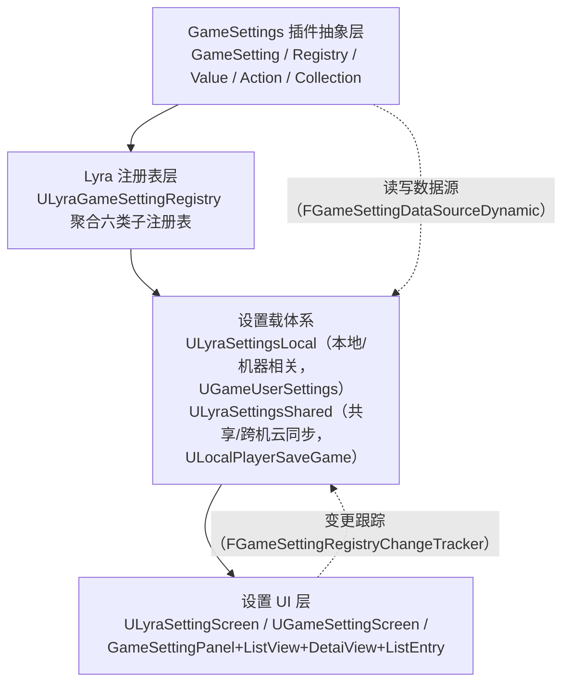
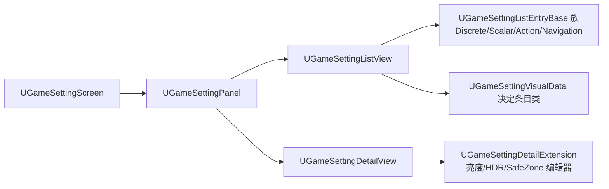

# UE5.8 Lyra 源码解析 50：设置系统与 GameSettings 源码

> 本篇沿「GameSettings 插件抽象 → Lyra 注册表 → 设置载体 → UI 屏」四条链阅读 Lyra 5.8 的设置系统源码，覆盖 `Plugins\GameSettings` 的 GameSetting/Registry/Value/Action/Collection 数据模型，以及 `Source\LyraGame\Settings` 的注册表、载体与 CustomSettings 扩展。
> 本篇为 LYRA-COV-02（GameSettings 插件 + LyraGame/Settings 专项）的首次实质分析。48 篇只在插件地图点名 GameSettings，本篇补上该缺口，并交叉引用 45 篇（音频设置）、47 篇（开发者设置）与 39 篇（总览路线）。
> 知识成熟度：L2（本机 UE 5.8 与 Lyra 5.8 项目/插件源码已静态核对；SafeZone、分辨率枚举等平台相关行为标为待运行时验证）。

## 元数据

> 版本基准：UE 5.8.0（本机 `Engine/Build/Build.version`：CL 55116800，分支 `++UE5+Release-5.8`），Lyra 5.8 样例 `LyraStarterGame.uproject` 的 `EngineAssociation=5.8`。
> 源码依据：`C:\Users\zhaozhiqi\Documents\Unreal Projects\LyraStarterGame\Plugins\GameSettings\...`（只读引用）；`C:\Users\zhaozhiqi\Documents\Unreal Projects\LyraStarterGame\Source\LyraGame\Settings\...`（只读引用）。渲染/音频枚举、SafeZone 等平台行为以引擎 `C:\Program Files\Epic Games\UE_5.8\Engine\...` 为准。
> 适用范围：GameSettings 插件抽象层、Lyra 设置注册表、设置载体（Local/Shared）、以及设置 UI 屏的 Lyra 5.8 项目源码解析。
> 兼容性边界：UE 4.27/早期 UE5 仅作为历史兼容性说明；GameSettings 是独立的可复用插件，不属于 Lyra 专有代码，可被其他 UE 项目引用。
> 官方参考：[UE 5.8 官方文档](https://dev.epicgames.com/documentation/en-us/unreal-engine)。
> 最后更新：2026-08-17（补入设置列表、详情扩展与响应式面板实际源码分析）
> 知识成熟度：L2

## 阅读前的事实边界

### 证据分级

| 等级 | 证据 | 本文用法 |
| --- | --- | --- |
| A | GameSettings 插件 `Plugins/GameSettings/Source` 的 C++ 头文件 | 类、函数、字段、生命周期与抽象语义的直接事实 |
| B | Lyra `Source/LyraGame/Settings` 与 `Source/LyraGame/UI` 的 C++ 文件 | 注册表聚合、设置载体、自定义设置项与 UI 屏的直接事实 |
| C | UE 5.8 引擎源码或官方文档 | `UGameUserSettings`、SaveGame、CustomCulture 等语义的补充依据 |

`.uasset`/`.umap` 二进制中的类名只能证明资产引用该 C++ 类，不能证明蓝图图表行为。蓝图父类、字段值、节点连线需要在 UE 编辑器中打开资产确认。本文不把一次静态检索写成"已经通过 PIE 或 CI"。

### 静态核对 vs 平台行为

```
静态核对（本文据此断言）：类/继承/函数签名/字段/生命周期调用顺序/注册表组装代码，全部来自本机 5.8 源码文本。
待运行时验证（本文只标"待验证"，不写成事实）：
  · SafeZoneScale 最终写入控件边距的可见效果；
  · 分辨率枚举（ResolutionsFullscreen/Windowed/WindowedFullscreen）随监视器与显卡动态生成；
  · 输出设备是否存在真正的 SwapAudioOutputDevice 切换（本机 SetDiscreteOptionByIndex 中切换逻辑呈注释态）；
  · HDR 校准的调色数值对画面的实际影响。
```

### 目录地图（源码级）

```text
LyraStarterGame/Plugins/GameSettings/Source/
├─ Public/
│  ├─ GameSetting.h               (257 行) 设置基类
│  ├─ GameSettingRegistry.h       (93 行)  注册表基类
│  ├─ GameSettingRegistryChangeTracker.h (47 行) 变更跟踪
│  ├─ GameSettingValue.h          (42 行)  值基类
│  ├─ GameSettingValueDiscrete.h  (38 行)  离散值基类
│  ├─ GameSettingValueDiscreteDynamic.h (263 行) 动态离散值（Getter/Setter 机制）
│  ├─ GameSettingValueScalar.h    (55 行)  标量值基类
│  ├─ GameSettingValueScalarDynamic.h (107 行) 动态标量值
│  ├─ GameSettingAction.h         (70 行)  动作设置
│  ├─ GameSettingCollection.h     (73 行)  集合 / 集合页
│  ├─ GameSettingFilterState.h    (201 行) 过滤状态 + 可编辑状态 + 编辑条件基类
│  ├─ DataSource/GameSettingDataSource.h (31 行) 数据源接口
│  ├─ DataSource/GameSettingDataSourceDynamic.h (33 行) 动态属性路径数据源
│  ├─ EditCondition/WhenCondition.h (27 行) 内联编辑条件
│  ├─ EditCondition/WhenPlatformHasTrait.h (37 行) 平台特性编辑条件
│  ├─ EditCondition/WhenPlayingAsPrimaryPlayer.h (20 行) 主玩家编辑条件
│  └─ Widgets/ GameSetting*  (Screen/Panel/ListView/ListEntry/DetailView/VisualData…)
└─ Private/  与 Public 一一对应的 .cpp
```

```text
LyraStarterGame/Source/LyraGame/Settings/
├─ LyraGameSettingRegistry.h/.cpp          (83 行 / 90 行) 聚合注册表
├─ LyraGameSettingRegistry_{Audio,Gamepad,Gameplay,MouseAndKeyboard,PerfStats,Video,DLC}.cpp 子注册表分文件
├─ LyraSettingsLocal.h/.cpp                (463 行) 本地设置载体（继承 UGameUserSettings）
├─ LyraSettingsShared.h/.cpp               (401 行) 共享设置载体（继承 ULocalPlayerSaveGame）
├─ CustomSettings/  LyraSettingAction_{HDR,SafeZone} / LyraSettingKeyboardInput /
│                   LyraSettingValueDiscrete_{Display,Language,MobileFPSType,OverallQuality,PerfStat,Resolution} /
│                   LyraSettingValueDiscreteDynamic_AudioOutputDevice
├─ Screens/        LyraBrightnessEditor / LyraHDRCalibrationEditor / LyraSafeZoneEditor
└─ Widgets/        LyraSettingsListEntrySetting_KeyboardInput
Source/LyraGame/UI/LyraSettingScreen.h     (47 行) Lyra 设置屏
```

## 一、先给结论：设置系统三层

Lyra 的设置系统是一条"数据模型 → 载体 → 编辑界面"的流水线，可以拆成三层职责相反的结构。



图意：最上层的 GameSettings 插件定义一个*与平台和具体字段解耦*的设置对象模型；Lyra 注册表把无数个 `UGameSetting` 组装成树（集合→子项），每一项通过 `FGameSettingDataSourceDynamic` 的 Getter/Setter 真正读写 `ULyraSettingsLocal`/`ULyraSettingsShared` 上的字段；`UGameSettingScreen` 是 UMG 屏，里面一个 `UGameSettingPanel` 持有 ListView（列表）与 DetailView（详情），条目控件按设置类型（离散/标量/动作/导航）分派。

一句话记住分工：
- **抽象层**决定"设置是什么、能不能改、改了通知谁"；
- **载体系**决定"值存在哪、怎么持久化、怎么应用"；
- **UI 层**决定"怎么渲染、怎么编辑、怎么恢复"。

### 与既有篇目分工

- **45 篇（相机、音频与游戏阶段）**：45 篇已从"音频控制总线/混合效果子系统"的角度分析过 `LyraSettingsLocal` 的音量写入、以及 `LyraGameSettingRegistry_Audio.cpp` 的音量/声音集合。本篇**不重复**音量总线实现，只把 Audio 子注册表放回设置系统的整体框架里，并在附录收录其载体字段。
- **47 篇（调试工具与开发者设置）**：47 篇覆盖开发者/调试设置（CVar、控制台命令、性能统计）。本篇的 PerfStat 自定义设置项与 47 篇的 HUD 性能统计直接相连，本篇讲"设置如何把 `ELyraStatDisplayMode` 写进 `DisplayStatList`"，47 篇讲"HUD 如何读它渲染"。
- **48 篇（扩展插件）**：48 篇只在插件地图（63~72 行）点明 `GameSettings` 是启用插件，未展开。本篇首次实质分析该插件，补齐 LYRA-COV-02 缺口。
- **39 篇（总览）**：39 篇 78 行标注"GameSettings/ 设置数据模型与界面支持（50 篇深挖）"，本篇正是该深挖正文。
- **07 篇（UMG 与 Slate）**：UV/ListView/Slate 渲染原语见 07 篇，本篇只讲设置专用控件（`UGameSettingListView` 继承 `UListView` 等）。

## 二、核心职责矩阵

围绕一个设置项的完整生命周期，各核心类的职责如下。

### 2.1 `UGameSetting`（GameSetting.h，257 行）

基类，`UObject` 抽象类，标识信息 + 行为钩子 + 变更通知三部分。

| 成员/功能 | 源码事实 |
| --- | --- |
| 标识 | `GetDevName/SetDevName`（非本地化唯一标识）、`GetDisplayName`、`GetDescriptionRichText`、`GetTags`（`FGameplayTagContainer`，任意标记给 UI 用） |
| 编辑条件 | `AddEditCondition(TSharedRef<FGameSettingEditCondition>)` 持有若干编辑条件；`AddEditDependency(DependencySetting)` 让另一设置变化时触发本设置重估 |
| 变更事件 | 三个事件：`FOnSettingChanged`(Setting, Reason)、`FOnSettingApplied`、`FOnSettingEditConditionChanged` |
| 生命周期 | `Initialize` → `Startup` → `StartupComplete` → `OnInitialized`；另有 `Apply`/`OnApply`、`RefreshEditableState`、`ResetToDefault`（通过子类） |
| 过滤联动 | `OwningRegistry` 反向指针、`SettingParent`（集合或注册表）、`GetChildSettings()`（一个设置可以有子设置，即使 UI 只显示一个） |
| 搜索缓存 | RichText 描述会自动剥离标记生成 `AutoGenerated_DescriptionPlainText`（`RefreshPlainText` 用 `FDefaultRichTextMarkupParser` 做纯文本提取） |
| Debug | 非 Shipping 下 `GameSettings.ShowDebugInfo` CVar 可在动态详情里附加 DevName 与类名（`GetDynamicDetails`） |
| Analytics | `bReportAnalytics`，默认 false，`GameSettingValue` 系默认可上报（基类 `GetAnalyticsValue` 返回空串） |

`UGameSetting::Initialize` 的固定调用顺序（GameSetting.cpp 38~68）：

```cpp
// 节选：GameSetting.cpp UGameSetting::Initialize
void UGameSetting::Initialize(ULocalPlayer* InLocalPlayer)
{
    if (LocalPlayer == InLocalPlayer) return;      // 已初始化则幂等返回
    LocalPlayer = InLocalPlayer;
    // 初始化全部 EditCondition
    for (const TSharedRef<FGameSettingEditCondition>& EC : EditConditions)
        EC->Initialize(LocalPlayer);
    // 递归初始化所有子设置
    for (UGameSetting* Setting : GetChildSettings())
        Setting->Initialize(LocalPlayer);
    Startup();                                     // 进入启动流程
}
```

### 2.2 `UGameSettingRegistry`（GameSettingRegistry.h，93 行）

注册表基类，持有 `TopLevelSettings` 与 `RegisteredSettings` 两组设置指针。

- `OnInitialize` 是纯虚函数（PURE_VIRTUAL），子类必须自行组装并调用 `RegisterSetting`。
- `FindSettingByDevName` / `FindSettingByDevNameChecked` 按 DevName 查设置。
- `GetSettingsForFilter` 结合 `FGameSettingFilterState` 返回当前可见设置。
- 托起四个事件：`OnSettingChangedEvent`（全局转发）、`OnSettingEditConditionChangedEvent`、`OnSettingNamedActionEvent`（命名动作，如键盘输入的 `GameSettings.Action.*` Tag）、`OnExecuteNavigationEvent`（集合页跳转）。
- `Regenerate` / `IsFinishedInitializing`（等异步设置就绪）/ `SaveChanges` 由子类更进一步实现。

### 2.3 `UGameSettingValue*`（值类族）

| 类 | 头文件 | 追加的接口 | 典型用途 |
| --- | --- | --- | --- |
| `UGameSettingValue` | 42 行 | 纯虚 `StoreInitial` / `ResetToDefault` / `RestoreToInitial` | "有值可被改、可重置、可恢复"的语义锚点 |
| `UGameSettingValueDiscrete` | 38 行 | `SetDiscreteOptionByIndex`/`GetDiscreteOptionIndex`/`GetDiscreteOptions`（枚举集） | 语言、分辨率、整体画质、性能统计 |
| `UGameSettingValueDiscreteDynamic` | 263 行 | 用 Getter/Setter 数据源 + `AddDynamicOption` | 选项列表本身动态变化（音频输出设备） |
| `UGameSettingValueScalar` | 55 行 | 归一化值 + `GetSourceRange`/`GetSourceStep`/`GetFormattedText` | 音量滑条、SafeZone |
| `UGameSettingValueScalarDynamic` | 107 行 | 动态标量 + 8 个静态格式函数（`Raw`/`ZeroToOnePercent`/`SourceAsPercent100` 等） | 绑定到字段的滑条 |

离散/标量之上的 `_Dynamic` 版本核心是 `FGameSettingDataSource`（见 2.5）。`UGameSettingValueDiscreteDynamic` 额外带 `DefaultValue:TOptional<FString>`、`InitialValue:FString` 与 `OptionValues/OptionDisplayTexts` 两数组，这套"字符串值 + 文本选项"的表示让 Getter/Setter 天然可序列化。

### 2.4 `UGameSettingAction`（70 行）与 `UGameSettingCollection`（73 行）

- **Action**：不承载"值"，承载一个动作按钮。`SetActionText`、`SetNamedAction(FGameplayTag)`、`SetCustomAction(UGameSettingCustomAction / TFunction)`。`SetDoesActionDirtySettings` 决定动作触发后是否标记设置已改（默认不脏，因为多为 EULA、兑奖这类不可回退动作）。命名动作与 `GameSettings.Action.*` Tag 关联（Lyra 使用 `GameSettings.Action.EditSafeZone`、`GameSettings.Action.ResetSettingToDefault` 等，见 39 篇 1944 行的 Tag 注册截图）。
- **Collection**：`UGameSettingCollection` 持有一个 `Settings` 数组，`AddSetting` 添加子项，`GetSettingsForFilter` 递归。`UGameSettingCollectionPage` 是可导航的集合页：`IsSelectable()=true` 表示它是列表里的一条"可点开"项，点击触发 `OnExecuteNavigationEvent` 进入子页。

### 2.5 `FGameSettingDataSource` 抽象

数据源是把"读一个字段 / 写一个字段"与具体持有者解耦的关键抽象（GameSettingDataSource.h 31 行）：

```cpp
// 节选：GameSettingDataSource.h
class FGameSettingDataSource : public TSharedFromThis<FGameSettingDataSource>
{
public:
    virtual ~FGameSettingDataSource() { }
    virtual void Startup(ULocalPlayer* InLocalPlayer, FSimpleDelegate StartupCompleteCallback)
    {
        StartupCompleteCallback.ExecuteIfBound();
    }
    virtual bool Resolve(ULocalPlayer* InContext) = 0;
    virtual FString GetValueAsString(ULocalPlayer* InContext) const = 0;
    virtual void SetValue(ULocalPlayer* InContext, const FString& Value) = 0;
    virtual FString ToString() const = 0;
};
```

`FGameSettingDataSourceDynamic`（33 行）持有 `FCachedPropertyPath DynamicPath`，以一段"函数路径"解析到具体字段，例如 Lyra 的宏：

```cpp
// 节选：LyraGameSettingRegistry.h 宏
#define GET_LOCAL_SETTINGS_FUNCTION_PATH(F) \
    MakeShared<FGameSettingDataSourceDynamic>(TArray<FString>({ \
        GET_FUNCTION_NAME_STRING_CHECKED(ULyraLocalPlayer, GetLocalSettings), \
        GET_FUNCTION_NAME_STRING_CHECKED(ULyraSettingsLocal, F) }))
```

即"先 `GetLocalSettings()` 拿到 `ULyraSettingsLocal`，再取该对象上名为 `F` 的属性/函数"。这样设置项完全不知道值存在哪个具体类的哪个字段，只管一条字符串路径。这正是"动态"二字的来源：改一行宏就能把一个离散/标量选项接到任意字段上。

### 2.6 `FGameSettingFilterState` / `FGameSettingEditableState` / `FGameSettingEditCondition`（GameSettingFilterState.h，201 行）

这是一个三层状态的组合：

| 层 | 类 | 作用 |
| --- | --- | --- |
| 过滤 | `FGameSettingFilterState` | 结构与值外层的"可见性"过滤：`bIncludeDisabled`/`bIncludeHidden`/`bIncludeResetable`/`bIncludeNestedPages`，加 `SetSearchText` 表达式过滤、`SettingRootList`/`SettingAllowList` 白名单 |
| 可编辑状态 | `FGameSettingEditableState` | 单项的最终态：`bVisible`/`bEnabled`/`bResetable`/`bHideFromAnalytics`；方法 `Hide(DevReason)`、`Disable(Reason)`、`DisableOption`、`UnableToReset`、`Kill`（三者兼做） |
| 编辑条件 | `FGameSettingEditCondition` | `TSharedFromThis` 接口，`GatherEditState` 在初始化或依赖变化时被调用改写可编辑状态；`SettingApplied`/`SettingChanged` 提供随动作/变更通知 |

`EGameSettingChangeReason` 枚举（Change / DependencyChanged / ResetToDefault / RestoreToInitial）贯穿通知事件。

## 三、抽象层运行原理

### 3.1 生命周期

一条设置从创建到生效经过四步（源码事实见 GameSetting.cpp）：

1. `Initialize(LocalPlayer)`：绑定 LocalPlayer → 初始化编辑条件 → 递归初始化子设置 → `Startup()`。
2. `Startup()` / `StartupComplete()`：幂等地置 `bReady=true` 并调 `OnInitialized()`；某些设置需要异步（如枚举输出设备、加载 Shared 设置），注册表会等所有设置 `IsReady` 后才显示。
3. 编辑态求值：`RefreshEditableState` 重新 `ComputeEditableState`（自身 `OnGatherEditState` + 所有编辑条件 `GatherEditState` 合并），结果缓存进 `EditableStateCache`，并通过 `NotifyEditConditionsChanged` 广播，让仍在监听该设置的 UI 刷新。
4. 应用/恢复：`Apply()` 调 `OnApply()` → 通知编辑条件 `SettingApplied` → 广播 `OnSettingAppliedEvent`。值类子类额外实现 `StoreInitial`/`ResetToDefault`/`RestoreToInitial`，供"重置为默认"与"放弃更改"两条路径调用。

`RefreshEditableState` 受 `bOnEditConditionsChangedEventGuard` 重入保护，`NotifySettingChanged` 受 `bOnSettingChangedEventGuard` 保护，`LocalPlayer` 为空时直接忽略刷新请求（防止 LocalPlayer 销毁后回调）。

### 3.2 动态值：`UGameSettingValueDiscreteDynamic`

它把"枚举选项"和"真实值"解耦：真实值存成 `FString`（`GetValueAsString`/`SetValueFromString`），再配 `OptionValues:FArray<FString>` 与 `OptionDisplayTexts:FArray<FText>` 给 UI 枚举。Getter 负责把真实值读成字符串，Setter 把字符串写回。选项可以 `AddDynamicOption`/`RemoveDynamicOption` 动态增删，无需改变设置类型——这正是音频输出设备"枚举依平台而定"的落点。

内置派生类型（同一头文件内，263 行）：
- `_Bool`（SetTrueText/SetFalseText）
- `_Number`（模板 `LexToString/LexFromString` 序列化）
- `_Enum`（用 `StaticEnum<>()->GetNameStringByValue` 序列化枚举名）
- `_Color`（`FLinearColor::ToString` / `InitFromString`，显示为 `#RRGGBB`）
- `_Vector2D`（`FVector2D::ToString` / `InitFromString`）

### 3.3 编辑条件三件套

- `FWhenCondition`（27 行）：内联 Lambda，`GatherEditState` 直接执行用户回调。
- `FWhenPlatformHasTrait`（37 行）：结合 CommonUI 的平台特性 Tag（`PlayerInput.Menu.Keyboard` 等）。工厂方法 `KillIfMissing/DisableIfMissing/KillIfPresent/DisableIfPresent` —— `*IfMissing` 表示"缺该特性则隐藏/禁用"，`*IfPresent` 反之。
- `FWhenPlayingAsPrimaryPlayer`（20 行）：只在主玩家（Primary Player）可见/可改，用于多手柄时避免非主玩家改全局设置。

### 3.4 变更跟踪：`FGameSettingRegistryChangeTracker`

`GameSettingRegistryChangeTracker.h`（47 行）。`WatchRegistry/StopWatchingRegistry` 挂到注册表；`ApplyChanges/RestoreToInitial/ClearDirtyState` 提供应用、放弃、清脏。内部 `TMap<FObjectKey, TWeakObjectPtr<UGameSetting>> DirtySettings` 只记录被改过的设置（弱引用避免持有失效对象），`bRestoringSettings` 与 `bSettingsChanged` 两个状态位供 UI 判断"是否有未保存改动"。这支撑了 `UGameSettingScreen::HaveSettingsBeenChanged` / `ClearDirtyState`。

## 四、Lyra 注册与载体

### 4.1 `ULyraGameSettingRegistry`（83 行）

注册表工厂与聚合点：

```cpp
// 节选：LyraGameSettingRegistry.h
static ULyraGameSettingRegistry* Get(ULyraLocalPlayer* InLocalPlayer);
virtual void SaveChanges() override;
UGameSettingCollection* InitializeVideoSettings(ULyraLocalPlayer*);
void InitializeVideoSettings_FrameRates(UGameSettingCollection*, ULyraLocalPlayer*);
void AddPerformanceStatPage(UGameSettingCollection*, ULyraLocalPlayer*);
UGameSettingCollection* InitializeAudioSettings(ULyraLocalPlayer*);
UGameSettingCollection* InitializeGameplaySettings(ULyraLocalPlayer*);
UGameSettingCollection* InitializeMouseAndKeyboardSettings(ULyraLocalPlayer*);
UGameSettingCollection* InitializeGamepadSettings(ULyraLocalPlayer*);
void AddDLCPage(UGameSettingCollection*, ULyraLocalPlayer*);
```

`OnInitialize`（LyraGameSettingRegistry.cpp 54~73）把六组集合注册为顶层设置，注册表因此是一棵以"Video / Audio / Gameplay / MouseAndKeyboard / Gamepad"为根、`DLC` 页按需添加（用 `FTSTicker` 延迟首帧挂载）的树。子注册表按主题拆到独立分文件，见下表：

| 分文件 | 职责 | 关键自定义设置 |
| --- | --- | --- |
| `..._Video.cpp` | 显示与画质 | `ULyraSettingValueDiscrete_Resolution`、`_OverallQuality`、`_MobileFPSType`、`_Display`（HDR/亮度），`InitializeVideoSettings_FrameRates` 组帧率项 |
| `..._Audio.cpp` | 音量与声音 | `ULyraSettingValueDiscreteDynamic_AudioOutputDevice`、音量标量；45 篇已拆讲 |
| `..._Gameplay.cpp` | 玩法：字幕/色盲/语言 | `ULyraSettingValueDiscrete_Language`、共享字幕/色盲字段 |
| `..._MouseAndKeyboard.cpp` | 键鼠 | 指针速度/反转轴（Shared）、`ULyraSettingKeyboardInput`、`ULyraSettingAction_...` 键位重置 |
| `..._Gamepad.cpp` | 手柄 | 死区/灵敏度（Shared）、触发触感、输入 API 选项 |
| `..._PerfStats.cpp` | 性能统计 | `ULyraSettingValueDiscrete_PerfStat`（配合 `AddPerformanceStatPage`） |
| `..._DLC.cpp` | 追加内容页 | 按启用模块添加 |

`IsFinishedInitializing` 额外要求 LocalPlayer 存在 `GetSharedSettings()`（即异步 Shared 已经加载完成）才返回 true；`SaveChanges` 除了调用基类，还调 `GetLocalSettings()->ApplySettings(false)`（应用画质/分辨率等）并 `ApplySettings/SaveSettings` 共享设置。

### 4.2 `ULyraSettingsLocal`（463 行）

继承 `UGameUserSettings`（所以天然拿到画质/分辨率/帧率等引擎 `GameUserSettings` 数据），是**机器相关**的本地设置，写入 `Config`。

重点分组（字段皆可 `Get/Set`，且都用 `UPROPERTY(Config)` 持久化）：
- **性能统计**：`DisplayStatList:TMap<ELyraDisplayablePerformanceStat, ELyraStatDisplayMode>`、`SetPerfStatDisplayState`；延迟标记/追踪开关 `bEnableLatencyFlashIndicators`/`bEnableLatencyTrackingStats`。
- **画质分档**：覆写 `SetOverallScalabilityLevel`/`GetOverallScalabilityLevel`，另有 `FLyraScalabilitySnapshot DeviceDefaultScalabilitySettings`（记录设备默认与是否覆盖）与整套 mobile 帧率档位函数（`GetMaxMobileFrameRate`/`SetDesiredMobileFrameRateLimit`/`ClampMobileQuality` 等）。
- **显示**：四个帧率上限 `FrameRateLimit_OnBattery/_InMenu/_WhenBackgrounded` + 恒常 `FrameRateLimit_Always`，`UpdateEffectiveFrameRateLimit` 计算生效值。
- **亮度/伽马**：`DisplayGamma`（默认 2.2）。
- **安全区**：`SafeZoneScale`（默认 -1 表示未设置），`IsSafeZoneSet`/`GetSafeZone`/`SetSafeZone`/`ApplySafeZoneScale`。
- **音频音量**：`OverallVolume/MusicVolume/SoundFXVolume/DialogueVolume/VoiceChatVolume`，`SetVolumeForSoundClass` 写进 Control Bus（45 篇展开）；`bUseHeadphoneMode`（HRTF）与 `bUseHDRAudioMode`、`AudioOutputDeviceId`、`ControlBusMap`/`ControlBusMix`。
- **键位**：`ControllerPlatform`/`ControllerPreset`/`InputConfigName`（`FName`，对应 `UCommonInputBaseControllerData` 注册）。
- **录像**：`bShouldAutoRecordReplays`/`NumberOfReplaysToKeep`。
- 生命周期钩子：`OnExperienceLoaded`、`OnHotfixDeviceProfileApplied`、`BeginDestroy`、应用前后台 `OnAppActivationStateChanged`（`ReapplyThingsDueToPossibleDeviceProfileChange`）。

### 4.3 `ULyraSettingsShared`（401 行）

继承 `ULocalPlayerSaveGame`，**跨机/云同步**，是"每位玩家各自的偏好"，比如键位、色盲、字幕、灵敏度——这些不能存进机器相关的 Local，否则所有登录用户共享同一份。

- 生命周期：`CreateTemporarySettings`（临时对象，等待异步加载）→ `LoadOrCreateSettings`（同步）→ `AsyncLoadOrCreateSettings`（异步，回调 `FOnSettingsLoadedEvent`）→ `SaveSettings`/`ApplySettings`。
- `ChangeValueAndDirty<T>`（模板）：值变化时 `bIsDirty=true` 并广播 `OnSettingChanged`，这是只读实现简洁"设置已改"标准手段。
- 共享字段分组：色盲（`ColorBlindMode`/`ColorBlindStrength`）、手柄力反馈/死区/触发触感/输入 API、字幕（`bEnableSubtitles`+五个 `ESubtitleDisplayText*`）、后台音频 `ELyraAllowBackgroundAudioSetting`、语言 `PendingCulture`（pending 延迟应用）+`bResetToDefaultCulture`、键鼠灵敏度/反转轴（`MouseSensitivityX/Y`、`TargetingMultiplier`）、手柄灵敏度预设 `ELyraGamepadSensitivity`。
- 枚举定义齐全（同一头文件）：`EColorBlindMode`、`ELyraAllowBackgroundAudioSetting`、`ELyraGamepadInputAPIOption`、`ELyraGamepadSensitivity`（Slow…Insane 十档）。

Local vs Shared 判定一句话：**是否随机器走**。分辨率/画质/安全区/本地音量→Local；键位偏好/色盲/字幕/灵敏度/语言→Shared。

## 五、UI 层：设置屏渲染

### 5.1 `UGameSettingScreen`（GameSettingScreen.h，85 行）

抽象屏，继承 `UCommonActivatableWidget`。持有 `ChangeTracker:FGameSettingRegistryChangeTracker` 与惰性创建的 `Registry`。

```cpp
// 节选：GameSettingScreen.h（关键接口）
virtual UGameSettingRegistry* CreateRegistry() PURE_VIRTUAL(, return nullptr;);
UFUNCTION(BlueprintCallable) void NavigateToSetting(FName SettingDevName);
UFUNCTION(BlueprintCallable) void NavigateToSettings(const TArray<FName>&);
UFUNCTION(BlueprintCallable) virtual void CancelChanges();
UFUNCTION(BlueprintCallable) virtual void ApplyChanges();
bool HaveSettingsBeenChanged() const { return ChangeTracker.HaveSettingsBeenChanged(); }
UWidget* NativeGetDesiredFocusTarget() const override;
```

`Settings_Panel:TObjectPtr<UGameSettingPanel>`（BindWidget）是屏内实际内容容器。全屏负责：激活/失活时（`NativeOnActivated/Deactivated`）挂/摘 registry 事件、把变更状态呈现给 `OnSettingsDirtyStateChanged_Implementation`（蓝图可覆写，驱动"保存/放弃"按钮），以及把注册表广播的"命名动作/导航"转发给响应式面板。

### 5.2 `ULyraSettingScreen`（LyraSettingScreen.h，47 行）

Lyra 的具体设置屏，继承 `UGameSettingScreen`。`CreateRegistry()` 返回 `ULyraGameSettingRegistry::Get(本地玩家)`。三个输入动作 `BackInputActionData`/`ApplyInputActionData`/`CancelChangesInputActionData`（`FDataTableRowHandle`，对应 CommonUI InputData 表）绑定 `HandleBackAction/HandleApplyAction/HandleCancelChangesAction`；可选绑定顶部 `ULyraTabListWidgetBase TopSettingsTabs`，把 Video/Audio/Gameplay 等集合呈现为标签页。

### 5.3 面板：`UGameSettingPanel`

`UGameSettingPanel`（117 行）是"列表+详情+导航栈"的三合一容器：
- 持有 `ListView_Settings`（必绑）与 `Details_Settings`（可 bind 可选）两个子控件。
- `SetFilterState` 设置过滤并**清空/保留导航栈**；导航栈 `TArray<FGameSettingFilterState> FilterNavigationStack` 支撑"子页返回"，`PopNavigationStack`/`CanPopNavigationStack`。
- `SelectSetting(DevName)`、`GetSelectedSetting`、事件 `OnFocusedSettingChanged`（关注项变化，驱动详情刷新）。
- `RefreshSettingsList` 通过 `FTSTicker` 延迟刷新，避免同帧内重复重建。

### 5.4 列表与条目

`UGameSettingListView`（46 行）继承 `UListView`，通过 `VisualData:UGameSettingVisualData*` 决定每个 `UGameSetting` 用哪个条目控件类，并支持 `AddNameOverride(DevName, FText)` 覆盖显示名。`UGameSettingVisualData`（70 行）是 `UDataAsset`，四张映射表：`EntryWidgetForClass`/`EntryWidgetForName`（条目控件）与 `ExtensionsForClasses`/`ExtensionsForName`（详情扩展）。

条目控件族（GameSettingListEntry.h，246 行），全部继承 `UGameSettingListEntryBase`：

| 条目 | 对应设置 | 交互控件 |
| --- | --- | --- |
| `UGameSettingListEntry_Setting` | 通用 | 名称 `Text_SettingName` |
| `UGameSettingListEntrySetting_Discrete` | `UGameSettingValueDiscrete` | `UGameSettingRotator` + `Button_Decrease/Button_Increase` |
| `UGameSettingListEntrySetting_Scalar` | `UGameSettingValueScalar` | `UAnalogSlider` + 值文本 |
| `UGameSettingListEntrySetting_Action` | `UGameSettingAction` | `Button_Action` |
| `UGameSettingListEntrySetting_Navigation` | `UGameSettingCollectionPage` | `Button_Navigate`（点开子页） |

每个条目实现 `SetSetting` / `OnSettingChanged` / `HandleEditConditionChanged` / `RefreshEditableState`：把设置对象绑定到条目，订阅其变更事件，并按 `FGameSettingEditableState` 刷新可见/可用/禁用原因。

### 5.5 详情：`UGameSettingDetailView`

`UGameSettingDetailView`（79 行）是 UMG UserWidget，`FillSettingDetails(UGameSetting*)` 填充：名称 `Text_SettingName`、说明 `RichText_Description`、动态详情 `RichText_DynamicDetails`、警告 `RichText_WarningDetails`、禁用原因 `RichText_DisabledDetails`，以及详情扩展 `Box_DetailsExtension`（用 `FUserWidgetPool` 复用 `UGameSettingDetailExtension` 控件，支持按设置类/名字装配额外编辑能力，如亮度/HDR/SafeZone 编辑器）。

### 5.6 响应式面板 `UGameResponsivePanel`

`GameResponsivePanel.h`（52 行，UWidget/BoxPanel 层）+ `SGameResponsivePanel`（Slate 层）实现横向流动（Flow Horizontal）布局：窄屏自动把子项纵向堆叠（`bCanStackVertically`），用于"列表 + 右侧详情"在细长屏上塌缩为上下堆叠。这是设置屏在手机/桌面布局间切换的响应式原语。



图意：设置屏 → 面板（列表+详情）→ 列表视图按 VisualData 为每个设置挑选条目控件 → 详情视图按设置变量追加编辑扩展。左列选择哪项，右列详情跟随刷新。

### 5.7 源码补全：列表、详情扩展与响应式布局的真实实现

前面的类表现在补入对应 C++ 函数。`UGameSettingPanel` 用过滤状态栈实现子页导航，并用 `FTSTicker` 合并同帧刷新，避免设置事件连续触发时反复重建列表。下方 `RefreshSettingsList` 保留本机函数中影响“合并刷新→过滤→更新 ListView”的原文分支，选中恢复分支未重复展开：

```cpp
void UGameSettingPanel::SetFilterState(
	const FGameSettingFilterState& InFilterState, bool bClearNavigationStack)
{
	FilterState = InFilterState;
	if (bClearNavigationStack)
	{
		FilterNavigationStack.Reset();
	}
	RefreshSettingsList();
}

void UGameSettingPanel::HandleSettingNavigation(UGameSetting* Setting)
{
	if (VisibleSettings.Contains(Setting))
	{
		FilterNavigationStack.Push(FilterState);
		FGameSettingFilterState NewPageFilterState;
		NewPageFilterState.AddSettingToRootList(Setting);
		SetFilterState(NewPageFilterState, false);
	}
}

void UGameSettingPanel::RefreshSettingsList()
{
	if (RefreshHandle.IsValid())
	{
		return;
	}
	RefreshHandle = FTSTicker::GetCoreTicker().AddTicker(
		FTickerDelegate::CreateWeakLambda(this, [this](float)
		{
			if (Registry->IsFinishedInitializing())
			{
				VisibleSettings.Reset();
				Registry->GetSettingsForFilter(FilterState, MutableView(VisibleSettings));
				ListView_Settings->SetListItems(VisibleSettings);
				RefreshHandle.Reset();
			}
			return false;
		}));
}
```

`UGameSettingListView` 不在每个设置类里写一套 Widget 选择逻辑，而是把 `UGameSettingVisualData::GetEntryForSetting` 作为分派点：

```cpp
UUserWidget& UGameSettingListView::OnGenerateEntryWidgetInternal(
	UObject* Item, TSubclassOf<UUserWidget> DesiredEntryClass,
	const TSharedRef<STableViewBase>& OwnerTable)
{
	UGameSetting* SettingItem = Cast<UGameSetting>(Item);

	TSubclassOf<UGameSettingListEntryBase> SettingEntryClass =
		TSubclassOf<UGameSettingListEntryBase>(DesiredEntryClass);
	if (VisualData)
	{
		if (const TSubclassOf<UGameSettingListEntryBase> EntryClassSetting =
			VisualData->GetEntryForSetting(SettingItem))
		{
			SettingEntryClass = EntryClassSetting;
		}
		else
		{
			//UE_LOG(LogGameSettings, Error, TEXT("UGameSettingListView: No Entry Class Found!"));
		}
	}
	else
	{
		//UE_LOG(LogGameSettings, Error, TEXT("UGameSettingListView: No VisualData Defined!"));
	}

	UGameSettingListEntryBase& EntryWidget = GenerateTypedEntry<UGameSettingListEntryBase>(SettingEntryClass, OwnerTable);
	if (!IsDesignTime())
	{
		if (const FText* Override = NameOverrides.Find(SettingItem->GetDevName()))
		{
			EntryWidget.SetDisplayNameOverride(*Override);
		}

		EntryWidget.SetSetting(SettingItem);
	}

	return EntryWidget;
}
```

VisualData 的实际优先级是“自定义逻辑 → DevName → 设置类继承链”，而详情扩展先取消旧异步加载、释放 WidgetPool，再从同一套 VisualData 收集软类：

```cpp
TSubclassOf<UGameSettingListEntryBase>
UGameSettingVisualData::GetEntryForSetting(UGameSetting* InSetting)
{
	if (InSetting == nullptr)
	{
		return TSubclassOf<UGameSettingListEntryBase>();
	}

	TSubclassOf<UGameSettingListEntryBase> CustomEntry = GetCustomEntryForSetting(InSetting);
	if (CustomEntry)
	{
		return CustomEntry;
	}

	{
		TSubclassOf<UGameSettingListEntryBase> EntryWidgetClassPtr =
			EntryWidgetForName.FindRef(InSetting->GetDevName());
		if (EntryWidgetClassPtr)
		{
			return EntryWidgetClassPtr;
		}
	}

	for (UClass* Class = InSetting->GetClass(); Class; Class = Class->GetSuperClass())
	{
		if (TSubclassOf<UGameSetting> SettingClass = TSubclassOf<UGameSetting>(Class))
		{
			TSubclassOf<UGameSettingListEntryBase> EntryWidgetClassPtr =
				EntryWidgetForClass.FindRef(SettingClass);
			if (EntryWidgetClassPtr)
			{
				return EntryWidgetClassPtr;
			}
		}
	}

	return TSubclassOf<UGameSettingListEntryBase>();
}
```

`UGameSettingDetailView::FillSettingDetails` 的真实职责是解除旧设置事件、绑定新设置事件、刷新文字状态，并把详情扩展重新放回池中；这才是“列表选择 → 右侧详情”的实际代码链。

```cpp
void UGameSettingDetailView::FillSettingDetails(UGameSetting* InSetting)
{
	if (InSetting && InSetting == CurrentSetting)
	{
		return;
	}
	if (CurrentSetting)
	{
		CurrentSetting->OnSettingChangedEvent.RemoveAll(this);
	}
	CurrentSetting = InSetting;
	if (CurrentSetting)
	{
		CurrentSetting->OnSettingChangedEvent.AddUObject(
			this, &ThisClass::HandleCurrentSettingChanged);
	}
	if (Text_SettingName)
	{
		Text_SettingName->SetText(InSetting ? InSetting->GetDisplayName() : FText::GetEmpty());
	}
	if (RichText_Description)
	{
		RichText_Description->SetText(InSetting ? InSetting->GetDescriptionRichText() : FText::GetEmpty());
	}
	if (Box_DetailsExtension)
	{
		for (UWidget* Child : Box_DetailsExtension->GetAllChildren())
		{
			ExtensionWidgetPool.Release(Cast<UUserWidget>(Child));
		}
		Box_DetailsExtension->ClearChildren();
	}
}
```

最后，响应式面板的 Slate 桥也有实际实现：重建时把 `bCanStackVertically` 传给 `SGameResponsivePanel`，动态新增/移除子项时同步 live Slate slot。

```cpp
TSharedRef<SWidget> UGameResponsivePanel::RebuildWidget()
{
	MyGameResponsivePanel = SNew(SGameResponsivePanel);
	MyGameResponsivePanel->EnableVerticalStacking(bCanStackVertically);
	for (UPanelSlot* PanelSlot : Slots)
	{
		if (UGameResponsivePanelSlot* TypedSlot = Cast<UGameResponsivePanelSlot>(PanelSlot))
		{
			TypedSlot->Parent = this;
			TypedSlot->BuildSlot(MyGameResponsivePanel.ToSharedRef());
		}
	}
	return MyGameResponsivePanel.ToSharedRef();
}
```

## 六、Lyra 自定义设置项（CustomSettings）

CustomSettings 子目录给抽象层提供 Lyra 专属的具体子类，一条规则：**凡是选项/值需要特殊来源或特殊副作用（平台枚举、异步、副作用应用）的，就写一个自定义设置子类**。逐个对照本机源码：

| 类 | 基类 | 头文件行数 | 来源/副作用要点 |
| --- | --- | --- | --- |
| `ULyraSettingValueDiscrete_Resolution` | `UGameSettingValueDiscrete` | 73 | 分 Fullscreen/WindowedFullscreen/Windowed 三组分辨率 `FScreenResolutionEntry{Width,Height,RefreshRate,OverrideText}`；`GetDisplayMetrics` 监听屏变化；`ShouldAllowFullScreenResolution`/`GetStandardWindowResolutions` 过滤；`StoreInitial/ResetToDefault/RestoreToInitial` |
| `ULyraSettingValueDiscrete_OverallQuality` | `UGameSettingValueDiscrete` | 40 | `Options`/`OptionsWithCustom`（多一项 "Custom"），把引擎整体画质档位 + 自定义档暴露为离散选项 |
| `ULyraSettingValueDiscrete_Language` | `UGameSettingValueDiscrete` | 42 | `AvailableCultureNames` 枚举系统文化；`OnApply` 把选择落到 `ULyraLocalPlayer` 的 pending culture |
| `ULyraSettingValueDiscrete_PerfStat` | `UGameSettingValueDiscrete` | 46 | `SetStat(ELyraDisplayablePerformanceStat)`；`Options`+`DisplayModes` 一一对应，写进 `ULyraSettingsLocal::DisplayStatList` |
| `ULyraSettingValueDiscrete_MobileFPSType` | `UGameSettingValueDiscrete` | – | 移动端帧率档位选择 |
| `ULyraSettingValueDiscrete_Display` | `UGameSettingValueDiscrete` | – | HDR/亮度相关显示离散项 |
| `ULyraSettingValueDiscreteDynamic_AudioOutputDevice` | `UGameSettingValueDiscreteDynamic` | 55 | 异步枚举 `UAudioMixerBlueprintLibrary::GetAvailableAudioOutputDevices`；监听热插拔 `DeviceAddedOrRemoved`/`DefaultDeviceChanged`；本机 5.8 的切换调 `SwapAudioOutputDevice` 逻辑呈注释态（待运行时验证） |
| `ULyraSettingKeyboardInput` | `UGameSettingValue` | 63 | 绑定一行动作映射 `FKeyMappingRow`：`ChangeBinding(slot,key)`、`GetAllMappedActionsFromKey`（查冲突/已占用）、`IsMappingCustomized`；配 `EnhancedInputUserSettings`。对应 UI 条目 `LyraSettingsListEntrySetting_KeyboardInput`（Widgets 子目录）与 `GameSettings.Action.*` 键位动作 |
| `ULyraSettingAction_SafeZoneEditor` | `UGameSettingAction` | 36 | `GetChildSettings` 暴露一个 `ULyraSettingValueScalarDynamic_SafeZoneValue` 子设置；配合 `Screens/LyraSafeZoneEditor`（UGameSettingDetailExtension）编辑 `ULyraSettingsLocal::SafeZoneScale`；动作经 `GameSettings.Action.EditSafeZone` Tag 触发 |
| `ULyraSettingAction_HDRCalibrationEditor` | `UGameSettingAction` | 24 | `GetChildSettings` 暴露 `HDRCalibrationValueSetting:UGameSettingValueScalarDynamic`；配合 `Screens/LyraHDRCalibrationEditor` 做 HDR 校准 |

`Screens/` 下的 `LyraBrightnessEditor`、`LyraHDRCalibrationEditor`、`LyraSafeZoneEditor` 都是 `UGameSettingDetailExtension` 子类，即"详情面板里的可编程扩展控件"，它们接收对应 `UGameSettingValueScalarDynamic`，把滑条/标记与底层值同步。

## 七、术语速查

| 术语 | 含义 |
| --- | --- |
| DevName | 设置的非本地化唯一标识（`FName`），用于查找与定位 |
| Registry | 一组设置的收纳器/工厂，持有 TopLevel 与 Registered 两组设置 |
| EditCondition | 一项控制"可见/可改/可重置"的规则，可在运行时动态改写设置状态 |
| FilterState | 设置列表的外层过滤（是否含隐藏/禁用/嵌套页、搜索词、白名单） |
| DataSource | 读写真实值的抽象；Dynamic 版本用属性路径字符串解析字段 |
| ChangeTracker | 追踪"设置被改过/正在恢复"状态，用于保存/放弃按钮 |
| Local vs Shared | Local 机器相关（`UGameUserSettings`/Config）；Shared 跨机云同步（`SaveGame`/每玩家） |
| Discrete vs Scalar | 离散枚举（选项列表） vs 标量连续（滑条） |
| CollectionPage | 可导航进入子页的集合项 |
| UpdateGameModeDeviceProfileAndFps | Local 侧把当前 Experience/平台映射为 DeviceProfile 与帧率模式的入口 |

## 八、落地检查清单

把一条新设置接入 Lyra 设置系统时，按此清单核对（每项对应前文某个源码锚点）：
1. 我的值是机器相关还是玩家相关？→ 决定存 `ULyraSettingsLocal`(Config) 还是 `ULyraSettingsShared`(SaveGame)。【4.2/4.3】
2. 选错基类：选项有限不变→`UGameSettingValueDiscreteDynamic`；选项依平台/异步→动态版；连续数值→`UGameSettingValueScalarDynamic`；纯动作按钮→`UGameSettingAction`。【六】
3. 拿到值源路径：用 `GET_LOCAL_SETTINGS_FUNCTION_PATH` / `GET_SHARED_SETTINGS_FUNCTION_PATH` 宏生成 `FGameSettingDataSourceDynamic`。【4.1/2.5】
4. 是否需要按平台/玩家收起？→ 挂 `FWhenPlatformHasTrait` / `FWhenPlayingAsPrimaryPlayer`。【3.3】
5. 是否需要 UI 上的说明/警告/动态详情/详情扩展？→ `SetDescriptionRichText`/`SetWarningRichText`/`SetDynamicDetails`/`UGameSettingDetailExtension`。【2.1/5.5】
6. 需不需要"丢弃更改"/"重置默认"？→ 值类实现 `StoreInitial`/`ResetToDefault`/`RestoreToInitial`，靠 ChangeTracker 驱动。【2.3/3.4】
7. 在哪个子注册表 `InitializeAudioSettings`/`...` 里 `AddSetting`？或者新开分文件并接入 `OnInitialize`。【4.1】
8. 列表条目控件：默认族是否够用；不够则在 `UGameSettingVisualData` 的 `EntryWidgetForName` 配自定义条目。【5.4】

## 九、常见反模式

1. **把"该存 Shared 的存进 Local"**：键位、色盲、灵敏度等玩家偏好存进 `UGameUserSettings` 会让所有登录用户共享同一份，且不同机器互不迁移。【4.3】
2. **把可变范围写死在类里而非 DataSource**：设置项直接持有目标对象指针，破坏"一条字符串路径读写字段"的解耦，导致难以复用/替换载体。【2.5】
3. **忘记 `AddEditDependency`**：一个选项依赖另一个设置（如分辨率影响"是否可全屏"）却只挂一次性 `WhenCondition`，另一设置变化时不触发重估。【2.1/3.3】
4. **动作默认不脏却需要保存语义**：`UGameSettingAction` 默认 `bDirtyAction=false`，若一个动作其实该触发变更事件（如切换键位预设），漏设 `SetDoesActionDirtySettings(true)` 会导致"已改"状态不反映。【2.4】
5. **把平台枚举当静态事实**：分辨率、输出设备、SafeZone 的可选项是运行时依平台/监视器生成的，写在文档里说明范围必须在运行时验证。【事实边界】
6. **同帧多次 `RefreshSettingsList`**：面板用 `FTSTicker` 延迟刷新，直接同步刷新会引入 1 帧抖动与重复建条目。【5.3】

## 十、FAQ

**Q1：`UGameSettingValueDiscreteDynamic` 和普通 `UGameSettingValueDiscrete` 什么关系？**
后者是抽象的"离散值"接口，前者是动态的通用实现（值存字符串 + Getter/Setter + 动态增删选项），再派生出 Bool/Number/Enum/Color/Vector2D 五个现成版本；Lyra 的音频输出设备继承自它，因为选项是运行时枚举的。【2.3/3.2/六】

**Q2：为什么有些设置要等 `IsFinishedInitializing` 才显示？**
设置可异步（枚举输出设备、异步加载 Shared 保存档）。注册表与屏会等所有顶层设置 `bReady` 才让 UI 可见，避免 UI 读到未就绪的值。【2.1/4.1】

**Q3：Local 和 Shared 怎么选？**
听那句判定：一看是否"随机器"，二看是否"随玩家/云同步"。分辨率、画质、安全区、本地音量属于前者；键位、色盲、字幕、灵敏度、语言属于后者。【4.2/4.3】

**Q4：设置屏顶部标签（Video/Audio/…）是怎么来的？**
`ULyraSettingScreen` 的 `TopSettingsTabs` 绑定到两个 `UGameSettingCollection`（如 VideoSettings/AudioSettings），每个集合对应一个页签；点击页签通过导航栈进入对应集合。【5.2/5.3】

**Q5：为什么改分辨率要"应用/确认"而不是即时生效？**
基类 `Apply()` 与 `StoreInitial()` 分离：即时生效的设置直接在 `SetDiscreteOptionByIndex` 里改并应用；分辨率这类"存临时再确认"的设置把动作放到 `Apply()`/确认回调，ChangeTracker 负责把"等待确认"标脏。【2.1/3.4】

**Q6：本篇与 47 篇的性能统计有何不同？**
47 篇讲 HUD 读取并渲染 `ELyraStatDisplayMode`；本篇讲 `ULyraSettingValueDiscrete_PerfStat` 把该枚举写回 `ULyraSettingsLocal::DisplayStatList` 的可编辑入口。两篇互为读写两端。

## 十一、关联阅读

- [39-Lyra源码总览与阅读路线](39-Lyra源码总览与阅读路线.md)：插件目录地图、GameSettings 位置、`GameSettings.Action.*` Tag 注册。
- [45-Lyra-相机音频与游戏阶段源码](45-Lyra-相机音频与游戏阶段源码.md)：`LyraGameSettingRegistry_Audio.cpp` 的音量集合、`ULyraSettingsLocal` 五路音量写入 Control Bus。
- [47-Lyra-调试工具与扩展源码](47-Lyra-调试工具与扩展源码.md)：开发者设置、性能统计 HUD 渲染读取端。
- [48-Lyra扩展插件源码](48-Lyra扩展插件源码.md)：GameSettings 在插件地图中只点名、本篇首次实质分析（补 LYRA-COV-02 缺口）。
- [44-Lyra-前端会话网络与扩展源码](44-Lyra-前端会话网络与扩展源码.md)：CommonUser/会话层为设置载体提供 LocalPlayer/Shared 生命周期。
- [26-CommonUI源码](26-CommonUI源码.md)：`UCommonActivatableWidget`、`UCommonButtonBase`、输入动作绑定原理。
- [14-UMG与Slate源码](14-UMG与Slate源码.md)：UListView/Slate Panel 渲染原语。
- [16-音频系统源码](16-音频系统源码.md)：音频 Control Bus/Mixer 底层。
- [25-EnhancedInput与GameplayTags源码](25-EnhancedInput与GameplayTags源码.md)：键盘输入设置依赖的 `UEnhancedInputUserSettings` 键位映射。

## 十二、附录：核心源码全文收录

### 收录原则与版权提示

以下附录**完整**收录本机 5.8 源码的核心头文件（KD-004 精神），保留 Epic 头注释 `// Copyright Epic Games, Inc. All Rights Reserved.`。这些文件来自 Epic 的开源样例项目 LyraStarterGame（UE 5.8 分支，CL 55116800），仅作知识库学习引用，版权归 Epic Games 所有，不得用于闭源商业再分发。代码字符、注释、条件编译和文件尾换行均未删改，仅统一代码围栏内的行尾及缩进空白；正文解读基于这些文本。

收录文件行数清单：

| # | 文件（相对 LyraStarterGame） | 行数 | 收录理由 |
| --- | --- | --- | --- |
| 1 | `Plugins/GameSettings/Source/Public/GameSetting.h` | 257 | 设置基类与生命周期锚点 |
| 2 | `Plugins/GameSettings/Source/Public/GameSettingRegistry.h` | 93 | 注册表基类 |
| 3 | `Plugins/GameSettings/Source/Public/GameSettingValueDiscreteDynamic.h` | 263 | 动态离散值机制核心 |
| 4 | `Plugins/GameSettings/Source/Public/GameSettingFilterState.h` | 201 | 过滤/可编辑状态/编辑条件 |
| 5 | `Source/LyraGame/Settings/LyraGameSettingRegistry.h` | 83 | Lyra 注册表聚合 |
| 6 | `Source/LyraGame/Settings/LyraSettingsLocal.h` | 463 | 本地设置载体 |
| 7 | `Source/LyraGame/Settings/LyraSettingsShared.h` | 401 | 共享设置载体 |
| 8 | `Source/LyraGame/UI/LyraSettingScreen.h` | 47 | Lyra 设置屏 |
| 9 | `Plugins/GameSettings/Source/Public/Widgets/GameSettingScreen.h` | 85 | 抽象设置屏 |
| 10 | `Source/LyraGame/Settings/CustomSettings/LyraSettingValueDiscrete_Resolution.h` | 73 | 分辨率为例的自定义设置项 |

以下代码块均为**完整收录**（非节选；仅统一代码围栏内的行尾及缩进空白），每段保留 Epic 版权头。

---

#### 附录 1：`Plugins/GameSettings/Source/Public/GameSetting.h`（257 行）

```cpp
// Copyright Epic Games, Inc. All Rights Reserved.

#pragma once

#include "GameplayTagContainer.h"
#include "Components/SlateWrapperTypes.h"
#include "GameSettingFilterState.h"
#include "GameplayTagContainer.h"

#include "GameSetting.generated.h"

#define UE_API GAMESETTINGS_API

class ULocalPlayer;
class UGameSettingRegistry;

//--------------------------------------
// UGameSetting
//--------------------------------------

DECLARE_DELEGATE_RetVal_OneParam(FText, FGetGameSettingsDetails, ULocalPlayer& /*InLocalPlayer*/);

/**
 *
 */
UCLASS(MinimalAPI, Abstract, BlueprintType)
class UGameSetting : public UObject
{
	GENERATED_BODY()

public:
	UGameSetting() { }

public:
	DECLARE_EVENT_TwoParams(UGameSetting, FOnSettingChanged, UGameSetting* /*InSetting*/, EGameSettingChangeReason /*InChangeReason*/);
	DECLARE_EVENT_OneParam(UGameSetting, FOnSettingApplied, UGameSetting* /*InSetting*/);
	DECLARE_EVENT_OneParam(UGameSetting, FOnSettingEditConditionChanged, UGameSetting* /*InSetting*/);

	FOnSettingChanged OnSettingChangedEvent;
	FOnSettingApplied OnSettingAppliedEvent;
	FOnSettingEditConditionChanged OnSettingEditConditionChangedEvent;

public:

	/**
	 * Gets the non-localized developer name for this setting.  This should remain constant, and represent a
	 * unique identifier for this setting inside this settings registry.
	 */
	UFUNCTION(BlueprintCallable)
	FName GetDevName() const { return DevName; }
	void SetDevName(const FName& Value) { DevName = Value; }

	bool GetAdjustListViewPostRefresh() const { return bAdjustListViewPostRefresh; }
	void SetAdjustListViewPostRefresh(const bool Value) { bAdjustListViewPostRefresh = Value; }

	UFUNCTION(BlueprintCallable)
	FText GetDisplayName() const { return DisplayName; }
	void SetDisplayName(const FText& Value) { DisplayName = Value; }
#if !UE_BUILD_SHIPPING
	void SetDisplayName(const FString& Value) { SetDisplayName(FText::FromString(Value)); }
#endif
	UFUNCTION(BlueprintCallable)
	ESlateVisibility GetDisplayNameVisibility() { return DisplayNameVisibility; }
	void SetNameDisplayVisibility(ESlateVisibility InVisibility) { DisplayNameVisibility = InVisibility; }

	UFUNCTION(BlueprintCallable)
	FText GetDescriptionRichText() const { return DescriptionRichText; }
	void SetDescriptionRichText(const FText& Value) { DescriptionRichText = Value; InvalidateSearchableText(); }
#if !UE_BUILD_SHIPPING
	/** This version is for cheats and other non-shipping items, that don't need to localize their text.  We don't permit this in shipping to prevent unlocalized text being introduced. */
	void SetDescriptionRichText(const FString& Value) { SetDescriptionRichText(FText::FromString(Value)); }
#endif

	UFUNCTION(BlueprintCallable)
	const FGameplayTagContainer& GetTags() const { return Tags; }
	void AddTag(const FGameplayTag& TagToAdd) { Tags.AddTag(TagToAdd); }

	void SetRegistry(UGameSettingRegistry* InOwningRegistry) { OwningRegistry = InOwningRegistry; }

	/** Gets the searchable plain text for the description. */
	UE_API const FString& GetDescriptionPlainText() const;

	/** Initializes the setting, giving it the owning local player.  Containers automatically initialize settings added to them. */
	UE_API void Initialize(ULocalPlayer* InLocalPlayer);

	/** Gets the owning local player for this setting - which all initialized settings will have. */
	ULocalPlayer* GetOwningLocalPlayer() const { return LocalPlayer; }

	/** Set the dynamic details callback, we query this when building the description panel.  This text is not searchable.*/
	void SetDynamicDetails(const FGetGameSettingsDetails& InDynamicDetails) { DynamicDetails = InDynamicDetails; }

	/**
	 * Gets the dynamic details about this setting.  This may be information like, how many refunds are remaining
	 * on their account, or the account number.
	 */
	UFUNCTION(BlueprintCallable)
	UE_API FText GetDynamicDetails() const;

	UFUNCTION(BlueprintCallable)
	FText GetWarningRichText() const { return WarningRichText; }
	void SetWarningRichText(const FText& Value) { WarningRichText = Value; InvalidateSearchableText(); }
#if !UE_BUILD_SHIPPING
	/** This version is for cheats and other non-shipping items, that don't need to localize their text.  We don't permit this in shipping to prevent unlocalized text being introduced. */
	void SetWarningRichText(const FString& Value) { SetWarningRichText(FText::FromString(Value)); }
#endif

	/**
	 * Gets the edit state of this property based on the current state of its edit conditions as well as any additional
	 * filter state.
	 */
	const FGameSettingEditableState& GetEditState() const { return EditableStateCache; }

	/** Adds a new edit condition to this setting, allowing you to control the visibility and edit-ability of this setting. */
	UE_API void AddEditCondition(const TSharedRef<FGameSettingEditCondition>& InEditCondition);

	/** Add setting dependency, if these settings change, we'll re-evaluate edit conditions for this setting. */
	UE_API void AddEditDependency(UGameSetting* DependencySetting);

	/** The parent object that owns the setting, in most cases the collection, but for top level settings the registry. */
	UE_API void SetSettingParent(UGameSetting* InSettingParent);
	UGameSetting* GetSettingParent() const { return SettingParent; }

	/** Should this setting be reported to analytics. */
	bool GetIsReportedToAnalytics() const { return bReportAnalytics; }
	void SetIsReportedToAnalytics(bool bReport) { bReportAnalytics = bReport; }

	/** Gets the analytics value for this setting. */
	virtual FString GetAnalyticsValue() const { return TEXT(""); }

	/**
	 * Some settings may take an async amount of time to finish initializing.  The settings system will wait
	 * for all settings to be ready before showing the setting.
	 */
	bool IsReady() const { return bReady; }

	/**
	 * Any setting can have children, this is so we can allow for the possibility of "collections" or "actions" that
	 * are not directly visible to the user, but are set by some means and need to have initial and restored values.
	 * In that case, you would likely have internal settings inside an action subclass that is set on another screen,
	 * but never directly listed on the settings panel.
	 */
	virtual TArray<UGameSetting*> GetChildSettings() { return TArray<UGameSetting*>(); }

	/**
	 * Refresh the editable state of the setting and notify that the state has changed so that any UI currently
	 * examining this setting is updated with the new options, or whatever.
	 */
	UE_API void RefreshEditableState(bool bNotifyEditConditionsChanged = true);

	/**
	 * We expect settings to change the live value immediately, but occasionally there are special settings
	 * that go are immediately stored to a temporary location but we don't actually apply them until later
	 * like selecting a new resolution.
	 */
	UE_API void Apply();

	/** Gets the current world of the local player that owns these settings. */
	UE_API virtual UWorld* GetWorld() const override;

protected:
	/**  */
	UE_API virtual void Startup();
	UE_API void StartupComplete();

	UE_API virtual void OnInitialized();
	UE_API virtual void OnApply();
	UE_API virtual void OnGatherEditState(FGameSettingEditableState& InOutEditState) const;
	UE_API virtual void OnDependencyChanged();

	/**  */
	UE_API virtual FText GetDynamicDetailsInternal() const;

	/** */
	UE_API void HandleEditDependencyChanged(UGameSetting* DependencySetting, EGameSettingChangeReason Reason);
	UE_API void HandleEditDependencyChanged(UGameSetting* DependencySetting);

	/** Regenerates the plain searchable text if it has been dirtied. */
	UE_API void RefreshPlainText() const;
	void InvalidateSearchableText() { bRefreshPlainSearchableText = true; }

	/** Notify that the setting changed */
	UE_API void NotifySettingChanged(EGameSettingChangeReason Reason);
	UE_API virtual void OnSettingChanged(EGameSettingChangeReason Reason);

	/** Notify that the settings edit conditions changed.  This may mean it's now invisible, or disabled, or possibly that the options have changed in some meaningful way. */
	UE_API void NotifyEditConditionsChanged();
	UE_API virtual void OnEditConditionsChanged();

	/**  */
	UE_API FGameSettingEditableState ComputeEditableState() const;

protected:

	UPROPERTY(Transient)
	TObjectPtr<ULocalPlayer> LocalPlayer;

	UPROPERTY(Transient)
	TObjectPtr<UGameSetting> SettingParent;

	UPROPERTY(Transient)
	TObjectPtr<UGameSettingRegistry> OwningRegistry;

	FName DevName;
	FText DisplayName;
	ESlateVisibility DisplayNameVisibility = ESlateVisibility::SelfHitTestInvisible;
	FText DescriptionRichText;
	FText WarningRichText;

	/** A collection of tags for the settings.  These can just be arbitrary flags used by the UI to do different things. */
	FGameplayTagContainer Tags;

	FGetGameSettingsDetails DynamicDetails;

	/** Any edit conditions for this setting. */
	TArray<TSharedRef<FGameSettingEditCondition>> EditConditions;

	class FStringCultureCache
	{
		FStringCultureCache(TFunction<FString()> InStringGetter);

		void Invalidate();

		FString Get() const;

	private:
		mutable FString StringCache;
		mutable FCultureRef Culture;
		TFunction<FString()> StringGetter;
	};

	/** When the text changes, we invalidate the searchable text. */
	mutable bool bRefreshPlainSearchableText = true;
	/** When we set the rich text for a setting, we automatically generate the plain text. */
	mutable FString AutoGenerated_DescriptionPlainText;

	/** Report as part of analytics, by default no setting reports, except GameSettingValues. */
	bool bReportAnalytics = false;

private:

	/** Most settings are immediately ready, but some may require startup time before it's safe to call their functions. */
	bool bReady = false;

	/** Prevent re-entrancy problems when announcing a setting has changed. */
	bool bOnSettingChangedEventGuard = false;

	/** Prevent re-entrancy problems when announcing a setting has changed edit conditions. */
	bool bOnEditConditionsChangedEventGuard = false;

	/**  */
	bool bAdjustListViewPostRefresh = true;

	/** We cache the editable state of a setting when it changes rather than reprocessing it any time it's needed.  */
	FGameSettingEditableState EditableStateCache;
};

#undef UE_API
```

#### 附录 2：`Plugins/GameSettings/Source/Public/GameSettingRegistry.h`（93 行）

```cpp
// Copyright Epic Games, Inc. All Rights Reserved.

#pragma once

#include "GameSetting.h"
#include "Templates/Casts.h"

#include "GameSettingRegistry.generated.h"

#define UE_API GAMESETTINGS_API

struct FGameplayTag;

//--------------------------------------
// UGameSettingRegistry
//--------------------------------------

class ULocalPlayer;
struct FGameSettingFilterState;

enum class EGameSettingChangeReason : uint8;

/**
 *
 */
UCLASS(MinimalAPI, Abstract, BlueprintType)
class UGameSettingRegistry : public UObject
{
	GENERATED_BODY()

public:
	DECLARE_EVENT_TwoParams(UGameSettingRegistry, FOnSettingChanged, UGameSetting*, EGameSettingChangeReason);
	DECLARE_EVENT_OneParam(UGameSettingRegistry, FOnSettingEditConditionChanged, UGameSetting*);

	FOnSettingChanged OnSettingChangedEvent;
	FOnSettingEditConditionChanged OnSettingEditConditionChangedEvent;

	DECLARE_EVENT_TwoParams(UGameSettingRegistry, FOnSettingNamedActionEvent, UGameSetting* /*Setting*/, FGameplayTag /*GameSettings_Action_Tag*/);
	FOnSettingNamedActionEvent OnSettingNamedActionEvent;

	/** Navigate to the child settings of the provided setting. */
	DECLARE_EVENT_OneParam(UGameSettingRegistry, FOnExecuteNavigation, UGameSetting* /*Setting*/);
	FOnExecuteNavigation OnExecuteNavigationEvent;

public:
	UE_API UGameSettingRegistry();

	UE_API void Initialize(ULocalPlayer* InLocalPlayer);

	UE_API virtual void Regenerate();

	UE_API virtual bool IsFinishedInitializing() const;

	UE_API virtual void SaveChanges();

	UE_API void GetSettingsForFilter(const FGameSettingFilterState& FilterState, TArray<UGameSetting*>& InOutSettings);

	UE_API UGameSetting* FindSettingByDevName(const FName& SettingDevName);

	template<typename T = UGameSetting>
	T* FindSettingByDevNameChecked(const FName& SettingDevName)
	{
		T* Setting = Cast<T>(FindSettingByDevName(SettingDevName));
		check(Setting);
		return Setting;
	}

protected:
	virtual void OnInitialize(ULocalPlayer* InLocalPlayer) PURE_VIRTUAL(, )

	virtual void OnSettingApplied(UGameSetting* Setting) { }

	UE_API void RegisterSetting(UGameSetting* InSetting);
	UE_API void RegisterInnerSettings(UGameSetting* InSetting);

	// Internal event handlers.
	UE_API void HandleSettingChanged(UGameSetting* Setting, EGameSettingChangeReason Reason);
	UE_API void HandleSettingApplied(UGameSetting* Setting);
	UE_API void HandleSettingEditConditionsChanged(UGameSetting* Setting);
	UE_API void HandleSettingNamedAction(UGameSetting* Setting, FGameplayTag GameSettings_Action_Tag);
	UE_API void HandleSettingNavigation(UGameSetting* Setting);

	UPROPERTY(Transient)
	TArray<TObjectPtr<UGameSetting>> TopLevelSettings;

	UPROPERTY(Transient)
	TArray<TObjectPtr<UGameSetting>> RegisteredSettings;

	UPROPERTY(Transient)
	TObjectPtr<ULocalPlayer> OwningLocalPlayer;
};

#undef UE_API
```

#### 附录 3：`Plugins/GameSettings/Source/Public/GameSettingValueDiscreteDynamic.h`（263 行）

```cpp
// Copyright Epic Games, Inc. All Rights Reserved.

#pragma once

#include "GameSettingValueDiscrete.h"

#include "GameSettingValueDiscreteDynamic.generated.h"

#define UE_API GAMESETTINGS_API

class FGameSettingDataSource;
enum class EGameSettingChangeReason : uint8;

struct FContentControlsRules;

//////////////////////////////////////////////////////////////////////////
// UGameSettingValueDiscreteDynamic
//////////////////////////////////////////////////////////////////////////

UCLASS(MinimalAPI)
class UGameSettingValueDiscreteDynamic : public UGameSettingValueDiscrete
{
	GENERATED_BODY()

public:
	UE_API UGameSettingValueDiscreteDynamic();

	/** UGameSettingValue */
	UE_API virtual void Startup() override;
	UE_API virtual void StoreInitial() override;
	UE_API virtual void ResetToDefault() override;
	UE_API virtual void RestoreToInitial() override;

	/** UGameSettingValueDiscrete */
	UE_API virtual void SetDiscreteOptionByIndex(int32 Index) override;
	UE_API virtual int32 GetDiscreteOptionIndex() const override;
	UE_API virtual int32 GetDiscreteOptionDefaultIndex() const override;
	UE_API virtual TArray<FText> GetDiscreteOptions() const override;

	/** UGameSettingValueDiscreteDynamic */
	UE_API void SetDynamicGetter(const TSharedRef<FGameSettingDataSource>& InGetter);
	UE_API void SetDynamicSetter(const TSharedRef<FGameSettingDataSource>& InSetter);
	UE_API void SetDefaultValueFromString(FString InOptionValue);
	UE_API void AddDynamicOption(FString InOptionValue, FText InOptionText);
	UE_API void RemoveDynamicOption(FString InOptionValue);
	UE_API const TArray<FString>& GetDynamicOptions();

	UE_API bool HasDynamicOption(const FString& InOptionValue);

	UE_API FString GetValueAsString() const;
	UE_API void SetValueFromString(FString InStringValue);

protected:
	UE_API void SetValueFromString(FString InStringValue, EGameSettingChangeReason Reason);

	/** UGameSettingValue */
	UE_API virtual void OnInitialized() override;

	UE_API void OnDataSourcesReady();

	UE_API bool AreOptionsEqual(const FString& InOptionA, const FString& InOptionB) const;

protected:
	TSharedPtr<FGameSettingDataSource> Getter;
	TSharedPtr<FGameSettingDataSource> Setter;

	TOptional<FString> DefaultValue;
	FString InitialValue;

	TArray<FString> OptionValues;
	TArray<FText> OptionDisplayTexts;
};

//////////////////////////////////////////////////////////////////////////
// UGameSettingValueDiscreteDynamic_Bool
//////////////////////////////////////////////////////////////////////////

UCLASS(MinimalAPI)
class UGameSettingValueDiscreteDynamic_Bool : public UGameSettingValueDiscreteDynamic
{
	GENERATED_BODY()

public:
	UE_API UGameSettingValueDiscreteDynamic_Bool();

public:
	UE_API void SetDefaultValue(bool Value);

	UE_API void SetTrueText(const FText& InText);
	UE_API void SetFalseText(const FText& InText);

#if !UE_BUILD_SHIPPING
	void SetTrueText(const FString& Value) { SetTrueText(FText::FromString(Value)); }
	void SetFalseText(const FString& Value) { SetFalseText(FText::FromString(Value)); }
#endif
};

//////////////////////////////////////////////////////////////////////////
// UGameSettingValueDiscreteDynamic_Number
//////////////////////////////////////////////////////////////////////////

UCLASS(MinimalAPI)
class UGameSettingValueDiscreteDynamic_Number : public UGameSettingValueDiscreteDynamic
{
	GENERATED_BODY()

public:
	UE_API UGameSettingValueDiscreteDynamic_Number();

public:
	template<typename NumberType>
	void SetDefaultValue(NumberType InValue)
	{
		SetDefaultValueFromString(LexToString(InValue));
	}

	template<typename NumberType>
	void AddOption(NumberType InValue, const FText& InOptionText)
	{
		AddDynamicOption(LexToString(InValue), InOptionText);
	}

	template<typename NumberType>
	NumberType GetValue() const
	{
		const FString ValueString = GetValueAsString();

		NumberType OutValue;
		LexFromString(OutValue, *ValueString);

		return OutValue;
	}

	template<typename NumberType>
	void SetValue(NumberType InValue)
	{
		SetValueFromString(LexToString(InValue));
	}

protected:
	/** UGameSettingValue */
	UE_API virtual void OnInitialized() override;
};

//////////////////////////////////////////////////////////////////////////
// UGameSettingValueDiscreteDynamic_Enum
//////////////////////////////////////////////////////////////////////////

UCLASS(MinimalAPI)
class UGameSettingValueDiscreteDynamic_Enum : public UGameSettingValueDiscreteDynamic
{
	GENERATED_BODY()

public:
	UE_API UGameSettingValueDiscreteDynamic_Enum();

public:
	template<typename EnumType>
	void SetDefaultValue(EnumType InEnumValue)
	{
		const FString StringValue = StaticEnum<EnumType>()->GetNameStringByValue((int64)InEnumValue);
		SetDefaultValueFromString(StringValue);
	}

	template<typename EnumType>
	void AddEnumOption(EnumType InEnumValue, const FText& InOptionText)
	{
		const FString StringValue = StaticEnum<EnumType>()->GetNameStringByValue((int64)InEnumValue);
		AddDynamicOption(StringValue, InOptionText);
	}

	template<typename EnumType>
	EnumType GetValue() const
	{
		const FString Value = GetValueAsString();
		return (EnumType)StaticEnum<EnumType>()->GetValueByNameString(Value);
	}

	template<typename EnumType>
	void SetValue(EnumType InEnumValue)
	{
		const FString StringValue = StaticEnum<EnumType>()->GetNameStringByValue((int64)InEnumValue);
		SetValueFromString(StringValue);
	}

protected:
	/** UGameSettingValue */
	UE_API virtual void OnInitialized() override;
};

//////////////////////////////////////////////////////////////////////////
// UGameSettingValueDiscreteDynamic_Color
//////////////////////////////////////////////////////////////////////////

UCLASS(MinimalAPI)
class UGameSettingValueDiscreteDynamic_Color : public UGameSettingValueDiscreteDynamic
{
	GENERATED_BODY()

public:
	UE_API UGameSettingValueDiscreteDynamic_Color();

public:
	void SetDefaultValue(FLinearColor InColor)
	{
		SetDefaultValueFromString(InColor.ToString());
	}

	void AddColorOption(FLinearColor InColor)
	{
		const FColor SRGBColor = InColor.ToFColor(true);
		AddDynamicOption(InColor.ToString(), FText::FromString(FString::Printf(TEXT("#%02X%02X%02X"), SRGBColor.R, SRGBColor.G, SRGBColor.B)));
	}

	FLinearColor GetValue() const
	{
		const FString Value = GetValueAsString();

		FLinearColor ColorValue;
		bool bSuccess = ColorValue.InitFromString(Value);
		ensure(bSuccess);

		return ColorValue;
	}

	void SetValue(FLinearColor InColor)
	{
		SetValueFromString(InColor.ToString());
	}
};

//////////////////////////////////////////////////////////////////////////
// UGameSettingValueDiscreteDynamic_Vector2D
//////////////////////////////////////////////////////////////////////////

UCLASS(MinimalAPI)
class UGameSettingValueDiscreteDynamic_Vector2D : public UGameSettingValueDiscreteDynamic
{
	GENERATED_BODY()

public:

	UGameSettingValueDiscreteDynamic_Vector2D() { }

	void SetDefaultValue(const FVector2D& InValue)
	{
		SetDefaultValueFromString(InValue.ToString());
	}

	FVector2D GetValue() const
	{
		FVector2D ValueVector;
		ValueVector.InitFromString(GetValueAsString());
		return ValueVector;
	}

	void SetValue(const FVector2D& InValue)
	{
		SetValueFromString(InValue.ToString());
	}
};

#undef UE_API
```

#### 附录 4：`Plugins/GameSettings/Source/Public/GameSettingFilterState.h`（201 行）

```cpp
// Copyright Epic Games, Inc. All Rights Reserved.

#pragma once

#include "Misc/TextFilterExpressionEvaluator.h"

#include "UObject/ObjectPtr.h"
#include "GameSettingFilterState.generated.h"

#define UE_API GAMESETTINGS_API

class ULocalPlayer;
class UGameSetting;
class UGameSettingCollection;

/** Why did the setting change? */
enum class EGameSettingChangeReason : uint8
{
	Change,
	DependencyChanged,
	ResetToDefault,
	RestoreToInitial,
};

/**
 * The filter state is intended to be any and all filtering we support.
 */
USTRUCT()
struct FGameSettingFilterState
{
	GENERATED_BODY()

public:

	UE_API FGameSettingFilterState();

	UPROPERTY()
	bool bIncludeDisabled = true;

	UPROPERTY()
	bool bIncludeHidden = false;

	UPROPERTY()
	bool bIncludeResetable = true;

	UPROPERTY()
	bool bIncludeNestedPages = false;

public:
	UE_API void SetSearchText(const FString& InSearchText);

	UE_API bool DoesSettingPassFilter(const UGameSetting& InSetting) const;

	UE_API void AddSettingToRootList(UGameSetting* InSetting);
	UE_API void AddSettingToAllowList(UGameSetting* InSetting);

	bool IsSettingInAllowList(const UGameSetting* InSetting) const
	{
		return SettingAllowList.Contains(InSetting);
	}

	const TArray<UGameSetting*>& GetSettingRootList() const { return SettingRootList; }
	bool IsSettingInRootList(const UGameSetting* InSetting) const
	{
		return SettingRootList.Contains(InSetting);
	}

private:
	FTextFilterExpressionEvaluator SearchTextEvaluator;

	UPROPERTY()
	TArray<TObjectPtr<UGameSetting>> SettingRootList;

	// If this is non-empty, then only settings in here are allowed
	UPROPERTY()
	TArray<TObjectPtr<UGameSetting>> SettingAllowList;
};

/**
 * Editable state captures the current visibility and enabled state of a setting. As well
 * as the reasons it got into that state.
 */
class FGameSettingEditableState
{
public:
	FGameSettingEditableState()
		: bVisible(true)
		, bEnabled(true)
		, bResetable(true)
		, bHideFromAnalytics(false)
	{
	}

	bool IsVisible() const { return bVisible; }
	bool IsEnabled() const { return bEnabled; }
	bool IsResetable() const { return bResetable; }
	bool IsHiddenFromAnalytics() const { return bHideFromAnalytics; }
	const TArray<FText>& GetDisabledReasons() const { return DisabledReasons; }

#if !UE_BUILD_SHIPPING
	const TArray<FString>& GetHiddenReasons() const { return HiddenReasons; }
#endif

	const TArray<FString>& GetDisabledOptions() const { return DisabledOptions; }

	/** Hides the setting, you don't have to provide a user facing reason, but you do need to specify a developer reason. */
	UE_API void Hide(const FString& DevReason);

	/** Disables the setting, you need to provide a reason you disabled this setting. */
	UE_API void Disable(const FText& Reason);

	/** Discrete Options that should be hidden from the user. Currently used only by Parental Controls. */
	UE_API void DisableOption(const FString& Option);

	template<typename EnumType>
	void DisableEnumOption(EnumType InEnumValue)
	{
		DisableOption(StaticEnum<EnumType>()->GetNameStringByValue((int64)InEnumValue));
	}

	/**
	 * Prevents the setting from being reset if the user resets the settings on the screen to their defaults.
	 */
	UE_API void UnableToReset();

	/**
	 * Hide from analytics, you may want to do this if for example, we just want to prevent noise, such as platform
	 * specific edit conditions where it doesn't make sense to report settings for platforms where they don't exist.
	 */
	void HideFromAnalytics() { bHideFromAnalytics = true; }

	/** Hides it in every way possible.  Hides it visually.  Marks it as Immutable for being reset.  Hides it from analytics. */
	void Kill(const FString& DevReason)
	{
		Hide(DevReason);
		HideFromAnalytics();
		UnableToReset();
	}

private:
	uint8 bVisible : 1;
	uint8 bEnabled : 1;
	uint8 bResetable : 1;
	uint8 bHideFromAnalytics : 1;

	TArray<FString> DisabledOptions;

	TArray<FText> DisabledReasons;

#if !UE_BUILD_SHIPPING
	TArray<FString> HiddenReasons;
#endif
};

/**
 * Edit conditions can monitor the state of the game or of other settings and adjust the
 * visibility.
 */
class FGameSettingEditCondition : public TSharedFromThis<FGameSettingEditCondition>
{
public:
	FGameSettingEditCondition() { }
	virtual ~FGameSettingEditCondition() { }

	DECLARE_EVENT_OneParam(FGameSettingEditCondition, FOnEditConditionChanged, bool);
	FOnEditConditionChanged OnEditConditionChangedEvent;

	/** Broadcasts Event*/
	void BroadcastEditConditionChanged()
	{
		OnEditConditionChangedEvent.Broadcast(true);
	}

	/** Called during the setting Initialization */
	virtual void Initialize(const ULocalPlayer* InLocalPlayer)
	{
	}

	/** Called when the setting is 'applied'. */
	virtual void SettingApplied(const ULocalPlayer* InLocalPlayer, UGameSetting* Setting) const
	{
	}

	/** Called when the setting is changed. */
	virtual void SettingChanged(const ULocalPlayer* InLocalPlayer, UGameSetting* Setting, EGameSettingChangeReason Reason) const
	{
	}

	/**
	 * Called when the setting needs to re-evaluate edit state. Usually this is in response to a
	 * dependency changing, or if this edit condition emits an OnEditConditionChangedEvent.
	 */
	virtual void GatherEditState(const ULocalPlayer* InLocalPlayer, FGameSettingEditableState& InOutEditState) const
	{
	}

	/** Generate useful debugging text for this edit condition.  Helpful when things don't work as expected. */
	virtual FString ToString() const { return TEXT(""); }
};

#undef UE_API
```

#### 附录 5：`Source/LyraGame/Settings/LyraGameSettingRegistry.h`（83 行）

```cpp
// Copyright Epic Games, Inc. All Rights Reserved.

#pragma once

#include "Containers/Ticker.h"
#include "DataSource/GameSettingDataSourceDynamic.h" // IWYU pragma: keep
#include "GameSettingRegistry.h"
#include "Settings/LyraSettingsLocal.h" // IWYU pragma: keep

#include "LyraGameSettingRegistry.generated.h"

class ULocalPlayer;
class UObject;

//--------------------------------------
// ULyraGameSettingRegistry
//--------------------------------------

class UGameSettingCollection;
class ULyraLocalPlayer;

DECLARE_LOG_CATEGORY_EXTERN(LogLyraGameSettingRegistry, Log, Log);

#define GET_SHARED_SETTINGS_FUNCTION_PATH(FunctionOrPropertyName)							\
	MakeShared<FGameSettingDataSourceDynamic>(TArray<FString>({								\
		GET_FUNCTION_NAME_STRING_CHECKED(ULyraLocalPlayer, GetSharedSettings),				\
		GET_FUNCTION_NAME_STRING_CHECKED(ULyraSettingsShared, FunctionOrPropertyName)		\
	}))

#define GET_LOCAL_SETTINGS_FUNCTION_PATH(FunctionOrPropertyName)							\
	MakeShared<FGameSettingDataSourceDynamic>(TArray<FString>({								\
		GET_FUNCTION_NAME_STRING_CHECKED(ULyraLocalPlayer, GetLocalSettings),				\
		GET_FUNCTION_NAME_STRING_CHECKED(ULyraSettingsLocal, FunctionOrPropertyName)		\
	}))

/**
 *
 */
UCLASS()
class ULyraGameSettingRegistry : public UGameSettingRegistry
{
	GENERATED_BODY()

public:
	ULyraGameSettingRegistry();

	static ULyraGameSettingRegistry* Get(ULyraLocalPlayer* InLocalPlayer);

	virtual void SaveChanges() override;

protected:
	virtual void OnInitialize(ULocalPlayer* InLocalPlayer) override;
	virtual bool IsFinishedInitializing() const override;

	UGameSettingCollection* InitializeVideoSettings(ULyraLocalPlayer* InLocalPlayer);
	void InitializeVideoSettings_FrameRates(UGameSettingCollection* Screen, ULyraLocalPlayer* InLocalPlayer);
	void AddPerformanceStatPage(UGameSettingCollection* Screen, ULyraLocalPlayer* InLocalPlayer);

	UGameSettingCollection* InitializeAudioSettings(ULyraLocalPlayer* InLocalPlayer);
	UGameSettingCollection* InitializeGameplaySettings(ULyraLocalPlayer* InLocalPlayer);

	UGameSettingCollection* InitializeMouseAndKeyboardSettings(ULyraLocalPlayer* InLocalPlayer);
	UGameSettingCollection* InitializeGamepadSettings(ULyraLocalPlayer* InLocalPlayer);

	void AddDLCPage(UGameSettingCollection* Screen, ULyraLocalPlayer* InLocalPlayer);

	UPROPERTY()
	TObjectPtr<UGameSettingCollection> VideoSettings;

	UPROPERTY()
	TObjectPtr<UGameSettingCollection> AudioSettings;

	UPROPERTY()
	TObjectPtr<UGameSettingCollection> GameplaySettings;

	UPROPERTY()
	TObjectPtr<UGameSettingCollection> MouseAndKeyboardSettings;

	UPROPERTY()
	TObjectPtr<UGameSettingCollection> GamepadSettings;

	FTSTicker::FDelegateHandle DLCTickHandle;
};
```

#### 附录 6：`Source/LyraGame/Settings/LyraSettingsLocal.h`（463 行）

```cpp
// Copyright Epic Games, Inc. All Rights Reserved.

#pragma once

#include "GameFramework/GameUserSettings.h"
#include "InputCoreTypes.h"

#include "LyraSettingsLocal.generated.h"

enum class ECommonInputType : uint8;
enum class ELyraDisplayablePerformanceStat : uint8;
enum class ELyraStatDisplayMode : uint8;

class ULyraLocalPlayer;
class UObject;
class USoundControlBus;
class USoundControlBusMix;
struct FFrame;

USTRUCT()
struct FLyraScalabilitySnapshot
{
	GENERATED_BODY()

	FLyraScalabilitySnapshot();

	Scalability::FQualityLevels Qualities;
	bool bActive = false;
	bool bHasOverrides = false;
};

/**
 * ULyraSettingsLocal
 */
UCLASS()
class ULyraSettingsLocal : public UGameUserSettings
{
	GENERATED_BODY()

public:

	ULyraSettingsLocal();

	static ULyraSettingsLocal* Get();

	//~UObject interface
	virtual void BeginDestroy() override;
	//~End of UObject interface

	//~UGameUserSettings interface
	virtual void SetToDefaults() override;
	virtual void LoadSettings(bool bForceReload) override;
	virtual void ConfirmVideoMode() override;
	virtual float GetEffectiveFrameRateLimit() override;
	virtual void ResetToCurrentSettings() override;
	virtual void ApplyNonResolutionSettings() override;
	virtual int32 GetOverallScalabilityLevel() const override;
	virtual void SetOverallScalabilityLevel(int32 Value) override;
	//~End of UGameUserSettings interface

	void OnExperienceLoaded();
	void OnHotfixDeviceProfileApplied();

	//////////////////////////////////////////////////////////////////
	// Frontend state

public:
	void SetShouldUseFrontendPerformanceSettings(bool bInFrontEnd);
protected:
	bool ShouldUseFrontendPerformanceSettings() const;
private:
	bool bInFrontEndForPerformancePurposes = false;

	//////////////////////////////////////////////////////////////////
	// Performance stats
public:
	/** Returns the display mode for the specified performance stat */
	ELyraStatDisplayMode GetPerfStatDisplayState(ELyraDisplayablePerformanceStat Stat) const;

	/** Sets the display mode for the specified performance stat */
	void SetPerfStatDisplayState(ELyraDisplayablePerformanceStat Stat, ELyraStatDisplayMode DisplayMode);

	/** Fired when the display state for a performance stat has changed, or the settings are applied */
	DECLARE_EVENT(ULyraSettingsLocal, FPerfStatSettingsChanged);
	FPerfStatSettingsChanged& OnPerfStatDisplayStateChanged() { return PerfStatSettingsChangedEvent; }

	// Latency flash indicators
	static bool DoesPlatformSupportLatencyMarkers();

	DECLARE_EVENT(ULyraSettingsLocal, FLatencyFlashInidicatorSettingChanged);
	UFUNCTION()
	void SetEnableLatencyFlashIndicators(const bool bNewVal);
	UFUNCTION()
	bool GetEnableLatencyFlashIndicators() const { return bEnableLatencyFlashIndicators; }
	FLatencyFlashInidicatorSettingChanged& OnLatencyFlashInidicatorSettingsChangedEvent() { return LatencyFlashInidicatorSettingsChangedEvent; }

	// Latency tracking stats
	static bool DoesPlatformSupportLatencyTrackingStats();

	DECLARE_EVENT(ULyraSettingsLocal, FLatencyStatEnabledSettingChanged);
	FLatencyStatEnabledSettingChanged& OnLatencyStatIndicatorSettingsChangedEvent() { return LatencyStatIndicatorSettingsChangedEvent; }

	UFUNCTION()
	void SetEnableLatencyTrackingStats(const bool bNewVal);
	UFUNCTION()
	bool GetEnableLatencyTrackingStats() const { return bEnableLatencyTrackingStats; }

private:

	void ApplyLatencyTrackingStatSetting();

	// List of stats to display in the HUD
	UPROPERTY(Config)
	TMap<ELyraDisplayablePerformanceStat, ELyraStatDisplayMode> DisplayStatList;

	// Event for display stat widget containers to bind to
	FPerfStatSettingsChanged PerfStatSettingsChangedEvent;

	// If true, enable latency flash markers which can be used to measure input latency.
	UPROPERTY(Config)
	bool bEnableLatencyFlashIndicators = false;

	// Event for when the latency flash indicator setting had changed for player input to bind to.
	FLatencyFlashInidicatorSettingChanged LatencyFlashInidicatorSettingsChangedEvent;

	// Event for when the latency stats being toggled on or off has changed
	FLatencyStatEnabledSettingChanged LatencyStatIndicatorSettingsChangedEvent;

	// If true, then the game will track latency stats via ILatencyMarkerModule modules.
	// This enables you to view some more latency oriented performance stats.
	// The default value is set to true if the platform supports it, false otherwise.
	UPROPERTY(Config)
	bool bEnableLatencyTrackingStats;

	//////////////////////////////////////////////////////////////////
	// Brightness/Gamma
public:
	UFUNCTION()
	float GetDisplayGamma() const;
	UFUNCTION()
	void SetDisplayGamma(float InGamma);

private:
	void ApplyDisplayGamma();

	UPROPERTY(Config)
	float DisplayGamma = 2.2f;

	//////////////////////////////////////////////////////////////////
	// Display
public:
	UFUNCTION()
	float GetFrameRateLimit_OnBattery() const;
	UFUNCTION()
	void SetFrameRateLimit_OnBattery(float NewLimitFPS);

	UFUNCTION()
	float GetFrameRateLimit_InMenu() const;
	UFUNCTION()
	void SetFrameRateLimit_InMenu(float NewLimitFPS);

	UFUNCTION()
	float GetFrameRateLimit_WhenBackgrounded() const;
	UFUNCTION()
	void SetFrameRateLimit_WhenBackgrounded(float NewLimitFPS);

	UFUNCTION()
	float GetFrameRateLimit_Always() const;
	UFUNCTION()
	void SetFrameRateLimit_Always(float NewLimitFPS);

	UFUNCTION()
	float GetDynamicResolutionFrameRateTarget() const;
	UFUNCTION()
	void SetDynamicResolutionFrameRateTarget(float NewDynamicResolutionFPS);

protected:
	void UpdateEffectiveFrameRateLimit();

private:
	UPROPERTY(Config)
	float FrameRateLimit_OnBattery;
	UPROPERTY(Config)
	float FrameRateLimit_InMenu;
	UPROPERTY(Config)
	float FrameRateLimit_WhenBackgrounded;

	//////////////////////////////////////////////////////////////////
	// Display - Mobile quality settings
public:

	static int32 GetDefaultMobileFrameRate();
	static int32 GetMaxMobileFrameRate();

	static bool IsSupportedMobileFramePace(int32 TestFPS);

	// Returns the first frame rate at which overall quality is restricted/limited by the current device profile
	int32 GetFirstFrameRateWithQualityLimit() const;

	// Returns the lowest quality at which there's a limit on the overall frame rate (or -1 if there is no limit)
	int32 GetLowestQualityWithFrameRateLimit() const;

	void ResetToMobileDeviceDefaults();

	int32 GetMaxSupportedOverallQualityLevel() const;

private:
	void SetMobileFPSMode(int32 NewLimitFPS);

	void ClampMobileResolutionQuality(int32 TargetFPS);
	void RemapMobileResolutionQuality(int32 FromFPS, int32 ToFPS);

	void ClampMobileFPSQualityLevels(bool bWriteBack);
	void ClampMobileQuality();

	int32 GetHighestLevelOfAnyScalabilityChannel() const;

	/* Modifies the input levels based on the active mode's overrides */
	void OverrideQualityLevelsToScalabilityMode(const FLyraScalabilitySnapshot& InMode, Scalability::FQualityLevels& InOutLevels);

	/* Clamps the input levels based on the active device profile's default allowed levels */
	void ClampQualityLevelsToDeviceProfile(const Scalability::FQualityLevels& ClampLevels, Scalability::FQualityLevels& InOutLevels);

public:
	int32 GetDesiredMobileFrameRateLimit() const { return DesiredMobileFrameRateLimit; }

	void SetDesiredMobileFrameRateLimit(int32 NewLimitFPS);

private:
	UPROPERTY(Config)
	int32 MobileFrameRateLimit = 30;

	FLyraScalabilitySnapshot DeviceDefaultScalabilitySettings;

	bool bSettingOverallQualityGuard = false;

	int32 DesiredMobileFrameRateLimit = 0;

private:

	//////////////////////////////////////////////////////////////////
	// Display - Console quality presets
public:
	UFUNCTION()
	FString GetDesiredDeviceProfileQualitySuffix() const;
	UFUNCTION()
	void SetDesiredDeviceProfileQualitySuffix(const FString& InDesiredSuffix);

protected:
	/** Updates device profiles, FPS mode etc for the current game mode */
	void UpdateGameModeDeviceProfileAndFps();

	void UpdateConsoleFramePacing();
	void UpdateDesktopFramePacing();
	void UpdateMobileFramePacing();

	void UpdateDynamicResFrameTime(float TargetFPS);

private:
	UPROPERTY(Transient)
	FString DesiredUserChosenDeviceProfileSuffix;

	UPROPERTY(Transient)
	FString CurrentAppliedDeviceProfileOverrideSuffix;

	UPROPERTY(config)
	FString UserChosenDeviceProfileSuffix;

	//////////////////////////////////////////////////////////////////
	// Audio - Volume
public:
	DECLARE_EVENT_OneParam(ULyraSettingsLocal, FAudioDeviceChanged, const FString& /*DeviceId*/);
	FAudioDeviceChanged OnAudioOutputDeviceChanged;

public:
	/** Returns if we're using headphone mode (HRTF) **/
	UFUNCTION()
	bool IsHeadphoneModeEnabled() const;

	/** Enables or disables headphone mode (HRTF) - NOTE this setting will be overruled if au.DisableBinauralSpatialization is set */
	UFUNCTION()
	void SetHeadphoneModeEnabled(bool bEnabled);

	/** Returns if we can enable/disable headphone mode (i.e., if it's not forced on or off by the platform) */
	UFUNCTION()
	bool CanModifyHeadphoneModeEnabled() const;

public:
	/** Whether we *want* to use headphone mode (HRTF); may or may not actually be applied **/
	UPROPERTY(Transient)
	bool bDesiredHeadphoneMode;

private:
	/** Whether to use headphone mode (HRTF) **/
	UPROPERTY(config)
	bool bUseHeadphoneMode;

public:
	/** Returns if we're using High Dynamic Range Audio mode (HDR Audio) **/
	UFUNCTION()
	bool IsHDRAudioModeEnabled() const;

	/** Enables or disables High Dynamic Range Audio mode (HDR Audio) */
	UFUNCTION()
	void SetHDRAudioModeEnabled(bool bEnabled);

	/** Whether to use High Dynamic Range Audio mode (HDR Audio) **/
	UPROPERTY(config)
	bool bUseHDRAudioMode;

public:
	/** Returns true if this platform can run the auto benchmark */
	UFUNCTION(BlueprintCallable, Category = Settings)
	bool CanRunAutoBenchmark() const;

	/** Returns true if this user should run the auto benchmark as it has never been run */
	UFUNCTION(BlueprintCallable, Category = Settings)
	bool ShouldRunAutoBenchmarkAtStartup() const;

	/** Run the auto benchmark, optionally saving right away */
	UFUNCTION(BlueprintCallable, Category = Settings)
	void RunAutoBenchmark(bool bSaveImmediately);

	/** Apply just the quality scalability settings */
	void ApplyScalabilitySettings();

	UFUNCTION()
	float GetOverallVolume() const;
	UFUNCTION()
	void SetOverallVolume(float InVolume);

	UFUNCTION()
	float GetMusicVolume() const;
	UFUNCTION()
	void SetMusicVolume(float InVolume);

	UFUNCTION()
	float GetSoundFXVolume() const;
	UFUNCTION()
	void SetSoundFXVolume(float InVolume);

	UFUNCTION()
	float GetDialogueVolume() const;
	UFUNCTION()
	void SetDialogueVolume(float InVolume);

	UFUNCTION()
	float GetVoiceChatVolume() const;
	UFUNCTION()
	void SetVoiceChatVolume(float InVolume);

	//////////////////////////////////////////////////////////////////
	// Audio - Sound
public:
	/** Returns the user's audio device id */
	UFUNCTION()
	FString GetAudioOutputDeviceId() const { return AudioOutputDeviceId; }

	/** Sets the user's audio device by id */
	UFUNCTION()
	void SetAudioOutputDeviceId(const FString& InAudioOutputDeviceId);

private:
	UPROPERTY(Config)
	FString AudioOutputDeviceId;

	void SetVolumeForSoundClass(FName ChannelName, float InVolume);


	//////////////////////////////////////////////////////////////////
	// Safezone
public:
	UFUNCTION()
	bool IsSafeZoneSet() const { return SafeZoneScale != -1; }
	UFUNCTION()
	float GetSafeZone() const { return SafeZoneScale >= 0 ? SafeZoneScale : 0; }
	UFUNCTION()
	void SetSafeZone(float Value) { SafeZoneScale = Value; ApplySafeZoneScale(); }

	void ApplySafeZoneScale();
private:
	void SetVolumeForControlBus(USoundControlBus* InSoundControlBus, float InVolume);

	//////////////////////////////////////////////////////////////////
	// Keybindings
public:

	// Sets the controller representation to use, a single platform might support multiple kinds of controllers.  For
	// example, Win64 games could be played with both an XBox or Playstation controller.
	UFUNCTION()
	void SetControllerPlatform(const FName InControllerPlatform);
	UFUNCTION()
	FName GetControllerPlatform() const;

private:
	void LoadUserControlBusMix();

	UPROPERTY(Config)
	float OverallVolume = 1.0f;
	UPROPERTY(Config)
	float MusicVolume = 1.0f;
	UPROPERTY(Config)
	float SoundFXVolume = 1.0f;
	UPROPERTY(Config)
	float DialogueVolume = 1.0f;
	UPROPERTY(Config)
	float VoiceChatVolume = 1.0f;

	UPROPERTY(Transient)
	TMap<FName/*SoundClassName*/, TObjectPtr<USoundControlBus>> ControlBusMap;

	UPROPERTY(Transient)
	TObjectPtr<USoundControlBusMix> ControlBusMix = nullptr;

	UPROPERTY(Transient)
	bool bSoundControlBusMixLoaded;

	UPROPERTY(Config)
	float SafeZoneScale = -1;

	/**
	 * The name of the controller the player is using.  This is maps to the name of a UCommonInputBaseControllerData
	 * that is available on this current platform.  The gamepad data are registered per platform, you'll find them
	 * in <Platform>Game.ini files listed under +ControllerData=...
	 */
	UPROPERTY(Config)
	FName ControllerPlatform;

	UPROPERTY(Config)
	FName ControllerPreset = TEXT("Default");

	/** The name of the current input config that the user has selected. */
	UPROPERTY(Config)
	FName InputConfigName = TEXT("Default");

	// Replays
public:

	UFUNCTION()
	bool ShouldAutoRecordReplays() const { return bShouldAutoRecordReplays; }
	UFUNCTION()
	void SetShouldAutoRecordReplays(bool bEnabled) { bShouldAutoRecordReplays = bEnabled;}

	UFUNCTION()
	int32 GetNumberOfReplaysToKeep() const { return NumberOfReplaysToKeep; }
	UFUNCTION()
	void SetNumberOfReplaysToKeep(int32 InNumberOfReplays) { NumberOfReplaysToKeep = InNumberOfReplays; }

private:

	UPROPERTY(Config)
	bool bShouldAutoRecordReplays = false;

	UPROPERTY(Config)
	int32 NumberOfReplaysToKeep = 5;

private:
	void OnAppActivationStateChanged(bool bIsActive);
	void ReapplyThingsDueToPossibleDeviceProfileChange();

private:
	FDelegateHandle OnApplicationActivationStateChangedHandle;
};
```

#### 附录 7：`Source/LyraGame/Settings/LyraSettingsShared.h`（401 行）

```cpp
// Copyright Epic Games, Inc. All Rights Reserved.

#pragma once

#include "GameFramework/SaveGame.h"
#include "SubtitleDisplayOptions.h"

#include "UObject/ObjectPtr.h"
#include "LyraSettingsShared.generated.h"

class UObject;
struct FFrame;

UENUM(BlueprintType)
enum class EColorBlindMode : uint8
{
	Off,
	// Deuteranope (green weak/blind)
	Deuteranope,
	// Protanope (red weak/blind)
	Protanope,
	// Tritanope(blue weak / bind)
	Tritanope
};

UENUM(BlueprintType)
enum class ELyraAllowBackgroundAudioSetting : uint8
{
	Off,
	AllSounds,

	Num UMETA(Hidden),
};

UENUM()
enum class ELyraGamepadInputAPIOption : uint8
{
	Legacy,	// XInput + WinDualShock
	Modern,	// GameInput API

	Num UMETA(Hidden),
};

UENUM(BlueprintType)
enum class ELyraGamepadSensitivity : uint8
{
	Invalid = 0		UMETA(Hidden),

	Slow			UMETA(DisplayName = "01 - Slow"),
	SlowPlus		UMETA(DisplayName = "02 - Slow+"),
	SlowPlusPlus	UMETA(DisplayName = "03 - Slow++"),
	Normal			UMETA(DisplayName = "04 - Normal"),
	NormalPlus		UMETA(DisplayName = "05 - Normal+"),
	NormalPlusPlus	UMETA(DisplayName = "06 - Normal++"),
	Fast			UMETA(DisplayName = "07 - Fast"),
	FastPlus		UMETA(DisplayName = "08 - Fast+"),
	FastPlusPlus	UMETA(DisplayName = "09 - Fast++"),
	Insane			UMETA(DisplayName = "10 - Insane"),

	MAX				UMETA(Hidden),
};

class ULyraLocalPlayer;

/**
 * ULyraSettingsShared - The "Shared" settings are stored as part of the USaveGame system, these settings are not machine
 * specific like the local settings, and are safe to store in the cloud - and 'share' them.  Using the save game system
 * we can also store settings per player, so things like controller keybind preferences should go here, because if those
 * are stored in the local settings all users would get them.
 *
 */
UCLASS()
class ULyraSettingsShared : public ULocalPlayerSaveGame
{
	GENERATED_BODY()

public:
	DECLARE_EVENT_OneParam(ULyraSettingsShared, FOnSettingChangedEvent, ULyraSettingsShared* Settings);
	FOnSettingChangedEvent OnSettingChanged;

public:

	ULyraSettingsShared();

	//~ULocalPlayerSaveGame interface
	int32 GetLatestDataVersion() const override;
	//~End of ULocalPlayerSaveGame interface

	bool IsDirty() const { return bIsDirty; }
	void ClearDirtyFlag() { bIsDirty = false; }

	/** Creates a temporary settings object, this will be replaced by one loaded from the user's save game */
	static ULyraSettingsShared* CreateTemporarySettings(const ULyraLocalPlayer* LocalPlayer);

	/** Synchronously loads a settings object, this is not valid to call before login */
	static ULyraSettingsShared* LoadOrCreateSettings(const ULyraLocalPlayer* LocalPlayer);

	DECLARE_DELEGATE_OneParam(FOnSettingsLoadedEvent, ULyraSettingsShared* Settings);

	/** Starts an async load of the settings object, calls Delegate on completion */
	static bool AsyncLoadOrCreateSettings(const ULyraLocalPlayer* LocalPlayer, FOnSettingsLoadedEvent Delegate);

	/** Saves the settings to disk */
	void SaveSettings();

	/** Applies the current settings to the player */
	void ApplySettings();

public:
	////////////////////////////////////////////////////////
	// Color Blind Options

	UFUNCTION()
	EColorBlindMode GetColorBlindMode() const;
	UFUNCTION()
	void SetColorBlindMode(EColorBlindMode InMode);

	UFUNCTION()
	int32 GetColorBlindStrength() const;
	UFUNCTION()
	void SetColorBlindStrength(int32 InColorBlindStrength);

private:
	UPROPERTY()
	EColorBlindMode ColorBlindMode = EColorBlindMode::Off;

	UPROPERTY()
	int32 ColorBlindStrength = 10;

    ////////////////////////////////////////////////////////
	// Gamepad Vibration
public:
	UFUNCTION()
	bool GetForceFeedbackEnabled() const { return bForceFeedbackEnabled; }

	UFUNCTION()
	void SetForceFeedbackEnabled(const bool NewValue) { ChangeValueAndDirty(bForceFeedbackEnabled, NewValue); }

private:
	/** Is force feedback enabled when a controller is being used? */
	UPROPERTY()
	bool bForceFeedbackEnabled = true;

	////////////////////////////////////////////////////////
	// Gamepad Deadzone
public:
	/** Getter for gamepad move stick dead zone value. */
	UFUNCTION()
	float GetGamepadMoveStickDeadZone() const { return GamepadMoveStickDeadZone; }

	/** Setter for gamepad move stick dead zone value. */
	UFUNCTION()
	void SetGamepadMoveStickDeadZone(const float NewValue) { ChangeValueAndDirty(GamepadMoveStickDeadZone, NewValue); }

	/** Getter for gamepad look stick dead zone value. */
	UFUNCTION()
	float GetGamepadLookStickDeadZone() const { return GamepadLookStickDeadZone; }

	/** Setter for gamepad look stick dead zone value. */
	UFUNCTION()
	void SetGamepadLookStickDeadZone(const float NewValue) { ChangeValueAndDirty(GamepadLookStickDeadZone, NewValue); }

private:
	/** Holds the gamepad move stick dead zone value. */
	UPROPERTY()
	float GamepadMoveStickDeadZone;

	/** Holds the gamepad look stick dead zone value. */
	UPROPERTY()
	float GamepadLookStickDeadZone;

	/////////////////////////////////////////////////
	// Gamepad Input API (only available on PC)

	UPROPERTY()
	ELyraGamepadInputAPIOption GamepadInputAPIOptions;

public:
	UFUNCTION()
	ELyraGamepadInputAPIOption GetGamepadInputAPIOption() const { return GamepadInputAPIOptions; }
	UFUNCTION()
	void SetGamepadInputAPIOption(const ELyraGamepadInputAPIOption NewValue);

	////////////////////////////////////////////////////////
	// Gamepad Trigger Haptics
public:
	UFUNCTION()
	bool GetTriggerHapticsEnabled() const { return bTriggerHapticsEnabled; }
	UFUNCTION()
	void SetTriggerHapticsEnabled(const bool NewValue) { ChangeValueAndDirty(bTriggerHapticsEnabled, NewValue); }

	UFUNCTION()
	bool GetTriggerPullUsesHapticThreshold() const { return bTriggerPullUsesHapticThreshold; }
	UFUNCTION()
	void SetTriggerPullUsesHapticThreshold(const bool NewValue) { ChangeValueAndDirty(bTriggerPullUsesHapticThreshold, NewValue); }

	UFUNCTION()
	uint8 GetTriggerHapticStrength() const { return TriggerHapticStrength; }
	UFUNCTION()
	void SetTriggerHapticStrength(const uint8 NewValue) { ChangeValueAndDirty(TriggerHapticStrength, NewValue); }

	UFUNCTION()
	uint8 GetTriggerHapticStartPosition() const { return TriggerHapticStartPosition; }
	UFUNCTION()
	void SetTriggerHapticStartPosition(const uint8 NewValue) { ChangeValueAndDirty(TriggerHapticStartPosition, NewValue); }

private:
	/** Are trigger haptics enabled? */
	UPROPERTY()
	bool bTriggerHapticsEnabled = false;
	/** Does the game use the haptic feedback as its threshold for judging button presses? */
	UPROPERTY()
	bool bTriggerPullUsesHapticThreshold = true;
	/** The strength of the trigger haptic effects. */
	UPROPERTY()
	uint8 TriggerHapticStrength = 8;
	/** The start position of the trigger haptic effects */
	UPROPERTY()
	uint8 TriggerHapticStartPosition = 0;

	////////////////////////////////////////////////////////
	// Subtitles
public:
	UFUNCTION()
	bool GetSubtitlesEnabled() const { return bEnableSubtitles; }
	UFUNCTION()
	void SetSubtitlesEnabled(bool Value) { ChangeValueAndDirty(bEnableSubtitles, Value); }

	UFUNCTION()
	ESubtitleDisplayTextSize GetSubtitlesTextSize() const { return SubtitleTextSize; }
	UFUNCTION()
	void SetSubtitlesTextSize(ESubtitleDisplayTextSize Value) { ChangeValueAndDirty(SubtitleTextSize, Value); ApplySubtitleOptions(); }

	UFUNCTION()
	ESubtitleDisplayTextColor GetSubtitlesTextColor() const { return SubtitleTextColor; }
	UFUNCTION()
	void SetSubtitlesTextColor(ESubtitleDisplayTextColor Value) { ChangeValueAndDirty(SubtitleTextColor, Value); ApplySubtitleOptions(); }

	UFUNCTION()
	ESubtitleDisplayTextBorder GetSubtitlesTextBorder() const { return SubtitleTextBorder; }
	UFUNCTION()
	void SetSubtitlesTextBorder(ESubtitleDisplayTextBorder Value) { ChangeValueAndDirty(SubtitleTextBorder, Value); ApplySubtitleOptions(); }

	UFUNCTION()
	ESubtitleDisplayBackgroundOpacity GetSubtitlesBackgroundOpacity() const { return SubtitleBackgroundOpacity; }
	UFUNCTION()
	void SetSubtitlesBackgroundOpacity(ESubtitleDisplayBackgroundOpacity Value) { ChangeValueAndDirty(SubtitleBackgroundOpacity, Value); ApplySubtitleOptions(); }

	void ApplySubtitleOptions();

private:
	UPROPERTY()
	bool bEnableSubtitles = true;

	UPROPERTY()
	ESubtitleDisplayTextSize SubtitleTextSize = ESubtitleDisplayTextSize::Medium;

	UPROPERTY()
	ESubtitleDisplayTextColor SubtitleTextColor = ESubtitleDisplayTextColor::White;

	UPROPERTY()
	ESubtitleDisplayTextBorder SubtitleTextBorder = ESubtitleDisplayTextBorder::None;

	UPROPERTY()
	ESubtitleDisplayBackgroundOpacity SubtitleBackgroundOpacity = ESubtitleDisplayBackgroundOpacity::Medium;

	////////////////////////////////////////////////////////
	// Shared audio settings
public:
	UFUNCTION()
	ELyraAllowBackgroundAudioSetting GetAllowAudioInBackgroundSetting() const { return AllowAudioInBackground; }
	UFUNCTION()
	void SetAllowAudioInBackgroundSetting(ELyraAllowBackgroundAudioSetting NewValue);

	void ApplyBackgroundAudioSettings();

private:
	UPROPERTY()
	ELyraAllowBackgroundAudioSetting AllowAudioInBackground = ELyraAllowBackgroundAudioSetting::Off;

	////////////////////////////////////////////////////////
	// Culture / language
public:
	/** Gets the pending culture */
	const FString& GetPendingCulture() const;

	/** Sets the pending culture to apply */
	void SetPendingCulture(const FString& NewCulture);

	// Called when the culture changes.
	void OnCultureChanged();

	/** Clears the pending culture to apply */
	void ClearPendingCulture();

	bool IsUsingDefaultCulture() const;

	void ResetToDefaultCulture();
	bool ShouldResetToDefaultCulture() const { return bResetToDefaultCulture; }

	void ApplyCultureSettings();
	void ResetCultureToCurrentSettings();

private:
	/** The pending culture to apply */
	UPROPERTY(Transient)
	FString PendingCulture;

	/* If true, resets the culture to default. */
	bool bResetToDefaultCulture = false;

	////////////////////////////////////////////////////////
	// Gamepad Sensitivity
public:
	UFUNCTION()
	double GetMouseSensitivityX() const { return MouseSensitivityX; }
	UFUNCTION()
	void SetMouseSensitivityX(double NewValue) { ChangeValueAndDirty(MouseSensitivityX, NewValue); ApplyInputSensitivity(); }

	UFUNCTION()
	double GetMouseSensitivityY() const { return MouseSensitivityY; }
	UFUNCTION()
	void SetMouseSensitivityY(double NewValue) { ChangeValueAndDirty(MouseSensitivityY, NewValue); ApplyInputSensitivity(); }

	UFUNCTION()
	double GetTargetingMultiplier() const { return TargetingMultiplier; }
	UFUNCTION()
	void SetTargetingMultiplier(double NewValue) { ChangeValueAndDirty(TargetingMultiplier, NewValue); ApplyInputSensitivity(); }

	UFUNCTION()
	bool GetInvertVerticalAxis() const { return bInvertVerticalAxis; }
	UFUNCTION()
	void SetInvertVerticalAxis(bool NewValue) { ChangeValueAndDirty(bInvertVerticalAxis, NewValue); ApplyInputSensitivity(); }

	UFUNCTION()
	bool GetInvertHorizontalAxis() const { return bInvertHorizontalAxis; }
	UFUNCTION()
	void SetInvertHorizontalAxis(bool NewValue) { ChangeValueAndDirty(bInvertHorizontalAxis, NewValue); ApplyInputSensitivity(); }

private:
	/** Holds the mouse horizontal sensitivity */
	UPROPERTY()
	double MouseSensitivityX = 1.0;

	/** Holds the mouse vertical sensitivity */
	UPROPERTY()
	double MouseSensitivityY = 1.0;

	/** Multiplier applied while Aiming down sights. */
	UPROPERTY()
	double TargetingMultiplier = 0.5;

	/** If true then the vertical look axis should be inverted */
	UPROPERTY()
	bool bInvertVerticalAxis = false;

	/** If true then the horizontal look axis should be inverted */
	UPROPERTY()
	bool bInvertHorizontalAxis = false;

	////////////////////////////////////////////////////////
	// Gamepad Sensitivity
public:
	UFUNCTION()
	ELyraGamepadSensitivity GetGamepadLookSensitivityPreset() const { return GamepadLookSensitivityPreset; }
	UFUNCTION()
	void SetLookSensitivityPreset(ELyraGamepadSensitivity NewValue) { ChangeValueAndDirty(GamepadLookSensitivityPreset, NewValue); ApplyInputSensitivity(); }

	UFUNCTION()
	ELyraGamepadSensitivity GetGamepadTargetingSensitivityPreset() const { return GamepadTargetingSensitivityPreset; }
	UFUNCTION()
	void SetGamepadTargetingSensitivityPreset(ELyraGamepadSensitivity NewValue) { ChangeValueAndDirty(GamepadTargetingSensitivityPreset, NewValue); ApplyInputSensitivity(); }

	void ApplyInputSensitivity();

private:
	UPROPERTY()
	ELyraGamepadSensitivity GamepadLookSensitivityPreset = ELyraGamepadSensitivity::Normal;
	UPROPERTY()
	ELyraGamepadSensitivity GamepadTargetingSensitivityPreset = ELyraGamepadSensitivity::Normal;

	////////////////////////////////////////////////////////
	/// Dirty and Change Reporting
private:
	template<typename T>
	bool ChangeValueAndDirty(T& CurrentValue, const T& NewValue)
	{
		if (CurrentValue != NewValue)
		{
			CurrentValue = NewValue;
			bIsDirty = true;
			OnSettingChanged.Broadcast(this);

			return true;
		}

		return false;
	}

	bool bIsDirty = false;
};
```

#### 附录 8：`Source/LyraGame/UI/LyraSettingScreen.h`（47 行）

```cpp
// Copyright Epic Games, Inc. All Rights Reserved.

#pragma once

#include "Engine/DataTable.h"
#include "Widgets/GameSettingScreen.h"

#include "LyraSettingScreen.generated.h"

class UGameSettingRegistry;
class ULyraTabListWidgetBase;
class UObject;

UCLASS(Abstract, meta = (Category = "Settings", DisableNativeTick))
class ULyraSettingScreen : public UGameSettingScreen
{
	GENERATED_BODY()

public:

protected:
	virtual void NativeOnInitialized() override;
	virtual UGameSettingRegistry* CreateRegistry() override;

	void HandleBackAction();
	void HandleApplyAction();
	void HandleCancelChangesAction();

	virtual void OnSettingsDirtyStateChanged_Implementation(bool bSettingsDirty) override;

protected:
	UPROPERTY(BlueprintReadOnly, Category = Input, meta = (BindWidget, OptionalWidget = true, AllowPrivateAccess = true))
	TObjectPtr<ULyraTabListWidgetBase> TopSettingsTabs;

	UPROPERTY(EditDefaultsOnly)
	FDataTableRowHandle BackInputActionData;

	UPROPERTY(EditDefaultsOnly)
	FDataTableRowHandle ApplyInputActionData;

	UPROPERTY(EditDefaultsOnly)
	FDataTableRowHandle CancelChangesInputActionData;

	FUIActionBindingHandle BackHandle;
	FUIActionBindingHandle ApplyHandle;
	FUIActionBindingHandle CancelChangesHandle;
};
```

#### 附录 9：`Plugins/GameSettings/Source/Public/Widgets/GameSettingScreen.h`（85 行）

```cpp
// Copyright Epic Games, Inc. All Rights Reserved.

#pragma once

#include "CommonActivatableWidget.h"
#include "GameSettingRegistry.h"
#include "GameSettingRegistryChangeTracker.h"

#include "GameSettingScreen.generated.h"

#define UE_API GAMESETTINGS_API

class UGameSetting;
class UGameSettingCollection;
class UGameSettingPanel;
class UObject;
class UWidget;
struct FFrame;

enum class EGameSettingChangeReason : uint8;

/**
 *
 */
UCLASS(MinimalAPI, Abstract, meta = (Category = "Settings", DisableNativeTick))
class UGameSettingScreen : public UCommonActivatableWidget
{
	GENERATED_BODY()
public:

protected:
	UE_API virtual void NativeOnInitialized() override;
	UE_API virtual void NativeOnActivated() override;
	UE_API virtual void NativeOnDeactivated() override;
	UE_API virtual UWidget* NativeGetDesiredFocusTarget() const override;

	UFUNCTION(BlueprintCallable)
	UE_API void NavigateToSetting(FName SettingDevName);

	UFUNCTION(BlueprintCallable)
	UE_API void NavigateToSettings(const TArray<FName>& SettingDevNames);

	UFUNCTION(BlueprintNativeEvent)
	UE_API void OnSettingsDirtyStateChanged(bool bSettingsDirty);
	virtual void OnSettingsDirtyStateChanged_Implementation(bool bSettingsDirty) { }

	UFUNCTION(BlueprintCallable)
	UE_API bool AttemptToPopNavigation();

	UFUNCTION(BlueprintCallable)
	UE_API UGameSettingCollection* GetSettingCollection(FName SettingDevName, bool& HasAnySettings);

protected:
	virtual UGameSettingRegistry* CreateRegistry() PURE_VIRTUAL(, return nullptr;);

	template <typename GameSettingRegistryT = UGameSettingRegistry>
	GameSettingRegistryT* GetRegistry() const { return Cast<GameSettingRegistryT>(const_cast<UGameSettingScreen*>(this)->GetOrCreateRegistry()); }

	UFUNCTION(BlueprintCallable)
	UE_API virtual void CancelChanges();

	UFUNCTION(BlueprintCallable)
	UE_API virtual void ApplyChanges();

	UFUNCTION(BlueprintCallable)
	bool HaveSettingsBeenChanged() const { return ChangeTracker.HaveSettingsBeenChanged(); }

	UE_API void ClearDirtyState();

	UE_API void HandleSettingChanged(UGameSetting* Setting, EGameSettingChangeReason Reason);

	FGameSettingRegistryChangeTracker ChangeTracker;

private:
	UE_API UGameSettingRegistry* GetOrCreateRegistry();

private:	// Bound Widgets
	UPROPERTY(BlueprintReadOnly, meta = (BindWidget, BlueprintProtected = true, AllowPrivateAccess = true))
	TObjectPtr<UGameSettingPanel> Settings_Panel;

	UPROPERTY(Transient)
	mutable TObjectPtr<UGameSettingRegistry> Registry;
};

#undef UE_API
```

#### 附录 10：`Source/LyraGame/Settings/CustomSettings/LyraSettingValueDiscrete_Resolution.h`（73 行）

```cpp
// Copyright Epic Games, Inc. All Rights Reserved.

#pragma once

#include "GameSettingValueDiscrete.h"

#include "LyraSettingValueDiscrete_Resolution.generated.h"

namespace EWindowMode { enum Type : int; }

class UObject;
struct FScreenResolutionRHI;

UCLASS()
class ULyraSettingValueDiscrete_Resolution : public UGameSettingValueDiscrete
{
	GENERATED_BODY()

public:

	ULyraSettingValueDiscrete_Resolution();

	virtual void BeginDestroy() override;

	/** UGameSettingValue */
	virtual void StoreInitial() override;
	virtual void ResetToDefault() override;
	virtual void RestoreToInitial() override;

	/** UGameSettingValueDiscrete */
	virtual void SetDiscreteOptionByIndex(int32 Index) override;
	virtual int32 GetDiscreteOptionIndex() const override;
	virtual TArray<FText> GetDiscreteOptions() const override;

protected:
	/** UGameSettingValue */
	virtual void OnInitialized() override;
	virtual void OnDependencyChanged() override;

	void OnDisplayMetricsChanged(const FDisplayMetrics& NewDisplayMetrics);

	const FMonitorInfo* GetCurrentMonitor() const;
	void InitializeResolutions();
	bool ShouldAllowFullScreenResolution(const FScreenResolutionRHI& SrcScreenRes, int32 FilterThreshold) const;
	static void GetStandardWindowResolutions(const FIntPoint& MinResolution, const FIntPoint& MaxResolution, float MinAspectRatio, TArray<FIntPoint>& OutResolutions);
	int32 FindIndexOfDisplayResolution(const FIntPoint& InPoint) const;
	int32 FindClosestResolutionIndex(const FIntPoint& Resolution) const;

	struct FScreenResolutionEntry
	{
		uint32	Width = 0;
		uint32	Height = 0;
		uint32	RefreshRate = 0;
		FText   OverrideText;

		FIntPoint GetResolution() const { return FIntPoint(Width, Height); }
		FText GetDisplayText() const;
	};

	TArrayView< const TSharedPtr< FScreenResolutionEntry > > GetSelectedResolutionList() const;

	/** An array of strings the map to fullscreen resolutions */
	TArray< TSharedPtr< FScreenResolutionEntry > > ResolutionsFullscreen;

	/** An array of strings the map to windowed fullscreen resolutions */
	TArray< TSharedPtr< FScreenResolutionEntry > > ResolutionsWindowedFullscreen;

	/** An array of strings the map to windowed resolutions */
	TArray< TSharedPtr< FScreenResolutionEntry > > ResolutionsWindowed;

	FDisplayMetrics CurrentDisplayMetrics;
	FDelegateHandle DisplayMetricsChangedHandle;
};
```

---

### 附录核对记录

- 以上 10 个文件按文件名与本机源码逐行对齐，行数见清单表，未省略任何成员。正文解读中所有类名/函数名/字段名均可在对应附录或前文源码事实中回溯到。
- Lyra 的 UI 层其余行为（`UGameSettingPanel`/`UGameSettingListView`/`UGameSettingListEntryBase` 族/`UGameSettingDetailView`/`UGameResponsivePanel`/`UGameSettingVisualData`）未整卷追加到附录，但正文 5.7 已展开过滤导航、列表分派、详情扩展池和响应式 Slate 重建的实际 C++ 片段；不再只留下“回读本机源码”的路径指引。

> 覆盖说明（2026-08-17 补全）：本篇覆盖 GameSettings 插件（`Plugins\GameSettings\Source\Public` 全部 24 个 .h 中与本任务相关的核心 10 个全文收录，其余 UI 类在正文 5.7 展开实际函数）与 `Source\LyraGame\Settings` 全部 40 余文件、`Source\LyraGame\UI\LyraSettingScreen.h` 与 `CustomSettings` 全部分类。两目录合计约 100 文件的关键部分已核对；概念性路径引用均配有源码片段或全文附录。
