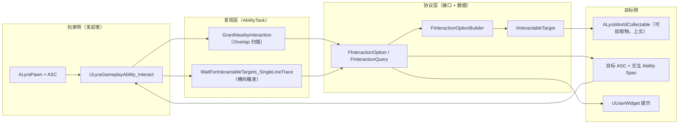
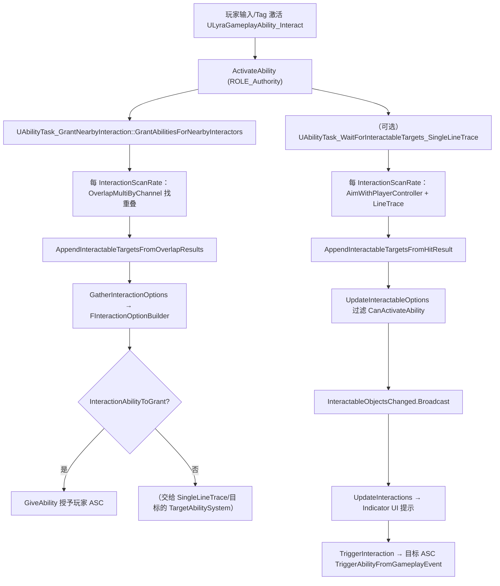

# UE5.8 Lyra 源码解析 52：交互系统源码

> 本篇完整分析 Lyra `Interaction` 模块（`Source\LyraGame\Interaction\`）的全部 17 个源文件：
> **接口层（IInteractableTarget / IInteractionInstigator）、数据层（InteractionOption / InteractionQuery）、工具层（InteractionStatics）、
> GAS 化交互的能力与任务层（GrantNearbyInteraction / WaitForInteractableTargets / 目标 Actor / 交互能力）**。
> 核心问题是：**Lyra 如何用"接口 + GAS 能力/任务"取代"每帧组件轮询"，把"发现目标 → 给出选项 → 提示 UI → 执行交互"做成可复用的能力管线**。
> 知识成熟度：L2（本机 UE 5.8 与 Lyra 5.8 源码、依赖关系已静态核对；运行态行为 / 蓝图资产接线列为待验证与已知缺口）。

## 元数据

| 项目 | 内容 |
| --- | --- |
| 版本基线 | UE 5.8.0 / CL 55116800 / `++UE5+Release-5.8` |
| Lyra 基线 | 本机 `LyraStarterGame.uproject`：`EngineAssociation=5.8` |
| 源码依据 | `LyraStarterGame\Source\LyraGame\Interaction`（根 7 个文件 + `Abilities\` 子目录 4 个 + `Tasks\` 子目录 6 个，共 17 个文件） |
| 适用范围 | 交互系统：可交互目标接口、发起者仲裁、交互选项/查询、静态助手、近距授予任务、逐帧追踪任务、交互目标 Actor、交互能力与持续时间交互消息 |
| 兼容性边界 | C++ 类名 / 接口 / 复制条件以其 5.8 版本为准；`#if ENABLE_DRAW_DEBUG`、`UE_INLINE_GENERATED_CPP_BY_NAME` 等宏分支原样保留；蓝图具体数据资产不在本文运行结论内 |
| 知识成熟度 | L2：C++ 静态核对完成；"持续时间交互消息"的生产端与蓝图交互目标实现需在编辑器运行中复核 |
| 官方参考 | [Gameplay Abilities](https://dev.epicgames.com/documentation/en-us/unreal-engine/gameplay-abilities-in-unreal-engine)、[Abilities in Lyra](https://dev.epicgames.com/documentation/en-us/unreal-engine/abilities-in-lyra-in-unreal-engine)、[Ability Tasks](https://dev.epicgames.com/documentation/en-us/unreal-engine/ability-tasks-in-unreal-engine) |
| 关联篇 | [05-GAS能力系统源码.md](./05-GAS能力系统源码.md)（原生 GAS 能力/任务地基）、[42-Lyra-输入GAS与武器战斗源码.md](./42-Lyra-输入GAS与武器战斗源码.md)、[43-Lyra-背包装备消息与UI源码.md](./43-Lyra-背包装备消息与UI源码.md)、[49-Lyra-UI控件与表现源码.md](./49-Lyra-UI控件与表现源码.md)、[51-Lyra-GAS扩展与能力费用源码.md](./51-Lyra-GAS扩展与能力费用源码.md) |
| 证据分级 | 见"二、证据分级"表 |
| 最后更新 | 2026-08-17（补入 ALyraWorldCollectable 生产侧实际源码分析） |

---

## 一、概述：为什么还需要第 52 篇

### 一.1 与 42/43/51 篇的分工

- **42 篇**讲了主战斗链（输入 → Ability → TargetData → 命中验证 → 伤害），也提到 `ALyraWeaponSpawner` 作为"地图捎带可拾取武器"的表现层，但**没进 `Interaction` 模块**。
- **43 篇**讲背包/装备/消息（Inventory FastArray、ItemDefinition、QuickBar、Equipment、GameplayMessageRouter、VerbMessage 协议），交互系统正是"拾取事件"的上游发现层，但 43 篇没展开"怎么发现拾取对象"。
- **51 篇**补 GAS 扩展（费用/属性集/治疗/Tag 关系/全局广播/Cue 管理），交互能力是 `ULyraGameplayAbility` 的又一个派生，复用 51 篇讲的 `ActivationPolicy/InstancingPolicy` 约定。
- **52 篇（本篇）** 独立覆盖 `Interaction` 模块：它是 **GAS 世界观的"入口/门禁"层**——不自己轮询组件，而是把"找出当前可交互对象"变成 `UAbilityTask`，把"能做什么"变成 `FInteractionOption`，把"执行"变成"在目标 ASC 上触发一个交互 Ability"。本篇把这些类逐个拆解，并回答复用范式问题。

### 一.2 本篇覆盖的文件地图（全部 17 个）

本机 `Source\LyraGame\Interaction` 的实际结构（根 + 两个子目录）：

| 文件 | 目录 | 类型 | 本篇章节 |
| --- | --- | --- | --- |
| `IInteractableTarget.h` | 根 | 接口 + 选项构建器 | 三 |
| `IInteractionInstigator.h` | 根 | 接口 | 三.3 |
| `InteractionOption.h` | 根 | 数据结构 | 四.1 |
| `InteractionQuery.h` | 根 | 数据结构 | 四.2 |
| `InteractionStatics.h/.cpp` | 根 | 工具层 | 五 |
| `LyraInteractionDurationMessage.h` | 根 | 消息结构 | 八 |
| `Abilities/GameplayAbilityTargetActor_Interact.h/.cpp` | Abilities | 目标 Actor | 六 |
| `Abilities/LyraGameplayAbility_Interact.h/.cpp` | Abilities | 交互能力 | 七 |
| `Tasks/AbilityTask_GrantNearbyInteraction.h/.cpp` | Tasks | 近距授予任务 | 六.2 |
| `Tasks/AbilityTask_WaitForInteractableTargets.h/.cpp` | Tasks | 追踪基类任务 | 六.4 |
| `Tasks/AbilityTask_WaitForInteractableTargets_SingleLineTrace.h/.cpp` | Tasks | 单线追踪变体 | 六.5 |

### 一.3 一句话结论（先览）

> **Lyra 的交互 = "接口声明能力 + 两种查询手段 + GAS 能力/任务驱动执行"**。`Interaction` 模块不引入任何"交互组件"，而是：
> 1. 用 `IInteractableTarget`（谁可以被交互）与 `IInteractionInstigator`（多方选项时谁来做仲裁）两个接口声明协议；
> 2. 用两个 `UAbilityTask`（近距 Overlap / 单线 Trace）做"发现"；
> 3. 发现结果汇成 `TArray<FInteractionOption>`，每个选项要么"授予交互能力给自己"、要么"在目标 ASC 上保留一个交互 Spec"；
> 4. 由 `ULyraGameplayAbility_Interact` 用 `UIndicatorDescriptor` 提示 UI，再在触发时把 `FGameplayEventData` 交给目标 ASC 完成执行。



> 图中文字为概念标注，非逐字节对照（详见各章节的"节选 / 逐字"区分）。

---

## 二、证据分级

| 等级 | 证据 | 本文用法 |
| --- | --- | --- |
| A | 本机 Lyra 5.8 的 `Source/LyraGame/Interaction` 全部 17 个源文件 | 作为类、函数、字段、复制条件与调用顺序的直接事实 |
| B | 本机 Lyra 5.8 其他模块（`Weapons/LyraWeaponSpawner`、`Physics/LyraCollisionChannels`）与 ShooterCore GameFeature（`LyraWorldCollectable`） | 作为交互接口的"真实生产侧/消费侧"接线与行为依据 |
| C | UE 5.8 引擎源码（GAS `UGameplayAbility`/`UAbilityTask`/`AGameplayAbilityTargetActor`、CommonUI、GameplayMessageSubsystem）与 Epic 官方文档 | 作为 `ActivateAbility/ReadyForActivation/TriggerAbilityFromGameplayEvent` 等引擎语义的依据 |

本文**不**把 `.uasset` 文件名推断成完整蓝图图表。交互目标在 DAG 资产中的 `FInteractionOption` 值、UI 提示 Widget 的父类与字段，需在 UE 编辑器中打开资产确认。

本文**不**把一次静态源码检索写成"已经通过 PIE"。正文中所有运行态表述均标注"待验证 / 已知缺口"。

---

## 三、接口层：`IInteractableTarget` 与 `IInteractionInstigator`

交互系统把"可交互"与"选最佳交互"抽象成两个纯 C++ 接口（均 `UINTERFACE(MinimalAPI, meta=(CannotImplementInterfaceInBlueprint))`），即**不可在蓝图里实现接口本体，只能继承 C++ 实现**。这是刻意设计：保证接口契约的规范性（签名固定），实现细节交 C++/蓝图子类。

### 三.1 `IInteractableTarget`：可交互目标契约

文件 `IInteractableTarget.h`（51 行）。接口本体只有两个虚函数：

```cpp
// 节选：Source/LyraGame/Interaction/IInteractableTarget.h
UINTERFACE(MinimalAPI, meta = (CannotImplementInterfaceInBlueprint))
class UInteractableTarget : public UInterface { GENERATED_BODY() };

class IInteractableTarget
{
public:
    virtual void GatherInteractionOptions(const FInteractionQuery& InteractQuery, FInteractionOptionBuilder& OptionBuilder) = 0;
    virtual void CustomizeInteractionEventData(const FGameplayTag& InteractionEventTag, FGameplayEventData& InOutEventData) { }
};
```

- **`GatherInteractionOptions`（纯虚，必须实现）**：目标对象在收到查询时，把自己"能干的事"填进 `FInteractionOptionBuilder`。这是交互系统的**核心入口**——"能交互"不是靠目标上的一个布尔标记，而是靠它当场产出若干 `FInteractionOption`（例如"拾取武器""打开门"）。
- **`CustomizeInteractionEventData`（带默认实现=空）**：执行前给目标一次机会改写 `FGameplayEventData`。源码注释给了具体例子：墙上的按钮想执行的是门上的能力，于是它可以在这里把 `Payload.Target` 覆盖成"门 Actor"。默认空实现 = 不改（保持 `Instigator`/`Target` 原值）。

**`FInteractionOptionBuilder`**（同文件，普通类）：构造时绑定 `Scope`（本次是哪个目标）与外部 `Options` 数组，`AddInteractionOption` 用 `Add_GetRef` 取出刚插入的条目并强制把 `InteractableTarget = Scope` 写回。即**选项一旦加入，自动带上"谁提供的"指针**，上层无需手动关联。

```cpp
// 节选：IInteractableTarget.h 中的选项构建器
FInteractionOptionBuilder(TScriptInterface<IInteractableTarget> InterfaceTargetScope, TArray<FInteractionOption>& InteractOptions)
    : Scope(InterfaceTargetScope), Options(InteractOptions) {}

void AddInteractionOption(const FInteractionOption& Option)
{
    FInteractionOption& OptionEntry = Options.Add_GetRef(Option);
    OptionEntry.InteractableTarget = Scope;   // 自动回填目标
}
```

### 三.2 静态核实 / 事实校正

任务预期的"可交互目标接口可能含 `CanBeInteracted / Interact / EndInteraction`"在**本机 5.8 源码中不存在**。实际只有 `GatherInteractionOptions` + `CustomizeInteractionEventData` 两个虚函数。Lyra 刻意把"交互"窄化为"产出选项 + 允许改写事件数据"，具体执行统一交给 GAS 能力，界面接口更薄、更聚焦于复用。该结论属静态核对，不是运行验证。

### 三.3 `IInteractionInstigator`：多方选项的仲裁者

文件 `IInteractionInstigator.h`（31 行）。头注释明确了适用场景：**有些游戏会在"有多个可交互对象"时让玩家弹菜单挑选**；当你的 `ULyraGameplayAbility_Interact` 子类产生了不止一个选项时，实现此接口的对象负责 `ChooseBestInteractionOption` 选出一个。

```cpp
// 节选：Source/LyraGame/Interaction/IInteractionInstigator.h
class IInteractionInstigator
{
public:
    /** Will be called if there are more than one InteractOptions that need to be decided on. */
    virtual FInteractionOption ChooseBestInteractionOption(
        const FInteractionQuery& InteractQuery, const TArray<FInteractionOption>& InteractOptions) = 0;
};
```

**关键点（静态核实）**：
- 该接口**只声明、不消费**——在本机 `Source/LyraGame` 的 C++ 中没有任何调用点调用 `ChooseBestInteractionOption`（见五、七章）。它是一块**保留的扩展点**，实际触发"二选一"的分支可能在蓝图/特殊交互能力子类中接线。
- 它是 **`CannotImplementInterfaceInBlueprint` 但不能办在蓝图**的又一个例子；接口做协议约束，实现留给 C++ 派生。

> **已知缺口（L2 边界）**：`IInteractionInstigator` 因无 C++ 调用点，其"何时被调用、选择如何参与流程"在本机静态扫描里缺一条"生产侧证据"。本文将其定位为"留作子类扩展的仲裁接口"，不把未接线当成运行事实。

---

## 四、数据层：`FInteractionOption` 与 `FInteractionQuery`

两个都是 `USTRUCT(BlueprintType)`，让交互数据能进蓝图数据表并能被 `TArray` 复用。

### 四.1 `FInteractionOption`：一次"可做的交互"

文件 `InteractionOption.h`（82 行）。结构分四组字段（见附录逐字）：

| 分组 | 字段 | 类型 | 说明 |
| --- | --- | --- | --- |
| 目标 | `InteractableTarget` | `TScriptInterface<IInteractableTarget>` | 由 `FInteractionOptionBuilder` 自动回填的"谁提供的"指针 |
| 文本 | `Text` / `SubText` | `FText` | 简单文案，供 UI 显示 |
| **方法①（给自己）** | `InteractionAbilityToGrant` | `TSubclassOf<UGameplayAbility>` | 靠近交互对象时**授予到玩家 ASC** 的能力类 |
| **方法②（给目标）** | `TargetAbilitySystem` + `TargetInteractionAbilityHandle` | `TObjectPtr<UAbilitySystemComponent>` + `FGameplayAbilitySpecHandle` | 在目标 ASC 上"现成"的交互 Ability Spec，直接激活 |
| UI | `InteractionWidgetClass` | `TSoftClassPtr<UUserWidget>` | 该交互要显示的提示 Widget 类 |

**两种执行方式（源码注释)明确写成方法①或方法②二选一）**：
- **方法①授予自己**：`InteractionAbilityToGrant` 非空 → 任务层把该 Ability 授予玩家（见六.2），再由玩家侧在执行时激活。
- **方法②作用于目标**：`TargetAbilitySystem`/`TargetInteractionAbilityHandle` 有效 → 执行时在**目标对象自己的 ASC** 上 `TriggerAbilityFromGameplayEvent`（见七），适合"门/按钮有独立 ASC 与交互能力"的物件。

`operator==` 比较除 `Text/SubText` 外的全部能力相关字段 + `Text.IdenticalTo/SubText.IdenticalTo`（忽略 FText 区域性差异的严格文本比较）；`operator<` 只按 `InteractableTarget.GetInterface()` 指针排序，供"选项是否变化"的稳定性排序使用（见六.4）。

### 四.2 `FInteractionQuery`：一次查询的上下文

文件 `InteractionQuery.h`（28 行）：

```cpp
// 节选：Source/LyraGame/Interaction/InteractionQuery.h
USTRUCT(BlueprintType)
struct FInteractionQuery
{
    UPROPERTY(BlueprintReadWrite) TWeakObjectPtr<AActor>    RequestingAvatar;      // 请求方 Pawn
    UPROPERTY(BlueprintReadWrite) TWeakObjectPtr<AController> RequestingController; // 请求方控制器（可不等于 Avatar 的 owner）
    UPROPERTY(BlueprintReadWrite) TWeakObjectPtr<UObject>   OptionalObjectData;    // 附加数据槽
};
```

- 用 `TWeakObjectPtr`（弱引用）避免查询对象在任务存活期内把目标"拖住"。
- `OptionalObjectData` 是通用附加数据槽：任何需要传进目标 `GatherInteractionOptions` 的额外上下文都可以塞，字段类型为 `UObject*`（泛化共享）。

---

## 五、工具层：`UInteractionStatics`

文件 `InteractionStatics.h/.cpp`（36 + 86 行）：一个 `UBlueprintFunctionLibrary`，提供四个静态函数，都被 SELF 或上层任务反复使用：

| 函数 | 可蓝图调用 | 作用 | 关键逻辑 |
| --- | --- | --- | --- |
| `GetActorFromInteractableTarget` | ✅ | 把 `TScriptInterface<IInteractableTarget>` 解析成 `AActor*` | **静态核实更正**：`IInteractableTarget.h` 中定义的理论上是"强制返回非空"，但 `.cpp` 实际写：UObject 是 `AActor` → 直接返回；是 `UActorComponent` → `GetOwner()`；否则 `unimplemented()` 并返回 nullptr。**不直接返回 `InteractableTarget` GET** |
| `GetInteractableTargetsFromActor` | ✅ | 由 `AActor*` 找出所有可交互目标 | 自身实现了接口→加入；否则用 `GetComponentsByInterface(UInteractableTarget::StaticClass())` 找组件 |
| `AppendInteractableTargetsFromOverlapResults` | ❌（C++ 专用） | 从 `TArray<FOverlapResult>` 追加重叠目标 | 对每个重叠结果的 Actor 与 Component 分别判接口，`AddUnique` 去重 |
| `AppendInteractableTargetsFromHitResult` | ❌（C++ 专用） | 从 `FHitResult` 追加重叠目标 | 同上，作用于 `HitResult.GetActor()/GetComponent()` |

**重要澄清**：`.h` 头文件里 `GetActorFromInteractableTarget` 的注释写的是"返回接口背后的 Actor；若对象既不是 Actor 也不是组件，则强制 return 一个非空结果"，但**`.cpp` 主体与注释不符**：落到底部 `return nullptr`。本文以 `.cpp` 实际行为为准（A 级证据），并提示这是头注释与实现不一致的一处典型陷阱。

这些工具的复用价值在于：**把"TScriptInterface ↔ AActor / 通过组件向 Actor 收敛"这类易错转换收敛到一处**，能力任务只负责"给出 Overlap/Hit，向 `Append...` 询问目标"，不必自己写 Cast 与 `GetOwner()` 逻辑。

---

## 六、能力与任务层：GAS 化交互的核心范式

### 六.1 总的调用骨架（先看）

`ULyraGameplayAbility_Interact` 激活后（仅 Authority，见七）创建 `UAbilityTask_GrantNearbyInteraction` 扫描，同时（在 DAG 场景中）可能也挂 `UAbilityTask_WaitForInteractableTargets_SingleLineTrace` 做准星追踪。这两类任务都做同一件事：**周期性地把"当前可交互目标"收敛成备选，过滤成 `FInteractionOption` 数组，通过 `InteractableObjectsChanged` 委托广播**。能力层拿到数组后，要么做 UI 提示，要么在收到"交互触发"时取第一个选项执行。



> 图上 C6 表示：近距任务**只**处理"授予自己"分支；"目标 ASC 现成交互"分支由 `UpdateInteractableOptions` 处理并过滤 `CanActivateAbility` 后才广播。两者在生产路径上互补（后续小节展开）。

### 六.2 `UAbilityTask_GrantNearbyInteraction`：近距 Overlap 授予能力

文件 `Tasks/AbilityTask_GrantNearbyInteraction.h/.cpp`（37 + 95 行）。

**静态创建**（蓝图可调，`HiddenPin/DefaultToSelf` F 化）：

```cpp
// 节选（逐字核对）：AbilityTask_GrantNearbyInteraction.h
UFUNCTION(BlueprintCallable, Category="Ability|Tasks",
    meta = (HidePin="OwningAbility", DefaultToSelf="OwningAbility", BlueprintInternalUseOnly="TRUE"))
static UAbilityTask_GrantNearbyInteraction* GrantAbilitiesForNearbyInteractors(
    UGameplayAbility* OwningAbility, float InteractionScanRange, float InteractionScanRate);
```

- `InteractionScanRange`/`InteractionScanRate` 默认为 `100` / `0.1`（秒/次），但被 `ULyraGameplayAbility_Interact` 的实际传参覆盖（见七：该能力把 `InteractionScanRange = 500`、`InteractionScanRate = 0.1` 传进来）。

**生命周期**：
- `Activate()` → `SetWaitingOnAvatar()`；用世界 `TimerManager` 开 `InteractionScanRate` 的**循环定时器**跑 `QueryInteractables`。
- `OnDestroy()` → `ClearTimer` 清定时器。即任务一结束自动停止扫描。

**`QueryInteractables`（核心）**：
1. 取 `GetVertical()`/`GetAvatarActor()`；用 `OverlapMultiByChannel` 在 Avatar 位置做**球形通道扫描**：通道 `Lyra_TraceChannel_Interaction`（`LyraCollisionChannels.h` 定义 = `ECC_GameTraceChannel1`），半径 `InteractionScanRange`。
2. `AppendInteractableTargetsFromOverlapResults` 收敛目标。
3. 构造 `FInteractionQuery`（`RequestingAvatar`=Avatar，`RequestingController`=`Cast<AController>(ActorOwner->GetOwner())`——*提示：`GetOwner()` 对 Pawn 通常返回其 Controller*）。
4. 逐个目标 `GatherInteractionOptions(query, builder)` 收集 `Options`。
5. **关键**：对每个 `InteractionAbilityToGrant` 非空的选项，用 `FObjectKey`（能力类）做缓存 `InteractionAbilityCache`；未缓存过就 `GiveAbility` 授予到 `AbilitySystemComponent`（所有者 ASC），并把 SpecHandle 记入缓存。

> **静态核实更正**：`IssueAbilityToNearbyInteractors` 这一中间函数名**不存在**（任务预期可能据此命名）；实际只有 `QueryInteractables`。此外它**只做"授予自己"，不处理目标 ASC 现成交互**——后者由 `WaitForInteractableTargets` 的 `UpdateInteractableOptions` 承担，两条路径职责互补。

### 六.3 `AGameplayAbilityTargetActor_Interact`：交互目标 Actor 基类

文件 `Abilities/GameplayAbilityTargetActor_Interact.h/.cpp`（25 + 57 行）：继承引擎 `AGameplayAbilityTargetActor_Trace`，是"所有交互目标 Actor 的中间基类"，核心只重写 `PerformTrace`。

```cpp
FHitResult AGameplayAbilityTargetActor_Interact::PerformTrace(AActor* InSourceActor)
{
	bool bTraceComplex = false;
	TArray<AActor*> ActorsToIgnore;

	ActorsToIgnore.Add(InSourceActor);

	FCollisionQueryParams Params(
		SCENE_QUERY_STAT(AGameplayAbilityTargetActor_SingleLineTrace), bTraceComplex);
	Params.bReturnPhysicalMaterial = true;
	Params.AddIgnoredActors(ActorsToIgnore);

	FVector TraceStart = StartLocation.GetTargetingTransform().GetLocation();
	FVector TraceEnd;
	AimWithPlayerController(InSourceActor, Params, TraceStart, TraceEnd);

	FHitResult ReturnHitResult;
	LineTraceWithFilter(ReturnHitResult, InSourceActor->GetWorld(), Filter,
		TraceStart, TraceEnd, TraceProfile.Name, Params);
	if (!ReturnHitResult.bBlockingHit)
	{
		ReturnHitResult.Location = TraceEnd;
	}
	if (AGameplayAbilityWorldReticle* LocalReticleActor = ReticleActor.Get())
	{
		const bool bHitActor = ReturnHitResult.bBlockingHit && ReturnHitResult.HitObjectHandle.IsValid();
		const FVector ReticleLocation = (bHitActor && LocalReticleActor->bSnapToTargetedActor)
			? FLightWeightInstanceSubsystem::Get().GetLocation(ReturnHitResult.HitObjectHandle)
			: ReturnHitResult.Location;
		LocalReticleActor->SetActorLocation(ReticleLocation);
		LocalReticleActor->SetIsTargetAnActor(bHitActor);
	}

#if ENABLE_DRAW_DEBUG
	if (bDebug)
	{
		DrawDebugLine(GetWorld(), TraceStart, TraceEnd, FColor::Green);
		DrawDebugSphere(GetWorld(), TraceEnd, 100.0f, 16, FColor::Green);
	}
#endif // ENABLE_DRAW_DEBUG
	return ReturnHitResult;
}
```

- 复用 `AGameplayAbilityTargetActor_Trace` 的 `Filter`/`TraceProfile`/`AimWithPlayerController`/Reticle 行为，只强化"把交互当作一条普通瞄准射线处理"。
- Reticle（瞄准标）分支用 `AGameplayAbilityWorldReticle`：命中有效 Actor 且 `bSnapToTargetedActor` 时用 `FLightWeightInstanceSubsystem::Get().GetLocation` 取位置；否则用命中位置，并 `SetIsTargetAnActor(bHitActor)`。
- `#if ENABLE_DRAW_DEBUG` 里 `bDebug` 画绿线 + 绿球，用于调试。该宏分支原样保留。

### 六.4 `UAbilityTask_WaitForInteractableTargets`（抽象基类）

文件 `Tasks/AbilityTask_WaitForInteractableTargets.h/.cpp`（46 + 179 行）。`UCLASS(Abstract)`，不直接实例化，提供共享的追踪/判定逻辑：

- **公开委托**：`FInteractableObjectsChangedEvent`（`InteractableObjectsChanged`，`TArray<FInteractionOption>` 单参动态多播）——"当前可交互选项变了"就广播，供能力层监听。
- **受保护工具**：
  - `LineTrace`：`LineTraceMultiByProfile` 取 `HitResults[0]`（首个阻挡），填充 `TraceStart/TraceEnd`。
  - `AimWithPlayerController`：从 `Ability->GetCurrentActorInfo()->PlayerController` 取玩家视角点，用相机射线**按能力范围截断**，据此反推最终瞄准方向；`bTraceAffectsAimPitch` 为 false 且命中时，把原方向 pitch 还原（避免准星上下偏时改变瞄准俯仰）。
  - `ClipCameraRayToAbilityRange`：把相机点/方向裁剪到"以 AbilityCenter 为球心、Range 为半径"的球上，得到被球面包住的瞄准终点（`DistanceSquared <= RadiusSquared` 才裁剪成功）。
  - `UpdateInteractableOptions`：核心过滤函数（见下）。
- **受保护字段**：`TraceProfile`（`FCollisionProfileName`）、`bTraceAffectsAimPitch=true`、`CurrentOptions` 缓存。

**`UpdateInteractableOptions`（重点，179 行文件的核心价值）**：
1. 对每个 `TScriptInterface<IInteractableTarget>` 调 `GatherInteractionOptions` 收集 `TempOptions`。
2. 对每个 `TempOption`：
   - 若 `TargetAbilitySystem && TargetInteractionAbilityHandle.IsValid()` → `FindAbilitySpecFromHandle` 找**目标 ASC** 上的 Spec（方法②）。
   - 否则若有 `InteractionAbilityToGrant` → `FindAbilitySpecFromClass` 找**玩家 ASC** 上的 Spec（方法①，此时 `InteractionAbilityToGrant` 已被六.2 授予过）；找到后**就地更新** Option 的 `TargetAbilitySystem`/`TargetInteractionAbilityHandle` 指向这个 Spec。
   - 找到 Spec 后再用 `Spec->Ability->CanActivateAbility(Handle, AbilityActorInfo)` 过滤：**现在激活不了的选项直接丢**（例如正在冷却/费用不足）。
3. 判定 `bOptionsChanged`：选项**数量变化**，或按 `operating<`（`InteractableTarget` 指针）排序后逐条 `!=` 比较发现不同。
4. 变化才 `CurrentOptions = NewOptions` 并 `InteractableObjectsChanged.Broadcast(CurrentOptions)`——**避免每帧重复广播相同选项**，这就是 `operator==/operator<` 存在的意义。

### 六.5 `UAbilityTask_WaitForInteractableTargets_SingleLineTrace`：单线追踪变体

文件 `Tasks/AbilityTask_WaitForInteractableTargets_SingleLineTrace.h/.cpp`（43 + 92 行）。继承六.4 基类，把目标发现方式定为"准星单线追踪"。

- 静态创建 `WaitForInteractableTargets_SingleLineTrace(...)：FInteractionQuery, FCollisionProfileName TraceProfile, FGameplayAbilityTargetingLocationInfo StartLocation, InteractionScanRange=100, InteractionScanRate=0.1, bShowDebug=false`。
- `Activate()` 开循环定时器跑 `PerformTrace`；`OnDestroy()` 清定时器。
- `PerformTrace()`：
  - `AimWithPlayerController(AvatarActor, ..., TraceStart, InteractionScanRange, OUT TraceEnd)` 得到从 `StartLocation` 出发、按玩家视角指向、长度为 `InteractionScanRange` 的终点。
  - `LineTrace(OutHitResult, World, TraceStart, TraceEnd, TraceProfile.Name, Params)` 命中。
  - `AppendInteractableTargetsFromHitResult` 收敛目标。
  - `UpdateInteractableOptions(InteractionQuery, InteractableTargets)` 过滤 + 广播。
  - `#if ENABLE_DRAW_DEBUG` + `bShowDebug`：命中画红、未命中画绿线/球，作为调试可视化。

> **两任务的区别**：`GrantNearbyInteraction` 用**球形 Overlap**（适合"走近就能交互"），只授予能力不广播选项；`SingleLineTrace` 用**准星射线**（适合"瞄准才能交互"），产出并广播 `FInteractionOption`。两者都在 `Activate` 里 `SetWaitingOnAvatar()`，都通过定时器剥离能力生命周期。

---

## 七、`ULyraGameplayAbility_Interact`：执行交互的入口

文件 `Abilities/LyraGameplayAbility_Interact.h/.cpp`（56 + 123 行）。`UCLASS(Abstract)` 继承 `ULyraGameplayAbility`，是"角色执行交互"的能力。

### 七.1 构造策略（衔接 51 篇的 GAS 配置约定）

```cpp
// 节选（逐字核对）：构造
ActivationPolicy  = ELyraAbilityActivationPolicy::OnSpawn;      // 出生即挂载（OnSpawn）
InstancingPolicy  = EGameplayAbilityInstancingPolicy::InstancedPerActor; // 每 Actor 一个实例
NetExecutionPolicy= EGameplayAbilityNetExecutionPolicy::LocalPredicted;  // 本地预测
```

**字段**：`CurrentOptions`（`TArray<FInteractionOption>`，BlueprintReadWrite）、`Indicators`（`TArray<TObjectPtr<UIndicatorDescriptor>>`，追踪当前提示）；`InteractionScanRate=0.1f`、`InteractionScanRange=500`、`DefaultInteractionWidgetClass`（编辑默认值）。

### 七.2 `ActivateAbility`

```cpp
// 节选（逐字核对）：ActivateAbility
Super::ActivateAbility(Handle, ActorInfo, ActivationInfo, TriggerEventData);
UAbilitySystemComponent* AbilitySystem = GetAbilitySystemComponentFromActorInfo();
if (AbilitySystem && AbilitySystem->GetOwnerRole() == ROLE_Authority)
{
    UAbilityTask_GrantNearbyInteraction* Task =
        UAbilityTask_GrantNearbyInteraction::GrantAbilitiesForNearbyInteractors(this, InteractionScanRange, InteractionScanRate);
    Task->ReadyForActivation();
}
```

**注意（静态核实）**：`ActivateAbility` 只在 `ROLE_Authority` 启动近距授予任务（服务器决定授予谁能力，保证一致性）；但能力自身 `NetExecutionPolicy = LocalPredicted`（本地预测激活、服务器确认）。LocalPredicted 加上 Activate 的 Authority 判断，避免在客户端凭空授予。

### 七.3 `UpdateInteractions`：把选项变成 UI 提示

- 取 `ALyraPlayerController`（`GetLyraPlayerControllerFromActorInfo`），通过 `ULyraIndicatorManagerComponent::GetComponent(PC)` 拿指示器管理器。
- 先把 `Indicators` 里所有 `UIndicatorDescriptor` 从管理器移除并 `Reset()`（**全量清空重建**）。
- 遍历每个 `FInteractionOption`：
  - `GetActorFromInteractableTarget` 得到目标 Actor。
  - `InteractionWidgetClass` 为空则用 `DefaultInteractionWidgetClass` 兜底。
  - 新建 `UIndicatorDescriptor`：`SetDataObject(Actor)`、`SetSceneComponent(Actor->GetRootComponent())`、`SetIndicatorClass(WidgetClass)`，`AddIndicator` 到管理器，加入 `Indicators`。
- 否则（拿不到管理器）走到 `//TODO` 注释：警告"在永远无法消费交互的 PC 上调更新"。
- 最后 `CurrentOptions = InteractiveOptions`。
- 衔接 **49 篇**：提示表现完全走 `IndicatorSystem`（`UIndicatorDescriptor` + `ULyraIndicatorManagerComponent`，附录文件 7/8），交互模块只负责"造描述符、挂到目标根组件、指定 Widget 类"，绘制由 IndicatorSystem 处理。

### 七.4 `TriggerInteraction`：真正执行

```cpp
// 节选（逐字核对）：TriggerInteraction 核心
if (CurrentOptions.Num() == 0) return;
const FInteractionOption& InteractionOption = CurrentOptions[0];  // 取第一个选项

FGameplayEventData Payload;
Payload.EventTag = TAG_Ability_Interaction_Activate;      // "Ability.Interaction.Activate"
Payload.Instigator = GetAvatarActorFromActorInfo();
Payload.Target = UInteractionStatics::GetActorFromInteractableTarget(InteractionOption.InteractableTarget);

// 给目标一次改写事件数据的机会（可把 Target 换掉，如按钮→门）
InteractionOption.InteractableTarget->CustomizeInteractionEventData(TAG_Ability_Interaction_Activate, Payload);

AActor* TargetActor = const_cast<AActor*>(ToRawPtr(Payload.Target));
FGameplayAbilityActorInfo ActorInfo;
ActorInfo.InitFromActor(InteractableTargetActor, TargetActor, InteractionOption.TargetAbilitySystem);

const bool bSuccess = InteractionOption.TargetAbilitySystem->TriggerAbilityFromGameplayEvent(
    InteractionOption.TargetInteractionAbilityHandle, &ActorInfo,
    TAG_Ability_Interaction_Activate, &Payload, *InteractionOption.TargetAbilitySystem);
```

- **取 `CurrentOptions[0]`**：即"默认执行第一个可交互选项"。这解释了 `IInteractionInstigator::ChooseBestInteractionOption` 的保留价值——若你做的交互能力想"出现菜单/n 选一"，就在这里替换 `[0]` 的选择逻辑。
- `Payload.EventTag` = `TAG_Ability_Interaction_Activate`，在 `.cpp` 顶部用 `UE_DEFINE_GAMEPLAY_TAG_STATIC(TAG_Ability_Interaction_Activate, "Ability.Interaction.Activate")` 定义。
- `CustomizeInteractionEventData`：调用点唯一出现处（五、三.1 说明的"唯一消费点"）。
- 用 `TriggerAbilityFromGameplayEvent` + 事件 Tag 在**目标 ASC** 上触发交互能力——交互由此与 GAS 事件驱动无缝衔接。

---

## 八、持续时间交互消息：`FLyraInteractionDurationMessage`（衔接 43 篇）

文件 `Interaction/LyraInteractionDurationMessage.h`（24 行）：

```cpp
// 节选（逐字核对）：LyraInteractionDurationMessage.h
UE_DECLARE_GAMEPLAY_TAG_EXTERN(TAG_INTERACTION_DURATION_MESSAGE);

USTRUCT(BlueprintType)
struct FLyraInteractionDurationMessage
{
    UPROPERTY(BlueprintReadWrite) TObjectPtr<AActor> Instigator = nullptr;
    UPROPERTY(BlueprintReadWrite) float Duration = 0;
};
```

- 在 `LyraGameplayAbility_Interact.cpp` 顶部定义 tag：`UE_DEFINE_GAMEPLAY_TAG(TAG_INTERACTION_DURATION_MESSAGE, "Ability.Interaction.Duration.Message")`。
- 语义：支持**持续时间交互**（持续按住收集进度条）时，发起方通过该 Tag 频道广播 `FLyraInteractionDurationMessage`，告知"哪位 Instigator、交互持续时间多长"，供 UI 收集进度提示/被打断提示消费（衔接 **43 篇**的 `UGameplayMessageSubsystem` 进程内消息协议：`BroadcastMessage<FLyraInteractionDurationMessage>(TAG,...)` → 监听者按 Tag 收取 USTRUCT）。

**已知缺口（L2 边界，A 级证据）**：本机全仓静态检索（`Source/LyraGame`、`Plugins/`）中，**没有任何 C++ 广播 `FLyraInteractionDurationMessage`** 的产生端——只有声明、tag 定义与结构定义。可推断其生产端和消费端（Widget 上的进度条/中断提示）落在蓝图/DAG 资产中。本文因此只作为"消息协议契约定为待蓝图验证"，不把"持续时间交互已在 X 端触发"写成事实。这与 43 篇"GameplayMessage 在本地进程内按 Tag + USTRUCT 路由"的机制一致。

---

## 九、完整链路与真实接线核对

### 九.1 真实 C++ 生产/消费点（A 级证据）

`Interaction` 模块内部闭环清晰，但**生产侧 IInteractableTarget 的实现者不在本模块内**。全仓静态检索 `GatherInteractionOptions` 的 override：

| 侧 | 类 | 位置 | 说明 |
| --- | --- | --- | --- |
| 生产（被查询方） | `ALyraWorldCollectable` | `Plugins/GameFeatures/ShooterCore/.../ShooterCoreRuntime/Public/LyraWorldCollectable.h` | `AActor, public IInteractableTarget, public IPickupable`；持有 `FInteractionOption Option`，`GatherInteractionOptions` 里 `InteractionBuilder.AddInteractionOption(Option)`（一行）；`GetPickupInventory()` 返回 `StaticInventory` |
| 生产（地图武器生成器） | `ALyraWeaponSpawner` | `Source/LyraGame/Weapons/LyraWeaponSpawner.h` | **本机 5.8 中它未直接实现 `IInteractableTarget`**；它用 `UCapsuleComponent` 触发 `OnOverlapBegin`，靠 `GiveWeapon` 把 `ULyraInventoryItemDefinition` 交给玩家背包（见 42 篇 46.5） |

> **事实校正 1（重要）**：任务背景中"LyraWeaponSpawner 实现 IInteractableTarget"在本机 5.8 中**不成立**。真正以 C++ 实现 `IInteractableTarget` 的是 ShooterCore 插件的 `ALyraWorldCollectable`（单行 `AddInteractionOption(Option)`，把 `FInteractionOption` 配置暴露为可编辑字段）。`ALyraWeaponSpawner` 仍走"胶囊体 OnOverlap + GiveWeapon"的旧式拾取路径。若某武器拾取在 DAG 里用交互系统实现，那是在蓝图资产里配置的 `ALyraWorldCollectable` 子类/世界摆放，非本机 C++ 断言。

> **事实校正 2（重要）**：任务背景给的接口方法名单 `CanBeInteracted / Interact / EndInteraction` 在本机 5.8 中**不存在**。实际为 `GatherInteractionOptions`（纯虚）+ `CustomizeInteractionEventData`（空默认）。执行统一走"能力激活"，接口刻意不加"交互进行中"状态钩子。

`ALyraWorldCollectable` 的生产侧现在补入实际源码。它不是一个只在表格里出现的类，而是把编辑器配置的 `FInteractionOption` 和 `FInventoryPickup` 原样暴露给交互查询与拾取系统：

```cpp
UCLASS(Abstract, Blueprintable)
class ALyraWorldCollectable : public AActor,
	public IInteractableTarget,
	public IPickupable
{
	GENERATED_BODY()

public:
	ALyraWorldCollectable();
	virtual void GatherInteractionOptions(
		const FInteractionQuery& InteractQuery,
		FInteractionOptionBuilder& InteractionBuilder) override;
	virtual FInventoryPickup GetPickupInventory() const override;

protected:
	UPROPERTY(EditAnywhere)
	FInteractionOption Option;

	UPROPERTY(EditAnywhere)
	FInventoryPickup StaticInventory;
};
```

实现只有两处，但正好是跨模块接线的关键：

```cpp
void ALyraWorldCollectable::GatherInteractionOptions(
	const FInteractionQuery& InteractQuery,
	FInteractionOptionBuilder& InteractionBuilder)
{
	InteractionBuilder.AddInteractionOption(Option);
}

FInventoryPickup ALyraWorldCollectable::GetPickupInventory() const
{
	return StaticInventory;
}
```

因此交互模块的 `Gather → FInteractionOption → TriggerAbilityFromGameplayEvent` 与 43 篇的背包授予之间有了实际 C++ 生产端证据；`ALyraWeaponSpawner` 则继续走自己的 Overlap/`GiveWeapon` 路径，不能把两者混为一谈。

### 九.2 完整 mermaid 链路（概念标注）

```mermaid
flowchart TB
    subgraph P["玩家（Instigator 侧）"]
        PA["ALyraPawn · ASC\n(ULyraGameplayAbility_Interact, OnSpawn/LocalPredicted)"]
        PB["ALyraPlayerController ·\nULyraIndicatorManagerComponent"]
    end
    subgraph D["发现层 AbilityTask"]
        D1["GrantNearbyInteraction\n(Overlap, Lyra_TraceChannel_Interaction)"]
        D2["WaitForInteractableTargets_SingleLineTrace\n(准星射线 + AimWithPlayerController)"]
    end
    subgraph T["目标侧"]
        T1["ALyraWorldCollectable\n(IInteractableTarget + IPickupable)"]
        T2["目标 ASC\n(交互 Ability Spec / FInteractionOption 方法②)"]
        T3["UUserWidget 提示（IndependentSystem）"]
    end
    PA -->|ActivateAbility·Authority| D1
    PA -->|可选| D2
    D1 -->|Overlap → Append→Gather| T1
    D2 -->|HitResult → Append→Gather| T1
    D1 -->|InteractionAbilityToGrant → GiveAbility| PA
    D2 -->|UpdateInteractableOptions 过滤 CanActivateAbility| T2
    D2 -->|InteractableObjectsChanged| PB
    T1 -->|AddInteractionOption(Option)| T2
    D2 -->|FInteractionOption[]| T3
    PB -->|UpdateInteractions 建 IndicatorDescriptor| T3
    PA -->|TriggerInteraction→TriggerAbilityFromGameplayEvent| T2
    T2 -->|执行交互能力| T1
```

### 九.3 与 42/43/49/51 篇的衔接

- **42 篇**：`ALyraWeaponSpawner` 是"地图可拾取武器的表现层"，本文在九.1 澄清其拾取不依赖 `IInteractableTarget`；交互系统与武器战斗的会合点是——拾取动作若改走交互，其 `FInteractionOption.InteractionAbilityToGrant` 会授予一个"拾取武器"能力，该能力的 PutToBackpack 再接 43 篇背包。
- **43 篇**：`CustomizeInteractionEventData` 允许改写执行目标；持续时间交互用 `FLyraInteractionDurationMessage` 走 43 篇的 `UGameplayMessageSubsystem` 消息协议（Tag 频道 + USTRUCT 载荷）。
- **49 篇**：`ULyraGameplayAbility_Interact::UpdateInteractions` 直接复用 49 篇的 `UIndicatorDescriptor`/`ULyraIndicatorManagerComponent`，交互模块不自己画 UI。
- **51 篇**：交互能力复用 51 篇 GAS 配置约定（`OnSpawn`/`InstancedPerActor`/`LocalPredicted`），且作为 `ULyraGameplayAbility` 派生可再挂 `AdditionalCosts` 等费用扩展。

---

## 十、复用范式总结：为什么"接口 + GAS 能力/任务"，而不是组件轮询

> 本节结论基于 17 个文件 + 生产侧接线（A/B 级证据）的静态归纳，运行态成本对比标注"待验证"。

| 维度 | "组件轮询"传统做法 | Lyra 的"接口 + GAS 能力/任务" |
| --- | --- | --- |
| 谁发现 | 每个 Actor 挂一个 Timer/每帧 Tick 扫自己的碰撞 | `UAbilityTask` 挂在能力生命周期内，用定时器 + `OverlapMultiByChannel` / 射线集中扫描 |
| 发现半径/通道 | 写死在组件或参数 | 能力 `EditDefaultsOnly` 的 `InteractionScanRange` + 全局碰撞通道 `Lyra_TraceChannel_Interaction` |
| 能做什么 | 目标硬编码一个"交互入口" | 目标实现 `GatherInteractionOptions` **当场产出 N 个 `FInteractionOption`**，可同时"拾取/打开/查看" |
| 谁执行 | 目标自身的组件方法 | **统一进 GAS**：`GiveAbility`（方法①）或目标 ASC `TriggerAbilityFromGameplayEvent`（方法②）。能力带来价格/冷却/预测/服务器校验全套 |
| 多方选择 | 轮询时报第一个/需要自写菜单 | 保留 `IInteractionInstigator::ChooseBestInteractionOption` 仲裁点 |
| 提示 UI | 每目标一个 Widget 组件常驻 | `ULyraIndicatorManagerComponent` 动态增删 `UIndicatorDescriptor`，选项变化才重建 |
| 复用 / 改动成本 | 新交互要改组件 + 写死逻辑 | 新目标只需实现/复用 `IInteractableTarget` + 配置 `FInteractionOption`；新发现方式只需新增一个 `UAbilityTask` 派生 |

**为什么这样设计**（归纳）：
1. **能力即执行载体**——交互的"能否激活/扣费/预测/服务器权威"全部交给 GAS 既有机制，接口层不必重复造轮子，这也是 Lyra 全项目（武器、跳跃、复位）的通行思路。
2. **任务即发现载体**——UAbilityTask 天然绑定能力生命周期（`SetWaitingOnAvatar` + 定时器 + `OnDestroy` 清理），无需组件关注"交互何时结束"。
3. **接口只做"声明 + 产出选项"**——把"可交互"从状态位提升为"能力清单"，且 `FInteractionOptionBuilder` 自动维护"选项↔目标"关联，规避接口与数据不同步。
4. **UI 完全解耦**——`FInteractionOption` 携带 `InteractionWidgetClass`，提示通过 IndicatorSystem 呈现，交互逻辑不碰 UMG。

> **已知成本（待验证）**：每次扫描的 `OverlapMultiByChannel`/射线 + 每选项 `CanActivateAbility` 过滤有一定 CPU 开销；Lyra 用 `InteractionScanRate` 节流 + `bOptionsChanged` 去重（`operator==/operator<`）缓解。该对比的运行时数字本机未测，仅为静态设计权衡。

---

## 十一、术语速查

| 术语 | 出处 | 含义 |
| --- | --- | --- |
| `IInteractableTarget` | 接口层 | 可交互目标契约：`GatherInteractionOptions` + `CustomizeInteractionEventData` |
| `FInteractionOptionBuilder` | 接口层 | 把选项回填 `InteractableTarget` 的构建器 |
| `IInteractionInstigator` | 接口层 | 多方选项仲裁者：`ChooseBestInteractionOption`（保留扩展） |
| `FInteractionOption` | 数据层 | 一次"可做的交互"：能力给谁 + 文本 + UI Widget |
| `FInteractionQuery` | 数据层 | 一次查询上下文：请求方 Avatar/Controller/OptionalObjectData |
| `UInteractionStatics` | 工具层 | TScriptInterface↔Actor、Overlap/Hit→目标数组的静态助手 |
| `TAG_Ability_Interaction_Activate` | 交互能力 | `Ability.Interaction.Activate`，执行交互的事件 Tag |
| `TAG_INTERACTION_DURATION_MESSAGE` | 持续时间 | `Ability.Interaction.Duration.Message`，`FLyraInteractionDurationMessage` 频道 |
| `Lyra_TraceChannel_Interaction` | 碰撞 | `ECC_GameTraceChannel1`，交互扫描/射线通道 |
| `ELyraAbilityActivationPolicy/LyraAbilityNetExecutionPolicy` | 51 篇 | 交互能力采用的 `OnSpawn`/`LocalPredicted` 策略名 |

---

## 十二、落地检查清单

- [ ] 确认 `Interaction` 模块 17 文件按本机路径存在，正文符号与附录内容一致（代码围栏内行尾空白已统一）。
- [ ] 实现一个新的 `IInteractableTarget`（如"可开门物件"）时，重写 `GatherInteractionOptions` 填 `FInteractionOption`，并让 `InteractionAbilityToGrant` 指向"开门"能力。
- [ ] 需要"准星追踪 + 每帧过滤"时，用 `WaitForInteractableTargets_SingleLineTrace` 并监听 `InteractableObjectsChanged`。
- [ ] 需要"靠近即授权 + 提示"时，用 `ULyraGameplayAbility_Interact` 的 `UpdateInteractions` 建指示器。
- [ ] 需要"持续进行中交互"时，用 `FLyraInteractionDurationMessage` 走 GameplayMessageSubsystem（生产端需蓝图补接线，见八章缺口）。
- [ ] 多方交互用 `IInteractionInstigator::ChooseBestInteractionOption` 在顶层扩展示例（`TriggerInteraction` 中替换 `CurrentOptions[0]`）。

---

## 十三、常见反模式（避坑）

- **在蓝图里 `CannotImplementInterfaceInBlueprint` 想直接实现接口** → 不允许；需用 C++ 派生实现接口，再在蓝图中叠加子类。
- **误以为 `GetActorFromInteractableTarget` 永久非空** → `.cpp` 落底 `return nullptr`，调用方需判空（头注释与实现不一致，见五章）。
- **每帧 `GatherInteractionOptions` 都广播选项** → 无 `bOptionsChanged` 去重会刷爆 UI；务必走 `UpdateInteractableOptions` 的排序+比较。
- **把交互网络权威放在客户端** → `ActivateAbility` 明确只在 `ROLE_Authority` 启动近距授予；本地预测只是"提前表现"，授权仍在服务器。
- **给每个交互目标都常驻一个 UI Widget** → 用 `UIndicatorDescriptor` 动态增删，选项变化才重建（49 篇范式）。

---

## 十四、可复现验证事项（本机未执行）

以下实验未被本机运行，仅供把 L2 静态结论升级为运行态证据：

- **提示出现与消失**：走近 `ALyraWorldCollectable`（ShooterCore 摆放），观察 `UIndicatorDescriptor` 在 `IndicatorManager` 中的增删，验收 `InteractionScanRate=0.1` 的节流时序。
- **授权缓存**：断点 `GrantAbilitiesForNearbyInteractors::QueryInteractables`，确认同一 `FObjectKey` 只 `GiveAbility` 一次（`InteractionAbilityCache` 命中）。
- **选项过滤**：把目标交互能力成本调成"付不起"，确认 `UpdateInteractableOptions` 用 `CanActivateAbility` 丢弃该选项且不广播。
- **持续时间消息**：PIE 中触发持续时间交互相关交互，确认是否收到 `FLyraInteractionDurationMessage`（若生产端在蓝图，需先在蓝图补广播，八章缺口即指该前提）。

---

## 十五、关联阅读

- 原生 GAS 能力/任务地基：[05-GAS能力系统源码.md](./05-GAS能力系统源码.md)（`UAbilityTask`、`TriggerAbilityFromGameplayEvent`、`AGameplayAbilityTargetActor`）。
- 武器拾取上游：[42-Lyra-输入GAS与武器战斗源码.md](./42-Lyra-输入GAS与武器战斗源码.md)（`ALyraWeaponSpawner` 章节；见九.1 澄清）。
- 背包/装备/消息协议：[43-Lyra-背包装备消息与UI源码.md](./43-Lyra-背包装备消息与UI源码.md)（Inventory 承接拾取、GameplayMessageSubsystem 承接持续时间消息）。
- 指示器提示表现：[49-Lyra-UI控件与表现源码.md](./49-Lyra-UI控件与表现源码.md)（`IndicatorDescriptor`/`LyraIndicatorManagerComponent`，附录文件 7/8）。
- GAS 配置约定 / 费用：[51-Lyra-GAS扩展与能力费用源码.md](./51-Lyra-GAS扩展与能力费用源码.md)（`OnSpawn`/`InstancedPerActor`/`LocalPredicted`、`ULyraAbilityCost`）。
- 本目录导航：[README.md](./README.md)。

---

## 十六、总结

`Interaction` 模块用**薄接口 + 两层数据 + 一组 GAS 任务 + 一个交互能力**把"发现 → 提供选项 → 提示 → 执行"完整落地：

1. **发现**被拆成两种 `UAbilityTask`（近距 Overlap 与准星射线），都挂在交互能力生命周期内、定时器驱动、`OnDestroy` 自清理。
2. **选项**是数据驱动核心：`FInteractionOption` 让"授予自己"与"作用目标"两种执行方式并存，`FInteractionOptionBuilder` 自动回填目标指针。
3. **过滤与去重**在 `UpdateInteractableOptions`：`CanActivateAbility` 过滤 + `bOptionsChanged` 广播节流。
4. **执行**统一走 GAS：`TriggerAbilityFromGameplayEvent` 到目标 ASC，`CustomizeInteractionEventData` 允许改写目标；持续时间交互保留了 `FLyraInteractionDurationMessage` 消息协议（生产端待蓝图核验）。
5. 三处**事实校正**（可交互接口缺 `CanBeInteracted/Interact/EndInteraction`、`GetActorFromInteractableTarget` 可能返回空、`IInteractableTarget` 真实现者是 ShooterCore 的 `ALyraWorldCollectable` 而非 `ALyraWeaponSpawner`）与一处**已知缺口**（持续时间消息无 C++ 生产端）均已在九章用 A 级证据标注。

---

## 附录：核心文件完整源码

### 收录原则与版权提示

- **收录原则（KD-004 精神）**：以下把 `Source\LyraGame\Interaction\` 下全部 17 个源文件（含 `Abilities\`、`Tasks\` 子目录）**完整**收录（含 Epic Copyright 头、`#pragma once`、`#include`、`#if` 分支、尾随换行；仅统一代码围栏内的行尾及缩进空白），不做源码内容删改；目的在于让读者脱离本机仓库也能对照正文符号。本模块 `.h/.cpp` 均 ≤250 行（最大 179 行），全部可以直接整卷收录，无需"节选声明"。引擎层 `.generated.h`/`.uasset`/蓝图资产不收录；正文通过路径+实际代码片段引用。生产侧 `ALyraWorldCollectable`（ShooterCore，23+36 行）虽不属于本模块附录，九.1 已展开其接口、配置字段和 `GatherInteractionOptions`/`GetPickupInventory` 实现。
- **版权提示**：以上源码为 Epic Games（Lyra 样例项目 `LyraStarterGame`），版权归 Epic Games, Inc. 所有，随 Lyra 样例提供，遵循其组件级许可（Epic 的游戏/UX 许可）。本知识库仅作个人/学习用途的逐字转档供检索对照，不主张任何版权。
- **行数清单**（以本机实际文件行数计；对齐顺序即下文附录文件顺序）：

| # | 文件（相对 `Source/LyraGame/Interaction/`） | 行数 |
| --- | --- | --- |
| 1 | `IInteractableTarget.h` | 51 |
| 2 | `IInteractionInstigator.h` | 31 |
| 3 | `InteractionOption.h` | 82 |
| 4 | `InteractionQuery.h` | 28 |
| 5 | `InteractionStatics.h` | 36 |
| 6 | `InteractionStatics.cpp` | 86 |
| 7 | `LyraInteractionDurationMessage.h` | 24 |
| 8 | `Abilities/GameplayAbilityTargetActor_Interact.h` | 25 |
| 9 | `Abilities/GameplayAbilityTargetActor_Interact.cpp` | 57 |
| 10 | `Abilities/LyraGameplayAbility_Interact.h` | 56 |
| 11 | `Abilities/LyraGameplayAbility_Interact.cpp` | 123 |
| 12 | `Tasks/AbilityTask_GrantNearbyInteraction.h` | 37 |
| 13 | `Tasks/AbilityTask_GrantNearbyInteraction.cpp` | 95 |
| 14 | `Tasks/AbilityTask_WaitForInteractableTargets.h` | 46 |
| 15 | `Tasks/AbilityTask_WaitForInteractableTargets.cpp` | 179 |
| 16 | `Tasks/AbilityTask_WaitForInteractableTargets_SingleLineTrace.h` | 43 |
| 17 | `Tasks/AbilityTask_WaitForInteractableTargets_SingleLineTrace.cpp` | 92 |

> 以上 17 个文件合计 **1091 行**，内容完整收录如下（代码围栏内的行尾及缩进空白已统一）。

### 附录文件 1：`Source/LyraGame/Interaction/IInteractableTarget.h`

> 完整源码（本机 Lyra 5.8 样例，内容完整收录；代码围栏内的行尾及缩进空白已统一，其余内容未删改）。

```cpp
// Copyright Epic Games, Inc. All Rights Reserved.

#pragma once

#include "CoreMinimal.h"
#include "Abilities/GameplayAbility.h"
#include "InteractionOption.h"
#include "IInteractableTarget.generated.h"

struct FInteractionQuery;

/**  */
class FInteractionOptionBuilder
{
public:
	FInteractionOptionBuilder(TScriptInterface<IInteractableTarget> InterfaceTargetScope, TArray<FInteractionOption>& InteractOptions)
		: Scope(InterfaceTargetScope)
		, Options(InteractOptions)
	{
	}

	void AddInteractionOption(const FInteractionOption& Option)
	{
		FInteractionOption& OptionEntry = Options.Add_GetRef(Option);
		OptionEntry.InteractableTarget = Scope;
	}

private:
	TScriptInterface<IInteractableTarget> Scope;
	TArray<FInteractionOption>& Options;
};

/**  */
UINTERFACE(MinimalAPI, meta = (CannotImplementInterfaceInBlueprint))
class UInteractableTarget : public UInterface
{
	GENERATED_BODY()
};

/**  */
class IInteractableTarget
{
	GENERATED_BODY()

public:
	/**  */
	virtual void GatherInteractionOptions(const FInteractionQuery& InteractQuery, FInteractionOptionBuilder& OptionBuilder) = 0;

	/**  */
	virtual void CustomizeInteractionEventData(const FGameplayTag& InteractionEventTag, FGameplayEventData& InOutEventData) { }
};
```

### 附录文件 2：`Source/LyraGame/Interaction/IInteractionInstigator.h`

> 完整源码（本机 Lyra 5.8 样例，内容完整收录；代码围栏内的行尾及缩进空白已统一，其余内容未删改）。

```cpp
// Copyright Epic Games, Inc. All Rights Reserved.

#pragma once

#include "CoreMinimal.h"
#include "Abilities/GameplayAbility.h"
#include "InteractionOption.h"
#include "IInteractionInstigator.generated.h"

struct FInteractionQuery;

/**  */
UINTERFACE(MinimalAPI, meta = (CannotImplementInterfaceInBlueprint))
class UInteractionInstigator : public UInterface
{
	GENERATED_BODY()
};

/**
 * Implementing this interface allows you to add an arbitrator to the interaction process.  For example,
 * some games present the user with a menu to pick which interaction they want to perform.  This will allow you
 * to take the multiple matches (Assuming your ULyraGameplayAbility_Interact subclass generates more than one option).
 */
class IInteractionInstigator
{
	GENERATED_BODY()

public:
	/** Will be called if there are more than one InteractOptions that need to be decided on. */
	virtual FInteractionOption ChooseBestInteractionOption(const FInteractionQuery& InteractQuery, const TArray<FInteractionOption>& InteractOptions) = 0;
};
```

### 附录文件 3：`Source/LyraGame/Interaction/InteractionOption.h`

> 完整源码（本机 Lyra 5.8 样例，内容完整收录；代码围栏内的行尾及缩进空白已统一，其余内容未删改）。

```cpp
// Copyright Epic Games, Inc. All Rights Reserved.

#pragma once

#include "CoreMinimal.h"
#include "Abilities/GameplayAbility.h"
#include "InteractionOption.generated.h"

class IInteractableTarget;
class UUserWidget;

/**  */
USTRUCT(BlueprintType)
struct FInteractionOption
{
	GENERATED_BODY()

public:
	/** The interactable target */
	UPROPERTY(BlueprintReadWrite)
	TScriptInterface<IInteractableTarget> InteractableTarget;

	/** Simple text the interaction might return */
	UPROPERTY(EditAnywhere, BlueprintReadWrite)
	FText Text;

	/** Simple sub-text the interaction might return */
	UPROPERTY(EditAnywhere, BlueprintReadWrite)
	FText SubText;

	// METHODS OF INTERACTION
	//--------------------------------------------------------------

	// 1) Place an ability on the avatar that they can activate when they perform interaction.

	/** The ability to grant the avatar when they get near interactable objects. */
	UPROPERTY(EditAnywhere, BlueprintReadOnly)
	TSubclassOf<UGameplayAbility> InteractionAbilityToGrant;

	// - OR -

	// 2) Allow the object we're interacting with to have its own ability system and interaction ability, that we can activate instead.

	/** The ability system on the target that can be used for the TargetInteractionHandle and sending the event, if needed. */
	UPROPERTY(BlueprintReadOnly)
	TObjectPtr<UAbilitySystemComponent> TargetAbilitySystem = nullptr;

	/** The ability spec to activate on the object for this option. */
	UPROPERTY(BlueprintReadOnly)
	FGameplayAbilitySpecHandle TargetInteractionAbilityHandle;

	// UI
	//--------------------------------------------------------------

	/** The widget to show for this kind of interaction. */
	UPROPERTY(EditAnywhere, BlueprintReadWrite)
	TSoftClassPtr<UUserWidget> InteractionWidgetClass;

	//--------------------------------------------------------------

public:
	FORCEINLINE bool operator==(const FInteractionOption& Other) const
	{
		return InteractableTarget == Other.InteractableTarget &&
			InteractionAbilityToGrant == Other.InteractionAbilityToGrant&&
			TargetAbilitySystem == Other.TargetAbilitySystem &&
			TargetInteractionAbilityHandle == Other.TargetInteractionAbilityHandle &&
			InteractionWidgetClass == Other.InteractionWidgetClass &&
			Text.IdenticalTo(Other.Text) &&
			SubText.IdenticalTo(Other.SubText);
	}

	FORCEINLINE bool operator!=(const FInteractionOption& Other) const
	{
		return !operator==(Other);
	}

	FORCEINLINE bool operator<(const FInteractionOption& Other) const
	{
		return InteractableTarget.GetInterface() < Other.InteractableTarget.GetInterface();
	}
};
```

### 附录文件 4：`Source/LyraGame/Interaction/InteractionQuery.h`

> 完整源码（本机 Lyra 5.8 样例，内容完整收录；代码围栏内的行尾及缩进空白已统一，其余内容未删改）。

```cpp
// Copyright Epic Games, Inc. All Rights Reserved.

#pragma once

#include "CoreMinimal.h"
#include "Abilities/GameplayAbility.h"
#include "InteractionQuery.generated.h"


/**  */
USTRUCT(BlueprintType)
struct FInteractionQuery
{
	GENERATED_BODY()

public:
	/** The requesting pawn. */
	UPROPERTY(BlueprintReadWrite)
	TWeakObjectPtr<AActor> RequestingAvatar;

	/** Allow us to specify a controller - does not need to match the owner of the requesting avatar. */
	UPROPERTY(BlueprintReadWrite)
	TWeakObjectPtr<AController> RequestingController;

	/** A generic UObject to shove in extra data required for the interaction */
	UPROPERTY(BlueprintReadWrite)
	TWeakObjectPtr<UObject> OptionalObjectData;
};
```

### 附录文件 5：`Source/LyraGame/Interaction/InteractionStatics.h`

> 完整源码（本机 Lyra 5.8 样例，内容完整收录；代码围栏内的行尾及缩进空白已统一，其余内容未删改）。

```cpp
// Copyright Epic Games, Inc. All Rights Reserved.

#pragma once

#include "Kismet/BlueprintFunctionLibrary.h"

#include "InteractionStatics.generated.h"

template <typename InterfaceType> class TScriptInterface;

class AActor;
class IInteractableTarget;
class UObject;
struct FFrame;
struct FHitResult;
struct FOverlapResult;

/**  */
UCLASS()
class UInteractionStatics : public UBlueprintFunctionLibrary
{
	GENERATED_BODY()

public:
	UInteractionStatics();

public:
	UFUNCTION(BlueprintCallable)
	static AActor* GetActorFromInteractableTarget(TScriptInterface<IInteractableTarget> InteractableTarget);

	UFUNCTION(BlueprintCallable)
	static void GetInteractableTargetsFromActor(AActor* Actor, TArray<TScriptInterface<IInteractableTarget>>& OutInteractableTargets);

	static void AppendInteractableTargetsFromOverlapResults(const TArray<FOverlapResult>& OverlapResults, TArray<TScriptInterface<IInteractableTarget>>& OutInteractableTargets);
	static void AppendInteractableTargetsFromHitResult(const FHitResult& HitResult, TArray<TScriptInterface<IInteractableTarget>>& OutInteractableTargets);
};
```

### 附录文件 6：`Source/LyraGame/Interaction/InteractionStatics.cpp`

> 完整源码（本机 Lyra 5.8 样例，内容完整收录；代码围栏内的行尾及缩进空白已统一，其余内容未删改）。

```cpp
// Copyright Epic Games, Inc. All Rights Reserved.

#include "InteractionStatics.h"

#include "Components/PrimitiveComponent.h"
#include "Engine/OverlapResult.h"
#include "IInteractableTarget.h"
#include "UObject/ScriptInterface.h"

#include UE_INLINE_GENERATED_CPP_BY_NAME(InteractionStatics)

UInteractionStatics::UInteractionStatics()
	: Super(FObjectInitializer::Get())
{
}

AActor* UInteractionStatics::GetActorFromInteractableTarget(TScriptInterface<IInteractableTarget> InteractableTarget)
{
	if (UObject* Object = InteractableTarget.GetObject())
	{
		if (AActor* Actor = Cast<AActor>(Object))
		{
			return Actor;
		}
		else if (UActorComponent* ActorComponent = Cast<UActorComponent>(Object))
		{
			return ActorComponent->GetOwner();
		}
		else
		{
			unimplemented();
		}
	}

	return nullptr;
}

void UInteractionStatics::GetInteractableTargetsFromActor(AActor* Actor, TArray<TScriptInterface<IInteractableTarget>>& OutInteractableTargets)
{
	// If the actor is directly interactable, return that.
	TScriptInterface<IInteractableTarget> InteractableActor(Actor);
	if (InteractableActor)
	{
		OutInteractableTargets.Add(InteractableActor);
	}

	// If the actor isn't interactable, it might have a component that has a interactable interface.
	TArray<UActorComponent*> InteractableComponents = Actor ? Actor->GetComponentsByInterface(UInteractableTarget::StaticClass()) : TArray<UActorComponent*>();
	for (UActorComponent* InteractableComponent : InteractableComponents)
	{
		OutInteractableTargets.Add(TScriptInterface<IInteractableTarget>(InteractableComponent));
	}
}

void UInteractionStatics::AppendInteractableTargetsFromOverlapResults(const TArray<FOverlapResult>& OverlapResults, TArray<TScriptInterface<IInteractableTarget>>& OutInteractableTargets)
{
	for (const FOverlapResult& Overlap : OverlapResults)
	{
		TScriptInterface<IInteractableTarget> InteractableActor(Overlap.GetActor());
		if (InteractableActor)
		{
			OutInteractableTargets.AddUnique(InteractableActor);
		}

		TScriptInterface<IInteractableTarget> InteractableComponent(Overlap.GetComponent());
		if (InteractableComponent)
		{
			OutInteractableTargets.AddUnique(InteractableComponent);
		}
	}
}

void UInteractionStatics::AppendInteractableTargetsFromHitResult(const FHitResult& HitResult, TArray<TScriptInterface<IInteractableTarget>>& OutInteractableTargets)
{
	TScriptInterface<IInteractableTarget> InteractableActor(HitResult.GetActor());
	if (InteractableActor)
	{
		OutInteractableTargets.AddUnique(InteractableActor);
	}

	TScriptInterface<IInteractableTarget> InteractableComponent(HitResult.GetComponent());
	if (InteractableComponent)
	{
		OutInteractableTargets.AddUnique(InteractableComponent);
	}
}
```

### 附录文件 7：`Source/LyraGame/Interaction/LyraInteractionDurationMessage.h`

> 完整源码（本机 Lyra 5.8 样例，内容完整收录；代码围栏内的行尾及缩进空白已统一，其余内容未删改）。

```cpp
// Copyright Epic Games, Inc. All Rights Reserved.

#pragma once

#include "CoreMinimal.h"
#include "GameplayTagContainer.h"
#include "NativeGameplayTags.h"

#include "LyraInteractionDurationMessage.generated.h"

UE_DECLARE_GAMEPLAY_TAG_EXTERN(TAG_INTERACTION_DURATION_MESSAGE);

USTRUCT(BlueprintType)
struct FLyraInteractionDurationMessage
{
	GENERATED_BODY()

public:
	UPROPERTY(BlueprintReadWrite)
	TObjectPtr<AActor> Instigator = nullptr;

	UPROPERTY(BlueprintReadWrite)
	float Duration = 0;
};
```

### 附录文件 8：`Source/LyraGame/Interaction/Abilities/GameplayAbilityTargetActor_Interact.h`

> 完整源码（本机 Lyra 5.8 样例，内容完整收录；代码围栏内的行尾及缩进空白已统一，其余内容未删改）。

```cpp
// Copyright Epic Games, Inc. All Rights Reserved.

#pragma once

#include "Abilities/GameplayAbilityTargetActor_Trace.h"

#include "GameplayAbilityTargetActor_Interact.generated.h"

class AActor;
class UObject;


/** Intermediate base class for all interaction target actors. */
UCLASS(Blueprintable)
class AGameplayAbilityTargetActor_Interact : public AGameplayAbilityTargetActor_Trace
{
	GENERATED_BODY()

public:
	AGameplayAbilityTargetActor_Interact(const FObjectInitializer& ObjectInitializer = FObjectInitializer::Get());

	virtual FHitResult PerformTrace(AActor* InSourceActor) override;

protected:
};
```

### 附录文件 9：`Source/LyraGame/Interaction/Abilities/GameplayAbilityTargetActor_Interact.cpp`

> 完整源码（本机 Lyra 5.8 样例，内容完整收录；代码围栏内的行尾及缩进空白已统一，其余内容未删改）。

```cpp
// Copyright Epic Games, Inc. All Rights Reserved.

#include "GameplayAbilityTargetActor_Interact.h"
#include "Async/TaskGraphInterfaces.h"
#include "DrawDebugHelpers.h"
#include "CollisionQueryParams.h"
#include "GameFramework/LightWeightInstanceSubsystem.h"

#include UE_INLINE_GENERATED_CPP_BY_NAME(GameplayAbilityTargetActor_Interact)

AGameplayAbilityTargetActor_Interact::AGameplayAbilityTargetActor_Interact(const FObjectInitializer& ObjectInitializer)
	: Super(ObjectInitializer)
{
}

FHitResult AGameplayAbilityTargetActor_Interact::PerformTrace(AActor* InSourceActor)
{
	bool bTraceComplex = false;
	TArray<AActor*> ActorsToIgnore;

	ActorsToIgnore.Add(InSourceActor);

	FCollisionQueryParams Params(SCENE_QUERY_STAT(AGameplayAbilityTargetActor_SingleLineTrace), bTraceComplex);
	Params.bReturnPhysicalMaterial = true;
	Params.AddIgnoredActors(ActorsToIgnore);

	FVector TraceStart = StartLocation.GetTargetingTransform().GetLocation();// InSourceActor->GetActorLocation();
	FVector TraceEnd;
	AimWithPlayerController(InSourceActor, Params, TraceStart, TraceEnd);		//Effective on server and launching client only

	// ------------------------------------------------------

	FHitResult ReturnHitResult;
	LineTraceWithFilter(ReturnHitResult, InSourceActor->GetWorld(), Filter, TraceStart, TraceEnd, TraceProfile.Name, Params);
	//Default to end of trace line if we don't hit anything.
	if (!ReturnHitResult.bBlockingHit)
	{
		ReturnHitResult.Location = TraceEnd;
	}
	if (AGameplayAbilityWorldReticle* LocalReticleActor = ReticleActor.Get())
	{
		const bool bHitActor = (ReturnHitResult.bBlockingHit && (ReturnHitResult.HitObjectHandle.IsValid()));
		const FVector ReticleLocation = (bHitActor && LocalReticleActor->bSnapToTargetedActor) ? FLightWeightInstanceSubsystem::Get().GetLocation(ReturnHitResult.HitObjectHandle) : ReturnHitResult.Location;

		LocalReticleActor->SetActorLocation(ReticleLocation);
		LocalReticleActor->SetIsTargetAnActor(bHitActor);
	}

#if ENABLE_DRAW_DEBUG
	if (bDebug)
	{
		DrawDebugLine(GetWorld(), TraceStart, TraceEnd, FColor::Green);
		DrawDebugSphere(GetWorld(), TraceEnd, 100.0f, 16, FColor::Green);
	}
#endif // ENABLE_DRAW_DEBUG
	return ReturnHitResult;
}
```

### 附录文件 10：`Source/LyraGame/Interaction/Abilities/LyraGameplayAbility_Interact.h`

> 完整源码（本机 Lyra 5.8 样例，内容完整收录；代码围栏内的行尾及缩进空白已统一，其余内容未删改）。

```cpp
// Copyright Epic Games, Inc. All Rights Reserved.

#pragma once

#include "AbilitySystem/Abilities/LyraGameplayAbility.h"
#include "Interaction/InteractionOption.h"

#include "LyraGameplayAbility_Interact.generated.h"

class UIndicatorDescriptor;
class UObject;
class UUserWidget;
struct FFrame;
struct FGameplayAbilityActorInfo;
struct FGameplayEventData;

/**
 * ULyraGameplayAbility_Interact
 *
 * Gameplay ability used for character interacting
 */
UCLASS(Abstract)
class ULyraGameplayAbility_Interact : public ULyraGameplayAbility
{
	GENERATED_BODY()

public:

	ULyraGameplayAbility_Interact(const FObjectInitializer& ObjectInitializer = FObjectInitializer::Get());

	virtual void ActivateAbility(const FGameplayAbilitySpecHandle Handle, const FGameplayAbilityActorInfo* ActorInfo, const FGameplayAbilityActivationInfo ActivationInfo, const FGameplayEventData* TriggerEventData) override;

	UFUNCTION(BlueprintCallable)
	void UpdateInteractions(const TArray<FInteractionOption>& InteractiveOptions);

	UFUNCTION(BlueprintCallable)
	void TriggerInteraction();

protected:
	UPROPERTY(BlueprintReadWrite)
	TArray<FInteractionOption> CurrentOptions;

	UPROPERTY()
	TArray<TObjectPtr<UIndicatorDescriptor>> Indicators;

protected:

	UPROPERTY(EditDefaultsOnly)
	float InteractionScanRate = 0.1f;

	UPROPERTY(EditDefaultsOnly)
	float InteractionScanRange = 500;

	UPROPERTY(EditDefaultsOnly)
	TSoftClassPtr<UUserWidget> DefaultInteractionWidgetClass;
};
```

### 附录文件 11：`Source/LyraGame/Interaction/Abilities/LyraGameplayAbility_Interact.cpp`

> 完整源码（本机 Lyra 5.8 样例，内容完整收录；代码围栏内的行尾及缩进空白已统一，其余内容未删改）。

```cpp
// Copyright Epic Games, Inc. All Rights Reserved.

#include "LyraGameplayAbility_Interact.h"

#include "AbilitySystemComponent.h"
#include "Interaction/IInteractableTarget.h"
#include "Interaction/InteractionStatics.h"
#include "Interaction/Tasks/AbilityTask_GrantNearbyInteraction.h"
#include "NativeGameplayTags.h"
#include "Player/LyraPlayerController.h"
#include "UI/IndicatorSystem/IndicatorDescriptor.h"
#include "UI/IndicatorSystem/LyraIndicatorManagerComponent.h"

#include UE_INLINE_GENERATED_CPP_BY_NAME(LyraGameplayAbility_Interact)

class UUserWidget;

UE_DEFINE_GAMEPLAY_TAG_STATIC(TAG_Ability_Interaction_Activate, "Ability.Interaction.Activate");
UE_DEFINE_GAMEPLAY_TAG(TAG_INTERACTION_DURATION_MESSAGE, "Ability.Interaction.Duration.Message");

ULyraGameplayAbility_Interact::ULyraGameplayAbility_Interact(const FObjectInitializer& ObjectInitializer)
	: Super(ObjectInitializer)
{
	ActivationPolicy = ELyraAbilityActivationPolicy::OnSpawn;
	InstancingPolicy = EGameplayAbilityInstancingPolicy::InstancedPerActor;
	NetExecutionPolicy = EGameplayAbilityNetExecutionPolicy::LocalPredicted;
}

void ULyraGameplayAbility_Interact::ActivateAbility(const FGameplayAbilitySpecHandle Handle, const FGameplayAbilityActorInfo* ActorInfo, const FGameplayAbilityActivationInfo ActivationInfo, const FGameplayEventData* TriggerEventData)
{
	Super::ActivateAbility(Handle, ActorInfo, ActivationInfo, TriggerEventData);

	UAbilitySystemComponent* AbilitySystem = GetAbilitySystemComponentFromActorInfo();
	if (AbilitySystem && AbilitySystem->GetOwnerRole() == ROLE_Authority)
	{
		UAbilityTask_GrantNearbyInteraction* Task = UAbilityTask_GrantNearbyInteraction::GrantAbilitiesForNearbyInteractors(this, InteractionScanRange, InteractionScanRate);
		Task->ReadyForActivation();
	}
}

void ULyraGameplayAbility_Interact::UpdateInteractions(const TArray<FInteractionOption>& InteractiveOptions)
{
	if (ALyraPlayerController* PC = GetLyraPlayerControllerFromActorInfo())
	{
		if (ULyraIndicatorManagerComponent* IndicatorManager = ULyraIndicatorManagerComponent::GetComponent(PC))
		{
			for (UIndicatorDescriptor* Indicator : Indicators)
			{
				IndicatorManager->RemoveIndicator(Indicator);
			}
			Indicators.Reset();

			for (const FInteractionOption& InteractionOption : InteractiveOptions)
			{
				AActor* InteractableTargetActor = UInteractionStatics::GetActorFromInteractableTarget(InteractionOption.InteractableTarget);

				TSoftClassPtr<UUserWidget> InteractionWidgetClass =
					InteractionOption.InteractionWidgetClass.IsNull() ? DefaultInteractionWidgetClass : InteractionOption.InteractionWidgetClass;

				UIndicatorDescriptor* Indicator = NewObject<UIndicatorDescriptor>();
				Indicator->SetDataObject(InteractableTargetActor);
				Indicator->SetSceneComponent(InteractableTargetActor->GetRootComponent());
				Indicator->SetIndicatorClass(InteractionWidgetClass);
				IndicatorManager->AddIndicator(Indicator);

				Indicators.Add(Indicator);
			}
		}
		else
		{
			//TODO This should probably be a noisy warning.  Why are we updating interactions on a PC that can never do anything with them?
		}
	}

	CurrentOptions = InteractiveOptions;
}

void ULyraGameplayAbility_Interact::TriggerInteraction()
{
	if (CurrentOptions.Num() == 0)
	{
		return;
	}

	UAbilitySystemComponent* AbilitySystem = GetAbilitySystemComponentFromActorInfo();
	if (AbilitySystem)
	{
		const FInteractionOption& InteractionOption = CurrentOptions[0];

		AActor* Instigator = GetAvatarActorFromActorInfo();
		AActor* InteractableTargetActor = UInteractionStatics::GetActorFromInteractableTarget(InteractionOption.InteractableTarget);

		// Allow the target to customize the event data we're about to pass in, in case the ability needs custom data
		// that only the actor knows.
		FGameplayEventData Payload;
		Payload.EventTag = TAG_Ability_Interaction_Activate;
		Payload.Instigator = Instigator;
		Payload.Target = InteractableTargetActor;

		// If needed we allow the interactable target to manipulate the event data so that for example, a button on the wall
		// may want to specify a door actor to execute the ability on, so it might choose to override Target to be the
		// door actor.
		InteractionOption.InteractableTarget->CustomizeInteractionEventData(TAG_Ability_Interaction_Activate, Payload);

		// Grab the target actor off the payload we're going to use it as the 'avatar' for the interaction, and the
		// source InteractableTarget actor as the owner actor.
		AActor* TargetActor = const_cast<AActor*>(ToRawPtr(Payload.Target));

		// The actor info needed for the interaction.
		FGameplayAbilityActorInfo ActorInfo;
		ActorInfo.InitFromActor(InteractableTargetActor, TargetActor, InteractionOption.TargetAbilitySystem);

		// Trigger the ability using event tag.
		const bool bSuccess = InteractionOption.TargetAbilitySystem->TriggerAbilityFromGameplayEvent(
			InteractionOption.TargetInteractionAbilityHandle,
			&ActorInfo,
			TAG_Ability_Interaction_Activate,
			&Payload,
			*InteractionOption.TargetAbilitySystem
		);
	}
}

```

### 附录文件 12：`Source/LyraGame/Interaction/Tasks/AbilityTask_GrantNearbyInteraction.h`

> 完整源码（本机 Lyra 5.8 样例，内容完整收录；代码围栏内的行尾及缩进空白已统一，其余内容未删改）。

```cpp
// Copyright Epic Games, Inc. All Rights Reserved.
#pragma once

#include "Abilities/Tasks/AbilityTask.h"

#include "AbilityTask_GrantNearbyInteraction.generated.h"

class UGameplayAbility;
class UObject;
struct FFrame;
struct FGameplayAbilitySpecHandle;
struct FObjectKey;

UCLASS()
class UAbilityTask_GrantNearbyInteraction : public UAbilityTask
{
	GENERATED_UCLASS_BODY()

	virtual void Activate() override;

	/** Wait until an overlap occurs. This will need to be better fleshed out so we can specify game specific collision requirements */
	UFUNCTION(BlueprintCallable, Category="Ability|Tasks", meta = (HidePin = "OwningAbility", DefaultToSelf = "OwningAbility", BlueprintInternalUseOnly = "TRUE"))
	static UAbilityTask_GrantNearbyInteraction* GrantAbilitiesForNearbyInteractors(UGameplayAbility* OwningAbility, float InteractionScanRange, float InteractionScanRate);

private:

	virtual void OnDestroy(bool AbilityEnded) override;

	void QueryInteractables();

	float InteractionScanRange = 100;
	float InteractionScanRate = 0.100f;

	FTimerHandle QueryTimerHandle;

	TMap<FObjectKey, FGameplayAbilitySpecHandle> InteractionAbilityCache;
};
```

### 附录文件 13：`Source/LyraGame/Interaction/Tasks/AbilityTask_GrantNearbyInteraction.cpp`

> 完整源码（本机 Lyra 5.8 样例，内容完整收录；代码围栏内的行尾及缩进空白已统一，其余内容未删改）。

```cpp
// Copyright Epic Games, Inc. All Rights Reserved.

#include "AbilityTask_GrantNearbyInteraction.h"

#include "AbilitySystemComponent.h"
#include "Engine/OverlapResult.h"
#include "Engine/World.h"
#include "GameFramework/Controller.h"
#include "Interaction/IInteractableTarget.h"
#include "Interaction/InteractionOption.h"
#include "Interaction/InteractionQuery.h"
#include "Interaction/InteractionStatics.h"
#include "Physics/LyraCollisionChannels.h"
#include "TimerManager.h"

#include UE_INLINE_GENERATED_CPP_BY_NAME(AbilityTask_GrantNearbyInteraction)

UAbilityTask_GrantNearbyInteraction::UAbilityTask_GrantNearbyInteraction(const FObjectInitializer& ObjectInitializer)
	: Super(ObjectInitializer)
{
}

UAbilityTask_GrantNearbyInteraction* UAbilityTask_GrantNearbyInteraction::GrantAbilitiesForNearbyInteractors(UGameplayAbility* OwningAbility, float InteractionScanRange, float InteractionScanRate)
{
	UAbilityTask_GrantNearbyInteraction* MyObj = NewAbilityTask<UAbilityTask_GrantNearbyInteraction>(OwningAbility);
	MyObj->InteractionScanRange = InteractionScanRange;
	MyObj->InteractionScanRate = InteractionScanRate;
	return MyObj;
}

void UAbilityTask_GrantNearbyInteraction::Activate()
{
	SetWaitingOnAvatar();

	UWorld* World = GetWorld();
	World->GetTimerManager().SetTimer(QueryTimerHandle, this, &ThisClass::QueryInteractables, InteractionScanRate, true);
}

void UAbilityTask_GrantNearbyInteraction::OnDestroy(bool AbilityEnded)
{
	if (UWorld* World = GetWorld())
	{
		World->GetTimerManager().ClearTimer(QueryTimerHandle);
	}

	Super::OnDestroy(AbilityEnded);
}

void UAbilityTask_GrantNearbyInteraction::QueryInteractables()
{
	UWorld* World = GetWorld();
	AActor* ActorOwner = GetAvatarActor();

	if (World && ActorOwner)
	{
		FCollisionQueryParams Params(SCENE_QUERY_STAT(UAbilityTask_GrantNearbyInteraction), false);

		TArray<FOverlapResult> OverlapResults;
		World->OverlapMultiByChannel(OUT OverlapResults, ActorOwner->GetActorLocation(), FQuat::Identity, Lyra_TraceChannel_Interaction, FCollisionShape::MakeSphere(InteractionScanRange), Params);

		if (OverlapResults.Num() > 0)
		{
			TArray<TScriptInterface<IInteractableTarget>> InteractableTargets;
			UInteractionStatics::AppendInteractableTargetsFromOverlapResults(OverlapResults, OUT InteractableTargets);

			FInteractionQuery InteractionQuery;
			InteractionQuery.RequestingAvatar = ActorOwner;
			InteractionQuery.RequestingController = Cast<AController>(ActorOwner->GetOwner());

			TArray<FInteractionOption> Options;
			for (TScriptInterface<IInteractableTarget>& InteractiveTarget : InteractableTargets)
			{
				FInteractionOptionBuilder InteractionBuilder(InteractiveTarget, Options);
				InteractiveTarget->GatherInteractionOptions(InteractionQuery, InteractionBuilder);
			}

			// Check if any of the options need to grant the ability to the user before they can be used.
			for (FInteractionOption& Option : Options)
			{
				if (Option.InteractionAbilityToGrant)
				{
					// Grant the ability to the GAS, otherwise it won't be able to do whatever the interaction is.
					FObjectKey ObjectKey(Option.InteractionAbilityToGrant);
					if (!InteractionAbilityCache.Find(ObjectKey))
					{
						FGameplayAbilitySpec Spec(Option.InteractionAbilityToGrant, 1, INDEX_NONE, this);
						FGameplayAbilitySpecHandle Handle = AbilitySystemComponent->GiveAbility(Spec);
						InteractionAbilityCache.Add(ObjectKey, Handle);
					}
				}
			}
		}
	}
}

```

### 附录文件 14：`Source/LyraGame/Interaction/Tasks/AbilityTask_WaitForInteractableTargets.h`

> 完整源码（本机 Lyra 5.8 样例，内容完整收录；代码围栏内的行尾及缩进空白已统一，其余内容未删改）。

```cpp
// Copyright Epic Games, Inc. All Rights Reserved.
#pragma once

#include "Abilities/Tasks/AbilityTask.h"
#include "Engine/CollisionProfile.h"
#include "Interaction/InteractionOption.h"

#include "AbilityTask_WaitForInteractableTargets.generated.h"

class AActor;
class IInteractableTarget;
class UObject;
class UWorld;
struct FCollisionQueryParams;
struct FHitResult;
struct FInteractionQuery;
template <typename InterfaceType> class TScriptInterface;

DECLARE_DYNAMIC_MULTICAST_DELEGATE_OneParam(FInteractableObjectsChangedEvent, const TArray<FInteractionOption>&, InteractableOptions);

UCLASS(Abstract)
class UAbilityTask_WaitForInteractableTargets : public UAbilityTask
{
	GENERATED_UCLASS_BODY()

public:
	UPROPERTY(BlueprintAssignable)
	FInteractableObjectsChangedEvent InteractableObjectsChanged;

protected:

	static void LineTrace(FHitResult& OutHitResult, const UWorld* World, const FVector& Start, const FVector& End, FName ProfileName, const FCollisionQueryParams Params);

	void AimWithPlayerController(const AActor* InSourceActor, FCollisionQueryParams Params, const FVector& TraceStart, float MaxRange, FVector& OutTraceEnd, bool bIgnorePitch = false) const;

	static bool ClipCameraRayToAbilityRange(FVector CameraLocation, FVector CameraDirection, FVector AbilityCenter, float AbilityRange, FVector& ClippedPosition);

	void UpdateInteractableOptions(const FInteractionQuery& InteractQuery, const TArray<TScriptInterface<IInteractableTarget>>& InteractableTargets);

	FCollisionProfileName TraceProfile;

	// Does the trace affect the aiming pitch
	bool bTraceAffectsAimPitch = true;

	TArray<FInteractionOption> CurrentOptions;
};
```

### 附录文件 15：`Source/LyraGame/Interaction/Tasks/AbilityTask_WaitForInteractableTargets.cpp`

> 完整源码（本机 Lyra 5.8 样例，内容完整收录；代码围栏内的行尾及缩进空白已统一，其余内容未删改）。

```cpp
// Copyright Epic Games, Inc. All Rights Reserved.

#include "Interaction/Tasks/AbilityTask_WaitForInteractableTargets.h"

#include "AbilitySystemComponent.h"
#include "Engine/World.h"
#include "GameFramework/PlayerController.h"
#include "Interaction/IInteractableTarget.h"

#include UE_INLINE_GENERATED_CPP_BY_NAME(AbilityTask_WaitForInteractableTargets)

struct FInteractionQuery;

UAbilityTask_WaitForInteractableTargets::UAbilityTask_WaitForInteractableTargets(const FObjectInitializer& ObjectInitializer)
	: Super(ObjectInitializer)
{
}

void UAbilityTask_WaitForInteractableTargets::LineTrace(FHitResult& OutHitResult, const UWorld* World, const FVector& Start, const FVector& End, FName ProfileName, const FCollisionQueryParams Params)
{
	check(World);

	OutHitResult = FHitResult();
	TArray<FHitResult> HitResults;
	World->LineTraceMultiByProfile(HitResults, Start, End, ProfileName, Params);

	OutHitResult.TraceStart = Start;
	OutHitResult.TraceEnd = End;

	if (HitResults.Num() > 0)
	{
		OutHitResult = HitResults[0];
	}
}

void UAbilityTask_WaitForInteractableTargets::AimWithPlayerController(const AActor* InSourceActor, FCollisionQueryParams Params, const FVector& TraceStart, float MaxRange, FVector& OutTraceEnd, bool bIgnorePitch) const
{
	if (!Ability) // Server and launching client only
	{
		return;
	}

	//@TODO: Bots?
	APlayerController* PC = Ability->GetCurrentActorInfo()->PlayerController.Get();
	check(PC);

	FVector ViewStart;
	FRotator ViewRot;
	PC->GetPlayerViewPoint(ViewStart, ViewRot);

	const FVector ViewDir = ViewRot.Vector();
	FVector ViewEnd = ViewStart + (ViewDir * MaxRange);

	ClipCameraRayToAbilityRange(ViewStart, ViewDir, TraceStart, MaxRange, ViewEnd);

	FHitResult HitResult;
	LineTrace(HitResult, InSourceActor->GetWorld(), ViewStart, ViewEnd, TraceProfile.Name, Params);

	const bool bUseTraceResult = HitResult.bBlockingHit && (FVector::DistSquared(TraceStart, HitResult.Location) <= (MaxRange * MaxRange));

	const FVector AdjustedEnd = (bUseTraceResult) ? HitResult.Location : ViewEnd;

	FVector AdjustedAimDir = (AdjustedEnd - TraceStart).GetSafeNormal();
	if (AdjustedAimDir.IsZero())
	{
		AdjustedAimDir = ViewDir;
	}

	if (!bTraceAffectsAimPitch && bUseTraceResult)
	{
		FVector OriginalAimDir = (ViewEnd - TraceStart).GetSafeNormal();

		if (!OriginalAimDir.IsZero())
		{
			// Convert to angles and use original pitch
			const FRotator OriginalAimRot = OriginalAimDir.Rotation();

			FRotator AdjustedAimRot = AdjustedAimDir.Rotation();
			AdjustedAimRot.Pitch = OriginalAimRot.Pitch;

			AdjustedAimDir = AdjustedAimRot.Vector();
		}
	}

	OutTraceEnd = TraceStart + (AdjustedAimDir * MaxRange);
}

bool UAbilityTask_WaitForInteractableTargets::ClipCameraRayToAbilityRange(FVector CameraLocation, FVector CameraDirection, FVector AbilityCenter, float AbilityRange, FVector& ClippedPosition)
{
	FVector CameraToCenter = AbilityCenter - CameraLocation;
	float DotToCenter = FVector::DotProduct(CameraToCenter, CameraDirection);
	if (DotToCenter >= 0)		//If this fails, we're pointed away from the center, but we might be inside the sphere and able to find a good exit point.
	{
		float DistanceSquared = CameraToCenter.SizeSquared() - (DotToCenter * DotToCenter);
		float RadiusSquared = (AbilityRange * AbilityRange);
		if (DistanceSquared <= RadiusSquared)
		{
			float DistanceFromCamera = FMath::Sqrt(RadiusSquared - DistanceSquared);
			float DistanceAlongRay = DotToCenter + DistanceFromCamera;						//Subtracting instead of adding will get the other intersection point
			ClippedPosition = CameraLocation + (DistanceAlongRay * CameraDirection);		//Cam aim point clipped to range sphere
			return true;
		}
	}
	return false;
}

void UAbilityTask_WaitForInteractableTargets::UpdateInteractableOptions(const FInteractionQuery& InteractQuery, const TArray<TScriptInterface<IInteractableTarget>>& InteractableTargets)
{
	TArray<FInteractionOption> NewOptions;

	for (const TScriptInterface<IInteractableTarget>& InteractiveTarget : InteractableTargets)
	{
		TArray<FInteractionOption> TempOptions;
		FInteractionOptionBuilder InteractionBuilder(InteractiveTarget, TempOptions);
		InteractiveTarget->GatherInteractionOptions(InteractQuery, InteractionBuilder);

		for (FInteractionOption& Option : TempOptions)
		{
			FGameplayAbilitySpec* InteractionAbilitySpec = nullptr;

			// if there is a handle an a target ability system, we're triggering the ability on the target.
			if (Option.TargetAbilitySystem && Option.TargetInteractionAbilityHandle.IsValid())
			{
				// Find the spec
				InteractionAbilitySpec = Option.TargetAbilitySystem->FindAbilitySpecFromHandle(Option.TargetInteractionAbilityHandle);
			}
			// If there's an interaction ability then we're activating it on ourselves.
			else if (Option.InteractionAbilityToGrant)
			{
				// Find the spec
				InteractionAbilitySpec = AbilitySystemComponent->FindAbilitySpecFromClass(Option.InteractionAbilityToGrant);

				if (InteractionAbilitySpec)
				{
					// update the option
					Option.TargetAbilitySystem = AbilitySystemComponent.Get();
					Option.TargetInteractionAbilityHandle = InteractionAbilitySpec->Handle;
				}
			}

			if (InteractionAbilitySpec)
			{
				// Filter any options that we can't activate right now for whatever reason.
				if (InteractionAbilitySpec->Ability->CanActivateAbility(InteractionAbilitySpec->Handle, AbilitySystemComponent->AbilityActorInfo.Get()))
				{
					NewOptions.Add(Option);
				}
			}
		}
	}

	bool bOptionsChanged = false;
	if (NewOptions.Num() == CurrentOptions.Num())
	{
		NewOptions.Sort();

		for (int OptionIndex = 0; OptionIndex < NewOptions.Num(); OptionIndex++)
		{
			const FInteractionOption& NewOption = NewOptions[OptionIndex];
			const FInteractionOption& CurrentOption = CurrentOptions[OptionIndex];

			if (NewOption != CurrentOption)
			{
				bOptionsChanged = true;
				break;
			}
		}
	}
	else
	{
		bOptionsChanged = true;
	}

	if (bOptionsChanged)
	{
		CurrentOptions = NewOptions;
		InteractableObjectsChanged.Broadcast(CurrentOptions);
	}
}
```

### 附录文件 16：`Source/LyraGame/Interaction/Tasks/AbilityTask_WaitForInteractableTargets_SingleLineTrace.h`

> 完整源码（本机 Lyra 5.8 样例，内容完整收录；代码围栏内的行尾及缩进空白已统一，其余内容未删改）。

```cpp
// Copyright Epic Games, Inc. All Rights Reserved.
#pragma once

#include "Interaction/InteractionQuery.h"
#include "Interaction/Tasks/AbilityTask_WaitForInteractableTargets.h"

#include "AbilityTask_WaitForInteractableTargets_SingleLineTrace.generated.h"

struct FCollisionProfileName;

class UGameplayAbility;
class UObject;
struct FFrame;

UCLASS()
class UAbilityTask_WaitForInteractableTargets_SingleLineTrace : public UAbilityTask_WaitForInteractableTargets
{
	GENERATED_UCLASS_BODY()

	virtual void Activate() override;

	/** Wait until we trace new set of interactables.  This task automatically loops. */
	UFUNCTION(BlueprintCallable, Category="Ability|Tasks", meta = (HidePin = "OwningAbility", DefaultToSelf = "OwningAbility", BlueprintInternalUseOnly = "TRUE"))
	static UAbilityTask_WaitForInteractableTargets_SingleLineTrace* WaitForInteractableTargets_SingleLineTrace(UGameplayAbility* OwningAbility, FInteractionQuery InteractionQuery, FCollisionProfileName TraceProfile, FGameplayAbilityTargetingLocationInfo StartLocation, float InteractionScanRange = 100, float InteractionScanRate = 0.100, bool bShowDebug = false);

private:

	virtual void OnDestroy(bool AbilityEnded) override;

	void PerformTrace();

	UPROPERTY()
	FInteractionQuery InteractionQuery;

	UPROPERTY()
	FGameplayAbilityTargetingLocationInfo StartLocation;

	float InteractionScanRange = 100;
	float InteractionScanRate = 0.100f;
	bool bShowDebug = false;

	FTimerHandle TimerHandle;
};
```

### 附录文件 17：`Source/LyraGame/Interaction/Tasks/AbilityTask_WaitForInteractableTargets_SingleLineTrace.cpp`

> 完整源码（本机 Lyra 5.8 样例，内容完整收录；代码围栏内的行尾及缩进空白已统一，其余内容未删改）。

```cpp
// Copyright Epic Games, Inc. All Rights Reserved.

#include "AbilityTask_WaitForInteractableTargets_SingleLineTrace.h"
#include "Interaction/InteractionStatics.h"
#include "DrawDebugHelpers.h"
#include "Engine/World.h"
#include "TimerManager.h"

#include UE_INLINE_GENERATED_CPP_BY_NAME(AbilityTask_WaitForInteractableTargets_SingleLineTrace)

UAbilityTask_WaitForInteractableTargets_SingleLineTrace::UAbilityTask_WaitForInteractableTargets_SingleLineTrace(const FObjectInitializer& ObjectInitializer)
	: Super(ObjectInitializer)
{
}

UAbilityTask_WaitForInteractableTargets_SingleLineTrace* UAbilityTask_WaitForInteractableTargets_SingleLineTrace::WaitForInteractableTargets_SingleLineTrace(UGameplayAbility* OwningAbility, FInteractionQuery InteractionQuery, FCollisionProfileName TraceProfile, FGameplayAbilityTargetingLocationInfo StartLocation, float InteractionScanRange, float InteractionScanRate, bool bShowDebug)
{
	UAbilityTask_WaitForInteractableTargets_SingleLineTrace* MyObj = NewAbilityTask<UAbilityTask_WaitForInteractableTargets_SingleLineTrace>(OwningAbility);
	MyObj->InteractionScanRange = InteractionScanRange;
	MyObj->InteractionScanRate = InteractionScanRate;
	MyObj->StartLocation = StartLocation;
	MyObj->InteractionQuery = InteractionQuery;
	MyObj->TraceProfile = TraceProfile;
	MyObj->bShowDebug = bShowDebug;

	return MyObj;
}

void UAbilityTask_WaitForInteractableTargets_SingleLineTrace::Activate()
{
	SetWaitingOnAvatar();

	UWorld* World = GetWorld();
	World->GetTimerManager().SetTimer(TimerHandle, this, &ThisClass::PerformTrace, InteractionScanRate, true);
}

void UAbilityTask_WaitForInteractableTargets_SingleLineTrace::OnDestroy(bool AbilityEnded)
{
	if (UWorld* World = GetWorld())
	{
		World->GetTimerManager().ClearTimer(TimerHandle);
	}

	Super::OnDestroy(AbilityEnded);
}

void UAbilityTask_WaitForInteractableTargets_SingleLineTrace::PerformTrace()
{
	AActor* AvatarActor = Ability->GetCurrentActorInfo()->AvatarActor.Get();
	if (!AvatarActor)
	{
		return;
	}

	UWorld* World = GetWorld();

	TArray<AActor*> ActorsToIgnore;
	ActorsToIgnore.Add(AvatarActor);

	const bool bTraceComplex = false;
	FCollisionQueryParams Params(SCENE_QUERY_STAT(UAbilityTask_WaitForInteractableTargets_SingleLineTrace), bTraceComplex);
	Params.AddIgnoredActors(ActorsToIgnore);

	FVector TraceStart = StartLocation.GetTargetingTransform().GetLocation();
	FVector TraceEnd;
	AimWithPlayerController(AvatarActor, Params, TraceStart, InteractionScanRange, OUT TraceEnd);

	FHitResult OutHitResult;
	LineTrace(OutHitResult, World, TraceStart, TraceEnd, TraceProfile.Name, Params);

	TArray<TScriptInterface<IInteractableTarget>> InteractableTargets;
	UInteractionStatics::AppendInteractableTargetsFromHitResult(OutHitResult, InteractableTargets);

	UpdateInteractableOptions(InteractionQuery, InteractableTargets);

#if ENABLE_DRAW_DEBUG
	if (bShowDebug)
	{
		FColor DebugColor = OutHitResult.bBlockingHit ? FColor::Red : FColor::Green;
		if (OutHitResult.bBlockingHit)
		{
			DrawDebugLine(World, TraceStart, OutHitResult.Location, DebugColor, false, InteractionScanRate);
			DrawDebugSphere(World, OutHitResult.Location, 5, 16, DebugColor, false, InteractionScanRate);
		}
		else
		{
			DrawDebugLine(World, TraceStart, TraceEnd, DebugColor, false, InteractionScanRate);
		}
	}
#endif // ENABLE_DRAW_DEBUG
}

```

---

## 变更记录

- 2026-08-14：新建（LYRA 批次 2：交互系统源码，LYRA-COV-52）。正文解析 `Source/LyraGame/Interaction` 全部 17 个文件（接口层 `IInteractableTarget`/`IInteractionInstigator` + `FInteractionOptionBuilder`；数据层 `FInteractionOption`/`FInteractionQuery`；工具层 `UInteractionStatics`；任务层 `AbilityTask_GrantNearbyInteraction`/`AbilityTask_WaitForInteractableTargets`/`_SingleLineTrace`；`GameplayAbilityTargetActor_Interact`；`ULyraGameplayAbility_Interact`；持续时间交互消息 `FLyraInteractionDurationMessage`），给出完整 mermaid 链路与衔接关系（42/43/49/51 篇）。附录逐字收录 17 个文件（合计 1091 行，保留 Epic 版权头）。知识成熟度 L2。

---

*全部 17 个附录文件行数与正文符号均以本机 UE 5.8.0 / CL 55116800 的 `LyraStarterGame` 源码静态核对为准；附录中 `#if ENABLE_DRAW_DEBUG`、`UE_INLINE_GENERATED_CPP_BY_NAME` 等编译分支原样保留以反映真实可达性。运行态行为 / 蓝图接线按二章证据分级标注待验证或已知缺口。*
