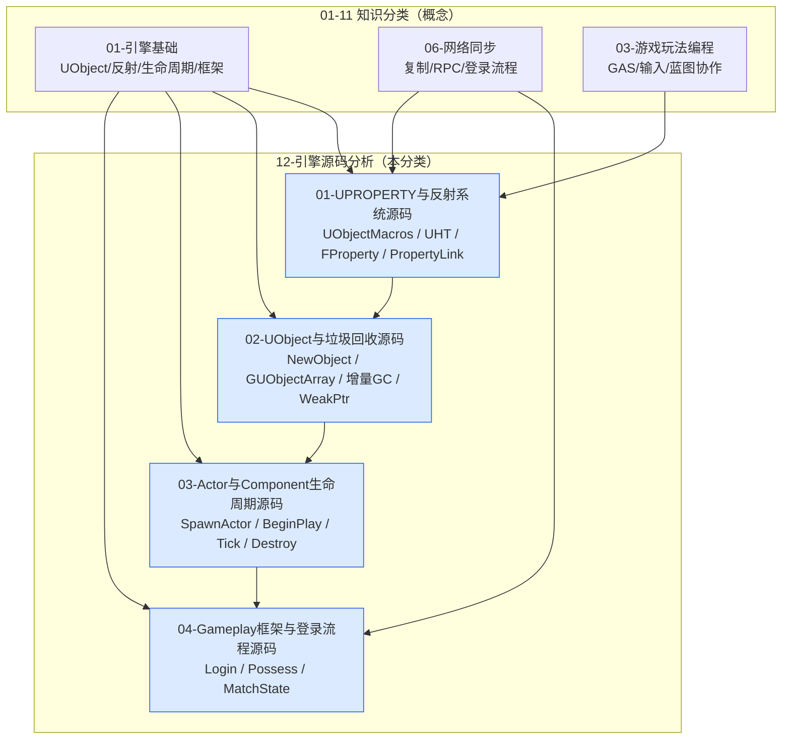

# 12 · 引擎源码分析

> 面向 UE5 客户端开发者的**引擎源码剖析**分类：不满足于"知道怎么用"，而是打开
> `Engine/Source` 逐行回答"为什么"。每个知识点对应知识库中 01-11 分类的一篇或多篇
> 概念文档，先读概念、再读源码，用真实代码把"反射、GC、生命周期、框架流程"钉死。
>
> 同步目录：`C:\project\git\游戏知识\12-引擎源码分析` → https://github.com/fantuan812/learning.git

---

## 定位说明

本分类是知识库的"源码纵深"层，与 01-11 分类**一一对应**：

| 源码分析文件 | 对应知识分类 | 对应知识点 | 覆盖的引擎源码主题 |
| --- | --- | --- | --- |
| [01-UPROPERTY与反射系统源码.md](./01-UPROPERTY与反射系统源码.md) | [01-引擎基础](../01-引擎基础/README.md)（01-UObject与反射系统） | UPROPERTY 宏、UHT 代码生成、FProperty 体系、PropertyLink、运行时反射查找 | `UObjectMacros.h`、`UnrealType.h`、`Class.h`、UnrealHeaderTool 生成管线 |
| [02-UObject与垃圾回收源码.md](./02-UObject与垃圾回收源码.md) | [01-引擎基础](../01-引擎基础/README.md)（01-UObject与反射系统·GC 部分） | UObject 三层类、NewObject 全流程、GUObjectArray、UE5 增量 GC、Weak/Soft 引用 | `UObjectBase.cpp`、`UObjectGlobals.cpp`、`UObjectArray.cpp`、`GarbageCollection.cpp` |
| [03-Actor与Component生命周期源码.md](./03-Actor与Component生命周期源码.md) | [01-引擎基础](../01-引擎基础/README.md)（02-Actor与Component生命周期） | SpawnActor、BeginPlay 延迟广播、组件注册初始化、Tick 调度、销毁流程 | `World.cpp`、`Actor.cpp`、`ActorComponent.cpp`、`TickTaskManager.cpp` |
| [04-Gameplay框架与登录流程源码.md](./04-Gameplay框架与登录流程源码.md) | [01-引擎基础](../01-引擎基础/README.md)（03-Gameplay框架与游戏模式）＋[06-网络同步](../06-网络同步/README.md)（04-多人游戏框架与玩家状态） | GameMode/GameState/PlayerController 职责、Login→Possess 全链路、MatchState 状态机 | `GameModeBase.cpp`、`GameMode.cpp`、`PlayerController.cpp`、`GameStateBase.cpp` |
| [05-GAS能力系统源码.md](./05-GAS能力系统源码.md) | [03-游戏玩法编程](../03-游戏玩法编程/README.md)（01-GameplayAbilitySystem能力系统） | TryActivateAbility 链路、FGameplayAbilitySpec、Commit/End、GameplayEffect 执行、AttributeSet 回调 | `AbilitySystemComponent.cpp`、`GameplayAbility.cpp`、`GameplayEffect.cpp`、`AttributeSet.cpp` |
| [06-委托与事件系统源码.md](./06-委托与事件系统源码.md) | [03-游戏玩法编程](../03-游戏玩法编程/README.md)（04-委托事件与对象通信） | TDelegate 实现、多播稀疏存储、动态委托宏展开、UObject 弱引用安全 | `Delegate.h`、`DelegateSignatureImpl.inl`、`DelegateInstancesImpl.h` |
| [07-容器与内存管理源码.md](./07-容器与内存管理源码.md) | [01-引擎基础](../01-引擎基础/README.md)＋[07-UI与性能优化](../07-UI与性能优化/README.md)（性能基础） | TArray/FScriptArray、TMap/TSet 哈希、TSharedPtr 原子计数、FMallocBinned 分配器 | `Containers/Array.h`、`Map.h`、`Set.h`、`SmartPointers/SharedPointer.h`、`MallocBinned*.cpp` |
| [08-Tick与模块系统源码.md](./08-Tick与模块系统源码.md) | [01-引擎基础](../01-引擎基础/README.md)（04-引擎启动流程与模块架构；02-Actor 生命周期） | FTickTaskManager/Sequencer、Tick 分组与依赖、FModuleManager、IMPLEMENT_MODULE 宏 | `TickTaskManager.cpp`、`ModuleManager.cpp`、`ModuleDescriptor.cpp` |
| [09-网络复制与RPC源码.md](./09-网络复制与RPC源码.md) | [06-网络同步](../06-网络同步/README.md)（01-网络架构与复制基础；02-RPC与属性同步） | ServerReplicateActors、FRepLayout 复制、ProcessBunch/OnRep、RPC 调用链、CMC 网络移动 | `NetDriver.cpp`、`ActorChannel.cpp`、`ReplicationDriver.cpp`、`CharacterMovementComponent.cpp` |
| [10-渲染线程与RHI源码.md](./10-渲染线程与RHI源码.md) | [02-渲染与图形](../02-渲染与图形/README.md)（01-渲染管线概览） | 渲染线程命令模型、ENQUEUE_RENDER_COMMAND、FSceneRenderer::Render 主流程、FRHICommandList | `RenderingThread.cpp`、`DeferredShadingSceneRenderer.cpp`、`RHICommandList.h` |
| [11-动画系统求值源码.md](./11-动画系统求值源码.md) | [04-动画系统](../04-动画系统/README.md)（01-动画蓝图与状态机） | FAnimInstanceProxy、NativeUpdateAnimation、Parallel 求值、FAnimNode_Base 协议、状态机求值 | `AnimInstance.cpp`、`AnimInstanceProxy.cpp`、`AnimNode_StateMachine.cpp` |
| [12-行为树与AI源码.md](./12-行为树与AI源码.md) | [05-AI系统](../05-AI系统/README.md)（01-行为树详解） | StartTree/StopTree、UBTNode 生命周期、ConditionalAbort 中止机制、黑板键实现 | `BehaviorTreeComponent.cpp`、`BTNode.cpp`、`BTTaskNode.cpp`、`BlackboardComponent.cpp` |
| [13-资源加载与异步加载源码.md](./13-资源加载与异步加载源码.md) | [07-UI与性能优化](../07-UI与性能优化/README.md)（04-渲染与加载性能优化） | LoadObject 链路、FLinkerLoad 序列化、FSoftObjectPath、FStreamableManager、FAsyncPackage2 | `UObjectGlobals.cpp`、`LinkerLoad.cpp`、`StreamableManager.cpp` |
| [14-UMG与Slate源码.md](./14-UMG与Slate源码.md) | [07-UI与性能优化](../07-UI与性能优化/README.md)（01-UMG框架与控件系统） | SWidget 生命周期、UMG↔Slate 桥接（SObjectWidget）、绑定刷新、Slate 渲染管线 | `Runtime/UMG`、`Runtime/Slate`、`Runtime/SlateCore` |
| [15-物理系统源码.md](./15-物理系统源码.md) | [09-物理系统](../09-物理系统/README.md)（01-Chaos物理引擎概览） | FChaosScene（PhysicsCore）、物理线程模型、碰撞求解器、FPhysScene_Chaos | `Experimental/Chaos`、`PhysicsCore`、`Engine/Private/PhysicsEngine` |
| [16-音频系统源码.md](./16-音频系统源码.md) | [10-音频系统](../10-音频系统/README.md)（01-音频基础与播放） | FAudioDevice::AddNewActiveSound、FMixerDevice/Source/Submix、混音渲染线程 | `Runtime/AudioMixer`、`Engine/Classes/Sound`、`Engine/Private/Audio` |
| [17-Niagara源码.md](./17-Niagara源码.md) | [11-VFX与Niagara](../11-VFX与Niagara/README.md)（01-Niagara粒子系统基础） | FNiagaraSystemInstance/Controller、数据接口、CPU/GPU 模拟、编译管线 | `Plugins/FX/Niagara` |
| [18-RigVM与ControlRig源码.md](./18-RigVM与ControlRig源码.md) | [04-动画系统](../04-动画系统/README.md)（03-IK与程序化动画） | RigVM 虚拟机字节码/执行模型、RigUnit 注册、FRigHierarchy、ControlRig 求值链路 | `Plugins/Runtime/RigVM`、`Plugins/Animation/ControlRig` |

---

## 文件列表

| 文件 | 一句话简介 | 状态 |
| --- | --- | --- |
| [README.md](./README.md) | 本导航页：定位、映射表、学习顺序、知识地图 | 已完成 |
| [01-UPROPERTY与反射系统源码.md](./01-UPROPERTY与反射系统源码.md) | UPROPERTY 宏定义、UHT 生成代码形态、FProperty 体系、UClass::PropertyLink、运行时反射查找 | 已完成 |
| [02-UObject与垃圾回收源码.md](./02-UObject与垃圾回收源码.md) | UObject 三层类、NewObject→StaticConstructObject_Internal、FUObjectArray、UE5 增量 GC、Weak/Soft 引用 | 已完成 |
| [03-Actor与Component生命周期源码.md](./03-Actor与Component生命周期源码.md) | SpawnActor、BeginPlay 延迟广播、RegisterComponent、Tick 注册与调度、EndPlay/Destroy | 已完成 |
| [04-Gameplay框架与登录流程源码.md](./04-Gameplay框架与登录流程源码.md) | GameMode 登录链路（PreLogin→Login→PostLogin→RestartPlayer→Possess）、MatchState 状态机 | 已完成 |
| [05-GAS能力系统源码.md](./05-GAS能力系统源码.md) | TryActivateAbility→Commit→End 全链路、GE 执行与 AttributeSet 回调 | 已完成 |
| [06-委托与事件系统源码.md](./06-委托与事件系统源码.md) | TDelegate/多播/动态委托实现、UObject 弱引用安全机制 | 已完成 |
| [07-容器与内存管理源码.md](./07-容器与内存管理源码.md) | TArray/TMap/TSet 内存模型、TSharedPtr 引用计数、Binned 分配器 | 已完成 |
| [08-Tick与模块系统源码.md](./08-Tick与模块系统源码.md) | Tick 分组调度与依赖、FModuleManager 模块加载、宏展开 | 已完成 |
| [09-网络复制与RPC源码.md](./09-网络复制与RPC源码.md) | ServerReplicateActors、FRepLayout 复制、RPC 调用链、CMC 网络移动 | 已完成 |
| [10-渲染线程与RHI源码.md](./10-渲染线程与RHI源码.md) | 渲染命令模型、FSceneRenderer::Render 主流程、FRHICommandList | 已完成 |
| [11-动画系统求值源码.md](./11-动画系统求值源码.md) | FAnimInstanceProxy、Parallel 求值、状态机转换求值 | 已完成 |
| [12-行为树与AI源码.md](./12-行为树与AI源码.md) | 行为树节点生命周期、Abort 中止机制、黑板键实现 | 已完成 |
| [13-资源加载与异步加载源码.md](./13-资源加载与异步加载源码.md) | LoadObject 链路、异步加载线程模型、FStreamableManager | 已完成 |
| [14-UMG与Slate源码.md](./14-UMG与Slate源码.md) | SWidget 生命周期、UMG↔Slate 桥接、绑定刷新与渲染管线 | 已完成 |
| [15-物理系统源码.md](./15-物理系统源码.md) | Chaos 场景与线程、碰撞求解、FPhysScene_Chaos | 已完成 |
| [16-音频系统源码.md](./16-音频系统源码.md) | 音频设备/混音器/Submix、播放链路（5.8 为 AddNewActiveSound） | 已完成 |
| [17-Niagara源码.md](./17-Niagara源码.md) | 系统实例/控制器、数据接口、CPU/GPU 模拟 | 已完成 |

---

## 学习顺序建议

### 路线一：按依赖顺序精读（推荐）

1. **先读 `01-UPROPERTY与反射系统源码.md`**：反射是一切的地基。先看懂
   `UPROPERTY` 为什么是空宏、`GENERATED_BODY()` 展开成什么、UHT 生成了哪些代码、
   `FProperty` 如何描述一个属性——之后看 GC、复制、蓝图全部"通透"。
2. **再读 `02-UObject与垃圾回收源码.md`**：对象从 `NewObject` 到被 GC 回收的完整
   生命周期。搞懂 `GUObjectArray`、引用 Token 流、增量 GC 后，才能解释
   "为什么对象没被引用却被回收""为什么 WeakPtr 会变空"这类经典问题。
3. **然后读 `03-Actor与Component生命周期源码.md`**：把 UObject 知识落到游戏世界：
   SpawnActor 内部顺序、BeginPlay 为什么"延迟"、组件何时注册、Tick 怎么被调度。
4. **最后读 `04-Gameplay框架与登录流程源码.md`**：把框架类串成一条线：
   从玩家连上服务器、PreLogin 校验，到 Possess Pawn 的完整调用链，以及
   MatchState 状态机如何驱动"开局/结束"。

### 路线二：按问题速查

- 属性不生效 / 蓝图看不到变量 / 复制不生效 → 精读 **01** 的 FProperty 与 PropertyFlags 章节；
- 对象被"莫名其妙回收" / 内存泄漏 / WeakPtr 悬空 → 精读 **02** 的 GC 章节；
- BeginPlay 顺序不对 / 动态生成组件不触发初始化 / Tick 不执行 → 精读 **03**；
- 登录断线、Pawn 不生成、MatchState 卡住 → 精读 **04**。

### 配套练习建议

1. 新建 C++ 工程，定义带 `UPROPERTY` 的类，编译后打开
   `Intermediate/Build/Win64/<平台>/<模块>/.../*.generated.h` 与 `*.gen.cpp`，
   对照 01 篇逐段找生成代码；
2. 在 `NewObject` 与析构处打断点，配合 `obj list` 控制台命令观察对象数组；
3. 自定义 Actor/Component 打印各生命周期函数顺序，验证 03 篇的时序图；
4. 搭一个 Listen Server，在 `AGameMode::PreLogin/Login/PostLogin` 与
   `APawn::PossessedBy` 打日志，对照 04 篇的登录时序图。

---

## 知识地图

---

## 撰写与阅读约定

- 源码以 **UE5（5.0 ~ 5.5）** 为主，个别 API 差异（如 `IsPendingKill` 的移除、
  `EFieldFlags` 的引入）会在文中显式标注版本；
- 文中代码均取自引擎公开源码或 UHT 生成产物，**类名 / 函数名 / 宏名与真实引擎一致**；
  为控制篇幅，部分代码为"节选/示意"，会在注释中标注；
- 建议对照引擎源码阅读：`Engine/Source/Runtime/CoreUObject/`、
  `Engine/Source/Runtime/Engine/`、`Engine/Source/Programs/UnrealHeaderTool/`；
- Mermaid 图中的中文为概念标注，非引擎字面量；
- "服务器/客户端"指 Dedicated/Listen Server 与 Client 的网络角色划分。

## 前置知识

- 已读完 [01-引擎基础](../01-引擎基础/README.md) 四篇（对象模型、生命周期、框架、模块）；
- C++ 基础：继承、虚函数、模板、预处理器宏；
- 熟悉 Visual Studio / Rider 的"跳转到定义"与引擎源码符号索引。
