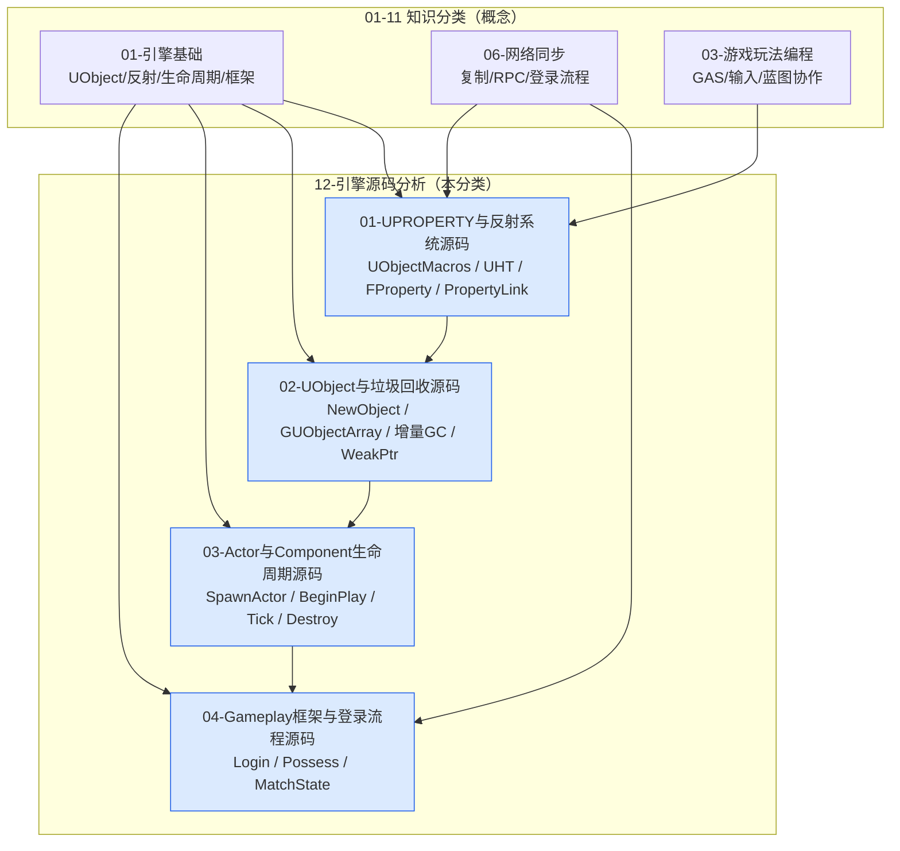

# 12 · 引擎源码分析

> 面向 UE5 客户端开发者的**引擎源码剖析**分类：不满足于"知道怎么用"，而是打开
> `Engine/Source` 逐行回答"为什么"。现有文章覆盖若干核心模块，但不宣称与 01-11
> 一一对应；概念层已有不等于源码层已完成。
>
> 同步目录：`C:\project\git\游戏知识\12-引擎源码分析` → https://github.com/fantuan812/learning.git
> 版本基准：UE 5.8.0（本机 `Engine/Build/Build.version`：CL 55116800，分支 `++UE5+Release-5.8`）。
> 源码边界：`C:\Program Files\Epic Games\UE_5.8\Engine` 只读；以本机 5.8 源码为准。
> 核验源码树（2026-09-14 新增）：`C:\Users\zhaozhiqi\Documents\GitHub\UnrealEngine`（5.8.2 / `CompatibleChangelist` 55116800 / 分支 `UE5`，含 `Samples/Games/Lyra`）——本轮 01-56 的路径、符号、行数与 Lyra 附录均以此树 + 本机安装树双向复核，详见 [19 的 2.3 节](../../知识/03-引擎架构与资源系统/源码阅读与覆盖基线/19-高优先级源码覆盖路线图.md#23-第二轮核验以-ue-58-源码-checkout-复核2026-09-14)。
> 最后更新：2026-09-14（第三轮补深：01/02/03/04/09/10 六篇补深为以真实源码为主体的剖析，33/34/38 三篇把自称"摘自源码"但逐行比对不匹配的代码块换成 5.8 逐字/节选，并汇总一批"引擎中不存在"的 API 与命名；见下方「源码补深记录」。第二轮 2026-09-14：以 UE 5.8 源码 checkout 复核 01-56，修正 30/05/02/04/09/33/20/41/35 篇共 11 处缺陷，其中 30 篇 `LumenSceneData.cpp`、05 篇 `AttributeSet.cpp` 两处为"引用了不存在/不承担该职责的文件"，其余为行号与文件名偏差；并修正 19 篇自身的文章计数）。

---

## 定位说明

本分类是知识库的“源码纵深”层，当前为 55 篇已落地源码文章 + 1 篇覆盖矩阵/路线图。统计口径为 01-18、20-56 共 55 篇源码文章与 19 号路线图；其中 39-56 是基于本机 Lyra 5.8 样例的项目源码综合系列。README 是导航文件，单独列出且不计入上述数量。下表是已有文章到概念分类的映射，不是 01-11 的完成承诺。

| 源码分析文件 | 对应知识分类 | 对应知识点 | 覆盖的引擎源码主题 |
| --- | --- | --- | --- |
| [01-UPROPERTY与反射系统源码.md](../../知识/03-引擎架构与资源系统/对象模型与生命周期/01-UPROPERTY与反射系统源码.md) | [01-引擎基础](../01-引擎基础/README.md)（01-UObject与反射系统） | UPROPERTY 宏、UHT 代码生成、FProperty 体系、PropertyLink、运行时反射查找 | `ObjectMacros.h`（旧名 `UObjectMacros.h` 已移除）、`UnrealType.h`、`Class.h`、UnrealHeaderTool 生成管线 |
| [02-UObject与垃圾回收源码.md](../../知识/03-引擎架构与资源系统/对象模型与生命周期/02-UObject与垃圾回收源码.md) | [01-引擎基础](../01-引擎基础/README.md)（01-UObject与反射系统·GC 部分） | UObject 三层类、NewObject 全流程、GUObjectArray、UE5 增量 GC、Weak/Soft 引用 | `UObjectBase.cpp`、`UObjectGlobals.cpp`、`UObjectArray.cpp`、`GarbageCollection.cpp` |
| [03-Actor与Component生命周期源码.md](../../知识/03-引擎架构与资源系统/对象模型与生命周期/03-Actor与Component生命周期源码.md) | [01-引擎基础](../01-引擎基础/README.md)（02-Actor与Component生命周期） | SpawnActor、BeginPlay 延迟广播、组件注册初始化、Tick 调度、销毁流程 | `World.cpp`、`Actor.cpp`、`ActorComponent.cpp`、`TickTaskManager.cpp` |
| [04-Gameplay框架与登录流程源码.md](../../知识/07-网络与游戏服务端/会话身份与在线服务/04-Gameplay框架与登录流程源码.md) | [01-引擎基础](../01-引擎基础/README.md)（03-Gameplay框架与游戏模式）＋[06-网络同步](../../00_Index/%E5%AD%A6%E4%B9%A0%E8%B7%AF%E7%BA%BF/%E7%BD%91%E7%BB%9C%E4%B8%8E%E6%B8%B8%E6%88%8F%E6%9C%8D%E5%8A%A1%E7%AB%AF.md)（04-多人游戏框架与玩家状态） | GameMode/GameState/PlayerController 职责、Login→Possess 全链路、MatchState 状态机 | `GameModeBase.cpp`、`GameMode.cpp`、`PlayerController.cpp`、`GameStateBase.cpp` |
| [05-GAS能力系统源码.md](../../知识/05-Gameplay与交互系统/技能战斗与属性结算/05-GAS能力系统源码.md) | [03-游戏玩法编程](../03-游戏玩法编程/README.md)（01-GameplayAbilitySystem能力系统） | TryActivateAbility 链路、FGameplayAbilitySpec、Commit/End、GameplayEffect 执行、AttributeSet 回调 | `AbilitySystemComponent.cpp`、`GameplayAbility.cpp`、`GameplayEffect.cpp`、`AttributeSet.cpp` |
| [06-委托与事件系统源码.md](../../知识/03-引擎架构与资源系统/模块化框架与对象通信/06-委托与事件系统源码.md) | [03-游戏玩法编程](../03-游戏玩法编程/README.md)（04-委托事件与对象通信） | TDelegate 实现、多播稀疏存储、动态委托宏展开、UObject 弱引用安全 | `Delegate.h`、`DelegateSignatureImpl.inl`、`DelegateInstancesImpl.h` |
| [07-容器与内存管理源码.md](../../知识/03-引擎架构与资源系统/对象模型与生命周期/07-容器与内存管理源码.md) | [01-引擎基础](../01-引擎基础/README.md)＋[07-UI与性能优化](../../00_Index/%E5%AD%A6%E4%B9%A0%E8%B7%AF%E7%BA%BF/%E5%B7%A5%E7%A8%8B%E5%AE%9E%E8%B7%B5%E4%B8%8E%E8%B4%A8%E9%87%8F.md)（性能基础） | TArray/FScriptArray、TMap/TSet 哈希、TSharedPtr 原子计数、FMallocBinned 分配器 | `Containers/Array.h`、`Map.h`、`Set.h`、`SmartPointers/SharedPointer.h`、`MallocBinned*.cpp` |
| [08-Tick与模块系统源码.md](../../知识/03-引擎架构与资源系统/运行架构与任务调度/08-Tick与模块系统源码.md) | [01-引擎基础](../01-引擎基础/README.md)（04-引擎启动流程与模块架构；02-Actor 生命周期） | FTickTaskManager/Sequencer、Tick 分组与依赖、FModuleManager、IMPLEMENT_MODULE 宏 | `TickTaskManager.cpp`、`ModuleManager.cpp`、`ModuleDescriptor.cpp` |
| [09-网络复制与RPC源码.md](../../知识/07-网络与游戏服务端/状态复制与兴趣管理/09-网络复制与RPC源码.md) | [06-网络同步](../../00_Index/%E5%AD%A6%E4%B9%A0%E8%B7%AF%E7%BA%BF/%E7%BD%91%E7%BB%9C%E4%B8%8E%E6%B8%B8%E6%88%8F%E6%9C%8D%E5%8A%A1%E7%AB%AF.md)（01-网络架构与复制基础；02-RPC与属性同步） | ServerReplicateActors、FRepLayout 复制、ProcessBunch/OnRep、RPC 调用链、CMC 网络移动 | `NetDriver.cpp`、`DataChannel.cpp`（旧名 `ActorChannel.cpp` 已移除）、`ReplicationDriver.cpp`、`CharacterMovementComponent.cpp` |
| [10-渲染线程与RHI源码.md](../../知识/04-图形动画与物理仿真/渲染管线与光照/10-渲染线程与RHI源码.md) | [02-渲染与图形](../02-渲染与图形/README.md)（01-渲染管线概览） | 渲染线程命令模型、ENQUEUE_RENDER_COMMAND、FSceneRenderer::Render 主流程、FRHICommandList | `RenderingThread.cpp`、`DeferredShadingRenderer.cpp`（旧名 `DeferredShadingSceneRenderer.cpp` 已移除）、`RHICommandList.h` |
| [11-动画系统求值源码.md](../../知识/04-图形动画与物理仿真/动画求值与角色表现/11-动画系统求值源码.md) | [04-动画系统](../04-动画系统/README.md)（01-动画蓝图与状态机） | FAnimInstanceProxy、NativeUpdateAnimation、Parallel 求值、FAnimNode_Base 协议、状态机求值 | `AnimInstance.cpp`、`AnimInstanceProxy.cpp`、`AnimNode_StateMachine.cpp` |
| [12-行为树与AI源码.md](../../知识/06-游戏AI/感知决策与行为规划/12-行为树与AI源码.md) | [05-AI系统](../../00_Index/%E5%AD%A6%E4%B9%A0%E8%B7%AF%E7%BA%BF/%E6%B8%B8%E6%88%8FAI.md)（01-行为树详解） | StartTree/StopTree、UBTNode 生命周期、ConditionalAbort 中止机制、黑板键实现 | `BehaviorTreeComponent.cpp`、`BTNode.cpp`、`BTTaskNode.cpp`、`BlackboardComponent.cpp` |
| [13-资源加载与异步加载源码.md](../../知识/03-引擎架构与资源系统/世界组织与资源加载/13-资源加载与异步加载源码.md) | [07-UI与性能优化](../../00_Index/%E5%AD%A6%E4%B9%A0%E8%B7%AF%E7%BA%BF/%E5%B7%A5%E7%A8%8B%E5%AE%9E%E8%B7%B5%E4%B8%8E%E8%B4%A8%E9%87%8F.md)（04-渲染与加载性能优化） | LoadObject 链路、FLinkerLoad 序列化、FSoftObjectPath、FStreamableManager、FAsyncPackage2 | `UObjectGlobals.cpp`、`LinkerLoad.cpp`、`StreamableManager.cpp` |
| [14-UMG与Slate源码.md](../../知识/05-Gameplay与交互系统/界面设置与无障碍/14-UMG与Slate源码.md) | [07-UI与性能优化](../../00_Index/%E5%AD%A6%E4%B9%A0%E8%B7%AF%E7%BA%BF/Gameplay%E4%B8%8E%E4%BA%A4%E4%BA%92%E7%B3%BB%E7%BB%9F.md)（01-UMG框架与控件系统） | SWidget 生命周期、UMG↔Slate 桥接（SObjectWidget）、绑定刷新、Slate 渲染管线 | `Runtime/UMG`、`Runtime/Slate`、`Runtime/SlateCore` |
| [15-物理系统源码.md](../../知识/04-图形动画与物理仿真/物理求解与动力学/15-物理系统源码.md) | [09-物理系统](../09-物理系统/README.md)（01-Chaos物理引擎概览） | FChaosScene（PhysicsCore）、物理线程模型、碰撞求解器、FPhysScene_Chaos | `Experimental/Chaos`、`PhysicsCore`、`Engine/Private/PhysicsEngine` |
| [16-音频系统源码.md](../../知识/04-图形动画与物理仿真/音频播放与程序化声音/16-音频系统源码.md) | [10-音频系统](../../00_Index/%E5%AD%A6%E4%B9%A0%E8%B7%AF%E7%BA%BF/%E5%9B%BE%E5%BD%A2%E5%8A%A8%E7%94%BB%E4%B8%8E%E7%89%A9%E7%90%86%E4%BB%BF%E7%9C%9F.md)（01-音频基础与播放） | FAudioDevice::AddNewActiveSound、FMixerDevice/Source/Submix、混音渲染线程 | `Runtime/AudioMixer`、`Engine/Classes/Sound`、`Engine/Private/Audio` |
| [17-Niagara源码.md](../../知识/04-图形动画与物理仿真/特效粒子与流体仿真/17-Niagara源码.md) | [11-VFX与Niagara](../../00_Index/%E5%AD%A6%E4%B9%A0%E8%B7%AF%E7%BA%BF/%E5%9B%BE%E5%BD%A2%E5%8A%A8%E7%94%BB%E4%B8%8E%E7%89%A9%E7%90%86%E4%BB%BF%E7%9C%9F.md)（01-Niagara粒子系统基础） | FNiagaraSystemInstance/Controller、数据接口、CPU/GPU 模拟、编译管线 | `Plugins/FX/Niagara` |
| [18-RigVM与ControlRig源码.md](../../知识/04-图形动画与物理仿真/动画求值与角色表现/18-RigVM与ControlRig源码.md) | [04-动画系统](../04-动画系统/README.md)（03-IK与程序化动画） | RigVM 虚拟机字节码/执行模型、RigUnit 注册、FRigHierarchy、ControlRig 求值链路 | `Plugins/Runtime/RigVM`、`Plugins/Animation/ControlRig` |

### 覆盖边界与 P1 状态

详细状态、真实源码路径、官方 5.8 参考和验收命令见 [19-高优先级源码覆盖路线图.md](../../知识/03-引擎架构与资源系统/源码阅读与覆盖基线/19-高优先级源码覆盖路线图.md)。下表同时列出已完成与待补主题；“源码深度已完成”必须对应独立源码文章、真实 UE5.8 路径和验收证据，不能由概念文章替代：

| P1 主题 | 概念层状态 | 源码层状态 |
| --- | --- | --- |
| Iris 复制，以及 Iris 与 ReplicationGraph 的互斥/迁移 | 已有（网络同步概念） | 源码深度已完成：[20-Iris复制源码.md](../../知识/07-网络与游戏服务端/状态复制与兴趣管理/20-Iris复制源码.md) |
| Mass Signals、无锁/并发调度、StateTree 5.8 编译变化 | 已有（AI/ECS 概念） | 源码深度已完成：[21-Mass与StateTree源码.md](../../知识/06-游戏AI/导航移动与群体协同/21-Mass与StateTree源码.md) |
| World Partition、World Streaming Insights | 已有（大世界/流送概念） | 源码深度已完成：[22-WorldPartition与WorldStreaming源码.md](../../知识/03-引擎架构与资源系统/世界组织与资源加载/22-WorldPartition与WorldStreaming源码.md) |
| Landscape、Foliage | 已有（世界内容概念） | 源码深度已完成：[23-Landscape与Foliage源码.md](../../知识/04-图形动画与物理仿真/材质地形与世界表现/23-Landscape与Foliage源码.md) |
| Sequencer、Movie Render Graph（MRG Production Ready）、`MovieSceneCapture` deprecated 迁移 | 已有（动画/演出概念） | 源码深度已完成：[24-Sequencer与MovieRenderGraph源码.md](../../知识/04-图形动画与物理仿真/过场渲染与虚拟制片/24-Sequencer与MovieRenderGraph源码.md) |
| Enhanced Input、Gameplay Tags | 已有（输入/玩法概念） | 源码深度已完成：[25-EnhancedInput与GameplayTags源码.md](../../知识/05-Gameplay与交互系统/输入移动与交互/25-EnhancedInput与GameplayTags源码.md) |
| CommonUI | 已有（UI 框架概念） | 源码深度已完成：[26-CommonUI源码.md](../../知识/05-Gameplay与交互系统/界面设置与无障碍/26-CommonUI源码.md) |
| UMG MVVM | 已有（UI 数据绑定概念） | 源码深度已完成：[27-UMGMVVM源码.md](../../知识/05-Gameplay与交互系统/界面设置与无障碍/27-UMGMVVM源码.md) |
| Unreal Insights/Trace | 已有（性能分析与调试概念） | 源码深度已完成：[28-UnrealInsights与Trace源码.md](../../知识/08-工程实践与质量/调试与性能分析/28-UnrealInsights与Trace源码.md) |
| Gameplay Tasks | 已有（AI/异步玩法概念） | 源码深度已完成：[29-GameplayTasks源码.md](../../知识/05-Gameplay与交互系统/玩法架构与任务协作/29-GameplayTasks源码.md) |
| UE5.8 Lumen Medium/Lite、MegaLights | 已登记 UE5.8 图形特性 | 源码深度已完成：[30-Lumen与MegaLights源码.md](../../知识/04-图形动画与物理仿真/渲染管线与光照/30-Lumen与MegaLights源码.md) |
| Procedural Vegetation Editor | 已登记 UE5.8 世界内容特性 | 源码深度已完成：[31-ProceduralVegetationEditor源码.md](../../知识/04-图形动画与物理仿真/材质地形与世界表现/31-ProceduralVegetationEditor源码.md) |
| Dedicated Server 启动与监听 | 已有（网络同步/服务端运行概念） | 源码深度已完成：[32-UE Dedicated Server启动与监听源码.md](<../../知识/07-网络与游戏服务端/专用服务器实例与容量/32-UE%20Dedicated%20Server启动与监听源码.md>) |
| UNetDriver 与连接通道 | 已有（网络架构/通道概念） | 源码深度已完成：[33-UNetDriver与连接通道源码.md](../../知识/07-网络与游戏服务端/状态复制与兴趣管理/33-UNetDriver与连接通道源码.md) |
| Nanite 渲染 | 已有（渲染概念 02-04） | 源码深度已完成：[35-Nanite源码.md](../../知识/04-图形动画与物理仿真/渲染管线与光照/35-Nanite源码.md) |
| AnimNext/UAF 动画框架 | 已有（动画概念 04-05） | 源码深度已完成：[36-AnimNext与UAF源码.md](../../知识/04-图形动画与物理仿真/动画求值与角色表现/36-AnimNext与UAF源码.md) |
| Chaos 破坏与 Field | 已有（物理概念 09-05） | 源码深度已完成：[37-Chaos破坏与Field源码.md](../../知识/04-图形动画与物理仿真/物理求解与动力学/37-Chaos破坏与Field源码.md) |
| PCG 程序化内容生成 | 已有（世界构建概念 13-04） | 源码深度已完成：[38-PCG源码.md](../../知识/03-引擎架构与资源系统/程序化内容生成/38-PCG源码.md) |
| ReplicationGraph 独立源码深读 | 已有（网络同步/05 概念） | 源码深度已完成：[34-ReplicationGraph源码.md](../../知识/07-网络与游戏服务端/状态复制与兴趣管理/34-ReplicationGraph源码.md) |

因此本分类当前结论是“核心基础源码覆盖充分、UE5.8 新系统覆盖不完整”，不能写成“源码分析已覆盖全部 01-11 分类”。

**状态口径：**“概念层已有”表示相邻知识分类已有使用说明、设计概念或工作流，但不代表已经解释引擎实现；“源码深度已完成”表示本目录有独立文章，并以 UE5.8.0 / CL 55116800 的真实源码路径、调用链或数据结构为依据；“待补”表示仍缺独立源码核对；“规划”表示主题已登记但尚未形成可验收的源码文章。

### Lyra 5.8 项目源码系列（39-56）

这一组文章把前面的引擎专题落到一个完整多人样例中，阅读顺序固定为“总览 → 玩法装配 → Pawn 初始化 → 输入战斗 → 背包装备 UI → 前端会话网络 → 表现与流程 → AI 与队伍 → 调试与测试 → 扩展插件 → UI 控件与表现 → 设置系统 → GAS 扩展 → 交互系统 → 核心生成移动状态 → 网络复制与模块化引擎 → 输入重映射与辅助瞄准 → ShooterCore 核心玩法”。每篇正文末尾附核心文件完整源码附录：把该篇主链直接分析的项目源码文件逐字完整收录；正文结论必须能回溯到真实 C++/HLSL 片段或全文附录，只有路径、类名清单或请自行阅读源码的文字不计为源码分析。

| 阶段 | 教程 | 主要源码链路 |
| --- | --- | --- |
| 建立地图 | [39-Lyra源码总览与阅读路线.md](../../知识/05-Gameplay与交互系统/玩法架构与任务协作/39-Lyra源码总览与阅读路线.md) | `.uproject`、配置、模块依赖、运行对象地图与断点路线 |
| 装配玩法 | [40-Lyra-Experience与GameFeature源码.md](../../知识/03-引擎架构与资源系统/模块化框架与对象通信/40-Lyra-Experience与GameFeature源码.md) | `ALyraGameMode` → Experience Manager → GameFeature Actions |
| 初始化 Pawn | [41-Lyra-Pawn初始化与模块化组件源码.md](../../知识/03-引擎架构与资源系统/模块化框架与对象通信/41-Lyra-Pawn初始化与模块化组件源码.md) | PawnData、PlayerState ASC、InitState 与输入初始化屏障 |
| 驱动战斗 | [42-Lyra-输入GAS与武器战斗源码.md](../../知识/05-Gameplay与交互系统/技能战斗与属性结算/42-Lyra-输入GAS与武器战斗源码.md) | Enhanced Input → InputTag → GAS → 武器命中与权威伤害 |
| 连接物品与 UI | [43-Lyra-背包装备消息与UI源码.md](../../知识/05-Gameplay与交互系统/背包装备与存档/43-Lyra-背包装备消息与UI源码.md) | Inventory/Equipment FastArray、QuickBar、GameplayMessage 与 UIExtension |
| 闭合产品流程 | [44-Lyra-前端会话网络与扩展源码.md](../../知识/07-网络与游戏服务端/会话身份与在线服务/44-Lyra-前端会话网络与扩展源码.md) | Frontend ControlFlow、CommonUser/Session、加载屏、网络与测试入口 |
| 表现与流程 | [45-Lyra-相机音频与游戏阶段源码.md](../../知识/05-Gameplay与交互系统/输入移动与交互/45-Lyra-相机音频与游戏阶段源码.md) | CameraMode 栈与穿透预防、音频混合设置、GamePhase 阶段能力 |
| AI 与队伍 | [46-Lyra-AI机器人与队伍源码.md](../../知识/06-游戏AI/战斗战术与机器人/46-Lyra-AI机器人与队伍源码.md) | Bot 创建与控制器、Team 归属、伤害过滤与队伍展示 |
| 调试与测试 | [47-Lyra-调试工具与扩展源码.md](../../知识/08-工程实践与质量/调试与性能分析/47-Lyra-调试工具与扩展源码.md) | Cheat/开发者设置、LyraEditor 校验工具与测试层 |
| 扩展插件 | [48-Lyra扩展插件源码.md](../../知识/03-引擎架构与资源系统/模块化框架与对象通信/48-Lyra扩展插件源码.md) | AsyncMixin、PocketWorlds、GameSubtitles 等 8 个扩展插件 |
| UI 控件与表现 | [49-Lyra-UI控件与表现源码.md](../../知识/05-Gameplay与交互系统/界面设置与无障碍/49-Lyra-UI控件与表现源码.md) | LyraHUD/Layout、Foundation 控件族、IndicatorSystem、武器 UI 与性能统计 |
| 设置系统 | [50-Lyra-设置系统与GameSettings源码.md](../../知识/05-Gameplay与交互系统/界面设置与无障碍/50-Lyra-设置系统与GameSettings源码.md) | GameSettings 插件抽象、Lyra 设置注册表/载体与设置屏 |
| GAS 扩展 | [51-Lyra-GAS扩展与能力费用源码.md](../../知识/05-Gameplay与交互系统/技能战斗与属性结算/51-Lyra-GAS扩展与能力费用源码.md) | AbilityCost 费用族、Lyra AttributeSet/CombatSet、伤害执行、Tag 关系映射与全局能力路由 |
| 交互系统 | [52-Lyra-交互系统源码.md](../../知识/05-Gameplay与交互系统/输入移动与交互/52-Lyra-交互系统源码.md) | IInteractableTarget 接口、InteractionQuery/Option、GAS 交互能力与任务、近距授予与拾取链路 |

### Lyra 系列覆盖边界声明（2026-08-18，R4-LYRA-COVERAGE）

Lyra 系列（39-56）以可复用范式为目标（运行链 + 分层设计 + 区别于裸 UE/GAS 的设计点），不追求对项目全部源码文件的穷举覆盖。2026-08-18 按 Source/Plugins 下的 h/hpp/cpp/inl/cs、Build.cs、Target.cs 与 uplugin 口径扫描为 756 个文件，其中 Source/LyraGame 约 460 个；该分母用于盘点，不等于覆盖率。

- **已隐式覆盖**（相邻篇深读覆盖，未单独收录）：Replays（44 篇 Gauntlet/回放）、Performance（47 篇 PerfStat 展示）、Physics（碰撞常量/材质 Tag）、Cosmetics 部分、Player/Character 部分；CommonUser 会话核心已在 44 篇正文补入真实登录/初始化代码。
- **薄壳/骨架**（Epic 提供的 SDK 集成层，无独立复用价值）：Hotfix（OnlineHotfixManager 包装）、LyraExampleContent（纯资产）。
- **示例玩法专属（Game1 射击/俯视玩法数据，非通用范式）：TopDownArena、ShooterMaps、ShooterExplorer 的剩余玩法层内容；GameFeatures/GameSettings/UI 的剩余 Widget 子类细节。ShooterCore 的 TDM/AimAssist/淘汰消息/Accolade 核心已在 56 篇纳入，未收录的资产和模式仍是范围外。
- **源码证据补全（2026-08-17）**：40 的 GameFeature Action 与 41 的 Pawn/能力授予、 42 的武器调试、 43 的 Fragment/消息/消费、44 的 `CommonUserSubsystem`/`LyraGameInstance`、45 的相机/音频、46 的 AI PlayerState、47 的 Automation Spec、 49 的 AsyncAction/CommonMessaging/ContextEffects、50 的设置列表/详情/响应式面板、51 的 `LyraGameplayCueManager`、52 的 `ALyraWorldCollectable`，都已改用本机源码的实际 C++ 片段；原先的伪代码/路径指引缺口不再作为“已分析”证据。
- **源码证据扩展（2026-08-18）**：53 收录 GameState/Controller/Spawn/PlayerStart/Pawn/Movement；54 收录 Lyra ReplicationGraph、ModularGameplayActors 和 UE 5.8 GameFrameworkComponentManager/GameFeatures 状态真实节选；55 收录 Lyra 输入设置/重映射/Latency Marker 与 ShooterCore AimAssist；56 收录 ShooterCore TDM、消息处理器、Accolade 和 GAS 命中上下文。
- **仍然明确的边界**：39-56 不是对当前 LyraStarterGame 全部源码文件的穷举；未在正文放入真实代码、也未被全文附录收录的文件，仍只能标为范围外/待补，不能因路径表点名就宣称已覆盖。

> 判定原则：必须存在真实函数/类/数据结构代码片段，或在附录逐字收录源码并有正文解释；仅插件地图点名、路径、符号清单或“回读本机源码”不算覆盖。正文标注“核心路径片段”时，不能把省略的其他分支当成已分析。

---

## 源码核验记录（2026-09-14，R5-UE-VERIFY）

本轮任务不是新增文章，而是把 01-56 的既有结论**逐条回查真实 UE 5.8 源码**：路径是否真实存在、符号是否真的在所指文件里、Lyra 附录的行数与正文是否与磁盘一致、行号是否还对得上。完整的证据源、命令、缺陷表与边界说明在 [19 的 2.3 节](../../知识/03-引擎架构与资源系统/源码阅读与覆盖基线/19-高优先级源码覆盖路线图.md#23-第二轮核验以-ue-58-源码-checkout-复核2026-09-14)；这里只放结论。

**核验证据源（三份，互为对照）**

| 证据源 | 位置 | 版本标识 |
| --- | --- | --- |
| 本机安装引擎（文章声明的基准） | `C:\Program Files\Epic Games\UE_5.8\Engine` | 5.8.0 / CL 55116800 / `++UE5+Release-5.8` |
| UE 5.8 源码 checkout（本轮新增，含 Lyra） | `C:\Users\zhaozhiqi\Documents\GitHub\UnrealEngine` | 5.8.2 / `CompatibleChangelist` 55116800 / 分支 `UE5` / `Samples\Games\Lyra` |
| Lyra 本机项目 | `C:\Users\zhaozhiqi\Documents\Unreal Projects\LyraStarterGame` | `EngineAssociation` 5.8 |

**结果**

- 路径断言：逐条解析并命中；仅 2 处引用了不存在/不承担该职责的文件（30 篇 `LumenSceneData.cpp`、05 篇 `AttributeSet.cpp`），已改为真实文件。
- 符号断言：2315 个带限定名符号逐个回查；未命中项全部由"类内内联实现 / 纯虚声明 / 文章自定义示例类"解释，无虚构引擎符号。
- Lyra 附录：行数 311/311 一致；40-56 的整卷收录代码块与本机文件逐字一致（0 处不符）。
- 行号断言：带路径上下文的 54 条中 5 条偏差（0-184 行），已按本机 5.8 修正；**路径与符号是长期证据，行号只是该版本安装的辅助定位**。

**本轮修正统计**：11 处（30×2、05、02、04×2、09、33、20、41、35、19 自身计数），全部为"结论与真实源码不符"类，不涉及文章结构与主题范围；未新增文章、未改动目录布局、未提升任何文件的 maturity。

**未验证边界**：本轮只做静态源码核对，不验证运行态行为（Editor / Listen Server / Dedicated Server 的实际时序、网络后端、资产接线），也不声称 39-56 已穷举 Lyra 全部源文件；行号仅对 5.8.0 / CL 55116800 与本轮 checkout 有效。

---

## 源码补深记录（2026-09-14，R6-UE-ENRICH）

上一轮（R5-UE-VERIFY）解决的是"路径/符号/行号说得对不对"。这一轮换成另一个问题：**代码块里贴的到底是不是真的 5.8 源码**——上一轮的路径与符号审计覆盖不到这一层。完整的证据源、审计方法、缺陷表与边界在 [19 的 2.4 节](../../知识/03-引擎架构与资源系统/源码阅读与覆盖基线/19-高优先级源码覆盖路线图.md#24-第三轮源码补深与伪源码定点修正2026-09-14r6-ue-enrich)；这里只放结论。

**做法**：新增一个代码块保真度审计脚本（本地工作区临时产物，不入库）。它抽出每篇文章的 `cpp` 代码块，按块前是否出现「摘自 / 完整真实源码」判定该块**是否自称有出处**；有出处的块逐行归一化后与被引文件比对；未命中行再做**全树兜底检索**——能在别的引擎文件里找到就是"引用错文件 / 版本漂移"，全树都找不到才是**自造代码**。

**审计结果（本轮 9 篇）**

| 指标 | 数值 |
| --- | --- |
| 代码块总数（含无出处声明的示意/示例块） | 293 |
| 自称有出处的块 | 142 |
| 受检引擎代码行 / 逐行命中被引文件 | 3710 / 3681（99.2%） |
| 未命中行 | 29（全部属于 2 个"多文件引用 / 引用句顺序"边界块，已逐行确认代码真实） |
| **引擎里根本不存在的行（自造代码）** | **0** |

全库 57 篇（56 篇文章 + README）同口径：1230 个代码块、434 个带出处声明的块、28476 行受检、28445 行命中（99.89%），未命中 31 行同样全部落在上述 2 个边界块内。

**本轮改了什么**

- **补深 6 篇**（最薄的引擎基础篇，从骨架式剖析改为"真实源码为主体 + 逐段解构 + 事实边界"）：[01](../../知识/03-引擎架构与资源系统/对象模型与生命周期/01-UPROPERTY与反射系统源码.md) 314→2293、[02](../../知识/03-引擎架构与资源系统/对象模型与生命周期/02-UObject与垃圾回收源码.md) 315→2102、[03](../../知识/03-引擎架构与资源系统/对象模型与生命周期/03-Actor与Component生命周期源码.md) 352→2136、[04](../../知识/07-网络与游戏服务端/会话身份与在线服务/04-Gameplay框架与登录流程源码.md) 322→2078、[09](../../知识/07-网络与游戏服务端/状态复制与兴趣管理/09-网络复制与RPC源码.md) 301→2718、[10](../../知识/04-图形动画与物理仿真/渲染管线与光照/10-渲染线程与RHI源码.md) 304→2226。
- **修正 3 篇的伪源码块**：[33](../../知识/07-网络与游戏服务端/状态复制与兴趣管理/33-UNetDriver与连接通道源码.md)（5 块，含整块伪造的 `NMT_ServerTravel` 路径）、[34](../../知识/07-网络与游戏服务端/状态复制与兴趣管理/34-ReplicationGraph源码.md)（2 块 + 优先级方向反了、`ReplicateSingleActor` 参数个数）、[38](../../知识/03-引擎架构与资源系统/程序化内容生成/38-PCG源码.md)（5 处 + 命令速查表 4 条不存在的控制台命令 + 合并两个完全重复的小节）。
- **顺带查实并更正一批"引擎里不存在"的 API 与命名**（示例）：`FGCReferenceTokenStream`/`FGCFrameData`/`PurgeObjectsAndRecordsInSlot`/`MarkPendingKill`（02）、`MaxReplicationDistanceSquared`/`net.MaxActorsPerFrame`/`FRepState::DynamicBuffer`（09）、`UWorld::SpawnActor_Internal`/`TickFunction.h`（03）、`APlayerController::Possess`/`AGameModeBase::SpawnPlayActor`（04）、`NMT_ServerTravel`/`DelayIncomingPacket`（33）、`NetConnection->IsSaturated()`（34）、`bAllowAsyncExecution`（38）、`FRHICommandListExecutor::Execute`（10）——每一条都给出了它在 5.8 里的真实替身或"不存在"的检索证据。
- **审计过程中修正了一个审计自身的缺陷（重要）**：第一版审计脚本取"块前 4 行里第一个真实存在的路径"作为归因，于是当正文在被块上方提到**另一个**文件（被文章反驳的旧路径、调用点文件、`.h` 声明）时，归因被劫持，会把本来正确的引用判成"引用错文件"（本轮共产生 8 处这类假阳性，如把 `FRepLayout::ReceiveProperties` 误判为引 `DataReplication.cpp`）。已改为"只接受带目录分隔符的路径 + 取窗口内最后一个非否定语境的路径"，并逐处回查：**这 8 处文章的引用句本身都是正确的，文章无需修改**。这条经验已写入 19 §2.4。

**未验证边界**：本轮全部结论仍为静态源码阅读，不验证运行态行为；行号以 5.8 源码 checkout 为准，安装版 5.8.0 可能相差数行；审计脚本判定的"无出处声明块"（示意 / 用户示例代码）不计入保真度统计，本库仍有部分篇章保留这类示例块，属既定写作约定（示意块会在正文标注）。

---

## 文件列表

| 文件 | 一句话简介 | 状态 |
| --- | --- | --- |
| [README.md](./README.md) | 本导航页：定位、映射表、P1 覆盖边界、学习顺序、知识地图 | 已完成 |
| [01-UPROPERTY与反射系统源码.md](../../知识/03-引擎架构与资源系统/对象模型与生命周期/01-UPROPERTY与反射系统源码.md) | UPROPERTY 宏定义、UHT 生成代码形态、FProperty 体系、UClass::PropertyLink、运行时反射查找 | 已完成 |
| [02-UObject与垃圾回收源码.md](../../知识/03-引擎架构与资源系统/对象模型与生命周期/02-UObject与垃圾回收源码.md) | UObject 三层类、NewObject→StaticConstructObject_Internal、FUObjectArray、UE5 增量 GC、Weak/Soft 引用 | 已完成 |
| [03-Actor与Component生命周期源码.md](../../知识/03-引擎架构与资源系统/对象模型与生命周期/03-Actor与Component生命周期源码.md) | SpawnActor、BeginPlay 延迟广播、RegisterComponent、Tick 注册与调度、EndPlay/Destroy | 已完成 |
| [04-Gameplay框架与登录流程源码.md](../../知识/07-网络与游戏服务端/会话身份与在线服务/04-Gameplay框架与登录流程源码.md) | GameMode 登录链路（PreLogin→Login→PostLogin→RestartPlayer→Possess）、MatchState 状态机 | 已完成 |
| [05-GAS能力系统源码.md](../../知识/05-Gameplay与交互系统/技能战斗与属性结算/05-GAS能力系统源码.md) | TryActivateAbility→Commit→End 全链路、GE 执行与 AttributeSet 回调 | 已完成 |
| [06-委托与事件系统源码.md](../../知识/03-引擎架构与资源系统/模块化框架与对象通信/06-委托与事件系统源码.md) | TDelegate/多播/动态委托实现、UObject 弱引用安全机制 | 已完成 |
| [07-容器与内存管理源码.md](../../知识/03-引擎架构与资源系统/对象模型与生命周期/07-容器与内存管理源码.md) | TArray/TMap/TSet 内存模型、TSharedPtr 引用计数、Binned 分配器 | 已完成 |
| [08-Tick与模块系统源码.md](../../知识/03-引擎架构与资源系统/运行架构与任务调度/08-Tick与模块系统源码.md) | Tick 分组调度与依赖、FModuleManager 模块加载、宏展开 | 已完成 |
| [09-网络复制与RPC源码.md](../../知识/07-网络与游戏服务端/状态复制与兴趣管理/09-网络复制与RPC源码.md) | ServerReplicateActors、FRepLayout 复制、RPC 调用链、CMC 网络移动 | 已完成 |
| [10-渲染线程与RHI源码.md](../../知识/04-图形动画与物理仿真/渲染管线与光照/10-渲染线程与RHI源码.md) | 渲染命令模型、FSceneRenderer::Render 主流程、FRHICommandList | 已完成 |
| [11-动画系统求值源码.md](../../知识/04-图形动画与物理仿真/动画求值与角色表现/11-动画系统求值源码.md) | FAnimInstanceProxy、Parallel 求值、状态机转换求值 | 已完成 |
| [12-行为树与AI源码.md](../../知识/06-游戏AI/感知决策与行为规划/12-行为树与AI源码.md) | 行为树节点生命周期、Abort 中止机制、黑板键实现 | 已完成 |
| [13-资源加载与异步加载源码.md](../../知识/03-引擎架构与资源系统/世界组织与资源加载/13-资源加载与异步加载源码.md) | LoadObject 链路、异步加载线程模型、FStreamableManager | 已完成 |
| [14-UMG与Slate源码.md](../../知识/05-Gameplay与交互系统/界面设置与无障碍/14-UMG与Slate源码.md) | SWidget 生命周期、UMG↔Slate 桥接、绑定刷新与渲染管线 | 已完成 |
| [15-物理系统源码.md](../../知识/04-图形动画与物理仿真/物理求解与动力学/15-物理系统源码.md) | Chaos 场景与线程、碰撞求解、FPhysScene_Chaos | 已完成 |
| [16-音频系统源码.md](../../知识/04-图形动画与物理仿真/音频播放与程序化声音/16-音频系统源码.md) | 音频设备/混音器/Submix、播放链路（5.8 为 AddNewActiveSound） | 已完成 |
| [17-Niagara源码.md](../../知识/04-图形动画与物理仿真/特效粒子与流体仿真/17-Niagara源码.md) | 系统实例/控制器、数据接口、CPU/GPU 模拟 | 已完成 |
| [18-RigVM与ControlRig源码.md](../../知识/04-图形动画与物理仿真/动画求值与角色表现/18-RigVM与ControlRig源码.md) | RigVM 字节码/指令执行、RigUnit 注册、ControlRig 求值链路 | 已完成 |
| [19-高优先级源码覆盖路线图.md](../../知识/03-引擎架构与资源系统/源码阅读与覆盖基线/19-高优先级源码覆盖路线图.md) | UE5.8 CL 固定证据、P1 覆盖矩阵、真实源码路径、后续文章验收条件 | 路线图已落地；持续验收 |
| [20-Iris复制源码.md](../../知识/07-网络与游戏服务端/状态复制与兴趣管理/20-Iris复制源码.md) | Iris 复制系统、ReplicationGraph 互斥/迁移、复制桥接与运行时链路 | 源码深度已完成 |
| [21-Mass与StateTree源码.md](../../知识/06-游戏AI/导航移动与群体协同/21-Mass与StateTree源码.md) | Mass Signals、并发调度、StateTree 5.8 编译与运行时协作 | 源码深度已完成 |
| [22-WorldPartition与WorldStreaming源码.md](../../知识/03-引擎架构与资源系统/世界组织与资源加载/22-WorldPartition与WorldStreaming源码.md) | World Partition、Streaming Source/Cell、World Streaming Insights 分析链路 | 源码深度已完成 |
| [23-Landscape与Foliage源码.md](../../知识/04-图形动画与物理仿真/材质地形与世界表现/23-Landscape与Foliage源码.md) | Landscape 数据与编辑运行时、Foliage/ISM 渲染与实例管理 | 源码深度已完成 |
| [24-Sequencer与MovieRenderGraph源码.md](../../知识/04-图形动画与物理仿真/过场渲染与虚拟制片/24-Sequencer与MovieRenderGraph源码.md) | Sequencer 求值、Movie Render Graph 管线与旧 MovieSceneCapture 迁移边界 | 源码深度已完成 |
| [25-EnhancedInput与GameplayTags源码.md](../../知识/05-Gameplay与交互系统/输入移动与交互/25-EnhancedInput与GameplayTags源码.md) | Enhanced Input 映射/触发器、Gameplay Tags 注册查询与玩法协作 | 源码深度已完成 |
| [26-CommonUI源码.md](../../知识/05-Gameplay与交互系统/界面设置与无障碍/26-CommonUI源码.md) | CommonUI 栈、输入路由、激活与可复用 UI 层级源码链路 | 源码深度已完成 |
| [27-UMGMVVM源码.md](../../知识/05-Gameplay与交互系统/界面设置与无障碍/27-UMGMVVM源码.md) | UMG MVVM 视图模型、绑定编译与运行时更新链路 | 源码深度已完成 |
| [28-UnrealInsights与Trace源码.md](../../知识/08-工程实践与质量/调试与性能分析/28-UnrealInsights与Trace源码.md) | Trace 采集、通道/事件与 Unreal Insights 分析链路 | 源码深度已完成 |
| [29-GameplayTasks源码.md](../../知识/05-Gameplay与交互系统/玩法架构与任务协作/29-GameplayTasks源码.md) | Gameplay Tasks 资源、优先级、依赖与任务调度链路 | 源码深度已完成 |
| [30-Lumen与MegaLights源码.md](../../知识/04-图形动画与物理仿真/渲染管线与光照/30-Lumen与MegaLights源码.md) | Lumen 光照路径与 MegaLights UE5.8 渲染特性源码边界 | 源码深度已完成 |
| [31-ProceduralVegetationEditor源码.md](../../知识/04-图形动画与物理仿真/材质地形与世界表现/31-ProceduralVegetationEditor源码.md) | Procedural Vegetation Editor 的编辑器、规则与实例化源码链路 | 源码深度已完成 |
| [32-UE Dedicated Server启动与监听源码.md](<../../知识/07-网络与游戏服务端/专用服务器实例与容量/32-UE%20Dedicated%20Server启动与监听源码.md>) | Dedicated Server 启动、世界监听、网络 Tick、登录、复制与有序关服源码链路 | 源码深度已完成 |
| [33-UNetDriver与连接通道源码.md](../../知识/07-网络与游戏服务端/状态复制与兴趣管理/33-UNetDriver与连接通道源码.md) | UNetDriver 创建与配置、IP 收包路径、通道体系、连接超时与 ServerTravel 衔接源码链路 | 源码深度已完成 |
| [34-ReplicationGraph源码.md](../../知识/07-网络与游戏服务端/状态复制与兴趣管理/34-ReplicationGraph源码.md) | ReplicationGraph 插件：节点/网格/帧主循环（Gather→Prioritize→Replicate）、类级复制参数与调试命令源码链路 | 源码深度已完成 |
| [35-Nanite源码.md](../../知识/04-图形动画与物理仿真/渲染管线与光照/35-Nanite源码.md) | Nanite 集群层次、HW/SW 光栅化、Visibility Buffer、ShadingBin 着色与渲染 Pass 调度源码链路 | 源码深度已完成 |
| [36-AnimNext与UAF源码.md](../../知识/04-图形动画与物理仿真/动画求值与角色表现/36-AnimNext与UAF源码.md) | AnimNext/UAF 资产与运行时对象、RigVMAsset 图、EvaluationVM 任务、StateTree 协同源码边界 | 源码深度已完成 |
| [37-Chaos破坏与Field源码.md](../../知识/04-图形动画与物理仿真/物理求解与动力学/37-Chaos破坏与Field源码.md) | Geometry Collection 数据层、Fracture 工具链、Field 数据流、ChaosSolver 破坏求解与事件回调源码链路 | 源码深度已完成 |
| [38-PCG源码.md](../../知识/03-引擎架构与资源系统/程序化内容生成/38-PCG源码.md) | PCG 数据模型、图执行引擎、PCGComponent 集成、确定性、PCGCompute 并行与调试命令源码链路 | 源码深度已完成 |
| [39-Lyra源码总览与阅读路线.md](../../知识/05-Gameplay与交互系统/玩法架构与任务协作/39-Lyra源码总览与阅读路线.md) | Lyra 5.8 项目分层、配置入口、对象关系、39-56 教程地图与可复现阅读路线 | 源码深度已完成 |
| [40-Lyra-Experience与GameFeature源码.md](../../知识/03-引擎架构与资源系统/模块化框架与对象通信/40-Lyra-Experience与GameFeature源码.md) | Experience 选择加载、GameFeature 激活、Action 执行、玩家出生门控与卸载链路 | 源码深度已完成 |
| [41-Lyra-Pawn初始化与模块化组件源码.md](../../知识/03-引擎架构与资源系统/模块化框架与对象通信/41-Lyra-Pawn初始化与模块化组件源码.md) | PawnData、PlayerState ASC、模块化组件 InitState、输入与摄像机初始化屏障 | 源码深度已完成 |
| [42-Lyra-输入GAS与武器战斗源码.md](../../知识/05-Gameplay与交互系统/技能战斗与属性结算/42-Lyra-输入GAS与武器战斗源码.md) | InputTag 到 GAS 激活、武器能力、命中验证、伤害执行与网络权威边界 | 源码深度已完成 |
| [43-Lyra-背包装备消息与UI源码.md](../../知识/05-Gameplay与交互系统/背包装备与存档/43-Lyra-背包装备消息与UI源码.md) | Inventory/Equipment FastArray、QuickBar、AbilitySet、消息路由和动态 UI 注入 | 源码深度已完成 |
| [44-Lyra-前端会话网络与扩展源码.md](../../知识/07-网络与游戏服务端/会话身份与在线服务/44-Lyra-前端会话网络与扩展源码.md) | 前端 ControlFlow、登录会话、Travel、加载屏、网络配置、目标与测试扩展 | 源码深度已完成 |
| [45-Lyra-相机音频与游戏阶段源码.md](../../知识/05-Gameplay与交互系统/输入移动与交互/45-Lyra-相机音频与游戏阶段源码.md) | CameraMode 栈、穿透预防、音频混合设置与 GamePhase 阶段能力 | 源码深度已完成 |
| [46-Lyra-AI机器人与队伍源码.md](../../知识/06-游戏AI/战斗战术与机器人/46-Lyra-AI机器人与队伍源码.md) | Bot 创建与控制器、Team 归属、CanCauseDamage 与队伍展示链路 | 源码深度已完成 |
| [47-Lyra-调试工具与扩展源码.md](../../知识/08-工程实践与质量/调试与性能分析/47-Lyra-调试工具与扩展源码.md) | Cheat、开发者设置、LyraEditor 校验、测试控制器与验收清单 | 源码深度已完成 |
| [48-Lyra扩展插件源码.md](../../知识/03-引擎架构与资源系统/模块化框架与对象通信/48-Lyra扩展插件源码.md) | AsyncMixin、PocketWorlds、GameSubtitles、LyraExtTool、ModularGameplayActors、加载屏与测试房间插件 | 源码深度已完成 |
| [49-Lyra-UI控件与表现源码.md](../../知识/05-Gameplay与交互系统/界面设置与无障碍/49-Lyra-UI控件与表现源码.md) | LyraHUD/Layout、Foundation 控件族、IndicatorSystem 头顶指示器、武器 UI（准星/命中标记）与性能统计（补 LYRA-COV-01 缺口） | 源码深度已完成 |
| [50-Lyra-设置系统与GameSettings源码.md](../../知识/05-Gameplay与交互系统/界面设置与无障碍/50-Lyra-设置系统与GameSettings源码.md) | GameSettings 插件抽象（GameSetting/Registry/Value/Action）、Lyra 设置注册表/载体（LyraSettingsLocal/Shared）与设置屏（补 LYRA-COV-02 缺口） | 源码深度已完成 |
| [51-Lyra-GAS扩展与能力费用源码.md](../../知识/05-Gameplay与交互系统/技能战斗与属性结算/51-Lyra-GAS扩展与能力费用源码.md) | AbilityCost 接口与三实现（InventoryItem/ItemTag/EquipmentTag）、LyraAttributeSet/CombatSet、HealExecution、AbilityTag 关系映射、全局能力系统与 GameplayCue 管理器（补 LYRA 批次 1 GAS 缺口） | 源码深度已完成 |
| [52-Lyra-交互系统源码.md](../../知识/05-Gameplay与交互系统/输入移动与交互/52-Lyra-交互系统源码.md) | IInteractableTarget/IInteractionInstigator 接口、InteractionQuery/Option 数据层、InteractionStatics、GAS 交互能力与任务（GrantNearby/WaitForInteractableTargets）、持续时间交互消息（补 LYRA 批次 2 Interaction 缺口） | 源码深度已完成 |
| 核心生成移动状态 | [53-Lyra核心生成移动与状态源码.md](../../知识/05-Gameplay与交互系统/输入移动与交互/53-Lyra核心生成移动与状态源码.md) | GameState、PlayerController、PlayerStart、Pawn Team、地面信息与 MovementStopped | 源码深度已完成 |
| 网络复制与模块化引擎 | [54-Lyra网络复制与引擎模块化特性源码.md](../../知识/07-网络与游戏服务端/状态复制与兴趣管理/54-Lyra网络复制与引擎模块化特性源码.md) | Lyra ReplicationGraph、GameFrameworkComponentManager、GameFeatures 状态机、ModularGameplayActors | 源码深度已完成 |
| 输入重映射与辅助瞄准 | [55-Lyra输入重映射与辅助瞄准源码.md](../../知识/05-Gameplay与交互系统/输入移动与交互/55-Lyra输入重映射与辅助瞄准源码.md) | Settings 驱动输入修正、Latency Marker、AimAssist 目标筛选与可见性 | 源码深度已完成 |
| ShooterCore 核心玩法 | [56-Lyra-ShooterCore核心玩法与淘汰消息源码.md](../../知识/05-Gameplay与交互系统/技能战斗与属性结算/56-Lyra-ShooterCore核心玩法与淘汰消息源码.md) | TDM 出生点、助攻/连杀/连胜、Accolade、GAS 命中上下文 | 源码深度已完成 |

---

## 学习顺序建议

### 路线一：按依赖顺序精读（推荐）

1. **先读 `01-UPROPERTY与反射系统源码.md`**：反射是一切的地基。先看懂
   `UPROPERTY` 为什么是空宏、`GENERATED_BODY()` 展开成什么、UHT 生成了哪些代码、
   `FProperty` 如何描述一个属性——之后看 GC、复制、蓝图全部"通透"。
2. **再读 `02-UObject与垃圾回收源码.md`**：对象从 `NewObject` 到被 GC 回收的完整
   生命周期。搞懂 `GUObjectArray`、引用 Token 流、增量 GC 后，才能解释
   "为什么对象没被引用却被回收""为什么 WeakPtr 会变空"这类经典问题。
3. **然后读 `03-Actor与Component生命周期源码.md`**：把 UObject 知识落到游戏世界：
   SpawnActor 内部顺序、BeginPlay 为什么"延迟"、组件何时注册、Tick 怎么被调度。
4. **最后读 `04-Gameplay框架与登录流程源码.md`**：把框架类串成一条线：
   从玩家连上服务器、PreLogin 校验，到 Possess Pawn 的完整调用链，以及
   MatchState 状态机如何驱动"开局/结束"。

### 路线二：按问题速查

- 属性不生效 / 蓝图看不到变量 / 复制不生效 → 精读 **01** 的 FProperty 与 PropertyFlags 章节；
- 对象被"莫名其妙回收" / 内存泄漏 / WeakPtr 悬空 → 精读 **02** 的 GC 章节；
- BeginPlay 顺序不对 / 动态生成组件不触发初始化 / Tick 不执行 → 精读 **03**；
- 登录断线、Pawn 不生成、MatchState 卡住 → 精读 **04**。

### 路线三：UE5.8 P1 补齐顺序

先读 [19-高优先级源码覆盖路线图.md](../../知识/03-引擎架构与资源系统/源码阅读与覆盖基线/19-高优先级源码覆盖路线图.md)。Iris/ReplicationGraph、Mass/StateTree、World Partition/World Streaming、Landscape/Foliage、Sequencer/MRG、Enhanced Input/Gameplay Tags、CommonUI、UMG MVVM、Unreal Insights/Trace、Gameplay Tasks、Lumen/MegaLights、Procedural Vegetation Editor、Dedicated Server 启动/监听、UNetDriver/连接通道、Nanite、AnimNext/UAF、Chaos 破坏与 PCG 已分别由 20-38 号文章完成源码深度覆盖；其余未列入本轮的未来主题仍按路线图保持待补或规划状态。

### 路线四：按 Lyra 完整运行链精读

先用 39-Lyra源码总览与阅读路线 建立全局地图，再依次阅读 40-56。53 负责生成/移动/状态，54 负责项目复制图与模块化引擎桥，55 负责输入重映射与辅助瞄准，56 负责 ShooterCore 核心玩法。读完每篇后按文末断点实验在 Editor、Listen Server 和 Dedicated Server 场景分别验证；静态源码结论不能代替运行态 NetDriver、会话后端和资产配置证据。

### 配套练习建议

1. 新建 C++ 工程，定义带 `UPROPERTY` 的类，编译后打开
   `Intermediate/Build/Win64/<平台>/<模块>/.../*.generated.h` 与 `*.gen.cpp`，
   对照 01 篇逐段找生成代码；
2. 在 `NewObject` 与析构处打断点，配合 `obj list` 控制台命令观察对象数组；
3. 自定义 Actor/Component 打印各生命周期函数顺序，验证 03 篇的时序图；
4. 搭一个 Listen Server，在 `AGameMode::PreLogin/Login/PostLogin` 与
   `APawn::PossessedBy` 打日志，对照 04 篇的登录时序图。

---

## 知识地图

```mermaid
flowchart TB
    subgraph 概念层["01-11 知识分类（概念）"]
        K1["01-引擎基础<br/>UObject/反射/生命周期/框架"]
        K6["06-网络同步<br/>复制/RPC/登录流程"]
        K3["03-游戏玩法编程<br/>GAS/输入/蓝图协作"]
    end

    subgraph 源码层["12-引擎源码分析（本分类）"]
        S1["01-UPROPERTY与反射系统源码<br/>UObjectMacros / UHT / FProperty / PropertyLink"]
        S2["02-UObject与垃圾回收源码<br/>NewObject / GUObjectArray / 增量GC / WeakPtr"]
        S3["03-Actor与Component生命周期源码<br/>SpawnActor / BeginPlay / Tick / Destroy"]
        S4["04-Gameplay框架与登录流程源码<br/>Login / Possess / MatchState"]
    end

    K1 --> S1
    K1 --> S2
    K1 --> S3
    K1 --> S4
    K6 --> S4
    K6 --> S1
    K3 --> S1

    S1 --> S2
    S2 --> S3
    S3 --> S4

    style S1 fill:#dbeafe,stroke:#2563eb
    style S2 fill:#dbeafe,stroke:#2563eb
    style S3 fill:#dbeafe,stroke:#2563eb
    style S4 fill:#dbeafe,stroke:#2563eb
```

---

## 撰写与阅读约定

- 源码以 **UE 5.8.0 / CL 55116800 / `++UE5+Release-5.8`** 为准，个别 API 差异（如 `IsPendingKill` 的移除、
  `FCompiledInDefer` 更名为 `FRegisterCompiledInInfo`、`TickFunction.h` 并入
  `EngineBaseTypes.h`）会在文中显式标注版本；
- 文中代码均取自引擎公开源码或 UHT 生成产物，**类名 / 函数名 / 宏名与真实引擎一致**；
  为控制篇幅，部分代码为"节选/示意"，会在注释中标注；
- 建议对照引擎源码阅读：`Engine/Source/Runtime/CoreUObject/`、
  `Engine/Source/Runtime/Engine/`、`Engine/Source/Programs/Shared/EpicGames.UHT/`；
- 对已标记“源码深度已完成”的 UE5.8 引擎专题，以 20-38 号文章、54 号引擎桥文章和路线图中的本机 5.8 路径为证据；Lyra 项目级综合链路以 39-56 号文章、本机 LyraStarterGame 项目源码为证据；其余未涉及主题继续保持各自的“待补/规划”状态。
- Mermaid 图中的中文为概念标注，非引擎字面量；
- "服务器/客户端"指 Dedicated/Listen Server 与 Client 的网络角色划分。

## 前置知识

- 已读完 [01-引擎基础](../01-引擎基础/README.md) 四篇（对象模型、生命周期、框架、模块）；
- C++ 基础：继承、虚函数、模板、预处理器宏；
- 熟悉 Visual Studio / Rider 的"跳转到定义"与引擎源码符号索引。
