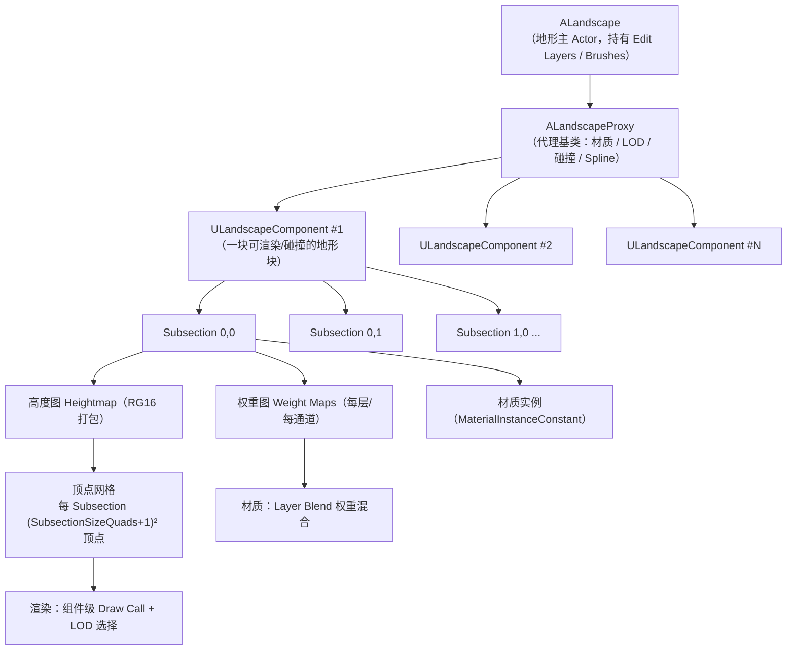
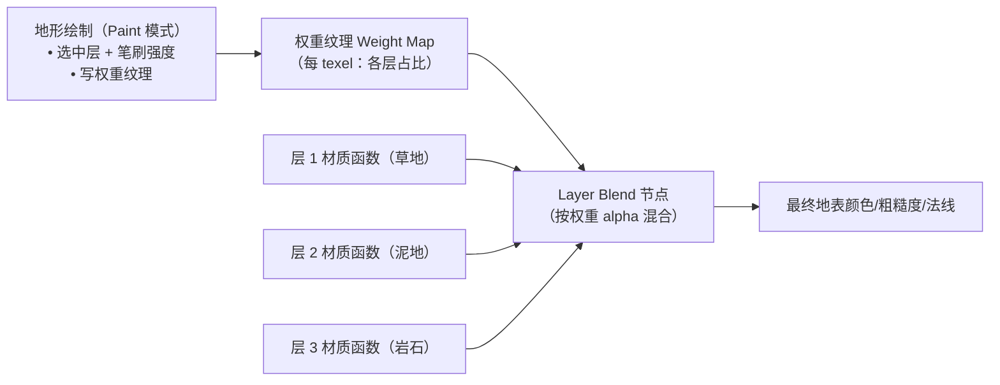
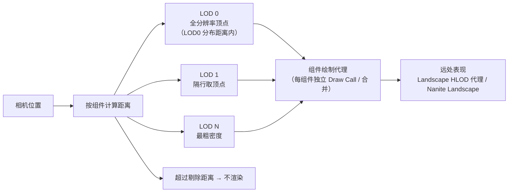
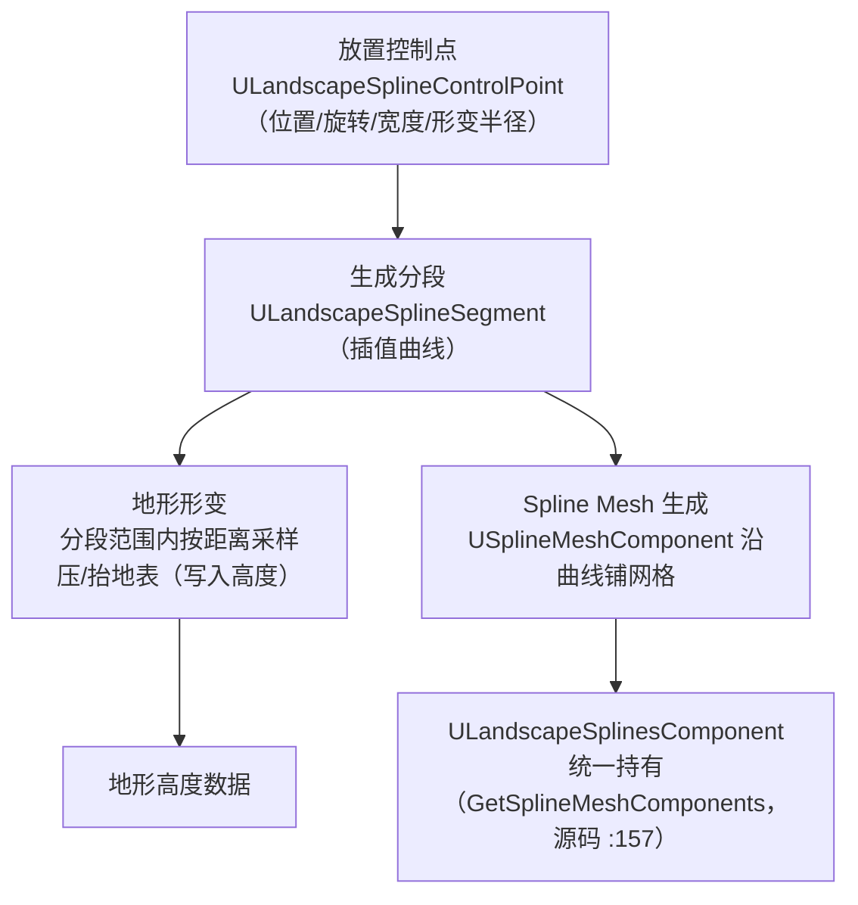

# 01-Landscape 地形系统

> 适用范围：UE 客户端 · 大世界构建
> 版本基准：UE 5.8（关键 API 已对照本机源码：`Runtime\Landscape\Classes\Landscape.h` 等）
> 兼容性边界：适用于 UE5.8 编辑器/运行时，UE4.27 与早期 UE5 仅作迁移背景，具体模块以正文为准。
> 最后更新：2026-08-06（本轮元数据维护）。

## 1. 概述

Landscape 是 Unreal Engine 的官方地形系统，负责**超大范围地表**的高度、材质、碰撞与渲染。与"用一块巨型 Static Mesh 当地面"的方案相比，Landscape 的核心优势在于：

- **数据即纹理**：地形高度与层权重都存储在纹理中，天然支持 LOD 与流送，内存占用与表现按组件（Component）粒度控制；
- **可编辑工作流**：编辑器内置雕刻、层绘制、Spline 道路/河流、程序化草地等成套工具；
- **大世界原生**：UE 5.1 起 `ALandscapeProxy` 直接继承 `APartitionActor`（本机源码 `LandscapeProxy.h` 第 449-450 行），可无缝放入 World Partition 世界；
- **性能可预测**：组件级剔除、距离 LOD、材质权重烘焙、RVT（Runtime Virtual Texture）等机制，让"几十平方公里地表"成为可能。

本篇目标读者是已经掌握 Actor/Component 与材质基础、准备在工程中落地大世界地形的客户端程序员。学完本篇，你应该能：

- 说清 `ALandscape` / `ALandscapeProxy` / `ULandscapeComponent` 的层级与各自职责；
- 读懂高度图 RG16 打包编码（`LandscapeDataAccess` 命名空间）并能手写解码；
- 理解 Landscape 材质中 Layer Blend 权重混合的本质（权重纹理 + 每层材质函数）；
- 会用 Landscape Spline 做道路/河流，并知道它背后发生了什么；
- 掌握运行时查询地形高度（`GetHeightAtLocation`）的正确姿势，理解运行时修改地形的边界与风险；
- 理解 LOD/烘焙/World Partition 配合下的性能模型。

## 2. 核心概念（表格）

### 2.1 Actor 与组件层级

| 概念 | 类型 | 一句话说明 |
| --- | --- | --- |
| `ALandscape` | Actor | 地形主 Actor，拥有编辑层、笔刷系统与 LandscapeInfo，继承自 `ALandscapeProxy`（源码 `Landscape.h` 第 275-276 行） |
| `ALandscapeProxy` | Actor | 地形"代理"基类，持有材质、LOD 设置、碰撞与 Spline 组件；UE 5.8 中继承 `APartitionActor` 与 `ILandscapeSplineInterface`（源码 `LandscapeProxy.h` 第 449-450 行） |
| `ULandscapeComponent` | Component | 一块可独立渲染/碰撞的地形块（`UPrimitiveComponent`，`Within=LandscapeProxy`，源码 `LandscapeComponent.h` 第 430-431 行） |
| Section / Subsection | 数据结构 | Component 内部再划分的子块：`ComponentSizeQuads`（组件边长）、`NumSubsections`、`SubsectionSizeQuads`（子块边长） |
| 高度图 | Texture2D | 每组件一张，RG 两通道打包 16bit 高度（`GetHeightmap()`，源码 `LandscapeComponent.h` 第 810 行） |
| 权重图 | Texture2D | 每材质层一张（或打包通道），记录该层混合权重 |
| Edit Layer | 数据结构 | 5.0+ 的地形编辑层，类似 PS 图层，支持非破坏性雕刻与撤销 |
| Landscape Spline | Component | `ULandscapeSplinesComponent`（源码 `LandscapeSplinesComponent.h` 第 105-106 行），用于道路/河流等沿曲线形变地形的工具组件 |

### 2.2 数据与精度

| 概念 | 数值/说明 |
| --- | --- |
| `LANDSCAPE_ZSCALE` | `1/128`，即高度 1 LSB ≈ 0.78125 cm（源码 `LandscapeDataAccess.h` 第 13 行） |
| `MaxValue` / `MidValue` | `65535` / `32768`（16bit 高度中值，源码 `LandscapeDataAccess.h` 第 26-27 行） |
| `LANDSCAPE_VISIBILITY_THRESHOLD` | `2/3`，组件可见性阈值（源码第 19 行） |
| 世界坐标 | UE 5.0+ LWC（Large World Coordinates）双精度，支持 100km+ 世界；地形顶点仍为 float，但通过局部偏移维持精度 |
| 分辨率基准 | 1 quad = 1m 是常见基准；`ComponentSizeQuads` 建议 63/127/255 等 2 的幂减 1 |

### 2.3 材质与工具

| 概念 | 说明 |
| --- | --- |
| Landscape 材质 | 材质域为 Landscape 的特殊材质，通过 `Layer Blend` 节点混合各层 |
| Layer Blend | 材质节点：读取权重纹理，按权重混合多个层材质函数 |
| Landscape Layer Weight | 材质节点：单层权重采样（蓝/绿/红/A 通道之一） |
| Landscape Grass Type | 程序化草地：由材质权重在运行时驱动草网格实例生成 |
| RVT | Runtime Virtual Texture：把 Landscape 混合结果烘焙到虚拟纹理，供静态网格融合 |
| Per-LOD 材质覆盖 | `FLandscapePerLODMaterialOverride`（`PerLODOverrideMaterials`，源码 `LandscapeProxy.h` 第 493-495 行），远处换更省的材料 |

### 2.4 性能与分区

| 概念 | 说明 |
| --- | --- |
| LOD Distribution | 每组件按距离选择的 LOD 档位（`LODDistributionSettings`），`ELandscapeLODFalloff` 提供 Linear/Sqrt 两种衰减 |
| 烘焙 | 把多层权重/法线烘焙合并，减少运行时材质开销 |
| Landscape HLOD | 远距离用简化网格/代理（`ELandscapeHLODMeshSourceLODPolicy`） |
| World Partition | 地形作为整体 `APartitionActor` 参与分区世界，不被切碎，配合 LOD 与 HLOD 提供远近表现 |

## 3. 原理详解

### 3.1 地形数据组织：从 Actor 到顶点

地形的本质是一张**规则网格 + 按组件切分**的高度场。世界中的一张地形在对象层与数据层分别组织如下：



关键点：

- **组件是渲染/碰撞/LOD 的基本单位**：每个 `ULandscapeComponent` 有独立的包围盒、材质实例与绘制代理，引擎按组件做视锥剔除与距离 LOD；
- **Subsection 是网格细分单位**：一个组件由 `NumSubsections × NumSubsections` 个子块拼成，子块边界共享顶点，避免缝隙；
- **数据在纹理里**：高度图每 texel 存一个顶点高度（RG 两通道共 16bit），权重图每 texel 存各层权重；这意味着"地形"本质上是一组 GPU 友好的纹理，而不是一串 CPU 顶点数组。

### 3.2 高度图编码：LandscapeDataAccess 源码解读

地形高度为什么用纹理存？因为渲染时 GPU 可以直接采样它做网格形变（Displacement）与碰撞查询。存储格式为**每像素 16bit 高度 + 8bit 法线**（打包进 RGBA），本机源码 `Runtime\Landscape\Public\LandscapeDataAccess.h`：

```cpp
// LandscapeDataAccess.h（UE 5.8，关键行摘录）
#define LANDSCAPE_ZSCALE     (1.0f/128.0f)   // 1 LSB = 1/128 米 ≈ 0.78cm

namespace LandscapeDataAccess
{
    inline constexpr int32  MaxValue = 65535;  // 16bit 高度最大值
    inline constexpr float  MidValue = 32768.f;// 高度 0 米对应的编码值

    // 解码：纹理值 → 局部高度（米）
    FORCEINLINE float GetLocalHeight(uint16 Height)
    {
        return (static_cast<float>(Height) - MidValue) * LANDSCAPE_ZSCALE;
    }

    // 编码：局部高度（米） → 纹理值
    FORCEINLINE uint16 GetTexHeight(float Height)
    {
        return static_cast<uint16>(FMath::RoundToInt(FMath::Clamp<float>(
            Height * LANDSCAPE_INV_ZSCALE + MidValue, 0.f, MaxValue)));
    }

    // 打包：16bit 高度拆到 R（高 8 位）/ G（低 8 位）
    FORCEINLINE FColor PackHeight(uint16 Height)
    {
        FColor Color(ForceInit);
        Color.R = Height >> 8;
        Color.G = Height & 255;
        return MoveTemp(Color);
    }

    // 解码：采样 FColor 还原 16bit 高度
    FORCEINLINE float UnpackHeight(const FColor& Sample)
    {
        uint16 Height = (uint16)(Sample.R << 8) | (uint16)Sample.G;
        return GetLocalHeight(Height);
    }
}
```

数值示例（帮助建立直觉）：

| 场景 | 编码值 | R 通道 | G 通道 |
| --- | --- | --- | --- |
| 0 米（MidValue=32768） | 32768 | 0x80 (128) | 0x00 (0) |
| +1 米（+128 LSB） | 32896 | 0x80 (128) | 0x80 (128) |
| -1 米（-128 LSB） | 32640 | 0x7F (127) | 0x80 (128) |
| 最大 +255.98 米 | 65535 | 0xFF (255) | 0xFF (255) |

`GetHeightAtLocation` 是引擎提供的**运行时官方查询 API**（源码 `LandscapeProxy.h` 第 1101 行）：

```cpp
LANDSCAPE_API TOptional<float> GetHeightAtLocation(
    FVector Location,
    EHeightfieldSource HeightFieldSource = EHeightfieldSource::Complex) const;
```

它内部走碰撞数据（Complex 用精确碰撞体、Simple 用简化体），因此查询结果与"角色脚下高度"一致；返回 `TOptional` 表示"该点不在本地形范围内"时为空。

### 3.3 Landscape 材质与 Layer Blend 权重混合

地形材质不能像普通材质那样"整块贴一张图"——大世界地表需要**多种材质（泥、草、石、雪）随地形层平滑过渡**。方案是：**每个地形层 = 一个 Layer Info + 一张权重图**，材质侧用 `Layer Blend` 节点按权重混合：



要点：

- **权重纹理的通道策略**：单层用一张 8bit 单通道图；多层可打包进一张 RGBA 的四个通道（例如 4 层共 1 张纹理），减少采样数——这也是为什么 4 个一层、8 个两层这类"层数组合"是常见配置；
- **Layer Blend 是材质函数组合器**：它不是贴图混合，而是把每层各自的颜色/粗糙度/法线函数按权重线性混合；每层通常由 `LandscapeLayerCoords` + 贴图采样 + 细节处理组成；
- **绘制即写权重**：编辑器 Paint 模式的笔刷本质是"按笔刷衰减把权重从旧层转移到新层"，并在层之间做归一化；
- **性能陷阱**：层数越多、采样越贵。烘焙（把多层结果合并）与 RVT 是把"多层混合成本"转嫁为"一次采样"的关键手段。

### 3.4 LOD 与渲染性能模型

地形 LOD 与 Static Mesh 的 LOD 思路不同：网格不能整体换模型，而是**每个组件按距离选择"顶点采样密度"**，靠近相机的组件用满分辨率（LOD 0），远处的组件跳过部分顶点（LOD 1/2/3…）：



控制项（均在 `ALandscapeProxy` 属性中）：

- `LODDistributionSettings`：各 LOD 生效的距离区间；`LOD0DistributionSetting` 决定"满分辨率范围"，它直接决定近景顶点预算；
- `LODFalloff`（`ELandscapeLODFalloff`）：Linear 与 Sqrt 两种距离衰减曲线，Sqrt 过渡更自然（源码 `LandscapeProxy.h` 第 282-288 行附近）；
- `PerLODOverrideMaterials`：给指定 LOD 换更轻的材质（源码 `LandscapeProxy.h` 第 493-495 行）；
- **组件粒度即性能粒度**：`ComponentSizeQuads` 越大组件越少、剔除越粗；越小剔除越细但 Draw Call 与状态切换越多。常规推荐 63 或 127 quads；
- 烘焙（Bake）：把多层权重与法线烘焙进纹理，减少材质指令；Landscape 也有"烘焙材质"一键流程；
- 5.4+ 提供实验性 **Nanite Landscape**：远处地形可用 Nanite 网格表示，配合 Nanite 的集群剔除进一步降成本（受平台与工具链限制，生产使用前需验证）。

### 3.5 Landscape Spline：道路与河流

Spline 工具解决的核心问题是：**让地形沿着一条曲线"贴下去"，并沿曲线放置道路/河床网格**。工作流与内部原理：



使用要点：

- 编辑器里选择 Landscape → Spline 模式 → 放置控制点，选中分段后可指定"路面网格"与"路肩网格"，地形自动随 Spline 形变；
- 道路/河流网格本质是 `USplineMeshComponent`，可在 C++ 中通过 `GetSplineMeshComponents()`（源码 `LandscapeSplinesComponent.h` 第 157 行）遍历取得并运行时修改材质；
- 形变是**非破坏性**的：Spline 是地形之上的"编辑层"，删除 Spline 可还原地形（配合 Edit Layer 使用效果最佳）；
- 运行时不要依赖 Spline 形变地形做动态修改，形变发生在编辑器/工具流程；运行时道路网格可直接用 `USplineMeshComponent` 重建。

### 3.6 与 World Partition 的集成

大世界场景中，地形是**体积最大、最不该被切碎**的对象：如果按 Streaming Cell 切地形，Cell 边界必然出现接缝与加载抖动。UE 5.1 起的做法是（本机源码可证）：

```cpp
// LandscapeProxy.h（UE 5.8，第 449-450 行）
UCLASS(Abstract, MinimalAPI, ...)
class ALandscapeProxy : public APartitionActor, public ILandscapeSplineInterface
```

含义与推论：

- `ALandscapeProxy` 是 `APartitionActor`，意味着它可以合法存在于 World Partition 世界中并参与分区系统管理（网格注册、按需加载策略）；
- 但地形**作为一个整体 Actor 存在，不会被 Streaming Cell 物理切碎**，从而规避接缝问题；远近表现交给地形自身的 LOD + Landscape HLOD；
- Landscape 在 WP 世界中依然可以配置"仅被某些区域加载"（通过分区规则），配合 `DataLayer` 做玩法化控制（例如副本区域、活动区域）；
- 注意：地形仍会带来**加载尖峰**（大组件 + 大纹理），因此 WP 下建议把地形组件尺寸控制住，并用 Landscape HLOD 覆盖远景；
- 与 01-引擎基础 08/09（关卡流送/WorldPartition）篇配合阅读：机制层看 WP 如何管理 Cell 与加载；本分类关注"地形如何作为大型分区 Actor 被组织"。

### 3.7 运行时数据访问：查询与修改的边界

**查询（官方支持，推荐）**：

- `ALandscapeProxy::GetHeightAtLocation(FVector, EHeightfieldSource)` → `TOptional<float>`：基于碰撞体查询高度，复杂/简单两种源，是运行时"把物体吸附到地表"的首选 API（源码 `LandscapeProxy.h` 第 1101 行）；
- 读取材质实例：`ULandscapeComponent::GetMaterialInstance(int32, bool bDynamic=true)` 与 `GetMaterialInstanceDynamic(int32)`（源码 `LandscapeComponent.h` 第 1013-1018 行），可用于运行时改地表材质参数；
- 读取高度图：`GetHeightmap(bool bReturnEditingHeightmap=false)`（源码第 810 行）拿纹理，配合 `LandscapeDataAccess::UnpackHeight` 自建 CPU 采样（适合"批量采样"场景，避免逐点查碰撞）。

**修改（边界要清楚）**：

- 编辑器/工具链：`FLandscapeEditDataInterface`（`LandscapeEditor` 模块）提供 `SetHeightData` 等完整修改 API，但带 `WITH_EDITOR` 守卫，**打包后的游戏不可用**；
- 运行时：引擎**没有公开的"运行时改地形"官方 API**。社区方案（直接 LockMip 改 Heightmap 纹理 RG 通道 → UnlockMip → 刷新碰撞/渲染）属于"绕过内部缓存"的黑科技：需要自行调用碰撞重建与渲染状态刷新（`MarkRenderStateDirty`、碰撞更新），且 5.7 移除非 Edit Layer 地形后该路径更脆弱。生产项目若必须运行时改地形，优先评估：换用程序化网格（Landmass）、把"地形变化"做成编辑器预烘焙的多种状态切换、或只改材质权重（`GetMaterialInstanceDynamic` 改参数，安全）——**权重修改是运行时最安全的"地形外观变化"手段**。

## 4. 示例

### 4.1 运行时把 Actor 吸附到地表（C++）

```cpp
// 头文件：LandscapeProxy.h、EngineUtils.h
// 在目标点下方找到地形并查询高度
#include "LandscapeProxy.h"
#include "EngineUtils.h"

float FindLandscapeHeightAt(UWorld* World, const FVector& QueryLocation)
{
    for (TActorIterator<ALandscapeProxy> It(World); It; ++It)
    {
        ALandscapeProxy* Landscape = *It;
        const TOptional<float> Height =
            Landscape->GetHeightAtLocation(QueryLocation, EHeightfieldSource::Complex);
        if (Height.IsSet())
        {
            return Height.GetValue();
        }
    }
    return QueryLocation.Z; // 未命中：返回原高度
}

// 用法：把生成物落到地表
void SpawnOnGround(UWorld* World, const FVector& XZ)
{
    const float GroundZ = FindLandscapeHeightAt(World, XZ);
    World->SpawnActor<AActor>(MyActorClass, FVector(XZ.X, XZ.Y, GroundZ), FRotator::ZeroRotator);
}
```

注意：`GetHeightAtLocation` 基于碰撞数据，未生成碰撞的 Landscape（纯可视化）查不到；需要确认组件有碰撞体（默认有）。

### 4.2 用 LandscapeDataAccess 自建高度采样（C++）

```cpp
#include "LandscapeComponent.h"
#include "LandscapeDataAccess.h"

// 在组件局部 UV 处解码高度（演示解码逻辑）
float SampleLandscapeComponentHeight(ULandscapeComponent* Comp, const FVector2D& LocalUV)
{
    UTexture2D* Heightmap = Comp->GetHeightmap();
    if (!Heightmap) { return 0.f; }

    const int32 W = Heightmap->GetSizeX();
    const int32 H = Heightmap->GetSizeY();
    const int32 X = FMath::Clamp(FMath::FloorToInt(LocalUV.X * W), 0, W - 1);
    const int32 Y = FMath::Clamp(FMath::FloorToInt(LocalUV.Y * H), 0, H - 1);

    // 正式代码应使用纹理 LockMip/UnlockMip 或 BulkData 读取像素，
    // 这里仅展示解码：R 高 8 位 + G 低 8 位 → 16bit 高度
    FColor Sample = FColor(128, 0, 128, 128); // 占位：实际从纹理读取
    return LandscapeDataAccess::UnpackHeight(Sample);
}
```

提示：纹理数据在运行时位于 GPU 侧，CPU 读取需要 `LockMip`（开销大，禁止每帧做）；批量/低频采样才值得。常规运行时查询优先用 4.1 的官方 API。

### 4.3 运行时修改地形的三条路线对比

| 路线 | 可行性 | 说明 |
| --- | --- | --- |
| A. 材质权重/参数（推荐） | 运行时安全 | `GetMaterialInstanceDynamic` 改地表外观（雪覆盖、烧焦），官方支持 |
| B. `FLandscapeEditDataInterface` | 仅编辑器/工具 | `WITH_EDITOR` 守卫，适合做成编辑器插件或独立工具（如外部 DCC 回写） |
| C. 直接改 Heightmap 纹理 | 实验性 | LockMip 改 RG → UnlockMip → 手动刷新碰撞与渲染缓存；版本敏感、易踩坑，仅离线烘焙场景建议 |

```cpp
// 路线 A 示例：运行时让整块地形"落雪"（换材质实例）
void ApplySnowMaterial(ULandscapeComponent* Comp, UMaterialInstance* SnowMat)
{
    if (!Comp || !SnowMat) { return; }
    Comp->SetMaterial(0, SnowMat);
}
```

### 4.4 蓝图：快速放置并吸附（步骤）

1. 拖入 `ALandscape`（或已有地形 Actor）与要放置的 `StaticMeshActor`；
2. 使用蓝图节点 `Get Height at Location (Landscape)`（封装 `GetHeightAtLocation`）；
3. 输入目标 X/Y，把返回的 Z 赋给 Actor 的 `SetActorLocation`；
4. 若要贴斜坡朝向，再用 `FindLookAtRotation` 或法线查询对齐旋转。

### 4.5 Landscape Spline 道路创建流程（编辑器 + C++ 访问）

1. 选中地形 → 菜单 "Landscape → Splines" 进入 Spline 模式；
2. 沿路径放置控制点（Shift+点击生成直线段，可调宽度/形变半径）；
3. 选择分段，在 Details 指定 `Spline Mesh`（路面）与 `Road Mesh`（路肩），调整网格对齐（Offset/Scale）；
4. 地形自动沿 Spline 形变；勾选 `Fill Mesh` 可生成填充地形；
5. 运行时遍历路面网格换材质：

```cpp
// LandscapeSplinesComponent.h 源码第 157 行：GetSplineMeshComponents()
void RecolorRoad(ULandscapeSplinesComponent* Splines, UMaterialInterface* NewMat)
{
    for (USplineMeshComponent* Mesh : Splines->GetSplineMeshComponents())
    {
        if (Mesh) { Mesh->SetMaterial(0, NewMat); }
    }
}
```

## 5. 最佳实践

1. **先定分辨率基准再动手**：1 quad = 1m 是通用基准；竞技/驾驶类可 0.5m，超大世界用 2m+ 配合 Nanite/LOD，避免顶点爆炸；
2. **组件尺寸宁小勿大**：`ComponentSizeQuads` 推荐 63/127；大组件在 WP 流送与 LOD 切换时尖峰明显；
3. **层数控制**：材质层按"通道打包"规划（4 层/张 RGBA），层数超过 8 优先考虑烘焙或 RVT；
4. **近景预算看 LOD0 距离**：`LOD0DistributionSetting` 是近景顶点预算的总开关，配合 `LODFalloff=Sqrt` 平滑过渡；
5. **运行时查询用官方 API**：`GetHeightAtLocation` 优先；批量 CPU 采样用高度图 + `UnpackHeight`；禁止每帧 LockMip；
6. **运行时改地形三思**：优先"材质/权重方案"，需要真地形变化时评估预烘焙多状态或程序化网格；
7. **WP 世界用 Landscape HLOD**：为地形配置 HLOD 代理（`ELandscapeHLODMeshSourceLODPolicy`），远景成本可忽略；
8. **Spline 网格用编辑器生成**：运行时动态改路网用 `USplineMeshComponent` 重建，不要依赖地形形变；
9. **配合 RVT**：大世界地表与静态网格融合（路面压入地形、物体贴地阴影）用 Runtime Virtual Texture，省去大量手工对齐；
10. **定期性能验证**：用 `stat Landscape`、`ProfileGPU` 观察组件 Draw Call 数与 LOD 分布，别等合入大世界才测。

## 6. FAQ

**Q1：地形看起来很糊/远处细节消失？**
通常是 LOD0 距离过小或烘焙分辨率不足。调大 `LOD0DistributionSetting`（近景）或检查烘焙贴图分辨率；远景糊是预期行为，交给 HLOD。

**Q2：两块地形之间有接缝/裂缝？**
检查相邻组件 `ComponentSizeQuads` 是否一致、是否有"合并地形"操作、Spline 形变是否跨越边界；WP 世界确认地形是单一 `ALandscapeProxy` 而非被切碎。

**Q3：运行时 GetHeightAtLocation 返回空？**
该点不在任何组件范围内，或地形碰撞被禁用。先确认查询点 XY 落在本地形 AABB 内；碰撞被关时改用高度图采样。

**Q4：能在运行时挖坑/堆山吗？**
没有官方运行时 API。见 4.3 三条路线；生产项目建议预烘焙"地形状态"或用地形之上的程序化网格/装饰物表达变化。

**Q5：Landscape 与 World Partition 冲突吗？**
不冲突，5.1 起官方支持：`ALandscapeProxy : APartitionActor`（源码可证）。注意加载尖峰与 HLOD 配置，避免超大组件。

**Q6：Landscape 材质采样爆炸（Draw 指令高）？**
层数过多 + 每层多个采样贴图是主因。压缩层数、权重通道打包、使用烘焙材质/RVT、远处用 `PerLODOverrideMaterials` 换轻材质。

**Q7：Landscape Grass 与 Foliage 有什么区别？**
Landscape Grass 由地形材质权重在运行时动态生成草网格实例（随材质变化增减）；Foliage 是编辑器绘制的持久实例数据。草地生成细节在 02 篇展开。

## 7. 关联阅读

- [02-植被Foliage与实例化渲染.md](./02-植被Foliage与实例化渲染.md)：Landscape Grass、实例化渲染、植被 LOD——地形之上的内容层；
- [03-过场与影视Sequencer.md](./03-过场与影视Sequencer.md)：地形与植被最终如何被镜头"拍"下来；
- 01-引擎基础 08-关卡流送与加载 / 09-WorldPartition 大世界分区：WP 机制层（Streaming Cell、DataLayer、HLOD 管线）；
- 12-引擎源码分析 13-资源加载与异步加载源码：地形纹理/网格的加载与卸载机制；
- 02-渲染与图形 04-Nanite与Lumen：Nanite Landscape、Lumen 下地表 GI 表现；
- [UE 5.8 官方文档总页](https://dev.epicgames.com/documentation/en-us/unreal-engine)：Landscape 快速入门、World Partition、Landscape Splines；具体专题 slug 待按本机文档版本核对。
