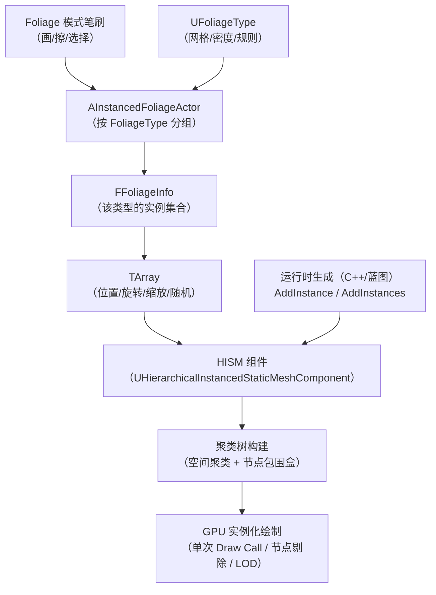
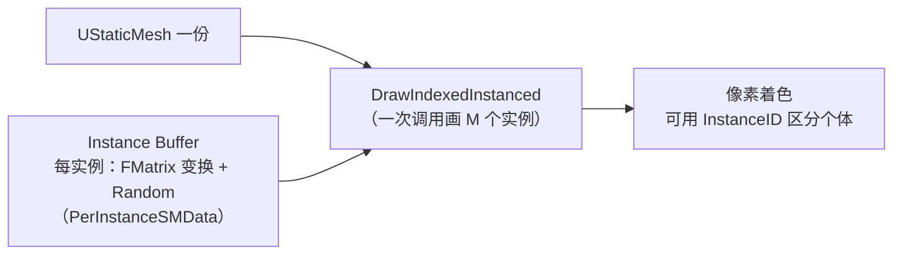
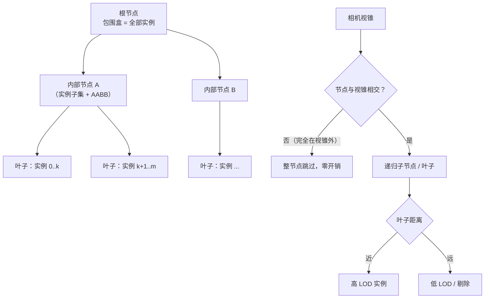
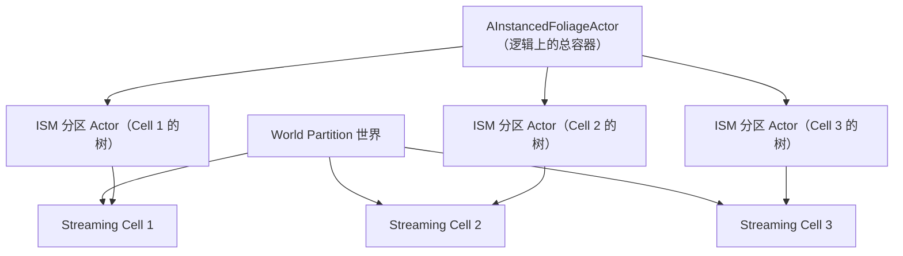
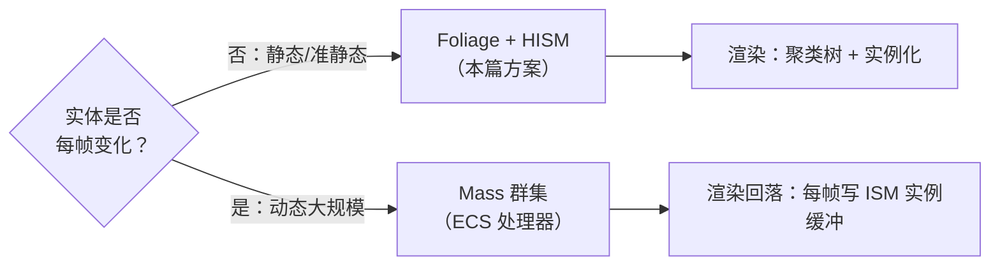

# 02-植被 Foliage 与实例化渲染

> 适用范围：UE 客户端 · 大世界构建
> 版本基准：UE 5.8（关键 API 已对照本机源码：`Runtime\Foliage\Public\InstancedFoliage.h`、`Runtime\Engine\Classes\Components\HierarchicalInstancedStaticMeshComponent.h`）

## 1. 概述

Foliage（植被）系统解决的是开放世界最"数量爆炸"的问题：一片森林有几十万棵树、一片草地有上百万根草，如果用 Actor 一棵棵放置，Draw Call、内存与更新开销会立刻压垮任何机器。UE 的方案是：

- **编辑期**：Foliage 模式用笔刷"画"植被，数据统一收进一个 `AInstancedFoliageActor`，按 Foliage Type 组织；
- **存储期**：每个 Foliage Type 对应一份实例数据（`FFoliageInfo` + `FFoliageInstance` 数组，源码 `InstancedFoliage.h` 第 81、283 行）；
- **渲染期**：实例交给 **ISM（Instanced Static Mesh）/ HISM（Hierarchical Instanced Static Mesh）** 组件，一次 Draw Call 画几千个实例，并利用层次聚类做视锥剔除与 LOD。

本篇目标读者是已经会画地形、准备把植被做进大世界的客户端程序员。学完本篇，你应该能：

- 说清 `AInstancedFoliageActor` → `FFoliageInfo` → `TArray<FFoliageInstance>` → HISM 组件的数据流；
- 理解 ISM 与 HISM 的区别、HISM 聚类树的原理，以及它如何把"百万实例"变成可负担的开销；
- 掌握 Foliage 的 LOD 与剔除配置（`LODDistances`、`SetCullDistances` 等）；
- 会用 C++/蓝图在运行时动态生成植被（HISM `AddInstance`/`AddInstances`）；
- 理解 Foliage 与 Mass 群集的定位差异，能做出正确的选型。

## 2. 核心概念（表格）

### 2.1 资产与数据

| 概念 | 类型 | 一句话说明 |
| --- | --- | --- |
| Foliage Type | `UFoliageType`（资产） | 描述"一种植被"：网格、密度、对齐规则、LOD、碰撞、被风吹动等（`Foliage\Public\FoliageType.h`） |
| `UFoliageType_InstancedStaticMesh` | 资产子类 | 基于 Static Mesh 的植被类型（最常用，走 ISM/HISM） |
| `UFoliageType_Actor` | 资产子类 | 基于 Actor 的植被类型（需要独立逻辑/动画时使用，开销大，慎用） |
| `AInstancedFoliageActor` | Actor | 关卡中承载所有植被实例的"隐形 Actor"，按 FoliageType 分组（源码 `InstancedFoliageActor.h` 第 27-28 行：继承 `AISMPartitionActor`，`NotBlueprintable`） |
| `FFoliageInfo` | 内部结构 | 某一种 FoliageType 的全部实例数据与对应组件（源码 `InstancedFoliage.h`：`TArray<FFoliageInstance> Instances` 第 283 行；`GetComponent()` 第 305 行） |
| `FFoliageInstance` | 内部结构 | 单个植被实例：位置、旋转、缩放、随机种子等（源码第 81 行 `struct FFoliageInstance : public FFoliageInstancePlacementInfo`） |
| `EFoliageImplType` | 枚举 | 实现方式：ISM / HISM / Actor（源码 `InstancedFoliage.h` 第 323 行 `GetImplementationType`） |
| Procedural Foliage | 资产 | `UProceduralFoliageSpawner`：按规则（密度/半径/物种排斥）程序化撒点生成 |
| Landscape Grass | 组件 | `UGrassInstancedStaticMeshComponent` 系列：由地形材质权重在运行时动态生成草 |
| `UFoliageStatistics` | 静态类 | 运行时统计查询：`CountOverlappingSphere` / `CountOverlappingBox`（`Foliage\Public\FoliageStatistics.h`，BlueprintCallable） |

### 2.2 渲染与性能

| 概念 | 说明 |
| --- | --- |
| ISM | `UInstancedStaticMeshComponent`：一份网格 + N 个实例变换，单次实例化 Draw Call |
| HISM | `UHierarchicalInstancedStaticMeshComponent : public UInstancedStaticMeshComponent`（源码 HISM.h 第 134-135 行）：内部构建聚类树，按节点剔除与 LOD |
| 实例缓冲区 | `PerInstanceSMData`：每实例的变换/随机数等，上传为 GPU Instance Buffer |
| 聚类树 | HISM 内部把实例按空间聚类成树状节点，每个节点持包围盒与实例子集 |
| `LODDistances` | HISM 上按距离选择每实例 LOD 的数组 |
| `SetCullDistances` | HISM 设置剔除起始/结束距离 |
| Per-instance 数据 | 随机数、自定义数据（`SetCustomDataValue`），实现颜色/大小/风力变化 |

### 2.3 分区与群集

| 概念 | 说明 |
| --- | --- |
| `AISMPartitionActor` | UE5 World Partition 下的"ISM 分区 Actor"：把海量实例按 Cell 分区到多个 actor，随 Cell 加载/卸载 |
| Mass 群集 | 面向动态大规模实体的 ECS 框架（MassEntity）：实体带任意数据、可被系统批量处理，渲染可回落到 ISM 或自定义代理 |
| Foliage vs Mass | Foliage 管"静态/准静态内容"，Mass 管"动态人群/兽群/车流"，二者可结合 |

## 3. 原理详解

### 3.1 总体数据流：从画笔到像素



要点：

- **编辑期**画下的每一笔，最终都变成 `FFoliageInfo::Instances` 数组里的一个 `FFoliageInstance`（保存于关卡/分区数据中，随关卡序列化）；
- **运行期**实例数据被灌入 HISM 组件：组件持有实例变换缓冲，并维护一棵空间聚类树用于快速剔除；
- **渲染期**GPU 每帧只收到"网格 + 实例缓冲"，一次实例化调用画完所有可见实例；
- 因此 **Foliage 的性能上限 = 实例数据的管理成本 + HISM 树的维护成本 + GPU 实例化吞吐**，三者分别对应存储、更新、绘制。

### 3.2 ISM：实例化渲染的原理

传统做法：N 棵树 = N 个 `UStaticMeshComponent` = N 次 Draw Call。ISM 的做法：



- **每实例数据**：ISM 为每个实例保存变换矩阵（位置/旋转/缩放）与一个随机数（`PerInstanceRandom`，用于颜色/大小抖动）；材质可通过 `PerInstanceCustomData` 读取每实例自定义值（需在材质里接 `PerInstanceCustomData` 节点，UE 5.x 起支持 float4 数组）；
- **Draw Call 恒定**：实例数量再多，Draw Call 次数不变；瓶颈转移到 GPU 顶点吞吐与实例缓冲带宽；
- **代价**：所有实例共享一套网格与材质，无法给单棵树独立组件级行为；碰撞、物理、交互需要另行处理（常用"代理碰撞 + 交互时换 Actor"策略）；
- **适用**：静止或准静态、数量大、个体无逻辑的对象——正是植被。

### 3.3 HISM：聚类树与分层剔除

HISM 在 ISM 之上加了一层**空间索引**。它把实例递归聚类成一棵树：



- **剔除粒度**：视锥剔除先测节点包围盒，整棵子树不可见时一次性跳过——十万实例的剔除只需要几十次包围盒测试；
- **LOD 粒度**：叶子按距离选择 LOD（`LODDistances` 数组），并可整体剔除（`SetCullDistances`，源码 `HISM.h`）；
- **维护代价**：`AddInstance` / `RemoveInstance` / `UpdateInstanceTransform`（源码 `HISM.h` 第 303-308 行）会标记树为 dirty，在合适时机重建受影响节点——**批量添加（`AddInstances`）比分次添加便宜得多**，因为可以一次性重建树；
- **"层次化"的收益**：树高约 O(log N)，绝大多数实例永远不被逐个访问；这是 HISM 能支撑百万实例的关键。

### 3.4 Foliage 绘制与数据落盘

Foliage 模式的工作流（编辑器）：

1. 选择 Foliage Type（或从 Content Browser 拖入 Static Mesh 自动创建 `UFoliageType_InstancedStaticMesh`）；
2. 配置密度（`Density`：每平方米数量）、对齐（Align to Surface、Random Pitch/Roll/Yaw）、缩放（Scale Min/Max）、排斥半径（避免互相穿插）等；
3. 用笔刷在 Landscape/静态网格表面上绘制（支持"按坡度过滤"：`Ground Slope Angle` 限制悬崖上不长树）；
4. 引擎把实例写入当前关卡的 `AInstancedFoliageActor`（或 WP 世界的分区实例数据），随关卡保存。

数据落盘细节（源码对照）：

- `FFoliageInstance` 继承 `FFoliageInstancePlacementInfo`，包含位置、旋转、预对齐旋转、`DrawScale3D`、`ZOffset`、`FloatRandom` 等（源码 `InstancedFoliage.h` 第 49-100 行附近），`GetInstanceWorldTransform()` 组合出最终世界变换（第 97 行）；
- 每个 FoliageType 在 IFA 中对应一个 `FFoliageInfo`，其内部持有 `UHierarchicalInstancedStaticMeshComponent* Component`（第 140/163 行）——**FFoliageInfo 就是"数据 + 渲染组件"的桥**；
- 实现方式由 `EFoliageImplType` 决定（ISM/HISM/Actor），`CreateImplementation`（第 324 行）按 FoliageType 配置创建对应组件。

### 3.5 Foliage 的 LOD 与剔除

植被数量巨大，**剔除必须发生在"树"层面而非"实例"层面**，否则光剔除计算就耗尽 CPU。配置与机制：

| 层级 | 机制 | 配置位置 |
| --- | --- | --- |
| 视锥剔除 | HISM 聚类树节点测试（见 3.3） | 自动，无需配置 |
| 距离剔除 | 每实例按距离整体消失 | FoliageType 的 `CullDistance` / HISM `SetCullDistances`（Min/Max） |
| 网格 LOD | 每实例按距离切换网格 LOD（LOD0/LOD1/…） | FoliageType 的 `LODDistances` 数组（对应 Static Mesh 的 LOD） |
| 缩放衰减 | 远处实例整体缩小，减少屏幕覆盖 | FoliageType 的 `Scale` / 距离缩放曲线 |
| 密度分级 | 远处按 Cell 或整体降密度 | WP 下按分区加载；或使用多个密度层级的 FoliageType 分距离放置 |
| 阴影 | 远处关阴影 / 用缓存阴影 | FoliageType 的 Cast Shadow、Distance Field Shadow |

实践结论：

- **LOD 距离不是越大越好**：`LODDistances` 切换点附近会出现"弹跳"（pop），建议配合每实例随机缩放/旋转掩盖；
- **距离剔除优先于 LOD**：远处实例直接剔除比降 LOD 更省，`SetCullDistances` 的 Min 要略大于最后一个 LOD 的切换距离；
- **HISM 的树要稳定**：频繁增删实例会重建节点，若运行时"种草-拔草"很频繁，考虑分块管理（每块一个 HISM）或延迟批量提交。

### 3.6 World Partition 下的植被：ISM 分区

大世界下，一棵树该属于哪个 Streaming Cell？UE5 的答案是**实例级分区**：`AInstancedFoliageActor` 继承 `AISMPartitionActor`（源码 `InstancedFoliageActor.h` 第 27-28 行），Foliage 实例按空间被划分到多个"ISM 分区 Actor"，随对应 Cell 加载/卸载：



对开发者的影响：

- 在 WP 世界中使用 Foliage 模式绘制，实例会自动分区，**无需手工处理**；
- 查询/遍历"所有植被"不能假设只有一个 IFA：用 `UFoliageStatistics`（按球/盒统计）或遍历分区 actor；
- 运行时动态添加的实例（见 3.7）默认进入"运行时分区"，需要理解其生命周期（随 Cell 卸载而消失的行为要按需求设计）；
- 编辑器里"把植被合并进 HLOD"可进一步让远景 Cell 只加载代理。

### 3.7 运行时生成植被：C++ 与蓝图

运行时"种树"有两条路线：

**路线 1：直接使用 HISM/ISM 组件（推荐）**

完全绕开 Foliage 编辑系统，由你自己管理组件与实例：

- 优点：完全可控、无编辑器依赖、`AddInstances` 批量快、可任意增删改；
- 缺点：不自动写入 Foliage 数据（编辑期不可见、不参与 IFA 的保存）；需要自己管理碰撞代理与交互。

```cpp
// 源码对照：HISM.h 第 303-308 行
UHierarchicalInstancedStaticMeshComponent* HISM =
    NewObject<UHierarchicalInstancedStaticMeshComponent>(Owner);
HISM->SetStaticMesh(TreeMesh);
HISM->SetCullDistances(5000.f, 20000.f);
HISM->LODDistances = { 0.f, 5000.f, 12000.f };
Owner->AddInstanceComponent(HISM);
HISM->RegisterComponent();

TArray<FTransform> Transforms;
for (int32 i = 0; i < 5000; ++i)
{
    FTransform T = ComputeTreeTransform(i); // 位置/随机旋转/缩放
    Transforms.Add(T);
}
HISM->AddInstances(Transforms, /*bShouldReturnIndices=*/false,
                   /*bWorldSpace=*/true, /*bUpdateNavigation=*/true);
```

**路线 2：走 Foliage 系统（编辑器工具场景）**

`AInstancedFoliageActor::AddFoliageType(const UFoliageType*, FFoliageInfo**)` 与 `AddFoliageInfo(UFoliageType*)`（源码 `InstancedFoliageActor.h` 第 48-50、235 行）可在 C++ 中向 IFA 注册新类型，但：

- `AInstancedFoliageActor` 是 `NotBlueprintable`（源码第 27 行），只能 C++ 访问；
- 相关 API 主要用于编辑器工具（批量导入、程序化生成后落盘），运行时场景推荐路线 1；
- 若确实要做"运行时把植被写回关卡"（如存档系统），应在编辑器工具链中完成，或使用 `UProceduralFoliageSpawner` 在编辑期预生成。

**蓝图方案**：

- 动态生成一棵树：`SpawnActor` 一个带 HISM 组件的自定义 Actor（不推荐逐棵 SpawnActor 大量实例）；
- 更优：预置一个"植被管理器" Actor，其 HISM 组件暴露 `Add Instance` / `Add Instances` 蓝图节点（C++ 封装），蓝图只传变换数组；
- 查询统计：直接用 `UFoliageStatistics` 的 `Count Overlapping Sphere` / `Count Overlapping Box` 节点（源码 `FoliageStatistics.h`，BlueprintCallable）。

### 3.8 与 Mass 群集对比

当"植被"开始"动"（兽群、鸟群、行军蚁、被吹散的树叶），HISM 的静态模型就不够了——每帧更新几十万实例变换会触发树重建。此时进入 Mass 的领域：

| 维度 | Foliage + HISM | Mass 群集（MassEntity） |
| --- | --- | --- |
| 定位 | 静态/准静态内容（树、草、石头） | 动态大规模实体（人群、兽群、车流、弹幕） |
| 数据模型 | 实例数组 + 变换缓冲 | ECS：Entity + Fragment 任意组合 |
| 更新方式 | 编辑器绘制/批量 API，运行时不常改 | 每帧由 Mass Processor 批量迭代实体 |
| 渲染 | 自带 ISM/HISM | 通常仍用 ISM 渲染 + 每帧同步变换（或自定义代理） |
| 逻辑 | 无个体逻辑 | 每个实体可挂 AI、寻路、碰撞、动画片段（MassAI / MassNavigation） |
| 编辑器支持 | Foliage 模式、WP 分区、HLOD | 编辑器工具（MassEntityDebugger、ZoneGraph 编辑）相对较新 |
| 典型场景 | 森林、草地、装饰物 | 城市行人、军队、鱼群、被驱赶的兽群 |



结论：**静态内容用 Foliage，动态群集用 Mass，二者可以接力**——例如"森林是 Foliage，林间奔跑的鹿群是 Mass；鹿群冲散的落叶是 Mass 粒子"。

## 4. 示例

### 4.1 C++：运行时 HISM 草地生成（完整示例）

```cpp
// RuntimeFoliageActor.h
#pragma once
#include "CoreMinimal.h"
#include "GameFramework/Actor.h"
#include "RuntimeFoliageActor.generated.h"

class UHierarchicalInstancedStaticMeshComponent;

UCLASS()
class ARuntimeFoliageActor : public AActor
{
    GENERATED_BODY()
public:
    ARuntimeFoliageActor();

    // 在半径内按密度生成实例（世界空间）
    UFUNCTION(BlueprintCallable, Category = "Foliage")
    void GenerateGrass(const FVector& Center, float Radius, float DensityPerSqm);

    // 批量移除半径内的实例
    UFUNCTION(BlueprintCallable, Category = "Foliage")
    void ClearAll();

protected:
    UPROPERTY(VisibleAnywhere, Category = "Foliage")
    TObjectPtr<UHierarchicalInstancedStaticMeshComponent> GrassHISM;
};
```

```cpp
// RuntimeFoliageActor.cpp
#include "RuntimeFoliageActor.h"
#include "Components/HierarchicalInstancedStaticMeshComponent.h"
#include "Engine/StaticMesh.h"

ARuntimeFoliageActor::ARuntimeFoliageActor()
{
    PrimaryActorTick.bCanEverTick = false;
    GrassHISM = CreateDefaultSubobject<UHierarchicalInstancedStaticMeshComponent>(TEXT("GrassHISM"));
    GrassHISM->SetCollisionEnabled(ECollisionEnabled::NoCollision); // 草地不做碰撞
    GrassHISM->SetCullDistances(3000.f, 10000.f);
    GrassHISM->LODDistances = { 0.f, 3000.f, 7000.f };
    SetRootComponent(GrassHISM);
}

void ARuntimeFoliageActor::GenerateGrass(const FVector& Center, float Radius, float DensityPerSqm)
{
    if (!GrassHISM || !GrassHISM->GetStaticMesh()) { return; }

    const int32 Count = FMath::FloorToInt(Radius * Radius * PI * DensityPerSqm);
    TArray<FTransform> Transforms;
    Transforms.Reserve(Count);

    FRandomStream Stream(12345); // 固定种子：可复现
    for (int32 i = 0; i < Count; ++i)
    {
        const FVector2D Offset = Stream.GetUnitVector2D() * (Radius * FMath::Sqrt(Stream.FRand()));
        FTransform T;
        T.SetLocation(FVector(Center.X + Offset.X, Center.Y + Offset.Y, Center.Z));
        T.SetRotation(FRotator(0.f, Stream.FRandRange(0.f, 360.f), 0.f).Quaternion());
        T.SetScale3D(FVector::OneVector * Stream.FRandRange(0.8f, 1.4f));
        Transforms.Add(T);
    }

    // 关键：批量添加，HISM 一次性重建聚类树
    GrassHISM->AddInstances(Transforms, false, true, false);
}

void ARuntimeFoliageActor::ClearAll()
{
    if (GrassHISM) { GrassHISM->ClearInstances(); }
}
```

要点：`AddInstances` 的第四个参数 `bUpdateNavigation` 传 `false` 可避免大规模生成时触发寻路网格重建（草地无需导航）；需要导航的树木再单独处理。

### 4.2 蓝图：运行时生成树木

1. 关卡中放置 `RuntimeFoliageActor`（上例 C++ 类），在 Details 指定 `GrassHISM` 的 Static Mesh 与材质；
2. 蓝图调用 `Generate Grass(Center, Radius, Density)`：填 `(ActorLocation, 2000, 0.01)`（约 125 棵/半径 2000m 内）；
3. 运行游戏 → 检查 `stat InstancedMesh` / `ProfileGPU`：实例数上涨但 Draw Call 基本不变；
4. 需要"树木随机颜色"：在材质里加 `PerInstanceRandom` 节点（ISM 自动提供每实例随机数）即可，无需任何 C++。

### 4.3 UFoliageStatistics 统计查询（C++）

```cpp
#include "FoliageStatistics.h"

// 统计某球体范围内所有 Foliage 实例数量（走 IFA 数据，不遍历 Actor）
const int32 Total =
    UFoliageStatistics::CountOverlappingSphere(GetWorld(), Center, Radius);

// 按网格统计（比如"这个区域有多少棵树"用于玩法逻辑）
const int32 Trees =
    UFoliageStatistics::CountOverlappingSphere(GetWorld(), TreeArea, 500.f);
```

该 API 是官方提供的运行时查询入口（BlueprintCallable，源码 `FoliageStatistics.h`），适用于玩法逻辑（砍树计数、区域检测）。

### 4.4 编辑器工具：C++ 向 IFA 批量导入植被

```cpp
// 仅在编辑器工具中使用的示例（WITH_EDITOR）
#include "InstancedFoliageActor.h"
#include "FoliageType.h"

void ImportFoliageBatch(UWorld* World, const UFoliageType* InType,
                        const TArray<FTransform>& InTransforms)
{
    AInstancedFoliageActor* IFA = AInstancedFoliageActor::GetInstancedFoliageActorForCurrentLevel(World);
    if (!IFA) { return; }

    FFoliageInfo* OutInfo = nullptr;
    UFoliageType* AddedType = IFA->AddFoliageType(InType, &OutInfo); // 源码 InstancedFoliageActor.h:235
    if (AddedType && OutInfo)
    {
        OutInfo->AddInstances(AddedType, InTransforms, /*bUpdateNavigation=*/false);
    }
}
```

说明：这类 API 面向编辑器工具（批量导入、PCG 落盘），打包后的运行时不要依赖；运行时动态植被走 4.1 的 HISM 方案。

### 4.5 Procedural Foliage 工作流（编辑器）

1. 新建 `ProceduralFoliageVolume`，内部配置 `UProceduralFoliageSpawner` 资产；
2. Spawner 里添加多个 FoliageType，设置密度、排斥半径、高度/坡度约束；
3. 点击 `Resimulate`，引擎在 Volume 范围内按规则撒点（大数模拟，含物种间竞争）；
4. 满意后 `Generate`，把实例正式写入 Foliage 数据（之后可手动微调）。

适用：快速铺满大范围草地/森林的"第一遍"，再人工润色；运行时无开销（生成发生在编辑期）。

## 5. 最佳实践

1. **静态内容永远选 Foliage/HISM**：不要用 SpawnActor 批量造树；Draw Call、内存、GC 都会爆炸；
2. **批量操作**：添加用 `AddInstances`（一次树重建），删除用 `RemoveInstances`（逆序数组），避免逐实例触发重建；
3. **碰撞最小化**：草/花默认关碰撞；树用简化碰撞（胶囊/盒子）；交互需求高的对象考虑"HISM 视觉 + 按需 SpawnActor 交互体"；
4. **LOD 距离与剔除联动**：`LODDistances` 最后一级 < `SetCullDistances` 的 Min；用随机缩放/旋转压住切换弹跳；
5. **风力靠 WPO**：树叶/草摆动用材质 World Position Offset（结合实例随机数相位），不要用骨骼动画；
6. **阴影预算**：远处植被关闭动态阴影或用 Distance Field 阴影；考虑"仅近处树投射阴影"的配置；
7. **WP 世界信任分区**：绘制即可，别手工复制 IFA；HLOD 为远景植被生成代理；
8. **运行时生成按区块管理**：把世界分成区块，每区块一个 HISM（或分区 actor），增删只影响局部树；
9. **统计用官方 API**：玩法需要"树的数量"用 `UFoliageStatistics`，不要遍历场景；
10. **动态群集用 Mass**：实体每帧在动、数量上万，立刻评估 Mass，别用 HISM 硬撑。

## 6. FAQ

**Q1：HISM 与 ISM 我该用哪个？**
需要大量实例（>几百）且要剔除/LOD：HISM。实例少、静态、无剔除需求：ISM 更轻。Foliage 默认走 HISM（`EFoliageImplType` 配置）。

**Q2：为什么我的草在远处"一闪一闪"消失？**
`LODDistances` 与 `CullDistances` 配置重叠或距离太近，出现剔除/切换抖动；调大剔除 Min 并让 LOD 切换点错开，加随机缩放。

**Q3：运行时 AddInstance 很卡？**
每调一次 `AddInstance` 都可能触发树局部重建。改成攒数组一次 `AddInstances`；或关闭 `bUpdateNavigation`；或分区块管理。

**Q4：Foliage 能响应伤害/砍伐吗？**
可以但不该靠组件：用射线检测 + `UFoliageStatistics` 或自管理索引定位"第几个实例"，调用 `RemoveInstance` 并播放特效；持久化需要自己记录（存档）。

**Q5：AInstancedFoliageActor 为什么不能在蓝图里 Spawn？**
它是引擎内部管理的 `NotBlueprintable` Actor（源码第 27 行），生命周期由关卡/Foliage 系统控制。运行时动态植被用 HISM 组件方案。

**Q6：Foliage 与 World Partition 兼容吗？**
兼容且原生：IFA 继承 `AISMPartitionActor`，实例按 Cell 分区加载。注意运行时添加的实例归属运行时分区，随 Cell 卸载的策略要按需求确认。

**Q7：Mass 能替代 Foliage 吗？**
不能直接替代。Mass 管动态逻辑，Foliage 管静态内容与编辑器工作流；实际项目常结合：Mass 管理"活物"，其视觉仍回落 ISM/HISM。

## 7. 关联阅读

- [01-Landscape地形系统.md](./01-Landscape地形系统.md)：Landscape Grass 与地形权重驱动的草地、植被落地的地表基础；
- [03-过场与影视Sequencer.md](./03-过场与影视Sequencer.md)：植被在过场中的表现控制（风吹、季节材质切换）；
- 01-引擎基础 09-WorldPartition 大世界分区：Cell 加载与 ISM 分区机制层；
- 02-渲染与图形：Nanite（植被 Nanite 化实验）、Lumen（植被 GI）、阴影与距离场；
- 12-引擎源码分析：`Foliage\Public\InstancedFoliage.h`（`FFoliageInstance`/`FFoliageInfo`）、`HierarchicalInstancedStaticMeshComponent.h`（聚类树）源码细读；
- 官方文档：Foliage Mode、Procedural Foliage、Mass Framework（docs.unrealengine.com）。
