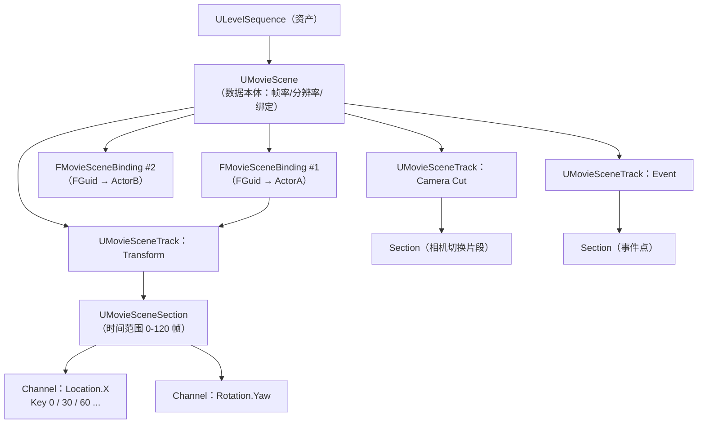
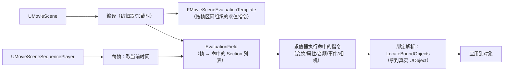
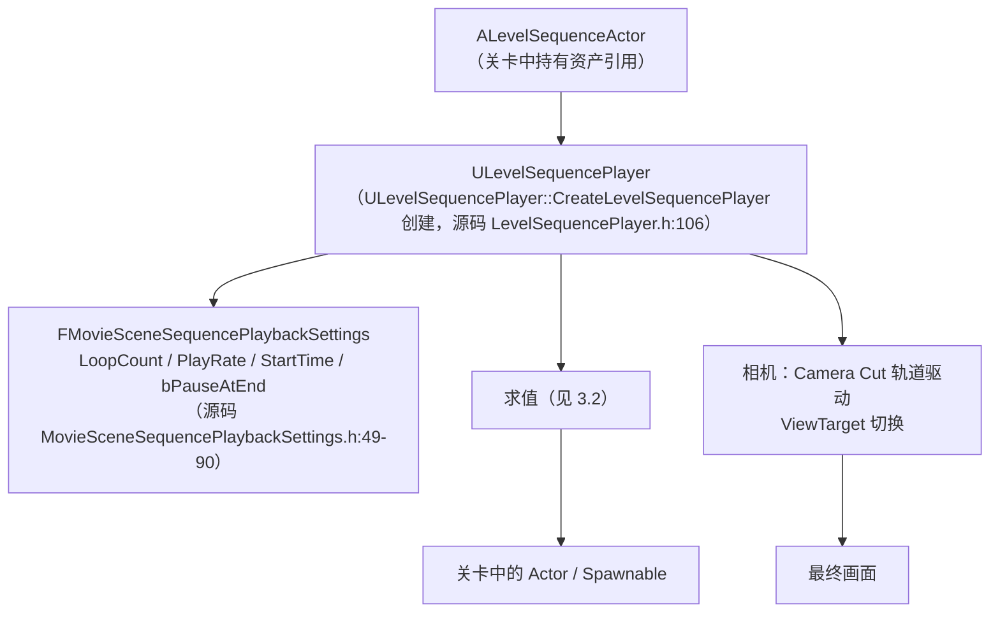
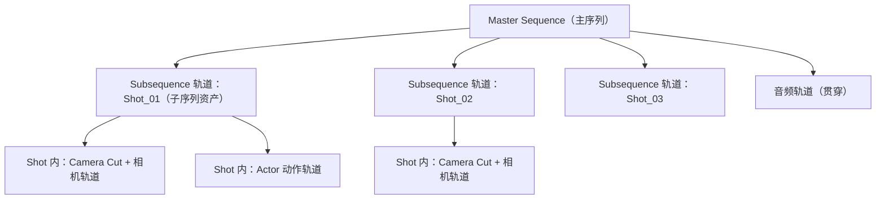
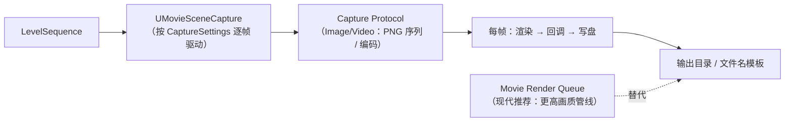

# 03-过场与影视 Sequencer

> 适用范围：UE 客户端 · 过场动画与影视级演出
> 版本基准：UE 5.8（关键 API 已对照本机源码：`Runtime\LevelSequence\Public\LevelSequence.h`、`Runtime\MovieScene\Public\MovieSceneSequence.h`、`Runtime\CinematicCamera\Public\CineCameraActor.h`、`Runtime\MovieSceneCapture\Public\MovieSceneCapture.h`）

## 1. 概述

Sequencer 是 UE 的**非线性影视级动画编辑器**，负责把"谁在什么时候做什么"组织成一条时间轴：Actor 的位移旋转、相机切换、材质参数、音频、事件、子序列嵌套，全部以**轨道（Track）→ 片段（Section）→ 键帧（Key）** 的资产结构表达。它的能力边界远超"过场动画"：UI 动画、玩法演出、电影渲染（Movie Render Queue）、甚至网络同步的演出控制都建立在同一套 MovieScene 架构上。

本篇目标读者是已经会摆放关卡、写过 C++ Actor 逻辑、准备实现过场系统的客户端程序员。学完本篇，你应该能：

- 说清 `ULevelSequence` → `UMovieScene` → Track/Section/Key 的资产层级与职责；
- 理解 Possessable 与 Spawnable 两种绑定方式的差异与适用场景；
- 看懂播放链路：`ALevelSequenceActor` → `ULevelSequencePlayer` → 求值模板；
- 掌握 CineCamera 的关键镜头参数（焦距/光圈/景深/追焦）与 Sequencer 的配合；
- 会用 C++/蓝图在运行时加载并控制序列播放（`UMovieSceneSequencePlayer` 全套 API）；
- 了解子序列/模板序列工作流，以及 MovieSceneCapture 渲染输出的原理与边界。

## 2. 核心概念（表格）

### 2.1 资产与编辑器

| 概念 | 类型 | 一句话说明 |
| --- | --- | --- |
| Sequencer | 编辑器 | UE 内置的非线性动画编辑器（工具栏"过场/Sequencer"打开） |
| Level Sequence | 资产（`ULevelSequence`） | 一段可播放的时间轴资产，继承 `UMovieSceneSequence` 与 `IInterface_AssetUserData`（源码 `LevelSequence.h` 第 22-24 行） |
| Movie Scene | 资产（`UMovieScene`） | 序列的"数据本体"：持有所有轨道、绑定、分辨率/帧率设置（源码 `MovieScene.h` 第 360 行） |
| Track | `UMovieSceneTrack` | 一类属性/能力的轨道（Transform、Camera、Audio、Event、Subsequence…），抽象类（源码 `MovieSceneTrack.h` 第 202-203 行） |
| Section | `UMovieSceneSection` | 轨道上"有效时间段"的片段，键帧数据住在里面（抽象类，源码 `MovieSceneSection.h` 第 241-242 行） |
| Channel / Key | 结构 | 片段内按时间组织的键帧曲线（如 Location.X 通道），插值生成每帧值 |
| Binding | `FMovieSceneBinding` | "绑定 ID（FGuid）+ 名字 + 一组轨道"的映射（源码 `MovieSceneBinding.h` 第 23 行） |
| Possessable | 绑定类型 | 绑定场景中**已存在**的 Actor/对象（运行时按规则定位） |
| Spawnable | 绑定类型 | 由序列**模板对象**在播放时动态生成的对象（`UMovieScene::AddSpawnable`，源码 `MovieScene.h` 第 394 行） |
| Director Blueprint | `ULevelSequenceDirector` | 序列的"导演蓝图"：绑定事件的 C++/蓝图入口（`GetBoundActor` 等，源码 `LevelSequenceDirector.h` 第 20-21、95 行） |
| Subsequence | 轨道类型 | 在父序列里引用并播放另一个序列资产（镜头分组、Shot 工作流） |
| Template Sequence | 资产类型 | 轻量序列（常配合 UMG 做 UI 动画），无 Actor 绑定负担 |

### 2.2 相机与渲染

| 概念 | 类型 | 一句话说明 |
| --- | --- | --- |
| `ACineCameraActor` | Actor | 电影摄影机：继承 `ACameraActor`（源码 `CineCameraActor.h` 第 72-73 行），附带 `UCineCameraComponent` |
| `UCineCameraComponent` | Component | 镜头本体：Filmback（传感器）、Lens（镜头）、Focus（对焦）三组参数（源码 `CineCameraComponent.h` 第 20-52 行） |
| 焦距/光圈 | 属性 | `CurrentFocalLength` / `CurrentAperture`，均带 `Interp` 标记——**可被 Sequencer 打关键帧**（源码第 65-69 行） |
| LookAt Tracking | 功能 | 摄影机自动盯住目标（`FCameraLookatTrackingSettings`，源码 `CineCameraActor.h` 第 23-54 行） |
| `UMovieSceneCapture` | 对象 | 传统渲染捕获器：按设置逐帧捕获并输出（源码 `MovieSceneCapture.h` 第 36-37 行） |
| Movie Render Queue | 插件 | 现代推荐的高质量渲染管线（`MovieRenderPipeline` 插件），支持分块、抗锯齿、时间超采样 |
| `ALevelSequenceActor` | Actor | 关卡中负责"播放某个序列"的 Actor（源码 `LevelSequenceActor.h` 第 65-66 行） |
| `UMovieSceneSequencePlayer` | 对象 | 序列播放器：Play/Pause/Stop/Jump/SetPlayRate 等控制（源码 `MovieSceneSequencePlayer.h` 第 175-176 行） |

## 3. 原理详解

### 3.1 资产层级：序列是如何"长"出来的



关键事实（全部源码验证）：

- **资产 vs 数据本体分离**：`ULevelSequence` 是"壳"（持有 DirectorClass、绑定引用解析器等），真正的轨道/键帧住在 `UMovieScene`（`GetMovieScene()` 为纯虚接口，源码 `MovieSceneSequence.h` 第 217 行）；
- **绑定是一等公民**：`FMovieSceneBinding` = 绑定 ID + 名字 + 该对象名下的轨道数组；轨道不直接挂对象，而是挂在绑定上（源码 `MovieSceneBinding.h` 第 43-45 行）；
- **片段是"有效时间窗口"**：`UMovieSceneSection::GetRange()/SetRange()/SetStartFrame()`（源码 `MovieSceneSection.h` 第 273/327/393 行）决定键帧区间与混入混出；
- **轨道可编程扩展**：`UMovieSceneTrack::AddSection()`（源码 `MovieSceneTrack.h` 第 510 行）与 `UMovieScene::AddTrack(TSubclassOf<UMovieSceneTrack>, FGuid)`（源码 `MovieScene.h` 第 517 行）是程序化建轨道的入口。

### 3.2 求值模型：播放时发生了什么

Sequencer 不是"播放时遍历键帧"这么简单。为了性能与确定性，序列在打开/编辑时会**预编译**成求值模板：



- **预编译**：轨道/片段的键帧在编译期转成"区间 + 求值函数"的紧凑模板，播放时按 `EvaluationField` 二分查找当前帧命中的片段，避免逐键帧线性扫描；
- **绑定解析**：模板里存的是 FGuid，播放时通过 `UMovieSceneSequence::LocateBoundObjects(ObjectId, Context, OutObjects)`（源码 `MovieSceneSequence.h` 第 138-149 行）解析出真实对象——这一步让同一序列能复用于不同关卡/对象；
- **每帧一次求值**：`UMovieSceneSequencePlayer` 每帧推进时间（`Play()` 后按 `PlayRate` 累加），求值器应用结果并触发事件（Event Section 在跨过帧时触发）。

### 3.3 绑定系统：Possessable 与 Spawnable

绑定是 Sequencer 最容易被误解的部分。它回答的问题是：**轨道上的键帧，作用在谁身上？**

| 维度 | Possessable（占有） | Spawnable（生成） |
| --- | --- | --- |
| 对象来源 | 关卡里已存在的 Actor/对象 | 序列内置的模板对象（ObjectTemplate） |
| 何时存在 | 关卡加载即有 | 播放时 `UMovieScene::AddSpawnable` 的模板被实例化，停止时销毁 |
| 定位方式 | 按名字/标签/绑定规则查找（`LocateBoundObjects`） | 由 SpawnRegister 管理生命周期 |
| 适用 | 绑定玩家角色、已有场景道具 | 过场专用道具（一次性摄像机、临时灯光） |
| 多关卡复用 | 需保证场景对象存在 | 完全自包含，最安全 |

运行时视角：

```cpp
// 源码 MovieScene.h 第 452 行：程序化添加 Possessable
FGuid BindingId = MovieScene->AddPossessable(TEXT("Hero"), AActor::StaticClass());

// 源码 MovieSceneSequence.h 第 190 行：由对象反查绑定
FGuid FoundId = Sequence->FindBindingFromObject(MyActor, /*Context=*/nullptr);

// 源码 MovieSceneSequence.h 第 138 行：由绑定解析对象（播放时）
TArray<UObject*, TInlineAllocator<1>> OutObjects;
Sequence->LocateBoundObjects(FoundId, ResolveParams, OutObjects);
```

**Director Blueprint**（`ULevelSequenceDirector`，源码 `LevelSequenceDirector.h`）是绑定的"编程入口"：序列蓝图里可以调用 `GetBoundActor(BindingId)`（第 95 行）/ `GetBoundActors`（第 85 行）拿到绑定对象，然后调用其方法或设置属性——过场里"喊话、开门、播放音效"都靠它。

### 3.4 播放链路：从 Actor 到画面



`UMovieSceneSequencePlayer` 是运行时控制的核心（源码 `MovieSceneSequencePlayer.h`）：

```cpp
Player->Play();               // 第 193 行
Player->Pause();              // 第 212 行
Player->Stop();               // 第 220 行（光标移到结尾）
Player->StopAtCurrentTime();  // 第 224 行（原地停）
Player->GoToEndAndStop();     // 第 227-228 行
Player->SetPlayRate(0.5f);    // 第 383 行（慢动作）
Player->OnStop;               // 第 418 行：停止事件（绑定回调）
```

播放设置（`FMovieSceneSequencePlaybackSettings`）在创建播放器时传入：`LoopCount`（循环次数）、`PlayRate`、`StartTime`（起始偏移）、`bRandomStartTime`、`bPauseAtEnd`（播完停在最后一帧而不是跳回开头）。

### 3.5 子序列与模板序列：镜头工作流

大型过场不是"一条超长时间轴"，而是**分层嵌套**的：



- **Subsequence 轨道**：父序列里引用子序列资产（`UMovieSceneSubTrack`），子序列有自己的 MovieScene、绑定与时长；主序列负责编排"什么时候切到哪个镜头"，子序列负责"该镜头内部发生什么"；
- **Shot 工作流**：策划/导演先做主序列分镜（每个 Shot 一个子序列），再逐个进入 Shot 细化——多人协作不冲突，镜头顺序调整只动主序列；
- **求值展开**：编译期子序列被展开进父模板（`FMovieSceneSequenceHierarchy` 记录嵌套关系），播放时统一求值，跨子序列的属性动画遵循"父序列覆盖子序列"的优先级规则；
- **Template Sequence**：一种"无 Actor 绑定"的轻量序列，常用于 UMG UI 动画（`WidgetAnimation` 底层）与简单事件编排，开销小于完整 LevelSequence；
- **运行时注意**：嵌套越深，播放器的时间换算（外层时间 → 子序列时间）与绑定解析越复杂；运行时动态替换子序列资产（如"换镜头内容")需在编辑期/数据层完成，运行时只做播放控制。

### 3.6 CineCamera：电影镜头的参数体系

`ACineCameraActor` 与普通 `ACameraActor` 的区别在于镜头参数的可控性与物理意义（全部源码验证）：

| 参数组 | 源码字段 | 含义 |
| --- | --- | --- |
| Filmback | `FCameraFilmbackSettings Filmback`（`CineCameraComponent.h` 第 38 行） | 传感器尺寸（如 Super 35mm / 全画幅），决定视场角与景深换算 |
| Lens | `FCameraLensSettings LensSettings`（第 44-45 行） | 镜头焦距范围、最大光圈、光学畸变（LensDistortion）参数 |
| Focus | `FCameraFocusSettings FocusSettings`（第 51-52 行） | 手动对焦距离 / 追踪对焦（FocusDistance、Sensing 等）、景深散景 |
| 焦距 | `float CurrentFocalLength`（第 65-66 行，`Interp`） | 当前焦距（mm），**Sequencer 可直接打关键帧实现推拉镜头** |
| 光圈 | `float CurrentAperture`（第 69 行附近，`Interp`） | 当前光圈 f-stop，**关键帧控制景深变化** |
| LookAt | `FCameraLookatTrackingSettings`（`CineCameraActor.h` 第 23-54 行） | `bEnableLookAtTracking` 盯住目标 Actor/位置，`LookAtTrackingInterpSpeed` 控制追踪平滑度 |

与 Sequencer 的配合方式：

- **相机轨迹**：给 CineCameraActor 挂 Transform 轨道（位移/旋转关键帧）——运镜；
- **镜头参数**：给 `CurrentFocalLength` / `CurrentAperture` 打关键帧——推拉与景深变化（因为字段带 `Interp` 标记，天然可动画化）；
- **相机切换**：主序列用 **Camera Cut 轨道**（每个 Shot 的起始处切到该 Shot 的相机），运行时由播放器接管 `PlayerCameraManager` 的 ViewTarget；
- **LookAt 是运行时行为**：`bEnableLookAtTracking` 让相机每帧自动转向目标，配合轨迹可做出"目标在画面中恒定"的镜头；
- 注意：CineCamera 的"真实感"参数（畸变、暗角、散景）需要开启对应后处理与光栅化设置，移动端通常关闭或降级。

### 3.7 MovieSceneCapture：把演出渲染成影片

过场最终要输出成视频/序列帧，两种管线：

**A. 传统 MovieSceneCapture（`UMovieSceneCapture`）**：

```cpp
// 源码 MovieSceneCapture.h 第 36-37 行
UCLASS(config=EditorPerProjectUserSettings, ...)
class UMovieSceneCapture : public UObject, public IMovieSceneCaptureInterface,
                           public ICaptureProtocolHost
```

关键配置（源码验证）：

- `ImageCaptureProtocolType`（`FSoftClassPath`，第 83-84 行）：输出协议类型（PNG 序列 / JPEG 序列 / 视频编码），运行时可 `SetImageCaptureProtocolType(TSubclassOf<...>)`（第 134 行）切换；
- `FMovieSceneCaptureSettings`（`MovieSceneCaptureSettings.h` 第 30 行起）：`OutputDirectory`（输出目录，第 38 行）、`OutputFormat`（文件名模板，支持 `{frame}`/`{fps}` 占位符，第 62 行）、`FrameRate` / `bUseCustomFrameRate`（第 86/90 行）、`HandleFrames`（片头片尾余量帧，第 74 行）、`bOverwriteExisting`（第 66 行）；
- `FCaptureResolution`：`ResX` / `ResY`（第 15-24 行，ClampMax 7680）。



**B. Movie Render Queue（`MovieRenderPipeline` 插件，推荐）**：

- 更完整的渲染资产化：抗锯齿（TAA/TAA-Subpixel）、时间超采样、分块渲染（Tiling）、曝光/色彩管理、每镜头独立设置；
- 支持命令行批量渲染（`-MoviePipelineConfig`），适合 CI 与夜间烘焙；
- MovieSceneCapture 仍保留用于简单快速输出（比如编辑器内"渲染视频"）。

两种管线**都发生在编辑器/工具环境**，打包后的游戏运行时不会做离屏电影渲染；运行时"录屏"应走游戏内捕获（如 SceneCapture2D 或平台录屏 API）。

## 4. 示例

### 4.1 C++：运行时加载并播放 LevelSequence

```cpp
// 头文件：LevelSequencePlayer.h、LevelSequence.h、LevelSequenceActor.h
#include "LevelSequencePlayer.h"
#include "LevelSequence.h"

void PlayCinematic(UObject* WorldContext, ULevelSequence* Sequence)
{
    if (!WorldContext || !Sequence) { return; }

    // 源码 LevelSequencePlayer.h 第 106 行：静态工厂
    ALevelSequenceActor* OutActor = nullptr;
    ULevelSequencePlayer* Player =
        ULevelSequencePlayer::CreateLevelSequencePlayer(
            WorldContext, Sequence,
            FMovieSceneSequencePlaybackSettings{}, // 默认播放设置
            OutActor);

    if (Player)
    {
        Player->OnFinished.AddDynamic(&MyHandler, &UMyHandler::OnCinematicFinished);
        Player->Play();
    }
}
```

要点：`CreateLevelSequencePlayer` 会顺带生成一个 `ALevelSequenceActor`（`OutActor`），它负责关卡中的生命周期；要循环播放可在 `FMovieSceneSequencePlaybackSettings` 里设 `LoopCount`。

### 4.2 蓝图：过场控制（播放/暂停/跳过）

1. 关卡放一个 `LevelSequenceActor`，属性指定要播的序列资产；
2. 输入事件 → `Play` 节点；暂停菜单 → `Pause`；跳过 → `Go To End and Stop`；
3. 播完回调：绑定 `LevelSequenceActor` 的 `On Finished` 事件（SequencePlayer 的 `OnFinished`，蓝图中为 `Sequence Player Finished` 事件）→ 恢复玩家控制权、卸载 UI；
4. 播放期间锁玩家输入：`Set Input Mode UI Only` + `Set Cinematic Mode`，结束后还原。

### 4.3 C++：运行时查找绑定对象并驱动

```cpp
#include "MovieSceneSequence.h"
#include "MovieScene.h"
#include "LevelSequenceDirector.h"

// 场景中找"绑定到序列的 Hero"并调用方法
void DriveBoundActor(ULevelSequence* Sequence, AActor* Fallback)
{
    UMovieScene* MovieScene = Sequence->GetMovieScene();
    if (!MovieScene) { return; }

    // 方式一：按名字反查绑定（源码 MovieSceneSequence.h 第 190 行）
    const FGuid BindingId = Sequence->FindBindingFromObject(Fallback, /*Context=*/nullptr);

    // 方式二：播放时解析真实对象（源码第 138 行）
    TArray<UObject*, TInlineAllocator<1>> BoundObjects;
    Sequence->LocateBoundObjects(BindingId, UE::UniversalObjectLocator::FResolveParams{}, BoundObjects);

    for (UObject* Obj : BoundObjects)
    {
        if (AActor* Actor = Cast<AActor>(Obj))
        {
            Actor->SetActorEnableCollision(false); // 过场期间关碰撞示例
        }
    }
}

// 方式三：Director 蓝图里（C++ 基类）用 GetBoundActor
// ULevelSequenceDirector::GetBoundActor(FMovieSceneObjectBindingID)（源码 LevelSequenceDirector.h 第 95 行）
```

### 4.4 C++：配置 MovieSceneCapture 输出（编辑器工具）

```cpp
// 仅编辑器工具示例：运行时没有离屏电影渲染
#include "MovieSceneCapture.h"
#include "MovieSceneCaptureSettings.h"

void ConfigureCapture(UMovieSceneCapture* Capture, const FString& OutDir)
{
    if (!Capture) { return; }

    FMovieSceneCaptureSettings& Settings = Capture->GetSettings();
    Settings.OutputDirectory.Path = OutDir;          // 输出目录
    Settings.OutputFormat = TEXT("shot_{frame}");     // 文件名模板（{frame} 占位符）
    Settings.FrameRate = FFrameRate(24, 1);           // 24fps
    Settings.bUseCustomFrameRate = false;             // 跟随序列帧率
    Settings.HandleFrames = 8;                        // 片头片尾各 8 帧余量
    Settings.bOverwriteExisting = true;
    Capture->SetImageCaptureProtocolType(UMovieSceneImageCaptureProtocolBase::StaticClass());
}
```

说明：生产环境更推荐 Movie Render Queue 资产化配置（`UMoviePipeline`，插件 `MovieRenderPipeline`），可版本管理、可命令行批处理。

### 4.5 运行时相机切换（非 Sequencer 方案）

```cpp
// 不用序列时，手动切到 CineCamera（PlayerCameraManager）
void SwitchToCineCamera(APlayerController* PC, ACineCameraActor* Cam)
{
    if (!PC || !Cam) { return; }
    PC->SetViewTargetWithBlend(Cam, /*BlendTime=*/1.0f,
                               VTBlend_Cubic, /*BlendExp=*/2.0f, /*bLockOutgoing=*/true);
}

// 相机盯住目标（CineCameraActor.h 第 23-54 行的 LookAt 设置）
void MakeCameraLookAt(ACineCameraActor* Cam, AActor* Target)
{
    if (!Cam || !Target) { return; }
    FCameraLookatTrackingSettings& LookAt = Cam->GetCameraComponent()->LookatTrackingSettings;
    LookAt.bEnableLookAtTracking = true;
    LookAt.ActorToTrack = Target;          // 盯住 Actor
    LookAt.LookAtTrackingInterpSpeed = 2.f;
}
```

## 5. 最佳实践

1. **先分镜再动手**：主序列 + Shot 子序列的结构优于一条大时间轴——协作、调整顺序、版本管理都更优；
2. **优先 Spawnable**：过场专用道具（相机、灯光、临时角色）用 Spawnable，避免污染关卡与绑定失效；
3. **绑定用标签/名字约定**：运行时可能换关卡对象，绑定解析规则（标签）比"硬编码对象引用"稳健；
4. **事件轨道代替硬编码**：过场里的玩法交互（开门、出怪）用 Event Track + Director Blueprint，不要直接在键帧里驱动业务代码；
5. **播放期间锁输入与 HUD**：`SetCinematicMode` + 输入模式切换；结束时务必还原，防止"过场后角色不能动"的经典 bug；
6. **用 OnFinished 做状态流转**：过场结束驱动游戏状态机（`Player->OnFinished` 或序列资产配置"结束时"行为）；
7. **CineCamera 参数克制**：焦距/光圈关键帧会直接改变视场与景深，注意移动端性能与美术一致性；
8. **渲染用 Movie Render Queue**：需要成片用 MRQ（抗锯齿/超采样/分块），别用 MovieSceneCapture 硬扛高质量需求；
9. **性能**：过场期间禁用无关 Tick（`SetActorTickEnabled(false)`）、卸载无关流送内容；用 `stat MovieScene` 观察求值开销；
10. **版本与平台**：序列资产是数据资产，注意帧率/分辨率设置的平台一致性（控制台 30fps vs PC 60fps 的过场表现）。

## 6. FAQ

**Q1：序列播放了但对象不动？**
先查绑定：`LocateBoundObjects` 是否解析到对象（Possessable 的名字/标签是否匹配）；再查 Section 的时间范围是否覆盖当前播放时间；最后确认对象不是 Spawnable 但被手动销毁。

**Q2：过场结束后相机回不来/角色失控？**
典型原因：没有在 `OnFinished` 里恢复 ViewTarget（`SetViewTargetWithBlend` 回玩家 Pawn）、没有还原输入模式。把"结束还原"做成播放器的统一封装。

**Q3：Sequence 里能调用我的 C++ 函数吗？**
能。两途径：Event Track + Director Blueprint 调用；或把函数做成蓝图可调用（`UFUNCTION(BlueprintCallable)`）后直接在键帧事件里调用。

**Q4：运行时怎么循环播放一段动画（比如过场循环直到玩家按键）？**
`FMovieSceneSequencePlaybackSettings::LoopCount` 设 -1（无限），或 `OnFinished` 里再次 `Play()`；配合 `Pause()` 停在指定帧做"待机循环"。

**Q5：子序列的相机切换不生效？**
Camera Cut 轨道在主序列/子序列中只能有一条生效；检查 Cut 片段是否重叠、子序列是否有自己的 Camera Cut 与父级冲突；用 `Sequencer` 的"相机切换预览"排查。

**Q6：打包后过场无法渲染成视频？**
正常：电影渲染只存在于编辑器/工具（MovieSceneCapture、MRQ 都是编辑器侧）。游戏内需要录屏用 `SceneCapture2D` 或平台录屏。

**Q7：Template Sequence 和 LevelSequence 怎么选？**
UI 动画、轻量演出：Template Sequence（无 Actor 绑定开销）；复杂过场、相机、子序列：LevelSequence。

## 7. 关联阅读

- [01-Landscape地形系统.md](./01-Landscape地形系统.md) 与 [02-植被Foliage与实例化渲染.md](./02-植被Foliage与实例化渲染.md)：过场里的"场景"从哪来——地形与植被是镜头的舞台；
- 01-引擎基础 02-Actor与Component生命周期：Spawnable 的生成/销毁与生命周期语义；
- 03-游戏玩法编程：Enhanced Input 与输入屏蔽（过场期间输入控制）、GameplayTag（过场状态标记）；
- 10-音频系统：过场音频（Audio Track、衰减、混音）与画面同步；
- 02-渲染与图形：后处理、色彩分级（Color Grading）、Lumen 下电影级光照；
- 12-引擎源码分析：`Runtime\MovieScene\`（求值模板）、`Runtime\LevelSequence\`（播放器/导演蓝图）源码细读；
- [UE 5.8 官方文档总页](https://dev.epicgames.com/documentation/en-us/unreal-engine)：Sequencer、Cine Camera、Movie Render Queue；具体专题 slug 待按本机文档版本核对。
