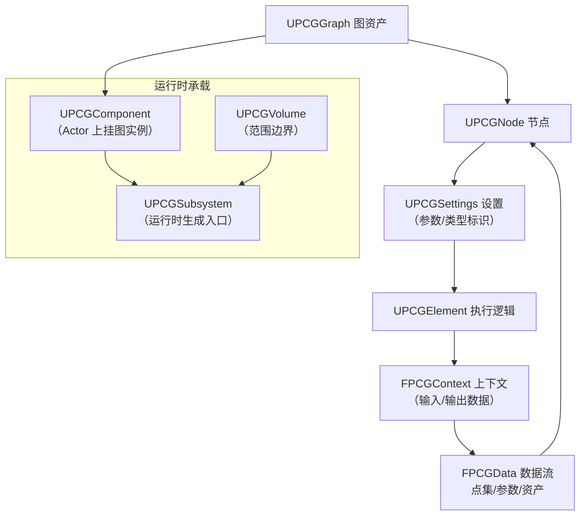
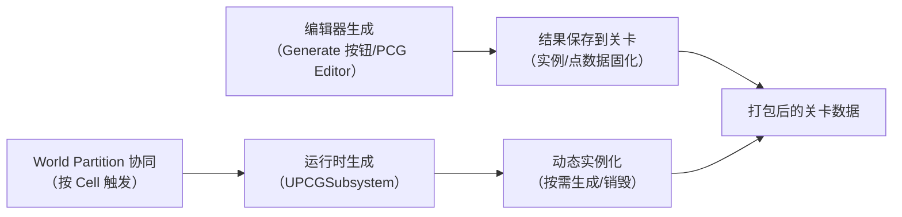
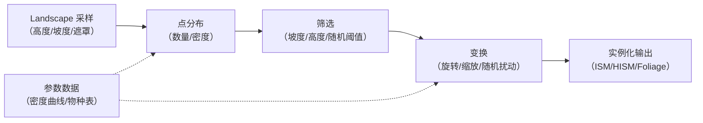

# 04 PCG 程序化内容生成

> 版本基准：UE 5.8.0（本机 `Engine/Build/Build.version`：CL 55116800，分支 `++UE5+Release-5.8`）。
> 适用范围：UE 客户端 · 大世界内容创作（PCG 编辑器工作流 + 运行时生成 API）。
> 事实边界：本文中"本机核对"项均来自只读检索本机 `C:\Program Files\Epic Games\UE_5.8\Engine`（PCG 插件 `Plugins\PCG\PCG.uplugin`、`Source\PCG\Public\*.h`、`Source\PCGCompute\Public\*.h`）；带"示意/待核对"标注的内容为工程建议或版本敏感项，落地前必须在目标版本复核。
> 官方参考：[Procedural Content Generation Framework (PCG) 文档](https://dev.epicgames.com/documentation/en-us/unreal-engine/procedural-content-generation-framework-in-unreal-engine)、[Unreal Engine 文档首页](https://dev.epicgames.com/documentation/en-us/unreal-engine)。
> 最后更新：2026-08-07（初稿）。

## 概述

**PCG（Procedural Content Generation Framework，程序化内容生成框架）** 是 UE5 面向"大世界内容填充"的官方框架：用一张**可视化图（Graph）**描述"在哪些位置、按什么规则、生成什么内容"，把"手工摆放成千上万个植被/石头/建筑"变成"可复现、可参数化、可批量重跑"的生成流程。

本机 5.8 的 PCG 插件状态（已核对）：

- 插件路径：`Engine\Plugins\PCG\PCG.uplugin`，`Version` 8、`VersionName` 1.0、`FriendlyName` 为 "Procedural Content Generation Framework (PCG)"；
- 模块：`PCG`（Runtime，Default）、`PCGEditor`（Editor）、`PCGCompute`（Runtime，PostConfigInit，基于 ComputeFramework 的 GPU 计算模块）；
- `IsBetaVersion` 为 `false`、`EnabledByDefault` 为 `true`（随引擎默认启用）；依赖 `EditorScriptingUtilities`、`ComputeFramework`、`GeometryProcessing`、`MeshModelingToolset`；
- 运行时头文件（节选）：`PCGComponent.h`、`PCGGraph.h`、`PCGNode.h`、`PCGSettings.h`、`PCGContext.h`、`PCGData.h`、`PCGPoint.h`、`PCGSubsystem.h`、`PCGVolume.h`、`PCGElement.h`、`PCGParamData.h`。

PCG 要解决的问题：大世界（World Partition + World Streaming）中"内容密度"与"人力成本"的矛盾——手动放置不可扩展，纯程序生成又难控制质量。PCG 的答案是：**规则即资产**（Graph 作为资产保存）、**输入即采样**（地形/遮罩/随机点）、**输出即数据**（点集/实例变换/资产引用），并且生成既可以在编辑器里跑（烘焙到关卡），也可以在运行时跑（PCGSubsystem 动态生成）。

阅读本文前建议先有 01（Landscape）、02（Foliage/ISM）的基础；本文专注 PCG 本身，PCG 与 Procedural Vegetation Editor、World Partition 的协同闭环见本目录 05 篇。

## 核心概念表

| 概念 | 英文 | 说明（本机 5.8 头文件依据） |
| --- | --- | --- |
| PCG 图 | PCG Graph | `UPCGGraph`：节点与连线的资产，是 PCG 的"规则体"（`PCGGraph.h`） |
| 节点 | PCG Node | `UPCGNode`：图中一个处理单元（`PCGNode.h`） |
| 设置 | Settings | `UPCGSettings`：节点参数与类型标识，决定节点行为（`PCGSettings.h`） |
| 元素 | Element | `UPCGElement`：设置对应的执行逻辑（`PCGElement.h`） |
| 上下文 | Context | `FPCGContext`：一次节点执行的上下文（输入/输出数据、随机流、帧信息）（`PCGContext.h`） |
| 数据 | Data | `FPCGData` 及其子类：节点间流动的数据（点集、参数、资产）（`PCGData.h`） |
| 点 | Point | `FPCGPoint`：最小生成单元（位置/旋转/缩放/种子/密度）（`PCGPoint.h`） |
| 组件 | Component | `UPCGComponent`：挂在 Actor 上承载图实例与生成结果（`PCGComponent.h`） |
| 子系统 | Subsystem | `UPCGSubsystem`：运行时生成/销毁的入口（`PCGSubsystem.h`） |
| 体积 | Volume | `UPCGVolume`：定义生成范围/边界的 Actor（`PCGVolume.h`） |
| 分区 | Partition | PCG 支持按区域分块生成，与大世界 Cell 协同（概念，实现细节随版本演进） |
| 参数数据 | Param Data | `UPCGParamData`：以键值/曲线形式传递的输入参数（`PCGParamData.h`） |
| 计算模块 | PCGCompute | `PCGCompute` 模块（PostConfigInit），GPU 计算加速相关（`PCGComputeModule.h`） |

## 原理详解

### 4.1 体系架构：Graph → Node → Settings → Element → Data



图资产（`UPCGGraph`）由节点（`UPCGNode`）与连线（`UPCGEdge`，见 `PCGEdge.h`）组成；每个节点携带一份 `UPCGSettings`，运行时由引擎创建对应的 `UPCGElement` 执行体，在 `FPCGContext` 中消费输入数据、产出输出数据，数据再沿连线流入下游节点。这套"资产（图）— 描述（Settings）— 执行（Element）— 数据（Data）"的四层分离，是 PCG 区别于普通蓝图节点图的关键：同一张图可以在编辑器、烘焙期与运行时三处复用。

### 4.2 三种执行路径：编辑器、烘焙与运行时



三种路径共享同一套图与元素逻辑，差别只在"谁触发、结果去哪"：

- **编辑器生成**：在 PCG 编辑器或选中组件后点击生成，结果（如 `AInstancedFoliageActor` 归属的实例、静态网格实例）写入关卡，随关卡保存；适合"生成一次、静态使用"的内容（建筑群、石头阵）。
- **运行时生成**：通过 `UPCGSubsystem` 在游戏进程中执行图，动态生成/清理实例；适合"随游戏状态变化"的内容（资源点刷新、动态植被）。
- **World Partition 协同**：大世界下 PCG 生成可与分区/流送结合，按 Cell 触发生成与卸载（细节见本目录 05 篇与 12 章 22 篇）。

### 4.3 数据流与确定性

PCG 的执行是**数据流（Data Flow）**而不是"每帧更新"：一次执行 = 从输入源（Landscape 采样、Volume 内随机点、参数数据）出发，沿图拓扑逐节点求值。关键机制：

- **点集（Point Set）**：`FPCGPoint` 数组是主干数据形态，携带变换、种子与密度属性，下游节点（分布、筛选、实例化）都围绕它工作；
- **参数数据（Param Data）**：`UPCGParamData` 承载非空间输入（数量、密度曲线、规则表），让同一张图可通过不同参数批量复用；
- **确定性（Determinism）**：PCG 用随机种子与稳定的遍历顺序保证"同一输入 + 同一图 = 同一输出"，这是"可复现、可对比、可回滚"的基础；种子贯穿 `FPCGContext` 的随机流（细节随版本演进，落地前核对目标版本行为）；
- **懒执行与缓存**：图执行按需进行，节点输出可缓存，避免每次全图重算（实现细节标注：以目标版本源码为准）。

### 4.4 运行时 API 与边界

运行时入口是 `UPCGSubsystem`（`PCGSubsystem.h`），生成目标挂在 `UPCGComponent`（`PCGComponent.h`）上。需要区分的边界：

- **编辑器专属 API**（带 `WITH_EDITOR` 守卫，如编辑器的部分生成/预览能力）与 **运行时 API**（打包后可用的 `UPCGSubsystem` 调用）必须分开使用；
- PCG 生成"实例变换数据"，真正画出来的是 ISM/HISM（见 02 篇）与 Foliage 系统——PCG 负责"决定放什么、放哪"，渲染层负责"高效画出来"；
- `PCGCompute` 模块（GPU 计算，`PCGComputeModule.h`/`PCGTextureReadback.h`）用于把部分采样/处理搬到 GPU，属于加速路径，启用前需确认目标设备支持与版本状态（本机为 Runtime 模块，具体算子随版本演进，标注待核对）。

## 代码 / 示例

### 5.1 运行时通过 Subsystem 触发生成（C++ 示意）

> 节选/示意：类名以本机 `PCGSubsystem.h`/`PCGComponent.h` 为准；函数签名随版本演进，落地前核对目标版本头文件。

```cpp
// 示意：在运行时对某个 Actor 的 PCG 组件触发/清理生成
#include "PCGSubsystem.h"
#include "PCGComponent.h"

void UMyWorldManager::GeneratePCGAt(UPCGComponent* PCGComponent)
{
    if (PCGComponent == nullptr)
    {
        return;
    }

    // 运行时入口：通过子系统执行该组件携带的图
    UPCGSubsystem* PCGSubsystem = UPCGSubsystem::GetInstance(GetWorld());
    if (PCGSubsystem != nullptr)
    {
        // 触发生成（示意；实际函数名以目标版本为准）
        PCGSubsystem->GeneratePCG(PCGComponent);
    }
}

void UMyWorldManager::ClearPCGAt(UPCGComponent* PCGComponent)
{
    if (PCGComponent != nullptr)
    {
        PCGComponent->CleanupLocalGeneratedData(); // 示意：清理本地生成结果
    }
}
```

### 5.2 自定义生成节点（C++ 示意）

> 节选/示意：`UPCGSettings` / `UPCGElement` / `FPCGContext` 为真实类名（本机 `PCGSettings.h`/`PCGElement.h`/`PCGContext.h`），继承结构与函数签名以目标版本为准。

```cpp
// 示意：自定义节点 = 一个 Settings 子类 + 对应 Element 执行体
UCLASS()
class UMyPCGSettings : public UPCGSettings
{
    GENERATED_BODY()

public:
    UPROPERTY(EditAnywhere, Category = "MyPCG")
    int32 PointCount = 16; // 示意参数
};

class FMyPCGElement : public UPCGElement
{
public:
    virtual bool Execute(FPCGContext* Context) const override; // 示意签名
};

bool FMyPCGElement::Execute(FPCGContext* Context) const
{
    // 从 Context 取输入数据、产出输出数据（示意）
    // const UPCGSettings* Settings = Context->GetInputSettings<UMyPCGSettings>();
    // ... 生成 FPCGPoint 数组写入 OutputData ...
    return true;
}
```

### 5.3 项目启用与配置

PCG 插件默认启用（`EnabledByDefault: true`），一般无需手动开启；若工程裁剪了插件，可在 `.uproject` 的 `Plugins` 列表显式启用：

```json
{
    "Plugins": [
        { "Name": "PCG", "Enabled": true }
    ]
}
```

（示意；以工程实际 `.uproject` 为准。）

### 5.4 典型生成管线（节点工作流示意）

以下是一条"地形植被"管线的节点级骨架（节点名以目标版本 PCG 编辑器为准，属工作流示意而非引擎字面量）：



常见节点族（示意，节点名以目标版本编辑器为准）：

| 节点族 | 用途 | 说明 |
| --- | --- | --- |
| 采样类 | 从 Landscape/纹理/遮罩取数据 | 高度、坡度、朝向、区域遮罩 |
| 分布类 | 在范围内生成点 | 按数量/密度/距离约束生成 `FPCGPoint` |
| 筛选类 | 按条件过滤点 | 坡度/高度/随机/属性阈值 |
| 变换类 | 修改点变换 | 随机旋转/缩放/对齐表面 |
| 组合类 | 合并/拆分/子图 | 多输入合并、子图复用（`PCGSubgraph.h`） |
| 输出类 | 生成实例/资产 | 转 ISM/HISM/Foliage 实例或静态网格 |

### 5.5 编辑器工作流速览（示意）

1. 在 PCG 编辑器创建 `UPCGGraph` 资产，或给 Actor 添加 `UPCGComponent` 并指定图；
2. 用 `UPCGVolume` 划定生成范围，配置输入源（Landscape 采样、参数数据）；
3. 连接"采样 → 分布 → 筛选 → 变换 → 输出"管线，逐节点预览生成结果；
4. 固定种子与参数，执行生成并检查密度/位置/朝向；
5. 静态内容烘焙保存到关卡；动态内容保留 `UPCGSubsystem` 运行时触发路径。

（编辑器按钮与面板名称以目标版本为准，此处为流程示意。）

## 最佳实践

1. **先定"数据合同"再连图**：明确输入（Landscape 采样/Volume/参数）与输出（点集 → ISM/HISM/Foliage）的形态，图只是把合同翻译成规则；输入输出不确定的图，后面每次改都推倒重来。
2. **密度与预算先行**：PCG 能生成"无限多"内容，但渲染与内存是有限的。按目标平台帧预算反推每平方公里点/实例上限，在图中用密度节点与筛选节点约束输出（配合 02 篇的 ISM/HISM 与 LOD 预算）。
3. **保持可复现**：固定种子、避免依赖"编辑器当前选中"等隐式状态；生成结果变更时用版本对比而非手工微调，保证团队可回溯。
4. **静态内容烘焙，动态内容运行时**：一次性装饰（建筑、石头）走编辑器生成并随关卡保存；随玩法变化的内容（刷新点、动态植被）走运行时 `UPCGSubsystem`，避免把动态逻辑固化进关卡。
5. **与 Foliage/ISM 结合而非对抗**：PCG 产出的实例尽量落到 HISM/Foliage 系统（02 篇），用实例化渲染扛住密度；不要在 PCG 里直接生成成百上千个独立 Actor。
6. **大世界按 Cell 组织**：World Partition 下让生成按 Cell 触发/卸载（05 篇与 12 章 22 篇），避免"一次生成全图"的峰值内存与加载时间。
7. **性能观测**：编辑器里用 PCG 相关统计与 Profile 观察节点耗时（节点级耗时工具随版本演进，标注待核对）；运行时关注生成帧尖峰，必要时分帧/异步执行。
8. **版本敏感项单独记录**：PCG 节点库、GPU 计算（PCGCompute）与 Procedural Vegetation Editor 的输出格式都在快速演进，升级引擎后必须回归"同图同种子同输出"。

## 常见问题 FAQ

### Q1：PCG 和蓝图有什么区别？为什么要用 PCG？

蓝图是"逻辑图"，PCG 是"内容生成图"。蓝图每帧解释执行、面向玩法逻辑；PCG 面向"批量摆放内容"，以数据流方式一次执行、结果可保存可复现。两者的共同点是可视化与参数化，但解决的问题域不同。

### Q2：PCG 生成的结果能被打包吗？

能。编辑器生成的结果随关卡保存并进入打包内容；运行时生成的实例由运行时 API 创建，逻辑代码进入打包。注意区分"数据固化在关卡"与"运行时动态生成"两种形态。

### Q3：PCG 和 Procedural Vegetation Editor（PVE）是什么关系？

PVE 是 UE5.8 的实验性植被生成工具（见 12 章 31 篇），PCG 是通用内容生成框架；两者可以配合：PCG 负责广义内容规则，PVE 专注植被生态（物种、密度、生态约束）。本目录 05 篇给出了两者的职责边界与协同数据合同。

### Q4：PCG 结果在移动端/低端机表现如何？

PCG 本身是"生成时"成本，运行时表现取决于输出形态：实例化渲染（HISM）扛得住密度，但点集与资产数量仍受内存限制；移动端建议大幅调低密度与资产复杂度，并用 LOD/HLOD 收敛（详见 02-渲染与图形 10-移动端渲染专项 的 LOD/HLOD 章节）。

### Q5：为什么同样的图在不同机器上结果不一样？

优先检查"非确定性来源"：未固定种子、依赖浮点平台差异的采样、依赖编辑器状态/选中项的节点。PCG 的确定性保证需要种子与输入完全一致；跨平台复现需额外核对采样与数学函数实现（标注：跨平台确定性以目标版本行为为准）。

### Q6：生成太慢怎么办？

按顺序排查：缩小生成范围（Volume/Cell）、降低点密度、拆分大图为多个小图、利用节点缓存避免重复计算、必要时用 `PCGCompute` 把部分处理搬到 GPU（需确认设备与版本支持）。

### Q7：PCG 能用于游戏运行时动态刷怪/资源点吗？

可以。运行时 `UPCGSubsystem` 支持动态生成与清理，配合 Volume 与参数数据可以做出"刷新资源点/动态植被"；但要注意每帧生成成本与实例生命周期管理，避免生成尖峰。

### Q8：在哪里看官方资料？

官方 PCG 文档（[Procedural Content Generation Framework](https://dev.epicgames.com/documentation/en-us/unreal-engine/procedural-content-generation-framework-in-unreal-engine)）与官方示例项目（如 Lyra 中的 PCG 用法）是首选；本机 5.8 源码 `Plugins\PCG\Source\PCG\Public\*.h` 是类名与接口的权威依据。

### Q9：PCG 图里能引用其他 PCG 图吗？

可以，通过子图（Subgraph）机制把一张图作为节点嵌入另一张图（`PCGSubgraph.h`），实现规则复用与分层组织——这和大世界"植被图/建筑图/装饰图"分层的实践一致。

### Q10：升级引擎后 PCG 结果变化了怎么办？

PCG 处于快速演进期：先固定"同图同种子同输入"的回归清单（截图或实例统计），升级后逐项对比；节点属性或默认值变化时以目标版本文档与源码为准，必要时在图中显式固定参数。

### Q11：PCG 能做"程序化关卡/地牢"这类结构生成吗？

可以，但要区分"内容填充"与"结构布局"：PCG 擅长在既定范围内填充内容（植被、石头、装饰）；规则化布局（房间、路径）可以用 PCG 的参数/子图组织，复杂结构建议结合 Houdini Engine 或关卡设计工具，PCG 承担最终填充与细节化。

### Q12：多人游戏里 PCG 结果需要同步吗？

分情况：烘焙进关卡的静态内容天然一致；运行时生成的动态内容若影响玩法（可破坏资源点、刷新物），需要服务器权威生成并同步结果（见 06-网络同步 的复制方案），客户端只做表现。

## 版本与兼容性速查

| 事项 | 本机 5.8 状态 | 说明 |
| --- | --- | --- |
| PCG 插件 | `Plugins\PCG\PCG.uplugin`，Version 8 / 1.0，非 Beta，默认启用 | 随引擎分发 |
| 运行时模块 | `PCG`（Runtime）、`PCGCompute`（Runtime，PostConfigInit） | GPU 计算加速路径 |
| 编辑器模块 | `PCGEditor`（Editor） | 编辑器生成与预览 |
| 关联实验插件 | `PCGBiomeCore`、`PCGPrimitives`、`PCGInterops`、`PCGMeshPartitionInterop`（`Plugins\Experimental`） | 生态组件，按需启用并回归 |
| PVE 协同 | `ProceduralVegetationEditor`（实验性，见 12 章 31 篇） | 植被生态生成与 PCG 协同 |
| 核心头文件 | `PCGComponent.h`/`PCGGraph.h`/`PCGSettings.h`/`PCGContext.h`/`PCGData.h`/`PCGPoint.h`/`PCGSubsystem.h`/`PCGVolume.h` | 类名与接口权威依据 |

> 提示：PCG 节点库与 GPU 计算能力随版本快速演进，本表只承诺"本机 5.8 已核对"的范围，其余以目标版本为准。

## 关联阅读

- [01-Landscape地形系统.md](./01-Landscape地形系统.md)：PCG 最重要的输入源——地形高度、坡度、遮罩采样与 Landscape Spline。
- [02-植被Foliage与实例化渲染.md](./02-植被Foliage与实例化渲染.md)：PCG 输出的主要落地形态——ISM/HISM 实例化渲染与 LOD/剔除。
- [05-大世界植被与渲染协同.md](./05-大世界植被与渲染协同.md)：PCG、PVE、Foliage、World Partition 与 HLOD 的完整闭环与数据合同。
- [03-过场与影视Sequencer.md](./03-过场与影视Sequencer.md)：生成内容如何参与影视演出与场景布置。
- [09-WorldPartition大世界](../01-引擎基础/09-WorldPartition大世界.md)：PCG 按 Cell 生成的大世界分区机制。
- [04-Mass实体框架与群集模拟](../05-AI系统/04-Mass实体框架与群集模拟.md)：与 PCG 互补的运行时群集方案（PCG 管"放什么"，Mass 管"怎么动"）。
- [22-WorldPartition与WorldStreaming源码](../12-引擎源码分析/22-WorldPartition与WorldStreaming源码.md)：分区/流送机制的源码级剖析。
- [31-ProceduralVegetationEditor源码](../12-引擎源码分析/31-ProceduralVegetationEditor源码.md)：PVE 插件的模块边界与 World Partition 实例化链路。

## 更新日志

- 2026-08-07：初稿创建。已核对本机 UE5.8 PCG 插件（`Plugins\PCG\PCG.uplugin` 模块与版本、`Source\PCG\Public` 头文件清单、`PCGCompute` 模块）；节点/子系统函数签名与 GPU 计算细节标注"示意/待核对"，未虚构未核对的类名与 CVar。
