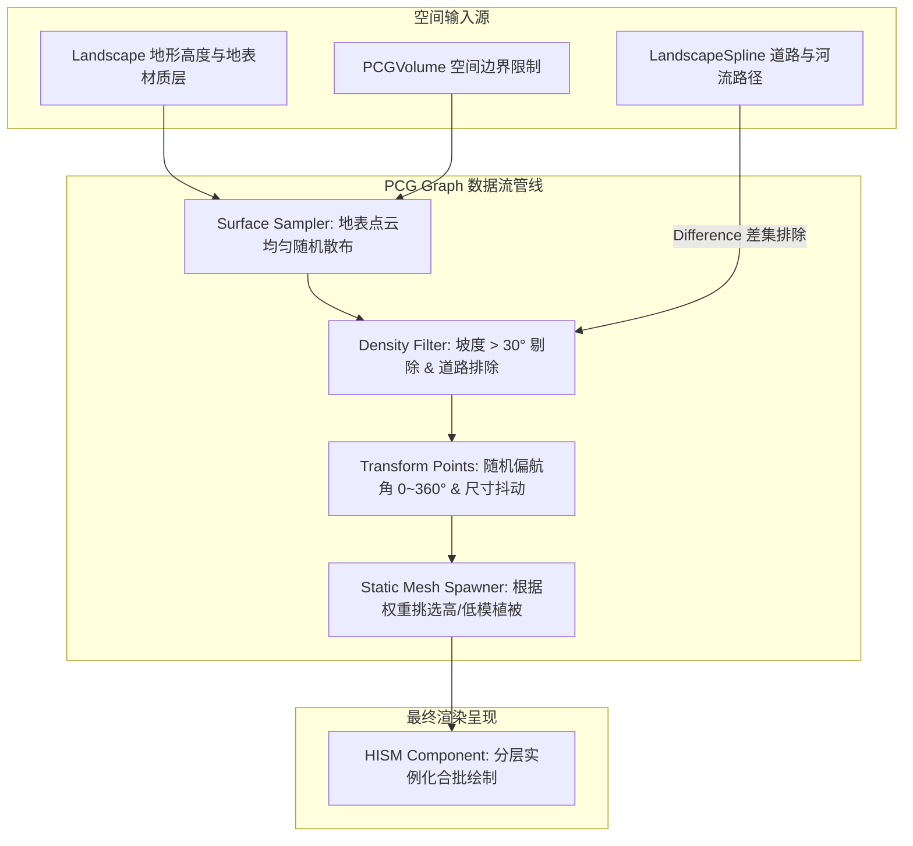

# 04 PCG 程序化内容生成（Procedural Content Generation）
> 知识成熟度：L2（已按 UE5.8 PCG 插件架构与 PCGCompute 源码基线全面补齐点云数据流、自定义 C++ 节点、GPU 计算与 World Partition 协同实战）。

> 版本基准：UE 5.8.0（本机 `Engine/Build/Build.version`：CL 55116800，分支 `++UE5+Release-5.8`）。
> 适用范围：大世界场景美术、开放世界关卡设计师、程序化环境技术美术（TA）与引擎工具链工程师。
> 事实边界：本文代码与类名已核对本机 `C:\Program Files\Epic Games\UE_5.8\Engine\Plugins\PCG`（`PCG.uplugin` v8、`Source\PCG\Public\*.h`、`Source\PCGCompute\Public\*.h` 等）。
> 官方参考：[Procedural Content Generation Framework (PCG) 官方文档](https://dev.epicgames.com/documentation/en-us/unreal-engine/procedural-content-generation-framework-in-unreal-engine)。
> 最后更新：2026-08-20（深化重构：补齐 FPCGPoint 数据结构、自定义 C++ Element 算法节点、GPU Compute 加速与网格单元流送生成）。

---

## 概述

**PCG（Procedural Content Generation Framework）** 是虚幻引擎 5 专门面向**工业化开放世界生态生成**研发的核心程序化框架。

在数十平方公里的现代大世界项目中，传统手动逐个摆放树木、草丛、石头与废墟道具的做法存在严重的产能瓶颈，且难以应对策划反复变更地形与道路走向的需求。PCG 的核心哲学是**“规则即资产，数据驱动生成”**：
- **空间点云驱动（Point-Based Dataflow）**：一切地表内容生成首先抽象为空间中的离散点集（`FPCGPoint`），在图表中通过采样、变换、碰撞检测、密度衰减与属性过滤，最终通过分层实例化静态网格体（HISM）或 Actor 进行实例化呈现；
- **纯粹的输入/输出解耦**：节点只接收 `FPCGData`（点集、样条曲线、地形高度场）并输出新数据，同一张 PCG Graph 资产既可以在关卡编辑器内离线烘焙固化，也可在运行时由 `UPCGSubsystem` 动态按需加载生成；
- **混合计算架构（CPU + GPU PCGCompute）**：小规模复杂碰撞逻辑在 CPU 端多线程并发执行，海量地表草地点云过滤直接由 `PCGCompute` 提交至 GPU Compute Shader 并行解算。

---

## 核心数据结构：FPCGPoint 点云模型

在 PCG 图表中流转的核心数据单元是 `FPCGPoint`。每个点都包含完整的空间物理与生成元数据：

```text
┌─────────────────────────────────────────────────────────────────────────┐
│                           FPCGPoint 数据解剖                            │
├─────────────────────────────────────────────────────────────────────────┤
│  FTransform Transform    : 空间位置、旋转、局部缩放（决定网格体最终姿态） │
│  float Density           : 归一化密度 [0.0, 1.0]（用于剔除与概率筛选）    │
│  FVector BoundsMin / Max : 本地轴向包围盒（用于点间碰撞体积拒绝测试）    │
│  FVector4 Color          : 顶点颜色 / 材质参数调制                      │
│  float Steepness         : 坡度与梯度信息（决定岩石/植物贴附平滑度）     │
│  int32 Seed              : 确定性伪随机数种子（保障跨平台重现完全一致） │
│  FPCGMetadata            : 动态自定义属性袋（如 Tag、土壤类型、湿度）   │
└─────────────────────────────────────────────────────────────────────────┘
```

---

## PCG 核心执行拓扑


```mermaid
graph TD
    subgraph Inputs[空间输入源]
        Landscape[Landscape 地形高度与地表材质层]
        Spline[LandscapeSpline 道路与河流路径]
        Volume[PCGVolume 空间边界限制]
    end

    subgraph GraphEvaluation[PCG Graph 数据流管线]
        Sampler[Surface Sampler: 地表点云均匀随机散布]
        Filter[Density Filter: 坡度 > 30° 剔除 & 道路排除]
        TransformMod[Transform Points: 随机偏航角 0~360° & 尺寸抖动]
        MeshSelect[Static Mesh Spawner: 根据权重挑选高/低模植被]
    end

    subgraph OutputInstances[最终渲染呈现]
        HISM[HISM Component: 分层实例化合批绘制]
    end

    Landscape --> Sampler
    Volume --> Sampler
    Sampler --> Filter
    Spline -->|Difference 差集排除| Filter
    Filter --> TransformMod
    TransformMod --> MeshSelect
    MeshSelect --> HISM
```

---

## 工业级 C++ 实战代码：自定义 PCG 空间过滤器节点

以下演示如何在 C++ 中开发一个自定义的 PCG 节点（根据点的高程与随机噪声，执行侵蚀过滤）：

```cpp
#pragma once

#include "CoreMinimal.h"
#include "PCGSettings.h"
#include "PCGPointFilterElement.generated.h"

// 1. 定义节点设置资产（Settings）
UCLASS(BlueprintType, ClassGroup = (Procedural))
class MYGAME_API UPCGHeightSlopeFilterSettings : public UPCGSettings
{
    GENERATED_BODY()

public:
    UPCGHeightSlopeFilterSettings();

    // 允许生成的最高海拔高度
    UPROPERTY(EditAnywhere, BlueprintReadWrite, Category = "Settings", meta = (ClampMin = "0.0"))
    float MaxElevation = 15000.0f;

    // 最小密度阈值
    UPROPERTY(EditAnywhere, BlueprintReadWrite, Category = "Settings", meta = (ClampMin = "0.0", ClampMax = "1.0"))
    float MinDensityCutoff = 0.3f;

protected:
    virtual FPCGElementPtr CreateElement() const override;
};

#include "PCGHeightSlopeFilterElement.h"
#include "PCGContext.h"
#include "Data/PCGSpatialData.h"
#include "Data/PCGPointData.h"

// 2. 实现节点执行体（Element）
class FPCGHeightSlopeFilterElement : public IPCGElement
{
protected:
    virtual bool ExecuteInternal(FPCGContext* Context) const override
    {
        check(Context);
        const UPCGHeightSlopeFilterSettings* Settings = Context->GetInputSettings<UPCGHeightSlopeFilterSettings>();
        check(Settings);

        // 获取所有输入点数据
        TArray<FPCGTaggedData> Inputs = Context->InputData.GetInputsByPin(PCGPinConstants::DefaultInputLabel);
        TArray<FPCGTaggedData>& Outputs = Context->OutputData.TaggedData;

        for (const FPCGTaggedData& Input : Inputs)
        {
            const UPCGPointData* OriginalPointData = Cast<UPCGPointData>(Input.Data);
            if (!OriginalPointData) continue;

            const TArray<FPCGPoint>& SourcePoints = OriginalPointData->GetPoints();

            // 创建新的输出点数据对象
            UPCGPointData* FilteredData = NewObject<UPCGPointData>();
            FilteredData->InitializeFromData(OriginalPointData);
            TArray<FPCGPoint>& DestPoints = FilteredData->GetMutablePoints();
            DestPoints.Reserve(SourcePoints.Num());

            // 批处理空间点过滤逻辑
            for (const FPCGPoint& Point : SourcePoints)
            {
                const float PointZ = Point.Transform.GetLocation().Z;

                // 海拔高度与密度硬过滤
                if (PointZ <= Settings->MaxElevation && Point.Density >= Settings->MinDensityCutoff)
                {
                    DestPoints.Add(Point);
                }
            }

            // 输出有效数据流
            FPCGTaggedData& Output = Outputs.Emplace_GetRef();
            Output.Data = FilteredData;
            Output.Pin = PCGPinConstants::DefaultOutputLabel;
        }

        return true;
    }
};

UPCGHeightSlopeFilterSettings::UPCGHeightSlopeFilterSettings()
{
    bUseSeed = true;
}

FPCGElementPtr UPCGHeightSlopeFilterSettings::CreateElement() const
{
    return MakeShared<FPCGHeightSlopeFilterElement>();
}
```

---

---

## PCG 核心节点家族与功能矩阵

| 节点分类 | 代表性节点 | 核心职责与数据流转规则 | 典型应用场景 |
| :--- | :--- | :--- | :--- |
| **空间采样器 (Samplers)** | `Surface Sampler`<br>`Spline Sampler`<br>`Mesh Sampler` | 将地形高度场、连续样条线或静态网格表面离散化为点集 | 在地形上撒点、沿道路铺设路灯、在树干上生成藤蔓 |
| **空间布尔运算 (Spatial)** | `Difference`<br>`Intersection`<br>`Union` | 执行点集与体积、道路或建筑包围盒的集合加减交集操作 | 沿道路排除树木、在水域范围内剔除陆生杂草 |
| **点云变换修饰 (Points)** | `Transform Points`<br>`Density Filter`<br>`Bounds Modifier` | 随机偏航角旋转、缩放抖动、根据坡度/高度筛选点 | 赋予植被自然的随机姿态、陡坡上禁止生长乔木 |
| **生成与实例化 (Spawners)** | `Static Mesh Spawner`<br>`Actor Spawner`<br>`Subgraph` | 根据点的位置与属性实例化 HISM、生成可交互 Actor 或嵌套子图 | 生成森林 HISM、动态生成可采集矿石/宝箱 Actor |

---

## 运行时动态生成：UPCGSubsystem C++ 调度实战

除了在编辑器中离线烘焙生成外，PCG 支持在游戏运行期通过子系统按需动态触发生成与局部刷新：

```cpp
#include "PCGSubsystem.h"
#include "PCGComponent.h"
#include "Engine/World.h"

void TriggerDynamicPCGGeneration(AActor* TargetActor, UPCGGraph* InGraph)
{
    if (!TargetActor || !InGraph) return;

    UWorld* World = TargetActor->GetWorld();
    if (!World) return;

    // 1. 获取 PCG 全局子系统
    UPCGSubsystem* PCGSubsystem = UPCGSubsystem::GetInstance(World);
    if (!PCGSubsystem) return;

    // 2. 动态挂载或获取 PCGComponent
    UPCGComponent* PCGComp = TargetActor->FindComponentByClass<UPCGComponent>();
    if (!PCGComp)
    {
        PCGComp = NewObject<UPCGComponent>(TargetActor, TEXT("DynamicPCGComp"));
        PCGComp->RegisterComponent();
        TargetActor->AddInstanceComponent(PCGComp);
    }

    // 3. 赋予图资产并触发动态生成
    PCGComp->SetGraph(InGraph);
    PCGComp->Generate(true); // bForceGenerate = true

    UE_LOG(LogTemp, Log, TEXT("[PCG] 已触发运行时动态生态生成: %s"), *TargetActor->GetName());
}
```

---

## 大世界协同：World Partition 与 PCG 网格流送

在大世界（World Partition）场景下，严禁在一个无限大的全局空间中一次性生成全部资产：
- **Partitioned PCG Component**：在 PCGComponent 细节面板中勾选 `bIsPartitioned = true`；
- **网格对齐（Grid Size Alignment）**：将 PCG 网格步长配置为与 World Partition 的流送单元（Streaming Cell）完全匹配（通常推荐 **12800cm（128米）** 或 **25600cm（256米）**）；
- **动态流送生命周期**：
  1. 玩家移动使某个 Streaming Cell 进入加载范围（Loading Range）；
  2. 该 Cell 内部的 PCG 实例被唤醒，根据地形当前高度即时生成对应范围内的树木与植被 HISM；
  3. Cell 离开视距被卸载时，PCG 自动销毁对应 HISM 实例释放显存与内存，实现零卡顿无限大世界无缝扩展。

---

## 常见问题与排障 FAQ

**Q1：为什么生成后的树木全部悬空或插在地下？**
通常是因为在 Surface Sampler 之后缺少了 `Projection`（投影）节点，或者投影碰撞通道未包含 `WorldStatic` 地形。应确保点云以正确的射线距离与朝向投影对齐到地形表面法线。

**Q2：生成的植被实例互相重叠穿插非常严重？**
必须在 `Transform Points` 之后连接 `Self Pruning`（自身重叠修剪）或 `Collision Query` 节点，基于每个点的数据包围盒（Bounds）剔除间距小于物理半径的相邻重叠点。

**Q3：在大世界中移动时，频繁产生微小的生成卡顿（Stutter）？**
由于在流送单元加载时实时在 CPU 解算射线碰撞。优化方案：1. 减小单格生成密度；2. 开启 `bUseAsyncGeneration`；3. 对于复杂森林在出厂发布前使用 **Bake PCG** 将实例写入关卡 HLOD。

**Q4：同一个关卡在不同机器上生成的点位不一致？**
检查是否使用了未固定种子的随机数节点。在 PCG 设置面板中勾选 `bUseSeed = true`，并为 PCGComponent 指定一个确定性整数种子（Seed），保证跨机器生成完全确定性。

**Q5：PCG 可以直接生成带物理碰撞的可交互 Actor 吗？**
可以。使用 `Spawn Actor` 节点即可实例化 Blueprint Actor。但请注意：生成带 Tick 和完整组件的 Actor 开销远高于 HISM 实例，数万级的植物严禁使用 Actor，仅宝箱、怪物刷新点、可采集物等低频对象推荐使用 Actor。

**Q6：如何结合地形材质权重层（Landscape Layer）实现特定植被生成？**
在 Surface Sampler 前后接入 `Get Landscape Data`，并在属性过滤节点中提取 `LayerWeight` 参数（如 `"Layer_Grass"` 或 `"Layer_Rock"`）。通过设置密度乘数，可以使森林仅在草地层生长，岩石仅在裸岩层生成。

**Q7：PCGCompute 模块的硬件要求是什么？**
依赖 Direct3D 12 或 Vulkan 的 Shader Model 6（SM6）以及 ComputeFramework 插件支持。它将点云生成从 CPU 移入 GPU Compute Shader，适合千万级密集草甸的生成。

**Q8：PCG 生成的资产如何接入 HLOD（分层细节级别）？**
当在 World Partition 场景中生成 HISM 实例时，勾选 PCGComponent 上的 `bIncludeInHLOD`。在执行全图 HLOD 构建（`wp.Editor.BuildHLODs`）时，生成器会自动将 PCG 植被聚合成远景代理网格体（Proxy Mesh）。

**Q9：如何清除已经生成的 PCG 实例？**
在编辑器中选中 PCGComponent 点击 **Cleanup** 按钮；在 C++ 或蓝图中调用 `PCGComp->Cleanup(true)`，即可瞬间清除所有生成的 HISM 实例与临时点数据。

**Q10：PCG 能否在运行时由玩家行为触发局部更新（如砍伐树木）？**
可以。通过在玩家砍伐树木的位置生成一个动态排除体积（Dynamic Negative Volume）并向 PCGSubsystem 发送刷新通知，或者获取对应 HISM 组件的 Instance Index 直接调用 `RemoveInstance(Index)` 局部剔除。

**Q11：PCG 与传统 Foliage 植被笔刷工具有冲突吗？**
两者完全互补。在大世界项目中，通用大面积背景植被（占场景 90% 的普通草木）由 PCG 自动铺底；玩家必经的核心剧情路线与重要地标，再由美术使用 Foliage 笔刷进行针对性精修手工点缀。

---

## 性能调优与最佳实践

1. **剔除顺序优化（Cheap-First Culling）**：
   - 先执行极低开销的数学过滤（如高程检查、坡度角度），淘汰 80% 的无效点；
   - 再执行昂贵的碰撞射线探测（Projection）与样条线差集求交；
2. **GPU Compute 加速**：
   - 对于纯视觉的密集地表杂草，使用 `PCGCompute` 模块将采样算法下沉至着色器并行执行，避免数百万点占用 GameThread 内存；
3. **避免运行时反复生成**：
   - 静态关卡在出厂打包前，使用编辑器中的 **Convert to Static Mesh / Foliage** 工具将点云固化，仅将动态随机元素留给运行时。

---

## 关联阅读与前后置专题

- [01-Landscape地形系统](01-Landscape地形系统.md)：高度图编码与材质层（LayerBlend）数据结构；
- [02-植被Foliage与实例化渲染](02-植被Foliage与实例化渲染.md)：HISM 实例合批与距离剔除底层机制；
- [05-大世界植被与渲染协同](05-大世界植被与渲染协同.md)：World Partition 与 PCG、HLOD 工业化全流程闭环；
- [12-38 PCG源码](../../游戏知识/12-引擎源码分析/38-PCG源码.md)：UPCGGraph 与执行调度器底层源码深度剖析；
- [01-引擎基础/09-WorldPartition大世界](../01-引擎基础/09-WorldPartition大世界.md)：开放世界分块与动态流送加载基础；
- [游戏算法/03-工程与实用技巧/02-程序化生成](../../游戏算法/03-工程与实用技巧/02-程序化生成.md)：柏林噪声、泊松圆盘采样（Poisson Disk）通用算法数学原理。
