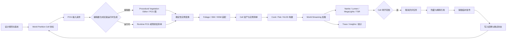
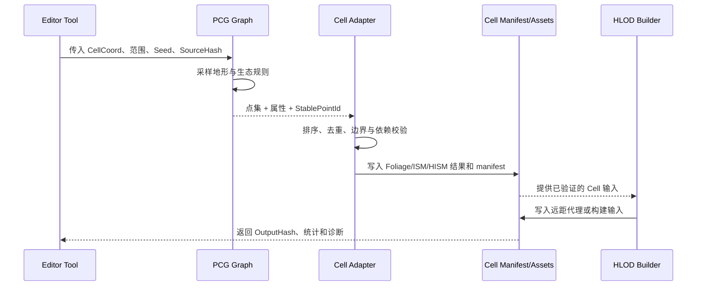
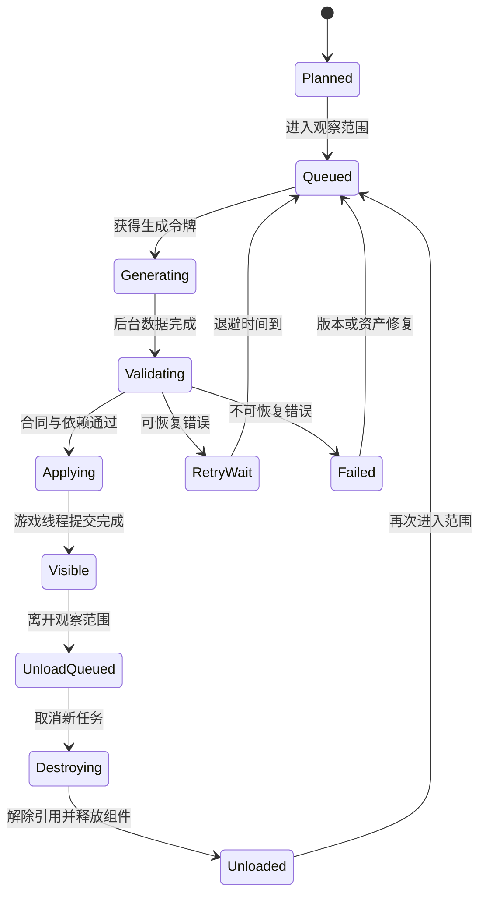

# 05 大世界植被与渲染协同

> 一句话定位：把 World Partition/World Streaming、PCG、Procedural Vegetation Editor、Foliage/ISM/HISM 与 HLOD 串成可生成、可打包、可流送、可销毁、可观测的植被闭环。

> 适用范围：UE 客户端开放世界、分区大地图、程序化植被、运行时流送、主机/PC 性能预算与自动化验收。

> 版本基准：UE5.8.0 / CL55116800 / `++UE5+Release-5.8`。

> 兼容性边界：本文以 UE5.8.0 工程流程为基线；UE4.27、早期 UE5 以及未来小版本只作为迁移对照，PCG 节点、Procedural Vegetation Editor 插件输出、HLOD 构建参数、Nanite/Lumen/MegaLights/TSR 开关和序列化字段均须在目标版本重新验收。

> 官方参考：[Unreal Engine 官方文档总页](https://dev.epicgames.com/documentation/en-us/unreal-engine)。

> 最后更新：2026-08-06。

## 1. 概述

大世界植被不是“在 Landscape 上撒几棵树”的单点功能，而是一条跨编辑器、资产、构建、运行时和渲染器的生产链。

这条链的输入是地形、材质层、道路、湿度、坡度、生态规则、设计师覆盖和稳定种子。

这条链的中间产物是按分区组织的点、实例、Foliage 数据、ISM/HISM 组件、HLOD 输入和烘焙清单。

这条链的运行时产物是被 World Partition/World Streaming 加载的单元、可见实例、Nanite 页、Lumen 场景表示和 TSR 历史。

这条链的终点不是“生成完成”，而是单元离开观察范围后能够可重复地卸载、取消异步任务、释放引用、清理临时组件并接受下一次重试。

本文将这条链简称为“植被闭环”。

闭环的核心原则有四个。

1. **分区是边界，种子是身份，清单是合同。** 不以浮点世界坐标直接当作持久化主键。
2. **编辑器生成与运行时消费分离。** 编辑器可以生成、预览、烘焙和保存；打包运行时只能使用被允许的 Runtime 模块与已烹饪资产。
3. **实例化降低管理成本，不自动消除所有成本。** Draw Call、材质通道、阴影、Lumen 更新、Nanite 流送和内存仍要单独预算。
4. **观测和验收是闭环的一部分。** 没有 Trace、Insights、清单校验和卸载回归的生成，只是一次不可审计的批处理。

读完本文后，读者应能够：

- 设计一套从 PCG 输入到按 Cell 保存的植被数据合同；
- 判断 Procedural Vegetation Editor、PCG、Foliage、ISM、HISM 与 HLOD 的职责边界；
- 为编辑器生成、Cook、Pack、World Streaming、运行时销毁和失败重试画出状态机；
- 用确定性种子和分区坐标保证多机生成结果可比较、可回滚、可迁移；
- 把 Nanite、Lumen、MegaLights、TSR 对植被的影响拆成可测量预算；
- 用 Trace/Unreal Insights 和自动化验收证明“加载、绘制、卸载、重试”都按合同工作。

本文中的“已核实”只指仓库中已有源码专题或本机版本证据明确覆盖的内容。

本文中的“示意代码”“工程方案”“建议参数”不代表 UE5.8 已存在同名 API，也不代表某个插件已经自动写入 Foliage 或 World Partition。

## 2. 先建立闭环模型

### 2.1 八个阶段

| 阶段 | 输入 | 主要产物 | 责任边界 | 验收重点 |
| --- | --- | --- | --- | --- |
| 规划 | 世界坐标、Cell 尺寸、生态版本 | 分区方案、种子策略 | 项目工具/策划配置 | 坐标和版本可复现 |
| 采样 | Landscape、RVT、坡度、遮罩 | PCG 点集或规则输入 | PCG 图/自定义节点 | 采样不越界、密度可解释 |
| 生成 | 点集、物种规则、种子 | 实例变换、元数据 | PCG + 植被适配层 | 结果可重跑、统计完整 |
| 承载 | 实例变换、网格、材质 | Foliage、ISM/HISM 或 Actor | Foliage/组件策略 | 组件归属唯一 |
| 构建 | Cell 结果、HLOD 层级 | 外部 Actor、HLOD 输入、烹饪资产 | 编辑器/命令行构建 | 依赖闭合、无编辑器模块泄漏 |
| 流送 | Streaming Source、Runtime Cell | Loaded/Visible 单元 | World Partition/World Streaming | 加载延迟、顺序和取消可控 |
| 渲染 | 可见实例、光照和历史 | Nanite、Lumen、MegaLights、TSR 帧数据 | Renderer/RHI | 帧时间、内存、IO 在预算内 |
| 销毁 | 单元离开范围或版本失效 | 取消任务、释放组件、清理引用 | 运行时生命周期 | 无重复释放、无残留、可重试 |

### 2.2 端到端 Mermaid



图中“适配”是一个有意保留的工程边界。

不要把 PCG 点集自动等同于 `AInstancedFoliageActor` 中已经保存的 Foliage 实例。

不要把 Procedural Vegetation Editor 的 Runtime 模块存在，等同于项目已经拥有可打包的运行时植被生成器。

不要把 HLOD 代理存在，等同于原始实例已经被正确隐藏或卸载。

### 2.3 两条结果路径

| 路径 | 编辑器阶段 | 运行时阶段 | 适合情况 | 主要风险 |
| --- | --- | --- | --- | --- |
| 预烘焙 | 按 Cell 生成并保存 | 只加载已烹饪结果 | 稳定内容、主机、确定性优先 | 内容体积大、变更要重烘焙 |
| 运行时生成 | 保存规则与种子 | Cell 加载时异步生成 | 无限地图、强运行时变化 | 首次可见延迟、CPU/内存尖峰、版本一致性 |
| 混合 | 大树/关键景观预烘焙，草和装饰按规则生成 | 预烘焙基础 + 小范围动态层 | 多数商业开放世界 | 两套来源重复、卸载顺序复杂 |

默认建议是预烘焙基础层，运行时只承担确有必要的动态层。

如果必须运行时生成，应把生成结果视作带版本的缓存，而不是永远存在的关卡资产。

## 3. 系统职责与证据分层

### 3.1 组件职责表

| 系统 | 主要职责 | 不应承担的职责 | 本文使用方式 |
| --- | --- | --- | --- |
| World Partition | 组织大世界、Actor 描述、运行时单元和空间流送 | 不负责理解每种植物的生态规则 | 作为 Cell 生命周期边界 |
| World Streaming | 根据 Streaming Source 加载/卸载可用内容 | 不负责替 PCG 保证确定性 | 作为运行时调度入口 |
| PCG | 采样数据、执行节点图、输出点和属性 | 不自动替项目完成资产归档与版本发布 | 作为规则计算层 |
| Procedural Vegetation Editor | 编辑器侧植被图、资产和交互工作流 | 不把未验证的输出链当成通用 Runtime API | 作为编辑器生成工具 |
| Foliage | 设计师可编辑的植被实例和类型数据 | 不适合承载所有高频运行时临时对象 | 作为可编辑或预烘焙承载层 |
| ISM | 同一网格的实例化绘制 | 不提供层级空间剔除的全部能力 | 作为简单批量实例方案 |
| HISM | 实例化绘制加层级聚类/剔除 | 不自动解决材质、光照和流送预算 | 作为大数量、空间聚类方案 |
| HLOD | 远距离代理、层级可见性和包围体简化 | 不代替近景原始实例和交互碰撞 | 作为远距内容层 |
| Nanite | 虚拟化几何和集群级可见性/细节 | 不自动修复植被材质、风摆或遮罩伪影 | 逐网格开启并验收 |
| Lumen | 动态全局光照与反射的场景表示 | 不保证所有动态叶片都低成本 | 观察流送和材质变化影响 |
| MegaLights | 多光源采样和解析路径 | 不替植被做密度控制 | 作为灯光/阴影预算的一部分 |
| TSR | 时间域超分和历史重投影 | 不替动态风摆提供无伪影保证 | 验证植被运动和抖动 |

### 3.2 证据等级

| 等级 | 含义 | 文中措辞 | 落地动作 |
| --- | --- | --- | --- |
| A | 本机 UE5.8 源码或仓库专题明确核实 | “源码分析已覆盖” | 可作为版本基线，但仍做项目编译验收 |
| B | 官方文档描述的通用能力 | “官方能力/官方工作流” | 按目标版本文档和示例验证 |
| C | 项目架构方案或伪代码 | “建议/示意/工程方案” | 由项目适配层实现和测试 |
| D | 未知或版本敏感 | “未在本文核实” | 禁止写成 UE5.8 已有保证 |

本文重点讨论闭环设计，因此大量接口采用 C 级示意。

World Partition、World Streaming、Lumen/MegaLights 与 Procedural Vegetation Editor 的本地源码范围见 [22-WorldPartition与WorldStreaming源码.md](../12-引擎源码分析/22-WorldPartition与WorldStreaming源码.md)、[30-Lumen与MegaLights源码.md](../12-引擎源码分析/30-Lumen与MegaLights源码.md) 和 [31-ProceduralVegetationEditor源码.md](../12-引擎源码分析/31-ProceduralVegetationEditor源码.md)。

## 4. 分区坐标、身份与确定性

### 4.1 Cell 坐标合同

浮点位置适合渲染和查询，不适合作为内容身份。

每个生成结果至少携带以下合同字段。

| 字段 | 示例 | 规则 |
| --- | --- | --- |
| `WorldId` | `MainWorld` | 固定项目世界标识，不随显示名随意变化 |
| `GridId` | `Vegetation_0` | 区分不同流送/生成网格 |
| `CellCoord` | `(-12, 4, 0)` | 使用整数坐标，负数必须采用 floor 语义 |
| `CellSizeCm` | `25600` | 版本化配置，变更会触发全量迁移或重烘焙 |
| `GraphRevision` | `veg-2026-08-06-07` | 规则图、节点和参数的内容哈希或版本号 |
| `BiomeRevision` | `forest-v3` | 生态表与物种权重版本 |
| `Seed` | `uint64` | 由项目盐值和合同字段稳定计算 |
| `SourceHash` | `sha256:...` | 输入地形/遮罩/设计师覆盖的摘要 |
| `OutputHash` | `sha256:...` | 实例排序和序列化后的结果摘要 |
| `GeneratorMode` | `Baked`/`Runtime` | 明确运行时是否允许重生成 |

`CellCoord` 计算必须处理世界负半轴。

不要使用把 `-1.0 / CellSize` 截断为零的整数转换。

推荐把数学写成 floor division：

```text
CellCoord.X = floor(WorldPosition.X / CellSizeCm)
CellCoord.Y = floor(WorldPosition.Y / CellSizeCm)
CellCoord.Z = floor(WorldPosition.Z / CellSizeCm)
Local.X = WorldPosition.X - CellCoord.X * CellSizeCm
Local.Y = WorldPosition.Y - CellCoord.Y * CellSizeCm
Local.Z = WorldPosition.Z - CellCoord.Z * CellSizeCm
```

在边界附近使用同一套 epsilon 和舍入规则。

如果生成器使用 LWC `double` 采样，而序列化结果使用 `float`，必须在合同中写明量化点。

### 4.2 负坐标与边界测试

至少测试以下坐标。

| 世界坐标 | CellSize | 期望 Cell | 需要验证的风险 |
| --- | ---: | --- | --- |
| `(0, 0, 0)` | 25600 | `(0, 0, 0)` | 原点约定 |
| `(25599.9, 0, 0)` | 25600 | `(0, 0, 0)` | 正边界内 |
| `(25600, 0, 0)` | 25600 | `(1, 0, 0)` | 正边界切换 |
| `(-0.1, 0, 0)` | 25600 | `(-1, 0, 0)` | 负半轴 floor |
| `(-25600, 0, 0)` | 25600 | `(-1, 0, 0)` | 负边界 |
| `(-25600.1, 0, 0)` | 25600 | `(-2, 0, 0)` | 负边界外 |
| `(x, y, z)` | 25600 | 同规则 | LWC 到本地变换 |

边界点只允许一个 Cell 拥有。

推荐使用半开区间 `[Min, Max)`。

跨边界的树冠、根系和 HLOD 代理不要被简单截断。

可选方案是按几何包围盒扩展查询范围，但实例所有权仍由树干锚点或稳定主点决定。

### 4.3 稳定种子

种子应由不可变项目盐值、Cell 坐标、规则版本和物种标识组成。

示意函数如下，具体哈希实现不绑定 UE5.8 API：

```cpp
// 示意：展示输入合同，不宣称项目已有此 API。
uint64 MakeVegetationSeed(
    uint64 ProjectSalt,
    FIntVector CellCoord,
    uint32 GraphRevision,
    uint32 BiomeRevision,
    uint32 SpeciesId)
{
    uint64 H = Hash64(ProjectSalt);
    H = HashCombine64(H, Hash64(CellCoord.X));
    H = HashCombine64(H, Hash64(CellCoord.Y));
    H = HashCombine64(H, Hash64(CellCoord.Z));
    H = HashCombine64(H, Hash64(GraphRevision));
    H = HashCombine64(H, Hash64(BiomeRevision));
    return HashCombine64(H, Hash64(SpeciesId));
}
```

同一个 Cell 内的候选点要使用稳定排序。

不要依赖哈希表遍历顺序、线程完成顺序或指针地址。

异步任务可以并发采样，但最终结果必须在提交前按 `SpeciesId + StablePointId` 排序。

随机数流应为局部流，不要让一个物种新增一条规则后改变所有其他物种的序列。

### 4.4 可追溯的生成清单

建议每个 Cell 生成一个人类可读的摘要和机器可读的 manifest。

```json
{
  "world": "MainWorld",
  "grid": "Vegetation_0",
  "cell": [-12, 4, 0],
  "cellSizeCm": 25600,
  "generatorMode": "Baked",
  "graphRevision": "veg-2026-08-06-07",
  "seed": "0x7D3A...",
  "sourceHash": "sha256:source",
  "outputHash": "sha256:output",
  "species": {
    "pine": { "count": 1842, "boundsCm": 1200 },
    "grass": { "count": 92314, "boundsCm": 24 }
  },
  "dependencies": ["/Game/Vegetation/Pine/Pine_Nanite", "/Game/Vegetation/Grass/Grass_Mat"],
  "hlodLayer": "VegetationFar",
  "status": "Validated"
}
```

manifest 不是运行时必须加载的全部内容。

它是复现、差异比较、烹饪闭合和失败定位的合同。

## 5. PCG 与 Procedural Vegetation Editor 的生成层

### 5.1 PCG 图的输入输出

一个可维护的植被图应把“采样”和“物种决策”分开。

采样层读取地形高度、法线、坡度、海拔、Landscape Layer、RVT 或项目自定义遮罩。

规则层根据生态表进行密度、排斥半径、群落、坡向、湿度和距离道路过滤。

变换层计算旋转、缩放、风摆相位和稳定点 ID。

输出层只输出带合同属性的点，不直接假设目标一定是 Foliage、HISM 或 Actor。

建议的点属性如下。

| 属性 | 类型 | 用途 |
| --- | --- | --- |
| `StablePointId` | `uint64` | 排序、差异和重试身份 |
| `SpeciesId` | `uint32` | 选择 Static Mesh、材质和规则 |
| `CellCoord` | `int3` | 防止跨 Cell 误归属 |
| `Transform` | `double/float` | 世界到 Cell 本地的变换 |
| `DensityWeight` | `float` | 统计与调参 |
| `BiomeTag` | Name/Hash | 生态类型 |
| `CollisionPolicy` | enum | 近景交互或无碰撞 |
| `RenderPolicy` | enum | Nanite、HISM、HLOD 目标 |
| `SeedOffset` | `uint32` | 风摆和变体随机化 |
| `SourceMaskHash` | `uint64` | 输入变化追踪 |

### 5.2 Procedural Vegetation Editor 的边界

Procedural Vegetation Editor 是编辑器工具链的一部分时，应把插件模块、资产、图编辑和项目输出适配分别验收。

仓库中的 [31-ProceduralVegetationEditor源码.md](../12-引擎源码分析/31-ProceduralVegetationEditor源码.md) 已将 Runtime/Editor 模块边界、图/资产/实例关系和 Foliage/World Partition 的适配证据分开说明。

本文沿用这个边界：插件有 Runtime 模块，不等于项目可以在打包运行时调用任意编辑器菜单、资产保存函数或未公开的输出接口。

推荐的适配层拥有明确名字，例如 `UVegetationBakeAdapter` 或 `FVegetationCellExporter`。

适配层负责：

- 把 PCG 输出点按 Cell 和 Species 分组；
- 检查网格、材质、碰撞和 HLOD 策略是否完整；
- 把编辑器生成结果写到项目认可的 Foliage/ISM/HISM 数据承载；
- 生成 manifest、依赖清单和输出哈希；
- 在保存前拒绝跨 Cell、空网格、未知物种和未授权材质；
- 为每次生成记录 GraphRevision、插件版本和工具版本。

适配层不应隐式修改运行时世界，也不应在 PIE 结束后留下临时组件。

### 5.3 图版本和增量生成

图的版本不只来自资产文件时间戳。

应包含图结构、节点参数、物种表、采样配置、CellSize、引擎版本和适配器版本。

以下任意一项变化都可能使 OutputHash 变化：

- Landscape 高度或 Layer 权重；
- 道路、河流、禁种体积和设计师覆盖；
- PCG 节点结构或节点参数；
- 物种权重、排斥半径、缩放范围和材质策略；
- 引擎/插件版本或序列化格式；
- Nanite、HLOD 或运行时表现策略。

生成器应先比较 SourceHash 和 GraphRevision。

只有输入相同、规则版本相同且输出契约一致时，才允许复用 Cell 缓存。

### 5.4 生成序列 Mermaid



任何一步失败都要返回结构化错误，不要只在编辑器日志中打印一句“生成失败”。

## 6. Foliage、ISM、HISM 的承载选择

### 6.1 选择表

| 目标 | Foliage | ISM | HISM | Actor |
| --- | --- | --- | --- | --- |
| 设计师刷写和手工调整 | 强 | 弱 | 中 | 中 |
| 单一网格批量绘制 | 强 | 强 | 强 | 弱 |
| 空间层级剔除 | 依赖实现 | 弱 | 强 | 依赖场景 |
| 运行时频繁增删 | 谨慎 | 中 | 中 | 弱 |
| 单实例独立逻辑 | 弱 | 弱 | 弱 | 强 |
| 按 WP Cell 持久化 | 需按项目承载 | 需自定义归属 | 需自定义归属 | 可但体量大 |
| 远距离 HLOD 输入 | 需明确导出 | 需明确导出 | 需明确导出 | 需明确导出 |
| 推荐用途 | 可编辑基础层 | 小批量稳定组 | 大量空间分布实例 | 关键交互对象 |

“一次 Draw Call”只是粗略宣传语。

实际绘制还会受到材质槽、网格 Section、Pass、阴影、深度、Lumen、反射、透明和平台渲染路径影响。

HISM 的聚类剔除适合空间分布稳定的实例。

如果实例在每帧大范围移动或频繁改变，聚类更新成本可能抵消收益。

### 6.2 Cell 归属规则

Foliage/ISM/HISM 结果必须有唯一 OwnerCell。

OwnerCell 由稳定锚点决定，不由当前相机位置决定。

单个实例的包围盒可以越过 Cell 边界，但不能在相邻 Cell 各存一份完整实例。

跨边界的树冠可使用邻域采样或扩展包围盒生成。

保存时只把锚点属于当前 Cell 的实例写入当前 Cell。

加载时由 OwnerCell 负责创建组件。

卸载时由 OwnerCell 负责销毁组件。

### 6.3 运行时 HISM 示意代码

下面的代码是工程适配层示意，不声明项目已经拥有这些资产查找和线程调度函数。

```cpp
struct FVegetationInstanceRecord
{
    uint64 StablePointId = 0;
    FTransform LocalTransform;
    uint32 SpeciesId = 0;
    FIntVector OwnerCell = FIntVector::ZeroValue;
};

// 只能在允许创建 UActorComponent 的游戏线程提交。
void ApplyCellToHISM(const FVegetationCellResult& Result)
{
    for (const FSpeciesBatch& Batch : Result.Batches)
    {
        UHierarchicalInstancedStaticMeshComponent* HISM =
            FindOrCreateCellHISM(Result.CellCoord, Batch.SpeciesId);

        HISM->ClearInstances();
        TArray<FTransform> SortedTransforms = Batch.Transforms;
        StableSortByPointId(SortedTransforms, Batch.PointIds);
        HISM->AddInstances(SortedTransforms, false, true, false);
    }
}
```

真实项目还必须处理重复提交、组件重用、碰撞模式、导航影响、材质参数和卸载令牌。

不要在后台线程直接创建、销毁或修改 UObject/Component。

后台线程只计算不可变数据和结果缓冲区。

### 6.4 Foliage 与运行时动态层

编辑器 Foliage 适合设计师可视化、刷写和持久化基础层。

运行时动态树木、破坏、采集和季节变化适合另建 Dynamic Layer。

Dynamic Layer 应记录与基础层不同的 Owner、生命周期、网络策略和回滚策略。

不要为了让运行时的一棵树消失而改写整个预烘焙 Foliage 资产。

更安全的方案是：

1. 基础 Foliage 保持不可变；
2. 动态层记录被移除的 StablePointId；
3. Cell 加载时过滤被标记实例；
4. Cell 卸载时只清理动态层临时对象；
5. 存档系统持久化差异，而不是持久化完整实例数组。

## 7. 打包、Cook 与依赖闭合

### 7.1 内容分层

| 层 | 内容 | Cook 方式 | 运行时要求 |
| --- | --- | --- | --- |
| 规则层 | PCG 图、物种表、版本配置 | 作为 Runtime 可读资产或仅编辑器资产 | 运行时生成时必须可用 |
| 结果层 | Cell manifest、实例变换、Foliage/组件数据 | 与世界 Cell 一致烹饪 | 预烘焙路径必须闭合 |
| 网格层 | Static Mesh、Nanite 数据、LOD | 按引用和 Chunk 烹饪 | 不能只在编辑器目录存在 |
| 材质层 | Base Material、MI、Shader/Pipeline 数据 | 按平台编译 | 运行时不能依赖 Editor-only 节点 |
| 远距层 | HLOD 代理、材质和映射 | 与目标 HLOD 层一起打包 | 切换时不能与原始内容重叠 |
| 诊断层 | manifest 摘要、版本、统计 | 可按发行配置裁剪 | 线上保留最小可定位信息 |

### 7.2 Editor/Runtime 边界

编辑器专属操作包括资产保存、批量构建、HLOD 构建、编辑器菜单、预览组件和源数据重写。

运行时允许的操作包括加载已烹饪资产、解析 manifest、创建允许的运行时组件、提交异步数据和销毁临时对象。

同一个 C++ 模块同时承担两边时，要用明确的模块依赖和条件编译隔离。

示意结构如下：

```text
VegetationRuntime
  - CellContract
  - DeterministicSampler
  - ManifestReader
  - RuntimeHISMFactory
  - TraceMarkers

VegetationEditor
  - PCG/ProceduralVegetationEditor adapter
  - Bake command
  - Foliage exporter
  - HLOD input builder
  - Manifest writer
```

`VegetationEditor` 不应被打包目标依赖。

如果 Procedural Vegetation Editor 的某个资产类型无法在 Runtime 模块解析，预烘焙路径必须把它转换成项目支持的运行时结果。

### 7.3 Cook/Pak 示意命令

下面是常见的自动化方向，参数和 Builder 名称是示意，必须由项目的 UE5.8 命令行验收确认。

```powershell
# 示意：先生成/验证 Cell，再执行项目的 Cook。
UnrealEditor-Cmd.exe "D:\Build\MyProject.uproject" `
  -run=WorldPartitionBuilder `
  -Builder=VegetationCellBuilder `
  -World=/Game/Maps/MainWorld `
  -Grid=Vegetation_0 `
  -ValidateOnly

RunUAT.bat BuildCookRun `
  -project="D:\Build\MyProject.uproject" `
  -platform=Win64 `
  -build -cook -stage -pak `
  -archive -archivedirectory="D:\Build\Archive"
```

不要把上面命令中的 `VegetationCellBuilder` 当作引擎内置类名。

项目应在构建脚本中注册自己的命令、版本和退出码。

### 7.4 依赖闭合检查

每个 manifest 的依赖必须能映射到可烹饪 Package。

检查至少包括：

- 网格和每个材质槽可解析；
- Nanite 数据在目标平台构建成功或明确关闭；
- HLOD 代理的材质、纹理和网格都在同一发行配置；
- PCG/Procedural Vegetation Editor 的 Editor-only 依赖没有被 Runtime 引用；
- Cell 外部 Actor、Foliage 数据和 manifest 路径不含本机绝对路径；
- Pak/IoStore 中存在首个可见 Cell 的冷启动依赖；
- 规则版本与结果版本不匹配时能拒绝复用；
- 缺失资产不会导致无限重试或永久阻塞主线程。

## 8. World Partition/World Streaming 的加载、流送与销毁

### 8.1 Cell 生命周期



每个状态都应有单调递增的 GenerationToken。

旧任务完成时，如果 Token 不是当前值，就只能释放自己的临时缓冲，不能提交到世界。

### 8.2 流送触发顺序

World Partition/World Streaming 根据 Streaming Source 计算需要的单元。

植被系统接收 Cell 事件后，先查询是否有可用预烘焙结果。

预烘焙结果存在且版本匹配时，直接进入加载和组件提交。

没有结果且运行时生成被允许时，进入异步生成队列。

生成尚未完成时，不要为了填满画面而在游戏线程同步生成完整森林。

可以使用低成本占位层，但必须有明确替换和销毁规则。

### 8.3 异步生成分层

建议把任务拆为四层：

| 层 | 可否后台线程 | 内容 | 产物 |
| --- | --- | --- | --- |
| 读取 | 是，遵循资产线程安全约束 | 读取 manifest、参数和只读输入 | 不可变输入快照 |
| 计算 | 是 | 采样、过滤、排序、哈希 | `FVegetationCellResult` |
| 提交 | 否，回到游戏线程 | 创建/更新组件、注册可见性 | 活跃组件句柄 |
| 渲染同步 | 由引擎渲染线程处理 | Proxy、实例缓冲、材质参数 | 帧内可见结果 |

资产加载 API 的线程约束必须以目标版本实际 API 为准。

本文只定义工程分层，不将任意 UObject 读写标记为线程安全。

### 8.4 失败重试

错误至少分为三类：

- 可恢复：IO 暂时失败、线程预算不足、Cell 被取消；
- 版本性：manifest 版本不匹配、GraphRevision 不匹配；
- 不可恢复：缺少网格、非法变换、契约校验失败。

可恢复错误使用有限次数退避重试。

建议退避序列为 `0.25s、0.5s、1s、2s、4s`，最大次数和上限由项目配置。

Cell 被卸载时的取消，不应被计入“系统故障重试”。

重试必须复用同一个输入 `SourceHash + Seed + GenerationToken`。

失败记录应包含错误分类、资产路径、Cell、尝试次数和最后一个阶段。

### 8.5 销毁的幂等性

销毁流程应按以下顺序执行：

1. 把 Cell 状态改为 `UnloadQueued`，拒绝新的生成提交；
2. 递增 GenerationToken，使旧任务失效；
3. 取消尚未提交的 IO/计算任务；
4. 从可见集合移除实例组；
5. 清理碰撞、导航、交互和游戏逻辑引用；
6. 销毁或归还 HISM/ISM/占位组件；
7. 释放 manifest、结果缓冲和临时材质实例引用；
8. 写入卸载计数和耗时；
9. 转入 `Unloaded`。

重复收到卸载事件不能重复扣减引用计数。

如果某一步失败，应保留可诊断状态并阻止下一次加载覆盖残留对象。

## 9. HLOD 与远距离植被

### 9.1 HLOD 的定位

HLOD（Hierarchical Level of Detail）是远距离内容代理机制。

它的目标是减少远处 Actor/组件数量、包围体查询和细节管理成本。

它不是 Nanite 的同义词，也不是把所有实例自动合并成一个安全网格。

植被 HLOD 要明确哪些对象进入代理、哪些对象保留为原始 Cell 内容。

常见分层如下：

| 层级 | 近似内容 | 目标 | 注意 |
| --- | --- | --- | --- |
| HLOD0 | 原始树、灌木、草 | 近景细节和交互 | 处理碰撞、风摆和实例剔除 |
| HLOD1 | 林块/群落代理 | 中远景减少组件数 | 透明和材质合批需验收 |
| HLOD2 | 地貌/远景色块 | 极远距离轮廓 | 不要承载近景交互 |

### 9.2 原始内容与代理切换

当 HLOD 代理可见时，原始植被不能仍在同一距离范围内完全绘制。

切换合同至少包括：

- 原始内容的可见距离和 HLOD 代理的可见距离；
- 切换时的包围盒覆盖关系；
- 代理材质、风摆、颜色和季节参数；
- 碰撞与导航是否只来自原始层；
- Lumen/Nanite 场景表示是否在切换时出现明显跳变；
- Cell 卸载与 HLOD Cell 加载的先后关系。

不要用“看起来没有重影”替代统计检查。

验收时同时捕获原始实例数、代理数、可见组件数和 Draw Call。

### 9.3 HLOD 构建失败

一个 Cell 的原始生成成功，不代表 HLOD 一定成功。

HLOD 阶段应有自己的 manifest 状态：`InputReady`、`Building`、`Built`、`Failed`。

HLOD 输入变化时，不能继续使用旧代理而不标记版本不一致。

若代理构建失败，项目应选择：保留原始远距内容、使用上一版代理，或阻断打包。

选择必须写进平台发布策略，而不是由构建机偶然决定。

## 10. Nanite、Lumen、MegaLights 与 TSR 的渲染耦合

### 10.1 Nanite 选型

Nanite 适合把几何复杂度交给虚拟化几何管线，但植被网格仍要逐资产检查。

检查内容包括：

- 叶片是实体、双面、Masked、Translucent 还是项目自定义路径；
- 风摆是否使用 World Position Offset（WPO）；
- 材质是否依赖像素深度偏移、顶点动画或特殊阴影；
- LOD、裁剪和过渡是否在近中远距离稳定；
- 网格的包围盒是否因风摆被低估；
- 近景交互碰撞是否与渲染网格分离；
- 目标平台是否支持项目选定的 Nanite 路径。

不要因为树干 Nanite 表现良好，就默认草叶和卡片同样适用。

小网格、透明层、强 WPO 和大量独立材质可能在其他预算项上更贵。

### 10.2 Lumen 与流送

Lumen 的场景表示必须随着 Cell 内容的加载、可见性变化和材质变化保持一致。

植被进入场景时，可能影响间接光、反射、遮挡、表面缓存或距离场相关路径。

植被离开场景时，必须观察场景表示更新是否延迟、是否产生一帧残影以及是否出现更新尖峰。

这些现象受网格、材质、平台和项目 CVar 组合影响，不能用一条固定开关概括。

应把“原始实例”“HLOD 代理”“动态破坏层”分别测量，而不是只测一张森林截图。

具体源码入口和已核实 CVar 见 [30-Lumen与MegaLights源码.md](../12-引擎源码分析/30-Lumen与MegaLights源码.md)。

### 10.3 MegaLights 与植被

MegaLights 相关成本应从灯光数量、可见叶片、阴影/遮挡、采样质量和解析分辨率几个方向观察。

密集叶片会改变光源可见性和遮挡分布。

风摆会让同一片植被的几何和遮挡随帧变化。

远距 HLOD 材质如果过度简化，可能降低灯光成本但造成轮廓或能量不一致。

本文不把某个 MegaLights 内部实现写成通用 API。

使用源码专题确认引擎入口，使用 `ProfileGPU`、RenderDoc/PIX 或项目支持的 GPU 捕获确认实际 Pass。

### 10.4 TSR 与风摆

TSR 依赖时间历史、运动信息、深度和抖动。

植被的 WPO、顶点动画、薄叶片、Masked 裁剪和细小高频纹理容易产生拖影、闪烁或历史污染。

验收应覆盖静止相机、平移相机、快速转向、风摆开启和 Cell 切换五种场景。

不要只在暂停画面中判断 TSR 质量。

需要比较原始树、HLOD 树和草地三类内容的运动向量与边缘稳定性。

### 10.5 渲染耦合表

| 内容策略 | Nanite | Lumen | MegaLights | TSR | 需要重点测量 |
| --- | --- | --- | --- | --- | --- |
| 近景大树 | 几何与材质逐项验证 | 间接光/反射更新 | 阴影与遮挡 | 树冠边缘历史 | GPU、显存、场景更新 |
| 中景灌木 HISM | 聚类和材质成本 | 代理/实例切换 | 光源采样 | 细叶闪烁 | Draw Call、遮罩、历史 |
| 远景 HLOD | 代理是否启用 | 代理一致性 | 灯光能量 | 轮廓稳定 | 代理切换、包体、IO |
| 草地高密度 | 不默认开启 | 预算敏感 | 采样数量敏感 | 高频抖动 | 实例数、材质、阴影 |
| 动态破坏树 | 几何更新策略 | 场景更新尖峰 | 阴影变化 | 运动向量 | CPU/GPU/回收 |

## 11. 五类预算：内存、IO、Draw Call、Shader、光照

### 11.1 预算总式

不要用“实例数量”作为唯一性能指标。

可以先建立工程近似式：

```text
MemoryCell =
    CPUManifest
  + CPUInstanceData
  + GPUInstanceBuffer
  + MeshAndNanitePages
  + TextureAndMaterialResidency
  + HLODProxy
  + LumenOrLightingResidency
  + StreamingMargin
```

实际字节数必须由目标平台采样，不由公式猜测。

Cell 预算应区分常驻区、预取区和当前可见区。

### 11.2 预算表模板

| 指标 | 公式/观察口径 | 预算示例 | 超标后的第一动作 |
| --- | --- | ---: | --- |
| CPU 实例数据 | 实例数 × 变换/属性字节 + 索引 | 以平台测量 | 减少属性、分层或预烘焙 |
| GPU 实例缓冲 | 可见实例 × 变换/自定义数据 | 以平台测量 | 缩小预取圈、拆 Cell |
| IO | 冷加载字节 / 可见前窗口 | 以秒数反推 | 降低依赖、预取或压缩 |
| Draw Call | 组数 × 材质/Section × Pass | 以 GPU 捕获 | 合理分组、材质合并 |
| Shader | 变体数、编译时长、PSO 命中 | 发布门槛 | 收敛静态开关和材质层 |
| 光照 | Lumen/MegaLights/VSM 等 Pass 时间 | 帧预算比例 | 减少远距参与、调质量 |
| HLOD | 代理包体、构建时间、切换开销 | 构建门槛 | 调整层级和输入集合 |
| TSR | 重投影、历史污染、边缘稳定 | 目标质量 | 调材质/运动/分辨率策略 |

### 11.3 Frame Budget 示例

以下数值只是展示如何分配，不是所有项目的 UE5.8 默认值。

以 60 FPS 为例，总帧时间约为 16.67 ms。

可先给植被渲染、流送和生成设置独立上限，再用实测调整。

| 项目 | 参考上限 | 备注 |
| --- | ---: | --- |
| 游戏线程植被调度 | 0.5 ms | 不含完整 PCG 计算 |
| 渲染线程植被提交 | 0.8 ms | 含实例/可见性提交 |
| 植被相关 GPU | 3.0 ms | 含材质、深度和阴影，按项目调整 |
| Cell 提交尖峰 | 1.5 ms | 不要求每帧都发生 |
| 单 Cell 冷 IO | 由首帧窗口决定 | 以可见前余量倒推 |
| 运行时额外常驻内存 | 平台额度的固定比例 | 主机/PC 分开配置 |

30 FPS、移动端或高画质截图模式必须使用不同预算表。

### 11.4 Draw Call 与实例数

可用下面的粗略上界进行早期估算：

```text
DrawCallsUpperBound ≈
    InstanceGroups
  × MeshSections
  × MaterialPasses
  × (Base + Shadow + Depth + Lumen/Reflection)
```

这个式子不是渲染器实际计数公式。

它的价值在于提醒团队：HISM 合并的是实例，不必然合并材质、Section 和 Pass。

统计时同时记录：

- 逻辑物种数；
- 网格资产数；
- Material Slot 数；
- HISM/ISM 组件数；
- 可见实例数；
- GPU Draw/Primitive；
- 阴影投射实例数；
- HLOD 代理数。

### 11.5 Shader 预算

植被材质的成本来自基础着色、Masked/Translucency、WPO、风摆、距离淡出、阴影和各种静态/动态分支。

建议给物种建立材质族，而不是每个物种复制一套独立复杂材质。

每个发布平台记录 Shader 编译数量、耗时、PSO 命中和首次可见卡顿。

把 `Editor` 预览成功与打包机 Shader 完整不混为一谈。

### 11.6 光照预算

光照预算至少拆成直接光、阴影、Lumen、反射、VSM/虚拟阴影和透明/遮罩成本。

树冠密度变化时，不能只看总 GPU 时间。

要比较空场、低密度、中密度、高密度和 HLOD 五个控制组。

## 12. 编辑器流程与运行时边界

### 12.1 编辑器工作流

推荐的编辑器流水线如下：

1. 锁定引擎、插件、图和生态版本；
2. 选择 World Partition 世界和 Vegetation Grid；
3. 对目标 Cell 生成输入快照；
4. 运行 PCG/Procedural Vegetation Editor 预览；
5. 生成点属性、稳定 ID 和统计；
6. 通过 Foliage/ISM/HISM 适配层写入结果；
7. 生成 manifest 和 OutputHash；
8. 构建 HLOD 输入或代理；
9. 保存外部 Actor/Cell 相关资产；
10. 执行依赖闭合、可见性和重复实例检查；
11. 运行目标平台 Cook；
12. 在独立运行时地图做冷加载、热加载和卸载测试。

### 12.2 运行时工作流

运行时只读取经过批准的合同。

如果使用预烘焙路径，运行时不应重新打开编辑器资产或重新执行编辑器菜单。

如果使用 Runtime PCG，运行时必须使用 Runtime 可解析节点、资产和输入快照。

运行时不能依赖本地工程目录、Editor-only 插件模块、未 Cook 的源纹理或开发机缓存。

运行时生成的 HISM 组件应有统一 Owner 和 Cell Registry。

Cell Registry 保存组件句柄、任务令牌、依赖引用和当前状态。

### 12.3 PIE 与独立包差异

PIE 可以看到编辑器缓存、未烹饪资产和工具模块，这些都可能掩盖打包问题。

至少跑三种模式：编辑器视口、Standalone PIE、目标平台打包版本。

对每种模式记录：

- 首次可见时间；
- 生成/加载是否走预期路径；
- 资产缺失和重试日志；
- Cell 销毁后内存是否回落；
- HLOD/Nanite/Lumen/TSR 是否使用同一渲染策略；
- 结果哈希是否一致或在允许误差内一致。

## 13. 版本迁移与格式演进

### 13.1 迁移触发条件

以下变化都应触发迁移评审：

- UE 主版本或小版本变化；
- CL 或分支变化；
- PCG 节点/插件版本变化；
- CellSize、GridId 或坐标原点策略变化；
- Foliage/ISM/HISM 序列化格式变化；
- Nanite、Lumen、MegaLights、TSR 默认设置变化；
- HLOD 构建器或代理材质变化；
- 物种表、材质族或碰撞策略变化。

### 13.2 迁移步骤

| 步骤 | 动作 | 通过条件 |
| --- | --- | --- |
| 1 | 记录旧版本 Build.version、插件和工具版本 | 元数据可复现 |
| 2 | 复制少量金样 Cell | 不直接全量重烘焙 |
| 3 | 运行坐标、种子和边界测试 | Cell 归属一致 |
| 4 | 比较 SourceHash/OutputHash | 差异可解释 |
| 5 | 检查材质/Nanite/HLOD 兼容 | 无未处理资产 |
| 6 | 在打包版本做加载/卸载循环 | 无残留和死锁 |
| 7 | 比较 Trace/Insights 预算 | 没有不可接受回归 |
| 8 | 全量生成并保存迁移报告 | 可回滚、可审计 |

不要把旧版生成的二进制实例文件当作新版本必然兼容。

对不确定字段使用显式 `SchemaVersion` 和迁移器。

### 13.3 格式迁移示意

```cpp
struct FVegetationManifestHeader
{
    uint32 SchemaVersion = 3;
    FString EngineBaseline = TEXT("UE5.8.0-CL55116800");
    FString GraphRevision;
    FIntVector CellCoord;
};

bool MigrateManifest(FVegetationManifest& Manifest, uint32 TargetVersion)
{
    while (Manifest.SchemaVersion < TargetVersion)
    {
        if (!ApplyOneStepMigration(Manifest))
        {
            return false;
        }
    }
    return Manifest.SchemaVersion == TargetVersion;
}
```

这是格式演进方案，不是 UE5.8 内置 manifest API。

## 14. Trace、Unreal Insights 与可观测性

### 14.1 观测目标

植被问题通常不是一个单点函数，而是“流送触发—资产加载—生成—组件提交—渲染—卸载”的链路问题。

每个 Cell 事件要带 `WorldId`、`GridId`、`CellCoord`、`GenerationToken`、`GraphRevision` 和 `OutputHash` 摘要。

不要在每个实例上打印日志。

按 Cell、物种批次和阶段做聚合统计。

### 14.2 C++ 观测标记示意

```cpp
void GenerateVegetationCell(const FCellRequest& Request)
{
    TRACE_CPUPROFILER_EVENT_SCOPE(GenerateVegetationCell);
    TRACE_BOOKMARK(TEXT("VegetationCell Generate"));

    UE_LOG(LogVegetation, Verbose,
        TEXT("Cell=(%d,%d,%d) Token=%llu Graph=%s"),
        Request.CellCoord.X,
        Request.CellCoord.Y,
        Request.CellCoord.Z,
        Request.GenerationToken,
        *Request.GraphRevision);

    // 仅示意：后台计算、回到游戏线程提交、统一记录结果。
}
```

宏和日志类别要按项目 Build.cs、模块和目标版本配置。

### 14.3 Trace 操作示意

常见的控制台方向如下，具体 Trace 通道名称以目标 UE5.8 构建可用列表为准。

```text
stat unit
stat game
stat scenerendering
stat streaming
stat foliage
profilegpu
memreport -full
trace.start cpu,loadtime,assetload,bookmark
trace.stop
```

采集时固定相机路径、Streaming Source 速度、天气/风摆、分辨率和质量配置。

同一条路线至少做一次冷启动和一次热缓存。

### 14.4 Insights 时间线

在 Unreal Insights 中建议建立以下观察泳道：

| 泳道 | 观察问题 |
| --- | --- |
| Game Thread | Cell 事件、生成提交、组件创建是否阻塞 |
| Async/Task Graph | 采样、排序和哈希是否并发、是否饥饿 |
| Loading/Asset | IO 是否与可见时间重叠、依赖是否过多 |
| Render Thread | 实例代理更新、可见性和 HLOD 切换是否尖峰 |
| GPU | 材质、阴影、Lumen、MegaLights、TSR 哪个阶段增长 |
| Memory/LLM | Cell 卸载后对象和缓冲是否回落 |
| Bookmarks | 失败、重试、版本不匹配发生在哪一帧 |

如果只采集 GPU，不足以证明异步生成和销毁正确。

如果只看 CPU，也不足以证明 Nanite、Lumen、MegaLights 和 TSR 的耦合成本。

### 14.5 诊断字段最小集

```text
CellCoord
OwnerCell
GeneratorMode
GraphRevision
SchemaVersion
GenerationToken
Attempt
Stage
PointCount
InstanceCountBySpecies
ComponentCount
HLODCount
SourceHash
OutputHash
LoadMs
GenerateMs
ApplyMs
DestroyMs
ErrorCode
```

生产版本可以裁剪实例级明细，但不能裁剪 Cell 级身份和版本字段。

## 15. 自动化验收

### 15.1 验收金字塔

| 层级 | 测试 | 失败时阻断 |
| --- | --- | --- |
| 静态 | 文件、链接、Schema、版本字段 | 是 |
| 单元 | floor 坐标、种子、排序、边界 | 是 |
| 生成 | 单 Cell 输出、哈希、统计 | 是 |
| 构建 | HLOD、Cook、Pak 依赖闭合 | 是 |
| 运行时 | 冷/热加载、卸载、重试 | 是 |
| 渲染 | Nanite/Lumen/MegaLights/TSR 控制组 | 按平台门槛 |
| 长稳 | 视点往返、内存回落、错误注入 | 是 |

### 15.2 自动化检查示意

```powershell
param(
  [string]$ManifestRoot = "Saved\VegetationManifests",
  [int]$MaxFailures = 0
)

$failures = 0
$manifests = Get-ChildItem -Recurse -Filter '*.json' $ManifestRoot

foreach ($manifestPath in $manifests) {
  $m = Get-Content -Raw $manifestPath | ConvertFrom-Json

  if ($m.status -ne 'Validated') { $failures++ }
  if ([string]::IsNullOrWhiteSpace($m.outputHash)) { $failures++ }
  if ($m.cellSizeCm -le 0) { $failures++ }
  if ($m.species.Count -eq 0) { $failures++ }
}

if ($failures -gt $MaxFailures) {
  Write-Error "Vegetation acceptance failed: $failures"
  exit 1
}

Write-Output "Vegetation acceptance passed: $($manifests.Count) manifests"
exit 0
```

这是项目验收脚本的示意，不要求把它直接保存为仓库脚本。

### 15.3 必测用例

1. 同一输入在两台机器生成，Cell 坐标、点数和 OutputHash 一致；
2. Cell 边界正负坐标都没有重复或缺失实例；
3. 同一 Cell 连续加载/卸载 100 次没有组件、引用或内存增长；
4. 生成过程中卸载，旧 GenerationToken 结果不能提交；
5. IO 失败后有限重试，最终错误可定位且不死循环；
6. 物种网格缺失时构建阻断并指出资产路径；
7. HLOD 代理和原始实例切换不双绘、不漏绘；
8. Cook 后的独立包不加载 Editor-only 模块；
9. Nanite 开关、Lumen 开关、MegaLights 质量和 TSR 配置组合均有控制组；
10. Trace/Insights 能从 Cell 事件定位到加载、生成、提交和销毁耗时。

### 15.4 渲染控制组

每次性能回归至少保留以下截图/Trace 对照：

| 控制组 | 植被 | HLOD | Nanite | Lumen/MegaLights | TSR |
| --- | --- | --- | --- | --- | --- |
| A | 关闭 | 关闭 | 关闭 | 关闭或基线 | 开启 |
| B | 近景基础 | 关闭 | 按资产 | 基线 | 开启 |
| C | 近景基础 | 开启 | 按资产 | 基线 | 开启 |
| D | 高密度 | 开启 | 按资产 | 高质量 | 开启 |
| E | 高密度风摆 | 开启 | 按资产 | 高质量 | 开启 |

比较时固定视点、时间、光照、天气和分辨率。

### 15.5 错误注入

自动化不能只测试成功路径。

应注入缺失资产、损坏 manifest、错误版本、慢 IO、任务取消、重复加载和 HLOD 构建失败。

每种错误都要验证状态回收、重试次数、最终错误和 Cell 再次加载行为。

## 16. 最佳实践

1. 用整数 Cell 坐标和版本化合同定义身份，永远不要用相机位置或浮点字符串当主键。
2. 将 PCG 采样、物种规则、实例承载、HLOD 构建拆成可单测的适配层。
3. 默认预烘焙稳定基础层，运行时只生成必须动态化的层。
4. Foliage、ISM、HISM 和 Actor 以内容语义选型，不以“实例数量”一个指标拍板。
5. 让每个 Cell 只有一个 Owner，跨 Cell 包围盒使用邻域查询但不复制所有权。
6. 让后台任务只产生不可变结果，UObject/Component 提交统一回游戏线程。
7. 为每次生成保存 GraphRevision、SourceHash、OutputHash 和工具版本。
8. 把 HLOD 代理作为独立产物验收，显式验证原始内容隐藏和切换窗口。
9. Nanite、Lumen、MegaLights 和 TSR 按树、灌木、草、HLOD 四类控制组测量。
10. 用有限退避和 GenerationToken 处理失败与取消，避免无界重试和旧任务回写。
11. 用 Trace/Insights 同时看 Game、Async、Loading、Render、GPU 和 Memory 泳道。
12. 在编辑器、Standalone PIE 和独立打包版本各做一次冷/热加载循环。
13. 迁移先做少量金样 Cell，再全量重生成；任何二进制格式都要有 SchemaVersion。
14. 将构建失败、依赖缺失和预算超标作为可机器判断的退出码，而非人工截图判断。

## 17. 常见问题 FAQ

### Q1：PCG 生成了点，为什么运行时没有 Foliage？

PCG 点只是规则计算结果。需要项目适配层把点按 Cell/Species 分组，写入已支持的 Foliage、ISM/HISM 或其他运行时承载，并完成保存或运行时提交。

### Q2：Procedural Vegetation Editor 有 Runtime 模块，是否可以直接在包里打开编辑器生成？

不能据此推断。编辑器菜单、资产保存和预览逻辑可能依赖 Editor 模块；必须检查插件模块、项目依赖和打包测试。预烘焙路径应把结果转换成 Runtime 可读资产。

### Q3：HISM 已经实例化，为什么 Draw Call 仍然很高？

实例化主要减少相同网格实例的管理和提交开销，材质槽、Mesh Section、阴影、深度、Lumen/反射和其他 Pass 仍可能产生额外绘制。

### Q4：Nanite 是否应该给所有草和叶片开启？

不应默认开启。逐资产检查 Masked、双面、透明、WPO、风摆、包围盒、平台支持和实际 GPU 成本，使用控制组比较。

### Q5：Cell 边界为什么会出现半棵树或重复树？

通常是坐标取整、边界闭区间或 OwnerCell 规则不一致。使用 floor、半开区间和稳定锚点；查询范围可以扩展，所有权不能复制。

### Q6：异步生成完成后为什么会把已经卸载的 Cell 又显示出来？

任务缺少 GenerationToken 或提交时没有检查当前 Cell 状态。卸载时递增令牌，提交前检查令牌、版本和 Owner Registry。

### Q7：为什么编辑器看起来正常，打包后缺树？

常见原因是 Editor-only 资产/模块、未 Cook 依赖、绝对路径、未保存外部 Actor、Pak 分块缺失或运行时生成规则不可用。做独立包依赖闭合检查。

### Q8：HLOD 和 Nanite 是不是二选一？

不是同一层能力。HLOD 解决远距离内容代理和层级管理，Nanite 解决网格细节与可见性路径；是否同时使用要按资产、平台和实测预算决定。

### Q9：TSR 下风吹树叶有拖影，应该先调哪个开关？

先固定相机、风摆和分辨率，确认运动向量、WPO、Masked 边缘和历史重投影的控制组，再决定材质、风摆幅度、距离层级或 TSR 质量策略。不要只靠一个全局开关掩盖问题。

### Q10：失败重试为什么会让 CPU 和 IO 越来越高？

通常是把取消误判为故障、没有次数上限、没有退避，或旧任务仍持有引用。区分错误分类，使用有限退避、Token 校验和统一 Cell 状态机。

### Q11：迁移到新 UE 版本后可以直接复用旧 Cell 缓存吗？

只有在引擎、插件、图、数据合同、序列化和渲染策略都通过金样验收后才可考虑复用。默认按 SchemaVersion 和 GraphRevision 失效并重建。

### Q12：怎样证明“销毁成功”而不是仅仅看不到了？

观察 Cell Registry、组件数量、对象引用、LLM/内存、渲染实例和下一次重新加载结果；用 Insights 记录 Destroy 阶段，并重复加载/卸载循环。

## 18. 关联阅读

### 18.1 源码与渲染专题

- [22-WorldPartition与WorldStreaming源码.md](../12-引擎源码分析/22-WorldPartition与WorldStreaming源码.md)：World Partition、Actor 描述、Runtime Hash 与流送源码边界。
- [30-Lumen与MegaLights源码.md](../12-引擎源码分析/30-Lumen与MegaLights源码.md)：Lumen 场景表示、Screen Probe、MegaLights 和 Render Graph 证据。
- [31-ProceduralVegetationEditor源码.md](../12-引擎源码分析/31-ProceduralVegetationEditor源码.md)：Procedural Vegetation Editor 的 Runtime/Editor 模块和输出适配边界。
- [04-Nanite与Lumen.md](../02-渲染与图形/04-Nanite与Lumen.md)：Nanite 几何流送、Lumen 场景表示与渲染质量策略。
- [03-性能分析工具与Profiling.md](../07-UI与性能优化/03-性能分析工具与Profiling.md)：`stat`、ProfileGPU、Unreal Insights、LLM 和加载观测。

### 18.2 本分类已有正文

- [01-Landscape地形系统.md](./01-Landscape地形系统.md)：Landscape 高度、Layer、Spline、LOD 与 World Partition 地形基础。
- [02-植被Foliage与实例化渲染.md](./02-植被Foliage与实例化渲染.md)：Foliage、`AInstancedFoliageActor`、ISM/HISM、剔除与运行时实例化。
- [03-过场与影视Sequencer.md](./03-过场与影视Sequencer.md)：Sequencer、镜头和演出消费世界内容的工作流。

### 18.3 阅读顺序

先读 [01-Landscape地形系统.md](./01-Landscape地形系统.md)，建立地形、Layer 和分区基础。

再读 [02-植被Foliage与实例化渲染.md](./02-植被Foliage与实例化渲染.md)，理解实例承载和剔除。

然后读本文，把规则生成、分区、HLOD、渲染预算和销毁闭环接起来。

需要源码证据时，沿 22 → 31 → 30 的顺序阅读，再回到本文的证据等级表。

需要定位性能回归时，直接进入 [03-性能分析工具与Profiling.md](../07-UI与性能优化/03-性能分析工具与Profiling.md) 的 Trace/Insights 和 GPU 分析章节。

需要把森林用于镜头和过场时，最后阅读 [03-过场与影视Sequencer.md](./03-过场与影视Sequencer.md)。

## 19. 交付前一页检查清单

- [ ] 元数据包含 UE5.8.0、CL55116800、`++UE5+Release-5.8`、适用范围、兼容性边界、官方参考和最后更新日期。
- [ ] 所有 Cell 使用整数坐标、负坐标 floor 规则、OwnerCell 和半开区间。
- [ ] PCG 输出包含稳定 ID、Species、Transform、Seed 和版本字段。
- [ ] Procedural Vegetation Editor 的 Editor/Runtime 边界已在项目适配层写清。
- [ ] Foliage/ISM/HISM 选型、组件归属和运行时动态层有明确策略。
- [ ] Cook/Pak 依赖闭合，Editor-only 模块未泄漏到打包目标。
- [ ] HLOD 原始内容隐藏、代理切换、失败策略和版本状态可验收。
- [ ] Nanite、Lumen、MegaLights、TSR 至少有树/灌木/草/HLOD 控制组。
- [ ] 内存、IO、Draw Call、Shader、光照和 Cell 尖峰均有预算或实测基线。
- [ ] 异步生成、取消、失败重试和销毁流程有 GenerationToken/幂等验证。
- [ ] Trace/Insights 能按 Cell 定位加载、生成、提交、渲染和销毁。
- [ ] 自动化验收覆盖确定性、边界、独立包、错误注入和长稳循环。
- [ ] 版本迁移使用金样 Cell、SchemaVersion、SourceHash 和 OutputHash。

完成这份清单，才可以把“植被已经生成”升级为“植被系统已经可交付”。
