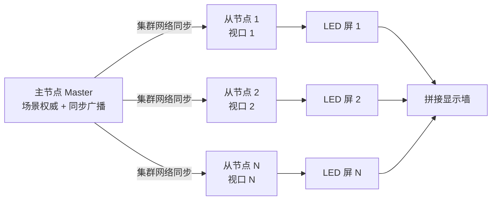
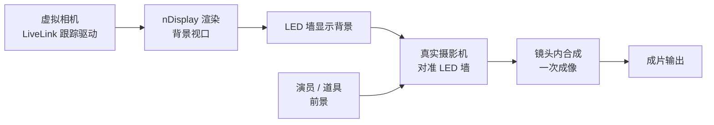
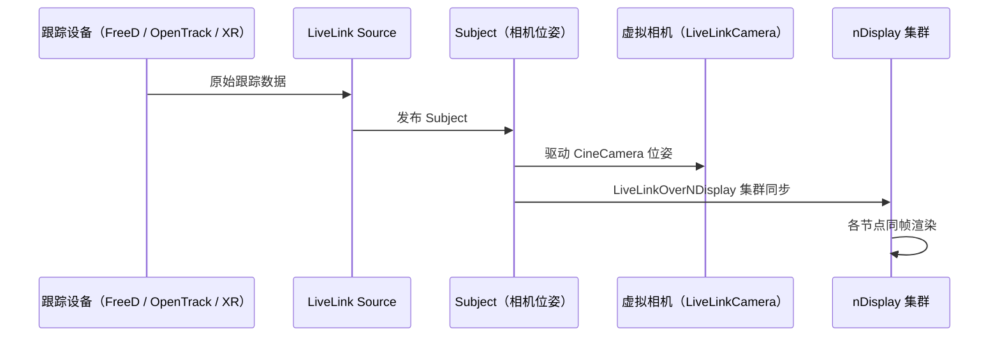
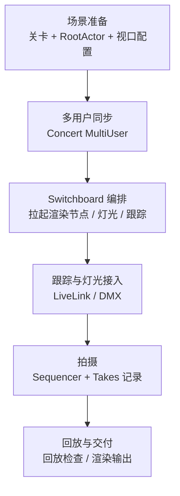

# 06 虚拟制片与 ICVFX（Virtual Production & In-Camera VFX）

## 元数据

| 项目 | 值 |
|---|---|
| 版本基线 | UE5.8.0（CL 55116800 / ++UE5+Release-5.8） |
| 适用范围 | 影视 / 演出 / 发布会向项目：虚拟制片（VP）工作流、nDisplay 集群渲染、ICVFX 内镜头特效、相机跟踪与 LED 墙舞台搭建 |
| 事实边界 | 插件路径、uplugin 元数据、模块名、关键公共头文件均经本机 Engine\Plugins\Runtime\nDisplay 与 Engine\Plugins\VirtualProduction\ICVFX 等目录只读核对；具体配置参数、硬件对接细节、命令名等无法核实项标注「待核对」 |
| 官方参考 | https://dev.epicgames.com/documentation/en-us/unreal-engine |
| 最后更新 | 2026-08-07 |

## 概述

虚拟制片（Virtual Production，VP）是用实时引擎驱动影视制作流程的方法论：场景在引擎中实时渲染，摄影机、灯光、演员与虚拟场景实时联动，导演与摄影指导所见即所得。ICVFX（In-Camera VFX，内镜头特效）是 VP 的核心工作流之一——把实时渲染的背景直接显示在 LED 墙上，由真实摄影机直接拍摄完成「镜头内合成」，替代传统绿幕后期抠像，获得一致光照、真实反射与演员沉浸感。

UE 的 VP 能力由 nDisplay（多机集群渲染）与 ICVFX（聚合工作流插件）两大支柱承载，辅以 LiveLink（数据同步）、Switchboard（舞台编排）、TimedDataMonitor（时间同步监控）等插件族。本机 UE5.8（CL 55116800）核对的关键事实：

| 事实项 | 核对值 |
|---|---|
| nDisplay 位置 | Engine\Plugins\Runtime\nDisplay（5.8 已位于 Runtime 目录，非 Experimental） |
| nDisplay 描述 | 「Support for synchronized clustered rendering using multiple PCs in mono or stereo」（多 PC 单 / 立体同步集群渲染） |
| nDisplay 平台 | Win64 / Linux，EnabledByDefault: false |
| ICVFX 位置 | Engine\Plugins\VirtualProduction\ICVFX（聚合插件，IsBetaVersion: true） |
| ICVFX 描述 | 「Conveniently collects plugins for In-Camera VFX」 |
| LiveLink 主插件 | Engine\Plugins\Animation\LiveLink\LiveLink.uplugin |
| LiveLinkOverNDisplay | Engine\Plugins\Runtime\LiveLinkOvernDisplay，「LiveLink subjects synchronization for nDisplay setup」，依赖 nDisplay |

> 结论：UE5.8 中 nDisplay 已从实验性插件转正（Runtime 目录），ICVFX 以「聚合插件」形式一键启用整套舞台工作流；虚拟制片不再是零散实验功能，而是完整的生产级管线。

## 核心概念表

| 概念 | 英文 | 说明 |
|---|---|---|
| 虚拟制片 | Virtual Production (VP) | 以实时引擎为核心的电影 / 演出制作流程 |
| 集群渲染 | Clustered Rendering | 多台 PC 同步渲染同一场景的多个视口，拼成 LED 墙 / 穹顶 / 多投影 |
| 内镜头特效 | In-Camera VFX (ICVFX) | 背景实时渲染到 LED 墙，摄影机直接拍摄完成合成 |
| 相机跟踪 | Camera Tracking | 把真实摄影机位姿实时同步到虚拟相机 |
| LiveLink | LiveLink | UE 的统一实时数据同步框架（subject / role / source） |
| FreeD | FreeD | 影视跟踪设备的通用协议（本机 LiveLinkFreeD 插件支持） |
| LED 墙 | LED Wall | 由 LED 面板拼接的舞台显示墙，作为虚拟背景与光源 |
| Warp / Blend | Warp & Blend | 投影几何校正与边缘融合，用于多投影方案 |
| Switchboard | Switchboard | 舞台多机（渲染节点 / 灯光 / 跟踪）的统一启动与监控工具 |
| 时间数据监控 | TimedDataMonitor | 监控各数据源（LiveLink / 采集卡）延迟与同步状态的工具 |
| 舞台监控 | StageMonitoring | 设备健康与消息监控 |
| 纹理共享 | TextureShare | 进程间共享纹理，用于合成与多机数据交换 |
| Rivermax | Rivermax | 基于 IP 网络的高带宽视频流输出（LED 墙像素级输出） |
| 外同步 | Genlock | 硬件级帧同步信号（待核对细节） |

## 原理详解

### 1. 插件生态地图（本机核对）

VP 相关插件分布（本机核对清单）：

| 家族 | 本机路径（Engine\Plugins 下） | 作用 |
|---|---|---|
| nDisplay | Runtime\nDisplay（27 个模块） | 集群渲染核心 |
| nDisplay 扩展 | Runtime\nDisplayModularFeatures、Runtime\LiveLinkOvernDisplay | 模块化特性、LiveLink 集群同步 |
| ICVFX | VirtualProduction\ICVFX（聚合 30 个插件） | 一键启用 ICVFX 工作流 |
| LiveLink 家族 | Animation\LiveLink、LiveLinkHub；VirtualProduction\LiveLinkFreeD / LiveLinkOpenTrackIO / LiveLinkXR / LiveLinkVRPN / LiveLinkCamera / LiveLinkLens 等 | 跟踪与数据同步 |
| 镜头标定 | VirtualProduction\CameraCalibration / CameraCalibrationCore / CameraCalibrationML、LensComponent | 镜头畸变标定与合成 |
| 舞台管理 | VirtualProduction\Switchboard、StageMonitoring、TimedDataMonitor、EpicStageApp | 编排、监控、现场控制 |
| 视频输出 | VirtualProduction\Rivermax（RivermaxCore / RivermaxMedia / RivermaxSync） | LED 墙 IP 视频流 |
| 协同 | VirtualProduction\Takes、MultiUserTakes、SequencerPlaylists、LevelSnapshots、MultiUserClient（Concert） | 现场拍摄与多用户协作 |
| 灯光 / 控制 | VirtualProduction\DMX 家族、RemoteControl 家族、TextureShare、CompositePlane | DMX 灯光、远程控制、合成 |
| 实验性 | Experimental\VirtualProduction\LedWallCalibration、VPRoles、VPSettings；Experimental\VirtualProductionUtilities | LED 墙校准、VP 角色与设置 |

ICVFX 聚合插件（本机核对）启用的主要插件：nDisplay、LiveLink、LiveLinkOverNDisplay、LiveLinkCamera、LiveLinkLens、CameraCalibration、Composure、ColorCorrectRegions、GPULightmass、LevelSnapshots、MultiUserClient、MultiUserTakes、Takes、MediaFrameworkUtilities、AjaMedia（Win64）、BlackmagicMedia、OSC、OpenColorIO、RemoteControl、RemoteControlWebInterface、StageMonitoring、Switchboard、TimedDataMonitor、SequencerScripting、ConsoleVariables、VirtualProductionUtilities、EpicStageApp、RivermaxMedia（Win64）、ICVFXTesting。

### 2. nDisplay 集群渲染原理

nDisplay 的核心是「多 PC 同步渲染」：主节点（Master）向从节点（Slaves）广播场景状态，各节点渲染自己的视口（对应 LED 墙的一块屏或一个投影），帧同步输出，拼成完整画面。适用于 LED 墙、环幕、穹顶、CAVE 等沉浸式显示。

本机核对的关键代码事实：

- 模块接口 `IDisplayCluster : IModuleInterface`（DisplayCluster\Public\IDisplayCluster.h），提供 `GetOperationMode()`、`GetRenderMgr()`、`GetClusterMgr()`、`GetConfigMgr()`、`GetGameMgr()`、`GetCallbacks()`，操作模式枚举 `EDisplayClusterOperationMode`；
- 场景根 Actor `ADisplayClusterRootActor`（DisplayCluster\Public\DisplayClusterRootActor.h）：承载整台显示设备的视口 / 相机 / 配置；
- 集群控制：Cluster\Controller 与 Cluster\Failover 目录（DisplayClusterFailoverNodeCtrlBase 等）实现主从同步与故障切换；
- 投影校正：DisplayClusterProjection（投影方式：网格变形 / 相机 / 球面等）与 DisplayClusterWarp（非线性投影与边缘融合）；
- 配置数据：DisplayClusterConfiguration 模块（Runtime，PostConfigInit）负责加载 nDisplay 配置资产。



图释：Master 持有场景权威并广播同步，各 Slave 渲染自己的视口；视口经 Warp / 投影校正后输出到对应 LED 屏，物理拼接成完整画面。

### 3. ICVFX 内镜头合成原理

ICVFX 的本质是「把合成前移到摄影机内」：虚拟场景由 nDisplay 渲染到 LED 墙，真实摄影机对准 LED 墙拍摄，前景（演员 / 道具）与背景在镜头内一次成像。相比绿幕，LED 墙方案获得：环境光一致（LED 墙同时是光源）、真实反射（金属 / 玻璃 / 高光）、无溢色、演员可直视背景。

本机核对：ICVFX 是 nDisplay 内建能力，相关头文件包括：

- `DisplayClusterICVFXCameraComponent.h`（ICVFX 相机组件，文件名已核对；类名遵循 UE 惯例，精确声明待核对）；
- `DisplayClusterViewportConfiguration_ICVFX.h`、`DisplayClusterViewportConfiguration_ICVFXCamera.h`（ICVFX 视口配置）；
- `DisplayClusterShaderParameters_ICVFX.h`、`DisplayClusterViewport_RenderSettingsICVFX.h`（着色 / 渲染设置）；
- `DisplayClusterConfigurationTypes_ICVFX.h`（配置数据类型）。



图释：虚拟相机与真实摄影机位姿同步（LiveLink），nDisplay 渲染背景上墙，前景实拍与背景在镜头内直接合成。

### 4. 相机跟踪与 LiveLink

相机跟踪把真实摄影机的 6DOF 位姿（位置 + 朝向，可能含镜头数据）实时同步到引擎虚拟相机。UE 的统一通道是 LiveLink 框架：设备（Source）发布 Subject，引擎内角色（Role，如 LiveLinkCameraRole）消费数据驱动 CineCamera。

本机核对的跟踪相关插件：

- LiveLinkFreeD：FreeD 协议（影视跟踪设备通用协议）；
- LiveLinkOpenTrackIO：OpenTrackIO 协议（开源跟踪设备）；
- LiveLinkXR：XR / VR 跟踪设备（如 SteamVR 追踪）；
- LiveLinkVRPN：VRPN 网络跟踪；
- LiveLinkCamera：跟踪数据驱动虚拟相机；
- LiveLinkLens：镜头畸变数据经 LiveLink 传输；
- CameraCalibration / CameraCalibrationCore / CameraCalibrationML：镜头标定（含 ML 标定）；
- LiveLinkOverNDisplay（Runtime 模块，依赖 nDisplay）：把 LiveLink Subject 数据在集群内同步，保证所有渲染节点使用同一帧的同一跟踪数据。



图释：跟踪设备数据经 LiveLink 发布为 Subject，一路驱动虚拟相机，一路经 LiveLinkOverNDisplay 同步到集群各节点，保证多机渲染一致。

### 5. LED 墙与舞台工作流

LED 墙方案中，nDisplay 的每个视口输出到 LED 墙的一块屏（或按像素映射分配），常见输出路径：

- 直连输出：渲染节点显卡直接输出到 LED 处理器的输入（经由 SDI / HDMI 采集链路，配置细节待核对）；
- IP 视频流：Rivermax（本机核对：RivermaxCore / RivermaxMedia / RivermaxSync 三个插件，RivermaxMedia 在 ICVFX 聚合中仅 Win64）以 IP 网络传输高带宽像素流，适合大尺寸 LED 墙；
- 校准：LedWallCalibration（本机核对：Experimental\VirtualProduction\LedWallCalibration）用于 LED 墙几何校准。

舞台搭建工作流（示意）：



图释：VP 现场流程从场景准备开始，经多用户同步、Switchboard 编排、跟踪 / 灯光接入，到拍摄记录与交付。

### 6. VP 场景设置与关卡

VP 场景（VP Scene）以 `ADisplayClusterRootActor` 为枢纽：在关卡中放置 Root Actor，配置显示节点（每个节点对应视口 / 屏）、ICVFX 相机组件与输出方式。辅助设施：

- VPRoles / VPSettings（本机核对：Experimental\VirtualProduction）：为不同工作岗位（导演 / 灯光 / 渲染节点）定义角色与项目设置；
- LevelSnapshots：拍摄现场快速保存 / 回滚关卡状态，便于反复 take；
- GPULightmass（ICVFX 聚合启用）：GPU 实时烘焙光照，为 LED 墙与场景提供高质量间接光照；
- OpenColorIO（ICVFX 聚合启用）：全链路色彩管理，保证 LED 输出与后期一致；
- ColorCorrectRegions：局部校色（对 LED 墙局部提亮 / 压暗）。

### 7. 与 Sequencer 协作

虚拟制片现场以 Sequencer 为播放核心（本机核对的配套插件）：

- Takes / MultiUserTakes：现场拍摄记录（Take Recorder），多用户协同记录演员表演与镜头；
- SequencerPlaylists：按剧本组织并现场播放多个 Sequencer 序列；
- SequencerScripting：Python / C++ 脚本化控制 Sequencer，适合搭建自定义现场控制 UI；
- EpicStageApp：现场平板控制（虚拟相机、灯光、播放控制）；
- DisplayClusterMoviePipeline / DisplayClusterMoviePipelineEditor（nDisplay 模块）：nDisplay 多视口离屏渲染输出；
- PerformanceCaptureWorkflow（VirtualProduction\PerformanceCaptureWorkflow）：表演捕捉工作流（实验性质，细节待核对）。

### 8. 性能与同步

集群同步与数据延迟是 VP 成败关键：

- 帧同步：集群节点间屏障同步（Barrier），保证所有视口同一帧输出；主节点故障时 Failover 控制器接管（本机核对 DisplayClusterFailoverNodeCtrl 系列）；
- 时间同步：TimedDataMonitor 监控 LiveLink / 采集卡数据延迟与缓冲状态，发现掉帧 / 抖动立即告警；
- 设备监控：StageMonitoring 汇总各设备健康与消息；
- 外同步：Genlock（硬件帧同步）与时间码用于摄影机与 LED 输出对齐（本机未核对到具体插件实现，标注待核对）；
- 性能预算：每个渲染节点只渲染自己的视口，分辨率由 LED 墙物理像素决定；实时 GI（Lumen / GPULightmass）成本高，舞台场景常用预烘 + 实时补光组合。

### 9. 绿幕 vs ICVFX 方案对比

| 维度 | 绿幕（Chroma Key） | ICVFX（LED 墙） |
|---|---|---|
| 光照一致性 | 后期合成，环境光难匹配 | 镜头内一次成像，光照天然一致 |
| 反射 / 溢色 | 绿幕溢色需大量后期 | 无溢色，反射真实（金属 / 玻璃友好） |
| 演员体验 | 面对绿幕无空间感 | 可直视背景，表演自然 |
| 硬件成本 | 低（幕布 + 灯光） | 高（LED 墙 + 渲染集群 + 跟踪） |
| 后期工作量 | 高（抠像 / 合成 / 调色） | 低（镜头内已合成） |
| 实时性 | 可离线渲染 | 必须实时（帧率由摄影机快门决定） |
| 适用 | 预算敏感、简单背景 | 复杂环境、高质量反射、发布会 / 影视 |

## 代码 / 示例

启用插件（.uproject，节选）：

```json
{
    "Plugins": [
        { "Name": "nDisplay", "Enabled": true },
        { "Name": "ICVFX", "Enabled": true }
    ]
}
```

C++ 访问 nDisplay 模块（节选，本机核对接口）：

```cpp
// IDisplayCluster.h（本机核对，节选）
#include "DisplayClusterEnums.h"

class IDisplayCluster : public IModuleInterface
{
public:
    static constexpr const TCHAR* ModuleName = TEXT("DisplayCluster");
    static inline IDisplayCluster& Get()
    {
        return FModuleManager::GetModuleChecked<IDisplayCluster>(IDisplayCluster::ModuleName);
    }
    static inline bool IsAvailable()
    {
        return FModuleManager::Get().IsModuleLoaded(IDisplayCluster::ModuleName);
    }

    virtual EDisplayClusterOperationMode GetOperationMode() const = 0;
    virtual IDisplayClusterRenderManager* GetRenderMgr() const = 0;
    virtual IDisplayClusterClusterManager* GetClusterMgr() const = 0;
    virtual IDisplayClusterConfigManager* GetConfigMgr() const = 0;
    virtual IDisplayClusterGameManager* GetGameMgr() const = 0;
    virtual IDisplayClusterCallbacks& GetCallbacks() = 0;
};
```

验证命令（示意，具体命令名待核对）：`DisplayCluster.OperationMode` 相关控制台命令、StageMonitoring 面板、TimedDataMonitor 面板、Switchboard UI。

## 最佳实践

1. 先小集群验证：2~4 节点起步，确认同步与视口配置后再扩展；
2. 配置资产先行：用 DisplayClusterConfigurator 完成视口 / Warp 配置，再进现场；
3. 跟踪链路做延迟基线：用 TimedDataMonitor 记录各数据源延迟，先于拍摄解决；
4. LiveLinkOverNDisplay 必装：多节点必须同步同一 subject 数据，否则各屏相机位姿不一致；
5. LED 墙校准要早：LedWallCalibration 与物理测量结合，越早校准越省现场时间；
6. 色彩管理全链路：OpenColorIO 从引擎到 LED 输出统一，避免现场返工；
7. 场景实时性优先：为舞台场景做专用性能预算（帧率、分辨率、GI 策略）；
8. 多用户协作常态化：Concert MultiUser + LevelSnapshots 支撑多人并行与安全回滚；
9. 用 Switchboard 统一编排：渲染节点、灯光、跟踪全部纳入，减少现场人工操作；
10. 版本锁定与预演：nDisplay / ICVFX 接口随版本演进，升级前用测试关卡预演全流程。

## FAQ

Q1：nDisplay 与 ICVFX 是什么关系？
A：nDisplay 是集群渲染核心；ICVFX 是聚合插件，一键启用 nDisplay + LiveLink + Composure + Switchboard 等整套内镜头工作流。

Q2：UE5.8 中 nDisplay 还是实验性插件吗？
A：本机核对 nDisplay 位于 Engine\Plugins\Runtime\nDisplay，已非 Experimental；ICVFX 聚合插件仍标 Beta（IsBetaVersion: true）。

Q3：LED 墙需要多少台渲染节点？
A：取决于墙的分辨率与像素输出方式；一般一块 4K 屏对应 1~2 个节点，具体按视口与 Rivermax 带宽规划（示意）。

Q4：不用 LED 墙能玩 ICVFX 吗？
A：可以退化为「虚拟场景 + 相机内合成」的简化形态（如背景屏 / 投影 + 合成），但反射与光照一致性会下降。

Q5：相机跟踪必须用 FreeD 吗？
A：不是。LiveLink 支持 FreeD、OpenTrackIO、XR、VRPN 等源；选型取决于现场跟踪设备（光学 / 惯性 / 编码器）。

Q6：多节点相机位姿如何保持一致？
A：LiveLinkOverNDisplay 把 subject 数据同步到集群各节点，配合 TimedDataMonitor 校验延迟。

Q7：绿幕方案一定更便宜吗？
A：硬件成本低，但后期（抠像 / 合成 / 调色）人力成本高；ICVFX 前期投入大、后期少，适合量产型项目。

Q8：现场可以多人同时编辑吗？
A：可以，Concert MultiUser 多用户会话 + LevelSnapshots 回滚 + Switchboard 编排是标准现场配置。

Q9：拍摄记录怎么管理？
A：Takes / MultiUserTakes 记录 take，SequencerPlaylists 组织播放，EpicStageApp 现场控制。

Q10：性能不够怎么办？
A：降低分辨率 / 关闭实时 GI 改用 GPULightmass 预烘、减少每节点视口数、使用 Rivermax 带宽管理；逐节点做性能基线。

## 关联阅读

- [03-过场与影视Sequencer.md](./03-过场与影视Sequencer.md)：Sequencer 过场与渲染输出基础
- [04-PCG程序化内容生成.md](./04-PCG程序化内容生成.md)：大世界内容生成，与舞台场景搭建配合
- [05-大世界植被与渲染协同.md](./05-大世界植被与渲染协同.md)：大世界渲染协同与性能预算
- [01-渲染管线概览.md](../02-渲染与图形/01-渲染管线概览.md)：渲染管线基础，理解集群渲染与实时 GI 成本

## 更新日志

- 2026-08-07：创建。nDisplay / ICVFX / LiveLink 插件路径与模块事实经本机 UE5.8（CL 55116800）核对。
