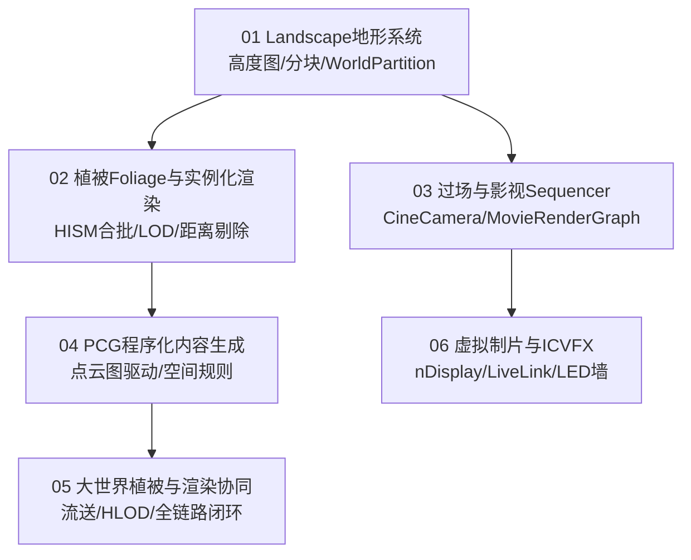

# 13 世界构建与过场

> 知识成熟度：L2（子域工程手册，已按 6 篇核心专题与 UE5.8 源码基线全面标准化）。
>
> 领域权威导航：[游戏知识 Domain MOC](../../00_Index/domains/游戏知识.md) ｜ [游戏知识总目录](../README.md)。

---

## 1. 核心定位与设计思想

「13-世界构建与过场」负责虚幻引擎中大规模开放世界的地表生成、植被生态、程序化内容规则与影视级剧情演出。在现代 AAA 大世界项目中，该子域是美术工业化资产与底层流送性能的核心枢纽：
- **地形分块与大世界流送（Landscape）**：基于高度图数据结构与 LandscapeComponent 分块，深度集成 World Partition 与 APartitionActor，支持地表材质层（Layer Blend）多权重无缝混合与样条线（Spline）道路河流；
- **海量植被与实例化渲染合批（Foliage）**：依托 InstancedFoliageActor 与 HISM（分层实例化静态网格体）技术，将数以十万计的草木树木合批为极少 DrawCall，配合距离剔除与网格体 LOD 保障帧率；
- **电影级镜头与影视管线（Sequencer）**：以 LevelSequence 轨道状态机驱动 Possessable/Spawnable 角色绑定、电影级摄像机（CineCamera）焦距景深、并支持次时代 Movie Render Graph（MRG）离线渲染；
- **程序化内容生成与虚拟制片（PCG & ICVFX）**：基于点云空间采样与规则图驱动的大世界植被群落生成（PCG），以及集成 nDisplay 多屏同步与 LiveLink 相机追踪的虚拟摄影棚制片管线。

---

## 2. 专题矩阵与知识状态

| 专题文件（Canonical 路径） | 知识类型 | 成熟度 | 核心工程关注点与落地场景 |
| :--- | :---: | :---: | :--- |
| [01-Landscape地形系统.md](../../知识/04-图形动画与物理仿真/材质地形与世界表现/01-Landscape地形系统.md) | Concept | L2 | Landscape 架构：Component 分块、高度图编码、材质 LayerBlend 权重、LandscapeSpline 与 World Partition 流送集成 |
| [02-植被Foliage与实例化渲染.md](../../知识/04-图形动画与物理仿真/材质地形与世界表现/02-植被Foliage与实例化渲染.md) | Concept | L2 | AInstancedFoliageActor 数据流、HISM（分层实例化）渲染合批原理、LOD 切换、距离剔除与 Mass 群集选型对比 |
| [03-过场与影视Sequencer.md](../../知识/04-图形动画与物理仿真/过场渲染与虚拟制片/03-过场与影视Sequencer.md) | Concept | L2 | Sequencer 轨道架构、Possessable 与 Spawnable 绑定机制、CineCamera 镜头光圈、Movie Render Graph 与运行时播放控制 |
| [04-PCG程序化内容生成.md](../../知识/03-引擎架构与资源系统/程序化内容生成/04-PCG程序化内容生成.md) | Concept | L2 | PCG 图资产（UPCGGraph）、空间点采样与密度过滤、确定性随机种子、PCGCompute 与 World Partition Cell 协同生成 |
| [05-大世界植被与渲染协同.md](../../知识/04-图形动画与物理仿真/材质地形与世界表现/05-大世界植被与渲染协同.md) | Concept | L2 | 串联 World Partition、PCG、Procedural Vegetation Editor 与 HLOD 的植被生成、烘焙、流送、渲染与销毁完整闭环 |
| [06-虚拟制片与ICVFX.md](../../知识/04-图形动画与物理仿真/过场渲染与虚拟制片/06-虚拟制片与ICVFX.md) | Concept | L2 | nDisplay LED 墙多节点渲染同步、内镜头视锥（Inner Frustum）畸变校正、LiveLink 摄像机外设追踪与虚拟制片全流程 |

---

## 3. 逻辑学习顺序建议

1. **第一阶段（大世界地基与植被填充）**：精读 `01-Landscape地形系统` 与 `02-植被Foliage与实例化渲染`，掌握开放世界地形创建、材质混合与 HISM 实例合批渲染机制。
2. **第二阶段（程序化工业生成与闭环）**：深入 `04-PCG程序化内容生成` 与 `05-大世界植被与渲染协同`，掌握用规则图自动铺设森林、道路与岩石群落并与大世界流送对齐。
3. **第三阶段（影视级演出与虚拟制片）**：研读 `03-过场与影视Sequencer` 与 `06-虚拟制片与ICVFX`，掌握剧情动画分镜镜头调度与影视级实拍合成。

---

## 4. 游戏与引擎工程落地场景

- **数十平方公里开放世界植被渲染**：使用 PCG 在 Landscape 坡度小于 30 度的区域自动撒布草丛与树木，底层生成为 HISM 实例，并开启 HLOD 远景聚合网格体，保持 10 万植被同屏不掉帧；
- **剧情对话与自由镜头平滑切入**：通过 Sequencer 的 Possessable 绑定场景现有玩家 Pawn，以 CineCamera 混合过渡动画，播放完毕后无缝交还玩家控制权；
- **地质动态改造与道路开辟**：利用 LandscapeSpline 动态压平地形并沿曲线生成沥青公路网格体，实时更新碰撞与寻路网格（NavMesh）。

---

## 5. 跨域技术依赖与前后置导航

- **向下扎根（计算机与算法底座）**：
  - 空间分区与八叉树：[游戏算法 01-寻路与图论](../../游戏算法/01-寻路与图论/README.md)
  - 程序化生成算法：[游戏算法 03-工程与实用技巧](../../游戏算法/03-工程与实用技巧/README.md)
- **向上驱动（引擎源码剖析）**：
  - 大世界流送源码：[12-22 WorldPartition源码](../../知识/03-引擎架构与资源系统/世界组织与资源加载/22-WorldPartition与WorldStreaming源码.md)
  - 地形与植被源码：[12-23 Landscape与Foliage源码](../../知识/04-图形动画与物理仿真/材质地形与世界表现/23-Landscape与Foliage源码.md)
  - PCG 源码实现：[12-38 PCG源码](../../知识/03-引擎架构与资源系统/程序化内容生成/38-PCG源码.md)
  - Sequencer 源码：[12-24 Sequencer与MRG源码](../../知识/04-图形动画与物理仿真/过场渲染与虚拟制片/24-Sequencer与MovieRenderGraph源码.md)
- **横向协同（基础与渲染）**：
  - 大世界流送基础：[01-引擎基础/09-WorldPartition大世界](../../知识/03-引擎架构与资源系统/世界组织与资源加载/09-WorldPartition大世界.md)
  - 虚拟纹理与地表混合：[02-渲染与图形/07-虚拟纹理与材质混合](../../知识/04-图形动画与物理仿真/材质地形与世界表现/07-虚拟纹理与材质混合.md)
