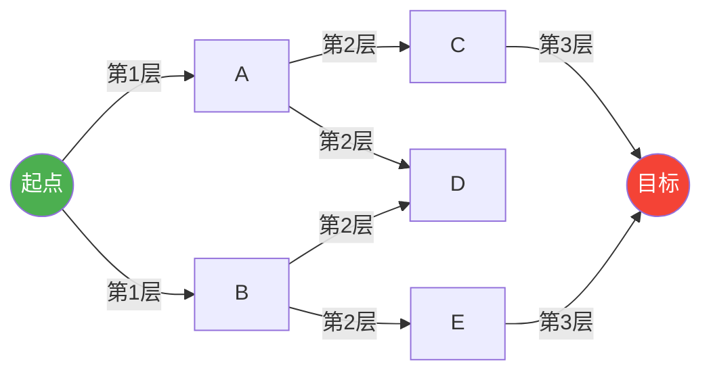

# 01 · 图论基础与搜索算法

> 一句话定位：**把游戏地图变成图，然后在图上找路**。本文覆盖图的存储（邻接矩阵/邻接表）、广度优先搜索 BFS、深度优先搜索 DFS 及其游戏应用（连通域、洪水填充），以及加权最短路算法 Dijkstra，并给出完整的复杂度分析表。

## 1. 概述

游戏世界中的"地图"天然是连续的（坐标是浮点数），但绝大多数算法只能处理离散结构。把连续世界**离散化为图**，是游戏 AI 的第一步，也是最关键的一步：

- 在网格（Grid/Tilemap）游戏中，每个格子是一个**顶点**，相邻可通行格子之间是一条**边**，跨越沼泽、爬坡的代价就是**边权**；
- 在基于导航网格（NavMesh）的 3D 游戏中，每个凸多边形是一个**顶点**，共享边之间通行代价是**边权**；
- 在更抽象的层面，任务依赖、技能树、对话分支都可以建模为图。

图建好之后，摆在 AI 面前的问题就变成了：

1. **从 A 到 B 有没有路？**（可达性、连通域判定）
2. **最短/代价最低的路是哪条？**（最短路问题：BFS、Dijkstra、A*）
3. **整张图哪些区域互相连通？**（连通分量，用于区域染色、安全区判定）
4. **有哪些邻居？**（遍历：BFS/DFS，也是后续所有搜索算法的基础）

本文按"存储 → 遍历 → 最短路"的顺序展开：第 2 节给出核心概念；第 3 节讲图的两种存储方式；第 4、5 节讲 BFS 与 DFS；第 6 节讲它们的直接应用——洪水填充；第 7 节讲 Dijkstra；第 8 节汇总复杂度；最后是最佳实践与 FAQ。

## 2. 核心概念

| 概念 | 英文 | 定义 | 游戏示例 |
| --- | --- | --- | --- |
| 顶点 | Vertex / Node | 图中的基本元素，用 V 表示顶点集合 | 网格中的一个格子、NavMesh 中的一个多边形、传送门节点 |
| 边 | Edge | 连接两个顶点的关系，用 E 表示边集合 | 相邻格子的通行关系、两个导航多边形之间的共享边 |
| 有向边 | Directed Edge | 只能单向通行的边 | 单向跳台、悬崖下滑、传送门（单向） |
| 权重 | Weight / Cost | 边上的代价数值，用 w(u, v) 表示 | 平地代价 1、沼泽代价 3、陡坡代价 5 |
| 路径 | Path | 从起点到终点经过的顶点序列 | 角色从 A 走到 B 经过的格子序列 |
| 环 | Cycle | 起点与终点相同的路径 | 巡逻路线中的回路、地图上的环形道路 |
| 连通分量 | Connected Component | 互相可达的顶点组成的极大集合 | 被河流/悬崖分割成多个互不相通的区域 |
| 度 | Degree | 与某顶点相连的边数 | 一个格子周围可通行的相邻格子数 |
| 稀疏图 | Sparse Graph | E 远小于 V² 的图 | 绝大多数游戏地图（每格只连 4~8 个邻居） |
| 稠密图 | Dense Graph | E 接近 V² 的图 | 极少见；例如全连接的单位关系网络 |
| 隐式图 | Implicit Graph | 不显式存储边，由规则即时生成邻居 | 网格地图：邻居由坐标加减得到 |

> **为什么游戏地图大多是稀疏图？** 一个 1000×1000 的网格有 100 万个顶点，若用邻接矩阵需要 10¹² 个元素（约 4 TB 内存），而实际每格只有 4~8 个邻居，边数只有约 400 万条。稀疏性决定了存储方式的选择（见第 3 节）。

## 3. 图的存储方式

### 3.1 邻接矩阵（Adjacency Matrix）

**原理**：用一个 V×V 的二维数组 `M` 存储图。`M[u][v]` 表示从 u 到 v 的关系：

- 无权图：`M[u][v] = 1` 表示有边，`0` 表示无边；
- 有权图：`M[u][v] = w(u, v)`，无边时用 `∞`（或 `-1`）表示；
- 无向图的矩阵关于主对角线对称（`M[u][v] == M[v][u]`）。

**伪代码**：

```text
// 初始化：V 个顶点，矩阵大小为 V×V
M = 新建 V×V 矩阵，全部填 ∞（无权图填 0）

// 加边
procedure AddEdge(u, v, weight):
    M[u][v] = weight
    if 图是无向图:
        M[v][u] = weight

// 判断是否存在边
function HasEdge(u, v):
    return M[u][v] != ∞

// 遍历 u 的所有邻居
procedure ForEachNeighbor(u):
    for v in 0..V-1:
        if M[u][v] != ∞:
            处理邻居 v
```

**C++ 实现**：

```cpp
#include <vector>
#include <limits>

class GraphMatrix {
    int V;
    std::vector<std::vector<int>> M;  // M[u][v] = 边权，∞ 表示无边

public:
    GraphMatrix(int v) : V(v), M(v, std::vector<int>(v, INT_MAX)) {
        for (int i = 0; i < V; ++i) M[i][i] = 0;  // 自己到自己代价为 0
    }

    void addEdge(int u, int v, int w, bool directed = true) {
        M[u][v] = w;
        if (!directed) M[v][u] = w;  // 无向图对称写入
    }

    bool hasEdge(int u, int v) const { return M[u][v] != INT_MAX; }

    // 遍历邻居：O(V)
    void forEachNeighbor(int u, auto&& f) const {
        for (int v = 0; v < V; ++v)
            if (M[u][v] != INT_MAX && v != u) f(v);
    }
};
```

**Python 实现**：

```python
INF = float("inf")

class GraphMatrix:
    def __init__(self, n: int):
        self.n = n
        self.M = [[INF] * n for _ in range(n)]
        for i in range(n):
            self.M[i][i] = 0

    def add_edge(self, u: int, v: int, w: float = 1.0, directed: bool = True):
        self.M[u][v] = w
        if not directed:
            self.M[v][u] = w

    def has_edge(self, u: int, v: int) -> bool:
        return self.M[u][v] != INF

    def neighbors(self, u: int):
        for v, w in enumerate(self.M[u]):
            if w != INF and v != u:
                yield v, w
```

**优缺点**：

| 优点 | 缺点 |
| --- | --- |
| 判断任意两点是否相邻：O(1) | 空间 O(V²)，稀疏图浪费严重 |
| 实现简单、缓存友好（连续内存） | 遍历一个顶点的邻居需要扫一整行：O(V) |
| 稠密图（E ≈ V²）时效率最高 | V 很大时（如 10⁵ 以上）直接不可用 |

### 3.2 邻接表（Adjacency List）

**原理**：为每个顶点维护一个链表/动态数组，只存储它**实际存在的出边**。`adj[u]` 中的每个元素是 `(v, w)` 二元组。

**伪代码**：

```text
// 初始化：V 个空列表
adj = 新建长度为 V 的列表数组

// 加边
procedure AddEdge(u, v, weight):
    adj[u].append((v, weight))
    if 图是无向图:
        adj[v].append((u, weight))

// 遍历 u 的所有邻居：O(deg(u))
procedure ForEachNeighbor(u):
    for (v, w) in adj[u]:
        处理邻居 v，边权 w
```

**C++ 实现**（vector 邻接表）：

```cpp
#include <vector>

struct Edge {
    int to;      // 目标顶点
    int weight;  // 边权
};

class GraphList {
    int V;
    std::vector<std::vector<Edge>> adj;

public:
    explicit GraphList(int v) : V(v), adj(v) {}

    void addEdge(int u, int v, int w, bool directed = true) {
        adj[u].push_back({v, w});
        if (!directed) adj[v].push_back({u, w});
    }

    const std::vector<Edge>& neighbors(int u) const { return adj[u]; }
};
```

**Python 实现**：

```python
from collections import defaultdict

class GraphList:
    def __init__(self, n: int):
        self.n = n
        self.adj = defaultdict(list)  # u -> [(v, w), ...]

    def add_edge(self, u: int, v: int, w: float = 1.0, directed: bool = True):
        self.adj[u].append((v, w))
        if not directed:
            self.adj[v].append((u, w))

    def neighbors(self, u: int):
        return self.adj[u]
```

**优缺点**：

| 优点 | 缺点 |
| --- | --- |
| 空间 O(V + E)，稀疏图极省内存 | 判断任意两点是否相邻需要扫描邻居列表：O(deg(u)) |
| 遍历邻居只需 O(deg(u))，是搜索算法的理想接口 | 指针/动态数组有少量开销（可用预分配优化） |
| 支持动态增删边 | 无向图插入一条边要写两处，易漏 |

### 3.3 两种存储方式对比

| 操作 | 邻接矩阵 | 邻接表 |
| --- | --- | --- |
| 空间复杂度 | O(V²) | O(V + E) |
| 判断 u、v 是否相邻 | O(1) | O(deg(u)) |
| 遍历 u 的邻居 | O(V) | O(deg(u)) |
| 加边/删边 | O(1) | O(1)（删除需查找，最坏 O(deg)） |
| 适合的图 | 稠密图、顶点数少（V ≤ 数千） | 稀疏图、顶点数大（V 可达百万级） |
| 游戏中的典型用法 | 小规模状态图（推箱子、解谜状态搜索） | 网格地图、NavMesh、道路图 |

> **游戏工程建议**：网格地图通常直接用**隐式图**——连邻接表都不建，邻居由坐标计算得出（`(x±1, y)`、`(x±1, y±1)`），边权由地形查表得到。这省掉了全部建图内存，且缓存局部性极好。NavMesh 则用显式邻接表，因为多边形邻居关系在烘焙时就已确定。

## 4. 广度优先搜索 BFS

### 4.1 原理

BFS 从起点出发，**逐层向外扩展**：先访问起点（第 0 层），再访问起点的所有邻居（第 1 层），再访问第 1 层顶点的未访问邻居（第 2 层）……每层内部的顶点之间没有先后依赖，因此用**队列**（FIFO）管理"待访问顶点"。

两个关键性质：

1. **层级 = 距离**：无权图中，顶点第一次被访问时的层数，就是它到起点的**最短边数**；
2. **首次访问即最短**：因为队列按层序出队，任何顶点第一次出队/入队时，已经走了最短步数，之后再次遇到它不需要更新。



### 4.2 伪代码

```text
function BFS(graph, start):
    dist[start] = 0
    prev[start] = null            // 记录前驱，用于还原路径
    queue.push(start)
    visited[start] = true

    while queue 不为空:
        u = queue.pop_front()     // 队首出队
        for (v, w) in graph.neighbors(u):
            if visited[v] == false:
                visited[v] = true
                dist[v] = dist[u] + 1
                prev[v] = u
                queue.push_back(v)
    return dist, prev

// 还原路径
function ReconstructPath(prev, start, goal):
    path = []
    cur = goal
    while cur != null:
        path.push_front(cur)
        cur = prev[cur]
    return path
```

### 4.3 C++ 实现

```cpp
#include <queue>
#include <vector>
#include <optional>

// 隐式网格图：4 方向 BFS，返回从 start 到 goal 的最短步数
std::optional<int> bfs4(const std::vector<std::vector<int>>& grid,
                        int sx, int sy, int gx, int gy) {
    const int H = grid.size(), W = grid[0].size();
    const int dx[4] = {1, -1, 0, 0};
    const int dy[4] = {0, 0, 1, -1};
    std::vector<std::vector<int>> dist(H, std::vector<int>(W, -1));
    std::queue<std::pair<int,int>> q;

    dist[sy][sx] = 0;
    q.push({sx, sy});

    while (!q.empty()) {
        auto [x, y] = q.front(); q.pop();
        if (x == gx && y == gy) return dist[y][x];
        for (int d = 0; d < 4; ++d) {
            int nx = x + dx[d], ny = y + dy[d];
            if (nx < 0 || ny < 0 || nx >= W || ny >= H) continue;
            if (grid[ny][nx] == 0 || dist[ny][nx] != -1) continue;  // 0 为障碍
            dist[ny][nx] = dist[y][x] + 1;
            q.push({nx, ny});
        }
    }
    return std::nullopt;  // 不可达
}
```

### 4.4 Python 实现

```python
from collections import deque

def bfs(grid, start, goal):
    """4 方向 BFS，返回最短步数；不可达返回 -1。grid 中 0 为障碍。"""
    H, W = len(grid), len(grid[0])
    dist = [[-1] * W for _ in range(H)]
    q = deque([start])
    dist[start[1]][start[0]] = 0

    while q:
        x, y = q.popleft()
        if (x, y) == goal:
            return dist[y][x]
        for nx, ny in ((x+1, y), (x-1, y), (x, y+1), (x, y-1)):
            if 0 <= nx < W and 0 <= ny < H and grid[ny][nx] != 0 and dist[ny][nx] == -1:
                dist[ny][nx] = dist[y][x] + 1
                q.append((nx, ny))
    return -1
```

### 4.5 游戏中的应用

1. **无权网格最短路**：角色移动无地形代价差异时（或者把 8 方向统一当 1 步），BFS 就是最优解。BFS 找出的路径拥有**最少步数**，虽然不一定是"欧几里得最短"。
2. **连通域标记**：从某个格子 BFS，能访问到的所有格子构成一个连通分量。用于判断两个出生点是否在同一片大陆、随机地图生成后是否连通。
3. **洪水填充**：见第 6 节，本质就是 BFS/DFS 的直接应用。
4. **状态空间搜索**：推箱子、华容道、解谜类游戏把"整个局面"当作顶点，一步操作当作边，用 BFS 求最少操作次数。此时顶点数可能爆炸（内存是关键瓶颈），需要配合状态压缩与去重。
5. **服务器 AOI 泛洪**：小规模 MMO 中，用 BFS 从玩家位置扩散，收集指定半径内的其他玩家。

## 5. 深度优先搜索 DFS

### 5.1 原理

DFS 的策略是"**一条路走到黑，走不通再回头**"：从起点出发，沿着第一条边深入，直到无法前进，再回溯到最近的分叉点尝试下一条边。递归天然适合 DFS（系统调用栈就是"回溯栈"），也可以显式使用栈。

DFS 不保证找到最短路径（找到的第一条路径取决于邻居遍历顺序），因此**游戏寻路一般不直接用 DFS**，但它在以下场景不可替代：

- 迷宫/地牢**随机生成**（递归回溯法）；
- **拓扑排序**（任务依赖、科技树解锁顺序）；
- **环检测**（检查任务依赖图是否有循环）；
- 判定连通性（只需"有没有路"，不要"最短"）。

### 5.2 伪代码

```text
// 递归版本
function DFSRecursive(graph, u, visited):
    visited[u] = true
    处理顶点 u（例如记录访问序）
    for (v, w) in graph.neighbors(u):
        if visited[v] == false:
            DFSRecursive(graph, v, visited)

// 迭代版本（显式栈，避免递归爆栈）
function DFSIterative(graph, start):
    stack.push(start)
    visited[start] = true
    while stack 不为空:
        u = stack.pop()
        处理顶点 u
        for (v, w) in graph.neighbors(u):   // 注意：入栈顺序影响遍历顺序
            if visited[v] == false:
                visited[v] = true
                stack.push(v)
```

### 5.3 C++ 实现

```cpp
#include <vector>

// 递归 DFS：给每个顶点打上连通分量编号
void dfs(const std::vector<std::vector<int>>& adj, int u,
         std::vector<int>& comp, int compId) {
    comp[u] = compId;
    for (int v : adj[u])
        if (comp[v] == -1)
            dfs(adj, v, comp, compId);
}

// 连通域标记：返回连通分量个数
int connectedComponents(const std::vector<std::vector<int>>& adj, int V) {
    std::vector<int> comp(V, -1);
    int count = 0;
    for (int i = 0; i < V; ++i)
        if (comp[i] == -1)
            dfs(adj, i, comp, count++);
    return count;
}
```

### 5.4 Python 实现

```python
import sys

def dfs_iterative(adj, start):
    """迭代 DFS，返回访问顺序。避免递归爆栈。"""
    visited = set()
    order = []
    stack = [start]
    while stack:
        u = stack.pop()
        if u in visited:
            continue
        visited.add(u)
        order.append(u)
        for v in adj[u]:          # 逆序入栈可保持与递归一致的前序
            if v not in visited:
                stack.append(v)
    return order

# 递归版注意：Python 默认递归深度约 1000，大图请用迭代版或 sys.setrecursionlimit
sys.setrecursionlimit(100000)
```

### 5.5 游戏中的应用

1. **迷宫生成（递归回溯）**：DFS 随机走格子并拆墙，生成的迷宫保证任意两点连通且无环（即生成树）。Roguelike 地牢、RPG 迷宫常用此变体。
2. **拓扑排序**：游戏任务系统中，"先打 A 才能解锁 B"形成有向无环图（DAG），用 DFS 后序逆序（Kahn 算法亦可）求出合法的任务顺序；检测到环则提示设计错误。
3. **环检测**：技能树/任务图若出现环（A 需要 B、B 又需要 A），游戏逻辑会死锁，须在加载时用 DFS 检测。
4. **可达性判定**：判断玩家能否到达某个区域（如剧情锁区），DFS 通常比 BFS 更快找到"存在性"答案，但不给最短路径。

## 6. 洪水填充（Flood Fill）

### 6.1 原理

洪水填充从种子格子出发，向相邻的**同属性**格子扩散，把整片连通区域标记为同一个 ID。它是 BFS/DFS 的直接应用（两种遍历都可以），区别只在邻居定义：

- **四连通**：只考虑上下左右 4 个邻居；
- **八连通**：考虑周围 8 个邻居（含斜角）。八连通会把"对角线接触"的区域也连成一片，扫雷中按四连通判定雷区、按八连通判定数字。

```text
四连通（X 为中心的可达格）          八连通
    . X .                             X X X
    X X X                             X X X
    . X .                             X X X
```

### 6.2 伪代码（栈版本，避免递归爆栈）

```text
function FloodFill(grid, seedX, seedY, regionId):
    if grid[seedY][seedX] 不是可填充属性: return
    stack.push((seedX, seedY))
    grid[seedY][seedX] = regionId

    while stack 不为空:
        (x, y) = stack.pop()
        for (nx, ny) in 四邻域(x, y):
            if 在边界内 and grid[ny][nx] 是可填充属性:
                grid[ny][nx] = regionId
                stack.push((nx, ny))
```

### 6.3 扫描线优化

逐格入栈版本在最坏情况（蛇形区域）下栈深接近区域面积，且每个格子多次入栈检查。**扫描线 Flood Fill** 按"行区间"处理：

1. 从种子出发，向左/右扩展填满整行，得到一个 `[xLeft, xRight]` 区间；
2. 检查上一行与下一行与区间重叠的部分，找到新的可填充种子区间，入栈；
3. 每个区间只处理一次，访问格子数从 O(4·n) 降到接近 O(n)。

对超大区域（如整张 4096×4096 地图染色），扫描线版本性能优势明显；对单机小地图，简单版本已经足够。

### 6.4 游戏中的应用

| 场景 | 说明 |
| --- | --- |
| 画图工具的油漆桶 | 点击区域填色，就是 Flood Fill（编辑器、涂鸦游戏） |
| 扫雷 | 点开空格时自动展开相邻空白区域 |
| 地图区域染色 | 给随机生成的地图按连通域编号，判断大陆/岛屿 |
| 安全区判定 | 从复活点 Flood Fill，未覆盖区域禁止放置怪物 |
| 寻路预处理 | 预先标记不可达区域，A* 之前直接剪枝 |

## 7. Dijkstra 最短路

### 7.1 原理

BFS 假设每条边代价相同，因此"层数"就是距离。当边有权重（沼泽 3、平地 1）时，层数不再等于代价，必须换工具——**Dijkstra**。

Dijkstra 维护每个顶点当前已知的最短距离 `d[v]`，算法核心是一个操作——**松弛（Relaxation）**：

```
若 d[u] + w(u, v) < d[v]，则 d[v] = d[u] + w(u, v)
```

即：**如果"经过 u 再到 v"比"目前已知到 v 的路径"更短，就更新 d[v]**。每次从未确定最短距离的顶点中选出 `d` 最小者 `u`（贪心选择），对其所有出边做松弛。直觉上：所有未确定顶点中 `d` 最小的那个，不可能再通过其他未确定顶点绕出更短的路径（因为绕路的第一段代价已经不小于 `d[u]`），所以它此刻的 `d` 就是最终答案。

### 7.2 算法流程

```mermaid
flowchart TD
    A[初始化: d[start]=0, 其余 d=∞, 全部未确定] --> B{未确定集合为空?}
    B -- 否 --> C[取出未确定中 d 最小的顶点 u]
    C --> D[将 u 标记为已确定]
    D --> E[对 u 的每条出边 (u,v,w) 做松弛]
    E --> F{存在 d[u]+w < d[v]?}
    F -- 是 --> G[d[v] = d[u]+w, 记录前驱]
    G --> B
    F -- 否 --> B
    B -- 是 --> H[结束: d 即各顶点最短距离]
```

### 7.3 伪代码

```text
function Dijkstra(graph, start):
    dist[start] = 0
    for v in graph.vertices, v != start:
        dist[v] = ∞
    prev[v] = null 对所有 v

    pq = 最小优先队列
    pq.push((0, start))

    while pq 不为空:
        (d, u) = pq.pop_min()
        if d > dist[u]: continue        // 过期条目，跳过（惰性删除）
        for (v, w) in graph.neighbors(u):
            if dist[u] + w < dist[v]:
                dist[v] = dist[u] + w
                prev[v] = u
                pq.push((dist[v], v))   // 允许重复入队，旧的自动过期
    return dist, prev
```

### 7.4 C++ 实现（优先队列）

```cpp
#include <queue>
#include <vector>
#include <limits>

using P = std::pair<int, int>;  // (距离, 顶点)

std::vector<int> dijkstra(const std::vector<std::vector<std::pair<int,int>>>& adj,
                          int start) {
    const int V = adj.size();
    const int INF = std::numeric_limits<int>::max();
    std::vector<int> dist(V, INF);
    std::priority_queue<P, std::vector<P>, std::greater<P>> pq;

    dist[start] = 0;
    pq.push({0, start});

    while (!pq.empty()) {
        auto [d, u] = pq.top(); pq.pop();
        if (d > dist[u]) continue;              // 惰性删除过期条目
        for (auto [v, w] : adj[u]) {
            if (dist[u] + w < dist[v]) {
                dist[v] = dist[u] + w;
                pq.push({dist[v], v});
            }
        }
    }
    return dist;
}
```

### 7.5 Python 实现（heapq）

```python
import heapq

def dijkstra(adj, start):
    """adj[u] = [(v, w), ...]。返回所有顶点的最短距离。"""
    INF = float("inf")
    dist = [INF] * len(adj)
    dist[start] = 0
    pq = [(0, start)]

    while pq:
        d, u = heapq.heappop(pq)
        if d > dist[u]:
            continue
        for v, w in adj[u]:
            nd = d + w
            if nd < dist[v]:
                dist[v] = nd
                heapq.heappush(pq, (nd, v))
    return dist
```

### 7.6 正确性直觉与证明概述

设已确定集合为 S。归纳断言：**S 中每个顶点的 dist 都是真实最短距离**。

- 基础：S 为空，断言成立；
- 归纳步：取出未确定顶点中 dist 最小的 u。反证：若存在一条到 u 的更短路径，它第一次离开 S 时会经过某个未确定顶点 x，而 `dist[x] ≥ dist[u]` 且路径剩余部分代价非负，故整条路径代价 ≥ dist[u]，矛盾。因此 u 的 dist 已是最终值，把 u 加入 S 后断言仍成立。

该证明依赖**边权非负**——这是 Dijkstra 的铁律：存在负权边时，负边可能让"绕路"更便宜，贪心选择失效，须改用 Bellman-Ford 或 SPFA。游戏中的地形代价均为非负，所以 Dijkstra/A* 是安全选择。

### 7.7 复杂度分析

| 实现方式 | 时间复杂度 | 空间复杂度 | 说明 |
| --- | --- | --- | --- |
| 朴素数组（每次线性扫描找最小） | O(V²) | O(V) | 稠密图可用，V 小时快 |
| 二叉堆（priority_queue / heapq） | O((V + E) log V) | O(V + E) | 游戏中最常用，稀疏图最优 |
| 斐波那契堆 | O(E + V log V) | O(V + E) | 理论最优，常数大，工程少用 |

> 实际工程中，**二叉堆 + 惰性删除**（允许重复入队、出队时跳过过期条目）是标准做法：实现简单且实际性能与斐波那契堆相当。

### 7.8 游戏中的应用

1. **代价地图寻路**：地形有真实代价差异（沼泽、斜坡、危险区）时的全局最短路，是 A* 无启发版本，也常作为 A* 的对照基准；
2. **流场距离场**（见 `03-流场与群体寻路.md`）：从目标点反向跑 Dijkstra，得到"每个格子到目标的最短代价"，这就是流场的地基——一次计算服务上千单位；
3. **资源分配路径**：模拟经营游戏中，"单位成本最低的运输路线"就是带权最短路；
4. **网络/服务器路由抽象**：服务器集群间消息转发的最短延迟路径，同样建模为 Dijkstra（游戏运维工具）。

## 8. 复杂度分析总表

| 算法/结构 | 时间复杂度 | 空间复杂度 | 游戏定位 |
| --- | --- | --- | --- |
| 邻接矩阵（建图+遍历） | 建图 O(V²)，遍历邻居 O(V) | O(V²) | 小规模状态图 |
| 邻接表（建图+遍历） | 建图 O(V+E)，遍历邻居 O(deg) | O(V + E) | 游戏地图的标准选择 |
| BFS | O(V + E) | O(V)（队列+visited） | 无权最短路、连通域、洪水填充 |
| DFS | O(V + E) | O(V)（栈/递归深度） | 迷宫生成、拓扑排序、环检测 |
| 洪水填充（基础版） | O(4·n)（n 为区域格子数） | O(n)（栈） | 油漆桶、区域染色 |
| 洪水填充（扫描线） | O(n) | O(n) | 大区域染色优化 |
| Dijkstra（二叉堆） | O((V + E) log V) | O(V + E) | 加权最短路、流场距离场 |
| Dijkstra（朴素） | O(V²) | O(V) | 稠密小图 |

> 口径说明：V = 顶点数，E = 边数，n = 被填充/被查询的格子数。游戏网格图中 E ≈ 4V（四方向）或 8V（八方向），即 E = O(V)，此时 BFS 为 O(V)、Dijkstra 为 O(V log V)。

## 9. 最佳实践

1. **优先用隐式图**：网格地图不建显式邻接表，坐标即邻居，省内存又提速；
2. **8 方向 vs 4 方向**：允许斜向移动时路径更自然，但斜穿墙角（对角线穿过两个障碍之间的角）需要额外规则（如"拐角禁穿"），否则会穿模；
3. **visited 标记用时间戳而非清零**：多次搜索时用 `stamp[u] == currentSearchId` 判断，避免每帧清空大数组；
4. **Dijkstra 用堆 + 惰性删除**：不要手写"删除堆中任意元素"，重复入队 + 过期判断是工程标准；
5. **游戏帧预算**：大地图单次搜索可能超过 1ms，把搜索拆到多帧（时间片轮转）或预计算（离线烘焙）；
6. **先做可达性剪枝**：寻路前查连通域 ID，起点终点不在同一连通域直接返回失败，省掉无谓搜索；
7. **数据规模意识**：V 超过 10⁵ 后，避免 O(V²) 的朴素实现；递归 DFS 注意栈深（迭代版本更稳）。

## 10. 常见问题 FAQ

**Q1：BFS 能用于加权图吗？**
不能直接使用。BFS 的"层数 = 距离"依赖每条边代价相同；加权图请用 Dijkstra（正权）或 Bellman-Ford/SPFA（含负权）。

**Q2：Dijkstra 为什么不能处理负权边？**
负权边会破坏"未确定顶点中 dist 最小者即为最终答案"的贪心依据：可能存在一条更长的路径，先经过一个大正权顶点再走负权边，反而更便宜。此时已确定集合 S 中的顶点可能被"后来者"推翻。

**Q3：邻接矩阵什么时候更好？**
顶点数少（V ≤ 2000 左右）且需要频繁判断"两点是否相邻"时（如解谜状态图、稠密图），O(1) 的相邻判断值得 O(V²) 的空间。

**Q4：游戏里为什么几乎不用 Floyd-Warshall？**
Floyd 是 O(V³) 的全源最短路，适合"任意两点"都要答案的离线小图；游戏寻路是"单次单对"查询，用 Dijkstra/A* 即可，不需要预计算全部对。

**Q5：DFS 会爆栈吗？**
会。链状图深度可达 V，递归实现会栈溢出。生产代码用显式栈迭代版，或增大递归限制（Python 的 `sys.setrecursionlimit` 只是"软限制"，C++ 则直接崩溃，务必用迭代版）。

**Q6：BFS 和 Dijkstra 找的路径为什么可能"不好看"？**
它们优化的是"步数/代价"，不关心"路径是否笔直"。最小化转向次数、贴墙行走等美观性优化属于路径后处理（见 `02-A星算法与优化.md` 第 9 节拐点平滑）。

**Q7：网格图用 BFS 和用 Dijkstra 结果一样吗？**
所有边权相等时，两者给出相同的代价（BFS 更快）；若边权不同（地形差异），只有 Dijkstra 正确。

## 11. 关联阅读

- `02-A星算法与优化.md`：A* = Dijkstra + 启发函数，是本文第 7 节的直接升级；
- `03-流场与群体寻路.md`：流场的距离场就是本文 Dijkstra 的规模化应用；
- `04-空间分区与索引.md`：当顶点数量巨大（百万级地图），需要空间结构加速"邻居查询"，而"邻居查询"正是本文所有算法的最内层循环；
- 《算法导论》第 22~24 章：BFS/DFS/单源最短路的标准证明；
- Red Blob Games《Introduction to the A* Algorithm》：从 BFS 到 Dijkstra 再到 A* 的图解演进，与本文第 4、7 节对照阅读效果最佳。
