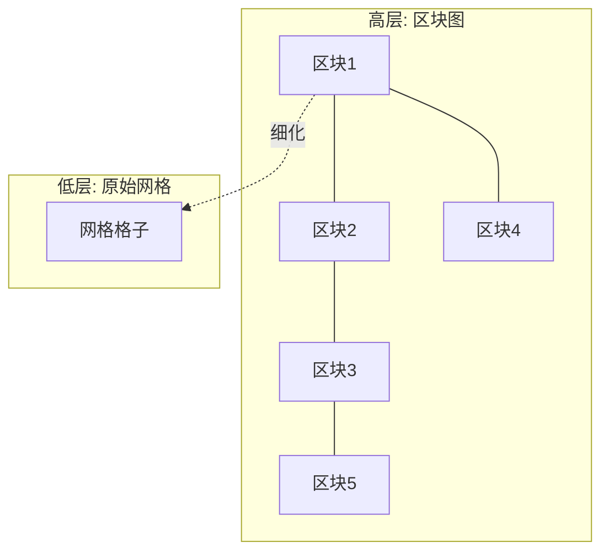

# 02 · A* 算法与优化

> 一句话定位：**游戏寻路的事实标准**。本文详解 A* 的原理（f = g + h、启发函数、可采纳性与一致性），并给出工程级优化：二叉堆开放列表、跳点搜索 JPS、分层寻路 HPA*，最后对比网格与 NavMesh，并解决"路径不好看"的拐点平滑问题。

> 知识基线：C++17 与 Python 3.12 示例；复杂度、浮点/整数、坐标系和随机种子均按正文声明解释。
> 适用范围：离散网格、导航网格多边形图和其他显式图；可用于单机、客户端或权威服务端查询，静态导航数据可离线烘焙，动态障碍需要重规划或局部避障；不把图搜索等同于连续空间的精确碰撞路径。
> 数值与正确性边界：标准最优性需有限图、非负边权、正确松弛和可采纳启发；图搜索关闭节点后不重开还需一致性启发，Weighted A* 只提供受条件约束的近似保证；节点扩展量和耗时必须按实际地图与实现实测。
> 最后更新：2026-08-06（补齐来源、边界条件与验证入口）。
> 参考来源：[Red Blob Games：A* 与路径搜索可视化](https://www.redblobgames.com/pathfinding/a-star/)；[Recast/Detour 开源导航实现](https://github.com/recastnavigation/recastnavigation)。

## 1. 概述

从 01 篇我们知道：Dijkstra 能找到加权图的最短路径，但它"往所有方向均匀扩张"，在"起点→单个目标"的寻路场景里做了大量无用功。A*（A-Star，1968 年由 Hart、Nilsson、Raphael 提出）在 Dijkstra 的基础上加入**启发函数（Heuristic）**，让搜索"偏向目标方向"扩张，在满足边权、启发函数和终止条件等前提时保持**最优性**，并可大幅减少搜索量。

A* 是游戏寻路的常用图搜索基础之一：

- Unity 与 Unreal 的导航 API 会隐藏具体路径查询实现；除非针对目标版本、导航数据类型及源码/API 进行核对，否则不能把 `NavMeshAgent` 或 Navigation System 无条件写成“内部基于 A*”；
- 若项目已核实采用基于图的 A* 查询，才按本文的代价、启发函数与重开条件分析；否则应以实际导航后端、版本和配置为准；
- RTS、MOBA、SLG 的网格寻路几乎全部是 A* 或其变体（JPS、HPA*、D* Lite 等）。

本文结构：第 2 节核心概念 → 第 3 节 A* 原理与完整实现 → 第 4 节启发函数设计 → 第 5 节可采纳性与一致性证明 → 第 6 节二叉堆与开放列表优化 → 第 7 节 JPS → 第 8 节 HPA* → 第 9 节网格 vs NavMesh → 第 10 节路径优化与拐点平滑 → 第 11 节复杂度总表 → 最佳实践与 FAQ。

## 2. 核心概念

| 概念 | 符号 | 定义 | 说明 |
| --- | --- | --- | --- |
| 起点代价 | g(n) | 从起点出发，沿已确定路径到达顶点 n 的实际代价 | 搜索过程中不断被松弛更新 |
| 启发代价 | h(n) | 从顶点 n 到目标的**估计**最小代价 | 由启发函数计算，要求不高估真实代价（可采纳） |
| 总估价 | f(n) | f(n) = g(n) + h(n) | 开放列表按 f 排序，每次扩展 f 最小的顶点 |
| 开放列表 | Open List | 已发现但尚未扩展的顶点集合 | 用优先队列（二叉堆）实现 |
| 关闭列表 | Closed List | 已扩展过的顶点集合 | 配合一致性启发可保证不重复扩展 |
| 启发函数 | Heuristic | h 的具体定义（曼哈顿/欧几里得/切比雪夫） | 决定搜索效率与最优性 |
| 可采纳性 | Admissible | 对任意 n：h(n) ≤ h*(n)（h* 为真实最短代价） | 是最优性证明的启发函数条件；图搜索还需一致性或允许 reopen |
| 一致性 | Consistent | 对任意边 (n, n')：h(n) ≤ w(n,n') + h(n') | 配合关闭列表且不 reopen 时，可保证每个顶点最多扩展一次 |
| 最优性 | Optimality | 算法返回的路径代价等于真实最小代价 | 还依赖边权、g 值松弛、终止时机和图搜索实现 |

## 3. A* 原理详解

### 3.1 为什么是 f = g + h

把搜索想象成从起点扩散的"代价等高线"：

- 只使用 g（即 Dijkstra）：等高线是以起点为圆心的同心圆，均匀扩散，与目标位置无关；
- 只使用 h（贪心最佳优先）：搜索直奔目标，但可能先撞进死胡同再折返（h 只估计、不知道障碍），路径不保证最优；
- 同时使用 g + h：等高线被"拉向"目标方向，既保证探索的完整性（g 项），又优先逼近目标（h 项）。

当 h(n) ≡ 0 时，A* 退化为 Dijkstra；当 h(n) 恰好等于真实代价 h*(n) 时，A* 沿最短路径直达，扩展数最少；h 越接近真实代价，搜索越快。这就是**信息论视角**：启发函数是"关于目标位置的先验信息"。

### 3.2 算法流程

```mermaid
flowchart TD
    A[把起点放入开放列表, g=0, f=h] --> B{开放列表为空?}
    B -- 是 --> C[失败: 无路径]
    B -- 否 --> D[取出 f 最小的顶点 n]
    D --> E{n 是目标?}
    E -- 是 --> F[成功: 沿 parent 回溯路径]
    E -- 否 --> G[把 n 移入关闭列表]
    G --> H[遍历 n 的每个邻居 m]
    H --> I{m 在关闭列表?}
    I -- 是 --> J[跳过 m]
    I -- 否 --> K[计算新 g = g[n] + w(n,m)]
    K --> L{新 g < g[m] 或 m 不在开放列表?}
    L -- 否 --> J
    L -- 是 --> M[更新 g[m], f[m]=g[m]+h[m], parent[m]=n]
    M --> N{m 不在开放列表?}
    N -- 是 --> O[把 m 加入开放列表]
    N -- 否 --> H
    O --> H
    J --> H
    H --> B
```

### 3.3 伪代码

```text
function AStar(graph, start, goal):
    open = 最小优先队列（按 f 排序）
    g[start] = 0
    f[start] = h(start)
    parent[start] = null
    open.push(start)

    while open 不为空:
        n = open.pop_min()
        if n == goal:
            return ReconstructPath(parent, start, goal)
        closed.add(n)

        for m in graph.neighbors(n):
            if m in closed: continue          // 一致性启发下无需重开
            tentative_g = g[n] + w(n, m)
            if m not in open 或 tentative_g < g[m]:
                g[m] = tentative_g
                f[m] = g[m] + h(m)
                parent[m] = n
                if m not in open:
                    open.push(m)              // 已在开放列表则更新其 f 值
    return 失败
```

### 3.4 C++ 实现（网格 + 8 方向 + 二叉堆）

```cpp
#include <queue>
#include <vector>
#include <cmath>
#include <functional>

struct Node {
    int x, y;
    float g = 0, f = 0;
    Node* parent = nullptr;
};

// 曼哈顿启发（4 方向移动）
inline float heuristic(int ax, int ay, int bx, int by) {
    return std::abs(ax - bx) + std::abs(ay - by);
}

std::vector<std::pair<int,int>> aStar(
        const std::vector<std::vector<int>>& grid,
        std::pair<int,int> start, std::pair<int,int> goal) {
    const int H = grid.size(), W = grid[0].size();
    const int dx[8] = {1,-1,0,0,1,1,-1,-1};
    const int dy[8] = {0,0,1,-1,1,-1,1,-1};

    auto key = [W](int x, int y) { return y * W + x; };
    std::vector<Node> nodes(W * H);
    std::vector<bool> closed(W * H, false);
    std::vector<bool> opened(W * H, false);

    auto cmp = [](const Node* a, const Node* b) { return a->f > b->f; };
    std::priority_queue<Node*, std::vector<Node*>, decltype(cmp)> open(cmp);

    auto [sx, sy] = start;
    auto [gx, gy] = goal;
    Node* s = &nodes[key(sx, sy)];
    s->x = sx; s->y = sy;
    s->g = 0; s->f = heuristic(sx, sy, gx, gy);
    open.push(s); opened[key(sx, sy)] = true;

    while (!open.empty()) {
        Node* n = open.top(); open.pop();
        if (closed[key(n->x, n->y)]) continue;
        closed[key(n->x, n->y)] = true;
        if (n->x == gx && n->y == gy) {
            std::vector<std::pair<int,int>> path;
            for (Node* p = n; p; p = p->parent) path.push_back({p->x, p->y});
            std::reverse(path.begin(), path.end());
            return path;
        }
        for (int d = 0; d < 8; ++d) {
            int nx = n->x + dx[d], ny = n->y + dy[d];
            if (nx < 0 || ny < 0 || nx >= W || ny >= H) continue;
            if (grid[ny][nx] == 0 || closed[key(nx, ny)]) continue;
            float step = (d < 4) ? 1.0f : 1.41421356f;  // 斜向代价 √2
            Node* m = &nodes[key(nx, ny)];
            m->x = nx; m->y = ny;
            float ng = n->g + step;
            if (!opened[key(nx, ny)] || ng < m->g) {
                m->g = ng;
                m->f = ng + heuristic(nx, ny, gx, gy);
                m->parent = n;
                if (!opened[key(nx, ny)]) {
                    opened[key(nx, ny)] = true;
                    open.push(m);
                }
            }
        }
    }
    return {};  // 无路径
}
```

### 3.5 Python 实现（heapq）

```python
import heapq

def a_star(grid, start, goal):
    """8 方向 A*。grid 中 0 为障碍。返回 [(x,y), ...] 路径，无路径返回 None。"""
    H, W = len(grid), len(grid[0])
    def h(a, b):  # 对角线距离（8 方向）
        dx, dy = abs(a[0]-b[0]), abs(a[1]-b[1])
        return (dx + dy) + (2**0.5 - 2) * min(dx, dy)

    g = {start: 0.0}
    parent = {}
    open_heap = [(h(start, goal), start)]
    closed = set()

    while open_heap:
        _, n = heapq.heappop(open_heap)
        if n == goal:
            path = [n]
            while n in parent:
                n = parent[n]
                path.append(n)
            return path[::-1]
        if n in closed:
            continue
        closed.add(n)

        for dx, dy in ((1,0),(-1,0),(0,1),(0,-1),(1,1),(1,-1),(-1,1),(-1,-1)):
            m = (n[0]+dx, n[1]+dy)
            if not (0 <= m[0] < W and 0 <= m[1] < H) or grid[m[1]][m[0]] == 0:
                continue
            step = 1.0 if dx == 0 or dy == 0 else 2**0.5
            ng = g[n] + step
            if m in closed:
                continue
            if m not in g or ng < g[m]:
                g[m] = ng
                parent[m] = n
                heapq.heappush(open_heap, (ng + h(m, goal), m))
    return None
```

### 3.6 为什么 A* 比 Dijkstra 快

以 100×100 网格、起点在左下、目标在右上为例：

| 指标 | Dijkstra | A*（4 方向、曼哈顿启发） |
| --- | --- | --- |
| 扩展顶点数 | 约 10000（全部） | 约 1000~2000（视障碍而定） |
| 相对耗时 | 1× | 0.1~0.3× |
| 路径代价 | 最优 | 最优（启发可采纳时） |

启发函数提供的"方向感"把搜索锥从全向压缩到指向目标的扇形区域。障碍越多、地图越大，A* 相对 Dijkstra 的优势越明显；h 越接近真实代价，扩展数越少。

## 4. 启发函数设计

### 4.1 三种常用启发

| 启发函数 | 公式 | 适用移动方式 | 特点 |
| --- | --- | --- | --- |
| 曼哈顿距离 | h = \|dx\| + \|dy\| | 4 方向、正交代价为 c | 用 `c·(|dx|+|dy|)`；若允许对角线且斜向代价为 √2c，会**高估**，不可采纳 |
| 欧几里得距离 | h = √(dx² + dy²) | 任意角度移动（连续世界） | 对 8 方向移动略微低估，可采纳 |
| 切比雪夫距离 | h = max(\|dx\|, \|dy\|) | 8 方向、正交/斜向代价相同为 c | 无地形差异时精确匹配真实代价 |
| 对角线距离（Octile） | h = c·(max−min) + d·min | 8 方向、正交代价 c、斜向代价 d | 常见 `d=√2c` 时精确匹配网格真实代价 |

> **关键原则**：h 必须与**实际移动方式和代价**匹配。4 方向且正交代价为 c 时用 `c·(|dx|+|dy|)`；8 方向且正交代价为 c、斜向代价为 d 时，常见 `c<d<2c` 应用 Octile 距离。特别是 `c=1、d=√2` 时，`dx=dy=1` 的曼哈顿值为 2，而真实直走代价为 √2，因此曼哈顿是**高估**而不是低估。若 `d=c`，用切比雪夫距离；若 `d≥2c`，斜向没有更便宜，曼哈顿乘 c 仍可作为匹配启发。

### 4.2 权重化 A*（Weighted A*）

把总估价改为 `f = g + w·h`（w > 1），搜索会更快收敛，但**放弃最优性**：

- w = 1：标准 A*，最优；
- w = 1.5~2：工程常用，路径代价通常只比最优高几个百分点，扩展数可减少数倍；
- w 越大：越接近贪心最佳优先，速度越快、路径越差。

```python
def a_star_weighted(grid, start, goal, w=1.5):
    # ... 与标准 A* 相同，仅入堆键改为 ng + w * h(m, goal)
    pass
```

### 4.3 游戏中的选择建议

| 游戏类型 | 推荐启发 | 理由 |
| --- | --- | --- |
| 2D Tilemap（4 方向） | 曼哈顿 | 精确匹配移动代价 |
| 2D Tilemap（8 方向） | 对角线距离 | 精确匹配 √2 斜向代价 |
| 3D NavMesh | 欧几里得 | 多边形中心点之间任意方向 |
| RTS 大地图 | 对角线距离 + 权重化（w≈1.2） | 帧预算优先，轻微次优可接受 |
| 需要严格最优（如解谜） | 精确匹配的启发，w = 1 | 最优性优先 |

## 5. 可采纳性与一致性

### 5.1 可采纳性（Admissible）

定义：对图中任意顶点 n，`h(n) ≤ h*(n)`，其中 h*(n) 是从 n 到目标的真实最短代价。即**启发函数永远不高估**。

**定理（带前提）：在有限图、边权非负（通常取正）、正确维护并松弛 `g` 值、目标在从开放列表取出/扩展时终止的前提下，树搜索 A* 使用可采纳 h 可以返回最优路径；图搜索若关闭后不重开，还需要 h 一致，否则必须在发现更小 `g` 时 reopen 已关闭顶点。**

证明思路（反证）：

1. 假设 A* 返回路径 P 的代价 C > C*（真实最优代价）；
2. A* 结束时目标 G 被扩展，说明扩展 G 时 `f(G) = g(G) = C`；
3. 在真实最优路径 P* 上取当前第一个尚未被扩展的顶点 n。按前述实现前提，其最优前缀的前驱已被正确扩展并松弛 n，因此 n 已以 `g(n) = g*(n)`（最优前缀代价）进入开放列表；因为 h 可采纳：
   `f(n) = g(n) + h(n) ≤ g*(n) + h*(n) = C*`。
4. 于是 f(n) ≤ C* < C = f(G)，即开放列表中 f 更小的 n 应比 G 先被扩展，矛盾。

### 5.2 一致性（Consistent / Monotone）

定义：对任意边 (n, n')，`h(n) ≤ w(n, n') + h(n')`。

一致性比可采纳性更强（一致性 ⇒ 可采纳：取目标 G 处 h(G) = 0，沿最短路逐边递推即可证明）。它带来的工程收益：

1. **沿任何路径 f 单调不减**：`f(n') = g(n') + h(n') = g(n) + w(n,n') + h(n') ≥ g(n) + h(n) = f(n)`；
2. **每个顶点最多扩展一次**：一旦顶点进入关闭列表，它的 g 值就是最终值，无需"重开"（re-open）——这与 Dijkstra 的"已确定集合"同理；
3. 在标准网格/几何图中，且边权与几何移动代价匹配并满足三角不等式时，曼哈顿、欧几里得、切比雪夫和对角线启发可满足一致性；对任意带权图不能无条件套用这一结论。

> 工程启示：实现 A* 时"关闭列表 + 不重开"成立的前提是启发一致。若使用非一致启发，保守实现应允许重开（检查 `tentative_g < g[m]` 时无论 m 是否在关闭列表都更新）。

## 6. 二叉堆与开放列表优化

### 6.1 为什么是二叉堆

开放列表的核心操作：

| 操作 | 频率 | 二叉堆复杂度 |
| --- | --- | --- |
| 取出 f 最小顶点 | 每扩展一次 | O(log n) |
| 插入新顶点 | 每发现一个新顶点 | O(log n) |
| 更新 f 值（降键） | 每发现更优路径 | O(log n)（上浮） |

C++ 的 `std::priority_queue` 不支持任意降键，工程上使用**惰性更新**：允许重复入堆，出堆时用 `closed` 标记跳过过期条目（与 01 篇 Dijkstra 的惰性删除同款思路）。Python 的 `heapq` 同样如此——这是两种语言最常用的实现方式。

### 6.2 常见替代结构对比

| 结构 | 取最小 | 插入 | 降键 | 说明 |
| --- | --- | --- | --- | --- |
| 二叉堆（惰性） | O(log n) | O(log n) | O(log n)（重插） | 工程标准，缓存友好 |
| 配对堆 | O(1) 摊还 | O(1) 摊还 | O(1) 摊还 | 理论更快，常数与实现复杂度高 |
| 多级桶（Bucket） | O(1) | O(1) | O(1) | f 值离散且范围小时极快（如整数代价） |
| 索引式优先队列 | O(log n) | O(log n) | O(log n) | 支持真降键，需顶点索引 |

> 对整数代价网格，**多级桶**（按 f 值分桶，维护当前最小非空桶）可以做到近似 O(1) 的取最小，是网格寻路提速的隐藏技巧。

## 7. 跳点搜索 JPS（Jump Point Search）

### 7.1 动机

均匀网格上，A* 的邻居结构高度对称：从 A 到 B 和从 B 到 A 会扩展几乎相同的顶点集合。JPS（Harfmann & Haddadin 2011）利用这种对称性做**剪枝**，只扩展少数"跳点"（Jump Point），把大量冗余顶点一次性跳过。

### 7.2 核心概念

- **直线剪枝（Straight Pruning）**：在无障碍的空旷区域，沿某个方向继续直走永远不劣于转向，因此中间顶点无需入开放列表；
- **强迫邻居（Forced Neighbor）**：当某方向的推进被障碍挡住、且障碍物背后存在"必须绕行才能到达"的邻居时，该邻居迫使当前顶点成为跳点；
- **跳点（Jump Point）**：直线推进过程中遇到的强迫邻居所在顶点、以及拐点。只有跳点进入开放列表；
- **递归跳跃（Jumping）**：沿 8 个方向之一递归向前探测，直到命中跳点、障碍或边界。

```text
ASCII 示例：向右跳跃，x 处被障碍挡住的邻居（.）是强迫邻居，迫使 B 成为跳点

      . . .      ← 上一行：x 上方被障碍挡住
    S B x x x T  ← 当前行：从 B 向右跳
      # # #      ← 下一行：障碍（#）挡住 B 的下方邻居

B 被"强迫"转向，成为跳点；中间 x 全部被跳过，不进入开放列表
```

### 7.3 伪代码

```text
function Jump(n, direction):
    // 从 n 沿 direction 递归跳跃，返回跳点；无跳点返回 null
    m = n + direction
    if m 越界或不可通行: return null
    if m == goal: return m
    if 存在强迫邻居(m): return m          // m 是跳点
    if direction 是斜向:
        if Jump(m, (dx, 0)) 或 Jump(m, (0, dy)) 非空: return m   // 斜向拐点
    return Jump(m, direction)             // 继续直线跳

function JPS(start, goal):
    open.push(start)
    while open 不为空:
        n = open.pop_min()
        if n == goal: return 还原路径
        closed.add(n)
        for direction in 8 个方向:
            if 该方向可被剪枝（有更优替代路径）: continue
            jp = Jump(n, direction)
            if jp != null:
                计算 g[jp]、f[jp]，加入开放列表
```

### 7.4 复杂度与适用性

| 指标 | A*（8 方向） | JPS |
| --- | --- | --- |
| 开放列表顶点数 | 大量（几乎所有可达顶点） | 极少（仅跳点） |
| 典型加速 | 1× | 5~10×（开阔地图）甚至 20×+ |
| 额外开销 | 无 | 每次跳跃需扫描一列/一行（可预计算障碍距离加速） |
| 适用条件 | 任意图 | 仅**均匀代价网格**（无地形权重差异），且最好是 8 方向 |

**限制**：

1. 有地形代价（沼泽、坡道）时 JPS 失效——权重破坏对称性，剪枝不再安全；
2. 障碍稀疏的开阔地图收益最大，迷宫型地图收益有限；
3. 实现复杂度高于 A*，边界条件（越界、斜穿）易错。

> 实际工程中 JPS 常与"障碍距离预计算"（扫行/列记录最近障碍）结合，把跳跃探测从 O(k) 降到 O(1)，这是 JPS+ 的思路。

## 8. HPA* 分层寻路（Hierarchical Pathfinding A*）

### 8.1 动机

1000×1000 网格（100 万顶点）上跑 A*，单次搜索可能耗时数十毫秒，且每次搜索都从零开始。**分层寻路**把地图抽象成粗粒度层级，在高层图快速规划"宏观路线"，再在低层细化，搜索规模从"全图"降到"局部"。

### 8.2 原理



构建步骤（离线烘焙）：

1. 把地图划分为 n×n 的**区块（Cluster）**；
2. 计算每个区块的**入口点（Entrance）**：相邻区块边界上互相可达的格子对；
3. 在入口点之间运行局部搜索，得到入口点两两之间的代价，存入**高层图**（顶点 = 入口点，边权 = 局部最短代价）；
4. 运行时：在高层图上跑 A*（顶点数骤减）得到"入口点序列"，再对每个区块内部做局部 A* 细化，拼接成完整路径。

### 8.3 优缺点

| 优点 | 缺点 |
| --- | --- |
| 搜索顶点数从百万级降到千级，速度提升 1~2 个数量级 | 路径可能略长于全局最优（高层近似） |
| 高层图可复用（多单位共享），支持预计算 | 动态障碍需要局部重算与高层代价更新 |
| 天然支持"寻路请求合并"（同区块单位共享高层路线） | 实现复杂度高，区块大小需调参 |

> HPA* 的思路在《星际争霸 2》等 RTS 中体现为**区域抽象 + 局部寻路**的混合架构；对单机小地图收益不明显，100 万顶点以上的大地图收益显著。

## 9. 网格（Grid） vs 导航网格（NavMesh）

### 9.1 两种表示的本质

- **网格（Grid）**：世界被均匀切成格子，通行信息存在格子属性里（可行走/代价）。格子大小固定，障碍精确到格子粒度；
- **导航网格（NavMesh）**：可行走表面被分解为**凸多边形**，多边形之间共享边相连。障碍越少的地方多边形越大，形状贴合真实地形。

### 9.2 对比表

| 维度 | 网格 Grid | 导航网格 NavMesh |
| --- | --- | --- |
| 构建方式 | 直接由 Tilemap/地图数据得到，无需预处理 | 需要**烘焙**：从碰撞体提取可行走表面、三角化、合并凸多边形 |
| 内存 | 每格 1~8 字节，1000×1000 约 1~8 MB | 顶点+多边形数量与地形复杂度相关，通常更省 |
| 路径质量 | 折线路径，需要平滑 | 天然贴合表面，路径更直 |
| 动态障碍 | 修改格子属性即可，简单 | 需要局部更新（动态 NavMesh）或本地避障 |
| 支持高度变化 | 难（需 3D 网格或多层） | 天然支持斜坡、台阶、多层建筑 |
| 适合类型 | 2D 游戏、RTS、塔防、回合制 | 3D 游戏、FPS、ARPG、开放世界 |
| 代表实现 | 自研 Tilemap 寻路 | Unity NavMesh、Unreal NavMesh、Recast/Detour |

### 9.3 NavMesh 上的 A*

NavMesh 上寻路时，把每个凸多边形当作顶点、共享边当作边，代价取多边形中心点距离（或边中点距离）：

1. 定位起点/终点所在多边形；
2. 在多边形图上跑 A*（欧几里得启发）；
3. 得到多边形序列后，用**漏斗算法**（见第 10 节）在序列内求最短可视路径，输出沿地面行走的路径点。

> Recast/Detour 是可核对的开源参考：Recast 负责从几何体烘焙 NavMesh，Detour 提供基于多边形图的查询与漏斗平滑。Unity、Unreal 是否直接采用或受其影响取决于引擎版本、导航后端和项目配置，不能据此推断其内部实现。

## 10. 路径优化与拐点平滑

### 10.1 问题：锯齿路径（Zigzag）

网格 A* 输出的路径是"格子中心折线"，在 8 方向网格上呈现 45° 锯齿；直接让角色沿折线走，视觉上会"抽搐"。需要后处理：

### 10.2 漏斗算法（Funnel Algorithm / String Pulling）

在路径经过的多边形/格子序列上，维护一个"漏斗"（两条射线：左边界、右边界），逐步收紧：

```text
初始：漏斗顶点 = 起点，左右射线指向下一段路径的两个端点
对每个新的路径段端点 p：
    if p 在漏斗左侧射线外侧: 记录当前左顶点为拐点，重置漏斗，继续
    if p 在漏斗右侧射线外侧: 记录当前右顶点为拐点，重置漏斗，继续
    否则: 收紧漏斗（若 p 更靠内则更新对应射线）
输出：起点 → 拐点序列 → 终点（每段都是直线可视路径）
```

```cpp
// 简化示意：对 A* 路径点序列做"视线裁剪"
std::vector<Vec2> simplify(const std::vector<Vec2>& path, bool hasLineOfSight(Vec2, Vec2)) {
    std::vector<Vec2> result;
    int start = 0;
    result.push_back(path[0]);
    for (int i = 1; i < path.size(); ++i) {
        if (!hasLineOfSight(path[start], path[i])) {
            result.push_back(path[i - 1]);  // 上一个点是可视拐点
            start = i - 1;
        }
    }
    result.push_back(path.back());
    return result;
}
```

### 10.3 字符串推杆（String Pulling）

把路径想象成一根绷紧的绳子：贪心地把路径段拉直，直到碰到障碍边界。漏斗算法是它的精确实现，在 NavMesh 多边形序列上效果最佳——路径被"贴"在多边形边界上，长度接近理论最短。

### 10.4 曲线平滑（可选）

拐点平滑后路径仍然"硬拐"，可叠加曲线：

- **Catmull-Rom 样条**：穿过全部控制点，局部可控，是角色移动路径的常用选择；
- **三次贝塞尔**：在拐点处插值，转角圆滑；
- 注意：曲线可能穿出可行走区域，需做碰撞约束（沿曲线采样点做视线检查）。

> 工程顺序：A* 路径 → 漏斗/视线简化（去掉冗余拐点）→（可选）样条平滑 → 交给移动系统。**先简化再平滑**，否则平滑会在多余拐点上制造更多抖动。

## 11. 复杂度分析总表

| 算法/技术 | 时间复杂度 | 空间复杂度 | 备注 |
| --- | --- | --- | --- |
| A*（二叉堆） | O(E log V)，实际取决于启发质量 | O(V)（open+closed） | 扩展数随 h 质量急剧变化 |
| A*（加权，w>1） | 扩展数显著减少 | O(V) | 牺牲最优性换速度 |
| JPS | 最坏同 A*，典型 O(跳点数 log 跳点数) | O(V) | 仅均匀网格 |
| HPA* 构建 | O(入口点 × 局部搜索) | O(高层图) | 离线烘焙；运行时 O(高层 A*) + O(局部细化) |
| 漏斗平滑 | O(k)（k = 路径段数） | O(k) | 后处理，开销可忽略 |
| Dijkstra（对照） | O((V+E) log V) | O(V+E) | 无启发时 A* 退化为它 |

> 实际性能经验值（1000×1000 网格，C++）：A* 单次约 0.1~5 ms；JPS 在开阔地形约 0.01~0.5 ms；HPA* 可把全图搜索降到百微秒级。数字随障碍密度与实现质量波动，应以实测为准。

## 验证与基准建议

- 输入规模与边界用例：覆盖起点等于终点、不可达、目标在障碍内、角点穿墙、斜向移动、启发为零、多个相同 `f` 值和动态障碍重规划；对网格与 NavMesh 分别记录地图规模。
- 正确性断言：在非负边权和可采纳启发下，将 A* 路径代价与 Dijkstra 基线比较；断言路径首尾、相邻边合法、拐点平滑后仍在可行走走廊内，并检查 reopen/关闭列表策略的一致性。
- 复杂度与耗时指标：记录节点扩展数、开放列表峰值、路径代价、平滑前后点数、P50/P95 查询耗时和内存；JPS/HPA* 的收益只在对应地图分布上实测，不由理论复杂度直接推断。
- 命令示意（仅示意，不表示仓库已有测试）：`python -m pytest tests/test_astar.py -q`；C++ 可接入项目自有 benchmark 比较 Dijkstra、A*、JPS 和 HPA*。

## 12. 最佳实践

1. **启发必须与移动代价单位一致**：斜向代价用 √2 时，对角线启发也用 √2，否则不是高估就是低估；
2. **开放列表用惰性更新**：允许重复入堆 + closed 去重，别手写"堆内查找删除"；
3. **先可达性剪枝**：起点终点不在同一连通域直接返回（01 篇连通域预计算）；
4. **帧预算与时间片**：超时（例如 2 ms 的起始预算，需按目标平台实测）则返回"当前最优前缀路径"或延迟到下一帧继续（迭代加深 A* / IDA* 是另一条路）；
5. **动态障碍分级处理**：静态障碍走 A* 全局规划，动态障碍交给局部避障（RVO/Steering），别把动态障碍全塞进 A*；
6. **多单位共享**：同目标的多单位可复用路径（路径缓存）、同区块复用 HPA* 高层图、或换流场（见 03 篇）；
7. **路径后处理必做**：漏斗/视线简化是"免费"的质量提升，务必接入；
8. **测试覆盖**：角点穿墙、斜穿、不可达、目标在障碍内等边界用例写单元测试。

## 13. 常见问题 FAQ

**Q1：A* 一定返回最优路径吗？**
不能简化成“当且仅当启发函数可采纳就最优”。在有限图、边权非负（通常取正）、正确维护 `g`/开放列表且目标出队时终止等前提下，树搜索 A* 使用可采纳 h 可返回最优解；图搜索若关闭后不重开，需 h 一致，或在改进已关闭顶点时执行 reopen。使用权重化 A*（w > 1）或过高估计的启发都会破坏标准最优性保证。

**Q2：为什么 8 方向移动不能用曼哈顿启发？**
要看移动代价：4 方向、正交代价为 c 时，曼哈顿乘 c 是匹配启发；8 方向若正交代价为 c、斜向代价为 √2c，曼哈顿会高估（例如一格斜走时 `2c > √2c`），不能作为可采纳启发。8 方向且斜向与正交代价相同用切比雪夫；斜向代价处于两者之间用 Octile。反过来，4 方向移动用未按 c 缩放的切比雪夫也可能高估，仍须按实际代价校准。

**Q3：JPS 什么时候比 A* 快？**
开阔、均匀代价网格（RTS 平原、Tilemap）上快 5~20 倍；有地形权重、迷宫、窄通道多的地图收益有限或更慢。权重地图请直接用 A*。

**Q4：目标点会移动怎么办？**
目标移动频繁时，每次重跑 A* 太贵。方案：目标移动慢则定期重规划；单位多则用流场（03 篇）；更激进的方案是 D* Lite（增量重规划）或 RRT（连续空间）。

**Q5：A* 的路径为什么有锯齿？**
网格中心折线导致。用漏斗算法/视线简化去掉冗余拐点，再用样条平滑转角，即可得到自然路径。

**Q6：开放列表和关闭列表为什么用哈希/数组而不用链表？**
查找"顶点是否在表中"是高频操作，哈希表 O(1) 平均；网格地图可用一维数组直接索引（O(1) 且缓存友好），比哈希更快。

**Q7：能不能把 A* 用在 NavMesh 上？**
对采用图搜索的 NavMesh 实现，可以使用“多边形图 + A*（欧几里得启发）+ 漏斗平滑”；具体引擎是否如此实现，应按目标版本、导航后端和源码/API 核对，Recast/Detour 可作为参考。

## 14. 关联阅读

- `01-图论基础与搜索算法.md`：A* 的底子——优先队列 Dijkstra、图的存储、复杂度口径；
- `03-流场与群体寻路.md`：当"单位数量"成为瓶颈时，从逐单位 A* 切换到全场流场；
- `04-空间分区与索引.md`：A* 的邻居查询在超大世界中的加速器；
- 论文：Harfmann & Haddadin, *Jump Point Search* (2011)；Botea et al., *HPA*: Hierarchical Pathfinding A** (2004)；
- Red Blob Games：*Introduction to the A* Algorithm*（含交互式演示）；
- 开源参考：Recast/Detour（NavMesh 烘焙 + A* + 漏斗）、Unity ML-Agents 的 GridWorld 示例。
