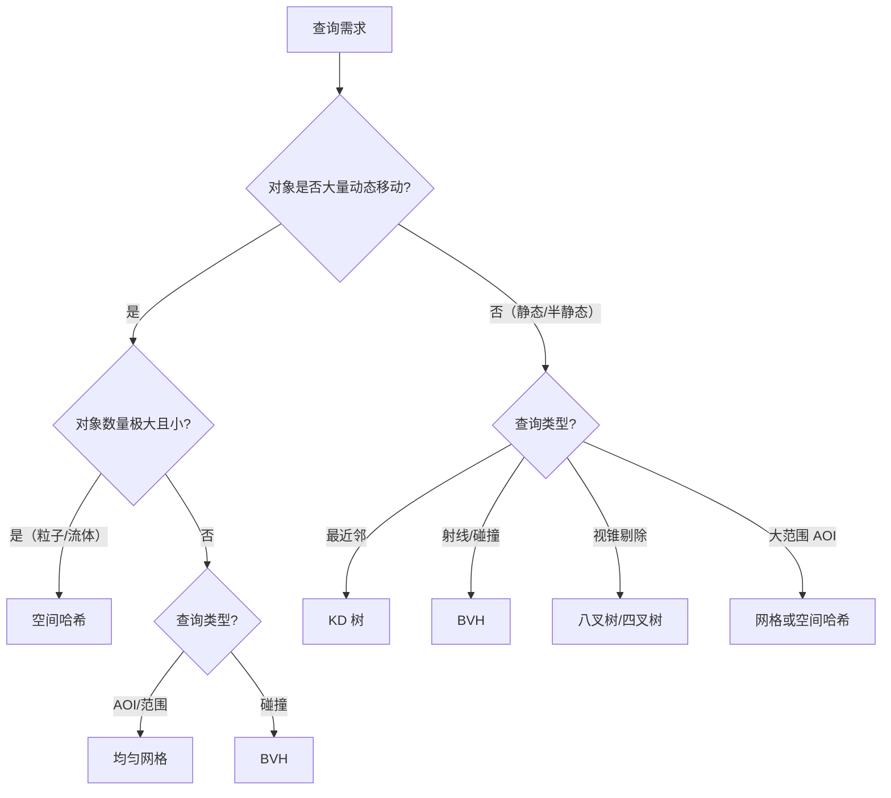

# 04 · 空间分区与索引（Spatial Partitioning & Indexing）

> 一句话定位：**让"附近有什么"从 O(n) 变成 O(log n) 甚至 O(1)**。本文覆盖均匀网格、四叉树/八叉树、BVH、KD 树、空间哈希五种结构的原理、构建/查询复杂度与适用场景（AOI、碰撞、射线、渲染剔除）。

## 1. 概述

游戏运行时充满了"空间查询"：

- MMO 中，玩家移动后要知道**周围有哪些玩家**（AOI，Area of Interest）；
- 战斗系统中，技能命中要检测**哪些单位在范围里**（碰撞/范围查询）；
- FPS 中，子弹要**射线检测**第一个挡路的物体（射线查询）；
- 渲染器中，相机要找到**视野内的物体**（视锥剔除）。

最朴素的做法是遍历所有对象：n 个对象做两两碰撞检测是 O(n²)，10000 个对象每秒 60 帧就是 600 万次检测/帧，完全不可行。**空间分区（Spatial Partitioning）** 把对象按位置组织进某种索引结构，让查询只访问"附近"的一小部分对象。

选择哪种结构取决于四个问题：

1. **维度**：2D（四叉树/均匀网格）还是 3D（八叉树/BVH/KD 树）；
2. **对象是否动态**：每帧移动（空间哈希）还是静态烘焙（BVH/KD 树）；
3. **查询类型**：范围（AOI/碰撞）、射线（射击）、最近邻（吸附/锁定）；
4. **密度分布**：均匀（网格）还是稀疏不均（树结构自适应）。

本文结构：第 2 节核心概念 → 第 3~7 节分别讲五种结构（原理、构建/查询复杂度、伪代码与示例、游戏应用）→ 第 8 节总对比表 → 第 9 节选型决策树 → 最佳实践、FAQ、关联阅读。

## 2. 核心概念

| 概念 | 英文 | 定义 | 说明 |
| --- | --- | --- | --- |
| 包围盒 | AABB | 轴对齐的六面体/矩形包围体 | 用 6 个/4 个数值表示，求交极快 |
| 范围查询 | Range Query | 找指定区域/半径内的对象 | AOI、AOE 技能、广播 |
| 射线查询 | Ray Query | 找与射线最先相交的对象 | 射击、视线检测、寻路视线裁剪 |
| 最近邻查询 | Nearest Neighbor | 找距离给定点最近的对象 | 锁定目标、吸附、粒子配对 |
| 视锥剔除 | Frustum Culling | 只渲染相机视锥内的物体 | 渲染优化的核心应用 |
| 桶 | Bucket / Cell | 空间被划分出的基本单元 | 网格的格、哈希的桶 |
| 包围体层次 | BVH | 用对象包围盒构建的树 | 物体驱动，适合动态场景 |
| 划分轴 | Split Axis | 树节点切分所沿的坐标轴 | KD 树按轴交替切分 |

## 3. 均匀网格（Uniform Grid）

### 3.1 原理

把世界切成大小相等的格子（Cell），每个格子维护一个对象列表。对象插入时计算其所在格子（O(1)），查询时只需访问"目标格子及其相邻格子"。

```text
世界被切成 4×3 网格，圆圈是对象：

┌─────┬─────┬─────┬─────┐
│  ○  │     │     │     │
├─────┼─────┼─────┼─────┤
│  ○○ │     │  ○  │     │
├─────┼─────┼─────┼─────┤
│     │  ○  │     │  ○  │
└─────┴─────┴─────┴─────┘

查询 (2,1) 格附近时，只需检查它自己 + 8 个邻居格子（九宫格）
```

格大小是核心参数：太大 → 每格对象多、查询退化；太小 → 网格内存大、对象跨格频繁。经验法则：格子边长 ≈ 对象平均直径的 1~2 倍。

### 3.2 复杂度

| 操作 | 复杂度 | 说明 |
| --- | --- | --- |
| 构建 | O(n + G)（G = 格子数） | 每个对象哈希到格子 |
| 插入/删除/移动 | O(1) | 对象移动只需换格子（跨格时） |
| 范围查询 | O(k + 覆盖格子数 × 平均每格对象数) | k = 结果数；最坏 O(n)（全部挤在一格） |
| 内存 | O(G + n) | 格子数组 + 对象指针 |

### 3.3 伪代码与示例

```text
struct Grid:
    cellSize
    cells: 哈希表 key=格子坐标 → 对象列表

function CellOf(pos): return (floor(pos.x / cellSize), floor(pos.y / cellSize))

function Insert(obj): cells[CellOf(obj.pos)].push(obj)

function QueryRange(center, radius):
    result = []
    for 每个与圆外接矩形重叠的格子 c:
        for obj in cells[c]:
            if dist(obj.pos, center) <= radius: result.push(obj)
    return result
```

```python
class UniformGrid:
    def __init__(self, cell_size: float):
        self.cell_size = cell_size
        self.cells = {}  # (cx, cy) -> [obj]

    def _cell(self, x, y):
        return (int(x // self.cell_size), int(y // self.cell_size))

    def insert(self, obj):
        self.cells.setdefault(self._cell(obj.x, obj.y), []).append(obj)

    def query_range(self, x, y, radius):
        cx, cy = self._cell(x, y)
        span = int(radius // self.cell_size) + 1
        out = []
        for gx in range(cx - span, cx + span + 1):
            for gy in range(cy - span, cy + span + 1):
                for obj in self.cells.get((gx, gy), ()):
                    if (obj.x - x) ** 2 + (obj.y - y) ** 2 <= radius * radius:
                        out.append(obj)
        return out
```

### 3.4 游戏应用

| 应用 | 说明 |
| --- | --- |
| **MMO AOI（九宫格）** | 玩家移动后查询所在格 3×3 邻居格内的玩家，同步位置/状态。简单、快、是服务器 AOI 事实标准之一 |
| 2D 碰撞检测 | 同格/邻格对象做精确碰撞测试，把 O(n²) 降到局部 |
| 粒子系统 | 粒子查询邻居（流体、群体模拟），插入/删除 O(1) |
| 塔防索敌 | 防御塔查半径内敌人，O(1) 定位格子 |
| RTS 攻击判定 | 范围伤害查命中单位 |

## 4. 四叉树 / 八叉树（Quadtree / Octree）

### 4.1 原理

四叉树（2D）把空间递归四等分：节点存储"是否还有子节点 + 对象列表"，当节点内对象过多且深度未达上限时继续分裂。八叉树是 3D 版本（八等分）。它**自适应**对象密度：密集区域树更深、格子更小，空旷区域保持大格子。

```text
2D 四叉树示意（每个方块被分成 4 个子块，直到对象稀疏）：

┌─────────┬─────┬───┬───┐
│         │     │   │   │
│    A    │  B  │   │   │
│         │     ├───┼───┤
├─────────┼─────┤ C │   │
│         │     │   │   │
│    D    ├─────┴───┴───┤
│         │             │
└─────────┴─────────────┘
```

### 4.2 构建与查询

```text
function Insert(node, obj):
    if node 是叶子 且 对象数 < MAX_OBJ 或 深度 == MAX_DEPTH:
        node.objects.push(obj)
    else:
        if node 是叶子: 分裂为 4/8 个子节点，重放已有对象
        for 每个与 obj 包围盒相交的子节点 c:
            Insert(c, obj)      // 跨边界对象可能进入多个子节点

function QueryRange(node, rect):
    result = []
    if node.rect 与 rect 不相交: return result
    for obj in node.objects:
        if obj 与 rect 相交: result.push(obj)
    for child in node.children: result += QueryRange(child, rect)
    return result
```

```cpp
// 伪代码级别的 2D 四叉树节点（示意）
struct QuadNode {
    AABB rect;
    std::vector<Obj*> objects;
    QuadNode* children[4] = {};   // 叶子时为空

    void insert(Obj* o) {
        if (isLeaf() && objects.size() < MAX_OBJ) { objects.push_back(o); return; }
        if (isLeaf()) subdivide();
        for (auto* c : children)
            if (c->rect.intersects(o->aabb)) c->insert(o);
    }
};
```

### 4.3 复杂度

| 操作 | 平均 | 最坏 |
| --- | --- | --- |
| 构建（插入 n 个对象） | O(n log n) | O(n × 深度上限)（全部重叠在一个角落） |
| 范围查询 | O(k + log n) | O(n)（全部对象重叠） |
| 内存 | O(n × 深度) | — |

### 4.4 游戏应用

| 应用 | 说明 |
| --- | --- |
| **渲染视锥剔除** | 相机视锥与四叉树/八叉树节点求交，只遍历相交子树，跳过整个视野外区域（3D 场景管理标准做法） |
| 2D 地图管理 | Tilemap 大世界的区域加载、LOD 管理 |
| 碰撞粗筛 | 与网格类似的粗筛，但自适应密度（对象聚集处自动细分） |
| 场景图（Scene Graph） | Unity/Unreal 场景管理大量使用树形空间结构 |
| 流式加载 | 按节点裁剪/加载地块 |

> 常见误解：四叉树"一定比网格快"。对象分布均匀时，网格的 O(1) 哈希定位比树的 O(log n) 遍历更快；四叉树在**分布极不均匀**（城市+荒野）时优势明显。

## 5. 包围体层次 BVH（Bounding Volume Hierarchy）

### 5.1 原理

BVH 是**对象驱动**的树：每个叶子节点是一个对象（或其包围盒），内部节点的包围盒是"孩子包围盒的并集"。它不按空间切分，而是按**对象分组**，因此：

- 包围盒可以重叠（同一空间位置可能出现在多个分支的盒子里，但对象只存一份）；
- 对象移动时只需更新其叶子并向上重算包围盒（O(log n) 冒泡），非常适合**动态场景**；
- 构建方式：自顶向下（递归二分对象集，常用 SAH 优化切分）或自底向上（贪心合并近邻）。

```text
对象集合（左）与 BVH 树（右）：

      [AB]                 [AB]
      /  \                 /  \
    [A]  [B]             [A]  [B]---[CD]
      [CD]                    /  \
                            [C]  [D]
```

### 5.2 构建：表面积启发式（SAH）

自顶向下构建时，如何把对象分成两堆？朴素做法按空间坐标中点切分；**SAH（Surface Area Heuristic）** 选择使"期望求交代价"最小的切分：

```
代价(切分) = 左子代价 + 右子代价
          ≈ c_trav + SA(左)/SA(父) × n_左 × c_leaf + SA(右)/SA(父) × n_右 × c_leaf
```

其中 SA 是包围盒表面积（2D 用周长），n 是对象数。直觉：**射线命中概率与包围盒表面积成正比**，所以让"盒大对象多"的分支代价最小化。SAH 把构建从"碰运气"变成"有依据"，是工业级 BVH（光线追踪加速结构）的标准。

### 5.3 查询

```text
function RayIntersect(node, ray):
    if node 包围盒与 ray 不相交: return 无
    if node 是叶子: return 与对象精确求交
    left = RayIntersect(node.left, ray)
    right = RayIntersect(node.right, ray)
    return 更近的那个
```

### 5.4 复杂度

| 操作 | 复杂度 | 说明 |
| --- | --- | --- |
| 构建（SAH 自顶向下） | O(n log² n)（排序切分） | 离线烘焙可接受 |
| 范围/射线查询 | O(log n) 平均（剪枝多） | 最坏 O(n) |
| 对象移动更新 | O(log n)（重算祖先包围盒） | 动态场景关键优势 |
| 内存 | O(n)（每对象恰好在树中一次） | 比八叉树省（对象不多份） |

### 5.5 游戏应用

| 应用 | 说明 |
| --- | --- |
| **物理引擎碰撞** | PhysX、Bullet 等物理引擎的动态场景碰撞广泛使用 BVH（动态 BVH / BIH 变体） |
| **光线追踪** | 渲染器加速结构事实标准（Embree、OptiX 用 BVH） |
| 射线检测 | FPS 射击、AI 视线检测 |
| 布娃娃/骨骼体 | 动态部件碰撞查询 |
| 植被/大量实例剔除 | 实例按 BVH 组织做视锥与遮挡剔除 |

## 6. KD 树（K-Dimensional Tree）

### 6.1 原理

KD 树是**按坐标轴交替切分**的二叉树：每个节点沿某一轴（2D 中 x、y 交替）用**中位数**切分对象集合，左子树"小于切分面"、右子树"大于切分面"。与八叉树/BVH 不同，KD 树每个对象**恰好属于一个节点**，且切分面是超平面（直线/平面），不是盒子。

```text
2D KD 树切分过程：

第一次沿 x 切:   第二次沿 y 切:   第三次沿 x 切:
   │                │               │  │
 ──┼────  ──>    ───┼───   ──>    ───┼──┼─
   │                │               │  │
```

### 6.2 构建与最近邻查询

```text
function Build(points, depth):
    axis = depth % 维度数
    按 axis 坐标排序 points，取中位数 p 为节点
    node.point = p
    node.left  = Build(points[:中位数], depth+1)
    node.right = Build(points[中位数+1:], depth+1)
    return node

function Nearest(node, query, depth, best):
    if node == null: return best
    axis = depth % 维度数
    d = dist(query, node.point)
    if d < best.d: best = {point: node.point, d}
    diff = query[axis] - node.point[axis]
    // 先搜较近一侧
    near = diff < 0 ? node.left : node.right
    far  = diff < 0 ? node.right : node.left
    Nearest(near, query, depth+1, best)
    // 若查询点到切分面的距离 < best.d，另一侧可能有更近点，必须搜
    if |diff| < best.d:
        Nearest(far, query, depth+1, best)
```

### 6.3 复杂度

| 操作 | 平均 | 最坏 |
| --- | --- | --- |
| 构建 | O(n log n) | O(n log n)（中位数切分保证平衡） |
| 最近邻查询 | O(log n) | O(n)（高维退化，维度 > 20 时几乎失效） |
| 插入/删除 | O(log n) | O(n)（需重建平衡） |

> **维度诅咒**：KD 树在 2~3 维极快；维度升高后"另一侧必须搜"的概率大增，退化到线性扫描。游戏里几乎都是 2D/3D，完全在安全区。

### 6.4 游戏应用

| 应用 | 说明 |
| --- | --- |
| 最近目标锁定 | 玩家按 F 锁定最近敌人 |
| 粒子/对象配对 | 两集合间找最近配对 |
| 吸附/磁吸 | 拖拽时吸附最近的锚点 |
| 光子映射（渲染） | 经典 KD 树应用（离线渲染） |
| 寻路预处理 | 用 KD 树组织兴趣点做最近点查询（如找最近的商店/任务点） |

## 7. 空间哈希（Spatial Hash）

### 7.1 原理

空间哈希 = **均匀网格 + 哈希表**：不预分配全尺寸网格数组（大世界可能上亿格），而是把格子坐标哈希进一个紧凑的哈希表，动态插入/删除对象。内存与"实际有对象的格子数"成正比，而不是"世界大小 ÷ 格大小"。

```text
cellKey = (cx, cy)  →  hash(cx * 73856093 ^ cy * 19349663)  →  bucket
```

### 7.2 复杂度

| 操作 | 复杂度 | 说明 |
| --- | --- | --- |
| 插入/删除/移动 | O(1) 平均 | 对象移动只动两个桶 |
| 范围查询 | O(覆盖格子数 × 每格对象数) | 与均匀网格相同 |
| 内存 | O(有对象的格子数) | 大世界友好 |
| 重建 | 不需要 | 动态结构，无需整树重建 |

### 7.3 示例（3D 粒子邻域）

```cpp
struct SpatialHash {
    float cellSize;
    std::unordered_map<uint64_t, std::vector<int>> buckets;  // 格键 → 对象索引

    uint64_t key(int cx, int cy, int cz) {
        // 经典三素数混合，降低冲突
        return (uint64_t)(cx * 73856093) ^ (uint64_t)(cy * 19349663) ^ (uint64_t)(cz * 83492791);
    }

    void insert(int objId, float x, float y, float z) {
        int cx = (int)std::floor(x / cellSize);
        int cy = (int)std::floor(y / cellSize);
        int cz = (int)std::floor(z / cellSize);
        buckets[key(cx, cy, cz)].push_back(objId);
    }

    // 查询 3×3×3 邻域桶
    void forEachNeighbor(float x, float y, float z, auto&& f) {
        int cx = (int)std::floor(x / cellSize);
        int cy = (int)std::floor(y / cellSize);
        int cz = (int)std::floor(z / cellSize);
        for (int dx = -1; dx <= 1; ++dx)
            for (int dy = -1; dy <= 1; ++dy)
                for (int dz = -1; dz <= 1; ++dz) {
                    auto it = buckets.find(key(cx+dx, cy+dy, cz+dz));
                    if (it != buckets.end())
                        for (int id : it->second) f(id);
                }
    }
};
```

### 7.4 游戏应用

| 应用 | 说明 |
| --- | --- |
| **粒子/流体模拟** | 每帧查询粒子邻居算压力/斥力，插入 O(1)，完美匹配高频动态 |
| 布娃娃/碎尸物理 | 动态碎块间的碰撞粗筛 |
| 大世界 AOI | 世界巨大（地图 100km²）时避免预分配网格数组 |
| 群体/Steering | 每帧查"周围单位"用于分离力（03 篇局部层的邻居来源） |
| 动态障碍物查询 | 临时障碍（路障、陷阱）插入即用 |

## 8. 五结构总对比

| 结构 | 构建 | 范围查询 | 最近邻 | 射线 | 动态对象 | 内存 | 维度 |
| --- | --- | --- | --- | --- | --- | --- | --- |
| 均匀网格 | O(n) | O(k + 局部) | 差（需扩大搜索） | 中（DDA 步进） | 优（O(1) 换格） | O(格子数 + n) | 2D/3D |
| 四叉树/八叉树 | O(n log n) | O(k + log n) | 良 | 良（节点裁剪） | 良（局部更新） | O(n·深度) | 2D/3D |
| BVH | O(n log² n) | O(log n) | 良 | **优**（工业标准） | 良（O(log n) 更新） | O(n) | 3D 为主 |
| KD 树 | O(n log n) | O(log n) | **优**（经典结构） | 良 | 差（重建昂贵） | O(n) | 2D/3D，低维 |
| 空间哈希 | O(n) | O(k + 局部) | 差 | 差 | **优**（O(1) 增删） | O(有对象格子数) | 2D/3D |

### 按应用选型矩阵

| 需求 | 首选 | 次选 | 理由 |
| --- | --- | --- | --- |
| MMO AOI（大量动态玩家） | 均匀网格 | 空间哈希 | 每帧移动的 O(1) 换格 + 九宫格查询 |
| 2D 范围查询（分布不均） | 四叉树 | 网格 | 自适应密度 |
| 3D 视锥剔除（静态场景） | 八叉树 | BVH | 按空间裁剪整块区域 |
| 动态场景碰撞 | BVH | 空间哈希 | 物理引擎标准，支持移动更新 |
| 射线/射击检测 | BVH | 八叉树 | 工业光线追踪标准 |
| 最近邻（锁定/吸附） | KD 树 | BVH | 经典最近邻结构 |
| 粒子/流体邻域 | 空间哈希 | 网格 | 海量动态小对象 |
| 静态场景烘焙查询 | KD 树 / BVH | — | 静态可重构建，选查询最快的 |

## 9. 选型决策树



## 10. 最佳实践

1. **先评估对象规模**：n < 500 时，朴素遍历常常比任何结构都快（无构建开销、无内存访问分散）——别过度设计；
2. **网格格子大小要调参**：格子 ≈ 对象平均直径的 1~2 倍；太大查询退化，太小内存与跨格开销上升；
3. **动态对象用"可增量更新"的结构**：网格/空间哈希 O(1) 换格、BVH O(log n) 冒泡；八叉树/KD 树频繁移动需要重建，别硬用；
4. **粗筛 + 精筛两阶段**：空间结构只做粗筛（AABB 层面），最终判定永远做精确几何测试（圆/三角形/胶囊求交）；
5. **缓存友好性**：对象指针连续存储（对象池/SOA），哈希桶预分配，避免每帧触发内存分配；
6. **多结构分层**：真实引擎里是组合拳——BVH 管物理碰撞、八叉树管渲染剔除、网格管 AOI、空间哈希管粒子；
7. **性能验证**：用 profiler 记录查询耗时与"访问对象数 vs 命中数"（剪枝效率），而不是靠直觉。

## 11. 常见问题 FAQ

**Q1：为什么 MMO 的 AOI 几乎都用均匀网格而不是四叉树？**
AOI 的对象（玩家）分布通常比较均匀，网格定位 O(1) 比树 O(log n) 快；而且玩家每帧移动，网格换格 O(1) 而树需要删除+插入（O(log n) 且伴随指针跳跃、缓存不友好）。四叉树在"分布极不均匀"时才反超。

**Q2：四叉树会退化吗？**
会。所有对象堆在同一个角落时，树会深到最大深度上限，查询退化为线性。对策：设最大深度、节点容量下限，或用 BVH（对象驱动，不受空间分布影响）。

**Q3：BVH 和八叉树怎么选？**
对象驱动 vs 空间驱动。动态场景、射线、碰撞选 BVH（对象不重复存储、移动更新快）；静态场景视锥剔除选八叉树（整块空间裁剪）。两者可共存于一个引擎。

**Q4：空间哈希的冲突会怎样？**
哈希冲突只影响性能不影响正确性（冲突对象进同一桶，多查几个）。用好的混合函数（如三素数异或）可把冲突降到很低。注意：**格子坐标取整**是真正的正确性关键，负数坐标要用 floor 而不是 truncate。

**Q5：KD 树在游戏里用得少，为什么还要学？**
最近邻查询（锁定、吸附、配对）它仍是首选；而且它是理解更高维空间索引（如 BVH 的 SAH 切分、R 树）的入门钥匙。渲染领域的光子映射、工业点云处理也常用。

**Q6：射线查询在网格上怎么做？**
用 DDA（数字微分分析）沿射线逐格步进，遇到有对象的格子就做精确求交——类似光栅化一条线。复杂度 O(步进格数)，比 BVH 的 O(log n) 慢但实现简单，2D 游戏够用。

**Q7：这些结构能互相嵌套吗？**
能，且常见：如"八叉树叶子节点里放均匀网格"，或"大世界用网格分区、每个分区内用 BVH"。层级结构解决跨尺度问题。

## 12. 关联阅读

- `01-图论基础与搜索算法.md`：BFS 洪水填充与空间结构同属"局部性优化"，网格邻居查询口径一致；
- `02-A星算法与优化.md`：A* 的邻居查询、JPS 的障碍距离预计算都受益于空间索引；
- `03-流场与群体寻路.md`：密度场统计与 Steering 的邻居查询用网格/空间哈希实现；
- 《Real-Time Collision Detection》（Christer Ericson）：空间分区与碰撞查询的经典工程手册；
- PBRT（Physically Based Rendering）：BVH 与 KD 树在光线追踪中的完整实现与 SAH 推导。
