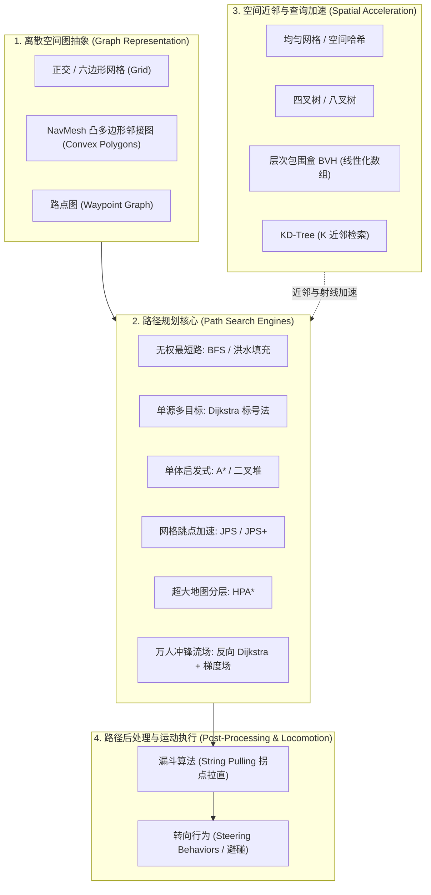
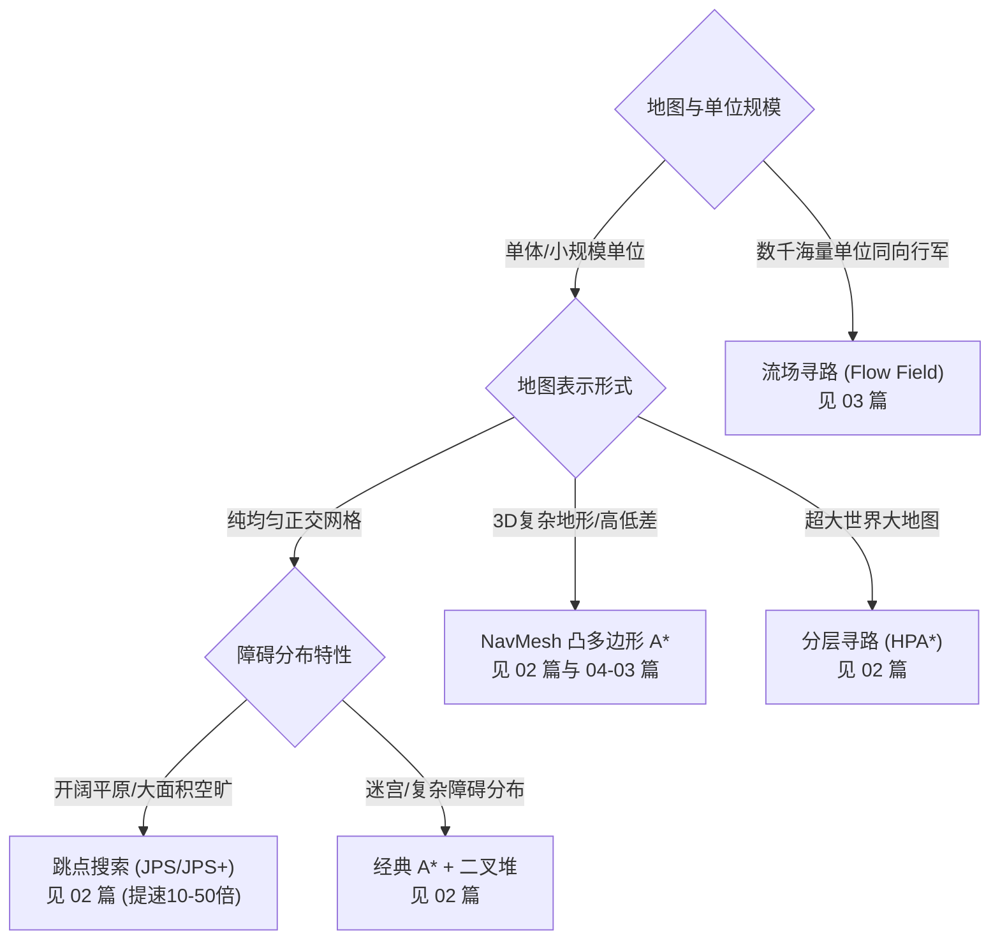

# 01 · 寻路与图论（Pathfinding & Graph Theory）

> 知识成熟度：L2（已按 4 篇核心专题、跨子域协同与算法证据链全面核对）。
>
> 领域权威导航：[游戏算法 Domain MOC](../../00_Index/domains/游戏算法.md) ｜ [游戏算法 领域工程手册](../README.md)。

本子域是游戏算法体系的核心支柱之一：**从离散图论基础出发，系统覆盖经典广度/深度优先搜索、Dijkstra 标号最短路、游戏工业寻路事实标准 A\* 及其工程优化（二叉堆、跳点搜索 JPS、分层寻路 HPA\*），再到支撑 RTS 千人同屏的流场（Flow Field）群体寻路，最后筑牢高性能空间分区与近邻查询加速底座（均匀网格、四叉树/八叉树、BVH、KD 树、空间哈希）。**

---

## 1. 目录文件列表

| 编号 | 核心专题文件 | 知识类型 | 成熟度 | 一句话简介与工程定位 |
| :--- | :--- | :---: | :---: | :--- |
| 00 | [README.md](README.md)（本文件） | Index | L2 | 子域工程导航：架构全景、专题矩阵、学习路线、前后置依赖与基准证据 |
| 01 | [01-图论基础与搜索算法.md](01-图论基础与搜索算法.md) | Concept | L2 | 图的内存表示（邻接矩阵/邻接表/连续紧凑数组）、BFS 洪水填充与无权连通域、Dijkstra 最短路与堆优化实现 |
| 02 | [02-A星算法与优化.md](02-A星算法与优化.md) | Mechanism | L2 | A\* 原理详解（$f=g+h$、启发函数可采纳性与一致性）、二叉堆/Flat数组开放列表、JPS 跳点剪枝、HPA\* 分层寻路 |
| 03 | [03-流场与群体寻路.md](03-流场与群体寻路.md) | Mechanism | L2 | 流场（Flow Field）原理：反向 Dijkstra 距离标量场 + 中心差分梯度向量场，单次计算万人复用，群体拥塞与 Steering 集成 |
| 04 | [04-空间分区与索引.md](04-空间分区与索引.md) | Mechanism | L2 | 均匀网格、四叉树/八叉树、BVH、KD 树、空间哈希的构建/查询复杂度与选型权衡（AOI、碰撞、射线、渲染剔除） |

---

## 2. 寻路技术分层与流水线

---

## 3. 选型指南：我该用哪种寻路方案？

---

## 4. 学习顺序与角色路线

### 4.1 按部就班主线（约 3~5 天）
1. **[01-图论基础与搜索算法.md](01-图论基础与搜索算法.md)**：掌握图的内存布局与 BFS/Dijkstra。它们是所有后续内容的词汇表与距离场基础；
2. **[02-A星算法与优化.md](02-A星算法与优化.md)**：A\* 即“Dijkstra + 启发估价”，掌握一致性启发式与二叉堆开放列表实现；
3. **[03-流场与群体寻路.md](03-流场与群体寻路.md)**：流场的距离场正是从目标出发执行单源全场 Dijkstra，再求空间差分向量；
4. **[04-空间分区与索引.md](04-空间分区与索引.md)**：空间分区作为寻路与物理查询的加速底座，让近邻查询从 $O(N)$ 降到 $O(\log N)$ 或 $O(1)$。

### 4.2 联通进阶路线
- **走向动态地图与 3D NavMesh**：学完本子域后，紧接着学习 [04-02 动态寻路 LPA* 与 D* Lite](../04-确定性与基准工程/02-动态寻路LPA与DStarLite.md) 与 [04-03 NavMesh 工程 Recast 与 Detour](../04-确定性与基准工程/03-NavMesh工程Recast与Detour.md)；
- **走向路径平滑与避碰执行**：结合 [03-04 路径平滑与转向行为](../03-工程与实用技巧/04-路径平滑与转向行为.md) 与 [04-04 RVO 与数值鲁棒](../04-确定性与基准工程/04-RVO与数值鲁棒.md)；
- **走向服务端性能与时间预算**：结合 [游戏服务端 06-11 AI与寻路时间预算](../../游戏服务端/06-世界模拟与运行时/11-AI与寻路时间预算.md)。

---

## 5. 本地实验证据与 Benchmark

本子域核心算法均在仓库中沉淀了真实性能基准与可执行工程：
- **A\* 算法基准工程**：[`evidence/algorithms/astar/`](../../evidence/algorithms/astar/README.md)
  - 提供了 C++ 实现的 A\* 寻路压测工程，评估不同地图尺寸（32×32 到 512×512）与不同障碍密度下的搜索耗时与节点扩展数；
  - 实测验证了二叉堆、索引堆与 Flat Array 在 CPU L1/L2 Cache 上的命中差异。
- **AOI 与空间网格工程**：[`evidence/algorithms/aoi/`](../../evidence/algorithms/aoi/README.md)
  - 提供了网格划分与十字链表的吞吐量实测数据，支撑 04 篇空间分区选型。

---

## 6. 各篇学习目标速览

| 篇目 | 读完应掌握的核心问题与工业关注点 |
| :--- | :--- |
| **01 图论基础与搜索** | 游戏地图如何抽象成隐式/显式图？BFS 为什么能保证无权图最短路？Dijkstra 堆优化如何避免重复入堆？ |
| **02 A\* 与优化** | 启发函数可采纳性（Admissible）与一致性（Consistent）的数学证明；曼哈顿/对角线/欧几里得启发的选用；JPS 跳点规则与对角线跳跃剪枝；HPA\* 边界缓存机制。 |
| **03 流场与群体寻路** | 目标反向 Dijkstra 距离场计算；中心差分梯度向量生成；动态单位密度叠加与拥塞规避；与 Steering Behaviors 的力场融合。 |
| **04 空间分区与索引** | 均匀网格、四叉树/八叉树、BVH、KD 树在构建成本、增删开销与范围/射线查询复杂度上的系统对比；SAH（表面积分区法）构建 BVH 的原理。 |

---

## 7. 术语速查表

| 术语 | 英文 | 概念本质 | 出现篇目 |
| :--- | :--- | :--- | :--- |
| **顶点 / 边** | Vertex / Edge | 离散图的拓扑基元 | 01 |
| **松弛** | Relaxation | $dist[v] = \min(dist[v], dist[u] + w(u,v))$ 最短路更新操作 | 01, 02 |
| **启发函数** | Heuristic $h(n)$ | 节点到目标的预估代价 | 02 |
| **可采纳性** | Admissible | $h(n) \le h^*(n)$ 永不高估真实距离，保证最优解 | 02 |
| **跳点** | Jump Point | JPS 中因强制邻居（Forced Neighbor）存在而必须保留的转折关键点 | 02 |
| **距离标量场** | Distance Field | 空间各单元到指定目标的沿可行走区域最短距离映射 | 03 |
| **向量梯度场** | Flow Field | 标量场沿势能下降最快方向的归一化二维导数向量集合 | 03 |
| **层次包围盒** | BVH | 自顶向下或自底向上以包围体嵌套构成的加速树 | 04 |
| **表面积启发式** | SAH | 评估 BVH 分割平面代价的最优分裂算法 | 04 |

---

## 8. 返回与关联导航

- [游戏算法 Domain MOC](../../00_Index/domains/游戏算法.md)
- [游戏算法 领域工程手册](../README.md)
- [02-数学与碰撞 README](../02-数学与碰撞/README.md)
- [03-工程与实用技巧 README](../03-工程与实用技巧/README.md)
- [04-确定性与基准工程 README](../04-确定性与基准工程/README.md)
