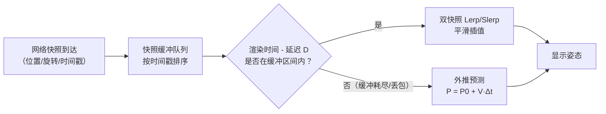

# 03 · 插值与曲线

> 前置知识：01-向量与矩阵基础、02-四元数与旋转（Lerp 与 Slerp 的工具基础）。
> 本文主题：让离散数据平滑连续——缓动、曲线、路径与网络同步补偿。

## 概述

游戏运行在**离散的时间步**上（每帧 16.6ms、固定步长 50Hz），但玩家期望看到的是
**连续平滑的运动**。从 A 点到 B 点的移动、相机从当前朝向转向目标朝向、UI 面板
弹出动画、敌人沿曲线巡逻、联机时把对方的「跳变位置」补成流畅移动——所有这些
「在离散样本之间填出平滑值」的工作，都属于**插值（Interpolation）**的范畴。

本文把插值分为三个层次讲解。第一层是**基础插值工具**：Lerp（线性插值）与 Slerp
（球面线性插值），重点推导**帧率无关插值**的指数公式，这是新手最容易写错的地方。
第二层是**缓动函数（Easing）与参数曲线**：ease-in/out 等缓动函数、贝塞尔曲线
（de Casteljau 算法与 Bernstein 形式）、Catmull-Rom 样条（过点插值）与三次样条，
并讨论弧长参数化——让物体沿曲线**匀速**移动的关键技巧。第三层是**系统级应用**：
路径插值与相机跟随（平滑阻尼弹簧模型）、网络同步中的**快照插值（Interpolation）**
与**外推（Extrapolation）**，这是多人游戏开发的核心难点。

## 核心概念

| 概念 | 定义/公式（简） | 关键要点 |
| --- | --- | --- |
| Lerp | `v = v0 + t·(v1 - v0)` | 线性插值，t∈[0,1] |
| 帧率无关 Lerp | `t' = 1 - exp(-k·dt)` | 每帧调用仍保持时间一致性 |
| Nlerp | 线性插值后归一化 | 快速近似 Slerp |
| Slerp | 球面线性插值 | 恒定角速度，旋转插值标准 |
| 缓动函数 | 对 t 施加非线性映射 `f(t)` | ease-in/out、smoothstep 等 |
| 贝塞尔曲线 | Bernstein 多项式加权控制点 | 不经过中间控制点 |
| de Casteljau | 递归线性插值求曲线点 | 数值稳定，可求导 |
| Catmull-Rom | 过控制点的三次样条 | 切线 = 相邻点连线方向 |
| 三次样条 | 分段三次多项式，C² 连续 | 全局平滑，需解线性方程组 |
| 弧长参数化 | 把参数 t 映射为弧长 s | 保证沿曲线匀速 |
| 平滑阻尼 | 弹簧模型 `x'' = -k(x-x0) - c·x'` | 相机跟随的工业标准 |
| 快照插值 | 在历史快照间延迟插值 | 网络同步主流方案 |
| 外推 | 用速度预测未来位置 | 有误差累积风险 |

## 原理详解

### 1. Lerp 与帧率无关插值

**定义**：从 `v0` 到 `v1` 的线性插值：

```text
Lerp(v0, v1, t) = v0 + t·(v1 - v0)，  t ∈ [0, 1]
```

t=0 得 v0，t=1 得 v1，t 在中间时沿直线均匀移动。**推导**：`v1 - v0` 是从起点指向
终点的向量，`t·(v1 - v0)` 是走了全程的 t 比例，加上起点即得。□

**帧率无关的指数插值**：很多教程写成 `pos = Lerp(pos, target, 0.1f)` 并放在 Update
里——这在 60FPS 下尚可，但 30FPS 下收敛明显变慢（每帧只走剩余距离的 10%，帧率越低
每单位时间走的比例越少），120FPS 下又过快。正确做法：

```text
α = 1 - exp(-k·dt)          # k 为收敛速度常数（单位 1/秒）
pos = Lerp(pos, target, α)
```

**推导**：连续时间模型为指数衰减 `p(t) = target + (p0 - target)·e^(-k·t)`。离散化：
每帧应用 `p_new = p_old + α·(target - p_old)`，若令 `p_new - target = (1-α)(p_old - target)`，
则 n 帧后 `(1-α)^n = e^(-k·t_n)`，解得 `α = 1 - exp(-k·dt)`。□

### 2. Slerp 与旋转插值

旋转插值用 Slerp（详见 02 篇第 5 节）：

```text
Ω = acos(q1·q2)
q(t) = [sin((1-t)Ω)·q1 + sin(tΩ)·q2] / sinΩ
```

要点回顾：点积为负先取反（最短路径）、小角度退化为 Nlerp、单位四元数归一化。
旋转插值**不能**用普通 Lerp（会破坏单位性、产生非刚体变换），也不能对矩阵做
线性插值（引入剪切）。

### 3. 缓动函数（Easing）

缓动函数是 `t → f(t)` 的映射，控制运动的「速度曲线」。常用（t∈[0,1]）：

```text
linear:      f(t) = t
ease-in:     f(t) = t²                    # 慢→快（加速）
ease-out:    f(t) = 1 - (1-t)²            # 快→慢（减速）
ease-in-out: t<0.5 ? 2t² : 1 - (-2t+2)²/2
smoothstep:  f(t) = 3t² - 2t³             # 两端速度为零
```

**smoothstep 推导**：要求三次多项式 `f(t) = at³ + bt² + ct + d` 满足边界：
`f(0)=0, f(1)=1, f'(0)=0, f'(1)=0`。代入得 `d=0, c=0, a+b=1, 3a+2b=0`，
解得 `a=-2, b=3`，即 `f(t) = -2t³ + 3t²`。□ 它是「两端静止、中间加速再减速」的
最小次数多项式，广泛用于相机与 UI。

**游戏应用**：UI 弹窗（ease-out 更自然）、死亡动画（ease-in 加速坠落）、镜头过场
（smoothstep）、菜单按钮（ease-in-out）。实际项目中可直接使用标准缓动库（如
Robert Penner 的 easing 函数集）。

### 4. 贝塞尔曲线

**定义**（n 阶，Bernstein 形式）：

```text
P(t) = Σ_{i=0}^{n} B_{i,n}(t)·P_i
B_{i,n}(t) = C(n, i)·t^i·(1-t)^(n-i)     # Bernstein 基函数
```

三次贝塞尔展开：

```text
P(t) = (1-t)³·P0 + 3t(1-t)²·P1 + 3t²(1-t)·P2 + t³·P3
```

**de Casteljau 算法**（数值稳定、便于实现）：

```text
对每个层级 k = 1..n：
    P_i^(k)(t) = (1-t)·P_i^(k-1)(t) + t·P_(i+1)^(k-1)(t)
最终 P_0^(n)(t) 即曲线上的点
```

**性质**：曲线**不经过**中间控制点（只经过端点 P0、Pn），但被控制点「吸引」；
对控制点做仿射变换等于对曲线做同样变换；导数可通过相邻控制点递推求得，用于速度
与切线计算。

**游戏应用**：技能弹道预览（抛物线用二次贝塞尔）、UI 动画路径、动画曲线编辑器
（Unity AnimationCurve 本质是样条）、NPC 巡逻路径的美观化。

### 5. Catmull-Rom 样条

Catmull-Rom 是**过所有控制点**的分段三次曲线，每个区段 `[P_i, P_(i+1)]` 用四个点
`P_(i-1), P_i, P_(i+1), P_(i+2)` 定义，切线取相邻点连线方向：

```text
m_i = (P_(i+1) - P_(i-1)) / 2             # i 点处的切线
```

区段（三次 Hermite 形式）：

```text
P(s) = h00(s)·P_i + h10(s)·m_i + h01(s)·P_(i+1) + h11(s)·m_(i+1)
h00(s) = 2s³ - 3s² + 1
h10(s) = s³ - 2s² + s
h01(s) = -2s³ + 3s²
h11(s) = s³ - s²
```

**推导**：三次多项式 `P(s) = a + bs + cs² + ds³` 需满足四个条件：
`P(0)=P_i, P(1)=P_(i+1), P'(0)=m_i, P'(1)=m_(i+1)`。代入得四元一次方程组，解出
系数后用 Hermite 基函数整理，即得上述 h00~h11（可验证：h00(0)=1, h00(1)=0,
h00'(0)=0 等性质）。□

**与贝塞尔的关系**：Hermite 形式与三次贝塞尔可互转：

```text
P1 = P_i + m_i/3
P2 = P_(i+1) - m_(i+1)/3
```

即 Catmull-Rom 区段等价于控制点为 `{P_i, P_i + m_i/3, P_(i+1) - m_(i+1)/3, P_(i+1)}`
的三次贝塞尔——这条性质常被引擎用来统一曲线实现。

**游戏应用**：敌人巡逻路径（要求经过路点）、过场动画相机路径、赛车赛道中心线、
地形高度剖面。

### 6. 三次样条（自然样条）

Catmull-Rom 只保证 C¹ 连续（切线连续），**三次样条**要求 C² 连续（二阶导数也连续），
整条曲线没有拐角感，代价是需要**全局求解**：设 n 个点、n-1 段三次多项式，每段
4 个未知数共 4(n-1) 个；约束来自：过点（2(n-1) 个）、段间一阶导数连续（n-2 个）、
段间二阶导数连续（n-2 个）、两端自然边界 `S''=0`（2 个），共 4(n-1) 个方程。
解三对角线性方程组（追赶法，O(n)）即得各段系数。

游戏中使用较少（过场动画、地形编辑需要全局平滑时才用），实时路径优先选
Catmull-Rom 或贝塞尔（局部计算、O(1) 每段）。

### 7. 弧长参数化：让物体沿曲线匀速移动

曲线参数 t 均匀变化**不**等于弧长均匀变化（曲线疏密不同）。匀速移动需要先求
弧长函数：

```text
s(t) = ∫₀ᵗ |P'(τ)| dτ
```

工程做法：**预采样查找表 + 二分/线性查找**——把 t∈[0,1] 采样 N 段（如 256），
用梯形法累加弧长得到 `(t_i, s_i)` 表；运行时给定 `s`，在表中二分找到区间再线性
插值出 t。复杂度：预计算 O(N)，查询 O(log N)。□

### 8. 路径插值与相机跟随

**路径插值**：角色沿路径移动时，`t = s / totalLength`（用弧长参数化后的 s 除以总长），
每帧 `s += speed·dt`，再反查 t 得到曲线上位置与切线（切线即朝向/速度方向）。

**相机跟随的平滑阻尼（Spring Damper）**：比帧率无关 Lerp 更高级的相机模型——
相机位置 `x` 被弹簧拉向目标 `x0`，同时阻尼消耗能量：

```text
x'' = -k·(x - x0) - c·x'
```

离散化（半隐式欧拉，稳定）：

```text
v += (-k·(x - x0) - c·v)·dt
x += v·dt
```

参数：`k` 越大跟随越紧，`c` 越大越不振荡；`c = 2·sqrt(k)` 为临界阻尼（最快无振荡
收敛）。**推导**：这是二阶线性常微分方程，特征方程 `λ² + cλ + k = 0`，判别式
`c² - 4k`：>0 过阻尼、=0 临界阻尼、<0 欠阻尼（振荡）。□ 相机「甩尾」「回弹」效果
都由它产生（GTA 式追尾镜头故意欠阻尼）。

### 9. 网络同步：插值与外推

**问题**：远程玩家位置以 20~60Hz 快照到达，若直接设置位置会跳变；若延迟渲染又
不真实。主流方案是**延迟插值（Interpolation Buffer）**：

```text
维护历史快照队列（含时间戳）
渲染时选择「当前渲染时间 - 延迟 D」附近的相邻两个快照
用 Lerp（位置）与 Slerp（旋转）插值出显示姿态
```

**延迟选择**：D 通常取 1~2 个快照周期（如 50Hz 时 D=100ms）。D 太大手感延迟明显
（橡皮筋感），太小则缓冲不足、插值目标缺失。

**外推（Extrapolation）**：当缓冲耗尽（丢包）时，用最近快照的速度预测：

```text
P_predicted(t) = P_last + V_last·(t - t_last) + 0.5·A_last·(t - t_last)²
```

**风险**：误差随预测时长平方级增长，且方向突变时预测穿墙。工程上限通常设
`t - t_last < 100ms`，超时则「冻结」或回退到插值。



## 伪代码与代码示例

### 伪代码：帧率无关相机跟随 + 路径匀速移动

```text
// 帧率无关平滑跟随
function SmoothFollow(current, target, k, dt):
    α = 1 - exp(-k·dt)
    return Lerp(current, target, α)

// 沿 Catmull-Rom 路径匀速移动
function MoveAlongPath(pts, speed, s, dt):
    s = min(s + speed·dt, totalLength(pts))
    t = ArcLengthToParam(pts, s)          # 弧长 → 参数（查表二分）
    seg = floor(t);  local = t - seg
    return CatmullRom(pts[seg-1], pts[seg], pts[seg+1], pts[seg+2], local)
```

### C++ 示例

```cpp
#include <cmath>
#include <vector>

struct Vec2 { float x, y; };
static Vec2 operator+(Vec2 a, Vec2 b) { return {a.x+b.x, a.y+b.y}; }
static Vec2 operator-(Vec2 a, Vec2 b) { return {a.x-b.x, a.y-b.y}; }
static Vec2 operator*(Vec2 a, float s) { return {a.x*s, a.y*s}; }

// 帧率无关 Lerp
Vec2 FrameRateIndependentLerp(Vec2 cur, Vec2 target, float k, float dt) {
    float alpha = 1.0f - std::exp(-k * dt);
    return cur + (target - cur) * alpha;
}

// Catmull-Rom 单段求值（Hermite 形式）
Vec2 CatmullRom(const std::vector<Vec2>& p, int i, float s) {
    Vec2 m0 = (p[i+1] - p[i-1]) * 0.5f;
    Vec2 m1 = (p[i+2] - p[i])   * 0.5f;
    float s2 = s*s, s3 = s2*s;
    float h00 = 2*s3 - 3*s2 + 1, h10 = s3 - 2*s2 + s;
    float h01 = -2*s3 + 3*s2,    h11 = s3 - s2;
    return p[i]*h00 + m0*h10 + p[i+1]*h01 + m1*h11;
}

// 平滑阻尼（临界阻尼附近：k 自定，c = 2*sqrt(k)）
struct Spring { Vec2 x, v; };
void SpringUpdate(Spring& sp, Vec2 target, float k, float c, float dt) {
    Vec2 acc = (target - sp.x) * (-k) - sp.v * c;
    sp.v = sp.v + acc * dt;          // 半隐式欧拉
    sp.x = sp.x + sp.v * dt;
}
```

### Python 示例（NumPy）

```python
import numpy as np

def lerp(a, b, t):
    return a + (b - a) * t

def frame_rate_independent_lerp(cur, target, k, dt):
    return lerp(cur, target, 1.0 - np.exp(-k * dt))

def catmull_rom(pts, i, s):
    m0 = (pts[i+1] - pts[i-1]) * 0.5
    m1 = (pts[i+2] - pts[i]) * 0.5
    s2, s3 = s*s, s*s*s
    h00, h10 = 2*s3 - 3*s2 + 1, s3 - 2*s2 + s
    h01, h11 = -2*s3 + 3*s2,    s3 - s2
    return pts[i]*h00 + m0*h10 + pts[i+1]*h01 + m1*h11

def smoothstep(t):
    return t*t*(3 - 2*t)

# 弧长参数化：预采样查表
def build_arc_table(pts, samples=256):
    ts = np.linspace(0, 1, samples)
    pos = [catmull_rom(pts, 1, t) for t in ts]   # 以中间段为例
    ds = np.linalg.norm(np.diff(pos, axis=0), axis=1)
    s = np.concatenate(([0.0], np.cumsum(ds)))
    return ts, s / s[-1]

# 验证 smoothstep：两端导数为 0
t = np.linspace(0, 1, 5)
print(smoothstep(t))
```

## 复杂度分析

| 运算 | 时间复杂度 | 说明 |
| --- | --- | --- |
| Lerp / Nlerp | O(1) | 向量维度 d 时为 O(d) |
| Slerp | O(1)（含 1 次 acos、2 次 sin） | 比 Lerp 贵 5~10 倍 |
| 缓动函数 | O(1) | 纯多项式/超越函数 |
| 贝塞尔求值（Bernstein） | O(n) | n 为阶数 |
| de Casteljau | O(n²) | n 阶需 n(n+1)/2 次插值 |
| Catmull-Rom 单段 | O(1) | 只需相邻 4 个控制点 |
| 自然三次样条构建 | O(n)（追赶法） | 但需全局数据，不适合流式 |
| 弧长参数化 | 预计算 O(N) + 查询 O(log N) | N 为采样数（如 256） |
| 平滑阻尼 | O(1) | 每帧 2 次向量运算 |
| 快照插值 | O(log B) 查找 + O(1) 插值 | B 为缓冲长度 |

性能建议：路径相关的预计算（弧长表）在**加载时**完成；运行时只做查表与插值。
骨骼动画中大量四元数混合用 Nlerp 批量（SIMD 友好），单个相机/武器旋转才用 Slerp。

## 最佳实践

1. **Update 中的 Lerp 必须帧率无关**：`alpha = 1 - exp(-k·dt)`，绝不要写死
   `0.1f`；否则帧率波动直接表现为「高帧率跟得快、低帧率跟得慢」。
2. **旋转只用 Slerp/Nlerp，不用 Lerp**：对四元数做普通 Lerp 会破坏单位长度，
   产生缩放与扭曲；用前记得归一化，点积为负先取反。
3. **匀速移动必须弧长参数化**：直接按 t 匀速会导致曲线密集段变慢、稀疏段变快；
   预采样弧长表是性价比最高的方案。
4. **相机跟随用弹簧模型而非 Lerp**：Lerp 只能指数逼近（永远追不上、起步猛），
   弹簧模型可精确控制「追得紧不紧、有没有回弹」，临界阻尼 `c = 2√k` 是默认起点。
5. **网络同步优先插值、慎用外推**：插值延迟 1~2 个快照周期是黄金法则；外推设
   上限（<100ms），超过即回退，否则穿墙与瞬移投诉不断。
6. **路径点数量与内存平衡**：弧长表采样 128~512 点足够；过密浪费内存，过疏
   导致速度误差。曲线段数多时按段分别建表。
7. **缓动函数参数化**：把 `easeType`、`duration` 做成配置（AnimationCurve /
   Timeline），不要在代码里散落硬编码的 `t*t*t`。
8. **数值稳定**：Catmull-Rom 首尾段需要额外端点（复制端点或延伸）；s 越界时
   夹紧到 [0, 1] 并停止累计，避免「飞出路径」。

## 常见问题 FAQ

**Q1：`Lerp(pos, target, 0.1f)` 每帧调用，最终能到达 target 吗？**
理论上永远到不了（每帧只走剩余 10%，是指数衰减、渐近逼近）；实际上数值精度下
约 30~40 帧后位置差小于 float 精度，看起来「到了」。但它**帧率相关**：60FPS 每秒
走 `1-0.9^60 ≈ 99.8%`，30FPS 只走 `1-0.9^30 ≈ 95.8%`——帧率越低越「肉」。

**Q2：为什么贝塞尔曲线不经过中间控制点？还能用吗？**
贝塞尔曲线的设计目标就是「用控制点拖拽出光滑形状」，天然不过中间点。想要过点，
用 Catmull-Rom；或者把目标点反解成贝塞尔控制点（三次贝塞尔过点问题有解析解）。
拖拽式编辑（动画曲线、路径工具）正是贝塞尔的强项。

**Q3：Catmull-Rom 和三次样条怎么选？**
需要实时局部修改（编辑器拖路点、运行时动态路径）：Catmull-Rom（O(1) 局部计算，
但只有 C¹ 连续，拐点处切线会「顿」一下）。需要整条路径光顺（过场动画、赛道）：
自然三次样条（C² 连续，但要全局求解，改一个点影响全曲线）。

**Q4：沿贝塞尔曲线匀速移动为什么还是会忽快忽慢？**
因为 t 均匀变化不等于弧长均匀变化。必须在「弧长参数化」后按弧长 s 移动：
`t = ArcLength⁻¹(s)`。忽略这一步是曲线移动最常见的 bug。

**Q5：插值和外推有什么区别？什么时候用哪个？**
插值**只使用已知样本之间的数据**（延迟渲染，永不预测未来，不会穿墙，但引入
固定延迟）；外推**用已知数据预测未来**（无延迟、手感跟手，但误差随预测时长累积，
方向突变时会出错）。联机 FPS：自己控制的角色用外推（本地预测），其他玩家用
插值（或短时外推兜底）。

**Q6：为什么网络同步时对方角色有时会「橡皮筋」式回跳？**
经典原因：本地用了外推（或预测），收到的新快照与预测位置偏差过大，回退到快照
位置造成回跳。解法：缩短外推上限、插值延迟稍增大、对位置修正做**误差平滑**
（把差值分摊到数帧内收敛），以及服务器权威 + 客户端预测 + 回滚（业界标准方案）。

**Q7：smoothstep 和 ease-in-out 有什么区别？**
smoothstep（`3t²-2t³`）两端速度为零、中间最快，是「最平滑」的三次多项式；
二次 ease-in-out（`t<0.5 ? 2t² : 1-(-2t+2)²/2`）两端速度不为零，起步有「顿」感但
更简单。视觉上 smoothstep 更柔，UI 动画多用它。

**Q8：相机弹簧的 k 和 c 怎么调？**
先定 k（跟随响应速度，越大越紧），再取临界阻尼 `c = 2·√k`（最快无振荡）；
想要镜头「甩尾」效果，把 c 降到临界值的 60~80%（欠阻尼）；过阻尼（c 偏大）时
镜头发肉、像拖着沙袋。用 `k = (2π·f)²` 从频率 f 出发更直观（f≈2~4Hz 为常见
跟随手感）。

## 关联阅读

- 上一篇：[02-四元数与旋转.md](02-四元数与旋转.md)——Slerp 的完整推导与实现细节，
  本文直接复用。
- 下一篇：[04-碰撞检测.md](04-碰撞检测.md)——物理引擎的固定步长更新常与插值配合：
  物理以固定步长跑、渲染用插值平滑（这正是快照插值思想的本地版）。
- 延伸阅读：Shoemake（1985）四元数曲线；Catmull & Rom（1974）"A class of local
  interpolating splines"；Penner 缓动函数集（easing.net）；Gaffer On Games 博客
  "Fix Your Timestep"（固定步长与插值）。
- 引擎文档：Unity `Mathf.Lerp`/`SmoothDamp`/`AnimationCurve`、
  Unreal `FInterpTo`/`FMath::Lerp`、Godot `lerp`/`move_toward`/`Tween`。
