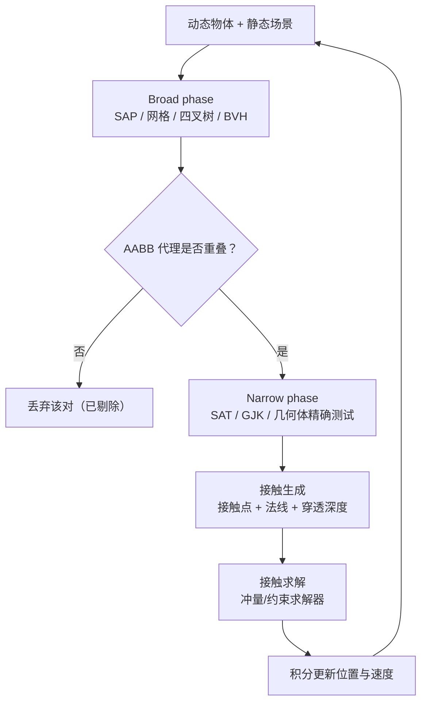

# 04 · 碰撞检测

> 前置知识：01-向量与矩阵基础（点积/叉积/变换）、02-四元数与旋转（OBB 朝向）。
> 本文主题：回答「两个物体是否接触、何时接触、接触点与法线在哪」。

> 知识基线：C++17 与 Python 3.12 示例；复杂度、浮点/整数、坐标系和随机种子均按正文声明解释。
> 适用范围：二维/三维几何体的 Broad phase、Narrow phase、射线和连续碰撞检测；可用于单机、客户端预测、服务端权威命中验证和离线几何测试；不把碰撞判定自动等同于完整物理求解或引擎默认容差。
> 数值与正确性边界：SAT 依赖凸体和完整轴集合，GJK/EPA 依赖正确的 support 函数、终止条件和容差；CCD 是否避免隧道取决于速度、时间步、形状和实现，`≤`、slop 与 `1e-6` 等都是尺度相关的工程策略，稳定性和性能必须实测。
> 最后更新：2026-08-06（补齐来源、边界条件与验证入口）。
> 参考来源：[Box2D 官方文档](https://box2d.org/documentation/)；[Bullet Physics 开源实现](https://github.com/bulletphysics/bullet3)。

## 概述

碰撞检测（Collision Detection）是游戏物理的「眼睛」：子弹是否命中敌人、角色是否
踩到地面、箱子能否叠放、探照灯是否照到玩家——这些判定在每一帧、对成千上万对物体
执行。碰撞检测的质量直接决定游戏手感：判定过松，子弹「打空」；判定过紧，玩家
「卡墙」；判定漏帧，角色「穿模」。

本文按「从简单到复杂、从整体流程到单个算法」组织。先介绍三种最常用的**基本几何体**
——球体、AABB（轴对齐包围盒）、OBB（有向包围盒）——及其两两检测；然后深入凸体
检测的两大算法：**分离轴定理 SAT**（简单直观，适合 2D 与少量 3D 凸体）与
**GJK + EPA**（高效通用，物理引擎的标准方案）；接着讲解**Broad phase（宽相位）**
——Sweep and Prune、均匀网格、四叉树/八叉树等空间分区技术，把 O(n²) 的配对规模
降到接近 O(n)；再讲**射线检测**（Raycast）——FPS 命中判定与拾取的基础；最后用
一张流程图串起物理引擎中的完整碰撞流程（Broad → Narrow → 接触生成 → 求解），
并讨论**隧道效应（Tunneling）**与连续碰撞检测 CCD。

## 核心概念

| 概念 | 定义/公式（简） | 关键要点 |
| --- | --- | --- |
| 球体（Sphere） | 中心 + 半径 `(c, r)` | 检测最快，旋转不变 |
| AABB | 轴对齐包围盒 `(min, max)` | 无朝向，检测便宜，会「包不紧」 |
| OBB | 有向包围盒（中心+半长+3 轴） | 贴合旋转物体，检测贵 |
| 包围层级（BVH） | 用树组织包围体 | 快速剔除不相交对 |
| 分离轴定理 SAT | 凸体不相交 ⇔ 存在分离轴 | 投影测试，轴集合有限 |
| GJK | 闵可夫斯基差包含原点 ⇔ 相交 | 迭代单纯形，适合任意凸体 |
| EPA | 从 GJK 单纯形扩张求最小穿透 | 输出穿透深度与法线 |
| Broad phase | 粗筛：找出可能碰撞的对 | 空间分区/SAP，避免 O(n²) |
| Sweep and Prune | 端点排序 + 扫描线 | 在有序维度上滑动窗口 |
| 空间分区 | 网格/四叉树/八叉树 | 按空间桶划分物体 |
| Narrow phase | 精确检测 + 接触生成 | 输出接触点/法线/穿透 |
| 射线检测 | 射线与几何体求交 | FPS 命中、拾取、视线 |
| CCD | 连续碰撞检测 | 解决高速物体隧道效应 |

## 原理详解

### 1. 基本几何体

**球-球**：两球 `(c1, r1)`、`(c2, r2)` 相交当且仅当：

```text
|c1 - c2| ≤ r1 + r2
```

工程上用平方避免开方：`distSq ≤ (r1+r2)²`。法线方向 `n = normalize(c2 - c1)`，
穿透深度 `d = r1 + r2 - |c1 - c2|`。**推导**：两球心距小于等于半径和即相交，是
距离定义的直接应用。□ 球体是**旋转不变**的（转多少都是同一个球），适合做
子弹、爆炸范围、粗略人体判定。

**AABB-AABB**：AABB 用 `min`/`max` 表示，相交当且仅当**三个轴方向都重叠**：

```text
重叠 ⇔ (a.min.x ≤ b.max.x) 且 (b.min.x ≤ a.max.x)
       且 (a.min.y ≤ b.max.y) 且 (b.min.y ≤ a.max.y)
       且 (a.min.z ≤ b.max.z) 且 (b.min.z ≤ a.max.z)
```

**推导**：一维区间 `[a1, a2]` 与 `[b1, b2]` 重叠 ⇔ `a1 ≤ b2` 且 `b1 ≤ a2`；
三维 AABB 是三个一维区间的笛卡尔积，三轴同时重叠即相交。□ 这是**每轴 2 次比较、
共 6 次比较**的极廉价测试，是 Broad phase 的主力。

**AABB 包含点**：`min ≤ p ≤ max`（逐分量比较）。

**OBB**：OBB 由中心 `c`、三个正交单位轴 `u, v, w`（来自旋转，通常四元数）与
半边长 `e = (ex, ey, ez)` 定义。点 P 在 OBB 内 ⇔ 对每个轴 `|(P - c)·axis| ≤ e_axis`。
OBB-OBB 检测用 SAT（见下节），比 AABB 贵一个数量级，但贴合旋转物体（角色、车辆）。

### 2. 分离轴定理（SAT）

**定理**：两个**凸体**不相交，当且仅当存在一条轴 L，使两者在 L 上的投影区间
不相交（存在分离轴）。等价地：相交 ⇔ **所有**候选轴上的投影都重叠。

**证明思路（一维化）**：若两凸体不相交，则存在分离超平面；其法线方向即分离轴。
反方向：若某轴上投影区间分离，则超平面 `L = d` 隔开两者。□

**候选轴集合**（对两个凸体 A、B）：

```text
所有 A 的面法线 + 所有 B 的面法线 + 所有「A 的边 × B 的边」叉积方向
```

**推导**：分离轴必然垂直于某个面（面-面接触）或垂直于两条边（边-边接触）；
后者即两边的叉积方向。□

**OBB-OBB**：每个 OBB 有 3 条面法线，候选轴共 `3 + 3 + 9 = 15` 条。对每条轴做
投影区间重叠测试，**任意一条分离即可提前返回**（不相交）。投影半径公式（OBB 的
半宽在轴 L 上的投影）：

```text
r_A = ex·|A.u·L| + ey·|A.v·L| + ez·|A.w·L|
```

区间中心距 `|(c_A - c_B)·L| > r_A + r_B` 即分离。**推导**：OBB 在 L 上的投影
等于各半轴向量投影的绝对值之和（凸包投影 = 顶点投影极值），由三角不等式可得。□

**2D 凸多边形-Polygon**：候选轴只取各边法线（2D 中「面法线」即边法线，没有
边×边）。矩形-矩形只需 4 条轴。

**SAT 的局限**：只适用于**凸体**；凹体需先分解为凸体集合（凸分解，如
V-HACD / 四面体化）。

### 3. GJK 算法（Gilbert–Johnson–Keerthi）

GJK 是物理引擎（Box2D、Bullet、PhysX）检测任意凸体的标准算法，核心思想：

```text
定义闵可夫斯基差：A ⊖ B = { a - b | a ∈ A, b ∈ B }
定理：A 与 B 相交 ⇔ 原点 ∈ (A ⊖ B)
```

**推导**：原点 ∈ A⊖B ⇔ 存在 a = b ⇔ A、B 有公共点。□ 闵可夫斯基差仍是凸体，
且「距离原点的最近距离」恰好是 A、B 的穿透/间隙信息。

**Support 函数**：`support(dir) = argmax_{p ∈ shape} p·dir`，即形状在方向 dir 上
最远的点。对凸多边形/多面体可解析实现（遍历顶点）；对球是 `c + r·dir̂`。
闵可夫斯基差上的 support：`support_{A⊖B}(d) = support_A(d) - support_B(-d)`。

**算法流程**：维护一个**单纯形**（simplex：0~4 个点，对应点/线段/三角形/四面体），
迭代：

```text
1. 任取初始方向 d（如 A 中心 - B 中心），求 s = support(d)
2. 若 s·d < 0：无法越过原点，判定不相交，退出
3. 把 s 加入单纯形，检查单纯形是否包含原点：
   - 包含 → 相交（进入 EPA 求穿透信息）
   - 不包含 → 找到单纯形中离原点最近的面，更新方向 d 指向原点，剪掉多余点，回到 2
```

**收敛性**：每次迭代单纯形更靠近原点；凸体检测通常在 3~10 次迭代内收敛（每次
迭代 O(顶点数) 的 support 调用），因此总复杂度近似 O(n_A + n_B)，但常数极小。

**实现细节**：单纯形包含原点需按维度做**子单纯形测试**（线段检查垂足、三角形
检查三个区域、四面体检查四个面），这是 GJK 实现中最容易出错的部分；工业代码
直接复用成熟实现（Box2D 的 b2Distance / Bullet 的 btGjkPairDetector）。

### 4. EPA（Expanding Polytope Algorithm）

GJK 只回答「是否相交」，物理引擎还需要**穿透深度与法线**来做位置修正。EPA 从
GJK 结束时的单纯形出发：

```text
1. 把单纯形扩展为多面体（polytope），维护其面集合
2. 取离原点最近的面 F（法线 n，距离 d）
3. 求 s = support(n)
4. 若 s·n - d 小于容差：收敛，返回 (n, d) 作为穿透法线与深度
5. 否则把 s 加入多面体，分裂可见面，回到 2
```

**原理**：闵可夫斯基差包含原点且边界离原点最近的点，其方向即最小穿透方向、距离
即穿透深度。EPA 本质是「从内向外扩张凸多面体逼近边界」。□ 2D 中多面体是凸多边形，
3D 中是凸多面体（需要维护边/面拓扑，实现复杂度高，建议直接用库）。

### 5. Broad Phase：避免 O(n²)

朴素做法对 n 个物体做 n(n-1)/2 对检测，n=1000 时约 50 万对。Broad phase 的目标
是**快速剔除明显不相交的对**（通常用 AABB 或球做代理形状），只把可能相交的对
交给 Narrow phase。

**Sweep and Prune（SAP）**：

```text
1. 每个物体取其 AABB 的某一轴端点（如 x 轴 min/max）
2. 维护端点有序列表（插入/删除用二分，或利用时间相干性）
3. 扫描列表：遇到 min 端点把物体加入「活跃集」，与活跃集内已有物体配对；
   遇到 max 端点移除物体
```

**复杂度**：排序 O(n log n)，扫描产生的配对数为 O(n + k)（k 为实际潜在重叠对）。
利用**时间相干性**（物体每帧移动小，端点顺序变化小）可用插入排序维持近有序列表，
平均接近 O(n + k)。**局限**：某一轴分布密集时（如高楼大厦竖直排布）退化。

**均匀网格（Uniform Grid）**：把空间切成边长 L 的格子，物体注册进覆盖的格子；
只检测同格或邻格物体。复杂度 O(n + k)，适合**粒子、弹幕**等大量小物体。
格子边长取物体平均尺寸的 2~3 倍效果最佳。

**四叉树/八叉树（Quadtree/Octree）**：递归细分空间（超过容量则分裂），
查询 O(log n + k)。适合**静态地形/场景**与动态物体数量少的场景。

**BVH（包围体层次）**：把物体按邻近关系组织成树，每个节点存包围盒；检测时
递归剪枝。适合**动态物体**（每帧自底向上重建，增量更新），是物理引擎与
光线追踪的共同基础。



### 6. 射线检测（Raycast）

射线 `r(t) = o + t·d`（o 起点，d 单位方向，t ≥ 0）。射线检测是 FPS 命中判定、
鼠标拾取、视线检测（AI 是否看见玩家）、寻路投射的基础。

**射线-球**：代入球方程 `|r(t) - c|² = r²` 得一元二次方程：

```text
|d|²·t² + 2·d·(o - c)·t + |o - c|² - r² = 0
```

令 `m = o - c`，则 `a = d·d = 1`（d 单位化），`b = 2·d·m`，`c = m·m - r²`，
判别式 `Δ = b² - 4c`：

```text
Δ < 0：无交点
Δ = 0：相切，t = -b/2
Δ > 0：t = (-b ± sqrt(Δ)) / 2，取最小非负 t
```

**推导**：`|m + t·d|² = r²` 展开即得；这是点到直线距离公式的推广（判别式即
「球心到射线的距离 vs 半径」）。□

**射线-AABB（Slab 方法）**：AABB 是三个 slab（两平行平面夹层）的交，对每个轴
求射线进入/离开该 slab 的 t 区间：

```text
对轴 i：t1 = (min_i - o_i)/d_i，t2 = (max_i - o_i)/d_i（若 d_i < 0 交换）
        t_enter = max(t_enter, min(t1, t2))
        t_exit  = min(t_exit,  max(t1, t2))
若 t_enter ≤ t_exit 且 t_exit ≥ 0：相交
```

**推导**：射线在轴 i 上的分量满足 `min_i ≤ o_i + t·d_i ≤ max_i`，解出 t 的区间；
三轴区间取交集，非空即相交。□ 注意 `d_i = 0` 时若 `o_i` 在 slab 外则无交（除零
处理：把 t 设为 ±∞）。

**射线-三角形（Möller–Trumbore）**：用重心坐标与克拉默法则一步解出交点：

```text
设三角形顶点 v0, v1, v2，边 e1 = v1 - v0，e2 = v2 - v0，p = d × e2
行列式 det = e1·p；若 |det| < ε 拒绝（平行）
inv = 1/det；t_vec = o - v0
u = (t_vec·p)·inv；若 u < 0 或 u > 1 拒绝
q = t_vec × e1
v = (d·q)·inv；若 v < 0 或 u + v > 1 拒绝
t = (e2·q)·inv；t ≥ 0 即命中，重心坐标 (u, v) 可插值法线/UV
```

这是 GPU 光线追踪与 CPU 网格拾取的标准实现（一次射线-三角形约 20 次乘加）。

### 7. 物理引擎中的碰撞流程与隧道效应

完整流程（见上方 Mermaid 图）：**积分 → Broad phase → Narrow phase → 接触生成 →
求解 → 修正位置**。接触生成输出的接触点、法线、穿透深度喂给**冲量求解器**
（Sequential Impulses / PGS）或**约束求解器**，再把修正后的速度积分回位置。

**隧道效应（Tunneling）**：高速物体在相邻两帧间穿过薄墙（位移 > 墙厚）。解法：

```text
1. 子步进（Sub-stepping）：把大 dt 拆成多个小 dt 分别检测（代价线性增长）
2. CCD（连续碰撞检测）：对运动物体做「扫掠体」（swept shape）或
   用射线/时间区间法找最早碰撞时刻（如 Bullet 的 btConvexCast）
3. 运动学专用：2D 平台游戏用「先移动再按轴回退」（swept AABB），
   把移动分解为逐轴检测
```

2D 平台跳跃游戏的经典做法是**逐轴移动 + 回退**：先沿 X 移动并检测，若碰撞则
把 X 贴回接触面；再沿 Y 移动并检测。这天然避免了对角线穿墙，且平台「单面碰撞」
（只从上方踩）实现简单。

## 伪代码与代码示例

### 伪代码：Broad phase + Narrow phase 主循环

```text
function UpdatePhysics(objects, dt):
    for o in objects: o.velocity += gravity·dt; o.position += o.velocity·dt
    pairs = BroadPhase(objects)                # 空间分区/SAP 产生候选对
    contacts = []
    for (a, b) in pairs:
        info = NarrowPhase(a.shape, b.shape)   # SAT/GJK+EPA
        if info.hit: contacts.add(info)
    SolveContacts(contacts)                    # 冲量求解
    for c in contacts: PositionCorrection(c)   # 穿透修正
```

### C++ 示例

```cpp
#include <cmath>

struct Vec2 { float x, y; };
struct AABB  { Vec2 min, max; };

// AABB-AABB（一维区间重叠 × 2 轴）
bool AABBOverlap(const AABB& a, const AABB& b) {
    return a.min.x <= b.max.x && b.min.x <= a.max.x &&
           a.min.y <= b.max.y && b.min.y <= a.max.y;
}

// 射线-球（返回最近 t，-1 表示未命中）
float RaySphere(Vec2 o, Vec2 d, Vec2 c, float r) {
    Vec2 m = {c.x - o.x, c.y - o.y};
    float b = m.x*d.x + m.y*d.y;
    float cc = (m.x*m.x + m.y*m.y) - r*r;
    float disc = b*b - cc;                    // 2D 下 a=1，Δ=b²-c
    if (disc < 0) return -1;
    float t = b - std::sqrt(disc);
    return (t >= 0) ? t : -1;
}

// 2D SAT：凸多边形-凸多边形（候选轴 = 各边法线）
// 返回分离轴是否存在（false = 相交）
bool SAT2D(const Vec2* A, int nA, const Vec2* B, int nB) {
    const Vec2* polys[2] = {A, B};
    const int ns[2] = {nA, nB};
    for (int k = 0; k < 2; ++k) {
        for (int i = 0; i < ns[k]; ++i) {
            const Vec2& p = polys[k][i];
            const Vec2& q = polys[k][(i+1) % ns[k]];
            Vec2 edge = {q.x - p.x, q.y - p.y};
            Vec2 axis = {-edge.y, edge.x};    // 边法线
            float len = std::sqrt(axis.x*axis.x + axis.y*axis.y);
            axis.x /= len; axis.y /= len;
            // 投影两个多边形，检查分离
            float minA=1e9f, maxA=-1e9f, minB=1e9f, maxB=-1e9f;
            for (int j = 0; j < nA; ++j) {
                float v = A[j].x*axis.x + A[j].y*axis.y;
                minA = fminf(minA, v); maxA = fmaxf(maxA, v);
            }
            for (int j = 0; j < nB; ++j) {
                float v = B[j].x*axis.x + B[j].y*axis.y;
                minB = fminf(minB, v); maxB = fmaxf(maxB, v);
            }
            if (maxA < minB || maxB < minA) return true;  // 找到分离轴
        }
    }
    return false;                             // 所有轴都重叠 → 相交
}
```

### Python 示例（NumPy）

```python
import numpy as np

def aabb_overlap(a_min, a_max, b_min, b_max):
    return bool(np.all(a_min <= b_max) and np.all(b_min <= a_max))

def ray_sphere(o, d, c, r):
    m = c - o
    b = float(d @ m)
    disc = b*b - (m @ m) + r*r
    if disc < 0:
        return -1.0
    t = b - np.sqrt(disc)
    return t if t >= 0 else -1.0

def sat_2d(pa, pb):
    """返回 True 表示找到分离轴（不相交）"""
    for poly in (pa, pb):
        for i in range(len(poly)):
            p, q = poly[i], poly[(i+1) % len(poly)]
            axis = np.array([-(q[1]-p[1]), q[0]-p[0]])
            axis /= np.linalg.norm(axis)
            proj_a = pa @ axis
            proj_b = pb @ axis
            if proj_a.max() < proj_b.min() or proj_b.max() < proj_a.min():
                return True
    return False

# GJK support（凸多边形）
def support(poly, d):
    return poly[np.argmax(poly @ d)]

# 验证：两个相交的正方形
sq1 = np.array([[0,0],[1,0],[1,1],[0,1]], dtype=float)
sq2 = np.array([[0.5,0.5],[1.5,0.5],[1.5,1.5],[0.5,1.5]], dtype=float)
print("相交:", not sat_2d(sq1, sq2))     # 预期 True
```

## 复杂度分析

| 阶段/算法 | 时间复杂度 | 说明 |
| --- | --- | --- |
| 球-球 / AABB-AABB | O(1) | 6 次比较以内 |
| 点-OBB / 点-AABB | O(1) | 逐轴点积/比较 |
| SAT（2D 多边形对） | O(n + m) | n、m 为边数，提前退出 |
| SAT（3D OBB-OBB） | O(1)（固定 15 轴） | 每轴约 20 次乘加 |
| GJK | 近似 O(n_A + n_B)，常数小 | 3~10 次迭代收敛 |
| EPA | 近似 O(迭代 × 面数) | 与穿透深度精度要求相关 |
| SAP | 排序 O(n log n) + 配对 O(n + k) | 时间相干性下接近 O(n + k) |
| 均匀网格 | O(n + k) | 需维护格子哈希 |
| 四叉树/八叉树 | 构建 O(n log n)，查询 O(log n + k) | 适合静态场景 |
| 射线-球 / 射线-AABB | O(1) | slab 法 3~6 次除法 |
| 射线-三角形 | O(1) | 约 20 次乘加 |

工程经验：Broad phase 通常把 90% 以上的配对剔除掉；真正的热点在 Narrow phase 的
接触生成与求解器（每帧数千接触点），所以**接触缓存**（Contact Caching，复用上一帧
接触做预热）是物理引擎性能的关键优化。

## 验证与基准建议

- 输入规模与边界用例：覆盖相离、相切、深度重叠、共线/共面、退化三角形、平行射线、起点在形状内、高速穿越、极小/极大尺度和动态物体更新；分别测试 2D 与 3D 凸体。
- 正确性断言：将 Broad phase 候选交给精确测试，并与可靠的朴素几何或参考实现对拍；断言 SAT/GJK 的相交结果、法线方向、穿透深度、射线最近命中和 CCD 时间都满足允许容差且无 NaN。
- 复杂度与耗时指标：记录物体对数、候选对数、Narrow phase 调用数、迭代次数、漏检/误检计数、P50/P95/P99 耗时和内存；分别比较朴素、空间分区、SAT、GJK/EPA 与 CCD。
- 命令示意（仅示意，不表示仓库已有测试）：`python -m pytest tests/test_collision.py -q`；C++ 可用项目自有 benchmark 测量 Broad/Narrow/CCD 分段。

## 最佳实践

1. **分层检测，先便宜后昂贵**：Broad phase 用 AABB → Narrow phase 用精确形状；
   FPS 命中判定顺序：球体（子弹 vs 玩家粗盒）→ AABB（细盒）→ 射线-三角形
   （精度要求高时）。任何一层剔除都省掉后续所有开销。
2. **用代理形状**：角色用胶囊体（Capsule），车辆用 AABB 或 OBB，不要直接对
   网格做检测——网格碰撞是性能杀手，只在必要处（地形）使用，且配合加速结构。
3. **浮点容差**：相交判定用 `≤` 加微小容差（`1e-6` 量级仅是与场景尺度相关的起始量级），避免「恰好接触」时
   两帧之间判定抖动（接触抖动 jitter）。穿透修正时留 1~2% 的「沉入余量」
   （slop），这些数值需按单位、速度和实测稳定性调参，防止物体被反复弹开。
4. **位置修正与速度分离**：穿透用位置修正（Baumgarte 或投影法）解决，冲量只
   改速度——两者混用会导致能量异常。
5. **高速物体必须防隧道**：子弹、车辆、投掷物用 CCD（扫掠体/射线），或拆子步；
   2D 平台游戏用逐轴移动 + 回退。
6. **碰撞层（Layers/Masks）**：用位掩码过滤不需要检测的层（玩家不撞玩家、
   子弹只打敌人），在 Broad phase 之前就剪掉，省一个数量级的配对。
7. **静态物体单独处理**：把静态几何体（地面、墙）与动态物体分开存储，静态侧
   的加速结构（BSP/八叉树）只在加载时构建一次。
8. **GJK/EPA 用成熟库**：Box2D、Bullet、PhysX、Jolt 的实现经过多年打磨；自研
   时先实现 SAT（2D）+ 球/AABB 组合，再按需升级 GJK，避免过早复杂化。

## 常见问题 FAQ

**Q1：SAT 和 GJK 怎么选？**
2D 凸多边形：SAT 简单直观、可直接给出穿透轴（选重叠最少的轴），推荐首选；
3D 凸多面体：SAT 候选轴数量随面数增长（O(n²) 量级），GJK+EPA 更通用高效，
且 GJK 不需要枚举所有面（支持函数即可），是引擎标准。注意两者都只适用于凸体。

**Q2：为什么物体会「抖动」或「陷进地面」？**
经典原因：穿透修正与速度求解相互干扰（每帧先压出地面、重力又压回去），或容差
过小导致浮点边界抖动。解法：接触缓存 + 位置修正余量（slop）+ 稳定接触点的
「暖启动」（warm starting），以及固定时间步长（物理与渲染帧率解耦）。

**Q3：什么是隧道效应？怎么检测它？**
物体一帧内位移超过薄墙厚度，两帧采样都「恰好错过」碰撞，视觉上穿墙。用扫掠体
（swept AABB/胶囊）求「最早碰撞时间 t ∈ [0,1]」，或把运动轨迹当作射线检测。
CCD 的代价约 2~5 倍普通检测，通常只对高速物体启用。

**Q4：为什么游戏里的碰撞盒大多是胶囊体（Capsule）？**
胶囊体 = 线段 + 两端半球，球-胶囊检测退化为一堆球-线段距离测试，便宜且数值稳定；
它没有角点，角色滑过墙角不会「卡住」；直立/倾斜姿态都是同一形状（旋转不变）。
这是 FPS/TPS 角色控制器的行业标准。

**Q5：Broad phase 里 SAP 和八叉树谁更好？**
取决于场景：大量**分布均匀的动态小物体**（粒子、弹幕、群集）→ 均匀网格；
**动态物体数量少但大**（角色、车辆）→ SAP（利用时间相干性）；
**静态大场景**（地形、建筑）→ 八叉树/BSP（一次性构建）。工业引擎通常组合使用：
动态对用 SAP/BVH，静态查询用场景加速结构。

**Q6：为什么 GJK 只适用于凸体？凹体怎么办？**
GJK 依赖 support 函数与「闵可夫斯基差是凸体」的几何性质，凹体不满足。凹体处理：
（1）凸分解（V-HACD 把网格切成凸片）；（2）用包围层级近似；（3）对特定形状
（如 L 形走廊）手写分段检测。角色/道具几乎都建模为凸体或凸体组合，正是这个原因。

**Q7：射线检测为什么有时「打不中」明明在准星里的敌人？**
常见原因：射线起点在相机内部/枪口而非角色眼睛；敌人碰撞盒是 AABB 而射线从侧面
擦过（AABB 投影误差）；浮点精度（远距离大坐标下 float 精度不足）；服务器与客户端
判定不一致（网络命中验证）。工程上：命中判定用「射线 + 半径」（胶囊射线），
并做客户端预测 + 服务器校验。

**Q8：穿透深度和接触法线为什么重要？**
物理引擎修正位置需要「沿法线推出」：法线错了会把物体推错方向（穿进另一面）；
深度错了会造成抖动或弹飞。EPA 输出的正是这两个量；对简单形状（球/AABB）可
解析计算，对复杂凸体用 EPA。接触点的数量（接触流形，1~4 点）影响堆叠稳定性：
箱子叠箱子至少需要 4 点接触才稳定。

## 关联阅读

- 上一篇：[03-插值与曲线.md](03-插值与曲线.md)——物理固定步长 + 渲染插值平滑
  是引擎渲染管线与碰撞解耦的通行做法。
- [01-向量与矩阵基础.md](01-向量与矩阵基础.md)——点积/叉积是 SAT、GJK、射线
  检测的全部数学基础；OBB 的轴来自四元数旋转。
- 延伸阅读：Ericson, *Real-Time Collision Detection*（碰撞检测圣经，全书覆盖本文
  全部算法与优化）；Box2D 源码（SAT + 接触流形 + 求解器的 2D 极简范本）；
  Bullet 的 btGjkPairDetector 与 btConvexCast（CCD 参考实现）；
  Möller & Trumbore（1997）"Fast, Minimum Storage Ray-Triangle Intersection"。
- 引擎文档：Unity `Physics.Raycast`/`Physics.BoxCast`/`Collider` 文档、
  Unreal `FCollisionQueryParams` 与 Sweep 系列、Godot `PhysicsDirectSpaceState3D`。
