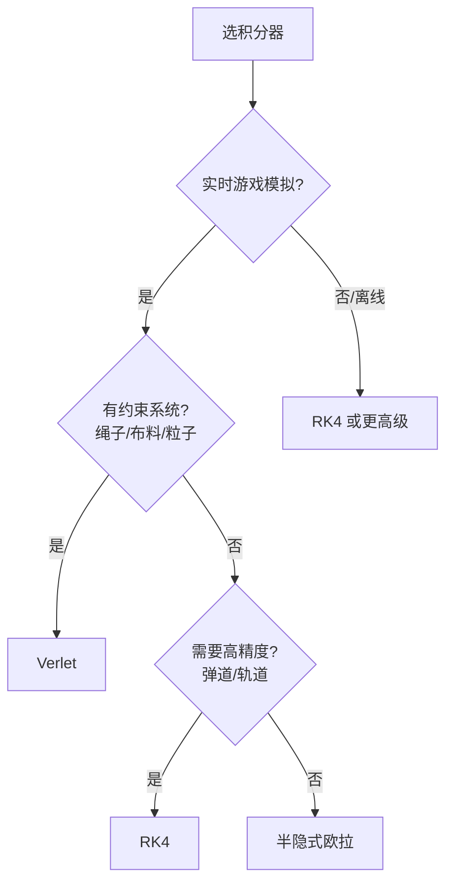

# 数值积分与运动学模拟（Euler / Verlet / RK4）

> 知识基线：引擎无关的游戏算法通用原理；数值积分是自研运动模拟、物理风格玩法、确定性模拟的地基，与[01-动态寻路确定性与基准测试](../04-确定性与基准工程/01-动态寻路确定性与基准测试.md)的固定时间步直接联动；涉及 UE 的物理实现以[游戏知识/09-物理系统/README.md](../../游戏知识/09-物理系统/README.md)为交叉验证边界。
> 适用范围：自研 2D/3D 运动系统（角色/弹体/载具）、物理风格玩法（绳子/布/流体近似）、服务器端确定性模拟（帧同步）、以及"不想引入完整物理引擎"的轻量场景。
> 事实边界：积分器算法（Euler/半隐式 Euler/Verlet/RK4）与稳定性结论为通用数值分析事实；具体引擎（UE Chaos、Unity PhysX）的求解器细节以其文档为准；性能与精度取舍需按项目实测。
> 最后更新：2026-08-07。
> 参考来源：[Wikipedia: Numerical methods for ordinary differential equations](https://en.wikipedia.org/wiki/Numerical_methods_for_ordinary_differential_equations)、[Gaffer On Games: Fix Your Timestep](https://gafferongames.com/post/fix_your_timestep/)。

> 游戏里的运动（角色跑动、子弹飞行、绳子摆动、载具颠簸）本质是**微分方程**：已知加速度，积分出速度，再积分出位置。本文讲清四种常用积分器的原理、稳定性与选型，以及"固定时间步"这一确定性模拟的基石。

---

## 一、概述

### 1.1 运动学的微分形式

```text
位置 p(t)，速度 v(t)，加速度 a(t)：
  dv/dt = a(t, p, v)      // 加速度可能依赖位置与速度（如弹簧、阻力）
  dp/dt = v(t)
```

"模拟运动" = 从初值 `(p0, v0)` 出发，用**数值积分**逐步推进：

```text
p(t + Δt) ≈ p(t) + v(t)·Δt
v(t + Δt) ≈ v(t) + a(t)·Δt
```

### 1.2 为什么不能"直接解公式"

- 多数游戏加速度不是常数（重力+阻力+弹簧+玩家输入），解析解不存在；
- 数值积分是唯一通用路径；
- 但积分器有**精度与稳定性**之分——选错会"能量爆炸"（越弹越高）或"黏滞"（越滚越慢）。

---

## 二、核心概念

| 概念 | 英文 | 一句话定义 | 说明 |
| --- | --- | --- | --- |
| 时间步 | Timestep (Δt) | 两次积分之间的时间间隔 | 固定 vs 可变 |
| 显式积分 | Explicit Integration | 用当前状态算下一状态 | 简单、可能不稳 |
| 隐式积分 | Implicit Integration | 用下一状态（或混合）算 | 稳定、复杂 |
| 前向欧拉 | Forward Euler | 直接用当前斜率外推 | 最简、能量发散 |
| 半隐式欧拉 | Semi-implicit Euler | 先更新速度再更新位置 | 游戏默认之选 |
| Verlet | Verlet Integration | 用位置差分代替速度存储 | 约束系统友好 |
| 龙格-库塔 | Runge-Kutta (RK4) | 多点斜率加权平均 | 精度高、贵 |
| 固定时间步 | Fixed Timestep | 恒定 Δt 的模拟循环 | 确定性基石 |
| 插值渲染 | Interpolation | 模拟帧间渲染平滑 | 表现层补帧 |
| 稳定性 | Stability | 误差不随步数增长 | 与 Δt 和刚度相关 |

---

## 三、原理详解

### 3.1 四种积分器

#### 3.1.1 前向（显式）欧拉

```text
v_new = v + a·Δt
p_new = p + v·Δt        // 注意：用的是旧 v！
```

- 误差：O(Δt²) 每步，全局 O(Δt)；
- 问题：**能量注入**——弹簧/轨道系统会越转越快（位置用旧速度更新造成滞后）；
- 用途：教学、对精度无要求的简单运动。

#### 3.1.2 半隐式欧拉（Symplectic / Semi-implicit）

```text
v_new = v + a·Δt
p_new = p + v_new·Δt    // 用新速度更新位置
```

- 误差：同为 O(Δt²)，但**保守能量**（对无阻尼系统近似守恒）；
- 这就是大多数游戏引擎内部的基础积分形式（配合约束求解）；
- **游戏默认选择**：简单、稳定、够用。

#### 3.1.3 Verlet

```text
p_new = 2·p - p_old + a·Δt²
```

- 不显式存速度（速度 = (p_new - p_old)/Δt）；
- 特点：时间可逆、能量守恒好、**约束系统**（绳子/布料/粒子）友好；
- 应用：Verlet 是布料/绳索模拟的经典选择（约束投影迭代）。

#### 3.1.4 RK4

```text
k1 = a(t, p, v)
k2 = a(t+Δt/2, p + v·Δt/2, v + k1·Δt/2)
k3 = a(t+Δt/2, p + v·Δt/2, v + k2·Δt/2)
k4 = a(t+Δt, p + v·Δt, v + k3·Δt)
v_new = v + (k1 + 2k2 + 2k3 + k4)·Δt/6
```

- 误差：每步 O(Δt⁵)，全局 O(Δt⁴)；
- 代价：每步 4 次加速度求值（约 4 倍成本）；
- 用途：高精度需求（弹道计算、轨道、离线模拟）。



*图释：积分器选型决策——实时模拟默认半隐式欧拉，约束系统用 Verlet，高精度用 RK4。*

### 3.2 稳定性与时间步

#### 3.2.1 为什么 Δt 不能随便选

- 显式积分对"刚度"敏感：弹簧越硬（频率越高），需要的 Δt 越小，否则发散；
- 经验法则：`Δt < 2/ω`（ω 为系统最高角频率）是显式欧拉的稳定边界；
- 60Hz 模拟（Δt=16.7ms）对大部分游戏运动足够；高刚度系统需隐式或约束求解。

#### 3.2.2 固定时间步 vs 可变时间步

```text
// 伪代码：固定时间步主循环（节选/示意，参考 Fix Your Timestep）
accumulator += frame_delta
while accumulator >= FIXED_DT:
    simulate(FIXED_DT)        // 确定性：恒定 Δt
    accumulator -= FIXED_DT
render(interpolate(prev, curr, accumulator / FIXED_DT))
```

- **固定时间步**：模拟确定性（同输入同输出）、稳定、回放一致；
- **可变时间步**：帧率耦合、结果不可复现——**帧同步/回放场景禁用**；
- 表现平滑靠渲染插值（模拟 30Hz、渲染 60Hz 常见）。

### 3.3 与确定性模拟的关系

- 数值积分结果依赖浮点运算顺序（见[01-动态寻路确定性与基准测试](../04-确定性与基准工程/01-动态寻路确定性与基准测试.md)）；
- 跨平台一致需：固定 Δt + 相同求值顺序 + 数学函数一致（或定点数）；
- 服务端/帧同步要求：所有客户端跑完全相同的积分循环（输入驱动、结果一致）。

### 3.4 常见运动模型示例

| 模型 | 加速度公式 | 积分器建议 |
| --- | --- | --- |
| 重力+阻力 | a = g - k·v | 半隐式欧拉 |
| 弹簧（简谐） | a = -k·(p - p0) | 半隐式欧拉（小步）或 Verlet |
| 阻尼振荡 | a = -k·p - c·v | 半隐式欧拉 |
| 摆/绳子 | 约束 + 重力 | Verlet + 约束迭代 |
| 轨道/弹道精确 | a = 引力场 | RK4 |
| 载具（多力） | 引擎/阻力/摩擦合成 | 半隐式欧拉 + 分步 |

### 3.5 约束与积分结合（Verlet 投影）

绳/布/粒子系统是"积分 + 约束"的经典组合：

```text
// 伪代码：Verlet 约束投影（节选/示意）
for iter in range(3):                      // 迭代 3~5 次
    for constraint in constraints:
        d = p2 - p1
        dist = length(d)
        diff = (dist - rest_length) / dist
        p1 += d * 0.5 * diff               // 两端各移一半
        p2 -= d * 0.5 * diff
```

要点：

- **迭代次数**：3~5 次足够（更多次数收益递减），每次迭代修正距离约束；
- **刚性**：迭代越多越"硬"，越少越"软"——用迭代次数控制布料/绳子手感；
- **固定端点**：约束支持"锚定"（一端不动），用于挂绳/旗帜；
- **稳定性**：Verlet + 约束对显式积分稳定得多，这是它成为布料标准方案的原因。

### 3.6 误差分析与验证

用解析解验证积分器精度：

| 场景 | 解析解 | 半隐式欧拉误差（示意） | RK4 误差（示意） |
| --- | --- | --- | --- |
| 自由落体（1s） | x = ½gt² | ~0.1% | ~0.0001% |
| 简谐运动（10 周期） | 能量守恒 | 振幅漂移 <1% | 漂移可忽略 |

验证方法：

1. **能量跟踪**：无阻尼系统跟踪总能量，能量单调增长 = 积分器注入能量；
2. **收敛性测试**：Δt 减半，误差应约减半（一阶）或 1/16（四阶 RK4）；
3. **回归测试**：固定输入断言输出误差范围（配合[01-动态寻路确定性与基准测试](../04-确定性与基准工程/01-动态寻路确定性与基准测试.md)的基准框架）。

---

## 四、伪代码/示例：通用运动积分器

```text
// 伪代码：运动模拟骨架（节选/示意）
class MotionBody:
    def __init__(self, p, v):
        self.p, self.v = p, v

    def acceleration(self, p, v, t):
        # 子类实现：重力、阻力、弹簧、玩家输入等
        raise NotImplementedError

    def step_semi_implicit(self, dt):
        self.v += self.acceleration(self.p, self.v, 0) * dt
        self.p += self.v * dt

    def step_verlet(self, dt, p_old):
        a = self.acceleration(self.p, self.v, 0)
        p_new = 2 * self.p - p_old + a * dt * dt
        self.v = (p_new - p_old) / (2 * dt)   // 近似速度
        return p_old, p_new

// 固定步主循环
while running:
    acc += frame_delta
    while acc >= FIXED_DT:
        body.step_semi_implicit(FIXED_DT)
        acc -= FIXED_DT
```

---

## 五、最佳实践

1. **默认半隐式欧拉**：实时游戏 90% 场景够用，先跑通再谈精度。
2. **固定时间步**：任何需要确定性/回放/联网一致的运动模拟，必须固定 Δt。
3. **渲染插值**：模拟频率低于渲染频率时，用前后状态插值渲染，避免卡顿感。
4. **约束用 Verlet**：绳子/布料/粒子系统用 Verlet + 约束迭代（投影），简单稳定。
5. **高精度用 RK4**：弹道/轨道/离线预计算；实时慎用（4 倍成本）。
6. **警惕能量漂移**：弹簧系统越弹越高 = 积分器或 Δt 问题；先减小 Δt 验证。
7. **阻尼防发散**：任何显式积分系统加最小阻尼（v *= 0.999…），兜底稳定性。
8. **浮点顺序固定**：确定性模拟中固定运算顺序，避免编译器/平台差异。
9. **分步处理多力**：载具等多力系统按"力合成→积分"单步处理，别拆多步积分。
10. **测试覆盖**：用解析解对照（自由落体、简谐运动）验证积分器误差在预期范围。

---

## 六、常见问题 FAQ

1. **Q：为什么我的弹簧越弹越高？** A：显式欧拉注入能量；换半隐式欧拉或 Verlet，并检查 Δt 是否过大。
2. **Q：固定时间步和可变时间步哪个好？** A：确定性/联网场景必须固定；单机表现可接受可变（但建议仍固定+插值）。
3. **Q：60Hz 够吗？** A：多数游戏运动够；高速弹体/高刚度弹簧需更小步（120Hz+）或子步。
4. **Q：Verlet 怎么处理速度相关力（阻力）？** A：Verlet 天然忽略速度项，可把阻力并入加速度项近似，或用 velocity Verlet 变体。
5. **Q：RK4 值得吗？** A：实时游戏通常不值（4 倍成本换来的精度感知不到）；弹道预计算/离线模拟值得。
6. **Q：多物体相互作用（碰撞）怎么办？** A：积分 + 碰撞检测 + 约束求解分步进行；本文只讲运动学，碰撞见[04-碰撞检测.md](04-碰撞检测.md)。
7. **Q：帧同步下所有客户端结果必须完全一致？** A：是——固定 Δt + 同顺序浮点运算；任何不确定源（随机/平台数学库）都要收敛。
8. **Q：怎么验证积分器正确性？** A：用解析解（自由落体 x = ½gt²、简谐运动）对比误差，按步长画误差曲线。
9. **Q：服务端模拟和客户端模拟要一样吗？** A：权威端（服务端）决定结果，客户端可跑相同模拟做预测（见[游戏知识/06-网络同步/03-客户端预测与延迟补偿.md](../../游戏知识/06-网络同步/03-客户端预测与延迟补偿.md)）。
10. **Q：有没有"最好"的积分器？** A：没有——精度/稳定/成本三角权衡；游戏场景半隐式欧拉+固定步是最稳组合。

---

## 七、关联阅读

- 同分类：[04-碰撞检测.md](04-碰撞检测.md) —— 运动模拟的下一步：检测与响应；
- 同分类：[03-插值与曲线.md](03-插值与曲线.md) —— 渲染插值/运动路径的曲线表达；
- 确定性：[01-动态寻路确定性与基准测试.md](../04-确定性与基准工程/01-动态寻路确定性与基准测试.md) —— 固定步、浮点一致性与回放；
- 数学基础：[01-向量与矩阵基础.md](01-向量与矩阵基础.md) —— 位置/速度/加速度的向量运算；
- UE 侧：[游戏知识/09-物理系统/README.md](../../游戏知识/09-物理系统/README.md) —— Chaos 物理引擎的实现边界；
- 网络：[游戏知识/06-网络同步/03-客户端预测与延迟补偿.md](../../游戏知识/06-网络同步/03-客户端预测与延迟补偿.md) —— 客户端预测与回滚的积分一致性。

---

## 更新日志

- 2026-08-07：初稿。补齐"数值积分与运动学模拟"空白（P1，全库此前 0 覆盖）；涵盖四种积分器原理/稳定性/选型、固定时间步与确定性、常见运动模型与验证方法；引擎无关通用层。

## 落地检查清单

### 常见反模式

1. **固定用显式欧拉**：弹簧/轨道等系统能量发散，物体越飞越远。
2. **时间步随帧率变化**：帧率波动导致模拟结果漂移，破坏确定性。
3. **四元数积分后不归一化**：姿态逐渐漂移，旋转变形。
4. **子步与碰撞步长不匹配**：高速物体隧穿碰撞体。
5. **能量漂移不设回归测试**：长时间模拟后行为不可复现。

- [ ] 积分器选型有依据：显式欧拉（简单但发散）/半隐式欧拉（稳定）/Verlet（约束友好）/RK4（精度高成本高）。
- [ ] 时间步策略明确：固定步长 + 累加器（防死亡螺旋上限），或可变步长 + 插值。
- [ ] 稳定性边界已验证：如弹簧系统 `ω·h < 2` 等条件。
- [ ] 刚体运动学（位置/速度/角速度/四元数）积分后四元数已归一化。
- [ ] 确定性联动：固定步长、浮点一致性（指路 04-01），跨平台结果一致。
- [ ] 阻尼/摩擦模型有参数上限与验证，不会能量发散或粘滞。
- [ ] 子步划分与碰撞检测步长匹配，避免隧穿（联动 04-碰撞检测）。
- [ ] 能量/误差回归测试：长时间模拟能量漂移在阈值内。
- [ ] 性能预算：积分热路径避免分配与虚调用。
- [ ] 与引擎实现分工明确（物理引擎场景指路 游戏知识/09-物理系统）。

### 术语速查

| 术语 | 英文 | 一句话解释 |
| --- | --- | --- |
| 显式欧拉 | Explicit Euler | 用当前状态直接外推一步 |
| 半隐式欧拉 | Semi-implicit Euler | 先更新速度再更新位置（辛） |
| Verlet | Verlet Integration | 用位置历史积分，约束友好 |
| RK4 | Runge-Kutta 4 | 四阶龙格-库塔，精度高 |
| 固定时间步 | Fixed Timestep | 恒定步长模拟，确定性关键 |
| 累加器 | Accumulator | 按帧累计并消费固定步长 |
| 能量漂移 | Energy Drift | 数值误差导致的能量变化 |
| 稳定性边界 | Stability Bound | 步长与系统频率的约束条件 |
