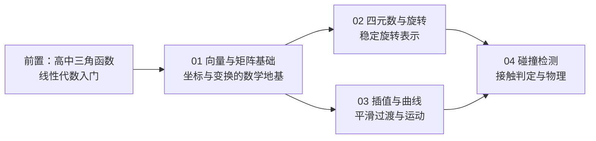

# 02 · 数学与碰撞

> 游戏算法知识库 · 分类导航
> 覆盖主题：向量与矩阵、四元数与旋转、插值与曲线、碰撞检测。

## 分类简介

「数学与碰撞」是游戏算法知识库中最基础、也最通用的一个分类。游戏引擎中的一切
「运动」都可以被抽象为**位置（Position）**、**朝向（Orientation）**、**速度（Velocity）**
与**接触（Contact）**这四个概念，而它们的数学载体正是本分类要讲解的内容：

- **向量与矩阵**：描述位置、方向、缩放与坐标空间变换，是角色移动、朝向判定、相机
  与渲染管线的数学地基。
- **四元数与旋转**：解决欧拉角的万向锁问题，提供稳定、可插值的旋转表示，广泛用于
  骨骼动画、相机控制与刚体姿态。
- **插值与曲线**：让数值在离散采样点之间平滑过渡，用于动画混合、路径移动、相机跟
  随以及网络同步中的位置补偿。
- **碰撞检测**：回答「两个物体是否接触、何时接触、接触点与法线在哪」，是射击判定、
  物理引擎、寻路避障与关卡设计的基础。

本分类的文章之间有明显的前置依赖：**先学向量与矩阵，再学四元数与旋转；插值与曲线
依赖前两者的插值工具（Lerp/Slerp）；碰撞检测又依赖向量运算、变换与空间思维。** 建议
按「学习顺序建议」一节逐篇阅读。

## 文件列表

| 文件 | 一句话简介 |
| --- | --- |
| [01-向量与矩阵基础.md](01-向量与矩阵基础.md) | 向量运算（点积/叉积/投影/归一化）、矩阵变换（平移/旋转/缩放/复合）与局部→世界→观察坐标空间变换，含 FPS 命中判定、朝向判定与相机示例。 |
| [02-四元数与旋转.md](02-四元数与旋转.md) | 从欧拉角与万向锁问题出发，讲解四元数定义、运算、Slerp 插值、与旋转矩阵互转，以及骨骼动画与第三人称相机中的应用。 |
| [03-插值与曲线.md](03-插值与曲线.md) | Lerp/Slerp/Ease 缓动函数、贝塞尔曲线、Catmull-Rom 样条、路径插值与相机跟随，以及网络同步中的插值（Interpolation）与外推（Extrapolation）。 |
| [04-碰撞检测.md](04-碰撞检测.md) | 基本几何体（球/AABB/OBB）、分离轴定理 SAT、GJK 与 EPA、Broad phase（Sweep and Prune/空间分区）与 Narrow phase、射线检测与物理引擎碰撞流程。 |
| [05-数值积分与运动学模拟.md](05-数值积分与运动学模拟.md) | 前向/半隐式欧拉、Verlet、RK4 四种积分器原理与稳定性、固定时间步与确定性模拟、常见运动模型与解析解验证。 |
| [06-弹道与射击算法.md](06-弹道与射击算法.md) | 抛物线弹道与落点求解、移动目标提前量、散布模型、命中检测（射线/扫掠/CCD）与网络权威判定链路。 |

## 学习顺序建议

### 推荐路线

1. **第一遍（入门，约 1 周）**：通读 01 与 04 的核心概念表与伪代码，动手实现
   「点积判朝向 + AABB 碰撞」的最小 Demo（例如：2D 平台跳跃游戏中的角色与地面判定）。
2. **第二遍（进阶，约 1 周）**：通读 02 与 03，把第三人称相机改为「四元数平滑旋转」，
   把敌人巡逻路径改为「Catmull-Rom 曲线路径」。
3. **第三遍（融会贯通）**：用 04 的 GJK/SAT 做一个小型 2D 物理沙盒（若干凸多边形
   弹跳），再用 03 的插值外推做双人联机的移动同步，即可覆盖本分类全部核心算法。

### 阅读技巧

- 每篇文章都包含「核心概念表」，**先读表再读原理**，可以快速建立术语地图。
- 「原理详解」中的公式推导建议**亲手推一遍**（点积的余弦定理推导、Slerp 的半角推导、
  SAT 的分离轴证明都是面试高频题）。
- 代码示例区同时给出**伪代码、C++ 与 Python**：伪代码看思路，C++ 看游戏引擎中的
  惯用写法（列主序、SIMD 友好），Python（NumPy）便于快速验证数学正确性。
- 每篇末尾的「常见问题 FAQ」汇总了实际开发中最容易踩的坑，值得在项目出 bug 时
  回头查阅。

## 前置知识与工具建议

- 数学：三角函数与弧度制、二维/三维坐标系、矩阵乘法（了解即可，文中会推导）。
- 工具：任意支持 NumPy 的 Python 环境即可验证全部示例；C++ 示例可在
  Unity（C#）、Unreal（C++）、Godot（GDScript/C#）或自研引擎中对照实现。
- 推荐把文中公式与游戏引擎 API（如 Unity 的 `Transform`、`Quaternion.Slerp`、
  `Physics.Raycast`）对照学习，效果最佳。

## 更新与维护约定

- 本目录文件命名：`序号-主题.md`，序号即推荐阅读顺序。
- 每篇文章遵循统一结构：概述 → 核心概念（表格）→ 原理详解（含公式推导）→
  伪代码 + C++/Python 示例 → 复杂度分析 → 最佳实践 → 常见问题 FAQ → 关联阅读。
- 修改本文档时请同步更新文件列表与学习顺序，保持导航信息一致。
