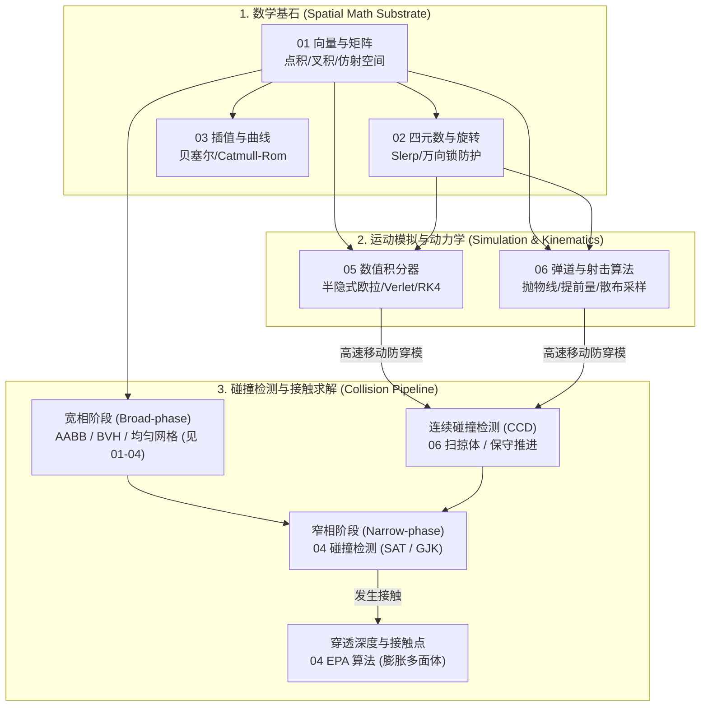
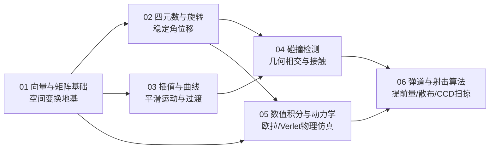

# 02 · 数学与碰撞（Mathematics & Collision）

> 知识成熟度：L2（已按 6 篇核心专题、物理碰撞几何管线与运动学模拟全面核对）。
>
> 领域权威导航：[游戏算法 Domain MOC](../../00_Index/domains/游戏算法.md) ｜ [游戏算法 领域工程手册](../README.md)。

「数学与碰撞」是游戏算法知识库中最基础、也最通用的几何物理分类。游戏引擎中的一切运动与交互都可以抽象为**位置（Position）、朝向（Orientation）、速度（Velocity）与接触（Contact）**四个核心要素，其背后的数学载体与算法机制正是本子域所沉淀的全部内容：

- **向量与变换矩阵**：空间坐标变换、点积/叉积几何投影，是角色朝向、视野判定与相机管线的数学地基；
- **四元数代数**：彻底根除欧拉角万向锁（Gimbal Lock），提供最短弧度插值（Slerp），驱动骨骼动画与刚体旋转；
- **插值与样条曲线**：Lerp/Slerp、贝塞尔与 Catmull-Rom 样条，赋能角色位移、运镜平滑与网络预测外推；
- **碰撞检测几何学**：基础图元相交、SAT 分离轴测试、凸体相交 GJK 与穿透深度 EPA，构建 Narrow-phase 接触求解；
- **数值积分动力学**：剖析显式欧拉发散缺陷，证明半隐式欧拉保相守恒性，详解 Verlet 约束与 RK4 高精度求解；
- **弹道物理与射击算法**：抛物线落点逆向解算、目标移动提前量解算、高斯散布采样与高速连续碰撞（CCD）扫掠。

---

## 1. 目录文件列表

| 编号 | 核心专题文件 | 知识类型 | 成熟度 | 一句话简介与工程定位 |
| :--- | :--- | :---: | :---: | :--- |
| 00 | [README.md](README.md)（本文件） | Index | L2 | 子域工程导航：几何碰撞管线、动力学体系、专题矩阵与学习路线 |
| 01 | [01-向量与矩阵基础.md](../../知识/02-数学与游戏算法/数学与数值计算/01-向量与矩阵基础.md) | Concept | L2 | 向量代数（点积/叉积/正交投影）、仿射变换矩阵构造与局部→世界→观察→裁剪坐标变换流水线 |
| 02 | [02-四元数与旋转.md](../../知识/02-数学与游戏算法/数学与数值计算/02-四元数与旋转.md) | Concept | L2 | 万向锁本质剖析、四元数代数（共轭/逆/哈密顿积）、Slerp 球面平滑插值及骨骼姿态应用 |
| 03 | [03-插值与曲线.md](../../知识/02-数学与游戏算法/数学与数值计算/03-插值与曲线.md) | Concept | L2 | Lerp/Slerp/Ease 缓动函数、二次/三次贝塞尔曲线、Catmull-Rom 样条及网络预测外推补偿 |
| 04 | [04-碰撞检测.md](../../知识/02-数学与游戏算法/空间查询与碰撞/04-碰撞检测.md) | Mechanism | L2 | 基本图元（Sphere/AABB/OBB）、SAT 分离轴、GJK 闵氏差凸体相交、EPA 穿透求解与射线检测 |
| 05 | [05-数值积分与运动学模拟.md](../../知识/02-数学与游戏算法/数学与数值计算/05-数值积分与运动学模拟.md) | Mechanism | L2 | 显式欧拉、半隐式欧拉、Verlet、RK4 四种积分器稳定性对比、固定时间步长与确定性物理 |
| 06 | [06-弹道与射击算法.md](../../知识/02-数学与游戏算法/空间查询与碰撞/06-弹道与射击算法.md) | Mechanism | L2 | 重力抛物线落点、目标移动提前量封闭解、弹道散布模型、命中检测（Raycast/Sweep/CCD）与网络权威判定 |

---

## 2. 几何运动与物理碰撞全景流水线

```mermaid
flowchart TD
    subgraph MathSub["1. 数学基石 (Spatial Math Substrate)"]
        V[01 向量与矩阵<br/>点积/叉积/仿射空间]
        Q[02 四元数与旋转<br/>Slerp/万向锁防护]
        C[03 插值与曲线<br/>贝塞尔/Catmull-Rom]
    end

    subgraph PhysSim["2. 运动模拟与动力学 (Simulation & Kinematics)"]
        Integ[05 数值积分器<br/>半隐式欧拉/Verlet/RK4]
        Ballistic[06 弹道与射击算法<br/>抛物线/提前量/散布采样]
    end

    subgraph CollPipeline["3. 碰撞检测与接触求解 (Collision Pipeline)"]
        Broad["宽相阶段 (Broad-phase)<br/>AABB / BVH / 均匀网格 (见 01-04)"]
        Narrow["窄相阶段 (Narrow-phase)<br/>04 碰撞检测 (SAT / GJK)"]
        Penetration["穿透深度与接触点<br/>04 EPA 算法 (膨胀多面体)"]
        CCD["连续碰撞检测 (CCD)<br/>06 扫掠体 / 保守推进"]
    end

    V --> Q & C
    V & Q --> Integ & Ballistic
    V --> Broad
    Broad --> Narrow
    Narrow -->|发生接触| Penetration
    Integ & Ballistic -->|高速移动防穿模| CCD
    CCD --> Narrow
```

---

## 3. 核心算法横向选型指南

### 3.1 窄相碰撞算法选型（Narrow-phase）
- **简单包围盒（AABB / Sphere / Capsule）**：计算成本极低（单次两两检测仅需数个乘加），用于海量实体的大致相交测试或粗粒度过滤；
- **定向包围盒（OBB）**：使用 **SAT（分离轴定理）** 测试 15 条可能轴（3条面法线 + 3条面法线 + 9条边叉积轴），旋转适应好，常用于车辆、建筑与精密掩体；
- **任意凸多面体（Convex Polyhedra）**：使用 **GJK 算法** 在闵可夫斯基差空间通过单形（Simplex）演化测试是否包含原点；相交后若需要接触法线与穿透深度，由 **EPA 算法** 从 GJK 最终单形向外拓展求最近面。

### 3.2 动力学数值积分选型（Integrators）
- **半隐式欧拉（Symplectic Euler）**：游戏物理引擎事实标准（Box2D/PhysX/Chaos）。由于其保相体积（Phase Space Volume Preserving）特性，简谐振动能量有界不发散，且单步只需 1 次受力估算；
- **Verlet / Position-Based Dynamics (XPBD)**：位置约束直观，不依赖速度累积，广泛用于布料、绳索、毛发与角色次级动态；
- **四阶龙格-库塔（RK4）**：每步需 4 次评估导数，耗时较高；仅适用于航天器轨道计算、高保真飞行力学等连续非碰撞场景。

---

## 4. 学习顺序建议

```mermaid
flowchart LR
    A["01 向量与矩阵基础<br/>空间变换地基"] --> B["02 四元数与旋转<br/>稳定角位移"]
    A --> C["03 插值与曲线<br/>平滑运动与过渡"]
    B --> D["04 碰撞检测<br/>几何相交与接触"]
    C --> D
    A & B --> E["05 数值积分与动力学<br/>欧拉/Verlet物理仿真"]
    D & E --> F["06 弹道与射击算法<br/>提前量/散布/CCD扫掠"]
```

### 推荐学习步骤
1. **第一阶段：数学地基（01、02、03 篇）**
   - 掌握点积余弦公式判夹角、叉积右手定则判左右与旋转轴；
   - 手动推导四元数共轭、乘法与 Slerp 半角插值；
   - 实现 Catmull-Rom 样条路径与平滑 Ease 缓动。
2. **第二阶段：几何与碰撞（04 篇）**
   - 实现 AABB 相交与 SAT 分离轴测试；
   - 理解闵可夫斯基差几何意义与 GJK 单形求交逻辑。
3. **第三阶段：运动动力学与战斗射击（05、06 篇）**
   - 对比显式欧拉与半隐式欧拉在简谐振子下的能量曲线；
   - 求解带重力弹道在指定初速度下的仰角封闭方程；
   - 求解目标匀速直线运动下的前瞻提前量（Lead Point）；
   - 搭建高速子弹 Raycast 与 Sphere Cast 连续碰撞检测（CCD）。

---

## 5. 跨域技术依赖与工业落地

- **联动虚幻引擎物理系统**：
  - [游戏知识 09-01 Chaos物理引擎概览](../../游戏知识/09-物理系统/01-Chaos物理引擎概览.md)：深入 Chaos 刚体解算器、PBD 积分与 Sub-stepping 子步机制；
  - [游戏知识 09-02 碰撞检测与物理材质](../../游戏知识/09-物理系统/02-碰撞检测与物理材质.md)：学习 UE 中的 TraceByChannel、Overlap 与 Sweep API；
  - [游戏知识 09-06 Chaos车辆系统](../../游戏知识/09-物理系统/06-Chaos车辆系统.md)：学习轮胎滑移角、悬挂弹簧阻尼与四元数底盘姿态。
- **联动游戏 AI 运动控制**：
  - [游戏AI 02-01 移动与群组行为](../../游戏AI/02-移动学习与服务端/01-移动与群组行为.md)：结合向量投影与插值实现 Seek/Arrive 转向。
- **联动联机确定性与回放**：
  - [04-05 联机确定性与基准工程](../../知识/02-数学与游戏算法/确定性与基准/05-联机确定性与基准工程.md)：将物理与射击数学全面定点数化，杜绝浮点雪崩。

---

## 6. 返回与关联导航

- [游戏算法 Domain MOC](../../00_Index/domains/游戏算法.md)
- [游戏算法 领域工程手册](../README.md)
- [01-寻路与图论 README](../01-寻路与图论/README.md)
- [03-工程与实用技巧 README](../03-工程与实用技巧/README.md)
- [04-确定性与基准工程 README](../04-确定性与基准工程/README.md)
