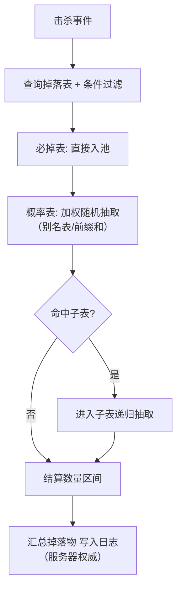

# 01-随机数与洗牌算法

> 随机数不是"随便数"：掉落、抽卡、暴击、刷怪、地图生成、AI 决策都建立在同一个 PRNG 之上。本篇覆盖 PRNG 原理（LCG / Mersenne Twister / xorshift）、种子与确定性、Fisher–Yates 洗牌、加权随机（别名表 Alias Method）、掉落表设计与抽卡保底数学。

> 知识基线：C++17 与 Python 3.12 示例；复杂度、浮点/整数、坐标系和随机种子均按正文声明解释。
> 适用范围：玩法随机、掉落/抽卡、洗牌、AI 抖动、测试和程序化生成；单机、客户端、服务端与离线生成均可使用，但经济和对战结果应由服务端权威结算；本文 PRNG 不等同于密码学安全随机数。
> 数值与正确性边界：均匀性、概率和期望结论依赖正确的分布实现、独立抽样和明确的权重/保底状态；固定种子只能在算法版本、状态、调用顺序和平台约定一致时复现，统计质量不代表安全性，概率与性能结论应以指定样本实测。
> 最后更新：2026-08-06（补齐来源、边界条件与验证入口）。
> 参考来源：[PCG Random 官方资料](https://www.pcg-random.org/)；[NumPy 随机数与数值参考](https://numpy.org/doc/stable/reference/random/)。

## 1. 概述

游戏里几乎没有"真随机"：引擎通常使用**伪随机数生成器（PRNG）**，它由一个确定性的递推公式产生看起来随机的序列。PRNG 的三大评价维度：

- **统计质量**：序列是否均匀、是否有关联模式（低位周期性、串相关等）；
- **速度与状态大小**：每生成一个数的 CPU 开销，以及占用的内存；
- **可复现性**：同一种子在算法、状态和调用顺序一致时是否产生同一序列——这是掉落回放、跨端同步、地图生成确定性的基础。

随机在游戏中的典型应用场景：

| 场景 | 随机类型 | 关键要求 |
| --- | --- | --- |
| 掉落/开箱 | 加权随机 | 权重可配、概率可公示 |
| 抽卡保底 | 加权随机 + 计数状态 | 期望可推导、合规 |
| 暴击/闪避 | 伯努利试验 | 支持"伪随机分布"防连爆 |
| 洗牌（牌堆、地图块） | 无放回抽样 | 均匀、无偏 |
| 地图/地形生成 | 噪声 + 种子 | 确定性、跨端一致 |
| AI 决策抖动 | 均匀随机 | 快、轻量 |

## 2. 核心概念

| 术语 | 说明 |
| --- | --- |
| PRNG | 伪随机数生成器，由确定递推公式生成统计上近似随机的序列 |
| 种子（Seed） | 初始化 PRNG 状态的整数；同种子 ⇒ 同序列 |
| 周期 | 序列重复前的最长长度；实用 PRNG 周期应远大于游戏使用量 |
| 均匀分布 | 每个取值概率相等；`U(0,1)` 是其他分布的原料 |
| 加权随机 | 按权重比例抽取条目，权重可以不是概率 |
| 无放回抽样 | 抽过的元素不再出现（洗牌本质） |
| 期望（Expected Value） | 平均所需次数，抽卡设计的核心指标 |
| 保底（Pity） | 连续失败达到阈值后必出大奖的机制 |
| 综合概率 | 官方口径：1 / 期望抽取次数 |

## 3. PRNG 原理详解

### 3.1 线性同余生成器（LCG）

LCG 是最简单的 PRNG，递推公式：

```
X(n+1) = (a * X(n) + c) mod m
```

其中 `a` 为乘数、`c` 为增量、`m` 为模数。当参数满足 **Hull–Dobell 定理**时周期达到满周期 `m`：

1. `c` 与 `m` 互质；
2. `a − 1` 能被 `m` 的所有质因数整除；
3. 若 `m` 能被 4 整除，则 `a − 1` 也能被 4 整除。

经典参数：`a = 1103515245, c = 12345, m = 2^31`（ANSI C 的 rand 系）；`a = 1664525, c = 1013904223, m = 2^32`（Numerical Recipes）。

```cpp
// 64 位状态 LCG，取高 32 位作为输出（低位质量差）
struct LCG {
    uint64_t state;
    static constexpr uint64_t a = 6364136223846793005ULL;
    static constexpr uint64_t c = 1442695040888963407ULL;

    explicit LCG(uint64_t seed) : state(seed) {}

    uint32_t next() {
        state = a * state + c;
        return (uint32_t)(state >> 32); // 取高位，避免低位周期性
    }
};
```

**LCG 的坑**：取 `X mod k` 时，低位周期很短（`mod 2` 时仅 0/1 交替），所以**永远不要用 `rand() % k` 取低位**；现代做法是取高 32 位，或改用更好的生成器。此外 LCG 的"随机游走"相关性在蒙特卡洛等场景会被检出，不适合要求苛刻的统计用途。

### 3.2 Mersenne Twister（MT19937）

MT19937 是目前应用最广的高质量 PRNG（`std::mt19937` 即基于它）：

- **状态**：624 个 32 位字（约 2.5 KB），周期 `2^19937 − 1`；
- **原理**：通过"扭转（twist）"更新状态矩阵，再经"调和（tempering）"位变换输出；
- **优点**：周期极大、均匀性在 623 维内通过 k 分布测试、C++ 标准库开箱即用；
- **缺点**：状态大（不适合 GPU/嵌入式）、初始化慢、**种子质量差时初始输出可被预测**（单字种子的前 624 个输出可反推种子）。

```cpp
#include <random>

std::mt19937 rng(seed);                              // 种子初始化
std::uniform_int_distribution<int> d(0, 99);         // [0, 99] 均匀整数
int v = d(rng);                                      // 每次抽取

// 更安全的种子初始化：用 seed_seq 打散
std::seed_seq seq{seed};
std::mt19937 rng2(seq);
```

**MT 的著名退化**：用接近全零的状态初始化后，前几个输出可能全是 0；以及直接 `rng() % 2` 也会产生明显的 0/1 长串（MT 输出低位质量差）。务必用标准分布类（`uniform_int_distribution` 内部做拒绝采样消除模偏差）。

### 3.3 xorshift 与 xoshiro

xorshift 系列（Marsaglia, 2003）用三次移位异或混合状态，状态仅 4~32 字节，速度极快，质量优于同状态大小的 LCG：

```cpp
// xorshift32：状态不能为 0
struct XorShift32 {
    uint32_t x = 2463534242u;
    uint32_t next() {
        x ^= x << 13;
        x ^= x >> 17;
        x ^= x << 5;
        return x;
    }
};
```

xoshiro256**（Blackman & Vigna, 2018）是 xorshift 的现代改良：256 位状态、周期 `2^256 − 1`、通过 BigCrush 测试、且输出是状态的可逆置换（配合计数即可跳到任意位置，便于并行分片）。其姊妹算法 xoroshiro128+ 被多个引擎用于轻量随机。**工程建议**：追求速度与体积用 xoshiro256**，追求生态兼容与高维质量用 MT19937，两者都远超游戏需求。

### 3.4 从均匀分布到其他分布

游戏里 90% 的需求是均匀整数/浮点，直接 `uniform_int_distribution` / `uniform_real_distribution` 即可。偶发需求：

- **指数分布**（模拟冷却、事件间隔）：`X = −ln(1 − U) / λ`；
- **正态分布**（属性波动、暴击修正）：Box–Muller 变换 `Z = sqrt(−2 ln U1) · cos(2π U2)`；
- **自定义分布**：见第 6 节加权随机，或用拒绝采样（accept-reject）。

## 4. 确定性随机（种子一致）

### 4.1 什么是"确定性随机"

PRNG 是确定性的：**同一种子、同一调用序列 ⇒ 同一输出序列**。游戏工程大量利用这一性质：

- **回放系统**：只记录玩家输入与随机种子，战斗重放完全一致；
- **跨端一致性**：联机时"谁先掷骰子"由主机/服务器决定，客户端不参与随机；
- **无限世界**：`chunk(x, y)` 的种子 = `hash(世界种子, x, y)`，任何人进入同一坐标都生成同一地形；
- **测试**：固定种子可复现 bug；CI 里跑 1000 个种子做回归。

### 4.2 破坏确定性的常见原因

| 原因 | 后果 | 对策 |
| --- | --- | --- |
| 使用 `rand()` | `rand()` 实现因 libc 版本而异，跨平台不一致 | 自实现 PRNG，明确参数 |
| 浮点参与判定 | 不同平台 `sin/cos/sqrt` 末位不同，判定结果漂移 | 判定用整数/定点；或接受"判定前同步" |
| 多线程共享 RNG | 线程调度改变调用顺序，序列不可复现 | 每线程独立 RNG 实例（含种子） |
| 用系统时间/地址做种子 | 每次运行不同 | 仅线上/发布用随机种子；调试固定种子 |
| 遍历无序容器（哈希表） | 迭代顺序影响随机调用序列 | 用有序容器或先排序 |

### 4.3 坐标哈希种子示例

```cpp
// 世界种子 + 块坐标 → 块种子（整数运算，跨平台可复现）
uint32_t chunkSeed(uint32_t worldSeed, int cx, int cy) {
    uint32_t h = worldSeed;
    h ^= (uint32_t)cx * 0x9E3779B1u;   // 黄金比例常数，打散低位
    h ^= (uint32_t)cy * 0x85EBCA77u;
    h ^= h >> 16; h *= 0x7FEB352Du;
    h ^= h >> 15; h *= 0x846CA68Bu;
    h ^= h >> 16;
    return h;
}
```

> 注意：不要把"确定性"和"安全随机"混为一谈。**服务器权威场景（抽卡、掉落）必须用密码学安全的随机源**（操作系统 CSPRNG），否则玩家可通过观察序列预测结果（赌博机漏洞即源于此）。

## 5. Fisher–Yates 洗牌

### 5.1 原理与推导

Fisher–Yates（又称 Knuth shuffle）在 O(n) 时间内生成均匀的随机排列：

```
for i = n-1 down to 1:
    j = uniform_random(0, i)
    swap(a[i], a[j])
```

**无偏性证明**：设目标排列为 `π`。第 i 步（从 n−1 到 1）中，`a[i]` 被均匀地从剩余 `i+1` 个元素中选出。整个过程的概率为：

```
P(π) = 1/n · 1/(n−1) · … · 1/2 · 1 = 1/n!
```

每个排列等概率，且每个元素恰好被移动一次，时间复杂度 O(n)。**从后往前**的原因是：第 i 步只在前缀 `[0, i]` 里取随机数，保证"后面已定、前面未定"，避免重复交换破坏均匀性。

### 5.2 代码示例

```cpp
template <typename T, typename RNG>
void fisherYates(std::vector<T>& a, RNG& rng) {
    for (int i = (int)a.size() - 1; i > 0; --i) {
        std::uniform_int_distribution<int> d(0, i);
        std::swap(a[i], a[d(rng)]);
    }
}
```

```python
import random

def fisher_yates(a):
    for i in range(len(a) - 1, 0, -1):
        j = random.randrange(i + 1)   # [0, i]
        a[i], a[j] = a[j], a[i]
    return a

# 部分洗牌：只需前 k 个（抽牌堆、限时地图块）
def partial_shuffle(a, k):
    for i in range(len(a) - 1, len(a) - 1 - k, -1):
        j = random.randrange(i + 1)
        a[i], a[j] = a[j], a[i]
    return a[-k:]   # 后 k 个即"抽出"的结果
```

**常见错误**：`j = rand() % n`（模偏差，见 FAQ）；`j = random(0, n−1)` 全程取（产生偏置，某些排列概率更高）；对数组先 `sort` 再随机比较（O(n log n) 且不稳）。

### 5.3 变体：Sattolo 算法

若需要"循环移位"（每个元素都不在原位，如轮换武器池、随机循环播放列表）：

```
for i = n-1 down to 1:
    j = uniform_random(0, i-1)   // 注意上界是 i-1
    swap(a[i], a[j])
```

Sattolo 算法以均匀概率生成 (n−1)! 个 n 循环置换之一，常用于"无重复随机播放"。

## 6. 加权随机

### 6.1 三种主流方法

| 方法 | 预处理 | 单次抽取 | 空间 | 适用 |
| --- | --- | --- | --- | --- |
| 线性扫描 | 无 | O(n) | O(1) | 条目 ≤ 几十个 |
| 前缀和 + 二分 | O(n) | O(log n) | O(n) | 权重静态、条目多 |
| 别名表（Alias Method） | O(n) | **O(1)** | O(2n) | 高频抽取（掉落/抽卡） |

线性扫描：`r = U(0, 总权重)`，累加权重直到超过 `r`。前缀和法把权重数组转成前缀和，再用二分查找定位。

### 6.2 别名表原理（Vose 算法）

别名表的思路：把 `n` 个条目归一化（每个期望权重 1/n），然后将"超出 1/n 的部分"（大桶）切给"不足 1/n 的部分"（小桶）作为**别名**，最终得到两个数组：

- `prob[i]`：抽中第 i 桶时"直接命中 i"的概率（≤ 1）；
- `alias[i]`：未命中时改取的别名条目。

抽取只需两步：`i = uniform(0, n−1)`，再 `u = U(0,1)`；`u < prob[i]` 返回 i，否则返回 `alias[i]`。构建过程维护小桶/大桶两个栈，每次把大桶的盈余填给一个小桶，总盈余守恒，故 O(n) 完成。

```python
import random

class AliasTable:
    """Vose 别名表：O(n) 构建，O(1) 抽取"""
    def __init__(self, weights):
        n = len(weights)
        total = sum(weights)
        scaled = [w * n / total for w in weights]   # 归一化到均值 1
        self.prob = [0.0] * n
        self.alias = [0] * n
        small, large = [], []
        for i, s in enumerate(scaled):
            (small if s < 1.0 else large).append(i)
        while small and large:
            l = small.pop()
            g = large.pop()
            self.prob[l] = scaled[l]
            self.alias[l] = g
            scaled[g] = scaled[g] + scaled[l] - 1.0
            (small if scaled[g] < 1.0 else large).append(g)
        while large:
            self.prob[large.pop()] = 1.0
        while small:
            self.prob[small.pop()] = 1.0

    def draw(self):
        i = random.randrange(len(self.prob))
        return i if random.random() < self.prob[i] else self.alias[i]

# 用法：权重 [1, 3, 6] 的掉落表
table = AliasTable([1, 3, 6])
counts = [0, 0, 0]
for _ in range(100000):
    counts[table.draw()] += 1
print(counts)   # 约 [10000, 30000, 60000]
```

**工程要点**：掉落表权重来自配置（JSON/表格），构建一次缓存复用；权重会热更新时用前缀和法更简单（改权重即重算前缀和，也是 O(n)）。

### 6.3 无放回加权抽样

抽"n 张牌中的 k 张不同"且按权重：**Efraimidis–Spirakis 算法**——对每个元素生成 `u^(1/w)` 排序取前 k（权重越大越靠前）。更简单的工程做法：按权重复制进别名表后，抽中即临时移除（权重置 0 重建），条目少时直接线性扫描 + 已抽标记。

## 7. 掉落表设计

### 7.1 掉落表结构

掉落表（Loot Table）是"加权随机 + 条件 + 数量"的配置化封装：

```json
{
  "table": "boss_dragon",
  "guaranteed": [
    { "item": "dragon_scale", "min": 2, "max": 4 }
  ],
  "entries": [
    { "item": "legendary_sword",  "weight": 1,  "min": 1, "max": 1 },
    { "item": "epic_armor",       "weight": 4,  "min": 1, "max": 1 },
    { "item": "rare_potion",      "weight": 15, "min": 2, "max": 3 },
    { "item": "gold",             "weight": 80, "min": 50, "max": 200 }
  ],
  "sub_tables": [
    { "condition": "is_night", "table": "night_drops", "weight": 10 }
  ]
}
```

设计要点：

- **必掉表（guaranteed）与概率表（entries）分离**：任务道具走必掉，经济道具走权重；
- **嵌套表**：外层表抽中"材料组"，再进子表抽具体材料，天然支持"奖池套奖池"；
- **条件字段**：时间、地图、玩家等级、击杀方式（爆头/处决）；
- **数量区间**：`min..max` 均匀取整，与权重正交；
- **抽奖去重**：同表内"不重复掉落"用无放回抽样，或用"已掉落标记"。

### 7.2 掉落表流程



## 8. 抽卡与保底

### 8.1 三种概率模型

| 模型 | 单抽概率 | 说明 |
| --- | --- | --- |
| 独立概率 | 恒为 p | 几何分布，可能出现极端连黑/连金 |
| 硬保底 | 前 N−1 抽为 p，第 N 抽必出 | 保证最坏情况 |
| 软保底 | 前 k 抽为 p，之后概率递增到 1 | 平滑尾部，体感更好 |

### 8.2 期望抽取次数推导

**独立概率**（p）：几何分布，期望 `E = 1/p`。如 p = 1%，平均 100 抽出。

**硬保底 N**：设 q = 1 − p。第 k 抽才出的概率：

```
P(X = k) = q^(k−1) · p   (k = 1..N−1)
P(X = N) = q^(N−1)       (保底那抽必出)
```

期望：

```
E = Σ_{k=1}^{N−1} k·q^(k−1)·p + N·q^(N−1)
  = (1 − q^N) / p
```

验证：p = 1%、N = 100 时，`E = (1 − 0.99^100)/0.01 ≈ (1 − 0.366)/0.01 ≈ 63.4`，即 100 发硬保底把期望从 100 降到约 63 发。**官方"综合概率"就是 1/E**（如综合概率 1.6% ⇒ 平均 62.5 抽）。

**软保底**：从第 k₀ 抽开始概率线性爬升 `p(k) = p + (k − k₀)·Δ`，无闭式解，用模拟或动态规划算期望；实现上先算"前 k₀ 抽未出"的概率分布再叠加。

### 8.3 实现与模拟

```python
import random

def pity_model(p, hard_pity, soft_from=None, soft_step=0.0):
    """按保底模型生成"第几次出"；返回单次抽取次数"""
    count = 0
    while True:
        count += 1
        rate = p
        if soft_from and count >= soft_from:
            rate = min(1.0, p + (count - soft_from + 1) * soft_step)
        if count >= hard_pity or random.random() < rate:
            return count

def expected(p, hard_pity, n=1_000_000, soft_from=None, soft_step=0.0):
    return sum(pity_model(p, hard_pity, soft_from, soft_step)
               for _ in range(n)) / n

print(expected(0.01, 100))                      # ≈ 63.4（硬保底）
print(expected(0.006, 90, soft_from=74, soft_step=0.06))  # 软保底示例
```

**服务端实现注意**：抽卡计数是玩家数据（`pityCount`），必须由服务器持久化；客户端只发"抽卡请求"，结果由服务器结算并写日志——这既是防作弊，也是合规审计要求。

### 8.4 合规与体验

- 多数地区要求**公示抽取概率与保底规则**（中国版号、韩国、日本景品法均有规定），配置与公示必须一致；
- 用"伪随机分布"（如 Dota 2 的 PRD：失败后概率递增）压低极端连爆；
- 保底计数跨卡池/跨期是否继承，需策划明确并在配置中固化。

## 9. 复杂度分析

| 算法/操作 | 时间复杂度 | 空间复杂度 | 说明 |
| --- | --- | --- | --- |
| LCG / xorshift / xoshiro | O(1) | O(1) | 单次生成 |
| MT19937 初始化 | O(624) | O(624) | 一次性 |
| Fisher–Yates 洗牌 | O(n) | O(1) | 最优无偏洗牌 |
| 部分洗牌（前 k） | O(k) | O(1) | 抽 k 张 |
| Sattolo 循环 | O(n) | O(1) | 无原位元素 |
| 线性加权抽取 | O(n) | O(1) | 条目少时够用 |
| 前缀和 + 二分抽取 | O(log n) | O(n) | 静态权重 |
| 别名表构建/抽取 | O(n) / O(1) | O(2n) | 高频抽奖首选 |
| 掉落表（含子表） | O(表深度 × 抽取) | O(配置) | 递归嵌套 |
| 保底期望（硬保底） | O(1)（公式）/ O(N)（模拟） | O(1) | 闭式解 |

## 验证与基准建议

- 输入规模与边界用例：覆盖空/单元素洗牌、`n=0/1`、权重全零/单项/极端大值、非法概率、保底边界、种子为 0/最大值、流分片和跨版本状态恢复；统计测试至少区分小样本回归与大样本分布检验。
- 正确性断言：固定种子与固定调用序列应产生快照一致的序列；Fisher–Yates 输出应是原集合的排列且各位置无重复，权重表索引范围合法，保底最坏次数和累计概率符合配置公式。
- 复杂度与耗时指标：记录生成次数、状态大小、洗牌长度、别名表构建/抽样耗时、吞吐量和卡方/频数偏差；统计结果给出样本数和置信口径，不把一次模拟当作概率证明。
- 命令示意（仅示意，不表示仓库已有测试）：`python -m pytest tests/test_randomness.py -q`；C++ 可用项目自有 benchmark 比较不同 RNG、洗牌和别名表实现。

## 10. 最佳实践

1. **统一 RNG 门面**：项目内封装 `Rng` 类（种子、生成、分布），禁止散落 `rand()`/`Math.random()` 裸用；调试点一键固定种子。
2. **服务器权威**：掉落、抽卡、暴击等影响经济/对战平衡的随机由服务器结算并落日志，客户端随机只用于表现。
3. **避免模偏差**：一律用 `uniform_int_distribution`（内部拒绝采样）或 `randrange`，不要 `rand() % n`。
4. **确定性优先**：涉及回放/联机/生成的地图，全部用"世界种子 + 坐标哈希"，杜绝时间种子。
5. **期望先行**：任何保底/概率改动先算期望与最坏情况（P99），再上线；可用模拟 100 万次作为起始统计样本，但样本量与置信口径需按目标精度验证。
6. **测试**：为洗牌/加权随机写统计测试（卡方检验）、固定种子的快照测试。
7. **性能**：掉落表用别名表缓存；一帧内大量随机时注意 RNG 调用次数与缓存局部性。

## 11. 常见问题 FAQ

**Q1：为什么 `rand() % n` 不均匀？**
`rand()` 返回 [0, RAND_MAX]，若 `RAND_MAX + 1` 不能被 n 整除，余数 0..(RAND_MAX+1) mod n − 1 会比其余余数多出现一次；n 越大偏差越明显。用拒绝采样：生成 `r` 直到 `r < (RAND_MAX+1)/n*n` 再取模。

**Q2：洗牌为什么必须从后往前？**
从前往后会出现"同一元素被多次选中"且后续交换可能撤销前面决定，导致分布偏置；从后往前每一步冻结一个位置，严格等概率。

**Q3：MT19937 为什么"种子相同输出却不同"？**
多半是序列被其他线程的随机调用"插队"，或初始化方式不同（如 `seed_seq` 展开不同）。确定性要求：单线程调用序列完全一致。

**Q4：保底会把期望降到多少？**
硬保底 N 的期望 `E = (1 − q^N)/p`。保底主要压最坏情况（P99/P99.9），对期望的改善随 N 增大而减弱；软保底进一步平滑尾部。

**Q5：怎么防止玩家"垫刀"（利用连败规律）？**
真随机没有规律可垫；若用"连败递增"的伪随机分布，必须由服务器维护计数且明确规则（如 Dota 2 PRD），并在配置中公示。

**Q6：权重为 0 的条目怎么处理？**
权重 0 即不可抽中，构建时直接剔除（避免别名表除零）；条件不满足的条目同理，先过滤再构建。

**Q7：多线程各线程的随机序列会重复吗？**
会。每线程独立 RNG + 线程专属种子（主种子派生），或用支持跳转（jump）的生成器（xoshiro 系列支持），避免共享状态加锁。

## 12. 关联阅读

- [02-程序化生成](02-程序化生成.md)：噪声、迷宫、WFC 全部建立在"种子确定性"之上；
- [05-位运算与性能优化技巧](05-位运算与性能优化技巧.md)：bitset 可做随机数状态存储，位运算加速哈希；
- [01-寻路与图论](../01-寻路与图论/README.md)：A* 的随机抖动（路径多样性与代价扰动）；
- 《Game Programming Gems》系列（随机数与洗牌章节）；
- 《Game Engine Architecture》(Jason Gregory) 第 3 章（随机与引擎工具）；
- 抽卡合规：各国游戏概率公示法规（中国《关于规范网络游戏运营加强事中事后监管工作的通知》等）。
