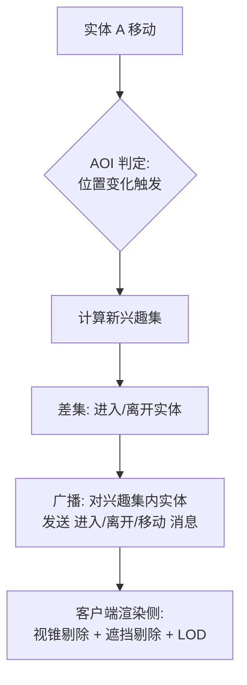

# 03-AOI 与视野计算

> MMO 场景同步的命门是广播：全量广播是 O(n²) 的灾难。AOI（Area of Interest，兴趣管理）决定"谁该看到谁"，把广播压到局部；视野锥、遮挡与战争迷雾决定"谁真正看到谁"，把渲染与表现压到合理。本篇覆盖九宫格/灯塔/十字链表三种 AOI、进入/离开/移动事件、视野计算与服务端客户端分工。

> 知识基线：C++17 与 Python 3.12 示例；复杂度、浮点/整数、坐标系和随机种子均按正文声明解释。
> 适用范围：连续世界中的半径 AOI、离散网格/分桶、视野锥与遮挡；重点面向运行时 MMO 服务端兴趣管理和客户端剔除，也可用于单机或离线压测；AOI、视野和反作弊是不同层次，不能互相替代。
> 数值与正确性边界：从 O(n²) 降到近似 O(n) 需要局部密度受控、格子/半径匹配和正确差集维护；边界接触、坐标取整、视锥角度、遮挡容差和事件去抖都需明确策略，广播量与 P99 延迟必须按目标人数实测。
> 最后更新：2026-08-06（补齐来源、边界条件与验证入口）。
> 参考来源：[Recast/Detour 开源空间查询实现参考](https://github.com/recastnavigation/recastnavigation)；[Box2D 官方文档](https://box2d.org/documentation/)。

## 1. 概述

一个 1000 人的同屏场景，若每个人都向所有其他人广播位置，每秒产生约 `1000 × 1000 = 10^6` 条消息——带宽与 CPU 都不可接受。**AOI 的核心思想：每个实体只关心它周围一定范围内的实体（兴趣集），事件只在该集合内广播。**



服务端 AOI 解决**同步带宽**，客户端剔除解决**渲染开销**，两者互补而非替代。

## 2. 核心概念

| 术语 | 说明 |
| --- | --- |
| AOI | 兴趣管理：为每个实体维护"可见/可交互"的实体集合 |
| 兴趣集（Interest Set） | 实体 A 的观察者与被观察者集合 |
| 广播域 | 实体事件（位置/属性变化）的传播范围 |
| 进入/离开事件 | 两个实体互相进入/离开各自 AOI 范围时的事件 |
| 移动事件 | 兴趣集内的位置更新（需节流） |
| 九宫格 | 按格子管理实体，AOI 半径 ≈ 格边长，覆盖 3×3 格 |
| 灯塔（Tower） | 在场景中布设固定"灯塔点"，实体注册到附近灯塔 |
| 十字链表 | 实体按 X/Y 双链表排序，移动时局部重排 |
| 视野锥 | 以朝向为中心、半角 + 距离定义的扇形可见范围 |
| 遮挡（Occlusion） | 被地形/物体挡住不可见 |
| 战争迷雾 | 未探索区域隐藏信息；探索过但当前不可见则变暗 |

## 3. AOI 算法

### 3.1 九宫格（格子法）

**原理**：把场景划分为边长为 `R`（AOI 半径）的方格。实体根据坐标落入某个格；以实体所在格为中心的 **3×3 邻格**内的所有实体，即其候选兴趣集（圆半径 R 最多跨越 3 个格宽，所以 9 格覆盖）。移动后格子变化时，用新旧格子集合做差集得到进入/离开事件。

```cpp
// 九宫格 AOI 核心（伪码级别，C++ 骨架）
struct AOIGrid {
    float cellSize;                                  // = AOI 半径 R
    std::unordered_map<int64_t, std::vector<Entity*>> cells;

    int64_t key(int cx, int cy) const {
        return (int64_t(cx) << 32) ^ (uint32_t(cy));
    }

    void onMove(Entity* e, float x, float y) {
        int cx = (int)std::floor(x / cellSize);
        int cy = (int)std::floor(y / cellSize);
        if (cx == e->cellX && cy == e->cellY) return; // 未跨格：只广播位置
        auto oldSet = coveredCells(e->cellX, e->cellY);
        auto newSet = coveredCells(cx, cy);
        for (auto k : newSet - oldSet) { /* 广播: 实体进入这些格 */ }
        for (auto k : oldSet - newSet) { /* 广播: 实体离开这些格 */ }
        e->cellX = cx; e->cellY = cy;
    }

    std::vector<int64_t> coveredCells(int cx, int cy) const {
        std::vector<int64_t> r;
        for (int dx = -1; dx <= 1; ++dx)
            for (int dy = -1; dy <= 1; ++dy)
                r.push_back(key(cx + dx, cy + dy));
        return r;
    }
};
```

**要点**：

- 格边长 = 广播半径 R（可分层：大物件用大 R、小物件用小 R，用多层网格或按类型分桶）；
- 事件只发生在**跨格瞬间**，格内移动仅更新位置；
- 每格实体列表用 vector + 稀疏索引（格很多时用哈希表）；实体分布不均时用"动态格大小"或 quadtree 折衷；
- 复杂度：移动 O(9 × 格内实体数)，广播 O(兴趣集大小)，远优于全量 O(n)。

### 3.2 灯塔（Tower）

**原理**：在场景中预先布设固定点（灯塔）。实体注册到"与自己距离 ≤ R 的所有灯塔"；实体 A 的观察者 = 所有注册了与 A 相同灯塔的实体。广播时按灯塔合并集合（去重）。

**覆盖保证推导**：设灯塔按正方形网格间距 `s` 排布，任意点到最近灯塔距离 ≤ `s/√2`（正方形网格的最大空圆半径）。对任意两个距离 ≤ R 的实体 P1、P2，取中点 M，其最近灯塔 T 满足 `|T − M| ≤ s/√2`，则：

```
|T − P1| ≤ |T − M| + |M − P1| ≤ s/√2 + R/2
```

要让 T 同时落在 P1、P2 的 R 范围内，需 `s/√2 + R/2 ≤ R`，即 **`s ≤ R/√2 ≈ 0.707R`**。工程上常取 `s = R/2` 留余量。

灯塔比九宫格灵活：半径 R 可变（大单位注册更多灯塔），格子边界效应更少；代价是注册/注销要遍历灯塔，且广播集合要按灯塔合并去重。

### 3.3 十字链表

**原理**：维护两条双向链表——实体按 X 排序、按 Y 排序（每个实体同时挂在两条链上）。查询以 `(x0, y0)` 为中心、半径 r 的邻域：

1. 从 X 链表中以 x0 为基准向两侧扫描，收集 `x ∈ [x0−r, x0+r]` 的候选；
2. 从 Y 链表中同理收集 `y ∈ [y0−r, y0+r]` 的候选；
3. 两候选集合求**交集**即邻域（距离过滤可后置）。

移动 = 在两条链中删除再按新坐标插入（O(n) 定位）；均匀分布下每次扫描期望 O(√n + k)。**优点**：无格边界、半径任意；**缺点**：实现复杂、插入删除 O(n)、缓存不友好，适合实体数中等（千级）且分布均匀的场景。

### 3.4 三种方案对比

| 方案 | 移动开销 | 查询开销 | 实现复杂度 | 适用 |
| --- | --- | --- | --- | --- |
| 九宫格 | O(9ρ) | O(9ρ) | 低 | 通用首选，MMO 主流 |
| 灯塔 | O(塔数) | O(塔数×格密度) | 中 | 大世界、半径分层 |
| 十字链表 | O(n) | O(√n + k) | 高 | 中等规模、均匀分布 |

（ρ = 单格实体密度，k = 查询结果数）

## 4. 进入/离开/移动事件

### 4.1 事件语义

- **进入（Enter）**：实体 A 的 AOI 出现实体 B。触发：A 移动跨格进入 B 所在格，或 B 出生/传送。双方互发：A 把 B 加入兴趣集、B 把 A 加入兴趣集；
- **离开（Leave）**：对称地移除；同时客户端销毁对应实体对象（或淡出）；
- **移动（Move）**：兴趣集不变时的位置更新。**必须节流**：广播频率一般 5~20 Hz（位置协议 10 Hz 常见），中间帧由客户端插值；
- **注意去重**：同一实体同时出现在多个新格时只发一次进入；广播按"实体 ID 集合"合并，避免重复消息。

### 4.2 事件风暴与抖动

```mermaid
flowchart TD
    A["实体移动"] --> B{"跨格?"}
    B -- "否" --> C["仅位置同步（节流 10~20Hz）"]
    B -- "是" --> D["新旧格集合差集"]
    D --> E["进入集/离开集"]
    E --> F{"实体是否抖动<br/>（短时间内反复跨格）?"}
    F -- "是" --> G["进入"粘滞期": 延迟离开<br/>通知，避免反复进出"]
    F -- "否" --> H["立即发进入/离开事件"]
    G --> H
```

防抖技巧：实体记录"上次跨格时间"，离开事件延迟 200~500ms 再发（期间若又进入则取消）；大批量进入（传送、副本切换）用批量协议一次发送。

### 4.3 带宽估算

```
带宽 ≈ 人数 × 平均兴趣集大小 × 频率 × 消息字节数
例: 500 玩家 × 60 实体 × 10 Hz × 20 B ≈ 6 MB/s（单服，粗估）
```

压带宽的手段：降低频率 + 客户端插值；位置量化（定点/半浮点打包）；只发"变化超过阈值"的移动；兴趣集按类型分层（玩家看玩家半径 200m、看 NPC 半径 100m）。

**位置打包示例**：把 float 坐标量化为 16 位定点（世界 10 km 范围、精度约 15 cm），配合 8 位朝向与 8 位状态字节，一条移动消息可压到 8~12 字节：

```cpp
// 量化：float 坐标 → 16 位定点
inline uint16_t quantize(float v, float worldSize) {
    return (uint16_t)((v / worldSize + 0.5f) * 65535.0f);
}
inline float unquantize(uint16_t q, float worldSize) {
    return ((float)q / 65535.0f - 0.5f) * worldSize;
}
```

量化误差交给客户端插值消化（实体匀速移动时误差 < 1 像素）；剧烈加速/传送场景再发全精度快照。

## 5. 视野锥与遮挡计算

### 5.1 视野锥（FOV）

视野锥 = 扇形：**距离 ≤ range** 且**方向夹角 ≤ halfAngle**。判定：

```
to = target − pos
if |to|² > range²: 不可见
cosθ = dot(normalize(to), dir)
可见 ⟺ cosθ ≥ cos(halfAngle)
```

```cpp
bool inViewCone(const Vec3& pos, const Vec3& dir,
                const Vec3& target, float range, float halfAngle) {
    Vec3 to = target - pos;
    if (dot(to, to) > range * range) return false;
    float cosA = dot(normalize(to), dir);
    return cosA >= std::cos(halfAngle);
}
```

预计算 `cos(halfAngle)` 避免每帧三角函数；批量单位用 SIMD 一次性判定（见 05 篇）。AI 感知（敌人发现玩家）常用"视野锥 + 距离 + 视线"三层过滤，先粗后细。

### 5.2 遮挡计算

- **视线（Line of Sight）**：从眼睛到目标做射线检测，被墙体/地形命中则遮挡。批量优化：先高度图粗略判定（`eyeY` 与 `targetY` 间是否被更高地形挡），再精确射线；
- **网格遮挡（PVS/遮挡剔除）**：客户端渲染用遮挡查询（Occlusion Query）、层级 Z 预深度、或预计算的潜在可见集（PVS，BSP 时代经典做法）；
- **阴影/视野多边形**：对遮挡物轮廓做扇形裁剪，得到可见多边形——战争迷雾的几何基础。

**批量可见性判定**：千级单位做"两两视线"不可行，工程上按以下顺序粗到细：

1. AOI 距离过滤（服务器已做过，客户端接收时再按渲染距离过滤）；
2. 视野锥测试（SIMD 批量，见 05 篇）；
3. 高度图/阻挡网格粗遮挡（读 1 bit/格的阻挡位图，O(1)）；
4. 精确射线（仅对前几步通过的少量目标）。

层次化之后，"全场景两两测试"变成"每实体常数次判定"，单位数量对开销的影响从 O(n²) 降到 O(n)。

## 6. 战争迷雾（Fog of War）

### 6.1 三层状态

| 状态 | 含义 | 表现 |
| --- | --- | --- |
| 未探索（Unexplored） | 从未进入视野 | 全黑，不显示任何信息 |
| 探索过（Explored） | 曾进入视野 | 变暗，显示静态地形与上次已知信息 |
| 当前可见（Visible） | 在友军视野内 | 全亮，实时同步 |

### 6.2 实现模型

**瓦片计数模型**（RTS 经典）：

```
每玩家维护:
  visibleCount[玩家][tile]  ← 有多少个友军单位能看到该瓦片（整数计数）
  explored[玩家][tile]      ← 是否曾可见（bool/位图）

每帧（或单位移动时）:
  对每个友军单位, 对其视野半径内的瓦片 visibleCount += 1
  离开时 -= 1（用"旧视野瓦片集 − 新视野瓦片集"差集更新，O(视野面积)）
visible = visibleCount > 0;  explored |= visible
```

**像素迷雾**（暗黑/星际争霸 2 风格）：把可见度画成低分辨率纹理（如 1/8 屏），上采样 + 模糊后混合到场景；边缘用"视野多边形"裁出硬边再模糊。服务器同步的是**探索状态**（瓦片级），客户端只做表现。

**视野多边形合并**：RTS 中多个单位视野互相重叠，若逐单位画圆形视野再叠加，边缘会出现闪烁。经典做法是先用"遮挡物轮廓 + 视野半径"生成每个单位的视野扇形/多边形，再求并集（可按瓦片栅格化后用 flood fill 合并），最后只对"新可见/新探索"的边界瓦片发增量更新。视野更新频率也节流（如 2~4 Hz 重算边界），中间帧沿用旧多边形。

```cpp
// 视野更新（差集法，避免全图重扫）
void updateVision(Player* p, const std::vector<TileCoord>& oldTiles,
                  const std::vector<TileCoord>& newTiles) {
    for (auto t : oldTiles - newTiles) p->visibleCount[t]--;
    for (auto t : newTiles - oldTiles) {
        if (p->visibleCount[t]++ == 0) {
            p->visible[t] = true;           // 边缘瓦片新可见
            p->explored[t] = true;
        }
    }
}
```

### 6.3 反作弊与权威

探索状态必须由**服务器权威**维护（防止客户端"开图"）：客户端上报视野中心与半径，服务器计算可见集，只下发可见范围内的实体与探索增量。视野外实体信息（位置、状态）一律不下发——这是 AOI 之外的第二道信息边界。

## 7. 服务端 AOI 与客户端剔除对比

| 维度 | 服务端 AOI | 客户端剔除 |
| --- | --- | --- |
| 目标 | 减少同步消息量与 CPU 广播 | 减少渲染 draw call 与填充率 |
| 粒度 | 实体级兴趣集（半径/类型分层） | 视锥、遮挡、距离 LOD、小地图剔除 |
| 频率 | 状态同步 5~20 Hz | 每帧 |
| 典型实现 | 九宫格/灯塔/十字链表 | Frustum Culling、Occlusion Query、HLOD |
| 判断依据 | 距离（服务器信任的坐标） | 相机参数 + 渲染数据 |
| 代价 | 服务器 CPU/带宽 | 客户端 CPU/GPU |
| 越界信息 | 不下发（防作弊边界） | 不渲染（但可下发） |

**协同工作流**：服务器按 AOI 下发"实体列表 + 低频状态"；客户端收到后先用视锥剔除、遮挡剔除、LOD 决定是否渲染；服务器只保证"可能看到"，客户端保证"实际渲染"。传送/副本切换时服务器推送整包快照，客户端做淡入，避免遮挡闪烁。

## 8. 复杂度分析

| 方案 | 广播单实体 | 移动更新 | 空间 | 适用规模 |
| --- | --- | --- | --- | --- |
| 全量广播 | O(n) | O(1) | O(1) | 小型局域（≤ 几十人） |
| 九宫格 | O(9ρ) | O(9ρ) | O(格数 + n) | 千人级 MMO 首选 |
| 灯塔 | O(塔数 × ρ) | O(塔数) | O(塔数 × ρ) | 大世界、半径分层 |
| 十字链表 | O(√n + k) | O(n) | O(n) | 中等规模、均匀分布 |
| 视野锥判定 | O(1)/实体 | O(1) | O(1) | 配合空间分区批量 |
| 战争迷雾（瓦片） | O(视野瓦片数) | 同左 | O(玩家 × 瓦片) | 位图压缩后很省 |

## 验证与基准建议

- 输入规模与边界用例：覆盖空场景、单实体、同格/跨格移动、AOI 边界内外、半径恰好相等、批量传送、实体删除、重复进入/离开、遮挡和视锥边界；分别压测均匀分布与热点聚簇。
- 正确性断言：将九宫格/灯塔/十字链表结果与朴素距离扫描对拍，断言进入/离开集合是新旧兴趣集差集且无重复；视野判定应校验坐标系、角度、遮挡顺序和服务端权威结果。
- 复杂度与耗时指标：记录实体数、候选数、兴趣集大小、进入/离开/移动事件数、广播字节数、CPU 耗时和 P50/P95/P99 延迟；不要把固定人数示例直接当作容量承诺。
- 命令示意（仅示意，不表示仓库已有测试）：`python -m pytest tests/test_aoi.py -q`；C++/服务端可用项目自有压测或 benchmark 目标模拟 1×、3× 设计人数。

## 9. 最佳实践

1. **AOI 半径分层**：按实体类型配置不同半径（玩家 200m、NPC 100m、掉落物 50m，仅为示例起点），九宫格用多层网格或分桶实现，最终半径需按带宽与延迟实测。
2. **事件批量与去重**：进入/离开按帧合并、按实体 ID 去重；大批量传送用快照协议。
3. **位置节流 + 插值**：10~20 Hz 可作为状态同步的起始频率，需按带宽、延迟和画面质量实测；带宽吃紧先降频率再降半径。
4. **服务器权威坐标**：客户端坐标只做表现，服务器用权威坐标做 AOI 判定，防加速外挂。
5. **迷雾与 AOI 叠加**：AOI 控制"同步谁"，迷雾控制"展示什么"，两者都做防作弊才完整。
6. **热点优化**：移动热点实体（玩家）优先用跨格差集；静止实体（NPC/资源）不做移动判定。
7. **压测先行**：用机器人压测 3× 设计人数，监控广播消息峰值与 P99 延迟（AOI 最怕事件风暴）。

## 10. 常见问题 FAQ

**Q1：九宫格格子多大合适？**
格边长 = 最小 AOI 半径。半径分层时按最大半径取格，小半径实体在格内做二次距离过滤；格太大 → 广播冗余多；格太小 → 跨格事件频繁。

**Q2：为什么 AOI 不用 KD 树/四叉树？**
动态场景实体每秒大量插入删除，平衡树/四叉树重平衡成本高、缓存不友好；格子法常数小、天然并行。静态场景（地图物件）才适合空间索引（见 01 篇空间分区）。

**Q3：移动事件风暴（一堆实体同时跨格）怎么办？**
进入/离开延迟确认（粘滞期）+ 批量协议 + 帧内合并；极限情况用"位置优先、兴趣集异步收敛"。

**Q4：客户端看到的实体数和服务器兴趣集不一致？**
正常。客户端还叠加视锥/遮挡剔除与 LOD；只要服务器兴趣集 ⊇ 客户端实际需要，就不会"漏实体"。漏实体通常是因为服务器 AOI 半径 < 客户端视野距离。

**Q5：战争迷雾能不能纯客户端做？**
可以（单机/RTS 房主权威），但联机防作弊必须服务器维护探索状态；纯客户端迷雾等于给玩家开图器。

**Q6：灯塔间距怎么定？**
`s ≤ R/√2` 保证任意两个 R 内实体共享至少一座灯塔；工程上取 `s = R/2` 留余量，代价是注册塔数增多（每个实体约注册 π(R/s)² ≈ 13 座）。

**Q7：AOI 和刷怪（Spawn）怎么配合？**
刷怪圈以玩家 AOI 为边界：玩家进入某区域且附近刷怪点空闲时，服务器按 01 篇的加权随机选出怪物并**先进入该玩家的兴趣集再入场景**（先发"进入"再发"移动"）；玩家离开 AOI 且怪物超出"脱战距离"时回收。副本与野外用同一套 AOI，只是副本广播域更小（整副本广播）。

**Q8：为什么"瞬间移动"（传送）要特殊处理？**
传送跨越大片场景，差集法会生成海量进入/离开事件。工程做法：传送时先发"整包快照"（新兴趣集全量），对旧兴趣集只发"离开"；接收端清空旧实体再批量创建新实体，避免逐条事件造成的中间帧闪烁。

## 11. 关联阅读

- [01-随机数与洗牌算法](01-随机数与洗牌算法.md)：掉落/刷怪分布与 AOI 刷怪圈结合；
- [04-路径平滑与转向行为](04-路径平滑与转向行为.md)：单位移动频率与 AOI 位置同步的配合；
- [05-位运算与性能优化技巧](05-位运算与性能优化技巧.md)：迷雾位图、SoA 实体数组、SIMD 视野判定；
- [01-寻路与图论](../01-寻路与图论/README.md)：空间分区（四叉树/网格）与 AOI 的异同；
- 《Game Programming Gems 4》：Interest Management 相关章节；
- 云风《游戏之旅：我的编程感悟》及博客（AOI 十字链表、服务端架构讨论）；
- MMO 同步综述：Bernier, "Latency Compensating Methods in Client/Server In-game Protocol Design"。
