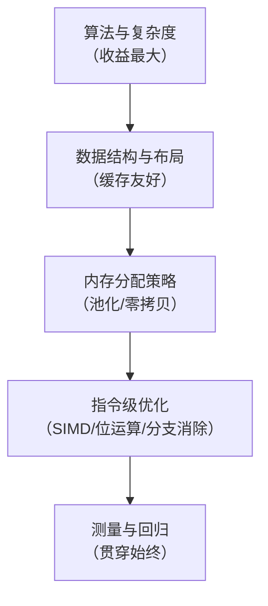
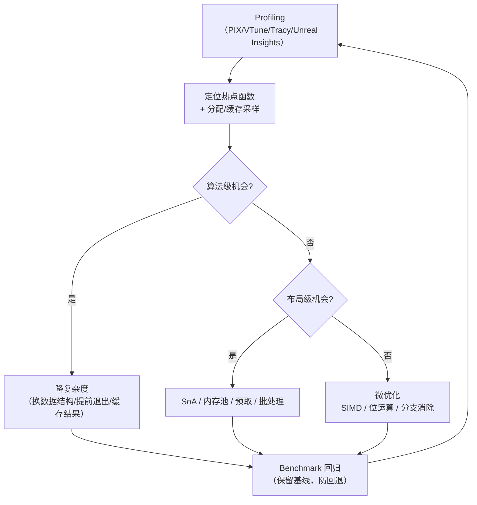

# 05-位运算与性能优化技巧

> 游戏性能优化的本质是"让热点代码跑在缓存与寄存器里"。位运算把多布尔状态压进一个整数，bitset/位图把集合压进每元素 1 bit，SoA 让数据按缓存行流动，内存池消灭碎片与分配抖动，SIMD 让四个浮点一起飞。本篇是方法论 + 工具箱，而不是"炫技大全"。

## 1. 概述

优化金字塔（自底向上，收益递减）：



**第一原则：先测量，再优化。** 90% 的"直觉优化"是浪费；热点（hotspot）由 profiler 说了算。位运算与布局优化的对象，永远是 profiler 点名的热点。

## 2. 核心概念

| 术语 | 说明 |
| --- | --- |
| 位掩码（Mask） | 用整数若干位表示一组布尔标志 |
| lowbit | `x & −x`，取最低置位 |
| popcount | 统计置位个数（`__builtin_popcount`） |
| bitset | 每元素 1 bit 的集合，空间 = n/8 字节 |
| 位图（Bitmap） | 像素/瓦片数据按位打包（如 R5G6B5、单色遮罩） |
| 缓存行 | x86 上 64 字节；一次访存整行载入 |
| AoS | Array of Structs：对象数组 |
| SoA | Struct of Arrays：字段数组（缓存/SIMD 友好） |
| 内存池 | 预分配大块 + 空闲槽复用，O(1) 分配释放 |
| 句柄（Handle） | index + generation 组合，防悬垂引用 |
| SIMD | 单指令多数据（SSE/AVX/NEON） |
| 伪共享 | 多线程写同一缓存行不同字段导致的串行化 |
| Amdahl 定律 | 并行收益上限 = 1/(1−P) |

## 3. 位标志与位掩码

### 3.1 基础操作

| 操作 | 表达式 | 说明 |
| --- | --- | --- |
| 置位 | `x |= 1u << k` | 第 k 位置 1 |
| 清位 | `x &= ~(1u << k)` | 第 k 位清 0 |
| 翻转 | `x ^= 1u << k` | 取反第 k 位 |
| 测试 | `x & (1u << k)` | 非 0 即置位 |
| 最低置位 | `x & −x` | lowbit |
| 清除最低置位 | `x & (x − 1)` | 循环遍历置位 |
| 是否 2 的幂 | `x && !(x & (x − 1))` | 经典判定 |
| 置位计数 | `__builtin_popcount(x)` | 硬件指令 |
| 前导零 | `__builtin_clz(x)` | 用于快速对数/对齐 |

### 3.2 游戏应用：状态标志

```cpp
// Buff/状态标志：一个 uint32 装 32 个布尔
enum BuffFlags : uint32_t {
    Buff_Stun    = 1u << 0,
    Buff_Slow    = 1u << 1,
    Buff_Silence = 1u << 2,
    Buff_Invuln  = 1u << 3,
    Buff_Poison  = 1u << 4,
};

uint32_t state = 0;
state |= Buff_Stun | Buff_Slow;        // 叠加状态
if (state & Buff_Stun) { /* 不能行动 */ }
state &= ~Buff_Slow;                   // 移除减速

// 组合掩码：控制免疫
constexpr uint32_t HardCC = Buff_Stun | Buff_Silence;
if (!(state & HardCC)) { /* 可以释放技能 */ }
```

比 32 个 bool 的优势：一个整数即可比较/复制/网络传输/存档；`switch` 分发、`memcpy` 快照、位运算批量操作（一帧批量 `state &= ~(Stun|Slow)`）。

**其他应用**：AI 状态机标志（发现玩家/受伤/在巡逻）、技能可释放条件位图、实体类型位（`isPlayer|isNPC|isBuilding`，配合位掩码做"只对玩家+可破坏物生效"的过滤）、网络消息特征位。

### 3.3 位域（Bitfield）的坑

C/C++ 位域 `struct { uint32_t a : 3, b : 5; }` 的**内存布局由编译器决定**，不可跨平台/跨编译器序列化；读改写还有原子性问题。**推荐用显式移位 + 掩码**，或仅在单机内部数据结构里用位域。

## 4. bitset 应用

### 4.1 实现

```cpp
// 每元素 1 bit；n=100 万 仅 125 KB
class Bitset {
    std::vector<uint64_t> bits;
public:
    explicit Bitset(size_t n) : bits((n + 63) / 64, 0) {}
    void set(size_t i)   { bits[i >> 6] |= 1ull << (i & 63); }
    void reset(size_t i) { bits[i >> 6] &= ~(1ull << (i & 63)); }
    bool test(size_t i) const { return (bits[i >> 6] >> (i & 63)) & 1ull; }
    // 批量操作：|=、&=、^= 整字进行，比逐元素快 64 倍
};
```

### 4.2 游戏场景

| 场景 | 用法 |
| --- | --- |
| A* 开放/关闭集 | 小地图（≤ 65536 格）用 bitset 替代 unordered_set，O(1) 判定且缓存友好 |
| 素数筛/随机数池 | 1e9 范围筛素数仅 125 MB（vector\<bool\> 或自实现） |
| 关卡/成就解锁 | 位图标记 0..63 个解锁位，存档一个 uint64 |
| Chunk 脏标记 | 每块 1 bit，保存时遍历置位块 |
| 视野探索表 | 战争迷雾 explored 位图（见 03 篇），批量置位 |
| 实体 ID 复用 | 空闲 ID 位图 + `ctz` 找空位，分配 O(1) |

**注意**：

- `std::vector<bool>` 是**打包特化**，元素是代理引用而非 `bool&`，不能取地址、不能直接喂给算法、线程安全无保证；性能反而常不如手写 uint64 数组；
- 固定大小用 `std::bitset<N>`（编译期）；动态用自实现或 `boost::dynamic_bitset`；
- 遍历置位：`while (x) { int i = ctz(x); x &= x - 1; ... }` 只访问置位位。

## 5. 位图（Bitmap）数据打包

### 5.1 颜色与像素打包

```cpp
// RGBA8888 打包/解包
inline uint32_t packRGBA(uint8_t r, uint8_t g, uint8_t b, uint8_t a) {
    return (uint32_t(r) << 24) | (uint32_t(g) << 16) | (uint32_t(b) << 8) | a;
}
inline uint8_t unpackR(uint32_t c) { return c >> 24; }

// 565 打包：一张 16 位色纹理省一半带宽（移动端 UI/地形常用）
inline uint16_t pack565(uint8_t r, uint8_t g, uint8_t b) {
    return uint16_t((r >> 3) << 11) | uint16_t((g >> 2) << 5) | (b >> 3);
}
```

### 5.2 游戏场景

- **地形遮罩/混合贴图**：每瓦片用位图记录"草/石/沙"覆盖，混合权重从位图读出；
- **光照/阴影位图**：可见性位图（见 03 篇战争迷雾）低分辨率 + 上采样，位运算批量更新；
- **法线/方向压缩**：`oct` 编码把 3D 单位法线压进 2 个分量（各 16 bit），减少带宽；
- **寻路阻挡位图**：静态碰撞烘焙成 1 bit/格的阻挡图，查询 O(1)，与 A* 位图开集配合；
- **移动端纹理**：ASTC/ETC2 硬件压缩的底层思路同样是"按块打包位"。

## 6. 缓存友好：SoA vs AoS

### 6.1 缓存行

x86 缓存行 64 字节 = 16 个 float。按顺序访问连续内存 → 每次取一行数据全部用上（空间局部性）；随机跳跃 → 每行只用一个 float，有效带宽掉到 1/16。**遍历顺序（连续）与数据布局（紧凑）决定 90% 的吞吐。**

### 6.2 AoS vs SoA

```cpp
// AoS：对象数组（逻辑直观）
struct Particle { float x, y, z, vx, vy, vz; };
std::vector<Particle> aos(100000);

// SoA：字段数组（缓存/SIMD 友好）
struct ParticleSoA {
    std::vector<float> x, y, z, vx, vy, vz;
};
ParticleSoA soa;   // 6 个连续 float 数组
```

| 布局 | 优点 | 缺点 | 适用 |
| --- | --- | --- | --- |
| AoS | 单对象所有字段一起访问，代码直观 | 批量只用一个字段时浪费缓存；SIMD 难跨字段 | 少量对象、逻辑频繁切换字段 |
| SoA | 单字段批量遍历满缓存行；可直接喂 SIMD | 对象"撕裂"（多字段时多次访存） | 海量对象热点（粒子/单位/骨骼） |

**粒子更新对比**：AoS 每帧访问全部 6 字段 → 缓存利用率 100%，两者相当；若只更新位置（3 字段），AoS 每行浪费一半，SoA 全命中。**判断标准：热点循环访问的字段子集越小，SoA 越赚。**

### 6.3 数据导向设计（DOD）

DOD 的工程口号：**按"热点循环怎么访问"来组织内存，而不是按"对象在逻辑上是什么"**。配套手法：

- 按行为分组：`updatePosition(soa.positions)` 与 `updateAI(aiArray)` 分开，互不拖累缓存；
- 数组化实体：实体 = ID + 各系统自己的 SoA 数组，系统间通过 ID 关联；
- 预取（prefetch）：大循环前 `__builtin_prefetch` 下一批数据；
- 批处理：同类操作合并（排序 draw call、合并小网格），减少分支与切换；
- 对齐：16/64 字节对齐的分配（`aligned_alloc`、`_aligned_malloc`），配合 SIMD 与避免伪共享。

## 7. 内存池

### 7.1 为什么要池化

- `new/delete`、`malloc/free` 有锁与系统调用开销，且反复分配产生**碎片**；
- 游戏对象（子弹、特效、掉落物、单位）短命高频，是分配抖动的重灾区；
- 池化 = 预分配连续大块，分配/释放 O(1)，无碎片，缓存友好。

### 7.2 索引池 + 空闲链表

```cpp
template <typename T>
class IndexPool {
    std::vector<T>       storage;   // 连续内存（不移动，索引稳定）
    std::vector<uint32_t> freeList; // 空闲槽栈
    uint32_t next = 0;
public:
    uint32_t alloc() {
        if (!freeList.empty()) {
            uint32_t i = freeList.back(); freeList.pop_back();
            storage[i] = T{};              // 重置
            return i;
        }
        if (next == storage.size()) storage.resize(storage.size() + 1024);
        return next++;
    }
    void free(uint32_t i) { freeList.push_back(i); }
};
```

### 7.3 句柄与世代（防悬垂）

纯索引池有悬垂风险：索引被释放后又被复用，旧引用指向新对象。加**世代号**：

```cpp
struct Handle { uint32_t index : 24; uint32_t gen : 8; };
// 释放时 gen++；访问时校验 storage[index].gen == handle.gen，不等即失效
```

这是 Unity/Unreal 实体系统的通用手法。注意：释放顺序抖动时，尽量"批量释放 + 延迟复用"（帧末统一回收），避免同一帧 alloc/free 同槽造成乒乓。

### 7.4 选择指南

| 需求 | 方案 |
| --- | --- |
| 固定大小对象、高频 | 索引池 + 世代句柄 |
| 变长对象（字符串/列表） | 块分配器（arena）+ 复用 |
| 纯 C++ 小对象 | 可考虑 tcmalloc/jemalloc 替代默认分配器 |
| C#/Unity | 对象池（`ObjectPool<T>`）+ 避免闭包分配；GC 压力用值类型 + 池化 |

## 8. SIMD 与并行

### 8.1 SIMD 基础

SSE（128 位 = 4 float）、AVX2（256 位 = 8 float）、NEON（ARM）。典型用法：

```cpp
#include <immintrin.h>
// 4 个粒子位置同时 + 速度*dt（前提：SoA 布局 + 16 字节对齐）
__m128 px = _mm_load_ps(&soa.x[i]);       // 载入 4 个 x
__m128 vx = _mm_load_ps(&soa.vx[i]);
__m128 dt4 = _mm_set1_ps(dt);
__m128 nx = _mm_add_ps(px, _mm_mul_ps(vx, dt4));
_mm_store_ps(&soa.x[i], nx);
```

**顺序**：先开编译器自动向量化（`-O3 -march=native` / `/O2 /arch:AVX2`）+ 用 `#pragma omp simd` 或 `restrict` 提示；不行再手写 intrinsic。手写前确认：循环无别名冲突、无分支、SoA、对齐。

### 8.2 并行与 Amdahl

```
加速比上限 S = 1 / ((1 − P) + P / N)
```

P = 可并行比例，N = 核数。P = 90%、N = 16 核时上限 ≈ 6.4×，可见"并行 90% 的代码"比"优化 10% 的串行代码"划算得多。工程上：

- **Job System**：把生成/寻路/物理/动画拆成任务，依赖图调度；Unity 的 DOTS、Unreal 的 TaskGraph 都是现成方案；
- **并行粒度**：按 Chunk（见 02 篇）、按实体分片（每线程一片 SoA）切，避免细粒度锁；
- **伪共享**：不同线程写同一缓存行的不同字段会被迫串行——热数据按 64 字节对齐拆分到各线程；
- **确定性**：并行要复现结果就固定分片与归并顺序（浮点加法顺序影响结果）；
- **GPU 并行**：粒子、噪声、地形网格化天然并行，交给 compute shader（见 02 篇）。

## 9. 热点算法微优化方法论

### 9.1 标准流程



### 9.2 常用微优化清单

| 技术 | 例子 |
| --- | --- |
| 分支消除 | 条件移动 `cmov`、查表、`min/max` 替换 if |
| 位运算替代 | `% 2` → `& 1`；`* 2^k` → `<< k`；`% 64` → `& 63`（仅 2 的幂） |
| 提前退出 | 包围盒粗测 → 精确碰撞；距离平方比较避免 sqrt |
| 缓存结果 | 静态数据查表（三角函数、噪声 perm）、备忘录 |
| 循环优化 | 展开、`#pragma unroll`、循环不变量外提 |
| 延迟隐藏 | 预取、数据依赖链解耦（`a=b+c; d=e+f` 并行） |
| 批量 IO | 网络/存档按块打包，位打包减少体积（见第 5 节） |

### 9.3 测量纪律

- **profiler 先行**：采样（sampling）找热点，不要用直觉；分配热点用内存剖析；
- **对比要有基线**：优化前后同机同参 benchmark；警惕编译器把"看起来没用的代码"优化掉；
- **缓存效应**：重复跑同输入会命中缓存，基准与实际负载要有差异；
- **复杂度 vs 常数**：`O(n log n)` 但常数大的算法在小 n 下可能输给 `O(n²)`——以实测为准；
- **过早优化是万恶之源**：先保证正确性与可读性，hotspot 由数据驱动地优化；为位运算加注释，防止后人"重构"回慢版本。

## 10. 复杂度与收益分析

| 技术 | 复杂度变化 | 实际收益来源 | 适用热点 |
| --- | --- | --- | --- |
| 位标志合并 | 不变 | 少 32× 布尔内存、批量比较 | 状态机、Buff、过滤 |
| bitset | 查询 O(1) | 空间 n/8，整字批量 | 开集、解锁、脏标记 |
| 位图打包 | 不变 | 带宽/内存 2~4× | 纹理、迷雾、阻挡 |
| SoA | 不变 | 缓存命中率数倍~数十倍 | 粒子、单位批量更新 |
| 内存池 | 分配 O(1) | 消灭锁与碎片 | 子弹、特效、实体 |
| SIMD | 不变 | 4~8× 吞吐 | 数学热点（物理/动画） |
| 并行 | T(n)/N | 上限受 Amdahl 限制 | 生成、寻路、烘焙 |
| 算法替换 | 降阶 | 本质改善 | 排序/搜索/路径 |

## 11. 最佳实践

1. **先算法，后布局，再指令**：换算法收益是数量级，SIMD 是常数倍。
2. **数据布局先行**：任何新系统按"热点循环访问模式"设计 SoA；后期重构 SoA 成本极高。
3. **池化 + 句柄**：高频短命对象一律索引池 + 世代句柄；句柄失效必须显式处理（log + 跳过）。
4. **位运算服务于意图**：加注释说明位含义（`// bit3 = 已被治疗师看过`），用 `enum`/`constexpr` 命名掩码。
5. **并行只加在已验证正确的系统上**：先串行跑对，再并行；固定分片顺序保确定性。
6. **建立性能回归**：热点函数配微基准 + 阈值告警，CI 里跑（注意 CI 机器噪声，用多次取中位数）。
7. **移动端预算**：内存带宽是移动端第一瓶颈——位图压缩、SoA、避免大纹理，优先级高于指令优化。

## 12. 常见问题 FAQ

**Q1：`std::vector<bool>` 为什么慢/怪？**
它是打包特化：元素是代理对象，`bool& b = v[0]` 编译不过；迭代器解引用产生临时对象，读写都有额外开销；标准不保证线程安全。需要位集时手写 uint64 数组或 `std::bitset`。

**Q2：位运算真的比乘除快吗？**
现代 CPU 上整数乘除延迟已很低，位运算的收益主要在"少分支、少依赖、可批量"，而不是"一个周期 vs 三个周期"。真正的差距来自**访存与缓存**，别本末倒置。

**Q3：内存池会不会浪费内存？**
按需扩容（每次 ×2 或 +1024）摊薄浪费；空闲槽复用后浪费趋近 0；相比碎片化导致的不可用内存，池化通常更省。注意对象构造/析构要显式管理（placement new）。

**Q4：手写 SIMD 还是靠编译器？**
先开 `-O3 -march=native` + 自动向量化，用 Godbolt/反汇编确认；热点仍不够再手写 intrinsic。手写前必须 SoA + 对齐 + 无别名。

**Q5：多线程优化后反而变慢？**
大概率是伪共享（同一缓存行多线程写）或任务过碎（调度开销 > 并行收益）。任务粒度 ≥ 几十微秒，热字段按 64 字节对齐隔离。

**Q6：怎么防止"重构把位运算改回慢版本"？**
命名掩码 + 注释 + 微基准守护；把关键路径封装成 `inline` 函数（`hasFlag(x, k)`），语义清晰且优化点集中。

## 13. 关联阅读

- [01-随机数与洗牌算法](01-随机数与洗牌算法.md)：RNG 状态/种子哈希的位运算实现；
- [02-程序化生成](02-程序化生成.md)：噪声 perm 表、阻挡位图、并行分块生成；
- [03-AOI 与视野计算](03-AOI与视野计算.md)：迷雾位图、SoA 实体数组、SIMD 视野判定；
- [04-路径平滑与转向行为](04-路径平滑与转向行为.md)：Boids 空间哈希、RVO 批量计算；
- 《Game Engine Architecture》(Jason Gregory)：数据导向设计、内存管理章节；
- 《Software Optimization Cookbook》(Gerber)：缓存与 SIMD 实践；
- 《Data-Oriented Design》(Richard Fabian)：DOD 系统论述；
- Intel 优化手册 / Agner Fog 的 Optimization Guides（指令延迟表）。
