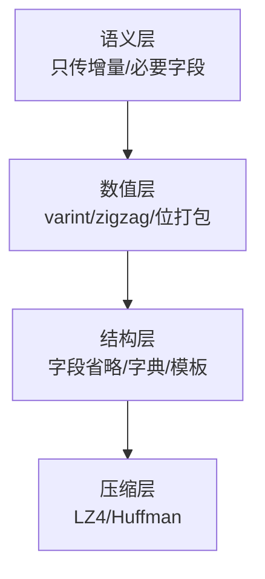

# 数据压缩与序列化（Varint / Zigzag / 压缩编码）

> 知识基线：引擎无关的游戏算法通用原理；本文覆盖序列化格式设计（varint/zigzag/定长/位打包）、熵编码（Huffman/LZ 族）与游戏网络/存储场景的字节层优化；与[游戏服务端/01-架构与网络/02-网络通信与协议设计.md](../../游戏服务端/01-架构与网络/02-网络通信与协议设计.md)（协议层）和[游戏知识/06-网络同步/README.md](../../游戏知识/06-网络同步/README.md)（UE 网络）分层互补。
> 适用范围：网络消息压缩（MMO 广播/AOI 同步）、存档与配置序列化、热更包/资源下载体积优化、以及带宽预算紧张的多人游戏。
> 事实边界：编码算法（varint/zigzag/Huffman/LZ4/LZMA）与复杂度为通用事实；具体引擎（UE 的 FArchive/属性复制压缩、ProtoBuf/FlatBuffers 等库）以其文档为准；压缩率与速度需按数据特征实测。
> 最后更新：2026-08-07。
> 参考来源：[Wikipedia: Variable-length quantity](https://en.wikipedia.org/wiki/Variable-length_quantity)、[Wikipedia: LZ77 and LZ78](https://en.wikipedia.org/wiki/LZ77_and_LZ78)、[Google Protocol Buffers 编码文档](https://protobuf.dev/programming-guides/encoding/)。

> 游戏的带宽与存储是"真金白银"：一条位置同步消息从 32 字节压到 12 字节，万人 MMO 的广播成本就省下一大截。本文讲序列化层的**字节经济学**：如何用 varint/zigzag/位打包把整数与浮点塞进更少的字节，何时上通用压缩（LZ4/LZMA），以及选型权衡。

---

## 一、概述

### 1.1 为什么需要字节层优化

- **带宽**：MMO 广播是 O(N²) 量级，每条消息省 1 字节，总量可观（见[03-AOI与视野计算.md](03-AOI与视野计算.md)的带宽估算）；
- **延迟**：小包传输更快（MTU 友好）；
- **存储**：回放/存档/日志的量级与成本；
- **解码性能**：游戏要求**解压快**——压缩率第二，解码速度第一。

### 1.2 优化分层



*图释：字节优化四层——语义省得最多，数值层最常用，压缩层兜底。先做前两层再做压缩，收益最大。*

---

## 二、核心概念

| 概念 | 英文 | 一句话定义 | 示例 |
| --- | --- | --- | --- |
| 序列化 | Serialization | 对象 ↔ 字节流的转换 | 存档/网络消息 |
| 变长整数 | Varint | 小整数用少字节编码 | 7bit/字节 连续编码 |
| Zigzag | Zigzag Encoding | 有符号整数映射到无符号紧凑编码 | -1 → 1, 1 → 2 |
| 位打包 | Bit Packing | 把多个小字段压进一个字节 | 3bit+5bit |
| 增量编码 | Delta Encoding | 存差值而非绝对值 | 位置变化量 |
| 字典编码 | Dictionary | 重复串用索引代替 | 名字/技能 ID |
| 熵编码 | Entropy Coding | 高频符号短码 | Huffman |
| LZ 族 | LZ77/LZ4/LZMA | 滑动窗口匹配压缩 | 大块数据 |
| 模板/模式 | Schema/Template | 消息结构预定义，只传变化字段 | Protobuf/FlatBuffers |

---

## 三、原理详解

### 3.1 Varint（变长整数）

思想：**小整数用 1 字节，大整数用多字节**（每字节 7 位数据 + 1 位继续标志）：

```text
// 编码 300：0xAC 0x02（节选/示意）
300 = 0b10_0101100
→ 低 7 位 0101100 | 继续位 1 → 0xAC
→ 高 2 位 10     | 继续位 0 → 0x02
```

- 0~127：1 字节；128~16383：2 字节；普通游戏数值（血量/坐标/时间戳）多数 1~2 字节；
- 代价：大整数比定长更糟（uint32 最大 5 字节）；
- 应用：Protobuf 的 int32/int64、UE 的压缩整数（如 FNetBitWriter 的部分路径）。

### 3.2 Zigzag（有符号整数）

varint 对负数不友好（-1 会编码成 5 字节全 1）。Zigzag 把负数映射成正数：

```text
zigzag(n) = (n << 1) ^ (n >> 31)      // 32 位
// -1 → 1, 1 → 2, -2 → 3, 2 → 4 ...
```

配合 varint：常见的小正负值（位置差、速度差）都压到 1~2 字节。

### 3.3 位打包与字段级优化

| 技术 | 做法 | 收益 |
| --- | --- | --- |
| 位域 | 布尔/枚举用 1~2 bit | 8 个布尔 = 1 字节 |
| 定点数 | 浮点转 int16（乘缩放） | 位置/角度省 50% |
| 半精度 | float16 | 颜色/小数值 |
| 枚举字典 | 字符串/枚举转 ID | 大字段变小整数 |
| 增量 | 只发 `Δp/Δv` | 静止玩家 ≈ 0 字节 |
| 可选字段 | 存在位图 + 仅非默认值 | 稀疏消息大省 |

```text
// 伪代码：位打包位置同步（节选/示意）
// 位置 -2048~2047，0.25 精度 → int14；角度 0~359° → uint9
packed = (pos_x_14 << 23) | (pos_y_14 << 9) | angle_9
// 共 32 bit = 4 字节（原 3×float = 12 字节）
```

### 3.4 增量与状态同步

- **全量 vs 增量**：首次全量，之后只发变化（配合脏标记）；
- **增量编码**：`Δ = new - old`，Δ 通常小 → varint 更省；
- **预测 + 纠错**：接收方预测下一个值，只发偏差（强相关数据如路径点）；
- **回退**：丢包/乱序时需要"全量重同步"通道（快照请求）。

### 3.5 熵编码与 LZ 族

| 算法 | 类型 | 速度 | 压缩率 | 适用 |
| --- | --- | --- | --- | --- |
| Huffman | 熵编码 | 快 | 中 | 高频符号表已知 |
| LZ4 | LZ 快速 | 极快 | 中低 | 实时网络/内存 |
| Zstd | LZ 平衡 | 快 | 高 | 存储/回放/下载包 |
| LZMA | LZ 高压缩 | 慢 | 极高 | 安装包/资源包 |

- 游戏网络实时路径用 **LZ4**（解压 GB/s 级，延迟可忽略）；
- 存储/热更包用 **Zstd/LZMA**（压缩率优先，解压仍快）；
- **注意**：小消息（<64B）压缩收益低甚至负收益——先语义/数值层优化。

### 3.6 序列化框架选型

| 框架 | 特点 | 适用 |
| --- | --- | --- |
| Protobuf | varint 编码、schema 演进、跨语言 | 服务端/跨语言协议 |
| FlatBuffers | 零拷贝读取、无解析 | 高性能客户端 |
| MessagePack | JSON 友好、动态类型 | 快速原型 |
| 手写位流 | 极致紧凑、完全可控 | 带宽极敏感（帧同步） |
| UE FArchive/属性复制 | 引擎内置、与复制系统集成 | UE 项目 |

选型权衡：**紧凑度 × 解码速度 × 开发成本 × 演进能力**——帧同步类追求极致紧凑常手写；业务协议用 Protobuf 生态。

### 3.7 Protobuf 编码细节（参考）

理解 Protobuf 的 wire format 有助于估算消息体积：

```text
// 字段编码：tag = (field_number << 3) | wire_type（节选/示意）
// int32/uint64 字段：wire_type=0，值用 varint
// 长度字段（string/bytes/嵌套消息）：wire_type=2，先写长度再写内容
// 示例：field 1, int32 = 150 → 0x08 0x96 0x01（3 字节）
```

- 字段编号越小 tag 越省（field 1~15 的 tag 只占 1 字节）；
- 默认值字段可省略不传（Proto3 语义）；
- 嵌套消息、repeated 字段的编码开销需按结构估算。

### 3.8 位流写入器完整示例

```text
// 伪代码：位流写入器（节选/示意）
class BitWriter:
    def __init__(self):
        self.buf = bytearray()
        self.bitpos = 0

    def write_bits(self, value, n):
        for i in range(n):
            bit = (value >> i) & 1
            byte_idx = self.bitpos // 8
            if byte_idx == len(self.buf):
                self.buf.append(0)
            if bit:
                self.buf[byte_idx] |= (1 << (self.bitpos % 8))
            self.bitpos += 1

    def write_varint(self, value):
        while value >= 0x80:
            self.write_bits((value & 0x7F) | 0x80, 8)
            value >>= 7
        self.write_bits(value, 8)

    def write_zigzag(self, value):
        self.write_varint((value << 1) ^ (value >> 63) if isinstance(value, int) and value < 0 else (value << 1))
```

注意：位写入顺序（低位在前）必须与读取端一致，跨平台/跨语言时明确定义字节序。

### 3.9 压缩基准测试方法

压缩选型必须按**真实数据分布**实测：

| 维度 | 方法 |
| --- | --- |
| 样本 | 抓真实线上消息（不同地图/玩家数/时长），离线跑压缩 |
| 指标 | 压缩率、压缩/解压吞吐（MB/s）、P99 延迟 |
| 对比 | 同一数据跑 LZ4/Zstd/LZMA/不压缩 四档 |
| 结论 | 实时路径看 P99 延迟，存储看压缩率与解压速度比 |

测试建议：

- 小消息（<64B）单独统计——压缩可能负收益；
- 数据特征变化（新玩法/新地图）后重测；
- 把基准纳入 CI（压缩率回归测试，见[游戏测试与质量/05-CI质量门禁与缺陷管理.md](../../游戏测试与质量/05-CI质量门禁与缺陷管理.md)）。

---

## 四、伪代码/示例：紧凑消息编码

```text
// 伪代码：紧凑位置消息（节选/示意）
class BitWriter:
    def write_varint(self, value):
        while value >= 0x80:
            self.byte((value & 0x7F) | 0x80)
            value >>= 7
        self.byte(value)

    def write_zigzag_varint(self, value):
        self.write_varint((value << 1) ^ (value >> 31))

// 发送位置增量
msg = BitWriter()
msg.write_zigzag_varint(dx_quantized)   // 1~2 字节
msg.write_zigzag_varint(dy_quantized)   // 1~2 字节
msg.write_bits(angle_quantized, 9)      // 2 字节
msg.write_bits(state_bits, 4)           // 半字节
// 合计约 5~7 字节（原 12+ 字节）
```

---

## 五、最佳实践

1. **先语义后字节**：少发字段（增量/仅变化）比压缩省得多，永远先做前两层。
2. **数值量化**：浮点按精度需求转定点/半精度，收益最大且解码零成本。
3. **小消息不压缩**：<64 字节直接用紧凑编码，别上 LZ4。
4. **解码速度优先**：实时路径选 LZ4 级；批量存储才用高压缩率。
5. **schema 演进**：消息格式必须带版本号，前后兼容（增字段不破坏旧客户端）。
6. **对齐与安全**：解析不可信输入时校验长度/边界，防恶意包（见[游戏服务端/02-数据与业务/04-安全与反作弊.md](../../游戏服务端/02-数据与业务/04-安全与反作弊.md)）。
7. **基准测试**：压缩率与耗时按真实数据分布测（不同地图/玩家人数），别用理想样例。
8. **确定性**：序列化顺序固定（帧同步场景），浮点转整数量化保持一致（见[游戏算法/04-确定性与基准工程/01-动态寻路确定性与基准测试.md](../04-确定性与基准工程/01-动态寻路确定性与基准测试.md)）。
9. **带宽预算表**：每条消息类型统计字节均值/P99，超预算告警（见[游戏知识/06-网络同步/08-网络调试与性能分析.md](../../游戏知识/06-网络同步/08-网络调试与性能分析.md)）。
10. **先测量后优化**：用 profiler 看真实字节构成，别优化"看起来大"的消息。

---

## 六、常见问题 FAQ

1. **Q：varint 一定比定长好？** A：小数值省、大数值亏；游戏数值分布偏小，通常净赚；大 ID/大坐标用定长或混合。
2. **Q：浮点怎么压？** A：量化定点（±2048/0.25 → int14）、半精度 float16、或增量+varint；全精度 float32 只在必要时。
3. **Q：什么时候用 LZ4？** A：大消息（>256B）、批量同步（快照/回放帧）、网络与存储通用场景。
4. **Q：Protobuf 和手写位流怎么选？** A：跨语言/演进需求 → Protobuf；帧同步/极致带宽 → 手写位流（配合生成器管理）。
5. **Q：压缩会影响解码延迟吗？** A：LZ4 解压微秒级可忽略；LZMA 解压较慢，实时路径别用。
6. **Q：增量消息丢包怎么办？** A：增量通道 + 周期全量快照 + 丢失重传/快照请求；见[游戏知识/06-网络同步/02-RPC与属性同步.md](../../游戏知识/06-网络同步/02-RPC与属性同步.md)。
7. **Q：字符串怎么省？** A：枚举/ID 字典（服务端下发 ID→字符串映射表），只在首次/查询时传全文。
8. **Q：存档也要压缩吗？** A：大存档（世界状态）用 Zstd 明显省；小存档紧凑编码即可，注意存档要可部分读取。
9. **Q：安全上要注意什么？** A：长度字段防溢出、魔数/版本校验、压缩炸弹防御（声明解压后大小上限）。
10. **Q：怎么量化收益？** A：抓真实消息样本统计字节分布（P50/P99），对比优化前后；带宽预算看 P99 而非均值。

---

## 七、关联阅读

- 同分类：[03-AOI与视野计算.md](03-AOI与视野计算.md) —— 广播规模与带宽估算（字节优化的需求来源）；
- 同分类：[05-位运算与性能优化技巧.md](05-位运算与性能优化技巧.md) —— 位打包的底层实现技巧；
- 确定性：[01-动态寻路确定性与基准测试.md](../04-确定性与基准工程/01-动态寻路确定性与基准测试.md) —— 序列化顺序与浮点一致的确定性要求；
- 服务端：[游戏服务端/01-架构与网络/02-网络通信与协议设计.md](../../游戏服务端/01-架构与网络/02-网络通信与协议设计.md) —— 协议层设计（帧格式/心跳/重传）；
- 网络：[游戏知识/06-网络同步/02-RPC与属性同步.md](../../游戏知识/06-网络同步/02-RPC与属性同步.md) —— 属性压缩与增量同步的 UE 实现；
- 网络：[游戏知识/06-网络同步/08-网络调试与性能分析.md](../../游戏知识/06-网络同步/08-网络调试与性能分析.md) —— 带宽统计与预算分析。

---

## 更新日志

- 2026-08-07：初稿。补齐"数据压缩与序列化"空白（P1，此前全章 0 覆盖）；涵盖 varint/zigzag/位打包/增量/熵编码与 LZ 族、框架选型与字节优化方法论；引擎无关通用层，UE/服务端细节指路。

## 落地检查清单

### 常见反模式

1. **统一用文本序列化**：JSON 调试方便但带宽与 CPU 成本高，热路径不可用。
2. **字节序不统一**：跨平台/跨端出现数据错乱，难以排查。
3. **无版本字段**：协议演进后旧数据无法解析。
4. **盲目压缩所有包**：小包压缩收益低甚至负收益（头部开销）。
5. **压缩与确定性混谈**：压缩层一般不影响确定性，问题常在序列化顺序。
6. **热路径做重压缩**：CPU 尖峰影响帧率，应先测编解码基准。

### 补充：小包优化思路

```text
小消息（< 64B）：优先位打包/varint/zigzag，避免压缩
中消息（64B-1KB）：delta + LZ4/Zstd 按需
大消息（> 1KB）：LZ4 或 Zstd 压缩，缓存压缩结果
```

该分级是方案示意，按实际带宽与 CPU 预算校准。

- [ ] 序列化四问已明确：布局（字段顺序）、字节序、对齐、版本兼容策略。
- [ ] 数值编码选型：varint/zigzag（小整数）、delta（时间序列）、位打包（枚举/标志）。
- [ ] 压缩算法选型有依据：LZ4（速度）/Zstd（平衡）/LZMA（压缩率），按场景对比。
- [ ] 框架选型：Protobuf / FlatBuffers / 手写布局按带宽、零拷贝、版本演进权衡。
- [ ] 网络打包与带宽预算衔接：AOI 广播场景字节预算（联动 03-03）。
- [ ] 压缩确定性已评估：压缩层一般不破坏确定性，风险在序列化层（指路 04-01）。
- [ ] 版本兼容：新增字段缺省值、未知字段忽略策略、schema 演进测试。
- [ ] 性能基准：编解码耗时在热路径有预算，避免 CPU 尖峰。
- [ ] 存档/回放/协议三类场景分别验证：可恢复、可复现、跨平台一致。
- [ ] 与协议设计衔接（指路 服务端 01-02）与 UE 序列化差异（指路 游戏知识/06-网络同步/02）。

### 术语速查

| 术语 | 英文 | 一句话解释 |
| --- | --- | --- |
| 序列化 | Serialization | 对象到字节流的转换 |
| varint | Variable-length Integer | 变长整数编码 |
| zigzag | ZigZag Encoding | 有符号整数的无符号映射 |
| delta 编码 | Delta Encoding | 存差值减小数值范围 |
| LZ4/Zstd/LZMA | Dictionary Compressors | 字典压缩算法家族 |
| 熵编码 | Entropy Coding | 按频率分配码长（如 Huffman） |
| 字节序 | Endianness | 大端/小端存储顺序 |
| 零拷贝 | Zero-copy | 避免中间缓冲的读写方式 |
