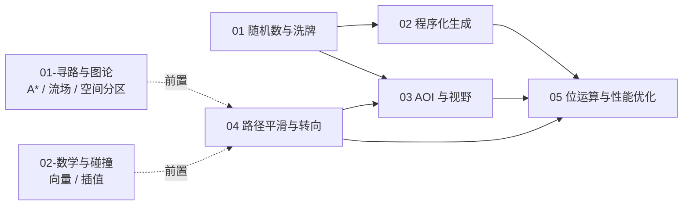

# 03-工程与实用技巧

> 把算法真正跑进游戏的那些事：随机数、程序化生成、AOI 兴趣管理、路径平滑与转向、位运算与性能优化。

## 分类简介

如果说「01-寻路与图论」解决"怎么走"、「02-数学与碰撞」解决"怎么算"，那么本分类解决的是"怎么落地"：

- **随机**是一切玩法与内容生成的地基：掉落、抽卡、暴击、刷怪、AI 决策，背后都是同一个 PRNG（伪随机数生成器）；
- **程序化生成**让有限的美术资源生成无限的世界：地形、地牢、星系、关卡，核心是"可复现的随机"；
- **AOI（兴趣管理）**决定一个 MMO 服务器如何在"同图数万人"的前提下把广播带宽压到可用范围；
- **路径平滑与转向行为**把 A* 输出的折线变成自然流畅的移动，让 RTS 千人大军不再"鬼畜"；
- **位运算与性能优化**是最后一公里：缓存布局、内存池、SIMD，把 60 FPS 从口号变成现实。

本分类每篇遵循统一结构：概述 → 核心概念（表格）→ 原理详解（含公式/推导）→ 伪代码与 C++/Python 示例 → 复杂度分析 → 最佳实践 → 常见问题 FAQ → 关联阅读，流程均配 Mermaid 图。

## 文件列表

| 编号 | 文件 | 一句话简介 |
| --- | --- | --- |
| 01 | [随机数与洗牌算法](01-随机数与洗牌算法.md) | PRNG 原理（LCG/MT/xorshift）、种子确定性、Fisher–Yates 洗牌、别名表加权随机、掉落表与抽卡保底设计 |
| 02 | [程序化生成](02-程序化生成.md) | Perlin/Simplex 噪声、Voronoi 图、递归回溯/Prim/Kruskal 迷宫、波函数坍缩 WFC、完整地形生成管线 |
| 03 | [AOI 与视野计算](03-AOI与视野计算.md) | 九宫格/灯塔/十字链表 AOI、进入/离开/移动事件、视野锥与遮挡、战争迷雾、服务端 AOI 与客户端剔除对比 |
| 04 | [路径平滑与转向行为](04-路径平滑与转向行为.md) | 漏斗算法、路径简化、Steering Behaviors（seek/arrive/pursue/避障）、Boids 群集、队形保持 |
| 05 | [位运算与性能优化技巧](05-位运算与性能优化技巧.md) | 位标志/位掩码、bitset、位图、SoA 与缓存友好、内存池、SIMD 与并行、热点算法微优化方法论 |
| 06 | [数据压缩与序列化](06-数据压缩与序列化.md) | Varint/Zigzag 变长整数、位打包与定点量化、增量编码、Huffman/LZ 族压缩选型、序列化框架对比与带宽优化方法论 |

## 学习顺序建议

1. **先随机，再生成**：`01-随机数与洗牌算法` → `02-程序化生成`。程序化生成建立在"可复现随机"之上，两篇衔接最紧；抽卡/掉落数学也是大多数策划需求的落点。
2. **再做规模**：`03-AOI 与视野计算`。当你开始写多人同屏 / MMO 时，这一篇是必须补上的课，它决定服务器架构的成败。
3. **再求表现**：`04-路径平滑与转向行为`。AI 寻路（见 01-寻路与图论）之后，用漏斗与转向让移动"像人"、让编队"像军队"。
4. **最后抠性能**：`05-位运算与性能优化技巧`。前几篇的算法一旦遇到性能瓶颈，回来看这一篇的方法论与工具箱。

> 提示：与 [01-寻路与图论](../01-寻路与图论/README.md)、[02-数学与碰撞](../02-数学与碰撞/README.md) 互为前置/配套，建议交叉阅读；服务端视角还可配合 [游戏服务端](../../游戏服务端/README.md) 知识库。
