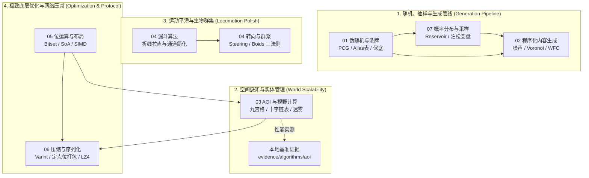
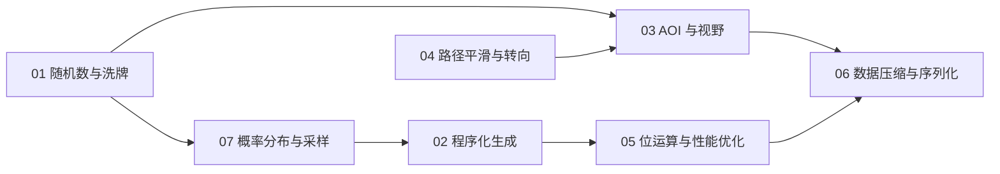

# 03 · 工程与实用技巧（Engineering & Practical Techniques）

> 知识成熟度：L2（已按 7 篇核心专题、大规模同屏性能架构与玩法数学全面核对）。
>
> 领域权威导航：[游戏算法 Domain MOC](../../00_Index/domains/游戏算法.md) ｜ [游戏算法 领域工程手册](../README.md)。

本子域聚焦于**把数学与算法真正跑进商业化游戏中的工程落地体系**：从随机数伪随机确定性与洗牌防作弊，到统计分布契约与流式/空间采样，到程序化内容生成（PCG），再到决定 MMO 承载力的海量实体视野管理（AOI）、让群体移动逼真拟人的路径平滑与转向行为，最后攻克底层位运算加速、内存布局与网络协议序列化压缩：

- **随机与抽样**：深入 PRNG 发生器（LCG/PCG/MT）、Fisher-Yates 无偏洗牌、Alias 别名表 $O(1)$ 抽样、保底机制与蓄水池（Reservoir）/泊松圆盘（Poisson-disk）工程；
- **程序化生成 (PCG)**：梯度噪声分形地形管线、Voronoi 空间群系划分、迷宫生成与波函数坍缩（WFC）规则瓦片生成；
- **兴趣管理 (AOI)**：九宫格裁剪、灯塔广播模式、十字双向链表（Sweep & Prune）进入/离开事件分发、视野锥与战争迷雾；
- **拟真运动表现**：漏斗算法（String Pulling）折线拉直、Reynolds 转向行为（Seek/Arrive/Pursue/Wander）与 Boids 生物群聚；
- **极致性能与网络**：位掩码与 Bitset、Morton 码 Z 序空间加速、SoA 连续缓存友好布局、SIMD 向量化加速、Varint/Zigzag 变长整数编码与定点量化位打包。

---

## 1. 目录文件列表

| 编号 | 核心专题文件 | 知识类型 | 成熟度 | 一句话简介与工程定位 |
| :--- | :--- | :---: | :---: | :--- |
| 00 | [README.md](README.md)（本文件） | Index | L2 | 子域工程导航：玩法算法全景、高并发性能矩阵、专题导航与实战证据 |
| 01 | [01-随机数与洗牌算法.md](../../知识/02-数学与游戏算法/随机采样与程序化生成/01-随机数与洗牌算法.md) | BestPractice | L2 | PRNG 原理（LCG/MT/PCG/xorshift）、种子确定性、Fisher–Yates 洗牌、Alias 别名表加权抽样、掉落表与抽卡保底设计 |
| 02 | [02-程序化生成.md](../../知识/02-数学与游戏算法/随机采样与程序化生成/02-程序化生成.md) | Mechanism | L2 | Perlin/Simplex 梯度噪声、Voronoi 细胞划分、迷宫生成（回溯/Prim/Kruskal）、波函数坍缩 WFC 与地形生成管线 |
| 03 | [03-AOI与视野计算.md](../../知识/02-数学与游戏算法/空间查询与碰撞/03-AOI与视野计算.md) | Mechanism | L2 | 九宫格、灯塔、十字双向链表 AOI、进入/离开/移动事件发布、视野锥遮挡、战争迷雾与服务端裁剪对比 |
| 04 | [04-路径平滑与转向行为.md](../../知识/02-数学与游戏算法/路径搜索与导航/04-路径平滑与转向行为.md) | Mechanism | L2 | 漏斗算法（String Pulling）、路径平滑简化、Reynolds 转向行为（Seek/Arrive/Pursue/Wander）、Boids 群集与队形保持 |
| 05 | [05-位运算与性能优化技巧.md](../../知识/02-数学与游戏算法/数据结构与编码/05-位运算与性能优化技巧.md) | BestPractice | L2 | 位标志/位掩码、Bitset、布隆过滤器、Morton 码与 Z 序曲线、SoA 内存布局、SIMD 向量化与微优化方法论 |
| 06 | [06-数据压缩与序列化.md](../../知识/02-数学与游戏算法/数据结构与编码/06-数据压缩与序列化.md) | Mechanism | L2 | Varint/Zigzag 变长整数、浮点定点量化与位打包、增量差分编码、Huffman/LZ4 压缩选型与协议带宽优化 |
| 07 | [07-概率分布与采样工程.md](../../知识/02-数学与游戏算法/随机采样与程序化生成/07-概率分布与采样工程.md) | Mechanism | L2 | Bernoulli/Poisson/Normal 分布契约、Reservoir 流式抽样、Poisson-disk 空间采样、蒙特卡洛/重要性采样与置信区间 |

---

## 2. 玩法机制与高并发工程全景架构

```mermaid
flowchart TD
    subgraph RNG_Block["1. 随机、抽样与生成管线 (Generation Pipeline)"]
        RNG[01 伪随机与洗牌<br/>PCG / Alias表 / 保底]
        Sample[07 概率分布与采样<br/>Reservoir / 泊松圆盘]
        PCG[02 程序化内容生成<br/>噪声 / Voronoi / WFC]
    end

    subgraph Spatial_Block["2. 空间感知与实体管理 (World Scalability)"]
        AOI[03 AOI 与视野计算<br/>九宫格 / 十字链表 / 迷雾]
        Evid[本地基准证据<br/>evidence/algorithms/aoi]
    end

    subgraph Locomotion_Block["3. 运动平滑与生物群集 (Locomotion Polish)"]
        Funnel[04 漏斗算法<br/>折线拉直与通道简化]
        Steer[04 转向与群聚<br/>Steering / Boids 三法则]
    end

    subgraph Perf_Block["4. 极致底层优化与网络压减 (Optimization & Protocol)"]
        Bit[05 位运算与布局<br/>Bitset / SoA / SIMD]
        Pack[06 压缩与序列化<br/>Varint / 定点位打包 / LZ4]
    end

    RNG --> Sample
    Sample --> PCG
    RNG --> PCG
    AOI -.->|性能实测| Evid
    Funnel --> Steer
    Bit --> AOI & Pack
    AOI --> Pack
```

---

## 3. 核心工程决策与横向对比

### 3.1 加权随机算法横向选型
| 算法模式 | 预处理构建复杂度 | 单次采样查询复杂度 | 内存空间复杂度 | 动态权重变动适应性 | 工业适用场景 |
| :--- | :---: | :---: | :---: | :---: | :--- |
| **前缀和 + 二分查找** | $O(N)$ | $O(\log N)$ | $O(N)$ | 动态权重需 $O(N)$ 重算前缀和 | 选项较少（$N < 50$）的掉落包、简单事件抽样 |
| **Alias Method（别名表）** | $O(N)$ | **严格 $O(1)$** | $O(N)$（两倍空间） | 权重频繁修改时需重构表 | 高频高并发抽样（抽卡掉落库、战斗随机池） |
| **线段树 / 树状数组加权** | $O(N)$ | $O(\log N)$ | $O(N)$ | **单次权重动态修改 $O(\log N)$** | 权重动态实时变化的可变随机池 |

### 3.2 服务端 AOI 算法横向选型
| AOI 方案 | 进入/离开事件判定开销 | 实体频繁移动维护开销 | 内存占用表现 | 实体高聚集退化风险 | 推荐游戏类型 |
| :--- | :---: | :---: | :---: | :---: | :--- |
| **九宫格 (Uniform Grid)** | 计算相邻 9 格集合差集 | 跨格才更新，格内移动 $O(1)$ | 连续数组，极小 | 聚集在同一格时广播量飙升 | 2D/3D 大多数中大型 MMO、开阔世界 |
| **十字链表 (Sweep & Prune)** | 沿 X/Y 轴游走指针即可捕获事件 | 移动微小时近乎 $O(1)$ | 离散双向链表，指针开销大 | 突发远距离瞬移导致链表震荡遍历 | 实体移动平缓、视野范围不一致的 MMO |
| **灯塔模式 (Tower / Beacon)** | 仅在跨越灯塔覆盖区时触发 | 极低 | 稀疏存储 | 视野受限于固定区块边界 | 区域划分明确的房间制或分线 MMORPG |

---

## 4. 学习顺序建议

```mermaid
flowchart LR
    A["01 随机数与洗牌"] --> H["07 概率分布与采样"]
    H --> B["02 程序化生成"]
    A --> C["03 AOI 与视野"]
    E["04 路径平滑与转向"] --> C
    C --> F["06 数据压缩与序列化"]
    B --> D["05 位运算与性能优化"]
    D --> F
```

1. **主线 1：随机、采样与世界生成**
   - 学习 `01-随机数与洗牌算法`，掌握 PRNG 种子可复现性与保底设计；
   - 学习 `07-概率分布与采样工程`，掌握泊松圆盘均匀分布采样；
   - 学习 `02-程序化生成`，用多倍频噪声驱动高度图，用 WFC 生成瓦片关卡。
2. **主线 2：网络同屏与广播优化**
   - 学习 `03-AOI与视野计算`，掌握九宫格裁剪原理与广播风暴抑制；
   - 结合 `05-位运算与性能优化技巧`，用 Bitset 维护实体可见性掩码；
   - 学习 `06-数据压缩与序列化`，用 Varint 与位打包将同步包压缩到极限。
3. **主线 3：运动表现打磨**
   - 学习 `04-路径平滑与转向行为`，把寻路输出的生硬折线转为流畅的拟人走位与生物群集。

---

## 5. 本地实验证据与 Benchmark

- **AOI 空间算法基准工程**：[`evidence/algorithms/aoi/`](../../evidence/algorithms/aoi/README.md)
  - 提供了完整的 C++ 实现，包含均匀网格、网格尺寸敏感性测试与十字链表基准；
  - 提供了 1000 到 10000 实体规模下的 CPU Tick 耗时、内存占用与事件分发吞吐量对比。

---

## 6. 返回与关联导航

- [游戏算法 Domain MOC](../../00_Index/domains/游戏算法.md)
- [游戏算法 领域工程手册](../README.md)
- [01-寻路与图论 README](../01-寻路与图论/README.md)
- [02-数学与碰撞 README](../02-数学与碰撞/README.md)
- [04-确定性与基准工程 README](../04-确定性与基准工程/README.md)
- [游戏服务端 06-05 AOI与兴趣管理](../../知识/07-网络与游戏服务端/状态复制与兴趣管理/05-AOI与InterestManagement.md)
- [游戏知识 13-04 PCG程序化内容生成](../../知识/03-引擎架构与资源系统/程序化内容生成/04-PCG程序化内容生成.md)
