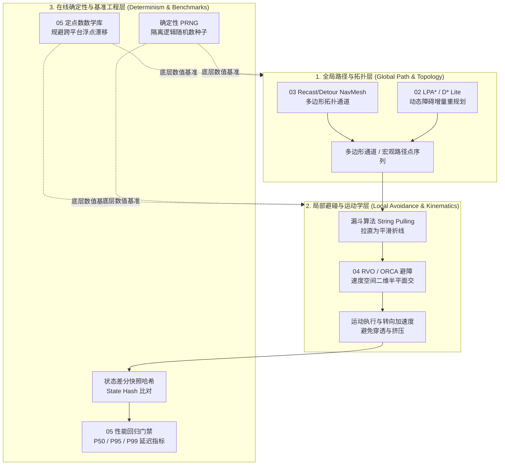
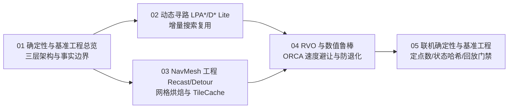

# 04 · 确定性与基准工程（Determinism & Benchmark Engineering）

> 知识成熟度：L2（已按 5 篇核心专题、联机确定性链路与工业性能门禁全面标准化）。
>
> 领域权威导航：[游戏算法 Domain MOC](../../00_Index/domains/游戏算法.md) ｜ [游戏算法 领域工程手册](../README.md)。

本子域是游戏算法体系走向**工业化量产、高可靠性联机对战与确定性仿真**的高阶综合工程：面向动态破坏世界、万人在线权威服务端与帧同步回放系统，系统化攻克增量搜索、体素化导航网格、互惠速度障碍避碰、定点数数学、浮点隔离与 P50/P95/P99 延迟性能门禁：

- **动态增量重规划**：剖析动态环境代价拓扑变动分类，掌握 LPA\* 与 D\* Lite 增量搜索树重用机制，避免动态开门/坍塌时全图全量 A\* 震荡；
- **工业级 NavMesh**：深入 Recast 体素化（Voxelization）、滤波、单调/分水岭多边形分割，以及 Detour 多边形通道寻路、TileCache 动态障碍裁剪与 Crowd 避碰边界；
- **互惠局部避障与数值鲁棒**：深入 RVO / ORCA 互惠速度障碍区几何建模、二维半平面交线性规划（Linear Programming），严密防御浮点退化与除零奇异点；
- **联机确定性与回归门禁**：攻克跨平台定点数数学（Fixed-Point Math）、跨平台编译器浮点模式隔离、状态差分快照哈希（State Hash）比对、输入录制回放与性能回归门禁。

---

## 1. 目录文件列表

| 编号 | 核心专题文件 | 知识类型 | 成熟度 | 一句话简介与工程定位 |
| :--- | :--- | :---: | :---: | :--- |
| 00 | [README.md](README.md)（本文件） | Index | L2 | 子域工程导航：确定性三层架构、专题矩阵、学习路线与质量门禁 |
| 01 | [01-确定性与基准工程总览.md](01-确定性与基准工程总览.md) | Architecture | L2 | 动态世界三层解耦（全局/局部/在线）、事实边界契约、失败路径兜底、选型对比、最佳实践与分篇指引 |
| 02 | [02-动态寻路LPA与DStarLite.md](02-动态寻路LPA与DStarLite.md) | Mechanism | L2 | LPA\*/D\* Lite 增量重规划：动态拓扑变化分类、核心一致性状态（$g$ 与 $rhs$）、不一致队列与失效回退 |
| 03 | [03-NavMesh工程Recast与Detour.md](03-NavMesh工程Recast与Detour.md) | Architecture | L2 | Recast/Detour 烘焙全流程、多边形邻接图、查询漏斗通道、TileCache 动态障碍更新与 Crowd 避障边界 |
| 04 | [04-RVO与数值鲁棒.md](04-RVO与数值鲁棒.md) | Mechanism | L2 | RVO/ORCA 局部避障几何模型、二维线性规划求解、浮点退化防护、除零奇异点与多智能体数值鲁棒性 |
| 05 | [05-联机确定性与基准工程.md](05-联机确定性与基准工程.md) | BestPractice | L2 | 联机帧同步确定性、定点数数学、状态差分快照哈希、输入录制回放验证与 P50/P95/P99 延迟门禁体系 |

---

## 2. 确定性系统三层解耦架构

---

## 3. 核心设计原则与事实边界

1. **三层不可互相替代**：
   - 全局寻路负责拓扑可达性，无法处理瞬时移动单位间的避碰；
   - 局部 ORCA 负责毫秒级速度微调，无法在没有全局引导的情况下走出死胡同；
   - 在线层负责状态快照与调度，保证决策步步可复现。
2. **增量寻路不是万灵药**：
   - 局部小范围障碍变动（如开门、单点落石）：D\* Lite / LPA\* 效率大幅领先全图 A\*；
   - 大面积地形洗牌或终点频繁变动：增量树维护开销将反超单次重新寻路，应果断回退为分层 A\* 或流场。
3. **确定性是系统工程**：
   - 不仅是禁用浮点编译器激进优化（如 `-ffast-math`），更必须统一跨平台定点数三角函数查表、避免容器内部未定义迭代顺序（如 `std::unordered_map`）、以及严密隔离逻辑与表现层随机数发生器。

---

## 4. 学习顺序建议

1. **先读总览（01 篇）**：建立全局层、局部层与在线层的分层思维，明确理论复杂度与工程测量的边界；
2. **攻克几何与网格（03 篇）**：搞懂从模型网格到体素、从轮廓到凸多边形的烘焙全流程，理解 Detour TileCache 的局部动态障碍更新；
3. **攻克增量搜索（02 篇）**：掌握 $g$ 与 $rhs$ 的不一致状态判定，理解动态探索中只重算受影响节点的数学本质；
4. **攻克局部避障（04 篇）**：理解速度障碍区与互惠半平面交，掌握浮点退化与除零奇异点的工程防御；
5. **闭环确定性与基准（05 篇）**：实现定点数数学、状态哈希、输入录制回放与持续集成性能门禁。

---

## 5. 跨域联动与工程落地

- **联动游戏 AI 决策与移动**：
  - [游戏AI 02-01 移动与群组行为](../../游戏AI/02-移动学习与服务端/01-移动与群组行为.md)：与 RVO/ORCA 协同实现复杂的怪物战术包围与走位；
  - [游戏AI 03-01 AI评测回放](../../游戏AI/03-评测与安全/01-AI评测回放.md)：利用确定性回放包排查 AI 决策异常。
- **联动游戏服务端世界模拟**：
  - [游戏服务端 06-11 AI与寻路时间预算](../../游戏服务端/06-世界模拟与运行时/11-AI与寻路时间预算.md)：将全局寻路与局部避障接入单帧 5ms 严格时间切片与熔断降频；
  - [游戏服务端 06-13 世界Snapshot与故障恢复](../../游戏服务端/06-世界模拟与运行时/13-世界Snapshot与故障恢复.md)：与状态差分哈希打通，实现状态同步校验。
- **联动虚幻引擎客户端源码**：
  - [游戏知识 05-03 NavMesh寻路](../../游戏知识/05-AI系统/03-NavMesh寻路.md)：结合 UE 原生 RecastNavMesh 实现工程对照。

---

## 6. 返回与关联导航

- [游戏算法 Domain MOC](../../00_Index/domains/游戏算法.md)
- [游戏算法 领域工程手册](../README.md)
- [01-寻路与图论 README](../01-寻路与图论/README.md)
- [02-数学与碰撞 README](../02-数学与碰撞/README.md)
- [03-工程与实用技巧 README](../03-工程与实用技巧/README.md)
