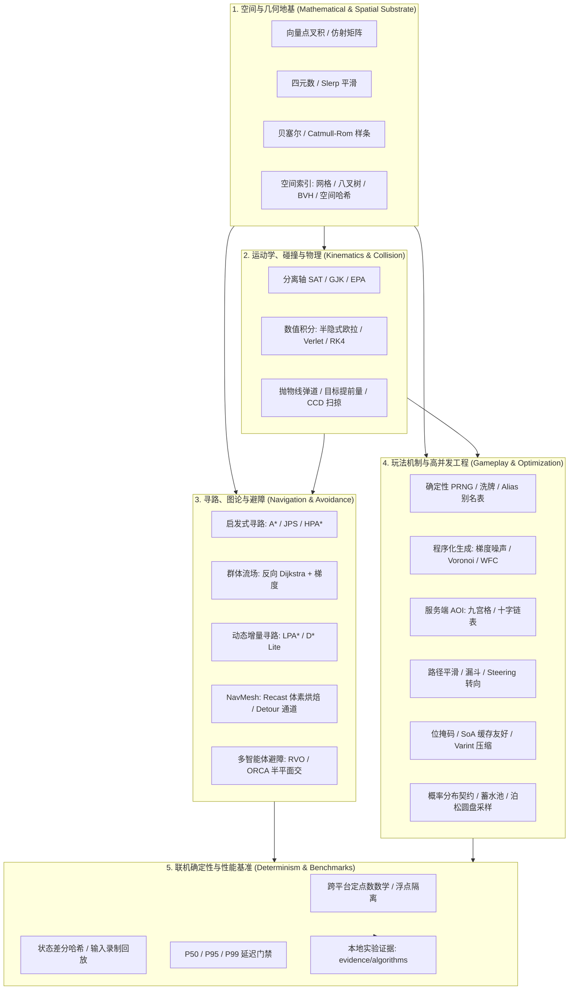

# 游戏算法 领域工程手册

> 知识成熟度：L2（领域级工程手册，已按 22 篇核心专题、4 大子域与跨域工程边界全面标准化）。
>
> 领域权威导航：[游戏算法 Domain MOC](../00_Index/domains/游戏算法.md) ｜ [Global MOC](../00_Index/MOC.md) ｜ [跨域主题索引](../00_Index/axes/跨域主题.md)。

---

## 1. 核心定位与设计思想

「游戏算法」知识库负责游戏研发中**可跨引擎复用的底层核心算法、数学物理几何推导、空间索引、高性能工程技巧与联机确定性基准**。

在现代商业游戏研发中，算法不是脱离实际的代码练习题，而是直接决定游戏运行帧率、同屏承载力、物理打击手感与联机同步一致性的工程基石：

- **四大支柱体系**：
  1. **离散空间与图论寻路**：把连续世界抽象为图与网格，解决单体启发式寻路（A*/JPS）、万人军团宏观行军（流场）与近邻查询加速（空间分区）；
  2. **连续空间、运动学与碰撞几何**：基于向量、四元数、连续样条曲线与凸包相交测试（SAT/GJK/EPA），驱动角色位移、相机运镜、弹道射击与物理动力学；
  3. **玩法机制与高并发工程技巧**：解决 PRNG 确定性生成、洗牌防作弊、无偏抽样、PCG 关卡生成、海量网络实体兴趣管理（AOI）、位运算与数据序列化压缩；
  4. **动态环境、确定性仿真与性能基准**：攻克动态世界增量重规划（LPA*/D* Lite）、工业级 NavMesh（Recast/Detour）、多智能体互惠避障（RVO/ORCA）、定点数数学与 P50/P95/P99 延迟回归门禁。
- **引擎无关性与高移植性**：以严谨的数学推导、标准化伪代码与工业级现代 C++/Python 实现呈现算法内核，不与具体商业引擎硬编码绑定；
- **数值鲁棒性与确定性契约**：直面浮点精度截断、除零奇异点与跨平台指令集差异，建立定点数、状态差分哈希与回放校验标准；
- **证据驱动与基准度量**：拒绝无前提的“性能最优”口号，所有复杂度陈述均绑定具体数据结构，并在本地建立可复现测量基准（如 `evidence/algorithms` 中的 A* 与 AOI 测试链）。

---

## 2. 算法体系全景架构

---

## 3. 四大子域与 22 篇核心专题全矩阵

| 子域与分类 | Canonical 专题文件 | 知识类型 | 成熟度 | 核心工程定位与覆盖问题 |
| :--- | :--- | :---: | :---: | :--- |
| **01-寻路与图论** [子域手册](01-寻路与图论/README.md) | [01-图论基础与搜索算法.md](../知识/02-数学与游戏算法/路径搜索与导航/01-图论基础与搜索算法.md) | Concept | L2 | 图的内存表示（邻接表/紧凑数组）、BFS 连通域探测、Dijkstra 标号法与堆优化实现 |
| | [02-A星算法与优化.md](../知识/02-数学与游戏算法/路径搜索与导航/02-A星算法与优化.md) | Mechanism | L2 | $f=g+h$ 启发式一致性证明、二叉堆开放列表、JPS 跳点规则剪枝、HPA* 分层拓扑 |
| | [03-流场与群体寻路.md](../知识/02-数学与游戏算法/路径搜索与导航/03-流场与群体寻路.md) | Mechanism | L2 | 反向 Dijkstra 标量场、中心差分梯度向量场、千人同屏单次计算全场复用、拥塞度场集成 |
| | [04-空间分区与索引.md](../知识/02-数学与游戏算法/空间查询与碰撞/04-空间分区与索引.md) | Mechanism | L2 | 均匀网格、四叉树/八叉树、BVH 树、KD 树、空间哈希的构建/增删/范围与射线查询性能对比 |
| **02-数学与碰撞** [子域手册](02-数学与碰撞/README.md) | [01-向量与矩阵基础.md](../知识/02-数学与游戏算法/数学与数值计算/01-向量与矩阵基础.md) | Concept | L2 | 点积（视锥/法向投影）、叉积（旋转轴/左右判断）、仿射矩阵构造、局部与世界坐标变换 |
| | [02-四元数与旋转.md](../知识/02-数学与游戏算法/数学与数值计算/02-四元数与旋转.md) | Concept | L2 | 欧拉角万向锁推导、四元数代数运算、Slerp 球面平滑插值、与旋转矩阵互转及姿态插值 |
| | [03-插值与曲线.md](../知识/02-数学与游戏算法/数学与数值计算/03-插值与曲线.md) | Concept | L2 | Lerp/Slerp 插值、贝塞尔曲线控制点推导、Catmull-Rom 样条平滑、网络预测外推补偿 |
| | [04-碰撞检测.md](../知识/02-数学与游戏算法/空间查询与碰撞/04-碰撞检测.md) | Mechanism | L2 | AABB/OBB 相交、分离轴定理 SAT、GJK 凸体闵氏差相交、EPA 穿透深度求解、射线求交 |
| | [05-数值积分与运动学模拟.md](../知识/02-数学与游戏算法/数学与数值计算/05-数值积分与运动学模拟.md) | Mechanism | L2 | 显式欧拉能量发散缺陷、半隐式欧拉保相结构证明、Verlet 位置约束积分、RK4 高精度仿真 |
| | [06-弹道与射击算法.md](../知识/02-数学与游戏算法/空间查询与碰撞/06-弹道与射击算法.md) | Mechanism | L2 | 抛物线方程落点解算、移动目标提前量方程、高斯/均匀散布采样、高速子弹连续碰撞 CCD |
| **03-工程与实用技巧** [子域手册](03-工程与实用技巧/README.md) | [01-随机数与洗牌算法.md](../知识/02-数学与游戏算法/随机采样与程序化生成/01-随机数与洗牌算法.md) | BestPractice | L2 | PRNG 算法（LCG/MT/PCG/Xorshift）、Fisher-Yates 无偏洗牌、Alias 别名表 $O(1)$ 抽样、保底机制 |
| | [02-程序化生成.md](../知识/02-数学与游戏算法/随机采样与程序化生成/02-程序化生成.md) | Mechanism | L2 | Perlin/Simplex 梯度噪声多倍频地形、Voronoi 细胞划分、迷宫算法、波函数坍缩 WFC 规则 |
| | [03-AOI与视野计算.md](../知识/02-数学与游戏算法/空间查询与碰撞/03-AOI与视野计算.md) | Mechanism | L2 | 九宫格裁剪、灯塔模式、十字双向链表排序、进入/离开/移动事件分发、视野锥阴影迷雾 |
| | [04-路径平滑与转向行为.md](../知识/02-数学与游戏算法/路径搜索与导航/04-路径平滑与转向行为.md) | Mechanism | L2 | 漏斗算法折线拉直、Reynolds 转向行为（Seek/Arrive/Pursue/Wander）、Boids 群集三法则 |
| | [05-位运算与性能优化技巧.md](../知识/02-数学与游戏算法/数据结构与编码/05-位运算与性能优化技巧.md) | BestPractice | L2 | 位掩码与位标志工程、Bitset 与布隆过滤器、Morton 码与 Z 序空间加速、SoA 内存布局与 SIMD |
| | [06-数据压缩与序列化.md](../知识/02-数学与游戏算法/数据结构与编码/06-数据压缩与序列化.md) | Mechanism | L2 | Varint/Zigzag 变长整数编码、浮点定点量化与位打包、增量差分压缩、序列化选型与带宽优化 |
| | [07-概率分布与采样工程.md](../知识/02-数学与游戏算法/随机采样与程序化生成/07-概率分布与采样工程.md) | Mechanism | L2 | Bernoulli/Poisson/Normal 分布契约、蓄水池抽样、泊松圆盘采样、蒙特卡洛积分与置信区间 |
| **04-确定性与基准工程** [子域手册](04-确定性与基准工程/README.md) | [01-确定性与基准工程总览.md](../知识/02-数学与游戏算法/确定性与基准/01-确定性与基准工程总览.md) | Architecture | L2 | 动态世界三层解耦（全局/局部/在线）、事实边界契约、失败路径兜底、选型对比与回归指引 |
| | [02-动态寻路LPA与DStarLite.md](../知识/02-数学与游戏算法/路径搜索与导航/02-动态寻路LPA与DStarLite.md) | Mechanism | L2 | 动态拓扑变化分类、LPA* 增量搜索原理（$g$ 与 $rhs$）、D* Lite 增量规划与失效回退 |
| | [03-NavMesh工程Recast与Detour.md](../知识/02-数学与游戏算法/路径搜索与导航/03-NavMesh工程Recast与Detour.md) | Architecture | L2 | Recast 体素化与多边形提取、TileCache 动态障碍剔除、Detour 多边形通道与 Crowd 避障边界 |
| | [04-RVO与数值鲁棒.md](../知识/02-数学与游戏算法/路径搜索与导航/04-RVO与数值鲁棒.md) | Mechanism | L2 | 速度障碍区 VO 构造、ORCA 互惠避障二维半平面交线性规划求解、浮点退化与除零防御 |
| | [05-联机确定性与基准工程.md](../知识/02-数学与游戏算法/确定性与基准/05-联机确定性与基准工程.md) | BestPractice | L2 | 跨平台定点数运算、浮点编译隔离、状态差分哈希比对、输入回放基准与 P50/P95/P99 门禁 |

---

## 4. 算法工程设计与落地范式

在实际研发中，算法工程需遵循以下四项核心设计范式：

### 4.1 离散拓扑与连续空间的解耦与映射
游戏算法的核心挑战之一在于现实世界的连续性与计算机处理的离散性之间的映射：
- **烘焙期（Offline）**：连续几何三角形网格 $\to$ 离散体素（Voxel） $\to$ 凸多边形（Convex Polygons）构成的 NavMesh 双向图（拓扑紧凑，便于 A* 搜索）；
- **查询期（Online）**：NavMesh 上的 A* 输出离散多边形序列通道（Portal Corridor） $\to$ 漏斗算法（String Pulling）拉直为连续折线 $\to$ 转向行为（Steering）生成连续加速度与速度。

### 4.2 单体寻路与群体宏观行军的规模化分治
- **目标分散、单位少**：使用 **A\*** 配合二叉堆/索引堆，或在规则网格上使用 **JPS/JPS+** 跳点剪枝；
- **目标集中、单位海量（RTS冲锋/丧尸群）**：使用 **流场（Flow Field）**，反向 Dijkstra 一次遍历生成全地图势能标量场，单位仅需 $O(1)$ 采样双线性插值速度，彻底突破 CPU 瓶颈；
- **局部微观避碰**：全局路径仅提供宏观方向，微观避让由 **ORCA/RVO** 互惠避障在速度空间内实时完成，杜绝单位间相互挤压与原地死锁。

### 4.3 浮点陷阱与确定性仿真契约
- **严格避免裸浮点数作为状态判断依据**：跨平台（x86/x64 vs ARM）、跨编译器（MSVC vs Clang/GCC）在 FMA（融合乘加）、内部 80 位浮点寄存器及向量化扩展下均会导致微小的 LSB（最低有效位）浮动，在帧同步系统中引发灾难性的雪崩不同步；
- **定点数与状态哈希**：核心模拟逻辑（位移、碰撞、角度）全面使用 32/64 位定点数（Q16.16 或 Q32.32），每帧计算实体的紧凑状态内存摘要（CRC32/MurmurHash/xxHash），通过快照校验比对秒级定位不同步帧。

### 4.4 缓存局部性与内存优化
- 追求算法理论复杂度的同时，必须紧密贴合现代 CPU 缓存行（Cache Line, 64 Bytes）；
- 优先选择连续内存结构（如线性扁平化 Flat Array 替代链式指针树，SoA 替代 AoS），规避内存指针跳转与 Cache Miss。

---

## 5. 跨域工程边界与单一事实源

本库与其他核心领域严格遵循单一事实源（Single Source of Truth）契约：

| 关联领域 | 承接职责与单一事实源 | 边界分工原则 | 权威导航 |
| :--- | :--- | :--- | :--- |
| **游戏知识 (UE客户端与源码)** | 承接虚幻引擎 API 封装、组件生命周期与源码实现 | 算法域阐述通用数学与算法伪代码；UE 的 NavMesh 渲染、Chaos 刚体设置、MassEntity 与 Niagara 粒子见该域 | [游戏知识 05-AI系统](../游戏知识/05-AI系统/README.md) ｜ [游戏知识 09-物理系统](../游戏知识/09-物理系统/README.md) |
| **游戏 AI** | 承接认知决策模型、环境感知系统与战斗意图 | 算法域提供寻路几何底座；如何做决策（FSM/行为树/Utility/GOAP/MCTS）与仇恨/战术调度见 AI 域 | [游戏AI 01-决策与架构](../游戏AI/01-决策与架构/README.md) ｜ [游戏AI 02-移动学习与服务端](../游戏AI/02-移动学习与服务端/README.md) |
| **游戏服务端** | 承接权威世界模拟、网络同步、AOI 广播与时间预算 | 算法域提供 AOI 算法复杂度与数据结构；主循环分帧 Tick、场景分线、心跳与协议序列化见服务端域 | [游戏服务端 06-05 AOI与兴趣管理](../知识/07-网络与游戏服务端/状态复制与兴趣管理/05-AOI与InterestManagement.md) ｜ [06-11 AI与寻路预算](../知识/07-网络与游戏服务端/运行调度与过载保护/11-AI与寻路时间预算.md) |
| **00-计算机与工程基础** | 承接底层 CPU 体系结构、SIMD 指令集与基础数据结构 | 算法域应用 SIMD 与缓存局部性；底层硬件体系结构、缓存一致性协议与 OS 内存管理见该域 | [08-体系结构与性能](../00-计算机与工程基础/08-计算机体系结构与性能/README.md) ｜ [13-数学与算法基础](../00-计算机与工程基础/13-数学与算法基础/README.md) |
| **系统实战** | 承接商业项目端到端业务闭环落地 | 算法在此汇聚为可运行的技能弹道、角色位移、碰撞判定与假人移动同步 | [系统实战 07-假人AI完整链路](../知识/06-游戏AI/战斗战术与机器人/07-假人AI完整链路.md) ｜ [系统实战 03-技能释放完整链路](../知识/05-Gameplay与交互系统/技能战斗与属性结算/03-技能释放完整链路.md) |
| **本地实验证据库** | 承接微基准性能测试工程、CMake 脚本与测量报告 | 本域正文中的性能指标由本地实际基准测试源码支撑，提供代码级证据链 | [evidence/algorithms/astar](../evidence/algorithms/astar/README.md) ｜ [evidence/algorithms/aoi](../evidence/algorithms/aoi/README.md) |

---

## 6. 知识库撰写与质量规范

- **统一结构**：核心概念（定义表格） $\to$ 原理详解（含数学推导/几何图解） $\to$ 伪代码与 C++/Python 工业级示例 $\to$ 复杂度对比分析 $\to$ 最佳实践与避坑指南 $\to$ 常见问题 FAQ $\to$ 结构化关联阅读；
- **数学严谨性**：涉及空间几何、旋转、数值积分与概率采样时，必须附带明确的代数方程与矩阵形式，严禁含糊其辞；
- **图示规范**：算法执行流水线与空间结构必须配合 Mermaid 流程图或几何示意；
- **度量规范**：性能评估必须结合具体机器环境给出时间（P50/P95/P99）与空间（平摊/峰值）度量，标明测试规模；
- **门禁规范**：所有文档严格符合 OKF v0.2 frontmatter 规范，遵循相对路径寻址，杜绝死链与孤岛。
