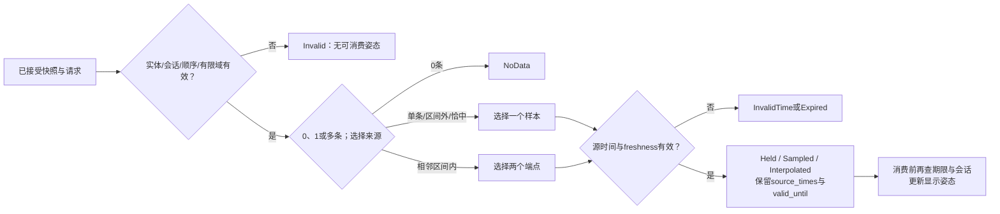
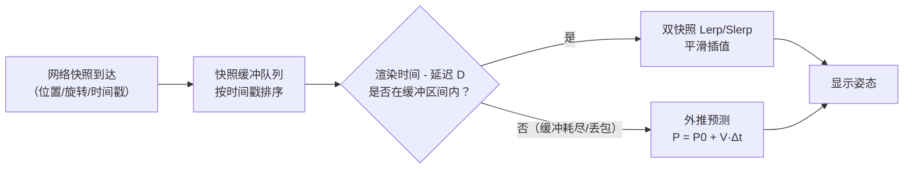

# 03 · 插值与曲线

> 知识成熟度：L2。实际静态选读范围见文末；所有PAPER_EXPECTED均为纸面推导。C++17、Python3.12/NumPy2.1代码未编译、未运行；没有数值扫描、引擎、网络或性能实验。
> 前置知识：[向量与矩阵](01-向量与矩阵基础.md)的点积、向量运算、导数；[四元数与旋转](02-四元数与旋转.md)的单位姿态、短弧和时间合同。
> 知识基线：Unity6.0（6000.0）、SciPy1.14.1、Python3.12文档、NumPy2.1；Yuksel等2010-08-23预印本/2011期刊入口，Eberly2023-08-20版，以及文末注明日期的作者资料。各自支持不同结论，不是一套运行环境。
> 适用范围：相机/UI、路径与动画工具、有限远程快照的表现采样。曲线不自动保证避障、动力学或权威状态正确。
> 最后更新：2026-10-09。修正时间与参数、曲线退化、弧长近似、弹簧符号和稳定范围、有限快照边界；原文和历史异文逐字保留于末尾，不能作为现行结论使用。

## 概述：形状、时间和数据来源分别决定什么

角色从A到B、面板弹出、镜头跟随、NPC经过路点、远程玩家显示平滑，表面都在“补中间值”，实际问题不同。已知端点的插值回答中间取什么值；跟随控制回答当前状态下一步怎样接近目标；曲线回答经过什么形状；时间参数回答走多快；快照来源决定这个显示值还能相信到何时。

本文仍按三层展开：Lerp/Slerp与缓动；Bézier/Hermite/Catmull-Rom/自然样条及弧长；路径、相机弹簧与有限快照。先看表选问题，再看相应机制和正反例，不必把所有运动都换成同一个平滑函数。

统一用真实时间τ、一步时长h或dt（秒）、局部参数u∈[0,1]、结点参数t_i、路径距离d和弧长函数ℓ。世界长度单位由项目固定，速度是长度/秒。数学推导按实数；代码另限定有限输入并检查失败，不能把实数恒等式当浮点逐位相同。

| 概念 | 计算与用途 | 必要条件 |
| --- | --- | --- |
| Lerp | 固定端点线性组合a+u(b−a) | 参数线性不等于真实时间线性 |
| 指数追随 | α=1−exp(−k dt)，current向target走剩余比例 | 固定目标、固定k的理想解才有时间分割恒等式 |
| Nlerp | 对齐符号后线性组合再归一化 | 一般不恒角速；零/非法姿态不能归一化修复 |
| Slerp | 单位球面短弧 | 固定端点且u随真实时间线性才恒角速 |
| Easing | u→f(u) | 改参数速率，未自动解决曲线长度分布 |
| Bézier | Bernstein控制点组合 | 插值端点，不保证插值中间控制点 |
| de Casteljau | 反复相邻Lerp求值 | 迭代三角表与天真递归复杂度不同 |
| Catmull-Rom | 用邻近路点构造插值三次段 | 结点参数化、端点和重合点政策影响结果 |
| 自然三次样条 | 全局满足C2和两端二阶导数0 | 自然边界不是端点速度0 |
| 弧长重参数化 | d→ℓ⁻¹(d)→P(u) | 数值逆表只近似，退化和误差需处理 |
| 阻尼弹簧 | 保存位置和速度的二阶响应 | 解析模型、数值积分、引擎API须分开 |
| 快照插值 | 已知相邻时间样本间的显示值 | 时钟、顺序、实体/会话、新鲜度必须有效 |
| 外推 | 用运动模型预测样本区间外 | 独立时限和误差政策；没有普遍安全保证 |

## 原理详解

### 1. Lerp与指数追随：先固定时间合同

从a到b的插值为：

```text
Lerp(a,b,u) = a + u(b−a) = (1−u)a + u b，0≤u≤1
```

b−a指向终点，乘u取得全程比例，再加a，因此u=0/1命中端点。固定a、b、起始时间τ0；本时间示意要求τ/τ0有限且abs≤1e9秒、1e−6≤T≤1e6秒，令`u=clamp((τ−τ0)/T,0,1)`，段内导数为`(b−a)/T`，才是恒线速度。τ<τ0返回a并等待；τ≥τ0+T返回b且Reached；T=0在此接口中失败，瞬移由上层另行选择。P01从0到10、两秒播放，中点是一秒时的5。

每次从锁定a重新采样，不要把a改成上一步current。[Unity6000.0 Mathf.Lerp](https://docs.unity3d.com/6000.0/Documentation/ScriptReference/Mathf.Lerp.html)把u夹到[0,1]；这是该API的合同，本文数学式和其他库不会因此自动拥有同一域外行为。

若写`current=Lerp(current,target,0.1)`，固定目标下每步剩余误差乘0.9：`e_n=0.9^n e_0`。等长真实时间内调用次数不同，响应便不同；这不是固定时长播放。固定逻辑步长或有意按次数衰减时可以选择固定α，但须说明时间含义，不能用它声称可变渲染帧率下同样响应。

若要一阶跟随模型，令`e=current−g`、固定g、固定k≥0：

```text
de/dτ = −k e
e(τ+h) = exp(−k h)e(τ)
current_new = current + α(g−current)
α = 1−exp(−k h) = −expm1(−k h)
多步：e_n = e_0 ∏exp(−k h_i) = e_0 exp(−k Σh_i)
半衰期H>0：k=ln(2)/H，k的单位是s⁻¹
```

这给出任意非负步长分割的精确实数恒等式；只有等步长时才写成同一个`(1−α)^n`。`expm1`可减少小kh时相减消减，见[Python3.12 math](https://docs.python.org/3.12/library/math.html#math.expm1)，但不保证两条浮点计算路径逐位相同。

固定目标P03的一秒与两个半秒都把误差减半；P04每半秒采不同目标则不等于一秒只采最终目标。移动目标、限速、吸附和量化改变了输入/模型，“完全帧率无关”便不成立。本文一步使用该步开始给出的目标并在步内保持；若已知连续目标轨迹，应另解相应受迫方程。

指数追随通常渐近收敛，不承诺有限时刻精确命中。调用者固定位置容差ε>0和最大持续时间T_follow，从开始累计elapsed；每步在剩余期限内求候选位置，再按误差≤ε判Reached并显式吸附，否则步末到期判TimedOut，不能每次把elapsed清零。k=0/dt=0保持位置；正dt即使k=0仍消耗期限。取消停止推进。浮点可能提前舍入命中或停滞，取决于尺度/精度，没有统一“30~40帧到float精度”。

### 2. Slerp与Nlerp：旋转曲线不代替时钟

沿用02篇：右手正交系、列向量、主动旋转、Hamilton积、`q=(w,x,y,z)`，角度为弧度。以下a、b须为合法单位姿态，dot4是四实分量点积。先若dot4(a,b)<0取b=−b，exact dot=0保持输入代表；再夹允许的舍入到[0,1]：

```text
Ω=acos(clamp(dot4(a,b),0,1))，0≤Ω≤π/2
q(u)=[sin((1−u)Ω)a + sin(uΩ)b]/sinΩ
物理最短角差θ=2Ω
Nlerp(a,b,u)=normalize((1−u)a+u b)
```

圆弧参数u与球面角uΩ成正比，所以固定a、b且u对真实时间线性时，理想Slerp段内恒角速。[SciPy1.14.1 Slerp](https://docs.scipy.org/doc/scipy-1.14.1/reference/generated/scipy.spatial.transform.Slerp.html)讨论的就是带固定时间的姿态关键帧；ease(u)、递归current或移动目标会改变角速度，多段也不自动接续角速度。

Ω近0时用同半球Nlerp避免小分母，是近似分支，通常不严格恒角速；02篇的dot>0.9995是其教学政策，不是普遍默认或误差保证。本文不再重写四元数库，输入检查、归一化及近角实现详见[02篇](02-四元数与旋转.md)。u域外失败，外推另立合同。

q与−q是同一姿态，未对齐的线性中点会变零；物理差180°时Ω=π/2、分母为1，问题是两条等长短路的选择（P06/P07）。普通四元数线性组合一般不保持单位长度，不能直接交给单位专用旋转公式；归一化后正是Nlerp。矩阵逐元素插值一般不保正交，也不能直接当旋转矩阵，但“任何Lerp都一定缩放扭曲/剪切”同样过度。

### 3. 缓动函数：导数说明快慢

常用u∈[0,1]映射：

```text
linear       f(u)=u
ease-in      f(u)=u²
ease-out     f(u)=1−(1−u)²
ease-in-out  f(u)=2u²                  u<1/2
                    1−2(1−u)²         u≥1/2
smoothstep   f(u)=3u²−2u³
```

对固定线段，`dP/dτ=(b−a)f'(u)/T`；对曲线则为`P'(f(u)) f'(u)/T`，缓动不会自动抵消曲线的参数速度变化。UI弹出、菜单、坠落或镜头过场可按所需速度形状选择，具体“自然/柔和”应结合项目观感，不是数学定理。

保留smoothstep推导：设`f=au³+bu²+cu+d`，要求`f(0)=0,f(1)=1,f'(0)=f'(1)=0`，得`d=c=0,a+b=1,3a+2b=0`，因此a=−2,b=3。这是满足这四约束的唯一至多三次多项式，不是未定义意义下“最平滑”。

二次ease-in-out导数左为4u、右为4(1−u)，两端也为0，中点为2；smoothstep导数6u(1−u)，中点为3/2。前者中点二阶导数从4跳至−4；后者在区间内是一个多项式，但在两端接外部常值时二阶导数一般不连续。P08直接揭示区别。函数域外拒绝/夹紧由调用合同说明，不能悄悄混用。

### 4. Bézier曲线与de Casteljau

n+1个控制点定义至多n次的曲线，退化配置可降次：

```text
P(u)=Σ(i=0..n) B_(i,n)(u) P_i
B_(i,n)(u)=C(n,i) u^i(1−u)^(n−i)
三次：P(u)=(1−u)³P0+3u(1−u)²P1+3u²(1−u)P2+u³P3
```

[Shene的Bézier课程页](https://pages.mtu.edu/~shene/COURSES/cs3621/NOTES/spline/Bezier/bezier-construct.html)说明端点、权重和、凸包及仿射性质。u∈[0,1]时权重非负且和为`(u+1−u)^n=1`，所以曲线在控制点凸包内；u=0/1选出P0/Pn。它不保证经过中间控制点，而不是绝不经过：二次0、1、2在u=1/2恰为1（P09）。需要指定通过路点时，可以选插值样条或解有充分约束的控制点问题，不能假定任意约束都有唯一解。

de Casteljau把上述组合化成逐层线性插值：

```text
初始Q_i=P_i
对k=1..n：
    对i=0..n−k：Q_i=(1−u)Q_i+u Q_(i+1)    # i递增，读取尚未改的右邻
返回Q_0
```

三角表有n(n+1)/2次Lerp，可用n+1个工作点；P10二次例只需3次。直接递归反复展开会重复求子问题，不再是这个O(n²)算法，见[de Casteljau原课程说明](https://pages.mtu.edu/~shene/COURSES/cs3621/NOTES/spline/Bezier/de-casteljau.html)。凸组合形式通常比直接处理高次幂更易控制数值问题，仍不保证任意次数/尺度无舍入误差。

求导可用相邻控制点差形成低一次Bézier：

```text
P'(u)=n Σ(i=0..n−1) B_(i,n−1)(u)(P_(i+1)−P_i)
P'(0)=n(P1−P0)，P'(1)=n(Pn−P_(n−1))
```

仿射映射A(P)+b可分配到权重和中，故先变换控制点等于变换整条曲线。UI路径、动画曲线编辑和技能预览可利用这些性质。恒加速度、无阻力、固定时长T的轨迹`x0+v0Tu+(aT²/2)u²`可取二次控制点`P0=x0,P1=x0+v0T/2,P2=x0+v0T+aT²/2`；有风阻或碰撞时不能继续声称精确弹道。AnimationCurve等是相关工具入口，不代表各引擎内部都采用同一种样条。

### 5. Hermite与Catmull-Rom：切线对哪个参数求导

三次Hermite段用两个端点A/B及局部导数m0/m1控制：

```text
P(u)=h00 A+h10 m0+h01 B+h11 m1
h00=2u³−3u²+1   h10=u³−2u²+u
h01=−2u³+3u²    h11=u³−u²
```

设`P=a+bu+cu²+du³`，四条件`P(0)=A,P(1)=B,P'(0)=m0,P'(1)=m1`给`a=A,b=m0,c=3(B−A)−2m0−m1,d=2(A−B)+m0+m1`，整理得到四基函数。这里m=dP/du；若区间真实时长为T、端速是v，则**两端都用m=T v**（P11）。[SciPy1.14.1 Hermite](https://docs.scipy.org/doc/scipy-1.14.1/reference/generated/scipy.interpolate.CubicHermiteSpline.html)的dydx同样依其给定自变量，不应丢掉尺度。

Hermite与三次Bézier的端导数相等，因而可互转：

```text
B0=A，B1=A+m0/3，B2=B−m1/3，B3=B
反向m0=3(B1−B0)，m1=3(B3−B2)
```

Catmull-Rom从邻近路点生成这些导数；最常见的uniform、零张力段P_i→P_(i+1)取四点：

```text
m0=(P_(i+1)−P_(i−1))/2
m1=(P_(i+2)−P_i)/2
```

这只适用于等距结点参数。空间点可以不等距，但会影响曲线形状，不能因为它经过路点就保证无环、无过冲或适合转向。端点使用线性外延ghost：开路首部`P_−1=2P0−P1`，尾部同理；单段函数则要求调用者明确提供四点。闭合路需另声明周期数据。uniform中复制端点虽可求值，却改变端导数；不能把它说成唯一正确端点处理（P14）。

对非均匀结点，令`h_prev=t_i−t_(i−1)>0,h_next=t_(i+1)−t_i>0`，三点差商给全局结点导数：

```text
D_i=(P_i−P_(i−1))/h_prev
    −(P_(i+1)−P_(i−1))/(h_prev+h_next)
    +(P_(i+1)−P_i)/h_next
   =h_next/(h_prev+h_next)·左差商
    +h_prev/(h_prev+h_next)·右差商
```

当前段长度h_i=t_(i+1)−t_i，局部两端为`m0=h_i D_i,m1=h_i D_(i+1)`。由`u=(t−t_i)/h_i`的链式法则得到；当两侧h=1时退化为原uniform式。P13展示不同间距不能照抄除2。

常见结点政策是` t_(i+1)=t_i+|P_(i+1)−P_i|^α`：α=0取明确等间距，α=1/2为centripetal，α=1为chordal；α=0不计算0^0。[Yuksel等预印本§2](https://www.cemyuksel.com/research/catmullrom_param/catmullrom_cad.pdf)研究这一族；其三次centripetal的段内无尖点/自交性质，不能扩大为整条路径无自交、避障或恒速。本文非均匀输入要求相邻点距离≥1e−6个已声明长度单位、结点间隔≥1e−6个结点单位；小于阈值返回InvalidKnots，不在分母加epsilon。阈值是教学接收域，换单位须重新定义。uniform可有重合空间点，但可能退化，方向需另判。

cardinal张力另记ρ，本文约定`m=(1−ρ)(Pnext−Pprev)/2`、0≤ρ≤1；ρ=0恢复上述uniform，ρ=1端导数为0。ρ与α不相同，也不是世界速度或曲率。C1表示在共同全局结点参数下导数连续；比较局部u导数前要除各段h。非零导数处切向连续，但二阶导数/曲率可跳；导数零时朝向未定义。因此“C1接点切线顿一下”不是准确描述。NPC路点、赛车中心线、相机和地形剖面可按局部编辑需求选用，再检查形状约束。

### 6. 自然三次样条：全局约束的是哪些量

数学上给n≥2个有限数据y_i及严格递增实结点t_i；本教学数值域进一步限定n≤4096、abs(t_i)≤1e9、h_i≥1e−6、各y分量abs≤1e6。每段三次共有4(n−1)未知量：过段两端2(n−1)项、内部一阶连续n−2项、二阶连续n−2项，再加两条边界，恰为4(n−1)。对于向量曲线，每个坐标分量使用相同结点分别求解。

令`h_i=t_(i+1)−t_i>0`、`M_i=S''(t_i)`。自然边界和内部方程为：

```text
M0=M_(n−1)=0
h_(i−1) M_(i−1)+2(h_(i−1)+h_i)M_i+h_i M_(i+1)
    =6[(y_(i+1)−y_i)/h_i−(y_i−y_(i−1))/h_(i−1)]，i=1..n−2
```

这来自相邻段端点导数匹配，形成三对角系统；求出M后，设z=t−t_i，可还原：

```text
S_i(t)= M_i(h_i−z)³/(6h_i)+M_(i+1)z³/(6h_i)
       +(y_i−M_i h_i²/6)(h_i−z)/h_i
       +(y_(i+1)−M_(i+1)h_i²/6)z/h_i
```

三对角构建/求解O(n)，已知段后求值O(1)，查找段另计；不是每帧都要全局重解。两点自然样条是线段。P15三节点得到M1=−3、首段`3t/2−t³/2`，端点速度3/2，说明自然边界不是端速零。

[SciPy1.14.1 CubicSpline](https://docs.scipy.org/doc/scipy-1.14.1/reference/generated/scipy.interpolate.CubicSpline.html)区分natural（二阶0）、clamped（其快捷名表示一阶0，也可显式给导数）、periodic和not-a-knot；默认也不是natural。构建边界与域外求值政策独立。本文示意域外拒绝，不因自然边界把外侧延伸称作直线。C2不保证单调、避障或满足车辆曲率限制。选择全局样条是为了全局连续及边界约束；需局部编辑时Catmull-Rom/Bézier更易限制影响范围。

### 7. 弧长参数化：精确积分与近似逆表分开

一般P(u)的参数速度`|P'(u)|`不恒定。真实累计长度为：

```text
ℓ(u)=∫(0..u) |P'(r)| dr，L=ℓ(1)
给距离d：u=ℓ⁻¹(d)，位置=P(u)
```

ℓ非减；要唯一连续反解，需排除一整段停驻等造成的平台。孤立P'=0仍可能严格递增，例如P(u)=(u²,0)的ℓ=u²，只是在u=0无切向方向。`d/L`只是归一化距离，通常不是u（P16）。[Eberly2023版§2–3](https://www.geometrictools.com/Documentation/MovingAlongCurveSpecifiedSpeed.pdf)说明弧长与逆问题；精确常速概念不等于数值查表无误差。

原文代码的用途是弦长表，本文继续采用它。N段用N+1个u点，累积：

```text
弦长表：ℓ_hat_j=Σ(r=0..j−1) |P(u_(r+1))−P(u_r)|
速度梯形积分：Σ (u_(r+1)−u_r)/2 · (|P'(u_r)|+|P'(u_(r+1))|)
```

两式不是同一算法。弦长法把采样间的曲线换成折线；速度梯形法对导数模长积分，两者均需误差分析。本文表保留真实长度单位，不先除总长。构建时检查N是真整数1..4096、参数严格递增、点与累计长度有限；选择明确的简单政策：**任意弦长增量≤0，或累计和因舍入未严格增加，就拒绝DegenerateTable**。这样牺牲一些可处理的退化路径，换来逆查询分母非零；不要偷偷跳段改变形状。

全零采样既可能是常值曲线，也可能漏采回环，不能证明整条曲线静止或返回Reached。拒绝后由调用者检查曲线/采样，不能无界自动加密直到“通过”。构建的点、u、累计长度组成同一份不可变表，修改曲线必须重建，不能拿旧表解释新P。

对0≤d≤L_hat，先特判两个端点/精确表点，其余二分找到`ℓ_hat_j<d<ℓ_hat_(j+1)`，再线性反解：

```text
u_hat=u_j+(u_(j+1)−u_j)(d−ℓ_hat_j)/(ℓ_hat_(j+1)−ℓ_hat_j)
position=P(u_hat)
```

这里又增加一层逆函数近似。P17即使弦长采样准确，插值逆表仍给4/9而非1/2的位置；不能说有LUT就保证常速。预计算O(N)、存储O(N)、可信已建表查询O(logN)；若每次从外部重新验证整表则另加O(N)。采样数按曲线、长度/速度误差和预算选择，没有128~512点足够的普遍保证。

### 8. 路径推进与相机阻尼

#### 按距离走完有限路径

路径由1..1024段已建且有效的不可变表组成，段接点共享同一位置，段长均正，前缀`C0=0,C_(j+1)=C_j+L_hat_j`有限且严格递增。构建阶段检验这些条件，发生点集/段顺序变化即重建整个受影响路径版本。这里只定义非负速度、单向、到终点停止；反向和闭环需另立时间/距离政策。

```text
AdvancePath(path,d,speed,dt,cancel):
    验证可信构建路径仍是当前版本；d有限且0≤d≤总长
    speed有限且0≤speed≤1e6，dt有限且0≤dt≤1秒；否则Invalid，无结果
    cancel=true：Cancelled，无新结果，调用者保留原状态
    若d已等总长：new_d=总长，status=Reached
    否则new_d=min(d+speed*dt,总长)
        new_d到总长 -> Reached
        speed=0或dt=0 -> Paused
        其余 -> Advancing
    若new_d=总长：segment=M−1，local_u=1
    否则二分前缀找到C_segment≤new_d<C_(segment+1)
        段内距离=new_d−C_segment
        按§7的有限逆表算法得到local_u
    用本段同一四点的Hermite式求position和dP/du
    导数模长为0 -> tangent=None, tangent_status=NoTangent
    否则tangent=导数/模长，tangent_status=Available
    返回{status,new_d,position,segment,local_u,tangent,tangent_status}
```

new_d必须随状态保存，否则下一帧会重复从旧距离走。全长末端不能floor(M)访问第M段（P19）。位置可定义而导数为0时不能归一化零向量（P20）；保持上次朝向是上层表现选择，不是求得当前正确切线。误差、近零切线阈值和视觉朝向策略需项目验证。

#### 阻尼弹簧的模型、积分与停止

位置x、目标g、速度v，取质量归一化方程：

```text
x''=−k(x−g)−c x' = k(g−x)−c v
k单位s⁻²，c单位s⁻¹；ω=√k，c=2ζω
特征方程λ²+cλ+k=0，判别式c²−4k
```

对k>0,c≥0，判别式>0/0/<0对应过阻尼/临界/欠阻尼；c=0不衰减。若保留真实质量m，则方程是`m x''+c_phys x'+k_phys(x−g)=0`，临界`c_phys=2√(m k_phys)`。见[Juckett原文的恢复力与阻尼推导](https://www.ryanjuckett.com/damped-springs/)。原C++的`(g−x)*(-k)`方向错误，必须是正的k(g−x)；P21能直接手算辨别。

半隐式Euler先更新速度，再用新速度更新位置：

```text
v_new=v+[k(g−x)−cv]h
x_new=x+v_new h
```

“半隐式”不意味无条件稳定。固定g、固定k/c、**固定步长h**时，误差e=x−g的离散矩阵为：

```text
[e_new] = [1−kh²   h(1−ch)] [e]
[v_new]   [ −kh       1−ch] [v]
trace=2−ch−kh²，det=1−ch
```

k,c,h>0时二阶单位圆内条件化为`kh²>0,ch>0,4−2ch−kh²>0`，所以`kh²+2ch<4`。等号不承诺渐近衰减；c=0、0<kh²<4只给固定步长理想线性模型的有界无阻尼情形，h=0则保持。P22临界参数却用h=1得到模大于1的特征根。逐步检查这个不等式**不证明任意变步长矩阵乘积、移动目标或浮点计算整体稳定**；示意越界返回UnsafeStep，不隐藏自动分步或忽略暂停。

固定目标的临界阻尼还能直接解常系数ODE。设e=x−g、b=v+ωe、z=exp(−ωh)，由重复根解`e(τ)=(A+Bτ)e^(−ωτ)`代初值得：

```text
e_new=(e+b h)z
v_new=(v−ω b h)z
x_new=g+e_new
```

这是解析步（P23），与Euler步不同；固定目标的精确数学解满足时间分割性质。移动目标按每步保持g仍是一种输入近似，不能称任意轨迹完全帧率无关。临界“不振荡”也不等于任何初速度都不越过目标：P24的`e=(1−2τ)e^(−τ)`会穿零。相机若只需一阶迟滞可用指数模型；需要保留速度、回弹或惯性时可选弹簧，不能用“更高级”替代选择。

调用者创建跟随请求时固定有限正的ε_position、ε_velocity和最大期限；结束时同时检查`|x−g|≤ε_position`和`|v|≤ε_velocity`，明确吸附目标并清零速度；否则继续到固定期限，超时/取消停止并报告。不能只看位置一瞬间穿零就说静止到达。`k=(2πf)²`可用频率调参，ζ控制阻尼比；具体Hz和百分比依尺度/输入/观感实测，不当作统一相机标准。[Unity6000.0 SmoothDamp](https://docs.unity3d.com/6000.0/Documentation/ScriptReference/Mathf.SmoothDamp.html)是另一个有自身参数和异常合同的API，不能与本文解析式等同；该版本文档特别指出dt=0可使currentVelocity为NaN。

### 9. 网络快照：先确认有限来源，再决定插值或预测

网络抖动意味着等间隔发送不等于等间隔收到。延迟展示时间τr，让缓冲更有可能拥有包夹它的两个样本，换来更平滑表现；这增加显示延迟。[Fiedler2014快照文章](https://gafferongames.com/post/snapshot_interpolation/)给出线性位置、带端速Hermite和旋转Slerp的例子。带端速时仍需§5的时间缩放，不能直接把世界速度当局部Hermite切线；示意默认位置Lerp。

#### 有限插值消费合同

这里只消费已解码、由接收层接受的记录，不实现传输、认证、时钟同步或恢复协议。记录含entity、protocol/coordinate version、authority session/epoch、sequence、同一服务器会话时基的时间、位置和wxyz姿态。当前权威会话必须已知且匹配；未知/旧恢复代返回Invalid（诊断UnknownAuthority/SessionMismatch），不能将平滑显示当作权威恢复完成。

接收层先定义sequence重复、乱序和回绕政策；本消费入口不静默排序或修补。最多64条，同实体/版本/会话；时间有限且绝对值≤1e9秒，严格递增，相邻间隔≥1e−6秒。本网络示意的位置按协议固定3个分量，每分量有限且abs≤1e6；q恰为4个wxyz分量且有限、模长与1的差≤1e−3才允许归一化小漂移；零q、严重偏离、坏版本均失败。这里的网络合同比通用数学归一化接口更窄。

τr与当前判断时间τnow须先转换到同一相对服务器时基，也满足abs≤1e9；freshness参数H有限且0≤H≤10秒。H上界只是教学范围，绝非推荐延迟。选择规则与02篇一致：

| 情形 | 状态及所选来源 |
| --- | --- |
| 请求/缓冲/会话无效 | Invalid，无pose；InvalidBuffer仅为该状态的诊断原因 |
| 0条 | NoData，无pose/valid_until |
| 1条 | 选唯一记录，fresh则Held，不因为τr域外而推测运动 |
| ≥2条，τr早于最早 | 选最早，fresh则HeldBeforeBuffer |
| ≥2条，τr晚于最新 | 选最新，fresh则HeldAfterBuffer |
| ≥2条，τr恰等一条 | 选该条，fresh则Sampled |
| τr严格夹在相邻对内 | 选两端；fresh后u=(τr−τ0)/(τ1−τ0)，位置Lerp/姿态短弧Slerp，Interpolated |
| τnow早于任一所选来源时间 | InvalidTime，无pose，交上层处理时钟/缓冲 |
| 任一所选来源年龄超过H | Expired，无可消费pose |

具体流程是先验证、再有限二分选择，再检所选来源：`age=τnow−τs`，0≤age≤H才fresh；`valid_until=min(τs+H)`。单条min就是它自己；恰到期有效，超过失效。返回`{status,pose?,source_times,valid_until?,diagnostic?}`。Invalid/NoData/InvalidTime/Expired不返回可消费pose，诊断可保留源时间；不造零位置/I。仅单条时状态优先Held，即使τr恰等它的时间。

τr负责采样位置，τnow负责源年龄。Held不能刷新时间，每次消费缓存仍须检查原valid_until和会话是否有效；过期后可由表现层保存/隐藏旧图像，但不能当新有效驱动。见P25–P31的0/1/内外区间、乱序、未来时间与缓存到期追踪。



D须根据发送间隔、抖动、丢包与显示延迟预算选择。50Hz周期20ms，D=100ms是5周期，不是1~2周期。Fiedler的具体丢包/发送率例子不能当本项目已测参数。增大D可降低某些缓冲耗尽概率，也增加历史显示延迟，并不必然消除回跳。

#### 显式启用的短时外推

只有调用方明确选择预测政策才使用外推；上述区间外默认持有。对一个合法、仍fresh的最新样本，额外提供有限速度/加速度、预测时限0≤E≤0.5秒（教学工作域）：

```text
Δ=τrequested−τlast
先检查同会话、源年龄0≤τnow−τlast≤H，以及0≤Δ≤E
p_pred=p_last+v_last Δ+(1/2)a_last Δ²
返回Predicted，source_times=[τlast]，valid_until=τlast+H
```

v/a每分量abs≤1e6，候选结果须有限；未提供加速度时只能显式选常速度模型a=0。超过E返回PredictionLimit，无预测pose；源过期仍Expired。预测时长Δ和源年龄是两项独立检查，valid_until不因查询而延长；重新请求更远时刻须重查Δ。这里仅给位置预测，不靠缺少角速度的q猜旋转未来。

常速度模型若漏掉恒加速度，误差是`aΔ²/2`；含正确恒加速度则此例零误差；若已知jerk有界，Taylor余项才可讨论三次界。碰撞、方向突变、瞬移或未知权威纠正不能套一个普遍平方律。100ms也不保证不穿墙。耗尽后没有合法双端点就不能“回退插值”，只能停止预测、按有效期另选持有，或等新来源。

插值本身也可能让连接两个安全点的线段切过墙角，曲线/Hermite同样不自动避障。外推还有通信/采样/展示延迟，并非无延迟。本地输入预测与远程姿态外推不是同一机制；回跳可能来自预测偏差、时钟/会话切换、瞬移或校正政策。表现误差平滑可分摊跳变，却不能改变权威状态，也不能替代[世界Snapshot与故障恢复](../../07-网络与游戏服务端/世界权威与故障恢复/13-世界Snapshot与故障恢复.md)的持久恢复验收。

## 伪代码与代码示例

这些是按本文公式写的教学实现，不是某引擎源码节选，也没有编译或执行记录。所有数值上界用于限定示例的工作域，不是生产预算或安全认证。

### 指数跟随的一次有限请求

固定时长播放直接按§1的锁定端点和时钟采样；以下另示指数请求如何结束。初始化时固定k、ε和T_follow，不能在每帧重置elapsed。dt是调用方提供的非负实际间隔，最后一步只推进到期限：

```text
SmoothFollowRequest(current,target,k,dt,elapsed,ε,T_follow,cancel):
    验证有限位置、k∈[0,100]、dt∈[0,1]、elapsed∈[0,1e9]
    验证0<ε≤1、0<T_follow≤1e6；否则Invalid，无位置结果
    若cancel -> Cancelled，无新位置
    若elapsed≥T_follow -> TimedOut，无新位置
    若|current−target|≤ε -> Reached，位置=target
    h=min(dt,T_follow−elapsed)
    candidate=SmoothFollow(current,target,k,h)   # 下方完整一步函数
    elapsed_end=elapsed+h
    若|candidate−target|≤ε -> Reached，位置=target
    若elapsed_end≥T_follow -> TimedOut，无可消费位置，保留误差诊断
    若h=0或k=0 -> Paused，位置=candidate，elapsed=elapsed_end
    否则 -> Following，位置=candidate，elapsed=elapsed_end
```

位置容差单位与世界长度一致；Paused不等于完成，正h且k=0仍消费期限。取消/超时后的旧显示由上层负责，不将缺失位置写成零。一步函数本身只做数学推进，不偷偷管理请求时钟。

### C++17：指数、四点曲线和弹簧一步

外部位置、控制点及初始速度分量abs≤1e6；u∈[0,1]。持续弹簧状态使用明确的更宽有限域abs≤1e100，避免把控制点输入界限错误套到合法内部速度。候选超出持续状态域返回RangeExceeded并保持旧状态。无效参数抛invalid_argument，也不修改状态；上层须捕获并停止该次调用。

```cpp
// 教学示意，未编译/未执行。2D；3D逐分量推广仍需自己的输入合同。
#include <array>
#include <cmath>
#include <stdexcept>

struct Vec2 { double x, y; };
static Vec2 operator+(Vec2 a, Vec2 b) { return {a.x+b.x, a.y+b.y}; }
static Vec2 operator-(Vec2 a, Vec2 b) { return {a.x-b.x, a.y-b.y}; }
static Vec2 operator*(Vec2 a, double s) { return {a.x*s, a.y*s}; }

static void Need(bool ok) {
    if (!ok) throw std::invalid_argument("outside teaching contract");
}
static bool InBound(double x, double limit) {
    return std::isfinite(x) && std::abs(x) <= limit;
}
static bool InBound(Vec2 a, double limit) {
    return InBound(a.x, limit) && InBound(a.y, limit);
}
static Vec2 FiniteResult(Vec2 a) {
    Need(std::isfinite(a.x) && std::isfinite(a.y));
    return a;
}
static double UnitParameter(double u) {
    Need(InBound(u, 1.0) && u >= 0.0);
    return u;
}
static Vec2 LerpCore(Vec2 a, Vec2 b, double u) {
    if (u == 0.0) return a;
    if (u == 1.0) return b;
    return FiniteResult(a*(1.0-u) + b*u);
}
Vec2 LerpChecked(Vec2 a, Vec2 b, double u) {
    Need(InBound(a, 1e6) && InBound(b, 1e6));
    return LerpCore(a, b, UnitParameter(u));
}
Vec2 SmoothFollow(Vec2 current, Vec2 target, double k, double dt) {
    Need(InBound(current, 1e6) && InBound(target, 1e6));
    Need(InBound(k, 100.0) && k >= 0.0);
    Need(InBound(dt, 1.0) && dt >= 0.0);
    if (k == 0.0 || dt == 0.0) return current;
    double alpha = -std::expm1(-k*dt);
    Need(std::isfinite(alpha) && alpha >= 0.0 && alpha <= 1.0);
    return LerpCore(current, target, alpha);
}

// p={P_(i-1),P_i,P_(i+1),P_(i+2)}；显式四点避免隐含首尾索引。
Vec2 UniformCatmull(const std::array<Vec2,4>& p, double u) {
    UnitParameter(u);
    for (Vec2 point : p) Need(InBound(point, 1e6));
    if (u == 0.0) return p[1];
    if (u == 1.0) return p[2];
    Vec2 m0 = (p[2]-p[0])*0.5;
    Vec2 m1 = (p[3]-p[1])*0.5;
    double u2=u*u, u3=u2*u;
    double h00=2*u3-3*u2+1, h10=u3-2*u2+u;
    double h01=-2*u3+3*u2, h11=u3-u2;
    return FiniteResult(p[1]*h00 + m0*h10 + p[2]*h01 + m1*h11);
}

struct Spring { Vec2 x, v; };
enum class SpringStep { Advanced, Paused, UnsafeStep, RangeExceeded };
Spring MakeSpring(Vec2 x, Vec2 v) {
    Need(InBound(x, 1e6) && InBound(v, 1e6));
    return {x,v};
}
static void CheckSpring(const Spring& sp, Vec2 target, double dt) {
    Need(InBound(sp.x, 1e100) && InBound(sp.v, 1e100));
    Need(InBound(target, 1e6));
    Need(InBound(dt, 1.0) && dt >= 0.0);
}
static SpringStep CommitSpring(Spring& sp, Vec2 x, Vec2 v) {
    if (!InBound(x, 1e100) || !InBound(v, 1e100))
        return SpringStep::RangeExceeded;
    sp = Spring{x,v};                 // 两个候选均通过后才一起提交
    return SpringStep::Advanced;
}
SpringStep SemiImplicitSpringStep(Spring& sp, Vec2 target,
                                  double k, double c, double dt) {
    CheckSpring(sp, target, dt);
    Need(InBound(k, 1e4) && k > 0.0);
    Need(InBound(c, 1e3) && c >= 0.0);
    if (dt == 0.0) return SpringStep::Paused;
    double measure = k*dt*dt + 2.0*c*dt;
    if (!(measure < 4.0)) return SpringStep::UnsafeStep;
    // c=0时仅对应固定h的理想有界无阻尼条件，不是收敛保证。
    // 每步通过也不证明任意变h/移动target的整体稳定。
    Vec2 acceleration = (target-sp.x)*k - sp.v*c;  // 正恢复力
    Vec2 vNext = sp.v + acceleration*dt;
    Vec2 xNext = sp.x + vNext*dt;
    return CommitSpring(sp, xNext, vNext);
}
SpringStep CriticalSpringExactStep(Spring& sp, Vec2 target,
                                   double omega, double dt) {
    CheckSpring(sp, target, dt);
    Need(InBound(omega, 100.0) && omega > 0.0);
    if (dt == 0.0) return SpringStep::Paused;
    Vec2 e = sp.x-target;
    Vec2 b = sp.v + e*omega;
    double decay = std::exp(-omega*dt);
    Vec2 xNext = target + (e+b*dt)*decay;
    Vec2 vNext = (sp.v-b*(omega*dt))*decay;
    return CommitSpring(sp, xNext, vNext);
}
```

`CriticalSpringExactStep`的“Exact”指固定目标常系数ODE的解析公式，不是浮点精确、任意目标采样无误差或永不越过目标。这里没有运行循环、碰撞修正、自动分步或请求期限，调用者依§8选择固定步长/解析政策及停止条件。曲线输出可能超过控制点单分量输入界限，代码只检查其有限性，不用输入范围截断形状。

### Python3.12 / NumPy2.1：同一数学核心与弦长逆表

外部标量只接收有限的Python/NumPy实整数或浮点，拒绝bool、复数、字符串；四点输入只收形状(4,2)的list/tuple或普通实数ndarray（不接数组子类），先检查形状/dtype/元素再转float64。N仅收真正的Python int、1..4096；不是把2.5截成2或把True当1。

```python
# 教学示意，未执行；仅此块需要NumPy，不表示环境已安装/验证。
from dataclasses import dataclass
from bisect import bisect_left
import math
import numpy as np

def _scalar(x, limit):
    if isinstance(x, (bool, np.bool_)):
        raise ValueError("bool is not a numeric parameter")
    if not isinstance(x, (int, float, np.integer, np.floating)):
        raise ValueError("expected a real scalar")
    # 先挡巨大int/longdouble，避免转换时溢出；不先对有符号整数做abs。
    if x < -limit or x > limit:
        raise ValueError("outside teaching input domain")
    value = float(x)
    if not math.isfinite(value):
        raise ValueError("non-finite input")
    return value

def _unit(u):
    u = _scalar(u, 1.0)
    if u < 0.0:
        raise ValueError("u outside [0,1]")
    return u

def _rows(raw, rows):
    if type(raw) is np.ndarray:
        if raw.shape != (rows, 2) or raw.dtype.kind not in "fiu":
            raise ValueError("wrong shape or non-real dtype")
    elif isinstance(raw, (list, tuple)):
        if len(raw) != rows:
            raise ValueError("wrong point count")
        if any(not isinstance(row, (list, tuple)) or len(row) != 2
               for row in raw):
            raise ValueError("expected rows of two real values")
    else:
        raise ValueError("unsupported point container")
    checked = [[_scalar(raw[i][j], 1e6) for j in range(2)]
               for i in range(rows)]
    return np.asarray(checked, dtype=np.float64)

def _finite_result(result):
    if not np.all(np.isfinite(result)):
        raise ValueError("non-finite internal result")
    return result

def _lerp_core(a, b, u):
    if u == 0.0:
        return a.copy()
    if u == 1.0:
        return b.copy()
    return _finite_result((1.0-u)*a + u*b)

def lerp(raw_pair, u):
    p = _rows(raw_pair, 2)
    return _lerp_core(p[0], p[1], _unit(u))

def smooth_follow(raw_pair, k, dt):
    p = _rows(raw_pair, 2)    # [current,target]
    k, dt = _scalar(k, 100.0), _scalar(dt, 1.0)
    if k < 0.0 or dt < 0.0:
        raise ValueError("negative rate or time")
    if k == 0.0 or dt == 0.0:
        return p[0].copy()
    alpha = -math.expm1(-k*dt)
    if not math.isfinite(alpha) or not 0.0 <= alpha <= 1.0:
        raise ValueError("invalid internal alpha")
    return _lerp_core(p[0], p[1], alpha)

def _catmull_core(p, u):
    if u == 0.0:
        return p[1].copy()
    if u == 1.0:
        return p[2].copy()
    m0, m1 = (p[2]-p[0])*0.5, (p[3]-p[1])*0.5
    u2, u3 = u*u, u*u*u
    return _finite_result(p[1]*(2*u3-3*u2+1) + m0*(u3-2*u2+u)
                          + p[2]*(-2*u3+3*u2) + m1*(u3-u2))

def _catmull_derivative(p, u):
    m0, m1 = (p[2]-p[0])*0.5, (p[3]-p[1])*0.5
    u2 = u*u
    return _finite_result(p[1]*(6*u2-6*u) + m0*(3*u2-4*u+1)
                          + p[2]*(-6*u2+6*u) + m1*(3*u2-2*u))

def catmull_rom(raw_points, u):
    return _catmull_core(_rows(raw_points, 4), _unit(u))

def smoothstep(u):
    u = _unit(u)
    return u*u*(3.0-2.0*u)

@dataclass(frozen=True)
class ArcTable:
    # 不可变tuple，只接受下方builder的结果；没有外部反序列化表入口。
    points: tuple
    parameters: tuple
    distances: tuple

def build_arc_table(raw_points, segments=256):
    p = _rows(raw_points, 4)
    if type(segments) is not int or not 1 <= segments <= 4096:
        raise ValueError("segments must be a Python int in [1,4096]")
    us = tuple(float(x) for x in np.linspace(0.0, 1.0, segments+1,
                                           dtype=np.float64))
    if len(us) != segments+1 or us[0] != 0.0 or us[-1] != 1.0:
        raise ValueError("invalid parameter table")
    if any(not math.isfinite(u) for u in us):
        raise ValueError("non-finite table parameter")
    if any(a >= b for a,b in zip(us, us[1:])):
        raise ValueError("non-increasing parameter table")
    positions = [_catmull_core(p, u) for u in us]
    distances = [0.0]
    for a,b in zip(positions, positions[1:]):
        delta = b-a
        chord = math.hypot(float(delta[0]), float(delta[1]))
        total = distances[-1] + chord
        if (not math.isfinite(chord) or chord <= 0.0
                or not math.isfinite(total) or total <= distances[-1]):
            raise ValueError("DegenerateTable: no positive sampled increment")
        distances.append(total)
    # distances已逐项检查长度、finite及严格递增；首项0，总长>0。
    points = tuple(tuple(float(v) for v in row) for row in p)
    return ArcTable(points, us, tuple(distances))

def sample_arc_table(table, distance):
    # 前提：table由builder产生，未被绕过frozen约束篡改；不接外部任意表。
    # 表验证成本在构建O(N)，本查询二分O(logN)。
    if not isinstance(table, ArcTable):
        raise ValueError("expected a built ArcTable")
    length = table.distances[-1]
    d = _scalar(distance, length)
    if d < 0.0:
        raise ValueError("negative distance")
    if d == 0.0:
        u = 0.0
    elif d == length:
        u = 1.0
    else:
        j = bisect_left(table.distances, d)
        if table.distances[j] == d:
            u = table.parameters[j]
        else:
            a,b = table.distances[j-1], table.distances[j]
            fraction = (d-a)/(b-a)  # 已建表严格递增，b-a>0
            u = table.parameters[j-1] + fraction*(table.parameters[j]
                                                  - table.parameters[j-1])
    if not math.isfinite(u) or not 0.0 <= u <= 1.0:
        raise ValueError("invalid inverse-table result")
    p = np.asarray(table.points, dtype=np.float64)  # 仅4点，源来自builder
    position = _catmull_core(p, u)
    derivative = _catmull_derivative(p, u)
    norm = math.hypot(float(derivative[0]), float(derivative[1]))
    if not math.isfinite(norm):
        raise ValueError("non-finite tangent")
    tangent = None if norm == 0.0 else derivative/norm
    return {"distance": d, "parameter": u, "position": position,
            "tangent": tangent,
            "tangent_status": "NoTangent" if tangent is None else "Available"}

def smoothstep_samples_example():
    # 只给采样用途；PAPER_EXPECTED [0,5/32,1/2,27/32,1]，未调用。
    # 输出五个函数值本身不能证明端点导数为0；导数证明见§3。
    return np.asarray([smoothstep(u) for u in np.linspace(0.0,1.0,5)])
```

`sample_arc_table`查询表内冻结的四点，没有额外“当前控制点”可与旧表失配；换点须重新build。`ArcTable`类型不是反序列化安全边界，绕过builder构造的任意对象不在接口合同内，若要加载外部表需另做完整验证。本例不接受零增量表，也不自动加密重试。点数依据[NumPy2.1 linspace](https://numpy.org/doc/2.1/reference/generated/numpy.linspace.html)明确为N+1；若改用[np.interp](https://numpy.org/doc/2.1/reference/generated/numpy.interp.html)反查，也必须自己确保递增轴和域外政策，不能依赖库替你校验。

## 有限纸面用例：PAPER_EXPECTED

以下均为给定输入的代数或微积分预期，不是C++/Python实际输出；没有运行数值扫描。时间为秒，标量可视为Vec2的x分量。数学反例、合法暂停和输入失败分别标明，不能拿有限样本代替全部误差/稳定性证明。

| ID | 输入/操作 | PAPER_EXPECTED与判定理由 | 揭示问题 |
| --- | --- | --- | --- |
| P01 固定时长 | a=0,b=10,T=2,τ0=0，τ=0,1,2,3 | 固定端点采样为0,5,10,10；到期明确Reached。τ=1时不能先把a更新为上次current | 按时间播放与递归追随不同 |
| P02 每帧α | e0=1，α=0.1，n=1,2,40 | e1=0.9,e2=0.81,e40=0.9^40；该式不提供float绝对精度或“40帧必到”保证。实际停滞/舍入未测 | 帧数、时间与浮点尺度分开 |
| P03 固定目标半衰 | p0=0,g=8,k=ln2；一步dt=1或两步dt=1/2 | 一步4；两步剩余8×(1/√2)^2=4，故末位置同为4。结论是精确实算且g固定 | 指数时间分割前提 |
| P04 移动目标 | p0=0,k=ln2；一步1秒只采最终g=2；或前半秒g=0、后半秒g=2 | 一步1；两步2−√2，二者不同。输入保持轨迹不同，不能以P03证明移动目标帧率完全无关 | 移动目标反例 |
| P05 时间/输入 | 有效current/target；k=0或dt=0；k<0/dt<0/NaN/Inf；T=0；u=−0.1 | k=0/dt=0保留当前；非法输入失败无消费结果。指数若达到用户容差可显式吸附；否则期限到即未完成而非继续无界等 | 合法暂停与错误/完成不同 |
| P06 符号对齐 | a=I=(1,0,0,0),b=−I,u=1/2 | 同半球后全程I姿态；原未对齐Lerp中点0不能normalize。不得输出180°旋转 | S³对跖与同姿态 |
| P07 物理π | a=I,b=(0,0,0,1),u=1/2 | Ω=π/2、sinΩ=1，理想Slerp为(√2/2,0,0,√2/2)，物理90°。b换负号可走另一等长路 | 物理180°不是公式分母退化 |
| P08 缓动导数 | f=3u²−2u³；g=2u²(u<1/2)、1−2(1−u)²(否则) | f'(0)=f'(1)=g'(0)=g'(1)=0；f'(1/2)=3/2,g'(1/2)=2；g''左4右−4 | FAQ7纠错；两端静止不意味C2接续 |
| P09 Bézier中间点 | 二次P0=0,P1=1,P2=2,u=1/2 | P=0/4+1/2+2/4=1，恰经过P1；同样Bézier所有控制点相同时为常值 | “永不经过”与固定阶错误 |
| P10 de Casteljau | 二次P0=(0,0),P1=(1,2),P2=(2,0),u=1/2 | 首层(1/2,1),(3/2,1)，二层(1,1)，与Bernstein一致；3次线性插值 | 递归几何构造可手算 |
| P11 Hermite时间缩放 | x0=0,x1=2，真实T=2，v0=v1=1；u=1/2 | m0=m1=T v=2，Hermite段x=2u，真实dx/dτ=1。若错用m=1，端点真实速率仅1/2 | m=dP/du与速度不同 |
| P12 uniform段 | 四点标量0,1,2,3；求中间段u=0,1/2,1 | m0=m1=1；输出1,3/2,2。i必须有i−1..i+2四点；端点边界不从负下标猜 | 保留原Catmull用途 |
| P13 非均匀/重复 | Pprev=0,Pi=1,Pnext=3，hprev=1,hnext=2；另α>0且Pi=Pprev | 差商D=1−3/3+2/2=1，当前段局部m=2；uniform裸式为3/2而非2。重复点产生hprev=0，入口拒绝或显式归并，不除0 | uniform与非uniform合同 |
| P14 张力/端点 | uniform四点0,1,2,3，τ_tension=0或1；首点A=0,B=1用ghost=−1 | τ=0恢复m=1；τ=1切线0并非α参数改变。外延ghost使首点切线(B−ghost)/2=1；复制A则1/2 | 张力和端点策略改变形状 |
| P15 自然边界 | knots0,1,2；values0,1,0；M0=M2=0 | 内点方程4M1=6[(0−1)−(1−0)]=−12，M1=−3；首段S(x)=3x/2−x³/2，S'(0)=3/2，不是端速0。两点自然样条直线 | 自然边界不等于clamped |
| P16 弧长不等参数 | P(u)=(u²,0)，u∈[0,1]；distance=1/4 | 真实ℓ(u)=u²，总长1；u=√distance=1/2，若误设u=distance则位置1/16 | 归一化距离不等u |
| P17 近似逆表 | 同P，用u=0,1/2,1建弦长表；distance=1/2 | 表ℓ=0,1/4,1；线性逆得u=2/3，P=4/9，与期望真实distance1/2差1/18。即使采样弦长等真实累计长，表内线性逆仍有误差 | 查表不能无条件恒速 |
| P18 表退化 | 全常值点；N=0/非整数；或样本弧长0,0,1 | 常值全零表不能归一化；不合法N失败；本篇选择拒绝含零增量的表，不能除0。全零采样本身不证明未采点也常值 | 有限表/非严格单调边界 |
| P19 路径末端 | M=2段、总长L=3，distance=3；或者distance=2.5,speed=1,dt=1 | 均取最后段index1,u=1，新distance=3且Reached；不能floor(M)=2再访问。中间结果必须返回new_distance | 末端越界/状态丢失 |
| P20 朝向退化 | 常值Hermite P0=P1,m0=m1=0 | 位置可定义，导数恒0，返回NoTangent；不能normalize(0)或声称方向已正确 | 位置有效不保证朝向 |
| P21 弹簧符号 | x=0,g=1,v=0,k=1,c=2,h=1/10 | 正确a=1，vnew=1/10,xnew=1/100；原C++a=−1，会得到−1/100 | 原示例恢复力反号 |
| P22 数值大步 | 固定g=0,e0=1,v0=0,k=1,c=2,h=1 | kh²+2ch=5>4，A=[[0,−1],[−1,−1]]；特征根(−1±√5)/2，一根模>1，应UnsafeStep。不能靠临界阻尼名称说稳定 | 半隐式数值稳定有条件 |
| P23 临界解析 | 固定g=0,e0=1,v0=0,ω=1,h=1 | b=1,z=e^−1，enew=2/e,vnew=−1/e；回代e''+2e'+e=0。不是C++/Python输出 | 解析与Euler不同 |
| P24 临界越过 | 固定g=0,e0=1,v0=−3,ω=1 | e(t)=(1−2t)e^−t，t=1/2过零、t=1为−1/e；不振荡分类不保证任意初速度不越目标 | “最快无振荡”不能当无条件no-overshoot |
| P25 零快照 | 已验证实体/协议，buffer=[]，τr=10,τnow=11,H=1 | NoData，无pose/valid_until；不能生成零位置或I | 缺数据不是有效静止 |
| P26 单快照持有 | (τs=12,pos=4,q=I)，τr=11,τnow=12.5,H=1 | Held，pos4/qI，source_times[12],valid_until13。τnow=13仍有效，13+ε失效 | 持有不刷新年龄 |
| P27 两端内插 | (10,pos0),(12,pos8)，相同合法姿态；τr=11,τnow=13,H=5 | u=1/2，pos4，Interpolated；两端年龄3与1，valid_until=min(15,17)=15 | 展示时间与源新鲜度分开 |
| P28 区间之外 | 同P27，τr=9或13，τnow=13,H=5 | 分别HeldBeforeBuffer pos0/expiry15、HeldAfterBuffer pos8/expiry17；都不是未知时刻的真实权威位置 | 区间外不一律外推 |
| P29 重复/逆序 | buffer时间[10,10]或[12,10]；其余有效 | Invalid（诊断InvalidBuffer），无pose；接收层可另选排序/丢弃政策，本消费入口不靠除epsilon或静默重排修复 | 有限时序合同 |
| P30 未来与过期 | 单τs12，τnow11；或P27改τnow16、H5 | 前者InvalidTime；后者最旧端点已过期，Expired无可消费pose，即使τr=11仍在历史区间 | 不拿展示延迟伪造新鲜度 |
| P31 到期后重用 | P26第一次τnow12.5得到valid_until13，再于13.1消费缓存 | 拒绝有效驱动；缓存记录保留原valid_until13，不能刷新到14.1 | 无新权威不能永远持有 |
| P32 外推模型 | x0=0,v0=1，预测h≥0；真实恒a=2，常速度预测忽略a | xpred=h，真实x=h+h²，误差h²。若模型含正确恒a则本例误差0；碰撞/突变不能由这一个式子给普遍误差阶 | “误差总平方”不成立 |
| P33 延迟与权威 | 50Hz发送，D=100ms；或记录恢复epoch=7但当前epoch未知/8 | 1周期20ms，D为5周期。epoch未知/不匹配不得消费为当前权威结果；重建/权威状态由对应系统提供，显示插值不补齐它 | 算术与权威边界 |

## 复杂度与选择代价

下表把维度D、次数n、数据点K、总采样段数N和快照数B分开；固定2D/3D、小次数时可视为常数。复杂度不是实测耗时，不能据此给出跨平台倍率。

| 运算 | 时间/额外空间 | 条件与取舍 |
| --- | --- | --- |
| Lerp/Nlerp | O(D)/O(D)结果 | 归一化有额外代价；固定四元数维度为常数 |
| Slerp | O(1)固定四维 | 有三角函数与近角分支；公式分母也含sin，实际复用/向量化由实现决定 |
| 缓动 | O(1) | 多项式与超越函数实际成本不同，需在目标环境测 |
| Bernstein Bézier求值 | 合理递推基函数时O(nD) | 直接每项重算组合数/幂不由求和符号自动获得该界；端点另处理 |
| 迭代de Casteljau | O(n²D)/O(nD) | 三角表；天真递归重算不适用此界 |
| 三次Catmull/Hermite单段 | O(D) | uniform只需四点；选段、结点构建另计 |
| 自然三次样条 | 构建O(KD)、已知段求值O(D) | 结点二分O(logK)；点变化可影响全局，构建不应混成每次求值成本 |
| 弧长LUT | 固定次数构建O(ND)、查询O(logN+D)；构建临时O(ND)、保留表O(N+D) | 误差取决于曲线/采样/逆插；外部整表验证另计O(N) |
| 弹簧一步 | O(D) | 保存x/v；解析步有exp，Euler有步长/误差限制 |
| 快照消费 | 缓冲验证O(B)、已验证缓冲选样O(logB) | 姿态/位置求值固定维度常数；到达插入/排序成本另计 |

静态路径适合在加载/编辑后建表，运行时复用；动态路径要支付重建与失效管理成本。骨骼大量姿态混合可以比较Nlerp的误差与成本，相机也不总需要Slerp；没有“必快5~10倍”或按对象名称固定选法的证据。

## 验证与基准建议

本页只提供本页PAPER_EXPECTED和静态推导，没有调用示例函数或测运行结果。未来落到项目时，再记录编译器/语言/库版本、float或double、目标时钟、参数单位、源码revision、实际输入输出及错误状态。

- 正确性先覆盖端点、非法/非有限输入、0/大dt、固定与变化目标、q/−q和物理π、重合路点、首尾ghost、二阶边界、零表/稀疏逆表、末段与NoTangent；这些不同责任不能只用“图看起来平滑”验收
- 快照覆盖0/1条、精确时间、两侧区间外、重复/乱序、未知会话、未来源时间、到期前后及缓存重用；显示τr与新鲜度τnow单独改变。弱网/丢包实验必须在实际系统另做
- 给出位置/角度误差、单位q残差、路径速度误差和容差依据；只测固定目标不代表移动目标，增加LUT采样也不等于证明最大误差界
- 性能需明确曲线次数/段数/N、B、批量规模、构建和查询的计时边界，报告原始结果和分位数。第三方作者的网络/相机数字不算本项目基准
- `python -m pytest tests/test_interpolation.py -q`仅是未来项目可选择的命令形状，本文没有创建该文件或运行它；C++基准也需实际测试工程，不能把未执行命令当证据

## 最佳实践

1. 先选时间问题：固定时长锁定端点，追随用误差响应，固定次数衰减另说明；需要结束就固定容差、期限和取消政策
2. 旋转先定单位姿态/分量顺序/短弧符号，按角速要求选Slerp或Nlerp；不把未归一化组合直接当单位旋转
3. 路径形状与速度分开；真正距离要经过弧长逆问题，LUT是有误差的近似，采样数服从误差目标
4. 相机是否保存速度由响应需求决定；弹簧先核恢复力符号、单位和积分政策，再调频率/阻尼；临界不自动无越过
5. 远程快照先验证来源/时间/期限，再消费插值；预测独立授权、独立时限，缺双端点时不伪造插值
6. 曲线表在内容改变后失效，明确构建和查询成本；拒绝退化表时保留原因，不自动无限加密或宣称已到终点
7. 缓动类型、时长和曲线参数做成清楚的配置；记录它们对哪一个参数起作用，不靠函数名字猜端速或连续阶
8. 开路端点、闭环、重复点和零切线先定政策，再索引/归一化；clamp只执行既定时间/距离策略，不修复非法数或坏协议

## 常见问题FAQ

**Q1：每帧Lerp(current,target,0.1)最终能到目标吗？**

固定目标精确实数误差为0.9^n倍，通常没有有限精确到达。浮点可能舍入命中或停滞，取决于初值尺度和精度，没有统一帧数。等真实时间内调用次数不同也会不同；若目标是按秒的指数响应，用§1公式，另设容差和期限（P02–P05）。

**Q2：Bézier为什么不保证过中间控制点，还适合做路径吗？**

它用控制点的Bernstein权重组合形状，只强制端点插值；某些配置也会碰巧过中间点（P09）。拖拽编辑很方便；必须过路点可选Catmull-Rom或给充分约束反解Bézier，不能假定任意过点约束都唯一可解。

**Q3：Catmull-Rom和自然三次样条怎么选？**

局部路点编辑常适合Catmull-Rom，需固定参数化/端点政策，通常只C1；它并非在接点必有切向跳变。若需要共同参数下C2和全局边界约束，可选三次样条并承担全局构建。natural是边界之一，并不保证更安全、不越界或端速零（P13–P15）。

**Q4：做了弧长表为什么还会忽快忽慢？**

可能把d/L当u、用了旧点集的表、采样不够，或逆表内部线性近似误差过大。P17表点累计长度即使正确，逆插仍有误差。先按§7检查单位、总长、单调性和末段，再按实际曲线测速度误差，不能无限增加N便宣称严格匀速。

**Q5：插值与外推怎么选？插值一定不穿墙吗？**

插值估计已知样本时间区间内的显示值；外推使用运动模型估计区间外，两者都不自带碰撞约束。远程实体通常可在延迟缓冲里插值，短缺时采用明确的持有或限时预测；本地输入预测另含输入与权威校正机制，不等同无延迟外推（P28/P32）。

**Q6：网络角色为什么“橡皮筋”回跳？**

预测与新权威样本不一致是原因之一，时钟/会话切换、瞬移和修正政策也可能造成跳变。先核来源和时序，再决定插值延迟、预测时限与表现误差平滑。平滑不能修复权威未知或过期，也不能替代服务器恢复/重预测协议（P29–P33）。

**Q7：smoothstep与二次ease-in-out有什么区别？**

两者端点一阶导数都为0；前者中点导数3/2，后者为2。二次in-out在中点二阶导数跳变，smoothstep是单个三次多项式；外接常值时两者都不能因此声称全局C2。“更柔”取决于动画时域与观感，导数差异可直接按P08手算。

**Q8：相机弹簧k/c怎么调，临界就一定不越过吗？**

质量归一化后可用k=ω²、c=2ζω表达响应尺度；ζ=1是临界。初速度足够指向目标时仍能越过（P24），Euler大步也会不稳定（P22）。先选解析/固定步积分和单位，再调频率/阻尼，并同时用位置与速度容差结束；没有普遍适用的Hz或60%–80%配方。

## 关联阅读

- 上一篇：[02-四元数与旋转.md](02-四元数与旋转.md)：统一姿态约定、短弧退化、时间与有限快照合同
- 下一篇：[04-碰撞检测.md](../空间查询与碰撞/04-碰撞检测.md)：几何/碰撞约束需要单独保证；物理固定步与渲染插值属于不同责任
- [05-数值积分与运动学模拟.md](05-数值积分与运动学模拟.md)：数值积分、步长和渲染采样的关系
- [06-弹道与射击算法.md](../空间查询与碰撞/06-弹道与射击算法.md)：实际运动模型与曲线显示之间的边界
- [04-路径平滑与转向行为.md](../路径搜索与导航/04-路径平滑与转向行为.md)：路点平滑之后仍需转向/避障约束
- [13-世界Snapshot与故障恢复.md](../../07-网络与游戏服务端/世界权威与故障恢复/13-世界Snapshot与故障恢复.md)：持久权威恢复职责对照；其Snapshot不能由本文显示插值代替

原文提及Shoemake（1985）、Catmull与Rom（1974）、Penner easing、Gaffer固定步文章，以及Unity AnimationCurve、Unreal FInterpTo/FMath::Lerp、Godot lerp/move_toward/Tween，仍可作为后续阅读方向。本轮未核这些原书/论文全文或引擎内部实现；本页只对下面明确列出的选读负责。

## 实际来源范围与证据边界

2026-10-09静态选读。网页文本返回不等于运行，也不等于PDF像素/完整源码核对；本文未新增外部全文、PDF或受限引擎源码。差商、链式缩放、自然节点方程、Euler条件和PAPER_EXPECTED是文中自含推导，不能说所有被引库都采用本文的阈值/状态。

| 来源与版本 | 实际选读位置 | 支持范围与未覆盖项 |
| --- | --- | --- |
| [Unity6000.0 Lerp](https://docs.unity3d.com/6000.0/Documentation/ScriptReference/Mathf.Lerp.html) | Description、clamp/端点和时间示例 | 仅该API合同；未运行Unity |
| [Python3.12 math](https://docs.python.org/3.12/library/math.html#math.expm1)，读取页标3.12.15/2026-10-01更新 | isfinite、exp/expm1说明 | 小量消减与函数入口；不是教学封装的运行证明 |
| [SciPy1.14.1 Slerp](https://docs.scipy.org/doc/scipy-1.14.1/reference/generated/scipy.spatial.transform.Slerp.html) | 定义、times/rotations参数 | 固定关键帧段；不背书移动目标或Nlerp恒角速 |
| [Shene Bézier](https://pages.mtu.edu/~shene/COURSES/cs3621/NOTES/spline/Bezier/bezier-construct.html)，无版号，按读取日 | 控制点/权重/端点/凸包、仿射与参数域文本 | 可降次/碰巧过点由本文反例解释；未目视公式图片 |
| [Shene de Casteljau](https://pages.mtu.edu/~shene/COURSES/cs3621/NOTES/spline/Bezier/de-casteljau.html) | 几何递推、迭代伪代码、递归重算说明 | 支持三角表构造；未运行其示例 |
| [Yuksel等作者页](https://www.cemyuksel.com/research/catmullrom_param/)及[预印本](https://www.cemyuksel.com/research/catmullrom_param/catmullrom_cad.pdf) | 作者页列CAD43(7),2011；PDF日期2010-08-23；摘要、§2/Eq1–2附近和§3开头文本 | 三次族/结点参数化与段内结论；未读完24页证明、未核PDF像素；复杂Eq2断行不抄成实现 |
| [SciPy1.14.1 Hermite](https://docs.scipy.org/doc/scipy-1.14.1/reference/generated/scipy.interpolate.CubicHermiteSpline.html) | 参数x/y/dydx与系数自变量说明 | 有限递增结点和导数含义；时间缩放自行推导 |
| [SciPy1.14.1 CubicSpline](https://docs.scipy.org/doc/scipy-1.14.1/reference/generated/scipy.interpolate.CubicSpline.html) | C2、bc_type、extrapolate与Notes | 边界和求值政策不同；未执行示例或检查库实现 |
| [Eberly指定速度沿曲线](https://www.geometrictools.com/Documentation/MovingAlongCurveSpecifiedSpeed.pdf)，2007创建/2023-08-20修订 | 日期、§2–3 Eq1–6、二分终止/Newton问题与混合法入口文本 | 弧长逆问题；未审完11页，抽取伪代码存在符号/拼写疑点，不当作可编译实现 |
| [Juckett Damped Springs](https://www.ryanjuckett.com/damped-springs/)，2012-07-20 | 恢复力、质量/阻尼ODE、临界解推导 | 固定平衡线性模型；未运行动画/代码、未通读全部实现 |
| [Unity6000.0 SmoothDamp](https://docs.unity3d.com/6000.0/Documentation/ScriptReference/Mathf.SmoothDamp.html)，页构建2026-10-07 | 参数、Description、dt0的NaN说明 | spring-damper-like接口特例；不能等同本文解析步或暂停政策 |
| [Fiedler Snapshot Interpolation](https://gafferongames.com/post/snapshot_interpolation/)，2014-11-30 | sequence、Linear/Hermite、丢包/抖动/外推局限 | 解释缓冲和预测限制；第三方场景数字不是本仓实测 |
| [NumPy2.1 linspace](https://numpy.org/doc/2.1/reference/generated/numpy.linspace.html) | num/endpoint/返回值 | N段需N+1点；未运行NumPy |
| [NumPy2.1 interp](https://numpy.org/doc/2.1/reference/generated/numpy.interp.html) | 递增xp、域外默认值、NaN说明 | 库不替调用方验证整表/业务状态 |

Khronos smoothstep规范入口本次返回错误，不能作为已核来源；§3只依自含多项式推导。PDF截图请求未得到可查看图像，故不声称视觉核对；Yuksel文本查找coincident未命中，重合点分母问题是结点式直接代入，不冒称论文已覆盖。以上缺口不会因静态仓库检查通过而消失。

## 历史原文与逐字回拼

以下是历史证据，不是现行结论；原代码仅展示，未执行。完整旧文保留一份，差异片段去重保留。

<!-- INTERPOLATION_ORIGINAL_CURRENT_BEGIN -->
````````text
---
type: Concept
title: "03 · 插值与曲线"
status: stable
verified: []
maturity: L2
---
# 03 · 插值与曲线
> 知识成熟度：L2（本轮审计修订时补标）。

> 前置知识：01-向量与矩阵基础、02-四元数与旋转（Lerp 与 Slerp 的工具基础）。
> 本文主题：让离散数据平滑连续——缓动、曲线、路径与网络同步补偿。

> 知识基线：C++17 与 Python 3.12 示例；复杂度、浮点/整数、坐标系和随机种子均按正文声明解释。
> 适用范围：二维/三维离散样本的运行时渲染、客户端网络快照、相机/动画和离线曲线工具；固定步长、渲染步长与网络延迟必须分别声明，插值可平滑表现但不自动保证物理或服务器状态正确。
> 数值与正确性边界：Lerp/Slerp 的端点、单调性和最短弧依赖 `t` 范围、输入类型与归一化；指数平滑、弧长参数化和外推的误差取决于采样、速度模型和容差，曲线质量、稳定性与耗时必须实测。
> 最后更新：2026-08-06（补齐来源、边界条件与验证入口）。
> 参考来源：[Box2D 官方文档](https://box2d.org/documentation/)；[Bullet Physics 开源实现](https://github.com/bulletphysics/bullet3)。

## 概述

游戏运行在**离散的时间步**上（每帧 16.6ms、固定步长 50Hz），但玩家期望看到的是
**连续平滑的运动**。从 A 点到 B 点的移动、相机从当前朝向转向目标朝向、UI 面板
弹出动画、敌人沿曲线巡逻、联机时把对方的「跳变位置」补成流畅移动——所有这些
「在离散样本之间填出平滑值」的工作，都属于**插值（Interpolation）**的范畴。

本文把插值分为三个层次讲解。第一层是**基础插值工具**：Lerp（线性插值）与 Slerp
（球面线性插值），重点推导**帧率无关插值**的指数公式，这是新手最容易写错的地方。
第二层是**缓动函数（Easing）与参数曲线**：ease-in/out 等缓动函数、贝塞尔曲线
（de Casteljau 算法与 Bernstein 形式）、Catmull-Rom 样条（过点插值）与三次样条，
并讨论弧长参数化——让物体沿曲线**匀速**移动的关键技巧。第三层是**系统级应用**：
路径插值与相机跟随（平滑阻尼弹簧模型）、网络同步中的**快照插值（Interpolation）**
与**外推（Extrapolation）**，这是多人游戏开发的核心难点。

## 核心概念

| 概念 | 定义/公式（简） | 关键要点 |
| --- | --- | --- |
| Lerp | `v = v0 + t·(v1 - v0)` | 线性插值，t∈[0,1] |
| 帧率无关 Lerp | `t' = 1 - exp(-k·dt)` | 每帧调用仍保持时间一致性 |
| Nlerp | 线性插值后归一化 | 快速近似 Slerp |
| Slerp | 球面线性插值 | 恒定角速度，旋转插值标准 |
| 缓动函数 | 对 t 施加非线性映射 `f(t)` | ease-in/out、smoothstep 等 |
| 贝塞尔曲线 | Bernstein 多项式加权控制点 | 不经过中间控制点 |
| de Casteljau | 递归线性插值求曲线点 | 数值稳定，可求导 |
| Catmull-Rom | 过控制点的三次样条 | 切线 = 相邻点连线方向 |
| 三次样条 | 分段三次多项式，C² 连续 | 全局平滑，需解线性方程组 |
| 弧长参数化 | 把参数 t 映射为弧长 s | 保证沿曲线匀速 |
| 平滑阻尼 | 弹簧模型 `x'' = -k(x-x0) - c·x'` | 相机跟随的工业标准 |
| 快照插值 | 在历史快照间延迟插值 | 网络同步主流方案 |
| 外推 | 用速度预测未来位置 | 有误差累积风险 |

## 原理详解

### 1. Lerp 与帧率无关插值

**定义**：从 `v0` 到 `v1` 的线性插值：

```text
Lerp(v0, v1, t) = v0 + t·(v1 - v0)，  t ∈ [0, 1]
```

t=0 得 v0，t=1 得 v1，t 在中间时沿直线均匀移动。**推导**：`v1 - v0` 是从起点指向
终点的向量，`t·(v1 - v0)` 是走了全程的 t 比例，加上起点即得。□

**帧率无关的指数插值**：很多教程写成 `pos = Lerp(pos, target, 0.1f)` 并放在 Update
里——这在 60FPS 下尚可，但 30FPS 下收敛明显变慢（每帧只走剩余距离的 10%，帧率越低
每单位时间走的比例越少），120FPS 下又过快。正确做法：

```text
α = 1 - exp(-k·dt)          # k 为收敛速度常数（单位 1/秒）
pos = Lerp(pos, target, α)
```

**推导**：连续时间模型为指数衰减 `p(t) = target + (p0 - target)·e^(-k·t)`。离散化：
每帧应用 `p_new = p_old + α·(target - p_old)`，若令 `p_new - target = (1-α)(p_old - target)`，
则 n 帧后 `(1-α)^n = e^(-k·t_n)`，解得 `α = 1 - exp(-k·dt)`。□

### 2. Slerp 与旋转插值

旋转插值用 Slerp（详见 02 篇第 5 节）：

```text
Ω = acos(q1·q2)
q(t) = [sin((1-t)Ω)·q1 + sin(tΩ)·q2] / sinΩ
```

要点回顾：点积为负先取反（最短路径）、小角度退化为 Nlerp、单位四元数归一化。
旋转插值**不能**用普通 Lerp（会破坏单位性、产生非刚体变换），也不能对矩阵做
线性插值（引入剪切）。

### 3. 缓动函数（Easing）

缓动函数是 `t → f(t)` 的映射，控制运动的「速度曲线」。常用（t∈[0,1]）：

```text
linear:      f(t) = t
ease-in:     f(t) = t²                    # 慢→快（加速）
ease-out:    f(t) = 1 - (1-t)²            # 快→慢（减速）
ease-in-out: t<0.5 ? 2t² : 1 - (-2t+2)²/2
smoothstep:  f(t) = 3t² - 2t³             # 两端速度为零
```

**smoothstep 推导**：要求三次多项式 `f(t) = at³ + bt² + ct + d` 满足边界：
`f(0)=0, f(1)=1, f'(0)=0, f'(1)=0`。代入得 `d=0, c=0, a+b=1, 3a+2b=0`，
解得 `a=-2, b=3`，即 `f(t) = -2t³ + 3t²`。□ 它是「两端静止、中间加速再减速」的
最小次数多项式，广泛用于相机与 UI。

**游戏应用**：UI 弹窗（ease-out 更自然）、死亡动画（ease-in 加速坠落）、镜头过场
（smoothstep）、菜单按钮（ease-in-out）。实际项目中可直接使用标准缓动库（如
Robert Penner 的 easing 函数集）。

### 4. 贝塞尔曲线

**定义**（n 阶，Bernstein 形式）：

```text
P(t) = Σ_{i=0}^{n} B_{i,n}(t)·P_i
B_{i,n}(t) = C(n, i)·t^i·(1-t)^(n-i)     # Bernstein 基函数
```

三次贝塞尔展开：

```text
P(t) = (1-t)³·P0 + 3t(1-t)²·P1 + 3t²(1-t)·P2 + t³·P3
```

**de Casteljau 算法**（数值稳定、便于实现）：

```text
对每个层级 k = 1..n：
    P_i^(k)(t) = (1-t)·P_i^(k-1)(t) + t·P_(i+1)^(k-1)(t)
最终 P_0^(n)(t) 即曲线上的点
```

**性质**：曲线**不经过**中间控制点（只经过端点 P0、Pn），但被控制点「吸引」；
对控制点做仿射变换等于对曲线做同样变换；导数可通过相邻控制点递推求得，用于速度
与切线计算。

**游戏应用**：技能弹道预览（抛物线用二次贝塞尔）、UI 动画路径、动画曲线编辑器
（Unity AnimationCurve 本质是样条）、NPC 巡逻路径的美观化。

### 5. Catmull-Rom 样条

Catmull-Rom 是**过所有控制点**的分段三次曲线，每个区段 `[P_i, P_(i+1)]` 用四个点
`P_(i-1), P_i, P_(i+1), P_(i+2)` 定义，切线取相邻点连线方向：

```text
m_i = (P_(i+1) - P_(i-1)) / 2             # i 点处的切线
```

区段（三次 Hermite 形式）：

```text
P(s) = h00(s)·P_i + h10(s)·m_i + h01(s)·P_(i+1) + h11(s)·m_(i+1)
h00(s) = 2s³ - 3s² + 1
h10(s) = s³ - 2s² + s
h01(s) = -2s³ + 3s²
h11(s) = s³ - s²
```

**推导**：三次多项式 `P(s) = a + bs + cs² + ds³` 需满足四个条件：
`P(0)=P_i, P(1)=P_(i+1), P'(0)=m_i, P'(1)=m_(i+1)`。代入得四元一次方程组，解出
系数后用 Hermite 基函数整理，即得上述 h00~h11（可验证：h00(0)=1, h00(1)=0,
h00'(0)=0 等性质）。□

**与贝塞尔的关系**：Hermite 形式与三次贝塞尔可互转：

```text
P1 = P_i + m_i/3
P2 = P_(i+1) - m_(i+1)/3
```

即 Catmull-Rom 区段等价于控制点为 `{P_i, P_i + m_i/3, P_(i+1) - m_(i+1)/3, P_(i+1)}`
的三次贝塞尔——这条性质常被引擎用来统一曲线实现。

**游戏应用**：敌人巡逻路径（要求经过路点）、过场动画相机路径、赛车赛道中心线、
地形高度剖面。

### 6. 三次样条（自然样条）

Catmull-Rom 只保证 C¹ 连续（切线连续），**三次样条**要求 C² 连续（二阶导数也连续），
整条曲线没有拐角感，代价是需要**全局求解**：设 n 个点、n-1 段三次多项式，每段
4 个未知数共 4(n-1) 个；约束来自：过点（2(n-1) 个）、段间一阶导数连续（n-2 个）、
段间二阶导数连续（n-2 个）、两端自然边界 `S''=0`（2 个），共 4(n-1) 个方程。
解三对角线性方程组（追赶法，O(n)）即得各段系数。

游戏中使用较少（过场动画、地形编辑需要全局平滑时才用），实时路径优先选
Catmull-Rom 或贝塞尔（局部计算、O(1) 每段）。

### 7. 弧长参数化：让物体沿曲线匀速移动

曲线参数 t 均匀变化**不**等于弧长均匀变化（曲线疏密不同）。匀速移动需要先求
弧长函数：

```text
s(t) = ∫₀ᵗ |P'(τ)| dτ
```

工程做法：**预采样查找表 + 二分/线性查找**——把 t∈[0,1] 采样 N 段（如 256），
用梯形法累加弧长得到 `(t_i, s_i)` 表；运行时给定 `s`，在表中二分找到区间再线性
插值出 t。复杂度：预计算 O(N)，查询 O(log N)。□

### 8. 路径插值与相机跟随

**路径插值**：角色沿路径移动时，`t = s / totalLength`（用弧长参数化后的 s 除以总长），
每帧 `s += speed·dt`，再反查 t 得到曲线上位置与切线（切线即朝向/速度方向）。

**相机跟随的平滑阻尼（Spring Damper）**：比帧率无关 Lerp 更高级的相机模型——
相机位置 `x` 被弹簧拉向目标 `x0`，同时阻尼消耗能量：

```text
x'' = -k·(x - x0) - c·x'
```

离散化（半隐式欧拉，稳定）：

```text
v += (-k·(x - x0) - c·v)·dt
x += v·dt
```

参数：`k` 越大跟随越紧，`c` 越大越不振荡；`c = 2·sqrt(k)` 为临界阻尼（最快无振荡
收敛）。**推导**：这是二阶线性常微分方程，特征方程 `λ² + cλ + k = 0`，判别式
`c² - 4k`：>0 过阻尼、=0 临界阻尼、<0 欠阻尼（振荡）。□ 相机「甩尾」「回弹」效果
都由它产生（GTA 式追尾镜头故意欠阻尼）。

### 9. 网络同步：插值与外推

**问题**：远程玩家位置以 20~60Hz 快照到达，若直接设置位置会跳变；若延迟渲染又
不真实。主流方案是**延迟插值（Interpolation Buffer）**：

```text
维护历史快照队列（含时间戳）
渲染时选择「当前渲染时间 - 延迟 D」附近的相邻两个快照
用 Lerp（位置）与 Slerp（旋转）插值出显示姿态
```

**延迟选择**：D 通常取 1~2 个快照周期（如 50Hz 时 D=100ms）。D 太大手感延迟明显
（橡皮筋感），太小则缓冲不足、插值目标缺失。

**外推（Extrapolation）**：当缓冲耗尽（丢包）时，用最近快照的速度预测：

```text
P_predicted(t) = P_last + V_last·(t - t_last) + 0.5·A_last·(t - t_last)²
```

**风险**：误差随预测时长平方级增长，且方向突变时预测穿墙。工程上限通常设
`t - t_last < 100ms`，超时则「冻结」或回退到插值。



## 伪代码与代码示例

### 伪代码：帧率无关相机跟随 + 路径匀速移动

```text
// 帧率无关平滑跟随
function SmoothFollow(current, target, k, dt):
    α = 1 - exp(-k·dt)
    return Lerp(current, target, α)

// 沿 Catmull-Rom 路径匀速移动
function MoveAlongPath(pts, speed, s, dt):
    s = min(s + speed·dt, totalLength(pts))
    t = ArcLengthToParam(pts, s)          # 弧长 → 参数（查表二分）
    seg = floor(t);  local = t - seg
    return CatmullRom(pts[seg-1], pts[seg], pts[seg+1], pts[seg+2], local)
```

### C++ 示例

```cpp
#include <cmath>
#include <vector>

struct Vec2 { float x, y; };
static Vec2 operator+(Vec2 a, Vec2 b) { return {a.x+b.x, a.y+b.y}; }
static Vec2 operator-(Vec2 a, Vec2 b) { return {a.x-b.x, a.y-b.y}; }
static Vec2 operator*(Vec2 a, float s) { return {a.x*s, a.y*s}; }

// 帧率无关 Lerp
Vec2 FrameRateIndependentLerp(Vec2 cur, Vec2 target, float k, float dt) {
    float alpha = 1.0f - std::exp(-k * dt);
    return cur + (target - cur) * alpha;
}

// Catmull-Rom 单段求值（Hermite 形式）
Vec2 CatmullRom(const std::vector<Vec2>& p, int i, float s) {
    Vec2 m0 = (p[i+1] - p[i-1]) * 0.5f;
    Vec2 m1 = (p[i+2] - p[i])   * 0.5f;
    float s2 = s*s, s3 = s2*s;
    float h00 = 2*s3 - 3*s2 + 1, h10 = s3 - 2*s2 + s;
    float h01 = -2*s3 + 3*s2,    h11 = s3 - s2;
    return p[i]*h00 + m0*h10 + p[i+1]*h01 + m1*h11;
}

// 平滑阻尼（临界阻尼附近：k 自定，c = 2*sqrt(k)）
struct Spring { Vec2 x, v; };
void SpringUpdate(Spring& sp, Vec2 target, float k, float c, float dt) {
    Vec2 acc = (target - sp.x) * (-k) - sp.v * c;
    sp.v = sp.v + acc * dt;          // 半隐式欧拉
    sp.x = sp.x + sp.v * dt;
}
```

### Python 示例（NumPy）

```python
import numpy as np

def lerp(a, b, t):
    return a + (b - a) * t

def frame_rate_independent_lerp(cur, target, k, dt):
    return lerp(cur, target, 1.0 - np.exp(-k * dt))

def catmull_rom(pts, i, s):
    m0 = (pts[i+1] - pts[i-1]) * 0.5
    m1 = (pts[i+2] - pts[i]) * 0.5
    s2, s3 = s*s, s*s*s
    h00, h10 = 2*s3 - 3*s2 + 1, s3 - 2*s2 + s
    h01, h11 = -2*s3 + 3*s2,    s3 - s2
    return pts[i]*h00 + m0*h10 + pts[i+1]*h01 + m1*h11

def smoothstep(t):
    return t*t*(3 - 2*t)

# 弧长参数化：预采样查表
def build_arc_table(pts, samples=256):
    ts = np.linspace(0, 1, samples)
    pos = [catmull_rom(pts, 1, t) for t in ts]   # 以中间段为例
    ds = np.linalg.norm(np.diff(pos, axis=0), axis=1)
    s = np.concatenate(([0.0], np.cumsum(ds)))
    return ts, s / s[-1]

# 验证 smoothstep：两端导数为 0
t = np.linspace(0, 1, 5)
print(smoothstep(t))
```

## 复杂度分析

| 运算 | 时间复杂度 | 说明 |
| --- | --- | --- |
| Lerp / Nlerp | O(1) | 向量维度 d 时为 O(d) |
| Slerp | O(1)（含 1 次 acos、2 次 sin） | 比 Lerp 贵 5~10 倍 |
| 缓动函数 | O(1) | 纯多项式/超越函数 |
| 贝塞尔求值（Bernstein） | O(n) | n 为阶数 |
| de Casteljau | O(n²) | n 阶需 n(n+1)/2 次插值 |
| Catmull-Rom 单段 | O(1) | 只需相邻 4 个控制点 |
| 自然三次样条构建 | O(n)（追赶法） | 但需全局数据，不适合流式 |
| 弧长参数化 | 预计算 O(N) + 查询 O(log N) | N 为采样数（如 256） |
| 平滑阻尼 | O(1) | 每帧 2 次向量运算 |
| 快照插值 | O(log B) 查找 + O(1) 插值 | B 为缓冲长度 |

性能建议：路径相关的预计算（弧长表）在**加载时**完成；运行时只做查表与插值。
骨骼动画中大量四元数混合用 Nlerp 批量（SIMD 友好），单个相机/武器旋转才用 Slerp。

## 验证与基准建议

- 输入规模与边界用例：覆盖 `t=0/1`、越界 `t`、相同端点、负/大 `dt`、极短/极长曲线段、首尾端点、弧长查表稀疏采样、丢包和外推超时；分别测试标量、向量和旋转插值。
- 正确性断言：断言插值端点命中、固定步长与帧率变化下的指数响应符合同一时间常数、Slerp 结果保持单位长度、弧长采样的速度误差在容差内，并验证网络快照时间顺序。
- 复杂度与耗时指标：记录曲线段数、查表采样数、快照缓冲长度、最大位置/角度误差、速度方差、P50/P95 延迟和每帧耗时；外推只报告在指定运动模型与丢包率下的实测结果。
- 命令示意（仅示意，不表示仓库已有测试）：`python -m pytest tests/test_interpolation.py -q`；C++ 可用项目自有 benchmark 比较不同采样密度和插值策略。

## 最佳实践

1. **Update 中的 Lerp 必须帧率无关**：`alpha = 1 - exp(-k·dt)`，绝不要写死
   `0.1f`；否则帧率波动直接表现为「高帧率跟得快、低帧率跟得慢」。
2. **旋转只用 Slerp/Nlerp，不用 Lerp**：对四元数做普通 Lerp 会破坏单位长度，
   产生缩放与扭曲；用前记得归一化，点积为负先取反。
3. **匀速移动必须弧长参数化**：直接按 t 匀速会导致曲线密集段变慢、稀疏段变快；
   预采样弧长表是性价比最高的方案。
4. **相机跟随用弹簧模型而非 Lerp**：Lerp 只能指数逼近（永远追不上、起步猛），
   弹簧模型可精确控制「追得紧不紧、有没有回弹」，临界阻尼 `c = 2√k` 是默认起点。
5. **网络同步优先插值、慎用外推**：插值延迟 1~2 个快照周期可作为常见起始配置，需按延迟与带宽实测；外推设上限（例如 100ms），超过即回退，否则可能出现穿墙与瞬移问题。
6. **路径点数量与内存平衡**：弧长表采样 128~512 点足够；过密浪费内存，过疏
   导致速度误差。曲线段数多时按段分别建表。
7. **缓动函数参数化**：把 `easeType`、`duration` 做成配置（AnimationCurve /
   Timeline），不要在代码里散落硬编码的 `t*t*t`。
8. **数值稳定**：Catmull-Rom 首尾段需要额外端点（复制端点或延伸）；s 越界时
   夹紧到 [0, 1] 并停止累计，避免「飞出路径」。

## 常见问题 FAQ

**Q1：`Lerp(pos, target, 0.1f)` 每帧调用，最终能到达 target 吗？**
理论上永远到不了（每帧只走剩余 10%，是指数衰减、渐近逼近）；实际上数值精度下
约 30~40 帧后位置差小于 float 精度，看起来「到了」。但它**帧率相关**：60FPS 每秒
走 `1-0.9^60 ≈ 99.8%`，30FPS 只走 `1-0.9^30 ≈ 95.8%`——帧率越低越「肉」。

**Q2：为什么贝塞尔曲线不经过中间控制点？还能用吗？**
贝塞尔曲线的设计目标就是「用控制点拖拽出光滑形状」，天然不过中间点。想要过点，
用 Catmull-Rom；或者把目标点反解成贝塞尔控制点（三次贝塞尔过点问题有解析解）。
拖拽式编辑（动画曲线、路径工具）正是贝塞尔的强项。

**Q3：Catmull-Rom 和三次样条怎么选？**
需要实时局部修改（编辑器拖路点、运行时动态路径）：Catmull-Rom（O(1) 局部计算，
但只有 C¹ 连续，拐点处切线会「顿」一下）。需要整条路径光顺（过场动画、赛道）：
自然三次样条（C² 连续，但要全局求解，改一个点影响全曲线）。

**Q4：沿贝塞尔曲线匀速移动为什么还是会忽快忽慢？**
因为 t 均匀变化不等于弧长均匀变化。必须在「弧长参数化」后按弧长 s 移动：
`t = ArcLength⁻¹(s)`。忽略这一步是曲线移动最常见的 bug。

**Q5：插值和外推有什么区别？什么时候用哪个？**
插值**只使用已知样本之间的数据**（延迟渲染，永不预测未来，不会穿墙，但引入
固定延迟）；外推**用已知数据预测未来**（无延迟、手感跟手，但误差随预测时长累积，
方向突变时会出错）。联机 FPS：自己控制的角色用外推（本地预测），其他玩家用
插值（或短时外推兜底）。

**Q6：为什么网络同步时对方角色有时会「橡皮筋」式回跳？**
经典原因：本地用了外推（或预测），收到的新快照与预测位置偏差过大，回退到快照
位置造成回跳。解法：缩短外推上限、插值延迟稍增大、对位置修正做**误差平滑**
（把差值分摊到数帧内收敛），以及服务器权威 + 客户端预测 + 回滚（业界标准方案）。

**Q7：smoothstep 和 ease-in-out 有什么区别？**
smoothstep（`3t²-2t³`）两端速度为零、中间最快，是「最平滑」的三次多项式；
二次 ease-in-out（`t<0.5 ? 2t² : 1-(-2t+2)²/2`）两端速度不为零，起步有「顿」感但
更简单。视觉上 smoothstep 更柔，UI 动画多用它。

**Q8：相机弹簧的 k 和 c 怎么调？**
先定 k（跟随响应速度，越大越紧），再取临界阻尼 `c = 2·√k`（最快无振荡）；
想要镜头「甩尾」效果，把 c 降到临界值的 60~80%（欠阻尼）；过阻尼（c 偏大）时
镜头发肉、像拖着沙袋。用 `k = (2π·f)²` 从频率 f 出发更直观（f≈2~4Hz 为常见
跟随手感）。

## 关联阅读

- 上一篇：[02-四元数与旋转.md](02-四元数与旋转.md)——Slerp 的完整推导与实现细节，本文直接复用；
- 下一篇：[04-碰撞检测.md](../空间查询与碰撞/04-碰撞检测.md)——物理引擎的固定步长更新常与插值配合：物理以固定步长跑、渲染用插值平滑（快照插值思想的本地版）；
- [05-数值积分与运动学模拟.md](05-数值积分与运动学模拟.md)——固定时间步长数值积分与渲染帧率解耦插值；
- [06-弹道与射击算法.md](../空间查询与碰撞/06-弹道与射击算法.md)——带风阻弹道样条插值与渲染步进；
- [03-工程与实用技巧/04-路径平滑与转向行为.md](../路径搜索与导航/04-路径平滑与转向行为.md)——寻路折线基于样条曲线的拟人化平滑；
- [游戏服务端 06-13 世界Snapshot与故障恢复](../../07-网络与游戏服务端/世界权威与故障恢复/13-世界Snapshot与故障恢复.md)——服务端快照插值缓冲区与网络抖动平滑；
- 延伸阅读：Shoemake（1985）四元数曲线；Catmull & Rom（1974）"A class of local interpolating splines"；Penner 缓动函数集（easing.net）；Gaffer On Games 博客 "Fix Your Timestep"（固定步长与插值）；
- 引擎文档：Unity `Mathf.Lerp`/`SmoothDamp`/`AnimationCurve`、Unreal `FInterpTo`/`FMath::Lerp`、Godot `lerp`/`move_toward`/`Tween`。
````````
<!-- INTERPOLATION_ORIGINAL_CURRENT_END -->

<!-- INTERPOLATION_HISTORY_H01_BEGIN -->
````````text
5. **网络同步优先插值、慎用外推**：插值延迟 1~2 个快照周期是黄金法则；外推设
   上限（<100ms），超过即回退，否则穿墙与瞬移投诉不断。
````````
<!-- INTERPOLATION_HISTORY_H01_END -->

<!-- INTERPOLATION_HISTORY_H02_BEGIN -->
````````text
- 上一篇：[02-四元数与旋转.md](02-四元数与旋转.md)——Slerp 的完整推导与实现细节，
  本文直接复用。
- 下一篇：[04-碰撞检测.md](04-碰撞检测.md)——物理引擎的固定步长更新常与插值配合：
  物理以固定步长跑、渲染用插值平滑（这正是快照插值思想的本地版）。
- 延伸阅读：Shoemake（1985）四元数曲线；Catmull & Rom（1974）"A class of local
  interpolating splines"；Penner 缓动函数集（easing.net）；Gaffer On Games 博客
  "Fix Your Timestep"（固定步长与插值）。
- 引擎文档：Unity `Mathf.Lerp`/`SmoothDamp`/`AnimationCurve`、
  Unreal `FInterpTo`/`FMath::Lerp`、Godot `lerp`/`move_toward`/`Tween`。
````````
<!-- INTERPOLATION_HISTORY_H02_END -->

<!-- INTERPOLATION_HISTORY_H03_BEGIN -->
````````text
- 下一篇：[04-碰撞检测.md](04-碰撞检测.md)——物理引擎的固定步长更新常与插值配合：物理以固定步长跑、渲染用插值平滑（快照插值思想的本地版）；
````````
<!-- INTERPOLATION_HISTORY_H03_END -->

<!-- INTERPOLATION_HISTORY_H04_BEGIN -->
````````text
- [06-弹道与射击算法.md](06-弹道与射击算法.md)——带风阻弹道样条插值与渲染步进；
- [03-工程与实用技巧/04-路径平滑与转向行为.md](../03-工程与实用技巧/04-路径平滑与转向行为.md)——寻路折线基于样条曲线的拟人化平滑；
- [游戏服务端 06-13 世界Snapshot与故障恢复](../../游戏服务端/06-世界模拟与运行时/13-世界Snapshot与故障恢复.md)——服务端快照插值缓冲区与网络抖动平滑；
````````
<!-- INTERPOLATION_HISTORY_H04_END -->

<!-- INTERPOLATION_HISTORY_H05_BEGIN -->
````````text
- [游戏服务端 06-13 世界Snapshot与故障恢复](../../../游戏服务端/06-世界模拟与运行时/13-世界Snapshot与故障恢复.md)——服务端快照插值缓冲区与网络抖动平滑；
````````
<!-- INTERPOLATION_HISTORY_H05_END -->

### 历史回拼表

以 CURRENT/Hxx 注释标记内的原字节为准；CURRENT 行号为1起、含端点、保留LF。

| Git blob | bytes | SHA-256 | 回拼顺序 |
| --- | --- | --- | --- |
| `706c7175f4475c3c15a81cd602d41eca69f3d15b` | 19503 | `016a69204a72c8fd6fa3e611713b727bb70e2b46edeea67db2ab12b9a32cab33` | CURRENT[8:8] + CURRENT[10:12] + CURRENT[19:367] + CURRENT[375:384] + H01 + CURRENT[386:437] + H02 |
| `b4a64f278e683a2cd01f7e15919c91de62cf91fa` | 21340 | `082313c18576f88dcb337110bf5303445bf85a2b6ace251fb5d9d1c37fc6c6ea` | CURRENT[8:8] + CURRENT[10:437] + H02 |
| `8efc35167494c6670f4dd9d190e3e097b9cefc9b` | 21399 | `3be5f4fb172fce5c7372167ee0b01cbccfa3fce7a1109297386fbca75b18512d` | CURRENT[8:437] + H02 |
| `3e583781b79ba2e6d1153ceabb009477898302f6` | 21493 | `98cbc22895623481eb1c0363934708ac5d89b49e58d4f0981849457d06f6424d` | CURRENT[1:437] + H02 |
| `c582f21a9af9758691dd8561348814234b4dff46` | 22114 | `9058e7e2daac5ca9cedba429dc775da5bdc5a3e4ecc8b29624c47d0869bd95b2` | CURRENT[1:438] + H03 + CURRENT[440:440] + H04 + CURRENT[444:445] |
| `0394568155c2f11e91a3376d0e781a4946109bab` | 22164 | `a2d72c081083fc6dbe171592a7018c6a103127552d79cdb76ba86495c9ca0d1b` | CURRENT[1:442] + H05 + CURRENT[444:445] |
| `cd53708698d5087cb818b4184078c70ef1a1688c` | 22173 | `5a560751f1c20aa152ee960cc843c70091f54ae18695bb91352615e070395b07` | CURRENT[1:445] |
