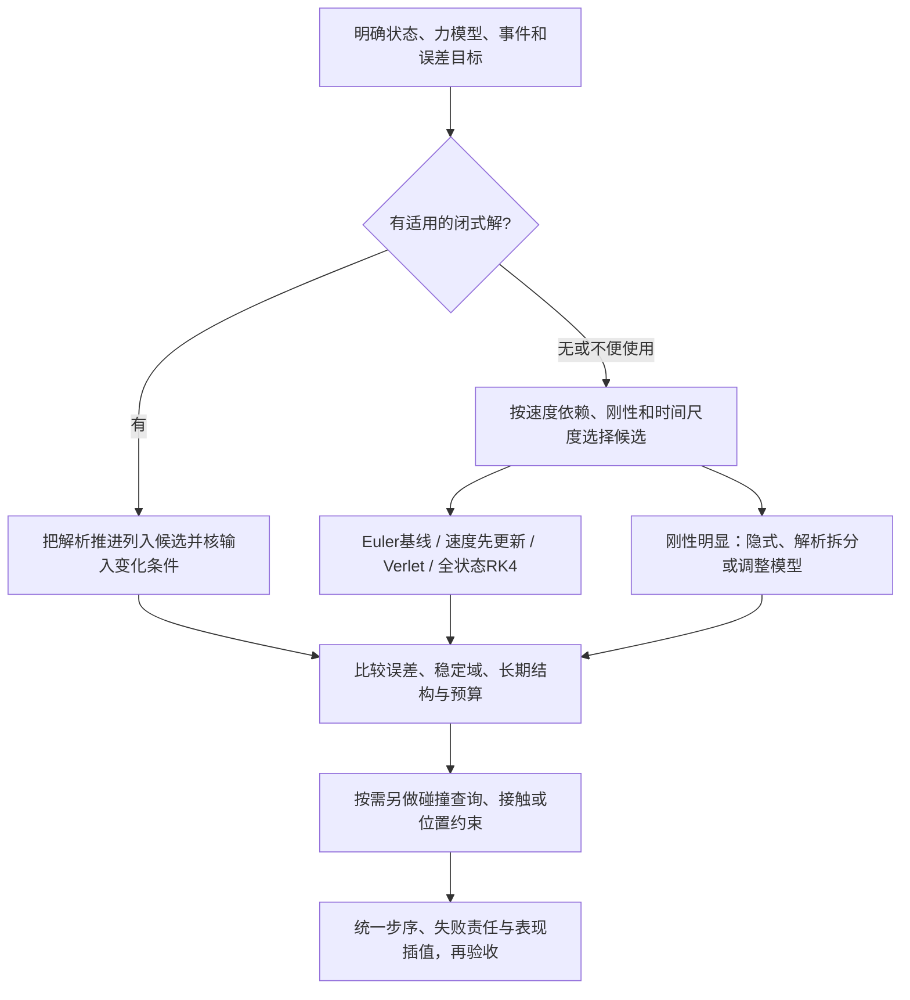
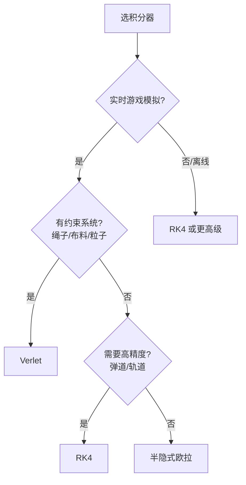

# 数值积分与运动学模拟（Euler / Verlet / RK4）

> 知识成熟度：L2。本文提供通用算法推导、完整教学伪代码和纸面正反例；未运行数值程序或引擎实验。
> 知识基线：连续时间运动初值问题的离散推进。自研运动与[01-确定性与基准工程总览](../确定性与基准/01-确定性与基准工程总览.md)的步序、输入和回放合同联动；涉及UE物理实现仍以[游戏知识/09-物理系统/README.md](../../../游戏知识/09-物理系统/README.md)为交叉验证边界。
> 适用范围：自研2D/3D角色、弹体和载具运动，绳子/布/粒子等物理风格玩法，服务器模拟与帧同步，以及不引入完整物理引擎的轻量场景。流体近似也可能需要时间积分，但其空间离散、压力约束和稳定条件不由本文四种方法自动解决。
> 事实边界：连续ODE、时间离散、约束/碰撞和具体引擎求解器是不同层。本文不声称这些伪代码就是UE Chaos或Unity物理内部实现；性能、误差容限和跨平台一致性须以项目实际证据为准。
> 验证与基准：P01–P21均为PAPER_EXPECTED；代码、编译、数值收敛/长时能量、UE、碰撞运行、性能和跨平台测试均NOT_RUN。
> 最后更新：2026-10-09。一手数值分析依据为Driscoll与Braun的FNC教材、Hairer的2010年几何积分讲义；工程来源及版本见文末。

## 概述：先选运动模型，再选积分器

给定力和初始位置/速度，求未来运动是常见的初值问题。角色控制也可能直接规定速度或路径；动画、传送、接触冲量、限位又会带来离散事件。先说明哪些状态连续演化、哪些时刻切换规则，才能讨论积分误差。把整个角色系统都叫“一个微分方程”，会遗漏输入采样、碰撞和控制责任。

常加速度、常系数线性阻力等模型存在闭式解。复杂的耦合力、时变输入与场景交互通常采用数值法，但“加速度不恒定就没有解析解”不成立。本文用可解析模型作为独立对照，再解释四类积分器的适用条件；不会把“半隐式默认”“约束用Verlet”“高精度用RK4”当作免于分析的选型规则。

## 1. 状态、单位与误差口径

### 1.1 把位置和速度看作同一个状态

```text
y(t) = (p(t), v(t))
y'(t) = f(t,y) = (v, a(t,p,v))
y(t0) = (p0,v0)，要求在给定有限时间区间内求解
```

p可以是一维标量或同一坐标系下的向量。采用米与秒时，v为米/秒，a为米/秒²。若弹簧力为−k(p−anchor)、阻力为−c v，质量m>0，则a含−(k/m)(p−anchor)−(c/m)v；k、c不能不经除质量就当加速度系数。

一步开始前要知道t、完整y、步长h>0、模型参数、输入样本及有效状态域。加速度依赖时间时，始终传t=0会解错方程。多物体力应从该阶段的一致状态求值；边遍历边覆盖物体会把迭代顺序带入算法。

```text
p_next = p + h*v
v_next = v + h*a(t,p,v)
```

这两行是前向Euler的具体近似，右边都取旧状态；并不是所有积分器都该采用的“运动模拟通式”。

### 1.2 精度、稳定性和能量分别回答什么

| 概念 | 本文含义 | 不代表什么 |
| --- | --- | --- |
| 一步缺陷 | 从精确当前状态出发，一次数值推进与精确末状态的差，未除h | 从已经有误差的状态出发得到的全部误差 |
| 全局误差 | 固定有限T上数值解与精确解的差 | 任意长时间仍保持同一误差上限 |
| 一致性/收敛阶 | h趋零时离散近似与连续问题的关系 | 任意大h也可用 |
| 绝对稳定 | 固定h，对线性测试方程的数值放大是否有界 | 非线性/接触系统永不失稳，或结果已经准确 |
| 辛性 | 相应Hamiltonian系统的离散相空间结构保持 | 每步原物理能量精确相等 |
| 确定性 | 约定输入、状态、执行条件下重复得到同一结果 | 结果符合真实物理或误差小 |

[FNC §6.2](https://fncbook.com/euler/)的局部截断误差LTE先把一步缺陷除以h，因此其Euler LTE是O(h)，本文未归一化一步缺陷是O(h²)，两者不矛盾。固定T需要约T/h步，误差还会被动力系统传播；不能只把单步误差机械相加而忽略扰动增长。

下文阶数假设初值一致、所需Taylor导数连续有界、f对状态局部Lipschitz、解留在合法域，且没有跨越未处理的不连续事件。减半h后误差趋于原来的1/2、1/4或1/16，只是相应一阶、二阶、四阶在截断误差主导且非退化时的渐近行为。过粗步、舍入、近零误差、碰撞或输入跳变都可能破坏这个比值。位置与速度单位不同，应分别报告误差，或先明确加权尺度再取范数。

## 2. 四类积分器

### 2.1 前向Euler：两项都取旧状态

```text
a0 = a(t,p,v)
p_next = p + h*v
v_next = v + h*a0
t_next = t + h
```

Taylor展开给p(t+h)=p+h v+O(h²)、v(t+h)=v+h a+O(h²)，所以一步缺陷O(h²)，固定有限T全局O(h)。写代码时先保存旧p/v或在副本里算两项，不能先覆盖v再读它更新p，否则方法已经变了。

它适合教学基线及已证明满足精度/稳定要求的简单模型。对无阻尼简谐振子会持续注入能量；对衰减方程则有条件稳定。不能把前一个结论推广成“Euler处理所有运动必然爆炸”。

### 2.2 速度先更新Euler：何时可以称为辛Euler

```text
a0 = a(t,p,v)
v_next = v + h*a0
p_next = p + h*v_next
t_next = t + h
```

它仍是一阶方法：完整状态一步缺陷O(h²)、固定T全局O(h)。位置使用新速度改变了离散系统，改善某些振荡问题的长期性质，不会因此变成二阶或无条件稳定。

对恒定质量、可分离保守Hamiltonian H(q,π)=T(π)+U(q)，相应的“动量kick→位置drift”是辛Euler。这里π是动量，q是位置，避免与本文位置符号p混淆。一般Hamiltonian下辛Euler形式可能是隐式的；[Hairer Lecture2，Theorem1](https://www.unige.ch/~hairer/poly_geoint/week2.pdf)说明了这一前提。直接把任意旧速度阻力a(t,p,v)塞进上式，不能仍自动称其为辛方法。

辛性不保证原能量每步不变，也不能证明某个引擎采用这两行。P06中即使是合法的保守振子，单步原能量也会变化。

### 2.3 Verlet：位置历史、中心速度与velocity Verlet

对固定h及不依赖速度的a(t,p)，前后Taylor展开相加，奇次项抵消：

```text
p_(n+1) = 2*p_n - p_(n-1) + h*h*a(t_n,p_n)
v_center(t_n) ≈ (p_(n+1)-p_(n-1))/(2*h)
```

第二行的时间标签是t_n，而不是t_(n+1)。分母必须为2h；若只除h，会把中心差分速度扩大两倍。位置递推需要两个相邻时刻的位置，不能把上一渲染帧或不同步长的坐标混入。

由(p0,v0)起步可以先算p1=p0+h v0+h²a(t0,p0)/2，再从n=1递推。这个平滑模型的起步位置误差为O(h³)，与二阶位置解的一致初值精度匹配。也可定义p_−1=p0−h v0+h²a0/2后从n=0开始，但不能把两种启动流程叠加。简单设p_−1=p0通常并不对应声称的v0，P10给出反例。

```text
StartPositionVerlet(t0,p0,v0,h):
    检查所有输入有限，h>0且在选定接纳上限内
    在副本用checked算术计算a0、p1、t1=t0+h；要求t1>t0
    成功才保存 H=(previous=p0,current=p1,time=t1,fixed_h=h)
    失败返回Reject，不发布部分history

TryPositionVerlet(H,h):
    拒绝非有限history、h<=0或h!=H.fixed_h
    next = checked(2*H.current-H.previous+h*h*a(H.time,H.current))
    center_v = checked((next-H.previous)/(2*h))
    next_t = checked(H.time+h)；要求next_t>H.time
    全部成功才返回Accept(H'=(H.current,next,next_t,h),
                       velocity_sample=(H.time,center_v))
    任一失败返回Reject，H保持原样
```

checked算术的确切教学约定见§5；本段a(t,p)=g−omega2(p−anchor)，参数有限、omega2≥0，示例不含速度阻力。传送、回滚、重置、修改h或位置投影后，要重新建立或同步一致history。位置history与用于渲染的prev/curr缓存承担不同职责。

若希望每步存位置和同一时刻速度，可以采用velocity Verlet：

```text
half_v = v + (h/2)*a(t,p)
p_next = p + h*half_v
v_next = half_v + (h/2)*a(t+h,p_next)
```

它是二阶完整状态方法，一步缺陷O(h³)、固定T全局O(h²)。位置Verlet是两步法：代入精确位置得到的递推残差O(h⁴)，除h²后O(h²)；这与velocity Verlet的一步状态缺陷是不同口径。

对于a(t,p,v)，末端加速度会依赖未知v_next。直接代入旧v不再是上述标准方法；可选求解相应方程、经过分析的拆分方法或适合完整一阶系统的RK方法。固定步保守模型下的时间对称、辛性和长期能量分析，不能不加条件地移植到阻力、投影、碰撞或状态相关变步。绳布中的“Verlet+约束”仍有价值，但它是组合算法，见§7。

### 2.4 RK4：四次求整个状态的导数

令y=(p,v)、f(t,y)=(v,a(t,p,v))。本文k表示导数，**不预乘h**：

```text
k1 = f(t,     y)
k2 = f(t+h/2, y+(h/2)*k1)
k3 = f(t+h/2, y+(h/2)*k2)
k4 = f(t+h,   y+h*k3)
y_next = y+h*(k1+2*k2+2*k3+k4)/6
t_next = t+h
```

k2/k3/k4的p和v都由上一阶段导数推进。只更新v，或者各阶段位置始终用p+旧v·h/2，不是一般耦合运动系统的RK4。P04逐阶段给出一个能辨别错误实现的振子例。

[FNC §6.4，Definition6.4.2、Eq6.4.15与Function6.4.2](https://fncbook.com/rk/)采用k已乘h的等价记法；不能把两种约定混用而多乘或少乘h。在足够光滑的合法区间，经典RK4一步缺陷O(h⁵)、固定T全局O(h⁴)。一步通常有四次完整RHS求值，若每次都要计算相互作用力，这部分工作相应增加；整帧成本还含碰撞、约束、调度等，并没有通用的“实际耗时四倍”。

短时光滑弹道、轨道片段、离线预计算可把RK4列为候选。它不是刚性问题的通用解，也不具有标准辛方法的长期结构保证。若输入发生跳变，要定位/分段处理事件，不能指望四次采样自动恢复高阶。

## 3. 步长、刚性与长期能量

### 3.1 先看测试方程的放大因子

对y'=λy，精确一步乘e^(hλ)，数值法乘R(hλ)。令z=hλ，则前向Euler有R(z)=1+z；只有|1+z|≤1时，标量数值幅度在固定h、步数趋于无穷时有界。对要求真实衰减的模式，边界|R|=1虽不增长，却仍不能还原衰减。

- λ=−γ、γ>0：0<γh<2时幅度衰减；0≤γh≤1才不翻号。γh=2时正负交替但幅度不变
- λ=iω、ω≠0：|1+i hω|=sqrt(1+(hω)²)>1，任何正h都不在前向Euler的绝对稳定域
- 后向Euler在该线性测试下R(z)=1/(1−z)，覆盖左半平面的稳定性并不等于精确性；它也可能对原本不耗能的振荡产生数值耗散

[FNC §11.3 Examples11.3.1/11.3.4](https://fncbook.com/absstab-diffusion/)明确区分两种极限：固定有限T、h趋零时Euler可以收敛；固定h、时间无限延长时，它对纯振子不稳定。两者没有矛盾。

### 3.2 简谐振子：hω<2究竟属于谁

取p''=−ω²p、ω>0，单位质量能量E=(v²+ω²p²)/2。前向Euler更新后，交叉项抵消，得到：

```text
E_next = (1+(h*omega)^2)*E
```

所以原先把h<2/ω称为“显式Euler稳定界”是错误的。减小h可以减慢有限时间内的能量误差增长，不能为任意正h建立该振子的长期有界结论。

速度先更新Euler的状态矩阵为：

```text
[p_next]   [1-h*h*omega²    h] [p]
[v_next] = [ -h*omega²      1] [v]
det=1，trace=2-(h*omega)²
```

令s=hω。严格0<s<2时，两个不同特征值在单位圆上，得到这个线性无阻尼例的有界振荡模式；不代表相位或幅度准确。s=2出现重根，矩阵一般不能对角化，可能产生随步数线性增长；P07两步即可看出。position/velocity Verlet对同一振子的稳定区间同样是严格0<s<2。ω=0是自由运动，可能因非零速度而位置增长，那是物理运动，不能套“有界振荡”条件误判。

经典RK4的测试多项式是R(z)=1+z+z²/2+z³/6+z⁴/24。在纯虚轴：

```text
|R(i*s)|² = 1-s^6/72+s^8/576
```

对0<|s|<sqrt(8)，该值小于1；RK4在这个例中逐步损失原能量，而非精确保能。|s|=sqrt(8)的标量放大模恰为1，也不能据此推荐把步长设在稳定边缘。所有这些界都属于已声明的线性模型；多自由度、非线性、输入事件、接触和投影需要另外分析。

### 3.3 强阻尼也可能迫使显式法用小步

a=−γv本身会消耗物理动能，离散后却可能在γh>2时放大速度。逐步乘0.999也改变模型：若h改变，相同实际时间内的乘法次数不同，衰减就不同。可以为恒定线性阻力使用e^(−γh)的解析衰减，但与其他力组合的顺序仍是新的离散方案，不能称“加最小阻尼就兜底稳定”。

当稳定性迫使步长远小于精度目标所需时，问题呈现刚性；它不只是“弹簧系数大”的同义词。[FNC §11.4](https://fncbook.com/stiffness/)通过局部Jacobian说明不同时间尺度的影响。硬弹簧、高阻力及空间离散后的系统都可能遇到这种限制。隐式方法、解析子流、约束建模或更合适的模型可列为候选，但要承担线性/非线性求解预算、容差、收敛失败和状态提交责任。

60Hz、120Hz只给出h的候选值。应结合系统频率、时间尺度、所需相位/位置误差、碰撞轨迹和预算选取；没有适用于所有游戏运动的“60Hz足够”保证。

### 3.4 辛结构与原物理能量

对相应保守Hamiltonian系统，辛方法通常保持一个接近原系统的修正Hamiltonian结构，而不是每步使原H恒等。以[Hairer Lecture3 §3、Theorem3](https://www.unige.ch/~hairer/poly_geoint/week3.pdf)为例：要求光滑H、适当的辛方法、全局可定义的修正Hamiltonian、数值轨迹留在规定紧致集合，并取足够小的固定h。r阶方法、固定截断阶N>r下，其渐近近能量结论H(y_n)−H(y_0)=O(h^r)有t=nh≤C h^(−N+r)这样的时间窗；常数与假设相关。解析情形还可有更强的长时估计，不能把它省略条件后改写成“永久守恒”。

P06的辛Euler一步原能量下降并不违背这种近守恒。舍入累积、阻尼做功、驱动力、接触冲量、约束投影和自适应变步会改变问题。看到能量变化，先建立预期能量/功收支，再判断是物理耗散、外力输入、实现错误还是积分误差；“能量单调增长”也不总能唯一定位积分器。

## 4. 选型与常见运动模型



这幅图把约束作为附加责任。绳子使用位置历史并不意味着Verlet本身会解长度约束；离线模拟也不意味着RK4必优于所有其他方法。

| 原应用 | 模型/状态前提 | 候选及需要确认的边界 |
| --- | --- | --- |
| 重力+线性阻力 | a=g−γv，恒定g、γ≥0 | 令τ=t−t0；γ>0时v(t)=g/γ+(v0−g/γ)e^(−γτ)，p(t)=p0+(g/γ)τ+(v0−g/γ)(1−e^(−γτ))/γ。γ=0另用常加速度式；小γ的浮点求值还需避免消减。显式法仍受γh约束，时变参数不能照搬整段闭式 |
| 弹簧（简谐） | a=−(k/m)(p−anchor)，固定anchor | 定义ω²=k/m；速度先更新或Verlet可作低成本候选，核hω、相位和有限时间能量；不以“辛”替代误差检查 |
| 阻尼振荡 | a=−ω²(p−anchor)−γv | 可分析常系数闭式，或对完整(p,v)使用适合的方法；旧速度阻力式不自动辛，标准VV不能直接接受速度依赖 |
| 摆/绳/布粒子 | 重力+长度/弯曲等约束，固定/移动锚点 | 位置历史或显式速度预测之后另做约束；残差、质量比、拓扑、步长与迭代预算影响效果，无通用3–5次保证 |
| 轨道/精确弹道 | a为位置/时间相关场，避开奇点；碰撞另处理 | 短时高精度可比较RK4；长期保守问题还看几何结构、相位、能量和近碰撞奇点，不能只看局部阶数 |
| 载具、多种力 | 引擎推力、空气阻力、轮胎/地面作用有各自状态和单位 | 同一RHS阶段先按模型合成力再推进；若采用operator splitting，明确每个子流、先后次序和阶数，不能给每种力各做一个完整运动步而声称仍是原算法 |

流体、刚体转动和关节系统会增加状态与约束。四元数归一化只保持表示的单位约束，不会修正错误的角速度坐标、乘法顺序、路径或积分阶；归一化失败也不能用默认姿态掩盖。对应几何约定应先按“向量与矩阵基础”“四元数与旋转”专篇确定。

## 5. 完整基础例：候选计算与整步拒绝

本例是一维粒子的重力、弹簧和线性阻力，足以展示四方法，不需要空的业务接口。状态S=(t,p,v)，参数M=(g,anchor,omega2,gamma)，其中omega2=k/m≥0、gamma=c/m≥0。g为米/秒²，anchor为米，omega2为1/秒²、gamma为1/秒。多维推广按同一坐标系处理向量；多体共享力场还须使用一致阶段快照。

以下是完整数学伪代码，**没有执行，也不是可直接复制编译的UE实现**。finite只接受已解析的有限实数值；字符串、布尔、复数、错形状和未知方法在数值入口拒绝。C（checked同义）对括号内每一次基础加/减/乘/除检查非有限结果，除法先检查分母非零，失败即终止候选并返回算术拒绝；不是语言默认会自动执行的保护。元组(p,v)可按名称读取两个分量。

```text
A((p,v),(q,w)) = (C(p+q),C(v+w))
Scale(b,(p,v)) = (C(b*p),C(b*v))

Accel(p,v,M):
    displacement = C(p-M.anchor)
    spring = C(M.omega2*displacement)
    drag = C(M.gamma*v)
    return C(C(M.g-spring)-drag)

F(time,(p,v),M):
    require finite(time,p,v)
    return (v,Accel(p,v,M))  # 本例为自治力；阶段时间仍完整传递

TryStep(S,h,h_max,M,method):
    if not finite(S.t,S.p,S.v,h,h_max,M.g,M.anchor,M.omega2,M.gamma):
        return Reject("nonfinite_input",S)
    if h<=0 or h_max<=0 or h>h_max or M.omega2<0 or M.gamma<0:
        return Reject("invalid_domain",S)
    if method not in {Euler,VelocityFirst,VelocityVerlet,RK4}:
        return Reject("unknown_method",S)
    try checked candidate computation:
        next_t = C(S.t+h)
        if next_t<=S.t: return Reject("time_does_not_advance",S)
        y = (S.p,S.v)
        if method==Euler:
            next_y = A(y,Scale(h,F(S.t,y,M)))
        if method==VelocityFirst:
            next_v = C(S.v+C(h*Accel(S.p,S.v,M)))
            next_p = C(S.p+C(h*next_v))
            next_y = (next_p,next_v)
        if method==VelocityVerlet:
            if M.gamma!=0: return Reject("velocity_dependent_force",S)
            half = C(h/2)
            if half<=0: return Reject("half_step_underflow",S)
            old_a = Accel(S.p,S.v,M)
            half_v = C(S.v+C(half*old_a))
            next_p = C(S.p+C(h*half_v))
            new_a = Accel(next_p,half_v,M) # gamma=0，力不依赖速度
            next_v = C(half_v+C(half*new_a))
            next_y = (next_p,next_v)
        if method==RK4:
            half = C(h/2)
            mid = C(S.t+half)
            if not (S.t<mid<next_t): return Reject("stage_time_resolution",S)
            k1 = F(S.t,y,M)
            k2 = F(mid,A(y,Scale(half,k1)),M)
            k3 = F(mid,A(y,Scale(half,k2)),M)
            k4 = F(next_t,A(y,Scale(h,k3)),M)
            weighted = A(A(Scale(1/6,k1),Scale(1/3,k2)),
                         A(Scale(1/3,k3),Scale(1/6,k4)))
            next_y = A(y,Scale(h,weighted))
        return Accept((next_t,next_y.p,next_y.v))
    on checked arithmetic failure:
        return Reject("arithmetic",S)
```

h_max是调用者选定的接纳上限，不是此函数计算出的通用稳定界。它没有自适应误差估计；有限但误差很大或数值不稳定的结果仍可能通过这里的有限性检查。C也不检测所有有限舍入和下溢，项目必须另立物理状态域、精度和进度判据。

TryStep只返回候选，不修改S或外部世界。成功才由调用者一次替换p/v/t；拒绝时不能保留已算出的v而回退p。输入、参数及随机样本在一步内要冻结成确定的样本或函数；RK不同阶段可以按该函数取不同时间的值，但不能每次临时重读不受控的壁钟、网络或玩家输入。

例子中的VelocityVerlet用两次加速度求值；无事件且模型未变时，生产实现可缓存上一末端加速度，但缓存有效性是额外合同。代码中的求值次数可以静态计数，不能据此声称热路径已经足够快。

## 6. 固定步循环、预算与确定性

### 6.1 一帧产生时间，模拟消费整步

累加器把渲染时钟与模拟步序分开。[Fix Your Timestep!](https://gafferongames.com/post/fix_your_timestep/)展示了保留余数和prev/curr插值，也说明追赶成本超过时间供给会形成不断落后的“死亡螺旋”。因此除了固定h，还需要每帧预算和超限政策。

下面选择本地演示政策：**保留已接纳的时间债；失败暂停；成功前缀不回滚**。状态为(curr,prev,acc,tick)，初始curr为合法S、prev=curr、acc=0、tick=0。创建时确认0<h≤h_max≤MaxDebt且这些值有限；MaxSteps、MaxTick为可表示的正整数。只有tick<MaxTick才能计算tick+1，不能先溢出再检查。模型参数固定，使用§5的TryStep。

```text
AdvanceFrame(frame_delta):
    if not finite(frame_delta) or frame_delta<0:
        return RejectFrame("invalid_delta",unaccepted=frame_delta)
    candidate_acc = checked(acc+frame_delta)
    if arithmetic failure or candidate_acc>MaxDebt:
        return RejectFrame("debt_limit",unaccepted=frame_delta)
    acc = candidate_acc                   # 本帧时间只在这里接纳一次
    done = 0
    while acc>=h and done<MaxSteps:
        if tick>=MaxTick:
            return Halt("tick_limit",debt=acc,completed=done)
        candidate_acc = checked(acc-h)
        if arithmetic failure or candidate_acc<0 or candidate_acc>=acc:
            return Halt("debt_resolution",debt=acc,completed=done)
        result = TryStep(curr,h,h_max,M,method)
        if result rejected:
            return Halt(result.reason,debt=acc,completed=done)
        old = curr
        (prev,curr,acc,tick) = (old,result.state,candidate_acc,tick+1)
        done += 1
    if acc>=h:
        return Backlog(render=curr,debt=acc,completed=done)
    alpha = checked(acc/h)
    visual = checked((1-alpha)*prev.p+alpha*curr.p)
    if arithmetic failure:
        return RenderUnavailable(physics=curr,debt=acc,completed=done)
    return Ready(render=visual,debt=acc,completed=done)
```

checked失败在每个标记点立即转入该点的分支，不继续读取不存在的candidate。四种返回状态的责任不同：

| 返回 | 已经提交什么 | 谁处理剩余时间 |
| --- | --- | --- |
| RejectFrame | 本帧尚未接纳，curr/prev/acc/tick均不变 | 宿主处理unaccepted：暂停、重新定时基准或明确拒收，不能说已经模拟过 |
| Halt | 本帧已接纳；早先成功步已提交，失败步未提交/未消费债 | 保留acc；修复原因后以0额外时间恢复，不能再次加入原frame_delta |
| Backlog | 最多完成MaxSteps，剩余acc仍≥h | 以后按政策消费；本帧直接显示curr |
| Ready / RenderUnavailable | 所有成功物理步仍已提交 | Ready仅绘制插值；表现计算失败也不回滚物理或重复接纳本帧 |

有限输入的acc+h、p+h v仍可上溢；很大的acc减去很小h也可能数值不变。t+h或RK中点不再可表示为新时间时，增大循环次数不能修复，必须停下并处理时间表示/范围。上例没有自动无限重试或偷偷改h的分支。

只有0≤acc<h时，alpha=acc/h才处于[0,1)。若触预算后acc≥h，直接用这个比值会外推而不是插值。prev/curr插值表示约t_curr−h+acc的状态，相对理想连续时间t_curr+acc延后一个h；初始化prev=curr则有启动特例。表现坐标不写回物理状态，不用它做伤害或碰撞判定。

### 6.2 固定步简化复现，不独立保证一致

若两个客户端读取不同壁钟frame_delta，哪怕h相同，也可能在同一画面帧推进不同数量的tick。lockstep应以共同逻辑tick和对应输入推进，渲染只观察已提交状态；各端不能独自丢债、变h或因性能差异跳过游戏逻辑。

固定步减少需要记录/协调的变量。可变步并非数学上不能复现：若完整步长序列、输入时点、算法状态和算术环境都相同，也可以重复；但把本机渲染帧长当网络共同输入会让结果分叉。自适应步长还受误差估计和接受/拒绝决策影响，协议和回放必须记录或重现这些决策。

一致性至少涉及初值、参数版本、输入采样、步序、对象与约束顺序、随机状态、浮点精度/舍入、编译器重排、FMA、数学库、并发合并顺序，以及接触缓存、休眠等隐藏状态。定点数也有范围、溢出、除法舍入和算法顺序问题；相同seed或相同h不是独立证明。[Box2D作者2024年的Determinism说明](https://box2d.org/posts/2024/08/determinism/)提供这些问题的工程实例，不是所有引擎或所有后续版本的保证。

回放和状态哈希应包含恢复模拟所需的状态，并绑定具体版本和执行条件，见[01-确定性与基准工程总览](../确定性与基准/01-确定性与基准工程总览.md)。服务器权威快照/客户端预测与lockstep是不同协议：前者可以允许客户端预测后纠正，不要求所有客户端时刻都拥有同一个完整世界。

## 7. 位置约束与碰撞：积分之后仍有工作

### 7.1 距离约束为什么按逆质量分配

令d=q2−q1、dist=|d|、目标距离L，约束残差r=dist−L。沿单位方向n=d/dist修正；希望质量大的一端少移动，固定端不移动，因此用非负逆质量w1/w2分配：

```text
q1_next = q1 + [w1/(w1+w2)]*r*n
q2_next = q2 - [w2/(w1+w2)]*r*n
```

当两端质量相等时，才退化为各移一半；w1=0时第一端保持原位，第二端承担全部修正。[Müller等PBD论文，Eq8–11与§3.6](https://matthias-research.github.io/pages/publications/posBasedDyn.pdf)给出一般梯度形式和固定端处理。不能只在文字里声称支持锚点，代码却仍把两端各移0.5。

下面是完整单约束校正。点为同一坐标系下的有限向量；L、tol、eps使用相同长度单位，w为逆质量。tol是接纳残差，eps是可用方向阈值；它们不是一个无单位通用epsilon。hypot使用可靠的缩放范数计算并检查结果有限，不先不加保护地平方巨大分量。

```text
ProjectDistancePair(q1,q2,w1,w2,L,tol,eps):
    old_pair = (q1,q2)
    if not finite(q1,q2,w1,w2,L,tol,eps): return Invalid(old_pair)
    if w1<0 or w2<0 or L<0 or tol<0 or eps<=0: return Invalid(old_pair)
    try checked candidate computation:
        d = C(q2-q1)
        dist = C(hypot(d))
        r = C(dist-L)
        if abs(r)<=tol: return Satisfied(old_pair,residual=r)
        total = C(w1+w2)
        if total==0: return Unsatisfiable(old_pair,residual=r)
        if dist<=eps: return Degenerate(old_pair,residual=r)
        n = C(d/dist)
        next1 = C(q1+C(C(w1/total)*r)*n)
        next2 = C(q2-C(C(w2/total)*r)*n)
        # 两个候选全通过才一起返回，不原地改q1后再检查q2
        return Corrected((next1,next2))
    on checked arithmetic failure:
        return ArithmeticFailure(old_pair)
```

dist≈0而L明显非零时没有可靠的校正方向；上例返回退化，不从除零/随机方向制造新状态。若模型提供经过验证的rest方向，可另外设计确定的恢复策略。两固定端已经满足约束可返回Satisfied；两固定端冲突则不能靠增加迭代次数解决。

### 7.2 多约束、速度与退出

绳布粒子通常先预测位置，再迭代距离、弯曲等约束。约束会互相干扰，质量比和拓扑也影响传播；修完一个约束可能重新破坏另一个。因此完整流程需要：

1. 限定点数、约束数、索引域和MaxIterations；固定约束次序，预检参数/锚点，并保存旧物理状态
2. 在候选位置数组上执行有界迭代；单点对先形成两个合法候选再写回候选数组。遇Invalid、Degenerate、Unsatisfiable或算术失败，丢弃整组候选并返回原因，旧物理状态不变
3. 每轮或最终重新计算全部残差，报告max(abs(C_i))。达到声明容差才返回Converged；耗尽预算返回Unconverged和残差，本文默认不发布近似候选。若玩法允许残余误差，必须另定接纳阈值及后果，不能把它叫收敛
4. 在接纳位置后，按组合算法恢复速度并同步历史；所有候选速度也须检查，最后一次发布整组位置/速度/时间

PBD常用v_i=(q_i_corrected−q_i_old)/h作为算法定义的更新速度。它与position Verlet的中心速度公式不同，不能替换分母后声称同一时刻的精确导数。position-Verlet组合至少要将旧current保留为前一时刻位置，将校正后新位置作为current；锚点移动、传送或回滚还需一致重建历史，否则会从位置差产生意外速度。投影会改变自由ODE轨迹与能量，不能继续无条件引用未投影Verlet的可逆/辛/保能结论。

§6的基础loop不含约束。接入上述流程时，应把“预测→候选投影→速度/历史恢复→接纳判定”整体作为一个step候选，成功后再消费h；若先提交预测位置再运行可能失败的投影，就破坏了该loop的拒绝合同。

迭代数可以改变原PBD的有效刚度，但“3–5次足够”不是收敛定理。[XPBD（2016）](https://matthias-research.github.io/pages/publications/XPBD.pdf)通过compliance等变量处理原PBD的步长/迭代相关性，是有模型依据的延伸；这里没有实现或运行XPBD，也不声称它任意有限次都能解完约束。

### 7.3 高精度积分不等于没有隧穿

积分器定义候选运动；碰撞检测查询形状和路径；接触/摩擦求解器处理响应。P21中一个点从墙的一侧到另一侧，两端都不在墙上，位置积分再准确也不能让端点检测发现中途接触。子步减小位移，但对任意薄障碍和高速旋转仍没有无条件防漏保证。

CCD需要覆盖实际声明的轨迹，或有误差包络的分段近似；RK的四个阶段也不是自动完备的碰撞采样。查询返回Invalid/Indeterminate、预算耗尽或没有进度时，调用者应暂停/限制运动、使用有根据的稳健查询等，不能按“无碰撞”提交整个步长。TOI子步、接触缓存、约束和积分的组合次序必须一致，避免检测后又重复积分一次。

## 8. 验证与基准：PAPER_EXPECTED与NOT_RUN

### 8.1 共同输入约定

下表均为手算或合同推理，未执行程序。除每行覆盖项外，数值单步例共享t0=0、p0=0、v0=0、anchor=0、g=0、omega2=0、gamma=0；合法步例选择有限h_max≥h。SHO例明确omega2=ω²，默认ω=1。符号推导行按其完整方程理解，不把这些默认值覆盖掉符号初值。

帧例共享初始tick=0、MaxSteps=2、MaxTick=1024、MaxDebt=1、合法h_max≤MaxDebt；实际curr按行指定或取合法普通粒子状态，prev=curr。为清楚展示时间账，P15/P17的十进制值按实数处理；P16的acc“0.15”只表示原存储值，期望是拒绝前后完全不改它。P13/P14/P16另明确binary64、round-to-nearest ties-to-even的思考模型，不是本机运行输出。

### 8.2 正反例矩阵

| ID | 输入与独立推导 | PAPER_EXPECTED | 对应机制 |
| --- | --- | --- | --- |
| P01 | g=−10，p0=v0=0，h=1/10，一步 | Euler(p,v)=(0,−1)；VelocityFirst=(−1/10,−1)；VV/RK4=(−1/20,−1)；各t=1/10 | 旧速度、新速度和阶段速度不能混用 |
| P02 | 同P01，T=1、N=10；v_n=−n，位置为等差和 | Euler p=−4.5，VelocityFirst p=−5.5，exact/VV/RK4 p=−5；两种一阶法位置相对误差10% | 缺少h就不能给误差百分比 |
| P03 | 常g、T=Nh，保留符号p0/v0 | p_E=p0+v0T+g(T²−Th)/2；p_VF=p0+v0T+g(T²+Th)/2；绝对位置误差abs(g)Th/2 | 减半h的一阶误差；常g不能测RK4四阶斜率 |
| P04 | a=−p，p0=1、v0=0、h=1；四个导数对 | k1=(0,−1)，k2=(−1/2,−1)，k3=(−1/2,−3/4)，k4=(−3/4,−1/2)；(p1,v1)=(13/24,−5/6) | 旧写法各阶段p都为1，得到v1=−1且没有位置更新，不是RK4 |
| P05 | 任意ω>0、E>0，SHO与前向Euler | E_next=(1+(hω)²)E；任意h>0放大 | h<2/ω不属于前向Euler纯振子的稳定界 |
| P06 | SHO，p=1、v=0、h=1/2，速度先更新 | (p',v')=(3/4,−1/2)，E'=13/32，原E=1/2 | 辛性不等于每步原能量恒等 |
| P07 | 同P06但h=2、h_max=2，手算两步 | (p1,v1)=(−3,−2)，(p2,v2)=(5,4) | 稳定边界hω=2不能当安全值；此单步上限不受帧例MaxDebt限制 |
| P08 | v'=−v，gamma=1、v0=1、h=3、h_max=3 | 前向速度v1=1−3=−2，幅度由1变2 | 物理阻力也可数值不稳定 |
| P09 | position Verlet，g=−10、p0=v0=0、h=1/10，一致启动 | p1=−1/20、p2=−1/5；中心v1=(p2−p0)/(2h)=−1，真实末端v2=−2 | 分母2h与中心时间标签 |
| P10 | 同P09却设p_−1=p0=0，再声称v0=0 | p1=−1/10，偏离一致启动的−1/20 | 历史位置不能随便复制 |
| P11 | VelocityVerlet，g=−10、gamma=1、h=1/10 | velocity_dependent_force，完整S不变 | 标准VV不直接支持该速度力 |
| P12 | h=0/负数/NaN/Infinity，或任一状态/参数非有限；其余输入合法 | Reject，S不变，无候选发布或时间消费 | 非有限/非法输入不是有效“未移动” |
| P13 | binary64；t=0、anchor=0、p=v=10^308、g=omega2=gamma=0、h=h_max=2，Euler | h·v溢出，Reject arithmetic；旧p/v/t不变 | 有限输入不保证有限候选；明确t/anchor避免先触其他拒绝 |
| P14 | binary64；t=2^53、h=1、h_max=1，其余默认 | t+h舍入回t，Reject time_does_not_advance；RK中点另有分辨率检查 | 时间不推进不能靠无限重试补救 |
| P15 | acc=0、frame_delta=0.35、h=0.1，两步均通过；可取p=v=g=omega2=gamma=0、h_max=0.1 | tick增2、acc=0.15，Backlog直接绘curr；不能用alpha=1.5插值 | 预算用尽后的债和表现 |
| P16 | binary64；acc记作0.15，frame_delta=0，h=h_max=0.1；curr=(t=0,p=1.79×10^308,v=10^308)，其余力参数0，Euler | p候选约1.89×10^308溢出；Halt，acc/tick/curr/prev原值不变 | 失败步不耗债；恢复不再次加原帧时间 |
| P17 | acc=0.1、frame_delta=1、MaxDebt=1、h=h_max=0.1 | RejectFrame；acc仍0.1、unaccepted=1，其余状态不变 | 未接纳时间归宿主，不等于已经模拟 |
| P18 | 一维距离q1=0、q2=3、L=1、w1=w2=1、tol=0、eps=10^−8 | r=2，q1'=1、q2'=2，距离1 | 等权各移一半只是特例 |
| P19 | 同P18但w1=0、w2=1 | q1'=0、q2'=1 | 锚点保持不动 |
| P20 | q1=q2=0、L=1、w1=w2=1、tol=0、eps=10^−8；另例q1=0、q2=3、L=1、w1=w2=0 | 分别Degenerate/Unsatisfiable；两点原值不变 | 方向退化与两固定端冲突 |
| P21 | 点沿直线由x=−1到x=+1，墙为x=0；只查起终点是否在墙上 | 两端都不在墙上，但路径穿墙 | 积分准确不替代路径碰撞查询 |

常g的闭式解是p(t)=p0+v0t+g t²/2、v(t)=v0+gt。VV与RK4在这个模型的实数算术下可精确给出节点解；实际浮点还存在舍入。不能拿该例的零截断误差画出所谓四阶收敛，或把零误差说成无限阶。P04用非退化SHO区分阶段公式；更完整的收敛研究仍需多h、固定T和独立参考。

### 8.3 接入项目后如何验证

选择能独立写出解的常重力、线性衰减和SHO，再加项目实际的非线性/事件模型。固定T和参数，逐个减小h，分别记录位置、速度、相位和能量/外力功收支；若比较不同方法的成本，报告RHS求值数和实际计时，两者不能混同。对长时保守模拟，短时收敛不能替代指定时间窗内的能量与相位记录。

失败矩阵至少包括零/负/非有限h、非有限状态/参数、时间不推进、阶段溢出、速度依赖VV拒绝、位置历史不一致、预算用尽、失败前缀提交、重复frame_delta、锚点/退化约束及CCD未知结果。输出必须区分拒绝、未收敛、候选与已提交状态，而不是统一一个“成功/没动”布尔值。

保存实际语言/库/精度/编译选项、参数和初值、完整步序、误差范数/阈值、原始输出、退出码与所覆盖时间窗。回归与[01-确定性与基准工程总览](../确定性与基准/01-确定性与基准工程总览.md)联动，但单机一次相等不等于跨平台证明。本文没有执行以上计划，也没有把文献自己的图或实验记为本篇结果。

## 9. 最佳实践

1. **按模型选候选**：Euler可作基线；速度先更新适合某些成本敏感模型；Verlet关注相应保守结构；RK4关注光滑有限时段精度。没有“实时90%都够”的统一比例
2. **写出时间政策**：固定h通常便于lockstep/回放；若变步，则把步长序列、事件时点和接受/拒绝决策纳入合同。不能让各端自行按画面帧长决定权威模拟
3. **物理与表现分开**：prev/curr插值只在有效时间区间使用，说明延迟；Backlog、传送和回滚分别处理，表现坐标不写回积分状态
4. **约束单独验收**：绳布用Verlet位置历史或PBD显式速度都可以形成方案，但要处理逆质量、锚点、残差、方向退化和有界迭代，不能以算法名代替求解质量
5. **高阶也查稳定域**：RK4四阶段要完整，非光滑事件和刚性不由高阶自动解决；比较同一误差目标下的工作量，而不是只比较单步数
6. **跟踪正确的能量账**：保守、阻尼、外力、碰撞和投影分别说明预期。先排除模型/单位/多次积分错误，再检查h及方法；减小h是诊断手段，不是所有问题的修复
7. **阻尼是模型参数**：γ有时间单位，逐帧乘常数会耦合h；强阻尼可能收紧显式稳定界。不要用任意0.999掩盖发散
8. **一致性覆盖执行环境**：固定运算顺序之外，还核线程合并、数学库、编译配置、FMA、随机和隐状态；项目允许的误差一致与逐位一致也要分开
9. **多力保持同阶段**：每个RHS使用一致状态求合力；有意采用拆分时解释每个子流及组合顺序，避免把每种力都当额外整步位移
10. **留下可核的结果**：用独立解析解、正反例、失败状态和原始记录验收。优化热路径中的分配/虚调用等应以实际负载分析为依据，不能把教学伪代码称为性能合格实现

## 10. 常见问题 FAQ

**Q1：为什么弹簧越弹越高？**

先查力的符号、k/m和c/m单位、重复积分、约束/外力做功以及h。前向Euler对无阻尼SHO确实每步增加能量；换成速度先更新或Verlet仍需满足该模型的步长和精度条件。加入驱动力或发生接触后，单看“越弹越高”无法唯一归因。

**Q2：固定时间步和可变时间步哪个好？**

固定步更容易隔离显示帧率、对齐tick与回放输入；它不独立保证确定性。可变步需明确完整h序列和事件/拒绝政策；同一离散过程可以复现，但不能让联网各端各自使用不相同的壁钟帧长。

**Q3：60Hz够吗？**

用ωh、阻尼时间尺度、误差目标和运动/碰撞尺度判断，再结合预算。高频弹簧可能要求更小h或改变求解方法；高速薄物体即使增加子步也不自动免于隧穿。120Hz不是另一条通用安全线。

**Q4：Verlet怎样处理速度相关力？**

标准位置式及本文VV限定a(t,p)。若末端加速度含v_next，就出现需要求解的关系；可以设计并分析阻力的解析拆分或其他方法，但不能直接代入旧速度后沿用原二阶、可逆或辛结论。本文基础例对gamma≠0的VV明确拒绝。

**Q5：RK4值得用吗？**

对光滑短时问题可能用较少步达到所需精度，但每步四次RHS，且仍有稳定/事件限制。轨道长期结构、刚性和实时约束负载要另比较。四次加速度求值不等于全系统实测四倍耗时，也不能据观感推定所有实时场景都不需要它。

**Q6：多物体碰撞怎么办？**

先定义候选轨迹，再进行合适的几何查询、流形和接触求解，按既定次序发布状态。积分本身不产生碰撞响应；未知查询结果不能当无碰撞。参见[04-碰撞检测.md](../空间查询与碰撞/04-碰撞检测.md)，其中检测、CCD和响应的合同与这里的状态提交配合。

**Q7：帧同步下所有客户端必须逐位一致吗？**

取决于协议要求；严格确定性lockstep通常要求同逻辑tick的权威状态一致，否则会持续分叉。固定h只是其中一项，初值、排序、随机、算术和隐状态都需覆盖。只用同一seed或同一个编译器名称不能证明一致。

**Q8：怎样验证积分器正确？**

先用P01/P04等可手算阶段核公式，再用独立闭式解做固定T、多h、非退化的误差比较，并核拒绝后状态不变。常重力对VV/RK4的实数精确性不能证明一般四阶；长时相位、能量和非光滑事件另测。本文纸例不是已经运行的回归结果。

**Q9：服务端模拟和客户端模拟必须一样吗？**

服务器权威场景允许客户端预测后纠正；可预测性需要双方相关模型和状态对齐，但不意味着每个客户端拥有完全相同世界。lockstep是另一种约束。预测、重演与权威结果的分工见[游戏知识/06-网络同步/03-客户端预测与延迟补偿.md](../../07-网络与游戏服务端/同步预测与回放/03-客户端预测与延迟补偿.md)。

**Q10：有没有最好的积分器？**

先明确模型、光滑性、时间尺度、约束、误差目标、时间窗和预算，再比较解析推进、显式/隐式/几何方法。半隐式加固定步不是适用于所有系统的稳定保证；合法的拒绝和降级政策也是方案的一部分。

## 11. 落地检查清单与术语

### 常见反模式

1. 不看模型就固定用前向Euler，或把其他方法的SHO稳定界套给它
2. 将本机渲染frame_delta直接当共同网络输入，再把结果差异归咎于“浮点随机”
3. 四元数积分后只做归一化，忽略角速度空间/单位、乘法次序、失败和期望路径
4. 只看子步末端或与碰撞步长脱节，声称高阶积分/更多子步已经保证不隧穿
5. 不定义有限时间窗、误差/能量预算和原始记录，靠“看起来不漂”替代回归

- [ ] 状态、空间、单位、质量归一化、初值、力/输入与离散事件合同明确
- [ ] 方法阶数、速度依赖、稳定条件、接纳h上限和所需误差有各自依据
- [ ] 固定/可变步序、MaxSteps/MaxDebt/MaxTick、超限和未接纳时间归属明确
- [ ] RK阶段同时推进p/v；position Verlet启动、相邻历史和中心速度时点一致
- [ ] 有限输入、中间溢出、时间不推进、错形状、未知方法和失败状态均有出口
- [ ] 保守能量、阻尼/外力做功、约束/接触改变与浮点误差分开验收
- [ ] 碰撞轨迹/查询步长与状态提交次序一致；未知/超预算查询不会静默成为Miss
- [ ] 姿态使用正确角速度约定；单位四元数处理有合法域和失败，不把归一化当完整物理修复
- [ ] 解析对照、非退化收敛、长时相位/能量、确定性及性能分别有适用证据和未验证边界
- [ ] 积分、约束、渲染与具体引擎职责明确；项目优化依据真实负载，失败不部分写状态或消费未完成步

### 术语速查

| 术语 | 英文 | 本文约定 |
| --- | --- | --- |
| 前向Euler | Forward / Explicit Euler | 用旧完整状态的导数外推一步 |
| 速度先更新Euler | Velocity-first / Semi-implicit Euler | 先更新v再更新p，一阶；辛性需相应Hamiltonian前提 |
| Verlet | Position / Velocity Verlet | 固定步位置历史或kick-drift-kick形式；速度时刻与力依赖必须明确 |
| RK4 | Classical fourth-order Runge–Kutta | 四阶段完整状态方法，阶数有光滑/时间域条件 |
| 固定时间步 | Fixed timestep | 每次推进相同h，便于协议对齐但非确定性充分条件 |
| 累加器 | Accumulator | 记录已接纳但尚未消费的时间债，失败/丢弃需有归属 |
| 能量漂移 | Energy drift | 原物理能量随时间的数值偏离，先排除真实外力和耗散 |
| 稳定域/稳定界 | Stability region / bound | 指定模型与方法的放大限制，不等于精度或所有系统保证 |
| 一步缺陷/全局误差 | Local defect / global error | 分别是精确起点的一步差与固定区间的累计/传播误差 |
| 刚性 | Stiffness | 稳定性对步长的约束远严于所需精度，程度随问题和方法变化 |

## 12. 关联阅读

- 同分类：[04-碰撞检测.md](../空间查询与碰撞/04-碰撞检测.md) —— 运动模拟后的检测与响应分工
- 同分类：[03-插值与曲线.md](03-插值与曲线.md) —— 渲染插值、路径参数与真实时间尺度
- 同分类：[06-弹道与射击算法.md](../空间查询与碰撞/06-弹道与射击算法.md) —— 抛体运动、子弹轨迹与动力学积分用途
- 碰撞衔接：[04-碰撞检测.md](../空间查询与碰撞/04-碰撞检测.md) —— 候选运动、接触法线/穿透与求解时序
- 确定性：[01-确定性与基准工程总览.md](../确定性与基准/01-确定性与基准工程总览.md) —— 步序、浮点一致性与回放
- 联机基准：[05-联机确定性与基准工程.md](../确定性与基准/05-联机确定性与基准工程.md) —— 状态哈希与定点数模拟的范围
- 数学基础：[01-向量与矩阵基础.md](01-向量与矩阵基础.md) —— 位置、速度、加速度的向量与单位约定
- UE侧：[游戏知识/09-物理系统/README.md](../../../游戏知识/09-物理系统/README.md) —— 有效旧路径入口，通往现行物理仿真知识域，保留引擎实现边界
- 网络：[游戏知识/06-网络同步/03-客户端预测与延迟补偿.md](../../07-网络与游戏服务端/同步预测与回放/03-客户端预测与延迟补偿.md) —— 预测/回滚的积分与状态一致性

## 13. 一手来源、定位与资料缺口

核对日期为2026-10-09。固定版本资料按其版本解释；作者维护的网页按章节/定义与本次访问定位，不称为不可变源码快照。本次只做公开文证核对，不认证引擎内部实现。

| 来源 | 实际采用的定位 | 用途与边界 |
| --- | --- | --- |
| Driscoll & Braun，[FNC Euler](https://fncbook.com/euler/) | §6.2 Def6.2.1–6.2.5、Theorem6.2.1 | Euler、除h LTE与有限T收敛；不支持永久误差有界 |
| 同作者，[FNC RK](https://fncbook.com/rk/) | §6.4 Def6.4.2、Eq6.4.15、Function6.4.2、§6.4.4 | 四阶段全状态、记号换算与RHS计数；不等于本项目耗时 |
| 同作者，[FNC Absolute stability](https://fncbook.com/absstab-diffusion/) | §11.3 Def11.3.1、Examples11.3.1/11.3.4 | 放大因子与两个极限；线性例不自动证明非线性全局稳定 |
| 同作者，[FNC Stiffness](https://fncbook.com/stiffness/) | §11.4引言、线性化/冻结Jacobian | 刚性与局部扰动分析；隐式求解仍可能失败 |
| Ernst Hairer，[Lecture2: Symplectic integrators](https://www.unige.ch/~hairer/poly_geoint/week2.pdf) | Jan–Feb2010，§1 Theorems1/2、Eq1–4，§3、§5 | 辛Euler、SV、中心速度与splitting；前提不可删 |
| Ernst Hairer，[Lecture3: Backward error analysis](https://www.unige.ch/~hairer/poly_geoint/week3.pdf) | Jan–Feb2010，§2–3、Theorem3（PDF第7页） | 修正Hamiltonian、紧致轨迹/步长/时间窗下近能量；不是精确原能量恒等 |
| Müller等，[Position Based Dynamics](https://matthias-research.github.io/pages/publications/posBasedDyn.pdf) | VRIPHYS2006，§3、Eq8–11、§3.6 | 逆质量投影、速度恢复、固定端；不是Verlet本身或3–5次收敛证明 |
| Macklin等，[XPBD](https://matthias-research.github.io/pages/publications/XPBD.pdf) | MiG2016，摘要/§1/§3–4、Algorithm1 | 原PBD步长/迭代相关性与compliance延伸；本文未实现 |
| Glenn Fiedler，[Fix Your Timestep!](https://gafferongames.com/post/fix_your_timestep/) | 2004-06-10，Semi-fixed/Free the physics/The final touch | 时间供需、追赶与插值；本文预算/拒绝政策是自己的教学合同 |
| Erin Catto，[Box2D Determinism](https://box2d.org/posts/2024/08/determinism/) | 2024-08-26，Testing/Multithreaded/Cross-Platform/Roll-back | 工程一致性例；不泛化为所有引擎或所有后续版本 |
| SciPy，[solve_ivp v1.16.2](https://docs.scipy.org/doc/scipy-1.16.2/reference/generated/scipy.integrate.solve_ivp.html) | method/events/tolerances/status | 显式/隐式选项、事件可能跨过多零点及局部容差语义；RK45不是本文经典RK4，本文未调用该库 |

本次来源查阅有失败：FNC旧`absstab/`地址返回错误，改读表中真实`absstab-diffusion/`；Hairer的`gniverlet.pdf`无法读取，相关摘要可读但不能替代公式，实际用2010 Lecture2；`santander.pdf`文本提取乱码，截图工具不可用、UNIGE替代下载也失败，长期能量结论实际用可读的Lecture3。没有把这些失败当通过，也没有把文献实验转述为本轮测量。

原篇自由落体/十周期误差表写“示意”，没有给出h、完整参数、范数或raw附件链接。本次完整读取原篇及可核Git旧版，并在当前tracked路径的数值积分/Euler/Verlet/RK4名称范围定位，未找到可对应旧百分比的独立raw记录。这是有限范围未找到，不等于证明历史作者从未运行、数据从未存在或故意造假。现行区用有前提的纸面推导取代无参数百分比；旧表、旧来源及全部历史异文仍在下方逐字保存。

## 更新日志

- 2026-10-09：纠正四类积分器的状态、误差与稳定前提，补齐位置历史、有限帧债、拒绝与约束责任；原阅读、实践和FAQ用途全部承接。新增21项纸面正反例与一手资料定位；只做文档静态核对，没有数值/引擎/性能实验。2026-08-07初稿及后续Git异文在历史区保全

## 历史原文与逐字回拼

本区是整改前记录，不是现行建议或本轮运行结果。CURRENT整篇只存一份；其余版本用按顺序应用的零上下文差异逐字恢复。历史错误、示意数字、链接、日期、图和代码均原样保存。旧实验原始记录本次未找到不等于它们从未存在。

### CURRENT

<!-- NUMERICAL_HISTORY_CURRENT_BEGIN -->
~~~~~~~~~~text
---
type: Mechanism
title: "数值积分与运动学模拟（Euler / Verlet / RK4）"
status: stable
verified: []
maturity: L2
---
# 数值积分与运动学模拟（Euler / Verlet / RK4）

> 知识成熟度：L2（本轮审计修订时补标）。
> 知识基线：引擎无关的游戏算法通用原理；数值积分是自研运动模拟、物理风格玩法、确定性模拟的地基，与[01-确定性与基准工程总览](../确定性与基准/01-确定性与基准工程总览.md)的固定时间步直接联动；涉及 UE 的物理实现以[游戏知识/09-物理系统/README.md](../../../游戏知识/09-物理系统/README.md)为交叉验证边界。
> 适用范围：自研 2D/3D 运动系统（角色/弹体/载具）、物理风格玩法（绳子/布/流体近似）、服务器端确定性模拟（帧同步）、以及"不想引入完整物理引擎"的轻量场景。
> 事实边界：积分器算法（Euler/半隐式 Euler/Verlet/RK4）与稳定性结论为通用数值分析事实；具体引擎（UE Chaos、Unity PhysX）的求解器细节以其文档为准；性能与精度取舍需按项目实测。
> 最后更新：2026-08-07。
> 参考来源：[Wikipedia: Numerical methods for ordinary differential equations](https://en.wikipedia.org/wiki/Numerical_methods_for_ordinary_differential_equations)、[Gaffer On Games: Fix Your Timestep](https://gafferongames.com/post/fix_your_timestep/)。

> 游戏里的运动（角色跑动、子弹飞行、绳子摆动、载具颠簸）本质是**微分方程**：已知加速度，积分出速度，再积分出位置。本文讲清四种常用积分器的原理、稳定性与选型，以及"固定时间步"这一确定性模拟的基石。

---

## 一、概述

### 1.1 运动学的微分形式

```text
位置 p(t)，速度 v(t)，加速度 a(t)：
  dv/dt = a(t, p, v)      // 加速度可能依赖位置与速度（如弹簧、阻力）
  dp/dt = v(t)
```

"模拟运动" = 从初值 `(p0, v0)` 出发，用**数值积分**逐步推进：

```text
p(t + Δt) ≈ p(t) + v(t)·Δt
v(t + Δt) ≈ v(t) + a(t)·Δt
```

### 1.2 为什么不能"直接解公式"

- 多数游戏加速度不是常数（重力+阻力+弹簧+玩家输入），解析解不存在；
- 数值积分是唯一通用路径；
- 但积分器有**精度与稳定性**之分——选错会"能量爆炸"（越弹越高）或"黏滞"（越滚越慢）。

---

## 二、核心概念

| 概念 | 英文 | 一句话定义 | 说明 |
| --- | --- | --- | --- |
| 时间步 | Timestep (Δt) | 两次积分之间的时间间隔 | 固定 vs 可变 |
| 显式积分 | Explicit Integration | 用当前状态算下一状态 | 简单、可能不稳 |
| 隐式积分 | Implicit Integration | 用下一状态（或混合）算 | 稳定、复杂 |
| 前向欧拉 | Forward Euler | 直接用当前斜率外推 | 最简、能量发散 |
| 半隐式欧拉 | Semi-implicit Euler | 先更新速度再更新位置 | 游戏默认之选 |
| Verlet | Verlet Integration | 用位置差分代替速度存储 | 约束系统友好 |
| 龙格-库塔 | Runge-Kutta (RK4) | 多点斜率加权平均 | 精度高、贵 |
| 固定时间步 | Fixed Timestep | 恒定 Δt 的模拟循环 | 确定性基石 |
| 插值渲染 | Interpolation | 模拟帧间渲染平滑 | 表现层补帧 |
| 稳定性 | Stability | 误差不随步数增长 | 与 Δt 和刚度相关 |

---

## 三、原理详解

### 3.1 四种积分器

#### 3.1.1 前向（显式）欧拉

```text
v_new = v + a·Δt
p_new = p + v·Δt        // 注意：用的是旧 v！
```

- 误差：O(Δt²) 每步，全局 O(Δt)；
- 问题：**能量注入**——弹簧/轨道系统会越转越快（位置用旧速度更新造成滞后）；
- 用途：教学、对精度无要求的简单运动。

#### 3.1.2 半隐式欧拉（Symplectic / Semi-implicit）

```text
v_new = v + a·Δt
p_new = p + v_new·Δt    // 用新速度更新位置
```

- 误差：同为 O(Δt²)，但**保守能量**（对无阻尼系统近似守恒）；
- 这就是大多数游戏引擎内部的基础积分形式（配合约束求解）；
- **游戏默认选择**：简单、稳定、够用。

#### 3.1.3 Verlet

```text
p_new = 2·p - p_old + a·Δt²
```

- 不显式存速度（速度 = (p_new - p_old)/Δt）；
- 特点：时间可逆、能量守恒好、**约束系统**（绳子/布料/粒子）友好；
- 应用：Verlet 是布料/绳索模拟的经典选择（约束投影迭代）。

#### 3.1.4 RK4

```text
k1 = a(t, p, v)
k2 = a(t+Δt/2, p + v·Δt/2, v + k1·Δt/2)
k3 = a(t+Δt/2, p + v·Δt/2, v + k2·Δt/2)
k4 = a(t+Δt, p + v·Δt, v + k3·Δt)
v_new = v + (k1 + 2k2 + 2k3 + k4)·Δt/6
```

- 误差：每步 O(Δt⁵)，全局 O(Δt⁴)；
- 代价：每步 4 次加速度求值（约 4 倍成本）；
- 用途：高精度需求（弹道计算、轨道、离线模拟）。



*图释：积分器选型决策——实时模拟默认半隐式欧拉，约束系统用 Verlet，高精度用 RK4。*

### 3.2 稳定性与时间步

#### 3.2.1 为什么 Δt 不能随便选

- 显式积分对"刚度"敏感：弹簧越硬（频率越高），需要的 Δt 越小，否则发散；
- 经验法则：`Δt < 2/ω`（ω 为系统最高角频率）是显式欧拉的稳定边界；
- 60Hz 模拟（Δt=16.7ms）对大部分游戏运动足够；高刚度系统需隐式或约束求解。

#### 3.2.2 固定时间步 vs 可变时间步

```text
// 伪代码：固定时间步主循环（节选/示意，参考 Fix Your Timestep）
accumulator += frame_delta
while accumulator >= FIXED_DT:
    simulate(FIXED_DT)        // 确定性：恒定 Δt
    accumulator -= FIXED_DT
render(interpolate(prev, curr, accumulator / FIXED_DT))
```

- **固定时间步**：模拟确定性（同输入同输出）、稳定、回放一致；
- **可变时间步**：帧率耦合、结果不可复现——**帧同步/回放场景禁用**；
- 表现平滑靠渲染插值（模拟 30Hz、渲染 60Hz 常见）。

### 3.3 与确定性模拟的关系

- 数值积分结果依赖浮点运算顺序（见[01-确定性与基准工程总览](../确定性与基准/01-确定性与基准工程总览.md)）；
- 跨平台一致需：固定 Δt + 相同求值顺序 + 数学函数一致（或定点数）；
- 服务端/帧同步要求：所有客户端跑完全相同的积分循环（输入驱动、结果一致）。

### 3.4 常见运动模型示例

| 模型 | 加速度公式 | 积分器建议 |
| --- | --- | --- |
| 重力+阻力 | a = g - k·v | 半隐式欧拉 |
| 弹簧（简谐） | a = -k·(p - p0) | 半隐式欧拉（小步）或 Verlet |
| 阻尼振荡 | a = -k·p - c·v | 半隐式欧拉 |
| 摆/绳子 | 约束 + 重力 | Verlet + 约束迭代 |
| 轨道/弹道精确 | a = 引力场 | RK4 |
| 载具（多力） | 引擎/阻力/摩擦合成 | 半隐式欧拉 + 分步 |

### 3.5 约束与积分结合（Verlet 投影）

绳/布/粒子系统是"积分 + 约束"的经典组合：

```text
// 伪代码：Verlet 约束投影（节选/示意）
for iter in range(3):                      // 迭代 3~5 次
    for constraint in constraints:
        d = p2 - p1
        dist = length(d)
        diff = (dist - rest_length) / dist
        p1 += d * 0.5 * diff               // 两端各移一半
        p2 -= d * 0.5 * diff
```

要点：

- **迭代次数**：3~5 次足够（更多次数收益递减），每次迭代修正距离约束；
- **刚性**：迭代越多越"硬"，越少越"软"——用迭代次数控制布料/绳子手感；
- **固定端点**：约束支持"锚定"（一端不动），用于挂绳/旗帜；
- **稳定性**：Verlet + 约束对显式积分稳定得多，这是它成为布料标准方案的原因。

### 3.6 误差分析与验证

用解析解验证积分器精度：

| 场景 | 解析解 | 半隐式欧拉误差（示意） | RK4 误差（示意） |
| --- | --- | --- | --- |
| 自由落体（1s） | x = ½gt² | ~0.1% | ~0.0001% |
| 简谐运动（10 周期） | 能量守恒 | 振幅漂移 <1% | 漂移可忽略 |

验证方法：

1. **能量跟踪**：无阻尼系统跟踪总能量，能量单调增长 = 积分器注入能量；
2. **收敛性测试**：Δt 减半，误差应约减半（一阶）或 1/16（四阶 RK4）；
3. **回归测试**：固定输入断言输出误差范围（配合[01-确定性与基准工程总览](../确定性与基准/01-确定性与基准工程总览.md)的基准框架）。

---

## 四、伪代码/示例：通用运动积分器

```text
// 伪代码：运动模拟骨架（节选/示意）
class MotionBody:
    def __init__(self, p, v):
        self.p, self.v = p, v

    def acceleration(self, p, v, t):
        # 子类实现：重力、阻力、弹簧、玩家输入等
        raise NotImplementedError

    def step_semi_implicit(self, dt):
        self.v += self.acceleration(self.p, self.v, 0) * dt
        self.p += self.v * dt

    def step_verlet(self, dt, p_old):
        a = self.acceleration(self.p, self.v, 0)
        p_new = 2 * self.p - p_old + a * dt * dt
        self.v = (p_new - p_old) / (2 * dt)   // 近似速度
        return p_old, p_new

// 固定步主循环
while running:
    acc += frame_delta
    while acc >= FIXED_DT:
        body.step_semi_implicit(FIXED_DT)
        acc -= FIXED_DT
```

---

## 五、最佳实践

1. **默认半隐式欧拉**：实时游戏 90% 场景够用，先跑通再谈精度。
2. **固定时间步**：任何需要确定性/回放/联网一致的运动模拟，必须固定 Δt。
3. **渲染插值**：模拟频率低于渲染频率时，用前后状态插值渲染，避免卡顿感。
4. **约束用 Verlet**：绳子/布料/粒子系统用 Verlet + 约束迭代（投影），简单稳定。
5. **高精度用 RK4**：弹道/轨道/离线预计算；实时慎用（4 倍成本）。
6. **警惕能量漂移**：弹簧系统越弹越高 = 积分器或 Δt 问题；先减小 Δt 验证。
7. **阻尼防发散**：任何显式积分系统加最小阻尼（v *= 0.999…），兜底稳定性。
8. **浮点顺序固定**：确定性模拟中固定运算顺序，避免编译器/平台差异。
9. **分步处理多力**：载具等多力系统按"力合成→积分"单步处理，别拆多步积分。
10. **测试覆盖**：用解析解对照（自由落体、简谐运动）验证积分器误差在预期范围。

---

## 六、常见问题 FAQ

1. **Q：为什么我的弹簧越弹越高？** A：显式欧拉注入能量；换半隐式欧拉或 Verlet，并检查 Δt 是否过大。
2. **Q：固定时间步和可变时间步哪个好？** A：确定性/联网场景必须固定；单机表现可接受可变（但建议仍固定+插值）。
3. **Q：60Hz 够吗？** A：多数游戏运动够；高速弹体/高刚度弹簧需更小步（120Hz+）或子步。
4. **Q：Verlet 怎么处理速度相关力（阻力）？** A：Verlet 天然忽略速度项，可把阻力并入加速度项近似，或用 velocity Verlet 变体。
5. **Q：RK4 值得吗？** A：实时游戏通常不值（4 倍成本换来的精度感知不到）；弹道预计算/离线模拟值得。
6. **Q：多物体相互作用（碰撞）怎么办？** A：积分 + 碰撞检测 + 约束求解分步进行；本文只讲运动学，碰撞见[04-碰撞检测.md](../空间查询与碰撞/04-碰撞检测.md)。
7. **Q：帧同步下所有客户端结果必须完全一致？** A：是——固定 Δt + 同顺序浮点运算；任何不确定源（随机/平台数学库）都要收敛。
8. **Q：怎么验证积分器正确性？** A：用解析解（自由落体 x = ½gt²、简谐运动）对比误差，按步长画误差曲线。
9. **Q：服务端模拟和客户端模拟要一样吗？** A：权威端（服务端）决定结果，客户端可跑相同模拟做预测（见[游戏知识/06-网络同步/03-客户端预测与延迟补偿.md](../../07-网络与游戏服务端/同步预测与回放/03-客户端预测与延迟补偿.md)）。
10. **Q：有没有"最好"的积分器？** A：没有——精度/稳定/成本三角权衡；游戏场景半隐式欧拉+固定步是最稳组合。

---

## 七、关联阅读

- 同分类：[04-碰撞检测.md](../空间查询与碰撞/04-碰撞检测.md) —— 运动模拟的下一步：检测与响应；
- 同分类：[03-插值与曲线.md](03-插值与曲线.md) —— 渲染插值/运动路径的曲线表达；
- 同分类：[06-弹道与射击算法.md](../空间查询与碰撞/06-弹道与射击算法.md) —— 动力学积分器在抛体运动与子弹轨迹中的具体应用；
- 碰撞衔接：[04-碰撞检测.md](../空间查询与碰撞/04-碰撞检测.md) —— 积分步进与接触法线/穿透冲量求解的耦合；
- 确定性：[01-确定性与基准工程总览.md](../确定性与基准/01-确定性与基准工程总览.md) —— 固定步、浮点一致性与回放；
- 联机基准：[05-联机确定性与基准工程.md](../确定性与基准/05-联机确定性与基准工程.md) —— 状态哈希与定点数仿真；
- 数学基础：[01-向量与矩阵基础.md](01-向量与矩阵基础.md) —— 位置/速度/加速度的向量运算；
- UE 侧：[游戏知识/09-物理系统/README.md](../../../游戏知识/09-物理系统/README.md) —— Chaos 物理引擎的实现边界；
- 网络：[游戏知识/06-网络同步/03-客户端预测与延迟补偿.md](../../07-网络与游戏服务端/同步预测与回放/03-客户端预测与延迟补偿.md) —— 客户端预测与回滚的积分一致性。

---

## 更新日志

- 2026-08-07：初稿。补齐"数值积分与运动学模拟"空白（P1，全库此前 0 覆盖）；涵盖四种积分器原理/稳定性/选型、固定时间步与确定性、常见运动模型与验证方法；引擎无关通用层。

## 落地检查清单

### 常见反模式

1. **固定用显式欧拉**：弹簧/轨道等系统能量发散，物体越飞越远。
2. **时间步随帧率变化**：帧率波动导致模拟结果漂移，破坏确定性。
3. **四元数积分后不归一化**：姿态逐渐漂移，旋转变形。
4. **子步与碰撞步长不匹配**：高速物体隧穿碰撞体。
5. **能量漂移不设回归测试**：长时间模拟后行为不可复现。

- [ ] 积分器选型有依据：显式欧拉（简单但发散）/半隐式欧拉（稳定）/Verlet（约束友好）/RK4（精度高成本高）。
- [ ] 时间步策略明确：固定步长 + 累加器（防死亡螺旋上限），或可变步长 + 插值。
- [ ] 稳定性边界已验证：如弹簧系统 `ω·h < 2` 等条件。
- [ ] 刚体运动学（位置/速度/角速度/四元数）积分后四元数已归一化。
- [ ] 确定性联动：固定步长、浮点一致性（指路 04-01），跨平台结果一致。
- [ ] 阻尼/摩擦模型有参数上限与验证，不会能量发散或粘滞。
- [ ] 子步划分与碰撞检测步长匹配，避免隧穿（联动 04-碰撞检测）。
- [ ] 能量/误差回归测试：长时间模拟能量漂移在阈值内。
- [ ] 性能预算：积分热路径避免分配与虚调用。
- [ ] 与引擎实现分工明确（物理引擎场景指路 游戏知识/09-物理系统）。

### 术语速查

| 术语 | 英文 | 一句话解释 |
| --- | --- | --- |
| 显式欧拉 | Explicit Euler | 用当前状态直接外推一步 |
| 半隐式欧拉 | Semi-implicit Euler | 先更新速度再更新位置（辛） |
| Verlet | Verlet Integration | 用位置历史积分，约束友好 |
| RK4 | Runge-Kutta 4 | 四阶龙格-库塔，精度高 |
| 固定时间步 | Fixed Timestep | 恒定步长模拟，确定性关键 |
| 累加器 | Accumulator | 按帧累计并消费固定步长 |
| 能量漂移 | Energy Drift | 数值误差导致的能量变化 |
| 稳定性边界 | Stability Bound | 步长与系统频率的约束条件 |
~~~~~~~~~~
<!-- NUMERICAL_HISTORY_CURRENT_END -->

### TO_H01

<!-- NUMERICAL_HISTORY_TO_H01_BEGIN -->
~~~~~~~~~~diff
--- CURRENT.md
+++ H01.md
@@ -262 +262 @@
-9. **Q：服务端模拟和客户端模拟要一样吗？** A：权威端（服务端）决定结果，客户端可跑相同模拟做预测（见[游戏知识/06-网络同步/03-客户端预测与延迟补偿.md](../../07-网络与游戏服务端/同步预测与回放/03-客户端预测与延迟补偿.md)）。
+9. **Q：服务端模拟和客户端模拟要一样吗？** A：权威端（服务端）决定结果，客户端可跑相同模拟做预测（见[游戏知识/06-网络同步/03-客户端预测与延迟补偿.md](../../../游戏知识/06-网络同步/03-客户端预测与延迟补偿.md)）。
@@ -277 +277 @@
-- 网络：[游戏知识/06-网络同步/03-客户端预测与延迟补偿.md](../../07-网络与游戏服务端/同步预测与回放/03-客户端预测与延迟补偿.md) —— 客户端预测与回滚的积分一致性。
+- 网络：[游戏知识/06-网络同步/03-客户端预测与延迟补偿.md](../../../游戏知识/06-网络同步/03-客户端预测与延迟补偿.md) —— 客户端预测与回滚的积分一致性。
~~~~~~~~~~
<!-- NUMERICAL_HISTORY_TO_H01_END -->

### TO_H02

<!-- NUMERICAL_HISTORY_TO_H02_BEGIN -->
~~~~~~~~~~diff
--- H01.md
+++ H02.md
@@ -11 +11 @@
-> 知识基线：引擎无关的游戏算法通用原理；数值积分是自研运动模拟、物理风格玩法、确定性模拟的地基，与[01-确定性与基准工程总览](../确定性与基准/01-确定性与基准工程总览.md)的固定时间步直接联动；涉及 UE 的物理实现以[游戏知识/09-物理系统/README.md](../../../游戏知识/09-物理系统/README.md)为交叉验证边界。
+> 知识基线：引擎无关的游戏算法通用原理；数值积分是自研运动模拟、物理风格玩法、确定性模拟的地基，与[01-确定性与基准工程总览](../04-确定性与基准工程/01-确定性与基准工程总览.md)的固定时间步直接联动；涉及 UE 的物理实现以[游戏知识/09-物理系统/README.md](../../游戏知识/09-物理系统/README.md)为交叉验证边界。
@@ -151 +151 @@
-- 数值积分结果依赖浮点运算顺序（见[01-确定性与基准工程总览](../确定性与基准/01-确定性与基准工程总览.md)）；
+- 数值积分结果依赖浮点运算顺序（见[01-确定性与基准工程总览](../04-确定性与基准工程/01-确定性与基准工程总览.md)）；
@@ -201 +201 @@
-3. **回归测试**：固定输入断言输出误差范围（配合[01-确定性与基准工程总览](../确定性与基准/01-确定性与基准工程总览.md)的基准框架）。
+3. **回归测试**：固定输入断言输出误差范围（配合[01-确定性与基准工程总览](../04-确定性与基准工程/01-确定性与基准工程总览.md)的基准框架）。
@@ -259 +259 @@
-6. **Q：多物体相互作用（碰撞）怎么办？** A：积分 + 碰撞检测 + 约束求解分步进行；本文只讲运动学，碰撞见[04-碰撞检测.md](../空间查询与碰撞/04-碰撞检测.md)。
+6. **Q：多物体相互作用（碰撞）怎么办？** A：积分 + 碰撞检测 + 约束求解分步进行；本文只讲运动学，碰撞见[04-碰撞检测.md](04-碰撞检测.md)。
@@ -262 +262 @@
-9. **Q：服务端模拟和客户端模拟要一样吗？** A：权威端（服务端）决定结果，客户端可跑相同模拟做预测（见[游戏知识/06-网络同步/03-客户端预测与延迟补偿.md](../../../游戏知识/06-网络同步/03-客户端预测与延迟补偿.md)）。
+9. **Q：服务端模拟和客户端模拟要一样吗？** A：权威端（服务端）决定结果，客户端可跑相同模拟做预测（见[游戏知识/06-网络同步/03-客户端预测与延迟补偿.md](../../游戏知识/06-网络同步/03-客户端预测与延迟补偿.md)）。
@@ -269 +269 @@
-- 同分类：[04-碰撞检测.md](../空间查询与碰撞/04-碰撞检测.md) —— 运动模拟的下一步：检测与响应；
+- 同分类：[04-碰撞检测.md](04-碰撞检测.md) —— 运动模拟的下一步：检测与响应；
@@ -271,4 +271,4 @@
-- 同分类：[06-弹道与射击算法.md](../空间查询与碰撞/06-弹道与射击算法.md) —— 动力学积分器在抛体运动与子弹轨迹中的具体应用；
-- 碰撞衔接：[04-碰撞检测.md](../空间查询与碰撞/04-碰撞检测.md) —— 积分步进与接触法线/穿透冲量求解的耦合；
-- 确定性：[01-确定性与基准工程总览.md](../确定性与基准/01-确定性与基准工程总览.md) —— 固定步、浮点一致性与回放；
-- 联机基准：[05-联机确定性与基准工程.md](../确定性与基准/05-联机确定性与基准工程.md) —— 状态哈希与定点数仿真；
+- 同分类：[06-弹道与射击算法.md](06-弹道与射击算法.md) —— 动力学积分器在抛体运动与子弹轨迹中的具体应用；
+- 碰撞衔接：[04-碰撞检测.md](04-碰撞检测.md) —— 积分步进与接触法线/穿透冲量求解的耦合；
+- 确定性：[01-确定性与基准工程总览.md](../04-确定性与基准工程/01-确定性与基准工程总览.md) —— 固定步、浮点一致性与回放；
+- 联机基准：[05-联机确定性与基准工程.md](../04-确定性与基准工程/05-联机确定性与基准工程.md) —— 状态哈希与定点数仿真；
@@ -276,2 +276,2 @@
-- UE 侧：[游戏知识/09-物理系统/README.md](../../../游戏知识/09-物理系统/README.md) —— Chaos 物理引擎的实现边界；
-- 网络：[游戏知识/06-网络同步/03-客户端预测与延迟补偿.md](../../../游戏知识/06-网络同步/03-客户端预测与延迟补偿.md) —— 客户端预测与回滚的积分一致性。
+- UE 侧：[游戏知识/09-物理系统/README.md](../../游戏知识/09-物理系统/README.md) —— Chaos 物理引擎的实现边界；
+- 网络：[游戏知识/06-网络同步/03-客户端预测与延迟补偿.md](../../游戏知识/06-网络同步/03-客户端预测与延迟补偿.md) —— 客户端预测与回滚的积分一致性。
~~~~~~~~~~
<!-- NUMERICAL_HISTORY_TO_H02_END -->

### TO_H03

<!-- NUMERICAL_HISTORY_TO_H03_BEGIN -->
~~~~~~~~~~diff
--- H02.md
+++ H03.md
@@ -271,2 +270,0 @@
-- 同分类：[06-弹道与射击算法.md](06-弹道与射击算法.md) —— 动力学积分器在抛体运动与子弹轨迹中的具体应用；
-- 碰撞衔接：[04-碰撞检测.md](04-碰撞检测.md) —— 积分步进与接触法线/穿透冲量求解的耦合；
@@ -274 +271,0 @@
-- 联机基准：[05-联机确定性与基准工程.md](../04-确定性与基准工程/05-联机确定性与基准工程.md) —— 状态哈希与定点数仿真；
~~~~~~~~~~
<!-- NUMERICAL_HISTORY_TO_H03_END -->

### TO_H04

<!-- NUMERICAL_HISTORY_TO_H04_BEGIN -->
~~~~~~~~~~diff
--- H03.md
+++ H04.md
@@ -1,7 +0,0 @@
----
-type: Mechanism
-title: "数值积分与运动学模拟（Euler / Verlet / RK4）"
-status: stable
-verified: []
-maturity: L2
----
~~~~~~~~~~
<!-- NUMERICAL_HISTORY_TO_H04_END -->

### TO_H05

<!-- NUMERICAL_HISTORY_TO_H05_BEGIN -->
~~~~~~~~~~diff
--- H04.md
+++ H05.md
@@ -3,2 +3 @@
-> 知识成熟度：L2（本轮审计修订时补标）。
-> 知识基线：引擎无关的游戏算法通用原理；数值积分是自研运动模拟、物理风格玩法、确定性模拟的地基，与[01-确定性与基准工程总览](../04-确定性与基准工程/01-确定性与基准工程总览.md)的固定时间步直接联动；涉及 UE 的物理实现以[游戏知识/09-物理系统/README.md](../../游戏知识/09-物理系统/README.md)为交叉验证边界。
+> 知识基线：引擎无关的游戏算法通用原理；数值积分是自研运动模拟、物理风格玩法、确定性模拟的地基，与[01-动态寻路确定性与基准测试](../04-确定性与基准工程/01-动态寻路确定性与基准测试.md)的固定时间步直接联动；涉及 UE 的物理实现以[游戏知识/09-物理系统/README.md](../../游戏知识/09-物理系统/README.md)为交叉验证边界。
@@ -144 +143 @@
-- 数值积分结果依赖浮点运算顺序（见[01-确定性与基准工程总览](../04-确定性与基准工程/01-确定性与基准工程总览.md)）；
+- 数值积分结果依赖浮点运算顺序（见[01-动态寻路确定性与基准测试](../04-确定性与基准工程/01-动态寻路确定性与基准测试.md)）；
@@ -194 +193 @@
-3. **回归测试**：固定输入断言输出误差范围（配合[01-确定性与基准工程总览](../04-确定性与基准工程/01-确定性与基准工程总览.md)的基准框架）。
+3. **回归测试**：固定输入断言输出误差范围（配合[01-动态寻路确定性与基准测试](../04-确定性与基准工程/01-动态寻路确定性与基准测试.md)的基准框架）。
@@ -264 +263 @@
-- 确定性：[01-确定性与基准工程总览.md](../04-确定性与基准工程/01-确定性与基准工程总览.md) —— 固定步、浮点一致性与回放；
+- 确定性：[01-动态寻路确定性与基准测试.md](../04-确定性与基准工程/01-动态寻路确定性与基准测试.md) —— 固定步、浮点一致性与回放；
~~~~~~~~~~
<!-- NUMERICAL_HISTORY_TO_H05_END -->

### 回拼定位表

以UTF-8原字节提取CURRENT，依次应用TO_H01至TO_H05。差异为CURRENT→H01→H02→H03→H04→H05，不是把所有patch同时应用于CURRENT。零上下文hunk中的旧行号相对于该patch的输入版；删除行必须逐字匹配。每一步校验下表SHA-256，失败就停止。

| 版本 | Git定位 | bytes / lines | SHA-256 | 回拼 |
| --- | --- | --- | --- | --- |
| CURRENT | `11266b1e740edc5d35dd89013b547951da044115:知识/02-数学与游戏算法/数学与数值计算/05-数值积分与运动学模拟.md` | 16139 / 317 | `67cd5e7258621afdb02c7b80ca0de22197d8f9c1e802702ae3630fff77fa1e3b` | CURRENT 原块 |
| H01 | `0ded04bf34c2fb3a9cc4539e0685d0cb52ffb003:知识/02-数学与游戏算法/数学与数值计算/05-数值积分与运动学模拟.md` | 16103 / 317 | `01f027c6b3cecaa8fd2e3dc090126ba86fa117a55f86278973313ecdc92cb5b1` | CURRENT + TO_H01 |
| H02 | `ffe221827d0ae8bb9ebc9ac6167df5cfb0b50256:游戏算法/02-数学与碰撞/05-数值积分与运动学模拟.md` | 16036 / 317 | `c427c37f7eeba3c71f2a19ee7c01ca126f8f75f39df49f5bbd925956748c0468` | H01 + TO_H02 |
| H03 | `9beb653aa267a4a0dbcf44a32fa21ce205cc3ce5:游戏算法/02-数学与碰撞/05-数值积分与运动学模拟.md` | 15596 / 314 | `ae72fd4ab8b6e1b0e30683623c833e88a43ecec6f8e48bef4b80b5140165757b` | H02 + TO_H03 |
| H04 | `bd733c248b010ef880fa2560293a0fe1b54e5691:游戏算法/02-数学与碰撞/05-数值积分与运动学模拟.md` | 15465 / 307 | `60c96b99612fed54de1d52c68971cda7435a70b251da4de2587b44afea1f221e` | H03 + TO_H04 |
| H05 | `e4832e10d14d631b82f78fe6aee7cb73c4283f88:游戏算法/02-数学与碰撞/05-数值积分与运动学模拟.md` | 15454 / 306 | `68b3c64403b77f3d6f5d20e48912c39c08d11115e3573f743f8cb11e2d7167b3` | H04 + TO_H05 |
