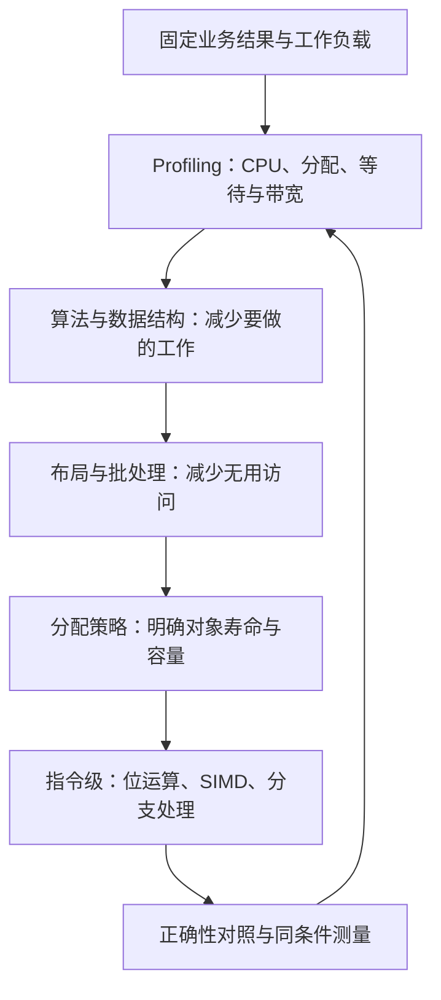
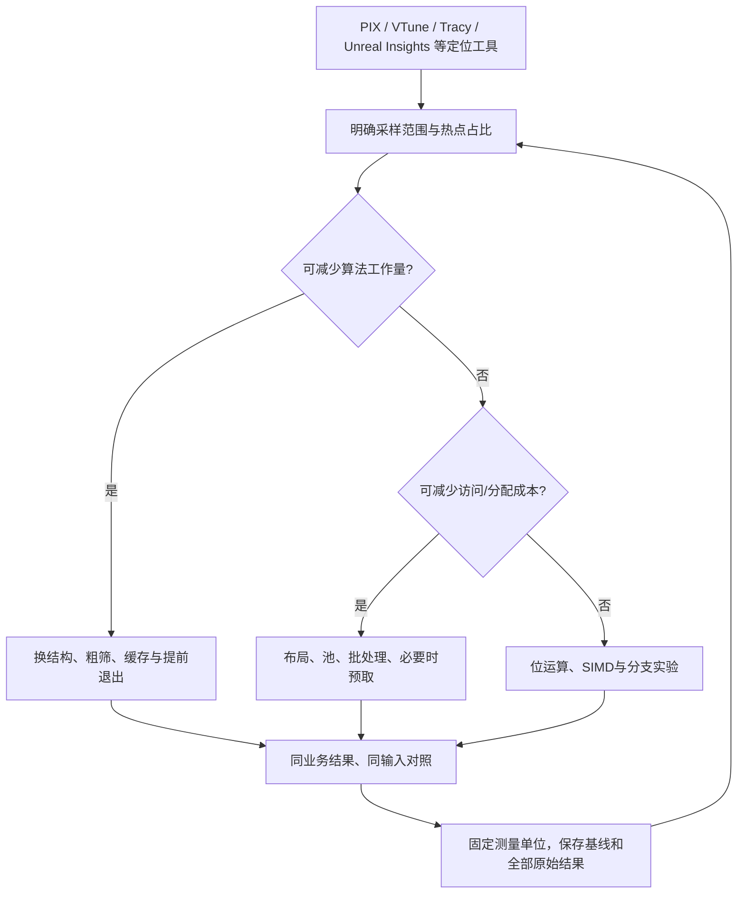

# 05-位运算与性能优化技巧

> 知识成熟度：L2。主承诺是解释位表示、数据访问、对象寿命与指令选择的正确性合同，并给出可审阅的教学实现和待执行测量方法；本文没有目标程序运行或性能结果。
> 知识基线：语言主体保持 C++17；整数与对象合同选读 WG21 N4659（2017-03-21，公开工作草案，不冒称最终出版标准全文），Python 对照固定为 CPython 3.12.0 文档。C++20 的 `<bit>` 只作独立迁移说明。
> 版本与规范基线：扩展语义依据 GCC 13.4.0 文档、Clang/LLVM 18.1.8 的向量化文档与公开 intrinsic 头文件；OpenMP 依据 5.2；测量工具接口依据 Google Benchmark 1.8.3。不同来源不共同组成一套已验证工具链。
> 事实边界：仅完成静态资料核对与文档审阅。以下 C++/Python、纸例、池、SIMD、并行与基准计划均未编译、未运行；未进行 CPU 指令探测、引擎/设备/系统设置、压力或性能实验。源码核对仅限文末列出的公开文件与选读条款，没有核对 Bullet、Unity、UE、分配器后端或实际机器生成代码。
> 最后更新：2026-10-09。

游戏优化先回答两个问题：结果是否仍符合业务合同，哪个实际成本被减少。位掩码适合把独立布尔状态合并成整字操作；位图适合稠密整数域；SoA、对象池与 SIMD 则分别改变访问、生命周期管理和指令组织。它们都可能增加代码、容量或协调成本，不能用位数和通道数直接推算帧率。

## 1. 从热点到可比较的改动

保留算法、布局、分配和指令四层排查顺序，把测量放在每一层：



这是排查方法，不是收益大小的定律。换算法不一定改变瓶颈；已有高效算法也可能受访存或等待限制。原稿的“90% 的直觉优化是浪费”“布局决定 90% 吞吐”没有可核对的实验定义、样本或原流，只作为历史表达保留于原版本，不作为本篇事实依据。

先定义一帧更新多少实体、读哪些字段、允许何种误差、对象如何退出，再选择局部改动。例如技能状态掩码减少多字段判断，阻挡位图减少稠密格子的存储，粒子位置循环可能受益于连续字段数组；这三个改动的收益来源不同。

## 2. 核心概念与成本单位

| 概念 | 正确性与成本口径 |
| --- | --- |
| 掩码 | 位编号、有效位集合、所有者及保留位政策必须确定；一个位只表达一个二值事实 |
| lowbit / popcount | 最低置位的值 / 置位数量；不是最低位索引，也不是硬件指令承诺 |
| bitset / bitmap | 前者强调有限集合，后者强调索引到位/字段的映射；总容量含取整、容器元数据和分配开销 |
| AoS / SoA / AoSoA | 对象数组 / 字段数组 / 分块混合布局；按实际循环比较读写字节和维护成本 |
| 缓存行 | 缓存一致性和传输的相关粒度，具体尺寸依目标；本文的 64B 只出现在假设模型中 |
| 对象池 | 重用存储或对象的策略；空闲槽操作、构造析构、扩容和同步分别计费 |
| 世代句柄 | 定位槽并辨认其当前对象；还要验证池身份、存活状态和世代是否回绕 |
| SIMD / 多线程 | 一条向量指令处理多元素 / 多执行线程；两者不等价，也不天然消除依赖 |
| 伪共享 | 线程修改不同逻辑对象却争用同一一致性单元；与语言层的数据竞争要分别处理 |

固定机器字模型里单次掩码或单个字查询可记 O(1)。任意长度位集合的扫描、求并和计数通常随字数增长；Python 大整数位操作的成本也随其表示长度变化，不能把它们统称为“一次指令”。

## 3. C++17 位运算先核类型，再核位数

### 3.1 本文教学实现的明确平台前提

标准并不规定 `int` 必为 32 位，也不规定字节必为 8 位。下面的公共定义用于本文 C++ 位操作、位图和池代码：选定 8 位字节、32 位 `unsigned int`、64 位 `unsigned long long`。不满足则应调整表示与接口，不能删断言假装可移植。RGBA 小节另要求实现提供 `<cstdint>` 的精确宽度类型。

```cpp
#include <climits>
#include <cstddef>
#include <cstdint>
#include <limits>
#include <memory>
#include <optional>
#include <stdexcept>
#include <type_traits>
#include <utility>
#include <vector>

using Word = unsigned long long;
static_assert(CHAR_BIT == 8, "this teaching format uses octets");
static_assert(std::numeric_limits<unsigned int>::digits == 32,
              "this teaching profile uses 32-bit unsigned int");
static_assert(std::numeric_limits<Word>::digits == 64,
              "this teaching profile uses 64-bit Word");
static_assert(sizeof(unsigned int) == 4 && sizeof(Word) == 8,
              "payload calculations assume no extra integer padding");
constexpr unsigned WordBits = 64;
```

[整数提升与转换](https://github.com/cplusplus/draft/blob/n4659/source/conversions.tex)发生在运算之前：较小整数类型可能先提升为 `int`；`~`、一元负号和移位也有提升。不能只看存储变量是无符号，就断言整个表达式在该位宽做无符号运算。`auto y = ~std::uint8_t{0};` 的 `y` 在常见 32 位 `int` 实现上是 `int`，不是一个 8 位结果；要得到 8 位图样，应明确转换回所需无符号类型。

N4659 的 [expr.shift / expr.unary.op / expr.mul](https://github.com/cplusplus/draft/blob/n4659/source/expressions.tex)分别规定：

- 移位次数必须非负且严格小于提升后左操作数的位宽；赋值给更宽类型不能挽救先发生的非法移位。在本文平台，`1u << 63` 非法，`Word{1} << 63` 合法。
- 无符号左移在合法次数内按结果类型范围取模；这可能丢失高位，不是整数乘法“永不溢出”。若业务要求精确乘以 2 的幂，还须先验证 `x <= max >> k`。
- C++17 中左操作数为负的有符号左移是未定义行为；非负有符号左移须满足对应无符号类型可表示等条款。负有符号数右移在此基线是实现定义，不能按 Python 或后续标准倒推。
- 有符号除法截向零，负数余数不可普遍替换为低位掩码。对本文的 `Word x` 与 `unsigned k`，必须先确认 `k < WordBits`，再定义 `Word d = Word{1} << k`；此时 `d` 是可表示且非零的数学上的2的k次幂，满足 `(x % d) == (x & (d - Word{1}))`。`k == WordBits` 不合法；其他整数类型须先明确提升后的运算域，不能将此等价关系直接外推到负有符号值。

`(flags & mask) != 0` 表示至少命中一位，`(flags & mask) == mask` 表示全部命中。后者在 `mask == 0` 时为真；“查询空条件是否通过”应由接口约定。`if (flags & mask == 0)` 的优先级易错，保留括号。

### 3.2 覆盖 0、满位宽与非法输入的基础函数

以下使用不会提升为 `int` 的 `Word`。`low_mask(64)` 独立处理，避免构造 `1 << 64`；非法请求抛出，不按位数取模后悄悄接受。

```cpp
Word one_bit(unsigned k) {
    if (k >= WordBits) throw std::out_of_range("bit index");
    return Word{1} << k;
}
Word low_mask(unsigned count) {
    if (count > WordBits) throw std::out_of_range("bit count");
    if (count == WordBits) return ~Word{0};
    return (Word{1} << count) - Word{1}; // count == 0 gives 0
}
Word lowbit(Word x) noexcept { return x & (Word{0} - x); }
Word clear_lowbit(Word x) noexcept { return x & (x - Word{1}); }
bool is_power_of_two(Word x) noexcept {
    return x != 0 && clear_lowbit(x) == 0;
}
unsigned popcount_portable(Word x) noexcept {
    unsigned count = 0;
    while (x != 0) { x = clear_lowbit(x); ++count; }
    return count;
}
unsigned trailing_zero_count(Word x) noexcept {
    if (x == 0) return WordBits; // our API's zero convention
    unsigned count = 0;
    while ((x & Word{1}) == 0) { x >>= 1; ++count; }
    return count;
}
```

`lowbit(0)` 与 `clear_lowbit(0)` 都返回 0；`Word{0} - x` 是规定的无符号模运算，不需要先把 `x` 转成有符号再取负。`popcount_portable` 迭代次数等于置位数，未声称生成 POPCNT。`trailing_zero_count(0)==64` 是本文接口约定，调用者不得再把 64 当合法位索引。

对 `Word x`，先取得合法 `Word mask = one_bit(k)` 后，可用 `x |= mask` 置位、`x &= ~mask` 清位、`x ^= mask` 翻转，以 `(x & mask) != 0` 测试。先校验后修改也保证非法 k 不会先改变 x；多位掩码同样要先确认其属于业务允许的位集合。

[GCC 13.4.0 builtins](https://gcc.gnu.org/onlinedocs/gcc-13.4.0/gcc/Other-Builtins.html)中 `__builtin_popcount` 接收 `unsigned int`，`__builtin_popcountll` 接收 `unsigned long long`；用错宽度会在调用前截掉高位。`__builtin_clz/ctz` 及 `ll` 形式对 0 的结果未定义，必须先分支；`popcount(0)` 则为 0。builtin 的语义不保证一条目标硬件指令，编译目标和优化仍决定代码生成。

C++20 可另用 `<bit>` 的 `std::popcount`、`std::countl_zero`、`std::countr_zero`、`std::has_single_bit`，其无符号约束和零值规则见 [N4861 bit.count / bit.pow.two](https://github.com/cplusplus/draft/blob/n4861/source/numerics.tex)。这些不是 C++17 标准库设施，本文 C++17 示例不调用它们。

### 3.3 状态标志要保业务语义

```cpp
using Flags = unsigned int;
enum BuffFlags : Flags {
    Buff_Stun    = Flags{1} << 0,
    Buff_Slow    = Flags{1} << 1,
    Buff_Silence = Flags{1} << 2,
    Buff_Invuln  = Flags{1} << 3,
    Buff_Poison  = Flags{1} << 4
};
constexpr Flags HardCC = Buff_Stun | Buff_Silence;
Flags state = 0;
// Statements below belong in a function:
// state |= Buff_Stun | Buff_Slow;
// const bool cannot_cast = (state & HardCC) != 0;
// state &= ~Flags{Buff_Slow};
```

命名掩码可用于 Buff、AI 的发现/受伤/巡逻事实、实体类型过滤、技能条件和消息特征。位标志不会自动实现互斥状态机；“巡逻且追击”是否合法仍由状态转换管理。多个来源同时施加同一 Buff 时，直接清位会误清另一个来源，需先维护来源集合/引用计数，再派生聚合位。

一个 32 位整数能承载 32 个二值标志，但相对 32 个独立 `bool` 的实际节省取决于 `sizeof(bool)`、布局与填充；在 1B/bool 的教学假设中是 32B 对 4B，而非“少 32 倍”。整字复制与比较方便；网络与存档仍需定义位含义、保留位和字节序，不能把本机 `memcpy` 当跨平台协议。

普通 `state |= mask` 是读改写，不自动原子。跨线程共享时，按对象所有权隔离或使用同步；即使换原子字，也要为发布相关数据选择正确内存序，并确认位更新与关联字段是否需同一事务。

C++ 位域的分配顺序、跨单元行为及对齐是实现定义，见 [N4659 class.bit](https://github.com/cplusplus/draft/blob/n4659/source/classes.tex)。位域适合有明确 ABI 的内部用途；不能仅凭 `struct { unsigned a:3, b:5; };` 推出线格式，也不能把相邻位域当独立同步单元。

### 3.4 Python 3.12 对照：无固定机器字的整数

[CPython 3.12.0 的整数文档](https://github.com/python/cpython/blob/v3.12.0/Doc/library/stdtypes.rst)按无限符号扩展解释位运算；右移对应向下取整除法，负移位次数抛 `ValueError`。`int.bit_count()` 统计绝对值表示的 1，不是某个预设 32/64 位补码的 1。模拟协议字须先声明宽度与域：

```python
# Python 3.12 教学函数；本文没有执行

def count_u64(x: int) -> int:
    if type(x) is not int or not 0 <= x < (1 << 64):
        raise ValueError("expected an unsigned 64-bit integer")
    return x.bit_count()

def invert_u64(x: int) -> int:
    if type(x) is not int or not 0 <= x < (1 << 64):
        raise ValueError("expected an unsigned 64-bit integer")
    return (~x) & ((1 << 64) - 1)
```

这里有意拒绝 `bool`、负数和超宽整数，不把任意输入截断成合法数据。若应用选模 2^64 截断，应把那种转换作为另一项显式合同。Python 的正确结果不能替代 C++ 的提升、溢出与移位合法性审查。

## 4. 动态 bitset：索引域、容量和尾位

### 4.1 有界教学实现

以下复用 §3.1 的头文件和 `Word` 定义。容量不使用可能溢出的 `(n + 63) / 64`；在分配前以字数与预算除法比较。预算只约束位数组逻辑负载，容器对象、分配器与 allocator 实際保留容量须另计。构造还可能抛 `length_error` 或分配异常，调用者负责拒绝任务或降级。

```cpp
class Bitset {
    std::size_t size_;
    std::vector<Word> words_;
    static std::vector<Word> make_words(std::size_t n,
                                        std::size_t payload_budget) {
        const std::size_t count = n / WordBits + (n % WordBits != 0);
        if (count > payload_budget / sizeof(Word))
            throw std::length_error("bitset payload budget");
        return std::vector<Word>(count, Word{0});
    }
    void check(std::size_t i) const {
        if (i >= size_) throw std::out_of_range("bitset index");
    }
    void trim_tail() noexcept {
        const unsigned used = static_cast<unsigned>(size_ % WordBits);
        if (used != 0) words_.back() &= (Word{1} << used) - Word{1};
    }
public:
    explicit Bitset(std::size_t n, std::size_t payload_budget)
        : size_(n), words_(make_words(n, payload_budget)) {}
    Bitset(const Bitset&) = delete;
    Bitset& operator=(const Bitset&) = delete;
    Bitset(Bitset&&) = delete;
    Bitset& operator=(Bitset&&) = delete;
    std::size_t size() const noexcept { return size_; }
    void set(std::size_t i) {
        check(i); words_[i / WordBits] |= Word{1} << (i % WordBits);
    }
    void reset(std::size_t i) {
        check(i); words_[i / WordBits] &= ~(Word{1} << (i % WordBits));
    }
    bool test(std::size_t i) const {
        check(i);
        return ((words_[i / WordBits] >> (i % WordBits)) & Word{1}) != 0;
    }
    void invert_all() noexcept {
        for (Word& word : words_) word = ~word;
        trim_tail();
    }
    void union_with(const Bitset& other) {
        if (size_ != other.size_) throw std::invalid_argument("bitset size");
        for (std::size_t i = 0; i < words_.size(); ++i)
            words_[i] |= other.words_[i];
    }
};
```

`n==0` 合法，任何索引访问都拒绝；空集取反仍为空。末字未使用位始终为 0，整集取反后重新掩掉，否则计数、相等比较、找空闲位可能读到逻辑域外的伪元素。集合并要求相同逻辑域；相同字数不等于相同域。输入映射 `i=y*width+x` 还须检查坐标和乘加溢出，本类只接收已经构造好的合法一维索引。

此最小教学类有意不提供复制、移动或变更域大小；生产实现若需要这些操作，必须保持 `size_` 与字数组一致，并定义分配失败与被移动对象的状态。不能直接依赖逐成员赋值或默认移动而让一侧保存旧逻辑大小、另一侧已经换成不同长度的缓冲区。

### 4.2 用途与真实复杂度

| 游戏用途 | 合理用法与边界 |
| --- | --- |
| A* 开放/关闭状态 | 稠密格子 ID 可 O(1) 查询成员状态；bitset 不负责按最小代价弹出开放节点，优先队列仍有自己的责任 |
| 素数筛、随机数候选池 | 位图压缩候选状态；不改变筛法或抽样算法的正确性，巨大稀疏域要比较分段/稀疏表示 |
| 关卡与成就解锁 | 一字记录 0..63 的位编号，最多 64 项；编号与版本迁移不能随枚举重排而变 |
| Chunk 脏标记 | 找非零字后遍历置位块；保存成功后清除的必须是对应版本，不能覆盖保存期间新增的脏状态 |
| 战争迷雾 | `explored` 与当前 `visible` 分开；当前可见性有失效与重算责任，探索历史可累计求并 |
| 空闲实体 ID | 对非满字取反并屏蔽尾位，再在非零候选中找最低置位；找可用字本身可能扫描 O(字数) |

`std::bitset<N>` 适合编译期固定大小，`boost::dynamic_bitset` 可作为需单独核版本的动态库选项。本文 `Bitset` 的负载是 `ceil(n/64)*8` 字节。仅在 n 能整除 64、8 位字节且不计额外开销时可写 n/8：一百万位负载 125000B，十亿位负载 125000000B，都是十进制字节计算，不是实际进程内存测量。筛取闭区间 0..10^9 则需 10^9+1 位。

遍历置位可先 `while (word != 0)`，取 `trailing_zero_count(word)`，然后 `word &= word - 1`。若需遍历整张位图，总成本还含寻找非零字；可建立分层摘要或非空字列表，但要维护更新一致性，不能仅凭 `ctz` 宣称全域分配 O(1)。整字求并约处理 n/64 个字，不等于比任何逐元素算法快 64 倍。

`std::vector<bool>` 在 C++17 有代理引用，不提供普通 `bool` 连续数组的保证。它可参与符合其迭代器/引用要求的算法，不是“不能喂给算法”；需要 `bool&` 或 `bool*` 的接口通常不适用。标准也没有承诺每个实现恰好 n/8 字节。[N4659 vector.bool / container.requirements.dataraces](https://github.com/cplusplus/draft/blob/n4659/source/containers.tex)明确它不享有不同元素可并发修改的一般保证。手写普通整数字数组同样不能让两个线程无同步写同一字的不同位。

## 5. 位图、颜色与线格式打包

### 5.1 分开数值布局与内存字节序

下面固定 RGBA 的数值位段为 R[31:24]、G[23:16]、B[15:8]、A[7:0]。先转到足够宽的无符号数，再移位。565 是有损降精度，去掉低位的信息无法由解包恢复。

```cpp
std::uint32_t packRGBA(std::uint8_t r, std::uint8_t g,
                       std::uint8_t b, std::uint8_t a) noexcept {
    return (std::uint32_t{r} << 24) | (std::uint32_t{g} << 16)
         | (std::uint32_t{b} << 8) | std::uint32_t{a};
}
std::uint8_t unpackR(std::uint32_t value) noexcept {
    return static_cast<std::uint8_t>((value >> 24) & 0xffu);
}
std::uint16_t pack565(std::uint8_t r, std::uint8_t g,
                      std::uint8_t b) noexcept {
    const std::uint32_t R = r, G = g, B = b;
    return static_cast<std::uint16_t>(((R >> 3) << 11)
                                  | ((G >> 2) << 5) | (B >> 3));
}
```

数值 `0x11223344` 不意味着把 `&value` 指向的四字节直接发送就得到 `11 22 33 44`。若协议要求这四个字节，须按已声明顺序逐字段输出，或使用已经核对字节序的编解码器。CPU整数、纹理格式名、通道次序与颜色空间也应分开。

RGB565 的像素负载为 16bit，相对 RGB888 的 24bit 为 2/3，相对 RGBA8888 的 32bit 为 1/2，而且没有 alpha；这只比较未压缩像素负载。真实纹理内存/带宽还受行跨度、压缩块、mipmap、GPU格式、采样和缓存影响，不能把此比例直接写成帧率或总带宽收益。

### 5.2 保留玩法用途，写清表达能力

- 地形材质位掩码能记录“含草/石/沙”等离散成员关系；连续混合权重需要额外量化字段或纹理，不能从三个布尔位恢复任意权重。
- 可见性、阴影或战争迷雾遮罩可低分辨率存储并上采样，但二值遮罩、覆盖率和光照强度不是同一种量；滤波与边界策略由渲染用途决定。
- 单位法线可用八面体映射等把方向参数化为两分量；“2×16bit”只指定一种量化预算，还要定义折叠、归一化、零向量和误差，本文不声称已实现该编码。
- 静态寻路阻挡可用 1bit/格；动态门、体型、层高与移动能力另建规则，不能由一个阻挡位推导完整可通行性。
- ASTC/ETC2 是各自规定的块压缩纹理格式，不能由整数按位打包片段推出合规编码器；具体资产、平台和编码质量需另验。

## 6. SoA 与 AoS：按照访问工作集选择

### 6.1 布局只改变部分成本

```cpp
struct Particle { float x, y, z, vx, vy, vz; };
struct ParticleSoA { std::vector<float> x, y, z, vx, vy, vz; };
```

AoS 让同一对象的字段相邻；SoA 让同一字段的各对象相邻；AoSoA 在小块内按字段组织。SoA 的六个数组必须保持长度、索引与实体身份一致，删除或重排时所有字段与 ID 映射同步处理。`ParticleSoA soa;` 只是六个空容器，不能直接访问第 i 个元素；resize 分配失败时不能让半数数组的新长度成为已发布状态，可先构建完整候选再交换。

若工作只读取 `x`，假设 float=4B、对象恰为 24B、顺序全扫描且忽略边缘，AoS 中与任务直接相关的字节约占 1/6；这是访问模型，不是缓存命中率。更新 `x += vx*dt` 需要 x 和 vx 两列；更新三维位置需要六列读取与三列写入，不能把“只更新位置”误写成“只访问三个字段”。

| 访问形态 | 首先比较什么 |
| --- | --- |
| 少量对象且需其全部字段 | AoS 的局部性、简单索引与更低维护成本 |
| 海量对象只访问少数字段 | SoA 的连续访问、向量化机会与有效字节比例 |
| 全字段连续更新 | 两种布局均可能合理；同时比较流数量、写分配、向量化与实际工作集 |
| 混合冷热字段、不同系统批次 | 拆冷热数据或 AoSoA；计入 gather、实体映射与跨系统整合成本 |

假设缓存行 64B 且 float=4B，则一行可容纳 16 个 float。每行只用一个 float 的有效字节比例是 1/16，不能据此断言程序吞吐下降到 1/16；缓存层级、预取、并行未命中、TLB、写策略与重复使用都会影响成本。64B 不是所有 C++ 或所有 x86 实现的语言保证。

### 6.2 数据导向的配套责任

按行为分组可让粒子更新、AI决策与渲染提交使用各自热字段；数组化实体以稳定 ID 关联各系统；按相同操作批处理可减少调用、分支或状态切换。预取应有实际延迟证据、适合的距离和容量预算，错误预取会浪费带宽并污染缓存。

GCC 的 `__builtin_prefetch` 是扩展；即使预取指令不因某个无效目标地址产生 fault，构造地址的表达式也必须合法。不可借此越界做指针运算或读取失效对象。`alignas` 只能约束被声明对象的对齐，给 `std::vector<float>` 这个控制对象加 `alignas(64)` 不会自动使它的堆缓冲区按 64B 对齐。

## 7. 池化：槽位、对象和句柄是三层合同

### 7.1 原索引池为什么不够

原方案用 `vector<T>::resize(size+1024)`，却把 storage 注释为“不移动”：重分配会使元素地址、引用和迭代器失效；索引数字稳定不等于对象地址稳定。`storage[i] = T{}` 是赋值，不是结束并重建对象寿命；`free(i)` 仅压回整数，也不负责析构、去重或清理外部订阅。

池的合理目的，是在已知生命周期和容量预算下复用存储、减少分配抖动。普通分配器未必每次调用都加锁或系统调用；池也有预留闲置、对齐填充、分块碎片、管理字段及扩容成本。空闲链表的常数次操作不包括 T 的构造/析构、资源释放、锁竞争或页首次触达。

### 7.2 固定容量、失败不消耗槽的教学池

这个实现复用 §3.1 的头文件，采用 C++17 `optional<T>` 管理每槽对象寿命，避免手工裸存储的别名和构造细节。前提：单线程或完整外部同步；T 为非 const/volatile 的可析构对象类型且析构不抛异常；T 的构造/析构不能重入此池。调用者提供非零 pool_id，并保证它在旧句柄仍可能出现的范围内唯一、不复用。示例并未实现全局身份分配、跨进程安全或多线程回收。

```cpp
template<class T>
class IndexPool {
    static_assert(std::is_object_v<T> && !std::is_array_v<T>);
    static_assert(!std::is_const_v<T> && !std::is_volatile_v<T>);
    static_assert(!std::is_same_v<T, std::nullopt_t>
               && !std::is_same_v<T, std::in_place_t>);
    static_assert(std::is_nothrow_destructible_v<T>);
    static constexpr std::size_t none = std::numeric_limits<std::size_t>::max();
    struct Slot {
        std::optional<T> value;
        Word generation = 1;
        std::size_t next = none;
    };
    Word pool_id_;
    std::vector<Slot> slots_;
    std::size_t head_;
    static Word checked_id(Word id) {
        if (id == 0) throw std::invalid_argument("pool identity");
        return id;
    }
public:
    struct Handle { Word pool; std::size_t index; Word generation; };
    IndexPool(Word pool_id, std::size_t capacity)
        : pool_id_(checked_id(pool_id)), slots_(capacity),
          head_(capacity == 0 ? none : 0) {
        for (std::size_t i = 0; i < capacity; ++i)
            slots_[i].next = (i == capacity - 1) ? none : i + 1;
    }
    IndexPool(const IndexPool&) = delete;
    IndexPool& operator=(const IndexPool&) = delete;
    IndexPool(IndexPool&&) = delete;
    IndexPool& operator=(IndexPool&&) = delete;

    template<class... Args>
    std::optional<Handle> create(Args&&... args) {
        if (head_ == none) return std::nullopt;
        const std::size_t i = head_;
        Slot& s = slots_[i];
        // Free slots are disengaged. If T construction throws, metadata stays put.
        s.value.emplace(std::forward<Args>(args)...);
        head_ = s.next;
        s.next = none;
        return Handle{pool_id_, i, s.generation};
    }
    T* get(Handle h) noexcept {
        if (h.pool != pool_id_ || h.index >= slots_.size()) return nullptr;
        Slot& s = slots_[h.index];
        if (!s.value || s.generation != h.generation) return nullptr;
        return std::addressof(*s.value);
    }
    bool erase(Handle h) noexcept {
        if (get(h) == nullptr) return false;
        Slot& s = slots_[h.index];
        s.value.reset();
        if (s.generation == std::numeric_limits<Word>::max()) {
            s.next = none; // Retire the slot permanently; never wrap generation.
        } else {
            ++s.generation;
            s.next = head_;
            head_ = h.index;
        }
        return true;
    }
};
```

这个类构造后不 resize、不移动；各 `optional` 在其槽位内创建 T，标准库负责满足 T 的受支持对齐要求。池构造可因容量/分配失败而抛出，尚无可用池；`create` 在耗尽时返回空，T 构造失败时传播异常且该空闲槽仍在链上；构造函数已经造成的外部副作用不由池自动回滚。[N4659 optional.assign / optional.mod](https://github.com/cplusplus/draft/blob/n4659/source/utilities.tex)支持这里的 emplace 失败与 reset 寿命语义。

`erase` 先验证池、索引、存活和世代，所以重复释放、旧句柄或跨池句柄不会重复入链。世代达到最大值后退役，容量可随退役下降；这是防回绕策略的代价，不把“大位宽通常够用”当永久安全证明。原 24bit index + 8bit gen 的位域示例会在有限次数复用后重复身份，也没有可移植线布局保证。

`get` 返回借用指针，只能在该对象尚存活且池未销毁、无并发删除期间使用；句柄验证不能延长对象寿命。即使一个新对象恰在原地址构造，旧业务引用也不能被当成新身份。销毁池会析构剩余 T；事件订阅、计时器、异步任务、GPU资源和其他外部注册的取消/交还由 T 或明确的生命周期层负责。不要把失效句柄一律“log 后跳过”：伤害、奖励、保存等路径可能需要拒绝操作、回滚或报警。

需要批量释放或帧末延迟复用时，可先收集待回收句柄，在确认借用者和任务已退出的安全点逐个 `erase`，再允许下一批创建；还要去重并界定队列容量与失败处理。延迟复用有助于组织阶段，不能代替世代校验，也不是并发回收或避免ABA的充分条件。本类没有内置该队列，不能把立即复用实现说成已完成延迟回收。

### 7.3 手工存储、扩容与选型

如果必须采用裸存储，须同时保证容量乘加不溢出、槽步长满足对齐、分配/释放函数配对、构造成功后才发布、失败交还槽、析构一次以及正确的对象访问规则。C++17 placement new 在有效且足够对齐的存储中构造对象，不负责替你分配那块存储；显式析构后也不能继续访问旧对象。不能靠把字节指针强转成 T* 就声称对象已经存在，见 [N4659 basic.life / basic.align](https://github.com/cplusplus/draft/blob/n4659/source/basic.tex)与 [new.delete](https://github.com/cplusplus/draft/blob/n4659/source/support.tex)。

C++17 有带 `std::align_val_t` 的分配/释放形式。若使用 `aligned_alloc` 或平台 `_aligned_malloc`，还要按各自接口确认大小、受支持的 alignment、失败值和释放配对；本篇不提供未核平台实现的混用代码。增长池可选择稳定的分块存储，或允许搬移并只暴露重解析句柄；不能同时承诺任意 vector 扩容与永久稳定裸指针。按固定 +1024 或几何扩容各有复制/预留代价，不保证浪费趋近 0。

| 需求 | 候选方案与必须补的责任 |
| --- | --- |
| 子弹、特效、掉落物等固定容量瞬时对象 | 索引池或对象池；耗尽时丢弃、延迟、降级或拒绝必须按玩法决定 |
| 同一批次一起结束的临时数据 | arena/monotonic resource；资源 reset 前所有使用者及应析构对象已处理 |
| 多种块大小、一般 C++ 分配 | C++17 `std::pmr` 池资源；上游分配、资源寿命和线程使用分别核对 |
| 通用分配器热点 | tcmalloc/jemalloc 是另行选版本和测量的候选，不是本文已验证替换方案 |
| C#/Unity 托管对象 | 保留对象池/减少闭包分配的方向；重置引用、回调和归还责任按实际 Unity/API版本核对 |

`std::pmr::unsynchronized_pool_resource` 不允许多线程同时访问；`synchronized_pool_resource` 提供对应同步能力，但不能因此宣称零锁、固定延迟或固定容量。池资源耗尽可向 upstream 获取更多 chunk，见 N4659 `mem.res.pool`。存储资源释放本身也不等于调用任意用户对象的析构函数。

## 8. SIMD 与并行：证明访问，再讨论吞吐

### 8.1 保留标量语义与完整尾部

SSE 的 128 位浮点向量可含四个 32 位 float；八 float 的 256 位浮点运算在 AVX 已提供，不需要把它专称“AVX2 浮点”。AVX2 另有整数等扩展。ARM NEON 是另一套目标接口，不能直接编译这里的 x86 intrinsic。以下仅为固定 Clang/LLVM 18.1.8 公开头文件语义下的 x86 教学节选。

调用合同：`n==0` 不访问数据；`n>0` 时 x 和 vx 分别指向至少 n 个存活 float 元素，x可写、vx可读，两个范围不重叠，整个调用期间无并发冲突。这里要求不重叠是便于比较的接口前提，不是断言所有 SIMD 都不能处理重叠。指针是否满足对象范围由调用者验证，本函数没有运行时探测器。

```cpp
#include <xmmintrin.h>
#include <cstddef>
static_assert(sizeof(float) == 4, "x86 SSE teaching profile");

void update_x_scalar(float* x, const float* vx, std::size_t n, float dt) {
    for (std::size_t i = 0; i < n; ++i) x[i] = x[i] + vx[i] * dt;
}
void update_x_sse(float* x, const float* vx, std::size_t n, float dt) {
    const __m128 dt4 = _mm_set1_ps(dt);
    std::size_t i = 0;
    for (; n - i >= 4; i += 4) { // i <= n; avoids i+4 overflow
        const __m128 px = _mm_loadu_ps(x + i);
        const __m128 pv = _mm_loadu_ps(vx + i);
        const __m128 result = _mm_add_ps(px, _mm_mul_ps(pv, dt4));
        _mm_storeu_ps(x + i, result);
    }
    for (; i < n; ++i) x[i] = x[i] + vx[i] * dt;
}
```

[`_mm_load_ps` / `_mm_store_ps`](https://github.com/llvm/llvm-project/blob/llvmorg-18.1.8/clang/lib/Headers/xmmintrin.h)要求 16B 对齐地址；普通 `vector<float>` 只承诺满足 float 的存储要求，不能普遍假定它提供这种额外对齐。即使基址已对齐，任意 `i` 也可能破坏对齐。这里使用 loadu/storeu，仍须有四个合法可读/可写元素，不能越过尾部；“不要求16B对齐”不等于任意失效字节地址可用。

示例只更新 x，三维更新应分别处理 y/vy 与 z/vz，并先确认六列大小一致。SoA 方便连续装载，但 AoS 可结合其他向量化方式，SIMD 不要求所有循环天然无分支。数据依赖、重叠、gather、掩码或转置的额外成本影响选择。

编译器可能合并乘加、改变求值组织，浮点环境也会影响舍入、次正规数和异常。若合同要求位一致，须固定目标、选项、表达式与浮点环境并实测；若允许误差，先定义有限输入域、绝对/相对容差及 NaN/Inf 政策。本文不声称该标量与 SSE 在所有配置逐位相同。

### 8.2 自动向量化与部署目标

[LLVM 18.1.8 Vectorizers](https://releases.llvm.org/18.1.8/docs/Vectorizers.html)说明了代价模型、运行时别名检查、标量尾部、归约与 if-conversion。`-Rpass=loop-vectorize`、`-Rpass-missed=loop-vectorize`、`-Rpass-analysis=loop-vectorize` 可作为后续检查计划；本次没有执行这些选项或查看目标汇编。

GCC 13.4 的 [`-O2`/`-O3`](https://gcc.gnu.org/onlinedocs/gcc-13.4.0/gcc/Optimize-Options.html)已启用不同的向量化代价策略，不能把 `-O3` 当唯一开关或必然收益。`-march=native` 会根据编译机器启用指令子集，[官方 x86 选项文档](https://gcc.gnu.org/onlinedocs/gcc-13.4.0/gcc/x86-Options.html)明确这种结果可能无法在其他机器运行。发布须选最低受支持 ISA，或采用经验证的多版本派发和标量回退；AVX 路径还需相应 CPU/OS 状态支持，本文没有实现或执行派发探测。

`restrict` 不是 C++17 标准关键字；GCC 的 `__restrict__` 是[编译器扩展合同](https://gcc.gnu.org/onlinedocs/gcc-13.4.0/gcc/Restricted-Pointers.html)，不能用它掩盖真实别名。`#pragma omp simd` 属 [OpenMP 5.2 simd](https://www.openmp.org/spec-html/5.2/openmpse60.html)，不是任意编译配置下都生效的提示；其 [`aligned`](https://www.openmp.org/spec-html/5.2/openmpse33.html)子句是程序保证对齐，不会执行对齐分配。原稿 MSVC `/O2 /arch:AVX2` 路线仍可作另一工具链候选，但本次未核具体 MSVC 版本，不把它作为已认证配置。

### 8.3 Amdahl、任务系统与伪共享

固定总工作量、无额外开销、可并行部分完全均分的理想模型中，设 P 为原始时间中可并行的比例，N 为该部分的理想加速倍数，则 `S = 1 / ((1-P) + P/N)`。P=0.9、N=16 给出 6.4；这是纸面代数，不是 16 核机器实测。N 趋于无穷且 P<1 时上限为 `1/(1-P)`。P 是原始耗时比例，不是代码行数。

该模型不能推出“并行90%的代码一定比优化10%的串行代码划算”；实际还要加入调度、同步、通信、不均衡与串行段加速的成本，优化串行瓶颈也会提高上限。Job System、Unity DOTS、UE TaskGraph 在这里保留为任务图组织方向，没有宣称已核其版本或调度实现。

按实体或 Chunk 分片、合并过细任务、减少共享写入是可检查的设计方向。伪共享与任务过碎只是变慢的候选原因，还要排查锁等待、带宽饱和、NUMA、负载不均和线程过量。不能用“几十微秒”作所有机器的粒度阈值，或用 `alignas(64)` 保证所有目标没有伪共享；还需确认对象步长、实际一致性粒度和写入位置。

固定分片与归并顺序可减少浮点非确定性，但不自动保证跨平台确定性；还要固定输入、随机序列、计算路径和浮点环境。GPU 粒子、噪声和网格生成可考虑 compute shader，计时必须包含所声明的传输、提交、同步和输出消费，不能拿 CPU 提交耗时当 GPU 完成耗时。

## 9. 热点微优化的可证伪流程

### 9.1 从猜想到对照



工具名称是可选入口，不表示本次使用或已核其采集配置。采样占比提示“花在哪里”，不能单凭相关性断言原因；例如 cache miss 增多可能来自工作集变大，分支变化也可能改变访存量。用只改变一个机制的对照与端到端回归验证解释。

### 9.2 常见改动与前提

| 改动 | 保留的用途与需要反证的风险 |
| --- | --- |
| 分支改条件移动/掩码/查表 | 不保证编译器生成 cmov；预测良好的分支可能更快，表访问增加缓存成本，提前计算两侧还可能产生额外副作用或非法访问 |
| 常量乘除改位运算 | 先满足整数域与移位合同；编译器可能已做相同变换，不能按源码符号数算快慢 |
| 粗筛与提前退出 | AABB 后精碰撞、距离平方筛选；必须不漏业务允许的命中，平方还需防整数/浮点溢出和域差异 |
| 缓存结果/查表 | 三角函数、噪声 perm、备忘录；计入精度、表占用、失效和更新成本 |
| 循环展开/不变量外提 | 减少控制或重复计算；检查代码体积、寄存器压力、数据依赖，pragma 语义按编译器核对 |
| 预取/独立计算链 | 有机会重叠延迟；地址合法性、提前量和实际瓶颈必须成立 |
| 批量 IO 与位打包 | 可能减少调用、负载字节；不能忽略排队延迟、编码成本、消息边界与恢复责任 |

### 9.3 测量单位决定能说什么

先保存源版本、构建类型、编译器/标准库、优化和 ISA 选项、硬件/OS、线程、输入分布、规模、随机种子、热/冷状态与计时边界。初始化、分配、转换布局、复制、回收是否计入由产品路径决定；不能只把新方案的准备成本移出计时区。

[Google Benchmark 1.8.3 user guide](https://github.com/google/benchmark/blob/v1.8.3/docs/user_guide.md)中，预热默认未启用；重复运行与统计汇总需显式配置。`DoNotOptimize` 不阻止表达式本身被常量折叠或提到循环外；`ClobberMemory` 也不等于清 CPU 缓存。先检查输出确实被消费，再核优化报告/汇编，随后才解释计时。

| 指标 | 样本必须是什么 | 不能偷换成 |
| --- | --- | --- |
| 每次批均值 | 每轮总时长除以完成操作数 | 单操作延迟 P99 |
| 单操作延迟 | 每个操作起止及测量开销定义 | 一轮 benchmark 的均值 |
| 端到端响应/帧时间 | 含约定排队、调度、等待和完成条件的完整事件 | 仅热点函数 CPU 时间 |
| 吞吐量 | 固定时间内完成且结果有效的工作数 | 向量宽度或线程数 |
| 内存成本 | 逻辑负载、容量、管理、峰值与进程统计分别记录 | n/8 的数学下界 |

重复运行的均值/中位数/P95/P99 是那些“运行样本”的分布；要报告单操作尾延迟，须采集相应样本。工具默认的主线程 CPU 计时也不等于全部工作线程 CPU 时间；用户可见耗时可选 wall time，CPU资源成本另取进程计时。交替或随机化前后方案的测量次序、重复多分布并报告噪声，避免频率/热状态/后台负载漂移造成假收益。

这里只列测量计划，不提供声称已存在的 `tests/test_bitops.py` 或 benchmark target。实际执行后，应保留失败和异常样本、原始输出及统计脚本，并明确是否包含正确性检查的成本；不要为让数字好看而事后只选最好一次。

## 10. 复杂度与可能收益

| 技术 | 可支持的成本描述 | 尚须目标负载测量 |
| --- | --- | --- |
| 位标志 | 固定位宽 O(1) 整字组合；节省量按原表示计算 | 分支、业务字段和传输总成本 |
| bitset | 单位查询 O(1)，全域扫描/并集 O(ceil(n/W)) | 密度、尾位、并发和容器开销 |
| 位图/量化 | 按已声明字段数和位宽算负载 | 编解码、误差、纹理/协议实际流量 |
| SoA / AoSoA | 可减少未使用字段访问、便于批量 | 转换维护、流数量、cache/TLB、总帧时 |
| 池化 | 固定空闲链表元数据可 O(1)；生命周期成本另算 | 峰值容量、回收、资源释放、同步 |
| SIMD | 一次向量操作处理多个通道 | 尾部、装载、吞吐、频率、瓶颈占比 |
| 多线程 | 理想模型有 Amdahl 上限 | 额外开销、通信与不均衡 |
| 算法替换 | 可能减少工作量或渐近阶数 | 实际规模、常数与业务输出合同 |

原稿“bitset快64倍”“位图省2~4倍”“SoA数倍到数十倍”“SIMD 4~8倍”“池消灭锁与碎片”均缺相应实验口径，不能作为当前收益结论。保留每种技术的用途、因果假设与测量入口，比用这些数字做预算更可复核。

## 11. 验证与基准建议

以下全部是 PAPER_EXPECTED / NOT_RUN：静态推导的预期和未来验收入口，不是测试通过数。先做语言/表示正确性，再做运行时内存检查和性能；本文没有运行纸模型、编译器、sanitizer、SIMD或 Python。

| 编号 | 输入/场景 | 待验预期与失败责任 |
| --- | --- | --- |
| B01 | 位编号0、31、32、63、64；位数0、64、65 | `one_bit(64)`、`low_mask(65)`拒绝；零宽掩码为0，64宽全一；无满宽移位 |
| B02 | 0、单一高位、全一、稀疏字 | lowbit/清最低位/计数与手工位图一致；零 ctz 合同不被当位编号 |
| B03 | 大于32位的值传计数接口 | 不被 `unsigned int` 参数隐式截断；扩展接口先处理0 |
| B04 | Python负数、bool、2^64、0 | 前三类按接口拒绝，0合法；不以 Python结果推断C++合法性 |
| B05 | 位图 n=0、1、63、64、65；i=n | 合法范围正确、域外抛出；n=65负载两个字即16B，取反尾部仍只有一有效位 |
| B06 | 容量超预算/分配失败、不同size求并 | 发布前失败，不出现部分可用对象或部分求并结果；旧业务状态由调用者保留 |
| B07 | RGBA=(0x11,0x22,0x33,0x44) | 数值0x11223344；发送字节顺序另验；565只要求量化后的位段正确，不要求恢复原RGB |
| B08 | 双来源Buff、保存期间再变脏 | 一个来源退出不误清另一个；旧保存完成不清新版本脏状态 |
| B09 | 池容量0/1、耗尽、构造抛出、重复释放 | 空或异常路径明确；构造失败不消耗槽，重复释放不重复入链 |
| B10 | 旧generation、越界、跨池、世代饱和 | get拒绝旧身份；饱和后永久退役；pool_id重用属于违反外部前提 |
| B11 | T带资源/回调、对齐类型、池销毁 | T析构与外部注销按合同发生一次；裸指针不跨erase/池寿命，支持的对齐满足要求 |
| B12 | SoA新增/删除/重排/分配失败 | 六列和ID映射一致；构建失败不发布部分新布局 |
| B13 | SIMD n=0、1、3、4、5；非16B对齐、重叠 | 合法未对齐float数组可走loadu；尾部不越界；重叠输入由上层按合同拒绝或选其他实现 |
| B14 | SIMD不同浮点选项和输入域 | 按预定容差/位一致合同比较；NaN/Inf与次正规数政策不事后更换 |
| B15 | 粒子规模/字段子集/线程数/冷热输入变化 | 结果先一致；报告真实耗时、分配和内存，多种负载不能由一台机一次结果泛化 |
| B16 | 理想P=0.9、N=16 | 纸面S=6.4；不推出实际16核速度，也不推出该并行方案最划算 |

未来运行 UBSan/ASan 等只能覆盖实际执行到的路径，不能替代全部语言证明、并发验收或跨平台验证。文档 lint、链接检查与静态审阅也不提升这些示例为已运行 Evidence，`verified: []` 继续为空。

## 12. 最佳实践与 FAQ

### 12.1 实施顺序

1. 明确结果合同和输入域，再用采样/跟踪找真正影响预算的成本；算法、布局、分配和指令按该成本排序。
2. 用命名掩码和有检查的边界接口；外部输入先检查类型、宽度、容量和保留位，热点内部也保留明确前提。
3. 池化按对象寿命和峰值负载设计；一次缓存命中或少量分配数据不能支持“一律池化”。
4. 先建立标量/串行对照，再按部署目标选择向量化或并行，保留不支持指令集时的路径。
5. 性能回归记录工作量、样本单位、阈值和噪声；稳定同类机器上才比较相同口径，不把通用CI噪声当产品退化。
6. 移动端同时关注算力、带宽、内存、功耗、温度和平台限制，先测实际瓶颈；不宣称带宽永远第一。

**Q1：`vector<bool>` 为什么“怪”，一定慢吗？**
代理引用和非普通bool数组的表示会影响接口与并发；不代表所有算法不可用或必然慢。按密度、访问形态和库实现比较 `bitset`、动态位集合及普通字数组，且明确同步单位。

**Q2：位运算一定比乘除快吗？**
先核是否同语义，尤其负数、溢出和宽度。常量运算可能已被优化；变量除法、依赖链和目标 CPU 各有成本，不能把所有乘除说成“延迟已很低”。输出一致后测实际热点。

**Q3：内存池会浪费内存吗？**
会。空闲槽、峰值预留、元数据、对齐填充和分块都占空间；复用不意味着闲置浪费趋近0。扩容/缩容、释放昂贵外部资源和对象重置各有责任，应同时记录高水位和时延。

**Q4：手写 SIMD 还是交给编译器？**
先看合法循环、依赖和优化报告，再比较手写收益与维护成本。SoA有帮助但不是必要条件；未对齐装载可用但不能越界；只打开 native/AVX2 也不能保证发布兼容或性能改善。

**Q5：多线程反而变慢怎么查？**
记录任务规模、等待、调度、负载分布与访存，逐项验证伪共享、过细任务、锁、带宽和NUMA等原因。按真实一致性粒度分离共享写入，不凭一个固定对齐数或时间阈值定罪。

**Q6：怎样防止重构破坏优化？**
保存业务不变量、命名字段、边界案例和同条件基准。`inline` 不保证内联；更可读的新写法若结果一致且测量不退化可以接受，不把位运算写法本身当必须保留的成果。

## 13. 来源范围与关联阅读

一手资料固定到以下版本。全文获取的文件只按所列章节选读，文件存在或某个接口定义不等于运行库、代码生成器、硬件后端和整本标准已审计。

| 来源 | 本次实际核对范围 |
| --- | --- |
| [WG21 N4659 官方 PDF](https://www.open-std.org/jtc1/sc22/wg21/docs/papers/2017/n4659.pdf)及 [draft n4659](https://github.com/cplusplus/draft/tree/n4659) | PDF识别文号/日期；语义以同tag公开source的conv.prom、expr.shift/unary.op/mul、basic.life/align、class.bit、vector.capacity/bool与数据竞争、optional、bitset、pmr和分配条款选读为界 |
| [WG21 N4861 numerics](https://github.com/cplusplus/draft/blob/n4861/source/numerics.tex) | 只作C++20 `<bit>` 计数/幂函数版本对照；不改正文C++17基线 |
| [CPython v3.12.0 stdtypes](https://github.com/python/cpython/blob/v3.12.0/Doc/library/stdtypes.rst) | int位运算、bit_length/bit_count与字节转换；未读解释器整数实现或运行示例 |
| [GCC 13.4.0 builtins](https://gcc.gnu.org/onlinedocs/gcc-13.4.0/gcc/Other-Builtins.html)、[优化](https://gcc.gnu.org/onlinedocs/gcc-13.4.0/gcc/Optimize-Options.html)、[x86](https://gcc.gnu.org/onlinedocs/gcc-13.4.0/gcc/x86-Options.html)、[restrict扩展](https://gcc.gnu.org/onlinedocs/gcc-13.4.0/gcc/Restricted-Pointers.html) | 计数宽度/零值、预取、O2/O3、浮点合并、部署ISA与别名合同；未读GCC后端 |
| [LLVM 18.1.8向量化文档](https://releases.llvm.org/18.1.8/docs/Vectorizers.html)、[SSE头文件](https://github.com/llvm/llvm-project/blob/llvmorg-18.1.8/clang/lib/Headers/xmmintrin.h)、[AVX头文件](https://github.com/llvm/llvm-project/blob/llvmorg-18.1.8/clang/lib/Headers/avxintrin.h) | 向量化诊断/合法性与load/store/add/mul等所用定义、通道和对齐注释；未测目标指令或兼容矩阵 |
| [OpenMP 5.2 simd](https://www.openmp.org/spec-html/5.2/openmpse60.html)、[aligned](https://www.openmp.org/spec-html/5.2/openmpse33.html) | 指令合同与程序承诺对齐；不认证某编译器完整支持OpenMP5.2 |
| [Google Benchmark v1.8.3](https://github.com/google/benchmark/blob/v1.8.3/docs/user_guide.md) | 预热、重复、CPU/wall/manual计时、优化屏障与统计单位；未执行工具或把工具默认行为当本篇实测 |

固定tag解析记录：N4659 为 `9f7f3659c0b74c9519d751dfd5838d7a88a0e166`，N4861 为 `6aea7f6be0895b9dd361c6562bdee2f3809e4fa0`，CPython 为 `0fb18b02c8ad56299d6a2910be0bab8ad601ef24`，LLVM 为 `3b5b5c1ec4a3095ab096dd780e84d7ab81f3d7ff`，Benchmark 为 `344117638c8ff7e239044fd0fa7085839fc03021`。它们说明文证定位，不是本机已安装这些版本。Python发布站一次访问失败后使用官方仓库同版本文档；失败不改写成首次成功。

- [01-随机数与洗牌算法](../随机采样与程序化生成/01-随机数与洗牌算法.md)：RNG状态、种子哈希与整数域
- [02-程序化生成](../随机采样与程序化生成/02-程序化生成.md)：噪声表、阻挡位图与分块生成
- [03-AOI与视野计算](../空间查询与碰撞/03-AOI与视野计算.md)：迷雾、实体访问与视野判定
- [04-路径平滑与转向行为](../路径搜索与导航/04-路径平滑与转向行为.md)：Boids/RVO批量数据与空间查询
- [06-数据压缩与序列化](06-数据压缩与序列化.md)：位段、线格式、字节序与量化
- [05-联机确定性与基准工程](../确定性与基准/05-联机确定性与基准工程.md)：跨平台结果合同、随机流与状态哈希
- [01-处理器存储层次与性能工程](../../01-编程与计算机基础/硬件体系结构与性能/01-处理器存储层次与性能工程.md)：缓存、流水线与测量底座

原推荐的《Game Engine Architecture》（Jason Gregory）、《Software Optimization Cookbook》（Gerber）、《Data-Oriented Design》（Richard Fabian），以及 Intel 优化手册/Agner Fog 指令资料保留为延伸阅读名称；本次未读取对应书籍全文或固定版本手册，不用书名替代本篇事实来源。原 Bullet 链接也没有绑定具体代码位置或实验，本次不借它认证位技巧和加速数字。
