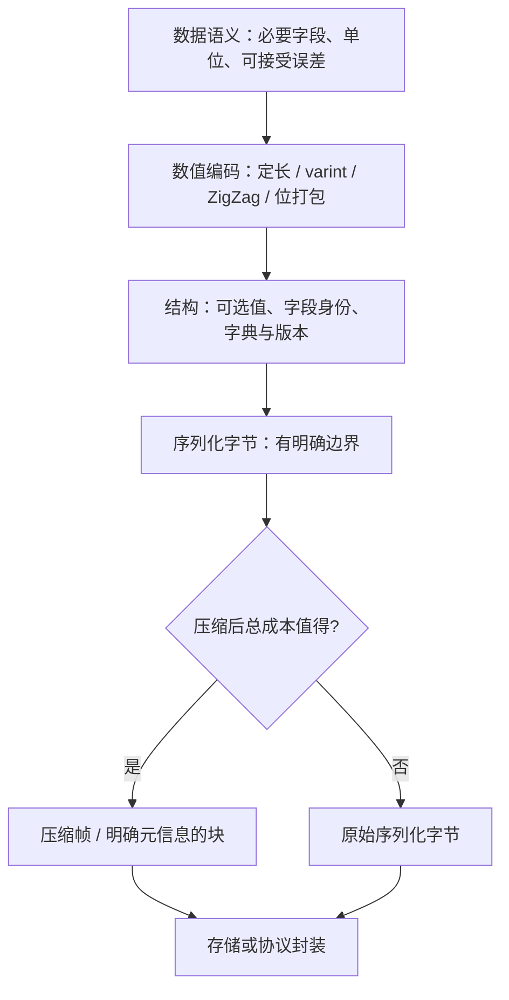

# 数据压缩与序列化（Varint / Zigzag / 压缩编码）

> 知识成熟度：L2。主要承诺是解释字节格式、失败边界和场景选择；依据固定版本规范、官方文档及源码做静态核对，没有运行编解码实现或性能实验。
> 适用范围：游戏网络消息、存档/回放、配置与资源下载的通用字节层。协议帧、可靠传输见[网络通信与协议设计](../../07-网络与游戏服务端/服务架构与消息通信/02-网络通信与协议设计.md)，相关主题入口见[网络与游戏服务端学习路线](../../../00_Index/学习路线/网络与游戏服务端.md)；UE复制与引擎存档有各自合同，不能把这里的位流直接视为FArchive或属性复制格式。
> 版本与规范基线：Protobuf C++ v32.1；Protobuf文档固定到d75b49a；FlatBuffers v25.2.10；LZ4 v1.10.0；Zstd v1.5.7；XZ v5.8.1。它们是本篇选读基线，不是“项目已安装”或最新版本推荐。
> 最后更新：2026-10-09。
> 证据边界：以下字节例和算式均为PAPER_EXPECTED；伪代码未执行、未编译。旧文的压缩率排序、GB/s、微秒与64B/256B阈值没有本项目测量支持，本轮不认证这些数字。

## 一、先确定要保存什么，再决定怎么变成字节

游戏状态在内存中可能是带指针、容器、对象引用的结构；发送给另一台机器或留到下个版本读回时，要先选择可恢复的数据模型，再定义线格式。压缩只处理已经产生的字节，不能替你决定某个缺失字段代表“未设置”“零”还是“沿用旧状态”。

| 层次 | 必须回答的问题 | 不能由这一层保证的事 |
| --- | --- | --- |
| 数据模型 | 有哪些字段、单位、范围、对象ID；哪些值可省略或量化 | C++对象地址在另一进程仍有效 |
| 线格式/持久格式 | 字段身份和顺序、整数/浮点表示、长度、端序、可选值、版本与帧边界 | 任意运行时对象可直接memcpy后恢复 |
| 内存对象布局 | ABI、padding、对齐、容器和指针的实际表示 | 编译器布局就是长期格式 |
| 压缩格式 | 哪段字节压缩；算法/参数、块/帧、字典、解压完成条件 | 业务兼容、随机访问、数据来源可信 |

FlatBuffers定义了可直接访问的序列化布局，仍不同于任意手写struct；其生成代码与格式对齐规则共同实现访问。Protobuf通常把线格式解析到运行时对象。二者都需要明确数据生命周期。[FlatBuffers格式组件与struct/table](https://github.com/google/flatbuffers/blob/v25.2.10/docs/source/internals.md)

### 字节节省如何变成实际收益

若每次状态更新发送到R个接收者，频率f次/秒，应用消息从B₁变成B₂字节，且发送次数不变，应用层节省为`R × f × (B₁ − B₂)`字节/秒。多人全互发才可能随人数接近二次增长；AOI、订阅、批量和更新频率改变这个关系。不要把所有MMO流量都写成O(N²)，详见[AOI与视野计算](../空间查询与碰撞/03-AOI与视野计算.md)。

实际线路字节还包括消息帧、传输头、确认、重传、加密和分片开销。小包可能减少传输或跨MTU分片，却也可能受排队、发包频率和批量等待主导；节省字节不保证端到端延迟等比例下降。存档和资源则还要计算写入、加载、迁移、分块定位与峰值内存。



这是依赖图，不是“每层必开”或收益排名。量化会丢精度；省字段可能改变语义；批量会增加等待。先明确这些代价，再比较压缩方案。

## 二、数值编码：位宽、范围与含义要一起定义

### 2.1 定长与Varint

本篇Varint指Protobuf式无符号base-128编码：每字节低7位承载值，最高位表示是否继续，低有效的7位组先发。它不是所有名为VLQ的格式的统一端序。零也占一个字节。

```text
PAPER_EXPECTED：uint32值300
300 = 44 + 2×128
低组44带继续位：0xAC；高组2终止：0x02
线字节：AC 02
```

| 无符号范围 | 此Varint字节数 | 与定长的比较 |
| --- | --- | --- |
| 0…127 | 1 | 相比uint32的4字节较小 |
| 128…16383 | 2 | 相比uint16的2字节没有值载荷收益 |
| 16384…2097151 | 3 | 还需另计tag、长度和帧 |
| 2097152…268435455 | 4 | 与uint32等长 |
| 268435456…4294967295 | 5 | 比uint32多1字节 |

uint64最多10字节。ID、时间戳、坐标是否偏小是数据分布问题，不能凭“游戏数值”推定。固定宽度值易定位，变长值须读到终止标志才能定位下一项。协议还须定义溢出、截断和非最短表示的接受策略。[Protobuf v32.1的类型、写入与Size实现](https://github.com/protocolbuffers/protobuf/blob/v32.1/src/google/protobuf/wire_format_lite.h)

### 2.2 ZigZag只改变整数映射，不负责量化或压缩任意对象

对W位有符号输入，先确认`−2^(W−1) ≤ n ≤ 2^(W−1)−1`，再用数学映射：

```text
encode(n) = 2*n        若n≥0
            -2*n - 1  若n<0
decode(u) = u/2       若u为偶数
            -(u//2)-1 若u为奇数
0→0，-1→1，1→2，-2→3，2→4
```

这里的运算在足够宽的整数域进行，不是在有符号32位变量里直接求`-INT_MIN`或左移负数。常见位式`(n << 1) ^ (n >> 31)`表达的是32位映射，移植时必须控制无符号转换和右移语义；Protobuf固定源码专门使用无符号左移。Python无限精度int也不会自动替你限制到sint32/sint64。

Protobuf的`int32/int64`负值采用符号扩展后的64位Varint，值部分为10字节；`sint32/sint64`才先做ZigZag。`uint32`最大值的5字节不是Protobuf `int32(-1)`的表示。字段类型换成sint32也不是兼容地“开启压缩”，旧读者会把同一值载荷解释成不同整数。

### 2.3 位打包与浮点量化

布尔可用1位；K种合法枚举至少需能容纳K个状态的位宽，但多余码值仍要规定拒绝或保留。C/C++位域的内存布局不能直接充当跨平台线格式。字符串换ID则需要双方持有相同的映射及其版本。

浮点转定点需要先写单位、坐标原点、范围、步距、舍入、越界与非有限值策略。半精度float16是另一种非均匀精度的表示，不是任意坐标的无损“减半”；转换与解码也不是零成本。

保留原文的二维位置和角度用途，给出明确合同：

- x、y以约定本地单位计，输入范围`[−2048, 2047.75]`，量化步距0.25；拒绝NaN、无穷和越界输入
- `q = round_ties_to_even(x / 0.25)`，结果须在`[−8192,8191]`；传`u=q+8192`，使用14位无符号码；读回`x=(u−8192)×0.25`
- 在上述输入与理想舍入前提下，单轴绝对量化误差至多0.125；实际跨语言浮点转换须另验。不能把clamp后的越界值算进这个误差承诺
- 角度本例已经量化为0…359的整数度，使用9位；360…511为非法码。角度归一化与舍入在上层完成

```text
PAPER_EXPECTED：用足够宽的无符号容器
packed = (u_x << 23) | (u_y << 9) | angle
位区间：angle占0..8，u_y占9..22，u_x占23..36
按低字节在前输出5字节；第5字节的高3位必须为0
读取：先核长度=5与高3位=0，再取各字段并校验angle≤359
```

总量是`14+14+9=37bit`，需要5字节，原文写成32bit/4字节是算术错误。与3个float32的12字节相比，只比较了这三个字段载荷；范围限制、精度变化、协议头和对象ID也必须计入方案评估。[位运算与性能优化技巧](05-位运算与性能优化技巧.md)介绍底层位运算，不能替代这里的格式合同。

## 三、序列化格式：端序、长度、存在性与演进

### 3.1 三种顺序不要混为一谈

1. 多字节定长整数的字节序，如uint16 `0x1234`采用小端则是`34 12`
2. 字节内位打包顺序，如先写的字段从bit0开始还是bit7开始
3. Varint的7位组顺序与消息字段顺序

本篇教学位流约定低位先写，定长多字节值采用小端；Protobuf的fixed32/fixed64也是小端，MessagePack的多字节整数使用大端。格式规定优先于CPU本机端序，不能把主机对象裸拷贝当通用编码。[Protobuf固定实现](https://github.com/protocolbuffers/protobuf/blob/v32.1/src/google/protobuf/wire_format_lite.h)、[MessagePack固定规范](https://github.com/msgpack/msgpack/blob/9aa092d6ca81f12005bd7dcbeb6488ad319e5133/spec.md)

长度至少要写清它数的是字节、元素还是有效位，是否包含头部，取值上限是多少。字符串的字符数不等于UTF-8字节数；数组的元素数不等于字节数。读取前优先检查`length ≤ remaining`，避免先算`cursor+length`溢出；固定元素数组应先验证`count ≤ remaining / element_size`，并设应用自己的数量上限。

### 3.2 Protobuf不是“对象里有什么就按内存顺序写什么”

它的tag为`(field_number << 3) | wire_type`；tag本身也是Varint。字段号1…15可用1字节tag，字段号0非法。wire type说明如何跳过值，不给出全部业务类型：同为VARINT的uint32、int32、sint32仍需schema辨认。

```text
PAPER_EXPECTED：field 1，int32 = 150
tag = 8：08；值150：96 01；合计08 96 01，共3字节
PAPER_EXPECTED：field 2，UTF-8字符串"A"
tag = 18：12；字节长度01；内容41；合计12 01 41
```

string、bytes、嵌套消息和packed数值repeated使用LEN值。嵌套消息在内部仍有自己的tag；packed省去每个元素重复的tag，但并非所有repeated类型都可packed。外层消息边界必须来自容器或协议；直接拼接两个Protobuf消息可能按合并语义解析，不等于有了两条独立帧。[固定官方Encoding文档，结构、LEN、repeated与Last One Wins](https://github.com/protocolbuffers/protocolbuffers.github.io/blob/d75b49a09168103d132dcccf7dc9d6e126ba1f98/content/programming-guides/encoding.md)

### 3.3 缺失、默认与清零是不同问题

| 需求 | 格式要表达什么 | 错误的简化 |
| --- | --- | --- |
| 完整快照 | 缺失字段按该schema默认值/存在性规则解释 | 无条件沿用接收端旧值 |
| 增量更新 | 哪些字段修改、哪些没改；是否显式清空 | “0不传”所以永远无法把旧值清为0 |
| 可选业务值 | 未设置与设置为0是否有区别 | 读到0就断定发送方传了0 |

proto3中没有optional的普通标量使用implicit presence，默认值通常不序列化；`optional`标量及消息、oneof具有各自的显式存在性。不能概括为“Proto3所有默认值都省略”。schema/API是否记录存在性与线格式是否出现字段也要区分。[固定Field Presence文档](https://github.com/protocolbuffers/protocolbuffers.github.io/blob/d75b49a09168103d132dcccf7dc9d6e126ba1f98/content/programming-guides/field_presence.md)

手写存在位图也要指定各bit对应字段及未知bit的处理。位图仅告诉“有”，没有长度/跳过规则时，旧读者并不能自动跳过新字段。空字符串、空列表、未设置和“从现值清空”必须按场景选语义。

### 3.4 兼容性来自规则，不能只加一个版本号

- Protobuf二进制通常可新增字段；旧字段号不要复用，删除后保留reserved。未知字段通过二进制转存、JSON桥接、逐字段拷贝时，保留行为可能不同。wire兼容也不等于业务语义兼容
- FlatBuffers的table字段通常末尾追加，或所有字段使用稳定显式id；停用字段标deprecated。struct是固定布局，不具有table同样的增字段能力。改变缺省值会改变旧buffer缺失字段的解释
- 手写定长布局若增加字段，要有受支持版本与精确长度/扩展边界；未知版本应返回明确不支持。不能因为文件有version便假定旧读者可读新格式
- 每个容器/协议都需要格式识别与演进策略，未必每个嵌套消息重复一份版本号。版本号、schema版本、压缩codec版本和字典ID回答的是不同问题

[Protobuf固定proto3指南：更新消息与未知字段](https://github.com/protocolbuffers/protocolbuffers.github.io/blob/d75b49a09168103d132dcccf7dc9d6e126ba1f98/content/programming-guides/proto3.md)、[FlatBuffers v25.2.10 Evolution](https://github.com/google/flatbuffers/blob/v25.2.10/docs/source/evolution.md)

## 四、有界位流教学示例：成功单位与失败状态一起设计

以下是语言无关伪代码，保留原文“逐位写入、Varint、ZigZag和紧凑位置增量”的用途，增加读端与错误合同。它不是Protobuf解析器、压缩库或可直接部署的网络框架。

### 4.1 缓冲所有者与单次写入

Writer独占一个长度为capacity_bytes的零初始化字节缓冲，记录bitpos；容量已通过应用上限检查，capacity_bits在足够宽的整数域安全换算，始终保持`0 ≤ bitpos ≤ capacity_bits`。`write_bits`只接受0…64位与可用该位宽表示的无符号value，失败时bitpos和字节不变。多个字段组成消息时，任一失败丢弃整个临时Writer，不能把前几个成功字段发布为完整消息。

```text
write_bits(value, n):
    require integer n and 0 <= n <= 64
    require integer value and value >= 0
    require value fits n bits       // n=0仅允许value=0；不做移位64的机器表达式
    if n > capacity_bits - bitpos: return NO_SPACE
    // 以上检查均在改动前；缓冲和bitpos仅由本Writer拥有
    for i = 0 .. n-1:
        p = bitpos + i
        set buf[p//8] bit(p%8) to bit(value, i)  // 明确写0或1
    bitpos += n
    return OK

write_u32_varint(value):
    require 0 <= value <= 4294967295 and bitpos % 8 == 0
    bytes = empty local array with capacity 5
    u = value
    repeat:
        b = u % 128
        u = u // 128
        append (b | 128 if u != 0 else b) to bytes
    until u == 0
    if len(bytes) > (capacity_bits-bitpos)//8: return NO_SPACE
    append all bytes through write_bits(b, 8)  // 已预检，写循环不会因容量失败
    return OK

write_s32_zigzag(value):
    require value is in signed32 range
    u = mathematical ZigZag mapping from section 2.2
    return write_u32_varint(u)
```

输入不合法与NO_SPACE要有不同返回原因；伪代码的require表示拒绝，不是只在debug生效的assert。固定容量能避免示例中的逐字节扩容，但分配本身仍可能失败。若实际实现使用动态缓冲、异常或共享存储，必须重新保证“失败无改动”的合同。

Writer最后给出“字节切片+有效位数”，未用高位保持0；所有权转移后Writer停止修改。varint要求字节对齐，若接在不满字节的位字段后，调用者必须按schema显式补零到下一字节；读端采用相同规则。

### 4.2 读取32位Varint：不让越界、截断或超长值悄悄通过

这个教学profile要求最短形式，并不声称所有Protobuf运行时都拒绝非最短形式。Reader用临时游标j预读，只有OK才提交cursor和结果。

```text
read_u32_varint(input, cursor, end):
    require 0 <= cursor <= end <= len(input)
    j = cursor; value = 0       // value用足够宽的无符号暂存
    for i = 0 .. 4:
        if j == end: return NEED_MORE without moving cursor
        b = input[j]; j += 1
        payload = b & 127
        if i == 4 and (payload > 15 or (b & 128) != 0): return INVALID
        value |= payload << (7*i)
        if (b & 128) == 0:
            if i > 0 and payload == 0: return NON_MINIMAL
            return OK(value, next_cursor=j)
    return INVALID
```

流式输入里NEED_MORE可以等待更多字节；已知完整帧或最终EOF里仍为NEED_MORE就是截断错误，不能无限等待。`80`是缺终止字节，`80 00`在本profile是非最短的零；`FF FF FF FF 10`超出uint32。拒绝时外层丢弃临时消息，不更新存档或玩法状态。多条帧复用Reader必须由协议层交给它正确的end，不能偷偷读到下一帧。

### 4.3 紧凑位置增量的完整载荷合同

先由协议层确认entity、消息类型、序号与baseline ID。上层schema指定位置单位、量化规则和目标范围，当前值与baseline必须采用同一规则；使用足够宽的减法求dx/dy，且差值必须可表示为signed32。这里的编码容器可容纳任意合法signed32 delta，但是否符合具体位置域还须另验；若沿用§2.3的有限局部坐标域，实际可达的差值与载荷范围更窄，见下文。没有所指baseline便拒绝这条delta并走已定义的全量恢复路径。

```text
本例载荷布局，均从字节边界开始：
  ZigZag(dx)的uint32 Varint
  ZigZag(dy)的uint32 Varint
  tail的小端uint16，tail = angle_9 | (state_4 << 9)
  tail高3位为0；angle合法0..359；state合法0..15

写端：预检所有字段 → 新建容量12字节的临时Writer
      → 两次write_s32_zigzag → write_bits(tail,16)
      → 全部OK才发布实际已写字节
读端：有界读两项Varint → 必须恰好剩2字节
      → 读小端tail → 核padding、角度和状态业务域
      → ZigZag逆映射 → 与baseline相加并核目标范围
      → 全部成功才提交新状态
```

PAPER_EXPECTED：允许任意合法signed32 delta时，两项Varint加2字节tail的格式上限为`5+5+2=12`字节；它不是网络MTU或通用消息预算。两项delta都在`[−64,63]`时为4字节，都至多用2字节时为4…6字节；只有上层位置域允许相应大差值时，实际载荷才可能达到12字节。

若当前坐标和baseline都严格沿用§2.3的`q∈[−8192,8191]`，则差值只能在`[−16383,16383]`，每项ZigZag Varint最多3字节，本例合法载荷为4…8字节。此时12字节缓冲只是保守容量；无论采用哪个域，发布/写出都取实际已写长度，不能把容量当消息长度。

tail的9+4位共占2字节，不能把各字段的“半字节”相加后忽略最终补齐。entity、序号、baseline、长度和传输头另计，不沿用旧文“整包5…7字节”的无条件结论。

此设计把整个消息作为接受单位。若目标是逐条增量应用或逐块资源输出，需要为每个可独立接受单位定义完整边界与失败恢复；不能假定底层读写API会替上层回滚。

## 五、增量、预测与字典都依赖共享上下文

delta不是简单地“新值减本地当前值”。发送方编码所用的旧值与接收方解码所用的旧值必须相同，通常用baseline ID、tick或版本定位。相同的delta加到不同baseline，会得到看起来合理却错误的新状态。

首次全量、后续脏字段、预测残差和周期快照都保留其用途，但要分别规定：

1. baseline何时建立、保留多久，如何知道对方拥有它；确认丢失是否影响发送选择
2. 乱序、重复、baseline缺失或旧字典时，丢弃、排队或请求全量；排队须有容量与过期限制
3. 哪条消息可以独立重发，哪条必须连同依赖发送；周期全量只是恢复机会，不证明此前delta已正确应用
4. 浮点预测、量化与还原规则是否两端一致，结果越界如何处理

静止玩家可能没有位置字段载荷，但对象标识、确认、保活等仍可能有字节；“静止≈0字节”仅能说特定字段被省略。网络具体恢复策略见[RPC与属性同步](../../07-网络与游戏服务端/状态复制与兴趣管理/02-RPC与属性同步.md)。

“字典”还有两种不同含义。业务字典把技能名/资源名映成稳定ID，需要发布与失效策略；压缩字典是编解码双方共享的历史字节或训练数据。字典ID不是字典内容，也不是字典真实性校验，缺失或不匹配时不能当成无字典继续猜解。

## 六、通用压缩：算法、块、帧与流分开看

### 6.1 Huffman与LZ不是同一种编码

Huffman为符号分配无歧义前缀码，频率模型合适时常见符号码较短；解码方需要相同码表，动态码表自身也占空间。LZ77类用字面量与“历史距离+匹配长度”替代重复片段。两者可以组合：DEFLATE就是组合例子，LZ4则没有熵编码后端。[RFC1951 §2、§3.2.1](https://www.rfc-editor.org/rfc/rfc1951.txt)、[LZ4 v1.10.0 Block Format](https://github.com/lz4/lz4/blob/v1.10.0/doc/lz4_Block_format.md)

匹配可能与正在输出的区域重叠，解码实现要遵守格式；不是把任意两段内存memcpy一下。这里使用成熟库，不提供自制Huffman/LZ解压器。

| 方案 | 实际机制/容器边界 | 选择时需要测量的代价 |
| --- | --- | --- |
| Huffman | 频率到前缀码；可作为组合压缩的一层 | 码表传输、构建和符号分布变化 |
| LZ4 | LZ77型字节编码；raw block与frame有不同元信息 | 帧开销、压缩级别/实现、块大小和解压成本 |
| Zstd | 字典匹配结合Huffman/FSE；frame内block可依赖历史和表 | 级别、窗口、字典训练/分发、内存和尾延迟 |
| LZMA / XZ中的LZMA2 | LZMA结合LZ77与range coding；XZ是容器，LZMA2是其压缩过滤器 | 参数、字典内存、压缩时间与目标平台解码预算 |

不能固定排序成“LZMA永远最高、Zstd总比LZ4小”，也不能把“LZ4常偏重速度”换成该项目延迟可忽略。资源已是压缩纹理/音频或其他紧凑字节时，通用压缩可能没有收益甚至增大。Zstd机制以[固定压缩格式](https://github.com/facebook/zstd/blob/v1.5.7/doc/zstd_compression_format.md)为准；LZMA与XZ的区别见[固定XZ规范§5.3.1](https://github.com/tukaani-project/xz/blob/v5.8.1/doc/xz-file-format.txt)。

### 6.2 读到一个block不等于能从这里独立开始

- LZ4 raw block不自带完整的输入边界和输出容量合同，外层必须提供压缩长度与解压上限。LZ4 frame增加头、块长度、结束标记和可选校验等
- LZ4 frame可选择独立块或依赖前块的模式；带字典的独立块仍需要同一外部字典。独立块也不会凭空生成文件索引，随机访问需另有定位信息
- Zstd frame内的block可能需要前面解出的窗口、近期offset、Huffman和FSE表；不能按block边界任意切开后单独解压
- XZ含Stream、Block、Index等结构，可用于按块定位的设计；实际实现是否支持随机读取、块粒度和过滤链仍要核对。原始LZMA流不等于XZ容器

[LZ4 Frame v1.6.4随v1.10.0发布的独立块/字典规则](https://github.com/lz4/lz4/blob/v1.10.0/doc/lz4_Frame_format.md)、[Zstd v1.5.7 Compressed Blocks Prerequisites](https://github.com/facebook/zstd/blob/v1.5.7/doc/zstd_compression_format.md)、[XZ v5.8.1 §2–4](https://github.com/tukaani-project/xz/blob/v5.8.1/doc/xz-file-format.txt)

独立chunk可限制重试和解码范围，也增加头部、字典重置和潜在压缩率损失。跨chunk依赖可能提高压缩收益，却让某块损坏、网络丢失或按需加载影响后续块。边界选择要匹配资源加载粒度和网络恢复单位。

### 6.3 压缩成功、输出产生与完整接受不是一个时刻

| 入口（固定版本） | 必须检查的返回/状态 | 调用者责任 |
| --- | --- | --- |
| LZ4 v1.10.0 `LZ4_compress_default` | 返回实际写入字节；0表示失败且目的内容无效 | 先校输入范围和分配容量；不要把容量当实际长度，失败输出不发布 |
| LZ4 v1.10.0 `LZ4_decompress_safe` | 非负是解出字节数，负值是错误；输入必须是准确完整block长度 | 提供真实src/dst容量，核应用要求的输出长度；错误时丢弃该接受单位 |
| Zstd v1.5.7 `ZSTD_decompressStream` | 先用`ZSTD_isError`判错；0表示当前frame完全解出并flush；其余正值表示仍需推进 | 维护input/output.pos，保留未消费输入；当前frame完成不等于外层文件或全部串接frame完成 |
| Zstd `ZSTD_getFrameContentSize` | 已知大小、UNKNOWN、ERROR分别处理 | 声明大小先过本地上限；未知大小用有累计上限的流式/有界路径，不盲分配 |

[LZ4固定头文件的Simple Functions与Streaming合同](https://github.com/lz4/lz4/blob/v1.10.0/lib/lz4.h)、[Zstd固定头文件的内容大小与Streaming decompression](https://github.com/facebook/zstd/blob/v1.5.7/lib/zstd.h)

解压器可以先输出一部分字节，最后才发现截断或校验失败。存档载入宜先在临时数据中完成该单位校验，再替换有效状态；资源若允许部分消费，要为每个独立接受块定义完整性与撤销/失败策略。不要把“已经收到输出”记为完整加载成功。

流循环还要处理输出空间耗尽、需要更多输入、EOF时frame未完成及一次调用无进展。没有新输入也没有可flush的输出时，应返回等待或截断错误，而不是忙循环。Zstd流调用报错后，须按所选API合同reset/重新初始化再复用，不能在未定义的状态上继续重试。

外层还要明确尾数据政策。以下均为PAPER_EXPECTED的应用合同例子，不是库自动提供的整体原子保证：

- **单frame接受单位**：当前frame完全解出后，还要核总消费量恰好等于外层声明的单位长度。“完整frame＋垃圾尾”拒绝；即便尾部恰好是另一合法frame，也不因此自动改成多frame模式
- **明确允许串接frames的接受单位**：按所选API合同继续消费剩余输入，直到每个允许的frame完整且到达容器边界。“两合法frame”须两者均完成才成功。是否允许skippable frame由外层声明；累计输入、输出、帧数及内存预算不能随新frame清零，窗口限制须对每帧检查
- **第一frame完整、第二frame截断**：若整个容器是接受单位，则整体失败，丢弃本次暂存输出并保留原有效状态。若项目另选逐frame提交，必须预先声明独立提交与后续失败恢复合同，不能在出错后临时把已写部分称为完整成功

库报错与外层政策拒绝都由调用者负责终止当前接受单位、处理临时输出和上下文寿命。库报错后的复用遵守前述reset要求；截断、尾数据拒绝或主动放弃时，不把旧的输入/输出游标和半帧状态混进新请求，新请求按API要求重置/重新初始化或另建上下文。

上下文、字典、输入和输出缓冲各自需要拥有者与寿命。LZ4某些continue路径要求过去的源/解码历史仍在原位置且不被改写；复用环形缓冲前按固定API合同核窗口。校验和帮助检测损坏，不等于身份认证，也不代替长度、数量、窗口和累计输出上限。

## 七、序列化框架怎样选

| 方案 | 可取之处 | 不能省下的工作 |
| --- | --- | --- |
| Protobuf | schema、字段编号与跨语言生态；多种整数编码 | 存在性与业务演进、外层帧、解析错误、资源限额 |
| FlatBuffers | 通过offset/accessor访问buffer，避免先展开整棵对象树 | 对外部buffer先验证；buffer寿命覆盖全部视图；业务数值校验；构建与object API仍可分配/复制 |
| MessagePack | map/array等动态模型，独立的二进制/字符串/扩展类型 | schema约定、键名成本、类型/扩展兼容；并非JSON语义的逐位等价物 |
| 手写位流 | 固定字段和范围时可精确控制每一位 | 编解码两侧、容量/失败、版本与跨语言一致；维护和测试成本 |
| UE FArchive / SaveGame / 属性复制 | 与各自引擎子系统集成 | 它们不是一种互通格式；对象引用、版本与网络量化按目标引擎路径另核 |

FlatBuffers“零拷贝”是特定访问路径省去对象展开，不是没有解码逻辑、没有内存访问或无需验证。v25.2.10生成accessor本身不做全面边界验证；使用生成的root verifier并设合适深度/表数量等限制，验证后buffer也不能被其他写者改坏。Verifier通过仍不证明坐标、ID或版本符合玩法需求。[C++外部buffer与Object API](https://github.com/google/flatbuffers/blob/v25.2.10/docs/source/languages/cpp.md)、[固定Verifier实现](https://github.com/google/flatbuffers/blob/v25.2.10/include/flatbuffers/verifier.h)

Protobuf解析入口也有差别。例如C++ v32.1的`ParseFromCodedStream`成功并不单独保证整个输入消费完；而`ParsePartial…`的Partial是允许缺失required字段，不是“任意截断都可当有效消息”。使用明确长度、临时目标和适用的完整消费检查；不要假定失败自动恢复原对象。[MessageLite固定解析合同](https://github.com/protocolbuffers/protobuf/blob/v32.1/src/google/protobuf/message_lite.h)

## 八、游戏场景中的组合与取舍

### 8.1 实时网络：先看依赖和总时延

频繁位置/输入消息可评估量化、ZigZag、位打包、稀疏字段和共享ID。是否再压缩，要把批量等待、压缩、发包、解压与应用耗时一起算入时限，并纳入帧头、可靠性与重传字节。LZ4/Zstd可作为候选，不能仅凭“实时”指定赢家。

小消息不设64B禁用或256B启用的普遍阈值；字典、批量、重复率、头部与调用开销会改变交点。配置策略时可设大小分桶并在压缩后总长度不划算时选择原始载荷，前提是格式有明确的原始/压缩标志，接收端能辨认。

### 8.2 存档、配置与回放：读回和演进先于体积

存档要能识别schema与迁移方向；解压、解析和业务校验全部成功后再替换当前状态。压缩不解决写盘中断、对象引用重建或版本迁移。配置重视审阅与调试时，文本格式可能更合适；不能一概称JSON“热路径不可用”，先看实际频率和预算。

大世界存档或回放可评估分块和索引，以支持部分读取或seek；是否值得取决于实际访问方式，顺序读取的小存档不一定需要块索引。回放delta还需要可用的全量锚点；“可随机定位压缩块”不等于“能重建该时刻游戏状态”。UE具体流程见[SaveGame存档系统与序列化](../../05-Gameplay与交互系统/背包装备与存档/12-SaveGame存档系统与序列化.md)。

### 8.3 资源包与热更：按加载单位组织压缩

资源下载可以把较多压缩时间放在构建端，但运行端仍受解压CPU、峰值内存、磁盘/网络吞吐与加载等待约束。独立chunk大小影响按需加载、失败重试、缓存及补丁变化范围；LZ4、Zstd、XZ/LZMA2分别作为候选，而非先验的速度或压缩率排名。

已压缩资源和不可压缩样本应单独统计。缓存压缩结果须绑定源字节、codec与参数、字典及格式版本；不能把旧缓存挂到新源文件上。资源压缩、下载协议和安装提交是不同成功条件。

## 九、如何测量，才能比较同一个问题

本节是待执行方案，本轮没有跑样本、压缩器或基准。先固定真实的、获准使用的数据集版本与脱敏规则，不把线上内容自动上传到第三方；同一份序列化输入对比不压缩、LZ4、Zstd与所需的XZ/LZMA2配置。

| 维度 | 应记录的条件和指标 |
| --- | --- |
| 样本分布 | 消息类型/尺寸、地图、玩家数、静止/战斗/峰值；配置、存档和已压缩资源分开 |
| 编码变化 | 基准与候选的数据语义、量化误差、字段省略规则相同或差异明确；不能把丢信息收益算成无损压缩收益 |
| 字节 | 原始语义样本、序列化字节、压缩载荷、字典分摊、帧头、线路总字节分别记录 |
| 时间 | 编码/压缩/解压/解析/应用与批量等待；平均、P50/P99及样本数，说明计时边界 |
| 吞吐 | 输入字节还是输出字节作分子，MB还是MiB，单线程或多线程，CPU与编译配置 |
| 内存与访问 | workspace、字典、峰值分配、buffer持有时长、冷/热缓存、顺序/按块读取 |
| 正确性 | 约定域内还原或量化误差、跨版本、损坏/截断/超限拒绝、完整接受单位与旧状态保持 |

压缩比必须先定义：例如`R=压缩后总字节/压缩前序列化字节`，R越小越省，节省率为`1−R`；不能与倒数形式混用。总带宽需要频率与总字节/均值，P99消息大小用来观察尾部，不能只用P99替代总流量预算。总P99也不等于若干阶段P99相加。

先固定编码语义做纯压缩对比，再单独评估量化、delta或批量策略，这样才能解释收益来自哪层。字典训练与评估应分离，包含分布变化后的样本，避免只测训练数据。纳入CI时存样本身份、参数和真实原始输出，噪声指标设适当策略；没有测量就不填收益数字。见[CI质量门禁与缺陷管理](../../08-工程实践与质量/持续交付与发布治理/05-CI质量门禁与缺陷管理.md)与[网络调试与性能分析](../../07-网络与游戏服务端/状态复制与兴趣管理/08-网络调试与性能分析.md)。

### 确定性要比较语义还是比较字节

无损解压应恢复同一原始字节，但同一语义对象未必只有一种序列化表示，同一输入也未必跨压缩器版本产生同一压缩串。Protobuf的deterministic选项不等于跨版本、跨语言的canonical格式；不能直接把输出字节哈希当长期稳定状态身份。[固定Proto Serialization Is Not Canonical说明](https://github.com/protocolbuffers/protocolbuffers.github.io/blob/d75b49a09168103d132dcccf7dc9d6e126ba1f98/content/programming-guides/serialization-not-canonical.md)

帧同步/回放校验要明确排序、字段集合、浮点/量化、默认值与未知字段策略；需要稳定哈希时定义受控的规范化语义表示。若要比较压缩字节，还必须额外固定codec、版本、参数、字典与分块。详见[确定性与基准工程总览](../确定性与基准/01-确定性与基准工程总览.md)和[联机确定性与基准工程](../确定性与基准/05-联机确定性与基准工程.md)。

## 十、最小纸面检查与待执行验证

以下均为PAPER_EXPECTED，仅展示前提下应当如何判定，不是运行记录。

| 编号 | 输入/前提 | 预期判定 |
| --- | --- | --- |
| P01 | 本篇uint32 Varint，300 | 值载荷AC 02；与tag无关 |
| P02 | Protobuf field 1，int32=150 | 08 96 01，共3字节 |
| P03 | -1分别作为Protobuf int32与sint32 | int32值载荷10字节，sint32映为1后值载荷1字节；tag另计 |
| P04 | 绝对位置14+14位和角度9位 | 37bit，按本布局占5字节，保留高3位为0 |
| P05 | §4.3两项delta各在-64…63，tail合法 | 载荷4字节；外层元信息另计 |
| P06 | §4.2输入80且完整帧已结束 | 截断失败，不更新cursor与业务状态 |
| P07 | §4.2输入80 00或FF FF FF FF 10 | 分别NON_MINIMAL与INVALID，不声称是所有库相同策略 |
| P08 | 长度字段大于当前接受单位的remaining | 在取切片/分配前拒绝；不能读取下一帧补齐 |
| P09 | delta所需baseline缺失 | 不把delta加到任意当前值，进入已定义的恢复流程 |
| P10 | 流解码已有输出，但EOF时frame尚未完成 | 整体接受失败；部分输出不是成功载入 |
| P11 | Protobuf新optional字段显式设置为0 | 与未设置在presence语义上不同；按所选schema/API验证 |
| P12 | 同一语义对象经不同版本序列化/压缩 | 字节不同不单独证明语义损坏；按约定比较层判定 |

后续有运行授权时，应先实现并核对正反向边界、signed32端点、容量不足、非法角度/padding、每个字节截断与累积输出上限；再做新旧schema组合、跨语言与buffer寿命检查；最后按§9执行目标平台性能实验。本轮这些全部NOT_RUN，也没有新增runner或更改CI。

## 十一、最佳实践与FAQ

实践顺序：先定语义与可接受损失，再定线格式和失败单位；用真实分布挑数值编码；以完整字节与端到端成本决定压缩；把兼容、错误和容量约束放到读写两端。

**Q1：Varint一定比定长好？** 不一定。小值可能省，大uint32可要5字节；需考虑分布、tag和随机访问方式。

**Q2：浮点怎么压？** 先定误差与域，再选量化定点、半精度或delta。§2.3的二维位置+角度是5字节载荷，不能称无损，也不能称4字节。

**Q3：什么时候用LZ4？** 当目标样本和平台的总时间、内存、字节与加载方式适合它时。消息大小只是一个输入，不存在通用256B开启线。

**Q4：Protobuf和手写位流怎么选？** schema演进、语言生态和维护成本常利于Protobuf；受控固定域可评估手写布局。帧同步这一场景名称不自动证明手写最优。

**Q5：压缩会影响解码延迟吗？** 会增加解压工作，也可能减少IO与传输；最终方向与幅度须测，不能以“微秒级可忽略”替代预算。

**Q6：增量丢包怎么办？** 先看消息依赖的是哪个baseline及传输语义，再决定忽略、重发、等待或全量恢复；周期快照不自动修复任意错误应用。

**Q7：字符串怎么省？** 重复业务名可换稳定ID，但字典分发、版本、失效和缺失成本要纳入。压缩字典与业务ID表不是同一件事。

**Q8：存档必须压缩和部分读取吗？** 都不必须。按体积、读写频率、迁移和访问粒度决定；可解压不等于存档事务、迁移或对象重建已成功。

**Q9：输入验证注意什么？** 检查边界、数量、类型、版本、字段域、输出总量与字典/窗口预算，处理截断和失败输出；魔数/校验和不代替这些合同。更广的攻击面见[安全与反作弊](../../07-网络与游戏服务端/会话身份与在线服务/04-安全与反作弊.md)。

**Q10：怎样量化收益？** 同数据与明确语义比较总字节、分布、吞吐、端到端尾延迟和峰值内存；区分纸算、库宣传数据与本项目实测。

### 落地检查清单

- [ ] 数据模型、单位、范围、可接受误差和对象身份已明确
- [ ] 字段身份/顺序、端序、位序、长度单位、padding与帧边界明确
- [ ] Varint符号类型、最短表示策略、截断/溢出与容量检查有合同
- [ ] 可选字段、默认值、显式清零、未知字段和旧版本读取策略明确
- [ ] delta的baseline及两类字典的身份、生命周期、缺失恢复明确
- [ ] 压缩的block/frame/stream依赖、输出上限和完整结束条件明确
- [ ] 部分读写失败不发布为完整结果，旧状态与临时缓冲归属明确
- [ ] 网络、存档/回放、配置和资源分别按实际目标选择格式
- [ ] 测量包含不压缩基线、真实样本、完整开销、字节/时间/内存边界
- [ ] 语义一致、序列化字节一致与压缩字节一致的验证目标分别定义

## 十二、术语、来源与历史边界

| 术语 | 本篇含义 |
| --- | --- |
| Serialization | 按约定模型与线格式在对象语义和字节间转换 |
| Varint / ZigZag | 无符号变长值表示 / 有符号到无符号映射，两步可组合 |
| Bit packing | 明确字段位宽与位位置，输出约定字节序列 |
| Delta | 相对于指定baseline的差值或变化集合 |
| Dictionary | 业务ID映射或压缩上下文，需说明是哪一种 |
| Entropy coding | 根据概率模型分配表示，如Huffman；不是全部LZ算法的同义词 |
| Block / frame / stream | 编码块 / 带格式边界的帧 / 持续消费与产生数据的处理方式，不能互换 |
| Endianness | 多字节标量的字节顺序；不独立定义字段顺序和位序 |
| Zero-copy | 某条访问路径避免中间拷贝或对象展开；不保证零验证或零分配 |

来源选读范围：Protobuf v32.1读类型、ZigZag、数值写入/长度计算和MessageLite解析注释；固定官方文档读presence、schema更新/未知字段与非canonical说明；FlatBuffers v25.2.10读布局、演进、C++buffer访问和Verifier限制；LZ4 v1.10.0读Block/Frame格式及边界/stream API；Zstd v1.5.7读frame/block依赖、字典、内容大小与流式返回；XZ v5.8.1读容器、Index及LZMA2说明；MessagePack固定规范读模型与格式；RFC1951读Huffman/LZ与块依赖概述。没有宣称逐行审查全部库实现。

研究时若干raw网页入口Cache miss，FlatBuffers旧大小写路径404，RFC首页429；后续以连接器固定文件与RFC文本入口补读，失败原流另保留，不把先前失败写成成功。没有读取或认证具体UE构建、网络抓包或目标平台性能。

历史保全：本轮不在仓内重复过时完整教学正文。整改前16975字节/316行及真实legacy路径上的七种唯一内容、十条可达Git身份，仓外完整快照与零上下文差异保留在本轮审计包`compression-serialization-preparation/history/`；原Git历史同时保留。它们不是本篇相对链接下的仓内附件，脱离本次审计环境应从[整改前固定提交的正文](https://github.com/fantuan812/learning/blob/cff1bc53c9f953cc433d7d5b70f29a8c44745079/%E7%9F%A5%E8%AF%86/02-%E6%95%B0%E5%AD%A6%E4%B8%8E%E6%B8%B8%E6%88%8F%E7%AE%97%E6%B3%95/%E6%95%B0%E6%8D%AE%E7%BB%93%E6%9E%84%E4%B8%8E%E7%BC%96%E7%A0%81/06-%E6%95%B0%E6%8D%AE%E5%8E%8B%E7%BC%A9%E4%B8%8E%E5%BA%8F%E5%88%97%E5%8C%96.md)及对应Git历史核对。原图、数值例、位流与位置同步示例、十FAQ、实践、测量和关联阅读用途均在现行章节保留并纠错；书籍、工作日志、附件与原始材料未动。

### 更新日志

- 2026-08-07：原初稿覆盖Varint、ZigZag、位打包、delta、熵编码、LZ族与游戏网络/存储选择；该日期保留为历史，不是本轮测量日期
- 2026-10-09：重整模型/格式/布局、位宽与符号、存在性/演进、压缩边界、失败/资源责任与场景测量；保L2和verified空。PR17之后到本轮基线目标正文未实质更新，本轮静态整改不计作编解码运行或性能认证
