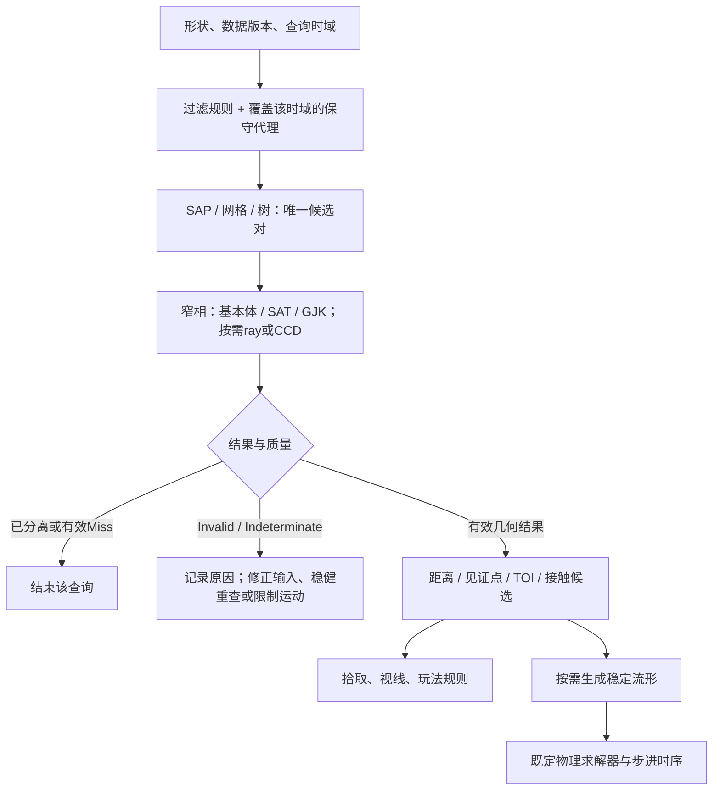
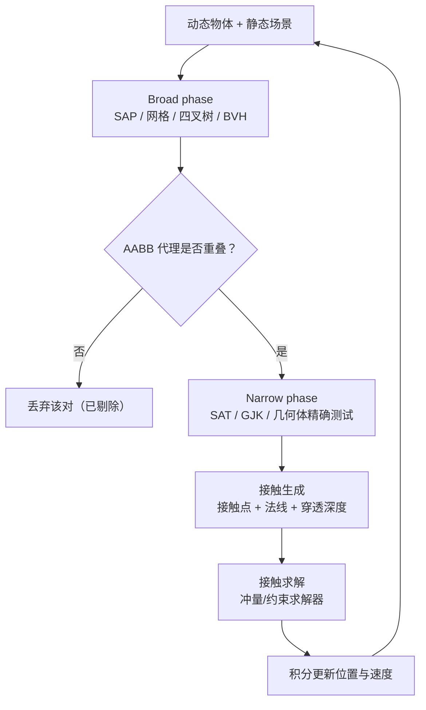

# 04 · 碰撞检测

> 知识成熟度：L2。2026-10-09已静态核对文末一手资料和固定公开源码；P01～P18仍为 PAPER_EXPECTED（纸面推导）。2026-10-10仅以CPython 3.12.14执行第9节14次演示及追加50次有限oracle查询一次；C++17未编译、未执行，未运行GJK/EPA、CCD、3D、物理引擎、性能或网络实验。
> 前置知识：[向量与矩阵基础](../数学与数值计算/01-向量与矩阵基础.md)的点积、叉积、空间变换，以及[四元数与旋转](../数学与数值计算/02-四元数与旋转.md)的姿态表示。
> 适用范围：二维/三维基本体、凸体窄相、宽相候选、射线与连续碰撞检测的机制和查询合同。用于单机、客户端、服务端或离线几何时，都须另定形状、时刻和失败政策；本文不实现完整物理求解器或网络权威协议。
> 版本与规范基线：Box2D v3.1.0（d5935a7a）；Bullet 3.25（2c204c49）；Eberly的SAT文稿修订2022-06-20、动态OBB文稿修订2008-03-02；Möller/Trumbore作者代码存档固定于1c80455c，文件注明2000年整理。选读范围及未取原PDF见文末。
> 最后更新：2026-10-10。保留2026-10-09的查询语义与几何修订，补充Python具体调用、菱形分离推导及一次14+50次有限查询的实际记录；原文与实际历史版本资料保持完整。

## 1. 先确定问题与输出，再选择算法

子弹是否被墙挡住、角色脚下是否有地面、箱子能否堆叠，都用到碰撞几何，但需要的答案不同。粗包围盒只负责筛出候选；拾取通常要最近交点；堆叠需要可持续追踪的接触约束；高速运动还要问一整段轨迹里是否发生过接触。把这些查询都压成一个含义不明的 `hit`，会把算法失败当成安全通行，或者把粗筛假阳性当成伤害。

本文先从球、AABB和OBB推导静态查询，再解释SAT、GJK与EPA；随后建立宽相的保守性要求，推导射线和纯平移CCD，最后给出双语言教学例、应用流程与排查入口。

| 查询/阶段 | 返回什么 | 不自动包含什么 |
| --- | --- | --- |
| Broad phase（宽相） | 可能相交的对象对、查询候选 | 真实形状相交、接触点或伤害 |
| 几何相交 | 闭集是否有公共点；可细分相触/内部重叠 | 唯一法线、穿透深度、稳定流形 |
| 距离查询 | 非负间隙、最近点/见证点 | 重叠时距离为0，不能由此知道穿透多深 |
| 穿透查询 | 使内部重叠消失的平移距离/方向或其估计 | 最小旋转、整片接触区域、物理解算 |
| 接触流形 | 接触法线、若干接触点/特征ID及分离量 | “每个点都正在穿透”；引擎可用预测接触 |
| Raycast / shape cast | 声明参数范围内的交点、法线、fraction | 起点内部的统一政策、任意曲线运动 |
| CCD / TOI | 声明运动模型及时间段内的接触时刻/状态 | 任何输入下都不穿透的无条件保证 |
| 物理响应 / 玩法命中 | 求解约束或执行游戏规则 | 不能由几何查询替代质量、摩擦、时序和权威验证 |

`InvalidInput`表示输入不符合合同，`Indeterminate`表示本方法或预算尚不能可靠分类；二者都不等于 `Separated/Miss`。API只给布尔时，要先核实它是否合并了失败、初始重叠和真正未命中。本文建议的富状态合同不是对所有引擎接口的描述。

### 空间、单位、边界与数值政策

- 数学推导中的形状为闭集，边界相触算集合相交。相触的深度为0，内部重叠的深度为正；浮点容差带不等于已证明数学上恰好相触
- 二维x向右、y向上；三维用右手正交基。同一查询的点、方向和法线必须在同一声明空间。位置、半径、深度用米，速度用米/秒，`dt`用秒；单位法线无量纲
- 本文物体对的接触法线约定从A指向B；射线例则输出被查询形状的外法线。解穿时若固定B，应把A沿反向推出；库若输出B→A或局部法线，先转换。球心重合、棱角等情况可能没有唯一法线，不能用零向量冒充单位法线
- 射线 `o+t d` 的t是参数；只有d为单位方向时，t才等于沿射线距离。有限线段用 `o+λΔ`，Δ是整段位移，λ无量纲；CCD另用 `t_seconds=λ·dt`
- 将射线变到局部空间时，使用 `o'=M⁻¹o`、`d'=M⁻¹_linear d` 可保留同一个t，非均匀缩放也不改变这一参数恒等性。若重新单位化d'，必须同步转换参数范围与返回值；不同空间各自单位化得到的距离参数，不能未经换算直接比较
- 几何比较误差、算法终止阈值、接触skin/slop和求解器偏置是不同参数。长度、面积、判别式的容差单位不同；坐标放大一千倍后不能仍把同一个无量纲 `1e-6` 加到所有表达式
- 实数恒等式不等于浮点实现已鲁棒。有限输入也可能产生溢出、消减误差或无效归一化；移到共同局部原点、限制输入尺度、检查中间结果和记录不确定状态，比盲目扩大一个epsilon更可解释

## 2. 基本几何体：相交、距离与法线分别求

### 球/圆

两个实心球中心cA/cB、非负半径rA/rB，令 `s=|cB-cA|`、`R=rA+rB`：

```text
相交 ⇔ s ≤ R
间隙 = max(0, s-R)
内部重叠时的平移穿透深度 = R-s
s>0时，n_A→B = (cB-cA)/s
```

两球刚好相触时球心距等于半径和；距离更小就有公共部分，这也解释了深度公式。只问相交可比较 `|cB-cA|² ≤ R²`，但半径、相减和平方仍须处于可表示范围。球绕自身中心旋转不改变几何占据，适合爆炸范围、球形弹体或粗略代理；范围命中是否还检查遮挡属于玩法规则。

**P01，PAPER_EXPECTED**：A中心(0,0,0)、rA=1；B中心依次为(3,0,0)、(2,0,0)、(1.5,0,0)，rB=1。结果依次为间隙1、相触、穿透0.5；后三维方向在非同心时为+x。若B也在原点，仍重叠且推出至相触需平移2，但任何单位方向都可，法线不唯一。调用方可另选历史有效方向作为解算政策，不能把它称为唯一几何答案。

### AABB

AABB是各轴闭区间的笛卡尔积。两个一维区间相交当且仅当 `aMin≤bMax && bMin≤aMax`，因此二维检查x/y、三维检查x/y/z全部成立即可。输入须有限且逐轴min≤max；点包含同理。三维常见测试需要六个比较，这是该表示的操作计数，不是整条宽相查询的耗时。

**P02**：A=[0,1]²，B=[1,2]×[0,1]，两者在x=1相触，按闭集政策返回相交；把B.min.x改成1.1则分离。min>max应报无效输入。零厚AABB可表示低维集合或保守代理，但不能因此直接送给要求满维实体的EPA初始化。

### OBB与胶囊

OBB由中心c、正交单位轴u/v/w和半长e定义。点P在OBB内，当且仅当每轴 `|(P-c)·axis_i|≤e_i`。这相当于把P投到OBB的局部正交坐标，再做AABB测试。旋转矩阵或单位四元数可提供这些轴；含剪切的变换不满足该表示，不能只改半长就继续声称几何完全相同。

**P03**：二维c=0，u=(√2/2,√2/2)，v=(−√2/2,√2/2)，e=(2,1)。P=(2,0)的局部坐标为(√2,−√2)，超出短轴范围，因此不在OBB；外包AABB却可以包含P。这是粗筛假阳性。真正包含原形状的AABB不会因为“投影误差”漏掉原形状上的点。

胶囊是线段与球的闵可夫斯基和。球-胶囊查询先找球心到中心线段的最近点，再比较距离与两半径和；线段退化成点时归为球。胶囊绕自身长轴旋转保持占据，倾斜会改变世界占据；平滑表面能减少部分角点问题，但是否卡墙还取决于控制器、接触选择和场景。

## 3. SAT：完整候选轴与投影区间

分离轴定理说，两个不相交的闭有界凸集可被一个超平面分开；沿该平面法线投影就得到不相交区间。反过来，只要某方向的投影区间分离，原形状便不可能有共同点，因为共同点会在两个投影中出现。

有限候选集合适用于相应的凸多边形/多面体：

- 2D凸多边形：A、B各边法线
- 3D凸多面体：A、B面法线，再加每条A边与每条B边的叉积方向；只测面法线可能漏掉边-边分离
- 3D OBB：3+3+9，至多15条候选。平行边叉积为零，零向量不是有效轴；近零叉积的数值处理必须明确，不能跳过后又声称所有有效方向已可靠测试

球、圆柱等曲面凸体不能照搬多面体的有限面/边枚举。凹体须分解、分层或用专门方法；把它的顶点拿来做凸体算法可能得到凸包的答案。

沿非零轴L，投影区间为顶点点积的min/max。只做实数布尔分离时L不必单位化，因为正比例缩放不改大小关系；若投影差要解释为长度或与米制容差比较，必须单位化，或同时缩放阈值。OBB可直接求投影半径：

```text
rA = ex |u·L| + ey |v·L| + ez |w·L|
沿L分离 ⇔ |(cB-cA)·L| > rA+rB
```

盒顶点沿L的偏移是各半轴投影带正负号的和，极值由每项取有利符号得到，因此半径是绝对值之和。矩形在二维只需双方各两条独立轴；一般多边形不应只测试世界x/y。

**P04**：A=[0,1]²、B=[0.5,1.5]²，所有候选轴投影重叠。改为B=[2,3]×[0,1]，x轴已经分离，可以提前结束。

### “投影交集长度”不是普遍的推出距离

在一个单位轴上，若区间重叠，固定A而移动B至刚相触的两个候选距离为：向正方向 `aMax-bMin`，向负方向 `bMax-aMin`。比较的是这两个有方向的脱离距离，不只是区间交集长度。

**P05**：A=[0,10]、B=[2,3]，交集长度1，但B向左要移动3、向右要移动8才相触；B=[4,6]时交集长度2，两个方向都要移动6。包含关系暴露了“取最小重叠长度即深度”的错误。多边形用完整单位轴集比较相应平移量时，还须保留轴方向和移动对象；数值退化、相同最小值可能使方向不唯一。

SAT给出一个分离或接触方向，不自动给出稳定多点流形。箱子接触面的点通常还需选参考/入射特征、裁剪、去重并保存特征ID。

### 工作量与无效输入

本文朴素实现枚举n+m条边轴，每轴投影n+m个顶点，最坏为 `O((n+m)²)`，提前退出只改善部分输入。固定大小OBB的15轴是O(1)；利用凸多边形顺序、缓存或专门结构的优化要另算，不能拿优化算法复杂度标注这段嵌套实现。

**P06**：[(0,0),(1,0),(1,0),(0,1)]含零边；空集和[(0,0),(1,0),(2,0)]也不符合下文严格凸多边形教学域。它们应返回Invalid，不能除以零、让NaN参与比较，最后落入“所有轴都重叠”。这里只拒绝这类输入，未实现自动焊点/凸包修复。

## 4. GJK：从差集到距离，再看终止证据

定义 `C=A−B={a-b | a∈A,b∈B}`。0∈C等价于存在a=b，也就是A、B相交。对于凸体，C仍凸；分离时 `dist(0,C)` 是两体间隙，重叠时该距离为0。穿透距离涉及0到C边界，不是0到整个集合的距离。

支持函数 `support_A(d)=argmax p·d` 返回A在方向d的极值点。对顶点集合可以线性扫描；对球且d非零是 `c+r d/|d|`。差集的支持点为：

```text
w = support_C(d) = support_A(d) - support_B(-d)
```

差集每个支持点同时保留来源pA/pB，才可在后面用重心权重恢复见证点。空形状不是合法support输入；初始方向恰为零时可选确定的非零方向启动搜索，球support不能直接归一化零向量。

距离GJK维护C中的小单纯形S：二维最多3点，三维最多4点。求S上离原点最近的v：若最近点落在线段内部，保留线段；若落在端点，退回那个点；三角形检查顶点/边/内部区域；四面体检查原点包含和相关面。随后朝−v请求新支持点并更新最近子单纯形。这样把一般凸体问题反复化成小规模最近点问题，“找最近的面”并不足以实现全部退化分支。

可以看出距离版本为何要保存终止质量。精确算术下v∈C，所以 `upper=|v|` 是距离上界；取 `w=support_C(-v)`，则对所有x∈C有 `v·x≥v·w`。因此非零v给出 `lower=max(0,(v·w)/|v|)`。当上下界足够接近时可报告相应精度的距离；这与随意迭代十次再相信当前值不同。浮点实现还须处理误差、阈值和失效，本文不声称这些公式自带机器误差认证。

```text
DistanceGJK(A, B, iterationBudget):             # 算法职责示意，不是完整实现
    验证凸体/support/空间与数值域；失败 -> InvalidInput
    选非零初始方向，建立非空单纯形并保留见证点
    在预算内重复：
        求最近子单纯形、重心权重和v
        若可靠确认单纯形包含原点 -> OverlapOrTouch（距离0）
        若退化、非有限或近零方向而无法分类 -> Indeterminate
        w = support_C(-v)
        更新距离界和分离证据
        若满足所需距离精度/布尔分离终止条件 -> 返回相应结果与质量
        若支持点重复或没有进展，却未满足终止条件 -> Indeterminate
        把w加入S，再做子单纯形更新
    -> Indeterminate（预算耗尽，不是Separated）
```

仅问布尔相交时，精确算术下若某非零d满足 `support_C(d)·d<0`，则整个C在原点一侧，足以证明分离。零值/近零值却不自动等于内部重叠；查询精度和边界政策仍须说明。库会采用重复点、距离差、退化回退等不同终止条件，不能把所有出口都理解成“找到分离轴”。

**P07**：A=[0,1]²、B=[3,4]×[0,1]，同值极点按最小顶点索引选择。初始d=(−1,0)可取w=(−4,0)，再朝原点+x取w=(−2,0)，此时w·d<0说明分离。最近见证点可取(1,0)/(3,0)，间隙2。这是支持几何的纸面追踪，不是某库完整迭代次数的实测。

**P08**：L形多边形[(0,0),(2,0),(2,1),(1,1),(1,2),(0,2)]，点(1.4,1.4)在凹槽中，不在原形状内，却在凸包内。任意方向的support极值都与凸包相同，所以对原凹顶点集直接做GJK会丢掉凹槽。可把L拆成两个凸矩形，对子形状查询后合并结果；凸分解、网格BVH或专门分段都需控制近似误差与重复接触。

GJK成本应写作 `O(I·(support_A成本+support_B成本+单纯形更新成本))`。固定2D/3D时单纯形很小，线性扫描顶点的support为O(n+m)；I仍取决于输入、精度、初值和实现，不能保证“总是3～10次”或无条件近线性。缓存只在形状/变换/版本允许复用时才有意义。

## 5. EPA与接触生成：深度不是整片流形

在已知重叠、C满维且原点被有效初始多面体包围时，EPA从内部多面体逐步逼近C的边界。二维维护凸多边形边，三维维护有一致外法线和邻接关系的面：

```text
1. 检查/构造含原点的满维初始polytope；做不到 -> 穿透查询Indeterminate
2. 取离原点最近的边/面，单位外法线n、距离h
3. 求w=support_C(n)，计算沿n的增益g=w·n-h
4. 若几何/数值检查有效且g达到精度要求，给出深度/方向估计及质量
5. 否则加入w，删除可见面、连接horizon并维护凸性/邻接，继续
6. 退化/重复、无效拓扑、非有限，或顶点/面/迭代预算耗尽 -> 明确非收敛状态
```

如果深度求解失败，先前已确认的相交结果仍成立，不能删除这一对。点/线段或共面单纯形不一定可直接成为3D EPA初始体；刚接触、近退化或近平行面容易触发这些边界。深度是平移意义的量，不是允许旋转后的最小运动，也不是任意非凸实体的全局穿透解。

**P09**：A=[0,2]²、B=[1.5,3.5]×[0,2]，C=[−3.5,0.5]×[−2,2]。0到C的距离是0，到最近边界的距离是0.5。固定A，把B沿+x移动0.5后相触；固定B则把A沿−x移动0.5。接触边覆盖y∈[0,2]，二维流形可以保留两个端点；这需要特征裁剪，不能从一个深度标量自动产生。

EPA的面重心权重可用于恢复一对见证点。物理求解还希望接触点随微小运动保持稳定，因此会做接触约简、特征ID匹配和缓存。Box2D v3.1.0的二维流形最多2点，而且预测接触可能有正分离量；这说明“有接触记录”不必等于此刻真实穿透。三维引擎的点数与约简策略各异，“箱叠箱至少4点才能稳定”不是通用必要或充分条件。

固定Bullet 3.25还有一个重要API边界：EPA内部存在InvalidHull、OutOfVertices等状态，但 `btGjkEpaSolver2::Penetration` 外层只明确排除EPA::Failed，其他一些状态也被包装为true。因此本文的“非收敛要单列”是调用合同建议，不能声称每个库bool已区分它们；需要的质量信息若未暴露，应记为接口限制。

## 6. 宽相：可以多给候选，不能漏掉应检对象

n个物体的所有对是n(n−1)/2。宽相借助球/AABB等外包或空间索引，省去明显分离的窄相查询。其关键不变量是：每一对在声明时刻/时段内可能真实相交的形状，都必须进入候选集。代理没有包住原形状、变换后没更新、CCD只查询末帧AABB，都会破坏这个条件。

### SAP、网格与树

**Sweep and Prune**把选定轴的AABB端点排序：遇到min时与活跃集配对并加入，遇到max时移出。闭集政策下相等端点应先处理min再处理max，才能保留相触候选；再在其他轴过滤。排序O(n log n)，扫描加输出O(n+k_x)，k_x是该轴产生的候选对数，不是真实碰撞对数。时间相干性可降低维护成本，但二分找到数组插入位置不代表搬动元素也是O(log n)。

**均匀网格/空间哈希**将每个代理登记到它覆盖的所有格子。同格候选配对后以有序ID对去重；按中心只登记一格、仅查固定邻格，必须另有物体尺寸/查询跨度保证。坐标转格用floor而不是朝零截断。设R为注册总数、n_c为每格对象数，构建/更新与R有关，配对工作与各桶组合数及重复消除有关；大体跨很多格或对象挤在一格时会退化。格边长不存在对所有负载都最佳的“平均尺寸2～3倍”。

**四叉树/八叉树**按空间细分，跨节点对象要有明确存放与查询政策；树深、对象分布、查询大小影响成本。**BVH/动态AABB树**按代理组织层次并用包围体剪枝。动态树可增量更新、refit、旋转或重建，不能一概要求每帧自底向上全重建。静态地形可复用离线结构，但地形改变后相应结构也要更新。平衡并不保证每次范围查询都只需log n，覆盖整个场景的查询仍访问大量节点。

**P10**：SAP中A.x=[0,1]、B.x=[1,2]，相等端点先入后出才产生候选。网格L=1时，x=−0.1对应格−1，代理x=[0.9,1.1]覆盖格0与1。n个体都在同区且两两重叠时，结果本身就有n(n−1)/2对，任何结构都无法把输出成本变成线性。



图中的过滤必须符合玩法/查询语义，几何粗筛代理必须保守。候选多只是成本，候选漏掉则后续再精确也无法补救；是否需要流形和求解由上层用途决定。

## 7. 射线：完整参数域与初始重叠

### 射线-球/圆

令 `r(t)=o+t d`、`m=o-c`，代入 `|r(t)-c|²=R²` 得：

```text
a=d·d，h=m·d，c0=m·m-R²
a t² + 2h t + c0 = 0
D=h²-a c0
非零d且D≥0时：t0,t1=(-h±sqrt(D))/a
```

先求两根并排序，再与声明参数域求交：直线可取任意t，射线通常t≥0，线段有有限范围。若只取近根，起点在球内时近根为负、远根为正，会漏掉有效出口。相切时实数D=0，浮点D接近0则需要相应误差政策，不能不加说明地把所有负值截成0。

二次根存在消减问题。D显著为正时可用 `q=-h-copysign(sqrt(D),h)`，两根为q/a与c0/q；q=0须另分支，不能继续除法。下文把临界判别式和边界参数返回Indeterminate，阈值只是教学政策，不是形式化舍入误差上界。

**P11**：o=(0,0)、c=(3,0)、R=1、Δ=(4,0)，用 `o+λΔ`、λ∈[0,1]。两根0.5和1，最近边界点是(2,0)、外法线(−1,0)；maxFraction改0.4则该段没有边界命中。

**P12**：o=c=0、R=1、Δ=(2,0)，两根−0.5与0.5。问“最近边界”时返回出口λ=0.5；问“此段是否占据实体”时返回InitialOverlap、λ=0，且此时没有唯一首次进入法线。零Δ则是点查询，本文线段接口报Invalid。Box2D v3.1.0的 `b2RayCastCircle` 特意只取近根，因此内部起射报miss；这与本文边界查询是不同合同。

不要把上述Box2D规则推广到全部shape cast：同版 `b2ShapeCast` 对有半径的形状、初始非零core distance可返回hit=true/fraction=0，`canEncroach`还会改变目标距离。该函数也可能在预算耗尽后返回默认未命中结构；仅看bool无法还原所有原因。

**P13**：o=(0,1)、c=(2,0)、R=1、Δ=(4,0)，实数相切于λ=0.5。教学代码的浮点临界带将其列为Indeterminate，这不否认纸面几何结果，而是拒绝把一次近零运算包装成精确证明。

### 射线-AABB：Slab区间法

每轴解不等式 `min_i≤o_i+t d_i≤max_i`，再把这些区间与输入[tMin,tMax]求交：

```text
enter=tMin，exit=tMax
对每个轴i：
    若d_i=0：o_i在闭slab外 -> Miss；在内 -> 此轴不收缩区间
    否则：u=(min_i-o_i)/d_i，v=(max_i-o_i)/d_i
          enter=max(enter,min(u,v))；exit=min(exit,max(u,v))
    若enter>exit -> Miss
返回非空区间；起点内部占据状态另报，不把enter误称首次进入
```

平行轴应显式分支，不能通过“统一设±∞”掩盖0/0产生的NaN。近零方向是否可当平行，还要结合参数范围：小方向乘很大的t也可能形成显著位移。

**P14**：box=[1,2]×[0,1]，o=(0,2)、Δ=(4,0)，平行y且在外，Miss；改o=(0,1)，y在闭边界内，不约束参数，得到λ∈[0.25,0.5]。起点在盒内时实体查询可返回λ=0，若要出口或表面法线应另取离开界与对应轴。

### 射线-三角形：Möller–Trumbore

用重心表示交点 `v0+u(v1-v0)+v(v2-v0)`，令它等于o+t d，就得到三个未知量的线性方程。克拉默法则可组织成：

```text
e1=v1-v0，e2=v2-v0，p=d×e2，det=e1·p
det足够远离0时：inv=1/det，s=o-v0
u=(s·p)inv，q=s×e1，v=(d·q)inv，t=(e2·q)inv
三角形内部/边界：u≥0，v≥0，u+v≤1
再检查t在输入参数域内
```

双面查询可接受det两个符号；背面剔除须先约定顶点绕序和面向。d若无量纲，det有面积单位；d若为线段位移，det的单位又不同。因此不能把一个固定epsilon解释成通用“角度阈值”。共线三角形无有效面积；共面/平行/近零det不属于上述可逆求解分支，若任务需要共面重叠，应另做二维查询或返回不确定，而非一概称数学上无交。

**P15**：v0=(0,0,0)、v1=(1,0,0)、v2=(0,1,0)，o=(0.25,0.25,1)、d=(0,0,−1)、t∈[0,2]，得到t=1、u=v=0.25，交点(0.25,0.25,0)。翻转绕序时双面结果相同，背面政策可能不同。原作者存档的 `intersect_triangle` 成功后仍需调用方检查t≥0及最大范围，不能只用它的return值当有界射线命中。

共享边/顶点和相邻三角形的舍入可能造成裂缝或重复命中；该短公式不等于watertight实现，也不能推定GPU硬件用相同指令。要按拾取、可见性或光线追踪需求选边界一致的实现。

## 8. CCD：查询的是整段轨迹

离散检测只看采样时刻。高速体可以在两次采样之间穿过薄墙，再在终点完全分离；角速度也可能使远离旋转中心的部位快速扫过障碍。固定子步能降低每步位移，却不自动保证对任意小障碍无漏检。

### 纯平移swept AABB的推导

假设两AABB在λ∈[0,1]仅平移，尺寸/朝向不变，位移分别ΔA/ΔB。以B为相对静止参考，设Δ=ΔA−ΔB。每轴要求：

```text
aMin + λΔ ≤ bMax 且 bMin ≤ aMax + λΔ
Δ≠0：u=(bMin-aMax)/Δ，v=(bMax-aMin)/Δ
该轴重叠的λ区间=[min(u,v),max(u,v)]
Δ=0：初始区间分离则整轴永不相交；否则该轴不限制λ
```

各轴区间再与[0,1]求交。交集非空且没有初始重叠时，下界是首次闭集接触fraction；若起点已重叠，先报InitialOverlap，不能称发现了未来首次进入。相同最晚进入轴可能给出棱角处不唯一的法线。

**P16**：A0=[0,1]²，B0=[3,3.2]×[0,1]，ΔA=(4,0)，ΔB=0，dt=0.1秒。x重叠λ∈[0.5,0.8]，y一直重叠，所以TOI=0.5，即0.05秒。λ=0与1都分离，末端检测和“先X移动再发现重叠才回退”都可能错过。真正swept AABB求的是上述整段区间；按轴移动还会把对角轨迹改成折线，不能声称天然防止对角穿墙。

### 旋转、曲线与包络

纯平移AABB的起终点并集可包住整段运动，因此适合这一模型的宽相代理。旋转不成立：**P17**中杆中心为0、半长2、半宽0.1，显式轨迹 `θ(λ)=πλ`。起终点AABB的y范围都只有[−0.1,0.1]；λ=0.5时杆竖直，覆盖位于(0,1.5)、半径0.1的静态小圆。端点并集会漏候选。可用半径√4.01的中心球作全旋转保守包络，或使用经过证明的更紧界。

这也说明仅给两个姿态不足以确定真实经过的路径。加速度、动画、瞬移、关节运动和不同旋转插值，会改变中间几何；做分段近似时须给误差包络或明确漏检风险。射线只扫一个点，球形/胶囊/盒状弹体须做相应shape cast，或者在适用几何下膨胀障碍。

一般凸体CCD可用可信间隙下界和整段候选运动上的闭合速度上界做保守推进：只有下界仍大于目标间隙，且速度上界有效，才可据二者之差与速度界确定保守步长，推进后重算距离/分离方向。第4节GJK当前单纯形的 `upper=|v|` 是距离上界，直接拿它除速度可能跨过真正接触，不能当安全步长。没有有效下界或运动界时，应返回Indeterminate并执行恢复政策。角速度需要形状到旋转中心的半径界等信息，不能只用中心线速度。进度、距离查询质量、时间fraction、运动模型与预算都必须有效；初始重叠、退化、不前进和预算耗尽要单列。

**P18**：把P16的B0改为[0.5,1.5]²，且两体位移都为0，答案是InitialOverlap at λ=0，不是“零相对速度所以没碰撞”。另一个尚无分离/接触证据的CCD查询若耗尽预算，答案是Indeterminate；继续提交整个步长不能同时宣称已防止穿透。

调用方可暂停该运动、只推进已确认安全的部分、细分时间段或切换稳健查询，并记录形状/轨迹/状态用于诊断。每种恢复仍需自己的前提，失败后简单再加几个子步不是无条件安全证书。Box2D TOI文档明确存在旋转遗漏边界；Bullet连续凸体查询的false也可能来自没有距离结果或迭代上限，均不能照字面泛化成“整段无碰撞”。

### 与物理步进衔接

碰撞负责几何，积分/约束求解负责状态更新。不同引擎采用预测接触、TOI子步、速度/位置迭代等不同顺序，不能把一个教学循环当作所有引擎实现：

```text
Step(snapshot, dt):                           # 政策与职责示意
    验证dt与当前状态，保留起点/形状版本
    按选定积分器/控制输入定义本步预测轨迹
    用覆盖该轨迹的代理产生候选，应用明确layers/masks
    对候选做所需静态查询/CCD；分类Invalid/Indeterminate并执行恢复政策
    对有效接触生成并匹配流形；对射击/视线查询交给相应玩法规则
    按既定求解器的顺序处理速度、位置与必要TOI子步，并提交状态
```

不要先提交完整位置、再在没有明确步进模型时重复积分。Baumgarte可以把位置误差变成速度偏置，并非总是纯位置修正；分离冲量、投影等又是不同策略。slop、缓存、warm start与固定步长会影响稳定性，但须由实际求解器和负载验证。

## 9. 受限域双语言教学示例

以下代码不调用引擎。C++用double，仍未编译或执行；Python用标准math，仅在2026-10-10的单次冻结脚本中执行了下述14次演示及50次有限oracle查询。两者相同接口职责为AABB、严格凸多边形SAT、圆与有限线段，这次Python观察不验证C++行为。三维球的二次式相同，但此处Vec2只表示二维圆。

外部坐标/整段位移分量绝对值≤1e6米；半径在[1e−8,1e6]米；多边形3～64顶点、按边界顺序组成严格凸多边形；maxFraction∈[0,1]。代码拒绝重复/近零边和临界面积，未实现自动清理。近判别式、近投影边界或近参数端点返回Indeterminate；这些阈值是教学政策，可能拒绝几何上有效的临界输入，不是经证明的舍入误差界或生产鲁棒库。

SAT验证每条边的其余顶点都在同一严格内侧，避免只检查相邻拐向却接受自交星形。其O(n²)验证成本计入整体成本。AABB直接比较有限的已表示坐标，按闭区间返回OverlapOrTouch。RayBoundary找最近边界；SolidSegment则可返回初始占据，初始占据时无有效表面法线。

### C++17

<!-- COLLISION_CPP_BEGIN -->
```cpp
#include <algorithm>
#include <cmath>
#include <vector>

struct Vec2 { double x, y; };
Vec2 sub(Vec2 a, Vec2 b) { return {a.x-b.x, a.y-b.y}; }
double dot(Vec2 a, Vec2 b) { return a.x*b.x + a.y*b.y; }
double cross(Vec2 a, Vec2 b) { return a.x*b.y - a.y*b.x; }
double length(Vec2 v) { return std::hypot(v.x, v.y); }
constexpr double limit = 1e6, epsLen = 1e-8, epsRel = 1e-12;
bool valid(Vec2 v) {
    return std::isfinite(v.x) && std::isfinite(v.y) &&
           std::abs(v.x) <= limit && std::abs(v.y) <= limit;
}
enum class StaticState { Invalid, Separated, OverlapOrTouch, Indeterminate };
struct AABB { Vec2 min, max; };
bool validBox(AABB a) {
    return valid(a.min) && valid(a.max) &&
           a.min.x <= a.max.x && a.min.y <= a.max.y;
}
StaticState aabbOverlap(AABB a, AABB b) {
    if (!validBox(a) || !validBox(b)) return StaticState::Invalid;
    if (a.max.x < b.min.x || b.max.x < a.min.x ||
        a.max.y < b.min.y || b.max.y < a.min.y) return StaticState::Separated;
    return StaticState::OverlapOrTouch;
}

// 严格凸、有序、同一绕向；临界/退化几何在本教学域中拒绝。
bool validPolygon(const std::vector<Vec2>& p) {
    if (p.size() < 3 || p.size() > 64) return false;
    for (Vec2 v : p) if (!valid(v)) return false;
    double orientation = 0;
    for (std::size_t i=0; i<p.size(); ++i) {
        const std::size_t next = (i+1) % p.size();
        Vec2 e = sub(p[next], p[i]);
        double le = length(e);
        if (le <= epsLen) return false;
        for (std::size_t j=0; j<p.size(); ++j) {
            if (j == i || j == next) continue;
            Vec2 r = sub(p[j], p[i]);
            double z = cross(e, r);
            double epsArea = epsLen*epsLen + epsRel*le*length(r); // 米²
            if (!std::isfinite(z) || std::abs(z) <= epsArea) return false;
            double sign = z > 0 ? 1.0 : -1.0;
            if (orientation == 0) orientation = sign;
            if (sign != orientation) return false;
        }
    }
    return true;
}
StaticState sat2D(const std::vector<Vec2>& a, const std::vector<Vec2>& b) {
    if (!validPolygon(a) || !validPolygon(b)) return StaticState::Invalid;
    const Vec2 origin = a.front();
    bool nearBoundary = false;
    for (const auto* poly : {&a, &b}) {
        for (std::size_t i=0; i<poly->size(); ++i) {
            Vec2 e = sub((*poly)[(i+1)%poly->size()], (*poly)[i]);
            double le = length(e);
            Vec2 axis = {-e.y/le, e.x/le};
            auto project = [&](const std::vector<Vec2>& p) {
                double lo = dot(sub(p.front(), origin), axis), hi = lo;
                for (Vec2 v : p) {
                    double x = dot(sub(v, origin), axis);
                    lo = std::min(lo, x); hi = std::max(hi, x);
                }
                return Vec2{lo, hi};
            };
            Vec2 x = project(a), y = project(b);
            double scale = std::max({std::abs(x.x), std::abs(x.y),
                                     std::abs(y.x), std::abs(y.y)});
            double epsGap = epsLen + epsRel*scale; // 米
            double gap = std::max(y.x-x.y, x.x-y.y);
            if (!std::isfinite(gap)) return StaticState::Indeterminate;
            if (gap > epsGap) return StaticState::Separated;
            if (gap >= -epsGap) nearBoundary = true;
        }
    }
    return nearBoundary ? StaticState::Indeterminate : StaticState::OverlapOrTouch;
}

enum class RayMode { RayBoundary, SolidSegment };
enum class RayState { Invalid, Miss, Hit, InitialOverlap, Indeterminate };
struct RayResult {
    RayState state;
    double fraction = 0;                 // 只在Hit/InitialOverlap时读取
    Vec2 point{0,0}, normal{0,0};
    bool initialInside = false, normalValid = false;
};
RayResult rayCircleSegment(Vec2 o, Vec2 delta, Vec2 center, double radius,
                           double maxFraction, RayMode mode) {
    if (!valid(o) || !valid(delta) || !valid(center) ||
        !std::isfinite(radius) || radius < epsLen || radius > limit ||
        !std::isfinite(maxFraction) || maxFraction < 0 || maxFraction > 1)
        return {RayState::Invalid};
    Vec2 m = sub(o, center);
    double a = dot(delta, delta), h = dot(m, delta), mm = dot(m, m);
    if (a <= epsLen*epsLen) return {RayState::Invalid}; // 零/近零段，改用点查询
    double rr = radius*radius, c0 = mm-rr;
    double epsInside = epsLen*epsLen + epsRel*(mm+rr); // 米²
    bool inside = c0 < -epsInside;
    if (mode == RayMode::SolidSegment && inside)
        return {RayState::InitialOverlap, 0, o, {0,0}, true, false};
    if (std::abs(c0) <= epsInside)
        return {RayState::Indeterminate, 0, {}, {}, inside, false};
    double disc = h*h-a*c0;
    double epsDisc = 1e-32 + epsRel*(h*h+std::abs(a*c0)); // 米⁴
    if (!std::isfinite(disc)) return {RayState::Indeterminate};
    if (disc < -epsDisc) return {RayState::Miss, 0, {}, {}, inside, false};
    if (std::abs(disc) <= epsDisc) return {RayState::Indeterminate};
    double q = -h-std::copysign(std::sqrt(disc), h);
    if (q == 0) return {RayState::Indeterminate};
    double roots[2] = {q/a, c0/q};
    if (roots[1] < roots[0]) std::swap(roots[0], roots[1]);
    constexpr double epsFraction = 1e-12; // 无量纲，端点临界带
    for (double t : roots) {
        if (!std::isfinite(t)) return {RayState::Indeterminate};
        if (t < -epsFraction || t > maxFraction+epsFraction) continue;
        if (t <= epsFraction || t >= maxFraction-epsFraction)
            return {RayState::Indeterminate, 0, {}, {}, inside, false};
        Vec2 point{o.x+t*delta.x, o.y+t*delta.y};
        Vec2 n = sub(point, center);
        double ln = length(n);
        if (!std::isfinite(ln) || ln <= epsLen) return {RayState::Indeterminate};
        return {RayState::Hit, t, point, {n.x/ln,n.y/ln}, inside, true};
    }
    return {RayState::Miss, 0, {}, {}, inside, false};
}
```
<!-- COLLISION_CPP_END -->

### Python 3.12（标准库）

<!-- COLLISION_PYTHON_BEGIN -->
```python
import math

LIMIT, EPS_LEN, EPS_REL = 1e6, 1e-8, 1e-12

def sub(a, b): return (a[0]-b[0], a[1]-b[1])
def dot(a, b): return a[0]*b[0] + a[1]*b[1]
def cross(a, b): return a[0]*b[1] - a[1]*b[0]
def length(v): return math.hypot(*v)

def in_range(x, lo, hi):
    # 先比较范围，再转入math检查，避免巨大int在math.isfinite中溢出。
    return type(x) in (int, float) and lo <= x <= hi and math.isfinite(x)

def valid(v):
    return (type(v) in (tuple, list) and len(v) == 2 and
            all(in_range(x, -LIMIT, LIMIT) for x in v))

def valid_box(box):
    if type(box) not in (tuple, list) or len(box) != 2: return False
    lo, hi = box
    return valid(lo) and valid(hi) and all(lo[i] <= hi[i] for i in range(2))

def aabb_overlap(a, b):
    if not valid_box(a) or not valid_box(b): return "Invalid"
    if any(a[1][i] < b[0][i] or b[1][i] < a[0][i] for i in range(2)):
        return "Separated"
    return "OverlapOrTouch"

def valid_polygon(p):
    if type(p) not in (tuple, list): return False
    if not 3 <= len(p) <= 64 or not all(valid(v) for v in p): return False
    orientation = 0
    for i in range(len(p)):
        nxt = (i+1) % len(p)
        edge = sub(p[nxt], p[i])
        le = length(edge)
        if le <= EPS_LEN: return False
        for j in range(len(p)):
            if j in (i, nxt): continue
            r = sub(p[j], p[i])
            z = cross(edge, r)
            eps_area = EPS_LEN**2 + EPS_REL*le*length(r)  # 米²
            if not math.isfinite(z) or abs(z) <= eps_area: return False
            sign = 1 if z > 0 else -1
            if orientation == 0: orientation = sign
            if sign != orientation: return False
    return True

def sat_2d(a, b):
    if not valid_polygon(a) or not valid_polygon(b): return "Invalid"
    origin, near_boundary = a[0], False
    for poly in (a, b):
        for i in range(len(poly)):
            edge = sub(poly[(i+1) % len(poly)], poly[i])
            le = length(edge)
            axis = (-edge[1]/le, edge[0]/le)
            pa = [dot(sub(v, origin), axis) for v in a]
            pb = [dot(sub(v, origin), axis) for v in b]
            lo_a, hi_a, lo_b, hi_b = min(pa), max(pa), min(pb), max(pb)
            scale = max(abs(x) for x in (lo_a, hi_a, lo_b, hi_b))
            eps_gap = EPS_LEN + EPS_REL*scale  # 米
            gap = max(lo_b-hi_a, lo_a-hi_b)
            if not math.isfinite(gap): return "Indeterminate"
            if gap > eps_gap: return "Separated"
            if gap >= -eps_gap: near_boundary = True
    return "Indeterminate" if near_boundary else "OverlapOrTouch"

def ray_circle_segment(o, delta, center, radius, max_fraction, solid=False):
    # 返回(state, fraction, point, normal, initial_inside)；无有效字段时为None
    def result(state, t=None, p=None, n=None, inside=False):
        return (state, t, p, n, inside)
    if (not all(valid(v) for v in (o, delta, center)) or
        not in_range(radius, EPS_LEN, LIMIT) or
        not in_range(max_fraction, 0, 1)):
        return result("Invalid")
    m = sub(o, center)
    a, h, mm = dot(delta, delta), dot(m, delta), dot(m, m)
    if a <= EPS_LEN**2: return result("Invalid")
    rr = radius*radius
    c0 = mm-rr
    eps_inside = EPS_LEN**2 + EPS_REL*(mm+rr)  # 米²
    inside = c0 < -eps_inside
    if solid and inside: return result("InitialOverlap", 0, o, None, True)
    if abs(c0) <= eps_inside: return result("Indeterminate", inside=inside)
    disc = h*h-a*c0
    eps_disc = 1e-32 + EPS_REL*(h*h+abs(a*c0))  # 米⁴
    if not math.isfinite(disc): return result("Indeterminate")
    if disc < -eps_disc: return result("Miss", inside=inside)
    if abs(disc) <= eps_disc: return result("Indeterminate")
    q = -h-math.copysign(math.sqrt(disc), h)
    if q == 0: return result("Indeterminate")
    roots = sorted((q/a, c0/q))
    eps_fraction = 1e-12
    for t in roots:
        if not math.isfinite(t): return result("Indeterminate")
        if t < -eps_fraction or t > max_fraction+eps_fraction: continue
        if t <= eps_fraction or t >= max_fraction-eps_fraction:
            return result("Indeterminate", inside=inside)
        point = (o[0]+t*delta[0], o[1]+t*delta[1])
        n = sub(point, center)
        ln = length(n)
        if not math.isfinite(ln) or ln <= EPS_LEN: return result("Indeterminate")
        return result("Hit", t, point, (n[0]/ln, n[1]/ln), inside)
    return result("Miss", inside=inside)
```
<!-- COLLISION_PYTHON_END -->

Python数值入口仅收内建int/float，先以范围比较拒绝巨大int，再检查有限性；不自动接纳字符串、布尔、自定义数值或NumPy标量。点为二元内建tuple/list、AABB为(lo,hi)、多边形为点的tuple/list，错误形状的容器返回Invalid；这不是任意对象的通用解析器。C++的结构类型保证了相应维数，输出无效字段不得读取。

### 最小调用入口：先看几何，再看状态

下面是上方 Python 函数的直接调用入口。把原样函数块及下列代码顺序保存为 `collision_demo.py`，在Python 3.12中运行 `python -I -S -B collision_demo.py`，保持assert开启，不加 `-O/-OO`；目标代码仅用标准库，不访问网络或写文件。2026-10-10 23:25:38 UTC在Linux、CPython 3.12.14上，将该入口纳入冻结的 `single-run-proposed.py`，以同一现有解释器的 `-I -S -B` 实际运行一次；完整argv/cwd保存在仓外审计记录中，原流不随本文提供。正文复制入口只有14次演示和5行输出，冻结脚本另接50次有限oracle并多输出第6行，不能混称。C++块仍未编译或执行。

先画单位正方形A。将B平移(0.5,0.5)，两个方向的投影都重叠；平移(1,0)则恰好相触。AABB按闭集给OverlapOrTouch，SAT示例把临界带留作Indeterminate，两个接口的数值政策不能混用。min>max与重复顶点则分别触发Invalid。

再画菱形D，顶点依次为(0,2)、(2,0)、(0,−2)、(−2,0)，它表示 `|x|+|y|≤2`。另一菱形为D+(3,3)：两者AABB分别是[−2,2]²与[1,5]²，粗筛重叠；沿未归一化方向(1,1)，D的投影是[−2,2]，平移后是[4,8]，所以真实形状分离。这一例让读者看到为什么只测世界x/y不足，轴向差值2只是此未归一化投影的间隔，若换成沿单位轴的长度须除以√2。

最后把圆心设为(3,0)、半径1。线段 `o=(0,0), Δ=(4,0)` 在fraction=0.5到达左边界(2,0)，外法线是(−1,0)；将maxFraction缩短到0.4就到不了圆。起点改为圆心、Δ=(2,0)时，边界查询在0.5离开圆，而实体查询在0报告InitialOverlap且没有表面法线。切线与零段分别展示Indeterminate和Invalid。以下assert先核对实际返回元组，最后才打印见证点说明。

<!-- COLLISION_DEMO_BEGIN -->
```python
# Append to the unchanged Python function block in section 9.
square = [(0, 0), (1, 0), (1, 1), (0, 1)]
diamond = [(0, 2), (2, 0), (0, -2), (-2, 0)]
def shifted(poly, dx, dy): return [(x + dx, y + dy) for x, y in poly]

boxes = [aabb_overlap(((0, 0), (1, 1)), ((2, 0), (3, 1))),
         aabb_overlap(((0, 0), (1, 1)), ((1, 0), (2, 1))),
         aabb_overlap(((1, 0), (0, 1)), ((0, 0), (1, 1)))]
assert boxes == ["Separated", "OverlapOrTouch", "Invalid"]
polygons = [sat_2d(square, shifted(square, 0.5, 0.5)),
            sat_2d(square, shifted(square, 1, 0)),
            sat_2d(diamond, shifted(diamond, 3, 3)),
            sat_2d(square, [(0, 0), (1, 0), (1, 0), (0, 1)])]
assert polygons == ["OverlapOrTouch", "Indeterminate", "Separated", "Invalid"]
assert aabb_overlap(((-2, -2), (2, 2)), ((1, 1), (5, 5))) == "OverlapOrTouch"
enter = ray_circle_segment((0, 0), (4, 0), (3, 0), 1, 1)
short = ray_circle_segment((0, 0), (4, 0), (3, 0), 1, 0.4)
leave = ray_circle_segment((3, 0), (2, 0), (3, 0), 1, 1)
inside = ray_circle_segment((3, 0), (2, 0), (3, 0), 1, 1, solid=True)
tangent = ray_circle_segment((0, 1), (4, 0), (2, 0), 1, 1)
zero = ray_circle_segment((0, 0), (0, 0), (3, 0), 1, 1)
assert enter == ("Hit", 0.5, (2, 0), (-1, 0), False)
assert short == ("Miss", None, None, None, False)
assert leave == ("Hit", 0.5, (4, 0), (1, 0), True)
assert inside == ("InitialOverlap", 0, (3, 0), None, True)
assert tangent == ("Indeterminate", None, None, None, False)
assert zero == ("Invalid", None, None, None, False)
def label(r): return r[0] if r[1] is None else f"{r[0]}@{r[1]:g}"
print("AABB:", *boxes)
print("SAT:", *polygons)
print("RAY:", *(label(r) for r in (enter, short, leave, inside, tangent, zero)))
print("WITNESS: enter=(2,0),normal=(-1,0);exit=(4,0),normal=(1,0)")
print("DEMO_OK")
```
<!-- COLLISION_DEMO_END -->

下面5行先由输入手算固定为demo预期；本次实际完整stdout的前5行与之逐字一致。实际stdout另有来自50次有限oracle的第6行，见下文。这段展示与预写gold都不替代实际捕获原件：

```text
AABB: Separated OverlapOrTouch Invalid
SAT: OverlapOrTouch Indeterminate Separated Invalid
RAY: Hit@0.5 Miss Hit@0.5 InitialOverlap@0 Indeterminate Invalid
WITNESS: enter=(2,0),normal=(-1,0);exit=(4,0),normal=(1,0)
DEMO_OK
```

这个入口共调用14次查询（4次AABB、4次SAT、6次圆线段），只覆盖给定输入。冻结脚本另将菱形D平移(dx,dy)，dx、dy各取(−4,−2,0,2,4)，对25组输入分别查询A/B及B/A，共50次SAT。独立整数oracle比较 `|dx|+|dy|` 与4：大于4为Separated，等于4按既有临界带政策为Indeterminate，小于4为OverlapOrTouch。其几何依据是D−D为L1半径4闭球：必要性来自三角不等式，充分性可把范数≤4的v写成v/2−(−v/2)。该判据不复用SAT轴枚举或投影；25组中12组分离、8组边界、5组内部重叠，各查两个方向。实际第6行为 `FINITE_ORACLE_OK queries=50`；这50次与正文14次合计64次查询。

本次观察：CPython 3.12.14，assert开启（optimize=0、__debug__=True），仅启动一个目标进程，退出0；stdout完整251B且逐字等于6行冻结gold，stderr完整0B。两流EOF及wait/reap分别确认，无超时、超额、截断或收集异常。实际监督耗时约0.0418秒，只表示这次有界运行的收尾记录，不是算法性能结论。目标、gold及监督器的执行前后指纹一致。

以下指纹仅标识仓外审计原件，不是公开下载入口；这些原流不随本文提供：冻结脚本6870B，SHA-256 `52dbeb7dc2d880326eb8b821cb50d0041d1c76300a57c56ba9f200bd4dbaa0d6`；实际 `stdout.bin` 为251B，SHA-256 `39ce17d9045b53aa6556fc7225aee907e20820f3c53421963469a81f299b117d`；`stderr.bin` 为0B；完整 `report.json` SHA-256 `229f99ce02fffbe765983b4aac18f7f6a1fcd2dba220f7fdd318beb216b3f81b`；外层工具原返回SHA-256 `216042bf5f687be499c8a44e574bc1c3b309b1e8a052815e562bd9bc70aae11c`。预写 `expected-stdout.txt` 与实际stdout字节相同但身份不同；外层工具返回是监督器终态，也不能替代目标双流。先前v1运行合同的FAIL_CONTRACT原件保留，该审查失败未启动目标。

监督器SHA-256为 `2a05e7b71004f95bf53b8ab9915f31a54cb7560ee34f950a1d38715c5ab46b10`，合同是运行5秒、故障后最多1秒kill/reap收尾；两流各最多捕获65536B，但成功接受值严格为stdout251B/精确gold及stderr0B。参数 `-I/-S/-B` 不是OS网络或文件访问沙箱。失败或未知即保存原流停线，不自动重跑。本次只是这些固定输入及该有限菱形族的局部证据，不验证任意凸多边形、普遍浮点鲁棒、C++、GJK/EPA、CCD、3D、引擎、性能、网络或物理稳定性，全文L2保持。

### 纸面用例与接口预期

本表没有运行输出；P01～P18的完整输入与数学推导在前文。代码状态按本节阈值政策解释，不能把数学相触例与代码Indeterminate互相覆盖。

| 输入编号 | 对应操作 | PAPER_EXPECTED |
| --- | --- | --- |
| P02 | aabbOverlap / aabb_overlap | 相触为OverlapOrTouch；min>max为Invalid |
| P04 | sat2D / sat_2d | 重叠正方形OverlapOrTouch；x轴分离为Separated |
| P05 | 手算定向区间距离 | 包含例推出距离3或6，不是交集长度1或2；代码只给布尔层状态，不返回MTV |
| P06 | validPolygon / valid_polygon | 零边、空集、共线三点Invalid |
| P07～P09 | support/差集/深度纸面推导 | 间隙2；凹槽不能用凸包替代；重叠距离0与深度0.5分开 |
| P10 | SAP端点/网格注册手算 | 保留闭接触；负坐标格−1；跨格体覆盖0/1并去重 |
| P11 | rayCircleSegment / ray_circle_segment | Hit，fraction=0.5，point=(2,0)，normal=(−1,0)；maxFraction=0.4为Miss |
| P12 | 同上，边界/实体两模式 | 边界Hit于0.5；实体InitialOverlap于0且法线无效；零Δ为Invalid |
| P13 | 同上 | 数学切触0.5；代码临界带Indeterminate |
| P14～P15 | Slab/三角形公式手算 | 平行外Miss、边界线段区间[0.25,0.5]；三角形t=1/u=v=0.25 |
| P16～P18 | CCD区间/旋转包络手算 | 0.5步=0.05秒；旋转端点并集漏中途；初始重叠与预算未知单列 |

## 10. 成本、应用与验证入口

### 复杂度模型

| 阶段 | 本文所讨论的工作量 | 条件与代价 |
| --- | --- | --- |
| 球-球、AABB、点-OBB | 固定维数O(1) | 仍有输入验证、坐标变换与批量访问成本 |
| 朴素2D SAT | O((n+m)²) | 轴数×投影顶点数；严格凸验证也非免费 |
| OBB-OBB SAT | 固定至多15轴，O(1) | 近退化轴/容差处理影响实现 |
| GJK | O(I(sA+sB))，固定维数小单纯形 | I为实际迭代，sA/sB为support成本，缓存和形状表示另算 |
| EPA | 迭代中面搜索、可见面处理、拓扑维护及support之和 | 线性扫描最近面时与当前面数有关，堆实现也有维护成本；内存/面/迭代预算分别记录 |
| SAP | O(n log n+k_x)，加更新/其他轴过滤 | k_x可达Θ(n²)，近有序不保证所有场景近线性 |
| 网格 | 登记R加各桶候选生成/去重 | 可写作O(R+Σ n_c²)再加去重成本；尺寸分布和大桶会退化 |
| 四叉树/八叉树/BVH查询 | 实际访问节点v与输出k相关 | 平衡/稀疏条件下可能很好，最坏仍可访问全部对象 |
| 射线-球/AABB/单三角形 | 固定维数O(1) | 网格射线还需加加速结构遍历与多个叶查询 |
| CCD | 多次距离/分离/求根查询及候选维护 | 依轨迹、精度和失效恢复而变，不给通用2～5倍 |

没有本轮负载数据支持“宽相剔除90%以上”“层过滤省一个数量级”“热点必在窄相”或某固定格尺寸最佳。可计量候选率、真实命中率、R、树访问数、support与TOI迭代分布、超预算/退化次数、流形点数及内存；以后在真实项目量测P50/P95/P99时，还需注明CPU/构建/形状分布/时间步/计时范围。正确性、失败率与耗时必须一起看。

### 把查询放回实际用途

- FPS/弹道：明确相机瞄准射线与枪口实际发射路径，先考虑最近遮挡、最大距离和碰撞层；有限半径弹体用体积扫掠。把射线加粗会改变可命中范围，应由玩法决定
- 权威命中：关联事件身份与时刻，选择允许回溯的历史快照、验证输入与mask，再做几何/遮挡查询，最后按业务规则去重并结算。客户端预测不是权威证据，本文几何算法不提供反作弊或网络时间认证
- 角色/单向平台：胶囊/盒扫掠、初始重叠恢复、法线分类与允许切向移动分别处理；单向平台还需历史侧和相对运动，不能只看当前重叠
- 箱子堆叠：有效流形交给选定求解器，缓存匹配特征/版本；区分几何epsilon、接触slop和速度/位置稳定策略。避免拿未收敛的深度直接做大幅位置修正
- 粒子/弹幕：选择适合尺寸与分布的网格/SAP/树，动态更新代理；快速弹体候选须覆盖整段运动。过滤和去重同时保持结果语义
- 静态地形、车辆与动态道具：静态网格配层次结构，动态代理单独维护；使用凸代理/凸分解会改变几何精度，应让碰撞体表达玩法需求，不能仅以“网格慢”排除所有网格查询
- 拾取、AI视线、探照灯与寻路投射：角度/屏幕范围先筛，再以相应碰撞层做有界查询和最近遮挡；点射线通过不证明有体积角色可通行，几何通行也不自动是导航可达
- 离线几何：先验证输入、尺度/坐标系与参数语义，再比较有版本的参考实现；按退化/未收敛分类保存样例，不能删掉失败数据后只报告一致率

### 验证建议：静态核对与未来运行验证分开

2026-10-09实际做的是原始资料/固定源码阅读、代数纸例与文本一致性核对。2026-10-10新增第9节标准库教学脚本的一次14+50次有限查询观察；它不是本仓既有pytest测试，原文的pytest示意命令仍未执行。P01～P18表仍只有纸面输入与推导，不因演示采用部分相似输入而变成整表实测。若以后接入项目，仍须对P01～P18以及相切、共面、重复点、空集、初始inside、极端尺度、移动更新、旋转中途交叠做匹配合同的对照；正确性基准必须匹配闭集/内起点/时域合同。

宽相应验证候选覆盖率，不要求它消灭全部假阳性；窄相应比较几何状态、距离/见证点不变量、法线方向与有效性；CCD应比较整段轨迹、初始重叠和失败出口。跨帧流形与物理稳定性属于引擎运行验证，纯纸例不能替代。机械格式/链接检查同样不能证明算法运行正确。

## 11. 最佳实践与FAQ

先把shape/transform/time/mask/返回状态写进查询合同，再安排性能优化。粗代理必须包住实际形状，缓存必须有失效条件，预算耗尽必须留下状态和恢复路径。优先采用项目已有的成熟实现并核对对应版本，但库名和默认参数本身不能代替本项目输入验证。

**Q1：SAT和GJK怎么选？**

边数少的二维凸多边形或OBB，SAT轴集合直观，容易解释分离原因；一般支持函数凸体的距离/最近点查询可用GJK。三维多面体SAT轴数量与面数及跨体边对有关，不能只写一个不说明变量的O(n²)。需要穿透可选EPA或形状专用方法，需要流形还须接触生成。包含关系不能用投影交集长度当推出距离。

**Q2：为什么抖动或陷地？**

检查时间步、初始重叠、法线是否有效、几何/求解器容差是否混用、流形特征是否跳变、缓存是否过期、约束迭代是否足够。warm start、slop和固定步长可能改善对应问题，却不是对所有抖动的统一修复；Baumgarte也可能通过速度偏置处理位置误差。

**Q3：怎样防止隧道？**

先明确整段轨迹、几何体积和相对运动，用匹配的CCD/shape cast及保守时域代理；P16给出纯平移盒的可手算TOI。子步与逐轴回退都需要额外前提。旋转遗漏或迭代失败必须恢复/报告，不能在失败后仍宣布“不穿透”。

**Q4：角色为什么常用胶囊？**

胶囊表示简单、圆滑，可用点到段距离等基本查询支持许多操作。它没有盒角，但控制器仍可能被场景/接触政策卡住；绕长轴旋转不变不等于任意姿态旋转不变。碰撞体尺寸和形状还要符合角色玩法。

**Q5：SAP、网格、八叉树或BVH谁更好？**

看尺寸分布、空间密度、动态更新比例、查询类型和候选输出量。均匀小体可能适合网格，近有序端点有利于SAP，不均匀/静态场景可从层次结构获益；这些是选择线索，性能仍须在目标负载测量。混合结构也要保持统一过滤/去重与更新合同。

**Q6：GJK能直接处理凹体吗？**

support只看极值，无法区分凹体与凸包，P08的缺角会被填掉。使用凸分解、层次网格或特定形状分段，并说明近似、子体合并与重复接触；不能把包围体候选直接当精确凹体命中。

**Q7：准星里有目标为何打不中？**

分别核查相机与枪口路径、遮挡、最大距离、碰撞层、真实碰撞体、起点inside政策、数据时间快照和数值尺度。正确外包AABB不会因“投影误差”漏它包含的真实体；屏幕图像与服务端历史碰撞状态也未必是同一时刻。加半径或改变网络验证是有玩法/协议影响的选择。

**Q8：深度、法线和流形为何不能混为一谈？**

深度表示所需平移量，法线规定方向，流形保留用于约束的接触点/特征。错方向会把物体往错误侧推；不稳定点集会影响接触持续性。EPA可能提供一个穿透估计与见证点，但不会自动给完整稳定流形；接触点数量须随维数、几何和求解器说明。

**Q9：未收敛或返回false，就没有碰撞吗？**

不是。先查API的初始重叠、预算、退化和外层包装规则。本文把无效/不确定与有效Miss分开；知道相交但求不出深度时，应保留相交事实。需要更强保证而接口又不暴露质量时，就不能仅凭bool补出它没提供的证据。

## 关联阅读

- 上一篇：[03-插值与曲线.md](../数学与数值计算/03-插值与曲线.md)——渲染插值、轨迹假设与物理时间步的区别
- [01-向量与矩阵基础.md](../数学与数值计算/01-向量与矩阵基础.md)——点积/叉积、单位、坐标变换与法线
- 下一篇：[05-数值积分与运动学模拟.md](../数学与数值计算/05-数值积分与运动学模拟.md)——动力学积分及碰撞结果与状态更新的衔接
- [06-弹道与射击算法.md](06-弹道与射击算法.md)——重力弹道、有限体积扫掠与射击判定
- [01-寻路与图论/04-空间分区与索引.md](04-空间分区与索引.md)——宽相BVH、均匀网格与空间哈希
- [04-确定性与基准工程/04-RVO与数值鲁棒.md](../路径搜索与导航/04-RVO与数值鲁棒.md)——速度空间局部避让及数值边界；避让不替代实体碰撞
- [游戏知识 09-01 Chaos物理引擎概览](../../04-图形动画与物理仿真/物理求解与动力学/01-Chaos物理引擎概览.md)——Chaos刚体、碰撞通道与解算职责；本次未核私有Engine源码或CL
- 原书目/来源贡献保留：Ericson, *Real-Time Collision Detection*；[Box2D官方文档](https://box2d.org/documentation/)；[Bullet开源实现](https://github.com/bulletphysics/bullet3)，含原推荐btGjkPairDetector与btConvexCast。本次具体核对限下表，未读取Ericson书籍全文
- 原算法论文阅读入口保留：Möller & Trumbore（1997）“Fast, Minimum Storage Ray-Triangle Intersection”，作者出版页和代码存档见下表；GJK原始论文阅读入口为[Gilbert等1988论文的Stanford课程存档](https://graphics.stanford.edu/courses/cs448b-00-winter/papers/gilbert.pdf)，本次未获得可读论文全文
- 原引擎API推荐保留：Unity Physics.Raycast/Physics.BoxCast/Collider、Unreal FCollisionQueryParams与Sweep系列、Godot PhysicsDirectSpaceState3D。本次未逐页核查，不能据同名接口认证旧引擎版本或统一默认容差

## 一手来源、版本与读取限制

以下读取于2026-10-09。9份GitHub文件取得完整base64原件并核对Git blob；“取得完整文件”与“逐行审查所有函数”分开。本文代码、纸例和阈值是教学构造，不是这些库源码的逐字摘录。

| 来源 | 实际核对范围 | 限制 |
| --- | --- | --- |
| [Box2D v3.1.0 collision.h](https://github.com/erincatto/box2d/blob/d5935a7a1853eb0f4aca92b369f37929d02c7e11/include/box2d/collision.h) | primitive/query/distance/sweep/manifold/tree相关声明：b2ShapeProxy、距离/TOI状态、二维两点流形 | 不用头文件注释覆盖实现分支，未运行引擎 |
| [同版distance.c](https://github.com/erincatto/box2d/blob/d5935a7a1853eb0f4aca92b369f37929d02c7e11/src/distance.c) | b2ShapeDistance L423～599、b2ShapeCast L602～705、b2TimeOfImpact L1138～1415 | 选读主循环、radii、退化/重复/预算/初始重叠；未逐行审核所有simplex子算法 |
| [同版geometry.c](https://github.com/erincatto/box2d/blob/d5935a7a1853eb0f4aca92b369f37929d02c7e11/src/geometry.c) | b2RayCastCircle L506～562：零段、近根及fraction范围 | 只支持这一具体ray-circle合同，不泛化shape-cast |
| [同版collision.md](https://github.com/erincatto/box2d/blob/d5935a7a1853eb0f4aca92b369f37929d02c7e11/docs/collision.md) | Geometric Queries、TOI、Manifolds、Dynamic Tree，L193～335 | 文档残留b2DistanceProxy/旧shape-cast字段，实际头文件为b2ShapeProxy；不复制其旧示例作为可编译代码 |
| [Bullet 3.25 btGjkEpa2.cpp](https://github.com/bulletphysics/bullet3/blob/2c204c49e56ed15ec5fcfa71d199ab6d6570b3f5/src/BulletCollision/NarrowPhaseCollision/btGjkEpa2.cpp)与[头文件](https://github.com/bulletphysics/bullet3/blob/2c204c49e56ed15ec5fcfa71d199ab6d6570b3f5/src/BulletCollision/NarrowPhaseCollision/btGjkEpa2.h) | Config、GJK/EPA Evaluate、Distance/Penetration选读；头文件全文 | 内部预算/状态和外层bool包装不同；未核完投影子算法，不推导普遍性能 |
| [同版btContinuousConvexCollision.cpp](https://github.com/bulletphysics/bullet3/blob/2c204c49e56ed15ec5fcfa71d199ab6d6570b3f5/src/BulletCollision/NarrowPhaseCollision/btContinuousConvexCollision.cpp) | 全文件222行，重点calcTimeOfImpact的线/角运动、推进和失败出口 | 未追完下游transform/helper调用链，false不统一为无交 |
| [Eberly SAT文稿](https://www.geometrictools.com/Documentation/MethodOfSeparatingAxes.pdf)，修订2022-06-20 | Web文本标题及§1～4开头：闭凸集、轴长度、2D/3D候选 | 未取原PDF流、未读完整22页；抽取伪码字体异常，不逐字复制 |
| [Eberly动态OBB文稿](https://www.geometrictools.com/Documentation/DynamicCollisionDetection.pdf)，修订2008-03-02 | Web文本§1与§2至恒速部分开头：正交轴、15轴和时间域 | 未取原PDF流/未读完整40页；本文纯平移区间另给代数推导，不把ODE近似当无漏保证 |
| [Möller作者代码存档](https://github.com/erich666/jgt-code/blob/1c80455c8aafe61955f61372380d983ce7453e6d/Volume_02/Number_1/Moller1997a/raytri.c)及[readme](https://github.com/erich666/jgt-code/blob/1c80455c8aafe61955f61372380d983ce7453e6d/Volume_02/Number_1/Moller1997a/readme.txt) | 原始intersect_triangle段完整读、相邻优化开头至L125；readme全文 | 文件注明2000年整理，不冒称1997PDF原字节；后半优化变体未逐行审，未测watertight或性能 |

资料获取失败也有边界：Cornell旧MT97.pdf链接实际重定向到学校图形介绍页；[作者出版页](https://fileadmin.cs.lth.se/cs/Personal/Tomas_Akenine-Moller/publications.html)所链PDF虽识别为7页，文本抽取不足，截图调用也未提供可检查像素，因此没有论文全文阅读结论。GJK一个课程地址返回Internal Error，另一个只识别11页而无可读正文；dtecta的EPA论文入口返回Internal Error，未把搜索到的第三方镜像当已核原件。Box2D raw文档入口经Web失败后，GitHub连接器成功取得固定版本原件。Eberly引用基于Web文本投影，不能把其返回摘要的hash称为PDF原流hash。

2026-10-09来源核对没有C++/Python执行或编译。2026-10-10仅新增第9节CPython 3.12.14的一次64次固定/有限查询记录；C++编译与执行、GJK/EPA、CCD、3D、引擎测试、浮点压力、性能/网络实验及私有引擎源码验证仍未运行。L2与verified空列表保持；P01～P18的PAPER_EXPECTED仍仅为明确输入的纸面结果。旧来源读取日期、范围和失败记录不变；下面的历史材料保存旧说法与贡献，不能作为未运行事项已经发生的证据。

## 历史保全：修订前原文与全部实际版本

以下是历史材料，含本次已纠正的结论、示意命令与未执行代码，不是现行用法或运行证据。原文UTF-8字节完整保留；外层围栏与标签仅作隔离，不属于原字节。

当前修订前原文：26907 bytes、499 LF、SHA256 `693549271bd8eab37a86bc88e2c9be05cbeefb6ace5b1f776843879c20ea7315`，固定基线 `a62d3ab1794e3f877e0e33a0997eaf017e814e5d`。

<!-- COLLISION_BASELINE_BEGIN -->
````text
---
type: Mechanism
title: "04 · 碰撞检测"
status: stable
verified: []
maturity: L2
---
# 04 · 碰撞检测
> 知识成熟度：L2（本轮审计修订时补标）。

> 前置知识：01-向量与矩阵基础（点积/叉积/变换）、02-四元数与旋转（OBB 朝向）。
> 本文主题：回答「两个物体是否接触、何时接触、接触点与法线在哪」。

> 知识基线：C++17 与 Python 3.12 示例；复杂度、浮点/整数、坐标系和随机种子均按正文声明解释。
> 适用范围：二维/三维几何体的 Broad phase、Narrow phase、射线和连续碰撞检测；可用于单机、客户端预测、服务端权威命中验证和离线几何测试；不把碰撞判定自动等同于完整物理求解或引擎默认容差。
> 数值与正确性边界：SAT 依赖凸体和完整轴集合，GJK/EPA 依赖正确的 support 函数、终止条件和容差；CCD 是否避免隧道取决于速度、时间步、形状和实现，`≤`、slop 与 `1e-6` 等都是尺度相关的工程策略，稳定性和性能必须实测。
> 最后更新：2026-08-06（补齐来源、边界条件与验证入口）。
> 参考来源：[Box2D 官方文档](https://box2d.org/documentation/)；[Bullet Physics 开源实现](https://github.com/bulletphysics/bullet3)。

## 概述

碰撞检测（Collision Detection）是游戏物理的「眼睛」：子弹是否命中敌人、角色是否
踩到地面、箱子能否叠放、探照灯是否照到玩家——这些判定在每一帧、对成千上万对物体
执行。碰撞检测的质量直接决定游戏手感：判定过松，子弹「打空」；判定过紧，玩家
「卡墙」；判定漏帧，角色「穿模」。

本文按「从简单到复杂、从整体流程到单个算法」组织。先介绍三种最常用的**基本几何体**
——球体、AABB（轴对齐包围盒）、OBB（有向包围盒）——及其两两检测；然后深入凸体
检测的两大算法：**分离轴定理 SAT**（简单直观，适合 2D 与少量 3D 凸体）与
**GJK + EPA**（高效通用，物理引擎的标准方案）；接着讲解**Broad phase（宽相位）**
——Sweep and Prune、均匀网格、四叉树/八叉树等空间分区技术，把 O(n²) 的配对规模
降到接近 O(n)；再讲**射线检测**（Raycast）——FPS 命中判定与拾取的基础；最后用
一张流程图串起物理引擎中的完整碰撞流程（Broad → Narrow → 接触生成 → 求解），
并讨论**隧道效应（Tunneling）**与连续碰撞检测 CCD。

## 核心概念

| 概念 | 定义/公式（简） | 关键要点 |
| --- | --- | --- |
| 球体（Sphere） | 中心 + 半径 `(c, r)` | 检测最快，旋转不变 |
| AABB | 轴对齐包围盒 `(min, max)` | 无朝向，检测便宜，会「包不紧」 |
| OBB | 有向包围盒（中心+半长+3 轴） | 贴合旋转物体，检测贵 |
| 包围层级（BVH） | 用树组织包围体 | 快速剔除不相交对 |
| 分离轴定理 SAT | 凸体不相交 ⇔ 存在分离轴 | 投影测试，轴集合有限 |
| GJK | 闵可夫斯基差包含原点 ⇔ 相交 | 迭代单纯形，适合任意凸体 |
| EPA | 从 GJK 单纯形扩张求最小穿透 | 输出穿透深度与法线 |
| Broad phase | 粗筛：找出可能碰撞的对 | 空间分区/SAP，避免 O(n²) |
| Sweep and Prune | 端点排序 + 扫描线 | 在有序维度上滑动窗口 |
| 空间分区 | 网格/四叉树/八叉树 | 按空间桶划分物体 |
| Narrow phase | 精确检测 + 接触生成 | 输出接触点/法线/穿透 |
| 射线检测 | 射线与几何体求交 | FPS 命中、拾取、视线 |
| CCD | 连续碰撞检测 | 解决高速物体隧道效应 |

## 原理详解

### 1. 基本几何体

**球-球**：两球 `(c1, r1)`、`(c2, r2)` 相交当且仅当：

```text
|c1 - c2| ≤ r1 + r2
```

工程上用平方避免开方：`distSq ≤ (r1+r2)²`。法线方向 `n = normalize(c2 - c1)`，
穿透深度 `d = r1 + r2 - |c1 - c2|`。**推导**：两球心距小于等于半径和即相交，是
距离定义的直接应用。□ 球体是**旋转不变**的（转多少都是同一个球），适合做
子弹、爆炸范围、粗略人体判定。

**AABB-AABB**：AABB 用 `min`/`max` 表示，相交当且仅当**三个轴方向都重叠**：

```text
重叠 ⇔ (a.min.x ≤ b.max.x) 且 (b.min.x ≤ a.max.x)
       且 (a.min.y ≤ b.max.y) 且 (b.min.y ≤ a.max.y)
       且 (a.min.z ≤ b.max.z) 且 (b.min.z ≤ a.max.z)
```

**推导**：一维区间 `[a1, a2]` 与 `[b1, b2]` 重叠 ⇔ `a1 ≤ b2` 且 `b1 ≤ a2`；
三维 AABB 是三个一维区间的笛卡尔积，三轴同时重叠即相交。□ 这是**每轴 2 次比较、
共 6 次比较**的极廉价测试，是 Broad phase 的主力。

**AABB 包含点**：`min ≤ p ≤ max`（逐分量比较）。

**OBB**：OBB 由中心 `c`、三个正交单位轴 `u, v, w`（来自旋转，通常四元数）与
半边长 `e = (ex, ey, ez)` 定义。点 P 在 OBB 内 ⇔ 对每个轴 `|(P - c)·axis| ≤ e_axis`。
OBB-OBB 检测用 SAT（见下节），比 AABB 贵一个数量级，但贴合旋转物体（角色、车辆）。

### 2. 分离轴定理（SAT）

**定理**：两个**凸体**不相交，当且仅当存在一条轴 L，使两者在 L 上的投影区间
不相交（存在分离轴）。等价地：相交 ⇔ **所有**候选轴上的投影都重叠。

**证明思路（一维化）**：若两凸体不相交，则存在分离超平面；其法线方向即分离轴。
反方向：若某轴上投影区间分离，则超平面 `L = d` 隔开两者。□

**候选轴集合**（对两个凸体 A、B）：

```text
所有 A 的面法线 + 所有 B 的面法线 + 所有「A 的边 × B 的边」叉积方向
```

**推导**：分离轴必然垂直于某个面（面-面接触）或垂直于两条边（边-边接触）；
后者即两边的叉积方向。□

**OBB-OBB**：每个 OBB 有 3 条面法线，候选轴共 `3 + 3 + 9 = 15` 条。对每条轴做
投影区间重叠测试，**任意一条分离即可提前返回**（不相交）。投影半径公式（OBB 的
半宽在轴 L 上的投影）：

```text
r_A = ex·|A.u·L| + ey·|A.v·L| + ez·|A.w·L|
```

区间中心距 `|(c_A - c_B)·L| > r_A + r_B` 即分离。**推导**：OBB 在 L 上的投影
等于各半轴向量投影的绝对值之和（凸包投影 = 顶点投影极值），由三角不等式可得。□

**2D 凸多边形-Polygon**：候选轴只取各边法线（2D 中「面法线」即边法线，没有
边×边）。矩形-矩形只需 4 条轴。

**SAT 的局限**：只适用于**凸体**；凹体需先分解为凸体集合（凸分解，如
V-HACD / 四面体化）。

### 3. GJK 算法（Gilbert–Johnson–Keerthi）

GJK 是物理引擎（Box2D、Bullet、PhysX）检测任意凸体的标准算法，核心思想：

```text
定义闵可夫斯基差：A ⊖ B = { a - b | a ∈ A, b ∈ B }
定理：A 与 B 相交 ⇔ 原点 ∈ (A ⊖ B)
```

**推导**：原点 ∈ A⊖B ⇔ 存在 a = b ⇔ A、B 有公共点。□ 闵可夫斯基差仍是凸体，
且「距离原点的最近距离」恰好是 A、B 的穿透/间隙信息。

**Support 函数**：`support(dir) = argmax_{p ∈ shape} p·dir`，即形状在方向 dir 上
最远的点。对凸多边形/多面体可解析实现（遍历顶点）；对球是 `c + r·dir̂`。
闵可夫斯基差上的 support：`support_{A⊖B}(d) = support_A(d) - support_B(-d)`。

**算法流程**：维护一个**单纯形**（simplex：0~4 个点，对应点/线段/三角形/四面体），
迭代：

```text
1. 任取初始方向 d（如 A 中心 - B 中心），求 s = support(d)
2. 若 s·d < 0：无法越过原点，判定不相交，退出
3. 把 s 加入单纯形，检查单纯形是否包含原点：
   - 包含 → 相交（进入 EPA 求穿透信息）
   - 不包含 → 找到单纯形中离原点最近的面，更新方向 d 指向原点，剪掉多余点，回到 2
```

**收敛性**：每次迭代单纯形更靠近原点；凸体检测通常在 3~10 次迭代内收敛（每次
迭代 O(顶点数) 的 support 调用），因此总复杂度近似 O(n_A + n_B)，但常数极小。

**实现细节**：单纯形包含原点需按维度做**子单纯形测试**（线段检查垂足、三角形
检查三个区域、四面体检查四个面），这是 GJK 实现中最容易出错的部分；工业代码
直接复用成熟实现（Box2D 的 b2Distance / Bullet 的 btGjkPairDetector）。

### 4. EPA（Expanding Polytope Algorithm）

GJK 只回答「是否相交」，物理引擎还需要**穿透深度与法线**来做位置修正。EPA 从
GJK 结束时的单纯形出发：

```text
1. 把单纯形扩展为多面体（polytope），维护其面集合
2. 取离原点最近的面 F（法线 n，距离 d）
3. 求 s = support(n)
4. 若 s·n - d 小于容差：收敛，返回 (n, d) 作为穿透法线与深度
5. 否则把 s 加入多面体，分裂可见面，回到 2
```

**原理**：闵可夫斯基差包含原点且边界离原点最近的点，其方向即最小穿透方向、距离
即穿透深度。EPA 本质是「从内向外扩张凸多面体逼近边界」。□ 2D 中多面体是凸多边形，
3D 中是凸多面体（需要维护边/面拓扑，实现复杂度高，建议直接用库）。

### 5. Broad Phase：避免 O(n²)

朴素做法对 n 个物体做 n(n-1)/2 对检测，n=1000 时约 50 万对。Broad phase 的目标
是**快速剔除明显不相交的对**（通常用 AABB 或球做代理形状），只把可能相交的对
交给 Narrow phase。

**Sweep and Prune（SAP）**：

```text
1. 每个物体取其 AABB 的某一轴端点（如 x 轴 min/max）
2. 维护端点有序列表（插入/删除用二分，或利用时间相干性）
3. 扫描列表：遇到 min 端点把物体加入「活跃集」，与活跃集内已有物体配对；
   遇到 max 端点移除物体
```

**复杂度**：排序 O(n log n)，扫描产生的配对数为 O(n + k)（k 为实际潜在重叠对）。
利用**时间相干性**（物体每帧移动小，端点顺序变化小）可用插入排序维持近有序列表，
平均接近 O(n + k)。**局限**：某一轴分布密集时（如高楼大厦竖直排布）退化。

**均匀网格（Uniform Grid）**：把空间切成边长 L 的格子，物体注册进覆盖的格子；
只检测同格或邻格物体。复杂度 O(n + k)，适合**粒子、弹幕**等大量小物体。
格子边长取物体平均尺寸的 2~3 倍效果最佳。

**四叉树/八叉树（Quadtree/Octree）**：递归细分空间（超过容量则分裂），
查询 O(log n + k)。适合**静态地形/场景**与动态物体数量少的场景。

**BVH（包围体层次）**：把物体按邻近关系组织成树，每个节点存包围盒；检测时
递归剪枝。适合**动态物体**（每帧自底向上重建，增量更新），是物理引擎与
光线追踪的共同基础。



### 6. 射线检测（Raycast）

射线 `r(t) = o + t·d`（o 起点，d 单位方向，t ≥ 0）。射线检测是 FPS 命中判定、
鼠标拾取、视线检测（AI 是否看见玩家）、寻路投射的基础。

**射线-球**：代入球方程 `|r(t) - c|² = r²` 得一元二次方程：

```text
|d|²·t² + 2·d·(o - c)·t + |o - c|² - r² = 0
```

令 `m = o - c`，则 `a = d·d = 1`（d 单位化），`b = 2·d·m`，`c = m·m - r²`，
判别式 `Δ = b² - 4c`：

```text
Δ < 0：无交点
Δ = 0：相切，t = -b/2
Δ > 0：t = (-b ± sqrt(Δ)) / 2，取最小非负 t
```

**推导**：`|m + t·d|² = r²` 展开即得；这是点到直线距离公式的推广（判别式即
「球心到射线的距离 vs 半径」）。□

**射线-AABB（Slab 方法）**：AABB 是三个 slab（两平行平面夹层）的交，对每个轴
求射线进入/离开该 slab 的 t 区间：

```text
对轴 i：t1 = (min_i - o_i)/d_i，t2 = (max_i - o_i)/d_i（若 d_i < 0 交换）
        t_enter = max(t_enter, min(t1, t2))
        t_exit  = min(t_exit,  max(t1, t2))
若 t_enter ≤ t_exit 且 t_exit ≥ 0：相交
```

**推导**：射线在轴 i 上的分量满足 `min_i ≤ o_i + t·d_i ≤ max_i`，解出 t 的区间；
三轴区间取交集，非空即相交。□ 注意 `d_i = 0` 时若 `o_i` 在 slab 外则无交（除零
处理：把 t 设为 ±∞）。

**射线-三角形（Möller–Trumbore）**：用重心坐标与克拉默法则一步解出交点：

```text
设三角形顶点 v0, v1, v2，边 e1 = v1 - v0，e2 = v2 - v0，p = d × e2
行列式 det = e1·p；若 |det| < ε 拒绝（平行）
inv = 1/det；t_vec = o - v0
u = (t_vec·p)·inv；若 u < 0 或 u > 1 拒绝
q = t_vec × e1
v = (d·q)·inv；若 v < 0 或 u + v > 1 拒绝
t = (e2·q)·inv；t ≥ 0 即命中，重心坐标 (u, v) 可插值法线/UV
```

这是 GPU 光线追踪与 CPU 网格拾取的标准实现（一次射线-三角形约 20 次乘加）。

### 7. 物理引擎中的碰撞流程与隧道效应

完整流程（见上方 Mermaid 图）：**积分 → Broad phase → Narrow phase → 接触生成 →
求解 → 修正位置**。接触生成输出的接触点、法线、穿透深度喂给**冲量求解器**
（Sequential Impulses / PGS）或**约束求解器**，再把修正后的速度积分回位置。

**隧道效应（Tunneling）**：高速物体在相邻两帧间穿过薄墙（位移 > 墙厚）。解法：

```text
1. 子步进（Sub-stepping）：把大 dt 拆成多个小 dt 分别检测（代价线性增长）
2. CCD（连续碰撞检测）：对运动物体做「扫掠体」（swept shape）或
   用射线/时间区间法找最早碰撞时刻（如 Bullet 的 btConvexCast）
3. 运动学专用：2D 平台游戏用「先移动再按轴回退」（swept AABB），
   把移动分解为逐轴检测
```

2D 平台跳跃游戏的经典做法是**逐轴移动 + 回退**：先沿 X 移动并检测，若碰撞则
把 X 贴回接触面；再沿 Y 移动并检测。这天然避免了对角线穿墙，且平台「单面碰撞」
（只从上方踩）实现简单。

## 伪代码与代码示例

### 伪代码：Broad phase + Narrow phase 主循环

```text
function UpdatePhysics(objects, dt):
    for o in objects: o.velocity += gravity·dt; o.position += o.velocity·dt
    pairs = BroadPhase(objects)                # 空间分区/SAP 产生候选对
    contacts = []
    for (a, b) in pairs:
        info = NarrowPhase(a.shape, b.shape)   # SAT/GJK+EPA
        if info.hit: contacts.add(info)
    SolveContacts(contacts)                    # 冲量求解
    for c in contacts: PositionCorrection(c)   # 穿透修正
```

### C++ 示例

```cpp
#include <cmath>

struct Vec2 { float x, y; };
struct AABB  { Vec2 min, max; };

// AABB-AABB（一维区间重叠 × 2 轴）
bool AABBOverlap(const AABB& a, const AABB& b) {
    return a.min.x <= b.max.x && b.min.x <= a.max.x &&
           a.min.y <= b.max.y && b.min.y <= a.max.y;
}

// 射线-球（返回最近 t，-1 表示未命中）
float RaySphere(Vec2 o, Vec2 d, Vec2 c, float r) {
    Vec2 m = {c.x - o.x, c.y - o.y};
    float b = m.x*d.x + m.y*d.y;
    float cc = (m.x*m.x + m.y*m.y) - r*r;
    float disc = b*b - cc;                    // 2D 下 a=1，Δ=b²-c
    if (disc < 0) return -1;
    float t = b - std::sqrt(disc);
    return (t >= 0) ? t : -1;
}

// 2D SAT：凸多边形-凸多边形（候选轴 = 各边法线）
// 返回分离轴是否存在（false = 相交）
bool SAT2D(const Vec2* A, int nA, const Vec2* B, int nB) {
    const Vec2* polys[2] = {A, B};
    const int ns[2] = {nA, nB};
    for (int k = 0; k < 2; ++k) {
        for (int i = 0; i < ns[k]; ++i) {
            const Vec2& p = polys[k][i];
            const Vec2& q = polys[k][(i+1) % ns[k]];
            Vec2 edge = {q.x - p.x, q.y - p.y};
            Vec2 axis = {-edge.y, edge.x};    // 边法线
            float len = std::sqrt(axis.x*axis.x + axis.y*axis.y);
            axis.x /= len; axis.y /= len;
            // 投影两个多边形，检查分离
            float minA=1e9f, maxA=-1e9f, minB=1e9f, maxB=-1e9f;
            for (int j = 0; j < nA; ++j) {
                float v = A[j].x*axis.x + A[j].y*axis.y;
                minA = fminf(minA, v); maxA = fmaxf(maxA, v);
            }
            for (int j = 0; j < nB; ++j) {
                float v = B[j].x*axis.x + B[j].y*axis.y;
                minB = fminf(minB, v); maxB = fmaxf(maxB, v);
            }
            if (maxA < minB || maxB < minA) return true;  // 找到分离轴
        }
    }
    return false;                             // 所有轴都重叠 → 相交
}
```

### Python 示例（NumPy）

```python
import numpy as np

def aabb_overlap(a_min, a_max, b_min, b_max):
    return bool(np.all(a_min <= b_max) and np.all(b_min <= a_max))

def ray_sphere(o, d, c, r):
    m = c - o
    b = float(d @ m)
    disc = b*b - (m @ m) + r*r
    if disc < 0:
        return -1.0
    t = b - np.sqrt(disc)
    return t if t >= 0 else -1.0

def sat_2d(pa, pb):
    """返回 True 表示找到分离轴（不相交）"""
    for poly in (pa, pb):
        for i in range(len(poly)):
            p, q = poly[i], poly[(i+1) % len(poly)]
            axis = np.array([-(q[1]-p[1]), q[0]-p[0]])
            axis /= np.linalg.norm(axis)
            proj_a = pa @ axis
            proj_b = pb @ axis
            if proj_a.max() < proj_b.min() or proj_b.max() < proj_a.min():
                return True
    return False

# GJK support（凸多边形）
def support(poly, d):
    return poly[np.argmax(poly @ d)]

# 验证：两个相交的正方形
sq1 = np.array([[0,0],[1,0],[1,1],[0,1]], dtype=float)
sq2 = np.array([[0.5,0.5],[1.5,0.5],[1.5,1.5],[0.5,1.5]], dtype=float)
print("相交:", not sat_2d(sq1, sq2))     # 预期 True
```

## 复杂度分析

| 阶段/算法 | 时间复杂度 | 说明 |
| --- | --- | --- |
| 球-球 / AABB-AABB | O(1) | 6 次比较以内 |
| 点-OBB / 点-AABB | O(1) | 逐轴点积/比较 |
| SAT（2D 多边形对） | O(n + m) | n、m 为边数，提前退出 |
| SAT（3D OBB-OBB） | O(1)（固定 15 轴） | 每轴约 20 次乘加 |
| GJK | 近似 O(n_A + n_B)，常数小 | 3~10 次迭代收敛 |
| EPA | 近似 O(迭代 × 面数) | 与穿透深度精度要求相关 |
| SAP | 排序 O(n log n) + 配对 O(n + k) | 时间相干性下接近 O(n + k) |
| 均匀网格 | O(n + k) | 需维护格子哈希 |
| 四叉树/八叉树 | 构建 O(n log n)，查询 O(log n + k) | 适合静态场景 |
| 射线-球 / 射线-AABB | O(1) | slab 法 3~6 次除法 |
| 射线-三角形 | O(1) | 约 20 次乘加 |

工程经验：Broad phase 通常把 90% 以上的配对剔除掉；真正的热点在 Narrow phase 的
接触生成与求解器（每帧数千接触点），所以**接触缓存**（Contact Caching，复用上一帧
接触做预热）是物理引擎性能的关键优化。

## 验证与基准建议

- 输入规模与边界用例：覆盖相离、相切、深度重叠、共线/共面、退化三角形、平行射线、起点在形状内、高速穿越、极小/极大尺度和动态物体更新；分别测试 2D 与 3D 凸体。
- 正确性断言：将 Broad phase 候选交给精确测试，并与可靠的朴素几何或参考实现对拍；断言 SAT/GJK 的相交结果、法线方向、穿透深度、射线最近命中和 CCD 时间都满足允许容差且无 NaN。
- 复杂度与耗时指标：记录物体对数、候选对数、Narrow phase 调用数、迭代次数、漏检/误检计数、P50/P95/P99 耗时和内存；分别比较朴素、空间分区、SAT、GJK/EPA 与 CCD。
- 命令示意（仅示意，不表示仓库已有测试）：`python -m pytest tests/test_collision.py -q`；C++ 可用项目自有 benchmark 测量 Broad/Narrow/CCD 分段。

## 最佳实践

1. **分层检测，先便宜后昂贵**：Broad phase 用 AABB → Narrow phase 用精确形状；
   FPS 命中判定顺序：球体（子弹 vs 玩家粗盒）→ AABB（细盒）→ 射线-三角形
   （精度要求高时）。任何一层剔除都省掉后续所有开销。
2. **用代理形状**：角色用胶囊体（Capsule），车辆用 AABB 或 OBB，不要直接对
   网格做检测——网格碰撞是性能杀手，只在必要处（地形）使用，且配合加速结构。
3. **浮点容差**：相交判定用 `≤` 加微小容差（`1e-6` 量级仅是与场景尺度相关的起始量级），避免「恰好接触」时
   两帧之间判定抖动（接触抖动 jitter）。穿透修正时留 1~2% 的「沉入余量」
   （slop），这些数值需按单位、速度和实测稳定性调参，防止物体被反复弹开。
4. **位置修正与速度分离**：穿透用位置修正（Baumgarte 或投影法）解决，冲量只
   改速度——两者混用会导致能量异常。
5. **高速物体必须防隧道**：子弹、车辆、投掷物用 CCD（扫掠体/射线），或拆子步；
   2D 平台游戏用逐轴移动 + 回退。
6. **碰撞层（Layers/Masks）**：用位掩码过滤不需要检测的层（玩家不撞玩家、
   子弹只打敌人），在 Broad phase 之前就剪掉，省一个数量级的配对。
7. **静态物体单独处理**：把静态几何体（地面、墙）与动态物体分开存储，静态侧
   的加速结构（BSP/八叉树）只在加载时构建一次。
8. **GJK/EPA 用成熟库**：Box2D、Bullet、PhysX、Jolt 的实现经过多年打磨；自研
   时先实现 SAT（2D）+ 球/AABB 组合，再按需升级 GJK，避免过早复杂化。

## 常见问题 FAQ

**Q1：SAT 和 GJK 怎么选？**
2D 凸多边形：SAT 简单直观、可直接给出穿透轴（选重叠最少的轴），推荐首选；
3D 凸多面体：SAT 候选轴数量随面数增长（O(n²) 量级），GJK+EPA 更通用高效，
且 GJK 不需要枚举所有面（支持函数即可），是引擎标准。注意两者都只适用于凸体。

**Q2：为什么物体会「抖动」或「陷进地面」？**
经典原因：穿透修正与速度求解相互干扰（每帧先压出地面、重力又压回去），或容差
过小导致浮点边界抖动。解法：接触缓存 + 位置修正余量（slop）+ 稳定接触点的
「暖启动」（warm starting），以及固定时间步长（物理与渲染帧率解耦）。

**Q3：什么是隧道效应？怎么检测它？**
物体一帧内位移超过薄墙厚度，两帧采样都「恰好错过」碰撞，视觉上穿墙。用扫掠体
（swept AABB/胶囊）求「最早碰撞时间 t ∈ [0,1]」，或把运动轨迹当作射线检测。
CCD 的代价约 2~5 倍普通检测，通常只对高速物体启用。

**Q4：为什么游戏里的碰撞盒大多是胶囊体（Capsule）？**
胶囊体 = 线段 + 两端半球，球-胶囊检测退化为一堆球-线段距离测试，便宜且数值稳定；
它没有角点，角色滑过墙角不会「卡住」；直立/倾斜姿态都是同一形状（旋转不变）。
这是 FPS/TPS 角色控制器的行业标准。

**Q5：Broad phase 里 SAP 和八叉树谁更好？**
取决于场景：大量**分布均匀的动态小物体**（粒子、弹幕、群集）→ 均匀网格；
**动态物体数量少但大**（角色、车辆）→ SAP（利用时间相干性）；
**静态大场景**（地形、建筑）→ 八叉树/BSP（一次性构建）。工业引擎通常组合使用：
动态对用 SAP/BVH，静态查询用场景加速结构。

**Q6：为什么 GJK 只适用于凸体？凹体怎么办？**
GJK 依赖 support 函数与「闵可夫斯基差是凸体」的几何性质，凹体不满足。凹体处理：
（1）凸分解（V-HACD 把网格切成凸片）；（2）用包围层级近似；（3）对特定形状
（如 L 形走廊）手写分段检测。角色/道具几乎都建模为凸体或凸体组合，正是这个原因。

**Q7：射线检测为什么有时「打不中」明明在准星里的敌人？**
常见原因：射线起点在相机内部/枪口而非角色眼睛；敌人碰撞盒是 AABB 而射线从侧面
擦过（AABB 投影误差）；浮点精度（远距离大坐标下 float 精度不足）；服务器与客户端
判定不一致（网络命中验证）。工程上：命中判定用「射线 + 半径」（胶囊射线），
并做客户端预测 + 服务器校验。

**Q8：穿透深度和接触法线为什么重要？**
物理引擎修正位置需要「沿法线推出」：法线错了会把物体推错方向（穿进另一面）；
深度错了会造成抖动或弹飞。EPA 输出的正是这两个量；对简单形状（球/AABB）可
解析计算，对复杂凸体用 EPA。接触点的数量（接触流形，1~4 点）影响堆叠稳定性：
箱子叠箱子至少需要 4 点接触才稳定。

## 关联阅读

- 上一篇：[03-插值与曲线.md](../数学与数值计算/03-插值与曲线.md)——物理固定步长 + 渲染插值平滑是引擎渲染管线与碰撞解耦的通行做法；
- [01-向量与矩阵基础.md](../数学与数值计算/01-向量与矩阵基础.md)——点积/叉积是 SAT、GJK、射线检测的全部数学基础；OBB 的轴来自四元数旋转；
- 下一篇：[05-数值积分与运动学模拟.md](../数学与数值计算/05-数值积分与运动学模拟.md)——碰撞之后的接触冲量与动力学数值积分求解；
- [06-弹道与射击算法.md](06-弹道与射击算法.md)——高速子弹的连续碰撞检测（CCD）扫掠与射击命中判定；
- [01-寻路与图论/04-空间分区与索引.md](04-空间分区与索引.md)——宽相碰撞中 BVH、均匀网格与空间哈希的构建与加速；
- [04-确定性与基准工程/04-RVO与数值鲁棒.md](../路径搜索与导航/04-RVO与数值鲁棒.md)——多智能体速度空间局部避让与数值鲁棒性；
- [游戏知识 09-01 Chaos物理引擎概览](../../04-图形动画与物理仿真/物理求解与动力学/01-Chaos物理引擎概览.md)——虚幻引擎中 Chaos 刚体解算与碰撞通道实现；
- 延伸阅读：Ericson, *Real-Time Collision Detection*（碰撞检测圣经，全书覆盖本文全部算法与优化）；Box2D 源码（SAT + 接触流形 + 求解器的 2D 极简范本）；Bullet 的 btGjkPairDetector 与 btConvexCast（CCD 参考实现）；Möller & Trumbore（1997）"Fast, Minimum Storage Ray-Triangle Intersection"；
- 引擎文档：Unity `Physics.Raycast`/`Physics.BoxCast`/`Collider` 文档、Unreal `FCollisionQueryParams` 与 Sweep 系列、Godot `PhysicsDirectSpaceState3D`。
````
<!-- COLLISION_BASELINE_END -->

### 实际历史版本及回拼表

每条配方按顺序串接，C[a:b]为上方完整原文第a～b行（1起始、含末行），F[hash]为随后标明SHA256的原始差异片段；原始换行不变。七个版本来自实际git --follow，原文与六个片段足以完整回拼。

| Commit | 原路径 | Git blob | bytes / LF | SHA256 | 配方 |
| --- | --- | --- | --- | --- | --- |
| `79bb4a9ecb084d5765bcced9b5b4c586666f6d30` | `知识/02-数学与游戏算法/空间查询与碰撞/04-碰撞检测.md` | `bfcde2d817b64575a61dda15ae776cf9c267f75d` | 26907 / 499 | `693549271bd8eab37a86bc88e2c9be05cbeefb6ace5b1f776843879c20ea7315` | `C[1:499]` |
| `0ded04bf34c2fb3a9cc4539e0685d0cb52ffb003` | `知识/02-数学与游戏算法/空间查询与碰撞/04-碰撞检测.md` | `af10ae06ecb8446fac376eb6e75290a2a8c30064` | 26883 / 499 | `39e188518a60d56ba8e1da1f8d1fc303b03f3f3c7f270694743a975f26623728` | `C[1:496] + F[c2b7bf20484fee475f927fcea0792e1cdf4655f29bb96c855b8ac3aaf73b0e1b] + C[498:499]` |
| `ffe221827d0ae8bb9ebc9ac6167df5cfb0b50256` | `游戏算法/02-数学与碰撞/04-碰撞检测.md` | `9e779f4d34b52eb676aae68fa3046f176ff8c2b0` | 26833 / 499 | `82dfe2a0018e52b69d6203b63aadafded6bd32e933d775c7e267104107f35607` | `C[1:490] + F[e4dda964bbffe1f891760e7e080f8d5b51568715cb55e0cd30babffb82368b3b] + C[494:494] + F[4532a58e1c004497402fa8981024b4a832af365a9b70cb930d57694fb1402bf2] + C[498:499]` |
| `9beb653aa267a4a0dbcf44a32fa21ce205cc3ce5` | `游戏算法/02-数学与碰撞/04-碰撞检测.md` | `df3105f7fd6a82d249be15c9f98fd175df4d6419` | 26023 / 500 | `6272692b8eb918a5387cc8253c55bd6e7f7367ee036f370b8a80aa01823ff11d` | `C[1:490] + F[065af6fda6e6d8d087ca652602ecb9f8e42e5d9e9582d531f20e9bda0f76b081]` |
| `2653b9e01c9e9664429ba6225eed6853db30426e` | `游戏算法/02-数学与碰撞/04-碰撞检测.md` | `da8956ee75fdb88931e18be1a4db132c325e67c5` | 25930 / 493 | `ab852a99697ea2c1d31d08dd6515f7f35996c4f7c2797dbcb2be851999771657` | `C[8:490] + F[065af6fda6e6d8d087ca652602ecb9f8e42e5d9e9582d531f20e9bda0f76b081]` |
| `f91701b71f22ef7ff06245ed388ed85ba28155a6` | `游戏算法/02-数学与碰撞/04-碰撞检测.md` | `06e61ed637c4b3b8fd17811ec2d96d7814d95144` | 25871 / 492 | `9e8af960f8cbfe66a70e7ba5d44d5487241da3146b0feb5634e7d35e004304ff` | `C[8:8] + C[10:490] + F[065af6fda6e6d8d087ca652602ecb9f8e42e5d9e9582d531f20e9bda0f76b081]` |
| `c5c5be2536b9186276f64829d85e3450dda25d8d` | `游戏算法/02-数学与碰撞/04-碰撞检测.md` | `e4d7ee7e65082af3aba89c7dfb484bc14b418dfd` | 23951 / 479 | `9dcce877aa75b94469ca457579023faa576f3077c7b1fc870c6dbfd90ee84c05` | `C[8:8] + C[10:12] + C[19:415] + C[423:429] + F[967a448ac2e4c2ee2e42be1abe67acbafe0c846461880a7772b82df73ace14c7] + C[431:431] + F[bf5226979732d635c630bb5e391bdb6afd5a8e7da0feda534fb5683c41965e03] + C[433:490] + F[065af6fda6e6d8d087ca652602ecb9f8e42e5d9e9582d531f20e9bda0f76b081]` |

历史贡献与变更日期（实际git log原文）：

````text
79bb4a9ecb084d5765bcced9b5b4c586666f6d30 2026-10-04T17:42:14+08:00 赵志琦(Zhao Zhiqi) 完成八域核心知识迁移并校正网络复制与样例配置说明 (#16)
0ded04bf34c2fb3a9cc4539e0685d0cb52ffb003 2026-10-04T05:26:28+08:00 赵志琦(Zhao Zhiqi) 重构知识正文：迁移97篇基础算法与工程内容并完善性能验证 (#15)
ffe221827d0ae8bb9ebc9ac6167df5cfb0b50256 2026-09-03T17:41:17+08:00 fantuan812 docs(ue-source): 深度重构核心源码剖析、完整真实源码嵌入与跨域相对链接对齐
9beb653aa267a4a0dbcf44a32fa21ce205cc3ce5 2026-08-20T17:53:26+08:00 fantuan812 更新知识体系：接入OKF并完成全库元数据迁移（369篇）
2653b9e01c9e9664429ba6225eed6853db30426e 2026-08-14T10:12:59+08:00 fantuan812 更新知识库：首轮审查整改落地（成熟度补标/互链修复/术语统一/重命名与结构调整，209 文件）
f91701b71f22ef7ff06245ed388ed85ba28155a6 2026-08-06T16:43:26+08:00 fantuan812 完善游戏算法来源与可复现验证（13篇）
c5c5be2536b9186276f64829d85e3450dda25d8d 2026-08-04T10:09:26+08:00 fantuan812 新增游戏全栈知识库：游戏服务端/游戏算法/游戏AI（7子分类41篇）
````

### 历史差异片段 c2b7bf20484fee475f927fcea0792e1cdf4655f29bb96c855b8ac3aaf73b0e1b

<!-- COLLISION_FRAGMENT_BEGIN c2b7bf20484fee475f927fcea0792e1cdf4655f29bb96c855b8ac3aaf73b0e1b -->
````text
- [游戏知识 09-01 Chaos物理引擎概览](../../../游戏知识/09-物理系统/01-Chaos物理引擎概览.md)——虚幻引擎中 Chaos 刚体解算与碰撞通道实现；
````
<!-- COLLISION_FRAGMENT_END c2b7bf20484fee475f927fcea0792e1cdf4655f29bb96c855b8ac3aaf73b0e1b -->

### 历史差异片段 e4dda964bbffe1f891760e7e080f8d5b51568715cb55e0cd30babffb82368b3b

<!-- COLLISION_FRAGMENT_BEGIN e4dda964bbffe1f891760e7e080f8d5b51568715cb55e0cd30babffb82368b3b -->
````text
- 上一篇：[03-插值与曲线.md](03-插值与曲线.md)——物理固定步长 + 渲染插值平滑是引擎渲染管线与碰撞解耦的通行做法；
- [01-向量与矩阵基础.md](01-向量与矩阵基础.md)——点积/叉积是 SAT、GJK、射线检测的全部数学基础；OBB 的轴来自四元数旋转；
- 下一篇：[05-数值积分与运动学模拟.md](05-数值积分与运动学模拟.md)——碰撞之后的接触冲量与动力学数值积分求解；
````
<!-- COLLISION_FRAGMENT_END e4dda964bbffe1f891760e7e080f8d5b51568715cb55e0cd30babffb82368b3b -->

### 历史差异片段 4532a58e1c004497402fa8981024b4a832af365a9b70cb930d57694fb1402bf2

<!-- COLLISION_FRAGMENT_BEGIN 4532a58e1c004497402fa8981024b4a832af365a9b70cb930d57694fb1402bf2 -->
````text
- [01-寻路与图论/04-空间分区与索引.md](../01-寻路与图论/04-空间分区与索引.md)——宽相碰撞中 BVH、均匀网格与空间哈希的构建与加速；
- [04-确定性与基准工程/04-RVO与数值鲁棒.md](../04-确定性与基准工程/04-RVO与数值鲁棒.md)——多智能体速度空间局部避让与数值鲁棒性；
- [游戏知识 09-01 Chaos物理引擎概览](../../游戏知识/09-物理系统/01-Chaos物理引擎概览.md)——虚幻引擎中 Chaos 刚体解算与碰撞通道实现；
````
<!-- COLLISION_FRAGMENT_END 4532a58e1c004497402fa8981024b4a832af365a9b70cb930d57694fb1402bf2 -->

### 历史差异片段 065af6fda6e6d8d087ca652602ecb9f8e42e5d9e9582d531f20e9bda0f76b081

<!-- COLLISION_FRAGMENT_BEGIN 065af6fda6e6d8d087ca652602ecb9f8e42e5d9e9582d531f20e9bda0f76b081 -->
````text
- 上一篇：[03-插值与曲线.md](03-插值与曲线.md)——物理固定步长 + 渲染插值平滑
  是引擎渲染管线与碰撞解耦的通行做法。
- [01-向量与矩阵基础.md](01-向量与矩阵基础.md)——点积/叉积是 SAT、GJK、射线
  检测的全部数学基础；OBB 的轴来自四元数旋转。
- 延伸阅读：Ericson, *Real-Time Collision Detection*（碰撞检测圣经，全书覆盖本文
  全部算法与优化）；Box2D 源码（SAT + 接触流形 + 求解器的 2D 极简范本）；
  Bullet 的 btGjkPairDetector 与 btConvexCast（CCD 参考实现）；
  Möller & Trumbore（1997）"Fast, Minimum Storage Ray-Triangle Intersection"。
- 引擎文档：Unity `Physics.Raycast`/`Physics.BoxCast`/`Collider` 文档、
  Unreal `FCollisionQueryParams` 与 Sweep 系列、Godot `PhysicsDirectSpaceState3D`。
````
<!-- COLLISION_FRAGMENT_END 065af6fda6e6d8d087ca652602ecb9f8e42e5d9e9582d531f20e9bda0f76b081 -->

### 历史差异片段 967a448ac2e4c2ee2e42be1abe67acbafe0c846461880a7772b82df73ace14c7

<!-- COLLISION_FRAGMENT_BEGIN 967a448ac2e4c2ee2e42be1abe67acbafe0c846461880a7772b82df73ace14c7 -->
````text
3. **浮点容差**：相交判定用 `≤` 加微小容差（`1e-6` 量级），避免「恰好接触」时
````
<!-- COLLISION_FRAGMENT_END 967a448ac2e4c2ee2e42be1abe67acbafe0c846461880a7772b82df73ace14c7 -->

### 历史差异片段 bf5226979732d635c630bb5e391bdb6afd5a8e7da0feda534fb5683c41965e03

<!-- COLLISION_FRAGMENT_BEGIN bf5226979732d635c630bb5e391bdb6afd5a8e7da0feda534fb5683c41965e03 -->
````text
   （slop），防止物体被反复弹开。
````
<!-- COLLISION_FRAGMENT_END bf5226979732d635c630bb5e391bdb6afd5a8e7da0feda534fb5683c41965e03 -->
