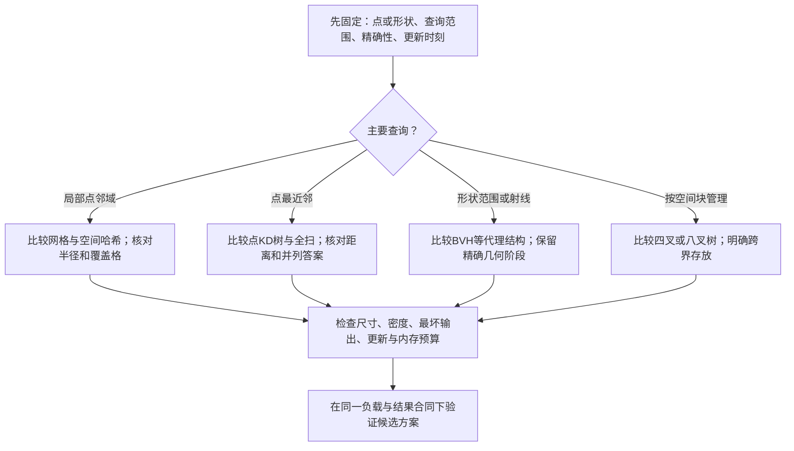

# 04 · 空间分区与索引（Spatial Partitioning & Indexing）

> 知识成熟度：L2。主要承诺是来源限定的结构原理与静态正确性推导；自写代码未执行、未编译。下文 `PAPER_EXPECTED` 均是有限输入的纸面预期，不是算法或性能实验。
> 一句话定位：**利用位置与保守包围体跳过不可能命中的对象，同时保住应该检查的对象**。索引减少多少工作，取决于查询范围、对象尺寸、分布、更新与输出量，不能承诺任意查询从 O(n) 变成 O(log n) 或 O(1)。
> 知识基线：VMV 2003 空间哈希论文、PBRT 第4版 BVH/第3版2018在线版几何 KD 树、CGAL 6.0 点集搜索、Box2D v3.1.0 固定公开源码；语言参考 C++17 工作草案 N4659、Python 3.12 文档。实际选读范围见文末。
> 适用范围：有限的2D/3D点或几何代理，范围、最近邻、射线和剔除候选；查询期间数据属于同一快照。本文自写距离公式、圆/球查询与最近邻伪代码统一采用有限坐标、同单位正交坐标轴上的未加权欧氏距离；调用方还须声明坐标空间、边界接触与结果精度。其他度量是需要另立下界合同的扩展，不能只替换距离函数。
> 最后更新：2026-10-10（补齐完整性、动态维护、退化与输出敏感成本，修正递归返回值、哈希键和数值示例）。本次未运行算法/模型、C++编译、UE、PowerShell、性能、网络或目标系统实验；已有AOI局部证据保留原范围。

## 1. 先确定“附近”和输出是什么

AOI问谁可能进入兴趣集，范围技能问哪些形状与作用域相交，射击问射线的第一个有效命中，渲染问哪些包围体可以排除。它们可以共享索引，却不共享最终判定。

n个对象的无序不同对象对有 `n(n−1)/2` 个。`PAPER_EXPECTED P01`：n=10000时是49,995,000对/帧；若每帧全部检查且每秒60帧，是2,999,700,000对/秒。这个计数没有测量每对耗时，不能单凭它断言某平台容量；更不能把“每秒60帧”变成“600万次/帧”。

| 输入/问题 | 索引存什么 | 完整结果是什么 | 容易混淆的结果 |
| --- | --- | --- | --- |
| 点的闭圆邻域 | 点坐标、稳定ID | 所有 `dist(p,q)≤r` 的ID | 查询外接方框的桶内容只是候选 |
| 有体积对象的范围相交 | 覆盖原形状的AABB等代理 | 经目标几何谓词接受的对象 | 中心不在圆内，形状仍可能接触圆 |
| 最近点 | 点；本文为未加权欧氏距离 | 最小欧氏距离及约定的并列答案 | 最近AABB/中心未必是最近表面 |
| 最近射线命中 | 代理与原形状引用 | 指定参数区间内最小有效t | 最先访问的叶子、最近盒子未必最先命中 |
| 视锥候选 | 保守包围体 | 未被视锥排除的对象 | 仍可能被遮挡或不该向客户端披露 |

宽相完整性合同是：**真实命中集合 H 必须包含在候选集合 C 中，即 H⊆C**。精确过滤接受C中的真命中，才能得到H；漏掉的候选无法由窄相补回。若查询本来就只针对点、且最终距离谓词精确，索引也可以返回该点查询的完整答案，并非所有索引接口永远只能粗筛。

本文负责候选组织与搜索剪枝。[碰撞检测](04-碰撞检测.md)负责几何相交、距离、射线与CCD；[AOI与视野计算](03-AOI与视野计算.md)负责兴趣/视野语义；[服务端Interest Management](../../07-网络与游戏服务端/状态复制与兴趣管理/05-AOI与InterestManagement.md)负责事件与复制调度。它们的授权、阵营、遮挡、历史时刻与可披露字段，不能从“在同一个桶里”推出。

## 2. 共同的不变量与成本记号

| 概念 | 含义及约束 |
| --- | --- |
| AABB | 每轴 `[lo,hi]`，本篇采用闭集接触语义，允许lo=hi；lo>hi或非有限坐标无效 |
| 格坐标/哈希桶 | 格坐标是空间身份，桶是存储位置；不同格可能落入同一桶 |
| 稳定对象ID | 插入唯一，删除可定位；若ID复用需代际/版本，避免旧引用指向新对象 |
| 代理包含性 | 代理始终包含被查询时刻的形状；旋转、缩放、移动及形变后重新满足 |
| 查询快照 | 索引位置、原形状和过滤属性来自一致版本；不能边查询边随意改桶/树 |
| 查询质量 | Complete、InvalidInput、BudgetExceeded等要可区分；未完成扫描不是空结果 |

统一用n表示活跃对象数，G表示密集数组格数，G_occ表示非空格数，R表示对象在格/节点里的注册总数，S表示查询枚举的格数，V表示访问的树节点数，C表示检查的对象引用数（去重前），k表示输出对象数，H_tree表示树高。计数模型默认固定维度与有界字长的坐标/ID，数值位宽增长的成本另计。几何谓词成本另计；即使索引定位免费，写出k个结果也至少需要Ω(k)。

坐标到格使用 `floor((x−origin)/h)`，h必须为正；采用半开格 `[origin+i·h,origin+(i+1)·h)`，每个点只归一格。浮点NaN/无穷、除法溢出、转整数超范围要在转换前拒绝；C++向整数转换是朝零截断，不能替代floor。即使先floor，超出目标整数范围的转换仍不合法。[N4659 §7.10](https://timsong-cpp.github.io/cppwp/n4659/conv.fpint)

本文统一定义 `SquaredDistance(a,b)=Σ(a_i−b_i)²`，即同单位正交坐标轴上的未加权欧氏距离平方；BVH盒下界、KD平面下界、当前最优值和最终距离谓词使用同一度量。加权距离、轴向单位混用或其他度量必须重新推导与该度量匹配、不会高估的下界，不能只替换SquaredDistance。

距离平方可省开方，但有限坐标的差值、平方、加总仍可能溢出；把溢出的结果再转成大类型不能补救。机器实现还要避免误差使下界偏大、包围体偏小，从而错误剪枝。缩放坐标、足够宽的累加类型、保守误差界或稳健谓词需要按数据域设计；一个任意epsilon不构成证明。本文可手算情境使用精确整数/有理数，Python示例也明确限制为整数点。下界计算或比较不能可靠完成时，应明确拒绝或安全回退，不能拿NaN/无穷代替已证的距离界。

## 3. 均匀网格：先算覆盖格，再筛对象

### 3.1 点查询与九宫格的条件

```text
世界的4×3网格，○是点；每个点只有一个所属格：
┌─────┬─────┬─────┬─────┐
│  ○  │     │     │     │
├─────┼─────┼─────┼─────┤
│  ○○ │     │  ○  │     │
├─────┼─────┼─────┼─────┤
│     │  ○  │     │  ○  │
└─────┴─────┴─────┴─────┘
2D圆查询先覆盖 [qx-r,qx+r] × [qy-r,qy+r]，再做圆距离过滤
```

每轴从 `floor((q−r−origin)/h)` 枚举到 `floor((q+r−origin)/h)`，包含两端。查询半径r≤h、索引对象是点时，查询中心格及±1邻格足以覆盖，2D最多9格、3D最多27格；r>h不能继续固定邻格数。即使r≤h，角落候选也未必在圆/球内。

`PAPER_EXPECTED P02`：h=10，origin=0，x=−1属于格−1，x=0属于格0，x=10属于格1。截断−1/10得到0，会改变半开格合同。

`PAPER_EXPECTED P03`：q=(9,0)、r=12、h=10，点p=(20,0)距离11，属于闭圆；其x格为2，而q的x格为0，只查±1会漏掉p。用范围端点得x格−1至2、y格−2至1，之后才按距离过滤。

### 3.2 有体积对象要注册哪些格

有两种不同合同，不能在插入时采用一种、查询时按另一种推理：

1. **全覆盖注册**：闭AABB每轴从floor(lo/h)到floor(hi/h)登记所有格。这里origin=0；一般情况先减origin。查询也按保守范围枚举，聚合ID后去重再精筛。零尺寸AABB同样能登记。若应用改用半开AABB，非空区间的最大格应按 `ceil(hi/h)−1` 推导，不能直接复用闭集公式。
2. **只登记中心**：必须有形状相对中心的最大范围界，并据此扩大查询。球对象半径a、查询球半径r，可按r+a寻找中心候选；尺寸各异时用保守上界或分层。没有尺寸上界，只查中心附近若干格不完整。

`PAPER_EXPECTED P04`：h=10，A的x范围[9,11]，B为[11,12]，y范围都[0,1]。闭集政策下二者在x=11接触；A登记x格0、1，B登记格1，共享候选格。若只按中心存一个格，查询[9,9.5]仍应找到与它相交的A，但不会通过“中心在查询区内”谓词。

重复来源包括跨格注册、哈希别名以及两侧都发起配对。同一查询用ID集合/查询标记去重；对象对规范为 `(min(idA,idB),max(idA,idB))`，排除自配对后去重。若用查询序号，要处理回绕、并发与ID复用，不能仅靠全局可变标记假定永远唯一。

### 3.3 更新、删除与复杂度

维护对象→注册格/桶位置的反向定位。移动先求新覆盖集，再删除旧注册、加入新注册，最后发布一致快照；同格移动仍须更新精确位置。移除空桶可回收稀疏存储。多注册对象删除必须清完旧格，更新失败不能留下“新旧位置混搭”的可查询状态。

| 操作 | 与实现相符的成本 |
| --- | --- |
| 密集数组构建 | O(G+R)；点单注册时R=n |
| 稀疏字典构建 | 哈希良好、摊销假设下O(R)，并维护G_occ个格键 |
| 点插入/移动/删除 | 有反向定位及桶内常数时间删除时，期望/摊销O(1)；数组/向量线性查删不是O(1) |
| AABB更新 | 至少计旧/新覆盖格及注册变化；跨很多格的大体不能算常数 |
| 单次查询 | O(S+C+k)，这里C是实际扫描注册数；S很大时空格扫描也昂贵 |
| 同格生成所有对 | 工作与 `Σ choose(n_cell,2)` 有关，重复消除另计；重叠热点可达二次量级 |
| 内存 | 密集O(G+R)，稀疏O(G_occ+R)，还含反向定位与查询临时集合 |

格边太大增加桶密度，太小增加S和跨格注册R。对象尺寸、查询半径、密度和移动共同决定选择；“平均直径1～2倍”只能是待比较的候选参数，不是完整性条件或通用最优值。

### 3.4 Python 3.12教学例：整数点的动态稀疏网格

这个例子保存唯一整数ID和位置元组，不持有外部可变对象；原点固定0，单位由调用方统一。坐标绝对值及半径上限取10⁹只是教学输入域，格子访问预算默认4096只是失败分支示例，均非性能预算建议。Python整数距离计算无定宽溢出；哈希容器成本为期望/摊销模型。只保证正常内存条件下、单线程且查询期间不修改索引的合同；不提供并发或内存分配失败事务。

```python
class PointGrid:
    LIMIT = 10**9

    @staticmethod
    def _integer(v, lo, hi):
        if type(v) is not int or not lo <= v <= hi:
            raise ValueError("integer outside the teaching domain")

    def __init__(self, cell_size, max_cells=4096):
        self._integer(cell_size, 1, self.LIMIT)
        self._integer(max_cells, 1, self.LIMIT)
        self.h = cell_size
        self.max_cells = max_cells
        self.points = {}  # id -> immutable (x, y)
        self.cells = {}   # full (cx, cy) -> set of ids

    def _position(self, x, y):
        self._integer(x, -self.LIMIT, self.LIMIT)
        self._integer(y, -self.LIMIT, self.LIMIT)
        return (x, y)

    def _cell(self, p):
        return (p[0] // self.h, p[1] // self.h)

    def insert(self, oid, x, y):
        if type(oid) is not int or oid in self.points:
            raise ValueError("id must be a new integer")
        p = self._position(x, y)
        self.cells.setdefault(self._cell(p), set()).add(oid)
        self.points[oid] = p

    def remove(self, oid):
        if type(oid) is not int:
            raise ValueError("id must be an integer")
        p = self.points[oid]  # unknown id: KeyError before mutation
        cell = self._cell(p)
        self.cells[cell].remove(oid)
        if not self.cells[cell]:
            del self.cells[cell]
        del self.points[oid]

    def move(self, oid, x, y):
        if type(oid) is not int:
            raise ValueError("id must be an integer")
        new = self._position(x, y)
        old = self.points[oid]  # unknown id: KeyError before mutation
        a, b = self._cell(old), self._cell(new)
        if a != b:
            self.cells.setdefault(b, set()).add(oid)
            self.cells[a].remove(oid)
            if not self.cells[a]:
                del self.cells[a]
        self.points[oid] = new  # required even if cell did not change

    def query_disk(self, x, y, radius):
        self._position(x, y)
        self._integer(radius, 0, self.LIMIT)
        x0, x1 = (x - radius) // self.h, (x + radius) // self.h
        y0, y1 = (y - radius) // self.h, (y + radius) // self.h
        if (x1 - x0 + 1) * (y1 - y0 + 1) > self.max_cells:
            raise ValueError("cell budget exceeded; no result produced")
        answer = set()
        r2 = radius * radius
        for cx in range(x0, x1 + 1):
            for cy in range(y0, y1 + 1):
                for oid in self.cells.get((cx, cy), ()):
                    px, py = self.points[oid]
                    if (px - x)**2 + (py - y)**2 <= r2:
                        answer.add(oid)
        return answer
```

负数整数 `//` 的floor语义来自[Python 3.12表达式规则](https://docs.python.org/3.12/reference/expressions.html#binary-arithmetic-operations)。上述代码是本篇自写示例，未执行；调用方应通过这些方法修改状态，直接改points/cells会破坏不变量。没有把此点索引冒充球体碰撞或完整AOI实现。

`PAPER_EXPECTED P05`：h=10，插入1→(−1,0)、2→(10,0)。查询(0,0),r=1返回{1}；move(1,9,0)后同查询返回空；查询(9,0),r=0返回{1}；remove(1)后为空。重复插入ID=2应拒绝，删除不存在ID应报错；这些错误不表示“查询无命中”。

## 4. 四叉树/八叉树：把细分与对象存放规则一起定义

四叉树每次将2D区域沿两轴各分两半；八叉树在3D形成8个子区域。这里讨论固定区域递归细分的变体；容量阈值控制何时细分，深度/最小尺度限制终止。聚簇可触发深链，坐标相同的点也不能无限分裂。

```text
四叉树的一个有效细分：左两区保留，右上继续细分
┌─────────┬────┬────┐
│         │ B1 │ B2 │
│    A    ├────┼────┤
│         │ B3 │ B4 │
├─────────┼────┴────┤
│    D    │    C    │
└─────────┴─────────┘
跨分割线的形状，不能仅凭中心塞入某个孩子后按孩子区域剪枝
```

本篇采用**父节点保留跨界对象**：若一个孩子的区域能完整包含对象闭AABB，则进入那个孩子；多个孩子都能包含退化边界对象时按固定编号选一个；否则保留在父节点。点的切分线归属也固定，例如相等取右/上。查询必须检查每个访问节点的objects，不能只检查叶子。

```text
Insert(node, object):                          # 教学伪代码
    要求根已完整包含object.aabb；否则拒绝或先扩根重建
    若node已有孩子：
        若存在完整包含object.aabb的孩子：按固定编号选一个，递归插入
        否则追加到node.objects
        return
    追加到node.objects
    若容量超阈值 且 depth<maxDepth 且子区域仍可区分：
        创建4/8个孩子；把原objects临时移出并清空
        逐个重新按“完整包含则下沉，否则留父”分派
        子节点容量过大时遵守同样的终止限制

Query(node, queryAABB, result):
    若node.region与queryAABB闭集不相交：return
    对node.objects逐个检查object.aabb与queryAABB，命中则收集ID
    对每个孩子递归Query
```

其不变量是对象只存一份、其所有祖先区域包含其代理。因此查询区域若与某节点不相交，就不可能命中该子树任何对象。根外的对象、移动越过存放区域的对象都必须重新安置，不能留在原节点等待“下次有空再修”。删改可维护ID→拥有节点及桶内位置；合并节点、扩根和重新分配时同步更新该反向表。

另一合法变体把跨界对象放进所有相交孩子，但查询要去重、删除要清掉所有引用，且复杂度按复制后的R而非原始n计。大体覆盖整个根、每层都继续复制时，单个对象就可能进入4^H_tree或8^H_tree个叶子，不能把这类实现写成最坏O(n·H_tree)。Loose tree用扩大的子区域降低搬迁频率，但剪枝必须使用真实包含对象的扩展边界。

`PAPER_EXPECTED P06`：根[0,8]²在x=y=4切分，A=[3,5]×[1,2]跨中线，所以留根。Q=[4.5,4.75]×[1,2]应收到A；只遍历右下叶而不检查根objects会漏掉。若100个点都为(1,1)，达到maxDepth后保留同叶，局部查询仍可能检查100个点，换成BVH也无法凭空消除重叠。

父节点保留变体的构建可按总下沉/重分配工作O(n·H_tree)及节点分配计，空间O(n+T)，T是实际节点数；单次分裂可能重新分配已有对象，所以某次插入不保证O(H_tree)。查询写作O(V+C+k)，无条件O(log n+k)不成立。树平衡、数据分布与查询尺寸决定平均剪枝能力。

## 5. BVH：按对象分组，维护包围体包含性

### 5.1 构建与动态维护不是同一件事

普通对象BVH将对象集分组，叶子存一个或多个对象，内部AABB包住孩子AABB；孩子的盒子可以重叠。若每对象只属于一个叶子，二叉结构空间O(n)；空间分裂BVH等变体可复制图元，不能套用该内存结论。[PBRT第4版 §7.3](https://www.pbr-book.org/4ed/Primitives_and_Intersection_Acceleration/Bounding_Volume_Hierarchies)

```text
            AABB(A∪B∪C∪D)
               /       \
         AABB(A∪B)     AABB(C∪D)
          /    \        /    \
         A      B      C      D
```

移动更新有不同选择：refit重算叶子及祖先盒子，成本与树高有关，保持包含性却可能让盒子越来越重叠；移除再插入、旋转或重建可改善结构质量，但各有维护成本。单叶refit是O(H_tree)，只有高度受控时才是O(log n)；所有叶都更新时，可自底向上O(n) refit，逐个走祖先则可能多做重复工作。删除还要修复父子关系、盒子和ID映射。

固定[Box2D v3.1.0源码](https://github.com/erincatto/box2d/blob/d5935a7a1853eb0f4aca92b369f37929d02c7e11/src/dynamic_tree.c)的MoveProxy移除并重插叶子，EnlargeProxy沿祖先扩大边界；它不是“动态对象永远只冒泡一次”的统一方案。这里仅选读相关分支，不把库的固定栈、断言或平衡策略当作所有输入的正确性证明。

Fat AABB用较大的代理容纳小幅移动：原形状仍完全位于代理内时可少做结构更新，但精确位置仍更新，超出代理必须刷新。它增加假阳性；如果查询的是一段时间的碰撞，还要包住整段运动，而不仅是起末两个时刻，旋转/曲线路径尤需小心。

构建可以自顶向下递归分组，也可自底向上逐步合并对象组；两者都要维护包含性，构建算法与查询负载决定成本。下一节只展开自顶向下的切分模型，不把它覆盖到全部BVH构建方法。

### 5.2 SAH是有假设的成本模型

对3D射线查询，简化二分SAH写作：

```text
splitCost = traversalCost
          + SA(left)/SA(parent)  * leftCount  * primitiveTestCost
          + SA(right)/SA(parent) * rightCount * primitiveTestCost
leafCost  = count * primitiveTestCost
```

应与不切分的leafCost比较，而不只是寻找“最不坏”的切分。PBRT §7.3.2的条件模型是：射线已穿过父凸包围体时，对均匀分布的随机射线，以完全包含其中的子凸包围体与父体的表面积比估计再穿过孩子的概率。方向偏置、AOI范围查询和不同图元求交成本会改变预测，不能直接把它当所有查询的命中概率。重叠子盒的两项概率和可以大于1。父表面积为0时不能除法；重合质心/空分组可停止为叶或改用有终止保证的分组。二维成本需按二维查询模型另定，不能未经说明把周长代入3D公式就宣称性能等价。[PBRT §7.3.1–7.3.2](https://www.pbr-book.org/4ed/Primitives_and_Intersection_Acceleration/Bounding_Volume_Hierarchies)

若每层重新排序、分组保持平衡，递推得到O(n log² n)；固定桶数线性扫描每层且平衡时可为O(n log n)。PBRT的桶化SAH正是另一种构建选择，故“SAH构建必然O(n log² n)”不成立；严重不平衡分组还能更差。构建时间与后续查询次数共同决定离线/在线取舍。

### 5.3 范围、最近邻与最近射线命中

范围查询先用节点AABB排除子树，访问叶后按需要对原形状精筛。以下最近邻下界仅用于§2定义的未加权欧氏距离：q和AABB坐标有限、各轴单位一致且正交，并满足数值计算不溢出和保守误差合同。点到闭AABB的欧氏距离平方为：

```text
delta_i = max(lo_i - q_i, 0, q_i - hi_i)
lowerBoundSquared = Σ delta_i²
```

若原形状被AABB包含，则其表面/体积上的最近点欧氏距离平方不会小于这个下界。用当前真实对象按相同欧氏度量计算的距离平方作上界，才可比较并剪枝；使用盒子中心距离作为下界是错误的。`PAPER_EXPECTED P07`：q=(0,0)，盒[2,4]×[3,5]的下界平方为13；当前真对象的距离平方为9，可以排除该盒。若当前值是16就不能排除。点在盒内时下界0，不表示点已在真实形状内。加权距离等扩展须换成相应度量的保守盒下界，不能沿用本公式。

```text
NearestRayHit(root, ray, [tMin,tMax]):          # 教学流程，不是Slab实现
    验证ray、区间与数值域；best = None；bestT = tMax
    遍历待访问节点：
        求ray与node.aabb在[tMin,bestT]内的区间
        若无交或入口t > bestT：跳过
        若内部节点：优先较近入口的孩子，但保存另一个待检查孩子
        若叶：对原形状求该区间内的命中，按(t,稳定ID)更新best及bestT
    return best
```

必须返回或共享更新后的bestT；近孩子得到新命中后，远孩子要用新的上界复检。需要确定并列最小ID时，用严格“下界>bestT”剪枝，保留相等可能性。零方向分量、初始重叠和有限射线区间交给[碰撞检测的射线合同](04-碰撞检测.md#7-射线完整参数域与初始重叠)。Box2D该版的树RayCast也把精确形状查询交给回调，并允许回调缩短maxFraction或终止；不能把代理回调顺序当作最近命中顺序。

`PAPER_EXPECTED P08`：先访问的A盒入口t=1，A的真实形状命中t=9；B盒入口t=2，B真实命中t=3。访问A后立即返回会错；保留B分支后结果为B、t=3。若只是any-hit且任意有效遮挡即可，才可在第一次真实命中后结束。

范围/射线成本统一记O(V+C+k)，最坏可扫描全部对象；n个重叠盒子不会因为树高平衡就只访问log n个对象。BVH可用于2D和3D碰撞、射线、实例剔除与离线渲染，具体引擎是否采用何种结构需要各自版本证据。

## 6. KD树：分清点最近邻与几何空间分割

本节教学变体索引**点**：按 `depth mod d` 选轴，按(该轴坐标,ID)排序取中位点，每个点只存一处。同坐标仍按ID分割，左右子树在该轴上分别满足≤和≥切分值，空集产生空树。这不是唯一KD树：CGAL 6.0支持不同分割规则，点保存在叶桶；PBRT几何KD树按空间切分，跨平面的图元可能被两个子区引用。不能把“点只存一次”推广给后者。[CGAL 6.0](https://doc.cgal.org/6.0/Spatial_searching/index.html)、[PBRT第3版 §4.4](https://www.pbr-book.org/3ed-2018/Primitives_and_Intersection_Acceleration/Kd-Tree_Accelerator)

```text
二维交替轴切分的示意：先x，再在左右分别按y切分
       │                 │
       │             ────┤
       │      →          │
       │                 ├────
       │                 │
切分位置由各自点集决定，不要求四等分
```

### 6.1 构建与能带回答案的递归

本节输入是有限2D/3D点集和有限查询点；所有轴为同单位正交坐标，采用§2的 `SquaredDistance(a,b)=Σ(a_i−b_i)²`。best.distance²、点距离和diff²都处于同一个未加权欧氏度量与数值合同，伪代码不接受任意可替换的距离回调。

```text
Build(points, depth):
    if points为空: return None
    axis = depth mod d
    sorted = 按(points[axis], points.id)排序的序列
    mid = floor(len(sorted)/2)
    return Node(sorted[mid], axis,
                Build(sorted[:mid], depth+1), Build(sorted[mid+1:], depth+1))

Nearest(node, q, best):                       # best为可选(distance²,id,point)
    if node is None: return best
    candidate = (SquaredDistance(q,node.point), node.point.id, node.point)
    if best is None or candidate按(distance²,id)更小: best = candidate
    diff = q[node.axis] - node.point[node.axis]
    near, far = diff<0 ? (node.left,node.right) : (node.right,node.left)
    best = Nearest(near, q, best)              # 返回值必须带回
    if diff² <= best.distance²:
        best = Nearest(far, q, best)           # 含等距ID决胜的边界
    return best

入口：Nearest(root,q,None)；空索引返回None
```

在本节未加权欧氏度量下，点到轴对齐切分平面的绝对距离是远侧点欧氏距离的下界，其平方才可与best.distance²比较。因此先近后远有助于早收紧上界，但不能直接跳过远侧。伪代码按值返回best，递归的返回值必须赋回；若采用引用版本，则要明确写引用合同而不是假定调用会自动修改父层状态。

`PAPER_EXPECTED P09`：根P=(0,100),id=10，左A=(−1,100),id=20，右B=(1,0),id=30；根按x切分，q=(−0.1,0)。先查左侧只能得到约100的距离，平面距离0.1很小，必须查右侧；B的距离是1.1，为答案。丢弃递归返回值的按值实现可能在根返回P或干脆没有返回结果。

`PAPER_EXPECTED P10`：q=(0,0)，最近距离同为1的A=(−1,0),id=9和B=(1,0),id=2，若约定取最小ID，应返回B。若搜索过程中下界恰等于已知距离，仍要检查可能含更小ID的分支。重复坐标但不同ID是合法多个对象；不能静默合并。

### 6.2 复杂度与失效条件

上述Build每层排序，平衡递推 `T(n)=2T(n/2)+O(n log n)` 得O(n log² n)。若每层用线性选择再划分，中位数构建可达到O(n log n)级；具体选择算法决定最坏或期望界。树高平衡不保证最近邻只走一条根到叶路径：即使2D/3D，坏分布、查询落点、很多等距点也可能使查询O(n)。

固定d、特定平衡分割的正交范围报告有专门界，不能用“平衡二叉搜索树”直接推出所有空间范围查询O(log n+k)。本篇统一以访问V和检查C计量，不把此处点KD树伪代码的复杂度外推给几何射线KD树。

移动点后原分割不变量可能失效，需要删除重插/重建或使用明确支持动态点集的实现。KD树删除不是一般BST随意接孩子；沿各轴的分割关系必须保留。高维通常削弱剪枝，但不存在“>20维必然失效、2～3维完全安全”的通用阈值。精确与近似最近邻也应区分：近似搜索的误差参数与距离界必须由具体实现定义。CGAL 6.0选读部分支持该区别，不提供本篇任何性能保证。

用途包括最近锚点、点云邻域、粒子配对、离线光子位置邻域和导航兴趣点预筛。索引中心只能得到最近中心；“最近可达商店”还要做导航搜索，“最近敌人”还要满足阵营/可见/可选规则。

## 7. 空间哈希：散列只决定存在哪里

### 7.1 两种实现合同

均匀网格是空间划分；空间哈希是稀疏存储方式。第3节的字典实现已经属于一种空间哈希，不必把二者当互斥算法。

| 方式 | 身份与冲突处理 | 正确性条件 |
| --- | --- | --- |
| 完整格坐标作字典key | hash定位桶，equality比较完整(cx,cy,cz) | 不同格即使hash相同也保持独立键 |
| 固定大小压缩桶 | 多个格合流到同桶 | 保留全部注册，不覆盖/丢弃；查询过滤格坐标或执行保守精筛，并去重 |

Teschner等2003论文先将点floor到格，再把格映射到有限表；候选还要经过AABB/几何检查。其三素数混合是一种实现选择，不能证明无冲突或所有输入低冲突；论文也明确只考察了部分哈希函数。桶容量溢出时丢元素，会从性能问题变成漏检。[论文 §3、§4.1–4.3](https://matthias-research.github.io/pages/publications/tetraederCollision.pdf)

`PAPER_EXPECTED P11`：为展示必然可构造的冲突，设一维教学hash(c)=c mod 2，格0和2同桶。两格里的点必须都保留。查询格0若原样返回整个桶，会把格2的远点误报；同时查询格0、2又会重复回调同一对象。完整格key可消除格身份混淆，集合去重与几何过滤则是压缩桶方案的一部分。

### 7.2 C++17：完整格key与定义良好的混合

下例只演示键类型与哈希，不是完整的空间索引或可直接运行程序。入口已经验证并生成int32格坐标；float转格、对象注册、删除、更新、邻域范围、预算、去重和精筛仍按前文实现。uint32_t/uint64_t须在目标平台提供。

```cpp
#include <cstdint>
#include <cstddef>
#include <unordered_map>
#include <vector>

struct Cell3 {
    std::int32_t x, y, z;
    bool operator==(const Cell3& other) const noexcept {
        return x == other.x && y == other.y && z == other.z;
    }
};

struct Cell3Hash {
    std::size_t operator()(const Cell3& c) const noexcept {
        const auto x = static_cast<std::uint64_t>(static_cast<std::uint32_t>(c.x));
        const auto y = static_cast<std::uint64_t>(static_cast<std::uint32_t>(c.y));
        const auto z = static_cast<std::uint64_t>(static_cast<std::uint32_t>(c.z));
        return static_cast<std::size_t>(
            (x * UINT64_C(73856093)) ^
            (y * UINT64_C(19349663)) ^
            (z * UINT64_C(83492791)));
    }
};

using Cells3 = std::unordered_map<Cell3, std::vector<int>, Cell3Hash>;
// 按完整Cell3查找，不能把Cell3Hash的返回值再当作唯一格key。
// vector桶按ID线性查删是O(桶长)，常数删除另需反向slot/交换尾元素并修正slot。
```

混合在无符号域执行，低位截断仍可能有冲突，但equality保住格身份。原写法 `(uint64_t)(cx * 73856093)` 先在int中乘法，后转型不能救回已发生的有符号溢出；邻格 `cx+dx` 也要先在更宽且受检的类型里计算。C++17普通函数若需要泛型回调，应写 `template<class F>` 及 `F&&`，不能将普通参数 `auto&&` 冒充C++17通用函数语法。这里只保留键示例，避免把不完整的27格回调当精确邻域接口。[N4659 §8、§10.1.7.4](https://www.open-std.org/jtc1/sc22/wg21/docs/papers/2017/n4659.pdf)

### 7.3 动态代价

期望O(1)是单次合适哈希表操作的摊销假设，不包含所有跨格注册、桶内线性删除、rehash尖峰或结果回调。内存至少含G_occ个格键和R个注册，即O(G_occ+R)；压缩表另含其容量。稀疏存储避免为无限空世界分配数组，但不阻止一个巨大查询枚举海量空格。

“无需整树重建”不等于“永远无需维护”。实现可能每帧重建移动对象表，或增量删改，并可能扩容/rehash；应比较总更新+查询成本。粒子、碎块、群体Steering与临时障碍都可采用它，但大对象跨格、热点聚集、不同作用半径会改变收益。

## 8. 五种结构对照与选型

| 结构/本文变体 | 数据与构建 | 查询成本口径 | 动态维护与主要风险 |
| --- | --- | --- | --- |
| 密集均匀网格 | 点/全覆盖代理；O(G+R) | O(S+C+k) | 覆盖集更新；G过大、热点、巨大对象 |
| 四叉/八叉树，跨界留父 | 有限根区域；按n·H_tree及节点数计 | O(V+C+k) | 删除重插/扩根/合并；父节点跨界对象堆积、深链 |
| 普通对象BVH | 代理分组；构建依分割法 | O(V+C+k)，最坏线性扫描 | refit/重插/旋转/重建；盒重叠增大、代理失效 |
| 点KD树，本篇每层排序 | 低维点集；O(n log² n) | 精确最近邻最坏O(n) | 动态不变量与重建；等距、坏分布、维度上升 |
| 完整键空间哈希 | 稀疏网格；期望O(R) | 期望O(S+C+k) | 注册/删除/rehash；hash冲突、桶热点与预算 |

表中范围结果的k与射线输出含义不同；返回一个最近命中也不保证只检查一个对象。不存在不注明数据模型的统一“射线优、最近邻差”性能排名。

| 游戏需求 | 值得比较的起点 | 需要先固定的条件 |
| --- | --- | --- |
| 动态点AOI/塔防索敌 | 网格或空间哈希 | 圆/格距合同、半径、热点及精确过滤；兴趣事件另算 |
| 大小差异大的动态碰撞代理 | 动态BVH、分层网格 | 对象尺寸、每帧变化比例、宽相完整性 |
| 区块加载/区域LOD | 四叉/八叉树 | 流式块与实际几何代理的关系、根范围 |
| 最近锚点/兴趣点 | 点KD树、暴力扫描、可用的BVH | 点或表面距离、并列答案、更新频率 |
| 静态射线/离线场景 | BVH、几何KD树 | 构建预算、查询次数、图元复制与射线分布 |
| 粒子/群体邻域 | 网格、空间哈希 | 邻域半径与格宽、各桶密度、每帧重建或增量更新 |
| 视锥/实例剔除 | BVH、四叉/八叉树或现有场景分块 | 包围体保守性、动态比例；可见候选不代表无遮挡 |



图是选择候选方案的顺序，不是免测试的唯一答案。实际系统可用大网格管区块、块内BVH管形状；查询跨区块要完整枚举并去重。Scene Graph的父子组织可能只表达变换/所有权，并不天然是可用于几何剪枝的空间索引。

## 9. 纸面情境、未来验证建议与已有证据

前述P01～P11是 `PAPER_EXPECTED`，未运行。还应在真正实现后检查以下有限情境；此表定义预期，不声称测试已通过：

| 情境 | 纸面判据/预期 | 暴露的问题 |
| --- | --- | --- |
| 空索引、r=0、恰在半径上的点 | 空集；同点命中；闭边界命中 | 空树/空桶、<与≤混用 |
| PointGrid h=1，预算4，查询(0,0),r=2 | 覆盖25格，查询前报预算错误，无部分结果 | 预算耗尽伪装空集 |
| 两点仍在同一格，点从圆外移入圆内 | 重新精筛后结果变化 | “没跨格就无兴趣变化”不适用于精确圆合同 |
| 全覆盖大AABB占多格，然后移动/删除 | 新位置可查，旧位置无残留；每ID输出一次 | 遗漏旧注册、重复候选 |
| n个代理完全重叠，全对查询 | 候选/输出对可有n(n−1)/2 | 无条件线性/对数性能承诺 |
| 容器容量上限、NaN/无穷、越界格坐标 | 明确拒绝或安全回退，不静默丢对象 | 不完整结果冒充无命中 |
| KD点位置被外部直接修改 | 旧分割不变量失效，必须维护/重建 | 只改payload就以为更新完成 |
| 两个快照之间查询/并发删除 | 使用稳定快照或同步；过期句柄识别 | 悬挂引用、混合时刻与ID复用 |

未来运行验证应把索引结果与同一几何/过滤合同下的全扫逐集合比较，记录空集、正例、反例、重复与更新序列，并检查预算失败路径。性能比较固定分布、查询大小、对象尺寸、更新比例和总成本口径，记录构建/维护/查询、节点/格访问、候选与真命中、内存、P50/P95/P99；不能只计定位而遗漏回调、去重或窄相。这里没有新增测试脚本，也没有执行任何上述程序。

现有[AOI模拟器证据](../../../evidence/algorithms/aoi/README.md)记录2026-08-12 Windows x64/MSVC、200×200格、R=3格即49格扫描、随机游走；其Enter/Leave对照采用切比雪夫格距，同时记录与欧氏圆的差异。这是已有局部实测，不能写成不存在，也不能当成本篇新增实验或五结构比较。

[AOI规模与分线证据](../../../evidence/tests/aoi-scale/README.md)另记录Windows/MinGW、热点、可见集/包体估算和分线控制器范围。本次仅阅读说明并保留链接，未重跑程序、未把包体估算当真实网络流量，未审定这些历史材料的所有结论。两处源码、原始输出和附件保持原样；其结果不证明本篇浮点几何、C++键实现或目标服务器性能。

## 10. 最佳实践与FAQ

**先证明完整性，再减少候选。** 明确代理包含性、半开格与闭查询边界、跨界存放、去重、更新时刻和失败状态。格宽、叶容量、fat margin、重建阈值都属于待比较参数，不存在通用“n<500直接全扫”阈值；小规模全扫仍是有价值的正确性与成本基线。

**缓存和分配要纳入成本。** 连续数组、对象池、SoA、桶预留与批更新都可能改善局部性，但“存指针连续”不等于其指向对象连续。分层组合还要控制跨层重复、更新传播和内存。

**Q1：MMO AOI一定用九宫格吗？**
不一定。网格容易定位与增量维护，但精确圆邻域、异构半径、热点和跨服边界会改变成本。点查询r≤h时九宫格是候选覆盖，不代表九宫格内全是最终兴趣对象；两对象同格内移动也可能穿过圆边界。不能从结构推定“玩家通常均匀”或给出产业普及率。

**Q2：四叉树退化时换BVH就好吗？**
不保证。四叉树可深链/父节点堆积；BVH可严重重叠。如果答案本身包括所有对象或所有对，就必须支付输出成本。先区分维护问题、代理太松、查询太大和真实热点，再考虑改结构。

**Q3：BVH和八叉树怎么选？**
前者按对象组包围体，后者按空间区域细分；两者都能静态或动态维护，也都可做范围/射线/剔除候选。区块管理、对象尺寸和查询分布决定要比较哪些变体，不能写成“静态必选八叉、动态必选BVH”。

**Q4：空间哈希冲突只影响性能吗？**
只有在保留全部记录、完整键相等比较或保守精筛、正确去重且没有容量丢弃时，才可把它限定为额外工作。以hash值冒充唯一格身份、覆盖桶内容或直接把候选视作命中，都会破坏结果合同。

**Q5：KD树能索引任意几何并总是给出最近目标吗？**
本篇点KD树只求上述未加权欧氏合同下的最近点；最近中心不等于最近体积、表面或最近可达对象。其他度量可作为扩展，但必须同时提供匹配且不会高估的节点/平面下界，不能仅换点距离函数。几何KD树是不同存放/遍历合同。R树也是独立结构，本篇仅保留其作为后续检索线索，不给出未经本次核对的R树插删或复杂度结论。

**Q6：射线在网格上怎么查？**
DDA按射线与格边界的参数推进；零方向轴不推进，负向、恰落边界和同时跨多轴要有一致规则。若闭集接触算命中，角/边交会须保守覆盖相关格（例如supercover），或证明对象注册和访问政策已保住这些接触；只随意选一个轴前进可能漏掉触点对象。每格检查代理/原形状并去重，维护最近t；只有未访问格的入口已严格晚于bestT才可排除更近/并列答案。成本含步进格数、候选与求交，不能据此断言一定比BVH慢。此处是设计入口，没有完整DDA实现或验证。

**Q7：流场、图搜索和空间索引是否同一层？**
空间索引找几何邻近候选；图搜索沿合法边求可达/代价，不能把“很近”当“连通”。流场/Steering可能消费网格密度和近邻；空间查询成本还应计入生成邻居的成本。组合索引可行，但每层的范围覆盖与去重都要成立。

## 11. 关联阅读

- [图论基础与搜索算法](../路径搜索与导航/01-图论基础与搜索算法.md)：图邻接、可达性和路径成本；几何邻近本身不建立合法边
- [A星算法与优化](../路径搜索与导航/02-A星算法与优化.md)：图搜索/启发式；空间索引可辅助对象检索，但不是A*或JPS的必备加速条件
- [流场与群体寻路](../路径搜索与导航/03-流场与群体寻路.md)：密度统计与Steering近邻的消费者
- [碰撞检测](04-碰撞检测.md)：宽相、窄相、射线区间、距离和CCD时域
- [AOI与视野计算](03-AOI与视野计算.md)：兴趣区域、进入/离开、视野与遮挡；使用邻篇实现时仍须核对其具体合同
- [NavMesh工程Recast与Detour](../路径搜索与导航/03-NavMesh工程Recast与Detour.md)：空间候选、投影与导航多边形查询的区别
- [本地AOI证据](../../../evidence/algorithms/aoi/README.md)：已有网格/暴力局部比较及圆方差异；不是十字链表实测或本轮新验证
- [AOI规模证据](../../../evidence/tests/aoi-scale/README.md)：局部规模、包体估算与分线模型
- [服务端AOI与Interest Management](../../07-网络与游戏服务端/状态复制与兴趣管理/05-AOI与InterestManagement.md)：候选转兴趣事件与状态复制；索引不授予发送权限
- 《Real-Time Collision Detection》（Christer Ericson）：保留原文书目线索；本次未读取该书全文，也未新增书籍/PDF
- [PBRT](https://pbrt.org/)与[Bullet源码仓库](https://github.com/bulletphysics/bullet3)：保留延伸阅读入口；本次实际核对的PBRT章节见下表，未审阅Bullet实现

## 12. 一手来源、实际阅读范围与限制

| 资料及固定基准 | 本次实际核对 | 不能据此宣称 |
| --- | --- | --- |
| [Teschner等，VMV 2003](https://matthias-research.github.io/pages/publications/tetraederCollision.pdf) | §3点/四面体AABB散列流程；§4.1混合函数、§4.2表与时间戳；修订补读并保存PDF第4页（零基P3）、提取L232–245的§4.3格宽正文，平均边长建议属于论文四面体负载的经验 | 没有复现论文性能、读全参考文献或证明所有形状碰撞完备；不把该格宽经验推广成通用定理 |
| [PBRT第4版 §7.3](https://www.pbr-book.org/4ed/Primitives_and_Intersection_Acceleration/Bounding_Volume_Hierarchies) | 对象分组、包围体层次；构建的空/退化分支与桶化SAH；修订补读并保存§7.3.2提取L414–417的等图元成本假设与均匀随机射线条件概率正文 | 未运行渲染器；未审核全部HLBVH、并行和遍历实现；不推广其性能常数 |
| [PBRT第3版2018在线版 §4.4](https://www.pbr-book.org/3ed-2018/Primitives_and_Intersection_Acceleration/Kd-Tree_Accelerator) | 图元跨区引用、分割失败停止、命中后继续遍历的条件，特别是buildTree分组与tMin/tMax说明 | 不是点最近邻实现来源，不是本篇KD伪代码已运行证据 |
| [CGAL 6.0 Spatial Searching](https://doc.cgal.org/6.0/Spatial_searching/index.html) | 简介的精确/近似与点集；Software Design的叶桶、分割与距离界/平方距离 | 未运行CGAL；未将文档内旧版性能表作为本篇测量，也未逐行读全部例程 |
| [Box2D v3.1.0 collision.h](https://github.com/erincatto/box2d/blob/d5935a7a1853eb0f4aca92b369f37929d02c7e11/include/box2d/collision.h)、[dynamic_tree.c](https://github.com/erincatto/box2d/blob/d5935a7a1853eb0f4aca92b369f37929d02c7e11/src/dynamic_tree.c) | revision d5935a7a1853eb0f4aca92b369f37929d02c7e11；头文件树API L667–757，实现Destroy/Move/Enlarge L794–860及Query/RayCast L1114–1290 | 未完整审核分配、旋转、Rebuild及所有调用方；固定栈/断言不等于本篇通用预算错误接口 |
| [N4659，2017-03-21](https://www.open-std.org/jtc1/sc22/wg21/docs/papers/2017/n4659.pdf) | §7.8整数转换、§7.10浮点整数转换、§8表达式范围、§10.1.7.4 auto使用范围；按条款选读 | 工作草案不是本次编译记录，不代表目标平台类型宽度和性能 |
| [Python 3.12官方表达式文档](https://docs.python.org/3.12/reference/expressions.html#binary-arithmetic-operations) | 页面标识3.12.15；整数除法floor与算术语义 | 本篇PointGrid没有执行，不能因文档符合语言规则升为L3/L4 |

检索中的Box2D网页读取曾返回Cache miss，后通过相同官方固定revision的原始文件读取成功；PBRT正文的直接HTTP获取返回403，CGAL Orthtree页未成功读取，失败保留。前一准备版本保存的PBRT返回未覆盖随机射线条件概率段，VMV返回未覆盖§4.3，不能以总行数或提及节号当作已读证据；本修订已重新读取并保存上表所列缺失段落，旧缺口记录不改。四叉/八叉树的具体存放政策、整数网格示例与P01～P11是本篇欧氏合同下的静态推导，不伪称逐字采用某库实现。

原文与实际历史版本保留在原Git历史；本次候选修订的字节快照、来源读取记录和逐项用途映射在仓外审计材料中保全。现行正文保留原有五结构教学用途、图示、例子、FAQ、导航及正确历史证据入口，纠正的旧代码与错误断言不作为第二套现行用法附回正文。工作日志、书籍、附件与已有原始实验结果不在修改范围内。
