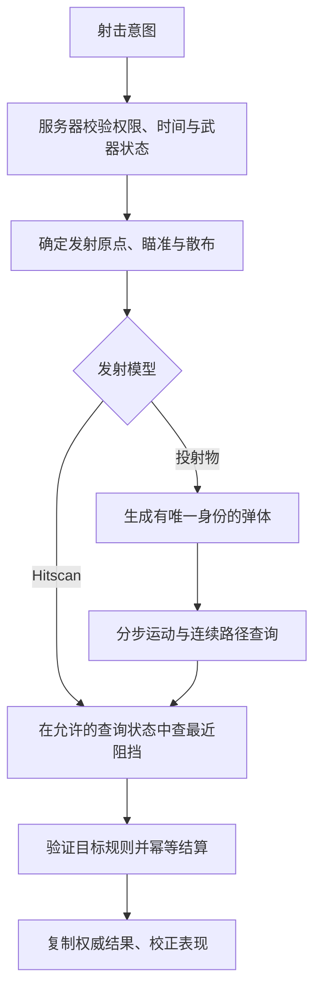

# 弹道与射击算法（Ballistics & Shooting）

> 知识成熟度：L2。核对官方教材、作者原始资料与固定版本的服务器源码；公式、手算例与设计伪代码用于解释契约。本轮未运行弹道算法、编译、UE、联网测试或性能基准，`verified: []` 不表示存在运行验证。
> 知识基线：引擎无关的游戏投射物与射击查询。基本模型为恒定加速度、有限寿命、同一坐标系；高低抛、匀速截获与加速截获分别推导，不把它们合成一个无条件成立的公式。
> 版本与规范基线：OpenStax《University Physics Volume 1》§4.3 与 NASA 在线页（2026-10-10 核对）；Kahan 2004-11-20 文稿 §1；PBRT 第四版 §A.5.1、§A.5.4；Catto GDC 2013；Valve Source SDK 2013 固定提交 `b8cfb12c0e083a2ef5b2f9f9b50f3902fa034474`。这些来源不构成 UE 任一版本的 API 保证。
> 最后更新：2026-10-10。修正方程阶数、求根与不可达处理、散布测度、碰撞近似和服务器授权；保留游戏调参、AI、回放与验证入口。

手雷的预测线指向平台，却在平台前的墙上爆炸；炮塔瞄准移动目标的当前位置，总是落后；客户端显示命中，服务器却没有扣血。这三个问题分别属于运动求解、相遇时间和权威结算，不能由“算出一个瞄准点”同时解决。

本文回答四个问题：给定发射状态，物体会到哪里；给定目标，是否存在允许的发射方向；真实场景中先碰到什么；谁有权把碰撞变成一次伤害。适用于游戏中的 FPS/TPS、投掷物、弓箭、炮塔与技能弹道；不提供现实武器的工程参数。

## 一、先确定模型与结果的含义

| 模型 | 时间与状态 | 需要求什么 | 常见错误 |
| --- | --- | --- | --- |
| Hitscan | 在选定的查询时刻执行一条有限射线或形状查询 | 有效范围内最近的阻挡与命中 | 把视觉曳光当作飞行中的权威实体 |
| 无制导投射物 | 发射后按速度、力与碰撞规则演化 | 发射解、各步轨迹、首次碰撞 | 生成弹体后马上结算未来命中 |
| 制导投射物 | 飞行中根据可用观测改变方向或加速度 | 持续控制与转向约束 | 把发射瞬间提前量当作持续制导 |

Hitscan 没有模型内的飞行时间，但仍有输入传输和服务器处理延迟。投射物初始速率固定，也不意味着受重力后全程速率固定。比例导引（Proportional Navigation）是制导律的一类；本文只保留其分类与接口边界，不把未推导的制导实现列为已完成内容。



图中散布先改变实际方向，再进入命中查询；投射物通过后续运动产生碰撞。数学求解只提供候选发射状态，不能代替遮挡检测、射击权限或伤害规则。

## 二、坐标、单位与输入合同

本文用世界坐标中的位置向量 `p`、速度向量 `v`、加速度向量 `a`，单位分别为 m、m/s、m/s²，时间为 s。二维示例以 x 水平、y 向上；`g > 0` 是重力大小，`a = (0, -g)` 是重力向量。不要在同一公式里把正标量 `g` 与负的竖直分量混用。

项目也可全部使用 cm、cm/s、cm/s²；关键是整条链一致。例如本篇示例的 `g = 10 m/s²` 换成厘米制应为 `1000 cm/s²`，这是单位换算，不是引擎默认值。角度进入三角函数前统一为弧度；显示为度只发生在 UI 边界。

一次求解至少接收：

- 同一时刻、同一参考系的发射点与目标状态，以及状态的有效时间
- 模型类型、有限且允许的初始速率、重力或加速度、是否继承发射平台速度
- `T > 0` 的最长预测时间、弹体寿命、最大允许射程与发射角范围
- 分别有单位的时间容差、位置容差、速率容差，以及数值求解精度策略

输入先拒绝 NaN、无穷值、负寿命、非法速率及无法归一化的方向。即使所有输入有限，平方、点积和中间结果仍可能溢出；使用局部相对坐标、适当尺度与中间有限值检查。用一个无量纲的 `1e-6` 同时判断“米、秒、米平方是否为零”没有一致含义。

输出应区分 `InvalidInput`、`NoSolutionInHorizon`、`NumericallyUncertain` 和 `CandidateSolutions`。候选解包含时间、初始速度、所用模型和残差；后续再产生 `Blocked`、`Spawned` 或实际命中结果。找不到数值解与数学上无解是不同结论。

## 三、从轨迹求高度交点，不把交点当作地形命中

忽略阻力且加速度恒定时：

```text
p(t) = p0 + v0*t + 0.5*a*t²
v(t) = v0 + a*t
```

加速度先改变速度，速度随时间积分后产生二次位移；水平方向加速度为零时，水平速度保持不变。这个模型的前提和分量符号见 [OpenStax §4.3](https://openstax.org/books/university-physics-volume-1/pages/4-3-projectile-motion) 公式 4.19、4.21、4.22；[NASA Ballistic Flight Equations](https://www1.grc.nasa.gov/beginners-guide-to-aeronautics/ballistic-flight-equations/) 同样明确向上为正与无阻力条件。

若要找高度平面 `y = yTarget`，令 `h = yTarget - y0`，代入：

```text
0.5*g*t² - v0y*t + h = 0
D = v0y² - 2*g*h
t = (v0y ± sqrt(D)) / g                 // g > 0
```

不要只写“取正根”：两根可能都为正，分别表示上升与下降穿过该高度；选择必须符合任务，例如下降落到平台，或第一次进入某个区域。还要过滤 `0 < t <= T`、寿命和范围；`t = 0` 的初始接触由接触规则单独处理。

当 `h = 0` 且 `v0y > 0`，排除发射瞬间的根后，才得到常见的 `t = 2*v0y/g`。再设 `v0 = (s*cos(theta), s*sin(theta))`，水平射程为 `s²*sin(2*theta)/g`。它要求起终点同高、途中没有先撞到障碍、重力方向恒定且忽略阻力；不能用于任意高度的地面。

**手算追踪。** 令 `v0 = (8, 6) m/s`、`g = 10 m/s²`、`p0 = (0, 0)`。同高下降交点在 `t = 1.2 s`，位置 `(9.6, 0) m`。若改成 `h = 1 m`，得到 `5t² - 6t + 1 = 0`，两次交点为 `t = 0.2 s` 与 `t = 1 s`；对应 x 分别为 1.6 m、8 m。可见“达到目标高度”尚未说明到达平台的水平位置。

对任意平面 `n·(p-q) = 0`，直接代入向量轨迹得到关于 t 的二次式，再检查交点是否位于有限面片内部。复杂地形要用场景碰撞查询；无限平面的数学交点不能覆盖此前的墙、天花板或平台边缘。

`g = 0` 时退化为直线运动，应用线性方程；`g > 0` 但判别式明显为负时，当前竖直初速达不到该高度。接近零的判别式交给数值合同处理，不把所有负数强制改为零。

## 四、已知落点与速率，反求静止目标的发射状态

### 4.1 高低抛从哪里来

设目标相对位移为 `(d, h)`，其中 `d > 0` 为沿目标水平方位的距离，不是可能为负的某一世界坐标分量。假设不继承平台速度，初始速率 `s > 0`，重力 `g > 0`，且仰角 `-pi/2 < theta < pi/2`。消去时间后：

```text
h = d*tan(theta) - g*d²/(2*s²*cos²(theta))
u = tan(theta)
k = g*d²/(2*s²)
k*u² - d*u + (k+h) = 0
```

根给出两个可能的仰角；在上述重力和距离约定下，较小仰角为低抛，较大仰角为高抛。每个根都要用 `t = d/(s*cos(theta))` 回代轨迹、速率及时间范围，并检查机械仰角限制与场景遮挡。高抛只是另一条轨迹，不保证一定能越过障碍。

沿用 `s = 10 m/s`、`g = 10 m/s²`、目标 `(9.6, 0) m`：`v0 = (8, 6)` 在 1.2 s 到达，`v0 = (6, 8)` 在 1.6 s 到达，两者速率都为 10 m/s。低抛经过低墙的高度不足时可能失败，高抛也可能撞到天花板。

### 4.2 不可达不能靠随意换根修复

同高平面的最大射程是 `s²/g`。在 `s = 10`、`g = 10` 的示例中，上限为 10 m；目标在 11 m 时，不存在该模型下的发射角。降低弹速只会进一步降低最大射程；“负判别式就减力或改高抛”不是有效的一般处理。

正确的游戏策略是返回不可达，或由允许的玩法规则选择移近、改目标、切换已配置的弹道模型、提高允许速率。求解器不能悄悄改参数，使 UI 的预计轨迹与服务器实际弹道失去一致性。

### 4.3 垂直方向和零水平距离

当 `d = 0` 时，基于 `tan(theta)` 的式子会退化。可直接检查竖直发射方向，也可以对任意非零相对位移 `r` 使用时间变量 `z = t²`。从 `v0 = (r - 0.5*a*t²)/t` 和 `|v0| = s` 得到：

```text
0.25*(a·a)*z² - (r·a + s²)*z + r·r = 0
t = sqrt(z)                            // 仅保留 z > 0
v0 = (r - 0.5*a*z)/t
```

这是本篇由轨迹式展开的推导，不是引擎 API。它在恒定重力、静止目标、不继承平台速度的合同内处理垂直方向；随后仍需回代过滤。`a = 0`、`r = 0` 分别按直线与初始重叠规则处理，避免除以零，也不能把“原地起步”强行解释为一个唯一瞄准方向。

## 五、二次方程需要数值合同

落点和匀速截获都常归结为 `A*t² + B*t + C = 0`。直接使用两次 `-B ± sqrt(D)`，在数量级差异大时会发生相消。[Kahan 2004 §1，PDF 第 2 页](https://people.eecs.berkeley.edu/~wkahan/Qdrtcs.pdf) 给出同号求一个根、通过乘积求另一个根的思路，并强调近重根仍对系数误差敏感。

先确定有限时间范围 `0 < t <= T`，令 `tau = t/T`，系数改为 `alpha = A*T²`、`beta = B*T`、`gamma = C`。三个系数现在具有相同单位；再用共同的非零尺度归一化，可降低后续溢出风险。生成这些系数之前也必须控制位置、速度尺度，缩放不能挽救已经溢出的点积。

```text
// 设计伪代码；不声称已实现或运行
reject_nonfinite_inputs_and_intermediates()
classify_degenerate_polynomial_with_declared_error_budget()

if alpha is exactly zero:
    if beta is not zero: roots = {-gamma / beta}
    else if gamma is zero: return DegenerateIdentity
    else: roots = {}
else:
    D = beta*beta - 4*alpha*gamma
    if D is definitely negative: roots = {}
    else if sign(D) is numerically unresolved:
        return NumericallyUncertain
    else if D is zero:
        roots = {-beta / (2*alpha)}
    else:
        q = -0.5 * (beta + copysign(sqrt(D), beta))
        if q is zero or not finite: return NumericallyUncertain
        roots = {q / alpha, gamma / q}

keep finite tau with 0 < tau <= 1
convert to t; reconstruct velocity and positions
check original equation residual, position error and speed error
sort valid candidates by time; retain needed alternatives
```

这里的 `copysign` 在 `beta = +0` 时取正号，不能用返回 0 的自定义 `sign(0)` 替代。若实现为了效率把很小的二次项近似为零，应先证明它在整个允许时间区间的最大贡献小于声明的误差预算，并用原方程回代；仅看 `abs(A) < 常数` 可能误删远处的有效根。

重根附近，舍入可能改变判别式的符号。提高精度、采用经过论证的误差界或返回不确定，均比无条件 `max(D, 0)` 更诚实。通过多项式残差只说明所解模型自洽；仍须检查实际位置误差、方向可归一化、配置限制与碰撞。实际实现应为退化、范围外和数值失败提供不同诊断。

## 六、移动目标：先统一相对运动，再求相遇时间

### 6.1 无加速度的匀速截获

在同一发射时刻记发射点 `p0`、目标位置 `q0`、目标速度 `vT`。定义 `w` 为弹体发射时实际继承的世界速度；未继承则 `w = 0`。`s` 为相对该继承速度的发射速率，方向 `u` 为待求单位向量：

```text
pBullet(t) = p0 + (w + s*u)*t
pTarget(t) = q0 + vT*t
r = q0 - p0
v = vT - w
r + v*t = s*u*t
(v·v - s²)*t² + 2*(r·v)*t + r·r = 0
```

先求正时间，再得到 `u = (r + v*t)/(s*t)`、世界初速 `w + s*u`。仅当不继承平台速度时，直接朝“未来目标点相对发射点”的方向发射才与这个表达式一致。发射后平台继续加速，也不会自动改变已经离开的弹体，除非游戏另外施加控制力。

**手算例。** `r = (100, 0) m`、`v = (0, 10) m/s`、`s = 50 m/s`，方程为 `-2400*t² + 10000 = 0`，正根 `t = 5/sqrt(6) s`。目标此时的相对位置为 `(100, 50/sqrt(6)) m`。除以飞行时间得到相对发射速度 `(20*sqrt(6), 10) m/s`，其速度平方为 `2400 + 100 = 2500`，满足规定速率。

**退化与反例。** 目标在前方 10 m，和弹体同向以 5 m/s 移动，弹速也是 5 m/s：`A = 0`、`B = 100`、`C = 100`，线性根为 -1 s，没有未来截获。若目标以 -5 m/s 迎面移动，则 `B = -100`，正根为 1 s。直接除以 `2A` 会把这两种有意义的结果都破坏。

若正根超过弹体寿命或预测上限，结果是“本时域无解”；不是全时间数学无解。多个候选时，较早到达通常降低预测误差，但最终选择还受遮挡、发射角与游戏规则约束。

### 6.2 有相对加速度时通常是四次方程

设目标恒定加速度为 `aT`，弹体恒定加速度为 `aB`，令 `deltaA = aT - aB`；继承速度仍只取发射瞬间的 `w`。相遇条件变为：

```text
r + v*t + 0.5*deltaA*t² = s*u*t
0.25*(deltaA·deltaA)*t⁴
  + (v·deltaA)*t³
  + (v·v + r·deltaA - s²)*t²
  + 2*(r·v)*t
  + r·r = 0
```

四次项来自二次位移与自身的点积。只要 `deltaA` 非零，四次项系数严格为正；不能笼统写成三次方程。若双方加速度相同，它退回前面的二次问题。只给弹体加重力、目标仍匀速，也已经产生相对加速度，原来的匀速二次式不再精确。

这个多项式是在恒定加速度模型下的本篇代数推导。可用可靠的有界多项式求根或带保障的数值方法，但不能承诺牛顿迭代两三次一定收敛：初值、导数接近零、多根和时域截断都会影响结果。只在粗采样中寻找符号变化还会漏掉相切的偶重根。

一种设计是先在允许时域内隔离可能的实根区间，同时检查导数零点处的相切情形，再在各区间细化并回代。未完成根隔离、超过迭代预算或残差不合格时返回 `NumericallyUncertain`；不能把“本次搜索没找到”上升为不可达证明。

### 6.3 预测、平滑和制导是不同取舍

实际角色会转向，恒速或恒加速度只是短时预测模型。速度低通可减少噪声，也会延迟对突变的响应；提前距离和时间上限可控制误差，但截短后的方向不再保证精确截获，应标为近似瞄准。AI 可共享弹道与碰撞模型，再通过观测延迟、瞄准误差、散布和决策频率调难度。

制导需要每步更新观测，并施加最大转向率或加速度、失锁与寿命规则。命中误差不能通过瞬间旋转无限加速度弹体无条件修复。玩家瞄准辅助同样是独立的游戏规则：允许平台、输入设备与对战模式应明示，不能推断多人游戏一律禁用或一律公平。

### 6.4 阻力改变模型，但不等于一切都无解析解

不能把“有阻力”统一写成“无解析解”。例如自定义游戏模型 `dv/dt = a - k*v`，其中 `a`、`k > 0` 恒定，逐分量积分可得：

```text
v(t) = a/k + (v0 - a/k)*exp(-k*t)
p(t) = p0 + (a/k)*t + (v0 - a/k)*(1 - exp(-k*t))/k
```

这是对特定线性阻力模型的推导，不宣称所有阻力、风场或轨迹反解都有简单闭式解；即使前向轨迹已知，命中时间也可能需解超越方程。`k` 的单位为 1/s，`k = 0` 使用无阻力公式；接近零时要避免直接相减损失精度。一般非线性力场按[数值积分与运动学模拟](../数学与数值计算/05-数值积分与运动学模拟.md)确定积分误差与步长，并用同一模型做预测和权威模拟。

## 七、散布：先说清楚在哪个空间均匀

“随机方向在圆锥里”和“远处平面上的弹着点均匀”不是同一分布。[PBRT 第四版 §A.5.1、§A.5.4](https://www.pbr-book.org/4ed/Sampling_Algorithms/Sampling_Multidimensional_Functions) 分别给出面积均匀圆盘与立体角均匀圆锥的采样公式。

取独立的 `U,V` 均匀分布于 `[0,1)`：

| 目标分布 | 采样 | 边界 |
| --- | --- | --- |
| 半径 R 的面积均匀圆盘 | `r = R*sqrt(U)`，`phi = 2*pi*V` | `r = R*U` 会使中心密度偏大 |
| 半角 alpha 的立体角均匀圆锥 | `cos(theta) = 1-U*(1-cos(alpha))`，`phi = 2*pi*V` | theta 均匀并非立体角均匀；零半角直接返回中心方向 |
| 中心更密的分布 | 在选定平面或角度坐标中定义高斯等密度 | 需要明确参数、截断或重采样；不能默认有有限最大散布 |

若在距离 L 的垂直瞄准平面中采样偏移 `(x,y)`，以正交单位基 `right, up, forward` 构造 `normalize(L*forward + x*right + y*up)`，这保留的是该平面的采样定义；换一个平面距离或非垂直表面，分布会改变。锥采样后也要变换到正确的正交基，防止方向轴或左右手系出错。

Hitscan 使用散布后的方向查询，投射物使用它构造初始速度。后座（Recoil）还可能改变相机、枪口方向或动画，不能一概等同于随机散布。移动、蹲伏、连续射击与恢复曲线应分别配置，明确在第几发、哪一时刻采样。

可复现随机源需要固定 PRNG 算法与版本、种子、每发/每弹丸编号、调用顺序及分布变换；只有同一个种子不足以保证跨版本回放。服务器应从批准的射击序列派生随机状态或校验约定序列，不能允许客户端反复提交自己挑选的有利种子。

## 八、轨迹可达之后，求首次真实碰撞

### 8.1 射线、形状扫掠与子步的职责

Hitscan 一般取有限范围内最近的有效阻挡；球扫掠适合有半径的球形弹体，胶囊或其他形状按真实碰撞体选择。半径是几何定义或显式游戏容错，不应偷偷放大以掩盖步长错误。过滤自身、触发体、队友或无敌目标属于不同的查询/伤害规则，不能只按“可扣血对象”过滤掉挡住弹道的墙。

仅在每步末端测试重叠会漏掉中途穿过薄墙的弹体。沿旧位置到新位置做线段或形状扫掠，可检测这段运动路径；再求首次接触时间（TOI），与只增加离散采样次数不同。[Catto《Continuous Collision》GDC 2013，PDF 第 2–12 页](https://box2d.org/files/ErinCatto_ContinuousCollision_GDC2013.pdf) 区分离散漏检、TOI、线性形状扫掠及后续子步处理。

对于静态场景中的直线点弹体，一条覆盖整步位移的线段查询本来就能覆盖路径，不能笼统说“大步长射线一定穿墙”。缺口通常来自弯曲路径被直线近似、弹体有体积、目标也在移动、碰撞过滤错误或初始重叠语义未定义。

### 8.2 抛物线不能直接当成一条弦

在恒定加速度的一段 `dt` 内，真实曲线与同时间参数的端点连线之间，最大位置差为：

```text
eChord = |a|*dt²/8
```

推导方法是把局部时间 `u` 的轨迹减去线性插值得到 `0.5*a*u*(u-dt)`，在 `u = dt/2` 取最大模。它度量轨迹弦近似误差，不是完整引擎碰撞误差。

示例中 `|a| = 10 m/s²`，若 `dt = 1 s`，弦与曲线可相差 1.25 m；把端点连成一条射线足以漏掉或误报障碍。若要求这项误差不超过 0.01 m，按公式得到 `dt <= sqrt(0.008) s`。这只是手算的几何上界，不是推荐帧率或实测性能预算。

可以自适应分段，并对静态障碍用“弹体半径 + 弦误差界”的保守扫掠找候选；膨胀会产生假阳性，应再细化候选段或按明示的保守碰撞规则处理，不能把膨胀体的最早接触直接当作精确命中时间。加速度变化、旋转非球形体和动态目标需另外的运动界或连续碰撞方法。

### 8.3 初始接触、动态目标与剩余时间

| 场景 | 明确的处理合同 |
| --- | --- |
| 弹体生成在墙内或目标内 | 发射前检查初始重叠，按拒绝、立即接触或合法脱离策略处理；不依赖某个 cast 的隐含行为 |
| 目标在一步内穿过弹道 | 使用双方运动的相对查询/TOI；只把目标冻结在帧末可能漏检 |
| 一步中先撞墙再到目标 | 按路径或时间取最近阻挡；无穿透规则时终止，不结算后面的目标 |
| 跳弹或穿透后继续运动 | 以碰撞时间扣减剩余 dt，更新位置/速度/能量规则，再查询剩余段 |
| 连续零时间碰撞 | 设置接触容差与每步最大事件数，达上限返回受控状态并记录，避免无限循环 |

反弹系数、穿透厚度与材质规则是游戏设计；未实现这些规则时，检测到第二个物体不能自动视为合法穿透。CCD 也不是跨所有形状、旋转和速度的无条件保证，应查明所用引擎版本、支持的碰撞对与查询语义。

## 九、网络权威：几何命中不等于有权射击和结算

### 9.1 服务器接受的是意图

客户端可立即播放开火、声音、后座、曳光和暂定命中提示。最终血量、击杀、资源消耗与伤害归属由服务器认可的规则提交；客户端说“打中某人”不是可信的结算依据。

服务器至少建立这些不变量：射手身份与请求来源匹配；武器归属、弹药、射速、冷却与状态允许开火；射击编号不重复；参数来自服务器配置；原点、瞄准与允许时刻和权威状态一致。不是把位置、时间、种子、武器参数这些字段全部放进包里就能防伪造，关键在服务器如何约束、重建和使用它们。

第三人称相机与枪口分离时，可以先用相机方向选择期望瞄准点，再从权威枪口向该点做阻挡查询。相机越过墙角并不授权弹体穿过枪口前的墙。具体容错和枪口穿模策略必须在客户端预览与服务器判断中一致。

### 9.2 延迟补偿由服务器约束历史查询

在已核对的 [Valve 固定版本 `StartLagCompensation`](https://github.com/ValveSoftware/source-sdk-2013/blob/b8cfb12c0e083a2ef5b2f9f9b50f3902fa034474/src/game/server/player_lagcompensation.cpp#L379) 中，服务器组合网络延迟与视图插值时间，限制在 `sv_maxunlag` 内，并检查客户端指令 tick 与服务器估计是否相符；随后对符合条件的其他玩家调用历史回溯。`FinishLagCompensation` 负责恢复相关状态。这证明的是该版本的服务器实现，不能外推为所有游戏或 UE 的默认行为。

游戏自己的合同应写清历史覆盖对象、时间同步、最大允许窗口、缺失快照、瞬移和跨状态插值的处理。查询时刻不是直接照抄客户端时间戳，也不一定等于服务器收到请求的时刻。历史玩家配当前门、载具或可破坏掩体，会形成混合时间世界；是否回溯这些物体或采用其他公平性规则需要明确设计。

较大的回溯窗口增加历史存储与“已进掩体仍被判中”的可能性，也扩大可提交旧时刻的空间；较小窗口会减少高延迟玩家可获得的补偿。没有本文可证明的通用 100–250 ms 标准，应按项目观测、游戏节奏与公平性目标确定。

回溯若修改活世界，必须在所有退出路径恢复，并控制重入、并行读写和事件副作用；也可用隔离的历史查询场景。投射物是持续演化的状态，不能把 Hitscan 的历史射线方案无条件套成“回到旧时刻生成，然后瞬间命中”。是否补偿生成时间、补算飞行或从当前时刻生成，应制定有界策略并说明对动态障碍的影响。

## 十、把即时查询与异步弹体分成两条状态链

下面是设计伪代码，省略存储与引擎 API。`shotKey` 必须包含足以区分会话/生命期的身份，避免重连或编号回绕把新请求当作旧请求。弹体生成时另绑定不可变的发射身份：已授权 `shotKey/pelletId`、世界/场景 epoch、弹体实例及其 generation、owner 身份及其 generation、配置版本。异步查询与接触结果携带这份令牌，以及目标身份/代次、预期接触序号；不能只持有可复用的池槽、对象引用或当前 active 布尔值。去重 `eventKey` 由完整不可变令牌与合法接触序号确定，序号由权威状态推进，不能让回调自行挑选一个新键绕过去重。

```text
function accept_fire(request):
    sender = authenticate_request_context(request)
    if not sender.ok: return Reject
    if already_processed_for(sender, request.shotKey): return previous_result
    auth = validate_identity_weapon_state_time_and_sequence(request)
    if not auth.ok: return record_rejection(request.shotKey, auth.reason)

    // 资源预留、序号去重与结果写入须由单一权威事务/状态机协调
    shot = reserve_authorized_shot(auth)
    launch = derive_origin_aim_and_spread_from_server_state(shot)
    if launch.invalid: return finalize_failed_shot(shot, explicit_refund_policy)

    if shot.model == Hitscan:
        with approved_query_state(shot):
            hit = query_nearest_blocker(launch, shot.range, shot.collision_filter)
        result = resolve_hit_or_miss_once(shot, hit)
        return finalize_and_publish(shot, result)

    if shot.model == Projectile:
        projectile = spawn_authoritative_projectile(shot, launch)
        if projectile.failed:
            return finalize_failed_shot(shot, explicit_refund_policy)
        return record_and_publish_spawned(shot, projectile.id)

function on_projectile_contact(ticket):
    // 必须串行、不可重入；提交区内不得 await 或调用外部回调
    with authoritative_contact_transition():
        receipt = lookup_committed_receipt(ticket.eventKey)
        if receipt exists: return AlreadyCommitted(receipt)  // 不再执行效果或迁移

        projectile = resolve_exact_world_instance_owner_token(ticket)
        if not projectile.valid: return RejectedWithoutNewEffect
        if not current_lifetime_and_contact_sequence_allow(projectile, ticket):
            return RejectedWithoutNewEffect
        if not current_target_identity_and_required_game_rules_allow(ticket):
            return RejectedWithoutNewEffect

        proposal = compute_contact_outcome_without_side_effects(projectile, ticket)
        // 同一接受点共同提交：去重收据、真实效果、终态或下一接触序号/预算
        receipt = accept_effects_and_state_as_one_transition(ticket, proposal)
        if not receipt.committed: return RejectedWithoutNewEffect

    publish_from_committed_receipt(receipt)
```

关键是两种生命周期：`Accepted → Queried → Hit/Miss` 与 `Accepted → Spawned → Flying → Contact/Expired`。接受射击、扣弹药和最终伤害是不同状态转换；生成失败如何退款由规则决定，重试不能多扣或多生成。投射物分支返回实体身份，不能读取只在 Hitscan 分支定义的 `hit`。

这里的接触提交原语是实现必须满足的合同，不是靠函数名获得的保证：在实际效果接受点重新核对世界、弹体、owner 代次和已授权发射归属，当前寿命、接触顺序、次数预算、目标代次与该玩法要求的当前规则。此前的碰撞查询、提前检查或纯计算结果都不授予提交权限。去重登记、伤害等真实效果、弹体终态或继续飞行时的穿透/跳弹序号与剩余预算，必须在同一个受控串行转换中一起生效，或由等价原子提交保证；计算候选结果不能预先扣血。未赢得提交的回调不得再独立更新生命周期。若实现可能部分产生效果后失败，就尚未满足这个合同，不能仅凭返回失败声称没有提交过。

过期、取消、销毁和切换世界须在同一权威状态顺序中使旧令牌失效；对象池复用为新实例时必须改变 generation，且代次不能在旧结果仍可能返回时重复。结果排队不等于已经接受：A 已终止、槽位复用为 B 后，A 的迟到回调不能改变 B 或目标。owner 代次用于防止归属对象复用和错误结算，不要求已合法发射的弹体总因射手死亡、换武器或断线而失效；是否取消由显式玩法政策决定，保留发射时已批准的归属/配置，不重新要求已经消费过的弹药与冷却仍满足发射条件。

终止与接触若竞争，以实际被接受的顺序为准：接触先提交，再发生取消，不意味着那次伤害从未发生；之后的拒绝只表示本次没有新增效果。已提交收据是判断曾经接受什么的依据，当前 inactive、generation 不匹配或一次拒绝不能反证历史无提交。对外通知仅从已提交收据生成，通知重试不能再执行效果。本示意只说明单一受控权威状态中的有限转换，不提供完整引擎实现、跨崩溃 exactly-once 或无限排空迟到结果的保证；持久化恢复、队列上限与通知重试需另定有界策略。

命中点到伤害还要经过队伍、无敌、护盾、材质、部位和伤害衰减等规则。衰减距离应明确是枪口直线距离、实际飞行路程还是其他配置量；两种口径在弯曲或反弹轨迹中不同。多弹丸、穿透和跳弹时，以“射击 + 弹丸 + 合法接触序号”等身份定义允许结算次数，而不是把一发射击一律限制为一个目标。

## 十一、调参、预算和回放需要记录哪些状态

| 参数或机制 | 影响 | 调整时一起检查 |
| --- | --- | --- |
| 弹速、重力、寿命 | 飞行时间、可达区域、提前量 | 预览与权威模型一致，反解结果在允许范围内 |
| 散布、连射扩散、恢复、后座 | 命中分布、节奏、视觉手感 | 分布空间与采样时刻，后座影响方向的顺序 |
| 伤害和衰减 | TTK 与有效交战距离 | 距离口径、护盾/部位规则、漏弹和多弹丸统计 |
| 穿透与跳弹 | 掩体价值、后续接触数量 | 剩余时间、能量/次数上限、去重身份 |
| AI 误差与瞄准辅助 | 可读性、难度、公平性 | 知觉延迟与物理规则分开配置，不凭空修改碰撞结果 |

把参数与版本放入配置，使用固定目标路径、站姿和距离做对照；TTK、命中率、落点分位数可量化，音效、后座与可读性仍需人工体验。高斯或均匀不是某一武器类型的普遍正确答案，选择应由期望分布和实际评估支持。

预算由活动弹体数量、每体分段/扫掠次数、潜在碰撞对、命中事件与历史查询成本共同决定。对象池只减少部分分配开销，不消除碰撞工作；宽相位可筛选可能相交的对象，但不能以“远处看不见”直接跳过仍可能造成权威命中的弹体。为寿命、活动数量、每步细化次数和队列积压设置规则明确的上限。缓存三角函数、批量查询和复用内存应在 profiling 显示值得时采用，本文没有吞吐或帧耗时数据。

回放至少保存权威接受的输入与射击身份、时间基准、模型和配置版本、随机流定义、生成状态，以及决定结果的碰撞世界或权威事件。仅保存时间、位置、方向、种子不足以证明跨平台重演一致：浮点、查询顺序、资源版本和异步处理均可能不同。可选择严格模拟重演、记录结果的事件回放，或二者结合，并明确比较容差。

## 十二、验证建议：先写预期，再区分静态与运行证据

下面是可复现的验证设计，手算值来自正文推导；本轮没有执行这些算法测试。

| 用例 | 输入与操作 | 预期及失败信号 |
| --- | --- | --- |
| 同高返回 | `v0=(8,6)`、`g=10`，解正交点 | `t=1.2`、`x=9.6`；不能把 t=0 当落地结果 |
| 两次高度穿越 | 同上，`h=1` | t=0.2 与 1；按上升/下降语义筛选 |
| 高低抛 | s=10、g=10、目标(9.6,0) | 两个候选分别回代到同一目标；障碍筛选另做 |
| 超最大射程 | s=10、g=10、同高距离11 | 无角度解；减速或换高抛不能伪造解 |
| 匀速截获 | r=(100,0)、v=(0,10)、s=50 | t=5/sqrt(6)，重建速率与位置残差合格 |
| 同速退化 | r=(10,0)、v=(±5,0)、s=5 | 远离无正根，迎面1秒；不除以零 |
| 相对加速度 | deltaA 非零，展开长度平方 | 保留四次项；deltaA=0 才回退二次 |
| 极端数值 | NaN、无穷、超大坐标、近重根、超时域 | 拒绝或不确定状态可区分；不把非法值变成命中 |
| 散布测度 | 检查圆盘采样推导 | 面积均匀圆盘内半径 R/2 的概率为 1/4；半径均匀会变成1/2 |
| 穿墙与曲线 | 直线薄墙、弯曲掠障、动态目标穿越 | 整步路径/相对运动查询覆盖；弦误差和体积有界 |
| 权限与重试 | 过快射击、无弹药、重复 shotKey、客户端选种子 | 拒绝非法发射；重试不重复消耗、生成或伤害 |
| 历史查询 | 合法、过旧、未来时间、缺快照、瞬移 | 遵循服务器时间与历史策略；退出后状态恢复 |
| 异步命中 | 弹体生成后过多步才接触或过期 | Spawned 不等于 Hit；同一事件不重复结算 |
| 重复接触竞争（PAPER_EXPECTED，NOT_RUN） | 同一令牌/接触序号的两个回调都完成早期检查，再进入接受点 | 仅一份收据、一次效果和一次终态/序号/预算迁移；另一回调不能重复迁移。若首个已提交后弹体被取消，后续拒绝也不能证明首个从未提交 |
| 池复用旧回调（PAPER_EXPECTED，NOT_RUN） | A 的结果待处理，A 先终止归池，再以新 generation 生成 B；随后提交 A 的旧结果 | 在接受点发现世界/弹体/owner 令牌或寿命不匹配，A 的旧结果不对 B 或目标产生新增效果；以已有收据区分 A 先前是否已有合法提交 |
| 调参回归 | 相同目标路径、武器配置版本与随机合同 | 报告准确率/TTK统计口径与样本，另做人工手感验收 |

后续若运行，记录实现 revision、工具链、坐标单位、输入、随机算法、断言、失败样本与原始输出；碰撞还要记录几何与时间步，联网还要记录延迟/丢包/历史策略。静态公式审阅不证明引擎 API、动态碰撞、弱网、公平性或性能已通过。

## 十三、常见问题

**为什么预测线准确，实际还是撞墙？** 预测的终点可达不意味着途中无障碍。确认发射原点与单位一致、先施加同一散布，再按弹体体积查询全路径，特别检查枪口、曲线弦误差和动态掩体。

**为什么提前量在目标转弯后突然失准？** 匀速假设已经变化。降低预测时域、改进状态估计或采用受约束的制导是不同设计；平滑和截断后的瞄准不再承诺精确截获。

**为什么子步增加后仍漏碰撞？** 末端重叠检查仍然只看有限采样点。核对是否对每段做了合适的扫掠、是否包含双方运动、初始重叠和正确碰撞过滤；更多子步本身不是连续性证明。

**客户端命中提示与服务器不同怎么办？** 先查模型、时间、枪口原点、散布序列和碰撞场景，再调整表现校正。暂定提示不能替服务器提交血量；回溯窗口也不能作为遮挡或权限漏洞的修复开关。

**怎么从学习公式走到实现？** 先实现带单位和失败状态的最小运动模型，用手算正反例验证，再连接场景碰撞与服务器状态机。不要把未运行的伪代码或检查清单当作已实现功能。

## 十四、关联阅读与来源边界

- [向量与矩阵基础](../数学与数值计算/01-向量与矩阵基础.md)：参考系、正交基与方向变换
- [数值积分与运动学模拟](../数学与数值计算/05-数值积分与运动学模拟.md)：一般力场、积分误差与步长
- [碰撞检测](04-碰撞检测.md)：射线、扫掠、宽相位与连续碰撞
- [概率分布与采样工程](../随机采样与程序化生成/07-概率分布与采样工程.md)、[随机数与洗牌算法](../随机采样与程序化生成/01-随机数与洗牌算法.md)：分布定义、PRNG与可复现序列
- [客户端预测与延迟补偿](../../07-网络与游戏服务端/同步预测与回放/03-客户端预测与延迟补偿.md)、[网络回放与DemoNetDriver](../../07-网络与游戏服务端/同步预测与回放/09-网络回放与DemoNetDriver.md)：网络与回放实现入口
- [移动与群组行为](../../06-游戏AI/导航移动与群体协同/01-移动与群组行为.md)、[自动测试玩家与AI回归基准](../../06-游戏AI/评测安全与运行预算/02-自动测试玩家与AI回归基准.md)：AI目标运动和测试设计
- [网络与游戏服务端学习路线](../../../00_Index/学习路线/网络与游戏服务端.md)、[图形动画与物理仿真学习路线](../../../00_Index/学习路线/图形动画与物理仿真.md)：引擎与系统层的后续学习入口

本篇实际选读：OpenStax §4.3 的恒重力分量与同高射程范围；NASA 的运动/速度部分；Kahan §1 的求根相消与近重根；PBRT §A.5.1、§A.5.4 的两种采样；Catto PDF 第 1–13 页的离散漏检与 TOI 方法；Valve 上述固定提交中延迟校正、目标回溯调用和恢复分支。没有通读这些书、整套引擎或整篇 Kahan/Catto 后续算法实现，也没有验证跨引擎运行行为。

静止目标反解、相对运动二次/四次式、线性阻力示例和弦误差界为本篇在所列假设下的推导；协议字段、幂等事件与预算策略为游戏实现的设计建议，不能冒充来源逐字实现或生产测量。

## 更新日志

- 2026-08-07：初稿，建立弹道、提前量、散布、命中与网络判定的学习范围
- 2026-10-10：重写数值、碰撞与权威结算的因果链；保留原有用途及关联阅读，纠正不成立的保证。全文仍为 L2，未追加运行或人工验证事件
